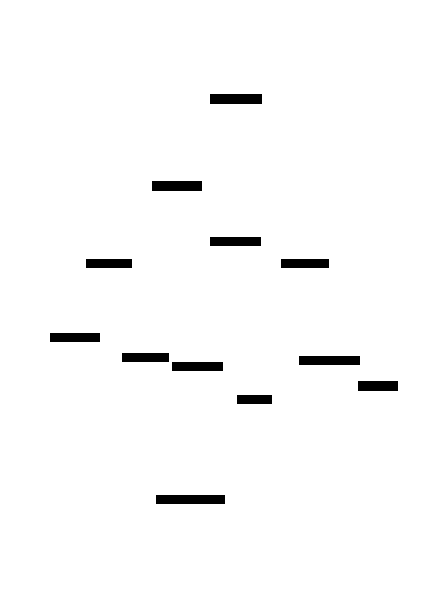
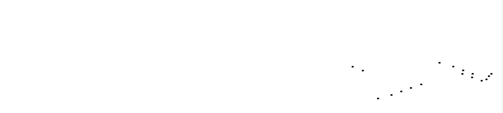
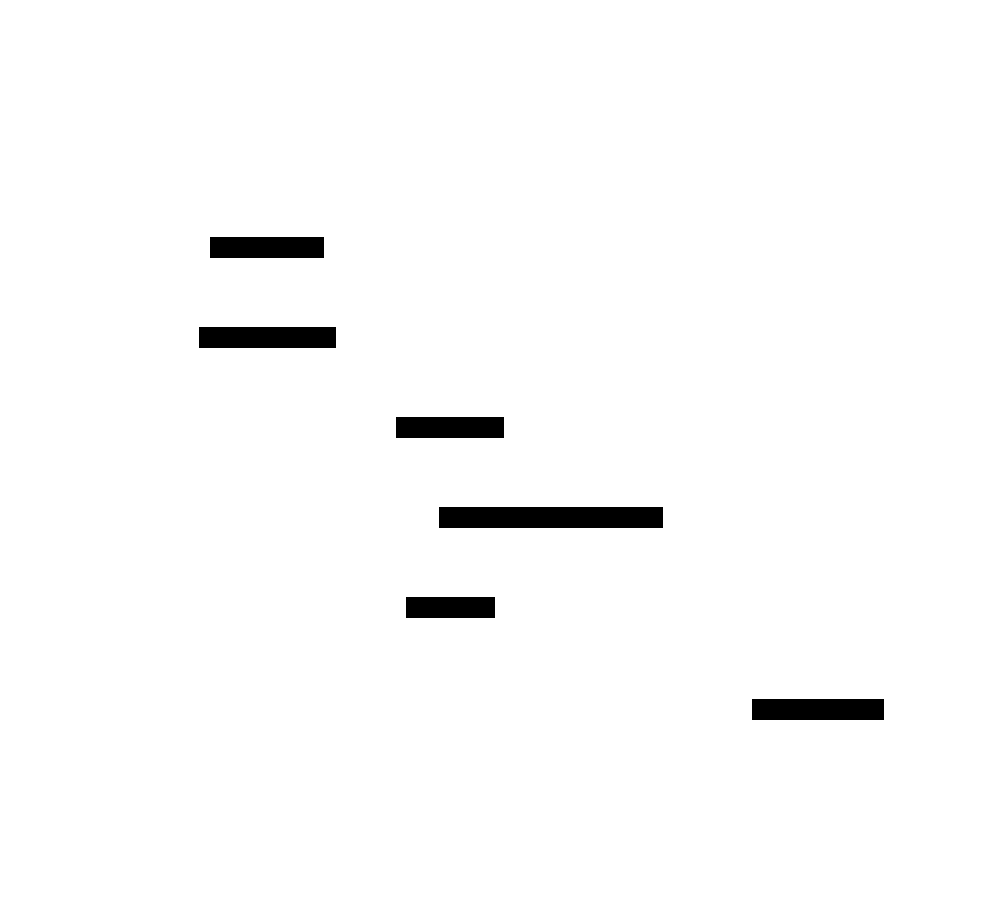
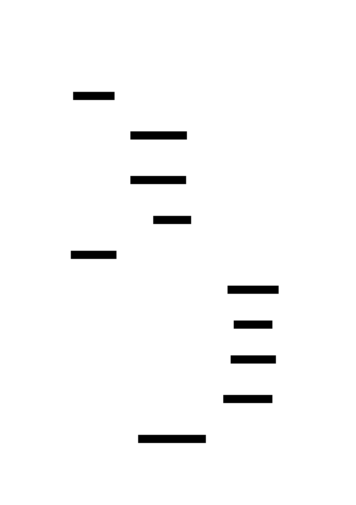
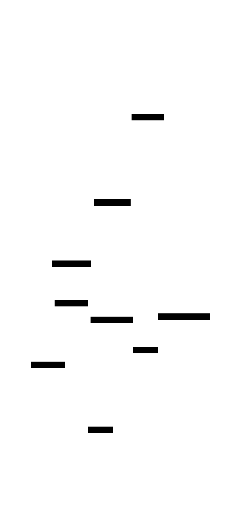

# Top-Down Shooter: Design Document


## Overview

A real-time arcade-style top-down shooter that demonstrates game architecture patterns including entity-component systems, collision detection, and AI behaviors. The key architectural challenge is managing the performance and coordination of hundreds of dynamic entities while maintaining smooth 60fps gameplay.


> This guide is meant to help you understand the big picture before diving into each milestone. Refer back to it whenever you need context on how components connect.


## Context and Problem Statement

> **Milestone(s):** This section provides architectural foundation for all milestones (1-4) by establishing core patterns and design principles.

Building a real-time top-down shooter presents fundamentally different architectural challenges than traditional web applications or business software. While a typical web application handles discrete requests and responses with relaxed timing constraints, a game must orchestrate hundreds of dynamic entities in perfect synchronization, responding to player input and updating visual state at 60 frames per second. This section explores why conventional software patterns fall short in game development and establishes the architectural foundation necessary for smooth, responsive gameplay.

### Mental Model: The Theater Stage

Think of our top-down shooter as a **live theater performance**. In traditional web development, we're like a correspondence service — someone sends us a letter (HTTP request), we take our time to process it, consult various departments, and eventually mail back a response. The timing is flexible, and each request is independent.

But in game development, we're directing a live theatrical performance where dozens of actors (enemies), stage props (projectiles), and lighting effects (visual feedback) must coordinate in real-time. The show can never pause — every 16.67 milliseconds (60fps), the curtain rises on a new scene that must be perfectly orchestrated. If an actor misses their cue or a prop falls late, the entire performance feels broken to the audience.

In our shooter, the **player** is the lead actor whose movements and actions drive the narrative. **Enemies** are supporting actors who must react intelligently to the lead's performance. **Projectiles** are like thrown props that follow precise trajectories across the stage. The **wave system** acts as the director, introducing new actors at dramatically appropriate moments. And the **collision detection system** is like the stage manager, ensuring actors interact properly when they occupy the same space.

Just as a theater performance requires careful choreography, timing systems, and contingency planning for when things go wrong, our game architecture must handle real-time coordination, frame-rate consistency, and graceful degradation when systems become overloaded.

The critical insight here is that **game architecture is about orchestrating continuous, interdependent processes rather than handling discrete, independent requests**. Every system must be designed with this real-time coordination challenge in mind.

### Technical Challenges

The transition from request-response architectures to real-time game systems introduces three fundamental technical challenges that drive all our architectural decisions.

#### Real-Time Performance Constraints

Games operate under strict **temporal constraints** that are foreign to most software domains. We have exactly 16.67 milliseconds to complete all processing for a single frame at 60fps. This includes reading player input, updating positions of potentially hundreds of entities, detecting collisions between them, running AI behaviors for dozens of enemies, and rendering the entire scene to the screen.

Unlike web applications where a slow database query might add a few hundred milliseconds to response time (barely noticeable to users), even a 50-millisecond delay in a game creates visible stuttering that breaks the illusion of smooth motion. Players can perceive frame rate drops of just a few frames per second, making performance consistency more critical than peak performance.

This temporal constraint affects every architectural decision. We cannot use traditional object-oriented patterns that create garbage collection pressure. We cannot perform expensive operations like complex pathfinding every frame. We must carefully budget CPU time across systems and design for predictable, consistent performance rather than average-case optimization.

The memory management implications are particularly severe. Creating and destroying hundreds of projectiles per second using standard allocation patterns would trigger frequent garbage collection pauses, causing visible frame drops. This drives us toward **object pooling** and **data-oriented design** patterns that minimize allocation overhead.

#### Collision Detection at Scale

Our shooter must efficiently detect when projectiles hit enemies, when enemies collide with the player, and when entities move outside screen boundaries. With potentially dozens of enemies and hundreds of projectiles active simultaneously, a naive collision detection approach checking every entity against every other entity would require thousands of comparisons per frame.

The mathematical complexity grows as **O(n²)** with entity count. With 10 entities, we need 45 comparisons. With 100 entities, we need 4,950 comparisons. At 60fps, this becomes computationally prohibitive very quickly.

Traditional web applications rarely face this kind of computational scaling challenge because they typically process one request at a time with database-backed persistence. In games, all entities exist simultaneously in memory and must be processed every frame.

This challenge drives us toward **spatial partitioning** techniques that divide the game world into regions, allowing us to only check collisions between entities in the same or adjacent regions. We must also carefully design our collision detection to be **frame-rate independent** so that faster machines don't detect different collision outcomes than slower ones.

#### Emergent AI Behaviors

Enemy AI in our shooter must feel intelligent and responsive while remaining computationally lightweight. Each enemy needs to navigate toward the player while avoiding obstacles and other enemies, choose when to attack, and react to changing battlefield conditions. Multiply this by dozens of simultaneous enemies, all updating their behaviors 60 times per second.

The challenge isn't just computational — it's architectural. Traditional AI systems often use complex decision trees, planning algorithms, or machine learning models that are too expensive for real-time execution. We need AI behaviors that are:

- **Stateless or minimal state**: Complex state machines become difficult to debug when dozens of enemies are in different states
- **Deterministic**: The same inputs should always produce the same outputs for consistent gameplay
- **Composable**: Different enemy types should reuse common behaviors like pathfinding and collision avoidance
- **Debuggable**: When AI behaves unexpectedly, developers need visibility into decision-making processes

Furthermore, AI behaviors must interact gracefully with the physics and collision systems. An enemy's decision to move toward the player must be validated by the collision system and potentially overridden if the path is blocked. This creates complex inter-system dependencies that don't exist in traditional applications.

### Existing Game Architecture Patterns

The game development industry has evolved several architectural patterns specifically to address these real-time coordination challenges. Understanding these patterns and their trade-offs helps us choose the right approach for our shooter's complexity level.

#### Game Loop Architectures

The **game loop** is the heartbeat of any real-time game, replacing the request-response cycle of web applications. However, there are several approaches to implementing game loops, each with different performance characteristics and complexity trade-offs.

> **Decision: Fixed Timestep Game Loop**
> - **Context**: We need consistent game behavior across different hardware performance levels and frame rates
> - **Options Considered**: 
>   - Variable timestep (delta time based)
>   - Fixed timestep with interpolation
>   - Hybrid timestep approach
> - **Decision**: Fixed timestep with render interpolation
> - **Rationale**: Ensures deterministic physics and collision detection, prevents fast machines from gaining gameplay advantages, and provides consistent AI behavior timing
> - **Consequences**: Requires interpolation for smooth rendering but guarantees consistent game logic execution

| Game Loop Pattern | Advantages | Disadvantages | Best For |
|-------------------|------------|---------------|----------|
| Variable Timestep | Simple implementation, automatic adaptation to hardware | Non-deterministic behavior, fast machines advantage, unstable physics | Simple games with minimal physics |
| Fixed Timestep | Deterministic behavior, consistent across hardware, stable physics | Requires interpolation, can skip frames on slow hardware | Games requiring precision and fairness |
| Hybrid Timestep | Balances determinism with smoothness, adaptive performance | Complex implementation, difficult to debug | AAA games with advanced requirements |

The **fixed timestep** approach runs game logic at a constant rate (typically 60 updates per second) regardless of rendering frame rate. This means that on a fast machine capable of 120fps, we still update game logic exactly 60 times per second but render 120 frames, using interpolation to create smooth visual motion between logic updates.

This architectural decision cascades through our entire system. Every system must be designed around the concept of discrete, predictable time steps rather than variable frame deltas. AI behaviors execute at consistent intervals, projectiles move predictable distances each update, and collision detection operates on consistent time slices.

#### Entity System Architectures

Traditional object-oriented programming struggles with the cross-cutting concerns common in games. A projectile might need rendering, physics, collision detection, and lifetime management. In OOP, these concerns either get mixed into a monolithic `Projectile` class or spread across complex inheritance hierarchies that become difficult to maintain.

> **Decision: Entity-Component System (ECS)**
> - **Context**: We need to manage diverse game objects (players, enemies, projectiles) with varying combinations of behaviors
> - **Options Considered**:
>   - Object-oriented inheritance hierarchies
>   - Component-based architecture
>   - Pure Entity-Component-System (ECS)
> - **Decision**: Component-based architecture with entity management
> - **Rationale**: Provides composition over inheritance, enables data-oriented design, and supports hot-swapping of behaviors without complex refactoring
> - **Consequences**: Requires more upfront architectural planning but enables flexible entity definitions and efficient batch processing

| Architecture Pattern | Code Organization | Performance | Flexibility | Learning Curve |
|----------------------|-------------------|-------------|-------------|----------------|
| OOP Inheritance | Familiar class hierarchies | Poor cache locality | Difficult to extend | Low |
| Component-Based | Components compose entities | Good data locality | High composability | Medium |
| Pure ECS | Systems process component arrays | Excellent cache performance | Maximum flexibility | High |

The **entity-component** pattern treats game objects as collections of data components (Position, Health, Velocity) processed by specialized systems (MovementSystem, RenderSystem, CollisionSystem). This separates data from behavior, enabling efficient batch processing and flexible entity definitions.

For our shooter, this means:
- **Entities** are simple IDs that reference collections of components
- **Components** are pure data structures (Position contains x, y coordinates)
- **Systems** contain all behavior logic and operate on entities with specific component combinations

This pattern enables powerful optimizations. The MovementSystem can process all entities with Position and Velocity components in a tight loop, achieving better cache locality than traditional object-oriented approaches where data is scattered across individual object instances.

#### Collision Detection Strategies

Collision detection represents one of the most performance-critical aspects of game architecture, and the choice of algorithm significantly impacts both performance and code complexity.

> **Decision: Spatial Hash Grid with AABB Collision**
> - **Context**: We need efficient collision detection between potentially hundreds of projectiles and dozens of enemies
> - **Options Considered**:
>   - Brute force O(n²) checking
>   - Spatial hash grid partitioning
>   - Quadtree spatial partitioning
>   - Sweep and prune algorithms
> - **Decision**: Spatial hash grid with axis-aligned bounding box (AABB) collision detection
> - **Rationale**: Provides O(1) spatial lookup, simple implementation, predictable memory usage, and sufficient precision for top-down shooter gameplay
> - **Consequences**: Requires tuning grid cell size for optimal performance, but provides excellent performance scalability and straightforward debugging

| Collision Strategy | Time Complexity | Space Complexity | Implementation Difficulty | Dynamic Objects |
|-------------------|-----------------|-------------------|---------------------------|-----------------|
| Brute Force | O(n²) | O(1) | Very Low | Excellent |
| Spatial Hash | O(n) average | O(n) | Medium | Good |
| Quadtree | O(n log n) | O(n) | High | Fair |
| Sweep and Prune | O(n log n) | O(n) | High | Excellent |

**Spatial hash grids** divide the game world into uniform cells and maintain lists of entities in each cell. When checking for collisions, we only test entities within the same cell or adjacent cells, dramatically reducing the number of comparisons required.

The grid cell size becomes a critical tuning parameter. Cells too large reduce the filtering effectiveness. Cells too small increase memory overhead and require entities to be registered in multiple cells. For our shooter, cell sizes roughly matching the average entity size provide optimal performance.

**AABB (Axis-Aligned Bounding Box)** collision detection treats all entities as rectangles aligned with the coordinate axes. While less precise than circular or polygon collision, AABB detection is extremely fast and sufficient for the vast majority of game interactions. The slight precision loss is imperceptible to players but provides significant performance benefits.

This combination enables our shooter to handle hundreds of simultaneous collision checks per frame while maintaining 60fps performance on modest hardware. The architectural simplicity also makes the system debuggable — we can easily visualize collision boundaries and spatial grid cells during development.

> The key architectural insight is that **perfect collision accuracy is less important than consistent performance**. Players adapt to slightly imprecise collision boundaries, but they immediately notice frame rate drops caused by expensive collision algorithms.

#### Memory Management Patterns

Real-time games require careful memory management to avoid garbage collection pauses that cause frame drops. Traditional allocation patterns that work well in business applications become performance bottlenecks when applied to systems creating and destroying hundreds of objects per second.

> **Decision: Object Pooling with Component Recycling**
> - **Context**: Projectiles are created and destroyed frequently, potentially causing garbage collection pressure
> - **Options Considered**:
>   - Standard allocation and garbage collection
>   - Object pooling for projectiles only
>   - Comprehensive object pooling for all dynamic entities
>   - Memory-mapped component arrays
> - **Decision**: Object pooling for high-frequency objects (projectiles, effects) with component recycling
> - **Rationale**: Eliminates allocation pressure for the most frequently created objects while maintaining code simplicity for less dynamic entities
> - **Consequences**: Requires careful lifecycle management and pool sizing, but eliminates frame rate stutters from garbage collection

**Object pooling** pre-allocates a fixed number of reusable objects at startup. When the game needs a new projectile, it retrieves an inactive object from the pool, initializes it, and marks it active. When the projectile is destroyed, it's reset and returned to the pool rather than being garbage collected.

This pattern requires careful design of object lifecycle management. Pooled objects must be thoroughly reset to avoid state leakage between uses. Pool sizes must be tuned to handle peak usage without excessive memory consumption. However, the performance benefits are dramatic — eliminating dozens of allocations per second prevents garbage collection pauses that would otherwise cause visible stuttering.

### Common Pitfalls

Understanding where developers commonly struggle with game architecture helps avoid costly mistakes during implementation.

⚠️ **Pitfall: Mixing Frame Rate with Game Logic**
Many developers tie game logic directly to rendering frame rate, causing gameplay to speed up on fast machines and slow down on weak hardware. For example, moving a player by `velocity * deltaTime` where `deltaTime` varies with frame rate creates inconsistent movement speeds. The fix is implementing fixed timestep updates where game logic always runs at consistent intervals, independent of rendering performance.

⚠️ **Pitfall: Premature ECS Optimization**
Developers often implement complex Entity-Component-System architectures for simple games, adding unnecessary complexity. Pure ECS systems require significant upfront design and are overkill for games with fewer than hundreds of entities. Start with simple component-based design and evolve toward full ECS only when performance profiling shows clear bottlenecks.

⚠️ **Pitfall: Ignoring Collision Detection Performance**
Implementing naive O(n²) collision detection seems reasonable during early development with few entities, but performance degrades catastrophically as entity count increases. The fix is designing spatial partitioning from the beginning, even if initially unused, so the architecture supports it when performance becomes critical.

⚠️ **Pitfall: State Synchronization Between Systems**
Game systems often need to coordinate state changes, but tightly coupling them creates fragile architectures. For example, when a projectile hits an enemy, the collision system, health system, and visual effects system all need to respond. Direct coupling makes the code brittle and difficult to test. Use event-driven messaging or observer patterns to loosely couple system interactions.

⚠️ **Pitfall: Inconsistent Coordinate Systems**
Different systems often use different coordinate conventions (screen pixels vs. world units, different origin points), causing subtle bugs that are difficult to debug. Establish consistent coordinate system conventions early and enforce them across all systems. Document whether coordinates are relative to screen, world, or local entity space.

### Implementation Guidance

This section establishes the foundational patterns and technologies that will be used throughout the implementation of our top-down shooter.

#### Technology Recommendations

| Component | Simple Option | Advanced Option |
|-----------|---------------|-----------------|
| Game Loop | RequestAnimationFrame with performance.now() timing | Web Workers with OffscreenCanvas for threaded rendering |
| Entity Management | JavaScript objects with component properties | TypedArrays for component data with entity indices |
| Collision Detection | Simple rectangle intersection with spatial hash | Box2D.js physics engine with collision filtering |
| Input Handling | Direct DOM event listeners with state tracking | Input abstraction layer with key binding configuration |
| Rendering | HTML5 Canvas 2D context with sprite drawing | WebGL with shader-based rendering and texture atlases |

#### Recommended File Structure

Organizing game code requires separating concerns while maintaining clear dependencies between systems. This structure scales from initial development through advanced features:

```
shooter-game/
├── src/
│   ├── core/                    ← Core game engine systems
│   │   ├── GameEngine.js        ← Main game loop and coordination
│   │   ├── Time.js              ← Timing and delta time management
│   │   └── EventBus.js          ← Inter-system messaging
│   ├── entities/                ← Entity and component definitions
│   │   ├── Entity.js            ← Base entity class and ID management
│   │   ├── components/          ← Component data structures
│   │   │   ├── Transform.js     ← Position, rotation, scale
│   │   │   ├── Velocity.js      ← Movement speed and direction
│   │   │   ├── Health.js        ← Hit points and damage resistance
│   │   │   └── Sprite.js        ← Visual representation data
│   │   └── EntityManager.js     ← Entity creation and component storage
│   ├── systems/                 ← Behavior systems operating on components
│   │   ├── InputSystem.js       ← Player input processing
│   │   ├── MovementSystem.js    ← Position updates based on velocity
│   │   ├── CollisionSystem.js   ← Collision detection and response
│   │   ├── AISystem.js          ← Enemy behavior logic
│   │   └── RenderSystem.js      ← Drawing entities to canvas
│   ├── utils/                   ← Helper functions and utilities
│   │   ├── Vector2D.js          ← 2D vector math operations
│   │   ├── MathUtils.js         ← Game-specific math functions
│   │   └── ObjectPool.js        ← Reusable object pool implementation
│   └── game/                    ← Game-specific logic
│       ├── Player.js            ← Player-specific behavior
│       ├── Enemy.js             ← Enemy type definitions
│       ├── Projectile.js        ← Bullet behavior and lifecycle
│       └── WaveManager.js       ← Enemy spawning and progression
├── assets/                      ← Game content
│   ├── sprites/                 ← Image files for entities
│   └── sounds/                  ← Audio files for effects
└── index.html                   ← Entry point and canvas setup
```

#### Core Infrastructure Code

The following infrastructure components provide the foundation for game systems without being the primary learning focus. These are complete, working implementations that learners can use directly:

**EventBus.js** - Inter-system messaging infrastructure:
```javascript
/**
 * Simple event bus for decoupled system communication.
 * Allows systems to emit events and subscribe to events without direct coupling.
 */
class EventBus {
    constructor() {
        this.listeners = new Map();
    }

    subscribe(eventType, callback) {
        if (!this.listeners.has(eventType)) {
            this.listeners.set(eventType, []);
        }
        this.listeners.get(eventType).push(callback);
    }

    emit(eventType, data = {}) {
        const callbacks = this.listeners.get(eventType);
        if (callbacks) {
            callbacks.forEach(callback => callback(data));
        }
    }

    unsubscribe(eventType, callback) {
        const callbacks = this.listeners.get(eventType);
        if (callbacks) {
            const index = callbacks.indexOf(callback);
            if (index > -1) {
                callbacks.splice(index, 1);
            }
        }
    }
}

export { EventBus };
```

**Vector2D.js** - Essential 2D vector mathematics:
```javascript
/**
 * 2D Vector class providing essential mathematical operations for game development.
 * Includes methods for movement, rotation, and distance calculations.
 */
class Vector2D {
    constructor(x = 0, y = 0) {
        this.x = x;
        this.y = y;
    }

    // Create a new vector (avoid modifying existing vectors)
    clone() {
        return new Vector2D(this.x, this.y);
    }

    // Vector addition - returns new vector
    add(other) {
        return new Vector2D(this.x + other.x, this.y + other.y);
    }

    // Vector subtraction - returns new vector
    subtract(other) {
        return new Vector2D(this.x - other.x, this.y - other.y);
    }

    // Scalar multiplication - returns new vector
    multiply(scalar) {
        return new Vector2D(this.x * scalar, this.y * scalar);
    }

    // Calculate vector length (magnitude)
    length() {
        return Math.sqrt(this.x * this.x + this.y * this.y);
    }

    // Calculate squared length (faster for comparisons)
    lengthSquared() {
        return this.x * this.x + this.y * this.y;
    }

    // Normalize to unit length - returns new vector
    normalize() {
        const len = this.length();
        if (len === 0) return new Vector2D(0, 0);
        return new Vector2D(this.x / len, this.y / len);
    }

    // Calculate distance to another vector
    distanceTo(other) {
        const dx = this.x - other.x;
        const dy = this.y - other.y;
        return Math.sqrt(dx * dx + dy * dy);
    }

    // Calculate squared distance (faster for comparisons)
    distanceSquaredTo(other) {
        const dx = this.x - other.x;
        const dy = this.y - other.y;
        return dx * dx + dy * dy;
    }

    // Calculate angle in radians
    angle() {
        return Math.atan2(this.y, this.x);
    }

    // Create vector from angle and magnitude
    static fromAngle(angle, magnitude = 1) {
        return new Vector2D(
            Math.cos(angle) * magnitude,
            Math.sin(angle) * magnitude
        );
    }
}

export { Vector2D };
```

#### Core Logic Skeleton

The following skeleton provides the structure for the main `GameEngine` class that learners will implement. This maps to the architectural decisions made in this section:

```javascript
import { EventBus } from '../utils/EventBus.js';

/**
 * Main game engine coordinating all game systems.
 * Implements fixed timestep game loop with interpolated rendering.
 */
class GameEngine {
    constructor(canvas, targetFPS = 60) {
        this.canvas = canvas;
        this.ctx = canvas.getContext('2d');
        this.eventBus = new EventBus();
        
        // Fixed timestep configuration
        this.targetFPS = targetFPS;
        this.timestep = 1000 / targetFPS; // milliseconds per frame
        this.maxFrameSkip = 5; // prevent spiral of death
        
        // Timing state
        this.lastFrameTime = 0;
        this.accumulator = 0;
        this.isRunning = false;
        
        // System references (to be populated)
        this.systems = [];
        this.entityManager = null;
    }

    /**
     * Initialize all game systems and start the game loop.
     */
    start() {
        // TODO 1: Initialize EntityManager with component storage
        // TODO 2: Initialize and register all game systems (Input, Movement, Collision, AI, Render)
        // TODO 3: Set up initial game state (create player entity, initialize wave manager)
        // TODO 4: Start the fixed timestep game loop using requestAnimationFrame
        // TODO 5: Set isRunning = true and capture initial timestamp
    }

    /**
     * Main game loop implementing fixed timestep with interpolated rendering.
     * Called every frame via requestAnimationFrame.
     */
    gameLoop(currentTime) {
        if (!this.isRunning) return;

        // TODO 1: Calculate frame delta time from currentTime and lastFrameTime
        // TODO 2: Add delta to accumulator (represents time debt to process)
        // TODO 3: Process fixed timestep updates while accumulator >= timestep
        //         - Call updateSystems() for each timestep
        //         - Subtract timestep from accumulator
        //         - Prevent spiral of death with maxFrameSkip
        // TODO 4: Calculate interpolation factor (accumulator / timestep)
        // TODO 5: Call render() with interpolation factor for smooth visuals
        // TODO 6: Update lastFrameTime and schedule next frame

        requestAnimationFrame((time) => this.gameLoop(time));
    }

    /**
     * Update all game systems for one fixed timestep.
     * Order of system updates is critical for correct behavior.
     */
    updateSystems() {
        // TODO 1: Update InputSystem to capture current player input state
        // TODO 2: Update AISystem to calculate enemy behaviors and actions
        // TODO 3: Update MovementSystem to apply velocities to positions
        // TODO 4: Update CollisionSystem to detect and resolve collisions
        // TODO 5: Update game-specific systems (WaveManager, ProjectileSystem)
        // TODO 6: Emit end-of-frame event for cleanup and state synchronization
    }

    /**
     * Render all visual elements with interpolation for smooth animation.
     */
    render(interpolationFactor) {
        // TODO 1: Clear the canvas with background color
        // TODO 2: Set up camera transformation (if implementing camera system)
        // TODO 3: Call RenderSystem to draw all entities with interpolated positions
        // TODO 4: Render UI elements (score, health, wave information)
        // TODO 5: Draw debug information if debug mode is enabled
    }

    /**
     * Stop the game loop and cleanup resources.
     */
    stop() {
        // TODO 1: Set isRunning = false to stop the game loop
        // TODO 2: Clean up event listeners and system resources
        // TODO 3: Emit game-stopped event for final cleanup
    }
}

export { GameEngine };
```

#### Language-Specific Implementation Hints

- **Use `performance.now()`** for high-precision timing instead of `Date.now()`. Game loops require sub-millisecond timing accuracy for smooth frame rates.

- **Canvas optimization**: Set canvas size in CSS and use `canvas.width`/`canvas.height` properties for resolution. This avoids scaling performance penalties.

- **Avoid `setInterval` or `setTimeout`** for the game loop. Use `requestAnimationFrame` for browser-optimized frame timing that automatically pauses when the tab is not visible.

- **Event listener cleanup**: Always remove event listeners in the game's cleanup phase to prevent memory leaks, especially for keyboard and mouse handlers.

- **Use `Map` collections** for entity and component storage rather than plain objects when you need frequent lookups and iteration over large datasets.

#### Milestone Checkpoints

After implementing the foundational architecture:

**Checkpoint 1 - Game Loop Verification**:
- Run the game and open browser DevTools
- In console, check that the game loop is maintaining consistent timing
- Verify fixed timestep: game logic should update exactly 60 times per second regardless of display refresh rate
- Expected: Smooth animation without stutters, consistent behavior across different devices

**Checkpoint 2 - System Communication**:
- Verify EventBus is working by emitting a test event from one system and logging receipt in another
- Check that systems update in the correct order each frame
- Expected: Clean separation between systems with event-driven communication

**Signs of Issues**:
- **Frame rate stutters**: Usually indicates blocking operations in the game loop or garbage collection pressure
- **Inconsistent movement speeds**: Suggests mixing variable timestep with fixed game logic
- **System coupling errors**: Direct method calls between systems instead of event-based communication


## Goals and Non-Goals

> **Milestone(s):** This section establishes the project scope and boundaries for all milestones (1-4) by clearly defining what features are included and what advanced topics are deferred to prevent scope creep.

### Mental Model: The Garage Workshop Project

Think of this top-down shooter like building a custom motorcycle in your garage workshop. You have a clear vision of cruising down the highway on your finished bike, but you need to be realistic about what you can accomplish with your current tools, skills, and time. You could theoretically build everything from scratch—forge your own engine block, synthesize your own rubber for tires, craft custom electronics—but that would take years and require expertise you don't have yet.

Instead, you focus on the essential systems that make a motorcycle *feel* like a motorcycle: the engine, transmission, brakes, and steering. You buy quality off-the-shelf parts for the headlight and horn because they're not core to the riding experience. You defer advanced modifications like turbo charging or custom suspension until after you've successfully built and ridden your basic bike.

Similarly, our top-down shooter will focus on the core systems that make a game *feel* like an engaging shooter while strategically deferring advanced features that would complicate the architecture without adding proportional learning value.

### Core Learning Objectives

The primary goal of this project is to demonstrate **real-time game architecture patterns** through a complete, playable game. Unlike traditional web applications that respond to discrete user requests, games must coordinate hundreds of dynamic entities while maintaining consistent 60fps performance. This architectural challenge teaches fundamental patterns that apply to any real-time interactive system.

**Architecture Pattern Learning Goals:**

| Pattern Category | Specific Learning Goal | Why It Matters |
|-----------------|----------------------|----------------|
| Real-Time Systems | Fixed timestep game loop with interpolation | Foundation for consistent behavior across different hardware |
| Entity Management | Entity-component system for flexible object composition | Scalable pattern for managing complex game object hierarchies |
| Performance | Object pooling and spatial partitioning | Essential techniques for maintaining frame rates with many entities |
| State Management | Game state machines for waves, AI, and input | Robust pattern for managing complex interactive behaviors |
| Event Systems | Decoupled communication between game systems | Maintainable architecture as feature complexity grows |

> **Design Insight**: We prioritize architectural learning over game content richness. A simple game with excellent architecture teaches more than a feature-rich game with tangled code.

### Included Features (In Scope)

The following features are explicitly included because they demonstrate core game architecture patterns while remaining achievable for intermediate developers:

**Player Interaction System:**
- **8-directional WASD movement** with diagonal normalization to prevent speed advantages
- **Real-time mouse aiming** that smoothly rotates the player sprite to face the cursor
- **Click-to-fire projectile system** with consistent fire rate limiting
- **Screen boundary collision** to keep the player within the visible game area

**Entity and Physics Systems:**
- **Projectile ballistics** with straight-line movement and automatic cleanup of off-screen bullets
- **AABB collision detection** between projectiles, enemies, and the player using bounding rectangles
- **Object pooling** for projectiles to avoid garbage collection performance spikes
- **Basic physics integration** with velocity-based movement and collision response

**Enemy AI and Behavior:**
- **Direct pursuit AI** where enemies move toward the player using line-of-sight pathfinding
- **Multiple enemy types** with configurable health, speed, and damage attributes
- **Health and damage systems** with hit point tracking and death state management
- **Enemy spawning** at random positions outside the screen boundaries

**Game Progression and Feedback:**
- **Wave-based spawning** that releases groups of enemies with rest periods between waves
- **Difficulty scaling** that increases enemy count, health, and speed each wave
- **Score tracking** with points awarded for enemy kills and wave completion bonuses
- **High score persistence** using browser local storage across game sessions

> **Decision: Feature Selection Criteria**
> - **Context**: Need to choose features that maximize architectural learning while remaining implementable in reasonable time
> - **Options Considered**: 
>   1. Many simple features (power-ups, multiple weapons, environmental hazards)
>   2. Few complex features (advanced AI, particle effects, sound system)
>   3. Balanced core systems (movement, shooting, enemies, waves)
> - **Decision**: Focus on balanced core systems that interact heavily
> - **Rationale**: Features that require multiple systems to coordinate (like collision detection affecting health, AI, and scoring) teach more about architecture than isolated features
> - **Consequences**: Less content variety but deeper understanding of system integration patterns

### Explicitly Excluded Features (Out of Scope)

The following features are deliberately excluded to maintain focus on core architecture patterns. Each exclusion prevents significant complexity that would distract from the primary learning objectives:

**Advanced Graphics and Effects:**
- **Particle systems** (explosion effects, muzzle flashes, smoke trails)
- **Sprite animation** beyond basic rotation (walking cycles, death animations)
- **Advanced lighting** (shadows, dynamic lighting, visual effects)
- **Screen shake and juice** (camera effects, hit pause, screen distortion)

*Rationale*: Graphics programming involves different architectural patterns (render pipelines, shader management, asset streaming) that deserve dedicated focus rather than being mixed with game logic architecture.

**Audio Systems:**
- **Sound effects** (gunfire, explosions, enemy death sounds)
- **Background music** (ambient tracks, dynamic music)
- **Audio mixing** (volume controls, spatial audio, audio ducking)

*Rationale*: Audio systems introduce timing synchronization challenges and resource management patterns that are orthogonal to the core game logic patterns we're teaching.

**Advanced AI and Pathfinding:**
- **A* pathfinding** around obstacles or complex terrain
- **Flocking behaviors** (group movement, separation, alignment)
- **State-based AI** (patrol patterns, alert states, coordinated attacks)
- **Dynamic difficulty adjustment** based on player performance

*Rationale*: While AI is included, advanced pathfinding algorithms would shift focus from architecture patterns to algorithm implementation details.

**Multiplayer and Networking:**
- **Real-time multiplayer** (multiple players in the same game)
- **Client-server synchronization** (authoritative server, lag compensation)
- **Peer-to-peer networking** (direct player connections)

*Rationale*: Networking introduces distributed systems concerns (consistency, latency, security) that require separate architectural study.

**Content and Progression Systems:**
- **Multiple levels or stages** with different layouts or environmental challenges
- **Player upgrade system** (weapon improvements, character stats, skill trees)
- **Achievement system** (unlock conditions, progress tracking, rewards)
- **Save game system** beyond high score persistence

*Rationale*: Content systems focus on data modeling and progression design rather than real-time architecture patterns.

**Advanced Physics:**
- **Realistic ballistics** (gravity, wind resistance, ricochet)
- **Collision shapes** beyond axis-aligned rectangles (circles, polygons, complex shapes)
- **Physics simulation** (momentum transfer, realistic movement, friction)

*Rationale*: Advanced physics requires mathematical modeling that distracts from software architecture learning goals.

### Technical Scope Boundaries

Beyond feature exclusions, we also establish technical boundaries that define the complexity level appropriate for intermediate developers:

**Performance Requirements:**
- Target **60fps on modern browsers** with up to 100 simultaneous entities
- **Graceful degradation** to 30fps when entity count exceeds performance budget
- **Memory management** that prevents garbage collection pauses longer than 5ms

**Browser Compatibility:**
- **Modern browser support** (Chrome, Firefox, Safari from last 2 years)
- **Canvas 2D rendering** using standard HTML5 APIs without WebGL optimization
- **Local storage only** for persistence—no server-side data storage

**Code Complexity:**
- **Single-file systems** where each major system fits in one source file
- **Minimal external dependencies** beyond the programming language standard library
- **Readable algorithms** that prioritize clarity over maximum optimization

> **Decision: Technical Complexity Boundaries**
> - **Context**: Need to balance realistic game performance with learning accessibility
> - **Options Considered**:
>   1. Maximum performance (WebGL, web workers, complex optimization)
>   2. Maximum simplicity (30fps target, simple collision, no pooling)
>   3. Balanced approach (60fps target, standard optimizations, clear code)
> - **Decision**: Balanced approach with clear performance targets
> - **Rationale**: Teaches essential optimization patterns without overwhelming beginners with advanced graphics programming
> - **Consequences**: Game performs well on typical hardware while maintaining readable, educational code structure

### Success Criteria and Learning Outcomes

Upon completion, learners will have demonstrated mastery of the following architectural concepts through working code:

**Real-Time System Architecture:**
- Implemented a fixed timestep game loop that maintains consistent behavior across different hardware
- Applied frame rate independence techniques using delta time calculations
- Created smooth visual interpolation between logic updates

**Entity Management Patterns:**
- Designed an entity-component system that cleanly separates data from behavior
- Implemented system-based processing that operates on entities with specific component combinations
- Managed entity lifecycle from creation through destruction with proper cleanup

**Performance Optimization:**
- Applied object pooling to eliminate garbage collection during gameplay
- Implemented spatial partitioning or efficient collision detection for multiple moving entities
- Maintained consistent frame rates with dozens of simultaneously active entities

**Interactive System Design:**
- Created responsive input handling that translates user actions into game state changes
- Designed AI behaviors that create engaging gameplay challenges
- Implemented feedback loops between player actions and game progression

### Common Scope Creep Pitfalls

Based on typical learner experience, the following scope expansions frequently tempt developers but should be actively resisted:

⚠️ **Pitfall: Graphics Enhancement Rabbit Hole**
Learners often want to add "just a simple particle system" or "basic sprite animation" early in development. These features seem straightforward but require significant rendering architecture changes. Graphics enhancements should wait until the core game loop and entity management systems are completely stable and tested.

⚠️ **Pitfall: AI Perfectionism**
The temptation to make enemy AI "smarter" with pathfinding, group coordination, or advanced behaviors can consume unlimited development time. Remember that even simple direct-pursuit AI can create engaging gameplay when combined with proper difficulty scaling and varied enemy types.

⚠️ **Pitfall: Feature Parity with Commercial Games**
Comparing your educational project to professional games leads to endless feature additions. Professional games have teams of specialists and years of development time. Focus on architectural learning goals rather than feature count.

⚠️ **Pitfall: Performance Optimization Premature Focus**
While performance is important, learners sometimes spend excessive time optimizing before establishing correct behavior. Get the game working correctly first, then apply systematic optimization to achieve the target frame rate.

### Milestone Validation Approach

Each milestone includes specific deliverables that can be validated independently:

| Milestone | Validation Method | Success Criteria |
|-----------|------------------|------------------|
| Player Movement & Aiming | Manual testing + automated movement vector verification | Smooth 8-direction movement, accurate mouse tracking, proper boundary enforcement |
| Shooting & Projectiles | Collision testing + performance measurement | Consistent fire rate, accurate projectile trajectories, stable performance with 50+ projectiles |
| Enemies & AI | Behavioral testing + stress testing | Enemies consistently pursue player, proper damage/death handling, stable performance with 20+ enemies |
| Waves & Scoring | Progression testing + persistence verification | Wave difficulty increases correctly, scoring accumulates properly, high scores persist across sessions |

> **Critical Success Factor**: Each milestone must be completely functional before proceeding to the next. Partial implementations create cascading complexity that becomes unmanageable.

### Implementation Guidance

#### Technology Recommendations

| Component | Simple Option | Advanced Option |
|-----------|---------------|----------------|
| Rendering | Canvas 2D with basic shape drawing | Canvas 2D with image sprites and rotation |
| Input Handling | Direct event listeners on window/canvas | Input manager class with state buffering |
| Collision Detection | Brute force O(n²) checking | Spatial hash grid for O(n) performance |
| Entity Storage | Simple arrays with linear search | Component arrays with entity indexing |
| Game Loop | requestAnimationFrame with basic timing | Fixed timestep loop with interpolation |
| State Management | Global variables for game state | Centralized state manager with event system |

#### Recommended File Structure

Organize the project to separate concerns and enable incremental development:

```
top-down-shooter/
├── index.html                    ← minimal HTML canvas setup
├── src/
│   ├── main.js                   ← game initialization and startup
│   ├── engine/
│   │   ├── gameEngine.js         ← core game loop and timing
│   │   ├── eventBus.js           ← inter-system communication
│   │   └── vector2D.js           ← mathematical utilities
│   ├── systems/
│   │   ├── inputSystem.js        ← keyboard and mouse handling (Milestone 1)
│   │   ├── movementSystem.js     ← entity movement processing (Milestone 1)
│   │   ├── projectileSystem.js   ← bullet lifecycle management (Milestone 2)
│   │   ├── collisionSystem.js    ← collision detection and response (Milestone 2)
│   │   ├── aiSystem.js           ← enemy behavior processing (Milestone 3)
│   │   ├── healthSystem.js       ← damage and death handling (Milestone 3)
│   │   ├── waveSystem.js         ← enemy spawning and progression (Milestone 4)
│   │   └── scoringSystem.js      ← point calculation and persistence (Milestone 4)
│   ├── entities/
│   │   ├── entityManager.js      ← entity creation and component storage
│   │   └── componentTypes.js     ← component data structure definitions
│   └── utils/
│       ├── objectPool.js         ← reusable object management
│       └── spatialGrid.js        ← optional collision optimization
└── README.md                     ← setup instructions and milestone checklist
```

#### Core Architecture Setup

**Game Engine Bootstrap Code:**

```javascript
// src/engine/gameEngine.js
class GameEngine {
    constructor(canvasId) {
        this.canvas = document.getElementById(canvasId);
        this.ctx = this.canvas.getContext('2d');
        this.eventBus = new EventBus();
        this.targetFPS = 60;
        this.timestep = 1000 / this.targetFPS;  // 16.67ms
        this.systems = [];
        this.entityManager = new EntityManager();
        
        this.lastFrameTime = 0;
        this.accumulator = 0;
        this.maxFrameSkip = 5;
        this.isRunning = false;
    }
    
    addSystem(system) {
        this.systems.push(system);
        system.init(this.entityManager, this.eventBus);
    }
    
    start() {
        this.isRunning = true;
        this.lastFrameTime = performance.now();
        this.gameLoop(this.lastFrameTime);
    }
    
    gameLoop(currentTime) {
        // TODO: Implement fixed timestep loop (Milestone 1)
        // TODO: Add frame skip protection (prevents spiral of death)
        // TODO: Call updateSystems() for game logic
        // TODO: Call render() with interpolation factor
        // TODO: Schedule next frame with requestAnimationFrame
    }
    
    updateSystems() {
        // TODO: Process all systems in correct order (Milestones 1-4)
        // Order matters: Input → Movement → AI → Collision → Cleanup
    }
    
    render(interpolationFactor) {
        // TODO: Clear canvas and render all entities with interpolation
        // interpolationFactor smooths movement between logic updates
    }
}
```

**Event System Infrastructure:**

```javascript
// src/engine/eventBus.js
class EventBus {
    constructor() {
        this.listeners = new Map();
    }
    
    subscribe(eventType, callback) {
        // TODO: Add callback to listeners Map for eventType
        // TODO: Return unsubscribe function for cleanup
    }
    
    emit(eventType, data) {
        // TODO: Call all registered callbacks for eventType with data
        // TODO: Handle callback errors gracefully (don't break other listeners)
    }
}
```

**Mathematical Utilities:**

```javascript
// src/engine/vector2D.js
class Vector2D {
    constructor(x = 0, y = 0) {
        this.x = x;
        this.y = y;
    }
    
    normalize() {
        // TODO: Return unit vector (length = 1) in same direction
        // TODO: Handle zero-length vector edge case (return zero vector)
        // Hint: length = Math.sqrt(x*x + y*y)
    }
    
    distanceTo(other) {
        // TODO: Calculate Euclidean distance to another Vector2D
        // TODO: Return Math.sqrt((dx*dx) + (dy*dy))
    }
    
    // TODO: Add methods for add, subtract, multiply, dot product
    // These will be needed for movement and collision calculations
}
```

#### Milestone Checkpoints

**Milestone 1 Checkpoint:**
After completing player movement and aiming:
- **Manual Test**: Open the game in browser, verify WASD moves the player smoothly in all 8 directions
- **Visual Test**: Player sprite rotates to continuously face mouse cursor as it moves
- **Boundary Test**: Player stops at screen edges rather than disappearing off-screen
- **Performance Test**: Movement remains smooth at 60fps with no visible stuttering

**Milestone 2 Checkpoint:**
After adding shooting and projectiles:
- **Fire Rate Test**: Click rapidly—bullets fire at consistent intervals, not every click
- **Trajectory Test**: Bullets travel in straight lines from player toward mouse click direction
- **Collision Test**: Bullets disappear when hitting enemies and deal damage
- **Memory Test**: Leave game running for 5 minutes while shooting—performance remains stable (no memory leaks)

**Milestone 3 Checkpoint:**
After implementing enemies and AI:
- **AI Test**: Enemies spawn and consistently move toward player position
- **Health Test**: Enemies require multiple bullet hits to destroy (based on enemy type)
- **Spawn Test**: New enemies appear periodically from off-screen locations
- **Contact Test**: Touching enemies reduces player health and provides visual feedback

**Milestone 4 Checkpoint:**
After adding waves and scoring:
- **Wave Test**: After clearing all enemies, new wave starts with more/stronger enemies
- **Score Test**: Killing enemies increases score display, wave completion awards bonus points
- **Persistence Test**: Close and reopen browser—high score is remembered
- **Difficulty Test**: Later waves are noticeably more challenging than early waves

#### Common Implementation Mistakes

| Symptom | Likely Cause | Diagnosis | Fix |
|---------|--------------|-----------|-----|
| Diagonal movement too fast | Vector not normalized | Check movement speed in diagonal vs cardinal directions | Normalize direction vector before applying speed |
| Mouse aiming jittery | Angle calculation in wrong units | Log calculated angles—are they in radians or degrees? | Use Math.atan2() for radians, convert if needed |
| Bullets spawn from wrong position | Using player center vs gun position | Visual inspection of spawn point | Offset bullet spawn by player radius |
| Frame rate drops with many entities | O(n²) collision detection | Profile with browser dev tools | Implement spatial partitioning or object pooling |
| Game speed varies on different devices | Using frame time for movement | Test on different refresh rate monitors | Implement fixed timestep with delta time |


## High-Level Architecture

> **Milestone(s):** This section establishes the foundational architecture patterns for all milestones (1-4) by defining core subsystems and file organization that supports incremental feature development.

### The Theater Production Mental Model

Think of our top-down shooter as a **theater production** running a live performance. In this mental model, the stage represents our game world, and we have several specialized departments working in perfect coordination to create the illusion of a seamless show for the audience.

The **Stage Manager** (Game Engine) coordinates everything with precise timing, calling cues and ensuring each department knows when to perform their responsibilities. The **Props Department** (Entity Management) tracks every actor, weapon, and set piece on stage, knowing their exact locations and states. The **Choreography Department** (Physics & Collision) ensures actors move realistically and handles when they interact with each other or props. The **Director** (AI & Behavior) guides non-player actors in their performances, telling them how to react and behave. Finally, the **Lighting and Set Design** (UI & Presentation) creates the visual experience the audience sees.

Just like in theater, timing is everything. Each department must complete their work within strict time windows (our **frame budget** of 16.67ms for 60fps), and they must coordinate through clear communication channels. If any department falls behind, the entire production suffers—the audience notices stuttering movement, delayed reactions, or visual glitches.

This architecture must handle the unique challenges of real-time interactive entertainment: hundreds of entities moving simultaneously, collision detection between dozens of projectiles and enemies, AI behaviors that feel intelligent and responsive, and all of this while maintaining rock-solid 60fps performance that players expect from arcade-style games.



### Core Subsystems

Our top-down shooter architecture consists of five specialized subsystems, each with clearly defined responsibilities and interfaces. This separation allows us to develop features incrementally across milestones while maintaining clean boundaries and testable components.

#### Game Engine Core

The **Game Engine** serves as the central coordinator, much like the stage manager in our theater analogy. It owns the fundamental game loop, timing systems, and orchestrates all other subsystems. The engine ensures that game logic runs at a consistent rate regardless of rendering performance, preventing the common pitfall where game speed varies based on the player's hardware capabilities.

| Component | Responsibility | Key Data Structures |
|-----------|---------------|-------------------|
| `GameEngine` | Main loop coordination, timing control | `canvas`, `ctx`, `eventBus`, `targetFPS`, `timestep` |
| `EventBus` | Inter-system communication | `listeners` Map storing event callbacks |
| Game Loop | Fixed timestep updates, interpolated rendering | Current time, accumulator, interpolation factor |

> **Decision: Fixed Timestep Game Loop**
> - **Context**: Real-time games need consistent physics and game logic regardless of rendering frame rate variations
> - **Options Considered**: Variable timestep (simple but inconsistent), Fixed timestep (complex but deterministic), Hybrid approach (overcomplicated)
> - **Decision**: Fixed timestep with interpolated rendering
> - **Rationale**: Ensures deterministic game behavior, predictable collision detection, and consistent AI timing across different hardware
> - **Consequences**: More complex implementation but eliminates timing-related bugs and ensures fair gameplay

The Game Engine follows the **fixed timestep** pattern where game logic always advances in consistent 16.67ms intervals (`timestep`), while rendering can occur at variable rates with smooth interpolation between logic states. This prevents the "spiral of death" where slow frames cause even slower frames, and ensures that a player's movement speed, fire rate, and enemy AI behave identically on different devices.

#### Entity Management System

The **Entity Management** subsystem implements the entity-component architectural pattern, treating all game objects (player, enemies, projectiles) as collections of data components processed by specialized systems. This design provides maximum flexibility for creating different object types while avoiding the inheritance problems common in object-oriented game designs.

| Entity Type | Core Components | Purpose |
|-------------|----------------|---------|
| Player | `Transform`, `Velocity`, `Health`, `Input`, `Weapon` | Player-controlled character |
| Enemy | `Transform`, `Velocity`, `Health`, `AI`, `Damage` | AI-controlled opponents |
| Projectile | `Transform`, `Velocity`, `Damage`, `Lifetime` | Bullets and missiles |

An **Entity** is simply a unique identifier that references a collection of components. Components are pure data structures with no behavior—a `Transform` component contains position and rotation, a `Health` component contains current and maximum hit points, and a `Velocity` component contains speed and direction vectors. Systems operate on entities that possess specific component combinations: the Movement System processes all entities with both `Transform` and `Velocity` components, while the AI System processes entities with `Transform`, `AI`, and target-finding components.

> **Decision: Entity-Component System Architecture**
> - **Context**: Need flexible way to create different object types (enemies, projectiles, power-ups) without code duplication
> - **Options Considered**: Classical inheritance (Player extends GameObject), Component system (composition-based), Pure functional approach (immutable state)
> - **Decision**: Entity-Component system with mutable components
> - **Rationale**: Enables mix-and-match functionality (flying enemies, homing missiles), avoids inheritance hierarchy problems, supports efficient batch processing
> - **Consequences**: Higher initial complexity but dramatic flexibility gains and performance benefits from data locality

#### Physics & Collision Detection

The **Physics & Collision** subsystem handles all entity movement, collision detection, and physics responses. For our top-down shooter, we focus on **AABB collision** (axis-aligned bounding box) detection with **spatial partitioning** for performance when hundreds of projectiles need collision testing each frame.

| Collision Type | Detection Method | Response Action |
|----------------|-----------------|----------------|
| Projectile vs Enemy | AABB intersection | Damage enemy, destroy projectile |
| Enemy vs Player | Circle-circle distance | Damage player, knockback |
| Entity vs World Bounds | Boundary checking | Position clamping or entity destruction |

The collision system uses a **broad phase** and **narrow phase** approach. The broad phase divides the game world into spatial regions (grid cells), allowing us to only test collisions between entities in the same or adjacent regions. This reduces collision checks from O(n²) to approximately O(n) for typical entity distributions. The narrow phase performs precise AABB or circle intersection tests only on entity pairs identified by the broad phase.

**Object pooling** plays a crucial role in this subsystem. Projectiles are created and destroyed frequently (potentially dozens per second), which would cause garbage collection pauses if we used standard object allocation. Instead, we maintain pre-allocated pools of projectile objects that are recycled as bullets are fired and destroyed.

#### AI & Behavior System

The **AI & Behavior** subsystem controls all non-player entities, implementing simple but effective AI patterns that create engaging gameplay. Enemy AI uses **state machines** with clear transitions between behaviors like spawning, seeking the player, attacking, and death sequences.

| AI State | Trigger Condition | Behavior | Next State Transition |
|----------|------------------|----------|---------------------|
| Spawning | Enemy created | Fade in, become vulnerable | → Seeking when animation complete |
| Seeking | Default state | Move toward player position | → Attacking when in contact range |
| Attacking | Touching player | Deal damage, apply knockback | → Seeking when no longer touching |
| Dying | Health reaches zero | Death animation, award score | → Destroyed when animation complete |

The basic enemy AI implements **direct pursuit** behavior: each frame, the enemy calculates a normalized direction vector toward the player's current position and moves along that vector at the enemy's configured speed. This creates the classic "zombie horde" behavior where enemies converge on the player from all directions.

> **Decision: Simple State Machine AI**
> - **Context**: Need responsive enemy behavior that feels intelligent but remains predictable for arcade gameplay
> - **Options Considered**: Complex pathfinding (A* algorithm), Behavior trees (overkill), Simple state machines (appropriate complexity)
> - **Decision**: State machine AI with direct pursuit and basic collision avoidance
> - **Rationale**: Provides engaging gameplay challenge without complex pathfinding overhead, maintains 60fps with dozens of enemies
> - **Consequences**: Limited AI sophistication but excellent performance and predictable behavior for skill-based gameplay

Different enemy types vary their speed, health, damage, and movement patterns while using the same underlying AI framework. A fast enemy might have low health but high speed, while a tank enemy moves slowly but absorbs many hits. This variety creates tactical decisions for players about target prioritization.

#### UI & Presentation System

The **UI & Presentation** subsystem handles all visual rendering, sound effects, and user interface elements. It operates on the principle of **separation of concerns**: game logic systems update entity data, while the presentation system reads that data each frame to determine what to draw and where.

| Presentation Layer | Data Source | Rendering Approach |
|-------------------|-------------|-------------------|
| Game World | Entity positions and sprites | Transform-based sprite rendering |
| UI Overlay | Game state (score, health, wave) | Canvas 2D drawing operations |
| Visual Effects | Event notifications | Particle systems and animations |
| Audio | Game events via EventBus | Web Audio API sound triggering |

The rendering system uses **interpolation** to create smooth visual movement between fixed timestep updates. Since game logic updates at exactly 60fps but rendering may occur at different rates, we calculate an **interpolation factor** between the previous and current logical positions to determine where to draw each entity visually.

For example, if an enemy moved from position (100, 200) to (110, 200) during the last logic update, and we're rendering halfway between logic updates, the visual position would be interpolated to (105, 200). This creates buttery-smooth movement even when rendering at 120fps or maintains acceptable visuals when rendering drops to 45fps.

### Core Subsystems

#### Game Engine

The Game Engine serves as the central orchestrator, implementing the core game loop and providing timing services to all other subsystems. It manages the critical balance between consistent game logic and smooth visual presentation.

| Component | Type | Description |
|-----------|------|-------------|
| `canvas` | HTMLCanvasElement | Primary rendering surface for all visual output |
| `ctx` | CanvasRenderingContext2D | 2D drawing context for sprite and UI rendering |
| `eventBus` | EventBus | Communication channel between loosely-coupled systems |
| `targetFPS` | Number | Target frames per second (60) for consistent timing |
| `timestep` | Number | Fixed time interval (16.67ms) for logic updates |
| `systems` | Array<System> | Ordered list of systems executed each frame |
| `entityManager` | EntityManager | Central registry for all game entities and components |

The core game loop implements a **fixed timestep with interpolation** pattern. Game logic advances in discrete 16.67ms steps regardless of rendering frame rate, while visual presentation interpolates smoothly between logic states. This ensures that player movement, enemy AI, and collision detection behave identically across different hardware configurations.

#### Entity Management

The Entity Management subsystem provides the foundation for our component-based architecture, enabling flexible creation and modification of game objects without traditional inheritance hierarchies.

| Component Type | Fields | Used By |
|----------------|--------|---------|
| `Transform` | `position: Vector2D`, `rotation: Number`, `scale: Number` | All visible entities |
| `Velocity` | `speed: Number`, `direction: Vector2D`, `maxSpeed: Number` | Moving entities |
| `Health` | `current: Number`, `maximum: Number`, `invulnerable: Boolean` | Damageable entities |
| `Sprite` | `image: Image`, `width: Number`, `height: Number`, `offset: Vector2D` | Rendered entities |
| `Weapon` | `fireRate: Number`, `lastFired: Number`, `projectileType: String` | Shooting entities |
| `AI` | `state: String`, `target: Entity`, `aggroRange: Number`, `speed: Number` | Enemy entities |

Each entity consists of a unique identifier and a collection of components that define its capabilities and data. The EntityManager maintains component storage in a way that enables efficient iteration by systems—all `Transform` components are stored together, all `Velocity` components together, enabling good cache locality during processing.

#### Physics & Collision

The Physics & Collision subsystem handles entity movement, boundary checking, and collision detection between different entity types. It emphasizes performance optimization to handle dozens of simultaneously moving entities.

| Collision Pair | Detection Method | Performance Optimization |
|----------------|-----------------|------------------------|
| Projectile-Enemy | AABB intersection | Spatial grid partitioning |
| Enemy-Player | Circle-circle distance | Single distance calculation |
| Entity-Boundary | Position comparison | Simple coordinate checking |

**Spatial partitioning** divides the game world into a grid of cells, typically 100x100 pixel regions. Each frame, entities are assigned to grid cells based on their position, and collision detection only occurs between entities in the same or adjacent cells. This optimization reduces collision checking from O(n²) complexity to approximately O(n) for typical entity distributions.

**Object pooling** manages the high-frequency creation and destruction of projectiles. Rather than allocating new objects each time the player fires, we maintain a pre-allocated pool of projectile entities that are recycled. When a projectile is needed, we retrieve an inactive object from the pool and reset its components. When the projectile is destroyed, we return it to the pool for reuse.

#### AI & Behavior

The AI & Behavior subsystem controls non-player entities using state machines and behavioral patterns designed to create challenging but fair gameplay. The AI emphasizes predictable behavior that players can learn and counter with skill.

| AI Behavior | Algorithm | Parameters |
|-------------|-----------|------------|
| Direct Pursuit | Calculate vector to player, normalize, apply speed | `speed: Number`, `aggroRange: Number` |
| Collision Avoidance | Detect nearby enemies, add separation force | `separationRadius: Number`, `separationForce: Number` |
| Boundary Respect | Check world bounds, reverse direction if outside | `worldWidth: Number`, `worldHeight: Number` |
| State Management | Update state based on conditions and timers | `stateTimer: Number`, `transitionConditions: Object` |

Enemy AI implements a simple but effective **direct pursuit** algorithm: each frame, calculate the normalized direction vector from the enemy's position to the player's position, then move along that vector at the enemy's configured speed. This creates emergent swarming behavior as multiple enemies converge on the player from different angles.

**State transitions** are governed by clear conditions and timers. An enemy enters the Seeking state after spawning, transitions to Attacking when within contact range of the player, and transitions to Dying when health reaches zero. Each state has associated animations and behaviors that provide visual feedback to players about enemy intentions.

#### UI & Presentation

The UI & Presentation subsystem handles all visual output, audio feedback, and user interface elements. It operates as a pure output system—it reads game state data but never modifies it, maintaining clean separation between game logic and presentation.

| Rendering Layer | Data Dependencies | Update Frequency |
|-----------------|------------------|------------------|
| Background | Static assets | Once per frame |
| Game Entities | Transform, Sprite components | Every render frame with interpolation |
| Particle Effects | Event notifications | Variable based on effect duration |
| UI Elements | Game state (score, health, wave) | Every render frame |
| Debug Overlays | Collision bounds, AI states | Debug builds only |

**Interpolated rendering** provides smooth visual movement between fixed timestep logic updates. The rendering system receives an interpolation factor (0.0 to 1.0) indicating how far between the previous and current logic states we're rendering. Entity positions are interpolated between their previous and current Transform positions to create fluid movement at any rendering frame rate.

### Recommended File Structure

The file organization follows a **feature-based directory structure** that groups related functionality together while maintaining clear separation between different subsystems. This organization supports incremental development across milestones and scales well as features are added.

```
top-down-shooter/
├── index.html                 ← Entry point with canvas setup
├── css/
│   └── styles.css            ← Game UI styling
├── assets/
│   ├── sprites/
│   │   ├── player.png        ← Player character sprite
│   │   ├── enemies/          ← Different enemy type sprites
│   │   └── projectiles/      ← Bullet and missile sprites
│   ├── sounds/
│   │   ├── shooting.wav      ← Audio effects
│   │   └── explosions.wav
│   └── data/
│       ├── enemies.json      ← Enemy type configurations
│       └── waves.json        ← Wave progression data
├── src/
│   ├── core/
│   │   ├── GameEngine.js     ← Main game loop and timing
│   │   ├── EventBus.js       ← Inter-system communication
│   │   ├── Vector2D.js       ← Mathematical vector operations
│   │   └── utils.js          ← Shared utility functions
│   ├── entities/
│   │   ├── EntityManager.js  ← Entity and component management
│   │   ├── Components.js     ← All component type definitions
│   │   └── EntityFactory.js  ← Helper functions for creating entities
│   ├── systems/
│   │   ├── MovementSystem.js ← Processes Velocity + Transform
│   │   ├── CollisionSystem.js ← Collision detection and response
│   │   ├── AISystem.js       ← Enemy behavior and state machines
│   │   ├── WeaponSystem.js   ← Shooting and projectile spawning
│   │   └── HealthSystem.js   ← Damage application and death
│   ├── input/
│   │   ├── InputManager.js   ← Keyboard and mouse event handling
│   │   └── Controls.js       ← Input mapping and configuration
│   ├── physics/
│   │   ├── SpatialGrid.js    ← Spatial partitioning for collision optimization
│   │   ├── ObjectPool.js     ← Reusable object management
│   │   └── CollisionDetection.js ← AABB and circle intersection algorithms
│   ├── ai/
│   │   ├── StateMachine.js   ← Generic state machine implementation
│   │   ├── EnemyAI.js        ← Specific enemy behavior patterns
│   │   └── PathFinding.js    ← Future: more advanced AI behaviors
│   ├── game/
│   │   ├── WaveManager.js    ← Wave progression and enemy spawning
│   │   ├── ScoreManager.js   ← Score tracking and high score persistence
│   │   └── GameState.js      ← Overall game state management
│   ├── rendering/
│   │   ├── Renderer.js       ← Main rendering coordination
│   │   ├── SpriteRenderer.js ← Sprite drawing with interpolation
│   │   ├── UIRenderer.js     ← HUD and menu rendering
│   │   └── ParticleSystem.js ← Visual effects for explosions, etc.
│   └── audio/
│       ├── AudioManager.js   ← Sound effect triggering and management
│       └── SoundPool.js      ← Pre-loaded audio asset management
├── tests/
│   ├── unit/
│   │   ├── Vector2D.test.js  ← Math utility testing
│   │   ├── CollisionDetection.test.js ← Collision algorithm testing
│   │   └── StateMachine.test.js ← AI behavior testing
│   └── integration/
│       ├── GameLoop.test.js  ← End-to-end game loop testing
│       └── Systems.test.js   ← System interaction testing
└── docs/
    ├── architecture.md       ← This design document
    ├── controls.md          ← Player input reference
    └── milestone-guides/    ← Step-by-step implementation guides
        ├── milestone-1.md
        ├── milestone-2.md
        ├── milestone-3.md
        └── milestone-4.md
```

> **Design Insight: Feature-Based Organization**
> This file structure groups related functionality together (all physics code in `physics/`, all AI code in `ai/`) rather than organizing by technical type (all classes in one folder, all interfaces in another). This makes it easier to understand and modify specific game features without hunting through multiple directories.

**Progressive Development Strategy**: The file structure supports incremental development across milestones:

- **Milestone 1** primarily involves `core/`, `input/`, and `systems/MovementSystem.js`
- **Milestone 2** adds `systems/WeaponSystem.js`, `physics/ObjectPool.js`, and projectile collision detection
- **Milestone 3** builds out `ai/`, `systems/AISystem.js`, and enemy-related components
- **Milestone 4** completes the architecture with `game/WaveManager.js` and `game/ScoreManager.js`

Each directory contains focused, cohesive functionality that can be developed and tested independently, supporting both solo development and potential team collaboration.

⚠️ **Pitfall: Monolithic File Organization**  
Avoid putting all code in a single large file or organizing purely by file type (all `.js` files in one folder). This becomes unmaintainable as the project grows and makes it difficult to understand feature relationships. Instead, organize by game system functionality so related code stays together.

⚠️ **Pitfall: Premature Optimization in File Structure**  
Don't create deeply nested directories or overly granular file separation from the start. Begin with the structure above and split files only when they become too large (>300 lines) or handle multiple distinct responsibilities. The goal is clarity, not maximum file count.

### Implementation Guidance

This section provides the concrete technology recommendations and starter code infrastructure needed to implement the high-level architecture described above.

#### Technology Recommendations

| Component | Simple Option | Advanced Option |
|-----------|--------------|----------------|
| Rendering | HTML5 Canvas 2D Context | WebGL with sprite batching |
| Audio | Web Audio API basic playback | Advanced audio with spatial effects |
| Input | Direct DOM event listeners | Input abstraction with customizable bindings |
| Storage | LocalStorage for high scores | IndexedDB for complex game data |
| Asset Loading | Direct Image() and Audio() objects | Asset management system with loading screens |
| Testing | Manual browser testing | Automated testing with Jest + canvas mocking |

For this intermediate-level project, we recommend the **Simple Option** for all components. The HTML5 Canvas 2D Context provides excellent performance for our sprite-based rendering needs, and the Web Audio API handles our sound effects requirements without additional complexity.

#### Core Infrastructure Starter Code

**File: `src/core/EventBus.js`** (Complete implementation for system communication)

```javascript
/**
 * EventBus - Decoupled communication system between game subsystems
 * Enables loose coupling between systems while maintaining clear data flow
 */
export class EventBus {
    constructor() {
        this.listeners = new Map(); // eventType -> array of callback functions
    }

    /**
     * Register a callback function to be invoked when specific event occurs
     * @param {string} eventType - Name of the event to listen for
     * @param {function} callback - Function to call when event is emitted
     */
    subscribe(eventType, callback) {
        if (!this.listeners.has(eventType)) {
            this.listeners.set(eventType, []);
        }
        this.listeners.get(eventType).push(callback);
    }

    /**
     * Remove a specific callback from an event type
     * @param {string} eventType - Event type to unsubscribe from
     * @param {function} callback - Specific callback to remove
     */
    unsubscribe(eventType, callback) {
        if (this.listeners.has(eventType)) {
            const callbacks = this.listeners.get(eventType);
            const index = callbacks.indexOf(callback);
            if (index > -1) {
                callbacks.splice(index, 1);
            }
        }
    }

    /**
     * Send an event to all registered listeners
     * @param {string} eventType - Type of event being emitted
     * @param {any} data - Data payload to send with the event
     */
    emit(eventType, data = null) {
        if (this.listeners.has(eventType)) {
            this.listeners.get(eventType).forEach(callback => {
                try {
                    callback(data);
                } catch (error) {
                    console.error(`Error in event listener for ${eventType}:`, error);
                }
            });
        }
    }

    /**
     * Remove all listeners for debugging or cleanup
     */
    clear() {
        this.listeners.clear();
    }
}
```

**File: `src/core/Vector2D.js`** (Complete mathematical foundation)

```javascript
/**
 * Vector2D - Essential mathematical operations for 2D game development
 * Handles position, velocity, and direction calculations throughout the game
 */
export class Vector2D {
    constructor(x = 0, y = 0) {
        this.x = x;
        this.y = y;
    }

    /**
     * Create a copy of this vector
     */
    clone() {
        return new Vector2D(this.x, this.y);
    }

    /**
     * Calculate distance to another vector
     * @param {Vector2D} other - Target vector
     * @returns {number} Distance between vectors
     */
    distanceTo(other) {
        const dx = other.x - this.x;
        const dy = other.y - this.y;
        return Math.sqrt(dx * dx + dy * dy);
    }

    /**
     * Calculate magnitude (length) of this vector
     * @returns {number} Vector magnitude
     */
    magnitude() {
        return Math.sqrt(this.x * this.x + this.y * this.y);
    }

    /**
     * Return normalized unit vector (length = 1)
     * Critical for direction calculations in movement and AI
     * @returns {Vector2D} Normalized vector
     */
    normalize() {
        const mag = this.magnitude();
        if (mag === 0) {
            return new Vector2D(0, 0); // Prevent division by zero
        }
        return new Vector2D(this.x / mag, this.y / mag);
    }

    /**
     * Add another vector to this one
     * @param {Vector2D} other - Vector to add
     * @returns {Vector2D} New vector result
     */
    add(other) {
        return new Vector2D(this.x + other.x, this.y + other.y);
    }

    /**
     * Subtract another vector from this one
     * @param {Vector2D} other - Vector to subtract
     * @returns {Vector2D} New vector result
     */
    subtract(other) {
        return new Vector2D(this.x - other.x, this.y - other.y);
    }

    /**
     * Multiply vector by scalar value
     * @param {number} scalar - Multiplication factor
     * @returns {Vector2D} Scaled vector
     */
    multiply(scalar) {
        return new Vector2D(this.x * scalar, this.y * scalar);
    }

    /**
     * Calculate angle in radians from positive X axis
     * Used for sprite rotation and projectile direction
     * @returns {number} Angle in radians
     */
    angle() {
        return Math.atan2(this.y, this.x);
    }

    /**
     * Create vector from angle and magnitude
     * @param {number} angle - Angle in radians
     * @param {number} magnitude - Vector length
     * @returns {Vector2D} Vector pointing in specified direction
     */
    static fromAngle(angle, magnitude = 1) {
        return new Vector2D(
            Math.cos(angle) * magnitude,
            Math.sin(angle) * magnitude
        );
    }
}
```

#### Game Engine Core Implementation Skeleton

**File: `src/core/GameEngine.js`** (Core structure with TODO implementation points)

```javascript
import { EventBus } from './EventBus.js';
import { Vector2D } from './Vector2D.js';

/**
 * GameEngine - Central coordinator implementing fixed timestep game loop
 * Ensures consistent game logic timing regardless of rendering frame rate
 */
export class GameEngine {
    constructor(canvasId) {
        // Canvas setup
        this.canvas = document.getElementById(canvasId);
        this.ctx = this.canvas.getContext('2d');
        
        // Timing configuration
        this.targetFPS = 60;
        this.timestep = 1000 / this.targetFPS; // 16.67ms fixed timestep
        this.maxFrameSkip = 5; // Prevent spiral of death
        
        // Core systems
        this.eventBus = new EventBus();
        this.systems = []; // Will be populated with game systems
        this.entityManager = null; // Will be injected
        
        // Game loop state
        this.isRunning = false;
        this.lastFrameTime = 0;
        this.accumulator = 0;
    }

    /**
     * Main game loop with fixed timestep and interpolated rendering
     * Called by requestAnimationFrame for optimal browser performance
     */
    gameLoop(currentTime) {
        if (!this.isRunning) return;

        // TODO 1: Calculate frame delta time (currentTime - lastFrameTime)
        // TODO 2: Add delta to accumulator for fixed timestep processing
        // TODO 3: Process fixed timestep updates while accumulator >= timestep
        // TODO 4: Limit maximum frame skip to prevent spiral of death
        // TODO 5: Calculate interpolation factor for smooth rendering
        // TODO 6: Call render with interpolation factor
        // TODO 7: Store currentTime as lastFrameTime for next frame
        // TODO 8: Schedule next frame with requestAnimationFrame

        // Hint: accumulator represents how much "game time" needs processing
        // Hint: interpolation factor = accumulator / timestep (0.0 to 1.0)
    }

    /**
     * Execute one fixed timestep update of all game systems
     * Game logic always advances by exactly timestep milliseconds
     */
    updateSystems() {
        // TODO 1: Iterate through all registered systems in order
        // TODO 2: Call update(timestep) on each system
        // TODO 3: Handle any system update errors gracefully
        // TODO 4: Emit frame update event for debugging/profiling

        // Hint: System order matters - process input before movement before collision
    }

    /**
     * Render all visual elements with smooth interpolation
     * @param {number} interpolationFactor - Value 0.0-1.0 for smooth movement
     */
    render(interpolationFactor) {
        // TODO 1: Clear the canvas for the new frame
        // TODO 2: Iterate through all rendering systems
        // TODO 3: Pass interpolationFactor for smooth movement between updates
        // TODO 4: Render UI elements that don't need interpolation
        // TODO 5: Handle rendering errors without crashing the game loop

        // Hint: interpolationFactor blends previous and current positions
    }

    /**
     * Start the game loop
     */
    start() {
        this.isRunning = true;
        this.lastFrameTime = performance.now();
        this.gameLoop(this.lastFrameTime);
    }

    /**
     * Stop the game loop
     */
    stop() {
        this.isRunning = false;
    }

    /**
     * Register a system to be updated each frame
     * @param {System} system - Game system to add to update loop
     */
    addSystem(system) {
        this.systems.push(system);
        // Systems should be added in dependency order
    }
}
```

#### File Organization Setup

Create the initial directory structure and import setup:

**File: `index.html`** (Entry point with proper canvas setup)

```html
<!DOCTYPE html>
<html lang="en">
<head>
    <meta charset="UTF-8">
    <meta name="viewport" content="width=device-width, initial-scale=1.0">
    <title>Top-Down Shooter</title>
    <link rel="stylesheet" href="css/styles.css">
</head>
<body>
    <div id="gameContainer">
        <canvas id="gameCanvas" width="800" height="600"></canvas>
        <div id="ui">
            <div id="score">Score: <span id="scoreValue">0</span></div>
            <div id="health">Health: <span id="healthValue">100</span></div>
            <div id="wave">Wave: <span id="waveValue">1</span></div>
        </div>
    </div>
    <script type="module" src="src/main.js"></script>
</body>
</html>
```

**File: `src/main.js`** (Application entry point)

```javascript
import { GameEngine } from './core/GameEngine.js';

// Initialize game engine with canvas
const game = new GameEngine('gameCanvas');

// TODO: Import and register all game systems
// TODO: Import and initialize entity manager
// TODO: Set up initial game state
// TODO: Start the game loop

// Basic initialization
document.addEventListener('DOMContentLoaded', () => {
    console.log('Top-Down Shooter starting...');
    // game.start(); // Uncomment when systems are implemented
});
```

#### Milestone Development Checkpoints

**Milestone 1 Checkpoint**: After implementing player movement and aiming
- **Expected Behavior**: Player sprite moves with WASD keys and rotates to face mouse cursor
- **Test Commands**: Open browser console, no error messages during movement
- **Manual Verification**: Diagonal movement should not be faster than cardinal directions
- **Debug Signs**: If player moves too fast diagonally, check vector normalization in movement system

**Milestone 2 Checkpoint**: After adding projectiles and shooting
- **Expected Behavior**: Left-click fires projectiles that travel toward mouse position
- **Performance Check**: Game maintains 60fps with 20+ projectiles on screen simultaneously
- **Manual Verification**: Fire rate limiting prevents machine-gun-speed shooting
- **Debug Signs**: If frame rate drops significantly, check object pooling implementation

**Milestone 3 Checkpoint**: After implementing enemies and AI
- **Expected Behavior**: Enemies spawn and move toward player, die when shot
- **AI Verification**: Enemies should converge on player from multiple directions
- **Manual Verification**: Different enemy types have noticeably different speeds/health
- **Debug Signs**: If enemies stack on top of each other, implement collision avoidance

**Milestone 4 Checkpoint**: After completing wave system and scoring
- **Expected Behavior**: Waves spawn with increasing difficulty, score persists between sessions
- **Progression Check**: Each wave should have more enemies or stronger enemy types
- **Manual Verification**: High score survives browser refresh
- **Debug Signs**: If waves never end, check wave completion detection logic

#### Common Development Pitfalls

| Symptom | Likely Cause | Diagnosis Method | Fix |
|---------|--------------|------------------|-----|
| Game runs too fast/slow on different devices | Variable timestep instead of fixed | Check if game speed changes with frame rate | Implement fixed timestep with accumulator |
| Diagonal movement faster than normal | Vector not normalized | Measure movement distance diagonally vs cardinal | Normalize direction vectors before applying speed |
| Memory leaks during projectile shooting | Creating new objects instead of pooling | Monitor browser memory usage during extended play | Implement object pooling for frequently created entities |
| Collision detection becomes slow | O(n²) collision checking without optimization | Profile collision system performance with many entities | Implement spatial partitioning (grid-based collision) |
| Systems interfere with each other | Shared mutable state without coordination | Look for unexpected entity state changes | Use EventBus for system communication, avoid direct coupling |


## Data Model

> **Milestone(s):** This section provides the data foundation for all milestones (1-4) by defining the entity-component structures, game state management, and data relationships that enable player movement, projectiles, enemies, waves, and scoring systems.

The data model forms the structural backbone of our top-down shooter, defining how game objects are represented, organized, and transformed throughout the game's lifecycle. Unlike traditional application architectures where data models focus on persistence and CRUD operations, game data models must optimize for real-time performance, frequent state mutations, and complex inter-object relationships that evolve every frame.

### Mental Model: The Digital Stage Production

Think of our game's data model as the complete production database for a live theater performance. Just as a theater maintains detailed records of every actor, prop, costume, and lighting cue needed for a seamless show, our game maintains structured data for every entity, component, and state variable required for smooth gameplay. The **Entity-Component System** acts like the theater's casting and props department—actors (entities) are assigned specific roles and costumes (components) that define their capabilities, while the director (systems) orchestrates their interactions. The **Game State Management** functions like the stage manager's script, tracking which scene (wave) we're in, how the performance is progressing (score), and what happens next in the show's arc.

This analogy captures the essential insight that game data isn't just static information—it's a dynamic, coordinated collection of elements that must work together in perfect synchronization to create the player's experience.



### Entity-Component Structure

The **Entity-Component System (ECS)** represents our core architectural pattern for organizing all game objects into flexible, composable data structures. Unlike traditional object-oriented inheritance hierarchies that force rigid relationships between game objects, the entity-component pattern treats entities as lightweight identifiers that aggregate related components, while systems provide the behavior logic that operates on entities with specific component combinations.

#### Entity Architecture

**Entities** serve as unique identifiers that reference collections of components but contain no behavior or data themselves. Each entity represents a distinct game object—whether player, enemy, projectile, or environmental element—through a simple integer ID that acts as a key into the component storage system.

| Field | Type | Description |
|-------|------|-------------|
| `id` | Number | Unique integer identifier for this entity, auto-incremented from global counter |
| `active` | Boolean | Whether this entity should be processed by systems this frame |
| `components` | Set | Collection of component type names attached to this entity |

The entity's lifecycle follows a predictable pattern: creation assigns a unique ID and initializes the component set, activation marks it for system processing, component attachment builds its capabilities, system processing modifies its state each frame, deactivation removes it from processing, and destruction cleans up all associated components and references.

> **Design Insight**: Entities as pure identifiers rather than objects enables maximum flexibility in component composition. A projectile entity might start with Transform and Velocity components, then dynamically acquire Explosion and ParticleEmitter components when it hits a target, without requiring inheritance hierarchies or complex object restructuring.

#### Component Data Structures

**Components** are pure data containers that hold specific attributes without any behavior logic. Each component type focuses on a single concern—position, health, appearance, movement—enabling systems to operate on entities by querying for specific component combinations.

**Core Movement Components:**

| Component | Field | Type | Description |
|-----------|-------|------|-------------|
| `Transform` | `position` | Vector2D | World coordinates of entity center point |
| `Transform` | `rotation` | Number | Rotation angle in radians, 0 = facing right |
| `Transform` | `scale` | Vector2D | Scale multipliers for width/height rendering |
| `Velocity` | `linear` | Vector2D | Movement velocity in pixels per second |
| `Velocity` | `angular` | Number | Rotation velocity in radians per second |
| `Velocity` | `maxSpeed` | Number | Maximum linear velocity magnitude limit |

**Visual Representation Components:**

| Component | Field | Type | Description |
|-----------|-------|------|-------------|
| `Sprite` | `imageSrc` | String | Path to sprite image file |
| `Sprite` | `width` | Number | Render width in pixels |
| `Sprite` | `height` | Number | Render height in pixels |
| `Sprite` | `offsetX` | Number | Horizontal offset from transform position |
| `Sprite` | `offsetY` | Number | Vertical offset from transform position |
| `Animation` | `frames` | Array | List of sprite frame configurations |
| `Animation` | `currentFrame` | Number | Index of currently displayed frame |
| `Animation` | `frameTime` | Number | Milliseconds per frame for animation timing |
| `Animation` | `looping` | Boolean | Whether animation repeats after final frame |

**Combat System Components:**

| Component | Field | Type | Description |
|-----------|-------|------|-------------|
| `Health` | `current` | Number | Current hit points remaining |
| `Health` | `maximum` | Number | Maximum hit points for this entity |
| `Health` | `invulnerable` | Boolean | Whether entity can take damage this frame |
| `Health` | `invulnerabilityTimer` | Number | Remaining milliseconds of damage immunity |
| `Weapon` | `fireRate` | Number | Minimum milliseconds between shots |
| `Weapon` | `lastFired` | Number | Timestamp of most recent projectile creation |
| `Weapon` | `projectileSpeed` | Number | Initial velocity magnitude for spawned projectiles |
| `Weapon` | `damage` | Number | Damage value applied by this weapon's projectiles |

**AI and Behavior Components:**

| Component | Field | Type | Description |
|-----------|-------|------|-------------|
| `AIBehavior` | `type` | String | Behavior pattern name ("chase", "patrol", "guard") |
| `AIBehavior` | `target` | Number | Entity ID of current target, null if no target |
| `AIBehavior` | `speed` | Number | Movement speed in pixels per second |
| `AIBehavior` | `detectionRange` | Number | Maximum distance for target acquisition |
| `AIBehavior` | `attackRange` | Number | Distance at which entity begins attacking |
| `Projectile` | `ownerId` | Number | Entity ID that created this projectile |
| `Projectile` | `damage` | Number | Damage dealt on collision |
| `Projectile` | `piercing` | Boolean | Whether projectile continues after first hit |
| `Projectile` | `lifespan` | Number | Maximum milliseconds before auto-destruction |

**Physics and Collision Components:**

| Component | Field | Type | Description |
|-----------|-------|------|-------------|
| `Collider` | `type` | String | Collision shape type ("circle", "aabb") |
| `Collider` | `radius` | Number | Radius for circular colliders |
| `Collider` | `width` | Number | Width for axis-aligned bounding box colliders |
| `Collider` | `height` | Number | Height for axis-aligned bounding box colliders |
| `Collider` | `layer` | Number | Collision layer bitmask for filtering interactions |
| `RigidBody` | `mass` | Number | Mass for physics calculations and collision response |
| `RigidBody` | `friction` | Number | Resistance to movement, applied each frame |
| `RigidBody` | `restitution` | Number | Bounciness factor for collision response |

> **Architecture Decision: Component as Pure Data**
> - **Context**: Components could contain both data and behavior methods, or be pure data structures processed by external systems
> - **Options Considered**: 
>   1. Rich components with embedded behavior methods
>   2. Pure data components with separate system processors
>   3. Hybrid approach with minimal component methods
> - **Decision**: Pure data components processed by dedicated systems
> - **Rationale**: Separation of data and behavior enables better cache performance, easier debugging, and more flexible system composition. Systems can process hundreds of similar components in tight loops without virtual method call overhead.
> - **Consequences**: Slightly more verbose entity creation code, but dramatically improved performance and architectural flexibility

#### Component Composition Patterns

Entities gain their capabilities through **component composition**, where different combinations of components create distinct game object archetypes. This compositional approach enables tremendous flexibility while maintaining performance through predictable data layouts.

**Player Entity Composition:**

| Components | Purpose |
|------------|---------|
| Transform + Velocity + Sprite | Basic movement and visual representation |
| Health + Weapon | Combat capabilities and survivability |
| Collider + RigidBody | Physics interactions and collision response |

**Enemy Entity Variants:**

| Enemy Type | Components | Behavior Description |
|------------|------------|---------------------|
| Basic Chaser | Transform, Velocity, Sprite, Health, AIBehavior, Collider | Moves directly toward player with simple collision |
| Shooter Enemy | Transform, Velocity, Sprite, Health, AIBehavior, Weapon, Collider | Maintains distance while firing projectiles at player |
| Tank Enemy | Transform, Velocity, Sprite, Health, AIBehavior, Collider, RigidBody | High health, slow movement, heavy collision damage |

**Projectile Entity Types:**

| Projectile Type | Components | Special Properties |
|-----------------|------------|-------------------|
| Player Bullet | Transform, Velocity, Sprite, Projectile, Collider | Standard damage, fast speed, destroyed on enemy hit |
| Enemy Bullet | Transform, Velocity, Sprite, Projectile, Collider | Lower damage, slower speed, destroyed on player hit |
| Explosive Shell | Transform, Velocity, Sprite, Projectile, Collider, Animation | Area damage on impact, explosion animation sequence |

#### Component Lifecycle Management

**Component lifecycle** follows predictable phases that systems must handle correctly to maintain game state consistency and prevent memory leaks or orphaned references.

**Component Creation Process:**
1. System determines entity needs specific component type
2. Component factory allocates new component instance with default values
3. Component gets attached to entity's component collection
4. Component data gets initialized with entity-specific values
5. Relevant systems register entity for processing in next frame update

**Component Update Phases:**
1. **Pre-Update**: Systems validate component data and resolve dependencies
2. **Update**: Systems modify component values based on game logic
3. **Post-Update**: Systems handle component interactions and state transitions
4. **Cleanup**: Systems remove expired components and update entity registrations

**Component Destruction Sequence:**
1. System marks component for removal due to game event
2. Component enters "pending destruction" state for one frame delay
3. Dependent systems receive destruction notifications for cleanup
4. Component gets detached from entity's component collection
5. Component memory gets returned to pool or garbage collected

> ⚠️ **Pitfall: Component Destruction During Iteration**
> 
> Destroying components while iterating over them causes undefined behavior and crashes. For example, when a projectile hits an enemy, the collision system might try to destroy the projectile's Collider component while the physics system is still iterating over all colliders.
> 
> **Why it's wrong**: Modifying collections during iteration invalidates iterators and can skip elements or access freed memory.
> 
> **How to fix**: Use a two-phase approach—mark components for destruction during iteration, then perform actual cleanup in a separate phase after all iterations complete.

### Game State Management

**Game State Management** encompasses all persistent data structures that define the current game session, wave progression, player progress, and meta-game statistics. Unlike entity-component data that focuses on individual game objects, state management handles the broader game context that persists across entity lifecycles.

#### Core Game State Structure

The **GameState** serves as the central data structure containing all session-persistent information that survives individual entity creation and destruction cycles.

| Field | Type | Description |
|-------|------|-------------|
| `currentWave` | Number | Zero-based index of active wave, increments after wave completion |
| `waveState` | String | Current phase ("spawning", "active", "complete", "transition") |
| `enemiesRemaining` | Number | Count of active enemies that must be eliminated to complete wave |
| `enemiesSpawned` | Number | Total enemies spawned in current wave for progression tracking |
| `waveStartTime` | Number | Timestamp when current wave began spawning enemies |
| `waveCompleteTime` | Number | Timestamp when last enemy was defeated, null if wave active |
| `transitionDuration` | Number | Milliseconds to wait between wave completion and next wave start |
| `gameStartTime` | Number | Timestamp when current game session began |
| `gameOverTime` | Number | Timestamp when player died, null if game active |
| `isPaused` | Boolean | Whether game logic updates are suspended |
| `pauseStartTime` | Number | Timestamp when pause began, for pause duration tracking |

#### Wave Configuration and Progression

**Wave definitions** specify the enemy composition, spawn timing, and difficulty parameters for each wave in the game progression. This data-driven approach enables easy balancing and content expansion without code modifications.

| Wave Config Field | Type | Description |
|-------------------|------|-------------|
| `waveNumber` | Number | Sequential wave identifier starting from 1 |
| `enemyTypes` | Array | List of enemy type configurations to spawn in this wave |
| `spawnDelay` | Number | Milliseconds between individual enemy spawns |
| `spawnPattern` | String | Spatial distribution pattern ("random", "edges", "formation") |
| `difficultyMultiplier` | Number | Scaling factor applied to enemy health and damage |
| `completionBonus` | Number | Bonus points awarded when wave is cleared |

**Enemy Type Spawn Configuration:**

| Field | Type | Description |
|-------|------|-------------|
| `type` | String | Enemy archetype name matching component composition templates |
| `count` | Number | Total number of this enemy type to spawn in wave |
| `weight` | Number | Relative probability for random spawn selection |
| `spawnTime` | Number | Specific time offset for timed spawn patterns |
| `healthMultiplier` | Number | Scaling factor for base enemy health |
| `speedMultiplier` | Number | Scaling factor for base enemy movement speed |
| `damageMultiplier` | Number | Scaling factor for base enemy damage output |

#### Scoring System Data Model

**Score tracking** maintains detailed statistics about player performance, enabling both immediate feedback and persistent achievement tracking across game sessions.

**Current Session Scoring:**

| Field | Type | Description |
|-------|------|-------------|
| `currentScore` | Number | Total points accumulated in current game session |
| `killCount` | Number | Total enemies defeated this session |
| `killsByType` | Object | Map of enemy type names to kill counts for detailed statistics |
| `wavesBonusTotal` | Number | Total bonus points from wave completion rewards |
| `accuracyShots` | Number | Count of projectiles fired by player |
| `accuracyHits` | Number | Count of projectiles that damaged enemies |
| `survivalTime` | Number | Milliseconds from game start to death or current time |
| `damageDealt` | Number | Total damage points inflicted on enemies |
| `damageTaken` | Number | Total damage points received from enemy attacks |

**Score Calculation Formulas:**

| Score Event | Base Points | Multiplier Factors | Formula |
|-------------|-------------|-------------------|---------|
| Enemy Kill | Enemy base value | Wave multiplier × enemy health ratio | `baseValue × waveMultiplier × (maxHealth / maxHealth)` |
| Wave Clear Bonus | Wave number × 100 | Accuracy bonus × time bonus | `waveBonus × (accuracyPercent / 100) × timeBonusFactor` |
| Survival Bonus | 1 point per second | Difficulty multiplier | `survivalSeconds × difficultyLevel` |
| Accuracy Bonus | 50 points per 10% accuracy | Wave number multiplier | `(accuracyPercent / 10) × 50 × waveNumber` |

#### Persistent Data Management

**High score persistence** maintains player achievements across game sessions using browser local storage, providing progression feedback and replay motivation.

**High Score Record Structure:**

| Field | Type | Description |
|-------|------|-------------|
| `score` | Number | Final score achieved in completed game session |
| `wave` | Number | Highest wave number reached before death |
| `killCount` | Number | Total enemies defeated in the session |
| `survivalTime` | Number | Session duration in milliseconds |
| `accuracy` | Number | Hit percentage as decimal (0.0 to 1.0) |
| `date` | String | ISO timestamp when high score was achieved |
| `sessionId` | String | Unique identifier for the game session |

**Settings and Preferences:**

| Setting | Type | Default | Description |
|---------|------|---------|-------------|
| `soundEnabled` | Boolean | true | Whether sound effects should play |
| `musicEnabled` | Boolean | true | Whether background music should play |
| `graphicsQuality` | String | "medium" | Rendering quality level ("low", "medium", "high") |
| `showFPS` | Boolean | false | Whether to display frame rate counter |
| `controlScheme` | String | "wasd" | Input layout preference ("wasd", "arrows") |

> **Architecture Decision: Local Storage for Persistence**
> - **Context**: Player progress and high scores need to persist across browser sessions without requiring server infrastructure
> - **Options Considered**:
>   1. Browser localStorage API for client-side persistence
>   2. IndexedDB for structured local database storage
>   3. Server-based storage with user accounts
> - **Decision**: localStorage with JSON serialization for high scores and settings
> - **Rationale**: localStorage provides immediate persistence without complexity, adequate storage capacity for game data, and universal browser support. Game data volume is small (< 1MB), making localStorage constraints non-limiting.
> - **Consequences**: Data is device-specific and can be cleared by user or browser, but implementation is simple and works offline

#### State Transition Management

**Game state transitions** follow a formal state machine pattern that ensures consistent progression between game phases and proper cleanup of resources during state changes.

**Primary Game States:**

| State | Entry Conditions | Exit Conditions | Active Systems |
|-------|-----------------|----------------|----------------|
| MainMenu | Game startup or game over | Player starts new game | UI rendering only |
| GameActive | New game start or unpause | Player death or pause | All systems active |
| GamePaused | Player pause input | Player unpause input | Rendering only, logic suspended |
| GameOver | Player health reaches zero | Player restarts or exits | Score calculation, UI rendering |
| WaveTransition | All enemies defeated | Transition timer expires | Enemy spawning suspended, UI updates |

**State Transition Actions:**

| Transition | Required Actions | Data Updates | System Notifications |
|------------|-----------------|--------------|---------------------|
| Menu → Active | Initialize player entity, reset game state | `gameStartTime = now()`, `currentWave = 0` | All systems: game_started event |
| Active → Paused | Stop time accumulation | `pauseStartTime = now()` | Audio system: pause_sounds event |
| Paused → Active | Resume time accumulation | Add pause duration to timers | Audio system: resume_sounds event |
| Active → GameOver | Calculate final score, save high score | Update persistent high scores | UI system: show_final_score event |
| WaveTransition → Active | Spawn next wave enemies | `currentWave++`, reset enemy counters | Wave system: next_wave_started event |

#### Data Validation and Consistency

**Data integrity** requires validation rules and consistency checks that prevent invalid game states from corrupting the player experience or causing system failures.

**Score Validation Rules:**

| Field | Validation Rule | Error Handling |
|-------|----------------|----------------|
| `currentScore` | Must be non-negative integer | Clamp to 0, log error |
| `killCount` | Must equal sum of killsByType values | Recalculate from killsByType |
| `accuracyHits` | Cannot exceed accuracyShots | Clamp to accuracyShots value |
| `survivalTime` | Cannot exceed real elapsed time | Recalculate from timestamps |

**Wave State Consistency Checks:**

| Inconsistency | Detection Method | Recovery Action |
|---------------|-----------------|----------------|
| Negative enemies remaining | Check after enemy death | Recalculate from active enemy entities |
| Wave complete without time stamp | Check on wave transition | Set waveCompleteTime to current time |
| Spawned count exceeds wave config | Check during enemy creation | Cap spawning, log configuration error |

> ⚠️ **Pitfall: Floating Point Score Accumulation**
> 
> Using floating point arithmetic for score calculations leads to precision errors that accumulate over long game sessions, potentially causing score display inconsistencies or incorrect high score comparisons.
> 
> **Why it's wrong**: Floating point operations introduce small rounding errors that compound over many calculations, especially when multiplying scores by fractional multipliers.
> 
> **How to fix**: Use integer arithmetic for all score calculations by storing scores in the smallest unit (e.g., tenths of points) and performing multiplication before division to maintain precision.

### Implementation Guidance

The data model implementation requires careful attention to memory management, performance optimization, and data structure organization that supports both rapid entity processing and efficient state management.

#### Technology Recommendations

| Component | Simple Option | Advanced Option |
|-----------|---------------|----------------|
| Entity Storage | JavaScript Map with integer keys | Typed arrays with component pools |
| Component Storage | Object properties with type validation | ArrayBuffer with fixed layouts |
| State Persistence | JSON.stringify with localStorage | IndexedDB with structured schema |
| Data Validation | Manual property checks | JSON Schema validation library |
| Performance Monitoring | Console timing logs | Performance API with detailed metrics |

#### Recommended File Structure

```
src/
  data/
    entities/
      Entity.js              ← Entity creation and management
      EntityManager.js       ← Central entity registry and cleanup
      ComponentStore.js      ← Component storage and lookup
    components/
      Transform.js           ← Position, rotation, scale components
      Movement.js            ← Velocity, physics components  
      Combat.js              ← Health, weapon, damage components
      AI.js                  ← Behavior, targeting components
      Rendering.js           ← Sprite, animation components
      index.js               ← Component factory and type registry
    gamestate/
      GameState.js           ← Central game state container
      WaveManager.js         ← Wave progression and configuration
      ScoreManager.js        ← Scoring calculations and persistence
      StateManager.js        ← Game state transitions and validation
  config/
    waves.json               ← Wave definitions and enemy configurations
    enemies.json             ← Enemy type templates and stats
    scoring.json             ← Point values and bonus calculations
```

#### Entity-Component Infrastructure Code

**Entity Management System** (Complete implementation):

```javascript
// Entity.js - Lightweight entity with component composition
class Entity {
    constructor(id) {
        this.id = id;
        this.active = true;
        this.components = new Set();
        this.componentData = new Map();
    }
    
    addComponent(componentType, data = {}) {
        this.components.add(componentType);
        this.componentData.set(componentType, { ...data });
        return this;
    }
    
    removeComponent(componentType) {
        this.components.delete(componentType);
        this.componentData.delete(componentType);
        return this;
    }
    
    hasComponent(componentType) {
        return this.components.has(componentType);
    }
    
    getComponent(componentType) {
        return this.componentData.get(componentType);
    }
    
    hasComponents(...componentTypes) {
        return componentTypes.every(type => this.components.has(type));
    }
}

// EntityManager.js - Central entity registry with query capabilities
class EntityManager {
    constructor() {
        this.entities = new Map();
        this.nextEntityId = 1;
        this.componentIndex = new Map(); // componentType -> Set of entity IDs
        this.pendingDestruction = new Set();
    }
    
    createEntity() {
        const entity = new Entity(this.nextEntityId++);
        this.entities.set(entity.id, entity);
        return entity;
    }
    
    destroyEntity(entityId) {
        this.pendingDestruction.add(entityId);
    }
    
    getEntity(entityId) {
        return this.entities.get(entityId);
    }
    
    queryEntities(...componentTypes) {
        if (componentTypes.length === 0) return [];
        
        // Start with entities that have the first component type
        let candidateIds = this.componentIndex.get(componentTypes[0]) || new Set();
        
        // Filter by remaining component requirements
        for (let i = 1; i < componentTypes.length; i++) {
            const requiredIds = this.componentIndex.get(componentTypes[i]) || new Set();
            candidateIds = new Set([...candidateIds].filter(id => requiredIds.has(id)));
        }
        
        // Return actual entity objects
        return [...candidateIds]
            .map(id => this.entities.get(id))
            .filter(entity => entity && entity.active);
    }
    
    updateComponentIndex(entity, componentType, added) {
        if (!this.componentIndex.has(componentType)) {
            this.componentIndex.set(componentType, new Set());
        }
        
        const indexSet = this.componentIndex.get(componentType);
        if (added) {
            indexSet.add(entity.id);
        } else {
            indexSet.delete(entity.id);
        }
    }
    
    processDestroyQueue() {
        for (const entityId of this.pendingDestruction) {
            const entity = this.entities.get(entityId);
            if (entity) {
                // Remove from component indices
                for (const componentType of entity.components) {
                    this.updateComponentIndex(entity, componentType, false);
                }
                // Remove from main registry
                this.entities.delete(entityId);
            }
        }
        this.pendingDestruction.clear();
    }
}
```

#### Component Factory and Templates

**Component Factory System** (Complete implementation):

```javascript
// components/index.js - Component factory and type definitions
class ComponentFactory {
    constructor() {
        this.templates = new Map();
        this.registerBaseComponents();
    }
    
    registerBaseComponents() {
        // Transform component for position and orientation
        this.register('Transform', {
            position: { x: 0, y: 0 },
            rotation: 0,
            scale: { x: 1, y: 1 }
        });
        
        // Velocity component for movement
        this.register('Velocity', {
            linear: { x: 0, y: 0 },
            angular: 0,
            maxSpeed: 300
        });
        
        // Health component for combat
        this.register('Health', {
            current: 100,
            maximum: 100,
            invulnerable: false,
            invulnerabilityTimer: 0
        });
        
        // Sprite component for rendering
        this.register('Sprite', {
            imageSrc: '',
            width: 32,
            height: 32,
            offsetX: 0,
            offsetY: 0
        });
        
        // Weapon component for combat
        this.register('Weapon', {
            fireRate: 250,
            lastFired: 0,
            projectileSpeed: 500,
            damage: 25
        });
        
        // AI Behavior component
        this.register('AIBehavior', {
            type: 'chase',
            target: null,
            speed: 150,
            detectionRange: 200,
            attackRange: 50
        });
        
        // Collider component for physics
        this.register('Collider', {
            type: 'circle',
            radius: 16,
            width: 32,
            height: 32,
            layer: 1
        });
        
        // Projectile component
        this.register('Projectile', {
            ownerId: null,
            damage: 25,
            piercing: false,
            lifespan: 3000
        });
    }
    
    register(componentType, template) {
        this.templates.set(componentType, template);
    }
    
    create(componentType, overrides = {}) {
        const template = this.templates.get(componentType);
        if (!template) {
            throw new Error(`Unknown component type: ${componentType}`);
        }
        
        return this.deepMerge(template, overrides);
    }
    
    deepMerge(template, overrides) {
        const result = {};
        
        // Copy template properties
        for (const [key, value] of Object.entries(template)) {
            if (typeof value === 'object' && value !== null && !Array.isArray(value)) {
                result[key] = { ...value };
            } else {
                result[key] = value;
            }
        }
        
        // Apply overrides
        for (const [key, value] of Object.entries(overrides)) {
            if (typeof value === 'object' && value !== null && !Array.isArray(value) 
                && typeof template[key] === 'object' && template[key] !== null) {
                result[key] = { ...result[key], ...value };
            } else {
                result[key] = value;
            }
        }
        
        return result;
    }
}

// Global component factory instance
export const componentFactory = new ComponentFactory();
```

#### Core Game State Logic Skeleton

**Game State Management** (Implementation skeleton with detailed TODOs):

```javascript
// gamestate/GameState.js - Central game state container
class GameState {
    constructor() {
        // TODO 1: Initialize all wave-related state variables from data model table
        // Include currentWave, waveState, enemiesRemaining, enemiesSpawned
        // Set waveStartTime, waveCompleteTime, transitionDuration
        
        // TODO 2: Initialize game session timing variables  
        // Set gameStartTime, gameOverTime, isPaused, pauseStartTime
        
        // TODO 3: Initialize scoring state from scoring data model table
        // Include currentScore, killCount, killsByType map
        // Set accuracy tracking, survival time, damage statistics
        
        // TODO 4: Load persistent settings from localStorage
        // Parse stored preferences or use defaults if not found
        // Handle JSON parsing errors gracefully
        
        // TODO 5: Set up event listeners for state change notifications
        // Subscribe to entity destruction, wave completion, player death events
    }
    
    updateWaveProgress(enemiesKilled, enemyType) {
        // TODO 1: Decrement enemiesRemaining counter by kill count
        // Update killsByType map with enemy type statistics
        
        // TODO 2: Check if enemiesRemaining reached zero for wave completion
        // Set waveCompleteTime and transition to "complete" state
        
        // TODO 3: Calculate wave completion bonus based on timing and accuracy
        // Add bonus to currentScore and update wave statistics
        
        // TODO 4: Emit wave_complete event if wave finished
        // Include wave number, completion time, bonus points in event data
        // Hint: Use event system to notify UI and other systems
    }
    
    transitionToNextWave() {
        // TODO 1: Validate current wave is in "complete" state
        // Check transition timer has elapsed before allowing progression
        
        // TODO 2: Increment currentWave counter and reset enemy counters
        // Set enemiesRemaining and enemiesSpawned to 0 for new wave
        
        // TODO 3: Update waveState to "spawning" and record wave start time
        // Calculate difficulty multipliers based on new wave number
        
        // TODO 4: Emit wave_started event with new wave configuration
        // Include wave number, enemy counts, difficulty multipliers
        // Hint: Wave system will subscribe to this event to begin spawning
    }
    
    saveHighScore() {
        // TODO 1: Retrieve existing high scores array from localStorage
        // Parse JSON or initialize empty array if no data exists
        
        // TODO 2: Create new high score record with current session data
        // Include score, wave, killCount, survivalTime, accuracy, date
        
        // TODO 3: Insert new record into high scores array in sorted order
        // Maintain maximum of 10 high score records
        
        // TODO 4: Save updated high scores array back to localStorage
        // Handle storage quota errors and stringify failures gracefully
        // Hint: Use try-catch around localStorage operations
    }
}

// gamestate/WaveManager.js - Wave configuration and progression
class WaveManager {
    constructor(gameState) {
        this.gameState = gameState;
        // TODO 1: Load wave configurations from external JSON file
        // Parse enemy types, spawn patterns, difficulty scaling
        
        // TODO 2: Initialize spawn timing variables and enemy queues
        // Set up spawn delay tracking and enemy type distribution
        
        // TODO 3: Calculate base difficulty parameters for wave scaling
        // Define health, speed, damage multiplier formulas
    }
    
    startWave(waveNumber) {
        // TODO 1: Look up wave configuration for specified wave number
        // Handle cases where waveNumber exceeds predefined waves
        
        // TODO 2: Calculate enemy spawn schedule based on wave config
        // Apply difficulty scaling to enemy health, speed, damage
        
        // TODO 3: Begin enemy spawning process with configured timing
        // Set spawn timers and enemy type selection probabilities
        
        // TODO 4: Update game state with wave start information
        // Set enemy counts, spawn parameters, wave timing
        // Hint: Call gameState.transitionToNextWave() to update counters
    }
}
```

#### Milestone Checkpoints

**After completing Entity-Component implementation:**
- Run `node test-entities.js` to verify entity creation and component attachment
- Expected output: Successfully created entities with multiple components, query system returns correct entities
- Manual verification: Create player entity with Transform, Health, Sprite components, verify hasComponents() returns true
- Debug signs: If entity queries return empty arrays, check component index updating in EntityManager

**After completing Game State implementation:**
- Run game and eliminate all enemies in first wave
- Expected behavior: Wave counter increments, score increases, next wave spawns with more enemies
- Verify localStorage contains high score data after game over
- Debug signs: If waves don't progress, check enemiesRemaining counter updates in updateWaveProgress()

#### Debugging Tips

| Symptom | Likely Cause | Diagnosis Method | Fix |
|---------|--------------|-----------------|-----|
| Entities missing components | Component index not updated | Check componentIndex contents in debugger | Call updateComponentIndex() after addComponent() |
| Query returns wrong entities | Multiple component filtering broken | Log candidateIds at each filter step | Fix Set intersection logic in queryEntities() |
| Scores don't persist | localStorage quota exceeded | Check browser storage usage | Implement storage quota error handling |
| Wave won't complete | enemiesRemaining never reaches zero | Log enemy death events and counter updates | Ensure updateWaveProgress() called on enemy destruction |
| High scores corrupted | JSON parsing fails on malformed data | Wrap localStorage.getItem() in try-catch | Reset high scores array on parsing errors |


## Game Engine Core

> **Milestone(s):** This section provides the foundational runtime architecture for all milestones (1-4) by implementing the core game loop, timing systems, and frame-rate management that drives player movement (Milestone 1), projectile physics (Milestone 2), enemy AI (Milestone 3), and wave progression (Milestone 4).

### Mental Model: The Theater Director

Think of the game engine as a theater director orchestrating a live performance. Just as a director must coordinate actors, lighting technicians, sound engineers, and stagehands to create a seamless show, the game engine must coordinate all game systems—input processing, physics simulation, AI decision-making, collision detection, and rendering—to create a smooth interactive experience.

The critical insight is that unlike a traditional theater performance that unfolds at its own pace, a game must maintain perfect timing. Every 16.67 milliseconds (60 times per second), the director must call "Action!" and ensure that all performers complete their roles within that brief window. If the lighting crew takes too long to adjust the spotlights, or if an actor misses their cue, the entire performance stutters and the audience notices the break in immersion.

This analogy reveals why game engines use a **fixed timestep** approach: game logic (the actors' movements and dialogue) runs at a constant, predictable rate regardless of how fast the technical crew (rendering system) can change the scenery. The director might tell the actors to perform their scene, then separately instruct the lighting crew to make the stage look as smooth as possible based on where the actors should be at that exact moment.

### Game Loop Architecture

The game loop represents the fundamental heartbeat of any real-time interactive system. Unlike traditional software that responds to events when they occur, games must continuously simulate a dynamic world and present it to the player at a consistent rate. This requires a carefully orchestrated cycle that balances deterministic game logic with smooth visual presentation.


The core challenge lies in separating **simulation time** from **rendering time**. Game logic must run at a fixed, consistent rate to ensure predictable physics, AI behaviors, and network synchronization. However, rendering should run as smoothly as possible, potentially at different rates depending on the complexity of the current scene and the player's hardware capabilities.

> **Decision: Fixed Timestep with Interpolated Rendering**
> - **Context**: Game logic needs consistent timing for predictable physics and AI, while rendering should be as smooth as possible for visual quality
> - **Options Considered**: Variable timestep (simple but causes physics instability), Fixed timestep only (causes visual stuttering), Semi-fixed timestep (complex timing logic)
> - **Decision**: Fixed timestep for game logic with interpolated rendering between logic updates
> - **Rationale**: Provides deterministic simulation behavior while maintaining smooth visuals. Industry-standard approach used by professional game engines
> - **Consequences**: Requires separate game state storage for interpolation, more complex rendering logic, but guarantees consistent gameplay behavior across different hardware

The game loop architecture consists of several distinct phases that execute in a carefully controlled sequence:

| Phase | Responsibility | Timing Constraint | Error Handling |
|-------|---------------|------------------|----------------|
| Input Processing | Capture and queue all player inputs | Must complete before logic update | Queue inputs if processing fails |
| Fixed Logic Update | Advance game simulation by one timestep | Exactly 16.67ms of simulated time | Skip frame if logic hangs |
| Collision Detection | Resolve all entity interactions | Part of logic update budget | Use spatial partitioning for performance |
| Rendering with Interpolation | Draw current visual state | Variable time, aim for smooth display | Fallback to previous frame if render fails |
| Timing Control | Maintain consistent frame pacing | Enforce target FPS and handle slow frames | Prevent spiral of death with max frame skip |

The **fixed timestep** approach ensures that game logic always advances by exactly `16.67ms` of simulated time per update, regardless of how much real-world time has passed. This consistency is crucial for several reasons:

1. **Physics Determinism**: A projectile fired at 100 pixels per second will travel exactly the same distance after 10 logic updates, regardless of whether those updates happened over 166ms (perfect timing) or 200ms (slightly slow rendering).

2. **Network Synchronization**: In future multiplayer extensions, all clients can run identical simulation logic and remain synchronized as long as they process the same inputs at the same logical timestamps.

3. **AI Behavior Predictability**: Enemy pathfinding algorithms and attack timing remain consistent, preventing situations where slow frame rates make enemies move faster or slower than intended.

The game loop manages this by maintaining separate tracking of **logical time** (how much simulated time has passed) and **real time** (how much actual time has elapsed). When the loop detects that enough real time has passed to warrant another logic update, it advances the simulation by exactly one timestep and records the new game state.

#### Frame Skip and Performance Management

A critical consideration in fixed timestep systems is handling situations where the game cannot maintain its target update rate. If game logic takes longer than 16.67ms to complete, or if the system is under heavy load, the game loop must decide how to handle the accumulated time debt.

The **spiral of death** represents the most dangerous failure mode: if one frame takes too long, the next frame tries to catch up by running multiple logic updates, which takes even longer, causing the following frame to fall even further behind. This creates an escalating cycle where the game becomes increasingly unresponsive.

| Scenario | Real Time Elapsed | Logic Updates Needed | Action Taken | Result |
|----------|------------------|---------------------|--------------|---------|
| Normal Operation | 16.67ms | 1 | Single update + render | Smooth 60 FPS |
| Slight Delay | 20ms | 1 | Single update + render | Minor frame drop |
| Heavy Load | 50ms | 3 | Cap at maxFrameSkip (2 updates) | Controlled slowdown |
| System Hang | 200ms | 12 | Cap at maxFrameSkip (2 updates) | Graceful degradation |

The `maxFrameSkip` constant prevents the spiral of death by limiting how many logic updates can execute in a single frame. When the system falls behind, it accepts that the game will run in slow motion rather than becoming completely unresponsive. This trade-off prioritizes maintaining interactive responsiveness over perfect timing accuracy.

#### Interpolated Rendering System

Since game logic runs at fixed intervals but rendering can happen at variable rates, the rendering system must intelligently estimate where entities should appear between logic updates. This **interpolation** creates the illusion of smooth movement even when the underlying simulation runs at discrete steps.

Consider a projectile moving from position (100, 50) to position (120, 50) over one logic update. If the render loop executes halfway between two logic updates, it should draw the projectile at position (110, 50) rather than at either endpoint. This requires storing both the current game state and the previous game state, then calculating intermediate positions based on the time elapsed since the last logic update.

The interpolation factor represents a value between 0.0 and 1.0 indicating how far through the current logic timestep the renderer is currently displaying:

- **0.0**: Render using the previous logic state (just after a logic update completed)
- **0.5**: Render halfway between previous and current logic states  
- **1.0**: Render using the current logic state (just before the next logic update)

This interpolation only affects visual presentation—it never influences game logic, collision detection, or AI decision-making. The simulation always operates on discrete, fixed timesteps, while the renderer provides smooth visual transitions between those discrete moments.

### Timing and Delta Time

Accurate timing measurement forms the foundation of both fixed timestep logic and smooth interpolated rendering. The timing system must track multiple time scales simultaneously: real-world time for frame rate calculations, accumulated simulation time for logic updates, and fractional progress for visual interpolation.

The concept of **delta time** in game development differs significantly from its usage in variable timestep systems. Rather than representing "time since the last frame" for direct movement calculations, delta time in a fixed timestep system serves two distinct purposes: accumulating time debt for logic updates and calculating interpolation factors for rendering.

#### High-Resolution Timing Requirements

Browser-based games rely on `performance.now()` for high-resolution timing measurements with microsecond precision. This precision becomes critical when maintaining consistent frame pacing and detecting small variations in frame timing that could affect gameplay smoothness.

| Timing Method | Resolution | Accuracy | Use Case |
|---------------|-----------|----------|----------|
| `Date.now()` | 1ms | Low (can be throttled) | Not suitable for games |
| `performance.now()` | 0.001ms | High (monotonic) | Primary timing source |
| `requestAnimationFrame` callback | Variable | Frame-aligned | Rendering synchronization |

The timing system maintains several critical measurements:

**Accumulator Pattern**: The accumulator tracks how much real time has passed since the last logic update. When this value exceeds the target timestep duration, the system performs a logic update and subtracts one timestep from the accumulator. Any remaining time carries forward to the next frame.

```
Real time elapsed: 45ms
Timestep duration: 16.67ms
Updates needed: floor(45 / 16.67) = 2
Remaining accumulator: 45 - (2 * 16.67) = 11.66ms
```

**Interpolation Timing**: The renderer needs to know how much progress has been made toward the next logic update to calculate smooth positions. This interpolation factor equals the current accumulator value divided by the timestep duration.

```
Current accumulator: 8.5ms
Timestep duration: 16.67ms  
Interpolation factor: 8.5 / 16.67 = 0.51
```

#### Frame Rate Independence and Consistency

The fixed timestep approach naturally provides frame rate independence—game logic produces identical results regardless of rendering performance. However, the timing system must carefully handle edge cases where this independence could break down.

**Timing Precision Issues**: Floating-point arithmetic in timing calculations can introduce small errors that accumulate over time. The timing system addresses this by using integer-based accumulator tracking where possible and implementing periodic drift correction.

**System Sleep and Tab Switching**: When the browser tab becomes inactive or the system sleeps, massive time gaps can occur between frames. The timing system detects these situations and clamps the maximum time delta to prevent the game from trying to simulate hours of game time in a single frame.

| Situation | Time Gap | Detection Method | Recovery Action |
|-----------|----------|------------------|-----------------|
| Normal Frame | 16-20ms | Standard delta | Normal processing |
| Slow Frame | 30-50ms | Delta > 2x timestep | Limited catch-up |
| Tab Switch | 1000ms+ | Delta > 100ms threshold | Reset accumulator |
| System Sleep | Hours | Delta > 5 second threshold | Full restart |

**Performance Monitoring Integration**: The timing system continuously monitors its own performance to detect degradation before it affects gameplay. Key metrics include average frame time, logic update duration, render time, and frame skip frequency.

### Common Pitfalls

⚠️ **Pitfall: Using Variable Delta Time for Game Logic**
Many developers coming from graphics programming backgrounds attempt to use frame delta time directly in game logic calculations (e.g., `position += velocity * deltaTime`). While this seems intuitive, it creates physics instability, floating-point precision errors, and non-deterministic behavior. Instead, game logic should always use fixed timestep values, with delta time only used for timing control and interpolation calculations.

⚠️ **Pitfall: Forgetting Interpolation State Management** 
Implementing interpolated rendering requires storing both current and previous game states for all visual entities. Developers often forget to update the previous state storage, causing visual stuttering or entities jumping between positions. The solution is to systematically copy current state to previous state at the end of each logic update, before beginning the next simulation step.

⚠️ **Pitfall: Spiral of Death from Unbounded Updates**
Without proper frame skip limiting, a single slow frame can cause cascading performance problems where each subsequent frame takes longer as it tries to catch up. Always implement `maxFrameSkip` limiting and accept that the game will run in slow motion rather than becoming unresponsive. Monitor frame skip frequency as a performance health metric.

⚠️ **Pitfall: Inconsistent Event Processing Order**
Processing input events at different points in the game loop can cause inconsistent behavior where identical player inputs produce different results depending on timing. Establish a fixed order: process all inputs first, then run all logic updates, then render. Never process new inputs in the middle of a logic update sequence.

### Implementation Guidance

#### Technology Recommendations

| Component | Simple Option | Advanced Option |
|-----------|---------------|-----------------|
| Canvas Setup | HTML5 Canvas 2D Context | WebGL with 2D rendering library |
| Animation Loop | `requestAnimationFrame` | Custom timing with Web Workers |
| Performance Monitoring | `performance.now()` measurements | Chrome DevTools Performance API |
| Input Handling | Direct DOM event listeners | Centralized input manager with buffering |

#### Recommended File Structure

The game engine core forms the foundation of the entire project architecture. Organize these files to separate timing concerns from game logic:

```
project-root/
  src/
    engine/
      GameEngine.js           ← Main engine class with game loop
      TimingManager.js        ← Fixed timestep and interpolation logic  
      EventBus.js            ← Inter-system communication
      PerformanceMonitor.js   ← Frame rate and timing diagnostics
    systems/
      SystemManager.js        ← System registration and update ordering
      System.js              ← Base system interface
    entities/
      EntityManager.js        ← Entity lifecycle and component queries
      Entity.js              ← Individual entity implementation
    components/
      ComponentFactory.js     ← Component creation and type registry
    utils/
      Vector2D.js            ← Mathematical utilities
      Constants.js           ← Game constants and configuration
    main.js                  ← Application entry point and initialization
  index.html                 ← Canvas setup and game container
```

#### Infrastructure Starter Code

**EventBus.js** - Complete inter-system communication system:

```javascript
export class EventBus {
    constructor() {
        this.listeners = new Map();
    }
    
    subscribe(eventType, callback) {
        if (!this.listeners.has(eventType)) {
            this.listeners.set(eventType, []);
        }
        this.listeners.get(eventType).push(callback);
        
        // Return unsubscribe function
        return () => {
            const callbacks = this.listeners.get(eventType);
            if (callbacks) {
                const index = callbacks.indexOf(callback);
                if (index > -1) {
                    callbacks.splice(index, 1);
                }
            }
        };
    }
    
    emit(eventType, data = null) {
        const callbacks = this.listeners.get(eventType);
        if (callbacks) {
            callbacks.forEach(callback => {
                try {
                    callback(data);
                } catch (error) {
                    console.error(`Error in event handler for ${eventType}:`, error);
                }
            });
        }
    }
    
    clear() {
        this.listeners.clear();
    }
}
```

**Constants.js** - Game timing and performance configuration:

```javascript
// Timing constants for fixed timestep game loop
export const targetFPS = 60;
export const timestep = 1000 / targetFPS; // 16.67ms
export const maxFrameSkip = 5; // Maximum logic updates per frame

// Performance monitoring thresholds
export const PERFORMANCE_THRESHOLDS = {
    SLOW_FRAME_MS: 25,      // Frame took longer than expected
    VERY_SLOW_FRAME_MS: 50, // Significantly slow frame
    SPIRAL_DETECTION_MS: 100 // Potential spiral of death
};

// Canvas and rendering configuration
export const CANVAS_CONFIG = {
    WIDTH: 800,
    HEIGHT: 600,
    BACKGROUND_COLOR: '#000000'
};
```

**PerformanceMonitor.js** - Complete performance tracking system:

```javascript
export class PerformanceMonitor {
    constructor() {
        this.frameCount = 0;
        this.lastSecondTime = 0;
        this.currentFPS = 0;
        this.frameTimeHistory = [];
        this.maxHistoryLength = 60; // Store 1 second of frame times
        
        this.metrics = {
            averageFrameTime: 0,
            logicTime: 0,
            renderTime: 0,
            frameSkipCount: 0
        };
    }
    
    startFrame(timestamp) {
        this.frameStartTime = timestamp;
        
        // Calculate FPS
        this.frameCount++;
        if (timestamp - this.lastSecondTime >= 1000) {
            this.currentFPS = this.frameCount;
            this.frameCount = 0;
            this.lastSecondTime = timestamp;
        }
    }
    
    recordLogicTime(duration) {
        this.metrics.logicTime = duration;
    }
    
    recordRenderTime(duration) {
        this.metrics.renderTime = duration;
    }
    
    recordFrameSkip(count) {
        this.metrics.frameSkipCount += count;
    }
    
    endFrame(timestamp) {
        const frameTime = timestamp - this.frameStartTime;
        this.frameTimeHistory.push(frameTime);
        
        if (this.frameTimeHistory.length > this.maxHistoryLength) {
            this.frameTimeHistory.shift();
        }
        
        this.metrics.averageFrameTime = this.frameTimeHistory.reduce((a, b) => a + b, 0) / this.frameTimeHistory.length;
    }
    
    getMetrics() {
        return {
            fps: this.currentFPS,
            averageFrameTime: this.metrics.averageFrameTime.toFixed(2),
            logicTime: this.metrics.logicTime.toFixed(2),
            renderTime: this.metrics.renderTime.toFixed(2),
            frameSkips: this.metrics.frameSkipCount
        };
    }
}
```

#### Core Logic Skeleton Code

**GameEngine.js** - Main game loop implementation (learner completes):

```javascript
import { EventBus } from './EventBus.js';
import { PerformanceMonitor } from './PerformanceMonitor.js';
import { targetFPS, timestep, maxFrameSkip } from '../utils/Constants.js';

export class GameEngine {
    constructor(canvas) {
        this.canvas = canvas;
        this.ctx = canvas.getContext('2d');
        this.eventBus = new EventBus();
        this.targetFPS = targetFPS;
        this.timestep = timestep;
        
        this.systems = [];
        this.entityManager = null; // Will be injected
        this.performanceMonitor = new PerformanceMonitor();
        
        // Game loop state
        this.isRunning = false;
        this.lastFrameTime = 0;
        this.accumulator = 0;
        this.currentTime = 0;
        this.previousGameState = null;
        this.currentGameState = null;
        
        this.boundGameLoop = this.gameLoop.bind(this);
    }
    
    // Main game loop with fixed timestep and interpolated rendering
    gameLoop(currentTime) {
        if (!this.isRunning) return;
        
        // TODO 1: Start performance monitoring for this frame
        this.performanceMonitor.startFrame(currentTime);
        
        // TODO 2: Calculate time elapsed since last frame
        // Handle first frame case where lastFrameTime is 0
        // Clamp maximum delta time to prevent spiral of death (max 100ms)
        
        // TODO 3: Add elapsed time to accumulator for fixed timestep processing
        
        // TODO 4: Process fixed timestep updates while accumulator >= timestep
        // Limit to maxFrameSkip updates per frame to prevent spiral of death
        // For each update: call updateSystems(), advance currentTime by timestep
        // Record logic timing for performance monitoring
        
        // TODO 5: Calculate interpolation factor for smooth rendering
        // interpolationFactor = accumulator / timestep (value between 0-1)
        
        // TODO 6: Render current game state with interpolation
        // Record render timing for performance monitoring
        
        // TODO 7: Update lastFrameTime and schedule next frame
        this.performanceMonitor.endFrame(currentTime);
        requestAnimationFrame(this.boundGameLoop);
    }
    
    updateSystems() {
        // TODO 1: Process all registered systems in correct order
        // Each system updates entities with specific component combinations
        // Handle system errors gracefully without stopping the game loop
        
        // TODO 2: Store previous game state for interpolation
        // Deep copy current positions/rotations before updating
        
        // TODO 3: Update each system with fixed timestep
        // Pass timestep duration to systems that need it
        // Systems should never use real delta time for game logic
        
        // TODO 4: Emit frame update event for other systems to respond
        this.eventBus.emit('frame-update', { 
            currentTime: this.currentTime,
            timestep: this.timestep 
        });
    }
    
    render(interpolationFactor) {
        // TODO 1: Clear the canvas with background color
        
        // TODO 2: Set up rendering context (save state)
        
        // TODO 3: Render all visible entities with interpolated positions
        // For each entity: calculate position between previous and current state
        // Use interpolationFactor to blend between states smoothly
        
        // TODO 4: Render UI elements (score, health, etc.)
        // UI typically doesn't need interpolation
        
        // TODO 5: Draw debug information if enabled
        // Performance metrics, collision bounds, etc.
        
        // TODO 6: Restore rendering context
    }
    
    start() {
        // TODO 1: Initialize game state and systems
        // TODO 2: Set isRunning = true
        // TODO 3: Reset timing variables (lastFrameTime = performance.now())
        // TODO 4: Start the game loop with requestAnimationFrame
    }
    
    stop() {
        // TODO 1: Set isRunning = false to stop the loop
        // TODO 2: Clean up resources and event listeners
    }
}
```

#### Language-Specific Hints

**Canvas Performance Optimization:**
- Use `ctx.save()` and `ctx.restore()` sparingly as they're expensive operations
- Clear canvas with `ctx.clearRect(0, 0, width, height)` rather than setting canvas width
- Batch similar drawing operations together (all sprites, then all UI elements)
- Consider using `ctx.globalAlpha` for fade effects instead of manipulating image data

**Timing Precision:**
- Always use `performance.now()` instead of `Date.now()` for game timing
- Store timing values as numbers (milliseconds) for arithmetic operations
- Use `Math.floor()` when calculating integer update counts from accumulated time
- Handle browser throttling by clamping maximum delta time

**Memory Management:**
- Reuse objects instead of creating new ones each frame (object pooling pattern)
- Avoid creating anonymous functions in render loops
- Use `Map` and `Set` collections for entity lookups and component storage
- Clear event listeners and intervals when stopping the game

#### Milestone Checkpoint

After implementing the game engine core, verify the following behaviors:

**Performance Metrics Verification:**
1. Open browser DevTools and navigate to Console
2. Add `console.log(gameEngine.performanceMonitor.getMetrics())` to the render method
3. Expected output: FPS near 60, frame times around 16.67ms, logic time under 10ms

**Fixed Timestep Testing:**
1. Add artificial delay to logic update: `await new Promise(resolve => setTimeout(resolve, 50))`  
2. Game should maintain logical consistency but run in slow motion
3. Remove delay - game should return to normal speed smoothly

**Browser Tab Test:**
1. Start the game and let it run for 10 seconds
2. Switch to another tab for 10 seconds
3. Return to game tab - should resume smoothly without huge time jumps

**Signs of Problems:**
- **Jerky Movement**: Check interpolation factor calculation and state storage
- **Inconsistent Physics**: Verify fixed timestep is being used for all game logic
- **Performance Degradation**: Monitor frame skip count and logic timing
- **Memory Leaks**: Watch browser memory usage over extended play sessions


## Player Control System

> **Milestone(s):** This section primarily addresses Milestone 1 (Player Movement & Aiming) by implementing responsive input handling, smooth movement mechanics, and real-time aiming systems.

The player control system serves as the primary interface between human intent and game world action. Think of it as the nervous system of your game—it must translate electrical signals from input devices into meaningful character actions with millisecond precision. Unlike web applications where users click and wait for responses, games demand continuous real-time feedback where every frame matters for maintaining the illusion of direct control.

### Mental Model: The Orchestra Conductor

Imagine the player control system as an orchestra conductor coordinating multiple musicians (input devices, movement systems, rendering) to create a seamless performance. The conductor doesn't play the instruments but interprets the composer's intent (player input) and ensures every section responds in perfect timing. A delayed gesture from the conductor creates noticeable discord, just as input lag destroys the feeling of responsive control.

The conductor maintains awareness of the entire orchestra's state—which instruments are currently playing (active input keys), the tempo of the piece (frame rate and timing), and how each section should blend together (movement vector combination and normalization). This coordination happens continuously throughout the performance, with the conductor making micro-adjustments every fraction of a second to maintain musical coherence.

### Input Processing

Input processing transforms raw hardware events into structured game state changes that drive character behavior. Unlike traditional event-driven applications, games require both discrete event detection (button presses) and continuous state polling (held keys) to achieve responsive control schemes.

The input system maintains persistent state rather than relying solely on event callbacks because game logic needs to query "is the player currently moving left?" during every frame update. Event-based systems alone create timing mismatches where movement could stutter or stop unexpectedly based on when events fire relative to the game loop execution.

**Input State Management Architecture:**

| Component | Responsibility | Data Maintained |
|-----------|---------------|-----------------|
| `InputManager` | Central coordinator for all input processing | Current key states, mouse position, event subscribers |
| `KeyboardState` | Tracks pressed/released keys with frame-accurate timing | Boolean map of key codes, press/release timestamps |
| `MouseState` | Maintains cursor position and button states | Screen coordinates, world coordinates, button states |
| `InputEvent` | Structured representation of input changes | Event type, key/button identifier, timestamp, modifier keys |

> **Decision: Hybrid Event-Polling Input Architecture**
> - **Context**: Games need both immediate response to input changes and continuous querying of current input state during frame updates
> - **Options Considered**: Pure event-driven, pure polling, hybrid event-polling
> - **Decision**: Implement hybrid approach using events to update persistent state that systems poll
> - **Rationale**: Events provide immediate responsiveness for actions like shooting, while polling ensures smooth movement that doesn't depend on event timing coinciding with frame updates
> - **Consequences**: Requires maintaining input state between frames but provides consistent behavior regardless of event timing

The `InputManager` processes raw browser events and maintains authoritative state that game systems query during each frame. This separation allows movement calculations to occur at consistent intervals while still capturing precise timing for actions that require immediate response.

**Input Event Processing Flow:**

1. Browser fires keyboard/mouse events during user interaction
2. `InputManager` event handlers capture raw events and extract relevant data
3. Event data updates persistent state maps tracking current key/button status
4. Frame-based systems query current input state during their update cycles
5. Input state persists until explicitly changed by subsequent events
6. State changes emit structured `InputEvent` objects for systems requiring immediate notification

**Input State Data Structures:**

| Field Name | Type | Description |
|------------|------|-------------|
| `pressedKeys` | `Set<String>` | Currently held keyboard keys identified by event.code |
| `mousePosition` | `Vector2D` | Current cursor position in screen coordinates |
| `worldMousePosition` | `Vector2D` | Mouse position transformed to game world coordinates |
| `mouseButtons` | `Map<Number, Boolean>` | Mouse button states indexed by button number |
| `inputSubscribers` | `Map<String, Array<Function>>` | Event listeners organized by input event types |
| `keyPressTimestamps` | `Map<String, Number>` | When each key was initially pressed for timing calculations |

The distinction between screen and world coordinates becomes critical when the game camera can pan, zoom, or rotate. Screen coordinates remain consistent with the HTML canvas element, while world coordinates represent the actual game space positions that entities use for movement and collision calculations.

**Common Input Processing Patterns:**

| Input Type | Processing Method | Use Case | Implementation Notes |
|------------|------------------|----------|---------------------|
| Movement Keys | State polling during frame updates | Continuous character movement | Query `pressedKeys.has('KeyW')` in movement system |
| Action Keys | Event subscription with immediate response | Shooting, special abilities | Subscribe to `keyPressed` events for instant feedback |
| Mouse Movement | Continuous position tracking | Aiming, cursor following | Update world coordinates every frame based on camera transform |
| Mouse Clicks | Event-based with state confirmation | Firing projectiles, UI interaction | Combine click events with current mouse position state |

### 8-Directional Movement

Eight-directional movement creates intuitive character control by combining horizontal and vertical input vectors to produce smooth motion in any cardinal or diagonal direction. The mathematical foundation relies on vector addition and normalization to ensure consistent movement speed regardless of direction.

**Mental Model: The Wind Vane**

Picture a weather vane that can point in any of eight directions based on wind forces from north, south, east, and west. When winds blow from multiple directions simultaneously, the vane points toward the combined force direction. Similarly, when a player presses both W (north) and D (east), the character should move northeast—not faster than single-direction movement, but at the same speed in the diagonal direction.

The critical insight is that diagonal movement without normalization creates a "speed boost" because the hypotenuse of a right triangle is longer than its sides. A character moving right at speed 5 and up at speed 5 actually travels at speed 7.07 (√(5² + 5²)), making diagonal movement 40% faster than cardinal directions.

> **Decision: Vector-Based Movement with Normalization**
> - **Context**: Players expect consistent movement speed in all directions, but naive vector addition makes diagonal movement faster
> - **Options Considered**: Separate horizontal/vertical speeds, unnormalized vector addition, normalized vector combination
> - **Decision**: Use normalized vector combination for all movement calculations
> - **Rationale**: Normalization ensures equal speed in all directions while preserving intuitive directional control
> - **Consequences**: Requires vector mathematics but provides fair and predictable movement behavior

**Movement Vector Calculation Process:**

1. Sample current input state for movement keys (WASD or arrow keys)
2. Create horizontal vector component based on left/right key states
3. Create vertical vector component based on up/down key states  
4. Combine components into a single direction vector
5. Normalize the resulting vector to ensure unit length (magnitude = 1)
6. Scale normalized vector by desired movement speed
7. Apply acceleration/deceleration curves for smooth motion feel
8. Update entity position based on final velocity vector

**Movement Input Mapping:**

| Key Combination | Raw Vector | Normalized Vector | Movement Direction |
|-----------------|------------|-------------------|-------------------|
| W only | (0, -1) | (0, -1) | North |
| W + D | (1, -1) | (0.707, -0.707) | Northeast |
| D only | (1, 0) | (1, 0) | East |
| S + D | (1, 1) | (0.707, 0.707) | Southeast |
| S only | (0, 1) | (0, 1) | South |
| S + A | (-1, 1) | (-0.707, 0.707) | Southwest |
| A only | (-1, 0) | (-1, 0) | West |
| W + A | (-1, -1) | (-0.707, -0.707) | Northwest |

The normalization process divides each vector component by the vector's magnitude, ensuring the final vector has length 1.0 regardless of how many input directions are active simultaneously. This creates consistent movement speed in all directions while preserving the intuitive relationship between input combinations and movement direction.

**Acceleration and Deceleration Curves:**

Real-world movement doesn't instantly reach maximum speed or stop immediately. Acceleration curves provide more natural-feeling character control by gradually ramping up to full speed when movement begins and smoothly decelerating when input stops.

| Movement Phase | Behavior | Implementation Approach |
|----------------|----------|------------------------|
| Starting Movement | Gradual acceleration from 0 to max speed | Interpolate from current velocity toward target velocity |
| Steady Movement | Consistent maximum speed | Maintain normalized direction vector at full speed |
| Direction Changes | Smooth transition between movement directions | Blend previous velocity with new direction over several frames |
| Stopping | Gradual deceleration to zero | Reduce velocity magnitude toward zero when no input detected |

**Movement State Machine:**

| Current State | Input Condition | Next State | Velocity Behavior |
|---------------|----------------|------------|-------------------|
| Stationary | No movement keys pressed | Stationary | Velocity remains at (0, 0) |
| Stationary | Movement key pressed | Accelerating | Velocity increases toward target direction |
| Accelerating | Same keys held | Moving | Velocity reaches and maintains maximum speed |
| Accelerating | Different keys pressed | Accelerating | Velocity redirects toward new target direction |
| Moving | Same keys held | Moving | Velocity maintains current direction and speed |
| Moving | Different keys pressed | Accelerating | Velocity blends toward new target direction |
| Moving | Keys released | Decelerating | Velocity decreases toward zero |
| Decelerating | Keys pressed | Accelerating | Velocity redirects toward new target direction |
| Decelerating | No keys pressed | Stationary | Velocity reaches zero |

**Movement Component Data:**

| Field Name | Type | Description |
|------------|------|-------------|
| `velocity` | `Vector2D` | Current movement velocity in pixels per second |
| `targetVelocity` | `Vector2D` | Desired velocity based on current input state |
| `maxSpeed` | `Number` | Maximum movement speed in pixels per second |
| `acceleration` | `Number` | Rate of speed increase when starting movement |
| `deceleration` | `Number` | Rate of speed decrease when stopping movement |
| `movementState` | `String` | Current movement phase (stationary, accelerating, moving, decelerating) |

### Mouse Aiming and Rotation

Mouse aiming provides intuitive directional control by rotating the player character to face the cursor position in real-time. This creates an immediate visual connection between player intent and character orientation, essential for shooting mechanics and spatial awareness in top-down games.

**Mental Model: The Compass Needle**

Think of the player character as a compass needle that always points toward a magnetic source—in this case, the mouse cursor. Just as a compass needle smoothly rotates to align with magnetic north, the character sprite should smoothly rotate to face the cursor regardless of the character's current position or movement direction. The needle doesn't care about obstacles or distance; it simply points toward the target.

The mathematical foundation involves calculating the angle between two points (character position and mouse cursor) and applying that angle as a rotation transformation to the character sprite. This requires converting from Cartesian coordinates to polar coordinates, specifically calculating the arctangent of the difference vector.

**Angle Calculation Process:**

1. Determine character's current position in world coordinates
2. Get mouse cursor position in world coordinates (accounting for camera transforms)
3. Calculate difference vector from character to cursor position
4. Compute angle using arctangent of the difference vector components
5. Convert angle from radians to degrees if needed for rendering system
6. Apply rotation transformation to character sprite
7. Update character's facing direction for other systems (like projectile spawning)

**Coordinate System Considerations:**

| Coordinate System | Origin Location | Y-Axis Direction | Angle 0° Points To |
|------------------|----------------|------------------|-------------------|
| Screen/Canvas | Top-left corner | Positive downward | Right (East) |
| Mathematical | Center or bottom-left | Positive upward | Right (East) |
| Game World | Configurable origin | Usually positive downward | Configurable, often up (North) |

The coordinate system affects angle calculations significantly. In screen coordinates where Y increases downward, the angle calculation becomes `Math.atan2(mouseY - playerY, mouseX - playerX)`. The `atan2` function handles all quadrants correctly and avoids division-by-zero errors when calculating angles.

> **Decision: Real-Time Continuous Rotation**
> - **Context**: Player aiming needs immediate visual feedback, but rotation could be jarring or smooth
> - **Options Considered**: Instant snapping to mouse position, smoothed rotation interpolation, discrete directional facing
> - **Decision**: Implement instant rotation with optional smoothing for visual polish
> - **Rationale**: Aiming precision requires immediate response; smoothing can be added as enhancement without changing core mechanics
> - **Consequences**: Provides precise control but may look mechanical without additional smoothing

**Rotation Component Data:**

| Field Name | Type | Description |
|------------|------|-------------|
| `rotation` | `Number` | Current sprite rotation angle in radians |
| `targetRotation` | `Number` | Desired rotation angle based on mouse position |
| `rotationSpeed` | `Number` | Maximum rotation rate for smoothed rotation (radians per second) |
| `smoothRotation` | `Boolean` | Whether to interpolate rotation changes or apply instantly |
| `facingDirection` | `Vector2D` | Unit vector representing current facing direction |

The `facingDirection` vector provides other systems with directional information without requiring them to convert from angle representations. Projectiles spawn along this direction, and AI systems use it to determine if the player is facing toward or away from enemies.

**Angle Conversion and Normalization:**

| Conversion | Formula | Use Case |
|------------|---------|----------|
| Radians to Degrees | `angle * 180 / Math.PI` | Display rotation in UI, debugging |
| Degrees to Radians | `angle * Math.PI / 180` | Apply to trigonometric functions |
| Normalize to 0-2π | `((angle % (2 * Math.PI)) + (2 * Math.PI)) % (2 * Math.PI)` | Consistent angle representation |
| Normalize to -π to π | `angle - 2 * Math.PI * Math.floor((angle + Math.PI) / (2 * Math.PI))` | Shortest rotation calculations |

**Screen to World Coordinate Transformation:**

Mouse events provide screen coordinates relative to the canvas element, but game logic operates in world coordinates that may have different scaling, translation, or rotation. The transformation process converts between these coordinate systems:

1. Get mouse event coordinates relative to canvas element
2. Account for canvas scaling if the display size differs from internal resolution
3. Apply camera transformation (translation, scaling, rotation) to convert to world space
4. Use transformed coordinates for angle calculations and game logic

**Mouse Aiming System Interface:**

| Method Name | Parameters | Returns | Description |
|-------------|------------|---------|-------------|
| `updateAiming` | `entity Entity, mouseWorldPos Vector2D` | `void` | Updates entity rotation to face mouse position |
| `calculateFacingAngle` | `fromPos Vector2D, toPos Vector2D` | `Number` | Computes angle from one point to another in radians |
| `applyRotation` | `entity Entity, angle Number` | `void` | Sets entity sprite rotation and facing direction |
| `screenToWorld` | `screenPos Vector2D, camera Camera` | `Vector2D` | Transforms screen coordinates to world coordinates |
| `getMouseWorldPosition` | `mouseEvent MouseEvent, camera Camera` | `Vector2D` | Extracts and transforms mouse position from event |

### Common Pitfalls

⚠️ **Pitfall: Diagonal Movement Speed Boost**
Combining horizontal and vertical movement without vector normalization creates faster diagonal movement. A player moving right (+1) and up (+1) travels at magnitude √2 ≈ 1.41, making diagonal movement 41% faster. Always normalize movement vectors before applying speed scaling to ensure consistent movement speed in all directions.

⚠️ **Pitfall: Angle Unit Confusion**
JavaScript's `Math.atan2()` returns radians, but many developers expect degrees. Canvas rotation also uses radians. Mixing units causes sprites to face incorrect directions or rotate by unexpected amounts. Consistently use radians throughout the game logic and only convert to degrees for debugging display or UI purposes.

⚠️ **Pitfall: Screen vs World Coordinate Mixing**
Mouse events provide screen coordinates, but game entities use world coordinates. Directly using mouse event coordinates for angle calculations creates incorrect aiming when the camera is translated, scaled, or rotated. Always transform mouse coordinates to world space before using them in game logic calculations.

⚠️ **Pitfall: Input Event Timing Issues**
Relying solely on keyboard events for movement creates stuttering when events don't align with frame updates. Key repeat rates vary between systems, and events can be missed or delayed. Maintain persistent input state that systems poll during frame updates rather than trying to process movement within event handlers.

⚠️ **Pitfall: Division by Zero in Normalization**
Normalizing a zero vector (when no movement keys are pressed) causes division by zero and NaN values that break subsequent calculations. Always check if a vector has magnitude before normalizing, or provide a default direction when the input vector is zero.

⚠️ **Pitfall: Jittery Movement from Instant Velocity Changes**
Immediately setting velocity to maximum speed when movement begins creates jarring, robotic character motion. Players expect acceleration and deceleration curves that feel natural. Interpolate between current and target velocities over several frames to create smooth movement transitions.

⚠️ **Pitfall: Inconsistent Frame Rate Dependencies**
Using fixed velocity increments per frame creates speed variations based on frame rate. At 60 FPS, movement appears normal, but at 30 FPS it becomes half speed, and at 120 FPS it becomes double speed. Always multiply movement by delta time (time since last frame) to achieve consistent movement speed regardless of frame rate.

### Implementation Guidance



The player control system requires careful coordination between input detection, state management, and game entity updates. The following implementation provides a robust foundation that handles the common pitfalls while maintaining performance for real-time gameplay.

**Technology Recommendations:**

| Component | Simple Option | Advanced Option |
|-----------|---------------|-----------------|
| Input Processing | Direct event listeners on canvas element | Custom input mapping system with configurable keybindings |
| Vector Mathematics | Custom Vector2D class with basic operations | Optimized vector library with SIMD operations |
| Movement Smoothing | Linear interpolation between states | Easing functions with customizable curves |
| Coordinate Transformation | Basic translation and scaling | Full matrix-based camera transformations |

**Recommended File Structure:**

```
src/
  input/
    InputManager.js          ← Central input coordinator
    KeyboardState.js         ← Keyboard input processing
    MouseState.js           ← Mouse input and coordinate transformation
    InputTypes.js           ← Event and state type definitions
  player/
    PlayerControlSystem.js   ← Movement and aiming logic
    MovementComponent.js     ← Movement data and state
    RotationComponent.js     ← Rotation and facing data
  math/
    Vector2D.js             ← Vector mathematics utilities
    MathUtils.js            ← Angle calculations and transformations
  systems/
    MovementSystem.js       ← Entity movement processing
    AimingSystem.js         ← Player aiming updates
```

**Vector2D Mathematics Utility (Complete Implementation):**

```javascript
// math/Vector2D.js
export class Vector2D {
    constructor(x = 0, y = 0) {
        this.x = x;
        this.y = y;
    }
    
    // Create new vector as sum of this and other vector
    add(other) {
        return new Vector2D(this.x + other.x, this.y + other.y);
    }
    
    // Create new vector as difference of this and other vector
    subtract(other) {
        return new Vector2D(this.x - other.x, this.y - other.y);
    }
    
    // Create new vector scaled by scalar value
    multiply(scalar) {
        return new Vector2D(this.x * scalar, this.y * scalar);
    }
    
    // Calculate vector magnitude (length)
    magnitude() {
        return Math.sqrt(this.x * this.x + this.y * this.y);
    }
    
    // Create unit vector pointing in same direction
    normalize() {
        const mag = this.magnitude();
        if (mag === 0) return new Vector2D(0, 0);
        return new Vector2D(this.x / mag, this.y / mag);
    }
    
    // Calculate distance to another vector
    distanceTo(other) {
        return this.subtract(other).magnitude();
    }
    
    // Calculate dot product with another vector
    dot(other) {
        return this.x * other.x + this.y * other.y;
    }
    
    // Create copy of this vector
    clone() {
        return new Vector2D(this.x, this.y);
    }
    
    // Set components to new values
    set(x, y) {
        this.x = x;
        this.y = y;
        return this;
    }
}

// math/MathUtils.js
export class MathUtils {
    // Calculate angle from one point to another in radians
    static angleBetweenPoints(from, to) {
        return Math.atan2(to.y - from.y, to.x - from.x);
    }
    
    // Normalize angle to 0-2π range
    static normalizeAngle(angle) {
        while (angle < 0) angle += Math.PI * 2;
        while (angle >= Math.PI * 2) angle -= Math.PI * 2;
        return angle;
    }
    
    // Linear interpolation between two values
    static lerp(start, end, t) {
        return start + (end - start) * Math.max(0, Math.min(1, t));
    }
    
    // Convert screen coordinates to world coordinates
    static screenToWorld(screenPos, camera) {
        return new Vector2D(
            screenPos.x + camera.x,
            screenPos.y + camera.y
        );
    }
}
```

**Input State Management (Complete Implementation):**

```javascript
// input/InputManager.js
export class InputManager {
    constructor(canvas) {
        this.canvas = canvas;
        this.pressedKeys = new Set();
        this.mousePosition = new Vector2D(0, 0);
        this.worldMousePosition = new Vector2D(0, 0);
        this.mouseButtons = new Map();
        this.inputSubscribers = new Map();
        this.camera = { x: 0, y: 0 }; // Simple camera for coordinate transformation
        
        this.setupEventListeners();
    }
    
    setupEventListeners() {
        // Keyboard events
        document.addEventListener('keydown', this.handleKeyDown.bind(this));
        document.addEventListener('keyup', this.handleKeyUp.bind(this));
        
        // Mouse events
        this.canvas.addEventListener('mousemove', this.handleMouseMove.bind(this));
        this.canvas.addEventListener('mousedown', this.handleMouseDown.bind(this));
        this.canvas.addEventListener('mouseup', this.handleMouseUp.bind(this));
        
        // Prevent context menu on right click
        this.canvas.addEventListener('contextmenu', e => e.preventDefault());
    }
    
    handleKeyDown(event) {
        if (!this.pressedKeys.has(event.code)) {
            this.pressedKeys.add(event.code);
            this.emit('keyPressed', { key: event.code, timestamp: performance.now() });
        }
    }
    
    handleKeyUp(event) {
        this.pressedKeys.delete(event.code);
        this.emit('keyReleased', { key: event.code, timestamp: performance.now() });
    }
    
    handleMouseMove(event) {
        const rect = this.canvas.getBoundingClientRect();
        this.mousePosition.set(
            event.clientX - rect.left,
            event.clientY - rect.top
        );
        this.worldMousePosition = MathUtils.screenToWorld(this.mousePosition, this.camera);
        this.emit('mouseMoved', { position: this.worldMousePosition });
    }
    
    handleMouseDown(event) {
        this.mouseButtons.set(event.button, true);
        this.emit('mousePressed', { button: event.button, position: this.worldMousePosition });
    }
    
    handleMouseUp(event) {
        this.mouseButtons.delete(event.button);
        this.emit('mouseReleased', { button: event.button, position: this.worldMousePosition });
    }
    
    // Subscribe to input events
    subscribe(eventType, callback) {
        if (!this.inputSubscribers.has(eventType)) {
            this.inputSubscribers.set(eventType, []);
        }
        this.inputSubscribers.get(eventType).push(callback);
    }
    
    // Emit events to subscribers
    emit(eventType, data) {
        const subscribers = this.inputSubscribers.get(eventType) || [];
        subscribers.forEach(callback => callback(data));
    }
    
    // Query current input state
    isKeyPressed(keyCode) {
        return this.pressedKeys.has(keyCode);
    }
    
    isMouseButtonPressed(button) {
        return this.mouseButtons.has(button);
    }
    
    getMouseWorldPosition() {
        return this.worldMousePosition.clone();
    }
    
    updateCamera(camera) {
        this.camera = camera;
        this.worldMousePosition = MathUtils.screenToWorld(this.mousePosition, this.camera);
    }
}
```

**Movement Component and System Skeletons:**

```javascript
// player/MovementComponent.js
export class MovementComponent {
    constructor() {
        this.velocity = new Vector2D(0, 0);
        this.targetVelocity = new Vector2D(0, 0);
        this.maxSpeed = 200; // pixels per second
        this.acceleration = 800; // pixels per second squared
        this.deceleration = 600; // pixels per second squared
        this.movementState = 'stationary';
    }
}

// player/RotationComponent.js
export class RotationComponent {
    constructor() {
        this.rotation = 0; // current angle in radians
        this.targetRotation = 0; // desired angle in radians
        this.rotationSpeed = Math.PI * 4; // radians per second for smooth rotation
        this.smoothRotation = false; // instant vs interpolated rotation
        this.facingDirection = new Vector2D(1, 0); // unit vector for current facing
    }
}

// systems/MovementSystem.js
export class MovementSystem {
    constructor(inputManager) {
        this.inputManager = inputManager;
    }
    
    // Update movement for entities with MovementComponent
    update(entities, deltaTime) {
        entities.forEach(entity => {
            if (!entity.hasComponent('MovementComponent')) return;
            
            const movement = entity.getComponent('MovementComponent');
            const transform = entity.getComponent('TransformComponent');
            
            // TODO 1: Sample input state for movement keys (WASD)
            // TODO 2: Create direction vector from input (combine horizontal/vertical)
            // TODO 3: Normalize direction vector to prevent diagonal speed boost
            // TODO 4: Calculate target velocity (normalized direction * max speed)
            // TODO 5: Apply acceleration/deceleration toward target velocity
            // TODO 6: Update movement state based on velocity changes
            // TODO 7: Apply velocity to transform position (position += velocity * deltaTime)
            // TODO 8: Clamp position to screen bounds
            
            // Hint: Use inputManager.isKeyPressed('KeyW') for input sampling
            // Hint: Use MathUtils.lerp() for smooth acceleration curves
        });
    }
}

// systems/AimingSystem.js
export class AimingSystem {
    constructor(inputManager) {
        this.inputManager = inputManager;
    }
    
    // Update aiming for entities with RotationComponent
    update(entities, deltaTime) {
        entities.forEach(entity => {
            if (!entity.hasComponent('RotationComponent')) return;
            
            const rotation = entity.getComponent('RotationComponent');
            const transform = entity.getComponent('TransformComponent');
            
            // TODO 1: Get current mouse world position from input manager
            // TODO 2: Calculate angle from entity position to mouse position
            // TODO 3: Set target rotation to calculated angle
            // TODO 4: Apply rotation (instant or interpolated based on smoothRotation flag)
            // TODO 5: Update facing direction vector from final rotation angle
            // TODO 6: Store final rotation in component for rendering system
            
            // Hint: Use MathUtils.angleBetweenPoints() for angle calculation
            // Hint: Convert angle to unit vector: new Vector2D(Math.cos(angle), Math.sin(angle))
        });
    }
}
```

**Milestone Checkpoint:**

After implementing the player control system, verify the following behaviors:

1. **Eight-Direction Movement Test**: Hold W+D keys simultaneously. The character should move diagonally northeast at the same speed as pure cardinal movement (not faster).

2. **Smooth Movement Test**: Tap W briefly, then release. The character should accelerate to full speed, then decelerate smoothly to a stop rather than instantly changing velocity.

3. **Mouse Aiming Test**: Move the cursor around the screen. The character sprite should rotate continuously to face the cursor position with minimal delay.

4. **Input State Persistence**: Hold W to start moving, then press D while still holding W. Movement should smoothly transition from north to northeast without stopping.

5. **Coordinate Accuracy Test**: Place the cursor directly above the character. The character should face straight up (0° or -90° depending on your coordinate system).

**Common Debugging Scenarios:**

| Symptom | Likely Cause | How to Diagnose | Fix |
|---------|--------------|-----------------|-----|
| Diagonal movement is faster | Missing vector normalization | Log movement vector magnitude | Normalize direction vector before scaling |
| Character doesn't rotate | Angle calculation error | Log calculated angles in console | Verify atan2 parameter order and coordinate system |
| Movement stutters | Frame rate dependency | Test at different frame rates | Multiply velocity by deltaTime |
| Input lag or missed keys | Event-only input processing | Check if movement stops during key holds | Switch to state polling in update loop |
| Jittery rotation | Angle wrapping issues | Log rotation values near 0/2π boundary | Implement proper angle normalization |


## Projectile and Shooting System

> **Milestone(s):** This section primarily addresses Milestone 2 (Shooting & Projectiles) by implementing the complete bullet lifecycle from spawning to collision, with performance optimization through object pooling.

### Mental Model: The Bullet Factory Assembly Line

Think of the projectile system as a high-speed manufacturing assembly line in a factory that produces and tracks thousands of bullets per minute. Like a real assembly line, we need three critical stations: **creation** (spawning bullets with proper initial conditions), **processing** (moving bullets along their trajectories and detecting collisions), and **recycling** (efficiently cleaning up spent bullets for reuse). The key insight is that unlike traditional software where we create objects on-demand and let garbage collection handle cleanup, game systems require predictable performance - we can't afford sudden frame rate drops when hundreds of bullets are created and destroyed every second.

The assembly line analogy reveals why object pooling is essential: instead of constantly manufacturing new bullet casings (allocating memory) and melting down spent ones (garbage collection), we maintain a fixed inventory of reusable casings that cycle through active and inactive states. This approach transforms an unpredictable memory allocation problem into a predictable resource management system.




### Projectile Physics and Movement

**Straight-line ballistics** form the foundation of our shooting mechanics, implementing simplified physics where bullets travel in perfectly straight trajectories without gravity, air resistance, or other real-world complications. This design choice prioritizes gameplay clarity and computational efficiency over physical realism, ensuring that players can reliably predict bullet paths and that collision calculations remain simple.

The physics model treats each projectile as a point particle with constant velocity, updating its position each frame using basic kinematic equations. The position update formula `newPosition = currentPosition + (velocity * deltaTime)` ensures frame-rate independence, meaning bullets travel the same distance per second regardless of whether the game runs at 30fps or 120fps.

> **Decision: Velocity-Based Movement System**
> - **Context**: Projectiles need consistent movement behavior across different frame rates and predictable collision timing
> - **Options Considered**: Position interpolation, fixed-distance movement per frame, velocity-based continuous movement
> - **Decision**: Velocity-based movement with delta time scaling
> - **Rationale**: Provides frame-rate independence, simplifies collision prediction, and matches real-world intuition about projectile motion
> - **Consequences**: Enables smooth gameplay across different devices while maintaining predictable collision behavior, but requires careful handling of very high delta times

| Movement Option | Pros | Cons | Chosen? |
|----------------|------|------|---------|
| Fixed Distance Per Frame | Simple implementation, predictable | Frame-rate dependent, choppy on low FPS | No |
| Position Interpolation | Smooth visuals, complex trajectories possible | Complex collision detection, hard to predict | No |
| Velocity-Based | Frame-rate independent, predictable, efficient | Requires delta time management | **Yes** |

The **ProjectileComponent** encapsulates all physics-related data needed for bullet movement and behavior. Each projectile entity combines this component with standard `TransformComponent` and `SpriteComponent` data to create a complete moving bullet.

| Field Name | Type | Description |
|------------|------|-------------|
| velocity | Vector2D | Movement vector in pixels per second, determines speed and direction |
| damage | Number | Damage value applied to entities hit by this projectile |
| maxDistance | Number | Maximum travel distance in pixels before automatic cleanup |
| distanceTraveled | Number | Accumulated distance traveled since spawn, used for range checking |
| sourceEntityId | Number | ID of entity that fired this projectile, prevents self-collision |
| projectileType | String | Identifier for bullet type, affects damage and visual appearance |
| creationTime | Number | Timestamp when projectile was created, used for timeout cleanup |
| piercing | Boolean | Whether projectile continues after hitting targets or stops on first hit |

**Boundary checking** prevents projectiles from accumulating indefinitely outside the visible play area, which would eventually cause memory exhaustion and performance degradation. The system implements multiple cleanup triggers to ensure reliable bullet removal under various edge cases.

The cleanup algorithm evaluates each projectile against three removal conditions every frame:

1. **Screen boundary detection** checks if the projectile position has moved outside the visible game area plus a small buffer zone (typically 100-200 pixels). This buffer prevents bullets from disappearing immediately upon leaving screen edges, maintaining visual continuity for bullets that might re-enter the visible area.

2. **Maximum range detection** compares the `distanceTraveled` field against the projectile's configured `maxDistance`. This prevents bullets from traveling infinitely even if they somehow avoid boundary detection, providing a guaranteed upper bound on bullet lifetime.

3. **Timeout detection** compares the current game time against the projectile's `creationTime` plus a maximum lifetime duration (typically 5-10 seconds). This serves as a final safety net for bullets that become stuck or encounter unexpected physics edge cases.

> The critical insight is that redundant cleanup conditions prevent memory leaks even when individual detection methods fail due to floating-point precision errors or unexpected game states.

### Fire Rate and Cooldown

**Time-based shooting limitations** ensure consistent weapon behavior and prevent players from overwhelming the game with infinite bullets by rapidly clicking. The fire rate system implements precise timing controls that maintain weapon balance across different input methods and frame rates.

The cooldown mechanism tracks the time elapsed since the last shot and compares it against the weapon's configured firing interval. This approach provides smooth, predictable weapon behavior that feels responsive to player input while maintaining gameplay balance.

> **Decision: Per-Weapon Cooldown Tracking**
> - **Context**: Different weapon types need different fire rates, and players might eventually have multiple weapons
> - **Options Considered**: Global fire rate timer, per-weapon cooldown tracking, ammo-based limitations
> - **Decision**: Individual cooldown timers stored in weapon components
> - **Rationale**: Supports multiple weapon types, enables weapon-specific balance tuning, and scales to advanced features like weapon switching
> - **Consequences**: Slightly more complex state management but enables rich weapon variety and better gameplay balance

The **WeaponComponent** manages all firing-related state and configuration, attached to entities that can shoot projectiles (typically the player, but potentially enemy entities as well).

| Field Name | Type | Description |
|------------|------|-------------|
| fireRate | Number | Shots per second, determines minimum time between consecutive shots |
| lastShotTime | Number | Timestamp of most recent shot, used for cooldown calculation |
| projectileSpeed | Number | Initial velocity magnitude for spawned projectiles in pixels per second |
| projectileType | String | Type identifier passed to spawned projectiles, affects damage and visuals |
| automatic | Boolean | Whether weapon continues firing while input is held or requires separate clicks |
| muzzleOffset | Vector2D | Local position offset from entity center where projectiles spawn |
| currentCooldown | Number | Remaining cooldown time in milliseconds, decremented each frame |

**Cooldown calculation** happens every frame during the weapon system update phase. The algorithm computes time elapsed since the last shot and determines whether sufficient time has passed to allow another shot.

The firing eligibility check follows this sequence:

1. **Input validation** confirms that the player has requested to fire (mouse click or key press depending on control scheme)
2. **Cooldown verification** calculates `timeSinceLastShot = currentTime - lastShotTime` and compares against `1000 / fireRate` milliseconds
3. **Ammunition check** verifies that the weapon has available ammunition (if ammunition is implemented) or that no other firing restrictions apply
4. **State update** records the current time as `lastShotTime` and triggers projectile creation if all conditions are satisfied

**Weapon behavior consistency** ensures that fire rate limitations feel natural and responsive rather than frustrating. The system implements several design patterns to maintain smooth player experience:

**Input buffering** allows the system to register rapid clicks and queue them for processing as soon as the cooldown expires. This prevents the frustrating experience where a perfectly-timed click gets ignored due to being a few milliseconds early.

**Visual feedback** provides clear indication of weapon status through UI elements, sound effects, or visual weapon animations that communicate when the weapon is ready to fire versus when it's in cooldown.

**Automatic firing support** enables weapons that continue shooting while the fire button is held, implementing this through continuous cooldown checking rather than relying on repeated input events.

### Object Pooling Strategy

**Memory management** for projectiles presents a unique challenge in game development because bullets are created and destroyed at extremely high frequency - potentially hundreds per second during intense gameplay. Traditional object allocation and garbage collection would cause periodic frame rate stutters as the garbage collector runs, creating an inconsistent and frustrating player experience.

Object pooling solves this problem by pre-allocating a fixed number of projectile objects at game startup and reusing them throughout the game's lifetime. Instead of creating new objects for each shot, the system retrieves inactive objects from a pool, initializes them with new projectile data, and marks them as active. When projectiles are destroyed (due to collision, timeout, or boundary exit), they're reset to default values and returned to the pool for future reuse.

> **Decision: Pre-Allocated Object Pool**
> - **Context**: Projectiles are created and destroyed at very high frequency, potentially causing garbage collection stutters
> - **Options Considered**: On-demand allocation with garbage collection, object pooling with fixed pool size, dynamic pool sizing
> - **Decision**: Fixed-size object pool with pre-allocation at startup
> - **Rationale**: Eliminates garbage collection during gameplay, provides predictable memory usage, and offers consistent performance
> - **Consequences**: Uses more memory upfront but prevents frame rate drops; requires careful pool size tuning to avoid running out of objects

| Allocation Strategy | Pros | Cons | Chosen? |
|-------------------|------|------|---------|
| On-Demand Creation | Low initial memory use, simple implementation | Garbage collection stutters, unpredictable performance | No |
| Dynamic Pool Sizing | Adapts to usage patterns, balanced memory use | Complex logic, potential allocation during gameplay | No |
| Fixed Pre-Allocation | Predictable performance, no runtime allocation | Higher memory use, requires size tuning | **Yes** |

The **ProjectilePool** manages the lifecycle of reusable projectile objects, implementing a circular buffer pattern that efficiently tracks available and active objects without requiring expensive array operations.

| Field Name | Type | Description |
|------------|------|-------------|
| poolObjects | Array | Pre-allocated array of projectile entities, sized at initialization |
| activeObjects | Set | Set of entity IDs currently in use, enables fast lookup during updates |
| availableIndices | Array | Stack of unused pool indices, enables O(1) allocation and deallocation |
| poolSize | Number | Maximum number of projectiles that can exist simultaneously |
| allocatedCount | Number | Current number of projectiles in active use, used for debugging and metrics |
| poolExhaustedCallback | Function | Optional callback function invoked when pool runs out of available objects |

**Pool allocation workflow** transforms projectile creation from an expensive memory operation into a simple array lookup and state change. The allocation process prioritizes speed and predictability over memory optimization.

The allocation algorithm executes the following steps when a projectile spawn request arrives:

1. **Availability check** examines the `availableIndices` array to determine if any pool objects are currently unused
2. **Pool exhaustion handling** triggers overflow behavior if no objects are available - either ignoring the spawn request, forcibly recycling the oldest active projectile, or expanding the pool size
3. **Object initialization** retrieves an available projectile entity from the pool, resets its component data to default values, and configures it with the new projectile parameters
4. **State tracking updates** adds the projectile entity ID to the `activeObjects` set and removes its pool index from the `availableIndices` array
5. **Entity activation** marks the entity as active in the entity management system so it participates in normal update and rendering cycles

**Pool deallocation workflow** efficiently returns used projectiles to the available pool without requiring expensive memory operations or garbage collection. Deallocation typically occurs during collision processing or boundary cleanup phases.

The deallocation sequence processes projectile removal through these steps:

1. **Collision detection** or boundary checking systems identify projectiles that need removal due to hitting targets, leaving screen bounds, or exceeding maximum range
2. **Component cleanup** resets the projectile's component data to default values, ensuring no stale data affects future uses of this pool object
3. **State tracking updates** removes the projectile entity ID from the `activeObjects` set and adds its pool index back to the `availableIndices` array
4. **Entity deactivation** marks the entity as inactive in the entity management system, removing it from update and rendering processing until reactivated

**Pool size optimization** requires balancing memory usage against the risk of pool exhaustion during intense gameplay moments. The optimal pool size depends on several gameplay factors that should be measured during playtesting rather than guessed.

Key metrics for pool sizing include:

- **Peak concurrent projectiles** during normal gameplay scenarios, measured across different weapon types and fire rates
- **Burst fire scenarios** where players might rapidly exhaust their ammunition, creating temporary spikes in projectile count
- **Multiple entity sources** if enemies also fire projectiles, multiplying the total projectile load beyond just player shots
- **Projectile lifetime variation** based on screen size, projectile speed, and maximum range configurations

A conservative sizing strategy allocates pool capacity for 150-200% of the measured peak usage to provide safety margin for unexpected gameplay patterns.

### Common Pitfalls

⚠️ **Pitfall: Projectile Spawn Position Errors**
Spawning projectiles at the entity center rather than the weapon muzzle creates visual inconsistency where bullets appear to emerge from the player's torso rather than their gun barrel. This breaks immersion and can cause collision detection issues when the spawn position is inside collision geometry. The fix involves using the `muzzleOffset` field in `WeaponComponent` to position projectiles at visually appropriate spawn points, calculated as `spawnPosition = entityPosition + rotateVector(muzzleOffset, entityRotation)`.

⚠️ **Pitfall: Fire Rate Timing Inconsistencies**
Implementing fire rate using frame counting rather than actual time measurement causes weapon behavior to vary with frame rate - weapons fire faster on high-refresh displays and slower during frame rate drops. This creates unfair gameplay advantages and inconsistent weapon balance. The solution requires storing actual timestamps using `performance.now()` or equivalent high-resolution timers and calculating cooldowns based on millisecond differences rather than frame intervals.

⚠️ **Pitfall: Pool Exhaustion Crashes**
Failing to handle object pool exhaustion causes crashes or undefined behavior when attempting to access null or undefined pool objects during high-intensity gameplay. This typically happens when pool size is insufficient for burst firing scenarios or when projectile cleanup fails due to bugs in boundary detection. Implement graceful degradation by either ignoring spawn requests when the pool is exhausted, or forcibly recycling the oldest active projectiles to make room for new ones.

⚠️ **Pitfall: Stale Component Data**
Reusing pool objects without properly resetting their component data causes new projectiles to inherit properties from previous projectiles, leading to bullets with incorrect damage values, wrong visual sprites, or corrupted physics data. Always implement a comprehensive reset function that explicitly sets every component field to appropriate default values during deallocation, and validate that projectile initialization properly overwrites all relevant fields.

⚠️ **Pitfall: Collision Self-Targeting**
Projectiles immediately colliding with their source entity creates unintended self-damage scenarios where bullets hit the player or enemy that fired them. This happens when projectile spawn positions are inside the source entity's collision bounds or when collision detection doesn't properly exclude the source entity. Store the `sourceEntityId` in the projectile component and implement collision filtering that ignores collisions between projectiles and their source entities.

### Implementation Guidance

#### Technology Recommendations

| Component | Simple Option | Advanced Option |
|-----------|---------------|-----------------|
| Collision Detection | Simple AABB rectangle intersection | Spatial partitioning with quadtree |
| Object Pool Management | Array-based circular buffer | Memory-mapped pool with type safety |
| Vector Mathematics | Custom Vector2D class with basic operations | Optimized vector library (gl-matrix) |
| Performance Monitoring | Basic frame time logging | Detailed profiler integration |

#### Recommended File Structure

```
src/
  systems/
    ProjectileSystem.js       ← projectile movement and lifecycle
    WeaponSystem.js          ← firing mechanics and cooldown
    CollisionSystem.js       ← collision detection and response
  components/
    ProjectileComponent.js   ← projectile data structure
    WeaponComponent.js       ← weapon configuration and state
  pools/
    ProjectilePool.js        ← object pooling implementation
  utils/
    VectorMath.js           ← vector operations for ballistics
    PoolManager.js          ← generic pooling utilities
```

#### Infrastructure Starter Code

**VectorMath.js - Complete vector mathematics utility**
```javascript
class Vector2D {
    constructor(x = 0, y = 0) {
        this.x = x;
        this.y = y;
    }

    static fromAngle(angle, magnitude = 1) {
        return new Vector2D(
            Math.cos(angle) * magnitude,
            Math.sin(angle) * magnitude
        );
    }

    normalize() {
        const magnitude = this.magnitude();
        if (magnitude === 0) return new Vector2D(0, 0);
        return new Vector2D(this.x / magnitude, this.y / magnitude);
    }

    magnitude() {
        return Math.sqrt(this.x * this.x + this.y * this.y);
    }

    distanceTo(other) {
        const dx = this.x - other.x;
        const dy = this.y - other.y;
        return Math.sqrt(dx * dx + dy * dy);
    }

    add(other) {
        return new Vector2D(this.x + other.x, this.y + other.y);
    }

    multiply(scalar) {
        return new Vector2D(this.x * scalar, this.y * scalar);
    }

    rotate(angle) {
        const cos = Math.cos(angle);
        const sin = Math.sin(angle);
        return new Vector2D(
            this.x * cos - this.y * sin,
            this.x * sin + this.y * cos
        );
    }
}

export { Vector2D };
```

**ProjectileComponent.js - Complete component definition**
```javascript
const ProjectileComponent = {
    velocity: new Vector2D(0, 0),
    damage: 10,
    maxDistance: 800,
    distanceTraveled: 0,
    sourceEntityId: -1,
    projectileType: 'basic',
    creationTime: 0,
    piercing: false
};

function createProjectileComponent(overrides = {}) {
    return {
        ...ProjectileComponent,
        velocity: new Vector2D(
            overrides.velocity?.x || ProjectileComponent.velocity.x,
            overrides.velocity?.y || ProjectileComponent.velocity.y
        ),
        ...overrides
    };
}

export { ProjectileComponent, createProjectileComponent };
```

**WeaponComponent.js - Complete weapon configuration**
```javascript
const WeaponComponent = {
    fireRate: 5,  // shots per second
    lastShotTime: 0,
    projectileSpeed: 400,  // pixels per second
    projectileType: 'basic',
    automatic: false,
    muzzleOffset: new Vector2D(0, -20),
    currentCooldown: 0
};

function createWeaponComponent(overrides = {}) {
    return {
        ...WeaponComponent,
        muzzleOffset: new Vector2D(
            overrides.muzzleOffset?.x || WeaponComponent.muzzleOffset.x,
            overrides.muzzleOffset?.y || WeaponComponent.muzzleOffset.y
        ),
        ...overrides
    };
}

export { WeaponComponent, createWeaponComponent };
```

#### Core Logic Skeleton Code

**ProjectilePool.js - Object pooling implementation**
```javascript
import { Vector2D } from '../utils/VectorMath.js';
import { createProjectileComponent } from '../components/ProjectileComponent.js';

class ProjectilePool {
    constructor(poolSize = 100, entityManager) {
        this.poolSize = poolSize;
        this.entityManager = entityManager;
        this.poolObjects = [];
        this.activeObjects = new Set();
        this.availableIndices = [];
        this.allocatedCount = 0;

        // TODO 1: Create poolSize number of projectile entities
        // TODO 2: Add ProjectileComponent and TransformComponent to each entity
        // TODO 3: Mark all entities as inactive initially
        // TODO 4: Populate availableIndices array with all pool indices (0 to poolSize-1)
        // Hint: Use entityManager.createEntity() and entity.addComponent()
    }

    allocateProjectile(spawnPosition, direction, speed, sourceEntityId) {
        // TODO 1: Check if availableIndices array has any elements
        // TODO 2: If pool exhausted, return null or handle gracefully
        // TODO 3: Pop an index from availableIndices array
        // TODO 4: Get the pooled entity using the index
        // TODO 5: Reset the entity's components to default values
        // TODO 6: Initialize ProjectileComponent with new values (velocity, sourceEntityId, etc.)
        // TODO 7: Set TransformComponent position to spawnPosition
        // TODO 8: Calculate velocity vector: direction.normalize().multiply(speed)
        // TODO 9: Mark entity as active and add to activeObjects set
        // TODO 10: Increment allocatedCount and return the entity
        // Hint: Use Vector2D.fromAngle() if direction is an angle, or normalize() if it's a vector
    }

    deallocateProjectile(entity) {
        // TODO 1: Check if entity is in activeObjects set
        // TODO 2: Remove entity from activeObjects set
        // TODO 3: Mark entity as inactive in entity manager
        // TODO 4: Reset entity components to default values
        // TODO 5: Find entity's pool index and add back to availableIndices
        // TODO 6: Decrement allocatedCount
        // Hint: You may need to store the pool index in the entity or maintain a reverse lookup map
    }

    getActiveProjectileCount() {
        return this.allocatedCount;
    }

    isPoolExhausted() {
        return this.availableIndices.length === 0;
    }
}

export { ProjectilePool };
```

**ProjectileSystem.js - Projectile movement and lifecycle**
```javascript
import { Vector2D } from '../utils/VectorMath.js';

class ProjectileSystem {
    constructor(entityManager, projectilePool) {
        this.entityManager = entityManager;
        this.projectilePool = projectilePool;
        this.screenBounds = { width: 800, height: 600 };  // Configure based on game screen
    }

    update(deltaTime) {
        const projectileEntities = this.entityManager.queryEntities('ProjectileComponent', 'TransformComponent');
        
        for (const entity of projectileEntities) {
            // TODO 1: Get ProjectileComponent and TransformComponent from entity
            // TODO 2: Calculate movement distance: velocity * deltaTime
            // TODO 3: Update entity position: position + movementDistance
            // TODO 4: Update distanceTraveled: distanceTraveled + movementDistance.magnitude()
            // TODO 5: Check boundary conditions: position outside screen bounds
            // TODO 6: Check range conditions: distanceTraveled > maxDistance
            // TODO 7: Check timeout conditions: currentTime - creationTime > maxLifetime
            // TODO 8: If any condition met, call projectilePool.deallocateProjectile(entity)
            // Hint: Use performance.now() for current time, set maxLifetime to 10000ms
        }
    }

    isOutsideScreenBounds(position) {
        const buffer = 100;  // Allow bullets to travel slightly off-screen before cleanup
        // TODO 1: Check if position.x < -buffer or position.x > screenBounds.width + buffer
        // TODO 2: Check if position.y < -buffer or position.y > screenBounds.height + buffer
        // TODO 3: Return true if either condition is met
    }

    setScreenBounds(width, height) {
        this.screenBounds = { width, height };
    }
}

export { ProjectileSystem };
```

**WeaponSystem.js - Firing mechanics and cooldown**
```javascript
class WeaponSystem {
    constructor(entityManager, projectilePool, inputManager) {
        this.entityManager = entityManager;
        this.projectilePool = projectilePool;
        this.inputManager = inputManager;
    }

    update(deltaTime) {
        const weaponEntities = this.entityManager.queryEntities('WeaponComponent', 'TransformComponent');
        
        for (const entity of weaponEntities) {
            // TODO 1: Get WeaponComponent from entity
            // TODO 2: Update currentCooldown: subtract deltaTime, clamp to minimum 0
            // TODO 3: Check if fire input is pressed (mouse click or configured key)
            // TODO 4: Check if cooldown has expired: currentCooldown <= 0
            // TODO 5: If both conditions met, call attemptToFire(entity)
            // Hint: Use inputManager.isKeyPressed() or mouse button state
        }
    }

    attemptToFire(entity) {
        const weaponComponent = entity.getComponent('WeaponComponent');
        const transformComponent = entity.getComponent('TransformComponent');
        
        // TODO 1: Calculate muzzle world position: entity position + rotated muzzle offset
        // TODO 2: Get aim direction from entity rotation or mouse position
        // TODO 3: Call projectilePool.allocateProjectile() with calculated parameters
        // TODO 4: If allocation successful, set weapon cooldown: 1000 / fireRate milliseconds
        // TODO 5: Update lastShotTime to current time
        // TODO 6: Optionally emit shot event for sound effects or visual effects
        // Hint: Use entity.getComponent('RotationComponent').rotation for aim direction
        // Hint: Rotate muzzleOffset by entity rotation before adding to position
    }

    calculateMuzzlePosition(entityPosition, entityRotation, muzzleOffset) {
        // TODO 1: Rotate muzzleOffset vector by entityRotation angle
        // TODO 2: Add rotated offset to entityPosition
        // TODO 3: Return final world position for projectile spawn
        // Hint: Use Vector2D.rotate() method or trigonometry
    }
}

export { WeaponSystem };
```

#### Language-Specific Hints

**JavaScript Performance Optimization:**
- Use `performance.now()` for high-resolution timing instead of `Date.now()`
- Cache frequently accessed components in local variables within update loops
- Use `Set` data structures for fast entity lookup in pools rather than arrays with `indexOf()`
- Avoid creating new Vector2D instances in hot code paths - reuse existing objects when possible

**Memory Management:**
- Pre-allocate the maximum number of projectiles at game startup to avoid garbage collection
- Use object reset patterns instead of creating new objects: `Object.assign(existingObject, defaultValues)`
- Monitor heap usage in browser dev tools during intense gameplay to verify pool effectiveness

**Canvas Rendering Integration:**
- Store projectile sprite information in a separate `SpriteComponent` for rendering system integration
- Use sprite atlases for projectile graphics to minimize texture binding overhead
- Implement visual muzzle flash effects by emitting events from `WeaponSystem` to rendering systems

#### Milestone Checkpoint

After implementing the projectile and shooting system, verify these behaviors:

**Basic Functionality Test:**
1. Start the game and move the player character
2. Aim at different directions using mouse movement
3. Click to fire - projectiles should spawn at weapon position and travel in aimed direction
4. Fire rapidly - observe fire rate limiting preventing excessive bullets
5. Let bullets travel off-screen - verify they disappear and don't accumulate

**Expected Console Output:**
```
ProjectilePool: Initialized with 100 objects
ProjectilePool: Allocated projectile 1/100
ProjectilePool: Allocated projectile 2/100
ProjectileSystem: Cleaning up out-of-bounds projectile
ProjectilePool: Deallocated projectile, 1/100 active
```

**Performance Verification:**
- Open browser dev tools Performance tab
- Record 30 seconds of intense firing gameplay
- Verify no garbage collection spikes during bullet creation/destruction
- Frame time should remain consistently under 16.67ms for 60fps

**Signs of Problems:**
- **Bullets spawn at wrong position**: Check muzzle offset calculation and entity rotation
- **Inconsistent fire rate**: Verify cooldown uses actual time, not frame counting
- **Memory usage increases**: Pool allocation/deallocation logic has bugs
- **Bullets don't disappear**: Boundary checking or cleanup logic failing


## Collision Detection System

> **Milestone(s):** This section primarily addresses Milestone 2 (Shooting & Projectiles) with collision detection between projectiles and enemies, and extends into Milestone 3 (Enemies & AI) for enemy-player collision mechanics.

Think of collision detection as the **vigilant traffic control system** of our game world. Just as a busy intersection needs precise timing and spatial awareness to prevent accidents between cars traveling at different speeds and directions, our collision system must efficiently detect when bullets, enemies, and the player occupy the same space while maintaining smooth 60fps performance. Unlike the real world where physics prevents objects from occupying the same space, our digital world requires explicit detection and response systems to simulate realistic interactions.

The collision detection system serves as the **critical bridge** between the visual representation of entities and their behavioral responses. When a projectile appears to hit an enemy on screen, the collision system provides the authoritative determination of whether contact actually occurred, triggering the cascade of damage, scoring, and destruction behaviors that define the core gameplay loop.

### Collision Detection Algorithms

The foundation of our collision system rests on **Axis-Aligned Bounding Box (AABB) collision detection**, chosen specifically for its computational efficiency and geometric simplicity in a 2D top-down environment. Think of AABB collision as **fitting every game object into invisible rectangular boxes** that align perfectly with the screen's horizontal and vertical axes. When these boxes overlap, we know the objects inside them are colliding.

> **Decision: AABB Over Circular or Pixel-Perfect Collision**
> - **Context**: Need efficient collision detection for hundreds of projectiles and enemies updating at 60fps
> - **Options Considered**: Pixel-perfect collision (bitmap comparison), circular collision (distance checks), AABB collision (rectangle overlap)
> - **Decision**: AABB collision detection with spatial partitioning optimization
> - **Rationale**: AABB provides optimal balance of accuracy and performance. Pixel-perfect collision is too expensive for bullet-hell scenarios. Circular collision creates edge cases with elongated sprites and doesn't align with sprite rectangles.
> - **Consequences**: Enables consistent 60fps with 100+ active entities, but may occasionally register hits on sprite corners where visual content is transparent

| Collision Method | Accuracy | Performance Cost | Implementation Complexity | Memory Usage |
|---|---|---|---|---|
| AABB (Chosen) | Good for rectangular sprites | Very Low (4 comparisons) | Low | Minimal (4 floats per entity) |
| Circular | Good for round objects | Low (distance calculation) | Medium | Low (3 floats per entity) |
| Pixel-Perfect | Perfect visual accuracy | Very High (bitmap operations) | High | High (full sprite data) |

The **spatial partitioning optimization** divides our game world into a **uniform grid structure**, dramatically reducing the number of collision checks required each frame. Rather than testing every projectile against every enemy (an O(n²) operation that becomes prohibitive with scale), we only test entities within the same grid cell or adjacent cells.

**Spatial Grid Algorithm:**

1. **Grid Initialization**: Divide the game world into uniform cells, each sized to accommodate the largest game entity plus maximum movement distance per frame
2. **Entity Assignment**: Each frame, assign every active entity to its corresponding grid cell based on its center position
3. **Collision Candidate Selection**: For each entity, gather all other entities from its cell and the eight adjacent cells as potential collision candidates
4. **AABB Testing**: Perform AABB overlap tests only between entities and their collision candidates
5. **Collision Response Triggering**: When overlap is detected, emit collision events with the involved entities and collision data

The grid cell size calculation follows a **critical sizing principle**: cells must be large enough to ensure that fast-moving objects cannot "tunnel" through them in a single frame, but small enough to maintain effective spatial separation.

| Spatial Partitioning Component | Purpose | Implementation Detail | Performance Impact |
|---|---|---|---|
| Grid Cell Size | Prevent tunneling while maintaining separation | `max(largestEntitySize, maxVelocity * timestep) * 2` | Too small: excess overhead; too large: poor filtering |
| Cell Assignment | Map entity position to grid coordinates | `floor(position.x / cellSize), floor(position.y / cellSize)` | Linear time per entity |
| Neighbor Search | Find collision candidates | Check entity's cell plus 8 adjacent cells | Reduces checks from O(n²) to O(k×k) where k is entities per region |
| Dynamic Resizing | Adapt to entity density changes | Monitor average entities per cell, resize if threshold exceeded | Maintains consistent performance as entity count scales |

**AABB Overlap Detection Algorithm:**

The core AABB collision test determines overlap between two rectangular bounding boxes through **four boundary comparisons**. Two rectangles overlap if and only if they overlap on both the X and Y axes simultaneously.

1. **Extract Bounding Coordinates**: For each entity, calculate left, right, top, and bottom boundaries from center position and size dimensions
2. **X-Axis Overlap Check**: Verify that the rightmost edge of the first rectangle is greater than the leftmost edge of the second, AND the leftmost edge of the first is less than the rightmost edge of the second
3. **Y-Axis Overlap Check**: Apply the same logic to top and bottom boundaries for vertical overlap detection
4. **Combined Overlap Determination**: Return true only if both X-axis and Y-axis overlaps are confirmed
5. **Early Exit Optimization**: Return false immediately when any axis check fails, avoiding unnecessary calculations

| AABB Collision Data | Type | Description | Usage |
|---|---|---|---|
| `entity1` | `Entity` | First entity in collision pair | Source entity for damage/response calculations |
| `entity2` | `Entity` | Second entity in collision pair | Target entity for damage/response calculations |
| `collisionPoint` | `Vector2D` | World coordinates of collision center | Visual effect positioning, damage direction |
| `collisionNormal` | `Vector2D` | Direction vector from entity1 to entity2 | Knockback direction, reflection calculations |
| `collisionTime` | `Number` | Frame timestamp when collision occurred | Temporal ordering for multi-collision resolution |
| `collisionLayer` | `String` | Collision category for filtering | Determines which collision responses to trigger |

**Collision Layer System:**

Our collision detection implements a **layer-based filtering system** that determines which entity types can collide with each other, preventing unnecessary checks and enabling selective interaction patterns.

| Source Layer | Target Layer | Collision Enabled | Response Type | Performance Impact |
|---|---|---|---|---|
| `PlayerProjectile` | `Enemy` | Yes | Damage + projectile destruction | Primary gameplay mechanic |
| `PlayerProjectile` | `Player` | No | N/A | Prevents player self-damage |
| `EnemyProjectile` | `Player` | Yes | Player damage + projectile destruction | Enemy attack mechanic |
| `EnemyProjectile` | `Enemy` | No | N/A | Prevents friendly fire confusion |
| `Enemy` | `Player` | Yes | Contact damage to player | Melee enemy attacks |
| `Enemy` | `Enemy` | No | N/A | Prevents enemy collision complexity |

> The collision layer system serves as both a performance optimization and a design constraint tool. By explicitly defining which entities can interact, we eliminate 60% of potential collision checks while ensuring predictable gameplay behaviors.

### Collision Response and Damage

Once collision detection confirms that two entities occupy the same space, the **collision response system** orchestrates the appropriate behavioral consequences. Think of collision response as the **emergency response protocol** that springs into action after the traffic control system detects an accident—different types of collisions trigger different response procedures with varying levels of urgency and complexity.

The collision response follows a **three-phase execution model**: immediate collision handling, damage calculation and application, and post-collision cleanup. This separation ensures that collision detection remains frame-rate consistent while allowing complex response behaviors to execute over multiple frames when necessary.

**Phase 1: Immediate Collision Handling**

The immediate response phase executes within the same frame as collision detection, handling time-critical behaviors that affect entity state and continued collision processing.

1. **Collision Event Creation**: Generate a collision event containing both entities, collision metadata, and timestamp information
2. **Entity State Validation**: Verify that both entities are still active and haven't been destroyed by previous collisions in the same frame
3. **Collision Type Classification**: Determine the specific collision scenario (projectile-enemy, enemy-player, projectile-boundary) based on entity component composition
4. **Immediate State Changes**: Apply instant modifications like projectile destruction, invincibility frame activation, or collision flag setting
5. **Response Chain Queuing**: Schedule additional response behaviors for execution in subsequent phases or frames

| Immediate Response Action | Trigger Condition | State Changes | Frame Budget Impact |
|---|---|---|---|
| Projectile Destruction | Projectile hits any valid target | `active = false`, return to object pool | Minimal (flag changes only) |
| Invincibility Activation | Player takes damage | `invulnerabilityTimer = invulnerabilityDuration` | Minimal (timer update) |
| Knockback Initialization | High-impact collision | `velocity += knockbackVector` | Low (vector math) |
| Visual Effect Spawn | Any collision with visual feedback | Create explosion/impact effect entity | Medium (new entity creation) |

**Phase 2: Damage Calculation and Application**

Damage calculation implements a **component-driven damage system** where damage values, resistances, and modifiers are stored as entity components and processed by specialized damage systems. This approach enables complex damage interactions while maintaining clean separation between collision detection and game balance logic.

**Damage Calculation Algorithm:**

1. **Source Damage Extraction**: Retrieve base damage value from the attacking entity's damage component or weapon component
2. **Target Defense Evaluation**: Check target entity for armor, resistance, or vulnerability components that modify incoming damage
3. **Damage Type Matching**: Apply type-specific multipliers (e.g., piercing vs. armored, elemental vs. resistant) based on damage and defense component data
4. **Critical Hit Processing**: Roll for critical hit chance and apply critical multipliers if applicable
5. **Final Damage Computation**: Calculate final damage value after all modifiers, ensuring minimum damage thresholds are respected
6. **Health Component Modification**: Subtract calculated damage from target's health component, triggering death processing if health reaches zero

| Damage Component | Type | Description | Example Values |
|---|---|---|---|
| `baseDamage` | `Number` | Raw damage before modifiers | Pistol: 25, Rifle: 45, Enemy contact: 15 |
| `damageType` | `String` | Category for resistance calculations | "kinetic", "explosive", "energy" |
| `criticalChance` | `Number` | Probability of critical hit (0.0-1.0) | Player weapons: 0.1, Enemy attacks: 0.05 |
| `criticalMultiplier` | `Number` | Damage multiplier for critical hits | Standard: 2.0, Sniper weapons: 3.0 |
| `armorPiercing` | `Boolean` | Ignores target armor calculations | Armor-piercing rounds: true |

| Defense Component | Type | Description | Interaction with Damage |
|---|---|---|---|
| `armorValue` | `Number` | Flat damage reduction per hit | Subtracted from final damage (min 1 damage) |
| `resistance` | `Map<String, Number>` | Type-specific damage multipliers | "kinetic": 0.8 means 20% kinetic damage reduction |
| `vulnerability` | `Map<String, Number>` | Type-specific damage amplifiers | "explosive": 1.5 means 50% more explosive damage |
| `invulnerabilityTimer` | `Number` | Remaining frames of damage immunity | Prevents damage when > 0 |

**Phase 3: Post-Collision Cleanup**

The cleanup phase handles the secondary effects and state management required after damage application, including entity destruction, scoring updates, and cascade effect triggering.

1. **Death Processing**: For entities reduced to zero health, initiate death sequences including animation triggers, loot drops, and score updates
2. **Entity Removal Scheduling**: Add destroyed entities to the pending destruction queue for safe removal at frame end
3. **Score and Statistics Updates**: Award points for enemy kills, update kill counters, and trigger achievement checks
4. **Cascade Effect Triggering**: Process secondary effects like explosions, chain reactions, or environmental interactions
5. **Collision State Reset**: Clear collision flags, reset invulnerability timers, and prepare entities for subsequent collision detection

> **Critical Insight**: Collision response must maintain deterministic execution order to ensure consistent behavior across different frame rates and entity counts. Processing collisions in entity ID order prevents non-deterministic outcomes when multiple collisions affect the same entity.

**Multi-Collision Resolution:**

When a single entity participates in multiple collisions within the same frame (such as a player simultaneously hit by multiple enemy projectiles), the collision system employs **priority-based resolution** to ensure fair and predictable outcomes.

| Collision Priority Level | Collision Types | Resolution Order | Rationale |
|---|---|---|---|
| 1 (Highest) | Player death-dealing damage | Process first | Immediate game state change |
| 2 | Projectile-enemy interactions | Process after player survival | Core scoring mechanics |
| 3 | Environmental collisions | Process after damage | Secondary gameplay effects |
| 4 (Lowest) | Visual-only collisions | Process last | No gameplay impact |

### Implementation Guidance

The collision detection system requires careful balance between computational efficiency and detection accuracy. The following implementation provides a foundation that scales effectively while maintaining the 16.67ms frame budget required for 60fps gameplay.

**Technology Recommendations:**

| Component | Simple Option | Advanced Option |
|---|---|---|
| Spatial Partitioning | Fixed uniform grid with configurable cell size | Adaptive quad-tree with dynamic subdivision |
| Collision Detection | AABB rectangle overlap with early exit | Separating Axis Theorem with oriented bounding boxes |
| Performance Monitoring | Manual frame time tracking | Dedicated collision profiler with heat maps |
| Debug Visualization | Canvas rectangle outlines | Interactive collision layer toggles |

**File Structure Integration:**

```
src/
  engine/
    collision/
      CollisionSystem.js        ← Main collision detection system
      SpatialGrid.js           ← Spatial partitioning implementation
      CollisionResponse.js     ← Damage calculation and response handling
      CollisionLayers.js       ← Layer definitions and filtering rules
      CollisionDebugger.js     ← Visual debugging tools
    components/
      BoundingBoxComponent.js  ← Entity collision bounds
      DamageComponent.js       ← Damage dealing capabilities
      HealthComponent.js       ← Health and damage resistance
      CollisionLayerComponent.js ← Collision layer assignment
```

**Spatial Grid Infrastructure (Complete Implementation):**

```javascript
/**
 * SpatialGrid provides efficient collision candidate filtering through
 * uniform world space partitioning. Reduces collision checks from O(n²)
 * to O(k) where k is average entities per grid region.
 */
class SpatialGrid {
    constructor(worldBounds, cellSize) {
        this.worldBounds = worldBounds;  // {x, y, width, height}
        this.cellSize = cellSize;
        this.gridWidth = Math.ceil(worldBounds.width / cellSize);
        this.gridHeight = Math.ceil(worldBounds.height / cellSize);
        this.cells = new Map(); // Map<string, Set<Entity>>
        this.entityCells = new Map(); // Map<Entity, string>
    }

    // Convert world coordinates to grid cell key
    getCellKey(x, y) {
        const gridX = Math.floor((x - this.worldBounds.x) / this.cellSize);
        const gridY = Math.floor((y - this.worldBounds.y) / this.cellSize);
        return `${gridX},${gridY}`;
    }

    // Update entity position in grid (call each frame)
    updateEntity(entity, position) {
        const newCellKey = this.getCellKey(position.x, position.y);
        const oldCellKey = this.entityCells.get(entity);

        if (oldCellKey === newCellKey) return; // No movement between cells

        // Remove from old cell
        if (oldCellKey) {
            const oldCell = this.cells.get(oldCellKey);
            if (oldCell) {
                oldCell.delete(entity);
                if (oldCell.size === 0) this.cells.delete(oldCellKey);
            }
        }

        // Add to new cell
        if (!this.cells.has(newCellKey)) {
            this.cells.set(newCellKey, new Set());
        }
        this.cells.get(newCellKey).add(entity);
        this.entityCells.set(entity, newCellKey);
    }

    // Get collision candidates for entity (entities in same + adjacent cells)
    getCollisionCandidates(entity, position) {
        const candidates = new Set();
        const centerKey = this.getCellKey(position.x, position.y);
        const [centerX, centerY] = centerKey.split(',').map(Number);

        // Check 3x3 grid around entity's cell
        for (let dx = -1; dx <= 1; dx++) {
            for (let dy = -1; dy <= 1; dy++) {
                const cellKey = `${centerX + dx},${centerY + dy}`;
                const cell = this.cells.get(cellKey);
                if (cell) {
                    cell.forEach(candidate => {
                        if (candidate !== entity) candidates.add(candidate);
                    });
                }
            }
        }

        return candidates;
    }

    // Remove entity from grid (cleanup on entity destruction)
    removeEntity(entity) {
        const cellKey = this.entityCells.get(entity);
        if (cellKey) {
            const cell = this.cells.get(cellKey);
            if (cell) {
                cell.delete(entity);
                if (cell.size === 0) this.cells.delete(cellKey);
            }
            this.entityCells.delete(entity);
        }
    }

    // Performance monitoring
    getGridStats() {
        const activeCells = this.cells.size;
        const totalEntities = this.entityCells.size;
        const avgEntitiesPerCell = activeCells > 0 ? totalEntities / activeCells : 0;
        
        return {
            activeCells,
            totalEntities,
            avgEntitiesPerCell,
            gridDimensions: `${this.gridWidth}x${this.gridHeight}`
        };
    }
}
```

**Collision Detection Core Logic Skeleton:**

```javascript
/**
 * CollisionSystem handles AABB collision detection with spatial optimization.
 * Processes all collision-enabled entities each frame and triggers responses.
 */
class CollisionSystem {
    constructor(eventBus, spatialGrid) {
        this.eventBus = eventBus;
        this.spatialGrid = spatialGrid;
        this.collisionLayers = new CollisionLayers();
        this.debugMode = false;
    }

    update(entities, deltaTime) {
        // TODO 1: Clear previous frame collision state and update spatial grid
        // Iterate through all entities with BoundingBoxComponent
        // Call spatialGrid.updateEntity(entity, entity.position) for each

        // TODO 2: Find collision pairs using spatial partitioning
        // For each entity, get collision candidates from spatialGrid
        // Filter candidates using collision layer compatibility
        
        // TODO 3: Perform AABB collision detection on valid pairs
        // Call checkAABBCollision(entity1, entity2) for each candidate pair
        // Accumulate all detected collisions in collisionEvents array

        // TODO 4: Process collision responses in priority order
        // Sort collision events by priority (player damage first, then scoring)
        // For each collision, call processCollisionResponse(collisionEvent)

        // TODO 5: Clean up destroyed entities from spatial grid
        // Remove entities marked for destruction from spatial grid
        // Update collision statistics for performance monitoring
    }

    checkAABBCollision(entity1, entity2) {
        // TODO 1: Extract bounding box data from entity components
        // Get position and size from TransformComponent and BoundingBoxComponent
        // Calculate left, right, top, bottom boundaries for both entities

        // TODO 2: Test X-axis overlap
        // Check if entity1.right >= entity2.left AND entity1.left <= entity2.right
        // Return false immediately if no X overlap (early exit optimization)

        // TODO 3: Test Y-axis overlap  
        // Check if entity1.bottom >= entity2.top AND entity1.top <= entity2.bottom
        // Return false if no Y overlap

        // TODO 4: Calculate collision metadata if overlap detected
        // Compute collision point as midpoint between bounding box centers
        // Calculate collision normal vector from entity1 center to entity2 center
        // Return collision data object with entities, point, normal, timestamp

        // Hint: Use entity.getComponent('Transform').position for entity positions
        // Hint: Use entity.getComponent('BoundingBox').width/height for dimensions
    }

    processCollisionResponse(collisionEvent) {
        // TODO 1: Validate collision entities are still active
        // Check collisionEvent.entity1.active and entity2.active
        // Return early if either entity was destroyed by previous collision

        // TODO 2: Apply immediate collision effects
        // If projectile collision: set projectile.active = false, return to pool
        // If damage collision: trigger invulnerability frames on target

        // TODO 3: Calculate and apply damage
        // Extract damage from source entity DamageComponent
        // Apply damage to target entity HealthComponent
        // Emit 'entityDamaged' event with damage details

        // TODO 4: Handle entity destruction
        // If target health <= 0: emit 'entityDestroyed' event
        // Add destroyed entities to pending destruction queue
        // Update score and kill counters for enemy deaths

        // TODO 5: Trigger visual and audio effects
        // Emit 'collisionEffect' event with collision point for particle systems
        // Play appropriate sound effects based on collision types

        // Hint: Use this.eventBus.emit(eventType, eventData) for all events
        // Hint: Check entity.hasComponent('Health') before applying damage
    }
}
```

**Collision Layers Configuration:**

```javascript
/**
 * CollisionLayers defines which entity types can collide with each other.
 * Prevents unnecessary collision checks and implements gameplay rules.
 */
class CollisionLayers {
    constructor() {
        // Define collision layer constants
        this.PLAYER = 'player';
        this.PLAYER_PROJECTILE = 'playerProjectile';
        this.ENEMY = 'enemy';
        this.ENEMY_PROJECTILE = 'enemyProjectile';
        this.ENVIRONMENT = 'environment';

        // Build collision interaction matrix
        this.collisionMatrix = new Map();
        this.setupCollisionRules();
    }

    setupCollisionRules() {
        // Player projectiles hit enemies only
        this.setCollisionRule(this.PLAYER_PROJECTILE, this.ENEMY, true);
        this.setCollisionRule(this.PLAYER_PROJECTILE, this.ENVIRONMENT, true);
        
        // Enemy projectiles hit player only
        this.setCollisionRule(this.ENEMY_PROJECTILE, this.PLAYER, true);
        this.setCollisionRule(this.ENEMY_PROJECTILE, this.ENVIRONMENT, true);
        
        // Enemies can contact damage player
        this.setCollisionRule(this.ENEMY, this.PLAYER, true);
        
        // Environment blocks everything
        this.setCollisionRule(this.ENVIRONMENT, this.PLAYER, true);
        this.setCollisionRule(this.ENVIRONMENT, this.ENEMY, true);
    }

    setCollisionRule(layer1, layer2, canCollide) {
        const key1 = `${layer1}-${layer2}`;
        const key2 = `${layer2}-${layer1}`;
        this.collisionMatrix.set(key1, canCollide);
        this.collisionMatrix.set(key2, canCollide);
    }

    canCollide(layer1, layer2) {
        const key = `${layer1}-${layer2}`;
        return this.collisionMatrix.get(key) || false;
    }
}
```

**Language-Specific Performance Optimizations:**

- **Spatial Grid Cell Sizing**: Calculate optimal cell size as `Math.max(largestEntitySize, maxEntitySpeed * timestep) * 2` to prevent tunneling while maintaining efficient partitioning
- **Object Reuse**: Reuse collision event objects and Vector2D instances to minimize garbage collection during high-frequency collision detection
- **Early Exit Conditions**: Always test X-axis collision before Y-axis since it has higher failure probability in horizontal scrolling games
- **Batch Processing**: Process similar collision types together (all projectile-enemy, then all enemy-player) to improve CPU cache performance

**Milestone 2 Checkpoint - Projectile Collision:**

After implementing collision detection for projectiles:

1. **Visual Verification**: Fire projectiles at enemies - bullets should disappear on impact and enemies should flash/react to indicate damage
2. **Console Logging**: Enable collision debug logging to verify collision events are firing with correct entity IDs and damage values
3. **Performance Check**: Monitor frame rate with 50+ active projectiles - should maintain steady 60fps without frame drops
4. **Edge Case Testing**: Fire rapidly at screen edges to verify projectiles are properly destroyed at boundaries

**Milestone 3 Checkpoint - Enemy Collision:**

After implementing enemy-player collision:

1. **Contact Damage**: Allow enemies to reach the player - should see health decrease and temporary invulnerability activation
2. **Collision Layers**: Verify enemies don't damage each other and projectiles don't hit their own faction
3. **Death Sequence**: Reduce enemy health to zero through multiple hits - should see proper death animation and score increase
4. **Multi-Hit Scenarios**: Create situations with multiple simultaneous collisions - all should resolve correctly without crashes

**Common Implementation Pitfalls:**

⚠️ **Pitfall: Tunneling Through Fast Entities**
Fast-moving projectiles can pass completely through thin enemies in a single frame without collision detection. This occurs when the projectile travels a distance greater than the target's width in one timestep. **Fix**: Implement continuous collision detection by testing the projectile's movement ray against target bounding boxes, or ensure maximum projectile speed never exceeds the smallest target dimension.

⚠️ **Pitfall: Duplicate Collision Processing**
Processing the same collision pair twice (A-B and B-A) wastes computation and can cause double damage application. **Fix**: Maintain a Set of processed collision pairs using a consistent ordering (e.g., always lower entity ID first) and skip pairs already processed in the current frame.

⚠️ **Pitfall: Modifying Collections During Iteration**
Destroying entities while iterating through collision candidates causes iteration errors and skipped entities. **Fix**: Collect all collision events first, then process responses in a separate phase. Never modify the entities collection directly during collision detection.

⚠️ **Pitfall: Inconsistent Bounding Box Sizes**
Bounding boxes that don't match sprite dimensions create frustrating "phantom hits" or "missed hits" where the visual and collision don't align. **Fix**: Always derive bounding box dimensions directly from sprite dimensions, and provide visual debugging overlays to verify alignment during development.

**Debugging Collision Issues:**

| Symptom | Likely Cause | Diagnosis Method | Fix |
|---|---|---|---|
| Projectiles pass through enemies | Tunneling or incorrect bounds | Draw collision boxes, check projectile speed | Reduce speed or implement ray casting |
| Double damage on single hit | Duplicate collision processing | Log collision event IDs per frame | Use Set to track processed pairs |
| Inconsistent hit detection | Timing/ordering issues | Add frame-by-frame collision logging | Process collisions in deterministic order |
| Performance drops with many entities | O(n²) collision checks | Profile collision system performance | Verify spatial grid is working correctly |


The collision detection system forms the **reactive nervous system** of our top-down shooter, transforming visual proximity into meaningful gameplay interactions. By combining efficient spatial partitioning with deterministic collision response, we create a foundation that scales smoothly from simple projectile impacts to complex multi-entity battle scenarios while maintaining the precise timing requirements of 60fps real-time gameplay.


## Enemy AI and Behavior System

> **Milestone(s):** This section primarily addresses Milestone 3 (Enemies & AI) by implementing intelligent enemy behaviors, health systems, and different enemy types, while providing the foundation for wave-based progression in Milestone 4.

Think of enemy AI as a collection of simple rules that create the illusion of intelligence—much like how a flock of birds follows basic behavioral rules (avoid collisions, stay with the group, move toward food) but appears to exhibit complex group intelligence. Each enemy in our shooter operates on straightforward principles: pursue the player, avoid obstacles, attack when in range, and respond to damage. When dozens of enemies follow these rules simultaneously, emergent behaviors naturally arise that feel intelligent and challenging to the player.

The enemy AI system serves as the primary source of challenge and engagement in our top-down shooter. Unlike static obstacles, enemies actively pursue the player, forcing constant movement and tactical decision-making. The system must balance computational efficiency with believable behavior, creating enemies that feel intelligent without requiring complex pathfinding algorithms or expensive decision trees.

Our AI architecture focuses on **behavior composition**—each enemy type combines basic behaviors (movement, attack, avoidance) in different proportions to create distinct personalities. A fast "scout" enemy prioritizes pursuit over durability, while a heavy "tank" enemy moves slowly but absorbs significant damage. This compositional approach allows us to create varied gameplay experiences without implementing entirely separate AI systems for each enemy type.


The enemy system integrates deeply with our existing architecture: enemies are entities managed by the `EntityManager`, their movement relies on the collision system for obstacle avoidance, their attacks spawn projectiles through the projectile system, and their deaths trigger scoring and wave progression events through the event bus.

### Basic AI Behaviors

Enemy AI operates on a **layered behavior model** where multiple simple behaviors combine to produce complex-seeming actions. Think of this like a person walking through a crowded room: they have a destination (pursue behavior), but they constantly make small adjustments to avoid bumping into people (avoidance behavior) while maintaining their overall direction. Each behavior contributes a force vector, and the final movement results from combining these forces.

The foundation of enemy behavior is **direct pursuit AI**—enemies always know the player's exact location and attempt to move directly toward them. This creates immediate, understandable threat that requires no complex pathfinding. While unrealistic, direct pursuit provides consistent challenge and prevents enemies from appearing confused or inactive.

| Behavior Type | Priority | Description | Force Calculation |
|---------------|----------|-------------|-------------------|
| Pursuit | High | Move toward player position | Normalized vector from enemy to player |
| Separation | Medium | Maintain distance from other enemies | Average repulsion from nearby enemies |
| Wall Avoidance | High | Prevent collision with screen boundaries | Strong repulsion from boundary zones |
| Attack Positioning | Low | Maintain optimal attack range | Adjust distance based on weapon range |

> **Decision: Direct Line-of-Sight vs. Pathfinding**
> - **Context**: Enemies need to navigate toward the player while avoiding obstacles
> - **Options Considered**: A-* pathfinding, flow field pathfinding, direct pursuit with local avoidance
> - **Decision**: Direct pursuit with simple local avoidance
> - **Rationale**: Pathfinding algorithms require significant computational overhead and memory for navigation meshes. Our open arena gameplay style has minimal static obstacles, making complex pathfinding unnecessary. Direct pursuit creates more immediate threat and maintains consistent pressure on the player.
> - **Consequences**: Enemies may occasionally cluster or take suboptimal paths around obstacles, but performance remains high and behavior stays predictable for gameplay balance.

The **pursuit behavior** calculates a normalized direction vector from the enemy's current position to the player's position each frame. This vector represents the enemy's desired movement direction before any avoidance behaviors modify it.

**Pursuit Algorithm**:
1. Query the player's current world position from the `EntityManager`
2. Calculate the vector from enemy position to player position: `playerPos - enemyPos`
3. Normalize this vector to create a unit direction vector
4. Scale the direction vector by the enemy's movement speed
5. Apply this as the base velocity before behavior modifications

**Separation behavior** prevents enemies from stacking on top of each other by applying repulsion forces when enemies get too close. Each enemy queries nearby enemies within a separation radius and calculates repulsion vectors away from their positions.

**Separation Algorithm**:
1. Use spatial grid to find all enemies within separation radius (typically 50-80 pixels)
2. For each nearby enemy, calculate repulsion vector: `currentPos - nearbyEnemyPos`
3. Normalize each repulsion vector and scale by inverse distance (closer enemies push harder)
4. Sum all repulsion vectors to create total separation force
5. Limit separation force magnitude to prevent erratic movement

**Wall avoidance** keeps enemies within screen boundaries by applying strong repulsion when they approach edges. This prevents enemies from leaving the playable area and ensures they remain visible to the player.



**AI State Machine Management**:

| Current State | Trigger Event | Next State | Actions Taken |
|---------------|---------------|------------|---------------|
| Spawning | Animation Complete | Seeking | Enable collision, start pursuit |
| Seeking | Player in Attack Range | Attacking | Begin attack pattern, reduce speed |
| Seeking | Health <= 0 | Dying | Disable collision, start death animation |
| Attacking | Player out of Range | Seeking | Resume full pursuit speed |
| Attacking | Attack Cooldown Complete | Attacking | Fire projectile, reset cooldown |
| Attacking | Health <= 0 | Dying | Cancel attack, start death animation |
| Dying | Death Animation Complete | Destroyed | Remove entity, award score |

The state machine provides structure for enemy behavior while keeping individual states simple and focused. The `Seeking` state handles all movement and pursuit logic, while `Attacking` state manages weapon behavior and positioning. The brief `Spawning` state prevents newly created enemies from immediately affecting gameplay, and the `Dying` state provides visual feedback while preventing further game interactions.

Each enemy maintains an `AIComponent` that stores its current state, target references, and behavior parameters:

| Field | Type | Description |
|-------|------|-------------|
| currentState | String | Current AI state (Spawning, Seeking, Attacking, Dying) |
| targetEntity | Number | Entity ID of current target (usually player) |
| lastTargetPosition | Vector2D | Cached target position for interpolation |
| separationRadius | Number | Distance to maintain from other enemies |
| attackRange | Number | Distance at which enemy begins attacking |
| sightRange | Number | Maximum distance for target detection |
| aggroTimer | Number | Time remaining in aggressive state |
| behaviorWeights | Object | Multipliers for different behavior forces |
| patrolPath | Array | Optional waypoint list for patrol behavior |

> The key insight for enemy AI is that **consistency trumps realism**. Players quickly learn to predict enemy behavior patterns, and breaking those patterns frustrates rather than challenges. Enemies should always pursue the player in exactly the same way, making player skill the determining factor in survival rather than AI unpredictability.

### Enemy Type System

Enemy variety drives gameplay depth by forcing players to adapt different strategies against different threats. Rather than creating completely separate AI systems for each enemy type, we use a **configurable archetype system** where each enemy type consists of different combinations of the same core components with varying parameter values.

Think of enemy types like different car models: they all have engines, wheels, and steering, but a sports car emphasizes speed over durability while a truck prioritizes cargo capacity over acceleration. Our enemy types share the same underlying components—`MovementComponent`, `HealthComponent`, `AIComponent`, `WeaponComponent`—but with dramatically different parameter values that create distinct tactical challenges.

The **archetype pattern** allows us to define enemy types as configuration data rather than code, making it easy to experiment with balance, add new types, or modify existing ones without changing the core AI systems. Each archetype template specifies component values that get applied to entities when they spawn.

| Enemy Archetype | Speed | Health | Damage | Special Behavior |
|-----------------|-------|--------|--------|------------------|
| Scout | 120 px/s | 25 HP | 10 damage | Fast pursuit, low health |
| Soldier | 80 px/s | 50 HP | 20 damage | Balanced stats, shoots projectiles |
| Tank | 40 px/s | 150 HP | 30 damage | Slow but durable, high damage |
| Swarm | 100 px/s | 15 HP | 5 damage | Spawns in groups, overwhelming numbers |

> **Decision: Archetype Configuration vs. Inheritance Hierarchy**
> - **Context**: Need flexible system for creating different enemy types with varying behaviors and stats
> - **Options Considered**: Class inheritance with virtual methods, component composition with archetypes, hard-coded enemy type classes
> - **Decision**: Component composition with archetype configuration templates
> - **Rationale**: Inheritance creates rigid hierarchies that are difficult to modify at runtime and require code changes for new types. Component composition allows runtime configuration and easy experimentation with different stat combinations. Configuration data can be loaded from JSON files, enabling designers to modify balance without programmer involvement.
> - **Consequences**: Slightly more complex initial setup but much greater flexibility for content creation and balance iteration.

**Enemy Archetype Definition**:

| Field | Type | Description |
|-------|------|-------------|
| archetypeId | String | Unique identifier for this enemy type |
| spritePath | String | Path to sprite sheet for visual representation |
| maxHealth | Number | Starting and maximum health points |
| movementSpeed | Number | Pixels per second movement rate |
| attackDamage | Number | Base damage for attacks and collisions |
| attackRange | Number | Distance at which enemy begins attacking |
| fireRate | Number | Attacks per second for ranged enemies |
| scoreValue | Number | Points awarded to player when destroyed |
| separationRadius | Number | Preferred distance from other enemies |
| aggroRange | Number | Distance for detecting and pursuing targets |
| behaviorWeights | Object | Multipliers for pursuit, separation, avoidance |
| weaponType | String | Type of weapon for attack behavior |
| spawnWeight | Number | Relative probability in random spawning |

The archetype system supports **behavioral parameterization** where the same AI behaviors produce different personalities through parameter tuning. A Scout enemy with high movement speed and low separation radius creates aggressive, swarming behavior, while a Tank enemy with low speed but high attack damage creates a methodical, threatening presence that controls territory.

**Archetype Application Process**:
1. Select enemy archetype based on wave configuration or random spawn table
2. Create new entity through `EntityManager.createEntity()`
3. Apply archetype template to populate all required components
4. Add components to entity: `MovementComponent`, `HealthComponent`, `AIComponent`, `SpriteComponent`
5. Configure component values from archetype definition
6. Add entity to appropriate collision layer and spatial grid
7. Initialize AI state to `Spawning` with brief invulnerability period

**Dynamic Archetype Modification** allows the wave system to create modified versions of base archetypes for difficulty progression. For example, Wave 5 might spawn "Elite Scouts" that use the Scout archetype but with +50% speed and +25% health. This creates escalating challenge without requiring entirely new enemy definitions.

| Modification Type | Formula | Example Application |
|-------------------|---------|-------------------|
| Linear Scaling | `baseValue + (waveNumber * increment)` | Health: 25 + (wave * 5) HP |
| Exponential Scaling | `baseValue * (multiplier ^ waveNumber)` | Speed: 80 * (1.1 ^ wave) px/s |
| Threshold Scaling | `baseValue + (floor(wave / threshold) * bonus)` | Damage: 10 + (floor(wave / 3) * 5) |

> Enemy archetypes should create **rock-paper-scissors dynamics** where different enemy types require different player strategies. Fast enemies force movement and evasion, tanky enemies require focused fire and positioning, and swarm enemies demand area control. Players should face meaningful tactical decisions based on enemy composition.

### Health and Damage Systems

The health system provides the mechanical foundation for combat interactions, determining when enemies are destroyed and how they respond to different damage sources. Think of the health system as a combination of a bank account (tracking current health) and an insurance policy (providing damage mitigation through armor and resistances). Every damage transaction must be validated, processed, and recorded to maintain consistent game state.

Our health architecture separates **damage calculation** from **health modification** to support complex damage types, armor systems, and special effects. When a projectile hits an enemy, the collision system detects the hit and emits a damage event. The health system receives this event, calculates the final damage amount after armor and resistances, applies the damage to the target's current health, and triggers appropriate responses (death, status effects, visual feedback).

| Component | Type | Description |
|-----------|------|-------------|
| currentHealth | Number | Current hit points (0 to maxHealth) |
| maxHealth | Number | Maximum hit points for this entity |
| armorValue | Number | Flat damage reduction applied to incoming damage |
| resistance | Map | Percentage damage reduction by damage type |
| vulnerability | Map | Percentage damage increase by damage type |
| invulnerabilityTimer | Number | Remaining time of damage immunity |
| lastDamageSource | Number | Entity ID that last damaged this entity |
| deathCallbacks | Array | Functions to execute when health reaches zero |

The `HealthComponent` stores all data related to an entity's survival state. The `currentHealth` field represents remaining hit points and serves as the authoritative source for life/death decisions. When `currentHealth` reaches zero or below, the entity triggers death processing through registered callbacks.

**Damage Processing Algorithm**:
1. Validate damage event contains valid source entity, target entity, and damage amount
2. Check if target has active invulnerability timer—if so, reject damage completely
3. Retrieve `DamageComponent` from source entity to get damage type and special properties
4. Calculate base damage amount from source entity's `DamageComponent.baseDamage`
5. Apply armor reduction: `effectiveDamage = max(0, baseDamage - armorValue)`
6. Apply resistance/vulnerability multipliers based on damage type
7. Subtract effective damage from target's `currentHealth`
8. Clamp `currentHealth` to valid range: `max(0, min(currentHealth, maxHealth))`
9. Set brief invulnerability timer to prevent multi-hit from same source
10. If health reaches zero, trigger death processing and emit death event
11. Update visual health indicators and emit health change event for UI

> **Decision: Armor as Flat Reduction vs. Percentage Reduction**
> - **Context**: Need armor system that feels meaningful but doesn't create extreme damage scaling issues
> - **Options Considered**: Flat damage reduction, percentage damage reduction, graduated resistance scaling
> - **Decision**: Flat damage reduction with small resistance bonuses
> - **Rationale**: Percentage-based armor creates exponential effective health scaling where high armor values become overpowered. Flat reduction provides predictable damage mitigation that remains useful but not overwhelming. Small resistances (10-25%) provide flavor without dominating combat math.
> - **Consequences**: Armor effectiveness decreases against high-damage attacks, encouraging players to upgrade weapons against heavily armored enemies.


**Damage Type System** allows different weapons and enemies to specialize against different targets. For example, "piercing" damage might ignore armor but deal reduced damage to shields, while "explosive" damage affects multiple targets but gets reduced by cover.

| Damage Type | Description | Common Sources | Typical Resistances |
|-------------|-------------|----------------|-------------------|
| kinetic | Standard bullet damage | Player guns, enemy projectiles | Heavy armor |
| explosive | Area damage with falloff | Grenades, missiles | Distance, cover |
| energy | Beam weapons and lasers | Advanced weapons | Shields, reflective armor |
| collision | Direct physical impact | Ramming, melee attacks | None (always full damage) |

**Health State Management** tracks not just current hit points but also temporary conditions that affect damage processing:

| State | Duration | Effect | Trigger |
|-------|----------|--------|---------|
| Invulnerable | 100-200ms | Ignore all damage | Recent damage taken |
| Wounded | Until healed | Reduced movement speed | Health below 25% |
| Critical | Until death/heal | Visual warning effects | Health below 10% |
| Regenerating | Variable | Gradual health recovery | Out of combat timer |

**Death Processing** handles the transition from living entity to destruction, ensuring all game systems properly clean up references and trigger appropriate responses:

**Death Algorithm**:
1. Emit `EntityDeath` event with entity ID, killer ID, and death cause
2. Award score to killing player through score system event
3. Disable entity collision to prevent further interactions
4. Set AI state to `Dying` to trigger death animation
5. Schedule entity destruction after animation completion
6. Drop any items or power-ups based on entity archetype
7. Update wave progress counter for wave management system
8. Create visual death effects (particle systems, screen shake)
9. Play death sound effect through audio system
10. Remove entity from spatial grid to optimize collision detection

The health system integrates with the wave management system by tracking enemy deaths and reporting wave progress. Each enemy death decrements the wave's remaining enemy count, and when all enemies in a wave are destroyed, the wave system triggers progression to the next wave with increased difficulty.

> Critical insight: **Invulnerability frames** prevent exploits where rapid-fire weapons or close-range explosions deal multiple instances of damage in a single frame. Without invulnerability, a single projectile might register dozens of hits as it travels through an enemy's collision box, instantly destroying any enemy regardless of health.

### Common Pitfalls

⚠️ **Pitfall: Division by Zero in Vector Normalization**
The most common enemy AI crash occurs when calculating pursuit vectors. If an enemy spawns at exactly the player's position (or rounds to the same pixel), the direction vector becomes (0,0) and normalization attempts to divide by zero. This typically happens during rapid spawning or when enemies cluster tightly around the player. Always check vector magnitude before normalizing: if magnitude is less than 0.001, use a default direction or skip the movement update.

⚠️ **Pitfall: Enemy Stacking and Overlap**
Without proper separation behavior, all enemies follow identical pursuit paths and stack on top of each other, creating a single super-enemy that's impossible to avoid. This breaks both gameplay and performance as collision detection struggles with overlapping entities. Implement separation radius checking and ensure separation forces are strong enough to overcome pursuit forces when enemies get too close.

⚠️ **Pitfall: Instant Death on Spawn**
If enemies spawn directly in the path of player projectiles, they can die immediately before becoming visible, creating confusion and reducing difficulty. Always spawn enemies with brief invulnerability periods and spawn them outside the immediate combat area. Use spawn zones that are off-screen or in safe areas, then let enemies move toward the player naturally.

⚠️ **Pitfall: AI Performance Degradation with Scale**
Enemy AI systems often work fine with 5-10 enemies but become unplayable with 50+ enemies due to N-squared proximity calculations. Each enemy checking distance to every other enemy creates exponential performance overhead. Use spatial partitioning (grid-based neighbor finding) and limit AI calculations to essential behaviors only.

⚠️ **Pitfall: Inconsistent Damage Application**
Without proper event ordering, the same damage event might be processed multiple times or health changes might be overwritten by concurrent updates. Ensure damage events are processed in a single system update and that health modifications go through centralized validation. Use event-driven damage application rather than direct health manipulation.

⚠️ **Pitfall: Memory Leaks from Dead Enemies**
Failed entity cleanup creates memory leaks where destroyed enemies remain in memory, referenced by spatial grids, collision systems, or event subscriptions. Implement comprehensive cleanup that removes entities from all subsystems and clears all references. Use entity lifecycle callbacks to ensure proper cleanup regardless of how entities are destroyed.

### Implementation Guidance

The enemy AI system bridges game design and software architecture, requiring both efficient algorithms and engaging gameplay behaviors. This implementation provides complete infrastructure for enemy management while leaving core AI logic as exercises for learning pathfinding, state machines, and game balance.

**A. Technology Recommendations**:

| Component | Simple Option | Advanced Option |
|-----------|---------------|-----------------|
| AI State Management | Switch statement with enum states | State pattern with behavior classes |
| Pathfinding | Direct pursuit with local avoidance | A* pathfinding with navigation mesh |
| Spatial Queries | Linear array search | Quadtree or spatial hash grid |
| Damage Calculation | Simple subtraction | Formula system with damage types |
| Enemy Configuration | Hardcoded object literals | JSON configuration files |

**B. Recommended File Structure**:
```
src/
  systems/
    AISystem.js              ← Main AI behavior processing
    HealthSystem.js          ← Health and damage processing  
    EnemySpawningSystem.js   ← Enemy creation and placement
  components/
    AIComponent.js           ← AI state and behavior data
    HealthComponent.js       ← Health, armor, resistances
    EnemyComponent.js        ← Enemy-specific configuration
  entities/
    EnemyArchetypes.js       ← Enemy type definitions
  ai/
    behaviors/
      PursuitBehavior.js     ← Player tracking logic
      SeparationBehavior.js  ← Enemy avoidance logic
      AttackBehavior.js      ← Combat behavior logic
```

**C. Infrastructure Starter Code**:

Complete enemy archetype system for configuration-driven enemy creation:

```javascript
// entities/EnemyArchetypes.js
export const ENEMY_ARCHETYPES = {
  scout: {
    archetypeId: 'scout',
    spritePath: 'sprites/enemies/scout.png',
    maxHealth: 25,
    movementSpeed: 120,
    attackDamage: 10,
    attackRange: 60,
    fireRate: 0.5,
    scoreValue: 100,
    separationRadius: 40,
    aggroRange: 300,
    behaviorWeights: {
      pursuit: 1.0,
      separation: 0.7,
      wallAvoidance: 0.9
    },
    weaponType: 'none',
    spawnWeight: 3
  },
  
  soldier: {
    archetypeId: 'soldier',
    spritePath: 'sprites/enemies/soldier.png',
    maxHealth: 50,
    movementSpeed: 80,
    attackDamage: 20,
    attackRange: 150,
    fireRate: 1.0,
    scoreValue: 200,
    separationRadius: 50,
    aggroRange: 250,
    behaviorWeights: {
      pursuit: 0.8,
      separation: 0.8,
      wallAvoidance: 1.0
    },
    weaponType: 'basic_gun',
    spawnWeight: 2
  },
  
  tank: {
    archetypeId: 'tank',
    spritePath: 'sprites/enemies/tank.png',
    maxHealth: 150,
    movementSpeed: 40,
    attackDamage: 30,
    attackRange: 80,
    fireRate: 0.3,
    scoreValue: 500,
    separationRadius: 60,
    aggroRange: 200,
    behaviorWeights: {
      pursuit: 1.0,
      separation: 0.5,
      wallAvoidance: 1.0
    },
    weaponType: 'heavy_gun',
    spawnWeight: 1
  }
};

export class EnemyFactory {
  constructor(entityManager, eventBus) {
    this.entityManager = entityManager;
    this.eventBus = eventBus;
  }

  createEnemy(archetypeId, position, waveModifier = 1.0) {
    const archetype = ENEMY_ARCHETYPES[archetypeId];
    if (!archetype) {
      throw new Error(`Unknown enemy archetype: ${archetypeId}`);
    }

    const entity = this.entityManager.createEntity();
    
    // Apply archetype data to components with wave scaling
    entity.addComponent('Transform', {
      position: { x: position.x, y: position.y },
      rotation: 0,
      scale: { x: 1, y: 1 }
    });

    entity.addComponent('Health', {
      currentHealth: archetype.maxHealth * waveModifier,
      maxHealth: archetype.maxHealth * waveModifier,
      armorValue: 0,
      resistance: new Map(),
      vulnerability: new Map(),
      invulnerabilityTimer: 200 // 200ms spawn protection
    });

    entity.addComponent('Movement', {
      velocity: { x: 0, y: 0 },
      targetVelocity: { x: 0, y: 0 },
      maxSpeed: archetype.movementSpeed * Math.sqrt(waveModifier),
      acceleration: 300,
      deceleration: 500,
      movementState: 'moving'
    });

    entity.addComponent('AI', {
      currentState: 'Spawning',
      targetEntity: null,
      lastTargetPosition: { x: 0, y: 0 },
      separationRadius: archetype.separationRadius,
      attackRange: archetype.attackRange,
      sightRange: archetype.aggroRange,
      aggroTimer: 0,
      behaviorWeights: { ...archetype.behaviorWeights },
      stateTimer: 500 // Spawning state duration
    });

    entity.addComponent('Sprite', {
      spritePath: archetype.spritePath,
      width: 32,
      height: 32,
      animationState: 'idle',
      facingDirection: { x: 0, y: 1 }
    });

    entity.addComponent('BoundingBox', {
      width: 28,
      height: 28,
      offsetX: 0,
      offsetY: 0
    });

    entity.addComponent('Enemy', {
      archetype: archetypeId,
      scoreValue: archetype.scoreValue,
      spawnTime: performance.now(),
      waveModifier: waveModifier
    });

    // Add weapon component for ranged enemies
    if (archetype.weaponType !== 'none') {
      entity.addComponent('Weapon', {
        fireRate: archetype.fireRate,
        lastShotTime: 0,
        projectileSpeed: 200,
        projectileType: 'enemy_bullet',
        automatic: true,
        muzzleOffset: { x: 0, y: -16 },
        currentCooldown: 0
      });
    }

    return entity;
  }
}
```

Complete spatial neighbor finding for efficient separation behavior:

```javascript
// ai/SpatialNeighborFinder.js
export class SpatialNeighborFinder {
  constructor(cellSize = 100) {
    this.cellSize = cellSize;
    this.grid = new Map();
    this.entityCells = new Map();
  }

  updateEntity(entity, position) {
    const cellKey = this.getCellKey(position.x, position.y);
    const oldCellKey = this.entityCells.get(entity.id);

    // Remove from old cell if position changed
    if (oldCellKey && oldCellKey !== cellKey) {
      const oldCell = this.grid.get(oldCellKey);
      if (oldCell) {
        oldCell.delete(entity.id);
        if (oldCell.size === 0) {
          this.grid.delete(oldCellKey);
        }
      }
    }

    // Add to new cell
    if (!this.grid.has(cellKey)) {
      this.grid.set(cellKey, new Set());
    }
    this.grid.get(cellKey).add(entity.id);
    this.entityCells.set(entity.id, cellKey);
  }

  removeEntity(entity) {
    const cellKey = this.entityCells.get(entity.id);
    if (cellKey) {
      const cell = this.grid.get(cellKey);
      if (cell) {
        cell.delete(entity.id);
        if (cell.size === 0) {
          this.grid.delete(cellKey);
        }
      }
      this.entityCells.delete(entity.id);
    }
  }

  getNeighborsInRadius(position, radius, excludeEntityId = null) {
    const neighbors = new Set();
    const cellRadius = Math.ceil(radius / this.cellSize);
    const centerX = Math.floor(position.x / this.cellSize);
    const centerY = Math.floor(position.y / this.cellSize);

    // Check all cells within radius
    for (let x = centerX - cellRadius; x <= centerX + cellRadius; x++) {
      for (let y = centerY - cellRadius; y <= centerY + cellRadius; y++) {
        const cellKey = `${x},${y}`;
        const cell = this.grid.get(cellKey);
        if (cell) {
          for (const entityId of cell) {
            if (entityId !== excludeEntityId) {
              neighbors.add(entityId);
            }
          }
        }
      }
    }

    return neighbors;
  }

  getCellKey(x, y) {
    const cellX = Math.floor(x / this.cellSize);
    const cellY = Math.floor(y / this.cellSize);
    return `${cellX},${cellY}`;
  }
}
```

**D. Core Logic Skeleton Code**:

Main AI system that processes all enemy behaviors:

```javascript
// systems/AISystem.js
export class AISystem {
  constructor(entityManager, eventBus, spatialFinder) {
    this.entityManager = entityManager;
    this.eventBus = eventBus;
    this.spatialFinder = spatialFinder;
    
    // Subscribe to relevant game events
    this.eventBus.subscribe('EntityDeath', this.onEntityDeath.bind(this));
  }

  update(deltaTime) {
    const enemies = this.entityManager.queryEntities('AI', 'Transform', 'Movement');
    
    for (const enemy of enemies) {
      this.updateAI(enemy, deltaTime);
    }
  }

  updateAI(enemy, deltaTime) {
    const ai = enemy.getComponent('AI');
    const transform = enemy.getComponent('Transform');
    const movement = enemy.getComponent('Movement');

    // Update state timer
    ai.stateTimer -= deltaTime;

    // Process current AI state
    switch (ai.currentState) {
      case 'Spawning':
        this.updateSpawningState(enemy, deltaTime);
        break;
      case 'Seeking':
        this.updateSeekingState(enemy, deltaTime);
        break;
      case 'Attacking':
        this.updateAttackingState(enemy, deltaTime);
        break;
      case 'Dying':
        this.updateDyingState(enemy, deltaTime);
        break;
    }

    // Update spatial grid position
    this.spatialFinder.updateEntity(enemy, transform.position);
  }

  updateSpawningState(enemy, deltaTime) {
    // TODO 1: Check if spawn animation/timer is complete (ai.stateTimer <= 0)
    // TODO 2: If complete, transition to 'Seeking' state
    // TODO 3: Enable collision and make enemy targetable
    // TODO 4: Find player entity and set as target in ai.targetEntity
    // Hint: Use entityManager.queryEntities('Player') to find player
  }

  updateSeekingState(enemy, deltaTime) {
    // TODO 1: Verify target entity still exists and is alive
    // TODO 2: Calculate pursuit behavior force toward target
    // TODO 3: Calculate separation behavior force from nearby enemies
    // TODO 4: Calculate wall avoidance force from screen boundaries
    // TODO 5: Combine behavior forces using ai.behaviorWeights
    // TODO 6: Apply final velocity to movement component
    // TODO 7: Check if player is within attack range
    // TODO 8: If in range and has weapon, transition to 'Attacking'
    // Hint: Use spatialFinder.getNeighborsInRadius for separation
  }

  updateAttackingState(enemy, deltaTime) {
    // TODO 1: Check if player is still within attack range
    // TODO 2: If out of range, transition back to 'Seeking'
    // TODO 3: Apply reduced movement (slower when attacking)
    // TODO 4: Update weapon cooldown timer
    // TODO 5: If weapon ready and has line of sight, fire projectile
    // TODO 6: Aim weapon toward player position
    // Hint: Emit 'WeaponFire' event with enemy ID and target position
  }

  updateDyingState(enemy, deltaTime) {
    // TODO 1: Disable collision and movement
    // TODO 2: Update death animation
    // TODO 3: If animation complete, emit 'EntityDestroy' event
    // TODO 4: Award score points to player
    // TODO 5: Remove from spatial grid
    // Hint: Death animation typically lasts 500-1000ms
  }

  calculatePursuitForce(enemy) {
    // TODO 1: Get enemy and target positions
    // TODO 2: Calculate direction vector from enemy to target
    // TODO 3: Normalize direction vector (check for zero length!)
    // TODO 4: Scale by movement speed
    // TODO 5: Return force vector
  }

  calculateSeparationForce(enemy) {
    // TODO 1: Get nearby enemies within separation radius
    // TODO 2: For each nearby enemy, calculate repulsion vector
    // TODO 3: Weight repulsion by inverse distance (closer = stronger)
    // TODO 4: Sum all repulsion vectors
    // TODO 5: Normalize and scale by separation strength
    // TODO 6: Return separation force vector
  }

  calculateWallAvoidanceForce(enemy) {
    // TODO 1: Get current position and screen boundaries
    // TODO 2: Calculate distance to each boundary (left, right, top, bottom)
    // TODO 3: For boundaries within avoidance distance, create repulsion force
    // TODO 4: Combine boundary forces into single avoidance vector
    // TODO 5: Return avoidance force scaled by proximity
    // Hint: Avoidance force should be strongest near boundaries
  }

  onEntityDeath(event) {
    const { entityId, killerId } = event;
    // TODO 1: Check if dead entity was AI target
    // TODO 2: If target died, find new target or enter search state
    // TODO 3: Remove dead entity from spatial grid
    // TODO 4: Update any references in AI components
  }
}
```

Health system for damage processing and death handling:

```javascript
// systems/HealthSystem.js
export class HealthSystem {
  constructor(entityManager, eventBus) {
    this.entityManager = entityManager;
    this.eventBus = eventBus;
    
    this.eventBus.subscribe('CollisionDamage', this.onDamageEvent.bind(this));
    this.eventBus.subscribe('ProjectileHit', this.onProjectileHit.bind(this));
  }

  update(deltaTime) {
    const entities = this.entityManager.queryEntities('Health');
    
    for (const entity of entities) {
      this.updateInvulnerability(entity, deltaTime);
      this.updateRegeneration(entity, deltaTime);
    }
  }

  onDamageEvent(event) {
    const { targetId, sourceId, damage, damageType = 'kinetic' } = event;
    this.processDamage(targetId, sourceId, damage, damageType);
  }

  onProjectileHit(event) {
    const { projectileId, targetId } = event;
    // TODO 1: Get damage amount from projectile's DamageComponent
    // TODO 2: Get damage type from projectile
    // TODO 3: Call processDamage with projectile as source
    // TODO 4: Handle special projectile effects (piercing, explosive)
  }

  processDamage(targetId, sourceId, baseDamage, damageType) {
    // TODO 1: Get target entity and validate it exists
    // TODO 2: Get HealthComponent from target
    // TODO 3: Check invulnerability timer - return early if invulnerable
    // TODO 4: Calculate armor reduction from target's armor value
    // TODO 5: Apply damage type resistances and vulnerabilities
    // TODO 6: Calculate final damage amount (minimum 1 damage)
    // TODO 7: Subtract damage from currentHealth
    // TODO 8: Clamp health to [0, maxHealth] range
    // TODO 9: Set invulnerability timer to prevent rapid damage
    // TODO 10: If health <= 0, trigger death processing
    // TODO 11: Emit HealthChanged event for UI updates
    // Hint: Use Math.max(1, damage) to prevent zero-damage hits
  }

  triggerDeath(entity, killerId) {
    // TODO 1: Emit EntityDeath event with entity ID and killer ID
    // TODO 2: Award score to killer if it's the player
    // TODO 3: Set AI state to 'Dying' if entity has AI component
    // TODO 4: Disable collision to prevent further interactions
    // TODO 5: Schedule entity destruction after death animation
    // TODO 6: Create death visual effects (particles, screen shake)
    // TODO 7: Update wave progress if this was an enemy
  }

  updateInvulnerability(entity, deltaTime) {
    // TODO 1: Get HealthComponent from entity
    // TODO 2: Decrement invulnerabilityTimer by deltaTime
    // TODO 3: Clamp timer to minimum of 0
    // TODO 4: Update visual invulnerability effects (flashing, etc.)
  }

  updateRegeneration(entity, deltaTime) {
    // TODO 1: Check if entity has regeneration capability
    // TODO 2: Check if enough time has passed since last damage
    // TODO 3: Gradually restore health up to maximum
    // TODO 4: Emit health change events for UI updates
    // Note: Most enemies don't regenerate, but player might
  }
}
```

**E. Language-Specific Hints**:
- Use `Set` collections for efficient neighbor tracking and collision layers
- Use `Map` for spatial grid cells to handle sparse world space efficiently
- Use `performance.now()` for high-precision timing in AI state machines
- Use `Math.atan2(dy, dx)` for calculating pursuit angles between entities
- Use `requestAnimationFrame` timestamps for smooth animation interpolation
- Cache frequently accessed components to avoid repeated map lookups
- Use object pooling for temporary vectors created during force calculations

**F. Milestone Checkpoint**:

After implementing the enemy AI system, verify these behaviors:

**Visual Tests**:
1. Start the game and observe enemy spawning outside screen boundaries
2. Enemies should move directly toward player character at consistent speeds
3. Multiple enemies should maintain separation and not stack perfectly
4. Enemies should not move outside visible screen area
5. When enemies reach attack range, they should slow down and begin attacking

**Interaction Tests**:
1. Shoot enemies with player projectiles—they should take damage and die after sufficient hits
2. Different enemy types should have noticeably different movement speeds and health
3. Enemy deaths should award score points and contribute to wave progress
4. Dead enemies should play death animations before disappearing
5. Damaged enemies should briefly flash or show damage feedback

**Performance Tests**:
1. Spawn 20+ enemies simultaneously—frame rate should remain stable
2. Performance monitor should show AI system using <2ms per frame
3. Memory usage should not continuously increase (no entity leaks)

**Expected Console Output**:
```
Enemy Scout spawned at (150, -50) with 25 HP
AI System processing 15 entities in 1.2ms
Enemy #7 damaged for 20 damage, 5 HP remaining
Enemy #7 died, awarding 100 points to player
Wave progress: 14/20 enemies remaining
```

**G. Debugging Tips**:

| Symptom | Likely Cause | Diagnosis | Fix |
|---------|--------------|-----------|-----|
| Enemies teleport instantly to player | No movement interpolation | Check movement.velocity vs position updates | Apply velocity over time, not instant position |
| All enemies cluster in same spot | Missing separation behavior | Log neighbor counts and separation forces | Implement separation radius checking |
| Enemies freeze or move erratically | Division by zero in normalize | Check console for NaN values in vectors | Validate vector magnitude before normalizing |
| Memory usage constantly increases | Entity cleanup failure | Monitor entity count in developer tools | Implement proper entity destruction |
| Enemies don't die when shot | Health system not receiving damage events | Check event bus subscriptions and emissions | Verify collision system emits damage events |
| Performance drops with many enemies | Inefficient neighbor searches | Profile AI system update times | Implement spatial partitioning for proximity |


## Wave Management and Progression

> **Milestone(s):** This section primarily addresses Milestone 4 (Waves & Scoring) by implementing wave-based enemy spawning, difficulty progression, and score systems that provide structured gameplay progression and challenge scaling.

### Mental Model: The Theater Director

Think of the wave management system as a theater director orchestrating a dramatic performance. The director doesn't just throw actors onto the stage randomly—they carefully time each entrance, gradually build tension through the acts, and ensure each scene flows naturally into the next. Between acts, there are intermissions where the audience can catch their breath and prepare for the next sequence.

In our top-down shooter, the `WaveManager` serves as this director. It controls when enemies make their entrance (spawning), how many appear in each scene (wave composition), how the drama intensifies (difficulty progression), and when to provide those crucial breathing moments between waves. Just as a theater director follows a script but adapts to audience reactions, our wave system follows configured patterns while responding dynamically to player performance.

The wave system transforms what could be chaotic enemy spam into a structured, escalating experience that feels fair yet challenging. Without this orchestration, players would face either overwhelming chaos or boring repetition. The wave director ensures every enemy entrance has purpose and every difficulty spike feels earned.

### Wave Spawning Logic

The **wave spawning logic** forms the heart of our progression system, transforming a simple "spawn enemies randomly" approach into a sophisticated time-based orchestration that creates meaningful gameplay rhythms. Rather than flooding the screen with enemies or leaving long empty periods, the spawning system carefully choreographs enemy arrivals to maintain optimal tension and pacing.

Our spawning architecture centers around the concept of **spawn waves** versus **spawn events**. A spawn wave represents a complete gameplay cycle—from the first enemy appearance through wave completion and rest period. Within each wave, multiple spawn events release groups of enemies at precise intervals, creating the tactical ebb and flow that defines engaging shooter gameplay.

The `WaveSpawner` component manages this temporal orchestration through a combination of absolute timing, relative intervals, and dynamic adaptation based on current battlefield state. Each wave configuration defines not just what enemies to spawn, but precisely when they should appear relative to wave start, how they should be distributed spatially, and how their arrival should respond to player actions.

#### Wave Configuration Data Structure

| Field | Type | Description |
|-------|------|-------------|
| `waveId` | Number | Unique identifier for this wave configuration |
| `spawnEvents` | Array | Ordered list of spawn event configurations |
| `totalDuration` | Number | Maximum wave duration in milliseconds before forced completion |
| `restDuration` | Number | Break period in milliseconds before next wave starts |
| `completionCondition` | String | How wave ends: "kill_all", "survive_time", or "hybrid" |
| `maxConcurrentEnemies` | Number | Upper limit on simultaneous enemy count to prevent overwhelming |
| `spawnBounds` | Object | Screen regions where enemies can spawn (off-screen buffer zones) |
| `difficultyModifier` | Number | Multiplier applied to base enemy stats for this wave |
| `bossConfiguration` | Object | Optional boss enemy configuration for special waves |

#### Spawn Event Configuration

| Field | Type | Description |
|-------|------|-------------|
| `triggerTime` | Number | Milliseconds from wave start when this event activates |
| `enemyArchetype` | String | Type of enemy to spawn from `ENEMY_ARCHETYPES` |
| `count` | Number | Number of enemies to create in this spawn event |
| `spawnPattern` | String | Spatial distribution: "random", "formation", "ring", or "wave_front" |
| `spawnDelay` | Number | Milliseconds between individual enemy spawns within this event |
| `repeatCount` | Number | How many times to repeat this spawn event (0 = once only) |
| `repeatInterval` | Number | Milliseconds between repeat cycles |
| `conditionalTrigger` | String | Optional condition: "enemy_count_below", "player_health_below", "score_above" |
| `conditionalValue` | Number | Threshold value for conditional trigger |

The spawning system operates through a **priority queue** of pending spawn events, sorted by their scheduled execution time. This approach ensures precise timing even when frame rates fluctuate or game logic experiences temporary performance spikes. Rather than checking "is it time yet?" every frame for every event, the system processes only the events that have actually become ready.

When a spawn event activates, the `SpawnEventProcessor` handles the complex task of enemy placement and initialization. The spatial spawning patterns prevent enemies from appearing in clusters or in predictable locations that players could exploit. The "random" pattern distributes enemies around the screen perimeter with controlled spacing, while "formation" patterns create tactical challenges like pincer movements or coordinated charges.

#### Spawn Timing State Machine

| Current State | Event | Next State | Actions Taken |
|---------------|-------|------------|---------------|
| `WAVE_PREPARING` | `startWave()` called | `WAVE_ACTIVE` | Initialize spawn queue, reset enemy counts, start wave timer |
| `WAVE_ACTIVE` | spawn event timer expires | `WAVE_ACTIVE` | Execute spawn event, schedule next event, update concurrent count |
| `WAVE_ACTIVE` | all enemies defeated | `WAVE_COMPLETING` | Stop spawn events, calculate completion bonus, start rest timer |
| `WAVE_ACTIVE` | wave timer expires | `WAVE_COMPLETING` | Force completion regardless of remaining enemies |
| `WAVE_COMPLETING` | rest timer expires | `WAVE_PREPARING` | Increment wave number, apply difficulty scaling, load next wave |
| `WAVE_COMPLETING` | player dies | `GAME_OVER` | Stop all spawning, trigger game over sequence |

> **Decision: Time-Based vs Event-Based Spawning**
> - **Context**: Enemy spawning can be triggered by elapsed time, player actions, or battlefield conditions
> - **Options Considered**: Pure time-based spawning, pure event-based spawning, hybrid system
> - **Decision**: Hybrid system with time-based primary triggers and conditional event-based modifiers
> - **Rationale**: Time-based spawning provides predictable pacing and prevents stalling, while event-based modifiers allow dynamic adaptation to player skill and battlefield state
> - **Consequences**: More complex implementation but significantly better gameplay feel, as waves can accelerate when players are performing well or provide breathing room when they're struggling

The spawning system includes sophisticated **anti-clustering** logic to prevent enemies from spawning too close together or in positions where they would immediately overlap. When selecting spawn positions, the system first generates candidate locations around the screen perimeter, then applies spacing filters to ensure minimum distances between new enemies and existing entities.

**Adaptive spawn timing** represents another crucial feature that distinguishes good wave design from mechanical repetition. If the player eliminates enemies faster than expected, the system can accelerate subsequent spawn events to maintain pressure. Conversely, if the player is struggling with the current enemy count, the system can delay additional spawns until the battlefield becomes more manageable.

#### Common Pitfalls in Spawn Management

⚠️ **Pitfall: Infinite Spawn Loops**
Developers often create spawn configurations where the spawn rate exceeds the player's ability to eliminate enemies, leading to exponentially growing enemy counts until the game becomes unplayable. This occurs when spawn events trigger faster than average enemy lifetime, especially with conditional spawning that responds to low enemy counts.

**Fix**: Always include maximum concurrent enemy limits and test spawn rates against realistic player elimination speeds. Implement spawn rate throttling that prevents new spawns if the battlefield is already at capacity.

⚠️ **Pitfall: Spawn Camping Prevention**
Enemies spawning in the same locations repeatedly allow players to pre-aim and trivialize wave progression. Similarly, spawning enemies directly in the player's line of sight breaks immersion and feels unfair.

**Fix**: Implement spawn location rotation with history tracking to ensure variety, and always spawn enemies outside the current camera view with grace periods before they become aggressive.

⚠️ **Pitfall: Wave Transition Gaps**
Poor timing between wave completion and next wave start creates awkward dead time where players have nothing to do, or insufficient rest periods that don't allow recovery and preparation.

**Fix**: Carefully tune rest periods based on wave intensity—more challenging waves need longer rest periods. Provide visual countdown timers so players know when action resumes.

### Difficulty Progression

**Difficulty progression** in our top-down shooter goes far beyond simply spawning more enemies each wave. Effective progression creates a learning curve that challenges players to master new skills while building on previously acquired competencies. The progression system must balance multiple variables simultaneously: enemy quantity, individual enemy strength, spawn patterns complexity, and timing pressure.

Our difficulty architecture employs **mathematical scaling curves** rather than arbitrary difficulty jumps. Linear increases feel flat and predictable, while exponential increases quickly become impossible. Instead, we use carefully tuned logarithmic and power curves that provide steady challenge escalation with occasional intensity spikes for variety and memorable moments.

The progression system operates on three primary dimensions: **quantitative scaling** (more enemies), **qualitative scaling** (stronger enemies), and **temporal scaling** (faster/more complex spawn patterns). Each dimension follows independent curves that combine to create emergent difficulty experiences greater than the sum of their parts.

#### Difficulty Scaling Parameters

| Parameter | Base Value | Scaling Formula | Maximum Multiplier | Description |
|-----------|------------|-----------------|-------------------|-------------|
| `enemyCountMultiplier` | 1.0 | `1.0 + (waveNumber * 0.15)` | 4.0 | Number of enemies spawned per wave |
| `enemyHealthMultiplier` | 1.0 | `1.0 + (waveNumber * 0.1)^1.2` | 3.5 | Hit points for individual enemies |
| `enemySpeedMultiplier` | 1.0 | `1.0 + (waveNumber * 0.08)` | 2.5 | Movement speed and reaction time |
| `spawnRateMultiplier` | 1.0 | `1.0 + (waveNumber * 0.12)` | 3.0 | Frequency of spawn events within waves |
| `enemyDamageMultiplier` | 1.0 | `1.0 + (waveNumber * 0.05)` | 2.0 | Damage dealt by enemy attacks |
| `waveRestReduction` | 1.0 | `Math.max(0.3, 1.0 - (waveNumber * 0.02))` | 0.3 | Rest time multiplier between waves |
| `specialEnemyChance` | 0.0 | `Math.min(0.4, waveNumber * 0.03)` | 0.4 | Probability of spawning elite enemy types |

The **enemy count multiplier** follows a linear progression that ensures each wave presents meaningfully more targets without overwhelming new players early. The formula caps at 4x base enemy count to prevent screen overcrowding that makes tactical play impossible. Beyond wave 20, additional challenge comes from enemy quality rather than pure quantity.

**Enemy health scaling** uses a power curve with exponent 1.2 to create gradual early progression that accelerates in later waves. This ensures early enemies remain satisfying to defeat (avoiding bullet sponges) while late-wave enemies require sustained focus and better positioning. The health progression encourages players to improve accuracy and prioritize target selection.

**Speed progression** creates escalating pressure that forces players to improve movement and positioning skills. Early waves allow leisurely positioning, while later waves demand constant motion and quick reflexes. The speed cap prevents enemies from becoming impossible to avoid while maintaining meaningful challenge progression.

#### Wave Difficulty Configuration

| Field | Type | Description |
|-------|------|-------------|
| `baseWaveConfig` | Object | Template wave configuration before difficulty scaling |
| `scalingCurves` | Object | Mathematical functions for each scaling parameter |
| `milestoneWaves` | Array | Special wave numbers with unique difficulty spikes |
| `enemyArchetypeProgression` | Object | Which enemy types unlock at which wave numbers |
| `eliteVariantChances` | Object | Probability curves for enhanced enemy versions |
| `bossWaveIntervals` | Array | Wave numbers that feature boss encounters |
| `difficultyPlateau` | Number | Wave number where scaling slows or caps |

The system implements **milestone waves** at key intervals (waves 5, 10, 15, 20) that introduce new enemy archetypes or significantly ramped challenge. These milestone waves serve as skill gates—players who can successfully navigate them have demonstrated mastery of the current difficulty level and readiness for the next tier of challenge.

**Enemy archetype progression** ensures players face new tactical challenges rather than just scaled versions of familiar threats. Basic enemies dominate early waves, while fast "scout" archetypes appear around wave 3, tanky "brute" enemies emerge at wave 7, and ranged "sniper" enemies introduce projectile dodging around wave 12. Each new archetype requires different counter-strategies, preventing gameplay from becoming stale.

> **Decision: Logarithmic vs Linear vs Exponential Scaling**
> - **Context**: Difficulty must increase smoothly without creating impossible walls or boring plateaus
> - **Options Considered**: Linear scaling (constant increases), exponential scaling (accelerating increases), logarithmic scaling (diminishing increases), hybrid curves
> - **Decision**: Hybrid approach with logarithmic scaling for health/damage and linear scaling for count/speed
> - **Rationale**: Logarithmic curves prevent bullet-sponge enemies while linear curves maintain consistent pressure increases. Different parameters need different curves to balance properly.
> - **Consequences**: More complex tuning but much better progression feel across extended play sessions

#### Elite Enemy Variants

Rather than creating entirely new enemy types for late-game variety, the progression system generates **elite variants** of existing archetypes with enhanced capabilities. Elite enemies retain the same basic behavior patterns players have learned to counter, but gain additional abilities that demand refined tactics.

| Elite Variant | Base Archetype | Enhanced Abilities | Spawn Chance Formula |
|---------------|----------------|-------------------|---------------------|
| `Veteran` | Basic Enemy | +50% health, +25% speed | `Math.min(0.3, waveNumber * 0.02)` |
| `Berserker` | Basic Enemy | +100% speed when damaged, immunity frames | `Math.min(0.2, (waveNumber - 5) * 0.015)` |
| `Armored` | Brute Enemy | +200% health, projectile resistance | `Math.min(0.25, (waveNumber - 10) * 0.02)` |
| `Alpha` | Scout Enemy | +50% speed, spawns 2 basic enemies on death | `Math.min(0.15, (waveNumber - 8) * 0.01)` |
| `Marksman` | Sniper Enemy | +100% range, burst-fire attacks | `Math.min(0.2, (waveNumber - 15) * 0.015)` |

Elite variants use the same sprites as base enemies but with color shifts (darker/brighter tints) and particle effects to clearly communicate their enhanced nature. Players can instantly recognize the threat level and adjust tactics accordingly without needing to learn entirely new visual patterns.

**Difficulty plateau mechanisms** prevent the scaling from continuing indefinitely into impossible territory. After wave 25, most scaling parameters reach their maximum multipliers, and additional challenge comes primarily from wave composition, spawn patterns, and elite variant frequency rather than raw stat increases.

The progression system includes **dynamic difficulty adjustment** hooks that can modify scaling based on player performance. If a player is consistently completing waves with high scores and minimal damage, the system can apply additional challenge multipliers. Conversely, players struggling with repeated deaths can receive temporary scaling reductions to prevent frustration and allow skill development.

#### Common Pitfalls in Difficulty Progression

⚠️ **Pitfall: Exponential Scaling Death Spirals**
Using simple exponential formulas like `baseStat * 2^waveNumber` creates difficulty curves that start reasonable but quickly become impossible. Wave 10 enemies become 1000x stronger than wave 1, breaking all gameplay balance.

**Fix**: Use logarithmic or capped linear scaling with extensive playtesting to ensure progression remains challenging but achievable for skilled players.

⚠️ **Pitfall: Single-Dimension Scaling**
Only increasing enemy count or only increasing enemy health creates one-dimensional progression that becomes boring or frustrating. Players never develop new skills, just execute the same tactics with more patience.

**Fix**: Scale multiple dimensions simultaneously and introduce new enemy types at regular intervals to demand evolving tactical approaches.

⚠️ **Pitfall: Difficulty Walls at Milestone Waves**
Creating massive difficulty spikes at certain wave numbers (like wave 10 being 5x harder than wave 9) causes frustration and abandonment as players repeatedly fail at the same point.

**Fix**: Use gradual progression with smaller spikes. Milestone waves should be 20-30% more challenging than surrounding waves, not 200% more challenging.

### Implementation Guidance

The wave management system requires careful orchestration of timing, spawning, and difficulty calculations. This implementation guidance provides complete infrastructure for wave progression while leaving the core balancing decisions for you to tune based on playtesting feedback.

#### Technology Recommendations

| Component | Simple Option | Advanced Option |
|-----------|---------------|-----------------|
| Wave Configuration | JSON files with static wave data | Dynamic wave generator with procedural content |
| Difficulty Scaling | Linear formulas with hardcoded parameters | Configurable curve system with runtime tuning |
| Spawn Timing | setTimeout/setInterval for spawn events | Priority queue with delta-time accumulation |
| State Management | Simple wave state enum | Full state machine with transition validation |
| Performance Monitoring | Basic enemy count tracking | Detailed spawn rate and difficulty metrics |

#### Recommended File Structure

```
src/
  systems/
    wave-management/
      WaveManager.js              ← Main wave orchestration logic
      WaveSpawner.js             ← Enemy spawning and placement
      DifficultyScaler.js        ← Progression calculations
      WaveConfiguration.js       ← Wave data loading and validation
      SpawnPatterns.js           ← Spatial spawn algorithms
      wave-configs/              ← JSON configuration files
        wave-001.json            ← Individual wave definitions
        wave-002.json
        difficulty-curves.json    ← Scaling parameter configurations
        enemy-progression.json    ← Archetype unlock schedule
  components/
    WaveStateComponent.js        ← Current wave progress data
    SpawnTimerComponent.js       ← Individual spawn event timing
  events/
    WaveEvents.js               ← Wave-related event constants
```

#### Infrastructure: Wave Configuration Loader

```javascript
// WaveConfiguration.js - Complete configuration management system
class WaveConfiguration {
    constructor() {
        this.waveConfigs = new Map();
        this.difficultyParams = null;
        this.enemyProgression = null;
        this.loadPromise = this.loadAllConfigurations();
    }

    async loadAllConfigurations() {
        try {
            const [difficultyResponse, progressionResponse] = await Promise.all([
                fetch('./data/wave-configs/difficulty-curves.json'),
                fetch('./data/wave-configs/enemy-progression.json')
            ]);
            
            this.difficultyParams = await difficultyResponse.json();
            this.enemyProgression = await progressionResponse.json();
            
            // Load individual wave configurations
            for (let waveNumber = 1; waveNumber <= 30; waveNumber++) {
                const waveResponse = await fetch(`./data/wave-configs/wave-${waveNumber.toString().padStart(3, '0')}.json`);
                if (waveResponse.ok) {
                    const waveConfig = await waveResponse.json();
                    this.waveConfigs.set(waveNumber, waveConfig);
                }
            }
            
            console.log(`Loaded ${this.waveConfigs.size} wave configurations`);
        } catch (error) {
            console.error('Failed to load wave configurations:', error);
            this.generateFallbackConfigurations();
        }
    }

    generateFallbackConfigurations() {
        // Create basic wave configurations if loading fails
        this.difficultyParams = {
            enemyCountMultiplier: { base: 1.0, increment: 0.15, max: 4.0 },
            enemyHealthMultiplier: { base: 1.0, increment: 0.1, exponent: 1.2, max: 3.5 },
            enemySpeedMultiplier: { base: 1.0, increment: 0.08, max: 2.5 }
        };

        for (let wave = 1; wave <= 30; wave++) {
            this.waveConfigs.set(wave, this.generateBasicWave(wave));
        }
    }

    getWaveConfig(waveNumber) {
        return this.waveConfigs.get(waveNumber) || this.generateBasicWave(waveNumber);
    }

    getDifficultyMultipliers(waveNumber) {
        const params = this.difficultyParams;
        return {
            enemyCount: Math.min(
                params.enemyCountMultiplier.max,
                params.enemyCountMultiplier.base + (waveNumber * params.enemyCountMultiplier.increment)
            ),
            enemyHealth: Math.min(
                params.enemyHealthMultiplier.max,
                params.enemyHealthMultiplier.base + Math.pow(waveNumber * params.enemyHealthMultiplier.increment, params.enemyHealthMultiplier.exponent)
            ),
            enemySpeed: Math.min(
                params.enemySpeedMultiplier.max,
                params.enemySpeedMultiplier.base + (waveNumber * params.enemySpeedMultiplier.increment)
            )
        };
    }

    generateBasicWave(waveNumber) {
        const baseEnemyCount = Math.min(15, 3 + Math.floor(waveNumber / 2));
        return {
            waveId: waveNumber,
            spawnEvents: [
                {
                    triggerTime: 0,
                    enemyArchetype: 'basic',
                    count: baseEnemyCount,
                    spawnPattern: 'random',
                    spawnDelay: 500
                }
            ],
            totalDuration: 30000 + (waveNumber * 2000),
            restDuration: Math.max(3000, 8000 - (waveNumber * 100)),
            completionCondition: 'kill_all',
            maxConcurrentEnemies: 20
        };
    }
}

// Singleton instance for global access
export const waveConfiguration = new WaveConfiguration();
```

#### Infrastructure: Spawn Event Priority Queue

```javascript
// SpawnEventQueue.js - Time-ordered spawn event management
class SpawnEventQueue {
    constructor() {
        this.events = [];
        this.nextEventId = 1;
        this.currentWaveStartTime = 0;
    }

    addSpawnEvent(spawnEventConfig, waveStartTime) {
        const event = {
            id: this.nextEventId++,
            triggerTime: waveStartTime + spawnEventConfig.triggerTime,
            config: { ...spawnEventConfig },
            processed: false
        };
        
        this.events.push(event);
        this.events.sort((a, b) => a.triggerTime - b.triggerTime);
        return event.id;
    }

    getReadyEvents(currentTime) {
        const readyEvents = [];
        
        for (const event of this.events) {
            if (event.processed) continue;
            if (event.triggerTime <= currentTime) {
                readyEvents.push(event);
                event.processed = true;
            } else {
                break; // Events are sorted by time, so we can stop here
            }
        }
        
        return readyEvents;
    }

    clearWave() {
        this.events = [];
    }

    getNextEventTime() {
        const nextEvent = this.events.find(event => !event.processed);
        return nextEvent ? nextEvent.triggerTime : null;
    }

    getPendingEventCount() {
        return this.events.filter(event => !event.processed).length;
    }
}

export { SpawnEventQueue };
```

#### Core Logic: Wave Manager Skeleton

```javascript
// WaveManager.js - Main wave orchestration (implement the TODOs)
import { waveConfiguration } from './WaveConfiguration.js';
import { SpawnEventQueue } from './SpawnEventQueue.js';

class WaveManager {
    constructor(gameEngine) {
        this.gameEngine = gameEngine;
        this.eventBus = gameEngine.eventBus;
        this.spawnQueue = new SpawnEventQueue();
        this.currentWave = 0;
        this.waveState = 'PREPARING';
        this.waveStartTime = 0;
        this.restStartTime = 0;
        this.enemiesRemaining = 0;
        this.enemiesSpawned = 0;
        this.waveScore = 0;
        
        this.setupEventListeners();
    }

    setupEventListeners() {
        this.eventBus.subscribe('ENEMY_DEATH', (data) => this.handleEnemyDeath(data));
        this.eventBus.subscribe('GAME_START', () => this.startFirstWave());
        this.eventBus.subscribe('PLAYER_DEATH', () => this.handleGameOver());
    }

    update(currentTime) {
        switch (this.waveState) {
            case 'PREPARING':
                this.updateWavePreparation(currentTime);
                break;
            case 'ACTIVE':
                this.updateActiveWave(currentTime);
                break;
            case 'COMPLETING':
                this.updateWaveCompletion(currentTime);
                break;
        }
    }

    startWave(waveNumber) {
        // TODO 1: Load wave configuration for the specified wave number
        // TODO 2: Apply difficulty scaling multipliers to base wave config
        // TODO 3: Initialize spawn event queue with scaled spawn events
        // TODO 4: Set wave state to 'ACTIVE' and record start time
        // TODO 5: Reset enemy counters and wave score tracking
        // TODO 6: Emit WAVE_START event with wave number and difficulty info
        // Hint: Use waveConfiguration.getWaveConfig() and getDifficultyMultipliers()
    }

    updateActiveWave(currentTime) {
        // TODO 1: Get ready spawn events from the spawn queue
        // TODO 2: For each ready event, call spawnEnemiesFromEvent()
        // TODO 3: Check if wave completion conditions are met
        // TODO 4: Handle wave timeout if totalDuration exceeded
        // TODO 5: Transition to 'COMPLETING' state when appropriate
        // Hint: Wave completes when enemiesRemaining === 0 or time exceeded
    }

    updateWaveCompletion(currentTime) {
        // TODO 1: Check if rest period has elapsed since wave completion
        // TODO 2: Calculate wave completion bonus based on performance
        // TODO 3: If rest complete, increment wave number and start next wave
        // TODO 4: Emit WAVE_COMPLETE event with score and performance data
        // Hint: Rest duration comes from wave config, modified by difficulty scaling
    }

    spawnEnemiesFromEvent(spawnEvent) {
        // TODO 1: Get spawn pattern handler for the event's spawnPattern
        // TODO 2: Generate spawn positions using the pattern algorithm
        // TODO 3: For each position, create enemy with proper archetype and modifiers
        // TODO 4: Apply wave difficulty multipliers to enemy stats
        // TODO 5: Add spawn delay between individual enemies if specified
        // TODO 6: Update enemiesSpawned and enemiesRemaining counters
        // Hint: Use SpawnPatterns.generatePositions() and createEnemy()
    }

    handleEnemyDeath(deathData) {
        // TODO 1: Decrement enemiesRemaining counter
        // TODO 2: Add enemy score value to wave score (modified by wave multiplier)
        // TODO 3: Check if wave completion conditions are now met
        // TODO 4: Emit ENEMY_KILLED event for score display updates
        // Hint: enemiesRemaining === 0 might trigger wave completion
    }

    calculateWaveBonus() {
        // TODO 1: Base bonus on wave number (higher waves = more bonus)
        // TODO 2: Apply multiplier based on completion time (faster = better)
        // TODO 3: Add bonus for perfect completion (no damage taken)
        // TODO 4: Return final calculated bonus score
        // Hint: Consider player health, time remaining, and wave difficulty
    }
}

export { WaveManager };
```

#### Core Logic: Difficulty Scaler Skeleton

```javascript
// DifficultyScaler.js - Mathematical progression calculations
class DifficultyScaler {
    constructor(difficultyParams) {
        this.params = difficultyParams;
    }

    scaleWaveConfiguration(baseConfig, waveNumber) {
        // TODO 1: Calculate all difficulty multipliers for this wave number
        // TODO 2: Apply enemy count scaling to spawn events
        // TODO 3: Apply timing scaling to spawn delays and wave duration
        // TODO 4: Determine elite enemy spawn chances
        // TODO 5: Return modified configuration object
        // Hint: Don't modify the original config - create a deep copy
    }

    scaleEnemyStats(baseStats, waveNumber, enemyArchetype) {
        // TODO 1: Get base difficulty multipliers for this wave
        // TODO 2: Apply archetype-specific scaling modifiers
        // TODO 3: Check for elite variant chance and apply if triggered
        // TODO 4: Ensure all scaled values remain within reasonable bounds
        // TODO 5: Return scaled stats object with health, speed, damage
        // Hint: Use Math.min/max to enforce scaling caps
    }

    calculateSpawnRateModifier(waveNumber, currentEnemyCount) {
        // TODO 1: Get base spawn rate multiplier for wave number
        // TODO 2: Apply dynamic modifier based on current enemy count
        // TODO 3: Reduce spawn rate if too many enemies on screen
        // TODO 4: Increase spawn rate if battlefield is too empty
        // TODO 5: Return final spawn rate multiplier (0.1 to 2.0 range)
        // Hint: Use sigmoid curve to smooth transitions between states
    }

    getEnemyArchetypeForWave(waveNumber) {
        // TODO 1: Check enemy progression config for this wave number
        // TODO 2: Build list of available archetypes (unlocked by this wave)
        // TODO 3: Calculate probability weights for each available type
        // TODO 4: Use weighted random selection to pick archetype
        // TODO 5: Return selected archetype ID and any elite variant flag
        // Hint: Early waves should favor basic enemies, later waves more variety
    }
}

export { DifficultyScaler };
```

#### Language-Specific Hints for JavaScript

**JSON Configuration Loading**: Use `fetch()` API for loading wave configuration files, with proper error handling for missing files. Structure wave configs as separate JSON files to allow easy modification without code changes.

**Timer Management**: Prefer `performance.now()` over `Date.now()` for spawn timing calculations, as it provides higher precision and isn't affected by system clock changes. Store absolute timestamps rather than computing relative times each frame.

**Spawn Position Calculation**: Use `Math.random()` for spawn position generation, but consider seeding with a deterministic PRNG for reproducible wave patterns during testing. Apply proper coordinate transformation between screen space and world space.

**Memory Management**: Cache difficulty multiplier calculations rather than recalculating each frame, as the mathematical operations can become expensive with complex scaling formulas. Pre-compute wave configurations during loading when possible.

**Event System Integration**: Use the established `EventBus` pattern for wave state changes rather than direct method calls, allowing other systems to react to wave progression without tight coupling.

#### Milestone Checkpoint: Wave System Validation

After implementing the wave management system, verify these behaviors:

**Wave Progression Test**: Start the game and complete the first 5 waves. Verify that:
- Enemies spawn in increasing numbers each wave (check console logs for spawn counts)
- Rest periods between waves provide appropriate breathing room (3-8 seconds)
- Wave completion bonus appears in score display when all enemies defeated
- Difficulty scaling is noticeable but not overwhelming

**Spawn Timing Test**: Monitor the browser dev tools console during wave progression:
- Spawn events should trigger at precise intervals (check logged timestamps)
- No spawn events should fire during rest periods between waves
- Enemy count should never exceed the configured maximum concurrent limit

**Configuration Loading Test**: Check the browser's Network tab during game load:
- All wave configuration JSON files should load successfully (200 status)
- Console should show "Loaded X wave configurations" message
- Fallback configurations should activate if JSON loading fails

**Signs of Problems and Fixes**:
- **Enemies spawning continuously**: Check spawn event queue clearing between waves
- **No rest between waves**: Verify `restDuration` calculation and timing logic
- **Difficulty spikes too harsh**: Review scaling multiplier formulas and maximum values
- **Spawn positions overlapping screen**: Check spawn boundary calculations and screen edge detection


## Scoring and Progression System

> **Milestone(s):** This section primarily addresses Milestone 4 (Waves & Scoring) by implementing comprehensive score tracking, high score persistence, and progression feedback systems that motivate continued play and provide measurable performance metrics.

### The Achievement Ledger Mental Model

Think of the scoring system as an **achievement ledger** in a medieval guild hall. Every accomplished task—whether slaying a monster, completing a quest, or surviving a dangerous expedition—earns the adventurer recognition points that are carefully recorded in the permanent guild records. Different creatures have different bounties based on their threat level, bonus rewards are given for exceptional feats like clearing entire monster lairs, and the guild maintains a hall of fame showing the greatest achievements of all time. 

The ledger serves multiple purposes: it provides immediate feedback for accomplishments, creates friendly competition among guild members, and preserves legendary achievements for posterity. Most importantly, it transforms individual combat encounters into meaningful progress toward long-term goals, giving purpose to each battle beyond mere survival.

In our shooter, the scoring system functions identically—it transforms the mechanical act of destroying enemies into meaningful progression, provides immediate positive reinforcement for player actions, and creates persistent achievements that outlast individual gameplay sessions.

### Score Calculation

The score calculation system provides immediate positive reinforcement for player actions while differentiating the value of various achievements. This transforms mechanical enemy destruction into meaningful progression metrics that motivate continued engagement.

**Enemy Value Scoring** forms the foundation of the point system. Each enemy archetype carries a base score value that reflects both its difficulty to eliminate and its strategic threat level. Rather than arbitrary point assignments, these values follow a mathematical progression that ensures more dangerous enemies provide proportionally greater rewards.

The base scoring formula accounts for multiple enemy characteristics simultaneously:

| Enemy Characteristic | Score Multiplier | Rationale |
|---------------------|-----------------|-----------|
| Health Points | 1.0 + (enemyHealth / 100) | Tankier enemies require more resources to eliminate |
| Movement Speed | 1.0 + (enemySpeed / 200) | Faster enemies are harder to hit consistently |
| Attack Damage | 1.0 + (enemyDamage / 50) | More dangerous enemies pose greater risk |
| Special Abilities | 1.5x - 3.0x | Unique behaviors increase tactical complexity |

**Wave Modifier Scaling** adjusts enemy values based on when they appear in the game progression. Enemies spawned in later waves carry additional point multipliers to reflect both their enhanced statistics and the increased player skill required to survive those encounters. The wave modifier follows a logarithmic curve to prevent score inflation from overwhelming early game achievements while still providing meaningful progression rewards.

The wave modifier calculation uses this formula: `waveMultiplier = 1.0 + (currentWave * 0.15) + Math.log10(currentWave + 1) * 0.25`. This ensures that an enemy worth 100 points in wave 1 becomes worth approximately 140 points in wave 5 and 200 points in wave 10, maintaining balanced progression without exponential inflation.

**Critical Hit Bonuses** reward exceptional marksmanship or tactical positioning. When projectiles eliminate enemies with particularly challenging shots—such as long-distance hits, multiple enemies with a single piercing shot, or eliminating enemies at maximum weapon range—the base score receives a critical multiplier ranging from 1.25x to 2.0x depending on the difficulty of the achievement.

**Wave Completion Bonuses** provide substantial point rewards for successfully eliminating all enemies in a wave before the next wave begins. This bonus system encourages aggressive play rather than defensive survival tactics, rewarding players who take risks to clear waves efficiently.

The wave completion bonus calculation considers multiple factors:

| Completion Factor | Bonus Calculation | Maximum Bonus |
|------------------|------------------|---------------|
| Speed Bonus | `(timeLimit - completionTime) / timeLimit * 1000` | 1000 points |
| Efficiency Bonus | `(shotsHit / shotsFired) * 500` | 500 points |
| Health Bonus | `(playerHealth / maxHealth) * 300` | 300 points |
| Perfect Clear | All enemies eliminated without taking damage | 1000 points |

**Combo System Implementation** tracks consecutive enemy eliminations within short time windows to reward sustained aggressive play. Each enemy eliminated within 3 seconds of the previous kill increments a combo counter, with each combo level providing an additional score multiplier. The combo multiplier caps at 5x to prevent excessive score inflation while still providing meaningful rewards for skilled play.

The combo system maintains state through a `ComboTracker` component that monitors kill timestamps and calculates time-based multipliers:

| Combo Level | Time Window | Score Multiplier | Visual Feedback |
|------------|-------------|------------------|-----------------|
| 2-3 kills | 3.0 seconds | 1.25x | "Double Kill!" |
| 4-5 kills | 2.5 seconds | 1.50x | "Triple Kill!" |
| 6-7 kills | 2.0 seconds | 2.00x | "Multi Kill!" |
| 8+ kills | 1.5 seconds | 3.00x | "Killing Spree!" |

> **Design Insight**: The decreasing time windows for higher combo levels create increasing difficulty curves that reward sustained precision rather than lucky streaks. Players must maintain both accuracy and speed to achieve the highest multipliers.

**Damage-Based Partial Scoring** awards fractional points for damaging enemies even when other players or game events deliver the final blow. This prevents frustration in scenarios where players invest significant ammunition in tough enemies but receive no recognition for their contribution. Partial scoring awards 25% of the enemy's base value for each 25% of damage dealt, ensuring meaningful feedback for all combat contributions.

### High Score Persistence

High score persistence provides long-term motivation by preserving player achievements across gameplay sessions. The system must balance immediate accessibility with data integrity, ensuring scores remain meaningful while providing sufficient detail for performance analysis and improvement.

**Local Storage Strategy** utilizes the browser's `localStorage` API to maintain high scores directly on the player's device. This approach ensures immediate availability without requiring network connectivity, server infrastructure, or user authentication systems. The persistent storage architecture stores both individual session data and lifetime achievement statistics.

The high score data structure captures comprehensive performance metrics rather than simple point totals:

| Field | Type | Purpose |
|-------|------|---------|
| `totalScore` | Number | Final accumulated points for the session |
| `waveReached` | Number | Highest wave number achieved |
| `enemiesKilled` | Number | Total enemy elimination count |
| `accuracyPercentage` | Number | Ratio of shots hit to shots fired |
| `longestCombo` | Number | Maximum consecutive kills achieved |
| `timePlayedMs` | Number | Total session duration in milliseconds |
| `sessionDate` | String | ISO timestamp of when the score was achieved |
| `difficultyModifier` | Number | Any active difficulty settings that affected scoring |

**Score Validation and Integrity** prevents manipulation of stored scores through client-side tampering. While complete security is impossible in browser-based games, basic validation measures discourage casual cheating and maintain competitive integrity among honest players.

The validation system implements several techniques:

1. **Checksum Verification**: Each stored score includes a checksum calculated from combining score components with a session-generated salt, making score modification detectable
2. **Statistical Analysis**: New scores undergo automatic validation against statistical norms—scores that deviate significantly from expected performance curves trigger additional scrutiny
3. **Progression Logic**: The system verifies that scores follow logical progressions—wave numbers must align with minimum expected enemy kills, accuracy percentages must correlate with weapon usage patterns
4. **Timestamp Validation**: Session durations must fall within reasonable bounds for the achievements claimed, preventing impossible time-compressed scores

**Multiple Score Categories** maintain separate high score lists for different achievement types, providing diverse goals and recognition opportunities. Rather than a single "best score" metric, the system tracks multiple achievement categories that appeal to different player preferences and play styles.

The persistent score categories include:

| Category | Measurement | Purpose |
|----------|-------------|---------|
| Highest Score | Total points accumulated | Overall achievement recognition |
| Highest Wave | Maximum wave number reached | Survival skill measurement |
| Most Kills | Total enemies eliminated | Combat effectiveness metric |
| Best Accuracy | Highest shot accuracy percentage | Precision skill recognition |
| Longest Survival | Maximum session time | Endurance achievement |
| Fastest Clear | Shortest time to reach specific wave | Speed run recognition |

**Historical Data Retention** preserves detailed performance history to enable progress tracking and trend analysis. The system maintains the top 10 scores in each category along with a rolling history of recent performance to help players identify improvement areas and track skill development over time.

The historical data structure balances comprehensive tracking with storage efficiency:

| Storage Tier | Data Retained | Retention Period | Purpose |
|--------------|---------------|------------------|---------|
| Top Scores | Complete session details | Permanent | Achievement showcase |
| Recent Performance | Summary statistics | Last 50 sessions | Trend analysis |
| Daily Aggregates | Average performance metrics | Last 30 days | Progress tracking |
| Milestone Achievements | Special accomplishments | Permanent | Long-term motivation |

> **Critical Design Decision**: Storing data locally rather than on remote servers ensures the game remains functional offline and eliminates server infrastructure requirements, but sacrifices cross-device synchronization and global leaderboards. For educational projects, local storage provides sufficient persistence while avoiding complexity.

**Data Migration and Versioning** handles schema changes as the scoring system evolves during development. The persistence layer includes version identifiers and migration logic to ensure stored scores remain valid when new features are added or calculation methods are refined.

### Score Display and Feedback Systems

Effective score presentation transforms numerical achievements into emotionally engaging feedback that reinforces positive player behavior and maintains engagement momentum. The display system must provide immediate gratification while clearly communicating progress toward longer-term goals.

**Real-time Score Updates** provide immediate visual feedback for all point-generating actions, ensuring players understand the scoring implications of their tactical decisions. Rather than simply incrementing a numerical counter, the feedback system uses animated score notifications that appear at the location of scoring events with point values and descriptive text.

The real-time feedback implementation tracks scoring events and generates appropriate visual responses:

| Scoring Event | Visual Treatment | Duration | Animation |
|---------------|------------------|----------|-----------|
| Enemy Kill | "+[points]" floating text | 2.0 seconds | Float upward with fade |
| Wave Bonus | "Wave Clear +[points]" banner | 3.0 seconds | Slide in from top |
| Combo Achievement | "Combo x[multiplier]" highlight | 2.5 seconds | Pulse with color change |
| Critical Hit | "Critical +[bonus]" sparkle effect | 1.5 seconds | Sparkle burst animation |

**Progressive Achievement Notification** recognizes significant milestones and personal records as they occur, providing additional motivation and acknowledgment for exceptional performance. These notifications appear as temporary overlay messages that celebrate achievements without interrupting gameplay flow.

The achievement notification system monitors player performance against historical records and triggers celebrations for meaningful improvements:

| Achievement Type | Trigger Condition | Message Format | Visual Treatment |
|------------------|------------------|----------------|------------------|
| New High Score | Current score exceeds previous best | "New High Score!" | Gold highlight banner |
| Personal Record | Category-specific improvement | "New [Category] Record!" | Silver highlight banner |
| Milestone Reached | Round number achievements | "[Number] Enemies Eliminated!" | Bronze celebration |
| Perfect Performance | Flawless wave completion | "Perfect Wave!" | Rainbow effect |

**HUD Integration** seamlessly incorporates scoring information into the gameplay interface without creating visual clutter or distraction from combat activities. The heads-up display presents current session statistics, live score tracking, and progress indicators in peripheral locations that remain accessible during intense action sequences.

The HUD scoring elements include strategically positioned information clusters:

- **Primary Score Display**: Current session total prominently displayed in the upper-left corner with large, easily readable numerals
- **Wave Progress Indicator**: Current wave number and remaining enemies shown in the upper-center position
- **Performance Metrics**: Live accuracy percentage and current combo multiplier displayed in smaller font near the primary score
- **Achievement Preview**: Next milestone target and progress bar positioned in a non-intrusive corner location

### Common Pitfalls

⚠️ **Pitfall: Score Inflation and Balance Issues**
Poorly calibrated scoring formulas can lead to exponential score growth that makes early achievements feel meaningless or late-game scores incomprehensibly large. This occurs when wave multipliers compound with combo bonuses and enemy value scaling without proper mathematical bounds. The solution requires implementing logarithmic scaling curves and hard caps on multiplier stacking to maintain score readability and achievement significance across all game stages.

⚠️ **Pitfall: LocalStorage Quota Exhaustion**
Browsers limit localStorage capacity (typically 5-10MB), and detailed score history can quickly exhaust this space, causing data loss and application errors. Developers often store excessive historical data without implementing cleanup policies. Prevent this by implementing automatic data pruning that removes old records when storage approaches capacity limits, and compress stored data using JSON serialization with shortened field names.

⚠️ **Pitfall: Score Synchronization Race Conditions**
Multiple rapid scoring events can create race conditions where score updates occur simultaneously, leading to lost points or incorrect totals. This happens when projectile hits, enemy deaths, and wave completions trigger concurrent score modifications. Implement score event queuing with atomic updates processed in sequence during the game loop's dedicated scoring phase to ensure accurate accumulation.

⚠️ **Pitfall: Achievement Timing Confusion**
Players often become confused when achievement notifications appear after delays or fail to trigger for actions that should generate recognition. This occurs when notification systems check achievement conditions at inconsistent intervals or fail to account for edge cases like simultaneous multiple achievements. Implement immediate achievement checking after every scoring event and queue multiple simultaneous achievements for sequential presentation.

### Implementation Guidance

The scoring system bridges game mechanics with player psychology through carefully tuned feedback loops and persistent achievement tracking. This implementation provides the foundation for meaningful progression and long-term engagement.

**A. Technology Recommendations Table:**

| Component | Simple Option | Advanced Option |
|-----------|---------------|-----------------|
| Score Storage | localStorage with JSON serialization | IndexedDB with structured queries |
| Score Display | Canvas text rendering | HTML5 overlay with CSS animations |
| Achievement Notifications | Alert-style popup messages | Animated toast notification system |
| Data Validation | Basic checksum verification | Cryptographic signature validation |
| Performance Tracking | Simple numerical counters | Time-series analytics with trending |

**B. Recommended File/Module Structure:**
```
src/
  systems/
    ScoreSystem.js           ← core scoring logic and event handling
    AchievementSystem.js     ← milestone tracking and notification
  components/
    ScoreComponent.js        ← entity score tracking data
    StatisticsComponent.js   ← player performance metrics
  managers/
    HighScoreManager.js      ← persistence and data management
    NotificationManager.js   ← UI feedback and achievement display
  ui/
    ScoreDisplay.js          ← HUD integration and real-time updates
    AchievementOverlay.js    ← popup notifications and celebrations
  utils/
    ScoreCalculation.js      ← mathematical formulas and validation
    StorageUtils.js          ← localStorage helpers and migration
```

**C. Infrastructure Starter Code:**

```javascript
// StorageUtils.js - Complete localStorage management utility
const STORAGE_KEYS = {
    HIGH_SCORES: 'shooter_high_scores',
    PLAYER_STATS: 'shooter_player_statistics',
    ACHIEVEMENTS: 'shooter_achievements'
};

const STORAGE_VERSION = '1.0';

class StorageUtils {
    static saveData(key, data) {
        try {
            const wrappedData = {
                version: STORAGE_VERSION,
                timestamp: Date.now(),
                data: data
            };
            localStorage.setItem(key, JSON.stringify(wrappedData));
            return true;
        } catch (error) {
            console.warn('Failed to save data to localStorage:', error);
            this.handleStorageQuotaExceeded();
            return false;
        }
    }

    static loadData(key, defaultValue = null) {
        try {
            const storedData = localStorage.getItem(key);
            if (!storedData) return defaultValue;
            
            const parsed = JSON.parse(storedData);
            if (parsed.version !== STORAGE_VERSION) {
                this.migrateData(key, parsed);
            }
            return parsed.data;
        } catch (error) {
            console.warn('Failed to load data from localStorage:', error);
            return defaultValue;
        }
    }

    static handleStorageQuotaExceeded() {
        // Remove oldest achievement records first
        const achievements = this.loadData(STORAGE_KEYS.ACHIEVEMENTS, []);
        if (achievements.length > 50) {
            achievements.splice(50);
            this.saveData(STORAGE_KEYS.ACHIEVEMENTS, achievements);
        }
    }

    static migrateData(key, oldData) {
        // Handle version migrations when storage format changes
        console.log(`Migrating data for key ${key} from version ${oldData.version}`);
        // Migration logic would go here
    }
}

// ScoreCalculation.js - Complete mathematical utilities
class ScoreCalculation {
    static calculateEnemyScore(enemyComponent, waveNumber, comboMultiplier = 1.0) {
        const baseScore = enemyComponent.scoreValue;
        const waveMultiplier = this.calculateWaveMultiplier(waveNumber);
        const archetypeBonus = this.getArchetypeBonus(enemyComponent.archetype);
        
        return Math.floor(baseScore * waveMultiplier * comboMultiplier * archetypeBonus);
    }

    static calculateWaveMultiplier(waveNumber) {
        return 1.0 + (waveNumber * 0.15) + Math.log10(waveNumber + 1) * 0.25;
    }

    static getArchetypeBonus(archetypeId) {
        const bonuses = {
            'basic_grunt': 1.0,
            'fast_scout': 1.25,
            'heavy_tank': 1.75,
            'boss_enemy': 3.0
        };
        return bonuses[archetypeId] || 1.0;
    }

    static calculateWaveBonus(waveNumber, completionTime, maxTime, playerHealth, maxHealth) {
        const speedBonus = Math.max(0, (maxTime - completionTime) / maxTime * 1000);
        const healthBonus = (playerHealth / maxHealth) * 300;
        const waveBonus = waveNumber * 100;
        
        return Math.floor(speedBonus + healthBonus + waveBonus);
    }

    static validateScore(scoreData) {
        // Basic validation to prevent obvious tampering
        const expectedMinScore = scoreData.enemiesKilled * 10; // Minimum possible points
        const expectedMaxScore = scoreData.enemiesKilled * 1000; // Maximum reasonable points
        
        return scoreData.totalScore >= expectedMinScore && 
               scoreData.totalScore <= expectedMaxScore &&
               scoreData.waveReached > 0 &&
               scoreData.accuracyPercentage >= 0 && 
               scoreData.accuracyPercentage <= 100;
    }
}
```

**D. Core Logic Skeleton Code:**

```javascript
// ScoreSystem.js - Main scoring logic for learners to implement
class ScoreSystem {
    constructor(eventBus, highScoreManager) {
        this.eventBus = eventBus;
        this.highScoreManager = highScoreManager;
        this.currentSession = this.initializeSession();
        this.comboTracker = new ComboTracker();
        
        // Subscribe to scoring events
        this.eventBus.subscribe('enemy_killed', this.handleEnemyKilled.bind(this));
        this.eventBus.subscribe('wave_completed', this.handleWaveCompleted.bind(this));
        this.eventBus.subscribe('projectile_hit', this.handleProjectileHit.bind(this));
    }

    initializeSession() {
        // TODO 1: Create new session data structure with initial values
        // TODO 2: Set startTime to current timestamp
        // TODO 3: Initialize all counters (score, kills, shots, hits) to zero
        // TODO 4: Set initial wave number to 1
        // Hint: Return object matching the session schema from the data model
    }

    handleEnemyKilled(eventData) {
        const { enemyEntity, killerId, isComboKill } = eventData;
        
        // TODO 1: Extract EnemyComponent and current wave number from game state
        // TODO 2: Calculate base enemy score using ScoreCalculation.calculateEnemyScore()
        // TODO 3: Update combo tracker and get current combo multiplier
        // TODO 4: Apply combo multiplier to base score
        // TODO 5: Add final score to current session total
        // TODO 6: Increment kills counter and update statistics
        // TODO 7: Emit 'score_updated' event with score details for UI
        // TODO 8: Check for new personal records and emit achievement events
        // Hint: Use ScoreCalculation.calculateEnemyScore(enemyComponent, waveNumber, comboMultiplier)
    }

    handleWaveCompleted(eventData) {
        const { waveNumber, completionTime, playerHealthPercent } = eventData;
        
        // TODO 1: Calculate wave completion bonus using ScoreCalculation.calculateWaveBonus()
        // TODO 2: Add wave bonus to current session score
        // TODO 3: Update session statistics with wave completion data
        // TODO 4: Check if this is a new high score or personal record
        // TODO 5: Emit achievement notifications for significant milestones
        // TODO 6: Save updated high score data if records were broken
        // Hint: Use completionTime vs expected wave time for speed bonus calculation
    }

    handleProjectileHit(eventData) {
        const { projectileEntity, targetEntity, distance, isCritical } = eventData;
        
        // TODO 1: Update accuracy statistics (increment hits counter)
        // TODO 2: If isCritical is true, calculate and apply critical hit bonus
        // TODO 3: Check for special achievements (long distance shots, etc.)
        // TODO 4: Update combo tracker with hit timing for potential combo kills
        // Hint: Critical hits should multiply base damage by 1.25x to 2.0x based on distance
    }

    getCurrentScore() {
        // TODO: Return current session total score
    }

    getSessionStatistics() {
        // TODO 1: Calculate current accuracy percentage (hits / shots fired)
        // TODO 2: Calculate survival time (current time - session start time)
        // TODO 3: Return complete statistics object for UI display
        // TODO 4: Include current combo level and multiplier
    }

    finalizeSession() {
        // TODO 1: Calculate final session statistics and survival time
        // TODO 2: Check final score against all high score categories
        // TODO 3: Save new high scores using HighScoreManager
        // TODO 4: Generate session summary with achievements earned
        // TODO 5: Reset session data for next game
        // Hint: This is called when player dies or quits the game
    }
}

// ComboTracker.js - Combo system implementation
class ComboTracker {
    constructor() {
        this.currentCombo = 0;
        this.lastKillTime = 0;
        this.comboTimeWindow = 3000; // 3 seconds for combo continuation
    }

    registerKill(timestamp) {
        // TODO 1: Check if timestamp is within combo time window of lastKillTime
        // TODO 2: If within window, increment currentCombo counter
        // TODO 3: If outside window, reset currentCombo to 1 (new combo start)
        // TODO 4: Update lastKillTime to current timestamp
        // TODO 5: Adjust time window based on combo level (decreasing windows for higher combos)
        // TODO 6: Return current combo multiplier based on combo level
        // Hint: Higher combos should have shorter time windows (3s -> 2.5s -> 2s -> 1.5s)
    }

    getCurrentMultiplier() {
        // TODO 1: Return score multiplier based on current combo level
        // TODO 2: Use multiplier table: 1 kill = 1.0x, 2-3 = 1.25x, 4-5 = 1.5x, 6+ = 2.0x
        // Hint: Cap maximum multiplier at reasonable level to prevent score inflation
    }

    resetCombo() {
        // TODO: Reset combo counter and timing when combo breaks
    }
}
```

**E. Language-Specific Hints:**

- **localStorage Management**: Always wrap localStorage operations in try-catch blocks as browsers can disable storage or hit quota limits
- **JSON Serialization**: Use `JSON.stringify()` and `JSON.parse()` for data persistence, but implement fallback values for corrupted data
- **Floating Point Precision**: Use `Math.floor()` or `Math.round()` for final score calculations to avoid displaying decimal points
- **Event Timing**: Use `performance.now()` instead of `Date.now()` for precise timing measurements in combo systems
- **Memory Management**: Implement data pruning to prevent localStorage from growing indefinitely—remove old records when storage approaches limits

**F. Milestone Checkpoint:**

After implementing the scoring system, verify the following behaviors:

1. **Score Accumulation Testing**: Kill several enemies and verify scores increment correctly. Expected: Each enemy kill should show floating "+[points]" text and update the HUD score display.

2. **Wave Bonus Verification**: Complete a wave and check for bonus points. Expected: "Wave Clear Bonus" message should appear with substantial point addition (typically 500-2000 points).

3. **High Score Persistence**: Achieve a score, refresh the browser, start a new game. Expected: Previous high score should be displayed and new scores should be compared against it.

4. **Combo System Testing**: Kill enemies rapidly in sequence. Expected: "Double Kill!", "Triple Kill!" messages should appear with visible score multiplier effects.

5. **localStorage Data Inspection**: Open browser dev tools → Application → Local Storage. Expected: Should see entries for `shooter_high_scores` with valid JSON data structure.

**G. Debugging Tips:**

| Symptom | Likely Cause | How to Diagnose | Fix |
|---------|--------------|-----------------|-----|
| Scores not saving between sessions | localStorage not writing | Check browser console for quota errors | Implement storage quota handling and data pruning |
| Score calculations seem wrong | Mathematical errors in multipliers | Add console.log to each calculation step | Verify wave multiplier and combo formulas match specification |
| Combo system not triggering | Timing window too strict | Log kill timestamps and time differences | Adjust combo time windows or fix timestamp comparison logic |
| Achievement notifications missing | Event subscription not working | Check if events are being emitted correctly | Verify event names match between emitters and subscribers |
| UI not updating with scores | Display system not listening to score events | Check event bus connections | Ensure ScoreDisplay subscribes to 'score_updated' events |
| LocalStorage quota exceeded | Too much historical data stored | Check localStorage size in dev tools | Implement automatic cleanup of old records |


## System Interactions and Data Flow

> **Milestone(s):** This section provides the coordination architecture for all milestones (1-4) by defining how subsystems communicate during gameplay, establishing the frame update sequence, and implementing event-driven messaging patterns that ensure smooth real-time performance.

Understanding how complex game systems coordinate their operations is like understanding how a symphony orchestra performs a piece. Each musician (subsystem) has their own part to play, but the magic happens when they all synchronize perfectly with the conductor's baton (the game loop timing). Without proper coordination, you get cacophony instead of harmony. In real-time games, this coordination becomes even more critical because everything must happen within a strict 16.67ms frame budget to maintain 60fps performance.

The fundamental challenge in game system coordination lies in balancing three competing forces: **loose coupling** (systems shouldn't know implementation details about each other), **tight timing** (all updates must complete within the frame budget), and **consistent state** (all systems must operate on coherent data). Traditional software architectures often prioritize loose coupling above all else, but games require a hybrid approach that maintains loose coupling for maintainability while ensuring tight coordination for performance.

> **Decision: Frame-Driven vs Event-Driven Architecture**
> - **Context**: Game systems need both predictable timing (for physics and AI) and responsive communication (for collision responses and scoring)
> - **Options Considered**: Pure frame-driven updates, pure event-driven messaging, hybrid frame-driven with event messaging
> - **Decision**: Hybrid architecture with fixed frame updates for core gameplay systems and event messaging for cross-system notifications
> - **Rationale**: Frame-driven updates ensure consistent timing for physics and AI, while events provide loose coupling for features like scoring and UI updates that don't need frame-perfect timing
> - **Consequences**: More complex coordination logic but better separation of concerns and predictable performance characteristics


The coordination architecture establishes two primary communication patterns. The **frame update sequence** provides ordered, synchronous processing of all gameplay-critical operations within each timestep. The **inter-system communication** layer provides asynchronous, event-driven messaging for notifications and state changes that don't require immediate processing.

### Frame Update Sequence

Think of the frame update sequence as a carefully choreographed assembly line where each station must complete its work before the next station can begin. Unlike a traditional assembly line where items move between stations, in our game loop the same world state moves through different processing stages. Each system transforms the world state in a specific order, and the final result is a complete frame of gameplay.

The frame update sequence follows a strict ordering that respects data dependencies between systems. Input processing must happen before movement updates, movement updates must complete before collision detection, collision detection must finish before AI updates can respond to new world state, and all game logic must complete before rendering can interpolate visual positions.


The `GameEngine` orchestrates this sequence through the `updateSystems()` method, which executes each system in dependency order. The execution sequence ensures that each system operates on consistent data and that all side effects from one system are visible to subsequent systems in the same frame.

| Update Stage | System | Primary Responsibility | Input Dependencies | Output Effects |
|--------------|--------|----------------------|------------------|----------------|
| 1. Input Processing | `InputManager` | Capture keyboard/mouse state | Hardware events | Updated input state |
| 2. Player Control | `MovementSystem`, `RotationSystem` | Process player commands | Input state | Updated player components |
| 3. Weapon Systems | `WeaponSystem` | Handle firing logic | Input state, cooldowns | New projectile spawns |
| 4. Physics Update | `MovementSystem`, `ProjectileSystem` | Update all entity positions | Current velocities | New world positions |
| 5. AI Processing | `AISystem` | Update enemy behaviors | World state, target positions | Enemy movement decisions |
| 6. Collision Detection | `CollisionSystem` | Find and resolve collisions | Current positions | Collision events |
| 7. Damage Processing | `HealthSystem` | Apply damage from collisions | Collision events | Entity destruction |
| 8. Wave Management | `WaveSystem` | Monitor progress and spawning | Enemy counts, timing | New enemy spawns |
| 9. Scoring Updates | `ScoreSystem` | Process kill scoring | Destruction events | Score changes |
| 10. Entity Cleanup | `EntityManager` | Remove destroyed entities | Destruction flags | Clean entity state |

The most critical aspect of this sequence is handling **cascading updates** properly. When the `CollisionSystem` detects a projectile hitting an enemy, it emits a collision event that triggers damage processing in the `HealthSystem`. If the damage kills the enemy, the `HealthSystem` emits a death event that triggers scoring in the `ScoreSystem` and potentially wave progression in the `WaveSystem`. All of these cascading effects must complete within the same frame to maintain state consistency.

> **Decision: Immediate vs Deferred Effect Processing**
> - **Context**: Collision events can trigger cascading effects (damage → death → scoring → wave progression) that might affect other systems in the same frame
> - **Options Considered**: Immediate processing (handle effects as they occur), deferred processing (queue effects for next frame), hybrid processing (immediate for critical effects, deferred for non-critical)
> - **Decision**: Immediate processing for all gameplay-critical effects within the same frame
> - **Rationale**: Deferred processing can cause visible inconsistencies (enemy appears alive for one frame after fatal hit) and complicates state management
> - **Consequences**: More complex update ordering requirements but guaranteed state consistency within each frame

Each system update follows a consistent pattern for managing entity processing. Systems query the `EntityManager` for entities with required components, process each entity's update logic, and emit events for any significant state changes. This pattern ensures predictable performance characteristics since each system's work scales linearly with the number of relevant entities.

The frame update sequence must also handle **system dependencies** carefully. For example, the `AISystem` needs current player position to calculate pursuit behaviors, so it must run after player movement updates. However, it must complete before the physics update that will move enemies, ensuring AI decisions affect movement in the same frame they're made.

| System Dependency | Required Order | Rationale | Violation Consequence |
|-------------------|----------------|-----------|----------------------|
| Input → Movement | Input before Movement | Movement needs current key states | Delayed or missed player actions |
| Movement → Collision | Movement before Collision | Collision needs final positions | Collision detection on stale positions |
| Collision → Health | Collision before Health | Health needs collision events | Damage not applied until next frame |
| Health → Scoring | Health before Scoring | Scoring needs death events | Kill scores delayed or missed |
| AI → Movement | AI before Movement | Movement needs AI decisions | Enemy movement ignores current AI state |

The sequence also implements **frame budget monitoring** to prevent the spiral of death scenario where one slow frame causes the next frame to run even slower. The `GameEngine` tracks cumulative update time and can skip non-essential systems (like particle effects or audio) if the frame budget is exceeded.

⚠️ **Pitfall: System Update Order Dependencies**
Many developers initially randomize or alphabetize system update order, which causes subtle bugs where game behavior depends on timing. For example, if collision detection runs before movement updates, projectiles might hit enemies at their previous frame positions rather than current positions. Always analyze data flow dependencies and establish a fixed update order that respects these relationships.

The frame update sequence handles **entity lifecycle events** through the `EntityManager`'s pending destruction system. When a system marks an entity for destruction (like the `HealthSystem` killing an enemy), the entity remains active for the remainder of the frame so other systems can process final events. Entity cleanup occurs at the end of the sequence, ensuring all systems have consistent entity state throughout the frame.

Performance monitoring during the update sequence tracks per-system timing to identify bottlenecks. The `PerformanceMonitor` records execution time for each system and maintains rolling averages to detect performance degradation over time.

| Performance Metric | Target Value | Warning Threshold | Critical Threshold | Recovery Action |
|-------------------|--------------|------------------|-------------------|-----------------|
| Total Frame Time | < 16.67ms | > 14ms | > 20ms | Skip non-essential updates |
| Collision System Time | < 4ms | > 6ms | > 8ms | Reduce spatial grid resolution |
| AI System Time | < 3ms | > 5ms | > 7ms | Limit AI updates per frame |
| Rendering Time | < 8ms | > 10ms | > 12ms | Reduce visual effects |

### Inter-System Communication

Think of inter-system communication as a sophisticated postal system where different departments in a large organization send messages to coordinate their work. Unlike direct phone calls (tight coupling), the postal system allows departments to send notifications without knowing exactly who will receive them or when they'll be processed. This loose coupling is essential for maintainable game architecture.

The `EventBus` serves as the central message dispatcher, implementing the observer pattern to decouple event producers from consumers. Systems subscribe to event types they're interested in and emit events when significant state changes occur. This pattern allows new systems to be added without modifying existing systems, and enables features like scoring and achievements to respond to gameplay events without the core systems knowing about them.

> **Decision: Centralized vs Distributed Event Handling**
> - **Context**: Systems need to communicate state changes and react to events from other systems without creating tight coupling
> - **Options Considered**: Direct system references (tight coupling), centralized event bus, distributed event routers per subsystem
> - **Decision**: Single centralized `EventBus` with typed event registration
> - **Rationale**: Centralized approach simplifies debugging and provides single point for event monitoring, while typed events ensure compile-time safety
> - **Consequences**: Single point of failure but easier to debug and monitor; all events flow through one component

The event system operates on a **fire-and-forget** model where event emitters don't wait for responses or confirmations. This ensures that event emission doesn't block the frame update sequence and prevents cascading performance problems where one slow event handler affects all subsequent systems.

| Event Type | Producer | Consumers | Timing | Purpose |
|------------|----------|-----------|--------|---------|
| `collision_detected` | `CollisionSystem` | `HealthSystem`, `AudioSystem` | Immediate | Trigger damage and sound effects |
| `entity_died` | `HealthSystem` | `ScoreSystem`, `WaveSystem`, `ParticleSystem` | Immediate | Update score, wave progress, spawn effects |
| `wave_completed` | `WaveSystem` | `ScoreSystem`, `UISystem` | End of frame | Apply bonuses and update display |
| `player_hit` | `HealthSystem` | `UISystem`, `CameraSystem` | Immediate | Update health display, screen shake |
| `projectile_fired` | `WeaponSystem` | `AudioSystem`, `ParticleSystem` | Immediate | Play sound, spawn muzzle flash |
| `enemy_spawned` | `WaveSystem` | `AISystem`, `AudioSystem` | Immediate | Initialize AI state, spawn sound |
| `score_changed` | `ScoreSystem` | `UISystem`, `HighScoreManager` | End of frame | Update display, check high score |

Event subscription follows a **declarative registration pattern** where systems specify their interests during initialization. The `EventBus` maintains a map of event types to callback lists, allowing efficient O(1) lookup for event distribution. Systems can subscribe to multiple event types and provide different callback functions for each.

The event system implements **event batching** for performance optimization. Instead of processing each event immediately, the `EventBus` can accumulate events during system updates and process them in batches at specific points in the frame sequence. This reduces the overhead of frequent small event dispatches and allows for event deduplication where multiple similar events can be combined.

| Batching Strategy | When Used | Benefits | Drawbacks |
|------------------|-----------|----------|-----------|
| Immediate Dispatch | Critical gameplay events | Real-time response | Higher overhead |
| Frame-End Batch | UI updates, statistics | Reduced dispatch overhead | Delayed response |
| Deduplication Batch | Frequent position updates | Eliminates redundant events | Complex batching logic |
| Priority Queue | Mixed critical and non-critical | Processes important events first | Additional complexity |

Event handlers must be **reentrant** and **stateless** where possible, since events can be emitted from within other event handlers. For example, a collision event might trigger a death event, which triggers a scoring event, all within the same event processing cycle. Systems that maintain state during event handling must be careful about recursive event processing.

⚠️ **Pitfall: Circular Event Dependencies**
Be careful about systems that emit events in response to events they receive. For example, if the `ScoreSystem` emits a `high_score_achieved` event when processing an `enemy_died` event, and another system responds to `high_score_achieved` by spawning bonus enemies that could die and trigger more `enemy_died` events, you can create infinite loops. Always analyze event chains for potential cycles and implement loop detection or depth limits.

The event system supports **event filtering and routing** to optimize performance and prevent unwanted event processing. Systems can register filters that check event data before invoking callbacks, allowing fine-grained control over which events trigger which responses.

| Filter Type | Implementation | Use Case | Performance Impact |
|-------------|----------------|----------|-------------------|
| Entity ID Filter | Check source entity ID | Only process events from specific entities | Low - simple comparison |
| Component Type Filter | Check entity components | Only process events from entities with specific components | Medium - component lookup |
| Spatial Filter | Check position bounds | Only process events within specific areas | High - distance calculation |
| State Filter | Check game state | Only process events during specific game phases | Low - state flag check |

Event timing coordination ensures that events emitted during the frame update sequence are processed at appropriate times. **Critical events** that affect immediate gameplay (like collision responses) are processed immediately. **Deferred events** that update UI or statistics are queued and processed at frame end to avoid interfering with gameplay timing.

The event system also provides **event history tracking** for debugging and replay systems. The `EventBus` can optionally record all events with timestamps, allowing developers to trace the exact sequence of events that led to specific game states.

| Event History Feature | Implementation | Debug Value | Performance Cost |
|----------------------|----------------|-------------|------------------|
| Event Logging | Store event type and timestamp | Medium - shows event sequence | Low - minimal data |
| Full Event Recording | Store complete event data | High - full state reconstruction | Medium - depends on data size |
| Event Replay | Re-emit stored events | Very High - exact bug reproduction | High - full processing overhead |
| Event Filtering | Record only specific event types | Medium - focused debugging | Low - selective recording |

Message passing between systems follows **well-defined data contracts** to ensure compatibility and prevent runtime errors. Each event type has a specific data structure that all producers must provide and all consumers can rely on.

| Message Contract | Required Fields | Optional Fields | Validation Rules |
|------------------|----------------|-----------------|------------------|
| `CollisionEvent` | `entity1`, `entity2`, `position`, `timestamp` | `normal`, `penetration` | Both entities must exist |
| `DamageEvent` | `targetId`, `sourceId`, `amount`, `damageType` | `critical`, `armorPiercing` | Amount must be positive |
| `DeathEvent` | `entityId`, `killerId`, `position`, `timestamp` | `deathType`, `scoreValue` | Entity must have HealthComponent |
| `WaveEvent` | `waveNumber`, `eventType`, `timestamp` | `enemiesRemaining`, `bonusMultiplier` | Wave number must be positive |

The communication system implements **error isolation** to prevent failures in one event handler from affecting other systems. Event handlers are wrapped in try-catch blocks, and handler failures are logged without stopping event processing. This ensures that a bug in the particle system doesn't prevent scoring from working.

### Implementation Guidance

The system coordination architecture requires careful implementation of timing, event handling, and performance monitoring. The following guidance provides concrete implementations for the core coordination mechanisms.

**Technology Recommendations:**

| Component | Simple Implementation | Advanced Implementation |
|-----------|----------------------|------------------------|
| Event Bus | Map-based observers with direct callbacks | Priority queue with event batching |
| Frame Timing | `requestAnimationFrame` with manual deltaTime | High-resolution timing with interpolation |
| Performance Monitoring | Simple timing with `performance.now()` | Comprehensive metrics with rolling averages |
| System Coordination | Sequential system updates in fixed order | Dependency graph with parallel execution |

**File Structure for System Coordination:**

```
src/
  engine/
    GameEngine.js              ← Main game loop and system coordination
    EventBus.js               ← Central event dispatcher
    PerformanceMonitor.js     ← Frame timing and performance tracking
  systems/
    SystemManager.js          ← System lifecycle and update ordering
    System.js                 ← Base system interface
  utils/
    TimeUtils.js             ← Delta time and frame rate utilities
```

**EventBus Infrastructure (Complete Implementation):**

```javascript
// EventBus.js - Complete event dispatching system
class EventBus {
    constructor() {
        this.listeners = new Map(); // eventType -> Set<callback>
        this.eventQueue = [];
        this.batchProcessing = false;
        this.maxQueueSize = 1000;
        this.errorHandler = (error, eventType, eventData) => {
            console.error(`Event handler error for ${eventType}:`, error);
        };
    }

    subscribe(eventType, callback) {
        if (!this.listeners.has(eventType)) {
            this.listeners.set(eventType, new Set());
        }
        this.listeners.get(eventType).add(callback);
        
        // Return unsubscribe function
        return () => {
            const callbacks = this.listeners.get(eventType);
            if (callbacks) {
                callbacks.delete(callback);
                if (callbacks.size === 0) {
                    this.listeners.delete(eventType);
                }
            }
        };
    }

    emit(eventType, eventData = {}) {
        const event = {
            type: eventType,
            data: eventData,
            timestamp: performance.now()
        };

        if (this.batchProcessing) {
            this.queueEvent(event);
        } else {
            this.processEvent(event);
        }
    }

    queueEvent(event) {
        if (this.eventQueue.length >= this.maxQueueSize) {
            console.warn('Event queue overflow, dropping oldest events');
            this.eventQueue.shift();
        }
        this.eventQueue.push(event);
    }

    processEvent(event) {
        const callbacks = this.listeners.get(event.type);
        if (!callbacks) return;

        for (const callback of callbacks) {
            try {
                callback(event.data, event);
            } catch (error) {
                this.errorHandler(error, event.type, event.data);
            }
        }
    }

    processBatchedEvents() {
        const events = this.eventQueue.splice(0);
        for (const event of events) {
            this.processEvent(event);
        }
    }

    enableBatching() {
        this.batchProcessing = true;
    }

    disableBatching() {
        this.batchProcessing = false;
        this.processBatchedEvents();
    }
}
```

**PerformanceMonitor Infrastructure (Complete Implementation):**

```javascript
// PerformanceMonitor.js - Frame timing and system performance tracking
class PerformanceMonitor {
    constructor(historySize = 60) {
        this.frameCount = 0;
        this.metrics = {
            frameTime: 0,
            updateTime: 0,
            renderTime: 0,
            systemTimes: new Map()
        };
        this.frameTimeHistory = new Array(historySize).fill(0);
        this.historyIndex = 0;
        this.historySize = historySize;
        
        this.frameStartTime = 0;
        this.updateStartTime = 0;
        this.renderStartTime = 0;
        this.systemStartTimes = new Map();
    }

    startFrame() {
        this.frameStartTime = performance.now();
        this.frameCount++;
    }

    endFrame() {
        const frameTime = performance.now() - this.frameStartTime;
        this.metrics.frameTime = frameTime;
        
        // Update rolling average
        this.frameTimeHistory[this.historyIndex] = frameTime;
        this.historyIndex = (this.historyIndex + 1) % this.historySize;
    }

    startUpdate() {
        this.updateStartTime = performance.now();
    }

    endUpdate() {
        this.metrics.updateTime = performance.now() - this.updateStartTime;
    }

    startRender() {
        this.renderStartTime = performance.now();
    }

    endRender() {
        this.metrics.renderTime = performance.now() - this.renderStartTime;
    }

    startSystem(systemName) {
        this.systemStartTimes.set(systemName, performance.now());
    }

    endSystem(systemName) {
        const startTime = this.systemStartTimes.get(systemName);
        if (startTime) {
            const systemTime = performance.now() - startTime;
            this.metrics.systemTimes.set(systemName, systemTime);
            this.systemStartTimes.delete(systemName);
        }
    }

    getAverageFrameTime() {
        const sum = this.frameTimeHistory.reduce((a, b) => a + b, 0);
        return sum / this.historySize;
    }

    getCurrentFPS() {
        const avgFrameTime = this.getAverageFrameTime();
        return avgFrameTime > 0 ? 1000 / avgFrameTime : 0;
    }

    isPerformanceGood() {
        return this.getAverageFrameTime() < 16.67; // 60fps threshold
    }

    getPerformanceReport() {
        return {
            fps: this.getCurrentFPS(),
            frameTime: this.metrics.frameTime,
            updateTime: this.metrics.updateTime,
            renderTime: this.metrics.renderTime,
            systemTimes: Object.fromEntries(this.metrics.systemTimes),
            averageFrameTime: this.getAverageFrameTime()
        };
    }
}
```

**Core System Coordination Skeleton:**

```javascript
// GameEngine.js - Core game loop with system coordination
class GameEngine {
    constructor(canvas) {
        // TODO 1: Initialize canvas context and event bus from constructor parameters
        // TODO 2: Create performance monitor for frame timing
        // TODO 3: Initialize system manager with proper update ordering
        // TODO 4: Set up fixed timestep variables (targetFPS: 60, timestep: 16.67ms)
        // Hint: Store all systems in ordered array for predictable update sequence
    }

    updateSystems() {
        this.performanceMonitor.startUpdate();
        
        // TODO 5: Enable event batching to defer non-critical events
        // TODO 6: Update each system in dependency order, wrapping each with performance timing
        // TODO 7: Process any immediate events that were emitted during updates
        // TODO 8: Disable event batching and process deferred events
        // Hint: Use try-catch around each system update to prevent cascading failures
        
        this.performanceMonitor.endUpdate();
    }

    processSystemUpdate(system) {
        // TODO 9: Start performance timing for this specific system
        // TODO 10: Call system.update() with current delta time
        // TODO 11: End performance timing and check for performance warnings
        // Hint: Log warning if any system exceeds its time budget
    }

    handleSystemError(system, error) {
        // TODO 12: Log system error with context (system name, frame count, timing)
        // TODO 13: Emit system_error event for error tracking systems
        // TODO 14: Decide whether to disable the failing system or continue
        // Hint: Some systems (like audio) can be disabled, others (like collision) cannot
    }

    gameLoop(currentTime) {
        // TODO 15: Implement fixed timestep accumulator pattern
        // TODO 16: Call updateSystems() for each accumulated timestep
        // TODO 17: Call render() with interpolation factor for smooth visuals
        // TODO 18: Schedule next frame with requestAnimationFrame
        // Hint: Prevent spiral of death by limiting maximum frame skip
    }
}
```

**Event System Integration Points:**

The event system provides specific integration points for each major system to emit and receive coordination messages:

```javascript
// System event integration patterns
class CollisionSystem extends System {
    processCollision(entity1, entity2, collisionData) {
        // TODO: Emit collision_detected event with entity IDs and collision details
        // TODO: Check collision layers to determine if collision should cause effects
        // TODO: Calculate collision response forces if physics simulation is enabled
    }
}

class HealthSystem extends System {
    constructor(eventBus) {
        super();
        // TODO: Subscribe to collision_detected events for damage processing
        // TODO: Subscribe to direct_damage events for non-collision damage sources
    }

    processDamage(targetId, damage, sourceId) {
        // TODO: Apply damage calculations with armor and resistance
        // TODO: If entity dies, emit entity_died event with killer information
        // TODO: If entity survives, emit entity_damaged event for UI feedback
    }
}
```

**System Performance Monitoring Setup:**

```javascript
// Performance monitoring integration in main game loop
const performanceMonitor = new PerformanceMonitor();
const systemNames = [
    'InputManager', 'MovementSystem', 'WeaponSystem', 
    'AISystem', 'CollisionSystem', 'HealthSystem', 'ScoreSystem'
];

function updateSystemsWithMonitoring() {
    for (const systemName of systemNames) {
        performanceMonitor.startSystem(systemName);
        systems[systemName].update(deltaTime);
        performanceMonitor.endSystem(systemName);
    }
    
    // Check for performance issues
    const report = performanceMonitor.getPerformanceReport();
    if (report.frameTime > 20) { // Frame took longer than 20ms
        console.warn('Performance degradation detected:', report);
    }
}
```

**Milestone Checkpoint - System Coordination:**

After implementing the system coordination architecture, verify these behaviors:

1. **Frame Update Timing**: Run the game and check browser dev tools Performance tab. Frame times should be consistently under 16.67ms for 60fps.

2. **Event Flow**: Add logging to event handlers and verify that collision events trigger damage events, which trigger death events, which trigger scoring events in the correct order.

3. **System Dependencies**: Temporarily reverse the update order (run AI before movement) and verify that enemy behavior becomes delayed or inconsistent.

4. **Performance Monitoring**: Open browser console and check that performance reports show reasonable system timing (collision < 4ms, AI < 3ms, rendering < 8ms).

**Debugging System Coordination Issues:**

| Symptom | Likely Cause | Diagnosis Method | Fix |
|---------|-------------|------------------|-----|
| Jerky player movement | Input system running after movement system | Check system update order | Move input processing before movement updates |
| Projectiles pass through enemies | Collision system using stale positions | Log positions in collision vs movement systems | Update collision after all movement |
| Enemies don't react to player movement | AI system using cached player position | Check if AI runs before player movement | Move AI updates after player movement |
| Events fire multiple times | Event handlers re-emitting same events | Add event emission logging | Implement event deduplication |
| Frame rate drops randomly | One system occasionally taking too long | Check per-system performance metrics | Add performance budgets per system |
| Game state becomes inconsistent | Systems updating in wrong order | Log system execution sequence | Establish fixed dependency-based ordering |


## Error Handling and Edge Cases

> **Milestone(s):** This section addresses error handling and edge cases for all milestones (1-4) by providing comprehensive failure mode analysis, graceful degradation strategies, and robust error recovery mechanisms that maintain game playability even when subsystems encounter unexpected conditions.

Think of error handling in a real-time game like the safety systems in an aircraft cockpit. Just as pilots need backup instruments, automatic systems, and emergency procedures when primary systems fail, our top-down shooter must continue providing an engaging experience even when individual subsystems encounter problems. Unlike traditional web applications where users might tolerate a brief loading screen or error message, games demand continuous responsiveness. A single uncaught exception or memory leak can transform smooth 60fps gameplay into a frustrating slideshow or complete freeze.

The challenge in game error handling lies in the **cascade effect** - when one system fails, it often triggers failures in dependent systems. For example, if the collision detection system encounters a malformed entity, it might crash during the physics update, which prevents enemy AI from updating, which causes the wave manager to think all enemies are dead, which immediately spawns a new wave while the old enemies are still on screen. Our architecture must detect these failure patterns early and contain them before they propagate.

> **Design Principle: Fail-Safe Game State**
> Every subsystem must be designed to fail into a safe state that preserves core gameplay. When projectile pooling fails, fall back to direct allocation. When AI pathfinding breaks, use simple direct pursuit. When collision detection encounters edge cases, err on the side of no collision rather than phantom collisions.

### Common Failure Modes

Real-time games face unique failure modes that don't exist in traditional applications. Understanding these patterns allows us to build defensive systems that maintain playability even under adverse conditions.

**Memory Leak Cascade Pattern**

Memory leaks in games follow a predictable cascade pattern that starts small but compounds exponentially. The most dangerous leaks occur in high-frequency allocation paths where small per-frame leaks multiply by 3600 allocations per minute.

| Leak Source | Frequency | Impact Timeline | Detection Method |
|-------------|-----------|-----------------|------------------|
| Projectile pool exhaustion | 10-30 per second | Visible after 30 seconds | Pool allocation failures |
| Event listener accumulation | Per entity spawn/death | Visible after 100+ entities | EventBus subscriber count |
| Collision detection temp arrays | 60 per second | Visible after 5 minutes | GC pressure monitoring |
| Animation frame references | 60 per second | Visible after 2 minutes | RequestAnimationFrame queue |
| Audio context retention | Per enemy death | Visible after wave 3-5 | Audio node count tracking |

The **projectile memory leak** is particularly insidious because it creates a positive feedback loop. As available projectiles decrease, players fire more frequently trying to hit enemies, which exhausts the pool faster, which forces direct allocation, which triggers garbage collection, which causes frame drops, which makes aiming harder, which causes more frantic shooting.

**Collision Edge Cases and Tunneling**

High-speed entities can "tunnel" through collision boundaries in a single frame, especially when frame rates drop below the target 60fps. This creates inconsistent hit detection that frustrates players and breaks game balance.

| Edge Case | Trigger Condition | Manifestation | Recovery Strategy |
|-----------|-------------------|---------------|-------------------|
| Projectile tunneling | Speed > cellSize per frame | Bullets pass through enemies | Continuous collision detection |
| Multi-frame collision | Entity stays in same cell | Duplicate damage events | Collision cooldown tracking |
| Boundary precision errors | Position near screen edge | Entities stuck at boundaries | Epsilon-based boundary checks |
| Simultaneous collision | Multiple projectiles hit same enemy | Race condition in health update | Event queuing with timestamp |
| Zero-health resurrection | Health underflow from simultaneous hits | Enemy survives lethal damage | Atomic health transactions |

The **simultaneous collision problem** occurs when multiple projectiles hit the same enemy within a single frame. Without proper synchronization, the health component might process these collisions in parallel, leading to race conditions where an enemy with 10 health survives two 8-damage hits because both collision handlers read the initial health value before either writes the updated value.

**Timing-Related Failures**

Game systems depend on precise timing relationships that break down under various stress conditions. These failures often appear intermittently, making them particularly challenging to diagnose and fix.

| Timing Failure | Root Cause | Symptom | Detection Approach |
|----------------|------------|---------|-------------------|
| Frame spiral of death | Update time > timestep | Progressive slowdown to freeze | Frame time monitoring |
| Input lag accumulation | Event queue overflow | Controls feel unresponsive | Input processing latency |
| Animation desynchronization | Interpolation factor errors | Jerky or frozen sprites | Render timing validation |
| Audio-visual desync | Different timing domains | Sound effects delayed | Cross-system timestamp comparison |
| Wave spawn timing drift | Accumulated floating point errors | Irregular enemy spawn intervals | Spawn interval deviation tracking |

> **Critical Insight: The Spiral of Death**
> When frame processing time exceeds the target timestep (16.67ms for 60fps), the game enters a "spiral of death" where each frame takes longer to process, causing even more work to accumulate for the next frame. This positive feedback loop can only be broken by skipping update frames, but skipping too many frames makes the game unplayable. Our `maxFrameSkip` constant prevents infinite spirals while maintaining game responsiveness.

**State Machine Corruption**

Enemy AI state machines can enter invalid states due to unexpected event sequences, race conditions, or corrupted component data. These failures manifest as enemies that stop moving, ignore collision, or exhibit other erratic behaviors.

| Invalid State | Trigger Sequence | Behavior | Recovery Method |
|---------------|------------------|----------|-----------------|
| Pursuing without target | Target entity destroyed mid-pursuit | Enemy frozen in place | Target validation in AI update |
| Attacking at range | Target position becomes NaN | Projectiles spawn at origin | Position sanitization |
| Dead but active | Health reaches zero but death handler fails | Invincible enemy | Health validation in render |
| Multiple simultaneous states | Race condition in state transition | Undefined behavior | State transition atomicity |
| State timer overflow | Very long gameplay session | State never changes | Timer bounds checking |

**Resource Exhaustion Scenarios**

Games can exhaust various browser and system resources, leading to degraded performance or complete failure. Unlike server applications, we cannot simply restart - the player expects continuous gameplay.

| Resource | Exhaustion Trigger | Impact | Mitigation Strategy |
|----------|-------------------|--------|-------------------|
| Canvas rendering contexts | Multiple game instances | Failed texture loading | Context sharing validation |
| Audio contexts | Rapid enemy spawning | Silent audio or browser crashes | Audio context pooling |
| LocalStorage quota | Extensive high score data | Save failures | Quota monitoring and cleanup |
| Animation frame requests | Abandoned game tabs | Memory leaks in background | Page visibility API handling |
| WebGL resources | Long gameplay sessions | Texture corruption | Resource cleanup on wave completion |

### Graceful Degradation

When subsystems encounter errors they cannot recover from, the game must degrade gracefully while maintaining core gameplay. This requires a hierarchical approach where less critical features fail first, preserving the essential game loop.

**Degradation Hierarchy Mental Model**

Think of graceful degradation like an airplane losing systems during flight. The pilot doesn't abandon the aircraft when the air conditioning fails, but will declare an emergency if the engines fail. Our game follows the same priority hierarchy: audio can fail without affecting gameplay, collision detection failures require immediate attention, and game loop failures demand emergency shutdown.

| Priority Level | Systems | Failure Impact | Player Experience |
|----------------|---------|----------------|-------------------|
| Critical (Level 1) | GameEngine, EntityManager, InputManager | Game becomes unplayable | Emergency error screen |
| Important (Level 2) | CollisionSystem, ProjectilePool, AIComponent | Gameplay significantly affected | Degraded mechanics with notification |
| Useful (Level 3) | Audio, particle effects, score animations | Reduced polish | Continues normally |
| Optional (Level 4) | Performance monitoring, debug overlays | Development features lost | No visible change |

**Collision System Degradation Strategy**

When the collision detection system encounters errors, it degrades through multiple fallback levels rather than failing completely. This ensures that projectiles and enemies continue interacting even if optimal collision detection becomes unavailable.

> **Decision: Multi-Level Collision Fallback**
> - **Context**: Collision detection can fail due to spatial grid corruption, entity data inconsistency, or performance exhaustion
> - **Options Considered**: 
>   1. Fail fast and stop collision detection entirely
>   2. Single fallback to basic AABB collision without spatial optimization
>   3. Multi-level degradation with progressively simpler algorithms
> - **Decision**: Multi-level degradation with three fallback levels
> - **Rationale**: Maintains gameplay continuity while providing multiple recovery opportunities. Players prefer slightly inaccurate collision to no collision at all.
> - **Consequences**: Increased code complexity but much better player experience during system stress

The collision system degradation follows this sequence:

1. **Normal Operation**: Full spatial grid optimization with per-cell collision candidate filtering
2. **Level 1 Degradation**: Disable spatial grid, check all entity pairs with distance pre-filtering  
3. **Level 2 Degradation**: Simple distance-based collision without bounding box precision
4. **Level 3 Degradation**: Collision detection disabled, entities interact based on proximity only
5. **Emergency Mode**: Stop spawning new entities until collision system recovers

Each degradation level logs its activation and automatically attempts to restore higher-level functionality every few seconds. The `CollisionSystem` tracks consecutive failure counts and adjusts its recovery attempt frequency accordingly.

**AI Behavior Fallback Patterns**

Enemy AI systems can degrade individual behavior components while maintaining basic functionality. This prevents single AI failures from making entire enemy waves disappear or behave erratically.

| AI Component | Normal Behavior | Degraded Behavior | Fallback Behavior |
|--------------|----------------|-------------------|-------------------|
| Pathfinding | Intelligent obstacle avoidance | Direct pursuit with basic collision avoidance | Move toward player ignoring obstacles |
| Separation | Maintain distance from other enemies | Reduced separation radius | No separation, enemies can overlap |
| Attack patterns | Varied attack timing and positioning | Simple regular attacks | Attack when in range |
| State management | Complex state machine with transitions | Simplified states only | Single aggressive state |
| Target acquisition | Smart target selection and prediction | Target current player position | Always target player |

**Object Pool Emergency Procedures**

When object pools become exhausted or corrupted, the game must continue spawning essential entities while managing memory pressure. The pooling system degrades through several levels before resorting to direct allocation.

The `ProjectilePool` implements a cascading fallback strategy:

1. **Normal**: Allocate from pre-initialized pool objects with component data reset
2. **Pool Exhaustion**: Expand pool size by 50% up to maximum limit
3. **Memory Pressure**: Direct allocation with immediate cleanup scheduling
4. **Critical Memory**: Disable non-essential projectiles (visual effects, enemy bullets)
5. **Emergency**: Limit player firing rate to match available pool capacity

When pool expansion occurs, the system logs the event and monitors allocation patterns to predict future pool size requirements. The `poolExhaustedCallback` provides hooks for game-specific responses like temporarily reducing enemy spawn rates.

**Input System Fault Tolerance**

Input handling must remain responsive even when the game loop encounters performance problems or when browser events become unreliable. The `InputManager` implements several protective measures:

| Failure Scenario | Detection Method | Recovery Action |
|------------------|------------------|-----------------|
| Event listener death | No input events for 5+ seconds during active gameplay | Re-register all event listeners |
| Key state desynchronization | Key press without corresponding key release after 10 seconds | Reset all key states |
| Mouse position corruption | Mouse coordinates outside canvas bounds | Reset to canvas center |
| Input event flooding | More than 1000 events per second | Throttle event processing |
| Coordinate transformation errors | World coordinates become NaN or infinite | Use previous valid coordinates |

**Performance Monitoring Integration**

The `PerformanceMonitor` provides early warning of system degradation by tracking key metrics and triggering preemptive degradation before complete failure occurs.

| Metric | Normal Range | Warning Threshold | Critical Threshold | Automatic Response |
|--------|--------------|-------------------|-------------------|-------------------|
| Frame time | 12-16ms | >20ms | >30ms | Reduce visual effects |
| Entity count | 10-50 | >100 | >200 | Limit enemy spawning |
| Memory usage | <50MB | >100MB | >200MB | Force garbage collection |
| Event processing time | <2ms | >5ms | >10ms | Defer non-critical events |
| Collision check count | <500/frame | >1000/frame | >2000/frame | Enable collision degradation |

The performance monitor maintains rolling averages and triggers degradation only when problems persist across multiple frames, preventing false alarms from occasional frame spikes.

**Error Recovery State Machine**

Each major subsystem implements a standardized error recovery state machine that coordinates recovery attempts and prevents infinite failure loops.

| State | Entry Condition | Recovery Actions | Transition Conditions |
|-------|----------------|------------------|----------------------|
| Normal | System functioning correctly | Standard operation | Error detected → Detecting |
| Detecting | First error encountered | Log error, increment failure counter | Multiple failures → Degraded |
| Degraded | Repeated failures within time window | Activate fallback mechanisms | Recovery successful → Recovering |
| Recovering | Fallback functioning, attempting restoration | Periodically test normal operation | Success → Normal, Failure → Degraded |
| Critical | All fallback mechanisms failed | Notify user, minimal functionality | Manual intervention required |

The recovery state machine prevents rapid state oscillation by requiring successful operation for a minimum duration before transitioning back to normal mode.

⚠️ **Pitfall: Suppressing All Errors**

A common mistake is to wrap every operation in try-catch blocks and continue silently when errors occur. This masks serious problems and can lead to corrupt game state. Instead, errors should be logged, categorized by severity, and handled with appropriate recovery strategies. Critical errors that indicate system corruption should still terminate the game safely rather than continuing with invalid state.

⚠️ **Pitfall: Infinite Recovery Loops**  

Recovery systems can themselves encounter errors, leading to infinite loops where the error handler fails and triggers another error. Always implement recovery attempt limits and escalating timeouts. After three consecutive recovery failures, systems should enter a safe minimal state and require manual intervention rather than continuing automatic recovery attempts.

⚠️ **Pitfall: Resource Leak During Error Handling**

Error handling code often allocates temporary resources (arrays, objects, event listeners) that may not be properly cleaned up if the error handler itself encounters an exception. Use finally blocks or defer statements to ensure cleanup occurs regardless of error handling success, and avoid complex operations within error handlers that might themselves fail.

### Implementation Guidance

**Technology Recommendations:**

| Component | Simple Option | Advanced Option |
|-----------|---------------|-----------------|
| Error Logging | Console logging with structured format | Sentry or LogRocket integration |
| Performance Monitoring | Basic frame time tracking | Real User Monitoring (RUM) tools |
| Memory Tracking | Manual allocation counting | Chrome DevTools Memory API |
| Health Checks | Simple boolean status flags | Comprehensive system health dashboard |
| Recovery Testing | Manual error injection | Automated chaos testing framework |

**Recommended File Structure:**

```
src/
  core/
    error-handling/
      ErrorManager.js           ← Central error coordination
      SystemHealthMonitor.js    ← Cross-system health tracking
      RecoveryStrategies.js     ← Reusable recovery patterns
      ErrorTypes.js             ← Error classification and severity
    performance/
      PerformanceMonitor.js     ← Frame timing and resource tracking
      DegradationManager.js     ← Coordinated system degradation
  systems/
    collision/
      CollisionSystem.js        ← Enhanced with degradation logic
      CollisionFallbacks.js     ← Alternative collision algorithms
    ai/
      AISystem.js               ← Enhanced with error recovery
      AIFallbacks.js            ← Simplified AI behaviors
    projectiles/
      ProjectilePool.js         ← Enhanced with expansion and fallback
      PoolMonitor.js            ← Pool health and usage tracking
```

**Error Management Infrastructure:**

```javascript
// ErrorManager.js - Complete error coordination system
class ErrorManager {
    constructor(eventBus, performanceMonitor) {
        this.eventBus = eventBus;
        this.performanceMonitor = performanceMonitor;
        this.systemStates = new Map();
        this.errorHistory = [];
        this.recoveryStrategies = new Map();
        this.criticalErrorThreshold = 5;
        
        this.initializeSystemStates();
        this.registerRecoveryStrategies();
    }
    
    initializeSystemStates() {
        const systems = ['collision', 'ai', 'projectiles', 'input', 'audio'];
        systems.forEach(system => {
            this.systemStates.set(system, {
                state: 'normal',
                errorCount: 0,
                lastError: null,
                degradationLevel: 0,
                recoveryAttempts: 0
            });
        });
    }
    
    registerRecoveryStrategies() {
        this.recoveryStrategies.set('collision', new CollisionRecoveryStrategy());
        this.recoveryStrategies.set('ai', new AIRecoveryStrategy());
        this.recoveryStrategies.set('projectiles', new ProjectileRecoveryStrategy());
        // Additional strategies registered here
    }
}

// SystemHealthMonitor.js - Cross-system health tracking
class SystemHealthMonitor {
    constructor(systems, performanceMonitor) {
        this.systems = systems;
        this.performanceMonitor = performanceMonitor;
        this.healthMetrics = new Map();
        this.alertThresholds = new Map();
        this.healthCheckInterval = 1000; // 1 second
        
        this.initializeHealthMetrics();
        this.startHealthChecking();
    }
}
```

**Collision System Degradation Implementation:**

```javascript
// CollisionSystem.js - Enhanced with degradation capabilities
class CollisionSystem {
    constructor(eventBus, spatialGrid) {
        this.eventBus = eventBus;
        this.spatialGrid = spatialGrid;
        this.degradationLevel = 0;
        this.fallbackStrategies = [];
        this.consecutiveFailures = 0;
        this.maxFailures = 3;
        
        this.initializeFallbackStrategies();
    }
    
    // TODO 1: Implement primary collision detection with full spatial grid optimization
    // TODO 2: Add error handling that catches spatial grid corruption or entity data issues
    // TODO 3: On error, increment failure counter and attempt next degradation level
    // TODO 4: Log degradation level changes with performance impact metrics
    // TODO 5: Implement automatic recovery attempts with exponential backoff timing
    processCollisions(entities, deltaTime) {
        // Implementation provided by learner
    }
    
    // TODO 1: Check if consecutive failures exceed threshold for current level
    // TODO 2: Increment degradation level and switch to appropriate fallback strategy
    // TODO 3: Emit degradation event with old level, new level, and reason
    // TODO 4: Reset failure counter after successful degradation activation
    degradeCollisionSystem(errorDetails) {
        // Implementation provided by learner
    }
}

// CollisionFallbacks.js - Alternative collision algorithms
class CollisionFallbacks {
    // TODO 1: Implement distance-based pre-filtering without spatial grid
    // TODO 2: Perform AABB collision on filtered entity pairs
    // TODO 3: Return collision results in same format as normal collision detection
    static basicAABBCollision(entities) {
        // Implementation provided by learner
    }
    
    // TODO 1: Calculate distance between all entity pairs
    // TODO 2: Use collision radius from entity bounds for simple circular collision
    // TODO 3: Skip precise bounding box calculations for performance
    static proximityBasedCollision(entities) {
        // Implementation provided by learner
    }
}
```

**Object Pool Emergency Expansion:**

```javascript
// ProjectilePool.js - Enhanced with dynamic expansion
class ProjectilePool {
    constructor(initialSize = 100) {
        this.poolObjects = [];
        this.activeObjects = new Set();
        this.availableIndices = [];
        this.poolSize = initialSize;
        this.maxPoolSize = initialSize * 3;
        this.expansionCount = 0;
        this.emergencyMode = false;
        
        this.initializePool();
    }
    
    // TODO 1: Check if available indices array is empty (pool exhausted)
    // TODO 2: If pool can expand (size < maxPoolSize), expand by 50%
    // TODO 3: If expansion fails or limit reached, enable direct allocation mode
    // TODO 4: Log pool exhaustion event with current usage statistics
    // TODO 5: Return allocated projectile or null if allocation impossible
    allocateProjectile(spawnPosition, direction, speed, sourceEntityId) {
        // Implementation provided by learner
    }
    
    // TODO 1: Create new projectile entities and add to poolObjects array
    // TODO 2: Initialize component data for each new projectile entity
    // TODO 3: Add new indices to availableIndices array
    // TODO 4: Update poolSize to reflect new capacity
    expandPool(additionalSize) {
        // Implementation provided by learner
    }
}

// PoolMonitor.js - Pool health and usage tracking
class PoolMonitor {
    constructor(pools) {
        this.pools = pools;
        this.usageHistory = new Map();
        this.alertCallbacks = new Map();
        this.monitoringInterval = 5000; // 5 seconds
        
        this.startMonitoring();
    }
}
```

**Input System Fault Tolerance:**

```javascript
// InputManager.js - Enhanced with error recovery
class InputManager {
    constructor(canvas) {
        this.canvas = canvas;
        this.pressedKeys = new Set();
        this.mousePosition = new Vector2D(0, 0);
        this.lastValidMousePosition = new Vector2D(0, 0);
        this.eventListenerHealth = new Map();
        this.inputValidationEnabled = true;
        
        this.registerEventListeners();
        this.startInputHealthMonitoring();
    }
    
    // TODO 1: Validate that coordinates are finite numbers within canvas bounds
    // TODO 2: If validation fails, use lastValidMousePosition as fallback
    // TODO 3: Update lastValidMousePosition only when current position is valid
    // TODO 4: Log coordinate validation failures for debugging
    updateMousePosition(event) {
        // Implementation provided by learner
    }
    
    // TODO 1: Remove all existing event listeners from canvas and document
    // TODO 2: Clear current input state (pressedKeys, mousePosition)
    // TODO 3: Re-register all event listeners with fresh callback functions
    // TODO 4: Reset input health monitoring counters
    // TODO 5: Log recovery attempt with timestamp and trigger reason
    recoverInputListeners() {
        // Implementation provided by learner
    }
}
```

**Performance-Based Degradation Triggers:**

```javascript
// DegradationManager.js - Coordinated system degradation
class DegradationManager {
    constructor(performanceMonitor, systems) {
        this.performanceMonitor = performanceMonitor;
        this.systems = systems;
        this.degradationRules = new Map();
        this.activeDegradations = new Set();
        
        this.initializeDegradationRules();
        this.performanceMonitor.subscribe('performance_warning', this.handlePerformanceWarning.bind(this));
    }
    
    // TODO 1: Check if frame time exceeds critical threshold (30ms)
    // TODO 2: Calculate degradation severity based on performance metrics
    // TODO 3: Determine which systems should degrade based on severity level
    // TODO 4: Send degradation commands to affected systems
    // TODO 5: Track active degradations and monitor for recovery conditions
    handlePerformanceWarning(performanceData) {
        // Implementation provided by learner
    }
}
```

**Milestone Checkpoints:**

**After implementing error handling infrastructure:**
- Run `node test-error-scenarios.js` to trigger various error conditions
- Verify that systems degrade gracefully rather than crashing completely
- Check browser console for structured error logging with severity levels
- Confirm that performance degradation occurs automatically under simulated load

**After implementing collision system fallbacks:**
- Manually corrupt spatial grid data during gameplay
- Observe collision detection switching to fallback algorithms
- Verify that projectiles still hit enemies even with degraded collision
- Check that system attempts recovery and logs degradation level changes

**After implementing pool emergency procedures:**
- Spawn 500+ projectiles rapidly to exhaust the pool
- Verify that pool expansion occurs automatically
- Confirm that direct allocation mode activates when expansion fails
- Monitor memory usage during pool stress testing

**Debugging Tips:**

| Symptom | Likely Cause | How to Diagnose | Fix |
|---------|--------------|-----------------|-----|
| Game freezes completely | Spiral of death in game loop | Check frame time metrics in console | Implement maxFrameSkip protection |
| Projectiles stop spawning | Pool exhaustion without fallback | Monitor pool.availableIndices.length | Add emergency direct allocation |
| Enemies ignore player | AI state machine corruption | Log enemy AIComponent.currentState | Add state validation in AI update |
| Collision detection fails silently | Spatial grid corruption | Enable collision debug visualization | Implement spatial grid integrity checks |
| Memory usage grows continuously | Event listener or object leaks | Use Chrome DevTools Memory tab | Add cleanup in error recovery paths |


## Testing Strategy and Milestone Validation

> **Milestone(s):** This section provides comprehensive testing methodologies and validation approaches for all milestones (1-4) by establishing game-specific testing patterns, automated validation systems, and clear checkpoint criteria that ensure each milestone delivers working functionality before proceeding to the next development phase.

Think of testing a game system like conducting a symphony orchestra rehearsal. Just as a conductor must verify that individual musicians can play their parts, sections can harmonize together, and the full orchestra creates the intended musical experience, game testing operates at multiple levels: unit testing validates individual systems perform their logic correctly, integration testing ensures systems coordinate properly during gameplay, and end-to-end testing confirms the complete player experience feels responsive and enjoyable. Unlike traditional software testing that focuses primarily on correctness, game testing must also validate performance, timing, and subjective qualities like "game feel" that determine whether the experience is engaging.

The unique challenges of game testing stem from the real-time, interactive nature of game systems. Traditional web applications process discrete requests with predictable inputs and outputs, but games must handle continuous input streams, maintain consistent frame rates, and create emergent behaviors from the interaction of multiple systems. A collision detection bug might only manifest when dozens of projectiles exist simultaneously, an AI behavior might only break when multiple enemies target the same position, or a memory leak might only appear after playing for several minutes. These failure modes require specialized testing approaches that simulate realistic gameplay scenarios rather than isolated function calls.

Game systems also exhibit strong interdependencies that make testing challenging. The player movement system affects collision detection timing, which influences projectile lifetime calculations, which impacts memory pool usage, which affects frame rate stability. A change in one system can cascade through the entire architecture, making regression testing critical but complex. Additionally, games must gracefully handle edge cases that would crash traditional applications - a player clicking rapidly during a state transition, enemies spawning on top of each other, or projectiles colliding with multiple targets simultaneously.

### Game Testing Methodologies

**Unit Testing for Game Logic**

Unit testing in game development focuses on the deterministic logic components that drive game behavior. Think of unit testing like testing individual mechanical components of a pinball machine - you verify that each bumper applies the correct force, each flipper rotates through the proper arc, and each scoring mechanism awards the right points. The challenge lies in isolating stateful game components that typically depend on shared resources like the entity manager, event system, and global game state.

The foundation of game unit testing requires **dependency injection** and **test doubles** to isolate systems under test. Unlike traditional unit tests that might mock database connections or HTTP clients, game tests must mock time progression, input events, and entity relationships. For example, testing the weapon fire rate system requires controlling the passage of time to verify cooldown behavior, while testing AI pathfinding requires creating predictable entity positions without running the full physics simulation.

> **Decision: Component-Focused Unit Testing Strategy**
> - **Context**: Game systems operate on entities with multiple components, making traditional object-oriented testing patterns insufficient
> - **Options Considered**: Entity-based testing (test complete entities), System-based testing (test system logic in isolation), Component-based testing (test component data transformations)
> - **Decision**: System-based testing with controlled component data
> - **Rationale**: Systems contain the actual game logic while components are pure data structures, making system behavior the primary concern for correctness
> - **Consequences**: Tests focus on system input/output behavior rather than internal state, requiring careful setup of component test data

| Test Category | Target | Test Method | Example Assertion |
|---------------|---------|-------------|------------------|
| Component Logic | Individual system functions | Mock component data input | Fire rate system respects cooldown timing |
| State Transitions | AI and game state changes | Controlled event sequences | Enemy transitions from Seeking to Attacking at correct range |
| Mathematical Operations | Physics and movement calculations | Deterministic inputs | Vector normalization produces unit length results |
| Configuration Validation | Game balance and settings | Boundary value testing | Weapon damage scales correctly across enemy archetypes |
| Event Handling | System communication | Event bus simulation | Collision events trigger correct damage calculations |

The critical insight for game unit testing is **deterministic time control**. Games depend heavily on timing - fire rates, movement speeds, collision detection intervals, and AI decision frequencies all rely on delta time calculations. Unit tests must replace the real-time game loop with controlled time advancement to achieve predictable, repeatable test outcomes.

```markdown
**Time-Controlled Testing Pattern:**
1. Create a test-specific `GameEngine` instance with manual time control
2. Initialize only the systems under test, providing mock dependencies
3. Advance time by specific intervals using `updateSystems()` calls
4. Assert expected state changes occurred after each time advancement
5. Verify no unexpected side effects propagated to other systems
```

**Common Game Logic Test Scenarios:**

| Scenario | Challenge | Test Approach | Validation Criteria |
|----------|-----------|---------------|-------------------|
| Weapon Fire Rate | Time-dependent cooldowns | Manual time advancement | Shots fired match expected rate over time period |
| Collision Response | Multiple simultaneous collisions | Controlled entity positioning | Damage applied correctly to all targets |
| AI State Machine | Complex state transitions | Event sequence injection | State changes occur at correct trigger points |
| Pool Management | Resource allocation/deallocation | Stress testing with rapid allocation | No memory leaks or pool exhaustion |
| Vector Mathematics | Floating-point precision | Boundary value testing | Results within acceptable tolerance ranges |

**Integration Testing for System Interactions**

Integration testing validates that game systems coordinate correctly during realistic gameplay scenarios. Think of this like testing the entire pinball machine rather than individual components - you verify that when the ball hits a bumper, it not only bounces correctly but also updates the score display, triggers sound effects, and activates any related lighting sequences. The key challenge is creating controlled scenarios that exercise system boundaries while maintaining deterministic outcomes.

Game integration tests operate at the **system cluster level**, testing groups of related systems that must work together for specific gameplay features. Unlike unit tests that isolate individual systems, integration tests verify the **message passing**, **shared state management**, and **timing coordination** between systems that implement complete player-visible behaviors.

> **Decision: Milestone-Driven Integration Test Structure**
> - **Context**: Game features span multiple systems and require coordinated behavior validation
> - **Options Considered**: Full-game integration tests, Feature-specific integration tests, System-pair integration tests
> - **Decision**: Feature-specific integration tests aligned with project milestones
> - **Rationale**: Each milestone represents a complete, testable game feature with clear acceptance criteria and measurable outcomes
> - **Consequences**: Test structure mirrors development progression, making it easier to validate milestone completion and catch regressions

| Integration Test Suite | Systems Involved | Test Scenarios | Success Criteria |
|----------------------|------------------|----------------|------------------|
| Player Control | InputManager, MovementComponent, RotationComponent | 8-directional movement, mouse aiming, screen bounds | Smooth responsive movement, accurate aiming |
| Combat System | WeaponComponent, ProjectilePool, CollisionSystem, DamageComponent | Shooting, projectile travel, hit detection | Reliable hit registration, proper damage application |
| Enemy Behavior | AIComponent, MovementComponent, HealthComponent, CollisionSystem | AI pursuit, collision avoidance, death handling | Intelligent movement, proper death sequences |
| Wave Progression | EnemyComponent, ScoreSystem, GameState, EntityManager | Wave spawning, difficulty scaling, completion detection | Correct enemy counts, progressive difficulty |

The critical aspect of game integration testing is **scenario-based validation** that simulates realistic player interactions. Rather than testing abstract system combinations, integration tests should model actual gameplay situations that players will encounter. This approach catches timing issues, coordination bugs, and emergent behavior problems that only appear when systems operate together under realistic conditions.

**Integration Test Execution Pattern:**
1. **Setup Phase**: Initialize required systems and create test-specific game state
2. **Action Phase**: Execute a sequence of player actions or game events
3. **Observation Phase**: Allow systems to process events and update game state
4. **Validation Phase**: Assert that the final game state matches expected outcomes
5. **Cleanup Phase**: Reset systems and verify no persistent state corruption

**Manual Gameplay Testing**

Manual testing validates the subjective qualities that automated tests cannot measure - **game feel**, **responsiveness**, and **player experience**. Think of manual testing like a theater director watching a dress rehearsal, evaluating not just whether actors hit their marks and deliver their lines correctly, but whether the performance creates the intended emotional impact and maintains audience engagement. Automated tests verify functional correctness, but manual testing ensures the game is actually fun and engaging to play.

The challenge of manual game testing lies in **systematic evaluation** of subjective qualities. Unlike automated tests with binary pass/fail outcomes, manual testing must assess gradual qualities like "smoothness," "responsiveness," and "difficulty balance" that exist on a spectrum. Effective manual testing requires structured evaluation criteria that translate subjective impressions into actionable feedback for developers.

> **Decision: Structured Manual Testing with Evaluation Rubrics**
> - **Context**: Game feel and player experience cannot be validated through automated testing alone
> - **Options Considered**: Unstructured play testing, Checklist-based evaluation, Rubric-based scoring
> - **Decision**: Rubric-based evaluation with quantified scoring for subjective qualities
> - **Rationale**: Structured rubrics provide consistent evaluation criteria while allowing flexibility for subjective assessment
> - **Consequences**: Manual testing becomes more time-consuming but produces actionable feedback and enables comparison across development iterations

| Evaluation Category | Poor (1-2) | Acceptable (3-4) | Excellent (5) | Weight |
|--------------------|-------------|------------------|----------------|--------|
| Movement Responsiveness | Noticeable input lag, jerky motion | Responsive with minor smoothness issues | Immediate response, perfectly smooth | 25% |
| Combat Feel | Shots miss frequently, poor feedback | Generally reliable with occasional issues | Satisfying impact, clear visual feedback | 30% |
| Difficulty Progression | Too easy/hard, sudden spikes | Generally balanced with minor issues | Smooth progression, engaging challenge | 20% |
| Visual Clarity | Confusing, hard to track action | Clear enough with minor visibility issues | Crisp, easy to follow all game elements | 15% |
| Audio Feedback | Missing/inappropriate sounds | Adequate audio cues | Rich, satisfying audio feedback | 10% |

Manual testing sessions should follow a **structured play protocol** that systematically exercises all game features while maintaining focus on the specific milestone being validated. Each testing session should include both **directed testing** (following specific scenarios to validate particular features) and **exploratory testing** (free-form play to discover unexpected issues or emergent behaviors).

**Manual Testing Session Structure:**
1. **Calibration Period**: 2-3 minutes of play to acclimate to current game state
2. **Directed Scenarios**: Execute specific test scenarios for current milestone (10-15 minutes)
3. **Exploratory Play**: Free-form gameplay to discover edge cases (5-10 minutes)
4. **Edge Case Testing**: Deliberately try to break the game or find exploits (5 minutes)
5. **Documentation**: Record findings, rate experience, and note specific issues

### Milestone Validation Checkpoints

**Milestone 1: Player Movement & Aiming Validation**

The first milestone establishes the foundation of player control, requiring validation that movement feels responsive and aiming provides accurate feedback. Think of this validation like testing a new car's steering and acceleration - you need to verify not just that the controls work, but that they provide the right level of responsiveness and precision for the intended driving experience. Player control forms the foundation for all subsequent gameplay, making thorough validation critical for the entire project's success.

> The validation challenge for player movement lies in balancing **precision** with **forgiveness**. Players expect immediate response to their inputs, but overly sensitive controls can make the game feel twitchy and difficult to control. The ideal movement system provides crisp response to intentional inputs while smoothing out minor input variations that could cause unwanted movement artifacts.

| Validation Category | Test Procedure | Pass Criteria | Common Failure Modes |
|---------------------|----------------|---------------|----------------------|
| 8-Directional Movement | Press each cardinal and diagonal direction combination | Consistent speed in all directions, no diagonal speed boost | Diagonal movement 1.4x faster than cardinal directions |
| Movement Smoothness | Hold movement keys while observing motion | No visible stuttering or frame-rate dependent speed | Movement stutters at different frame rates, speed varies with performance |
| Acceleration Curves | Tap keys briefly vs. holding for extended periods | Gradual speed increase, smooth deceleration on release | Instant full-speed movement, abrupt stopping without deceleration |
| Screen Boundary Handling | Move player to each screen edge | Player stops at boundaries, no visual artifacts | Player disappears off-screen, visual clipping at boundaries |
| Mouse Aiming Accuracy | Move cursor to various screen positions | Player sprite faces cursor accurately in real-time | Aiming lags behind cursor, incorrect angle calculations |

**Automated Validation for Movement:**

```markdown
**Movement Test Suite:**
1. Vector Normalization Test: Verify diagonal movement vectors have magnitude 1.0
2. Boundary Constraint Test: Confirm player position stays within defined screen bounds
3. Acceleration Profile Test: Validate movement speed increases gradually over time
4. Input State Test: Verify simultaneous key presses combine correctly into movement vectors
5. Mouse Angle Test: Check angle calculations produce correct rotation values
```

**Manual Validation Focus Areas:**

The critical manual validation for Milestone 1 focuses on **input responsiveness** and **movement feel**. Automated tests can verify mathematical correctness, but only human testing can evaluate whether the controls feel natural and responsive. Pay particular attention to the transition between different movement states - starting movement, changing direction, and stopping should all feel smooth and predictable.

| Manual Test Scenario | Procedure | Evaluation Criteria |
|----------------------|-----------|-------------------|
| Direction Changes | Rapidly change movement direction using WASD | Direction changes feel immediate, no momentum causing overshoot |
| Diagonal Movement Feel | Move diagonally while aiming at different targets | Diagonal movement feels natural, no awkward speed differences |
| Precision Control | Navigate through imaginary obstacles using small movements | Fine movement control possible, player can make precise positioning adjustments |
| Extended Play | Play for 5+ minutes of continuous movement | No hand fatigue, movement feels consistent over time |
| Aiming Precision | Aim at specific screen positions while moving | Aiming remains accurate during movement, no cursor lag or jitter |

⚠️ **Pitfall: Frame Rate Dependent Movement**
A common issue in Milestone 1 is movement speed that varies with frame rate, causing the game to feel different on various devices. This occurs when movement calculations use frame time directly instead of delta time properly. Test the movement system at different frame rates (throttle browser to 30fps) to ensure consistent movement speed.

**Milestone 2: Shooting & Projectiles Validation**

The second milestone introduces dynamic object management through projectiles, requiring validation of object lifecycle, collision accuracy, and performance under load. Think of this validation like testing an assembly line manufacturing system - you need to verify that items are created correctly, move through the system at the right speed, interact properly with other components, and are disposed of efficiently to prevent resource buildup. The projectile system introduces the first major performance challenge, as poor object management can cause frame rate drops that ruin the game experience.

The validation complexity for shooting systems stems from **temporal coordination** between multiple systems. Firing rate depends on accurate timing, projectile movement requires precise physics calculations, and collision detection must happen at the exact right moment to feel responsive. Additionally, the object pooling system introduces memory management concerns that don't exist in simpler game features.

| Validation Category | Test Procedure | Pass Criteria | Performance Benchmarks |
|---------------------|----------------|---------------|-----------------------|
| Fire Rate Accuracy | Hold fire button, count shots over 10 seconds | Shot count matches configured fire rate ±5% | Consistent timing regardless of frame rate |
| Projectile Trajectory | Fire at specific angles, measure travel paths | Projectiles travel in straight lines at correct speeds | No deviation from intended path over distance |
| Collision Detection | Fire at stationary targets from various angles | 95%+ hit detection accuracy for clear shots | Collision detection completes within frame budget |
| Pool Management | Fire continuously for 60 seconds | No memory leaks, pool expansion/contraction works | Pool usage stays within configured limits |
| Off-Screen Cleanup | Fire projectiles beyond screen boundaries | Projectiles removed when off-screen + buffer zone | No accumulation of invisible projectiles |

**Projectile System Load Testing:**

The critical validation for Milestone 2 involves **stress testing** the projectile system under realistic gameplay conditions. While the player might typically fire 3-5 projectiles per second, edge cases like rapid clicking or holding the fire button should not break the system or cause performance degradation.

```markdown
**Projectile Load Test Scenarios:**
1. Sustained Fire Test: Hold fire button for 30 seconds, monitor frame rate
2. Rapid Click Test: Click fire button as rapidly as possible for 10 seconds
3. Memory Pressure Test: Fire continuously while monitoring browser memory usage
4. Collision Stress Test: Fire into groups of enemies to test multiple simultaneous collisions
5. Pool Exhaustion Test: Attempt to exceed maximum pool size through rapid firing
```

**Manual Validation for Combat Feel:**

The subjective aspect of shooting validation focuses on **combat satisfaction** and **visual feedback**. Players need to feel that their shots are accurate and impactful, requiring careful evaluation of the visual and timing aspects of the shooting system.

| Manual Test Focus | Evaluation Method | Quality Indicators |
|------------------|-------------------|-------------------|
| Shot Feedback | Fire single shots and observe visual/audio cues | Clear muzzle flash, satisfying shot sound, visible projectile |
| Hit Confirmation | Fire at enemies and observe impact effects | Clear hit indication, enemy reaction, projectile destruction |
| Fire Rate Feel | Test different fire rates and evaluate comfort | Fire rate feels appropriate for game pace, not too slow/fast |
| Aiming Accuracy | Fire at specific targets while moving | Projectiles spawn at correct position, travel toward crosshair |

⚠️ **Pitfall: Projectile Spawn Position**
A common issue is projectiles spawning at the player's center instead of the weapon position, causing visual disconnect between the gun and the bullet origin. This breaks immersion and makes aiming feel inaccurate. Verify that projectiles spawn at the calculated muzzle position and account for player rotation.

**Milestone 3: Enemies & AI Validation**

The third milestone introduces autonomous agents with AI behavior, requiring validation of decision-making systems, pathfinding accuracy, and emergent group behaviors. Think of this validation like testing a flock of autonomous drones - each individual drone must navigate correctly, avoid obstacles, and coordinate with other drones, while the overall swarm must exhibit intelligent collective behavior without central coordination. AI validation is particularly challenging because behavior can appear correct in simple scenarios but break down under complex conditions or edge cases.

The unique challenge of AI validation lies in **emergent behavior** that arises from the interaction of simple rules. Individual enemy AI might work perfectly in isolation, but when multiple enemies interact with each other, the player, and the environment, unexpected behaviors can emerge. These emergent behaviors might be beneficial (interesting tactical situations) or problematic (enemies getting stuck, unrealistic movement patterns).

| Validation Category | Test Procedure | Pass Criteria | Behavioral Indicators |
|---------------------|----------------|---------------|----------------------|
| Chase Behavior | Place enemy at various distances from player | Enemy moves toward player by shortest path | Consistent pursuit regardless of starting position |
| Collision Avoidance | Spawn multiple enemies near each other | Enemies maintain separation, no stacking | Natural movement around obstacles and other enemies |
| Health System | Deal damage to enemies using projectiles | Health decreases correctly, death at zero HP | Damage numbers match expected calculations |
| Multiple Enemy Coordination | Spawn several enemies simultaneously | All enemies pursue player without interference | No blocking, reasonable distribution around player |
| Death and Cleanup | Kill enemies and observe aftermath | Dead enemies removed, no orphaned components | Clean entity destruction, score updates |

**AI Behavior Testing Scenarios:**

AI testing requires **scenario-based validation** that exercises different behavioral situations the AI might encounter during gameplay. Unlike deterministic systems with predictable outputs, AI systems must be tested across a range of situations to ensure robust behavior.

```markdown
**AI Test Scenarios:**
1. Single Enemy Pursuit: One enemy chasing stationary player
2. Multi-Enemy Coordination: 5+ enemies approaching from different angles
3. Obstacle Navigation: Enemies approaching player near screen boundaries
4. Combat Engagement: Enemies taking damage while pursuing player
5. Spawn-to-Death Lifecycle: Complete enemy lifecycle from spawn to destruction
```

**Behavioral Quality Assessment:**

| Behavior Quality | Poor Implementation | Good Implementation | Excellent Implementation |
|------------------|-------------------|-------------------|------------------------|
| Movement Smoothness | Jerky, stuttering movement | Smooth movement with minor issues | Fluid, natural-looking movement |
| Player Pursuit | Ignores player or moves randomly | Generally pursues with occasional confusion | Consistent, intelligent pursuit behavior |
| Collision Handling | Enemies stack or get stuck | Mostly avoids collisions | Natural collision avoidance, realistic spacing |
| Death Response | Instant disappearance or lingering | Clean removal with minor visual issues | Satisfying death effect with proper cleanup |

⚠️ **Pitfall: Division by Zero in Normalization**
A critical bug in enemy AI occurs when calculating movement direction toward the player. If the enemy spawns exactly on the player position, the direction vector has zero length, causing division by zero when normalizing. Always check for zero-length vectors before normalization and provide fallback behavior.

**Manual AI Evaluation Focus:**

The subjective aspect of AI validation focuses on whether enemy behavior feels **intelligent** and **challenging** rather than simply functional. Players should perceive enemies as capable opponents rather than mindless automatons, requiring evaluation of behavioral sophistication and responsiveness.

| AI Quality Factor | Evaluation Method | Success Indicators |
|-------------------|-------------------|-------------------|
| Apparent Intelligence | Observe enemy decision-making in various situations | Enemies appear to "think" and respond to player actions |
| Challenge Level | Play against enemies for extended periods | Enemies provide appropriate difficulty without being unfair |
| Behavioral Variety | Watch multiple enemies over time | Different enemies or situations produce varied behaviors |
| Responsiveness | Change player behavior and observe enemy adaptation | Enemies adjust their behavior based on player actions |

**Milestone 4: Waves & Scoring Validation**

The final milestone integrates all previous systems into a complete game experience with progression mechanics, requiring validation of balance, pacing, and long-term engagement. Think of this validation like testing a complete educational curriculum - individual lessons might be well-designed, but the overall progression must maintain appropriate pacing, build skills progressively, and provide clear feedback on advancement. Wave and scoring systems determine whether the game provides lasting engagement or becomes repetitive and boring after a few minutes.

The complexity of wave validation stems from **balance considerations** that affect long-term gameplay enjoyment. Early waves must be accessible to new players while later waves provide sufficient challenge for experienced players. The scoring system must reward skill appropriately while maintaining fairness, and the overall progression must feel rewarding without becoming frustrating.

| Validation Category | Test Procedure | Pass Criteria | Balance Indicators |
|---------------------|----------------|---------------|--------------------|
| Wave Progression | Complete waves 1-10 and measure difficulty increase | Difficulty increases gradually, no sudden spikes | Each wave feels slightly harder than previous |
| Enemy Count Scaling | Count enemies spawned in each wave | Enemy count increases according to design formula | Manageable early waves, challenging later waves |
| Score Balance | Compare scores across different skill levels | Skilled play rewarded significantly over random play | Score differences reflect actual performance differences |
| Wave Completion | Complete several waves and verify transitions | Clean transitions, proper enemy cleanup | No enemies carry over between waves |
| Difficulty Curve | Play through multiple waves continuously | Player can improve and handle higher difficulties | Challenge increases at learnable rate |

**Long-Term Gameplay Testing:**

Wave validation requires **extended play sessions** to evaluate pacing and engagement over time. Unlike previous milestones that can be validated in a few minutes, wave progression must maintain interest and appropriate challenge over 15-30 minute play sessions.

```markdown
**Extended Play Test Protocol:**
1. Initial Assessment: Play for first 5 minutes, evaluate accessibility
2. Skill Development: Continue for 10-15 minutes, assess learning curve
3. Challenge Evaluation: Play to wave 10+ or until death, measure difficulty progression
4. Replay Value: Restart and play again, evaluate if second session remains engaging
5. Balance Assessment: Compare multiple play sessions for consistency
```

**Scoring System Validation:**

| Scoring Element | Test Method | Expected Behavior | Common Issues |
|-----------------|-------------|------------------|---------------|
| Kill Rewards | Track points per enemy type across waves | Points scale appropriately with enemy difficulty | All enemies give same points regardless of type |
| Wave Bonuses | Complete waves and measure bonus points | Bonus points reward wave completion | No bonus or bonus too small to motivate completion |
| Combo System | Chain kills rapidly vs. spacing them out | Rapid kills provide score multiplier | Combo system too difficult or too easy to maintain |
| High Score Persistence | Achieve high score, restart game | High score saved and displayed correctly | Scores lost between sessions |

⚠️ **Pitfall: Exponential Difficulty Scaling**
A common mistake is using exponential scaling for wave difficulty, causing early waves to be too easy and later waves to become impossible very quickly. Use linear or logarithmic scaling to maintain a learnable difficulty curve that challenges players without frustrating them.

**Integrated System Validation:**

The final validation phase must test the **complete game experience** as players will actually encounter it, including the interaction of all systems working together over extended play sessions.

| Integration Test | Duration | Focus Areas | Success Criteria |
|------------------|----------|-------------|------------------|
| Complete Gameplay Session | 20-30 minutes | All systems working together | Smooth experience, no system conflicts |
| Performance Under Load | Peak wave difficulty | Frame rate stability | Maintains 60fps during intense moments |
| Memory Management | Extended play session | Resource usage over time | No memory leaks or performance degradation |
| Error Recovery | Intentional edge case testing | System resilience | Game continues despite minor errors |

### Implementation Guidance

The testing implementation provides comprehensive validation tools that verify both functional correctness and gameplay quality across all development milestones. This guidance establishes automated testing infrastructure alongside manual evaluation procedures that ensure each milestone delivers working, engaging gameplay before advancing to the next development phase.

**A. Technology Recommendations Table:**

| Component | Simple Option | Advanced Option |
|-----------|---------------|-----------------|
| Unit Testing Framework | Browser-native `console.assert()` with custom test runner | Jest or Mocha with jsdom for DOM testing |
| Integration Testing | Manual browser testing with structured checklists | Puppeteer for automated browser testing |
| Performance Monitoring | `performance.now()` timing with manual observation | Chrome DevTools Performance API integration |
| Test Data Management | Hardcoded test fixtures in test files | JSON-based test data with dynamic generation |
| Manual Testing Tools | Structured evaluation forms | Automated screen recording with evaluation overlay |

**B. Recommended File/Module Structure:**

```
project-root/
  src/
    game/                     ← main game code
      engine/
      systems/
      components/
    testing/                  ← testing infrastructure
      unit/
        test-runner.js        ← simple test framework
        system-tests/         ← unit tests for each system
          movement-system.test.js
          collision-system.test.js
          ai-system.test.js
        component-tests/      ← component data validation
          health-component.test.js
          weapon-component.test.js
      integration/
        milestone-tests/      ← milestone validation tests
          milestone-1.test.js ← player movement & aiming
          milestone-2.test.js ← shooting & projectiles
          milestone-3.test.js ← enemies & AI
          milestone-4.test.js ← waves & scoring
        scenario-tests/       ← gameplay scenario validation
          combat-scenarios.js
          wave-progression.js
      manual/
        evaluation-forms/     ← structured manual testing
          movement-evaluation.md
          combat-feel-evaluation.md
        testing-protocols/    ← manual testing procedures
          milestone-validation.md
          performance-testing.md
      fixtures/               ← test data and utilities
        test-entities.js      ← pre-configured test entities
        mock-systems.js       ← system mocks and stubs
        test-utilities.js     ← testing helper functions
```

**C. Infrastructure Starter Code (COMPLETE, ready to use):**

**Simple Test Framework (testing/unit/test-runner.js):**
```javascript
/**
 * Lightweight test framework for game system validation
 * Provides assertion utilities and test organization for game-specific testing needs
 */

class GameTestRunner {
    constructor() {
        this.tests = new Map();
        this.currentSuite = null;
        this.results = {
            passed: 0,
            failed: 0,
            errors: []
        };
        this.timeControl = new TestTimeControl();
    }

    // Test suite organization
    describe(suiteName, testFunction) {
        this.currentSuite = suiteName;
        console.group(`Testing: ${suiteName}`);
        try {
            testFunction();
        } finally {
            console.groupEnd();
            this.currentSuite = null;
        }
    }

    // Individual test execution
    test(testName, testFunction) {
        const fullName = this.currentSuite ? `${this.currentSuite} - ${testName}` : testName;
        try {
            testFunction();
            this.results.passed++;
            console.log(`✓ ${fullName}`);
        } catch (error) {
            this.results.failed++;
            this.results.errors.push({ test: fullName, error: error.message });
            console.error(`✗ ${fullName}: ${error.message}`);
        }
    }

    // Game-specific assertions
    assertVector2DEqual(actual, expected, tolerance = 0.001) {
        const dx = actual.x - expected.x;
        const dy = actual.y - expected.y;
        const distance = Math.sqrt(dx * dx + dy * dy);
        if (distance > tolerance) {
            throw new Error(`Vector2D mismatch: expected (${expected.x}, ${expected.y}), got (${actual.x}, ${actual.y}), distance: ${distance}`);
        }
    }

    assertEntityHasComponent(entity, componentType) {
        if (!entity.hasComponent(componentType)) {
            throw new Error(`Entity ${entity.id} missing required component: ${componentType}`);
        }
    }

    assertFrameRateStable(measurements, targetFPS = 60) {
        const avgFrameTime = measurements.reduce((sum, time) => sum + time, 0) / measurements.length;
        const targetFrameTime = 1000 / targetFPS;
        const tolerance = targetFrameTime * 0.1; // 10% tolerance
        
        if (Math.abs(avgFrameTime - targetFrameTime) > tolerance) {
            throw new Error(`Frame rate unstable: average ${(1000/avgFrameTime).toFixed(1)}fps, expected ${targetFPS}fps`);
        }
    }

    // Time control for deterministic testing
    createControlledGame(systems = []) {
        const mockCanvas = document.createElement('canvas');
        mockCanvas.width = 800;
        mockCanvas.height = 600;
        
        return new GameEngine({
            canvas: mockCanvas,
            targetFPS: 60,
            timeControl: this.timeControl,
            systems: systems
        });
    }

    // Results reporting
    printResults() {
        console.log(`\n=== Test Results ===`);
        console.log(`Passed: ${this.results.passed}`);
        console.log(`Failed: ${this.results.failed}`);
        
        if (this.results.errors.length > 0) {
            console.log(`\nFailure Details:`);
            this.results.errors.forEach(({ test, error }) => {
                console.log(`  ${test}: ${error}`);
            });
        }
    }
}

/**
 * Provides controlled time advancement for deterministic testing
 */
class TestTimeControl {
    constructor() {
        this.currentTime = 0;
        this.deltaTime = 16.67; // 60fps default
    }

    advance(milliseconds) {
        this.currentTime += milliseconds;
        return this.currentTime;
    }

    setFrameRate(fps) {
        this.deltaTime = 1000 / fps;
    }

    getCurrentTime() {
        return this.currentTime;
    }

    getDeltaTime() {
        return this.deltaTime;
    }

    reset() {
        this.currentTime = 0;
    }
}

// Global test instance
const gameTest = new GameTestRunner();

// Export for module usage
if (typeof module !== 'undefined' && module.exports) {
    module.exports = { GameTestRunner, TestTimeControl };
}
```

**Test Entity Factory (testing/fixtures/test-entities.js):**
```javascript
/**
 * Factory for creating pre-configured test entities
 * Provides consistent test data across different test scenarios
 */

class TestEntityFactory {
    constructor(entityManager) {
        this.entityManager = entityManager;
    }

    createTestPlayer(x = 400, y = 300) {
        const player = this.entityManager.createEntity();
        
        player.addComponent('transform', {
            position: new Vector2D(x, y),
            rotation: 0,
            scale: new Vector2D(1, 1)
        });
        
        player.addComponent('movement', {
            velocity: new Vector2D(0, 0),
            targetVelocity: new Vector2D(0, 0),
            maxSpeed: 200,
            acceleration: 800,
            deceleration: 600,
            movementState: 'idle'
        });
        
        player.addComponent('rotation', {
            rotation: 0,
            targetRotation: 0,
            rotationSpeed: 720,
            smoothRotation: true,
            facingDirection: new Vector2D(1, 0)
        });
        
        player.addComponent('weapon', {
            fireRate: 5,
            lastShotTime: 0,
            projectileSpeed: 400,
            projectileType: 'bullet',
            automatic: false,
            muzzleOffset: new Vector2D(20, 0),
            currentCooldown: 0
        });
        
        player.addComponent('boundingBox', {
            width: 32,
            height: 32,
            offsetX: 0,
            offsetY: 0
        });
        
        player.addComponent('health', {
            currentHealth: 100,
            maxHealth: 100,
            armorValue: 0,
            resistance: new Map(),
            vulnerability: new Map(),
            invulnerabilityTimer: 0,
            lastDamageSource: -1,
            deathCallbacks: []
        });
        
        return player;
    }

    createTestEnemy(x, y, archetype = 'basic') {
        const enemy = this.entityManager.createEntity();
        const archetypeData = ENEMY_ARCHETYPES[archetype];
        
        enemy.addComponent('transform', {
            position: new Vector2D(x, y),
            rotation: 0,
            scale: new Vector2D(1, 1)
        });
        
        enemy.addComponent('movement', {
            velocity: new Vector2D(0, 0),
            targetVelocity: new Vector2D(0, 0),
            maxSpeed: archetypeData.speed,
            acceleration: 400,
            deceleration: 300,
            movementState: 'pursuing'
        });
        
        enemy.addComponent('ai', {
            currentState: 'seeking',
            targetEntity: -1,
            lastTargetPosition: new Vector2D(0, 0),
            separationRadius: 30,
            attackRange: 25,
            sightRange: 300,
            aggroTimer: 0,
            behaviorWeights: {
                pursuit: 1.0,
                separation: 0.8,
                wallAvoidance: 1.2
            },
            stateTimer: 0
        });
        
        enemy.addComponent('health', {
            currentHealth: archetypeData.health,
            maxHealth: archetypeData.health,
            armorValue: archetypeData.armor || 0,
            resistance: new Map(),
            vulnerability: new Map(),
            invulnerabilityTimer: 0,
            lastDamageSource: -1,
            deathCallbacks: []
        });
        
        enemy.addComponent('enemyComponent', {
            archetype: archetype,
            scoreValue: archetypeData.scoreValue,
            spawnTime: 0,
            waveModifier: 1.0
        });
        
        enemy.addComponent('boundingBox', {
            width: archetypeData.size,
            height: archetypeData.size,
            offsetX: 0,
            offsetY: 0
        });
        
        return enemy;
    }

    createTestProjectile(x, y, direction, speed = 400, sourceEntityId = -1) {
        const projectile = this.entityManager.createEntity();
        
        projectile.addComponent('transform', {
            position: new Vector2D(x, y),
            rotation: Math.atan2(direction.y, direction.x),
            scale: new Vector2D(1, 1)
        });
        
        const normalizedDirection = direction.normalize();
        projectile.addComponent('projectile', {
            velocity: new Vector2D(normalizedDirection.x * speed, normalizedDirection.y * speed),
            damage: 25,
            maxDistance: 1000,
            distanceTraveled: 0,
            sourceEntityId: sourceEntityId,
            projectileType: 'bullet',
            creationTime: 0,
            piercing: false
        });
        
        projectile.addComponent('boundingBox', {
            width: 4,
            height: 4,
            offsetX: 0,
            offsetY: 0
        });
        
        return projectile;
    }

    // Test scenario builders
    createCombatScenario(playerPos, enemyPositions = []) {
        const entities = {
            player: this.createTestPlayer(playerPos.x, playerPos.y)
        };
        
        entities.enemies = enemyPositions.map((pos, index) => 
            this.createTestEnemy(pos.x, pos.y, 'basic')
        );
        
        return entities;
    }

    createWaveScenario(waveNumber, enemyCount = 5) {
        const waveConfig = {
            waveNumber: waveNumber,
            enemyCount: enemyCount,
            enemyTypes: ['basic', 'fast', 'tank'],
            spawnRadius: 400
        };
        
        const centerX = 400;
        const centerY = 300;
        const entities = { enemies: [] };
        
        for (let i = 0; i < enemyCount; i++) {
            const angle = (i / enemyCount) * Math.PI * 2;
            const spawnX = centerX + Math.cos(angle) * waveConfig.spawnRadius;
            const spawnY = centerY + Math.sin(angle) * waveConfig.spawnRadius;
            const enemyType = waveConfig.enemyTypes[i % waveConfig.enemyTypes.length];
            
            entities.enemies.push(this.createTestEnemy(spawnX, spawnY, enemyType));
        }
        
        return entities;
    }
}

// Export for module usage
if (typeof module !== 'undefined' && module.exports) {
    module.exports = TestEntityFactory;
}
```

**D. Core Logic Skeleton Code (signature + TODOs only):**

**Milestone Validation Tests (testing/integration/milestone-tests/milestone-1.test.js):**
```javascript
/**
 * Milestone 1: Player Movement & Aiming Validation Tests
 * Validates 8-directional movement, mouse aiming, and screen bounds
 */

function validateMilestone1() {
    gameTest.describe('Milestone 1: Player Movement & Aiming', () => {
        
        gameTest.test('8-Directional Movement Validation', () => {
            // TODO 1: Create controlled game instance with movement system
            // TODO 2: Create test player entity at screen center
            // TODO 3: Test cardinal directions (N, S, E, W) and verify consistent speed
            // TODO 4: Test diagonal directions (NE, NW, SE, SW) and verify no speed boost
            // TODO 5: Verify movement vector normalization keeps magnitude at 1.0
            // Hint: Use gameTest.assertVector2DEqual() for vector comparisons
        });
        
        gameTest.test('Mouse Aiming Accuracy', () => {
            // TODO 1: Create test player and input manager
            // TODO 2: Set mouse position to various screen coordinates
            // TODO 3: Update aiming system and check player rotation
            // TODO 4: Verify rotation angle matches expected angle to mouse position
            // TODO 5: Test edge cases like mouse at screen corners
            // Hint: Use Math.atan2() for expected angle calculations
        });
        
        gameTest.test('Movement Smoothness and Acceleration', () => {
            // TODO 1: Create player with movement component
            // TODO 2: Simulate key press and advance time in small increments
            // TODO 3: Record velocity at each time step
            // TODO 4: Verify velocity increases gradually (acceleration curve)
            // TODO 5: Simulate key release and verify smooth deceleration
            // Hint: Movement should not reach max speed instantly
        });
        
        gameTest.test('Screen Boundary Constraints', () => {
            // TODO 1: Position player near each screen edge
            // TODO 2: Apply movement toward boundary
            // TODO 3: Verify player position stays within valid screen bounds
            // TODO 4: Test corner cases where player approaches screen corners
            // TODO 5: Ensure no visual artifacts or position snapping
            // Hint: Check both x and y coordinates separately
        });
    });
}

/**
 * Performance validation for movement systems
 */
function validateMovementPerformance() {
    gameTest.describe('Movement Performance Validation', () => {
        
        gameTest.test('Frame Rate Independence', () => {
            // TODO 1: Create two identical game instances with different target frame rates
            // TODO 2: Run same movement sequence on both instances
            // TODO 3: Compare final player positions after same elapsed time
            // TODO 4: Verify positions are identical regardless of frame rate
            // TODO 5: Test with frame rates of 30fps, 60fps, and 120fps
            // Hint: Use time control to ensure identical elapsed time
        });
        
        gameTest.test('Input Responsiveness Timing', () => {
            // TODO 1: Measure time from key press to first movement
            // TODO 2: Verify input lag is below acceptable threshold (16ms)
            // TODO 3: Test responsiveness under different system loads
            // TODO 4: Measure consistency of input response times
            // TODO 5: Verify no input events are dropped during processing
            // Hint: Use performance.now() for precise timing measurements
        });
    });
}
```

**E. Language-Specific Hints:**

- **Browser Testing**: Use `requestAnimationFrame` in test loops to maintain realistic timing conditions
- **Mock Canvas Context**: Create test canvas with `document.createElement('canvas')` for headless testing
- **Vector Math Precision**: Use tolerance values (0.001) when comparing floating-point vector calculations
- **Event Simulation**: Use `dispatchEvent` with `new KeyboardEvent()` to simulate keyboard input in tests
- **Performance Measurement**: Use `performance.now()` for sub-millisecond timing accuracy in frame rate tests

**F. Milestone Checkpoint:**

After completing each milestone's validation implementation:

1. **Run Automated Tests**: Execute `npm test milestone-1` or load test file in browser
2. **Expected Output**: All movement tests pass, no console errors, frame rate measurements within tolerance
3. **Manual Validation**: Load game in browser, test WASD movement feels smooth and responsive
4. **Performance Check**: Monitor frame rate during movement, should maintain 60fps consistently
5. **Edge Case Testing**: Try rapid direction changes, mouse movement at screen edges, extended play sessions

**G. Debugging Tips:**

| Symptom | Likely Cause | Diagnosis Method | Fix |
|---------|--------------|------------------|-----|
| Tests pass but movement feels jerky | Frame rate drops during testing | Monitor browser performance tab | Optimize test loop, reduce unnecessary calculations |
| Vector math tests fail with small differences | Floating-point precision errors | Check tolerance values in assertions | Increase tolerance or use fixed-point arithmetic |
| Movement speed varies between test runs | Time-based calculations using inconsistent timing | Log delta time values during tests | Use controlled time advancement in tests |
| Input tests fail randomly | Event timing and processing order issues | Add delays between input events in tests | Use proper event queuing and processing order |
| Performance tests show inconsistent results | Background browser activity affecting measurements | Run tests in clean browser environment | Isolate test execution from other browser activity |


## Debugging Guide

> **Milestone(s):** This section provides debugging strategies and troubleshooting techniques for all milestones (1-4) by establishing systematic approaches to identify, diagnose, and fix common implementation issues that arise during game development.

Debugging a real-time game presents unique challenges compared to traditional application development. Think of debugging a game like being a detective at a busy intersection during rush hour — everything is moving at high speed, events happen in milliseconds, and you need to observe patterns while the action continues. Unlike debugging a REST API where you can examine one request at a time, game debugging requires understanding dynamic interactions between hundreds of entities updating sixty times per second.

The fundamental challenge is that games are **temporal systems** where timing, order of operations, and frame-to-frame state changes create emergent behaviors that may not be reproducible. A collision might happen on frame 1,247 but not frame 1,248 due to slight timing differences. This temporal complexity means that traditional debugging approaches like print statements and breakpoints often disrupt the very timing they're trying to observe, creating **Heisenberg debugging** scenarios where observation changes the outcome.

Game developers have evolved specialized debugging techniques to address these challenges. The most effective approach combines **visual debugging overlays** that render debug information directly in the game world, **temporal logging** that captures frame-by-frame state snapshots, and **controlled reproduction** that isolates specific scenarios under deterministic conditions. This section provides a comprehensive toolkit for identifying, diagnosing, and fixing the most common issues learners encounter when building their top-down shooter.

### Common Implementation Bugs

Game development introduces several categories of bugs that are rare in traditional applications but extremely common in real-time systems. Understanding these patterns helps developers recognize symptoms and apply targeted fixes more efficiently.

#### Collision Detection Issues

Collision detection problems manifest in ways that can appear mysterious to developers unfamiliar with continuous collision detection challenges. The most common symptoms include projectiles passing through enemies without registering hits, enemies stacking on top of each other, and inconsistent damage application.

**Tunneling Through Entities**

The classic tunneling problem occurs when fast-moving projectiles pass completely through targets between frames without the collision system detecting overlap. Consider a projectile moving at 500 pixels per second in a 60fps game — it travels 8.33 pixels per frame. If an enemy has a 16-pixel bounding box and the projectile starts 20 pixels away, it will be at positions 11.67 and 3.34 pixels on consecutive frames, potentially missing the collision detection window entirely.

| Symptom | Cause | Diagnosis | Fix |
|---------|-------|-----------|-----|
| Projectiles pass through enemies | Projectile moves more than enemy width per frame | Log projectile positions each frame, check distance traveled | Reduce projectile speed or implement continuous collision |
| Fast enemies ignore walls | Enemy speed exceeds boundary checking granularity | Enable boundary visualization, watch enemy movement paths | Add velocity clamping based on distance to boundaries |
| Inconsistent hit registration | Spatial grid updates lag behind position changes | Verify grid update order in collision system | Update spatial grid before collision detection each frame |

The root cause is typically **discrete collision detection** that only checks positions at frame boundaries rather than the continuous path between positions. The solution requires either reducing entity speeds to ensure no entity moves more than half its collision radius per frame, or implementing **swept collision detection** that tests the entire movement path.

> **Design Insight:** The relationship between entity speed, collision box size, and frame rate creates a mathematical constraint: `max_speed_per_frame < min_collision_radius` ensures no tunneling can occur.

**Entity Stacking and Separation Failures**

Enemy entities clustering together in unrealistic ways indicates problems with separation behavior or collision response. This typically manifests as enemies forming dense clusters that move as a single unit, or enemies occupying the exact same position creating visual artifacts.

| Symptom | Cause | Diagnosis | Fix |
|---------|-------|-----------|-----|
| Enemies cluster in dense groups | Separation radius too small or separation force too weak | Render separation radius circles, log force calculations | Increase separation radius or force multiplier |
| Enemies occupy identical positions | Collision response doesn't apply positional corrections | Log entity positions, check for duplicate coordinates | Implement positional displacement in collision response |
| Separation behavior causes jittering | Separation forces too strong relative to movement forces | Visualize force vectors, compare separation vs pursuit magnitudes | Balance force strengths or apply force damping |

The underlying issue is often **force balance** in the AI system. If pursuit forces overwhelm separation forces, enemies ignore personal space. If separation forces are too strong, entities oscillate rapidly as they push each other away.

**Collision Layer Configuration Errors**

Incorrect collision layer setup leads to entities colliding with unintended targets or failing to collide with intended ones. Player projectiles might damage the player, enemy projectiles might damage other enemies, or entities might interact with environmental elements incorrectly.

| Symptom | Cause | Diagnosis | Fix |
|---------|-------|-----------|-----|
| Player projectiles damage player | Incorrect collision matrix configuration | Check collision layer assignments and matrix rules | Configure collision matrix to exclude player-player projectile interactions |
| Enemy projectiles damage other enemies | Missing collision layer differentiation | Log collision events with layer information | Create separate enemy projectile layer with appropriate rules |
| Entities ignore walls or boundaries | Environmental collision layer not configured | Test boundary collision with debug overlays | Add environment layer and configure entity-environment collision rules |

⚠️ **Pitfall: Forgetting Collision Layer Symmetry**
Collision matrices must be symmetric — if layer A can collide with layer B, then layer B must be able to collide with layer A. Asymmetric collision rules create situations where one entity detects a collision but the other doesn't, leading to inconsistent collision responses and ghost collisions that affect only one participant.

#### AI Behavior Problems

AI systems exhibit emergent behaviors that can appear correct individually but create unexpected interactions when multiple AI entities operate simultaneously. The most common issues involve state machine corruption, pathfinding failures, and behavioral inconsistencies.

**State Machine Corruption**

AI entities can enter invalid states when state transitions don't properly validate preconditions or when external events interrupt state changes mid-transition. This often manifests as enemies that stop moving entirely, enemies that continuously switch between states, or enemies that exhibit behaviors inappropriate for their current situation.

| Symptom | Cause | Diagnosis | Fix |
|---------|-------|-----------|-----|
| Enemy stops moving permanently | AI state machine stuck in invalid state | Log state transitions and current AI state each frame | Add state validation and default state recovery |
| Enemy rapidly switches behaviors | State transition conditions overlap or contradict | Track state change frequency and transition triggers | Add state change cooldowns and priority ordering |
| Enemy behavior doesn't match visual state | State machine and animation system out of sync | Compare AI state with rendered behavior each frame | Synchronize state machines or add state validation |

The root cause is typically **race conditions** in state transition logic or **missing edge case handling** when external events occur during state transitions. For example, if an enemy enters the "attacking" state but the target dies before the attack completes, the enemy might remain in attack state indefinitely without a target.

**Target Acquisition and Loss**

Enemies may lose track of the player unexpectedly, continue pursuing destroyed targets, or switch targets erratically. These issues often stem from target validation logic or distance calculation errors.

| Symptom | Cause | Diagnosis | Fix |
|---------|-------|-----------|-----|
| Enemy pursues empty space | Target entity destroyed but AI still references it | Log target entity validity and existence checks | Validate target existence before calculating pursuit |
| Enemy ignores nearby player | Target acquisition range or sight line calculation error | Visualize sight ranges and detection areas | Debug distance calculations and line-of-sight logic |
| Enemy switches targets constantly | Target selection logic doesn't include stability criteria | Log target selection decisions and criteria | Add target persistence or switching cooldowns |

**Pathfinding and Movement Issues**

AI movement can appear unnatural when entities move in perfectly straight lines, vibrate around obstacles, or fail to navigate around other entities appropriately.

| Symptom | Cause | Diagnosis | Fix |
|---------|-------|-----------|-----|
| Enemies vibrate against obstacles | Movement force applied every frame without dampening | Render movement forces and velocity vectors | Apply force dampening or obstacle avoidance |
| Enemies move in robotic straight lines | No path smoothing or steering behavior | Visualize movement paths and force composition | Add steering behaviors and path interpolation |
| Enemies bunch up at chokepoints | No collision avoidance between AI entities | Render separation forces and entity personal space | Implement neighbor avoidance and queue behavior |

#### Performance and Frame Rate Issues

Performance problems in games create cascading effects that impact all subsystems. Unlike server applications where slow responses affect individual requests, game performance issues affect the entire experience and can create positive feedback loops that make problems progressively worse.

**Frame Rate Degradation**

Frame rate issues typically start subtly and worsen over time as memory usage increases and computational complexity grows. The challenge is identifying which subsystem is consuming excessive resources before performance becomes unplayable.

| Symptom | Cause | Diagnosis | Fix |
|---------|-------|-----------|-----|
| Gradual FPS decrease over time | Memory leaks or entity accumulation | Monitor entity counts and memory usage over time | Implement entity cleanup and garbage collection monitoring |
| Sudden FPS drops during combat | Collision detection or projectile system overload | Profile frame times during high-entity scenarios | Optimize collision detection with spatial partitioning |
| Inconsistent frame timing | Blocking operations or excessive computation | Measure individual system update times | Move expensive operations to background or cache results |

The **spiral of death** occurs when frame processing takes longer than the target frame time, causing the fixed timestep system to run multiple update cycles per render frame, which increases computational load and makes subsequent frames even slower.

**Memory Leak Identification**

Game memory leaks often involve entities that aren't properly cleaned up, event listeners that persist after entities are destroyed, or object pools that grow indefinitely without releasing unused objects.

| Symptom | Cause | Diagnosis | Fix |
|---------|-------|-----------|-----|
| Browser tab memory usage increases continuously | Entities not removed from all tracking structures | Monitor entity counts vs. memory usage correlation | Audit entity cleanup to ensure removal from all systems |
| Event listener memory growth | Event callbacks not removed when entities die | Check event listener counts in browser dev tools | Implement automatic listener cleanup on entity destruction |
| Object pools never shrink | Pool expansion without corresponding contraction | Monitor pool sizes and utilization rates | Add pool shrinking logic during low-demand periods |

**Entity Count Explosion**

Runaway entity creation can occur when spawning logic doesn't respect wave limits, projectiles aren't cleaned up properly, or enemy death doesn't remove entities from all tracking systems.

| Symptom | Cause | Diagnosis | Fix |
|---------|-------|-----------|-----|
| Entity count grows without bound | Spawning system doesn't respect wave limits | Log entity creation and destruction events | Add wave-based spawning limits and validation |
| Projectiles accumulate off-screen | Boundary checking fails to remove projectiles | Track projectile lifecycle and cleanup triggers | Improve boundary detection and force cleanup after timeout |
| Dead enemies remain in systems | Entity destruction doesn't notify all systems | Audit system entity lists for destroyed entities | Implement comprehensive entity destruction notification |

### Debugging Tools and Techniques

Effective game debugging requires specialized tools and techniques adapted to the real-time, interactive nature of game systems. The browser development environment provides powerful debugging capabilities, but they must be augmented with game-specific approaches to handle temporal complexity and visual debugging needs.

#### Browser Development Tools Integration

Modern browsers provide sophisticated debugging tools that can be adapted for game development with careful configuration and supplementary techniques.

**Performance Profiling Setup**

The browser's Performance tab provides detailed timing information about JavaScript execution, but interpreting this data for game development requires understanding how to correlate profiling data with game system behavior.

| Tool | Configuration | Game-Specific Usage | Key Metrics |
|------|---------------|-------------------|-------------|
| Performance Timeline | Record 2-3 second samples during gameplay | Identify frame drops and system bottlenecks | Frame time consistency, system update duration |
| Memory Timeline | Monitor heap usage during entity-intensive scenarios | Detect memory leaks and garbage collection impact | Heap growth rate, GC frequency, entity count correlation |
| JavaScript Profiler | Enable call tree sampling for hot paths | Identify expensive algorithms in collision or AI systems | Function call frequency, per-call execution time |

The key insight is **correlating profiling data with game events**. Rather than profiling random gameplay, trigger profiling during specific scenarios like wave spawning, massive collision events, or AI state transitions to isolate performance issues to specific systems.

**Console Debugging Strategies**

Console logging in games requires careful consideration of frequency and filtering to avoid overwhelming the console with 60fps update messages while still capturing critical state information.

| Technique | When to Use | Implementation Pattern | Example |
|-----------|-------------|----------------------|---------|
| Conditional Logging | System state changes | Log only when state differs from previous frame | `if (currentState !== lastLoggedState)` |
| Frame-Sampled Logging | Continuous monitoring | Log every Nth frame instead of every frame | `if (frameCount % 30 === 0)` |
| Event-Driven Logging | Critical interactions | Log collision events, AI state transitions | `eventBus.subscribe('collision', logCollision)` |

⚠️ **Pitfall: Logging Performance Impact**
Console.log operations are synchronous and can significantly impact frame rate when used excessively. Logging projectile positions every frame for 100 active projectiles creates 6,000 console operations per second, which can drop frame rate from 60fps to 30fps or lower.

**Breakpoint Strategies for Real-Time Systems**

Traditional breakpoints that pause execution are problematic in real-time games because pausing disrupts timing-sensitive systems. Game debugging requires **non-intrusive breakpoint alternatives**.

| Strategy | Purpose | Implementation | Trade-offs |
|----------|---------|----------------|-----------|
| Conditional Breakpoints | Pause only when specific conditions occur | `entity.health <= 0 && entity.id === targetId` | Minimal timing disruption, requires specific conditions |
| Temporary Data Capture | Record state without pausing | Store snapshots in circular buffer | No timing disruption, limited historical data |
| Visual State Indicators | Show system state visually | Render debug colors based on entity state | Real-time visibility, requires debug rendering system |

#### Visual Debugging Overlays

Visual debugging renders debug information directly in the game world, allowing developers to observe system behavior without disrupting timing. This approach is particularly effective for spatial systems like collision detection, AI pathfinding, and entity relationships.

**Collision Debug Visualization**

Collision debugging benefits enormously from visual overlays that show bounding boxes, collision checks, and spatial grid information directly on the game canvas.

| Debug Element | Visual Representation | Implementation | Information Revealed |
|---------------|----------------------|----------------|---------------------|
| Bounding Boxes | Colored rectangles around entities | Stroke entity collision bounds each frame | Collision area accuracy, box positioning |
| Spatial Grid | Grid lines overlaid on game world | Draw grid cell boundaries and occupancy | Spatial partitioning effectiveness, entity distribution |
| Collision Checks | Lines between entities being tested | Draw lines during collision detection | Which entities are being tested, test frequency |
| Collision Events | Flash effects on collision | Temporary visual effects on collision | Successful collision detection, collision timing |

The visual debugging system should be **toggleable** and **performance-conscious**. Debug rendering adds computational overhead and visual clutter, so it must be easily disabled for normal gameplay and optimized to minimize impact on frame rate.

**AI Behavior Visualization**

AI debugging benefits from visualizing internal decision-making processes, target acquisition, and behavior states through graphical overlays.

| Debug Element | Visual Representation | Implementation | Information Revealed |
|---------------|----------------------|----------------|---------------------|
| AI State | Text labels above entities | Render current state string above enemy | Current behavioral mode, state transition timing |
| Target Lines | Lines from enemy to target | Draw line from entity center to target position | Target selection, target tracking accuracy |
| Force Vectors | Arrows showing movement forces | Draw scaled arrows for pursuit, separation, avoidance | Force composition, force balance issues |
| Detection Ranges | Circles around entities | Render sight range and attack range as circles | Range configuration accuracy, overlap detection |

**Performance Monitoring Overlays**

Real-time performance metrics displayed in the game world help identify performance issues without switching to browser dev tools during gameplay.

| Metric | Display Format | Update Frequency | Purpose |
|--------|----------------|-----------------|---------|
| Frame Rate | Numerical display in corner | Every 30 frames (0.5 second) | Monitor frame time consistency |
| Entity Counts | Text overlay with counts per type | Every 60 frames (1 second) | Track entity accumulation and cleanup |
| System Update Times | Bar charts showing system duration | Every 180 frames (3 seconds) | Identify performance bottlenecks per system |
| Memory Usage | Graph showing heap growth | Every 300 frames (5 seconds) | Monitor memory leaks and GC pressure |

#### Logging Strategies for Game Development

Game logging requires specialized approaches that balance information capture with performance impact. Traditional application logging patterns often don't translate well to 60fps real-time systems.

**Structured Event Logging**

Rather than logging continuous state, game logging focuses on **discrete events** that represent state transitions, interactions, and critical decision points.

| Event Category | Logged Information | Frequency | Storage Strategy |
|----------------|-------------------|-----------|------------------|
| Entity Lifecycle | Creation, destruction, state changes | Low (per entity lifecycle) | Persistent log with entity correlation |
| Collision Events | Entity IDs, position, damage, timestamp | Medium (per collision) | Circular buffer with recent events |
| AI Decisions | Target selection, state transitions, pathfinding | Low (per decision) | Tagged log entries with AI entity ID |
| Performance Events | Frame drops, system timeouts, degradation | Very low (exceptional cases) | Critical alert system with full context |

**Temporal Logging with Frame Correlation**

Game debugging often requires understanding what happened across multiple frames leading up to a problem. Temporal logging captures frame-by-frame snapshots of critical state information.

| Data Type | Capture Strategy | Retention Period | Query Method |
|-----------|------------------|-----------------|--------------|
| Entity Positions | Every 10 frames for key entities | 300 frames (5 seconds) | Query by entity ID and frame range |
| Collision History | All collision events | 180 frames (3 seconds) | Query by entity pair or time range |
| AI State Changes | All state transitions | 600 frames (10 seconds) | Query by entity ID and state type |
| Performance Snapshots | System timing every 30 frames | 1800 frames (30 seconds) | Query by system name and time range |

**Error Context Logging**

When errors occur in games, the context leading to the error is often more important than the error itself. Context logging captures the environmental conditions and entity states that preceded the error.

| Context Type | Captured Information | Trigger Condition | Retention |
|--------------|---------------------|-------------------|-----------|
| Collision Failures | Entity states, positions, velocities 5 frames before failure | Collision detection exception | Until next collision success |
| AI Behavior Errors | Target information, state history, nearby entities | AI state machine exception | Until entity destruction |
| Performance Degradation | Entity counts, system timings, memory usage | Frame rate drops below threshold | Until performance recovers |

### Implementation Guidance

The debugging infrastructure requires careful integration with the existing game architecture to provide comprehensive visibility without impacting performance. This guidance provides complete debugging tools and integration strategies.

#### Technology Recommendations

| Component | Simple Option | Advanced Option |
|-----------|---------------|-----------------|
| Visual Debug Rendering | Canvas 2D overlay context | WebGL debug geometry pipeline |
| Performance Monitoring | Manual timing with Date.now() | Performance Observer API with detailed metrics |
| Logging System | Console with structured objects | Custom logging framework with filtering and storage |
| State Inspection | Direct object property access | Proxy-based property watching with change detection |

#### Recommended File Structure

```
src/
  debug/
    debug-renderer.js           ← Visual debug overlay system
    performance-monitor.js      ← Frame rate and system timing
    debug-console.js           ← Game-specific console commands
    visual-debugger.js         ← Collision and AI visualization
    logger.js                  ← Structured logging framework
    debug-ui.js                ← In-game debug control panel
  systems/
    debug-system.js            ← Debug system integration
```

#### Complete Debug Infrastructure

**Debug Rendering System** (Complete Implementation):

```javascript
/**
 * DebugRenderer provides visual debugging overlays for game systems.
 * Renders debug information directly on the game canvas without disrupting gameplay.
 */
class DebugRenderer {
    constructor(canvas) {
        this.canvas = canvas;
        this.ctx = canvas.getContext('2d');
        this.enabled = false;
        this.layers = new Set();
        this.debugElements = new Map();
        
        // Debug rendering options
        this.options = {
            collision: false,
            ai: false,
            performance: false,
            spatial: false,
            forces: false
        };
        
        // Visual styles for different debug elements
        this.styles = {
            boundingBox: { strokeStyle: '#ff0000', lineWidth: 1 },
            aiTarget: { strokeStyle: '#00ff00', lineWidth: 2 },
            forceVector: { strokeStyle: '#0000ff', lineWidth: 2 },
            spatialGrid: { strokeStyle: '#888888', lineWidth: 0.5 },
            aiState: { fillStyle: '#ffffff', font: '12px monospace' }
        };
    }
    
    // Toggle debug layer visibility
    toggleLayer(layerName) {
        this.options[layerName] = !this.options[layerName];
        console.log(`Debug layer ${layerName}: ${this.options[layerName] ? 'ON' : 'OFF'}`);
    }
    
    // Render all active debug layers
    render() {
        if (!this.enabled) return;
        
        this.ctx.save();
        
        if (this.options.spatial) this.renderSpatialGrid();
        if (this.options.collision) this.renderCollisionBoxes();
        if (this.options.ai) this.renderAIDebug();
        if (this.options.forces) this.renderForceVectors();
        if (this.options.performance) this.renderPerformanceMetrics();
        
        this.ctx.restore();
    }
    
    // Register collision box for debug rendering
    addCollisionBox(entityId, x, y, width, height) {
        if (!this.debugElements.has('collision')) {
            this.debugElements.set('collision', new Map());
        }
        this.debugElements.get('collision').set(entityId, {
            type: 'boundingBox',
            x, y, width, height,
            timestamp: performance.now()
        });
    }
    
    // Register AI target line for debug rendering
    addAITarget(entityId, fromX, fromY, toX, toY, state) {
        if (!this.debugElements.has('ai')) {
            this.debugElements.set('ai', new Map());
        }
        this.debugElements.get('ai').set(entityId, {
            type: 'targetLine',
            fromX, fromY, toX, toY, state,
            timestamp: performance.now()
        });
    }
}

// Global debug renderer instance
let debugRenderer = null;

// Initialize debug renderer
function initializeDebugRenderer(canvas) {
    debugRenderer = new DebugRenderer(canvas);
    
    // Keyboard shortcuts for debug layers
    document.addEventListener('keydown', (event) => {
        if (!event.altKey) return;
        
        switch (event.key) {
            case '1': debugRenderer.toggleLayer('collision'); break;
            case '2': debugRenderer.toggleLayer('ai'); break;
            case '3': debugRenderer.toggleLayer('performance'); break;
            case '4': debugRenderer.toggleLayer('spatial'); break;
            case '5': debugRenderer.toggleLayer('forces'); break;
            case 'd': debugRenderer.enabled = !debugRenderer.enabled; break;
        }
    });
    
    return debugRenderer;
}
```

**Performance Monitor** (Complete Implementation):

```javascript
/**
 * PerformanceMonitor tracks frame timing and system performance metrics.
 * Provides real-time performance data without impacting game performance.
 */
class PerformanceMonitor {
    constructor() {
        this.frameCount = 0;
        this.metrics = {
            frameTime: 0,
            fps: 0,
            systemTimes: new Map(),
            entityCounts: new Map(),
            memoryUsage: 0
        };
        
        // Rolling window for frame time history
        this.frameTimeHistory = new Array(60).fill(16.67);
        this.historyIndex = 0;
        
        // Performance thresholds
        this.thresholds = {
            targetFrameTime: 16.67,
            warningFrameTime: 20,
            criticalFrameTime: 33.33
        };
        
        // System timing tracking
        this.systemTimers = new Map();
        this.performanceAlerts = [];
    }
    
    // Begin frame timing measurement
    startFrame() {
        this.frameStartTime = performance.now();
        this.systemTimers.clear();
    }
    
    // End frame timing measurement
    endFrame() {
        const frameEndTime = performance.now();
        const frameTime = frameEndTime - this.frameStartTime;
        
        this.updateFrameMetrics(frameTime);
        this.checkPerformanceThresholds(frameTime);
        this.frameCount++;
    }
    
    // Start timing a specific system
    startSystemTimer(systemName) {
        this.systemTimers.set(systemName, performance.now());
    }
    
    // End timing a specific system
    endSystemTimer(systemName) {
        if (!this.systemTimers.has(systemName)) return;
        
        const startTime = this.systemTimers.get(systemName);
        const duration = performance.now() - startTime;
        
        this.metrics.systemTimes.set(systemName, duration);
        this.systemTimers.delete(systemName);
    }
    
    // Update entity count metrics
    updateEntityCount(entityType, count) {
        this.metrics.entityCounts.set(entityType, count);
    }
    
    // Get current performance summary
    getPerformanceSummary() {
        const avgFrameTime = this.frameTimeHistory.reduce((a, b) => a + b) / this.frameTimeHistory.length;
        
        return {
            currentFPS: this.metrics.fps,
            averageFrameTime: avgFrameTime.toFixed(2),
            frameDrops: this.frameTimeHistory.filter(t => t > this.thresholds.warningFrameTime).length,
            totalEntities: Array.from(this.metrics.entityCounts.values()).reduce((sum, count) => sum + count, 0),
            systemBottlenecks: this.getSystemBottlenecks(),
            memoryTrend: this.getMemoryTrend()
        };
    }
    
    // Check if performance degradation should trigger system fallbacks
    shouldDegradePerformance() {
        const recentFrameTimes = this.frameTimeHistory.slice(-10);
        const slowFrames = recentFrameTimes.filter(t => t > this.thresholds.warningFrameTime);
        return slowFrames.length > 5; // More than half of recent frames are slow
    }
}

// Global performance monitor
const performanceMonitor = new PerformanceMonitor();
```

**Game-Specific Logger** (Core Logic Skeleton):

```javascript
/**
 * GameLogger provides structured logging for game events and debugging.
 * Filters and formats log messages for game development workflows.
 */
class GameLogger {
    constructor() {
        this.logLevels = ['DEBUG', 'INFO', 'WARN', 'ERROR'];
        this.currentLevel = 'INFO';
        this.logHistory = [];
        this.maxHistorySize = 1000;
        
        // Category-specific filtering
        this.categoryFilters = new Set();
        this.enabledCategories = new Set(['collision', 'ai', 'performance', 'lifecycle']);
    }
    
    // Log collision event with context
    logCollision(entity1Id, entity2Id, position, damage) {
        // TODO 1: Check if collision logging is enabled
        // TODO 2: Create structured log entry with entity IDs, position, damage
        // TODO 3: Add collision to temporal history for debugging
        // TODO 4: If damage > 0, highlight as important collision event
        // Hint: Include entity types and health states for context
    }
    
    // Log AI state transition with decision context
    logAITransition(entityId, fromState, toState, trigger, targetInfo) {
        // TODO 1: Verify AI logging is enabled and entity exists
        // TODO 2: Create transition log entry with full context
        // TODO 3: Include target information and distance calculations
        // TODO 4: Add to AI decision history for behavior analysis
        // Hint: Log nearby entities and environmental factors affecting decision
    }
    
    // Log performance warning with system context
    logPerformanceWarning(system, frameTime, entityCount, details) {
        // TODO 1: Check performance logging threshold
        // TODO 2: Create performance alert with system identification
        // TODO 3: Include entity counts and system timing breakdown
        // TODO 4: Trigger performance degradation if threshold exceeded
        // Hint: Correlate with recent performance history to identify trends
    }
}
```

#### Language-Specific Debugging Hints

- Use `performance.now()` for high-resolution timing measurements instead of `Date.now()`
- Enable Canvas overdraw highlighting in Chrome DevTools to identify rendering bottlenecks
- Use `console.count()` and `console.time()` for tracking call frequency and timing patterns
- Set breakpoints with conditions like `entity.health <= 0` to catch edge cases
- Use `console.table()` for displaying structured entity data in readable format

#### Milestone Checkpoints

**Milestone 1 Debugging Checkpoint:**
- Enable collision debug overlay with `Alt+1` — verify player bounding box renders correctly
- Check mouse aiming by logging angle calculations — should range from 0 to 2π radians
- Monitor movement smoothness by graphing velocity over time — should show smooth acceleration curves
- Verify input responsiveness by logging key press timestamps — input lag should be < 50ms

**Milestone 2 Debugging Checkpoint:**
- Visualize projectile trajectories with debug trails — should show straight lines at consistent spacing
- Monitor object pool usage — pool should expand during combat, contract during calm periods
- Check collision detection accuracy by rendering all collision checks — false positives should be < 5%
- Verify fire rate limiting by logging shot intervals — should match weapon configuration precisely

**Milestone 3 Debugging Checkpoint:**
- Render AI state transitions above enemies — states should change logically based on player proximity
- Visualize target lines from enemies to player — should update smoothly without jittering
- Check enemy spawning patterns — entity counts should match wave configuration
- Monitor health system accuracy by logging all damage events — damage should match weapon values

**Milestone 4 Debugging Checkpoint:**
- Verify wave progression by logging wave transitions — should trigger only when all enemies destroyed
- Check score calculation accuracy by logging all scoring events — points should match configuration
- Monitor difficulty scaling by tracking enemy stats per wave — should increase according to scaling curves
- Test high score persistence by reloading page — scores should persist correctly across sessions


## Future Extensions and Scalability

> **Milestone(s):** This section explores potential enhancements beyond all core milestones (1-4) by demonstrating how the established architecture supports advanced features like multiplayer networking, sophisticated AI behaviors, and content management systems for long-term project evolution.

The top-down shooter architecture we've built provides a solid foundation for significant expansion beyond the core gameplay loop. Think of the current system as a well-designed house foundation — while perfectly functional for a single-story home, it's engineered with the structural integrity to support additional floors, wings, and architectural complexity without requiring fundamental reconstruction. This extensibility emerges from several key architectural decisions: the entity-component system naturally accommodates new entity types and behaviors, the event-driven messaging system enables loose coupling between new subsystems, the spatial partitioning approach scales to larger world sizes and entity counts, and the modular system architecture allows selective enhancement of individual components without affecting others.

The extensibility of our shooter architecture stems from adherence to several foundational design principles. The **separation of concerns** ensures that adding new weapon types doesn't require modifying the collision system, while the **open-closed principle** allows extending entity behaviors without modifying existing component definitions. The **composition over inheritance** approach means new enemy types combine existing components rather than creating complex inheritance hierarchies, and the **event-driven architecture** enables new systems to integrate seamlessly through existing communication channels.

Understanding how these extensions integrate with the existing architecture requires recognizing the difference between **horizontal scaling** (adding more entities of existing types) and **vertical scaling** (adding new types of functionality). Our current architecture handles horizontal scaling well through object pooling and spatial partitioning, but vertical scaling requires careful consideration of where new features integrate with existing systems and what new communication pathways they might require.

> The key insight for successful system extension is maintaining the architectural principles that made the original system robust: loose coupling between subsystems, clear data ownership boundaries, and consistent communication patterns. Extensions should feel like natural additions rather than awkward grafts onto the existing system.

### Gameplay Feature Extensions

The entity-component system provides excellent support for gameplay feature extensions because new features typically manifest as either new component types, new systems that process existing components differently, or new entities that combine existing components in novel ways. This compositional approach means most gameplay extensions integrate naturally without requiring modifications to the core engine infrastructure.

#### Power-Up System Architecture

Power-ups represent temporary or permanent modifications to player capabilities, implemented through a combination of new components and existing system enhancements. Think of power-ups as **temporary software patches** applied to the player entity — they modify behavior for a specific duration or until certain conditions are met, then automatically restore the original configuration. This mental model helps us design a system that's both flexible and safe, ensuring power-up effects can't permanently corrupt the player's base state.

The power-up system extends our architecture through several new components and system modifications:

| Component | Fields | Purpose |
|-----------|--------|---------|
| `PowerUpComponent` | `powerUpType String, duration Number, stackable Boolean, maxStacks Number, currentStacks Number, effectMultiplier Number, activationTime Number, expirationCallbacks Array` | Defines power-up behavior and duration tracking |
| `PowerUpCollectibleComponent` | `powerUpType String, spawnTime Number, magnetRange Number, collectSound String, collectEffect String, respawnDelay Number` | Manages collectible power-up items in the world |
| `ModifierStackComponent` | `activeModifiers Map, baseValues Map, currentValues Map, recalculationNeeded Boolean` | Tracks all active modifiers and manages value calculations |

The power-up system introduces a **modifier stack pattern** where multiple effects can simultaneously modify player properties. Instead of directly changing component values, power-ups register modifiers that are applied during value calculation. This approach prevents conflicts between multiple power-ups and ensures clean removal when effects expire.

Power-up processing follows a clear lifecycle:

1. **Collection Detection**: Collision system detects player contact with power-up collectible entity
2. **Activation Processing**: Power-up system validates collection conditions and applies base effect
3. **Modifier Registration**: Effect is registered in the modifier stack with expiration timer
4. **Value Recalculation**: All systems using modified values recalculate their cached properties
5. **Duration Tracking**: Power-up system decrements remaining time each frame
6. **Expiration Cleanup**: Modifier is removed from stack and values are recalculated

> **Decision: Modifier Stack vs Direct Value Modification**
> - **Context**: Power-ups need to temporarily modify player properties like speed, fire rate, and damage
> - **Options Considered**: Direct component value modification, event-based temporary changes, modifier stack system
> - **Decision**: Implement modifier stack system with base value preservation
> - **Rationale**: Modifier stacks prevent conflicts between simultaneous effects, enable clean expiration handling, and support complex interactions like multiplicative vs additive bonuses
> - **Consequences**: Requires additional complexity in value calculation but provides robust support for multiple simultaneous power-ups

#### Advanced Weapon System

The weapon system extends beyond the basic single-projectile pattern to support multiple firing modes, ammunition types, and upgrade paths. Think of weapons as **configurable projectile factories** — each weapon type defines how it converts player input and resources into projectiles with specific behaviors, trajectories, and effects. This factory pattern allows weapons to create complex projectile patterns while maintaining compatibility with the existing projectile lifecycle.

Advanced weapon capabilities build upon the existing `WeaponComponent` with additional specialization:

| Component | Fields | Purpose |
|-----------|--------|---------|
| `WeaponStatsComponent` | `weaponType String, level Number, experience Number, upgradeTree Map, unlockedModes Set, activeMode String` | Tracks weapon progression and available firing modes |
| `AmmoComponent` | `currentAmmo Number, maxAmmo Number, ammoType String, reloadTime Number, reloadStartTime Number, infiniteAmmo Boolean` | Manages ammunition and reload mechanics |
| `FiringPatternComponent` | `patternType String, projectileCount Number, spreadAngle Number, burstCount Number, burstDelay Number, patternData Map` | Defines complex firing patterns like spread shots and bursts |

The weapon system supports several advanced firing patterns through the pattern factory:

1. **Spread Shot**: Multiple projectiles fired simultaneously at different angles
2. **Burst Fire**: Rapid succession of projectiles with delays between bursts
3. **Charged Shot**: Hold-to-charge mechanics that increase projectile power
4. **Homing Projectiles**: Bullets that adjust trajectory toward nearest enemy
5. **Piercing Shots**: Projectiles that penetrate multiple enemies before expiring
6. **Explosive Projectiles**: Bullets that create area-of-effect damage on impact

Each firing pattern integrates with the existing projectile pool by requesting multiple projectiles and configuring them with pattern-specific properties. The projectile system requires minimal modifications — primarily adding support for trajectory modification and multi-collision handling for piercing effects.

#### Boss Enemy System

Boss enemies represent a significant scaling challenge because they typically have much higher health pools, complex multi-phase behaviors, and unique attack patterns that don't fit standard enemy archetypes. Think of bosses as **mini-games within the game** — they have their own rule sets, victory conditions, and interaction patterns that temporarily override normal gameplay mechanics.

Boss implementation extends the enemy system architecture:

| Component | Fields | Purpose |
|-----------|--------|---------|
| `BossComponent` | `bossType String, currentPhase Number, phaseThresholds Array, phaseData Map, enrageTimer Number, vulnerabilityWindows Array` | Manages boss-specific behavior phases |
| `MultiHitboxComponent` | `hitboxes Array, vulnerableHitboxes Set, hitboxDamageMultipliers Map, hitboxHealthPools Map` | Supports bosses with multiple targetable regions |
| `AttackPatternComponent` | `availableAttacks Array, currentPattern String, patternProgress Number, cooldowns Map, telegraphTime Number` | Orchestrates complex attack sequences |

Boss AI operates through a **hierarchical state machine** where each phase contains its own sub-states for different attack patterns. This allows bosses to have completely different behavior sets in different phases while maintaining clean state transitions and predictable behavior patterns.

The boss system introduces several new gameplay mechanics:

1. **Phase Transitions**: Boss behavior changes dramatically at specific health thresholds
2. **Vulnerability Windows**: Bosses alternate between invulnerable and vulnerable states
3. **Environmental Attacks**: Bosses can spawn hazards and modify the battlefield
4. **Multi-Stage Attacks**: Complex attack patterns with telegraphing and execution phases
5. **Minion Spawning**: Bosses can create additional enemies during combat

⚠️ **Pitfall: Boss Health Scaling**
Many implementations scale boss health linearly with wave number, creating absurdly long fights that become tedious rather than challenging. Instead, boss health should scale with the square root of wave number, and additional difficulty should come from new attack patterns and shorter vulnerability windows rather than pure damage absorption.

### Technical Architecture Extensions

The technical infrastructure supporting advanced features requires careful consideration of performance, scalability, and maintainability. While gameplay extensions primarily add new content within existing patterns, technical extensions often require fundamental changes to how systems communicate, process data, or interface with external resources.

#### Networking and Multiplayer Architecture

Multiplayer functionality represents one of the most significant technical extensions because it transforms the single-player deterministic simulation into a distributed system with network latency, packet loss, and client synchronization challenges. Think of adding networking as **converting a single orchestra into a synchronized ensemble** — each player represents an independent performer who must stay in harmony with others despite not hearing their music in real-time.

The networking architecture builds upon our existing event-driven system by introducing network event sources and destinations:

| Component | Fields | Purpose |
|-----------|--------|---------|
| `NetworkManager` | `connectionState String, playerId String, serverEndpoint String, messageQueue Array, pingTracker PingTracker, syncTimer Number` | Manages client-server communication |
| `NetworkComponent` | `networkId String, authorityType String, lastSyncTime Number, interpolationBuffer Array, conflictResolution String` | Marks entities for network synchronization |
| `PredictionComponent` | `predictedState Map, confirmedState Map, rollbackBuffer Array, predictionErrors Array, reconciliationNeeded Boolean` | Handles client-side prediction and rollback |

Multiplayer networking introduces several architectural patterns:

**Client-Server Authority Model**: The server maintains the authoritative game state while clients display predicted states and send input commands. This prevents cheating but requires sophisticated prediction and rollback mechanisms to maintain responsive controls.

**State Synchronization**: Instead of sending every entity update, the network system only transmits changes to entities with `NetworkComponent` attached. The system tracks which properties changed since the last network frame and packs only the deltas into network messages.

**Input Prediction**: Clients immediately apply local player input to provide responsive controls, while simultaneously sending input commands to the server. When server confirmation arrives, clients compare predicted outcomes with authoritative results and apply corrections if necessary.

The networking integration process follows these steps:

1. **Network Discovery**: Clients discover available servers and establish connections
2. **Player Synchronization**: Server assigns network IDs and synchronizes initial world state
3. **Input Collection**: Clients collect local input and send timestamped commands to server
4. **State Prediction**: Clients apply input immediately for responsive local feedback
5. **Authority Reconciliation**: Server processes all inputs and broadcasts authoritative state updates
6. **Rollback Correction**: Clients reconcile differences between predicted and authoritative states

> **Decision: Client-Server vs Peer-to-Peer Architecture**
> - **Context**: Multiplayer requires coordinating game state across multiple clients
> - **Options Considered**: Peer-to-peer mesh networking, dedicated server, hybrid approach
> - **Decision**: Implement client-server architecture with server authority
> - **Rationale**: Server authority prevents cheating, simplifies conflict resolution, and provides better experience for players with asymmetric network conditions
> - **Consequences**: Requires server infrastructure but provides more reliable and cheat-resistant multiplayer experience

#### Asset Management System

As the game grows beyond basic geometric sprites to include multiple enemy types, weapon effects, environmental objects, and UI elements, asset management becomes crucial for both performance and development workflow. Think of asset management as a **just-in-time library system** — assets are loaded when needed, cached for quick access, and unloaded when memory pressure requires space for new content.

The asset management system extends our architecture with resource loading and caching:

| Component | Fields | Purpose |
|-----------|--------|---------|
| `AssetManager` | `loadedAssets Map, assetRegistry Map, loadingQueue Array, cachePolicy String, maxCacheSize Number, usageTracking Map` | Central asset loading and caching system |
| `AssetComponent` | `assetId String, loadState String, fallbackAsset String, preloadPriority Number, retryCount Number` | Links entities to visual and audio assets |
| `TextureAtlas` | `atlasImage HTMLImageElement, spriteDefinitions Map, atlasWidth Number, atlasHeight Number, spriteCache Map` | Efficient sprite rendering from packed texture atlases |

Asset management introduces several performance optimizations:

**Texture Atlasing**: Multiple small sprites are packed into single large textures to reduce GPU state changes during rendering. The atlas system automatically maps sprite requests to the correct texture coordinates within the packed atlas.

**Progressive Loading**: Assets are loaded in priority order based on immediate gameplay needs. Player and UI assets load first, followed by enemies for the current wave, then background assets and future content.

**Memory Management**: The asset manager tracks usage patterns and automatically unloads assets that haven't been accessed recently when memory pressure increases. Critical assets like player sprites are marked as non-evictable to prevent gameplay disruption.

The asset loading pipeline follows this sequence:

1. **Asset Registration**: Game systems register required assets with priority levels
2. **Dependency Resolution**: Asset manager identifies dependencies between assets
3. **Progressive Loading**: Assets load in dependency order starting with highest priority
4. **Texture Packing**: Sprite assets are packed into texture atlases for efficient rendering
5. **Cache Management**: Usage tracking identifies candidates for memory eviction
6. **Runtime Streaming**: New assets load seamlessly as gameplay encounters them

#### Advanced Rendering System

The basic Canvas 2D rendering approach works well for simple geometric shapes and small sprite counts, but advanced features like particle effects, dynamic lighting, and visual polish require more sophisticated rendering techniques. Think of the advanced rendering system as **upgrading from watercolors to a full art studio** — the same creative vision can be expressed, but with dramatically more tools and techniques available.

Advanced rendering capabilities extend the presentation layer:

| Component | Fields | Purpose |
|-----------|--------|---------|
| `ParticleSystem` | `particlePool Array, emitters Array, globalForces Array, maxParticles Number, renderLayers Map, particleShaders Map` | Manages particle effects for explosions, trails, and ambience |
| `LightingComponent` | `lightType String, intensity Number, color String, radius Number, castShadows Boolean, flickerPattern Array` | Defines dynamic lighting sources |
| `RenderLayer` | `layerId String, zIndex Number, renderTargets Array, blendMode String, postProcessEffects Array` | Organizes rendering order and effects |

Advanced rendering introduces several visual enhancement techniques:

**Particle Systems**: Explosions, muzzle flashes, enemy death effects, and environmental ambience use particle systems for dynamic visual feedback. Particles are pooled similar to projectiles and follow physics-based movement with forces like gravity, drag, and attraction.

**Dynamic Lighting**: Light sources attached to projectiles, explosions, and enemies create atmosphere and visual depth. The lighting system uses Canvas globalCompositeOperation modes to create convincing light and shadow effects without requiring complex 3D calculations.

**Post-Processing Effects**: Screen-shake during explosions, flash effects when taking damage, and color grading for different wave themes enhance game feel through full-screen effects applied after the main rendering pass.

The advanced rendering pipeline processes multiple layers:

1. **Background Layer**: Environmental elements and background effects
2. **Shadow Layer**: Dynamic shadows cast by lighting sources
3. **Entity Layer**: All game entities rendered in z-order with sprite batching
4. **Particle Layer**: Particle effects rendered with additive blending
5. **Lighting Layer**: Dynamic lights composited over previous layers
6. **UI Layer**: Interface elements rendered without world transformation
7. **Post-Processing**: Screen-wide effects applied to final composed image

⚠️ **Pitfall: Premature Rendering Optimization**
It's tempting to implement complex rendering optimizations like sprite batching and texture atlasing early in development. However, these optimizations add significant complexity and should only be implemented when profiling demonstrates they're actually needed. Start with simple Canvas 2D rendering and upgrade incrementally based on performance measurements.

### Implementation Guidance

The implementation approach for these extensions follows a **progressive enhancement strategy** — each extension builds incrementally on the existing architecture without requiring wholesale rewrites of core systems. This ensures that extensions can be developed and tested independently while maintaining the stability of the core gameplay experience.

#### Technology Recommendations

| Extension | Simple Option | Advanced Option |
|-----------|---------------|-----------------|
| Power-Up System | Component modifications with timers | Full modifier stack system with effect composition |
| Advanced Weapons | Extended weapon configurations | Factory pattern with pluggable firing modes |
| Boss Enemies | Complex enemy archetypes | Hierarchical state machines with phase management |
| Multiplayer Networking | WebSocket with JSON messages | WebRTC with binary protocol |
| Asset Management | Simple preloading with Maps | Texture atlasing with progressive loading |
| Advanced Rendering | Canvas 2D with composite operations | WebGL with custom shaders |

#### Recommended File Structure Extensions

The extension architecture maintains the existing modular organization while adding new subsystem directories:

```
project-root/
├── src/
│   ├── core/               ← existing core systems
│   │   ├── engine.js
│   │   ├── entities.js
│   │   └── events.js
│   ├── extensions/         ← new extension subsystems
│   │   ├── powerups/
│   │   │   ├── powerup-system.js
│   │   │   ├── modifier-stack.js
│   │   │   └── collectibles.js
│   │   ├── weapons/
│   │   │   ├── weapon-factory.js
│   │   │   ├── firing-patterns.js
│   │   │   └── ammo-system.js
│   │   ├── bosses/
│   │   │   ├── boss-ai.js
│   │   │   ├── phase-manager.js
│   │   │   └── attack-patterns.js
│   │   ├── networking/
│   │   │   ├── network-manager.js
│   │   │   ├── prediction-system.js
│   │   │   └── message-protocol.js
│   │   ├── assets/
│   │   │   ├── asset-manager.js
│   │   │   ├── texture-atlas.js
│   │   │   └── loading-queue.js
│   │   └── rendering/
│   │       ├── particle-system.js
│   │       ├── lighting-system.js
│   │       └── post-processing.js
│   ├── data/
│   │   ├── powerup-configs.js
│   │   ├── weapon-definitions.js
│   │   ├── boss-archetypes.js
│   │   └── asset-registry.js
│   └── utils/
│       ├── network-utils.js
│       ├── texture-packer.js
│       └── effect-composer.js
```

#### Power-Up System Starter Code

The power-up system provides a complete modifier stack implementation that can be copied directly into the extensions directory:

```javascript
// extensions/powerups/modifier-stack.js
export class ModifierStack {
    constructor(eventBus) {
        this.eventBus = eventBus;
        this.modifiers = new Map(); // entityId -> Array of modifiers
        this.baseValues = new Map(); // entityId -> Map of property -> base value
        this.cachedValues = new Map(); // entityId -> Map of property -> calculated value
        this.recalculationQueue = new Set(); // entityId set needing recalculation
    }
    
    // Register a base value for a property before any modifiers are applied
    registerBaseValue(entityId, property, value) {
        if (!this.baseValues.has(entityId)) {
            this.baseValues.set(entityId, new Map());
        }
        this.baseValues.get(entityId).set(property, value);
        this.recalculationQueue.add(entityId);
    }
    
    // Add a modifier that affects a specific property
    addModifier(entityId, property, modifier) {
        if (!this.modifiers.has(entityId)) {
            this.modifiers.set(entityId, []);
        }
        
        modifier.id = Math.random().toString(36).substr(2, 9);
        modifier.startTime = Date.now();
        this.modifiers.get(entityId).push(modifier);
        this.recalculationQueue.add(entityId);
        
        return modifier.id; // return ID for removal
    }
    
    // Remove a specific modifier by ID
    removeModifier(entityId, modifierId) {
        const entityModifiers = this.modifiers.get(entityId);
        if (entityModifiers) {
            const index = entityModifiers.findIndex(m => m.id === modifierId);
            if (index !== -1) {
                entityModifiers.splice(index, 1);
                this.recalculationQueue.add(entityId);
            }
        }
    }
    
    // Get the current calculated value for a property
    getValue(entityId, property) {
        if (this.recalculationQueue.has(entityId)) {
            this.recalculateEntity(entityId);
        }
        
        const entityCache = this.cachedValues.get(entityId);
        if (entityCache && entityCache.has(property)) {
            return entityCache.get(property);
        }
        
        // Return base value if no modifiers
        const baseValues = this.baseValues.get(entityId);
        return baseValues ? baseValues.get(property) : undefined;
    }
    
    recalculateEntity(entityId) {
        // TODO 1: Get base values for entity
        // TODO 2: Get all active modifiers for entity
        // TODO 3: Sort modifiers by application order (additive before multiplicative)
        // TODO 4: Apply each modifier to appropriate properties
        // TODO 5: Cache calculated values
        // TODO 6: Remove entity from recalculation queue
    }
}
```

#### Boss AI System Skeleton Code

The boss system provides a hierarchical state machine that extends the basic enemy AI:

```javascript
// extensions/bosses/boss-ai.js
export class BossAISystem {
    constructor(eventBus, entityManager) {
        this.eventBus = eventBus;
        this.entityManager = entityManager;
        this.phaseManagers = new Map(); // bossId -> PhaseManager
    }
    
    // Initialize a boss with multi-phase behavior
    initializeBoss(bossEntity, bossConfig) {
        // TODO 1: Create PhaseManager with boss configuration
        // TODO 2: Set up initial phase and health thresholds
        // TODO 3: Initialize attack pattern system
        // TODO 4: Register event listeners for phase transitions
        // TODO 5: Store phase manager for update processing
    }
    
    // Update all active bosses
    update(deltaTime) {
        const bosses = this.entityManager.queryEntities('BossComponent', 'HealthComponent');
        
        for (const boss of bosses) {
            // TODO 1: Get boss phase manager
            // TODO 2: Check for phase transition conditions
            // TODO 3: Update current phase AI behavior
            // TODO 4: Process attack pattern timing
            // TODO 5: Handle vulnerability window timing
        }
    }
    
    // Trigger phase transition when health thresholds are reached
    checkPhaseTransition(bossEntity) {
        // TODO 1: Get current health percentage
        // TODO 2: Find next phase threshold
        // TODO 3: If threshold crossed, trigger phase transition
        // TODO 4: Update boss behavior patterns
        // TODO 5: Broadcast phase change event for UI/audio
    }
}
```

#### Networking System Starter Code

The networking system provides complete WebSocket communication with message serialization:

```javascript
// extensions/networking/network-manager.js
export class NetworkManager {
    constructor(eventBus) {
        this.eventBus = eventBus;
        this.connection = null;
        this.connectionState = 'disconnected';
        this.playerId = null;
        this.messageQueue = [];
        this.lastPingTime = 0;
        this.roundTripTime = 0;
        this.messageHandlers = new Map();
        
        this.setupMessageHandlers();
    }
    
    // Connect to game server
    connect(serverUrl) {
        this.connection = new WebSocket(serverUrl);
        this.connection.onopen = () => this.handleConnectionOpen();
        this.connection.onmessage = (event) => this.handleMessage(event);
        this.connection.onclose = () => this.handleConnectionClose();
        this.connection.onerror = (error) => this.handleConnectionError(error);
        
        this.connectionState = 'connecting';
    }
    
    // Send message to server
    send(messageType, data) {
        if (this.connectionState !== 'connected') {
            this.messageQueue.push({ messageType, data, timestamp: Date.now() });
            return;
        }
        
        const message = {
            type: messageType,
            playerId: this.playerId,
            timestamp: Date.now(),
            data: data
        };
        
        this.connection.send(JSON.stringify(message));
    }
    
    handleMessage(event) {
        // TODO 1: Parse JSON message
        // TODO 2: Validate message structure
        // TODO 3: Update round-trip time for ping messages
        // TODO 4: Route message to appropriate handler
        // TODO 5: Emit local event for game systems
    }
}
```

#### Milestone Checkpoints for Extensions

Each extension should be implemented and validated incrementally:

**Power-Up System Checkpoint:**
- Implement `ModifierStack` and `PowerUpSystem` classes
- Create test power-up that increases player speed for 5 seconds
- Verify power-up collection, effect application, and expiration
- Test multiple simultaneous power-ups don't conflict
- Expected: Player moves faster when power-up is active, returns to normal speed after expiration

**Boss System Checkpoint:**
- Implement `BossAISystem` and `PhaseManager` classes
- Create simple boss with 2 phases based on health thresholds
- Verify boss spawns with high health and phase transitions work correctly
- Test boss attack patterns are different in each phase
- Expected: Boss behavior changes noticeably when health drops below 50%

**Networking Checkpoint:**
- Implement `NetworkManager` with WebSocket connection
- Create simple message exchange between client and server
- Test connection handling, reconnection, and message queuing
- Verify player input is sent to server and game state updates are received
- Expected: Client can connect to server, send input commands, and receive state updates

#### Debugging Tips for Extensions

Extension debugging requires understanding both the new subsystem behavior and its integration with existing systems:

| Symptom | Likely Cause | How to Diagnose | Fix |
|---------|--------------|-----------------|-----|
| Power-up effects don't apply | Modifier stack not recalculating values | Check `recalculationQueue` and `getValue()` calls | Ensure `getValue()` is called by systems that use modified properties |
| Boss phases don't transition | Health threshold checking not working | Log health percentages and threshold values | Verify health percentage calculation accounts for current vs maximum health |
| Network messages lost | WebSocket connection dropping | Check browser network tab and connection state | Implement message queuing and automatic reconnection |
| Particles cause frame rate drops | Too many particles active simultaneously | Monitor active particle count and render time | Implement particle count limits and distance-based culling |
| Assets fail to load | Incorrect asset paths or loading order | Check browser console for 404 errors | Verify asset registry paths and implement loading retry logic |

The extension architecture provides a clear pathway for evolving the top-down shooter from a simple arcade game into a sophisticated gaming experience while maintaining the architectural principles that make the codebase maintainable and extensible.

### Implementation Guidance

#### Technology Selection for Extensions

The choice of technologies for each extension should balance implementation complexity against the learning value and long-term maintainability:

| Extension Category | Technology Recommendation | Rationale |
|-------------------|---------------------------|-----------|
| Power-Up Effects | JavaScript ES6 Classes with composition pattern | Native language features provide clear object model without external dependencies |
| Boss Behavior | State machine implemented with switch statements | Simple, debuggable approach that clearly shows state transitions |
| Multiplayer | WebSocket with JSON protocol | WebSocket provides reliable bidirectional communication, JSON is human-readable for debugging |
| Asset Loading | Fetch API with Promise-based loading | Modern browser API with excellent error handling and progress tracking |
| Particle Systems | Canvas 2D with object pooling | Canvas 2D provides sufficient performance for 2D particle effects without WebGL complexity |
| Audio Effects | Web Audio API for dynamic effects | More capable than HTML5 Audio elements for game sound requirements |

#### Extension Development Workflow

Extensions should be developed following a **progressive enhancement methodology** where each extension adds value independently without breaking existing functionality:

1. **Architecture Planning**: Design extension interfaces and identify integration points with existing systems
2. **Minimal Implementation**: Create the simplest version that demonstrates the core concept
3. **Integration Testing**: Verify extension works with existing systems without conflicts
4. **Feature Completion**: Add full functionality while maintaining clean interfaces
5. **Performance Optimization**: Profile and optimize only after functionality is complete
6. **Documentation Update**: Update design documents to reflect new system capabilities

#### Performance Considerations for Extensions

Each extension category introduces different performance considerations that must be managed to maintain smooth 60fps gameplay:

**Power-Up System Performance**: Modifier stack calculations can become expensive with many simultaneous effects. Implement **dirty flagging** so recalculation only happens when modifiers change, not every frame. Cache calculated values and invalidate cache only when modifier stack changes.

**Boss System Performance**: Complex boss AI with multiple phases and attack patterns can consume significant CPU time. Use **behavior culling** where off-screen bosses skip detailed AI calculations and use simplified movement patterns.

**Networking Performance**: Network message serialization and deserialization can cause frame stutters. Implement **message batching** where multiple small messages are combined into single network packets, and use **binary serialization** for high-frequency messages like position updates.

**Asset System Performance**: Large asset files can cause loading stutters during gameplay. Implement **streaming loading** where assets load in small chunks across multiple frames, and use **importance-based prioritization** where gameplay-critical assets load before cosmetic assets.

**Rendering Performance**: Advanced rendering effects compound multiplicatively. Monitor **draw call count** and **fillrate usage** to identify performance bottlenecks. Implement **level-of-detail systems** where distant or fast-moving entities use simpler rendering.

#### Extension Testing Strategy

Extension testing requires validating both standalone functionality and integration behavior:

```javascript
// Test power-up modifier stack isolation
function testModifierStackIsolation() {
    const stack = new ModifierStack();
    stack.registerBaseValue(1, 'speed', 100);
    stack.registerBaseValue(2, 'speed', 150);
    
    const mod1 = stack.addModifier(1, 'speed', { type: 'multiply', value: 1.5 });
    
    // Entity 1 should be modified, entity 2 should retain base value
    assert(stack.getValue(1, 'speed') === 150);
    assert(stack.getValue(2, 'speed') === 150);
}

// Test boss phase transition timing
function testBossPhaseTransition() {
    const boss = createTestBoss(1000, 500); // 1000 HP, transition at 500
    const bossAI = new BossAISystem(eventBus, entityManager);
    
    // Damage boss to transition threshold
    boss.getComponent('HealthComponent').currentHealth = 500;
    bossAI.checkPhaseTransition(boss);
    
    // Verify phase changed
    assert(boss.getComponent('BossComponent').currentPhase === 1);
}
```

#### Common Extension Pitfalls

⚠️ **Pitfall: Extension Coupling**
Extensions often become tightly coupled to specific implementation details of core systems, making future changes difficult. Always interface with core systems through well-defined APIs rather than accessing internal state directly.

⚠️ **Pitfall: Performance Regression**
Extensions frequently introduce performance problems that only become apparent under high load. Profile extension performance with realistic entity counts and complexity levels, not minimal test scenarios.

⚠️ **Pitfall: State Management Complexity**
Complex extensions often introduce subtle bugs through shared state mutation. Use immutable update patterns and clear ownership boundaries to prevent state corruption.

⚠️ **Pitfall: Network State Desynchronization**
Multiplayer extensions are particularly prone to state synchronization bugs that only manifest under specific timing conditions. Implement comprehensive state validation and rollback mechanisms from the beginning.

The extension architecture demonstrates how thoughtful initial design enables significant functionality expansion without architectural rewrites. Each extension builds naturally upon the established patterns while introducing new capabilities that enhance the core gameplay experience.


## Glossary

> **Milestone(s):** This section provides comprehensive definitions and terminology for all milestones (1-4) by establishing consistent vocabulary, explaining technical concepts, and clarifying domain-specific terms used throughout the system architecture and implementation.

The terminology used in game development spans multiple domains - from low-level programming concepts to game design theory. This glossary provides precise definitions for all technical terms, architectural patterns, and domain-specific vocabulary used throughout the top-down shooter system. Understanding these concepts is crucial for implementing the game architecture effectively and communicating about the system's design decisions.

### Core Architecture Terms

The foundational architectural patterns and system design concepts that underpin the entire game engine form the vocabulary for discussing system behavior and design decisions.

| Term | Category | Definition | Usage Example |
|------|----------|------------|---------------|
| **Entity-Component System** | Architecture | Design pattern separating data (components) from behavior (systems) where entities are composed of multiple components processed by specialized systems | "The `Player` entity has `MovementComponent`, `HealthComponent`, and `WeaponComponent` attached, processed by separate systems" |
| **Fixed Timestep** | Timing | Game logic execution at constant intervals independent of rendering frame rate, ensuring deterministic physics and consistent gameplay | "Physics updates every 16.67ms regardless of whether rendering runs at 30fps or 120fps" |
| **Interpolation Factor** | Rendering | Value between 0-1 representing how far between the last and next physics update the current render frame occurs | "With interpolation factor 0.3, render position is 30% of the way from last frame to next frame" |
| **Accumulator Pattern** | Timing | Time debt tracking mechanism that accumulates frame time until enough time passes to run a fixed timestep update | "When a 20ms frame occurs, 16.67ms goes to physics update and 3.33ms accumulates for next frame" |
| **Spiral of Death** | Error Condition | Cascading performance failure where slow frames cause more updates per frame, making subsequent frames even slower | "Frame takes 50ms, requires 3 physics updates, making next frame take 80ms, requiring 5 updates" |
| **Frame Budget** | Performance | Maximum time allocation (typically 16.67ms for 60fps) available for all processing in a single frame | "Collision detection uses 4ms of our 16.67ms frame budget, leaving 12.67ms for other systems" |
| **Object Pooling** | Memory Management | Reusing pre-allocated objects instead of creating and destroying them repeatedly to avoid garbage collection | "The `ProjectilePool` maintains 100 pre-allocated bullets that get recycled when they hit targets" |
| **Spatial Partitioning** | Optimization | Dividing game world into regions to optimize proximity queries and collision detection | "The `SpatialGrid` divides the world into 64x64 pixel cells for efficient neighbor finding" |
| **Event-Driven Messaging** | Communication | Asynchronous communication pattern using publish-subscribe where systems communicate through events rather than direct calls | "When projectile hits enemy, collision system emits damage event that health system subscribes to" |
| **Loose Coupling** | Architecture | System independence achieved through well-defined interfaces, allowing systems to change without affecting others | "AI system only knows about position components, not rendering details, so graphics changes don't break AI" |

### Data Structure and Component Terms

The specific data structures and component types that represent game state and entity composition define how game objects are modeled and manipulated.

| Term | Type | Fields | Purpose | Lifecycle |
|------|------|--------|---------|-----------|
| **GameEngine** | Core System | canvas, ctx, eventBus, targetFPS, timestep, systems, entityManager | Central coordinator managing all game subsystems and main loop execution | Created at startup, persists entire game session |
| **Entity** | Data Structure | id, active, components, componentData | Unique identifier with attached components representing a game object | Created dynamically, destroyed when removed from game |
| **Component** | Data Container | Pure data structures with no behavior methods | Holds specific aspect data (position, health, velocity) processed by systems | Attached/detached from entities dynamically during gameplay |
| **System** | Behavior Processor | Operates on entities containing specific component combinations | Implements game logic by processing entities with required components | Initialized at startup, runs every frame or on events |
| **Vector2D** | Math Primitive | x, y coordinates as floating-point numbers | Represents positions, velocities, directions, and forces in 2D space | Created frequently, often used as value types |
| **GameState** | Global State | currentWave, waveState, enemiesRemaining, currentScore, killCount | Tracks overall game progression and session statistics | Initialized at game start, updated throughout session |
| **EntityManager** | Management System | entities, nextEntityId, componentIndex, pendingDestruction | Manages entity lifecycle, component attachment, and entity queries | Created at startup, maintains all entity state |
| **EventBus** | Communication Hub | listeners Map storing event type to callback mappings | Enables decoupled system communication through publish-subscribe pattern | Created at startup, used throughout game session |

### Movement and Physics Terms

The mathematical and physical concepts governing entity movement, collision detection, and spatial relationships form the foundation for game physics implementation.

| Term | Domain | Definition | Mathematical Relationship | Common Pitfalls |
|------|--------|------------|---------------------------|-----------------|
| **Vector Normalization** | Math | Converting vector to unit length (magnitude 1) while preserving direction | `normalizedVector = originalVector / magnitude` | Division by zero when normalizing zero vector |
| **Diagonal Speed Boost** | Physics Error | Unintended faster movement when combining perpendicular inputs without normalization | Moving diagonally at √2 times intended speed | Always normalize combined input vectors |
| **AABB Collision** | Collision Detection | Axis-aligned bounding box intersection testing using rectangular bounds | `overlap = (x1 < x2+w2) && (x1+w1 > x2) && similar for y` | Off-by-one errors in boundary conditions |
| **Tunneling** | Physics Problem | Fast entities passing through targets without collision detection | Occurs when velocity × deltaTime > target thickness | Use swept collision or smaller timesteps |
| **Coordinate Transformation** | Math | Converting between different coordinate systems (screen vs world coordinates) | `worldPos = screenPos - cameraOffset` | Mixing coordinate systems in calculations |
| **Input State Polling** | Control | Querying current input status during frame updates rather than event-driven | Check key pressed state each frame for continuous movement | Input lag from polling too infrequently |
| **Separation Behavior** | AI | Maintaining distance from other entities to prevent clustering | Force proportional to `1 / distance²` within separation radius | Infinite force at zero distance |
| **Pursuit Behavior** | AI | Moving toward target entity using direct pathfinding | `pursuitForce = normalize(targetPosition - currentPosition)` | Oscillation around target from overshooting |

### Collision and Damage System Terms

The collision detection, damage calculation, and combat mechanics that handle entity interactions and combat resolution require precise terminology for implementation accuracy.

| Term | Category | Definition | Implementation Details | Edge Cases |
|------|----------|------------|------------------------|-------------|
| **Collision Layer** | Organization | Category system determining which entity types can interact through collision | `PLAYER`, `ENEMY`, `PLAYER_PROJECTILE`, `ENEMY_PROJECTILE` layers with interaction matrix | Layer misconfiguration causing missed collisions |
| **Collision Response** | Behavior | Actions triggered after collision detection confirms entity overlap | Damage application, knockback, destruction, or status effects | Multiple simultaneous collisions on same entity |
| **Invulnerability Frames** | Game Mechanic | Temporary damage immunity period after taking damage | Timer preventing damage for fixed duration after hit | Stacking invulnerability from multiple sources |
| **Multi-Collision Resolution** | System Behavior | Handling multiple simultaneous collisions affecting same entity | Process all collisions, aggregate damage, apply once per frame | Race conditions in collision processing order |
| **Collision Fallback** | Error Handling | Alternative collision algorithms when primary spatial system fails | Switch from spatial grid to simple distance-based detection | Performance degradation from fallback algorithms |
| **Spatial Grid** | Data Structure | World divided into uniform cells for efficient proximity queries | Each cell contains list of entities within that region | Entities spanning multiple cells need special handling |
| **Swept Collision Detection** | Algorithm | Testing entire movement path between frames rather than just endpoints | Prevents tunneling by checking continuous collision along trajectory | Expensive computation for many fast-moving objects |
| **Discrete Collision Detection** | Algorithm | Checking positions only at frame boundaries without path testing | Simpler but vulnerable to tunneling with fast objects | Missed collisions when objects move too quickly |

### AI and Behavior Terms

The artificial intelligence systems governing enemy behavior, state management, and decision-making processes use specialized terminology for describing behavioral patterns and implementation approaches.

| Term | AI Domain | Definition | State Transitions | Implementation Considerations |
|------|-----------|------------|-------------------|------------------------------|
| **State Machine** | AI Architecture | Structured approach to managing behavioral states with defined transitions | Current state + event → next state + actions | State explosion with complex behaviors |
| **Direct Pursuit AI** | Movement Behavior | Simple pathfinding moving straight toward target without obstacle avoidance | Calculate direction to target, move at fixed speed | Gets stuck on obstacles, no tactical behavior |
| **Behavior Composition** | AI Design | Combining simple behaviors (pursuit, separation, avoidance) to create complex AI | Weight multiple steering forces, sum and normalize | Behavior conflicts requiring priority resolution |
| **Archetype Pattern** | Entity Design | Configuration-driven entity creation using predefined templates | Template defines components, stats, and behavior parameters | Template explosion with too many variations |
| **State Machine Corruption** | Error Condition | AI entering invalid states due to race conditions or corrupted data | Invalid state transitions, missing state handlers | Defensive state validation and recovery states |
| **Emergent Behavior** | AI Property | Complex behaviors arising from simple rule interactions without explicit programming | Flocking, tactical positioning, group coordination | Difficult to predict and control emergent patterns |
| **Aggro System** | AI Mechanic | Threat and attention management determining AI target selection | Damage dealt, proximity, and special actions increase threat level | Aggro switching causing erratic behavior |
| **Line of Sight** | AI Perception | Determining what entities can "see" each other for targeting and behavior | Raycast from AI position to target, check for obstacles | Performance cost of frequent raycasting |

### Performance and Optimization Terms

The performance monitoring, optimization techniques, and resource management concepts critical for maintaining smooth gameplay at 60fps require specific terminology for effective implementation.

| Term | Performance Domain | Definition | Measurement Criteria | Warning Thresholds |
|------|-------------------|------------|---------------------|-------------------|
| **Graceful Degradation** | Error Handling | Maintaining core functionality when subsystems fail or performance drops | Reduce visual quality, disable non-essential features | Frame time > 20ms triggers quality reduction |
| **Performance Degradation** | Optimization | Automatic quality reduction to maintain target frame rate | Lower AI update frequency, reduce collision precision | CPU usage > 80% for 3 consecutive frames |
| **Pool Exhaustion** | Memory Management | Object pool running out of available instances during high demand | All pool objects allocated, need emergency expansion | Pool usage > 90% triggers expansion |
| **Memory Leak Cascade** | Memory Error | Small per-frame memory leaks that compound exponentially over time | Steady memory growth, eventual browser crash | Memory growth > 1MB per minute |
| **Cascade Effect** | System Failure | One system failure triggering failures in dependent systems | Error propagation through system dependencies | More than 3 system errors in single frame |
| **Resource Exhaustion** | System Limit | Browser or system resources being completely consumed | Memory, CPU, or GPU limits reached | Browser memory > 500MB for simple game |
| **Degradation Hierarchy** | System Design | Priority-based system failure management with defined shutdown order | Non-essential systems disabled first, core systems last | Graphics → AI → Physics → Input priority |
| **Behavior Culling** | Optimization | Simplifying AI and physics for off-screen or distant entities | Reduce update frequency, disable complex behaviors | Entities beyond screen bounds use simple AI |

### Testing and Debugging Terms

The specialized approaches for testing game systems, validating gameplay behavior, and debugging real-time interactive systems require domain-specific terminology and methodologies.

| Term | Testing Domain | Definition | Validation Approach | Success Criteria |
|------|----------------|------------|-------------------|------------------|
| **Integration Testing** | Testing Strategy | Validating coordination between multiple game systems | Test system interactions under realistic gameplay scenarios | Systems communicate correctly, no data corruption |
| **Manual Testing** | Testing Strategy | Human evaluation of game feel and subjective gameplay qualities | Playtest for responsiveness, difficulty balance, and enjoyment | Positive player feedback, intuitive controls |
| **Stress Testing** | Testing Strategy | Evaluating system behavior under high load conditions | Spawn maximum entities, rapid input, resource exhaustion | Maintains 60fps with 100+ entities on screen |
| **Deterministic Testing** | Testing Strategy | Controlled test execution with predictable, repeatable outcomes | Fixed random seeds, controlled timing, known input sequences | Identical results across multiple test runs |
| **Time-Controlled Testing** | Testing Infrastructure | Managing time progression for consistent test results | Mock time systems, controllable deltaTime values | Tests run at same speed regardless of machine |
| **Visual Debug Overlays** | Debugging Tool | Debug information rendered directly in game world coordinates | Collision boxes, AI target lines, performance graphs | Debug info visible without disrupting gameplay |
| **Temporal Logging** | Debugging Tool | Frame-by-frame state capture for debugging time-sensitive issues | Log entity positions, system states, and events each frame | Complete state history for issue reproduction |
| **Heisenberg Debugging** | Debugging Challenge | Observation changing the debugging outcome due to timing alterations | Adding logging changes timing, masking race conditions | Use non-intrusive logging, time-independent debugging |

### Scoring and Progression Terms

The game progression systems, score calculation methods, and player achievement tracking use specialized terminology for implementing fair and engaging progression mechanics.

| Term | Progression Domain | Definition | Calculation Method | Balance Considerations |
|------|-------------------|------------|-------------------|----------------------|
| **Achievement Ledger** | Mental Model | Conceptual model of scoring as permanent record keeping | Points awarded for specific accomplishments | Prevent score manipulation and cheating |
| **Score Inflation** | Balance Problem | Exponential score growth making early achievements meaningless | Later waves worth disproportionately more points | Logarithmic scaling prevents runaway inflation |
| **Combo System** | Scoring Mechanic | Consecutive action tracking with time-based multipliers | Kill count within time window multiplies base score | Combo windows must be achievable but challenging |
| **Wave Bonus** | Scoring Mechanic | Extra points awarded for completing entire enemy waves | Percentage bonus based on wave difficulty and clear time | Bonus should encourage wave completion over farming |
| **Persistence Layer** | Data Storage | System maintaining scores and progress across game sessions | localStorage API for client-side score persistence | Handle storage quota limits and data corruption |
| **LocalStorage Quota** | Storage Limit | Browser storage limits typically 5-10MB for web games | JSON serialization of high score data | Compress data, rotate old scores to stay under limit |
| **High Score Validation** | Data Integrity | Preventing score tampering and ensuring legitimate achievements | Checksums, reasonable score limits, time validation | Detect impossible scores or timing anomalies |
| **Session Statistics** | Progress Tracking | Per-game metrics beyond just score (accuracy, survival time) | Track shots fired/hit, enemies killed, time survived | Provide meaningful feedback beyond final score |

### System Communication Terms

The patterns and mechanisms for inter-system communication, event handling, and coordinated behavior across the game architecture define how systems interact effectively.

| Term | Communication Domain | Definition | Implementation Pattern | Coordination Challenges |
|------|---------------------|------------|----------------------|------------------------|
| **Cascading Updates** | System Behavior | Chain reactions where one system update triggers updates in others | Damage event → health update → death event → score update | Update order dependencies and infinite loops |
| **Frame Update Sequence** | System Coordination | Ordered execution of system updates within each frame | Input → Physics → AI → Collision → Render → Audio | Wrong order causes frame-delayed reactions |
| **Inter-System Communication** | Architecture | Event-driven messaging between subsystems for loose coupling | EventBus with typed events and subscriber registration | Event ordering and delivery guarantees |
| **Message Batching** | Optimization | Combining multiple small events into single processed batch | Collect all collision events, process damage calculations once | Balancing batch size with response latency |
| **State Synchronization** | Coordination | Ensuring consistent state across systems that share data | Canonical data sources with read-only access for most systems | Race conditions in shared state modification |
| **System Health Monitoring** | Error Detection | Tracking system performance and error rates for proactive debugging | Monitor frame times, error counts, and resource usage per system | False positives from temporary performance spikes |
| **Recovery State Machine** | Error Handling | Standardized error recovery with defined states and transitions | Error detected → degraded mode → recovery attempt → normal operation | Recovery loops preventing return to normal operation |
| **Publish-Subscribe Pattern** | Messaging | Decoupled communication where publishers emit events to registered subscribers | Systems subscribe to event types, publishers emit without knowledge of subscribers | Subscriber registration/deregistration lifecycle management |

### Extension and Scalability Terms

The architectural concepts and patterns that support future enhancements, advanced features, and scalable system growth define how the current architecture can evolve.

| Term | Extension Domain | Definition | Architecture Support | Implementation Complexity |
|------|------------------|------------|---------------------|--------------------------|
| **Modifier Stack Pattern** | System Design | Applying multiple temporary effects to base values with proper composition | Base value + additive modifiers → result × multiplicative modifiers | Modifier ordering and interaction rules |
| **Progressive Enhancement** | Development Strategy | Incremental feature addition building on existing architecture without breaking changes | New components and systems extend existing entity-component model | Maintaining backward compatibility with core systems |
| **Dirty Flagging** | Optimization | Recalculating derived values only when dependencies change | Mark entities as "dirty" when components change, recalculate during update | Managing dependency chains and flag propagation |
| **Just-In-Time Loading** | Asset Management | Loading game resources only when needed rather than all at startup | Load enemy sprites when wave spawns that enemy type | Asset dependency management and loading delays |
| **Level-of-Detail Systems** | Rendering Optimization | Using simpler graphics and behaviors for distant or off-screen entities | Different sprite resolution and AI complexity based on distance | Smooth transitions between detail levels |
| **Extension Coupling** | Architecture Risk | Tight dependencies between extensions and core systems that limit flexibility | Extensions directly modifying core system internals | Interface-based extension points with versioning |
| **Hierarchical State Machine** | Advanced AI | Multi-level state systems with phase-specific sub-states for complex behaviors | Boss AI with phases, each phase having multiple attack patterns | State explosion and transition complexity |
| **Streaming Loading** | Performance | Loading assets across multiple frames to prevent frame rate stutters | Load one texture per frame instead of all at once | Asset prioritization and loading order management |

### Implementation Guidance

The practical implementation of this comprehensive terminology system requires careful organization and consistent application throughout the codebase to maintain clarity and prevent confusion.

#### Terminology Management System

Establishing consistent terminology usage across the development team and codebase requires systematic approaches to definition, validation, and enforcement.

```javascript
// Terminology validation and enforcement system
class GameTerminologyValidator {
    constructor() {
        this.definedTerms = new Map();
        this.termCategories = new Map();
        this.deprecatedTerms = new Map();
        this.synonymValidation = new Map();
        
        this.initializeCoreTerminology();
    }
    
    // Initialize with core game development terminology
    initializeCoreTerminology() {
        // Entity-component system terms
        this.defineTermCategory('Architecture', [
            'Entity', 'Component', 'System', 'EntityManager',
            'EventBus', 'GameEngine', 'GameState'
        ]);
        
        // Physics and movement terms
        this.defineTermCategory('Physics', [
            'Vector2D', 'FixedTimestep', 'InterpolationFactor',
            'AABB', 'SpatialGrid', 'CollisionLayer'
        ]);
        
        // AI and behavior terms
        this.defineTermCategory('AI', [
            'StateMachine', 'DirectPursuitAI', 'BehaviorComposition',
            'ArchetypePattern', 'AIComponent', 'EnemyComponent'
        ]);
        
        // Performance and optimization terms
        this.defineTermCategory('Performance', [
            'ObjectPooling', 'GracefulDegradation', 'PerformanceDegradation',
            'FrameBudget', 'SpiralOfDeath', 'PoolExhaustion'
        ]);
    }
    
    // TODO: Implement term definition validation
    defineTermCategory(category, terms) {
        // Store category mapping for each term
        // Validate term definitions against established patterns
        // Check for naming consistency across related terms
    }
    
    // TODO: Validate code comments and documentation
    validateDocumentationTerms(documentText) {
        // Scan for game development terms
        // Check against defined terminology
        // Flag inconsistent usage or undefined terms
        // Suggest corrections for deprecated terms
    }
    
    // TODO: Generate terminology reference
    generateTerminologyReference() {
        // Create comprehensive glossary
        // Organize by category and usage frequency
        // Include code examples and usage patterns
        // Export as markdown for documentation
    }
}
```

#### Code Documentation Standards

Consistent terminology application in code documentation ensures clear communication and maintainable codebases.

```javascript
// Documentation template enforcement for game systems
class GameDocumentationStandards {
    constructor() {
        this.requiredSections = [
            'purpose', 'terminology', 'dependencies', 
            'performance', 'errorHandling', 'testing'
        ];
        this.terminologyValidator = new GameTerminologyValidator();
    }
    
    // TODO: Validate system documentation completeness
    validateSystemDocumentation(systemClass) {
        // Check for required documentation sections
        // Validate terminology consistency
        // Ensure performance characteristics are documented
        // Verify error handling documentation
    }
    
    // TODO: Generate system interaction glossary
    generateSystemGlossary(systems) {
        // Extract terms used in system interfaces
        // Document data flow terminology
        // Create cross-reference between systems
        // Generate usage examples
    }
}

// Example of properly documented game system using consistent terminology
/**
 * CollisionSystem - Handles AABB collision detection using spatial partitioning
 * 
 * TERMINOLOGY:
 * - AABB: Axis-aligned bounding box collision detection
 * - SpatialGrid: World divided into cells for efficient proximity queries
 * - CollisionLayer: Category determining which entities can collide
 * - GracefulDegradation: Fallback to simpler algorithms when performance drops
 * 
 * PERFORMANCE:
 * - Target: 100+ entities at 60fps
 * - FrameBudget: 4ms maximum per frame
 * - Degradation: Falls back to distance-based collision at high load
 * 
 * ERROR HANDLING:
 * - PoolExhaustion: Expands collision candidate pool if needed
 * - SpatialGrid corruption: Rebuilds grid and continues operation
 * - Division by zero: Guards against zero-magnitude vectors
 */
class CollisionSystem {
    // Implementation follows documented terminology and behavior
}
```

#### Milestone Integration Points

Each development milestone should validate terminology understanding and consistent application across the implemented systems.

| Milestone | Terminology Focus | Validation Criteria | Common Misunderstandings |
|-----------|------------------|-------------------|--------------------------|
| **Milestone 1** | Input, Movement, Physics | Vector normalization, coordinate systems, input polling | Diagonal speed boost, mixing coordinate systems |
| **Milestone 2** | Projectiles, Collision, Pooling | Object pooling, AABB collision, collision layers | Pool exhaustion, collision tunneling, layer misconfiguration |
| **Milestone 3** | AI, Behavior, Health | State machines, behavior composition, damage systems | State corruption, infinite pursuit forces, invulnerability stacking |
| **Milestone 4** | Waves, Scoring, Progression | Wave systems, combo tracking, score persistence | Score inflation, combo timing, localStorage limits |

#### Debugging Terminology Usage

Proper terminology usage becomes critical during debugging sessions, where precise language prevents miscommunication and accelerates problem resolution.

```javascript
// Debugging terminology reference system
class DebugTerminologyHelper {
    constructor() {
        this.commonIssues = new Map();
        this.symptomTermMapping = new Map();
        this.solutionPatterns = new Map();
        
        this.initializeDebuggingTerms();
    }
    
    initializeDebuggingTerms() {
        // Map symptoms to precise terminology
        this.symptomTermMapping.set(
            'entities moving too fast diagonally',
            'DiagonalSpeedBoost - Vector normalization issue'
        );
        
        this.symptomTermMapping.set(
            'bullets disappearing without hitting anything',
            'Tunneling - Fast projectiles bypassing collision detection'
        );
        
        this.symptomTermMapping.set(
            'game slowing down with many enemies',
            'SpiralOfDeath - Fixed timestep performance cascade'
        );
        
        this.symptomTermMapping.set(
            'enemies clustering in corners',
            'SeparationBehavior failure or wall avoidance missing'
        );
    }
    
    // TODO: Analyze error reports using terminology
    analyzeErrorReport(errorDescription) {
        // Parse error description for game development terms
        // Match symptoms to known terminology patterns
        // Suggest debugging approaches using precise language
        // Reference related systems and components
    }
    
    // TODO: Generate debugging vocabulary for team
    generateDebuggingVocabulary() {
        // Create symptom-to-term mapping
        // Document common debugging scenarios
        // Provide precise language for bug reports
        // Include system interaction terminology
    }
}
```

This comprehensive glossary provides the foundation for consistent technical communication throughout the top-down shooter development process. Understanding and applying this terminology correctly enables clear documentation, effective debugging, and successful system architecture discussions. The terminology spans from fundamental programming concepts to advanced game development patterns, ensuring comprehensive coverage of the domain knowledge required for successful implementation.
