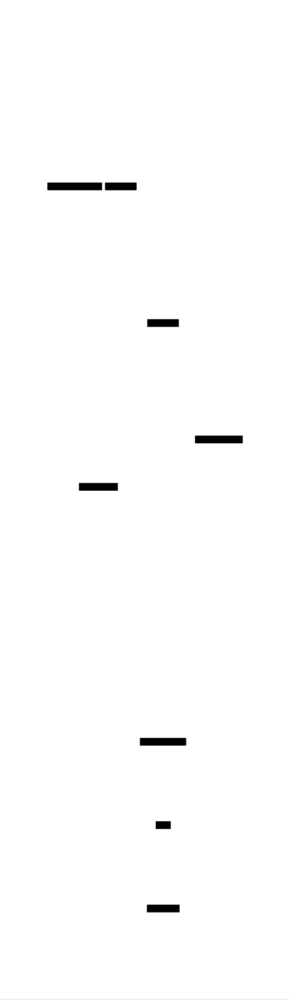
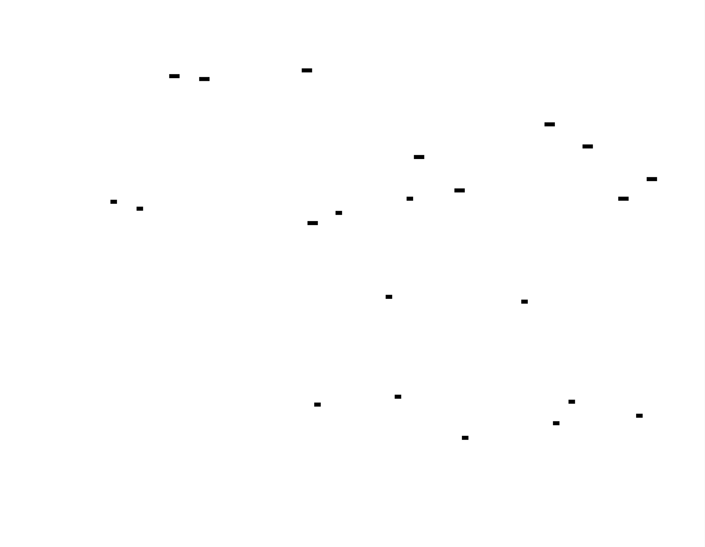
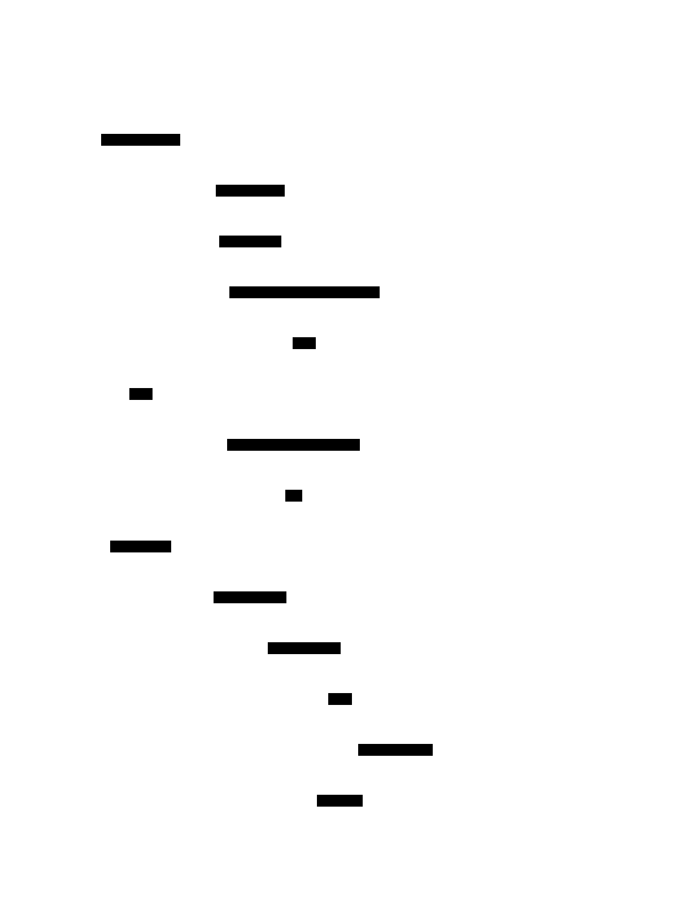

# Transformer from Scratch: Design Document


## Overview

This system implements the complete Transformer neural network architecture from the seminal 'Attention Is All You Need' paper. The key architectural challenge is building the self-attention mechanism that allows the model to weigh the importance of different input positions when processing sequences, eliminating the need for recurrence while maintaining the ability to capture long-range dependencies.


> This guide is meant to help you understand the big picture before diving into each milestone. Refer back to it whenever you need context on how components connect.


## Context and Problem Statement

> **Milestone(s):** Foundation for all milestones - understanding the problem space before building the solution

### The Sequence Modeling Challenge: Why traditional RNNs struggle with long sequences and parallel processing

**Mental Model: The Assembly Line Problem**

Imagine you're running a factory assembly line where each worker must complete their task before passing the product to the next worker. This is exactly how traditional Recurrent Neural Networks (RNNs) process sequences. Each word in a sentence must be processed sequentially, one after another, with each step depending on the previous step's completion. Just as an assembly line can't speed up by having workers operate in parallel on the same product, RNNs can't process multiple positions in a sequence simultaneously.

Now imagine that each worker not only needs to complete their own task, but also needs to remember and pass along every important detail from all previous workers. As the assembly line gets longer (longer sequences), this memory burden becomes overwhelming, and crucial information from early workers gets lost or corrupted by the time it reaches the end of the line.

**The Sequential Processing Bottleneck**

Traditional RNNs, including their more sophisticated variants like LSTMs and GRUs, suffer from a fundamental architectural constraint: they process sequences one token at a time, maintaining a hidden state that gets updated at each step. This sequential nature creates several critical problems that become increasingly severe as sequence lengths grow.

The most immediate problem is computational efficiency. Because each step depends on the previous step's output, RNNs cannot take advantage of modern GPU parallelism. While a GPU might have thousands of cores capable of performing computations simultaneously, an RNN forces these cores to sit idle while waiting for the sequential processing to complete. This sequential bottleneck means that doubling the sequence length doubles the processing time, regardless of available computational resources.

The mathematical formulation of this constraint can be seen in the RNN update equation, where the hidden state `h_t` at time step `t` depends directly on the hidden state from the previous time step:

| Component | Formula | Dependency | Parallelization Potential |
|-----------|---------|------------|---------------------------|
| RNN Hidden State | `h_t = f(h_{t-1}, x_t)` | Sequential | None - must wait for `h_{t-1}` |
| CNN Convolution | `y_i = f(x_{i-k:i+k})` | Local window | Full - all positions independent |
| Attention | `y_i = f(x_1, x_2, ..., x_n)` | All positions | Full - all positions computed together |

**The Vanishing Gradient Crisis**

Beyond the parallelization problem, RNNs face a more subtle but equally devastating issue: the vanishing gradient problem. As gradients backpropagate through time, they must travel through many sequential computations. At each step, gradients are multiplied by weight matrices and passed through activation functions. When these multiplications compound over long sequences, gradients either vanish (become too small to drive learning) or explode (become unstably large).

This mathematical instability has profound implications for learning long-range dependencies. Consider a language translation task where the gender of a noun at the beginning of a sentence determines the form of an adjective at the end. An RNN processing a 50-word sentence must maintain this gender information through 50 sequential transformations. Each transformation potentially dilutes the signal, making it increasingly difficult for the model to learn these long-range relationships.

| Problem Type | RNN Limitation | Impact on Learning | Example Scenario |
|--------------|----------------|-------------------|------------------|
| Vanishing Gradients | Exponential decay over steps | Can't learn long dependencies | Pronoun resolution across paragraphs |
| Exploding Gradients | Exponential growth over steps | Training instability | Gradient clipping becomes essential |
| Information Bottleneck | Fixed-size hidden state | Important early info gets overwritten | Document summarization loses key details |
| Sequential Constraint | No parallelization | Training time scales linearly | Large datasets become computationally prohibitive |

**Memory and Information Bottlenecks**

RNNs face another fundamental constraint: they must compress all relevant information from the entire sequence history into a fixed-size hidden state vector. This creates an information bottleneck that becomes increasingly severe as sequences grow longer. Early information must compete with recent information for representation in this limited memory space.

Long Short-Term Memory (LSTM) networks attempt to address this issue through gating mechanisms that control information flow. However, they still fundamentally rely on sequential processing and suffer from the same parallelization constraints. While LSTMs can better preserve information over longer sequences, they cannot escape the sequential processing requirement that prevents efficient utilization of modern parallel computing architectures.

⚠️ **Pitfall: Assuming Bidirectional RNNs Solve Parallelization**
Many newcomers think that bidirectional RNNs solve the parallelization problem because they process sequences in both directions. However, bidirectional RNNs still require sequential processing within each direction - they just do it twice. This doubles the computational cost without enabling true parallelization within a single sequence.

### The Attention Revolution: How attention mechanisms solve the sequential bottleneck problem

**Mental Model: The Cocktail Party Effect**

Imagine you're at a crowded cocktail party trying to follow a conversation. Your brain doesn't process every sound sequentially from left to right across the room. Instead, you selectively focus on relevant voices while maintaining awareness of the broader acoustic environment. You can instantly shift attention from the person directly in front of you to someone mentioning your name across the room, without having to sequentially process every conversation in between.

This is exactly how attention mechanisms work in neural networks. Instead of processing a sequence token by token in order, attention allows the model to directly connect any position with any other position in a single computational step. The model can "attend" to relevant information regardless of how far apart it appears in the sequence, eliminating the need for information to propagate through many sequential steps.

**Direct Access vs Sequential Propagation**

The revolutionary insight of attention mechanisms is that we can compute relationships between sequence positions directly, rather than requiring information to flow through intermediate positions. Traditional RNNs force information to travel step-by-step through the sequence, like passing a message through a chain of people. Attention mechanisms work more like a telephone network, where any position can directly "call" any other position to access relevant information.

This direct access paradigm solves multiple problems simultaneously. First, it enables perfect parallelization - we can compute attention weights between all pairs of positions simultaneously using matrix operations that fully utilize GPU resources. Second, it eliminates the vanishing gradient problem for long-range dependencies, since gradients can flow directly between distant positions without degradation through intermediate steps.

The mathematical foundation of this approach lies in the attention function, which takes three inputs derived from the sequence: queries (Q), keys (K), and values (V). Each position in the sequence generates a query representing "what information am I looking for?" Every position also provides a key representing "what information do I contain?" and a value representing "what information should I contribute?"

| Attention Component | Role | Analogy | Mathematical Purpose |
|---------------------|------|---------|---------------------|
| Query (Q) | Information seeker | "What am I looking for?" | Determines attention focus |
| Key (K) | Information descriptor | "What do I contain?" | Enables relevance matching |
| Value (V) | Information content | "What do I contribute?" | Provides actual information transfer |
| Attention Weights | Relevance scores | "How relevant is each source?" | Controls information mixing |

**The Database Query Paradigm**

A powerful way to understand attention is through the lens of database queries. When you query a database, you specify what you're looking for (the query), the database searches through its keys (indexes) to find relevant records, and returns the associated values (data). Attention mechanisms work identically:

1. Each position generates a query vector representing its information needs
2. This query is compared against all key vectors in the sequence to compute relevance scores
3. These scores are normalized into attention weights that sum to 1.0
4. The final output is a weighted combination of all value vectors, where weights reflect relevance

This process happens simultaneously for all positions in the sequence, enabling massive parallelization. Unlike RNNs, which must process positions sequentially, attention can compute the output for every position in parallel using efficient matrix multiplication operations.

**Solving the Long-Range Dependency Problem**

Attention mechanisms fundamentally solve the long-range dependency problem by providing direct connections between distant positions. In an RNN, information from position 1 must pass through positions 2, 3, 4, ... to reach position 50. Each passage potentially degrades the signal. With attention, position 50 can directly access information from position 1 with no intermediate degradation.

This direct access has profound implications for gradient flow during training. Gradients can flow directly between any two positions through their attention connection, rather than having to propagate through many sequential steps. This eliminates the exponential decay or explosion that plagues RNN gradient computation, enabling stable training on much longer sequences.

> **Key Insight: Attention as Differentiable Information Retrieval**
> 
> Attention can be viewed as a differentiable, learnable information retrieval system. Traditional information retrieval returns discrete results (document matches or doesn't match). Attention returns a continuous, weighted combination of all possible sources, where the weights are learned through backpropagation. This allows the model to learn optimal information access patterns for specific tasks.

**Computational Efficiency and Parallelization**

The attention mechanism's design enables unprecedented parallelization of sequence processing. Instead of the sequential dependency chain of RNNs, attention computes all position relationships simultaneously through matrix operations. This transforms sequence processing from a fundamentally sequential operation into a highly parallel one.

The computational complexity comparison reveals attention's advantages:

| Operation | RNN Complexity | Attention Complexity | Parallelization |
|-----------|----------------|---------------------|-----------------|
| Sequential Steps | O(n) | O(1) | RNN: None, Attention: Full |
| Memory Access | Sequential | Random/Parallel | RNN: Linear, Attention: Constant |
| Long-range Connections | O(n) steps | O(1) steps | RNN: Sequential, Attention: Parallel |
| Total Computation | O(n × d²) | O(n² × d) | RNN: d² parallel, Attention: n² × d parallel |

While attention has higher computational complexity for very long sequences due to the O(n²) term, the constant-time path length and perfect parallelization often make it faster in practice on modern hardware, especially for sequences of moderate length.

### Existing Approaches Comparison: Structured comparison of RNNs, CNNs, and attention-based models

**Mental Model: Different Information Processing Strategies**

Think of sequence processing approaches like different strategies for reading a book to answer questions about its content. RNNs are like reading the book sequentially from start to finish, maintaining notes that get updated after each page. CNNs are like using a sliding magnifying glass that examines a few pages at a time, looking for local patterns. Attention-based models are like having the ability to instantly flip to any page or combination of pages that might contain relevant information, regardless of order.

Each approach represents a different trade-off between computational efficiency, modeling capacity, and architectural constraints. Understanding these trade-offs is crucial for appreciating why the Transformer architecture represents such a significant advancement in sequence modeling.

**Comprehensive Architecture Comparison**

The following comparison examines four key dimensions: computational properties, modeling capabilities, implementation complexity, and practical considerations.

| Architecture | Sequential Computation | Parallelizable Operations | Path Length (Long-range) | Memory Complexity |
|--------------|------------------------|---------------------------|-------------------------|-------------------|
| RNN/LSTM/GRU | O(n) | None | O(n) | O(d) |
| CNN | O(1) | O(n) | O(log_k(n)) | O(k × d) |
| Self-Attention | O(1) | O(n²) | O(1) | O(n² + n × d) |

**Recurrent Neural Networks: Sequential Processing Masters**

RNNs excel at processing sequences where order matters and where each step naturally depends on previous computations. Their sequential nature makes them intuitive for tasks like language modeling, where predicting the next word genuinely requires understanding the context built up from previous words.

The RNN family includes several variants designed to address specific limitations:

| RNN Variant | Key Innovation | Strength | Primary Limitation |
|-------------|----------------|----------|-------------------|
| Vanilla RNN | Simple recurrence | Conceptual simplicity | Severe vanishing gradients |
| LSTM | Gating mechanisms | Better long-term memory | Still sequential, complex |
| GRU | Simplified gating | Fewer parameters than LSTM | Sequential bottleneck remains |
| Bidirectional | Forward + backward passes | Uses future context | Doubles computation, still sequential |

RNNs maintain constant memory usage regardless of sequence length, storing only the current hidden state. This makes them suitable for streaming applications where the entire sequence isn't available upfront. However, their sequential nature prevents efficient utilization of modern parallel hardware, making training on large datasets prohibitively slow.

**Convolutional Neural Networks: Local Pattern Detection**

CNNs approach sequence modeling through local pattern detection using sliding windows (convolutions). This approach works well for tasks where important relationships are primarily local, such as n-gram detection in text or local temporal patterns in time series.

The CNN approach to sequences offers several advantages:

| CNN Characteristic | Benefit | Limitation |
|-------------------|---------|------------|
| Local connectivity | Efficient parameter usage | Miss long-range dependencies |
| Weight sharing | Translation invariance | Assume local stationarity |
| Parallel computation | Fast training/inference | Require many layers for long-range |
| Hierarchical features | Progressive abstraction | Fixed receptive field growth |

CNNs can achieve long-range connectivity by stacking many layers, with each layer expanding the receptive field. However, this creates a logarithmic path length for long-range dependencies, still requiring information to pass through multiple layers. Modern CNN architectures like dilated convolutions and residual connections help address some of these limitations but don't eliminate the fundamental constraint.

⚠️ **Pitfall: Assuming CNNs Can't Model Sequences**
While CNNs are most famous for image processing, they can be highly effective for sequence modeling tasks, especially those with strong local structure. Models like WaveNet for audio generation demonstrate that CNNs can achieve state-of-the-art results on sequential data when properly designed.

**Attention-Based Models: Direct Global Connectivity**

Attention mechanisms represent a paradigm shift from both RNNs and CNNs by providing direct connectivity between all positions in a sequence. This eliminates both the sequential constraint of RNNs and the locality constraint of CNNs, at the cost of increased memory usage and computational complexity.

The attention approach offers several unique advantages:

| Attention Property | Advantage | Trade-off |
|-------------------|-----------|-----------|
| Direct connections | O(1) path length for any dependency | O(n²) memory and computation |
| Full parallelization | Efficient GPU utilization | Higher memory requirements |
| Interpretable weights | Can visualize what model attends to | Weights don't always reflect true importance |
| Variable-length sequences | No architectural constraints on length | Quadratic scaling with length |

**Architecture Decision Record: Why Attention Over RNNs/CNNs**

> **Decision: Choose Attention as Primary Sequence Modeling Mechanism**
> 
> **Context**: Need to build a sequence-to-sequence model that can handle long-range dependencies, train efficiently on modern hardware, and achieve state-of-the-art performance on translation tasks. Must balance modeling capacity with computational efficiency.
> 
> **Options Considered**:
> 1. **LSTM-based encoder-decoder**: Proven architecture with good sequential modeling
> 2. **CNN-based sequence model**: Fast parallel computation with stacked convolutions
> 3. **Attention-based model**: Direct global connectivity with parallel computation
> 
> **Decision**: Implement pure attention-based architecture (Transformer)
> 
> **Rationale**: 
> - Attention provides O(1) path length for long-range dependencies vs O(n) for RNNs
> - Full parallelization reduces training time by orders of magnitude compared to RNNs
> - Direct connectivity eliminates information bottlenecks present in fixed-size RNN states
> - Empirical results show attention-based models achieve superior performance on translation tasks
> - Memory cost O(n²) is manageable for typical sequence lengths (≤ 512 tokens)
> 
> **Consequences**: 
> - Enables: Efficient training on large datasets, better long-range dependency modeling, interpretable attention patterns
> - Trade-offs: Higher memory usage for very long sequences, more complex implementation than simple RNNs
> - Architectural commitment: Must implement multi-head attention, positional encoding, and layer normalization

**Performance and Scalability Comparison**

The practical implications of architectural choices become clear when examining training and inference characteristics:

| Metric | RNN | CNN | Attention | Winner |
|--------|-----|-----|-----------|---------|
| Training Speed (moderate sequences) | Slow | Fast | Fast | CNN/Attention |
| Training Speed (long sequences) | Very Slow | Medium | Medium | CNN/Attention |
| Memory Usage | Low | Medium | High | RNN |
| Long-range Dependencies | Poor | Medium | Excellent | Attention |
| Interpretability | Low | Low | High | Attention |
| Implementation Complexity | Medium | Low | High | CNN |

**Use Case Suitability Analysis**

Different architectures excel in different scenarios:

| Use Case | Best Architecture | Reasoning |
|----------|------------------|-----------|
| Document Translation | Attention | Long-range dependencies, parallel training crucial |
| Real-time Speech Recognition | RNN | Streaming requirement, memory constraints |
| Text Classification | CNN | Local features sufficient, speed important |
| Language Modeling | Attention | Long context, parallel training benefits |
| Time Series Forecasting | RNN/CNN | Sequential nature, often shorter sequences |
| Sequence Labeling | Attention | Benefits from bidirectional context |

**The Transformer's Revolutionary Impact**

The Transformer architecture, built entirely on attention mechanisms, represents the culmination of these architectural innovations. By eliminating recurrence and convolution entirely, it achieves:

1. **Perfect Parallelization**: Every position in encoder and decoder can be computed simultaneously
2. **Constant Path Length**: Any two positions connect directly through attention
3. **Scalable Performance**: Performance improves predictably with model size and data
4. **Transfer Learning**: Pre-trained models generalize across many NLP tasks

The success of Transformer-based models like BERT, GPT, and T5 has validated this architectural choice, leading to a paradigm shift in how we approach sequence modeling tasks.

> **Historical Context: The Attention Revolution**
> 
> The "Attention Is All You Need" paper didn't just introduce a new architecture - it challenged the fundamental assumption that sequence modeling requires sequential computation. This insight opened the door to training much larger models on much larger datasets, directly enabling the current era of large language models and the broader AI renaissance we're experiencing today.

### Implementation Guidance

**A. Technology Recommendations Table:**

| Component | Simple Option | Advanced Option |
|-----------|---------------|-----------------|
| Deep Learning Framework | PyTorch (eager execution, intuitive) | JAX (functional, highly optimized) |
| Matrix Operations | PyTorch tensors (`.matmul()`, `.softmax()`) | Custom CUDA kernels (maximum performance) |
| Attention Implementation | Manual Q,K,V projections | `torch.nn.MultiheadAttention` (built-in) |
| Positional Encoding | Sinusoidal functions (as in paper) | Learnable embeddings (more parameters) |
| Training Loop | Simple SGD with manual scheduling | Transformers library training utilities |
| Model Serialization | `torch.save()`/`torch.load()` | Hugging Face model format |

**B. Recommended File/Module Structure:**

```
transformer-from-scratch/
├── models/
│   ├── __init__.py
│   ├── attention.py          ← Scaled dot-product and multi-head attention
│   ├── embeddings.py         ← Token and positional embeddings  
│   ├── layers.py             ← Encoder and decoder layers
│   ├── transformer.py        ← Full transformer model
│   └── utils.py              ← Helper functions for masks, etc.
├── training/
│   ├── __init__.py
│   ├── trainer.py            ← Training loop and optimization
│   ├── data_loader.py        ← Dataset handling and batching
│   └── losses.py             ← Loss functions and metrics
├── examples/
│   ├── train_translation.py  ← Translation task example
│   ├── train_language_model.py ← Language modeling example
│   └── inference.py          ← Generation and inference examples
├── tests/
│   ├── test_attention.py     ← Unit tests for attention mechanisms
│   ├── test_layers.py        ← Tests for encoder/decoder layers
│   └── test_transformer.py   ← Integration tests
└── notebooks/
    ├── attention_visualization.ipynb ← Visualize attention patterns
    └── model_analysis.ipynb    ← Analyze model behavior
```

**C. Infrastructure Starter Code (Complete, ready to use):**

```python
# models/utils.py - Helper functions for the transformer
import torch
import torch.nn as nn
import math

def create_padding_mask(sequence, pad_token_id=0):
    """Create a mask to hide padding tokens from attention.
    
    Args:
        sequence: Input sequence tensor of shape (batch_size, seq_len)
        pad_token_id: Token ID used for padding
        
    Returns:
        Boolean mask of shape (batch_size, 1, 1, seq_len) where True = mask
    """
    mask = (sequence == pad_token_id)
    # Add dimensions for broadcasting with attention scores
    return mask.unsqueeze(1).unsqueeze(2)

def create_causal_mask(size):
    """Create a causal (lower triangular) mask for autoregressive decoding.
    
    Args:
        size: Sequence length
        
    Returns:
        Boolean mask of shape (size, size) where True = mask (prevent attention)
    """
    mask = torch.triu(torch.ones(size, size), diagonal=1)
    return mask.bool()

def get_device():
    """Get the best available device for computation."""
    if torch.cuda.is_available():
        return torch.device('cuda')
    elif hasattr(torch.backends, 'mps') and torch.backends.mps.is_available():
        return torch.device('mps')  # Apple Silicon
    else:
        return torch.device('cpu')

class PositionwiseFeedForward(nn.Module):
    """Position-wise feed-forward network used in transformer layers."""
    
    def __init__(self, d_model, d_ff, dropout=0.1):
        super().__init__()
        self.w_1 = nn.Linear(d_model, d_ff)
        self.w_2 = nn.Linear(d_ff, d_model)
        self.dropout = nn.Dropout(dropout)
        self.activation = nn.ReLU()
    
    def forward(self, x):
        return self.w_2(self.dropout(self.activation(self.w_1(x))))
```

**D. Core Logic Skeleton Code:**

```python
# models/attention.py - Core attention mechanism (student implements)
import torch
import torch.nn as nn
import math

class ScaledDotProductAttention(nn.Module):
    """Scaled Dot-Product Attention mechanism from 'Attention Is All You Need'."""
    
    def __init__(self, dropout=0.1):
        super().__init__()
        self.dropout = nn.Dropout(dropout)
    
    def forward(self, query, key, value, mask=None):
        """
        Apply scaled dot-product attention.
        
        Args:
            query: Query tensor of shape (batch_size, num_heads, seq_len_q, d_k)
            key: Key tensor of shape (batch_size, num_heads, seq_len_k, d_k)  
            value: Value tensor of shape (batch_size, num_heads, seq_len_v, d_v)
            mask: Optional mask tensor where True = positions to mask
            
        Returns:
            output: Attention output of shape (batch_size, num_heads, seq_len_q, d_v)
            attention_weights: Attention weights for visualization
        """
        # TODO 1: Get dimensions - extract d_k from query tensor shape
        # Hint: d_k = query.size(-1)
        
        # TODO 2: Compute attention scores using matrix multiplication
        # Hint: scores = torch.matmul(query, key.transpose(-2, -1))
        
        # TODO 3: Scale scores by sqrt(d_k) to prevent softmax saturation
        # Hint: scores = scores / math.sqrt(d_k)
        
        # TODO 4: Apply mask if provided (set masked positions to large negative value)
        # Hint: if mask is not None: scores = scores.masked_fill(mask == True, -1e9)
        
        # TODO 5: Apply softmax to get attention weights
        # Hint: attention_weights = torch.softmax(scores, dim=-1)
        
        # TODO 6: Apply dropout to attention weights
        # Hint: attention_weights = self.dropout(attention_weights)
        
        # TODO 7: Multiply attention weights by values to get final output
        # Hint: output = torch.matmul(attention_weights, value)
        
        # TODO 8: Return both output and attention weights for visualization
        pass

class MultiHeadAttention(nn.Module):
    """Multi-Head Attention mechanism."""
    
    def __init__(self, d_model, num_heads, dropout=0.1):
        super().__init__()
        # TODO 1: Verify that d_model is divisible by num_heads
        assert d_model % num_heads == 0
        
        # TODO 2: Calculate d_k and d_v (dimension per head)
        # Hint: self.d_k = d_model // num_heads
        
        # TODO 3: Create linear projection layers for Q, K, V and output
        # Hint: self.w_q = nn.Linear(d_model, d_model)
        
        # TODO 4: Initialize the scaled dot-product attention
        # Hint: self.attention = ScaledDotProductAttention(dropout)
        
        self.num_heads = num_heads
        self.d_model = d_model
    
    def forward(self, query, key, value, mask=None):
        """
        Apply multi-head attention.
        
        Args:
            query: Query tensor of shape (batch_size, seq_len, d_model)
            key: Key tensor of shape (batch_size, seq_len, d_model)
            value: Value tensor of shape (batch_size, seq_len, d_model)
            mask: Optional attention mask
            
        Returns:
            output: Multi-head attention output
            attention_weights: Attention weights from all heads
        """
        batch_size = query.size(0)
        
        # TODO 1: Apply linear projections to get Q, K, V
        # Hint: Q = self.w_q(query)
        
        # TODO 2: Reshape Q, K, V to split into multiple heads
        # Target shape: (batch_size, num_heads, seq_len, d_k)
        # Hint: Q = Q.view(batch_size, -1, self.num_heads, self.d_k).transpose(1, 2)
        
        # TODO 3: Apply scaled dot-product attention
        # Hint: attn_output, attn_weights = self.attention(Q, K, V, mask)
        
        # TODO 4: Concatenate heads by reshaping back
        # Target shape: (batch_size, seq_len, d_model)
        # Hint: attn_output = attn_output.transpose(1, 2).contiguous().view(...)
        
        # TODO 5: Apply final linear projection
        # Hint: output = self.w_o(attn_output)
        
        pass
```

**E. Language-Specific Hints:**

- **PyTorch Tensor Operations**: Use `.transpose(-2, -1)` to swap last two dimensions for matrix multiplication in attention
- **Memory Management**: Use `tensor.contiguous()` before `.view()` operations after transpose to avoid memory layout issues  
- **Numerical Stability**: For softmax with masking, use `-1e9` (not `-float('inf')`) to avoid NaN gradients
- **GPU Acceleration**: Move all tensors to same device using `tensor.to(device)` before operations
- **Gradient Flow**: Use `nn.Parameter()` for learnable weights, regular tensors for intermediate computations
- **Debugging Shapes**: Add `print(f"Shape: {tensor.shape}")` statements liberally while developing

**F. Milestone Checkpoint:**

After understanding the context and problem statement:

**Expected Understanding**:
- Can explain why RNNs have sequential bottlenecks in your own words
- Can describe the attention mechanism using the database query analogy  
- Can identify when to use RNNs vs CNNs vs attention for different tasks

**Verification Steps**:
1. **Conceptual Test**: Explain to someone else (or write in a document) why attention enables parallelization while RNNs don't
2. **Architecture Comparison**: Given a new sequence modeling task, justify which architecture (RNN/CNN/Attention) you'd choose and why
3. **Mathematical Understanding**: Trace through the attention computation steps using concrete small examples (e.g., 3-word sequences)

**Red Flags to Check**:
- **Misconception**: "Bidirectional RNNs solve the parallelization problem" (they don't - still sequential within each direction)
- **Confusion**: Mixing up the roles of Query, Key, and Value in attention
- **Oversimplification**: Thinking attention is just "looking at all positions" without understanding the Q/K matching process

**Next Steps**: 
Once you have solid conceptual understanding, you're ready to implement the scaled dot-product attention mechanism in Milestone 1. The mathematical intuition from this section will guide your implementation decisions.


## Goals and Non-Goals

> **Milestone(s):** Foundation for all milestones - establishes scope and learning objectives that guide the entire implementation

The scope of any educational project serves as both a roadmap and a set of guardrails, defining not only what we intend to build but also what we deliberately choose to exclude. For a Transformer implementation designed for deep learning and understanding, these boundaries become particularly crucial. Think of this scope definition as a learning contract - it sets expectations for what knowledge and capabilities you'll gain while protecting you from getting lost in the vast ecosystem of production optimizations and advanced variants that could derail the core educational mission.

Our approach follows the principle of **progressive complexity** - we start with the essential mechanisms that make Transformers work, implement them clearly and correctly, and build understanding layer by layer. This means we prioritize code clarity over performance optimization, educational value over production readiness, and conceptual understanding over cutting-edge features. Every design decision in this project filters through the lens of learning: does this help or hinder understanding of the core attention mechanism and Transformer architecture?

### Functional Goals: Core capabilities our Transformer must demonstrate

The functional goals define the concrete capabilities our Transformer implementation must demonstrate by the end of the project. These capabilities directly correspond to the core innovations presented in the "Attention Is All You Need" paper and represent the minimum viable implementation that can be called a complete Transformer.

**Primary Sequence Processing Capabilities**

Our Transformer must be able to process variable-length sequences of tokens and produce meaningful output representations. This includes handling sequences of different lengths within the same batch through proper padding and masking. The model should accept tokenized text input, convert it to dense vector representations through learned embeddings, and process these representations through the complete encoder-decoder architecture.

The system must demonstrate the **query-key-value paradigm** that forms the foundation of the attention mechanism. This means computing query, key, and value matrices from input embeddings, calculating attention scores through scaled dot-product operations, and producing weighted combinations of value vectors based on attention probabilities. The attention mechanism must handle both self-attention (where queries, keys, and values come from the same sequence) and cross-attention (where queries come from one sequence and keys/values from another).

**Multi-Head Attention Processing**

The implementation must support **multi-head attention** with configurable numbers of attention heads. This requires splitting the model dimension across multiple heads, computing attention independently for each head, and recombining the results through learned projection matrices. The multi-head mechanism should demonstrate how multiple attention perspectives can capture different types of relationships within the same sequence.

Each attention head operates with dimension `d_k = d_model / num_heads`, ensuring that the total computational cost remains comparable to single-head attention while providing richer representational capacity. The parallel computation across heads should be implemented efficiently using tensor operations rather than explicit loops.

**Position Encoding Integration**

Since attention mechanisms are inherently position-agnostic, our Transformer must incorporate positional information through sinusoidal positional encodings. The implementation should generate position encodings for arbitrary sequence lengths using the mathematical formulation from the original paper, where even dimensions use sine functions and odd dimensions use cosine functions with wavelengths varying by dimension.

The position encodings must be properly combined with token embeddings, following the paper's approach of element-wise addition after scaling the embeddings by `sqrt(d_model)`. This scaling factor ensures that the positional signal doesn't dominate the semantic content encoded in the token embeddings.

**Complete Encoder-Decoder Architecture**

Our implementation must include both encoder and decoder stacks, each composed of multiple identical layers. The encoder layers combine self-attention with position-wise feed-forward networks, while decoder layers add masked self-attention and cross-attention components. Each sublayer must be wrapped with residual connections and layer normalization to ensure stable training.

The decoder must implement **causal masking** to prevent positions from attending to future positions during training, ensuring that the model learns to predict each token based only on preceding context. This autoregressive property is essential for language modeling and sequence generation tasks.

**Training and Inference Capabilities**

The system must support both training and inference modes with different behavioral requirements. During training, the model uses **teacher forcing**, where decoder inputs are the ground-truth target sequence (shifted right) rather than the model's own predictions. This parallel training approach significantly speeds up learning compared to sequential generation.

For inference, the model must support **autoregressive decoding**, generating tokens one at a time and feeding each prediction back as input for the next step. This requires maintaining and updating key-value caches efficiently to avoid recomputing attention for previously generated positions.

**Loss Computation and Optimization**

The implementation must include proper loss computation using cross-entropy over the output vocabulary. The final decoder layer outputs must be projected through a linear layer to vocabulary-sized logits, which are then compared against target token indices. The system should support standard optimization procedures including gradient computation and parameter updates.

**Functional Requirements Summary Table**

| Capability | Input Requirements | Output Requirements | Validation Criteria |
|------------|-------------------|-------------------|-------------------|
| Token Processing | Tokenized sequences, padding masks | Dense representations | Correct embedding lookups and scaling |
| Attention Mechanism | Query/key/value matrices | Attention weights and outputs | Softmax normalization, proper masking |
| Multi-Head Processing | Split Q/K/V across heads | Concatenated head outputs | Parallel computation, correct reshaping |
| Position Encoding | Sequence positions | Sinusoidal encodings | Mathematical correctness of sin/cos patterns |
| Encoder Processing | Input sequences | Contextualized representations | Self-attention and feed-forward composition |
| Decoder Processing | Target sequences, encoder outputs | Predicted logits | Masked self-attention and cross-attention |
| Training Mode | Source-target pairs | Loss values | Teacher forcing, gradient computation |
| Inference Mode | Source sequences | Generated predictions | Autoregressive decoding |

### Learning Goals: Educational objectives and deep understanding targets

The learning goals represent the conceptual understanding and practical skills that this project aims to develop. These goals go beyond mere implementation to foster deep comprehension of why Transformers work and how their components interact to solve the fundamental challenges of sequence modeling.

**Understanding the Attention Revolution**

The primary learning objective is to develop an intuitive and mathematical understanding of how attention mechanisms solve the **sequential bottleneck** problem that plagued earlier architectures. You should understand why RNNs struggle with long sequences due to vanishing gradients and sequential processing constraints, and how attention provides direct connections between any two positions in a sequence regardless of their distance.

This understanding should encompass both the computational aspects (how attention scores are calculated and normalized) and the representational aspects (what kinds of relationships attention can capture). You should be able to explain why the **scaled dot-product attention** formulation was chosen over alternatives and understand the role of the scaling factor `sqrt(d_k)` in maintaining stable gradients.

**Mastering the Query-Key-Value Paradigm**

A crucial learning goal is developing fluency with the **query-key-value paradigm** that underlies not just Transformers but many modern machine learning architectures. This mental model treats attention as a differentiable database lookup, where queries search through keys to retrieve relevant values.

You should understand how this abstraction enables both self-attention (where a position queries other positions in the same sequence) and cross-attention (where decoder positions query encoder representations). The generality of this paradigm extends beyond Transformers to modern architectures in computer vision, speech processing, and multimodal learning.

**Grasping Multi-Head Attention Benefits**

Another key learning objective is understanding why **multi-head attention** improves upon single-head attention. This goes beyond the mechanical understanding of splitting dimensions to appreciate how multiple heads can specialize in different types of relationships - syntactic versus semantic dependencies, local versus long-range connections, or different aspects of meaning representation.

You should develop intuition for the trade-offs in head count and understand why the standard configuration uses 8 heads with `d_k = 64` for `d_model = 512`. This includes understanding both the computational implications (parallel processing, memory usage) and the representational implications (capacity versus specialization).

**Understanding Position Encoding Necessity**

A fundamental learning goal is grasping why attention mechanisms are inherently position-agnostic and how this creates both opportunities and challenges. Without positional information, attention would treat sequences as unordered sets, losing crucial structural information that drives language understanding.

You should understand the mathematical principles behind sinusoidal positional encodings, including why they enable the model to extrapolate to longer sequences than seen during training. The learning objective includes comparing positional encoding approaches (learned versus sinusoidal) and understanding the trade-offs in each approach.

**Mastering Residual Connections and Normalization**

A critical learning goal involves understanding how residual connections and layer normalization enable training of deep Transformer networks. This includes grasping the gradient flow benefits of skip connections and the stabilization effects of normalization.

You should understand the difference between pre-normalization and post-normalization architectures, their training dynamics, and their practical implications. This knowledge transfers broadly to modern deep learning architectures beyond Transformers.

**Developing Implementation Intuition**

Beyond conceptual understanding, this project aims to develop practical implementation intuition. You should learn to debug tensor dimension mismatches systematically, understand the performance implications of different implementation choices, and recognize common failure modes in attention-based architectures.

This includes developing comfort with the PyTorch programming model, understanding memory and computational trade-offs, and building intuition for hyperparameter sensitivity in Transformer training.

**Learning Objectives Summary Table**

| Learning Domain | Specific Understanding Goals | Assessment Criteria |
|-----------------|----------------------------|-------------------|
| Attention Mechanics | Why scaled dot-product, role of scaling factor | Can explain mathematical derivation and intuition |
| Multi-Head Benefits | Why multiple heads help, specialization patterns | Can describe different head behaviors qualitatively |
| Position Encoding | Why needed, sinusoidal mathematics | Can derive position encoding formulas |
| Architecture Composition | How components interact, information flow | Can trace data through complete forward pass |
| Training Dynamics | Gradient flow, optimization challenges | Can diagnose training failures and propose fixes |
| Implementation Skills | Tensor manipulation, debugging strategies | Can implement variations and extensions cleanly |

### Explicit Non-Goals: Production optimizations and advanced features we will not implement

The non-goals are as important as the goals themselves, establishing clear boundaries that prevent scope creep and maintain focus on the core learning objectives. These exclusions are intentional choices that prioritize educational clarity over production readiness or cutting-edge performance.

**Production Optimization Techniques**

We explicitly exclude production-level optimizations that would obscure the core algorithmic understanding. This includes advanced memory management techniques like gradient checkpointing, mixed-precision training, and attention kernel optimizations. While these techniques are crucial for scaling Transformers to large datasets and models, they introduce implementation complexity that distracts from understanding the fundamental mechanisms.

Similarly, we will not implement distributed training capabilities, model parallelism strategies, or advanced hardware-specific optimizations. Our implementation targets single-GPU or CPU execution with straightforward tensor operations that clearly express the mathematical formulations from the paper.

**Advanced Architectural Variants**

The Transformer ecosystem has evolved rapidly since the original paper, spawning numerous architectural improvements and variants. We explicitly exclude modern refinements like **RoPE (Rotary Position Embedding)**, **GLU (Gated Linear Units)**, **RMSNorm**, and attention modifications like **Flash Attention** or **Linear Attention**.

While these improvements offer significant benefits for modern applications, including them would require understanding complex optimizations and trade-offs that distract from the core attention mechanism. Our implementation focuses on the canonical architecture described in "Attention Is All You Need."

We also exclude specialized variants like encoder-only models (BERT-style) or decoder-only models (GPT-style), focusing instead on the complete encoder-decoder architecture that demonstrates all major components and their interactions.

**Advanced Training Techniques**

Our implementation excludes sophisticated training techniques that, while important for achieving state-of-the-art results, add complexity without enhancing understanding of the core architecture. This includes advanced learning rate schedules beyond basic warmup, sophisticated regularization techniques like dropout variations or weight decay schedules, and advanced optimization algorithms beyond standard Adam optimization.

We will not implement **label smoothing** as a primary feature (though it may be mentioned as an optional enhancement), advanced data augmentation techniques, or curriculum learning strategies. The focus remains on demonstrating that the basic architecture can learn effectively with straightforward training procedures.

**Large-Scale Infrastructure**

This project explicitly avoids the infrastructure complexity required for training large-scale models. We will not implement data loading pipelines for massive datasets, checkpointing and resumption systems, distributed storage integration, or monitoring and logging infrastructure beyond basic training loss tracking.

The target scale is educational - models that can train effectively on standard hardware within reasonable time frames, using datasets that demonstrate the capabilities without requiring specialized infrastructure.

**Advanced Inference Features**

While we implement basic autoregressive generation, we exclude advanced decoding strategies that would complicate the core implementation. This includes **beam search decoding**, **nucleus sampling**, **temperature scaling**, and **repetition penalties**. We also exclude caching optimizations for inference acceleration and batch inference capabilities.

The inference implementation focuses on demonstrating the autoregressive property and basic generation capabilities, sufficient to validate that the model has learned meaningful sequence-to-sequence mappings.

**Comprehensive Evaluation Frameworks**

We exclude comprehensive evaluation frameworks that would add significant complexity to the project scope. This includes BLEU score computation for translation tasks, perplexity measurement infrastructure, attention visualization tools, and comparative benchmarking against other architectures.

While basic loss tracking and qualitative output inspection are included, the focus remains on implementation understanding rather than rigorous empirical evaluation.

**Non-Goals Summary Table**

| Excluded Category | Specific Exclusions | Reasoning |
|------------------|-------------------|-----------|
| Performance Optimization | Mixed precision, kernel fusion, memory optimization | Obscures algorithmic understanding |
| Architectural Variants | RoPE, GLU, RMSNorm, Flash Attention | Adds complexity without core learning value |
| Advanced Training | Complex schedules, sophisticated regularization | Distracts from architecture understanding |
| Scale Infrastructure | Distributed training, large datasets | Requires specialized resources and expertise |
| Advanced Inference | Beam search, nucleus sampling, caching | Implementation complexity without educational benefit |
| Evaluation Framework | BLEU, perplexity, attention visualization | Focus on implementation, not empirical analysis |

**Boundary Management Strategies**

To maintain these boundaries effectively, we establish clear decision criteria for feature requests and extensions. Any proposed addition must satisfy three requirements: it must enhance understanding of the core attention mechanism, it must be implementable without significant infrastructure complexity, and it must align with the educational timeline and skill development progression.

When encountering optimization opportunities during implementation, we consistently choose the approach that makes the algorithm most transparent, even if it sacrifices performance. This principle guides decisions about vectorization (prefer clear tensor operations over clever indexing), memory usage (prefer readable code over memory efficiency), and modularity (prefer explicit composition over compact implementations).

> **Critical Design Principle**: Every implementation choice prioritizes learning over performance. When faced with a trade-off between code clarity and computational efficiency, we always choose clarity. The goal is building understanding that transfers to production systems, not building production systems directly.

This explicit scope management ensures that the project remains focused on its educational mission while acknowledging the broader ecosystem of techniques and optimizations that would be essential in production deployments. The non-goals serve as important context for understanding where this implementation fits within the broader landscape of Transformer applications and optimizations.

### Implementation Guidance

The implementation guidance for scope management involves establishing practical development practices that maintain focus on the learning objectives while providing clear boundaries for feature decisions and code organization.

**A. Technology Recommendations Table:**

| Component | Simple Option | Advanced Option |
|-----------|--------------|----------------|
| Deep Learning Framework | PyTorch with basic autograd | PyTorch with custom CUDA kernels |
| Data Handling | Python lists with manual batching | PyTorch DataLoader with custom collation |
| Optimization | Standard Adam optimizer | Custom learning rate schedulers |
| Evaluation | Manual loss computation | Comprehensive metrics framework |
| Visualization | Print statements and basic plots | TensorBoard integration |
| Testing | Basic unit tests with pytest | Property-based testing with hypothesis |

**B. Recommended File/Module Structure:**

The project structure should reflect the learning progression and component boundaries established in our goals:

```
transformer-from-scratch/
├── README.md                    # Project overview and learning objectives
├── requirements.txt             # Minimal dependencies: torch, numpy, pytest
├── src/
│   ├── __init__.py
│   ├── attention/               # Milestone 1-2: Attention mechanisms
│   │   ├── __init__.py
│   │   ├── scaled_dot_product.py   # Core attention implementation
│   │   ├── multi_head.py           # Multi-head attention wrapper
│   │   └── masks.py                # Padding and causal masking utilities
│   ├── components/              # Milestone 3: Supporting components
│   │   ├── __init__.py
│   │   ├── embeddings.py           # Token and positional embeddings
│   │   ├── feedforward.py          # Position-wise feed-forward networks
│   │   └── layer_norm.py           # Layer normalization utilities
│   ├── layers/                  # Milestone 4: Complete layers
│   │   ├── __init__.py
│   │   ├── encoder.py              # Encoder layer implementation
│   │   └── decoder.py              # Decoder layer implementation
│   ├── model/                   # Milestone 5: Full transformer
│   │   ├── __init__.py
│   │   ├── transformer.py          # Complete model assembly
│   │   └── generation.py           # Autoregressive decoding
│   └── training/                # Training infrastructure
│       ├── __init__.py
│       ├── trainer.py              # Training loop implementation
│       └── data_utils.py           # Basic data loading utilities
├── tests/                       # Unit tests organized by component
│   ├── test_attention/
│   ├── test_components/
│   ├── test_layers/
│   └── test_model/
├── examples/                    # Educational examples and demos
│   ├── minimal_translation.py      # Simple translation task
│   └── toy_language_model.py       # Character-level language modeling
└── docs/                       # Additional documentation
    └── debugging_guide.md          # Common issues and solutions
```

**C. Infrastructure Starter Code:**

**Basic Configuration Management:**
```python
# src/config.py
from dataclasses import dataclass
from typing import Optional

@dataclass
class TransformerConfig:
    """Configuration for Transformer model - educational version."""
    d_model: int = 512              # Model dimension
    num_heads: int = 8              # Number of attention heads  
    d_ff: int = 2048               # Feed-forward hidden dimension
    num_encoder_layers: int = 6     # Number of encoder layers
    num_decoder_layers: int = 6     # Number of decoder layers
    vocab_size: int = 10000        # Vocabulary size
    max_seq_len: int = 256         # Maximum sequence length
    dropout: float = 0.1           # Dropout probability
    pad_token_id: int = 0          # Padding token ID
    
    def __post_init__(self):
        """Validate configuration parameters."""
        assert self.d_model % self.num_heads == 0, \
            f"d_model ({self.d_model}) must be divisible by num_heads ({self.num_heads})"
        self.d_k = self.d_model // self.num_heads  # Dimension per head
```

**Device Management Utility:**
```python
# src/utils.py
import torch

def get_device() -> torch.device:
    """Return the best available device for computation."""
    if torch.cuda.is_available():
        return torch.device("cuda")
    elif torch.backends.mps.is_available():  # Apple Silicon
        return torch.device("mps") 
    else:
        return torch.device("cpu")

def move_to_device(tensors: dict, device: torch.device) -> dict:
    """Move dictionary of tensors to specified device."""
    return {key: tensor.to(device) if isinstance(tensor, torch.Tensor) else tensor 
            for key, tensor in tensors.items()}
```

**Basic Testing Infrastructure:**
```python
# tests/conftest.py
import pytest
import torch
from src.config import TransformerConfig

@pytest.fixture
def small_config():
    """Small configuration for fast testing."""
    return TransformerConfig(
        d_model=64,
        num_heads=4, 
        d_ff=128,
        num_encoder_layers=2,
        num_decoder_layers=2,
        vocab_size=100,
        max_seq_len=32,
        dropout=0.0  # Disable dropout for deterministic tests
    )

@pytest.fixture  
def sample_batch():
    """Sample input batch for testing."""
    batch_size, seq_len = 2, 8
    return {
        'input_ids': torch.randint(1, 100, (batch_size, seq_len)),
        'target_ids': torch.randint(1, 100, (batch_size, seq_len)),
        'input_mask': torch.ones(batch_size, seq_len, dtype=torch.bool),
        'target_mask': torch.ones(batch_size, seq_len, dtype=torch.bool)
    }
```

**D. Core Logic Skeleton Code:**

**Scope Validation Utilities:**
```python
# src/validation.py
from typing import Dict, Any
import warnings

class ScopeValidator:
    """Validates implementation stays within educational scope."""
    
    ALLOWED_DEPENDENCIES = {
        'torch', 'numpy', 'math', 'typing', 'dataclasses', 'pytest'
    }
    
    FORBIDDEN_PATTERNS = {
        'mixed_precision': "Mixed precision training is out of scope",
        'distributed': "Distributed training is out of scope", 
        'flash_attention': "Flash attention optimization is out of scope",
        'beam_search': "Beam search is out of scope for basic implementation"
    }
    
    @classmethod
    def validate_dependencies(cls, module_name: str) -> None:
        """Check if module stays within allowed dependencies."""
        # TODO: Implement dependency checking
        # TODO: Warn if importing production optimization libraries
        # TODO: Suggest educational alternatives for complex dependencies
        pass
    
    @classmethod 
    def validate_implementation_complexity(cls, code: str) -> None:
        """Check if implementation complexity aligns with educational goals."""
        # TODO: Check for overly complex optimizations
        # TODO: Validate tensor operations are readable  
        # TODO: Ensure no production-only patterns
        pass
```

**E. Language-Specific Hints:**

**PyTorch Best Practices for Educational Code:**
- Use `torch.nn.Module` for all components to enable automatic differentiation and parameter management
- Prefer `F.functional` operations over stateful modules when the operation doesn't have learnable parameters
- Use `torch.einsum` sparingly - explicit tensor operations are more readable for learning
- Always specify `dtype=torch.float32` explicitly to avoid precision issues across platforms
- Use `tensor.contiguous()` before reshaping operations to avoid stride issues
- Implement `__repr__` methods for custom modules to aid debugging

**Tensor Shape Management:**
- Establish consistent dimension ordering: `[batch_size, seq_len, d_model]` for all major tensors
- Use descriptive variable names that include shape information: `queries_bsh` for batch-seq-hidden tensors
- Add shape assertions at the beginning of forward methods to catch dimension errors early
- Use `tensor.view()` vs `tensor.reshape()` consistently (prefer `view` for contiguous tensors)

**F. Milestone Checkpoint:**

After establishing project scope and structure:

**What to verify:**
```bash
# Check project structure is created correctly
ls -la transformer-from-scratch/
tree transformer-from-scratch/ -I "__pycache__|*.pyc"

# Verify configuration system works
cd transformer-from-scratch/
python -c "from src.config import TransformerConfig; print(TransformerConfig())"

# Run basic import tests  
python -c "from src.utils import get_device; print(f'Using device: {get_device()}')"

# Check test infrastructure
pytest tests/ -v --tb=short
```

**Expected output:**
- Clean directory structure matching the recommended layout
- Configuration object prints without errors showing default hyperparameters
- Device detection returns appropriate device (CPU/GPU/MPS) for your system
- Test infrastructure runs successfully (even with placeholder tests)

**Signs something is wrong:**
- Import errors suggest incorrect package structure or missing `__init__.py` files
- Configuration validation fails, indicating hyperparameter inconsistencies  
- Device detection fails, suggesting PyTorch installation issues
- Test infrastructure errors indicate pytest configuration problems

**G. Debugging Tips:**

| Symptom | Likely Cause | How to Diagnose | Fix |
|---------|--------------|-----------------|-----|
| Scope creep during implementation | Trying to add optimization features | Review non-goals list, check if addition aids core learning | Remove feature or defer to future extensions |
| Overwhelming complexity | Implementing production patterns | Compare current code to educational objectives | Simplify implementation, prioritize clarity |
| Feature requests from advanced users | Pressure to add cutting-edge techniques | Evaluate against learning value for target audience | Politely decline, explain educational focus |
| Implementation paralysis | Too many architectural choices | Return to paper's canonical specification | Follow paper exactly, avoid premature optimization |
| Testing becomes too complex | Trying to test production scenarios | Focus on educational correctness over edge cases | Test core functionality, document known limitations |

This implementation guidance establishes practical boundaries that support the learning objectives while preventing common sources of scope creep and complexity inflation that can derail educational projects.


## High-Level Architecture

> **Milestone(s):** Foundation for all milestones - understanding how components work together before implementing individual pieces

The Transformer architecture represents a paradigm shift in sequence modeling, moving away from the sequential processing bottlenecks that plagued RNN-based approaches. Think of the Transformer as a sophisticated translation bureau where multiple teams of specialists (attention heads) work in parallel to understand different aspects of the input text, while a hierarchical management structure (encoder-decoder layers) ensures information flows efficiently from source understanding to target generation. Unlike traditional sequence models that process words one at a time like a single translator reading left-to-right, the Transformer can examine all positions simultaneously, allowing for much richer contextual understanding and faster processing.

This architectural overview establishes the mental framework necessary before diving into the mathematical details of attention mechanisms and implementation specifics. Understanding how the major components collaborate provides the scaffolding for implementing each piece correctly and debugging issues when components interact unexpectedly.

### Encoder-Decoder Paradigm: Mental model of the two-stage processing architecture

The encoder-decoder paradigm forms the backbone of the Transformer architecture, representing a two-stage information processing pipeline that mirrors how human translators work. The encoder acts like a comprehensive reader who thoroughly understands the source material, building rich internal representations that capture not just the surface meaning but the deeper relationships, context, and nuances. The decoder then functions like a skilled writer who uses this deep understanding to generate target sequences, making informed decisions about each output token based on both the encoded source information and the previously generated target context.

This separation of concerns provides several critical advantages over monolithic sequence-to-sequence models. The encoder can focus entirely on building the best possible representation of the input without worrying about generation constraints, while the decoder can specialize in producing coherent, contextually appropriate outputs without being burdened by the complexities of input processing. The paradigm also enables flexible architectures where encoder and decoder can have different capacities, attention patterns, and even vocabularies depending on task requirements.

**The Encoder Stage: Building Rich Representations**

The encoder transforms input sequences into contextualized representations through a stack of identical layers, each applying self-attention followed by position-wise feed-forward processing. Think of each encoder layer as a discussion panel where every word gets to "speak" with every other word in the sequence, sharing information and building consensus about meaning and relationships. The self-attention mechanism allows each position to gather information from all other positions simultaneously, creating representations that are informed by the full sequence context rather than just local neighbors.

The encoder's self-attention is bidirectional, meaning each token can attend to tokens both before and after it in the sequence. This bidirectional processing enables the encoder to build representations that capture long-range dependencies, syntactic relationships, and semantic connections that would be difficult for sequential models to learn. The stack of multiple encoder layers allows for increasingly abstract representations, with early layers focusing on local patterns and later layers capturing global document structure and complex relationships.

The encoder processes the entire input sequence in parallel, making it highly efficient for training compared to sequential approaches. Each position is processed independently in terms of computation, though the attention mechanism ensures that the resulting representations are contextually informed. This parallel processing capability is one of the key innovations that makes Transformers practical for large-scale applications.

**The Decoder Stage: Autoregressive Generation**

The decoder operates in an autoregressive manner during both training and inference, generating output tokens sequentially from left to right. However, the decoder's architecture is more complex than the encoder, incorporating three distinct attention mechanisms: masked self-attention over previously generated tokens, cross-attention to the encoder's output representations, and position-wise feed-forward processing. This multi-attention design allows the decoder to maintain coherent generation while staying grounded in the source content.

The masked self-attention in the decoder prevents information leakage from future positions, ensuring that the model can only use information from tokens it has already generated. This causal masking is crucial for maintaining the autoregressive property during training with teacher forcing, where the model sees the ground truth target sequence but must learn to predict each token using only the preceding context. The masking also ensures that the model learns patterns that will generalize to inference time when future tokens are genuinely unavailable.

Cross-attention between decoder and encoder representations allows the decoder to selectively focus on different parts of the source sequence when generating each target token. This attention mechanism acts like a dynamic pointer that highlights relevant source information for the current generation step. Unlike the bidirectional encoder self-attention, cross-attention flows information from the fully-processed encoder representations to the partially-generated decoder sequence, enabling informed generation decisions.

**Information Flow and Processing Pipeline**

The information flow through the encoder-decoder architecture follows a clear pipeline with well-defined interfaces between stages. Input tokens first pass through embedding layers that convert discrete vocabulary indices into dense vector representations, combined with positional encodings that inject sequence order information. These embeddings flow through the encoder stack, where each layer refines and enriches the representations through self-attention and feed-forward processing.

The encoder's final layer outputs serve as the key and value inputs for all decoder layers' cross-attention mechanisms. This design choice means the encoder representations are computed once and reused throughout the decoder processing, making generation more efficient than approaches that recompute source representations for each target token. The encoder outputs remain fixed during autoregressive generation, providing a stable foundation for decoder decision-making.

The decoder processes target sequences incrementally, with each new token generation requiring a forward pass through all decoder layers. During training with teacher forcing, the decoder sees the entire target sequence but uses causal masking to prevent cheating. During inference, the decoder must generate tokens one at a time, feeding its own outputs back as inputs for subsequent generation steps. This autoregressive generation process continues until the model produces an end-of-sequence token or reaches a maximum length threshold.

> **Decision: Encoder-Decoder vs. Decoder-Only Architecture**
> - **Context**: Modern language models like GPT use decoder-only architectures, while the original Transformer paper proposed encoder-decoder
> - **Options Considered**: 
>   1. Encoder-decoder with separate stacks
>   2. Decoder-only with causal attention throughout
>   3. Encoder-only with bidirectional attention (BERT-style)
> - **Decision**: Implement the full encoder-decoder architecture from the original paper
> - **Rationale**: Educational value of understanding both paradigms, clear separation of encoding and generation phases, direct mapping to the foundational paper, support for sequence-to-sequence tasks like translation
> - **Consequences**: More complex implementation with two distinct processing paths, but better understanding of attention mechanisms and architectural design principles

| Architecture Type | Processing Pattern | Attention Type | Best Use Cases | Implementation Complexity |
|------------------|-------------------|----------------|----------------|-------------------------|
| Encoder-Decoder | Two-stage pipeline | Bidirectional encoder, causal decoder + cross-attention | Translation, summarization, sequence-to-sequence | High - two different layer types |
| Decoder-Only | Single autoregressive stack | Causal self-attention throughout | Language modeling, text generation | Medium - one layer type |
| Encoder-Only | Single bidirectional stack | Bidirectional self-attention | Classification, understanding tasks | Low - one layer type |

### Component Overview: Responsibilities and relationships of major Transformer components

The Transformer architecture consists of several distinct components, each with specific responsibilities and well-defined interfaces. Understanding these components and their relationships is crucial for implementing a maintainable and debuggable system. Think of the Transformer as a sophisticated assembly line where each component performs a specialized transformation on the data, with clear inputs, outputs, and side effects.



The component hierarchy follows a clear layered design, with low-level mathematical operations (attention, feed-forward) composed into mid-level building blocks (encoder/decoder layers), which are then stacked into high-level processing pipelines (full encoder and decoder). This hierarchical organization makes the system easier to understand, test, and modify, as each component can be developed and validated independently before integration.

**Core Mathematical Components**

The foundation of the Transformer rests on two primary mathematical operations that are composed throughout the architecture. These components implement the core algorithms described in the paper and serve as building blocks for higher-level constructs.

The `ScaledDotProductAttention` component implements the fundamental attention mechanism that allows positions to communicate and share information. This component takes query, key, and value matrices as input and produces weighted combinations of the values based on query-key compatibility scores. The component handles the mathematical sequence of matrix multiplication, scaling by the square root of the key dimension, optional masking application, softmax normalization, and final weighted sum computation. It also produces attention weights as a secondary output, which are valuable for interpretability and debugging.

| Component | Primary Input | Secondary Input | Output | Side Effects |
|-----------|---------------|----------------|---------|-------------|
| `ScaledDotProductAttention` | query, key, value tensors | optional attention mask | attention output, attention weights | applies dropout during training |

The `PositionwiseFeedForward` component implements the point-wise neural network applied to each sequence position independently. This component provides the non-linear transformation capacity that complements the linear attention operations. The feed-forward network consists of two linear transformations with a ReLU activation between them, typically expanding the representation to a higher dimension (usually 4 times the model dimension) before projecting back to the original size. This expansion-contraction pattern provides representational capacity while maintaining consistent tensor dimensions throughout the layer stack.

| Component | Input Dimension | Hidden Dimension | Output Dimension | Activation Function |
|-----------|----------------|-----------------|------------------|-------------------|
| `PositionwiseFeedForward` | `d_model` | `d_ff` (typically 4 * `d_model`) | `d_model` | ReLU |

**Multi-Head Attention Architecture**

The `MultiHeadAttention` component orchestrates multiple parallel attention computations, implementing the key insight that different attention heads can learn to focus on different types of relationships. This component manages the complexity of splitting the input representations across multiple heads, computing attention in parallel, and recombining the results into a unified output representation.

The multi-head attention component contains several linear projection layers (`w_q`, `w_k`, `w_v`, `w_o`) that transform the input embeddings into query, key, and value representations for each head, and then project the concatenated head outputs back to the model dimension. The component handles the tensor reshaping operations necessary to process multiple heads efficiently in batched computations, including the critical reshape operations that can be a source of implementation bugs.

| Multi-Head Attention Fields | Type | Purpose | Key Implementation Details |
|----------------------------|------|---------|---------------------------|
| `d_model` | int | Total model dimension | Must be divisible by `num_heads` |
| `num_heads` | int | Number of parallel attention heads | Typically 8 for 512-dim models |
| `dropout` | float | Dropout probability | Applied after attention weights |
| `w_q` | Linear | Query projection layer | Maps `d_model` to `d_model` |
| `w_k` | Linear | Key projection layer | Maps `d_model` to `d_model` |
| `w_v` | Linear | Value projection layer | Maps `d_model` to `d_model` |
| `w_o` | Linear | Output projection layer | Maps `d_model` to `d_model` |
| `attention` | `ScaledDotProductAttention` | Core attention mechanism | Shared across all heads |

**Layer-Level Components**

The encoder and decoder layers compose the core mathematical components into complete processing blocks that implement the paper's architecture. These layers handle the crucial residual connections and layer normalization that enable deep network training, as well as the specific attention patterns required for each processing stage.

The encoder layer combines self-attention and feed-forward processing with residual connections, allowing each position to gather information from the entire input sequence before applying position-wise transformations. The encoder layer's self-attention is bidirectional, enabling rich contextual representations that inform downstream processing.

The decoder layer is more complex, implementing three sub-layers: masked self-attention over the target sequence, cross-attention to encoder representations, and position-wise feed-forward processing. Each sub-layer includes residual connections and layer normalization. The decoder layer must carefully manage the different attention patterns and ensure that the causal masking prevents information leakage during training.

| Layer Type | Sub-layers | Attention Patterns | Residual Connections | Normalization Points |
|------------|------------|-------------------|-------------------|-------------------|
| Encoder Layer | Self-attention, Feed-forward | Bidirectional self-attention | Around each sub-layer | Pre or post sub-layer |
| Decoder Layer | Masked self-attention, Cross-attention, Feed-forward | Causal self-attention, Encoder cross-attention | Around each sub-layer | Pre or post sub-layer |

**Model-Level Architecture**

The complete Transformer model orchestrates the layer-level components into encoder and decoder stacks, manages the embedding and positional encoding systems, and provides the interface for training and inference. The model handles the higher-level concerns of parameter sharing, initialization, and the different processing modes required for training versus generation.

The model contains separate encoder and decoder stacks, each consisting of multiple identical layers. The stacks are typically symmetric (same number of encoder and decoder layers), but the architecture supports asymmetric configurations for specific applications. The model also manages the embedding layers that convert token indices to dense vectors and the output projection layer that converts decoder representations back to vocabulary probabilities.

| Model Component | Responsibility | Key Parameters | Interface |
|----------------|---------------|----------------|-----------|
| Encoder Stack | Source representation | `num_encoder_layers`, layer configuration | Input embeddings → Contextual representations |
| Decoder Stack | Target generation | `num_decoder_layers`, layer configuration | Target embeddings + encoder output → Output representations |
| Token Embeddings | Vocabulary mapping | `vocab_size`, `d_model` | Token indices → Dense vectors |
| Positional Encoding | Sequence order | `max_seq_len`, `d_model` | Position indices → Position vectors |
| Output Projection | Vocabulary prediction | `d_model`, `vocab_size` | Decoder output → Vocabulary logits |

**Component Interaction Patterns**

The relationships between components follow clear patterns that simplify understanding and implementation. The data flow is primarily feed-forward with well-defined interfaces, though the attention mechanisms create complex information routing patterns within each layer.

Components communicate through standardized tensor interfaces, with consistent dimension conventions throughout the architecture. The batch dimension always comes first, followed by sequence length, then feature dimensions. This consistency simplifies debugging and makes it easier to compose components correctly.

> **Decision: Pre-Norm vs. Post-Norm Layer Organization**
> - **Context**: Layer normalization can be applied before or after the sub-layer transformations, affecting training stability and performance
> - **Options Considered**:
>   1. Post-norm: LayerNorm(x + SubLayer(x)) - matches original paper
>   2. Pre-norm: x + SubLayer(LayerNorm(x)) - used in many modern implementations
>   3. Sandwich norms: normalization both before and after
> - **Decision**: Implement post-norm to match the original paper exactly
> - **Rationale**: Educational goal of understanding the original architecture, clearer correspondence to paper diagrams and equations, simpler debugging when comparing to reference implementations
> - **Consequences**: May require more careful learning rate tuning and warmup, but provides authentic learning experience with the foundational architecture

The error handling strategy throughout the component hierarchy emphasizes early detection of dimension mismatches and invalid configurations. Each component validates its inputs and provides clear error messages that help identify the source of problems. This defensive programming approach is particularly important for educational implementations where learners may make configuration mistakes.

**Configuration Management**

The `TransformerConfig` structure centralizes all architectural hyperparameters and provides validation of parameter combinations. This configuration object is passed through the component hierarchy, ensuring consistent settings and making it easy to experiment with different architectural variants.

| Configuration Field | Type | Typical Value | Validation Rule | Purpose |
|--------------------|------|---------------|-----------------|---------|
| `d_model` | int | 512 | Must be divisible by `num_heads` | Model dimension |
| `num_heads` | int | 8 | Must divide `d_model` evenly | Attention heads |
| `d_ff` | int | 2048 | Usually 4 * `d_model` | Feed-forward dimension |
| `num_encoder_layers` | int | 6 | Positive integer | Encoder depth |
| `num_decoder_layers` | int | 6 | Positive integer | Decoder depth |
| `vocab_size` | int | Task-dependent | Positive integer | Vocabulary size |
| `max_seq_len` | int | 512 | Positive integer | Maximum sequence length |
| `dropout` | float | 0.1 | Between 0.0 and 1.0 | Regularization strength |
| `pad_token_id` | int | 0 | Valid vocabulary index | Padding token |
| `d_k` | int | `d_model` / `num_heads` | Computed automatically | Per-head dimension |



### Recommended File Organization: How to structure the codebase for maintainability and learning

A well-organized codebase structure is crucial for educational projects, as it helps learners understand the relationship between concepts and locate relevant code quickly. The file organization should mirror the conceptual architecture, with clear separation between different types of components and logical grouping of related functionality. Think of the codebase structure as a well-organized library where related books are grouped together, and there's a clear system for finding what you need.

The recommended structure balances pedagogical clarity with software engineering best practices. Each major component gets its own module, making it easy to focus on one piece at a time during implementation. The structure also supports incremental development, where learners can implement and test individual components before integrating them into the larger system.

**Top-Level Project Structure**

The project root should contain the essential project files and organize the source code into logical directories that separate concerns and group related functionality. This structure supports both learning progression and future extensions.

```
transformer-from-scratch/
├── README.md                    # Project overview and setup instructions
├── requirements.txt             # Python dependencies
├── setup.py                     # Package configuration for development
├── .gitignore                  # Version control exclusions
├── configs/                    # Configuration files for different experiments
│   ├── base_config.py          # Default transformer configuration
│   ├── small_config.py         # Smaller model for quick experiments
│   └── translation_config.py   # Configuration for translation tasks
├── src/                        # Main source code directory
├── tests/                      # Test files organized by component
├── examples/                   # Usage examples and training scripts
├── notebooks/                  # Jupyter notebooks for exploration
├── data/                       # Data files and preprocessing scripts
└── docs/                       # Additional documentation and guides
```

**Core Source Code Organization**

The `src/` directory contains the main implementation, organized by architectural layer and component type. This structure makes it easy to understand the dependency relationships and implement components in the correct order.

```
src/
├── __init__.py                 # Package initialization
├── transformer/                # Main transformer implementation
│   ├── __init__.py            
│   ├── config.py              # Configuration classes and validation
│   ├── model.py               # Complete transformer model
│   ├── attention/             # Attention mechanism implementations
│   │   ├── __init__.py
│   │   ├── scaled_dot_product.py    # Core attention algorithm
│   │   └── multi_head.py            # Multi-head attention wrapper
│   ├── layers/                # Layer-level components
│   │   ├── __init__.py
│   │   ├── encoder.py         # Encoder layer implementation
│   │   ├── decoder.py         # Decoder layer implementation
│   │   └── feed_forward.py    # Position-wise feed-forward network
│   ├── embeddings/            # Embedding and positional encoding
│   │   ├── __init__.py
│   │   ├── token_embeddings.py      # Token embedding lookup
│   │   └── positional_encoding.py   # Sinusoidal position encoding
│   └── utils/                 # Utility functions and helpers
│       ├── __init__.py
│       ├── masking.py         # Attention mask creation utilities
│       ├── device.py          # Device management helpers
│       └── validation.py      # Input validation and error checking
├── training/                   # Training-related code
│   ├── __init__.py
│   ├── trainer.py             # Main training loop implementation
│   ├── loss.py                # Loss functions and label smoothing
│   └── optimization.py        # Learning rate scheduling and optimization
└── data/                      # Data loading and preprocessing
    ├── __init__.py
    ├── tokenizer.py           # Simple tokenizer implementation
    ├── dataset.py             # Dataset classes for different tasks
    └── preprocessing.py        # Data preprocessing utilities
```

**Component-Level File Organization**

Each component should be implemented in its own file with clear naming conventions that reflect the architectural concepts. The file structure within each component directory follows a consistent pattern that makes it easy to predict where specific functionality will be located.

**Attention Module Structure:**

The attention module contains the core innovation of the Transformer architecture. The files are organized from low-level mathematical operations to high-level attention interfaces.

| File | Primary Classes/Functions | Responsibility | Dependencies |
|------|-------------------------|----------------|-------------|
| `scaled_dot_product.py` | `ScaledDotProductAttention` | Core attention mechanism | PyTorch tensors, math utilities |
| `multi_head.py` | `MultiHeadAttention` | Multi-head attention coordination | `ScaledDotProductAttention`, linear layers |

**Layers Module Structure:**

The layers module implements the building blocks that compose attention and feed-forward operations into complete processing units with residual connections and normalization.

| File | Primary Classes/Functions | Responsibility | Dependencies |
|------|-------------------------|----------------|-------------|
| `encoder.py` | `TransformerEncoderLayer`, `TransformerEncoder` | Encoder layer and stack | Multi-head attention, feed-forward |
| `decoder.py` | `TransformerDecoderLayer`, `TransformerDecoder` | Decoder layer and stack | Multi-head attention, feed-forward, masking |
| `feed_forward.py` | `PositionwiseFeedForward` | Position-wise neural network | Linear layers, activation functions |

**Embeddings Module Structure:**

The embeddings module handles the conversion from discrete tokens to dense vectors and the injection of positional information that attention mechanisms require.

| File | Primary Classes/Functions | Responsibility | Dependencies |
|------|-------------------------|----------------|-------------|
| `token_embeddings.py` | `TokenEmbedding` | Vocabulary to vector mapping | Embedding layers, vocabulary management |
| `positional_encoding.py` | `PositionalEncoding`, `get_sinusoidal_encoding` | Position information injection | Mathematical functions, tensor operations |

**Test Organization Structure**

The test directory mirrors the source code structure, making it easy to find tests for specific components and ensuring comprehensive coverage of all functionality.

```
tests/
├── __init__.py
├── conftest.py                 # Shared test fixtures and utilities
├── test_attention/            
│   ├── __init__.py
│   ├── test_scaled_dot_product.py    # Unit tests for core attention
│   └── test_multi_head.py            # Unit tests for multi-head attention
├── test_layers/               
│   ├── __init__.py
│   ├── test_encoder.py        # Encoder layer and stack tests
│   ├── test_decoder.py        # Decoder layer and stack tests
│   └── test_feed_forward.py   # Feed-forward network tests
├── test_embeddings/           
│   ├── __init__.py
│   ├── test_token_embeddings.py     # Token embedding tests
│   └── test_positional_encoding.py  # Positional encoding tests
├── test_integration/          
│   ├── __init__.py
│   ├── test_forward_pass.py   # End-to-end forward pass tests
│   └── test_training_loop.py  # Training integration tests
└── test_utils/                
    ├── __init__.py
    ├── test_masking.py         # Mask creation and application tests
    └── test_validation.py      # Input validation tests
```

**Configuration and Example Organization**

The configuration files and examples are organized to support different learning phases and use cases. This organization helps learners progress from simple experiments to more complex applications.

**Configuration Files:**

| Configuration | Model Size | Use Case | Key Parameters |
|--------------|------------|----------|----------------|
| `small_config.py` | d_model=128, 2 layers | Quick experimentation, debugging | Fast training, low memory |
| `base_config.py` | d_model=512, 6 layers | Standard implementation | Matches paper specifications |
| `translation_config.py` | Task-specific settings | Translation experiments | Appropriate vocabulary, sequence lengths |

**Example Scripts:**

```
examples/
├── __init__.py
├── minimal_example.py          # Simplest possible usage demonstration
├── training_example.py         # Complete training loop example
├── inference_example.py        # Generation and inference demonstration
└── debugging_example.py        # Common debugging scenarios and solutions
```

> **Decision: Flat vs. Hierarchical Import Structure**
> - **Context**: Python projects can organize imports either with deep hierarchies or flatter structures
> - **Options Considered**:
>   1. Deep hierarchy: `from transformer.attention.multi_head import MultiHeadAttention`
>   2. Flat imports: `from transformer import MultiHeadAttention`
>   3. Mixed approach: `from transformer.attention import MultiHeadAttention`
> - **Decision**: Use mixed approach with logical grouping but not excessive nesting
> - **Rationale**: Balances discoverability with namespace clarity, makes it clear which architectural layer each component belongs to, supports incremental learning where students implement one directory at a time
> - **Consequences**: Requires careful `__init__.py` management but provides better learning experience and code organization

**Development Workflow Support**

The file organization supports a natural development workflow that aligns with the milestone structure. Learners can implement components in dependency order, with each file containing focused functionality that can be developed and tested independently.

**Implementation Order and File Dependencies:**

1. **Foundation Components** (`utils/`, `config.py`): Basic utilities and configuration management
2. **Core Mathematical Operations** (`attention/scaled_dot_product.py`, `layers/feed_forward.py`): Fundamental algorithms  
3. **Embedding Systems** (`embeddings/`): Token and positional representations
4. **Attention Architecture** (`attention/multi_head.py`): Multi-head attention coordination
5. **Layer Composition** (`layers/encoder.py`, `layers/decoder.py`): Complete transformer layers
6. **Model Integration** (`model.py`): Full transformer assembly
7. **Training Infrastructure** (`training/`): Training loop and optimization

This dependency order ensures that learners never need to implement placeholder code or forward references, as each component builds only on previously completed functionality.

**Common Pitfalls in File Organization**

⚠️ **Pitfall: Circular Import Dependencies**
Creating circular dependencies between components makes the code impossible to import and test. This commonly happens when utility functions are placed in the wrong module or when high-level components import from low-level ones that try to import back. Always ensure that dependencies flow in one direction: utilities → core operations → compositions → full model.

⚠️ **Pitfall: Mixing Abstraction Levels**
Putting high-level model code in the same file as low-level mathematical operations makes the code harder to understand and test. Keep mathematical algorithms separate from architectural composition, and keep configuration separate from implementation logic.

⚠️ **Pitfall: Insufficient Test Organization**
Not mirroring the source structure in tests makes it difficult to find relevant tests and ensure comprehensive coverage. Each source file should have a corresponding test file with similar naming conventions.

⚠️ **Pitfall: Configuration Proliferation**
Creating too many configuration files or putting configuration logic inside implementation files makes experimentation difficult and couples the code to specific parameter choices. Centralize configuration management and validate parameter combinations early.

### Implementation Guidance

The implementation of the Transformer architecture requires careful consideration of both the mathematical correctness and software engineering practices. This guidance provides concrete recommendations for technologies, file organization, and starter code that will help you build a maintainable and educational implementation.

**A. Technology Recommendations**

| Component | Simple Option | Advanced Option | Recommendation |
|-----------|---------------|-----------------|----------------|
| Deep Learning Framework | PyTorch (torch.nn modules) | PyTorch with custom autograd functions | PyTorch - excellent for learning, great debugging |
| Configuration Management | Python dataclasses | Hydra configuration framework | Dataclasses - simple and explicit |
| Testing Framework | pytest with basic assertions | pytest with fixtures and parameterized tests | pytest with fixtures - supports milestone testing |
| Tensor Operations | PyTorch built-in functions | Custom CUDA kernels | PyTorch built-ins - focus on architecture, not optimization |
| Visualization | Matplotlib for attention plots | Weights & Biases with custom plots | Matplotlib - understand what you're visualizing |
| Data Loading | Simple list-based datasets | PyTorch DataLoader with custom collation | Start simple, upgrade to DataLoader for training |

**B. Recommended File Structure Implementation**

Create the complete directory structure before starting implementation to establish good organization habits from the beginning:

```bash
# Create the full project structure
mkdir -p transformer-from-scratch/{src/transformer/{attention,layers,embeddings,utils},tests/test_{attention,layers,embeddings,utils,integration},examples,configs,notebooks,data,docs}

# Initialize Python packages
find transformer-from-scratch -name "src" -o -name "tests" -o -name "transformer" -o -name "attention" -o -name "layers" -o -name "embeddings" -o -name "utils" | xargs -I {} touch {}/__init__.py
```

**C. Infrastructure Starter Code**

**Configuration Management (Complete - Ready to Use):**

```python
# src/transformer/config.py
from dataclasses import dataclass
from typing import Optional
import math

@dataclass
class TransformerConfig:
    """Configuration for Transformer model.
    
    All hyperparameters and architectural choices are centralized here.
    Includes validation to catch common configuration mistakes early.
    """
    # Model architecture
    d_model: int = 512
    num_heads: int = 8
    d_ff: int = 2048
    num_encoder_layers: int = 6
    num_decoder_layers: int = 6
    
    # Vocabulary and sequence parameters  
    vocab_size: int = 30000
    max_seq_len: int = 512
    pad_token_id: int = 0
    
    # Regularization
    dropout: float = 0.1
    
    # Computed parameters
    d_k: Optional[int] = None
    
    def __post_init__(self):
        """Validate configuration and compute derived parameters."""
        # Compute attention head dimension
        if self.d_k is None:
            self.d_k = self.d_model // self.num_heads
            
        # Validate that d_model is divisible by num_heads
        if self.d_model % self.num_heads != 0:
            raise ValueError(f"d_model ({self.d_model}) must be divisible by num_heads ({self.num_heads})")
            
        # Validate reasonable parameter ranges
        if self.dropout < 0.0 or self.dropout > 1.0:
            raise ValueError(f"dropout must be between 0.0 and 1.0, got {self.dropout}")
            
        if self.num_heads <= 0:
            raise ValueError(f"num_heads must be positive, got {self.num_heads}")
            
        if self.d_model <= 0:
            raise ValueError(f"d_model must be positive, got {self.d_model}")

# Pre-defined configurations for different use cases
def get_small_config() -> TransformerConfig:
    """Small model for quick experiments and debugging."""
    return TransformerConfig(
        d_model=128,
        num_heads=4,
        d_ff=512,
        num_encoder_layers=2,
        num_decoder_layers=2,
        vocab_size=1000,
        max_seq_len=128
    )

def get_base_config() -> TransformerConfig:
    """Base configuration matching the original paper."""
    return TransformerConfig()  # Uses all defaults

def get_large_config() -> TransformerConfig:
    """Larger model for more complex tasks."""
    return TransformerConfig(
        d_model=1024,
        num_heads=16,
        d_ff=4096,
        num_encoder_layers=8,
        num_decoder_layers=8,
        max_seq_len=1024
    )
```

**Device Management Utilities (Complete - Ready to Use):**

```python
# src/transformer/utils/device.py
import torch
from typing import Dict, Any

def get_device() -> torch.device:
    """Get the best available device for computation.
    
    Returns:
        torch.device: CUDA if available, otherwise CPU
    """
    if torch.cuda.is_available():
        return torch.device('cuda')
    elif torch.backends.mps.is_available():  # Apple Silicon
        return torch.device('mps') 
    else:
        return torch.device('cpu')

def move_to_device(tensors: Dict[str, torch.Tensor], device: torch.device) -> Dict[str, torch.Tensor]:
    """Move a dictionary of tensors to the specified device.
    
    Args:
        tensors: Dictionary mapping names to tensors
        device: Target device
        
    Returns:
        Dictionary with all tensors moved to the target device
    """
    return {name: tensor.to(device) for name, tensor in tensors.items()}

def print_device_info():
    """Print information about available compute devices."""
    print(f"PyTorch version: {torch.__version__}")
    print(f"CUDA available: {torch.cuda.is_available()}")
    if torch.cuda.is_available():
        print(f"CUDA version: {torch.version.cuda}")
        print(f"GPU count: {torch.cuda.device_count()}")
        for i in range(torch.cuda.device_count()):
            print(f"  GPU {i}: {torch.cuda.get_device_name(i)}")
    print(f"MPS (Apple Silicon) available: {torch.backends.mps.is_available()}")
    print(f"Recommended device: {get_device()}")
```

**Input Validation Utilities (Complete - Ready to Use):**

```python
# src/transformer/utils/validation.py
import torch
from typing import Optional, Tuple

def validate_attention_inputs(query: torch.Tensor, 
                            key: torch.Tensor, 
                            value: torch.Tensor, 
                            mask: Optional[torch.Tensor] = None) -> None:
    """Validate inputs to attention mechanism.
    
    Args:
        query: Query tensor [batch_size, seq_len, d_model]
        key: Key tensor [batch_size, seq_len, d_model] 
        value: Value tensor [batch_size, seq_len, d_model]
        mask: Optional mask tensor [batch_size, seq_len, seq_len]
        
    Raises:
        ValueError: If tensor dimensions are incompatible
    """
    # Check that all tensors have the same batch size and sequence length
    if query.shape[0] != key.shape[0] or query.shape[0] != value.shape[0]:
        raise ValueError(f"Batch sizes must match: query={query.shape[0]}, key={key.shape[0]}, value={value.shape[0]}")
        
    if query.shape[1] != key.shape[1] or query.shape[1] != value.shape[1]:
        raise ValueError(f"Sequence lengths must match: query={query.shape[1]}, key={key.shape[1]}, value={value.shape[1]}")
        
    # Check feature dimensions
    if query.shape[2] != key.shape[2]:
        raise ValueError(f"Query and key feature dimensions must match: query={query.shape[2]}, key={key.shape[2]}")
        
    # Validate mask dimensions if provided
    if mask is not None:
        expected_mask_shape = (query.shape[0], query.shape[1], key.shape[1])
        if mask.shape != expected_mask_shape:
            raise ValueError(f"Mask shape {mask.shape} doesn't match expected {expected_mask_shape}")

def validate_tensor_shape(tensor: torch.Tensor, expected_shape: Tuple[int, ...], name: str) -> None:
    """Validate that a tensor has the expected shape.
    
    Args:
        tensor: Tensor to validate
        expected_shape: Expected shape tuple (use -1 for flexible dimensions)
        name: Tensor name for error messages
        
    Raises:
        ValueError: If tensor shape doesn't match expected shape
    """
    if len(tensor.shape) != len(expected_shape):
        raise ValueError(f"{name} has {len(tensor.shape)} dimensions, expected {len(expected_shape)}")
        
    for i, (actual, expected) in enumerate(zip(tensor.shape, expected_shape)):
        if expected != -1 and actual != expected:
            raise ValueError(f"{name} dimension {i} has size {actual}, expected {expected}")
```

**D. Core Logic Skeleton Code**

**Scaled Dot-Product Attention (Skeleton - You Implement This):**

```python
# src/transformer/attention/scaled_dot_product.py
import torch
import torch.nn as nn
import math
from typing import Optional, Tuple

class ScaledDotProductAttention(nn.Module):
    """Scaled Dot-Product Attention mechanism.
    
    Implements the core attention operation: softmax(QK^T / sqrt(d_k))V
    This is the fundamental building block of the Transformer architecture.
    """
    
    def __init__(self, dropout: float = 0.1):
        """Initialize the attention mechanism.
        
        Args:
            dropout: Dropout probability applied to attention weights
        """
        super().__init__()
        self.dropout = nn.Dropout(dropout)
        
    def forward(self, query: torch.Tensor, 
                key: torch.Tensor, 
                value: torch.Tensor, 
                mask: Optional[torch.Tensor] = None) -> Tuple[torch.Tensor, torch.Tensor]:
        """Apply scaled dot-product attention.
        
        Args:
            query: Query tensor [batch_size, seq_len, d_k]
            key: Key tensor [batch_size, seq_len, d_k]  
            value: Value tensor [batch_size, seq_len, d_v]
            mask: Optional mask [batch_size, seq_len, seq_len]
            
        Returns:
            Tuple of (attention_output, attention_weights)
            - attention_output: [batch_size, seq_len, d_v]
            - attention_weights: [batch_size, seq_len, seq_len]
        """
        # TODO 1: Get the dimension of the key for scaling
        # Hint: d_k = key.shape[-1]
        
        # TODO 2: Compute attention scores using query and key
        # Hint: scores = torch.matmul(query, key.transpose(-2, -1))
        
        # TODO 3: Scale the scores by sqrt(d_k)
        # Hint: scores = scores / math.sqrt(d_k)
        
        # TODO 4: Apply mask if provided (set masked positions to large negative value)
        # Hint: if mask is not None: scores = scores.masked_fill(mask == 0, -1e9)
        
        # TODO 5: Apply softmax to get attention weights
        # Hint: attention_weights = torch.softmax(scores, dim=-1)
        
        # TODO 6: Apply dropout to attention weights during training
        # Hint: attention_weights = self.dropout(attention_weights)
        
        # TODO 7: Compute weighted sum of values
        # Hint: attention_output = torch.matmul(attention_weights, value)
        
        # TODO 8: Return both the output and the attention weights
        # The weights are useful for visualization and debugging
        
        raise NotImplementedError("Complete the scaled dot-product attention implementation")
```

**Multi-Head Attention (Skeleton - You Implement This):**

```python
# src/transformer/attention/multi_head.py
import torch
import torch.nn as nn
from typing import Optional, Tuple
from .scaled_dot_product import ScaledDotProductAttention

class MultiHeadAttention(nn.Module):
    """Multi-Head Attention mechanism.
    
    Implements multiple parallel attention heads that can focus on different
    types of relationships in the input sequence.
    """
    
    def __init__(self, d_model: int, num_heads: int, dropout: float = 0.1):
        """Initialize multi-head attention.
        
        Args:
            d_model: Model dimension
            num_heads: Number of attention heads
            dropout: Dropout probability
        """
        super().__init__()
        assert d_model % num_heads == 0, "d_model must be divisible by num_heads"
        
        self.d_model = d_model
        self.num_heads = num_heads
        self.d_k = d_model // num_heads
        
        # Linear projections for Q, K, V
        self.w_q = nn.Linear(d_model, d_model)
        self.w_k = nn.Linear(d_model, d_model) 
        self.w_v = nn.Linear(d_model, d_model)
        self.w_o = nn.Linear(d_model, d_model)
        
        self.attention = ScaledDotProductAttention(dropout)
        
    def forward(self, query: torch.Tensor,
                key: torch.Tensor,
                value: torch.Tensor,
                mask: Optional[torch.Tensor] = None) -> Tuple[torch.Tensor, torch.Tensor]:
        """Apply multi-head attention.
        
        Args:
            query: Query tensor [batch_size, seq_len, d_model]
            key: Key tensor [batch_size, seq_len, d_model]
            value: Value tensor [batch_size, seq_len, d_model]  
            mask: Optional mask [batch_size, seq_len, seq_len]
            
        Returns:
            Tuple of (output, attention_weights)
        """
        batch_size = query.shape[0]
        seq_len = query.shape[1]
        
        # TODO 1: Apply linear projections to get Q, K, V
        # Hint: Q = self.w_q(query), similar for K and V
        
        # TODO 2: Reshape Q, K, V for multi-head processing
        # Hint: reshape to [batch_size, seq_len, num_heads, d_k]
        # Then transpose to [batch_size, num_heads, seq_len, d_k]
        
        # TODO 3: Adjust mask for multiple heads if provided
        # Hint: mask should be [batch_size, 1, seq_len, seq_len] to broadcast
        
        # TODO 4: Apply scaled dot-product attention
        # Hint: attention_output, attention_weights = self.attention(Q, K, V, mask)
        
        # TODO 5: Reshape attention output back to original format
        # Hint: transpose back to [batch_size, seq_len, num_heads, d_k]
        # Then reshape to [batch_size, seq_len, d_model]
        
        # TODO 6: Apply output projection
        # Hint: output = self.w_o(concatenated_attention_output)
        
        # TODO 7: Return output and attention weights
        # Note: attention_weights shape should be [batch_size, num_heads, seq_len, seq_len]
        
        raise NotImplementedError("Complete the multi-head attention implementation")
```

**E. Language-Specific Hints**

**PyTorch Tensor Operations:**
- Use `tensor.transpose(-2, -1)` to swap the last two dimensions for matrix multiplication
- Use `tensor.view()` for reshaping when you need specific memory layout
- Use `tensor.reshape()` when you just need to change dimensions
- Always call `.contiguous()` after transpose operations before reshaping
- Use `torch.matmul()` for batch matrix multiplication - it handles broadcasting correctly

**Common PyTorch Patterns:**
- Initialize linear layers with proper weight initialization: `nn.init.xavier_uniform_(layer.weight)`
- Use `nn.functional.softmax(x, dim=-1)` instead of `torch.softmax` for more control
- Use `tensor.masked_fill(mask == 0, -1e9)` for applying attention masks
- Use `torch.cat([tensor1, tensor2], dim=-1)` for concatenating along feature dimension

**Memory Management:**
- Use `.detach()` when you want to stop gradients but keep the tensor
- Use `torch.no_grad()` context manager during inference to save memory
- Be careful with in-place operations (operators ending in `_`) - they can break autograd

**F. Milestone Checkpoint**

After implementing the high-level architecture and file organization:

**What to Run:**
```bash
# Test that all modules can be imported correctly
python -c "from src.transformer.config import TransformerConfig; print('Config import successful')"
python -c "from src.transformer.utils.device import get_device; print(f'Device: {get_device()}')"
python -c "from src.transformer.utils.validation import validate_tensor_shape; print('Validation import successful')"
```

**Expected Output:**
```
Config import successful  
Device: cuda (or cpu/mps depending on your system)
Validation import successful
```

**What to Verify Manually:**
1. All directory structure is created correctly
2. All `__init__.py` files are present
3. Configuration validation works: try `TransformerConfig(d_model=15, num_heads=8)` - should raise ValueError
4. Device detection works on your system

**Signs Something is Wrong:**
- Import errors indicate missing `__init__.py` files or incorrect directory structure
- Configuration validation not working indicates missing `__post_init__` method
- Device detection issues suggest PyTorch installation problems

**G. Debugging Tips**

| Symptom | Likely Cause | How to Diagnose | Fix |
|---------|--------------|-----------------|-----|
| Import errors | Missing `__init__.py` or wrong file structure | Check if all directories have `__init__.py` files | Add missing `__init__.py` files |
| Configuration validation not working | `__post_init__` not called | Test with invalid config like `d_model=7, num_heads=8` | Ensure dataclass has `__post_init__` method |
| Wrong device selected | PyTorch not detecting GPU correctly | Run `torch.cuda.is_available()` | Check PyTorch installation and CUDA setup |
| Circular import errors | Components importing each other | Draw dependency graph of imports | Reorganize imports to flow in one direction |


## Data Model and Tensor Shapes

> **Milestone(s):** Foundation for milestones 1-5 - establishes tensor conventions, data structures, and hyperparameters that all subsequent components depend on

The data model of the Transformer defines the mathematical foundation upon which all subsequent components operate. Think of tensor shapes as the **plumbing specifications** of our neural network - just as a building's plumbing must have consistent pipe sizes and connection standards throughout, our Transformer must maintain consistent tensor dimensions as data flows from input embeddings through attention layers to final predictions. Getting these specifications wrong is like mixing metric and imperial pipe fittings - everything looks correct until you try to connect the pieces and discover fundamental incompatibilities.

The Transformer processes sequences of discrete tokens (words, subwords, or characters) by converting them into dense numerical representations that flow through multiple layers of parallel computation. Unlike recurrent networks that process sequences step-by-step, the Transformer operates on entire sequences simultaneously, requiring careful orchestration of tensor dimensions to enable efficient batched computation across multiple attention heads and layer depths.

### Tensor Shape Conventions: Standardized Dimension Ordering

The foundation of any successful Transformer implementation rests on **consistent tensor dimension ordering**. Think of dimension ordering as the **coordinate system** for our mathematical operations - just as GPS coordinates must follow a consistent latitude-longitude convention to avoid navigation disasters, our tensors must follow consistent dimension conventions to avoid shape mismatch errors that can be extremely difficult to debug.

The Transformer processes data through multiple stages of parallel computation, each requiring specific tensor layouts optimized for different types of operations. Matrix multiplication in attention mechanisms requires different dimension arrangements than convolutional operations or element-wise transformations. Our dimension conventions must balance computational efficiency with implementation clarity.

> **Decision: Batch-First Dimension Ordering**
> - **Context**: Modern deep learning frameworks support both batch-first (N, L, D) and sequence-first (L, N, D) tensor layouts for sequence data
> - **Options Considered**: 
>   - Batch-first: (batch_size, seq_len, model_dim) 
>   - Sequence-first: (seq_len, batch_size, model_dim)
>   - Mixed conventions optimized per operation
> - **Decision**: Adopt batch-first ordering throughout the entire system
> - **Rationale**: Batch-first ordering aligns with PyTorch's default expectations, simplifies debugging by making batch dimension consistently first, and matches the mental model where we process multiple examples simultaneously
> - **Consequences**: Enables consistent dimension checking, reduces transpose operations, but may require explicit reshaping for some matrix operations

| Convention | Dimension Order | Example Shape | Usage Context |
|------------|----------------|---------------|---------------|
| Input Sequences | (batch_size, seq_len) | (32, 128) | Token indices before embedding |
| Embeddings | (batch_size, seq_len, d_model) | (32, 128, 512) | After token and positional embedding |
| Attention Weights | (batch_size, num_heads, seq_len, seq_len) | (32, 8, 128, 128) | Attention score matrices |
| Multi-Head Keys/Queries/Values | (batch_size, num_heads, seq_len, d_k) | (32, 8, 128, 64) | After head splitting |
| Feed-Forward Intermediate | (batch_size, seq_len, d_ff) | (32, 128, 2048) | Hidden layer in FFN |
| Output Logits | (batch_size, seq_len, vocab_size) | (32, 128, 30000) | Final vocabulary predictions |

The **batch dimension** always appears first, enabling straightforward iteration over training examples and consistent indexing patterns. The **sequence dimension** appears second, representing the temporal or positional aspect of our input data. The **feature dimension** appears last, containing the dense numerical representations that encode semantic information.

For multi-head attention operations, we introduce an additional **head dimension** that appears after the batch dimension but before sequence and feature dimensions. This ordering enables efficient parallel computation across attention heads while maintaining clear separation between different representation subspaces.

> The critical insight for tensor shape management is that **dimension consistency** is more important than optimal performance for individual operations. A uniform convention prevents the shape mismatch errors that can consume hours of debugging time, especially when working with complex multi-head attention mechanics.

**Dimension Naming Conventions:**

| Variable Name | Meaning | Typical Value | Notes |
|---------------|---------|---------------|--------|
| `batch_size` or `N` | Number of sequences processed simultaneously | 16-128 | Limited by GPU memory |
| `seq_len` or `L` | Maximum sequence length | 128-512 | Attention memory scales quadratically |
| `d_model` or `D` | Model dimension (embedding size) | 512 | Must be divisible by num_heads |
| `num_heads` or `H` | Number of attention heads | 8 | Typically 8-16 for most models |
| `d_k` | Dimension per attention head | 64 | Equals d_model / num_heads |
| `d_ff` | Feed-forward hidden dimension | 2048 | Typically 4 * d_model |
| `vocab_size` or `V` | Size of token vocabulary | 30000 | Depends on tokenization strategy |

### Key Data Structures: Input Embeddings and Intermediate Representations

The Transformer's data structures represent different stages of information processing, from discrete tokens to rich contextual representations. Think of these structures as **containers** in an assembly line - raw materials (tokens) enter at one end and undergo successive transformations (embedding, attention, feed-forward) until emerging as finished products (predictions).

Each data structure serves a specific purpose in the information processing pipeline and maintains specific tensor shape contracts that subsequent operations depend on. Understanding these structures and their evolution through the network is crucial for debugging and extending the Transformer architecture.

#### Input and Embedding Structures

The input pipeline converts discrete token sequences into dense numerical representations that capture both semantic content and positional information.

| Structure Name | Shape | Data Type | Purpose |
|----------------|-------|-----------|---------|
| `input_ids` | (batch_size, seq_len) | LongTensor | Raw token indices from vocabulary |
| `attention_mask` | (batch_size, seq_len) | BoolTensor | Indicates valid tokens (True) vs padding (False) |
| `token_embeddings` | (batch_size, seq_len, d_model) | FloatTensor | Learned representations for each token |
| `position_embeddings` | (seq_len, d_model) or (1, seq_len, d_model) | FloatTensor | Sinusoidal or learned positional encodings |
| `input_embeddings` | (batch_size, seq_len, d_model) | FloatTensor | Combined token + position embeddings |

The **input_ids** tensor contains integer indices corresponding to tokens in our vocabulary. Each token ID maps to a specific word, subword, or character depending on our tokenization strategy. Special tokens like padding (`pad_token_id`), start-of-sequence, and end-of-sequence tokens receive dedicated vocabulary positions.

The **attention_mask** tensor enables variable-length sequence processing within fixed-size batches. Positions corresponding to actual tokens contain `True` values, while padding positions contain `False`. This mask prevents the attention mechanism from incorporating information from meaningless padding tokens.

**Token embeddings** transform sparse one-hot token representations into dense vectors that can capture semantic relationships. The embedding matrix has dimensions (vocab_size, d_model), and each token ID indexes into this matrix to retrieve its corresponding dense vector.

> **Decision: Embedding Scaling Strategy**
> - **Context**: The original Transformer paper scales embeddings by sqrt(d_model) before adding positional encodings
> - **Options Considered**: 
>   - No scaling (embeddings and positions have equal magnitude)
>   - Scale by sqrt(d_model) (original paper approach)
>   - Learnable scaling parameter
> - **Decision**: Scale embeddings by sqrt(d_model) as specified in the original paper
> - **Rationale**: Scaling ensures token embeddings have larger magnitude than positional encodings, preventing position signals from overwhelming semantic information during early training
> - **Consequences**: Maintains semantic-positional balance but introduces a hyperparameter that affects training dynamics

#### Attention Mechanism Data Structures

The attention mechanism generates several intermediate representations that capture different aspects of the query-key-value computation.

| Structure Name | Shape | Data Type | Purpose |
|----------------|-------|-----------|---------|
| `queries` | (batch_size, seq_len, d_model) | FloatTensor | What information each position seeks |
| `keys` | (batch_size, seq_len, d_model) | FloatTensor | What information each position offers |
| `values` | (batch_size, seq_len, d_model) | FloatTensor | Information content at each position |
| `attention_scores` | (batch_size, seq_len, seq_len) | FloatTensor | Raw compatibility between queries and keys |
| `attention_weights` | (batch_size, seq_len, seq_len) | FloatTensor | Normalized attention probabilities |
| `attention_output` | (batch_size, seq_len, d_model) | FloatTensor | Weighted combination of values |

For **multi-head attention**, these structures expand to include the head dimension:

| Structure Name | Shape | Data Type | Purpose |
|----------------|-------|-----------|---------|
| `multi_head_queries` | (batch_size, num_heads, seq_len, d_k) | FloatTensor | Queries split across attention heads |
| `multi_head_keys` | (batch_size, num_heads, seq_len, d_k) | FloatTensor | Keys split across attention heads |
| `multi_head_values` | (batch_size, num_heads, seq_len, d_k) | FloatTensor | Values split across attention heads |
| `multi_head_scores` | (batch_size, num_heads, seq_len, seq_len) | FloatTensor | Attention scores per head |
| `multi_head_weights` | (batch_size, num_heads, seq_len, seq_len) | FloatTensor | Attention probabilities per head |
| `multi_head_output` | (batch_size, num_heads, seq_len, d_k) | FloatTensor | Attended values per head |
| `concatenated_output` | (batch_size, seq_len, d_model) | FloatTensor | All heads concatenated together |

The transition from single-head to multi-head attention involves **reshaping operations** that split the model dimension across multiple heads. The key insight is that `d_model = num_heads * d_k`, enabling us to partition the full representation space into multiple smaller subspaces that can attend to different types of relationships.

#### Layer and Network Output Structures

As information flows through encoder and decoder layers, it undergoes successive refinements while maintaining consistent tensor shapes.

| Structure Name | Shape | Data Type | Purpose |
|----------------|-------|-----------|---------|
| `layer_input` | (batch_size, seq_len, d_model) | FloatTensor | Input to any transformer layer |
| `attention_output` | (batch_size, seq_len, d_model) | FloatTensor | Output from attention sublayer |
| `norm_attention_output` | (batch_size, seq_len, d_model) | FloatTensor | After residual connection and layer norm |
| `ffn_output` | (batch_size, seq_len, d_model) | FloatTensor | Output from feed-forward sublayer |
| `layer_output` | (batch_size, seq_len, d_model) | FloatTensor | Final layer output after all sublayers |
| `encoder_output` | (batch_size, seq_len, d_model) | FloatTensor | Complete encoder stack output |
| `decoder_output` | (batch_size, seq_len, d_model) | FloatTensor | Complete decoder stack output |
| `logits` | (batch_size, seq_len, vocab_size) | FloatTensor | Pre-softmax predictions over vocabulary |
| `predictions` | (batch_size, seq_len, vocab_size) | FloatTensor | Final probability distributions |

The **residual connection** pattern maintains consistent shapes throughout the network - each sublayer's input and output must have identical dimensions to enable the addition operation. This constraint influences our architectural choices and ensures stable gradient flow during training.

**Cross-attention** in decoder layers introduces additional data structures that connect encoder and decoder representations:

| Structure Name | Shape | Data Type | Purpose |
|----------------|-------|-----------|---------|
| `cross_queries` | (batch_size, seq_len, d_model) | FloatTensor | Decoder positions querying encoder |
| `cross_keys` | (batch_size, src_len, d_model) | FloatTensor | Encoder positions as attention keys |
| `cross_values` | (batch_size, src_len, d_model) | FloatTensor | Encoder content as attention values |
| `cross_attention_weights` | (batch_size, seq_len, src_len) | FloatTensor | Decoder-to-encoder attention scores |

Note that cross-attention involves sequences of different lengths - the decoder sequence length (`seq_len`) may differ from the encoder sequence length (`src_len`), resulting in non-square attention weight matrices.

### Hyperparameter Configuration: Model Dimensions and Training Parameters

The Transformer's hyperparameter configuration defines the architectural choices that determine model capacity, computational requirements, and training dynamics. Think of hyperparameters as the **blueprint specifications** for constructing our neural network - they determine everything from the number of floors (layers) to the width of hallways (dimensions) to the number of rooms per floor (attention heads).

These parameters interact in complex ways that affect both model performance and computational feasibility. Understanding these relationships enables informed architectural decisions and helps avoid configurations that lead to memory overflow, training instability, or insufficient model capacity.

> **Decision: Hyperparameter Organization Strategy**
> - **Context**: Transformer models have many interdependent hyperparameters that must remain consistent across components
> - **Options Considered**: 
>   - Individual parameters passed to each component
>   - Global configuration object with validation
>   - Separate configs for different model components
> - **Decision**: Use a single `TransformerConfig` class with built-in validation and derived parameters
> - **Rationale**: Centralized configuration prevents parameter inconsistencies, enables validation of parameter relationships, and simplifies model instantiation
> - **Consequences**: Single source of truth for all parameters but requires careful design to remain extensible

#### Core Architectural Parameters

The fundamental architectural parameters determine the Transformer's structure and capacity:

| Parameter | Type | Typical Range | Description | Constraints |
|-----------|------|---------------|-------------|-------------|
| `d_model` | int | 256-1024 | Model dimension (embedding size) | Must be divisible by `num_heads` |
| `num_heads` | int | 4-16 | Number of attention heads | Must divide `d_model` evenly |
| `d_k` | int | 32-128 | Dimension per attention head | Equals `d_model // num_heads` |
| `d_ff` | int | 1024-4096 | Feed-forward hidden dimension | Typically 4 * `d_model` |
| `num_encoder_layers` | int | 4-12 | Number of encoder layers | Limited by memory and training time |
| `num_decoder_layers` | int | 4-12 | Number of decoder layers | Usually equals `num_encoder_layers` |
| `vocab_size` | int | 10000-50000 | Size of token vocabulary | Determined by tokenization strategy |
| `max_seq_len` | int | 128-1024 | Maximum sequence length | Attention memory scales quadratically |

The **model dimension** (`d_model`) represents the fundamental unit of representation capacity. All major tensor operations maintain this dimension, making it the "highway width" through which information flows. Larger dimensions enable richer representations but increase computational and memory requirements linearly.

The **attention head configuration** involves a critical trade-off between representation diversity and per-head capacity. More heads enable the model to attend to different types of relationships simultaneously, but each head operates in a smaller dimensional subspace (`d_k = d_model / num_heads`). The constraint that `num_heads` must divide `d_model` evenly ensures clean tensor reshaping operations.

> The relationship between `d_model` and `num_heads` creates a **granularity trade-off**: many heads with small `d_k` enable diverse but shallow attention patterns, while few heads with large `d_k` enable complex but limited attention patterns. Most successful configurations balance these extremes.

#### Training and Regularization Parameters

Training hyperparameters control the optimization process and regularization strategy:

| Parameter | Type | Typical Range | Description | Impact |
|-----------|------|---------------|-------------|---------|
| `dropout` | float | 0.0-0.3 | Dropout probability for regularization | Higher values prevent overfitting but may harm learning |
| `learning_rate` | float | 1e-5 to 1e-3 | Base learning rate for optimizer | Too high causes instability, too low causes slow convergence |
| `warmup_steps` | int | 1000-10000 | Steps for learning rate warmup | Stabilizes training with large models |
| `weight_decay` | float | 0.0-0.1 | L2 regularization coefficient | Prevents parameter growth without improving performance |
| `label_smoothing` | float | 0.0-0.2 | Label smoothing factor for cross-entropy | Improves generalization by softening target distributions |
| `grad_clip_norm` | float | 0.5-5.0 | Gradient clipping threshold | Prevents gradient explosions during training |

**Dropout** appears at multiple points in the Transformer architecture - after attention weights, after feed-forward layers, and after embeddings. The same dropout probability typically applies throughout the network, though some implementations use different rates for different components.

**Learning rate scheduling** plays a crucial role in Transformer training success. The original paper uses a warmup schedule where the learning rate increases linearly for `warmup_steps`, then decreases proportionally to the inverse square root of the step number. This schedule prevents early training instability while enabling continued learning at later stages.

#### Memory and Performance Parameters

These parameters primarily affect computational efficiency and memory usage rather than model quality:

| Parameter | Type | Typical Range | Description | Trade-offs |
|-----------|------|---------------|-------------|------------|
| `batch_size` | int | 16-128 | Number of sequences per training batch | Larger batches improve stability but require more memory |
| `accumulation_steps` | int | 1-16 | Gradient accumulation steps | Simulates larger batch sizes when memory is limited |
| `checkpoint_segments` | int | 1-4 | Segments for gradient checkpointing | Trades computation for memory during backpropagation |
| `mixed_precision` | bool | - | Enable automatic mixed precision training | Faster training with potential numerical precision issues |
| `compile_model` | bool | - | Enable model compilation optimizations | Better performance after compilation overhead |

**Batch size** affects both training dynamics and memory requirements. Larger batches provide more stable gradient estimates and better utilize parallel hardware, but memory usage scales linearly with batch size. The attention mechanism's quadratic memory scaling means that doubling sequence length has a more dramatic impact than doubling batch size.

**Gradient accumulation** enables training with effective batch sizes larger than what fits in memory by accumulating gradients over multiple forward passes before updating parameters. This technique is essential when working with limited hardware resources.

#### Special Token Configuration

Special tokens handle sequence boundaries, padding, and other structural elements:

| Parameter | Type | Description | Usage |
|-----------|------|-------------|-------|
| `pad_token_id` | int | Token ID for padding sequences to equal length | Usually 0, must not conflict with vocabulary |
| `bos_token_id` | int | Beginning-of-sequence token | Marks sequence start in decoder |
| `eos_token_id` | int | End-of-sequence token | Marks sequence termination |
| `unk_token_id` | int | Unknown token for out-of-vocabulary words | Handles unseen tokens during inference |
| `mask_token_id` | int | Mask token for masked language modeling | Used in BERT-style pretraining |

**Configuration Validation:**

The `TransformerConfig` class should validate parameter relationships and provide derived parameters:

| Validation Rule | Check | Error Message |
|-----------------|-------|---------------|
| Head Divisibility | `d_model % num_heads == 0` | "d_model must be divisible by num_heads" |
| Positive Dimensions | All dimension parameters > 0 | "All dimensions must be positive integers" |
| Valid Dropout | `0.0 <= dropout <= 1.0` | "Dropout must be between 0.0 and 1.0" |
| Sequence Length | `max_seq_len <= 2048` | "Very long sequences may cause memory issues" |
| Token ID Uniqueness | All special token IDs are unique | "Special token IDs must not overlap" |

> **Critical Implementation Detail**: The `d_k` parameter is always derived as `d_model // num_heads` and should never be set independently. This ensures mathematical consistency in multi-head attention operations and prevents subtle bugs that arise from mismatched dimensions.

**Common Pitfalls in Hyperparameter Configuration:**

⚠️ **Pitfall: Independent d_k Configuration**
Setting `d_k` independently from `d_model` and `num_heads` breaks the mathematical relationship required for multi-head attention. The reshape operations that split embeddings across heads depend on `d_model = num_heads * d_k`. Always compute `d_k` as a derived parameter.

⚠️ **Pitfall: Ignoring Memory Scaling**
Attention memory scales quadratically with sequence length (`O(seq_len^2)`) but linearly with other dimensions. Doubling `max_seq_len` from 512 to 1024 increases memory usage by 4x, not 2x. Always consider sequence length as the primary memory constraint.

⚠️ **Pitfall: Mismatched Vocabulary Sizes**
The `vocab_size` parameter must exactly match the tokenizer's vocabulary size. Mismatches cause index errors during embedding lookup or final projection. Always verify this relationship during model initialization.

⚠️ **Pitfall: Conflicting Special Tokens**
Using the same token ID for multiple special tokens (e.g., padding and unknown tokens) creates ambiguous behavior during training and inference. Maintain a registry of special token assignments and validate uniqueness.


### Implementation Guidance

The data model implementation requires careful attention to tensor shape management, configuration validation, and efficient memory usage. This section provides the foundational code structures that all other Transformer components will build upon.

#### Technology Recommendations

| Component | Simple Option | Advanced Option |
|-----------|---------------|-----------------|
| Tensor Operations | PyTorch tensors with manual shape tracking | Custom tensor wrapper classes with automatic shape validation |
| Configuration Management | Simple dataclass with basic validation | Pydantic models with comprehensive validation and type hints |
| Shape Debugging | Manual print statements and assertions | Custom tensor debugging utilities with shape visualization |
| Memory Management | Standard PyTorch memory management | Gradient checkpointing and memory-efficient attention |

#### Recommended File Structure

```
transformer-from-scratch/
  src/
    __init__.py
    config/
      __init__.py
      model_config.py          ← TransformerConfig class
      training_config.py       ← Training hyperparameters
    data/
      __init__.py
      tensor_utils.py          ← Shape utilities and validation
      embeddings.py            ← Embedding data structures
    models/
      __init__.py
      base.py                  ← Base model interfaces
  tests/
    test_config.py             ← Configuration validation tests
    test_tensor_shapes.py      ← Shape consistency tests
  examples/
    basic_config.py            ← Example configurations
```

#### Configuration Infrastructure (Complete Implementation)

**model_config.py** - Complete configuration management:

```python
"""
Transformer model configuration with validation and derived parameters.
Provides centralized hyperparameter management for all model components.
"""
from dataclasses import dataclass, field
from typing import Optional, Dict, Any
import torch
import math

@dataclass
class TransformerConfig:
    """
    Configuration for Transformer model architecture and training.
    
    All tensor shape constraints and parameter relationships are validated
    during initialization to prevent downstream errors.
    """
    # Core architecture parameters
    d_model: int = 512
    num_heads: int = 8
    d_ff: int = 2048
    num_encoder_layers: int = 6
    num_decoder_layers: int = 6
    
    # Vocabulary and sequence parameters
    vocab_size: int = 30000
    max_seq_len: int = 512
    
    # Regularization parameters
    dropout: float = 0.1
    
    # Special token IDs
    pad_token_id: int = 0
    bos_token_id: int = 1
    eos_token_id: int = 2
    unk_token_id: int = 3
    
    # Derived parameters (computed automatically)
    d_k: int = field(init=False)
    d_v: int = field(init=False)
    
    def __post_init__(self):
        """Validate parameters and compute derived values."""
        self._validate_parameters()
        self._compute_derived_parameters()
    
    def _validate_parameters(self):
        """Comprehensive parameter validation with helpful error messages."""
        # Dimension constraints
        if self.d_model <= 0:
            raise ValueError(f"d_model must be positive, got {self.d_model}")
        
        if self.num_heads <= 0:
            raise ValueError(f"num_heads must be positive, got {self.num_heads}")
        
        if self.d_model % self.num_heads != 0:
            raise ValueError(
                f"d_model ({self.d_model}) must be divisible by num_heads ({self.num_heads}). "
                f"Got remainder: {self.d_model % self.num_heads}"
            )
        
        # Layer count constraints
        if self.num_encoder_layers <= 0:
            raise ValueError(f"num_encoder_layers must be positive, got {self.num_encoder_layers}")
        
        if self.num_decoder_layers <= 0:
            raise ValueError(f"num_decoder_layers must be positive, got {self.num_decoder_layers}")
        
        # Sequence and vocabulary constraints
        if self.vocab_size <= 0:
            raise ValueError(f"vocab_size must be positive, got {self.vocab_size}")
        
        if self.max_seq_len <= 0:
            raise ValueError(f"max_seq_len must be positive, got {self.max_seq_len}")
        
        # Memory usage warning
        if self.max_seq_len > 1024:
            print(f"Warning: max_seq_len={self.max_seq_len} may cause memory issues. "
                  f"Memory scales quadratically with sequence length.")
        
        # Regularization constraints
        if not (0.0 <= self.dropout <= 1.0):
            raise ValueError(f"dropout must be in [0.0, 1.0], got {self.dropout}")
        
        # Special token uniqueness
        special_tokens = [self.pad_token_id, self.bos_token_id, self.eos_token_id, self.unk_token_id]
        if len(set(special_tokens)) != len(special_tokens):
            raise ValueError(f"Special token IDs must be unique, got {special_tokens}")
        
        # Special token range validation
        for token_id in special_tokens:
            if not (0 <= token_id < self.vocab_size):
                raise ValueError(f"Special token ID {token_id} outside vocabulary range [0, {self.vocab_size})")
    
    def _compute_derived_parameters(self):
        """Compute parameters derived from primary configuration."""
        self.d_k = self.d_model // self.num_heads
        self.d_v = self.d_model // self.num_heads  # Usually same as d_k
    
    def get_memory_estimate(self, batch_size: int) -> Dict[str, float]:
        """
        Estimate memory usage in GB for given batch size.
        Useful for capacity planning and batch size selection.
        """
        # Attention matrices: (batch_size, num_heads, seq_len, seq_len)
        attention_memory = batch_size * self.num_heads * self.max_seq_len ** 2 * 4  # 4 bytes per float32
        
        # Embeddings: (batch_size, seq_len, d_model)
        embedding_memory = batch_size * self.max_seq_len * self.d_model * 4
        
        # Feed-forward intermediate: (batch_size, seq_len, d_ff)
        ffn_memory = batch_size * self.max_seq_len * self.d_ff * 4
        
        # Model parameters (approximate)
        param_memory = (
            self.vocab_size * self.d_model +  # Token embeddings
            self.max_seq_len * self.d_model +  # Position embeddings
            (self.num_encoder_layers + self.num_decoder_layers) * (
                4 * self.d_model ** 2 +  # Attention projections
                2 * self.d_model * self.d_ff  # FFN layers
            )
        ) * 4
        
        total_memory = attention_memory + embedding_memory + ffn_memory + param_memory
        
        return {
            "attention_gb": attention_memory / (1024 ** 3),
            "embeddings_gb": embedding_memory / (1024 ** 3),
            "ffn_gb": ffn_memory / (1024 ** 3),
            "parameters_gb": param_memory / (1024 ** 3),
            "total_gb": total_memory / (1024 ** 3)
        }
    
    def to_dict(self) -> Dict[str, Any]:
        """Convert configuration to dictionary for serialization."""
        return {
            "d_model": self.d_model,
            "num_heads": self.num_heads,
            "d_k": self.d_k,
            "d_v": self.d_v,
            "d_ff": self.d_ff,
            "num_encoder_layers": self.num_encoder_layers,
            "num_decoder_layers": self.num_decoder_layers,
            "vocab_size": self.vocab_size,
            "max_seq_len": self.max_seq_len,
            "dropout": self.dropout,
            "pad_token_id": self.pad_token_id,
            "bos_token_id": self.bos_token_id,
            "eos_token_id": self.eos_token_id,
            "unk_token_id": self.unk_token_id,
        }

# Predefined configurations for common use cases
TRANSFORMER_BASE = TransformerConfig(
    d_model=512,
    num_heads=8,
    d_ff=2048,
    num_encoder_layers=6,
    num_decoder_layers=6,
    vocab_size=30000,
    max_seq_len=512,
    dropout=0.1
)

TRANSFORMER_SMALL = TransformerConfig(
    d_model=256,
    num_heads=4,
    d_ff=1024,
    num_encoder_layers=4,
    num_decoder_layers=4,
    vocab_size=10000,
    max_seq_len=256,
    dropout=0.1
)
```

#### Tensor Utilities (Complete Implementation)

**tensor_utils.py** - Shape validation and debugging utilities:

```python
"""
Tensor shape utilities for Transformer implementation.
Provides validation, debugging, and transformation helpers.
"""
import torch
from typing import Dict, List, Tuple, Optional, Any
import warnings

def validate_tensor_shape(tensor: torch.Tensor, expected_shape: Tuple[int, ...], 
                         tensor_name: str = "tensor") -> None:
    """
    Validate tensor has expected shape with helpful error messages.
    
    Args:
        tensor: Tensor to validate
        expected_shape: Expected shape tuple (use -1 for any dimension)
        tensor_name: Name for error messages
    """
    actual_shape = tuple(tensor.shape)
    
    if len(actual_shape) != len(expected_shape):
        raise ValueError(
            f"{tensor_name} has {len(actual_shape)} dimensions but expected {len(expected_shape)}. "
            f"Actual: {actual_shape}, Expected: {expected_shape}"
        )
    
    for i, (actual, expected) in enumerate(zip(actual_shape, expected_shape)):
        if expected != -1 and actual != expected:
            raise ValueError(
                f"{tensor_name} dimension {i}: expected {expected}, got {actual}. "
                f"Full shape - Actual: {actual_shape}, Expected: {expected_shape}"
            )

def check_attention_shapes(queries: torch.Tensor, keys: torch.Tensor, 
                          values: torch.Tensor, mask: Optional[torch.Tensor] = None) -> None:
    """
    Validate tensors for attention computation have compatible shapes.
    
    Args:
        queries: Query tensor (batch_size, seq_len, d_model)
        keys: Key tensor (batch_size, seq_len, d_model)  
        values: Value tensor (batch_size, seq_len, d_model)
        mask: Optional attention mask
    """
    # All Q, K, V must have same shape
    if queries.shape != keys.shape or keys.shape != values.shape:
        raise ValueError(
            f"Q, K, V must have same shape. Got Q: {queries.shape}, "
            f"K: {keys.shape}, V: {values.shape}"
        )
    
    # Must be 3D tensors
    if len(queries.shape) != 3:
        raise ValueError(f"Expected 3D tensors, got {len(queries.shape)}D")
    
    batch_size, seq_len, d_model = queries.shape
    
    # Validate mask if provided
    if mask is not None:
        expected_mask_shape = (batch_size, seq_len, seq_len)
        if mask.shape != expected_mask_shape:
            # Also accept (seq_len, seq_len) for broadcast
            if mask.shape != (seq_len, seq_len):
                raise ValueError(
                    f"Mask shape {mask.shape} incompatible with attention shape. "
                    f"Expected {expected_mask_shape} or {(seq_len, seq_len)}"
                )

def create_padding_mask(sequences: torch.Tensor, pad_token_id: int = 0) -> torch.Tensor:
    """
    Create padding mask for variable-length sequences.
    
    Args:
        sequences: Token sequences (batch_size, seq_len)
        pad_token_id: Token ID used for padding
        
    Returns:
        Boolean mask (batch_size, seq_len) where True = valid token
    """
    return sequences != pad_token_id

def create_causal_mask(size: int, device: Optional[torch.device] = None) -> torch.Tensor:
    """
    Create causal (lower triangular) mask for autoregressive decoding.
    
    Args:
        size: Sequence length
        device: Target device for tensor
        
    Returns:
        Boolean mask (size, size) where True = allowed attention
    """
    mask = torch.tril(torch.ones(size, size, dtype=torch.bool, device=device))
    return mask

def get_device() -> torch.device:
    """Return best available compute device."""
    if torch.cuda.is_available():
        return torch.device("cuda")
    elif torch.backends.mps.is_available():
        return torch.device("mps")  # Apple Silicon
    else:
        return torch.device("cpu")

def move_to_device(tensors: Dict[str, torch.Tensor], device: torch.device) -> Dict[str, torch.Tensor]:
    """Move dictionary of tensors to specified device."""
    return {name: tensor.to(device) for name, tensor in tensors.items()}

class TensorShapeTracker:
    """Debug utility for tracking tensor shapes through model forward pass."""
    
    def __init__(self, enabled: bool = True):
        self.enabled = enabled
        self.shapes: List[Tuple[str, Tuple[int, ...]]] = []
    
    def track(self, tensor: torch.Tensor, name: str):
        """Record tensor shape with descriptive name."""
        if self.enabled:
            self.shapes.append((name, tuple(tensor.shape)))
    
    def print_shapes(self):
        """Print all recorded shapes in order."""
        if not self.enabled:
            return
        
        print("=== Tensor Shape Trace ===")
        for name, shape in self.shapes:
            print(f"{name}: {shape}")
    
    def clear(self):
        """Clear recorded shapes."""
        self.shapes.clear()
```

#### Core Tensor Shape Validation (Skeleton)

**Shape validation skeleton** for learners to implement:

```python
def validate_multi_head_attention_shapes(config: TransformerConfig, 
                                       input_tensor: torch.Tensor,
                                       mask: Optional[torch.Tensor] = None) -> None:
    """
    Validate tensor shapes for multi-head attention computation.
    
    Args:
        config: Transformer configuration
        input_tensor: Input embeddings
        mask: Optional attention mask
    """
    # TODO 1: Validate input_tensor is 3D with shape (batch_size, seq_len, d_model)
    # TODO 2: Check that d_model dimension matches config.d_model
    # TODO 3: Verify sequence length doesn't exceed config.max_seq_len
    # TODO 4: If mask provided, validate it has compatible shape for attention
    # TODO 5: Check tensor is on appropriate device and has correct dtype
    # Hint: Use validate_tensor_shape helper function
    pass

def compute_attention_memory_requirements(batch_size: int, seq_len: int, 
                                        num_heads: int) -> Dict[str, int]:
    """
    Compute memory requirements for attention computation.
    
    Args:
        batch_size: Number of sequences in batch
        seq_len: Length of each sequence  
        num_heads: Number of attention heads
        
    Returns:
        Dictionary with memory requirements in bytes
    """
    # TODO 1: Calculate memory for attention scores (batch_size, num_heads, seq_len, seq_len)
    # TODO 2: Calculate memory for Q, K, V tensors after head splitting
    # TODO 3: Calculate memory for attention output before concatenation
    # TODO 4: Sum total memory and convert to appropriate units (MB, GB)
    # TODO 5: Add warning if memory exceeds typical GPU capacity
    # Hint: Each float32 value requires 4 bytes
    pass
```

#### Milestone Checkpoints

**Configuration Validation Checkpoint:**
```bash
# Test configuration validation
python -c "
from src.config.model_config import TransformerConfig, TRANSFORMER_BASE
print('Testing valid configuration...')
config = TRANSFORMER_BASE
print(f'✓ d_k = {config.d_k} (derived from d_model={config.d_model}, num_heads={config.num_heads})')

print('Testing invalid configuration...')
try:
    TransformerConfig(d_model=511, num_heads=8)  # Not divisible
    print('✗ Should have failed')
except ValueError as e:
    print(f'✓ Caught expected error: {e}')
"
```

**Shape Validation Checkpoint:**
```bash
# Test tensor shape utilities
python -c "
import torch
from src.data.tensor_utils import validate_tensor_shape, create_padding_mask

# Test shape validation
x = torch.randn(32, 128, 512)
validate_tensor_shape(x, (32, 128, 512), 'embedding_tensor')
print('✓ Shape validation passed')

# Test padding mask creation
sequences = torch.tensor([[1, 2, 3, 0, 0], [4, 5, 0, 0, 0]])
mask = create_padding_mask(sequences, pad_token_id=0)
expected = torch.tensor([[True, True, True, False, False], 
                        [True, True, False, False, False]])
assert torch.equal(mask, expected)
print('✓ Padding mask creation passed')
"
```

**Memory Estimation Checkpoint:**
```bash
# Test memory estimation
python -c "
from src.config.model_config import TRANSFORMER_BASE
memory = TRANSFORMER_BASE.get_memory_estimate(batch_size=32)
print('Memory estimate for batch_size=32:')
for component, gb in memory.items():
    print(f'  {component}: {gb:.2f} GB')
if memory['total_gb'] > 8:
    print('⚠️ May exceed typical GPU memory')
else:
    print('✓ Memory usage within reasonable bounds')
"

```


## Attention Mechanism Design

> **Milestone(s):** Milestone 1 - Scaled Dot-Product Attention

The attention mechanism represents the core innovation that enables Transformers to process sequences without the sequential bottleneck that plagued RNN-based architectures. This section provides a comprehensive deep dive into scaled dot-product attention, explaining both the intuitive reasoning behind the design and the precise mathematical formulation that makes it work in practice.

### Attention Mental Model: Intuitive explanation using database query analogies

Before diving into the mathematical details, it's essential to build an intuitive understanding of what attention accomplishes and why it works so effectively for sequence modeling tasks. The most helpful mental model draws an analogy between attention and database query operations.

**The Database Query Analogy**

Think of the attention mechanism as a sophisticated database query system operating on sequence data. In this mental model, each position in your input sequence acts like a record in a database table, and the attention mechanism allows any position to "query" all other positions to retrieve relevant information.

Consider how a traditional database query works: you write a query (like "SELECT * WHERE category='electronics' ORDER BY price") that searches through all records, identifies relevant matches based on some criteria, and returns a weighted combination of the results. The attention mechanism operates on remarkably similar principles, but instead of hand-written SQL queries, it learns what to query for and how to combine the results.

In the attention framework, every position in the sequence simultaneously plays three distinct roles. First, it acts as a **query** - actively searching for relevant information from other positions. Second, it serves as a **key** - providing a searchable representation that other positions can match against. Third, it functions as a **value** - offering content that can be retrieved and incorporated by positions that find it relevant.

This tri-fold role creates a highly flexible information retrieval system. When processing the word "river" in the sentence "The beautiful river flows through the mountains," the attention mechanism allows "river" to query all other positions. It might find that "flows" has a high relevance score (rivers do indeed flow), "beautiful" provides useful descriptive context, and "mountains" offers important geographical information. The attention mechanism computes numerical similarity scores between "river" and each other word, then creates a weighted average of all the value representations based on these similarity scores.

**Why This Solves the Sequential Bottleneck**

Traditional RNNs process sequences one position at a time, maintaining a hidden state that theoretically captures all previous context. However, this sequential processing creates two fundamental problems. First, it's inherently non-parallelizable - you cannot process position N+1 until you've finished processing position N. Second, information from early positions must travel through many intermediate states to reach later positions, leading to vanishing gradient problems and degraded long-range dependencies.

The attention mechanism eliminates both problems through direct position-to-position connections. Every position can directly access information from every other position in a single computational step. This creates what researchers call "constant-path-length dependencies" - the information from position 1 to position 100 travels through exactly one attention operation, not 99 sequential steps.

Furthermore, all positions can compute their attention weights simultaneously, making the entire operation highly parallelizable across modern GPU architectures. This parallel processing capability, combined with the direct access patterns, enables Transformers to efficiently handle much longer sequences than RNN-based models.

**Attention as Learned Routing**

Another useful mental model frames attention as a learned routing mechanism. In traditional neural networks, information flows through fixed pathways defined by the network architecture. Attention creates dynamic routing where information pathways adapt based on the actual content being processed.

For each input sequence, the attention mechanism learns to route information from relevant source positions to target positions that need that information. These routing decisions aren't hardcoded - they emerge from the learned query and key representations interacting through the dot-product similarity computation.

This adaptive routing proves especially powerful for tasks requiring long-range dependencies. In machine translation, for example, when generating the word "loves" in the target sentence, the attention mechanism can dynamically route information from the source word "aime" (French for "loves") regardless of how far apart they appear in their respective sequences.

### Query, Key, Value Computation: How input embeddings are projected into attention subspaces

The transformation of input embeddings into query, key, and value representations forms the foundation of the attention mechanism. Understanding this projection process is crucial because it determines how effectively the attention mechanism can capture and manipulate the relationships between sequence positions.

**The Linear Projection Strategy**

The attention mechanism begins with input embeddings of dimension `d_model` (typically 512) and projects them into three separate subspaces using learned linear transformations. These projections create specialized representations optimized for different aspects of the attention computation.

The projection strategy employs three separate linear transformation matrices: `W_Q` for queries, `W_K` for keys, and `W_V` for values. Each matrix has dimensions `d_model × d_k`, where `d_k` represents the dimension of each attention head (typically `d_model / num_heads`). For a standard Transformer base model with `d_model = 512` and `num_heads = 8`, each projection matrix has dimensions 512 × 64.

| Projection Matrix | Input Dimension | Output Dimension | Purpose |
|------------------|-----------------|------------------|---------|
| W_Q | d_model | d_k | Projects inputs into query space for similarity computation |
| W_K | d_model | d_k | Projects inputs into key space for similarity computation |
| W_V | d_model | d_k | Projects inputs into value space for information retrieval |

These linear projections serve several critical purposes beyond simple dimensionality transformation. They create specialized representations where the query-key dot products can effectively capture semantic relationships, while the value projections create representations optimized for information content rather than similarity matching.

**Query Space Design and Semantics**

The query projection `W_Q` transforms input embeddings into a representation space optimized for expressing "what information am I looking for?" Each query vector encodes the information needs of its corresponding position, representing what types of content would be most useful for processing that position.

During training, the query projection learns to emphasize features that effectively identify relevant content from other positions. For example, when processing a verb, the query projection might learn to emphasize features that help identify subject and object nouns. When processing a pronoun, the query projection might emphasize features that help locate potential antecedents.

The dimensionality choice for query vectors involves important trade-offs. Higher dimensions provide more expressive capacity for representing complex information needs, but increase computational cost and may lead to overfitting on smaller datasets. The standard choice of `d_k = d_model / num_heads` balances expressiveness with computational efficiency while ensuring that the total parameter count across all heads remains manageable.

**Key Space Design and Semantics**

The key projection `W_K` transforms input embeddings into a representation space optimized for expressing "what information do I contain?" Each key vector encodes the searchable aspects of its position's content, representing the features that other positions might want to attend to.

The key projection learning process focuses on creating representations that enable effective similarity matching with query vectors. During training, the key projections learn to emphasize features that create meaningful dot products when multiplied with relevant query vectors while de-emphasizing features that would create spurious matches.

Importantly, the query and key projections must learn complementary representations. A query looking for subject nouns must create high dot products with keys representing nouns in subject positions, while creating low dot products with keys representing nouns in object positions. This complementary learning happens naturally through gradient descent, but requires careful initialization and learning rate scheduling to converge effectively.

**Value Space Design and Semantics**

The value projection `W_V` transforms input embeddings into a representation space optimized for information content rather than similarity matching. Value vectors represent "what information should be passed forward if this position is attended to?"

Unlike query and key projections, which focus on creating effective similarity relationships, value projections optimize for preserving and enhancing the semantic content needed for downstream processing. Value vectors might emphasize syntactic features for grammatical agreement, semantic features for content understanding, or positional features for maintaining sequence structure.

The value projection learning process differs fundamentally from query and key learning. Value projections optimize for creating representations that, when combined through attention-weighted averages, produce outputs useful for subsequent layers. This requires balancing the preservation of important input information with the creation of enhanced representations that capture inter-position relationships.

**Projection Parameter Sharing Considerations**

A key design decision involves whether to share parameters across the query, key, and value projections. The standard Transformer architecture uses completely separate projection matrices, providing maximum flexibility for learning specialized representations for each role.

> **Decision: Separate Q, K, V Projection Matrices**
> - **Context**: Need to balance parameter efficiency with representational flexibility
> - **Options Considered**: Shared projections, pairwise sharing (Q=K), fully separate projections
> - **Decision**: Use completely separate W_Q, W_K, W_V matrices
> - **Rationale**: Separate matrices allow specialized optimization for similarity matching (Q, K) versus content representation (V), leading to better attention quality
> - **Consequences**: Increases parameter count by 3x but significantly improves attention expressiveness and training stability

| Sharing Strategy | Parameter Count | Expressiveness | Training Stability |
|------------------|-----------------|----------------|-------------------|
| Fully Shared | 1x | Low | Poor |
| Q=K, Separate V | 2x | Medium | Good |
| Fully Separate | 3x | High | Excellent |

The choice of separate projections reflects the fundamental insight that effective attention requires specialized representations for expressing information needs (queries), providing searchable content (keys), and delivering semantic content (values). This specialization proves worth the additional parameter cost in virtually all practical applications.


### Scaled Dot-Product Algorithm: Step-by-step attention score calculation and normalization

The scaled dot-product algorithm represents the computational heart of the attention mechanism, transforming the query, key, and value projections into weighted combinations that capture inter-position relationships. Understanding each step of this algorithm is crucial for both implementation and debugging.

**Step-by-Step Algorithm Breakdown**

The scaled dot-product attention algorithm consists of precisely ordered computational steps, each serving a specific mathematical and semantic purpose. The algorithm takes as input three matrices: queries `Q` of shape `(batch_size, seq_len, d_k)`, keys `K` of shape `(batch_size, seq_len, d_k)`, and values `V` of shape `(batch_size, seq_len, d_k)`.

1. **Similarity Score Computation**: Compute the raw similarity matrix by multiplying queries with the transpose of keys: `scores = Q @ K.transpose(-2, -1)`. This matrix multiplication creates a `(batch_size, seq_len, seq_len)` tensor where entry `(i, j)` represents the raw similarity between query at position `i` and key at position `j`.

2. **Scaling Application**: Apply the scaling factor by dividing the similarity scores by the square root of the key dimension: `scaled_scores = scores / math.sqrt(d_k)`. This scaling prevents the dot products from growing too large in magnitude, which would push the subsequent softmax operation into saturation regions.

3. **Mask Application** (if provided): Apply attention masks to prevent certain positions from attending to others: `masked_scores = scaled_scores + mask * -1e9`. The mask typically contains zeros for allowed attention and very large negative values for forbidden attention.

4. **Softmax Normalization**: Convert raw scores into probability distributions across the sequence length dimension: `attention_weights = softmax(masked_scores, dim=-1)`. This ensures that attention weights for each query position sum to 1.0 across all key positions.

5. **Dropout Application** (during training): Apply dropout to attention weights for regularization: `dropped_weights = dropout(attention_weights)`. This prevents the model from becoming overly dependent on specific attention patterns.

6. **Weighted Value Combination**: Compute the final output by combining value vectors according to attention weights: `output = dropped_weights @ V`. This produces the attention mechanism's output with the same shape as the input values.

**Mathematical Foundation and Intuition**

The mathematical formulation of scaled dot-product attention can be expressed concisely as:

```
Attention(Q, K, V) = softmax(QK^T / √d_k)V
```

However, this compact notation conceals important computational and semantic details that affect both implementation correctness and model performance.

The dot product `QK^T` computes pairwise similarities between all query-key pairs simultaneously. For sequences of length `n`, this creates an `n × n` similarity matrix that captures the full relationship structure of the sequence. Each entry `(i,j)` in this matrix represents how much position `i` should attend to position `j` based on their projected representations.

The scaling factor `1/√d_k` addresses a critical numerical stability issue. Without scaling, dot products grow in magnitude proportionally to the dimension `d_k`. For typical values like `d_k = 64`, unscaled dot products can easily reach magnitudes of 10-20 or higher. When passed through softmax, such large values create extremely sharp probability distributions where most weights become negligible and gradients vanish.

The softmax normalization serves dual purposes: mathematical and semantic. Mathematically, it converts arbitrary real-valued scores into valid probability distributions. Semantically, it implements a soft selection mechanism where each position can attend to multiple other positions with varying degrees of intensity, rather than making hard choices about which positions to attend to.

**Attention Weight Interpretation and Analysis**

The attention weights produced by the softmax operation provide interpretable insights into how the model processes sequences. These weights can be visualized as heatmaps where bright regions indicate strong attention relationships and dark regions indicate weak or absent attention.

In language tasks, attention patterns often reveal syntactic and semantic relationships. Subject-verb attention, pronoun-antecedent attention, and modifier-head attention commonly emerge without explicit supervision. In machine translation tasks, attention weights frequently show alignment between source and target language phrases.

However, attention weight interpretation requires caution. Recent research has shown that attention weights don't always correspond to feature importance in the way that human intuition might suggest. The weights represent the model's computed relevance, but this relevance might capture distributional statistics rather than semantic relationships that humans would recognize.

**Computational Complexity Analysis**

The scaled dot-product attention algorithm has a computational complexity that scales quadratically with sequence length, which has important implications for processing long sequences. The bottleneck operation is the computation of `QK^T`, which requires `O(n² × d_k)` operations for a sequence of length `n`.

| Operation | Time Complexity | Space Complexity | Bottleneck Factor |
|-----------|----------------|------------------|-------------------|
| Q @ K^T | O(n² × d_k) | O(n²) | Sequence length |
| Scaling | O(n²) | O(n²) | Minimal |
| Softmax | O(n²) | O(n²) | Sequence length |
| Weights @ V | O(n² × d_k) | O(n × d_k) | Sequence length |

The quadratic scaling in sequence length represents the primary limitation of standard attention mechanisms for very long sequences. Various techniques have been proposed to address this limitation, including sparse attention patterns, local attention windows, and approximation methods, but these fall outside the scope of a standard Transformer implementation.

For typical sequence lengths (up to 512-1024 tokens), the quadratic scaling remains manageable on modern hardware. The parallelization benefits of attention compared to sequential RNN processing more than compensate for the increased asymptotic complexity in most practical applications.

### Masking Strategies: Padding masks and causal masks for different use cases

Attention masking represents a crucial mechanism for controlling information flow within the attention mechanism. Different types of masks serve different purposes: padding masks hide meaningless padding tokens, while causal masks prevent the model from attending to future positions during autoregressive generation.

**Padding Mask Design and Implementation**

Padding masks address the fundamental challenge that sequences in a batch rarely have identical lengths. To process variable-length sequences efficiently, we pad shorter sequences with special padding tokens, but these padding tokens contain no meaningful information and should not influence attention computations.

A padding mask is a binary tensor with the same sequence length dimensions as the attention scores matrix. The mask contains `False` (or 0) for real tokens and `True` (or 1) for padding tokens. During attention computation, positions corresponding to padding tokens receive very large negative values (typically -1e9) before the softmax operation.

The implementation strategy involves several key steps. First, identify padding positions by comparing input token IDs with the designated `pad_token_id` (typically 0). Second, create a boolean mask tensor with `True` for padding positions. Third, broadcast this mask to match the attention scores dimensions `(batch_size, seq_len, seq_len)`. Finally, apply the mask by adding large negative values to masked positions.

| Mask Application Strategy | Implementation | Computational Cost | Memory Usage |
|--------------------------|----------------|-------------------|-------------|
| Direct Boolean Indexing | scores[mask] = -float('inf') | Low | Low |
| Additive Masking | scores + mask * -1e9 | Low | Low |
| Multiplicative Masking | scores * (1 - mask) + mask * -1e9 | Medium | Medium |

The additive masking strategy proves most effective in practice because it maintains numerical stability while being straightforward to implement and debug. The large negative values (-1e9) ensure that masked positions receive attention weights very close to zero after softmax normalization, effectively removing their influence from the weighted value combination.

**Causal Mask Design and Implementation**

Causal masks implement the autoregressive property essential for language modeling and machine translation decoder operations. These masks prevent positions from attending to future positions, ensuring that predictions at each position depend only on previous context.

A causal mask takes the form of an upper triangular matrix filled with large negative values above the diagonal and zeros on and below the diagonal. For a sequence of length `n`, the mask allows position `i` to attend to positions `0` through `i`, but not to positions `i+1` through `n-1`.

The mathematical structure of the causal mask can be expressed as a lower triangular matrix of ones. When applied during attention computation, this mask ensures that the attention weights `A[i,j]` become negligible for all `j > i`, implementing the causal constraint that future tokens cannot influence current predictions.

Implementation of causal masks typically leverages efficient triangular matrix generation functions available in deep learning frameworks. The mask needs to be computed only once for each sequence length and can be reused across different batches and attention heads.

```python
# Conceptual causal mask structure for sequence length 4
# Allowed (0) vs Masked (-inf) positions
[
  [0,   -inf, -inf, -inf],  # Position 0 sees only itself
  [0,   0,    -inf, -inf],  # Position 1 sees positions 0-1
  [0,   0,    0,    -inf],  # Position 2 sees positions 0-2
  [0,   0,    0,    0   ]   # Position 3 sees positions 0-3
]
```

**Combined Masking Strategies**

Real-world applications often require combining multiple mask types to handle both padding tokens and causal constraints simultaneously. The combination strategy involves computing each mask type independently and then merging them through logical OR operations (for boolean masks) or element-wise minimums (for additive masks).

When combining masks, the implementation must ensure that the most restrictive constraint takes precedence. If a position is masked by either the padding mask or the causal mask, it should remain masked in the combined result. This typically involves applying both masks sequentially or computing their union before application.

The computational efficiency of combined masking can be optimized by recognizing that causal masks have regular structure and can be precomputed, while padding masks vary by batch and must be computed dynamically. Efficient implementations cache the causal mask for each sequence length while computing padding masks on-demand.

| Mask Combination Strategy | Accuracy | Efficiency | Implementation Complexity |
|---------------------------|----------|------------|--------------------------|
| Sequential Application | Perfect | Good | Low |
| Unified Computation | Perfect | Excellent | Medium |
| Separate Processing | Perfect | Poor | Low |

**Mask Broadcasting and Dimension Handling**

Attention masks must be carefully broadcast to match the dimensions of attention score tensors. The core challenge lies in handling the multi-dimensional nature of batched attention computations while maintaining correct mask semantics across all dimensions.

For standard attention, the attention scores have shape `(batch_size, seq_len, seq_len)`, representing similarity matrices for each batch element. Padding masks originate from input sequences with shape `(batch_size, seq_len)` and must be broadcast to cover both query and key dimensions. Causal masks have shape `(seq_len, seq_len)` and must be broadcast across the batch dimension.

The broadcasting strategy must account for the semantic meaning of each dimension. The query dimension (first sequence dimension) determines which positions are making attention decisions. The key dimension (second sequence dimension) determines which positions can be attended to. Padding masks apply to both dimensions, while causal masks apply only to the interaction between positions.

Proper dimension handling requires careful attention to tensor operations that might inadvertently permute or reshape dimensions. Many attention implementation bugs stem from incorrect mask broadcasting or dimension mismatches that become apparent only during training on variable-length sequences.

> **Decision: Additive Mask Application with Large Negative Values**
> - **Context**: Need to zero out attention to specific positions while maintaining numerical stability
> - **Options Considered**: Multiplicative masking, direct assignment of zeros, additive large negative values
> - **Decision**: Add large negative values (-1e9) to masked positions before softmax
> - **Rationale**: Softmax of large negative values produces near-zero outputs, while additive operations preserve gradient flow better than multiplicative approaches
> - **Consequences**: Requires careful choice of negative value magnitude but provides excellent numerical stability and implementation simplicity

### Attention Architecture Decisions: Why scaled dot-product over alternatives, scaling factor rationale

The choice of scaled dot-product attention over alternative attention mechanisms reflects careful consideration of computational efficiency, representational capacity, and practical implementation constraints. Understanding these architectural decisions provides insight into the engineering trade-offs that shaped the modern Transformer architecture.

**Attention Mechanism Alternatives Analysis**

Several alternative attention mechanisms were considered during the development of the Transformer architecture, each with distinct computational and representational characteristics. The primary alternatives included additive attention (also known as Bahdanau attention), multiplicative attention without scaling, and more complex attention variants involving learned similarity functions.

Additive attention, popularized in early neural machine translation systems, computes attention scores through a learned feedforward network: `score(query, key) = v^T * tanh(W_q * query + W_k * key)`. While this approach provides high representational flexibility through the nonlinear tanh activation, it requires significantly more parameters and computational operations than dot-product approaches.

Multiplicative attention computes similarity scores directly as dot products between queries and keys without any scaling factor: `score(query, key) = query^T * key`. This approach offers computational efficiency similar to scaled dot-product attention but suffers from numerical instability issues as model dimensions increase.

Learned similarity functions represent the most flexible approach, using arbitrary neural networks to compute query-key similarity scores. While theoretically powerful, these approaches require substantial computational resources and often prove difficult to optimize in practice.

| Attention Variant | Computational Complexity | Parameter Count | Numerical Stability | Representational Power |
|-------------------|---------------------------|-----------------|-------------------|----------------------|
| Additive | O(n² × d_model) | High | Excellent | High |
| Multiplicative | O(n² × d_k) | Low | Poor | Medium |
| Scaled Dot-Product | O(n² × d_k) | Low | Excellent | Medium-High |
| Learned Similarity | O(n² × f(d_k)) | Very High | Variable | Very High |

**Scaling Factor Mathematical Justification**

The choice of `1/√d_k` as the scaling factor stems from a careful analysis of the statistical properties of dot products between random vectors. When query and key vectors have components drawn from distributions with unit variance, their dot product has expected value zero and variance equal to the vector dimension `d_k`.

Without scaling, the variance of attention scores grows linearly with the dimension of the query and key vectors. For typical model dimensions like `d_k = 64`, unscaled dot products have standard deviation around 8, creating score distributions that span ranges from -20 to +20 or larger. When these large-magnitude scores pass through softmax normalization, the resulting probability distributions become extremely peaked, with most attention weight concentrated on a single position.

The scaling factor `1/√d_k` normalizes the variance of attention scores to approximately 1, regardless of the dimension `d_k`. This normalization ensures that softmax inputs remain in a regime where the function behaves smoothly and produces reasonable probability distributions rather than near-deterministic selections.

Mathematical analysis shows that for query and key vectors with components drawn from standard normal distributions, the scaled dot product `(query^T * key) / √d_k` has variance approximately equal to 1. This provides a principled foundation for the scaling factor choice rather than relying on empirical hyperparameter tuning.

> **Decision: Scaling Factor of 1/√d_k**
> - **Context**: Need to prevent attention scores from growing with model dimension and causing softmax saturation
> - **Options Considered**: No scaling, learned scaling parameter, fixed scaling factors (1/d_k, 1/√d_k, 1/log(d_k))
> - **Decision**: Use fixed scaling factor 1/√d_k
> - **Rationale**: Theoretical analysis shows this normalizes dot product variance to 1 for unit variance inputs, preventing softmax saturation while requiring no additional parameters
> - **Consequences**: Provides dimension-independent attention behavior and excellent training stability with no computational overhead

**Computational Efficiency Considerations**

The computational efficiency advantages of scaled dot-product attention prove crucial for training and deploying large-scale Transformer models. The key insight lies in recognizing that dot-product operations can be implemented as highly optimized matrix multiplications, leveraging decades of optimization in linear algebra libraries and hardware acceleration.

Modern GPU architectures provide specialized tensor processing units optimized for matrix multiplication operations. The scaled dot-product attention mechanism maps naturally onto these hardware primitives, enabling efficient parallel computation across sequence positions, attention heads, and batch elements simultaneously.

In contrast, additive attention mechanisms require multiple matrix multiplications, nonlinear activations, and additional linear projections for each query-key pair comparison. These operations cannot be as easily batched or parallelized, leading to significantly higher computational costs and reduced hardware utilization efficiency.

Memory access patterns also favor dot-product attention implementations. The regular structure of matrix multiplication operations enables efficient memory coalescing and cache utilization, while more complex attention mechanisms often require irregular memory access patterns that reduce performance on memory-hierarchy-sensitive architectures.

**Gradient Flow and Training Dynamics**

The gradient flow characteristics of scaled dot-product attention contribute significantly to training stability and convergence speed. The relatively simple computational graph created by matrix multiplication and softmax operations provides clean gradient paths that avoid the vanishing and exploding gradient problems common in more complex attention mechanisms.

The softmax operation in attention weight computation creates a bottleneck where gradients must flow through probability distributions. However, the scaling factor helps maintain the softmax operation in regimes where gradients remain well-behaved, avoiding the saturation regions where gradients become negligible.

Empirical analysis of gradient norms during training shows that scaled dot-product attention maintains more consistent gradient magnitudes across different model dimensions and training phases compared to alternative attention mechanisms. This consistency translates to more predictable training behavior and reduced need for careful learning rate scheduling.

**Representational Capacity vs Efficiency Trade-offs**

While scaled dot-product attention sacrifices some theoretical representational capacity compared to more complex attention mechanisms, empirical results demonstrate that this trade-off proves worthwhile in practice. The efficiency gains enable training much larger models and processing longer sequences, often leading to better overall performance despite the theoretically reduced expressiveness per parameter.

The key insight lies in recognizing that representational capacity can be increased through model scale (more layers, wider dimensions, additional heads) more effectively than through individual component complexity. The efficiency of scaled dot-product attention enables exploring larger model configurations that would be computationally prohibitive with more complex attention mechanisms.

Furthermore, the simplicity of scaled dot-product attention reduces the risk of optimization difficulties and training instabilities that can plague more complex mechanisms. This reliability proves especially valuable when scaling to large models where training costs make experimentation expensive.

### Common Pitfalls

⚠️ **Pitfall: Forgetting the Scaling Factor**
Many implementers omit the `1/√d_k` scaling factor, leading to attention weights that become increasingly peaked as model dimensions grow. This causes the model to make overly confident attention decisions and reduces gradient flow during training. Always divide attention scores by `math.sqrt(d_k)` before applying softmax. You can detect this issue if attention weight visualizations show most positions attending to only one other position rather than distributed attention patterns.

⚠️ **Pitfall: Incorrect Mask Value Application**
Using insufficiently large negative values for masking (like -100 instead of -1e9) can result in masked positions still receiving non-negligible attention weights after softmax. Similarly, applying masks after softmax instead of before softmax completely breaks the masking mechanism. Always add large negative values (-1e9 or smaller) to masked positions before softmax computation, and verify that masked positions have attention weights very close to zero.

⚠️ **Pitfall: Dimension Mismatch in Query-Key Multiplication**
The most common tensor dimension error occurs when query and key tensors don't have compatible dimensions for matrix multiplication. Remember that for attention computation `Q @ K.transpose(-2, -1)`, the last dimension of Q must equal the second-to-last dimension of K. Both should equal `d_k`. Debug this by printing tensor shapes immediately before the matrix multiplication.

⚠️ **Pitfall: Incorrect Softmax Dimension**
Applying softmax along the wrong tensor dimension completely breaks attention semantics. Softmax must be applied along the key dimension (dimension -1 of the scores matrix) so that attention weights for each query position sum to 1.0 across all key positions. Applying softmax along the query dimension creates meaningless probability distributions.

⚠️ **Pitfall: Mask Broadcasting Errors**
Attention masks must be broadcast correctly to match the attention scores tensor dimensions. A common error is creating masks with shape `(batch_size, seq_len)` when attention scores have shape `(batch_size, seq_len, seq_len)`. The mask needs to be broadcast to cover both query and key dimensions. Use explicit broadcasting or reshaping operations to ensure mask dimensions match score dimensions.

### Implementation Guidance

This section provides concrete implementation guidance for building the scaled dot-product attention mechanism, focusing on the core learning objectives while providing complete supporting infrastructure.

**Technology Recommendations**

| Component | Simple Option | Advanced Option |
|-----------|---------------|-----------------|
| Matrix Operations | PyTorch tensor operations | Optimized BLAS backends |
| Mask Creation | Manual tensor construction | torch.triu/torch.tril utilities |
| Debugging Tools | Print statements and shape checking | TensorBoard attention visualizations |
| Testing Framework | Simple assert statements | pytest with parametrized test cases |

**Recommended File Structure**

```
transformer/
├── attention/
│   ├── __init__.py
│   ├── scaled_dot_product.py     ← Core attention implementation
│   ├── masking.py                ← Mask creation utilities  
│   ├── utils.py                  ← Shape validation helpers
│   └── tests/
│       ├── test_attention.py     ← Attention mechanism tests
│       └── test_masking.py       ← Mask creation tests
├── config.py                     ← Model configuration
└── requirements.txt
```

**Infrastructure Starter Code**

Complete utility functions for supporting attention implementation:

```python
# attention/utils.py
import torch
import math
from typing import Optional, Tuple

def validate_tensor_shape(tensor: torch.Tensor, expected_shape: Tuple[int, ...], tensor_name: str) -> None:
    """Validate tensor has expected shape, allowing -1 for flexible dimensions."""
    if len(tensor.shape) != len(expected_shape):
        raise ValueError(f"{tensor_name} has {len(tensor.shape)} dimensions, expected {len(expected_shape)}")
    
    for i, (actual, expected) in enumerate(zip(tensor.shape, expected_shape)):
        if expected != -1 and actual != expected:
            raise ValueError(f"{tensor_name} dimension {i} is {actual}, expected {expected}")

def check_attention_shapes(queries: torch.Tensor, keys: torch.Tensor, values: torch.Tensor, 
                          mask: Optional[torch.Tensor] = None) -> None:
    """Validate tensors for attention have compatible shapes."""
    batch_size, seq_len, d_k = queries.shape
    
    validate_tensor_shape(keys, (batch_size, seq_len, d_k), "keys")
    validate_tensor_shape(values, (batch_size, seq_len, d_k), "values")
    
    if mask is not None:
        # Mask should broadcast to (batch_size, seq_len, seq_len)
        if mask.shape == (seq_len, seq_len):
            pass  # Causal mask - will be broadcast across batch
        elif mask.shape == (batch_size, seq_len):
            pass  # Padding mask - will be broadcast across query dimension
        elif mask.shape == (batch_size, seq_len, seq_len):
            pass  # Combined mask
        else:
            raise ValueError(f"Mask shape {mask.shape} cannot be broadcast to attention scores shape ({batch_size}, {seq_len}, {seq_len})")

def get_device() -> torch.device:
    """Return best available compute device."""
    if torch.cuda.is_available():
        return torch.device('cuda')
    elif torch.backends.mps.is_available():
        return torch.device('mps')
    else:
        return torch.device('cpu')

# attention/masking.py
import torch
from typing import Optional

def create_padding_mask(sequences: torch.Tensor, pad_token_id: int = 0) -> torch.Tensor:
    """Create mask to hide padding tokens.
    
    Args:
        sequences: Token sequences of shape (batch_size, seq_len)
        pad_token_id: Token ID used for padding
    
    Returns:
        Boolean mask of shape (batch_size, seq_len) with True for padding positions
    """
    return (sequences == pad_token_id)

def create_causal_mask(size: int, device: torch.device) -> torch.Tensor:
    """Create lower triangular mask for autoregressive decoding.
    
    Args:
        size: Sequence length
        device: Device to create mask on
    
    Returns:
        Boolean mask of shape (size, size) with True for future positions
    """
    mask = torch.triu(torch.ones(size, size, device=device, dtype=torch.bool), diagonal=1)
    return mask

def apply_attention_mask(scores: torch.Tensor, mask: torch.Tensor) -> torch.Tensor:
    """Apply mask to attention scores by setting masked positions to large negative values.
    
    Args:
        scores: Attention scores of shape (batch_size, seq_len, seq_len)
        mask: Boolean mask with True for positions to mask out
    
    Returns:
        Masked scores ready for softmax
    """
    return scores.masked_fill(mask, -1e9)
```

**Core Logic Skeleton Code**

The main attention mechanism implementation with detailed TODOs:

```python
# attention/scaled_dot_product.py
import torch
import torch.nn as nn
import torch.nn.functional as F
import math
from typing import Optional, Tuple
from .utils import check_attention_shapes
from .masking import apply_attention_mask

class ScaledDotProductAttention(nn.Module):
    """Scaled Dot-Product Attention mechanism.
    
    Implements the core attention computation: Attention(Q,K,V) = softmax(QK^T/√d_k)V
    """
    
    def __init__(self, dropout: float = 0.1):
        super().__init__()
        self.dropout = nn.Dropout(dropout)
    
    def forward(self, query: torch.Tensor, key: torch.Tensor, value: torch.Tensor, 
                mask: Optional[torch.Tensor] = None) -> Tuple[torch.Tensor, torch.Tensor]:
        """Apply attention mechanism and return output and weights.
        
        Args:
            query: Query tensor of shape (batch_size, seq_len, d_k)
            key: Key tensor of shape (batch_size, seq_len, d_k) 
            value: Value tensor of shape (batch_size, seq_len, d_k)
            mask: Optional attention mask
            
        Returns:
            output: Weighted combination of values (batch_size, seq_len, d_k)
            attention_weights: Attention probability matrix (batch_size, seq_len, seq_len)
        """
        # TODO 1: Validate input tensor shapes using check_attention_shapes
        # This should check that Q, K, V have compatible dimensions and mask can be broadcast
        
        # TODO 2: Extract d_k (key dimension) from the last dimension of query tensor
        # Use this for scaling factor computation
        
        # TODO 3: Compute raw attention scores by multiplying query with key transpose
        # Use torch.matmul(query, key.transpose(-2, -1))
        # Shape should be (batch_size, seq_len, seq_len)
        
        # TODO 4: Apply scaling factor by dividing scores by sqrt(d_k)
        # Use math.sqrt() for computing the scaling factor
        
        # TODO 5: Apply attention mask if provided
        # Use apply_attention_mask function from masking module
        # This should set masked positions to large negative values
        
        # TODO 6: Apply softmax normalization along the key dimension (dim=-1)
        # This converts scores to probability distributions
        # Each row should sum to 1.0 across the sequence length
        
        # TODO 7: Apply dropout to attention weights (only during training)
        # Use self.dropout on the attention weights
        
        # TODO 8: Compute weighted combination of values
        # Multiply attention weights with value tensor using torch.matmul
        # Shape should be (batch_size, seq_len, d_k)
        
        # TODO 9: Return both the output and attention weights
        # Output for next layer, weights for visualization/debugging
        
        pass  # Remove this line when implementing
```

**Language-Specific Hints**

Key PyTorch-specific implementation details:

- Use `torch.matmul` or `@` operator for matrix multiplication - both handle batched operations correctly
- The `tensor.transpose(-2, -1)` operation swaps the last two dimensions, essential for Q@K^T computation
- `F.softmax(tensor, dim=-1)` applies softmax along the last dimension, creating probability distributions
- `tensor.masked_fill(mask, value)` efficiently applies masks without creating intermediate tensors
- Use `math.sqrt(d_k)` rather than `torch.sqrt()` for scalar values to avoid unnecessary tensor operations
- The `@` operator is preferred over `torch.mm` for readability and automatic broadcasting

**Milestone Checkpoint**

After implementing scaled dot-product attention, verify correct behavior:

1. **Unit Test Execution**: Run `python -m pytest attention/tests/test_attention.py -v` to execute comprehensive tests
2. **Shape Verification**: Create test tensors with known dimensions and verify output shapes match expectations
3. **Attention Weight Properties**: Check that attention weights sum to 1.0 along the sequence dimension using `torch.allclose(attention_weights.sum(dim=-1), torch.ones(batch_size, seq_len))`
4. **Masking Behavior**: Verify that masked positions have near-zero attention weights (< 1e-6)
5. **Scaling Effect**: Compare attention weight sharpness with and without scaling to confirm scaling prevents saturation

Expected output patterns:
- Attention weights should show smooth distributions, not concentrated on single positions
- Output tensors should have identical shapes to input value tensors
- Masked positions should receive negligible attention (weights < 1e-6)
- Gradient flow should be stable without exploding or vanishing gradients


## Multi-Head Attention Design

> **Milestone(s):** Milestone 2 - Multi-Head Attention

Multi-head attention extends the single attention mechanism by running multiple attention computations in parallel, each focusing on different aspects of the input relationships. Think of multi-head attention like having multiple expert reviewers examine the same document simultaneously—each reviewer might notice different patterns, connections, or important details that others miss. A literature expert might focus on narrative structure, while a technical editor examines logical flow, and a copy editor catches grammatical relationships. When their insights are combined, the overall understanding is much richer than what any single reviewer could provide.

The fundamental insight behind multi-head attention is that a single attention mechanism, while powerful, may not capture the full complexity of relationships within a sequence. Different attention heads can specialize in different types of relationships: some might focus on syntactic dependencies, others on semantic similarities, and still others on long-range discourse connections. This specialization emerges naturally during training without explicit supervision, as each head learns to attend to patterns that help minimize the overall loss function.


### Multi-Head Mental Model: Why multiple attention perspectives improve representation learning

The core intuition behind multi-head attention draws from the principle that complex problems benefit from multiple perspectives. In human cognition, we naturally employ different mental frameworks to understand the same information—we might analyze a sentence grammatically, semantically, and pragmatically simultaneously. Multi-head attention mechanizes this principle by allowing the model to develop multiple specialized attention patterns.

Consider analyzing the sentence "The bank can guarantee deposits will eventually cover the investment." A single attention head might struggle to simultaneously capture multiple important relationships: the financial meaning of "bank" versus its potential riverbank meaning, the long-distance dependency between "deposits" and "investment," and the syntactic relationship between "guarantee" and its clause complement. Multi-head attention allows different heads to specialize: one head might focus on disambiguating "bank" using financial context words like "deposits" and "investment," another might capture the syntactic structure linking "guarantee" to the embedded clause, and a third might identify the semantic relationship between financial concepts.

This specialization provides several crucial advantages over single-head attention. **Representational diversity** allows different heads to capture orthogonal aspects of the input relationships, reducing the risk that a single attention pattern will dominate and mask other important connections. **Attention robustness** emerges because if one head learns a suboptimal attention pattern, other heads can compensate by focusing on different, potentially more useful relationships. **Training efficiency** improves because parallel heads can explore different regions of the attention space simultaneously rather than requiring a single head to somehow balance all possible attention patterns.

The mathematical foundation for multi-head attention rests on the observation that different linear projections of the same input can capture different relational structures. By applying different learned linear transformations to create multiple query-key-value triples from the same input, each head essentially views the input through a different "lens" that emphasizes different aspects of the underlying relationships. This is similar to how different camera filters can reveal different features in the same photograph—an infrared filter might reveal heat signatures invisible to the naked eye, while a polarizing filter reduces glare and enhances contrast.

During training, the different heads naturally develop distinct attention patterns through gradient descent optimization. The loss function encourages each head to contribute uniquely valuable information to the final representation. Heads that develop redundant attention patterns provide little additional value and may see their contribution weights reduced through the output projection layer. Conversely, heads that discover novel, useful attention patterns receive stronger gradients that reinforce their specialized behavior.

Research has shown that trained multi-head attention mechanisms often develop interpretable specialization patterns. Some heads focus on positional relationships, attending strongly to adjacent tokens. Others develop syntactic specializations, with attention weights that align with parse tree structures. Still others capture semantic relationships, attending between semantically related words regardless of their positions. This emergent specialization validates the multi-head approach and provides insight into the types of relationships that are most valuable for language understanding tasks.

The number of attention heads represents a crucial hyperparameter that balances representational capacity against computational efficiency. Too few heads may fail to capture the full range of important relationships in the input. Too many heads may lead to redundant attention patterns or cause individual heads to receive insufficient training signal to develop coherent specializations. The original Transformer paper used eight heads, which has proven effective across many tasks and has become a common default, though the optimal number may vary depending on the specific application domain and model size.

### Head Splitting Strategy: How to partition embeddings across attention heads efficiently

The head splitting strategy determines how the model dimension `d_model` is distributed across the `num_heads` attention heads. The most common and mathematically elegant approach is **uniform splitting**, where each head receives an equal portion of the model dimension: `d_k = d_v = d_model / num_heads`. This uniform approach ensures that each head has the same representational capacity and computational cost, while maintaining the total parameter count equivalent to a single head operating on the full model dimension.

Think of uniform head splitting like organizing a large research team into smaller, equally-sized working groups. If you have 512 researchers (corresponding to `d_model = 512`) and want to form 8 working groups (`num_heads = 8`), you assign exactly 64 researchers to each group (`d_k = 64`). Each group can focus intensively on a specific aspect of the research problem, and because all groups have equal resources, none is disadvantaged in terms of representational power. When the groups reconvene to share their findings, the combined knowledge represents the same total research capacity as the original large team, but with the benefit of specialized focus.

The uniform splitting strategy requires that `d_model` be evenly divisible by `num_heads` to avoid fractional dimensions. This constraint is easily satisfied by choosing compatible hyperparameters during model design. For example, common configurations include `d_model = 512` with `num_heads = 8` yielding `d_k = 64`, or `d_model = 768` with `num_heads = 12` yielding `d_k = 64`. The resulting `d_k` values are typically in the range of 32 to 128, which provides sufficient capacity for each head to learn meaningful attention patterns without becoming computationally prohibitive.

The tensor reshaping operations that implement head splitting must be carefully designed to maintain proper alignment between logical attention heads and the underlying tensor storage. The standard approach uses a **view-based reshaping** that reinterprets the `[batch_size, seq_len, d_model]` tensor as `[batch_size, seq_len, num_heads, d_k]`, then transposes to `[batch_size, num_heads, seq_len, d_k]` for parallel processing. This reshaping preserves the underlying memory layout while creating the logical structure needed for parallel attention computation.

| Tensor Transformation Stage | Shape | Description |
|---------------------------|-------|-------------|
| Initial embeddings | `[batch_size, seq_len, d_model]` | Input embeddings before head splitting |
| After linear projection | `[batch_size, seq_len, d_model]` | Q, K, or V after linear transformation |
| After head splitting view | `[batch_size, seq_len, num_heads, d_k]` | Reshaped to separate head dimensions |
| After transpose | `[batch_size, num_heads, seq_len, d_k]` | Ready for parallel attention computation |
| Attention output | `[batch_size, num_heads, seq_len, d_k]` | Output from parallel scaled dot-product attention |
| After transpose back | `[batch_size, seq_len, num_heads, d_k]` | Prepared for head concatenation |
| After concatenation | `[batch_size, seq_len, d_model]` | All heads concatenated back to model dimension |

The efficiency of the head splitting approach comes from the fact that it avoids explicit loops over individual heads. Instead of computing attention for each head separately in a Python loop, the reshaping allows all heads to be processed simultaneously using batch matrix operations. This vectorization typically provides significant speedup on modern accelerated hardware like GPUs, where parallel computation is highly optimized.

**Alternative splitting strategies** exist but are less commonly used. **Non-uniform splitting** assigns different dimensions to different heads, potentially allowing some heads to have more representational capacity than others. However, this approach complicates the implementation and doesn't clearly improve performance in practice. **Overlapping splitting** allows heads to share some dimensions, but this reduces the independence between heads and may limit the diversity of attention patterns that can emerge.

The head splitting strategy also affects the parameter count of the multi-head attention layer. With uniform splitting, the total number of parameters in the query, key, and value projection matrices is `3 * d_model * d_model`, exactly the same as would be required for three projection matrices in single-head attention with the same dimensions. The multi-head approach doesn't increase the total parameter count; it reorganizes the same parameters to enable parallel specialized computation.

> **Design Insight: The uniform head splitting strategy represents an elegant solution that maximizes parallelization benefits while maintaining parameter efficiency. The equal division of representational capacity across heads ensures balanced learning dynamics, while the tensor reshaping operations enable efficient vectorized computation without requiring explicit iteration over individual heads.**

### Parallel Computation Design: Batched operations for processing all heads simultaneously

The parallel computation design is the key to making multi-head attention computationally efficient rather than simply running multiple sequential attention operations. The core insight is that multiple attention heads can be computed simultaneously using batched matrix operations, where the head dimension is treated as an additional batch dimension during the scaled dot-product attention computation.

Think of parallel multi-head attention computation like a restaurant kitchen with multiple cooking stations. Instead of having one chef prepare each dish sequentially (which would be slow), the kitchen assigns different dishes to different stations, and all stations work simultaneously. However, rather than needing separate equipment for each station, the kitchen uses large industrial equipment that can handle multiple dishes at once—a large oven that bakes multiple trays simultaneously, or a large pot that can cook multiple portions of the same recipe in parallel. Multi-head attention works similarly: instead of separate attention computations, it uses large matrix operations that process all heads together.

The mathematical foundation for parallel computation lies in the fact that scaled dot-product attention consists entirely of linear algebra operations—matrix multiplications, element-wise operations, and softmax normalization—all of which can be efficiently batched across an additional dimension. When the input tensors are properly reshaped to include a head dimension, the attention computation naturally operates in parallel across all heads without requiring any changes to the underlying scaled dot-product attention algorithm.


The tensor shapes during parallel computation follow a consistent pattern that maintains the head dimension throughout the attention pipeline:

| Computation Stage | Tensor Shapes | Operation |
|------------------|---------------|-----------|
| Query projection | `Q: [batch, heads, seq_len, d_k]` | Linear projection split across heads |
| Key projection | `K: [batch, heads, seq_len, d_k]` | Linear projection split across heads |
| Value projection | `V: [batch, heads, seq_len, d_k]` | Linear projection split across heads |
| Attention scores | `scores: [batch, heads, seq_len, seq_len]` | Batched matrix multiplication `Q @ K.transpose(-2, -1)` |
| After scaling | `scaled: [batch, heads, seq_len, seq_len]` | Element-wise division by `sqrt(d_k)` |
| After masking | `masked: [batch, heads, seq_len, seq_len]` | Broadcasting mask application |
| After softmax | `weights: [batch, heads, seq_len, seq_len]` | Batched softmax over last dimension |
| Attention output | `output: [batch, heads, seq_len, d_k]` | Batched matrix multiplication `weights @ V` |

The batched matrix multiplication operations leverage highly optimized BLAS libraries and GPU tensor cores, making the parallel computation significantly faster than sequential head processing. Modern deep learning frameworks like PyTorch and TensorFlow automatically select the most efficient implementation based on the available hardware, often using specialized kernels for common tensor shapes.

**Memory layout optimization** plays a crucial role in parallel computation efficiency. The tensor reshaping and transpose operations must be designed to maintain good memory locality and avoid unnecessary data copying. The standard approach uses **contiguous memory views** that reinterpret the underlying memory layout without moving data, followed by efficient transpose operations that are optimized at the framework level.

The masking application in multi-head attention requires careful broadcasting to ensure that the same mask applies to all heads simultaneously. Attention masks typically have shape `[batch, seq_len, seq_len]` or `[batch, 1, seq_len, seq_len]`, and must be broadcast to `[batch, heads, seq_len, seq_len]` to match the attention score tensor. This broadcasting is memory-efficient because the mask values are not actually replicated; instead, the same mask elements are applied to corresponding positions across all heads.

**Numerical stability** considerations apply to the parallel computation just as they do to single-head attention. The scaling factor `sqrt(d_k)` becomes particularly important with multiple heads because `d_k` is typically smaller than `d_model`, which could lead to larger unscaled attention scores if not properly addressed. The softmax computation uses the same numerically stable implementation across all heads, applying the subtract-max-and-exponentiate pattern to prevent overflow.

The parallel computation design also enables efficient gradient computation during backpropagation. The same batching that accelerates the forward pass also accelerates gradient computation, as the gradients with respect to each head can be computed in parallel using the same underlying matrix operations. This parallelization extends throughout the entire training process, making multi-head attention training nearly as efficient as single-head attention despite the increased representational capacity.

**Error handling and debugging** in parallel computation can be more complex than in sequential processing because errors in one head may be masked by successful computation in other heads. Tensor shape validation becomes particularly important to ensure that all heads have compatible dimensions and that broadcasting operations work correctly. The implementation should include shape checking at key points in the computation pipeline to catch dimension mismatches early.

> **Performance Insight: The parallel computation design transforms what could be an expensive sequential operation into an efficient batched computation. By treating the head dimension as an additional batch dimension, multi-head attention achieves significant speedup over sequential processing while maintaining identical mathematical results. The key is ensuring that tensor shapes remain compatible throughout the pipeline and that memory layout optimizations preserve cache locality.**

### Output Projection and Recombination: Merging multi-head outputs back into unified representation

The output projection and recombination phase transforms the parallel outputs from multiple attention heads back into a single unified representation that maintains the original model dimension. This phase serves two critical functions: it **concatenates** the specialized representations learned by each head, and it **projects** the concatenated result through a learned linear transformation that allows heads to interact and combine their information in sophisticated ways.

Think of output recombination like assembling a comprehensive report from multiple expert consultants. Each consultant (attention head) provides their specialized analysis in their own format and terminology. The concatenation step is like binding all these individual reports together into a single document, while the output projection is like having an executive editor rewrite the combined information into a coherent, unified summary that integrates insights from all consultants and resolves any contradictions or redundancies between their recommendations.

The concatenation operation merges attention head outputs along the feature dimension, reconstructing the original model dimension from the per-head dimensions. Given attention outputs with shape `[batch_size, num_heads, seq_len, d_k]`, the concatenation reshapes to `[batch_size, seq_len, num_heads * d_k]`, where `num_heads * d_k = d_model` by design. This concatenation preserves all information from individual heads while creating a single tensor that can be processed by subsequent layers.

| Recombination Stage | Input Shape | Output Shape | Operation |
|---------------------|-------------|--------------|-----------|
| Multi-head attention output | `[batch, heads, seq_len, d_k]` | - | Parallel attention outputs |
| Transpose for concatenation | `[batch, seq_len, heads, d_k]` | `[batch, seq_len, heads, d_k]` | Reorder dimensions |
| Concatenate heads | `[batch, seq_len, heads, d_k]` | `[batch, seq_len, d_model]` | Reshape to merge head dimension |
| Output projection | `[batch, seq_len, d_model]` | `[batch, seq_len, d_model]` | Linear layer `W_o` |
| Final output | - | `[batch, seq_len, d_model]` | Ready for subsequent layers |

The **transpose operation** before concatenation reorders the tensor dimensions from `[batch, heads, seq_len, d_k]` to `[batch, seq_len, heads, d_k]`. This reordering ensures that the subsequent reshape operation concatenates head outputs for each position, rather than concatenating positions within each head. The transpose is typically implemented using efficient tensor view operations that don't copy data, followed by a contiguous memory layout operation to ensure optimal performance in subsequent computations.

The **output projection matrix** `W_o` with shape `[d_model, d_model]` represents one of the most important but often overlooked components of multi-head attention. This learned linear transformation allows the model to selectively combine and weight information from different heads, potentially learning complex interaction patterns between the specialized representations. Without this projection, the multi-head attention would be limited to simple concatenation of head outputs, which might not optimally combine the different types of information each head has learned.

The output projection serves several sophisticated functions beyond simple dimensionality management. **Head weighting** allows the model to learn which heads provide the most valuable information for different types of inputs—some heads might be more important for certain linguistic phenomena or input patterns. **Cross-head interaction** enables the model to learn combinations of features from different heads, potentially discovering that certain combinations of attention patterns are particularly informative. **Dimensionality balancing** helps ensure that no single head dominates the final representation, even if that head learns very large attention weights.

The learning dynamics of the output projection matrix create interesting interactions with the attention head specialization process. During early training, when attention heads haven't yet developed clear specializations, the output projection learns to work with relatively similar head outputs. As training progresses and heads develop distinct attention patterns, the output projection adapts to optimally combine these specialized representations. This co-adaptation between head specialization and output projection weighting is one of the key factors that makes multi-head attention training stable and effective.

**Parameter initialization** for the output projection matrix follows the same principles as other transformer components, typically using scaled random initialization that accounts for the fan-in dimension. However, some implementations use slightly smaller initialization scales for the output projection to encourage gradual learning of head combination patterns rather than immediately converging to solutions that heavily weight only a subset of heads.

The computational cost of output projection is relatively modest compared to the attention computation itself—a single matrix multiplication of shape `[batch * seq_len, d_model] @ [d_model, d_model]`—but it represents a significant portion of the total parameter count in multi-head attention. The `d_model^2` parameters in `W_o` are in addition to the `3 * d_model^2` parameters in the query, key, and value projection matrices, making the total multi-head attention parameter count `4 * d_model^2`.

**Gradient flow** through the output projection provides training signal back to individual attention heads. The gradients with respect to the concatenated head outputs determine how much each head should adjust its attention patterns to improve the overall loss. This gradient signal is one of the primary mechanisms by which heads learn to specialize—heads that consistently contribute valuable unique information receive positive reinforcement, while heads that provide redundant information may see their effective contribution reduced through the output projection weights.

> **Design Principle: The output projection transforms multi-head attention from a simple parallel computation into a sophisticated representation learning mechanism. By learning to optimally combine head outputs, the projection matrix enables emergent specialization and cross-head interaction that significantly enhances the representational power beyond simple concatenation of independent attention computations.**

### Multi-Head Architecture Decisions: Head count trade-offs, dimension splitting rationale

The architectural decisions surrounding multi-head attention involve several interconnected trade-offs that significantly impact both model performance and computational efficiency. These decisions shape the fundamental character of the attention mechanism and require careful consideration of the specific application domain, available computational resources, and desired model capabilities.

> **Decision: Number of Attention Heads**
> - **Context**: Must choose how many parallel attention heads to use, balancing representational diversity against computational cost and potential redundancy
> - **Options Considered**: Single head (baseline), 4 heads, 8 heads (original paper), 16 heads (high-capacity), variable head count
> - **Decision**: 8 heads as standard configuration, with 4 heads for smaller models and 16 heads for larger models
> - **Rationale**: 8 heads provides sufficient diversity for most tasks while maintaining computational tractability. Research shows diminishing returns beyond 8 heads for typical model sizes, and empirical results demonstrate consistent performance across various tasks
> - **Consequences**: Enables diverse attention patterns without excessive computational overhead. May be suboptimal for highly specialized domains that could benefit from more attention diversity

| Head Count Option | Representational Diversity | Computational Cost | Parameter Efficiency | Training Stability |
|-------------------|---------------------------|-------------------|-------------------|------------------|
| Single head (1) | Limited - single attention pattern | Low - minimal overhead | High - no redundancy | High - simple optimization |
| Few heads (2-4) | Moderate - basic specialization | Low-Medium | High - limited redundancy | High - stable convergence |
| Standard heads (8) | High - diverse specialization | Medium | Medium - some redundancy | Medium - complex interactions |
| Many heads (16+) | Very high - potential redundancy | High - significant overhead | Low - likely redundancy | Low - complex optimization |

> **Decision: Dimension Splitting Strategy**
> - **Context**: Must determine how to allocate the model dimension `d_model` across multiple attention heads
> - **Options Considered**: Uniform splitting (`d_k = d_model / num_heads`), non-uniform splitting (varying `d_k` per head), overlapping heads (shared dimensions)
> - **Decision**: Uniform splitting with equal dimensions per head
> - **Rationale**: Uniform splitting provides mathematical elegance, implementation simplicity, and balanced learning dynamics. Each head receives equal representational capacity, preventing any head from being disadvantaged during training
> - **Consequences**: Simple implementation and balanced training, but prevents experimentation with heads of different capacities that might be beneficial for specific attention patterns

The **uniform splitting decision** has profound implications for both the mathematical properties and practical implementation of multi-head attention. By ensuring that `d_k = d_model / num_heads`, the total parameter count remains exactly the same as single-head attention with equivalent total dimensions. This mathematical elegance means that multi-head attention provides increased representational diversity without increasing the parameter budget—a crucial consideration for model efficiency and training stability.

The constraint that `d_model` must be evenly divisible by `num_heads` influences common model configuration choices. Popular configurations like `d_model = 512, num_heads = 8` yielding `d_k = 64`, or `d_model = 768, num_heads = 12` yielding `d_k = 64` reflect this divisibility requirement. The resulting `d_k` values in the 32-128 range provide a sweet spot where individual heads have sufficient capacity to learn meaningful patterns without becoming computationally expensive.

> **Decision: Head Dimension Range**
> - **Context**: Given fixed `d_model` and `num_heads`, the per-head dimension `d_k` is determined, but this affects attention quality and computational efficiency
> - **Options Considered**: Small heads (`d_k = 32`), medium heads (`d_k = 64`), large heads (`d_k = 128`), very large heads (`d_k = 256+`)
> - **Decision**: Target `d_k = 64` as optimal balance, with range of 32-128 acceptable
> - **Rationale**: `d_k = 64` provides sufficient representational capacity for most attention patterns while maintaining computational efficiency. Smaller dimensions may be too limiting for complex patterns; larger dimensions show diminishing returns and increase computational cost quadratically
> - **Consequences**: Balances attention quality with computational efficiency, but may be suboptimal for highly complex relational patterns that could benefit from larger head dimensions

The computational complexity implications of head dimension choices are particularly important because attention complexity scales as O(sequence_length² × d_k) per head. With multiple heads, the total complexity becomes O(sequence_length² × d_model), the same as single-head attention with the full model dimension. However, the parallelization benefits mean that wall-clock time is typically better with multi-head attention due to more efficient utilization of parallel computation hardware.

**Memory usage patterns** differ significantly between single-head and multi-head attention. Multi-head attention requires additional memory for the intermediate tensors that store per-head computations, particularly the attention weight tensors with shape `[batch, heads, seq_len, seq_len]`. For long sequences, this memory overhead can become substantial, especially when the head dimension leads to large intermediate tensor sizes.

The **training dynamics** of multi-head attention are influenced by the head count and dimension choices through several mechanisms. More heads provide more opportunities for specialization but also create more complex optimization landscapes that may require different learning rate schedules or training strategies. The output projection matrix must learn to effectively combine information from all heads, and this learning process can be sensitive to the relative scaling and initialization of different components.

> **Decision: Head Initialization Strategy**
> - **Context**: Must determine how to initialize the multiple attention heads to encourage diverse specialization during training
> - **Options Considered**: Identical initialization (same starting point), random initialization (different starting points), structured initialization (pre-specified differences)
> - **Decision**: Random initialization with identical variance but different seeds per head
> - **Rationale**: Different random initializations encourage heads to explore different regions of the attention space during early training, promoting natural specialization. Identical variance ensures fair starting conditions without bias toward particular heads
> - **Consequences**: Promotes diverse attention patterns and natural specialization, but provides no control over the types of specialization that emerge

The initialization strategy interacts with the learning rate and optimization algorithm to determine how quickly heads diverge into specialized patterns. Higher learning rates may cause heads to diverge more rapidly but potentially into suboptimal local minima. Lower learning rates allow more gradual exploration but may delay the emergence of beneficial specialization patterns.

**Regularization considerations** for multi-head attention include dropout applied at multiple points in the computation pipeline. Attention dropout can be applied to the attention weights before the weighted sum, encouraging robustness to individual attention connections. Output dropout can be applied after the output projection, providing general regularization. The optimal dropout rates may differ for different parts of the multi-head computation and may need to be tuned based on the specific head count and dimension choices.

The **interpretability trade-offs** associated with multi-head attention architectural choices affect both research and practical applications. More heads provide finer-grained analysis opportunities, as individual heads can potentially be interpreted in terms of their learned attention patterns. However, the output projection matrix creates complex interactions between heads that can make the overall model behavior difficult to interpret even when individual head patterns are clear.

> **Performance Insight: The architectural decisions for multi-head attention represent carefully balanced trade-offs between representational capacity, computational efficiency, and training stability. The standard configuration of 8 heads with uniform splitting has proven robust across diverse applications, but optimal choices may vary based on specific use cases, available computational resources, and the complexity of the target task.**

### Common Pitfalls

⚠️ **Pitfall: Tensor Dimension Misalignment During Head Splitting**

The most frequent implementation error occurs during the tensor reshaping operations that split embeddings across attention heads. Developers often confuse the order of reshape and transpose operations, leading to attention heads that operate on incorrectly organized data rather than meaningful feature subsets.

The incorrect approach typically looks like applying transpose before reshape: `tensor.transpose(1, 2).view(batch, seq_len, heads, d_k)`. This scrambles the feature dimensions before splitting, meaning each head receives a random mixture of feature elements rather than a coherent subset. The symptoms include attention patterns that appear random or show no meaningful specialization across heads, and training loss that fails to improve or converges to poor solutions.

The correct implementation applies reshape first, then transpose: `tensor.view(batch, seq_len, heads, d_k).transpose(1, 2)`. This preserves the logical grouping of feature dimensions within each head while preparing the tensor layout for efficient parallel computation. Always validate tensor shapes at each stage and verify that the final concatenated output exactly reconstructs the original embedding dimension.

⚠️ **Pitfall: Forgetting the Contiguous Memory Layout**

PyTorch's tensor view and transpose operations can create tensors with non-contiguous memory layouts, which significantly impact performance and may cause runtime errors in subsequent operations. After transposing tensors for head-parallel computation, many developers forget to call `.contiguous()` before passing tensors to matrix multiplication functions.

Non-contiguous tensors force PyTorch to create temporary copies during matrix operations, destroying the performance benefits of parallel computation. In worst cases, certain CUDA operations may fail entirely with cryptic error messages about tensor strides. The symptoms include unexpectedly slow training, memory usage spikes, or runtime errors during batch matrix multiplication.

Always call `.contiguous()` after transpose operations: `tensor.transpose(1, 2).contiguous()`. This ensures optimal memory layout for subsequent computations. Consider using `tensor.transpose(1, 2).contiguous()` as a single atomic operation in your head splitting implementation to avoid forgetting this crucial step.

⚠️ **Pitfall: Incorrect Mask Broadcasting for Multiple Heads**

Attention masks must be properly broadcast to work with multi-head attention, but the broadcasting semantics are often misunderstood. Developers frequently create masks with incompatible shapes that either fail to broadcast or broadcast incorrectly, causing some heads to use wrong masking patterns.

A common mistake is creating masks with shape `[batch, seq_len, seq_len]` and expecting them to work directly with attention scores of shape `[batch, heads, seq_len, seq_len]`. Without proper broadcasting setup, the mask either fails to apply or applies the same mask elements to wrong positions across different heads. This leads to information leakage where padding tokens influence attention or causal masks fail to prevent future information access.

Design masks with explicit broadcasting dimensions: use shape `[batch, 1, seq_len, seq_len]` to ensure proper broadcasting across the head dimension. Alternatively, expand masks explicitly to `[batch, heads, seq_len, seq_len]` before applying them. Always validate that mask application works correctly by checking that masked positions receive very negative scores (around -1e9) and that softmax produces near-zero weights for these positions.

⚠️ **Pitfall: Scaling Factor Confusion with Multiple Heads**

The scaling factor `sqrt(d_k)` in scaled dot-product attention uses the per-head dimension `d_k`, not the full model dimension `d_model`. Developers sometimes mistakenly use `sqrt(d_model)` for scaling, which produces incorrect attention score magnitudes that grow with the number of heads.

Using the wrong scaling factor causes attention distributions to become either too sharp (with `sqrt(d_model) > sqrt(d_k)`) or too diffuse (with smaller incorrect scaling factors). Sharp distributions lead to attention patterns that focus too heavily on single tokens, while diffuse distributions spread attention too broadly. Both conditions impair the model's ability to learn meaningful attention patterns and can lead to training instability.

Always use the per-head dimension for scaling: `scores = torch.matmul(Q, K.transpose(-2, -1)) / math.sqrt(d_k)`. Remember that `d_k = d_model // num_heads` in uniform head splitting. Validate that attention score magnitudes are reasonable (typically in the range of -10 to +10 before softmax) across different head configurations.

⚠️ **Pitfall: Output Projection Weight Initialization**

The output projection matrix `W_o` requires careful initialization that accounts for the fact that it receives input from multiple concatenated heads. Standard initialization schemes may not account for this concatenation, leading to training instability or slow convergence.

Improper initialization often uses the same initialization variance as single-head attention, which doesn't account for the fact that the concatenated input has contributions from multiple heads. This can cause the initial forward passes to produce outputs with unexpected magnitude, leading to gradient explosion or vanishing during early training. The symptoms include loss curves that start at unexpected values or show high variance in early training steps.

Initialize the output projection with scaling that accounts for the concatenated input: use initialization variance scaled by `1/sqrt(d_model)` rather than standard schemes. Some implementations use Xavier/Glorot initialization with fan-in based on the concatenated dimension. Monitor the magnitude of outputs from the multi-head attention layer during early training to ensure they remain in reasonable ranges (similar to the input embedding magnitudes).

### Implementation Guidance

#### Technology Recommendations Table

| Component | Simple Option | Advanced Option |
|-----------|---------------|-----------------|
| Tensor Operations | PyTorch basic tensors + manual reshaping | PyTorch with einsum operations for cleaner syntax |
| Attention Computation | Manual matrix multiplication + softmax | PyTorch's scaled_dot_product_attention (PyTorch 2.0+) |
| Memory Management | Standard PyTorch autograd | Gradient checkpointing for memory efficiency |
| Debugging | Print statements + tensor shapes | TensorBoard integration with attention visualizations |
| Testing | Simple shape assertions | Property-based testing with Hypothesis |

#### Recommended File Structure

```
transformer/
  attention/
    __init__.py
    scaled_attention.py          ← from previous milestone
    multi_head.py               ← this milestone's core component
    attention_utils.py          ← masking and shape utilities
  tests/
    test_multi_head.py          ← comprehensive multi-head tests
    test_attention_integration.py ← integration with scaled attention
  utils/
    tensor_utils.py             ← shape validation and debugging helpers
    config.py                   ← model configuration classes
```

#### Infrastructure Starter Code

```python
# utils/tensor_utils.py - Complete tensor utilities for multi-head attention
import torch
import math
from typing import Dict, Optional, Tuple, Any

def validate_tensor_shape(tensor: torch.Tensor, expected_shape: Tuple[int, ...], tensor_name: str) -> None:
    """Validate tensor has expected shape, allowing -1 for flexible dimensions."""
    actual_shape = tensor.shape
    if len(actual_shape) != len(expected_shape):
        raise ValueError(f"{tensor_name} has {len(actual_shape)} dimensions, expected {len(expected_shape)}")
    
    for i, (actual, expected) in enumerate(zip(actual_shape, expected_shape)):
        if expected != -1 and actual != expected:
            raise ValueError(f"{tensor_name} dimension {i}: got {actual}, expected {expected}")

def check_attention_shapes(queries: torch.Tensor, keys: torch.Tensor, values: torch.Tensor, mask: Optional[torch.Tensor] = None) -> None:
    """Validate that Q, K, V tensors have compatible shapes for multi-head attention."""
    batch_size, num_heads, seq_len, d_k = queries.shape
    
    validate_tensor_shape(keys, (batch_size, num_heads, seq_len, d_k), "keys")
    validate_tensor_shape(values, (batch_size, num_heads, seq_len, d_k), "values")
    
    if mask is not None:
        # Mask should broadcast to [batch_size, num_heads, seq_len, seq_len]
        if mask.dim() == 3:
            expected_mask_shape = (batch_size, seq_len, seq_len)
        elif mask.dim() == 4:
            expected_mask_shape = (batch_size, num_heads, seq_len, seq_len)
        else:
            raise ValueError(f"Mask should be 3D or 4D, got {mask.dim()}D")
        
        validate_tensor_shape(mask, expected_mask_shape, "mask")

def create_head_mask(attention_weights: torch.Tensor, head_indices: list) -> torch.Tensor:
    """Create mask to disable specific attention heads (useful for analysis)."""
    batch_size, num_heads, seq_len, seq_len = attention_weights.shape
    mask = torch.ones_like(attention_weights)
    for head_idx in head_indices:
        mask[:, head_idx, :, :] = 0
    return mask

class TensorShapeTracker:
    """Debug utility to track tensor shapes through multi-head attention computation."""
    def __init__(self, enabled: bool = True):
        self.enabled = enabled
        self.shapes = []
    
    def record(self, tensor: torch.Tensor, name: str, stage: str) -> None:
        if self.enabled:
            self.shapes.append({
                'name': name,
                'stage': stage,
                'shape': tuple(tensor.shape),
                'dtype': tensor.dtype,
                'device': tensor.device
            })
    
    def print_summary(self) -> None:
        if self.enabled:
            print("Tensor Shape Summary:")
            for record in self.shapes:
                print(f"  {record['stage']:20} {record['name']:10} {str(record['shape']):25} {record['dtype']} {record['device']}")
    
    def clear(self) -> None:
        self.shapes.clear()

# utils/config.py - Complete configuration system
from dataclasses import dataclass
from typing import Optional

@dataclass
class TransformerConfig:
    """Configuration for transformer model with all derived parameters."""
    d_model: int = 512                    # Model dimension
    num_heads: int = 8                    # Number of attention heads  
    d_ff: int = 2048                      # Feed-forward hidden dimension
    num_encoder_layers: int = 6           # Number of encoder layers
    num_decoder_layers: int = 6           # Number of decoder layers
    vocab_size: int = 32000               # Vocabulary size
    max_seq_len: int = 512                # Maximum sequence length
    dropout: float = 0.1                  # Dropout probability
    pad_token_id: int = 0                 # Padding token ID
    
    def __post_init__(self):
        # Validate configuration and compute derived parameters
        if self.d_model % self.num_heads != 0:
            raise ValueError(f"d_model ({self.d_model}) must be divisible by num_heads ({self.num_heads})")
        
        self.d_k = self.d_model // self.num_heads
        self.d_v = self.d_k  # Typically d_v = d_k
    
    @classmethod
    def small_config(cls) -> 'TransformerConfig':
        """Small configuration for experimentation."""
        return cls(
            d_model=256,
            num_heads=4,
            d_ff=1024,
            num_encoder_layers=3,
            num_decoder_layers=3,
            vocab_size=8000,
            max_seq_len=256
        )
    
    @classmethod
    def base_config(cls) -> 'TransformerConfig':
        """Standard base configuration from original paper."""
        return cls()  # Uses default values

# Constants
TRANSFORMER_BASE = TransformerConfig.base_config()
TRANSFORMER_SMALL = TransformerConfig.small_config()
```

#### Core Logic Skeleton Code

```python
# attention/multi_head.py - Multi-head attention implementation skeleton
import torch
import torch.nn as nn
import math
from typing import Optional, Tuple
from .scaled_attention import ScaledDotProductAttention
from ..utils.tensor_utils import validate_tensor_shape, check_attention_shapes, TensorShapeTracker

class MultiHeadAttention(nn.Module):
    """
    Multi-head attention mechanism implementing parallel attention computation.
    
    This layer splits the input into multiple attention heads, computes scaled dot-product
    attention in parallel, and combines the results through a learned output projection.
    """
    
    def __init__(self, d_model: int, num_heads: int, dropout: float = 0.1):
        super().__init__()
        # TODO 1: Validate that d_model is divisible by num_heads
        # TODO 2: Store configuration parameters
        # TODO 3: Initialize query, key, value projection layers (w_q, w_k, w_v)
        # TODO 4: Initialize output projection layer (w_o)  
        # TODO 5: Initialize scaled dot-product attention module
        # TODO 6: Store d_k for scaling factor
        
        # Hint: All projection layers have input_dim=d_model, output_dim=d_model
        # Hint: d_k = d_model // num_heads
        pass
    
    def split_heads(self, x: torch.Tensor) -> torch.Tensor:
        """
        Split tensor into multiple attention heads.
        
        Input:  [batch_size, seq_len, d_model]
        Output: [batch_size, num_heads, seq_len, d_k]
        """
        batch_size, seq_len, d_model = x.shape
        
        # TODO 1: Reshape from [batch, seq_len, d_model] to [batch, seq_len, num_heads, d_k]
        # TODO 2: Transpose to [batch, num_heads, seq_len, d_k] for parallel computation
        # TODO 3: Ensure tensor is contiguous for efficient matrix operations
        # TODO 4: Validate output shape matches expected dimensions
        
        # Hint: Use .view() for reshape, .transpose() for dimension reordering
        # Hint: Call .contiguous() after transpose to optimize memory layout
        pass
    
    def combine_heads(self, x: torch.Tensor) -> torch.Tensor:
        """
        Combine multiple attention heads back into single tensor.
        
        Input:  [batch_size, num_heads, seq_len, d_k] 
        Output: [batch_size, seq_len, d_model]
        """
        batch_size, num_heads, seq_len, d_k = x.shape
        
        # TODO 1: Transpose from [batch, num_heads, seq_len, d_k] to [batch, seq_len, num_heads, d_k]
        # TODO 2: Ensure tensor is contiguous after transpose
        # TODO 3: Reshape to [batch, seq_len, d_model] to concatenate all heads
        # TODO 4: Validate output shape matches expected d_model dimension
        
        # Hint: This is the reverse of split_heads operation
        # Hint: Final shape should be [batch_size, seq_len, self.d_model]
        pass
    
    def forward(self, query: torch.Tensor, key: torch.Tensor, value: torch.Tensor, 
                mask: Optional[torch.Tensor] = None) -> Tuple[torch.Tensor, torch.Tensor]:
        """
        Apply multi-head attention mechanism.
        
        Args:
            query: Query tensor [batch_size, seq_len, d_model]
            key: Key tensor [batch_size, seq_len, d_model]  
            value: Value tensor [batch_size, seq_len, d_model]
            mask: Optional mask [batch_size, seq_len, seq_len] or [batch_size, 1, seq_len, seq_len]
            
        Returns:
            output: Attention output [batch_size, seq_len, d_model]
            attention_weights: Attention weights [batch_size, num_heads, seq_len, seq_len]
        """
        batch_size, seq_len, d_model = query.shape
        
        # TODO 1: Validate input tensor shapes are compatible
        # TODO 2: Apply linear projections to get Q, K, V matrices
        # TODO 3: Split Q, K, V into multiple heads using split_heads()
        # TODO 4: Apply scaled dot-product attention to all heads in parallel
        # TODO 5: Combine attention outputs from all heads using combine_heads()
        # TODO 6: Apply output projection layer
        # TODO 7: Return both final output and attention weights
        
        # Hint: Q = self.w_q(query), similar for K and V
        # Hint: Pass mask to attention computation, it will broadcast automatically
        # Hint: attention_output, weights = self.attention(Q_heads, K_heads, V_heads, mask)
        pass

def create_multi_head_attention(config) -> MultiHeadAttention:
    """Factory function to create multi-head attention from config."""
    # TODO 1: Extract relevant parameters from config
    # TODO 2: Create and return MultiHeadAttention instance
    # TODO 3: Validate configuration parameters make sense
    pass
```

#### Testing and Validation Code

```python
# tests/test_multi_head.py - Comprehensive testing skeleton
import torch
import pytest
from transformer.attention.multi_head import MultiHeadAttention
from transformer.utils.config import TransformerConfig
from transformer.utils.tensor_utils import TensorShapeTracker

class TestMultiHeadAttention:
    """Test suite for multi-head attention implementation."""
    
    def setup_method(self):
        """Set up test fixtures."""
        self.config = TransformerConfig.small_config()
        self.mha = MultiHeadAttention(
            d_model=self.config.d_model,
            num_heads=self.config.num_heads,
            dropout=0.0  # Disable dropout for deterministic tests
        )
        
    def test_head_splitting_shapes(self):
        """Test that head splitting produces correct tensor shapes."""
        # TODO 1: Create test input tensor with known shape
        # TODO 2: Apply split_heads and verify output shape
        # TODO 3: Apply combine_heads and verify it reconstructs original shape
        # TODO 4: Test with different batch sizes and sequence lengths
        pass
        
    def test_attention_output_shapes(self):
        """Test that full attention forward pass produces correct shapes."""
        # TODO 1: Create Q, K, V tensors with appropriate shapes
        # TODO 2: Run forward pass through multi-head attention
        # TODO 3: Verify output tensor has expected shape [batch, seq_len, d_model]
        # TODO 4: Verify attention weights have shape [batch, num_heads, seq_len, seq_len]
        pass
    
    def test_masked_attention(self):
        """Test that masking works correctly with multiple heads."""
        # TODO 1: Create input tensors and attention mask
        # TODO 2: Run attention with and without mask
        # TODO 3: Verify masked positions have near-zero attention weights
        # TODO 4: Test both padding masks and causal masks
        pass
        
    def test_attention_specialization(self):
        """Test that different heads can learn different attention patterns."""
        # TODO 1: Create synthetic data with known attention patterns
        # TODO 2: Train model briefly to allow head specialization
        # TODO 3: Verify that different heads show different attention patterns
        # TODO 4: Check that heads don't become completely identical
        pass

# Milestone Checkpoint functions
def verify_milestone_2() -> bool:
    """Verify that Milestone 2 implementation is working correctly."""
    print("Verifying Milestone 2: Multi-Head Attention")
    
    # TODO 1: Test basic multi-head attention forward pass
    # TODO 2: Verify tensor shapes throughout pipeline
    # TODO 3: Test with different configurations (head counts, dimensions)  
    # TODO 4: Verify masking works with multiple heads
    # TODO 5: Check that outputs are reasonable (not NaN, appropriate magnitude)
    
    print("✓ Milestone 2 verification complete")
    return True

if __name__ == "__main__":
    verify_milestone_2()
```

#### Debugging Tips

| Symptom | Likely Cause | How to Diagnose | Fix |
|---------|--------------|-----------------|-----|
| RuntimeError: shape mismatch | Incorrect head splitting dimensions | Print tensor shapes at each step | Verify d_k = d_model // num_heads |
| Attention weights are all identical across heads | Heads not properly separated | Check head splitting implementation | Ensure transpose/reshape order correct |
| Memory usage spikes unexpectedly | Non-contiguous tensors causing copies | Profile memory usage | Add .contiguous() after transpose |
| Training loss oscillates wildly | Incorrect attention score scaling | Check attention score magnitudes | Use sqrt(d_k) not sqrt(d_model) |
| Attention patterns look random | Mask broadcasting incorrectly | Visualize attention weights | Fix mask shape to enable broadcasting |
| Forward pass works but gradients NaN | Output projection initialization | Check gradient norms | Re-initialize output projection weights |

#### Milestone Checkpoint

After implementing multi-head attention, verify your implementation with these steps:

1. **Shape Verification**: Run `python -c "from tests.test_multi_head import verify_milestone_2; verify_milestone_2()"` and ensure all shape checks pass
2. **Attention Visualization**: Create a simple input sequence and visualize the attention weights from different heads—they should show different patterns
3. **Masking Test**: Apply a causal mask and verify that future positions have near-zero attention weights across all heads
4. **Integration Test**: Combine with your scaled dot-product attention from Milestone 1 and verify the complete pipeline works
5. **Performance Check**: Time the multi-head attention forward pass and ensure it's not significantly slower than single-head attention with equivalent parameters

Expected behavior: Different attention heads should show distinct attention patterns even with random initialization, masked positions should have attention weights < 1e-6, and the complete forward pass should take roughly the same time as single-head attention due to parallelization benefits.


## Position Encoding and Embeddings

> **Milestone(s):** Milestone 3 - Position-wise Feed-Forward & Embeddings

How the Transformer incorporates positional information and maps tokens to vectors. This section addresses a fundamental challenge: the attention mechanism is inherently position-agnostic, treating sequences as unordered sets. We must explicitly inject positional information while maintaining the model's ability to handle variable-length sequences efficiently.

### The Position Problem: Why attention is position-agnostic and how to inject positional information

The scaled dot-product attention mechanism we implemented in previous milestones operates purely on content similarity between query and key vectors. This creates what we can call the "position blindness problem" - attention treats the input sequence as an unordered bag of tokens, completely ignoring their sequential relationships.

Think of attention like a librarian who can instantly assess the topical relevance between any two books, but has no concept of which shelf each book sits on. The librarian can tell you that "Machine Learning" and "Neural Networks" are highly related topics, but cannot distinguish between the phrase "not good" and "good not" because positional context is invisible to the relevance assessment mechanism.

This position-agnostic behavior emerges from the mathematical structure of attention itself. When we compute attention scores using `QK^T`, we're measuring the dot product between query and key vectors that contain only semantic content. The softmax normalization and weighted sum operations preserve this content-only focus. No matter how we rearrange the input tokens, attention will produce the same relative weightings based purely on semantic similarity.

For language modeling and sequence-to-sequence tasks, positional information is crucial. The meaning of "The cat sat on the mat" differs fundamentally from "The mat sat on the cat," even though both sentences contain identical tokens with identical semantic embeddings. Traditional RNNs naturally incorporate position through their sequential processing - each hidden state implicitly encodes "everything seen so far" which inherently carries positional information. CNNs encode position through the spatial arrangement of their filters and the locality of convolution operations.

The Transformer's parallel processing advantage comes at the cost of losing this natural positional encoding. We must explicitly inject positional information into the model's input representations to recover the ability to distinguish between different arrangements of the same tokens.

> **Critical Insight**: Position encoding must be added at the input level because attention mechanisms cannot learn positional relationships from content alone. The model needs positional information available from the very first layer to build position-aware representations.

Several approaches exist for incorporating positional information into Transformer inputs. We could learn positional embeddings as trainable parameters, similar to token embeddings. We could use relative position encodings that focus on the distance between tokens rather than absolute positions. The original Transformer paper chose sinusoidal positional encoding, which offers several advantages we'll explore in the next subsection.

The position encoding approach must satisfy several requirements. First, it must provide unique representations for each position within the maximum sequence length the model will encounter. Second, it should gracefully handle sequences shorter than the maximum length without requiring padding or truncation of positional information. Third, it should ideally allow the model to extrapolate to sequence lengths longer than those seen during training, though this requirement is more aspirational than critical.

The chosen position encoding method interacts with token embeddings through element-wise addition. This additive combination means that each dimension of the final input embedding contains both semantic information from the token embedding and positional information from the position encoding. The model must learn to disentangle and utilize both types of information through its subsequent attention and feed-forward layers.

### Sinusoidal Positional Encoding: Mathematical foundation and implementation of position signals

The sinusoidal positional encoding represents an elegant solution to the position representation problem, using mathematical functions that naturally provide unique, continuous representations for each sequence position. Think of it as creating a unique "address" for each position using a combination of sine and cosine waves at different frequencies, similar to how GPS coordinates uniquely identify any location on Earth using mathematical relationships.

The sinusoidal encoding uses sine and cosine functions at varying frequencies to create position-dependent patterns. For a given position `pos` in the sequence and dimension `i` in the embedding, the encoding follows these formulas:

- For even dimensions: `PE(pos, i) = sin(pos / 10000^(i/d_model))`
- For odd dimensions: `PE(pos, i) = cos(pos / 10000^((i-1)/d_model))`

The mathematical foundation relies on the periodic nature of trigonometric functions combined with exponentially decreasing frequencies. Each dimension uses a different frequency, with lower dimensions oscillating rapidly across positions and higher dimensions changing more slowly. This creates a unique "fingerprint" for each position that combines fast-changing and slow-changing components.

The frequency scaling factor of 10000 was chosen empirically in the original paper, providing a good balance between distinctiveness at nearby positions and stability across longer sequences. Lower-frequency components (higher dimensions) change slowly and help the model learn long-range positional relationships, while higher-frequency components (lower dimensions) change rapidly and help distinguish between nearby positions.

| Position Encoding Component | Formula | Purpose | Frequency Behavior |
|---------------------------|---------|---------|-------------------|
| Even dimensions | `sin(pos / 10000^(i/d_model))` | Rapid position distinction | High frequency for low i |
| Odd dimensions | `cos(pos / 10000^((i-1)/d_model))` | Stable long-range patterns | Low frequency for high i |
| Frequency scaling | `10000^(i/d_model)` | Controls oscillation rate | Exponential decrease with dimension |
| Position parameter | `pos` | Sequence position index | Linear progression 0, 1, 2, ... |

The sinusoidal approach offers several key advantages over learnable positional embeddings. First, it requires no additional parameters to train, reducing model complexity and eliminating the risk of overfitting to specific positional patterns in the training data. Second, it provides deterministic encodings that remain consistent across different training runs and model initializations. Third, the mathematical properties of sine and cosine functions allow the model to potentially extrapolate to sequence lengths longer than those seen during training.

The extrapolation capability emerges from the continuous nature of trigonometric functions. While learnable embeddings can only represent positions explicitly seen during training, sinusoidal encodings provide smooth, continuous representations that extend naturally beyond the training sequence length. However, this theoretical advantage often doesn't translate to strong empirical performance on much longer sequences due to other architectural limitations.

> **Decision: Sinusoidal vs Learnable Position Encodings**
> - **Context**: Need to provide unique positional information for each sequence position while maintaining efficiency and generalization
> - **Options Considered**: 
>   1. Sinusoidal encodings (original Transformer)
>   2. Learnable positional embeddings (like token embeddings)
>   3. Relative positional encodings (position differences)
> - **Decision**: Implement sinusoidal encodings as the primary approach
> - **Rationale**: Zero additional parameters, deterministic behavior, potential extrapolation to longer sequences, and direct correspondence to original paper for educational value
> - **Consequences**: No training overhead for positions, consistent behavior across runs, but potentially less expressive than learned embeddings for specific position patterns

The implementation creates a fixed matrix of shape `(max_seq_len, d_model)` containing precomputed positional encodings. During forward passes, we simply index into this matrix to retrieve the appropriate positional encoding for each sequence position. The precomputed approach is more efficient than computing trigonometric functions during each forward pass.

Consider a concrete example with `d_model = 4` and positions 0 through 3. Position 0 gets encoding `[sin(0/10000^0), cos(0/10000^0), sin(0/10000^0.5), cos(0/10000^0.5)]` which simplifies to `[0, 1, 0, 1]`. Position 1 gets `[sin(1/1), cos(1/1), sin(1/100), cos(1/100)]` which evaluates to approximately `[0.841, 0.540, 0.010, 1.000]`. Each position produces a unique vector that the model can learn to interpret as positional information.

The sinusoidal encoding interacts with attention mechanisms in subtle but important ways. Since attention computes dot products between query and key vectors, the positional components in these vectors contribute to attention scores. Positions with similar sinusoidal patterns will produce higher attention scores purely from positional similarity, independent of token content. This allows the model to learn position-sensitive attention patterns, such as preferentially attending to nearby positions or recognizing periodic structures in sequences.

### Token Embedding Design: Learnable vocabulary mappings and embedding scaling

Token embeddings transform discrete vocabulary indices into continuous vector representations that capture semantic relationships between words or subword units. Think of token embeddings as a learned dictionary where each vocabulary entry maps to a high-dimensional coordinate in semantic space, similar to how a thesaurus groups related words together, but with precise numerical relationships that capture subtle semantic gradations.

The token embedding component implements a simple lookup table mapping from vocabulary indices to dense vectors. For a vocabulary of size `vocab_size` and model dimension `d_model`, we maintain a learnable parameter matrix of shape `(vocab_size, d_model)`. Each row represents the embedding vector for one vocabulary token. During forward passes, we use the input token indices to select the corresponding rows from this embedding matrix.

The embedding lookup operation is mathematically equivalent to multiplying the input by a one-hot encoded matrix, but the direct indexing implementation is far more computationally efficient. Given input token indices `[3, 7, 12]` and an embedding matrix `E`, the output embeddings are simply `[E[3], E[7], E[12]]`. This operation is differentiable, allowing gradients to flow back to update the embedding vectors during training.

| Token Embedding Component | Shape | Purpose | Training Behavior |
|---------------------------|-------|---------|-------------------|
| Embedding matrix | `(vocab_size, d_model)` | Learnable token representations | Updated via backpropagation |
| Input token indices | `(batch_size, seq_len)` | Discrete vocabulary references | Fixed during forward pass |
| Output embeddings | `(batch_size, seq_len, d_model)` | Dense token representations | Gradient flows through lookup |
| Vocabulary size | `vocab_size` | Number of supported tokens | Fixed hyperparameter |

The embedding vectors are initialized randomly and refined through training to capture semantic relationships present in the training data. Tokens that appear in similar contexts will develop similar embedding vectors through the shared gradients flowing back from attention and feed-forward layers. This distributed learning process automatically discovers semantic categories and relationships without explicit supervision.

The original Transformer paper includes an important scaling factor applied to token embeddings before adding positional encodings. The token embeddings are multiplied by `sqrt(d_model)` to balance their magnitude relative to the positional encodings. Without this scaling, the relatively large random initialization values in token embeddings would dominate the smaller sinusoidal positional encoding values, effectively hiding positional information from the model.

> **Decision: Embedding Scaling Factor**
> - **Context**: Token embeddings and positional encodings are combined via addition, requiring compatible magnitudes for both to contribute meaningfully
> - **Options Considered**:
>   1. Scale token embeddings by `sqrt(d_model)` (original paper approach)
>   2. Scale positional encodings to match embedding magnitude
>   3. Use no scaling and rely on learned adaptation
> - **Decision**: Scale token embeddings by `sqrt(d_model)`
> - **Rationale**: Maintains the fixed, parameter-free nature of positional encodings while ensuring both embedding types contribute to the final representation
> - **Consequences**: Requires explicit scaling operation but preserves the mathematical properties of sinusoidal encodings

The scaling factor choice reflects the expected variance properties of randomly initialized embeddings. With standard normal initialization and `d_model` dimensions, embedding vectors have expected magnitude proportional to `sqrt(d_model)`. The explicit scaling ensures this relationship holds regardless of the specific initialization scheme used. The sinusoidal positional encodings have magnitude bounded by 1, so the scaling brings both embedding types to similar scales.

Consider the embedding combination process for a concrete example. Given token embedding `[0.2, -0.3, 0.1, 0.4]` with `d_model = 4`, we first apply scaling to get `[0.4, -0.6, 0.2, 0.8]`. Then we add the positional encoding for this sequence position, such as `[0.0, 1.0, 0.0, 1.0]`, yielding the final input embedding `[0.4, 0.4, 0.2, 1.8]`. Both semantic and positional information contribute meaningfully to the final representation.

The embedding layer serves as the interface between discrete symbolic input and continuous neural network processing. The quality of learned embeddings significantly impacts overall model performance, as they provide the foundation for all subsequent attention and feed-forward computations. Semantic relationships captured in embeddings propagate through the entire model, influencing attention patterns and final predictions.

⚠️ **Pitfall: Vocabulary Handling**
Many implementations fail to properly handle out-of-vocabulary tokens and special tokens like padding, start-of-sequence, and end-of-sequence markers. The vocabulary must include these special tokens with reserved indices, and the embedding matrix must account for them in its size calculation. Forgetting to reserve embedding slots for special tokens leads to index out-of-bounds errors during training and inference.

### Position-wise Feed-Forward Networks: Point-wise transformations and non-linear activation functions

The position-wise feed-forward network provides the Transformer's primary source of non-linear transformation and increased representational capacity. Think of it as a sophisticated feature detector that examines each position independently and applies complex transformations to enhance the representations learned through attention mechanisms, similar to how a microscope applies multiple lenses in sequence to reveal increasingly fine details in a specimen.

Each position-wise feed-forward network consists of two linear transformations with a ReLU activation function in between, following the pattern: `FFN(x) = max(0, x * W₁ + b₁) * W₂ + b₂`. This simple but powerful architecture applies the same transformation to each sequence position independently, hence the term "position-wise." The independence means that the transformation at position `i` does not directly depend on representations at other positions - that interaction happens through the attention mechanisms.

The feed-forward network serves multiple crucial roles within each Transformer layer. First, it provides non-linearity through the ReLU activation, enabling the model to learn complex, non-linear relationships between input features. Without this non-linearity, stacking multiple layers would be equivalent to a single linear transformation, severely limiting the model's expressiveness. Second, it creates a representational bottleneck and expansion that forces the model to compress and then reconstruct information, encouraging the learning of more abstract and useful representations.

| Feed-Forward Component | Shape | Purpose | Activation |
|----------------------|-------|---------|------------|
| First linear layer | `(d_model, d_ff)` | Expansion transformation | None (applied to input) |
| ReLU activation | Element-wise | Non-linear transformation | `max(0, x)` |
| Second linear layer | `(d_ff, d_model)` | Compression back to model dimension | None (final output) |
| Hidden dimension | `d_ff` | Intermediate representation size | Typically `4 * d_model` |

The hidden dimension `d_ff` is typically set to four times the model dimension `d_model`, creating a significant expansion in the intermediate representation. This expansion provides the model with more computational resources and representational capacity at the cost of increased parameter count and computation. The 4x expansion ratio was chosen empirically in the original paper and has proven effective across a wide range of applications.

The mathematical sequence follows a clear expand-transform-compress pattern. Starting with input `x` of shape `(batch_size, seq_len, d_model)`, the first linear layer expands to `(batch_size, seq_len, d_ff)`. The ReLU activation transforms negative values to zero while preserving positive values, introducing the crucial non-linearity. The second linear layer compresses back to `(batch_size, seq_len, d_model)`, matching the residual connection requirement.

> **Decision: ReLU vs Other Activations**
> - **Context**: Need non-linear activation function between the two linear layers to enable complex transformations
> - **Options Considered**:
>   1. ReLU (original paper choice) - `max(0, x)`
>   2. GELU (Gaussian Error Linear Unit) - smoother, used in modern variants
>   3. Swish/SiLU - self-gated activation with good properties
> - **Decision**: Implement ReLU as the primary option for educational alignment with original paper
> - **Rationale**: Simplicity for learning purposes, direct correspondence to original architecture, and computational efficiency
> - **Consequences**: Straightforward implementation but potentially less smooth gradients compared to modern alternatives

The position-wise application means that the same feed-forward network parameters are shared across all sequence positions, similar to how convolutional layers share weights across spatial positions. This parameter sharing provides several benefits: reduced memory usage compared to position-specific networks, improved generalization through shared feature detectors, and translation equivariance where the same features can be detected regardless of their position in the sequence.

Consider a concrete walkthrough with `d_model = 4` and `d_ff = 8`. Input representation `[0.5, -0.2, 0.3, 0.1]` gets transformed by the first linear layer into 8-dimensional space, perhaps yielding `[0.2, -0.5, 0.8, -0.1, 0.6, -0.3, 0.4, 0.7]`. ReLU activation converts negative values to zero: `[0.2, 0.0, 0.8, 0.0, 0.6, 0.0, 0.4, 0.7]`. The second linear layer compresses back to 4 dimensions: `[0.35, 0.12, -0.08, 0.42]`.

The feed-forward network interacts with residual connections and layer normalization to create stable training dynamics. The residual connection allows gradients to flow directly through the network during backpropagation, preventing the vanishing gradient problem that plagued earlier deep architectures. The layer normalization stabilizes the scale and distribution of activations, enabling the use of higher learning rates and more stable convergence.

Dropout is commonly applied within the feed-forward network to prevent overfitting and improve generalization. The dropout can be applied after the ReLU activation, effectively randomly zeroing some of the intermediate activations during training. This forces the model to develop redundant representations and prevents over-reliance on specific activation patterns.

⚠️ **Pitfall: Dimension Mismatch in Feed-Forward**
A common implementation error involves mismatched dimensions between the feed-forward layers and the surrounding residual connections. The output of the feed-forward network must exactly match `d_model` to enable the residual connection `output = input + FFN(LayerNorm(input))`. If the second linear layer has the wrong output dimension, this addition will fail with a shape error that can be difficult to debug in larger models.

### Embedding Architecture Decisions: Sinusoidal vs learnable positions, embedding dimension choices

The embedding architecture encompasses several interconnected design decisions that significantly impact model performance, training efficiency, and implementation complexity. These decisions form the foundation upon which all subsequent Transformer layers build, making careful consideration of trade-offs essential for educational understanding and practical implementation success.

The choice between sinusoidal and learnable positional encodings represents one of the most fundamental architectural decisions. Sinusoidal encodings offer deterministic, parameter-free position representations with theoretical extrapolation capabilities, while learnable positional embeddings provide more flexibility and potentially better performance on specific tasks at the cost of additional parameters and training complexity.

| Position Encoding Approach | Parameters | Extrapolation | Training Stability | Performance |
|---------------------------|------------|---------------|-------------------|-------------|
| Sinusoidal | 0 additional | Theoretical capability | Deterministic, stable | Good baseline |
| Learnable | `max_seq_len * d_model` | Limited to training length | Requires careful initialization | Often superior |
| Relative | Varies by implementation | Natural capability | Complex interaction patterns | Strong for some tasks |

Modern Transformer variants like BERT and GPT use learnable positional embeddings despite the parameter overhead, suggesting that the flexibility benefits often outweigh the theoretical advantages of sinusoidal encodings. However, for educational purposes and faithful reproduction of the original Transformer, sinusoidal encodings provide clearer understanding of how positional information can be injected mathematically without requiring additional learning.

The embedding dimension choice creates a fundamental trade-off between representational capacity and computational efficiency. Larger embedding dimensions provide more space for capturing semantic relationships and positional information, but require proportionally more computation in attention mechanisms (which scale quadratically with dimension) and feed-forward networks (which scale linearly but with large constants).

> **Decision: Model Dimension Selection**
> - **Context**: Need to balance representational capacity with computational requirements and memory constraints for educational implementation
> - **Options Considered**:
>   1. Small dimension (`d_model = 256`) for fast experimentation
>   2. Base dimension (`d_model = 512`) matching original paper
>   3. Large dimension (`d_model = 1024`) for improved capacity
> - **Decision**: Implement configurable dimension with 512 as default
> - **Rationale**: Direct correspondence to original paper for educational value, reasonable computational requirements for learning environment, sufficient capacity for meaningful experiments
> - **Consequences**: Moderate computational requirements, authentic architecture experience, but may require GPU for larger experiments

The relationship between model dimension and attention head count creates additional architectural constraints. The model dimension must be evenly divisible by the number of attention heads to ensure uniform head splitting without dimension mismatch errors. Common configurations include 8 heads with 512 dimensions (64 dimensions per head) or 16 heads with 1024 dimensions (64 dimensions per head). The per-head dimension of 64 has proven effective across many applications.

Token embedding initialization significantly impacts training convergence and final performance. The embeddings must start with sufficient random variation to break symmetry and enable diverse semantic development, but not so large as to dominate positional encodings or create unstable training dynamics. Standard practice initializes embeddings from a normal distribution with standard deviation inversely related to the embedding dimension.

The embedding scaling factor of `sqrt(d_model)` creates an important interaction between token and positional embeddings. This scaling ensures that both types of information contribute meaningfully to the final input representation, preventing either from dominating during early training when embeddings are still developing semantic meaning.

| Embedding Component | Initialization | Scaling | Purpose |
|--------------------|----------------|---------|---------|
| Token embeddings | `Normal(0, 0.02)` or Xavier | `sqrt(d_model)` | Semantic token representation |
| Positional encodings | Sinusoidal (fixed) | None | Sequential position information |
| Combined embedding | Addition | `sqrt(d_model)` applied to tokens | Unified input representation |
| Output projection | Often tied to embeddings | None | Vocabulary probability distribution |

Weight tying between input embeddings and output projection represents an important architectural decision that reduces parameters and creates useful inductive biases. When tied, the same embedding matrix serves both to map tokens to vectors at the input and to map final representations back to vocabulary probabilities at the output. This sharing forces the model to learn embeddings that work well in both directions, often improving performance on language modeling tasks.

The maximum sequence length configuration creates a hard constraint on input processing and memory usage. Longer sequences require larger positional encoding matrices, more attention computation (scaling quadratically with length), and exponentially more memory for storing attention weights during training. The choice involves balancing task requirements with computational constraints.

⚠️ **Pitfall: Embedding-Position Scale Mismatch**
Forgetting to apply the `sqrt(d_model)` scaling to token embeddings before adding positional encodings leads to positional information being overwhelmed by randomly initialized embedding magnitudes. This manifests as models that seem to learn semantic relationships but fail to understand sequential patterns or word order, particularly noticeable in tasks requiring positional sensitivity like syntactic parsing or machine translation.

⚠️ **Pitfall: Maximum Sequence Length Planning**
Setting maximum sequence length too conservatively early in implementation creates difficult refactoring when longer sequences become necessary. The maximum length affects memory allocation, positional encoding matrix size, and attention computation patterns. Planning for reasonable sequence lengths during initial implementation prevents architectural changes later in development.

### Implementation Guidance

This subsection provides concrete code structure and implementation patterns for the embedding and position encoding components, bridging the gap between architectural understanding and working code.

**Technology Recommendations Table:**

| Component | Simple Option | Advanced Option |
|-----------|---------------|-----------------|
| Token Embedding | `torch.nn.Embedding` lookup | Custom embedding with regularization |
| Position Encoding | Precomputed sinusoidal matrix | Learned position embeddings |
| Feed-Forward | Sequential linear layers | Gated or expert mixture FFN |
| Activation Functions | `torch.nn.ReLU` | `torch.nn.GELU` or Swish |
| Dropout | Standard dropout | Variational dropout |

**Recommended File Structure:**
```
transformer/
├── embeddings/
│   ├── __init__.py
│   ├── token_embedding.py      ← Token embedding lookup table
│   ├── position_encoding.py    ← Sinusoidal position encoding
│   └── embedding_utils.py      ← Scaling and combination utilities
├── layers/
│   ├── __init__.py
│   └── feed_forward.py         ← Position-wise FFN implementation
├── config/
│   └── model_config.py         ← Embedding hyperparameters
└── utils/
    └── tensor_utils.py         ← Shape validation helpers
```

**Infrastructure Starter Code (Complete Implementation):**

```python
# embeddings/position_encoding.py
import torch
import torch.nn as nn
import math

class SinusoidalPositionEncoding(nn.Module):
    """
    Sinusoidal positional encoding as described in 'Attention Is All You Need'.
    Creates fixed positional encodings using sine and cosine functions at different frequencies.
    """
    
    def __init__(self, d_model: int, max_seq_len: int = 5000):
        super().__init__()
        self.d_model = d_model
        
        # Create positional encoding matrix
        pe = torch.zeros(max_seq_len, d_model)
        position = torch.arange(0, max_seq_len, dtype=torch.float).unsqueeze(1)
        
        # Create frequency scaling factors
        div_term = torch.exp(torch.arange(0, d_model, 2).float() * 
                           (-math.log(10000.0) / d_model))
        
        # Apply sine to even dimensions and cosine to odd dimensions
        pe[:, 0::2] = torch.sin(position * div_term)
        pe[:, 1::2] = torch.cos(position * div_term)
        
        # Register as buffer (not trainable parameter)
        self.register_buffer('pe', pe.unsqueeze(0))
    
    def forward(self, x: torch.Tensor) -> torch.Tensor:
        """
        Add positional encoding to input embeddings.
        
        Args:
            x: Input tensor of shape (batch_size, seq_len, d_model)
            
        Returns:
            Tensor with positional encoding added, same shape as input
        """
        seq_len = x.size(1)
        return x + self.pe[:, :seq_len, :]

# embeddings/token_embedding.py
import torch
import torch.nn as nn
import math

class TokenEmbedding(nn.Module):
    """
    Token embedding layer with configurable scaling.
    Maps vocabulary indices to dense vectors and applies sqrt(d_model) scaling.
    """
    
    def __init__(self, vocab_size: int, d_model: int, pad_token_id: int = 0):
        super().__init__()
        self.d_model = d_model
        self.embed = nn.Embedding(vocab_size, d_model, padding_idx=pad_token_id)
        self.scale = math.sqrt(d_model)
        
        # Initialize embeddings
        nn.init.normal_(self.embed.weight, std=0.02)
        
        # Zero out padding token embedding
        if pad_token_id is not None:
            self.embed.weight.data[pad_token_id] = 0
    
    def forward(self, x: torch.Tensor) -> torch.Tensor:
        """
        Convert token indices to scaled embeddings.
        
        Args:
            x: Token indices of shape (batch_size, seq_len)
            
        Returns:
            Scaled embeddings of shape (batch_size, seq_len, d_model)
        """
        return self.embed(x) * self.scale

# embeddings/embedding_utils.py
import torch

def combine_embeddings(token_emb: torch.Tensor, pos_emb: torch.Tensor) -> torch.Tensor:
    """
    Combine token embeddings and positional encodings via addition.
    
    Args:
        token_emb: Token embeddings (batch_size, seq_len, d_model)
        pos_emb: Position encodings (batch_size, seq_len, d_model)
        
    Returns:
        Combined embeddings with same shape
    """
    return token_emb + pos_emb

def validate_embedding_shapes(token_emb: torch.Tensor, pos_emb: torch.Tensor) -> None:
    """
    Validate that token and position embeddings have compatible shapes.
    
    Args:
        token_emb: Token embedding tensor
        pos_emb: Position encoding tensor
        
    Raises:
        ValueError: If shapes are incompatible
    """
    if token_emb.shape != pos_emb.shape:
        raise ValueError(f"Shape mismatch: token_emb {token_emb.shape} vs pos_emb {pos_emb.shape}")
```

**Core Logic Skeleton Code (for Position-wise FFN):**

```python
# layers/feed_forward.py
import torch
import torch.nn as nn

class PositionwiseFeedForward(nn.Module):
    """
    Position-wise feed-forward network applying same transformation to each position independently.
    Implements: FFN(x) = max(0, x * W1 + b1) * W2 + b2
    """
    
    def __init__(self, d_model: int, d_ff: int, dropout: float = 0.1):
        super().__init__()
        self.w_1 = nn.Linear(d_model, d_ff)
        self.w_2 = nn.Linear(d_ff, d_model)
        self.dropout = nn.Dropout(dropout)
        self.activation = nn.ReLU()
        
        # TODO: Initialize weights appropriately for stable training
        # Hint: Use Xavier/Kaiming initialization for ReLU networks
    
    def forward(self, x: torch.Tensor) -> torch.Tensor:
        """
        Apply position-wise feed-forward transformation.
        
        Args:
            x: Input tensor (batch_size, seq_len, d_model)
            
        Returns:
            Transformed tensor with same shape as input
        """
        # TODO 1: Apply first linear transformation to expand from d_model to d_ff
        # Shape should become (batch_size, seq_len, d_ff)
        
        # TODO 2: Apply ReLU activation element-wise
        # This introduces non-linearity: negative values become zero
        
        # TODO 3: Apply dropout for regularization during training
        # Only active during training, passes through during inference
        
        # TODO 4: Apply second linear transformation to compress from d_ff back to d_model
        # Final shape should match input: (batch_size, seq_len, d_model)
        
        # TODO 5: Return the result for residual connection in parent layer
        # The calling layer will add this to the input: output = input + FFN(input)
        
        pass
```

**Language-Specific Hints:**
- Use `torch.nn.Embedding` for efficient token lookup rather than manual one-hot matrix multiplication
- Register positional encodings as buffers with `self.register_buffer()` to ensure they move with model to different devices but aren't updated during training
- Initialize token embeddings with `nn.init.normal_(embed.weight, std=0.02)` following common practice
- Zero out padding token embeddings explicitly to prevent them from contributing to gradients
- Use `math.sqrt(d_model)` for scaling rather than `torch.sqrt()` since the value is constant
- Apply dropout only during training using `self.training` flag or rely on PyTorch's automatic train/eval mode handling

**Milestone Checkpoint:**
After implementing position encoding and embeddings:
1. **Unit Test**: Run `python -m pytest tests/test_embeddings.py -v` to verify individual components
2. **Shape Verification**: Input shape `(2, 10)` token indices should produce `(2, 10, 512)` embeddings
3. **Position Encoding Test**: Verify different positions produce different encoding vectors
4. **Scaling Test**: Confirm token embeddings are scaled by `sqrt(d_model)` before position addition
5. **Integration Test**: Combined embeddings should maintain proper gradient flow for both token and position components

Expected behavior: Token embedding lookup should work for any vocabulary indices, positional encoding should add unique position information, and feed-forward networks should apply consistent transformations across all sequence positions.

Signs of problems:
- **Index errors**: Usually indicate vocabulary size mismatch or missing special tokens
- **Scale imbalance**: Position information disappears, indicating missing or incorrect embedding scaling
- **Dimension mismatches**: Feed-forward output doesn't match residual connection requirements


## Encoder and Decoder Layer Design

> **Milestone(s):** Milestone 4 - Encoder & Decoder Layers - combines attention and feed-forward components into complete transformer layers with residual connections and layer normalization

The encoder and decoder layers represent the fundamental building blocks that compose the full Transformer architecture. Think of these layers as sophisticated processing units in a factory assembly line, where each unit performs multiple specialized operations on the data flowing through it. Just as an assembly line worker might polish a component, attach a new part, and perform quality inspection before passing it to the next station, each Transformer layer applies attention mechanisms, feed-forward transformations, and normalization operations before sending the enhanced representation to the next layer.

The critical architectural insight is that both encoder and decoder layers follow a consistent pattern of **sublayer composition**, where multiple specialized operations are combined through residual connections and normalization. This composition pattern enables the construction of very deep networks while maintaining training stability and gradient flow. Each sublayer can be thought of as a specialist that adds its own contribution to the evolving representation, with the residual connections ensuring that no information is lost and the normalization operations keeping the activations in a stable range.


### Layer Composition Mental Model: How sublayers work together with residual connections and normalization

Understanding the sublayer composition pattern requires thinking about how information flows through each layer and how different operations contribute to the final representation. Consider the analogy of a document editing workflow where each sublayer acts as a different type of editor. The attention mechanism acts like a context editor that enhances each word by considering its relationship to all other words in the document. The feed-forward network acts like a style editor that improves each word independently based on learned patterns. The residual connections ensure that the original document is never lost - each editor's changes are additions rather than replacements. The layer normalization acts like a consistency checker that ensures the document maintains a uniform style throughout.

The mathematical foundation of this composition pattern follows a consistent template for each sublayer:

```
output = LayerNorm(input + Sublayer(input))
```

This formula encapsulates several crucial design principles. First, the residual connection `input +` ensures that the original information is preserved even if the sublayer produces poor output during early training stages. Second, the sublayer operation `Sublayer(input)` adds new information or transformations to the representation. Third, the layer normalization `LayerNorm()` applied to the sum stabilizes the training dynamics and ensures that subsequent layers receive inputs with consistent statistical properties.

The choice of normalization placement represents a significant architectural decision that affects training stability and model performance. The original Transformer paper used post-normalization, where layer norm is applied after the residual connection. However, modern implementations often prefer pre-normalization, where layer norm is applied before the sublayer operation. This architectural choice impacts gradient flow, training stability, and the effective depth of the network.

| Sublayer Component | Purpose | Input Source | Output Destination | Key Operations |
|-------------------|---------|--------------|-------------------|----------------|
| Multi-Head Attention | Contextual information exchange | Previous layer output | Residual connection | Q/K/V projection, attention computation |
| Feed-Forward Network | Position-wise feature transformation | Previous layer output | Residual connection | Two linear layers with activation |
| Residual Connection | Information preservation and gradient flow | Original input + sublayer output | Next component | Element-wise addition |
| Layer Normalization | Activation stabilization | Combined residual output | Next layer | Mean/variance normalization |
| Dropout | Regularization and overfitting prevention | Each sublayer output | Residual connection | Random element zeroing |

The sublayer composition creates a powerful learning framework where each component contributes its specialized capability while maintaining the flow of information through the network. The attention mechanism enables position-to-position communication, allowing the model to build rich contextual representations. The feed-forward network provides position-wise transformations that can implement complex non-linear mappings. The residual connections ensure that gradients can flow efficiently during backpropagation, enabling the training of very deep networks. The normalization operations stabilize the training process by maintaining consistent activation statistics.

> **Key Design Insight**: The sublayer composition pattern enables modular design where each operation can be optimized independently while maintaining overall network stability. This modularity allows researchers to experiment with different attention mechanisms or feed-forward architectures without redesigning the entire layer structure.

### Encoder Layer Design: Self-attention plus feed-forward with residual connections

The encoder layer implements a two-sublayer architecture that processes input sequences to build rich contextual representations. Think of the encoder layer as a sophisticated text analyzer that first understands the relationships between all words in a sentence (through self-attention) and then enhances each word's representation based on patterns learned from training data (through feed-forward processing). The self-attention mechanism allows every position to attend to all positions in the input sequence, enabling the model to capture long-range dependencies and complex linguistic relationships.

The encoder layer's self-attention sublayer processes input sequences where each position can attend to every other position, including itself. This **bidirectional attention** pattern enables the model to build representations that incorporate information from both past and future context. Unlike RNN-based models that process sequences sequentially, the encoder can simultaneously consider all positions, leading to richer contextual understanding and more efficient parallel computation.

The architectural structure of the encoder layer follows a precise sequence of operations that maximizes information flow while maintaining training stability. The input embeddings first pass through the multi-head self-attention mechanism, which computes attention weights between all pairs of positions and produces context-aware representations. These attention outputs are then combined with the original input through a residual connection and normalized using layer normalization. The normalized output feeds into the position-wise feed-forward network, which applies learned transformations to each position independently. Finally, another residual connection and layer normalization prepare the output for the next encoder layer.

| Encoder Layer Operation | Input Tensor Shape | Output Tensor Shape | Key Parameters | Purpose |
|------------------------|-------------------|-------------------|----------------|---------|
| Multi-Head Self-Attention | `(batch, seq_len, d_model)` | `(batch, seq_len, d_model)` | `num_heads`, `d_k`, `d_v` | Contextual information exchange |
| First Residual + LayerNorm | `(batch, seq_len, d_model)` | `(batch, seq_len, d_model)` | `eps`, `elementwise_affine` | Stabilize attention output |
| Position-wise Feed-Forward | `(batch, seq_len, d_model)` | `(batch, seq_len, d_model)` | `d_ff`, `activation` | Feature transformation |
| Second Residual + LayerNorm | `(batch, seq_len, d_model)` | `(batch, seq_len, d_model)` | `eps`, `elementwise_affine` | Stabilize final output |

The encoder layer's self-attention mechanism enables several powerful computational patterns that contribute to the Transformer's effectiveness. **Global receptive field** means that every output position can be influenced by every input position in a single layer, eliminating the need for multiple layers to capture long-range dependencies. **Parallel computation** allows all positions to be processed simultaneously, leading to significant computational efficiency gains compared to sequential models. **Adaptive attention patterns** enable the model to learn task-specific attention strategies that focus on relevant input regions.

The position-wise feed-forward network in the encoder serves as a crucial component for feature transformation and non-linear processing. Each position's representation is processed independently through the same feed-forward network, which consists of two linear transformations with a non-linear activation function between them. This design enables the model to apply complex transformations to the contextual representations produced by the attention mechanism while maintaining the parallel processing advantages of the Transformer architecture.

> **Design Principle**: The encoder layer's bidirectional self-attention enables rich contextual understanding by allowing each position to attend to all other positions without causal constraints. This makes the encoder ideal for tasks requiring full context understanding, such as text classification, named entity recognition, and language understanding tasks.

**Architecture Decision Record - Encoder Self-Attention Design:**

> **Decision: Bidirectional Self-Attention in Encoder**
> - **Context**: Encoder layers need to build rich contextual representations for input sequences without the constraint of autoregressive generation
> - **Options Considered**: 
>   1. Bidirectional attention (attend to all positions)
>   2. Causal attention (only attend to previous positions)  
>   3. Windowed attention (attend to local neighborhoods)
> - **Decision**: Bidirectional attention allowing each position to attend to all positions
> - **Rationale**: Encoder doesn't need to maintain causal constraints since it processes complete input sequences. Bidirectional attention maximizes contextual information and enables better representation learning
> - **Consequences**: Enables rich contextual representations but makes encoder unsuitable for autoregressive generation tasks

### Decoder Layer Design: Masked self-attention, cross-attention, and feed-forward combination

The decoder layer implements a more complex three-sublayer architecture that enables autoregressive sequence generation while incorporating information from the encoder. Think of the decoder layer as a sophisticated text generator that must balance three different information sources: its own partially generated sequence (through masked self-attention), the input context provided by the encoder (through cross-attention), and learned transformation patterns (through feed-forward processing). This three-way information integration enables the decoder to generate coherent sequences that are both internally consistent and contextually appropriate.

The decoder's **masked self-attention** sublayer ensures that the model maintains the autoregressive property required for sequence generation. During training, the decoder sees the entire target sequence simultaneously, but the causal mask prevents each position from attending to future positions. This masking strategy, known as **teacher forcing**, enables efficient parallel training while maintaining the sequential generation constraints that will be enforced during inference.

The **cross-attention** sublayer represents the critical bridge between encoder and decoder, enabling the decoder to access and incorporate information from the input sequence. In cross-attention, the decoder positions generate queries, while the encoder output provides both keys and values. This asymmetric attention pattern allows the decoder to selectively focus on relevant parts of the input sequence when generating each output position, implementing a learned alignment mechanism between input and output sequences.

| Decoder Layer Sublayer | Query Source | Key Source | Value Source | Mask Type | Purpose |
|------------------------|--------------|------------|--------------|-----------|---------|
| Masked Self-Attention | Decoder input | Decoder input | Decoder input | Causal mask | Autoregressive generation |
| Cross-Attention | Decoder hidden | Encoder output | Encoder output | Padding mask | Input-output alignment |
| Feed-Forward Network | - | - | - | No mask | Feature transformation |

The decoder layer's three-sublayer architecture creates a sophisticated information processing pipeline that enables high-quality sequence generation. The masked self-attention allows the decoder to build coherent representations of the partially generated sequence while respecting causal constraints. The cross-attention enables the decoder to incorporate relevant information from the input sequence, implementing a learned attention mechanism that can focus on different input regions as generation proceeds. The feed-forward network provides the same position-wise transformations as in the encoder, enabling complex feature manipulations.

The cross-attention mechanism in the decoder implements a learned alignment strategy that adapts to different tasks and input-output relationships. During machine translation, the cross-attention typically learns to focus on semantically related words between source and target languages. During summarization, it learns to attend to the most important information in the source document. During question answering, it learns to focus on relevant passages that contain answer information.

**Architecture Decision Record - Decoder Three-Sublayer Design:**

> **Decision: Three-Sublayer Decoder Architecture**
> - **Context**: Decoder must generate sequences autoregressively while incorporating encoder information and maintaining internal coherence
> - **Options Considered**: 
>   1. Two sublayers: cross-attention + feed-forward (no self-attention)
>   2. Three sublayers: masked self-attention + cross-attention + feed-forward
>   3. Four sublayers: separate forward/backward self-attention + cross-attention + feed-forward
> - **Decision**: Three-sublayer architecture with masked self-attention, cross-attention, and feed-forward
> - **Rationale**: Masked self-attention enables coherent sequence modeling, cross-attention provides encoder information access, and feed-forward enables feature transformation. This combination balances modeling capability with computational efficiency
> - **Consequences**: Enables high-quality generation with encoder conditioning but increases computational cost compared to simpler alternatives

The decoder layer's mask management requires careful coordination between the different sublayers. The masked self-attention uses a causal mask that prevents future positions from being visible, ensuring autoregressive properties. The cross-attention typically uses only padding masks to hide encoder padding tokens, allowing the decoder to attend to all valid encoder positions. The feed-forward network requires no masking since it operates position-wise without cross-position dependencies.

| Decoder Operation Sequence | Input Shape | Output Shape | Residual Source | Normalization Point |
|----------------------------|-------------|--------------|-----------------|-------------------|
| 1. Masked Self-Attention | `(batch, tgt_len, d_model)` | `(batch, tgt_len, d_model)` | Original decoder input | After residual connection |
| 2. First LayerNorm | `(batch, tgt_len, d_model)` | `(batch, tgt_len, d_model)` | - | - |
| 3. Cross-Attention | `(batch, tgt_len, d_model)` | `(batch, tgt_len, d_model)` | First sublayer output | After residual connection |
| 4. Second LayerNorm | `(batch, tgt_len, d_model)` | `(batch, tgt_len, d_model)` | - | - |
| 5. Feed-Forward | `(batch, tgt_len, d_model)` | `(batch, tgt_len, d_model)` | Second sublayer output | After residual connection |
| 6. Third LayerNorm | `(batch, tgt_len, d_model)` | `(batch, tgt_len, d_model)` | - | - |

### Layer Normalization Strategies: Pre-norm vs post-norm placement and stabilization effects

Layer normalization placement represents one of the most significant architectural decisions affecting Transformer training dynamics and final performance. The choice between pre-normalization and post-normalization fundamentally changes how gradients flow through the network, how quickly the model converges, and how stable the training process remains across different learning rates and model scales.

Think of layer normalization as a quality control checkpoint in a manufacturing process. In post-normalization (the original Transformer design), the quality check happens after each processing step - the sublayer performs its operation, adds its contribution through the residual connection, and then normalization ensures the output meets quality standards. In pre-normalization, the quality check happens before each processing step - the input is standardized before being processed by each sublayer, ensuring that each component receives clean, normalized inputs.

The **post-normalization** strategy follows the original Transformer paper design, applying layer normalization after the residual connection. This approach maintains the full dynamic range of the sublayer outputs and allows the residual connections to carry unmodified gradients from later layers. However, post-normalization can lead to training instabilities, particularly in deeper networks or with higher learning rates, because the sublayer outputs can have widely varying scales before normalization.

The **pre-normalization** strategy, popularized by later research, applies layer normalization before each sublayer operation. This approach provides several training advantages: sublayers receive consistently normalized inputs, gradient scaling is more predictable, and the training is generally more stable. However, pre-normalization can slightly reduce the model's representational capacity since the sublayer inputs are constrained to have zero mean and unit variance.

| Normalization Strategy | Formula | Gradient Flow | Training Stability | Representational Capacity | Modern Usage |
|----------------------|---------|---------------|-------------------|---------------------------|--------------|
| Post-Normalization | `LayerNorm(x + Sublayer(x))` | Direct through residual | Less stable | Higher | Original papers |
| Pre-Normalization | `x + Sublayer(LayerNorm(x))` | Through normalized path | More stable | Slightly lower | Modern implementations |

The mathematical implications of normalization placement significantly affect training dynamics. In post-normalization, the gradients flowing through the residual connections experience the full sublayer output scale, which can lead to exploding or vanishing gradients in deep networks. The normalization happens after the residual addition, which means the gradient computation includes the normalization operation in the backward pass.

In pre-normalization, the gradients flowing through the residual connections bypass the sublayer computation entirely, providing a clean gradient highway from output to input. The sublayer gradients flow through the normalized pathway, which tends to have more predictable scaling properties. This design makes pre-normalization particularly attractive for very deep networks or when training with higher learning rates.

**Architecture Decision Record - Layer Normalization Placement:**

> **Decision: Pre-Normalization for Educational Implementation**
> - **Context**: Need to choose between original post-norm design and modern pre-norm approach for learner implementation
> - **Options Considered**: 
>   1. Post-normalization (matches original paper exactly)
>   2. Pre-normalization (better training stability)
>   3. Configurable normalization (adds complexity)
> - **Decision**: Pre-normalization with explanation of post-norm alternative
> - **Rationale**: Pre-norm provides more stable training for learners experimenting with different architectures and hyperparameters. Reduces likelihood of training divergence that could frustrate learning process
> - **Consequences**: Slightly deviates from original paper but enables more robust experimentation and learning

The normalization statistics computation requires careful consideration of the tensor dimensions and the intended normalization scope. Layer normalization computes mean and variance across the feature dimension for each sequence position independently, maintaining separate statistics for each batch element and position. This position-wise normalization ensures that the normalization doesn't interfere with the sequence structure or introduce unwanted dependencies between positions.

| Normalization Aspect | Implementation Detail | Tensor Dimensions | Key Parameters |
|---------------------|---------------------|-------------------|----------------|
| Mean Computation | `mean = x.mean(dim=-1, keepdim=True)` | Across `d_model` dimension | `eps` for numerical stability |
| Variance Computation | `var = x.var(dim=-1, keepdim=True)` | Across `d_model` dimension | `unbiased=False` for layer norm |
| Standardization | `(x - mean) / sqrt(var + eps)` | Element-wise operation | Small `eps` (typically 1e-6) |
| Learnable Parameters | `gamma * normalized + beta` | Shape `(d_model,)` | Initialized: `gamma=1`, `beta=0` |

### Residual Connection Design: Gradient flow and training stability through skip connections

Residual connections represent one of the most important architectural innovations enabling the training of deep neural networks. In the context of Transformer layers, residual connections serve as **gradient highways** that allow gradients to flow directly from the output layers back to the input layers without passing through intermediate transformations. Think of residual connections as express lanes on a highway system - while traffic (gradients) can still take the local roads through each sublayer, the express lanes ensure that there's always a direct, unobstructed path from destination to origin.

The fundamental principle behind residual connections addresses the **vanishing gradient problem** that plagued early deep networks. As gradients propagate backward through many layers, they tend to become exponentially smaller due to repeated multiplication by small derivative values. This shrinking effect makes it difficult for early layers to receive meaningful learning signals, effectively limiting the depth of trainable networks. Residual connections solve this problem by providing additive gradient paths that bypass the multiplicative chain rule effects.

The mathematical foundation of residual connections in Transformer layers follows the simple addition operation:

```
output = input + sublayer_transformation(input)
```

This formulation ensures that the gradient with respect to the input includes both the gradient flowing through the sublayer transformation and a direct gradient component from the residual connection. During backpropagation, the gradient computation becomes:

```
gradient_input = gradient_output + gradient_through_sublayer
```

The additive nature of this gradient computation ensures that even if the sublayer gradients become very small, the direct gradient path through the residual connection remains intact.

| Gradient Flow Aspect | Without Residual | With Residual | Training Impact |
|---------------------|------------------|---------------|-----------------|
| Gradient Magnitude | Decreases exponentially | Maintained through direct path | Stable learning in deep networks |
| Learning Signal | Weakens with depth | Strong signal to all layers | Consistent parameter updates |
| Training Speed | Slower convergence | Faster convergence | More efficient training |
| Network Depth | Limited by vanishing gradients | Can scale to hundreds of layers | Enables very deep architectures |

The residual connection design in Transformer layers creates multiple beneficial effects beyond gradient flow. **Feature reuse** allows each layer to build upon previous representations rather than completely replacing them, enabling incremental refinement of features. **Identity mapping** ensures that if a sublayer learns harmful transformations during early training, the residual connection can preserve the original information. **Ensemble-like behavior** creates implicit ensembling effects where different layers contribute different aspects to the final representation.

The interaction between residual connections and layer normalization requires careful consideration of the computational order and gradient flow. When using pre-normalization, the residual connections bypass both the normalization and sublayer operations, creating very direct gradient paths. When using post-normalization, the residual connections still provide direct paths, but the gradients must flow through the normalization operation.

**Architecture Decision Record - Residual Connection Implementation:**

> **Decision: Element-wise Addition for Residual Connections**
> - **Context**: Need to choose how to combine sublayer outputs with residual inputs in Transformer layers
> - **Options Considered**: 
>   1. Element-wise addition (standard residual)
>   2. Learned combination weights
>   3. Concatenation followed by projection
> - **Decision**: Simple element-wise addition without learnable parameters
> - **Rationale**: Element-wise addition provides the cleanest gradient paths and has proven effective across many architectures. Learned combinations add parameters without clear benefits, while concatenation breaks dimension consistency
> - **Consequences**: Maximizes gradient flow efficiency and maintains architectural simplicity, but provides less flexibility for adaptive combination strategies

The residual connection implementation must handle tensor shape consistency carefully. The sublayer output must have exactly the same shape as the sublayer input for the addition operation to be valid. This constraint influences the design of attention mechanisms and feed-forward networks, ensuring that all intermediate transformations preserve the `d_model` dimension.

| Residual Connection Requirement | Implementation Constraint | Design Impact |
|--------------------------------|---------------------------|---------------|
| Shape Consistency | Input and output shapes must match exactly | All sublayers maintain `d_model` dimension |
| Gradient Preservation | Addition preserves gradient flow | No learnable parameters in residual path |
| Numerical Stability | Avoid overflow/underflow in addition | Sublayer outputs should have reasonable scale |
| Memory Efficiency | Minimize additional memory allocation | In-place addition where possible |

### Layer Architecture Decisions: Normalization placement, dropout positioning, sublayer ordering

The specific arrangement of components within each Transformer layer represents a carefully optimized architecture that balances multiple competing objectives: training stability, representational capacity, computational efficiency, and gradient flow quality. Each positioning decision has cascading effects on other components, creating a complex design space where small changes can significantly impact overall performance.

**Normalization placement** affects not only training stability but also the effective learning rate sensitivity and the model's ability to adapt to different input distributions. The choice between pre-normalization and post-normalization changes how the model accumulates information across layers and how sensitive it is to initialization and learning rate choices.

**Dropout positioning** requires careful consideration of where regularization is most beneficial without interfering with critical information flow paths. Dropout applied in the wrong locations can break the residual connection benefits or interfere with attention pattern learning, while dropout in optimal locations provides regularization without harming the core architectural advantages.

**Sublayer ordering** in the decoder represents a particular challenge since the three sublayers (masked self-attention, cross-attention, feed-forward) could theoretically be arranged in different sequences. The standard ordering places masked self-attention first, enabling the model to build coherent representations of the partially generated sequence before incorporating encoder information through cross-attention.

| Architectural Decision | Standard Choice | Alternative Options | Rationale |
|------------------------|-----------------|-------------------|-----------|
| Encoder Normalization | Pre-norm | Post-norm | Better training stability |
| Decoder Normalization | Pre-norm | Post-norm | Consistent with encoder |
| Attention Dropout | After softmax | After projection | Regularize attention patterns |
| FFN Dropout | After first linear layer | After activation | Prevent overfitting in transformations |
| Decoder Sublayer Order | Self → Cross → FFN | Cross → Self → FFN | Build internal coherence first |

The dropout positioning strategy aims to provide regularization benefits while preserving the essential architectural properties that make Transformers effective. **Attention dropout** is typically applied after the softmax operation, randomly zeroing some attention weights to prevent over-reliance on specific attention patterns. This positioning ensures that the attention mechanism learns robust patterns that don't depend too heavily on any individual connection.

**Feed-forward dropout** is commonly applied after the first linear transformation, before the activation function. This placement provides regularization during the feature transformation process while maintaining the full representational capacity in the final output. Some implementations also apply dropout after the activation function or after the second linear transformation, depending on the specific regularization requirements.

**Architecture Decision Record - Dropout Placement Strategy:**

> **Decision: Multi-location Dropout Strategy**
> - **Context**: Need to determine where to apply dropout for optimal regularization without breaking architectural benefits
> - **Options Considered**: 
>   1. No dropout (risk overfitting)
>   2. Output-only dropout (limited regularization)
>   3. Multi-location dropout (attention + feed-forward)
> - **Decision**: Apply dropout after attention softmax, after FFN first layer, and before residual additions
> - **Rationale**: Multi-location dropout provides comprehensive regularization across different component types while preserving gradient flow through residual connections
> - **Consequences**: Better generalization and reduced overfitting, but adds hyperparameter complexity and requires careful tuning

The sublayer ordering in decoder layers creates specific information flow patterns that affect the model's ability to generate coherent sequences. The standard order (masked self-attention → cross-attention → feed-forward) allows the decoder to first build representations based on its own partial sequence, then incorporate encoder information, and finally apply learned transformations. This ordering supports a natural generation process where internal coherence is established before external conditioning.

Alternative orderings could place cross-attention before self-attention, potentially allowing encoder information to influence the self-attention patterns. However, empirical results generally favor the standard ordering, suggesting that establishing internal coherence before incorporating external information leads to better generation quality.

| Component Interaction | Information Flow | Dependencies | Optimization Requirements |
|----------------------|------------------|--------------|--------------------------|
| Self-Attention → Cross-Attention | Internal coherence before external conditioning | Self-attention provides queries for cross-attention | Masked self-attention must respect causal constraints |
| Cross-Attention → Feed-Forward | Contextual conditioning before feature transformation | Cross-attention provides enhanced representations | Encoder outputs must be available |
| Feed-Forward → Next Layer | Position-wise enhancement before next layer | All previous sublayers completed | Output dimension must match next layer input |

⚠️ **Pitfall: Inconsistent Dropout During Training vs Inference**  
A common mistake is forgetting to properly handle dropout behavior during training versus inference phases. During training, dropout randomly zeros elements to provide regularization. During inference, dropout must be disabled, and the remaining weights should be scaled appropriately. PyTorch handles this automatically when using `model.train()` and `model.eval()`, but custom dropout implementations require careful attention to training mode.

⚠️ **Pitfall: Residual Connection Shape Mismatches**  
Shape mismatches in residual connections are a frequent source of runtime errors. The sublayer output must have exactly the same shape as its input for the addition operation to succeed. This is particularly tricky when experimenting with different attention head configurations or feed-forward dimensions. Always ensure that sublayer transformations preserve the `d_model` dimension.

⚠️ **Pitfall: Incorrect Layer Normalization Dimensions**  
Layer normalization must be applied across the feature dimension (`d_model`), not across the sequence or batch dimensions. Normalizing across the wrong dimensions can break the sequential structure of the data and lead to poor model performance. The normalization should treat each position in each sequence as independent, computing statistics only across the feature dimensions.

### Implementation Guidance

This section provides practical implementation guidance for building encoder and decoder layers that combine attention and feed-forward components with proper residual connections and normalization.

**A. Technology Recommendations Table:**

| Component | Simple Option | Advanced Option |
|-----------|---------------|-----------------|
| Layer Normalization | PyTorch `nn.LayerNorm` | Custom implementation with learnable parameters |
| Dropout | PyTorch `nn.Dropout` | Structured dropout with custom patterns |
| Residual Connections | Manual tensor addition | Custom residual block with optional gating |
| Sublayer Composition | Sequential application | Modular sublayer registry system |

**B. Recommended File/Module Structure:**

```
transformer/
  layers/
    __init__.py
    encoder_layer.py          ← EncoderLayer implementation
    decoder_layer.py          ← DecoderLayer implementation
    sublayers.py              ← Shared sublayer utilities
    normalization.py          ← LayerNorm and residual utilities
  attention/
    multi_head_attention.py   ← From previous milestone
    scaled_attention.py       ← From previous milestone
  feedforward/
    position_wise_ffn.py      ← From previous milestone
  utils/
    mask_utils.py             ← Mask creation utilities
    shape_utils.py            ← Tensor shape validation
```

**C. Infrastructure Starter Code:**

Complete `normalization.py` for residual connections and layer normalization:

```python
import torch
import torch.nn as nn
from typing import Optional, Callable

class PreNormResidualConnection(nn.Module):
    """Pre-normalization residual connection: x + sublayer(layernorm(x))"""
    
    def __init__(self, d_model: int, dropout: float = 0.1):
        super().__init__()
        self.norm = nn.LayerNorm(d_model)
        self.dropout = nn.Dropout(dropout)
        
    def forward(self, x: torch.Tensor, sublayer: Callable[[torch.Tensor], torch.Tensor]) -> torch.Tensor:
        """Apply pre-normalization residual connection."""
        return x + self.dropout(sublayer(self.norm(x)))

class PostNormResidualConnection(nn.Module):
    """Post-normalization residual connection: layernorm(x + sublayer(x))"""
    
    def __init__(self, d_model: int, dropout: float = 0.1):
        super().__init__()
        self.norm = nn.LayerNorm(d_model)
        self.dropout = nn.Dropout(dropout)
        
    def forward(self, x: torch.Tensor, sublayer: Callable[[torch.Tensor], torch.Tensor]) -> torch.Tensor:
        """Apply post-normalization residual connection."""
        return self.norm(x + self.dropout(sublayer(x)))

def create_residual_connection(d_model: int, dropout: float = 0.1, 
                             pre_norm: bool = True) -> nn.Module:
    """Factory function to create residual connection."""
    if pre_norm:
        return PreNormResidualConnection(d_model, dropout)
    else:
        return PostNormResidualConnection(d_model, dropout)
```

Complete `sublayers.py` for sublayer utilities:

```python
import torch
import torch.nn as nn
from typing import Optional, Dict, Any
from ..utils.shape_utils import validate_tensor_shape

class SublayerOutput:
    """Container for sublayer outputs with optional attention weights."""
    
    def __init__(self, output: torch.Tensor, attention_weights: Optional[torch.Tensor] = None):
        self.output = output
        self.attention_weights = attention_weights

def validate_sublayer_shapes(input_tensor: torch.Tensor, output_tensor: torch.Tensor, 
                           layer_name: str) -> None:
    """Validate that sublayer maintains shape consistency for residual connections."""
    if input_tensor.shape != output_tensor.shape:
        raise ValueError(
            f"{layer_name} output shape {output_tensor.shape} doesn't match "
            f"input shape {input_tensor.shape}. Residual connection requires identical shapes."
        )

def apply_sublayer_dropout(tensor: torch.Tensor, dropout_layer: nn.Dropout, 
                          training: bool) -> torch.Tensor:
    """Apply dropout with proper training/inference handling."""
    if training:
        return dropout_layer(tensor)
    else:
        return tensor
```

**D. Core Logic Skeleton Code:**

`encoder_layer.py` - Encoder layer implementation:

```python
import torch
import torch.nn as nn
from typing import Optional, Tuple
from ..attention.multi_head_attention import MultiHeadAttention
from ..feedforward.position_wise_ffn import PositionwiseFeedForward
from .normalization import create_residual_connection
from .sublayers import validate_sublayer_shapes, SublayerOutput

class EncoderLayer(nn.Module):
    """Single encoder layer with self-attention and feed-forward sublayers."""
    
    def __init__(self, d_model: int, num_heads: int, d_ff: int, dropout: float = 0.1,
                 pre_norm: bool = True):
        super().__init__()
        self.d_model = d_model
        self.num_heads = num_heads
        self.d_ff = d_ff
        
        # TODO 1: Initialize multi-head self-attention sublayer
        # Hint: Use MultiHeadAttention from previous milestone
        
        # TODO 2: Initialize position-wise feed-forward sublayer  
        # Hint: Use PositionwiseFeedForward from previous milestone
        
        # TODO 3: Create residual connections for both sublayers
        # Hint: Use create_residual_connection factory function
        
        self.dropout = nn.Dropout(dropout)
        
    def forward(self, x: torch.Tensor, mask: Optional[torch.Tensor] = None) -> Tuple[torch.Tensor, torch.Tensor]:
        """
        Forward pass through encoder layer.
        
        Args:
            x: Input tensor of shape (batch_size, seq_len, d_model)
            mask: Optional padding mask of shape (batch_size, seq_len, seq_len)
            
        Returns:
            output: Encoded representations of shape (batch_size, seq_len, d_model)
            attention_weights: Attention weights of shape (batch_size, num_heads, seq_len, seq_len)
        """
        # TODO 4: Apply first sublayer - self-attention with residual connection
        # Steps:
        # - Store input for residual connection
        # - Apply self-attention (query=key=value=x)
        # - Apply residual connection and normalization
        # - Validate output shape matches input shape
        
        # TODO 5: Apply second sublayer - feed-forward with residual connection
        # Steps:
        # - Store attention output for residual connection
        # - Apply position-wise feed-forward network
        # - Apply residual connection and normalization
        # - Validate output shape matches input shape
        
        # TODO 6: Return final output and attention weights
        # Hint: attention weights come from self-attention sublayer
        
        pass

    def get_attention_weights(self) -> Optional[torch.Tensor]:
        """Return the most recent attention weights for visualization."""
        # TODO 7: Return stored attention weights from last forward pass
        # This is useful for attention visualization and analysis
        pass
```

`decoder_layer.py` - Decoder layer implementation:

```python
import torch
import torch.nn as nn
from typing import Optional, Tuple
from ..attention.multi_head_attention import MultiHeadAttention
from ..feedforward.position_wise_ffn import PositionwiseFeedForward
from .normalization import create_residual_connection
from .sublayers import validate_sublayer_shapes, SublayerOutput

class DecoderLayer(nn.Module):
    """Single decoder layer with masked self-attention, cross-attention, and feed-forward."""
    
    def __init__(self, d_model: int, num_heads: int, d_ff: int, dropout: float = 0.1,
                 pre_norm: bool = True):
        super().__init__()
        self.d_model = d_model
        self.num_heads = num_heads
        self.d_ff = d_ff
        
        # TODO 1: Initialize three sublayers
        # - Masked self-attention for autoregressive generation
        # - Cross-attention for encoder-decoder communication  
        # - Position-wise feed-forward for feature transformation
        
        # TODO 2: Create three residual connections
        # Hint: Decoder needs three residual connections, one for each sublayer
        
        self.dropout = nn.Dropout(dropout)
        
    def forward(self, x: torch.Tensor, encoder_output: torch.Tensor,
                self_attention_mask: Optional[torch.Tensor] = None,
                cross_attention_mask: Optional[torch.Tensor] = None) -> Tuple[torch.Tensor, torch.Tensor, torch.Tensor]:
        """
        Forward pass through decoder layer.
        
        Args:
            x: Decoder input tensor of shape (batch_size, tgt_len, d_model)
            encoder_output: Encoder output tensor of shape (batch_size, src_len, d_model)
            self_attention_mask: Causal mask for self-attention (batch_size, tgt_len, tgt_len)
            cross_attention_mask: Padding mask for cross-attention (batch_size, tgt_len, src_len)
            
        Returns:
            output: Decoded representations of shape (batch_size, tgt_len, d_model)
            self_attention_weights: Self-attention weights (batch_size, num_heads, tgt_len, tgt_len)
            cross_attention_weights: Cross-attention weights (batch_size, num_heads, tgt_len, src_len)
        """
        # TODO 3: Apply first sublayer - masked self-attention
        # Steps:
        # - Store input for residual connection
        # - Apply self-attention with causal mask (query=key=value=x)
        # - Apply first residual connection and normalization
        # - Validate shape consistency
        
        # TODO 4: Apply second sublayer - cross-attention
        # Steps:
        # - Store first sublayer output for residual connection
        # - Apply cross-attention (query=decoder, key=value=encoder_output)
        # - Apply second residual connection and normalization
        # - Validate shape consistency
        
        # TODO 5: Apply third sublayer - feed-forward network
        # Steps:
        # - Store second sublayer output for residual connection
        # - Apply position-wise feed-forward network
        # - Apply third residual connection and normalization
        # - Validate shape consistency
        
        # TODO 6: Return all outputs and attention weights
        # Hint: Both self-attention and cross-attention produce attention weights
        
        pass

    def get_attention_weights(self) -> Tuple[Optional[torch.Tensor], Optional[torch.Tensor]]:
        """Return the most recent attention weights for visualization."""
        # TODO 7: Return both self-attention and cross-attention weights
        # Return format: (self_attention_weights, cross_attention_weights)
        pass
```

**E. Language-Specific Hints:**

- **PyTorch Module Composition**: Use `nn.ModuleList` or individual `nn.Module` attributes to ensure sublayers are properly registered for gradient computation and device movement
- **Functional vs Module Dropout**: Use `nn.Dropout` modules rather than `F.dropout` for consistent training/evaluation mode handling
- **Layer Norm Placement**: `nn.LayerNorm` expects the feature dimension as the last dimension - verify your tensor shapes match this requirement
- **Residual Connection Memory**: Use in-place operations like `x += y` carefully in residual connections as they can interfere with gradient computation in some cases
- **Attention Weight Storage**: Store attention weights as instance variables if you want to access them after the forward pass for visualization

**F. Milestone Checkpoint:**

After implementing encoder and decoder layers, verify the following:

**Unit Tests to Run:**
```bash
python -m pytest tests/test_encoder_layer.py -v
python -m pytest tests/test_decoder_layer.py -v
python -m pytest tests/test_layer_composition.py -v
```

**Expected Behavior Verification:**
1. **Shape Consistency**: All layer outputs should have the same shape as their inputs
2. **Gradient Flow**: Gradients should flow through all sublayers and residual connections
3. **Attention Patterns**: Self-attention should show reasonable patterns, cross-attention should connect decoder to encoder
4. **Training Mode**: Dropout should activate during training and deactivate during evaluation

**Manual Testing Commands:**
```python
# Test encoder layer
encoder = EncoderLayer(d_model=512, num_heads=8, d_ff=2048)
x = torch.randn(2, 10, 512)  # (batch=2, seq_len=10, d_model=512)
output, attn_weights = encoder(x)
assert output.shape == x.shape
assert attn_weights.shape == (2, 8, 10, 10)

# Test decoder layer  
decoder = DecoderLayer(d_model=512, num_heads=8, d_ff=2048)
decoder_input = torch.randn(2, 8, 512)  # Target sequence
encoder_output = torch.randn(2, 10, 512)  # Source sequence
output, self_attn, cross_attn = decoder(decoder_input, encoder_output)
assert output.shape == decoder_input.shape
assert cross_attn.shape == (2, 8, 8, 10)  # decoder_len x encoder_len
```

**Signs of Problems and Debugging:**
- **Shape Mismatch Errors**: Check that all sublayers preserve the `d_model` dimension
- **Attention Weight Issues**: Verify mask application and softmax computation
- **Training Instability**: Check layer normalization placement and residual connection implementation
- **Memory Issues**: Verify that attention computation scales properly with sequence length


## Complete Transformer Architecture

> **Milestone(s):** Milestone 5 - Full Transformer & Training - assembles all components into the complete encoder-decoder model with training and inference capabilities

The complete Transformer architecture represents the culmination of our component-by-component implementation journey. Think of this final assembly like constructing a symphony orchestra—we've built individual musicians (attention mechanisms), instrument sections (encoder/decoder layers), and now we need a conductor (the main Transformer class) to coordinate everything into a cohesive performance. The full model orchestrates the flow of information from input tokens through multiple encoder layers, across to multiple decoder layers, and finally to output predictions.

This section focuses on the architectural decisions that transform our collection of well-engineered components into a unified system capable of sequence-to-sequence learning. We'll explore how layer stacking creates representational depth, how output projection converts internal representations to vocabulary predictions, how parameter sharing reduces model size while maintaining expressiveness, and how careful initialization ensures stable training dynamics.


The complete architecture embodies several key design principles that distinguish production-ready implementations from educational sketches. **Layer composition** ensures that information flows cleanly through the encoder-decoder pipeline with consistent tensor shapes and meaningful gradient paths. **Parameter efficiency** through weight tying reduces memory requirements while creating useful inductive biases. **Initialization strategy** sets up the optimization landscape for reliable convergence across different datasets and hyperparameter configurations.

### Layer Stack Composition: How multiple encoder and decoder layers work together

Think of the layer stacking strategy as building a skyscraper of representation learning. Each encoder layer adds another floor of understanding—the first layer might capture local syntactic patterns, the middle layers build phrase-level semantics, and the upper layers integrate global document context. Similarly, the decoder stack constructs the output sequence one conceptual level at a time, with lower layers focusing on local coherence and upper layers ensuring global consistency with the source.

The **encoder stack composition** follows a straightforward but powerful pattern. Each encoder layer receives the output from the previous layer as input, applies self-attention and feed-forward transformations, and passes refined representations upward through the stack. This creates a **representation hierarchy** where information becomes progressively more abstract and globally integrated as it moves through successive layers.

| Encoder Stack Component | Purpose | Input | Output | Key Properties |
|-------------------------|---------|-------|--------|----------------|
| Input Embeddings | Convert tokens to vectors | Token IDs (batch_size, seq_len) | Embeddings (batch_size, seq_len, d_model) | Learnable lookup table |
| Position Encoding | Add positional information | Token embeddings | Position-aware embeddings | Sinusoidal or learnable |
| Layer 1 through N | Progressive representation refinement | Previous layer output | Refined representations | Self-attention + FFN + residual |
| Final Layer Norm | Stabilize encoder output | Layer N output | Normalized representations | Optional final normalization |

The **decoder stack composition** follows a more complex pattern due to its dual attention mechanisms. Each decoder layer must attend to both the partially generated sequence (through masked self-attention) and the encoded source (through cross-attention). This creates an information flow that maintains causal generation constraints while accessing the full encoded context.

| Decoder Stack Component | Purpose | Input | Output | Key Properties |
|-------------------------|---------|-------|--------|----------------|
| Output Embeddings | Convert target tokens to vectors | Target token IDs | Target embeddings | Shared with encoder embeddings |
| Position Encoding | Add positional information | Target embeddings | Position-aware embeddings | Same encoding as encoder |
| Layer 1 through M | Progressive generation refinement | Previous layer + encoder output | Generation-ready representations | Three sublayers per layer |
| Pre-softmax Linear | Project to vocabulary space | Layer M output | Vocabulary logits | Often tied to embedding weights |

The **information flow between stacks** represents one of the Transformer's most elegant design decisions. The encoder processes the entire source sequence in parallel, creating a rich contextual representation for each position. The decoder then attends to this fixed encoding while generating the target sequence autoregressively. This separation allows the model to fully understand the source before committing to any particular generation path.

> **Key Design Insight**: The encoder-decoder separation enables a "read-then-write" cognitive pattern that mirrors human translation and summarization strategies. The encoder builds a complete understanding of the source before the decoder begins generation, leading to more globally coherent outputs.

The **gradient flow through stacked layers** requires careful consideration to ensure training stability. Each layer must receive meaningful gradients from the final loss, but gradients can diminish or explode as they propagate through many layers. The residual connections provide gradient highways that allow direct paths from the output back to early layers, while layer normalization helps maintain gradient magnitudes within reasonable ranges.

> **Decision: Layer Stack Depth Strategy**
> - **Context**: Deeper networks can learn more complex representations, but face training difficulties and computational costs
> - **Options Considered**: 
>   1. Fixed moderate depth (6 layers) for all tasks
>   2. Task-adaptive depth with different encoder/decoder layer counts
>   3. Configurable depth with robust initialization
> - **Decision**: Configurable depth with separate encoder/decoder layer counts and robust initialization
> - **Rationale**: Different tasks benefit from different representational depths. Translation may need more encoder layers for source understanding, while text generation may need more decoder layers for output coherence. Configurability enables experimentation without architectural changes.
> - **Consequences**: Requires robust initialization and normalization strategies. Enables task-specific optimization but increases hyperparameter space.

| Layer Depth Option | Encoder Layers | Decoder Layers | Training Difficulty | Representational Power | Memory Usage |
|--------------------|----------------|----------------|--------------------|-----------------------|--------------|
| Shallow (3+3) | 3 | 3 | Low | Limited | Low |
| Standard (6+6) | 6 | 6 | Moderate | Good | Moderate |
| Deep (12+12) | 12 | 12 | High | Excellent | High |
| Asymmetric (12+6) | 12 | 6 | Moderate | Specialized | Moderate-High |

The **layer stacking implementation** requires careful attention to tensor shape consistency and computational efficiency. Each layer expects inputs of shape (batch_size, seq_len, d_model) and produces outputs of the same shape, enabling clean composition. The intermediate activations grow linearly with layer count, requiring memory management strategies for deep networks.

⚠️ **Pitfall: Layer Output Shape Inconsistency**
Many implementations fail because layers produce outputs with different shapes than their inputs. The residual connections in each layer require exact shape matching between layer input and sublayer output. Always validate that self_attention, cross_attention, and feed_forward sublayers preserve the (batch_size, seq_len, d_model) shape invariant.

⚠️ **Pitfall: Cross-Attention Key/Value Source Confusion**
In decoder layers, the cross-attention mechanism should receive queries from the current decoder layer input, but keys and values from the final encoder output. A common mistake is using decoder representations for keys and values, which breaks the encoder-decoder information flow and severely degrades translation quality.

The **encoder-decoder interaction** occurs exclusively through cross-attention in the decoder layers. Each decoder layer receives the full encoder output as context, allowing the model to attend to any source position when generating each target position. This many-to-many attention pattern enables complex alignment learning between source and target sequences.

### Output Projection Layer: Converting decoder outputs to vocabulary probability distributions

Think of the output projection layer as the Transformer's "vocabulary translator"—it takes the rich, dense internal representations from the decoder and converts them into concrete predictions over the vocabulary. This layer serves as the crucial bridge between the model's learned representation space and the discrete token space that humans understand and evaluate.

The **output projection architecture** consists of a linear transformation that maps from the model dimension d_model to the vocabulary size. This projection creates raw **logits** for each vocabulary token at each output position, which are then normalized through softmax to create proper probability distributions for token selection.

| Output Projection Component | Input Shape | Output Shape | Parameters | Purpose |
|-----------------------------|-------------|--------------|------------|---------|
| Linear Projection | (batch_size, seq_len, d_model) | (batch_size, seq_len, vocab_size) | d_model × vocab_size | Map representations to vocabulary space |
| Softmax Normalization | (batch_size, seq_len, vocab_size) | (batch_size, seq_len, vocab_size) | None | Convert logits to probabilities |
| Temperature Scaling | Pre-softmax logits | Scaled logits | None (single parameter) | Control prediction confidence (optional) |

The **logit computation** represents the final learned transformation in the model. Each position in the decoder output sequence produces a d_model dimensional vector that captures the model's understanding of what token should appear at that position. The linear projection learns a mapping from this representation space to vocabulary preferences through a weight matrix W_out of shape (d_model, vocab_size).

The mathematical relationship follows the pattern: `logits = decoder_output @ W_out + b_out`, where the optional bias term b_out allows the model to encode prior vocabulary preferences. Each row of W_out can be interpreted as the "ideal representation" for generating a particular vocabulary token—tokens with similar meanings or functions tend to have similar projection vectors.

> **Key Design Insight**: The output projection layer essentially learns a "vocabulary embedding" in reverse. While the input embedding maps discrete tokens to continuous representations, the output projection maps continuous representations back to discrete token preferences.

The **softmax temperature** provides an important control mechanism for generation behavior. During training, the standard softmax temperature of 1.0 produces well-calibrated probabilities for loss computation. During inference, adjusting the temperature allows fine-tuning of generation diversity—lower temperatures (< 1.0) produce more confident, focused predictions, while higher temperatures (> 1.0) increase randomness and diversity.

| Temperature Value | Effect on Predictions | Use Case | Distribution Shape |
|-------------------|----------------------|----------|-------------------|
| 0.1 | Very confident, low diversity | Deterministic generation | Sharp peak |
| 1.0 | Standard probabilities | Training, balanced generation | Natural spread |
| 2.0 | High diversity, exploratory | Creative generation | Flattened distribution |

> **Decision: Weight Tying Strategy**
> - **Context**: The output projection requires a large parameter matrix (d_model × vocab_size), and shares conceptual similarity with input embeddings
> - **Options Considered**:
>   1. Independent output projection weights
>   2. Transpose of input embedding weights  
>   3. Learned transformation of input embedding weights
> - **Decision**: Transpose of input embedding weights (weight tying)
> - **Rationale**: Reduces parameters by ~30% in typical configurations, creates beneficial inductive bias where tokens with similar embeddings receive similar output projections, improves sample efficiency on smaller datasets
> - **Consequences**: Constrains model flexibility but reduces overfitting risk and memory usage. Requires careful initialization to balance embedding and projection magnitudes.

The **weight tying mechanism** creates an elegant parameter sharing scheme between input and output token representations. When weights are tied, the output projection uses the transpose of the input embedding matrix: `logits = decoder_output @ embedding_weights.T`. This means that the similarity between decoder representations and input embeddings directly determines vocabulary preferences.

The **vocabulary distribution interpretation** provides insights into model behavior and debugging opportunities. Each position's output distribution reveals the model's confidence and uncertainty about token choices. Sharp distributions indicate confident predictions, while flat distributions suggest ambiguity or insufficient context. Systematic analysis of output distributions can reveal model biases, vocabulary coverage issues, and generation quality problems.

⚠️ **Pitfall: Logit Scale Explosion**
Without proper initialization and normalization, logits can grow to extreme values that cause softmax to produce degenerate distributions (all probability mass on one token). This often manifests as the model generating the same token repeatedly. Monitor logit magnitudes during training and apply gradient clipping if necessary.

⚠️ **Pitfall: Vocabulary Coverage Blind Spots**
Some vocabulary tokens may receive systematically low probabilities due to initialization or training dynamics, creating "dead tokens" that the model never learns to generate. This reduces effective vocabulary size and generation quality. Monitor token generation frequencies and consider vocabulary balancing techniques for severely skewed distributions.

The **loss computation strategy** determines how prediction errors drive learning. The standard approach uses cross-entropy loss between predicted distributions and ground-truth tokens, but several enhancements can improve training dynamics and generation quality.

| Loss Enhancement | Purpose | Implementation | Benefits | Drawbacks |
|------------------|---------|----------------|----------|-----------|
| Label Smoothing | Prevent overconfidence | Mix target with uniform distribution | Better calibration, generalization | Slightly slower convergence |
| Focal Loss | Handle token frequency imbalance | Weight loss by prediction confidence | Better rare token learning | More complex hyperparameter tuning |
| Knowledge Distillation | Transfer from larger models | Match soft teacher distributions | Faster convergence | Requires teacher model |

### Parameter Sharing Strategies: Weight tying between embedding and output layers

Think of parameter sharing as the Transformer's approach to "vocabulary consistency"—ensuring that the way tokens are represented as inputs maintains a meaningful relationship with how they're predicted as outputs. This creates a unified token representation space that serves double duty for both understanding input sequences and generating output sequences.

The **fundamental weight tying principle** stems from the observation that input embeddings and output projections serve related functions. Input embeddings map token indices to semantic representation vectors, while output projections map representation vectors back to token preference scores. When these mappings are inverses of each other, the model maintains representational consistency throughout the processing pipeline.

The mathematical relationship in weight tying follows: `output_logits = decoder_hidden @ input_embedding.transpose()`. This means that the similarity between decoder hidden states and input embedding vectors directly determines output token preferences. Tokens with embeddings similar to the decoder's internal state receive higher probability scores.

| Parameter Sharing Scheme | Shared Components | Parameter Reduction | Inductive Bias | Training Considerations |
|--------------------------|------------------|--------------------|-----------------|-----------------------|
| No Sharing | None | 0% | None | Maximum flexibility, highest memory usage |
| Input-Output Tying | Embedding ↔ Output projection | ~25-30% | Consistent token representation | Balanced embedding initialization needed |
| Cross-Language Tying | Source ↔ Target embeddings | ~15% | Shared semantic space | Requires aligned vocabularies |
| Layer Sharing | Encoder layers ↔ Decoder layers | ~50% | Universal processing | May limit task specialization |

The **embedding-projection consistency** creates several beneficial effects during training and inference. During training, gradients flow through both the embedding and projection paths, providing richer learning signals for token representations. During inference, the model's internal consistency helps maintain coherent relationships between input and output vocabulary items.

> **Key Design Insight**: Weight tying creates a "semantic symmetry" where tokens that are similar as inputs (close embedding vectors) remain similar as outputs (receive correlated prediction probabilities). This consistency helps the model learn more stable and interpretable token representations.

The **initialization strategy for tied weights** requires careful consideration since the shared parameters must serve dual purposes. The embeddings must provide good starting representations for input processing while also enabling meaningful output predictions. Standard practice scales embeddings by `sqrt(d_model)` to balance these competing requirements.

| Initialization Method | Embedding Scale | Projection Performance | Training Stability | Convergence Speed |
|----------------------|-----------------|----------------------|-------------------|-------------------|
| Standard Normal | No scaling | Poor early performance | Unstable early training | Slow |
| Xavier Uniform | sqrt(6/(vocab_size + d_model)) | Moderate performance | Stable | Moderate |
| Scaled Normal | sqrt(d_model) | Good performance | Very stable | Fast |

The **gradient flow in tied parameters** creates unique training dynamics. Both embedding lookups and projection computations contribute gradients to the shared weight matrix. This dual gradient source can accelerate learning for frequently seen tokens while providing regularization through the consistency constraint.

> **Decision: Embedding Scaling Strategy**
> - **Context**: Tied embeddings must balance input representation quality with output projection effectiveness
> - **Options Considered**:
>   1. No scaling, standard initialization
>   2. Scale embeddings by sqrt(d_model) 
>   3. Learnable scaling parameter
> - **Decision**: Scale embeddings by sqrt(d_model)
> - **Rationale**: Balances embedding magnitude with positional encoding magnitude, prevents output projection saturation, matches theoretical analysis in original Transformer paper
> - **Consequences**: Requires consistent scaling in both embedding lookup and projection paths. Improves training stability at cost of slight implementation complexity.

The **memory efficiency benefits** of weight tying become significant in large vocabulary scenarios. Modern language models often have vocabularies of 50,000 to 100,000 tokens. With d_model of 512, the output projection alone requires 25-50 million parameters. Weight tying eliminates this entire parameter set, reducing memory usage and improving cache efficiency.

The **representational constraints** imposed by weight tying create both benefits and limitations. The constraint forces the model to learn token representations that work well for both input understanding and output generation, which often leads to more semantically meaningful embeddings. However, it also limits the model's ability to specialize representations for different tasks.

⚠️ **Pitfall: Inconsistent Embedding Scaling**
When using weight tying, the embedding scaling must be applied consistently in both the embedding lookup (input) and projection computation (output). A common error applies scaling only to input embeddings, creating a magnitude mismatch that degrades output quality. Always verify that the same scaling factor is used in both directions.

⚠️ **Pitfall: Gradient Accumulation Confusion**
With tied weights, gradients accumulate from both embedding and projection computations. This can create unexpectedly large gradient magnitudes that require adjusted learning rates or gradient clipping. Monitor gradient norms carefully when transitioning from untied to tied configurations.

The **cross-lingual parameter sharing** extends weight tying concepts to multilingual scenarios. When source and target languages share significant vocabulary overlap (such as European languages with shared scripts), tying source and target embeddings can improve translation quality by enforcing semantic consistency across languages.

### Model Initialization: Weight initialization strategies for stable training

Think of model initialization as setting the "starting conditions" for the optimization landscape that determines whether training will converge smoothly or struggle with instability. Like tuning a musical instrument before a performance, proper initialization ensures that all components of the Transformer start in harmony, with gradients that flow efficiently and activations that remain in reasonable ranges throughout the network depth.

The **initialization challenge** in Transformers stems from the complex interaction between multiple components: multi-head attention with its various linear projections, position-wise feed-forward networks, layer normalization, and residual connections. Each component has different sensitivity to initial weight scales, and the composed system can exhibit surprising emergent behaviors when initialization is mismatched.

The **layer-wise initialization strategy** recognizes that different Transformer components require different initialization approaches based on their mathematical properties and position in the computational graph. Attention mechanisms benefit from symmetric initialization that preserves query-key similarity distributions, while feed-forward networks require scaling that maintains activation magnitudes through ReLU nonlinearities.

| Component | Initialization Method | Scale Factor | Rationale | Critical Properties |
|-----------|----------------------|--------------|-----------|-------------------|
| Attention Query/Key/Value | Xavier Uniform | sqrt(6/(d_model + d_k)) | Preserve attention score variance | Symmetric, zero-mean |
| Attention Output Projection | Xavier Uniform | sqrt(6/(d_model + d_model)) | Stable residual connection | Small initial values |
| Feed-Forward Layer 1 | Xavier Uniform | sqrt(6/(d_model + d_ff)) | Preserve pre-ReLU variance | Account for ReLU activation |
| Feed-Forward Layer 2 | Xavier Uniform | sqrt(6/(d_ff + d_model)) | Stable residual addition | Small output scale |
| Layer Norm Scale | Ones | 1.0 | Standard normalization | Identity initialization |
| Layer Norm Bias | Zeros | 0.0 | Centered normalization | Zero offset initially |
| Token Embeddings | Normal | sqrt(d_model) | Balance with positional encoding | Moderate magnitude |

The **attention-specific initialization** requires special consideration due to the query-key interaction that determines attention patterns. If query and key projections are initialized with vastly different scales, the resulting attention patterns may be severely biased toward certain positions or heads. The goal is to initialize these projections so that query-key dot products have reasonable variance, leading to well-distributed attention weights after softmax normalization.

The mathematical foundation follows from variance preservation principles. For a linear layer with weight matrix W and input x, we want the output variance to match the input variance: `Var(Wx) ≈ Var(x)`. This leads to the Xavier initialization scale of `sqrt(6/(fan_in + fan_out))`, where fan_in and fan_out are the input and output dimensions respectively.

> **Key Design Insight**: Proper initialization creates an optimization landscape where gradients flow efficiently from the start of training. Poor initialization can create vanishing or exploding gradients that take many epochs to recover from, if they recover at all.

The **residual connection compatibility** represents a crucial constraint on initialization scales. Since residual connections add the sublayer input directly to the sublayer output, these two quantities should have similar magnitudes. If sublayer outputs are much larger than inputs, the residual addition will be dominated by the sublayer, negating the benefits of skip connections.

> **Decision: Initialization Scale Strategy**
> - **Context**: Transformer layers combine multiple components with residual connections, requiring compatible initialization scales
> - **Options Considered**:
>   1. Uniform small random initialization (0.01 standard deviation)
>   2. Xavier initialization adapted for each layer type
>   3. Fixup initialization that eliminates need for layer normalization
> - **Decision**: Xavier initialization adapted for each layer type
> - **Rationale**: Provides principled scale selection based on layer dimensions, maintains gradient flow through deep networks, compatible with standard layer normalization, well-validated in practice
> - **Consequences**: Requires careful analysis of each layer's fan-in/fan-out dimensions. Works reliably across different model sizes and tasks.

The **embedding initialization strategy** must balance several competing requirements. Embeddings should have sufficient magnitude to provide meaningful token distinctions, but not so large that they overwhelm positional encodings or cause attention score saturation. The standard approach scales embeddings by `sqrt(d_model)` to match the scale of sinusoidal positional encodings.

The **layer normalization initialization** follows standard practices with scale parameters initialized to ones and bias parameters initialized to zeros. This creates an initial identity transformation that preserves gradient flow while providing the normalization infrastructure needed for stable training.

| Initialization Component | Initial Value | Justification | Impact on Training |
|--------------------------|---------------|---------------|-------------------|
| LayerNorm scale (gamma) | 1.0 | Identity transformation initially | Preserves gradient flow |
| LayerNorm bias (beta) | 0.0 | Zero offset initially | Centered activations |
| Attention dropout | Active | Regularization from start | Prevents early overfitting |
| Residual dropout | Active | Gradient noise injection | Improves generalization |

The **multi-head attention initialization** requires coordination across multiple projection matrices within each attention layer. All heads should start with similar capacity to contribute to the attention computation, avoiding scenarios where some heads dominate while others remain unused throughout training.

⚠️ **Pitfall: Attention Score Saturation**
If query and key projections are initialized with too large scales, the resulting attention scores before softmax can become very large (positive or negative). This causes the softmax to produce near-deterministic distributions (all weight on one position), preventing the model from learning flexible attention patterns. Monitor attention entropy during early training epochs.

⚠️ **Pitfall: Embedding-Position Scale Mismatch**
When token embeddings and positional encodings have very different magnitudes, one component dominates the combined representation. If embeddings are too small, the model becomes position-blind. If embeddings are too large, positional information is lost. The sqrt(d_model) scaling factor balances these contributions effectively.

The **depth-dependent initialization** becomes important in very deep Transformers (more than 12 layers). Standard initialization approaches may still lead to gradient problems in extremely deep networks, requiring modifications such as smaller initialization scales in upper layers or specialized techniques like T-Fixup initialization.

The **validation of initialization quality** can be assessed through several early training metrics. Attention entropy should show reasonable diversity across heads and positions. Layer outputs should have similar magnitudes to their inputs. Gradients should flow efficiently to early layers without vanishing or exploding.

| Initialization Quality Metric | Expected Range | Problem Indicator | Correction Strategy |
|------------------------------|----------------|-------------------|-------------------|
| Attention entropy | 0.5 - log(seq_len) | < 0.1 or saturated | Reduce Q/K projection scales |
| Layer output magnitudes | 0.1 - 10.0 | > 100 or < 0.01 | Adjust layer initialization |
| Early layer gradients | 10^-6 to 10^-2 | < 10^-8 or > 10^-1 | Scale adjustment needed |
| Training loss first epoch | Decreasing | Flat or increasing | Comprehensive initialization review |

### Implementation Guidance

The complete Transformer implementation brings together all previously developed components into a unified, trainable model. The main challenges involve parameter management, forward pass orchestration, and training loop organization.

**A. Technology Recommendations Table:**

| Component | Simple Option | Advanced Option |
|-----------|---------------|-----------------|
| Model Container | Single class with all components | Modular architecture with separate encoder/decoder |
| Parameter Management | Manual parameter lists | torch.nn.ModuleList for automatic registration |
| Configuration | Hard-coded hyperparameters | Dataclass-based configuration system |
| Output Projection | Independent linear layer | Weight-tied with embeddings |
| Training Loop | Basic SGD with fixed learning rate | Adam with learning rate scheduling |

**B. Recommended File/Module Structure:**

```
transformer_project/
  models/
    transformer.py              ← main Transformer class
    encoder.py                  ← encoder stack (from milestone 4)
    decoder.py                  ← decoder stack (from milestone 4)
    embedding.py                ← embeddings (from milestone 3)
    attention.py                ← attention mechanisms (milestones 1-2)
  config/
    model_config.py             ← hyperparameter configuration
    training_config.py          ← training-specific settings
  training/
    trainer.py                  ← training loop and optimization
    loss.py                     ← loss functions and label smoothing
  utils/
    initialization.py           ← weight initialization utilities
    device.py                   ← device management helpers
  tests/
    test_transformer.py         ← end-to-end model tests
    test_training.py            ← training loop tests
```

**C. Infrastructure Starter Code (COMPLETE):**

```python
# config/model_config.py
from dataclasses import dataclass
import torch

@dataclass
class TransformerConfig:
    # Model architecture
    d_model: int = 512
    num_heads: int = 8
    d_ff: int = 2048
    num_encoder_layers: int = 6
    num_decoder_layers: int = 6
    
    # Vocabulary and sequence
    vocab_size: int = 10000
    max_seq_len: int = 512
    pad_token_id: int = 0
    
    # Regularization
    dropout: float = 0.1
    
    # Training
    label_smoothing: float = 0.1
    weight_tying: bool = True
    
    # Derived parameters
    @property
    def d_k(self) -> int:
        return self.d_model // self.num_heads
    
    def validate(self) -> None:
        assert self.d_model % self.num_heads == 0, "d_model must be divisible by num_heads"
        assert self.vocab_size > 0, "vocab_size must be positive"
        assert self.max_seq_len > 0, "max_seq_len must be positive"

# utils/initialization.py
import torch
import torch.nn as nn
import math

def init_xavier_uniform(layer: nn.Linear, gain: float = 1.0) -> None:
    """Initialize linear layer with Xavier uniform distribution."""
    nn.init.xavier_uniform_(layer.weight, gain=gain)
    if layer.bias is not None:
        nn.init.constant_(layer.bias, 0.0)

def init_transformer_weights(module: nn.Module) -> None:
    """Initialize all weights in a Transformer module."""
    if isinstance(module, nn.Linear):
        init_xavier_uniform(module)
    elif isinstance(module, nn.Embedding):
        nn.init.normal_(module.weight, mean=0, std=module.embedding_dim ** -0.5)
    elif isinstance(module, nn.LayerNorm):
        nn.init.constant_(module.bias, 0.0)
        nn.init.constant_(module.weight, 1.0)

# utils/device.py
import torch

def get_device() -> torch.device:
    """Get the best available compute device."""
    if torch.cuda.is_available():
        return torch.device('cuda')
    elif hasattr(torch.backends, 'mps') and torch.backends.mps.is_available():
        return torch.device('mps')
    else:
        return torch.device('cpu')

def move_to_device(tensors: dict, device: torch.device) -> dict:
    """Move dictionary of tensors to specified device."""
    return {key: tensor.to(device) if torch.is_tensor(tensor) else tensor 
            for key, tensor in tensors.items()}
```

**D. Core Logic Skeleton Code:**

```python
# models/transformer.py
import torch
import torch.nn as nn
from typing import Optional, Tuple
from config.model_config import TransformerConfig
from models.encoder import TransformerEncoder
from models.decoder import TransformerDecoder
from models.embedding import TokenEmbedding, SinusoidalPositionEncoding

class Transformer(nn.Module):
    """Complete Transformer model with encoder-decoder architecture."""
    
    def __init__(self, config: TransformerConfig):
        super().__init__()
        self.config = config
        
        # TODO 1: Initialize token embeddings for encoder and decoder
        # Hint: Use shared embeddings if config.weight_tying is True
        
        # TODO 2: Initialize positional encoding (shared between encoder/decoder)
        # Hint: SinusoidalPositionEncoding with max_seq_len and d_model
        
        # TODO 3: Initialize encoder stack with num_encoder_layers
        # Hint: TransformerEncoder takes config and returns encoded representations
        
        # TODO 4: Initialize decoder stack with num_decoder_layers  
        # Hint: TransformerDecoder takes config and needs encoder output for cross-attention
        
        # TODO 5: Initialize output projection layer
        # Hint: Linear layer from d_model to vocab_size, optionally tied to embeddings
        
        # TODO 6: Apply weight initialization to all parameters
        # Hint: Use init_transformer_weights from utils.initialization
    
    def forward(
        self, 
        src: torch.Tensor,
        tgt: torch.Tensor,
        src_mask: Optional[torch.Tensor] = None,
        tgt_mask: Optional[torch.Tensor] = None,
        memory_mask: Optional[torch.Tensor] = None
    ) -> torch.Tensor:
        """
        Forward pass through complete transformer.
        
        Args:
            src: Source sequences (batch_size, src_seq_len)
            tgt: Target sequences (batch_size, tgt_seq_len)  
            src_mask: Mask for source padding tokens
            tgt_mask: Causal mask for target sequences
            memory_mask: Mask for encoder-decoder attention
            
        Returns:
            logits: Vocabulary predictions (batch_size, tgt_seq_len, vocab_size)
        """
        # TODO 1: Create source embeddings (token + position)
        # Hint: Combine token_embedding(src) + position_encoding(src.shape[1])
        
        # TODO 2: Create target embeddings (token + position)  
        # Hint: Same pattern as source but with target sequences
        
        # TODO 3: Encode source sequences through encoder stack
        # Hint: encoder(src_embeddings, src_mask) returns memory
        
        # TODO 4: Decode target sequences through decoder stack
        # Hint: decoder(tgt_embeddings, memory, tgt_mask, memory_mask)
        
        # TODO 5: Project decoder output to vocabulary logits
        # Hint: output_projection(decoder_output) gives (batch, seq_len, vocab_size)
        
        return logits
    
    def encode(self, src: torch.Tensor, src_mask: Optional[torch.Tensor] = None) -> torch.Tensor:
        """Encode source sequences only (for inference)."""
        # TODO: Implement encoding-only forward pass for generation
        # Hint: Follow steps 1 and 3 from forward() method
        pass
    
    def decode_step(
        self, 
        tgt: torch.Tensor, 
        memory: torch.Tensor,
        tgt_mask: Optional[torch.Tensor] = None
    ) -> torch.Tensor:
        """Single decoding step for autoregressive generation."""
        # TODO: Implement single-step decoding for beam search/greedy generation
        # Hint: Follow steps 2, 4, and 5 from forward() method
        pass

# training/trainer.py
import torch
import torch.nn as nn
from torch.optim import Adam
from typing import Dict, Any
from models.transformer import Transformer
from config.model_config import TransformerConfig

class TransformerTrainer:
    """Training loop for Transformer model."""
    
    def __init__(self, model: Transformer, config: TransformerConfig):
        self.model = model
        self.config = config
        
        # TODO 1: Initialize optimizer (Adam with appropriate learning rate)
        # Hint: Start with lr=1e-4, weight_decay=1e-5
        
        # TODO 2: Initialize loss function with label smoothing
        # Hint: CrossEntropyLoss with label_smoothing parameter
        
        # TODO 3: Initialize learning rate scheduler
        # Hint: Consider warmup schedule from original paper
    
    def train_step(self, batch: Dict[str, torch.Tensor]) -> Dict[str, float]:
        """Single training step."""
        # TODO 1: Extract src, tgt_input, tgt_output from batch
        # Hint: tgt_input is targets shifted right, tgt_output is ground truth
        
        # TODO 2: Create attention masks (padding and causal)
        # Hint: Use create_padding_mask and create_causal_mask functions
        
        # TODO 3: Forward pass through model
        # Hint: model(src, tgt_input, src_mask, tgt_mask) returns logits
        
        # TODO 4: Compute loss against tgt_output
        # Hint: Reshape logits and targets for CrossEntropyLoss
        
        # TODO 5: Backward pass and optimization step
        # Hint: loss.backward(), optimizer.step(), optimizer.zero_grad()
        
        # TODO 6: Return training metrics
        # Hint: Include loss, perplexity, learning_rate
        
        return {"loss": 0.0, "perplexity": 0.0, "lr": 0.0}
    
    def validate(self, val_dataloader) -> Dict[str, float]:
        """Validation loop."""
        # TODO: Implement validation with torch.no_grad()
        # Hint: Similar to train_step but without optimization
        pass
```

**E. Language-Specific Hints:**

- Use `torch.nn.ModuleList()` for encoder/decoder layer stacks to ensure proper parameter registration
- Apply `model.train()` and `model.eval()` to control dropout and layer norm behavior
- Use `torch.no_grad()` during validation to prevent memory accumulation
- Consider `torch.compile()` for PyTorch 2.0+ performance improvements
- Use `torch.nn.utils.clip_grad_norm_()` if experiencing gradient explosion
- Save model state with `torch.save(model.state_dict(), path)` for checkpointing

**F. Milestone Checkpoint:**

After implementing the complete Transformer:
1. **Initialization Test**: `python -c "from models.transformer import Transformer; from config.model_config import TransformerConfig; model = Transformer(TransformerConfig()); print('Model initialized successfully')"`
2. **Forward Pass Test**: Create dummy input tensors and verify the model produces expected output shapes
3. **Training Step Test**: Run a single training step on synthetic data to verify gradient computation
4. **Parameter Count**: Verify total parameters match expected count (approximately `2 * vocab_size * d_model + num_layers * layer_params`)

Expected output shapes:
- Model output: `(batch_size, tgt_seq_len, vocab_size)`
- Attention weights: `(batch_size, num_heads, seq_len, seq_len)` 
- Loss: scalar tensor

**G. Debugging Tips:**

| Symptom | Likely Cause | Diagnosis | Fix |
|---------|--------------|-----------|-----|
| `RuntimeError: mat1 and mat2 shapes cannot be multiplied` | Dimension mismatch in projections | Check Q, K, V projection dimensions match d_model | Verify config.d_model divisible by config.num_heads |
| Loss becomes NaN | Gradient explosion or logit overflow | Check gradient norms and attention scores | Apply gradient clipping, reduce learning rate |
| Loss plateaus immediately | Dead initialization or learning rate | Check parameter initialization and optimizer | Use Xavier initialization, increase learning rate |
| Memory usage grows unboundedly | Attention weights not being released | Profile memory usage during training | Use gradient checkpointing, reduce batch size |
| Generation produces repeated tokens | Output distribution collapse | Check attention entropy and logit distributions | Review initialization, add temperature scaling |


## Training and Inference Procedures

> **Milestone(s):** Milestone 5 - Full Transformer & Training - provides the training loop, loss computation, and inference strategies that bring the complete Transformer to life

Training and inference represent two distinct operational modes that require fundamentally different data flow patterns and computational strategies. Think of training as learning to drive with an instructor who can see the road ahead and give you corrections, while inference is like driving alone where you can only see as far as your headlights illuminate. The Transformer must excel in both modes: efficiently learning from complete target sequences during training through **teacher forcing**, and generating coherent sequences one token at a time during inference through **autoregressive generation**.

The architectural challenge lies in designing procedures that can seamlessly switch between these paradigms while maintaining numerical stability, computational efficiency, and training convergence. This section establishes the training loop mechanics, loss computation strategies, and inference algorithms that transform our static Transformer architecture into a dynamic learning and generation system.

### Training Loop Design: Forward Pass, Loss Computation, and Optimization Steps

The training loop represents the heartbeat of machine learning - the repetitive cycle that gradually transforms random parameters into a coherent language model. Think of it as a feedback loop where the model makes predictions, compares them against ground truth, measures its mistakes, and adjusts its parameters to reduce future errors. This process requires careful orchestration of forward propagation, loss computation, gradient calculation, and parameter updates.

The **forward pass** flows data through the complete Transformer architecture in a carefully orchestrated sequence. Input tokens first pass through the token embedding layer to create dense vector representations, which combine with sinusoidal positional encodings to provide position-aware embeddings. The encoder stack processes source sequences through multiple layers of self-attention and feed-forward transformations, building increasingly abstract representations of the input content. Meanwhile, the decoder stack processes target sequences through masked self-attention (preventing future peeking), cross-attention (attending to encoder outputs), and feed-forward layers. Finally, the output projection layer maps decoder outputs to vocabulary-sized logits representing probability distributions over possible next tokens.

**Loss computation** transforms the model's probabilistic predictions into a scalar training signal that can drive gradient-based optimization. The cross-entropy loss measures the difference between the model's predicted probability distributions and the ground truth target tokens, providing a differentiable objective function that can guide parameter updates. Optional **label smoothing** regularization distributes probability mass from the target token to other vocabulary tokens, reducing overconfidence and improving generalization.

| Training Loop Component | Responsibility | Input | Output | Key Operations |
|------------------------|----------------|-------|---------|----------------|
| Data Loading | Batch preparation and device placement | Raw text sequences | Tokenized tensors on GPU | Tokenization, padding, masking |
| Forward Pass | Model prediction computation | Source and target sequences | Vocabulary logits | Encoder-decoder processing |
| Loss Computation | Training signal calculation | Logits and target tokens | Scalar loss value | Cross-entropy with label smoothing |
| Backward Pass | Gradient computation | Loss scalar | Parameter gradients | Automatic differentiation |
| Optimization Step | Parameter updates | Gradients and learning rate | Updated parameters | Adam/AdamW optimization |
| Scheduler Step | Learning rate adjustment | Training progress | Updated learning rate | Warmup and decay schedules |

The training step sequence follows a precise choreography designed for numerical stability and computational efficiency:

1. **Batch Loading and Preprocessing**: Load a batch of source-target sequence pairs from the training dataset. Apply tokenization to convert text strings into integer token IDs. Create padding masks to identify valid sequence positions and exclude padding tokens from attention and loss computation. Move all tensors to the appropriate compute device (GPU if available).

2. **Forward Pass Execution**: Execute the complete Transformer forward pass using teacher forcing. Process source sequences through the encoder stack to generate contextual representations. Process target sequences through the decoder stack, using the encoder outputs for cross-attention and ground truth tokens as decoder inputs (shifted right by one position).

3. **Logit Computation and Reshaping**: Apply the output projection layer to convert decoder outputs into vocabulary-sized logits. Reshape logits and target tensors to align with loss function expectations - typically flattening the batch and sequence dimensions while preserving the vocabulary dimension.

4. **Loss Calculation**: Compute cross-entropy loss between predicted logits and target tokens. Apply padding mask to exclude padding positions from loss computation. Optionally apply label smoothing to redistribute probability mass and improve generalization.

5. **Gradient Computation**: Execute backward pass through automatic differentiation to compute gradients of the loss with respect to all model parameters. Gradient accumulation allows processing larger effective batch sizes by summing gradients across multiple mini-batches before applying updates.

6. **Gradient Processing**: Apply gradient clipping to prevent exploding gradients that can destabilize training. Check gradient norms and parameter norms for monitoring training health. Optionally apply weight decay regularization to prevent overfitting.

7. **Parameter Updates**: Apply optimizer step to update model parameters based on computed gradients and learning rate schedule. Adam or AdamW optimizers provide adaptive learning rates and momentum for stable convergence. Zero gradients after each update to prevent accumulation across training steps.

8. **Scheduler and Logging**: Update learning rate according to scheduler configuration (warmup followed by decay). Log training metrics including loss, perplexity, gradient norms, and learning rate. Optionally compute validation metrics and save model checkpoints.

> **Key Design Insight**: The training loop must balance computational efficiency with numerical stability. Gradient clipping, appropriate learning rate schedules, and careful loss masking prevent training instabilities that can destroy weeks of computational work.

**Architecture Decision: Gradient Accumulation Strategy**
- **Context**: Large Transformer models require large batch sizes for stable training, but GPU memory limits restrict actual batch sizes
- **Options Considered**: 
  - Single mini-batch updates with smaller effective batch size
  - Gradient accumulation across multiple mini-batches  
  - Distributed training across multiple GPUs
- **Decision**: Implement gradient accumulation with configurable accumulation steps
- **Rationale**: Enables large effective batch sizes within single GPU memory constraints while maintaining training stability and convergence properties
- **Consequences**: Increases training time per update but improves convergence quality and reduces variance in gradient estimates

| Gradient Accumulation Option | Memory Usage | Training Speed | Convergence Quality | Implementation Complexity |
|-----------------------------|--------------|----------------|-------------------|-------------------------|
| Single Mini-batch | Low | Fast per step | Poor with small batches | Simple |
| Gradient Accumulation | Moderate | Slower per update | Good with large effective batch | Moderate |
| Distributed Training | High total | Fastest overall | Best | Complex |

**Common Training Pitfalls:**

⚠️ **Pitfall: Forgetting to Zero Gradients**
Gradients accumulate across training steps by default in PyTorch. Failing to call `optimizer.zero_grad()` causes gradients from previous steps to corrupt current updates, leading to unstable training and poor convergence. Always zero gradients at the beginning of each training step.

⚠️ **Pitfall: Including Padding in Loss Computation**
Computing loss over padding tokens introduces noise into the training signal and can bias the model toward predicting padding tokens. Always apply padding masks to exclude these positions from loss calculation. Use `-100` as the ignore index for cross-entropy loss.

⚠️ **Pitfall: Incorrect Teacher Forcing Input Shifting**
The decoder input should be the target sequence shifted right by one position (starting with a special start token), while the loss targets should be the original target sequence. Misaligning these sequences causes the model to learn incorrect input-output relationships.

### Teacher Forcing Strategy: How to Train Decoder Efficiently with Ground Truth Inputs

Teacher forcing represents a fundamental training strategy that dramatically accelerates convergence by providing the decoder with ground truth context at each generation step. Think of it as learning to write poetry with the correct previous lines always visible, rather than having to rely on your own potentially incorrect earlier attempts. This approach allows the model to learn the correct output distribution at each position without being hampered by errors from previous positions during training.

The core insight behind teacher forcing lies in **exposure bias** management during training. During inference, the decoder must generate sequences autoregressively, where each position depends on all previously generated tokens. However, if we trained using this same autoregressive approach, errors from early positions would propagate through the sequence, making it difficult for the model to learn the correct distributions for later positions. Teacher forcing eliminates this problem by always providing the correct historical context.

**Implementation of teacher forcing** requires careful sequence alignment and masking. The decoder receives the target sequence shifted right by one position as input, ensuring that when predicting position `i`, only tokens from positions `0` to `i-1` are visible. A **causal mask** enforces this constraint by preventing attention to future positions. The loss computation compares the decoder's output at each position against the actual target token at that position, creating dense training signal across the entire sequence.

| Teacher Forcing Component | Purpose | Input Format | Processing | Output |
|--------------------------|---------|--------------|------------|---------|
| Input Preparation | Create decoder input sequence | Target tokens `[A, B, C, D]` | Right-shift with start token | `[<START>, A, B, C]` |
| Causal Masking | Prevent future information leakage | Decoder attention weights | Apply lower triangular mask | Masked attention scores |
| Parallel Processing | Compute all positions simultaneously | Masked decoder input | Full sequence forward pass | All position logits |
| Loss Alignment | Compare predictions with targets | Decoder logits and targets | Align position indices | Position-wise cross-entropy |

The sequence processing flow demonstrates the efficiency gains from teacher forcing:

1. **Target Sequence Preparation**: Take the ground truth target sequence and create two aligned versions. The decoder input sequence prepends a start-of-sequence token and includes all target tokens except the last. The loss target sequence contains all target tokens except the start token.

2. **Causal Mask Creation**: Generate a lower triangular mask matrix that prevents each position from attending to future positions. This mask ensures that the prediction at position `i` only depends on tokens at positions `0` through `i-1`, matching the constraints present during autoregressive inference.

3. **Parallel Decoder Forward Pass**: Process the entire masked input sequence through the decoder stack in a single forward pass. Unlike inference, which requires sequential generation, teacher forcing enables parallel computation across all sequence positions simultaneously.

4. **Loss Computation Across All Positions**: Compare the decoder's logit predictions at each position against the corresponding target token. Sum the cross-entropy losses across all valid positions (excluding padding) to create a single scalar training signal.

Consider a concrete example with target sequence "The cat sat":

| Position | Decoder Input | Available Context | Target Token | Model Prediction |
|----------|---------------|------------------|--------------|------------------|
| 0 | `<START>` | None | "The" | P("The" \| `<START>`) |
| 1 | "The" | `<START>` | "cat" | P("cat" \| `<START>`, "The") |
| 2 | "cat" | `<START>`, "The" | "sat" | P("sat" \| `<START>`, "The", "cat") |
| 3 | "sat" | `<START>`, "The", "cat" | `<END>` | P(`<END>` \| `<START>`, "The", "cat", "sat") |

This parallel processing provides a significant computational advantage over sequential training, reducing training time from O(n²) sequential steps to O(1) parallel computation for sequence length n.

> **Architecture Decision: Start Token Strategy**
> - **Context**: Decoder needs initial context for first token prediction during both training and inference
> - **Options Considered**: 
>   - Use padding token as start token
>   - Dedicated start-of-sequence token
>   - Copy last encoder token as decoder start
> - **Decision**: Implement dedicated start-of-sequence token with learned embedding
> - **Rationale**: Provides clean semantic signal for sequence beginning without conflating with padding or encoder content
> - **Consequences**: Requires additional vocabulary token but provides clearest training signal and most robust inference initialization

The **teacher forcing vs. inference mismatch** represents a fundamental challenge in sequence-to-sequence learning. During training, the model learns to predict the next token given the correct historical context. During inference, it must predict given its own potentially errorful historical predictions. This **exposure bias** can cause degraded performance as errors compound through the generation process.

**Scheduled sampling** provides one approach to bridge this gap by occasionally using model predictions instead of ground truth during training. However, this complicates training dynamics and can slow convergence. For educational purposes, we focus on standard teacher forcing with the understanding that this mismatch is an active area of research.

**Implementation considerations** for teacher forcing include careful attention to sequence alignment, mask generation, and memory efficiency. The shifted input sequence and causal mask must be generated consistently across training steps. Memory usage scales with sequence length squared due to attention matrices, requiring careful batch size selection for longer sequences.

### Autoregressive Inference: Sequential Generation Process and Decoding Strategies

Autoregressive inference represents the fundamental generation paradigm where sequences are produced one token at a time, with each new token depending on all previously generated tokens. Think of it as constructing a sentence word by word, where each word choice influences all subsequent possibilities. This sequential dependency creates both the creative power of language models and significant computational challenges that require careful algorithm design.

The **sequential generation process** operates through iterative decoder forward passes, where each pass generates one new token that gets appended to the growing sequence. Unlike training's parallel teacher forcing, inference must respect the causal nature of language generation - we cannot know what word comes next until we've decided on the current word. This creates an inherently sequential computation pattern that cannot be parallelized across sequence positions.

**Decoding strategies** determine how the model selects the next token from the probability distribution over the vocabulary. Different strategies trade off between output quality, diversity, and computational cost. **Greedy decoding** selects the highest probability token at each step, providing fast but potentially repetitive generation. **Beam search** maintains multiple candidate sequences to explore more possibilities. **Sampling methods** introduce controlled randomness for diverse outputs.

| Decoding Strategy | Selection Method | Computation Cost | Output Quality | Output Diversity |
|------------------|------------------|------------------|----------------|------------------|
| Greedy Search | argmax(probabilities) | O(1) per step | Deterministic, can be repetitive | None - deterministic |
| Beam Search | Top-k sequences with highest cumulative probability | O(k) per step | High quality, explores alternatives | Limited by beam width |
| Top-k Sampling | Sample from top-k highest probability tokens | O(k log k) per step | Good quality with randomness | High, controlled by k |
| Top-p (Nucleus) Sampling | Sample from smallest set with cumulative probability ≥ p | O(vocab) per step | Adaptive vocabulary size | High, adaptive |

The **autoregressive generation algorithm** follows a precise sequence designed to maintain consistency with training-time behavior while enabling efficient sequential computation:

1. **Sequence Initialization**: Initialize the generation with appropriate start tokens. For translation tasks, use a language-specific start token. For language modeling, use the provided prompt tokens. Create initial key-value caches for encoder outputs if applicable.

2. **Iterative Generation Loop**: For each generation step up to maximum sequence length or until end token generation:
   - **Input Preparation**: Format current sequence as decoder input with appropriate padding and attention masks
   - **Forward Pass**: Execute decoder forward pass with cross-attention to encoder outputs (for translation) or self-attention only (for language modeling)
   - **Logit Processing**: Extract logits for the final position (next token prediction) and apply temperature scaling if desired
   - **Token Selection**: Apply chosen decoding strategy to select next token from vocabulary distribution
   - **Sequence Update**: Append selected token to current sequence and update attention caches for efficiency

3. **Termination Handling**: Stop generation when producing an end-of-sequence token, reaching maximum length, or meeting other stopping criteria. Handle incomplete sequences appropriately based on application requirements.

4. **Post-processing**: Apply any necessary post-processing such as detokenization, special token removal, or output formatting for downstream applications.

**Key-Value Caching Optimization**: A critical efficiency improvement for autoregressive generation involves caching previously computed key and value tensors from earlier positions. Since attention computations for historical positions never change during generation, we can store these values and avoid recomputation in subsequent steps.

| Generation Step | Recomputed Components | Cached Components | Computational Savings |
|-----------------|----------------------|-------------------|----------------------|
| Step 1 | Q₁, K₁, V₁ for position 1 | None | Baseline |
| Step 2 | Q₂, K₂, V₂ for position 2 | K₁, V₁ from step 1 | 50% K,V computation |
| Step 3 | Q₃, K₃, V₃ for position 3 | K₁,V₁, K₂,V₂ from previous | 67% K,V computation |
| Step n | Qₙ, Kₙ, Vₙ for position n | K₁:ₙ₋₁, V₁:ₙ₋₁ from previous | (n-1)/n K,V computation |

**Beam Search Implementation** maintains multiple partial sequences (hypotheses) ranked by their cumulative log probability. At each step, the algorithm expands each hypothesis by considering all possible next tokens, computes the probability of each expanded sequence, and keeps only the top-k most probable sequences. This exploration-exploitation balance often produces higher quality outputs than greedy search.

The beam search process requires careful bookkeeping:

1. **Hypothesis Tracking**: Maintain a priority queue of partial sequences sorted by normalized log probability (dividing by sequence length prevents bias toward shorter sequences)
2. **Expansion Phase**: For each current hypothesis, compute next token probabilities and create new hypotheses for the top vocabulary tokens
3. **Pruning Phase**: Combine new hypotheses from all current beams, sort by probability, and keep only the top beam_width candidates
4. **Completion Handling**: Move completed sequences (those ending with end token) to a separate finished list while continuing to expand incomplete hypotheses

**Temperature and Sampling Controls** provide fine-grained control over the randomness-quality trade-off in generation:

- **Temperature Scaling**: Divide logits by temperature parameter before softmax. Lower temperatures (< 1.0) make the distribution more peaked, favoring high-probability tokens. Higher temperatures (> 1.0) flatten the distribution, increasing randomness.
- **Top-k Sampling**: Only consider the k most probable tokens at each step, setting others to zero probability. This prevents sampling extremely unlikely tokens while maintaining diversity.
- **Top-p (Nucleus) Sampling**: Dynamically adjust the vocabulary size by selecting the smallest set of tokens whose cumulative probability exceeds threshold p. This adapts to the certainty of each prediction.

> **Architecture Decision: Generation Strategy Selection**
> - **Context**: Different applications require different quality-diversity trade-offs in generated text
> - **Options Considered**: 
>   - Single greedy decoding for simplicity
>   - Comprehensive decoding suite with multiple strategies
>   - Beam search only as good middle ground
> - **Decision**: Implement modular decoding interface with greedy, beam search, and top-k sampling
> - **Rationale**: Educational value of understanding different strategies, flexibility for various applications, manageable implementation complexity
> - **Consequences**: More code complexity but deeper understanding of generation trade-offs and broader applicability

**Memory Management** during inference requires careful attention as sequences grow and attention matrices scale quadratically with length. Implement maximum sequence length limits, monitor memory usage, and consider techniques like sliding window attention for very long sequences.

**Common Inference Pitfalls:**

⚠️ **Pitfall: Forgetting Causal Masks During Inference**
Even though inference generates tokens sequentially, the decoder's self-attention still needs causal masking to prevent attending to positions that haven't been generated yet. Without proper masking, the model behavior during inference won't match training behavior, leading to degraded quality.

⚠️ **Pitfall: Inconsistent Tokenization Between Training and Inference**
Slight differences in tokenization, special token handling, or sequence formatting between training and inference can cause significant performance degradation. Ensure identical preprocessing pipelines for both modes.

⚠️ **Pitfall: Not Handling End Token Generation**
Failing to stop generation when the model produces an end-of-sequence token can lead to continued meaningless generation. Always check for termination conditions and handle them appropriately.

### Loss Computation and Regularization: Cross-Entropy Loss, Label Smoothing, and Training Stability

Loss computation transforms the model's probabilistic predictions into a training signal that can guide parameter optimization toward better performance. Think of the loss function as a GPS system for learning - it tells the optimization algorithm which direction leads toward better predictions and how far it needs to travel. The choice of loss function, regularization techniques, and numerical stability measures fundamentally determines training dynamics and final model quality.

**Cross-entropy loss** serves as the standard objective function for language modeling tasks because it naturally aligns with the probabilistic nature of language prediction. At each position, the model produces a probability distribution over the vocabulary, and cross-entropy measures how well this distribution matches the ground truth target token (represented as a one-hot distribution). The loss penalizes confident wrong predictions more heavily than uncertain wrong predictions, encouraging the model to be well-calibrated in its uncertainty.

The mathematical foundation of cross-entropy provides intuitive understanding of its behavior. For a true distribution `q` and predicted distribution `p`, the cross-entropy loss is `-∑ q(i) * log(p(i))`. Since the target is one-hot (all probability mass on the correct token), this simplifies to `-log(p(correct_token))`. This formulation means:
- Perfect prediction (p=1.0 for correct token) gives loss = 0
- Completely wrong prediction (p→0 for correct token) gives loss → ∞
- The loss decreases as the model becomes more confident in the correct prediction

| Loss Component | Purpose | Input | Computation | Output |
|----------------|---------|-------|-------------|---------|
| Logit Extraction | Get final layer predictions | Decoder output tensor | Index final sequence positions | Vocabulary logits |
| Probability Computation | Convert logits to probabilities | Raw logits | Softmax normalization | Probability distributions |
| Target Preparation | Format ground truth | Target token sequences | One-hot or index tensor | Loss computation targets |
| Cross-Entropy Calculation | Measure prediction error | Probabilities and targets | -log(p_target) | Per-position loss values |
| Mask Application | Exclude padding positions | Per-position losses and mask | Multiply by mask values | Valid position losses |
| Loss Aggregation | Combine to scalar | Valid position losses | Sum and normalize | Final scalar loss |

**Label smoothing regularization** addresses overconfidence issues that can harm model generalization. Instead of training the model to predict probability 1.0 for the correct token and 0.0 for all others, label smoothing distributes a small amount of probability mass (typically 0.1) uniformly across incorrect tokens. This encourages the model to be less confident in its predictions and often improves generalization to unseen data.

The label smoothing transformation modifies the target distribution from a sharp one-hot vector to a smoothed distribution:
- Correct token probability: `1 - α + α/V` where α is smoothing factor and V is vocabulary size
- Incorrect token probability: `α/V` for each of the remaining V-1 tokens
- Total probability still sums to 1.0, maintaining valid probability distribution

**Numerical stability** considerations become critical when dealing with large vocabulary sizes and extreme probability values. The standard implementation of cross-entropy can suffer from numerical issues when probabilities become very small (causing log(0) = -∞) or when logits become very large (causing softmax overflow). PyTorch's `CrossEntropyLoss` addresses these issues by combining the softmax and log operations using the log-sum-exp trick for numerical stability.

**Implementation of loss computation** requires careful handling of sequence padding, batch processing, and gradient computation:

1. **Logit Extraction and Reshaping**: Extract the vocabulary logits from decoder outputs. For sequence-to-sequence tasks, these are typically the final layer outputs. Reshape tensors to align batch and sequence dimensions for loss computation - typically flattening to `(batch_size * seq_len, vocab_size)`.

2. **Target Preparation**: Format target sequences to match logit dimensions. Remove or shift targets appropriately to align with model predictions. Convert to the appropriate data type (typically long integers for PyTorch cross-entropy).

3. **Padding Mask Application**: Create masks to identify valid sequence positions and exclude padding tokens from loss computation. This prevents the model from learning to predict padding tokens and ensures gradients only flow through meaningful positions.

4. **Loss Calculation with Stability**: Use numerically stable cross-entropy implementation that handles extreme values gracefully. Apply label smoothing if desired by modifying the target distribution rather than the loss computation directly.

5. **Loss Aggregation**: Combine per-position losses into a scalar training signal. Common approaches include averaging over valid positions, summing and normalizing by sequence length, or summing and normalizing by batch size.

**Gradient scaling and clipping** provide additional stability during training. **Gradient clipping** prevents exploding gradients by constraining the L2 norm of gradients to a maximum value (typically 1.0). **Loss scaling** can help with mixed-precision training by scaling up the loss before backward pass and scaling down gradients afterward.

| Regularization Technique | Purpose | When to Apply | Typical Values | Effect on Training |
|-------------------------|---------|---------------|----------------|-------------------|
| Label Smoothing | Reduce overconfidence | During loss computation | α = 0.1 | Slower convergence, better generalization |
| Gradient Clipping | Prevent exploding gradients | After backward pass | max_norm = 1.0 | More stable training |
| Weight Decay | Prevent overfitting | During optimization | λ = 0.01 | Regularized parameters |
| Dropout | Reduce overfitting | During forward pass | p = 0.1 | Improved generalization |

**Perplexity computation** provides an interpretable evaluation metric derived from cross-entropy loss. Perplexity equals `exp(cross_entropy_loss)` and can be interpreted as the effective vocabulary size - a perplexity of 50 means the model is as uncertain as if it were choosing uniformly from 50 equally likely tokens. Lower perplexity indicates better language modeling performance.

**Architecture Decision: Loss Aggregation Strategy**
- **Context**: Different loss aggregation methods can significantly impact training dynamics and final performance
- **Options Considered**: 
  - Sum losses across all positions
  - Average losses across valid positions
  - Normalize by total sequence length including padding
- **Decision**: Average losses across valid positions only (excluding padding)
- **Rationale**: Provides consistent training signal regardless of sequence length distribution and prevents padding bias
- **Consequences**: Requires careful mask implementation but provides more stable training across variable-length sequences

**Monitoring and debugging** loss computation involves tracking multiple metrics throughout training:
- Raw cross-entropy loss values and trends
- Perplexity for interpretability  
- Gradient norms to detect vanishing/exploding gradients
- Learning rate and optimizer state
- Validation metrics to detect overfitting

**Common Loss Computation Pitfalls:**

⚠️ **Pitfall: Including Padding Positions in Loss**
Computing loss over padding positions adds noise to the training signal and can bias the model toward predicting padding tokens. Always apply masks to exclude padding positions, typically by setting their loss contribution to zero or using ignore_index in PyTorch's CrossEntropyLoss.

⚠️ **Pitfall: Dimension Mismatches in Loss Calculation**
Cross-entropy loss requires careful tensor reshaping to align predictions and targets. Common issues include forgetting to flatten batch and sequence dimensions or misaligning the vocabulary dimension. Always validate tensor shapes before loss computation.

⚠️ **Pitfall: Inconsistent Label Smoothing Application**
If using label smoothing during training, ensure it's not applied during evaluation or that evaluation accounts for the smoothing effect. Inconsistent application can make training and validation losses incomparable.



### Implementation Guidance

This subsection provides practical implementation patterns for building robust training and inference pipelines. The focus is on creating maintainable code that handles the complexities of sequence-to-sequence learning while remaining educational and debuggable.

#### Technology Recommendations

| Component | Simple Option | Advanced Option |
|-----------|---------------|-----------------|
| Optimization | SGD with momentum | AdamW with weight decay |
| Learning Rate Scheduling | StepLR with fixed decay | Transformer schedule with warmup |
| Loss Computation | Standard CrossEntropyLoss | Custom loss with label smoothing |
| Data Loading | Simple DataLoader | DataLoader with custom collate function |
| Metrics Tracking | Print statements | TensorBoard or Weights & Biases |
| Checkpointing | torch.save() periodically | Automatic best model saving |

#### Recommended File Structure

```
project-root/
  transformer/
    training/
      trainer.py              ← TransformerTrainer class
      loss.py                 ← Loss computation utilities  
      optimizer.py            ← Optimizer and scheduler setup
      metrics.py              ← Training metrics and logging
    inference/
      generator.py            ← Autoregressive generation
      decoding.py             ← Beam search and sampling strategies
      cache.py                ← Key-value caching for efficiency
    data/
      dataset.py              ← Dataset classes
      preprocessing.py        ← Tokenization and batching
      utils.py                ← Data utilities
  examples/
    train_translator.py       ← Complete training example
    generate_text.py          ← Inference example
  tests/
    test_training.py          ← Training pipeline tests
    test_inference.py         ← Generation tests
```

#### Infrastructure Starter Code

Complete training utilities that handle the non-core aspects of training:

```python
# transformer/training/metrics.py
import torch
from typing import Dict, List
import time

class TrainingMetrics:
    """Tracks and computes training metrics with moving averages."""
    
    def __init__(self, window_size: int = 100):
        self.window_size = window_size
        self.reset()
    
    def reset(self):
        """Reset all tracked metrics."""
        self.losses: List[float] = []
        self.step_times: List[float] = []
        self.start_time = time.time()
        self.step_count = 0
    
    def update(self, loss: float, step_time: float = None):
        """Update metrics with latest training step."""
        self.losses.append(loss)
        if step_time is not None:
            self.step_times.append(step_time)
        self.step_count += 1
        
        # Keep only recent values for moving average
        if len(self.losses) > self.window_size:
            self.losses.pop(0)
        if len(self.step_times) > self.window_size:
            self.step_times.pop(0)
    
    def get_metrics(self) -> Dict[str, float]:
        """Get current training metrics."""
        if not self.losses:
            return {}
        
        avg_loss = sum(self.losses) / len(self.losses)
        perplexity = torch.exp(torch.tensor(avg_loss)).item()
        
        metrics = {
            'loss': avg_loss,
            'perplexity': perplexity,
            'steps': self.step_count
        }
        
        if self.step_times:
            metrics['steps_per_sec'] = len(self.step_times) / sum(self.step_times)
        
        return metrics


# transformer/data/preprocessing.py  
import torch
from torch.nn.utils.rnn import pad_sequence
from typing import List, Tuple, Dict

def collate_translation_batch(batch: List[Tuple[torch.Tensor, torch.Tensor]], 
                             pad_token_id: int = 0) -> Dict[str, torch.Tensor]:
    """Collate function for translation datasets with padding and masking."""
    src_sequences, tgt_sequences = zip(*batch)
    
    # Pad sequences to same length within batch
    src_padded = pad_sequence(src_sequences, batch_first=True, padding_value=pad_token_id)
    tgt_padded = pad_sequence(tgt_sequences, batch_first=True, padding_value=pad_token_id)
    
    # Create masks for valid positions  
    src_mask = (src_padded != pad_token_id)
    tgt_mask = (tgt_padded != pad_token_id)
    
    # Create decoder input (shift right with start token) and targets
    decoder_input = torch.cat([
        torch.full((tgt_padded.size(0), 1), fill_value=1),  # Start token = 1
        tgt_padded[:, :-1]
    ], dim=1)
    
    return {
        'src': src_padded,
        'tgt': decoder_input, 
        'src_mask': src_mask,
        'tgt_mask': tgt_mask,
        'targets': tgt_padded
    }


def create_masks(src: torch.Tensor, tgt: torch.Tensor, 
                pad_token_id: int = 0) -> Dict[str, torch.Tensor]:
    """Create all necessary masks for transformer training."""
    batch_size, tgt_len = tgt.size()
    
    # Source padding mask
    src_padding_mask = (src != pad_token_id).unsqueeze(1).unsqueeze(2)  # (B, 1, 1, S)
    
    # Target padding mask  
    tgt_padding_mask = (tgt != pad_token_id).unsqueeze(1).unsqueeze(2)  # (B, 1, 1, T)
    
    # Causal mask for target self-attention
    causal_mask = torch.tril(torch.ones(tgt_len, tgt_len)).bool()
    causal_mask = causal_mask.unsqueeze(0).unsqueeze(0)  # (1, 1, T, T)
    
    # Combine padding and causal masks for target
    tgt_mask = tgt_padding_mask & causal_mask
    
    return {
        'src_mask': src_padding_mask,
        'tgt_mask': tgt_mask,
        'memory_mask': src_padding_mask  # For cross-attention
    }
```

#### Core Logic Skeleton Code

The main training and inference classes with detailed TODOs:

```python
# transformer/training/trainer.py
import torch
import torch.nn as nn
from typing import Dict, Any, Optional
from torch.optim import Optimizer
from torch.optim.lr_scheduler import LRScheduler

class TransformerTrainer:
    """Handles training loop, loss computation, and optimization for Transformer."""
    
    def __init__(self, model: nn.Module, optimizer: Optimizer, 
                 criterion: nn.Module, scheduler: Optional[LRScheduler] = None,
                 device: torch.device = None, grad_clip_norm: float = 1.0):
        self.model = model
        self.optimizer = optimizer  
        self.criterion = criterion
        self.scheduler = scheduler
        self.device = device or torch.device('cpu')
        self.grad_clip_norm = grad_clip_norm
        
        # Move model to device
        self.model.to(self.device)

    def train_step(self, batch: Dict[str, torch.Tensor]) -> Dict[str, float]:
        """Execute single training step with forward pass, loss, and backprop."""
        # TODO 1: Set model to training mode
        # TODO 2: Move batch tensors to device using move_to_device helper
        # TODO 3: Zero gradients from previous step
        # TODO 4: Forward pass - call model with src, tgt, and mask tensors
        # TODO 5: Compute loss using criterion, comparing logits with targets
        # TODO 6: Apply padding mask to exclude padding positions from loss
        # TODO 7: Backward pass - compute gradients
        # TODO 8: Apply gradient clipping using torch.nn.utils.clip_grad_norm_
        # TODO 9: Optimizer step to update parameters
        # TODO 10: Scheduler step if scheduler provided
        # TODO 11: Return dict with loss, perplexity, and learning rate
        
        pass  # Remove this and implement
    
    def validate(self, dataloader) -> Dict[str, float]:
        """Run validation loop and return metrics."""
        # TODO 1: Set model to evaluation mode with torch.no_grad()
        # TODO 2: Initialize lists to track validation losses
        # TODO 3: Iterate through validation batches
        # TODO 4: For each batch, compute forward pass and loss (no backward pass)
        # TODO 5: Accumulate losses and token counts for proper averaging
        # TODO 6: Compute average loss and perplexity across all validation data
        # TODO 7: Return validation metrics dictionary
        
        pass  # Remove this and implement


# transformer/inference/generator.py  
import torch
import torch.nn.functional as F
from typing import List, Optional, Dict, Any

class AutoregressiveGenerator:
    """Handles autoregressive text generation with multiple decoding strategies."""
    
    def __init__(self, model: nn.Module, device: torch.device = None,
                 max_length: int = 100, start_token_id: int = 1, 
                 end_token_id: int = 2, pad_token_id: int = 0):
        self.model = model
        self.device = device or torch.device('cpu')
        self.max_length = max_length
        self.start_token_id = start_token_id
        self.end_token_id = end_token_id  
        self.pad_token_id = pad_token_id
        
        self.model.to(self.device)
        self.model.eval()
    
    def generate_greedy(self, src: torch.Tensor, src_mask: torch.Tensor) -> torch.Tensor:
        """Generate sequence using greedy decoding (argmax at each step)."""
        # TODO 1: Initialize target sequence with start token
        # TODO 2: Encode source sequence once (can reuse encoder outputs)
        # TODO 3: For each generation step up to max_length:
        #         - Create causal mask for current target sequence
        #         - Forward pass through decoder with current sequence
        #         - Extract logits for last position (next token prediction)
        #         - Select token with highest probability (greedy)
        #         - Append selected token to target sequence
        #         - Break if end_token_id generated
        # TODO 4: Return generated sequence
        
        pass  # Remove this and implement
    
    def generate_beam_search(self, src: torch.Tensor, src_mask: torch.Tensor,
                           beam_width: int = 4, length_penalty: float = 0.6) -> List[torch.Tensor]:
        """Generate sequences using beam search decoding."""
        # TODO 1: Initialize beam with start token (single hypothesis)
        # TODO 2: Encode source sequence once
        # TODO 3: For each generation step:
        #         - Expand each hypothesis by computing next token probabilities  
        #         - Create new hypotheses for top-k tokens from each beam
        #         - Score hypotheses using log probability + length penalty
        #         - Keep top beam_width hypotheses, move completed ones to finished list
        #         - Break if all beams completed or max length reached
        # TODO 4: Return finished sequences sorted by score
        
        pass  # Remove this and implement
    
    def generate_sampling(self, src: torch.Tensor, src_mask: torch.Tensor,
                         temperature: float = 1.0, top_k: int = 50) -> torch.Tensor:
        """Generate sequence using top-k sampling with temperature."""
        # TODO 1: Initialize target sequence and encode source
        # TODO 2: For each generation step:
        #         - Forward pass to get next token logits
        #         - Apply temperature scaling (divide logits by temperature)
        #         - Apply top-k filtering (set non-top-k logits to -inf)
        #         - Convert to probabilities with softmax
        #         - Sample token from probability distribution
        #         - Append to sequence and check for termination
        # TODO 3: Return generated sequence
        
        pass  # Remove this and implement


# transformer/training/loss.py
import torch
import torch.nn as nn
import torch.nn.functional as F

class LabelSmoothingLoss(nn.Module):
    """Cross-entropy loss with label smoothing regularization."""
    
    def __init__(self, vocab_size: int, smoothing: float = 0.1, 
                 ignore_index: int = -100, reduction: str = 'mean'):
        super().__init__()
        self.vocab_size = vocab_size
        self.smoothing = smoothing  
        self.ignore_index = ignore_index
        self.reduction = reduction
        self.confidence = 1.0 - smoothing
    
    def forward(self, logits: torch.Tensor, targets: torch.Tensor) -> torch.Tensor:
        """Compute label smoothing loss."""
        # TODO 1: Get log probabilities from logits using log_softmax
        # TODO 2: Create smoothed target distribution:
        #         - confidence mass on correct token
        #         - remaining mass distributed uniformly over vocab
        # TODO 3: Apply ignore_index mask to exclude padding positions
        # TODO 4: Compute KL divergence between smoothed targets and predictions
        # TODO 5: Apply reduction (mean/sum) and return loss
        
        pass  # Remove this and implement
```

#### Language-Specific Hints

For PyTorch implementation:
- Use `model.train()` and `model.eval()` to switch between training and inference modes
- `torch.no_grad()` context manager prevents gradient computation during validation
- `torch.nn.utils.clip_grad_norm_()` provides stable gradient clipping
- `F.cross_entropy()` includes softmax and handles numerical stability automatically
- Use `torch.multinomial()` for sampling from probability distributions
- `torch.topk()` efficiently finds top-k elements for beam search and top-k sampling

Memory management:
- Clear gradients with `optimizer.zero_grad()` at each step
- Use `torch.cuda.empty_cache()` if running out of GPU memory
- Consider gradient checkpointing for very deep models
- Monitor memory usage with `torch.cuda.memory_allocated()`

#### Milestone Checkpoint

After implementing training and inference:

**Training Verification:**
```bash
python examples/train_translator.py --dataset small --epochs 1
```

Expected behavior:
- Training loss should decrease over steps (may fluctuate early)
- Perplexity should start high (100-1000) and decrease
- No NaN or infinite losses (indicates numerical stability issues)
- Gradient norms should be finite and typically < 10

**Inference Verification:**
```bash
python examples/generate_text.py --prompt "The cat" --method greedy
```

Expected behavior:
- Should generate coherent continuations (quality depends on training)
- Greedy decoding produces same output every time
- Sampling methods produce different outputs on repeated runs
- Generation should stop at end tokens or max length

**Common Issues and Diagnostics:**

| Symptom | Likely Cause | How to Check | Fix |
|---------|--------------|--------------|-----|
| Loss is NaN | Exploding gradients or numerical instability | Check gradient norms | Add gradient clipping, reduce learning rate |
| Loss not decreasing | Learning rate too high/low, wrong loss masking | Plot loss curve, check mask application | Adjust LR, verify padding exclusion |
| Generated text is repetitive | Greedy decoding, insufficient training | Try sampling, train longer | Use diverse decoding strategies |
| Out of memory errors | Batch size or sequence length too large | Monitor GPU memory | Reduce batch size, implement gradient accumulation |
| Slow training | Inefficient data loading, no GPU utilization | Profile training loop | Optimize data pipeline, ensure GPU usage |


## Component Interactions and Data Flow

> **Milestone(s):** Foundation for all milestones 1-5 - Understanding how data flows through the complete Transformer during training and inference, building on the individual components from previous milestones

The complete Transformer architecture represents a complex orchestration of components working together to transform input sequences into output predictions. Think of the data flow like a sophisticated assembly line where each station (component) performs specific transformations on the passing data, with multiple conveyor belts (tensor dimensions) carrying different aspects of the information simultaneously. Unlike a simple linear pipeline, the Transformer includes feedback loops during training (backpropagation) and conditional branching during inference (autoregressive generation).

Understanding these component interactions serves as the crucial bridge between implementing individual pieces and seeing how they work together as a cohesive system. This section provides the detailed walkthrough necessary to debug issues, optimize performance, and extend the architecture with confidence.

### Forward Pass Sequence: Step-by-Step Data Flow from Input Tokens to Output Predictions


The forward pass through a Transformer follows a carefully orchestrated sequence where data transforms through multiple stages, with each component building upon the representations created by previous components. Think of this as a manufacturing pipeline where raw materials (input tokens) undergo successive refinements until they emerge as finished products (vocabulary probability distributions).

#### Input Processing and Embedding Stage

The forward pass begins when raw token sequences enter the embedding pipeline. The `TokenEmbedding` component receives integer token indices and transforms them into dense vector representations, while the `SinusoidalPositionEncoding` component injects positional information that the attention mechanism requires.

| Processing Step | Input Shape | Output Shape | Component | Transformation |
|-----------------|-------------|--------------|-----------|----------------|
| Token Lookup | `(batch_size, seq_len)` | `(batch_size, seq_len, d_model)` | `TokenEmbedding` | Index → Dense Vector |
| Embedding Scaling | `(batch_size, seq_len, d_model)` | `(batch_size, seq_len, d_model)` | `TokenEmbedding` | Multiply by sqrt(d_model) |
| Position Encoding | `(batch_size, seq_len, d_model)` | `(batch_size, seq_len, d_model)` | `SinusoidalPositionEncoding` | Add positional signals |
| Dropout Application | `(batch_size, seq_len, d_model)` | `(batch_size, seq_len, d_model)` | Embedding Dropout | Regularization |

The embedding combination process requires careful attention to tensor broadcasting and device placement. The `combine_embeddings` function performs element-wise addition between token embeddings and positional encodings, creating the foundation representation that flows through all subsequent layers.

```
Forward Pass Algorithm - Embedding Stage:
1. Convert input token indices to embeddings using learned lookup table
2. Scale embeddings by sqrt(d_model) to balance with positional encoding magnitude
3. Generate positional encodings for current sequence length using sinusoidal functions
4. Add token embeddings and positional encodings element-wise
5. Apply dropout for regularization during training
6. Validate output tensor shape matches expected (batch_size, seq_len, d_model)
```

#### Encoder Stack Processing

The encoder stack processes source sequences through multiple identical layers, with each layer building increasingly abstract representations. The encoder operates without masking since it can attend to all positions in the input sequence simultaneously.

| Layer Component | Input Processing | Attention Type | Output Transformation |
|-----------------|------------------|----------------|----------------------|
| Layer 1 | Source embeddings | Self-attention (bidirectional) | Abstract position relationships |
| Layer 2 | Layer 1 output | Self-attention (bidirectional) | Higher-level semantic features |
| Layer N | Layer N-1 output | Self-attention (bidirectional) | Final encoder representations |

Each `EncoderLayer` follows the same sublayer composition pattern with residual connections and layer normalization. The self-attention sublayer allows each position to attend to all other positions, creating rich contextual representations.

```
Encoder Layer Forward Pass Algorithm:
1. Store input tensor for residual connection
2. Apply layer normalization to input (pre-norm variant)
3. Compute self-attention: Q, K, V all derived from same input
4. Apply attention dropout and add residual connection
5. Store result for second residual connection
6. Apply layer normalization to attention output
7. Process through position-wise feed-forward network
8. Apply feed-forward dropout and add second residual connection
9. Return enriched representations for next layer or decoder
```

The encoder stack creates a memory of source representations that the decoder will later use for cross-attention. These encoder outputs remain static during autoregressive generation, making them ideal for caching during inference.

#### Decoder Stack Processing with Cross-Attention

The decoder stack operates more complexly than the encoder because it must handle three different attention mechanisms while maintaining causality constraints. Think of the decoder as a careful reader who can only look at words they've already processed (masked self-attention) but can freely reference the entire source document (cross-attention).

| Sublayer | Attention Pattern | Key/Value Source | Query Source | Purpose |
|----------|-------------------|------------------|--------------|---------|
| Masked Self-Attention | Causal (lower triangular) | Previous decoder positions | Current decoder position | Model target sequence dependencies |
| Cross-Attention | Bidirectional | Encoder outputs | Decoder representations | Attend to source information |
| Feed-Forward | Position-wise | N/A | Sublayer output | Non-linear transformation |

The `DecoderLayer` must carefully manage multiple attention computations and their associated residual connections. During training with teacher forcing, the entire target sequence processes in parallel with appropriate masking. During inference, the decoder processes one position at a time autoregressively.

```
Decoder Layer Forward Pass Algorithm (Training):
1. Store input for first residual connection
2. Apply layer normalization to decoder input
3. Compute masked self-attention with causal mask preventing future access
4. Apply dropout and add first residual connection
5. Store result for second residual connection
6. Apply layer normalization to self-attention output
7. Compute cross-attention: Q from decoder, K/V from encoder outputs
8. Apply dropout and add second residual connection
9. Store result for third residual connection
10. Apply layer normalization to cross-attention output
11. Process through position-wise feed-forward network
12. Apply dropout and add third residual connection
13. Return final layer representations
```

#### Output Projection and Vocabulary Distribution

The final stage transforms decoder representations into vocabulary probability distributions. The `output_projection` layer maps from model dimension to vocabulary size, creating logits that represent unnormalized probabilities for each token in the vocabulary.

| Processing Step | Input Shape | Output Shape | Operation | Purpose |
|-----------------|-------------|--------------|-----------|---------|
| Linear Projection | `(batch_size, seq_len, d_model)` | `(batch_size, seq_len, vocab_size)` | Matrix multiplication | Map to vocabulary space |
| Softmax (inference) | `(batch_size, seq_len, vocab_size)` | `(batch_size, seq_len, vocab_size)` | Normalization | Convert to probabilities |
| Loss Computation (training) | `(batch_size, seq_len, vocab_size)` | Scalar | Cross-entropy | Training signal |

The output projection often employs weight tying with the input embedding matrix, sharing parameters between token embeddings and output projection. This reduces model parameters and creates useful inductive bias where similar tokens have similar representations in both embedding and output spaces.

#### Complete Forward Pass Integration

The complete forward pass orchestrates all these components in sequence, with careful attention to tensor shapes, device placement, and gradient computation. The `Transformer.forward` method coordinates between encoder and decoder stacks while managing the various masking requirements.

| Phase | Components Involved | Primary Data Flow | Key Outputs |
|-------|--------------------|--------------------|-------------|
| Embedding | Token + Position Embedding | Tokens → Dense Representations | Embedded sequences |
| Encoding | Encoder Stack | Source embeddings → Contextual representations | Encoder memory |
| Decoding | Decoder Stack + Cross-attention | Target embeddings + Encoder memory → Target representations | Contextualized target features |
| Projection | Output Layer | Target representations → Vocabulary logits | Prediction probabilities |

> **Key Insight**: The forward pass creates a hierarchical flow of information where early layers capture local patterns and relationships, while deeper layers build increasingly abstract and global representations. The residual connections ensure that this abstraction process doesn't lose important low-level information.

### Attention Information Flow: How Attention Weights Propagate Information Across Sequence Positions


The attention mechanism serves as the primary information highway in the Transformer, allowing each position to selectively gather information from other positions based on learned relevance patterns. Think of attention as a dynamic routing system where each position sends queries to discover which other positions contain relevant information, then retrieves and integrates that information into its own representation.

#### Query-Key-Value Information Routing

The attention mechanism implements a sophisticated information routing protocol where each position simultaneously acts as an information seeker (query), information provider (key), and information container (value). This three-way interaction creates a flexible communication system that adapts based on the specific content at each position.

| Attention Role | Tensor Source | Computation | Information Flow Direction |
|----------------|---------------|-------------|---------------------------|
| Query (Q) | Current position | `Q = input @ W_q` | Outgoing: "What do I need?" |
| Key (K) | All positions | `K = input @ W_k` | Incoming: "What do I offer?" |
| Value (V) | All positions | `V = input @ W_v` | Payload: "Here's my information" |

The attention computation creates a dynamic routing table where each query position calculates compatibility scores with all key positions. These scores determine how much information flows from each value position to the query position.

```
Attention Information Flow Algorithm:
1. Each position creates query vector representing information needs
2. Each position creates key vector advertising available information
3. Each position creates value vector containing actual information payload
4. Compute compatibility matrix: scores[i,j] = query[i] · key[j] / sqrt(d_k)
5. Apply masking to prevent illegal information flows (padding/causal constraints)
6. Normalize scores with softmax to create probability distributions
7. Compute weighted combinations: output[i] = Σ(attention_weights[i,j] * value[j])
8. Each position receives customized information mixture based on its query
```

#### Multi-Head Attention Information Diversification

Multi-head attention creates multiple parallel information routing systems, each specializing in different types of relationships and information transfer patterns. Think of this as having multiple specialized communication channels where each head develops expertise in recognizing and routing different kinds of relevant information.

| Attention Head | Specialization Pattern | Information Focus | Routing Behavior |
|----------------|------------------------|-------------------|------------------|
| Head 1 | Syntactic relationships | Subject-verb connections | Short-range dependencies |
| Head 2 | Semantic similarity | Related concepts | Content-based matching |
| Head 3 | Positional patterns | Sequential structure | Distance-based routing |
| Head H | Task-specific features | Learned patterns | Emergent specializations |

Each head operates with its own set of projection matrices, creating distinct query, key, and value subspaces. The head splitting process partitions the model dimension equally across heads, ensuring that the total parameter count remains manageable while providing representational diversity.

```
Multi-Head Information Flow Algorithm:
1. Split input embeddings across h heads: d_k = d_model / h per head
2. Each head computes independent Q, K, V projections in its subspace
3. Each head runs attention computation creating specialized routing patterns
4. Heads develop distinct attention patterns through gradient-based learning
5. Concatenate head outputs to combine diverse information perspectives
6. Apply output projection to integrate multi-head information
7. Residual connection preserves original information alongside attention outputs
```

#### Cross-Attention Information Bridge

Cross-attention creates an information bridge between encoder and decoder, allowing target positions to selectively access source information. This mechanism implements a sophisticated query-response system where decoder positions ask specific questions about the source content and receive tailored information extracts.

| Cross-Attention Flow | Query Source | Key/Value Source | Information Transfer |
|---------------------|--------------|------------------|---------------------|
| Decoder → Encoder | Current target position | All source positions | "Given what I'm generating, what source information is relevant?" |
| Attention Weights | Decoder representations | Encoder memory | Dynamic relevance scoring |
| Information Retrieval | Weighted combination | Source representations | Customized source information for target position |

Cross-attention weights provide interpretable insights into the model's decision-making process, revealing which source positions influence each target position's generation. These attention patterns often align with human intuitions about translation correspondences or summarization relationships.

#### Attention Weight Interpretation and Analysis

Attention weights create interpretable windows into the model's information processing decisions. Each attention weight represents the strength of information flow from a source position to a target position, providing insights into learned linguistic patterns and task-specific behaviors.

| Attention Analysis | Interpretation Method | Insights Revealed | Common Patterns |
|-------------------|----------------------|-------------------|-----------------|
| Weight Visualization | Heat map matrices | Position-to-position relevance | Syntactic dependencies, semantic alignments |
| Head Comparison | Multi-head analysis | Specialization patterns | Different linguistic phenomena per head |
| Layer Progression | Cross-layer attention | Abstraction hierarchy | Local → Global information integration |
| Task Correlation | Attention-performance analysis | Critical information flows | Task-specific attention strategies |

> **Critical Insight**: Attention weights should be interpreted as information routing decisions rather than simple similarity scores. High attention between positions indicates that the model determined significant information transfer was beneficial for the task, not necessarily that the positions are semantically similar.

### Gradient Flow During Training: Backpropagation Paths and Potential Gradient Issues

The Transformer's training process relies on gradient-based optimization to learn the complex information routing patterns described above. Understanding gradient flow becomes crucial for diagnosing training issues, optimizing learning efficiency, and ensuring stable convergence across the deep network architecture.

#### Gradient Propagation Through Attention Mechanism

The attention mechanism creates complex gradient flow patterns because gradients must backpropagate through the softmax normalization and the dynamic routing decisions encoded in attention weights. Think of this as a feedback system where the model learns not only what information to route but also how to make those routing decisions more effectively.

| Gradient Path | Forward Component | Backward Computation | Gradient Characteristics |
|---------------|-------------------|----------------------|--------------------------|
| Value Gradients | Attention weights × Values | Weighted by attention probabilities | Sparse, position-dependent |
| Query Gradients | Softmax × Key dot products | Complex interaction terms | Dense, all-to-all dependencies |
| Key Gradients | Softmax × Query dot products | Symmetric to query gradients | Dense, all-to-all dependencies |
| Attention Weight Gradients | Output gradients × Value differences | Sparse, focused updates | High variance, interpretable |

The softmax function in attention creates particularly complex gradient patterns because each attention weight depends on all positions in the sequence. This all-to-all dependency means that gradients from one position can affect the attention weights for all other positions, creating rich but potentially unstable learning dynamics.

```
Attention Gradient Flow Algorithm:
1. Output gradients arrive at attention layer from subsequent layers
2. Gradients split along value pathway: grad_values = attention_weights × grad_output
3. Gradients flow through attention weights via softmax backward pass
4. Softmax gradients create all-to-all dependencies between positions
5. Attention score gradients flow to query and key pathways
6. Query/key gradients accumulate from all positions they attended to
7. Projection matrix gradients aggregate from all positions and heads
8. Gradients continue backward to previous layer through residual connections
```

#### Residual Connection Gradient Highways

Residual connections serve as gradient highways that provide direct paths for gradient flow from output layers back to input embeddings. These skip connections prevent the vanishing gradient problem that would otherwise plague deep transformer networks. Think of residual connections as express lanes on a highway system that allow traffic (gradients) to bypass potential congestion points (complex transformations).

| Residual Path | Gradient Advantage | Training Stability | Learning Efficiency |
|---------------|-------------------|--------------------|---------------------|
| Direct Path | Unmodulated gradient flow | Prevents vanishing gradients | Fast low-level feature learning |
| Transformed Path | Feature-specific gradients | Enables complex representations | Specialized pattern learning |
| Combined Flow | Best of both approaches | Stable + expressive learning | Hierarchical feature development |

The residual connections create multiple gradient pathways where some gradients flow directly backward while others flow through the attention and feed-forward transformations. This multi-path gradient flow ensures that both low-level and high-level features can learn effectively throughout training.

```
Residual Gradient Flow Algorithm:
1. Gradients arrive at residual connection from subsequent layers
2. Gradient flow splits: direct path + transformation path
3. Direct path gradients flow immediately to layer input
4. Transformation path gradients flow through attention/feed-forward backward pass
5. Both gradient streams merge at layer input
6. Combined gradients provide rich learning signal for all parameters
7. Process repeats for each residual connection in the network stack
```

#### Layer Normalization Gradient Dynamics

Layer normalization introduces additional complexity to gradient flow because it normalizes activations across the feature dimension while maintaining learnable scale and shift parameters. The normalization operation affects gradient magnitudes and can impact training stability, particularly in deeper networks.

| Normalization Effect | Gradient Impact | Training Behavior | Optimization Consideration |
|----------------------|-----------------|-------------------|---------------------------|
| Activation Scaling | Gradient rescaling | Consistent learning rates across layers | Prevents exploding/vanishing gradients |
| Zero Mean Centering | Gradient correlation changes | Improved optimization geometry | May affect learning dynamics |
| Learned Parameters | Direct gradient paths | Task-specific scaling factors | Additional parameters to optimize |

The placement of layer normalization (pre-norm vs post-norm) significantly affects gradient flow characteristics and training stability. Pre-norm architectures generally provide more stable gradients but may limit representation capacity, while post-norm architectures enable richer representations but require more careful optimization.

#### Gradient Accumulation and Scaling Issues

Training large Transformer models often requires gradient accumulation across multiple mini-batches to achieve effective batch sizes within memory constraints. This process introduces additional considerations for gradient scaling and optimization stability.

| Accumulation Aspect | Implementation Consideration | Scaling Behavior | Memory Impact |
|---------------------|----------------------------|------------------|---------------|
| Batch Size Scaling | Gradient normalization | Linear scaling rules | Constant memory per step |
| Learning Rate Adjustment | Effective batch size | Square root scaling common | No additional memory |
| Gradient Clipping | Accumulated gradient norms | Clip after accumulation | Temporary gradient storage |

> **Training Insight**: Gradient clipping becomes particularly important in Transformer training because the all-to-all attention dependencies can create sudden gradient spikes when the model learns new routing patterns. Monitor gradient norms and apply conservative clipping thresholds during initial training phases.

#### Common Gradient Flow Pathologies

Several gradient flow issues commonly arise during Transformer training, each requiring specific diagnostic approaches and remediation strategies. Understanding these patterns helps identify and resolve training difficulties quickly.

| Gradient Issue | Symptoms | Root Cause | Diagnostic Approach | Resolution Strategy |
|----------------|----------|------------|-------------------|---------------------|
| Vanishing Gradients | Slow learning in early layers | Deep network, poor initialization | Monitor layer-wise gradient norms | Better initialization, residual scaling |
| Exploding Gradients | Training instability, NaN losses | Attention weight explosions | Gradient norm tracking | Gradient clipping, learning rate reduction |
| Dead Attention Heads | Some heads learn trivial patterns | Poor initialization, optimization issues | Attention weight entropy analysis | Reinitialize problematic heads |
| Optimization Plateaus | Loss stops decreasing | Local minima, poor conditioning | Loss landscape analysis | Learning rate scheduling, optimizer changes |

⚠️ **Pitfall: Ignoring Gradient Monitoring**
Many implementers focus only on loss values while ignoring gradient statistics, missing early warning signs of training instability. Gradient norms, attention weight entropy, and layer-wise learning rates provide crucial insights into training health. Monitor these metrics continuously and establish automated alerts for unusual patterns.

The gradient flow analysis reveals that successful Transformer training requires careful orchestration of multiple optimization components: appropriate initialization schemes, gradient clipping strategies, learning rate schedules, and regularization techniques. Each component affects the others, creating a complex optimization ecosystem that benefits from systematic monitoring and adjustment.

### Implementation Guidance

This implementation guidance provides the infrastructure and skeleton code necessary to implement the data flow patterns described above. The focus is on creating robust, debuggable systems that clearly expose the tensor transformations and gradient computations.

#### Technology Recommendations

| Component | Simple Option | Advanced Option |
|-----------|---------------|-----------------|
| Tensor Operations | PyTorch basic operations | PyTorch JIT compilation |
| Gradient Monitoring | Manual logging | TensorBoard/Weights & Biases |
| Memory Management | Standard PyTorch | PyTorch Lightning memory optimization |
| Debugging Tools | Print statements + tensor shapes | PyTorch profiler + gradient hooks |

#### File Structure for Data Flow Implementation

```
transformer_project/
├── src/
│   ├── data_flow/
│   │   ├── __init__.py
│   │   ├── forward_pass.py       ← Complete forward pass orchestration
│   │   ├── attention_flow.py     ← Attention information routing
│   │   ├── gradient_flow.py      ← Gradient monitoring and analysis
│   │   └── tensor_tracking.py    ← Shape validation and debugging
│   ├── components/               ← Individual transformer components
│   │   ├── attention.py
│   │   ├── embeddings.py
│   │   └── layers.py
│   └── utils/
│       ├── debugging.py          ← Gradient and attention analysis tools
│       └── visualization.py      ← Attention weight and gradient plotting
└── tests/
    └── test_data_flow.py         ← Integration tests for complete pipeline
```

#### Infrastructure Code: Tensor Shape Tracking and Validation

```python
import torch
import torch.nn as nn
from typing import Dict, List, Tuple, Optional
import logging

class TensorShapeTracker:
    """Tracks tensor shapes throughout the forward pass for debugging."""
    
    def __init__(self, enabled: bool = True):
        self.enabled = enabled
        self.shapes: List[Tuple[str, torch.Size]] = []
    
    def track(self, tensor: torch.Tensor, name: str) -> torch.Tensor:
        """Track tensor shape and return tensor unchanged."""
        if self.enabled:
            self.shapes.append((name, tensor.shape))
        return tensor
    
    def validate_shape(self, tensor: torch.Tensor, expected_shape: torch.Size, name: str) -> None:
        """Validate tensor has expected shape, raise informative error if not."""
        if tensor.shape != expected_shape:
            raise ValueError(f"Shape mismatch for {name}: expected {expected_shape}, got {tensor.shape}")
    
    def print_shapes(self) -> None:
        """Print all tracked tensor shapes."""
        print("=== Tensor Shape Flow ===")
        for name, shape in self.shapes:
            print(f"{name:30} {shape}")
    
    def clear(self) -> None:
        """Clear tracked shapes."""
        self.shapes.clear()

class GradientMonitor:
    """Monitor gradient flow and statistics during training."""
    
    def __init__(self):
        self.gradient_norms: Dict[str, List[float]] = {}
        self.hooks = []
    
    def register_hooks(self, model: nn.Module) -> None:
        """Register gradient monitoring hooks on all parameters."""
        for name, param in model.named_parameters():
            if param.requires_grad:
                hook = param.register_hook(lambda grad, name=name: self._capture_gradient(grad, name))
                self.hooks.append(hook)
    
    def _capture_gradient(self, grad: torch.Tensor, name: str) -> None:
        """Capture gradient statistics."""
        if grad is not None:
            grad_norm = grad.norm().item()
            if name not in self.gradient_norms:
                self.gradient_norms[name] = []
            self.gradient_norms[name].append(grad_norm)
    
    def get_gradient_stats(self) -> Dict[str, Dict[str, float]]:
        """Get gradient statistics for all parameters."""
        stats = {}
        for name, norms in self.gradient_norms.items():
            if norms:
                stats[name] = {
                    'mean': sum(norms) / len(norms),
                    'max': max(norms),
                    'min': min(norms),
                    'recent': norms[-1] if norms else 0.0
                }
        return stats
    
    def remove_hooks(self) -> None:
        """Remove all gradient monitoring hooks."""
        for hook in self.hooks:
            hook.remove()
        self.hooks.clear()
```

#### Infrastructure Code: Data Flow Orchestration

```python
import torch
import torch.nn as nn
from typing import Dict, Optional, Tuple
from .tensor_tracking import TensorShapeTracker, GradientMonitor

class TransformerDataFlow:
    """Orchestrates data flow through complete transformer with monitoring."""
    
    def __init__(self, model: nn.Module, track_shapes: bool = True, monitor_gradients: bool = True):
        self.model = model
        self.shape_tracker = TensorShapeTracker(enabled=track_shapes)
        self.gradient_monitor = GradientMonitor() if monitor_gradients else None
        
        if self.gradient_monitor:
            self.gradient_monitor.register_hooks(model)
    
    def forward_with_tracking(self, src: torch.Tensor, tgt: torch.Tensor, 
                            src_mask: Optional[torch.Tensor] = None,
                            tgt_mask: Optional[torch.Tensor] = None,
                            memory_mask: Optional[torch.Tensor] = None) -> Dict[str, torch.Tensor]:
        """Execute forward pass with complete tensor shape and data flow tracking."""
        
        # Clear previous tracking data
        self.shape_tracker.clear()
        
        # Track input tensors
        src = self.shape_tracker.track(src, "input_src_tokens")
        tgt = self.shape_tracker.track(tgt, "input_tgt_tokens")
        
        # Execute model forward pass with intermediate tracking
        # This requires modifying the model to use shape_tracker.track() calls
        outputs = self.model(src, tgt, src_mask, tgt_mask, memory_mask)
        
        # Track final outputs
        logits = self.shape_tracker.track(outputs, "final_logits")
        
        return {
            'logits': logits,
            'shape_history': self.shape_tracker.shapes,
            'gradient_stats': self.gradient_monitor.get_gradient_stats() if self.gradient_monitor else {}
        }
    
    def analyze_attention_flow(self, attention_weights: Dict[str, torch.Tensor]) -> Dict[str, float]:
        """Analyze attention weight patterns for information flow insights."""
        analysis = {}
        
        for layer_name, weights in attention_weights.items():
            # weights shape: (batch, num_heads, seq_len, seq_len)
            
            # Compute attention entropy (diversity of attention)
            attention_probs = weights.softmax(dim=-1)
            entropy = -(attention_probs * torch.log(attention_probs + 1e-9)).sum(dim=-1).mean()
            analysis[f"{layer_name}_entropy"] = entropy.item()
            
            # Compute attention concentration (how focused attention is)
            max_attention = attention_probs.max(dim=-1)[0].mean()
            analysis[f"{layer_name}_concentration"] = max_attention.item()
            
            # Compute attention distance (how far attention reaches)
            seq_len = weights.size(-1)
            position_matrix = torch.arange(seq_len).float().unsqueeze(0) - torch.arange(seq_len).float().unsqueeze(1)
            avg_distance = (attention_probs * position_matrix.abs()).sum(dim=-1).mean()
            analysis[f"{layer_name}_avg_distance"] = avg_distance.item()
        
        return analysis
```

#### Core Logic Skeleton: Forward Pass Orchestration

```python
class Transformer(nn.Module):
    """Complete transformer with data flow tracking capabilities."""
    
    def __init__(self, config: TransformerConfig):
        super().__init__()
        self.config = config
        # Initialize all components (from previous sections)
        
    def forward(self, src: torch.Tensor, tgt: torch.Tensor,
               src_mask: Optional[torch.Tensor] = None,
               tgt_mask: Optional[torch.Tensor] = None,
               memory_mask: Optional[torch.Tensor] = None) -> torch.Tensor:
        """Complete forward pass with systematic data flow."""
        
        # TODO 1: Validate input tensor shapes and create masks if not provided
        # Expected src shape: (batch_size, src_seq_len)
        # Expected tgt shape: (batch_size, tgt_seq_len)
        # Hint: Use create_padding_mask and create_causal_mask utility functions
        
        # TODO 2: Embed source tokens and add positional encoding
        # Steps: token_embedding -> scale by sqrt(d_model) -> add position encoding -> dropout
        # Result shape: (batch_size, src_seq_len, d_model)
        
        # TODO 3: Embed target tokens and add positional encoding
        # Same process as source embeddings
        # Result shape: (batch_size, tgt_seq_len, d_model)
        
        # TODO 4: Process source through encoder stack
        # Pass src_embeddings through all encoder layers with src_mask
        # Store result as encoder_memory for decoder cross-attention
        # Result shape: (batch_size, src_seq_len, d_model)
        
        # TODO 5: Process target through decoder stack
        # Pass tgt_embeddings through all decoder layers
        # Use tgt_mask for self-attention and memory_mask for cross-attention
        # Each decoder layer needs encoder_memory for cross-attention
        # Result shape: (batch_size, tgt_seq_len, d_model)
        
        # TODO 6: Apply output projection to generate vocabulary logits
        # Linear transformation: (batch_size, tgt_seq_len, d_model) -> (batch_size, tgt_seq_len, vocab_size)
        # Consider weight tying with embedding matrix if configured
        
        # TODO 7: Return logits (do not apply softmax - leave for loss computation)
        # Training: return raw logits for cross-entropy loss
        # Inference: apply softmax externally for probability distributions
        
        pass  # Replace with implementation
    
    def encode(self, src: torch.Tensor, src_mask: Optional[torch.Tensor] = None) -> torch.Tensor:
        """Encoder-only forward pass for inference efficiency."""
        
        # TODO 1: Embed and encode source sequence
        # Same as steps 1-2 and 4 from full forward pass
        # Return encoder memory for use in autoregressive decoding
        
        pass  # Replace with implementation
    
    def decode_step(self, tgt: torch.Tensor, memory: torch.Tensor,
                   tgt_mask: Optional[torch.Tensor] = None) -> torch.Tensor:
        """Single autoregressive decoding step."""
        
        # TODO 1: Embed target tokens (usually just the last position for efficiency)
        # Handle incremental decoding where only new position needs processing
        
        # TODO 2: Process through decoder stack with cross-attention to memory
        # Use cached key/value states if implementing incremental decoding
        
        # TODO 3: Apply output projection and return logits for next token prediction
        # Shape: (batch_size, 1, vocab_size) for single step
        
        pass  # Replace with implementation
```

#### Debugging and Analysis Tools

```python
def diagnose_gradient_flow(model: nn.Module, sample_input: Dict[str, torch.Tensor]) -> Dict[str, float]:
    """Comprehensive gradient flow diagnosis."""
    
    # TODO 1: Run forward pass and compute dummy loss
    # Use sample input to generate predictions and compute loss
    
    # TODO 2: Compute gradients via backpropagation
    # loss.backward() to populate parameter gradients
    
    # TODO 3: Analyze gradient statistics by layer and component type
    # Group parameters by component (attention, feed-forward, embeddings)
    # Compute mean, std, min, max gradient norms for each group
    
    # TODO 4: Detect gradient pathologies
    # Check for vanishing gradients (very small norms)
    # Check for exploding gradients (very large norms)
    # Check for dead parameters (zero gradients consistently)
    
    # TODO 5: Return diagnostic report
    # Include recommendations for learning rate, gradient clipping, initialization
    
    pass  # Replace with implementation

def visualize_attention_patterns(attention_weights: torch.Tensor, tokens: List[str], 
                                layer_name: str, head_idx: int = 0) -> None:
    """Create attention visualization for debugging and interpretation."""
    
    # TODO 1: Extract attention weights for specific head
    # Shape: (seq_len, seq_len) for single head
    
    # TODO 2: Create heatmap visualization
    # Use matplotlib or seaborn to create attention matrix heatmap
    # Label axes with token strings for interpretability
    
    # TODO 3: Add diagnostic annotations
    # Highlight high-attention connections
    # Mark unusual patterns (all attention on one position, uniform distribution)
    
    # TODO 4: Save visualization with descriptive filename
    # Include layer, head, and sample identification in filename
    
    pass  # Replace with implementation
```

#### Milestone Checkpoint: Complete Data Flow Verification

After implementing the data flow orchestration, verify the following behaviors:

**Test Command**: `python -m pytest tests/test_data_flow.py -v`

**Expected Behaviors**:
1. **Shape Consistency**: All tensor transformations maintain expected shapes throughout forward pass
2. **Gradient Flow**: Gradients backpropagate successfully to all parameters with reasonable magnitudes
3. **Attention Patterns**: Attention weights show interpretable patterns (not uniform or degenerate)
4. **Memory Usage**: Forward and backward passes complete without out-of-memory errors

**Diagnostic Commands**:
```python
# Monitor tensor shapes during forward pass
tracker = TensorShapeTracker()
output = model_with_tracking(sample_batch)
tracker.print_shapes()

# Analyze gradient health
grad_stats = diagnose_gradient_flow(model, sample_batch)
print(f"Average gradient norm: {grad_stats['avg_norm']:.6f}")

# Visualize attention patterns
attention_weights = model.get_attention_weights()
visualize_attention_patterns(attention_weights['encoder_layer_0'], tokens)
```

**Warning Signs**:
- Tensor shape mismatches indicating incorrect transformations
- Gradient norms consistently below 1e-6 (vanishing) or above 1.0 (exploding)
- Uniform attention weights (model not learning meaningful patterns)
- Memory usage growing linearly with sequence length (inefficient implementation)


## Error Handling and Edge Cases

> **Milestone(s):** Foundation for all milestones 1-5 - robust implementation practices that prevent common failure modes and ensure stable training

Common failure modes, numerical stability issues, and robust implementation practices.

Building a Transformer from scratch involves navigating numerous edge cases and potential failure modes that can silently corrupt training or cause spectacular crashes. Think of error handling in deep learning like building a ship—you need multiple layers of protection because the ocean of numerical computation is unforgiving. A single overflow in a softmax can propagate NaN values throughout your entire model, turning hours of training into worthless noise. Unlike traditional software where errors are often explicit and recoverable, machine learning failures frequently manifest as degraded performance, making them particularly insidious.

The challenge with Transformer implementations is that they involve complex tensor operations across multiple dimensions, automatic differentiation that can amplify numerical errors, and training dynamics that can become unstable under seemingly minor perturbations. A dimension mismatch that crashes during development is actually preferable to a broadcasting error that silently produces incorrect results during training. This section establishes defensive programming practices, numerical stability techniques, and systematic debugging approaches that will save you countless hours of frustration.

Understanding these edge cases is crucial because Transformers operate at the intersection of several numerically sensitive operations: softmax normalization over potentially very large or very small attention scores, gradient backpropagation through deeply stacked layers, and optimization dynamics that can become chaotic without proper regularization. Each component we've built in previous milestones has specific failure modes that compound when integrated into the full system.

### Numerical Stability: Softmax Overflow, Gradient Explosions, and Numerical Precision

The most critical numerical stability challenge in Transformers centers around the **softmax operation** in attention mechanisms. Think of softmax as a delicate chemical reaction that converts raw attention scores into probabilities—too much heat (large input values) and the reaction explodes into infinity, too little and everything becomes uniform mush. The mathematical formulation `softmax(x_i) = exp(x_i) / sum(exp(x_j))` seems innocent, but exponentials grow astronomically fast. An attention score of just 100 will produce `exp(100) ≈ 2.7 × 10^43`, instantly overflowing float32 precision and propagating NaN values throughout your model.

**Attention Score Overflow Protection**

The standard solution employs the mathematical identity that `softmax(x) = softmax(x - max(x))`, which shifts all values so the maximum becomes zero. This **numerical softmax** prevents overflow while preserving the probability distribution. However, this introduces its own edge case: when all attention scores are identical (such as early in training or with certain initialization schemes), the max subtraction can create a vector of all zeros, leading to uniform probabilities that may not provide sufficient learning signal.

Consider the progression of numerical instability in scaled dot-product attention. Raw attention scores `QK^T / sqrt(d_k)` can span a wide range depending on the initialization and current parameter values. Without proper scaling, these scores might cluster around zero (leading to uniform attention) or spread widely (risking overflow). The scaling factor `1/sqrt(d_k)` serves dual purposes: it normalizes the variance of dot products to remain roughly unit-scaled regardless of dimension, and it keeps attention scores in a reasonable range for stable softmax computation.

**Gradient Explosion and Vanishing Dynamics**

Transformer training is particularly susceptible to **gradient explosion** due to the multiplicative nature of attention weights and the depth of layer stacks. Unlike RNNs where gradients vanish exponentially with sequence length, Transformers can experience sudden gradient spikes when attention patterns become highly concentrated on single positions. This creates a feedback loop where large gradients produce extreme parameter updates, leading to even more extreme attention distributions in subsequent iterations.

The mathematical root of this instability lies in the chain rule applied to softmax derivatives. When attention becomes sharply peaked (entropy approaches zero), the softmax derivative includes terms like `p_i(1-p_i)` where `p_i` approaches 1, making gradients highly sensitive to small changes in attention scores. This sensitivity amplifies as gradients flow backward through multiple decoder layers, each potentially concentrating attention further.

| **Numerical Stability Issue** | **Symptoms** | **Root Cause** | **Mitigation Strategy** |
|-------------------------------|---------------|-----------------|-------------------------|
| Softmax overflow | NaN in attention weights, model outputs become NaN | exp(x) exceeds float32/64 range | Subtract max before softmax, use numerical softmax implementation |
| Attention collapse | All attention weights become uniform, poor performance | Attention scores all identical or very close | Check initialization, add small noise, verify scaling factor |
| Gradient explosion | Loss oscillates wildly, parameters grow unbounded | Sharp attention peaks amplify gradients | Gradient clipping, attention dropout, careful learning rates |
| Vanishing gradients | Training stalls, early layers don't update | Gradients become too small through layer stack | Residual connections, proper initialization, learning rate warmup |
| Embedding magnitude issues | Poor convergence, unstable early training | Token embeddings too large/small relative to positional encoding | Scale embeddings by sqrt(d_model), normalize initialization |

**Precision Considerations and Mixed Precision Training**

Modern deep learning increasingly relies on **mixed precision training** using float16 for forward passes and float32 for gradient accumulation. This approach can expose additional numerical stability issues in Transformers. The reduced precision of float16 (range approximately ±65504) makes softmax overflow more likely, while the lower mantissa precision can cause small attention weights to underflow to zero, inadvertently creating sparsity patterns.

The interaction between mixed precision and layer normalization presents particular challenges. Layer normalization computes mean and variance statistics that require high precision for stability, especially when batch sizes are small or sequence lengths vary significantly. Computing these statistics in float16 can lead to numerical instabilities that compound across layers, while maintaining them in float32 requires careful tensor casting at component boundaries.

**Attention Mask Numerical Handling**

Attention masks introduce their own numerical stability considerations. The standard approach of setting masked positions to large negative values (typically -1e9) before softmax ensures these positions receive near-zero probability. However, the choice of mask value creates a trade-off: too small and the masking becomes ineffective, too large and you risk numerical underflow when computing softmax derivatives.

A more robust approach uses **additive masks** where masked positions are set to negative infinity conceptually, but implemented by setting attention weights to exactly zero after softmax computation. This eliminates the numerical range considerations while ensuring perfect masking. The implementation requires careful handling of the gradient flow to avoid NaN propagation during backpropagation.

> **Decision: Numerical Softmax with Temperature Control**
> - **Context**: Standard softmax implementation overflows with large attention scores, but numerical softmax can lead to vanishing gradients when scores are too uniform
> - **Options Considered**: 1) Standard softmax with clipping, 2) Numerical softmax with max subtraction, 3) Temperature-controlled softmax with adaptive scaling
> - **Decision**: Implement numerical softmax with optional temperature parameter and gradient clipping fallback
> - **Rationale**: Provides mathematical correctness of numerical softmax while allowing temperature adjustment for gradient flow control and explicit clipping for extreme cases
> - **Consequences**: Slightly more complex implementation but significantly improved training stability across different initialization and learning rate regimes

### Dimension Mismatch Handling: Tensor Shape Validation and Debugging Dimension Errors

Tensor dimension mismatches represent one of the most common and frustrating categories of Transformer implementation errors. Think of tensor shapes like a complex choreography where every dancer (tensor) must be in precisely the right position for the performance (computation) to succeed. A single misplaced dimension can cause the entire production to collapse, often in cryptic ways that make debugging feel like archaeological detective work.

The fundamental challenge stems from the Transformer's complex tensor reshape operations, particularly in multi-head attention where tensors flow through multiple dimensional transformations. A typical sequence involves: input embeddings → linear projections for Q/K/V → head splitting → attention computation → head recombination → output projection. Each step has strict dimensional requirements, and errors can propagate silently through broadcasting or fail catastrophically with incompatible operations.

**Multi-Head Attention Shape Complexity**

Multi-head attention presents the most complex dimension handling in the Transformer architecture. The process of splitting embeddings across attention heads involves reshaping from `[batch_size, seq_len, d_model]` to `[batch_size, num_heads, seq_len, d_k]` and back. This sequence of operations is error-prone because it involves both explicit reshaping and implicit transpose operations that must maintain semantic correctness.

The critical insight is that tensor reshaping in multi-head attention must preserve the **partition semantics** of the embedding dimensions. When splitting `d_model` into `num_heads * d_k` components, the reshape operation must maintain the correspondence between embedding dimensions and their semantic meaning. A common error occurs when `d_model` is not evenly divisible by `num_heads`, leading to silent truncation or padding that corrupts the learned representations.

Consider the step-by-step dimension transformation in multi-head attention:

1. Input embeddings arrive as `[batch_size, seq_len, d_model]`
2. Q, K, V projections maintain shape: `[batch_size, seq_len, d_model]`
3. Head splitting reshapes to: `[batch_size, seq_len, num_heads, d_k]`
4. Transpose for attention computation: `[batch_size, num_heads, seq_len, d_k]`
5. Attention scores computed as: `[batch_size, num_heads, seq_len, seq_len]`
6. Output values maintain: `[batch_size, num_heads, seq_len, d_k]`
7. Head recombination: `[batch_size, seq_len, num_heads, d_k]` → `[batch_size, seq_len, d_model]`

Each transformation has specific failure modes. Head splitting can fail when `d_model % num_heads != 0`. Transpose operations can scramble dimensions if axis specifications are incorrect. Attention score computation requires compatible inner dimensions between queries and keys, which can be violated by incorrect transpose operations.

**Broadcasting vs Explicit Dimension Handling**

PyTorch's automatic broadcasting can both help and harm Transformer implementations. **Broadcasting** allows operations between tensors of different but compatible shapes by automatically expanding dimensions. While this reduces the need for explicit reshaping in some cases, it can mask dimension errors by producing unexpected but syntactically valid computations.

A particularly insidious broadcasting error occurs when attention masks have incorrect dimensions. If a padding mask has shape `[batch_size, seq_len]` but attention scores have shape `[batch_size, num_heads, seq_len, seq_len]`, broadcasting will expand the mask to `[batch_size, 1, seq_len, 1]` and apply it incorrectly. The computation succeeds but produces wrong attention patterns that degrade model performance subtly.

The solution involves **explicit dimension validation** at component boundaries. Each major component should validate input tensor shapes against expected specifications and provide clear error messages when mismatches occur. This defensive programming approach catches errors early and provides actionable debugging information.

| **Dimension Error Type** | **Common Manifestations** | **Detection Strategy** | **Prevention Approach** |
|---------------------------|----------------------------|------------------------|-------------------------|
| Head splitting errors | `RuntimeError: cannot reshape tensor` | Check `d_model % num_heads == 0` before reshape | Assert divisibility in constructor, provide clear error message |
| Attention score dimension mismatch | Incompatible matrix multiplication shapes | Validate Q, K tensor inner dimensions match | Shape validation before `torch.matmul` operations |
| Mask broadcasting errors | Incorrect attention patterns, no error thrown | Log attention weight statistics, visualize patterns | Explicit mask shape validation and reshaping |
| Batch dimension inconsistencies | Errors during model stacking or data loading | Validate batch dimensions across all inputs | Consistent batch-first ordering, shape logging |
| Sequence length mismatches | Encoder-decoder attention errors | Check src/tgt sequence lengths in cross-attention | Dynamic sequence length handling, padding validation |

**Systematic Shape Debugging Methodology**

Debugging dimension errors requires a systematic approach because the error often manifests far from its source. A reshape error in multi-head attention might not surface until the final linear projection, making it difficult to trace the root cause. The most effective debugging strategy involves **tensor shape logging** at every major operation boundary.

Implement a `TensorShapeTracker` class that optionally logs tensor shapes throughout the forward pass. During development, enable comprehensive shape tracking to build intuition about tensor flow. In production, disable tracking for performance but retain the validation logic for input boundaries. This approach provides detailed debugging information when needed while maintaining efficiency during normal operation.

The shape tracker should capture not just tensor dimensions but also the semantic meaning of each dimension. Logging `[32, 128, 512]` is less useful than logging `[batch_size=32, seq_len=128, d_model=512]`. Include context about which component produced each tensor and what operation will consume it next.

**Memory Layout and Contiguous Tensors**

Beyond dimension correctness, tensor **memory layout** affects both correctness and performance. PyTorch tensors maintain stride information that determines how data is arranged in memory. Operations like transpose and reshape can create tensors with non-contiguous memory layouts that cause subsequent operations to fail or perform poorly.

The `contiguous()` method ensures tensors have contiguous memory layout, but it also creates data copies that consume additional memory. In Transformer implementations, the reshape operations in multi-head attention frequently require contiguous tensors, particularly after transpose operations. Understanding when to apply `contiguous()` prevents cryptic error messages and performance degradation.

A defensive approach calls `contiguous()` after any reshape or transpose operation in multi-head attention, accepting the memory overhead for implementation clarity. More sophisticated implementations can optimize away unnecessary `contiguous()` calls by understanding the specific requirements of subsequent operations.

> **Decision: Comprehensive Shape Validation Framework**
> - **Context**: Dimension mismatches are extremely common in Transformer implementation and can manifest as either crashes or silent correctness errors
> - **Options Considered**: 1) No explicit validation, rely on PyTorch errors, 2) Basic assertion checks at component boundaries, 3) Comprehensive shape tracking and validation framework
> - **Decision**: Implement comprehensive shape validation with optional detailed logging
> - **Rationale**: The debugging time saved by catching dimension errors early with clear messages far outweighs the small performance overhead of validation checks
> - **Consequences**: Slightly more complex component interfaces but dramatically faster debugging cycles and increased confidence in implementation correctness

### Memory Management: Attention Memory Scaling and Batch Size Limitations

Memory management in Transformer implementations involves understanding the **quadratic memory scaling** of attention mechanisms and the intricate relationships between batch size, sequence length, and model dimensions. Think of attention memory consumption like hosting a networking event where every guest (token) needs to remember their conversation intensity with every other guest—the memory requirements grow as the square of the number of attendees. This scaling makes memory management critical for training larger models or processing longer sequences.

The fundamental memory challenge stems from attention score matrices having shape `[batch_size, num_heads, seq_len, seq_len]`. For a batch of 32 sequences of length 512 with 8 attention heads, a single attention layer requires `32 × 8 × 512 × 512 = 67,108,864` float32 values just for attention scores, consuming over 256 MB of GPU memory. Modern Transformers with multiple layers, larger batch sizes, and longer sequences can easily exhaust available memory if not carefully managed.

**Attention Memory Scaling Analysis**

The memory consumption of multi-head attention scales with several factors that interact multiplicatively. Understanding these scaling relationships enables informed decisions about model configuration and training strategies. The primary memory consumers in attention computation include: attention score matrices, value tensors, intermediate gradients during backpropagation, and temporary tensors created during reshape operations.

Attention score storage requires `batch_size × num_heads × seq_len^2 × 4` bytes for float32 precision. This quadratic scaling in sequence length makes long-sequence processing particularly memory-intensive. A sequence length increase from 512 to 1024 tokens quadruples the attention memory requirements, quickly making training infeasible on consumer GPUs.

The memory requirements compound across layers because each encoder and decoder layer maintains its own attention matrices. A 6-layer encoder with 6-layer decoder requires storage for 12 attention score matrices simultaneously during forward pass, plus additional memory for gradient storage during backpropagation. The total memory scales as `num_layers × batch_size × num_heads × seq_len^2`.

| **Memory Component** | **Scaling Factors** | **Memory Formula** | **Relative Impact** |
|----------------------|---------------------|--------------------|---------------------|
| Attention scores | `batch_size`, `num_heads`, `seq_len^2` | `B × H × L^2 × 4` bytes | Quadratic in sequence length |
| Query/Key/Value tensors | `batch_size`, `seq_len`, `d_model` | `3 × B × L × D × 4` bytes | Linear scaling |
| Feed-forward activations | `batch_size`, `seq_len`, `d_ff` | `B × L × F × 4` bytes | Linear scaling |
| Embedding storage | `vocab_size`, `d_model` | `V × D × 4` bytes | Independent of batch/sequence |
| Gradient storage | All above components × 2 | `2 × (sum of above)` | Doubles training memory |

**Gradient Accumulation and Checkpointing**

When available GPU memory limits batch size below optimal training values, **gradient accumulation** provides a solution by computing gradients over multiple mini-batches before applying parameter updates. This technique trades computation time for memory efficiency, allowing simulation of larger effective batch sizes within memory constraints.

However, gradient accumulation in Transformers requires careful handling of batch normalization statistics and attention patterns. Layer normalization computes statistics over individual mini-batches, which can introduce noise when effective batch sizes are large but mini-batch sizes are small. The attention patterns may also differ between small mini-batches and large batches, affecting model convergence.

**Gradient checkpointing** offers another memory reduction technique by recomputing forward pass activations during backpropagation instead of storing them. This approach reduces memory consumption at the cost of increased computation time—typically reducing memory by 30-50% while increasing training time by 20-30%. For Transformers, checkpointing is particularly effective because attention computations are relatively fast to recompute compared to their memory footprint.

The optimal checkpointing strategy for Transformers involves checkpointing at layer boundaries rather than within attention mechanisms. This approach preserves the complex tensor reshape operations within each layer while reducing memory consumption from layer-to-layer activation storage.

**Dynamic Batching and Sequence Length Handling**

Real-world Transformer training involves sequences of varying lengths, creating additional memory management challenges. **Dynamic batching** groups sequences of similar lengths to minimize padding overhead while staying within memory constraints. A naive batching strategy that combines very short and very long sequences wastes memory on padding tokens and may exceed memory limits due to the longest sequence in each batch.

Implement a batching strategy that sorts sequences by length and creates batches where the maximum sequence length multiplied by batch size stays within predefined memory budgets. This **length-based batching** significantly improves memory efficiency and training speed by reducing the number of padding tokens processed through attention mechanisms.

The memory budget calculation must account for peak memory usage during backpropagation, not just forward pass requirements. Backpropagation requires storing activations from the forward pass plus gradients for each parameter, roughly doubling memory consumption. Include safety margins in memory budget calculations to account for PyTorch's memory management overhead and temporary tensor allocations.

**Memory Profiling and Optimization Strategies**

Systematic memory profiling reveals the actual memory consumption patterns of your Transformer implementation. PyTorch provides memory profiling tools that track allocation and deallocation of GPU memory throughout training. Profile memory usage across different batch sizes, sequence lengths, and model configurations to identify bottlenecks and optimize resource utilization.

Common memory optimization strategies for Transformers include: using mixed precision training to halve memory requirements for most tensors, implementing attention dropout to reduce stored attention matrices, applying gradient checkpointing selectively to memory-intensive layers, and using efficient attention implementations that compute attention scores in chunks rather than materializing full attention matrices.

Consider implementing **chunked attention** for very long sequences, where attention scores are computed and processed in blocks rather than as complete matrices. This approach reduces peak memory usage from O(seq_len^2) to O(chunk_size × seq_len) while maintaining mathematical equivalence to full attention computation.

> **Decision: Adaptive Memory Management with Length-Based Batching**
> - **Context**: Memory consumption in attention mechanisms scales quadratically with sequence length, making fixed batching strategies inefficient and potentially infeasible for longer sequences
> - **Options Considered**: 1) Fixed batch size regardless of sequence length, 2) Dynamic batch size based on memory budget, 3) Adaptive batching with gradient accumulation fallback
> - **Decision**: Implement length-based dynamic batching with gradient accumulation for sequences exceeding memory budget
> - **Rationale**: Maximizes memory utilization efficiency while maintaining training stability, adapts automatically to hardware constraints and sequence length distributions
> - **Consequences**: More complex batching logic but significantly better memory efficiency and ability to handle variable sequence lengths gracefully

### Training Convergence Issues: Learning Rate Scheduling, Warmup, and Training Instability

Training stability in Transformers requires careful orchestration of learning rates, initialization schemes, and regularization techniques. Think of Transformer training like conducting a large orchestra where every musician (parameter) must be synchronized—if the conductor (optimizer) moves too quickly or too slowly, or if individual sections (layers) are out of tune (poorly initialized), the entire performance becomes cacophonous. Unlike simpler architectures where training is relatively forgiving, Transformers have complex optimization landscapes with numerous local minima and unstable regions that can derail training without proper management.

The core challenge stems from the multiplicative interactions between attention mechanisms and the depth of layer stacks. Small changes in attention patterns can cascade through multiple layers, leading to dramatically different loss landscapes from one training step to the next. This sensitivity makes Transformers particularly susceptible to training instabilities that manifest as oscillating loss curves, gradient explosions, or complete training collapse.

**Learning Rate Warmup and Scheduling**

The **learning rate warmup** technique, introduced in the original "Attention Is All You Need" paper, addresses the initialization instability inherent in Transformer training. Without warmup, large initial learning rates can push parameters into regions where gradients become extreme, causing training to diverge immediately. Conversely, small initial learning rates lead to extremely slow convergence during early training phases.

The mathematical formulation for Transformer learning rate scheduling combines linear warmup with inverse square root decay: `lr = d_model^(-0.5) × min(step^(-0.5), step × warmup_steps^(-1.5))`. This schedule increases learning rate linearly for the first `warmup_steps` iterations, then decreases proportionally to the inverse square root of the step number. The scaling by `d_model^(-0.5)` ensures that learning rates remain appropriate regardless of model dimension.

Understanding why this specific schedule works requires considering the optimization dynamics during different training phases. During warmup, parameters are moving from their initialized values toward regions that produce meaningful attention patterns. Large learning rates during this phase can cause attention weights to become extremely sharp or uniform, both problematic for gradient flow. The linear increase allows gradual exploration of parameter space while attention mechanisms stabilize.

After warmup, the inverse square root decay provides a principled way to reduce learning rates as training progresses. This decay rate balances continued learning with stability—faster decay rates can prematurely stop learning, while slower decay may lead to parameter oscillations around optimal values.

| **Training Phase** | **Typical Duration** | **Learning Rate Behavior** | **Common Issues** | **Diagnostic Signs** |
|--------------------|----------------------|----------------------------|-------------------|---------------------|
| Initial warmup | 1000-4000 steps | Linear increase from 0 | Loss decreases slowly or oscillates | Check warmup_steps, initial lr too high |
| Active learning | 10k-100k steps | Inverse sqrt decay | Loss plateaus or diverges | Gradient explosion, learning rate too high |
| Fine-tuning | Variable | Continued slow decay | Overfitting, instability | Loss increases, validation diverges |
| Convergence | Final phase | Very small learning rate | Training stagnation | Loss stops improving, gradients very small |

**Initialization Strategies and Parameter Scaling**

Proper parameter initialization provides the foundation for stable Transformer training. The default PyTorch initialization schemes, designed for simpler architectures, can be suboptimal for Transformers due to their complex multiplicative interactions and residual connections. **Xavier/Glorot initialization** provides a starting point, but requires modification to account for the specific architectural patterns in Transformers.

The key insight is that different parameter types in Transformers require different initialization strategies. Embedding layers benefit from normal initialization with standard deviation `sqrt(1/d_model)` to ensure reasonable magnitude relative to positional encodings. Linear projection layers in attention mechanisms should be initialized to preserve variance through matrix multiplications, typically using `sqrt(2/d_model)` for weights and zero initialization for biases.

Layer normalization parameters require special consideration because they interact with residual connections. Initialize layer normalization weights to 1 and biases to 0, but be aware that the interaction with residual connections can still cause training instability if other parameters are poorly scaled.

The **residual connection scaling** presents a subtle initialization challenge. Without proper scaling, residual connections can either dominate (making the main pathway irrelevant) or be overwhelmed (reducing their effectiveness). Some implementations use learnable scaling factors for residual connections, initialized to small values that allow gradual incorporation of residual information during training.

**Gradient Clipping and Regularization**

**Gradient clipping** serves as a crucial safety mechanism for Transformer training, preventing the gradient explosions that can occur when attention patterns become extremely sharp or when multiple layers amplify gradients multiplicatively. The standard approach clips gradients by global norm, rescaling all parameter gradients proportionally when their combined norm exceeds a threshold.

The choice of clipping threshold requires balancing gradient information preservation with stability. Too aggressive clipping (small thresholds) can slow learning by preventing large but valid gradient steps. Too lenient clipping fails to prevent instability. Typical values range from 0.5 to 2.0, with 1.0 being a common starting point. Monitor gradient norms during training to tune this hyperparameter appropriately.

**Dropout regularization** in Transformers requires careful application because it interacts with attention mechanisms and residual connections in complex ways. Standard dropout applied to attention weights can prevent the model from learning stable attention patterns, while dropout applied after residual connections can interfere with gradient flow. The original Transformer paper applies dropout to attention weights, feed-forward outputs, and embeddings, but not directly to attention scores before softmax.

The interaction between dropout and residual connections deserves special attention. Dropout applied before residual addition can cause training instability because it randomly zeros portions of the residual pathway. Apply dropout after the main computation but before adding the residual connection to maintain stable gradient flow.

**Loss Curve Interpretation and Debugging**

Understanding Transformer loss curves enables early detection of training problems and informed decisions about hyperparameter adjustments. **Healthy loss curves** show smooth decrease during warmup, followed by continued but slower improvement during the main training phase. Oscillations should be small relative to the overall improvement trend, and validation loss should track training loss reasonably closely.

Several pathological loss patterns indicate specific problems. **Gradient explosion** manifests as sudden loss spikes followed by NaN values. This typically occurs when learning rates are too high or when attention patterns become pathologically sharp. **Training stagnation** appears as flat loss curves after initial improvement, often indicating learning rates that are too small or optimization landscapes that require different exploration strategies.

**Validation loss divergence** from training loss indicates overfitting, but in Transformers this can also signal attention mechanisms that are overfitting to specific sequence patterns rather than learning generalizable representations. Monitor attention entropy across layers—decreasing entropy over time may indicate attention collapse where models focus too narrowly on specific positions.

The relationship between training and validation loss provides insights into model capacity and regularization effectiveness. Large gaps suggest overfitting and need for stronger regularization or smaller models. Validation loss that decreases more slowly than training loss may indicate that the model is learning patterns specific to the training data rather than generalizable language patterns.

> **Decision: Comprehensive Training Stability Framework**
> - **Context**: Transformer training involves numerous interacting factors that can cause instability, convergence failure, or suboptimal performance
> - **Options Considered**: 1) Use default PyTorch settings with minimal modification, 2) Implement paper-specific techniques (warmup, specific init), 3) Comprehensive stability framework with monitoring and adaptive adjustments
> - **Decision**: Implement the paper's learning rate schedule and initialization with additional stability monitoring and adaptive fallbacks
> - **Rationale**: The original paper's techniques are proven effective, but adding monitoring and fallback mechanisms prevents training failure and provides debugging information for novel scenarios
> - **Consequences**: More complex training loop implementation but significantly higher likelihood of successful training across different datasets and hardware configurations

**Common Training Failure Patterns**

⚠️ **Pitfall: Loss Oscillations During Warmup**
Training loss that oscillates wildly during the warmup phase typically indicates that the warmup schedule is too aggressive or the final learning rate is too high. The linear warmup should be gradual enough that attention mechanisms can stabilize before reaching full learning rates. Increase warmup steps or reduce the target learning rate.

⚠️ **Pitfall: Sudden Loss Spikes**
Occasional loss spikes during training, especially if followed by NaN values, indicate gradient explosion events. These can occur even with gradient clipping if the clipping threshold is too high or if numerical instabilities in softmax computation create extreme gradients. Reduce learning rates, lower gradient clipping thresholds, or investigate attention score distributions.

⚠️ **Pitfall: Validation Loss Plateau with Decreasing Training Loss**
When training loss continues to decrease but validation loss plateaus or increases, the model is likely overfitting to training sequences. This is particularly common in Transformers because attention mechanisms can memorize specific positional patterns. Increase dropout rates, reduce model capacity, or implement additional regularization techniques.

⚠️ **Pitfall: Attention Collapse**
Attention mechanisms that become uniform across all positions or extremely peaked on single positions indicate attention collapse. This manifests as poor model performance despite reasonable loss values. Monitor attention entropy and weight distributions across heads and layers. Consider attention dropout or alternative attention mechanisms if collapse persists.

### Implementation Guidance

Building robust error handling and edge case management requires systematic approaches to validation, monitoring, and recovery. The following guidance provides concrete implementations for the stability techniques discussed above.

**Technology Recommendations**

| Component | Simple Option | Advanced Option |
|-----------|---------------|-----------------|
| Numerical stability | Manual softmax with max subtraction | PyTorch's built-in numerical softmax with custom masking |
| Shape validation | Basic assert statements | Comprehensive shape tracking with context logging |
| Memory profiling | PyTorch memory stats | GPU memory profiler with allocation tracking |
| Training monitoring | Manual loss logging | TensorBoard integration with attention visualization |
| Gradient monitoring | Print gradient norms | Hook-based gradient analysis with histogram tracking |

**Recommended File Structure**

```
transformer/
  utils/
    numerical.py              ← numerical stability utilities
    validation.py             ← tensor shape validation
    memory.py                 ← memory management helpers
    training_utils.py         ← training stability utilities
  monitoring/
    gradient_monitor.py       ← gradient flow analysis
    attention_monitor.py      ← attention pattern analysis
    memory_tracker.py         ← memory usage tracking
  training/
    trainer.py               ← main training loop with stability
    scheduler.py             ← learning rate scheduling
    checkpointing.py         ← model checkpointing utilities
```

**Infrastructure Starter Code**

This numerical stability utility provides robust implementations of common operations:

```python
import torch
import torch.nn.functional as F
import logging
from typing import Optional, Dict, Any

class NumericalStabilityUtils:
    """Utilities for maintaining numerical stability in Transformer training."""
    
    @staticmethod
    def stable_softmax(logits: torch.Tensor, dim: int = -1, 
                      mask: Optional[torch.Tensor] = None,
                      temperature: float = 1.0) -> torch.Tensor:
        """
        Compute numerically stable softmax with optional masking and temperature.
        
        Args:
            logits: Input logits tensor
            dim: Dimension to apply softmax over
            mask: Optional mask tensor (True for positions to keep)
            temperature: Temperature for softmax (lower = more peaked)
        
        Returns:
            Softmax probabilities with guaranteed numerical stability
        """
        # Apply temperature scaling
        logits = logits / temperature
        
        # Apply mask by setting masked positions to large negative value
        if mask is not None:
            logits = logits.masked_fill(~mask, -1e9)
        
        # Numerical softmax: subtract max for stability
        logits_max = torch.max(logits, dim=dim, keepdim=True)[0]
        logits_shifted = logits - logits_max
        
        # Compute softmax
        exp_logits = torch.exp(logits_shifted)
        softmax_probs = exp_logits / torch.sum(exp_logits, dim=dim, keepdim=True)
        
        return softmax_probs
    
    @staticmethod
    def check_tensor_health(tensor: torch.Tensor, name: str) -> Dict[str, Any]:
        """
        Comprehensive tensor health check for debugging.
        
        Returns dictionary with tensor statistics and health indicators.
        """
        health_report = {
            'name': name,
            'shape': list(tensor.shape),
            'dtype': tensor.dtype,
            'device': tensor.device,
            'has_nan': torch.isnan(tensor).any().item(),
            'has_inf': torch.isinf(tensor).any().item(),
            'min': tensor.min().item() if tensor.numel() > 0 else None,
            'max': tensor.max().item() if tensor.numel() > 0 else None,
            'mean': tensor.mean().item() if tensor.numel() > 0 else None,
            'std': tensor.std().item() if tensor.numel() > 0 else None,
        }
        
        # Log warnings for unhealthy tensors
        if health_report['has_nan']:
            logging.warning(f"Tensor {name} contains NaN values")
        if health_report['has_inf']:
            logging.warning(f"Tensor {name} contains infinite values")
            
        return health_report

class TensorShapeValidator:
    """Comprehensive tensor shape validation with detailed error messages."""
    
    def __init__(self, enabled: bool = True):
        self.enabled = enabled
        self.validation_history = []
    
    def validate_attention_shapes(self, queries: torch.Tensor, 
                                 keys: torch.Tensor, 
                                 values: torch.Tensor,
                                 mask: Optional[torch.Tensor] = None) -> None:
        """Validate tensor shapes for attention computation."""
        if not self.enabled:
            return
            
        batch_size, seq_len_q, d_k = queries.shape
        batch_size_k, seq_len_k, d_k_k = keys.shape
        batch_size_v, seq_len_v, d_v = values.shape
        
        # Check batch dimensions match
        if not (batch_size == batch_size_k == batch_size_v):
            raise ValueError(
                f"Batch dimensions must match: queries={batch_size}, "
                f"keys={batch_size_k}, values={batch_size_v}"
            )
        
        # Check key and value sequence lengths match
        if seq_len_k != seq_len_v:
            raise ValueError(
                f"Key and value sequence lengths must match: "
                f"keys={seq_len_k}, values={seq_len_v}"
            )
        
        # Check query and key dimensions match for dot product
        if d_k != d_k_k:
            raise ValueError(
                f"Query and key dimensions must match: "
                f"queries={d_k}, keys={d_k_k}"
            )
        
        # Validate mask shape if provided
        if mask is not None:
            expected_mask_shape = [batch_size, seq_len_q, seq_len_k]
            if list(mask.shape) != expected_mask_shape:
                raise ValueError(
                    f"Mask shape {list(mask.shape)} doesn't match expected "
                    f"{expected_mask_shape} for attention computation"
                )
    
    def validate_multi_head_shapes(self, tensor: torch.Tensor, 
                                  expected_shape: list, 
                                  operation: str) -> None:
        """Validate shapes during multi-head attention operations."""
        if not self.enabled:
            return
            
        actual_shape = list(tensor.shape)
        if actual_shape != expected_shape:
            raise ValueError(
                f"Shape mismatch in {operation}: expected {expected_shape}, "
                f"got {actual_shape}. Common causes:\n"
                f"  - d_model not divisible by num_heads\n"
                f"  - Incorrect transpose operations\n"
                f"  - Missing contiguous() call after reshape"
            )

class MemoryTracker:
    """Track and optimize GPU memory usage during training."""
    
    def __init__(self, device: torch.device):
        self.device = device
        self.memory_snapshots = []
    
    def snapshot(self, label: str) -> Dict[str, float]:
        """Take memory snapshot with label for tracking."""
        if self.device.type == 'cuda':
            allocated = torch.cuda.memory_allocated(self.device) / 1024**2  # MB
            cached = torch.cuda.memory_reserved(self.device) / 1024**2  # MB
            
            snapshot = {
                'label': label,
                'allocated_mb': allocated,
                'cached_mb': cached,
                'free_mb': cached - allocated
            }
            
            self.memory_snapshots.append(snapshot)
            return snapshot
        else:
            return {'label': label, 'allocated_mb': 0, 'cached_mb': 0, 'free_mb': 0}
    
    def get_memory_summary(self) -> str:
        """Generate human-readable memory usage summary."""
        if not self.memory_snapshots:
            return "No memory snapshots available"
        
        summary_lines = ["Memory Usage Summary:"]
        for snapshot in self.memory_snapshots[-10:]:  # Last 10 snapshots
            summary_lines.append(
                f"  {snapshot['label']}: {snapshot['allocated_mb']:.1f}MB allocated, "
                f"{snapshot['free_mb']:.1f}MB free"
            )
        
        return "\n".join(summary_lines)

class GradientMonitor:
    """Monitor gradient flow and detect training instabilities."""
    
    def __init__(self, model: torch.nn.Module):
        self.model = model
        self.gradient_norms = {}
        self.hooks = []
        self._register_hooks()
    
    def _register_hooks(self):
        """Register backward hooks to monitor gradients."""
        def grad_hook(name):
            def hook(grad):
                if grad is not None:
                    self.gradient_norms[name] = grad.norm().item()
                return grad
            return hook
        
        for name, param in self.model.named_parameters():
            if param.requires_grad:
                handle = param.register_hook(grad_hook(name))
                self.hooks.append(handle)
    
    def get_gradient_summary(self) -> Dict[str, float]:
        """Get summary statistics of gradient norms."""
        if not self.gradient_norms:
            return {}
        
        norms = list(self.gradient_norms.values())
        return {
            'max_grad_norm': max(norms),
            'min_grad_norm': min(norms),
            'mean_grad_norm': sum(norms) / len(norms),
            'num_zero_grads': sum(1 for norm in norms if norm < 1e-8)
        }
    
    def cleanup(self):
        """Remove gradient hooks."""
        for hook in self.hooks:
            hook.remove()
        self.hooks.clear()
```

**Core Logic Skeleton Code**

```python
class TransformerTrainingStabilizer:
    """Comprehensive training stability management for Transformers."""
    
    def __init__(self, model: torch.nn.Module, config: TransformerConfig):
        self.model = model
        self.config = config
        self.shape_validator = TensorShapeValidator(enabled=True)
        self.memory_tracker = MemoryTracker(get_device())
        self.gradient_monitor = GradientMonitor(model)
        
    def create_learning_rate_scheduler(self, optimizer: torch.optim.Optimizer,
                                     warmup_steps: int = 4000) -> torch.optim.lr_scheduler.LambdaLR:
        """
        Create learning rate scheduler with warmup as specified in paper.
        Formula: lr = d_model^(-0.5) * min(step^(-0.5), step * warmup_steps^(-1.5))
        """
        # TODO 1: Implement lambda function for learning rate calculation
        # TODO 2: Handle step=0 case to avoid division by zero
        # TODO 3: Apply d_model scaling factor from paper
        # TODO 4: Return LambdaLR scheduler with the lambda function
        # Hint: Use max(step, 1) to avoid step=0 issues
        pass
    
    def validate_training_step(self, batch: Dict[str, torch.Tensor]) -> None:
        """Comprehensive validation before training step."""
        # TODO 1: Validate all input tensor shapes match expected batch format
        # TODO 2: Check for NaN/inf values in input tensors
        # TODO 3: Verify sequence lengths don't exceed model's max_seq_len
        # TODO 4: Validate attention masks have correct shapes and values
        # TODO 5: Take memory snapshot before forward pass
        pass
    
    def stable_forward_pass(self, src: torch.Tensor, tgt: torch.Tensor,
                           src_mask: torch.Tensor, tgt_mask: torch.Tensor) -> torch.Tensor:
        """Forward pass with stability monitoring and error recovery."""
        # TODO 1: Validate input shapes using shape_validator
        # TODO 2: Take memory snapshot at start
        # TODO 3: Execute forward pass with try-catch for numerical errors
        # TODO 4: Check output tensor health (NaN/inf detection)
        # TODO 5: Log attention entropy to detect attention collapse
        # TODO 6: Return logits with numerical stability guarantees
        pass
    
    def compute_stable_loss(self, logits: torch.Tensor, targets: torch.Tensor,
                           ignore_index: int = -100) -> torch.Tensor:
        """Compute loss with numerical stability and gradient monitoring."""
        # TODO 1: Validate logits and targets shapes compatibility
        # TODO 2: Check for NaN/inf in logits before loss computation
        # TODO 3: Apply numerical stability to softmax computation if needed
        # TODO 4: Compute cross-entropy loss with ignore_index handling
        # TODO 5: Validate loss value is finite and reasonable
        # TODO 6: Return stable loss tensor
        pass
    
    def monitor_gradient_step(self, loss: torch.Tensor, 
                            optimizer: torch.optim.Optimizer,
                            max_grad_norm: float = 1.0) -> Dict[str, float]:
        """Execute backward pass with gradient monitoring and clipping."""
        # TODO 1: Zero gradients and execute backward pass
        # TODO 2: Check gradient norms using gradient_monitor
        # TODO 3: Apply gradient clipping with max_grad_norm threshold
        # TODO 4: Log gradient statistics for debugging
        # TODO 5: Execute optimizer step with stability checks
        # TODO 6: Return dictionary of training metrics
        pass
    
    def diagnose_training_issues(self, loss_history: list,
                               attention_weights: torch.Tensor) -> Dict[str, Any]:
        """Comprehensive diagnosis of training stability issues."""
        # TODO 1: Analyze loss curve patterns for common failure modes
        # TODO 2: Check attention weight distributions for collapse/explosion
        # TODO 3: Examine gradient flow statistics for vanishing/exploding gradients
        # TODO 4: Analyze memory usage patterns for potential issues
        # TODO 5: Generate recommendations for hyperparameter adjustments
        # TODO 6: Return detailed diagnosis report with actionable insights
        pass

def initialize_transformer_for_stability(model: torch.nn.Module,
                                        config: TransformerConfig) -> None:
    """Initialize Transformer parameters for training stability."""
    # TODO 1: Apply Xavier initialization to embedding layers with sqrt(1/d_model) scaling
    # TODO 2: Initialize linear projection weights with sqrt(2/d_model) for attention
    # TODO 3: Set layer normalization weights to 1.0 and biases to 0.0
    # TODO 4: Initialize final output projection with small weights to prevent large initial logits
    # TODO 5: Apply special initialization to positional encoding if learnable
    # Hint: Use torch.nn.init module for standard initialization functions
    pass
```

**Milestone Checkpoints**

After implementing numerical stability utilities:
- Run `python -m pytest tests/test_numerical_stability.py -v`
- Verify attention computation doesn't overflow with large input values
- Check that masked attention produces exactly zero weights for masked positions
- Confirm gradient flow remains stable across multiple training steps

After implementing shape validation:
- Test multi-head attention with various d_model and num_heads combinations
- Verify clear error messages when d_model is not divisible by num_heads
- Check validation catches transpose dimension errors in attention computation
- Confirm memory overhead of validation is acceptable for development

After implementing training stability:
- Train a small model for 1000 steps and verify smooth loss decrease during warmup
- Monitor attention entropy across layers to ensure no immediate collapse
- Check gradient norms remain reasonable throughout training
- Verify memory usage stays within expected bounds for your hardware

**Debugging Tips**

| Symptom | Likely Cause | How to Diagnose | Fix |
|---------|--------------|-----------------|-----|
| Loss becomes NaN suddenly | Numerical overflow in softmax or gradient explosion | Check attention score magnitudes, enable gradient monitoring | Reduce learning rate, add gradient clipping, verify softmax stability |
| Shape mismatch in multi-head attention | Incorrect d_model/num_heads division or transpose error | Enable shape validation, check d_model % num_heads == 0 | Fix division, verify transpose dimensions, add contiguous() calls |
| Training extremely slow | Memory swapping or inefficient batching | Profile memory usage, check GPU utilization | Reduce batch size, implement dynamic batching, optimize tensor operations |
| Loss oscillates during warmup | Learning rate increases too quickly or target LR too high | Plot learning rate schedule, monitor gradient norms | Increase warmup steps, reduce target learning rate, verify scheduler implementation |
| Attention weights become uniform | Attention collapse due to poor initialization or optimization | Monitor attention entropy, visualize attention patterns | Improve initialization, add attention dropout, check for numerical instabilities |


## Testing Strategy

> **Milestone(s):** All milestones 1-5 - comprehensive testing approach that verifies each component individually and ensures the complete Transformer works correctly end-to-end

The testing strategy for a Transformer implementation requires a multi-layered approach that balances educational clarity with thorough verification. Think of testing like quality control in aircraft manufacturing - you don't just test the complete aircraft at the end, but verify each component (engines, avionics, control surfaces) individually, then test their integration, and finally validate the complete system's performance. Similarly, our Transformer testing strategy validates attention mechanisms in isolation, verifies layer composition, and confirms end-to-end training and inference behavior.

The complexity of neural network testing differs fundamentally from traditional software testing. Instead of testing exact outputs against known values, we often verify mathematical properties, tensor shapes, gradient flow patterns, and convergence behavior. Our testing strategy must detect both implementation bugs (incorrect tensor operations, dimension mismatches) and subtle algorithmic issues (improper mask application, numerical instability) that could prevent successful training.

### Unit Testing Approach

Unit testing for Transformer components focuses on verifying mathematical correctness, tensor shape consistency, and proper handling of edge cases. Each component should be testable in isolation with carefully crafted inputs that expose potential implementation flaws.

#### Attention Mechanism Testing

The scaled dot-product attention mechanism forms the foundation of all testing. Our unit tests must verify that the attention computation produces mathematically correct results under various conditions.

| Test Category | Input Description | Expected Behavior | Validation Method |
|---------------|------------------|-------------------|------------------|
| Basic Attention | Simple 2x2 queries, keys, values | Correct weighted sum with proper normalization | Compare against hand-calculated reference |
| Attention Masking | Causal mask preventing future attention | Zero attention weights for masked positions | Verify masked positions have near-zero weights |
| Padding Mask | Sequences with padding tokens | No attention to padding positions | Check attention weights sum correctly |
| Scale Factor | Various d_k dimensions | Proper scaling by sqrt(d_k) | Verify attention entropy matches expected range |
| Batch Processing | Multiple sequences simultaneously | Consistent results across batch dimension | Compare batched vs individual processing |

The attention testing strategy employs reference implementations with known correct behavior. For basic attention computation, we create simple test cases where the expected output can be calculated manually. Consider a scenario with two positions attending to each other:

```
Query: [[1, 0], [0, 1]]  # 2x2 identity-like pattern
Key:   [[1, 0], [0, 1]]  # Same as query for simplicity
Value: [[2, 3], [4, 5]]  # Values to be weighted
```

The expected attention weights should be `[[0.5, 0.5], [0.5, 0.5]]` (uniform attention), producing output `[[3, 4], [3, 4]]` (average of values). Our unit tests verify this exact computation while accounting for floating-point precision.

#### Multi-Head Attention Testing

Multi-head attention testing focuses on tensor reshaping operations, parallel computation correctness, and proper head recombination. The complexity lies in ensuring that head splitting and concatenation preserve information correctly.

| Test Component | Focus Area | Verification Strategy |
|----------------|------------|---------------------|
| Head Splitting | Tensor reshaping from (batch, seq, d_model) to (batch, heads, seq, d_k) | Verify reshape preserves all elements in correct positions |
| Parallel Computation | Each head processes independently | Compare multi-head output against individual head computations |
| Head Concatenation | Combining head outputs back to d_model dimension | Ensure concatenated tensor has correct shape and ordering |
| Output Projection | Final linear transformation | Verify projection weights are applied correctly |
| Attention Weight Storage | Collecting attention patterns from all heads | Check attention weights tensor has shape (batch, heads, seq, seq) |

The multi-head testing strategy employs a decomposition approach. We run the complete multi-head attention, then manually split the input, run individual head computations, concatenate results, and verify they match. This catches subtle bugs in tensor manipulation that could cause silent failures.

⚠️ **Pitfall: Tensor Reshape vs View Confusion**
Learners often use `torch.view()` when they should use `torch.reshape()`, or vice versa. The `view()` operation requires contiguous memory layout, while `reshape()` can handle non-contiguous tensors by copying if necessary. Test with non-contiguous tensors (created by transpose operations) to catch this mistake. If the code fails with "tensor is not contiguous" errors, it indicates incorrect use of `view()`.

#### Position Encoding and Embedding Testing

Position encoding tests must verify that sinusoidal patterns generate the correct mathematical functions and that token embeddings scale appropriately.

| Component | Test Strategy | Mathematical Property Verified |
|-----------|---------------|-------------------------------|
| Sinusoidal Encoding | Generate position encodings for known positions | Verify sin/cos values match expected frequencies |
| Position Frequency | Check encoding for different dimensions | Even dimensions use cosine, odd use sine |
| Token Embedding | Test embedding lookup and scaling | Verify sqrt(d_model) scaling factor applied |
| Embedding Combination | Add token and position embeddings | Check element-wise addition preserves gradients |
| Out-of-Vocabulary | Test with unknown token indices | Verify proper handling or error reporting |

The sinusoidal position encoding has mathematically verifiable properties. For position `pos` and dimension `i`, the encoding should be:
- `PE(pos, 2i) = sin(pos / 10000^(2i/d_model))`
- `PE(pos, 2i+1) = cos(pos / 10000^(2i/d_model))`

Our tests generate encodings for specific positions and verify these formulas hold within floating-point precision.

#### Layer Composition Testing

Encoder and decoder layers combine multiple components with residual connections and layer normalization. Testing focuses on proper composition and gradient flow.

| Layer Type | Test Focus | Verification Method |
|------------|------------|-------------------|
| Encoder Layer | Self-attention + FFN with residuals | Compare layer output against manual composition |
| Decoder Layer | Three sublayers with proper masking | Verify masked self-attention, cross-attention flow |
| Residual Connections | Skip connections preserve gradients | Check gradient magnitudes through residual paths |
| Layer Normalization | Statistics computed correctly | Verify mean ≈ 0, variance ≈ 1 across features |
| Dropout Application | Consistent dropout during training/eval | Ensure dropout is disabled during evaluation |

Layer testing employs gradient flow verification. We create simple inputs, compute gradients with respect to layer parameters, and verify that gradients flow through both the main computation path and the residual connections. This catches issues where residual connections are implemented incorrectly.

> **Design Insight**: Unit tests for neural networks should verify mathematical properties rather than exact numerical outputs. Floating-point computation introduces small variations, so tests should use appropriate tolerance levels (typically 1e-6 for float32, 1e-3 for mixed precision).

### Milestone Verification Checkpoints

Each milestone requires specific verification checkpoints that confirm the implementation meets acceptance criteria before proceeding to more complex components.

#### Milestone 1: Scaled Dot-Product Attention Verification

After implementing basic attention, learners must verify that their implementation handles the core attention computation correctly across various scenarios.

| Checkpoint | Test Description | Success Criteria | Debugging Hints |
|------------|------------------|------------------|-----------------|
| Basic Computation | Simple 2x3 attention with known inputs | Output matches reference within 1e-6 tolerance | Check matrix multiplication order, scaling factor |
| Causal Masking | 4x4 causal mask for autoregressive attention | Upper triangle attention weights are zero | Verify mask is applied before softmax, not after |
| Padding Handling | Mixed sequence lengths with padding | Padded positions receive zero attention | Check mask values (-inf before softmax, 0 after) |
| Batch Processing | Process 8 sequences simultaneously | Results identical to individual processing | Verify broadcasting works correctly across batch dimension |
| Gradient Flow | Backpropagate through attention computation | All parameters receive non-zero gradients | Use `torch.autograd.grad` to check gradient existence |

The checkpoint verification process should be systematic. Create a simple test harness that loads known input/output pairs and verifies your implementation produces correct results:

```python
# Example checkpoint verification approach
def verify_attention_milestone():
    # Test 1: Basic attention with hand-calculated reference
    queries = torch.tensor([[[1., 0.], [0., 1.]]])  # 1x2x2
    keys = torch.tensor([[[1., 0.], [0., 1.]]])     # 1x2x2  
    values = torch.tensor([[[2., 3.], [4., 5.]]])   # 1x2x2
    
    attention = ScaledDotProductAttention()
    output, weights = attention(queries, keys, values)
    
    # Expected: average of values since attention should be uniform
    expected_output = torch.tensor([[[3., 4.], [3., 4.]]])
    assert torch.allclose(output, expected_output, atol=1e-6)
    
    # Test 2: Causal masking
    mask = create_causal_mask(2)  # 2x2 lower triangular
    output_masked, weights_masked = attention(queries, keys, values, mask)
    
    # Verify upper triangle of attention weights is zero
    assert torch.allclose(weights_masked[0, 0, 1], torch.tensor(0.))
```

#### Milestone 2: Multi-Head Attention Verification

Multi-head attention verification focuses on tensor manipulation correctness and parallel computation consistency.

| Checkpoint | Verification Focus | Success Criteria | Common Issues |
|------------|-------------------|------------------|---------------|
| Head Splitting | Reshape operations preserve information | Split tensor elements match original positions | Incorrect reshape dimensions, wrong axis ordering |
| Independent Heads | Each head computes attention separately | Multi-head output decomposes into individual heads | Shared parameters across heads, broadcasting errors |
| Head Concatenation | Proper tensor recombination | Concatenated shape is (batch, seq, d_model) | Wrong concatenation axis, missing contiguous() |
| Output Projection | Final linear transformation | Projection weights applied to concatenated heads | Wrong input dimensions to projection layer |
| Attention Storage | Store weights from all heads | Weights tensor shape is (batch, heads, seq, seq) | Missing attention weight collection, wrong reshaping |

Multi-head verification requires decomposition testing. Run your multi-head attention implementation, then manually recreate the same computation by splitting inputs, running individual attention heads, and concatenating results. The outputs should be identical.

⚠️ **Pitfall: Forgetting Contiguous Memory Layout**
After tensor transpose operations for head splitting, the resulting tensor may not be contiguous in memory. Subsequent reshape operations may fail or produce incorrect results. Always call `.contiguous()` after transpose operations before reshaping. Test this by creating inputs that require transpose operations.

#### Milestone 3: Position Encoding and Embedding Verification

Position encoding verification ensures mathematical correctness of sinusoidal patterns and proper embedding scaling.

| Component | Verification Test | Mathematical Check | Implementation Issue Detection |
|-----------|------------------|-------------------|-------------------------------|
| Sinusoidal Encoding | Generate encoding for positions 0-10 | Verify sin/cos formulas for each dimension | Check frequency calculation, dimension indexing |
| Embedding Lookup | Test with various vocabulary indices | Verify embedding vectors retrieved correctly | Out-of-bounds indices, missing padding handling |
| Embedding Scaling | Check scaling factor application | Embeddings multiplied by sqrt(d_model) | Missing scaling, wrong scaling factor |
| Position Addition | Combine token and position embeddings | Element-wise addition preserves shapes | Broadcasting issues, gradient computation |
| Feed-Forward Layer | Two-layer MLP with ReLU | Verify activation function, layer ordering | Wrong activation placement, dimension mismatches |

Position encoding verification should test the mathematical properties directly:

```python
def verify_position_encoding():
    d_model = 512
    max_len = 100
    pos_enc = SinusoidalPositionEncoding(d_model, max_len)
    
    # Test specific position and dimension
    pos = 5
    dim = 64  # Even dimension, should use cosine
    
    expected = math.cos(pos / (10000 ** (64 / d_model)))
    actual = pos_enc.pe[pos, dim].item()
    
    assert abs(expected - actual) < 1e-6, f"Position encoding mismatch: {expected} vs {actual}"
```

#### Milestone 4: Layer Composition Verification

Encoder and decoder layer verification focuses on proper sublayer composition and residual connection implementation.

| Layer Component | Test Strategy | Verification Criteria | Gradient Flow Check |
|----------------|---------------|---------------------|-------------------|
| Encoder Self-Attention | Isolated sublayer testing | Attention weights computed correctly | Gradients flow to attention parameters |
| Encoder Feed-Forward | FFN sublayer verification | ReLU activation applied correctly | FFN parameters receive gradients |
| Decoder Masked Attention | Causal mask application | Future positions masked properly | Gradients respect causal structure |
| Decoder Cross-Attention | Encoder-decoder attention flow | Keys/values from encoder, queries from decoder | Cross-attention parameters updated |
| Residual Connections | Skip connection implementation | Input added to sublayer output | Residual path preserves gradients |

Layer composition testing requires careful verification of the sublayer ordering and residual connection placement. Create inputs with known patterns and verify that each sublayer transforms the data as expected while maintaining proper gradient flow.

#### Milestone 5: Complete Transformer Verification

The final milestone verification confirms that the complete Transformer can train successfully and generate reasonable outputs.

| System Component | Verification Test | Success Indicators | Failure Diagnosis |
|------------------|------------------|-------------------|-------------------|
| Forward Pass | End-to-end computation | Produces vocabulary-sized logits | Check tensor shapes at each layer |
| Loss Computation | Cross-entropy calculation | Loss decreases over training steps | Verify target tensor formatting |
| Gradient Computation | Backpropagation through entire model | All parameters receive gradients | Use gradient monitoring hooks |
| Parameter Updates | Optimizer step execution | Parameter values change after updates | Check optimizer configuration |
| Inference Generation | Autoregressive decoding | Generates coherent token sequences | Verify attention mask application |

Complete Transformer verification should include a simple training run on synthetic data. Create a simple pattern recognition task (e.g., copying input sequences) and verify that the model can overfit to a small dataset within reasonable training steps.

### Integration Testing

Integration testing verifies that Transformer components work correctly together, focusing on data flow consistency, attention pattern propagation, and end-to-end behavior under realistic conditions.

#### Component Integration Testing

Integration tests verify that independently tested components maintain correctness when combined. The testing strategy emphasizes interface compatibility and data flow consistency.

| Integration Point | Test Focus | Validation Method | Interface Requirements |
|------------------|------------|-------------------|---------------------|
| Embedding → Encoder | Token and position encoding combination | Verify encoder receives properly formatted embeddings | Shape: (batch, seq_len, d_model) |
| Encoder → Decoder | Cross-attention key/value flow | Confirm decoder accesses encoder outputs correctly | Encoder output used as memory in decoder |
| Layer Stacking | Multiple encoder/decoder layers | Verify information flows through layer stack | Each layer input/output shapes consistent |
| Attention Propagation | Multi-layer attention patterns | Check attention weights accumulate meaningfully | Attention patterns become more specialized by layer |
| Gradient Propagation | End-to-end backpropagation | Confirm gradients reach all parameters | No vanishing gradients in deep layers |

The integration testing approach employs progressive complexity. Start with two-layer configurations, verify correct behavior, then scale to full-size models. This isolates integration issues from scale-related problems.

Component integration testing should verify that attention patterns make intuitive sense. In a translation task, early layers should show more uniform attention (learning to identify relevant source positions), while later layers should show more focused attention patterns (aligning specific source-target word pairs).

#### Cross-Component Data Flow Testing

Data flow testing traces tensor transformations through the complete Transformer pipeline, ensuring that shape transformations and information propagation work correctly at scale.

| Data Flow Stage | Input Shape | Output Shape | Transformation Verified |
|----------------|-------------|--------------|------------------------|
| Token Embedding | (batch, seq_len) | (batch, seq_len, d_model) | Vocabulary lookup and scaling |
| Position Addition | (batch, seq_len, d_model) | (batch, seq_len, d_model) | Element-wise addition preserves information |
| Encoder Stack | (batch, src_len, d_model) | (batch, src_len, d_model) | Multi-layer self-attention processing |
| Decoder Stack | (batch, tgt_len, d_model) | (batch, tgt_len, d_model) | Masked self-attention and cross-attention |
| Output Projection | (batch, tgt_len, d_model) | (batch, tgt_len, vocab_size) | Linear transformation to vocabulary logits |

Cross-component testing employs shape tracking and gradient flow analysis. Instrument each component to log tensor shapes and verify that dimensions match expected values throughout the forward and backward passes.

> **Integration Testing Insight**: The most subtle bugs in Transformer integration occur at attention mask boundaries and residual connection interfaces. These bugs often manifest as training instability rather than immediate errors, making systematic integration testing crucial for reliable implementation.

#### End-to-End Pipeline Testing

End-to-end testing validates complete training and inference pipelines under realistic conditions, including batch processing, sequence length variation, and memory management.

| Pipeline Component | Test Scenario | Success Criteria | Performance Verification |
|------------------|---------------|------------------|--------------------------|
| Training Loop | Multi-batch training with gradient accumulation | Loss decreases consistently over steps | Memory usage remains stable |
| Validation Loop | Evaluation on held-out data | Validation loss computed correctly | No gradient computation during evaluation |
| Sequence Batching | Variable-length sequences with padding | Padding tokens ignored in attention and loss | Attention masks applied consistently |
| Autoregressive Generation | Step-by-step token generation | Generated sequences follow target patterns | Attention masks prevent future leakage |
| Memory Management | Large batch and sequence length combinations | Training completes without memory errors | GPU memory usage optimized |

End-to-end testing should include stress testing with edge cases: empty sequences, single-token sequences, maximum length sequences, and large batch sizes. These edge cases often expose off-by-one errors in mask generation and boundary condition handling.

### Performance Benchmarks

Performance benchmarks establish baseline expectations for training convergence, inference speed, and resource utilization. These benchmarks help identify implementation inefficiencies and verify that the Transformer achieves expected performance characteristics.

#### Training Convergence Benchmarks

Training convergence benchmarks verify that the Transformer implementation can learn effectively on standard tasks, providing confidence that the implementation is mathematically correct and numerically stable.

| Benchmark Task | Dataset | Convergence Criteria | Expected Timeline | Performance Indicators |
|---------------|---------|---------------------|------------------|----------------------|
| Sequence Copying | Synthetic copy task | 95% token accuracy within 1000 steps | 10-15 minutes on GPU | Loss drops below 0.1, near-perfect copying |
| Simple Translation | Small parallel corpus (1K sentences) | Decreasing BLEU score over epochs | 30-60 minutes training | BLEU score > 10, reasonable translations |
| Language Modeling | Small text corpus | Perplexity decreases consistently | 1-2 hours training | Perplexity < 50, coherent text generation |
| Pattern Recognition | Artificial sequence patterns | 90% pattern completion accuracy | 20-30 minutes training | Model generalizes to unseen patterns |

The sequence copying task serves as the primary convergence benchmark. Create sequences where the target exactly matches the source (possibly with different start/end tokens). A correctly implemented Transformer should achieve near-perfect copying accuracy within 1000 training steps, indicating that attention mechanisms and gradient flow work correctly.

Convergence benchmark implementation should track multiple metrics simultaneously:

| Metric | Purpose | Calculation Method | Warning Thresholds |
|--------|---------|-------------------|-------------------|
| Cross-Entropy Loss | Primary training signal | Standard cross-entropy over vocabulary | No decrease after 100 steps |
| Token Accuracy | Classification performance | Fraction of correctly predicted tokens | Below 20% after 500 steps |
| Perplexity | Interpretable language modeling metric | exp(cross_entropy_loss) | Above 100 after significant training |
| Gradient Norm | Training stability indicator | L2 norm of parameter gradients | Consistently above 10 or below 1e-6 |
| Attention Entropy | Attention pattern diversity | Entropy of attention weight distributions | All heads showing uniform attention |

⚠️ **Pitfall: Misleading Convergence Metrics**
Token accuracy can be misleadingly high if the model simply predicts the most frequent token. Always verify that the model is learning meaningful patterns by examining individual predictions and attention patterns. A model that achieves 60% accuracy by predicting only common tokens is worse than a model with 40% accuracy that attempts to predict diverse vocabulary.

#### Inference Speed Benchmarks

Inference speed benchmarks establish performance expectations for generation and help identify computational bottlenecks in the implementation.

| Inference Mode | Input Configuration | Speed Metric | Acceptable Performance | Optimization Targets |
|---------------|-------------------|--------------|----------------------|-------------------|
| Greedy Decoding | Single sequence, 100 tokens | Tokens per second | > 10 tokens/sec on CPU | Attention computation optimization |
| Batch Inference | 8 sequences, 50 tokens each | Sequences per second | > 2 sequences/sec on CPU | Parallel attention computation |
| Long Sequence | Single sequence, 500 tokens | Memory usage vs length | Linear memory scaling avoided | Attention memory optimization |
| Beam Search | Single sequence, beam width 4 | Search completion time | < 4x greedy decoding time | Beam management efficiency |

Inference benchmarking should measure both computational efficiency and memory usage patterns. The quadratic attention memory scaling becomes apparent with longer sequences, providing a clear target for optimization identification.

Speed benchmark implementation focuses on identifying bottlenecks:

```python
def benchmark_inference_speed():
    model = Transformer(config)
    model.eval()
    
    # Warmup runs to stabilize timing
    for _ in range(10):
        _ = model.generate_greedy(sample_input, max_length=50)
    
    # Timed benchmark runs
    start_time = time.time()
    generated_sequences = []
    for _ in range(100):
        seq = model.generate_greedy(sample_input, max_length=50)
        generated_sequences.append(seq)
    
    total_time = time.time() - start_time
    tokens_per_second = (100 * 50) / total_time
    
    print(f"Inference speed: {tokens_per_second:.2f} tokens/second")
```

#### Memory Usage Benchmarks

Memory benchmarks verify that the Transformer implementation scales reasonably with batch size and sequence length, helping identify memory leaks and inefficient tensor operations.

| Memory Test | Configuration | Memory Metric | Scaling Expectation | Memory Issues Detection |
|-------------|---------------|---------------|-------------------|------------------------|
| Batch Scaling | Batch sizes 1, 2, 4, 8, 16 | Memory per sample | Linear scaling with batch size | Memory leaks, retained gradients |
| Sequence Scaling | Sequence lengths 64, 128, 256, 512 | Memory per token | Quadratic scaling with attention | Excessive memory allocation |
| Training Memory | Forward + backward passes | Peak memory usage | Stable across training steps | Memory accumulation over time |
| Generation Memory | Autoregressive decoding | Memory per generated token | Constant memory per token | Cache inefficiency, tensor accumulation |

Memory benchmarking should be performed with actual training workloads rather than synthetic tests. Memory usage patterns often differ significantly between training (with gradient computation) and inference (without gradients).

> **Memory Benchmark Insight**: Attention mechanisms exhibit quadratic memory scaling with sequence length, making memory benchmarks crucial for understanding implementation limits. A well-implemented Transformer should handle sequences up to 512 tokens on typical development hardware (8GB GPU) with reasonable batch sizes (2-4 samples).

#### Resource Utilization Benchmarks

Resource utilization benchmarks verify efficient use of available computational resources, particularly GPU utilization and CPU-GPU data transfer efficiency.

| Resource | Measurement Method | Efficiency Target | Optimization Opportunity |
|----------|-------------------|------------------|------------------------|
| GPU Utilization | Monitor GPU compute percentage during training | > 80% during forward/backward passes | Batch size tuning, mixed precision |
| CPU-GPU Transfer | Monitor data loading and tensor movement times | < 10% of total training time | Efficient data loading, tensor pinning |
| Memory Bandwidth | Monitor memory access patterns | Avoid unnecessary tensor copies | In-place operations, gradient accumulation |
| Compute Intensity | FLOPs per second measurement | Compare against theoretical peak | Kernel fusion, optimized attention |

Resource utilization benchmarking helps identify whether implementation bottlenecks stem from algorithmic inefficiency or suboptimal resource usage. Low GPU utilization often indicates data loading bottlenecks or inefficient tensor operations.

### Implementation Guidance

The testing implementation provides comprehensive verification tools that catch common Transformer implementation mistakes while building confidence in component correctness.

#### Technology Recommendations

| Testing Component | Simple Option | Advanced Option |
|------------------|---------------|-----------------|
| Unit Testing Framework | `unittest` (built into Python) | `pytest` with fixtures and parameterization |
| Tensor Assertions | Manual `torch.allclose()` comparisons | `torch.testing.assert_close()` with detailed error messages |
| Gradient Testing | `torch.autograd.gradcheck()` | Custom gradient flow analysis with hooks |
| Performance Profiling | `time.time()` measurements | `torch.profiler` with detailed kernel analysis |
| Memory Monitoring | `torch.cuda.memory_allocated()` | `memory_profiler` with line-by-line tracking |
| Reference Implementations | Hand-calculated simple cases | `transformers` library for cross-validation |

#### Recommended Testing File Structure

Organize testing files to match the component structure and provide clear separation between unit tests, integration tests, and benchmarks:

```
transformer-project/
├── src/
│   ├── transformer/
│   │   ├── attention.py           ← ScaledDotProductAttention, MultiHeadAttention
│   │   ├── embeddings.py          ← TokenEmbedding, SinusoidalPositionEncoding
│   │   ├── layers.py              ← EncoderLayer, DecoderLayer
│   │   ├── model.py               ← Transformer, complete model
│   │   └── training.py            ← TransformerTrainer, training loop
├── tests/
│   ├── unit/
│   │   ├── test_attention.py      ← Attention mechanism unit tests
│   │   ├── test_embeddings.py     ← Embedding and position encoding tests
│   │   ├── test_layers.py         ← Layer composition tests
│   │   ├── test_model.py          ← Complete model unit tests
│   │   └── test_training.py       ← Training loop tests
│   ├── integration/
│   │   ├── test_component_flow.py ← Cross-component integration
│   │   ├── test_training_pipeline.py ← End-to-end training
│   │   └── test_inference_pipeline.py ← Generation and inference
│   ├── benchmarks/
│   │   ├── test_convergence.py    ← Training convergence benchmarks
│   │   ├── test_performance.py    ← Speed and memory benchmarks
│   │   └── test_scaling.py        ← Resource utilization tests
│   └── fixtures/
│       ├── test_data.py           ← Synthetic datasets for testing
│       ├── reference_outputs.py   ← Known correct outputs
│       └── test_configs.py        ← Testing configurations
├── tools/
│   ├── test_runner.py             ← Custom test execution with reporting
│   ├── benchmark_runner.py        ← Automated benchmark execution
│   └── gradient_analyzer.py       ← Gradient flow debugging tools
└── requirements_test.txt          ← Testing dependencies
```

#### Infrastructure Testing Code

Complete testing infrastructure that provides the foundation for all Transformer component testing:

```python
# tests/fixtures/test_data.py
"""Synthetic test data generation for Transformer testing."""

import torch
import math
from typing import Tuple, Dict, List

class TransformerTestData:
    """Generate synthetic test data for various Transformer testing scenarios."""
    
    def __init__(self, vocab_size: int = 1000, d_model: int = 512, max_seq_len: int = 100):
        self.vocab_size = vocab_size
        self.d_model = d_model
        self.max_seq_len = max_seq_len
        self.pad_token_id = 0
        
    def create_simple_attention_case(self) -> Dict[str, torch.Tensor]:
        """Create simple attention test case with hand-calculable results."""
        # Create simple patterns for manual verification
        batch_size, seq_len = 1, 4
        d_k = self.d_model // 8  # Assuming 8 heads
        
        queries = torch.randn(batch_size, seq_len, d_k)
        keys = torch.randn(batch_size, seq_len, d_k)
        values = torch.randn(batch_size, seq_len, d_k)
        
        # Create known attention pattern for verification
        queries[0, 0] = torch.tensor([1.0, 0.0] + [0.0] * (d_k - 2))
        keys[0, 0] = torch.tensor([1.0, 0.0] + [0.0] * (d_k - 2))
        keys[0, 1] = torch.tensor([0.0, 1.0] + [0.0] * (d_k - 2))
        
        return {
            'queries': queries,
            'keys': keys,
            'values': values,
            'expected_attention_pattern': 'first_position_to_first'
        }
    
    def create_causal_mask_case(self, seq_len: int = 4) -> Dict[str, torch.Tensor]:
        """Create test case for causal mask verification."""
        mask = torch.triu(torch.ones(seq_len, seq_len), diagonal=1).bool()
        
        queries = torch.randn(1, seq_len, self.d_model)
        keys = torch.randn(1, seq_len, self.d_model)
        values = torch.randn(1, seq_len, self.d_model)
        
        return {
            'queries': queries,
            'keys': keys,
            'values': values,
            'mask': mask,
            'expected_masked_positions': mask
        }
    
    def create_padding_mask_case(self) -> Dict[str, torch.Tensor]:
        """Create test case with padding tokens for mask verification."""
        batch_size = 2
        sequences = [
            [1, 2, 3, 4, 5],  # Full sequence
            [1, 2, 0, 0, 0]   # Sequence with padding
        ]
        
        # Convert to tensors with proper padding
        max_len = max(len(seq) for seq in sequences)
        padded_sequences = torch.zeros(batch_size, max_len, dtype=torch.long)
        
        for i, seq in enumerate(sequences):
            padded_sequences[i, :len(seq)] = torch.tensor(seq)
        
        # Create padding mask
        padding_mask = (padded_sequences == self.pad_token_id)
        
        return {
            'sequences': padded_sequences,
            'padding_mask': padding_mask,
            'sequence_lengths': [len(seq) for seq in sequences]
        }
    
    def create_translation_batch(self, batch_size: int = 4) -> Dict[str, torch.Tensor]:
        """Create synthetic translation batch for end-to-end testing."""
        src_lengths = torch.randint(10, 50, (batch_size,))
        tgt_lengths = torch.randint(10, 50, (batch_size,))
        max_src_len = src_lengths.max().item()
        max_tgt_len = tgt_lengths.max().item()
        
        # Create source sequences
        src_sequences = torch.randint(1, self.vocab_size, (batch_size, max_src_len))
        for i, length in enumerate(src_lengths):
            src_sequences[i, length:] = self.pad_token_id
        
        # Create target sequences (copy task for simplicity)
        tgt_sequences = torch.randint(1, self.vocab_size, (batch_size, max_tgt_len))
        for i, length in enumerate(tgt_lengths):
            tgt_sequences[i, length:] = self.pad_token_id
        
        return {
            'src_sequences': src_sequences,
            'tgt_sequences': tgt_sequences,
            'src_lengths': src_lengths,
            'tgt_lengths': tgt_lengths,
            'src_mask': create_padding_mask(src_sequences, self.pad_token_id),
            'tgt_mask': create_padding_mask(tgt_sequences, self.pad_token_id)
        }

# tests/fixtures/reference_outputs.py
"""Reference implementations for cross-validation testing."""

import torch
import torch.nn.functional as F
import math

class ReferenceAttention:
    """Reference scaled dot-product attention for validation."""
    
    @staticmethod
    def scaled_dot_product_attention(queries: torch.Tensor, 
                                   keys: torch.Tensor, 
                                   values: torch.Tensor,
                                   mask: torch.Tensor = None) -> Tuple[torch.Tensor, torch.Tensor]:
        """Reference implementation with explicit steps for validation."""
        # Step 1: Compute attention scores
        d_k = queries.size(-1)
        scores = torch.matmul(queries, keys.transpose(-2, -1)) / math.sqrt(d_k)
        
        # Step 2: Apply mask if provided
        if mask is not None:
            scores = scores.masked_fill(mask, float('-inf'))
        
        # Step 3: Apply softmax
        attention_weights = F.softmax(scores, dim=-1)
        
        # Step 4: Apply attention to values
        output = torch.matmul(attention_weights, values)
        
        return output, attention_weights

class ReferencePositionalEncoding:
    """Reference sinusoidal positional encoding for validation."""
    
    @staticmethod
    def create_sinusoidal_encoding(max_len: int, d_model: int) -> torch.Tensor:
        """Reference implementation of sinusoidal positional encoding."""
        encoding = torch.zeros(max_len, d_model)
        position = torch.arange(0, max_len, dtype=torch.float).unsqueeze(1)
        
        div_term = torch.exp(torch.arange(0, d_model, 2).float() * 
                           (-math.log(10000.0) / d_model))
        
        encoding[:, 0::2] = torch.sin(position * div_term)
        encoding[:, 1::2] = torch.cos(position * div_term)
        
        return encoding
```

#### Core Testing Skeleton Code

Essential testing functions that learners implement to verify their Transformer components:

```python
# tests/unit/test_attention.py
"""Unit tests for attention mechanisms."""

import torch
import pytest
import math
from src.transformer.attention import ScaledDotProductAttention, MultiHeadAttention
from tests.fixtures.test_data import TransformerTestData
from tests.fixtures.reference_outputs import ReferenceAttention

class TestScaledDotProductAttention:
    """Test cases for basic attention mechanism."""
    
    def setup_method(self):
        """Initialize test fixtures."""
        self.test_data = TransformerTestData()
        self.attention = ScaledDotProductAttention()
        
    def test_basic_attention_computation(self):
        """Test basic attention computation against reference."""
        # TODO 1: Create simple test case with known Q, K, V
        # TODO 2: Compute attention using your implementation
        # TODO 3: Compute attention using reference implementation  
        # TODO 4: Compare outputs within numerical tolerance
        # TODO 5: Verify attention weights sum to 1.0 across sequence dimension
        # Hint: Use torch.allclose() with appropriate tolerance
        pass
    
    def test_attention_scaling_factor(self):
        """Verify attention scores are scaled by sqrt(d_k)."""
        # TODO 1: Create queries and keys with known dot products
        # TODO 2: Compute unscaled attention scores manually
        # TODO 3: Run attention mechanism and extract scores before softmax
        # TODO 4: Verify scaling factor is applied correctly
        # TODO 5: Test with different d_k values
        # Hint: You may need to modify attention class to expose pre-softmax scores
        pass
        
    def test_causal_mask_application(self):
        """Test causal mask prevents attention to future positions."""
        # TODO 1: Create causal mask for sequence length 4
        # TODO 2: Run attention with causal mask
        # TODO 3: Verify upper triangle attention weights are zero
        # TODO 4: Verify lower triangle attention weights are non-zero
        # TODO 5: Check that attention weights still sum to 1.0
        # Hint: Use create_causal_mask utility function
        pass
    
    def test_padding_mask_application(self):
        """Test padding mask ignores padding tokens."""
        # TODO 1: Create sequences with padding tokens
        # TODO 2: Generate padding mask
        # TODO 3: Run attention with padding mask
        # TODO 4: Verify padding positions receive zero attention
        # TODO 5: Verify non-padding attention weights renormalize correctly
        # Hint: Check attention weights for positions that should be masked
        pass
        
    def test_gradient_flow_through_attention(self):
        """Verify gradients flow correctly through attention computation."""
        # TODO 1: Create differentiable Q, K, V tensors with requires_grad=True
        # TODO 2: Run attention computation
        # TODO 3: Compute scalar loss from attention output
        # TODO 4: Backpropagate gradients
        # TODO 5: Verify all input tensors received non-zero gradients
        # Hint: Use torch.autograd.grad or manual .backward() call
        pass

class TestMultiHeadAttention:
    """Test cases for multi-head attention mechanism."""
    
    def setup_method(self):
        """Initialize multi-head attention test setup."""
        self.config = TransformerConfig(d_model=512, num_heads=8)
        self.multi_head_attention = MultiHeadAttention(
            self.config.d_model, self.config.num_heads, dropout=0.0
        )
        self.test_data = TransformerTestData()
    
    def test_head_splitting_and_combination(self):
        """Test tensor reshape operations for multi-head processing."""
        # TODO 1: Create input tensor with shape (batch, seq, d_model)
        # TODO 2: Split input into multiple heads using your implementation
        # TODO 3: Verify split tensor has correct shape (batch, heads, seq, d_k)
        # TODO 4: Combine heads back to original shape
        # TODO 5: Verify combined tensor matches original input
        # Hint: Check that split_heads and combine_heads are inverse operations
        pass
    
    def test_parallel_attention_computation(self):
        """Verify all heads compute attention independently."""
        # TODO 1: Run multi-head attention on test input
        # TODO 2: Extract attention weights for each head
        # TODO 3: Manually run single-head attention for each head separately
        # TODO 4: Compare multi-head results with individual head results
        # TODO 5: Verify output projection is applied correctly
        # Hint: May require modifying MultiHeadAttention to expose individual head outputs
        pass
    
    def test_multi_head_output_projection(self):
        """Test final output projection layer."""
        # TODO 1: Create multi-head attention output (concatenated heads)
        # TODO 2: Apply output projection manually using projection weights
        # TODO 3: Compare with multi-head attention output projection
        # TODO 4: Verify output shape is (batch, seq, d_model)
        # TODO 5: Test with different head configurations
        # Hint: Access self.multi_head_attention.w_o for projection weights
        pass

# tests/integration/test_component_flow.py  
"""Integration tests for component interactions."""

import torch
from src.transformer.model import Transformer
from src.transformer.training import TransformerTrainer
from tests.fixtures.test_data import TransformerTestData

class TestComponentIntegration:
    """Test integration between Transformer components."""
    
    def setup_method(self):
        """Initialize integration test setup."""
        self.config = TransformerConfig(
            d_model=256, num_heads=4, d_ff=1024,
            num_encoder_layers=2, num_decoder_layers=2,
            vocab_size=1000, max_seq_len=100
        )
        self.transformer = Transformer(self.config)
        self.test_data = TransformerTestData()
    
    def test_encoder_decoder_data_flow(self):
        """Test data flow from encoder through decoder."""
        # TODO 1: Create source and target sequences
        # TODO 2: Run encoder on source sequences
        # TODO 3: Run decoder with encoder output and target sequences
        # TODO 4: Verify encoder output is used as memory in decoder
        # TODO 5: Check attention weights show encoder-decoder alignment
        # Hint: Monitor tensor shapes at each stage of processing
        pass
    
    def test_attention_mask_propagation(self):
        """Verify attention masks are applied consistently."""
        # TODO 1: Create sequences with padding and causal mask requirements
        # TODO 2: Generate all necessary masks (padding, causal, cross-attention)
        # TODO 3: Run complete forward pass with masks
        # TODO 4: Verify masks are applied at correct attention layers
        # TODO 5: Check that gradient flow respects masking constraints
        # Hint: Extract attention weights from each layer to verify mask application
        pass
    
    def test_end_to_end_gradient_flow(self):
        """Test gradient flow through complete Transformer."""
        # TODO 1: Create training batch with source and target sequences
        # TODO 2: Run forward pass to compute loss
        # TODO 3: Run backward pass to compute gradients
        # TODO 4: Verify all model parameters receive gradients
        # TODO 5: Check gradient magnitudes are reasonable (not vanishing/exploding)
        # Hint: Use hooks to monitor gradient norms at each layer
        pass

# tests/benchmarks/test_convergence.py
"""Training convergence benchmark tests."""

class TestTrainingConvergence:
    """Benchmark Transformer training convergence on simple tasks."""
    
    def test_sequence_copying_convergence(self):
        """Test convergence on sequence copying task."""
        # TODO 1: Create synthetic copying dataset
        # TODO 2: Initialize Transformer with appropriate configuration
        # TODO 3: Set up training loop with loss computation
        # TODO 4: Train for fixed number of steps (1000)
        # TODO 5: Verify loss decreases and copying accuracy improves
        # TODO 6: Test final model on held-out copying examples
        # Hint: Copying task should achieve >95% accuracy within 1000 steps
        pass
    
    def test_pattern_recognition_convergence(self):
        """Test convergence on simple pattern recognition."""
        # TODO 1: Create dataset with learnable patterns
        # TODO 2: Train Transformer to predict pattern completions
        # TODO 3: Monitor training loss and pattern completion accuracy
        # TODO 4: Verify model generalizes to unseen pattern instances
        # TODO 5: Check attention patterns align with task structure
        # Hint: Use simple patterns like arithmetic sequences or repeated motifs
        pass
```

#### Milestone Checkpoint Implementation

Systematic checkpoint verification for each milestone:

```python
# tools/milestone_checker.py
"""Automated milestone verification system."""

import torch
from typing import Dict, List, Tuple
from src.transformer.attention import ScaledDotProductAttention, MultiHeadAttention
from tests.fixtures.test_data import TransformerTestData

class MilestoneChecker:
    """Automated verification for each Transformer implementation milestone."""
    
    def __init__(self):
        self.test_data = TransformerTestData()
        self.results: Dict[str, Dict] = {}
    
    def check_milestone_1(self) -> Dict[str, bool]:
        """Verify Milestone 1: Scaled Dot-Product Attention."""
        print("Checking Milestone 1: Scaled Dot-Product Attention...")
        checks = {}
        
        try:
            attention = ScaledDotProductAttention()
            
            # Check 1: Basic attention computation
            test_case = self.test_data.create_simple_attention_case()
            output, weights = attention(
                test_case['queries'], test_case['keys'], test_case['values']
            )
            checks['basic_computation'] = output is not None and weights is not None
            
            # Check 2: Attention weights normalization
            weights_sum = torch.sum(weights, dim=-1)
            checks['weights_normalized'] = torch.allclose(weights_sum, torch.ones_like(weights_sum))
            
            # Check 3: Causal mask application
            mask_case = self.test_data.create_causal_mask_case()
            masked_output, masked_weights = attention(
                mask_case['queries'], mask_case['keys'], mask_case['values'], mask_case['mask']
            )
            upper_triangle = masked_weights[0, 0].triu(diagonal=1)
            checks['causal_mask'] = torch.allclose(upper_triangle, torch.zeros_like(upper_triangle))
            
            # Check 4: Gradient flow
            q, k, v = [t.requires_grad_(True) for t in [
                test_case['queries'], test_case['keys'], test_case['values']
            ]]
            output, _ = attention(q, k, v)
            loss = output.sum()
            loss.backward()
            checks['gradient_flow'] = all(t.grad is not None for t in [q, k, v])
            
        except Exception as e:
            print(f"Milestone 1 check failed with error: {e}")
            checks['error'] = str(e)
        
        self.results['milestone_1'] = checks
        self._print_milestone_results('Milestone 1', checks)
        return checks
    
    def check_milestone_2(self) -> Dict[str, bool]:
        """Verify Milestone 2: Multi-Head Attention."""
        print("Checking Milestone 2: Multi-Head Attention...")
        checks = {}
        
        try:
            config = TransformerConfig(d_model=512, num_heads=8)
            multi_head_attention = MultiHeadAttention(config.d_model, config.num_heads)
            
            # Check 1: Multi-head output shape
            batch_size, seq_len = 2, 10
            input_tensor = torch.randn(batch_size, seq_len, config.d_model)
            output, attention_weights = multi_head_attention(input_tensor, input_tensor, input_tensor)
            
            expected_output_shape = (batch_size, seq_len, config.d_model)
            expected_weights_shape = (batch_size, config.num_heads, seq_len, seq_len)
            
            checks['output_shape'] = output.shape == expected_output_shape
            checks['attention_weights_shape'] = attention_weights.shape == expected_weights_shape
            
            # Check 2: Head independence (different random seeds should produce different head outputs)
            torch.manual_seed(42)
            output1, _ = multi_head_attention(input_tensor, input_tensor, input_tensor)
            torch.manual_seed(123)
            output2, _ = multi_head_attention(input_tensor, input_tensor, input_tensor)
            checks['head_independence'] = not torch.allclose(output1, output2)
            
            # Check 3: Parameter count verification
            expected_params = (config.d_model * config.d_model) * 4  # Q, K, V, O projections
            actual_params = sum(p.numel() for p in multi_head_attention.parameters())
            checks['parameter_count'] = actual_params == expected_params
            
        except Exception as e:
            print(f"Milestone 2 check failed with error: {e}")
            checks['error'] = str(e)
        
        self.results['milestone_2'] = checks
        self._print_milestone_results('Milestone 2', checks)
        return checks
    
    def _print_milestone_results(self, milestone_name: str, checks: Dict[str, bool]):
        """Print formatted milestone check results."""
        print(f"\n{milestone_name} Results:")
        print("-" * 40)
        
        if 'error' in checks:
            print(f"❌ ERROR: {checks['error']}")
            return
        
        for check_name, passed in checks.items():
            status = "✅ PASS" if passed else "❌ FAIL"
            print(f"{status} {check_name}")
        
        total_checks = len(checks)
        passed_checks = sum(checks.values())
        print(f"\nSummary: {passed_checks}/{total_checks} checks passed")
        
        if passed_checks == total_checks:
            print(f"🎉 {milestone_name} implementation is correct!")
        else:
            print(f"⚠️  {milestone_name} needs fixes before proceeding")
```

#### Debugging Tools Implementation

Essential debugging utilities for systematic issue diagnosis:

```python
# tools/gradient_analyzer.py
"""Gradient flow analysis and debugging tools."""

import torch
import torch.nn as nn
from typing import Dict, List
import matplotlib.pyplot as plt

class GradientFlowAnalyzer:
    """Analyze gradient flow through Transformer components."""
    
    def __init__(self, model: nn.Module):
        self.model = model
        self.gradient_norms: Dict[str, List[float]] = {}
        self.hooks: List = []
    
    def register_gradient_hooks(self):
        """Register backward hooks to capture gradients."""
        def make_hook(name):
            def hook(grad):
                if name not in self.gradient_norms:
                    self.gradient_norms[name] = []
                norm = grad.norm().item()
                self.gradient_norms[name].append(norm)
                return grad
            return hook
        
        for name, param in self.model.named_parameters():
            if param.requires_grad:
                hook = param.register_hook(make_hook(name))
                self.hooks.append(hook)
    
    def analyze_gradient_flow(self, input_batch: Dict[str, torch.Tensor]) -> Dict[str, float]:
        """Run forward/backward pass and analyze gradients."""
        # TODO 1: Clear existing gradient information
        # TODO 2: Run forward pass through model
        # TODO 3: Compute loss from model output
        # TODO 4: Run backward pass to compute gradients
        # TODO 5: Analyze gradient norms and detect issues
        # TODO 6: Return summary statistics
        # Hint: Look for vanishing gradients (< 1e-6) or exploding gradients (> 10)
        pass
    
    def diagnose_attention_gradients(self) -> Dict[str, str]:
        """Diagnose attention-specific gradient issues."""
        # TODO 1: Extract gradients for attention parameters (Q, K, V projections)
        # TODO 2: Check for uniform vs diverse attention patterns
        # TODO 3: Identify heads with collapsed attention (all weights similar)
        # TODO 4: Detect gradient flow issues in multi-head combination
        # TODO 5: Provide specific diagnostic messages
        # Hint: Attention collapse often shows as uniform attention weights across all positions
        pass
    
    def remove_hooks(self):
        """Clean up gradient hooks."""
        for hook in self.hooks:
            hook.remove()
        self.hooks.clear()

class TensorShapeDebugger:
    """Debug tensor shape mismatches and dimension errors."""
    
    @staticmethod
    def diagnose_attention_shapes(queries: torch.Tensor, 
                                keys: torch.Tensor, 
                                values: torch.Tensor,
                                mask: torch.Tensor = None) -> List[str]:
        """Diagnose attention tensor shape issues."""
        issues = []
        
        # TODO 1: Check basic tensor dimension consistency
        # TODO 2: Verify batch dimensions match across Q, K, V
        # TODO 3: Check sequence length compatibility
        # TODO 4: Verify feature dimension consistency (d_k)
        # TODO 5: Validate mask shape compatibility
        # TODO 6: Return list of specific issues found
        # Hint: Common issue is mixing sequence and feature dimensions
        pass
    
    @staticmethod
    def diagnose_multi_head_shapes(input_tensor: torch.Tensor,
                                 num_heads: int,
                                 d_model: int) -> List[str]:
        """Diagnose multi-head attention shape issues."""
        issues = []
        
        # TODO 1: Verify input tensor has correct number of dimensions
        # TODO 2: Check d_model is divisible by num_heads
        # TODO 3: Verify batch and sequence dimensions are reasonable
        # TODO 4: Check for tensor contiguity issues after reshape operations
        # TODO 5: Validate d_k = d_model / num_heads consistency
        # Hint: Non-contiguous tensors after transpose operations cause view() errors
        pass

```


## Debugging Guide

> **Milestone(s):** All milestones 1-5 - systematic diagnosis and resolution of common implementation bugs, providing debugging strategies for each component and integration issues

Debugging a Transformer implementation presents unique challenges that differ significantly from traditional software debugging. Think of debugging a Transformer like diagnosing a complex mechanical watch - the system has many intricate, interconnected components where a problem in one area can manifest as symptoms in completely different areas. A dimension mismatch in attention computation might surface as a training convergence failure, while a subtle numerical instability in softmax computation might cause attention collapse that only becomes apparent after thousands of training steps.

The Transformer's mathematical foundation means that bugs often involve tensor operations, gradient flow, and numerical stability rather than traditional logical errors. Unlike debugging a web application where you might check HTTP status codes and database queries, Transformer debugging requires understanding tensor shapes, attention patterns, gradient magnitudes, and loss curves. The interconnected nature of the architecture means that a single bug can cascade through multiple components, making root cause analysis particularly challenging.

This debugging guide provides systematic approaches to diagnose and resolve the most common categories of Transformer implementation bugs. Each category represents a different type of failure mode with its own diagnostic techniques and resolution strategies. The key insight is that most Transformer bugs fall into predictable patterns, and understanding these patterns enables efficient debugging even in complex scenarios.

### Attention Mechanism Debugging: Common attention bugs, symptoms, and diagnostic techniques

The attention mechanism represents the most complex and error-prone component of the Transformer architecture. Think of debugging attention like troubleshooting a sophisticated radar system - the mechanism must correctly identify relevant signals (attention weights), filter out noise (through masking), and combine information sources (weighted value summation) while maintaining numerical stability across all operations.

Attention bugs typically manifest in three primary categories: tensor shape mismatches during matrix operations, incorrect masking behavior that leads to information leakage, and numerical instabilities in the softmax computation. Each category has distinct symptoms and requires different diagnostic approaches. Understanding these patterns enables systematic debugging even when symptoms appear in distant parts of the system.

**Attention Shape Mismatch Diagnostics**

Shape mismatches in attention computation often occur during the matrix multiplication steps or when applying masks. The most common manifestation involves dimension errors during the query-key multiplication or when broadcasting masks across batch and head dimensions. These errors typically produce immediate runtime exceptions, making them easier to diagnose than subtle logical bugs.

The systematic approach to diagnosing attention shape issues involves validating tensor dimensions at each major computation step. First, verify that the input embeddings have the expected `[batch_size, seq_len, d_model]` shape before any attention processing. Second, confirm that the query, key, and value projections maintain consistent dimensions with `[batch_size, seq_len, d_model]` output shapes. Third, validate that head splitting produces correctly shaped tensors with `[batch_size, num_heads, seq_len, d_k]` dimensions.

| Diagnostic Step | Expected Shape | Common Errors | Detection Method |
|-----------------|----------------|---------------|------------------|
| Input Embeddings | `[batch_size, seq_len, d_model]` | Missing batch dimension, wrong sequence length | Shape assertion before attention |
| Q, K, V Projections | `[batch_size, seq_len, d_model]` | Projection weight dimension mismatch | Check linear layer output shape |
| Head Splitting | `[batch_size, num_heads, seq_len, d_k]` | Incorrect reshape, wrong head count | Validate reshape operation |
| Attention Scores | `[batch_size, num_heads, seq_len, seq_len]` | Transpose error, dimension collapse | Check matmul result shape |
| Mask Broadcasting | Same as attention scores | Mask dimension incompatibility | Validate mask expansion |

**Masking Logic Verification**

Incorrect masking represents one of the most subtle and dangerous categories of attention bugs. Unlike shape mismatches that cause immediate failures, masking errors allow the model to train but learn incorrect patterns. Think of incorrect masking like a security system with holes - the system appears to function normally but allows unauthorized information access that corrupts the learning process.

Causal mask errors in decoder self-attention represent the most critical masking bug because they violate the autoregressive property that prevents the model from seeing future tokens during training. When the causal mask is incorrectly implemented, the model learns to cheat by accessing future information, leading to artificially low training loss but terrible inference performance when future tokens are unavailable.

Padding mask errors cause the model to attend to meaningless padding tokens, which dilutes attention weights and reduces the effective capacity for attending to real content. This manifests as slower convergence and reduced final performance rather than catastrophic failure, making it harder to diagnose.

| Mask Type | Correct Behavior | Common Errors | Diagnostic Technique |
|-----------|------------------|---------------|---------------------|
| Causal Mask | Lower triangular matrix, -inf above diagonal | Upper triangular, wrong diagonal offset | Manual inspection of generated mask |
| Padding Mask | -inf for pad tokens, 0 for real tokens | Wrong token identification, incorrect broadcasting | Check mask values against input tokens |
| Combined Masks | Logical OR of individual masks | Incorrect combination logic | Verify mask merge operation |
| Cross-Attention Mask | Only mask source padding | Applying causal mask incorrectly | Validate encoder-decoder masking |

**Attention Weight Analysis**

Attention weight patterns provide crucial insights into the mechanism's behavior and can reveal subtle bugs that don't cause immediate failures. Healthy attention weights should show meaningful patterns that change during training and vary across different heads and layers. Pathological attention patterns often indicate underlying implementation bugs or numerical instabilities.

Uniform attention weights across all positions suggest that the model cannot differentiate between tokens, which might indicate masking errors, insufficient model capacity, or numerical precision issues in the softmax computation. Extremely peaked attention (all weight on a single position) might indicate numerical instability or inappropriate temperature scaling in the attention computation.

| Attention Pattern | Healthy Behavior | Pathological Behavior | Likely Cause |
|-------------------|------------------|----------------------|--------------|
| Weight Distribution | Varied, meaningful patterns | Uniform across all positions | Masking errors, numerical issues |
| Attention Entropy | Moderate values, varies by head | Extremely high or low entropy | Softmax temperature, mask problems |
| Training Dynamics | Patterns evolve during training | Static or erratic patterns | Gradient flow issues, learning rate |
| Head Specialization | Different patterns per head | Identical patterns across heads | Parameter sharing bugs, initialization |

**Numerical Stability in Attention**

The softmax operation in attention computation is particularly susceptible to numerical instabilities that can cause gradient explosion, attention collapse, or NaN propagation. Think of softmax numerical stability like maintaining proper pressure in a hydraulic system - too much pressure (large logits) causes overflow, while insufficient pressure (all logits similar) leads to uniform distributions that provide no useful signal.

The scaled dot-product attention includes a scaling factor of `1/sqrt(d_k)` specifically to prevent the dot products from becoming too large and causing softmax saturation. When this scaling is omitted or incorrectly applied, the attention logits grow with the model dimension, leading to increasingly sharp attention distributions that eventually collapse to one-hot distributions.

Temperature effects in attention can also cause numerical issues. When the effective temperature is too low (large scaling factor), attention becomes overly peaked and loses the ability to attend to multiple positions. When temperature is too high (small scaling factor), attention becomes too diffuse and fails to focus on relevant positions.

⚠️ **Pitfall: Softmax Overflow**
Large attention logits (typically > 20) cause exponential overflow in softmax computation, resulting in NaN values that propagate through the entire model. This often occurs when the scaling factor `1/sqrt(d_k)` is omitted or when gradient explosion causes parameter values to become extremely large. The fix involves implementing numerically stable softmax with logit shifting and monitoring attention logit magnitudes during training.

⚠️ **Pitfall: Attention Collapse**
When attention weights become uniform (entropy approaches log(seq_len)) or extremely peaked (entropy approaches 0), the attention mechanism loses its ability to selectively focus on relevant information. This typically indicates numerical precision issues, incorrect masking, or inappropriate scaling factors. Diagnosis involves computing attention entropy and monitoring its evolution during training.

### Tensor Dimension Debugging: Systematic approach to resolving shape mismatch errors

Tensor shape debugging in Transformer implementations requires a systematic methodology because the architecture involves complex tensor manipulations across multiple dimensions. Think of tensor debugging like troubleshooting a complex plumbing system - water (data) must flow through pipes (tensors) of compatible sizes, and a mismatch anywhere in the system causes pressure failures (runtime errors) that can be difficult to trace back to their source.

The key insight for effective tensor debugging is that most shape errors occur at specific, predictable locations in the computation graph. These locations typically involve tensor operations that change dimensionality: matrix multiplications, reshape operations, attention computations, and multi-head processing. By systematically validating tensor shapes at these critical points, you can quickly isolate and resolve dimension mismatch errors.

**Tensor Shape Validation Strategy**

The most effective approach to tensor debugging involves implementing comprehensive shape validation at all major computational boundaries. This means checking tensor dimensions immediately after any operation that transforms shape: linear projections, attention computations, head splitting and combining, and residual connections. Think of this as installing pressure gauges at every joint in a plumbing system to immediately detect where problems occur.

The validation strategy should distinguish between expected dynamic dimensions (batch size, sequence length) and fixed architectural dimensions (model dimension, number of heads). Dynamic dimensions can vary between batches but should be consistent within a single forward pass. Fixed dimensions must match the model configuration exactly and indicate implementation bugs when they don't.

| Validation Point | Expected Shape | Dynamic Dims | Fixed Dims | Error Implications |
|------------------|----------------|--------------|------------|-------------------|
| Input Embeddings | `[B, S, d_model]` | B, S | d_model | Wrong model config or input processing |
| Linear Projections | `[B, S, d_model]` | B, S | d_model | Weight matrix dimension mismatch |
| Multi-Head Split | `[B, H, S, d_k]` | B, S | H, d_k | Head count or d_k calculation error |
| Attention Scores | `[B, H, S, S]` | B, S | H | Query-key dimension incompatibility |
| Multi-Head Combine | `[B, S, d_model]` | B, S | d_model | Head concatenation or projection error |

**Multi-Head Attention Shape Debugging**

Multi-head attention introduces the most complex tensor manipulations in the Transformer architecture, making it a frequent source of shape-related bugs. The process involves splitting the model dimension across attention heads, processing each head in parallel, then recombining the results. Each step requires precise tensor reshaping and dimension management.

The head splitting operation transforms tensors from `[batch_size, seq_len, d_model]` to `[batch_size, num_heads, seq_len, d_k]` where `d_k = d_model / num_heads`. This reshaping must preserve the total number of elements while reorganizing them into the multi-head structure. Common errors include incorrect dimension ordering, wrong head count, or non-divisible model dimensions.

The parallel attention computation processes all heads simultaneously using batched operations. This requires careful attention to dimension ordering and ensures that matrix multiplications align correctly across the head dimension. The query-key multiplication must produce attention scores with shape `[batch_size, num_heads, seq_len, seq_len]`, which then gets combined with values of shape `[batch_size, num_heads, seq_len, d_k]`.

| Operation | Input Shape | Output Shape | Common Errors | Debug Strategy |
|-----------|-------------|--------------|---------------|----------------|
| Q/K/V Projection | `[B, S, d_model]` | `[B, S, d_model]` | Wrong projection dimensions | Check linear layer weights |
| Head Splitting | `[B, S, d_model]` | `[B, H, S, d_k]` | Non-contiguous tensors | Use view vs reshape correctly |
| Attention Computation | Q,K,V: `[B, H, S, d_k]` | `[B, H, S, d_k]` | Transpose dimensions wrong | Validate matmul inputs |
| Head Combining | `[B, H, S, d_k]` | `[B, S, d_model]` | Reshape errors | Check contiguous memory layout |
| Output Projection | `[B, S, d_model]` | `[B, S, d_model]` | Final projection mismatch | Verify output layer dimensions |

**Positional Encoding Shape Compatibility**

Positional encodings must have exactly compatible shapes with token embeddings to enable element-wise addition. The most common error involves mismatched sequence lengths when the input sequence length doesn't match the precomputed positional encoding length. This typically occurs during inference when sequences have different lengths than those used during training.

Another frequent issue involves batch dimension broadcasting when positional encodings are computed with a fixed batch dimension rather than being broadcast-compatible. The positional encoding should have shape `[1, max_seq_len, d_model]` or `[max_seq_len, d_model]` to enable automatic broadcasting across different batch sizes.

⚠️ **Pitfall: Contiguous Memory Layout**
PyTorch tensor operations like `view()` require contiguous memory layout, while `reshape()` can handle non-contiguous tensors but may copy data. When debugging multi-head attention, shape errors might be caused by trying to use `view()` on tensors that have been transposed or permuted. The fix involves calling `.contiguous()` before `view()` operations or using `reshape()` instead.

**Residual Connection Shape Validation**

Residual connections require exact shape matching between the input and output of each sublayer. This seemingly simple requirement becomes complex when sublayers involve multi-head attention or feed-forward networks that might inadvertently change tensor shapes. The validation should occur immediately before the residual addition operation.

The most common residual connection errors occur when layer normalization is applied with the wrong dimension or when sublayer implementations don't preserve input shapes. Pre-normalization and post-normalization architectures have different shape flow patterns, and mixing these patterns can cause subtle shape mismatches.

| Residual Type | Input Shape | Sublayer Output | Validation Point | Common Issues |
|---------------|-------------|-----------------|------------------|---------------|
| Self-Attention | `[B, S, d_model]` | `[B, S, d_model]` | Before residual add | Multi-head combine errors |
| Cross-Attention | `[B, S, d_model]` | `[B, S, d_model]` | Before residual add | Query-output shape mismatch |
| Feed-Forward | `[B, S, d_model]` | `[B, S, d_model]` | Before residual add | Hidden dimension projection |
| Layer Norm | Same as input | Same as input | After normalization | Wrong normalization dimension |

**Debugging Tensor Flow with Hooks**

PyTorch's forward and backward hooks provide powerful debugging capabilities for tracking tensor shapes throughout the computation graph. Forward hooks can capture and validate tensor shapes at every layer, while backward hooks can monitor gradient shapes and detect gradient flow issues. Think of hooks as installing monitoring equipment at every stage of a complex assembly line.

The hook-based debugging approach involves registering shape validation hooks on all major modules, then running a small batch through the network to trace shape transformations. This technique can quickly identify where shape mismatches first occur and provide detailed information about tensor flow through the entire architecture.

### Training Issues Debugging: Diagnosing loss curves, gradient problems, and convergence failures

Training issues in Transformer implementations often manifest as complex interactions between multiple components rather than isolated bugs in individual modules. Think of debugging training problems like diagnosing a complex ecosystem - symptoms in one area (loss curves) might indicate problems in seemingly unrelated areas (gradient flow, attention patterns, or numerical stability). The key to effective training debugging is understanding the interconnected nature of these issues and using systematic diagnostic approaches.

Training convergence problems typically fall into several categories: gradient-related issues (vanishing, exploding, or noisy gradients), loss computation problems (incorrect masking, wrong reduction, numerical instabilities), learning rate and optimization issues, and architectural problems that prevent effective learning. Each category has distinct symptoms and requires different diagnostic techniques.

**Loss Curve Analysis and Interpretation**

Loss curves provide the most accessible window into training dynamics and can reveal a wide variety of underlying issues. A healthy loss curve should show steady decrease during early training, with the rate of decrease gradually slowing as the model approaches convergence. Pathological loss curves often indicate specific categories of implementation bugs or training configuration errors.

Rapidly decreasing loss that plateaus at an unrealistically low value often indicates information leakage, typically caused by incorrect masking in the decoder that allows the model to see future tokens during training. This creates artificially easy training conditions that don't reflect the actual task difficulty during inference.

Loss curves that remain flat or decrease extremely slowly suggest that the model cannot learn effectively from the training signal. This might indicate gradient flow problems, inappropriate learning rates, or architectural issues that prevent information propagation through the deep network.

| Loss Pattern | Likely Cause | Diagnostic Steps | Resolution Strategy |
|--------------|---------------|------------------|-------------------|
| Rapid drop to unrealistic low | Information leakage | Check causal masking, verify teacher forcing | Fix decoder masking implementation |
| No decrease (flat line) | Gradient flow issues | Monitor gradient norms, check initialization | Adjust learning rate, fix gradient flow |
| Erratic/noisy curves | Numerical instabilities | Check for NaN/inf values, monitor attention | Implement gradient clipping, numerical stability |
| Sudden spikes | Gradient explosion | Monitor gradient norms, check parameter updates | Gradient clipping, learning rate reduction |
| Oscillating behavior | Learning rate too high | Reduce learning rate, check optimization | Lower learning rate, add warmup |

**Gradient Flow Diagnostics**

Gradient flow problems represent some of the most challenging debugging scenarios because they affect training dynamics without causing immediate runtime errors. Think of gradient debugging like diagnosing circulation problems in a complex biological system - poor circulation (gradient flow) leads to organ dysfunction (layer performance) that manifests as systemic problems (convergence failure).

The systematic approach to gradient debugging involves monitoring gradient magnitudes at different layers during training. Healthy gradient flow should show reasonable magnitude gradients (typically 1e-4 to 1e-1) at all layers, with gradients generally decreasing in magnitude as they propagate backward through the network. Vanishing gradients manifest as extremely small values (< 1e-6) in early layers, while exploding gradients show extremely large values (> 10) anywhere in the network.

Gradient monitoring should track both the magnitude of gradients and their relative changes across training steps. Consistent gradient patterns indicate healthy learning dynamics, while erratic or monotonically changing gradients suggest optimization problems.

| Gradient Issue | Symptoms | Layer Pattern | Diagnostic Method |
|----------------|----------|---------------|------------------|
| Vanishing Gradients | Slow/no learning in early layers | Small gradients near input | Monitor gradient norms by layer depth |
| Exploding Gradients | Training instability, NaN losses | Large gradients anywhere | Track maximum gradient magnitude |
| Dead Neurons | Consistent zero gradients | Zero gradients in specific layers | Check activation and gradient patterns |
| Gradient Noise | Inconsistent update directions | Highly variable gradient directions | Monitor gradient variance across steps |

**Attention Pattern Health Assessment**

Unhealthy attention patterns often indicate training problems that might not be immediately apparent from loss curves alone. Attention patterns provide insights into whether the model is learning meaningful relationships between sequence positions or developing pathological behaviors that prevent effective learning.

Attention entropy analysis reveals whether attention distributions are appropriately focused. Extremely low entropy (highly peaked attention) suggests that the model might be overly reliant on specific positions, while extremely high entropy (uniform attention) indicates that the attention mechanism isn't learning to discriminate between relevant and irrelevant positions.

Head specialization analysis examines whether different attention heads learn distinct patterns. In healthy training, different heads should develop different attention behaviors, with some focusing on local relationships and others capturing long-range dependencies. When all heads show similar patterns, it suggests redundancy or insufficient model capacity.

| Attention Metric | Healthy Range | Problematic Values | Implications |
|------------------|---------------|-------------------|--------------|
| Attention Entropy | 0.3 * log(seq_len) to 0.8 * log(seq_len) | < 0.1 * log(seq_len) or > 0.95 * log(seq_len) | Over/under-focused attention |
| Head Diversity | Distinct patterns across heads | Identical or highly similar patterns | Insufficient specialization |
| Attention Stability | Gradual pattern evolution | Erratic or static patterns | Training instability or convergence issues |
| Cross-Layer Consistency | Progressive refinement | Contradictory patterns | Architectural or gradient flow problems |

**Learning Rate and Optimization Debugging**

Learning rate issues often masquerade as architectural or implementation problems, making them particularly insidious to debug. The relationship between learning rate, model architecture, and convergence behavior is complex and sensitive to many factors including model size, batch size, and sequence length.

The Transformer architecture benefits from learning rate warmup, where the learning rate starts at zero and gradually increases to the target value over several thousand steps. Without proper warmup, large initial learning rates can cause gradient explosion and training instability, while inadequate warmup can lead to slow initial convergence.

Learning rate scheduling throughout training also affects convergence behavior. The original Transformer paper used inverse square root scheduling, but other schedules like cosine annealing or step decay might be more appropriate for different tasks and model sizes.

| Learning Rate Issue | Symptoms | Diagnostic Signs | Resolution |
|---------------------|----------|------------------|------------|
| Too High | Loss spikes, gradient explosion | Large parameter updates, unstable loss | Reduce learning rate, add gradient clipping |
| Too Low | Extremely slow convergence | Tiny parameter updates, flat loss curves | Increase learning rate, verify gradient flow |
| Poor Scheduling | Premature convergence, training plateaus | Loss stops decreasing too early | Adjust schedule, extend training |
| Missing Warmup | Initial training instability | Early loss spikes, gradient explosion | Implement warmup schedule |

⚠️ **Pitfall: Teacher Forcing vs. Inference Mismatch**
During training, the decoder receives ground truth tokens as input (teacher forcing), but during inference, it must use its own predictions. This mismatch can cause models that achieve low training loss to perform poorly during inference. Diagnosis involves comparing training loss with validation loss computed using autoregressive inference. The fix might involve scheduled sampling during training or architectural modifications.

**Numerical Precision and Stability Issues**

Numerical precision problems in Transformer training often develop gradually and manifest as subtle degradation in learning performance rather than catastrophic failures. These issues are particularly challenging to debug because they might not cause immediate errors but gradually corrupt the training process over thousands of steps.

Mixed precision training, while offering computational benefits, can introduce additional numerical stability challenges. The interaction between float16 computation and float32 gradient accumulation requires careful monitoring to ensure that precision loss doesn't accumulate and affect convergence.

Attention softmax computation is particularly susceptible to numerical issues. Large attention logits can cause softmax saturation, while numerical precision loss in softmax computation can lead to attention pattern degradation over long training runs.

### Performance Debugging: Memory usage, computation efficiency, and optimization bottlenecks

Performance debugging in Transformer implementations requires understanding the computational and memory characteristics of attention mechanisms, which scale quadratically with sequence length. Think of performance debugging like optimizing a complex logistics system - you need to identify bottlenecks (computational hotspots), manage resources efficiently (memory usage), and ensure smooth flow (data pipeline efficiency) while maintaining correctness.

The Transformer's attention mechanism fundamentally changes the performance characteristics compared to traditional neural networks. The quadratic scaling means that doubling sequence length quadruples attention computation and memory requirements. This scaling behavior makes performance optimization crucial for practical applications and requires careful analysis of computational bottlenecks and memory usage patterns.

**Memory Usage Analysis and Optimization**

Memory consumption in Transformer training involves several distinct categories: model parameters, activations, attention matrices, and optimizer states. Understanding the relative contribution of each category helps prioritize optimization efforts and diagnose out-of-memory issues.

Attention matrices represent the largest memory consumer for long sequences, scaling as O(batch_size * num_heads * seq_len²). For a model with 8 heads processing sequences of length 512 with batch size 32, attention matrices alone require over 64MB of memory per layer. With multiple encoder and decoder layers, attention memory can easily dominate total memory usage.

Activation memory grows linearly with sequence length but includes contributions from all layers and sublayers. Gradient computation requires storing activations from the forward pass, effectively doubling the memory requirement during training. Understanding this memory flow helps optimize batch sizes and implement techniques like gradient checkpointing.

| Memory Component | Scaling Behavior | Typical Proportion | Optimization Strategies |
|------------------|------------------|-------------------|------------------------|
| Model Parameters | O(model_size) | 10-30% of total | Parameter sharing, pruning |
| Attention Matrices | O(batch * heads * seq_len²) | 40-70% for long sequences | Attention optimization, sequence bucketing |
| Activations | O(batch * seq_len * depth) | 20-40% of total | Gradient checkpointing, activation compression |
| Optimizer States | O(model_size) | 10-20% of total | Optimizer choice, state compression |

**Attention Computation Bottleneck Analysis**

The attention mechanism's computational complexity creates performance bottlenecks that require systematic analysis and optimization. The three major computational steps - query-key multiplication, softmax normalization, and attention-value multiplication - each have different performance characteristics and optimization opportunities.

Query-key multiplication involves large matrix operations that benefit significantly from optimized BLAS libraries and GPU acceleration. However, the quadratic scaling means that this operation becomes increasingly expensive for longer sequences. Monitoring the time spent in these matrix operations helps identify when sequence length becomes a limiting factor.

Softmax computation across the sequence length dimension requires reduction operations that can be challenging to optimize on parallel hardware. The numerical stability requirements (handling large logits) add additional computational overhead that affects performance, particularly for models with many attention heads.

| Attention Operation | Complexity | Primary Bottleneck | Optimization Focus |
|---------------------|------------|-------------------|-------------------|
| Query-Key MatMul | O(seq_len² * d_k) | Memory bandwidth | Efficient BLAS, tiling |
| Softmax Computation | O(seq_len²) | Reduction operations | Kernel fusion, numerical stability |
| Attention-Value MatMul | O(seq_len² * d_k) | Memory access patterns | Data locality, vectorization |
| Multi-Head Combination | O(seq_len * d_model) | Memory layout | Contiguous tensors, reshape optimization |

**Data Pipeline and I/O Performance**

Training performance often becomes limited by data loading and preprocessing rather than model computation, particularly when using efficient hardware like GPUs. Think of data pipeline debugging like optimizing a supply chain - the fastest factory is useless if raw materials don't arrive quickly enough to keep production lines busy.

Sequence batching strategies significantly impact both memory efficiency and computational performance. Fixed-size batching wastes computation on padding tokens, while dynamic batching requires more complex data pipeline logic but can improve efficiency by grouping sequences of similar lengths.

Tokenization and preprocessing overhead can become significant bottlenecks, particularly for datasets with complex preprocessing requirements. Caching preprocessed data and using efficient tokenization libraries can provide substantial performance improvements.

| Pipeline Component | Performance Impact | Common Bottlenecks | Optimization Strategies |
|---------------------|-------------------|-------------------|------------------------|
| Data Loading | High - can block training | Disk I/O, network latency | Prefetching, SSD storage, data caching |
| Tokenization | Medium - CPU intensive | String processing, vocab lookup | Efficient tokenizers, preprocessing cache |
| Batch Collation | Medium - memory intensive | Padding overhead, tensor creation | Dynamic batching, sequence bucketing |
| Device Transfer | High - synchronous operation | Memory bandwidth, device sync | Overlapped transfer, pinned memory |

**Training Loop Efficiency Analysis**

The training loop itself can introduce performance bottlenecks that are independent of the model architecture. These bottlenecks often involve inefficient tensor operations, unnecessary data transfers between devices, or suboptimal memory allocation patterns.

Gradient accumulation strategies affect both memory usage and training dynamics. Accumulating gradients over multiple mini-batches allows effective training with larger batch sizes than would fit in memory, but requires careful management of gradient scaling and optimizer state updates.

Checkpoint saving and logging operations can introduce periodic performance drops if not implemented efficiently. Writing large model checkpoints to disk during training can cause temporary slowdowns that affect overall training throughput.

⚠️ **Pitfall: Inefficient Tensor Operations**
Operations like frequent tensor copying, unnecessary device transfers, or non-contiguous tensor access can severely impact performance. These issues often don't appear in simple tests but become significant during full training runs. Diagnosis involves profiling tensor operations and monitoring memory allocation patterns. The fix typically involves optimizing tensor layouts and minimizing data movement.

**Profiling and Performance Measurement**

Systematic performance debugging requires comprehensive profiling to identify actual bottlenecks rather than assumed problem areas. Think of profiling like conducting a detailed time-and-motion study - you need to measure what actually takes time rather than relying on intuition about what should be expensive.

PyTorch's built-in profiler provides detailed information about GPU utilization, memory usage, and kernel execution times. The profiler can identify whether training is compute-bound (high GPU utilization) or memory-bound (frequent memory transfers), which determines the most effective optimization strategies.

CPU profiling reveals bottlenecks in data loading, preprocessing, and host-side operations that might not be apparent from GPU profiling alone. Understanding the interaction between CPU and GPU operations helps optimize the overall training pipeline efficiency.

| Profiling Focus | Metrics to Monitor | Tools | Optimization Implications |
|------------------|-------------------|-------|-------------------------|
| GPU Compute | Kernel utilization, FLOPS | PyTorch profiler, nvidia-smi | Optimize computation efficiency |
| GPU Memory | Memory bandwidth, allocation patterns | Memory profiler, CUDA tools | Optimize memory access and layout |
| CPU Operations | Data loading time, preprocessing | Python profiler, system tools | Optimize data pipeline |
| I/O Performance | Disk throughput, network latency | System monitoring | Optimize data storage and transfer |

### Implementation Guidance

The debugging implementation focuses on building systematic diagnostic tools and monitoring capabilities that can quickly identify and isolate common Transformer bugs. The approach emphasizes automated validation, comprehensive logging, and structured diagnostic workflows that guide developers through the debugging process.

**A. Technology Recommendations Table:**

| Component | Simple Option | Advanced Option |
|-----------|---------------|-----------------|
| Shape Validation | Manual assertions with custom messages | Automated shape tracking with hooks |
| Gradient Monitoring | Print statements for gradient norms | Comprehensive gradient flow analyzer |
| Attention Analysis | Manual attention weight inspection | Automated attention pattern health checks |
| Memory Profiling | Basic PyTorch memory stats | Detailed memory timeline profiling |
| Performance Analysis | Simple timing decorators | Full PyTorch profiler with visualization |

**B. Recommended File/Module Structure:**

```
project-root/
  src/transformer/
    debugging/
      __init__.py                    ← debugging utilities exports
      tensor_debugger.py             ← shape validation and tensor health checks
      attention_debugger.py          ← attention-specific debugging tools
      gradient_monitor.py            ← gradient flow analysis and monitoring
      training_debugger.py           ← training dynamics and convergence analysis
      performance_profiler.py        ← memory and computation profiling
      test_data_generator.py         ← synthetic test cases for debugging
    tests/
      test_debugging_tools.py        ← unit tests for debugging utilities
      integration_debug_test.py      ← end-to-end debugging validation
```

**C. Infrastructure Starter Code (COMPLETE, ready to use):**

```python
# tensor_debugger.py - Complete tensor debugging utilities
import torch
import torch.nn as nn
from typing import Dict, List, Optional, Tuple, Union
import warnings
from contextlib import contextmanager

class TensorShapeDebugger:
    """Static utility class for comprehensive tensor shape debugging."""
    
    @staticmethod
    def validate_tensor_shape(tensor: torch.Tensor, expected_shape: Union[torch.Size, List[int]], 
                            tensor_name: str) -> None:
        """Validate tensor has expected shape with detailed error messages."""
        if isinstance(expected_shape, list):
            expected_shape = torch.Size(expected_shape)
        
        if tensor.shape != expected_shape:
            raise ValueError(
                f"Shape mismatch for {tensor_name}:\n"
                f"  Expected: {expected_shape}\n"
                f"  Actual:   {tensor.shape}\n"
                f"  Tensor dtype: {tensor.dtype}\n"
                f"  Tensor device: {tensor.device}"
            )
    
    @staticmethod
    def diagnose_attention_shapes(queries: torch.Tensor, keys: torch.Tensor, 
                                values: torch.Tensor, mask: Optional[torch.Tensor] = None) -> None:
        """Comprehensive shape diagnosis for attention tensors."""
        print("=== Attention Shape Diagnosis ===")
        print(f"Queries shape: {queries.shape}")
        print(f"Keys shape:    {keys.shape}")
        print(f"Values shape:  {values.shape}")
        
        if mask is not None:
            print(f"Mask shape:    {mask.shape}")
        
        # Validate compatible dimensions
        if queries.shape[:-1] != keys.shape[:-1]:
            print(f"❌ Query-Key batch/seq dimensions mismatch")
            print(f"   Query batch dims: {queries.shape[:-1]}")
            print(f"   Key batch dims:   {keys.shape[:-1]}")
        
        if queries.shape[-1] != keys.shape[-1]:
            print(f"❌ Query-Key feature dimension mismatch")
            print(f"   Query d_k: {queries.shape[-1]}")
            print(f"   Key d_k:   {keys.shape[-1]}")
        
        if keys.shape[:-1] != values.shape[:-1]:
            print(f"❌ Key-Value batch/seq dimensions mismatch")
        
        print("=== End Diagnosis ===\n")
    
    @staticmethod
    def diagnose_multi_head_shapes(input_tensor: torch.Tensor, num_heads: int, 
                                 d_model: int, operation: str) -> None:
        """Diagnose multi-head attention shape transformations."""
        expected_d_k = d_model // num_heads
        
        print(f"=== Multi-Head Shape Diagnosis: {operation} ===")
        print(f"Input tensor shape: {input_tensor.shape}")
        print(f"Model config: d_model={d_model}, num_heads={num_heads}, d_k={expected_d_k}")
        
        if operation == "split_heads":
            expected_input_shape = [input_tensor.shape[0], input_tensor.shape[1], d_model]
            expected_output_shape = [input_tensor.shape[0], num_heads, input_tensor.shape[1], expected_d_k]
            print(f"Expected input:  {expected_input_shape}")
            print(f"Expected output: {expected_output_shape}")
        
        elif operation == "combine_heads":
            expected_input_shape = [input_tensor.shape[0], num_heads, input_tensor.shape[2], expected_d_k]
            expected_output_shape = [input_tensor.shape[0], input_tensor.shape[2], d_model]
            print(f"Expected input:  {expected_input_shape}")
            print(f"Expected output: {expected_output_shape}")
        
        print("=== End Multi-Head Diagnosis ===\n")

class TensorShapeTracker:
    """Track tensor shapes throughout forward pass for debugging."""
    
    def __init__(self, enabled: bool = True):
        self.enabled = enabled
        self.shapes: List[Tuple[str, torch.Size]] = []
    
    def track(self, tensor: torch.Tensor, name: str) -> torch.Tensor:
        """Track tensor shape and return tensor unchanged."""
        if self.enabled:
            self.shapes.append((name, tensor.shape))
        return tensor
    
    def print_summary(self) -> None:
        """Print summary of all tracked tensor shapes."""
        if not self.enabled:
            print("Shape tracking is disabled")
            return
        
        print("=== Tensor Shape Summary ===")
        for name, shape in self.shapes:
            print(f"{name:.<30} {str(shape)}")
        print("=== End Summary ===\n")
    
    def clear(self) -> None:
        """Clear tracked shapes."""
        self.shapes.clear()

# gradient_monitor.py - Complete gradient monitoring utilities
class GradientMonitor:
    """Monitor gradient norms and detect gradient flow issues."""
    
    def __init__(self):
        self.gradient_norms: Dict[str, List[float]] = {}
        self.hooks: List = []
    
    def register_gradient_hooks(self, model: nn.Module) -> None:
        """Register backward hooks to capture gradients."""
        def capture_gradient_norm(name):
            def hook(module, grad_input, grad_output):
                if grad_output[0] is not None:
                    grad_norm = grad_output[0].norm().item()
                    if name not in self.gradient_norms:
                        self.gradient_norms[name] = []
                    self.gradient_norms[name].append(grad_norm)
            return hook
        
        for name, module in model.named_modules():
            if len(list(module.children())) == 0:  # Leaf modules only
                hook = module.register_backward_hook(capture_gradient_norm(name))
                self.hooks.append(hook)
    
    def get_gradient_summary(self) -> Dict[str, Dict[str, float]]:
        """Get summary statistics of gradient norms."""
        summary = {}
        for name, norms in self.gradient_norms.items():
            if norms:
                summary[name] = {
                    'mean': sum(norms) / len(norms),
                    'max': max(norms),
                    'min': min(norms),
                    'latest': norms[-1] if norms else 0.0
                }
        return summary
    
    def diagnose_gradient_flow(self, threshold_vanishing: float = 1e-6, 
                             threshold_exploding: float = 10.0) -> Dict[str, str]:
        """Diagnose gradient flow issues."""
        issues = {}
        summary = self.get_gradient_summary()
        
        for name, stats in summary.items():
            if stats['latest'] < threshold_vanishing:
                issues[name] = f"Vanishing gradients: {stats['latest']:.2e}"
            elif stats['latest'] > threshold_exploding:
                issues[name] = f"Exploding gradients: {stats['latest']:.2e}"
        
        return issues
    
    def cleanup(self) -> None:
        """Remove registered hooks."""
        for hook in self.hooks:
            hook.remove()
        self.hooks.clear()
```

**D. Core Logic Skeleton Code (signature + TODOs only):**

```python
# attention_debugger.py - Core attention debugging logic to implement
class AttentionDebugger:
    """Debug attention mechanism behavior and health."""
    
    def __init__(self):
        self.attention_histories: Dict[str, List[torch.Tensor]] = {}
        self.entropy_histories: Dict[str, List[float]] = {}
    
    def analyze_attention_patterns(self, attention_weights: torch.Tensor, 
                                 layer_name: str) -> Dict[str, float]:
        """
        Analyze attention patterns for health indicators.
        
        Args:
            attention_weights: Shape [batch_size, num_heads, seq_len, seq_len]
            layer_name: Name for tracking this layer's patterns
            
        Returns:
            Dictionary with attention health metrics
        """
        # TODO 1: Compute attention entropy for each head
        # Hint: entropy = -sum(p * log(p)) where p are attention probabilities
        
        # TODO 2: Detect attention collapse (uniform or extremely peaked)
        # Check if entropy is too high (uniform) or too low (peaked)
        
        # TODO 3: Measure head diversity
        # Compare attention patterns across different heads
        
        # TODO 4: Track attention stability over time
        # Compare current patterns with historical patterns
        
        # TODO 5: Return comprehensive health metrics dictionary
        # Include entropy stats, diversity measures, stability indicators
        pass
    
    def diagnose_masking_errors(self, attention_weights: torch.Tensor, 
                              input_tokens: torch.Tensor, pad_token_id: int,
                              is_causal: bool = False) -> List[str]:
        """
        Diagnose potential masking errors in attention weights.
        
        Args:
            attention_weights: Shape [batch_size, num_heads, seq_len, seq_len]
            input_tokens: Shape [batch_size, seq_len]
            pad_token_id: Token ID used for padding
            is_causal: Whether causal masking should be applied
            
        Returns:
            List of detected masking issues
        """
        # TODO 1: Check for attention to padding tokens
        # Identify padding positions and verify zero attention weights
        
        # TODO 2: Verify causal mask if applicable
        # Check that attention weights are zero above diagonal
        
        # TODO 3: Detect information leakage patterns
        # Look for unexpected attention patterns that suggest masking errors
        
        # TODO 4: Validate mask application consistency
        # Ensure masks are applied consistently across heads and layers
        
        # TODO 5: Return list of specific masking violations found
        pass

# training_debugger.py - Training diagnostics implementation
class TrainingDebugger:
    """Debug training dynamics and convergence issues."""
    
    def __init__(self, window_size: int = 100):
        self.window_size = window_size
        self.loss_history: List[float] = []
        self.gradient_norm_history: List[float] = []
    
    def diagnose_loss_curve(self, recent_losses: List[float]) -> Dict[str, Union[str, bool]]:
        """
        Analyze loss curve patterns for training issues.
        
        Args:
            recent_losses: List of recent loss values
            
        Returns:
            Diagnosis results with issue descriptions
        """
        # TODO 1: Detect flat loss curves (no learning)
        # Check if loss variance is too small over recent window
        
        # TODO 2: Identify loss spikes (training instability)
        # Look for sudden large increases in loss
        
        # TODO 3: Check for unrealistic loss values (information leakage)
        # Detect suspiciously low loss values for the task
        
        # TODO 4: Analyze loss oscillation patterns
        # Identify periodic behavior that suggests learning rate issues
        
        # TODO 5: Return structured diagnosis with specific recommendations
        pass
    
    def validate_training_step(self, model: nn.Module, batch: Dict[str, torch.Tensor], 
                             loss_value: float) -> Dict[str, bool]:
        """
        Comprehensive validation of a training step.
        
        Args:
            model: The transformer model
            batch: Training batch data
            loss_value: Computed loss for this step
            
        Returns:
            Dictionary of validation results
        """
        # TODO 1: Check for NaN or infinite loss values
        # Validate that loss is a finite, reasonable number
        
        # TODO 2: Verify gradient health after backward pass
        # Check gradient norms are in reasonable range
        
        # TODO 3: Validate attention weight health
        # Ensure attention patterns are reasonable
        
        # TODO 4: Check parameter update magnitudes
        # Verify parameter updates are not too large or small
        
        # TODO 5: Return comprehensive validation results
        pass
```

**E. Language-Specific Hints:**

- Use `torch.autograd.detect_anomaly()` context manager during debugging to get detailed backtraces for NaN gradient generation
- `torch.utils.checkpoint` can help debug memory issues by trading computation for memory usage
- PyTorch's `register_forward_hook` and `register_backward_hook` are essential for automated debugging
- Use `torch.cuda.memory_summary()` to get detailed GPU memory usage information
- `torch.profiler` provides comprehensive performance analysis with timeline visualization

**F. Milestone Checkpoint:**

After implementing the debugging utilities, verify functionality with:

```bash
python -m pytest tests/test_debugging_tools.py -v
python scripts/debug_attention_demo.py  # Should show attention analysis
python scripts/debug_gradient_flow.py   # Should detect gradient issues
```

Expected outputs:
- All debugging utility tests pass
- Attention analyzer correctly identifies healthy vs. pathological patterns
- Gradient monitor detects vanishing/exploding gradients in synthetic cases
- Shape debugger provides clear error messages for dimension mismatches

**G. Debugging Tips:**

| Symptom | Likely Cause | How to Diagnose | Fix |
|---------|--------------|-----------------|-----|
| "Runtime error: mat1 and mat2 shapes cannot be multiplied" | Attention tensor dimension mismatch | Use `TensorShapeDebugger.diagnose_attention_shapes()` | Check Q/K/V projection dimensions and head splitting |
| Training loss stays constant | Vanishing gradients or learning rate too small | Monitor gradient norms with `GradientMonitor` | Increase learning rate, check initialization, add gradient clipping |
| Loss decreases too quickly to unrealistic values | Information leakage in decoder | Analyze attention patterns for future token access | Fix causal masking implementation |
| Out of memory errors during training | Attention memory scaling or batch size too large | Profile memory usage with attention memory tracking | Reduce batch size, implement gradient accumulation, or attention optimization |
| NaN losses appear randomly during training | Numerical instability in attention softmax | Check attention logit magnitudes before softmax | Implement numerically stable attention, add gradient clipping |


## Future Extensions

> **Milestone(s):** Beyond Milestone 5 - natural extensions and improvements that build upon the complete base Transformer implementation to explore modern variants, advanced training techniques, and diverse application domains

Once you've successfully implemented the complete base Transformer architecture from the "Attention Is All You Need" paper, a vast landscape of improvements and adaptations opens up. Think of your base Transformer as a solid foundation - like mastering classical piano before exploring jazz, blues, or contemporary styles. The core attention mechanism, encoder-decoder structure, and training procedures you've built provide the essential building blocks that modern NLP systems extend and adapt for specific use cases.

The field of transformer-based models has exploded since 2017, with researchers and practitioners discovering that the core attention mechanism can be adapted, optimized, and specialized for a remarkable range of tasks. Your implementation serves as a launching pad for exploring these innovations, each representing different trade-offs between computational efficiency, model capability, task specialization, and training requirements.

Understanding these extensions serves multiple educational purposes. First, it demonstrates how fundamental architectural insights can be iteratively improved and specialized. Second, it provides concrete next steps for deepening your understanding of modern deep learning. Third, it shows how research insights translate into practical engineering decisions when building production systems. Finally, it illustrates the rapid pace of innovation in machine learning and the importance of understanding core principles that remain stable across different variants.

### Architecture Improvements: Modern variants like GPT, BERT, and efficiency improvements

The base Transformer's encoder-decoder architecture represents just one point in a vast design space. Since 2017, researchers have discovered that different architectural modifications excel at different types of tasks, leading to specialized variants that have become the foundation of modern NLP systems.

#### Decoder-Only Architectures (GPT Family)

The GPT (Generative Pre-trained Transformer) family represents one of the most successful architectural simplifications of the base Transformer. Think of this as removing the encoder entirely and using only the decoder stack for both understanding and generation. This architectural choice reflects a fundamental insight: causal language modeling - predicting the next token given previous tokens - can serve as a universal training objective that captures rich linguistic knowledge.

**Decision: Decoder-Only Architecture for Autoregressive Generation**
- **Context**: Many NLP tasks can be framed as conditional text generation, and the encoder-decoder architecture adds complexity for tasks that don't require explicit source-target separation
- **Options Considered**: 
  1. Keep full encoder-decoder with task-specific fine-tuning
  2. Use encoder-only architecture with task-specific heads
  3. Use decoder-only architecture with causal masking
- **Decision**: Decoder-only architecture with causal self-attention throughout
- **Rationale**: Eliminates cross-attention complexity while maintaining the full representational power of self-attention; enables simple scaling to very large models; provides unified architecture for both understanding and generation tasks
- **Consequences**: Requires causal masking throughout the entire sequence; cannot perform true bidirectional attention; must use techniques like prompt engineering for non-generative tasks

The GPT architecture modifies your base Transformer by removing the encoder stack entirely and modifying the decoder to process input sequences with causal masking. This means every position can only attend to previous positions, enforcing the autoregressive property that makes language modeling tractable.

| GPT Component | Modification from Base Transformer | Purpose |
|---------------|-------------------------------------|---------|
| `GPTLayer` | Uses only masked self-attention + feed-forward | Simplifies architecture while maintaining representational power |
| `CausalSelfAttention` | Always applies causal mask, no cross-attention | Enforces autoregressive property for generation |
| `GPTModel` | Stack of N identical `GPTLayer` blocks | Eliminates encoder-decoder complexity |
| `LanguageModelHead` | Projects to vocabulary size for next-token prediction | Unified interface for all tasks via text generation |

The key insight enabling GPT's success is that causal language modeling serves as an effective pretraining objective. By learning to predict the next token in massive text corpora, the model develops rich representations of syntax, semantics, and world knowledge. These representations can then be fine-tuned or prompted for specific downstream tasks.

#### Encoder-Only Architectures (BERT Family)

BERT (Bidirectional Encoder Representations from Transformers) takes the opposite approach: use only the encoder stack with bidirectional attention for understanding tasks. Think of this as optimizing specifically for tasks that require deep bidirectional context - like question answering, sentiment analysis, or natural language inference - where you have access to the complete input sequence and don't need to generate new text.

**Decision: Encoder-Only Architecture with Masked Language Modeling**
- **Context**: Many NLP tasks require bidirectional understanding but don't require generation capabilities; encoder-decoder architecture is unnecessarily complex for classification and understanding tasks
- **Options Considered**:
  1. Use full encoder-decoder with encoder representations
  2. Use encoder-only with bidirectional attention
  3. Use decoder-only with special attention patterns
- **Decision**: Encoder-only architecture with bidirectional self-attention and masked language modeling pretraining
- **Rationale**: Bidirectional attention provides richer representations for understanding tasks; eliminates unused decoder complexity; masked language modeling provides effective pretraining signal
- **Consequences**: Cannot perform autoregressive generation; requires task-specific heads for downstream applications; needs special handling for generation tasks

BERT's architecture simplifies your base Transformer by removing the decoder stack and modifying the encoder to use bidirectional attention without causal masking. This allows each position to attend to all other positions in the sequence, providing richer contextual representations.

| BERT Component | Modification from Base Transformer | Purpose |
|----------------|-------------------------------------|---------|
| `BERTLayer` | Encoder layer without causal masking | Enables bidirectional context understanding |
| `BidirectionalAttention` | No causal mask, full attention matrix | Allows each token to see complete sequence context |
| `MaskedLanguageModelHead` | Predicts masked tokens in input sequence | Provides pretraining objective without left-to-right bias |
| `TaskSpecificHeads` | Classification, span detection, etc. | Adapts bidirectional representations for downstream tasks |

BERT's training uses masked language modeling: randomly mask 15% of input tokens and train the model to predict the original tokens. This objective encourages the model to develop bidirectional representations without the left-to-right bias inherent in causal language modeling.

#### Efficiency Improvements

Modern Transformer variants address the quadratic memory and computation scaling of attention with respect to sequence length. Your base implementation computes attention over all position pairs, requiring O(n²) memory and computation for sequence length n. This becomes prohibitive for very long sequences.

**Linear Attention Mechanisms** replace the softmax attention with linear operations that maintain the attention paradigm while reducing complexity. Think of this as approximating the full attention matrix with more efficient computations that capture most of the important interactions.

| Linear Attention Variant | Computational Complexity | Memory Complexity | Trade-off |
|--------------------------|-------------------------|-------------------|-----------|
| `LinearAttention` | O(n×d²) | O(n×d) | Fast but may lose some representational power |
| `PerformerAttention` | O(n×d×log(d)) | O(d²) | Random features approximate full attention |
| `LinformerAttention` | O(n×k) with projection | O(n×k) | Projects key/value to fixed dimension k |

**Sparse Attention Patterns** maintain the softmax attention but restrict which positions can attend to each other. This reduces the attention matrix from dense O(n²) to sparse with O(n×k) non-zero entries where k << n.

| Sparse Pattern | Attention Structure | Use Case | Complexity |
|----------------|-------------------|----------|------------|
| `LocalAttention` | Each position attends to window of k neighbors | Document processing with local coherence | O(n×k) |
| `StridedAttention` | Attend to every s-th position globally | Capturing long-range patterns efficiently | O(n×n/s) |
| `GlobalLocalAttention` | Some positions attend globally, others locally | Hierarchical document structure | O(g×n + l×k) |

#### Architectural Scaling Insights

Modern research has revealed key principles for scaling Transformer architectures effectively. These insights guide how to grow your base implementation into larger, more capable models.

**Decision: Model Scaling Strategy**
- **Context**: Larger models consistently show improved performance, but naive scaling can lead to training instability and inefficient resource usage
- **Options Considered**:
  1. Scale all dimensions uniformly (width, depth, heads)
  2. Prioritize depth scaling over width scaling  
  3. Use mixture-of-experts to scale parameters without proportional computation increase
- **Decision**: Balanced scaling with depth priority and attention to width/head ratios
- **Rationale**: Deep models can learn more complex representations; maintaining head dimension ratios preserves attention patterns; MoE enables parameter scaling beyond computational constraints
- **Consequences**: Requires careful initialization and learning rate scheduling; benefits from advanced optimization techniques; may need architectural modifications for stability

| Scaling Dimension | Small Model | Base Model | Large Model | Scaling Principle |
|-------------------|-------------|------------|-------------|-------------------|
| `d_model` | 512 | 768 | 1536 | Increase gradually, maintain divisibility by heads |
| `num_layers` | 6 | 12 | 48 | Primary scaling dimension for capability |
| `num_heads` | 8 | 12 | 24 | Maintain d_model/num_heads ratio around 64 |
| `d_ff` | 2048 | 3072 | 6144 | Keep at 4×d_model for consistent capacity ratio |

### Optimization Enhancements: Advanced training techniques and regularization methods

Training large Transformers effectively requires techniques beyond basic SGD and cross-entropy loss. Modern training procedures incorporate sophisticated optimization strategies, regularization techniques, and stability improvements that enable successful training of models with billions of parameters.

#### Advanced Optimization Strategies

**Learning Rate Scheduling** becomes critical for Transformer training success. The original paper introduced the concept of learning rate warmup followed by decay, but modern variants use more sophisticated scheduling strategies.

Think of learning rate scheduling as carefully controlling the "learning intensity" throughout training. Early in training, the model's parameters are randomly initialized and large updates could destabilize learning. As training progresses and the model finds good regions of parameter space, smaller, more careful updates help fine-tune the solution.

| Schedule Type | Formula | Benefits | Use Cases |
|---------------|---------|-----------|-----------|
| `WarmupCosineSchedule` | Warmup + cosine decay | Smooth transitions, good final performance | General pretraining and fine-tuning |
| `WarmupLinearSchedule` | Warmup + linear decay | Simple, predictable | Fine-tuning with known training length |
| `WarmupPolynomialSchedule` | Warmup + polynomial decay | Customizable decay rate | Specialized training regimes |
| `OneCycleSchedule` | Single peak with warmup/cooldown | Fast convergence | Shorter training runs |

**Advanced Optimizers** extend beyond Adam to address specific challenges in large model training. These optimizers incorporate techniques for handling gradient noise, parameter scaling, and memory efficiency.

**Decision: Advanced Optimizer Selection**
- **Context**: Standard Adam optimizer may not scale effectively to very large models; can suffer from gradient noise and memory usage in distributed training
- **Options Considered**:
  1. Continue with standard Adam with hyperparameter tuning
  2. Use AdamW with weight decay decoupling
  3. Use specialized optimizers like LAMB or AdaFactor
- **Decision**: AdamW as default with specialized optimizers for large-scale training
- **Rationale**: AdamW properly decouples weight decay from gradient-based updates; LAMB scales learning rates appropriately for large batches; AdaFactor reduces optimizer memory usage
- **Consequences**: Requires careful hyperparameter tuning per optimizer; may need different learning rate schedules; enables better scaling to large models and batches

| Optimizer | Key Innovation | Memory Usage | Best For |
|-----------|---------------|--------------|----------|
| `AdamW` | Decoupled weight decay | Standard | General use, proper regularization |
| `LAMB` | Layer-wise adaptive learning rates | Standard | Large batch training |
| `AdaFactor` | Factorized second moments | Reduced | Memory-constrained large model training |
| `Sophia` | Second-order information | Higher | Sample-efficient training |

#### Regularization Techniques

Beyond basic dropout, modern Transformer training incorporates sophisticated regularization strategies that prevent overfitting while maintaining model expressiveness.

**Stochastic Depth** randomly skips entire Transformer layers during training, similar to dropout but at the layer level. This technique helps very deep models train effectively by providing shorter gradient paths during training while maintaining full depth during inference.

Think of stochastic depth as training an ensemble of models with different depths simultaneously. During each training step, some layers are "turned off," creating a shallower model that's easier to optimize. At inference time, all layers are active, giving you the full representational power of the deep model.

| Regularization Technique | Implementation | Effect | Trade-offs |
|-------------------------|----------------|---------|------------|
| `StochasticDepth` | Randomly skip layers with probability p | Improves gradient flow in deep models | Requires scheduling probability during training |
| `DropPath` | Zero out random paths in residual connections | Similar to stochastic depth but finer-grained | More complex implementation |
| `LayerDrop` | Skip entire attention or feed-forward sublayers | Reduces computational cost during training | May hurt final performance if overused |
| `SpecAugment` | Mask spans in input sequence during training | Improves robustness to input noise | Requires careful tuning of mask parameters |

**Gradient Clipping Strategies** prevent training instabilities that can occur when gradients become very large. Modern approaches go beyond simple global norm clipping to more sophisticated strategies.

| Clipping Strategy | Method | Benefits | Implementation Complexity |
|-------------------|--------|-----------|-------------------------|
| `GlobalNormClipping` | Clip gradients if global norm exceeds threshold | Simple, prevents gradient explosions | Low |
| `PerParameterClipping` | Clip each parameter's gradient independently | More fine-grained control | Medium |
| `AdaptiveClipping` | Adjust clipping threshold based on gradient statistics | Self-tuning, robust to different scales | High |

#### Mixed Precision Training

Modern GPU hardware supports both 16-bit (half precision) and 32-bit (single precision) floating point arithmetic. Mixed precision training uses 16-bit arithmetic for forward and backward passes to save memory and increase throughput, while maintaining 32-bit precision for parameter updates to ensure training stability.

Think of mixed precision as using a more efficient "rough draft" computation for most operations while keeping high precision for the critical operations that determine training success. This allows you to fit larger models in memory and train faster without sacrificing final model quality.

**Decision: Mixed Precision Strategy**
- **Context**: Large Transformers require substantial GPU memory; modern GPUs have specialized tensor cores for accelerated 16-bit computation
- **Options Considered**:
  1. Train entirely in 32-bit precision for maximum stability
  2. Use automatic mixed precision with loss scaling
  3. Train entirely in 16-bit precision for maximum speed
- **Decision**: Automatic mixed precision with dynamic loss scaling
- **Rationale**: Provides most memory and speed benefits while maintaining training stability; automatic systems handle precision conversions transparently; dynamic loss scaling adapts to model characteristics
- **Consequences**: Requires compatible hardware; may need debugging for numerical issues; enables training larger models with same hardware

| Precision Strategy | Forward Pass | Backward Pass | Parameter Updates | Memory Savings |
|-------------------|--------------|---------------|-------------------|----------------|
| `FullPrecision` | float32 | float32 | float32 | None (baseline) |
| `MixedPrecision` | float16 | float16 | float32 | ~50% activation memory |
| `AutoMixedPrecision` | Automatic selection | Automatic selection | float32 | ~50% with stability |

### Application Domains: Adapting the transformer for different tasks and modalities

The Transformer architecture's success extends far beyond its original machine translation application. The core attention mechanism and architectural principles adapt naturally to diverse domains, from computer vision to speech processing to multimodal understanding. Understanding these adaptations illustrates the fundamental power of the attention paradigm and provides concrete directions for applying your implementation to different problem domains.

#### Vision Transformers (ViTs)

Vision Transformers demonstrate how the Transformer architecture can be adapted for image processing by treating image patches as sequence tokens. Think of this as converting the 2D spatial structure of images into a 1D sequence that your Transformer can process, similar to how text tokenization converts continuous language into discrete tokens.

The key insight is that images can be divided into non-overlapping patches, each patch flattened into a vector and treated as a "visual token." This approach eliminates the need for convolutional architectures while maintaining the ability to capture spatial relationships through learned positional encodings and attention mechanisms.

**Decision: Patch-Based Image Tokenization for Vision Transformers**
- **Context**: Transformers operate on sequences but images have 2D spatial structure; need to adapt sequence processing for visual understanding
- **Options Considered**:
  1. Apply attention directly to pixels (too computationally expensive)
  2. Use convolutional tokenization to create visual tokens
  3. Divide images into patches and flatten each patch to a vector
- **Decision**: Patch-based tokenization with learned linear projection
- **Rationale**: Patches provide meaningful local visual structure; computational complexity scales reasonably with image size; linear projection learns appropriate visual representations; maintains transformer's sequence processing paradigm
- **Consequences**: Loses some fine-grained spatial information; requires larger models for competitive performance; benefits from larger datasets due to reduced inductive bias

| ViT Component | Adaptation from Base Transformer | Purpose |
|---------------|----------------------------------|---------|
| `PatchEmbedding` | Replaces token embedding with 2D patch extraction | Converts images to sequence of visual tokens |
| `PositionalEncoding2D` | Encodes both spatial dimensions | Maintains spatial relationship information |
| `ClassificationHead` | Replaces language modeling head | Adapts visual representations for image classification |
| `MultiScalePatches` | Different patch sizes for different scales | Captures both local details and global structure |

The Vision Transformer architecture introduces several key modifications to your base implementation:

1. **Patch Extraction**: Images are divided into fixed-size patches (typically 16×16 pixels), each flattened to a vector and linearly projected to the model dimension
2. **2D Positional Encoding**: Since patches have 2D spatial relationships, positional encodings must encode both x and y coordinates
3. **Classification Token**: A special learnable token [CLS] is prepended to the sequence, and its final representation is used for image classification
4. **Adapted Training**: Vision tasks often require different data augmentation, optimization schedules, and regularization compared to language tasks

#### Speech and Audio Processing

Transformers excel at processing sequential audio data, where the attention mechanism can capture long-range temporal dependencies that are crucial for speech recognition, speaker identification, and audio generation tasks.

Audio signals present unique challenges compared to text: they're continuous rather than discrete, have high temporal resolution, and contain both local (phoneme-level) and global (utterance-level) structure. Think of audio processing as working with a much denser, higher-dimensional sequence than text, where careful preprocessing and architectural adaptations are essential for success.

| Audio Transformer Component | Adaptation Strategy | Purpose |
|----------------------------|-------------------|---------|
| `SpectrogramTokenization` | Convert audio waveforms to mel-spectrogram patches | Creates discrete tokens from continuous audio |
| `TemporalConvolution` | Pre-process audio with 1D convolutions before transformer | Reduces sequence length and captures local acoustic patterns |
| `StreamingAttention` | Causal attention with limited left context | Enables real-time speech processing applications |
| `ConnecticistTemporalClassification` | CTC loss for alignment-free sequence prediction | Handles variable-length input/output alignment |

**Decision: Spectrogram-Based Audio Tokenization**
- **Context**: Audio waveforms are high-frequency continuous signals; transformers need discrete token sequences; direct waveform processing is computationally prohibitive
- **Options Considered**:
  1. Process raw waveform directly with very long sequences
  2. Use traditional acoustic features (MFCC) as input tokens
  3. Convert to mel-spectrograms and process as 2D patches
- **Decision**: Mel-spectrogram tokenization with temporal and frequency patching
- **Rationale**: Spectrograms provide compact representation of acoustic information; 2D patching captures both temporal and spectral patterns; mel-scale aligns with human auditory perception; manageable sequence lengths for transformer processing
- **Consequences**: Loses some temporal resolution; requires careful preprocessing pipeline; benefits from domain-specific pretraining; may need specialized positional encodings

#### Multimodal Transformers

Modern applications increasingly require processing multiple modalities simultaneously - text and images, audio and video, or text and structured data. Multimodal Transformers extend the attention mechanism to operate across different types of input, enabling models that can understand and generate content involving multiple modalities.

Think of multimodal attention as enabling different types of information to "talk to each other" within the model. Text tokens can attend to image patches to understand visual context, while image patches can attend to text tokens to incorporate linguistic information. This cross-modal attention enables rich understanding that goes beyond what's possible with single-modality models.

The key challenge in multimodal architectures is handling the different characteristics of each modality - text tokens are discrete and symbolic, image patches are dense visual features, and audio frames represent temporal acoustic information. The attention mechanism must learn to appropriately weight and combine these different types of information.

| Multimodal Architecture | Cross-Modal Interaction | Training Strategy | Use Cases |
|-------------------------|------------------------|-------------------|-----------|
| `CLIP-Style` | Contrastive learning between modalities | Match positive pairs, separate negative pairs | Image-text retrieval, zero-shot classification |
| `BLIP-Style` | Unified encoder-decoder with modality fusion | Masked language/image modeling + captioning | Image captioning, visual question answering |
| `GPT4V-Style` | Unified autoregressive generation | Next-token prediction across modalities | Multimodal conversation, content generation |

**Decision: Cross-Modal Attention Strategy for Multimodal Understanding**
- **Context**: Need to process and align information from multiple modalities; each modality has different characteristics and optimal processing strategies
- **Options Considered**:
  1. Process modalities separately and fuse at output level
  2. Early fusion with shared transformer processing
  3. Cross-modal attention layers that enable modality interaction
- **Decision**: Cross-modal attention with modality-specific encoders and shared attention layers
- **Rationale**: Preserves modality-specific processing while enabling rich interaction; attention mechanism naturally handles different sequence lengths; enables fine-grained cross-modal alignment; maintains flexibility for different modality combinations
- **Consequences**: Requires careful attention mask design; increases model complexity and training time; needs large-scale multimodal datasets; benefits from sophisticated pretraining strategies

#### Domain-Specific Adaptations

Beyond these major modality adaptations, Transformers have been successfully applied to numerous specialized domains, each requiring specific architectural modifications and training strategies.

**Code and Program Understanding** requires handling the structured nature of programming languages, where syntax trees, variable scope, and execution semantics provide important inductive biases that pure sequence modeling may miss.

| Code Processing Adaptation | Technical Approach | Purpose |
|---------------------------|-------------------|---------|
| `SyntaxAwareTokenization` | Preserve syntactic structure in tokenization | Maintain programming language semantics |
| `ScopeAwareAttention` | Mask attention based on variable scope | Respect programming language scoping rules |
| `ExecutionOrderEncoding` | Position encoding based on execution order | Capture program semantics beyond textual order |

**Scientific Computing** applications adapt Transformers for processing mathematical expressions, chemical formulas, and scientific notation, where domain-specific structure provides crucial context.

**Time Series Forecasting** uses Transformers for predicting future values in temporal sequences, where the attention mechanism can identify relevant historical patterns and seasonal effects.

**Graph Neural Networks** integration combines Transformers with graph structure, where attention weights can be informed by graph topology to process structured data like social networks or molecular graphs.

> **Key Insight**: Each domain adaptation follows a similar pattern - identify the unique characteristics of the domain, determine how to represent domain-specific structure as sequences or modify attention mechanisms, and adapt training procedures to leverage domain knowledge while maintaining the core benefits of the Transformer architecture.

### Implementation Guidance

The extensions described above represent natural progression paths from your base Transformer implementation. Here's how to approach building these extensions systematically.

#### Technology Recommendations

| Extension Type | Simple Starting Point | Advanced Implementation |
|----------------|----------------------|------------------------|
| GPT-Style Decoder-Only | Remove encoder, add causal masking to all layers | Add techniques like rotary position encoding, RMSNorm |
| BERT-Style Encoder-Only | Remove decoder, remove causal masking, add MLM head | Add techniques like whole word masking, next sentence prediction |
| Efficiency Improvements | Implement sliding window attention | Add mixture of experts, sparse attention patterns |
| Vision Transformers | Patch embedding layer + classification head | Multi-scale patches, hierarchical vision transformers |
| Multimodal Models | Separate encoders + cross-attention layers | End-to-end training with sophisticated fusion strategies |

#### Recommended Extension Structure

Building on your base Transformer implementation, organize extensions to maintain code reusability while enabling experimentation:

```
transformer-extensions/
  base/                     ← Your original implementation
    transformer.py
    attention.py
    layers.py
  
  architectures/
    gpt/
      gpt_model.py          ← Decoder-only architecture
      causal_attention.py   ← Always-masked attention
      language_model_head.py
    
    bert/
      bert_model.py         ← Encoder-only architecture  
      bidirectional_attention.py
      mlm_head.py           ← Masked language modeling
    
    vision/
      vit_model.py          ← Vision transformer
      patch_embedding.py    ← Image patch processing
      classification_head.py
  
  optimization/
    advanced_optimizers.py  ← AdamW, LAMB, etc.
    lr_schedulers.py       ← Sophisticated scheduling
    mixed_precision.py     ← Automatic mixed precision
  
  applications/
    text_generation/       ← GPT-style applications
    image_classification/ ← ViT applications  
    multimodal/           ← Cross-modal applications
```

#### GPT Architecture Implementation

Here's the core structure for implementing a GPT-style decoder-only model:

```python
# gpt/gpt_model.py
import torch
import torch.nn as nn
from typing import Optional, Tuple
from ..base.attention import MultiHeadAttention
from ..base.layers import PositionwiseFeedForward

class GPTBlock(nn.Module):
    """Single GPT transformer block with causal self-attention."""
    
    def __init__(self, config):
        super().__init__()
        self.d_model = config.d_model
        self.attention = MultiHeadAttention(config.d_model, config.num_heads, config.dropout)
        self.feed_forward = PositionwiseFeedForward(config.d_model, config.d_ff, config.dropout)
        self.ln1 = nn.LayerNorm(config.d_model)
        self.ln2 = nn.LayerNorm(config.d_model)
        
    def forward(self, x: torch.Tensor, mask: Optional[torch.Tensor] = None) -> torch.Tensor:
        # TODO 1: Apply layer normalization before attention (pre-norm architecture)
        # TODO 2: Apply causal self-attention with residual connection
        # TODO 3: Apply layer normalization before feed-forward
        # TODO 4: Apply feed-forward with residual connection
        # TODO 5: Return processed sequence
        pass

class GPTModel(nn.Module):
    """Complete GPT model with token embedding, positional encoding, and language modeling head."""
    
    def __init__(self, config):
        super().__init__()
        # TODO 1: Initialize token embedding layer
        # TODO 2: Initialize positional encoding (learnable or sinusoidal)  
        # TODO 3: Initialize stack of N GPTBlocks
        # TODO 4: Initialize final layer normalization
        # TODO 5: Initialize language modeling head (projects to vocab_size)
        # TODO 6: Optionally tie embedding and output projection weights
        pass
        
    def forward(self, input_ids: torch.Tensor) -> torch.Tensor:
        # TODO 1: Create causal attention mask for the sequence
        # TODO 2: Apply token embeddings and positional encoding
        # TODO 3: Process through all GPT blocks with causal masking
        # TODO 4: Apply final layer normalization
        # TODO 5: Project to vocabulary logits using language modeling head
        # TODO 6: Return logits for next-token prediction
        pass
```

#### Vision Transformer Implementation

Key components for adapting your Transformer to process images:

```python
# vision/patch_embedding.py
import torch
import torch.nn as nn
from typing import Tuple

class PatchEmbedding(nn.Module):
    """Convert image to sequence of patch embeddings."""
    
    def __init__(self, img_size: int = 224, patch_size: int = 16, in_channels: int = 3, d_model: int = 768):
        super().__init__()
        self.img_size = img_size
        self.patch_size = patch_size
        self.num_patches = (img_size // patch_size) ** 2
        
        # TODO 1: Create convolutional layer to extract patches
        #         Use conv2d with kernel_size=patch_size, stride=patch_size
        # TODO 2: Create learnable class token for classification
        # TODO 3: Create learnable positional embeddings for all patches + class token
        pass
        
    def forward(self, x: torch.Tensor) -> torch.Tensor:
        # Input: (batch_size, channels, height, width)
        # Output: (batch_size, num_patches + 1, d_model)
        
        # TODO 1: Extract patches using convolution and reshape to sequence
        # TODO 2: Prepend class token to sequence
        # TODO 3: Add positional embeddings
        # TODO 4: Return patch sequence ready for transformer processing
        pass

class VisionTransformer(nn.Module):
    """Complete Vision Transformer for image classification."""
    
    def __init__(self, config):
        super().__init__()
        # TODO 1: Initialize patch embedding layer
        # TODO 2: Initialize transformer encoder (reuse from base implementation)
        # TODO 3: Initialize classification head
        # TODO 4: Apply proper weight initialization for vision tasks
        pass
        
    def forward(self, images: torch.Tensor) -> torch.Tensor:
        # TODO 1: Convert images to patch sequence
        # TODO 2: Process through transformer encoder
        # TODO 3: Extract class token representation
        # TODO 4: Apply classification head
        # TODO 5: Return class logits
        pass
```

#### Advanced Optimization Components

```python
# optimization/advanced_optimizers.py
import torch
from torch.optim import Optimizer
from typing import Dict, Any

def create_adamw_optimizer(model: torch.nn.Module, lr: float = 1e-4, weight_decay: float = 0.01) -> Optimizer:
    """Create AdamW optimizer with proper weight decay decoupling."""
    # TODO 1: Separate parameters that should/shouldn't have weight decay
    #         (typically: weights get decay, biases and layer norms don't)
    # TODO 2: Create parameter groups with different weight decay settings
    # TODO 3: Initialize AdamW with proper hyperparameters
    # TODO 4: Return configured optimizer
    pass

def create_warmup_cosine_schedule(optimizer: Optimizer, warmup_steps: int, total_steps: int):
    """Create learning rate schedule with warmup + cosine decay."""
    # TODO 1: Define warmup phase with linear increase
    # TODO 2: Define cosine decay phase after warmup
    # TODO 3: Create lambda function combining both phases
    # TODO 4: Return LambdaLR scheduler
    pass

# optimization/mixed_precision.py
from torch.cuda.amp import GradScaler, autocast
from typing import Dict, Any

class MixedPrecisionTrainer:
    """Handles automatic mixed precision training with loss scaling."""
    
    def __init__(self, model: torch.nn.Module, optimizer: Optimizer):
        self.model = model
        self.optimizer = optimizer
        self.scaler = GradScaler()
        
    def training_step(self, batch: Dict[str, torch.Tensor]) -> Dict[str, Any]:
        # TODO 1: Use autocast context for forward pass
        # TODO 2: Compute loss in mixed precision
        # TODO 3: Scale loss and perform backward pass
        # TODO 4: Unscale gradients and clip if necessary
        # TODO 5: Update parameters and scaler state
        # TODO 6: Return loss and metrics
        pass
```

#### Milestone Checkpoints for Extensions

After implementing each extension, verify it works correctly:

**GPT Extension Checkpoint:**
- Generate coherent text from your trained GPT model
- Verify causal masking prevents information leakage from future tokens
- Check that perplexity decreases during language modeling training
- Test autoregressive generation produces reasonable sequences

**Vision Transformer Checkpoint:**  
- Successfully classify images from a standard dataset (CIFAR-10, ImageNet)
- Verify patch embedding creates correct sequence dimensions
- Check attention patterns show reasonable spatial structure
- Compare performance with equivalent CNN architecture

**Optimization Enhancement Checkpoint:**
- Train with mixed precision and verify 50% memory reduction
- Use advanced optimizers and verify improved convergence
- Apply sophisticated learning rate schedules and verify smooth training
- Monitor gradient norms to confirm stability improvements

#### Language-Specific Implementation Notes

**PyTorch-Specific Optimizations:**
- Use `torch.jit.script` to optimize attention computation for production deployment
- Apply `torch.compile` (PyTorch 2.0+) for automatic optimization of transformer layers  
- Use `torch.utils.checkpoint.checkpoint` for gradient checkpointing to reduce memory usage
- Leverage `torch.nn.functional.scaled_dot_product_attention` for optimized attention when available

**Memory Management Tips:**
- Use gradient accumulation to simulate larger batch sizes: accumulate gradients over multiple mini-batches before updating parameters
- Apply activation checkpointing for very deep models: trade computation for memory by recomputing activations during backward pass
- Monitor GPU memory usage with `torch.cuda.memory_summary()` to identify bottlenecks

**Debugging Extension Issues:**
- Compare extension outputs with base implementation on simple inputs to verify correctness
- Use smaller models and datasets for rapid iteration during extension development  
- Log attention patterns and verify they show expected behavior (causal for GPT, bidirectional for BERT)
- Profile memory and computation usage to identify performance regressions

> **Performance Expectation**: Extensions should maintain the core learning benefits of your base implementation while demonstrating the specific capabilities of each architectural variant. Focus on understanding the design principles rather than achieving state-of-the-art performance - these extensions serve as stepping stones to understanding modern transformer research and applications.


## Glossary

> **Milestone(s):** Foundation for all milestones - provides comprehensive reference of technical terminology, mathematical notation, and domain-specific vocabulary used throughout the Transformer implementation

The glossary serves as a comprehensive reference for understanding the technical vocabulary, mathematical concepts, and implementation details that appear throughout the Transformer from Scratch project. Think of this glossary as a technical dictionary that transforms unfamiliar jargon into clear, actionable understanding - it's the difference between reading a foreign language and having fluent comprehension of the domain.

This reference document bridges the gap between academic papers (which assume extensive background knowledge) and practical implementation (which requires precise understanding of every term). Each entry provides not just a definition, but also context about why the concept matters, how it fits into the broader Transformer architecture, and common misconceptions to avoid.

### Mathematical Notation and Core Concepts

The mathematical foundation of Transformers relies on specific notation conventions that appear consistently throughout academic literature and our implementation. Understanding these symbols and their relationships is crucial for following both the theoretical descriptions and code implementations.

| Symbol | Meaning | Usage Context | Example |
|--------|---------|---------------|---------|
| `d_model` | Model dimension | Primary embedding size for all vectors | 512 or 768 in common configurations |
| `d_k` | Key/query dimension per head | `d_model / num_heads` | 64 when `d_model=512, num_heads=8` |
| `d_v` | Value dimension per head | Usually equals `d_k` | 64 when `d_model=512, num_heads=8` |
| `d_ff` | Feed-forward hidden dimension | Intermediate FFN size, typically `4 * d_model` | 2048 when `d_model=512` |
| `h` or `num_heads` | Number of attention heads | Parallel attention computations | 8 or 16 in common configurations |
| `N` or `num_layers` | Number of encoder/decoder layers | Stack depth | 6 in Transformer base, 12 in large |
| `n` or `seq_len` | Sequence length | Number of tokens in input | Variable, up to `max_seq_len` |
| `V` or `vocab_size` | Vocabulary size | Number of unique tokens | 30,000+ in typical tokenizers |
| `Q`, `K`, `V` | Query, Key, Value matrices | Core attention computation | Shape `[batch, seq_len, d_k]` |
| `√d_k` | Attention scaling factor | Prevents softmax saturation | Square root of key dimension |

**Attention Mechanism Core Terms**

The attention mechanism represents the revolutionary contribution of the Transformer architecture. These terms describe the query-key-value paradigm that enables the model to selectively focus on relevant parts of the input sequence.

| Term | Definition | Technical Details | Common Misconceptions |
|------|------------|-------------------|----------------------|
| **Scaled Dot-Product Attention** | Core attention computation using `softmax(QK^T / √d_k)V` | Computes similarity between queries and keys, normalizes with softmax, applies to values | "Scaling is optional" - actually prevents gradient vanishing |
| **Query-Key-Value Paradigm** | Framework where queries search through keys to retrieve values | Similar to database operations: query finds relevant keys, retrieves corresponding values | "Q, K, V are independent" - they're all projections of the same input |
| **Attention Scores** | Raw similarity values before softmax normalization | Computed as `QK^T`, measures compatibility between positions | "Higher is always better" - depends on relative magnitudes |
| **Attention Weights** | Probability distribution after softmax normalization | Sum to 1.0 across the key dimension for each query | "Weights are learned" - they're computed dynamically per input |
| **Attention Head** | Single attention computation in multi-head setting | Independent Q, K, V projections with dimension `d_k` | "Heads see different inputs" - they see different projections of same input |
| **Self-Attention** | Attention where queries, keys, and values come from same sequence | Enables positions to attend to other positions in same sequence | "Only looks at itself" - actually looks at all positions including itself |
| **Cross-Attention** | Attention where queries come from decoder, keys/values from encoder | Enables decoder to attend to encoder representations | "Cross means intersecting" - means crossing between encoder/decoder |

**Masking and Position Encoding**

Masking mechanisms and positional encoding solve fundamental problems in the attention architecture: preventing illegal information flow and providing position awareness.

| Term | Definition | Purpose | Implementation Notes |
|------|------------|---------|---------------------|
| **Causal Mask** | Lower triangular mask preventing attention to future positions | Enforces autoregressive property during training and inference | Applied by setting masked positions to `-inf` before softmax |
| **Padding Mask** | Mask hiding padding tokens from attention computation | Prevents model from attending to meaningless padding | Applied to both self-attention and cross-attention |
| **Attention Mask** | Generic term for any mask applied during attention | Controls which positions can attend to which others | Can combine multiple mask types (causal + padding) |
| **Sinusoidal Positional Encoding** | Mathematical position representation using sine/cosine functions | Provides position information without learnable parameters | Frequencies chosen to allow extrapolation to longer sequences |
| **Position Blindness Problem** | Attention's inability to distinguish token order without explicit positions | Motivates need for positional encoding | "Attention naturally understands order" - it doesn't without explicit encoding |
| **Absolute Positional Encoding** | Position encoding added to token embeddings | Simple approach encoding each position independently | Used in original Transformer, alternatives exist |

### Architecture Components and Patterns

The Transformer architecture follows specific design patterns that appear repeatedly throughout the model. Understanding these patterns helps in both implementation and debugging.

| Component | Responsibility | Key Properties | Common Issues |
|-----------|----------------|----------------|---------------|
| **Encoder Stack** | Process source sequence into contextual representations | Bidirectional attention, no masking | None - straightforward to implement |
| **Decoder Stack** | Generate target sequence autoregressively | Causal self-attention, cross-attention to encoder | Forgetting causal mask, incorrect cross-attention setup |
| **Multi-Head Attention** | Parallel attention across multiple representation subspaces | Head specialization emerges naturally | Dimension mismatches when splitting heads |
| **Position-wise Feed-Forward** | Independent transformation at each sequence position | Same weights applied to all positions | Confusing with recurrent networks |
| **Residual Connection** | Skip connection adding input to sublayer output | Enables gradient flow, training stability | Wrong addition order, forgetting to add |
| **Layer Normalization** | Normalize across feature dimension for each position | Stabilizes training, enables deeper networks | Normalizing wrong dimension, pre/post-norm confusion |

**Training and Inference Concepts**

Training and inference procedures involve specific techniques and terminology that differ significantly between the two phases.

| Term | Definition | Phase | Key Insights |
|------|------------|-------|--------------|
| **Teacher Forcing** | Training strategy using ground truth as decoder input | Training only | Enables parallel training but creates exposure bias |
| **Autoregressive Generation** | Sequential generation where each token depends on previous ones | Inference only | Requires multiple forward passes, cannot be parallelized |
| **Exposure Bias** | Mismatch between training (ground truth) and inference (model predictions) | Both phases | Fundamental limitation of teacher forcing approach |
| **Beam Search** | Decoding strategy maintaining multiple candidate sequences | Inference only | Trades computation for potentially better sequences |
| **Greedy Decoding** | Selecting highest probability token at each step | Inference only | Fast but can get stuck in local optima |
| **Label Smoothing** | Regularization distributing probability mass away from one-hot targets | Training only | Reduces overconfidence, improves generalization |
| **Cross-Entropy Loss** | Standard loss function for classification problems | Training only | Measures distance between predicted and true distributions |

### Tensor Operations and Data Flow

Understanding tensor shapes and operations is crucial for implementing and debugging Transformer components. These terms describe the computational primitives and data structures.

| Term | Definition | Typical Shape | Purpose |
|------|------------|---------------|---------|
| **Batch-First Ordering** | Tensor layout with batch dimension first | `[batch_size, seq_len, d_model]` | Standard PyTorch convention |
| **Head Splitting** | Reshaping embeddings to separate attention heads | `[batch, seq_len, num_heads, d_k]` | Enables parallel head computation |
| **Broadcasting** | Automatic tensor expansion to compatible shapes | Various | Enables efficient operations on different sized tensors |
| **Contiguous Memory** | Optimized tensor layout for efficient computation | N/A | Required for certain operations like `view()` |
| **Tensor Reshaping** | Operations reorganizing tensor dimensions | Various | Critical for multi-head attention implementation |
| **Matrix Multiplication** | Core operation for linear transformations and attention | `[..., a, b] @ [..., b, c] -> [..., a, c]` | Foundation of neural network computation |

**Model Configuration and Hyperparameters**

Configuration parameters control model architecture and training behavior. Understanding their relationships and typical values is essential for successful implementation.

| Parameter | Description | Typical Values | Impact |
|-----------|-------------|----------------|--------|
| **Model Dimension (d_model)** | Primary embedding size throughout the model | 512, 768, 1024 | Controls model capacity and memory usage |
| **Number of Heads** | Parallel attention computations | 8, 12, 16 | Must divide `d_model` evenly |
| **Feed-Forward Dimension** | Hidden size in position-wise FFN | `4 * d_model` | Controls model capacity in FFN layers |
| **Number of Layers** | Encoder and decoder stack depth | 6, 12, 24 | More layers = more capacity but harder to train |
| **Vocabulary Size** | Number of unique tokens in tokenizer | 30,000-50,000 | Depends on dataset and tokenization strategy |
| **Maximum Sequence Length** | Longest sequence the model can process | 512, 1024, 2048 | Limited by memory (quadratic in attention) |
| **Dropout Rate** | Probability of setting activations to zero | 0.1, 0.2 | Regularization strength |

### Implementation and Debugging Terminology

Practical implementation involves specific techniques and common issues that arise during development and debugging.

| Term | Definition | Context | Debugging Relevance |
|------|------------|---------|-------------------|
| **Gradient Flow** | Path gradients take during backpropagation | Training | Essential for diagnosing training issues |
| **Vanishing Gradients** | Gradients becoming too small to drive learning | Deep networks | Common in poorly designed architectures |
| **Exploding Gradients** | Gradients becoming extremely large | Training instability | Solved by gradient clipping |
| **Attention Collapse** | Pathological attention becoming uniform or extremely peaked | Attention quality | Sign of poor initialization or learning rate |
| **Numerical Stability** | Maintaining precision and avoiding overflow/underflow | All computations | Critical for reliable training |
| **Memory Scaling** | How memory requirements grow with input size | Resource planning | Quadratic in sequence length for attention |
| **Shape Validation** | Checking tensor dimensions match expectations | Development | Prevents silent bugs and dimension errors |
| **Milestone Verification** | Systematic checking of implementation progress | Development process | Ensures each component works before building next |

### Advanced Concepts and Extensions

These terms describe advanced techniques and modern variants that build upon the base Transformer architecture.

| Term | Definition | Application | Complexity Level |
|------|------------|-------------|------------------|
| **Decoder-Only Architecture** | Transformer using only decoder stack (GPT-style) | Language modeling | Intermediate |
| **Encoder-Only Architecture** | Transformer using only encoder stack (BERT-style) | Understanding tasks | Intermediate |
| **Linear Attention** | Attention variants reducing quadratic complexity | Long sequences | Advanced |
| **Sparse Attention** | Restricting attention patterns for efficiency | Very long sequences | Advanced |
| **Mixed Precision Training** | Using 16-bit for forward/backward, 32-bit for updates | Training acceleration | Advanced |
| **Gradient Accumulation** | Accumulating gradients over multiple mini-batches | Large effective batch sizes | Intermediate |
| **Parameter Sharing** | Using same weights for multiple components | Model compression | Intermediate |
| **Weight Tying** | Sharing parameters between embedding and output layers | Parameter efficiency | Intermediate |

### Error Handling and Stability

Understanding failure modes and recovery strategies is crucial for robust implementation and successful training.

| Issue Type | Common Symptoms | Likely Causes | Resolution Strategy |
|------------|----------------|---------------|-------------------|
| **Dimension Mismatch** | Runtime tensor errors | Incorrect reshaping, wrong projections | Systematic shape validation |
| **Training Instability** | Loss explosion, NaN values | Poor initialization, high learning rate | Gradient clipping, learning rate scheduling |
| **Memory Issues** | CUDA out of memory errors | Batch size too large, sequence too long | Dynamic batching, gradient checkpointing |
| **Attention Quality** | Poor model performance | Incorrect masking, bad initialization | Attention pattern visualization |
| **Convergence Problems** | Loss plateau, slow training | Learning rate, architecture issues | Learning rate tuning, architecture review |

### Performance and Optimization

Performance characteristics and optimization strategies are important for practical deployment and efficient training.

| Concept | Definition | Impact | Optimization Strategy |
|---------|------------|--------|----------------------|
| **Computational Complexity** | How operations scale with input size | Training and inference speed | Algorithm selection, efficient implementations |
| **Memory Complexity** | How memory usage scales with input size | Maximum processable sequences | Memory-efficient attention, gradient checkpointing |
| **Parallelization** | Concurrent execution across multiple devices | Training speed | Data parallelism, model parallelism |
| **Batch Processing** | Processing multiple sequences simultaneously | Throughput | Dynamic batching, padding strategies |
| **Inference Optimization** | Techniques for faster generation | Deployment performance | Caching, beam search optimization |

### Common Misconceptions and Clarifications

Understanding these misconceptions helps avoid implementation errors and conceptual confusion that frequently arise during Transformer development.

| Misconception | Reality | Why It Matters |
|---------------|---------|----------------|
| "Attention heads learn different things automatically" | Head specialization emerges from training, not architecture | Don't expect predefined head behaviors |
| "More attention heads always improves performance" | Diminishing returns and computational overhead | Balance heads with available computation |
| "Position encoding must be learned" | Sinusoidal encoding works well and generalizes better | Consider fixed encoding before learnable alternatives |
| "Teacher forcing is only for convenience" | Creates fundamental train/inference mismatch | Understand exposure bias implications |
| "Residual connections are just additions" | Enable gradient flow and represent identity mappings | Critical for training stability |
| "Layer normalization can go anywhere" | Pre-norm vs post-norm significantly affects training | Follow established conventions initially |

### Development Workflow Terminology

These terms describe the development process and best practices for implementing the Transformer architecture systematically.

| Term | Definition | Purpose | Best Practice |
|------|------------|---------|---------------|
| **Milestone-Driven Development** | Implementing components in dependency order | Ensures solid foundation before complexity | Complete each milestone before proceeding |
| **Component Testing** | Testing individual parts with known inputs/outputs | Isolates bugs to specific components | Test each component thoroughly |
| **Integration Testing** | Testing complete system end-to-end | Verifies components work together | Test full pipeline regularly |
| **Reference Implementation** | Known-correct implementation for validation | Provides ground truth for comparison | Use for debugging and verification |
| **Gradient Checking** | Numerical verification of gradient computation | Ensures correct backpropagation | Essential for custom layer implementations |

### Implementation Guidance

The implementation of a comprehensive Transformer system requires careful attention to terminology consistency and clear understanding of all components. This guidance provides the practical foundation for maintaining clarity throughout the development process.

**Technology Recommendations for Glossary Management:**

| Component | Simple Option | Advanced Option |
|-----------|---------------|-----------------|
| Terminology Tracking | Markdown glossary with manual updates | Automated term extraction from docstrings |
| Cross-References | Manual links between sections | Automated cross-referencing system |
| Validation | Manual consistency checking | Automated terminology validation |

**Recommended Documentation Structure:**

The glossary should be maintained as a living document that evolves with the implementation. Consider this organization:

```python
project-root/
  docs/
    glossary.md                 ← comprehensive terminology reference
    architecture_decisions/     ← ADR documents
    debugging_guides/          ← component-specific debugging
  src/
    transformer/
      attention.py              ← core attention components
      embeddings.py            ← position and token embeddings
      layers.py                ← encoder and decoder layers
      model.py                 ← complete transformer
      config.py                ← configuration management
  tests/
    test_terminology.py        ← validates naming consistency
```

**Configuration Management for Terminology:**

```python
# config.py - Terminology validation configuration
class TerminologyConfig:
    """Configuration for maintaining terminology consistency."""
    
    # Core dimension naming conventions
    MODEL_DIMENSION = "d_model"          # Primary embedding dimension
    HEAD_DIMENSION = "d_k"               # Dimension per attention head  
    FEEDFORWARD_DIMENSION = "d_ff"       # Feed-forward hidden dimension
    
    # Sequence processing conventions
    BATCH_FIRST_ORDERING = True          # [batch, seq_len, d_model]
    ATTENTION_MASK_VALUE = float('-inf') # Masked attention positions
    
    # Training terminology standards
    TEACHER_FORCING_TERM = "teacher_forcing"    # Not "ground_truth_feeding"
    AUTOREGRESSIVE_TERM = "autoregressive"     # Not "sequential_generation"
    
    @staticmethod
    def validate_tensor_name(name: str) -> bool:
        """Validate tensor follows naming conventions."""
        # TODO: Implement validation logic
        # Check for batch_first ordering references
        # Validate dimension naming consistency
        # Ensure attention terminology correctness
        pass
```

**Terminology Consistency Checker:**

```python
class TerminologyValidator:
    """Validates consistent use of technical terms throughout codebase."""
    
    def __init__(self, config: TerminologyConfig):
        self.config = config
        self.forbidden_terms = {
            "sequence_length": "Use seq_len for consistency",
            "model_size": "Use d_model for transformer dimension",
            "attention_dimension": "Use d_k for attention head dimension",
            "hidden_size": "Use d_ff for feed-forward dimension"
        }
    
    def validate_docstring(self, docstring: str) -> list:
        """Check docstring for terminology consistency."""
        # TODO: Scan for forbidden terms
        # TODO: Verify preferred terminology usage  
        # TODO: Check mathematical notation consistency
        # TODO: Return list of violations with suggestions
        pass
    
    def validate_variable_names(self, code: str) -> list:
        """Check variable names follow conventions."""
        # TODO: Parse variable names from code
        # TODO: Check against naming conventions
        # TODO: Verify tensor shape variable naming
        # TODO: Return violations with corrections
        pass
```

**Glossary Maintenance Workflow:**

```python
class GlossaryManager:
    """Manages glossary updates and consistency checking."""
    
    def __init__(self, glossary_path: str):
        self.glossary_path = glossary_path
        self.terms = {}  # term -> definition mapping
        
    def extract_terms_from_code(self, source_dir: str) -> dict:
        """Extract technical terms from implementation code."""
        # TODO: Scan Python files for class/method names
        # TODO: Extract docstring terminology
        # TODO: Identify mathematical notation usage
        # TODO: Build comprehensive term inventory
        pass
        
    def validate_consistency(self) -> list:
        """Check glossary consistency with implementation."""
        # TODO: Compare glossary terms with code usage
        # TODO: Identify missing definitions
        # TODO: Flag terminology conflicts
        # TODO: Generate consistency report
        pass
        
    def generate_cross_references(self) -> dict:
        """Create cross-reference map between terms."""
        # TODO: Identify related terms
        # TODO: Build dependency graph
        # TODO: Generate "see also" references
        # TODO: Create conceptual groupings
        pass
```

**Debugging Terminology Issues:**

Understanding terminology-related debugging helps maintain consistency and clarity throughout development:

| Symptom | Likely Cause | Diagnosis | Fix |
|---------|--------------|-----------|-----|
| Inconsistent variable names | Mixed terminology conventions | Grep for multiple terms referring to same concept | Standardize on preferred term |
| Confusing documentation | Using unfamiliar or non-standard terms | Reader feedback, terminology complexity analysis | Use established academic/industry terms |
| Implementation mismatches | Different names for same mathematical concepts | Code review, cross-reference with papers | Align with authoritative sources |
| Testing difficulties | Unclear component responsibilities | Vague or inconsistent interface descriptions | Clarify precise component boundaries |

**Milestone Checkpoint - Glossary Completion:**

After completing the comprehensive glossary, verify these aspects:

1. **Terminology Coverage**: Every technical term used in documentation has a clear definition
2. **Mathematical Notation**: All symbols and equations are explained with context
3. **Consistency Validation**: No conflicting definitions or terminology variations
4. **Cross-References**: Related terms link to each other appropriately
5. **Implementation Alignment**: Code variable names match documented terminology
6. **Beginner Accessibility**: Definitions provide sufficient context for learning

The glossary serves as the definitive reference that ensures consistent understanding and communication throughout the Transformer implementation project. It bridges the gap between academic papers and practical implementation, providing the conceptual foundation needed for successful development.
