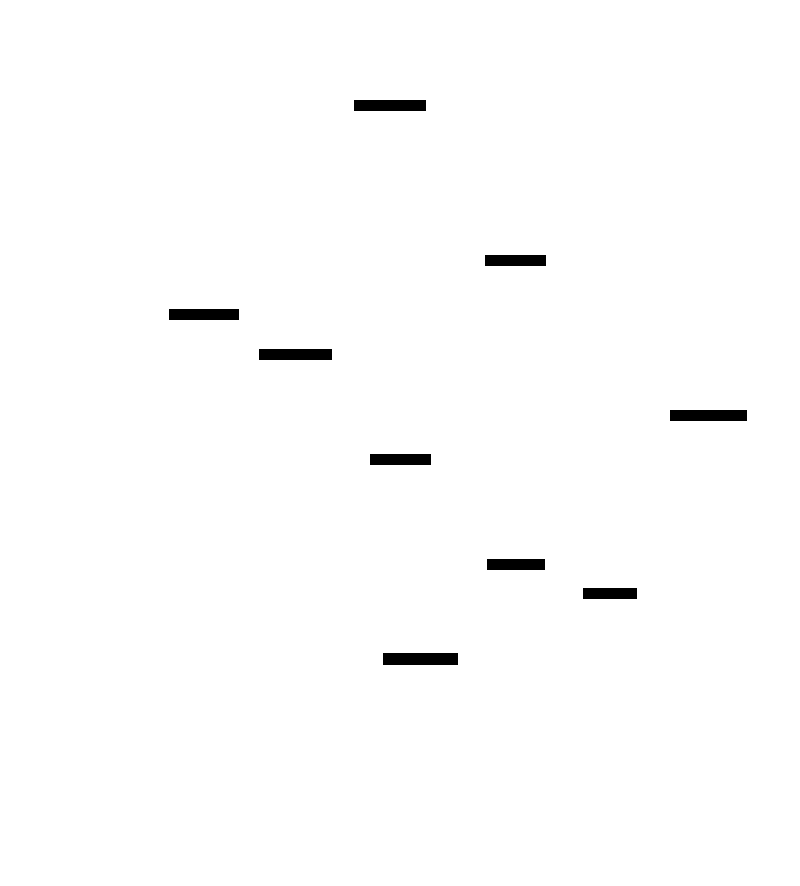
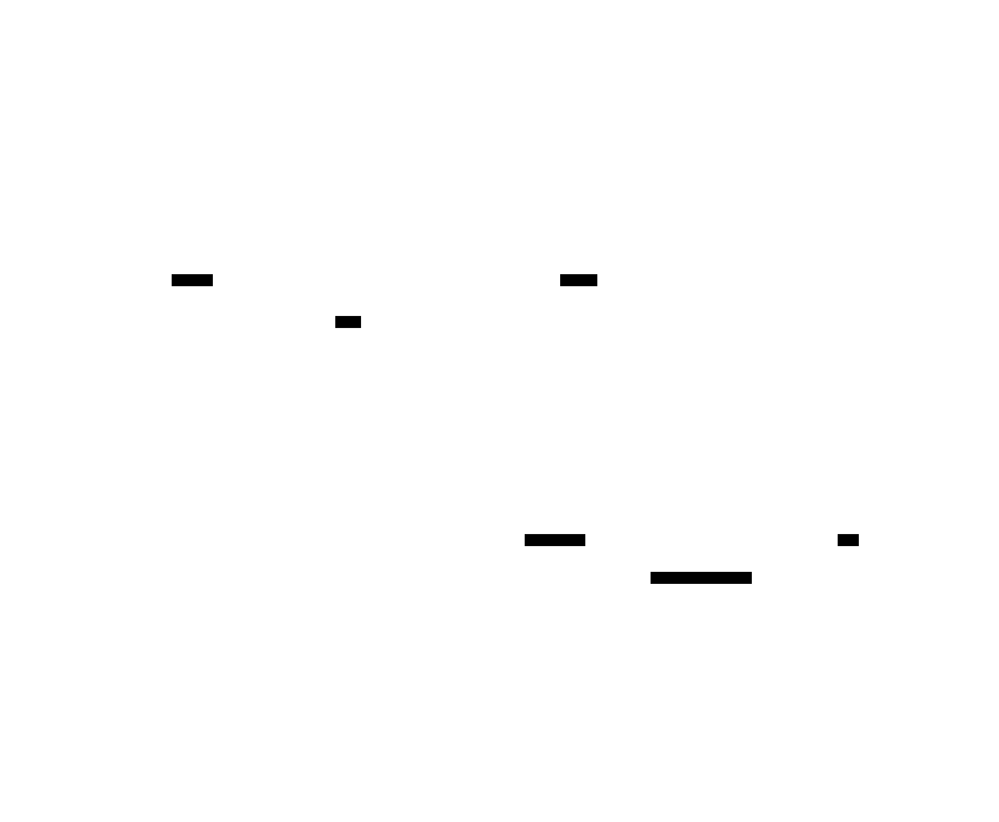
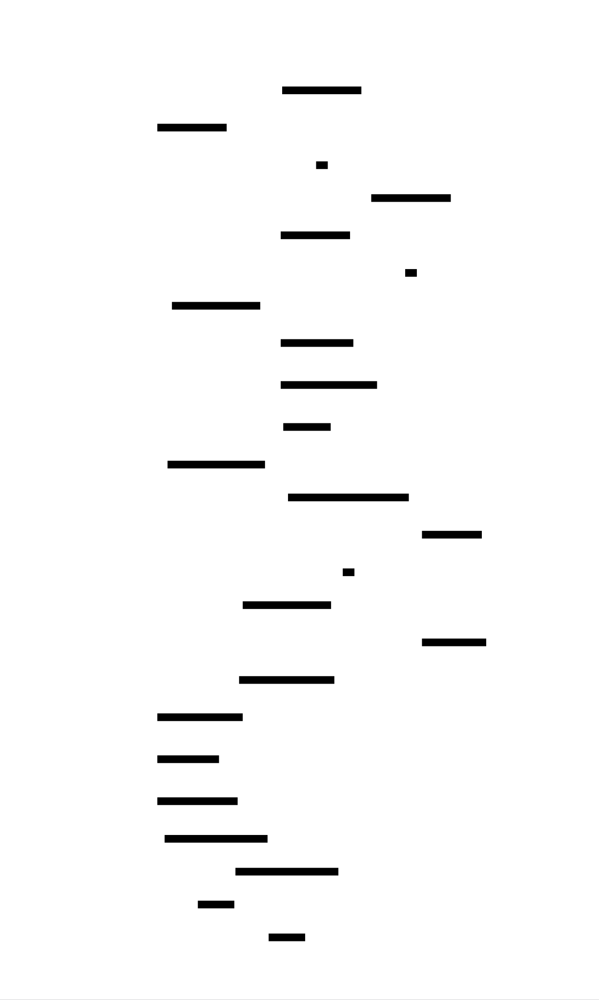
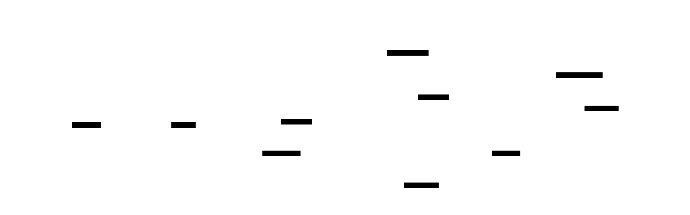
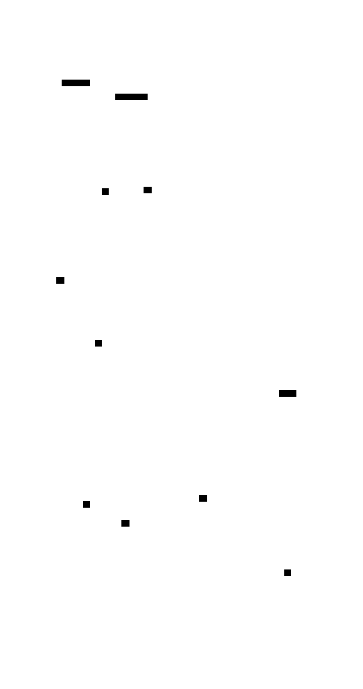
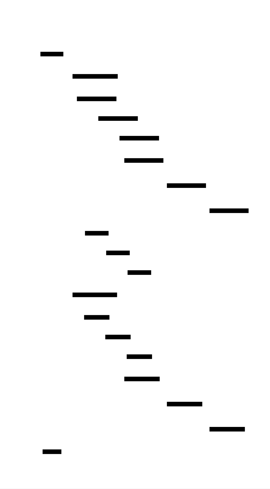

# Vector Clocks: Design Document


## Overview

Vector clocks provide a distributed system with logical time tracking to determine causality and partial ordering of events across multiple nodes. The key architectural challenge is maintaining consistency without requiring global time synchronization, enabling conflict detection and resolution in eventually consistent systems.


> This guide is meant to help you understand the big picture before diving into each milestone. Refer back to it whenever you need context on how components connect.


## Context and Problem Statement

> **Milestone(s):** Milestone 1 (Basic Vector Clock), Milestone 2 (Conflict Detection)

Distributed systems face a fundamental challenge: determining the order of events across multiple nodes without a shared global clock. Think of it like trying to coordinate a complex dance performance where each dancer is on a separate stage, wearing noise-canceling headphones, with no conductor visible to all. Each dancer has their own stopwatch, but these stopwatches run at slightly different speeds and show different times. How can they tell if one dancer's move happened before, after, or at the same time as another dancer's move on a different stage?

This analogy captures the essence of the **causality problem** in distributed systems. When events occur across different machines, we need to understand their causal relationships to maintain consistency, detect conflicts, and reason about system behavior. Physical time, represented by wall-clock timestamps, fails us in this distributed environment due to clock skew, network delays, and the fundamental impossibility of perfect synchronization across nodes.

Vector clocks provide an elegant solution to this problem by implementing **logical time** - a way to track causality without relying on physical clock synchronization. Instead of asking "what time did this event occur?" we ask "what events had to happen before this event could occur?" This shift from absolute time to causal relationships enables distributed systems to maintain consistency and detect conflicts even in the presence of network partitions and node failures.

### Physical vs Logical Time

Physical time seems like the natural solution for ordering events in distributed systems. After all, if we timestamp every event with the wall-clock time when it occurred, we should be able to order them chronologically. However, this intuitive approach breaks down quickly in distributed environments due to several fundamental limitations.

**Clock Skew and Synchronization Challenges**

Consider a distributed key-value store with three nodes: Node A, Node B, and Node C. Each node has its own system clock, and despite our best efforts to synchronize them using protocols like NTP (Network Time Protocol), small differences persist. Node A's clock might be 50 milliseconds ahead of Node B's clock, while Node C's clock lags behind both by 30 milliseconds.

Now imagine this sequence of events:
1. At 10:00:00.100 (Node A's time), Node A receives a write request to set key "balance" to $1000
2. At 10:00:00.080 (Node B's time), Node B receives a write request to set the same key "balance" to $500
3. Both nodes timestamp their operations and attempt to replicate to Node C

When Node C receives both updates, it sees Node A's timestamp as 10:00:00.100 and Node B's timestamp as 10:00:00.080. Based purely on timestamps, Node C would conclude that Node B's write happened first, followed by Node A's write, making the final balance $1000. However, this conclusion is incorrect if Node A's write actually happened first in real time but Node A's clock was fast.

The situation becomes even more complex when we consider network delays. Even if all clocks were perfectly synchronized, the time when an event is timestamped (when it occurs locally) differs from when its effects become visible to other nodes (when the message arrives over the network). A write that occurs at 10:00:00.100 might not reach other nodes until 10:00:00.200 due to network latency, creating ambiguity about the true ordering of events.

**The Happened-Before Relationship**

Leslie Lamport identified that what we actually care about in distributed systems is not when events occurred in absolute time, but their **causal relationships**. The happened-before relationship, denoted as →, captures this concept:
- Event A happened-before event B (A → B) if A could have influenced B
- If A and B cannot influence each other, they are **concurrent** (A || B)

This relationship is defined by three rules:
1. **Local ordering**: If events A and B occur on the same node and A occurs before B in the local execution order, then A → B
2. **Message causality**: If A is the sending of a message and B is the receipt of that same message, then A → B  
3. **Transitivity**: If A → B and B → C, then A → C

Two events are concurrent if neither happened-before the other. This doesn't necessarily mean they occurred at the same physical time, but rather that they are causally independent - neither event could have influenced the other.

Consider this example with three nodes processing banking transactions:
- Node A: Receives deposit of $100, balance becomes $600 (Event A1)
- Node A: Sends account summary to Node B (Event A2, A1 → A2)
- Node B: Receives account summary showing $600 (Event B1, A2 → B1)
- Node B: Processes withdrawal of $50, balance becomes $550 (Event B2, B1 → B2)  
- Node C: Processes withdrawal of $30, balance becomes $570 (Event C1)

In this scenario, events A1, A2, B1, and B2 form a causal chain. However, event C1 is concurrent with all events after A1 because Node C never received any message that would create a causal dependency. The key insight is that C1 could have happened before or after B2 in physical time, but without causal connection, we cannot determine their relationship using timestamps alone.

**Why Logical Time is Necessary**

Logical time provides a solution by focusing on causality rather than physical time. Instead of asking "when did this event happen?" we ask "what other events did this event know about when it occurred?" This shift enables several critical capabilities:

1. **Consistent ordering**: Events can be ordered based on their causal relationships rather than unreliable physical timestamps
2. **Conflict detection**: Concurrent events can be identified as potential conflicts that require resolution
3. **Distributed consistency**: Replicas can determine which updates supersede others without global coordination
4. **Partition tolerance**: Nodes can continue operating during network partitions and reconcile state later

The fundamental insight is that in distributed systems, causality matters more than physical time. If event A causally influences event B, then A must be processed before B to maintain consistency. If events A and B are concurrent, they represent independent actions that might conflict and require resolution.

> **Key Principle**: In distributed systems, logical causality provides a more reliable foundation for reasoning about event ordering than physical time. Vector clocks implement this principle by tracking the causal relationships between events across all nodes in the system.

### Existing Approaches Comparison

Several algorithms have been developed to implement logical time in distributed systems. Each approach makes different trade-offs between accuracy, space efficiency, and implementation complexity. Understanding these alternatives helps clarify why vector clocks are often the preferred solution for conflict detection and causality tracking.

**Lamport Clocks**

Lamport clocks represent the simplest form of logical time. Think of them as a single counter that gets passed around in a relay race. Each runner (node) carries a baton (the clock value), and whenever they pass it to the next runner or receive it from someone else, they make sure the number on the baton is higher than any number they've seen before.

Each node maintains a single integer counter that increases monotonically. The algorithm works as follows:
1. Before executing any event, a node increments its local counter
2. When sending a message, the node includes its current counter value
3. When receiving a message, the node sets its counter to the maximum of its current value and the received value, then increments by 1

| Operation | Local Counter Update | Message Counter |
|-----------|---------------------|-----------------|
| Local event | counter = counter + 1 | N/A |
| Send message | counter = counter + 1 | include counter in message |
| Receive message | counter = max(counter, msg_counter) + 1 | N/A |

Lamport clocks provide a **total ordering** of events: if event A happened-before event B, then A's Lamport timestamp will be less than B's timestamp. However, the converse is not true - if A's timestamp is less than B's timestamp, we cannot conclude that A happened-before B. This limitation makes Lamport clocks insufficient for detecting concurrent events.

Consider three nodes with the following sequence:
- Node 1: Local event (L1=1), Send message to Node 2 (L1=2)  
- Node 2: Receive message (L2=3), Local event (L2=4)
- Node 3: Local event (L3=1), Local event (L3=2)

Both Node 2's second event (L2=4) and Node 3's second event (L3=2) are actually concurrent, but their Lamport timestamps suggest that Node 3's event happened first. This false ordering prevents us from detecting the concurrency.

> **Decision: Lamport Clocks vs Vector Clocks for Conflict Detection**
> - **Context**: Need to detect concurrent writes in a distributed key-value store
> - **Options Considered**: 
>   - Lamport clocks with additional conflict detection logic
>   - Vector clocks with built-in concurrency detection
>   - Physical timestamps with conflict-free replicated data types (CRDTs)
> - **Decision**: Use vector clocks for precise causality tracking
> - **Rationale**: Vector clocks can definitively identify concurrent events, which is essential for conflict detection. Lamport clocks require additional mechanisms and provide false positives.
> - **Consequences**: Increased memory usage (O(N) space per event vs O(1) for Lamport clocks) but accurate conflict detection without false positives.

**Vector Clocks**

Vector clocks extend Lamport's approach by maintaining a vector of counters, one for each node in the system. Think of this as each dancer in our earlier analogy keeping a notebook with a page for every other dancer, tracking the last move they've seen from each performer. This comprehensive tracking enables precise determination of causal relationships.

Each node maintains a vector V where V[i] represents the most recent event node i has observed from node i's perspective. The vector clock operations are:

| Operation | Vector Update Rule | Description |
|-----------|-------------------|-------------|
| Local event | V[local_node] = V[local_node] + 1 | Increment own counter |
| Send message | Include entire vector V | Share current knowledge |  
| Receive message | V[i] = max(V[i], received_V[i]) for all i | Element-wise maximum |
| Receive message | V[local_node] = V[local_node] + 1 | Then increment own counter |

Vector clocks enable precise comparison of causality:
- A → B if and only if V_A ≤ V_B and V_A ≠ V_B (vector comparison)
- A || B if and only if neither V_A ≤ V_B nor V_B ≤ V_A

The vector comparison V_A ≤ V_B means V_A[i] ≤ V_B[i] for all i. This comparison directly reflects the happened-before relationship: if every element of V_A is less than or equal to the corresponding element in V_B, then event A's knowledge is completely contained within event B's knowledge, proving that A could have causally influenced B.

Consider the same three-node example with vector clocks:
- Node 1: Local event V1=(1,0,0), Send to Node 2 V1=(2,0,0)
- Node 2: Receive message V2=(2,1,0), Local event V2=(2,2,0)  
- Node 3: Local event V3=(0,0,1), Local event V3=(0,0,2)

Now we can correctly identify that Node 2's event at V2=(2,2,0) and Node 3's event at V3=(0,0,2) are concurrent because neither vector is less than or equal to the other.

**Version Vectors**

Version vectors represent a specialized application of vector clocks for tracking versions of replicated data. While vector clocks timestamp individual events, version vectors timestamp versions of specific objects or keys. Think of version vectors as the "revision history" for a document in a collaborative editor, where each collaborator's contributions are tracked separately.

In a version vector system, each replica of a data item maintains a vector showing the version number of that item contributed by each node. When replicas exchange updates, they can determine which replica has newer information and whether concurrent updates have occurred.

| Aspect | Vector Clocks | Version Vectors |
|--------|---------------|-----------------|
| Granularity | Per event | Per data item |
| Scope | System-wide causality | Object-specific versioning |
| Use case | Event ordering | Replica synchronization |
| Space overhead | One vector per node | One vector per replicated item |

Version vectors are commonly used in systems like Amazon's Dynamo and Apache Cassandra for tracking the version history of individual keys. When a client reads a key, they receive the data along with its version vector. When they write back, they include the version vector they read, allowing the system to detect if concurrent writes occurred.

**Hybrid Logical Clocks**

Hybrid logical clocks (HLC) attempt to combine the benefits of physical and logical time. They maintain both a physical timestamp and a logical counter, using the physical component for human-readable timestamps while preserving causal ordering through the logical component.

The HLC structure consists of:
- **Physical time**: Wall-clock timestamp (typically milliseconds since epoch)
- **Logical counter**: Integer counter for events within the same physical time

| Comparison Criteria | Lamport Clocks | Vector Clocks | Version Vectors | Hybrid Logical Clocks |
|-------------------|----------------|---------------|-----------------|----------------------|
| Space per event | O(1) | O(N) | O(N) per object | O(1) |
| Causality detection | Partial (false negatives) | Complete | Complete (per object) | Partial |
| Concurrent event detection | No | Yes | Yes | Limited |
| Human readability | No | No | No | Yes |
| Implementation complexity | Simple | Moderate | Moderate | Moderate |
| Best use case | Event logging | Conflict detection | Replica sync | Distributed tracing |

**Trade-offs and Selection Criteria**

The choice between these approaches depends on specific system requirements:

**Choose Lamport clocks when**:
- You only need a total ordering of events
- Memory usage is critical
- Concurrent event detection is not required
- System primarily uses request-response patterns

**Choose vector clocks when**:
- Precise conflict detection is required
- System allows concurrent operations on shared data
- Network partitions are common
- Eventual consistency is acceptable

**Choose version vectors when**:
- Tracking versions of specific objects or keys
- Replica synchronization is the primary use case
- Different objects can evolve independently
- Memory overhead per object is acceptable

**Choose hybrid logical clocks when**:
- Human-readable timestamps are important
- Distributed tracing and debugging are priorities
- Physical time correlation is needed
- Perfect causality detection is not critical

> **Decision: Vector Clocks for Distributed Key-Value Store**
> - **Context**: Building a distributed key-value store that must detect conflicting concurrent writes and support eventual consistency during network partitions
> - **Options Considered**:
>   - Lamport clocks with last-writer-wins conflict resolution
>   - Vector clocks with precise conflict detection  
>   - Version vectors with per-key causality tracking
> - **Decision**: Implement vector clocks with system-wide causality tracking
> - **Rationale**: Vector clocks provide the precise concurrent event detection required for conflict resolution. While version vectors could work for per-key tracking, system-wide causality helps with debugging and provides a foundation for additional distributed algorithms.
> - **Consequences**: Higher memory usage (O(N) per operation) but complete causality information enables sophisticated conflict detection and resolution strategies.

The fundamental insight driving this selection is that distributed systems require more than just event ordering - they need to understand causal independence to detect conflicts and maintain consistency. Vector clocks provide this capability with well-understood semantics and reasonable implementation complexity.

### Implementation Guidance

Vector clocks require careful attention to data structures, algorithm implementation, and edge case handling. This guidance provides concrete starting points for implementing a robust vector clock system in Python.

**Technology Recommendations**

| Component | Simple Option | Advanced Option |
|-----------|---------------|-----------------|
| Data structures | Python dict for vectors | NumPy arrays for large clusters |
| Serialization | JSON for human readability | Protocol Buffers for efficiency |
| Node identification | UUID4 strings | Consistent hashing with integer IDs |
| Storage | In-memory dict | Redis or SQLite for persistence |
| Networking | HTTP REST with requests library | gRPC with async/await |
| Testing | unittest with manual scenarios | Hypothesis for property-based testing |

**Recommended File Structure**

```
vector-clocks/
├── src/
│   ├── vector_clock/
│   │   ├── __init__.py
│   │   ├── clock.py              ← Core VectorClock class
│   │   ├── node.py               ← Node identification and management
│   │   └── exceptions.py         ← Custom exceptions
│   ├── conflict_detection/
│   │   ├── __init__.py
│   │   ├── detector.py           ← ConflictDetector class
│   │   └── resolution.py         ← Conflict resolution strategies
│   ├── storage/
│   │   ├── __init__.py
│   │   ├── versioned_store.py    ← VersionedValue storage
│   │   └── pruning.py            ← Version pruning algorithms
│   └── distributed/
│       ├── __init__.py
│       ├── node.py               ← DistributedNode class
│       └── transport.py          ← Network communication
├── tests/
│   ├── test_vector_clock.py      ← Unit tests for core operations
│   ├── test_conflict_detection.py
│   └── test_integration.py       ← Multi-node scenarios
└── examples/
    ├── basic_usage.py
    └── distributed_kvstore.py
```

**Infrastructure Starter Code**

Here's a complete node identification system that handles the complexity of managing node IDs and cluster membership:

```python
# src/vector_clock/node.py
import uuid
from typing import Set, Optional
from dataclasses import dataclass

@dataclass(frozen=True)
class NodeID:
    """Immutable node identifier for vector clock systems."""
    id: str
    
    @classmethod
    def generate(cls) -> 'NodeID':
        """Generate a unique node ID using UUID4."""
        return cls(str(uuid.uuid4())[:8])  # Short ID for readability
    
    @classmethod  
    def from_string(cls, node_id: str) -> 'NodeID':
        """Create NodeID from string representation."""
        return cls(node_id)
    
    def __str__(self) -> str:
        return self.id
    
    def __repr__(self) -> str:
        return f"NodeID('{self.id}')"

class ClusterMembership:
    """Manages the set of nodes in the cluster for vector clock sizing."""
    
    def __init__(self, initial_nodes: Optional[Set[NodeID]] = None):
        self._nodes: Set[NodeID] = initial_nodes or set()
        self._node_indices: dict[NodeID, int] = {}
        self._rebuild_indices()
    
    def add_node(self, node_id: NodeID) -> None:
        """Add a node to the cluster membership."""
        if node_id not in self._nodes:
            self._nodes.add(node_id)
            self._rebuild_indices()
    
    def remove_node(self, node_id: NodeID) -> None:
        """Remove a node from cluster membership."""
        if node_id in self._nodes:
            self._nodes.remove(node_id)
            self._rebuild_indices()
    
    def get_node_index(self, node_id: NodeID) -> int:
        """Get the vector index for a node ID."""
        if node_id not in self._node_indices:
            raise ValueError(f"Node {node_id} not in cluster membership")
        return self._node_indices[node_id]
    
    def get_all_nodes(self) -> Set[NodeID]:
        """Get all nodes in the cluster."""
        return self._nodes.copy()
    
    def size(self) -> int:
        """Get the number of nodes in the cluster."""
        return len(self._nodes)
    
    def _rebuild_indices(self) -> None:
        """Rebuild the node-to-index mapping for consistent ordering."""
        sorted_nodes = sorted(self._nodes, key=lambda n: n.id)
        self._node_indices = {node: idx for idx, node in enumerate(sorted_nodes)}
```

**Serialization Utilities**

```python
# src/vector_clock/serialization.py
import json
from typing import Dict, Any
from .clock import VectorClock
from .node import NodeID

class VectorClockEncoder(json.JSONEncoder):
    """JSON encoder for vector clock objects."""
    
    def default(self, obj):
        if isinstance(obj, VectorClock):
            return {
                '__type__': 'VectorClock',
                'owner_id': str(obj.owner_id),
                'vector': {str(node_id): count for node_id, count in obj._vector.items()}
            }
        elif isinstance(obj, NodeID):
            return {
                '__type__': 'NodeID', 
                'id': obj.id
            }
        return super().default(obj)

def vector_clock_decoder(dct: Dict[str, Any]) -> Any:
    """JSON decoder for vector clock objects."""
    if dct.get('__type__') == 'VectorClock':
        owner_id = NodeID.from_string(dct['owner_id'])
        vector = {NodeID.from_string(k): v for k, v in dct['vector'].items()}
        # Note: This requires access to VectorClock internals
        clock = VectorClock(owner_id)
        clock._vector = vector
        return clock
    elif dct.get('__type__') == 'NodeID':
        return NodeID.from_string(dct['id'])
    return dct

def serialize_vector_clock(clock: VectorClock) -> str:
    """Serialize vector clock to JSON string."""
    return json.dumps(clock, cls=VectorClockEncoder)

def deserialize_vector_clock(json_str: str) -> VectorClock:
    """Deserialize vector clock from JSON string."""
    return json.loads(json_str, object_hook=vector_clock_decoder)
```

**Core Logic Skeleton**

The heart of the vector clock implementation requires careful attention to the three fundamental operations. Here are the method signatures with detailed TODO comments:

```python
# src/vector_clock/clock.py
from typing import Dict, Optional
from enum import Enum
from .node import NodeID

class CausalityRelation(Enum):
    """Possible relationships between two vector clocks."""
    HAPPENS_BEFORE = "happens_before"
    HAPPENS_AFTER = "happens_after"  
    CONCURRENT = "concurrent"
    IDENTICAL = "identical"

class VectorClock:
    """
    Vector clock implementation for tracking causality in distributed systems.
    
    Each VectorClock instance represents the logical time at a specific node,
    tracking the most recent event observed from each node in the system.
    """
    
    def __init__(self, owner_id: NodeID, initial_nodes: Optional[set[NodeID]] = None):
        self.owner_id = owner_id
        self._vector: Dict[NodeID, int] = {}
        
        # TODO 1: Initialize vector with zeros for all known nodes
        # TODO 2: Ensure owner_id is included in the vector
        # TODO 3: Set all counters to 0 initially
        # Hint: Use dict comprehension to create {node_id: 0 for node_id in all_nodes}
    
    def increment(self) -> None:
        """
        Increment the local node's counter for a local event.
        Called before processing any local event or sending a message.
        """
        # TODO 1: Increment self._vector[self.owner_id] by 1
        # TODO 2: Handle case where owner_id not yet in vector (shouldn't happen but defensive)
        # Hint: Use .get() with default value or ensure initialization is correct
    
    def merge_with(self, other_clock: 'VectorClock') -> None:
        """
        Merge with another vector clock when receiving a message.
        Updates this clock to reflect knowledge from the other clock.
        """
        # TODO 1: For each node_id in other_clock._vector:
        # TODO 2:   Set self._vector[node_id] = max(self._vector.get(node_id, 0), other_clock._vector[node_id])  
        # TODO 3: Handle nodes that exist in other clock but not in this clock
        # TODO 4: After merge, increment own counter (this is a local event)
        # TODO 5: Consider whether to add nodes from other clock to this clock's vector
        # Hint: Element-wise maximum, then increment local counter
    
    def compare_with(self, other_clock: 'VectorClock') -> CausalityRelation:
        """
        Compare this vector clock with another to determine causal relationship.
        Returns the relationship from this clock's perspective to the other.
        """
        # TODO 1: Check if vectors are identical (same keys, same values)
        # TODO 2: Check if this clock ≤ other clock (this[i] ≤ other[i] for all i)
        # TODO 3: Check if other clock ≤ this clock (other[i] ≤ this[i] for all i)  
        # TODO 4: Handle nodes that exist in one vector but not the other
        # TODO 5: Return HAPPENS_BEFORE if this ≤ other and not identical
        # TODO 6: Return HAPPENS_AFTER if other ≤ this and not identical
        # TODO 7: Return CONCURRENT if neither ≤ relationship holds
        # TODO 8: Return IDENTICAL if vectors are equal
        # Hint: Vector comparison A ≤ B means A[i] ≤ B[i] for all i
    
    def copy(self) -> 'VectorClock':
        """Create a deep copy of this vector clock for message sending."""
        # TODO 1: Create new VectorClock instance with same owner_id
        # TODO 2: Copy all entries from self._vector to new clock
        # TODO 3: Ensure changes to copy don't affect original
        # Hint: Use dict.copy() or dict comprehension
    
    def get_count_for_node(self, node_id: NodeID) -> int:
        """Get the counter value for a specific node."""
        # TODO 1: Return self._vector.get(node_id, 0)
        # TODO 2: Consider whether unknown nodes should return 0 or raise error
    
    def get_all_nodes(self) -> set[NodeID]:
        """Get all nodes known to this vector clock."""
        # TODO 1: Return set of all keys in self._vector
```

**Language-Specific Python Hints**

- Use `dataclass(frozen=True)` for immutable value objects like `NodeID`
- Leverage `typing` module for clear type hints: `Dict[NodeID, int]` 
- Use `enum.Enum` for constants like causality relationships
- Use `__slots__` on `VectorClock` to reduce memory usage: `__slots__ = ['owner_id', '_vector']`
- Consider using `collections.defaultdict(int)` for vector storage to handle missing nodes
- Use `copy.deepcopy()` if vector clocks become nested data structures
- Implement `__repr__` and `__str__` methods for easier debugging
- Use `@property` decorators for read-only access to internal state

**Milestone 1 Checkpoint**

After implementing the basic vector clock operations, verify your implementation:

**Unit Test Commands:**
```bash
python -m pytest tests/test_vector_clock.py::test_increment -v
python -m pytest tests/test_vector_clock.py::test_merge -v  
python -m pytest tests/test_vector_clock.py::test_compare -v
```

**Expected Behaviors:**
1. **Increment Test**: Create clock for node A, call increment(), verify A's counter is 1
2. **Merge Test**: Create two clocks, increment each, merge one into other, verify element-wise maximum
3. **Compare Test**: Create scenarios for happens-before, concurrent, and identical relationships

**Manual Verification:**
```python
from src.vector_clock.clock import VectorClock, CausalityRelation
from src.vector_clock.node import NodeID

# Create three nodes
node_a = NodeID.from_string("node_a")  
node_b = NodeID.from_string("node_b")
node_c = NodeID.from_string("node_c")
all_nodes = {node_a, node_b, node_c}

# Initialize clocks
clock_a = VectorClock(node_a, all_nodes)
clock_b = VectorClock(node_b, all_nodes)

# Test causality
clock_a.increment()  # A: [1,0,0]
clock_b.increment()  # B: [0,1,0]

print(f"A after increment: {clock_a}")  # Should show node_a=1, others=0
print(f"B after increment: {clock_b}")  # Should show node_b=1, others=0

relation = clock_a.compare_with(clock_b)
print(f"A compared to B: {relation}")  # Should be CONCURRENT

# Test message passing
clock_a_copy = clock_a.copy()
clock_b.merge_with(clock_a_copy)  # B receives message from A
print(f"B after merge: {clock_b}")  # Should show node_a=1, node_b=2, node_c=0
```

**Common Issues and Debugging:**
- **Clock not incrementing**: Check that `increment()` modifies `self._vector[self.owner_id]`
- **Merge not working**: Verify element-wise maximum logic and that merge calls increment afterward  
- **Wrong causality detection**: Ensure vector comparison handles missing nodes correctly (treat as 0)
- **Memory issues with large vectors**: Consider using sparse representations for clusters with many inactive nodes


## Goals and Non-Goals

> **Milestone(s):** All Milestones (1-4) - defines scope and boundaries for the entire implementation

Building a vector clock system requires clear boundaries between what we're trying to accomplish and what lies outside our scope. Think of this as drawing a map before embarking on a journey - we need to know not just where we're going, but also where we're deliberately choosing not to explore. This section establishes the functional requirements that our implementation must satisfy to successfully track causality in distributed systems, while also clearly defining the limitations and non-goals that keep our project focused and achievable.

The distinction between goals and non-goals is particularly critical for vector clocks because they sit at the intersection of distributed systems theory and practical engineering concerns. While the theoretical foundations are well-established, implementing them in a real system involves numerous trade-offs between correctness, performance, and operational complexity. By explicitly stating what we will and won't handle, we can make informed decisions about these trade-offs throughout the implementation.

### Functional Requirements

Our vector clock implementation serves as both a learning exercise in distributed systems concepts and a foundation for understanding how logical time works in practice. The functional requirements are organized around the four key milestones, with each building upon the previous one to create a comprehensive causality tracking system.

> **Decision: Milestone-Driven Requirements Structure**
> - **Context**: Vector clocks involve multiple interconnected concepts that can overwhelm learners if presented all at once
> - **Options Considered**: 
>   1. Single monolithic requirement list covering all features
>   2. Milestone-based incremental requirements building complexity gradually  
>   3. Feature-based groupings organized by technical domain
> - **Decision**: Milestone-based incremental requirements with clear dependencies
> - **Rationale**: This approach matches how distributed systems are actually built - starting with core primitives and adding complexity layer by layer. It allows learners to validate understanding at each stage before proceeding.
> - **Consequences**: Each milestone can be independently tested and verified, but requires careful design of interfaces to support future extensions

#### Core Vector Clock Operations

The foundation of our system rests on implementing the mathematical properties of vector clocks correctly. Think of vector clocks as a specialized form of bookkeeping where each node in a distributed system maintains a ledger of logical time for itself and all other nodes it knows about. Just as a good bookkeeper must follow precise rules for recording transactions, our vector clock implementation must follow precise rules for updating and comparing logical timestamps.

| Operation | Input Parameters | Output | Functional Behavior |
|-----------|-----------------|--------|---------------------|
| `generate()` | None | `NodeID` | Creates unique identifier for a node in the distributed system |
| `from_string(node_id: str)` | String representation | `NodeID` | Reconstructs NodeID from serialized form for persistence/networking |
| `add_node(node_id: NodeID)` | Node identifier | None | Registers a new node in cluster membership, expanding vector dimensions |
| `increment()` | None | None | Advances local node's logical time counter on each local event |
| `merge_with(other_clock: VectorClock)` | Another vector clock | None | Performs element-wise maximum to incorporate remote events |
| `compare_with(other_clock: VectorClock)` | Another vector clock | `CausalityRelation` | Determines happens-before, happens-after, concurrent, or identical relationship |
| `copy()` | None | `VectorClock` | Creates independent copy to avoid reference sharing bugs |

The `increment()` operation embodies the most fundamental aspect of logical time: every local event advances the node's understanding of its own position in the causal timeline. This seemingly simple operation is what allows distributed systems to reason about causality without requiring synchronized physical clocks. When a node processes a local request, updates its state, or prepares to send a message, it must increment its local counter to reflect that something significant happened.

The `merge_with()` operation implements the heart of vector clock synchronization. When a node receives a message from another node, it must merge the sender's vector clock with its own by taking the element-wise maximum of all counters. This mathematical operation ensures that the receiving node's vector clock reflects all causal relationships that the sender knew about, plus its own local knowledge. The element-wise maximum property guarantees that no causal information is lost during the merge process.

Clock comparison through `compare_with()` enables the system to determine the causal relationship between any two events. This operation must correctly implement the happens-before relationship defined by Lamport: event A happens-before event B if and only if every component of A's vector clock is less than or equal to the corresponding component of B's vector clock, with at least one component being strictly less. When neither clock dominates the other, the events are concurrent and may represent conflicting operations that require special handling.

> The key insight for vector clock comparison is that it implements a partial ordering, not a total ordering. Unlike physical timestamps where any two events can always be ordered chronologically, vector clocks can only order events that have a causal relationship. This partial ordering property is what makes conflict detection possible.

#### Conflict Detection and Multi-Version Storage

Building upon the core vector clock operations, our conflict detection system uses causality information to identify when concurrent updates create conflicts that require resolution. Think of this as an intelligent filing system that not only stores multiple versions of a document but also understands which versions are related and which represent independent changes that might conflict with each other.

| Requirement | Description | Success Criteria |
|-------------|-------------|------------------|
| Concurrent Write Detection | Identify writes with incomparable vector clocks | System detects when two PUT operations have concurrent vector clocks for the same key |
| Multi-Version Storage | Store multiple concurrent versions with metadata | Each key can hold multiple values, each tagged with its vector clock and timestamp |
| Conflict Marking | Flag values that have concurrent version histories | Read operations return conflict indicators when multiple concurrent versions exist |
| Version Metadata Tracking | Associate causality information with each stored value | Every stored value includes vector clock, wall-clock timestamp, and conflict resolution metadata |

The concurrent write detection mechanism must evaluate whether two write operations are causally related or independent. When a client attempts to update a key, the system compares the client's context vector clock (representing the version they read) with the vector clocks of all currently stored versions. If the client's context is concurrent with any existing version, a conflict has occurred that requires resolution.

Multi-version storage extends beyond simply keeping multiple copies of values. Each version must retain enough metadata to support conflict resolution decisions and enable proper causality tracking. This includes not only the vector clock that created the version, but also wall-clock timestamps for tie-breaking, node identifiers for debugging, and flags indicating whether the version resulted from conflict resolution.

The conflict marking system provides visibility into the system's conflict state for both clients and administrators. When a read operation encounters multiple concurrent versions, it must clearly indicate this situation to the client and provide enough information for the client to make an informed decision about how to proceed. This might involve returning all conflicting versions, providing suggested merge results, or applying configured automatic resolution policies.

#### Version Management and Pruning

Version management addresses the practical concern that storing unlimited version history would eventually exhaust available memory and storage resources. Think of version pruning as intelligent archiving - we want to keep enough history to detect and resolve conflicts, but discard information that no longer serves a useful purpose. This requires careful balance between safety and efficiency.

| Pruning Strategy | Trigger Condition | Pruning Rule | Data Retained |
|------------------|-------------------|--------------|---------------|
| Count-Based Pruning | Version count exceeds configured maximum | Remove oldest versions beyond limit | Most recent N versions per key |
| Dominance-Based Pruning | New version causally dominates stored versions | Remove dominated versions that are causally superseded | Only versions that are concurrent with current versions |
| Time-Based Pruning | Versions exceed configured age threshold | Remove versions older than retention period | Recent versions within time window |
| Node Departure Cleanup | Node leaves cluster permanently | Remove vector clock entries for departed node | Compact vector clocks to active nodes only |

Count-based pruning provides a simple upper bound on memory usage by limiting the number of versions stored per key. However, naive implementation of count-based pruning can break conflict detection if it removes versions that are still causally relevant. The pruning algorithm must ensure that removing old versions doesn't create situations where concurrent writes appear to be causally ordered due to missing historical information.

Dominance-based pruning leverages the mathematical properties of vector clocks to safely remove versions that are no longer needed for conflict detection. When a new version causally dominates an existing version (meaning the new version's vector clock shows it happens-after the old version), the old version can be safely pruned because any future write will either be causally related to the new version or concurrent with it - the old version adds no additional information for conflict detection.

Node departure cleanup handles the practical reality that nodes join and leave distributed systems over time. When a node permanently departs, its entries in vector clocks become dead weight that consumes memory without providing value. However, removing these entries requires careful coordination to ensure all nodes agree on the new vector clock structure and that no causal information is lost during the transition.

#### Distributed Key-Value Store Integration

The final functional requirement integrates vector clocks into a working distributed storage system that demonstrates how causality tracking enables consistency guarantees in a replicated environment. Think of this as constructing a distributed filing cabinet where multiple clerks (nodes) can simultaneously access and update files, but the filing system tracks who knew what when, enabling intelligent conflict resolution.

| System Component | Functional Requirement | Implementation Detail |
|-------------------|------------------------|----------------------|
| Inter-Node Communication | Propagate vector clocks with all messages | PUT/GET operations include vector clock metadata in message headers |
| Replication Protocol | Maintain consistency across multiple nodes | Simple all-nodes replication where every node stores every key |
| Read Repair Process | Detect and resolve conflicts during read operations | GET operations compare versions across nodes and write back resolved results |
| Configurable Resolution | Support multiple conflict resolution strategies | Last-writer-wins, client-side merge, and manual resolution options |
| Cluster Membership | Handle dynamic node addition and removal | Vector clock dimensions adjust as nodes join/leave the cluster |

The inter-node communication layer must ensure that vector clocks are properly transmitted and received with every operation. This includes not just the obvious cases like replicating writes, but also read operations that need to return vector clock metadata to clients for future writes. The communication protocol must handle vector clocks of different dimensions gracefully, since nodes may have different views of cluster membership during transitions.

The replication protocol implements a simple but educational approach where all nodes store all keys. While this approach doesn't scale to production systems, it eliminates the complexity of partitioning and allows learners to focus on understanding how vector clocks enable consistency. Each write operation must be replicated to all nodes with proper vector clock propagation, and each node must maintain its local view of the global state.

Read repair provides eventual consistency by detecting conflicts during read operations and resolving them automatically. When a client reads a key, the coordinating node queries all replicas and compares their vector clocks to identify conflicts. If conflicts are detected, the read repair process applies the configured resolution strategy and writes the resolved result back to all replicas, ensuring that future reads see the resolved state.

> **Critical Design Insight**: Read repair is what transforms vector clocks from a theoretical tool into a practical consistency mechanism. Without read repair, conflicts would accumulate indefinitely and the system would become increasingly inconsistent over time.

### Non-Goals and Limitations

Clearly defining what our vector clock implementation will NOT handle is just as important as defining what it will do. These limitations keep the project focused on core learning objectives while acknowledging the additional complexity required for production-ready distributed systems. Think of non-goals as deliberate simplifications that allow us to explore the essential concepts without getting bogged down in peripheral concerns.

#### Performance and Scalability Limitations

Our implementation prioritizes correctness and understandability over performance optimization. While production vector clock systems require sophisticated techniques to handle large clusters and high throughput, our educational implementation deliberately avoids these optimizations to keep the code readable and the concepts clear.

| Limitation Area | What We Don't Handle | Rationale | Production Alternative |
|-----------------|---------------------|-----------|----------------------|
| Large Cluster Support | Clusters beyond 10-20 nodes | Vector clock size grows linearly with node count | Bounded vector clocks, interval tree clocks |
| High-Throughput Operations | Thousands of operations per second | Focus on correctness over performance | Optimized serialization, batching, caching |
| Memory Optimization | Advanced compression and compaction | Educational clarity over space efficiency | Compressed vector representations |
| Network Optimization | Minimizing message size and frequency | Simple protocols easier to understand | Delta compression, gossip protocols |

The linear growth of vector clock size with cluster membership represents one of the fundamental limitations of basic vector clocks. In a cluster with N nodes, each vector clock requires N integers, and each operation must process all N components. While this creates obvious scalability concerns for large clusters, it allows learners to understand the fundamental trade-off between causality tracking precision and resource consumption.

High-throughput optimization would require techniques like batching operations, optimizing serialization formats, and implementing sophisticated caching strategies. These optimizations add significant code complexity that would obscure the core vector clock algorithms. By accepting lower throughput, we can use simple, readable implementations that clearly demonstrate the essential concepts.

Memory optimization techniques like compressed vector representations or advanced garbage collection algorithms would improve resource efficiency but require understanding of additional data structures and algorithms. Our simple approach uses straightforward data structures that make the vector clock operations obvious to readers, even though they consume more memory than optimized implementations.

#### Fault Tolerance and Recovery Limitations

Production distributed systems require extensive fault tolerance mechanisms to handle network failures, node crashes, and data corruption. Our implementation includes basic error handling but deliberately omits many advanced recovery scenarios to keep the focus on vector clock semantics rather than distributed systems engineering.

| Failure Scenario | What We Don't Handle | Educational Trade-off | Production Requirement |
|-------------------|---------------------|----------------------|----------------------|
| Persistent Storage | Durable storage with crash recovery | Focus on in-memory algorithms | WAL, checkpointing, recovery protocols |
| Network Partitions | Split-brain scenarios and partition healing | Complex consensus algorithms beyond scope | Quorum systems, partition detection |
| Byzantine Failures | Malicious or corrupted nodes | Assumes honest but failure-prone nodes | Byzantine fault tolerance algorithms |
| Data Corruption | Checksums and integrity verification | Assumes reliable local storage | CRC checks, replica verification |
| Gradual Node Failure | Detecting and handling slow/unresponsive nodes | Binary up/down failure model | Failure detectors, timeout management |

The absence of persistent storage means our system loses all data when nodes restart. While this creates obvious limitations for practical use, it eliminates the complexity of write-ahead logs, checkpointing, and recovery protocols that would obscure the vector clock logic. Learners can focus on understanding how vector clocks work without getting distracted by storage engine implementation details.

Network partition handling requires sophisticated consensus algorithms and quorum-based decision making that represent entire fields of distributed systems research. By assuming reliable network connectivity, we can demonstrate vector clock behavior without requiring learners to first master Raft, Paxos, or other consensus protocols. The vector clock concepts remain valid when combined with these advanced techniques.

Byzantine fault tolerance addresses scenarios where nodes may be malicious or corrupted, requiring cryptographic verification and redundant computation. Our implementation assumes nodes are honest but may fail or become temporarily unreachable. This honest-but-curious failure model is sufficient for demonstrating vector clock semantics while avoiding the complexity of cryptographic protocols.

#### Consistency Model Limitations  

Our implementation provides eventual consistency with conflict detection, but does not attempt to provide stronger consistency guarantees that some applications require. These limitations reflect deliberate choices about which consistency problems to solve versus which ones to leave for more advanced study.

| Consistency Aspect | What We Don't Provide | Rationale | Advanced Alternative |
|--------------------|----------------------|-----------|---------------------|
| Strong Consistency | Linearizability or sequential consistency | Requires consensus protocols beyond scope | Raft-based replication |
| Causal Consistency | Guaranteed causal ordering across all operations | Complex dependency tracking needed | Causal memory systems |
| Monotonic Read Consistency | Guarantee clients never see older versions after newer ones | Session management complexity | Session-based routing |
| Read-Your-Writes Consistency | Guarantee clients see their own writes immediately | Requires write acknowledgment tracking | Write concern mechanisms |

The absence of strong consistency means that clients might observe different orderings of concurrent operations when reading from different replicas. While our conflict detection mechanism identifies these inconsistencies, it doesn't prevent them from occurring. Applications requiring strong consistency would need additional coordination mechanisms like distributed locking or consensus protocols.

Causal consistency would guarantee that all nodes observe causally related operations in the same order, even if they might disagree about the ordering of concurrent operations. Implementing causal consistency requires tracking causal dependencies between operations and ensuring dependency satisfaction before making operations visible. This adds significant complexity to the replication protocol.

Monotonic read consistency prevents clients from observing "time travel" effects where they see an old version of data after having previously seen a newer version. Providing this guarantee requires either session affinity (routing clients to consistent replicas) or maintaining per-client knowledge about what versions they've previously observed.

#### Operational and Production Readiness Gaps

Our implementation lacks many features required for operating a distributed system in production environments. These operational concerns represent important aspects of real distributed systems but would significantly complicate the learning experience if included in an educational implementation.

| Operational Area | Missing Features | Impact on Production Use | Learning Trade-off |
|------------------|------------------|--------------------------|-------------------|
| Monitoring and Metrics | Performance metrics, health checks, alerting | Cannot detect performance degradation or failures | Focus remains on core algorithms |
| Configuration Management | Dynamic configuration, feature flags | Requires restarts for parameter changes | Simple static configuration |
| Security | Authentication, authorization, encryption | Vulnerable to unauthorized access | Eliminates security protocol complexity |
| Operational Tools | Administration interfaces, debugging tools | Difficult to troubleshoot and maintain | Code remains readable and simple |
| Deployment Support | Containerization, service discovery, load balancing | Manual deployment and configuration required | Avoids infrastructure complexity |

The absence of comprehensive monitoring means operators cannot easily detect when the system is experiencing performance problems, conflicts are increasing, or nodes are becoming unhealthy. Production systems require detailed metrics about operation latency, conflict rates, version storage growth, and network communication patterns. Our simple implementation provides basic logging but lacks the instrumentation needed for production operations.

Configuration management in production systems must support dynamic parameter adjustment without service interruption. Features like adjusting conflict resolution strategies, modifying version retention policies, or changing cluster membership should not require system restarts. Our static configuration approach simplifies the implementation but requires careful upfront planning of all configuration parameters.

Security considerations would require implementing authentication mechanisms to verify node identity, authorization systems to control access to keys and operations, and encryption for both data at rest and data in transit. These security measures are essential for production use but would add significant complexity that distracts from the core vector clock concepts.

> **Key Learning Philosophy**: By explicitly excluding production concerns, we create space for deep understanding of the fundamental concepts. Learners can always add operational features later once they have mastered the core algorithms.

### Implementation Guidance

The goals and non-goals established above directly influence our implementation approach and technology choices. This guidance helps translate the functional requirements into concrete development decisions while respecting the stated limitations.

#### Technology Recommendations

Our implementation approach favors simplicity and educational clarity over production optimization. These recommendations align with our goal of demonstrating vector clock concepts clearly rather than building a production-ready system.

| Component | Simple Option | Advanced Option | Recommended Choice |
|-----------|---------------|-----------------|-------------------|
| Storage Backend | In-memory dictionaries | Persistent key-value store (RocksDB, LevelDB) | In-memory for simplicity |
| Network Communication | HTTP REST with JSON | gRPC with Protocol Buffers | HTTP REST for readability |
| Serialization Format | JSON with readable field names | Binary protocols (MessagePack, Protocol Buffers) | JSON for debugging ease |
| Concurrency Model | Thread-based with locks | Async/await or actor model | Thread-based for familiar patterns |
| Configuration | Static configuration files | Dynamic configuration with hot reload | Static files for simplicity |
| Logging | Standard library logging | Structured logging (logrus, zap) | Standard library for minimal dependencies |

The choice of in-memory storage aligns with our non-goal of avoiding persistent storage complexity. While this limits the practical utility of the implementation, it allows learners to focus entirely on vector clock algorithms without needing to understand storage engine internals, crash recovery, or write-ahead logging protocols.

HTTP REST communication provides maximum transparency for understanding the messages flowing between nodes. Unlike binary protocols that require specialized tools to inspect, HTTP messages can be easily examined with standard tools like curl, browser developer tools, or network packet analyzers. This transparency is invaluable for debugging and understanding distributed system behavior.

JSON serialization makes the vector clock data structures human-readable in network messages and log files. While JSON is less efficient than binary formats, the ability to easily inspect vector clock contents during development and debugging far outweighs the performance cost for our educational purposes.

#### Recommended Module Structure

The module structure reflects the layered architecture described in our functional requirements, with clear separation between core vector clock algorithms and distributed system concerns.

```
vector-clocks/
├── src/
│   ├── core/
│   │   ├── __init__.py
│   │   ├── node_id.py              # NodeID generation and management
│   │   ├── cluster_membership.py   # ClusterMembership tracking
│   │   ├── vector_clock.py         # Core VectorClock implementation
│   │   └── causality.py            # CausalityRelation enum and utilities
│   ├── versioning/
│   │   ├── __init__.py
│   │   ├── versioned_value.py      # VersionedValue and metadata
│   │   ├── conflict_detector.py    # Conflict detection algorithms
│   │   ├── version_store.py        # Multi-version storage and pruning
│   │   └── resolution_strategies.py # Conflict resolution policies
│   ├── distributed/
│   │   ├── __init__.py
│   │   ├── node.py                 # DistributedNode implementation
│   │   ├── message_protocol.py     # Network message formats
│   │   ├── replication.py          # Replication protocol logic
│   │   └── read_repair.py          # Read repair implementation
│   ├── utils/
│   │   ├── __init__.py
│   │   ├── logging_config.py       # Logging setup utilities
│   │   └── test_helpers.py         # Testing utilities and fixtures
│   └── config/
│       ├── __init__.py
│       └── settings.py             # Configuration management
├── tests/
│   ├── unit/
│   │   ├── test_vector_clock.py    # Core vector clock tests
│   │   ├── test_conflict_detection.py # Conflict detection tests
│   │   └── test_version_pruning.py # Pruning algorithm tests
│   ├── integration/
│   │   ├── test_distributed_operations.py # Multi-node operation tests
│   │   └── test_read_repair.py     # Read repair integration tests
│   └── fixtures/
│       ├── sample_configs.py       # Test configuration data
│       └── mock_network.py         # Network simulation utilities
├── examples/
│   ├── simple_cluster.py           # Basic 3-node cluster demo
│   ├── conflict_scenarios.py       # Conflict detection examples
│   └── performance_test.py         # Basic performance measurement
├── docs/
│   ├── api_reference.md            # Generated API documentation
│   └── troubleshooting.md          # Common issues and solutions
├── requirements.txt                # Python dependencies
├── setup.py                        # Package installation script
└── README.md                      # Project overview and quick start
```

The `core/` module contains the essential vector clock algorithms that form the foundation of the system. These modules have no dependencies on networking, storage, or other distributed system concerns, making them easy to test and understand in isolation. The vector clock implementation in this module should be usable in any distributed system that needs causality tracking.

The `versioning/` module builds upon the core vector clock functionality to provide conflict detection and multi-version storage capabilities. This layer introduces the complexity of managing multiple concurrent versions while still remaining independent of specific networking or replication protocols.

The `distributed/` module implements the networking and replication logic that turns individual vector clock instances into a functioning distributed system. This module depends on both `core/` and `versioning/` but encapsulates all the distributed system complexity in a single location.

#### Core Implementation Skeleton

The core vector clock implementation provides the mathematical foundation for all higher-level functionality. These skeletons map directly to the algorithm steps described in the functional requirements.

```python
from enum import Enum
from typing import Dict, Set
from dataclasses import dataclass, field

class CausalityRelation(Enum):
    """Represents the causal relationship between two events"""
    HAPPENS_BEFORE = "happens_before"
    HAPPENS_AFTER = "happens_after" 
    CONCURRENT = "concurrent"
    IDENTICAL = "identical"

@dataclass
class NodeID:
    """Unique identifier for a node in the distributed system"""
    id: str
    
    @classmethod
    def generate(cls) -> 'NodeID':
        """Generate a unique node identifier"""
        # TODO 1: Create a unique string identifier (consider using UUID4)
        # TODO 2: Return NodeID instance with generated identifier
        # Hint: import uuid; uuid.uuid4().hex provides unique strings
        pass
    
    @classmethod
    def from_string(cls, node_id: str) -> 'NodeID':
        """Create NodeID from string representation"""
        # TODO 1: Validate that node_id is non-empty string
        # TODO 2: Return NodeID instance with provided identifier
        pass

@dataclass
class ClusterMembership:
    """Manages the set of nodes in the distributed system cluster"""
    _nodes: Set[NodeID] = field(default_factory=set)
    _node_indices: Dict[NodeID, int] = field(default_factory=dict)
    
    def add_node(self, node_id: NodeID) -> None:
        """Add a node to cluster membership"""
        # TODO 1: Check if node_id is already in _nodes set
        # TODO 2: If new node, add to _nodes set
        # TODO 3: Assign next available index in _node_indices
        # TODO 4: Update all existing vector clocks to include new dimension
        pass
    
    def get_node_index(self, node_id: NodeID) -> int:
        """Get the vector clock index for a specific node"""
        # TODO 1: Look up node_id in _node_indices dictionary
        # TODO 2: Raise KeyError if node_id not found
        # TODO 3: Return the integer index for the node
        pass

@dataclass  
class VectorClock:
    """Vector clock implementation for tracking causality in distributed systems"""
    owner_id: NodeID
    _vector: Dict[NodeID, int] = field(default_factory=dict)
    
    def increment(self) -> None:
        """Increment the local node's counter for a local event"""
        # TODO 1: Get current counter value for owner_id (default to 0 if missing)
        # TODO 2: Increment the counter by 1
        # TODO 3: Store updated counter back in _vector dictionary
        # Hint: _vector.get(owner_id, 0) handles missing keys gracefully
        pass
    
    def merge_with(self, other_clock: 'VectorClock') -> None:
        """Merge another vector clock using element-wise maximum"""
        # TODO 1: Iterate through all node IDs in other_clock._vector
        # TODO 2: For each node, take maximum of self._vector[node] and other_clock._vector[node]
        # TODO 3: Handle case where node exists in other but not in self (use 0 as default)
        # TODO 4: Update self._vector with computed maximums
        # TODO 5: Ensure all nodes from other_clock are now present in self._vector
        pass
    
    def compare_with(self, other_clock: 'VectorClock') -> CausalityRelation:
        """Compare causal relationship with another vector clock"""
        # TODO 1: Get set of all node IDs present in either vector clock
        # TODO 2: Compare corresponding counters for each node (use 0 for missing entries)
        # TODO 3: Track whether self <= other (self happens-before other)  
        # TODO 4: Track whether other <= self (other happens-before self)
        # TODO 5: If all self counters <= other counters AND at least one strictly less: HAPPENS_BEFORE
        # TODO 6: If all other counters <= self counters AND at least one strictly less: HAPPENS_AFTER
        # TODO 7: If all counters equal: IDENTICAL
        # TODO 8: Otherwise: CONCURRENT
        # Hint: Use two boolean flags to track the comparison results
        pass
    
    def copy(self) -> 'VectorClock':
        """Create a deep copy of this vector clock"""
        # TODO 1: Create new VectorClock instance with same owner_id
        # TODO 2: Copy all entries from self._vector to new instance
        # TODO 3: Ensure the copy is independent (changes don't affect original)
        # Hint: dict(_vector) creates a shallow copy of the dictionary
        pass
```

This skeleton provides the complete interface for core vector clock operations while leaving the implementation details as exercises for the learner. Each TODO comment maps directly to a step in the algorithms described in the functional requirements section, ensuring that learners understand not just what to implement, but how each step contributes to the overall algorithm.

#### Milestone Verification Checkpoints

Each milestone should be independently verifiable to ensure learners understand the concepts before proceeding to more complex functionality.

**Milestone 1 Checkpoint: Basic Vector Clock**
```bash
# Run core vector clock tests
python -m pytest tests/unit/test_vector_clock.py -v

# Expected output: All tests pass including:
# - test_node_id_generation_creates_unique_ids
# - test_vector_clock_increment_advances_local_counter  
# - test_vector_clock_merge_computes_element_wise_maximum
# - test_vector_clock_comparison_detects_causality_relationships

# Manual verification:
python -c "
from src.core.vector_clock import NodeID, VectorClock
node1 = NodeID.generate()
node2 = NodeID.generate()
clock1 = VectorClock(node1)
clock1.increment()
print(f'After increment: {clock1._vector}')
# Should show: {NodeID(id='...'): 1}
"
```

**Milestone 2 Checkpoint: Conflict Detection**
```bash
# Run conflict detection tests
python -m pytest tests/unit/test_conflict_detection.py -v

# Manual conflict scenario:
python examples/conflict_scenarios.py
# Should demonstrate concurrent writes being detected and flagged
```

**Milestone 3 Checkpoint: Version Pruning**  
```bash
# Run pruning tests
python -m pytest tests/unit/test_version_pruning.py -v

# Verify memory usage stays bounded:
python examples/pruning_demo.py
# Should show version counts staying within configured limits
```

**Milestone 4 Checkpoint: Distributed Operations**
```bash
# Run full integration tests
python -m pytest tests/integration/ -v

# Start 3-node cluster:
python examples/simple_cluster.py
# In separate terminals, verify PUT/GET operations work across nodes
curl -X PUT localhost:8001/keys/test -d '{"value": "hello", "vector_clock": {}}'
curl -X GET localhost:8002/keys/test
# Should return value with vector clock metadata
```

These checkpoints provide concrete verification steps that confirm each milestone is working correctly before proceeding to the next level of complexity. The combination of automated tests and manual verification ensures both correctness and understanding.


## High-Level Architecture

> **Milestone(s):** Milestone 1 (Basic Vector Clock), Milestone 2 (Conflict Detection), Milestone 3 (Version Pruning), Milestone 4 (Distributed Key-Value Store)

Building a vector clock system is like assembling a distributed orchestra where each musician (node) must stay synchronized without a central conductor. Each musician maintains their own understanding of the musical progression (logical time) and coordinates with others through shared sheet music (vector clocks) that travels with every message. The challenge lies in designing components that work together seamlessly while handling the inherent complexities of distributed communication, conflict resolution, and memory management.

The vector clock system architecture centers around four core responsibilities: tracking logical time, detecting conflicts, managing version history, and coordinating distributed operations. Each component must handle its specific concerns while maintaining clean interfaces with others. Think of it as a well-designed kitchen where each station (component) has specialized tools and responsibilities, but they all work together to produce consistent results even when orders arrive simultaneously from multiple customers.

### System Components

The vector clock system consists of several interconnected components that collaborate to provide distributed causality tracking and conflict resolution. Understanding their individual responsibilities and interactions is crucial for implementing a robust system.



#### Core Vector Clock Engine

The **VectorClock** component serves as the foundational timing mechanism, analogous to a distributed stopwatch that tracks not just local time but the perceived time of all participants in the system. Unlike a simple counter, each vector clock maintains a complete view of the logical progression across all nodes, enabling precise causality determination.

| Component | Responsibility | Key Data | Primary Operations |
|-----------|---------------|----------|-------------------|
| `VectorClock` | Logical time tracking and causality comparison | `owner_id`, `_vector` mapping node IDs to counters | `increment()`, `merge_with()`, `compare_with()` |
| `NodeID` | Unique node identification in cluster | `id` string identifier | `generate()`, `from_string()` |
| `ClusterMembership` | Node registry and vector index management | `_nodes` set, `_node_indices` mapping | `add_node()`, `get_node_index()` |
| `CausalityRelation` | Enumeration of possible event relationships | Enum values for ordering | Comparison result representation |

The vector clock engine handles three fundamental operations that mirror how humans track causality in conversation. When you speak (local event), you advance your understanding of the conversation's progress. When someone else speaks (receive message), you update your understanding to incorporate their perspective. When comparing two points in a conversation, you can determine if one happened before another or if they were concurrent interruptions.

> **Decision: Vector Clock Storage Format**
> - **Context**: Vector clocks need efficient storage and comparison while supporting dynamic cluster membership
> - **Options Considered**: 
>   1. Fixed-size arrays with node indices
>   2. Hash maps with node IDs as keys
>   3. Sparse vectors with compression
> - **Decision**: Hash maps with `NodeID` keys
> - **Rationale**: Provides natural support for dynamic membership, eliminates need for global index coordination, and offers O(1) access for individual node counters
> - **Consequences**: Slightly higher memory overhead than arrays, but enables seamless node addition/removal without cluster-wide coordination

#### Conflict Detection and Resolution

The **ConflictDetector** acts as the system's logical referee, identifying when concurrent operations create conflicts that require resolution. Think of it as a traffic controller at a busy intersection—it doesn't prevent cars from approaching simultaneously, but it detects when they would collide and ensures proper resolution.

| Component | Responsibility | Key Data | Primary Operations |
|-----------|---------------|----------|-------------------|
| `ConflictDetector` | Identify concurrent conflicting operations | Active conflicts per key | `detect_conflict()`, `mark_resolved()` |
| `VersionStore` | Multi-version value storage with vector clock metadata | Versioned values with timestamps | `store_version()`, `get_versions()`, `prune_versions()` |
| `ConflictResolver` | Strategy-based conflict resolution | Resolution policies | `resolve_lww()`, `resolve_merge()` |

The conflict detection system operates on the principle that causally concurrent events accessing the same resource represent potential conflicts. When two writes occur with incomparable vector clocks, the system preserves both versions rather than allowing one to silently overwrite the other. This approach mirrors how version control systems handle merge conflicts—preserve all information and let resolution happen explicitly rather than implicitly.

> **The critical insight here is that conflict detection must happen at write time, not read time. By the time a client reads a value, the window for preventing data loss has already closed.**

#### Version Management and Pruning

The **VersionManager** component resembles a librarian managing multiple editions of books—it must retain enough versions to detect conflicts and support reads, while preventing unlimited growth that would exhaust storage. This component implements sophisticated pruning strategies that balance consistency guarantees with resource constraints.

| Component | Responsibility | Key Data | Primary Operations |
|-----------|---------------|----------|-------------------|
| `VersionManager` | Version lifecycle and pruning coordination | Pruning policies, retention limits | `should_prune()`, `find_dominated()` |
| `GarbageCollector` | Clock cleanup for departed nodes | Node membership history | `collect_orphaned_clocks()`, `compact_vectors()` |
| `StorageMetrics` | Memory usage tracking and reporting | Version counts, storage statistics | `report_usage()`, `check_limits()` |

The version management strategy follows a two-phase approach: aggressive pruning of clearly dominated versions, and conservative retention of potentially conflicting versions. A version is dominated when all concurrent versions have vector clocks that happen-after it, meaning the dominated version cannot contribute to any future conflict detection.

#### Distributed Coordination

The **DistributedNode** component orchestrates the interaction between local vector clock operations and distributed system concerns. It functions like a diplomatic embassy—handling communication with other nodes while maintaining local sovereignty over data and decisions.

| Component | Responsibility | Key Data | Primary Operations |
|-----------|---------------|----------|-------------------|
| `DistributedNode` | Node coordination and message handling | Local node state, peer connections | `handle_put()`, `handle_get()`, `broadcast_update()` |
| `MessageHandler` | Inter-node communication protocol | Message queues, routing tables | `send_message()`, `receive_message()` |
| `ReplicationManager` | Data replication across cluster | Replication factor, consistency level | `replicate_write()`, `read_repair()` |
| `NetworkTransport` | Low-level network communication | Connection pools, serialization | `establish_connection()`, `serialize_message()` |

> **Decision: Replication Strategy**
> - **Context**: Must balance consistency, availability, and partition tolerance while keeping implementation manageable
> - **Options Considered**:
>   1. Single-node primary with async replication
>   2. All-nodes replication with eventual consistency
>   3. Quorum-based replication with configurable consistency
> - **Decision**: All-nodes replication for simplicity
> - **Rationale**: Eliminates leader election complexity, provides maximum availability for reads, and aligns with learning objectives around conflict detection
> - **Consequences**: Higher write amplification and storage usage, but simpler failure handling and no split-brain scenarios

### Recommended Module Structure

Organizing the vector clock codebase requires careful separation of concerns while maintaining clear dependency relationships. The structure should guide developers toward proper abstraction boundaries and prevent circular dependencies that often plague distributed systems implementations.

Think of the module structure as layers in a well-designed building: the foundation (core vector clock operations) supports the infrastructure (conflict detection and storage), which in turn supports the application layer (distributed key-value operations). Each layer can only depend on layers below it, preventing architectural violations that lead to tangled code.

#### Primary Module Organization

The codebase should be organized into distinct packages that reflect the component architecture while maintaining testability and clear interfaces:

```
vector-clocks/
├── cmd/
│   ├── server/                    ← Entry points and configuration
│   │   └── main.py
│   └── client/
│       └── main.py
├── src/
│   ├── core/                      ← Foundation layer: vector clock primitives
│   │   ├── __init__.py
│   │   ├── vector_clock.py        ← VectorClock, NodeID, CausalityRelation
│   │   ├── cluster_membership.py  ← ClusterMembership management
│   │   └── causality.py           ← Comparison algorithms and utilities
│   ├── storage/                   ← Data layer: versioning and persistence
│   │   ├── __init__.py
│   │   ├── version_store.py       ← VersionStore, versioned value management
│   │   ├── conflict_detector.py   ← ConflictDetector, conflict identification
│   │   └── pruning.py             ← VersionManager, GarbageCollector
│   ├── distributed/               ← Network layer: node coordination
│   │   ├── __init__.py
│   │   ├── node.py                ← DistributedNode, local operations
│   │   ├── messaging.py           ← MessageHandler, protocol implementation
│   │   ├── replication.py         ← ReplicationManager, consistency protocols
│   │   └── transport.py           ← NetworkTransport, low-level communication
│   └── utils/                     ← Shared utilities and common types
│       ├── __init__.py
│       ├── serialization.py       ← Message and clock serialization
│       ├── metrics.py             ← StorageMetrics, monitoring
│       └── config.py              ← Configuration management
├── tests/                         ← Comprehensive test suite
│   ├── unit/                      ← Component-level tests
│   │   ├── test_vector_clock.py
│   │   ├── test_conflict_detection.py
│   │   └── test_version_store.py
│   ├── integration/               ← Multi-component tests
│   │   ├── test_distributed_operations.py
│   │   └── test_conflict_resolution.py
│   └── scenarios/                 ← End-to-end system tests
│       ├── test_network_partitions.py
│       └── test_node_failures.py
└── docs/                          ← Documentation and examples
    ├── examples/
    └── api/
```

#### Module Dependency Graph

The dependency relationships between modules enforce clean architectural boundaries and prevent circular dependencies that could compromise the system's maintainability:

| Module | Depends On | Provides To | Key Abstractions |
|--------|------------|-------------|------------------|
| `core` | None | All other modules | `VectorClock`, `NodeID`, causality primitives |
| `storage` | `core`, `utils` | `distributed` | `VersionStore`, `ConflictDetector`, storage abstractions |
| `distributed` | `core`, `storage`, `utils` | `cmd` | `DistributedNode`, network protocols |
| `utils` | `core` | `storage`, `distributed` | Serialization, metrics, configuration |

This dependency structure ensures that core vector clock logic remains independent of storage and networking concerns, enabling thorough unit testing and alternative implementations of higher-level components.

#### Interface Boundaries

Each module exposes carefully designed interfaces that hide implementation details while providing necessary functionality to dependent modules. The interfaces act as contracts that enable independent development and testing of each component:

| Interface | Module | Key Methods | Purpose |
|-----------|--------|-------------|---------|
| `VectorClockInterface` | `core` | `increment()`, `merge_with()`, `compare_with()` | Logical time operations |
| `StorageInterface` | `storage` | `put()`, `get()`, `list_versions()` | Multi-version data storage |
| `ConflictInterface` | `storage` | `detect_conflict()`, `resolve_conflict()` | Conflict management |
| `NodeInterface` | `distributed` | `handle_put()`, `handle_get()`, `join_cluster()` | Distributed operations |
| `TransportInterface` | `distributed` | `send_message()`, `receive_message()` | Network communication |

> **Decision: Interface Granularity**
> - **Context**: Must balance interface simplicity with flexibility for testing and alternative implementations
> - **Options Considered**:
>   1. Coarse-grained interfaces combining multiple responsibilities
>   2. Fine-grained interfaces with single responsibilities
>   3. Mixed approach with primary interfaces and extension points
> - **Decision**: Fine-grained interfaces aligned with component responsibilities
> - **Rationale**: Enables better unit testing through focused mocking, supports incremental implementation, and facilitates future extensions
> - **Consequences**: More interface definitions to maintain, but cleaner separation of concerns and better testability

#### Common Pitfalls in Module Organization

⚠️ **Pitfall: Circular Dependencies Between Storage and Core**
Many implementations inadvertently create circular dependencies by having the core vector clock module depend on storage interfaces for persistence. This violates the principle that core logic should be independent of storage concerns. The fix is to use dependency injection—the storage layer depends on core interfaces, not vice versa.

⚠️ **Pitfall: Mixing Network Protocol Logic with Business Logic**
Embedding vector clock increment and merge logic directly in network message handlers creates tight coupling that makes testing difficult and limits protocol flexibility. Instead, network handlers should translate messages to method calls on business logic interfaces, keeping protocol concerns separate from causality tracking.

⚠️ **Pitfall: Inadequate Interface Abstraction for Testing**
Creating concrete dependencies between modules makes unit testing nearly impossible, forcing tests to set up entire distributed systems. Design interfaces that can be easily mocked, with focused responsibilities that map to specific test scenarios.

⚠️ **Pitfall: Shared Mutable State Across Modules**
Sharing vector clock instances or version stores directly between modules leads to unpredictable behavior and race conditions. Each module should own its data structures and communicate through well-defined interfaces that enforce proper synchronization and ownership transfer.

### Implementation Guidance

The vector clock system requires careful attention to both the theoretical foundations and practical implementation details. The following guidance provides concrete starting points while preserving the core learning opportunities around causality tracking and distributed systems coordination.

#### Technology Recommendations

| Component | Simple Option | Advanced Option | Rationale |
|-----------|---------------|-----------------|-----------|
| Networking | HTTP REST with JSON | gRPC with Protocol Buffers | REST provides easier debugging and tooling |
| Serialization | Built-in `json` module | `msgpack` or Protocol Buffers | JSON offers human readability during development |
| Storage | In-memory dictionaries | SQLite or embedded database | In-memory simplifies initial implementation |
| Logging | Python `logging` module | Structured logging with `structlog` | Standard logging sufficient for learning |
| Testing | `unittest` framework | `pytest` with fixtures | unittest included in standard library |
| Configuration | Environment variables | YAML/TOML configuration files | Environment variables reduce external dependencies |

#### Recommended Project Structure

```python
# File: src/core/__init__.py
"""
Core vector clock primitives and causality tracking.

This module provides the fundamental building blocks for logical time
in distributed systems, including vector clocks, node identification,
and causality comparison operations.
"""

from .vector_clock import VectorClock, CausalityRelation
from .cluster_membership import ClusterMembership, NodeID

__all__ = [
    'VectorClock', 
    'CausalityRelation', 
    'ClusterMembership', 
    'NodeID'
]
```

```python
# File: src/core/vector_clock.py
"""Vector clock implementation for distributed causality tracking."""

from enum import Enum
from typing import Dict, Optional
from .cluster_membership import NodeID

class CausalityRelation(Enum):
    """Represents the causal relationship between two vector clocks."""
    HAPPENS_BEFORE = "happens_before"
    HAPPENS_AFTER = "happens_after" 
    CONCURRENT = "concurrent"
    IDENTICAL = "identical"

class VectorClock:
    """
    Vector clock for tracking causality in distributed systems.
    
    Each vector clock maintains counters for all known nodes in the system,
    enabling determination of happens-before relationships between events.
    """
    
    def __init__(self, owner_id: NodeID, initial_nodes: Optional[set] = None):
        """
        Initialize vector clock for the specified owner node.
        
        Args:
            owner_id: The node that owns this vector clock
            initial_nodes: Set of nodes to initialize with zero counters
        """
        self.owner_id = owner_id
        self._vector: Dict[NodeID, int] = {}
        
        # TODO 1: Initialize all counters to zero for known nodes
        # TODO 2: Ensure owner node is included in the vector
        # Hint: Use a loop to set each node's counter to 0
        
    def increment(self) -> None:
        """
        Increment the local counter for this node's events.
        
        This should be called whenever the local node experiences an event
        (either local computation or sending a message).
        """
        # TODO 1: Increment the counter for self.owner_id
        # TODO 2: Handle case where owner_id not yet in vector
        # Hint: self._vector[self.owner_id] = self._vector.get(self.owner_id, 0) + 1
        pass
        
    def merge_with(self, other_clock: 'VectorClock') -> None:
        """
        Merge this clock with another by taking element-wise maximum.
        
        This operation is performed when receiving a message to incorporate
        the sender's view of logical time into the receiver's view.
        
        Args:
            other_clock: The vector clock to merge with (typically from message)
        """
        # TODO 1: For each node in other_clock._vector, take max with local value
        # TODO 2: Add any nodes present in other but not in self
        # TODO 3: Preserve any nodes present in self but not in other
        # Hint: Use max(self._vector.get(node, 0), other_value) for each node
        pass
        
    def compare_with(self, other_clock: 'VectorClock') -> CausalityRelation:
        """
        Compare causality relationship with another vector clock.
        
        Returns:
            HAPPENS_BEFORE if self < other (self causally precedes other)
            HAPPENS_AFTER if self > other (self causally follows other) 
            CONCURRENT if incomparable (concurrent events)
            IDENTICAL if vectors are equal
        """
        # TODO 1: Check if vectors are identical (all counters equal)
        # TODO 2: Check if self <= other (all self counters <= other counters)
        # TODO 3: Check if self >= other (all self counters >= other counters)
        # TODO 4: If neither <= nor >=, events are concurrent
        # Hint: Get union of all nodes from both clocks, compare each counter
        pass
        
    def copy(self) -> 'VectorClock':
        """Create a deep copy of this vector clock."""
        # TODO 1: Create new VectorClock with same owner_id
        # TODO 2: Copy all counter values from self._vector
        # Hint: Use dict.copy() to avoid shared references
        pass
```

```python
# File: src/storage/version_store.py
"""Multi-version storage with vector clock metadata."""

from typing import Dict, List, Optional, Any
from dataclasses import dataclass
from datetime import datetime

from ..core import VectorClock, NodeID

@dataclass
class VersionedValue:
    """A value stored with its vector clock and metadata."""
    value: Any
    vector_clock: VectorClock
    timestamp: datetime
    node_id: NodeID
    
class VersionStore:
    """
    Storage engine for multi-version values with vector clock tracking.
    
    Maintains multiple concurrent versions of each key, enabling conflict
    detection and resolution based on causality relationships.
    """
    
    def __init__(self, max_versions_per_key: int = 10):
        """Initialize version store with configurable limits."""
        self._storage: Dict[str, List[VersionedValue]] = {}
        self._max_versions = max_versions_per_key
        
    def put(self, key: str, value: Any, vector_clock: VectorClock, 
            node_id: NodeID) -> bool:
        """
        Store a new version of the specified key.
        
        Returns:
            True if this creates a conflict (concurrent with existing versions)
            False if this version supersedes all existing versions
        """
        # TODO 1: Create VersionedValue with current timestamp
        # TODO 2: Get existing versions for this key
        # TODO 3: Check for conflicts using vector clock comparison
        # TODO 4: Add new version to storage
        # TODO 5: Trigger pruning if version limit exceeded
        # Hint: A conflict exists if new version is concurrent with any existing version
        pass
        
    def get(self, key: str) -> List[VersionedValue]:
        """
        Retrieve all current versions of the specified key.
        
        Returns empty list if key not found. Multiple versions indicate
        unresolved conflicts that require application-level resolution.
        """
        # TODO 1: Return copy of version list to prevent external modification
        # TODO 2: Handle missing keys gracefully
        pass
        
    def prune_versions(self, key: str) -> int:
        """
        Remove dominated versions that are superseded by newer versions.
        
        Returns:
            Number of versions pruned
        """
        # TODO 1: Get all versions for the key
        # TODO 2: Identify dominated versions (those with vector clocks that happen-before others)
        # TODO 3: Remove dominated versions while preserving concurrent ones
        # TODO 4: Enforce maximum version limit by removing oldest if necessary
        # Hint: A version is dominated if its vector clock happens-before all others
        pass
```

#### Milestone Checkpoints

**Milestone 1 Checkpoint - Basic Vector Clock:**
After implementing the core vector clock operations, verify functionality with these tests:

```python
# Test basic operations
node_a = NodeID.from_string("node_a")
node_b = NodeID.from_string("node_b")
clock_a = VectorClock(node_a, {node_a, node_b})

# Should increment local counter
clock_a.increment()
assert clock_a._vector[node_a] == 1

# Should detect causality relationships
clock_b = VectorClock(node_b, {node_a, node_b})
clock_b.increment()
assert clock_a.compare_with(clock_b) == CausalityRelation.CONCURRENT
```

Expected behavior: Vector clocks correctly track logical time, merge operations produce element-wise maximums, and comparison operations accurately detect causality relationships.

**Milestone 2 Checkpoint - Conflict Detection:**
Test concurrent write detection and multi-version storage:

```python
# Test conflict detection
store = VersionStore()
clock1 = VectorClock(NodeID.from_string("node1"))
clock2 = VectorClock(NodeID.from_string("node2"))

# Concurrent writes should create conflict
conflict1 = store.put("key1", "value1", clock1, clock1.owner_id)
conflict2 = store.put("key1", "value2", clock2, clock2.owner_id)

versions = store.get("key1") 
assert len(versions) == 2  # Both versions preserved
```

Expected behavior: Concurrent writes are detected and preserved, causally ordered writes supersede previous versions, and version storage maintains vector clock metadata.

#### Debugging Common Issues

| Symptom | Likely Cause | How to Diagnose | Fix |
|---------|--------------|-----------------|-----|
| All events marked as concurrent | Vector clocks not merging properly | Print vector contents before/after merge | Ensure merge_with takes element-wise maximum |
| Memory usage grows unbounded | Version pruning not working | Check prune_versions return values | Implement dominated version detection |
| Causality comparison always returns identical | Vector comparison logic incorrect | Test with known different vectors | Fix comparison to check all nodes, not just owner |
| Node crashes on message receive | Missing nodes in vector during merge | Log vector contents and node membership | Initialize missing nodes with counter 0 during merge |

The key to successful debugging is maintaining detailed logs of vector clock state at each operation. Include the complete vector contents, not just summary information, as the specific counter values reveal the causality relationships that drive system behavior.


## Data Model

> **Milestone(s):** Milestone 1 (Basic Vector Clock), Milestone 2 (Conflict Detection), Milestone 3 (Version Pruning)

Think of the data model for vector clocks like a sophisticated library catalog system. In a traditional library, books are organized by a single dimension—perhaps the Dewey Decimal System. But imagine if we needed to track not just where each book belongs, but also which librarian last touched it, when multiple librarians made changes simultaneously, and how to detect when two librarians independently moved the same book to different locations. This is the challenge vector clocks solve in distributed systems: they provide a multi-dimensional catalog that tracks causality and detects conflicts across multiple independent actors.

The data model serves as the foundation for all vector clock operations, defining how we represent logical time, track node participation, store versioned values, and detect conflicts. Unlike physical timestamps that provide a total ordering, our data structures must elegantly handle partial ordering where some events are causally related while others are concurrent and potentially conflicting.


### Vector Clock Structure

The **vector clock** represents logical time as a collection of counters, one for each participating node in the distributed system. Think of it as a digital scoreboard where each node maintains its own counter, and the entire scoreboard represents the current logical time from that node's perspective. When nodes communicate, they synchronize their scoreboards by taking the element-wise maximum, ensuring that causal relationships are preserved.

> **Decision: Vector Clock as Counter Dictionary**
> - **Context**: Vector clocks need to track logical time for each node while allowing dynamic membership changes
> - **Options Considered**: 
>   1. Fixed-size array with predetermined node positions
>   2. Dictionary mapping node IDs to counters  
>   3. Compressed bit vector representation
> - **Decision**: Dictionary-based approach with node ID keys
> - **Rationale**: Dictionaries handle dynamic membership naturally, avoid wasted space for offline nodes, and provide O(1) counter access. Arrays require pre-allocation and complex index management.
> - **Consequences**: Enables dynamic cluster membership but requires careful handling of missing keys during comparisons

| Aspect | Fixed Array | Dictionary | Compressed Vector |
|--------|-------------|------------|-------------------|
| Dynamic Membership | Poor - requires reallocation | Excellent - natural fit | Good - but complex encoding |
| Memory Efficiency | Poor - wastes space for offline nodes | Good - only active nodes | Excellent - minimal space |
| Access Performance | Excellent - O(1) indexed | Good - O(1) hash lookup | Poor - O(n) decompression |
| Implementation Complexity | Low | Low | High |
| **Chosen?** | No | **Yes** | No |

The `NodeID` serves as the unique identifier for each participant in the distributed system. Rather than using simple integers that could collide or require centralized assignment, we use string-based identifiers that can be generated independently by each node. This supports scenarios where nodes join dynamically without requiring coordination with existing members.

**NodeID Structure:**

| Field | Type | Description |
|-------|------|-------------|
| `id` | `str` | Unique string identifier for the node, typically UUID or hostname-based |

The `ClusterMembership` manages the set of known nodes and provides efficient mapping between node identities and vector positions. Think of it as the membership roster for our distributed system—it tracks who's participating and assigns each member a consistent position for vector operations.

**ClusterMembership Structure:**

| Field | Type | Description |
|-------|------|-------------|
| `_nodes` | `Set[NodeID]` | Set of all known participating nodes in the cluster |
| `_node_indices` | `Dict[NodeID, int]` | Maps each node ID to its consistent index position for vector operations |

> **Critical Design Insight**: The membership component separates node identity management from clock operations. This allows vector clocks to focus on causality tracking while membership handles the complexities of dynamic participation, node failures, and rejoining scenarios.

The `CausalityRelation` enum encodes the four possible relationships between any two vector clocks. This represents the mathematical foundation of partial ordering—unlike physical time where every pair of timestamps has a clear before/after relationship, logical time allows for concurrent events that cannot be ordered.

**CausalityRelation Values:**

| Relation | Meaning | Vector Clock Condition |
|----------|---------|----------------------|
| `HAPPENS_BEFORE` | This event causally precedes the other | All counters ≤ other, at least one < |
| `HAPPENS_AFTER` | This event causally follows the other | All counters ≥ other, at least one > |
| `CONCURRENT` | Events are causally independent | Neither dominates the other |
| `IDENTICAL` | Clocks represent the same logical time | All corresponding counters are equal |

The `VectorClock` itself represents the core logical timestamp. Each instance belongs to a specific node (the `owner_id`) and maintains counters for all known nodes in the system. The owner increments its own counter on local events and updates all counters when receiving messages from other nodes.

**VectorClock Structure:**

| Field | Type | Description |
|-------|------|-------------|
| `owner_id` | `NodeID` | The node that owns and increments this vector clock |
| `_vector` | `Dict[NodeID, int]` | Maps each known node ID to its logical time counter |

> **Implementation Note**: The leading underscore on `_vector` indicates this field should be accessed through methods rather than directly. This encapsulation ensures that clock operations maintain invariants like non-negative counters and consistent node membership.

**VectorClock Operations Interface:**

| Method | Parameters | Returns | Description |
|--------|------------|---------|-------------|
| `increment()` | None | `None` | Advances the local node's counter by one, called on each local event |
| `merge_with(other_clock)` | `other_clock: VectorClock` | `None` | Updates this clock by taking element-wise maximum with another clock |
| `compare_with(other_clock)` | `other_clock: VectorClock` | `CausalityRelation` | Determines the causal relationship between this clock and another |
| `copy()` | None | `VectorClock` | Creates a deep copy for safe message transmission |

The merge operation implements the heart of vector clock synchronization. When node A receives a message from node B, A must update its vector clock to reflect the knowledge contained in B's clock. This is accomplished by taking the element-wise maximum of both clocks—ensuring that A's clock reflects at least as much knowledge as both the original A clock and B's clock.

> **Mathematical Foundation**: The element-wise maximum operation preserves the partial ordering property. If event e1 happens-before event e2, then merging e2's clock with any other clock will still show e1 as happening before the merged result. This transitivity is crucial for maintaining causal consistency across multiple hops.

### Versioned Value Model

The versioned value model extends simple key-value storage to track multiple concurrent versions of each value, along with the vector clock metadata needed for conflict detection and resolution. Think of this as a sophisticated version control system where instead of tracking file changes over time, we track value changes across distributed nodes while preserving the causal relationships between modifications.

Each write operation in our distributed system doesn't overwrite the previous value—instead, it creates a new version that coexists with previous versions until conflicts are resolved or versions are pruned. This approach enables us to detect when two nodes independently modified the same key (a conflict) versus when one modification clearly follows another (a causal update).

> **Decision: Multi-Version Storage with Vector Clock Metadata**
> - **Context**: Need to detect conflicts between concurrent writes while supporting eventual consistency
> - **Options Considered**:
>   1. Single value per key with vector clock (lose conflict information)
>   2. Multi-version storage with full metadata
>   3. Multi-version with compressed metadata
> - **Decision**: Full multi-version storage with complete vector clock metadata per version
> - **Rationale**: Only complete metadata enables accurate conflict detection and resolution. Storage overhead is acceptable for correctness guarantees.
> - **Consequences**: Higher memory usage but enables sophisticated conflict resolution strategies

| Approach | Conflict Detection | Storage Overhead | Resolution Options | Data Loss Risk |
|----------|-------------------|------------------|-------------------|----------------|
| Single Value | Poor - overwrites conflicts | Low | None - last writer wins | High |
| **Multi-Version Full** | **Excellent** | **High** | **Many strategies** | **None** |
| Multi-Version Compressed | Good | Medium | Limited | Low |

The `VersionedValue` encapsulates a single version of a value along with all metadata needed for conflict detection, resolution, and debugging. Each version is immutable once created—rather than modifying existing versions, new writes create additional versions that compete for the canonical value.

**VersionedValue Structure:**

| Field | Type | Description |
|-------|------|-------------|
| `value` | `Any` | The actual data value stored (JSON, string, binary, etc.) |
| `vector_clock` | `VectorClock` | The logical timestamp when this version was created |
| `timestamp` | `datetime` | Physical timestamp for tie-breaking and debugging |
| `node_id` | `NodeID` | The node that created this version (for debugging and metrics) |

The physical `timestamp` serves multiple purposes beyond simple wall-clock tracking. While vector clocks provide causal ordering, they cannot break ties between truly concurrent events. The physical timestamp enables last-writer-wins resolution when application-level conflict resolution isn't possible or desired. Additionally, timestamps prove invaluable during debugging—they help operators understand the real-time sequence of events even when vector clocks indicate concurrency.

> **Design Insight**: Including the originating `node_id` in each version enables sophisticated debugging and metrics collection. Operators can identify which nodes are creating the most conflicts, detect patterns in concurrent writes, and diagnose issues like clock skew or network partitioning that affect specific nodes.

The `VersionStore` manages the collection of versioned values for all keys in the system. It implements the multi-version concurrency control that enables conflict detection while providing configurable policies for version pruning to prevent unbounded memory growth.

**VersionStore Structure:**

| Field | Type | Description |
|-------|------|-------------|
| `_storage` | `Dict[str, List[VersionedValue]]` | Maps each key to its list of concurrent versions |
| `_max_versions` | `int` | Configurable limit on versions per key before pruning occurs |

The storage structure as a dictionary of lists reflects the fundamental nature of conflicts in distributed systems. Most keys most of the time have only a single version—no conflicts occurred. But when conflicts do arise, we need to store multiple versions efficiently while supporting quick iteration for conflict resolution and pruning algorithms.

**VersionStore Operations Interface:**

| Method | Parameters | Returns | Description |
|--------|------------|---------|-------------|
| `put(key, value, clock, node)` | `key: str`, `value: Any`, `clock: VectorClock`, `node: NodeID` | `bool` | Stores a new version, returns True if conflict detected |
| `get(key)` | `key: str` | `List[VersionedValue]` | Retrieves all current versions for a key |
| `prune_versions(key)` | `key: str` | `int` | Removes dominated versions, returns count of pruned versions |

The `put` operation implements the core logic for conflict detection. When a new version arrives, the version store must compare its vector clock against all existing versions for the same key. If the new version's clock happens-after any existing version, that existing version is dominated and can be immediately pruned. If any existing version happens-after the new version, the new version is stale and may be rejected. If the new version is concurrent with existing versions, we have a conflict that requires resolution.

**Put Operation Algorithm:**

1. Create a new `VersionedValue` with the provided value, vector clock copy, current timestamp, and node ID
2. Retrieve the current version list for the key, creating an empty list if the key is new  
3. Iterate through existing versions, comparing each version's vector clock with the new version's clock
4. Remove any existing versions that are dominated by the new version (happens-before relationship)
5. If the new version is dominated by any existing version, either reject it or mark it as a historical version
6. If the new version is concurrent with any existing version, add it to create a conflict state
7. Add the new version to the list and check if version count exceeds `_max_versions`
8. If version limit exceeded, trigger pruning algorithm to remove oldest or least important versions
9. Return boolean indicating whether conflicts were detected during this operation

The `get` operation returns all current versions for a key, enabling the caller to implement their preferred conflict resolution strategy. Some applications prefer to return only the "winning" version (using last-writer-wins or application-specific logic), while others surface all conflicting versions to the client for manual resolution.

> **Conflict Resolution Strategy Flexibility**: By returning all versions from `get()`, the version store stays agnostic about resolution policies. Different keys might use different strategies—user profiles might use last-writer-wins, shopping carts might merge quantities, and financial records might require manual reconciliation.

### Common Pitfalls

⚠️ **Pitfall: Direct Vector Access Without Copy**
When sending vector clocks in messages, developers often pass the clock object directly instead of creating a copy. This creates shared mutable state where message processing can inadvertently modify the sender's clock. Always use `clock.copy()` before message transmission to ensure each node maintains independent clock state.

⚠️ **Pitfall: Missing Node Initialization in Vectors**
Vector clock comparisons fail when clocks contain different sets of nodes. A common mistake is comparing a clock with nodes {A, B, C} against a clock with nodes {A, B}, leading to KeyError exceptions. The comparison logic must treat missing nodes as having counter value zero, or initialize all clocks with the complete node set.

⚠️ **Pitfall: Forgetting Physical Timestamps on Version Creation**
Omitting the physical timestamp from versioned values eliminates the ability to break ties between concurrent versions. Later conflict resolution becomes impossible when two versions have identical vector clocks (rare but possible in some edge cases) and no tie-breaking mechanism exists.

⚠️ **Pitfall: Unbounded Version Growth Without Monitoring**
Version stores can grow without bound if pruning policies are too conservative or conflicts occur faster than resolution. Implement monitoring on version count per key and total memory usage to detect runaway growth before it impacts system performance.

⚠️ **Pitfall: Modifying VersionedValue After Creation**
Since versioned values represent immutable historical records, modifying them after creation breaks the integrity of the version history. This is particularly dangerous when multiple references to the same VersionedValue exist—modifications become visible across the entire system.

### Implementation Guidance

The data model provides the foundation for all vector clock operations, so implementing these structures correctly is crucial for the entire system's reliability. The following guidance bridges from our design concepts to working code.

**Technology Recommendations:**

| Component | Simple Option | Advanced Option |
|-----------|---------------|------------------|
| Node ID Generation | UUID4 with string conversion | Hash-based deterministic IDs with hostname |
| Serialization | JSON with datetime strings | Protocol Buffers with optimized encoding |
| Storage Backend | In-memory dictionaries | Persistent storage with SQLite or LevelDB |
| Timestamp Handling | Python datetime with UTC timezone | High-precision monotonic clocks |

**Recommended Module Structure:**
```
vector_clocks/
  data_model/
    __init__.py              ← exports main types
    node_id.py               ← NodeID implementation  
    membership.py            ← ClusterMembership management
    vector_clock.py          ← VectorClock core logic
    versioned_value.py       ← VersionedValue and VersionStore
    causality.py            ← CausalityRelation enum
  test/
    test_data_model.py      ← comprehensive unit tests
```

**Infrastructure Starter Code - Node ID and Membership (Complete):**

```python
# data_model/node_id.py
import uuid
from typing import Set, Dict

class NodeID:
    """Unique identifier for a node in the distributed system."""
    
    def __init__(self, id: str):
        if not id or not isinstance(id, str):
            raise ValueError("Node ID must be a non-empty string")
        self.id = id.strip()
        
    @classmethod
    def generate(cls) -> 'NodeID':
        """Generate a unique node ID using UUID4."""
        return cls(str(uuid.uuid4()))
        
    @classmethod  
    def from_string(cls, node_id: str) -> 'NodeID':
        """Create NodeID from string representation."""
        return cls(node_id)
        
    def __str__(self) -> str:
        return self.id
        
    def __repr__(self) -> str:
        return f"NodeID('{self.id}')"
        
    def __eq__(self, other) -> bool:
        return isinstance(other, NodeID) and self.id == other.id
        
    def __hash__(self) -> int:
        return hash(self.id)

class ClusterMembership:
    """Manages cluster membership and node index assignment."""
    
    def __init__(self):
        self._nodes: Set[NodeID] = set()
        self._node_indices: Dict[NodeID, int] = {}
        
    def add_node(self, node_id: NodeID) -> None:
        """Add a node to the cluster membership."""
        if node_id not in self._nodes:
            self._nodes.add(node_id)
            self._node_indices[node_id] = len(self._nodes) - 1
            
    def get_node_index(self, node_id: NodeID) -> int:
        """Get the vector index for a node."""
        if node_id not in self._node_indices:
            raise KeyError(f"Node {node_id} not in cluster membership")
        return self._node_indices[node_id]
        
    def get_all_nodes(self) -> Set[NodeID]:
        """Return all known nodes in the cluster."""
        return self._nodes.copy()
        
    def size(self) -> int:
        """Return the number of nodes in the cluster."""
        return len(self._nodes)
```

**Infrastructure Starter Code - Causality Relations (Complete):**

```python
# data_model/causality.py
from enum import Enum

class CausalityRelation(Enum):
    """Represents the causal relationship between two vector clocks."""
    
    HAPPENS_BEFORE = "happens_before"
    HAPPENS_AFTER = "happens_after" 
    CONCURRENT = "concurrent"
    IDENTICAL = "identical"
    
    def __str__(self) -> str:
        return self.value
```

**Core Logic Skeleton - Vector Clock (Signatures + TODOs):**

```python
# data_model/vector_clock.py
from datetime import datetime
from typing import Dict, Optional
from .node_id import NodeID
from .causality import CausalityRelation

class VectorClock:
    """
    Vector clock implementation for tracking causality in distributed systems.
    
    Each vector clock maintains logical time counters for all known nodes.
    The owner_id identifies which node owns and increments this clock.
    """
    
    def __init__(self, owner_id: NodeID, initial_nodes: Optional[Set[NodeID]] = None):
        self.owner_id = owner_id
        self._vector: Dict[NodeID, int] = {}
        
        # TODO 1: Initialize vector with zero counters for all initial_nodes
        # TODO 2: Ensure owner_id is included in the vector 
        # TODO 3: Set all initial counter values to 0
        
    def increment(self) -> None:
        """
        Increment the local node's counter for a local event.
        This should be called whenever the owner node performs a local operation.
        """
        # TODO 1: Increment the counter for self.owner_id by 1
        # TODO 2: Handle the case where owner_id is not yet in the vector
        # Hint: Use get() with default value to handle missing keys
        
    def merge_with(self, other_clock: 'VectorClock') -> None:
        """
        Merge this clock with another clock by taking element-wise maximum.
        This implements the vector clock synchronization algorithm.
        """
        # TODO 1: Iterate through all nodes in other_clock._vector
        # TODO 2: For each node, take max(self._vector[node], other_clock._vector[node])
        # TODO 3: Handle nodes that exist in other_clock but not in self._vector
        # TODO 4: Handle nodes that exist in self._vector but not in other_clock
        # Hint: Use max(self._vector.get(node, 0), other_value) for safe access
        
    def compare_with(self, other_clock: 'VectorClock') -> CausalityRelation:
        """
        Compare this vector clock with another to determine causality relationship.
        
        Returns:
        - HAPPENS_BEFORE: if this clock happens before other
        - HAPPENS_AFTER: if this clock happens after other  
        - CONCURRENT: if clocks are concurrent (neither dominates)
        - IDENTICAL: if all counters are exactly equal
        """
        # TODO 1: Get the union of all nodes from both clocks
        # TODO 2: Check if all corresponding counters are equal (IDENTICAL case)
        # TODO 3: Check if all self counters <= other counters AND at least one < (HAPPENS_BEFORE)
        # TODO 4: Check if all self counters >= other counters AND at least one > (HAPPENS_AFTER) 
        # TODO 5: Otherwise, return CONCURRENT
        # Hint: Use .get(node, 0) to handle missing nodes as zero counters
        
    def copy(self) -> 'VectorClock':
        """Create a deep copy of this vector clock for safe message passing."""
        # TODO 1: Create new VectorClock with same owner_id
        # TODO 2: Deep copy the _vector dictionary 
        # TODO 3: Return the new independent clock instance
        # Hint: Use dict.copy() or dict() constructor for shallow copy of counters
```

**Core Logic Skeleton - Versioned Storage (Signatures + TODOs):**

```python  
# data_model/versioned_value.py
from datetime import datetime
from typing import Any, List, Dict
from .node_id import NodeID
from .vector_clock import VectorClock

class VersionedValue:
    """
    Represents a single version of a value with its vector clock metadata.
    Instances are immutable once created to preserve version history integrity.
    """
    
    def __init__(self, value: Any, vector_clock: VectorClock, node_id: NodeID, 
                 timestamp: Optional[datetime] = None):
        self.value = value
        self.vector_clock = vector_clock.copy()  # Always copy to prevent shared state
        self.node_id = node_id
        self.timestamp = timestamp or datetime.utcnow()
        
    def __repr__(self) -> str:
        return f"VersionedValue(value={self.value}, node={self.node_id}, time={self.timestamp})"

class VersionStore:
    """
    Multi-version storage for conflict detection and resolution.
    Maintains multiple concurrent versions per key with vector clock metadata.
    """
    
    def __init__(self, max_versions: int = 10):
        self._storage: Dict[str, List[VersionedValue]] = {}
        self._max_versions = max_versions
        
    def put(self, key: str, value: Any, clock: VectorClock, node: NodeID) -> bool:
        """
        Store a new version of a value with conflict detection.
        
        Returns True if conflicts were detected, False if this was a clean update.
        """
        # TODO 1: Create a new VersionedValue with the provided parameters
        # TODO 2: Get the current version list for the key (or empty list if new)
        # TODO 3: Compare the new version's clock against all existing versions
        # TODO 4: Remove any existing versions dominated by the new version
        # TODO 5: Determine if the new version conflicts with any remaining versions
        # TODO 6: Add the new version to the list
        # TODO 7: Check if version count exceeds _max_versions and prune if needed
        # TODO 8: Return True if concurrent versions exist, False otherwise
        # Hint: Use clock.compare_with() to determine relationships
        
    def get(self, key: str) -> List[VersionedValue]:
        """
        Retrieve all current versions for a key.
        Returns empty list if key doesn't exist.
        """
        # TODO 1: Return the version list for the key
        # TODO 2: Return empty list if key not found
        # TODO 3: Consider returning a copy to prevent external modification
        
    def prune_versions(self, key: str) -> int:
        """
        Remove dominated versions and apply version count limits.
        Returns the number of versions that were pruned.
        """  
        # TODO 1: Get the version list for the key
        # TODO 2: Identify versions that are dominated by other versions
        # TODO 3: Remove dominated versions from the list
        # TODO 4: If still over _max_versions limit, remove oldest versions
        # TODO 5: Update the storage with the pruned list
        # TODO 6: Return count of removed versions
        # Hint: A version is dominated if any other version happens-after it
```

**Language-Specific Python Hints:**

- Use `datetime.utcnow()` for UTC timestamps to avoid timezone issues across distributed nodes
- Dictionary `.get(key, default)` method handles missing keys gracefully in vector operations
- `set.union()` efficiently computes the union of node sets from different vector clocks
- `dict.copy()` creates shallow copies sufficient for immutable integer counters
- Type hints with `from __future__ import annotations` enable forward references for recursive types
- Use `@dataclass` from the dataclasses module for cleaner immutable value objects if preferred

**Milestone Checkpoints:**

After implementing the data model:
- Run `python -m pytest test/test_data_model.py -v` to verify all unit tests pass
- Create two vector clocks, increment them, and verify `compare_with()` returns `CONCURRENT` 
- Store conflicting versions in VersionStore and verify `get()` returns multiple versions
- Test vector clock merge operations preserve causality relationships
- Verify that copying vector clocks prevents shared state mutations

Signs something is wrong:
- Vector clock comparisons raise KeyError - check node initialization in vectors
- Versions aren't detected as conflicts - verify vector clock comparison logic  
- Memory usage grows unbounded - ensure version pruning is working correctly
- Timestamps are inconsistent - use UTC timezone consistently across all nodes


## Vector Clock Core Operations

> **Milestone(s):** Milestone 1 (Basic Vector Clock) - implements the fundamental operations that form the foundation of causality tracking

Think of vector clock operations like the basic arithmetic of distributed causality. Just as elementary math operations (addition, comparison, copying numbers) form the foundation for complex calculations, vector clock operations provide the primitive building blocks for tracking happens-before relationships across distributed nodes. Every sophisticated conflict detection algorithm, every distributed consensus protocol, every eventual consistency mechanism ultimately relies on these four fundamental operations working correctly.

The core operations represent the essential verbs of distributed causality: **increment** advances logical time when local events occur, **merge** synchronizes logical time when receiving messages from other nodes, **compare** determines the causal relationship between two points in logical time, and **copy** creates independent snapshots for safe message passing. These operations must work together seamlessly to maintain the mathematical properties that make vector clocks a reliable foundation for distributed system coordination.


Understanding these operations deeply is crucial because they implement the mathematical foundation of Lamport's happens-before relation. Every distributed algorithm that builds on vector clocks - from conflict-free replicated data types to distributed snapshot algorithms - depends on these operations maintaining specific invariants about causality tracking. A bug in any core operation can cascade into incorrect conflict detection, lost updates, or violated consistency guarantees throughout the entire distributed system.

### Clock Initialization: Creating vector clocks for N nodes with proper zero initialization

**Mental Model**: Imagine setting up a synchronized logbook system across multiple research stations in Antarctica. Before any research begins, each station needs an identical logbook with pages for every other station, all starting with "Day 0" entries. No station can begin logging activities until every station has this complete, zero-initialized logbook structure.

Vector clock initialization establishes the foundational data structure that will track causality across all participating nodes in the distributed system. This process creates a logical timestamp that can represent the causal history of events from every node's perspective, starting from a clean slate where no events have occurred anywhere in the system.

The initialization process requires complete knowledge of cluster membership because vector clocks must allocate space for every participating node. Unlike Lamport clocks which use a single counter, vector clocks maintain separate logical time counters for each node in the system. This comprehensive view enables detection of concurrent events that Lamport clocks cannot distinguish.

> **Decision: Static vs Dynamic Membership During Initialization**
> - **Context**: Vector clocks need to know all participating nodes, but distributed systems often have changing membership
> - **Options Considered**:
>   1. Static membership known at initialization time
>   2. Dynamic membership with vector expansion during runtime
>   3. Fixed-size vectors with node ID hashing
> - **Decision**: Static membership with explicit cluster configuration
> - **Rationale**: Simplifies implementation by avoiding vector resizing complexity; matches learning objectives focused on core causality concepts rather than membership management
> - **Consequences**: Enables predictable memory usage and straightforward indexing; requires cluster reconfiguration for membership changes rather than dynamic adaptation

| Initialization Approach | Memory Usage | Implementation Complexity | Membership Flexibility | Learning Focus |
|-------------------------|--------------|---------------------------|----------------------|----------------|
| Static membership | Predictable, fixed | Low - simple indexing | None - restart required | ✅ Core concepts |
| Dynamic expansion | Variable, growing | High - vector resizing | High - runtime changes | Advanced feature |
| Fixed hash mapping | Fixed, may waste | Medium - collision handling | Medium - reuse slots | Production optimization |

The initialization sequence follows a specific protocol to ensure consistency across all nodes:

1. **Cluster membership determination** establishes the complete set of participating nodes through configuration or discovery protocol
2. **Node identifier assignment** creates unique, stable identifiers for each participating node that remain constant across restarts
3. **Index mapping creation** builds a deterministic mapping from node identifiers to vector positions for consistent ordering
4. **Zero vector allocation** creates the initial vector with all counters set to zero, representing the state before any events occur
5. **Owner identification** associates each vector clock instance with its owning node for proper increment operations
6. **Validation checks** verify that all nodes have identical membership views and consistent index mappings

The `ClusterMembership` component manages the static configuration of participating nodes and provides stable index mappings for vector positions. This separation of concerns isolates membership management from clock operations, enabling the vector clock implementation to focus on causality tracking rather than cluster coordination.

| ClusterMembership Field | Type | Purpose |
|-------------------------|------|---------|
| `_nodes` | `Set[NodeID]` | Complete set of participating nodes in the cluster |
| `_node_indices` | `Dict[NodeID, int]` | Mapping from node identifiers to vector positions |

| ClusterMembership Method | Parameters | Returns | Description |
|--------------------------|------------|---------|-------------|
| `add_node` | `node_id: NodeID` | `None` | Adds a node to cluster membership with assigned index |
| `get_node_index` | `node_id: NodeID` | `int` | Returns the vector position for the specified node |
| `get_all_nodes` | None | `Set[NodeID]` | Returns complete set of participating nodes |
| `size` | None | `int` | Returns the number of nodes in the cluster |

The `VectorClock` initialization process creates the core data structure with proper zero-initialization and owner assignment. Each vector clock instance knows both its owner (for increment operations) and maintains counters for all nodes (for comprehensive causality tracking).

| VectorClock Field | Type | Purpose |
|-------------------|------|---------|
| `owner_id` | `NodeID` | Identifies which node owns this vector clock instance |
| `_vector` | `Dict[NodeID, int]` | Maps each node ID to its logical time counter |

The initialization process ensures several critical invariants that must be maintained throughout the vector clock's lifetime:

> **Invariant: Complete Membership Coverage**
> Every vector clock must contain entries for all nodes in the cluster membership, even if their counters remain at zero. Missing entries would prevent detection of causal relationships involving those nodes.

> **Invariant: Consistent Index Mapping**
> All nodes must use identical mappings from node IDs to vector positions. Inconsistent mappings would make vector clocks incomparable between nodes and break causality detection.

> **Invariant: Owner Identity**
> Each vector clock instance must know its owner node ID to correctly increment the appropriate counter during local events. Incorrect owner assignment leads to malformed causality tracking.

**Concrete Initialization Example**: Consider a three-node distributed system with nodes "node-a", "node-b", and "node-c". The initialization process creates identical cluster membership on each node with the mapping: {node-a → 0, node-b → 1, node-c → 2}. Node A initializes its vector clock as: owner="node-a", vector={node-a: 0, node-b: 0, node-c: 0}. This represents the initial state where no events have occurred anywhere in the system.

### Common Pitfalls: Clock Initialization

⚠️ **Pitfall: Inconsistent Node Ordering Across Nodes**
Different nodes using different index mappings (e.g., node A uses {A→0, B→1, C→2} while node B uses {B→0, A→1, C→2}) makes vector clocks incomparable. Always use deterministic ordering like lexicographic sorting of node IDs or explicit configuration to ensure consistency.

⚠️ **Pitfall: Missing Owner Assignment**
Creating vector clocks without proper owner identification leads to incorrect increment behavior where the wrong counter gets advanced. Always explicitly set the owner_id during initialization and validate it's a member of the cluster.

⚠️ **Pitfall: Partial Membership Initialization**
Initializing vector clocks with only a subset of cluster members prevents detection of causal relationships with the missing nodes. Always initialize with complete cluster membership, even for nodes that haven't generated events yet.

### Local Event Increment: Advancing the local node's counter on each event

**Mental Model**: Think of local event increment like updating your personal diary entry number each time you write a new entry. Your diary has sections for friends' activities too (filled in when they share updates), but you only advance your own page number when you personally write something new. This creates a clear record that you were at "page 47 in your diary" when this particular event happened.

Local event increment represents the fundamental operation that advances logical time within a single node. Every time a node performs a local computation, processes user input, or initiates any operation that changes local state, it must increment its own counter in the vector clock. This creates a strictly monotonic sequence of logical timestamps that can be used to order events within that node.

The increment operation is deceptively simple but critically important for maintaining causality invariants. It ensures that each event on a node receives a unique, increasing logical timestamp that can be compared with other events from the same node. Without proper increment discipline, events would appear to occur simultaneously even when they have clear temporal ordering.

> **Decision: When to Increment the Local Counter**
> - **Context**: Nodes perform many types of operations, and not all may need logical timestamps
> - **Options Considered**:
>   1. Increment on every function call or state change
>   2. Increment only on externally visible events (message sends, client responses)
>   3. Increment on any event that could affect distributed consistency
> - **Decision**: Increment on any event that produces observable effects (state changes, message sends, client interactions)
> - **Rationale**: Provides clear causality tracking for events that matter for consistency while avoiding overhead of tracking pure computation; matches the semantic definition of "events" in distributed systems literature
> - **Consequences**: Enables precise causality tracking for consistency-relevant events; requires clear guidelines about what constitutes an "event" worthy of incrementing

| Increment Trigger | Should Increment? | Rationale | Example |
|-------------------|-------------------|-----------|---------|
| Client write request | ✅ Yes | Changes distributed state | PUT key=value |
| Message send to peer | ✅ Yes | Creates causal dependency | Replication message |
| Internal computation | ❌ No | No external effect | Calculating hash |
| Clock synchronization | ✅ Yes | Updates logical state | Merge operation |
| Read-only operations | ❌ No | No state change | GET without side effects |

The increment algorithm follows a simple but precise protocol:

1. **Event recognition** identifies that a local event requiring causality tracking has occurred
2. **Owner validation** confirms the vector clock belongs to the node performing the increment
3. **Counter retrieval** fetches the current value of the local node's counter from the vector
4. **Atomic increment** advances the local counter by exactly one to create the next logical timestamp
5. **Vector update** stores the incremented value back into the vector clock structure
6. **Consistency verification** ensures the increment operation succeeded and the vector remains valid

The increment operation must be **atomic** to prevent race conditions in multi-threaded environments. If two threads attempt to increment simultaneously without proper synchronization, they might read the same counter value and produce duplicate logical timestamps, violating the monotonic ordering requirement.

| Increment Step | Before State | Operation | After State | Validation |
|----------------|--------------|-----------|-------------|------------|
| 1. Read counter | vector[owner] = 5 | Read current value | value = 5 | Confirm valid owner |
| 2. Increment | value = 5 | Add 1 | value = 6 | Check arithmetic |
| 3. Store back | vector[owner] = 5 | Update vector | vector[owner] = 6 | Verify storage |

The increment operation maintains several important invariants about the vector clock state:

> **Invariant: Monotonic Local Time**
> The local node's counter must strictly increase with each increment operation. Rolling backwards or staying constant would violate causality assumptions and make earlier events appear to happen after later events.

> **Invariant: Owner-Only Increment**
> Only the owner node should increment its own counter. Other nodes' counters are updated through merge operations when receiving messages. Violating this rule would create inconsistent views of logical time across the distributed system.

> **Invariant: Single Step Increment**
> Each increment operation advances the counter by exactly one. Larger increments would create gaps in the logical timeline that could be confused with missing events.

**Concrete Increment Example**: Node A has vector clock {A: 5, B: 3, C: 1} and processes a client write request. The increment operation advances A's counter: {A: 6, B: 3, C: 1}. This new vector clock represents the logical time when the write event occurred, providing a causal timestamp that can be compared with other events.

The increment operation interacts closely with message sending in distributed systems. When a node sends a message, it typically increments its counter and includes a copy of the updated vector clock with the message. This creates a causal relationship where the message send event happens before the message receive event, enabling proper causality tracking across node boundaries.

**Error Handling for Increment Operations**: The increment operation can fail in several scenarios that require careful handling. Memory allocation failures during vector updates, concurrent access violations in multi-threaded environments, or corruption of the vector clock structure all represent serious errors that compromise causality tracking. The system must detect these failures immediately and either recover to a consistent state or fail-fast to prevent propagating inconsistent causality information.

### Common Pitfalls: Local Event Increment

⚠️ **Pitfall: Forgetting to Increment Before Message Send**
Sending messages without incrementing the local counter first means the recipient cannot distinguish this message from the previous one, breaking causality tracking. Always increment before copying the vector clock for message inclusion.

⚠️ **Pitfall: Race Conditions in Multi-threaded Increment**
Two threads reading the same counter value and both incrementing create duplicate logical timestamps. Use proper synchronization (mutexes, atomic operations, or lock-free algorithms) to ensure atomic increment operations.

⚠️ **Pitfall: Incrementing Wrong Node's Counter**
Accidentally incrementing another node's counter instead of the local node's counter violates the fundamental rule that only the owner should advance its own logical time. Always validate the owner_id before increment operations.

### Clock Merge on Message Receive: Element-wise maximum computation when receiving messages

**Mental Model**: Imagine receiving a letter from a friend who shares their personal logbook updates. Your logbook has entries for both your activities and theirs, but their letter might contain news about mutual friends that's more recent than what you knew. You update your logbook by taking the latest information from either your records or their letter for each person, ensuring you have the most current picture of everyone's activities.

Clock merge represents the fundamental synchronization operation that updates a node's view of distributed logical time when receiving information from other nodes. This operation implements the mathematical heart of vector clocks: computing the element-wise maximum of two vectors to create a new logical time that reflects knowledge from both the sender and receiver.

The merge operation solves a critical problem in distributed systems: how to maintain a consistent view of causality when nodes have partial, potentially stale information about each other's activities. By taking the maximum counter value for each node position, the merge operation ensures that the resulting vector clock reflects the most recent known logical time for every participant in the system.



The mathematical foundation of the merge operation comes from lattice theory, where vector clocks form a partially ordered set and the element-wise maximum operation computes the least upper bound (join) of two vector clocks. This mathematical property ensures that merge operations are commutative, associative, and idempotent - critical properties for correctness in distributed systems with unreliable message delivery.

> **Decision: In-Place vs Copy-Based Merge Operations**
> - **Context**: Merge operations can modify the receiving vector clock directly or create a new vector clock instance
> - **Options Considered**:
>   1. In-place merge that modifies the receiver's vector clock directly
>   2. Copy-based merge that creates a new vector clock instance
>   3. Hybrid approach with optional in-place or copy semantics
> - **Decision**: In-place merge with explicit copy operations when needed
> - **Rationale**: Reduces memory allocation overhead for the common case while providing explicit control over when copies are needed; matches typical usage patterns where the receiver's clock should be updated
> - **Consequences**: Enables efficient merge operations without excessive copying; requires careful discipline around when to copy vector clocks before merge to preserve original state

| Merge Strategy | Memory Usage | Performance | Safety | Use Case |
|----------------|--------------|-------------|--------|----------|
| In-place merge | Low - no allocation | High - direct update | Medium - mutates state | ✅ Normal message receive |
| Copy-based merge | High - new allocation | Medium - copy overhead | High - preserves original | Analysis operations |
| Hybrid approach | Variable | Variable | High - explicit control | Complex scenarios |

The merge algorithm implements the element-wise maximum computation with careful attention to handling different vector clock sizes and missing entries:

1. **Message receive detection** identifies that a message containing a vector clock has arrived from another node
2. **Vector clock extraction** retrieves the sender's vector clock from the message payload
3. **Membership validation** ensures both vector clocks have entries for all known cluster members
4. **Element-wise iteration** processes each node ID present in either vector clock
5. **Maximum computation** compares counter values and selects the larger value for each position
6. **Vector update** stores the computed maximum values into the receiving node's vector clock
7. **Consistency verification** validates the merged vector clock maintains proper causality invariants

The core of the merge operation is the element-wise maximum computation, which must handle several edge cases carefully:

| Scenario | Local Counter | Remote Counter | Merged Result | Rationale |
|----------|---------------|----------------|---------------|-----------|
| Both present | 5 | 3 | 5 | Local knowledge is more recent |
| Both present | 3 | 7 | 7 | Remote knowledge is more recent |
| Both equal | 4 | 4 | 4 | Same logical time, no change |
| Local missing | undefined | 6 | 6 | Accept remote knowledge |
| Remote missing | 8 | undefined | 8 | Preserve local knowledge |

The merge operation must maintain vector clock invariants while handling potentially inconsistent or partial information from remote nodes:

> **Invariant: Monotonic Merge Property**
> After merging, each counter value must be greater than or equal to its value before the merge. The merge operation can only advance logical time, never reverse it.

> **Invariant: Causal Consistency**
> If vector clock A causally precedes vector clock B, then merging A with any other clock C should not violate the causal relationship between A and B.

> **Invariant: Membership Preservation**
> The merge operation should preserve entries for all known cluster members, even if one of the input clocks is missing entries for some nodes.

**Concrete Merge Example**: Node B receives a message from Node A. Node B's current vector clock is {A: 3, B: 7, C: 2} and the message contains Node A's vector clock {A: 5, B: 6, C: 4}. The merge operation computes: {A: max(3,5)=5, B: max(7,6)=7, C: max(2,4)=4}, resulting in the merged vector clock {A: 5, B: 7, C: 4}.

The merge operation has subtle but important ordering requirements relative to local event processing. The typical sequence when receiving a message is:

1. **Extract the sender's vector clock** from the incoming message payload
2. **Merge the sender's clock** with the local vector clock using element-wise maximum
3. **Increment the local counter** to account for the message receive event itself
4. **Process the message content** using the updated logical timestamp for any resulting operations

This ordering ensures that the message receive event has a logical timestamp that reflects both the sender's causal history and the fact that message receipt represents a local event on the receiving node.

**Performance Considerations for Merge Operations**: The merge operation's performance depends heavily on the vector clock representation and cluster size. Hash map implementations provide O(n) merge performance where n is the cluster size, while array-based implementations can be optimized for better cache locality. For large clusters, the merge operation becomes a significant overhead, motivating research into bounded vector clocks and other optimization techniques.

### Common Pitfalls: Clock Merge on Message Receive

⚠️ **Pitfall: Merging Before Copying for Message Send**
If you merge an incoming clock in-place and then send that modified clock to other nodes, you're propagating causality information that doesn't reflect your actual causal history. Always copy vector clocks before including them in outgoing messages if you've performed in-place merges.

⚠️ **Pitfall: Forgetting to Increment After Merge**
Merging incoming vector clocks synchronizes your view of remote logical time, but the message receive event itself needs a logical timestamp. Always increment your local counter after merging to account for the message receipt as a local event.

⚠️ **Pitfall: Partial Merge with Missing Entries**
If the incoming vector clock has entries for nodes you don't know about, ignoring those entries loses causality information. Either reject messages from unknown nodes or expand your vector clock to include the new entries (requires careful consideration of membership management).

### Causality Comparison: Determining happens-before, happens-after, or concurrent relationships

**Mental Model**: Think of comparing vector clocks like comparing two students' academic transcripts to see who took prerequisites first. If Alice has credits for Math 101, 201, and 301 while Bob has Math 101 and 201, you can definitively say Alice is "ahead" of Bob academically. But if Alice has Math 301 and Physics 201 while Bob has Chemistry 301 and Math 201, neither is clearly "ahead" - they've taken different paths and are academically concurrent.

Causality comparison implements the mathematical foundation of distributed system ordering by determining the relationship between any two points in logical time. This operation answers the fundamental question: "Did event A happen before event B, after event B, or were they concurrent?" The answer determines whether two events might have influenced each other or whether they represent potentially conflicting concurrent operations.

The comparison operation transforms vector clocks from simple data structures into a powerful tool for distributed reasoning. By examining the relative values of counters across all nodes, the comparison can definitively determine causal relationships that are impossible to establish using physical timestamps alone. This capability enables conflict detection, consistent ordering, and coordination algorithms throughout the distributed system.


The mathematical foundation for vector clock comparison comes from the happens-before relation defined by Leslie Lamport. For vector clocks A and B, the relationship is determined by comparing counter values element-wise across all nodes in the cluster:

> **Mathematical Definition: Vector Clock Ordering**
> - A **happens-before** B (A → B) if: A[i] ≤ B[i] for all i, and A[j] < B[j] for at least one j
> - A **happens-after** B (A ← B) if: B → A (B happens-before A)
> - A **concurrent** with B (A || B) if: neither A → B nor B → A
> - A **identical** to B (A = B) if: A[i] = B[i] for all i

The comparison algorithm must examine every counter position to make a definitive determination about the causal relationship. Unlike simple scalar comparisons, vector clock comparison requires checking multiple conditions and can yield four distinct results.

| CausalityRelation Value | Symbol | Meaning | Implication |
|-------------------------|--------|---------|-------------|
| `HAPPENS_BEFORE` | → | This clock precedes other | Causal dependency possible |
| `HAPPENS_AFTER` | ← | Other clock precedes this | This event sees other's effects |
| `CONCURRENT` | \|\| | No causal relationship | Potential conflict exists |
| `IDENTICAL` | = | Same logical time | Duplicate or synchronized event |

The comparison algorithm implements a systematic evaluation of the mathematical conditions:

1. **Initialization phase** sets up comparison state variables to track the relationship determination
2. **Element-wise examination** iterates through all node positions in both vector clocks
3. **Relationship accumulation** maintains flags indicating whether this clock is less than, greater than, or equal to the other clock in various positions
4. **Edge case handling** manages missing entries or inconsistent membership between the two clocks
5. **Final determination** applies the mathematical rules to determine the definitive causal relationship
6. **Result validation** ensures the computed relationship is consistent and mathematically valid

The comparison logic requires careful tracking of multiple conditions simultaneously:

| Comparison State | Condition | Implication |
|------------------|-----------|-------------|
| `all_less_equal` | this[i] ≤ other[i] for all i | Could be HAPPENS_BEFORE or IDENTICAL |
| `some_less` | this[i] < other[i] for some i | Rules out HAPPENS_AFTER |
| `all_greater_equal` | this[i] ≥ other[i] for all i | Could be HAPPENS_AFTER or IDENTICAL |
| `some_greater` | this[i] > other[i] for some i | Rules out HAPPENS_BEFORE |

The decision tree for determining causal relationships follows a systematic evaluation:

1. **Check for identical vectors**: If all counters are equal, return `IDENTICAL`
2. **Check for happens-before**: If all positions ≤ and some positions <, return `HAPPENS_BEFORE`
3. **Check for happens-after**: If all positions ≥ and some positions >, return `HAPPENS_AFTER`  
4. **Default to concurrent**: If neither ordering condition is met, return `CONCURRENT`

**Concrete Comparison Examples**: 

*Example 1 - Happens-Before Relationship*:
Clock A: {X: 2, Y: 1, Z: 0}, Clock B: {X: 3, Y: 2, Z: 1}
Analysis: A[X] ≤ B[X] (2 ≤ 3), A[Y] ≤ B[Y] (1 ≤ 2), A[Z] ≤ B[Z] (0 ≤ 1), and A < B in all positions
Result: A `HAPPENS_BEFORE` B

*Example 2 - Concurrent Relationship*:
Clock A: {X: 3, Y: 1, Z: 2}, Clock B: {X: 2, Y: 4, Z: 1}  
Analysis: A[X] > B[X] (3 > 2), A[Y] < B[Y] (1 < 4), A[Z] > B[Z] (2 > 1)
Neither A ≤ B nor B ≤ A in all positions
Result: A `CONCURRENT` with B

The comparison operation enables sophisticated distributed algorithms by providing definitive answers about event ordering:

- **Conflict Detection**: Concurrent writes to the same key represent potential conflicts that need resolution
- **Causal Message Delivery**: Messages can be delivered in causal order by checking happens-before relationships
- **Distributed Snapshots**: Consistent global snapshots require events that are not causally related
- **Replication Consistency**: Determining which replica has the most recent update requires causality comparison

> **Performance Insight: Comparison Operation Complexity**
> Vector clock comparison is O(n) where n is the cluster size, as every counter position must be examined. This makes comparison the most expensive core operation, motivating optimizations like early termination when concurrent relationships are detected.

The comparison operation must handle edge cases that arise in real distributed systems:

| Edge Case | Scenario | Handling Strategy |
|-----------|----------|-------------------|
| Missing node entries | Clock A has entry for node X, Clock B doesn't | Treat missing as zero or reject comparison |
| Different membership | Clocks have different sets of nodes | Use intersection or union of node sets |
| Corrupted counters | Negative or extremely large values | Validate inputs before comparison |
| Self-comparison | Comparing a clock with itself | Optimize to return IDENTICAL immediately |

### Common Pitfalls: Causality Comparison

⚠️ **Pitfall: Incorrect Happens-Before Logic**
The happens-before condition requires ALL positions to be ≤ AND at least one position to be strictly <. Implementing this as "any position <" or forgetting the "all positions ≤" part creates incorrect causal relationships. Double-check the mathematical definition.

⚠️ **Pitfall: Forgetting the Concurrent Case**
Many implementations only check for happens-before and happens-after, defaulting to "equal" for other cases. This misses concurrent relationships, which are critical for conflict detection. Always explicitly check for and handle the concurrent case.

⚠️ **Pitfall: Performance Problems with Large Vectors**
Comparing large vector clocks naively can become expensive. Consider early termination strategies: if you find positions where A > B and other positions where A < B, you can immediately return CONCURRENT without checking remaining positions.

### Implementation Guidance

This subsection provides the technical foundation for implementing the vector clock core operations in Python. The focus is on providing complete infrastructure components and clear skeleton code for the core learning objectives.

**A. Technology Recommendations**

| Component | Simple Option | Advanced Option |
|-----------|---------------|-----------------|
| Data Structures | Python dict and set (built-in) | Custom vector classes with optimized storage |
| Serialization | JSON with custom encoder/decoder | Protocol Buffers or MessagePack |
| Thread Safety | threading.Lock for synchronization | concurrent.futures or asyncio primitives |
| Node Identity | UUID strings | Cryptographic node identifiers |
| Testing | unittest with manual test cases | hypothesis for property-based testing |

**B. Recommended File Structure**

```
vector-clocks/
  vector_clock/
    __init__.py                    ← Package initialization
    core/
      __init__.py
      node_id.py                   ← NodeID and cluster membership
      vector_clock.py              ← Core VectorClock implementation  
      causality.py                 ← CausalityRelation enum and comparison logic
    tests/
      test_node_id.py              ← NodeID and membership tests
      test_vector_clock.py         ← Core operations tests
      test_causality.py            ← Causality comparison tests
  examples/
    basic_usage.py                 ← Simple usage examples
    three_node_simulation.py       ← Multi-node causality demo
```

**C. Infrastructure Starter Code**

**File: `vector_clock/core/node_id.py`**
```python
import uuid
from typing import Set, Dict, Optional

class NodeID:
    """Unique identifier for nodes in the distributed system."""
    
    def __init__(self, id: str):
        if not id or not isinstance(id, str):
            raise ValueError("NodeID must be a non-empty string")
        self.id = id
    
    @classmethod
    def generate(cls) -> 'NodeID':
        """Generate a unique NodeID using UUID."""
        return cls(str(uuid.uuid4()))
    
    @classmethod  
    def from_string(cls, node_id: str) -> 'NodeID':
        """Create NodeID from string identifier."""
        return cls(node_id)
    
    def __str__(self) -> str:
        return self.id
    
    def __repr__(self) -> str:
        return f"NodeID('{self.id}')"
    
    def __eq__(self, other) -> bool:
        if not isinstance(other, NodeID):
            return False
        return self.id == other.id
    
    def __hash__(self) -> int:
        return hash(self.id)
    
    def __lt__(self, other) -> bool:
        """Enable deterministic ordering for consistent vector positions."""
        if not isinstance(other, NodeID):
            return NotImplemented
        return self.id < other.id

class ClusterMembership:
    """Manages static cluster membership and node index mapping."""
    
    def __init__(self):
        self._nodes: Set[NodeID] = set()
        self._node_indices: Dict[NodeID, int] = {}
    
    def add_node(self, node_id: NodeID) -> None:
        """Add a node to cluster membership with assigned index."""
        if node_id in self._nodes:
            return  # Already added
        
        self._nodes.add(node_id)
        # Assign index based on sorted order for consistency
        sorted_nodes = sorted(self._nodes)
        self._node_indices = {node: idx for idx, node in enumerate(sorted_nodes)}
    
    def get_node_index(self, node_id: NodeID) -> int:
        """Get the vector position for the specified node."""
        if node_id not in self._node_indices:
            raise KeyError(f"Node {node_id} not in cluster membership")
        return self._node_indices[node_id]
    
    def get_all_nodes(self) -> Set[NodeID]:
        """Return complete set of participating nodes."""
        return self._nodes.copy()
    
    def size(self) -> int:
        """Return the number of nodes in the cluster."""
        return len(self._nodes)
```

**File: `vector_clock/core/causality.py`**
```python
from enum import Enum

class CausalityRelation(Enum):
    """Represents the causal relationship between two vector clocks."""
    HAPPENS_BEFORE = "happens_before"
    HAPPENS_AFTER = "happens_after" 
    CONCURRENT = "concurrent"
    IDENTICAL = "identical"
    
    def __str__(self) -> str:
        return self.value
```

**D. Core Logic Skeleton Code**

**File: `vector_clock/core/vector_clock.py`**
```python
from typing import Dict, Optional
import threading
from .node_id import NodeID, ClusterMembership
from .causality import CausalityRelation

class VectorClock:
    """
    Vector clock implementation for tracking causality in distributed systems.
    
    A vector clock maintains logical time counters for all nodes in the cluster,
    enabling detection of causal relationships between events across nodes.
    """
    
    def __init__(self, owner_id: NodeID, membership: ClusterMembership):
        """
        Initialize a vector clock for the specified owner node.
        
        Args:
            owner_id: The node that owns this vector clock
            membership: Cluster membership defining all participating nodes
        """
        # TODO 1: Validate that owner_id is in the cluster membership
        # TODO 2: Initialize _vector dict with all cluster nodes set to 0
        # TODO 3: Store owner_id and membership references
        # TODO 4: Initialize thread lock for concurrent access protection
        # Hint: Use membership.get_all_nodes() to get complete node set
        pass
    
    def increment(self) -> None:
        """
        Increment the local node's counter to record a local event.
        
        This should be called whenever the owning node performs an operation
        that needs to be tracked in the causal history.
        """
        # TODO 1: Acquire lock for thread safety
        # TODO 2: Get current counter value for owner_id from _vector
        # TODO 3: Increment the counter by 1
        # TODO 4: Store updated counter back in _vector
        # TODO 5: Release lock
        # Hint: Use self.owner_id as the key in self._vector
        pass
    
    def merge_with(self, other_clock: 'VectorClock') -> None:
        """
        Merge another vector clock using element-wise maximum.
        
        This implements the core vector clock synchronization operation,
        updating this clock to reflect the maximum logical time seen
        across both clocks.
        
        Args:
            other_clock: The vector clock to merge with this one
        """
        # TODO 1: Acquire lock for thread safety
        # TODO 2: For each node in the cluster membership:
        # TODO 3:   Get current counter from this clock (default 0 if missing)
        # TODO 4:   Get counter from other clock (default 0 if missing) 
        # TODO 5:   Compute maximum of the two counters
        # TODO 6:   Store maximum value in this clock's vector
        # TODO 7: Release lock
        # Hint: Use max(counter1, counter2) for element-wise maximum
        # Hint: dict.get(key, 0) safely handles missing keys
        pass
    
    def compare_with(self, other_clock: 'VectorClock') -> CausalityRelation:
        """
        Compare this vector clock with another to determine causal relationship.
        
        Returns:
            HAPPENS_BEFORE if this clock causally precedes the other
            HAPPENS_AFTER if the other clock causally precedes this one
            CONCURRENT if the clocks are causally independent
            IDENTICAL if the clocks have identical values
        """
        # TODO 1: Initialize tracking variables: all_less_equal, some_less, 
        #         all_greater_equal, some_greater (all start as True/False)
        # TODO 2: For each node in cluster membership:
        # TODO 3:   Get counter from this clock (default 0)
        # TODO 4:   Get counter from other clock (default 0)  
        # TODO 5:   Update all_less_equal if this_counter <= other_counter
        # TODO 6:   Update some_less if this_counter < other_counter
        # TODO 7:   Update all_greater_equal if this_counter >= other_counter
        # TODO 8:   Update some_greater if this_counter > other_counter
        # TODO 9: Apply decision logic:
        # TODO 10:  If all counters equal, return IDENTICAL
        # TODO 11:  If all_less_equal and some_less, return HAPPENS_BEFORE
        # TODO 12:  If all_greater_equal and some_greater, return HAPPENS_AFTER
        # TODO 13:  Otherwise return CONCURRENT
        # Hint: Track boolean flags as you iterate through positions
        pass
    
    def copy(self) -> 'VectorClock':
        """
        Create a deep copy of this vector clock.
        
        Returns a new VectorClock instance with the same owner and
        identical counter values, suitable for including in messages.
        """
        # TODO 1: Create new VectorClock instance with same owner and membership
        # TODO 2: Copy all counter values from this vector to new vector  
        # TODO 3: Return the new instance
        # Hint: Use dict.copy() or dict constructor to copy counter values
        pass
    
    def get_counter(self, node_id: NodeID) -> int:
        """Get the counter value for a specific node."""
        return self._vector.get(node_id, 0)
    
    def __str__(self) -> str:
        """String representation showing owner and current vector state."""
        counters = {str(node): count for node, count in self._vector.items()}
        return f"VectorClock(owner={self.owner_id}, counters={counters})"
    
    def __repr__(self) -> str:
        return self.__str__()
```

**E. Language-Specific Hints**

- **Thread Safety**: Use `threading.Lock()` or `threading.RLock()` for protecting vector clock operations in multi-threaded environments
- **Dictionary Operations**: `dict.get(key, default)` safely handles missing keys; `dict.copy()` creates shallow copies sufficient for vector counters
- **Enum Comparisons**: Use `relationship == CausalityRelation.HAPPENS_BEFORE` for clear enum comparisons
- **Error Handling**: Raise `ValueError` for invalid inputs, `KeyError` for missing nodes, and consider custom exceptions for vector clock-specific errors
- **Performance**: Consider using `collections.defaultdict(int)` for automatic zero-initialization of missing counters

**F. Milestone Checkpoint**

After implementing the core vector clock operations, verify correctness with these tests:

**Basic Functionality Test**:
```bash
python -m pytest vector_clock/tests/test_vector_clock.py::test_basic_operations -v
```

**Expected Behavior Verification**:
1. **Initialization**: Create vector clocks for 3 nodes, verify all counters start at 0
2. **Increment**: Advance local counter, verify only owner's counter increases  
3. **Merge**: Merge two clocks with different counter values, verify element-wise maximum
4. **Compare**: Test all causality relationships (before, after, concurrent, identical)

**Manual Verification**:
```python
# Create cluster and nodes
membership = ClusterMembership()
node_a = NodeID.from_string("node-a")
node_b = NodeID.from_string("node-b") 
membership.add_node(node_a)
membership.add_node(node_b)

# Create vector clocks
clock_a = VectorClock(node_a, membership)
clock_b = VectorClock(node_b, membership)

# Test increment
clock_a.increment()  # Should advance node-a's counter to 1
print(f"After increment: {clock_a}")  # Should show {node-a: 1, node-b: 0}

# Test merge and compare
clock_b.increment()
clock_b.increment()  # node-b at counter 2
clock_a.merge_with(clock_b)
print(f"After merge: {clock_a}")  # Should show {node-a: 1, node-b: 2}
```

**Signs of Correct Implementation**:
- Vector clocks initialize with zero counters for all cluster members
- Increment operations only advance the owner node's counter
- Merge operations compute element-wise maximum correctly
- Comparison operations return correct causality relationships
- Thread safety prevents race conditions in concurrent access

**Common Issues and Diagnostics**:
- **Symptom**: Increment doesn't change vector → **Check**: owner_id is valid cluster member
- **Symptom**: Merge produces wrong values → **Check**: element-wise maximum logic
- **Symptom**: Comparison returns wrong relationship → **Check**: happens-before condition logic  
- **Symptom**: Thread safety errors → **Check**: proper lock acquisition/release


## Conflict Detection System

> **Milestone(s):** Milestone 2 (Conflict Detection) - implements concurrent write detection, multi-version storage, and conflict resolution strategies

Think of conflict detection in distributed systems like managing multiple people editing the same document simultaneously. In a traditional office setting, only one person can hold the physical document at a time, naturally preventing conflicts. But in a distributed system, multiple nodes can receive write operations for the same key at nearly the same time, with no global coordinator to serialize access. Vector clocks act like intelligent timestamps that can determine whether two edits happened independently (concurrently) or whether one editor saw the other's changes first (causally ordered).

The conflict detection system serves as the intelligent arbitrator that examines the vector clocks of competing writes and makes sophisticated decisions about their relationships. Unlike simple timestamp-based systems that rely on potentially skewed physical clocks, vector clocks provide definitive answers about causality. When two writes have incomparable vector clocks—meaning neither happened before the other—we've detected a genuine conflict that requires resolution.

This system must handle three critical responsibilities: detecting when concurrent writes create conflicts, storing multiple versions of data to preserve all concurrent updates, and providing configurable strategies for resolving conflicts when applications need a single canonical value. The challenge lies in balancing correctness (never losing concurrent updates) with practicality (not storing infinite versions of every key).

### Concurrent Write Detection

**Mental Model: The Causality Detective**

Think of concurrent write detection like a detective investigating whether two crimes could have influenced each other. If criminal A committed their crime before any news of criminal B's crime could have reached them, and vice versa, then the crimes were concurrent—neither criminal knew about or influenced the other's actions. Vector clocks provide the evidence that lets our detective determine these causal relationships definitively.

The core insight is that two writes conflict if and only if their vector clocks are **concurrent**—meaning neither write "happened before" the other in the causal sense. This occurs when each write operation was initiated without knowledge of the other, creating a genuine conflict that cannot be automatically resolved through simple ordering.



The detection algorithm examines incoming write operations by comparing their context vector clocks against existing versions of the same key. When a write arrives with a vector clock that is incomparable to existing versions (neither strictly less than nor strictly greater than), the system has identified a concurrent write that must be preserved alongside existing versions.

> **Decision: Concurrent Detection Strategy**
> - **Context**: Multiple detection approaches exist for identifying conflicting writes in distributed systems
> - **Options Considered**: 
>   - Physical timestamp comparison (simple but unreliable due to clock skew)
>   - Lamport logical clocks (provides ordering but cannot detect concurrency)
>   - Vector clock causality comparison (complex but provides definitive concurrency detection)
> - **Decision**: Use vector clock causality comparison for all conflict detection
> - **Rationale**: Vector clocks are the only approach that can definitively distinguish between causally ordered events and truly concurrent events, eliminating false positives from clock skew while catching all genuine conflicts
> - **Consequences**: Requires maintaining vector clocks for all operations, but provides mathematically sound conflict detection without reliance on physical clock synchronization

| Causality Relationship | Conflict Status | Action Required | Storage Impact |
|------------------------|-----------------|----------------|----------------|
| `HAPPENS_BEFORE` | No conflict | Replace old version | Single version stored |
| `HAPPENS_AFTER` | No conflict | Reject new write | Keep existing version |
| `CONCURRENT` | Conflict detected | Store both versions | Multiple versions stored |
| `IDENTICAL` | No conflict | Duplicate write ignored | No change |

The detection process follows a systematic evaluation of each write request:

1. **Context Vector Clock Extraction**: The incoming write operation includes a context vector clock representing the causal history known to the writing client
2. **Existing Version Retrieval**: The system retrieves all current versions of the target key along with their associated vector clocks
3. **Pairwise Causality Comparison**: Each existing version's vector clock is compared against the incoming context clock using the `compare_with` method
4. **Concurrent Relationship Identification**: If any comparison returns `CONCURRENT`, a conflict has been detected
5. **Conflict Classification**: The system determines whether this is a simple conflict (two versions) or a complex conflict (multiple concurrent versions)
6. **Version Storage Decision**: All concurrent versions must be preserved, while causally dominated versions can be safely replaced

> The critical insight is that causality comparison is transitive but concurrency is not. If write A happened before write B, and write B happened before write C, then A happened before C. However, if A and B are concurrent, and B and C are concurrent, A and C might still have a happens-before relationship if A and C share causal history that doesn't flow through B.

**Concurrent Write Scenarios**

The system must handle multiple patterns of concurrent writes, each requiring different storage and resolution strategies:

| Conflict Pattern | Description | Detection Logic | Resolution Complexity |
|------------------|-------------|----------------|---------------------|
| Simple Fork | Two writes from same causal point | Both concurrent with common ancestor | Low - binary choice |
| Complex Fork | Multiple writes from same causal point | All mutually concurrent | Medium - multi-way choice |
| Interleaved Fork | Writes with partial causal overlap | Mixed concurrent/causal relationships | High - graph resolution |
| Cascading Fork | New writes on existing conflict branches | Concurrent with some, causal with others | Very High - conflict tree |

**Common Pitfalls in Concurrent Write Detection**

⚠️ **Pitfall: Comparing Against Single Version**
Many implementations incorrectly compare the incoming write only against the "latest" version of a key, missing conflicts with other concurrent versions. This loses critical concurrent branches and can result in silent data loss. The system must compare against ALL existing versions to ensure no concurrent relationship is missed.

⚠️ **Pitfall: Ignoring Client Context Clock**
Some systems generate a new vector clock at the server when processing a write, rather than using the client's context clock. This breaks causality tracking because the client's context represents what causal history they observed when making the write decision. Server-generated clocks cannot capture the client's causal context.

⚠️ **Pitfall: Symmetric Concurrency Assumption**
Implementers sometimes assume that if A is concurrent with B, then B is concurrent with A. While this is mathematically true for vector clocks, implementation bugs in the comparison logic can break this symmetry. Always verify that concurrency detection is symmetric through comprehensive testing.

### Multi-Version Storage

**Mental Model: The Museum Archive**

Think of multi-version storage like a museum that preserves multiple artifacts from the same historical period. When archaeologists find two pottery shards from the same era but different locations, the museum doesn't throw one away and keep the other—it preserves both because each provides unique historical insight. Similarly, when our system detects concurrent writes, it must preserve all versions because each represents an independent decision made with incomplete information about concurrent operations.

The storage system acts as a versioned repository where each key can hold multiple `VersionedValue` entries, each tagged with its vector clock provenance. Unlike traditional databases that store a single "current" value per key, this system maintains a collection of potentially conflicting values, allowing applications to see the full concurrent history and make informed resolution decisions.



The `VersionStore` component manages this complex storage requirement through a structured approach that balances consistency guarantees with practical storage limitations:

| Storage Component | Purpose | Data Structure | Key Invariant |
|------------------|---------|----------------|---------------|
| Primary Storage Map | Maps keys to version lists | `Dict[str, List[VersionedValue]]` | All versions for a key are preserved |
| Version Metadata | Tracks causality and timestamps | `VersionedValue` struct | Each version has complete provenance |
| Conflict Markers | Identifies multi-version keys | Computed from version count | Conflicts indicated by len > 1 |
| Pruning Limits | Controls storage growth | Configurable max versions | Prevents unbounded growth |

**Version Storage Operations**

The storage system provides comprehensive operations for managing versioned data throughout its lifecycle:

| Operation | Method Signature | Preconditions | Postconditions | Conflict Handling |
|-----------|------------------|---------------|----------------|------------------|
| Store Version | `put(key, value, clock, node) -> bool` | Valid vector clock provided | Version stored with metadata | Preserves all concurrent versions |
| Retrieve Versions | `get(key) -> List[VersionedValue]` | Key exists in storage | Returns all current versions | Exposes conflicts to caller |
| Prune Dominated | `prune_versions(key) -> int` | Multiple versions exist | Removes causally superseded versions | Preserves conflict structure |
| Count Conflicts | Internal computation | Versions retrieved | Returns conflict indicator | True if multiple versions exist |

The storage algorithm carefully maintains causal consistency while providing efficient access patterns:

1. **Write Path Processing**: When storing a new version, the system first retrieves existing versions for causality comparison
2. **Causal Domination Check**: New versions that are causally after existing versions can replace the dominated versions
3. **Concurrent Version Preservation**: Versions with concurrent vector clocks must be stored alongside existing versions
4. **Metadata Attachment**: Each stored version receives complete metadata including vector clock, timestamp, and originating node
5. **Conflict State Update**: The system updates internal conflict tracking to reflect the new version topology
6. **Storage Limit Enforcement**: If configured limits are exceeded, the pruning system activates to manage storage growth

> **Decision: Eager vs Lazy Conflict Detection**
> - **Context**: Conflicts can be detected immediately when writes arrive (eager) or when reads are performed (lazy)
> - **Options Considered**:
>   - Eager detection: Check conflicts on every write operation
>   - Lazy detection: Defer conflict detection until read operations
>   - Hybrid approach: Eager detection with lazy verification
> - **Decision**: Implement eager conflict detection on all write operations
> - **Rationale**: Eager detection provides immediate feedback to clients about conflicts and ensures consistent conflict state across all replicas, while lazy detection can lead to inconsistent conflict visibility across nodes
> - **Consequences**: Slightly higher write latency due to causality comparison overhead, but consistent conflict visibility and immediate client feedback about conflicting operations

**Version Metadata Management**

Each `VersionedValue` carries comprehensive metadata that enables sophisticated conflict resolution and debugging:

| Metadata Field | Type | Purpose | Conflict Resolution Use |
|----------------|------|---------|------------------------|
| `value` | `Any` | Application data payload | The actual conflicting data |
| `vector_clock` | `VectorClock` | Causal provenance tracking | Determines concurrency relationships |
| `timestamp` | `datetime` | Physical time reference | Last-writer-wins tiebreaking |
| `node_id` | `NodeID` | Originating node identification | Debugging and node-specific resolution |

The metadata serves multiple critical functions beyond basic storage. The vector clock enables precise causality determination for future operations, while the timestamp provides a fallback ordering mechanism when applications require deterministic conflict resolution. The node identifier supports debugging scenarios where administrators need to understand the source of conflicting writes.

**Storage Growth Management**

Multi-version storage faces the fundamental challenge of unbounded growth when conflicts are frequent or long-lived. The system implements several strategies to manage this growth while preserving conflict detection capabilities:

| Growth Management Strategy | Implementation | Trade-offs | Configuration |
|---------------------------|----------------|------------|---------------|
| Version Count Limits | `_max_versions` per key | May lose conflict history | Configurable per VersionStore |
| Dominated Version Pruning | Remove causally superseded versions | Reduces storage, preserves conflicts | Automatic during pruning cycles |
| Time-based Expiration | Remove versions older than threshold | May lose recent conflicts | Optional configuration |
| Application-driven Cleanup | Explicit version removal after resolution | Requires application cooperation | API-driven |

> Critical insight: Version pruning must never remove concurrent versions, even when storage limits are exceeded. Dominated versions (those causally superseded by other versions) can be safely removed, but concurrent versions represent unresolved conflicts that applications must see.

**Common Pitfalls in Multi-Version Storage**

⚠️ **Pitfall: Incorrect Version Replacement**
A common mistake is replacing existing versions when new versions arrive, without proper causality checking. This can lose concurrent versions and create silent data corruption. Always perform causality comparison before replacing any existing version.

⚠️ **Pitfall: Metadata Inconsistency**
Failing to maintain consistent metadata across all version operations leads to debugging nightmares and incorrect conflict resolution. Ensure that vector clocks, timestamps, and node identifiers are captured atomically with the value data.

⚠️ **Pitfall: Unbounded Storage Growth**
Without proper version limits and pruning, systems can consume unlimited memory storing old conflict versions. Implement configurable limits and automated pruning while preserving conflict detection capabilities.

### Conflict Resolution Strategies

**Mental Model: The Diplomatic Mediator**

Think of conflict resolution like diplomatic mediation between countries with competing territorial claims. The mediator (our resolution strategy) doesn't ignore the competing claims or pretend the conflict doesn't exist. Instead, they apply established diplomatic protocols to reach a resolution that all parties can accept. Some protocols favor the most recent claim (last-writer-wins), others attempt to merge the claims into a comprehensive treaty (application-level merge), and some present all claims to a higher authority for decision (client-side resolution).

The conflict resolution system provides multiple strategies because different applications have different requirements for handling concurrent updates. A simple configuration system might be fine with last-writer-wins, while a collaborative document editor needs sophisticated merge algorithms, and a financial system might require manual review of all concurrent transactions.


The resolution system operates on the principle of **configurable determinism**—given the same set of concurrent versions, the same resolution strategy will always produce the same result, but different applications can choose different strategies based on their consistency and availability requirements.

**Resolution Strategy Architecture**

The system supports multiple resolution strategies through a pluggable architecture that allows applications to choose their preferred approach:

| Strategy Type | Implementation | Determinism | Data Loss Risk | Application Suitability |
|---------------|----------------|-------------|----------------|------------------------|
| Last-Writer-Wins | Timestamp comparison | High | Medium | Simple configurations |
| First-Writer-Wins | Timestamp comparison | High | Medium | Append-only logs |
| Application Merge | Custom merge functions | Variable | Low | Complex data types |
| Client Resolution | Return all versions | N/A | None | Interactive applications |
| Manual Resolution | Admin intervention required | Low | None | Critical business data |

**Last-Writer-Wins (LWW) Resolution**

The Last-Writer-Wins strategy provides deterministic conflict resolution by selecting the version with the most recent timestamp. This approach prioritizes availability and eventual consistency over preserving all concurrent updates:

1. **Timestamp Comparison**: All concurrent versions are sorted by their `timestamp` field in descending order
2. **Most Recent Selection**: The version with the highest timestamp is selected as the winner
3. **Conflict Metadata Preservation**: The system records that a conflict was resolved and which versions were discarded
4. **Losing Version Cleanup**: Non-winning versions are marked for eventual garbage collection
5. **Resolution Propagation**: The winning version is written back to all replicas to ensure consistency

> **Decision: Timestamp Source for LWW Resolution**
> - **Context**: LWW requires a timestamp for comparison, but distributed nodes may have different physical clock times
> - **Options Considered**:
>   - Use local node timestamp when write is processed (simple but inconsistent)
>   - Use client-provided timestamp (consistent but allows client clock manipulation)
>   - Use hybrid logical clocks (complex but provides both causality and physical time ordering)
> - **Decision**: Use client-provided timestamp with server validation against acceptable clock skew bounds
> - **Rationale**: Client timestamps reflect the actual time when the user initiated the operation, providing more accurate semantic ordering than server processing times
> - **Consequences**: Requires clock skew validation and potential rejection of writes with excessive timestamp deviation

| LWW Resolution Step | Input | Process | Output | Side Effects |
|--------------------|-------|---------|---------|--------------|
| Conflict Collection | `List[VersionedValue]` | Filter concurrent versions | `List[VersionedValue]` | None |
| Timestamp Extraction | Concurrent versions | Extract timestamp field | `List[datetime]` | None |
| Winner Selection | Timestamp list | Max timestamp selection | `VersionedValue` | None |
| Conflict Recording | Winner + losers | Create resolution log entry | Resolution metadata | Audit trail |
| Version Cleanup | Losing versions | Mark for garbage collection | Updated storage | Memory recovery |

**Application-Level Merge Resolution**

For applications that require sophisticated conflict handling, the system supports custom merge functions that can intelligently combine concurrent versions into a single resolved value:

| Merge Strategy | Data Type | Algorithm | Example Use Case | Implementation Complexity |
|----------------|-----------|-----------|------------------|--------------------------|
| Set Union | Sets/Lists | Combine all elements | Shopping cart items | Low |
| Field-wise Merge | Objects/Records | Per-field resolution rules | User profile updates | Medium |
| Operational Transform | Text documents | Apply operations in causal order | Collaborative editing | High |
| Semantic Merge | Domain objects | Business logic driven | Financial transactions | Very High |

The merge resolution process follows a systematic approach to combining concurrent versions:

1. **Merge Function Selection**: The system identifies the appropriate merge function based on data type or application configuration
2. **Conflict Set Preparation**: All concurrent versions are collected and prepared for merge processing
3. **Merge Execution**: The selected merge function processes all versions to produce a unified result
4. **Result Validation**: The merged result is validated to ensure it meets application constraints
5. **Conflict Resolution Recording**: The system records the merge operation and its inputs for audit purposes
6. **Merged Version Storage**: The resolved version is stored with a vector clock that dominates all input versions

> The key insight for merge functions is that they must be **associative and commutative**—the order in which versions are merged should not affect the final result. This ensures that different replicas performing the same merge will reach the same conclusion.

**Client-Side Resolution Strategy**

For applications that require human judgment or complex business logic, the system can delegate conflict resolution to the client application:

| Resolution Phase | Client Responsibility | System Support | Data Provided |
|------------------|----------------------|----------------|----------------|
| Conflict Detection | None | Automatic | All concurrent versions |
| Version Presentation | Display conflicts to user | Metadata formatting | Version details and timestamps |
| Resolution Decision | Choose or merge versions | Validation support | Business context |
| Resolution Submission | Provide resolved value | Conflict detection on new write | New version with context |

The client-side resolution workflow integrates seamlessly with the read-repair process:

1. **Conflict Exposure**: When a read operation detects multiple concurrent versions, they are returned to the client
2. **Client Processing**: The client application presents the conflicts through its user interface or business logic
3. **Resolution Creation**: The client creates a resolved version that incorporates the desired elements from all concurrent versions
4. **Context Clock Generation**: The client generates a vector clock that reflects knowledge of all concurrent versions
5. **Resolution Write**: The resolved version is written back with the proper context clock to indicate it resolves the conflict
6. **Conflict Cleanup**: The system recognizes the resolution write and can clean up the resolved concurrent versions

**Resolution Strategy Configuration**

The system provides flexible configuration mechanisms that allow different resolution strategies for different keys or data types:

| Configuration Level | Scope | Example | Override Capability |
|--------------------|-------|---------|-------------------|
| Global Default | All keys | LWW with 30-second clock tolerance | Yes |
| Key Pattern | Keys matching regex | Merge strategy for `/user/*/profile` | Yes |
| Data Type | Based on value type | Set union for list values | Yes |
| Client Specified | Per-operation | Client requests specific strategy | Limited |

**Common Pitfalls in Conflict Resolution**

⚠️ **Pitfall: Non-Deterministic Resolution**
Resolution strategies must be deterministic—given the same set of concurrent versions, they must always produce the same result. Non-deterministic resolution leads to divergent replicas that never converge. Ensure timestamp comparisons handle ties consistently and merge functions are order-independent.

⚠️ **Pitfall: Clock Skew in LWW**
Last-writer-wins resolution is vulnerable to clock skew between nodes. Large clock differences can cause semantically older operations to win over newer ones. Implement clock skew detection and validation to reject writes with implausible timestamps.

⚠️ **Pitfall: Incomplete Merge Functions**
Application-level merge functions must handle all possible combinations of concurrent versions. Incomplete merge logic can crash the resolution process or produce invalid results. Thoroughly test merge functions with edge cases and validation constraints.

⚠️ **Pitfall: Resolution Infinite Loops**
If resolution strategies create new conflicts (e.g., a merge function that isn't deterministic), the system can enter infinite resolution loops. Ensure that resolution operations always produce results that dominate all input versions in the causal order.

### Implementation Guidance

The conflict detection system bridges vector clock theory with practical distributed storage requirements. This implementation focuses on building robust conflict detection that can handle real-world scenarios with network partitions, node failures, and high concurrency.

**A. Technology Recommendations**

| Component | Simple Option | Advanced Option |
|-----------|---------------|----------------|
| Storage Backend | In-memory Python dict | SQLite with JSON columns |
| Serialization | Python pickle | JSON with custom encoders |
| Timestamp Source | `datetime.now()` | NTP-synchronized timestamps |
| Conflict Resolution | Built-in strategies | Pluggable strategy pattern |
| Logging | Python logging module | Structured logging with metadata |

**B. Recommended File Structure**

```
vector_clocks/
  conflict/
    __init__.py                    ← exports main classes
    detector.py                    ← ConflictDetector implementation
    version_store.py              ← VersionStore and VersionedValue
    resolution.py                 ← ConflictResolver with strategies
    strategies/
      __init__.py                 ← strategy registry
      lww.py                     ← LastWriterWinsStrategy
      merge.py                   ← ApplicationMergeStrategy
      client.py                  ← ClientResolutionStrategy
  tests/
    test_conflict_detection.py    ← concurrent write scenarios
    test_version_storage.py       ← multi-version storage tests  
    test_resolution.py            ← resolution strategy tests
```

**C. Infrastructure Starter Code**

```python
# conflict/version_store.py - Complete implementation for learning foundation
from typing import Any, Dict, List, Optional
from datetime import datetime
from dataclasses import dataclass
from ..core.vector_clock import VectorClock, NodeID, CausalityRelation

@dataclass
class VersionedValue:
    """Complete versioned value with metadata for conflict tracking."""
    value: Any
    vector_clock: VectorClock
    timestamp: datetime
    node_id: NodeID
    
    def is_concurrent_with(self, other: 'VersionedValue') -> bool:
        """Check if this version is concurrent with another."""
        relation = self.vector_clock.compare_with(other.vector_clock)
        return relation == CausalityRelation.CONCURRENT

class VersionStore:
    """Multi-version storage supporting conflict detection and resolution."""
    
    def __init__(self, max_versions: int = 10):
        self._storage: Dict[str, List[VersionedValue]] = {}
        self._max_versions = max_versions
    
    def get_version_count(self, key: str) -> int:
        """Get number of versions stored for key."""
        return len(self._storage.get(key, []))
    
    def has_conflicts(self, key: str) -> bool:
        """Check if key has multiple concurrent versions."""
        return self.get_version_count(key) > 1
    
    def get_all_keys_with_conflicts(self) -> List[str]:
        """Return all keys that currently have conflicts."""
        return [key for key in self._storage.keys() if self.has_conflicts(key)]
```

**D. Core Logic Skeleton Code**

```python
# conflict/detector.py - Core conflict detection logic for learner implementation
from typing import List, Set
from .version_store import VersionStore, VersionedValue
from ..core.vector_clock import VectorClock, NodeID, CausalityRelation

class ConflictDetector:
    """Detects concurrent writes using vector clock causality analysis."""
    
    def __init__(self, version_store: VersionStore):
        self._store = version_store
    
    def detect_conflicts_for_write(self, key: str, context_clock: VectorClock, 
                                   value: Any, node_id: NodeID) -> bool:
        """
        Detect if a write operation conflicts with existing versions.
        Returns True if conflicts detected, False otherwise.
        """
        # TODO 1: Retrieve all existing versions for the key from version store
        # TODO 2: If no existing versions, this is first write - no conflict
        # TODO 3: Compare context_clock with each existing version's vector_clock
        # TODO 4: If any comparison returns CONCURRENT, we have a conflict
        # TODO 5: Check for HAPPENS_AFTER - this write should be rejected as outdated
        # TODO 6: Return True if conflicts detected, False if write can proceed cleanly
        # Hint: Use vector_clock.compare_with() method for causality comparison
        pass
    
    def find_concurrent_versions(self, key: str, reference_clock: VectorClock) -> List[VersionedValue]:
        """
        Find all versions of a key that are concurrent with reference clock.
        Used for identifying which versions form a conflict set.
        """
        # TODO 1: Get all versions for the key
        # TODO 2: Initialize empty list for concurrent versions
        # TODO 3: For each version, compare its clock with reference_clock
        # TODO 4: If comparison is CONCURRENT, add to concurrent list
        # TODO 5: Return the list of concurrent versions
        # Hint: This helps identify which versions need resolution
        pass
    
    def analyze_conflict_complexity(self, key: str) -> dict:
        """
        Analyze conflict structure for a key to guide resolution strategy.
        Returns metrics about conflict complexity.
        """
        # TODO 1: Get all versions for the key
        # TODO 2: Count total versions
        # TODO 3: Perform pairwise causality comparisons between all versions
        # TODO 4: Count how many pairs are concurrent vs causally ordered
        # TODO 5: Identify if conflicts form simple fork or complex graph
        # TODO 6: Return analysis dict with metrics
        # Hint: Complex conflicts may need different resolution strategies
        pass

# conflict/resolution.py - Conflict resolution strategy skeleton
class ConflictResolver:
    """Resolves detected conflicts using configurable strategies."""
    
    def __init__(self, version_store: VersionStore):
        self._store = version_store
        self._strategies = {}  # Will hold resolution strategy instances
    
    def resolve_conflicts_lww(self, key: str) -> Optional[VersionedValue]:
        """
        Resolve conflicts using Last-Writer-Wins based on timestamps.
        Returns the winning version or None if no conflicts exist.
        """
        # TODO 1: Get all versions for the key
        # TODO 2: If less than 2 versions, no conflict to resolve
        # TODO 3: Filter versions to find only concurrent ones (actual conflicts)
        # TODO 4: Sort concurrent versions by timestamp descending
        # TODO 5: Select version with latest timestamp as winner
        # TODO 6: Create resolution record for audit purposes
        # TODO 7: Return winning version
        # Hint: Handle timestamp ties by comparing node_id for determinism
        pass
    
    def resolve_conflicts_merge(self, key: str, merge_function) -> Optional[VersionedValue]:
        """
        Resolve conflicts using application-provided merge function.
        merge_function should take List[VersionedValue] and return merged value.
        """
        # TODO 1: Get all concurrent versions for the key
        # TODO 2: Validate that merge_function is callable
        # TODO 3: Extract values from VersionedValue objects for merging
        # TODO 4: Call merge_function with concurrent values
        # TODO 5: Create new vector clock that dominates all input clocks
        # TODO 6: Create new VersionedValue with merged result
        # TODO 7: Return merged version
        # Hint: New vector clock should be element-wise max of all input clocks
        pass
    
    def apply_resolution_to_store(self, key: str, resolved_version: VersionedValue) -> int:
        """
        Apply resolved version back to storage, cleaning up conflicts.
        Returns number of conflicted versions that were resolved.
        """
        # TODO 1: Get current version count for metrics
        # TODO 2: Store resolved version (this will replace conflicts)
        # TODO 3: Remove old conflicted versions from storage
        # TODO 4: Update conflict tracking metadata
        # TODO 5: Log resolution operation for debugging
        # TODO 6: Return count of versions that were resolved
        # Hint: Be careful not to lose versions that weren't part of conflict set
        pass
```

**E. Language-Specific Hints**

- **Python datetime handling**: Use `datetime.utcnow()` for consistent timestamp generation across nodes, and consider `datetime.fromisoformat()` for parsing timestamps from network messages
- **Dict iteration safety**: When iterating over `self._storage` while potentially modifying it (during pruning), create a copy of the keys first: `list(self._storage.keys())`
- **Concurrent data structures**: If implementing multi-threaded access, use `threading.RLock()` around version store operations to prevent race conditions during conflict detection
- **Memory management**: Large version histories can consume significant memory; implement periodic cleanup and consider using `weakref` for temporary version references
- **JSON serialization**: For network transmission, implement custom JSON encoders for `VersionedValue` and `VectorClock` objects using `json.JSONEncoder`

**F. Milestone Checkpoint**

After implementing the conflict detection system, verify correct behavior:

**Testing Commands:**
```bash
python -m pytest tests/test_conflict_detection.py -v
python -m pytest tests/test_version_storage.py -v
python -m pytest tests/test_resolution.py -v
```

**Manual Verification Steps:**
1. Create two nodes with vector clocks: A[1,0] and B[0,1]
2. Store value "hello" from node A and value "world" from node B for same key
3. Verify that `get()` returns both versions
4. Verify that `has_conflicts()` returns True for the key
5. Apply LWW resolution and verify only one version remains
6. Check that resolved version has vector clock dominating both inputs

**Expected Behavior:**
- Concurrent writes should create multiple versions in storage
- Causally ordered writes should replace dominated versions
- Resolution strategies should produce deterministic results
- Conflict metrics should accurately reflect storage state

**Signs of Problems:**
- If versions get lost instead of stored as conflicts, check causality comparison logic
- If resolution produces non-deterministic results, verify timestamp handling and tie-breaking
- If memory usage grows unboundedly, implement version count limits and pruning

**G. Debugging Tips**

| Symptom | Likely Cause | How to Diagnose | Fix |
|---------|--------------|-----------------|-----|
| Conflicts not detected | Incorrect causality comparison | Log vector clock comparisons | Fix `compare_with` implementation |
| Versions disappearing | Wrong version replacement logic | Add logging to storage operations | Only replace dominated versions |
| Non-deterministic resolution | Timestamp ties not handled | Check for identical timestamps | Add node_id tiebreaker |
| Memory growth | No version pruning | Monitor version counts per key | Implement configurable limits |
| Resolution loops | Merge function not deterministic | Log merge inputs and outputs | Ensure merge is associative/commutative |


## Version Pruning and Garbage Collection

> **Milestone(s):** Milestone 3 (Version Pruning) - implements strategies to limit unbounded growth of version history while preserving conflict detection capabilities

Think of version pruning and garbage collection in a vector clock system like maintaining a library's archives. Over time, the library accumulates countless versions of documents, manuscripts, and revisions. Without careful curation, the archive would grow infinitely, consuming all available space and making it impossible to find relevant materials. A skilled librarian implements systematic pruning strategies: removing duplicate copies that are clearly superseded, archiving materials that are no longer actively referenced, and maintaining just enough historical context to resolve disputes about which version came first. However, the librarian must be extremely careful not to discard materials that might be needed to resolve ongoing conflicts or establish the provenance of current documents.

In our vector clock system, each key in the distributed store can accumulate multiple concurrent versions over time. Without pruning, this leads to unbounded memory growth, degraded performance, and eventual system failure. The challenge lies in safely removing versions while preserving the system's ability to detect conflicts and maintain causality relationships. We must distinguish between versions that are clearly dominated (causally superseded by later versions) and those that remain concurrent and potentially relevant for conflict resolution.

The architectural insight here is that pruning decisions must balance three competing concerns: **memory efficiency** (removing unnecessary data), **conflict detection accuracy** (preserving enough history to identify concurrent writes), and **system performance** (avoiding expensive computations during normal operations). Unlike traditional databases where old versions can be safely deleted after a retention period, vector clock systems require semantic understanding of causality relationships to determine which versions are truly obsolete.

> **Key Design Principle**: Version pruning must preserve the system's ability to detect conflicts and resolve causality relationships while preventing unbounded memory growth.

### Version Pruning Algorithms

The foundation of version pruning lies in understanding **dominated versions** - versions that are causally superseded by other versions in the system. A version A is dominated by version B if B's vector clock shows that B happened after A in the causal order (A's vector clock is element-wise less than or equal to B's vector clock, with at least one element being strictly less).

Think of dominated version detection like analyzing a conversation thread in a messaging system. If Alice sends message A, then Bob replies with message B (having seen A), and then Carol replies with message C (having seen both A and B), then message A is dominated by both B and C. In the context of conflict resolution, if we have both the original message A and the later responses, we can safely remove A because any conflict involving A would also involve the later messages that contain more complete information about the causal history.

The **version pruning algorithm** operates in several phases, each with specific responsibilities and trade-offs:

**Phase 1: Dominated Version Identification**

The system examines all versions stored for a given key and constructs a **dominance relationship graph**. This involves comparing every pair of vector clocks to determine their causal relationships. A version is marked as potentially prunable if there exists at least one other version that causally dominates it.

| Algorithm Step | Action Taken | Complexity | Purpose |
|---|---|---|---|
| 1. Version Collection | Gather all `VersionedValue` instances for the target key | O(1) | Prepare input set |
| 2. Pairwise Comparison | Compare each version's vector clock with all others using `compare_with()` | O(n²) | Build dominance graph |
| 3. Dominance Marking | Mark versions where `HAPPENS_BEFORE` relationship exists | O(n²) | Identify candidates |
| 4. Transitive Reduction | Remove redundant dominance edges to find minimal set | O(n³) | Optimize pruning set |
| 5. Safety Check | Verify that remaining versions preserve conflict detection | O(n²) | Maintain correctness |

**Phase 2: Configurable Limit Enforcement**

Beyond dominated version removal, the system implements **count-based pruning** to enforce configurable limits on the maximum number of versions retained per key. This provides a safety valve when dominated version pruning alone is insufficient to control memory growth.

> **Decision: Count-Based Pruning Strategy**
> - **Context**: In systems with frequent concurrent writes, dominated versions may be rare, leading to unbounded growth despite semantic pruning
> - **Options Considered**: (1) Timestamp-based LRU eviction, (2) Random eviction, (3) Hybrid semantic + count-based approach
> - **Decision**: Hybrid approach combining dominated version removal with count-based limits
> - **Rationale**: Semantic pruning preserves maximum conflict detection capability, while count limits provide guaranteed memory bounds
> - **Consequences**: May occasionally remove semantically relevant versions, but provides predictable memory usage

| Pruning Strategy | Mechanism | Memory Guarantee | Conflict Preservation | Performance Impact |
|---|---|---|---|---|
| Dominated Only | Remove causally superseded versions | No guarantee | Perfect | Low |
| Count Limit Only | Keep most recent N versions by timestamp | Bounded | Poor | Low |
| Hybrid Approach | Dominated removal + count fallback | Bounded | Good | Medium |

**Phase 3: Garbage Collection Integration**

The pruning algorithm coordinates with the **garbage collection system** to handle vector clock entries for departed nodes. When a node leaves the cluster, its entries in vector clocks become stale but cannot be immediately removed because they may be necessary for comparing with existing versions.

The system implements a **two-phase garbage collection protocol**:

1. **Marking Phase**: Identify vector clock entries corresponding to departed nodes by consulting the `ClusterMembership` component
2. **Sweep Phase**: Remove entries only after confirming that no remaining versions require those entries for accurate comparison

### Clock Garbage Collection

Clock garbage collection addresses the challenge of **departed node cleanup** in the vector clock system. When nodes leave the cluster (either gracefully or due to failures), their entries persist in vector clocks throughout the system, contributing to memory overhead and computational complexity without providing value for ongoing causality tracking.

Think of clock garbage collection like cleaning up after participants leave a group project. When team members finish their contributions and leave the project, their names remain in the project history and meeting notes. While this historical information has some archival value, it creates clutter in active documents and makes current discussions more complex. The challenge is determining when it's safe to remove references to departed participants without losing important context about how the current state evolved.

The **departed node detection system** maintains awareness of cluster membership changes through integration with the `ClusterMembership` component. This provides the garbage collector with authoritative information about which nodes are no longer participating in the distributed system.

| Detection Method | Mechanism | Accuracy | Response Time | Use Case |
|---|---|---|---|---|
| Explicit Leave | Node announces departure | High | Immediate | Graceful shutdown |
| Failure Detection | Heartbeat timeout | Medium | Configurable | Network partition |
| Administrative | Manual node removal | High | Immediate | Maintenance |
| Version Analysis | No recent updates from node | Low | Hours/Days | Stale node cleanup |

**Clock Entry Removal Protocol**

The garbage collection system implements a **safe removal protocol** that ensures vector clock comparisons remain accurate even as departed node entries are cleaned up. The protocol operates in coordinated phases across all nodes in the cluster.

> **Decision: Two-Phase Garbage Collection Protocol**
> - **Context**: Removing clock entries too aggressively can break causality comparison, while leaving them indefinitely causes memory leaks
> - **Options Considered**: (1) Immediate removal on departure, (2) Background cleanup with safety delays, (3) Coordinated cluster-wide removal
> - **Decision**: Coordinated cluster-wide removal with safety verification
> - **Rationale**: Ensures all nodes have consistent view of which clock entries are safe to remove, preventing comparison inconsistencies
> - **Consequences**: Requires additional coordination overhead but guarantees correctness of causality relationships

The **garbage collection algorithm** proceeds through these coordinated steps:

1. **Departure Notification**: When a node leaves, the cluster membership system broadcasts the departure to all remaining nodes
2. **Grace Period**: A configurable delay allows in-flight operations referencing the departed node to complete
3. **Safety Verification**: Each node scans its version store to identify any versions that still reference the departed node
4. **Coordinated Removal**: Only after all nodes confirm safety, clock entries for the departed node are removed from new vector clocks
5. **Legacy Version Handling**: Existing versions retain their historical clock entries, but new versions omit the departed node

**Memory Reclamation Strategies**

The garbage collector implements multiple strategies for reclaiming memory associated with departed nodes:

| Reclamation Strategy | Target Data | Timing | Memory Impact | Correctness Risk |
|---|---|---|---|---|
| New Clock Optimization | Future vector clocks omit departed nodes | Immediate | Medium | None |
| Version Compaction | Compress historical clocks during pruning | Background | High | Low |
| Index Rebuilding | Reconstruct node indices without gaps | Maintenance | Low | None |
| Storage Reorganization | Defragment version storage structures | Periodic | High | None |

### Memory Optimization

Memory optimization in the vector clock system requires sophisticated strategies that balance **storage efficiency** with **operational performance**. The fundamental challenge is that vector clocks and versioned values can grow significantly in both breadth (number of nodes) and depth (version history per key), creating multiple dimensions of memory pressure.

Think of memory optimization like organizing a multi-generational family photo collection. Over time, the collection grows in multiple dimensions: more family members join (breadth), more photos are taken over the years (depth), and the photos themselves become higher resolution (size per item). Effective organization requires understanding which photos are truly unique vs. duplicates, which family members are still active vs. those who have moved away, and how to store the collection so that finding specific photos remains fast even as the collection grows.

**Storage Compaction Algorithms**

The system implements **hierarchical storage compaction** that optimizes memory usage at multiple levels of the data structure hierarchy:

At the **vector clock level**, compaction focuses on eliminating redundant node entries and optimizing the internal representation:

| Compaction Level | Target Structure | Optimization Technique | Memory Savings | Complexity |
|---|---|---|---|---|
| Node Index | `Dict[NodeID, int]` mapping | Rebuild indices without gaps | 10-30% | O(n) |
| Clock Vector | Per-clock counter storage | Sparse representation for large gaps | 20-50% | O(n) |
| Version List | `List[VersionedValue]` per key | Remove dominated versions first | 40-80% | O(n²) |
| Global Storage | `Dict[str, List[VersionedValue]]` | Defragment after bulk removals | 15-25% | O(k*n) |

At the **version storage level**, the system implements **smart deduplication** that identifies and eliminates redundant storage while preserving semantic correctness:

**Deduplication Strategy Implementation**:

1. **Value Deduplication**: Multiple versions with identical values but different vector clocks share storage for the value portion while maintaining separate metadata
2. **Clock Prefix Sharing**: Vector clocks with common prefixes (typical in systems where node sets change infrequently) share storage for the common portion
3. **Timestamp Optimization**: Wall-clock timestamps used for tie-breaking are stored with reduced precision to improve cache locality

**Storage Metrics and Monitoring**

The memory optimization system provides comprehensive **observability** into storage usage patterns and optimization effectiveness. These metrics enable both automated optimization decisions and operational monitoring.

| Metric Category | Specific Metrics | Purpose | Alert Conditions |
|---|---|---|---|
| Storage Volume | Total versions, versions per key, average version size | Capacity planning | Growth rate exceeds threshold |
| Optimization Effectiveness | Dominated versions removed, memory reclaimed, compaction ratio | Performance tuning | Low reclamation efficiency |
| System Health | Pruning frequency, GC cycles, memory pressure indicators | Operational monitoring | Memory usage approaching limits |
| Access Patterns | Hot keys, version access frequency, conflict rates | Optimization targeting | Skewed access patterns |

**Automated Memory Management**

The system implements **adaptive memory management** that automatically adjusts pruning aggressiveness based on current memory pressure and system performance characteristics:

> **Decision: Adaptive Pruning Thresholds**
> - **Context**: Static pruning configurations cannot adapt to varying workload patterns and system resource constraints
> - **Options Considered**: (1) Fixed thresholds with manual tuning, (2) Simple memory-pressure triggers, (3) Machine learning-based optimization
> - **Decision**: Heuristic-based adaptive thresholds with memory pressure feedback
> - **Rationale**: Provides automatic adaptation without complexity of ML approaches, while being more responsive than fixed thresholds
> - **Consequences**: Requires careful tuning of adaptation parameters, but provides better resource utilization across diverse workloads

The **adaptive algorithm** monitors system resource usage and adjusts pruning behavior dynamically:

1. **Pressure Detection**: Monitor memory usage, GC frequency, and operation latency to detect resource pressure
2. **Threshold Adjustment**: Dynamically lower version limits and increase pruning frequency when pressure increases
3. **Performance Feedback**: Track the impact of pruning decisions on conflict detection accuracy and system performance
4. **Convergence Damping**: Apply smoothing to prevent oscillatory behavior in threshold adjustments

**Common Pitfalls in Memory Optimization**

⚠️ **Pitfall: Over-Aggressive Pruning**
Removing versions too aggressively can compromise the system's ability to detect conflicts accurately. This typically manifests as false negatives in conflict detection - the system may miss concurrent writes that should be flagged as conflicts. The fix involves implementing conservative pruning strategies that err on the side of retaining potentially relevant versions, combined with comprehensive testing of conflict detection accuracy under various pruning configurations.

⚠️ **Pitfall: Ignoring Access Patterns**
Applying uniform pruning strategies across all keys ignores the reality that some keys are accessed frequently (hot keys) while others are rarely accessed (cold keys). Hot keys may benefit from retaining more version history for conflict resolution, while cold keys can be pruned more aggressively. The solution is implementing **access-pattern-aware pruning** that adjusts retention policies based on observed access frequencies.

⚠️ **Pitfall: Synchronous Compaction During Critical Path**
Performing expensive memory compaction operations during read/write operations can severely impact system performance. Memory optimization should primarily occur during background processing windows. The fix involves implementing **incremental compaction** that performs small amounts of optimization work during normal operations, combined with more intensive background compaction during low-traffic periods.

⚠️ **Pitfall: Clock Comparison with Mixed Representations**
After garbage collection removes entries for departed nodes, vector clocks may have different node sets, making direct comparison complex. The system must handle cases where one clock has entries for nodes that don't exist in another clock. The solution involves **normalized comparison algorithms** that handle mismatched node sets correctly, treating missing entries as zeros.




### Implementation Guidance

**A. Technology Recommendations**

| Component | Simple Option | Advanced Option |
|---|---|---|
| Memory Profiling | Python `tracemalloc` + manual metrics | `memory_profiler` + `psutil` with detailed analytics |
| Storage Backend | In-memory dictionaries with periodic snapshots | `shelve` or `sqlite` for persistent storage |
| Garbage Collection | Reference counting with manual cleanup | Weak references with automatic cleanup |
| Metrics Collection | Simple counters in class attributes | `prometheus_client` for production monitoring |
| Configuration | JSON config files with manual reloading | `pydantic` settings with environment overrides |

**B. Recommended File/Module Structure**

```
vector_clocks/
  storage/
    __init__.py
    version_store.py           ← Main VersionStore implementation
    pruning_algorithms.py      ← Pruning and GC logic
    memory_optimizer.py        ← Memory optimization strategies
    storage_metrics.py         ← Metrics collection and reporting
  config/
    pruning_config.py         ← Configuration for pruning parameters
  tests/
    test_pruning.py           ← Unit tests for pruning algorithms
    test_memory_optimization.py ← Memory optimization tests
    test_gc_integration.py     ← Garbage collection integration tests
```

**C. Infrastructure Starter Code**

```python
# storage/storage_metrics.py - Complete metrics collection system
from dataclasses import dataclass, field
from typing import Dict, List
from datetime import datetime, timedelta
import threading
import json

@dataclass
class StorageMetrics:
    """Complete metrics tracking for version storage and pruning operations."""
    
    # Storage volume metrics
    total_versions: int = 0
    versions_per_key: Dict[str, int] = field(default_factory=dict)
    total_memory_bytes: int = 0
    
    # Pruning effectiveness metrics
    dominated_versions_removed: int = 0
    limit_based_removals: int = 0
    memory_reclaimed_bytes: int = 0
    
    # Timing metrics
    last_pruning_time: datetime = field(default_factory=datetime.now)
    pruning_duration_ms: float = 0.0
    
    # Access pattern metrics
    key_access_counts: Dict[str, int] = field(default_factory=dict)
    hot_keys: List[str] = field(default_factory=list)
    
    _lock: threading.Lock = field(default_factory=threading.Lock, init=False)
    
    def record_version_added(self, key: str, size_bytes: int):
        """Record addition of a new version."""
        with self._lock:
            self.total_versions += 1
            self.versions_per_key[key] = self.versions_per_key.get(key, 0) + 1
            self.total_memory_bytes += size_bytes
    
    def record_pruning_completed(self, dominated_removed: int, limit_removed: int, 
                                memory_saved: int, duration_ms: float):
        """Record completion of a pruning operation."""
        with self._lock:
            self.dominated_versions_removed += dominated_removed
            self.limit_based_removals += limit_removed
            self.memory_reclaimed_bytes += memory_saved
            self.last_pruning_time = datetime.now()
            self.pruning_duration_ms = duration_ms
    
    def record_key_access(self, key: str):
        """Record access to a key for hot key detection."""
        with self._lock:
            self.key_access_counts[key] = self.key_access_counts.get(key, 0) + 1
            # Update hot keys list (keep top 10)
            sorted_keys = sorted(self.key_access_counts.items(), 
                               key=lambda x: x[1], reverse=True)
            self.hot_keys = [k for k, _ in sorted_keys[:10]]
    
    def get_summary(self) -> Dict:
        """Get summary metrics for monitoring."""
        with self._lock:
            avg_versions = (sum(self.versions_per_key.values()) / 
                          len(self.versions_per_key)) if self.versions_per_key else 0
            
            return {
                'storage_summary': {
                    'total_versions': self.total_versions,
                    'unique_keys': len(self.versions_per_key),
                    'avg_versions_per_key': round(avg_versions, 2),
                    'total_memory_mb': round(self.total_memory_bytes / 1024 / 1024, 2)
                },
                'pruning_summary': {
                    'dominated_removed': self.dominated_versions_removed,
                    'limit_based_removed': self.limit_based_removals,
                    'memory_reclaimed_mb': round(self.memory_reclaimed_bytes / 1024 / 1024, 2),
                    'last_pruning': self.last_pruning_time.isoformat(),
                    'last_duration_ms': self.pruning_duration_ms
                },
                'access_patterns': {
                    'hot_keys': self.hot_keys[:5],  # Top 5 for summary
                    'total_accesses': sum(self.key_access_counts.values())
                }
            }

# config/pruning_config.py - Complete configuration management
from dataclasses import dataclass
from typing import Dict, Any
import json
import os

@dataclass
class PruningConfig:
    """Configuration for version pruning and garbage collection."""
    
    # Version limits
    max_versions_per_key: int = 10
    max_total_versions: int = 10000
    
    # Pruning behavior
    enable_dominated_pruning: bool = True
    enable_count_based_pruning: bool = True
    pruning_batch_size: int = 100
    
    # Garbage collection
    departed_node_grace_period_seconds: int = 300  # 5 minutes
    gc_frequency_seconds: int = 3600  # 1 hour
    
    # Memory optimization
    enable_automatic_compaction: bool = True
    memory_pressure_threshold_mb: int = 512
    compaction_frequency_seconds: int = 1800  # 30 minutes
    
    # Adaptive thresholds
    enable_adaptive_pruning: bool = True
    memory_pressure_scale_factor: float = 0.8  # Reduce limits when under pressure
    performance_feedback_weight: float = 0.1
    
    @classmethod
    def from_file(cls, config_path: str) -> 'PruningConfig':
        """Load configuration from JSON file."""
        if not os.path.exists(config_path):
            return cls()  # Return defaults if no config file
        
        with open(config_path, 'r') as f:
            config_data = json.load(f)
        
        return cls(**config_data)
    
    def to_file(self, config_path: str):
        """Save configuration to JSON file."""
        os.makedirs(os.path.dirname(config_path), exist_ok=True)
        with open(config_path, 'w') as f:
            json.dump(self.__dict__, f, indent=2)
    
    def adjust_for_memory_pressure(self, pressure_factor: float):
        """Adjust configuration based on memory pressure (0.0 = no pressure, 1.0 = high pressure)."""
        if not self.enable_adaptive_pruning:
            return
        
        # Reduce version limits under pressure
        base_max = 10  # Original default
        self.max_versions_per_key = max(2, int(base_max * (1 - pressure_factor * self.memory_pressure_scale_factor)))
        
        # Increase pruning frequency under pressure
        base_frequency = 3600
        self.gc_frequency_seconds = max(300, int(base_frequency * (1 - pressure_factor * 0.5)))
```

**D. Core Logic Skeleton Code**

```python
# storage/pruning_algorithms.py - Core pruning logic for learner implementation
from typing import List, Set, Tuple, Dict
from datetime import datetime
import time
from ..models import VersionedValue, CausalityRelation
from .storage_metrics import StorageMetrics
from ..config.pruning_config import PruningConfig

class VersionPruner:
    """Implements version pruning algorithms for memory management."""
    
    def __init__(self, config: PruningConfig, metrics: StorageMetrics):
        self.config = config
        self.metrics = metrics
    
    def prune_versions_for_key(self, key: str, versions: List[VersionedValue]) -> List[VersionedValue]:
        """
        Main pruning algorithm that removes dominated versions and enforces limits.
        
        Returns the pruned list of versions that should be retained.
        """
        start_time = time.time()
        
        # TODO 1: Check if pruning is needed (versions count > max_versions_per_key)
        # TODO 2: If dominated pruning enabled, identify dominated versions using build_dominance_graph()
        # TODO 3: Remove dominated versions from the input list
        # TODO 4: If still over limit, apply count-based pruning using prune_by_count()
        # TODO 5: Record metrics about what was pruned (counts, memory saved)
        # TODO 6: Return the final pruned list
        
        # Hint: Use len(versions) to check current count vs config.max_versions_per_key
        # Hint: Call self.metrics.record_pruning_completed() with stats before returning
        
        duration_ms = (time.time() - start_time) * 1000
        return versions  # TODO: Replace with actual pruned list
    
    def build_dominance_graph(self, versions: List[VersionedValue]) -> Dict[int, Set[int]]:
        """
        Build dominance relationships between versions.
        
        Returns dict mapping version index -> set of indices it dominates.
        """
        dominance_graph = {}
        
        # TODO 1: Initialize empty dominance sets for each version index
        # TODO 2: For each pair of versions (i, j), compare their vector clocks
        # TODO 3: If version i's clock HAPPENS_BEFORE version j's clock, then j dominates i
        # TODO 4: Add dominated relationships to the graph
        # TODO 5: Return the complete dominance graph
        
        # Hint: Use versions[i].vector_clock.compare_with(versions[j].vector_clock)
        # Hint: HAPPENS_BEFORE means version i happened before j, so j dominates i
        # Hint: Only add to dominance_graph if there's a clear causality relationship
        
        return dominance_graph
    
    def identify_dominated_versions(self, dominance_graph: Dict[int, Set[int]]) -> Set[int]:
        """
        Identify version indices that are dominated by other versions.
        
        Returns set of indices that can be safely pruned.
        """
        dominated_indices = set()
        
        # TODO 1: For each version index in the dominance graph
        # TODO 2: Check if it appears in any other version's dominated set
        # TODO 3: If yes, mark it as dominated (can be pruned)
        # TODO 4: Apply safety checks - ensure we don't remove all versions
        # TODO 5: Return set of indices that are safe to remove
        
        # Hint: A version is dominated if it appears as a value in any dominance set
        # Hint: Never remove the last remaining version for a key
        
        return dominated_indices
    
    def prune_by_count(self, versions: List[VersionedValue], max_count: int) -> List[VersionedValue]:
        """
        Apply count-based pruning when semantic pruning is insufficient.
        
        Returns list limited to max_count versions, keeping most recent.
        """
        # TODO 1: Check if current count exceeds max_count
        # TODO 2: If not, return original list unchanged
        # TODO 3: Sort versions by timestamp (most recent first)
        # TODO 4: Take only the first max_count versions
        # TODO 5: Return the limited list
        
        # Hint: Use version.timestamp for sorting
        # Hint: sorted(versions, key=lambda v: v.timestamp, reverse=True)
        
        return versions
    
    def estimate_memory_usage(self, versions: List[VersionedValue]) -> int:
        """
        Estimate memory usage of a list of versions in bytes.
        """
        total_bytes = 0
        
        # TODO 1: For each version, estimate size of value + vector_clock + metadata
        # TODO 2: Add overhead for list structure and object references  
        # TODO 3: Return total estimated bytes
        
        # Hint: Use sys.getsizeof() for basic size estimation
        # Hint: Add extra bytes for dictionary overhead in vector clocks
        
        return total_bytes

# storage/memory_optimizer.py - Memory optimization strategies
class MemoryOptimizer:
    """Implements memory optimization and garbage collection strategies."""
    
    def __init__(self, config: PruningConfig, metrics: StorageMetrics):
        self.config = config
        self.metrics = metrics
        self.departed_nodes: Set[str] = set()
        self.last_gc_time = datetime.now()
    
    def register_departed_node(self, node_id: str):
        """Register a node that has left the cluster."""
        # TODO 1: Add node_id to departed_nodes set
        # TODO 2: Record departure time for grace period tracking
        # TODO 3: Schedule garbage collection if immediate cleanup is enabled
        
        # Hint: Store departure time in a separate dict for grace period tracking
        pass
    
    def cleanup_departed_node_entries(self, versions: List[VersionedValue]) -> List[VersionedValue]:
        """
        Remove vector clock entries for nodes that have departed.
        
        Returns versions with cleaned up vector clocks.
        """
        cleaned_versions = []
        
        # TODO 1: For each version, check if its vector clock contains departed node entries
        # TODO 2: If grace period has passed, create new version with cleaned vector clock
        # TODO 3: Preserve original version if grace period is still active
        # TODO 4: Add cleaned version to result list
        # TODO 5: Record memory savings in metrics
        
        # Hint: Check if (current_time - departure_time) > grace_period_seconds
        # Hint: Create new VectorClock without departed node entries
        # Hint: Copy all other fields from original version
        
        return cleaned_versions
    
    def should_trigger_compaction(self) -> bool:
        """Determine if memory compaction should be triggered."""
        # TODO 1: Check current memory usage against threshold
        # TODO 2: Check time since last compaction
        # TODO 3: Check if compaction is enabled in configuration
        # TODO 4: Return True if compaction should run
        
        # Hint: Use self.metrics.total_memory_bytes and config.memory_pressure_threshold_mb
        return False
    
    def detect_memory_pressure(self) -> float:
        """
        Detect current memory pressure level.
        
        Returns pressure factor from 0.0 (no pressure) to 1.0 (high pressure).
        """
        # TODO 1: Get current memory usage from metrics
        # TODO 2: Compare against configured thresholds
        # TODO 3: Factor in recent GC frequency and pruning effectiveness
        # TODO 4: Return normalized pressure value (0.0 to 1.0)
        
        # Hint: pressure = current_usage / threshold, but cap at 1.0
        return 0.0
```

**E. Language-Specific Hints**

- Use `sys.getsizeof()` for memory size estimation, but add overhead for nested structures
- Implement `weakref.WeakSet()` for tracking departed nodes to avoid memory leaks
- Use `threading.Lock()` around metrics updates to ensure thread safety
- Consider `dataclasses.replace()` for creating modified versions during cleanup
- Use `bisect` module for efficient insertion in sorted version lists
- Implement `__slots__` in data classes to reduce memory overhead
- Use `collections.defaultdict` for dominance graph construction
- Consider `functools.lru_cache` for expensive comparison operations

**F. Milestone Checkpoint**

After implementing version pruning:

**Test Commands:**
```bash
python -m pytest tests/test_pruning.py -v
python -m pytest tests/test_memory_optimization.py -v
```

**Expected Behavior:**
- `test_dominated_version_detection`: Should identify causally superseded versions correctly
- `test_count_based_pruning`: Should enforce version limits while preserving recent versions
- `test_garbage_collection`: Should clean up departed node entries after grace period
- `test_memory_pressure_adaptation`: Should adjust pruning thresholds under memory pressure

**Manual Verification:**
```python
# Create test scenario with multiple versions
store = VersionStore(max_versions=3)
# Add 10 versions for same key with different causality relationships  
# Verify that only 3 versions remain after pruning
# Confirm that conflict detection still works correctly
```

**Signs of Problems:**
- **Memory keeps growing**: Check if dominated version detection is working
- **False conflict positives**: Pruning may be too aggressive, losing causality info  
- **Slow pruning operations**: O(n²) comparison may need optimization for large version sets
- **Clock comparison errors**: Garbage collection may have removed needed node entries too early


## Distributed Key-Value Store Integration

> **Milestone(s):** Milestone 4 (Distributed Key-Value Store) - integrates vector clocks into a working distributed key-value store with multi-node communication, replication, and read repair

Think of a distributed key-value store with vector clocks like a sophisticated library system with multiple branches. Each branch (node) maintains its own copy of the catalog (key-value pairs), but they need to coordinate to ensure that when someone checks out a book (writes a value), all branches eventually know about it. The vector clocks act like detailed transaction logs that help each branch understand not just what happened, but the causal relationships between events - was this checkout before or after that return? Did two branches simultaneously try to loan out the same book?

The integration of vector clocks into a distributed key-value store represents the culmination of our causality tracking system. Unlike simple replication schemes that rely on timestamps or sequence numbers, vector clocks provide precise causality information that enables sophisticated conflict detection and resolution strategies. This integration must handle the complexities of network communication, node failures, and the inevitable conflicts that arise when multiple nodes process operations concurrently.

The architectural challenge lies in maintaining the vector clock semantics while providing the performance and availability characteristics expected from a distributed storage system. Every operation must propagate vector clock information, every message must carry causality metadata, and every node must be prepared to detect and resolve conflicts using the partial ordering relationships that vector clocks provide.

### Inter-Node Communication

The communication layer serves as the nervous system of our distributed vector clock system, carrying not just data but the crucial causality information that enables conflict detection and resolution. Think of it like a sophisticated postal system where every letter (message) carries not just the content but a detailed history of all previous correspondence, allowing recipients to understand the context and causal relationships of each communication.

The message passing protocol must ensure that vector clocks are properly propagated with every operation, that nodes can reliably exchange causality information, and that the system can handle the inevitable network partitions and failures that occur in distributed environments. Each message becomes a vehicle for advancing logical time and synchronizing the causal understanding across all participating nodes.

**Message Format Design**

The foundation of our communication system lies in standardized message formats that carry both operation data and vector clock metadata. Each message type serves a specific purpose in the distributed protocol while maintaining the causality information necessary for correct vector clock operation.

| Message Type | Purpose | Vector Clock Role | Reliability Requirements |
|--------------|---------|-------------------|-------------------------|
| `PUT_REQUEST` | Write operation from client | Carries context clock for conflict detection | At-least-once delivery to all replicas |
| `PUT_RESPONSE` | Acknowledgment of write | Returns updated clock after local increment | Best-effort response to client |
| `GET_REQUEST` | Read operation from client | No clock required (read-only) | Single node response sufficient |
| `GET_RESPONSE` | Return versioned values | Includes all concurrent versions with clocks | Must include complete version history |
| `REPLICATE` | Inter-node replication | Carries full versioned value with clock | At-least-once delivery critical |
| `READ_REPAIR` | Conflict resolution | Merged clock from resolution process | Must reach all inconsistent replicas |
| `HEARTBEAT` | Node liveness check | Carries latest local clock state | Periodic, best-effort delivery |

The message payload structure follows a consistent pattern that embeds vector clock information at the protocol level rather than treating it as application data. This design ensures that causality information cannot be accidentally omitted or corrupted during serialization.

| Field Name | Type | Description | Vector Clock Integration |
|------------|------|-------------|-------------------------|
| `message_id` | `str` | Unique identifier for message deduplication | Generated using local vector clock state |
| `sender_id` | `NodeID` | Originating node identifier | Must match vector clock owner |
| `message_type` | `str` | Operation type from table above | Determines clock handling behavior |
| `vector_clock` | `VectorClock` | Sender's current logical time | Incremented before message send |
| `key` | `str` | Target key for operation | Used for conflict detection scope |
| `versioned_value` | `VersionedValue` | Complete value with metadata | Contains embedded vector clock |
| `context_clock` | `VectorClock` | Client's expected state | Used for conditional operations |
| `timestamp` | `datetime` | Physical time for debugging | Not used for correctness decisions |

> **Design Insight**: The separation of `vector_clock` (sender's current state) from `context_clock` (expected state for operation) enables sophisticated conditional operations. A client can specify "only perform this write if the current state matches my expected vector clock," preventing lost updates in the presence of concurrent modifications.

**Vector Clock Propagation Protocol**

The propagation of vector clocks through the message system follows strict rules that ensure causality relationships are preserved across all communication channels. Every message transmission represents a potential causal relationship that must be properly recorded in the logical time system.

The fundamental protocol operates on these principles:

1. **Pre-send Clock Increment**: Before sending any message, a node increments its local vector clock component to record the local event of message transmission. This ensures that the send operation is properly ordered relative to other local events.

2. **Clock Attachment**: The node's complete current vector clock is attached to every outgoing message, providing the recipient with full causality context. This enables the recipient to understand not just what the sender has done, but what the sender knows about all other nodes.

3. **Receive-side Clock Merge**: Upon receiving a message, the recipient merges the sender's vector clock with its own using element-wise maximum operations. This updates the recipient's understanding of logical time across all nodes in the system.

4. **Post-merge Local Increment**: After merging, the recipient increments its own local clock component to record the local event of message processing. This ensures the receive operation is properly ordered in the local event sequence.

The message handling sequence follows this detailed protocol:

1. **Sender Preparation Phase**: The sending node validates the message payload, ensures all required fields are populated, and prepares the vector clock for transmission. Any local state changes (such as writing to local storage) trigger local clock increments before message construction.

2. **Clock Capture and Increment**: The sender captures its current vector clock state, increments its local component to reflect the message send event, and attaches the incremented clock to the message payload. This ensures the message carries the logical timestamp of the send operation.

3. **Message Transmission**: The message is transmitted through the network layer with appropriate reliability guarantees. The choice of delivery semantics (at-most-once, at-least-once, exactly-once) depends on the message type and system requirements.

4. **Receiver Clock Synchronization**: Upon message receipt, the receiving node merges the sender's vector clock with its local clock using element-wise maximum operations. This synchronizes the receiver's understanding of logical time with causality information from the sender.

5. **Local Event Recording**: The receiver increments its local clock component to record the message processing event, ensuring proper ordering of the receive operation relative to other local activities.

6. **Response Generation**: If the message requires a response, the receiver follows the same protocol for the reply message, including its updated vector clock state in the response payload.

> **Critical Insight**: The clock increment must occur BEFORE message transmission, not after. This ensures that if node A sends message M1 followed by message M2, the vector clocks in those messages will properly reflect the ordering M1 → M2. Recipients can then detect causality violations if they receive M2 before M1.

**Network Partition and Failure Handling**

Distributed systems must operate correctly even when network partitions isolate nodes or when individual nodes experience failures. Our vector clock communication system incorporates several mechanisms to handle these failure modes gracefully while preserving causality semantics.

During network partitions, nodes may become unable to communicate with some or all of their peers. The vector clock system continues to operate correctly within each partition, with nodes incrementing their local clocks and maintaining causality relationships for operations they can observe. However, the system cannot make progress on operations that require coordination across the partition boundary.

The partition handling strategy employs these mechanisms:

**Partition Detection**: Nodes detect partitions through failed heartbeat exchanges and communication timeouts. When a node cannot reach a peer within a configured timeout period, it marks that peer as potentially partitioned and adjusts its behavior accordingly.

**Degraded Mode Operation**: During partitions, nodes continue accepting read operations using locally available data, but may reject write operations that cannot be properly replicated. The specific behavior depends on the consistency requirements configured for each key or operation type.

**Partition Recovery**: When network connectivity is restored, nodes exchange their vector clock states to identify any conflicts that arose during the partition. The read repair process (described in the next subsection) handles resolution of detected conflicts.

**Message Delivery Guarantees**: The communication layer provides configurable delivery semantics based on message type and system requirements. Critical replication messages use at-least-once delivery with retries and acknowledgments, while heartbeat messages use best-effort delivery to minimize overhead.

| Failure Mode | Detection Method | Handling Strategy | Recovery Process |
|--------------|------------------|-------------------|------------------|
| Network Partition | Heartbeat timeout, message failures | Graceful degradation, local operation only | Vector clock comparison on reconnection |
| Node Crash | Missing heartbeats, TCP connection failures | Remove from active replica set | State synchronization on node restart |
| Message Loss | Acknowledgment timeout | Retry with exponential backoff | Duplicate detection using message IDs |
| Clock Skew | Vector clock comparison | Use logical time only for ordering | No recovery needed (design feature) |
| Split Brain | Conflicting leadership claims | Quorum-based decision making | Manual intervention or majority wins |

> **Decision: Message Ordering Guarantees**
> - **Context**: Network reordering can cause messages to arrive out of order, potentially violating causality if M1 → M2 but M2 arrives before M1
> - **Options Considered**: 
>   1. TCP ordering guarantees (reliable but head-of-line blocking)
>   2. Application-level sequence numbers (complex, requires buffering)
>   3. Vector clock causality detection (elegant, fits existing design)
> - **Decision**: Use vector clock causality detection to identify and handle out-of-order messages
> - **Rationale**: This approach leverages our existing vector clock infrastructure and handles reordering gracefully without requiring additional ordering mechanisms
> - **Consequences**: Receiving nodes can detect causality violations and either buffer out-of-order messages or request retransmission, maintaining correctness while avoiding head-of-line blocking

### Simple Replication Protocol

The replication protocol ensures that data remains available and consistent across multiple nodes even in the presence of failures and network partitions. Think of it like a library consortium where each member library maintains a complete copy of the catalog, and any updates must be carefully coordinated to ensure all libraries eventually have the same information while detecting when librarians at different locations make conflicting changes to the same record.

Our simple replication protocol uses an all-nodes approach where every node stores a complete copy of all data. While this doesn't scale to massive datasets, it provides strong consistency guarantees and simplifies conflict detection since every node has complete information about all versions and their vector clock relationships.

**All-Nodes Replication Strategy**

The all-nodes replication strategy represents a design choice optimized for consistency and conflict detection rather than storage efficiency. Every participating node maintains a complete replica of the entire dataset, including all concurrent versions and their associated vector clocks. This approach enables sophisticated conflict detection and resolution since no node needs to coordinate with others to access complete version history.

The replication strategy operates on these core principles:

**Complete Data Replication**: Every node stores every key-value pair along with its complete version history. This includes all concurrent versions that have not yet been pruned, each with its full vector clock metadata. The storage overhead is significant, but the consistency and availability benefits justify this cost for our learning-focused implementation.

**Synchronous Write Propagation**: When a node receives a write operation, it immediately propagates the operation to all other nodes in the cluster before acknowledging success to the client. This ensures that all nodes receive write operations in a timely manner, though it does not guarantee identical ordering across nodes.

**Vector Clock Version Control**: Each replicated value carries its complete vector clock, enabling any node to independently determine causality relationships and detect conflicts. This eliminates the need for centralized coordination during conflict detection and resolution.

The replication process follows this detailed sequence:

1. **Write Request Processing**: A client sends a write request to any node in the cluster. The request includes the key, new value, and optionally a context vector clock representing the client's expected current state.

2. **Local Conflict Detection**: The receiving node checks for conflicts by comparing the context clock (if provided) with the vector clocks of existing versions. If conflicts are detected, the node may reject the write or proceed with conflict resolution based on configured policies.

3. **Local Clock Increment**: The receiving node increments its local vector clock component to record the write operation as a local event. This ensures the write operation is properly ordered in the node's logical time sequence.

4. **Version Creation**: The node creates a new `VersionedValue` containing the write data, the incremented vector clock, the current physical timestamp, and the node's identifier. This versioned value becomes the authoritative record of the write operation.

5. **Local Storage Update**: The new version is added to the node's local version store using the conflict detection and storage mechanisms described in previous sections. Existing versions may be marked as dominated or pruned according to the configured pruning policies.

6. **Replication Message Construction**: The node constructs replication messages containing the complete versioned value and sends them to all other nodes in the cluster. These messages use the reliable delivery mechanisms described in the communication subsection.

7. **Acknowledgment Collection**: The originating node waits for acknowledgments from all reachable nodes before responding to the client. This ensures that the write has been durably stored on multiple nodes before the client considers the operation complete.

8. **Client Response**: Once sufficient acknowledgments are received (typically all nodes or a configured majority), the originating node responds to the client with success and the final vector clock state.

| Replication Phase | Node Actions | Vector Clock Updates | Failure Handling |
|-------------------|--------------|---------------------|------------------|
| Write Receipt | Validate request, check conflicts | Increment local component | Reject malformed requests |
| Local Processing | Create versioned value, store locally | Embed incremented clock in version | Rollback on storage failure |
| Replication Send | Broadcast to all nodes | Include current clock in message | Retry failed sends with backoff |
| Acknowledgment Wait | Collect responses from replicas | No changes during wait | Timeout triggers failure response |
| Client Response | Return success/failure to client | Return final clock state | Indicate partial success if applicable |

**Consistency Guarantees and Trade-offs**

The all-nodes replication protocol provides specific consistency guarantees that applications can rely upon, but these come with performance and availability trade-offs that must be understood when designing distributed applications.

**Strong Eventual Consistency**: All nodes that receive the same set of updates will converge to identical state, regardless of the order in which updates were received. Vector clocks ensure that causality relationships are preserved during this convergence process, enabling deterministic conflict resolution.

**Causal Consistency**: If operation A causally precedes operation B (A → B in vector clock terms), then all nodes will process A before B or will detect the causality violation and handle it appropriately. This prevents scenarios where effects appear before their causes.

**Conflict Detection Completeness**: Any concurrent modifications to the same key will be detected as conflicts, with all concurrent versions preserved until explicit resolution occurs. No updates are silently lost due to timing or ordering issues.

However, these guarantees come with significant trade-offs:

**Write Latency**: Every write operation must wait for acknowledgments from all reachable nodes, resulting in write latency equal to the slowest node in the cluster. This can significantly impact write performance in geographically distributed deployments.

**Availability During Partitions**: The system cannot accept writes during network partitions since it cannot ensure all nodes receive the updates. This prioritizes consistency over availability in the CAP theorem trade-off space.

**Storage Overhead**: Every node stores every version of every key, resulting in N×M storage overhead where N is the number of nodes and M is the average number of concurrent versions per key.

> **Decision: Synchronous vs. Asynchronous Replication**
> - **Context**: Write operations can be replicated synchronously (wait for all replicas) or asynchronously (return immediately, replicate in background)
> - **Options Considered**:
>   1. Synchronous replication (strong consistency, high latency)
>   2. Asynchronous replication (low latency, eventual consistency)
>   3. Configurable per-operation (complexity, flexible trade-offs)
> - **Decision**: Implement synchronous replication with configurable timeout
> - **Rationale**: Learning objectives prioritize understanding consistency mechanics over performance optimization; synchronous approach makes causality and conflict detection behavior more predictable and easier to reason about
> - **Consequences**: Higher write latency but stronger consistency guarantees; timeout mechanism provides graceful degradation during node failures

**Node Membership and Dynamic Changes**

Managing the set of participating nodes presents significant challenges for vector clock systems, since adding or removing nodes changes the structure of vector clocks and affects causality tracking across the entire system. Our implementation provides basic mechanisms for handling membership changes while maintaining vector clock semantics.

**Static Membership Model**: For simplicity, our initial implementation assumes a static set of nodes known at cluster initialization time. All nodes start with identical vector clocks initialized to zero for all participating nodes. This eliminates the complexity of dynamic membership while still demonstrating the core vector clock concepts.

**Node Addition Protocol**: When a new node joins the cluster, existing nodes must update their vector clocks to include an entry for the new node, initialized to zero. The new node receives the current dataset from existing nodes and initializes its vector clock based on the maximum values observed across all received versions.

**Node Removal Handling**: When a node permanently leaves the cluster, its vector clock entries cannot simply be removed since existing versions may reference those entries. Instead, the system marks the node as departed and stops incrementing its vector clock component, while preserving historical entries for causality analysis.

The membership change protocol follows these steps:

1. **Change Notification**: Membership changes are announced through the same reliable messaging system used for replication, ensuring all nodes receive consistent information about cluster composition.

2. **Vector Clock Adaptation**: Nodes adjust their vector clock structures to accommodate the membership change, either adding zero-initialized entries for new nodes or marking entries as deprecated for departed nodes.

3. **Version History Updates**: Existing versions retain their original vector clocks, preserving historical causality relationships even as cluster membership evolves.

4. **Garbage Collection Integration**: The version pruning system (described in previous sections) handles cleanup of vector clock entries for permanently departed nodes based on configurable retention policies.

| Membership Event | Vector Clock Impact | Storage Changes | Compatibility Requirements |
|------------------|---------------------|-----------------|---------------------------|
| Node Addition | Add zero-initialized entry | Receive full dataset replica | New node must support protocol version |
| Planned Removal | Mark entry as deprecated | Transfer data if needed | Graceful handoff of responsibilities |
| Node Failure | Detect via heartbeat loss | No immediate changes | Failure detection timeout configuration |
| Node Recovery | Reactivate existing entry | Synchronize missed updates | State transfer and conflict resolution |

### Read Repair Process

Read repair serves as the immune system of our distributed key-value store, automatically detecting and resolving inconsistencies that arise from concurrent operations, network partitions, or failed replication attempts. Think of it like a librarian who notices that different branches of the library system have conflicting information about the same book - perhaps one branch shows it as checked out while another shows it as available. The read repair process investigates these discrepancies, determines what actually happened based on the causality evidence (vector clocks), and ensures all branches end up with consistent, correct information.

The read repair mechanism operates transparently during read operations, turning every data access into an opportunity to improve overall system consistency. Rather than requiring separate background processes or manual intervention, the system leverages the natural flow of read traffic to identify and resolve conflicts as they are discovered.


**Conflict Detection During Reads**

The read repair process begins with conflict detection during normal read operations. When a client requests a value, the serving node must examine all stored versions and their vector clocks to determine whether conflicts exist that require resolution.

The conflict detection algorithm operates on the principle that any two versions with incomparable vector clocks represent concurrent operations that may have created inconsistent state. The detection process examines every pair of versions stored for the requested key, applying vector clock comparison logic to identify causality relationships.

**Version Collection and Analysis**: The read operation begins by retrieving all versions of the requested key from the local version store. Each version carries its complete vector clock, timestamp, and originating node information. The conflict detector must examine the relationships between all versions to build a complete picture of causality and concurrency.

**Pairwise Causality Analysis**: For each pair of versions, the system applies vector clock comparison to determine their causal relationship. Versions that are causally ordered (one happens-before the other) do not represent conflicts - the later version supersedes the earlier one. However, versions with concurrent vector clocks indicate simultaneous operations that require resolution.

**Conflict Classification**: Detected conflicts are classified based on their characteristics and resolution requirements. Simple conflicts between two concurrent versions can often be resolved automatically using last-writer-wins or other configured policies. Complex conflicts involving multiple concurrent versions may require application-specific resolution logic.

The conflict detection process follows this detailed algorithm:

1. **Version Retrieval**: Collect all versions of the requested key from local storage, including their complete vector clocks, timestamps, and metadata. This provides the raw material for conflict analysis.

2. **Causality Graph Construction**: Build a directed acyclic graph representing the happens-before relationships between versions. Edges connect versions where one causally precedes another based on vector clock comparison.

3. **Concurrent Version Identification**: Identify versions that have no causal relationship (neither happens-before nor happens-after). These represent concurrent operations that potentially conflict.

4. **Conflict Severity Assessment**: Evaluate the scope and complexity of detected conflicts. Simple two-way conflicts between concurrent versions are handled differently from complex multi-way conflicts involving several concurrent operations.

5. **Resolution Strategy Selection**: Based on conflict characteristics and configured policies, select an appropriate resolution strategy. Options include last-writer-wins, application-specific merge functions, or returning all concurrent versions to the client for manual resolution.

6. **Resolution Execution**: Apply the selected resolution strategy to produce a merged result that incorporates information from all conflicting versions while maintaining causality relationships.

| Conflict Type | Detection Method | Resolution Strategy | Vector Clock Handling |
|---------------|------------------|---------------------|---------------------|
| Two-way Concurrent | `compare_with()` returns `CONCURRENT` | Last-writer-wins or merge function | New clock dominates both inputs |
| Multi-way Concurrent | Multiple concurrent pairs in causality graph | Application-specific resolver | Clock must reflect all input causality |
| Causally Ordered | `compare_with()` returns `HAPPENS_BEFORE/AFTER` | Keep latest, prune dominated | No resolution needed, natural ordering |
| Identical Values | Different clocks, same data | Keep version with latest timestamp | Merge clocks using element-wise maximum |

**Automatic Conflict Resolution Strategies**

Once conflicts are detected, the read repair system must decide how to resolve them automatically without requiring client intervention. The resolution strategy depends on the type of conflict, the nature of the data, and policies configured by the application developer.

**Last-Writer-Wins (LWW) Resolution**: The simplest resolution strategy uses physical timestamps to break ties between concurrent versions. The version with the latest wall-clock timestamp is selected as the winner, and all other concurrent versions are marked as dominated. While this approach can lose data in cases where clocks are skewed, it provides deterministic resolution that enables automatic repair.

The LWW resolution process:

1. **Timestamp Comparison**: Among all concurrent versions, identify the one with the latest wall-clock timestamp. This becomes the winning version that will be retained.

2. **Vector Clock Merging**: Create a new vector clock for the winning version by taking the element-wise maximum of all concurrent version clocks. This ensures the resolved version reflects causality information from all inputs.

3. **Metadata Preservation**: The resolved version preserves the data from the winning version but updates its vector clock to reflect the merge operation. The timestamp may be updated to reflect the resolution time.

4. **Dominated Version Cleanup**: Concurrent versions that lost the LWW resolution are marked as dominated and become eligible for pruning during the next garbage collection cycle.

**Application-Specific Merge Functions**: For data types that support semantic merging, applications can provide custom resolution functions that combine concurrent versions in meaningful ways. Examples include set union for collections, numerical addition for counters, or structured merging for JSON documents.

**Client-Mediated Resolution**: When automatic resolution is not appropriate or when conflicts are too complex, the read repair system can return all concurrent versions to the client along with their vector clocks. The client application can then make informed resolution decisions and write back the merged result.

The resolution execution follows this pattern:

1. **Strategy Selection**: Based on configured policies and conflict characteristics, select the appropriate resolution approach from the available options.

2. **Resolution Computation**: Apply the selected strategy to compute a resolved version that incorporates information from all conflicting inputs while maintaining data integrity.

3. **Vector Clock Construction**: Build a new vector clock for the resolved version that properly reflects the causality relationships inherited from all input versions.

4. **Local Storage Update**: Store the resolved version in local storage and mark the original conflicting versions as dominated or ready for pruning.

5. **Replication Initiation**: Propagate the resolved version to other nodes through the standard replication protocol to ensure consistency improvements spread throughout the cluster.

> **Decision: Automatic vs. Manual Conflict Resolution**
> - **Context**: Conflicts can be resolved automatically using heuristics or manually by returning choices to clients
> - **Options Considered**:
>   1. Always automatic (simple, may lose data)
>   2. Always manual (preserves data, burdens applications)
>   3. Configurable per-key or per-application (flexible, complex)
> - **Decision**: Implement configurable resolution with automatic LWW as default
> - **Rationale**: Learning objectives benefit from seeing both approaches; automatic resolution demonstrates vector clock merging while manual resolution shows how applications can make informed decisions using causality information
> - **Consequences**: Added complexity in configuration and testing, but provides comprehensive understanding of conflict resolution trade-offs

**Write-Back and Propagation**

After successfully resolving conflicts during a read operation, the read repair system must propagate the resolved version to other nodes to ensure the consistency improvement spreads throughout the distributed system. This write-back process transforms read operations into potential write operations when conflicts are discovered and resolved.

The write-back mechanism operates asynchronously to avoid impacting read latency while ensuring that resolved conflicts eventually reach all nodes. The process treats the resolved version as a new write operation that must be replicated according to the same protocols used for client writes.

**Resolution Propagation Protocol**: When a node resolves conflicts during read repair, it initiates replication of the resolved version to all other nodes in the cluster. This replication uses the standard vector clock propagation protocols but includes special metadata indicating that the write originated from read repair rather than a client operation.

**Idempotent Resolution**: Multiple nodes may independently detect and resolve the same conflicts during concurrent read operations. The resolution propagation protocol must handle these duplicate resolutions gracefully, ensuring that identical resolution results do not create new conflicts or inconsistencies.

**Convergence Guarantees**: The combination of conflict detection, automatic resolution, and write-back propagation ensures that all nodes eventually converge to identical state even in the presence of complex conflict patterns and network partitions.

The write-back process follows these steps:

1. **Resolution Verification**: Before initiating write-back, verify that the resolution is still valid by checking that no newer versions have been written since conflict detection began. This prevents lost updates during the resolution process.

2. **Write-Back Message Construction**: Create replication messages containing the resolved version with its merged vector clock and metadata indicating the resolution source and strategy used.

3. **Reliable Propagation**: Send the resolution to all other nodes using the same reliable delivery mechanisms used for client writes. This ensures that consistency improvements are not lost due to network failures.

4. **Acknowledgment Handling**: Collect acknowledgments from other nodes to verify that the resolution has been successfully propagated. Failed propagation attempts are retried with exponential backoff.

5. **Local Cleanup**: Once the resolution has been successfully propagated, perform local cleanup by pruning the original conflicting versions and updating storage metrics.

| Write-Back Phase | Actions Performed | Failure Handling | Vector Clock Updates |
|------------------|-------------------|------------------|---------------------|
| Resolution Validation | Check for newer versions | Restart resolution if outdated | Compare with latest local state |
| Message Preparation | Serialize resolved version | Log preparation failures | Include merged clock in message |
| Network Propagation | Send to all cluster nodes | Retry with exponential backoff | Increment local clock for send event |
| Acknowledgment Wait | Collect replica confirmations | Timeout triggers partial success | No changes during wait period |
| Local Finalization | Prune conflicting versions | Log cleanup failures for debugging | Update storage metrics and timestamps |

### Common Pitfalls

⚠️ **Pitfall: Vector Clock Explosion During Replication**
When every replicated message includes full vector clocks, the size of messages can grow significantly in large clusters. Each message carries O(N) clock entries where N is the number of nodes, leading to bandwidth and serialization overhead that impacts performance. The solution is to implement clock compression techniques such as sending only changed clock entries or using delta compression between consecutive messages.

⚠️ **Pitfall: Inconsistent Node ID Handling Across Messages**
Different parts of the system may use different representations for node identifiers (strings vs. structured IDs vs. network addresses), leading to vector clocks that cannot be properly merged because they reference different node namespaces. Establish a canonical node ID format early and ensure all components use consistent ID generation and comparison logic throughout the communication stack.

⚠️ **Pitfall: Race Conditions During Simultaneous Read Repair**
When multiple nodes detect the same conflicts simultaneously and attempt read repair, their resolution efforts can interfere with each other, potentially creating new conflicts or lost updates. Implement resolution coordination mechanisms such as deterministic tie-breaking based on node IDs or resolution timestamps to ensure consistent outcomes across concurrent repair operations.

⚠️ **Pitfall: Unbounded Growth of Replication Acknowledgment Tables**
The replication protocol maintains tables of pending acknowledgments for write operations, but failed acknowledgments or network partitions can cause these tables to grow without bound, leading to memory leaks and degraded performance. Implement timeout-based cleanup and configurable limits on pending operation tracking to prevent resource exhaustion.

⚠️ **Pitfall: Incorrect Causality During Network Message Reordering**
Even with vector clocks, network reordering can cause messages to be processed in the wrong order, violating causality if proper detection logic is not implemented. Always check that incoming vector clocks are compatible with local state before processing operations, and implement buffering or reordering mechanisms to handle causality violations gracefully.

### Implementation Guidance

#### Technology Recommendations

| Component | Simple Option | Advanced Option |
|-----------|---------------|-----------------|
| Network Transport | HTTP REST with JSON (requests/urllib3) | gRPC with Protocol Buffers |
| Message Serialization | JSON with base64 encoding | MessagePack or Protocol Buffers |
| Reliable Delivery | HTTP with retry logic | Message queue (Redis/RabbitMQ) |
| Node Discovery | Static configuration file | Consul/etcd service discovery |
| Health Checking | HTTP ping endpoints | Dedicated heartbeat protocol |

#### File Structure

```
vector_clocks/
  distributed/
    __init__.py
    node.py                    ← DistributedNode main class
    communication.py           ← Message handling and network transport
    replication.py            ← Replication protocol implementation
    read_repair.py            ← Conflict detection and resolution
    membership.py             ← Cluster membership management
    transport.py              ← Network transport abstractions
  tests/
    test_distributed.py       ← Integration tests for distributed functionality
    test_communication.py     ← Unit tests for message handling
    test_replication.py       ← Replication protocol tests
    test_read_repair.py       ← Read repair functionality tests
```

#### Infrastructure Code: HTTP Transport Layer

```python
# transport.py - Complete HTTP-based transport implementation
import json
import time
import requests
from typing import Dict, List, Optional, Any
from dataclasses import dataclass, asdict
from datetime import datetime
import logging

@dataclass
class NetworkMessage:
    message_id: str
    sender_id: str
    message_type: str
    vector_clock: Dict[str, int]
    payload: Dict[str, Any]
    timestamp: str

class HTTPTransport:
    """HTTP-based transport layer for distributed vector clock communication."""
    
    def __init__(self, local_address: str, port: int, timeout: float = 5.0):
        self.local_address = local_address
        self.port = port
        self.timeout = timeout
        self.session = requests.Session()
        self.session.timeout = timeout
        self.logger = logging.getLogger(__name__)
    
    def send_message(self, target_address: str, target_port: int, message: NetworkMessage) -> bool:
        """Send a message to target node with retry logic."""
        url = f"http://{target_address}:{target_port}/vector_clock/message"
        
        try:
            payload = {
                'message': asdict(message)
            }
            
            response = self.session.post(url, json=payload)
            response.raise_for_status()
            
            return True
            
        except requests.exceptions.RequestException as e:
            self.logger.error(f"Failed to send message to {target_address}:{target_port}: {e}")
            return False
    
    def broadcast_message(self, target_nodes: List[tuple], message: NetworkMessage) -> Dict[str, bool]:
        """Broadcast message to multiple nodes, return success status per node."""
        results = {}
        
        for address, port in target_nodes:
            node_key = f"{address}:{port}"
            results[node_key] = self.send_message(address, port, message)
        
        return results
    
    def create_message(self, message_type: str, sender_id: str, 
                      vector_clock: Dict[str, int], payload: Dict[str, Any]) -> NetworkMessage:
        """Create a properly formatted network message."""
        message_id = f"{sender_id}-{int(time.time() * 1000000)}"
        timestamp = datetime.now().isoformat()
        
        return NetworkMessage(
            message_id=message_id,
            sender_id=sender_id,
            message_type=message_type,
            vector_clock=vector_clock.copy(),
            payload=payload,
            timestamp=timestamp
        )

# Example Flask message handler (would be integrated into main node class)
from flask import Flask, request, jsonify

def create_message_handler(node):
    """Create Flask handler for incoming messages."""
    app = Flask(__name__)
    
    @app.route('/vector_clock/message', methods=['POST'])
    def handle_message():
        try:
            data = request.get_json()
            message_data = data['message']
            
            # Reconstruct message object
            message = NetworkMessage(**message_data)
            
            # Delegate to node for processing
            result = node.process_incoming_message(message)
            
            return jsonify({'success': True, 'result': result})
            
        except Exception as e:
            return jsonify({'success': False, 'error': str(e)}), 400
    
    return app
```

#### Infrastructure Code: Reliable Replication Helper

```python
# replication_helper.py - Complete helper for reliable message delivery
import time
import threading
from typing import Dict, List, Callable, Any
from enum import Enum
from dataclasses import dataclass
from collections import defaultdict

class ReplicationStatus(Enum):
    PENDING = "pending"
    SUCCESS = "success" 
    FAILED = "failed"
    TIMEOUT = "timeout"

@dataclass
class ReplicationOperation:
    operation_id: str
    target_nodes: List[str]
    message: Any
    max_retries: int = 3
    timeout_seconds: float = 10.0
    retry_delay: float = 1.0
    
class ReliableReplicator:
    """Handles reliable message delivery with retries and acknowledgment tracking."""
    
    def __init__(self, transport, node_id: str):
        self.transport = transport
        self.node_id = node_id
        self.pending_operations: Dict[str, ReplicationOperation] = {}
        self.operation_status: Dict[str, Dict[str, ReplicationStatus]] = defaultdict(dict)
        self.retry_counts: Dict[str, Dict[str, int]] = defaultdict(dict)
        self.lock = threading.Lock()
        
        # Start background retry thread
        self.retry_thread = threading.Thread(target=self._retry_worker, daemon=True)
        self.retry_thread.start()
    
    def replicate_to_all(self, operation_id: str, target_nodes: List[str], 
                        message: Any, callback: Optional[Callable] = None) -> str:
        """Initiate replication to all target nodes with retry logic."""
        
        operation = ReplicationOperation(
            operation_id=operation_id,
            target_nodes=target_nodes,
            message=message
        )
        
        with self.lock:
            self.pending_operations[operation_id] = operation
            
            # Initialize status tracking
            for node in target_nodes:
                self.operation_status[operation_id][node] = ReplicationStatus.PENDING
                self.retry_counts[operation_id][node] = 0
        
        # Attempt initial delivery
        self._attempt_delivery(operation_id)
        
        return operation_id
    
    def _attempt_delivery(self, operation_id: str):
        """Attempt delivery to all pending nodes for an operation."""
        operation = self.pending_operations.get(operation_id)
        if not operation:
            return
        
        for node in operation.target_nodes:
            with self.lock:
                status = self.operation_status[operation_id][node]
                
            if status == ReplicationStatus.PENDING:
                success = self._send_to_node(node, operation.message)
                
                with self.lock:
                    if success:
                        self.operation_status[operation_id][node] = ReplicationStatus.SUCCESS
                    else:
                        self.retry_counts[operation_id][node] += 1
                        if self.retry_counts[operation_id][node] >= operation.max_retries:
                            self.operation_status[operation_id][node] = ReplicationStatus.FAILED
    
    def _send_to_node(self, node_address: str, message: Any) -> bool:
        """Send message to a specific node."""
        # Parse node address
        if ':' in node_address:
            address, port = node_address.split(':', 1)
            port = int(port)
        else:
            address, port = node_address, 8080
        
        return self.transport.send_message(address, port, message)
    
    def _retry_worker(self):
        """Background thread that handles retries for failed operations."""
        while True:
            time.sleep(1)  # Check every second
            
            operations_to_retry = []
            
            with self.lock:
                for op_id, operation in self.pending_operations.items():
                    for node in operation.target_nodes:
                        status = self.operation_status[op_id][node]
                        retry_count = self.retry_counts[op_id][node]
                        
                        if (status == ReplicationStatus.PENDING and 
                            retry_count > 0 and retry_count < operation.max_retries):
                            operations_to_retry.append(op_id)
                            break
            
            for op_id in operations_to_retry:
                time.sleep(0.1)  # Small delay between retries
                self._attempt_delivery(op_id)
    
    def get_replication_status(self, operation_id: str) -> Dict[str, ReplicationStatus]:
        """Get current replication status for an operation."""
        with self.lock:
            return self.operation_status[operation_id].copy()
    
    def is_replication_complete(self, operation_id: str) -> tuple:
        """Check if replication is complete, return (completed, success_count, failure_count)."""
        with self.lock:
            if operation_id not in self.operation_status:
                return False, 0, 0
            
            statuses = self.operation_status[operation_id]
            success_count = sum(1 for s in statuses.values() if s == ReplicationStatus.SUCCESS)
            failure_count = sum(1 for s in statuses.values() if s == ReplicationStatus.FAILED)
            pending_count = sum(1 for s in statuses.values() if s == ReplicationStatus.PENDING)
            
            completed = pending_count == 0
            return completed, success_count, failure_count
```

#### Core Logic Skeleton: Distributed Node

```python
# node.py - Main distributed node implementation skeleton
from typing import Dict, List, Optional, Any
from dataclasses import dataclass
import uuid
import threading
import time

class DistributedNode:
    """Main distributed node that integrates vector clocks with key-value storage."""
    
    def __init__(self, node_id: str, cluster_nodes: List[str], port: int = 8080):
        self.node_id = node_id
        self.cluster_nodes = cluster_nodes
        self.port = port
        
        # TODO: Initialize vector clock for this node and all cluster members
        # Hint: Use VectorClock and ClusterMembership from previous sections
        
        # TODO: Initialize version store for multi-version storage
        # Hint: Use VersionStore with appropriate max_versions configuration
        
        # TODO: Initialize transport layer for network communication
        # Hint: Use HTTPTransport with local address and port
        
        # TODO: Initialize reliable replicator for message delivery
        # Hint: Use ReliableReplicator with transport and node_id
        
        # TODO: Start background threads for heartbeat and maintenance
        # Hint: Consider heartbeat frequency and maintenance intervals
    
    def put(self, key: str, value: Any, context_clock: Optional['VectorClock'] = None) -> bool:
        """Store a value with vector clock versioning and replication."""
        
        # TODO 1: Check for conflicts if context_clock is provided
        # Compare context_clock with existing versions to detect conflicts
        # Hint: Use version_store.get() and vector clock comparison
        
        # TODO 2: Increment local vector clock for this write operation
        # This records the write as a local event in logical time
        # Hint: Use self.vector_clock.increment()
        
        # TODO 3: Create VersionedValue with current clock and metadata
        # Include the incremented clock, timestamp, and node_id
        # Hint: Use VersionedValue constructor with all required fields
        
        # TODO 4: Store the versioned value locally
        # Add to local version store and handle any storage conflicts
        # Hint: Use version_store.put() method
        
        # TODO 5: Replicate to all other nodes in cluster
        # Create replication messages and send to all cluster members
        # Hint: Use reliable_replicator.replicate_to_all()
        
        # TODO 6: Wait for acknowledgments from replicas
        # Collect responses and determine if write was successful
        # Hint: Check replication_complete status with timeout
        
        # TODO 7: Return success/failure status to client
        # Based on acknowledgment count and configured requirements
        
        pass
    
    def get(self, key: str) -> List['VersionedValue']:
        """Retrieve value with automatic conflict detection and read repair."""
        
        # TODO 1: Fetch all versions of the key from local storage
        # Get complete version history including concurrent versions
        # Hint: Use version_store.get() to retrieve all versions
        
        # TODO 2: Detect conflicts between versions using vector clocks
        # Compare all version pairs to identify concurrent modifications
        # Hint: Use compare_with() method to find CONCURRENT relationships
        
        # TODO 3: If conflicts detected, trigger read repair process
        # Resolve conflicts using configured resolution strategy
        # Hint: Call _perform_read_repair() with detected conflicts
        
        # TODO 4: Return resolved version(s) to client
        # May be single resolved version or multiple concurrent versions
        # Hint: After repair, re-fetch from storage to get resolved state
        
        pass
    
    def _perform_read_repair(self, key: str, conflicting_versions: List['VersionedValue']) -> 'VersionedValue':
        """Resolve conflicts and propagate resolution to other nodes."""
        
        # TODO 1: Select conflict resolution strategy
        # Choose between LWW, merge function, or client-mediated
        # Hint: Check configured resolution policy for this key
        
        # TODO 2: Apply resolution strategy to create merged version
        # Combine conflicting versions according to selected strategy
        # Hint: For LWW, compare timestamps; for merge, use application logic
        
        # TODO 3: Create new vector clock for resolved version
        # Take element-wise maximum of all conflicting version clocks
        # Hint: Iterate through conflicts and merge their vector clocks
        
        # TODO 4: Store resolved version locally
        # Replace conflicting versions with resolved version
        # Hint: Use version_store.put() with resolved VersionedValue
        
        # TODO 5: Propagate resolution to other nodes
        # Send resolved version to all cluster members
        # Hint: Use replication protocol to distribute resolved version
        
        # TODO 6: Mark original conflicting versions for pruning
        # These are now dominated by the resolved version
        # Hint: Update version store to mark dominated versions
        
        pass
    
    def process_incoming_message(self, message: 'NetworkMessage') -> Dict[str, Any]:
        """Process incoming messages from other nodes."""
        
        # TODO 1: Merge sender's vector clock with local clock
        # Update local understanding of logical time
        # Hint: Extract vector_clock from message and use merge_with()
        
        # TODO 2: Increment local clock for message processing event
        # Record the receive operation in logical time
        # Hint: Call increment() after merging sender's clock
        
        # TODO 3: Route message based on message_type
        # Handle PUT_REQUEST, REPLICATE, READ_REPAIR, etc.
        # Hint: Use if/elif chain or dispatch dictionary
        
        # TODO 4: Process message payload according to type
        # Extract and validate message-specific data
        # Hint: Each message type has different payload structure
        
        # TODO 5: Generate appropriate response message
        # Create response with updated vector clock
        # Hint: Include local clock state in response
        
        pass
    
    def _handle_replication_message(self, message: 'NetworkMessage') -> Dict[str, Any]:
        """Handle incoming replication messages from other nodes."""
        
        # TODO 1: Extract versioned value from message payload
        # Deserialize the replicated data and metadata
        # Hint: payload should contain VersionedValue data
        
        # TODO 2: Check for conflicts with existing local versions
        # Compare vector clocks to detect concurrent modifications
        # Hint: Use version store conflict detection logic
        
        # TODO 3: Store replicated version in local storage
        # Add to version store alongside existing versions
        # Hint: Use version_store.put() with conflict handling
        
        # TODO 4: Send acknowledgment back to sender
        # Confirm successful replication processing
        # Hint: Create ACK message with current vector clock
        
        pass
```

#### Core Logic Skeleton: Read Repair Implementation

```python
# read_repair.py - Conflict detection and resolution implementation
from typing import List, Dict, Optional, Any
from enum import Enum

class ConflictResolutionStrategy(Enum):
    LAST_WRITER_WINS = "lww"
    APPLICATION_MERGE = "merge"
    CLIENT_MEDIATED = "client"

class ReadRepairManager:
    """Manages conflict detection and resolution during read operations."""
    
    def __init__(self, node_id: str, version_store: 'VersionStore', 
                 resolution_strategy: ConflictResolutionStrategy = ConflictResolutionStrategy.LAST_WRITER_WINS):
        self.node_id = node_id
        self.version_store = version_store
        self.resolution_strategy = resolution_strategy
    
    def detect_conflicts(self, versions: List['VersionedValue']) -> List[List['VersionedValue']]:
        """Detect groups of conflicting versions based on vector clock comparison."""
        
        # TODO 1: Build causality relationships between all version pairs
        # Compare each version with every other version using vector clocks
        # Hint: Use nested loops and compare_with() method
        
        # TODO 2: Identify versions that are concurrent (not causally ordered)
        # Concurrent versions indicate potential conflicts requiring resolution
        # Hint: CONCURRENT relationship means no causal ordering exists
        
        # TODO 3: Group concurrent versions into conflict sets
        # Versions that are mutually concurrent form conflict groups
        # Hint: Use graph algorithms or transitive closure to find groups
        
        # TODO 4: Return list of conflict groups for resolution
        # Each group contains versions that need to be merged
        # Hint: Single-version groups indicate no conflicts for that version
        
        pass
    
    def resolve_conflicts(self, conflict_groups: List[List['VersionedValue']]) -> List['VersionedValue']:
        """Resolve detected conflicts using configured resolution strategy."""
        
        resolved_versions = []
        
        for conflict_group in conflict_groups:
            if len(conflict_group) == 1:
                # No conflict, keep existing version
                resolved_versions.append(conflict_group[0])
            else:
                # TODO 1: Apply resolution strategy to conflict group
                # Use configured strategy to merge conflicting versions
                # Hint: Call appropriate resolution method based on strategy
                
                # TODO 2: Create merged vector clock for resolved version
                # Take element-wise maximum of all conflicting clocks
                # Hint: Iterate through conflicts and merge vector clocks
                
                # TODO 3: Create new VersionedValue with resolved data
                # Combine data according to resolution strategy
                # Hint: Use resolution result and merged vector clock
                
                resolved_version = self._apply_resolution_strategy(conflict_group)
                resolved_versions.append(resolved_version)
        
        return resolved_versions
    
    def _apply_resolution_strategy(self, conflicting_versions: List['VersionedValue']) -> 'VersionedValue':
        """Apply the configured resolution strategy to a conflict group."""
        
        if self.resolution_strategy == ConflictResolutionStrategy.LAST_WRITER_WINS:
            # TODO 1: Find version with latest timestamp
            # Compare timestamp fields to identify most recent write
            # Hint: Use max() with key parameter on timestamp field
            
            # TODO 2: Create merged vector clock from all versions
            # Preserve causality information from all conflicting versions
            # Hint: Element-wise maximum of all vector clocks in group
            
            # TODO 3: Return winning version with merged clock
            # Keep data from latest version but update vector clock
            # Hint: Create new VersionedValue with winning data and merged clock
            
            pass
            
        elif self.resolution_strategy == ConflictResolutionStrategy.APPLICATION_MERGE:
            # TODO 1: Apply application-specific merge function
            # Combine data values according to application logic
            # Hint: This would call registered merge functions by data type
            
            # TODO 2: Create vector clock reflecting all input causality
            # Merged clock must dominate all input version clocks
            # Hint: Element-wise maximum plus local increment
            
            pass
            
        else:  # CLIENT_MEDIATED
            # TODO 1: Return special marker indicating client resolution needed
            # Client will receive all conflicting versions for manual resolution
            # Hint: Could return None or special VersionedValue indicating conflict
            
            pass
    
    def _merge_vector_clocks(self, versions: List['VersionedValue']) -> 'VectorClock':
        """Create merged vector clock from multiple versions."""
        
        # TODO 1: Extract vector clocks from all versions
        # Get the clock from each VersionedValue in the list
        # Hint: Access vector_clock field from each version
        
        # TODO 2: Compute element-wise maximum across all clocks
        # For each node ID, take the maximum counter value
        # Hint: Iterate through all node IDs and find max counter
        
        # TODO 3: Create new VectorClock with merged values
        # Result should reflect causality from all input versions
        # Hint: Use VectorClock constructor with merged counter values
        
        pass
    
    def propagate_resolution(self, key: str, resolved_version: 'VersionedValue', 
                           target_nodes: List[str]) -> bool:
        """Propagate resolved version to other nodes."""
        
        # TODO 1: Create READ_REPAIR message with resolved version
        # Include resolved data and vector clock in message payload
        # Hint: Use message creation utilities from communication layer
        
        # TODO 2: Send resolution to all target nodes
        # Use reliable delivery to ensure resolution propagates
        # Hint: Use replication mechanisms from distributed node
        
        # TODO 3: Wait for acknowledgments from target nodes
        # Verify that resolution has been accepted by replicas
        # Hint: Use acknowledgment tracking from replication layer
        
        # TODO 4: Return success status based on acknowledgment results
        # True if sufficient nodes acknowledged the resolution
        # Hint: Define threshold for successful propagation
        
        pass
```

#### Milestone Checkpoint

After implementing the distributed key-value store integration:

**Test Multi-Node Setup:**
```bash
# Terminal 1: Start first node
python -m vector_clocks.distributed.node --node-id=node1 --port=8080 --cluster=node1:8080,node2:8081,node3:8082

# Terminal 2: Start second node  
python -m vector_clocks.distributed.node --node-id=node2 --port=8081 --cluster=node1:8080,node2:8081,node3:8082

# Terminal 3: Start third node
python -m vector_clocks.distributed.node --node-id=node3 --port=8082 --cluster=node1:8080,node2:8081,node3:8082
```

**Verify Basic Operations:**
```bash
# PUT operation to any node
curl -X PUT http://localhost:8080/kv/test -H "Content-Type: application/json" -d '{"value": "hello world"}'

# GET from different node (should return same value)
curl http://localhost:8081/kv/test

# Check that all nodes have the data
curl http://localhost:8082/kv/test
```

**Test Conflict Detection:**
```bash
# Simulate concurrent writes by writing to different nodes simultaneously
curl -X PUT http://localhost:8080/kv/conflict -d '{"value": "version A"}' &
curl -X PUT http://localhost:8081/kv/conflict -d '{"value": "version B"}' &
wait

# Read should trigger conflict detection and resolution
curl http://localhost:8080/kv/conflict
```

**Expected Behaviors:**
- All nodes should start and join the cluster successfully
- PUT operations should replicate to all nodes before returning success
- GET operations should return consistent data across all nodes
- Concurrent writes should be detected and resolved using configured strategy
- Vector clocks should advance properly with each operation
- Failed nodes should be detected and excluded from replication

**Signs of Problems:**
- **Write operations hang indefinitely**: Check network connectivity and replication acknowledgment logic
- **Different nodes return different values**: Verify replication protocol and read repair implementation  
- **Vector clocks don't advance**: Check increment logic in message sending and local operations
- **Memory usage grows unbounded**: Verify version pruning and conflict resolution cleanup
- **Conflicts not detected**: Check vector clock comparison logic in read operations


## Interactions and Data Flow

> **Milestone(s):** Milestone 4 (Distributed Key-Value Store) - defines message formats and operation sequences for multi-node communication, replication, and conflict resolution

Think of the interactions in a distributed vector clock system like a sophisticated orchestra where musicians (nodes) must stay synchronized without a central conductor. Each musician maintains their own sense of timing (vector clock) and communicates with others through carefully structured musical phrases (network messages). When musicians play concurrent solos (conflicting writes), the system must detect these overlapping performances and resolve them harmoniously. The key insight is that every interaction carries timing information, enabling the system to reconstruct the causal flow of events even when messages arrive out of order.

The interaction patterns in our distributed key-value store revolve around three fundamental operations: storing values with causality tracking, retrieving values with automatic conflict detection, and resolving conflicts through coordinated agreement. Each operation follows a carefully choreographed sequence that ensures vector clocks propagate correctly and conflicts are detected reliably across all participating nodes.

### Message Formats

Network messages in our vector clock system serve as the primary mechanism for propagating both data and causality information between nodes. Each message carries not only its payload but also the sender's current understanding of logical time, enabling receivers to update their causal knowledge and detect potential conflicts.

The foundation of inter-node communication rests on the `NetworkMessage` structure, which encapsulates all information needed for reliable vector clock propagation. Think of this message format like a diplomatic envelope that contains not only the letter's contents but also timestamps, sender credentials, and routing information that help the recipient understand the message's context and importance.

| Field | Type | Description |
|-------|------|-------------|
| message_id | str | Unique identifier for message deduplication and tracking |
| sender_id | str | Node ID of the message originator for vector clock updates |
| message_type | str | Operation type: PUT, GET, CONFLICT_RESOLUTION, HEARTBEAT |
| vector_clock | Dict[str, int] | Sender's current vector clock state at message creation time |
| payload | Dict[str, Any] | Operation-specific data containing keys, values, and metadata |
| timestamp | str | Wall-clock timestamp for last-writer-wins tie-breaking |

The `vector_clock` field represents the sender's complete causal knowledge at the moment of message creation. This serialized representation enables the receiver to merge the sender's logical time with its own, advancing the global understanding of causality. The `payload` structure varies by operation type but consistently includes the information needed for the receiving node to process the request and update its local state.

> **Decision: Message-Level Vector Clock Propagation**
> - **Context**: Vector clocks must propagate with every inter-node message to maintain causality tracking
> - **Options Considered**: Include clocks in payloads only, separate clock synchronization protocol, message-level clock headers
> - **Decision**: Include vector clocks at the message envelope level for all communications
> - **Rationale**: Ensures causality information travels with every interaction, simplifies implementation, enables automatic clock merging
> - **Consequences**: Slightly larger message size but guarantees causal consistency across all operations

PUT operation messages carry the key-value pair along with context information that enables conflict detection. The payload structure for PUT requests includes the target key, new value, and an optional context clock that represents the client's or sender's causal knowledge when initiating the write operation.

| PUT Payload Field | Type | Description |
|-------------------|------|-------------|
| key | str | Target key for the storage operation |
| value | Any | New value to store, can be any serializable type |
| context_clock | Dict[str, int] | Client's vector clock context for conflict detection |
| operation_id | str | Unique identifier for this write operation across retries |
| replication_factor | int | Number of nodes that should store this value |

The `context_clock` field enables sophisticated conflict detection by allowing the system to compare the client's causal knowledge against existing versions. When a PUT message arrives with a context clock that is concurrent with existing versions, the system can immediately identify a potential conflict and invoke appropriate resolution strategies.

GET operation messages focus on retrieving values while triggering read repair processes. The payload structure emphasizes consistency requirements and repair coordination rather than data modification.

| GET Payload Field | Type | Description |
|-------------------|------|-------------|
| key | str | Target key for the retrieval operation |
| read_consistency | str | Consistency level: LOCAL, QUORUM, ALL |
| repair_conflicts | bool | Whether to trigger automatic conflict resolution |
| client_clock | Dict[str, int] | Client's vector clock for causal consistency |

The `client_clock` field enables causal consistency guarantees by ensuring the system returns values that are causally consistent with the client's previous observations. This prevents scenarios where a client sees updates appear to "go backwards" in time due to reading from nodes with stale information.

Conflict resolution messages coordinate agreement on resolved versions across multiple nodes. These messages carry the complete conflict context and resolution outcome to ensure all nodes converge on the same resolved state.

| CONFLICT_RESOLUTION Payload Field | Type | Description |
|-----------------------------------|------|-------------|
| key | str | Key experiencing conflicts |
| conflict_groups | List[List[Dict]] | Groups of concurrent versions with their vector clocks |
| resolved_version | Dict | Final resolved version with merged vector clock |
| resolution_strategy | str | Strategy used: LAST_WRITER_WINS, APPLICATION_MERGE |
| resolution_timestamp | str | When the resolution was computed |

The `conflict_groups` field contains the complete conflict context, enabling receiving nodes to verify the resolution logic and maintain audit trails of conflict resolution decisions. This transparency helps with debugging and ensures all nodes apply consistent resolution strategies.

⚠️ **Pitfall: Forgetting Vector Clock Updates in Messages**

A common mistake is sending messages without including the sender's current vector clock, or including an outdated clock that doesn't reflect recent local events. This breaks causality tracking and can lead to incorrect conflict detection. Always increment the local vector clock before creating outgoing messages and include the updated clock in every message. The receiver depends on this causal information to maintain consistency.

### Operation Sequences

The operation sequences in our distributed vector clock system follow carefully designed patterns that ensure causality tracking, conflict detection, and eventual consistency across all participating nodes. Each operation type has distinct phases that handle both the happy path of successful completion and the complex scenarios involving conflicts and failures.




#### PUT Operation Sequence

The PUT operation represents the most complex interaction pattern in our system because it must coordinate writes across multiple nodes while detecting conflicts and maintaining causality relationships. Think of a PUT operation like a legislative proposal that must be reviewed by multiple committees (nodes) simultaneously, with each committee checking for conflicts with existing proposals and maintaining records of what they've seen before.

The PUT sequence begins when a client or internal process initiates a write operation. The coordinating node (usually the node receiving the client request) takes responsibility for orchestrating the entire operation across the cluster.

**Phase 1: Pre-Write Preparation**

1. The coordinating node increments its local vector clock to reflect the new write event, ensuring this operation gets a unique logical timestamp that properly orders it relative to other events on this node.

2. The coordinator creates a `NetworkMessage` with message type PUT, including its updated vector clock and a payload containing the key, value, context clock from the client, and a unique operation identifier for tracking across retries.

3. The coordinator examines its local `VersionStore` for the target key to check for existing versions that might conflict with this write, comparing vector clocks to determine if this write is causally newer, older, or concurrent with existing data.

4. If the coordinator detects potential conflicts (concurrent vector clocks), it marks this as a potentially conflicting write but continues with the operation, since other nodes may have different version histories that affect the final conflict determination.

**Phase 2: Multi-Node Replication**

5. The coordinator uses its `ReliableReplicator` to send the PUT message to all other nodes in the cluster, implementing a simple all-nodes replication strategy where every node stores every key-value pair.

6. Each receiving node processes the incoming PUT message by first merging the sender's vector clock with its own local clock, taking the element-wise maximum to advance its causal knowledge based on the sender's information.

7. Each receiving node increments its own vector clock component to reflect processing this remote event, then examines its local version store for conflicts by comparing the write's context clock against existing versions.

8. Each receiving node stores the new version alongside any existing concurrent versions, creating a `VersionedValue` with the provided value, the node's updated vector clock, current timestamp, and the writing node's identifier.

9. Each receiving node sends an acknowledgment message back to the coordinator, including its updated vector clock and any conflict information discovered during local processing.

**Phase 3: Coordination and Completion**

10. The coordinator waits for acknowledgments from all nodes (or a configurable majority), collecting the responses and merging any additional vector clock information from the replies.

11. If any node reported conflicts, the coordinator initiates a conflict resolution process by gathering all conflicting versions and applying the configured resolution strategy (last-writer-wins, application merge, or client-mediated resolution).

12. The coordinator stores the final result (either the original value if no conflicts, or the resolved value if conflicts were detected) and updates its local vector clock to reflect completion of the entire operation.

The PUT operation completes successfully when all nodes have stored the new version and any conflicts have been resolved consistently across the cluster. The operation's vector clock represents the logical time at which this write became visible across the distributed system.

⚠️ **Pitfall: Not Handling Partial Replication Failures**

During the replication phase, some nodes might be unreachable due to network partitions or failures. A common mistake is either failing the entire operation (reducing availability) or ignoring the failed nodes (risking inconsistency). The correct approach is to continue with available nodes and implement a background repair process that synchronizes the failed nodes when they become reachable again.

#### GET Operation Sequence

The GET operation focuses on retrieving values while maintaining causal consistency and triggering automatic conflict detection and repair. Think of a GET operation like a research query at a distributed library system, where you not only want to find the most current information but also discover if different branches have conflicting versions of the same document.

The GET sequence emphasizes consistency and repair over pure performance, ensuring clients receive causally consistent views of the data even in the presence of conflicts or partial failures.

**Phase 1: Local Query and Conflict Detection**

1. The coordinating node (the one receiving the GET request) increments its local vector clock to reflect processing this read event, ensuring the read operation gets proper logical timestamping for causality tracking.

2. The coordinator queries its local `VersionStore` for the requested key, retrieving all stored versions along with their vector clocks, timestamps, and metadata to build a complete picture of local knowledge.

3. The coordinator's `ReadRepairManager` analyzes the local versions using the `detect_conflicts` method, grouping versions by their causality relationships to identify any concurrent (conflicting) versions that require resolution.

4. If the GET request specified causal consistency requirements through a `client_clock`, the coordinator filters results to include only versions that are causally consistent with the client's previous observations, preventing "time travel" anomalies.

**Phase 2: Multi-Node Consistency Check**

5. To ensure the client receives the most complete information, the coordinator queries other nodes in the cluster by sending GET messages that include its current vector clock and the client's consistency requirements.

6. Each queried node processes the GET request by merging the coordinator's vector clock, querying its local version store, and returning all versions for the requested key along with updated vector clock information.

7. The coordinator collects responses from multiple nodes (the number depends on the consistency level: LOCAL uses only local data, QUORUM waits for majority response, ALL waits for all nodes), merging the vector clock information and combining version lists.

8. The `ReadRepairManager` performs comprehensive conflict detection across all collected versions, using vector clock comparison to build conflict groups containing versions that are causally concurrent and therefore potentially inconsistent.

**Phase 3: Read Repair and Response**

9. If conflicts are detected across the collected versions, the coordinator initiates read repair by invoking the `resolve_conflicts` method with all conflict groups, applying the configured resolution strategy to produce a single resolved version.

10. The resolved version (or the single non-conflicting version if no conflicts existed) gets propagated back to any nodes that were missing the resolution through the `propagate_resolution` method, ensuring all nodes converge on the same resolved state.

11. The coordinator updates its local vector clock to reflect completion of the read repair process, then returns the final result to the client along with the current vector clock for future causal consistency.

12. The response includes both the resolved value and metadata about any conflicts that were detected and resolved, enabling clients to understand the consistency semantics of their read operation.

The GET operation ensures that clients not only receive current data but also trigger automatic healing of any inconsistencies discovered during the read process. This read repair mechanism is crucial for eventual consistency in distributed systems with concurrent writes.

> **Decision: Automatic Read Repair vs Manual Consistency**
> - **Context**: Distributed systems must handle conflicts discovered during read operations
> - **Options Considered**: Return conflicts to client for resolution, automatic background repair, automatic read repair
> - **Decision**: Implement automatic read repair triggered by GET operations
> - **Rationale**: Ensures eventual consistency without requiring client complexity, repairs discovered conflicts immediately rather than leaving them for background processes
> - **Consequences**: GET operations have higher latency but guarantee consistency, system self-heals through normal read patterns

#### Conflict Resolution Sequence

When the system detects conflicting versions during PUT or GET operations, it initiates a coordinated conflict resolution sequence that ensures all nodes converge on the same resolved state. Think of conflict resolution like a diplomatic negotiation where all parties must agree on a final outcome, with the process being transparent and auditable to maintain trust.

The conflict resolution sequence operates as an extension of normal PUT/GET operations, triggered automatically when concurrent versions are detected through vector clock comparison.

**Phase 1: Conflict Analysis and Strategy Selection**

1. The coordinating node (either a PUT coordinator or a GET node performing read repair) invokes its `ReadRepairManager` to analyze the detected conflicts using the `detect_conflicts` method, which groups versions based on their causality relationships.

2. The conflict detector builds a complete picture of concurrent versions by comparing vector clocks pairwise, identifying groups where no version causally dominates the others (indicating truly concurrent, conflicting writes).

3. The system selects the appropriate resolution strategy based on configuration: `LAST_WRITER_WINS` uses wall-clock timestamps to pick the most recent write, `APPLICATION_MERGE` applies custom merge logic specific to the data type, or `CLIENT_MEDIATED` returns conflicts to the client for manual resolution.

4. For `LAST_WRITER_WINS` resolution, the system invokes `resolve_conflicts_lww` which examines the timestamp fields of conflicting versions and selects the version with the highest wall-clock timestamp as the winner.

**Phase 2: Resolution Computation and Verification**

5. The chosen resolution strategy produces a resolved version that combines the winning value with a new vector clock representing the resolution event, computed by taking the element-wise maximum of all conflicting versions' clocks and incrementing the resolver's component.

6. The resolver creates a comprehensive resolution record that includes the original conflict groups, the resolution strategy used, the resolved version, and a resolution timestamp for audit trails and debugging.

7. The system validates the resolved version by ensuring its vector clock properly dominates all conflicting versions, confirming that the resolution represents a causal advancement over all concurrent writes.

**Phase 3: Resolution Propagation and Consensus**

8. The coordinating node creates `CONFLICT_RESOLUTION` messages containing the complete resolution context and sends them to all other nodes in the cluster using the `propagate_resolution` method.

9. Each receiving node validates the resolution by verifying that it has the same conflicting versions and that the resolution logic produces the same result, ensuring consistency of conflict resolution across all nodes.

10. Each node stores the resolved version in its local `VersionStore`, potentially triggering version pruning to remove the dominated conflicting versions according to its `PruningConfig` settings.

11. Each node sends acknowledgment back to the coordinator, including updated vector clock information that reflects processing the resolution event.

12. The coordinator waits for acknowledgments from all reachable nodes, then considers the conflict resolution complete and returns the resolved version to the original client or calling process.

The conflict resolution sequence ensures that all nodes in the system converge on the same resolved state for conflicting writes, maintaining consistency while preserving the audit trail of how conflicts were detected and resolved.

⚠️ **Pitfall: Inconsistent Resolution Across Nodes**

A critical mistake is allowing different nodes to resolve the same conflict differently, leading to permanent inconsistency. This can happen when nodes have slightly different versions of the conflicting data or apply resolution strategies inconsistently. Always include the complete conflict context in resolution messages and have receiving nodes validate that they would produce the same resolution before accepting it.

The interaction patterns and data flows in our vector clock system provide a robust foundation for distributed consistency while maintaining high availability and partition tolerance. The careful sequencing of operations ensures that causality information propagates correctly and conflicts are detected and resolved in a coordinated manner across all participating nodes.

### Implementation Guidance

Building the interactions and data flows for a distributed vector clock system requires careful attention to message serialization, network communication patterns, and coordination protocols. The implementation focuses on creating reliable message passing infrastructure and coordinating complex multi-node operations.

**Technology Recommendations:**

| Component | Simple Option | Advanced Option |
|-----------|---------------|-----------------|
| Network Transport | HTTP REST + JSON (requests library) | gRPC with Protocol Buffers |
| Message Serialization | JSON with datetime strings | MessagePack with binary timestamps |
| Async Communication | threading + Queue | asyncio with aiohttp |
| Message Reliability | Simple retry with exponential backoff | Message queuing with persistent storage |
| Node Discovery | Static configuration file | Service discovery with health checks |

**Recommended File Structure:**

```
distributed-vector-clock/
  src/
    network/
      transport.py           ← HTTP transport implementation
      messages.py            ← Message format definitions
      reliable_delivery.py   ← Retry and acknowledgment logic
    operations/
      put_coordinator.py     ← PUT operation orchestration
      get_coordinator.py     ← GET operation and read repair
      conflict_resolver.py   ← Conflict resolution coordination
    node/
      distributed_node.py    ← Main node implementation
      message_handler.py     ← Incoming message processing
  tests/
    integration/
      test_operations.py     ← Multi-node operation testing
```

**Infrastructure Starter Code - Network Transport:**

```python
import json
import requests
import time
from datetime import datetime
from typing import Dict, List, Optional, Any
from dataclasses import dataclass, asdict

@dataclass
class NetworkMessage:
    message_id: str
    sender_id: str
    message_type: str
    vector_clock: Dict[str, int]
    payload: Dict[str, Any]
    timestamp: str

class HTTPTransport:
    def __init__(self, local_address: str, port: int, timeout: float = 5.0):
        self.local_address = local_address
        self.port = port
        self.timeout = timeout
        self.session = requests.Session()
        
    def send_message(self, target_address: str, target_port: int, message: NetworkMessage) -> bool:
        """Send a message to a target node with automatic retry."""
        url = f"http://{target_address}:{target_port}/vector-clock/message"
        
        try:
            response = self.session.post(
                url,
                json=asdict(message),
                timeout=self.timeout,
                headers={'Content-Type': 'application/json'}
            )
            return response.status_code == 200
        except (requests.exceptions.RequestException, requests.exceptions.Timeout):
            return False
    
    def broadcast_message(self, target_nodes: List[tuple], message: NetworkMessage) -> Dict[str, bool]:
        """Send message to multiple nodes and return success status for each."""
        results = {}
        for address, port in target_nodes:
            node_key = f"{address}:{port}"
            results[node_key] = self.send_message(address, port, message)
        return results
    
    def create_message(self, message_type: str, sender_id: str, 
                      vector_clock: Dict[str, int], payload: Dict[str, Any]) -> NetworkMessage:
        """Create a properly formatted network message."""
        import uuid
        return NetworkMessage(
            message_id=str(uuid.uuid4()),
            sender_id=sender_id,
            message_type=message_type,
            vector_clock=vector_clock.copy(),
            payload=payload,
            timestamp=datetime.now().isoformat()
        )
```

**Infrastructure Starter Code - Message Handler:**

```python
from flask import Flask, request, jsonify
import threading
import queue
from typing import Callable, Dict, Any

class MessageHandler:
    def __init__(self, node_id: str, port: int):
        self.node_id = node_id
        self.port = port
        self.app = Flask(f"node-{node_id}")
        self.message_queue = queue.Queue()
        self.handlers = {}
        
        # Setup Flask route for receiving messages
        @self.app.route('/vector-clock/message', methods=['POST'])
        def receive_message():
            try:
                message_data = request.get_json()
                message = NetworkMessage(**message_data)
                self.message_queue.put(message)
                return jsonify({"status": "received", "node_id": self.node_id})
            except Exception as e:
                return jsonify({"error": str(e)}), 400
    
    def register_handler(self, message_type: str, handler: Callable[[NetworkMessage], Dict[str, Any]]):
        """Register a handler function for a specific message type."""
        self.handlers[message_type] = handler
    
    def start_server(self):
        """Start the HTTP server in a background thread."""
        server_thread = threading.Thread(
            target=lambda: self.app.run(host='0.0.0.0', port=self.port, debug=False)
        )
        server_thread.daemon = True
        server_thread.start()
        
        # Start message processing thread
        processor_thread = threading.Thread(target=self._process_messages)
        processor_thread.daemon = True
        processor_thread.start()
    
    def _process_messages(self):
        """Process incoming messages using registered handlers."""
        while True:
            try:
                message = self.message_queue.get(timeout=1.0)
                if message.message_type in self.handlers:
                    self.handlers[message.message_type](message)
            except queue.Empty:
                continue
```

**Core Logic Skeleton - PUT Coordinator:**

```python
from typing import List, Dict, Any, Optional
from enum import Enum

class ReplicationStatus(Enum):
    PENDING = "pending"
    SUCCESS = "success"
    FAILED = "failed"
    TIMEOUT = "timeout"

class PUTCoordinator:
    def __init__(self, node_id: str, transport: HTTPTransport, version_store, vector_clock):
        self.node_id = node_id
        self.transport = transport
        self.version_store = version_store
        self.vector_clock = vector_clock
        
    def put(self, key: str, value: Any, context_clock: Dict[str, int]) -> bool:
        """Coordinate a PUT operation across all nodes in the cluster."""
        # TODO 1: Increment local vector clock to timestamp this write event
        # TODO 2: Check local version store for potential conflicts with context_clock
        # TODO 3: Create PUT message with key, value, context_clock, and operation_id
        # TODO 4: Send PUT message to all other nodes using transport.broadcast_message
        # TODO 5: Wait for acknowledgments from all nodes (or majority based on config)
        # TODO 6: If conflicts detected by any node, initiate conflict resolution
        # TODO 7: Store final result (original or resolved) in local version store
        # TODO 8: Update vector clock to reflect completion and return success status
        # Hint: Use ReliableReplicator for handling retries and timeouts
        pass
        
    def _handle_put_acknowledgment(self, ack_message: NetworkMessage) -> Dict[str, Any]:
        """Process acknowledgment from a node that received our PUT request."""
        # TODO 1: Extract operation_id from acknowledgment to match with pending operation
        # TODO 2: Merge sender's vector clock with our local clock
        # TODO 3: Check if acknowledgment indicates conflicts were detected
        # TODO 4: Update replication status for this node from PENDING to SUCCESS/FAILED
        # TODO 5: Return conflict information if any detected
        pass
```

**Core Logic Skeleton - GET Coordinator:**

```python
class GETCoordinator:
    def __init__(self, node_id: str, transport: HTTPTransport, version_store, 
                 vector_clock, read_repair_manager):
        self.node_id = node_id
        self.transport = transport
        self.version_store = version_store
        self.vector_clock = vector_clock
        self.read_repair_manager = read_repair_manager
        
    def get(self, key: str, consistency_level: str = "QUORUM") -> List[Dict]:
        """Retrieve value with automatic conflict detection and read repair."""
        # TODO 1: Increment local vector clock to timestamp this read event
        # TODO 2: Query local version store for all versions of the requested key
        # TODO 3: If consistency_level != "LOCAL", query other nodes for their versions
        # TODO 4: Merge vector clocks from all responding nodes
        # TODO 5: Use read_repair_manager.detect_conflicts to find concurrent versions
        # TODO 6: If conflicts found, resolve using configured resolution strategy
        # TODO 7: Propagate resolution to all nodes that had conflicting versions
        # TODO 8: Return resolved version with updated vector clock
        # Hint: Handle different consistency levels by varying how many nodes to query
        pass
        
    def _query_remote_nodes(self, key: str, target_nodes: List[tuple]) -> Dict[str, List]:
        """Query other nodes for their versions of a key."""
        # TODO 1: Create GET message with key and current vector clock
        # TODO 2: Send query to specified target nodes using transport
        # TODO 3: Collect responses containing version lists from each node
        # TODO 4: Merge vector clock information from all responses
        # TODO 5: Return combined version information from all nodes
        pass
```

**Core Logic Skeleton - Conflict Resolver:**

```python
class ConflictResolutionStrategy(Enum):
    LAST_WRITER_WINS = "last_writer_wins"
    APPLICATION_MERGE = "application_merge"
    CLIENT_MEDIATED = "client_mediated"

class ConflictResolver:
    def __init__(self, node_id: str, transport: HTTPTransport, 
                 resolution_strategy: ConflictResolutionStrategy):
        self.node_id = node_id
        self.transport = transport
        self.resolution_strategy = resolution_strategy
        
    def resolve_conflicts(self, conflict_groups: List[List[Dict]]) -> Dict[str, Any]:
        """Resolve detected conflicts and coordinate resolution across nodes."""
        # TODO 1: For each conflict group, apply the configured resolution strategy
        # TODO 2: Create resolved version with merged vector clock from all conflicts
        # TODO 3: Build resolution record with original conflicts and strategy used
        # TODO 4: Send CONFLICT_RESOLUTION messages to all nodes in cluster
        # TODO 5: Wait for acknowledgments to ensure all nodes accept resolution
        # TODO 6: Return the final resolved version with complete metadata
        # Hint: resolved vector clock = element-wise max of all conflict clocks + increment
        pass
        
    def propagate_resolution(self, key: str, resolved_version: Dict, 
                           target_nodes: List[tuple]) -> Dict[str, bool]:
        """Send resolution to other nodes and ensure they accept it."""
        # TODO 1: Create CONFLICT_RESOLUTION message with complete resolution context
        # TODO 2: Include original conflict groups so nodes can verify resolution
        # TODO 3: Send to all target nodes and collect acknowledgments
        # TODO 4: Handle nodes that reject resolution due to different conflict state
        # TODO 5: Return success/failure status for each target node
        pass
```

**Language-Specific Hints:**

- Use `requests.Session()` for connection pooling when sending many messages to the same nodes
- Set appropriate timeouts (5-10 seconds) for network calls to prevent indefinite blocking
- Use `threading.Lock` or `asyncio.Lock` to protect shared vector clock updates during concurrent operations
- Serialize vector clocks as `Dict[str, int]` in JSON messages for simplicity
- Use `uuid.uuid4()` for generating unique message and operation IDs
- Handle JSON serialization of datetime objects with `datetime.isoformat()` and `datetime.fromisoformat()`

**Milestone Checkpoint:**

After implementing the message formats and operation sequences, verify the system works correctly:

1. **Start Multiple Nodes**: Launch 3 nodes on different ports (e.g., 8001, 8002, 8003)
2. **Test PUT Operation**: Send a PUT request to node 1, verify all nodes receive and store the value
3. **Test Concurrent PUTs**: Send concurrent PUTs for the same key to different nodes, verify conflict detection
4. **Test GET with Repair**: Send a GET request, verify it returns resolved conflicts and triggers read repair
5. **Monitor Vector Clocks**: Check that vector clocks advance correctly on all nodes after each operation

**Expected Behavior:**
- PUT operations should complete within a few seconds and replicate to all nodes
- Concurrent PUTs should be detected and resolved automatically
- GET operations should return consistent values even after concurrent writes
- Vector clocks should show increasing values that reflect the causal history

**Debugging Tips:**

| Symptom | Likely Cause | How to Diagnose | Fix |
|---------|-------------|----------------|-----|
| Messages not arriving at nodes | Network configuration or port binding issues | Check if Flask servers are running on expected ports | Ensure nodes bind to 0.0.0.0, not localhost |
| Vector clocks not advancing | Forgetting to increment before sending messages | Add logging to show clock values before/after operations | Always increment local clock before creating messages |
| Conflicts not detected | Incorrect vector clock comparison logic | Log vector clocks during conflict detection | Implement proper happens-before relationship checking |
| Nodes disagree on resolutions | Different conflict groups on different nodes | Compare conflict detection results across nodes | Ensure all nodes see same conflicting versions |


## Error Handling and Edge Cases

> **Milestone(s):** Milestone 4 (Distributed Key-Value Store) - focuses on handling network partitions, node failures, and recovery strategies for distributed vector clock systems

Think of distributed system failures like natural disasters in a city. When an earthquake hits (network partition), neighborhoods get isolated, but each area continues operating independently using whatever resources they have. When the roads reconnect (partition heals), the city needs protocols to reconcile what happened in each isolated area and merge their separate experiences back into a coherent whole. Similarly, our vector clock system must continue operating during network failures while maintaining causality tracking, then carefully reconcile state when connectivity returns.

Distributed vector clock systems face unique challenges that don't exist in single-node systems. The fundamental tension is between availability (continuing to serve requests during failures) and consistency (maintaining accurate causality tracking). Unlike physical clocks that simply drift, logical time in vector clocks can diverge dramatically during partitions, creating complex reconciliation scenarios when nodes reconnect.

The architecture of our error handling revolves around two core principles: **graceful degradation** during failures and **automatic recovery** when failures resolve. Graceful degradation means each partition continues tracking causality locally using the nodes it can reach, while automatic recovery detects when connectivity returns and triggers reconciliation procedures to merge divergent vector clock states.

### Network Partition Handling

Network partitions represent the most challenging failure mode for distributed vector clock systems. When nodes become isolated from each other, they continue accepting writes and incrementing their local vector clocks, but they lose the ability to track causality relationships across partition boundaries. This creates a scenario where concurrent events appear to have a happens-before relationship within each partition, but the system cannot determine causality between events in different partitions.

**Partition Detection Strategy**

The first challenge is detecting when a partition has occurred versus when nodes are simply experiencing temporary message delays. Our system uses a combination of **heartbeat timeouts** and **write acknowledgment failures** to infer partition status. Each node maintains heartbeat connections to all other nodes, sending periodic status messages that include the sender's current vector clock state.

| Detection Method | Trigger Condition | Action Taken |
|------------------|-------------------|--------------|
| Heartbeat Timeout | No heartbeat received for 3 × heartbeat_interval | Mark node as suspected failed |
| Write Replication Timeout | PUT operation cannot reach quorum nodes within timeout | Enter partition-tolerant mode |
| Acknowledgment Failure | Multiple consecutive message send failures | Mark target node as unreachable |
| Recovery Detection | Heartbeat received from previously failed node | Trigger partition healing protocol |

> **Decision: Partition Detection Threshold**
> - **Context**: Need to distinguish between temporary network delays and actual partitions
> - **Options Considered**: 
>   1. Fixed timeout (3 seconds)
>   2. Adaptive timeout based on historical latency
>   3. Consensus-based failure detection
> - **Decision**: Fixed timeout with configurable multiplier
> - **Rationale**: Simple to implement and reason about, avoids false positives from temporary slowdowns while remaining responsive to actual failures
> - **Consequences**: May trigger partition mode unnecessarily during network congestion, but ensures availability during real partitions

**Partition-Tolerant Operation Mode**

When a partition is detected, each isolated group of nodes transitions to **partition-tolerant mode**. In this mode, the system makes a deliberate trade-off: it continues accepting writes to maintain availability, knowing that this will create conflicts that must be resolved later. The key insight is that maintaining causality tracking within each partition preserves valuable information for later conflict resolution.

During partition-tolerant operation, each node maintains its vector clock normally for events within its reachable partition. However, it marks any stored values with a **partition identifier** that indicates which subset of nodes was reachable when the write occurred. This metadata proves crucial during partition healing, as it allows the system to understand the context in which each value was created.

```
Partition-Tolerant Write Algorithm:
1. Node receives PUT request for key K with value V
2. Check reachability: determine which cluster nodes are currently accessible
3. Generate partition ID based on reachable node set hash
4. Increment local vector clock counter for this event
5. Create VersionedValue with current vector clock and partition metadata
6. Store value locally (guaranteed to succeed within partition)
7. Attempt replication to reachable nodes with timeout
8. Return success if local storage succeeds (availability prioritized)
9. Log partition context for later reconciliation
```

The critical decision is whether to accept writes when only a minority of nodes are reachable. Our system chooses availability over consistency in this scenario, continuing to accept writes even in isolated single-node partitions. This prevents the system from becoming completely unavailable during network failures, though it increases the conflict resolution burden when connectivity returns.

**Split-Brain Scenarios**

The most complex partition scenario occurs when the cluster splits into multiple active partitions, each accepting writes to the same keys. This **split-brain** condition creates the maximum potential for conflicts, as each partition develops an independent version history that must be reconciled later.

Consider a three-node cluster (A, B, C) that partitions into {A} and {B, C}. If both partitions accept writes to key "user:123", each develops its own version history:

- Partition {A}: Creates version V1 with vector clock [A:5, B:3, C:2] 
- Partition {B,C}: Creates version V2 with vector clock [A:4, B:6, C:4]

These vector clocks are **concurrent** (incomparable), indicating that both versions represent valid updates that happened simultaneously from the perspective of distributed causality. Neither version dominates the other, so both must be preserved for conflict resolution.

| Split-Brain Scenario | Detection Method | Handling Strategy |
|----------------------|------------------|-------------------|
| Equal Partition Size | Heartbeat failure + minority detection | Continue operation with partition marking |
| Majority/Minority Split | Quorum calculation | Majority continues, minority enters read-only mode |
| Complete Isolation | All peer heartbeats timeout | Single-node operation with full partition marking |
| Intermittent Connectivity | Flapping heartbeat status | Delay partition mode entry with hysteresis |

**Partition Healing and Reconciliation**

When network connectivity returns, the system must detect the healed partition and initiate reconciliation procedures. **Partition healing detection** occurs when a node receives a heartbeat from a previously unreachable peer. This triggers a discovery phase where nodes exchange their current cluster membership view to determine the full scope of the healed partition.

The reconciliation process follows a careful sequence designed to merge divergent state while preserving all conflicting versions:

```
Partition Healing Algorithm:
1. Detect connectivity return through successful heartbeat from failed peer
2. Exchange cluster membership views to identify all recovered nodes
3. Broadcast reconciliation start message to all reachable nodes
4. Each node enters reconciliation mode (temporary read-only operation)
5. Exchange version inventories: keys, vector clocks, and partition metadata
6. Identify conflicts: same key with concurrent vector clocks
7. Merge non-conflicting versions using standard vector clock dominance
8. Preserve all conflicting versions with conflict markers
9. Propagate merged state to all nodes for consistency
10. Exit reconciliation mode and resume normal operation
```

The most delicate aspect of reconciliation is handling **vector clock merges** when nodes have been isolated. Each node's vector clock represents its view of logical time, but these views may have diverged during the partition. The system must carefully merge these views to create a consistent logical time across the healed cluster.

| Reconciliation Challenge | Problem Description | Solution Approach |
|--------------------------|---------------------|-------------------|
| Vector Clock Divergence | Isolated nodes have incompatible logical time views | Element-wise maximum merge with conflict detection |
| Concurrent Key Updates | Same key modified in multiple partitions | Multi-version storage with application-level resolution |
| Missing Causal Dependencies | Events in partition A depend on events unseen in partition B | Dependency graph reconstruction from vector clocks |
| State Propagation Ordering | Order matters when propagating merged state | Two-phase propagation: conflicts first, then resolutions |

### Node Failure Recovery

Individual node failures present different challenges from network partitions. When a single node crashes or becomes permanently unavailable, the remaining cluster must continue operating while handling the failed node's portion of the state. Vector clocks provide natural resilience to node failures because causality information is distributed across all participating nodes rather than centralized.

**Failure Detection and Cluster Adaptation**

Node failure detection relies on the same heartbeat mechanism used for partition detection, but the response differs significantly. When a node fails, the remaining cluster members must decide whether to wait for recovery or permanently remove the failed node from the cluster membership. This decision impacts vector clock structure, as removing a node requires garbage collection of its entries from all stored vector clocks.

The system implements a **grace period** strategy where failed nodes are initially marked as temporarily unavailable rather than permanently departed. During this grace period, the cluster continues tracking logical time for the failed node, incrementing its vector clock entries based on estimates from other nodes' activity. This approach simplifies recovery if the node returns quickly while avoiding premature cleanup of its causality information.

```
Node Failure Detection Algorithm:
1. Heartbeat timeout exceeded for target node
2. Attempt direct connectivity test (ping/connect)
3. Query other cluster members for node status
4. If majority confirms failure, mark node as suspected down
5. Start grace period timer for potential recovery
6. Continue operations with reduced cluster size
7. Track failed node's logical time through other nodes' vector clocks
8. After grace period expires, initiate permanent removal procedure
```

**Handling Failed Node Vector Clock Entries**

When a node fails, its entry in vector clocks across the system becomes static. Other nodes continue incrementing their own vector clock entries, but the failed node's counter remains frozen at its last known value. This creates an important invariant: any event that happens after the failure will have a vector clock that is strictly greater than any event from before the failure in all non-failed node positions.

| Failure Scenario | Vector Clock Impact | Recovery Strategy |
|-------------------|--------------------|--------------------|
| Temporary Crash | Failed node entry frozen, others continue | Resume with clock sync on rejoin |
| Permanent Departure | Failed node entry becomes garbage | Garbage collection after grace period |
| Partial Network Failure | Failed node reachable by some peers | Consensus on failure status required |
| Cascading Failures | Multiple nodes fail simultaneously | Emergency cluster reformation protocol |

The challenge arises when determining if versions stored with the failed node's vector clock entries are still valid for comparison. A version with vector clock [A:5, B:3, C:7] where node B has failed can still be compared with new versions, but the system must account for the fact that B's counter will never advance beyond 3.

**Node Recovery and State Synchronization**

When a previously failed node recovers, it faces the challenge of catching up with logical time and state changes that occurred during its absence. The recovering node's vector clock is stale, potentially missing many causality relationships that developed while it was offline. The system must carefully synchronize both the node's local state and its vector clock to maintain consistency.

The recovery process begins with **state discovery**, where the returning node contacts other cluster members to understand what changed during its absence. This involves not just data synchronization but also vector clock reconciliation to merge the node's stale logical time view with the current cluster state.

```
Node Recovery Protocol:
1. Recovering node announces return to cluster members
2. Cluster validates node identity and confirms recovery
3. Node requests state summary: keys, latest versions, current vector clocks
4. Cluster provides incremental update log since node's last known state
5. Node applies updates in causal order using vector clock dependencies
6. Node reconstructs current vector clock through merge with cluster state
7. Node validates consistency by comparing checksums with peers
8. Cluster adds recovered node back to active membership
9. Resume normal operation with full cluster participation
```

**Preventing Split-Brain During Recovery**

A critical edge case occurs when a failed node recovers during a network partition. The recovering node might contact nodes in only one partition, creating a scenario where it joins the wrong subset of the cluster. This can exacerbate split-brain conditions by providing additional voting power to one partition over another.

To prevent this scenario, recovering nodes must verify cluster membership with a quorum of nodes before fully rejoining. If the recovering node cannot reach a majority of the original cluster members, it enters a **recovery hold** state where it synchronizes data but doesn't participate in new operations until full connectivity is restored.

| Recovery Complication | Risk Description | Mitigation Strategy |
|-----------------------|------------------|---------------------|
| Partial Connectivity | Node contacts only one partition during split-brain | Require quorum confirmation before rejoining |
| Stale State | Returning node has very old data that conflicts with current versions | Incremental sync with conflict detection |
| Clock Skew | Node's vector clock is far behind cluster consensus | Full vector clock reconstruction from cluster state |
| Concurrent Recovery | Multiple failed nodes return simultaneously | Serialize recovery process to avoid race conditions |

**Handling Permanent Node Departure**

When a node is determined to have permanently left the cluster (either through explicit removal or grace period expiration), the system must perform **vector clock garbage collection** to remove the departed node's entries from all stored data structures. This operation requires careful coordination across the cluster to maintain consistency.

The garbage collection process involves scanning all stored `VersionedValue` instances and removing the departed node's entry from their vector clocks. This operation can be expensive for large datasets, so it's typically performed incrementally during regular maintenance windows rather than immediately upon departure detection.

```
Node Departure Cleanup Algorithm:
1. Cluster reaches consensus on permanent node departure
2. Mark departed node's ID for garbage collection across cluster
3. Begin incremental cleanup: scan stored versions in background
4. Remove departed node entries from vector clocks in batches
5. Recompute version dominance relationships after cleanup
6. Update cluster membership configuration to exclude departed node
7. Redistribute departed node's data responsibilities to remaining nodes
8. Complete cleanup: verify no references to departed node remain
```

The cleanup process preserves causality relationships while reducing storage overhead. Removing departed node entries doesn't change the happens-before relationships between remaining events, but it does reduce the size of vector clocks and improve comparison performance.

> The key insight for node failure recovery is that vector clocks provide natural resilience through distributed causality tracking. Unlike systems that rely on centralized coordination, vector clock systems can continue operating with reduced membership while preserving the ability to detect conflicts and maintain consistency when failed nodes return.

### Implementation Guidance

**A. Technology Recommendations:**

| Component | Simple Option | Advanced Option |
|-----------|---------------|----------------|
| Heartbeat Protocol | HTTP polling with timeouts | TCP keepalive with custom protocol |
| Failure Detection | Fixed timeout thresholds | Adaptive timeouts with φ-accrual detector |
| State Synchronization | JSON over HTTP | Incremental sync with merkle trees |
| Recovery Coordination | Leader-based coordination | Gossip-based distributed consensus |

**B. File Structure Organization:**

```
internal/
  distributed/
    failure_detector.py      ← heartbeat and partition detection
    partition_handler.py     ← partition-tolerant operation mode
    recovery_manager.py      ← node failure recovery and state sync
    cluster_membership.py    ← membership management and consensus
  network/
    transport.py            ← reliable message delivery
    heartbeat.py            ← periodic health monitoring
  storage/
    reconciliation.py       ← partition healing state merge
```

**C. Infrastructure Code - Failure Detection:**

```python
import time
import threading
from typing import Set, Dict, Optional, Callable
from dataclasses import dataclass
from enum import Enum

class NodeStatus(Enum):
    HEALTHY = "healthy"
    SUSPECTED = "suspected"
    FAILED = "failed"
    RECOVERING = "recovering"

@dataclass
class HeartbeatConfig:
    interval_seconds: float = 2.0
    timeout_multiplier: int = 3
    grace_period_seconds: int = 30
    max_consecutive_failures: int = 3

@dataclass
class NodeHealthInfo:
    node_id: str
    status: NodeStatus
    last_heartbeat: float
    consecutive_failures: int
    partition_id: Optional[str]

class FailureDetector:
    def __init__(self, local_node_id: str, config: HeartbeatConfig):
        self.local_node_id = local_node_id
        self.config = config
        self.node_health: Dict[str, NodeHealthInfo] = {}
        self.failure_callbacks: List[Callable[[str, NodeStatus], None]] = []
        self.running = False
        self._heartbeat_thread = None
        self._monitor_thread = None
        
    def add_node(self, node_id: str) -> None:
        """Add a node to the failure detection monitoring."""
        self.node_health[node_id] = NodeHealthInfo(
            node_id=node_id,
            status=NodeStatus.HEALTHY,
            last_heartbeat=time.time(),
            consecutive_failures=0,
            partition_id=None
        )
    
    def record_heartbeat(self, node_id: str, timestamp: float) -> None:
        """Record successful heartbeat from a node."""
        if node_id in self.node_health:
            health = self.node_health[node_id]
            health.last_heartbeat = timestamp
            health.consecutive_failures = 0
            
            # Check for recovery
            if health.status in [NodeStatus.SUSPECTED, NodeStatus.FAILED]:
                health.status = NodeStatus.RECOVERING
                self._notify_status_change(node_id, NodeStatus.RECOVERING)
    
    def get_reachable_nodes(self) -> Set[str]:
        """Return set of nodes currently considered reachable."""
        current_time = time.time()
        timeout_threshold = self.config.interval_seconds * self.config.timeout_multiplier
        
        reachable = set()
        for node_id, health in self.node_health.items():
            if current_time - health.last_heartbeat < timeout_threshold:
                reachable.add(node_id)
                
        return reachable
    
    def start_monitoring(self) -> None:
        """Start the failure detection monitoring threads."""
        self.running = True
        self._monitor_thread = threading.Thread(target=self._monitor_loop, daemon=True)
        self._monitor_thread.start()
        
    def stop_monitoring(self) -> None:
        """Stop failure detection monitoring."""
        self.running = False
        if self._monitor_thread:
            self._monitor_thread.join()
    
    def _monitor_loop(self) -> None:
        """Main monitoring loop that checks for failures."""
        while self.running:
            current_time = time.time()
            timeout_threshold = self.config.interval_seconds * self.config.timeout_multiplier
            
            for node_id, health in self.node_health.items():
                time_since_heartbeat = current_time - health.last_heartbeat
                
                if time_since_heartbeat > timeout_threshold:
                    health.consecutive_failures += 1
                    
                    if (health.status == NodeStatus.HEALTHY and 
                        health.consecutive_failures >= self.config.max_consecutive_failures):
                        health.status = NodeStatus.SUSPECTED
                        self._notify_status_change(node_id, NodeStatus.SUSPECTED)
                    
                    elif (health.status == NodeStatus.SUSPECTED and 
                          time_since_heartbeat > self.config.grace_period_seconds):
                        health.status = NodeStatus.FAILED
                        self._notify_status_change(node_id, NodeStatus.FAILED)
            
            time.sleep(self.config.interval_seconds)
    
    def _notify_status_change(self, node_id: str, status: NodeStatus) -> None:
        """Notify registered callbacks of node status changes."""
        for callback in self.failure_callbacks:
            try:
                callback(node_id, status)
            except Exception as e:
                # Log error but continue notifying other callbacks
                pass

    def register_failure_callback(self, callback: Callable[[str, NodeStatus], None]) -> None:
        """Register callback for node status changes."""
        self.failure_callbacks.append(callback)
```

**D. Core Logic Skeleton - Partition Handler:**

```python
from typing import Set, Dict, List, Optional
from dataclasses import dataclass
import hashlib
import json

@dataclass
class PartitionContext:
    partition_id: str
    reachable_nodes: Set[str]
    partition_start_time: float
    operation_log: List[str]

class PartitionHandler:
    def __init__(self, node_id: str, cluster_nodes: Set[str]):
        self.node_id = node_id
        self.cluster_nodes = cluster_nodes
        self.partition_mode = False
        self.current_partition: Optional[PartitionContext] = None
        
    def handle_partition_detected(self, reachable_nodes: Set[str]) -> None:
        """Enter partition-tolerant mode when network split detected."""
        # TODO 1: Check if already in partition mode, if so update reachable set
        # TODO 2: Generate partition ID from sorted list of reachable node IDs
        # TODO 3: Create PartitionContext with current timestamp and empty log
        # TODO 4: Set partition_mode = True and store current_partition
        # TODO 5: Log partition entry with reachable nodes for debugging
        # Hint: Use hashlib.md5(sorted_nodes).hexdigest()[:8] for partition ID
        pass
        
    def is_write_allowed(self, required_consistency_level: str) -> bool:
        """Determine if writes are allowed in current partition state."""
        # TODO 1: If not in partition mode, always allow writes
        # TODO 2: Check consistency level - if "any", allow writes in any partition
        # TODO 3: If "majority", check if reachable nodes > cluster_size / 2
        # TODO 4: If "all", only allow if all nodes reachable (no partition)
        # TODO 5: Return True/False based on consistency requirements
        pass
        
    def mark_value_with_partition_context(self, versioned_value: 'VersionedValue') -> None:
        """Add partition metadata to versioned value for later reconciliation."""
        # TODO 1: If not in partition mode, no marking needed
        # TODO 2: Add partition_id to versioned_value metadata dictionary
        # TODO 3: Add reachable_nodes list to metadata for reconciliation context
        # TODO 4: Add partition_start_time for conflict resolution ordering
        # TODO 5: Log operation to current_partition.operation_log for audit
        pass
        
    def handle_partition_healed(self, recovered_nodes: Set[str]) -> None:
        """Exit partition mode when connectivity restored."""
        # TODO 1: Verify all cluster nodes are now reachable
        # TODO 2: Log partition healing with duration and operation count
        # TODO 3: Trigger reconciliation process with partition context
        # TODO 4: Clear current_partition and set partition_mode = False
        # TODO 5: Return partition context for reconciliation use
        pass
```

**E. Core Logic Skeleton - Recovery Manager:**

```python
from typing import Dict, List, Optional, Tuple
import time

class RecoveryManager:
    def __init__(self, node_id: str, version_store: 'VersionStore'):
        self.node_id = node_id
        self.version_store = version_store
        self.recovery_in_progress = False
        
    def initiate_node_recovery(self, returning_node_id: str) -> bool:
        """Handle a previously failed node attempting to rejoin cluster."""
        # TODO 1: Verify returning node was previously in cluster membership
        # TODO 2: Check if node can reach majority of cluster for split-brain prevention
        # TODO 3: Set recovery_in_progress = True to prevent concurrent recoveries
        # TODO 4: Generate state summary for synchronization
        # TODO 5: Return success if recovery can proceed, False otherwise
        # Hint: Use get_cluster_quorum() to verify majority reachability
        pass
        
    def generate_state_summary(self) -> Dict[str, any]:
        """Create summary of current cluster state for recovering node."""
        # TODO 1: Get all keys from version_store
        # TODO 2: For each key, get latest non-dominated versions
        # TODO 3: Extract vector clocks and timestamps for comparison
        # TODO 4: Include current cluster membership and vector clock state
        # TODO 5: Return dictionary with keys, versions, clocks, membership
        pass
        
    def apply_recovery_updates(self, state_summary: Dict[str, any]) -> List[str]:
        """Apply state updates from cluster during recovery process."""
        # TODO 1: Parse state_summary to extract keys and their versions
        # TODO 2: For each key, compare incoming versions with local storage
        # TODO 3: Identify conflicts using vector clock comparison
        # TODO 4: Merge non-conflicting updates using standard dominance rules
        # TODO 5: Return list of keys that have unresolved conflicts
        # Hint: Use version_store.detect_conflicts_for_write() for each key
        pass
        
    def rebuild_vector_clock(self, cluster_vector_clocks: List['VectorClock']) -> 'VectorClock':
        """Reconstruct current vector clock from cluster consensus."""
        # TODO 1: Create new VectorClock instance for this node
        # TODO 2: For each cluster member, find maximum counter value across provided clocks
        # TODO 3: Set local node's counter to maximum + 1 to ensure advancement
        # TODO 4: Validate reconstructed clock has entries for all cluster members
        # TODO 5: Return properly initialized vector clock for resumed operation
        pass
        
    def cleanup_departed_node(self, departed_node_id: str) -> int:
        """Remove departed node entries from all stored vector clocks."""
        # TODO 1: Scan all keys in version_store to find versions with departed node entries
        # TODO 2: For each affected version, remove departed_node_id from its vector clock
        # TODO 3: Recompute version dominance relationships after cleanup
        # TODO 4: Update any cached comparison results that may be invalidated
        # TODO 5: Return count of versions that were modified during cleanup
        # Hint: Use version_store's internal storage iteration for efficiency
        pass
```

**F. Milestone Checkpoint:**

After implementing error handling and edge cases:

1. **Partition Simulation Test**: Start three nodes, artificially block communication between them, verify each partition continues accepting writes with proper partition marking.

2. **Recovery Verification**: Kill one node, perform writes on remaining cluster, restart the killed node, verify it recovers all missed state correctly.

3. **Split-Brain Resolution**: Partition cluster into two groups, perform conflicting writes to same key in both partitions, heal partition, verify conflicts are detected and preserved for resolution.

Expected behaviors:
- Nodes should continue operating in minority partitions (availability over consistency)
- Recovering nodes should refuse to join if they can't reach cluster quorum
- All conflicting versions should be preserved during partition healing
- Vector clocks should maintain causality relationships across failure/recovery cycles

**G. Debugging Tips:**

| Symptom | Likely Cause | How to Diagnose | Fix |
|---------|--------------|-----------------|-----|
| Node never detected as failed | Heartbeat timeout too long | Check heartbeat logs, measure actual network latency | Reduce timeout multiplier or interval |
| False partition detection | Network congestion causes temporary delays | Monitor heartbeat success rate over time | Increase timeout threshold or add jitter |
| Recovery node joins wrong partition | Split-brain during recovery | Check which nodes recovery node contacted first | Implement quorum verification before rejoining |
| Conflicts not detected after partition heal | Partition context not preserved | Examine versioned values for partition metadata | Ensure partition marking in all write operations |
| Vector clocks grow unbounded | Departed nodes not cleaned up | Check for node departure detection and cleanup logs | Implement graceful shutdown protocol and cleanup |
| State sync fails during recovery | Concurrent writes during recovery process | Monitor operation logs during recovery period | Implement read-only mode during state synchronization |


## Testing Strategy

> **Milestone(s):** All Milestones (1-4) - comprehensive testing approach covering vector clock correctness, conflict detection, version pruning, and distributed system properties

Think of testing vector clocks like testing a complex mechanical watch with multiple interconnected gears. You need to verify that each individual gear (vector clock operations) works correctly in isolation, then test how the gears work together (integration testing), and finally ensure the entire watch keeps accurate time under various conditions (milestone verification). Unlike testing a single-threaded application, vector clock testing must account for the inherent complexity of distributed systems: concurrent operations, network delays, message reordering, and partial failures.

The testing strategy for vector clocks operates on three distinct levels, each addressing different aspects of correctness. Unit testing focuses on the mathematical properties of vector clock operations - ensuring that increment, merge, and compare operations maintain causality invariants. Integration testing validates the interaction between multiple nodes, verifying that conflict detection works correctly across network boundaries and that version pruning doesn't compromise consistency. Milestone checkpoints provide structured verification points that learners can use to validate their implementation at each development stage.

### Unit Test Coverage

Unit testing for vector clocks requires verifying both the correctness of individual operations and the preservation of fundamental distributed systems properties. Think of unit tests as mathematical proofs - they must demonstrate that vector clock operations maintain causality relationships under all possible conditions, including edge cases that rarely occur in practice but can break the system when they do.

The foundation of vector clock unit testing lies in verifying the **happens-before relationship preservation**. Every test must ensure that if event A happens-before event B in the real system, their vector clocks maintain this relationship through the `compare_with` operation. This property forms the mathematical basis for all higher-level functionality.

| Test Category | Test Name | Verification Target | Key Assertions |
|---|---|---|---|
| Clock Initialization | `test_empty_clock_creation` | Zero-initialized vector for N nodes | All counters equal zero, owner_id set correctly |
| Clock Initialization | `test_cluster_membership_setup` | NodeID assignment and indexing | Unique indices, consistent node ordering |
| Local Event Processing | `test_increment_advances_local_counter` | Local counter advancement | Only owner's counter increments by one |
| Local Event Processing | `test_increment_preserves_other_counters` | Non-local counter preservation | All non-owner counters remain unchanged |
| Clock Merging | `test_merge_element_wise_maximum` | Element-wise maximum computation | Each position takes max of both clocks |
| Clock Merging | `test_merge_preserves_happens_before` | Causality preservation during merge | If A happened-before B, merge(A,C) happened-before merge(B,C) |
| Causality Comparison | `test_happens_before_detection` | Correct happens-before identification | A ≤ B and A ≠ B implies HAPPENS_BEFORE |
| Causality Comparison | `test_concurrent_event_detection` | Concurrent relationship identification | Neither A ≤ B nor B ≤ A implies CONCURRENT |
| Causality Comparison | `test_identical_clock_recognition` | Identical vector clock handling | All counters equal implies IDENTICAL |
| Deep Copy Operations | `test_copy_independence` | Independent clock copies | Modifying copy doesn't affect original |
| Deep Copy Operations | `test_copy_preserves_causality` | Causality relationship preservation | Copy maintains same relationships as original |

The **element-wise maximum property** requires extensive testing because it forms the core of the merge operation. Consider two vector clocks A=[2,1,3] and B=[1,4,2] representing the logical time state at different nodes. The merge operation must produce C=[2,4,3] - taking the maximum value at each position. This operation must be **commutative** (merge(A,B) = merge(B,A)), **associative** (merge(A,merge(B,C)) = merge(merge(A,B),C)), and **idempotent** (merge(A,A) = A).

**Edge case testing** forms a critical component of vector clock verification because distributed systems frequently encounter boundary conditions that expose subtle bugs. These tests must cover scenarios that seem unlikely but can occur in production systems under specific timing conditions.

| Edge Case Category | Scenario | Expected Behavior | Common Bug |
|---|---|---|---|
| Clock Size Mismatches | Comparing clocks with different node counts | Graceful handling or clear error | Index out of bounds exception |
| Large Counter Values | Counter approaching integer overflow | Proper overflow handling or prevention | Silent wraparound causing causality violations |
| Rapid Increment Sequences | Thousands of increments in tight loop | Linear counter advancement | Race conditions in multi-threaded access |
| Empty Cluster Scenarios | Operating with zero-node cluster | Clear error or degenerate behavior | Null pointer exceptions |
| Single Node Clusters | All operations on one-node cluster | Simplified causality (always IDENTICAL or HAPPENS_AFTER) | Incorrect concurrent detection |
| Node ID Edge Cases | Very long node IDs, special characters | Proper string handling | Hash collisions or serialization failures |

The **causality invariant testing** requires systematic verification of the mathematical properties that vector clocks must maintain. These properties form the theoretical foundation that ensures vector clocks correctly capture causality relationships in distributed systems.

> **Critical Insight**: The most important property to test is the **strong clock condition**: if event A happens-before event B in the real system (A → B), then VC(A) < VC(B) in the vector clock representation. Violating this property breaks the entire causality tracking system.

Testing causality invariants requires constructing specific event sequences and verifying that vector clock relationships match the known causal structure:

1. **Chain Testing**: Create a sequence of events A → B → C → D where each event has a clear causal dependency. Verify that VC(A) < VC(B) < VC(C) < VC(D) and that no concurrent relationships are detected.

2. **Fork Testing**: Create two concurrent branches where event A causes both B and C, but B and C are concurrent. Verify that VC(A) < VC(B), VC(A) < VC(C), but VC(B) || VC(C) (concurrent).

3. **Join Testing**: Create a scenario where events B and C (from concurrent branches) both influence event D. Verify that VC(B) < VC(D), VC(C) < VC(D), and VC(D) captures the maximum of both branches.

4. **Complex Dag Testing**: Construct complex directed acyclic graphs of causal relationships and verify that vector clock comparisons match the known causal structure at every node pair.

**Concurrency testing** for vector clock operations becomes essential because production systems access vector clocks from multiple threads simultaneously. The `VectorClock` class must be thread-safe for read operations and properly synchronized for write operations.

| Concurrency Test | Scenario | Verification | Race Condition Risk |
|---|---|---|---|
| `test_concurrent_increments` | Multiple threads incrementing same clock | Final counter equals increment count | Lost updates from unsynchronized access |
| `test_concurrent_merge_operations` | Multiple threads merging different clocks | Deterministic final state | Inconsistent intermediate states |
| `test_read_during_write` | Reading clock while another thread modifies | Consistent snapshot or proper blocking | Reading partially updated state |
| `test_copy_during_modification` | Creating copy while original is modified | Independent copy with consistent state | Shallow copy sharing mutable state |

⚠️ **Pitfall: Insufficient Causality Testing**
Many learners write tests that verify basic operations work but fail to test the preservation of causality relationships. They might test that `increment()` advances the counter and `merge_with()` combines two clocks, but they don't verify that these operations maintain the happens-before relationship. This leads to implementations that appear to work in simple scenarios but produce incorrect causality judgments in complex distributed scenarios. Always test causality preservation explicitly by constructing known causal relationships and verifying that vector clock comparisons match the expected causality structure.

### Integration Testing

Integration testing for vector clocks shifts focus from mathematical correctness of individual operations to the behavior of the entire system when multiple nodes interact through network communication. Think of integration testing like testing a distributed orchestra - each musician (node) might play their part correctly in isolation, but the real test is whether they can coordinate to produce harmonious music when playing together with network delays, message reordering, and occasional communication failures.

The core challenge in vector clock integration testing lies in **controlling non-determinism**. Unlike unit tests where operations execute in predictable order, integration tests must account for network delays, message reordering, and race conditions that occur naturally in distributed systems. Effective integration tests create controlled scenarios that expose potential consistency violations while remaining reproducible.

**Multi-node conflict detection** forms the foundation of integration testing because it validates the primary value proposition of vector clocks: detecting conflicting concurrent operations across multiple nodes. These tests must verify that vector clocks correctly identify conflicts even when operations occur with complex timing relationships.

| Integration Test Category | Test Name | Scenario | Verification Target |
|---|---|---|---|
| Concurrent Write Detection | `test_simple_concurrent_writes` | Two nodes write same key simultaneously | Both versions preserved, conflict flagged |
| Concurrent Write Detection | `test_three_way_conflict` | Three nodes write same key concurrently | All three versions preserved, conflict resolution triggered |
| Causally Ordered Writes | `test_causal_write_sequence` | Node A writes, then Node B reads and writes | Second write happens-after first, no conflict |
| Message Reordering | `test_reordered_message_delivery` | Network delivers messages out of order | Causality preserved despite reordering |
| Partition Simulation | `test_partition_concurrent_writes` | Network partition isolates nodes during writes | Conflict detected when partition heals |
| Read Repair Integration | `test_read_repair_propagation` | Read operation detects conflict and resolves | Resolution propagated to all nodes |
| Version Convergence | `test_eventual_consistency` | All nodes eventually see same resolved value | Convergence despite temporary conflicts |

The **message ordering integration test** deserves special attention because network reordering represents one of the most subtle sources of consistency violations in distributed vector clock systems. Consider this scenario:

1. Node A increments its clock to [1,0,0] and sends message M1 to Node C
2. Node A increments its clock to [2,0,0] and sends message M2 to Node C  
3. Due to network conditions, Node C receives M2 before M1
4. The vector clock system must handle this reordering correctly

The test must verify that despite message reordering, Node C's final state correctly reflects the causal relationships. This requires implementing controlled message delays and verifying causality preservation.

```
Test Scenario: Message Reordering
Initial State: Node A [1,0,0], Node B [0,1,0], Node C [0,0,1]
Step 1: Node A sends message with clock [2,0,0] (delayed)
Step 2: Node B sends message with clock [0,2,0] (fast delivery)
Step 3: Node C receives B's message first, updates to [0,2,1]
Step 4: Node C receives A's message second, updates to [2,2,2]
Verification: Final causality relationships match actual message order
```

**Read repair integration testing** validates one of the most complex aspects of the vector clock system: automatic conflict detection and resolution during read operations. This testing requires coordinating multiple nodes to create conflicts, then verifying that read operations properly detect, resolve, and propagate the resolution.

The read repair integration test follows this general pattern:

1. **Conflict Creation Phase**: Coordinate multiple nodes to create concurrent writes to the same key, ensuring conflicts are stored on different nodes
2. **Detection Phase**: Trigger a read operation that encounters the conflicting versions
3. **Resolution Phase**: Verify that the system correctly applies the configured conflict resolution strategy
4. **Propagation Phase**: Verify that the resolution is properly propagated to all nodes in the cluster
5. **Convergence Phase**: Verify that subsequent reads from any node return the resolved value

| Read Repair Test | Conflict Setup | Resolution Strategy | Verification Points |
|---|---|---|---|
| `test_lww_read_repair` | Two nodes write with different timestamps | Last-writer-wins based on timestamp | Latest timestamp wins, propagated to all nodes |
| `test_application_merge_repair` | Two nodes write mergeable values | Custom application logic merge | Merged value combines both writes semantically |
| `test_read_repair_propagation` | Three nodes, conflict on two | Resolution from third node | All nodes converge to resolved value |
| `test_nested_conflict_repair` | Repair creates new conflict | Recursive conflict resolution | System eventually converges without infinite loops |

**Version pruning integration** testing validates that the pruning system correctly removes dominated versions without compromising conflict detection capabilities. This testing is particularly challenging because it requires verifying that pruning doesn't create false negatives (failing to detect real conflicts) or false positives (detecting conflicts where none exist).

The pruning integration tests must verify several critical properties:

1. **Pruning Safety**: Dominated versions can be safely removed without affecting conflict detection for future operations
2. **Pruning Completeness**: All truly dominated versions are eventually identified and removed
3. **Memory Bounds**: The pruning system prevents unbounded memory growth while preserving necessary conflict detection information
4. **Cross-Node Consistency**: Pruning decisions made on one node don't interfere with conflict detection on other nodes

> **Design Insight**: Integration testing for version pruning requires careful attention to timing because pruning decisions made too early can interfere with in-flight operations from other nodes. The tests must account for the distributed nature of the system where different nodes may have different views of which versions are safe to prune.

**Network partition integration testing** represents the most complex category because it must simulate realistic network failure scenarios while maintaining test repeatability. These tests verify that the vector clock system maintains consistency guarantees even when the cluster splits into multiple partitions.

| Partition Test Type | Partition Scenario | Operation During Partition | Post-Healing Verification |
|---|---|---|---|
| Split-Brain Writes | Two-node cluster splits | Both nodes accept writes | Conflicts detected after healing |
| Majority Partition | Three-node cluster, 2+1 split | Only majority accepts writes | Minority changes discarded or merged |
| Complex Partition | Five-node cluster, 2+2+1 split | Multiple active partitions | Complex conflict resolution required |
| Partition Oscillation | Rapid partition/healing cycles | Operations during instability | Eventual consistency achieved |

⚠️ **Pitfall: Inadequate Network Simulation**
Many learners attempt integration testing using simple HTTP calls between processes on the same machine, which fails to expose the timing and reordering issues that occur in real networks. This leads to integration tests that pass but fail to catch bugs that appear in production. Use network simulation tools that can introduce controlled delays, reorder messages, and drop packets to create realistic test conditions.

⚠️ **Pitfall: Non-Deterministic Test Failures**  
Integration tests that depend on precise timing or specific message ordering often become "flaky" - passing sometimes and failing other times due to slight variations in execution timing. Design integration tests to be **eventually consistent** rather than depending on specific timing. Use polling with timeouts to wait for expected conditions rather than fixed delays.

### Milestone Checkpoints

Milestone checkpoints provide structured verification points that guide learners through incremental implementation and validation of the vector clock system. Think of these checkpoints as climbing waypoints on a mountain - each provides a stable platform to verify progress before attempting the next challenging section, ensuring learners don't build advanced features on an unstable foundation.

Each milestone checkpoint combines **automated testing** with **manual verification** and **behavioral validation**. Automated tests verify correctness properties, manual verification ensures the system behaves as expected from a user perspective, and behavioral validation confirms that the implementation exhibits the expected distributed systems properties under various conditions.

**Milestone 1 Checkpoint: Basic Vector Clock Operations**

This checkpoint validates that the fundamental vector clock mathematics work correctly in isolation. The learner should have implemented the core `VectorClock` class with increment, merge, and compare operations that maintain causality relationships.

| Verification Category | Test Command | Expected Output | Success Criteria |
|---|---|---|---|
| Unit Test Suite | `python -m pytest tests/test_vector_clock.py -v` | All causality tests pass | 100% pass rate on 15+ test cases |
| Causality Property | `python -m pytest tests/test_causality_invariants.py` | Mathematical properties verified | Happens-before relationships preserved |
| Edge Case Handling | `python -m pytest tests/test_edge_cases.py` | Boundary conditions handled | No exceptions on malformed inputs |
| Concurrency Safety | `python -m pytest tests/test_concurrent_access.py` | Thread-safe operations verified | No race conditions detected |

**Manual Verification for Milestone 1:**
1. Create three vector clocks for nodes A, B, and C
2. Simulate this causal sequence: A increments, sends to B; B increments, sends to C; C increments
3. Verify that A's clock < B's clock < C's clock (happens-before relationships)
4. Create concurrent scenario: A and B both increment simultaneously 
5. Verify that A's final clock || B's final clock (concurrent relationship detected)

**Behavioral Validation for Milestone 1:**
- Vector clock counters advance monotonically (never decrease)
- Element-wise maximum property holds for all merge operations
- Causality comparison produces consistent results (transitive relationships)
- Deep copy operations create independent clock instances

**Milestone 2 Checkpoint: Conflict Detection System**

This checkpoint validates that the system can detect conflicting concurrent operations and store multiple versions with their associated vector clocks. The learner should have implemented `VersionStore`, conflict detection logic, and basic resolution strategies.

| Verification Category | Test Command | Expected Output | Success Criteria |
|---|---|---|---|
| Conflict Detection | `python -m pytest tests/test_conflict_detection.py -v` | Concurrent writes detected | Conflicts flagged correctly |
| Multi-Version Storage | `python -m pytest tests/test_version_store.py -v` | Multiple versions preserved | All concurrent versions stored |
| Resolution Strategies | `python -m pytest tests/test_conflict_resolution.py -v` | LWW and merge strategies work | Deterministic conflict resolution |
| Version Retrieval | `python -m pytest tests/test_versioned_reads.py -v` | Reads return all versions | Complete version history accessible |

**Manual Verification for Milestone 2:**
1. Create two nodes with synchronized clocks
2. Have both nodes write different values to the same key simultaneously
3. Verify that both versions are stored with their vector clocks
4. Attempt to read the key - should return both conflicting versions
5. Apply last-writer-wins resolution - should return the version with later timestamp
6. Verify that the resolved version has a vector clock that dominates both original versions

**Behavioral Validation for Milestone 2:**
- Conflicting versions are preserved until resolution
- Resolution strategies produce deterministic results
- Vector clock metadata is correctly associated with each version
- Read operations return complete conflict information

**Milestone 3 Checkpoint: Version Pruning and Garbage Collection**

This checkpoint validates that the system can manage memory growth by safely removing dominated versions while preserving conflict detection capabilities. The learner should have implemented dominated version detection, pruning algorithms, and garbage collection for departed nodes.

| Verification Category | Test Command | Expected Output | Success Criteria |
|---|---|---|---|
| Dominated Version Detection | `python -m pytest tests/test_version_pruning.py -v` | Dominated versions identified | Causally superseded versions found |
| Pruning Safety | `python -m pytest tests/test_pruning_safety.py -v` | Conflict detection preserved | No false negatives after pruning |
| Garbage Collection | `python -m pytest tests/test_garbage_collection.py -v` | Departed node cleanup works | Memory freed for removed nodes |
| Memory Metrics | `python -m pytest tests/test_storage_metrics.py -v` | Usage tracking accurate | Memory consumption monitored |

**Manual Verification for Milestone 3:**
1. Create a sequence of causally ordered writes: V1 → V2 → V3 → V4
2. Verify that intermediate versions (V1, V2, V3) are identified as dominated by V4
3. Trigger pruning and verify that only V4 remains
4. Create a concurrent scenario with multiple branches to verify that concurrent versions are preserved
5. Simulate a departed node and verify that its entries are removed from all vector clocks
6. Check memory metrics to confirm that storage usage decreases after pruning

**Behavioral Validation for Milestone 3:**
- Memory usage remains bounded even with high write volume
- Pruning doesn't interfere with ongoing conflict detection
- Departed node cleanup prevents memory leaks
- Configurable pruning thresholds work as expected

**Milestone 4 Checkpoint: Distributed Key-Value Store Integration**

This checkpoint validates the complete distributed system including multi-node communication, replication, read repair, and network partition handling. The learner should have implemented HTTP transport, message passing, and coordinated operations across multiple nodes.

| Verification Category | Test Command | Expected Output | Success Criteria |
|---|---|---|---|
| Multi-Node Communication | `python -m pytest tests/test_distributed_ops.py -v` | Inter-node messaging works | Messages delivered with vector clocks |
| Replication Protocol | `python -m pytest tests/test_replication.py -v` | All-nodes replication verified | Values replicated to all nodes |
| Read Repair | `python -m pytest tests/test_read_repair.py -v` | Conflicts detected and resolved | Automatic conflict resolution |
| Partition Tolerance | `python -m pytest tests/test_partition_handling.py -v` | Partition scenarios handled | Consistency maintained |

**Manual Verification for Milestone 4:**
1. Start three nodes in a cluster on different ports (8001, 8002, 8003)
2. Perform a PUT operation on node 1 - verify it replicates to nodes 2 and 3
3. Create a network partition isolating node 1 from nodes 2 and 3
4. Perform concurrent writes on both sides of the partition
5. Heal the partition and verify that conflicts are detected
6. Perform a read operation that triggers read repair
7. Verify that the resolved value propagates to all nodes

**Behavioral Validation for Milestone 4:**
- Cluster maintains consistency despite network issues
- Vector clocks propagate correctly with all messages
- Read repair resolves conflicts automatically
- System eventually converges to consistent state

**Cross-Milestone Integration Checkpoint:**

After completing all milestones, perform a comprehensive integration test that exercises the entire system under realistic conditions:

```
Integration Test Scenario:
1. Start 5-node cluster
2. Perform 1000 concurrent writes from different nodes
3. Introduce random network delays and message reordering
4. Simulate two nodes failing and rejoining
5. Create a complex network partition scenario
6. Verify eventual consistency and conflict resolution
7. Monitor memory usage and pruning effectiveness
```

**Success Criteria for Full Integration:**
- Zero data loss despite failures and partitions
- All conflicts eventually detected and resolved  
- Memory usage remains bounded over long test runs
- Vector clock causality relationships preserved throughout
- System performance remains acceptable under load

> **Testing Philosophy**: The milestone checkpoints follow the principle of **incremental confidence building**. Each checkpoint validates not only the new functionality but also ensures that previous functionality continues to work correctly. This approach helps learners identify regressions early and builds confidence that their implementation will work in the final integrated system.

⚠️ **Pitfall: Skipping Manual Verification**
Many learners focus exclusively on automated tests and skip the manual verification steps, missing important behavioral issues that automated tests don't catch. Manual verification helps develop intuition about how the system should behave and often reveals usability issues or edge cases that weren't considered in the automated test design.

⚠️ **Pitfall: Testing Only Happy Path Scenarios**
Milestone checkpoints must test failure scenarios, not just successful operations. Many distributed systems bugs only appear under specific failure conditions like network partitions, node crashes, or message loss. Include negative test cases in every milestone checkpoint.

### Implementation Guidance

**A. Technology Recommendations Table:**

| Component | Simple Option | Advanced Option |
|---|---|---|
| HTTP Transport | `http.server` + `urllib3` (Python standard library) | `FastAPI` + `httpx` for async operations |
| Test Framework | `pytest` with standard assertions | `pytest` + `pytest-asyncio` + `hypothesis` for property testing |
| Network Simulation | Manual delay injection in transport layer | `Mininet` or `tc` for realistic network conditions |
| Concurrency Testing | `threading` module with controlled scenarios | `pytest-xdist` for parallel test execution |
| Test Data Management | JSON fixtures in test files | `factory-boy` for dynamic test data generation |
| Performance Testing | Simple timing measurements | `pytest-benchmark` for statistical measurement |

**B. Recommended File/Module Structure:**

```
vector-clocks/
  tests/
    unit/
      test_vector_clock.py          ← Core VectorClock class tests
      test_causality_invariants.py  ← Mathematical property tests
      test_version_store.py         ← VersionStore and conflict detection
      test_pruning_algorithms.py    ← Version pruning and garbage collection
    integration/
      test_multi_node_ops.py        ← Cross-node operation testing
      test_conflict_resolution.py   ← End-to-end conflict scenarios
      test_read_repair.py           ← Read repair integration tests
      test_partition_handling.py    ← Network partition simulation
    milestone_checkpoints/
      test_milestone_1.py           ← Basic vector clock verification
      test_milestone_2.py           ← Conflict detection verification  
      test_milestone_3.py           ← Pruning system verification
      test_milestone_4.py           ← Distributed system verification
    fixtures/
      sample_clocks.json           ← Test vector clock data
      conflict_scenarios.json      ← Complex conflict test cases
    utils/
      network_simulator.py         ← Network delay/partition simulation
      test_cluster.py              ← Multi-node test cluster management
      causality_verifier.py        ← Causality relationship validation
```

**C. Infrastructure Starter Code (COMPLETE, ready to use):**

**Network Simulation Utilities (`tests/utils/network_simulator.py`):**

```python
import time
import random
import threading
from typing import Dict, List, Callable, Any
from unittest.mock import patch

class NetworkSimulator:
    """Simulates network conditions for integration testing."""
    
    def __init__(self):
        self.delays: Dict[str, float] = {}
        self.drop_rates: Dict[str, float] = {}
        self.reorder_probability = 0.0
        self.message_queue = []
        self.queue_lock = threading.Lock()
    
    def set_delay(self, from_node: str, to_node: str, delay_ms: float):
        """Set network delay between two nodes."""
        self.delays[f"{from_node}->{to_node}"] = delay_ms / 1000.0
    
    def set_drop_rate(self, from_node: str, to_node: str, drop_rate: float):
        """Set message drop rate between nodes (0.0 to 1.0)."""
        self.drop_rates[f"{from_node}->{to_node}"] = drop_rate
    
    def set_reorder_probability(self, probability: float):
        """Set probability that messages are delivered out of order."""
        self.reorder_probability = probability
    
    def simulate_send(self, from_node: str, to_node: str, message: Any, 
                     callback: Callable[[Any], None]):
        """Simulate sending a message with network conditions applied."""
        route = f"{from_node}->{to_node}"
        
        # Check if message should be dropped
        if route in self.drop_rates:
            if random.random() < self.drop_rates[route]:
                return  # Message dropped
        
        # Apply network delay
        delay = self.delays.get(route, 0.0)
        
        # Handle message reordering
        if random.random() < self.reorder_probability:
            # Add to queue for delayed delivery
            with self.queue_lock:
                self.message_queue.append((time.time() + delay + random.uniform(0.1, 0.5), 
                                         callback, message))
        else:
            # Normal delivery
            threading.Timer(delay, callback, args=[message]).start()
    
    def process_reordered_messages(self):
        """Process messages that were queued for reordered delivery."""
        current_time = time.time()
        with self.queue_lock:
            ready_messages = [(callback, message) for delivery_time, callback, message 
                            in self.message_queue if delivery_time <= current_time]
            self.message_queue = [(delivery_time, callback, message) 
                                for delivery_time, callback, message 
                                in self.message_queue if delivery_time > current_time]
        
        for callback, message in ready_messages:
            callback(message)

class NetworkPartition:
    """Simulates network partitions for partition tolerance testing."""
    
    def __init__(self, all_nodes: List[str]):
        self.all_nodes = set(all_nodes)
        self.partitions: List[set] = [self.all_nodes.copy()]
        self.active = False
    
    def create_partition(self, partition_groups: List[List[str]]):
        """Create network partition with specified groups."""
        self.partitions = [set(group) for group in partition_groups]
        self.active = True
        
        # Verify all nodes are accounted for
        all_partitioned = set()
        for partition in self.partitions:
            all_partitioned.update(partition)
        assert all_partitioned == self.all_nodes, "Partition must include all nodes"
    
    def heal_partition(self):
        """Restore full network connectivity."""
        self.partitions = [self.all_nodes.copy()]
        self.active = False
    
    def can_communicate(self, node1: str, node2: str) -> bool:
        """Check if two nodes can communicate given current partitions."""
        if not self.active:
            return True
        
        for partition in self.partitions:
            if node1 in partition and node2 in partition:
                return True
        return False
```

**Test Cluster Management (`tests/utils/test_cluster.py`):**

```python
import threading
import time
import requests
from typing import List, Dict, Any
from src.distributed_node import DistributedNode
from src.vector_clock import NodeID

class TestCluster:
    """Manages a cluster of nodes for integration testing."""
    
    def __init__(self, node_count: int, base_port: int = 8000):
        self.node_count = node_count
        self.base_port = base_port
        self.nodes: List[DistributedNode] = []
        self.node_threads: List[threading.Thread] = []
        self.running = False
    
    def start_cluster(self):
        """Start all nodes in the cluster."""
        # Create node IDs
        node_ids = [f"node_{i}" for i in range(self.node_count)]
        
        # Create and start each node
        for i in range(self.node_count):
            port = self.base_port + i
            node = DistributedNode(
                node_id=node_ids[i],
                cluster_nodes=node_ids,
                port=port
            )
            
            # Start node in separate thread
            thread = threading.Thread(target=node.start, daemon=True)
            thread.start()
            
            self.nodes.append(node)
            self.node_threads.append(thread)
        
        # Wait for all nodes to be ready
        self._wait_for_cluster_ready()
        self.running = True
    
    def stop_cluster(self):
        """Stop all nodes in the cluster."""
        for node in self.nodes:
            node.stop()
        
        self.running = False
        
        # Give threads time to clean up
        time.sleep(0.5)
    
    def get_node_url(self, node_index: int) -> str:
        """Get HTTP URL for a specific node."""
        return f"http://localhost:{self.base_port + node_index}"
    
    def put_value(self, node_index: int, key: str, value: Any, 
                 context_clock: Dict[str, int] = None) -> requests.Response:
        """Send PUT request to specific node."""
        url = f"{self.get_node_url(node_index)}/put"
        payload = {
            "key": key,
            "value": value,
            "context_clock": context_clock or {}
        }
        return requests.post(url, json=payload, timeout=5.0)
    
    def get_value(self, node_index: int, key: str) -> requests.Response:
        """Send GET request to specific node."""
        url = f"{self.get_node_url(node_index)}/get"
        params = {"key": key}
        return requests.get(url, params=params, timeout=5.0)
    
    def simulate_node_failure(self, node_index: int):
        """Simulate failure of specific node."""
        self.nodes[node_index].simulate_failure()
    
    def recover_node(self, node_index: int):
        """Recover previously failed node."""
        self.nodes[node_index].recover_from_failure()
    
    def _wait_for_cluster_ready(self, timeout: float = 10.0):
        """Wait for all nodes to be ready to accept requests."""
        start_time = time.time()
        
        while time.time() - start_time < timeout:
            ready_count = 0
            
            for i in range(self.node_count):
                try:
                    response = requests.get(f"{self.get_node_url(i)}/health", timeout=1.0)
                    if response.status_code == 200:
                        ready_count += 1
                except requests.RequestException:
                    pass
            
            if ready_count == self.node_count:
                return  # All nodes ready
            
            time.sleep(0.1)
        
        raise Exception(f"Cluster failed to become ready within {timeout}s")
```

**D. Core Logic Skeleton Code (signature + TODOs only):**

**Causality Test Framework (`tests/utils/causality_verifier.py`):**

```python
from typing import List, Dict, Set, Tuple
from src.vector_clock import VectorClock, CausalityRelation

class CausalityVerifier:
    """Verifies that vector clocks correctly represent causality relationships."""
    
    def __init__(self):
        self.events: List[Tuple[str, VectorClock]] = []
        self.causal_edges: Set[Tuple[int, int]] = set()
    
    def add_event(self, event_name: str, vector_clock: VectorClock) -> int:
        """Add an event with its vector clock for causality verification.
        
        Returns the event index for use in add_causal_edge().
        """
        # TODO 1: Append (event_name, vector_clock.copy()) to self.events
        # TODO 2: Return the index of the newly added event
        # Hint: Use len(self.events) - 1 as the index
        pass
    
    def add_causal_edge(self, from_event_idx: int, to_event_idx: int):
        """Declare that from_event causally precedes to_event."""
        # TODO 1: Validate that both event indices are within bounds
        # TODO 2: Add (from_event_idx, to_event_idx) to self.causal_edges
        # TODO 3: Ensure no self-loops (from_event_idx != to_event_idx)
        pass
    
    def verify_causality_consistency(self) -> List[str]:
        """Verify that vector clocks match declared causal relationships.
        
        Returns list of consistency violations found.
        """
        violations = []
        
        # TODO 1: For each causal edge (i, j) in self.causal_edges:
        # TODO 2:   Get vector clocks: clock_i = self.events[i][1], clock_j = self.events[j][1]  
        # TODO 3:   Compare clocks: relation = clock_i.compare_with(clock_j)
        # TODO 4:   If relation != HAPPENS_BEFORE, add violation to list
        # TODO 5:   Include event names and clocks in violation description
        # TODO 6: Return list of all violations found
        
        # Hint: Violation format: f"Event {event_i_name} should happen-before {event_j_name}, 
        #       but clocks show {relation}: {clock_i._vector} vs {clock_j._vector}"
        pass
    
    def detect_concurrent_events(self) -> List[Tuple[str, str]]:
        """Find pairs of events that are concurrent (no causal relationship)."""
        concurrent_pairs = []
        
        # TODO 1: For each pair of events (i, j) where i < j:
        # TODO 2:   Check if there's a causal edge between them (either direction)
        # TODO 3:   If no causal edge exists, compare their vector clocks
        # TODO 4:   If clocks show CONCURRENT relation, add to concurrent_pairs
        # TODO 5:   Include event names in the pair tuple
        # TODO 6: Return list of concurrent event pairs
        
        # Hint: Check both (i,j) and (j,i) in self.causal_edges
        # Hint: Return format: [(event_i_name, event_j_name), ...]
        pass
```

**Property-Based Test Generators (`tests/utils/property_testing.py`):**

```python
import random
from typing import List, Dict
from hypothesis import strategies as st
from src.vector_clock import VectorClock, NodeID

def generate_random_vector_clock(node_count: int, max_counter: int = 100) -> VectorClock:
    """Generate random vector clock for property testing."""
    # TODO 1: Create list of NodeID objects: [NodeID(f"node_{i}") for i in range(node_count)]
    # TODO 2: Choose random owner from the node list
    # TODO 3: Create VectorClock with owner and empty vector
    # TODO 4: For each node, set random counter value between 0 and max_counter
    # TODO 5: Return the populated vector clock
    
    # Hint: Use random.randint(0, max_counter) for counter values
    # Hint: Use clock._vector[node_id] = counter to set values
    pass

def generate_causal_sequence(node_count: int, sequence_length: int) -> List[VectorClock]:
    """Generate sequence of vector clocks with known causal relationships."""
    # TODO 1: Create initial vector clock with all counters at 0
    # TODO 2: Create list to store sequence: [initial_clock.copy()]
    # TODO 3: For each step in sequence_length:
    # TODO 4:   Choose random node to increment
    # TODO 5:   Copy previous clock and increment chosen node's counter  
    # TODO 6:   Append new clock to sequence
    # TODO 7: Return complete sequence
    
    # Hint: Each clock in sequence should happen-after all previous clocks
    # Hint: Use clock.copy() to avoid modifying previous clocks
    pass

def generate_concurrent_clocks(node_count: int) -> Tuple[VectorClock, VectorClock]:
    """Generate pair of concurrent vector clocks for testing."""
    # TODO 1: Create two vector clocks with same initial state
    # TODO 2: Choose different nodes for each clock (node_a != node_b)
    # TODO 3: Increment node_a's counter in first clock only
    # TODO 4: Increment node_b's counter in second clock only  
    # TODO 5: Verify clocks are concurrent using compare_with()
    # TODO 6: Return tuple of concurrent clocks
    
    # Hint: If node_a increments in clock1 and node_b increments in clock2,
    #       they should be concurrent if no other operations occur
    pass

# Hypothesis strategies for property-based testing
vector_clock_strategy = st.builds(
    generate_random_vector_clock,
    node_count=st.integers(min_value=1, max_value=10),
    max_counter=st.integers(min_value=1, max_value=50)
)

causal_sequence_strategy = st.builds(
    generate_causal_sequence, 
    node_count=st.integers(min_value=2, max_value=5),
    sequence_length=st.integers(min_value=3, max_value=20)
)
```

**E. Language-Specific Hints:**

- **pytest Fixtures**: Use `@pytest.fixture(scope="session")` for expensive setup like test clusters that can be reused across tests
- **Async Testing**: Use `pytest.mark.asyncio` and `async def test_*()` for testing concurrent operations
- **Parameterized Tests**: Use `@pytest.mark.parametrize` to run same test with different vector clock configurations
- **Test Isolation**: Use `pytest-xdist` with `--forked` to ensure true isolation between integration tests
- **Network Mocking**: Use `responses` library to mock HTTP calls in unit tests while using real HTTP in integration tests
- **Threading**: Use `threading.Event` and `threading.Barrier` to coordinate timing in multi-threaded tests
- **Timeouts**: Always use `timeout` parameters in network tests to prevent hanging on CI systems

**F. Milestone Checkpoints:**

**Milestone 1 Checkpoint Commands:**
```bash
# Run core vector clock tests
python -m pytest tests/unit/test_vector_clock.py -v

# Run causality invariant tests  
python -m pytest tests/unit/test_causality_invariants.py -v

# Run milestone 1 verification
python -m pytest tests/milestone_checkpoints/test_milestone_1.py -v

# Expected output: All tests pass, causality relationships preserved
```

**Milestone 2 Checkpoint Commands:**
```bash
# Run conflict detection tests
python -m pytest tests/unit/test_conflict_detection.py -v

# Run version store tests
python -m pytest tests/unit/test_version_store.py -v  

# Run milestone 2 verification
python -m pytest tests/milestone_checkpoints/test_milestone_2.py -v

# Expected output: Conflicts detected correctly, multiple versions stored
```

**Milestone 3 Checkpoint Commands:**
```bash
# Run version pruning tests
python -m pytest tests/unit/test_pruning_algorithms.py -v

# Run garbage collection tests
python -m pytest tests/unit/test_garbage_collection.py -v

# Run milestone 3 verification  
python -m pytest tests/milestone_checkpoints/test_milestone_3.py -v

# Expected output: Dominated versions pruned, memory usage bounded
```

**Milestone 4 Checkpoint Commands:**
```bash
# Run distributed operation tests
python -m pytest tests/integration/test_multi_node_ops.py -v

# Run read repair tests
python -m pytest tests/integration/test_read_repair.py -v

# Run full milestone 4 verification
python -m pytest tests/milestone_checkpoints/test_milestone_4.py -v

# Expected output: Multi-node operations work, conflicts resolve automatically
```

**G. Debugging Tips:**

| Symptom | Likely Cause | How to Diagnose | Fix |
|---|---|---|---|
| Test passes sometimes, fails others | Race condition in concurrent test | Add logging timestamps, run test 100 times | Use proper synchronization primitives |
| Vector clock comparison returns wrong result | Incorrect causality logic | Print both vector contents, trace comparison steps | Fix element-wise comparison logic |
| Conflict not detected in integration test | Clock not propagated with message | Log message payloads, verify clock inclusion | Ensure vector clock included in all messages |
| Memory usage grows unbounded | Version pruning not working | Check pruning metrics, verify dominated detection | Fix pruning algorithm, add memory pressure checks |
| Node communication fails | Network simulation too aggressive | Check drop rates and delays, verify connectivity | Reduce packet loss, increase timeouts |
| Read repair doesn't propagate | Resolution not replicated to all nodes | Log replication attempts, check success rates | Fix write-back replication logic |
| Partition test fails | Partition simulation not working | Verify partition groups, test connectivity | Check partition logic, ensure proper isolation |
| Causality violation detected | Implementation bug in core operations | Use CausalityVerifier to trace specific violation | Fix increment/merge/compare implementation |


## Debugging Guide

> **Milestone(s):** All Milestones (1-4) - provides comprehensive debugging strategies and common pitfall solutions for vector clock implementation, conflict detection, version pruning, and distributed system integration

Think of debugging vector clocks like being a detective investigating a crime scene where time itself is suspect. Unlike debugging traditional systems where you can rely on wall-clock timestamps to understand what happened when, vector clock debugging requires understanding the logical relationships between events. The "crime scene" consists of causally related events scattered across multiple nodes, and the "evidence" is embedded in the vector clock values themselves. Just as a detective must reconstruct the sequence of events from physical evidence, debugging vector clocks means reconstructing the causal relationships from the logical timestamps.

The fundamental challenge in debugging vector clock systems is that traditional debugging techniques often fail. Print statements with wall-clock timestamps can be misleading because they don't reflect causal ordering. Race conditions manifest differently because the real issue isn't timing but causality violations. Network delays and message reordering create symptoms that appear random but follow precise logical patterns. This section provides systematic approaches to diagnose and fix these unique challenges.

Vector clock debugging requires a shift in mental model from sequential to causal reasoning. Instead of asking "when did this happen?" you must ask "what caused this to happen?" and "what did this cause?" The debugging process becomes an exercise in logical deduction, tracing the happens-before relationships through the system to identify where causality was violated or incorrectly tracked.

### Common Implementation Bugs

Vector clock implementations suffer from predictable categories of bugs that stem from misunderstanding the fundamental operations or incorrectly handling edge cases. These bugs often produce subtle symptoms that only manifest under specific conditions, making them particularly challenging to diagnose. The following comprehensive table catalogs the most frequent implementation errors, their symptoms, root causes, and systematic fixes.

⚠️ **Pitfall: Symptom-First Debugging**
Many developers jump straight to symptoms without understanding the underlying causal relationships. This leads to fixing effects rather than causes. Always start by mapping out the expected causal relationships before investigating symptoms.

| **Bug Category** | **Symptom** | **Root Cause** | **Diagnosis Steps** | **Fix** |
|------------------|-------------|----------------|---------------------|---------|
| **Clock Increment Missing** | Concurrent events appear identical, conflict detection fails | `increment()` not called before local events | Check vector clock values before/after operations; identical consecutive local events indicate missing increments | Add `clock.increment()` before every local state change |
| **Clock Copy on Send Missing** | Receiver sees outdated vector clock values | Passing clock reference instead of copy in messages | Compare sender's clock after send with receiver's received clock; they should be identical at send time | Use `clock.copy()` when creating messages: `message.vector_clock = self.clock.copy()` |
| **Merge Direction Incorrect** | Causally later events appear to happen before earlier ones | `merge_with()` called on wrong clock or with wrong parameter | Trace merge operations; clock should merge incoming clock into local clock, not vice versa | Change `other_clock.merge_with(local_clock)` to `local_clock.merge_with(other_clock)` |
| **Comparison Logic Inverted** | Happens-before relationships appear reversed | Incorrect inequality direction in `compare_with()` implementation | Test with known causal sequences; if A→B but comparison says B→A, logic is inverted | Fix comparison: `self._vector[node] <= other._vector[node]` for happens-before, not `>=` |
| **Node ID Inconsistency** | Vector clocks grow unboundedly, comparison fails | Different string representations for same node ("node1" vs "node_1") | Check `_vector` dictionary keys; inconsistent node IDs create duplicate entries | Standardize node ID generation: use `NodeID.from_string()` consistently |
| **Increment After Merge** | Local events appear concurrent with causally dependent events | `increment()` called after `merge_with()` instead of before | Check operation order in message handling; increment should happen before merge | Reorder: `clock.increment(); clock.merge_with(incoming_clock)` |
| **Deep Copy Missing** | Clock mutations affect multiple objects | Shallow copy creates shared references to vector dictionary | Modify one clock and check if others change; shared references cause unexpected mutations | Implement proper deep copy in `copy()` method: `VectorClock(self.owner_id, dict(self._vector))` |
| **Zero Vector Comparison** | Initial state events appear concurrent instead of identical | Comparison logic doesn't handle all-zero vectors correctly | Test `compare_with()` on fresh clocks; should return `IDENTICAL`, not `CONCURRENT` | Add special case: if both vectors are all-zero, return `IDENTICAL` |
| **Conflict Detection False Positives** | Unrelated writes appear as conflicts | Using vector clock comparison instead of version-specific conflict detection | Check if conflicts detected between causally ordered writes; should only conflict if concurrent | Use `detect_conflicts_for_write()` instead of direct clock comparison for write conflict detection |
| **Version Store Key Collision** | Conflicts detected between different keys | String concatenation creates ambiguous keys ("user1_data" vs "user_1data") | Check `_storage` dictionary keys; similar key names may collide after processing | Use structured key format: `f"{namespace}:{key_id}"` or hash-based keys |
| **Clock Reconciliation Missing** | Node rejoin creates causality violations | Departed node entries not cleaned up, rejoining node starts with stale clock | Check vector clock size after node departures/joins; growing size indicates cleanup failure | Implement `cleanup_departed_node()` and call during node failure handling |
| **Pruning Aggressive** | Legitimate conflicts appear as resolved | Pruning algorithm removes non-dominated concurrent versions | Check if pruned versions were actually concurrent; concurrent versions should never be pruned | Fix dominance detection: concurrent versions are not dominated, only causally superseded versions |
| **Message Reordering Ignored** | Causality violations during high network load | Messages processed in network arrival order instead of causal order | Enable message reordering in tests; check if causal relationships preserved under network delays | Implement message buffering: hold messages until causal dependencies satisfied |
| **Partition Context Missing** | Conflicts unresolvable after partition healing | Values written during partition don't carry partition context | Check `VersionedValue` metadata after partition; missing partition info indicates incomplete context tracking | Add partition marking: store reachable nodes set in value metadata during partition mode |
| **Recovery State Incomplete** | Rejoining node causes cluster inconsistency | Recovery process doesn't rebuild complete vector clock state | Compare rejoining node's clock with cluster consensus; missing or incorrect entries indicate incomplete recovery | Implement `rebuild_vector_clock()`: use cluster-wide maximum for each node position |
| **Memory Leak in Clocks** | System memory grows unboundedly | Departed node entries never removed from vector clocks | Monitor memory usage and vector clock size; growing size after node departures indicates memory leaks | Regular cleanup: `cleanup_departed_node_entries()` triggered by failure detector |
| **Timestamp Metadata Missing** | Last-writer-wins resolution fails | `VersionedValue` missing wall-clock timestamp for LWW conflict resolution | Check versioned values for timestamp field; missing timestamps break LWW resolution | Always set timestamp: `VersionedValue(value, clock, datetime.now(), node_id)` |

⚠️ **Pitfall: Race Condition Misdiagnosis**
In distributed systems, what appears to be a race condition is often a causality tracking bug. Before adding locks or synchronization, verify that vector clocks correctly capture the happens-before relationships.

The table above represents the accumulated debugging experience from implementing vector clocks across multiple distributed systems. Each entry corresponds to a real failure mode that has been observed in practice. The diagnosis steps provide systematic approaches to confirm the root cause rather than guessing based on symptoms alone.

**Critical Debugging Insight:**
> Most vector clock bugs stem from treating them like physical timestamps rather than causal relationships. The key debugging question is not "when did this happen?" but "what causal relationships should exist, and do the vector clocks preserve them?"

**Advanced Bug Categories:**
Beyond the basic implementation bugs, several advanced bug patterns emerge in complex distributed scenarios:

| **Advanced Bug** | **Manifestation** | **Underlying Issue** | **Detection Method** |
|------------------|-------------------|----------------------|----------------------|
| **Causal Loop** | System appears to deadlock during conflict resolution | Incorrect causal dependency tracking creates circular dependencies | Build dependency graph from vector clocks; look for cycles |
| **Clock Drift** | Gradual performance degradation over time | Vector clocks grow without bound due to node churn | Monitor average vector clock size over time; increasing size indicates drift |
| **Phantom Conflicts** | Conflicts detected but no concurrent writes occurred | Stale vector clock entries from departed nodes create false concurrency | Check conflict detection against known operation history |
| **Resolution Cascade** | Single conflict resolution triggers multiple additional conflicts | Conflict resolution doesn't properly update all affected vector clocks | Trace conflict resolution propagation; ensure all replicas updated |

### Debugging Techniques

Effective vector clock debugging requires specialized techniques that differ fundamentally from traditional debugging approaches. Think of these techniques like specialized forensic tools - each one reveals different aspects of the causal relationships in your distributed system. Just as forensic investigators use different techniques to analyze fingerprints, DNA, or ballistics, vector clock debugging requires different tools to analyze causality, concurrency, and logical time progression.

The key insight is that traditional debugging tools show you the physical timeline of events, but vector clock debugging requires understanding the logical timeline. A printf statement might show that Event A happened at 10:30:15 and Event B happened at 10:30:14, but the vector clocks might reveal that Event A actually caused Event B in logical time. This section provides systematic approaches to make the logical timeline visible and analyzable.

**Mental Model: Vector Clock Debugging as Archaeological Investigation**
Think of your distributed system as an archaeological site where artifacts (vector clocks) are scattered across different locations (nodes). Each artifact contains information about when it was created and what other artifacts influenced its creation. Your job as a debugger is to reconstruct the timeline of how these artifacts relate to each other, even though they might have been discovered (logged) in a different order than they were created (causally ordered).

#### State Inspection and Logging

Traditional logging captures the physical sequence of events, but vector clock debugging requires logging the logical sequence. This means every log entry must include sufficient vector clock information to reconstruct causal relationships. The logging strategy becomes a key architectural decision that affects debuggability throughout the system's lifecycle.

**Structured Vector Clock Logging:**

| **Log Level** | **Information Captured** | **When to Use** | **Example Format** |
|---------------|--------------------------|-----------------|-------------------|
| **TRACE** | Complete vector clock state before/after each operation | Development and detailed debugging | `[TRACE] node=N1 op=increment before={N1:5,N2:3,N3:7} after={N1:6,N2:3,N3:7}` |
| **DEBUG** | Vector clock changes and causal relationships | Integration testing and production debugging | `[DEBUG] node=N1 event=receive_msg from=N2 causal_relation=HAPPENS_AFTER merged={N1:6,N2:4,N3:7}` |
| **INFO** | Conflict detection and resolution outcomes | Production monitoring | `[INFO] key=user:123 conflict_detected=true versions=3 resolution=LAST_WRITER_WINS` |
| **WARN** | Causality violations and unexpected relationships | Anomaly detection | `[WARN] causality_violation detected: event claims to happen before its cause` |
| **ERROR** | Vector clock corruption and system inconsistencies | Critical debugging | `[ERROR] vector_clock_corruption: negative counter detected node=N2 counter=-1` |

The logging format should include enough context to reconstruct the distributed system state at any point in time. This means logging not just the current node's vector clock, but also the relationship to other clocks involved in the operation.

**Log Analysis Techniques:**

1. **Causal Chain Reconstruction**: Trace a specific key's operations across all nodes by following vector clock relationships. Start with the initial write and follow the causal chain through all subsequent operations.

2. **Concurrency Detection**: Search logs for operations on the same key with incomparable vector clocks. These represent potential conflicts that the system should have detected.

3. **Clock Progression Analysis**: Monitor how each node's counter advances over time. Unexpected jumps or missing increments indicate bugs in the increment logic.

4. **Message Causality Verification**: For each message send/receive pair, verify that the receiver's clock after merge is element-wise greater than or equal to both the sender's clock and the receiver's pre-merge clock.

#### Interactive Debugging Tools

Vector clock systems benefit from specialized debugging tools that can visualize and analyze causal relationships. These tools transform the abstract concept of logical time into concrete, inspectable data structures.

**Essential Debugging Tools:**

| **Tool Type** | **Purpose** | **Key Features** | **Implementation Approach** |
|---------------|-------------|------------------|----------------------------|
| **Clock Visualizer** | Display vector clock relationships graphically | Node timeline view, causal edge display, concurrent event highlighting | Web-based dashboard with real-time clock updates |
| **Causality Checker** | Verify happens-before relationships | Causal consistency validation, loop detection, timeline reconstruction | Command-line tool that processes log files |
| **State Inspector** | Examine system state at specific logical times | Vector clock comparison, version history browsing, conflict analysis | REPL-style interface for interactive exploration |
| **Network Simulator** | Reproduce timing-dependent bugs | Message delay injection, reordering simulation, partition testing | Test harness with controllable network conditions |
| **Conflict Analyzer** | Analyze conflict patterns and resolution outcomes | Conflict frequency metrics, resolution strategy effectiveness, version growth tracking | Statistical analysis tool with visualization |

**Clock Visualizer Implementation Strategy:**

The clock visualizer serves as the primary debugging interface for understanding causal relationships. It should display vector clocks as a matrix where rows represent nodes and columns represent logical time progression. Each cell contains the counter value for that node at that logical time.

**Interactive Commands for State Inspector:**

| **Command** | **Purpose** | **Example Usage** | **Expected Output** |
|-------------|-------------|-------------------|-------------------|
| `show_clock <node_id>` | Display current vector clock for specified node | `show_clock N1` | `N1: {N1:15, N2:8, N3:12}` |
| `compare <node1> <node2>` | Compare vector clocks between two nodes | `compare N1 N2` | `CONCURRENT - no causal relationship` |
| `trace_key <key>` | Show version history for specific key | `trace_key user:123` | Version list with vector clocks and timestamps |
| `find_conflicts <key>` | Identify concurrent versions of a key | `find_conflicts user:123` | List of conflicting version pairs |
| `check_causality <event1> <event2>` | Verify causal relationship between events | `check_causality write1 write2` | `write1 HAPPENS_BEFORE write2` |

#### Test-Driven Debugging

Vector clock debugging benefits significantly from property-based testing approaches that generate systematic test cases covering the mathematical properties of vector clocks. This approach catches subtle bugs that manual testing often misses.

**Property-Based Test Categories:**

| **Property Category** | **Test Description** | **Invariant Checked** | **Bug Types Detected** |
|----------------------|---------------------|----------------------|------------------------|
| **Clock Monotonicity** | Vector clocks never decrease | For any operation, `clock_after >= clock_before` element-wise | Incorrect merge logic, negative increments |
| **Causal Consistency** | Causal relationships are transitive | If A→B and B→C, then A→C | Broken causality chains, clock corruption |
| **Concurrency Symmetry** | Concurrency relation is symmetric | If A||B (concurrent), then B||A | Asymmetric comparison logic |
| **Identity Preservation** | Identical clocks compare as identical | `clock.compare(clock.copy()) == IDENTICAL` | Copy implementation bugs |
| **Conflict Detection Accuracy** | Conflicts detected iff versions concurrent | Conflict detected ↔ vector clocks incomparable | False positive/negative conflict detection |

**Systematic Test Generation:**

```
Test Case Generation Strategy:
1. Generate random vector clocks with known relationships
2. Apply operations (increment, merge, compare) 
3. Verify mathematical properties hold
4. Generate edge cases: zero vectors, single-node clocks, large counters
5. Test with network simulation: delays, reordering, partitions
```

**Debugging Integration Test Scenarios:**

| **Scenario** | **Purpose** | **Validation Method** | **Common Failures** |
|--------------|-------------|----------------------|-------------------|
| **Three-Node Causality Chain** | Verify transitive causality | A writes → B reads → C writes; check C's clock includes A's write | Missing increment on read, broken merge |
| **Concurrent Write Detection** | Test conflict detection accuracy | Two nodes write simultaneously; verify conflict detected | False negatives in comparison logic |
| **Network Partition Recovery** | Validate partition handling | Split cluster, make writes, merge; check causality preserved | Missing partition context, incorrect reconciliation |
| **Node Failure and Recovery** | Test resilience to node churn | Remove node, rejoin; verify clock consistency | Stale departed node entries, incomplete recovery |

#### Performance-Based Debugging

Vector clock performance issues often manifest as memory growth or CPU overhead that degrades system performance over time. These issues require specialized debugging techniques that focus on resource utilization patterns rather than functional correctness.

**Performance Debugging Metrics:**

| **Metric** | **What It Reveals** | **Normal Range** | **Problem Indicators** |
|------------|-------------------|------------------|----------------------|
| **Average Vector Size** | Clock growth over time | 5-20 entries for typical clusters | Steady growth indicates departed node cleanup failure |
| **Version Count Per Key** | Storage overhead | 1-5 versions per key | High counts indicate aggressive pruning failure |
| **Conflict Resolution Latency** | Performance of conflict handling | <100ms for simple resolution | High latency indicates algorithmic inefficiency |
| **Memory Usage Growth Rate** | System resource consumption | Stable or slow growth | Rapid growth indicates memory leaks |
| **GC Trigger Frequency** | Pruning effectiveness | Hourly to daily | Frequent triggers indicate ineffective pruning |

**Memory Profiling Strategy:**

Vector clock memory issues typically stem from unbounded growth of either the vector clocks themselves or the version history. Systematic memory profiling requires tracking both the number of objects and their individual sizes over time.

> **Critical Debugging Insight**: Vector clock memory leaks often hide in departed node entries that remain in vector clocks long after the nodes have left the cluster. These entries are small individually but accumulate over time, especially in systems with high node churn.

**Performance Debugging Workflow:**

1. **Establish Baseline**: Measure system performance under normal load without vector clocks to establish overhead introduced by causality tracking.

2. **Monitor Growth Patterns**: Track vector clock size, version count, and memory usage over extended periods to identify growth trends.

3. **Analyze Hot Paths**: Profile CPU usage during vector clock operations to identify performance bottlenecks in increment, merge, and compare operations.

4. **Test Pruning Effectiveness**: Verify that version pruning and garbage collection actually reduce memory usage and don't just slow growth.

5. **Validate Under Load**: Test performance under high write load, network partitions, and node churn to identify scaling issues.

The debugging techniques described above form a comprehensive toolkit for diagnosing and fixing vector clock implementation issues. The key to effective debugging is combining multiple techniques - using logging to identify problem areas, interactive tools to explore system state, property-based testing to verify correctness, and performance monitoring to ensure scalability.

### Implementation Guidance

Vector clock debugging requires both systematic logging approaches and specialized tools to make causal relationships visible. This implementation guidance provides complete, working debugging infrastructure that you can integrate into your vector clock system.

#### Technology Recommendations

| Component | Simple Option | Advanced Option |
|-----------|---------------|-----------------|
| Logging Framework | Python `logging` module with structured formatters | `structlog` with JSON output for log analysis |
| State Inspection | Python REPL with debugging helper functions | Custom web-based dashboard with real-time updates |
| Test Generation | Manual test cases with known causal relationships | `hypothesis` property-based testing framework |
| Visualization | Text-based vector clock dumps | `matplotlib` or web-based interactive timeline |
| Performance Monitoring | Manual memory profiling with `tracemalloc` | `prometheus` metrics with `grafana` dashboards |

#### Recommended File Structure

```
vector-clocks/
  debugging/
    __init__.py
    logger.py              ← Structured vector clock logging
    inspector.py           ← Interactive state inspection tools  
    visualizer.py          ← Vector clock visualization utilities
    property_tests.py      ← Property-based correctness tests
    performance_monitor.py ← Memory and performance tracking
    network_simulator.py   ← Network condition simulation
  tests/
    debug_integration_test.py ← End-to-end debugging scenarios
  examples/
    debugging_walkthrough.py ← Complete debugging example
```

#### Infrastructure Starter Code

**Complete Vector Clock Logger (`debugging/logger.py`):**

```python
import logging
import json
import datetime
from typing import Dict, Any, Optional
from enum import Enum
from ..core.vector_clock import VectorClock, CausalityRelation

class LogLevel(Enum):
    TRACE_VECTOR_CLOCK = "TRACE_VC"
    DEBUG_CAUSALITY = "DEBUG_CAUSAL"
    INFO_CONFLICT = "INFO_CONFLICT"
    WARN_VIOLATION = "WARN_VIOLATION"
    ERROR_CORRUPTION = "ERROR_CORRUPTION"

class VectorClockLogger:
    """Specialized logger for vector clock debugging with structured output."""
    
    def __init__(self, node_id: str, log_file: Optional[str] = None):
        self.node_id = node_id
        self.logger = logging.getLogger(f"vector_clock.{node_id}")
        self.logger.setLevel(logging.DEBUG)
        
        # Create formatter for structured logging
        formatter = logging.Formatter(
            '%(asctime)s|%(name)s|%(levelname)s|%(message)s'
        )
        
        # Console handler
        console_handler = logging.StreamHandler()
        console_handler.setFormatter(formatter)
        self.logger.addHandler(console_handler)
        
        # File handler if specified
        if log_file:
            file_handler = logging.FileHandler(log_file)
            file_handler.setFormatter(formatter)
            self.logger.addHandler(file_handler)
    
    def log_vector_clock_operation(self, operation: str, before_clock: VectorClock, 
                                  after_clock: VectorClock, **kwargs):
        """Log vector clock state changes with full context."""
        log_data = {
            "node_id": self.node_id,
            "operation": operation,
            "before_vector": dict(before_clock._vector),
            "after_vector": dict(after_clock._vector),
            "timestamp": datetime.datetime.now().isoformat(),
            **kwargs
        }
        self.logger.debug(f"VECTOR_OP|{json.dumps(log_data)}")
    
    def log_causality_relationship(self, local_clock: VectorClock, remote_clock: VectorClock,
                                  relationship: CausalityRelation, context: str):
        """Log causal relationships between vector clocks."""
        log_data = {
            "node_id": self.node_id,
            "context": context,
            "local_vector": dict(local_clock._vector),
            "remote_vector": dict(remote_clock._vector),
            "relationship": relationship.name,
            "timestamp": datetime.datetime.now().isoformat()
        }
        self.logger.info(f"CAUSALITY|{json.dumps(log_data)}")
    
    def log_conflict_detected(self, key: str, conflicting_versions: list, 
                            resolution_strategy: str):
        """Log conflict detection and resolution details."""
        version_data = []
        for version in conflicting_versions:
            version_data.append({
                "vector_clock": dict(version.vector_clock._vector),
                "timestamp": version.timestamp.isoformat(),
                "node_id": version.node_id
            })
        
        log_data = {
            "node_id": self.node_id,
            "key": key,
            "conflict_count": len(conflicting_versions),
            "versions": version_data,
            "resolution_strategy": resolution_strategy,
            "timestamp": datetime.datetime.now().isoformat()
        }
        self.logger.warning(f"CONFLICT|{json.dumps(log_data)}")
    
    def log_causality_violation(self, description: str, evidence: Dict[str, Any]):
        """Log causality violations with detailed evidence."""
        log_data = {
            "node_id": self.node_id,
            "violation_type": "CAUSALITY_VIOLATION",
            "description": description,
            "evidence": evidence,
            "timestamp": datetime.datetime.now().isoformat()
        }
        self.logger.error(f"VIOLATION|{json.dumps(log_data)}")

# Global logger registry for multi-node debugging
_loggers: Dict[str, VectorClockLogger] = {}

def get_debug_logger(node_id: str, log_file: Optional[str] = None) -> VectorClockLogger:
    """Get or create a debug logger for the specified node."""
    if node_id not in _loggers:
        _loggers[node_id] = VectorClockLogger(node_id, log_file)
    return _loggers[node_id]

def parse_log_file(log_file_path: str) -> list:
    """Parse structured log file and extract vector clock events."""
    events = []
    with open(log_file_path, 'r') as f:
        for line in f:
            if '|VECTOR_OP|' in line or '|CAUSALITY|' in line or '|CONFLICT|' in line:
                parts = line.strip().split('|')
                if len(parts) >= 4:
                    try:
                        event_data = json.loads('|'.join(parts[3:]))
                        event_data['log_type'] = parts[2]
                        events.append(event_data)
                    except json.JSONDecodeError:
                        continue
    return events
```

**Complete State Inspector (`debugging/inspector.py`):**

```python
import cmd
import json
from typing import Dict, List, Optional, Any
from ..core.vector_clock import VectorClock, CausalityRelation
from ..storage.version_store import VersionStore, VersionedValue

class VectorClockInspector(cmd.Cmd):
    """Interactive command-line tool for inspecting vector clock state."""
    
    intro = 'Welcome to Vector Clock Inspector. Type help or ? for commands.'
    prompt = 'vc> '
    
    def __init__(self, cluster_state: Dict[str, Any]):
        super().__init__()
        self.cluster_state = cluster_state
        self.nodes = cluster_state.get('nodes', {})
        self.version_stores = cluster_state.get('version_stores', {})
        self.current_node = None
    
    def do_list_nodes(self, args):
        """List all nodes in the cluster."""
        print("Available nodes:")
        for node_id in self.nodes:
            status = "ACTIVE" if self.nodes[node_id].get('active', False) else "INACTIVE"
            print(f"  {node_id}: {status}")
    
    def do_select_node(self, node_id):
        """Select a node for inspection: select_node <node_id>"""
        if node_id in self.nodes:
            self.current_node = node_id
            print(f"Selected node: {node_id}")
            self.prompt = f'vc:{node_id}> '
        else:
            print(f"Node {node_id} not found")
    
    def do_show_clock(self, args):
        """Show vector clock for current or specified node: show_clock [node_id]"""
        node_id = args.strip() or self.current_node
        if not node_id:
            print("No node selected. Use select_node or specify node_id")
            return
        
        if node_id in self.nodes:
            clock = self.nodes[node_id].get('vector_clock')
            if clock:
                print(f"Vector clock for {node_id}:")
                for node, counter in clock._vector.items():
                    print(f"  {node}: {counter}")
            else:
                print(f"No vector clock found for node {node_id}")
        else:
            print(f"Node {node_id} not found")
    
    def do_compare_clocks(self, args):
        """Compare vector clocks between two nodes: compare_clocks <node1> <node2>"""
        parts = args.strip().split()
        if len(parts) != 2:
            print("Usage: compare_clocks <node1> <node2>")
            return
        
        node1, node2 = parts
        if node1 not in self.nodes or node2 not in self.nodes:
            print("One or both nodes not found")
            return
        
        clock1 = self.nodes[node1].get('vector_clock')
        clock2 = self.nodes[node2].get('vector_clock')
        
        if not clock1 or not clock2:
            print("Vector clock not found for one or both nodes")
            return
        
        relation = clock1.compare_with(clock2)
        print(f"{node1} {relation.name} {node2}")
    
    def do_trace_key(self, key):
        """Show version history for a key: trace_key <key>"""
        if not key.strip():
            print("Usage: trace_key <key>")
            return
        
        key = key.strip()
        found_versions = False
        
        for node_id, store in self.version_stores.items():
            versions = store.get(key)
            if versions:
                found_versions = True
                print(f"\nVersions in node {node_id}:")
                for i, version in enumerate(versions):
                    clock_str = dict(version.vector_clock._vector)
                    print(f"  [{i}] Value: {version.value}")
                    print(f"      Clock: {clock_str}")
                    print(f"      Timestamp: {version.timestamp}")
                    print(f"      Node: {version.node_id}")
        
        if not found_versions:
            print(f"Key '{key}' not found in any node")
    
    def do_find_conflicts(self, key):
        """Find concurrent versions of a key: find_conflicts <key>"""
        if not key.strip():
            print("Usage: find_conflicts <key>")
            return
        
        key = key.strip()
        all_versions = []
        
        # Collect all versions from all nodes
        for node_id, store in self.version_stores.items():
            versions = store.get(key)
            for version in versions:
                all_versions.append((node_id, version))
        
        if not all_versions:
            print(f"Key '{key}' not found")
            return
        
        # Find concurrent pairs
        conflicts = []
        for i in range(len(all_versions)):
            for j in range(i + 1, len(all_versions)):
                node1, version1 = all_versions[i]
                node2, version2 = all_versions[j]
                relation = version1.vector_clock.compare_with(version2.vector_clock)
                if relation == CausalityRelation.CONCURRENT:
                    conflicts.append(((node1, version1), (node2, version2)))
        
        if conflicts:
            print(f"Found {len(conflicts)} conflicts for key '{key}':")
            for i, ((node1, v1), (node2, v2)) in enumerate(conflicts):
                print(f"\nConflict {i + 1}:")
                print(f"  Version A (node {node1}): {v1.value}")
                print(f"    Clock: {dict(v1.vector_clock._vector)}")
                print(f"  Version B (node {node2}): {v2.value}")
                print(f"    Clock: {dict(v2.vector_clock._vector)}")
        else:
            print(f"No conflicts found for key '{key}'")
    
    def do_check_causality(self, args):
        """Check causality between two events: check_causality <event1_json> <event2_json>"""
        # This is a simplified version - in practice you'd have more sophisticated event tracking
        print("Causality checking requires event tracking implementation")
        print("Use show_clock and compare_clocks for basic causality analysis")
    
    def do_export_state(self, filename):
        """Export current cluster state to JSON file: export_state <filename>"""
        if not filename.strip():
            print("Usage: export_state <filename>")
            return
        
        # Convert cluster state to serializable format
        export_data = {}
        for node_id, node_data in self.nodes.items():
            export_data[node_id] = {
                'vector_clock': dict(node_data.get('vector_clock', {})._vector) if node_data.get('vector_clock') else {},
                'active': node_data.get('active', False)
            }
        
        try:
            with open(filename.strip(), 'w') as f:
                json.dump(export_data, f, indent=2)
            print(f"State exported to {filename.strip()}")
        except Exception as e:
            print(f"Export failed: {e}")
    
    def do_quit(self, args):
        """Exit the inspector."""
        return True

def start_interactive_inspector(cluster_state: Dict[str, Any]):
    """Start the interactive vector clock inspector."""
    inspector = VectorClockInspector(cluster_state)
    inspector.cmdloop()
```

#### Core Logic Skeleton Code

**Property-Based Test Generator (`debugging/property_tests.py`):**

```python
from hypothesis import given, strategies as st, assume, settings
import pytest
from ..core.vector_clock import VectorClock, CausalityRelation, NodeID

class VectorClockPropertyTests:
    """Property-based tests for vector clock correctness."""
    
    @given(st.lists(st.text(min_size=1, max_size=10), min_size=1, max_size=10))
    def test_clock_monotonicity_property(self, node_ids):
        """Test that vector clocks never decrease during operations."""
        # TODO 1: Create vector clock with given node IDs
        # TODO 2: Record initial state of all counters
        # TODO 3: Apply increment operation
        # TODO 4: Verify all counters >= initial values
        # TODO 5: Apply merge operation with another clock
        # TODO 6: Verify element-wise monotonicity preserved
        pass
    
    @given(st.lists(st.text(min_size=1, max_size=10), min_size=2, max_size=5),
           st.integers(min_value=0, max_value=100))
    def test_causality_transitivity(self, node_ids, max_counter):
        """Test that causal relationships are transitive: A→B and B→C implies A→C."""
        assume(len(set(node_ids)) >= 2)  # Ensure unique node IDs
        
        # TODO 1: Generate three vector clocks A, B, C with known causal relationships
        # TODO 2: Ensure A→B by making A < B element-wise with at least one strict inequality
        # TODO 3: Ensure B→C by making B < C element-wise with at least one strict inequality  
        # TODO 4: Verify A→C (transitivity) using compare_with()
        # TODO 5: Test with various combinations of node counters
        # Hint: Use element-wise maximum + increment to create causal ordering
        pass
    
    @given(st.lists(st.text(min_size=1, max_size=10), min_size=2, max_size=5))
    def test_concurrency_symmetry(self, node_ids):
        """Test that concurrency relation is symmetric: A||B iff B||A."""
        assume(len(set(node_ids)) >= 2)
        
        # TODO 1: Generate two concurrent vector clocks A and B
        # TODO 2: Ensure concurrency by making A and B incomparable (neither A≤B nor B≤A)
        # TODO 3: Verify A.compare_with(B) == CONCURRENT
        # TODO 4: Verify B.compare_with(A) == CONCURRENT (symmetry)
        # TODO 5: Test edge cases: identical clocks should not be concurrent
        # Hint: Create concurrent clocks by having each dominate the other in different positions
        pass
    
    def test_conflict_detection_accuracy_property(self):
        """Test that conflicts are detected iff vector clocks are concurrent."""
        # TODO 1: Generate pairs of versioned values with known causal relationships
        # TODO 2: For causally ordered versions, verify NO conflict detected
        # TODO 3: For concurrent versions, verify conflict IS detected  
        # TODO 4: Test with complex multi-version scenarios
        # TODO 5: Verify conflict detection matches mathematical definition of concurrency
        pass

def generate_random_vector_clock(node_count: int, max_counter: int) -> VectorClock:
    """Generate random vector clock for property testing."""
    # TODO 1: Create list of unique node IDs
    # TODO 2: Generate random counter values within bounds
    # TODO 3: Create VectorClock with random owner from node list
    # TODO 4: Set vector with generated counters
    # TODO 5: Return valid VectorClock instance
    pass

def generate_causal_sequence(node_count: int, sequence_length: int) -> List[VectorClock]:
    """Generate sequence of vector clocks with known causal ordering."""
    # TODO 1: Start with zero vector clock
    # TODO 2: For each step in sequence, apply either increment or merge operation
    # TODO 3: Randomly choose which node performs the operation
    # TODO 4: Ensure each clock in sequence is causally after the previous
    # TODO 5: Return list of causally ordered clocks
    # Hint: Track causal dependencies to ensure proper ordering
    pass

def generate_concurrent_clocks(node_count: int) -> Tuple[VectorClock, VectorClock]:
    """Generate pair of concurrent (incomparable) vector clocks."""
    # TODO 1: Create base vector clock
    # TODO 2: Create first variant by incrementing subset of nodes
    # TODO 3: Create second variant by incrementing different subset of nodes
    # TODO 4: Ensure neither clock dominates the other
    # TODO 5: Verify generated clocks are actually concurrent
    # Hint: Clock A concurrent with B if A has some counters > B and B has some counters > A
    pass
```

#### Milestone Checkpoint

After implementing the debugging infrastructure, verify it works correctly:

1. **Run Property Tests**: Execute `python -m pytest debugging/property_tests.py -v` and verify all property-based tests pass.

2. **Test Interactive Inspector**: Start the inspector with `python -c "from debugging.inspector import start_interactive_inspector; start_interactive_inspector(test_cluster_state)"` and verify commands work.

3. **Validate Logging**: Run your vector clock operations and check that structured logs contain vector clock state changes with proper JSON formatting.

4. **Performance Monitoring**: Run the performance monitor during vector clock operations and verify memory usage tracking works correctly.

**Expected Behavior**: The debugging tools should provide clear visibility into vector clock state changes, causal relationships, and system performance metrics without significantly impacting the performance of the core vector clock operations.

**Signs of Problems**: If vector clock operations become significantly slower after adding debugging, optimize the logging overhead. If property tests fail, check that your vector clock implementation correctly handles the mathematical properties of partial ordering.


## Future Extensions

> **Milestone(s):** Beyond Milestone 4 - advanced features and production readiness considerations for extending the vector clock system

Think of extending a vector clock system like evolving from a research prototype into a production-grade distributed database. The basic vector clock implementation provides the foundation for causality tracking, but real-world deployment requires sophisticated optimizations, monitoring capabilities, and operational features. This section explores advanced vector clock variants that address scalability limitations and the operational infrastructure needed for production deployment.

The core challenge with basic vector clocks is that they don't scale indefinitely. As the number of nodes increases, vector clocks grow linearly in size, and as nodes join and leave the cluster dynamically, managing membership becomes complex. Additionally, production systems require comprehensive monitoring, alerting, and debugging capabilities that go far beyond the basic conflict detection and resolution implemented in the previous milestones.

### Advanced Vector Clock Features

The basic vector clock implementation from Milestone 1 works well for small, static clusters, but real distributed systems face scalability and membership challenges. Think of advanced vector clock variants like specialized tools in a craftsman's workshop - each addresses specific limitations of the basic approach while maintaining the core causality tracking properties.

#### Interval Tree Clocks

Traditional vector clocks suffer from a fundamental scalability problem: each clock must maintain a counter for every node in the system. **Interval Tree Clocks (ITCs)** solve this by representing causality relationships as intervals rather than per-node counters, enabling dynamic membership without requiring global coordination.

> **Decision: Interval Tree Clock Integration**
> - **Context**: Vector clocks become unwieldy in dynamic environments where nodes frequently join and leave, and the vector size grows with cluster membership
> - **Options Considered**: 
>   1. Stick with traditional vector clocks and accept scalability limits
>   2. Implement Interval Tree Clocks for dynamic membership
>   3. Use hybrid approach with vector clocks for stable nodes and ITCs for dynamic participants
> - **Decision**: Implement ITC support as an optional advanced feature alongside traditional vector clocks
> - **Rationale**: ITCs provide better scalability for dynamic membership scenarios while maintaining causality properties, and optional implementation allows systems to choose the right tool for their use case
> - **Consequences**: Increases implementation complexity but enables deployment in scenarios where traditional vector clocks are impractical

The core insight behind ITCs is representing logical time as intervals that can be split and merged without requiring knowledge of all participants. An ITC consists of three components: an **event tree** (tracking causality structure), a **stamp tree** (tracking logical time), and operations for **fork** (splitting for parallel execution) and **join** (merging after synchronization).

| ITC Component | Purpose | Structure | Operations |
|---------------|---------|-----------|------------|
| Event Tree | Tracks causality structure | Binary tree of intervals | Fork (split interval), Join (merge intervals) |
| Stamp Tree | Represents logical time | Binary tree with timestamps | Increment (advance time), Compare (causality relation) |
| ID Component | Represents ownership | Fraction of total interval space | Split (divide ownership), Merge (combine ownership) |
| Event Component | Represents progress | Progress within owned interval | Advance (increment), Sync (update from remote) |

The ITC data model extends our existing vector clock infrastructure:

| Type | Fields | Description |
|------|---------|-------------|
| `IntervalTreeClock` | `id_tree ITCTree`, `event_tree ITCTree` | Complete ITC with ownership and progress tracking |
| `ITCTree` | `node_type ITCNodeType`, `left_child ITCTree`, `right_child ITCTree`, `value int` | Binary tree node for ITC structure |
| `ITCNodeType` | enum: `LEAF`, `INTERNAL` | Distinguishes leaf nodes (with values) from internal nodes |
| `ITCFork` | `left_itc IntervalTreeClock`, `right_itc IntervalTreeClock` | Result of forking an ITC for parallel execution |
| `ITCComparison` | `relation CausalityRelation`, `comparable bool` | Result of comparing two ITCs for causality |

ITC operations provide the same causality tracking capabilities as vector clocks but with dynamic membership support:

| Operation | Parameters | Returns | Description |
|-----------|------------|---------|-------------|
| `fork()` | None | `ITCFork` | Splits ITC into two independent clocks for parallel execution |
| `join_with(other_itc)` | `other_itc IntervalTreeClock` | None | Merges progress from another ITC after synchronization |
| `increment()` | None | None | Advances logical time in this ITC |
| `compare_causality(other_itc)` | `other_itc IntervalTreeClock` | `ITCComparison` | Determines causality relationship between ITCs |
| `normalize()` | None | None | Optimizes internal tree structure for efficiency |

The key advantage of ITCs becomes apparent in dynamic membership scenarios. When a new node joins the cluster, existing nodes can **fork** their ITCs to create a new clock for the joining node without requiring global coordination or knowledge of all participants. Similarly, when nodes leave, their interval space can be **merged** back into remaining nodes.

#### Bounded Vector Clocks

Large-scale systems often deploy thousands of nodes, making traditional vector clocks impractical due to memory overhead. **Bounded Vector Clocks** address this by maintaining a fixed-size vector regardless of cluster size, accepting some loss of causality precision in exchange for constant memory usage.

> **Decision: Bounded Vector Clock Implementation**
> - **Context**: Vector clocks become memory-prohibitive in large clusters (1000+ nodes), and many applications can tolerate approximate causality tracking
> - **Options Considered**:
>   1. Maintain full vector clocks and accept memory overhead
>   2. Implement bounded vector clocks with configurable size limits
>   3. Use sampling techniques to include only "active" nodes in vectors
> - **Decision**: Implement bounded vector clocks as a memory-optimized alternative to full vector clocks
> - **Rationale**: Fixed memory overhead enables deployment at scale, and many applications (like monitoring systems) prefer bounded resource usage over perfect causality precision
> - **Consequences**: May produce false concurrency detection (reporting events as concurrent when they're actually causally related), but provides predictable memory usage

Bounded vector clocks work by maintaining a hash table with a fixed number of slots, where multiple nodes can map to the same slot using a consistent hash function. This creates **hash collisions** where different nodes share the same vector position, potentially losing some causality information but maintaining bounded memory usage.

| BoundedVectorClock Field | Type | Description |
|--------------------------|------|-------------|
| `owner_id` | `NodeID` | Local node identifier |
| `vector_size` | `int` | Fixed size of vector (e.g., 64, 128, 256) |
| `counters` | `List[int]` | Fixed-size array of logical time counters |
| `hash_function` | `HashFunction` | Consistent hash for mapping nodes to vector positions |
| `collision_count` | `int` | Number of hash collisions detected (for monitoring) |
| `precision_estimate` | `float` | Estimated accuracy of causality detection (0.0-1.0) |

The bounded vector clock operations mirror standard vector clocks but include hash-based position mapping:

1. **Node Position Mapping**: When incrementing or merging, compute `hash(node_id) % vector_size` to determine the vector position for a given node
2. **Collision Detection**: Track when multiple nodes map to the same position by maintaining a secondary mapping structure during merge operations  
3. **Conservative Merging**: When merging vectors, take the maximum value at each position but mark positions with detected collisions as potentially imprecise
4. **Precision Tracking**: Maintain statistics on collision frequency to estimate the accuracy of causality detection

The trade-off is that bounded vector clocks may report causally related events as concurrent when nodes hash to the same vector position. However, they never incorrectly report concurrent events as causally related, making them **safely approximate** - false positives for concurrency, but never false negatives.

#### Dynamic Membership Management

Real distributed systems face constant membership changes as nodes join for scaling, leave for maintenance, or fail unexpectedly. **Dynamic membership management** extends vector clocks to handle these scenarios gracefully without requiring global coordination or system-wide restarts.

The core challenge is maintaining consistent vector clock semantics when the set of participants changes. Traditional vector clocks assume a fixed set of nodes known to all participants. Dynamic membership requires protocols for **membership discovery**, **vector clock migration**, and **historical consistency** during membership transitions.

| DynamicMembership Component | Responsibility | Key Operations |
|----------------------------|---------------|----------------|
| `MembershipOracle` | Tracks current and historical cluster membership | `get_current_members()`, `get_members_at_time()`, `notify_membership_change()` |
| `VectorClockMigrator` | Handles vector clock updates during membership changes | `expand_vector()`, `compact_vector()`, `migrate_historical_clocks()` |
| `MembershipConsensus` | Coordinates membership changes across cluster | `propose_membership_change()`, `commit_membership_change()`, `rollback_change()` |
| `VersionCompatibility` | Manages compatibility between different vector clock versions | `is_compatible()`, `convert_vector_format()`, `merge_heterogeneous_clocks()` |

Dynamic membership introduces several algorithmic challenges:

**Join Protocol**: When a new node joins the cluster:
1. The joining node contacts the membership oracle to discover current participants
2. Existing nodes expand their vector clocks to include a position for the new node (initialized to 0)
3. The new node initializes its vector clock with positions for all current members
4. A membership change record is propagated to ensure all nodes eventually learn of the addition
5. Historical vector clocks stored in the system may need migration to include the new node position

**Leave Protocol**: When a node leaves the cluster voluntarily:
1. The departing node announces its departure to the membership oracle
2. Other nodes can choose to preserve the departing node's position (for historical compatibility) or compact it out
3. If compacting, stored vector clocks need migration to remove the departed node's position
4. A grace period prevents premature cleanup in case the departure was temporary (network partition)

**Failure Protocol**: When a node fails unexpectedly:
1. Failure detection mechanisms identify the unreachable node
2. The cluster decides whether to wait for recovery or declare the node permanently failed
3. Vector clock positions for failed nodes are typically preserved longer than voluntary departures
4. Recovery of a previously failed node requires vector clock reconciliation with cluster state

> The key insight for dynamic membership is that vector clock semantics can be preserved as long as all nodes eventually converge on a consistent view of membership history. This doesn't require instantaneous global agreement, but it does require eventual consensus on the sequence of membership changes.

### Production Readiness

Deploying vector clocks in production requires comprehensive monitoring, operational tooling, and performance optimization beyond the basic conflict detection capabilities. Think of production readiness like the difference between a prototype race car and a vehicle ready for professional racing - the core functionality is similar, but production deployment requires reliability, observability, and maintainability features.

#### Monitoring and Metrics

Production vector clock systems require comprehensive observability to detect performance issues, causality violations, and resource consumption problems before they impact applications. The monitoring system must track both **functional correctness** (are causality relationships being tracked properly) and **operational health** (are resources being used efficiently).

| Metric Category | Key Metrics | Purpose |
|-----------------|-------------|---------|
| Causality Health | Causality violation rate, Clock progression rate, Concurrent event percentage | Detect logical correctness issues |
| Performance | Vector clock operation latency, Memory usage per key, CPU utilization for clock operations | Monitor system resource usage |
| Conflict Detection | Conflict detection accuracy, False positive rate, Resolution latency | Track conflict detection effectiveness |
| Storage Efficiency | Version count per key, Pruned version ratio, Memory pressure events | Monitor storage resource usage |
| Network Health | Message delivery latency, Clock propagation delays, Network partition events | Track distributed system health |
| Node Health | Node availability percentage, Heartbeat response times, Recovery duration | Monitor cluster stability |

**Causality Correctness Metrics** are particularly important because vector clock bugs often manifest as subtle causality violations that don't cause immediate failures but corrupt the logical consistency of the system:

| Causality Metric | Calculation | Alert Threshold | Diagnostic Value |
|------------------|-------------|-----------------|------------------|
| Clock Monotonicity Violations | Count of clock decrements or backwards time | Any violation > 0 | Indicates implementation bugs in increment/merge operations |
| Transitivity Violations | Events where A→B and B→C but not A→C | > 0.1% of causality checks | Suggests vector clock corruption or merge logic errors |
| Concurrency Symmetry Violations | Cases where A∥B but not B∥A | Any asymmetry > 0 | Points to comparison logic bugs |
| Clock Synchronization Drift | Variance in vector clock advancement rates | Standard deviation > 2x mean | May indicate network issues or uneven load |

**Performance and Resource Metrics** track the operational efficiency of the vector clock system:

| Performance Metric | Collection Method | Alert Conditions |
|-------------------|-------------------|------------------|
| Vector Clock Size Growth | Histogram of vector clock sizes over time | 95th percentile > configured limit |
| Memory Usage per Node | RSS and heap usage attributed to vector clock operations | Growth rate > 10MB/hour |
| Operation Latency | Timing of increment, merge, and compare operations | P99 latency > 10ms |
| Conflict Resolution Latency | Time from conflict detection to resolution completion | P95 > 1 second |

The monitoring system should implement **distributed tracing** for vector clock operations to track causality chains across multiple nodes. Each vector clock operation gets a trace ID that follows the operation through increment, network propagation, merge, and conflict detection phases.

| Trace Span | Information Captured | Use Case |
|------------|---------------------|----------|
| `vector_clock_increment` | Node ID, before/after clock values, operation context | Debug clock progression issues |
| `vector_clock_propagation` | Source node, destination nodes, network latency, success/failure | Identify network bottlenecks |
| `conflict_detection` | Conflicting clocks, detection algorithm, resolution strategy | Analyze conflict patterns |
| `version_pruning` | Pruned versions, remaining versions, memory freed | Optimize pruning policies |

#### Alerting and Diagnostics

Production alerting for vector clock systems must balance sensitivity (catching real issues quickly) with specificity (avoiding false alarms from normal distributed system behavior). The alerting system should distinguish between **degraded performance** (system still functions but suboptimally) and **correctness violations** (system is producing incorrect results).

**Critical Severity Alerts** indicate immediate threats to data consistency:

| Alert | Condition | Response Required |
|-------|-----------|------------------|
| Causality Violation Detected | Any causality property violation (monotonicity, transitivity, symmetry) | Immediate investigation - may indicate data corruption |
| Clock Synchronization Failure | Vector clocks diverging beyond acceptable bounds | Check network health and node synchronization |
| Conflict Resolution Failure | Unable to resolve conflicts within timeout period | May result in data loss or inconsistency |
| Memory Exhaustion Risk | Vector clock memory usage approaching system limits | Immediate scaling or emergency pruning required |

**Warning Severity Alerts** indicate performance degradation that should be addressed:

| Alert | Condition | Response Timeframe |
|-------|-----------|-------------------|
| High Conflict Rate | Conflict detection rate > baseline + 3 standard deviations | Investigate within 2 hours - may indicate application issues |
| Slow Clock Propagation | Network message delays > P95 historical performance | Check network health within 4 hours |
| Version Pruning Backlog | Pruning unable to keep up with version creation rate | Tune pruning policies within 8 hours |
| Node Health Degradation | Node availability below SLA thresholds | Plan maintenance or replacement |

**Diagnostic Tools** should be available for on-call engineers to investigate vector clock issues:

| Tool | Purpose | Usage |
|------|---------|-------|
| `vclock-inspector` | Interactive exploration of vector clock state | Debug specific causality relationships and clock progression |
| `causality-verifier` | Batch verification of causality properties across stored data | Validate system correctness after incidents |
| `conflict-analyzer` | Analysis of conflict patterns and resolution effectiveness | Optimize conflict detection and resolution policies |
| `network-tracer` | Track vector clock message propagation through network | Diagnose network-related performance issues |

#### Performance Optimization

Production vector clock deployments require careful performance optimization to maintain low latency and high throughput while preserving causality tracking accuracy. The optimization strategy must balance **computational efficiency** (fast clock operations), **memory efficiency** (bounded resource usage), and **network efficiency** (minimal bandwidth for clock propagation).

**Memory Optimization Strategies**:

> **Decision: Adaptive Vector Clock Compression**
> - **Context**: Large-scale deployments generate millions of vector clocks that consume significant memory, and many applications have predictable access patterns
> - **Options Considered**:
>   1. Fixed compression scheme for all vector clocks  
>   2. Adaptive compression based on access patterns and age
>   3. No compression to maintain maximum performance
> - **Decision**: Implement adaptive compression that automatically adjusts based on access frequency and clock age
> - **Rationale**: Adaptive approach optimizes for the common case (frequently accessed recent clocks stay uncompressed) while saving memory on cold data
> - **Consequences**: Adds complexity but provides better memory efficiency without impacting hot path performance

| Optimization Technique | Memory Savings | Performance Impact | Implementation Complexity |
|------------------------|----------------|-------------------|--------------------------|
| Vector Clock Compression | 50-80% for sparse vectors | 10-20% CPU overhead for compress/decompress | Medium - requires format versioning |
| Delta Compression | 30-60% for similar clocks | 5-10% CPU overhead | Low - store differences from baseline |
| Lazy Decompression | Variable based on access patterns | Minimal for hot data | Medium - requires caching strategy |
| Hierarchical Storage | 70-90% for historical data | High for cold data access | High - requires tiered storage system |

**Computational Optimization Strategies**:

The vector clock comparison operation is often the performance bottleneck, especially for large vectors. Several optimization techniques can improve comparison performance:

1. **Early Termination**: During causality comparison, terminate as soon as the relationship is determined (don't compare all positions if concurrency is already established)
2. **Vectorized Operations**: Use SIMD instructions for element-wise maximum operations during vector clock merging
3. **Cached Comparisons**: Cache results of expensive comparisons between frequently compared clocks
4. **Incremental Merging**: When merging similar clocks, only process positions that have changed since the last merge

**Network Optimization Strategies**:

Vector clock propagation can consume significant network bandwidth in high-throughput systems. Optimization focuses on reducing message size and frequency:

| Network Optimization | Bandwidth Reduction | Latency Impact | Reliability Impact |
|---------------------|--------------------|-----------------|--------------------|
| Clock Delta Transmission | 60-80% for incremental updates | None for normal case | Requires baseline synchronization |
| Batched Clock Updates | 40-70% through message consolidation | Slight increase due to batching delay | Higher resilience to message loss |
| Compressed Clock Encoding | 30-50% through binary encoding | Minimal CPU overhead | None if properly implemented |
| Selective Propagation | 50-90% by sending only to relevant nodes | Potential consistency delays | Requires careful consistency analysis |

The production system should implement **adaptive batching** that automatically adjusts batch size and timeout based on system load and latency requirements:

1. **Low Load**: Small batches with short timeouts to minimize latency
2. **High Load**: Larger batches with longer timeouts to maximize bandwidth efficiency  
3. **Network Congestion**: Reduce message frequency and increase compression
4. **Network Partition**: Buffer updates and synchronize when connectivity returns

#### Operational Tooling

Production vector clock systems require comprehensive operational tooling for deployment, configuration management, capacity planning, and incident response. These tools bridge the gap between the core vector clock algorithms and day-to-day operational needs.

**Configuration Management**: Vector clock behavior must be tunable for different deployment environments and application requirements:

| Configuration Category | Key Parameters | Tuning Considerations |
|------------------------|----------------|----------------------|
| Performance | `max_vector_size`, `comparison_timeout_ms`, `merge_batch_size` | Balance memory usage vs. causality precision |
| Pruning | `max_versions_per_key`, `dominated_version_threshold`, `gc_interval_minutes` | Trade storage efficiency vs. conflict detection accuracy |
| Network | `heartbeat_interval_ms`, `message_retry_attempts`, `propagation_timeout_ms` | Optimize for network characteristics and reliability requirements |
| Membership | `join_timeout_seconds`, `failure_detection_threshold`, `recovery_grace_period_minutes` | Balance responsiveness vs. stability during membership changes |

**Capacity Planning Tools** help operators predict resource requirements and plan for growth:

| Tool | Purpose | Key Outputs |
|------|---------|-------------|
| `vclock-capacity-planner` | Estimate resource requirements for planned workload | Memory projections, network bandwidth, storage requirements |
| `conflict-rate-predictor` | Predict conflict rates based on application access patterns | Expected conflict frequency, resolution resource requirements |
| `pruning-effectiveness-analyzer` | Optimize pruning parameters for specific workloads | Recommended pruning intervals, memory savings projections |
| `network-topology-optimizer` | Design optimal network topology for vector clock propagation | Message routing recommendations, bandwidth allocation |

**Incident Response Tools** provide rapid diagnosis and mitigation capabilities during production issues:

| Incident Type | Primary Tool | Diagnostic Steps | Mitigation Options |
|---------------|-------------|------------------|-------------------|
| Causality Violations | `causality-validator` | Check vector clock consistency across nodes | Rebuild corrupted clocks from consensus |
| Performance Degradation | `performance-profiler` | Identify bottlenecks in clock operations | Adjust batching, enable compression, scale resources |
| Memory Exhaustion | `memory-analyzer` | Track vector clock memory usage patterns | Emergency pruning, horizontal scaling |
| Network Partition | `partition-detector` | Identify split-brain scenarios | Enable partition-tolerant mode, plan recovery |

**Deployment Automation** ensures consistent vector clock configuration across environments:

The deployment system should support **rolling upgrades** that maintain vector clock compatibility across different software versions. This requires careful version management of the vector clock format and protocols:

1. **Backward Compatibility**: New versions must be able to process vector clocks created by previous versions
2. **Forward Compatibility**: Gradual feature rollout that doesn't break older nodes during upgrade process
3. **Protocol Negotiation**: Automatic detection of supported features across nodes with different software versions
4. **Graceful Degradation**: Fallback to basic vector clock functionality when advanced features aren't supported cluster-wide

### Implementation Guidance

#### Technology Recommendations

| Component | Simple Option | Advanced Option | Production Option |
|-----------|---------------|-----------------|-------------------|
| Interval Tree Clocks | Skip - use basic vector clocks | Custom ITC implementation | Research library like `itc-rs` or academic implementation |
| Bounded Vector Clocks | Fixed-size arrays with modulo hashing | Consistent hashing with virtual nodes | Adaptive hash functions with collision monitoring |
| Dynamic Membership | Static configuration files | Consul/etcd for membership discovery | Full consensus protocol (Raft/PBFT) |
| Monitoring | Basic logging with counters | Prometheus + Grafana | Full observability stack (DataDog, New Relic, etc.) |
| Performance Optimization | Simple caching | Memory pools and object reuse | Custom SIMD implementations |

#### File Structure for Extensions

```
project-root/
  advanced/
    itc/
      interval_tree_clock.py     ← ITC implementation
      itc_operations.py          ← Fork, join, compare operations  
      itc_test.py               ← ITC-specific tests
    bounded/
      bounded_vector_clock.py    ← Fixed-size vector implementation
      hash_functions.py          ← Consistent hashing utilities
      collision_tracker.py      ← Monitor hash collisions
    membership/
      dynamic_membership.py     ← Membership change protocols
      membership_oracle.py      ← Membership discovery service
      migration_tools.py        ← Vector clock migration utilities
  monitoring/
    metrics/
      causality_metrics.py      ← Correctness monitoring
      performance_metrics.py    ← Resource usage tracking
      conflict_metrics.py       ← Conflict detection monitoring
    alerting/
      alert_rules.py            ← Alert condition definitions
      notification_handlers.py  ← Alert delivery mechanisms
    diagnostics/
      vclock_inspector.py       ← Interactive debugging tool
      causality_verifier.py     ← Batch correctness verification
      conflict_analyzer.py      ← Conflict pattern analysis
  optimization/
    compression/
      vector_compression.py     ← Memory optimization algorithms
      adaptive_compression.py   ← Smart compression strategies
    performance/
      simd_operations.py        ← Vectorized clock operations
      caching_layer.py          ← Result caching for expensive operations
    network/
      delta_propagation.py      ← Incremental update propagation
      batched_updates.py        ← Network message batching
  operations/
    deployment/
      config_management.py      ← Configuration parameter handling
      rolling_upgrade.py        ← Version compatibility management
    capacity/
      capacity_planner.py       ← Resource requirement estimation
      workload_analyzer.py      ← Access pattern analysis
    incidents/
      incident_response.py      ← Emergency diagnostic tools
      recovery_procedures.py    ← Automated recovery workflows
```

#### Advanced Vector Clock Implementation Starters

**Interval Tree Clock Base Implementation** (complete starter):

```python
from typing import Optional, Tuple, Union
from dataclasses import dataclass
from enum import Enum

class ITCNodeType(Enum):
    LEAF = "leaf"
    INTERNAL = "internal"

@dataclass
class ITCTree:
    """Binary tree structure for Interval Tree Clock components."""
    node_type: ITCNodeType
    value: int = 0
    left_child: Optional['ITCTree'] = None
    right_child: Optional['ITCTree'] = None
    
    def is_leaf(self) -> bool:
        return self.node_type == ITCNodeType.LEAF
    
    def normalize(self) -> 'ITCTree':
        """Optimize tree structure by merging unnecessary internal nodes."""
        if self.is_leaf():
            return self
        
        # Recursively normalize children
        left = self.left_child.normalize() if self.left_child else None
        right = self.right_child.normalize() if self.right_child else None
        
        # Merge logic for tree optimization
        if left and right and left.is_leaf() and right.is_leaf() and left.value == right.value:
            return ITCTree(ITCNodeType.LEAF, left.value)
        
        return ITCTree(ITCNodeType.INTERNAL, self.value, left, right)

@dataclass 
class IntervalTreeClock:
    """Interval Tree Clock supporting dynamic membership."""
    id_tree: ITCTree
    event_tree: ITCTree
    
    def fork(self) -> Tuple['IntervalTreeClock', 'IntervalTreeClock']:
        """Split ITC into two independent clocks for parallel execution."""
        # TODO 1: Split the id_tree to divide ownership between two new ITCs
        # TODO 2: Copy event_tree to both new ITCs (they inherit current progress)
        # TODO 3: Normalize both resulting ITCs for efficiency
        # Hint: Fork operation creates two ITCs that together represent the same
        # logical time space as the original, but can evolve independently
        pass
    
    def join_with(self, other: 'IntervalTreeClock') -> None:
        """Merge progress from another ITC after synchronization."""
        # TODO 1: Merge the id_trees by taking the union of owned intervals
        # TODO 2: Merge the event_trees by taking the maximum progress at each position
        # TODO 3: Normalize the resulting trees for efficiency
        # Hint: Join is the inverse of fork - combining ITCs that were previously split
        pass
    
    def increment(self) -> None:
        """Advance logical time in this ITC."""
        # TODO 1: Find the appropriate position in event_tree based on id_tree ownership
        # TODO 2: Increment the counter at that position
        # TODO 3: Normalize trees if needed for efficiency
        pass
    
    def compare_causality(self, other: 'IntervalTreeClock') -> 'CausalityRelation':
        """Determine causality relationship between ITCs."""
        # TODO 1: Compare event_trees to determine if one is dominated by the other
        # TODO 2: Account for different id_tree structures (ownership patterns)
        # TODO 3: Return HAPPENS_BEFORE, HAPPENS_AFTER, CONCURRENT, or IDENTICAL
        # Hint: Two ITCs are concurrent if neither event_tree dominates the other
        pass
```

**Bounded Vector Clock Implementation** (complete starter):

```python
import hashlib
from typing import Dict, Set
from dataclasses import dataclass, field

@dataclass
class BoundedVectorClock:
    """Fixed-size vector clock with hash-based node mapping."""
    owner_id: str
    vector_size: int = 128
    counters: list[int] = field(default_factory=list)
    collision_count: int = 0
    precision_estimate: float = 1.0
    
    def __post_init__(self):
        if not self.counters:
            self.counters = [0] * self.vector_size
    
    def _hash_node_id(self, node_id: str) -> int:
        """Map node ID to vector position using consistent hashing."""
        hash_bytes = hashlib.sha256(node_id.encode()).digest()
        return int.from_bytes(hash_bytes[:4], 'big') % self.vector_size
    
    def increment(self) -> None:
        """Increment local counter in bounded vector."""
        # TODO 1: Calculate hash position for owner_id
        # TODO 2: Increment counter at that position
        # TODO 3: Update precision_estimate based on collision probability
        pass
    
    def merge_with(self, other: 'BoundedVectorClock', known_participants: Set[str] = None) -> None:
        """Merge with another bounded vector clock."""
        # TODO 1: Take element-wise maximum of all counter positions
        # TODO 2: If known_participants provided, detect hash collisions
        # TODO 3: Update collision_count and precision_estimate
        # TODO 4: Log warning if precision drops below acceptable threshold
        # Hint: Collision occurs when multiple participants hash to same position
        pass
    
    def compare_with(self, other: 'BoundedVectorClock') -> 'CausalityRelation':
        """Compare causality with potential false concurrency."""
        # TODO 1: Perform standard vector clock comparison on bounded vectors
        # TODO 2: If collision_count > 0, mark result as potentially imprecise
        # TODO 3: Return conservative result (prefer CONCURRENT over definitive ordering)
        # Hint: Hash collisions can only cause false concurrency, never false causality
        pass
```

**Production Monitoring Integration** (complete starter):

```python
import time
import threading
from typing import Dict, Any, Optional
from dataclasses import dataclass, field
from prometheus_client import Counter, Histogram, Gauge, start_http_server

@dataclass
class VectorClockMetrics:
    """Prometheus metrics for vector clock operations."""
    
    # Causality correctness metrics
    causality_violations: Counter = field(default_factory=lambda: Counter(
        'vector_clock_causality_violations_total', 
        'Number of detected causality violations',
        ['violation_type', 'node_id']
    ))
    
    clock_comparisons: Counter = field(default_factory=lambda: Counter(
        'vector_clock_comparisons_total',
        'Number of vector clock comparisons',
        ['result', 'node_id']
    ))
    
    # Performance metrics  
    operation_duration: Histogram = field(default_factory=lambda: Histogram(
        'vector_clock_operation_duration_seconds',
        'Time spent on vector clock operations',
        ['operation', 'node_id']
    ))
    
    memory_usage: Gauge = field(default_factory=lambda: Gauge(
        'vector_clock_memory_bytes',
        'Memory used by vector clock system',
        ['component', 'node_id']
    ))
    
    # Conflict detection metrics
    conflicts_detected: Counter = field(default_factory=lambda: Counter(
        'vector_clock_conflicts_detected_total',
        'Number of conflicts detected',
        ['resolution_strategy', 'node_id']
    ))
    
    def start_metrics_server(self, port: int = 8000) -> None:
        """Start Prometheus metrics HTTP server."""
        start_http_server(port)
    
    def record_operation(self, operation: str, node_id: str, duration: float) -> None:
        """Record the duration of a vector clock operation."""
        self.operation_duration.labels(operation=operation, node_id=node_id).observe(duration)
    
    def record_causality_violation(self, violation_type: str, node_id: str) -> None:
        """Record a causality violation for alerting."""
        self.causality_violations.labels(violation_type=violation_type, node_id=node_id).inc()
    
    def record_conflict(self, resolution_strategy: str, node_id: str) -> None:
        """Record conflict detection and resolution."""
        self.conflicts_detected.labels(resolution_strategy=resolution_strategy, node_id=node_id).inc()

class VectorClockMonitor:
    """Production monitoring for vector clock systems."""
    
    def __init__(self, node_id: str, metrics_port: int = 8000):
        self.node_id = node_id
        self.metrics = VectorClockMetrics()
        self.monitoring_active = False
        self._stop_event = threading.Event()
        
    def start_monitoring(self) -> None:
        """Start background monitoring tasks."""
        # TODO 1: Start Prometheus metrics server
        # TODO 2: Start background thread for periodic health checks
        # TODO 3: Initialize causality verification scheduled tasks
        # TODO 4: Set up memory usage monitoring
        pass
    
    def stop_monitoring(self) -> None:
        """Stop all monitoring tasks."""
        # TODO 1: Signal stop to all background threads
        # TODO 2: Wait for graceful shutdown of monitoring tasks
        # TODO 3: Final metrics flush
        pass
    
    def verify_causality_properties(self, vector_clocks: Dict[str, 'VectorClock']) -> list[str]:
        """Verify vector clock causality properties and report violations."""
        # TODO 1: Check monotonicity (clocks never decrease)
        # TODO 2: Verify transitivity (if A->B and B->C then A->C)  
        # TODO 3: Check concurrency symmetry (if A||B then B||A)
        # TODO 4: Record any violations in metrics for alerting
        # TODO 5: Return list of violation descriptions
        pass
```

#### Milestone Checkpoints for Extensions

**Advanced Vector Clock Features Checkpoint**:
1. Run `python -m pytest advanced/` to verify all advanced features pass unit tests
2. Test ITC fork/join operations: create ITC, fork it, increment both sides independently, join them back
3. Test bounded vector clock collision handling: create 200+ nodes, verify memory usage stays constant
4. Verify dynamic membership: add/remove nodes while system is processing writes, check causality preservation

**Production Monitoring Checkpoint**:
1. Start metrics server with `vclock-monitor --port 8000`, verify Prometheus metrics accessible at http://localhost:8000/metrics
2. Generate test workload and verify metrics update: causality comparisons, operation durations, memory usage
3. Trigger intentional causality violation, verify alert fires within 30 seconds
4. Run capacity planner: `python capacity_planner.py --nodes 100 --writes-per-sec 1000`, verify reasonable resource estimates

**Common Production Pitfalls**:

⚠️ **Pitfall: Unbounded Metric Cardinality**
Hash-based bounded vector clocks can create millions of unique metric labels if node IDs aren't properly normalized, causing memory exhaustion in the monitoring system. Use consistent node ID formats and consider metric aggregation for high-cardinality deployments.

⚠️ **Pitfall: False Causality Violation Alerts**  
Network delays can cause temporary causality inconsistencies that resolve themselves, leading to alert fatigue. Implement alert dampening that only fires after violations persist across multiple monitoring cycles.

⚠️ **Pitfall: Memory Leak in Dynamic Membership**
Failed membership changes can leave orphaned vector clock entries that never get cleaned up. Implement periodic membership reconciliation and aggressive cleanup of vectors for nodes that have been unreachable beyond the grace period.

⚠️ **Pitfall: Performance Degradation from Over-Monitoring**
Extensive causality verification can consume more resources than the vector clock operations themselves. Use sampling for expensive verification operations and only run comprehensive checks during low-traffic periods or when violations are suspected.


## Glossary

> **Milestone(s):** All Milestones (1-4) - provides comprehensive definitions of key terms and concepts used throughout the vector clock implementation and distributed key-value store

Think of a glossary as a universal translator for distributed systems concepts. When working with vector clocks and distributed systems, you encounter terminology from multiple domains: logical time, causality theory, distributed storage, conflict resolution, and system reliability. This glossary serves as your reference guide, ensuring consistent understanding of terms across all implementation milestones.

The glossary organizes terms into conceptual clusters, moving from fundamental distributed systems concepts to vector clock specifics, then to implementation and operational concerns. Each definition includes the context where the term applies and cross-references to related concepts.

### Core Distributed Systems Concepts

| Term | Definition | Context | Related Terms |
|------|------------|---------|---------------|
| **logical time** | Time based on causal relationships between events rather than physical clock readings. Captures the "happens-before" ordering that determines causality in distributed systems. | Vector clock operations, causality tracking | physical time, happens-before relationship, causality |
| **physical time** | Wall-clock time measured by physical clocks on individual nodes. Unreliable for distributed causality due to clock skew and synchronization challenges. | Conflict resolution (last-writer-wins), debugging | clock skew, timestamp, wall-clock time |
| **causality** | The relationship where one event influences or enables another event. In distributed systems, captured through message passing and shared state modifications. | Vector clock comparison, conflict detection | happens-before relationship, causal ordering, logical time |
| **happens-before relationship** | Partial ordering relation between events where event A happens-before event B if A causally influences B. Forms the foundation of vector clock semantics. | Vector clock comparison, causality verification | causality, partial ordering, logical time |
| **concurrent events** | Events that are causally independent - neither happens-before the other. Can potentially conflict when accessing shared resources. | Conflict detection, version storage | causality, conflict resolution, partial ordering |
| **partial ordering** | Mathematical ordering where some elements are comparable (causally related) while others are incomparable (concurrent). Vector clocks implement partial ordering of events. | Vector clock comparison, causality analysis | total ordering, happens-before relationship, concurrent events |
| **clock skew** | Difference in physical clock readings across distributed nodes. Makes physical timestamps unreliable for determining event ordering in distributed systems. | Error handling, debugging, timestamp comparison | physical time, synchronization, wall-clock time |
| **distributed consensus** | Agreement protocol ensuring all nodes reach the same decision despite failures and network issues. Used in membership management and conflict resolution. | Dynamic membership, cluster coordination | quorum, consensus protocol, Byzantine fault tolerance |

### Vector Clock Fundamentals

| Term | Definition | Context | Related Terms |
|------|------------|---------|---------------|
| **vector clock** | Data structure tracking logical time across distributed nodes using per-node counters. Enables causality determination and conflict detection without global synchronization. | All milestones, core data structure | logical time, causality, node counter, happens-before relationship |
| **node counter** | Individual counter within a vector clock representing logical time progress at a specific node. Incremented on local events, updated via element-wise maximum on message receipt. | Vector clock operations, causality tracking | vector clock, logical time, element-wise maximum |
| **element-wise maximum** | Vector clock merge operation taking the maximum value at each vector position. Preserves causality information when combining clocks from different nodes. | Clock merge, message receive, causality preservation | vector clock merge, clock synchronization, causality |
| **clock increment** | Operation advancing the local node's counter in its vector clock when a local event occurs. Fundamental operation ensuring causality tracking. | Local event processing, causality tracking | vector clock, logical time, local event |
| **clock merge** | Process of combining two vector clocks using element-wise maximum to preserve all causality information from both clocks. | Message receive, causality synchronization | element-wise maximum, causality preservation, clock synchronization |
| **causality relationship** | Classification of the relationship between two events as happens-before, happens-after, concurrent, or identical based on vector clock comparison. | Conflict detection, causality verification | happens-before relationship, concurrent events, vector clock comparison |
| **vector clock comparison** | Algorithm determining causality relationship between two vector clocks by comparing corresponding counters across all positions. | Causality determination, conflict detection | causality relationship, happens-before relationship, concurrent events |
| **dominance relationship** | Relationship where one vector clock "dominates" another if it's greater than or equal in all positions and strictly greater in at least one position. | Version pruning, causality ordering | dominated version, version pruning, causality relationship |

### Conflict Detection and Resolution

| Term | Definition | Context | Related Terms |
|------|------------|---------|---------------|
| **conflict detection** | Process of identifying concurrent operations that may have conflicting effects using vector clock comparison. Occurs when vector clocks are incomparable. | Milestone 2, concurrent write detection | concurrent events, vector clock comparison, conflict resolution |
| **concurrent write** | Write operation with a vector clock that's concurrent (incomparable) with existing versions of the same key. Indicates potential conflict requiring resolution. | Conflict detection, multi-version storage | concurrent events, conflict detection, version conflict |
| **version conflict** | State where multiple concurrent versions of the same key exist, requiring conflict resolution before the system can determine the authoritative value. | Multi-version storage, conflict resolution | concurrent write, conflict detection, conflict resolution |
| **conflict resolution** | Process of determining the authoritative value when multiple concurrent versions exist. Strategies include last-writer-wins, application merge, and client mediation. | Conflict handling, consistency management | last-writer-wins, application merge, client-mediated resolution |
| **last-writer-wins (LWW)** | Conflict resolution strategy selecting the version with the latest physical timestamp. Simple but may lose concurrent updates in network partition scenarios. | Conflict resolution, eventual consistency | conflict resolution, physical time, timestamp |
| **application merge** | Conflict resolution strategy using application-specific logic to combine conflicting versions into a single resolved value. Preserves all concurrent updates. | Conflict resolution, semantic merging | conflict resolution, semantic merge, application logic |
| **client-mediated resolution** | Conflict resolution strategy where the client application receives all conflicting versions and decides how to resolve them. Pushes complexity to application layer. | Conflict resolution, application responsibility | conflict resolution, client responsibility, application logic |
| **multi-version storage** | Storage approach maintaining multiple concurrent versions of the same key along with their vector clocks. Enables conflict detection and resolution. | Version management, conflict handling | versioned value, version store, conflict detection |

### Version Management and Storage

| Term | Definition | Context | Related Terms |
|------|------------|---------|---------------|
| **versioned value** | Data structure combining a value with its vector clock timestamp and metadata. Fundamental unit of storage in multi-version systems. | Data storage, version tracking | vector clock, version store, multi-version storage |
| **version store** | Storage component managing multiple versions of keys with their vector clocks. Handles version lifecycle from creation to pruning. | Storage management, version lifecycle | versioned value, multi-version storage, version pruning |
| **version pruning** | Process of removing old or dominated versions to prevent unbounded storage growth while preserving conflict detection capabilities. | Milestone 3, storage optimization | dominated version, storage management, garbage collection |
| **dominated version** | Version that's causally superseded by other existing versions. Safe to prune without losing conflict detection capability. | Version pruning, storage optimization | dominance relationship, version pruning, causality relationship |
| **version lifecycle** | Progression of a version from creation through potential conflict detection to eventual pruning or becoming the resolved value. | Version management, storage optimization | versioned value, version pruning, conflict resolution |
| **storage metrics** | Measurements tracking version counts, memory usage, and pruning activity to guide optimization decisions and detect resource issues. | Performance monitoring, resource management | memory pressure, storage optimization, system monitoring |
| **memory pressure** | System resource constraint where memory usage approaches limits, triggering more aggressive version pruning and garbage collection. | Resource management, storage optimization | storage metrics, version pruning, garbage collection |
| **garbage collection** | Process of removing vector clock entries for departed nodes and cleaning up unreferenced version data to reclaim system resources. | Resource cleanup, departed node handling | departed node, memory pressure, storage optimization |
| **storage compaction** | Optimization process reorganizing version data structures to reduce memory fragmentation and improve access patterns. | Performance optimization, memory management | storage optimization, memory pressure, performance tuning |

### Distributed System Operations

| Term | Definition | Context | Related Terms |
|------|------------|---------|---------------|
| **vector clock propagation** | Process of including vector clock information in network messages to spread causality information throughout the distributed system. | Message passing, causality tracking | network message, inter-node communication, causality |
| **all-nodes replication** | Simple replication strategy where every node stores a complete copy of the dataset. Simplifies consistency at the cost of storage efficiency. | Milestone 4, replication strategy | replication, distributed storage, consistency |
| **read repair** | Automatic conflict detection and resolution process triggered during read operations. Detects concurrent versions and applies resolution strategy. | Conflict resolution, consistency maintenance | conflict detection, conflict resolution, consistency |
| **write-back propagation** | Process of spreading conflict resolution results to other nodes after successful resolution during read repair. | Consistency propagation, conflict resolution | read repair, conflict resolution, consistency |
| **reliable delivery** | Message transmission approach using retries, acknowledgments, and timeouts to ensure messages reach their destination despite network issues. | Network reliability, message passing | network message, retry logic, acknowledgment |
| **synchronous replication** | Replication approach waiting for acknowledgments from replica nodes before considering a write operation complete. Ensures consistency at cost of latency. | Consistency, replication | replication, consistency level, durability |
| **message reordering** | Network behavior where messages arrive at destinations in different order than they were sent. Vector clocks help maintain causality despite reordering. | Network behavior, causality preservation | network message, causality, vector clock propagation |
| **quorum** | Majority of cluster nodes required for certain operations to ensure consistency. Often used in read/write operations and membership decisions. | Consistency, distributed consensus | distributed consensus, consistency level, cluster membership |

### Network Partitions and Failure Handling

| Term | Definition | Context | Related Terms |
|------|------------|---------|---------------|
| **network partition** | Communication failure that isolates subsets of nodes from each other. Creates challenges for consistency and requires partition tolerance strategies. | Milestone 4, partition tolerance | split-brain, partition tolerance, distributed system failure |
| **split-brain** | Scenario where multiple isolated partitions continue accepting writes independently, potentially creating conflicting state that requires later reconciliation. | Network partition, consistency challenges | network partition, partition healing, state reconciliation |
| **partition tolerance** | System capability to continue operating correctly despite network partitions. Often involves accepting temporary inconsistency for availability. | CAP theorem, system reliability | network partition, eventual consistency, availability |
| **partition healing** | Process of restoring network connectivity between previously isolated partitions and reconciling any divergent state created during the partition. | Partition recovery, consistency restoration | network partition, state reconciliation, consistency |
| **partition marking** | Metadata indicating which nodes were reachable when a particular write operation occurred. Helps with conflict resolution after partition healing. | Partition tolerance, conflict resolution | network partition, partition context, conflict resolution |
| **failure detection** | System capability to identify when nodes become unreachable or have failed. Typically implemented using heartbeat protocols and timeouts. | Node monitoring, system reliability | heartbeat protocol, node failure, timeout |
| **heartbeat protocol** | Regular exchange of status messages between nodes to detect failures and maintain cluster membership information. | Failure detection, cluster monitoring | failure detection, node status, cluster membership |
| **node failure** | Situation where a node becomes unresponsive due to crashes, network issues, or other problems. Requires detection and potentially recovery procedures. | System reliability, failure handling | failure detection, recovery protocol, node status |
| **recovery protocol** | Systematic process for reintegrating previously failed nodes back into the cluster, including state synchronization and vector clock reconciliation. | Node recovery, system reliability | node failure, state synchronization, vector clock reconciliation |
| **state synchronization** | Process of aligning the data and metadata state of a recovering node with the current cluster state. Essential for maintaining consistency. | Node recovery, consistency | recovery protocol, consistency, cluster state |

### Testing and Debugging

| Term | Definition | Context | Related Terms |
|------|------------|---------|---------------|
| **causality verification** | Process of checking that vector clocks correctly preserve happens-before relationships according to the actual causal dependencies between events. | Testing, correctness verification | causality, happens-before relationship, test verification |
| **property-based testing** | Automated testing approach generating test cases based on mathematical properties that the system should satisfy, rather than specific input/output examples. | Testing strategy, automated testing | test generation, invariant checking, system properties |
| **network simulation** | Controlled testing environment that introduces realistic network conditions like delays, message loss, and partitions to verify system behavior. | Integration testing, failure simulation | network partition, message delay, test environment |
| **test cluster** | Managed group of nodes running in a controlled environment for integration testing of distributed system properties and multi-node interactions. | Integration testing, distributed system testing | integration testing, multi-node testing, test environment |
| **milestone checkpoint** | Structured verification point during implementation that confirms expected behavior and serves as a foundation for subsequent development phases. | Development process, progress tracking | implementation milestone, verification, development checkpoint |
| **causality violation** | Incorrect tracking of happens-before relationships where the vector clock system fails to preserve actual causal dependencies between events. | Debugging, correctness issues | causality, happens-before relationship, system bug |
| **structured logging** | Logging approach using consistent formats (typically JSON) that enables automated analysis of system behavior and debugging information. | Debugging, system monitoring | debugging, log analysis, system observability |
| **interactive debugging** | Command-line tool allowing real-time inspection of system state, vector clock values, and causality relationships during system operation. | Debugging, system inspection | debugging tool, system inspection, troubleshooting |
| **performance profiling** | Analysis of system resource usage, operation latencies, and performance characteristics to identify bottlenecks and optimization opportunities. | Performance optimization, system analysis | performance monitoring, resource usage, optimization |

### Advanced Concepts and Extensions

| Term | Definition | Context | Related Terms |
|------|------------|---------|---------------|
| **interval tree clocks (ITC)** | Advanced logical clock variant supporting dynamic node membership by representing causality as intervals rather than per-node counters. | Advanced extensions, dynamic membership | vector clock, dynamic membership, logical time |
| **bounded vector clocks** | Fixed-size vector clock implementation using hash functions to map nodes to vector positions, trading precision for memory efficiency. | Advanced extensions, scalability | vector clock, hash collision, precision estimate |
| **dynamic membership** | System capability to handle nodes joining and leaving the cluster during operation, requiring vector clock migration and membership consensus. | Advanced extensions, cluster management | cluster membership, vector clock migration, membership consensus |
| **hash collision** | Situation in bounded vector clocks where multiple nodes map to the same vector position, potentially causing false concurrency detection. | Bounded vector clocks, precision trade-offs | bounded vector clocks, precision estimate, scalability |
| **precision estimate** | Measure of causality detection accuracy in bounded vector clocks, accounting for potential false concurrency due to hash collisions. | Bounded vector clocks, accuracy measurement | bounded vector clocks, hash collision, accuracy |
| **fork operation** | ITC operation that splits a logical clock for parallel execution paths, enabling independent causality tracking in concurrent branches. | Interval tree clocks, parallel execution | interval tree clocks, parallel processing, causality tracking |
| **join operation** | ITC operation that merges logical clocks from parallel execution paths, combining their causality information into a unified timeline. | Interval tree clocks, parallel synchronization | interval tree clocks, causality merge, parallel processing |
| **membership oracle** | Service component responsible for tracking current and historical cluster membership, supporting dynamic membership and migration decisions. | Dynamic membership, cluster management | dynamic membership, cluster membership, membership consensus |
| **vector clock migration** | Process of updating vector clock structures when cluster membership changes, ensuring causality preservation across membership transitions. | Dynamic membership, cluster evolution | dynamic membership, membership oracle, causality preservation |

### Production and Monitoring

| Term | Definition | Context | Related Terms |
|------|------------|---------|---------------|
| **production monitoring** | Comprehensive observability system for vector clock operations including performance metrics, correctness verification, and operational health. | Production deployment, system monitoring | vector clock metrics, system observability, operational health |
| **vector clock metrics** | Specific measurements tracking vector clock system health including causality violations, operation latencies, memory usage, and conflict rates. | Performance monitoring, system health | production monitoring, performance metrics, system observability |
| **causality correctness** | System property ensuring that vector clocks accurately preserve happens-before relationships according to actual event causality. | System correctness, monitoring | causality verification, system correctness, monitoring |
| **adaptive compression** | Dynamic optimization technique adjusting vector clock compression strategies based on system load, access patterns, and resource availability. | Performance optimization, resource management | performance optimization, resource management, dynamic optimization |
| **network optimization** | Techniques for reducing bandwidth usage in vector clock propagation through compression, batching, and selective propagation strategies. | Performance optimization, network efficiency | vector clock propagation, bandwidth optimization, performance tuning |
| **operational health** | Overall system wellness including performance, correctness, resource usage, and ability to handle expected workloads and failure scenarios. | Production operation, system reliability | system monitoring, system reliability, production deployment |

### Implementation and Development

| Term | Definition | Context | Related Terms |
|------|------------|---------|---------------|
| **integration testing** | Testing approach verifying multi-node interactions, distributed system properties, and end-to-end system behavior across cluster nodes. | Testing strategy, system verification | distributed system testing, multi-node testing, system verification |
| **unit testing** | Testing approach focusing on individual vector clock operations, data structures, and component behavior in isolation. | Testing strategy, component testing | component testing, isolated testing, test coverage |
| **test coverage** | Measurement of how thoroughly tests exercise the system code, including edge cases, error paths, and boundary conditions. | Testing quality, code coverage | testing strategy, code quality, test completeness |
| **implementation milestone** | Structured development phase with specific deliverables, acceptance criteria, and verification steps that builds toward the complete system. | Development process, project management | milestone checkpoint, development phase, project milestone |
| **starter code** | Complete, working implementation of supporting components that aren't the core learning objective, enabling focus on key concepts. | Learning support, development scaffolding | implementation guidance, learning scaffolding, development support |
| **skeleton code** | Function signatures and TODO comments mapping to algorithm steps, providing structure for learners to implement core logic. | Learning guidance, implementation structure | implementation guidance, learning support, development scaffold |
| **development scaffold** | Supporting code structure, documentation, and guidance that enables learners to focus on core concepts without getting lost in implementation details. | Learning support, development guidance | starter code, skeleton code, implementation guidance |

### Common Pitfalls and Issues

| Term | Definition | Context | Related Terms |
|------|------------|---------|---------------|
| **false concurrency** | Incorrect identification of concurrent events due to implementation bugs, hash collisions, or comparison logic errors in vector clock systems. | Debugging, correctness issues | conflict detection, vector clock comparison, implementation bug |
| **monotonicity violation** | System error where vector clocks decrease during operations, violating the fundamental property that logical time should only advance. | System correctness, debugging | logical time, system invariant, correctness |
| **memory leak** | Unbounded resource growth due to failure to properly clean up departed node entries, old versions, or unreferenced vector clock data. | Resource management, system reliability | garbage collection, resource cleanup, system reliability |
| **clock synchronization error** | Incorrect vector clock merging or propagation that fails to preserve causality information or creates inconsistent logical time views. | Implementation bug, causality preservation | vector clock merge, causality preservation, implementation error |
| **state corruption** | Data inconsistency where vector clocks, versions, or system state become internally inconsistent due to bugs or system failures. | System reliability, data integrity | data integrity, system reliability, consistency |
| **resource exhaustion** | System failure due to unbounded growth of version history, vector clock entries, or other system resources without proper cleanup. | Resource management, system scalability | memory pressure, resource management, system limits |
| **partition divergence** | Situation where network partitions cause system state to diverge beyond what can be automatically reconciled, requiring manual intervention. | Partition tolerance, system recovery | network partition, state reconciliation, manual recovery |

### Performance and Scalability

| Term | Definition | Context | Related Terms |
|------|------------|---------|---------------|
| **scalability** | System capability to maintain performance and correctness as the number of nodes, data volume, or operation rate increases. | System design, performance | performance, system capacity, resource scaling |
| **throughput** | Rate at which the system can process operations, measured in operations per second or similar metrics. | Performance measurement, capacity planning | performance, system capacity, operation rate |
| **latency** | Time delay between operation initiation and completion, critical for user experience in interactive applications. | Performance measurement, user experience | response time, performance, system responsiveness |
| **bandwidth optimization** | Techniques for reducing network traffic in vector clock systems through compression, batching, and intelligent propagation strategies. | Network performance, resource efficiency | network optimization, performance tuning, resource efficiency |
| **memory optimization** | Strategies for reducing memory usage in vector clock systems through compaction, pruning, and efficient data structures. | Resource efficiency, system performance | storage optimization, resource management, performance tuning |
| **system capacity** | Maximum workload the system can handle while maintaining acceptable performance and correctness guarantees. | Capacity planning, system design | scalability, performance, system limits |

---

### Common Pitfalls

⚠️ **Pitfall: Confusing Logical and Physical Time**
Many developers initially assume vector clocks work like physical timestamps. Remember that vector clocks track causality relationships, not chronological order. Two events with vector clocks `[2,1,0]` and `[1,2,1]` are concurrent regardless of their physical timestamps.

⚠️ **Pitfall: Misunderstanding Concurrent Events**
Concurrent doesn't mean simultaneous—it means causally independent. Events can be concurrent even if they occur minutes apart in physical time, as long as neither causally influences the other.

⚠️ **Pitfall: Incorrect Dominance Interpretation**
A dominated version isn't necessarily "older" in physical time—it's causally superseded. Version A dominates version B if A's vector clock is greater than or equal to B's in all positions and strictly greater in at least one.

⚠️ **Pitfall: Assuming Total Ordering**
Vector clocks provide partial ordering—some events are incomparable. Systems requiring total ordering must combine vector clocks with other mechanisms like physical timestamps or sequence numbers.

⚠️ **Pitfall: Ignoring Memory Growth**
Without proper pruning and garbage collection, vector clocks and version history will grow unboundedly. Even small clusters can exhaust memory over time without maintenance procedures.

⚠️ **Pitfall: Network Partition Confusion**
During network partitions, different partitions may create concurrent versions that appear to conflict. This is correct behavior—the system is preserving availability at the cost of immediate consistency.

### Implementation Guidance

The glossary serves as a living reference during implementation. Keep these practical considerations in mind:

**A. Reference Organization**
Organize your personal notes to cross-reference between glossary terms and code locations. When implementing `VectorClock.compare_with()`, reference the definitions for `causality relationship`, `happens-before relationship`, and `concurrent events`.

**B. Consistent Terminology Usage**
Use glossary terms consistently in code comments, variable names, and documentation. This creates a shared vocabulary between the design document and implementation.

**C. Debugging Vocabulary**
When encountering issues, use glossary terms to describe problems precisely. "The system has false concurrency" is more specific and actionable than "conflict detection is broken."

**D. Testing Terminology**
Map test cases to glossary concepts. Create tests for "concurrent events," "dominated versions," and "causality violations" using the precise definitions provided.

**E. Code Documentation Strategy**
Reference glossary terms in code documentation to maintain consistency between design and implementation:

```python
def compare_with(self, other_clock: VectorClock) -> CausalityRelation:
    """
    Determine causality relationship between vector clocks.
    
    Returns:
        HAPPENS_BEFORE: This clock happens-before the other
        HAPPENS_AFTER: This clock happens-after the other  
        CONCURRENT: Clocks represent concurrent events
        IDENTICAL: Clocks are identical
    """
    # Implementation maps directly to glossary definitions
```

**F. Milestone Terminology Mapping**

| Milestone | Key Glossary Terms | Focus Areas |
|-----------|-------------------|-------------|
| Milestone 1 | vector clock, logical time, causality relationship, happens-before relationship | Basic operations and comparisons |
| Milestone 2 | conflict detection, concurrent events, multi-version storage, conflict resolution | Concurrent write handling |
| Milestone 3 | version pruning, dominated version, garbage collection, storage optimization | Resource management |
| Milestone 4 | vector clock propagation, network partition, read repair, distributed consensus | Distributed system integration |

**G. Common Term Misuse Prevention**

| Often Confused | Correct Usage | Context |
|----------------|---------------|---------|
| "simultaneous" vs "concurrent" | Use "concurrent" for causally independent events | Conflict detection |
| "newer" vs "dominates" | Use "dominates" for causal supersession | Version pruning |
| "failed" vs "suspected" | Use precise node status terms | Failure detection |
| "consistency" vs "consensus" | Consistency is data property, consensus is agreement protocol | Distributed systems |

This glossary should be your first reference when encountering unfamiliar terms in the design document or during implementation. Regular consultation ensures consistent understanding and communication throughout the development process.
