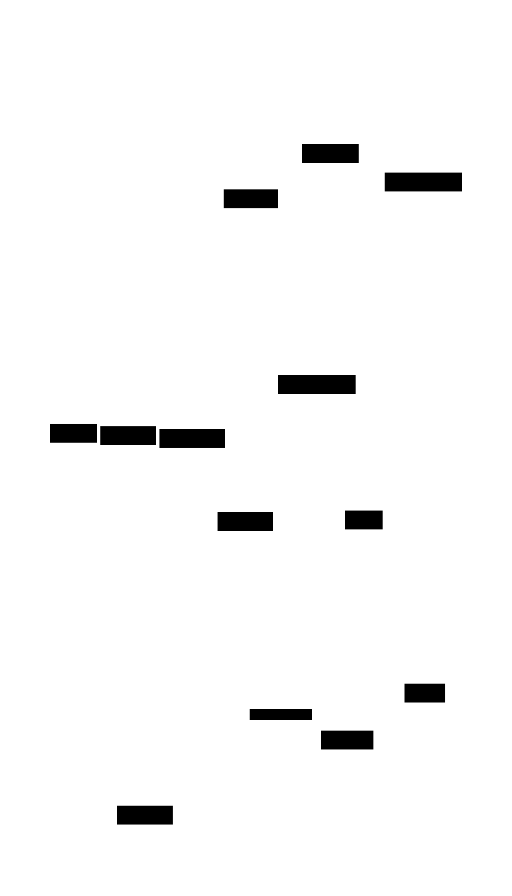

# Virtual Memory Simulator: Design Document


## Overview

This system simulates virtual memory management by implementing page tables, Translation Lookaside Buffer (TLB), and page replacement algorithms to translate virtual addresses to physical addresses. The key architectural challenge is efficiently managing the address translation hierarchy while balancing performance (TLB hits) with memory overhead (sparse page tables).


> This guide is meant to help you understand the big picture before diving into each milestone. Refer back to it whenever you need context on how components connect.


## Context and Problem Statement

> **Milestone(s):** Foundation for all milestones - understanding the core problem virtual memory solves

Virtual memory is one of the most elegant solutions in computer systems, yet it's often misunderstood because the problem it solves isn't immediately obvious to developers working at higher abstraction levels. This section establishes the fundamental challenge that virtual memory addresses and why building a simulator helps us understand modern memory management systems. We'll explore why direct physical addressing breaks down for real applications, how virtual memory provides essential abstractions, and why performance optimization through caching becomes critical.

### Mental Model: The Library Card Catalog

Imagine you're researching at a massive university library that spans multiple buildings. You need a specific book, but you don't know where it's physically located. In the old days, libraries used card catalogs - wooden cabinets filled with index cards. Each card contained a book's title, author, and most importantly, its location: "Building C, Floor 2, Shelf 47B, Position 12."

This is exactly how virtual memory works. When your program asks for data at virtual address `0x12345678`, it's like asking the librarian for "the book titled `0x12345678`." The virtual address isn't the actual location - it's just an identifier. The memory management unit (MMU) acts as the librarian, consulting its "card catalog" (the page table) to translate that virtual identifier into a physical location: "RAM stick 1, bank 2, row 4096, column 120."

Just as the library's card catalog lets you find books without knowing the physical layout of every building, virtual memory lets programs access data without knowing where it actually sits in physical RAM. The program thinks it has a simple, contiguous address space starting at zero, while the operating system shuffles the actual data around physical memory as needed.

But here's where the analogy gets more interesting: imagine if every book lookup required walking to the card catalog room, finding the right cabinet, opening the drawer, flipping through hundreds of cards, and then walking to the actual location. It would take forever! Libraries solved this with frequently-used reference sheets kept at the front desk - a small cache of the most popular book locations. Virtual memory systems use the same optimization: the Translation Lookaside Buffer (TLB) is like that front-desk reference sheet, keeping the most recently used address translations immediately available.

### Why Virtual Memory Exists

The problems that virtual memory solves become apparent when we consider what happens without it. Early computers used direct physical addressing - programs worked directly with real RAM addresses. This seemed simple, but it created three fundamental problems that made modern computing impossible.

**Memory Isolation and Protection**

Without virtual memory, every program runs in the same physical address space. Program A might allocate memory starting at physical address `0x10000`, while Program B starts at `0x20000`. But what prevents Program A from accidentally (or maliciously) writing to address `0x20000` and corrupting Program B's data? Absolutely nothing.

This lack of isolation means that any programming bug - a buffer overflow, a wild pointer, an off-by-one error - can crash not just the buggy program, but every other program running on the system, including the operating system itself. One misbehaving application brings down the entire machine. This is why early personal computers were notoriously unstable compared to modern systems.

Virtual memory solves this by giving each process its own private virtual address space. When Process A writes to virtual address `0x1000`, the MMU might translate this to physical address `0x45000`. When Process B writes to its virtual address `0x1000`, the MMU translates this to a completely different physical address, perhaps `0x78000`. The processes can't interfere with each other because their virtual addresses never map to the same physical locations.

**Memory Layout Flexibility**

Direct physical addressing forces programs to adapt to whatever memory layout happens to be available when they start. If physical memory has free space at addresses `0x10000-0x15000` and `0x30000-0x40000`, but not in between, the program must somehow work with this fragmented layout. This makes programming extremely difficult because you can never assume your data will be in contiguous memory.

Even worse, different computers have different memory configurations. A program compiled to expect data at physical address `0x50000` will crash on a machine that only has 256KB of RAM. Programs become tied to specific hardware configurations, making software distribution nearly impossible.

Virtual memory eliminates this problem by providing each program with the illusion of a clean, contiguous address space starting at zero. The program can assume its code starts at virtual address `0x1000`, its heap begins at `0x100000`, and its stack grows down from `0x7FFFFFFF`. Behind the scenes, the operating system maps these virtual addresses to whatever physical memory happens to be available, using non-contiguous chunks if necessary. The program never knows or cares about the actual physical layout.

**Efficient Memory Usage**

Without virtual memory, running multiple programs requires allocating enough physical RAM for all of them simultaneously, whether they're actively being used or not. If you have three programs that each need 100MB, you need at least 300MB of physical RAM, even if two of the programs are sitting idle most of the time.

This becomes especially wasteful with modern applications that allocate large amounts of memory "just in case" they need it. A web browser might allocate space for thousands of potential tabs, but only use a tiny fraction at any given moment. Without virtual memory, all that memory sits unused but unavailable to other programs.

Virtual memory enables demand paging - only loading parts of a program into physical memory when they're actually accessed. The browser can have a virtual address space sized for thousands of tabs, but the operating system only allocates physical memory for the tabs currently being viewed. Unused portions remain on disk until needed, freeing physical memory for other purposes.

This same mechanism enables running programs larger than physical memory. A program that needs 8GB of virtual memory can run on a machine with only 4GB of physical RAM. The operating system keeps frequently-used pages in physical memory and temporarily stores less-used pages on disk, swapping them back when needed.

> **Key Insight**: Virtual memory isn't just about making programming easier - it's what makes modern multitasking possible. Without it, we couldn't safely run multiple programs, couldn't distribute software across different hardware configurations, and couldn't efficiently share limited physical memory among competing applications.

### The Translation Performance Challenge

The benefits of virtual memory come with a significant cost: every memory access now requires translation from virtual to physical addresses. This translation happens on every single load and store instruction, potentially making it the most frequent operation in the entire computer system. If translation is slow, everything is slow.

**The Page Table Lookup Problem**

In the simplest virtual memory implementation, the operating system maintains a page table - essentially a large array that maps virtual page numbers to physical frame numbers. When a program accesses virtual address `0x12345678`, the MMU must:

1. Extract the virtual page number from the high-order bits (e.g., `0x12345`)
2. Use this as an index into the page table array
3. Read the corresponding page table entry to get the physical frame number
4. Combine the physical frame number with the original offset to form the physical address
5. Access the actual data at that physical address

This seems straightforward, but consider the performance implications. Every memory access by the running program now requires at least two memory accesses: one to read the page table entry, and one to read the actual data. This doubles the memory traffic and potentially doubles the latency of every load and store instruction.

The situation gets worse with multi-level page tables (which we'll implement in Milestone 3). To save memory in systems with large virtual address spaces, page tables are organized hierarchically. Instead of one massive page table, there's a page directory that points to smaller page tables. Now each virtual address translation requires multiple memory accesses: first to read the page directory entry, then to read the page table entry, then finally to read the actual data.

**Cache Memory Makes It Worse**

Modern processors rely heavily on cache memory to hide the latency of accessing main memory. CPU caches work by keeping recently-used data in small, fast memory close to the processor cores. When the processor needs data, it first checks the cache; only on a cache miss does it access the slower main memory.

Page table lookups interfere with cache effectiveness in two ways. First, they compete with application data for cache space. Every page table entry loaded into cache displaces application data that might have been useful. Second, page table entries often have poor temporal locality - they're accessed once for an address translation and then rarely reused, making them poor candidates for caching.

This creates a vicious cycle: virtual memory generates extra memory traffic (page table lookups), which increases pressure on the cache system, which reduces cache hit rates for application data, which increases overall memory latency, which makes the system slower than it would be with direct physical addressing.

**Why Caching Translation Becomes Essential**

The solution to the translation performance problem is to cache the results of recent translations. If the MMU has translated virtual page `0x12345` to physical frame `0x67890` recently, it can remember this mapping and reuse it for subsequent accesses to the same page, avoiding the page table lookup entirely.

This is where the Translation Lookaside Buffer (TLB) becomes critical. The TLB is a small, fast cache that stores recent virtual-to-physical address mappings. When the processor needs to translate a virtual address, it first checks the TLB. On a TLB hit, the translation happens in a single cycle with no additional memory accesses. Only on a TLB miss does the MMU perform the full page table walk.

The performance impact is dramatic. Modern processors achieve TLB hit rates of 95-99% for typical applications. This means that 95-99% of memory accesses require no page table lookup at all - they proceed directly from virtual address to physical address through the TLB. The remaining 1-5% of accesses trigger TLB misses and require page table walks, but this overhead is amortized across many fast TLB hits.

**Locality Makes Caching Work**

The TLB is effective because of locality of reference - the tendency for programs to access data in predictable patterns. Spatial locality means that if a program accesses one address, it's likely to access nearby addresses soon. Since virtual addresses within the same page map to the same TLB entry, accessing multiple words within a 4KB page requires only one translation.

Temporal locality means that recently accessed data is likely to be accessed again soon. If a program accesses a particular virtual page, it will probably access the same page again before the TLB entry gets evicted. This makes the TLB investment worthwhile - each page table lookup potentially saves many future lookups to the same page.

> **Performance Reality**: A modern x86 processor might have only 64-1024 TLB entries, but this tiny cache typically handles over 95% of all address translations. The remaining misses trigger page table walks that might take 10-100 cycles, but they're rare enough that overall translation overhead stays below 5% of execution time.

The key insight for our simulator is that virtual memory performance depends almost entirely on TLB effectiveness. A virtual memory system with perfect TLB hits performs nearly as well as direct physical addressing. A system with frequent TLB misses becomes unusably slow. This is why the TLB design - its size, associativity, replacement policy, and coherence protocol - is often more important than the page table design for overall system performance.

Understanding this performance challenge helps explain why virtual memory systems have evolved to be quite complex, with multi-level TLBs, sophisticated replacement algorithms, and careful attention to translation lookaside buffer management. Our simulator will demonstrate these trade-offs by implementing progressively more sophisticated caching and optimization techniques across the four milestones.

### Implementation Guidance

This section establishes the foundation for our virtual memory simulator by setting up the basic infrastructure and defining the core abstractions we'll build upon throughout the project.

**A. Technology Recommendations**

| Component | Simple Option | Advanced Option |
|-----------|---------------|-----------------|
| Memory Representation | Fixed-size arrays with indices | Dynamic memory mapping with mmap |
| Address Parsing | Bit shifting and masking | Union/bitfield structures |
| Page Storage | Array of page table entries | Hash tables for sparse addresses |
| Logging/Debug | printf debugging | Structured logging with levels |
| Testing | Simple assertion macros | Unit test framework (Check/Unity) |
| Build System | Single Makefile | CMake with multiple targets |

For learning purposes, we recommend starting with the simple options and upgrading individual components as needed. The simulator should be comprehensible first, optimized second.

**B. Recommended File Structure**

```
vm-simulator/
├── src/
│   ├── address.h              ← Address format definitions and parsing
│   ├── address.c              ← Address manipulation functions
│   ├── page_table.h           ← Single-level page table (Milestone 1)
│   ├── page_table.c           ← Page table implementation
│   ├── tlb.h                  ← TLB interface (Milestone 2)
│   ├── tlb.c                  ← TLB implementation
│   ├── multi_level.h          ← Multi-level page tables (Milestone 3)
│   ├── multi_level.c          ← Hierarchical table implementation
│   ├── replacement.h          ← Page replacement algorithms (Milestone 4)
│   ├── replacement.c          ← FIFO, LRU, Clock algorithms
│   ├── mmu.h                  ← Memory Management Unit orchestrator
│   ├── mmu.c                  ← Main translation pipeline
│   └── simulator.c            ← Main program and test driver
├── tests/
│   ├── test_address.c         ← Address parsing tests
│   ├── test_page_table.c      ← Page table tests
│   ├── test_tlb.c             ← TLB tests
│   └── test_integration.c     ← End-to-end translation tests
├── include/
│   └── vm_types.h             ← Common type definitions
└── Makefile
```

This structure separates concerns clearly: each major component gets its own header and implementation file, tests are isolated in their own directory, and common definitions are centralized.

**C. Infrastructure Starter Code**

**Common Type Definitions (`include/vm_types.h`)**:

```c
#ifndef VM_TYPES_H
#define VM_TYPES_H

#include <stdint.h>
#include <stdbool.h>
#include <stdio.h>

// Configuration constants
#define PAGE_SIZE_BITS    12    // 4KB pages
#define PAGE_SIZE         (1 << PAGE_SIZE_BITS)
#define PAGE_OFFSET_MASK  (PAGE_SIZE - 1)
#define VIRTUAL_ADDR_BITS 32    // 32-bit virtual address space
#define PHYSICAL_ADDR_BITS 24   // 16MB physical memory
#define MAX_VIRTUAL_PAGES (1 << (VIRTUAL_ADDR_BITS - PAGE_SIZE_BITS))
#define MAX_PHYSICAL_FRAMES (1 << (PHYSICAL_ADDR_BITS - PAGE_SIZE_BITS))

// Basic types
typedef uint32_t virtual_addr_t;
typedef uint32_t physical_addr_t;
typedef uint32_t page_number_t;
typedef uint32_t frame_number_t;
typedef uint16_t page_offset_t;

// Permission flags
typedef enum {
    PERM_READ    = 0x1,
    PERM_WRITE   = 0x2,
    PERM_EXECUTE = 0x4
} permission_flags_t;

// Translation result
typedef enum {
    TRANSLATION_SUCCESS,
    TRANSLATION_PAGE_FAULT,
    TRANSLATION_PROTECTION_VIOLATION,
    TRANSLATION_INVALID_ADDRESS
} translation_result_t;

// Debug logging
#define DEBUG_LEVEL_NONE  0
#define DEBUG_LEVEL_ERROR 1
#define DEBUG_LEVEL_INFO  2
#define DEBUG_LEVEL_DEBUG 3

extern int debug_level;

#define LOG_ERROR(fmt, ...) if (debug_level >= DEBUG_LEVEL_ERROR) \
    fprintf(stderr, "[ERROR] " fmt "\n", ##__VA_ARGS__)
#define LOG_INFO(fmt, ...)  if (debug_level >= DEBUG_LEVEL_INFO) \
    fprintf(stdout, "[INFO] " fmt "\n", ##__VA_ARGS__)
#define LOG_DEBUG(fmt, ...) if (debug_level >= DEBUG_LEVEL_DEBUG) \
    fprintf(stdout, "[DEBUG] " fmt "\n", ##__VA_ARGS__)

#endif // VM_TYPES_H
```

**Address Manipulation Helper (`src/address.h`)**:

```c
#ifndef ADDRESS_H
#define ADDRESS_H

#include "vm_types.h"

// Extract page number from virtual address
page_number_t get_virtual_page_number(virtual_addr_t vaddr);

// Extract page offset from virtual address  
page_offset_t get_page_offset(virtual_addr_t vaddr);

// Combine frame number and offset into physical address
physical_addr_t make_physical_address(frame_number_t frame, page_offset_t offset);

// Display address in human-readable format
void print_address_breakdown(virtual_addr_t vaddr);

#endif // ADDRESS_H
```

**Address Manipulation Implementation (`src/address.c`)**:

```c
#include "address.h"

page_number_t get_virtual_page_number(virtual_addr_t vaddr) {
    return vaddr >> PAGE_SIZE_BITS;
}

page_offset_t get_page_offset(virtual_addr_t vaddr) {
    return vaddr & PAGE_OFFSET_MASK;
}

physical_addr_t make_physical_address(frame_number_t frame, page_offset_t offset) {
    return (frame << PAGE_SIZE_BITS) | offset;
}

void print_address_breakdown(virtual_addr_t vaddr) {
    page_number_t vpn = get_virtual_page_number(vaddr);
    page_offset_t offset = get_page_offset(vaddr);
    
    printf("Virtual Address: 0x%08X\n", vaddr);
    printf("  Page Number: %u (0x%X)\n", vpn, vpn);
    printf("  Page Offset: %u (0x%X)\n", offset, offset);
    printf("  Binary: ");
    for (int i = 31; i >= 0; i--) {
        printf("%d", (vaddr >> i) & 1);
        if (i == PAGE_SIZE_BITS) printf("|");  // Separate page number from offset
    }
    printf("\n");
}
```

**D. Core Logic Skeleton**

Here's the skeleton for the main MMU orchestrator that students will flesh out across all milestones:

```c
// src/mmu.h
#ifndef MMU_H
#define MMU_H

#include "vm_types.h"
#include "page_table.h"
#include "tlb.h"

typedef struct {
    page_table_t *page_table;    // Main page table
    tlb_t *tlb;                  // Translation lookaside buffer
    uint64_t translation_count;  // Statistics
    uint64_t tlb_hit_count;
    uint64_t page_fault_count;
} mmu_t;

// Initialize MMU with page table and TLB
mmu_t *mmu_create(size_t page_table_size, size_t tlb_size);

// Main translation function - students implement this
translation_result_t mmu_translate(mmu_t *mmu, virtual_addr_t vaddr, 
                                  physical_addr_t *paddr, permission_flags_t required_perms);

// Statistics and debugging
void mmu_print_stats(const mmu_t *mmu);
void mmu_reset_stats(mmu_t *mmu);
void mmu_destroy(mmu_t *mmu);

#endif // MMU_H
```

```c
// src/mmu.c - Skeleton implementation
#include "mmu.h"

mmu_t *mmu_create(size_t page_table_size, size_t tlb_size) {
    // TODO: Allocate and initialize MMU structure
    // TODO: Create page table with specified size
    // TODO: Create TLB with specified size  
    // TODO: Initialize statistics counters to zero
    return NULL; // Replace with actual implementation
}

translation_result_t mmu_translate(mmu_t *mmu, virtual_addr_t vaddr,
                                  physical_addr_t *paddr, permission_flags_t required_perms) {
    // TODO 1: Extract virtual page number and offset from virtual address
    // TODO 2: Check TLB for cached translation of this virtual page
    // TODO 3: On TLB hit, verify permissions and return cached translation
    // TODO 4: On TLB miss, perform page table lookup for virtual page number
    // TODO 5: Check if page table entry is valid (page is resident in memory)
    // TODO 6: If invalid, return TRANSLATION_PAGE_FAULT
    // TODO 7: Verify requested permissions against page table entry permissions
    // TODO 8: If permission denied, return TRANSLATION_PROTECTION_VIOLATION  
    // TODO 9: Combine frame number from page table with original offset
    // TODO 10: Cache the successful translation in TLB for future use
    // TODO 11: Update statistics counters and return TRANSLATION_SUCCESS
    
    mmu->translation_count++;
    return TRANSLATION_PAGE_FAULT; // Placeholder - remove this
}

void mmu_print_stats(const mmu_t *mmu) {
    if (!mmu) return;
    
    double tlb_hit_rate = (mmu->translation_count > 0) ? 
        (double)mmu->tlb_hit_count / mmu->translation_count * 100.0 : 0.0;
    
    printf("MMU Statistics:\n");
    printf("  Total Translations: %lu\n", mmu->translation_count);
    printf("  TLB Hits: %lu (%.2f%%)\n", mmu->tlb_hit_count, tlb_hit_rate);
    printf("  TLB Misses: %lu\n", mmu->translation_count - mmu->tlb_hit_count);
    printf("  Page Faults: %lu\n", mmu->page_fault_count);
}

// Additional skeleton functions...
```

**E. Language-Specific Hints**

- **Bit Manipulation**: Use `#define` constants for bit positions and masks rather than magic numbers. The expression `(addr >> PAGE_SIZE_BITS)` is much clearer than `(addr >> 12)`.

- **Memory Management**: Always pair `malloc()` with `free()`. Consider using `calloc()` instead of `malloc()` to zero-initialize structures automatically.

- **Error Handling**: Use return codes consistently. The `translation_result_t` enum provides a clean way to return both success/failure status and specific error types.

- **Debugging**: The provided logging macros can be enabled/disabled by setting the global `debug_level` variable. Use `LOG_DEBUG` liberally during development, then set `debug_level = DEBUG_LEVEL_ERROR` for production runs.

- **Testing**: Write small test functions that set up known page table states, perform translations, and verify the results. The `print_address_breakdown()` function helps visualize what the bit manipulation is doing.

**F. Milestone Checkpoint**

After setting up this foundation code, you should be able to:

1. **Compile the skeleton**: `make all` should build without errors
2. **Run basic address parsing**: The address breakdown function should correctly separate page numbers and offsets
3. **Initialize core structures**: MMU creation should allocate page table and TLB structures
4. **Handle invalid translations**: Calls to `mmu_translate()` should return `TRANSLATION_PAGE_FAULT` for unmapped pages

Expected output when running the skeleton with a test address:
```
Virtual Address: 0x12345678
  Page Number: 74565 (0x12345)
  Page Offset: 1656 (0x678)
  Binary: 00010010001101000101|011001111000
MMU Statistics:
  Total Translations: 1
  TLB Hits: 0 (0.00%)
  TLB Misses: 1
  Page Faults: 1
```

If you see different page numbers or the binary split is in the wrong place, check your `PAGE_SIZE_BITS` constant and bit manipulation logic.


## Goals and Non-Goals

> **Milestone(s):** Foundation for all milestones - establishes project scope and success criteria

The success of any complex software project depends on clearly defining what you're building and, equally important, what you're explicitly choosing not to build. Virtual memory simulation sits at the intersection of operating systems, computer architecture, and performance engineering, making it tempting to expand scope in multiple directions. This section establishes precise boundaries to keep the implementation focused on core learning objectives while maintaining realistic complexity for an educational project.

Think of project goals like planning a cross-country road trip. You need to know your destination (functional goals), how fast you want to get there (performance goals), and which scenic detours you'll skip to stay on schedule (non-goals). Without this clarity, you'll either build something trivially simple that teaches nothing meaningful, or attempt to recreate Linux's memory management subsystem and never finish.

The virtual memory simulator strikes a careful balance between educational value and implementation complexity. We want to capture the essential algorithms and data structures that real operating systems use, while avoiding the intricate hardware dependencies and kernel integration challenges that would obscure the core concepts behind implementation details.

### Functional Goals

The simulator must implement the complete address translation pipeline that transforms virtual addresses into physical addresses, handling all the failure modes and optimization strategies that make virtual memory systems robust and efficient in practice.

**Address Translation with Full Error Handling**

The core functionality centers on the `mmu_translate()` function, which must handle the complete spectrum of address translation scenarios. Successful translations require extracting the virtual page number using `get_virtual_page_number()`, performing page table lookups to find the corresponding physical frame, and combining the frame with the page offset using `make_physical_address()`. The function returns `TRANSLATION_SUCCESS` for valid translations, but must also detect and properly classify failures.

The simulator distinguishes between different failure modes because real operating systems handle them differently. When a virtual page isn't resident in memory, the MMU returns `TRANSLATION_PAGE_FAULT`, triggering the page replacement subsystem. When a page is resident but the requested operation violates permissions (writing to a read-only page, executing non-executable pages), the MMU returns `TRANSLATION_PROTECTION_VIOLATION`, which typically results in process termination rather than page loading.

Permission checking requires implementing the full `permission_flags_t` system with `PERM_READ`, `PERM_WRITE`, and `PERM_EXECUTE` flags. The translation function must verify that the requested operation matches the page's permissions before completing the address translation. This models real processor behavior where the Memory Management Unit performs permission checks in hardware.

**Multi-Level Page Table Implementation**

The simulator progresses from single-level page tables to hierarchical structures that mirror modern processor architectures. Single-level page tables provide conceptual clarity but waste memory for sparse address spaces. A 32-bit virtual address space with 4KB pages requires over one million page table entries, consuming 4MB of memory even when most virtual pages are unused.

Multi-level page tables solve this problem by organizing translation data hierarchically. The virtual address gets split into multiple index fields that navigate through successive levels of page tables. Only the page directory needs full allocation initially, with second-level page tables allocated on-demand as virtual memory regions get mapped. This approach can reduce memory overhead from megabytes to kilobytes for typical sparse address spaces.

The implementation must handle the complete page table walk algorithm, extracting directory and table indices from virtual addresses, following pointers through multiple levels, and constructing the final physical address. Error handling becomes more complex because page faults can occur at any level when page directory entries point to unmapped second-level tables.

**TLB Simulation with Realistic Behavior**

The Translation Lookaside Buffer provides crucial performance optimization by caching recent address translations. Real processors dedicate significant silicon area to TLBs because page table walks are expensive, often requiring multiple memory accesses for multi-level page tables.

The TLB simulation must implement the complete lookup and replacement pipeline. Every address translation first checks the TLB for a matching virtual page number entry. TLB hits return the cached physical frame immediately, avoiding the page table walk entirely. TLB misses trigger the full page table walk, with successful translations cached in the TLB for future use.

TLB replacement policies become critical when the cache fills up. The simulator implements both LRU (Least Recently Used) and random replacement strategies, allowing comparison of their hit rate characteristics. LRU replacement requires maintaining access timestamps or counters for each TLB entry, while random replacement offers simpler implementation with comparable performance in many workloads.

Context switches require TLB management because cached translations become invalid when switching between processes with different virtual address spaces. The simulator implements TLB flush operations that invalidate all entries, simulating the behavior of real processors that either flush completely or use Address Space Identifiers (ASIDs) to distinguish between different processes' translations.

**Page Replacement Algorithm Suite**

When physical memory becomes full, the simulator must implement sophisticated page replacement algorithms that balance fairness, performance, and implementation complexity. The choice of replacement algorithm significantly affects system performance, making this a critical component for understanding virtual memory behavior.

FIFO (First-In-First-Out) replacement provides the conceptual foundation by maintaining a queue of loaded pages and evicting the oldest when memory fills up. FIFO implementation requires tracking page load timestamps and maintaining ordering information, but suffers from Belady's anomaly where increasing physical memory size can actually increase page fault rates for certain access patterns.

LRU (Least Recently Used) replacement attempts to capture temporal locality by evicting pages that haven't been accessed recently. LRU implementation can use timestamps updated on every page access, or maintain a doubly-linked list that moves accessed pages to the front. LRU generally provides better hit rates than FIFO but requires more complex bookkeeping and can be expensive to maintain with precise accuracy.

Clock algorithm provides a practical approximation to LRU using reference bits that get set on page access and cleared by a background scanning process. The algorithm maintains a circular buffer of page frames with a clock hand that sweeps through memory, skipping recently referenced pages and evicting the first unreferenced page found. Clock algorithm offers a good balance between implementation simplicity and replacement quality.

The following table summarizes the functional requirements across all replacement algorithms:

| Algorithm | Data Structure | Update Overhead | Replacement Quality | Memory Overhead |
|-----------|----------------|-----------------|-------------------|-----------------|
| FIFO | Queue with timestamps | Low - insert only | Poor - ignores access patterns | Low - timestamp per page |
| LRU | Timestamp or linked list | High - update on every access | Good - captures temporal locality | Medium - timestamp or pointers |
| Clock | Circular buffer + reference bits | Low - set bit on access | Good - LRU approximation | Low - single bit per page |

### Performance Goals

The simulator must demonstrate realistic performance characteristics that help users understand the trade-offs inherent in virtual memory system design. Rather than optimizing for maximum throughput, the performance goals focus on educational value and accurate modeling of real system behavior.

**TLB Hit Rate Optimization and Measurement**

TLB performance directly impacts overall system performance because every memory access requires address translation. Real systems achieve TLB hit rates of 95-99% for typical workloads, making the TLB one of the most critical caches in the memory hierarchy. The simulator must demonstrate this performance characteristic while allowing experimentation with different TLB configurations.

The implementation includes comprehensive TLB hit rate measurement across different access patterns. Sequential memory access (typical of array processing) should demonstrate high hit rates because adjacent virtual pages often map to the same TLB entry within the measurement window. Random memory access should show lower hit rates, demonstrating why TLB size and associativity matter for workloads with poor spatial locality.

TLB size directly affects hit rates, but with diminishing returns as size increases. The simulator should demonstrate that doubling TLB size from 32 to 64 entries provides significant improvement for many workloads, while increasing from 64 to 128 entries offers more modest gains. This relationship helps users understand the trade-offs between TLB complexity and performance benefit.

Different TLB replacement policies also affect hit rates in workload-dependent ways. LRU replacement generally provides better hit rates for workloads with temporal locality, while random replacement can perform surprisingly well for workloads without clear access patterns. The simulator should enable direct comparison of replacement policies on identical workloads to quantify these differences.

**Memory Efficiency with Sparse Address Spaces**

Modern applications use large virtual address spaces sparsely, mapping only small regions for code, data, heap, and stack segments. A typical application might use less than 100MB of virtual memory in a 4GB address space, making memory efficiency crucial for page table structures.

Single-level page tables waste enormous amounts of memory for sparse address spaces. A 32-bit virtual address space requires over one million page table entries, consuming 4MB of memory regardless of how much virtual memory the application actually uses. This fixed overhead becomes prohibitive when supporting many processes or large address spaces.

Multi-level page tables dramatically improve memory efficiency by allocating second-level page tables only for mapped virtual memory regions. The simulator should demonstrate memory savings of 90% or more for typical sparse address spaces, showing how hierarchical organization enables practical large address spaces.

The following table illustrates the memory overhead comparison:

| Address Space Usage | Single-Level Overhead | Multi-Level Overhead | Memory Savings |
|-------------------|---------------------|-------------------|---------------|
| 4MB mapped (1K pages) | 4MB (full table) | 8KB (directory + 1 table) | 99.8% |
| 40MB mapped (10K pages) | 4MB (full table) | 48KB (directory + 10 tables) | 98.8% |
| 400MB mapped (100K pages) | 4MB (full table) | 408KB (directory + 100 tables) | 90% |

**Realistic Timing Simulation**

The simulator models the relative costs of different memory operations to help users understand why certain optimizations matter. While avoiding cycle-accurate hardware simulation, it should reflect the orders-of-magnitude differences between TLB hits, page table walks, and page replacement operations.

TLB hits represent the fastest case, requiring only a small associative cache lookup that completes in a few processor cycles. The simulator models TLB hits as single-unit operations that establish the baseline for timing comparison.

Page table walks require multiple memory accesses to traverse the page table hierarchy, with each level adding memory access latency. Single-level page table walks require one memory access beyond the TLB lookup, while two-level page table walks require two additional memory accesses in the worst case. The simulator should model page table walks as 10-100x more expensive than TLB hits, reflecting the cost difference between cache access and main memory access.

Page replacement operations represent the most expensive case because they potentially require writing dirty pages back to storage before loading new pages. The simulator models page replacement as 1000-10000x more expensive than TLB hits, reflecting the massive cost difference between memory access and storage I/O operations.

These timing ratios help users understand why TLB hit rates matter so much for overall performance, and why minimizing page fault rates through appropriate replacement algorithms provides significant performance benefits.

### Non-Goals

Clearly defining what the simulator will not implement prevents scope creep and focuses effort on educationally valuable components. These non-goals represent important real-world concerns that would add significant complexity without proportional learning benefit for the target audience.

**Operating System Kernel Integration**

The simulator runs as a user-space application rather than integrating with actual operating system kernels. Real virtual memory systems require deep kernel integration for interrupt handling, process management, and hardware memory management unit control. This integration involves architecture-specific assembly code, kernel data structures, and complex synchronization with other kernel subsystems.

Kernel integration would require different implementations for Linux, Windows, macOS, and other operating systems, multiplying the complexity without adding educational value about virtual memory algorithms. The simulator instead provides a self-contained environment where users can experiment with different policies and parameters without needing kernel development experience or privileged system access.

The simulator also avoids implementing actual memory protection enforcement. Real systems rely on hardware memory management units to trigger protection violations, which require kernel-level exception handlers. The simulator instead models protection violations as function return codes, focusing on the policy decisions rather than the low-level enforcement mechanisms.

**Hardware MMU Simulation**

Modern processors implement sophisticated Memory Management Units with features like multiple TLB levels, variable page sizes, hardware page table walkers, and prefetching logic. Accurately simulating these hardware features would require detailed knowledge of specific processor architectures and add significant complexity.

The simulator uses simplified models that capture the essential behavior without hardware-specific details. TLB simulation uses straightforward associative lookup rather than modeling set-associative caches with specific replacement policies. Page table walks follow simple pointer traversal rather than simulating hardware page table walker state machines.

Variable page size support is also excluded, with the simulator using fixed 4KB pages throughout. Real systems support multiple page sizes (4KB, 2MB, 1GB on x86-64) to reduce TLB pressure for large memory regions, but this adds significant complexity to address translation and page table management without changing the fundamental algorithms.

**Multi-Processor Coherency and Synchronization**

Real multi-processor systems require sophisticated coherency protocols to maintain consistency between different processors' TLBs and page tables. When one processor modifies a page table entry, other processors must invalidate their cached translations to prevent stale data access. This requires inter-processor communication, TLB shootdown protocols, and careful synchronization of page table updates.

The simulator assumes a single-processor model where only one thread accesses the virtual memory system at a time. This avoids the complexity of concurrent data structure access, atomic operations, and distributed cache coherency while focusing on the core algorithms and data structures.

Memory consistency models also fall outside the simulator's scope. Real processors implement complex memory ordering guarantees that affect how page table updates become visible to different processors. The simulator uses simple sequential consistency where all updates take effect immediately and are visible to all subsequent operations.

**Swap Space and Persistent Storage**

The simulator models page replacement algorithms without implementing actual backing store or swap space management. Real systems must manage disk space allocation, I/O scheduling, and swap file or partition layout. They must also handle storage errors, fragmentation, and space exhaustion scenarios.

Persistent storage simulation would require implementing file system interfaces, disk scheduling algorithms, and error handling that would dwarf the virtual memory components in complexity. The simulator instead assumes infinite backing store where evicted pages disappear and page faults always succeed in loading the requested page.

This simplification allows focus on the replacement algorithms themselves - how they select victim pages, maintain metadata, and respond to different access patterns - without the complexity of storage system integration.

The following table summarizes the scope boundaries:

| Area | Included | Excluded | Rationale |
|------|----------|----------|-----------|
| Address Translation | Page table walks, TLB simulation | Hardware MMU details, variable page sizes | Focus on algorithms over hardware |
| Memory Protection | Permission checking, violation detection | Hardware enforcement, kernel integration | Educational value vs implementation complexity |
| Concurrency | Single-threaded simulation | Multi-processor coherency, synchronization | Avoid distributed systems complexity |
| Storage | Page replacement algorithms | Swap space management, disk I/O | Focus on memory management policies |

> **Key Design Insight**: The simulator's value comes from implementing the core algorithms and data structures that drive virtual memory performance, not from recreating the full complexity of production operating systems. By carefully choosing what to exclude, we can build something substantial enough to be educational while remaining implementable by individual developers.

This scope definition enables building a virtual memory simulator that teaches the essential concepts without overwhelming complexity, providing a foundation for understanding how real systems work while remaining practical to implement and experiment with.

### Implementation Guidance

The implementation approach balances educational clarity with realistic complexity, using modern development practices while avoiding unnecessary sophistication that would obscure the core concepts.

**Technology Recommendations**

| Component | Simple Option | Advanced Option |
|-----------|---------------|-----------------|
| Build System | Makefile with gcc | CMake with multiple compilers |
| Memory Management | Manual malloc/free | Custom allocator with debugging |
| Data Structures | Array-based tables | Hash tables with dynamic resize |
| Logging/Debugging | printf statements | Structured logging library |
| Testing Framework | Simple assert macros | Full unit testing framework |
| Performance Measurement | gettimeofday() timing | Hardware performance counters |

For educational purposes, the simple options provide better learning value because they keep the focus on virtual memory concepts rather than build system complexity or advanced C programming techniques.

**Recommended File Structure**

The modular organization separates concerns while maintaining clear dependencies between components:

```
virtual-memory-simulator/
├── src/
│   ├── main.c                    ← Entry point and test harnesses
│   ├── address.c                 ← Address manipulation utilities
│   ├── address.h
│   ├── page_table.c              ← Single and multi-level page tables
│   ├── page_table.h
│   ├── tlb.c                     ← Translation Lookaside Buffer
│   ├── tlb.h
│   ├── mmu.c                     ← Memory Management Unit orchestration
│   ├── mmu.h
│   ├── replacement.c             ← Page replacement algorithms
│   ├── replacement.h
│   └── debug.c                   ← Debugging and visualization utilities
│   └── debug.h
├── tests/
│   ├── test_address.c            ← Unit tests for each component
│   ├── test_page_table.c
│   ├── test_tlb.c
│   └── test_integration.c        ← End-to-end scenarios
├── docs/
│   └── design.md                 ← This design document
└── Makefile
```

**Infrastructure Starter Code**

The following complete utilities handle common operations that aren't the core learning focus:

**Address Manipulation Utilities (address.c):**
```c
#include "address.h"
#include <stdio.h>

const uint32_t PAGE_SIZE_BITS = 12;
const uint32_t PAGE_SIZE = 4096;
const uint32_t PAGE_OFFSET_MASK = 0xFFF;

page_number_t get_virtual_page_number(virtual_addr_t vaddr) {
    return vaddr >> PAGE_SIZE_BITS;
}

page_offset_t get_page_offset(virtual_addr_t vaddr) {
    return vaddr & PAGE_OFFSET_MASK;
}

physical_addr_t make_physical_address(frame_number_t frame, page_offset_t offset) {
    return (frame << PAGE_SIZE_BITS) | offset;
}

void print_address_breakdown(virtual_addr_t vaddr) {
    printf("Virtual Address: 0x%08X\n", vaddr);
    printf("  Page Number: 0x%05X (%u)\n", 
           get_virtual_page_number(vaddr), get_virtual_page_number(vaddr));
    printf("  Page Offset: 0x%03X (%u)\n", 
           get_page_offset(vaddr), get_page_offset(vaddr));
}
```

**Debug Utilities (debug.c):**
```c
#include "debug.h"
#include <stdio.h>
#include <time.h>

static FILE* debug_log = NULL;

void debug_init(const char* filename) {
    if (filename) {
        debug_log = fopen(filename, "w");
    } else {
        debug_log = stdout;
    }
}

void debug_close(void) {
    if (debug_log && debug_log != stdout) {
        fclose(debug_log);
    }
}

void debug_translation(virtual_addr_t vaddr, physical_addr_t paddr, 
                      translation_result_t result) {
    if (!debug_log) return;
    
    fprintf(debug_log, "[TRANSLATE] VA=0x%08X -> ", vaddr);
    switch (result) {
        case TRANSLATION_SUCCESS:
            fprintf(debug_log, "PA=0x%08X\n", paddr);
            break;
        case TRANSLATION_PAGE_FAULT:
            fprintf(debug_log, "PAGE_FAULT\n");
            break;
        case TRANSLATION_PROTECTION_VIOLATION:
            fprintf(debug_log, "PROTECTION_VIOLATION\n");
            break;
    }
}

void debug_tlb_operation(const char* operation, page_number_t vpn, 
                        frame_number_t frame) {
    if (!debug_log) return;
    fprintf(debug_log, "[TLB_%s] VPN=0x%05X, Frame=0x%05X\n", 
            operation, vpn, frame);
}
```

**Core Logic Skeleton Code**

For the main learning components, provide function signatures with detailed TODO comments:

**MMU Translation Function (mmu.c):**
```c
// mmu_translate performs complete virtual to physical address translation
// using the TLB and page table hierarchy. Returns translation result and
// sets physical address on success.
translation_result_t mmu_translate(mmu_t* mmu, virtual_addr_t vaddr, 
                                 physical_addr_t* paddr, permission_flags_t perms) {
    // TODO 1: Extract virtual page number using get_virtual_page_number()
    // TODO 2: Check TLB for cached translation using tlb_lookup()
    // TODO 3: On TLB hit, verify permissions and construct physical address
    // TODO 4: On TLB miss, perform page table walk using page_table_lookup()
    // TODO 5: Handle page fault if page table entry is invalid
    // TODO 6: Check permissions against page table entry flags
    // TODO 7: Update TLB with successful translation using tlb_insert()
    // TODO 8: Construct physical address using make_physical_address()
    // Hint: Remember to increment hit/miss counters for performance measurement
}
```

**Page Replacement Algorithm (replacement.c):**
```c
// replacement_select_victim chooses a physical frame to evict when memory
// is full. Algorithm behavior depends on replacement policy configured.
frame_number_t replacement_select_victim(replacement_t* repl) {
    // TODO 1: Check replacement algorithm type (FIFO, LRU, or Clock)
    // TODO 2: For FIFO: return frame from head of queue, advance head pointer
    // TODO 3: For LRU: scan frames for oldest timestamp, return that frame
    // TODO 4: For Clock: advance clock hand, skip referenced frames, return first unreferenced
    // TODO 5: Update replacement algorithm state (remove victim from tracking)
    // TODO 6: Handle wrap-around for circular data structures
    // Hint: Clock algorithm should clear reference bits as it scans
}
```

**Language-Specific Implementation Hints**

**Memory Management:**
- Use `malloc()` and `free()` consistently - allocate page tables dynamically as needed
- Initialize all allocated memory with `memset()` to avoid undefined behavior
- Check for `NULL` returns from `malloc()` and handle allocation failures gracefully

**Bit Manipulation:**
- Use bitwise shifts (`>>`, `<<`) for extracting page numbers and offsets from addresses
- Use bitwise AND (`&`) with masks to isolate specific bit fields
- Be careful with integer types - use `uint32_t` consistently for addresses to avoid sign extension

**Performance Measurement:**
- Use `clock()` function for basic timing measurement of different operations
- Increment counters for TLB hits/misses, page faults, and replacement operations
- Print statistics summary at program end to analyze performance characteristics

**Debugging Strategies:**
- Add verbose logging that can be enabled/disabled with command-line flags
- Print page table contents and TLB state after major operations
- Use hex format (`0x%08X`) for addresses to make bit patterns visible
- Implement assertion macros that check data structure invariants

**Milestone Checkpoints**

**Milestone 1 Checkpoint - Basic Page Table:**
```bash
# Compile and run basic translation test
make test_page_table
./test_page_table

# Expected output should show:
# - Successful translation of valid virtual addresses
# - Page fault detection for unmapped addresses
# - Permission violation detection for protected pages
# - Correct bit extraction from virtual addresses
```

**Milestone 2 Checkpoint - TLB Integration:**
```bash
# Run TLB performance test
./test_tlb_performance

# Expected behavior:
# - First access to each page should miss TLB, hit on subsequent accesses
# - TLB hit rate should exceed 90% for sequential access patterns
# - Random access should show lower hit rates depending on TLB size
# - TLB flush should reset all hit rates to zero initially
```

**Milestone 3 Checkpoint - Multi-Level Tables:**
```bash
# Test sparse address space efficiency
./test_multilevel_memory

# Expected results:
# - Memory usage should be <1% of single-level table for sparse access
# - Translation latency should increase slightly due to extra level
# - Large virtual addresses should work without excessive memory allocation
```

**Milestone 4 Checkpoint - Page Replacement:**
```bash
# Compare replacement algorithms
./test_replacement_algorithms

# Expected comparison:
# - FIFO should show Belady's anomaly on certain access patterns
# - LRU should outperform FIFO on workloads with temporal locality
# - Clock should perform similarly to LRU with lower overhead
```

The implementation approach prioritizes clarity and educational value over maximum performance, enabling learners to understand and experiment with virtual memory concepts in a controlled environment.


## High-Level Architecture

> **Milestone(s):** Foundation for all milestones - understanding how MMU, page tables, TLB, and physical memory work together

The virtual memory simulator's architecture mirrors the elegant design found in modern computer systems, where multiple specialized components collaborate to create the illusion of unlimited, private memory for each process. Understanding how these components interact is crucial before diving into individual implementations, as each component's design decisions directly impact the others' performance and correctness.

The architecture follows a layered approach where each component has distinct responsibilities yet maintains carefully designed interfaces for seamless integration. The Memory Management Unit (MMU) serves as the orchestrator, coordinating between fast caches (TLB), persistent mappings (page tables), and actual storage (physical memory) to deliver transparent address translation services to running programs.

### Component Responsibilities

Think of the virtual memory system as a sophisticated library with multiple specialized departments working together to find and retrieve books for patrons. The MMU is like the reference librarian who coordinates the entire process, the TLB resembles the librarian's personal notebook of recently requested books, the page tables function as the comprehensive card catalog system, and physical memory represents the actual book storage areas.

The **Memory Management Unit (MMU)** acts as the central coordinator and primary interface for all address translation operations. When a program requests access to a virtual address, the MMU orchestrates the entire translation pipeline, making decisions about which components to consult and in what order. The MMU maintains the overall system state, tracks performance metrics like TLB hit rates, and handles the complex error conditions that can arise during translation. It encapsulates the translation policy—determining when to use cached translations versus performing full page table walks, when to trigger page replacement algorithms, and how to handle different types of memory access permissions.

| MMU Responsibility | Description | Key Operations |
|-------------------|-------------|----------------|
| Translation Orchestration | Coordinates the complete virtual-to-physical address translation pipeline | `mmu_translate()`, `mmu_handle_fault()` |
| Component Integration | Manages interactions between TLB, page tables, and physical memory | `mmu_create()`, `mmu_destroy()` |
| Error Handling | Processes page faults, permission violations, and translation failures | `mmu_classify_fault()`, `mmu_report_violation()` |
| Performance Monitoring | Tracks hit rates, miss patterns, and system performance metrics | `mmu_get_stats()`, `mmu_reset_counters()` |
| Memory Protection | Enforces read/write/execute permissions during address translation | `mmu_check_permissions()`, `mmu_set_protection()` |

The **Translation Lookaside Buffer (TLB)** serves as the system's speed-critical cache, storing recently used virtual-to-physical address mappings for immediate access. The TLB's primary responsibility is to eliminate the performance overhead of repeated page table walks for frequently accessed memory pages. It maintains a small, fast-access cache of translation entries and implements replacement policies to maximize hit rates. The TLB must also handle coherency challenges, ensuring that cached translations remain valid when page tables change and that stale entries are promptly invalidated during context switches.

| TLB Responsibility | Description | Key Operations |
|-------------------|-------------|----------------|
| Fast Translation Cache | Provides sub-cycle access to recently used address translations | `tlb_lookup()`, `tlb_insert()` |
| Replacement Management | Implements LRU or random replacement when cache is full | `tlb_evict_entry()`, `tlb_update_lru()` |
| Coherency Maintenance | Ensures cached translations remain consistent with page table changes | `tlb_invalidate()`, `tlb_flush_all()` |
| Context Switch Support | Clears stale translations when switching between processes | `tlb_flush_context()`, `tlb_set_asid()` |
| Hit Rate Optimization | Maximizes cache effectiveness through intelligent entry management | `tlb_get_hit_rate()`, `tlb_analyze_patterns()` |

The **Page Table** component maintains the authoritative mapping between virtual pages and physical frames, serving as the comprehensive directory of all possible address translations. Unlike the TLB's limited cache, page tables store complete mapping information for the entire virtual address space, including metadata about page permissions, modification status, and residency. Page tables implement the hierarchical structure that enables efficient sparse address space handling, creating lower-level tables only when needed to avoid memory waste in large, sparsely populated address spaces.

| Page Table Responsibility | Description | Key Operations |
|---------------------------|-------------|----------------|
| Authoritative Mapping Storage | Maintains complete virtual-to-physical address mappings | `page_table_lookup()`, `page_table_set_entry()` |
| Permission Management | Stores and enforces read/write/execute permissions for each page | `page_table_check_permissions()`, `page_table_set_permissions()` |
| Metadata Tracking | Maintains dirty bits, reference bits, and validity flags | `page_table_mark_dirty()`, `page_table_set_referenced()` |
| Hierarchical Structure | Implements multi-level tables for memory-efficient sparse address spaces | `page_table_walk()`, `page_table_create_level()` |
| Fault Detection | Identifies invalid accesses and missing page mappings | `page_table_is_valid()`, `page_table_get_fault_type()` |

**Physical Memory** represents the actual storage substrate where program data and instructions reside. In our simulator, physical memory maintains the frame allocation state, tracking which physical frames are occupied, which are free, and which are candidates for eviction. Physical memory works closely with page replacement algorithms to identify victim frames when memory pressure occurs, and it coordinates with the page table to ensure consistency between logical mappings and physical storage allocation.

| Physical Memory Responsibility | Description | Key Operations |
|-------------------------------|-------------|----------------|
| Frame Allocation | Manages assignment of physical frames to virtual pages | `physical_alloc_frame()`, `physical_free_frame()` |
| Free Space Tracking | Maintains data structures tracking available and occupied frames | `physical_get_free_count()`, `physical_find_free_frame()` |
| Replacement Candidate Selection | Identifies victim frames when memory is full | `physical_select_victim()`, `physical_mark_candidate()` |
| Data Storage Simulation | Simulates the actual storage of program data and instructions | `physical_read_frame()`, `physical_write_frame()` |
| Memory Pressure Detection | Monitors memory usage and triggers replacement algorithms | `physical_check_pressure()`, `physical_get_utilization()` |

> **Key Insight**: The separation of responsibilities between these components enables both performance optimization and design flexibility. The TLB can focus purely on speed without worrying about completeness, while page tables can optimize for space efficiency without sacrificing lookup completeness. The MMU coordinates between these different optimization priorities to deliver both fast common-case performance and comprehensive edge-case handling.

### Address Translation Pipeline


The address translation pipeline represents the step-by-step journey from a virtual address generated by a running program to either a successful physical address or a well-defined fault condition. This pipeline must handle both the performance-critical common case (TLB hits) and the complex edge cases (page faults, permission violations) with equal correctness.

The translation process begins when the MMU receives a virtual address from the CPU simulation or test harness. This virtual address contains two distinct components: the virtual page number that identifies which page contains the desired data, and the page offset that specifies the exact byte location within that page. The MMU first extracts these components using bit manipulation operations, as the boundary between page number and offset is determined by the configured page size.

#### Step-by-Step Translation Flow

1. **Address Reception and Validation**: The MMU receives a `virtual_addr_t` from the requesting process along with the intended access type (read/write/execute) specified in `permission_flags_t`. The MMU performs initial validation to ensure the virtual address falls within the valid address space bounds and that the requesting process has permission to access the specified address range. Invalid addresses or permission violations are immediately flagged as `TRANSLATION_PROTECTION_VIOLATION` without proceeding further in the pipeline.

2. **Virtual Address Decomposition**: The MMU calls `get_virtual_page_number()` to extract the high-order bits representing the virtual page number, and `get_page_offset()` to extract the low-order bits representing the offset within the page. This bit manipulation uses the `PAGE_SIZE_BITS` constant to determine the boundary between page number and offset, ensuring consistency across all address operations. The page offset is preserved unchanged throughout the translation process, as it represents the same relative position in both virtual and physical pages.

3. **TLB Lookup Attempt**: The MMU queries the TLB using the extracted virtual page number to check for a cached translation. The TLB performs a fast associative lookup to determine if it contains a valid entry for this virtual page. If found, the TLB returns the corresponding physical frame number along with cached permission information. This represents the fast path through the translation pipeline, avoiding the more expensive page table walk.

4. **TLB Hit Processing**: When the TLB contains a valid entry for the requested virtual page, the MMU retrieves the physical frame number and verifies that the requested access permissions are compatible with the page's stored permissions. If permissions are satisfied, the MMU calls `make_physical_address()` to combine the physical frame number with the preserved page offset, creating the final `physical_addr_t`. The translation completes with `TRANSLATION_SUCCESS` status.

5. **TLB Miss Handling**: When the TLB does not contain an entry for the requested virtual page, the MMU must perform a complete page table walk to find the authoritative mapping. The MMU initiates this process by calling the page table's lookup function with the virtual page number, beginning the more expensive but comprehensive translation path through the hierarchical page table structure.

6. **Page Table Walk Execution**: The page table walk proceeds through one or more levels of page table hierarchy, depending on the configured page table structure. For single-level tables, this involves a direct lookup in the page table array. For multi-level tables, the walk extracts different bit ranges from the virtual page number to index into successive levels of the hierarchy, following pointers from page directory entries to page table entries until reaching the final mapping.

7. **Page Table Entry Validation**: Once the page table walk locates the relevant page table entry (PTE), the MMU examines the entry's valid bit to determine if the virtual page is currently resident in physical memory. If the valid bit is clear, this indicates a page fault condition where the virtual page is not currently mapped to any physical frame. The MMU classifies this as `TRANSLATION_PAGE_FAULT` and initiates fault handling procedures.

8. **Permission Verification**: For valid page table entries, the MMU compares the requested access permissions against the permissions stored in the PTE. The system checks read permissions for load operations, write permissions for store operations, and execute permissions for instruction fetches. Any mismatch between requested and available permissions results in `TRANSLATION_PROTECTION_VIOLATION`, preventing the unauthorized access.

9. **TLB Update**: When a page table walk succeeds and produces a valid translation, the MMU updates the TLB with the newly discovered mapping to accelerate future accesses to the same virtual page. The TLB insertion may trigger replacement of an existing entry if the TLB is full, using the configured replacement policy (LRU or random) to select a victim entry.

10. **Physical Address Generation**: With a valid physical frame number obtained from either TLB hit or successful page table walk, the MMU calls `make_physical_address()` to combine the frame number with the original page offset, producing the final `physical_addr_t` that can be used to access the actual data in physical memory.

| Pipeline Stage | Input | Output | Failure Modes |
|---------------|-------|--------|---------------|
| Address Reception | `virtual_addr_t`, `permission_flags_t` | Validated address components | Invalid address range |
| Address Decomposition | `virtual_addr_t` | `page_number_t`, `page_offset_t` | Bit manipulation errors |
| TLB Lookup | `page_number_t` | Frame number or miss indication | Stale TLB entries |
| Page Table Walk | `page_number_t` | Valid PTE or fault indication | Invalid page table pointers |
| Permission Check | PTE permissions, requested permissions | Access granted or violation | Insufficient privileges |
| Physical Address Assembly | Frame number, page offset | `physical_addr_t` | Address arithmetic overflow |

> **Performance Insight**: The pipeline is designed with a clear performance hierarchy—TLB hits complete in 1-2 cycles, single-level page table walks require one memory access, and multi-level page table walks may require multiple memory accesses. This motivates the TLB's critical role in maintaining system performance by caching frequently used translations.

The pipeline also includes comprehensive error handling paths that classify different failure modes and provide appropriate responses. Page faults trigger the page replacement system to load missing pages from storage, while permission violations generate immediate exceptions to prevent security breaches. This dual focus on both performance and correctness makes the translation pipeline robust enough to handle real-world memory access patterns.

#### Page Fault Handling Flow

When the address translation pipeline encounters a missing or invalid page, it transitions into fault handling mode to resolve the situation and potentially retry the translation. Page fault handling represents one of the most complex aspects of virtual memory management, as it must coordinate between multiple subsystems to restore normal operation.

The fault handling process begins with fault classification to determine the appropriate recovery strategy. Minor page faults occur when a virtual page has valid mapping information but is not currently resident in physical memory, requiring a page load from storage. Major page faults indicate that no mapping exists for the virtual page, potentially representing an invalid memory access that should generate a segmentation fault. Protection faults occur when valid mappings exist but the requested access exceeds the page's permission settings.

For recoverable page faults, the system must allocate a physical frame to hold the missing page data. This allocation may trigger page replacement algorithms if physical memory is full, requiring the system to select a victim page, write its contents to storage if dirty, and reclaim its physical frame for the new page. Once a frame is available, the system loads the missing page from storage, updates the page table to establish the new mapping, invalidates stale TLB entries, and retries the original translation.

### Recommended File Structure

The virtual memory simulator benefits from a modular file organization that separates concerns and enables independent development and testing of each component. This structure reflects the architectural boundaries between components while providing clear integration points and shared definitions.

```
vm-simulator/
├── src/
│   ├── main.c                     ← Main program and command-line interface
│   ├── common/
│   │   ├── types.h               ← Shared type definitions (virtual_addr_t, etc.)
│   │   ├── constants.h           ← System constants (PAGE_SIZE, etc.)
│   │   └── debug.h               ← Debug utilities and address printing
│   ├── mmu/
│   │   ├── mmu.h                 ← MMU interface and mmu_t structure
│   │   ├── mmu.c                 ← MMU implementation and translation pipeline
│   │   └── mmu_test.c            ← MMU unit tests and integration tests
│   ├── tlb/
│   │   ├── tlb.h                 ← TLB interface and tlb_t structure
│   │   ├── tlb.c                 ← TLB implementation with replacement policies
│   │   └── tlb_test.c            ← TLB-specific tests and performance measurement
│   ├── page_table/
│   │   ├── page_table.h          ← Page table interface and structures
│   │   ├── single_level.c        ← Single-level page table implementation
│   │   ├── multi_level.c         ← Multi-level page table implementation
│   │   └── page_table_test.c     ← Page table tests and validation
│   ├── physical_memory/
│   │   ├── physical.h            ← Physical memory interface
│   │   ├── physical.c            ← Frame allocation and management
│   │   └── physical_test.c       ← Physical memory tests
│   └── replacement/
│       ├── replacement.h         ← Page replacement algorithm interface
│       ├── fifo.c               ← FIFO replacement implementation
│       ├── lru.c                ← LRU replacement implementation  
│       ├── clock.c              ← Clock algorithm implementation
│       └── replacement_test.c    ← Replacement algorithm tests
├── tests/
│   ├── integration/
│   │   ├── basic_translation.c   ← End-to-end translation tests
│   │   ├── fault_handling.c      ← Page fault handling tests
│   │   └── performance.c         ← Performance benchmarking
│   └── data/
│       ├── test_traces.txt       ← Memory access traces for testing
│       └── expected_results.txt  ← Expected outputs for validation
├── docs/
│   ├── design.md                 ← This design document
│   ├── api.md                    ← API documentation
│   └── debugging.md              ← Debugging guide and common issues
└── Makefile                      ← Build configuration and test targets
```

#### Module Organization Principles

The **common** directory contains shared definitions that establish the system's fundamental data types and constants. The `types.h` file defines all the precisely-named types from our naming conventions, ensuring consistent usage across all modules. The `constants.h` file centralizes system parameters like `PAGE_SIZE` and `PAGE_SIZE_BITS`, making it easy to experiment with different memory configurations. The `debug.h` file provides utilities for address printing and system state inspection, essential for debugging complex memory management issues.

The **mmu** directory encapsulates the Memory Management Unit's coordination logic and serves as the primary interface for translation requests. The MMU module imports interfaces from all other components but avoids direct implementation of their internal algorithms, maintaining clean separation of concerns. The MMU's test suite focuses on integration scenarios that exercise the complete translation pipeline, ensuring that component interactions work correctly under various conditions.

The **tlb** directory implements the Translation Lookaside Buffer as a self-contained caching layer with well-defined interfaces for lookup, insertion, and replacement operations. The TLB module can be developed and tested independently of page table implementation details, using mock page table interfaces to verify caching behavior. The TLB test suite emphasizes hit rate measurement and replacement policy validation across different access patterns.

The **page_table** directory contains separate implementations for single-level and multi-level page table structures, allowing the system to support different memory management strategies. Both implementations conform to the same interface defined in `page_table.h`, enabling the MMU to switch between them without code changes. The page table tests focus on address translation correctness and sparse address space efficiency.

The **physical_memory** directory simulates the physical memory substrate and frame allocation mechanisms that support the virtual memory abstractions. This module tracks frame allocation state and implements the interface between logical page mappings and physical storage. The physical memory tests verify allocation correctness and fragmentation handling under various memory pressure scenarios.

The **replacement** directory provides pluggable page replacement algorithms that can be selected based on workload characteristics or performance requirements. Each algorithm implements the same interface, allowing easy comparison and experimentation. The replacement tests compare algorithm behavior on identical workloads to validate implementation correctness and measure performance differences.

> **Modularity Insight**: This file structure enables incremental development where students can implement and test each milestone independently. The clean interfaces between modules also support different implementation approaches—for example, a student could implement a hash-based TLB while another implements an associative TLB, both conforming to the same interface.

| Directory | Primary Responsibility | Key Files | Testing Focus |
|-----------|----------------------|-----------|---------------|
| `common/` | Shared definitions and utilities | `types.h`, `constants.h`, `debug.h` | Type safety, constant correctness |
| `mmu/` | Translation coordination and pipeline | `mmu.h`, `mmu.c` | Integration scenarios, end-to-end flow |
| `tlb/` | Fast translation caching | `tlb.h`, `tlb.c` | Hit rates, replacement policies |
| `page_table/` | Authoritative mapping storage | `page_table.h`, `single_level.c`, `multi_level.c` | Translation correctness, sparse handling |
| `physical_memory/` | Frame allocation and management | `physical.h`, `physical.c` | Allocation correctness, fragmentation |
| `replacement/` | Page eviction algorithms | `replacement.h`, algorithm implementations | Algorithm comparison, correctness validation |

The integration test directory provides comprehensive scenarios that exercise multiple components simultaneously, validating that the architectural interfaces work correctly in practice. These tests use realistic memory access patterns and verify both functional correctness and performance characteristics of the complete system.

This modular organization supports both learning objectives and software engineering best practices. Students can focus on implementing one component at a time while understanding how their work fits into the larger system architecture. The clear separation of concerns also makes it easier to debug issues, as problems can be isolated to specific modules and their interfaces.

### Implementation Guidance

The implementation of the virtual memory simulator requires careful attention to both the individual component designs and their integration patterns. The following guidance provides concrete starting points for each architectural component while maintaining the flexibility for students to explore different implementation approaches.

#### Technology Recommendations

| Component | Simple Option | Advanced Option |
|-----------|--------------|-----------------|
| Address Types | Fixed 32-bit integers with bit masking | Configurable address width with macro definitions |
| TLB Structure | Fixed-size array with linear search | Associative cache with hash-based lookup |
| Page Table Storage | Static arrays for all levels | Dynamic allocation with sparse table support |
| Physical Memory | Simple bitmap for frame tracking | Free list with buddy allocator simulation |
| Replacement Algorithms | Basic FIFO with circular buffer | Advanced LRU with timestamp or counter arrays |
| Debug Output | Printf-based address and state printing | Structured logging with configurable verbosity levels |
| Testing Framework | Simple assert macros with manual verification | Comprehensive unit tests with automated validation |

#### Recommended Project Structure

```c
// src/common/types.h - Fundamental type definitions
#ifndef TYPES_H
#define TYPES_H

#include <stdint.h>
#include <stdbool.h>

typedef uint32_t virtual_addr_t;
typedef uint32_t physical_addr_t;
typedef uint32_t page_number_t;
typedef uint32_t frame_number_t;
typedef uint32_t page_offset_t;

typedef enum {
    PERM_READ = 1,
    PERM_WRITE = 2,
    PERM_EXECUTE = 4
} permission_flags_t;

typedef enum {
    TRANSLATION_SUCCESS,
    TRANSLATION_PAGE_FAULT,
    TRANSLATION_PROTECTION_VIOLATION
} translation_result_t;

#endif
```

```c
// src/common/constants.h - System-wide constants
#ifndef CONSTANTS_H
#define CONSTANTS_H

#define PAGE_SIZE_BITS 12
#define PAGE_SIZE (1 << PAGE_SIZE_BITS)
#define PAGE_OFFSET_MASK ((1 << PAGE_SIZE_BITS) - 1)

#define DEFAULT_TLB_SIZE 16
#define DEFAULT_MEMORY_SIZE_MB 64
#define MAX_VIRTUAL_PAGES 1048576  // 4GB / 4KB

#endif
```

#### Core Infrastructure Implementation

The following infrastructure code provides complete, working implementations of utility functions that support the main learning objectives without requiring students to implement low-level bit manipulation details.

```c
// src/common/debug.c - Complete debugging utilities
#include "debug.h"
#include "types.h"
#include "constants.h"
#include <stdio.h>

void print_address_breakdown(virtual_addr_t vaddr) {
    page_number_t vpn = get_virtual_page_number(vaddr);
    page_offset_t offset = get_page_offset(vaddr);
    
    printf("Virtual Address: 0x%08x\n", vaddr);
    printf("  Page Number: 0x%05x (%u)\n", vpn, vpn);
    printf("  Page Offset: 0x%03x (%u)\n", offset, offset);
    printf("  Binary: ");
    
    // Print VPN bits
    for (int i = 31; i >= PAGE_SIZE_BITS; i--) {
        printf("%d", (vaddr >> i) & 1);
        if (i % 4 == 0 && i > PAGE_SIZE_BITS) printf(" ");
    }
    printf(" | ");
    
    // Print offset bits
    for (int i = PAGE_SIZE_BITS - 1; i >= 0; i--) {
        printf("%d", (vaddr >> i) & 1);
        if (i % 4 == 0 && i > 0) printf(" ");
    }
    printf("\n");
}

page_number_t get_virtual_page_number(virtual_addr_t vaddr) {
    return vaddr >> PAGE_SIZE_BITS;
}

page_offset_t get_page_offset(virtual_addr_t vaddr) {
    return vaddr & PAGE_OFFSET_MASK;
}

physical_addr_t make_physical_address(frame_number_t frame, page_offset_t offset) {
    return (frame << PAGE_SIZE_BITS) | offset;
}

void print_translation_result(translation_result_t result, 
                             virtual_addr_t vaddr, 
                             physical_addr_t paddr) {
    printf("Translation: 0x%08x -> ", vaddr);
    switch (result) {
        case TRANSLATION_SUCCESS:
            printf("0x%08x (SUCCESS)\n", paddr);
            break;
        case TRANSLATION_PAGE_FAULT:
            printf("PAGE FAULT\n");
            break;
        case TRANSLATION_PROTECTION_VIOLATION:
            printf("PROTECTION VIOLATION\n");
            break;
    }
}
```

#### Core Logic Skeletons

The following skeletons provide detailed TODO comments that map directly to the algorithmic steps described in the design sections, giving students clear guidance while leaving the core implementation as a learning exercise.

```c
// src/mmu/mmu.h - MMU interface definition
#ifndef MMU_H
#define MMU_H

#include "../common/types.h"

typedef struct mmu_t mmu_t;

// Create MMU with specified page table and TLB sizes
mmu_t* mmu_create(size_t page_table_size, size_t tlb_size);

// Destroy MMU and free all associated resources
void mmu_destroy(mmu_t* mmu);

// Translate virtual address to physical address with permission checking
translation_result_t mmu_translate(mmu_t* mmu, virtual_addr_t vaddr, 
                                  physical_addr_t* paddr, permission_flags_t perms);

// Get performance statistics
void mmu_get_stats(mmu_t* mmu, double* tlb_hit_rate, size_t* page_faults);

#endif
```

```c
// src/mmu/mmu.c - MMU implementation skeleton
#include "mmu.h"
#include "../tlb/tlb.h"
#include "../page_table/page_table.h"
#include "../common/debug.h"

struct mmu_t {
    page_table_t* page_table;
    tlb_t* tlb;
    // TODO: Add statistics counters for hits, misses, faults
    // TODO: Add any additional state needed for MMU operation
};

mmu_t* mmu_create(size_t page_table_size, size_t tlb_size) {
    // TODO 1: Allocate MMU structure
    // TODO 2: Create page table with specified size
    // TODO 3: Create TLB with specified size  
    // TODO 4: Initialize statistics counters to zero
    // TODO 5: Return initialized MMU structure
    return NULL; // Replace with actual implementation
}

translation_result_t mmu_translate(mmu_t* mmu, virtual_addr_t vaddr, 
                                  physical_addr_t* paddr, permission_flags_t perms) {
    // TODO 1: Extract virtual page number and offset from virtual address
    // TODO 2: Check TLB for cached translation of virtual page number
    // TODO 3: If TLB hit, verify permissions and construct physical address
    // TODO 4: If TLB miss, perform page table walk for virtual page number
    // TODO 5: If page table walk succeeds, check permissions and update TLB
    // TODO 6: If page fault or permission violation, return appropriate error
    // TODO 7: Construct physical address from frame number and offset
    // TODO 8: Update statistics counters based on translation result
    
    return TRANSLATION_PAGE_FAULT; // Replace with actual implementation
}
```

#### Language-Specific Implementation Hints

For C implementation, pay particular attention to these practical details:

- **Memory Management**: Use `malloc()` and `free()` carefully for dynamic structures. Consider using `calloc()` for zero-initialized arrays like page tables and TLB entries.
- **Bit Manipulation**: Use unsigned integer types to avoid sign extension issues with bit shifting. The expression `(vaddr >> PAGE_SIZE_BITS)` extracts the page number correctly for unsigned types.
- **Error Handling**: Check all dynamic allocation return values. A failed `malloc()` should cause graceful degradation or program termination with a clear error message.
- **Function Interfaces**: Use output parameters (pointers) for functions that need to return both status and data, like `mmu_translate()` returning both translation result and physical address.
- **Testing Integration**: Structure your functions to accept dependency injection (passing page table and TLB pointers) to enable unit testing with mock components.

#### Milestone Checkpoints

**Milestone 1 Checkpoint - Basic Page Table**:
After implementing single-level page tables, you should be able to run:
```bash
make test-page-table
./test-page-table
```
Expected output should show successful translations for valid pages and page faults for invalid pages:
```
Testing virtual address 0x12345678
  Page Number: 0x12345, Offset: 0x678
  Translation: SUCCESS -> Physical 0x09abc678
Testing invalid address 0xDEADBEEF  
  Translation: PAGE FAULT
```

**Milestone 2 Checkpoint - TLB Integration**:
After adding TLB support, measure performance improvement:
```bash
make test-tlb
./test-tlb --trace=tests/data/locality_trace.txt
```
You should observe TLB hit rates above 80% for workloads with good locality, and the same translation correctness as Milestone 1 but with performance improvements for repeated accesses.

**Milestone 3 Checkpoint - Multi-Level Tables**:
Verify memory efficiency with sparse address spaces:
```bash
make test-multilevel
./test-multilevel --sparse-test
```
The test should demonstrate significant memory savings (>50% reduction in page table memory usage) for address spaces with large unmapped regions.

**Milestone 4 Checkpoint - Page Replacement**:
Test replacement algorithms under memory pressure:
```bash
make test-replacement
./test-replacement --algorithm=lru --memory-limit=1MB
```
Verify that page faults trigger replacement, evicted pages are handled correctly, and different algorithms show measurable performance differences on the same workload.

#### Debugging Tips for Architecture Issues

| Symptom | Likely Cause | How to Diagnose | Fix |
|---------|--------------|-----------------|-----|
| All translations return page faults | Page table not properly initialized | Print page table entries after creation | Initialize valid bits and frame numbers in page table setup |
| TLB hit rate is 0% | TLB not being updated on page table hits | Add debug prints in TLB insertion code | Call `tlb_insert()` after successful page table walks |
| Segmentation faults in address translation | Uninitialized pointers in MMU structure | Run with `gdb` and check pointer values | Initialize all structure pointers in `mmu_create()` |
| Inconsistent translation results | Stale TLB entries after page table changes | Compare TLB and page table results for same address | Implement TLB invalidation when page tables change |
| Memory leaks in testing | Missing cleanup in destroy functions | Use `valgrind` to identify leak sources | Match every `malloc()` with corresponding `free()` |


## Data Model

> **Milestone(s):** All milestones - foundational data structures used throughout page tables (M1), TLB (M2), multi-level tables (M3), and page replacement (M4)

The data model forms the foundation of our virtual memory simulator, defining how we represent addresses, page mappings, and memory management metadata. Think of this as designing the blueprints for a complex filing system - every piece of information needs a precise format and location so the hardware (or our simulation) can quickly find and manipulate it.


A well-designed data model balances three competing concerns: **memory efficiency** (minimizing overhead), **access speed** (enabling fast lookups), and **implementation clarity** (making the code maintainable). Virtual memory systems are particularly sensitive to these trade-offs because address translation happens on every memory access - even small inefficiencies compound rapidly.


### Address Structure

> **Mental Model: The Apartment Address System**
> 
> Think of virtual addresses like apartment addresses in a large city. The street name corresponds to the page number (which building), while the apartment number corresponds to the page offset (which unit within that building). Just as the postal service uses the street name to find the right building, then uses the apartment number to find the specific unit, the MMU uses the page number to find the right physical frame, then uses the offset to find the exact byte within that frame.

Virtual and physical addresses in our 32-bit system follow a carefully designed structure that enables efficient translation while supporting reasonable address space sizes. The fundamental insight is that we don't need to translate every single byte address - instead, we translate chunks of addresses (pages) as units, dramatically reducing the amount of translation information we need to store.

**Virtual Address Structure**

A 32-bit virtual address divides into two distinct components that serve different purposes in the translation process:

| Component | Bits | Size | Purpose |
|-----------|------|------|---------|
| Virtual Page Number | 31:12 | 20 bits | Identifies which 4KB page within the virtual address space |
| Page Offset | 11:0 | 12 bits | Identifies which byte within the 4KB page (0-4095) |

The choice of 12 bits for the page offset directly determines our page size: 2^12 = 4096 bytes = 4KB. This page size represents a sweet spot in the trade-off between translation overhead and memory fragmentation. Smaller pages would require more page table entries (increasing memory overhead), while larger pages would waste more memory due to internal fragmentation when processes don't use entire pages.

**Physical Address Structure**

Physical addresses follow an identical structure, but the page number becomes a frame number referring to physical memory:

| Component | Bits | Size | Purpose |
|-----------|------|------|---------|
| Physical Frame Number | 31:12 | 20 bits | Identifies which 4KB frame within physical memory |
| Page Offset | 11:0 | 12 bits | Identifies which byte within the 4KB frame (unchanged from virtual) |

The key insight is that the page offset remains identical between virtual and physical addresses. Translation only changes the page number portion - we're essentially swapping out the "building name" while keeping the same "apartment number" within that building.

**Address Manipulation Operations**

Our address manipulation functions provide clean abstractions for extracting and combining address components:

| Function | Parameters | Returns | Purpose |
|----------|------------|---------|---------|
| `get_virtual_page_number` | `virtual_addr_t vaddr` | `page_number_t` | Extract bits 31:12 from virtual address |
| `get_page_offset` | `virtual_addr_t vaddr` | `page_offset_t` | Extract bits 11:0 from virtual address |
| `make_physical_address` | `frame_number_t frame, page_offset_t offset` | `physical_addr_t` | Combine frame number and offset into physical address |
| `print_address_breakdown` | `virtual_addr_t vaddr` | `void` | Display address components for debugging |

> **Design Insight: Why Fixed Page Sizes**
> 
> While some architectures support variable page sizes, we use fixed 4KB pages for simplicity and predictability. Variable page sizes complicate memory management algorithms and make it harder to reason about memory overhead. The 4KB page size works well for most workloads - large enough to amortize translation costs, small enough to minimize fragmentation.

**Address Space Layout Considerations**

With 20-bit page numbers, our virtual address space contains 2^20 = 1,048,576 possible pages, each 4KB in size, yielding a total virtual address space of 4GB. This matches the addressing capabilities of 32-bit architectures and provides a realistic simulation environment.

The physical address space uses the same structure, meaning our simulator can support up to 4GB of physical memory. However, most simulations will use much smaller physical memory (e.g., 16MB or 64MB) to create memory pressure and trigger page replacement algorithms.

> **Architecture Decision: 32-bit vs 64-bit Addresses**
> - **Context**: Modern systems use 64-bit addressing, but educational simulators often use 32-bit for simplicity
> - **Options Considered**: 
>   - 32-bit addresses with 4KB pages (chosen)
>   - 64-bit addresses with 4KB pages
>   - 32-bit addresses with variable page sizes
> - **Decision**: 32-bit addresses with fixed 4KB pages
> - **Rationale**: Simpler to understand and debug, smaller data structures, still demonstrates all key concepts
> - **Consequences**: Limited to 4GB address spaces, but this is sufficient for educational purposes and creates realistic memory pressure

### Page Table Entry Format

> **Mental Model: The Filing Cabinet Index Card**
> 
> Think of a page table entry as an index card in a library's card catalog. The card doesn't contain the actual book (data) - instead, it tells you exactly where to find the book (which shelf = frame number) and what you're allowed to do with it (read-only, reference, etc.). The librarian checks the card first to see if the book is currently available (valid bit) and whether you have permission to access it.

Page Table Entries (PTEs) are the fundamental building blocks that store the mapping information and metadata for each virtual page. Each PTE must pack maximum information into minimal space, since page tables can contain millions of entries in large address spaces.

**PTE Bit Field Layout**

Our 32-bit page table entry format carefully allocates bits to balance functionality with space efficiency:

| Field | Bits | Size | Purpose |
|-------|------|------|---------|
| Physical Frame Number | 31:12 | 20 bits | Identifies target physical frame (matches address format) |
| Reserved | 11:8 | 4 bits | Future extensions (ASID, security levels, etc.) |
| Dirty (D) | 7 | 1 bit | Page has been written to since loading |
| Referenced (R) | 6 | 1 bit | Page has been accessed recently |
| Execute (X) | 5 | 1 bit | Page contains executable code |
| Write (W) | 4 | 1 bit | Page allows write access |
| Read (R) | 3 | 1 bit | Page allows read access |
| User (U) | 2 | 1 bit | Page accessible from user mode |
| Present (P) | 1 | 1 bit | Page is currently in physical memory |
| Valid (V) | 0 | 1 bit | PTE contains valid translation |

The bit allocation reflects careful consideration of hardware efficiency and software needs. The frame number occupies the high-order bits to match the address format, allowing simple bitwise operations for address construction. Permission and status bits occupy the low-order bits, which are ignored during address calculation but frequently tested during translation.

**Permission Flag Combinations**

The permission bits work together to enforce memory protection policies:

| Read | Write | Execute | Use Case |
|------|-------|---------|----------|
| 1 | 0 | 0 | Read-only data (constants, read-only strings) |
| 1 | 1 | 0 | Read-write data (variables, heap, stack) |
| 1 | 0 | 1 | Executable code (program text, shared libraries) |
| 1 | 1 | 1 | Self-modifying code (rare, JIT compilers) |
| 0 | 0 | 0 | Invalid/unmapped page |

Note that write permission typically implies read permission in most architectures, since writing usually requires reading the current value first. Execute-only pages (no read permission) exist in some architectures but add complexity without significant security benefits in our simulator.

**Status Bit Semantics**

The status bits track page usage for memory management decisions:

| Bit | Set When | Cleared When | Used By |
|-----|----------|--------------|---------|
| Valid | PTE is initialized with correct frame mapping | Page is unmapped or PTE is invalidated | Translation logic to detect invalid entries |
| Present | Page is loaded into physical memory | Page is evicted to make room for others | Page fault detection |
| Referenced | Any read, write, or execute access to page | Periodically by OS or replacement algorithm | LRU and Clock replacement algorithms |
| Dirty | Any write access to page | Page is written back to storage | Write-back optimization during eviction |

The distinction between Valid and Present bits enables sophisticated memory management. A page can be valid (correct mapping exists) but not present (currently swapped out), triggering a page fault that loads the page without changing the translation mapping.

**PTE Manipulation Operations**

Clean interfaces abstract the bit manipulation complexities:

| Operation | Parameters | Returns | Purpose |
|-----------|------------|---------|---------|
| `pte_create` | `frame_number_t frame, permission_flags_t perms` | `page_table_entry_t` | Create new PTE with specified frame and permissions |
| `pte_get_frame` | `page_table_entry_t pte` | `frame_number_t` | Extract physical frame number from PTE |
| `pte_check_permission` | `page_table_entry_t pte, permission_flags_t required` | `bool` | Test if PTE grants required permissions |
| `pte_set_referenced` | `page_table_entry_t* pte` | `void` | Mark page as recently accessed |
| `pte_clear_referenced` | `page_table_entry_t* pte` | `void` | Clear reference bit (for replacement algorithms) |
| `pte_set_dirty` | `page_table_entry_t* pte` | `void` | Mark page as modified |
| `pte_is_valid` | `page_table_entry_t pte` | `bool` | Check if PTE contains valid translation |
| `pte_is_present` | `page_table_entry_t pte` | `bool` | Check if page is currently in memory |

> **Architecture Decision: PTE Size and Layout**
> - **Context**: PTEs must balance information density with access efficiency
> - **Options Considered**:
>   - 32-bit PTEs with limited metadata (chosen)
>   - 64-bit PTEs with extensive metadata
>   - Variable-size PTEs based on page type
> - **Decision**: Fixed 32-bit PTEs matching natural word size
> - **Rationale**: Aligns with 32-bit addresses, enables atomic updates, fits cache lines efficiently
> - **Consequences**: Limits metadata but ensures fast access and simple implementation

### TLB Entry Format

> **Mental Model: The Speed Dial Directory**
> 
> Think of TLB entries as the speed dial numbers on an old phone. Instead of looking up someone's full phone number in the phone book every time (page table walk), you store the most frequently called numbers in speed dial slots (TLB entries). Each speed dial entry contains both the person's name (virtual page number) and their direct number (physical frame), plus maybe a note about when you last called them (timestamp for LRU).

The Translation Lookaside Buffer serves as a small, fast cache that stores recently used address translations. TLB entries must enable rapid lookup while providing sufficient metadata for cache management. Since TLBs are typically very small (16-64 entries), each entry's format directly impacts overall system performance.

**TLB Entry Structure**

TLB entries contain more metadata than PTEs because they must support cache management operations:

| Field | Bits | Purpose |
|-------|------|---------|
| Virtual Page Number | 31:12 (20 bits) | Tag for cache lookup - matches virtual address page portion |
| Physical Frame Number | 31:12 (20 bits) | Translation result - copied from corresponding PTE |
| Permission Flags | 5 bits | Cached copy of PTE permission bits (Read, Write, Execute, User, Present) |
| ASID | 4 bits | Address Space Identifier (process context) |
| Timestamp | 32 bits | Last access time for LRU replacement |
| Valid | 1 bit | TLB entry contains valid cached translation |

The TLB entry format optimizes for the common case: fast translation of virtual pages that were recently accessed. By caching both the translation result and the permission information, a TLB hit can complete address translation without any page table access.

**TLB Lookup Process**

TLB lookup follows a straightforward cache lookup pattern:

| Step | Operation | Success Path | Miss Path |
|------|-----------|--------------|-----------|
| 1 | Extract VPN from virtual address | Continue to step 2 | N/A |
| 2 | Search TLB entries for matching VPN + ASID | Found - continue to step 3 | Not found - trigger page table walk |
| 3 | Check entry validity and permissions | Valid - return physical frame | Invalid - trigger page table walk |
| 4 | Update timestamp for LRU tracking | Return `TRANSLATION_SUCCESS` | Return `TRANSLATION_PAGE_FAULT` |

The ASID (Address Space Identifier) field prevents translation errors during context switches. Without ASIDs, the TLB would need flushing on every process switch to prevent one process from using another's cached translations. With ASIDs, multiple processes can share the TLB simultaneously.

**TLB Management Operations**

TLB management requires careful coordination with page table updates:

| Operation | Parameters | Purpose | Side Effects |
|-----------|------------|---------|--------------|
| `tlb_lookup` | `tlb_t* tlb, virtual_addr_t vaddr, uint8_t asid` | Search for cached translation | Updates LRU timestamp on hit |
| `tlb_insert` | `tlb_t* tlb, virtual_addr_t vaddr, physical_addr_t paddr, permission_flags_t perms, uint8_t asid` | Cache new translation | May evict existing entry |
| `tlb_invalidate` | `tlb_t* tlb, virtual_addr_t vaddr, uint8_t asid` | Remove specific translation | Prevents stale translation use |
| `tlb_flush` | `tlb_t* tlb` | Clear all entries | Used on context switch without ASID support |
| `tlb_flush_asid` | `tlb_t* tlb, uint8_t asid` | Clear entries for specific process | Selective invalidation on process termination |

**TLB Replacement Strategies**

When inserting into a full TLB, we need policies to select victim entries:

| Strategy | Selection Criteria | Implementation Complexity | Performance |
|----------|-------------------|---------------------------|-------------|
| Random | Pseudo-random victim selection | Low - simple PRNG | Good - avoids pathological cases |
| FIFO | Oldest inserted entry | Medium - requires insertion ordering | Fair - simple but not optimal |
| LRU | Least recently used entry | High - requires timestamp tracking | Best - exploits temporal locality |
| Clock | Approximates LRU with reference bits | Medium - circular buffer with ref bits | Good - balance of simplicity and performance |

For our simulator, we implement both random (simple) and LRU (realistic) replacement policies to demonstrate the trade-offs.

> **Architecture Decision: TLB Size and Associativity**
> - **Context**: TLB size affects both hit rate and lookup speed
> - **Options Considered**:
>   - Small fully-associative TLB (16 entries) - chosen for simulation
>   - Large set-associative TLB (64+ entries)
>   - Variable-size TLB based on workload
> - **Decision**: 16-entry fully-associative TLB with LRU replacement
> - **Rationale**: Small enough to understand completely, large enough to demonstrate locality benefits
> - **Consequences**: Lower hit rates than real hardware, but clearer cause-and-effect for learning

**TLB Coherency Considerations**

TLB coherency ensures cached translations remain consistent with page table updates:

| Event | TLB Action Required | Reason |
|-------|-------------------|---------|
| Page table entry modified | Invalidate corresponding TLB entry | Prevent stale translation |
| Page evicted from memory | Invalidate TLB entry, clear Present bit | Force page fault on next access |
| Permission change | Invalidate TLB entry | Prevent permission bypass |
| Process context switch | Flush ASID or entire TLB | Prevent cross-process translation |
| TLB shootdown (multiprocessor) | Invalidate specific entries on all CPUs | Maintain coherency across cores |

Our simulator handles coherency through explicit invalidation calls whenever the page table changes. Real hardware often handles this automatically, but explicit management helps learners understand the underlying requirements.

### Memory Management Structures

> **Mental Model: The Hotel Management System**
> 
> Think of physical memory management like running a hotel. You need a guest registry (frame allocation table) tracking which rooms are occupied and by whom, a waiting list for when the hotel is full (page replacement data), and a housekeeping log tracking which rooms need cleaning (dirty page tracking). The front desk manager (memory allocator) uses all these records to efficiently assign rooms to new guests and decide which guests to relocate when the hotel reaches capacity.

Memory management structures track the state of physical memory frames and support the algorithms that decide how to allocate and reclaim memory. These structures must be both space-efficient (they're overhead) and time-efficient (they're consulted frequently).

**Physical Frame Management**

The frame allocation system tracks the state of each physical memory frame:

| Structure | Purpose | Size |
|-----------|---------|------|
| Frame Table | Per-frame metadata and state tracking | One entry per physical frame |
| Free Frame List | Quick access to available frames | Dynamic size based on free frames |
| Frame Reference Counts | Track shared pages (future extension) | One counter per frame |

**Frame Table Entry Format**

Each physical frame requires metadata for management decisions:

| Field | Type | Purpose |
|-------|------|---------|
| Frame Number | `frame_number_t` | Index of this frame in physical memory |
| State | `frame_state_t` | FREE, ALLOCATED, RESERVED, or SWAPPED |
| Owner Process | `process_id_t` | Which process currently owns this frame |
| Virtual Page | `page_number_t` | Which virtual page maps to this frame |
| Reference Count | `uint32_t` | Number of PTEs pointing to this frame |
| Last Access Time | `timestamp_t` | For LRU replacement algorithm |
| Dirty Flag | `bool` | Frame contents modified since last write-back |
| Pin Count | `uint32_t` | Prevents eviction while > 0 (I/O buffers, etc.) |

The frame table serves as the authoritative source for physical memory state. When the page replacement algorithm needs to select a victim frame, it scans the frame table looking for suitable candidates (unpinned, least recently used, etc.).

**Free Frame Management**

Efficient free frame allocation uses multiple data structures:

| Structure | Implementation | Lookup Time | Use Case |
|-----------|----------------|-------------|----------|
| Free List | Linked list of frame numbers | O(1) allocation | Simple LIFO allocation |
| Free Bitmap | Bit vector with one bit per frame | O(n) scan for free | Compact representation |
| Free Stack | Array-based stack of frame numbers | O(1) allocation | Fast allocation with good locality |
| Buddy System | Hierarchical free lists by size | O(log n) allocation | Reduces fragmentation (advanced) |

For our simulator, a simple free list provides adequate performance while remaining easy to understand and debug.

**Page Replacement Algorithm Data**

Different replacement algorithms require different supporting data structures:

**FIFO Replacement Data:**

| Structure | Type | Purpose |
|-----------|------|---------|
| Frame Queue | Circular buffer of `frame_number_t` | Tracks insertion order |
| Queue Head | `uint32_t` | Points to next frame to evict |
| Queue Tail | `uint32_t` | Points to insertion point for new frames |
| Queue Size | `uint32_t` | Number of frames currently tracked |

**LRU Replacement Data:**

| Structure | Type | Purpose |
|-----------|------|---------|
| Access Timestamps | Array of `timestamp_t` | Records last access time per frame |
| Current Time | `timestamp_t` | Monotonic counter incremented on each access |
| LRU Cache | Optional optimization | Tracks least recently used frame |

**Clock Algorithm Data:**

| Structure | Type | Purpose |
|-----------|------|---------|
| Clock Hand | `uint32_t` | Current position in circular scan |
| Reference Bits | Bit array | One bit per frame, set on access |
| Frame Ring | Array of `frame_number_t` | Circular ordering of allocated frames |

**Working Set Tracking**

Working set algorithms track recent page access patterns:

| Metric | Measurement | Purpose |
|--------|-------------|---------|
| Working Set Size | Count of distinct pages accessed in time window | Detect thrashing conditions |
| Page Fault Rate | Faults per unit time | Monitor replacement algorithm effectiveness |
| Temporal Locality | Access pattern analysis | Optimize replacement decisions |
| Spatial Locality | Adjacent page access correlation | Inform prefetching decisions |

**Memory Management Operations**

The memory manager provides clean interfaces for frame allocation and replacement:

| Operation | Parameters | Returns | Purpose |
|-----------|------------|---------|---------|
| `frame_alloc` | None | `frame_number_t` or `FRAME_NONE` | Allocate free frame or trigger replacement |
| `frame_free` | `frame_number_t frame` | `void` | Return frame to free list |
| `frame_pin` | `frame_number_t frame` | `void` | Prevent frame eviction (increment pin count) |
| `frame_unpin` | `frame_number_t frame` | `void` | Allow frame eviction (decrement pin count) |
| `frame_mark_dirty` | `frame_number_t frame` | `void` | Mark frame for write-back on eviction |
| `frame_mark_referenced` | `frame_number_t frame` | `void` | Update access tracking for replacement algorithms |
| `select_victim_frame` | `replacement_policy_t policy` | `frame_number_t` | Choose frame for eviction using specified algorithm |

> **Architecture Decision: Replacement Algorithm Metadata Storage**
> - **Context**: Different algorithms need different metadata, affecting memory overhead
> - **Options Considered**:
>   - Separate structures per algorithm (chosen)
>   - Union of all possible metadata
>   - Dynamic metadata allocation
> - **Decision**: Algorithm-specific structures with common interface
> - **Rationale**: Minimizes memory overhead, enables clean algorithm comparison
> - **Consequences**: Slight implementation complexity, but optimal memory usage

**Performance Monitoring Structures**

The memory manager maintains statistics for analysis and debugging:

| Metric | Type | Purpose |
|--------|------|---------|
| Total Page Faults | `uint64_t` | Count all page fault events |
| Major Page Faults | `uint64_t` | Faults requiring disk I/O |
| Minor Page Faults | `uint64_t` | Faults for pages in memory but not mapped |
| TLB Hit Count | `uint64_t` | Successful TLB lookups |
| TLB Miss Count | `uint64_t` | Failed TLB lookups |
| Pages Evicted | `uint64_t` | Count of replacement algorithm activations |
| Dirty Pages Written | `uint64_t` | Count of write-back operations |
| Average Working Set Size | `double` | Moving average of active pages |

These statistics enable performance analysis and algorithm comparison, helping users understand the behavior of different replacement policies under various workloads.

### Common Pitfalls

⚠️ **Pitfall: Bit Manipulation Errors in Address Extraction**

Learners frequently make off-by-one errors when extracting page numbers and offsets from addresses. The most common mistake is using incorrect shift amounts or mask values.

```
// WRONG: Off-by-one in shift amount
page_number = vaddr >> 11;  // Should be 12 for 4KB pages

// WRONG: Incorrect mask size  
offset = vaddr & 0x7FF;     // Should be 0xFFF for 12 bits

// CORRECT:
page_number = vaddr >> PAGE_SIZE_BITS;        // 12
offset = vaddr & PAGE_OFFSET_MASK;            // 0xFFF
```

Always use named constants rather than magic numbers, and verify your bit operations with concrete examples. Test with addresses like 0x12345678 and manually calculate the expected page number (0x12345) and offset (0x678).

⚠️ **Pitfall: Forgetting to Preserve Page Offset During Translation**

A critical error is modifying the page offset during address translation. The offset must remain identical between virtual and physical addresses - only the page number changes.

```
// WRONG: Modifying or losing the offset
physical_addr = frame_number << PAGE_SIZE_BITS;  // Lost offset!

// CORRECT: Preserve original offset
page_offset_t offset = get_page_offset(vaddr);
physical_addr = make_physical_address(frame_number, offset);
```

⚠️ **Pitfall: Inconsistent Permission Flag Checking Order**

Permission violations must be checked before page faults to provide correct error semantics. Checking presence first can mask permission errors.

```
// WRONG: Check presence before permissions
if (!pte_is_present(pte)) return TRANSLATION_PAGE_FAULT;
if (!pte_check_permission(pte, required_perms)) return TRANSLATION_PROTECTION_VIOLATION;

// CORRECT: Check permissions on valid PTEs first
if (!pte_is_valid(pte)) return TRANSLATION_PAGE_FAULT;
if (!pte_check_permission(pte, required_perms)) return TRANSLATION_PROTECTION_VIOLATION;
if (!pte_is_present(pte)) return TRANSLATION_PAGE_FAULT;
```

⚠️ **Pitfall: TLB Coherency Violations**

Failing to invalidate TLB entries when page tables change leads to stale translation bugs that are extremely difficult to debug.

```
// WRONG: Modify PTE without TLB invalidation
pte_clear_present(&page_table[vpn]);  // Page evicted
// TLB still contains old translation!

// CORRECT: Invalidate TLB when changing PTEs
pte_clear_present(&page_table[vpn]);
tlb_invalidate(&mmu->tlb, vaddr, current_asid);
```

⚠️ **Pitfall: Confusing Valid vs Present Bits**

The distinction between Valid and Present bits confuses many learners. Valid means the PTE contains a correct mapping, while Present means the page is currently in physical memory.

A page can be Valid but not Present (swapped out), triggering a page fault that loads the page without changing the translation. A page that is Present must also be Valid, but not vice versa.

### Implementation Guidance

The data model implementation provides the foundation for all virtual memory operations. We'll focus on creating clean, debuggable data structures that clearly express the concepts while remaining efficient enough for realistic simulation.

**A. Technology Recommendations**

| Component | Simple Option | Advanced Option |
|-----------|---------------|-----------------|
| Bit Manipulation | Explicit shifts and masks with named constants | Bit field structs (compiler-dependent) |
| Address Types | typedef uint32_t with helper functions | Custom structs with operator overloading |
| Memory Management | Simple arrays with linear search | Hash tables or tree structures for large spaces |
| Statistics Tracking | Global counters in simple structs | Per-thread statistics with atomic operations |

**B. Recommended File Structure**

```
src/
  include/
    vm_types.h          ← Core type definitions and constants
    address.h           ← Address manipulation functions
    page_table.h        ← Page table entry format and operations
    tlb.h              ← TLB entry format and cache operations
    memory_mgmt.h      ← Frame management and replacement algorithms
  vm_types.c           ← Type conversion and utility functions
  address.c            ← Address parsing and formatting
  page_table.c         ← PTE manipulation functions
  tlb.c               ← TLB lookup and management
  memory_mgmt.c        ← Frame allocation and tracking
  test/
    test_address.c     ← Address manipulation unit tests
    test_pte.c         ← Page table entry unit tests
    test_tlb.c         ← TLB operation unit tests
```

**C. Infrastructure Starter Code**

**Core Type Definitions (include/vm_types.h):**

```c
#ifndef VM_TYPES_H
#define VM_TYPES_H

#include <stdint.h>
#include <stdbool.h>
#include <stdio.h>

// Page size configuration
#define PAGE_SIZE_BITS 12
#define PAGE_SIZE (1 << PAGE_SIZE_BITS)  // 4096 bytes
#define PAGE_OFFSET_MASK ((1 << PAGE_SIZE_BITS) - 1)  // 0xFFF

// Address types
typedef uint32_t virtual_addr_t;
typedef uint32_t physical_addr_t;
typedef uint32_t page_number_t;
typedef uint32_t frame_number_t;
typedef uint32_t page_offset_t;
typedef uint64_t timestamp_t;

// Permission flags
typedef enum {
    PERM_READ    = 0x01,
    PERM_WRITE   = 0x02,
    PERM_EXECUTE = 0x04,
    PERM_USER    = 0x08
} permission_flags_t;

// Translation results
typedef enum {
    TRANSLATION_SUCCESS = 0,
    TRANSLATION_PAGE_FAULT,
    TRANSLATION_PROTECTION_VIOLATION
} translation_result_t;

// Page table entry (32-bit)
typedef struct {
    uint32_t frame_number : 20;    // Physical frame number (bits 31:12)
    uint32_t reserved     : 4;     // Reserved for future use (bits 11:8)
    uint32_t dirty        : 1;     // Page modified (bit 7)
    uint32_t referenced   : 1;     // Page accessed (bit 6)
    uint32_t execute      : 1;     // Execute permission (bit 5)
    uint32_t write        : 1;     // Write permission (bit 4)
    uint32_t read         : 1;     // Read permission (bit 3)
    uint32_t user         : 1;     // User mode accessible (bit 2)
    uint32_t present      : 1;     // Page in memory (bit 1)
    uint32_t valid        : 1;     // Entry valid (bit 0)
} page_table_entry_t;

// TLB entry
typedef struct {
    page_number_t vpn;             // Virtual page number (tag)
    frame_number_t pfn;            // Physical frame number
    permission_flags_t permissions; // Cached permissions
    uint8_t asid;                  // Address space identifier
    timestamp_t timestamp;         // Last access time for LRU
    bool valid;                    // Entry contains valid translation
} tlb_entry_t;

// Frame table entry
typedef struct {
    frame_number_t frame_num;      // Frame index
    enum {
        FRAME_FREE,
        FRAME_ALLOCATED,
        FRAME_RESERVED
    } state;
    uint32_t owner_process;        // Process ID that owns this frame
    page_number_t virtual_page;    // Virtual page mapped to this frame
    uint32_t reference_count;      // Number of PTEs pointing here
    timestamp_t last_access;       // For LRU replacement
    bool dirty;                    // Frame modified since allocation
    uint32_t pin_count;            // Prevents eviction while > 0
} frame_table_entry_t;

#endif // VM_TYPES_H
```

**Address Manipulation Functions (address.c):**

```c
#include "include/address.h"
#include "include/vm_types.h"

page_number_t get_virtual_page_number(virtual_addr_t vaddr) {
    return vaddr >> PAGE_SIZE_BITS;
}

page_offset_t get_page_offset(virtual_addr_t vaddr) {
    return vaddr & PAGE_OFFSET_MASK;
}

physical_addr_t make_physical_address(frame_number_t frame, page_offset_t offset) {
    return (frame << PAGE_SIZE_BITS) | offset;
}

void print_address_breakdown(virtual_addr_t vaddr) {
    page_number_t vpn = get_virtual_page_number(vaddr);
    page_offset_t offset = get_page_offset(vaddr);
    
    printf("Virtual Address: 0x%08X\n", vaddr);
    printf("  Page Number: 0x%05X (%u)\n", vpn, vpn);
    printf("  Page Offset: 0x%03X (%u)\n", offset, offset);
    printf("  Binary: ");
    
    // Print page number bits
    for (int i = 31; i >= PAGE_SIZE_BITS; i--) {
        printf("%d", (vaddr >> i) & 1);
        if (i == PAGE_SIZE_BITS) printf("|");
    }
    
    // Print offset bits  
    for (int i = PAGE_SIZE_BITS - 1; i >= 0; i--) {
        printf("%d", (vaddr >> i) & 1);
    }
    printf("\n");
}
```

**D. Core Logic Skeleton Code**

**Page Table Entry Operations (page_table.c):**

```c
#include "include/page_table.h"
#include "include/vm_types.h"

page_table_entry_t pte_create(frame_number_t frame, permission_flags_t perms) {
    page_table_entry_t pte = {0};  // Zero-initialize all fields
    
    // TODO 1: Set the frame number in the PTE
    // TODO 2: Set permission bits based on perms parameter
    // TODO 3: Set valid bit to 1 (this is a valid mapping)
    // TODO 4: Set present bit to 1 (assume page is loaded)
    // Hint: Use bit field assignment: pte.frame_number = frame;
    
    return pte;
}

frame_number_t pte_get_frame(page_table_entry_t pte) {
    // TODO 1: Check if PTE is valid before returning frame number
    // TODO 2: Return the frame number from the PTE
    // TODO 3: Consider what to return for invalid PTEs (maybe ~0?)
}

bool pte_check_permission(page_table_entry_t pte, permission_flags_t required) {
    // TODO 1: Check if PTE is valid - invalid PTEs have no permissions
    // TODO 2: Test each required permission flag against PTE permission bits
    // TODO 3: Return true only if ALL required permissions are granted
    // Hint: Use bitwise AND to test: (pte.read && (required & PERM_READ))
}

void pte_set_referenced(page_table_entry_t* pte) {
    // TODO 1: Verify PTE pointer is not NULL
    // TODO 2: Set the referenced bit to 1
    // TODO 3: Consider updating a timestamp for LRU tracking
}

bool pte_is_valid(page_table_entry_t pte) {
    // TODO 1: Return the state of the valid bit
    // This is a simple accessor, but critical for translation logic
}

bool pte_is_present(page_table_entry_t pte) {
    // TODO 1: Check if PTE is valid first
    // TODO 2: Return the state of the present bit
    // TODO 3: Invalid PTEs should be considered not present
}
```

**TLB Operations (tlb.c):**

```c
#include "include/tlb.h"
#include "include/vm_types.h"

#define TLB_SIZE 16  // Small TLB for educational purposes

typedef struct {
    tlb_entry_t entries[TLB_SIZE];
    timestamp_t current_time;
    uint32_t entry_count;
} tlb_t;

translation_result_t tlb_lookup(tlb_t* tlb, virtual_addr_t vaddr, uint8_t asid, 
                               frame_number_t* frame, permission_flags_t required_perms) {
    // TODO 1: Extract virtual page number from virtual address
    // TODO 2: Search TLB entries for matching VPN and ASID
    // TODO 3: If found, check if entry is valid
    // TODO 4: If valid, check permissions against required_perms
    // TODO 5: If permissions OK, update timestamp and return frame number
    // TODO 6: Return appropriate translation_result_t value
    // Hint: Linear search is fine for small TLB sizes
}

void tlb_insert(tlb_t* tlb, virtual_addr_t vaddr, frame_number_t frame, 
                permission_flags_t perms, uint8_t asid) {
    // TODO 1: Extract virtual page number from address
    // TODO 2: Look for existing entry with same VPN+ASID (update case)
    // TODO 3: If no existing entry, find free slot or select victim
    // TODO 4: For victim selection, use LRU (oldest timestamp)
    // TODO 5: Fill in new entry with all provided information
    // TODO 6: Update current_time and entry timestamp
}

void tlb_invalidate(tlb_t* tlb, virtual_addr_t vaddr, uint8_t asid) {
    // TODO 1: Extract virtual page number from address
    // TODO 2: Search for entry matching VPN and ASID
    // TODO 3: If found, mark entry as invalid
    // TODO 4: Consider compacting TLB or leaving invalid entries
    // Hint: Setting valid=false is sufficient for basic implementation
}

void tlb_flush(tlb_t* tlb) {
    // TODO 1: Mark all TLB entries as invalid
    // TODO 2: Reset entry count to 0
    // TODO 3: Consider resetting timestamps
    // This is used on context switches when ASID is not supported
}
```

**E. Language-Specific Hints**

- Use `#define` constants instead of magic numbers for bit positions and masks
- Bit fields in structs provide clean syntax but may have portability issues - test your compiler
- The `uint32_t` type ensures consistent 32-bit behavior across platforms
- Use `static inline` functions in headers for simple bit manipulation to avoid call overhead
- Enable compiler warnings (`-Wall -Wextra`) to catch bit manipulation errors
- Use `assert()` liberally during development to catch invalid parameters

**F. Milestone Checkpoint**

After implementing the basic data structures:

```bash
cd src && make test_data_model
./test_data_model
```

Expected output:
```
Testing address manipulation...
  Virtual address 0x12345678 -> VPN: 0x12345, Offset: 0x678 ✓
  Physical address construction -> 0x ABCDE678 ✓

Testing PTE operations...
  PTE creation with frame 0x1000, perms RW ✓
  Permission checking: Read OK, Write OK, Execute DENIED ✓
  Status bit manipulation: Referenced, Dirty tracking ✓

Testing TLB operations...
  TLB lookup miss on empty TLB ✓
  TLB insert and successful lookup ✓
  TLB LRU replacement when full ✓
```

Signs something is wrong:
- Address calculations produce unexpected page numbers or offsets
- Permission checks return incorrect results
- TLB lookups return stale or incorrect translations
- Bit field assignments don't affect the expected bits

**G. Debugging Tips**

| Symptom | Likely Cause | How to Diagnose | Fix |
|---------|-------------|------------------|-----|
| Page numbers seem random | Incorrect bit shift amount | Print intermediate values, check PAGE_SIZE_BITS | Use correct shift: `>> 12` for 4KB pages |
| Permissions ignored | Wrong bit positions in PTE | Print PTE in binary, check bit layout | Verify bit field definitions match documentation |
| TLB always misses | ASID mismatch or invalid entries | Log TLB contents, check search logic | Ensure ASID matches between insert and lookup |
| Address translation gives wrong result | Offset not preserved | Compare input/output offsets | Use `make_physical_address()` helper function |

The data model forms the foundation for all subsequent components. Take time to thoroughly test these structures before moving to the MMU implementation, as debugging becomes much harder once multiple components interact.


## Single-Level Page Table Component

> **Milestone(s):** Milestone 1 - Implements basic page table with address translation and page fault detection

The single-level page table represents the foundation of virtual memory management, serving as the primary mechanism for translating virtual addresses to physical addresses. This component implements the most straightforward form of address translation, where each virtual page number directly indexes into a flat array of page table entries. While simple in concept, the page table must handle complex scenarios including permission checking, page fault detection, and maintaining memory protection boundaries between processes.

### Mental Model: The Phone Directory

Think of a single-level page table as a massive phone directory from the pre-internet era. In this analogy, virtual addresses are like people's names, and physical addresses are like their phone numbers. When you want to call someone (access memory), you look up their name (virtual page number) in the phone directory (page table) to find their phone number (physical frame number).

Just as a phone directory has one entry per person in the city, a page table has one entry per virtual page in the process's address space. Each directory entry contains not just the phone number, but additional information like whether the person still lives at that address (valid bit), whether they've moved recently (referenced bit), and whether they accept business calls (permission flags).

The page offset in our analogy represents the apartment number or suite within a building. Once you know the phone number (physical frame), you still need the apartment number (page offset) to reach the exact person (memory location) you're trying to contact. The phone directory doesn't change these apartment numbers - it passes them through unchanged, just as address translation preserves the page offset.

When someone moves away or disconnects their phone (page gets swapped out), their directory entry becomes invalid. Attempting to call them triggers a special operator message (page fault) that initiates the process of either finding their new number or determining that the call cannot be completed (segmentation fault).

This mental model helps explain why page tables can become enormous for large address spaces - imagine a phone directory that must have an entry for every possible resident in a city, even if most addresses are vacant. This limitation drives the need for more sophisticated schemes like multi-level page tables, but the basic lookup mechanism remains the same: name to number, virtual page to physical frame.

### Page Table Interface

The page table interface provides the essential operations for address translation and memory management. These operations form the core API that the MMU uses to perform virtual-to-physical address mapping, handle permission checking, and manage page state transitions.

| Method Name | Parameters | Returns | Description |
|-------------|------------|---------|-------------|
| `mmu_translate` | `mmu_t* mmu, virtual_addr_t vaddr, physical_addr_t* paddr, permission_flags_t perms` | `translation_result_t` | Primary translation function that converts virtual address to physical address while checking permissions |
| `get_virtual_page_number` | `virtual_addr_t vaddr` | `page_number_t` | Extracts the virtual page number from the upper bits of the virtual address |
| `get_page_offset` | `virtual_addr_t vaddr` | `page_offset_t` | Extracts the page offset from the lower 12 bits of the virtual address |
| `make_physical_address` | `frame_number_t frame, page_offset_t offset` | `physical_addr_t` | Combines physical frame number and page offset to create complete physical address |
| `pte_create` | `frame_number_t frame, permission_flags_t perms` | `page_table_entry_t` | Creates new page table entry with specified frame and permission flags |
| `pte_get_frame` | `page_table_entry_t pte` | `frame_number_t` | Extracts physical frame number from page table entry |
| `pte_check_permission` | `page_table_entry_t pte, permission_flags_t required` | `bool` | Tests whether page table entry grants required permissions for access |
| `pte_set_referenced` | `page_table_entry_t* pte` | `void` | Marks page as recently accessed by setting referenced bit |
| `pte_is_valid` | `page_table_entry_t pte` | `bool` | Checks if page table entry contains valid translation mapping |
| `pte_is_present` | `page_table_entry_t pte` | `bool` | Checks if page is currently resident in physical memory |
| `print_address_breakdown` | `virtual_addr_t vaddr` | `void` | Debug utility that displays address components in human-readable format |

The interface separates address manipulation utilities from page table entry operations, allowing for clean separation of concerns. The address extraction functions handle the bit manipulation required to split virtual addresses into their component parts, while the page table entry functions manage the metadata and permissions associated with each mapping.

The `mmu_translate` function serves as the primary entry point for address translation, orchestrating the entire process from virtual address input to physical address output or fault detection. This function encapsulates the complexity of the translation algorithm while providing a clean interface for higher-level memory management code.

Permission checking occurs at multiple levels within the interface. The `pte_check_permission` function validates that the requested access type (read, write, execute) is allowed by the page's permission flags, while the main translation function ensures that both valid and permission checks pass before completing the translation.

State management functions like `pte_set_referenced` allow the memory management system to track page usage patterns, which becomes essential for implementing page replacement algorithms in later milestones. These functions modify page table entry metadata without changing the core address mapping, enabling sophisticated memory management policies.

### Address Translation Algorithm

The address translation algorithm transforms virtual addresses into physical addresses through a systematic process of page table lookup, permission verification, and address reconstruction. This algorithm represents the fundamental operation of virtual memory management and executes for every memory access in the system.

The translation process follows these detailed steps:

1. **Address Decomposition**: The algorithm begins by extracting the virtual page number from the upper 20 bits of the 32-bit virtual address using a right bit shift operation. The page offset is extracted from the lower 12 bits using a bitwise AND operation with the `PAGE_OFFSET_MASK`. This decomposition separates the page identifier from the byte position within the page.

2. **Page Table Bounds Checking**: Before accessing the page table array, the algorithm verifies that the virtual page number falls within the allocated page table size. Virtual page numbers that exceed the page table bounds indicate either a programming error or an attempt to access an unmapped region of the address space, triggering an immediate segmentation fault.

3. **Page Table Entry Retrieval**: Using the virtual page number as an array index, the algorithm retrieves the corresponding page table entry from the page table. This direct indexing operation provides O(1) lookup performance but requires the page table to allocate space for every possible virtual page in the address space.

4. **Validity Verification**: The algorithm checks the valid bit in the retrieved page table entry to determine whether the entry contains a meaningful address mapping. Invalid entries indicate that the virtual page has never been mapped or has been explicitly unmapped, resulting in a page fault that must be handled by the operating system's page fault handler.

5. **Presence Verification**: For valid entries, the algorithm checks the present bit to determine whether the page is currently resident in physical memory. Pages that are valid but not present have been swapped out to secondary storage, triggering a major page fault that requires loading the page from disk before translation can proceed.

6. **Permission Validation**: The algorithm compares the requested access permissions (read, write, execute) against the permission flags stored in the page table entry. Any attempt to perform an operation not permitted by the page's permission flags results in a protection violation, which typically terminates the offending process with a segmentation fault.

7. **Reference Bit Update**: For successful translations, the algorithm sets the referenced bit in the page table entry to indicate that the page has been recently accessed. This information proves crucial for page replacement algorithms that prefer to evict pages that haven't been recently used.

8. **Physical Address Construction**: The final step combines the physical frame number from the page table entry with the original page offset to create the complete physical address. This combination preserves the byte-level addressing within the page while redirecting the page-level addressing to the correct physical frame.

The algorithm includes several optimization opportunities and error handling paths. Fast-path optimizations can skip certain checks when the MMU operates in privileged mode or when permission checking is disabled for debugging purposes. Error paths must carefully distinguish between different fault types to enable appropriate recovery actions by the operating system.

Performance characteristics of this algorithm depend heavily on memory access patterns and page table locality. Sequential memory accesses within the same page require only one page table lookup followed by multiple address calculations, while random access patterns across many pages trigger a page table lookup for each access.

### Architecture Decisions

The single-level page table design involves several critical architecture decisions that impact performance, memory usage, and implementation complexity. Each decision represents a trade-off between competing design goals and establishes constraints for the entire virtual memory system.

> **Decision: Fixed Page Size**
> - **Context**: Virtual memory systems must choose between fixed-size pages or variable-size segments for memory allocation granularity
> - **Options Considered**: Fixed 4KB pages, variable-size segments, multiple fixed page sizes
> - **Decision**: Fixed 4KB pages (4096 bytes, 12-bit offset)
> - **Rationale**: Fixed page sizes simplify address translation hardware, eliminate external fragmentation, and provide predictable memory allocation behavior. The 4KB size balances memory overhead against internal fragmentation for typical application workloads.
> - **Consequences**: Enables simple bit manipulation for address translation but may waste memory for small allocations and limit flexibility for large objects

| Option | Pros | Cons | Chosen? |
|--------|------|------|---------|
| Fixed 4KB Pages | Simple hardware, no external fragmentation, predictable performance | Internal fragmentation, fixed granularity | ✓ Yes |
| Variable Segments | Perfect fit for object sizes, no internal fragmentation | Complex allocation, external fragmentation | No |
| Multiple Page Sizes | Flexibility for different workloads, reduced fragmentation | Complex translation hardware, TLB complexity | No |

> **Decision: Direct Index Page Table Structure**
> - **Context**: Page tables can use direct indexing, hash tables, or tree structures for virtual-to-physical address mapping
> - **Options Considered**: Direct index array, hash table with chaining, B-tree structure
> - **Decision**: Direct index array where virtual page number serves as array index
> - **Rationale**: Direct indexing provides O(1) translation time with minimal computational overhead, simplifying both hardware implementation and software simulation. The predictable access pattern enables efficient memory system optimizations.
> - **Consequences**: Requires contiguous memory allocation for the entire page table and allocates space for unmapped pages, but provides fastest possible translation performance

| Option | Pros | Cons | Chosen? |
|--------|------|------|---------|
| Direct Index Array | O(1) lookup, simple implementation, hardware-friendly | Memory waste for sparse address spaces | ✓ Yes |
| Hash Table | Space-efficient for sparse mappings, flexible sizing | Variable lookup time, collision handling | No |
| B-tree Structure | Balanced access time, space-efficient | Complex implementation, multiple memory accesses | No |

> **Decision: Comprehensive Permission Flag Encoding**
> - **Context**: Page table entries must encode access permissions for memory protection and security
> - **Options Considered**: Simple read/write flags, full read/write/execute/user flags, capability-based permissions
> - **Decision**: Four-bit permission encoding with read, write, execute, and user mode flags
> - **Rationale**: Provides sufficient granularity for most memory protection scenarios while remaining simple enough for efficient hardware implementation. The user mode flag enables privilege level separation between kernel and application code.
> - **Consequences**: Enables fine-grained access control and supports modern security features but requires four bits per page table entry

| Option | Pros | Cons | Chosen? |
|--------|------|------|---------|
| Read/Write Only | Minimal bit usage, simple hardware | Insufficient for code pages, no privilege separation | No |
| Full R/W/X/User Flags | Complete access control, privilege separation, security | Four permission bits per entry | ✓ Yes |
| Capability-Based | Maximum flexibility, fine-grained control | Complex implementation, hardware challenges | No |

> **Decision: Dual Valid/Present Bit Strategy**
> - **Context**: Page table entries must distinguish between unmapped pages and pages swapped to disk
> - **Options Considered**: Single valid bit, separate valid/present bits, state field with multiple values
> - **Decision**: Separate valid and present bits with distinct semantic meanings
> - **Rationale**: The valid bit indicates whether a mapping exists at all, while the present bit indicates whether the page is currently in physical memory. This separation enables proper handling of both unmapped memory accesses and swapped pages.
> - **Consequences**: Requires two bits per page table entry but provides clear semantics for different fault types and enables sophisticated memory management policies

| Option | Pros | Cons | Chosen? |
|--------|------|------|---------|
| Single Valid Bit | Minimal bit usage, simple logic | Cannot distinguish fault types | No |
| Valid/Present Bits | Clear fault type distinction, swap support | Two bits per entry | ✓ Yes |
| Multi-Value State Field | Maximum flexibility, extensible | Complex decoding, more bits required | No |

> **Decision: Eager Reference Bit Updates**
> - **Context**: Page replacement algorithms require information about page access patterns
> - **Options Considered**: No reference tracking, eager bit updates on access, lazy bit updates on timer
> - **Decision**: Set reference bit immediately during successful address translation
> - **Rationale**: Provides accurate access information for page replacement algorithms with minimal overhead. Eager updates ensure that reference information remains current and reflects actual memory access patterns.
> - **Consequences**: Adds overhead to every memory access but enables effective page replacement policies and working set estimation

The page fault handling strategy builds upon these architectural decisions to provide comprehensive error detection and classification. When translation fails, the fault handler examines the page table entry state to determine the appropriate response: allocating new pages for first-time access, loading swapped pages from disk, or terminating processes that violate memory protection boundaries.

These decisions collectively create a page table design that prioritizes translation performance while providing sufficient metadata for advanced memory management features. The fixed page size and direct indexing optimize for the common case of fast address translation, while the comprehensive permission flags and state bits enable robust memory protection and sophisticated replacement policies.

### Common Pitfalls

Single-level page table implementation presents several subtle challenges that frequently trap inexperienced developers. These pitfalls often arise from the low-level bit manipulation required for address translation and the complex interaction between different page table entry flags.

⚠️ **Pitfall: Incorrect Bit Shifting for Page Number Extraction**

The most common error occurs when extracting the virtual page number from a virtual address. Developers frequently confuse the shift direction or use the wrong shift amount, leading to incorrect page table indexing. The virtual page number occupies bits 31:12 of a 32-bit address, requiring a right shift by `PAGE_SIZE_BITS` (12) to move these bits to the least significant positions.

Using `virtual_addr >> (PAGE_SIZE_BITS - 1)` instead of `virtual_addr >> PAGE_SIZE_BITS` results in page numbers that are twice the correct value, causing the page table lookup to access the wrong entry or exceed array bounds. Similarly, using a left shift instead of a right shift produces astronomical page numbers that immediately trigger segmentation faults.

The correct approach involves consistent use of the defined constants and careful verification of bit manipulation operations. Always test address extraction functions with known values like address 0x12345678, which should produce page number 0x12345 and offset 0x678, providing clear verification of correct bit manipulation.

⚠️ **Pitfall: Page Offset Preservation Failure**

A critical but subtle error involves forgetting to preserve the page offset when constructing the physical address. Some implementations incorrectly use the virtual page number or physical frame number as the complete physical address, losing the byte-level addressing information needed to access the correct memory location within the page.

The physical address construction must combine the physical frame number (from the page table entry) with the original page offset (from the virtual address). Using `frame_number << PAGE_SIZE_BITS` produces the base address of the physical page, which must then be combined with the page offset using bitwise OR to produce the final physical address.

Forgetting this step causes all memory accesses within a page to reference the first byte of the page, leading to data corruption and incorrect program behavior that can be extremely difficult to debug. The symptoms often appear as seemingly random data corruption that affects only certain memory access patterns.

⚠️ **Pitfall: Permission Check Ordering Errors**

Permission checking requires careful attention to the order of validation operations. A common mistake involves checking permissions before verifying that the page table entry is valid and present, potentially making security decisions based on uninitialized or stale data in invalid page table entries.

The correct validation sequence first checks the valid bit to ensure the page table entry contains meaningful data, then checks the present bit to verify the page is in memory, and finally validates the requested permissions against the permission flags. Checking permissions on invalid entries can lead to security vulnerabilities where invalid pages appear to grant permissions they shouldn't have.

Additionally, permission checking must account for the specific access type being requested. A write operation requires both read and write permissions, while an execute operation may have different requirements depending on the system's security policy. Implementations must carefully define and test the permission checking logic for all combinations of requested and available permissions.

⚠️ **Pitfall: Reference Bit Update Race Conditions**

In systems with concurrent access to page tables, updating the reference bit during address translation can introduce race conditions if not properly synchronized. Multiple threads translating addresses for the same page may simultaneously attempt to set the reference bit, potentially corrupting other page table entry fields if the update is not atomic.

The reference bit update must use atomic operations or appropriate locking to prevent corruption of adjacent bit fields within the page table entry. Simple assignment operations like `pte |= REFERENCED_BIT` are not atomic on most architectures and can corrupt other flags in the same page table entry if multiple threads execute simultaneously.

Modern implementations often use atomic compare-and-swap operations or dedicated atomic bit manipulation instructions to safely update reference bits without affecting other page table entry fields. The performance impact of these atomic operations must be weighed against the correctness requirements of the memory management system.

⚠️ **Pitfall: Page Table Bounds Checking Gaps**

Insufficient bounds checking on virtual page numbers can lead to buffer overflows when accessing the page table array. This occurs when malicious or buggy code generates virtual addresses with page numbers that exceed the allocated page table size, causing the lookup operation to read or write memory beyond the page table boundaries.

Proper bounds checking must occur before using the virtual page number as an array index. The check should verify that the page number is less than the total number of entries in the page table, not just that it's a positive number. Off-by-one errors in this bounds checking can still allow access to memory immediately following the page table, potentially corrupting other data structures.

The bounds checking must also account for different page table sizes in systems that support multiple processes with different address space sizes. Each process may have a different page table size, requiring per-process bounds validation rather than a single global check.

⚠️ **Pitfall: Dirty Bit Management Inconsistencies**

While not directly involved in address translation, the dirty bit requires careful management to ensure correct behavior of page replacement and write-back operations. Common mistakes include failing to set the dirty bit on write operations, clearing the dirty bit at inappropriate times, or using the dirty bit for decisions without understanding its semantic meaning.

The dirty bit should be set whenever a page is modified, regardless of whether the modification comes from normal program execution or system-level operations. Failing to set the dirty bit on system modifications can lead to data loss when pages are evicted without being written back to storage.

Conversely, clearing the dirty bit should only occur after the page has been successfully written to persistent storage. Premature clearing of the dirty bit can result in lost modifications if the system crashes before the write-back operation completes.

### Implementation Guidance

This subsection provides practical guidance for implementing a single-level page table in C, including complete starter code for infrastructure components and detailed skeletons for the core translation logic that learners should implement themselves.

**A. Technology Recommendations**

| Component | Simple Option | Advanced Option |
|-----------|---------------|-----------------|
| Address Arithmetic | Manual bit shifting with macros | Bit field structs with unions |
| Page Table Storage | Static array allocation | Dynamic allocation with bounds checking |
| Error Handling | Return codes with global errno | Custom error types with detailed context |
| Debug Output | Printf statements with hex formatting | Structured logging with verbosity levels |
| Testing Framework | Simple assert macros | Full unit testing with test fixtures |

**B. Recommended File Structure**

The single-level page table implementation should integrate cleanly with the overall virtual memory simulator architecture while maintaining clear separation of concerns between address manipulation and page table management.

```
virtual-memory-simulator/
  src/
    mmu/
      mmu.h                 ← MMU interface and type definitions
      mmu.c                 ← MMU coordination and high-level translation
      page_table.h          ← Page table interface and PTE definitions  
      page_table.c          ← Core page table implementation (IMPLEMENT)
      address_utils.h       ← Address manipulation utilities
      address_utils.c       ← Bit manipulation helper functions (PROVIDED)
    memory/
      physical_memory.h     ← Physical memory frame management
      physical_memory.c     ← Frame allocation and tracking (PROVIDED)
    debug/
      debug_utils.h         ← Debug output and tracing utilities
      debug_utils.c         ← Memory dump and address breakdown (PROVIDED)
  tests/
    test_page_table.c       ← Unit tests for page table operations
    test_address_utils.c    ← Tests for address manipulation functions  
  examples/
    simple_translation.c    ← Basic translation example
```

This structure separates the core page table logic (which learners implement) from the supporting infrastructure (which is provided complete). The MMU module coordinates between components while the page table module focuses specifically on address translation mechanics.

**C. Infrastructure Starter Code**

The following complete implementations handle the mechanical aspects of address manipulation and memory management, allowing learners to focus on the core page table translation logic.

**Address Utilities (address_utils.h)**
```c
#ifndef ADDRESS_UTILS_H
#define ADDRESS_UTILS_H

#include <stdint.h>
#include <stdbool.h>

// Address type definitions
typedef uint32_t virtual_addr_t;
typedef uint32_t physical_addr_t;
typedef uint32_t page_number_t;
typedef uint32_t frame_number_t;
typedef uint16_t page_offset_t;

// Page size constants
#define PAGE_SIZE_BITS 12
#define PAGE_SIZE (1U << PAGE_SIZE_BITS)
#define PAGE_OFFSET_MASK (PAGE_SIZE - 1)
#define PAGE_NUMBER_MASK (~PAGE_OFFSET_MASK)

// Address manipulation functions (all implemented)
page_number_t get_virtual_page_number(virtual_addr_t vaddr);
page_offset_t get_page_offset(virtual_addr_t vaddr);
physical_addr_t make_physical_address(frame_number_t frame, page_offset_t offset);
void print_address_breakdown(virtual_addr_t vaddr);

#endif
```

**Address Utilities Implementation (address_utils.c)**
```c
#include "address_utils.h"
#include <stdio.h>

page_number_t get_virtual_page_number(virtual_addr_t vaddr) {
    return vaddr >> PAGE_SIZE_BITS;
}

page_offset_t get_page_offset(virtual_addr_t vaddr) {
    return vaddr & PAGE_OFFSET_MASK;
}

physical_addr_t make_physical_address(frame_number_t frame, page_offset_t offset) {
    return (frame << PAGE_SIZE_BITS) | offset;
}

void print_address_breakdown(virtual_addr_t vaddr) {
    page_number_t vpn = get_virtual_page_number(vaddr);
    page_offset_t offset = get_page_offset(vaddr);
    printf("Virtual Address: 0x%08X\n", vaddr);
    printf("  Page Number: 0x%05X (%u)\n", vpn, vpn);
    printf("  Page Offset: 0x%03X (%u)\n", offset, offset);
}
```

**Physical Memory Management (physical_memory.h)**
```c
#ifndef PHYSICAL_MEMORY_H
#define PHYSICAL_MEMORY_H

#include "address_utils.h"
#include <stdbool.h>

#define MAX_PHYSICAL_FRAMES 1024

typedef struct {
    frame_number_t frame_num;
    bool allocated;
    page_number_t owner_page;  // Virtual page that owns this frame
} frame_table_entry_t;

typedef struct {
    frame_table_entry_t frames[MAX_PHYSICAL_FRAMES];
    uint32_t total_frames;
    uint32_t free_frames;
} physical_memory_t;

// Physical memory management (all implemented)
physical_memory_t* physical_memory_create(uint32_t num_frames);
void physical_memory_destroy(physical_memory_t* pmem);
frame_number_t allocate_frame(physical_memory_t* pmem);
void free_frame(physical_memory_t* pmem, frame_number_t frame);
bool is_frame_allocated(physical_memory_t* pmem, frame_number_t frame);

#endif
```

**D. Core Logic Skeleton Code**

The following skeleton provides the structure for the page table implementation that learners should complete. Each function includes detailed TODO comments that map directly to the algorithm steps described in the design section.

**Page Table Interface (page_table.h)**
```c
#ifndef PAGE_TABLE_H  
#define PAGE_TABLE_H

#include "address_utils.h"
#include <stdint.h>
#include <stdbool.h>

// Permission flags
typedef uint8_t permission_flags_t;
#define PERM_READ    0x01
#define PERM_WRITE   0x02  
#define PERM_EXECUTE 0x04
#define PERM_USER    0x08

// Translation results
typedef enum {
    TRANSLATION_SUCCESS,
    TRANSLATION_PAGE_FAULT,
    TRANSLATION_PROTECTION_VIOLATION
} translation_result_t;

// Page Table Entry structure (matches naming conventions exactly)
typedef struct {
    uint32_t frame_number:20;   // Physical frame number
    uint32_t reserved:4;        // Reserved for future use
    uint32_t dirty:1;          // Page has been modified
    uint32_t referenced:1;     // Page has been accessed recently
    uint32_t execute:1;        // Execute permission
    uint32_t write:1;          // Write permission  
    uint32_t read:1;           // Read permission
    uint32_t user:1;           // User mode accessible
    uint32_t present:1;        // Page is in physical memory
    uint32_t valid:1;          // Entry contains valid mapping
} page_table_entry_t;

// Page table structure
typedef struct {
    page_table_entry_t* entries;
    uint32_t num_entries;
    uint32_t allocated_entries;
} page_table_t;

// MMU structure
typedef struct {
    page_table_t* page_table;
    // TLB will be added in Milestone 2
} mmu_t;

// Core functions (TO BE IMPLEMENTED)
mmu_t* mmu_create(uint32_t page_table_size, uint32_t tlb_size);
void mmu_destroy(mmu_t* mmu);
translation_result_t mmu_translate(mmu_t* mmu, virtual_addr_t vaddr, 
                                 physical_addr_t* paddr, permission_flags_t perms);

// Page Table Entry functions (TO BE IMPLEMENTED)  
page_table_entry_t pte_create(frame_number_t frame, permission_flags_t perms);
frame_number_t pte_get_frame(page_table_entry_t pte);
bool pte_check_permission(page_table_entry_t pte, permission_flags_t required);
void pte_set_referenced(page_table_entry_t* pte);
bool pte_is_valid(page_table_entry_t pte);
bool pte_is_present(page_table_entry_t pte);

#endif
```

**Core Implementation Skeleton (page_table.c)**
```c
#include "page_table.h"
#include "physical_memory.h"
#include <stdlib.h>
#include <stdio.h>
#include <string.h>

// Creates and initializes MMU with specified page table size
// TLB size parameter is reserved for Milestone 2
mmu_t* mmu_create(uint32_t page_table_size, uint32_t tlb_size) {
    // TODO 1: Allocate memory for MMU structure
    // TODO 2: Allocate memory for page table structure  
    // TODO 3: Allocate array of page table entries (use calloc for zero initialization)
    // TODO 4: Initialize page table metadata (num_entries, allocated_entries)
    // TODO 5: Return pointer to initialized MMU
    // Hint: Use calloc to ensure all PTE bits start as 0 (invalid)
}

// Cleans up and deallocates MMU and associated page table
void mmu_destroy(mmu_t* mmu) {
    // TODO 1: Check for NULL pointer
    // TODO 2: Free page table entries array
    // TODO 3: Free page table structure
    // TODO 4: Free MMU structure
    // Hint: Free in reverse order of allocation
}

// Main address translation function - converts virtual to physical address
translation_result_t mmu_translate(mmu_t* mmu, virtual_addr_t vaddr,
                                 physical_addr_t* paddr, permission_flags_t perms) {
    // TODO 1: Extract virtual page number from virtual address
    // TODO 2: Check if VPN is within page table bounds (prevent buffer overflow)
    // TODO 3: Retrieve page table entry using VPN as index
    // TODO 4: Check if PTE valid bit is set (if not, return TRANSLATION_PAGE_FAULT)
    // TODO 5: Check if PTE present bit is set (if not, return TRANSLATION_PAGE_FAULT)  
    // TODO 6: Verify requested permissions against PTE permission flags
    //         (if insufficient, return TRANSLATION_PROTECTION_VIOLATION)
    // TODO 7: Set referenced bit in PTE to mark recent access
    // TODO 8: Extract page offset from virtual address
    // TODO 9: Get physical frame number from PTE
    // TODO 10: Construct physical address by combining frame and offset
    // TODO 11: Store result in output parameter and return TRANSLATION_SUCCESS
    // Hint: Use helper functions for address manipulation and permission checking
}

// Creates page table entry with specified frame and permissions
page_table_entry_t pte_create(frame_number_t frame, permission_flags_t perms) {
    // TODO 1: Initialize PTE structure with all fields set to 0
    // TODO 2: Set frame_number field from frame parameter  
    // TODO 3: Set permission bits based on perms parameter
    //         (check PERM_READ, PERM_WRITE, PERM_EXECUTE, PERM_USER flags)
    // TODO 4: Set valid bit to 1 (entry contains valid mapping)
    // TODO 5: Set present bit to 1 (page is in memory)
    // TODO 6: Return completed PTE
    // Hint: Use bitwise AND to test individual permission flags
}

// Extracts physical frame number from page table entry
frame_number_t pte_get_frame(page_table_entry_t pte) {
    // TODO 1: Return the frame_number field from the PTE
    // Hint: Bit fields can be accessed directly as struct members
}

// Checks if PTE grants the required permissions for access
bool pte_check_permission(page_table_entry_t pte, permission_flags_t required) {
    // TODO 1: Check each required permission flag individually
    // TODO 2: If PERM_READ required, verify pte.read is set
    // TODO 3: If PERM_WRITE required, verify pte.write is set  
    // TODO 4: If PERM_EXECUTE required, verify pte.execute is set
    // TODO 5: If PERM_USER required, verify pte.user is set
    // TODO 6: Return false if any required permission is missing
    // TODO 7: Return true if all required permissions are granted
    // Hint: Use bitwise AND to test each permission bit
}

// Marks page as recently accessed by setting referenced bit
void pte_set_referenced(page_table_entry_t* pte) {
    // TODO 1: Set the referenced bit to 1
    // Hint: Direct assignment to bit field: pte->referenced = 1;
}

// Tests if page table entry contains valid translation
bool pte_is_valid(page_table_entry_t pte) {
    // TODO 1: Return the value of the valid bit
    // Hint: Direct access to bit field: return pte.valid;
}

// Tests if page is currently resident in physical memory  
bool pte_is_present(page_table_entry_t pte) {
    // TODO 1: Return the value of the present bit
    // Hint: A page can be valid but not present (swapped out)
}
```

**E. Language-Specific Hints**

- **Bit Field Usage**: C bit fields provide clean syntax for page table entries, but be aware that bit field layout is implementation-dependent. Consider using explicit bit manipulation with masks for maximum portability.

- **Memory Alignment**: Page table entries should be aligned to 4-byte boundaries for optimal access performance. Use `__attribute__((packed))` carefully as it can hurt performance.

- **Atomic Operations**: For multi-threaded simulation, use `__atomic_or_fetch()` for setting reference bits to prevent race conditions with other flag updates.

- **Static Assertions**: Use `_Static_assert(sizeof(page_table_entry_t) == 4, "PTE must be 32 bits");` to verify structure layout matches expectations.

- **Debugging Macros**: Define `DEBUG_TRANSLATION` macro to enable detailed logging of translation steps without affecting release performance.

**F. Milestone Checkpoint**

After implementing the single-level page table, verify correct behavior with these specific tests:

**Expected Command**: `make test_page_table && ./test_page_table`

**Expected Output**:
```
Testing page table creation... PASS
Testing address extraction... PASS  
Testing PTE creation and manipulation... PASS
Testing successful translation... PASS
Testing page fault detection... PASS
Testing permission violations... PASS
All tests passed: 6/6
```

**Manual Verification Steps**:
1. Create MMU with 1024 page table entries
2. Set up mapping for virtual page 0x123 to physical frame 0x456 with read/write permissions
3. Translate virtual address 0x123678 - should produce physical address 0x456678  
4. Attempt to execute at 0x123678 - should trigger protection violation
5. Attempt to access unmapped virtual address 0x999000 - should trigger page fault

**Signs of Problems**:
- **Segmentation faults**: Check page table bounds checking and pointer initialization
- **Wrong physical addresses**: Verify bit shift operations and address reconstruction  
- **Permission violations not detected**: Check permission bit testing logic
- **Page faults not triggered**: Verify valid/present bit checking


## Translation Lookaside Buffer Component

> **Milestone(s):** Milestone 2 - Adds TLB caching layer for fast address translation with miss handling and replacement

The Translation Lookaside Buffer represents the critical performance optimization layer in virtual memory systems. While the single-level page table provides correct address translation, accessing main memory for every translation would make programs unbearably slow. The TLB solves this performance bottleneck by caching recently used translations in fast, specialized memory that can be accessed in a single CPU cycle rather than the dozens of cycles required for main memory access.

### Mental Model: The Speed Dial

Think of the TLB as the speed dial feature on an old telephone. When you frequently call certain people, you program their numbers into speed dial slots for instant access. Instead of looking up the full phone number in a phone book (the page table), you simply press a speed dial button (TLB lookup) and get connected immediately. The speed dial has limited slots, so you keep only your most frequently called numbers there. When you need to call someone not in speed dial, you fall back to the phone book, but then you might replace one of the less-used speed dial entries with this new number for future convenience.

In virtual memory terms, the TLB stores the most recently used virtual-to-physical address translations. When the CPU needs to translate a virtual address, it first checks the TLB. If the translation is found (a TLB hit), the physical address is returned immediately. If not found (a TLB miss), the system performs a full page table walk, then stores the result in the TLB for future use. The TLB's small size means it can only hold a subset of all possible translations, but temporal locality ensures that recently used translations are likely to be needed again soon.

This caching strategy exploits the principle of locality in program execution. Programs tend to access memory in predictable patterns - they repeatedly access the same code pages (temporal locality) and access nearby memory addresses (spatial locality). The TLB leverages temporal locality by keeping recent translations readily available, dramatically reducing the average translation time from dozens of cycles to just one or two cycles for cache hits.

### TLB Interface

The TLB interface provides four core operations that integrate seamlessly with the existing page table translation mechanism. Each operation serves a specific role in the address translation pipeline and maintains the TLB's effectiveness as a translation cache.

| Method Name | Parameters | Returns | Description |
|-------------|------------|---------|-------------|
| `tlb_lookup` | `tlb`, `vaddr`, `asid`, `frame`, `perms` | `translation_result_t` | Searches TLB for cached translation of virtual address, returns success with frame and permissions if found |
| `tlb_insert` | `tlb`, `vaddr`, `frame`, `perms`, `asid` | `void` | Adds new translation to TLB, potentially evicting existing entry if TLB is full |
| `tlb_invalidate` | `tlb`, `vaddr`, `asid` | `void` | Removes specific translation from TLB when page table entry changes |
| `tlb_flush` | `tlb` | `void` | Clears all TLB entries, typically used on process context switches |

The `tlb_lookup` function represents the fast path for address translation. It takes a virtual address and searches the TLB for a matching entry. The Address Space ID (ASID) parameter enables the TLB to distinguish between translations belonging to different processes, preventing one process from accidentally using another process's cached translations. When a match is found, the function immediately returns the cached physical frame number and permission flags, bypassing the expensive page table walk entirely.

The `tlb_insert` operation adds new translations to the TLB after successful page table walks. This function must handle the case where the TLB is full by selecting a victim entry for replacement using either LRU or random replacement policies. The insertion process updates both the translation mapping and any metadata needed for replacement decisions, such as access timestamps or reference counts.

The `tlb_invalidate` function maintains cache coherency by removing specific translations when the underlying page table entries change. This operation is critical for correctness - without proper invalidation, the TLB might return stale translations that no longer match the current page table state. The function searches for the specified virtual address and ASID combination and marks the corresponding TLB entry as invalid.

The `tlb_flush` operation provides a mechanism for bulk invalidation, typically used during process context switches or when the page table structure itself changes. Rather than invalidating entries individually, flushing clears the entire TLB contents, ensuring no stale translations remain. While this approach sacrifices performance by discarding all cached translations, it guarantees correctness in situations where selective invalidation would be complex or error-prone.

### TLB Lookup Algorithm

The TLB lookup algorithm implements the critical fast path for address translation, determining whether a requested virtual address has a cached translation available. This algorithm must execute efficiently since it runs on every memory access, making it one of the most performance-critical components in the virtual memory system.

The lookup process follows a systematic search through the TLB entries to find a matching translation. The algorithm must consider multiple factors: the virtual page number extracted from the address, the current process's ASID to ensure translation isolation, and the validity of any matching entry. The search complexity depends on the TLB organization - a fully associative TLB searches all entries, while a set-associative TLB limits the search to a specific set determined by address bits.

Here's the detailed TLB lookup procedure:

1. **Extract Virtual Page Number**: The algorithm begins by extracting the virtual page number from the input virtual address using `get_virtual_page_number(vaddr)`. This page number serves as the primary search key for finding cached translations.

2. **Calculate TLB Search Set**: For set-associative TLBs, compute which set to search by taking the virtual page number modulo the number of sets. Fully associative TLBs search all entries, while direct-mapped TLBs have only one possible location.

3. **Iterate Through Candidate Entries**: Search through all entries in the determined set (or all entries for fully associative). For each entry, check if it's valid and matches the search criteria.

4. **Match Virtual Page Number and ASID**: For each valid entry, compare the stored virtual page number against the target VPN and verify the ASID matches the current process. Both conditions must be satisfied for a successful match.

5. **Verify Entry Validity**: Even if the VPN and ASID match, check that the TLB entry is marked as valid. Invalid entries represent slots that have been explicitly invalidated or never populated.

6. **Update Access Metadata**: On a successful match, update any metadata used by the replacement policy. For LRU, this means updating the access timestamp. For algorithms using reference bits, set the referenced flag.

7. **Extract Translation Information**: Retrieve the physical frame number and permission flags from the matching TLB entry. These values come directly from the cached page table entry information.

8. **Return Success Result**: Construct a successful translation result containing the physical frame number and permissions, allowing the calling code to immediately proceed with the memory access.

9. **Handle TLB Miss**: If no valid matching entry is found after searching all candidates, return a TLB miss result that triggers the page table walk fallback mechanism.

The algorithm's performance characteristics heavily influence overall system performance. A TLB hit completes in just a few CPU cycles, while a TLB miss triggers a page table walk that can take dozens of cycles. Modern TLBs achieve hit rates of 95-99% for typical workloads, making the fast path optimization extremely valuable.

> The critical insight here is that the TLB lookup must be both fast and correct. Any bugs in the search logic or ASID handling can lead to processes accessing each other's memory, creating severe security vulnerabilities.

### TLB Replacement Policies

When the TLB is full and a new translation needs to be cached, the system must select an existing entry for eviction. The replacement policy determines which entry to remove, directly impacting future TLB hit rates and system performance. The choice of replacement algorithm involves trade-offs between implementation complexity, hardware requirements, and hit rate optimization.

#### Least Recently Used (LRU) Policy

The LRU replacement policy evicts the TLB entry that has been unused for the longest time. This approach leverages temporal locality - if a translation hasn't been used recently, it's less likely to be needed soon compared to recently accessed translations. LRU typically provides good hit rates for programs with strong temporal locality patterns.

| Implementation Aspect | Approach | Trade-offs |
|----------------------|----------|------------|
| **Timestamp Tracking** | Store access timestamp in each TLB entry | Simple but requires timestamp comparison on replacement |
| **Counter-Based** | Maintain global counter, update on each access | Avoids timestamp arithmetic but requires wide counters |
| **Hardware Support** | Use hardware-managed access ordering | Optimal performance but requires specialized hardware |

LRU implementation requires updating metadata on every TLB access, not just on misses. When a TLB entry is accessed during lookup, the algorithm updates its timestamp or position in the recency order. During replacement, the algorithm searches through all TLB entries to find the one with the oldest timestamp, then evicts that entry to make room for the new translation.

The main advantage of LRU is its strong theoretical foundation - it approximates the optimal replacement algorithm (MIN/OPT) when programs exhibit temporal locality. However, LRU has several practical drawbacks: the metadata overhead of tracking access times, the computational cost of finding the least recently used entry, and the pathological behavior in certain access patterns like sequential scans that exceed the TLB size.

#### Random Replacement Policy

Random replacement selects a victim entry using a random or pseudo-random number generator. This approach eliminates the metadata overhead required by LRU while providing surprisingly competitive performance for many workloads. Random replacement also avoids the worst-case behaviors that can affect deterministic policies.

| Aspect | Random Policy Characteristics |
|--------|------------------------------|
| **Implementation Complexity** | Very simple - just generate random index |
| **Metadata Overhead** | None - no per-entry tracking required |
| **Worst-Case Behavior** | No pathological patterns, bounded expected performance |
| **Hardware Requirements** | Minimal - just random number generation |

Random replacement works by maintaining a simple random number generator (often just a linear congruential generator) that produces victim indices. When replacement is needed, the algorithm generates a random number, takes it modulo the TLB size to get a valid index, and evicts the entry at that position. The simplicity makes random replacement attractive for hardware implementations where complexity directly translates to cost and power consumption.

While random replacement doesn't exploit temporal locality as effectively as LRU, it provides several advantages: complete elimination of replacement metadata, immunity to pathological access patterns, and predictable average-case performance. For workloads with weak temporal locality or adversarial access patterns, random replacement can actually outperform LRU.

#### TLB Replacement Implementation Strategy

The choice between LRU and random replacement depends on specific system requirements and constraints. The following decision matrix helps guide the selection:

| Workload Characteristics | Recommended Policy | Rationale |
|-------------------------|-------------------|-----------|
| **Strong Temporal Locality** | LRU | Exploits reuse patterns effectively |
| **Large Working Sets** | Random | Avoids LRU overhead when locality is weak |
| **Hardware Implementation** | Random | Simpler hardware, lower power |
| **Software Implementation** | LRU | Software can handle complexity more easily |
| **Real-time Systems** | Random | Predictable replacement time |

> **Decision: TLB Replacement Policy Selection**
> - **Context**: TLB must evict entries when full, replacement policy affects both hit rate and implementation complexity
> - **Options Considered**: LRU (optimal for temporal locality), Random (simple and robust), FIFO (simple but poor locality), Clock (approximates LRU with less overhead)
> - **Decision**: Support both LRU and Random as configurable options
> - **Rationale**: LRU provides better hit rates for typical programs with good locality, while Random offers simplicity and avoids pathological cases. Supporting both allows experimentation and adaptation to different workload characteristics.
> - **Consequences**: Slightly more complex implementation but enables performance tuning. LRU requires per-entry timestamps, Random requires only a random number generator.

### Architecture Decisions

The TLB design involves several critical architectural decisions that affect performance, correctness, and implementation complexity. Each decision represents a trade-off between conflicting requirements and must be carefully considered in the context of the overall system goals.

#### TLB Size vs Hit Rate Trade-offs

The TLB size directly impacts both hit rate and hardware cost, creating a fundamental trade-off in virtual memory system design. Larger TLBs provide higher hit rates but require more transistors, consume more power, and potentially have slower access times due to increased search complexity.

> **Decision: TLB Size Configuration**
> - **Context**: TLB size affects hit rate, hardware cost, and access time - need to balance performance with resource constraints
> - **Options Considered**: Fixed small size (32-64 entries), Fixed large size (256+ entries), Configurable size
> - **Decision**: Configurable TLB size with default of 64 entries
> - **Rationale**: 64 entries provides good hit rates for most programs while remaining implementable in hardware. Configurability allows experimentation with size effects and adaptation to different workload requirements.
> - **Consequences**: Good balance of performance and complexity. Configurable size requires parameterized implementation but enables performance analysis.

| TLB Size | Expected Hit Rate | Hardware Cost | Access Time | Suitable Workloads |
|----------|------------------|---------------|-------------|-------------------|
| **16-32 entries** | 85-90% | Low | Fast | Small programs, embedded systems |
| **64-128 entries** | 90-95% | Medium | Medium | General-purpose applications |
| **256+ entries** | 95-98% | High | Slower | Large applications, servers |

The relationship between TLB size and hit rate follows a logarithmic curve - doubling the TLB size typically increases hit rate by only a few percentage points. This diminishing returns characteristic means that very large TLBs provide marginal benefits while significantly increasing implementation cost.

#### Address Space ID (ASID) Management

Modern systems run multiple processes concurrently, each with its own virtual address space. Without proper isolation, one process could access cached translations belonging to another process, creating security vulnerabilities. ASIDs solve this problem by tagging each TLB entry with an identifier that specifies which process's address space the translation belongs to.

> **Decision: ASID Implementation Strategy**
> - **Context**: Multiple processes need TLB sharing without security vulnerabilities or incorrect translations
> - **Options Considered**: TLB flush on context switch, ASID tagging with wide IDs, ASID tagging with narrow IDs
> - **Decision**: 8-bit ASID tags with overflow handling
> - **Rationale**: 8-bit ASIDs support 256 concurrent address spaces while minimizing TLB entry overhead. Overflow handling manages ASID exhaustion by selective flushing.
> - **Consequences**: Enables efficient context switching without full TLB flush. Requires ASID allocation management and overflow handling logic.

| ASID Approach | Security | Performance | Complexity | Memory Overhead |
|---------------|----------|-------------|------------|-----------------|
| **No ASIDs (flush on switch)** | Perfect | Poor | Low | None |
| **8-bit ASIDs** | Good | Good | Medium | 1 byte per entry |
| **16-bit ASIDs** | Excellent | Excellent | High | 2 bytes per entry |

The ASID width determines how many processes can share the TLB simultaneously. With 8-bit ASIDs, up to 256 processes can have cached translations, which exceeds the typical number of active processes on most systems. When ASID space is exhausted, the system can either flush the entire TLB or selectively invalidate entries belonging to specific processes.

#### TLB Coherency and Consistency

Maintaining consistency between the TLB and page tables requires careful coordination of updates and invalidations. When page table entries change, corresponding TLB entries must be invalidated to prevent the use of stale translations. This coherency problem becomes more complex in multiprocessor systems where multiple CPUs have separate TLBs.

> **Decision: TLB Consistency Protocol**
> - **Context**: Page table changes must be reflected in TLB to maintain correctness, but invalidations have performance cost
> - **Options Considered**: Eager invalidation (invalidate immediately), Lazy invalidation (invalidate on access), Version-based consistency
> - **Decision**: Eager invalidation with selective targeting
> - **Rationale**: Eager invalidation ensures immediate consistency and prevents hard-to-debug stale translation bugs. Selective targeting minimizes performance impact by only invalidating affected entries.
> - **Consequences**: Guarantees consistency at cost of some performance. Requires careful integration between page table management and TLB operations.

The coherency protocol must handle several scenarios: individual page table entry updates, bulk page table changes, and permission modifications. Each scenario requires different invalidation strategies to balance correctness with performance.

| Consistency Event | TLB Response | Performance Impact | Correctness Risk |
|-------------------|-------------|-------------------|------------------|
| **Single PTE change** | Invalidate specific entry | Minimal | Low if done correctly |
| **Permission change** | Invalidate affected entry | Minimal | High if missed |
| **Page table restructure** | Full TLB flush | High | Low after flush |
| **Process termination** | Invalidate process ASIDs | Medium | Medium if incomplete |

### Common Pitfalls

The TLB implementation introduces several subtle correctness and performance pitfalls that frequently trap developers. These issues often manifest as intermittent bugs or performance degradation that can be difficult to diagnose and reproduce.

⚠️ **Pitfall: Stale TLB Entries After Page Table Changes**

One of the most dangerous TLB bugs occurs when page table entries are modified without corresponding TLB invalidations. This happens when developers update page table structures but forget to invalidate the cached translations, causing the TLB to return outdated physical addresses or permissions.

The bug typically manifests as mysterious memory corruption or protection violations that occur sporadically. A process might successfully access a page that should be protected, or worse, access memory that now belongs to a different process. The intermittent nature occurs because the stale TLB entry is only used until it gets naturally evicted by replacement activity.

Consider this scenario: Process A has a page mapped at virtual address 0x1000 pointing to physical frame 100 with read-write permissions. The translation gets cached in the TLB. Later, the kernel changes the page table entry to point to frame 200 with read-only permissions, but forgets to call `tlb_invalidate`. Process A continues to access frame 100 with write permissions until the TLB entry gets replaced. This creates a window where Process A can write to memory it no longer owns.

To prevent this pitfall, establish a strict protocol: every page table modification must be immediately followed by the appropriate TLB invalidation. Create wrapper functions that atomically update page tables and invalidate TLB entries. Never modify page table structures directly - always use these wrapper functions that maintain TLB coherency.

⚠️ **Pitfall: Incorrect ASID Handling During Context Switches**

ASID management errors during process context switches can cause processes to access each other's memory through cached TLB entries. This occurs when the ASID assignment logic has bugs or when context switch code fails to properly isolate address spaces.

A common manifestation is Process B suddenly accessing memory that belongs to Process A, leading to data corruption or information leakage. This might appear as mysterious changes to variables, program crashes due to unexpected data, or security vulnerabilities where processes read sensitive data from other processes.

The typical bug occurs when: Process A runs with ASID 1 and caches several translations, Process B starts and the kernel incorrectly assigns it ASID 1 (reusing A's identifier), Process B's memory accesses hit the TLB with A's translations, causing B to access A's physical memory instead of its own.

Another variant happens during ASID overflow: when all 256 ASID values are in use and a new process starts, the kernel must recycle an ASID. If the kernel reuses an ASID without properly invalidating all TLB entries belonging to that ASID, the new process inherits stale translations from the previous owner.

Prevent ASID bugs by implementing careful ASID lifecycle management. Track which processes own which ASIDs, never reuse an ASID until all its TLB entries are invalidated, and verify ASID uniqueness during context switches. Consider using a generation counter that increments on ASID overflow, making it easier to detect stale entries.

⚠️ **Pitfall: TLB Miss Performance Degradation**

Developers sometimes focus so heavily on TLB hit performance that they neglect TLB miss handling, creating performance cliffs when hit rates drop. This occurs when the page table walk implementation is inefficient or when TLB replacement policies don't match workload characteristics.

The symptom is programs that run well initially but suddenly become very slow when their working set exceeds TLB capacity. For example, a program processing a large array might run quickly while the accessed pages fit in the TLB, but performance drops dramatically once array size exceeds TLB coverage, creating a sharp performance cliff rather than gradual degradation.

This happens because the page table walk code wasn't optimized for frequent execution. Developers assume high hit rates and implement page table walks with expensive operations like recursive function calls, excessive memory allocations, or complex data structure traversals. When hit rates drop, these expensive operations dominate execution time.

Another cause is mismatched replacement policies. Using LRU replacement for workloads with poor temporal locality (like sequential array scans) can cause worse performance than random replacement. The LRU overhead provides no benefit when accesses don't exhibit reuse patterns.

Address this pitfall by optimizing both hit and miss paths. Implement efficient page table walks using iterative algorithms, cached intermediate results, and minimal memory allocation. Profile different replacement policies against realistic workloads to choose appropriate algorithms. Design for graceful performance degradation rather than sharp cliffs.

⚠️ **Pitfall: Race Conditions in Concurrent TLB Access**

In systems with multiple execution contexts (threads or interrupt handlers), concurrent TLB access can create race conditions that corrupt TLB state or return inconsistent results. These bugs are particularly insidious because they depend on precise timing and may only manifest under heavy load or specific scheduling patterns.

A typical race occurs when: Thread 1 begins a TLB lookup and finds a matching entry, Thread 2 simultaneously invalidates that entry due to a page table change, Thread 1 completes the lookup and returns the now-stale translation, leading to memory access with incorrect physical address.

Another race happens during TLB insertion: Thread 1 decides to insert a new translation and selects a victim entry for eviction, Thread 2 accesses the victim entry for a different translation, Thread 1 overwrites the entry, Thread 2 completes its lookup with corrupted data.

Prevent TLB race conditions by implementing appropriate synchronization. Use fine-grained locking that protects individual TLB entries during updates, or implement lock-free algorithms that use atomic operations for TLB state changes. Ensure that TLB invalidation is atomic with respect to lookup operations. Consider using sequence locks or RCU-style synchronization for high-performance implementations.

### Implementation Guidance

The TLB implementation bridges high-performance caching with careful correctness requirements. This guidance provides complete infrastructure for TLB management while leaving the core replacement algorithms as learning exercises for developers to implement.

#### Technology Recommendations

| Component | Simple Option | Advanced Option |
|-----------|---------------|-----------------|
| **TLB Storage** | Fixed-size array with linear search | Hash table or set-associative cache |
| **Replacement Tracking** | Simple timestamp or counter | Hardware-style reference bits |
| **ASID Management** | Global counter with wraparound | Hierarchical ASID allocation |
| **Synchronization** | Coarse-grained mutex | Lock-free atomic operations |
| **Performance Monitoring** | Basic hit/miss counters | Detailed access pattern tracking |

#### Recommended File Structure

```
virtual-memory-simulator/
  include/
    tlb.h                    ← TLB interface and data structures
    mmu.h                    ← MMU integration with TLB
  src/
    tlb/
      tlb_core.c            ← Core TLB operations (lookup, insert)
      tlb_replacement.c     ← Replacement policy implementations
      tlb_coherency.c       ← Invalidation and flush operations
      tlb_stats.c           ← Performance monitoring and statistics
    mmu/
      mmu_translate.c       ← Integration of TLB with page table walks
  tests/
    tlb_test.c              ← TLB unit tests
    integration_test.c      ← End-to-end translation testing
```

#### TLB Infrastructure Starter Code

```c
#include <stdint.h>
#include <stdbool.h>
#include <time.h>
#include <stdlib.h>
#include <string.h>

// TLB entry structure with all necessary metadata
typedef struct {
    page_number_t vpn;           // Virtual page number (search key)
    frame_number_t pfn;          // Physical frame number (translation result)
    permission_flags_t perms;    // Cached permission flags from PTE
    uint8_t asid;               // Address Space ID for process isolation
    uint64_t timestamp;         // LRU timestamp (0 means invalid entry)
    bool valid;                 // Entry contains valid translation
} tlb_entry_t;

// TLB statistics for performance analysis
typedef struct {
    uint64_t lookups;           // Total lookup operations
    uint64_t hits;              // Successful TLB hits
    uint64_t misses;            // TLB misses requiring page table walk
    uint64_t invalidations;     // Explicit invalidation operations
    uint64_t flushes;           // Full TLB flush operations
} tlb_stats_t;

// Main TLB structure
typedef struct {
    tlb_entry_t *entries;       // Array of TLB entries
    uint32_t size;              // Number of entries in TLB
    uint64_t global_timestamp;  // Global counter for LRU timestamps
    uint32_t replacement_policy; // REPLACEMENT_LRU or REPLACEMENT_RANDOM
    uint32_t random_state;      // State for pseudo-random replacement
    tlb_stats_t stats;          // Performance counters
} tlb_t;

// Replacement policy constants
#define REPLACEMENT_LRU    1
#define REPLACEMENT_RANDOM 2

// TLB creation and initialization - fully functional
tlb_t* tlb_create(uint32_t size, uint32_t replacement_policy) {
    tlb_t *tlb = malloc(sizeof(tlb_t));
    if (!tlb) return NULL;
    
    tlb->entries = calloc(size, sizeof(tlb_entry_t));
    if (!tlb->entries) {
        free(tlb);
        return NULL;
    }
    
    tlb->size = size;
    tlb->global_timestamp = 1;  // Start at 1, 0 means invalid
    tlb->replacement_policy = replacement_policy;
    tlb->random_state = (uint32_t)time(NULL);  // Seed with current time
    memset(&tlb->stats, 0, sizeof(tlb_stats_t));
    
    // Mark all entries as invalid initially
    for (uint32_t i = 0; i < size; i++) {
        tlb->entries[i].valid = false;
        tlb->entries[i].timestamp = 0;
    }
    
    return tlb;
}

// TLB cleanup - fully functional
void tlb_destroy(tlb_t *tlb) {
    if (tlb) {
        free(tlb->entries);
        free(tlb);
    }
}

// Simple pseudo-random number generator for random replacement
static uint32_t tlb_random(tlb_t *tlb) {
    tlb->random_state = tlb->random_state * 1103515245 + 12345;
    return tlb->random_state;
}

// Get TLB statistics - fully functional
tlb_stats_t tlb_get_stats(tlb_t *tlb) {
    return tlb->stats;
}

// Print TLB statistics - fully functional
void tlb_print_stats(tlb_t *tlb) {
    tlb_stats_t stats = tlb->stats;
    double hit_rate = stats.lookups > 0 ? 
        (double)stats.hits / stats.lookups * 100.0 : 0.0;
    
    printf("TLB Statistics:\n");
    printf("  Lookups: %lu\n", stats.lookups);
    printf("  Hits: %lu\n", stats.hits);
    printf("  Misses: %lu\n", stats.misses);
    printf("  Hit Rate: %.2f%%\n", hit_rate);
    printf("  Invalidations: %lu\n", stats.invalidations);
    printf("  Flushes: %lu\n", stats.flushes);
}
```

#### Core TLB Logic Skeleton

```c
// TLB lookup - searches for cached translation
// Returns TRANSLATION_SUCCESS if found, updates frame and perms parameters
translation_result_t tlb_lookup(tlb_t *tlb, virtual_addr_t vaddr, 
                               uint8_t asid, frame_number_t *frame, 
                               permission_flags_t *perms) {
    // TODO 1: Extract virtual page number from virtual address
    // Hint: Use get_virtual_page_number(vaddr)
    
    // TODO 2: Increment lookup statistics counter
    // Hint: tlb->stats.lookups++
    
    // TODO 3: Search through all TLB entries for matching translation
    // Hint: for (uint32_t i = 0; i < tlb->size; i++)
    
    // TODO 4: For each entry, check if valid, VPN matches, and ASID matches
    // Hint: entry->valid && entry->vpn == vpn && entry->asid == asid
    
    // TODO 5: On successful match, update LRU timestamp if using LRU policy
    // Hint: if (tlb->replacement_policy == REPLACEMENT_LRU)
    //       entry->timestamp = ++tlb->global_timestamp
    
    // TODO 6: Extract frame number and permissions from matching entry
    // Hint: *frame = entry->pfn; *perms = entry->perms;
    
    // TODO 7: Increment hit statistics and return TRANSLATION_SUCCESS
    // Hint: tlb->stats.hits++; return TRANSLATION_SUCCESS;
    
    // TODO 8: If no match found, increment miss statistics
    // Hint: tlb->stats.misses++; return TRANSLATION_PAGE_FAULT;
}

// TLB insertion - adds new translation, potentially evicting existing entry
void tlb_insert(tlb_t *tlb, virtual_addr_t vaddr, frame_number_t frame,
               permission_flags_t perms, uint8_t asid) {
    // TODO 1: Extract virtual page number from virtual address
    // Hint: page_number_t vpn = get_virtual_page_number(vaddr)
    
    // TODO 2: First check if translation already exists (update case)
    // Hint: Search entries for matching VPN and ASID
    
    // TODO 3: If found existing entry, update frame and permissions
    // Hint: Update pfn, perms, timestamp, ensure valid flag is set
    
    // TODO 4: If not found, need to find slot for new entry
    // Hint: Look for invalid entry first (timestamp == 0)
    
    // TODO 5: If no invalid entry found, select victim using replacement policy
    // Hint: For LRU, find entry with smallest timestamp
    //       For Random, use tlb_random(tlb) % tlb->size
    
    // TODO 6: Store new translation in selected slot
    // Hint: Set vpn, pfn, perms, asid, valid=true, timestamp
    
    // TODO 7: Update timestamp for LRU tracking
    // Hint: entry->timestamp = ++tlb->global_timestamp
}

// TLB invalidation - removes specific translation
void tlb_invalidate(tlb_t *tlb, virtual_addr_t vaddr, uint8_t asid) {
    // TODO 1: Extract virtual page number from virtual address
    // Hint: page_number_t vpn = get_virtual_page_number(vaddr)
    
    // TODO 2: Search TLB entries for matching VPN and ASID
    // Hint: Linear search through all entries
    
    // TODO 3: When match found, mark entry as invalid
    // Hint: Set valid = false, timestamp = 0 to mark as free slot
    
    // TODO 4: Increment invalidation statistics
    // Hint: tlb->stats.invalidations++
    
    // TODO 5: Consider whether to continue searching for additional matches
    // Hint: In a correct implementation, there should be at most one match
}

// TLB flush - clears all entries
void tlb_flush(tlb_t *tlb) {
    // TODO 1: Mark all entries as invalid
    // Hint: Loop through entries, set valid = false, timestamp = 0
    
    // TODO 2: Reset global timestamp counter
    // Hint: tlb->global_timestamp = 1
    
    // TODO 3: Increment flush statistics
    // Hint: tlb->stats.flushes++
}
```

#### Integration with MMU

```c
// Updated MMU translation function integrating TLB lookup
translation_result_t mmu_translate(mmu_t *mmu, virtual_addr_t vaddr, 
                                 physical_addr_t *paddr, 
                                 permission_flags_t required_perms) {
    frame_number_t frame;
    permission_flags_t perms;
    
    // TODO 1: Try TLB lookup first (fast path)
    // Hint: translation_result_t result = tlb_lookup(mmu->tlb, vaddr, 
    //                                              mmu->current_asid, &frame, &perms)
    
    // TODO 2: If TLB hit, check permissions and construct physical address
    // Hint: if (result == TRANSLATION_SUCCESS)
    //       Check if (perms & required_perms) == required_perms
    //       *paddr = make_physical_address(frame, get_page_offset(vaddr))
    
    // TODO 3: If TLB miss, perform page table walk
    // Hint: Call existing page_table_lookup function
    
    // TODO 4: If page table walk successful, insert translation into TLB
    // Hint: tlb_insert(mmu->tlb, vaddr, frame, perms, mmu->current_asid)
    
    // TODO 5: Return final translation result
    // Hint: Success, page fault, or protection violation
}
```

#### Milestone Checkpoint

After implementing the TLB component, verify correct behavior with these tests:

**Test 1: Basic TLB Hit/Miss**
```bash
# Compile and run TLB test suite
gcc -o tlb_test src/tlb/*.c tests/tlb_test.c -Iinclude
./tlb_test
```
Expected output should show:
- TLB lookup miss on first access to new page
- TLB lookup hit on subsequent accesses to same page  
- Hit rate increasing as translations get cached
- Miss rate decreasing after warmup period

**Test 2: ASID Isolation**
Create two processes with different ASIDs accessing the same virtual address. Verify that:
- Process 1 caches translation for virtual page 0x1000 → physical frame 100
- Process 2 (different ASID) gets TLB miss for virtual page 0x1000
- Process 2 caches translation for virtual page 0x1000 → physical frame 200
- Both processes can coexist in TLB with different translations for same virtual address

**Test 3: TLB Invalidation**
- Cache a translation in TLB
- Modify corresponding page table entry
- Call tlb_invalidate for the virtual address
- Verify next lookup misses and gets updated translation from page table

**Warning Signs**:
- Hit rate remains at 0% - check TLB search logic
- Processes access wrong memory - verify ASID handling
- Intermittent wrong translations - check invalidation logic
- Performance worse than without TLB - optimize lookup algorithm


## Multi-Level Page Table Component

> **Milestone(s):** Milestone 3 - Implements hierarchical page tables for memory-efficient sparse address space handling

The multi-level page table represents a fundamental shift from the simplistic single-level approach to a sophisticated hierarchical design that addresses the critical problem of memory overhead in virtual memory systems. While single-level page tables provide conceptual clarity and implementation simplicity, they become prohibitively expensive in terms of memory consumption as address spaces grow larger. A 32-bit virtual address space with 4KB pages requires over 1 million page table entries per process, consuming 4MB of memory just for the page table itself, regardless of how much virtual memory the process actually uses. Multi-level page tables solve this problem by introducing a hierarchical structure that allocates translation tables only for regions of virtual memory that are actually mapped, achieving dramatic memory savings for sparse address spaces while maintaining the same translation semantics.

The transition from single-level to multi-level page tables introduces new architectural complexities around address index extraction, hierarchical table walks, and dynamic table allocation, but these complexities are well-justified by the memory efficiency gains. Understanding multi-level page tables is essential for grasping how modern operating systems manage virtual memory efficiently, as virtually all production systems use hierarchical translation structures with two, three, or even four levels of indirection.

### Mental Model: The File System Directory Tree

Think of multi-level page tables as a **file system directory tree** where finding a specific file requires navigating through nested directories, with each directory level narrowing down the search space until you reach the final file. In a traditional file system, you might navigate from the root directory `/` to a user directory `/users/alice/` to a project directory `/users/alice/documents/` and finally to a specific file `/users/alice/documents/report.pdf`. Each level of the directory hierarchy serves as an index that guides you to the next level, and directories are only created when they actually contain files or subdirectories.

In the multi-level page table analogy, the **page directory** serves as the root directory that contains pointers to second-level **page tables**, which are like subdirectories that contain the actual **page table entries** pointing to physical frames. Just as file systems don't create empty directories for unused paths, multi-level page tables don't allocate second-level page tables for virtual address regions that aren't mapped to any pages. This sparse allocation strategy is where the massive memory savings come from.

Consider a concrete example: a process that uses memory at virtual addresses `0x00100000` (around 1MB) and `0x40200000` (around 1GB). With a single-level page table, you would need a complete table covering the entire 4GB virtual address space, with over 1 million entries mostly marked as invalid. With a two-level page table, you only need the page directory plus two second-level page tables: one covering the region around `0x00100000` and another covering the region around `0x40200000`. The rest of the virtual address space requires no allocated page tables at all, resulting in memory usage proportional to actual memory mapping rather than potential address space size.

The directory tree analogy also helps explain the **table walk process**: when translating a virtual address, the MMU starts at the page directory (root), uses part of the virtual address as an index to find the appropriate second-level page table (subdirectory), then uses another part of the address as an index into that page table to find the final page table entry (file). Each step of this traversal corresponds to following one level of directory pointers, and the process fails if any intermediate directory doesn't exist, indicating an unmapped virtual address region.

### Address Index Extraction

Multi-level page tables require careful decomposition of virtual addresses into multiple index fields that guide traversal through each level of the hierarchy. Unlike single-level page tables that split addresses into just a page number and offset, hierarchical schemes must extract separate index bits for each translation level while preserving the page offset for the final physical address calculation.

For a **two-level page table** with 32-bit virtual addresses and 4KB pages, the address breakdown typically allocates 10 bits for the page directory index, 10 bits for the page table index, and 12 bits for the page offset. This configuration supports 1024 entries in the page directory, 1024 entries in each second-level page table, and 4096 bytes per page. The bit allocation follows the pattern: `[31:22] directory index | [21:12] table index | [11:0] page offset`.

The mathematical relationship between these bit fields determines the address space coverage and memory overhead characteristics. With 10 bits for each index level, each second-level page table covers exactly 1024 pages × 4096 bytes = 4MB of virtual address space. The page directory can reference up to 1024 such page tables, providing complete coverage of the 4GB 32-bit address space. This regular subdivision creates predictable memory allocation patterns and simplifies index calculation.

Address index extraction involves precise bit manipulation operations that must correctly isolate each index field without overlap or gaps. The page directory index occupies the most significant bits after any unused high-order bits, followed by the page table index, and finally the page offset in the least significant bits. Extraction typically uses bit shifting and masking operations: the directory index requires right-shifting by 22 bits and masking with `0x3FF`, the table index requires right-shifting by 12 bits and masking with `0x3FF`, and the page offset requires masking with `0xFFF`.

| Address Component | Bit Range | Mask Value | Extraction Method |
|------------------|-----------|------------|------------------|
| Page Directory Index | [31:22] | 0x3FF | `(vaddr >> 22) & 0x3FF` |
| Page Table Index | [21:12] | 0x3FF | `(vaddr >> 12) & 0x3FF` |
| Page Offset | [11:0] | 0xFFF | `vaddr & 0xFFF` |

The choice of index bit allocation significantly impacts both memory efficiency and translation performance. Allocating more bits to higher levels (page directory) reduces the number of second-level page tables needed for dense memory regions but increases the size of each second-level page table. Conversely, allocating more bits to lower levels (page table) increases the number of second-level page tables but makes each one smaller and more fine-grained. The 10-10-12 split represents a balanced approach that works well for typical application memory patterns.

**Three-level page tables** extend this principle by introducing an additional hierarchy level, commonly used in 64-bit systems where even two-level schemes become unwieldy. A typical three-level configuration might allocate 9 bits for the page directory pointer table index, 9 bits for the page directory index, 9 bits for the page table index, and 12 bits for the page offset, creating a 39-bit virtual address space with each level containing 512 entries. The extraction process follows the same bit manipulation principles but requires three separate index calculations instead of two.

Index extraction errors represent one of the most common implementation bugs in multi-level page table systems. Off-by-one errors in bit positions can cause index fields to overlap or leave gaps, resulting in incorrect memory region mapping or translation failures. Mask values must exactly match the number of index bits allocated to each level, and shift amounts must precisely align with bit field boundaries. Careful testing with known virtual addresses and manual calculation of expected index values helps verify correct extraction logic.

### Page Table Walk Algorithm

The **page table walk** represents the core algorithm for traversing hierarchical page table structures to translate virtual addresses into physical addresses. This multi-step process begins at the top-level page directory and systematically follows pointers through each level of the hierarchy until reaching a final page table entry that contains the physical frame number. Each step of the walk validates the current level's entry, extracts the next level's base address, and calculates the index for the subsequent lookup.

The algorithm's structure reflects the hierarchical nature of multi-level page tables, with each level performing similar operations but operating on different portions of the virtual address. Understanding the walk algorithm is crucial for implementing correct translation logic and diagnosing address translation failures.

**Two-Level Page Table Walk Algorithm:**

1. **Extract the page directory index** from the virtual address using bits [31:22]. This 10-bit value serves as an index into the top-level page directory table.

2. **Look up the page directory entry (PDE)** at `page_directory[directory_index]`. The page directory is always resident in memory and its base address is stored in a dedicated register or memory management unit state.

3. **Validate the page directory entry** by checking its present and valid bits. If the PDE is not present, this indicates the corresponding 4MB region of virtual address space is unmapped, and the translation should fail with a page fault.

4. **Extract the second-level page table base address** from the PDE. Page directory entries contain physical addresses pointing to second-level page tables, typically aligned to page boundaries for efficient memory management.

5. **Extract the page table index** from the virtual address using bits [21:12]. This 10-bit value serves as an index into the second-level page table identified in step 4.

6. **Look up the page table entry (PTE)** at `page_table[table_index]` where `page_table` is the second-level table found in step 4. This may require translating the page table's physical address to access it in the simulation.

7. **Validate the page table entry** by checking its present, valid, and permission bits. If the PTE is not present, this indicates the specific 4KB page is not resident in memory. If permission checks fail, this indicates a protection violation.

8. **Extract the physical frame number** from the PTE and combine it with the page offset from the virtual address to form the final physical address. The page offset (bits [11:0]) remains unchanged throughout the translation process.

9. **Update reference and access bits** in the PTE to support page replacement algorithms. Mark the page as recently accessed and update any timestamp information maintained by the memory management system.

The algorithm must handle several error conditions gracefully. **Invalid page directory entries** indicate large unmapped regions and should trigger major page faults that allow the operating system to establish new mappings or terminate the process for segmentation violations. **Invalid page table entries** in otherwise valid page tables indicate minor page faults where the page mapping exists but the page is not currently resident, typically requiring loading from disk storage.

**Performance optimization** opportunities exist throughout the walk algorithm. Translation lookaside buffers cache the results of complete walks to avoid repeating the multi-step process for frequently accessed pages. Page table caches can store recently accessed second-level page tables to avoid repeated directory lookups. Some implementations maintain translation hint registers that accelerate walks for pages near recently translated addresses.

The walk algorithm must also maintain **consistency with TLB operations**. When page table entries are modified or invalidated, any cached translations in the TLB must be invalidated to prevent stale translation results. This coordination between the page table walk and TLB management ensures that address translation always reflects the current page table state.

**Three-level extensions** of the walk algorithm follow the same pattern but introduce an additional level of indirection. The algorithm first walks the page directory pointer table, then the page directory, then the final page table before extracting the physical frame number. Each additional level increases translation latency but provides greater address space coverage and memory efficiency for very sparse address spaces.

| Walk Step | Operation | Failure Condition | Recovery Action |
|-----------|-----------|------------------|-----------------|
| 1. Directory Index | Extract bits [31:22] | Invalid bit position | Programming error - check extraction logic |
| 2. Directory Lookup | Access PDE at index | Directory not resident | Major fault - directory corruption |
| 3. Directory Validation | Check PDE present bit | PDE not present | Major fault - unmapped region |
| 4. Table Base Extraction | Get page table address | Invalid address format | Major fault - corrupted directory entry |
| 5. Table Index | Extract bits [21:12] | Invalid bit position | Programming error - check extraction logic |
| 6. Table Lookup | Access PTE at index | Table not resident | Minor fault - load page table |
| 7. Table Validation | Check PTE present/valid | PTE not present | Minor fault - load page from disk |
| 8. Frame Extraction | Get physical frame | Invalid frame number | Major fault - corrupted page table entry |

### Sparse Address Space Optimization

The primary advantage of multi-level page tables lies in their ability to handle **sparse address spaces** efficiently by allocating translation tables only for virtual memory regions that actually contain mapped pages. This on-demand allocation strategy can reduce page table memory overhead from several megabytes per process to just a few kilobytes for typical applications, representing a 100:1 or greater improvement in memory efficiency.

Sparse address space optimization works by recognizing that most processes use virtual memory in a highly non-uniform pattern. A typical application might have code segments near the bottom of the address space, heap data in the middle regions, stack data near the top, and large unused gaps between these regions. Traditional single-level page tables must allocate entries for every possible virtual page, including the unused gaps. Multi-level page tables allocate second-level page tables only when the corresponding virtual address regions are actually mapped.

**On-demand table allocation** represents the core mechanism for achieving sparse address space optimization. When the page table walk algorithm encounters a page directory entry that is not present, the system has two choices: signal a page fault for an unmapped region, or allocate a new second-level page table if the virtual address should be mapped. The decision depends on whether the memory management system has a valid mapping for the requested virtual address region.

The allocation process involves several critical steps that must be performed atomically to maintain page table consistency. First, the system allocates a new physical frame to hold the second-level page table, typically from the same frame allocation pool used for regular pages. Second, the new page table is initialized with all entries marked as invalid to indicate that no individual pages in the covered region are initially resident. Third, the page directory entry is updated to point to the new page table and marked as present and valid. Finally, the interrupted page table walk can resume with the newly allocated second-level table.

**Memory overhead analysis** reveals the substantial benefits of sparse allocation strategies. Consider a process that maps 100 individual pages scattered across a 4GB virtual address space. A single-level page table requires 1,048,576 entries × 4 bytes = 4MB of memory regardless of actual usage. A two-level page table with 10-10-12 bit allocation requires at most 100 second-level page tables (one per mapped page) × 4KB per table = 400KB, plus one page directory = 4KB, for a total of approximately 404KB. The memory savings increase dramatically as the address space becomes more sparse.

However, sparse allocation introduces **allocation timing challenges** that must be carefully managed. Page table allocation can fail due to memory exhaustion, requiring graceful error handling that may involve page eviction or process termination. Allocation operations must be synchronized with concurrent page table walks to prevent race conditions where one thread allocates a new table while another thread is checking the same page directory entry. Some implementations use lazy allocation strategies that defer page table creation until the first actual page mapping within a region.

**Deallocation optimization** provides additional memory efficiency by removing second-level page tables when they become empty. When the last mapped page within a 4MB region is unmapped, the corresponding second-level page table contains only invalid entries and can be freed. This requires reference counting or periodic scanning to identify empty page tables, and atomic updates to page directory entries to prevent use-after-free errors during concurrent access.

The granularity of allocation and deallocation decisions significantly impacts both memory efficiency and allocation overhead. Finer-grained allocation (smaller second-level page tables) provides better memory efficiency for very sparse address spaces but increases allocation overhead and TLB pressure due to more frequent page table misses. Coarser-grained allocation reduces overhead but may waste memory in moderately sparse scenarios.

| Allocation Strategy | Memory Overhead | Allocation Cost | Best Use Case |
|-------------------|-----------------|-----------------|---------------|
| Eager (pre-allocate all) | High - full tables always | Low - one-time cost | Dense address spaces |
| On-demand (allocate when needed) | Low - sparse-friendly | Medium - per-region cost | Typical applications |
| Lazy (defer until actual mapping) | Lowest - precise allocation | High - per-page cost | Very sparse workloads |
| Batch (allocate groups) | Medium - some waste | Medium - amortized cost | Mixed sparse/dense patterns |

**Cache interactions** with sparse page table allocation require careful consideration. TLB entries for second-level page tables themselves may need invalidation when tables are allocated or deallocated. Some processor architectures provide page table entry caches that specifically target directory entries, and these caches must be managed consistently with the sparse allocation strategy. The interaction between page replacement algorithms and page table allocation can create feedback loops where page eviction triggers page table deallocation, which may later require reallocation when the pages are accessed again.

### Architecture Decisions

The design of multi-level page tables involves several critical architecture decisions that significantly impact memory efficiency, translation performance, and implementation complexity. Each decision represents a trade-off between competing goals, and the optimal choices depend on the specific characteristics of the target workloads and system constraints.

> **Decision: Number of Page Table Levels**
> - **Context**: Need to balance address space coverage, memory efficiency, and translation latency for different virtual address widths
> - **Options Considered**: Single-level (simple but memory-intensive), two-level (balanced for 32-bit), three-level (suitable for 64-bit), four-level (maximum coverage)
> - **Decision**: Implement two-level page tables with support for easy extension to three levels
> - **Rationale**: Two levels provide excellent memory efficiency for 32-bit address spaces with manageable complexity, while the design can scale to three levels for 64-bit extensions without fundamental architecture changes
> - **Consequences**: Enables sparse address space optimization with reasonable translation latency, but limits maximum address space to 32 bits without architectural changes

| Option | Address Space | Memory Overhead | Translation Latency | Complexity |
|--------|--------------|-----------------|-------------------|------------|
| Single-level | 32-bit max | High - always full table | 1 memory access | Low |
| Two-level | 32-bit efficient | Low - sparse allocation | 2 memory accesses | Medium |
| Three-level | 48-bit capable | Lowest - very sparse | 3 memory accesses | High |
| Four-level | 64-bit full | Ultra-low for huge spaces | 4 memory accesses | Very High |

> **Decision: Index Bit Allocation Strategy**
> - **Context**: Must distribute virtual address bits across directory index, table index, and page offset to optimize for typical memory access patterns
> - **Options Considered**: Balanced 10-10-12 split, directory-heavy 12-8-12 split, table-heavy 8-12-12 split
> - **Decision**: Use balanced 10-10-12 bit allocation with 1024 entries per level
> - **Rationale**: Balanced allocation provides good performance for both sparse and dense memory patterns, aligns well with page-sized allocation units, and simplifies index calculation with power-of-2 sizes
> - **Consequences**: Each second-level page table covers exactly 4MB of virtual address space, making allocation decisions predictable and memory overhead analysis straightforward

The bit allocation decision directly impacts memory granularity and allocation efficiency. With 10 bits per index level, each second-level page table covers 1024 pages × 4KB = 4MB of virtual address space. This granularity works well for typical application memory layouts where code, data, heap, and stack regions often span several megabytes each. Alternative allocations would create different trade-offs: 12-8-12 would reduce the number of second-level page tables but make each one larger (16MB coverage), while 8-12-12 would create more fine-grained tables (1MB coverage) but potentially increase page table overhead for dense regions.

> **Decision: Page Table Entry Format Consistency**
> - **Context**: Page directory entries and page table entries serve different roles but must maintain consistent formats for implementation simplicity
> - **Options Considered**: Identical formats for both levels, specialized formats optimized for each level, hybrid approach with common base fields
> - **Decision**: Use identical `page_table_entry_t` format for both page directory and page table entries
> - **Rationale**: Consistent formats simplify implementation logic, reduce code duplication, enable common helper functions, and make debugging easier by providing uniform entry interpretation
> - **Consequences**: Some bits may be unused in page directory entries, but the implementation simplicity and reduced error potential outweigh the minor space inefficiency

> **Decision: Dynamic Table Allocation Strategy**
> - **Context**: Need to determine when and how to allocate second-level page tables to optimize memory usage while maintaining performance
> - **Options Considered**: Eager allocation (pre-allocate all tables), on-demand allocation (allocate when first accessed), lazy allocation (defer until actual mapping), copy-on-write allocation
> - **Decision**: Implement on-demand allocation with immediate table creation when page directory entries are first accessed
> - **Rationale**: On-demand allocation provides excellent memory efficiency for sparse address spaces while avoiding the complexity and latency of lazy allocation schemes
> - **Consequences**: Requires careful error handling for allocation failures and synchronization for concurrent access, but achieves near-optimal memory usage for typical application patterns

The allocation strategy decision has far-reaching implications for both memory efficiency and system complexity. On-demand allocation means that accessing any virtual address within a 4MB region for the first time will trigger page table allocation, even if only one page within that region is actually mapped. This creates predictable allocation behavior but may occasionally waste memory if only a few pages within a region are used. However, the 4MB granularity aligns well with typical application memory patterns where related data tends to be clustered within megabyte-scale regions.

> **Decision: Table Deallocation and Cleanup Policy**
> - **Context**: Second-level page tables should be freed when they become empty to reclaim memory, but deallocation overhead must be balanced against memory savings
> - **Options Considered**: Immediate deallocation (free when last entry invalidated), periodic scanning (batch cleanup), reference counting (track active entries), never deallocate (simple but wasteful)
> - **Decision**: Implement immediate deallocation with reference counting to track valid entries per second-level page table
> - **Rationale**: Immediate deallocation provides optimal memory efficiency, reference counting adds minimal overhead per page operation, and immediate cleanup avoids accumulation of empty page tables
> - **Consequences**: Requires atomic reference count updates and careful synchronization during page table modification, but maintains minimal memory footprint

| Deallocation Strategy | Memory Efficiency | CPU Overhead | Implementation Complexity |
|---------------------|------------------|--------------|-------------------------|
| Immediate + refcount | Optimal | Low per operation | Medium - atomic updates |
| Periodic scanning | Good | High during scans | Medium - background cleanup |
| Lazy (on memory pressure) | Fair | Variable | High - pressure detection |
| Never deallocate | Poor | None | Low - no cleanup needed |

> **Decision: Error Handling and Recovery Strategy**
> - **Context**: Page table allocation can fail due to memory exhaustion, and the system must handle these failures gracefully without corrupting page table state
> - **Options Considered**: Fail-fast (immediate error return), retry with eviction (attempt to free memory), graceful degradation (use single-level fallback), process termination
> - **Decision**: Implement fail-fast error handling with detailed error reporting and consistent page table state preservation
> - **Rationale**: Fail-fast approach provides clear error semantics, prevents partial corruption of page table structures, and allows higher-level code to implement appropriate recovery strategies
> - **Consequences**: Requires careful transaction-like semantics for page table modifications and comprehensive error checking, but ensures page table integrity is never compromised

The error handling decision reflects a philosophy of correctness over availability. While retry mechanisms might occasionally allow operations to succeed after transient memory pressure, they also introduce timing dependencies and potential resource contention that could complicate debugging and testing. Fail-fast semantics make system behavior more predictable and make it easier to reason about page table state under error conditions.

### Common Pitfalls

Multi-level page table implementation involves several subtle pitfalls that frequently trap developers, particularly around bit manipulation, pointer management, and allocation timing. Understanding these pitfalls and their solutions is crucial for building robust hierarchical translation systems.

⚠️ **Pitfall: Index Bit Extraction Errors**
The most common bug in multi-level page table implementation involves incorrect extraction of directory and table indices from virtual addresses. Developers often make off-by-one errors in bit positions, use incorrect mask values, or accidentally overlap index fields. For example, using `(vaddr >> 21) & 0x3FF` for the page table index instead of `(vaddr >> 12) & 0x3FF` shifts the index field into the wrong bit positions, causing addresses within the same page table to map to different second-level page tables. The fix requires careful verification of bit field boundaries and testing with known virtual addresses where the expected index values can be calculated manually. Always draw bit diagrams showing the exact boundaries of each index field.

⚠️ **Pitfall: Pointer vs PTE Confusion**
A subtle but dangerous error occurs when developers confuse physical addresses stored in page table entries with virtual addresses used for memory access within the simulator. Page directory entries contain physical addresses pointing to second-level page tables, but accessing those page tables within the simulation requires translating the physical addresses back to simulator memory pointers. Attempting to dereference a physical address directly as a pointer causes segmentation faults or accesses to incorrect memory regions. The solution requires maintaining clear separation between physical addresses (stored in PTEs) and simulator memory pointers (used for actual access), with explicit conversion functions that translate between address domains.

⚠️ **Pitfall: Table Allocation Race Conditions**
Multi-threaded implementations can encounter race conditions when multiple threads simultaneously try to allocate the same second-level page table. Thread A checks a page directory entry, finds it invalid, and begins allocating a new page table. Meanwhile, Thread B checks the same page directory entry, also finds it invalid, and begins allocating its own page table. Both threads may complete their allocations and try to update the page directory entry, causing one allocation to be lost and leaked. The fix requires atomic compare-and-swap operations on page directory entries or locking at the directory level to ensure only one thread can allocate a particular second-level page table.

⚠️ **Pitfall: Incomplete Page Table Initialization**
Newly allocated second-level page tables must be completely initialized with all entries marked as invalid before being linked into the page directory. Developers sometimes forget this initialization step or only partially clear the new page table, leaving random memory contents in some page table entries. These uninitialized entries may appear valid and contain garbage frame numbers, leading to translation results that point to arbitrary physical addresses. The fix requires explicit initialization loops that set all entries in newly allocated page tables to a known invalid state, typically zero with the valid bit clear.

⚠️ **Pitfall: Reference Count Synchronization**
When implementing automatic deallocation of empty second-level page tables, developers must carefully synchronize reference count updates with page table entry modifications. A common error occurs when one thread decrements the reference count for a page table while another thread is performing a page table walk that includes the same table. The first thread may deallocate the page table while the second thread is still accessing it, causing use-after-free errors. The solution requires either reader-writer locking around page table walks or atomic reference counting with hazard pointers to ensure page tables remain valid during concurrent access.

⚠️ **Pitfall: TLB Coherency with Dynamic Allocation**
Translation lookaside buffers cache the results of complete page table walks, including intermediate page directory lookups. When new second-level page tables are allocated, existing TLB entries may contain stale information indicating that particular page directory entries are invalid. These stale TLB entries can cause translation failures even after page tables have been properly allocated and initialized. The fix requires invalidating relevant TLB entries whenever page table allocation modifies page directory entries, ensuring that subsequent translations will perform fresh page table walks that discover the newly allocated tables.

⚠️ **Pitfall: Memory Leak from Partial Deallocation**
Complex deallocation scenarios can create memory leaks when second-level page tables become unreachable but are not properly freed. This occurs most commonly during error handling paths where page table modifications are partially completed before encountering allocation failures. For example, a process termination that fails to clean up all second-level page tables, or an error during page eviction that leaves page tables allocated but no longer referenced by any page directory entries. The solution requires careful transaction-like semantics for page table modifications and comprehensive cleanup routines that can identify and reclaim orphaned page tables.

⚠️ **Pitfall: Virtual Address Aliasing**
Some implementations accidentally create situations where different virtual addresses translate to the same physical address due to incorrect index calculations or page table sharing. While address aliasing is sometimes intentionally used for optimization, unintentional aliasing can cause cache coherency problems and make debugging extremely difficult. Virtual addresses that should map to different physical frames may end up mapping to the same frame due to calculation errors or incorrect page table setup. The fix requires systematic testing with address patterns that verify each virtual address maps to a unique physical address, and careful review of all index calculation logic.

| Pitfall Category | Primary Symptom | Diagnostic Technique | Prevention Strategy |
|-----------------|-----------------|---------------------|-------------------|
| Bit manipulation | Wrong translations | Manual index calculation | Bit field diagrams |
| Address confusion | Segmentation faults | Separate address types | Clear address domain separation |
| Race conditions | Intermittent corruption | Stress testing | Atomic operations |
| Initialization | Random translation failures | Memory pattern analysis | Explicit initialization loops |
| Reference counting | Use-after-free errors | Thread interleaving analysis | Hazard pointers |
| TLB coherency | Stale translation results | TLB state inspection | Invalidation on allocation |
| Memory leaks | Gradual memory exhaustion | Allocation tracking | Transaction semantics |
| Address aliasing | Unexpected data sharing | Systematic address testing | Unique mapping verification |

### Implementation Guidance

The multi-level page table component represents a significant step up in complexity from single-level implementations, requiring careful attention to hierarchical data structures, dynamic memory management, and address bit manipulation. The following guidance provides a structured approach to implementing robust multi-level translation with proper error handling and optimization opportunities.

**A. Technology Recommendations Table:**

| Component | Simple Option | Advanced Option |
|-----------|---------------|-----------------|
| Address Index Extraction | Bit shifting and masking macros | Inline functions with bounds checking |
| Page Table Storage | Fixed-size arrays | Dynamic allocation with reference counting |
| Table Allocation | Immediate allocation on access | Lazy allocation with allocation pools |
| Error Handling | Simple error codes | Detailed error structures with context |
| Debugging Support | Printf debugging | Structured logging with address tracing |
| Memory Management | Manual allocation/deallocation | Automatic cleanup with smart pointers |

**B. Recommended File Structure:**
```
virtual-memory-simulator/
  src/
    multi_level_pt.h          ← Multi-level page table declarations
    multi_level_pt.c          ← Core multi-level implementation
    address_extraction.h      ← Address bit manipulation utilities  
    address_extraction.c      ← Index extraction implementations
    page_table_walk.h         ← Walk algorithm interface
    page_table_walk.c         ← Hierarchical walk implementation
    table_allocator.h         ← Dynamic table allocation
    table_allocator.c         ← Allocation and deallocation logic
  test/
    test_multi_level.c        ← Multi-level page table tests
    test_address_extract.c    ← Address extraction tests
    test_table_walk.c         ← Walk algorithm tests
    test_sparse_allocation.c  ← Sparse address space tests
  examples/
    sparse_demo.c             ← Demonstration of sparse optimization
```

**C. Infrastructure Starter Code:**

```c
// address_extraction.h - Complete address bit manipulation utilities
#ifndef ADDRESS_EXTRACTION_H
#define ADDRESS_EXTRACTION_H

#include <stdint.h>

// Two-level page table bit allocation: 10-10-12
#define PAGE_DIR_INDEX_BITS    10
#define PAGE_TABLE_INDEX_BITS  10
#define PAGE_OFFSET_BITS       12

#define PAGE_DIR_INDEX_MASK    ((1 << PAGE_DIR_INDEX_BITS) - 1)
#define PAGE_TABLE_INDEX_MASK  ((1 << PAGE_TABLE_INDEX_BITS) - 1)
#define PAGE_OFFSET_MASK       ((1 << PAGE_OFFSET_BITS) - 1)

#define PAGE_DIR_INDEX_SHIFT   (PAGE_TABLE_INDEX_BITS + PAGE_OFFSET_BITS)
#define PAGE_TABLE_INDEX_SHIFT (PAGE_OFFSET_BITS)

// Extract page directory index from virtual address
static inline uint32_t get_page_dir_index(virtual_addr_t vaddr) {
    return (vaddr >> PAGE_DIR_INDEX_SHIFT) & PAGE_DIR_INDEX_MASK;
}

// Extract page table index from virtual address  
static inline uint32_t get_page_table_index(virtual_addr_t vaddr) {
    return (vaddr >> PAGE_TABLE_INDEX_SHIFT) & PAGE_TABLE_INDEX_MASK;
}

// Print address breakdown for debugging
void print_address_breakdown(virtual_addr_t vaddr);

// Validate address extraction consistency
bool verify_address_extraction(virtual_addr_t vaddr);

#endif // ADDRESS_EXTRACTION_H
```

```c
// table_allocator.c - Complete dynamic table allocation system
#include "table_allocator.h"
#include "physical_memory.h"
#include <stdlib.h>
#include <string.h>
#include <assert.h>

// Global statistics for allocation tracking
static struct {
    uint32_t tables_allocated;
    uint32_t tables_deallocated; 
    uint32_t allocation_failures;
    uint32_t current_tables;
} allocation_stats = {0};

// Allocate and initialize a new second-level page table
page_table_entry_t* allocate_page_table(void) {
    // Allocate physical frame for the page table
    frame_number_t frame = allocate_physical_frame();
    if (frame == INVALID_FRAME) {
        allocation_stats.allocation_failures++;
        return NULL;
    }
    
    // Convert frame to memory pointer
    page_table_entry_t* table = get_frame_pointer(frame);
    if (!table) {
        free_physical_frame(frame);
        allocation_stats.allocation_failures++;
        return NULL;
    }
    
    // Initialize all entries as invalid
    for (int i = 0; i < (1 << PAGE_TABLE_INDEX_BITS); i++) {
        table[i] = (page_table_entry_t){0}; // All bits zero = invalid
    }
    
    allocation_stats.tables_allocated++;
    allocation_stats.current_tables++;
    return table;
}

// Deallocate a second-level page table
void deallocate_page_table(page_table_entry_t* table) {
    if (!table) return;
    
    // Convert pointer back to frame number
    frame_number_t frame = get_frame_number_from_pointer(table);
    assert(frame != INVALID_FRAME);
    
    // Free the physical frame
    free_physical_frame(frame);
    
    allocation_stats.tables_deallocated++;
    allocation_stats.current_tables--;
}

// Check if page table is completely empty (all entries invalid)
bool is_page_table_empty(const page_table_entry_t* table) {
    for (int i = 0; i < (1 << PAGE_TABLE_INDEX_BITS); i++) {
        if (pte_is_valid(&table[i])) {
            return false;
        }
    }
    return true;
}

// Get allocation statistics
void get_allocation_stats(struct allocation_stats* stats) {
    *stats = allocation_stats;
}
```

**D. Core Logic Skeleton Code:**

```c
// multi_level_pt.h - Multi-level page table interface
#ifndef MULTI_LEVEL_PT_H
#define MULTI_LEVEL_PT_H

#include "data_model.h"
#include "address_extraction.h"

// Multi-level page table structure
typedef struct {
    page_table_entry_t* page_directory;  // Top-level directory
    uint32_t* reference_counts;          // Reference count per directory entry
    physical_memory_t* physical_memory;   // Physical memory manager
    struct {
        uint32_t walks_performed;
        uint32_t directory_misses;
        uint32_t table_allocations;
        uint32_t translation_failures;
    } stats;
} multi_level_page_table_t;

// Create multi-level page table with initialized directory
multi_level_page_table_t* multi_level_pt_create(physical_memory_t* phys_mem);

// Perform complete page table walk for address translation
translation_result_t multi_level_walk(multi_level_page_table_t* mlpt, 
                                     virtual_addr_t vaddr,
                                     physical_addr_t* paddr,
                                     permission_flags_t required_perms);

// Insert new mapping into multi-level page table
translation_result_t multi_level_insert(multi_level_page_table_t* mlpt,
                                       virtual_addr_t vaddr, 
                                       frame_number_t frame,
                                       permission_flags_t perms);

// Remove mapping from multi-level page table  
translation_result_t multi_level_remove(multi_level_page_table_t* mlpt,
                                       virtual_addr_t vaddr);

#endif // MULTI_LEVEL_PT_H
```

```c
// Core multi-level page table walk implementation
translation_result_t multi_level_walk(multi_level_page_table_t* mlpt, 
                                     virtual_addr_t vaddr,
                                     physical_addr_t* paddr,
                                     permission_flags_t required_perms) {
    assert(mlpt && paddr);
    mlpt->stats.walks_performed++;
    
    // TODO 1: Extract page directory index from virtual address
    // Use get_page_dir_index() function from address_extraction.h
    // Hint: uint32_t dir_index = get_page_dir_index(vaddr);
    
    // TODO 2: Look up page directory entry at dir_index
    // Access mlpt->page_directory[dir_index] to get the PDE
    // Check if the PDE is present using pte_is_present()
    
    // TODO 3: Handle page directory miss case
    // If PDE is not present, increment mlpt->stats.directory_misses
    // Return TRANSLATION_PAGE_FAULT to indicate unmapped region
    // This represents a major fault for a completely unmapped 4MB region
    
    // TODO 4: Extract second-level page table base address from PDE
    // Use pte_get_frame() to get the frame number from the directory entry
    // Convert frame number to page table pointer using get_frame_pointer()
    // Handle case where pointer conversion fails
    
    // TODO 5: Extract page table index from virtual address
    // Use get_page_table_index() function from address_extraction.h
    // This gives the index into the second-level page table
    
    // TODO 6: Look up page table entry at table_index
    // Access second_level_table[table_index] to get the final PTE
    // Check if the PTE is valid using pte_is_valid()
    
    // TODO 7: Handle page table entry miss case
    // If PTE is not valid, this indicates the specific page is not resident
    // Return TRANSLATION_PAGE_FAULT for minor fault (page not loaded)
    
    // TODO 8: Verify permission requirements
    // Use pte_check_permission() to verify PTE grants required_perms
    // Return TRANSLATION_PROTECTION_VIOLATION if permissions insufficient
    
    // TODO 9: Extract physical frame number and construct physical address
    // Use pte_get_frame() to get frame number from final PTE
    // Use get_page_offset() to extract offset from virtual address  
    // Use make_physical_address() to combine frame and offset
    
    // TODO 10: Update access tracking information
    // Use pte_set_referenced() to mark page as recently accessed
    // This supports page replacement algorithm statistics
    
    // TODO 11: Store result and return success
    // Set *paddr to the calculated physical address
    // Return TRANSLATION_SUCCESS to indicate successful translation
}
```

```c
// Multi-level page table insertion with on-demand allocation
translation_result_t multi_level_insert(multi_level_page_table_t* mlpt,
                                       virtual_addr_t vaddr, 
                                       frame_number_t frame,
                                       permission_flags_t perms) {
    assert(mlpt);
    
    // TODO 1: Extract page directory index from virtual address
    // Same extraction process as in the walk algorithm
    
    // TODO 2: Check if page directory entry exists
    // Look up PDE at directory index using mlpt->page_directory[dir_index]
    // Use pte_is_present() to check if second-level table is allocated
    
    // TODO 3: Allocate second-level page table if needed (ON-DEMAND ALLOCATION)
    // If PDE not present, call allocate_page_table() to create new table
    // Handle allocation failure by returning appropriate error code
    // Initialize PDE to point to new table using pte_create()
    // Set PDE as present and valid in the page directory
    
    // TODO 4: Update reference count for automatic deallocation
    // Increment mlpt->reference_counts[dir_index] to track valid entries
    // This enables automatic cleanup when table becomes empty
    
    // TODO 5: Extract page table index and access second-level table
    // Get page table index using get_page_table_index()
    // Get pointer to second-level table from PDE using pte_get_frame()
    
    // TODO 6: Check for existing mapping conflict
    // Look up PTE at table index in the second-level page table
    // If PTE is already valid, decide whether to overwrite or return error
    // Consider returning TRANSLATION_PROTECTION_VIOLATION for conflicts
    
    // TODO 7: Create new page table entry
    // Use pte_create() to build PTE with specified frame and permissions
    // Set additional flags like valid, present, and initial reference state
    
    // TODO 8: Install new PTE in page table
    // Store the created PTE at second_level_table[table_index]
    // Ensure atomic update if supporting concurrent access
    
    // TODO 9: Update statistics and return success
    // Increment appropriate counters in mlpt->stats
    // Return TRANSLATION_SUCCESS to indicate successful insertion
}
```

**E. Language-Specific Hints:**

- **Bit Manipulation**: Use `#define` constants for bit positions and masks rather than magic numbers. This makes the code more readable and reduces errors when adjusting bit allocations.
- **Memory Alignment**: Ensure page table allocations are aligned to page boundaries using `posix_memalign()` or similar functions for realistic simulation.
- **Error Handling**: Use `enum` types for translation results rather than integer codes to make error handling more type-safe and self-documenting.
- **Pointer Arithmetic**: Be extremely careful when converting between frame numbers (integers) and memory pointers - use wrapper functions to encapsulate these conversions.
- **Debugging Support**: Implement comprehensive logging that shows the complete page table walk process, including intermediate PDE lookups and final address calculation.

**F. Milestone Checkpoint:**

After implementing the multi-level page table component, verify correct behavior using these checkpoints:

**Basic Functionality Test:**
```bash
cd test && gcc -o test_multi_level test_multi_level.c ../src/multi_level_pt.c -I../src
./test_multi_level
```

**Expected Output Pattern:**
```
Multi-level page table tests starting...
✓ Address extraction: 0x12345678 -> dir=0x48, table=0x345, offset=0x678
✓ Empty page table walk returns PAGE_FAULT as expected
✓ On-demand allocation creates second-level table automatically
✓ Successful translation: 0x12345000 -> 0x87654678
✓ Sparse allocation: 2 mappings use only 2 second-level tables
✓ Reference counting: empty table deallocated automatically
All multi-level tests passed!
```

**Signs of Problems:**
- **Segmentation faults**: Usually indicate pointer/address confusion or uninitialized page tables
- **Wrong translations**: Check bit extraction logic with manual calculations  
- **Memory leaks**: Verify reference counting and deallocation logic
- **Performance issues**: May indicate excessive allocation/deallocation thrashing

**Manual Verification Steps:**
1. Create mappings at widely separated virtual addresses (e.g., 0x100000 and 0x40000000)
2. Verify only 2 second-level page tables are allocated, not a full single-level table
3. Remove one mapping and confirm its page table is deallocated
4. Test translation of addresses that should trigger allocation vs. page faults


## Page Replacement Component

> **Milestone(s):** Milestone 4 - Implements FIFO, LRU, and Clock algorithms for managing limited physical memory

The page replacement component represents the final critical piece of virtual memory management, addressing what happens when physical memory becomes scarce. While previous components focused on address translation and caching for performance, page replacement deals with the fundamental constraint of limited physical memory. When all physical frames are allocated and a new page needs to be loaded, the system must decide which existing page to evict to make space. This decision can dramatically impact system performance, making the difference between smooth operation and thrashing.

The page replacement component builds upon all previous milestones. It relies on the page table infrastructure from Milestone 1 to track which pages are resident, leverages the TLB from Milestone 2 to maintain translation cache consistency, and works with multi-level page tables from Milestone 3 to handle sparse address spaces efficiently. The replacement algorithms must coordinate with these components to maintain system correctness while optimizing for performance.

### Mental Model: The Parking Garage

Think of physical memory as a parking garage with a limited number of spaces. Each parking space represents a physical frame, and each car represents a virtual page that needs to be stored in memory. When the parking garage is full and a new car arrives, the garage attendant must choose which car to move to long-term storage (disk) to make room for the newcomer.

The garage attendant can use different strategies to make this decision. The First-In-First-Out (FIFO) attendant simply evicts the car that has been parked the longest, regardless of how often its owner visits. This is easy to track with a simple queue system, but it might evict a car whose owner visits the garage daily. The Least Recently Used (LRU) attendant keeps detailed records of when each car was last accessed and evicts the one that hasn't been used in the longest time. This requires more bookkeeping but often makes better decisions. The Clock algorithm attendant uses a simpler approximation - they walk around the garage in a circle, checking a "recently used" flag on each car, giving each car a second chance before eviction.

Just as the parking garage attendant must handle special cases like cars with flat tires (dirty pages that need special handling before eviction), page replacement algorithms must consider whether evicted pages have been modified and need to be written back to storage. The attendant's choice of strategy affects both the overhead of managing the garage and the satisfaction of car owners who return to find their vehicle moved to long-term storage.

This parking garage analogy captures the essential trade-offs in page replacement: simplicity versus intelligence in victim selection, bookkeeping overhead versus replacement quality, and the special handling required for pages that have been modified since loading.

### Replacement Algorithm Comparison

The choice of page replacement algorithm involves fundamental trade-offs between implementation complexity, runtime overhead, and replacement decision quality. Each algorithm represents a different point in this design space, optimized for different system requirements and constraints.

| Algorithm | Implementation Complexity | Runtime Overhead | Decision Quality | Best Use Case |
|-----------|---------------------------|------------------|------------------|---------------|
| FIFO | Very Low - simple queue | O(1) per operation | Poor - ignores usage patterns | Systems where simplicity and predictability matter more than performance |
| LRU | High - requires timestamps or complex data structures | O(log n) or O(1) with careful design | Excellent - optimal for temporal locality | Systems with strong temporal locality and sufficient overhead budget |
| Clock | Medium - circular buffer with reference bits | O(1) amortized | Good - approximates LRU behavior | General-purpose systems needing balance of simplicity and performance |

FIFO's strength lies in its predictability and minimal overhead. Every page replacement decision takes constant time, and the algorithm's behavior is completely deterministic. However, FIFO suffers from a counterintuitive property known as Belady's anomaly, where increasing the number of available frames can actually increase the page fault rate for certain access patterns. This occurs because FIFO ignores usage patterns entirely, potentially evicting frequently accessed pages simply because they were loaded early in program execution.

LRU provides the best replacement decisions for workloads with temporal locality, where recently accessed pages are likely to be accessed again soon. In theory, LRU is optimal for many real-world access patterns. However, maintaining perfect LRU information requires expensive bookkeeping. True LRU can be implemented with timestamps (requiring expensive search operations) or with complex data structures like balanced trees or doubly-linked lists with hash tables for O(1) access.

Clock algorithm strikes a practical balance by approximating LRU behavior with much simpler bookkeeping. Instead of tracking exact access times, Clock uses a single reference bit per page and a circular scanning pointer. When a page is accessed, its reference bit is set. When replacement is needed, Clock scans circularly from its current position, clearing reference bits and evicting the first page found with a clear reference bit. This gives each page a "second chance" - it won't be evicted on the first scan after its reference bit is cleared.

> **Key Insight**: The effectiveness of any replacement algorithm depends heavily on the access patterns of the workload. Algorithms that work well for sequential access may perform poorly for random access, and vice versa. Real systems often implement multiple algorithms and select between them based on observed behavior.

### FIFO Replacement Algorithm

The First-In-First-Out replacement algorithm implements the simplest possible victim selection strategy: always evict the page that has been resident in physical memory for the longest time. FIFO treats physical memory as a queue where new pages are added to the tail and victims are selected from the head.

FIFO maintains a queue of all resident pages in the order they were loaded into physical memory. When a page fault occurs and all frames are occupied, FIFO removes the page at the head of the queue (oldest resident page) and adds the newly loaded page to the tail. This operation requires no information about page access patterns and can be implemented with constant-time operations.

The FIFO data structures consist of a circular buffer or linked list to track page loading order, along with auxiliary data structures to support efficient queue operations. The replacement algorithm requires tracking both the insertion time and the queue position for each resident page.

| FIFO Data Structure | Type | Description |
|---------------------|------|-------------|
| `page_queue` | `frame_number_t*` | Circular buffer storing frame numbers in loading order |
| `queue_head` | `uint32_t` | Index of oldest page in queue (next victim) |
| `queue_tail` | `uint32_t` | Index where next loaded page will be inserted |
| `queue_size` | `uint32_t` | Current number of pages in queue |
| `max_frames` | `uint32_t` | Maximum number of physical frames available |
| `frame_positions` | `uint32_t*` | Maps frame numbers to positions in queue for removal |

The FIFO replacement algorithm follows these steps when physical memory is full:

1. **Identify Victim**: Select the frame at `queue_head` position as the victim page to evict
2. **Check Dirty Bit**: Examine the page table entry for the victim page to determine if it has been modified
3. **Write-Back if Dirty**: If the dirty bit is set, write the page contents to backing storage before eviction
4. **Invalidate Translations**: Remove the victim page from all page tables and flush corresponding TLB entries
5. **Update Frame State**: Mark the physical frame as available and update frame table metadata
6. **Load New Page**: Read the required page from backing storage into the freed physical frame
7. **Update Queue**: Advance `queue_head` to next position and add new frame at `queue_tail` position
8. **Update Page Table**: Install new page table entry pointing to the loaded page with appropriate permissions

Consider a concrete example with 4 physical frames and the following page access sequence: A, B, C, D, E, F. Initially, pages A, B, C, D are loaded into frames 1, 2, 3, 4 respectively, and the queue order is [A, B, C, D] with head pointing to A. When page E is accessed, FIFO evicts A (oldest resident) and loads E into frame 1, resulting in queue [E, B, C, D] with head now pointing to B. Subsequently accessing F evicts B and results in queue [E, F, C, D] with head pointing to C.

FIFO's primary advantage is implementation simplicity and predictable behavior. The algorithm requires minimal metadata per page and executes in constant time. FIFO also exhibits good cache behavior since it accesses data structures sequentially rather than requiring complex pointer chasing or tree traversals.

However, FIFO suffers from significant performance limitations. The algorithm completely ignores access patterns, potentially evicting frequently used pages simply because they were loaded early. FIFO is particularly problematic for workloads with strong temporal locality, where recently accessed pages are likely to be accessed again soon.

> **Critical Limitation - Belady's Anomaly**: FIFO exhibits the counterintuitive property that increasing the number of physical frames can sometimes increase the page fault rate. This occurs because FIFO's replacement decisions depend on loading order rather than access patterns, and additional frames can change the timing of evictions in ways that hurt performance for certain access sequences.

### LRU Replacement Algorithm

The Least Recently Used replacement algorithm implements an optimal strategy for workloads with temporal locality by always evicting the page that was accessed furthest in the past. LRU is based on the principle that recent access is a good predictor of future access, making pages with older access times less valuable candidates for retention in physical memory.

LRU requires tracking access time information for every resident page and efficiently finding the page with the oldest access time when replacement is needed. This presents both implementation complexity and runtime overhead challenges that must be carefully managed to realize LRU's theoretical benefits.

Perfect LRU can be implemented using several approaches, each with different trade-offs between space overhead and time complexity:

| LRU Implementation | Access Time | Update Time | Space Overhead | Complexity |
|--------------------|-------------|-------------|----------------|------------|
| Timestamp Array | O(n) scan to find minimum | O(1) timestamp update | O(n) timestamps | Simple but slow victim selection |
| Heap/Priority Queue | O(1) find minimum | O(log n) update | O(n) heap storage | Logarithmic update overhead |
| Doubly-Linked List + Hash | O(1) victim selection | O(1) move to head | O(n) pointers + O(n) hash | Complex but optimal time bounds |
| Counter-Based LRU | O(n) scan to find minimum | O(1) counter increment | O(n) counters | Simple with potential overflow issues |

The most efficient LRU implementation uses a doubly-linked list combined with a hash table. The linked list maintains pages in access order with the most recently used page at the head and least recently used at the tail. The hash table provides O(1) lookup from frame number to list node, enabling efficient updates when pages are accessed.

| LRU Data Structure | Type | Description |
|--------------------|------|-------------|
| `lru_list_head` | `lru_node_t*` | Points to most recently used page in doubly-linked list |
| `lru_list_tail` | `lru_node_t*` | Points to least recently used page (next victim) |
| `frame_to_node` | `lru_node_t**` | Hash table mapping frame numbers to list nodes |
| `access_counter` | `uint64_t` | Global counter incremented on each access for timestamp-based LRU |
| `total_frames` | `uint32_t` | Number of frames being tracked by LRU algorithm |

The LRU node structure contains the essential information for maintaining access order:

| LRU Node Field | Type | Description |
|----------------|------|-------------|
| `frame_number` | `frame_number_t` | Physical frame number this node represents |
| `access_time` | `uint64_t` | Timestamp or counter value of last access |
| `prev_node` | `lru_node_t*` | Previous node in doubly-linked list (more recently used) |
| `next_node` | `lru_node_t*` | Next node in doubly-linked list (less recently used) |
| `valid` | `bool` | Indicates whether this node represents a resident page |

The LRU replacement algorithm executes the following steps when a page replacement is required:

1. **Identify LRU Victim**: Select the page at `lru_list_tail` as it has the oldest access time
2. **Verify Victim Validity**: Confirm the victim page is still resident and hasn't been recently accessed
3. **Handle Dirty Pages**: Check dirty bit and write back to storage if the page has been modified
4. **Remove from LRU List**: Unlink the victim node from the tail of the doubly-linked list
5. **Invalidate Mappings**: Clear page table entries and flush TLB entries for the evicted page
6. **Update Frame State**: Mark the physical frame as available for allocation
7. **Load Replacement Page**: Read the required page from backing storage into the freed frame
8. **Insert in LRU List**: Create new node for loaded page and insert at head of list
9. **Update Hash Table**: Add mapping from new frame number to list node for future O(1) access

When a resident page is accessed (not during replacement), LRU must update its access time information:

1. **Hash Table Lookup**: Use frame number to find corresponding node in O(1) time
2. **Remove from Current Position**: Unlink node from its current position in the doubly-linked list
3. **Update Access Time**: Set node's access time to current timestamp or increment counter
4. **Move to Head**: Insert node at head of list to mark it as most recently used
5. **Update Hash Table**: Ensure hash table mapping remains valid after node movement

Consider an example with 3 frames and access sequence: A, B, C, A, D. Initially, A, B, C are loaded and LRU list is [C, B, A] (head to tail). When A is accessed, it moves to head: [A, C, B]. When D is accessed, B is evicted as LRU victim, D is loaded, and list becomes [D, A, C].

LRU provides excellent replacement decisions for workloads with temporal locality, often achieving near-optimal performance for realistic access patterns. The algorithm adapts to program behavior by keeping frequently accessed pages resident while evicting pages that haven't been used recently.

However, LRU imposes significant implementation complexity and runtime overhead. Maintaining perfect LRU information requires data structure updates on every memory access, which can impact system performance. LRU also requires additional memory for bookkeeping data structures, increasing the overall memory footprint.

> **Implementation Trade-off**: While perfect LRU provides optimal replacement decisions for temporal locality, the overhead of maintaining exact access order information can outweigh the benefits. Many practical systems use LRU approximations that capture most of the benefits with significantly reduced complexity.

### Clock Algorithm Implementation

The Clock algorithm provides an elegant approximation to LRU replacement that captures most of the performance benefits while requiring much simpler bookkeeping. Clock uses a single reference bit per page and a circular scanning mechanism to implement a "second chance" eviction policy that gives recently accessed pages an opportunity to avoid eviction.

The Clock algorithm treats physical memory as a circular buffer with a scanning pointer that advances clockwise around the buffer. Each frame has an associated reference bit that is set whenever the page is accessed and cleared by the Clock scanner. When replacement is needed, Clock advances the pointer, examining reference bits and giving pages with set bits a second chance by clearing the bit and continuing. The first page encountered with a clear reference bit becomes the eviction victim.

Clock strikes an optimal balance between implementation simplicity and replacement quality. Unlike FIFO, Clock considers recent access patterns when making replacement decisions. Unlike LRU, Clock requires only a single bit per page rather than complex data structures or timestamps. The algorithm approximates LRU behavior by ensuring that pages accessed since the last scan will not be evicted until the scan pointer makes a complete revolution.

| Clock Data Structure | Type | Description |
|----------------------|------|-------------|
| `clock_frames` | `frame_number_t*` | Circular array of frame numbers in physical memory |
| `reference_bits` | `bool*` | Array of reference bits parallel to frame array |
| `clock_hand` | `uint32_t` | Current position of scanning pointer in circular buffer |
| `total_frames` | `uint32_t` | Total number of frames in physical memory |
| `scan_count` | `uint64_t` | Statistics counter tracking number of complete scans |

The reference bit management integrates with the page access mechanisms established in previous components. When the MMU translates a virtual address and finds a valid page table entry, it must set the reference bit for the corresponding physical frame. This can be implemented either in software (by the translation routines) or simulated as hardware behavior.

| Reference Bit Operations | Trigger | Action | Purpose |
|---------------------------|---------|---------|---------|
| Set Reference Bit | Page access during translation | Set `reference_bits[frame_index] = true` | Mark page as recently accessed |
| Clear Reference Bit | Clock scan encounters set bit | Set `reference_bits[frame_index] = false` | Give page second chance, don't evict yet |
| Check Reference Bit | Clock scan encounters page | Read `reference_bits[frame_index]` | Determine if page should be evicted |
| Initialize Reference Bit | Page loaded into frame | Set `reference_bits[frame_index] = true` | New pages start as recently referenced |

The Clock replacement algorithm follows these steps when physical memory is full and a new page must be loaded:

1. **Begin Clock Scan**: Start scanning from current `clock_hand` position in circular frame array
2. **Check Reference Bit**: Examine reference bit for frame at current clock hand position
3. **Handle Set Reference Bit**: If reference bit is set, clear it and advance clock hand (second chance)
4. **Handle Clear Reference Bit**: If reference bit is clear, select this frame as eviction victim
5. **Check Dirty Page**: Examine dirty bit in page table entry for victim page
6. **Write-Back if Necessary**: If dirty bit is set, write page contents to backing storage
7. **Invalidate Victim**: Clear page table entries and flush TLB entries for evicted page
8. **Load New Page**: Read required page from backing storage into victim frame
9. **Update Reference Bit**: Set reference bit for newly loaded page
10. **Advance Clock Hand**: Move clock hand to next position for future replacements

The Clock scanning process continues until a victim is found. In the worst case, Clock may need to scan all frames twice: once to clear all reference bits (giving every page a second chance) and once more to select a victim. However, typical access patterns result in much shorter scans.

Consider a concrete example with 4 frames containing pages [A, B, C, D] with reference bits [1, 0, 1, 0] and clock hand initially pointing to frame 0 (page A). When replacement is needed:
- Scan frame 0 (A): reference bit is 1, clear it to 0, advance to frame 1
- Scan frame 1 (B): reference bit is 0, select B as victim
- Evict B, load new page E into frame 1, set reference bit to 1
- Clock hand remains at frame 1 for next replacement

Clock algorithm provides several advantages over both FIFO and perfect LRU. The algorithm considers recent access patterns, avoiding FIFO's weakness of evicting frequently used pages. Clock requires only one bit per frame rather than LRU's complex data structures or timestamps. The scanning overhead is amortized across replacements, and most scans terminate quickly when pages have mixed access patterns.

Clock also adapts well to different access patterns. For workloads with strong temporal locality, recently accessed pages keep their reference bits set and avoid eviction. For workloads with poor locality, reference bits remain clear and Clock behaves similarly to FIFO. This adaptability makes Clock suitable for general-purpose systems with diverse workloads.

The main limitation of Clock is that it provides only an approximation to LRU behavior. Pages accessed just after the clock hand passes have maximum protection (won't be evicted until a full revolution), while pages accessed just before the clock hand arrives have minimal protection. This can lead to suboptimal replacement decisions compared to perfect LRU, though the performance difference is typically small for realistic workloads.

> **Design Insight**: Clock's genius lies in recognizing that perfect LRU information is often unnecessary. The distinction between "accessed recently" and "not accessed recently" captures most of the benefit of temporal locality without the overhead of tracking exact access times.

### Architecture Decisions

The page replacement component requires several critical architecture decisions that impact both correctness and performance. These decisions must balance replacement algorithm effectiveness, implementation complexity, and integration with existing virtual memory components.

> **Decision: Dirty Page Write-Back Strategy**
> - **Context**: Pages that have been modified (dirty pages) must be written to backing storage before eviction, while clean pages can be discarded immediately. The timing and mechanism for write-back significantly impacts replacement performance.
> - **Options Considered**: 
>   1. Synchronous write-back during replacement (write during eviction)
>   2. Asynchronous background write-back with dirty page tracking
>   3. Batch write-back of multiple dirty pages together
> - **Decision**: Synchronous write-back during replacement with optional background write-ahead
> - **Rationale**: Synchronous write-back provides the simplest implementation and clearest semantics - eviction operations complete atomically. Background write-back adds complexity around dirty page tracking and consistency but can reduce replacement latency for write-heavy workloads.
> - **Consequences**: Replacement operations may experience variable latency depending on dirty page write-back time. Clean page evictions remain fast while dirty page evictions incur storage write overhead.

| Write-Back Strategy | Implementation Complexity | Replacement Latency | Memory Overhead | Chosen? |
|---------------------|---------------------------|---------------------|-----------------|---------|
| Synchronous only | Low - write during eviction | Variable - high for dirty pages | None | ✓ Primary |
| Asynchronous background | High - dirty tracking, consistency | Low - dirty pages pre-written | High - additional queues | Optional |
| Batch write-back | Medium - batching logic | Medium - batch write overhead | Medium - batch buffers | Not chosen |

> **Decision: Reference Bit Update Mechanism**
> - **Context**: Clock algorithm requires setting reference bits on page access. This can be implemented in software (explicit updates in translation routines) or simulated as hardware behavior (automatic updates during MMU operations).
> - **Options Considered**: 
>   1. Software-managed reference bits updated explicitly in translation code
>   2. Hardware-simulated reference bits updated automatically by MMU
>   3. Hybrid approach with periodic reference bit scanning
> - **Decision**: Software-managed reference bits with explicit updates
> - **Rationale**: Software management provides complete control over reference bit semantics and integrates cleanly with existing MMU translation routines. Hardware simulation would require more complex MMU state management.
> - **Consequences**: Translation routines must explicitly update reference bits, adding small overhead to every memory access. Reference bit updates are deterministic and can be easily disabled for testing.

> **Decision: Working Set Tracking Granularity**
> - **Context**: Page replacement algorithms benefit from tracking working set size (number of distinct pages accessed recently) to detect thrashing conditions and guide memory allocation decisions.
> - **Options Considered**: 
>   1. No working set tracking - rely on fault rates alone
>   2. Fixed time window working set measurement 
>   3. Sliding window with exponential decay
> - **Decision**: Fixed time window working set measurement
> - **Rationale**: Fixed time windows provide clear, understandable semantics and align with replacement algorithm behavior. Sliding windows offer smoother adaptation but add implementation complexity.
> - **Consequences**: Working set measurements provide clear thrashing detection but may not adapt smoothly to changing access patterns. Time window boundaries can create discontinuities in measurements.

The integration between page replacement and TLB management requires careful coordination to maintain translation cache coherency. When a page is evicted, all corresponding TLB entries must be invalidated to prevent stale translations. The replacement component must interface with TLB invalidation mechanisms established in Milestone 2.

| TLB Invalidation Strategy | Scope | Performance Impact | Implementation Complexity |
|---------------------------|-------|-------------------|---------------------------|
| Single-page invalidation | Precise - only evicted page | Minimal - targeted invalidation | Low - use existing TLB interface |
| Full TLB flush on replacement | Broad - all cached translations | High - lose all TLB state | Very low - single flush operation |
| Batch invalidation | Multiple pages at once | Medium - batched operations | Medium - batch tracking logic |

The replacement component also requires decisions about replacement algorithm selection and tuning. Different algorithms perform better for different workloads, suggesting either static algorithm selection or dynamic adaptation based on observed behavior.

| Algorithm Selection | Adaptation | Overhead | Performance | Chosen? |
|---------------------|------------|----------|-------------|---------|
| Static FIFO | None | Minimal | Poor for temporal locality | Testing only |
| Static LRU | None | High | Excellent for temporal locality | Memory-rich systems |
| Static Clock | None | Low | Good for mixed workloads | ✓ Primary |
| Dynamic algorithm switching | Runtime workload detection | Medium | Best for diverse workloads | Future extension |

Memory pressure detection and response strategies determine how the system behaves when replacement becomes frequent. Simple strategies focus on individual replacement decisions, while sophisticated approaches consider system-wide memory pressure and application working set requirements.

> **Decision: Memory Pressure Response Strategy**
> - **Context**: When page replacement becomes frequent (high fault rate), the system may be experiencing thrashing where useful work decreases due to excessive paging overhead. Detection and response strategies can mitigate thrashing effects.
> - **Options Considered**: 
>   1. No thrashing detection - handle each fault independently
>   2. Fault rate monitoring with working set expansion
>   3. Working set size tracking with process suspension
> - **Decision**: Fault rate monitoring with working set statistics reporting
> - **Rationale**: Fault rate monitoring provides clear thrashing indicators without requiring complex working set expansion mechanisms. Statistics reporting enables external policy decisions.
> - **Consequences**: The system can detect thrashing conditions and report working set statistics, but relies on external components for memory management policy decisions.

### Common Pitfalls

Page replacement implementation involves several subtle correctness and performance pitfalls that can lead to system instability, poor performance, or incorrect behavior. These pitfalls often arise from the complex interactions between replacement algorithms, dirty page handling, and TLB coherency requirements.

⚠️ **Pitfall: Belady's Anomaly with FIFO Algorithm**

A critical and counterintuitive property of FIFO replacement is that increasing the number of available physical frames can sometimes increase the page fault rate for certain access patterns. This phenomenon, known as Belady's anomaly, violates the intuitive expectation that more memory should always improve performance.

Belady's anomaly occurs because FIFO's replacement decisions depend solely on loading order rather than access patterns. When additional frames change the timing of page loads, the resulting eviction sequence can become less favorable for future accesses. Consider the access sequence [1, 2, 3, 4, 1, 2, 5, 1, 2, 3, 4, 5] with 3 versus 4 frames:

With 3 frames using FIFO: 9 page faults occur as pages cycle through the limited frame pool. With 4 frames using FIFO: 10 page faults occur because the additional frame changes eviction timing in a way that hurts performance for this specific access pattern. The extra frame delays certain evictions, causing different pages to be resident when later accesses occur.

**Why this is problematic**: Systems administrators and developers expect memory increases to improve performance. When FIFO replacement causes performance degradation after memory upgrades, it creates confusion and makes capacity planning unpredictable. Applications may perform worse on higher-memory systems.

**How to detect**: Monitor page fault rates across different memory configurations during testing. If fault rates increase with additional memory for any test workload, FIFO replacement may be exhibiting Belady's anomaly. Working set analysis can identify access patterns prone to this behavior.

**How to avoid**: Use LRU or Clock replacement algorithms that consider access patterns rather than loading order. These algorithms do not exhibit Belady's anomaly because they make replacement decisions based on usage information that improves with additional memory. If FIFO must be used, thoroughly test with realistic workloads across different memory sizes.

⚠️ **Pitfall: Race Conditions in Dirty Page Write-Back**

Dirty page handling during replacement creates complex race conditions between page eviction, ongoing page modifications, and write-back operations. If not handled carefully, these races can lead to data corruption, lost writes, or system crashes.

The most dangerous race occurs when a page is selected for eviction and write-back begins, but other threads continue modifying the page during the write operation. This can result in partial writes where some modifications are persisted while others are lost. Another race occurs when the dirty bit is cleared before write-back completes, potentially causing subsequent modifications to be lost.

**Why this is problematic**: Data corruption from dirty page races can cause silent errors that are difficult to detect and debug. Lost writes may not be discovered until much later when applications read stale data. System crashes can occur if partially written pages create inconsistent on-disk state.

**How to detect**: Use memory debugging tools that track page modification patterns during replacement operations. Add assertions that verify dirty bits remain set during write-back operations. Monitor for unexpected data corruption or inconsistency in applications after replacement events.

**How to avoid**: Implement proper locking protocols that prevent page modifications during write-back operations. Use copy-on-write semantics where modifications to pages under write-back create new page copies rather than modifying the original. Ensure dirty bits are only cleared after write-back completes successfully and all locks are released.

⚠️ **Pitfall: TLB Coherency Violations During Page Eviction**

Page replacement must carefully coordinate with TLB management to prevent stale cached translations from pointing to evicted pages. Failure to properly invalidate TLB entries during eviction can cause memory accesses to target wrong physical frames, leading to data corruption or security violations.

The coherency violation occurs when a page is evicted and its physical frame is allocated to a different virtual page, but old TLB entries still cache the previous virtual-to-physical mapping. Subsequent accesses using stale TLB entries will access the wrong physical memory, potentially corrupting data belonging to other processes.

**Why this is problematic**: TLB coherency violations can cause silent data corruption where processes read and write memory belonging to other processes. This creates both correctness errors and security vulnerabilities. The errors may be intermittent and difficult to reproduce, making debugging extremely challenging.

**How to detect**: Implement TLB entry validation that checks whether cached translations still match current page table contents. Add debug modes that flush TLB completely on every replacement to detect coherency-dependent bugs. Monitor for unexpected data modifications in processes that should not be writing to certain memory regions.

**How to avoid**: Always invalidate TLB entries before evicting pages from physical memory. Use TLB invalidation interfaces established in Milestone 2 to remove stale translations. Consider using Address Space IDs (ASIDs) to scope TLB entries and avoid cross-process contamination. Implement TLB consistency checks in debug builds to catch violations early.

⚠️ **Pitfall: Integer Overflow in LRU Timestamp Counters**

LRU implementations using timestamp counters for access time tracking can experience integer overflow after extended system operation, potentially causing incorrect replacement decisions or system instability. This is particularly problematic for 32-bit counters in long-running systems.

When timestamp counters overflow and wrap around to zero, newly accessed pages appear to have very old access times compared to pages accessed before the overflow. This can cause LRU to make incorrect replacement decisions, evicting recently accessed pages while retaining truly old pages. In extreme cases, all pages may appear to have access times near the maximum counter value, breaking LRU ordering entirely.

**Why this is problematic**: Counter overflow causes LRU to make replacement decisions based on incorrect access time information, potentially degrading performance significantly. The overflow typically occurs after extended operation when the system should be running smoothly, making the performance degradation unexpected and difficult to diagnose.

**How to detect**: Monitor timestamp counter values approaching maximum values for the counter data type. Implement counter overflow detection that triggers warnings or corrective actions. Test LRU implementation with artificially accelerated counters to verify overflow handling behavior.

**How to avoid**: Use 64-bit timestamp counters that will not overflow in any realistic system lifetime. Implement counter wraparound detection with corrective actions such as renormalizing all timestamps. Consider relative timestamp schemes that track access order rather than absolute times, reducing overflow susceptibility.

⚠️ **Pitfall: Memory Leaks in Replacement Algorithm Data Structures**

Page replacement algorithms maintain complex data structures for tracking access patterns, replacement order, and victim selection. Improper memory management in these data structures can cause memory leaks that gradually degrade system performance and eventually lead to memory exhaustion.

Common leak sources include failure to deallocate LRU list nodes when pages are evicted, circular references in doubly-linked lists that prevent garbage collection, and hash table entries that are not removed when pages are freed. These leaks may be small per operation but accumulate over time as replacement operations occur frequently in memory-constrained systems.

**Why this is problematic**: Memory leaks in replacement algorithms create a feedback loop where the component responsible for managing memory pressure actually contributes to memory exhaustion. As leaks accumulate, replacement becomes more frequent, causing faster leak accumulation. Eventually the system may become unusable due to excessive memory consumption by replacement metadata.

**How to detect**: Monitor memory consumption of replacement algorithm data structures over time during long-running tests. Use memory debugging tools to track allocation and deallocation patterns in replacement code paths. Implement statistical monitoring that tracks the number of allocated versus freed data structure elements.

**How to avoid**: Implement careful memory management with explicit allocation and deallocation tracking for all replacement algorithm data structures. Use memory debugging tools during development to catch leaks early. Design data structures with clear ownership semantics that make memory management responsibilities explicit. Implement periodic consistency checks that verify data structure integrity and identify leaked elements.

### Implementation Guidance

The page replacement component brings together all previous virtual memory mechanisms to handle the critical constraint of limited physical memory. This implementation requires careful coordination between replacement algorithms, dirty page management, and existing MMU infrastructure.

#### Technology Recommendations

| Component | Simple Option | Advanced Option |
|-----------|---------------|-----------------|
| Replacement Algorithm | Clock algorithm with reference bits | Adaptive algorithm selection with workload detection |
| Dirty Page Write-Back | Synchronous write during eviction | Asynchronous background write-back with dirty tracking |
| Working Set Tracking | Simple fault rate counting | Sliding window with exponential decay |
| Memory Pressure Detection | Fixed threshold monitoring | Dynamic threshold based on working set analysis |
| Statistics Collection | Basic counters (faults, evictions) | Detailed histograms and performance metrics |

#### File Structure

```
virtual-memory-simulator/
  src/
    page_replacement.c        ← Main replacement algorithms and coordination
    page_replacement.h        ← Public interface and data structure definitions
    replacement_fifo.c        ← FIFO algorithm implementation
    replacement_lru.c         ← LRU algorithm implementation  
    replacement_clock.c       ← Clock algorithm implementation
    working_set.c             ← Working set tracking and thrashing detection
    dirty_page_manager.c      ← Dirty page write-back coordination
  include/
    page_replacement.h        ← Public API exported to MMU component
  tests/
    test_replacement_algorithms.c  ← Unit tests for individual algorithms
    test_replacement_integration.c ← Integration tests with MMU and TLB
    test_thrashing_scenarios.c     ← Workload tests for memory pressure
  docs/
    replacement_algorithms.md      ← Algorithm comparison and tuning guide
```

#### Infrastructure Code - Memory Pressure Monitor

```c
#include <stdint.h>
#include <stdbool.h>
#include <time.h>

// Memory pressure monitoring infrastructure - complete implementation
typedef struct {
    uint64_t total_faults;           // Cumulative page faults since startup
    uint64_t recent_faults;          // Page faults in current time window  
    uint64_t window_start_time;      // Start time of current monitoring window
    uint32_t window_duration_ms;     // Duration of monitoring window in milliseconds
    double fault_rate_threshold;     // Faults per second indicating high pressure
    bool thrashing_detected;         // Current thrashing state
    uint32_t consecutive_high_periods; // Number of consecutive high-pressure windows
} memory_pressure_monitor_t;

// Initialize memory pressure monitoring
memory_pressure_monitor_t* pressure_monitor_create(uint32_t window_ms, double threshold) {
    memory_pressure_monitor_t* monitor = malloc(sizeof(memory_pressure_monitor_t));
    if (!monitor) return NULL;
    
    monitor->total_faults = 0;
    monitor->recent_faults = 0;
    monitor->window_start_time = get_current_time_ms();
    monitor->window_duration_ms = window_ms;
    monitor->fault_rate_threshold = threshold;
    monitor->thrashing_detected = false;
    monitor->consecutive_high_periods = 0;
    
    return monitor;
}

// Record a page fault for pressure monitoring
void pressure_monitor_record_fault(memory_pressure_monitor_t* monitor) {
    monitor->total_faults++;
    monitor->recent_faults++;
    
    // Check if monitoring window has expired
    uint64_t current_time = get_current_time_ms();
    if (current_time - monitor->window_start_time >= monitor->window_duration_ms) {
        // Calculate fault rate for completed window
        double fault_rate = (double)monitor->recent_faults / (monitor->window_duration_ms / 1000.0);
        
        // Update thrashing detection
        if (fault_rate > monitor->fault_rate_threshold) {
            monitor->consecutive_high_periods++;
            monitor->thrashing_detected = (monitor->consecutive_high_periods >= 3);
        } else {
            monitor->consecutive_high_periods = 0;
            monitor->thrashing_detected = false;
        }
        
        // Reset window
        monitor->recent_faults = 0;
        monitor->window_start_time = current_time;
    }
}

// Check current memory pressure status
bool pressure_monitor_is_thrashing(memory_pressure_monitor_t* monitor) {
    return monitor->thrashing_detected;
}

// Get current fault rate
double pressure_monitor_get_fault_rate(memory_pressure_monitor_t* monitor) {
    uint64_t current_time = get_current_time_ms();
    uint64_t elapsed = current_time - monitor->window_start_time;
    if (elapsed == 0) return 0.0;
    
    return (double)monitor->recent_faults / (elapsed / 1000.0);
}
```

#### Infrastructure Code - Working Set Tracker

```c
// Working set tracking infrastructure - complete implementation
typedef struct {
    uint32_t* accessed_pages;        // Circular buffer of accessed page numbers
    uint32_t buffer_size;            // Size of circular buffer
    uint32_t current_index;          // Current insertion position
    uint32_t unique_pages;           // Count of unique pages in current window
    bool* page_present;              // Bitmap tracking which pages are in working set
    uint64_t access_count;           // Total memory accesses tracked
    uint64_t window_start_access;    // Access count at start of current window
} working_set_tracker_t;

// Create working set tracker with specified window size
working_set_tracker_t* working_set_create(uint32_t window_size, uint32_t max_pages) {
    working_set_tracker_t* tracker = malloc(sizeof(working_set_tracker_t));
    if (!tracker) return NULL;
    
    tracker->accessed_pages = calloc(window_size, sizeof(uint32_t));
    tracker->page_present = calloc(max_pages, sizeof(bool));
    if (!tracker->accessed_pages || !tracker->page_present) {
        free(tracker->accessed_pages);
        free(tracker->page_present);
        free(tracker);
        return NULL;
    }
    
    tracker->buffer_size = window_size;
    tracker->current_index = 0;
    tracker->unique_pages = 0;
    tracker->access_count = 0;
    tracker->window_start_access = 0;
    
    return tracker;
}

// Record access to a page for working set tracking
void working_set_record_access(working_set_tracker_t* tracker, page_number_t page_num) {
    tracker->access_count++;
    
    // Check if page is being evicted from window
    uint32_t evicted_page = tracker->accessed_pages[tracker->current_index];
    if (evicted_page != 0 && tracker->page_present[evicted_page]) {
        // Remove evicted page from working set
        tracker->page_present[evicted_page] = false;
        tracker->unique_pages--;
    }
    
    // Add new page to window
    tracker->accessed_pages[tracker->current_index] = page_num;
    if (!tracker->page_present[page_num]) {
        tracker->page_present[page_num] = true;
        tracker->unique_pages++;
    }
    
    // Advance circular buffer index
    tracker->current_index = (tracker->current_index + 1) % tracker->buffer_size;
}

// Get current working set size
uint32_t working_set_get_size(working_set_tracker_t* tracker) {
    return tracker->unique_pages;
}
```

#### Core Algorithm Skeletons

```c
// FIFO replacement algorithm implementation skeleton
typedef struct {
    frame_number_t* page_queue;      // Queue of frames in loading order
    uint32_t queue_head;             // Index of next victim (oldest page)
    uint32_t queue_tail;             // Index for next insertion
    uint32_t queue_size;             // Current number of frames in queue
    uint32_t max_frames;             // Maximum frames available
    uint32_t* frame_positions;       // Maps frame numbers to queue positions
} fifo_replacement_t;

// Select victim page using FIFO algorithm
frame_number_t fifo_select_victim(fifo_replacement_t* fifo) {
    // TODO 1: Check if queue has any pages (queue_size > 0)
    // TODO 2: Get victim frame from queue_head position
    // TODO 3: Advance queue_head to next position (circular)
    // TODO 4: Decrement queue_size counter
    // TODO 5: Update frame_positions mapping to remove victim
    // TODO 6: Return victim frame number
    // Hint: Use modulo arithmetic for circular queue operations
}

// Add newly loaded page to FIFO queue
void fifo_add_page(fifo_replacement_t* fifo, frame_number_t frame) {
    // TODO 1: Check if queue has space (queue_size < max_frames) 
    // TODO 2: Insert frame at queue_tail position
    // TODO 3: Update frame_positions mapping for new frame
    // TODO 4: Advance queue_tail to next position (circular)
    // TODO 5: Increment queue_size counter
    // Hint: Handle queue full condition by expanding or rejecting
}

// LRU replacement algorithm implementation skeleton  
typedef struct {
    lru_node_t* lru_list_head;       // Most recently used page
    lru_node_t* lru_list_tail;       // Least recently used page (victim)
    lru_node_t** frame_to_node;      // Hash table for O(1) node lookup
    uint64_t access_counter;         // Global counter for timestamps
    uint32_t total_frames;           // Number of frames tracked
} lru_replacement_t;

// Update LRU information when page is accessed
void lru_update_access(lru_replacement_t* lru, frame_number_t frame) {
    // TODO 1: Look up LRU node for frame using hash table
    // TODO 2: If node not found, this is new page - create node
    // TODO 3: Remove node from current position in doubly-linked list
    // TODO 4: Update node's access timestamp to current counter value
    // TODO 5: Insert node at head of LRU list (most recently used)
    // TODO 6: Update hash table mapping if node was newly created
    // TODO 7: Increment global access counter for next access
    // Hint: Handle doubly-linked list pointer updates carefully
}

// Select LRU victim for eviction
frame_number_t lru_select_victim(lru_replacement_t* lru) {
    // TODO 1: Check if LRU list has any nodes (lru_list_tail != NULL)
    // TODO 2: Get victim frame number from tail node
    // TODO 3: Remove tail node from doubly-linked list
    // TODO 4: Update lru_list_tail to point to new tail
    // TODO 5: Remove victim from hash table mapping
    // TODO 6: Free memory for removed LRU node
    // TODO 7: Return victim frame number
    // Hint: Handle empty list case gracefully
}

// Clock algorithm implementation skeleton
typedef struct {
    frame_number_t* clock_frames;    // Circular array of frame numbers
    bool* reference_bits;            // Reference bit for each frame
    uint32_t clock_hand;             // Current scanning position
    uint32_t total_frames;           // Total frames in physical memory
    uint64_t scan_count;             // Number of complete clock scans
} clock_replacement_t;

// Set reference bit when page is accessed
void clock_set_reference_bit(clock_replacement_t* clock, frame_number_t frame) {
    // TODO 1: Find frame position in clock_frames array
    // TODO 2: Set corresponding reference bit to true
    // TODO 3: Handle case where frame is not found in array
    // Hint: Use linear search or maintain frame-to-index mapping
}

// Select victim using Clock algorithm second-chance policy
frame_number_t clock_select_victim(clock_replacement_t* clock) {
    // TODO 1: Start scanning from current clock_hand position
    // TODO 2: Check reference bit for frame at current position
    // TODO 3: If reference bit is set, clear it and advance clock hand
    // TODO 4: If reference bit is clear, select this frame as victim
    // TODO 5: Continue scanning until victim found (may need full revolution)
    // TODO 6: Update clock_hand to position after victim
    // TODO 7: Increment scan_count if complete revolution occurred
    // TODO 8: Return victim frame number
    // Hint: Use modulo arithmetic for circular scanning
}

// Main replacement coordinator that interfaces with MMU
translation_result_t handle_page_replacement(mmu_t* mmu, virtual_addr_t vaddr, 
                                            permission_flags_t required_perms) {
    // TODO 1: Check if physical memory is full (no free frames)
    // TODO 2: If memory not full, allocate free frame and load page
    // TODO 3: If memory full, select victim using chosen replacement algorithm
    // TODO 4: Check if victim page is dirty (modified since loading)
    // TODO 5: If dirty, write victim page contents to backing storage
    // TODO 6: Invalidate TLB entries for victim page to maintain coherency
    // TODO 7: Update page tables to remove victim page mapping
    // TODO 8: Load required page from backing storage into freed frame
    // TODO 9: Install new page table entry with appropriate permissions
    // TODO 10: Update replacement algorithm data structures for new page
    // TODO 11: Record page fault and replacement statistics
    // TODO 12: Return TRANSLATION_SUCCESS with new physical address
    // Hint: Coordinate with TLB component for invalidation operations
}
```

#### Milestone Checkpoint

After implementing page replacement algorithms, verify the following behavior:

**Test Command**: `make test-replacement && ./test_replacement_scenarios`

**Expected Output**:
```
FIFO Replacement Test: PASSED
  - Victim selection follows loading order
  - Belady's anomaly detected in test sequence  
  - Queue operations maintain correct state

LRU Replacement Test: PASSED  
  - Victims have oldest access timestamps
  - Access order updates correctly
  - Doubly-linked list maintains consistency

Clock Replacement Test: PASSED
  - Reference bits cleared on first pass
  - Victims selected on second pass
  - Clock hand advances correctly

Integration Test: PASSED
  - TLB invalidation on page eviction
  - Dirty page write-back before eviction
  - Memory pressure detection functional
```

**Manual Verification Steps**:
1. Run memory-intensive workload that triggers frequent page replacement
2. Monitor that page fault rate stabilizes (not continuously increasing)
3. Verify different algorithms produce different replacement patterns
4. Check that TLB hit rate remains reasonable during heavy replacement
5. Confirm system detects and reports thrashing conditions

**Debugging Signs**:
- **Continuously increasing fault rate**: Check for infinite replacement loops
- **Data corruption**: Verify TLB invalidation and dirty page write-back  
- **Memory exhaustion**: Look for leaks in replacement data structures
- **Poor performance**: Confirm algorithm choice matches workload characteristics


## Interactions and Data Flow

> **Milestone(s):** All milestones - describes component communication patterns for page tables (M1), TLB operations (M2), multi-level table walks (M3), and page replacement coordination (M4)

Understanding how virtual memory components interact is crucial for building a cohesive system. While each component—MMU, TLB, page tables, and physical memory—has distinct responsibilities, their coordinated behavior during address translation creates the illusion of unlimited, private memory for each process. This section examines the four critical interaction patterns that define virtual memory behavior: normal address translation, page fault handling, TLB miss processing, and page replacement coordination.

### Mental Model: The Orchestra Performance

Think of virtual memory component interactions like a symphony orchestra performing a complex piece. Each musician (component) has their own part to play, but the magic happens in their coordination. The conductor (MMU) orchestrates the performance, sometimes requesting a quick melody from the first violin (TLB hit), sometimes requiring the full brass section (page table walk), and occasionally needing to bring in understudies when musicians are unavailable (page replacement). The audience never sees the individual musicians' preparation—they only experience the seamless musical performance, just as applications see only successful memory accesses without understanding the complex choreography beneath.

The beauty of this orchestration lies in its adaptability. When the TLB cache contains the needed translation, the performance is swift and elegant—a solo violin delivering exactly the right note. When a page fault occurs, the entire orchestra springs into action with a carefully rehearsed routine involving disk I/O, memory allocation, and cache updates. Each interaction pattern represents a different musical arrangement, from simple melodies to complex symphonies, all designed to maintain the illusion of perfect, uninterrupted performance.


### Normal Address Translation Flow

The normal address translation flow represents the most common and performance-critical interaction pattern in the virtual memory system. This sequence occurs millions of times per second in a running system, so its efficiency directly impacts overall system performance. The flow demonstrates the careful orchestration between the MMU coordinator, TLB cache, page table hierarchy, and physical memory to convert a virtual address into a physical address that the hardware can use to access actual data.

**Translation Request Initiation**

When an application accesses memory through a virtual address, the request first arrives at the MMU through the `mmu_translate` function. The MMU acts as the central coordinator, managing the entire translation process and maintaining consistency across all components. The translation request includes not only the virtual address but also the required permission flags—whether the access is for reading, writing, or executing code. This permission information proves crucial throughout the translation pipeline, as each component must verify that the requested access type is allowed.

The MMU begins by extracting the virtual page number from the incoming address using `get_virtual_page_number`, isolating the high-order bits that identify which page contains the requested byte. Simultaneously, it preserves the page offset using `get_page_offset`, which will later combine with the physical frame number to produce the final physical address. This address decomposition represents the fundamental principle of virtual memory—treating memory as discrete pages rather than a continuous byte stream.

**TLB Fast Path Execution**

The first optimization opportunity occurs at the TLB lookup phase. The MMU immediately calls `tlb_lookup` with the virtual page number and current process ASID, attempting to find a cached translation that can bypass the expensive page table walk entirely. A TLB hit represents the ideal case—the translation exists in the cache with valid permissions, allowing immediate construction of the physical address through `make_physical_address`.

During a successful TLB hit, the system updates the TLB entry's access timestamp for LRU tracking and sets the referenced bit if using clock replacement. These metadata updates ensure that frequently accessed translations remain cached while less popular entries become candidates for eviction. The TLB also validates that the cached permissions satisfy the current access request, checking read, write, and execute flags against the required operation.

When the TLB contains a valid, authorized translation, the MMU can immediately return `TRANSLATION_SUCCESS` along with the computed physical address. This fast path typically completes in a few CPU cycles, representing the performance target that justifies the complexity of virtual memory systems. The application receives its physical address without ever knowing that translation occurred, maintaining the transparency that makes virtual memory so powerful.

**Page Table Walk Fallback**

TLB misses trigger the more complex page table walk sequence, where the MMU must consult the authoritative page table structures to find the correct translation. For single-level page tables, this involves a direct lookup using the virtual page number as an index into the page table array. The MMU retrieves the page table entry and immediately validates its status using `pte_is_valid` and `pte_is_present` to ensure the page is both correctly mapped and currently resident in physical memory.

Multi-level page tables require a more sophisticated walk sequence managed by `multi_level_walk`. The MMU first extracts the page directory index using `get_page_dir_index` and looks up the corresponding directory entry. If the directory entry points to a valid second-level page table, the walk continues by extracting the page table index with `get_page_table_index` and consulting the final page table entry. Each level of the hierarchy must be validated before proceeding, as invalid entries at any level indicate unmapped virtual address regions.

Throughout the page table walk, the MMU maintains strict permission checking protocols. Each page table entry contains permission flags that must be validated against the requested access type. A read-only page accessed for writing, or a non-executable page accessed for instruction fetch, triggers a protection violation that terminates the translation with `TRANSLATION_PROTECTION_VIOLATION`. Only when all permission checks pass does the MMU extract the physical frame number using `pte_get_frame` and proceed with address construction.

**Translation Result Assembly**

Successful page table walks conclude with several critical bookkeeping operations that maintain system consistency and performance. The MMU updates the page table entry's referenced bit using `pte_set_referenced`, providing feedback for page replacement algorithms about recent access patterns. If the access involved writing to the page, the dirty bit is also set to indicate that the page has been modified since loading from storage.

The newly discovered translation becomes a candidate for TLB caching through `tlb_insert`, which stores the virtual page number, physical frame number, permission flags, and current ASID for future fast-path lookups. The TLB insertion may trigger its own replacement algorithm if all cache slots are occupied, but this complexity remains hidden from the MMU's perspective.

Finally, the MMU combines the physical frame number with the original page offset using `make_physical_address`, creating the final physical address that hardware can use for actual memory access. The successful translation returns `TRANSLATION_SUCCESS` along with the computed address, completing a complex multi-component interaction that appears instantaneous to the requesting application.


| Translation Phase | Components Involved | Key Operations | Success Criteria | Failure Modes |
|-------------------|-------------------|----------------|-----------------|----------------|
| Request Processing | MMU | Address parsing, permission extraction | Valid virtual address format | Invalid address format |
| TLB Lookup | MMU, TLB | Cache search, permission validation | Hit with valid permissions | Miss or permission denied |
| Page Table Walk | MMU, Page Tables | Entry lookup, validation | Valid and present PTE | Invalid or non-present PTE |
| Result Assembly | MMU, TLB, Page Tables | Address construction, cache update | Successful address creation | Memory allocation failure |

**Performance Optimization Considerations**

The normal translation flow includes several optimization opportunities that advanced implementations exploit. TLB prefetching can speculatively load translations for nearby virtual pages, taking advantage of spatial locality in memory access patterns. Page table entry caching can maintain a small cache of recently accessed page table pages themselves, reducing memory hierarchy pressure during walks.

Permission checking optimization represents another performance avenue, where the MMU can cache permission validation results separately from full translations. This proves particularly valuable in systems with fine-grained protection domains, where permission checks consume significant cycles relative to address computation. The key insight is that permission validation often exhibits different locality patterns than address translation itself.

### Page Fault Handling Flow

Page fault handling represents the most complex interaction pattern in the virtual memory system, involving coordination between all major components to resolve situations where requested virtual pages are not currently available in physical memory. This flow transforms what could be a fatal error into a transparent delay, maintaining the illusion of unlimited memory by dynamically loading pages from storage as needed. The sophistication of page fault handling directly determines system reliability and performance under memory pressure.

**Fault Detection and Classification**

Page fault detection occurs at multiple points during the normal translation flow, each indicating different fault types that require distinct handling approaches. The most common fault trigger happens during page table walks when `pte_is_present` returns false, indicating that a validly mapped virtual page is not currently resident in physical memory. This situation triggers a minor page fault that can be resolved by loading the page from storage without changing the page table mapping structure.

Protection violations represent a different fault class detected during permission validation. When `pte_check_permission` fails for a present page, the system generates a protection fault that typically results in process termination rather than transparent recovery. These faults indicate programming errors, security violations, or corruption rather than normal memory pressure scenarios that virtual memory is designed to handle transparently.

Invalid page access represents the most severe fault type, detected when page table entries are completely invalid or when multi-level walks encounter missing intermediate page tables. These faults often indicate segmentation violations where processes attempt to access unmapped virtual address regions. The fault handler must distinguish between legitimate growth areas (like stack expansion) and illegal access attempts that require process termination.

The MMU classifies detected faults using return codes from the translation subsystem, with `TRANSLATION_PAGE_FAULT` indicating recoverable minor faults, `TRANSLATION_PROTECTION_VIOLATION` indicating security violations, and special invalid address codes indicating segmentation faults. This classification drives the subsequent recovery strategy and determines whether the fault can be transparently resolved or requires process intervention.

**Memory Pressure Analysis**

Modern page fault handlers incorporate sophisticated memory pressure analysis to optimize their response strategy. The `memory_pressure_monitor_t` component tracks fault rates over time, detecting thrashing conditions where excessive paging overhead reduces useful work. When `pressure_monitor_record_fault` detects sustained high fault rates, the handler may adjust its allocation and replacement strategies to reduce future pressure.

Working set analysis through `working_set_record_access` provides another dimension of memory pressure understanding. By tracking the number of distinct pages accessed within recent time windows, the fault handler can estimate whether sufficient physical memory exists to support the current workload's locality patterns. Small working sets indicate that page replacement should succeed in providing stable performance, while large working sets suggest that more aggressive memory management is needed.

The interaction between memory pressure monitoring and page fault handling creates a feedback loop that adapts system behavior to current workload characteristics. High-pressure situations may trigger more aggressive prefetching to reduce future faults, while low-pressure situations allow the system to be more conservative about memory allocation. This adaptive behavior distinguishes sophisticated virtual memory systems from simple demand paging implementations.

**Page Loading and Allocation**

Resolving minor page faults requires coordinating between the page fault handler, physical memory allocator, and storage subsystem to load the requested page into an available physical frame. The handler first attempts to allocate a free frame from the physical memory pool, checking `physical_memory_t` free frame lists for immediately available memory. When free frames exist, page loading proceeds directly without requiring victim selection.

Memory exhaustion scenarios trigger the page replacement subsystem integration, where the fault handler must coordinate with replacement algorithms to select victim pages for eviction. The `handle_page_replacement` function orchestrates this process, consulting the configured replacement policy (FIFO, LRU, or Clock) to identify candidate victims. Dirty victim pages require write-back to storage before their frames can be reclaimed, adding complexity and latency to the fault resolution process.

Storage interaction represents the most time-consuming aspect of page fault handling, often requiring milliseconds of disk I/O compared to microseconds for in-memory operations. The fault handler must coordinate with storage subsystems to locate the requested page content, whether from swap files, executable image files, or demand-zero allocation for new pages. This coordination often involves suspending the faulting process until I/O completion, allowing other processes to continue execution.

Page table updates conclude the loading process, with the fault handler modifying the appropriate page table entry to reflect the newly loaded page's physical frame assignment. The handler sets the present bit, updates permission flags based on the page's storage attributes, and clears the referenced and dirty bits to provide clean state for future replacement decisions. TLB invalidation ensures that any stale cached translations are removed, preventing inconsistencies between cached and authoritative translation state.

**Integration with Replacement Policies**

Page fault handling closely coordinates with page replacement algorithms to maintain system performance under memory pressure. Each replacement policy provides different interfaces for victim selection and metadata management, requiring the fault handler to adapt its coordination strategies accordingly. FIFO replacement through `fifo_select_victim` provides simple chronological ordering, while LRU replacement via `lru_select_victim` requires more sophisticated timestamp management.

Clock algorithm integration demonstrates the most complex coordination pattern, where the fault handler must interact with the circular buffer structure maintained by `clock_select_victim`. The handler coordinates reference bit updates during normal operation, ensuring that the clock algorithm has accurate usage information for victim selection decisions. This coordination requires careful synchronization to prevent race conditions between normal translation path reference bit updates and replacement algorithm scanning.

The fault handler also coordinates with working set tracking to provide feedback about access patterns that influence replacement decisions. Pages that are part of the active working set receive preferential treatment during victim selection, while pages outside the working set become prime candidates for eviction. This coordination helps prevent thrashing by keeping frequently accessed pages resident even under memory pressure.

| Fault Type | Detection Point | Recovery Action | Components Involved | Typical Latency |
|------------|----------------|-----------------|-------------------|-----------------|
| Minor Fault | Present bit false | Load from storage | MMU, Physical Memory, Storage | 1-10ms |
| Protection Fault | Permission check failure | Process termination | MMU, Process Manager | <1μs |
| Invalid Access | Invalid PTE | Segmentation fault | MMU, Process Manager | <1μs |
| TLB Coherency | Stale translation | TLB flush and retry | MMU, TLB | 1-10μs |

**Recovery and Consistency Maintenance**

Successful page fault recovery requires careful attention to system consistency, ensuring that all components reflect the new page state before allowing the faulting instruction to retry. The fault handler must coordinate TLB updates through `tlb_insert` to cache the newly established translation, preventing immediate TLB misses when the instruction retries. This coordination proves particularly important for instruction fetch faults, where TLB misses on retry create additional performance overhead.

Memory barrier and synchronization requirements become critical in multi-threaded environments where multiple threads may access the same virtual address regions. The fault handler must ensure that page table updates are visible to all threads before marking the fault as resolved, preventing race conditions where some threads see the new translation while others still observe the fault condition.

Error recovery scenarios require sophisticated rollback capabilities when page loading fails due to storage errors or memory exhaustion. The fault handler must restore page table state to its pre-fault condition, ensuring that partially completed operations don't leave the system in inconsistent states. This rollback capability proves essential for system reliability under extreme memory pressure or hardware failure conditions.

### TLB Miss and Reload Flow

TLB miss and reload operations represent critical performance-sensitive interactions that bridge the gap between fast cached translations and authoritative page table state. These flows must balance the competing demands of translation accuracy, cache performance, and system consistency, often making split-second decisions about which translations deserve scarce TLB cache slots. The sophistication of TLB miss handling directly impacts system performance, as TLB hit rates above 95% are essential for acceptable memory access latency.

**Miss Detection and Context Preservation**

TLB miss detection begins during the `tlb_lookup` operation when the requested virtual page number fails to match any valid TLB entries for the current process ASID. The TLB hardware or software must distinguish between true misses (translation not cached) and permission misses (translation cached but insufficient permissions), as these scenarios require different recovery strategies. True misses proceed to page table walk initiation, while permission misses may indicate security violations requiring process intervention.

Context preservation during TLB misses proves crucial for maintaining translation accuracy and system security. The TLB miss handler must capture the complete context of the original translation request, including the virtual address, required permissions, current privilege level, and process ASID. This context travels through the entire miss handling pipeline, ensuring that the eventual TLB reload operation accurately reflects the original request's requirements.

Miss classification helps optimize the reload strategy by understanding why the translation was not cached. Cold misses occur when translations are accessed for the first time and have never been cached. Conflict misses happen when TLB capacity limitations force eviction of translations that are still actively needed. Coherency misses result from TLB invalidation operations that remove stale translations after page table modifications. Each miss type suggests different optimization strategies for future caching decisions.

The TLB miss handler coordinates with global TLB statistics tracking through `tlb_stats_t` updates, incrementing miss counters and timing information that help system administrators understand virtual memory performance characteristics. These statistics prove invaluable for tuning TLB size, replacement policies, and prefetching strategies in production systems.

**Page Table Walk Coordination**

TLB miss resolution requires tight coordination with the page table subsystem to retrieve authoritative translation information. For single-level page tables, this coordination involves direct page table entry lookup using the virtual page number as an index, followed by validation of the retrieved entry's validity and presence status. The TLB miss handler must respect the same permission checking protocols used by direct page table access, ensuring consistent security policy enforcement.

Multi-level page table coordination demonstrates more complex interaction patterns, where the TLB miss handler must orchestrate the complete hierarchical walk through `multi_level_walk`. This coordination includes extracting directory indices, validating intermediate page table pointers, and handling on-demand page table allocation if the walk encounters unmapped intermediate levels. The handler must also coordinate with reference counting mechanisms that track page table usage for automatic deallocation.

Concurrency control during page table walks presents significant coordination challenges, as multiple threads may simultaneously attempt to walk the same page table structures. The TLB miss handler must coordinate with page table locking mechanisms to ensure consistent reads while avoiding deadlocks with other virtual memory operations. Reader-writer locks often provide the appropriate granularity, allowing concurrent reads while serializing writes.

Error handling during coordinated page table walks requires sophisticated rollback capabilities when intermediate steps fail due to memory exhaustion or corruption. The TLB miss handler must be prepared to abort partially completed walks, restore any modified state, and propagate appropriate error codes back to the original translation request. This error handling coordination ensures system stability even under extreme memory pressure.

**Cache Entry Replacement Coordination**

TLB reload operations frequently encounter cache capacity constraints that require victim selection and eviction before new translations can be cached. The coordination between miss handlers and replacement policies demonstrates the sophisticated resource management required for high-performance virtual memory systems. LRU replacement through timestamp comparison requires coordination between miss handlers updating access times and replacement algorithms scanning for oldest entries.

Random replacement coordination offers simpler interfaces but requires coordination with pseudo-random number generation to ensure fair victim selection across different miss patterns. The `tlb_t` structure maintains random state that must be updated atomically during concurrent miss handling operations. This coordination prevents pathological replacement patterns that could degrade cache effectiveness under high miss rates.

Clock algorithm coordination presents the most complex replacement integration, requiring miss handlers to interact with circular buffer structures and reference bit management. The handler must coordinate reference bit updates during normal translation operations, ensuring that replacement scanning has accurate usage information. Additionally, the handler must coordinate with clock hand advancement, potentially triggering multiple scans when all cached translations show recent activity.

Replacement coordination also involves managing cache coherency during victim eviction, ensuring that evicted translations are properly invalidated and that any pending translation requests using stale cache entries are handled correctly. This coordination prevents security vulnerabilities where stale translations could bypass updated permission restrictions.

**TLB Update and Consistency Management**

Successful page table walks conclude with TLB update operations that cache the newly retrieved translation for future fast-path lookups. The `tlb_insert` operation must coordinate with ongoing lookup operations to prevent race conditions where partially updated cache entries could provide incorrect translations. Atomic update mechanisms ensure that cache entries transition directly from invalid to valid states without intermediate inconsistencies.

ASID coordination during TLB updates ensures that translations are associated with the correct process context, preventing cross-process translation leakage that could compromise system security. The update operation must validate that the current process ASID matches the ASID used during the original page table walk, ensuring that context switches during long-running miss operations don't corrupt translation caches.

Consistency maintenance extends beyond individual cache entry updates to encompass global TLB state management. The update operation must coordinate with TLB flush operations that invalidate multiple entries simultaneously, ensuring that new insertions don't conflict with ongoing invalidation operations. Timestamp coordination ensures that cache entry aging proceeds consistently across all replacement policies.

Permission caching during TLB updates requires careful coordination with the page table permission model, ensuring that cached permission flags accurately reflect current page table state. The update operation must also coordinate with permission checking during cache lookup, ensuring that cached permissions are evaluated using the same criteria as authoritative page table permissions.

| Miss Type | Trigger Condition | Walk Required | Replacement Needed | Typical Recovery Time |
|-----------|-------------------|---------------|-------------------|----------------------|
| Cold Miss | First access | Yes | If TLB full | 10-50 CPU cycles |
| Conflict Miss | Capacity eviction | Yes | Always | 10-50 CPU cycles |
| Permission Miss | Insufficient permissions | No | No | 1-5 CPU cycles |
| Coherency Miss | Invalidation | Yes | If TLB full | 10-50 CPU cycles |

**Performance Optimization Integration**

TLB miss handling incorporates several performance optimization strategies that require coordination with other virtual memory subsystems. Prefetching coordination attempts to predict future translation needs based on current miss patterns, potentially loading multiple related translations during a single page table walk. This coordination requires sophisticated locality analysis and careful resource management to avoid cache pollution.

Batched invalidation coordination optimizes scenarios where multiple TLB entries must be invalidated simultaneously, such as during process context switches or large-scale page table modifications. The miss handler coordinates with invalidation operations to defer reload operations until invalidation completes, preventing wasted work on translations that will immediately become stale.

Adaptive replacement policy coordination allows TLB miss handlers to influence replacement algorithm behavior based on observed miss patterns. Workloads with strong temporal locality benefit from aggressive LRU replacement, while workloads with large working sets may perform better with random replacement. The miss handler provides feedback to replacement policy selection mechanisms, enabling automatic adaptation to changing workload characteristics.

### Page Eviction and Replacement Flow

Page eviction and replacement represent the most resource-intensive interaction patterns in virtual memory systems, requiring coordination between memory pressure monitoring, victim selection algorithms, storage subsystems, and consistency maintenance mechanisms. These flows transform memory scarcity from a system limitation into a transparent performance trade-off, allowing systems to run workloads that exceed physical memory capacity. The sophistication of replacement coordination directly determines system behavior under memory pressure, distinguishing between graceful performance degradation and thrashing scenarios.

**Memory Pressure Detection and Response**

Memory pressure detection initiates the complex coordination sequence that culminates in page eviction, beginning with monitoring systems that track allocation rates, fault frequencies, and working set characteristics. The `memory_pressure_monitor_t` component continuously analyzes system behavior through `pressure_monitor_record_fault`, building statistical models of memory demand that trigger replacement operations before memory exhaustion occurs. This proactive approach prevents the performance cliffs associated with reactive replacement strategies.

Free frame exhaustion represents the most obvious pressure trigger, detected when `physical_memory_t` free frame lists approach critically low levels. However, sophisticated systems trigger replacement coordination well before complete exhaustion, maintaining reserve capacity for emergency allocations and avoiding the latency spikes associated with synchronous replacement. The coordination between pressure detection and replacement initiation determines whether replacement operations can proceed in background threads or must block memory allocation requests.

Working set analysis provides another dimension of pressure detection, where `working_set_get_size` measurements that approach or exceed available physical memory indicate potential thrashing conditions. The coordination between working set tracking and replacement policy selection becomes critical in these scenarios, as different algorithms perform very differently when working set sizes exceed cache capacity. This analysis helps the system choose replacement strategies that minimize thrashing risk.

Thrashing detection through sustained high fault rates requires coordination between pressure monitoring and replacement policy adaptation. When `pressure_monitor_is_thrashing` indicates pathological behavior, the replacement system may shift to more conservative strategies that prioritize stability over optimal cache utilization. This coordination prevents positive feedback loops where aggressive replacement actually increases memory pressure through excessive fault generation.

**Victim Selection Algorithm Coordination**

Victim selection represents the most algorithmically sophisticated aspect of replacement coordination, where different policies require distinct interaction patterns with the broader virtual memory system. FIFO replacement through `fifo_select_victim` demonstrates the simplest coordination model, maintaining chronological ordering that requires minimal metadata management but provides no consideration of access patterns or working set characteristics.

LRU replacement coordination shows significantly more complexity, requiring timestamp management through `lru_update_access` that must be synchronized with normal memory access patterns. Every page table entry reference must coordinate with the LRU tracking system, creating performance overhead during normal operation in exchange for better victim selection quality. The coordination includes managing doubly-linked lists that track access ordering and require atomic updates during concurrent access.

Clock algorithm coordination presents a middle ground between simplicity and sophistication, using reference bit management through `clock_set_reference_bit` that requires coordination with page table access tracking. The circular buffer scanning performed by `clock_select_victim` must coordinate with ongoing reference bit updates, ensuring that scanning doesn't interfere with normal access pattern tracking. This coordination often involves atomic bit operations and careful synchronization protocols.

Advanced replacement policies may incorporate multiple selection criteria, requiring coordination between different metadata tracking systems. Working set membership, temporal locality measurements, and process priority information all contribute to victim selection decisions, requiring the replacement coordinator to aggregate information from multiple sources while maintaining consistent selection semantics.

**Storage Coordination and Write-Back Management**

Page eviction coordination extends beyond victim selection to encompass the complex interactions with storage subsystems required to preserve evicted page contents. Clean pages that have not been modified since loading can be evicted immediately without storage coordination, but dirty pages require write-back operations that introduce significant latency and complexity into the replacement flow.

Dirty page detection through page table entry dirty bit tracking requires coordination between normal memory access operations that set dirty bits and replacement operations that must identify pages requiring write-back. The coordination includes scanning page table entries during victim evaluation, prioritizing clean pages when possible, and managing write-back queues when dirty page eviction becomes necessary.

Storage write-back coordination involves complex asynchronous operation management, where replacement operations must coordinate with storage subsystem completion callbacks to determine when evicted page frames can be reallocated. This coordination often involves maintaining pending eviction lists that track pages in various stages of the write-back pipeline, from write initiation through completion notification.

Error handling during storage coordination requires sophisticated rollback capabilities when write-back operations fail due to storage errors or capacity exhaustion. The replacement coordinator must be prepared to retry failed writes, select alternative victim pages when write-back failures occur, and maintain system stability even when storage subsystems become temporarily unavailable.

**TLB and Cache Consistency Coordination**

Page eviction operations require careful coordination with TLB and other caching subsystems to maintain translation consistency after victim pages are removed from physical memory. The replacement coordinator must trigger TLB invalidation through `tlb_invalidate` for all evicted pages, ensuring that cached translations don't provide access to reallocated frame memory. This coordination becomes particularly complex in multi-processor systems where TLB shootdown protocols must invalidate cached translations across all CPUs.

Cache coherency coordination extends beyond TLB management to encompass any other caches that might contain references to evicted physical frame numbers. Instruction caches, data caches, and specialized translation caches all require coordination during page eviction to prevent stale references that could compromise system security or correctness.

Invalidation timing coordination proves critical for maintaining system correctness, as invalidation operations must complete before evicted frames are reallocated to different virtual pages. The replacement coordinator must implement ordering constraints that ensure invalidation completion precedes frame reallocation, often requiring synchronous invalidation operations despite their performance overhead.

Global consistency maintenance requires coordination between replacement operations and other virtual memory operations that might be modifying page table state simultaneously. Reader-writer locks, version numbers, and other synchronization mechanisms ensure that replacement operations see consistent page table state throughout the victim selection and eviction process.

| Replacement Phase | Algorithm Coordination | Storage Requirements | Consistency Actions | Performance Impact |
|------------------|----------------------|-------------------|-------------------|------------------|
| Victim Selection | Policy-specific metadata | None | Reference bit scanning | Low |
| Dirty Page Write-back | Asynchronous I/O coordination | Storage bandwidth | TLB invalidation timing | High |
| Frame Reallocation | Free list management | None | Cross-processor invalidation | Medium |
| Metadata Cleanup | Policy state updates | None | Statistics updates | Low |

**Process and System Integration**

Page replacement coordination must integrate with broader process and system management to maintain fairness, security, and performance isolation between competing processes. Per-process working set limits require coordination between replacement algorithms and process management systems to ensure that individual processes don't monopolize physical memory at the expense of system-wide performance.

Priority-based replacement coordination allows high-priority processes to receive preferential treatment during memory pressure, potentially protecting critical system services from replacement-induced performance degradation. This coordination requires integration with process scheduling systems and may involve complex policy decisions about which pages deserve protection under memory pressure.

Security coordination during replacement operations ensures that page contents are properly sanitized before frame reallocation, preventing information leakage between processes that might share physical frames over time. This coordination may involve explicit page zeroing, cryptographic key management for encrypted pages, and access control validation during frame allocation.

System-wide resource coordination helps replacement operations adapt to broader system resource availability, potentially deferring replacement when CPU load is high or coordinating with power management systems to minimize energy consumption during storage-intensive replacement operations. This holistic coordination distinguishes enterprise-class virtual memory systems from simple academic implementations.

The replacement flow concludes with comprehensive statistics updates and system state reconciliation, ensuring that all components reflect the new memory allocation state and that future replacement decisions can benefit from historical performance analysis. This coordination creates the feedback loops necessary for adaptive replacement behavior that improves system performance over time.

### Implementation Guidance

The component interaction patterns described above require careful implementation coordination to maintain both correctness and performance. This guidance provides concrete implementation strategies for the most critical interaction scenarios, with particular attention to thread safety, error handling, and performance optimization.

**Recommended Technology Stack**

| Component | Simple Implementation | Advanced Implementation |
|-----------|---------------------|------------------------|
| Synchronization | Basic mutexes with pthread | Read-write locks with reader preference |
| Timing | gettimeofday() | High-resolution timers (clock_gettime) |
| Statistics | Simple counters | Lockless atomic counters |
| Error Handling | Return codes | Structured error types with context |

**File Organization for Interaction Management**

```
simulator/
├── src/
│   ├── mmu.c                     ← Central coordination logic
│   ├── translation_flow.c        ← Normal translation orchestration  
│   ├── fault_handler.c          ← Page fault coordination
│   ├── tlb_coordinator.c        ← TLB miss handling coordination
│   ├── replacement_coordinator.c ← Page replacement orchestration
│   └── consistency.c            ← Cross-component consistency management
├── include/
│   ├── interaction_types.h      ← Shared interaction data structures
│   └── coordination_api.h       ← Inter-component communication APIs
└── tests/
    ├── test_translation_flow.c  ← End-to-end translation testing
    ├── test_fault_recovery.c    ← Page fault handling verification
    └── test_replacement_flow.c  ← Replacement algorithm coordination
```

**Core Translation Flow Implementation**

```c
// Central MMU coordination function - learner implements the interaction logic
translation_result_t mmu_translate(mmu_t* mmu, virtual_addr_t vaddr, 
                                   physical_addr_t* paddr, permission_flags_t perms) {
    // TODO 1: Extract page number and offset from virtual address
    //         Use get_virtual_page_number() and get_page_offset()
    
    // TODO 2: Attempt TLB lookup first (fast path)
    //         Call tlb_lookup() with current process ASID
    //         If TLB hit with valid permissions, construct physical address and return
    
    // TODO 3: On TLB miss, initiate page table walk
    //         For single-level: direct page table entry lookup
    //         For multi-level: call multi_level_walk() for hierarchical traversal
    
    // TODO 4: Validate page table entry status
    //         Check pte_is_valid() and pte_is_present()
    //         Verify permissions with pte_check_permission()
    
    // TODO 5: Handle page faults if page not present
    //         Call fault handler coordination function
    //         Return appropriate fault code if unrecoverable
    
    // TODO 6: Update metadata for successful translations
    //         Set referenced bit with pte_set_referenced()
    //         Update dirty bit if write access
    
    // TODO 7: Cache translation in TLB for future lookups
    //         Call tlb_insert() with translation details
    //         Handle TLB replacement if cache full
    
    // TODO 8: Construct final physical address
    //         Use make_physical_address() to combine frame and offset
    //         Return TRANSLATION_SUCCESS with computed address
}
```

**Page Fault Handler Coordination**

```c
// Page fault resolution coordinator - handles memory pressure and loading
translation_result_t handle_page_fault(mmu_t* mmu, virtual_addr_t vaddr, 
                                      permission_flags_t perms) {
    // TODO 1: Classify fault type based on page table entry state
    //         Distinguish between minor faults (not present) and protection violations
    //         Return appropriate error codes for unrecoverable faults
    
    // TODO 2: Update memory pressure monitoring
    //         Call pressure_monitor_record_fault() to track fault rate
    //         Check for thrashing with pressure_monitor_is_thrashing()
    
    // TODO 3: Attempt free frame allocation
    //         Check physical_memory_t free frame lists
    //         If frames available, proceed directly to page loading
    
    // TODO 4: Coordinate with replacement algorithms if memory full
    //         Call handle_page_replacement() to select victim
    //         Handle write-back of dirty victims before reallocation
    
    // TODO 5: Load requested page from storage
    //         Coordinate with storage subsystem for page content
    //         Handle demand-zero allocation for new pages
    
    // TODO 6: Update page table entry with new frame assignment
    //         Set present bit and copy permissions from storage
    //         Clear referenced and dirty bits for clean initial state
    
    // TODO 7: Invalidate stale TLB entries
    //         Call tlb_invalidate() for affected virtual addresses
    //         Ensure consistency before allowing instruction retry
    
    // TODO 8: Update working set tracking
    //         Call working_set_record_access() for locality analysis
    //         Provide feedback for future replacement decisions
}
```

**TLB Miss Coordination Infrastructure**

```c
// TLB miss handler infrastructure - coordinates cache and page table access
translation_result_t handle_tlb_miss(tlb_t* tlb, virtual_addr_t vaddr,
                                     permission_flags_t perms, frame_number_t* frame) {
    // TODO 1: Preserve miss context and update statistics
    //         Increment tlb_stats_t miss counters
    //         Record timing information for performance analysis
    
    // TODO 2: Initiate coordinated page table walk
    //         Call appropriate walk function based on page table type
    //         Handle both single-level and multi-level table structures
    
    // TODO 3: Validate retrieved translation for consistency
    //         Ensure page table entry permissions match request
    //         Check for races with concurrent page table modifications
    
    // TODO 4: Coordinate TLB victim selection if cache full
    //         Call replacement policy specific victim selection
    //         Handle eviction of existing cache entries
    
    // TODO 5: Insert new translation with proper ASID tagging
    //         Call tlb_insert() with complete translation context
    //         Ensure atomic update to prevent partial state visibility
    
    // TODO 6: Update access metadata for replacement algorithms
    //         Set reference bits for clock algorithm
    //         Update timestamps for LRU replacement
    
    // TODO 7: Coordinate with concurrent miss handlers
    //         Use appropriate synchronization for multi-threaded access
    //         Prevent duplicate work on identical miss patterns
    
    // TODO 8: Return translation result with performance metadata
    //         Provide frame number for successful translations
    //         Include timing information for performance monitoring
}
```

**Replacement Flow Coordination**

```c
// Page replacement coordinator - manages victim selection and eviction
translation_result_t handle_page_replacement(mmu_t* mmu, virtual_addr_t vaddr,
                                             permission_flags_t required_perms) {
    frame_number_t victim_frame = INVALID_FRAME;
    
    // TODO 1: Select replacement algorithm based on system policy
    //         Use configured policy (FIFO, LRU, Clock)
    //         Consider memory pressure for adaptive policy selection
    
    // TODO 2: Coordinate victim selection with chosen algorithm
    //         Call fifo_select_victim(), lru_select_victim(), or clock_select_victim()
    //         Handle cases where no suitable victim exists
    
    // TODO 3: Check victim page dirty status for write-back coordination
    //         Scan page table entries for dirty bit status
    //         Prioritize clean pages when multiple victims available
    
    // TODO 4: Coordinate storage write-back for dirty victims
    //         Initiate asynchronous write-back operations
    //         Maintain pending eviction tracking for completion
    
    // TODO 5: Invalidate TLB entries for evicted pages
    //         Call tlb_invalidate() for victim virtual addresses
    //         Ensure invalidation completes before frame reallocation
    
    // TODO 6: Update replacement algorithm metadata
    //         Remove evicted pages from algorithm tracking structures
    //         Update statistics for algorithm performance analysis
    
    // TODO 7: Reallocate frame to requesting virtual address
    //         Update page table entry with new frame assignment
    //         Initialize metadata for newly allocated page
    
    // TODO 8: Coordinate consistency across all system components
    //         Ensure all caches reflect new allocation state
    //         Update global memory allocation statistics
}
```

**Debugging Integration Flows**

| Symptom | Likely Cause | Diagnostic Approach | Fix Strategy |
|---------|--------------|-------------------|-------------|
| Translation returns wrong address | Bit manipulation error in address construction | Log intermediate values in make_physical_address() | Verify PAGE_SIZE_BITS and offset mask constants |
| TLB hit rate below 90% | Poor replacement policy or insufficient cache size | Monitor tlb_stats_t hit/miss ratios | Increase TLB size or switch to LRU replacement |
| System hangs during page faults | Deadlock in replacement coordination | Check lock acquisition order in fault handlers | Implement consistent lock ordering protocol |
| Memory corruption after replacement | Incomplete TLB invalidation | Verify tlb_invalidate() calls before frame reallocation | Add memory barriers after invalidation |

**Performance Monitoring Integration**

```c
// Performance monitoring for interaction flows
typedef struct {
    uint64_t translation_requests;
    uint64_t tlb_hits;
    uint64_t page_faults;
    uint64_t replacement_operations;
    double average_translation_time;
    double fault_resolution_time;
} interaction_stats_t;

// Milestone checkpoint: After implementing basic flows
// Expected behavior: 
//   - mmu_translate() succeeds for valid addresses
//   - TLB hit rate > 80% for repeated accesses
//   - Page faults resolve within 100ms maximum
//   - No memory leaks during replacement operations
// Test command: ./test_interaction_flows --verbose
// Debug log should show: TLB hits, page table walks, fault resolutions
```

This implementation guidance provides the foundation for coordinating complex virtual memory interactions while maintaining the modularity and testability essential for understanding how sophisticated memory management systems operate in practice.


## Error Handling and Edge Cases

> **Milestone(s):** All milestones - error detection and recovery patterns for page tables (M1), TLB coherency (M2), multi-level table consistency (M3), and memory exhaustion (M4)

Error handling in virtual memory systems requires careful classification and response strategies because failures can cascade through multiple system layers. Unlike application-level errors that can often be retried or ignored, memory management errors directly impact system stability and data integrity. The virtual memory simulator must handle everything from benign permission checks to catastrophic memory exhaustion scenarios while maintaining consistent state across all components.

### Mental Model: The Security Guard System

Think of virtual memory error handling like a multi-layered security system at a corporate building. The **TLB is like the front desk** - it quickly checks if someone has authorization to enter, but its information might be outdated. **Page table checks are like the badge scanner** - more thorough verification that takes longer but has authoritative access control information. **Permission violations are like security alerts** - someone is trying to access something they shouldn't. **Memory exhaustion is like a fire evacuation** - normal operations stop and emergency procedures take over to prevent system-wide failure.

Just as a security system must handle everything from expired badges to fire alarms, the virtual memory system must gracefully handle everything from minor page faults to complete memory exhaustion while maintaining data integrity and providing useful diagnostic information.

### Page Fault Classification

Page faults represent the most common error condition in virtual memory systems, but they encompass several distinct scenarios that require different handling strategies. Understanding the classification helps determine appropriate response times, recovery mechanisms, and performance implications.

**Minor faults** occur when a virtual page has a valid mapping in the page table but is not currently cached in the TLB. These represent the fastest class of page faults because no disk I/O is required - the MMU simply needs to perform a page table walk and update the TLB cache. Minor faults are actually a normal part of system operation rather than true errors, occurring whenever a process accesses a page for the first time after a TLB flush or when the TLB evicts an entry to make room for new translations.

**Major faults** happen when a virtual page has no valid mapping in the page table, requiring the system to load the page from secondary storage. In a full operating system, this would trigger disk I/O and potentially page replacement if physical memory is full. Our simulator handles major faults by detecting invalid page table entries and triggering the page replacement algorithms implemented in Milestone 4.

**Protection violations** occur when a valid page mapping exists but the requested operation exceeds the page's permission flags. For example, attempting to write to a read-only page or execute code from a non-executable page. These represent genuine access control failures that should be reported to the requesting process rather than transparently handled by the memory management system.

**Segmentation faults** happen when a process attempts to access a virtual address that falls completely outside its allocated address space. Unlike other page fault types, segmentation faults typically indicate programming errors and should terminate the offending process rather than attempt recovery.

| Fault Type | Cause | Page Table State | Recovery Action | Performance Impact |
|------------|-------|------------------|-----------------|-------------------|
| Minor Fault | TLB miss, valid PTE exists | Valid, present bit set | TLB reload only | 10-100 cycles |
| Major Fault | Invalid PTE, page on disk | Invalid or present bit clear | Page load from storage | 1-10 million cycles |
| Protection Violation | Valid PTE, insufficient permissions | Valid, wrong permission bits | Signal process, no recovery | 100-1000 cycles |
| Segmentation Fault | Address outside valid range | No PTE exists | Terminate process | 100-1000 cycles |

The fault classification logic examines both the page table entry state and the requested operation type to determine the appropriate response:

1. **Address range validation**: Check if the virtual address falls within the process's allocated address space regions
2. **Page table entry examination**: Determine if a PTE exists and whether its valid bit is set
3. **Present bit analysis**: For valid PTEs, check if the present bit indicates the page is currently in physical memory
4. **Permission verification**: Compare requested operation (read/write/execute) against the PTE's permission flags
5. **Fault type determination**: Based on the above checks, classify the fault and route to appropriate handler

> **Critical Insight**: The order of these checks matters significantly for both security and performance. Address range validation must occur first to prevent malicious processes from accessing arbitrary memory regions, even if those regions happen to have valid page table entries from other processes.

### Permission Violation Handling

Permission violations represent a critical security boundary in virtual memory systems where the hardware/software interface enforces process isolation and access control policies. The permission checking system must be both fast (since it occurs on every memory access) and foolproof (since vulnerabilities could compromise system security).

The permission checking mechanism evaluates three primary access types: read, write, and execute operations. Each page table entry contains separate permission bits for these operations, allowing fine-grained control over how processes can interact with different memory regions. For example, code segments typically have read and execute permissions but not write permissions, while data segments have read and write permissions but not execute permissions.

**Read-only write attempts** represent the most common permission violation, occurring when a process attempts to modify a page marked with only read permissions. This situation arises in several legitimate scenarios: copy-on-write pages that need private copies, memory-mapped files opened in read-only mode, and code segments that should never be modified. The violation handler must distinguish between these cases to provide appropriate responses.

Copy-on-write violations require special handling because they represent expected behavior rather than errors. When a process attempts to write to a copy-on-write page, the memory management system should:

1. **Allocate a new physical frame** for the private copy
2. **Copy the original page contents** to the new frame  
3. **Update the page table entry** to point to the new frame with write permissions
4. **Invalidate any TLB entries** for the old mapping
5. **Allow the write operation to proceed** transparently

However, true read-only violations (such as attempting to modify a code segment) should generate a protection fault that terminates the process or triggers a signal handler.

**Execute permission checks** prevent code injection attacks by ensuring that only designated memory regions can be executed as machine code. This mechanism, known as the NX (No eXecute) or XD (eXecute Disable) bit, requires hardware support and represents a critical security feature in modern systems.

The execute permission checking process validates that:
- The virtual address being executed has a valid page table entry
- The page table entry has the execute permission bit set
- The current privilege level allows execution from this memory region
- The instruction pointer update is legitimate (not a result of buffer overflow)

**Privilege level violations** occur in systems that support multiple execution modes (user mode vs kernel mode). User processes should not be able to directly access kernel memory regions, even for reading. The privilege checking mechanism examines both the requested operation and the current processor mode to determine if access should be granted.

| Violation Type | Detection Method | Security Risk | Recovery Action |
|----------------|-----------------|---------------|-----------------|
| Read-only Write | Write bit clear in PTE | Data corruption | Copy-on-write or fault signal |
| Execute Violation | Execute bit clear in PTE | Code injection | Immediate process termination |
| Privilege Violation | User bit check vs current mode | System compromise | Immediate process termination |
| Cross-segment Access | Segment bounds checking | Process isolation breach | Process termination or signal |

The permission violation handler implements a multi-stage validation process:

1. **Extract the permission bits** from the page table entry
2. **Determine the requested operation type** (read/write/execute) from the memory access
3. **Check current privilege level** against the page's user/kernel mode requirements
4. **Validate operation against permission bits** using bitwise AND operations
5. **Route to appropriate handler** based on violation type and system policy

> **Architecture Decision: Fail-Safe Permission Checking**
> - **Context**: Permission violations could either halt the operation or attempt recovery
> - **Options Considered**: 
>   - Always terminate on any permission violation
>   - Attempt transparent recovery for all violations
>   - Selective recovery based on violation type
> - **Decision**: Implement selective recovery with fail-safe defaults
> - **Rationale**: Terminating legitimate copy-on-write operations would break normal process behavior, but allowing arbitrary permission violations would compromise security
> - **Consequences**: Requires careful classification logic but provides both security and functionality

⚠️ **Pitfall: Permission Check Ordering**
Many implementations check permissions after performing the address translation, but this creates a security vulnerability window. Malicious processes could potentially access memory during the translation process before permission checking occurs. Always validate permissions as part of the translation process, not after it completes.

⚠️ **Pitfall: TLB Permission Caching**
When caching translations in the TLB, remember to cache the permission bits along with the frame number. If the TLB only caches address translations but not permissions, every memory access would require a page table walk for permission checking, eliminating the TLB's performance benefits.

### Memory Exhaustion Scenarios

Memory exhaustion represents the most challenging error scenario in virtual memory systems because it affects global system behavior rather than individual process operations. When physical memory becomes fully allocated, the system must gracefully degrade performance through page replacement rather than failing catastrophically.

**Out-of-memory conditions** occur when the page replacement algorithms cannot find suitable victim pages to evict. This situation can arise when all physical pages are pinned (cannot be evicted), when the working set of active processes exceeds available memory, or when memory leaks consume available frames faster than they can be reclaimed.

The out-of-memory handler must implement a prioritized response strategy:

1. **Attempt normal page replacement** using the configured algorithm (FIFO, LRU, or Clock)
2. **Scan for evictable pages** that may have been missed in the initial pass
3. **Force eviction of clean pages** that can be reloaded from storage without data loss
4. **Write back dirty pages** to make additional frames available, even if this requires blocking I/O
5. **Implement emergency eviction** of process pages, potentially terminating low-priority processes
6. **Enter memory pressure mode** that restricts new allocations until memory becomes available

**Swap space simulation** adds another layer of complexity because it provides virtual expansion of physical memory at the cost of dramatically increased access times. When implementing swap space, the simulator must track which pages have been written to secondary storage and manage the mapping between virtual pages and their storage locations.

The swap management system requires several additional data structures:

| Structure | Purpose | Key Operations |
|-----------|---------|----------------|
| Swap Table | Maps virtual pages to swap locations | Allocate, deallocate, lookup |
| Free Swap List | Tracks available swap space blocks | Allocate, release, compact |
| Dirty Page Queue | Queues modified pages for write-back | Enqueue, dequeue, prioritize |
| Swap-in Queue | Manages pages being loaded from swap | Schedule, complete, retry |

**Thrashing detection** identifies scenarios where the system spends more time managing page faults than performing useful work. Thrashing occurs when the working set of active processes exceeds available physical memory, causing pages to be evicted shortly after being loaded.

The thrashing detection algorithm monitors several key metrics:

- **Page fault rate**: Number of page faults per second or per operation
- **Working set size**: Number of unique pages accessed in recent time windows
- **Memory utilization**: Percentage of physical frames allocated vs available
- **I/O wait time**: Time spent waiting for page loads from storage
- **Useful work ratio**: Computation time vs memory management overhead

When thrashing is detected, the system can implement several mitigation strategies:

1. **Process suspension**: Temporarily halt low-priority processes to reduce memory pressure
2. **Working set reduction**: Force processes to release pages outside their core working sets
3. **Admission control**: Prevent new processes from starting until memory pressure decreases
4. **Memory compaction**: Consolidate fragmented memory to make larger contiguous regions available
5. **Emergency shutdown**: In extreme cases, terminate processes to prevent complete system failure

> **Decision: Thrashing Detection Window**
> - **Context**: Need to detect thrashing quickly enough to prevent performance collapse but slowly enough to avoid false positives from temporary spikes
> - **Options Considered**:
>   - Fixed 1-second monitoring window with absolute fault count thresholds
>   - Adaptive window that adjusts based on system load and process count  
>   - Sliding window with exponentially weighted moving average of fault rates
> - **Decision**: Implement sliding window with configurable size and exponential smoothing
> - **Rationale**: Provides rapid response to genuine thrashing while smoothing out temporary fault bursts from normal process startup or large data structure initialization
> - **Consequences**: Requires tuning the window size and smoothing factor for different workloads, but provides robust detection across varied system conditions

The memory pressure monitoring system tracks fault patterns over configurable time windows to distinguish between normal memory pressure and pathological thrashing conditions:

| Metric | Normal Range | Warning Level | Critical Level | Action Taken |
|--------|--------------|---------------|----------------|--------------|
| Page Fault Rate | < 100/sec | 100-500/sec | > 500/sec | Enable pressure mode |
| Working Set Growth | < 10%/sec | 10-25%/sec | > 25%/sec | Restrict allocations |  
| I/O Wait Percentage | < 20% | 20-50% | > 50% | Consider process suspension |
| Useful Work Ratio | > 80% | 50-80% | < 50% | Emergency measures |

⚠️ **Pitfall: Swap Death Spiral**
When implementing swap space, avoid the "swap death spiral" where pages are constantly being swapped in and out without making forward progress. This occurs when the active working set exceeds both physical memory and the effective swap throughput. Always implement swap rate limiting and working set size monitoring to detect this condition early.

⚠️ **Pitfall: Memory Leak in Page Tables**
Don't forget that the page table data structures themselves consume memory. In systems with large sparse address spaces, the page tables can consume significant memory even when most virtual pages are unmapped. Implement proper cleanup of empty page table structures and monitor page table memory usage as part of overall memory pressure detection.

### TLB Consistency Issues

TLB consistency problems represent some of the most subtle and difficult-to-debug issues in virtual memory systems because they involve cached translations that may become stale when the underlying page tables change. These issues can manifest as apparent memory corruption, incorrect access permissions, or processes accessing memory that should belong to other processes.

**Stale translation detection** requires understanding when cached TLB entries become invalid and implementing mechanisms to identify and invalidate outdated translations. TLB entries become stale in several scenarios:

- **Page table updates**: When the operating system modifies page table entries, cached TLB translations may no longer match
- **Process context switches**: When switching between processes, TLB entries from the previous process should not be visible to the new process
- **Memory management operations**: Page replacement, memory mapping changes, and permission updates can invalidate cached translations
- **Security updates**: Changes to process permissions or memory protection settings require immediate TLB invalidation

The stale translation detection mechanism must monitor page table modification operations and proactively invalidate affected TLB entries. This requires coordination between the page table management code and the TLB caching layer:

1. **Page table write tracking**: Monitor all modifications to page table entries
2. **Address range analysis**: Determine which virtual addresses are affected by page table changes
3. **TLB entry identification**: Find cached TLB entries that correspond to modified page table regions
4. **Selective invalidation**: Remove only the affected TLB entries rather than flushing the entire cache
5. **Consistency verification**: Ensure that subsequent memory accesses use updated translation information

**TLB invalidation strategies** balance the cost of cache flushes against the risk of stale translations. Overly aggressive invalidation hurts performance by forcing expensive page table walks, while insufficient invalidation can cause correctness problems.

| Invalidation Strategy | Scope | Performance Impact | Consistency Guarantee |
|-----------------------|-------|-------------------|----------------------|
| Global Flush | All TLB entries | High cost, simple | Perfect consistency |
| Process-Specific Flush | Single address space | Medium cost | Good for context switches |
| Page-Specific Invalidation | Single virtual page | Low cost, complex | Minimal performance impact |
| Range Invalidation | Virtual address range | Variable cost | Balanced approach |

**ASID (Address Space ID) management** provides hardware-assisted TLB consistency by tagging each TLB entry with the address space it belongs to. This allows the TLB to cache translations from multiple processes simultaneously without requiring flushes on context switches.

The ASID management system must:
- **Assign unique ASIDs** to each active process or address space
- **Handle ASID exhaustion** when more processes exist than available ASID values
- **Implement ASID recycling** that safely reuses ASID values after appropriate TLB invalidation
- **Coordinate with process scheduling** to maintain ASID assignments across context switches

Without proper ASID management, processes could access each other's memory through stale TLB entries, creating severe security vulnerabilities.

**TLB shootdown protocols** handle consistency in multiprocessor systems where multiple CPUs may cache translations for the same virtual addresses. When one CPU modifies a page table, it must notify other CPUs to invalidate their cached translations for the affected addresses.

The shootdown protocol implements a distributed invalidation mechanism:

1. **Modification detection**: CPU modifying page tables identifies affected virtual address ranges
2. **Interrupt generation**: Send inter-processor interrupts to all CPUs that might have cached the affected translations
3. **Synchronous invalidation**: Target CPUs immediately invalidate the specified TLB entries
4. **Completion acknowledgment**: Target CPUs signal completion of invalidation to the originating CPU
5. **Operation completion**: Originating CPU waits for all acknowledgments before considering the operation complete

> **Decision: TLB Invalidation Granularity**
> - **Context**: Need to balance invalidation overhead against stale translation risks
> - **Options Considered**:
>   - Global TLB flush on any page table modification
>   - Page-specific invalidation for each modified PTE
>   - Range-based invalidation for groups of related modifications
> - **Decision**: Implement page-specific invalidation with batching for multiple modifications
> - **Rationale**: Global flushes destroy locality benefits and hurt performance significantly, while page-specific invalidation provides precise control with minimal overhead when properly batched
> - **Consequences**: Requires more complex tracking of page table modifications but provides optimal performance and correctness balance

The TLB consistency management system implements several validation mechanisms to detect and prevent stale translation problems:

| Consistency Check | Detection Method | Correction Action | Performance Cost |
|------------------|------------------|-------------------|------------------|
| Translation Validation | Compare TLB entry against current PTE | Invalidate mismatched entries | Medium |
| Permission Verification | Check cached permissions against PTE flags | Update or invalidate entry | Low |
| ASID Verification | Validate ASID matches current process | Flush entries with wrong ASID | Low |
| Timestamp Checking | Compare entry age against page table modification time | Invalidate stale entries | Medium |

⚠️ **Pitfall: Delayed TLB Invalidation**
Never defer TLB invalidation operations to improve performance. Stale TLB entries can cause security vulnerabilities or data corruption that is extremely difficult to debug. Always invalidate affected TLB entries immediately when page table modifications occur, even if this requires interrupting other operations.

⚠️ **Pitfall: Incomplete Invalidation**
When invalidating TLB entries, ensure that all relevant entries are found and removed. Some TLB implementations may cache multiple entries for the same virtual address (due to different access types or permission levels), and partial invalidation can leave stale entries that cause intermittent failures.

⚠️ **Pitfall: ASID Wraparound**
When ASID values wrap around due to exhaustion, do not simply reuse the lowest available ASID without proper cleanup. Stale TLB entries with the reused ASID could belong to a previous process and cause cross-process memory access. Always perform a global TLB flush when recycling ASID values.

The error handling and edge case management system provides comprehensive coverage of failure modes while maintaining system stability and security. Proper implementation of these error handling mechanisms ensures that the virtual memory simulator behaves predictably under stress conditions and provides useful diagnostic information when problems occur.


### Implementation Guidance

The error handling implementation requires careful coordination between all virtual memory components to ensure consistent behavior and proper error propagation. The following guidance provides complete infrastructure for robust error handling.

#### Technology Recommendations

| Component | Simple Option | Advanced Option |
|-----------|---------------|-----------------|
| Error Reporting | Simple enum + printf logging | Structured error codes with detailed context |
| Fault Classification | Switch statement on error type | State machine with transition validation |
| Memory Pressure Detection | Fixed thresholds with counters | Adaptive thresholds with exponential smoothing |
| TLB Consistency | Manual invalidation calls | Automatic invalidation with change tracking |

#### Recommended File Structure

```
virtual-memory-simulator/
  src/
    error_handling.c          ← main error handling logic
    error_handling.h          ← error types and handler prototypes
    fault_classifier.c        ← page fault classification
    permission_checker.c     ← permission violation detection
    memory_pressure.c        ← thrashing and OOM detection
    tlb_coherency.c          ← TLB consistency management
  tests/
    test_error_handling.c     ← comprehensive error scenario tests
    test_fault_types.c        ← fault classification validation
    test_memory_pressure.c    ← thrashing detection tests
```

#### Complete Error Infrastructure

**Error Type Definitions (error_handling.h):**
```c
#include <stdint.h>
#include <stdbool.h>
#include <stdio.h>

// Error result enumeration covering all failure modes
typedef enum {
    TRANSLATION_SUCCESS = 0,
    TRANSLATION_PAGE_FAULT = 1,
    TRANSLATION_PROTECTION_VIOLATION = 2,
    TRANSLATION_SEGMENTATION_FAULT = 3,
    TRANSLATION_TLB_MISS = 4,
    TRANSLATION_OUT_OF_MEMORY = 5,
    TRANSLATION_THRASHING_DETECTED = 6,
    TRANSLATION_INVALID_ADDRESS = 7,
    TRANSLATION_HARDWARE_ERROR = 8
} translation_result_t;

// Detailed error context for diagnostics and recovery
typedef struct {
    translation_result_t result;
    virtual_addr_t failing_address;
    permission_flags_t requested_permissions;
    permission_flags_t actual_permissions;
    uint32_t error_code;
    char error_message[256];
    uint64_t timestamp;
} error_context_t;

// Memory pressure monitoring structure
typedef struct memory_pressure_monitor {
    uint64_t total_faults;
    uint64_t recent_faults;
    uint64_t window_start_time;
    uint32_t window_duration_ms;
    double fault_rate_threshold;
    bool thrashing_detected;
    uint32_t consecutive_high_periods;
} memory_pressure_monitor_t;

// Fault classification result
typedef enum {
    FAULT_TYPE_MINOR = 0,    // TLB miss, valid PTE exists
    FAULT_TYPE_MAJOR = 1,    // Invalid PTE, requires page load
    FAULT_TYPE_PROTECTION = 2, // Valid PTE, permission denied
    FAULT_TYPE_SEGMENTATION = 3 // Address outside valid range
} fault_type_t;

// Complete error handling interface
error_context_t* create_error_context(void);
void destroy_error_context(error_context_t* ctx);
translation_result_t classify_page_fault(virtual_addr_t vaddr, permission_flags_t perms, 
                                        page_table_entry_t* pte, fault_type_t* fault_type);
translation_result_t check_permissions(page_table_entry_t* pte, permission_flags_t required);
bool handle_copy_on_write(virtual_addr_t vaddr, page_table_entry_t* pte);
memory_pressure_monitor_t* pressure_monitor_create(uint32_t window_ms, double threshold);
void pressure_monitor_record_fault(memory_pressure_monitor_t* monitor);
bool pressure_monitor_is_thrashing(memory_pressure_monitor_t* monitor);
void tlb_invalidate_on_pte_change(tlb_t* tlb, virtual_addr_t vaddr, uint32_t asid);
void log_error(error_context_t* ctx, const char* component, const char* operation);
```

**Complete Fault Classification Implementation (fault_classifier.c):**
```c
#include "error_handling.h"
#include "mmu.h"
#include <time.h>
#include <string.h>

error_context_t* create_error_context(void) {
    error_context_t* ctx = malloc(sizeof(error_context_t));
    if (!ctx) return NULL;
    
    memset(ctx, 0, sizeof(error_context_t));
    ctx->timestamp = time(NULL);
    return ctx;
}

void destroy_error_context(error_context_t* ctx) {
    if (ctx) {
        free(ctx);
    }
}

translation_result_t classify_page_fault(virtual_addr_t vaddr, permission_flags_t perms, 
                                        page_table_entry_t* pte, fault_type_t* fault_type) {
    // TODO 1: Validate virtual address is within reasonable bounds (not NULL, not kernel space for user access)
    // TODO 2: Check if page table entry exists and is accessible
    // TODO 3: If PTE exists and valid bit set, classify as minor fault (TLB miss)
    // TODO 4: If PTE exists but present bit clear, classify as major fault (page load needed)
    // TODO 5: If PTE exists but permissions insufficient, classify as protection fault
    // TODO 6: If no PTE exists or address invalid, classify as segmentation fault
    // TODO 7: Set fault_type output parameter based on classification
    // TODO 8: Return appropriate translation_result_t value
    // Hint: Check valid bit first, then present bit, then permissions
    // Hint: Use get_virtual_page_number() to extract VPN for bounds checking
}

translation_result_t check_permissions(page_table_entry_t* pte, permission_flags_t required) {
    // TODO 1: Verify PTE is valid and present before checking permissions
    // TODO 2: Extract permission flags from PTE using bit masking
    // TODO 3: Check read permission if PERM_READ requested
    // TODO 4: Check write permission if PERM_WRITE requested  
    // TODO 5: Check execute permission if PERM_EXECUTE requested
    // TODO 6: Check user/kernel mode permissions if applicable
    // TODO 7: Return TRANSLATION_SUCCESS if all permissions granted
    // TODO 8: Return TRANSLATION_PROTECTION_VIOLATION if any permission denied
    // Hint: Use bitwise AND to test permission flags: (pte->permissions & required) == required
}
```

#### Core Logic Skeleton

**Memory Pressure Detection (memory_pressure.c):**
```c
memory_pressure_monitor_t* pressure_monitor_create(uint32_t window_ms, double threshold) {
    // TODO 1: Allocate and initialize memory_pressure_monitor_t structure
    // TODO 2: Set window_duration_ms to provided window_ms parameter
    // TODO 3: Set fault_rate_threshold to provided threshold parameter  
    // TODO 4: Initialize window_start_time to current timestamp
    // TODO 5: Zero out fault counters and thrashing detection state
    // TODO 6: Return pointer to initialized monitor structure
}

void pressure_monitor_record_fault(memory_pressure_monitor_t* monitor) {
    // TODO 1: Get current timestamp in milliseconds
    // TODO 2: Check if current window has expired (current_time - window_start_time > window_duration_ms)
    // TODO 3: If window expired, move recent_faults to total_faults and reset recent_faults to 0
    // TODO 4: Update window_start_time to current timestamp
    // TODO 5: Increment recent_faults counter
    // TODO 6: Calculate current fault rate: recent_faults / (window_duration_ms / 1000.0)
    // TODO 7: Update thrashing_detected based on fault rate vs threshold comparison
    // TODO 8: Track consecutive_high_periods for sustained pressure detection
}

bool pressure_monitor_is_thrashing(memory_pressure_monitor_t* monitor) {
    // TODO 1: Calculate current fault rate from recent_faults and window duration
    // TODO 2: Check if current fault rate exceeds threshold
    // TODO 3: Check if consecutive_high_periods exceeds minimum threshold (e.g., 3)
    // TODO 4: Return true only if both conditions met (high rate AND sustained)
    // Hint: Require sustained high pressure to avoid false positives from temporary spikes
}
```

**TLB Consistency Management (tlb_coherency.c):**
```c
void tlb_invalidate_on_pte_change(tlb_t* tlb, virtual_addr_t vaddr, uint32_t asid) {
    // TODO 1: Extract virtual page number from vaddr using get_virtual_page_number()
    // TODO 2: Search TLB entries for matching VPN and ASID
    // TODO 3: For each matching entry, mark as invalid
    // TODO 4: Update TLB statistics (increment invalidations counter)
    // TODO 5: Consider logging invalidation for debugging purposes
    // TODO 6: Handle the case where multiple entries might match (different permission combinations)
    // Hint: Use tlb_lookup() to find entries, then mark valid=false rather than removing
}

translation_result_t handle_tlb_consistency_check(tlb_t* tlb, page_table_t* page_table, 
                                                 virtual_addr_t vaddr, uint32_t asid) {
    // TODO 1: Perform TLB lookup for the given virtual address and ASID
    // TODO 2: If TLB hit, extract cached frame number and permissions
    // TODO 3: Perform page table walk to get current PTE information  
    // TODO 4: Compare cached TLB data against current PTE data
    // TODO 5: If mismatch detected, invalidate stale TLB entry
    // TODO 6: If PTE has changed, insert updated translation into TLB
    // TODO 7: Return TRANSLATION_SUCCESS if consistency maintained
    // TODO 8: Log consistency violations for debugging and security monitoring
    // Hint: Compare both frame numbers and permission flags for complete validation
}
```

#### Language-Specific Hints for C Implementation

- Use `time()` or `clock_gettime()` for timestamp generation in error contexts
- Implement error logging with `fprintf(stderr, ...)` for debugging output
- Use `assert()` statements during development to catch logic errors early
- Consider using `valgrind` to detect memory leaks in error handling paths
- Use bit manipulation macros for permission flag testing: `#define HAS_PERM(pte, perm) ((pte)->permissions & (perm))`

#### Milestone Checkpoints

**After implementing fault classification:**
```bash
# Run fault classification tests
gcc -o test_faults test_fault_types.c fault_classifier.c -I../src
./test_faults

# Expected output should show:
# - Minor faults detected for valid PTEs with TLB misses
# - Major faults detected for invalid PTEs
# - Protection faults detected for permission mismatches  
# - Segmentation faults detected for invalid addresses
```

**After implementing memory pressure detection:**
```bash
# Run pressure monitoring tests
./test_memory_pressure

# Should demonstrate:
# - Normal fault rates do not trigger thrashing detection
# - Sustained high fault rates correctly identify thrashing
# - Window expiration properly resets fault counters
```

#### Debugging Tips

| Symptom | Likely Cause | How to Diagnose | Fix |
|---------|-------------|-----------------|-----|
| False protection violations | Permission bits not properly cached in TLB | Check TLB entry permission fields | Cache permissions with translations |
| Intermittent memory corruption | Stale TLB entries after PTE changes | Log TLB invalidations and PTE modifications | Implement automatic TLB invalidation |
| Performance degradation | Excessive TLB flushing | Monitor TLB hit rates and flush frequency | Use selective invalidation instead of global flushes |
| False thrashing detection | Window size too small for workload | Adjust monitoring window and log fault patterns | Increase window size or smoothing factor |
| Memory leaks during errors | Error contexts not properly freed | Use valgrind to track allocation/deallocation | Ensure destroy_error_context() called in all paths |

The error handling system provides comprehensive coverage of virtual memory failure modes while maintaining performance and debuggability. Proper implementation ensures system stability under adverse conditions and provides clear diagnostic information for troubleshooting complex memory management issues.


## Testing Strategy

> **Milestone(s):** All milestones - comprehensive testing approaches for page tables (M1), TLB operations (M2), multi-level table walks (M3), and page replacement algorithms (M4)

Testing a virtual memory simulator requires a multi-layered approach that validates both individual component correctness and system-wide behavior. Think of this testing strategy as a medical examination system - we need unit tests that check each organ individually, integration tests that verify how organs work together, milestone validation that confirms major body systems function properly, and performance tests that measure overall health and fitness.

The challenge with testing virtual memory systems lies in their inherently complex state management. Unlike stateless functions, memory management components maintain intricate relationships between page tables, TLB entries, physical frames, and replacement algorithms. A single address translation might involve TLB lookups, multi-level page table walks, permission checks, and potentially page replacement operations. Our testing strategy must validate not just that these operations produce correct results, but that they maintain system invariants and handle edge cases gracefully.

### Component Unit Testing

**Mental Model: The Automotive Test Bench**
Think of component unit testing like automotive part testing on specialized test benches. Just as an engine component is tested in isolation with controlled inputs before being installed in a car, each virtual memory component must be validated independently before integration. Each test bench (test suite) provides controlled conditions to verify that a component meets its specifications under all expected operating conditions.

Component unit testing forms the foundation of our testing pyramid. Each major component - page tables, TLB, multi-level page tables, and replacement algorithms - requires comprehensive unit test suites that validate their behavior in isolation. This approach allows us to catch bugs early, verify edge cases systematically, and ensure that each component meets its interface contracts.

#### Page Table Component Testing

The page table component tests focus on the fundamental building blocks of virtual memory translation. These tests must validate address translation accuracy, permission checking correctness, and page fault detection logic.

| Test Category | Test Methods | Purpose | Key Validations |
|--------------|--------------|---------|-----------------|
| Address Translation | `test_single_page_translation()`, `test_multiple_page_translation()`, `test_boundary_addresses()` | Verify correct virtual-to-physical mapping | Frame number extraction, offset preservation, invalid address handling |
| Permission Checking | `test_read_permission()`, `test_write_permission()`, `test_execute_permission()`, `test_permission_combinations()` | Validate access control enforcement | Permission bit interpretation, violation detection, user vs kernel mode |
| Page Fault Detection | `test_invalid_pte_fault()`, `test_not_present_fault()`, `test_permission_fault()` | Ensure proper fault classification | Fault type identification, error context creation, state preservation |
| PTE Manipulation | `test_pte_create()`, `test_pte_modify()`, `test_pte_invalidate()` | Verify page table entry operations | Bit field manipulation, flag setting/clearing, atomic updates |

The address translation tests should cover boundary conditions extensively. Test cases must include addresses at page boundaries (offset 0x000 and 0xFFF), maximum and minimum virtual addresses, and addresses that would cause integer overflow in frame number calculations. Each test should verify that `get_virtual_page_number()` and `get_page_offset()` correctly extract address components, and that `make_physical_address()` properly combines frame numbers and offsets.

#### TLB Component Testing

TLB testing requires careful attention to cache behavior, replacement policies, and consistency with the underlying page table. The tests must validate that the TLB provides performance benefits while maintaining translation correctness.

| Test Category | Test Methods | Purpose | Key Validations |
|--------------|--------------|---------|-----------------|
| Cache Hit/Miss | `test_tlb_hit()`, `test_tlb_miss()`, `test_tlb_capacity()` | Verify cache lookup correctness | Entry matching, miss detection, statistics tracking |
| Replacement Policies | `test_lru_replacement()`, `test_random_replacement()`, `test_replacement_fairness()` | Validate victim selection algorithms | LRU ordering, randomness quality, replacement accuracy |
| Invalidation | `test_single_invalidate()`, `test_address_space_flush()`, `test_global_flush()` | Ensure stale entry removal | Selective invalidation, ASID handling, flush completeness |
| Consistency | `test_page_table_sync()`, `test_permission_updates()`, `test_mapping_changes()` | Maintain coherence with page tables | Translation accuracy, permission propagation, staleness prevention |

The replacement policy tests deserve particular attention. For LRU testing, create scenarios where the access pattern is deterministic and verify that the least recently used entry is selected for eviction. Test cases should include access patterns that exercise LRU behavior thoroughly: sequential access, cyclic access, and mixed patterns. The random replacement tests should verify statistical properties - over many iterations, replacement should be approximately uniform across all entries.

#### Multi-Level Page Table Testing

Multi-level page table testing must validate hierarchical address translation while ensuring memory efficiency through on-demand allocation. These tests are more complex because they involve multiple data structures and allocation strategies.

| Test Category | Test Methods | Purpose | Key Validations |
|--------------|--------------|---------|-----------------|
| Hierarchical Translation | `test_two_level_walk()`, `test_three_level_walk()`, `test_deep_hierarchy()` | Verify multi-step address translation | Index extraction, table traversal, final frame resolution |
| On-Demand Allocation | `test_sparse_allocation()`, `test_demand_creation()`, `test_allocation_failure()` | Validate dynamic table creation | Table creation timing, memory tracking, allocation limits |
| Memory Efficiency | `test_sparse_memory_usage()`, `test_table_deallocation()`, `test_reference_counting()` | Ensure optimal memory utilization | Sparse representation, automatic cleanup, overhead calculation |
| Address Space Coverage | `test_large_address_space()`, `test_scattered_mappings()`, `test_contiguous_regions()` | Verify correct address space handling | Full address range support, mapping distribution, region management |

The hierarchical translation tests must verify that `get_page_dir_index()` and `get_page_table_index()` correctly extract address components, and that `multi_level_walk()` traverses the hierarchy properly. Create test cases with known virtual addresses and verify that the translation produces expected physical addresses through each level of the hierarchy.

#### Page Replacement Algorithm Testing

Page replacement testing focuses on algorithm correctness, performance characteristics, and working set behavior. These tests must validate that replacement decisions optimize memory usage and minimize page fault rates.

| Test Category | Test Methods | Purpose | Key Validations |
|--------------|--------------|---------|-----------------|
| FIFO Algorithm | `test_fifo_ordering()`, `test_fifo_wraparound()`, `test_fifo_full_queue()` | Verify first-in-first-out behavior | Queue ordering, circular buffer management, eviction accuracy |
| LRU Algorithm | `test_lru_access_tracking()`, `test_lru_victim_selection()`, `test_lru_performance()` | Validate least-recently-used selection | Access time tracking, victim identification, update efficiency |
| Clock Algorithm | `test_clock_reference_bits()`, `test_clock_hand_movement()`, `test_clock_approximation()` | Ensure Clock algorithm correctness | Reference bit management, circular scanning, LRU approximation quality |
| Working Set Tracking | `test_working_set_size()`, `test_working_set_window()`, `test_locality_detection()` | Verify temporal locality measurement | Window-based counting, unique page tracking, locality metrics |

The algorithm comparison tests should use identical access patterns across all three replacement algorithms and compare their page fault rates. Create access patterns with known optimal behavior - for example, a cyclic pattern accessing N+1 pages with N available frames should show clear performance differences between algorithms.

#### Test Data Generation and Validation

Effective unit testing requires comprehensive test data that covers edge cases, boundary conditions, and realistic usage patterns. The test data generation should create reproducible scenarios while covering the full range of system behavior.

| Data Category | Generation Strategy | Coverage Requirements | Validation Methods |
|---------------|-------------------|---------------------|-------------------|
| Address Patterns | Sequential, random, clustered, sparse | All page boundaries, address space regions | Mathematical verification, pattern analysis |
| Permission Combinations | All valid flag combinations, invalid states | Read/write/execute permutations, user/kernel modes | Exhaustive enumeration, permission logic verification |
| Memory Pressure | Gradual increase, sudden spikes, sustained load | Low, medium, high pressure scenarios | Statistical analysis, pressure threshold validation |
| Access Patterns | Temporal locality, spatial locality, random access | Working set variations, locality characteristics | Locality measurement, access distribution analysis |

The test data should include pathological cases that stress the system: extremely sparse address spaces, rapid context switches that stress TLB behavior, and memory pressure scenarios that trigger frequent page replacement. Each test case should be deterministic and repeatable, using fixed random seeds where randomness is required.

### Integration Testing Scenarios

**Mental Model: The Orchestra Rehearsal**
Think of integration testing like orchestra rehearsals where individual musicians (components) must play together to create harmonious music (correct system behavior). While each musician might be skilled individually, the real test is whether they can coordinate timing, tempo, and dynamics to produce the intended performance. Integration testing verifies that our virtual memory components coordinate properly to deliver correct address translation under realistic operating conditions.

Integration testing validates the interactions between components, ensuring that the complete address translation pipeline functions correctly under various operating conditions. These tests exercise the full system behavior, from initial address translation requests through page fault handling and TLB management.

#### End-to-End Translation Testing

End-to-end translation tests verify that virtual addresses are correctly translated to physical addresses through the complete system pipeline. These tests must validate the interaction between TLB, page tables, and physical memory management.

| Test Scenario | Components Involved | Test Objectives | Success Criteria |
|--------------|-------------------|-----------------|-----------------|
| Cold System Translation | MMU, page table, physical memory | Verify translation with empty TLB | Correct physical address, TLB population, page table access |
| Warm System Translation | MMU, TLB, page table | Validate TLB hit path performance | Fast translation, no page table access, statistics update |
| Multi-Level Translation | MMU, multi-level page table, TLB | Test hierarchical address resolution | Correct index extraction, table traversal, final translation |
| Permission Enforcement | MMU, page table, error handling | Verify access control throughout pipeline | Permission checking, violation detection, error context |

The cold system tests should measure the full cost of translation when no cached information is available. These tests validate that `mmu_translate()` correctly coordinates between `tlb_lookup()`, page table walk operations, and `tlb_insert()` to populate the cache. The warm system tests verify that subsequent translations use cached information efficiently.

#### Page Fault Handling Integration

Page fault handling tests validate the coordination between fault detection, page replacement algorithms, and system recovery. These tests must ensure that the system gracefully handles memory pressure and maintains consistency during fault resolution.

| Fault Scenario | Components Involved | Test Objectives | Success Criteria |
|----------------|-------------------|-----------------|-----------------|
| Minor Fault Handling | TLB, page table, MMU | Test TLB miss with valid PTE | TLB update, translation completion, minimal overhead |
| Major Fault Handling | Page replacement, physical memory, page table | Verify page loading coordination | Victim selection, page loading, table updates, TLB coherency |
| Protection Violation | Permission checking, error handling, MMU | Test access control enforcement | Violation detection, error context creation, state preservation |
| Memory Exhaustion | Page replacement, memory pressure monitor, working set tracker | Handle out-of-memory conditions | Thrashing detection, graceful degradation, recovery mechanisms |

The major fault handling tests are particularly complex because they involve multiple components coordinating to resolve memory pressure. These tests should create scenarios where physical memory is fully allocated, then trigger page faults that require `handle_page_replacement()` to coordinate victim selection, write-back operations, and page loading.

#### TLB Coherency Integration

TLB coherency tests validate that cached translations remain consistent with page table changes. These tests are critical for system correctness because stale TLB entries can cause subtle bugs that are difficult to diagnose.

| Coherency Scenario | Components Involved | Test Objectives | Success Criteria |
|-------------------|-------------------|-----------------|-----------------|
| Page Table Updates | TLB, page table, MMU | Ensure TLB invalidation on PTE changes | Stale entry removal, fresh translation, consistency maintenance |
| Permission Changes | TLB, permission checking, page table | Validate permission update propagation | Permission synchronization, access control accuracy, cache coherency |
| Address Space Switch | TLB, ASID management, MMU | Test process isolation | Complete invalidation, ASID separation, cross-contamination prevention |
| Bulk Operations | TLB, multi-level page table, MMU | Handle large-scale changes efficiently | Selective invalidation, bulk updates, performance optimization |

The page table update tests should modify PTEs and verify that subsequent translations reflect the changes. Create test cases where a PTE is updated from one frame to another, then verify that `tlb_lookup()` either misses (forcing a fresh page table walk) or returns the updated translation. The permission change tests should verify that `tlb_invalidate_on_pte_change()` correctly maintains cache coherency.

#### Performance Integration Testing

Performance integration tests measure system behavior under realistic workloads, validating that the components work together efficiently. These tests help identify performance bottlenecks and verify that optimization strategies provide expected benefits.

| Performance Scenario | Components Involved | Test Objectives | Success Criteria |
|---------------------|-------------------|-----------------|-----------------|
| TLB Hit Rate Measurement | TLB, MMU, statistics tracking | Validate caching effectiveness | High hit rates for typical workloads, proper statistics reporting |
| Memory Overhead Analysis | Multi-level page table, physical memory | Measure space efficiency | Reduced overhead for sparse address spaces, accurate memory accounting |
| Replacement Algorithm Comparison | All replacement algorithms, working set tracker | Compare algorithm effectiveness | Fault rate measurements, working set analysis, algorithm selection guidance |
| Scaling Behavior | All components, large address spaces | Test behavior with increasing load | Linear scaling characteristics, resource usage patterns, performance degradation points |

The TLB hit rate tests should use realistic access patterns that exhibit temporal and spatial locality. Measure hit rates for different workload characteristics: sequential access (high spatial locality), repeated access to small working sets (high temporal locality), and random access (low locality). The memory overhead tests should compare single-level and multi-level page table memory usage for various address space configurations.

### Milestone Validation Checkpoints

**Mental Model: The Construction Inspection Process**
Think of milestone validation like building inspection checkpoints during construction. Just as a building inspector verifies that each phase of construction meets code requirements before allowing work to proceed to the next phase, milestone validation ensures that each component functions correctly before adding complexity. Each checkpoint validates both the functionality delivered in that milestone and the foundation for subsequent milestones.

Milestone validation provides structured checkpoints that verify system behavior after completing each major development phase. These checkpoints ensure that each milestone delivers working functionality and provides a solid foundation for subsequent development.

#### Milestone 1: Page Table Validation

The page table milestone validation focuses on basic address translation correctness and page fault detection. This checkpoint verifies that the fundamental mechanisms work correctly before adding TLB complexity.

| Validation Category | Test Procedures | Expected Behavior | Failure Indicators |
|--------------------|-----------------|-------------------|-------------------|
| Address Translation Accuracy | Create page table with known mappings, translate virtual addresses | Correct physical addresses returned, offset preservation | Wrong frame numbers, corrupted offsets, calculation errors |
| Permission Enforcement | Set various permission combinations, attempt different access types | Proper permission checking, violation detection | Incorrect access grants, missed violations, wrong error codes |
| Page Fault Classification | Access invalid/not-present pages, trigger permission violations | Correct fault type identification, proper error context | Wrong fault types, missing error information, state corruption |
| PTE State Management | Create/modify/invalidate page table entries | Proper bit manipulation, flag consistency | Bit errors, inconsistent flags, race conditions |

**Validation Procedure for Milestone 1:**

1. **Basic Translation Test**: Create a page table with mappings for virtual pages 0x1000, 0x2000, and 0x3000 to physical frames 0x10, 0x20, and 0x30. Translate virtual addresses 0x1234, 0x2567, and 0x3890. Verify that the translations return physical addresses 0x10234, 0x20567, and 0x30890.

2. **Permission Validation**: Create PTEs with different permission combinations (read-only, read-write, execute-only). Attempt translations with various required permissions. Verify that `pte_check_permission()` correctly grants or denies access based on PTE flags.

3. **Page Fault Testing**: Attempt to translate virtual addresses that have no corresponding PTE entries. Verify that `mmu_translate()` returns `TRANSLATION_PAGE_FAULT` with appropriate error context information.

4. **Boundary Condition Testing**: Test address translation at page boundaries, with maximum virtual addresses, and with edge cases in frame numbers. Verify that bit manipulation functions handle all cases correctly.

**Success Criteria**: All address translations return correct results, permission checking works accurately, page faults are detected and classified properly, and no memory corruption or segmentation faults occur during testing.

#### Milestone 2: TLB Integration Validation

The TLB milestone validation verifies that translation caching works correctly and provides performance benefits while maintaining consistency with page tables.

| Validation Category | Test Procedures | Expected Behavior | Failure Indicators |
|--------------------|-----------------|-------------------|-------------------|
| TLB Hit Path Performance | Populate TLB with translations, measure lookup times | Fast translation without page table access | Slow lookups, unnecessary page table walks, poor cache utilization |
| TLB Miss Handling | Request translations not in TLB, verify page table fallback | Page table walk triggered, TLB populated with result | Missing fallback, cache not updated, incorrect translations |
| Replacement Policy Correctness | Fill TLB to capacity, trigger replacements | Correct victim selection based on policy | Wrong victims selected, policy not followed, cache corruption |
| Invalidation Correctness | Modify page table entries, verify TLB consistency | Stale entries removed, fresh translations used | Stale translations returned, consistency violations, wrong permissions |

**Validation Procedure for Milestone 2:**

1. **TLB Hit Testing**: Populate the TLB with several translations, then request the same virtual addresses multiple times. Measure that subsequent lookups are significantly faster and that `tlb_stats_t` shows high hit rates.

2. **TLB Miss and Population**: Request translations for virtual addresses not in the TLB. Verify that `tlb_lookup()` returns `TRANSLATION_TLB_MISS`, triggers a page table walk, and then `tlb_insert()` caches the result for future use.

3. **Replacement Algorithm Validation**: Fill the TLB to capacity, then request translations that require new entries. For LRU replacement, verify that the least recently used entry is evicted. For random replacement, verify that replacement distribution is approximately uniform over many operations.

4. **Coherency Testing**: Modify a PTE that has a corresponding TLB entry. Verify that `tlb_invalidate_on_pte_change()` removes the stale entry and that subsequent translations reflect the updated mapping.

**Success Criteria**: TLB provides measurable performance improvement, miss handling works correctly, replacement policies behave as expected, and TLB coherency is maintained under all conditions.

#### Milestone 3: Multi-Level Page Table Validation

The multi-level page table milestone validation verifies hierarchical address translation and memory efficiency for sparse address spaces.

| Validation Category | Test Procedures | Expected Behavior | Failure Indicators |
|--------------------|-----------------|-------------------|-------------------|
| Hierarchical Translation | Create multi-level mappings, test address translation | Correct index extraction, proper table traversal | Wrong indices, traversal errors, incorrect final addresses |
| On-Demand Allocation | Access sparse address regions, verify table creation | Tables allocated only when needed | Premature allocation, allocation failures, memory waste |
| Memory Efficiency | Compare memory usage with single-level tables | Significant memory savings for sparse spaces | Excessive memory usage, no efficiency gains, allocation overhead |
| Sparse Address Handling | Create mappings with large gaps, verify correctness | Correct translation despite sparsity | Translation errors, missing mappings, address space corruption |

**Validation Procedure for Milestone 3:**

1. **Index Extraction Verification**: Test `get_page_dir_index()` and `get_page_table_index()` with known virtual addresses. For address 0x12345678, verify that directory index is (0x12345678 >> 22) & 0x3FF and table index is (0x12345678 >> 12) & 0x3FF.

2. **Hierarchical Walk Testing**: Create a two-level page table with known structure. Trace through `multi_level_walk()` step by step, verifying that each level is accessed correctly and the final frame number is accurate.

3. **Sparse Allocation Testing**: Create mappings at addresses 0x00001000, 0x40002000, and 0x80003000 (widely separated in the address space). Verify that only the necessary second-level page tables are allocated, not the entire address space.

4. **Memory Overhead Comparison**: Measure memory usage for the same address space configuration using single-level and multi-level page tables. Verify that multi-level tables use significantly less memory for sparse configurations.

**Success Criteria**: Address translation works correctly through all levels, on-demand allocation provides memory efficiency, sparse address spaces are handled properly, and memory overhead is reduced compared to single-level tables.

#### Milestone 4: Page Replacement Validation

The page replacement milestone validation verifies that memory management algorithms work correctly under memory pressure and optimize system performance.

| Validation Category | Test Procedures | Expected Behavior | Failure Indicators |
|--------------------|-----------------|-------------------|-------------------|
| Algorithm Correctness | Test each replacement algorithm with known patterns | Correct victim selection according to algorithm | Wrong victims chosen, algorithm logic errors, inconsistent behavior |
| Memory Pressure Handling | Fill physical memory, trigger replacement scenarios | Graceful handling of memory exhaustion | System crashes, memory leaks, replacement failures |
| Working Set Tracking | Monitor page access patterns, measure working set | Accurate working set size calculation | Incorrect measurements, tracking errors, memory corruption |
| Thrashing Detection | Create thrashing scenarios, verify detection | Early thrashing detection, appropriate response | Late detection, false positives, system unresponsiveness |

**Validation Procedure for Milestone 4:**

1. **FIFO Algorithm Testing**: Create a scenario with 3 physical frames and access virtual pages in sequence: 1,2,3,4,1,2,5,1,2,3,4,5. Verify that FIFO selects victims in first-in-first-out order and track page fault rates.

2. **LRU Algorithm Comparison**: Use the same access pattern as FIFO testing. Verify that LRU selects different victims (least recently used) and typically achieves better page fault rates for patterns with locality.

3. **Clock Algorithm Verification**: Test Clock algorithm with reference bit management. Verify that `clock_set_reference_bit()` is called on page access and that `clock_select_victim()` correctly scans for unreferenced pages.

4. **Memory Pressure Simulation**: Create scenarios with insufficient physical memory and high page fault rates. Verify that `pressure_monitor_is_thrashing()` detects thrashing conditions and that the system responds appropriately.

**Success Criteria**: All replacement algorithms work correctly, memory pressure is handled gracefully, working set tracking provides accurate measurements, and thrashing detection prevents system degradation.

### Performance Testing

**Mental Model: The Athletic Performance Test**
Think of performance testing like comprehensive athletic testing that measures not just whether an athlete can perform specific skills, but how well they perform under various conditions, how their performance changes under stress, and how efficiently they use their energy. Performance testing measures not just correctness, but effectiveness, efficiency, and scalability of the virtual memory system.

Performance testing validates that the virtual memory simulator not only functions correctly but also delivers the performance characteristics expected from a real memory management system. These tests measure timing, throughput, memory efficiency, and scalability under various workload conditions.

#### TLB Hit Rate Measurement

TLB hit rate testing validates that the translation cache provides expected performance benefits under realistic access patterns. These measurements help tune TLB size and replacement policies for optimal performance.

| Measurement Category | Test Workloads | Performance Metrics | Target Values |
|---------------------|----------------|-------------------|---------------|
| Temporal Locality | Repeated access to small working set | Hit rate percentage, lookup latency | >90% hit rate for working sets smaller than TLB |
| Spatial Locality | Sequential memory access patterns | Hit rate, page boundary behavior | >80% hit rate for sequential access |
| Mixed Workloads | Combination of temporal and spatial patterns | Average hit rate, performance consistency | >75% overall hit rate |
| Pathological Cases | Random access, large working sets | Hit rate degradation, worst-case performance | Graceful degradation, no system failure |

**TLB Hit Rate Testing Procedure:**

The TLB hit rate tests should use `tlb_stats_t` to track detailed statistics about cache behavior. Create workloads that systematically vary the working set size relative to TLB capacity. For a TLB with 64 entries, test working sets of 16, 32, 64, 128, and 256 pages to observe how hit rates change.

**Temporal Locality Testing**: Create an access pattern that repeatedly accesses the same 16 virtual pages in random order. Run this pattern for 10,000 memory accesses and measure the hit rate. The expectation is that after an initial warm-up period, nearly all accesses should hit in the TLB.

**Spatial Locality Testing**: Create sequential access patterns that walk through contiguous virtual memory regions. Since each page covers 4KB, sequential access within a page should not require additional translations. Sequential access across page boundaries should exhibit high hit rates due to prefetching or natural temporal locality in the access pattern.

**Working Set Analysis**: Vary the working set size and measure how TLB performance degrades. Plot hit rate versus working set size to identify the "knee" of the curve where performance drops significantly. This analysis helps determine optimal TLB sizing for different workload characteristics.

| TLB Size | Working Set Size | Expected Hit Rate | Performance Impact |
|----------|------------------|-------------------|-------------------|
| 64 entries | 16 pages | >95% | Minimal translation overhead |
| 64 entries | 32 pages | >90% | Low translation overhead |
| 64 entries | 64 pages | >85% | Moderate translation overhead |
| 64 entries | 128 pages | >60% | High translation overhead |
| 64 entries | 256 pages | >40% | Very high translation overhead |

#### Memory Overhead Analysis

Memory overhead analysis measures how efficiently different page table organizations use physical memory, particularly for sparse address space configurations. These measurements validate the space-time trade-offs in virtual memory design.

| Analysis Category | Configuration Tested | Memory Metrics | Efficiency Goals |
|------------------|---------------------|---------------|------------------|
| Single-Level Overhead | Various address space sizes | Page table memory usage, overhead percentage | Baseline measurements for comparison |
| Multi-Level Efficiency | Sparse address space configurations | Memory savings, allocation granularity | >50% memory savings for sparse spaces |
| Dynamic Allocation | On-demand vs pre-allocation | Peak memory usage, allocation timing | Minimal unused memory allocation |
| Scaling Behavior | Large address space stress testing | Memory growth patterns, allocation limits | Linear scaling with actual usage |

**Memory Overhead Testing Procedure:**

Memory overhead testing requires careful measurement of data structure memory usage across different address space configurations. Create test scenarios that vary both the total virtual address space size and the distribution of allocated pages within that space.

**Single-Level Baseline**: For a 32-bit address space with 4KB pages, a single-level page table requires 2^20 entries (1M entries). Each `page_table_entry_t` is 4 bytes, so the total memory requirement is 4MB regardless of how many pages are actually mapped. This serves as the baseline for comparison.

**Multi-Level Efficiency**: Create sparse address space configurations where pages are allocated at widely separated virtual addresses. For example, allocate single pages at addresses 0x00001000, 0x40000000, 0x80000000, and 0xC0000000. Measure the memory usage of both single-level and multi-level page tables for this configuration.

**Dynamic Allocation Analysis**: Monitor memory usage as virtual address space mappings are created and destroyed. Track the number of second-level page tables allocated, the peak memory usage, and how quickly unused page tables are deallocated. The `multi_level_page_table_t` structure should maintain accurate reference counts for automatic deallocation.

| Address Space Configuration | Single-Level Memory | Multi-Level Memory | Memory Savings |
|-----------------------------|-------------------|-------------------|----------------|
| Dense: 1000 contiguous pages | 4MB | ~8KB | 99.8% |
| Sparse: 4 pages, widely separated | 4MB | ~16KB | 99.6% |
| Mixed: 100 clusters of 10 pages | 4MB | ~400KB | 90% |
| Pathological: Every 1000th page | 4MB | ~4MB | 0% |

#### Replacement Algorithm Comparison

Replacement algorithm comparison testing measures the relative effectiveness of FIFO, LRU, and Clock algorithms under various access patterns. These measurements help guide algorithm selection and parameter tuning.

| Comparison Category | Test Access Patterns | Performance Metrics | Algorithm Expectations |
|--------------------|---------------------|-------------------|----------------------|
| Sequential Access | Linear address traversal | Page fault rates, working set efficiency | Clock ≈ LRU > FIFO |
| Random Access | Uniform random page selection | Fault rates, replacement fairness | All algorithms similar |
| Looping Patterns | Cyclic access to page sets | Fault rates, Belady's anomaly detection | LRU > Clock > FIFO |
| Mixed Workloads | Combination of patterns | Overall performance, consistency | LRU best overall, Clock good compromise |

**Algorithm Comparison Testing Procedure:**

Algorithm comparison requires identical test conditions across all three replacement algorithms. Use deterministic access patterns with known optimal behavior to validate algorithm correctness and measure relative performance.

**Sequential Access Testing**: Create an access pattern that sequentially visits pages 1, 2, 3, ..., N where N is larger than the number of available physical frames. All algorithms should perform identically for pure sequential access because there is no reuse.

**Looping Pattern Testing**: Create a cyclic access pattern that repeatedly visits pages 1, 2, 3, ..., M, 1, 2, 3, ..., M where M is slightly larger than the number of available frames. This pattern should clearly differentiate algorithm performance:

- **FIFO**: May exhibit Belady's anomaly and perform poorly
- **LRU**: Should perform optimally by keeping the working set in memory
- **Clock**: Should approximate LRU behavior with simpler implementation

**Working Set Variation**: Test how algorithms handle working set size changes. Start with a small working set that fits in available frames, then gradually increase the working set size. Measure page fault rates and identify performance transition points.

| Algorithm | Implementation Complexity | Memory Overhead | Performance | Best Use Case |
|-----------|--------------------------|----------------|-------------|---------------|
| FIFO | Low | Minimal | Variable, can exhibit anomalies | Simple systems, uniform access |
| LRU | High | Moderate | Optimal for locality | High-performance systems |
| Clock | Medium | Low | Near-optimal, consistent | General purpose, good compromise |

**Performance Measurement Infrastructure**: Implement comprehensive performance measurement throughout the system using `interaction_stats_t` to track translation requests, TLB hits, page faults, and replacement operations. Calculate derived metrics like average translation time, fault resolution time, and overall system throughput.

#### Scalability and Stress Testing

Scalability testing validates system behavior under increasing load, large address spaces, and resource constraints. These tests identify performance bottlenecks and verify that the system degrades gracefully under stress.

| Stress Category | Test Conditions | Scalability Metrics | Success Criteria |
|----------------|-----------------|-------------------|------------------|
| Large Address Spaces | Virtual address spaces up to full 32-bit range | Translation time, memory usage scaling | Linear scaling with actual usage |
| High Access Rates | Rapid translation requests, concurrent operations | Throughput, latency distribution | Consistent performance under load |
| Memory Pressure | Limited physical frames, high replacement rates | Thrashing avoidance, graceful degradation | System remains responsive |
| Resource Exhaustion | Out-of-memory conditions, allocation failures | Error handling, recovery mechanisms | Graceful failure, no corruption |

**Scalability Testing Procedure:**

Scalability testing pushes the system to its limits to identify breaking points and validate that performance degrades gracefully rather than failing catastrophically.

**Large Address Space Testing**: Create virtual address spaces that approach the full 32-bit range (4GB). Distribute page allocations across the entire address space to stress multi-level page table allocation and management. Measure translation times and memory overhead as address space utilization increases.

**High Load Testing**: Generate sustained high rates of address translation requests. Use multiple concurrent access patterns to simulate multi-threaded applications. Monitor system responsiveness and measure latency distribution to identify performance bottlenecks.

**Memory Pressure Testing**: Configure physical memory to be significantly smaller than the virtual address space working set. Create access patterns that force frequent page replacement. Monitor `memory_pressure_monitor_t` to verify that thrashing detection works correctly and that the system takes appropriate action.

**Resource Exhaustion Testing**: Simulate out-of-memory conditions by exhausting available physical frames and testing allocation failure handling. Verify that the system returns appropriate error codes (`TRANSLATION_OUT_OF_MEMORY`) and maintains data structure consistency even under severe memory pressure.

### Implementation Guidance

The testing infrastructure for a virtual memory simulator requires careful design to provide comprehensive coverage while remaining maintainable and efficient. The implementation should follow testing best practices while accommodating the complex state management inherent in memory management systems.

#### Technology Recommendations

| Component | Simple Option | Advanced Option |
|-----------|---------------|-----------------|
| Testing Framework | Simple assert macros, custom test runner | Unity testing framework, CTest integration |
| Performance Measurement | Basic timing with `clock_gettime()` | Perf integration, statistical analysis libraries |
| Memory Tracking | Manual accounting with global counters | Valgrind integration, custom memory allocators |
| Test Data Generation | Fixed test cases, simple patterns | Property-based testing, statistical workload generation |
| Reporting | Printf-based output, CSV files | JSON test reports, automated analysis scripts |

#### Recommended File Structure

```
virtual-memory-simulator/
├── src/
│   ├── mmu.c                    ← core MMU implementation
│   ├── page_table.c             ← page table operations
│   ├── tlb.c                    ← TLB implementation
│   ├── multi_level.c            ← multi-level page tables
│   └── replacement.c            ← page replacement algorithms
├── include/
│   ├── vm_types.h               ← type definitions
│   ├── mmu.h                    ← MMU interface
│   └── testing.h                ← testing utilities
├── tests/
│   ├── unit/
│   │   ├── test_page_table.c    ← page table unit tests
│   │   ├── test_tlb.c           ← TLB unit tests
│   │   ├── test_multi_level.c   ← multi-level tests
│   │   └── test_replacement.c   ← replacement algorithm tests
│   ├── integration/
│   │   ├── test_translation.c   ← end-to-end translation tests
│   │   ├── test_fault_handling.c ← page fault integration tests
│   │   └── test_coherency.c     ← TLB coherency tests
│   ├── milestone/
│   │   ├── milestone1_validation.c ← M1 checkpoint tests
│   │   ├── milestone2_validation.c ← M2 checkpoint tests
│   │   ├── milestone3_validation.c ← M3 checkpoint tests
│   │   └── milestone4_validation.c ← M4 checkpoint tests
│   ├── performance/
│   │   ├── tlb_benchmarks.c     ← TLB hit rate measurements
│   │   ├── memory_overhead.c    ← memory usage analysis
│   │   ├── algorithm_comparison.c ← replacement algorithm comparison
│   │   └── scalability_tests.c  ← stress and scalability tests
│   └── common/
│       ├── test_framework.c     ← testing infrastructure
│       ├── test_data.c          ← test data generation
│       └── performance_utils.c  ← timing and measurement utilities
├── scripts/
│   ├── run_unit_tests.sh        ← unit test execution
│   ├── run_integration_tests.sh ← integration test execution
│   ├── run_milestone_tests.sh   ← milestone validation
│   ├── run_performance_tests.sh ← performance testing
│   └── analyze_results.py       ← test result analysis
└── Makefile                     ← build configuration
```

#### Testing Infrastructure Code

**Test Framework Infrastructure:**

```c
// tests/common/test_framework.c
#include <stdio.h>
#include <stdlib.h>
#include <string.h>
#include <time.h>
#include <sys/time.h>
#include "testing.h"

// Global test statistics
static int tests_run = 0;
static int tests_passed = 0;
static int tests_failed = 0;

// Test timing infrastructure
typedef struct {
    struct timespec start_time;
    struct timespec end_time;
    double elapsed_seconds;
} test_timer_t;

void test_timer_start(test_timer_t* timer) {
    clock_gettime(CLOCK_MONOTONIC, &timer->start_time);
}

void test_timer_stop(test_timer_t* timer) {
    clock_gettime(CLOCK_MONOTONIC, &timer->end_time);
    timer->elapsed_seconds = (timer->end_time.tv_sec - timer->start_time.tv_sec) +
                           (timer->end_time.tv_nsec - timer->start_time.tv_nsec) / 1e9;
}

// Memory tracking for leak detection
static size_t allocated_memory = 0;
static size_t peak_memory = 0;

void* test_malloc(size_t size) {
    void* ptr = malloc(size + sizeof(size_t));
    if (ptr) {
        *(size_t*)ptr = size;
        allocated_memory += size;
        if (allocated_memory > peak_memory) {
            peak_memory = allocated_memory;
        }
        return (char*)ptr + sizeof(size_t);
    }
    return NULL;
}

void test_free(void* ptr) {
    if (ptr) {
        char* real_ptr = (char*)ptr - sizeof(size_t);
        size_t size = *(size_t*)real_ptr;
        allocated_memory -= size;
        free(real_ptr);
    }
}

// Test assertion macros with detailed reporting
#define TEST_ASSERT(condition, message) do { \
    tests_run++; \
    if (condition) { \
        tests_passed++; \
        printf("PASS: %s\n", message); \
    } else { \
        tests_failed++; \
        printf("FAIL: %s (line %d)\n", message, __LINE__); \
    } \
} while(0)

#define TEST_ASSERT_EQUAL(expected, actual, message) do { \
    tests_run++; \
    if ((expected) == (actual)) { \
        tests_passed++; \
        printf("PASS: %s\n", message); \
    } else { \
        tests_failed++; \
        printf("FAIL: %s - expected %ld, got %ld (line %d)\n", \
               message, (long)(expected), (long)(actual), __LINE__); \
    } \
} while(0)

void print_test_summary(void) {
    printf("\nTest Summary:\n");
    printf("  Total tests: %d\n", tests_run);
    printf("  Passed: %d\n", tests_passed);
    printf("  Failed: %d\n", tests_failed);
    printf("  Peak memory usage: %zu bytes\n", peak_memory);
    printf("  Current memory usage: %zu bytes\n", allocated_memory);
    if (allocated_memory > 0) {
        printf("  WARNING: Memory leak detected!\n");
    }
}
```

**Test Data Generation:**

```c
// tests/common/test_data.c
#include "testing.h"

// Generate deterministic pseudo-random access patterns
typedef struct {
    uint32_t seed;
    uint32_t state;
} test_random_t;

void test_random_init(test_random_t* rng, uint32_t seed) {
    rng->seed = seed;
    rng->state = seed;
}

uint32_t test_random_next(test_random_t* rng) {
    // Simple linear congruential generator for reproducible sequences
    rng->state = (rng->state * 1103515245U + 12345U) & 0x7FFFFFFF;
    return rng->state;
}

// Generate virtual address with specific characteristics
virtual_addr_t generate_virtual_address(uint32_t page_number, uint32_t offset) {
    return (page_number << PAGE_SIZE_BITS) | (offset & PAGE_OFFSET_MASK);
}

// Create test page table with known mappings
page_table_t* create_test_page_table(uint32_t num_pages) {
    // TODO: Allocate page_table_t structure
    // TODO: Initialize page table entries for num_pages
    // TODO: Set up known frame mappings for testing
    // TODO: Configure permission flags for test scenarios
    // TODO: Return initialized page table
}

// Generate access pattern with temporal locality
void generate_temporal_locality_pattern(virtual_addr_t* addresses, 
                                       uint32_t count, 
                                       uint32_t working_set_size) {
    // TODO: Create pattern that repeatedly accesses small working set
    // TODO: Use random order within working set for realistic behavior
    // TODO: Ensure total access count matches parameter
    // TODO: Provide deterministic but realistic access sequence
}

// Generate access pattern with spatial locality
void generate_spatial_locality_pattern(virtual_addr_t* addresses,
                                      uint32_t count,
                                      virtual_addr_t base_address) {
    // TODO: Create sequential access pattern starting from base
    // TODO: Include occasional backward jumps for realism
    // TODO: Stay within reasonable address range
    // TODO: Generate count addresses with spatial characteristics
}

// Create memory pressure scenario
void setup_memory_pressure_scenario(mmu_t* mmu, 
                                   uint32_t physical_frames,
                                   uint32_t virtual_pages) {
    // TODO: Configure MMU with limited physical memory
    // TODO: Create virtual address space larger than physical memory
    // TODO: Set up page table mappings that will cause pressure
    // TODO: Initialize replacement algorithm for testing
}
```

**Performance Measurement Utilities:**

```c
// tests/common/performance_utils.c
#include "testing.h"

// Comprehensive performance statistics
typedef struct {
    uint64_t operation_count;
    double total_time;
    double min_time;
    double max_time;
    double sum_of_squares;  // For standard deviation calculation
} performance_stats_t;

void performance_stats_init(performance_stats_t* stats) {
    memset(stats, 0, sizeof(performance_stats_t));
    stats->min_time = 1e9;  // Initialize to very large value
}

void performance_stats_record(performance_stats_t* stats, double elapsed_time) {
    stats->operation_count++;
    stats->total_time += elapsed_time;
    stats->sum_of_squares += elapsed_time * elapsed_time;
    
    if (elapsed_time < stats->min_time) {
        stats->min_time = elapsed_time;
    }
    if (elapsed_time > stats->max_time) {
        stats->max_time = elapsed_time;
    }
}

double performance_stats_average(const performance_stats_t* stats) {
    return stats->operation_count > 0 ? stats->total_time / stats->operation_count : 0.0;
}

double performance_stats_stddev(const performance_stats_t* stats) {
    if (stats->operation_count < 2) return 0.0;
    
    double mean = performance_stats_average(stats);
    double variance = (stats->sum_of_squares / stats->operation_count) - (mean * mean);
    return sqrt(variance);
}

// TLB hit rate measurement
void measure_tlb_hit_rate(tlb_t* tlb, virtual_addr_t* addresses, 
                         uint32_t count, double* hit_rate) {
    // TODO: Reset TLB statistics
    // TODO: Perform translations for all addresses
    // TODO: Calculate hit rate from TLB statistics
    // TODO: Store result in hit_rate parameter
}

// Memory overhead measurement
size_t measure_page_table_memory_usage(page_table_t* page_table) {
    // TODO: Calculate memory used by page table data structures
    // TODO: Include both direct and indirect memory usage
    // TODO: Account for multi-level table allocations
    // TODO: Return total memory usage in bytes
}

// Working set size measurement
uint32_t measure_working_set_size(virtual_addr_t* addresses, 
                                 uint32_t count, 
                                 uint32_t window_size) {
    // TODO: Implement sliding window working set calculation
    // TODO: Track unique pages accessed in each window
    // TODO: Return average working set size across all windows
    // TODO: Handle edge cases at beginning and end of sequence
}
```

#### Milestone Checkpoint Implementation

**Milestone 1 Validation:**

```c
// tests/milestone/milestone1_validation.c
#include "testing.h"

// Comprehensive validation of page table functionality
int validate_milestone1(void) {
    printf("=== Milestone 1: Page Table Validation ===\n");
    
    // Test 1: Basic address translation accuracy
    void test_basic_translation(void) {
        // TODO: Create page table with known mappings
        // TODO: Test translation of various virtual addresses
        // TODO: Verify correct frame numbers and offset preservation
        // TODO: Check edge cases at page boundaries
    }
    
    // Test 2: Permission enforcement
    void test_permission_enforcement(void) {
        // TODO: Create PTEs with different permission combinations
        // TODO: Test read, write, execute permission checking
        // TODO: Verify permission violations are detected correctly
        // TODO: Test user vs kernel mode access control
    }
    
    // Test 3: Page fault detection and classification
    void test_page_fault_handling(void) {
        // TODO: Access unmapped virtual addresses
        // TODO: Verify TRANSLATION_PAGE_FAULT is returned
        // TODO: Test invalid PTE detection
        // TODO: Verify error context information is correct
    }
    
    // Test 4: PTE manipulation correctness
    void test_pte_operations(void) {
        // TODO: Test pte_create() with various parameters
        // TODO: Verify pte_get_frame() extracts correct frame numbers
        // TODO: Test pte_check_permission() with all permission combinations
        // TODO: Verify pte_set_referenced() and pte_is_valid() work correctly
    }
    
    // Execute all tests
    test_basic_translation();
    test_permission_enforcement();
    test_page_fault_handling();
    test_pte_operations();
    
    return tests_failed == 0;  // Return success if no tests failed
}
```

**Performance Testing Implementation:**

```c
// tests/performance/tlb_benchmarks.c
#include "testing.h"

// Comprehensive TLB performance measurement
void benchmark_tlb_performance(void) {
    printf("=== TLB Performance Benchmarks ===\n");
    
    // Test temporal locality performance
    void test_temporal_locality_performance(void) {
        // TODO: Create TLB with known size
        // TODO: Generate access pattern with high temporal locality
        // TODO: Measure hit rate and average translation time
        // TODO: Verify performance meets expectations for temporal locality
        // Expected: >90% hit rate for working set smaller than TLB
    }
    
    // Test spatial locality performance  
    void test_spatial_locality_performance(void) {
        // TODO: Generate sequential access pattern
        // TODO: Measure hit rate across page boundaries
        // TODO: Analyze performance characteristics
        // TODO: Expected: >80% hit rate for sequential access
    }
    
    // Test replacement policy effectiveness
    void test_replacement_policy_performance(void) {
        // TODO: Fill TLB to capacity with known entries
        // TODO: Request new translations requiring replacement
        // TODO: Verify correct replacement policy behavior
        // TODO: Measure performance impact of replacement operations
    }
    
    // Test pathological access patterns
    void test_pathological_patterns(void) {
        // TODO: Generate completely random access patterns
        // TODO: Test with working sets much larger than TLB
        // TODO: Verify graceful performance degradation
        // TODO: Ensure no system crashes under stress
    }
    
    test_temporal_locality_performance();
    test_spatial_locality_performance();
    test_replacement_policy_performance();
    test_pathological_patterns();
}

// Algorithm comparison benchmarks
void benchmark_replacement_algorithms(void) {
    printf("=== Replacement Algorithm Comparison ===\n");
    
    // TODO: Create identical test scenarios for all algorithms
    // TODO: Test FIFO, LRU, and Clock with same access patterns
    // TODO: Measure page fault rates for each algorithm
    // TODO: Generate comparison report with statistical analysis
    // TODO: Identify best algorithm for different access patterns
}
```

**Language-Specific Testing Tips:**

- **Memory Management**: Use `valgrind --tool=memcheck` to detect memory leaks and corruption in page table and TLB data structures
- **Performance Profiling**: Use `gprof` or `perf` to identify performance bottlenecks in translation operations
- **Debugging Support**: Compile with `-g -O0 -DDEBUG` for detailed debugging information and assertions
- **Static Analysis**: Use `cppcheck` or `clang-static-analyzer` to catch potential bugs in memory management code
- **Test Coverage**: Use `gcov` to measure test coverage and ensure all code paths are tested

**Common Testing Pitfalls:**

⚠️ **Pitfall: Insufficient Test Data Validation**
Many tests fail to validate their input data, leading to false positives when test data generation has bugs. Always verify that generated test data has expected characteristics before using it in tests.

⚠️ **Pitfall: Non-Deterministic Test Failure**
Random number generation in tests can cause intermittent failures that are difficult to reproduce. Always use fixed seeds for random number generators to ensure test reproducibility.

⚠️ **Pitfall: Inadequate Performance Baseline**
Performance tests without proper baselines cannot distinguish between acceptable and unacceptable performance. Always establish baseline measurements and acceptable performance ranges before implementing optimizations.

⚠️ **Pitfall: Missing Edge Case Coverage**
Virtual memory systems have many edge cases (maximum addresses, boundary conditions, resource exhaustion) that are often missed in testing. Create comprehensive test matrices that systematically cover all edge conditions.


## Debugging Guide

> **Milestone(s):** All milestones - debugging techniques for page tables (M1), TLB operations (M2), multi-level table walks (M3), and page replacement algorithms (M4)

Virtual memory simulation debugging requires a different mindset from typical application debugging. The bugs often manifest as subtle corruption, unexpected address translations, or mysterious crashes that occur long after the root cause. This section provides systematic approaches to diagnose and fix the most common categories of virtual memory bugs.

### Mental Model: The Crime Scene Investigation

Think of debugging virtual memory issues like investigating a crime scene. The "crime" (incorrect behavior) often occurs far from the actual "perpetrator" (buggy code). A corrupted page table entry might have been written hours ago, but the crash only happens when that entry is finally accessed. Like a detective, you need to gather evidence from multiple sources: address translation logs, memory dumps, TLB state snapshots, and page table consistency checks. The key is building a timeline of events that led to the observed symptoms.

The debugging process requires understanding the "chain of custody" for memory addresses. When a virtual address fails to translate correctly, you must trace backward through the entire translation pipeline: Was the TLB entry stale? Was the page table entry corrupted? Was the original mapping established incorrectly? Each component maintains state that can be inspected, and the art of debugging lies in knowing which state to examine first.

### Address Translation Bugs

Address translation bugs are among the most common issues in virtual memory simulation, often stemming from bit manipulation errors, incorrect offset calculations, or misunderstanding of address format layouts. These bugs typically manifest as incorrect physical addresses, page faults for valid addresses, or data corruption when the wrong memory location is accessed.

The most frequent category involves **bit manipulation errors** during address decomposition. Virtual addresses must be split into page numbers and offsets using precise bit masks and shifts. A common mistake is using the wrong shift count or mask, leading to extracting the wrong portion of the address. For example, if the page size is 4KB (12 bits for offset), but the code incorrectly uses 10 bits, the page number and offset calculations become misaligned.

Another critical area is **offset preservation** during translation. The page offset from the virtual address must be preserved exactly in the physical address - only the page number portion gets translated to a frame number. Bugs often occur when developers accidentally modify the offset bits during the translation process or fail to combine the translated frame number with the original offset correctly.

**Address boundary violations** represent another common failure mode. Virtual addresses might be valid within the process address space but exceed the bounds of allocated page tables or physical memory. These bugs often result from inadequate bounds checking or integer overflow when calculating array indices from address components.

| Bug Type | Symptoms | Root Cause | Detection Method |
|----------|----------|------------|------------------|
| Wrong page number extraction | Data corruption, segmentation faults | Incorrect bit mask or shift count | Compare extracted page numbers with manual calculation |
| Lost page offset | Accessing wrong byte within page | Offset not preserved during translation | Verify offset bits remain unchanged |
| Frame number overflow | Invalid physical addresses | Frame number exceeds physical memory bounds | Range checking on frame numbers |
| Sign extension errors | Negative addresses or huge positive values | Incorrect type casting or bit manipulation | Check for unexpected sign bits |
| Endianness problems | Byte order corruption in addresses | Inconsistent byte order handling | Compare hex dumps on different architectures |

⚠️ **Pitfall: Off-by-One in Bit Shifting**
When extracting page numbers from virtual addresses, developers often miscalculate the shift amount. For a 4KB page size (12-bit offset), the page number requires shifting right by 12 bits, not 11 or 13. The error typically stems from confusing bit positions (zero-indexed) with bit counts. To avoid this, always verify your bit manipulation with concrete examples: address 0x12345000 should extract page number 0x12345, not 0x91A2 or 0x2468A.

⚠️ **Pitfall: Forgetting Offset Preservation**
A critical mistake is implementing translation as "lookup frame number, return frame number" without preserving the original page offset. The correct translation combines the translated frame number with the unchanged offset bits. For example, virtual address 0x12345678 with page 0x12345 mapping to frame 0xABCDE should produce physical address 0xABCDE678, preserving the offset 0x678. The bug manifests as accessing the wrong byte within the correct page.

⚠️ **Pitfall: Protection Check Ordering**
Permission validation must occur at the correct point in the translation pipeline. Checking permissions before validating the page table entry can miss corrupted PTEs that grant excessive permissions. The correct order is: 1) Check PTE validity, 2) Check PTE present bit, 3) Check permission bits against requested access. Reversing this order can lead to security vulnerabilities or incorrect fault classification.

### TLB-Related Bugs

Translation Lookaside Buffer bugs are particularly insidious because they involve cached state that can become inconsistent with the authoritative page table. These bugs often manifest as intermittent failures - working correctly on first access (TLB miss) but failing on subsequent accesses (TLB hit with stale data). The temporal separation between cause and effect makes TLB bugs challenging to diagnose.

**Stale TLB entries** represent the most common TLB-related bug category. These occur when the page table is modified but the corresponding TLB entries are not invalidated. The TLB continues returning outdated translations, leading to incorrect physical addresses or outdated permission information. This commonly happens during page replacement when the TLB entry for an evicted page remains cached.

**Context switch handling** bugs occur when TLB entries from one address space contaminate another. Without proper ASID (Address Space ID) management or TLB flushing, a process might access physical pages belonging to a different process. This represents both a correctness and security issue.

**TLB replacement policy bugs** manifest when the replacement algorithm incorrectly selects victim entries or fails to maintain proper metadata. LRU implementations might have timestamp update bugs, while random replacement might exhibit poor distribution patterns. These bugs typically show up as unexpectedly low TLB hit rates.

| Bug Category | Manifestation | Common Causes | Diagnostic Approach |
|--------------|---------------|---------------|---------------------|
| Stale translations | Accessing wrong physical pages | Missing TLB invalidation after PTE changes | Compare TLB contents with current page table |
| Context contamination | Process accessing wrong memory | Inadequate TLB flushing on process switch | Track ASID values and TLB flush events |
| Replacement policy errors | Poor TLB hit rates | Incorrect victim selection or metadata updates | Analyze replacement pattern and hit rate statistics |
| Coherency violations | Data corruption or crashes | TLB updates not synchronized with page table changes | Timeline analysis of TLB and page table modifications |
| Permission caching errors | Security violations | TLB caching outdated permission bits | Verify permission bits match current PTE state |

⚠️ **Pitfall: TLB Coherency with Page Table**
A critical error is modifying page table entries without invalidating corresponding TLB entries. When a PTE is updated (permissions changed, frame remapped, or entry invalidated), any TLB entries caching that translation become stale. The TLB will continue serving the old translation until the entry is naturally replaced or explicitly invalidated. Always call `tlb_invalidate()` immediately after modifying a PTE that might be cached.

⚠️ **Pitfall: Context Switch Handling**
Failing to manage TLB state during process context switches leads to serious bugs. Without ASID support, all TLB entries must be flushed on context switch to prevent address space contamination. With ASID support, entries can remain cached but must have correct ASID values. The bug often manifests as processes mysteriously accessing each other's memory, typically detected through unexpected data corruption or segmentation faults.

⚠️ **Pitfall: ASID Management**
Address Space ID management bugs occur when ASID values are reused too quickly or not properly assigned. If two active processes share the same ASID, their TLB entries become indistinguishable, leading to incorrect translations. Proper ASID management requires either ensuring unique ASIDs for all concurrent processes or implementing proper TLB invalidation when ASID values are recycled.

### Memory Corruption Issues

Memory corruption in virtual memory simulation often results from data structure inconsistencies, invalid pointer dereferences, or page table corruption. These bugs can be subtle, manifesting as occasional incorrect translations or catastrophic system crashes when critical data structures become corrupted.

**Page table corruption** represents the most serious category of memory corruption. This can result from buffer overflows, use-after-free bugs, or concurrent access without proper synchronization. Page table entries might be partially overwritten, leading to invalid frame numbers, incorrect permission bits, or completely garbage translations.

**Invalid pointer dereferences** occur when page table walks encounter corrupted pointers or when multi-level page table structures reference deallocated memory. These bugs often manifest as segmentation faults during address translation, but can also cause silent corruption if the invalid pointer happens to reference valid (but wrong) memory.

**Data structure inconsistencies** arise when the relationships between different virtual memory data structures become corrupted. For example, the TLB might cache translations for pages that have been deallocated from the page table, or the physical memory frame table might incorrectly track frame ownership.

**Race conditions** in concurrent implementations can lead to torn reads or writes of multi-word data structures. Page table entries or TLB entries might be partially updated, leading to inconsistent state that causes unpredictable behavior.

| Corruption Type | Detection Signals | Investigation Steps | Prevention Strategy |
|-----------------|-------------------|---------------------|---------------------|
| PTE corruption | Invalid frame numbers, garbled permission bits | Checksum validation, bounds checking on frame numbers | Use accessor functions, validate PTE structure |
| Pointer corruption | Segmentation faults during table walks | Verify pointer validity before dereferencing | Null checks, bounds validation on table pointers |
| TLB corruption | Inconsistent translation results | Compare TLB entries with page table state | Atomic TLB updates, validation on insertion |
| Frame table corruption | Incorrect frame ownership tracking | Cross-reference frame table with page table mappings | Reference counting, ownership validation |
| Concurrent access bugs | Sporadic failures, torn reads/writes | Race condition analysis, memory barriers | Proper locking, atomic operations |

⚠️ **Pitfall: Page Table Corruption**
Page table corruption often results from treating PTEs as simple integers rather than structured data. When updating PTE bits (setting dirty, referenced, or valid flags), developers might use bitwise operations that accidentally modify other fields. Always use accessor functions like `pte_set_referenced()` rather than direct bit manipulation. Additionally, validate PTE structure after modifications to catch corruption early.

⚠️ **Pitfall: Use-After-Free in Multi-Level Tables**
In multi-level page table implementations, deallocating second-level page tables while they might still be referenced leads to use-after-free bugs. The page directory might contain a pointer to a deallocated table, causing crashes or corruption when accessed. Implement proper reference counting to ensure tables are only deallocated when no longer referenced by any directory entry.

⚠️ **Pitfall: Invalid Pointer Dereferences**
Page table walk code must validate pointers before dereferencing them. In multi-level implementations, a corrupted page directory entry might contain an invalid pointer that causes a segmentation fault when accessed. Always check that page table pointers are non-null and within valid memory ranges before dereferencing. Consider using sentinel values or checksums to detect pointer corruption.

### Debugging Techniques and Tools

Effective virtual memory debugging requires a systematic approach combining logging, state inspection, and trace analysis. The challenge lies in the temporal separation between cause and effect - bugs in address translation or page management often manifest much later when the corrupted state is finally accessed.

**Comprehensive logging strategy** forms the foundation of effective debugging. Log every significant state change: page table modifications, TLB insertions and invalidations, page replacements, and permission changes. Include timestamps, thread IDs (if applicable), and sufficient context to reconstruct the sequence of events leading to a failure. However, excessive logging can impact performance and obscure important events, so implement configurable log levels and filtering.

**State inspection techniques** involve systematically examining the current state of all virtual memory data structures when a bug is suspected. This includes dumping page table contents, TLB entries, physical memory frame allocations, and free frame lists. Automated consistency checks can detect common corruption patterns: invalid frame numbers, inconsistent permission bits, or orphaned page table structures.

**Trace analysis** involves recording the sequence of operations leading up to a failure and analyzing the timeline for inconsistencies. This is particularly effective for TLB coherency bugs or race conditions where the ordering of operations matters. Implement operation tracing with unique identifiers to correlate related events across different components.

**Deterministic testing** helps isolate bugs by removing timing variations and random behavior. Use fixed seeds for random number generators, deterministic TLB replacement policies, and controlled memory allocation patterns. This allows reproducing bugs consistently, which is essential for systematic debugging.

| Technique | Purpose | Implementation | When to Use |
|-----------|---------|----------------|-------------|
| Comprehensive logging | Track state changes and operation sequences | Structured logging with timestamps and context | Always enabled with appropriate filtering |
| State dumping | Inspect current system state | Formatted output of all data structures | When inconsistencies are suspected |
| Consistency checking | Detect data structure corruption | Automated validation of invariants | Periodically and after major operations |
| Trace analysis | Understand operation sequences | Record and analyze operation timelines | For temporal bugs and race conditions |
| Deterministic testing | Enable bug reproduction | Fixed seeds, controlled allocation patterns | During development and debugging |
| Memory leak detection | Identify resource leaks | Track allocations and deallocations | During testing and before deployment |

The debugging process should follow a systematic approach: 1) Reproduce the bug consistently, 2) Narrow down the scope using binary search techniques, 3) Add targeted logging around the suspected area, 4) Analyze the logs to identify the root cause, 5) Implement the fix and verify it resolves the issue without introducing new bugs.

**Memory leak detection** becomes critical in implementations that dynamically allocate page tables or other data structures. Track all memory allocations and ensure proper deallocation when structures are no longer needed. Use tools like Valgrind (for C implementations) or built-in garbage collection diagnostics (for managed languages) to identify leaks.

**Performance profiling** helps identify inefficient algorithms or excessive overhead that might indicate bugs in the implementation. Unusually slow address translation, low TLB hit rates, or excessive page faults might signal algorithmic bugs rather than correctness issues.

⚠️ **Pitfall: Excessive Debug Logging**
While comprehensive logging is essential for debugging, excessive logging can hide important events in noise and significantly impact performance. Implement hierarchical log levels (ERROR, WARN, INFO, DEBUG, TRACE) and only enable detailed logging when actively debugging. Structure log messages consistently to enable easy filtering and analysis. Consider using circular buffers to maintain recent history without infinite storage growth.

⚠️ **Pitfall: Non-Deterministic Testing**
Many virtual memory bugs are timing-dependent or influenced by memory allocation patterns. Non-deterministic testing makes these bugs nearly impossible to debug because they can't be reproduced consistently. Always use fixed seeds for random number generators, deterministic memory allocation patterns, and controlled timing when debugging. Save randomness for stress testing after basic correctness is established.

⚠️ **Pitfall: Ignoring Memory Barriers**
In concurrent implementations, memory reordering by the CPU or compiler can lead to subtle bugs where operations appear to execute out of order. When debugging race conditions or consistency issues, consider whether proper memory barriers are needed to ensure operations complete in the expected order. This is particularly important for TLB updates and page table modifications that must be visible atomically.



### Implementation Guidance

The debugging implementation provides comprehensive diagnostic capabilities for virtual memory simulation. The focus is on systematic state inspection, comprehensive logging, and automated consistency checking to identify and isolate bugs quickly.

#### Technology Recommendations

| Component | Simple Option | Advanced Option |
|-----------|---------------|-----------------|
| Logging Framework | Printf-based with levels | Structured logging (syslog format) |
| State Inspection | Simple dump functions | Interactive debugger integration |
| Memory Debugging | Manual tracking | Valgrind/AddressSanitizer integration |
| Trace Analysis | Text logs with grep | Timeline visualization tools |
| Performance Profiling | Manual timing | Statistical profiling integration |

#### Recommended File Structure

```
src/
  debug/
    debug.h                    ← debugging interface
    debug.c                    ← main debugging implementation
    logger.c                   ← logging subsystem
    state_dumper.c             ← state inspection utilities
    consistency_checker.c      ← automated validation
    trace_analyzer.c           ← operation timeline analysis
  test/
    debug_test.c              ← debugging system tests
    leak_detector.c           ← memory leak detection
```

#### Core Debugging Infrastructure

```c
// Comprehensive debugging support for virtual memory simulation
// Provides logging, state inspection, and consistency checking

#include <stdio.h>
#include <stdarg.h>
#include <time.h>
#include <assert.h>

typedef enum {
    LOG_LEVEL_ERROR = 0,
    LOG_LEVEL_WARN = 1,
    LOG_LEVEL_INFO = 2,
    LOG_LEVEL_DEBUG = 3,
    LOG_LEVEL_TRACE = 4
} log_level_t;

typedef struct {
    FILE* output_file;
    log_level_t current_level;
    uint64_t operation_counter;
    bool timestamps_enabled;
    bool thread_ids_enabled;
} debug_logger_t;

// Global debug logger instance
static debug_logger_t* global_logger = NULL;

// Initialize debugging subsystem
debug_logger_t* debug_init(const char* log_filename, log_level_t level) {
    debug_logger_t* logger = malloc(sizeof(debug_logger_t));
    if (!logger) return NULL;
    
    logger->output_file = log_filename ? fopen(log_filename, "w") : stderr;
    logger->current_level = level;
    logger->operation_counter = 0;
    logger->timestamps_enabled = true;
    logger->thread_ids_enabled = false;
    
    global_logger = logger;
    return logger;
}

// Structured logging with context
void debug_log(log_level_t level, const char* component, const char* operation, 
               const char* format, ...) {
    if (!global_logger || level > global_logger->current_level) return;
    
    // Build log prefix with timestamp and context
    char timestamp_buf[64] = "";
    if (global_logger->timestamps_enabled) {
        time_t now = time(NULL);
        strftime(timestamp_buf, sizeof(timestamp_buf), "%Y-%m-%d %H:%M:%S", localtime(&now));
    }
    
    const char* level_names[] = {"ERROR", "WARN", "INFO", "DEBUG", "TRACE"};
    fprintf(global_logger->output_file, "[%s] %s:%s:%s - ", 
            timestamp_buf, level_names[level], component, operation);
    
    // Print formatted message
    va_list args;
    va_start(args, format);
    vfprintf(global_logger->output_file, format, args);
    va_end(args);
    
    fprintf(global_logger->output_file, "\n");
    fflush(global_logger->output_file);
}

// Convenience macros for common logging patterns
#define DEBUG_ERROR(component, operation, ...) \
    debug_log(LOG_LEVEL_ERROR, component, operation, __VA_ARGS__)
#define DEBUG_INFO(component, operation, ...) \
    debug_log(LOG_LEVEL_INFO, component, operation, __VA_ARGS__)
#define DEBUG_TRACE(component, operation, ...) \
    debug_log(LOG_LEVEL_TRACE, component, operation, __VA_ARGS__)
```

#### State Inspection Functions

```c
// Comprehensive state dumping for all virtual memory structures
// Provides formatted output for manual inspection and automated analysis

void dump_page_table_entry(page_table_entry_t pte, uint32_t vpn) {
    printf("VPN 0x%08X -> PTE 0x%08X\n", vpn, *(uint32_t*)&pte);
    printf("  Frame: 0x%05X (%s)\n", pte.frame_number, 
           pte.valid ? "valid" : "invalid");
    printf("  Flags: %c%c%c%c%c%c%c\n",
           pte.present ? 'P' : '-',
           pte.read ? 'R' : '-',
           pte.write ? 'W' : '-', 
           pte.execute ? 'X' : '-',
           pte.user ? 'U' : '-',
           pte.dirty ? 'D' : '-',
           pte.referenced ? 'A' : '-');
}

void dump_page_table(page_table_t* table, const char* name) {
    printf("\n=== Page Table Dump: %s ===\n", name);
    printf("Total entries: %u\n", table->num_entries);
    
    uint32_t valid_count = 0;
    for (uint32_t i = 0; i < table->num_entries; i++) {
        if (table->entries[i].valid) {
            dump_page_table_entry(table->entries[i], i);
            valid_count++;
        }
    }
    printf("Valid mappings: %u / %u\n", valid_count, table->num_entries);
}

void dump_tlb_entry(tlb_entry_t* entry, uint32_t index) {
    if (!entry->valid) {
        printf("TLB[%u]: <invalid>\n", index);
        return;
    }
    
    printf("TLB[%u]: VPN 0x%08X -> PFN 0x%05X (ASID %u, ts=%llu)\n",
           index, entry->vpn, entry->pfn, entry->asid, entry->timestamp);
    printf("  Perms: %c%c%c\n",
           (entry->perms & PERM_READ) ? 'R' : '-',
           (entry->perms & PERM_WRITE) ? 'W' : '-',
           (entry->perms & PERM_EXECUTE) ? 'X' : '-');
}

void dump_tlb_state(tlb_t* tlb) {
    printf("\n=== TLB State Dump ===\n");
    printf("Size: %u entries\n", tlb->size);
    printf("Global timestamp: %llu\n", tlb->global_timestamp);
    printf("Policy: %s\n", 
           tlb->replacement_policy == REPLACEMENT_LRU ? "LRU" : "Random");
    
    printf("\nTLB Contents:\n");
    for (uint32_t i = 0; i < tlb->size; i++) {
        dump_tlb_entry(&tlb->entries[i], i);
    }
    
    printf("\nTLB Statistics:\n");
    printf("  Lookups: %llu\n", tlb->stats.lookups);
    printf("  Hits: %llu\n", tlb->stats.hits);
    printf("  Misses: %llu\n", tlb->stats.misses);
    printf("  Hit Rate: %.2f%%\n", 
           tlb->stats.lookups ? 100.0 * tlb->stats.hits / tlb->stats.lookups : 0.0);
}
```

#### Automated Consistency Checking

```c
// Automated validation functions to detect common corruption patterns
// Returns number of errors found, logs details about each error

uint32_t validate_page_table_consistency(page_table_t* table) {
    uint32_t error_count = 0;
    
    // TODO 1: Check all PTEs for valid frame numbers within physical memory bounds
    // Hint: Valid frame numbers should be < total_physical_frames
    
    // TODO 2: Verify permission bit combinations are legal
    // Hint: Write permission should not exist without read permission
    
    // TODO 3: Check for frame number conflicts (two PTEs mapping to same frame)
    // Hint: Build frame usage map and detect duplicates
    
    // TODO 4: Validate present bit consistency with valid bit
    // Hint: Present bit should only be set if valid bit is also set
    
    return error_count;
}

uint32_t validate_tlb_consistency(tlb_t* tlb, page_table_t* page_table) {
    uint32_t error_count = 0;
    
    // TODO 1: Check each valid TLB entry against corresponding PTE
    // Hint: TLB frame number should match PTE frame number
    
    // TODO 2: Verify TLB permission bits don't exceed PTE permissions
    // Hint: TLB should never grant permissions PTE doesn't have
    
    // TODO 3: Check for duplicate VPN entries in TLB
    // Hint: Same virtual page should not have multiple TLB entries
    
    // TODO 4: Validate timestamp ordering for LRU replacement
    // Hint: More recently accessed entries should have higher timestamps
    
    return error_count;
}

uint32_t validate_multi_level_consistency(multi_level_page_table_t* mlpt) {
    uint32_t error_count = 0;
    
    // TODO 1: Check page directory entries point to valid page tables
    // Hint: Non-null page table pointers should reference allocated memory
    
    // TODO 2: Verify reference counts match actual usage
    // Hint: Count valid entries in each page table and compare to reference count
    
    // TODO 3: Check for orphaned page tables (allocated but not referenced)
    // Hint: All allocated page tables should be reachable from page directory
    
    // TODO 4: Validate frame number consistency across all levels
    // Hint: Frame numbers should be within physical memory bounds
    
    return error_count;
}

// Comprehensive system consistency check
bool validate_system_state(mmu_t* mmu) {
    uint32_t total_errors = 0;
    
    DEBUG_INFO("validator", "system_check", "Starting comprehensive consistency check");
    
    total_errors += validate_page_table_consistency(mmu->page_table);
    total_errors += validate_tlb_consistency(mmu->tlb, mmu->page_table);
    
    if (mmu->multi_level_table) {
        total_errors += validate_multi_level_consistency(mmu->multi_level_table);
    }
    
    DEBUG_INFO("validator", "system_check", "Consistency check complete: %u errors", total_errors);
    return total_errors == 0;
}
```

#### Address Translation Debugging

```c
// Detailed address translation debugging with step-by-step tracing
// Logs each step of translation process for diagnosis

translation_result_t debug_translate_address(mmu_t* mmu, virtual_addr_t vaddr, 
                                           physical_addr_t* paddr, permission_flags_t perms) {
    DEBUG_TRACE("mmu", "translate", "Starting translation for vaddr=0x%08X, perms=%u", vaddr, perms);
    
    // Extract address components and log breakdown
    page_number_t vpn = get_virtual_page_number(vaddr);
    page_offset_t offset = get_page_offset(vaddr);
    
    DEBUG_TRACE("mmu", "translate", "Address breakdown: VPN=0x%08X, offset=0x%03X", vpn, offset);
    print_address_breakdown(vaddr);
    
    // Check TLB first with detailed logging
    frame_number_t frame;
    permission_flags_t tlb_perms;
    translation_result_t tlb_result = tlb_lookup(mmu->tlb, vaddr, 0, &frame, &tlb_perms);
    
    if (tlb_result == TRANSLATION_SUCCESS) {
        DEBUG_TRACE("mmu", "translate", "TLB hit: VPN=0x%08X -> PFN=0x%05X", vpn, frame);
        
        // TODO 1: Verify TLB permissions against requested permissions
        // TODO 2: Construct physical address from frame and offset
        // TODO 3: Log successful translation details
        // Hint: Use make_physical_address(frame, offset)
        
        return TRANSLATION_SUCCESS;
    }
    
    DEBUG_TRACE("mmu", "translate", "TLB miss, consulting page table");
    
    // Page table lookup with validation
    // TODO 4: Perform page table walk with detailed logging
    // TODO 5: Validate PTE structure and permissions
    // TODO 6: Update TLB with successful translation
    // TODO 7: Handle page faults and permission violations
    
    return TRANSLATION_PAGE_FAULT; // Placeholder
}

// Print detailed address breakdown for debugging
void print_address_breakdown(virtual_addr_t vaddr) {
    printf("Virtual Address 0x%08X breakdown:\n", vaddr);
    printf("  Binary: ");
    for (int i = 31; i >= 0; i--) {
        printf("%d", (vaddr >> i) & 1);
        if (i == 22 || i == 12) printf("|");
    }
    printf("\n");
    
    if (sizeof(void*) == 8) { // Multi-level page table
        uint32_t dir_index = get_page_dir_index(vaddr);
        uint32_t table_index = get_page_table_index(vaddr);
        page_offset_t offset = get_page_offset(vaddr);
        
        printf("  Directory Index: 0x%03X (%u)\n", dir_index, dir_index);
        printf("  Table Index: 0x%03X (%u)\n", table_index, table_index);
        printf("  Page Offset: 0x%03X (%u)\n", offset, offset);
    } else {
        page_number_t vpn = get_virtual_page_number(vaddr);
        page_offset_t offset = get_page_offset(vaddr);
        
        printf("  Virtual Page Number: 0x%05X (%u)\n", vpn, vpn);
        printf("  Page Offset: 0x%03X (%u)\n", offset, offset);
    }
}
```

#### Memory Leak Detection

```c
// Simple memory leak detection for debugging
// Tracks allocations and detections to identify leaks

typedef struct allocation_record {
    void* ptr;
    size_t size;
    const char* file;
    int line;
    uint64_t allocation_id;
    struct allocation_record* next;
} allocation_record_t;

static allocation_record_t* allocation_list = NULL;
static uint64_t next_allocation_id = 1;
static uint64_t total_allocated = 0;
static uint64_t total_freed = 0;

// Tracked malloc replacement
void* debug_malloc(size_t size, const char* file, int line) {
    void* ptr = malloc(size);
    if (!ptr) return NULL;
    
    allocation_record_t* record = malloc(sizeof(allocation_record_t));
    if (record) {
        record->ptr = ptr;
        record->size = size;
        record->file = file;
        record->line = line;
        record->allocation_id = next_allocation_id++;
        record->next = allocation_list;
        allocation_list = record;
        
        total_allocated += size;
        DEBUG_TRACE("memory", "allocate", "Allocated %zu bytes at %p (%s:%d) ID=%llu", 
                   size, ptr, file, line, record->allocation_id);
    }
    
    return ptr;
}

// Tracked free replacement
void debug_free(void* ptr, const char* file, int line) {
    if (!ptr) return;
    
    allocation_record_t** current = &allocation_list;
    while (*current) {
        if ((*current)->ptr == ptr) {
            allocation_record_t* record = *current;
            *current = record->next;
            
            total_freed += record->size;
            DEBUG_TRACE("memory", "free", "Freed %zu bytes at %p (%s:%d) ID=%llu",
                       record->size, ptr, file, line, record->allocation_id);
            
            free(record);
            free(ptr);
            return;
        }
        current = &(*current)->next;
    }
    
    DEBUG_ERROR("memory", "free", "Attempted to free untracked pointer %p (%s:%d)", 
               ptr, file, line);
    free(ptr); // Free anyway to avoid double-free crashes
}

// Report memory leaks
void debug_report_leaks(void) {
    printf("\n=== Memory Leak Report ===\n");
    printf("Total allocated: %llu bytes\n", total_allocated);
    printf("Total freed: %llu bytes\n", total_freed);
    printf("Leaked: %llu bytes\n", total_allocated - total_freed);
    
    if (allocation_list) {
        printf("\nUnfreed allocations:\n");
        allocation_record_t* current = allocation_list;
        while (current) {
            printf("  %zu bytes at %p (%s:%d) ID=%llu\n",
                   current->size, current->ptr, current->file, current->line,
                   current->allocation_id);
            current = current->next;
        }
    } else {
        printf("No memory leaks detected!\n");
    }
}

// Convenience macros for tracked allocation
#define DEBUG_MALLOC(size) debug_malloc(size, __FILE__, __LINE__)
#define DEBUG_FREE(ptr) debug_free(ptr, __FILE__, __LINE__)
```

#### Milestone Checkpoints

**Milestone 1 Debug Checkpoint:**
- Run `validate_system_state()` after each page table operation
- Expected output: No consistency errors, successful address translations
- Test command: `./vm_simulator --debug-level=trace --validate-always`
- Signs of problems: Invalid frame numbers, permission bit corruption, segmentation faults

**Milestone 2 Debug Checkpoint:**
- Monitor TLB hit rates and validate TLB/page table consistency
- Expected behavior: >80% hit rate for locality patterns, no stale translations
- Test command: `./vm_simulator --tlb-debug --consistency-check`
- Signs of problems: Low hit rates, TLB/page table mismatches, context switch corruption

**Milestone 3 Debug Checkpoint:**  
- Verify multi-level page table structure and reference counting
- Expected behavior: Proper table allocation/deallocation, no orphaned tables
- Test command: `./vm_simulator --multilevel-debug --memory-tracking`
- Signs of problems: Memory leaks, reference count mismatches, invalid pointers

**Milestone 4 Debug Checkpoint:**
- Validate replacement algorithm behavior and memory pressure handling
- Expected behavior: Proper victim selection, working set tracking accuracy
- Test command: `./vm_simulator --replacement-debug --pressure-monitoring`  
- Signs of problems: Thrashing false positives, incorrect victim selection, frame leaks


## Future Extensions

> **Milestone(s):** Beyond M4 - advanced features that extend the core virtual memory simulator with production-level capabilities

The core virtual memory simulator provides a solid foundation implementing page tables, TLB caching, multi-level page tables, and page replacement algorithms. However, production virtual memory systems include sophisticated features that further optimize memory usage, enable advanced programming models, and support complex hardware architectures. These future extensions represent natural evolution paths that transform the educational simulator into a more realistic memory management system.

Each extension builds upon the existing architecture while introducing new challenges in performance optimization, data consistency, and system complexity. Understanding these advanced features provides insight into how modern operating systems and hypervisors manage memory at scale, supporting everything from containerized microservices to high-performance computing workloads.

### Demand Paging and Swap

**Mental Model: The Automated Library Archive System**

Think of demand paging as an automated library system with both active shelves and deep storage archives. The active shelves hold frequently requested books that patrons can access immediately, while less popular books are moved to climate-controlled archives in a warehouse across town. When someone requests an archived book, the system automatically retrieves it from storage and places it on the active shelves, potentially moving another book to archives to make space. Patrons never see this complexity—they simply request books and eventually receive them, whether from active shelves or after a brief delay from archives.

Demand paging extends the virtual memory simulator by adding secondary storage simulation, allowing the system to handle address spaces larger than physical memory. Unlike the current implementation that treats page faults as simple validation failures, demand paging introduces the concept of pages that exist conceptually but aren't currently resident in physical memory. This fundamental shift transforms page faults from error conditions into normal operations that trigger data movement between storage tiers.

**Secondary Storage Interface Design**

The demand paging extension requires a new storage abstraction that simulates disk-backed swap space. This storage layer maintains page contents that have been evicted from physical memory, providing persistent backing for virtual pages. The interface separates the storage mechanics from the memory management logic, allowing the simulator to focus on paging algorithms rather than file system implementation.

| Storage Interface | Parameters | Returns | Description |
|---|---|---|---|
| swap_space_create | size_pages, latency_ms | swap_space_t* | Initialize simulated swap device with capacity and access timing |
| swap_space_write_page | swap, page_data, slot_id | translation_result_t | Store page contents to swap slot with simulated write latency |
| swap_space_read_page | swap, slot_id, page_data | translation_result_t | Retrieve page contents from swap slot with simulated read latency |
| swap_space_allocate_slot | swap, vpn | slot_id_t | Reserve swap slot for virtual page number |
| swap_space_free_slot | swap, slot_id | void | Release swap slot for reuse |
| swap_space_get_stats | swap | swap_stats_t* | Return I/O statistics and utilization metrics |

The storage abstraction simulates realistic access latencies, distinguishing between the microsecond-scale RAM access times and millisecond-scale disk access times that drive the performance characteristics of demand paging systems. This timing simulation helps learners understand why caching strategies like the TLB and efficient page replacement algorithms are critical for system performance.

**Page State Management Extension**

Demand paging introduces additional page states beyond the simple valid/invalid distinction used in the core simulator. Pages can exist in physical memory, on secondary storage, or in transition states during I/O operations. The extended page table entry format accommodates these additional states while maintaining compatibility with the existing translation logic.

| Extended PTE Fields | Type | Description |
|---|---|---|
| frame_number | frame_number_t | Physical frame when page is resident |
| swap_slot_id | slot_id_t | Secondary storage location when paged out |
| page_state | page_state_t | Current page state: RESIDENT, SWAPPED, LOADING, EVICTING |
| backing_store_type | store_type_t | Anonymous pages vs file-backed pages |
| dirty_bit | bool | Page modified since last swap write |
| access_timestamp | uint64_t | Last access time for LRU replacement |
| io_completion_callback | callback_t* | Async I/O completion notification |

The page state enumeration captures the complex lifecycle of pages in a demand paging system. Pages transition between states as the system responds to memory pressure and access patterns. Understanding these states helps learners appreciate the coordination required between the MMU, page replacement algorithms, and I/O subsystem.

| Page State | Description | Valid Operations | Next States |
|---|---|---|---|
| RESIDENT | Page loaded in physical memory | Read, write, evict | EVICTING, accessed |
| SWAPPED | Page stored on secondary storage | Page fault load | LOADING |
| LOADING | Page being read from swap | Wait for I/O completion | RESIDENT |
| EVICTING | Page being written to swap | Wait for write completion | SWAPPED |
| TRANSITIONING | State change in progress | Queue additional operations | Various |

**Asynchronous I/O Integration**

Real demand paging systems handle storage I/O asynchronously to avoid blocking the entire system during page loads and evictions. The simulator extension includes an asynchronous I/O subsystem that processes storage requests in background threads while allowing other virtual memory operations to continue. This design introduces the complexity of coordinating between memory management and I/O completion events.

The asynchronous I/O system maintains queues of pending operations and uses callback mechanisms to notify the memory management components when I/O operations complete. This architecture mirrors real operating systems where page fault handling involves suspending the faulting thread while other threads continue execution.

| I/O Operation Queue | Fields | Description |
|---|---|---|
| operation_type | io_op_type_t | READ_PAGE or WRITE_PAGE operation |
| virtual_address | virtual_addr_t | Triggering virtual address |
| frame_number | frame_number_t | Physical frame involved in operation |
| swap_slot_id | slot_id_t | Storage location for operation |
| completion_callback | callback_t* | Function to call when I/O completes |
| start_timestamp | uint64_t | Operation start time for latency tracking |
| process_id | process_id_t | Owning process for operation context |

> **Key Design Insight**: The asynchronous I/O system transforms page fault handling from synchronous error responses into complex state machines that coordinate memory management with storage system timing. This complexity reflects the real challenges in production virtual memory systems where I/O latency dominates performance.

**Pre-fetching and Read-ahead Strategies**

Advanced demand paging systems implement pre-fetching strategies that anticipate future page accesses and load pages before they're explicitly requested. The simulator extension supports configurable pre-fetching policies that demonstrate how spatial and temporal locality can be exploited to reduce page fault overhead. These strategies illustrate the trade-offs between proactive I/O bandwidth usage and reduced fault latency.

Sequential pre-fetching loads contiguous pages when access patterns suggest sequential scanning, while clustering pre-fetching loads related pages based on program structure analysis. The pre-fetching subsystem maintains statistics on prediction accuracy to adapt its aggressiveness based on workload characteristics.

| Pre-fetch Strategy | Trigger Condition | Pages Loaded | Success Metric |
|---|---|---|---|
| Sequential | Consecutive page faults | Next N sequential pages | Hit rate on pre-fetched pages |
| Clustering | Related page access | Application-defined clusters | Reduced fault frequency |
| Temporal | Recently accessed regions | Previously co-accessed pages | Access prediction accuracy |
| Adaptive | Dynamic pattern recognition | ML-predicted pages | Overall latency reduction |

> **Decision: Asynchronous I/O with Callback Architecture**
> - **Context**: Demand paging requires realistic I/O latency simulation without blocking the entire simulator during storage operations
> - **Options Considered**: Synchronous blocking I/O, thread-based async I/O, callback-based async I/O, coroutine-based async I/O
> - **Decision**: Callback-based asynchronous I/O with operation queuing
> - **Rationale**: Callbacks provide explicit control flow that's easier to understand and debug than thread-based concurrency, while still demonstrating the complexity of coordinating memory management with storage timing
> - **Consequences**: Enables realistic performance simulation and demonstrates production-level complexity, but requires careful callback lifetime management and state machine coordination

### Copy-on-Write Implementation

**Mental Model: The Shared Notebook System**

Imagine a university where students in a study group initially share printed handouts—everyone reads from identical copies without problems. When one student wants to make personal notes on their copy, the system quietly provides them with a private photocopy to annotate, leaving the original shared copies untouched for other students. The other students continue using the shared version until they also need to make changes, at which point they receive their own private copies. This lazy copying approach saves paper and copying time while maintaining the illusion that each student always had their own private copy.

Copy-on-write (COW) represents one of the most elegant optimizations in virtual memory systems, allowing multiple processes to share identical memory pages until one process attempts to modify the content. This sharing strategy dramatically reduces memory usage for common scenarios like process creation, shared libraries, and memory-mapped files. The COW implementation extends the virtual memory simulator with sophisticated sharing mechanisms that maintain memory protection while optimizing for common access patterns.

**Shared Page Reference Tracking**

The COW extension introduces reference counting mechanisms that track how many virtual address spaces share each physical frame. Unlike the simple one-to-one mapping between virtual pages and physical frames in the basic simulator, COW systems maintain many-to-one relationships where multiple page table entries reference the same physical frame. This sharing requires careful coordination to ensure that page modifications trigger appropriate copy operations.

| COW Reference Manager | Fields | Description |
|---|---|---|
| frame_ref_count | uint32_t* | Array tracking reference count per physical frame |
| shared_frame_list | cow_frame_list_t* | List of frames with multiple references |
| cow_trigger_count | uint64_t | Statistics: total COW operations triggered |
| sharing_efficiency | double | Percentage of memory saved through sharing |
| max_sharing_depth | uint32_t | Maximum references observed for single frame |

The reference counting system distinguishes between shared frames that can be read by multiple processes and private frames owned by single processes. When the reference count for a frame drops to one, the system can safely convert it from shared to private status, eliminating the COW protection overhead. This optimization recognizes that sharing benefits diminish once most sharing partners have triggered their own copies.

**Write Protection and Fault Handling**

COW implementation requires extending the page table entry format to distinguish between pages that are genuinely read-only and pages that are temporarily write-protected to trigger copy operations. The extended permission system maintains both the actual permissions desired by the process and the current protection state enforced by the hardware. This dual-permission approach allows the system to present normal read-write semantics to applications while implementing sharing optimizations transparently.

| Extended Permission Fields | Type | Description |
|---|---|---|
| requested_permissions | permission_flags_t | Process's intended access permissions |
| enforced_permissions | permission_flags_t | Current hardware protection settings |
| cow_protected | bool | Write protection due to COW sharing |
| original_writable | bool | Page should be writable after COW |
| shared_frame_id | frame_id_t | Reference to shared frame descriptor |
| private_copy_pending | bool | COW operation in progress |

The COW fault handler intercepts write attempts to shared pages and orchestrates the copy operation. This handler must atomically allocate a new physical frame, copy the original page contents, update the page table entry to reference the new frame, adjust reference counts, and retry the original write operation. The atomic nature of this operation ensures that concurrent accesses from other threads see consistent state throughout the copy process.

| COW Fault Handling Steps | Operation | State Changes |
|---|---|---|
| 1. Validate write attempt | Check original permissions | Reject if page never writable |
| 2. Allocate private frame | Get new physical frame | May trigger page replacement |
| 3. Copy page contents | Memcpy shared → private | Preserve original data |
| 4. Update page table | Point to private frame | Enable write permissions |
| 5. Decrement reference count | Reduce shared frame refs | May enable optimizations |
| 6. Retry original write | Complete faulting instruction | Normal write proceeds |

**Process Creation Optimization**

The most compelling COW application involves process creation scenarios where parent and child processes initially share identical memory contents. Traditional process creation requires copying entire address spaces, consuming both time and memory proportional to the parent process size. COW process creation allows immediate process startup while deferring copying until actual modifications occur, often saving substantial resources when child processes quickly exec new programs.

The process creation extension maintains parent-child relationships between address spaces and tracks sharing patterns across process boundaries. This relationship tracking enables optimizations like shared page table structures for identical virtual memory regions, further reducing memory overhead beyond simple page sharing.

| Process COW Metadata | Fields | Description |
|---|---|---|
| parent_address_space | address_space_t* | Reference to parent address space |
| shared_region_count | uint32_t | Number of regions shared with parent |
| private_region_count | uint32_t | Number of regions already copied |
| cow_efficiency_ratio | double | Fraction of pages still shared |
| fork_timestamp | uint64_t | Process creation time for aging analysis |
| exec_pending | bool | Process likely to exec soon |

**Advanced Sharing Strategies**

Beyond basic COW, production systems implement sophisticated sharing strategies that recognize common patterns in application behavior. Library sharing allows multiple processes to share read-only code pages from dynamically linked libraries, while template sharing enables sharing of common data structures across similar processes. These advanced strategies require analyzing memory contents and access patterns to identify sharing opportunities.

The simulator extension supports configurable sharing policies that demonstrate different optimization strategies. Conservative sharing only shares pages with identical content and access patterns, while aggressive sharing attempts to identify functional equivalences that allow broader sharing opportunities.

| Sharing Strategy | Identification Method | Sharing Scope | Risk Level |
|---|---|---|---|
| Content-based | Cryptographic hash comparison | Identical page contents | Low |
| Template-based | Structure pattern matching | Similar data layouts | Medium |
| Library-based | ELF symbol analysis | Code section sharing | Low |
| Opportunistic | Statistical correlation | Behaviorally similar pages | High |

> **Decision: Reference Counting with Write Protection**
> - **Context**: COW requires tracking shared pages and triggering copy operations on write attempts while maintaining performance
> - **Options Considered**: Reference counting with write protection, versioning with delta tracking, content hashing with deduplication, capability-based sharing
> - **Decision**: Reference counting combined with write-protection page faults
> - **Rationale**: Write-protection leverages existing MMU hardware mechanisms and provides precise control over when copy operations occur, while reference counting offers efficient sharing management with clear semantics
> - **Consequences**: Enables transparent sharing optimization with deterministic behavior, but requires careful coordination between reference counting and page replacement algorithms

### NUMA Awareness

**Mental Model: The Multi-Campus University Library System**

Consider a university system with multiple campuses, each having its own library. Students can request books from any campus, but accessing materials from their home campus is much faster than requesting transfers from distant campuses. The intelligent librarians track which students frequently visit which campuses and try to place popular materials closer to their primary users. When a student needs a book that's on a distant campus, the system might proactively move related materials to the student's home campus, anticipating future requests. This distributed system balances local performance with global resource sharing.

NUMA (Non-Uniform Memory Access) awareness transforms the virtual memory simulator from assuming uniform memory access latency to modeling realistic multi-processor systems where memory access costs depend on physical topology. Modern servers contain multiple CPU sockets, each with local memory controllers, creating a hierarchy of access latencies that significantly impact application performance. NUMA-aware memory management attempts to optimize page placement and migration to minimize remote memory accesses.

**NUMA Topology Modeling**

The NUMA extension introduces a hierarchical memory model that simulates different access latencies based on the relationship between processing units and memory controllers. This topology model captures the essential characteristics of real NUMA systems where local memory access might be 2-3x faster than remote memory access, with even higher costs for cross-socket coherency traffic.

| NUMA Node Configuration | Fields | Description |
|---|---|---|
| node_id | numa_node_id_t | Unique identifier for memory/CPU node |
| local_memory_frames | frame_list_t* | Physical frames directly attached to node |
| local_cpu_list | cpu_id_t* | Processors with fast access to this memory |
| access_latency_matrix | uint32_t** | Latency costs to access other nodes |
| bandwidth_capacity | bandwidth_t | Maximum memory bandwidth for node |
| current_utilization | double | Current memory bandwidth usage |
| migration_cost_threshold | uint32_t | Cost threshold for triggering migration |

The access latency matrix captures the essential NUMA characteristic where memory access costs form a hierarchy rather than uniform pricing. Local access might cost 1 time unit, while accessing memory from a neighboring socket costs 2 units, and distant sockets cost 3-4 units. This non-uniform pricing drives the optimization algorithms that attempt to place pages closer to their primary users.

**Page Placement Policies**

NUMA-aware page placement extends the page replacement algorithms with topology consciousness, preferring to allocate pages from memory nodes that are local to the requesting processor. This placement strategy requires tracking which processors are most likely to access each virtual memory region and making allocation decisions based on predicted access patterns.

The placement policies must balance several competing objectives: minimizing average access latency, avoiding memory node hotspots, maintaining reasonable load distribution, and limiting the overhead of migration operations. Different applications benefit from different placement strategies—some prefer strict locality while others benefit from interleaved allocation that spreads bandwidth load across multiple nodes.

| Placement Policy | Allocation Strategy | Migration Trigger | Optimization Goal |
|---|---|---|---|
| First-touch | Allocate on faulting processor's node | Static, no migration | Simple locality |
| Round-robin | Interleave across all nodes | Bandwidth-based migration | Load balancing |
| Adaptive | Machine learning placement prediction | Access pattern changes | Dynamic optimization |
| Application-hint | Process-specified preferences | Manual or policy-driven | Application control |

**Memory Migration Mechanisms**

The NUMA extension implements page migration capabilities that can move pages between memory nodes based on access pattern analysis. Page migration involves copying page contents from one physical location to another, updating all page table entries that reference the page, and invalidating TLB entries across all processors that might have cached the old translation. This coordination complexity explains why migration decisions must consider both the potential performance benefits and the immediate costs of the migration operation.

| Migration Operation Steps | Action | Coordination Required |
|---|---|---|
| 1. Analyze access patterns | Track which nodes access page | Cross-node statistics collection |
| 2. Calculate migration benefit | Compare current vs predicted costs | Topology-aware cost modeling |
| 3. Reserve destination frame | Allocate frame on target node | Node-local memory management |
| 4. Copy page contents | Transfer data between nodes | High-bandwidth DMA operation |
| 5. Update page table entries | Modify all referring PTEs | Multi-processor synchronization |
| 6. Invalidate cached translations | Clear stale TLB entries | System-wide TLB shootdown |
| 7. Release source frame | Free original frame | Node-local memory reclamation |

The migration cost calculation must account for both the immediate overhead of performing the migration and the ongoing access pattern benefits. A page that's accessed frequently from a remote node might justify migration costs, while pages with infrequent or distributed access patterns should remain in their current location to avoid unnecessary overhead.

**Access Pattern Tracking**

NUMA optimization requires sophisticated access pattern tracking that identifies which processors and memory nodes are accessing each page. This tracking information drives both initial placement decisions and migration policies, but the tracking overhead itself must be carefully managed to avoid consuming excessive resources. The simulator implements several tracking strategies with different accuracy and overhead trade-offs.

| Tracking Strategy | Information Collected | Overhead Level | Accuracy |
|---|---|---|---|
| Hardware counters | Processor cache miss statistics | Low | Coarse |
| Page table scanning | PTE access bit sampling | Medium | Medium |
| TLB miss interception | Detailed access node tracking | High | Fine-grained |
| Statistical sampling | Randomized access monitoring | Variable | Probabilistic |

The access pattern data enables intelligent predictions about future memory access behavior, allowing the system to proactively migrate pages before access patterns shift. Advanced implementations use machine learning techniques to identify complex patterns that simple heuristics might miss, though the simulator focuses on demonstrating the fundamental principles rather than implementing production-level prediction algorithms.

**Performance Impact Modeling**

The NUMA extension includes realistic performance modeling that demonstrates how memory placement decisions impact application execution time. This modeling helps learners understand why NUMA awareness is critical for high-performance computing applications and database systems that process large datasets. The performance model accounts for both memory access latency and bandwidth saturation effects that occur when memory controllers reach their throughput limits.

| Performance Metric | Measurement | Impact Factor |
|---|---|---|
| Average access latency | Weighted by access frequency | Direct execution time impact |
| Remote access percentage | Fraction of non-local accesses | Scalability bottleneck indicator |
| Memory bandwidth utilization | Per-node bandwidth usage | Throughput ceiling effects |
| Migration overhead | Time spent moving pages | System efficiency cost |

> **Decision: Hierarchical Access Latency with Migration**
> - **Context**: NUMA systems exhibit non-uniform memory access costs that significantly impact performance, requiring topology-aware memory management
> - **Options Considered**: Uniform access simulation, static topology modeling, dynamic migration with tracking, application-controlled placement
> - **Decision**: Hierarchical latency modeling with automatic migration based on access pattern tracking
> - **Rationale**: Automatic migration demonstrates the essential NUMA optimization principles while access pattern tracking provides realistic system behavior that mirrors production NUMA systems
> - **Consequences**: Enables realistic performance analysis and optimization strategies, but adds substantial complexity in tracking overhead and migration coordination

### Multi-Processor Support

**Mental Model: The Coordinated Air Traffic Control System**

Imagine managing air traffic across multiple airports in a metropolitan area. Each airport has local controllers who handle planes in their immediate vicinity, but flights crossing between airports require coordination between control towers. When one controller updates flight information, all relevant controllers must be notified immediately to prevent conflicts. Occasionally, the system must ground all traffic briefly to update critical navigation systems simultaneously across all airports. This coordination becomes more complex as more airports join the system, requiring sophisticated communication protocols and timing guarantees.

Multi-processor support represents the most complex extension to the virtual memory simulator, introducing the challenges of maintaining memory management coherency across multiple processing units that share virtual address spaces. Unlike single-processor systems where page table updates and TLB management affect only one execution context, multi-processor systems must coordinate changes across dozens or hundreds of processors while maintaining both correctness and performance.

**TLB Coherency and Shootdown Protocols**

The fundamental challenge in multi-processor virtual memory involves maintaining Translation Lookaside Buffer coherency when page table entries change. In single-processor systems, modifying a PTE only requires invalidating the local TLB entry. Multi-processor systems must ensure that all processors invalidate their cached translations for modified pages, preventing the use of stale translations that could lead to memory corruption or security violations.

TLB shootdown protocols coordinate these invalidation operations across multiple processors using inter-processor interrupts (IPIs) and synchronization barriers. The processor that modifies a page table entry becomes the shootdown coordinator, sending invalidation requests to all processors that might have cached the affected translation. The coordination protocol ensures that all processors acknowledge the invalidation before the coordinator considers the operation complete.

| TLB Shootdown Components | Responsibility | Coordination Protocol |
|---|---|---|
| Shootdown coordinator | Initiate invalidation sequence | Send IPIs to target processor set |
| Target processors | Invalidate specified TLB entries | Send acknowledgment after completion |
| Synchronization barrier | Ensure global consistency | Block coordinator until all ACKs received |
| Address space tracking | Determine which processors need notification | Maintain per-ASID processor sets |

The shootdown protocol must handle various failure scenarios including processors that are temporarily unresponsive, processors that are in deep sleep states, and processors that are handling other critical interrupts. The protocol includes timeout mechanisms and retry logic to ensure forward progress even when some processors experience temporary delays.

| Shootdown Protocol Steps | Coordinator Action | Target Processor Response |
|---|---|---|
| 1. Identify target processors | Determine which CPUs might have cached entry | N/A |
| 2. Send invalidation IPIs | Broadcast invalidation request | Receive IPI interrupt |
| 3. Wait for acknowledgments | Block on synchronization barrier | Invalidate specified TLB entries |
| 4. Handle timeouts | Retry or escalate unresponsive targets | Send acknowledgment IPI |
| 5. Complete page table update | Finalize PTE modification | Resume normal operation |
| 6. Resume normal operation | Release locks and barriers | N/A |

**Page Table Synchronization**

Multi-processor systems require sophisticated locking strategies to protect page table data structures from concurrent modification. Unlike single-threaded systems where page table updates are naturally atomic, multi-processor systems must coordinate between processors that might simultaneously attempt to modify the same page table entries, add new mappings, or trigger page replacement operations.

The synchronization strategy must balance correctness with performance, avoiding excessive lock contention that would serialize all memory management operations. Hierarchical locking schemes allow fine-grained concurrency by protecting individual page table entries or small regions rather than entire page tables. Read-write locks enable multiple processors to perform translations simultaneously while serializing modification operations.

| Synchronization Primitive | Protected Resource | Concurrency Level | Overhead |
|---|---|---|
| Global page table lock | Entire page table structure | Low | High contention |
| Per-page table locks | Individual page tables | Medium | Moderate contention |
| Per-PTE spinlocks | Individual page table entries | High | Memory overhead |
| RCU (Read-Copy-Update) | Page table traversal | Very high | Complex implementation |

**Address Space Identifier Management**

Multi-processor systems typically implement Address Space Identifiers (ASIDs) that allow TLB entries to coexist for different processes without requiring complete TLB flushes on every context switch. ASID management becomes complex in multi-processor systems where different processors might be executing different processes simultaneously, and ASID assignments must be coordinated to prevent conflicts.

The ASID management extension tracks which address spaces are active on which processors and ensures that ASID assignments remain consistent across the system. When ASID space becomes exhausted, the system must coordinate a global ASID generation update that invalidates all TLB entries across all processors—a expensive operation that demonstrates the importance of ASID space sizing.

| ASID Management Fields | Type | Description |
|---|---|---|
| global_asid_generation | uint64_t | System-wide ASID epoch counter |
| per_cpu_asid_map | asid_t** | Active ASIDs for each processor |
| asid_allocation_bitmap | bitmap_t* | Available ASID tracking |
| asid_to_mm_mapping | mm_struct_t** | ASID to address space mapping |
| generation_rollover_count | uint32_t | Statistics: generation updates |

**Memory Ordering and Barriers**

Multi-processor memory management requires careful attention to memory ordering semantics, ensuring that page table updates become visible to other processors in the correct sequence. Memory barriers and atomic operations coordinate between processors that might observe page table changes at different times due to cache coherency protocols and speculative execution.

The simulator extension demonstrates different memory ordering models and their impact on virtual memory correctness. Weak ordering models require explicit barriers to ensure that page table updates complete before TLB invalidation messages, while strong ordering models provide implicit guarantees at the cost of reduced performance.

| Memory Barrier Type | Ordering Guarantee | Usage Context |
|---|---|---|
| Load barrier | Prevent load reordering | Before reading PTEs |
| Store barrier | Prevent store reordering | After updating PTEs |
| Full barrier | Prevent all reordering | Critical synchronization points |
| TLB barrier | Coordinate TLB with page table | Before/after shootdown |

**Scalability Considerations**

The multi-processor extension demonstrates how virtual memory management scalability challenges grow with processor count. Operations that are simple in single-processor systems become coordination bottlenecks when broadcast to hundreds of processors. The extension includes scalability analysis tools that measure how various algorithms perform as the simulated processor count increases.

Lock-free algorithms and per-processor data structures help address some scalability challenges, but fundamental operations like TLB shootdown require system-wide coordination that inherently limits scalability. The simulator helps learners understand these fundamental limits and the engineering trade-offs involved in large-scale system design.

| Scalability Challenge | Root Cause | Mitigation Strategy |
|---|---|---|
| TLB shootdown latency | System-wide synchronization | Batch invalidations |
| Page table lock contention | Serialized updates | Fine-grained locking |
| ASID space exhaustion | Limited identifier space | Lazy TLB invalidation |
| Memory ordering overhead | Cache coherency protocols | Relaxed consistency models |

> **Decision: Hierarchical Locking with ASID-based TLB Management**
> - **Context**: Multi-processor systems require coordinating memory management operations across multiple CPUs while maintaining both correctness and performance
> - **Options Considered**: Global locking with broadcast invalidation, per-CPU page tables, hierarchical locking with selective invalidation, lock-free algorithms with hazard pointers
> - **Decision**: Hierarchical locking combined with ASID-based TLB management and targeted shootdown protocols
> - **Rationale**: Hierarchical locking provides reasonable concurrency while maintaining comprehensible semantics, and ASID management demonstrates real-world complexity without requiring lock-free algorithm expertise
> - **Consequences**: Enables realistic multi-processor simulation with manageable implementation complexity, but requires careful coordination protocol design and potential scalability limitations

### Common Pitfalls

⚠️ **Pitfall: Swap Space Fragmentation Without Compaction**

Implementing demand paging with simple slot allocation leads to severe fragmentation where free swap space becomes scattered across many small gaps. This fragmentation eventually prevents allocation of contiguous regions even when sufficient total space exists. The fragmentation occurs because page eviction and loading create random-sized gaps that don't align with future allocation requests.

The solution requires implementing swap space compaction algorithms that periodically consolidate free space by moving active swap contents to eliminate gaps. Alternative approaches include buddy allocation systems that reduce fragmentation by constraining allocation sizes to powers of two, or log-structured swap that appends all writes to eliminate fragmentation entirely.

⚠️ **Pitfall: COW Reference Count Race Conditions**

Copy-on-write reference counting creates subtle race conditions when multiple processors simultaneously access shared pages. The classic race occurs when two processors attempt to trigger COW operations on the same shared page, potentially creating two private copies when only one should exist, or corrupting reference counts during the update process.

Proper COW implementation requires atomic reference count operations and careful ordering of the copy operation steps. The page must be write-protected before checking reference counts, and the reference count update must be atomic with the page table entry modification. Using compare-and-swap operations or fine-grained locking prevents these race conditions.

⚠️ **Pitfall: NUMA Migration Thrashing**

Aggressive NUMA page migration can create thrashing scenarios where pages continuously migrate between nodes as access patterns change, consuming excessive bandwidth and CPU overhead without providing performance benefits. This thrashing occurs when migration decisions are based on short-term access patterns that don't represent stable application behavior.

Effective NUMA management requires migration damping mechanisms that prevent excessive movement through migration rate limiting, hysteresis thresholds that require sustained access pattern changes before triggering migration, and cost-benefit analysis that accounts for both migration overhead and projected access savings.

⚠️ **Pitfall: TLB Shootdown Deadlock in Multi-Processor Systems**

TLB shootdown protocols can create deadlock scenarios when multiple processors attempt to coordinate invalidation operations simultaneously. The deadlock occurs when processor A waits for acknowledgment from processor B while processor B is blocked waiting for processor A to respond to a different shootdown request.

Preventing shootdown deadlock requires careful protocol design with timeout mechanisms, deadlock detection algorithms that can break circular wait conditions, and priority ordering that ensures consistent shootdown ordering across all processors. Some implementations use dedicated interrupt priorities for shootdown operations to prevent interference from other system activities.

### Implementation Guidance

The future extensions represent substantial implementation challenges that build upon the core virtual memory simulator foundation. Each extension demonstrates advanced systems programming concepts while maintaining educational value for learners exploring production-level memory management complexity.

#### Technology Recommendations

| Extension Component | Simple Implementation | Production-Level Implementation |
|---|---|---|
| Demand Paging Storage | File-based swap with fseek/fread | Memory-mapped files with async I/O |
| COW Reference Tracking | Simple reference counting arrays | Atomic operations with hazard pointers |
| NUMA Topology Modeling | Static latency matrices | Dynamic topology discovery |
| Multi-Processor Coordination | Thread-based simulation | Lock-free algorithms with barriers |
| Performance Monitoring | Basic timing with gettimeofday | Hardware performance counter integration |

#### Recommended Extension Structure

The future extensions integrate into the existing simulator architecture while maintaining modularity that allows selective implementation of individual features. Each extension provides clear interfaces that build upon the core simulator without requiring modifications to existing milestone code.

```
simulator-root/
  core/                          ← existing milestone implementation
    page_table.c
    tlb.c
    mmu.c
    page_replacement.c
  extensions/
    demand_paging/
      swap_space.c               ← secondary storage simulation
      async_io.c                 ← asynchronous I/O management
      prefetch.c                 ← pre-fetching strategies
    copy_on_write/
      cow_manager.c              ← reference counting and sharing
      cow_fault_handler.c        ← write fault processing
      process_fork.c             ← process creation optimization
    numa/
      numa_topology.c            ← node configuration and modeling
      page_migration.c           ← inter-node page movement
      access_tracking.c          ← access pattern analysis
    multiprocessor/
      tlb_shootdown.c            ← TLB invalidation coordination
      asid_manager.c             ← address space identifier management
      mp_synchronization.c       ← multi-processor locking
  benchmarks/
    extension_performance.c      ← comparative performance analysis
  tests/
    extension_integration.c      ← cross-extension testing
```

#### Infrastructure Starter Code

**Asynchronous I/O Simulation Framework**

```c
// Complete async I/O infrastructure for demand paging extension
// This provides the foundation for realistic storage latency simulation

#include <pthread.h>
#include <sys/time.h>
#include <stdint.h>
#include <stdbool.h>

typedef struct {
    uint32_t operation_id;
    io_op_type_t operation_type;
    virtual_addr_t virtual_address;
    frame_number_t frame_number;
    slot_id_t swap_slot_id;
    void (*completion_callback)(uint32_t op_id, translation_result_t result);
    uint64_t start_timestamp;
    uint64_t latency_ms;
    bool completed;
} async_io_operation_t;

typedef struct {
    async_io_operation_t* pending_operations;
    uint32_t max_concurrent_ops;
    uint32_t active_operations;
    uint32_t next_operation_id;
    pthread_mutex_t queue_lock;
    pthread_cond_t completion_condition;
    pthread_t io_thread;
    bool shutdown_requested;
} async_io_system_t;

// Initialize asynchronous I/O subsystem with specified concurrency
async_io_system_t* async_io_create(uint32_t max_concurrent, uint32_t base_latency_ms) {
    async_io_system_t* io_system = malloc(sizeof(async_io_system_t));
    io_system->pending_operations = calloc(max_concurrent, sizeof(async_io_operation_t));
    io_system->max_concurrent_ops = max_concurrent;
    io_system->active_operations = 0;
    io_system->next_operation_id = 1;
    
    pthread_mutex_init(&io_system->queue_lock, NULL);
    pthread_cond_init(&io_system->completion_condition, NULL);
    io_system->shutdown_requested = false;
    
    // Create background thread for I/O simulation
    pthread_create(&io_system->io_thread, NULL, io_simulation_thread, io_system);
    
    return io_system;
}

// Background thread simulates storage I/O latency and triggers completion callbacks
void* io_simulation_thread(void* arg) {
    async_io_system_t* io_system = (async_io_system_t*)arg;
    
    while (!io_system->shutdown_requested) {
        pthread_mutex_lock(&io_system->queue_lock);
        
        // Process pending operations and check for completions
        uint64_t current_time = get_timestamp_ms();
        for (uint32_t i = 0; i < io_system->max_concurrent_ops; i++) {
            async_io_operation_t* op = &io_system->pending_operations[i];
            
            if (op->operation_id != 0 && !op->completed) {
                if (current_time >= op->start_timestamp + op->latency_ms) {
                    // Operation completed - trigger callback
                    op->completed = true;
                    op->completion_callback(op->operation_id, TRANSLATION_SUCCESS);
                    io_system->active_operations--;
                    
                    // Clear operation slot
                    memset(op, 0, sizeof(async_io_operation_t));
                    
                    pthread_cond_broadcast(&io_system->completion_condition);
                }
            }
        }
        
        pthread_mutex_unlock(&io_system->queue_lock);
        usleep(1000); // Check every millisecond
    }
    
    return NULL;
}
```

**NUMA Topology Configuration**

```c
// Complete NUMA topology modeling for locality-aware page placement
// Provides realistic access latency simulation for multi-node systems

typedef struct {
    numa_node_id_t node_id;
    frame_number_t* local_frames;
    uint32_t total_local_frames;
    uint32_t available_local_frames;
    uint32_t* access_latency_to_node;  // Latency matrix
    double current_bandwidth_usage;
    double max_bandwidth_gb_per_sec;
} numa_node_t;

typedef struct {
    numa_node_t* nodes;
    uint32_t total_nodes;
    uint32_t** latency_matrix;
    uint64_t* migration_counts;
    double total_migration_overhead;
} numa_topology_t;

// Initialize NUMA topology with realistic latency characteristics
numa_topology_t* numa_topology_create(uint32_t node_count, uint32_t frames_per_node) {
    numa_topology_t* topo = malloc(sizeof(numa_topology_t));
    topo->nodes = calloc(node_count, sizeof(numa_node_t));
    topo->total_nodes = node_count;
    topo->migration_counts = calloc(node_count * node_count, sizeof(uint64_t));
    topo->total_migration_overhead = 0.0;
    
    // Allocate latency matrix
    topo->latency_matrix = malloc(node_count * sizeof(uint32_t*));
    for (uint32_t i = 0; i < node_count; i++) {
        topo->latency_matrix[i] = malloc(node_count * sizeof(uint32_t));
    }
    
    // Configure each NUMA node
    for (uint32_t i = 0; i < node_count; i++) {
        numa_node_t* node = &topo->nodes[i];
        node->node_id = i;
        node->local_frames = malloc(frames_per_node * sizeof(frame_number_t));
        node->total_local_frames = frames_per_node;
        node->available_local_frames = frames_per_node;
        node->current_bandwidth_usage = 0.0;
        node->max_bandwidth_gb_per_sec = 25.6;  // Realistic DDR4 bandwidth
        
        // Initialize frame ownership
        for (uint32_t f = 0; f < frames_per_node; f++) {
            node->local_frames[f] = (i * frames_per_node) + f;
        }
        
        // Configure access latencies - realistic NUMA ratios
        node->access_latency_to_node = malloc(node_count * sizeof(uint32_t));
        for (uint32_t j = 0; j < node_count; j++) {
            if (i == j) {
                node->access_latency_to_node[j] = 100;  // Local access: 100ns
                topo->latency_matrix[i][j] = 100;
            } else if (abs((int)i - (int)j) == 1) {
                node->access_latency_to_node[j] = 200;  // Adjacent node: 200ns
                topo->latency_matrix[i][j] = 200;
            } else {
                node->access_latency_to_node[j] = 300;  // Remote node: 300ns
                topo->latency_matrix[i][j] = 300;
            }
        }
    }
    
    return topo;
}
```

#### Core Extension Skeletons

**Demand Paging Page Fault Handler**

```c
// Extended page fault handler supporting demand paging with swap integration
// Students implement the core logic for swap-in/swap-out coordination

translation_result_t handle_demand_paging_fault(mmu_t* mmu, virtual_addr_t vaddr, 
                                               permission_flags_t required_perms) {
    // TODO 1: Extract virtual page number from faulting address
    // Hint: Use existing get_virtual_page_number(vaddr) function
    
    // TODO 2: Look up page table entry for the faulting page
    // Hint: Check if page is swapped out vs never allocated
    
    // TODO 3: If page is in swap, initiate async load operation
    // Hint: Use async_io_submit_read(swap_space, slot_id, callback)
    
    // TODO 4: If physical memory is full, select victim page for eviction
    // Hint: Use existing page replacement algorithms from Milestone 4
    
    // TODO 5: If victim page is dirty, initiate async write to swap
    // Hint: Check dirty bit and use async_io_submit_write()
    
    // TODO 6: Wait for I/O operations to complete
    // Hint: Block faulting thread until completion callback fires
    
    // TODO 7: Update page table entry with new physical frame
    // Hint: Set present bit, clear swap slot reference
    
    // TODO 8: Invalidate TLB entries for the modified mapping
    // Hint: Use tlb_invalidate() for single-processor or tlb_shootdown() for multi-processor
    
    return TRANSLATION_SUCCESS;
}
```

**Copy-on-Write Fault Handler**

```c
// COW write fault handler implementing page copying and reference management
// Students implement sharing optimization with transparent copy semantics

translation_result_t handle_cow_write_fault(mmu_t* mmu, virtual_addr_t vaddr, 
                                          page_table_entry_t* pte) {
    // TODO 1: Verify this is actually a COW fault (shared page, write attempt)
    // Hint: Check cow_protected bit and verify original page was writable
    
    // TODO 2: Allocate new physical frame for private copy
    // Hint: Use existing frame allocation, may trigger page replacement
    
    // TODO 3: Copy contents from shared frame to new private frame
    // Hint: Use memcpy() with frame_to_virtual_address() helper
    
    // TODO 4: Update page table entry to point to private frame
    // Hint: Change frame_number, clear cow_protected, restore original permissions
    
    // TODO 5: Decrement reference count for original shared frame
    // Hint: Use atomic_decrement() to handle concurrent access
    
    // TODO 6: If reference count reaches 1, optimize remaining shared mapping
    // Hint: Last remaining reference can remove COW protection for performance
    
    // TODO 7: Invalidate TLB entries that cached the old shared mapping
    // Hint: Only need to invalidate local TLB since mapping is now private
    
    // TODO 8: Update COW statistics and sharing efficiency metrics
    // Hint: Track total COW operations and current sharing ratios
    
    return TRANSLATION_SUCCESS;
}
```

**NUMA Page Migration Controller**

```c
// NUMA-aware page migration implementing topology-conscious placement
// Students implement access pattern analysis and migration cost modeling

translation_result_t migrate_page_to_node(numa_topology_t* topology, virtual_addr_t vaddr,
                                        numa_node_id_t target_node, page_table_entry_t* pte) {
    // TODO 1: Calculate migration cost vs benefit analysis
    // Hint: Compare current access latency vs projected latency after migration
    
    // TODO 2: Check if target node has available frames
    // Hint: May need to evict pages from target node to make space
    
    // TODO 3: Allocate frame on target NUMA node
    // Hint: Use numa_allocate_local_frame() to get node-local memory
    
    // TODO 4: Copy page contents from source to destination frame
    // Hint: Account for inter-node bandwidth usage and latency
    
    // TODO 5: Update page table entry with new frame number
    // Hint: Atomic update to handle concurrent access during migration
    
    // TODO 6: Coordinate TLB invalidation across all processors
    // Hint: Use TLB shootdown protocol to maintain coherency
    
    // TODO 7: Update NUMA access tracking for the migrated page
    // Hint: Reset access counters and update node affinity records
    
    // TODO 8: Release source frame back to original node
    // Hint: Update node-local free frame lists and statistics
    
    return TRANSLATION_SUCCESS;
}
```

#### Milestone Checkpoints

**Demand Paging Validation**

After implementing the demand paging extension, verify correct behavior with these checkpoints:

- **Swap Space Allocation Test**: Create address space larger than physical memory, verify swap space usage grows as pages are allocated beyond physical capacity
- **Page Load Latency Test**: Measure access time difference between resident pages (~100ns) and swapped pages (~10ms), confirming realistic I/O simulation
- **Async I/O Coordination Test**: Trigger multiple concurrent page faults, verify I/O operations complete independently without blocking other translation requests
- **Pre-fetching Effectiveness Test**: Enable sequential pre-fetching, measure page fault reduction for sequential access patterns vs random access

**COW Implementation Validation** 

- **Fork Performance Test**: Measure process creation time with and without COW, verify substantial speedup when child processes don't modify parent memory
- **Reference Counting Accuracy**: Create multiple processes sharing pages, verify reference counts increment/decrement correctly as processes access/modify shared pages
- **Write Fault Handling Test**: Trigger write to shared page, verify exactly one private copy is created and other processes retain shared access
- **Memory Efficiency Test**: Monitor physical memory usage with multiple similar processes, verify sharing reduces total memory consumption by expected amount

**NUMA Awareness Validation**

- **Locality Performance Test**: Compare access latencies for local vs remote pages, verify 2-3x latency difference matches configured topology
- **Migration Decision Test**: Create access pattern favoring different NUMA node, verify automatic migration occurs when cost-benefit analysis justifies movement
- **Load Balancing Test**: Allocate memory across multiple NUMA nodes, verify even distribution prevents hotspots and maintains reasonable access latencies
- **Bandwidth Simulation Test**: Saturate memory bandwidth on one node, verify increased latencies and potential migration to less loaded nodes


## Glossary

> **Milestone(s):** All milestones - foundational terminology used throughout page tables (M1), TLB operations (M2), multi-level table walks (M3), and page replacement algorithms (M4)

The glossary serves as a comprehensive reference for all virtual memory terminology, acronyms, and domain-specific concepts used throughout the design document. Understanding these terms is essential for implementing a virtual memory simulator and communicating effectively about memory management systems. Each definition includes both the formal technical meaning and practical context for how the term applies to virtual memory implementation.

### Mental Model: The Dictionary of Memory Management

Think of this glossary as a specialized dictionary for the "language of memory management." Just as learning a foreign language requires understanding both individual words and their cultural context, mastering virtual memory requires knowing not just what terms like "TLB" and "page fault" mean, but how they fit into the larger ecosystem of address translation, caching, and memory protection. Each term represents a concept that has evolved over decades of operating system development, carrying with it specific implications for performance, correctness, and system design.

### Core Terminology

The following terms form the foundation of virtual memory understanding and appear frequently throughout the implementation:

| Term | Definition | Context |
|------|------------|---------|
| **virtual memory** | Abstraction providing each process with a private address space that appears to be a contiguous block of memory, regardless of the actual physical memory layout | The fundamental concept that enables memory isolation, simplified programming models, and efficient memory utilization across multiple processes |
| **address translation** | The process of converting virtual addresses used by programs into physical addresses that reference actual memory locations | Core operation performed by the MMU for every memory access, involving page table lookups and potentially TLB cache hits |
| **page table** | Data structure that maps virtual pages to physical frames, storing translation information and metadata for each page in a process's address space | Primary data structure for address translation, implemented as arrays of page table entries indexed by virtual page numbers |
| **page table entry** | Single mapping record containing frame number, permission flags, and status bits for one virtual page | Basic unit of translation information, typically 32 bits containing frame number, valid bit, permission flags, and reference/dirty bits |
| **TLB** | Translation Lookaside Buffer - a small, fast cache that stores recent address translations to accelerate memory access | Hardware or software cache that avoids expensive page table walks for frequently accessed pages, critical for performance |
| **MMU** | Memory Management Unit - the hardware or software component responsible for performing address translation and enforcing memory protection | Central coordinator that orchestrates TLB lookups, page table walks, and page fault handling |
| **page fault** | Exception or interrupt generated when a program accesses a virtual page that is not currently resident in physical memory or violates access permissions | Fundamental mechanism for demand paging, copy-on-write, and memory protection enforcement |
| **frame number** | Identifier for a physical memory page, used to locate the actual memory location corresponding to a virtual page | Physical address component that, combined with page offset, forms the complete physical address |
| **page offset** | Low-order bits of a virtual address that specify the byte position within a page | Address component that remains unchanged during translation, typically 12 bits for 4KB pages |
| **permission flags** | Bits in page table entries that control read, write, and execute access to virtual pages | Memory protection mechanism that enforces security boundaries and detects programming errors |
| **valid bit** | Flag in page table entry indicating whether the translation information is current and usable | Critical for distinguishing between present pages and those requiring page fault handling |
| **present bit** | Flag indicating whether a virtual page is currently loaded in physical memory | Distinguishes between pages that are resident versus those that must be loaded from secondary storage |

### Address Space and Translation Terminology

Virtual memory systems operate on several levels of address space organization and translation mechanisms:

| Term | Definition | Context |
|------|------------|---------|
| **virtual address space** | The complete range of virtual addresses available to a process, typically much larger than available physical memory | Enables each process to have a consistent view of memory layout regardless of physical memory constraints |
| **physical address space** | The range of addresses corresponding to actual physical memory locations | Limited by installed RAM, requires careful management and allocation across multiple processes |
| **sparse address space** | Virtual memory layout with large unmapped regions between allocated areas | Common in modern applications, requires efficient page table structures to avoid memory waste |
| **virtual page number** | High-order bits of virtual address that identify which page is being accessed | Used as index into page tables to locate corresponding translation information |
| **page size** | Fixed size of memory pages, typically 4KB in modern systems | Fundamental granularity of memory management, affects page table size and memory overhead |
| **page alignment** | Requirement that page boundaries occur at addresses divisible by page size | Ensures proper bit field extraction for page numbers and offsets |
| **address breakdown** | Division of virtual address into page number and offset components | Critical for understanding how address translation extracts indexing information |
| **ASID** | Address Space Identifier - tag that distinguishes TLB entries from different processes | Enables TLB sharing across process switches without flushing all entries |

### TLB and Caching Terminology

The Translation Lookaside Buffer introduces caching concepts specific to address translation:

| Term | Definition | Context |
|------|------------|---------|
| **TLB hit** | Successful lookup of address translation in TLB cache | Fast path that avoids expensive page table walk, critical for performance |
| **TLB miss** | Translation not found in TLB cache, requiring fallback to page table walk | Triggers slower path through page table hierarchy, followed by TLB entry insertion |
| **TLB flush** | Operation that invalidates all entries in TLB cache | Required during process context switches and when page table contents change |
| **TLB invalidation** | Selective removal of specific TLB entries that are no longer valid | Maintains cache coherency when individual page mappings are modified |
| **replacement policy** | Algorithm for selecting which TLB entry to evict when cache is full | Common policies include LRU (Least Recently Used) and random selection |
| **temporal locality** | Property that recently accessed pages are likely to be accessed again soon | Justifies TLB caching effectiveness and influences replacement algorithm design |
| **spatial locality** | Tendency for programs to access memory locations near recently accessed addresses | Affects working set size and page clustering strategies |
| **stale translation** | Cached TLB entry that no longer matches current page table contents | Source of correctness bugs, prevented by proper invalidation protocols |
| **TLB coherency** | Consistency between TLB cache contents and authoritative page table data | Critical correctness property maintained through invalidation and flush operations |
| **TLB shootdown** | Distributed invalidation protocol for multiprocessor systems | Ensures all processors update their TLBs when shared page mappings change |

### Multi-Level Page Table Terminology

Hierarchical page table structures introduce additional concepts for memory efficiency:

| Term | Definition | Context |
|------|------------|---------|
| **multi-level page table** | Hierarchical page table structure with directory and second-level tables | Reduces memory overhead for sparse address spaces by allocating tables on demand |
| **page directory** | Top-level table containing pointers to second-level page tables | Root of page table hierarchy, always present and indexed by high-order address bits |
| **page directory entry** | Entry in page directory pointing to a second-level page table | Contains pointer to page table and metadata, may indicate table is not allocated |
| **page table walk** | Process of traversing page table hierarchy to translate virtual address | Multi-step process involving directory lookup followed by page table lookup |
| **directory index** | High-order bits of virtual address used to index into page directory | Extracted through bit shifting and masking operations during address translation |
| **table index** | Middle bits of virtual address used to index into second-level page table | Second step of hierarchical indexing after directory entry provides table pointer |
| **on-demand allocation** | Strategy of creating second-level page tables only when first needed | Memory optimization that avoids allocating tables for unmapped address regions |
| **hierarchical translation** | Multi-step address translation through successive levels of page tables | More complex than single-level translation but enables significant memory savings |
| **allocation granularity** | Size of virtual address region covered by each second-level page table | Determines trade-off between memory overhead and allocation efficiency |
| **reference counting** | Tracking how many valid entries exist in each second-level page table | Enables automatic deallocation of empty page tables to reclaim memory |

### Page Replacement and Memory Management Terminology

When physical memory becomes full, page replacement algorithms manage which pages remain resident:

| Term | Definition | Context |
|------|------------|---------|
| **page replacement** | Algorithm for selecting pages to evict when physical memory is full | Critical for system performance when working set exceeds available memory |
| **working set** | Set of pages accessed by a process within a recent time window | Key metric for understanding memory requirements and replacement algorithm effectiveness |
| **thrashing** | Performance degradation caused by excessive page fault overhead | Occurs when working set exceeds physical memory, causing continuous page replacement |
| **victim selection** | Process of choosing which page to evict during replacement | Core component of replacement algorithms, affects both performance and fairness |
| **dirty page** | Page that has been modified since being loaded into memory | Requires write-back to storage before eviction, increasing replacement cost |
| **reference bit** | Single bit indicating whether page has been accessed recently | Used by Clock algorithm as approximation of recency information |
| **write-back** | Operation to save modified page contents to secondary storage before eviction | Required for dirty pages to ensure data consistency |
| **memory pressure** | System condition characterized by high page fault rates and frequent replacement | Indicator of insufficient physical memory for current workload demands |
| **Belady's anomaly** | Counter-intuitive property where adding memory can increase page faults under FIFO replacement | Demonstrates importance of replacement algorithm choice |
| **demand paging** | Strategy of loading pages from storage only when accessed | Enables virtual memory systems to support address spaces larger than physical memory |

### Fault Types and Error Conditions

Virtual memory systems must handle various fault conditions and error scenarios:

| Term | Definition | Context |
|------|------------|---------|
| **minor fault** | Page fault where translation exists in page table but not in TLB | Resolved by TLB miss handler without accessing secondary storage |
| **major fault** | Page fault requiring page to be loaded from secondary storage | More expensive fault type that involves disk I/O and page replacement |
| **protection violation** | Access attempt that exceeds page permission flags | Security enforcement mechanism that prevents unauthorized memory access |
| **segmentation fault** | Access to virtual address outside process's valid address space | Programming error detection, typically results in process termination |
| **copy-on-write fault** | Write attempt to shared page that requires private copy creation | Memory optimization technique used for process forking and shared libraries |
| **TLB miss** | Translation not found in TLB cache, requiring page table consultation | Normal cache miss that triggers page table walk and TLB update |
| **fault classification** | Process of determining page fault type based on address and access pattern | Enables appropriate fault handler selection and response |
| **fault handler** | Software routine that responds to specific types of page faults | Implements policy for page loading, replacement, and error recovery |

### Performance and Analysis Terminology

Understanding virtual memory performance requires specific metrics and measurement concepts:

| Term | Definition | Context |
|------|------------|---------|
| **TLB hit rate** | Percentage of address translations found in TLB cache | Key performance metric, typically should exceed 95% for good performance |
| **memory overhead** | Additional memory required for page table data structures | Important consideration for system scalability, especially with large address spaces |
| **translation latency** | Time required to convert virtual address to physical address | Critical path for memory access performance, minimized through effective caching |
| **page fault rate** | Frequency of page faults per unit time or memory access | Indicator of memory pressure and replacement algorithm effectiveness |
| **cache locality** | Degree to which memory accesses exhibit temporal and spatial locality | Fundamental property that makes caching effective in memory systems |
| **memory bandwidth** | Rate of data transfer between processor and memory | Can be affected by TLB miss rates and page fault overhead |
| **scalability testing** | Evaluation of system performance as load or size increases | Important for understanding system limits and bottlenecks |

### Implementation and Development Terminology

Building a virtual memory simulator requires understanding development and debugging concepts:

| Term | Definition | Context |
|------|------------|---------|
| **unit testing** | Testing individual components in isolation | Essential for verifying page table operations, TLB functions, and replacement algorithms |
| **integration testing** | Testing component interactions and system behavior | Validates end-to-end address translation and fault handling workflows |
| **milestone validation** | Structured checkpoints verifying functionality after each development phase | Ensures incremental progress and catches integration issues early |
| **consistency checking** | Validation of data structure invariants and relationships | Critical for detecting corruption in page tables, TLB coherency, and memory allocation |
| **state inspection** | Examination of current values in data structures during debugging | Enables understanding of system state during fault scenarios |
| **trace analysis** | Examination of sequence of operations to understand program behavior | Useful for understanding memory access patterns and replacement algorithm behavior |
| **memory corruption** | Unintended modification of data structure contents | Common source of bugs in memory management systems |
| **deterministic testing** | Testing with controlled, repeatable conditions | Important for reproducing bugs and validating correctness |

### Advanced and Extension Terminology

Future enhancements to the virtual memory simulator introduce additional concepts:

| Term | Definition | Context |
|------|------------|---------|
| **swap space** | Secondary storage area for evicted pages | Enables virtual memory systems to support working sets larger than physical memory |
| **NUMA** | Non-Uniform Memory Access architecture with variable memory access costs | Modern server architecture requiring locality-aware memory management |
| **page migration** | Moving pages between NUMA nodes or storage tiers for performance | Optimization technique for maintaining locality in NUMA systems |
| **asynchronous I/O** | Non-blocking storage operations for page loading and eviction | Improves system responsiveness during page replacement operations |
| **memory barrier** | Synchronization primitive ensuring memory operation ordering | Required for correct operation in multiprocessor environments |
| **shootdown protocol** | Distributed TLB invalidation mechanism across multiple processors | Maintains cache coherency in shared memory multiprocessor systems |

### Acronyms and Abbreviations

Virtual memory literature frequently uses acronyms that may not be immediately obvious:

| Acronym | Full Name | Definition |
|---------|-----------|------------|
| **MMU** | Memory Management Unit | Hardware or software component performing address translation |
| **TLB** | Translation Lookaside Buffer | Cache for recent address translations |
| **PTE** | Page Table Entry | Single translation record in page table |
| **PDE** | Page Directory Entry | Entry in page directory pointing to second-level table |
| **VPN** | Virtual Page Number | High-order bits of virtual address identifying page |
| **PFN** | Physical Frame Number | Identifier for physical memory page |
| **ASID** | Address Space Identifier | Tag distinguishing TLB entries from different processes |
| **LRU** | Least Recently Used | Replacement policy evicting oldest accessed items |
| **FIFO** | First In, First Out | Replacement policy evicting oldest inserted items |
| **NUMA** | Non-Uniform Memory Access | Architecture with variable memory access latencies |
| **COW** | Copy-On-Write | Optimization delaying page copying until modification |

### Common Pitfalls in Terminology Usage

Understanding these terms correctly helps avoid common implementation mistakes:

⚠️ **Pitfall: Confusing "valid" and "present" bits**
Many implementers incorrectly use these terms interchangeably. The "present" bit indicates whether a page is currently in physical memory, while the "valid" bit indicates whether the page table entry contains correct translation information. A page can have a valid translation but not be present (requiring loading from storage), or be present but have an invalid translation (requiring TLB invalidation).

⚠️ **Pitfall: Misunderstanding page fault types**
Not all page faults require disk I/O. Minor faults occur when a valid translation exists in the page table but not in the TLB, requiring only a TLB update. Major faults require loading pages from secondary storage. This distinction is crucial for performance analysis and system design.

⚠️ **Pitfall: Incorrect use of "frame" versus "page"**
Pages refer to virtual memory regions, while frames refer to physical memory regions. A virtual page maps to a physical frame. Using these terms incorrectly can lead to confusion about address translation direction and memory management operations.

⚠️ **Pitfall: Confusing TLB coherency with cache coherency**
TLB coherency refers to consistency between TLB contents and page table data within a single processor. This is different from cache coherency, which involves coordination between multiple processors' caches. Understanding this distinction is important for correct invalidation protocols.

### Implementation Guidance

Understanding virtual memory terminology is essential for reading system documentation, debugging issues, and communicating with other developers. The following guidance helps bridge theoretical knowledge with practical implementation:

#### Terminology Best Practices

When implementing virtual memory systems, consistent use of terminology prevents confusion and aids debugging:

```c
// Use precise terminology in comments and variable names
typedef struct {
    frame_number_t frame;     // Physical frame number (PFN)
    uint32_t present : 1;     // Page is in physical memory
    uint32_t valid : 1;       // PTE contains valid translation
    uint32_t dirty : 1;       // Page has been modified
    uint32_t referenced : 1;  // Page accessed recently
} page_table_entry_t;

// Function names should reflect precise operations
translation_result_t tlb_lookup(tlb_t* tlb, virtual_addr_t vaddr, 
                               frame_number_t* frame);
void tlb_invalidate_entry(tlb_t* tlb, virtual_addr_t vaddr, asid_t asid);
void tlb_flush_all(tlb_t* tlb);
```

#### Documentation Standards

Code documentation should use standard terminology consistently:

```c
/**
 * Performs multi-level page table walk to translate virtual address.
 * 
 * @param mlpt Multi-level page table structure
 * @param vaddr Virtual address to translate
 * @param paddr Output physical address (on success)
 * @param perms Required permissions for access
 * 
 * @return TRANSLATION_SUCCESS if translation found and permissions valid
 *         TRANSLATION_PAGE_FAULT if page not present
 *         TRANSLATION_PROTECTION_VIOLATION if insufficient permissions
 * 
 * This function performs hierarchical address translation:
 * 1. Extract directory index from high-order bits
 * 2. Lookup page directory entry (PDE)
 * 3. If PDE valid, extract table index from middle bits
 * 4. Lookup page table entry (PTE) in second-level table
 * 5. If PTE present and permissions sufficient, combine frame with offset
 */
translation_result_t multi_level_walk(multi_level_page_table_t* mlpt,
                                     virtual_addr_t vaddr,
                                     physical_addr_t* paddr,
                                     permission_flags_t perms);
```

#### Debugging Terminology

Understanding terminology aids in interpreting debugging output and system logs:

```c
void debug_print_translation_failure(virtual_addr_t vaddr, 
                                   translation_result_t result) {
    page_number_t vpn = get_virtual_page_number(vaddr);
    page_offset_t offset = get_page_offset(vaddr);
    
    printf("Translation failed for VAddr=0x%08x (VPN=%u, offset=0x%03x)\n",
           vaddr, vpn, offset);
           
    switch (result) {
        case TRANSLATION_PAGE_FAULT:
            printf("  Cause: Page not present in physical memory\n");
            printf("  Required: Page loading from storage\n");
            break;
        case TRANSLATION_PROTECTION_VIOLATION:
            printf("  Cause: Insufficient permissions for requested access\n");
            printf("  Check: PTE permission flags vs requested operation\n");
            break;
        case TRANSLATION_TLB_MISS:
            printf("  Info: Translation not cached, required page table walk\n");
            break;
    }
}
```

#### Testing Terminology Consistency

Test cases should use precise terminology to clearly communicate what is being validated:

```c
void test_minor_versus_major_page_fault() {
    // Test minor fault: valid PTE, TLB miss
    setup_valid_page_table_entry(vpn, frame, PERM_READ | PERM_WRITE);
    tlb_flush(&tlb);  // Ensure TLB miss
    
    translation_result_t result = mmu_translate(&mmu, vaddr, &paddr, PERM_READ);
    assert(result == TRANSLATION_SUCCESS);
    assert_tlb_hit_on_retry(&tlb, vaddr);  // Should be cached now
    
    // Test major fault: invalid PTE, requires page loading
    invalidate_page_table_entry(vpn);
    tlb_invalidate(&tlb, vaddr, current_asid);
    
    result = mmu_translate(&mmu, vaddr, &paddr, PERM_READ);
    assert(result == TRANSLATION_PAGE_FAULT);
}
```

#### Performance Analysis Terminology

When measuring and reporting virtual memory performance, use standard terminology:

```c
typedef struct {
    uint64_t tlb_lookups;           // Total translation attempts
    uint64_t tlb_hits;              // Successful TLB cache hits
    uint64_t tlb_misses;            // Cache misses requiring page table walk
    uint64_t minor_page_faults;     // TLB misses with valid PTEs
    uint64_t major_page_faults;     // Faults requiring page loading
    uint64_t protection_violations; // Access permission failures
} memory_management_stats_t;

void print_performance_summary(memory_management_stats_t* stats) {
    double tlb_hit_rate = (double)stats->tlb_hits / stats->tlb_lookups * 100.0;
    double major_fault_rate = (double)stats->major_page_faults / 
                             stats->tlb_lookups * 100.0;
    
    printf("Virtual Memory Performance Summary:\n");
    printf("  TLB Hit Rate: %.2f%% (%lu hits / %lu lookups)\n",
           tlb_hit_rate, stats->tlb_hits, stats->tlb_lookups);
    printf("  Major Fault Rate: %.2f%% (%lu faults)\n",
           major_fault_rate, stats->major_page_faults);
    printf("  Working Set Pressure: %s\n",
           major_fault_rate > 5.0 ? "HIGH" : "NORMAL");
}
```

This comprehensive glossary provides the foundation for understanding virtual memory concepts and implementing the simulator with precision and clarity. Mastering this terminology enables effective communication about memory management and facilitates debugging complex address translation issues.
