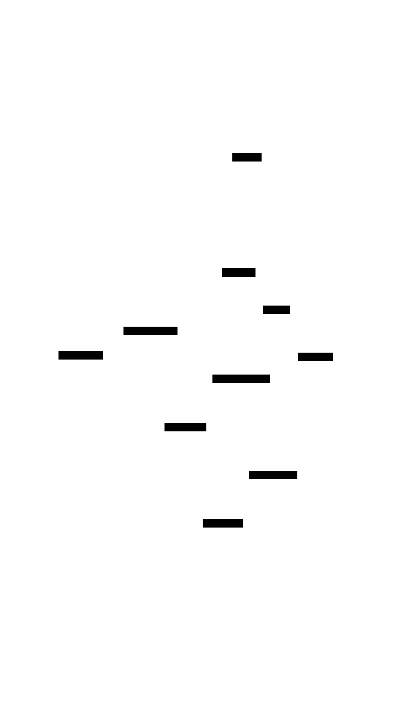
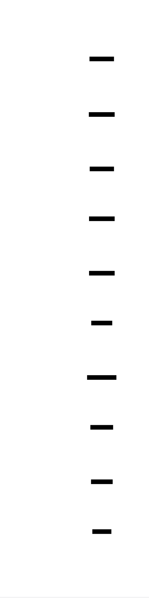
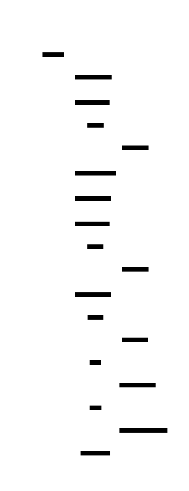
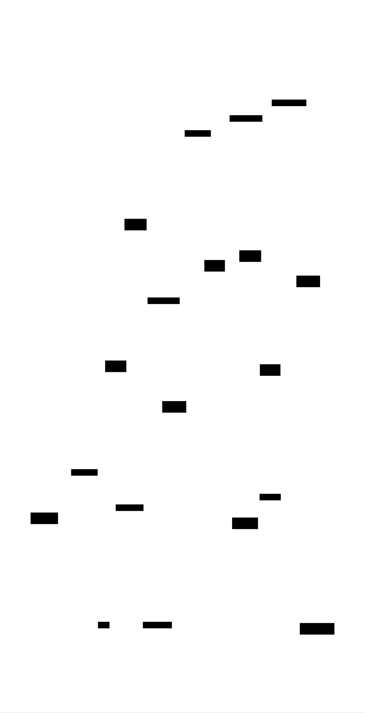
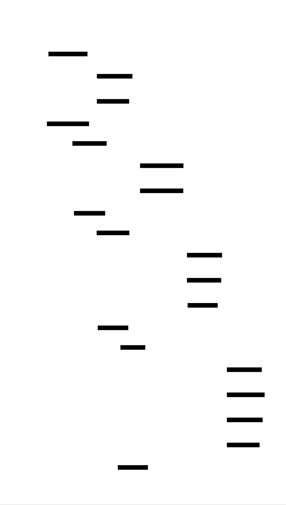

# WebAssembly Emitter: Design Document


## Overview

A compiler backend that transforms high-level language constructs into WebAssembly binary format, handling the complexities of stack-based code generation and binary encoding. The key architectural challenge is bridging the gap between tree-structured source programs and WebAssembly's linear instruction format while maintaining correctness in stack depth management and binary section encoding.


> This guide is meant to help you understand the big picture before diving into each milestone. Refer back to it whenever you need context on how components connect.


## Context and Problem Statement

> **Milestone(s):** All milestones - foundational understanding for the entire WebAssembly emitter project

The challenge of compiling high-level programming language constructs into WebAssembly binary format represents one of the most intricate problems in modern compiler engineering. Unlike traditional compilation targets that offer familiar instruction sets and straightforward binary layouts, WebAssembly presents a unique combination of stack-based execution, variable-length encoding schemes, and rigorously structured control flow that demands careful architectural consideration. This section establishes the fundamental context for why WebAssembly compilation is both necessary and challenging, examining the core problems that our emitter must solve and the architectural approaches available to address them.

The rise of WebAssembly as a compilation target has fundamentally altered the landscape of cross-platform application deployment. Originally conceived as a secure, portable execution environment for web browsers, WebAssembly has evolved into a universal bytecode format that enables high-performance applications to run across diverse environments from web browsers to server-side runtimes and embedded systems. However, this universality comes at the cost of complexity - the WebAssembly binary format requires precise encoding of type information, careful management of stack-based execution semantics, and adherence to a structured approach to control flow that differs significantly from traditional assembly languages.

The core challenge lies in bridging the semantic gap between the tree-structured representations that naturally emerge from parsing high-level languages and the linear, stack-oriented instruction sequences that WebAssembly requires. This transformation involves multiple layers of complexity: converting expression trees into postfix instruction sequences, managing the mapping between source-level variables and WebAssembly's indexed local storage, encoding control flow constructs within WebAssembly's structured block framework, and ultimately serializing all of this information into a compact binary representation that uses variable-length integer encoding and precisely defined section layouts.

### The Assembly Line Metaphor: Understanding WebAssembly Compilation as a Factory Process

To build intuition about the WebAssembly compilation process, consider the analogy of a modern automotive assembly line. Just as a car factory transforms raw materials through a series of specialized stations into a finished vehicle, our WebAssembly emitter transforms abstract syntax tree nodes through a series of specialized compilation phases into precise binary output.

In this manufacturing metaphor, the **raw materials** are the AST nodes representing high-level language constructs - expressions like `a + b * c`, control flow statements like `if` and `while`, and function definitions with parameters and local variables. These materials arrive at our factory with rich semantic information but in a form that cannot be directly consumed by the WebAssembly virtual machine.

The **first assembly station** is our type analysis phase, which examines each AST node to determine its WebAssembly type signature. Like a quality control inspector checking that raw materials meet specifications, this phase ensures that expressions have consistent types, function signatures match their usage patterns, and all variables are properly declared. The output is an annotated AST where every node carries precise type information that will guide subsequent compilation phases.

The **expression compilation station** transforms our type-annotated expression trees into sequences of stack-based instructions. This is perhaps the most conceptually challenging transformation, as it converts the natural tree structure of mathematical expressions into the linear, postfix instruction sequences that WebAssembly requires. An expression like `(a + b) * c` must be carefully reordered into the sequence `local.get a, local.get b, i32.add, local.get c, i32.mul` - a process that requires precise understanding of operand ordering and stack depth management.

The **control flow assembly station** handles the transformation of high-level control structures into WebAssembly's rigorously structured approach to branching and looping. Unlike traditional assembly languages that use simple jump instructions with address labels, WebAssembly requires that all control flow be expressed through nested block structures with calculated depth indices for branch targets. This station must track the nesting depth of control structures and convert high-level constructs like `break` statements into `br` instructions with correctly calculated label indices.

The **function compilation station** packages individual expressions and control flow sequences into complete function bodies, managing the allocation of local variable indices and ensuring that function signatures match their implementations. This phase also handles the complex process of calculating the exact byte size of each function body - information that must be encoded in the binary format before the actual function bytes are written.

Finally, the **binary emission station** takes all of these compiled components and packages them into the final WebAssembly binary format. This station must handle the intricate details of variable-length integer encoding, section size calculations, and the precise binary layout required by the WebAssembly specification. Like the final packaging step in a factory, this phase must ensure that every byte is correctly positioned and encoded according to the strict format requirements.

The assembly line metaphor also illuminates the importance of **quality control checkpoints** throughout the compilation process. Just as a factory implements quality checks at each station to catch defects before they propagate downstream, our compiler must implement validation at each phase to ensure that type errors are caught during type analysis, stack imbalances are detected during expression compilation, and binary format violations are identified before final emission.

The **factory coordination system** represents the overall compilation pipeline that orchestrates these individual stations. This system must handle the flow of intermediate representations between stations, manage error propagation when defects are detected, and coordinate the overall timing and resource allocation for the compilation process. When a quality control checkpoint detects a problem, the coordination system must decide whether to halt the entire process or attempt local repairs that allow compilation to continue.

This assembly line perspective helps clarify why WebAssembly compilation requires such careful architectural planning. Each station has specific input requirements, produces specific outputs, and must coordinate with adjacent stations to ensure smooth operation. The interdependencies between stations - such as the way expression compilation depends on type analysis results, and binary emission depends on accurate size calculations from function compilation - mirror the complex coordination required in modern manufacturing.

### Compiler Backend Approaches: Comparison of Different Strategies for Code Generation and Binary Emission

The architectural landscape for WebAssembly compilation presents several fundamentally different approaches, each with distinct trade-offs in terms of implementation complexity, compilation speed, and output quality. Understanding these approaches is crucial for making informed design decisions about our emitter architecture.

The **single-pass direct emission** approach represents the simplest conceptual model, where AST nodes are directly transformed into WebAssembly binary output in a single traversal. This approach treats the compiler as a streaming processor that consumes AST nodes and immediately produces binary bytes without intermediate representations. While conceptually elegant, this approach faces significant challenges in WebAssembly's binary format, which requires forward references and size calculations that are difficult to handle in a single pass.

| Aspect | Single-Pass Direct | Multi-Pass Staged | IR-Based Translation |
|--------|-------------------|------------------|---------------------|
| Implementation Complexity | Low - simple visitor pattern | Medium - multiple coordinated phases | High - intermediate representation design |
| Binary Size Calculation | Difficult - requires estimation | Natural - calculate in sizing pass | Natural - IR provides size information |
| Error Detection Quality | Poor - late error detection | Good - phase-specific validation | Excellent - IR enables deep analysis |
| Memory Usage | Low - no intermediate storage | Medium - temporary per-pass data | High - full IR in memory |
| Compilation Speed | Fast - single traversal | Medium - multiple traversals | Slower - IR construction overhead |
| Code Generation Quality | Basic - limited optimization opportunity | Good - phase-specific improvements | Excellent - IR enables optimization |
| Debugging Support | Poor - hard to inspect intermediate state | Good - can examine phase outputs | Excellent - IR provides rich debugging info |

The **multi-pass staged compilation** approach divides the compilation process into distinct phases, each responsible for a specific aspect of the transformation. This approach typically includes separate passes for type analysis, expression compilation, control flow compilation, function body generation, and binary emission. Each pass produces intermediate data structures that are consumed by subsequent passes, allowing for clear separation of concerns and robust error handling.

> **Decision: Multi-Pass Staged Compilation Architecture**
> - **Context**: Need to balance implementation complexity with correctness and maintainability while handling WebAssembly's complex binary format requirements
> - **Options Considered**: Single-pass direct emission, Multi-pass staged compilation, IR-based translation framework
> - **Decision**: Multi-pass staged compilation with well-defined intermediate representations between phases
> - **Rationale**: WebAssembly's binary format requires forward size calculations and complex encoding that make single-pass approaches fragile, while full IR-based approaches add unnecessary complexity for our learning-focused goals. Multi-pass staging provides clear phase boundaries that align well with WebAssembly's section-based format
> - **Consequences**: Enables robust error handling and clear debugging boundaries but requires careful design of inter-phase data structures and multiple AST traversals

The **intermediate representation (IR) based approach** introduces a WebAssembly-specific intermediate representation that serves as a bridge between high-level language constructs and the final binary format. This IR typically models WebAssembly concepts like function signatures, local variables, and instruction sequences in a form that is easier to manipulate than raw binary data but more concrete than high-level AST nodes. The compilation process becomes a two-stage transformation: source language to IR, then IR to binary.

A critical architectural decision within any of these approaches concerns **size calculation strategy**. WebAssembly's binary format requires that section sizes be encoded before section contents, creating a chicken-and-egg problem where we need to know the final size of content before we can begin writing it. The most robust solution is a **two-pass emission strategy** where the first pass calculates sizes and builds section metadata, while the second pass performs actual binary emission using the pre-calculated size information.

The **error handling strategy** represents another crucial architectural choice that significantly impacts the user experience of our compiler. A **fail-fast approach** halts compilation immediately upon encountering the first error, providing quick feedback but potentially hiding multiple related errors. A **error accumulation approach** attempts to continue compilation after errors, collecting multiple error reports before failing, which provides more comprehensive feedback but requires careful handling of invalid intermediate states.

| Error Handling Approach | Pros | Cons | Best For |
|-------------------------|------|------|----------|
| Fail-Fast | Simple to implement, quick feedback, no invalid state propagation | May hide related errors, requires multiple compile cycles to find all issues | Development and debugging scenarios |
| Error Accumulation | Comprehensive error reporting, fewer compile cycles needed | Complex state management, risk of cascading errors, harder to implement | Production compilation workflows |
| Phase-Boundary Recovery | Good error isolation, predictable recovery points | May miss cross-phase error relationships | Educational and learning environments |

Our **data flow architecture** must also address the challenge of managing compilation state across multiple phases. A **functional pipeline approach** treats each phase as a pure function that transforms one intermediate representation into another, providing clear interfaces and easy testing but potentially requiring expensive data copying. A **mutable state approach** allows phases to modify shared compilation state, improving performance but creating complex dependencies and debugging challenges.

The **memory management strategy** becomes particularly important when handling large source files or when the compiler will be embedded in memory-constrained environments. A **streaming approach** processes the input in chunks and emits output incrementally, minimizing peak memory usage but complicating size calculations and cross-reference resolution. A **batch processing approach** loads the entire input and builds complete intermediate representations before emission, simplifying implementation but requiring memory proportional to input size.

> The fundamental insight for WebAssembly compilation architecture is that the binary format's requirements - particularly forward size references and strict section ordering - create constraints that heavily favor multi-pass approaches over single-pass streaming compilation.

### WebAssembly-Specific Challenges: Stack Machines, Variable-Length Encoding, and Structured Control Flow Requirements

WebAssembly presents three fundamental challenges that distinguish it from traditional compilation targets and require specialized architectural solutions. These challenges stem from WebAssembly's design goals of portability, security, and performance, but they create complex implementation requirements that our emitter must carefully address.

The **stack machine execution model** represents perhaps the most significant conceptual challenge for developers familiar with register-based or memory-based instruction sets. Unlike traditional architectures where instructions operate on named registers or memory addresses, WebAssembly instructions manipulate an implicit operand stack where all computation occurs through push and pop operations. This model requires a fundamental shift in how we think about expression evaluation and variable access.

Consider the transformation of a simple expression like `a + b * c` into WebAssembly instructions. In a register-based architecture, we might generate instructions like `load r1, a; load r2, b; load r3, c; mul r2, r3; add r1, r2`, where each instruction explicitly names its operands and destination. In WebAssembly's stack machine, the same expression becomes `local.get a; local.get b; local.get c; i32.mul; i32.add`, where the multiplication consumes the top two stack values (b and c) and pushes the result, which is then consumed along with a by the addition operation.

| Expression Complexity | Traditional Register Code | WebAssembly Stack Code | Key Challenge |
|--------------------|------------------------|---------------------|---------------|
| Simple binary: `a + b` | `load r1, a; load r2, b; add r1, r2` | `local.get a; local.get b; i32.add` | Operand ordering |
| Precedence: `a + b * c` | `load r1, b; load r2, c; mul r1, r2; load r3, a; add r3, r1` | `local.get a; local.get b; local.get c; i32.mul; i32.add` | Postfix conversion |
| Nested calls: `f(g(a), b)` | Complex register allocation needed | `local.get a; call g; local.get b; call f` | Stack depth tracking |
| Complex: `(a + b) * (c - d)` | Multiple registers, careful scheduling | `local.get a; local.get b; i32.add; local.get c; local.get d; i32.sub; i32.mul` | Subexpression management |

The stack machine model also creates challenges in **operand ordering** that are particularly subtle for non-commutative operations. While `a + b` and `b + a` produce identical results regardless of stack ordering, operations like subtraction and division require careful attention to ensure that operands appear on the stack in the correct order. The expression `a - b` must generate `local.get a; local.get b; i32.sub`, where the subtraction instruction pops b first (top of stack) and a second (beneath b), computing a - b as intended.

**Variable-length encoding (LEB128)** presents the second major challenge, requiring careful implementation of encoding and size calculation algorithms that differ significantly from fixed-width integer formats. LEB128 encoding uses the most significant bit of each byte as a continuation flag, allowing integers to be encoded in 1-5 bytes depending on their magnitude. This creates efficiency benefits for small integers but complicates size calculations and binary layout.

The LEB128 encoding algorithm operates by extracting 7-bit chunks from the integer value, starting with the least significant bits, and setting the continuation bit (bit 7) for all bytes except the final one. For example, the integer 300 (binary 100101100) becomes two bytes: 0xAC (10101100, with continuation bit set) followed by 0x02 (00000010, final byte). This encoding means that frequently used small integers like local variable indices and small constants require only single bytes, while larger values expand to multiple bytes.

| Integer Value | Binary Representation | LEB128 Bytes | Size Calculation Challenge |
|--------------|---------------------|--------------|---------------------------|
| 42 | 0101010 | [0x2A] | Simple - always 1 byte for values < 128 |
| 300 | 100101100 | [0xAC, 0x02] | Moderate - requires bit manipulation |
| 16384 | 100000000000000 | [0x80, 0x80, 0x01] | Complex - three bytes for edge case |
| -1 (signed) | ...11111111 | [0x7F] | Tricky - signed LEB128 has different rules |
| -128 (signed) | ...10000000 | [0x80, 0x7F] | Very tricky - sign extension affects length |

The size calculation challenge becomes particularly acute because WebAssembly's binary format requires section sizes to be encoded before section contents. This means we must accurately predict the final encoded size of all section contents, including all embedded LEB128 integers, before we begin writing binary data. Miscalculating sizes leads to invalid WebAssembly modules that fail validation.

**Structured control flow** represents the third major challenge, requiring a complete rethinking of how conditional statements, loops, and break/continue constructs are compiled. Unlike traditional assembly languages that use simple jump instructions with address labels, WebAssembly enforces a structured approach where all control flow must be expressed through nested block constructs with lexically scoped labels.

WebAssembly's control flow model centers around four primary constructs: `block`, `loop`, `if`, and `br` (branch). Each `block` and `loop` creates a new label scope, while `if` creates conditional execution paths. Branch instructions (`br` and `br_if`) target these labels using relative depth indices rather than absolute addresses. A `br 0` instruction branches to the innermost enclosing label, `br 1` branches to the next outer label, and so on.

Consider the compilation of a typical while loop structure:
```
while (condition) {
    if (special_case) break;
    do_work();
}
```

This high-level construct must be transformed into WebAssembly's structured form:
```
block $outer
  loop $inner
    (evaluate condition)
    i32.eqz
    br_if $outer     ; exit if condition false
    
    (evaluate special_case)
    br_if $outer     ; break if special case
    
    (call do_work)
    br $inner        ; continue loop
  end
end
```

| Control Structure | High-Level Form | WebAssembly Structure | Label Depth Challenge |
|------------------|-----------------|----------------------|---------------------|
| Simple if | `if (cond) stmt` | `(cond) if stmt end` | None - no branching |
| If-else | `if (cond) s1 else s2` | `(cond) if s1 else s2 end` | None - structured nesting |
| While loop | `while (cond) body` | `block loop (cond) br_if body br end end` | Medium - break targets outer block |
| Nested loops | `while (c1) { while (c2) body }` | Nested block/loop structures | High - multiple label depths |
| Early return | `if (error) return` | `(error) br_if $function_end` | High - function-level targeting |

The label depth calculation becomes particularly complex when dealing with nested control structures where inner scopes need to break out of outer scopes. Each `break` statement in the source code must be translated to a `br` instruction with the correct relative depth index, requiring the compiler to maintain a stack of active label scopes and calculate the appropriate depth for each branch target.

The **validation requirements** that accompany WebAssembly's structured control flow create additional compilation challenges. The WebAssembly specification requires that all control flow paths maintain consistent stack depths and types, meaning that every possible execution path through a block must leave the operand stack in the same state. This creates complex analysis requirements for our compiler, as we must track not just the generation of individual instructions but also their collective effect on the execution stack.

> ⚠️ **Pitfall: Stack Depth Mismanagement**
> One of the most common and difficult-to-debug errors in WebAssembly compilation occurs when control flow paths leave different numbers of values on the operand stack. For example, an `if` branch that pushes a value while the corresponding `else` branch doesn't push anything will create a stack depth mismatch that violates WebAssembly's validation rules. The symptom is often a cryptic validation error from the WebAssembly runtime, but the root cause lies in inconsistent expression compilation across different control flow paths.

> ⚠️ **Pitfall: LEB128 Size Miscalculation**
> A subtle but critical error occurs when the size calculation pass predicts one byte length for a LEB128-encoded integer, but the actual encoding pass produces a different length due to boundary conditions. This typically happens with values near the 128, 16384, and 2097152 boundaries where an off-by-one error in size prediction creates invalid section size encoding. The resulting WebAssembly module appears to have truncated or corrupted sections.

> ⚠️ **Pitfall: Label Depth Confusion**
> Branch instructions with incorrect label depth indices create subtle control flow bugs that may not manifest until specific execution paths are triggered. The most common mistake is miscounting the nesting depth when compiling nested loops with break statements, leading to branches that target the wrong enclosing block. These errors often pass WebAssembly validation but produce incorrect runtime behavior.

These three challenges - stack machine execution, variable-length encoding, and structured control flow - create a complex interdependent system where errors in one area often manifest as failures in another. A stack depth calculation error might not be detected until binary emission, while a LEB128 encoding bug might only surface during WebAssembly module validation. This interconnectedness requires our emitter architecture to carefully manage the flow of information between compilation phases and implement robust validation at each stage to catch errors as early as possible in the compilation pipeline.

### Implementation Guidance

The following implementation guidance provides concrete technical recommendations and starter code for building the foundational components needed to address WebAssembly's core compilation challenges. This guidance targets the Rust programming language and provides complete, working implementations for supporting infrastructure while offering structured skeletons for the core learning components.

**A. Technology Recommendations Table:**

| Component | Simple Option | Advanced Option |
|-----------|---------------|-----------------|
| Binary Output | `Vec<u8>` with manual byte writing | Custom `BinaryWriter` with buffering and error handling |
| LEB128 Encoding | Direct bit manipulation functions | `leb128` crate with streaming support |
| AST Processing | Recursive visitor pattern with match statements | Trait-based visitor with generic dispatch |
| Error Handling | `Result<T, String>` with simple error messages | Custom error enum with source location tracking |
| Testing | Unit tests with hardcoded expected bytes | Property-based testing with `proptest` crate |
| Binary Validation | Manual hex dump inspection | Integration with `wabt` for validation and disassembly |

**B. Recommended File/Module Structure:**

```
webassembly-emitter/
├── src/
│   ├── lib.rs                    ← public API and module declarations
│   ├── ast/                      ← AST definitions and utilities
│   │   ├── mod.rs               ← AST node types and visitor traits
│   │   └── types.rs             ← Type system and type checking
│   ├── binary/                   ← Binary format emission (Milestone 1)
│   │   ├── mod.rs               ← public binary API
│   │   ├── writer.rs            ← binary writing utilities
│   │   ├── leb128.rs            ← LEB128 encoding implementation
│   │   └── sections.rs          ← WebAssembly section emission
│   ├── compiler/                 ← Compilation phases
│   │   ├── mod.rs               ← compiler orchestration
│   │   ├── expressions.rs       ← expression compilation (Milestone 2)
│   │   ├── control_flow.rs      ← control flow compilation (Milestone 3)
│   │   └── functions.rs         ← function compilation (Milestone 4)
│   └── errors.rs                ← error types and handling
├── tests/
│   ├── integration_tests.rs     ← end-to-end compilation tests
│   ├── binary_format_tests.rs   ← binary format validation tests
│   └── fixtures/                ← test WebAssembly modules and expected output
└── examples/
    ├── simple_arithmetic.rs     ← basic expression compilation example
    └── control_flow_demo.rs     ← if/loop compilation example
```

**C. Infrastructure Starter Code (COMPLETE, ready to use):**

```rust
// src/binary/writer.rs - Complete binary writing utilities
use std::io::{self, Write};

/// BinaryWriter provides utilities for writing WebAssembly binary format.
/// Handles byte ordering, size tracking, and error propagation.
pub struct BinaryWriter {
    buffer: Vec<u8>,
    position: usize,
}

impl BinaryWriter {
    /// Creates a new binary writer with initial capacity.
    pub fn new() -> Self {
        Self {
            buffer: Vec::with_capacity(1024),
            position: 0,
        }
    }

    /// Writes a single byte to the output buffer.
    pub fn write_byte(&mut self, byte: u8) -> io::Result<()> {
        self.buffer.push(byte);
        self.position += 1;
        Ok(())
    }

    /// Writes a slice of bytes to the output buffer.
    pub fn write_bytes(&mut self, bytes: &[u8]) -> io::Result<()> {
        self.buffer.extend_from_slice(bytes);
        self.position += bytes.len();
        Ok(())
    }

    /// Returns the current position (number of bytes written).
    pub fn position(&self) -> usize {
        self.position
    }

    /// Returns the complete binary buffer.
    pub fn into_bytes(self) -> Vec<u8> {
        self.buffer
    }
}

// src/binary/leb128.rs - Complete LEB128 encoding implementation
/// Encodes an unsigned 32-bit integer using LEB128 variable-length encoding.
/// Returns a vector of bytes representing the encoded value.
pub fn encode_u32(mut value: u32) -> Vec<u8> {
    let mut result = Vec::new();
    
    loop {
        let mut byte = (value & 0x7F) as u8;
        value >>= 7;
        
        if value != 0 {
            byte |= 0x80; // Set continuation bit
        }
        
        result.push(byte);
        
        if value == 0 {
            break;
        }
    }
    
    result
}

/// Encodes a signed 32-bit integer using LEB128 variable-length encoding.
/// Handles sign extension correctly for negative values.
pub fn encode_i32(mut value: i32) -> Vec<u8> {
    let mut result = Vec::new();
    let mut more = true;
    
    while more {
        let mut byte = (value & 0x7F) as u8;
        value >>= 7;
        
        // Check if this is the last byte
        if (value == 0 && (byte & 0x40) == 0) || (value == -1 && (byte & 0x40) != 0) {
            more = false;
        } else {
            byte |= 0x80; // Set continuation bit
        }
        
        result.push(byte);
    }
    
    result
}

/// Calculates the encoded size of a u32 value without actually encoding it.
/// Useful for size prediction during section size calculation.
pub fn u32_size(mut value: u32) -> usize {
    if value == 0 {
        return 1;
    }
    
    let mut size = 0;
    while value > 0 {
        value >>= 7;
        size += 1;
    }
    size
}

// src/errors.rs - Complete error handling infrastructure
use std::fmt;

/// Comprehensive error types for WebAssembly compilation.
#[derive(Debug, Clone)]
pub enum CompilationError {
    /// Type checking errors with context about the mismatched types
    TypeError { expected: String, found: String, location: String },
    /// Stack depth validation errors during expression compilation
    StackError { expected_depth: usize, actual_depth: usize, instruction: String },
    /// Binary format encoding errors
    BinaryFormatError { message: String, section: String },
    /// Label resolution errors for control flow
    LabelError { label_name: String, depth: usize },
    /// Function signature mismatches
    SignatureError { function_name: String, expected: String, found: String },
}

impl fmt::Display for CompilationError {
    fn fmt(&self, f: &mut fmt::Formatter<'_>) -> fmt::Result {
        match self {
            CompilationError::TypeError { expected, found, location } =>
                write!(f, "Type error at {}: expected {}, found {}", location, expected, found),
            CompilationError::StackError { expected_depth, actual_depth, instruction } =>
                write!(f, "Stack depth error in {}: expected depth {}, actual depth {}", 
                       instruction, expected_depth, actual_depth),
            CompilationError::BinaryFormatError { message, section } =>
                write!(f, "Binary format error in {} section: {}", section, message),
            CompilationError::LabelError { label_name, depth } =>
                write!(f, "Label resolution error: {} at depth {}", label_name, depth),
            CompilationError::SignatureError { function_name, expected, found } =>
                write!(f, "Function signature error in {}: expected {}, found {}", 
                       function_name, expected, found),
        }
    }
}

impl std::error::Error for CompilationError {}

pub type CompilationResult<T> = Result<T, CompilationError>;
```

**D. Core Logic Skeleton Code (signature + TODOs only):**

```rust
// src/binary/sections.rs - Section emission skeleton for learner implementation
use crate::binary::writer::BinaryWriter;
use crate::binary::leb128;
use crate::errors::CompilationResult;

/// Emits the WebAssembly module header (magic number and version).
/// Must write exactly 8 bytes: 0x00 0x61 0x73 0x6D 0x01 0x00 0x00 0x00
pub fn emit_module_header(writer: &mut BinaryWriter) -> CompilationResult<()> {
    // TODO 1: Write the magic number bytes 0x00, 0x61, 0x73, 0x6D
    // TODO 2: Write the version bytes 0x01, 0x00, 0x00, 0x00
    // Hint: Use writer.write_bytes() for efficiency
    todo!("Implement WebAssembly module header emission")
}

/// Emits a WebAssembly section with proper ID and size encoding.
/// The size must be calculated before writing content.
pub fn emit_section(writer: &mut BinaryWriter, section_id: u8, content: &[u8]) -> CompilationResult<()> {
    // TODO 1: Write the section ID byte directly to the writer
    // TODO 2: Encode the content length using LEB128 u32 encoding
    // TODO 3: Write the encoded length bytes to the writer
    // TODO 4: Write the actual content bytes to the writer
    // Hint: Use leb128::encode_u32() to encode the length
    todo!("Implement section emission with size prefix")
}

// src/compiler/expressions.rs - Expression compilation skeleton
use crate::ast::{Expression, BinaryOp};
use crate::binary::writer::BinaryWriter;
use crate::errors::CompilationResult;

/// Represents the current stack depth during expression compilation.
/// Critical for ensuring stack balance and detecting compilation errors.
#[derive(Debug, Clone)]
pub struct StackState {
    depth: usize,
}

impl StackState {
    pub fn new() -> Self {
        Self { depth: 0 }
    }
    
    pub fn push(&mut self) {
        self.depth += 1;
    }
    
    pub fn pop(&mut self) -> CompilationResult<()> {
        if self.depth == 0 {
            return Err(CompilationError::StackError {
                expected_depth: 1,
                actual_depth: 0,
                instruction: "pop".to_string(),
            });
        }
        self.depth -= 1;
        Ok(())
    }
}

/// Compiles an expression tree into WebAssembly stack instructions.
/// Uses post-order traversal to ensure operands are evaluated before operators.
pub fn compile_expression(
    expr: &Expression,
    writer: &mut BinaryWriter,
    stack: &mut StackState,
) -> CompilationResult<()> {
    // TODO 1: Match on the expression type (literal, variable, binary_op)
    // TODO 2: For literals - emit i32.const or f64.const instruction with value
    // TODO 3: For variables - emit local.get instruction with variable index
    // TODO 4: For binary operations - recursively compile left operand first
    // TODO 5: For binary operations - recursively compile right operand second
    // TODO 6: For binary operations - emit the appropriate operation instruction
    // TODO 7: Update stack depth tracking for each instruction type
    // Hint: Binary ops consume 2 values and produce 1, so net effect is -1 on stack
    todo!("Implement expression compilation with stack management")
}

/// Emits a WebAssembly local.get instruction for variable access.
/// The variable_index should be the WebAssembly local variable index.
pub fn emit_local_get(writer: &mut BinaryWriter, variable_index: u32) -> CompilationResult<()> {
    // TODO 1: Write the local.get opcode (0x20)
    // TODO 2: Encode the variable index using LEB128 u32 encoding
    // TODO 3: Write the encoded index bytes
    // Hint: WebAssembly opcodes are single bytes, use writer.write_byte()
    todo!("Implement local.get instruction emission")
}

/// Emits a WebAssembly i32.const instruction for integer literals.
/// The value should be encoded using signed LEB128 format.
pub fn emit_i32_const(writer: &mut BinaryWriter, value: i32) -> CompilationResult<()> {
    // TODO 1: Write the i32.const opcode (0x41)
    // TODO 2: Encode the value using LEB128 i32 encoding (signed)
    // TODO 3: Write the encoded value bytes
    // Hint: Use leb128::encode_i32() for signed integer encoding
    todo!("Implement i32.const instruction emission")
}
```

**E. Language-Specific Hints:**

- **Rust Error Handling**: Use `?` operator extensively for error propagation. Define custom error types with `#[derive(Debug)]` and implement `std::error::Error` trait for integration with the ecosystem.

- **Byte Buffer Management**: `Vec<u8>` is the idiomatic choice for building binary output in Rust. Use `extend_from_slice()` for efficient batch writes and `reserve()` to minimize reallocations when the final size is predictable.

- **LEB128 Implementation**: Rust's bitwise operators (`&`, `|`, `>>`, `<<`) work identically to other languages. Use `as u8` casting carefully to truncate to byte values, and remember that Rust's `>>` operator preserves sign for signed integers.

- **Pattern Matching**: Rust's `match` expressions are perfect for AST traversal. Use `ref` patterns when you need to borrow AST fields without moving them, especially in recursive compilation functions.

- **Testing with Binary Data**: Use the `hex` crate for readable test assertions: `assert_eq!(hex::encode(&output), "0061736d01000000")` is much clearer than comparing byte arrays directly.

- **WebAssembly Validation**: Install `wabt` tools (`wat2wasm`, `wasm-validate`, `wasm-objdump`) for validating generated output. Use `std::process::Command` to invoke these tools from integration tests.

**F. Milestone Checkpoint:**

After implementing the foundational binary format components, verify your implementation with these concrete checkpoints:

1. **Binary Header Test**: Your `emit_module_header()` function should produce exactly 8 bytes: `00 61 73 6d 01 00 00 00`. Test with: `let mut writer = BinaryWriter::new(); emit_module_header(&mut writer)?; assert_eq!(writer.into_bytes(), vec![0x00, 0x61, 0x73, 0x6d, 0x01, 0x00, 0x00, 0x00]);`

2. **LEB128 Encoding Validation**: Test edge cases: `encode_u32(0)` → `[0x00]`, `encode_u32(127)` → `[0x7F]`, `encode_u32(128)` → `[0x80, 0x01]`, `encode_u32(300)` → `[0xAC, 0x02]`

3. **Section Size Calculation**: Create a test section with known content and verify that `emit_section()` calculates the size correctly. A section with 5 bytes of content should have size encoded as `[0x05]`.

4. **Integration with wabt**: Save your generated binary to a `.wasm` file and run `wasm-validate output.wasm`. A valid module header should pass validation even without any sections.

**G. Debugging Tips:**

| Symptom | Likely Cause | How to Diagnose | Fix |
|---------|--------------|-----------------|-----|
| "Invalid magic number" error | Module header bytes incorrect | Hex dump first 8 bytes of output | Check `emit_module_header()` byte sequence |
| "Invalid section size" error | LEB128 size encoding wrong | Compare calculated vs actual content size | Verify `leb128::encode_u32()` implementation |
| "Unexpected end of file" error | Section size larger than content | Check section size calculation logic | Ensure size reflects actual content bytes |
| Stack overflow in recursion | Infinite recursion in AST traversal | Add debug prints to expression compilation | Check for proper base cases in recursive functions |
| Wrong instruction encoding | Opcode bytes don't match spec | Use `wasm-objdump -d` to disassemble output | Verify WebAssembly opcode constants against spec |


## Goals and Non-Goals

> **Milestone(s):** All milestones - this section establishes the foundational scope and boundaries that guide implementation decisions throughout the entire WebAssembly emitter project

Think of project scope as drawing a clear boundary around a construction site. Just as construction crews need to know exactly what they're building and what's outside their responsibility, our WebAssembly emitter needs clear goals and explicit non-goals to guide every architectural decision. Without these boundaries, we risk building an overly complex system that tries to solve every possible problem rather than excelling at its core mission.

The WebAssembly emitter sits at a critical juncture in the compilation pipeline - it's the final transformation step that takes high-level language constructs and produces precise binary output that WebAssembly runtimes can execute. This position demands clarity about what we're optimizing for: correctness and completeness of core functionality, or performance and advanced features. Our scope decisions directly impact every component from binary format emission to control flow compilation.

### Primary Goals: Core functionality for WebAssembly binary generation and basic language constructs

Our primary goals represent the essential functionality that makes this project valuable as a learning exercise and practical tool. These goals focus on mastering the fundamental concepts of WebAssembly compilation without getting distracted by advanced optimizations that would obscure the core learning objectives.

**Goal 1: Complete WebAssembly Binary Format Mastery**

The foremost goal is achieving complete mastery of WebAssembly's binary format specification. This means our emitter must produce valid WebAssembly modules that pass validation in standard WebAssembly runtimes like V8, SpiderMonkey, or wasmtime. Every byte in the output binary must conform to the WebAssembly specification, from the magic number header to the final instruction in the code section.

| Binary Format Component | Requirement Level | Success Criteria |
|-------------------------|-------------------|------------------|
| Module Header | Must implement | Correct magic number `WASM_MAGIC` and version `WASM_VERSION` |
| Section Structure | Must implement | All sections have correct ID bytes and LEB128 size prefixes |
| LEB128 Encoding | Must implement | Both signed and unsigned integers encode correctly with `encode_u32` and `encode_i32` |
| Type Section | Must implement | Function signatures with parameter and return type arrays |
| Function Section | Must implement | Function-to-type index mappings |
| Code Section | Must implement | Local declarations and instruction bytecode with size prefixes |
| Export Section | Must implement | String names mapped to function indices for host access |

This goal encompasses the `BinaryWriter` component with its buffer management and position tracking, ensuring we can emit correct binary data incrementally. The challenge lies in the variable-length nature of LEB128 encoding, which requires careful size calculation for section emission.

**Goal 2: Stack Machine Code Generation Excellence**

WebAssembly's stack machine execution model represents a fundamentally different approach from register-based architectures. Our goal is to master this paradigm by implementing correct expression compilation that manages stack depth and operand ordering precisely.

The `StackState` tracking system must ensure that every instruction sequence leaves the stack in the expected state. This means understanding how each WebAssembly instruction affects stack depth and generating code that maintains stack balance throughout function execution.

| Expression Type | Stack Management Requirement | Implementation Target |
|----------------|------------------------------|----------------------|
| Literal Values | Push exactly one value | `emit_i32_const` with immediate encoding |
| Binary Operations | Pop two operands, push one result | Correct operand ordering for non-commutative operations |
| Local Variables | Get pushes one value, set pops one | `emit_local_get` with proper index mapping |
| Function Calls | Pop parameters, push results | Parameter count matching and result handling |

The expression compiler must handle the post-order traversal of AST nodes to generate correct stack instruction sequences. For an expression like `a + b * c`, we must emit `local.get a`, `local.get b`, `local.get c`, `i32.mul`, `i32.add` - ensuring the multiplication happens before addition through proper instruction ordering.

**Goal 3: Structured Control Flow Implementation**

WebAssembly's structured control flow represents a significant departure from goto-based assembly languages. Our goal is to implement correct block, loop, and conditional structures that handle label depth calculations and maintain proper nesting.

The control flow compiler must generate valid block structures where every `block`, `loop`, and `if` instruction has a matching `end`. Branch instructions must calculate correct label depths to target the appropriate enclosing blocks. This requires maintaining a label stack during compilation to track nesting depth.

| Control Structure | Compilation Requirement | Validation Criteria |
|------------------|------------------------|-------------------|
| If-Else Blocks | Generate `if`, optional `else`, `end` sequence | Conditional expression pops i32 from stack |
| Loop Constructs | Generate `loop`, body, conditional `br_if`, `end` | Branch target resolves to loop start |
| Block Structures | Generate `block`, body, optional branches, `end` | Branches target block exit correctly |
| Early Returns | Generate `return` instruction | Function signature result types match stack |

The challenge lies in maintaining the correspondence between high-level control structures and WebAssembly's label-based branching. A nested loop inside an if-else block requires careful tracking of which label corresponds to which control structure for correct branch target resolution.

**Goal 4: Function System and Module Organization**

Complete function compilation represents the culmination of all other components working together. Our goal is to implement function definitions, parameter handling, local variable management, and export mechanisms that create usable WebAssembly modules.

Function compilation involves multiple phases: analyzing the function signature to determine type indices, allocating local variable slots for parameters and local declarations, compiling the function body to instruction sequences, and emitting the complete function to the code section with proper size calculation.

| Function Component | Implementation Requirement | Success Metrics |
|-------------------|---------------------------|-----------------|
| Type Signatures | Parameter and return type encoding | Type section entries match function declarations |
| Parameter Handling | Parameters occupy first local indices | `local.get` instructions use correct parameter indices |
| Local Variables | Locals allocated after parameters | Local count declarations match usage |
| Function Bodies | Complete instruction sequences | Body size calculation matches emitted content |
| Export Mechanisms | Functions accessible by name | Host environment can resolve and call exported functions |

The function system must handle the distinction between parameters (which are accessed as locals but declared in the function signature) and local variables (which are declared in the function body). This distinction affects local indexing throughout the function compilation process.

> **Critical Design Principle**: Every goal focuses on correctness over performance. We prioritize generating valid, functionally correct WebAssembly over optimized code. This approach ensures learners master the fundamental concepts before attempting advanced optimizations.

**Goal 5: Comprehensive Error Detection and Reporting**

Robust error handling serves as both a learning tool and a practical necessity. Our goal is to implement comprehensive error detection that catches common mistakes early and provides actionable feedback for debugging.

The `CompilationError` enumeration must cover all major categories of compilation failures: type mismatches, stack depth errors, binary format violations, label resolution failures, and function signature inconsistencies. Each error should provide enough context to identify and fix the underlying problem.

| Error Category | Detection Point | Recovery Strategy |
|---------------|----------------|-------------------|
| `TypeError` | Expression compilation | Report type mismatch with expected and actual types |
| `StackError` | Instruction emission | Report stack depth inconsistency with current and expected depth |
| `BinaryFormatError` | Section emission | Report invalid binary format with section and position |
| `LabelError` | Branch compilation | Report invalid branch target with label depth and available labels |
| `SignatureError` | Function compilation | Report signature mismatch with declared and inferred signatures |

Error reporting must include source location information when available, making it practical to debug compilation issues in larger programs. The error handling system should distinguish between recoverable errors (where compilation can continue to find additional issues) and fatal errors (where compilation must halt).

### Explicit Non-Goals: Advanced optimizations, garbage collection, and complex runtime features

Clearly defining what we will NOT implement is equally important as defining our goals. These non-goals help maintain focus on the core learning objectives and prevent scope creep that would complicate the implementation without adding educational value.

**Non-Goal 1: Code Generation Optimizations**

We explicitly avoid implementing code generation optimizations such as constant folding, dead code elimination, common subexpression elimination, or instruction selection optimizations. While these techniques are valuable in production compilers, they add significant complexity without teaching the fundamental concepts of WebAssembly binary generation.

| Optimization Type | Why Excluded | Alternative Approach |
|------------------|--------------|---------------------|
| Constant Folding | Adds complexity to expression compilation | Generate literal WebAssembly instructions, let runtime optimize |
| Dead Code Elimination | Requires control flow analysis beyond scope | Emit all reachable code, rely on WebAssembly runtime |
| Register Allocation | WebAssembly uses stack machine model | Direct stack-based compilation without register concerns |
| Instruction Scheduling | Minimal benefit in stack machine architecture | Emit instructions in source order |

This decision keeps the expression compiler focused on correctness of stack machine code generation rather than performance optimization. Learners can understand the fundamental compilation process without getting lost in optimization heuristics.

**Non-Goal 2: Advanced Type System Features**

We do not implement advanced type system features such as generics, polymorphism, complex object systems, or sophisticated type inference. Our type system remains limited to WebAssembly's basic value types: `i32`, `i64`, `f32`, `f64`, and function references.

| Advanced Feature | Why Excluded | Simplified Alternative |
|------------------|--------------|------------------------|
| Generic Types | Requires complex type instantiation | Support only concrete WebAssembly value types |
| Object-Oriented Features | No direct WebAssembly equivalent | Functions and basic value types only |
| Complex Type Inference | Adds significant compiler complexity | Explicit type annotations in source language |
| Union/Sum Types | Requires sophisticated memory layout | Support only WebAssembly's primitive types |

This limitation keeps the focus on WebAssembly-specific challenges like stack machine compilation and binary format generation rather than general-purpose type system implementation.

**Non-Goal 3: Garbage Collection and Memory Management**

We explicitly exclude automatic memory management features. While WebAssembly has proposals for garbage collection support, implementing garbage collection would shift focus away from the core binary generation and compilation challenges.

| Memory Feature | Why Excluded | Simplified Approach |
|---------------|--------------|-------------------|
| Garbage Collection | Extremely complex, not core to WebAssembly learning | Manual memory management if needed |
| Reference Counting | Adds complexity to every object operation | Value types only, no reference management |
| Memory Pool Management | Advanced runtime feature beyond scope | Direct linear memory access |
| Object Lifetime Analysis | Sophisticated compiler analysis | Stack-allocated values only |

By avoiding memory management complexity, we can focus on the stack machine execution model and binary format challenges that are unique to WebAssembly compilation.

**Non-Goal 4: Multi-Module Systems and Advanced Linking**

We do not implement complex module systems, dynamic linking, or advanced import/export mechanisms beyond basic function exports. Our module system remains simple: single module compilation with basic function exports to the host environment.

| Linking Feature | Why Excluded | Simplified Alternative |
|----------------|--------------|----------------------|
| Dynamic Linking | Requires complex symbol resolution | Static single-module compilation |
| Multi-Module Compilation | Adds project management complexity | Single module with host imports only |
| Complex Export Systems | Beyond basic WebAssembly learning scope | Simple function name exports |
| Module Versioning | Advanced system integration feature | Single module version |

This keeps the module system focused on understanding WebAssembly's section structure and basic export mechanisms rather than complex linking scenarios.

**Non-Goal 5: Development Tooling Integration**

We do not implement sophisticated development tools such as debuggers, profilers, source maps, or IDE integration. While these tools are valuable for practical development, they add complexity that distracts from the core compilation learning objectives.

| Tooling Feature | Why Excluded | Alternative for Learning |
|----------------|--------------|--------------------------|
| Debug Information | Complex metadata generation beyond scope | Simple printf-style debugging |
| Source Maps | Requires sophisticated mapping between source and binary | Manual inspection of generated WebAssembly |
| IDE Integration | Platform-specific integration challenges | Command-line compilation tool |
| Performance Profiling | Advanced runtime instrumentation | Basic timing measurements if needed |

Learners can focus on mastering the compilation pipeline itself without getting distracted by tooling infrastructure that doesn't teach WebAssembly-specific concepts.

> **Scope Boundary Principle**: Every feature decision should ask "Does this teach something unique about WebAssembly compilation?" Features that are general-purpose compiler techniques (optimizations, advanced type systems) are excluded in favor of WebAssembly-specific challenges (stack machines, binary format, structured control flow).

**Decision: Narrow Scope with Deep Implementation**
- **Context**: Limited project timeframe requires choosing between breadth of features and depth of implementation quality
- **Options Considered**: 
  1. Broad feature set with shallow implementations
  2. Narrow feature set with complete, correct implementations  
  3. Moderate feature set with mixed implementation quality
- **Decision**: Narrow scope with deep, correct implementation of core WebAssembly concepts
- **Rationale**: Learning compiler fundamentals requires understanding concepts deeply rather than superficially implementing many features. Complete mastery of stack machine compilation and binary format generation provides more educational value than partial implementation of many advanced features.
- **Consequences**: Enables thorough understanding of WebAssembly-specific challenges, creates a solid foundation for future extensions, but limits immediate applicability to complex source languages

**Decision: Correctness Over Performance**
- **Context**: WebAssembly compilation involves both correctness challenges (binary format, stack management) and performance optimization opportunities
- **Options Considered**:
  1. Focus on generating fast WebAssembly code with optimizations
  2. Focus on generating correct WebAssembly code that passes validation
  3. Attempt both correctness and performance optimization
- **Decision**: Prioritize correctness with no performance optimizations
- **Rationale**: Incorrect WebAssembly fails validation and cannot execute, making correctness the prerequisite for any useful output. Performance optimization techniques are general compiler knowledge, while WebAssembly binary format and stack machine compilation are domain-specific learning objectives.
- **Consequences**: Generated code may be slower than optimizing compilers, but learners master the fundamental concepts required for any WebAssembly compiler, providing a solid foundation for adding optimizations later

These explicit boundaries ensure that every implementation decision serves the core learning objectives: mastering WebAssembly's unique compilation challenges rather than general-purpose compiler techniques that could be learned in any compilation context.

### Implementation Guidance

The goals and non-goals translate directly into architectural decisions that affect every component of the WebAssembly emitter. This guidance provides concrete direction for implementing the scoped functionality while avoiding the complexity of excluded features.

**Technology Recommendations Table:**

| Component | Simple Option | Advanced Option | Chosen for Goals |
|-----------|---------------|-----------------|------------------|
| Binary Generation | Write to `Vec<u8>` with manual encoding | Use existing WASM library with high-level API | Manual encoding - teaches binary format |
| Error Handling | Simple `enum` with `Result` types | Sophisticated error recovery with partial compilation | Simple enum - focuses on core concepts |
| Type System | WebAssembly primitive types only | Rich type system with inference | Primitives only - matches non-goals |
| Testing | Unit tests for each component | Property-based testing with fuzzing | Unit tests - adequate for learning scope |
| Validation | Basic structural checks | Full WebAssembly validator integration | Basic checks - core goal coverage |

**Recommended Project Structure:**

The project structure reflects our goal priorities by organizing components according to the WebAssembly compilation pipeline rather than general compiler architecture patterns.

```
webassembly-emitter/
  src/
    main.rs                    ← CLI entry point for single-module compilation
    lib.rs                     ← Public API focused on core compilation pipeline
    
    binary/                    ← Goal 1: Binary format mastery
      writer.rs                ← BinaryWriter with buffer management
      leb128.rs                ← LEB128 encoding functions
      sections.rs              ← Section emission with size calculation
      
    codegen/                   ← Goal 2: Stack machine code generation  
      expressions.rs           ← Expression compilation with stack management
      stack.rs                 ← StackState tracking and validation
      instructions.rs          ← WebAssembly instruction emission
      
    control/                   ← Goal 3: Structured control flow
      blocks.rs                ← Block, loop, and conditional compilation
      labels.rs                ← Label depth calculation and branch resolution
      
    functions/                 ← Goal 4: Function system
      compiler.rs              ← Function body compilation orchestration
      locals.rs                ← Local variable index management
      signatures.rs            ← Type signature handling
      
    module/                    ← Goal 4: Module organization
      builder.rs               ← Module assembly from compiled functions
      exports.rs               ← Export section generation
      
    errors/                    ← Goal 5: Comprehensive error handling
      types.rs                 ← CompilationError definitions
      reporting.rs             ← Error formatting and source location tracking
      
  tests/
    integration/               ← End-to-end compilation tests
      basic_functions.rs       ← Simple function compilation
      expressions.rs           ← Arithmetic expression tests
      control_flow.rs          ← If-else and loop tests
    
    unit/                      ← Component-specific tests
      leb128_tests.rs          ← LEB128 encoding edge cases
      stack_tests.rs           ← Stack depth validation
      
  examples/
    simple_calculator.rs       ← Concrete example within scope
    control_flow_demo.rs       ← Structured control flow examples
```

**Core Infrastructure Starter Code:**

Based on our correctness-focused goals, the binary writer provides the foundation for all other components. This implementation handles the low-level details so learners can focus on WebAssembly-specific concepts.

```rust
// src/binary/writer.rs - Complete binary writing infrastructure
use crate::errors::types::CompilationError;

pub struct BinaryWriter {
    pub buffer: Vec<u8>,
    pub position: usize,
}

impl BinaryWriter {
    pub fn new() -> Self {
        BinaryWriter {
            buffer: Vec::new(),
            position: 0,
        }
    }
    
    pub fn write_u8(&mut self, value: u8) -> Result<(), CompilationError> {
        self.buffer.push(value);
        self.position += 1;
        Ok(())
    }
    
    pub fn write_bytes(&mut self, bytes: &[u8]) -> Result<(), CompilationError> {
        self.buffer.extend_from_slice(bytes);
        self.position += bytes.len();
        Ok(())
    }
    
    pub fn current_position(&self) -> usize {
        self.position
    }
    
    pub fn into_bytes(self) -> Vec<u8> {
        self.buffer
    }
}

// Constants aligned with goals - these are the exact values learners need
pub const WASM_MAGIC: u32 = 0x6d736100;  // "\0asm" in little endian
pub const WASM_VERSION: u32 = 0x00000001;
pub const OP_LOCAL_GET: u8 = 0x20;
pub const OP_I32_CONST: u8 = 0x41;
pub const LEB128_CONTINUATION_BIT: u8 = 0x80;
```

**Core Logic Skeleton - LEB128 Encoding:**

This skeleton maps directly to our Goal 1 (binary format mastery) by focusing learners on the variable-length encoding algorithm without getting distracted by buffer management details.

```rust
// src/binary/leb128.rs - Core learning objective for binary format
use crate::errors::types::CompilationError;

/// Encodes an unsigned 32-bit integer in LEB128 format
/// This is fundamental to WebAssembly binary format - every size field uses this encoding
pub fn encode_u32(value: u32) -> Vec<u8> {
    let mut result = Vec::new();
    let mut remaining = value;
    
    // TODO 1: Handle the case where value is 0 - should encode as single byte [0]
    // TODO 2: While remaining has bits that need encoding (remaining >= 0x80):
    //   - Take the low 7 bits of remaining  
    //   - Set the continuation bit (0x80) to indicate more bytes follow
    //   - Add this byte to result
    //   - Shift remaining right by 7 bits
    // TODO 3: Handle the final byte (remaining < 0x80):
    //   - Add remaining as-is (no continuation bit)
    // TODO 4: Return the complete byte sequence
    
    // Hint: Use bitwise operations - (remaining & 0x7F) gets low 7 bits
    // Hint: Use remaining >>= 7 to shift right by 7 bits  
    // Hint: The continuation bit is LEB128_CONTINUATION_BIT constant
    
    result
}

/// Calculates the encoded size of a u32 without actually encoding it
/// This is crucial for section size calculation in two-pass emission
pub fn u32_size(value: u32) -> usize {
    // TODO 1: Handle special case - if value == 0, return 1
    // TODO 2: Count how many 7-bit groups are needed
    // TODO 3: Use bit operations to determine this efficiently
    // Hint: Keep dividing by 128 until value becomes 0, count the divisions
    
    1 // Placeholder - implement the actual calculation
}
```

**Milestone Checkpoint - Binary Format Validation:**

After implementing the binary format components (Goal 1), learners should be able to generate valid WebAssembly modules that pass basic validation.

```bash
# Test the binary format implementation
cargo test binary_format_tests

# Expected output should show:
# ✓ Magic number and version header correct
# ✓ LEB128 encoding matches reference implementation  
# ✓ Section structure with correct IDs and sizes
# ✓ Generated module loads in WebAssembly runtime

# Manual verification with wabt tools:
# 1. Generate a simple module with your emitter
# 2. Run: wasm-validate output.wasm
# 3. Should see: "output.wasm is valid"
# 4. Run: wasm-objdump -h output.wasm  
# 5. Should see correct section headers and sizes
```

**Common Implementation Pitfalls Aligned with Goals:**

⚠️ **Pitfall: Ignoring LEB128 Edge Cases**
Many learners implement LEB128 encoding that works for small values but fails for large integers or zero. The value 0 should encode as a single byte `[0]`, not an empty sequence. Values like 127 should encode as `[127]`, not `[127, 0]`. Test with boundary values: 0, 127, 128, 16383, 16384.

⚠️ **Pitfall: Section Size Calculation Errors**  
Section emission requires calculating the content size before writing the section header. Learners often calculate sizes incorrectly by forgetting that sizes themselves are LEB128-encoded. Use the two-pass approach: first pass calculates all sizes, second pass emits with known sizes.

⚠️ **Pitfall: Stack Depth Tracking Inconsistencies**
Stack machine compilation requires precise tracking of stack depth at every instruction. Binary operations pop two values and push one (net change: -1). Local.get pushes one value (net change: +1). Maintain a running stack depth counter and validate it matches expected values at block boundaries.

⚠️ **Pitfall: Mixing Goals with Non-Goals**
Resist the temptation to add optimizations during implementation. If you find yourself implementing constant folding or dead code elimination, stop and return to the basic implementation. These optimizations obscure the learning objectives and add debugging complexity.

The scope boundaries established in this goals section serve as guardrails throughout implementation, ensuring every architectural decision serves the core learning objectives of mastering WebAssembly's unique compilation challenges.


## High-Level Architecture

> **Milestone(s):** All milestones - this section establishes the foundational architectural framework that guides implementation decisions throughout the entire WebAssembly emitter project

The WebAssembly emitter transforms high-level language constructs into precise binary WebAssembly modules through a carefully orchestrated compilation pipeline. Understanding this architecture requires grasping both the sequential nature of the compilation process and the clear separation of concerns between specialized components that handle different aspects of WebAssembly binary generation.

### Compilation Pipeline

Think of the WebAssembly compilation pipeline as a factory assembly line where each station performs a specific transformation on the product as it moves through. Raw materials (AST nodes) enter at one end, and a finished product (WebAssembly binary) emerges at the other. Each station along the line has specialized tools and expertise, and the product must pass through stations in a specific order to ensure quality and correctness.

The compilation pipeline transforms Abstract Syntax Tree nodes through four sequential stages, each building upon the work of the previous stage. This sequential approach ensures that complex compilation decisions are broken down into manageable phases, each with clear inputs, outputs, and responsibilities.



The **AST Analysis Phase** serves as the quality control checkpoint at the beginning of our factory line. This phase examines the incoming AST nodes to extract type information, identify function signatures, and build a symbol table that maps source-level identifiers to WebAssembly-specific indices. The analysis phase validates that the input program is well-formed and compatible with WebAssembly's type system before any binary generation begins. This early validation prevents downstream components from encountering invalid constructs that would result in malformed WebAssembly output.

During AST analysis, the compiler builds several critical data structures that guide subsequent compilation phases. The type registry catalogs all function signatures used throughout the program, assigning each a unique type index that will be referenced in the WebAssembly type section. The symbol table maps source-level variable names to WebAssembly local indices, handling scope resolution and ensuring that variable references can be efficiently translated to `local.get` and `local.set` instructions. The function registry maintains metadata about each function including its signature, local variable count, and export visibility.

The **Expression Compilation Phase** transforms individual expression nodes from the AST into sequences of WebAssembly stack machine instructions. This phase operates as a sophisticated calculator that understands the reverse Polish notation nature of WebAssembly's execution model. Each expression node is visited in post-order traversal, ensuring that operands are compiled before operators, which naturally produces the correct stack instruction sequence for WebAssembly's execution engine.

Expression compilation must handle the fundamental impedance mismatch between tree-structured source code and stack-based target instructions. When compiling a binary operation like `a + b`, the expression compiler first emits instructions to push `a` onto the stack (`local.get 0`), then instructions to push `b` onto the stack (`local.get 1`), and finally the addition instruction (`i32.add`) that consumes both operands and produces the result. This transformation requires careful attention to operand ordering, particularly for non-commutative operations where the sequence of stack pushes determines the semantic correctness of the result.

The **Control Flow Compilation Phase** handles the translation of structured programming constructs like conditionals and loops into WebAssembly's nested block-based control flow model. This phase acts as an architectural engineer, designing the scaffolding of nested blocks and calculating the precise label depths needed for branch instructions to target their intended destinations. WebAssembly's structured control flow requires that every `block`, `loop`, or `if` construct be properly matched with an `end` instruction, and that all branch instructions reference their targets using relative depth indices rather than absolute addresses.

Control flow compilation maintains a label stack that tracks the nesting depth of structured control constructs currently being compiled. When a branch instruction needs to target an enclosing block, the compiler calculates the relative depth by counting the number of nested constructs between the branch source and its target. This label depth calculation ensures that `br` and `br_if` instructions correctly identify their intended branch targets in WebAssembly's structured control flow model.

The **Binary Format Emission Phase** serves as the final assembly station, converting the high-level WebAssembly instructions and metadata generated by previous phases into the precise byte sequences required by the WebAssembly binary specification. This phase implements the detailed knowledge of WebAssembly's binary encoding, including LEB128 variable-length integer encoding, section structure, and the specific byte-level format expected by WebAssembly runtimes.

Binary emission operates through a two-pass process that first calculates the size of each section's content, then writes the actual binary data with correct size prefixes. This approach is necessary because WebAssembly sections must be prefixed with their content length encoded in LEB128 format, but the length cannot be determined until the entire section content has been generated. The binary emitter maintains a `BinaryWriter` that accumulates byte sequences and provides utilities for encoding WebAssembly-specific data types like LEB128 integers and UTF-8 strings.

> The critical architectural insight is that each compilation phase operates independently with well-defined interfaces, allowing complex compilation problems to be solved through composition of simpler, focused components.

### Component Responsibilities

The WebAssembly emitter architecture divides compilation responsibilities among four specialized components, each with distinct expertise and clearly defined boundaries. This separation of concerns ensures that each component can be developed, tested, and debugged independently while contributing to the overall compilation process.

| Component | Primary Responsibility | Input Types | Output Types | Key Operations |
|-----------|----------------------|-------------|--------------|----------------|
| AST Analyzer | Type analysis and symbol resolution | AST nodes, source metadata | Type registry, symbol table, function metadata | Type inference, scope resolution, signature extraction |
| Expression Compiler | Stack code generation for expressions | Expression AST nodes, symbol table | WebAssembly instruction sequences, stack depth tracking | Post-order traversal, operand ordering, local variable resolution |
| Control Flow Compiler | Structured control flow and label management | Statement AST nodes, expression compiler | Block structures, branch instructions, label depth calculations | Block nesting, branch target resolution, loop compilation |
| Binary Format Emitter | WebAssembly binary encoding and module structure | WebAssembly instructions, metadata | Binary WebAssembly module bytes | LEB128 encoding, section emission, module header generation |

The **AST Analyzer** component serves as the semantic foundation for the entire compilation process. Its primary responsibility is transforming the loosely-typed, name-based references in the source AST into the strongly-typed, index-based references required by WebAssembly. This component validates that the input program conforms to WebAssembly's type system constraints and builds the symbol tables and type registries that guide subsequent compilation phases.

The AST Analyzer maintains several critical data structures that capture the semantic structure of the input program. The type registry (`TypeRegistry`) maps function signatures to type indices, ensuring that identical signatures are deduplicated and assigned consistent indices throughout the module. The symbol table (`SymbolTable`) resolves variable names to local indices, handling scope nesting and ensuring that variable references can be efficiently translated to WebAssembly local access instructions. The function metadata structure (`FunctionMetadata`) captures information about each function including its type signature, parameter count, local variable allocation, and export visibility.

> **Decision: Centralized Symbol Resolution**
> - **Context**: Variable names in source code must be translated to numeric local indices for WebAssembly, and scope rules must be enforced consistently
> - **Options Considered**: 
>   1. Distributed resolution where each compiler phase handles its own name lookup
>   2. Centralized resolution in AST Analyzer with symbol table passed to other phases
>   3. Just-in-time resolution during code generation
> - **Decision**: Centralized resolution in AST Analyzer
> - **Rationale**: Centralized resolution ensures consistent scope handling, enables early error detection for undefined variables, and simplifies downstream phases by providing them with pre-resolved symbol information
> - **Consequences**: AST Analyzer becomes more complex and must understand all scoping rules, but expression and control flow compilers are simplified and can focus on their core responsibilities

The **Expression Compiler** component specializes in the complex transformation from tree-structured expressions to stack-based instruction sequences. Its core responsibility is implementing the post-order traversal algorithm that visits expression nodes in the correct order to generate WebAssembly instructions that produce the desired computation when executed on a stack machine.

The Expression Compiler must solve the fundamental challenge of operand ordering in stack-based code generation. For a binary operation like `a + b`, the compiler must emit `local.get` instructions for both operands in the correct sequence before emitting the `i32.add` instruction. For more complex expressions like `a + b * c`, the compiler must ensure that the multiplication is compiled first (pushing its result onto the stack) before the addition is compiled, resulting in the instruction sequence: `local.get a`, `local.get b`, `local.get c`, `i32.mul`, `i32.add`.

The Expression Compiler maintains a `StackState` structure that tracks the current depth of the operand stack throughout compilation. This stack depth tracking serves two critical purposes: it enables the compiler to detect stack imbalance errors during compilation (rather than at runtime), and it provides information needed by the control flow compiler to ensure that block result types are correctly specified.

The **Control Flow Compiler** component handles the translation of structured programming constructs into WebAssembly's nested block-based control flow model. Its primary responsibility is managing the label stack that tracks nested control structures and calculating the relative depth indices required for branch instructions to target their intended destinations.

WebAssembly's structured control flow model requires that every control construct (`block`, `loop`, `if`) be properly nested and terminated with an `end` instruction. The Control Flow Compiler maintains this invariant by tracking the nesting depth of control structures and ensuring that branch instructions reference valid targets using correct relative depth calculations. When compiling a `break` statement that targets a containing loop, the compiler calculates the number of nested constructs between the branch source and the target loop, then emits a `br` instruction with the appropriate depth index.

The Control Flow Compiler also handles the complexity of WebAssembly's loop semantics, where a `br` instruction targeting a loop branches to the beginning of the loop (creating the loop effect) rather than to the end. This requires careful tracking of whether branch targets are loop constructs or regular blocks, and emitting the appropriate WebAssembly instructions (`loop` vs `block`) to achieve the desired control flow behavior.

The **Binary Format Emitter** component implements the precise binary encoding requirements of the WebAssembly specification. Its responsibility encompasses the low-level details of LEB128 variable-length integer encoding, section structure and ordering, and the byte-level format expected by WebAssembly runtimes and validators.

The Binary Format Emitter operates through a carefully designed two-pass process that addresses the fundamental challenge of section size encoding. WebAssembly sections must be prefixed with their content length encoded in LEB128 format, but this length cannot be determined until the entire section content has been generated. The emitter resolves this circular dependency by first generating section content into temporary buffers, measuring the content length, then writing the section header with the correct length prefix followed by the pre-generated content.

The Binary Format Emitter provides specialized encoding functions for WebAssembly's data types, including `encode_u32` and `encode_i32` for LEB128 integer encoding, string encoding utilities for function and export names, and section emission functions that handle the standard WebAssembly section format. This component encapsulates all knowledge of WebAssembly's binary specification, allowing other components to focus on higher-level compilation concerns without needing to understand byte-level encoding details.

> The architectural principle guiding component design is that each component should have a single area of expertise and minimal dependencies on implementation details of other components.

**Interface Contracts Between Components**

The components communicate through well-defined interfaces that specify the data formats and calling conventions used for inter-component communication. These interfaces serve as contracts that allow each component to be developed and tested independently while ensuring correct integration in the overall compilation pipeline.

| Interface | From Component | To Component | Data Format | Purpose |
|-----------|----------------|--------------|-------------|---------|
| Symbol Resolution | AST Analyzer | Expression Compiler | `SymbolTable`, `TypeRegistry` | Provides variable name to index mapping and type information |
| Instruction Generation | Expression Compiler | Control Flow Compiler | `InstructionSequence`, `StackState` | Supplies compiled expression instructions and stack depth information |
| Control Structure | Control Flow Compiler | Binary Format Emitter | `StructuredInstructions`, `LabelMetadata` | Provides control flow instructions with resolved label depths |
| Binary Encoding | Binary Format Emitter | Output | WebAssembly binary bytes | Produces final WebAssembly module in binary format |

The Symbol Resolution interface allows the Expression Compiler to translate source-level variable references into WebAssembly `local.get` and `local.set` instructions. The AST Analyzer provides a `SymbolTable` that maps variable names to local indices, along with a `TypeRegistry` that provides type information needed for instruction selection and validation.

The Instruction Generation interface enables the Control Flow Compiler to incorporate compiled expressions into control structures. The Expression Compiler provides sequences of WebAssembly instructions along with `StackState` information that describes the net effect of the instruction sequence on the operand stack. This stack depth information is critical for the Control Flow Compiler to generate correct block type annotations.

The Control Structure interface allows the Binary Format Emitter to convert high-level WebAssembly instructions into binary format. The Control Flow Compiler provides structured instruction sequences with resolved label depths, ensuring that all branch instructions have correct target indices before binary encoding begins.

### Recommended Module Structure

A well-organized module structure is essential for maintaining clarity and separation of concerns in a WebAssembly compiler implementation. The recommended structure reflects the architectural components while providing clear boundaries for testing, documentation, and future extension.

The module organization follows Rust's conventional project structure while creating distinct modules for each major architectural component. This organization makes it easy to locate relevant code, write focused unit tests, and understand the dependencies between different parts of the system.

```
webassembly-emitter/
├── Cargo.toml                              ← Project configuration and dependencies
├── src/
│   ├── main.rs                            ← CLI entry point and argument parsing
│   ├── lib.rs                             ← Public API and module declarations
│   │
│   ├── ast/                               ← Abstract Syntax Tree definitions
│   │   ├── mod.rs                         ← AST node type definitions
│   │   ├── expression.rs                  ← Expression AST node types
│   │   ├── statement.rs                   ← Statement AST node types
│   │   └── types.rs                       ← Type system representation
│   │
│   ├── analysis/                          ← AST analysis and symbol resolution
│   │   ├── mod.rs                         ← Analysis pipeline coordination
│   │   ├── symbol_table.rs                ← Variable name to index mapping
│   │   ├── type_registry.rs               ← Function signature management
│   │   └── validator.rs                   ← Semantic validation rules
│   │
│   ├── codegen/                           ← Code generation components
│   │   ├── mod.rs                         ← Code generation coordination
│   │   ├── expression_compiler.rs         ← Expression to stack instruction compilation
│   │   ├── control_flow_compiler.rs       ← Control structure compilation
│   │   └── stack_state.rs                 ← Stack depth tracking utilities
│   │
│   ├── binary/                            ← Binary format emission
│   │   ├── mod.rs                         ← Binary format coordination
│   │   ├── writer.rs                      ← BinaryWriter implementation
│   │   ├── leb128.rs                      ← LEB128 encoding utilities
│   │   ├── sections.rs                    ← WebAssembly section emission
│   │   └── module.rs                      ← Complete module generation
│   │
│   ├── wasm/                              ← WebAssembly type definitions
│   │   ├── mod.rs                         ← WebAssembly type system
│   │   ├── instructions.rs                ← Instruction representations
│   │   ├── types.rs                       ← Value and function types
│   │   └── opcodes.rs                     ← WebAssembly opcode constants
│   │
│   └── error.rs                           ← Error types and handling
│
├── tests/                                 ← Integration tests
│   ├── integration_tests.rs               ← End-to-end compilation tests
│   ├── binary_format_tests.rs             ← Binary output validation
│   └── fixtures/                          ← Test input files and expected outputs
│       ├── simple_expressions.wasm        ← Reference WebAssembly binaries
│       └── control_flow.wasm
│
└── examples/                              ← Usage examples and demonstrations
    ├── basic_arithmetic.rs                ← Simple expression compilation example
    ├── control_structures.rs              ← If/else and loop compilation example
    └── function_calls.rs                  ← Function definition and calling example
```

The **AST Module** (`src/ast/`) contains the type definitions for Abstract Syntax Tree nodes that represent the source program structure. This module defines the `Expression` enum with variants for literals, binary operations, variable references, and function calls, along with statement types for assignments, control structures, and function definitions. The AST types serve as the input format for the entire compilation pipeline and should be designed to be language-agnostic, focusing on the semantic content rather than surface syntax details.

The `expression.rs` file within the AST module defines the core expression types that the Expression Compiler will process. The `BinaryOp` enum enumerates the arithmetic and logical operations supported by the compiler, while the `Expression` enum provides a recursive structure that can represent arbitrarily complex expressions through composition of simpler sub-expressions.

The **Analysis Module** (`src/analysis/`) implements the AST Analyzer component responsible for semantic analysis and symbol resolution. The `symbol_table.rs` file provides the `SymbolTable` type that maps variable names to WebAssembly local indices, handling scope nesting and variable lifetime analysis. The `type_registry.rs` file implements the `TypeRegistry` that manages function signatures and assigns type indices for the WebAssembly type section.

The symbol table implementation must handle the scoping rules of the source language, ensuring that variable references are resolved to the correct declarations and that local variable indices are assigned consistently. The type registry deduplicates identical function signatures, ensuring that the WebAssembly type section contains only unique signatures referenced by index throughout the module.

The **Code Generation Module** (`src/codegen/`) contains the Expression Compiler and Control Flow Compiler components. The `expression_compiler.rs` file implements the `compile_expression` function that transforms AST expression nodes into WebAssembly instruction sequences. The `control_flow_compiler.rs` file handles the compilation of structured control constructs including conditionals, loops, and block statements.

The expression compiler maintains a `StackState` (defined in `stack_state.rs`) that tracks the current operand stack depth throughout compilation. This stack tracking enables the compiler to detect stack imbalance errors and provides the information needed by the control flow compiler to generate correct block type annotations for WebAssembly's structured control flow.

The **Binary Format Module** (`src/binary/`) implements the Binary Format Emitter component with specialized sub-modules for different aspects of binary generation. The `writer.rs` file provides the `BinaryWriter` type that accumulates byte sequences and provides utilities for writing various data types. The `leb128.rs` file implements the `encode_u32` and `encode_i32` functions for variable-length integer encoding.

The `sections.rs` file contains functions for emitting each type of WebAssembly section, including the type section, function section, code section, and export section. Each section emission function handles the specific format requirements for that section type while using the common section header format provided by the `emit_section` utility function.

The **WebAssembly Types Module** (`src/wasm/`) defines the type system and instruction representations specific to WebAssembly. The `opcodes.rs` file contains constants like `OP_LOCAL_GET` and `OP_I32_CONST` that define the numeric opcode values for WebAssembly instructions. The `instructions.rs` file provides higher-level representations of WebAssembly instructions that can be converted to binary format by the Binary Format Emitter.

> **Decision: Separate Codegen and Binary Modules**
> - **Context**: Code generation (instruction selection) and binary encoding are distinct concerns that could be combined or separated
> - **Options Considered**:
>   1. Single module handling both instruction generation and binary encoding
>   2. Separate modules with instruction generation producing intermediate representation
>   3. Direct compilation from AST to binary without intermediate representation
> - **Decision**: Separate modules with intermediate representation
> - **Rationale**: Separation allows the code generator to focus on WebAssembly semantics while the binary module handles encoding details; intermediate representation enables easier testing and debugging of generated instructions before binary encoding
> - **Consequences**: Additional complexity in defining intermediate instruction format, but improved modularity and testability

**Module Dependency Architecture**

The module structure enforces a clear dependency hierarchy that prevents circular dependencies and ensures that higher-level modules can be tested independently of lower-level implementation details.

| Module | Direct Dependencies | Indirect Dependencies | Dependency Rationale |
|--------|-------------------|---------------------|---------------------|
| `ast` | None | None | Foundation types used by all other modules |
| `analysis` | `ast`, `wasm`, `error` | None | Needs AST types and WebAssembly type system for semantic analysis |
| `codegen` | `ast`, `wasm`, `analysis`, `error` | None | Requires AST input, WebAssembly target types, and symbol resolution |
| `binary` | `wasm`, `error` | `codegen` (indirectly) | Needs WebAssembly instruction representation and error handling |
| `error` | None | None | Error types used throughout the system |
| `wasm` | None | None | WebAssembly type definitions used by multiple modules |

The dependency architecture ensures that foundational modules like `ast` and `wasm` have no dependencies, making them easy to test and modify. Higher-level modules depend only on the abstractions they need, preventing tight coupling between unrelated components.

The `analysis` module depends on `ast` for input types and `wasm` for target type system validation, but does not depend on `codegen` or `binary`, allowing symbol resolution logic to be tested independently of code generation. The `codegen` module depends on `analysis` for symbol resolution services, but does not depend on `binary`, enabling instruction generation logic to be tested with mock binary writers.

**Common Module Organization Pitfalls**

⚠️ **Pitfall: Circular Dependencies Between Analysis and Codegen**
Many implementations create circular dependencies by having the AST Analyzer call into code generation functions while the code generators need symbol resolution services. This prevents independent testing and makes the build system more complex. The solution is to ensure that the analysis phase completes entirely before code generation begins, with analysis results passed as parameters to code generation functions rather than accessed through callbacks.

⚠️ **Pitfall: Mixing Binary Format Code Throughout Multiple Modules**
A common mistake is spreading binary encoding logic across multiple modules, with each code generation component directly emitting binary bytes. This makes it difficult to ensure consistent binary format compliance and complicates debugging of binary format issues. The solution is to concentrate all binary format knowledge in the `binary` module, with other modules producing intermediate instruction representations that are converted to binary format in a separate phase.

⚠️ **Pitfall: Overly Complex Module Interfaces**
Some implementations create complex parameter structures that pass large amounts of data between modules, making it difficult to understand what information each module actually needs. The solution is to design focused interfaces where each module receives only the specific data it needs to perform its responsibility, typically through simple parameter lists or focused data structures rather than large context objects.

### Implementation Guidance

The WebAssembly emitter implementation requires careful attention to module organization, dependency management, and the interfaces between compilation phases. This guidance provides concrete starting points for implementing the architectural components while maintaining the separation of concerns described in the design.

**Technology Recommendations Table**

| Component | Simple Option | Advanced Option | Recommended for Learning |
|-----------|---------------|-----------------|------------------------|
| AST Representation | Rust enums with Box<T> for recursion | Arena allocation with typed indices | Simple enums (focus on compilation logic) |
| Symbol Table | HashMap<String, u32> for variable mapping | Hierarchical scope chain with lifetime tracking | HashMap (sufficient for basic variables) |
| Binary Writing | Vec<u8> with manual buffer management | Custom writer with seeking and patching | Vec<u8> (matches BinaryWriter design) |
| Error Handling | Result<T, CompilationError> with simple enum | Comprehensive error with source location tracking | Simple Result types (focus on core logic) |
| Testing Framework | Built-in Rust test framework with assert_eq! | Property-based testing with QuickCheck | Built-in framework (straightforward debugging) |

**Recommended File Structure with Key Components**

```rust
// src/lib.rs - Public API and module coordination
pub mod ast;
pub mod analysis;
pub mod codegen;
pub mod binary;
pub mod wasm;
pub mod error;

pub use error::CompilationError;

/// Main compilation function that coordinates all phases
pub fn compile_to_wasm(program: ast::Program) -> Result<Vec<u8>, CompilationError> {
    // TODO: This signature will be implemented across all milestones
    todo!("Coordinate analysis, codegen, and binary emission phases")
}
```

```rust
// src/error.rs - Complete error handling foundation
#[derive(Debug, Clone, PartialEq)]
pub enum CompilationError {
    TypeError(String),
    StackError(String),
    BinaryFormatError(String),
    LabelError(String),
    SignatureError(String),
}

impl std::fmt::Display for CompilationError {
    fn fmt(&self, f: &mut std::fmt::Formatter) -> std::fmt::Result {
        match self {
            CompilationError::TypeError(msg) => write!(f, "Type error: {}", msg),
            CompilationError::StackError(msg) => write!(f, "Stack error: {}", msg),
            CompilationError::BinaryFormatError(msg) => write!(f, "Binary format error: {}", msg),
            CompilationError::LabelError(msg) => write!(f, "Label error: {}", msg),
            CompilationError::SignatureError(msg) => write!(f, "Signature error: {}", msg),
        }
    }
}

impl std::error::Error for CompilationError {}
```

```rust
// src/wasm/opcodes.rs - WebAssembly opcode constants
pub const WASM_MAGIC: u32 = 0x6d736100;
pub const WASM_VERSION: u32 = 0x00000001;

pub const OP_LOCAL_GET: u8 = 0x20;
pub const OP_LOCAL_SET: u8 = 0x21;
pub const OP_I32_CONST: u8 = 0x41;
pub const OP_I32_ADD: u8 = 0x6A;
pub const OP_I32_SUB: u8 = 0x6B;
pub const OP_I32_MUL: u8 = 0x6C;

pub const OP_BLOCK: u8 = 0x02;
pub const OP_LOOP: u8 = 0x03;
pub const OP_IF: u8 = 0x04;
pub const OP_ELSE: u8 = 0x05;
pub const OP_END: u8 = 0x0B;
pub const OP_BR: u8 = 0x0C;
pub const OP_BR_IF: u8 = 0x0D;
pub const OP_RETURN: u8 = 0x0F;

pub const LEB128_CONTINUATION_BIT: u8 = 0x80;

// Section IDs
pub const SECTION_TYPE: u8 = 1;
pub const SECTION_FUNCTION: u8 = 3;
pub const SECTION_EXPORT: u8 = 7;
pub const SECTION_CODE: u8 = 10;
```

**Core Data Structure Foundations**

```rust
// src/binary/writer.rs - Complete binary writing infrastructure
pub struct BinaryWriter {
    pub buffer: Vec<u8>,
    pub position: usize,
}

impl BinaryWriter {
    pub fn new() -> Self {
        BinaryWriter {
            buffer: Vec::new(),
            position: 0,
        }
    }

    pub fn write_u8(&mut self, value: u8) -> Result<(), crate::error::CompilationError> {
        self.buffer.push(value);
        self.position += 1;
        Ok(())
    }

    pub fn write_bytes(&mut self, bytes: &[u8]) -> Result<(), crate::error::CompilationError> {
        self.buffer.extend_from_slice(bytes);
        self.position += bytes.len();
        Ok(())
    }

    pub fn write_u32(&mut self, value: u32) -> Result<(), crate::error::CompilationError> {
        let bytes = value.to_le_bytes();
        self.write_bytes(&bytes)
    }

    pub fn write_leb128_u32(&mut self, value: u32) -> Result<(), crate::error::CompilationError> {
        let encoded = encode_u32(value);
        self.write_bytes(&encoded)
    }

    pub fn into_bytes(self) -> Vec<u8> {
        self.buffer
    }
}
```

```rust
// src/codegen/stack_state.rs - Stack depth tracking utility
#[derive(Debug, Clone)]
pub struct StackState {
    pub depth: usize,
}

impl StackState {
    pub fn new() -> Self {
        StackState { depth: 0 }
    }

    pub fn push(&mut self, count: usize) {
        self.depth += count;
    }

    pub fn pop(&mut self, count: usize) -> Result<(), crate::error::CompilationError> {
        if self.depth < count {
            return Err(crate::error::CompilationError::StackError(
                format!("Attempted to pop {} values but stack only has {}", count, self.depth)
            ));
        }
        self.depth -= count;
        Ok(())
    }

    pub fn current_depth(&self) -> usize {
        self.depth
    }
}
```

**Core Logic Skeletons for Key Components**

```rust
// src/binary/leb128.rs - LEB128 encoding implementation skeleton
use crate::wasm::opcodes::LEB128_CONTINUATION_BIT;

/// Encode an unsigned 32-bit integer in LEB128 format
pub fn encode_u32(mut value: u32) -> Vec<u8> {
    let mut result = Vec::new();
    
    // TODO 1: Handle the special case where value is 0
    // TODO 2: Loop while value has more bits to encode
    // TODO 3: Extract the low 7 bits of value into current_byte
    // TODO 4: If more bits remain, set the continuation bit (0x80)
    // TODO 5: Push current_byte to result vector
    // TODO 6: Shift value right by 7 bits for next iteration
    // Hint: Use value & 0x7F to extract low 7 bits
    // Hint: Use value >> 7 to shift right by 7 bits
    // Hint: Loop condition is while value != 0

    todo!("Implement LEB128 unsigned encoding according to WebAssembly specification")
}

/// Encode a signed 32-bit integer in LEB128 format
pub fn encode_i32(mut value: i32) -> Vec<u8> {
    let mut result = Vec::new();
    
    // TODO 1: Handle the sign extension complexity for negative numbers
    // TODO 2: Extract low 7 bits and determine if more bytes needed
    // TODO 3: For positive numbers, continue while value != 0
    // TODO 4: For negative numbers, continue while value != -1 or sign bit conflicts
    // TODO 5: Set continuation bit when more bytes follow
    // Hint: Sign extension means high bit of current byte matches value's sign
    // Hint: Check (value == 0 && (current_byte & 0x40) == 0) || (value == -1 && (current_byte & 0x40) != 0)

    todo!("Implement LEB128 signed encoding with proper sign extension handling")
}

/// Calculate the size of a u32 value when encoded in LEB128 without actually encoding
pub fn u32_size(mut value: u32) -> usize {
    // TODO 1: Handle special case where value is 0 (size is 1)
    // TODO 2: Count how many 7-bit groups are needed
    // TODO 3: Each iteration processes 7 bits, so divide by 7 and round up
    // Hint: Can use a loop similar to encode_u32 but just count bytes
    // Hint: Or use bit manipulation: (32 - value.leading_zeros() + 6) / 7

    todo!("Calculate LEB128 encoded size for use in section size calculation")
}
```

```rust
// src/binary/sections.rs - Section emission framework
use crate::binary::writer::BinaryWriter;
use crate::binary::leb128::{encode_u32, u32_size};
use crate::error::CompilationError;

/// Emit a WebAssembly module header with magic number and version
pub fn emit_module_header(writer: &mut BinaryWriter) -> Result<(), CompilationError> {
    // TODO 1: Write the WebAssembly magic number (0x00 0x61 0x73 0x6D)
    // TODO 2: Write the WebAssembly version number (0x01 0x00 0x00 0x00)
    // Hint: Use WASM_MAGIC and WASM_VERSION constants from opcodes module
    // Hint: WebAssembly uses little-endian byte order

    todo!("Emit standard WebAssembly module header")
}

/// Emit a section with the specified ID and content
pub fn emit_section(writer: &mut BinaryWriter, section_id: u8, content: &[u8]) -> Result<(), CompilationError> {
    // TODO 1: Write the section ID byte
    // TODO 2: Calculate the content length
    // TODO 3: Write the content length as LEB128 u32
    // TODO 4: Write the actual content bytes
    // Hint: This is the standard WebAssembly section format used by all sections

    todo!("Emit section header with size prefix followed by content")
}
```

**Milestone Checkpoints and Testing Strategy**

After implementing the module structure, verify the architecture with these checkpoints:

1. **Module Compilation Test**: Run `cargo check` to ensure all modules compile without errors and dependency relationships are correct.

2. **Basic Type Integration**: Create a simple test that instantiates the main types (`BinaryWriter`, `StackState`, `CompilationError`) to verify the module interfaces work correctly.

3. **Error Handling Flow**: Write a test that creates each variant of `CompilationError` and verifies the display formatting works as expected.

**Language-Specific Implementation Hints**

- Use `pub(crate)` visibility for types that should be accessible within the crate but not part of the public API
- Leverage Rust's type system by making invalid states unrepresentable (e.g., stack depth cannot go negative with `usize`)
- Use `#[derive(Debug, Clone, PartialEq)]` liberally for testing and debugging support
- Consider using `Box<Expression>` for recursive AST types to avoid infinite size compilation errors
- Use `Result<T, CompilationError>` consistently throughout the codebase for error propagation

**Debugging Architecture Issues**

| Symptom | Likely Cause | How to Diagnose | Fix |
|---------|-------------|-----------------|-----|
| Circular dependency compilation error | Modules importing each other directly or indirectly | Check `mod.rs` and `use` statements for cycles | Refactor to ensure dependencies flow in one direction |
| Missing trait bounds on generic types | Attempting to use operations not available on generic type parameters | Compiler will specify which traits are needed | Add trait bounds like `T: Clone + Debug` to generic definitions |
| Cannot move value errors in compilation pipeline | Trying to use owned values after they've been consumed | Look for multiple uses of the same value without cloning | Either clone values that need to be reused or restructure to use references |
| Module not found errors | Incorrect module declarations or file structure | Check that `mod.rs` files declare all submodules | Ensure module declarations match file structure exactly |


## Data Model

> **Milestone(s):** All milestones - this section defines the foundational data structures and type system that underlies all subsequent compilation phases from binary format emission through function compilation

The data model of a WebAssembly emitter serves as the **conceptual bridge** between the high-level programming constructs in your source language and the low-level binary format that WebAssembly requires. Think of it as a **translation dictionary** - it defines the precise vocabulary and grammar rules that allow your compiler to speak fluent WebAssembly while maintaining a clear understanding of the original program's intent.

Understanding the data model is crucial because every subsequent compilation phase - from expression compilation to binary emission - relies on these fundamental types and structures. The data model establishes the contract between components, defines the invariants that must be maintained throughout compilation, and provides the semantic foundation for generating correct WebAssembly output.


### WebAssembly Type System

The WebAssembly type system forms the **foundation layer** of our data model, much like how a building's foundation determines what can be safely constructed above it. WebAssembly's type system is intentionally minimal but precisely defined, focusing on the four fundamental value types and function signatures that describe how values flow through the program.

Think of WebAssembly's type system as a **strict customs checkpoint** at the border between your source language and the WebAssembly virtual machine. Every value that crosses this boundary must carry proper documentation - its type - and this documentation is rigorously checked at every operation. Unlike dynamic languages where types can be fluid, WebAssembly demands complete type clarity at compile time.

The core value types in WebAssembly represent the primitive data that can live on the execution stack and in local variables. These types are intentionally limited to what modern processors can handle efficiently, reflecting WebAssembly's goal of near-native performance.

| Value Type | WebAssembly ID | Size (bits) | Description | Use Cases |
|------------|---------------|-------------|-------------|-----------|
| `I32` | 0x7F | 32 | Signed or unsigned 32-bit integer | Loop counters, array indices, boolean values, pointers in 32-bit systems |
| `I64` | 0x7E | 64 | Signed or unsigned 64-bit integer | Large counters, 64-bit pointers, timestamp values, wide arithmetic |
| `F32` | 0x7D | 32 | IEEE 754 single-precision floating point | Graphics coordinates, performance-critical math, memory-constrained scenarios |
| `F64` | 0x7C | 64 | IEEE 754 double-precision floating point | Scientific computation, high-precision arithmetic, general floating-point math |

Function types describe the **signature contract** between callers and callees, specifying exactly what values must be provided as parameters and what values will be returned. Think of a function type as a **precise recipe card** that lists all required ingredients (parameters) and promises a specific result (return values). This contract is enforced at both compile time and runtime.

| Function Type Component | Type | Description | Binary Encoding |
|------------------------|------|-------------|-----------------|
| `param_types` | `Vec<ValueType>` | Ordered list of parameter types expected by function | Each type encoded as single byte (0x7F, 0x7E, etc.) |
| `result_types` | `Vec<ValueType>` | Ordered list of return types produced by function | Each type encoded as single byte, prefixed by count |
| `type_constructor` | `u8` | Always 0x60 to indicate function type | Single byte 0x60 in binary format |

Type indices serve as **efficient references** to function signatures defined in the type section. Rather than repeating complete function signatures throughout the module, WebAssembly uses a **lookup table approach** where each unique function signature gets assigned an index, and that index is used wherever the signature is needed.

> **Key Design Insight**: WebAssembly's type system prioritizes **explicitness over convenience**. Every operation must declare exactly what types it consumes and produces. This apparent verbosity enables powerful optimizations and guarantees that type errors are caught at compile time rather than causing runtime failures.

The relationship between source language types and WebAssembly types requires careful **mapping decisions** that affect the entire compilation process. Your compiler must decide how to represent higher-level concepts like strings, arrays, or objects using only WebAssembly's primitive types.

> **Decision: Source Type to WebAssembly Type Mapping Strategy**
> - **Context**: Source languages often have rich type systems with strings, arrays, structures, and user-defined types, but WebAssembly only supports four primitive value types
> - **Options Considered**: 
>   1. Direct mapping (only support i32/i64/f32/f64 in source language)
>   2. Runtime type encoding (pack type information into values)
>   3. Compile-time type erasure (map all source types to WebAssembly primitives)
> - **Decision**: Compile-time type erasure with explicit mapping rules
> - **Rationale**: Provides flexibility for source language design while maintaining WebAssembly performance characteristics and avoiding runtime type checking overhead
> - **Consequences**: Enables rich source language features but requires careful design of type mapping rules and may complicate debugging since source types disappear in compiled output

### Intermediate Representation

The intermediate representation (IR) serves as the **translation layer** between abstract syntax trees and concrete WebAssembly instructions. Think of the IR as **detailed assembly instructions** for a factory worker - it provides specific, actionable steps that can be directly converted to binary output while still maintaining enough structure to enable analysis and optimization.

The IR design must balance two competing concerns: it needs to be **close enough to WebAssembly** to enable straightforward binary emission, yet **high-level enough** to preserve the semantic intent from the original source program. This balance is achieved through a layered approach where different IR structures handle different aspects of the compilation process.

Expression representation in the IR captures the **computational intent** of source language expressions while providing the structural information needed for stack-based code generation. Each expression node contains both semantic information (what computation to perform) and compilation metadata (how to generate correct WebAssembly instructions).

| Expression Type | Fields | Description | Stack Effect |
|----------------|--------|-------------|--------------|
| `Literal` | `value: i32/i64/f32/f64` | Compile-time constant value | Pushes constant onto stack |
| `LocalGet` | `index: u32` | Read from local variable by index | Pushes local value onto stack |
| `LocalSet` | `index: u32, expr: Expression` | Write to local variable by index | Pops value from stack, stores in local |
| `BinaryOp` | `op: BinaryOpKind, left: Expression, right: Expression` | Two-operand arithmetic or logical operation | Pops two values, pushes result |
| `Call` | `func_index: u32, args: Vec<Expression>` | Function invocation with arguments | Pops arguments, pushes return values |
| `Block` | `result_type: Option<ValueType>, body: Vec<Expression>` | Structured control flow block | Stack effect depends on body and result type |

Binary operation kinds encode the **specific arithmetic or logical operation** to be performed, along with the metadata needed to generate the correct WebAssembly instruction and handle operand ordering correctly.

| Binary Operation | WebAssembly Opcode | Operand Order | Type Constraint | Overflow Behavior |
|-----------------|-------------------|---------------|-----------------|-------------------|
| `Add` | i32.add (0x6A) / i64.add (0x7C) | Commutative | Both operands same integer type | Wrapping (modulo 2^n) |
| `Sub` | i32.sub (0x6B) / i64.sub (0x7D) | Non-commutative (left - right) | Both operands same integer type | Wrapping (modulo 2^n) |
| `Mul` | i32.mul (0x6C) / i64.mul (0x7E) | Commutative | Both operands same integer type | Wrapping (modulo 2^n) |
| `DivS` | i32.div_s (0x6D) / i64.div_s (0x7F) | Non-commutative (left / right) | Both operands same integer type | Traps on division by zero |
| `Equal` | i32.eq (0x46) / i64.eq (0x51) | Commutative | Both operands same type | Returns i32 (0 or 1) |
| `LessThan` | i32.lt_s (0x48) / i64.lt_s (0x53) | Non-commutative (left < right) | Both operands same numeric type | Returns i32 (0 or 1) |

Control flow representation captures the **structural control constructs** from the source language while providing the label management and nesting information required for WebAssembly's structured control flow model.

| Control Flow Type | Fields | Description | Label Implications |
|------------------|--------|-------------|-------------------|
| `If` | `condition: Expression, then_body: Vec<Expression>, else_body: Option<Vec<Expression>>` | Conditional execution with optional else branch | Creates new label scope for break/continue |
| `Loop` | `body: Vec<Expression>` | Repeated execution block | Creates loop label for backward branches |
| `Break` | `label_depth: u32` | Exit from enclosing block or loop | References label by relative depth index |
| `Return` | `value: Option<Expression>` | Early exit from function with optional return value | Exits function scope entirely |

> **Decision: Single-Pass vs Multi-Pass IR Processing**
> - **Context**: The IR needs to be processed to generate binary output, but some information (like label depths and local variable indices) may not be available during initial IR construction
> - **Options Considered**:
>   1. Single-pass processing with forward declaration resolution
>   2. Multi-pass processing with separate analysis and emission phases
>   3. Demand-driven processing with lazy evaluation of compilation metadata
> - **Decision**: Multi-pass processing with separate analysis and emission phases
> - **Rationale**: Provides clean separation between semantic analysis (what the program means) and code generation (how to emit binary), enables better error reporting, and simplifies handling of forward references
> - **Consequences**: Requires additional memory to store intermediate results between passes, but provides better error handling and enables potential optimization passes

The IR maintains **compilation context** that tracks the state needed to generate correct WebAssembly output. This context includes variable mappings, label depth calculations, and type information that must be preserved across compilation phases.

| Context Component | Type | Purpose | Lifetime |
|------------------|------|---------|----------|
| `local_mapping` | `HashMap<String, u32>` | Maps source variable names to WebAssembly local indices | Function compilation scope |
| `label_stack` | `Vec<LabelInfo>` | Tracks nested control flow labels for break/continue resolution | Dynamic - grows/shrinks with control flow nesting |
| `function_types` | `Vec<FunctionType>` | Function signatures for type checking and call generation | Module compilation scope |
| `current_function_type` | `Option<FunctionType>` | Type signature of function currently being compiled | Single function compilation |

### Binary Format Structures

The binary format structures represent the **final output layer** of the data model, providing direct correspondence to the bytes that will be written to the WebAssembly binary file. Think of these structures as **precise blueprints** for a manufacturing process - they specify exactly what bits and bytes must appear in what order to create a valid WebAssembly module.

These structures serve as the **interface contract** between the high-level compilation logic and the low-level binary emission process. They encapsulate the WebAssembly binary format specifications while providing a more convenient programming interface than raw byte manipulation.

The module structure represents the **top-level container** for all WebAssembly binary content, organizing the various sections that comprise a complete WebAssembly program.

| Module Component | Type | Binary Position | Description |
|-----------------|------|----------------|-------------|
| `magic` | `[u8; 4]` | Bytes 0-3 | Magic number 0x00 0x61 0x73 0x6D identifying WebAssembly format |
| `version` | `[u8; 4]` | Bytes 4-7 | Version number 0x01 0x00 0x00 0x00 for WebAssembly version 1 |
| `sections` | `Vec<Section>` | Bytes 8+ | Ordered sequence of sections containing module content |

Section structures provide the **organizational framework** for module content, with each section type serving a specific purpose in the WebAssembly module system. The section format follows a consistent pattern: section ID byte followed by LEB128-encoded content length followed by section payload.

| Section Type | ID Byte | Content | Purpose |
|-------------|---------|---------|---------|
| `Type` | 0x01 | `Vec<FunctionType>` | Function signature declarations referenced by index throughout module |
| `Function` | 0x03 | `Vec<u32>` | Maps each function index to its type signature index in type section |
| `Export` | 0x07 | `Vec<Export>` | Makes functions/globals/memory visible to host environment by name |
| `Code` | 0x0A | `Vec<FunctionBody>` | Contains the actual instruction sequences for each function |

The `BinaryWriter` structure serves as the **primary interface** for binary emission, managing the output buffer and providing methods for writing various WebAssembly binary format elements.

| BinaryWriter Field | Type | Purpose | Invariants |
|-------------------|------|---------|-----------|
| `buffer` | `Vec<u8>` | Accumulates binary output as compilation progresses | Always contains valid partial or complete WebAssembly binary |
| `position` | `usize` | Current write position in buffer for debugging/error reporting | Always equals buffer.len() |

LEB128 encoding structures handle the **variable-length integer encoding** that WebAssembly uses throughout its binary format. LEB128 (Little Endian Base 128) provides compact representation for integers while maintaining fast decoding performance.

| LEB128 Component | Value | Purpose | Usage Pattern |
|-----------------|--------|---------|---------------|
| `LEB128_CONTINUATION_BIT` | 0x80 | Indicates more bytes follow in multi-byte encoding | Applied to all bytes except the final byte |
| `LEB128_VALUE_MASK` | 0x7F | Extracts the 7-bit value portion from each encoded byte | Used during both encoding and decoding |
| `LEB128_SIGN_BIT` | 0x40 | Sign bit position in final byte for signed LEB128 | Used for sign extension in signed integer decoding |

Function body structures represent the **executable content** of WebAssembly functions, containing local variable declarations followed by the instruction sequence that implements the function logic.

| Function Body Component | Type | Description | Binary Format |
|------------------------|------|-------------|---------------|
| `body_size` | `u32` (LEB128) | Total size in bytes of local declarations plus instructions | LEB128-encoded unsigned integer |
| `local_declarations` | `Vec<LocalGroup>` | Groups of local variables with same type | Count (LEB128) followed by type byte |
| `instructions` | `Vec<u8>` | Raw instruction bytecode implementing function logic | Sequence of opcodes and immediate values |
| `end_marker` | `u8` | Always 0x0B to mark end of function body | Single byte 0x0B |

> **Decision: Immediate vs Deferred Binary Emission**
> - **Context**: Binary format structures can either emit bytes immediately during construction or accumulate structure information for later emission
> - **Options Considered**:
>   1. Immediate emission - write bytes directly to output buffer as structures are built
>   2. Deferred emission - build complete structures in memory, then emit in separate pass
>   3. Hybrid approach - immediate emission for known-size content, deferred for variable-size content
> - **Decision**: Deferred emission with two-pass size calculation
> - **Rationale**: WebAssembly sections require length prefixes, making it difficult to emit correct bytes without knowing final sizes; deferred approach enables accurate size calculation and better error handling
> - **Consequences**: Requires additional memory for intermediate structures but provides more robust binary generation and easier debugging of format errors

Error structures provide **structured error reporting** for the various failure modes that can occur during binary format processing, enabling precise diagnosis and recovery strategies.

| Error Type | Fields | Triggered By | Recovery Strategy |
|------------|--------|--------------|-------------------|
| `BinaryFormatError` | `message: String, position: Option<usize>` | Invalid section structure, malformed LEB128, incorrect magic number | Report error with specific byte position, abort compilation |
| `SectionSizeError` | `expected: u32, actual: u32, section_type: u8` | Section content doesn't match declared size | Recalculate section size, retry emission |
| `LEB128EncodingError` | `value: i64, encoding_type: String` | Integer value outside valid range for encoding type | Check value bounds before encoding, use wider type if needed |

The binary format structures maintain several **critical invariants** that ensure generated WebAssembly modules conform to specification requirements:

> **Binary Format Invariants**:
> - Section ordering must follow WebAssembly specification (Type before Function before Export before Code)
> - Section sizes must exactly match content length including all sub-components
> - LEB128 encoding must use minimal byte representation (no unnecessary leading zero bytes)
> - Function body sizes must include local declarations and all instructions plus end marker
> - All function indices, type indices, and local indices must reference valid declarations

### Common Pitfalls

⚠️ **Pitfall: Type Index Confusion Between Different Namespaces**
Many developers confuse the different index spaces in WebAssembly modules, using function indices where type indices are expected or vice versa. WebAssembly maintains separate index spaces for types, functions, locals, and labels, and each space starts from zero. Using an index from the wrong namespace results in incorrect module structure or runtime type errors. Always track which index space you're working in and maintain separate counters for each namespace.

⚠️ **Pitfall: Stack Effect Miscalculation in Expression IR**
Developers often build expression IR trees without properly tracking how each node affects the WebAssembly execution stack, leading to stack imbalance errors during binary emission. Every expression node has a specific stack signature (how many values it consumes and produces), and compound expressions must maintain stack balance. Calculate and validate stack effects during IR construction rather than discovering imbalances during binary emission.

⚠️ **Pitfall: Premature Binary Emission Without Size Calculation**
Writing binary content directly to output buffers without pre-calculating sizes leads to incorrect section size prefixes, resulting in invalid WebAssembly modules. WebAssembly sections require accurate LEB128-encoded size prefixes, but calculating these sizes requires knowing the complete section content. Always use a two-pass approach: first pass calculates sizes, second pass emits binary content with correct size prefixes.

⚠️ **Pitfall: Signed vs Unsigned LEB128 Encoding Confusion**
Using signed LEB128 encoding for values that should be unsigned (or vice versa) results in incorrect binary representation and potential runtime errors. WebAssembly specification precisely defines which fields use signed vs unsigned LEB128 encoding. Local indices and type indices use unsigned encoding, while immediate values for certain instructions use signed encoding. Consult the specification for each field and implement separate encoding functions for signed and unsigned values.

⚠️ **Pitfall: Local Variable Index Calculation Errors**
Incorrectly calculating local variable indices by forgetting that function parameters occupy the first N local slots results in variable access errors. In WebAssembly, function parameters are treated as the first local variables (indices 0 through param_count-1), and declared local variables start at index param_count. Always add the parameter count offset when mapping source language variables to WebAssembly local indices.

### Implementation Guidance

The data model implementation requires careful attention to **memory management**, **type safety**, and **binary format correctness**. The following guidance provides concrete starting points for implementing each layer of the data model while maintaining clear separation of concerns.

#### Technology Recommendations

| Component | Simple Option | Advanced Option |
|-----------|---------------|-----------------|
| Value Type Representation | Rust enum with explicit discriminants | Rust enum with trait implementations for binary conversion |
| Binary Writing | Vec<u8> with manual position tracking | Custom BinaryWriter with bounds checking and error recovery |
| LEB128 Encoding | Manual bit manipulation with loops | Optimized implementation with lookup tables |
| Error Handling | Simple Result<T, String> | Structured error types with source location tracking |
| IR Storage | Vec-based tree structures | Arena-allocated nodes with index-based references |

#### Recommended Module Structure

```
src/
  data_model/
    mod.rs                    ← re-exports and module organization
    types.rs                  ← WebAssembly type system (ValueType, FunctionType)
    ir.rs                     ← intermediate representation (Expression, BinaryOp)
    binary.rs                 ← binary format structures (BinaryWriter, Section)
    leb128.rs                 ← LEB128 encoding utilities
    errors.rs                 ← compilation error types and error handling
  tests/
    data_model_tests.rs       ← comprehensive tests for all data model components
    leb128_tests.rs          ← specific tests for LEB128 encoding edge cases
```

#### Infrastructure Starter Code

**Complete LEB128 Encoding Implementation** (src/data_model/leb128.rs):
```rust
//! LEB128 variable-length integer encoding for WebAssembly binary format
//! 
//! Provides encoding functions for both signed and unsigned integers according
//! to WebAssembly specification requirements.

/// Continuation bit indicating more bytes follow in LEB128 encoding
const LEB128_CONTINUATION_BIT: u8 = 0x80;

/// Mask for extracting 7-bit value from LEB128 byte
const LEB128_VALUE_MASK: u8 = 0x7F;

/// Sign bit position for signed LEB128 encoding
const LEB128_SIGN_BIT: u8 = 0x40;

/// Encode unsigned 32-bit integer as LEB128 bytes
pub fn encode_u32(mut value: u32) -> Vec<u8> {
    let mut result = Vec::new();
    loop {
        let mut byte = (value & 0x7F) as u8;
        value >>= 7;
        if value != 0 {
            byte |= LEB128_CONTINUATION_BIT;
        }
        result.push(byte);
        if value == 0 {
            break;
        }
    }
    result
}

/// Encode signed 32-bit integer as LEB128 bytes
pub fn encode_i32(mut value: i32) -> Vec<u8> {
    let mut result = Vec::new();
    let mut more = true;
    while more {
        let mut byte = (value & 0x7F) as u8;
        value >>= 7;
        
        // Check if sign bit of byte matches sign of remaining value
        more = !((value == 0 && (byte & LEB128_SIGN_BIT) == 0) || 
                 (value == -1 && (byte & LEB128_SIGN_BIT) != 0));
        
        if more {
            byte |= LEB128_CONTINUATION_BIT;
        }
        result.push(byte);
    }
    result
}

/// Calculate encoded size of u32 without performing encoding
pub fn u32_size(mut value: u32) -> usize {
    let mut size = 1;
    while value >= 0x80 {
        size += 1;
        value >>= 7;
    }
    size
}

/// Calculate encoded size of i32 without performing encoding  
pub fn i32_size(mut value: i32) -> usize {
    let mut size = 0;
    let mut more = true;
    while more {
        let byte = (value & 0x7F) as u8;
        value >>= 7;
        size += 1;
        
        more = !((value == 0 && (byte & LEB128_SIGN_BIT) == 0) || 
                 (value == -1 && (byte & LEB128_SIGN_BIT) != 0));
    }
    size
}

#[cfg(test)]
mod tests {
    use super::*;

    #[test]
    fn test_encode_small_unsigned() {
        assert_eq!(encode_u32(0), vec![0x00]);
        assert_eq!(encode_u32(127), vec![0x7F]);
    }

    #[test] 
    fn test_encode_large_unsigned() {
        assert_eq!(encode_u32(128), vec![0x80, 0x01]);
        assert_eq!(encode_u32(16384), vec![0x80, 0x80, 0x01]);
    }

    #[test]
    fn test_size_calculation() {
        assert_eq!(u32_size(0), 1);
        assert_eq!(u32_size(127), 1);  
        assert_eq!(u32_size(128), 2);
        assert_eq!(u32_size(16384), 3);
    }
}
```

**Complete Binary Writer Implementation** (src/data_model/binary.rs):
```rust
//! Binary writing utilities for WebAssembly module emission
//! 
//! Provides safe, bounds-checked writing of binary data with automatic
//! buffer management and position tracking.

use crate::data_model::leb128::{encode_u32, encode_i32};
use crate::data_model::errors::CompilationError;

/// WebAssembly magic number (0x6d736100)
pub const WASM_MAGIC: [u8; 4] = [0x00, 0x61, 0x73, 0x6d];

/// WebAssembly version 1
pub const WASM_VERSION: [u8; 4] = [0x01, 0x00, 0x00, 0x00];

/// Binary writer for WebAssembly module emission
#[derive(Debug, Clone)]
pub struct BinaryWriter {
    pub buffer: Vec<u8>,
    pub position: usize,
}

impl BinaryWriter {
    /// Create new binary writer with empty buffer
    pub fn new() -> Self {
        Self {
            buffer: Vec::new(),
            position: 0,
        }
    }

    /// Write single byte to buffer
    pub fn write_u8(&mut self, value: u8) {
        self.buffer.push(value);
        self.position += 1;
    }

    /// Write byte slice to buffer
    pub fn write_bytes(&mut self, bytes: &[u8]) {
        self.buffer.extend_from_slice(bytes);
        self.position += bytes.len();
    }

    /// Write LEB128-encoded unsigned 32-bit integer
    pub fn write_u32_leb128(&mut self, value: u32) {
        let encoded = encode_u32(value);
        self.write_bytes(&encoded);
    }

    /// Write LEB128-encoded signed 32-bit integer  
    pub fn write_i32_leb128(&mut self, value: i32) {
        let encoded = encode_i32(value);
        self.write_bytes(&encoded);
    }

    /// Get current buffer contents
    pub fn as_bytes(&self) -> &[u8] {
        &self.buffer
    }

    /// Get current write position
    pub fn position(&self) -> usize {
        self.position
    }

    /// Clear buffer and reset position
    pub fn clear(&mut self) {
        self.buffer.clear();
        self.position = 0;
    }
}

/// Emit WebAssembly module header (magic number + version)
pub fn emit_module_header(writer: &mut BinaryWriter) -> Result<(), CompilationError> {
    writer.write_bytes(&WASM_MAGIC);
    writer.write_bytes(&WASM_VERSION);
    Ok(())
}

/// Emit section with ID and LEB128-encoded content
pub fn emit_section(writer: &mut BinaryWriter, id: u8, content: &[u8]) -> Result<(), CompilationError> {
    writer.write_u8(id);
    writer.write_u32_leb128(content.len() as u32);
    writer.write_bytes(content);
    Ok(())
}
```

#### Core Logic Skeleton Code

**WebAssembly Type System** (src/data_model/types.rs):
```rust
//! WebAssembly type system representation
//! 
//! Defines the core types used throughout WebAssembly: value types, function
//! signatures, and type indices that form the foundation of the type system.

use crate::data_model::errors::CompilationError;

/// WebAssembly value types that can live on stack and in locals
#[derive(Debug, Clone, Copy, PartialEq, Eq)]
pub enum ValueType {
    I32,
    I64, 
    F32,
    F64,
}

impl ValueType {
    /// Convert value type to WebAssembly binary encoding
    pub fn to_byte(self) -> u8 {
        // TODO 1: Return correct byte encoding for each value type
        // I32 -> 0x7F, I64 -> 0x7E, F32 -> 0x7D, F64 -> 0x7C
        // Hint: Use match statement on self
        todo!("Implement value type to byte conversion")
    }

    /// Parse value type from WebAssembly binary byte
    pub fn from_byte(byte: u8) -> Result<Self, CompilationError> {
        // TODO 2: Parse byte encoding back to ValueType enum
        // Handle invalid bytes by returning CompilationError::TypeError
        // Hint: Use match statement on byte parameter
        todo!("Implement value type parsing from byte")
    }
}

/// Function signature describing parameters and return types
#[derive(Debug, Clone, PartialEq, Eq)]
pub struct FunctionType {
    pub param_types: Vec<ValueType>,
    pub result_types: Vec<ValueType>,
}

impl FunctionType {
    /// Create new function type with given parameters and results
    pub fn new(param_types: Vec<ValueType>, result_types: Vec<ValueType>) -> Self {
        // TODO 3: Construct FunctionType with provided parameters
        // Validate that result_types has at most 1 element (WebAssembly 1.0 limitation)
        todo!("Implement FunctionType constructor")
    }

    /// Calculate binary size needed to encode this function type
    pub fn binary_size(&self) -> usize {
        // TODO 4: Calculate total bytes needed for binary encoding
        // Include: type constructor (1 byte) + param count (LEB128) + param types + result count (LEB128) + result types
        // Use u32_size() from leb128 module for count encoding sizes
        todo!("Calculate function type binary encoding size")
    }

    /// Write function type to binary writer
    pub fn write_binary(&self, writer: &mut crate::data_model::binary::BinaryWriter) -> Result<(), CompilationError> {
        // TODO 5: Write complete function type in WebAssembly binary format
        // Format: 0x60 (type constructor) + param_count + param_types + result_count + result_types
        // Use writer.write_u8() for single bytes and writer.write_u32_leb128() for counts
        todo!("Write function type to binary format")
    }
}
```

**Intermediate Representation Core** (src/data_model/ir.rs):
```rust
//! Intermediate representation for WebAssembly compilation
//! 
//! Defines the IR structures that bridge source language AST and WebAssembly
//! binary instructions, providing semantic information and compilation metadata.

use crate::data_model::types::{ValueType, FunctionType};
use crate::data_model::errors::CompilationError;

/// Binary operation kinds supported in expressions
#[derive(Debug, Clone, Copy, PartialEq, Eq)]
pub enum BinaryOp {
    Add,
    Sub,
    Mul,
    DivS,
    Equal,
    LessThan,
}

impl BinaryOp {
    /// Get WebAssembly opcode for this binary operation with given type
    pub fn to_opcode(self, value_type: ValueType) -> Result<u8, CompilationError> {
        // TODO 1: Return correct WebAssembly opcode for operation + type combination
        // Examples: Add + I32 -> 0x6A, Sub + I32 -> 0x6B, Mul + I32 -> 0x6C
        // Handle F32/F64 operations and comparison operations that return I32
        // Return CompilationError::TypeError for unsupported combinations
        todo!("Map binary operation and type to WebAssembly opcode")
    }

    /// Check if this operation is commutative (operand order doesn't matter)
    pub fn is_commutative(self) -> bool {
        // TODO 2: Return true for commutative operations (Add, Mul, Equal)
        // Return false for non-commutative operations (Sub, DivS, LessThan)
        todo!("Determine if binary operation is commutative")
    }
}

/// Expression nodes in the intermediate representation
#[derive(Debug, Clone)]
pub enum Expression {
    Literal { value: LiteralValue },
    LocalGet { index: u32 },
    LocalSet { index: u32, value: Box<Expression> },
    BinaryOp { op: BinaryOp, left: Box<Expression>, right: Box<Expression> },
    Call { func_index: u32, args: Vec<Expression> },
    Block { result_type: Option<ValueType>, body: Vec<Expression> },
    If { condition: Box<Expression>, then_body: Vec<Expression>, else_body: Option<Vec<Expression>> },
    Loop { body: Vec<Expression> },
    Break { label_depth: u32 },
    Return { value: Option<Box<Expression>> },
}

/// Literal value variants for compile-time constants
#[derive(Debug, Clone, Copy)]
pub enum LiteralValue {
    I32(i32),
    I64(i64), 
    F32(f32),
    F64(f64),
}

impl Expression {
    /// Calculate stack effect of this expression (values consumed, values produced)
    pub fn stack_effect(&self) -> Result<(usize, usize), CompilationError> {
        // TODO 3: Calculate how many stack values this expression consumes and produces
        // Examples: Literal -> (0, 1), LocalGet -> (0, 1), BinaryOp -> (2, 1), LocalSet -> (1, 0)
        // For complex expressions, recursively calculate effects of sub-expressions
        // Return CompilationError::StackError for expressions with invalid stack effects
        todo!("Calculate expression stack effect")
    }

    /// Get the result type produced by this expression
    pub fn result_type(&self) -> Result<Option<ValueType>, CompilationError> {
        // TODO 4: Determine what type this expression produces on the stack
        // Literal -> type of literal value, LocalGet -> type of local variable
        // BinaryOp -> result type of operation, Block/If -> declared result type
        // Return None for expressions that don't produce values (LocalSet, Break, Return)
        todo!("Determine expression result type")
    }

    /// Validate expression semantics and type consistency
    pub fn validate(&self, context: &CompilationContext) -> Result<(), CompilationError> {
        // TODO 5: Perform semantic validation of expression tree
        // Check: local indices are valid, function indices exist, types are consistent
        // Recursively validate all sub-expressions
        // Check that control flow expressions have valid label depths
        todo!("Validate expression semantics and types")
    }
}

/// Compilation context tracking state needed for expression processing
#[derive(Debug, Clone)]
pub struct CompilationContext {
    pub function_types: Vec<FunctionType>,
    pub current_function_type: Option<FunctionType>,
    pub local_types: Vec<ValueType>,
    pub label_stack: Vec<LabelInfo>,
}

/// Information about control flow labels for break/continue resolution
#[derive(Debug, Clone)]
pub struct LabelInfo {
    pub label_type: LabelType,
    pub result_type: Option<ValueType>,
}

#[derive(Debug, Clone, Copy)]
pub enum LabelType {
    Block,
    Loop,
    If,
}
```

#### Milestone Checkpoints

**After Implementing Type System:**
- Run: `cargo test data_model::types --verbose`
- Expected: All ValueType encoding/decoding tests pass
- Verify: FunctionType binary size calculations match hand-calculated values
- Manual check: Create FunctionType with 2 I32 parameters and 1 F64 result, verify binary_size() returns correct value

**After Implementing IR Structures:**
- Run: `cargo test data_model::ir --verbose`  
- Expected: Expression stack effect calculations are correct
- Verify: BinaryOp opcode mapping covers all operation/type combinations
- Manual check: Build Expression tree for `(a + b) * c`, verify stack_effect() returns (0, 1) and all sub-expressions validate correctly

**After Implementing Binary Structures:**
- Run: `cargo test data_model::binary --verbose`
- Expected: LEB128 encoding matches WebAssembly specification examples
- Verify: BinaryWriter produces exact byte sequences for known inputs  
- Manual check: Use BinaryWriter to emit module header, verify first 8 bytes match WebAssembly magic number and version


## Binary Format Emitter Design

> **Milestone(s):** Milestone 1: WASM Binary Format - this section provides the foundational binary encoding capabilities that enable all subsequent compilation phases

The Binary Format Emitter serves as the foundational layer of the WebAssembly compiler, responsible for transforming high-level compilation artifacts into the precise binary format that WebAssembly runtimes expect. This component handles the intricate details of variable-length integer encoding, section structure management, and binary layout that make WebAssembly modules executable across different environments.

### Module as Container Metaphor: Understanding WebAssembly modules as structured containers with typed sections

Think of a WebAssembly module as a sophisticated shipping container with clearly labeled compartments. Just as a shipping container has standardized dimensions and loading procedures that work across different ports and transportation systems, a WebAssembly module follows a strict binary format that ensures compatibility across different runtimes and host environments. Each section of the module serves as a specialized compartment - the Type section holds function signatures like a manifest listing what types of cargo each container can hold, the Function section maps which functions use which signatures like a loading plan, and the Code section contains the actual compiled instructions like the cargo itself.

The module container metaphor extends to the hierarchical structure of WebAssembly binary format. The module header acts as the shipping label with the magic number `WASM_MAGIC` (0x6d736100) serving as the container identification and `WASM_VERSION` (0x00000001) indicating the format specification version. This header ensures that any WebAssembly runtime can immediately identify and validate the container format before attempting to process its contents.

Each section within the module follows a consistent container pattern: a section identifier byte that labels the compartment type, followed by a LEB128-encoded length that specifies exactly how much space the compartment occupies, followed by the compartment contents themselves. This predictable structure allows WebAssembly loaders to skip unknown sections (forward compatibility) and validate section boundaries without parsing the complete contents.

The section ordering within the module container follows strict placement rules, much like how certain types of cargo must be loaded in specific positions within a shipping container. Custom sections can appear anywhere, but standard sections must follow a defined sequence: Type, Import, Function, Table, Memory, Global, Export, Start, Element, Code, and Data. This ordering ensures that dependencies are available when needed - for example, the Type section must appear before the Function section because function indices reference type indices.


The Binary Format Emitter implements this container metaphor through a structured approach that separates concerns between module-level organization and section-specific encoding. The module acts as the container manager, tracking section order and managing the overall binary layout, while individual section emitters handle the specialized encoding requirements for their specific content types.

**Module Container Structure:**

| Component | Type | Purpose | Dependencies |
|-----------|------|---------|--------------|
| Module Header | Fixed 8-byte sequence | Identifies WebAssembly format and version | None - must be first |
| Section Headers | Variable-length | Identifies section type and content length | Module header |
| Section Contents | Variable-length | Actual section data in binary format | Appropriate section header |
| Section Ordering | Implicit sequence | Ensures dependency resolution order | Previous required sections |

### LEB128 Variable-Length Encoding: Algorithm and implementation strategy for WebAssembly's integer encoding format

LEB128 (Little Endian Base 128) encoding serves as the fundamental compression mechanism for integers throughout the WebAssembly binary format. Think of LEB128 as a smart packing system that uses only as much space as needed for each number, similar to how a telescoping antenna extends only as far as necessary to achieve the required reach. Small numbers require fewer bytes, while larger numbers automatically extend to use additional bytes as needed.

The encoding algorithm works by storing seven bits of the actual number in each byte, using the eighth bit (the most significant bit) as a continuation flag. When the continuation bit is set (0x80), it signals that another byte follows. When the continuation bit is clear, it indicates the final byte of the encoded sequence. This approach allows numbers from 0 to 127 to fit in a single byte, numbers from 128 to 16,383 to use two bytes, and so forth.

For unsigned LEB128 encoding, the algorithm processes the input value seven bits at a time, starting from the least significant bits. Each group of seven bits becomes the payload of one encoded byte, with the continuation bit set appropriately. The encoding terminates when all significant bits have been processed and no continuation bit is needed.

**Unsigned LEB128 Encoding Algorithm:**

1. Initialize an empty output byte vector to accumulate the encoded result
2. Extract the lowest seven bits from the input value using bitwise AND with `LEB128_VALUE_MASK` (0x7F)
3. Right-shift the input value by seven bits to prepare the next group of bits
4. If the shifted value is non-zero, set the continuation bit by ORing with `LEB128_CONTINUATION_BIT` (0x80)
5. Append the constructed byte (seven data bits plus continuation bit) to the output vector
6. Repeat steps 2-5 until the input value becomes zero (no more significant bits remain)
7. Return the accumulated byte vector containing the complete LEB128 encoding

Signed LEB128 encoding requires additional complexity to handle negative numbers using two's complement representation. The algorithm must detect when the encoding is complete by examining both the remaining value and the sign bit of the last encoded byte. For positive numbers, encoding completes when the remaining value is zero and the sign bit of the last byte is clear. For negative numbers, encoding completes when the remaining value is -1 (all bits set) and the sign bit of the last byte is set.

**Signed LEB128 Encoding Algorithm:**

1. Initialize an empty output byte vector for the encoded result
2. Extract the lowest seven bits from the input value using bitwise AND with `LEB128_VALUE_MASK` (0x7F)
3. Arithmetic right-shift the input value by seven bits to preserve sign extension
4. Determine if encoding is complete by checking termination conditions for the current sign
5. If encoding continues, set the continuation bit and append the byte to the output vector
6. If encoding terminates, clear the continuation bit and append the final byte
7. Return the complete LEB128 encoded byte sequence

**LEB128 Implementation Interface:**

| Function | Parameters | Returns | Purpose |
|----------|------------|---------|---------|
| `encode_u32` | `value: u32` | `Vec<u8>` | Encodes unsigned 32-bit integer to LEB128 bytes |
| `encode_i32` | `value: i32` | `Vec<u8>` | Encodes signed 32-bit integer to LEB128 bytes |
| `u32_size` | `value: u32` | `usize` | Calculates encoded size without performing encoding |
| `i32_size` | `value: i32` | `usize` | Calculates signed encoded size without encoding |
| `decode_u32` | `bytes: &[u8], pos: &mut usize` | `Result<u32, CompilationError>` | Decodes unsigned LEB128 from byte slice |
| `decode_i32` | `bytes: &[u8], pos: &mut usize` | `Result<i32, CompilationError>` | Decodes signed LEB128 from byte slice |

The size calculation functions provide critical functionality for the two-pass emission strategy by allowing the Binary Format Emitter to determine exactly how many bytes a LEB128-encoded value will require without actually performing the encoding. This enables accurate section size calculation during the first pass, ensuring that section headers contain correct length information.

**LEB128 Encoding Characteristics:**

| Value Range | Bytes Required | Maximum Unsigned | Maximum Signed Positive | Minimum Signed Negative |
|-------------|----------------|------------------|------------------------|------------------------|
| 0-127 | 1 | 127 | 63 | -64 |
| 128-16,383 | 2 | 16,383 | 8,191 | -8,192 |
| 16,384-2,097,151 | 3 | 2,097,151 | 1,048,575 | -1,048,576 |
| 2,097,152-268,435,455 | 4 | 268,435,455 | 134,217,727 | -134,217,728 |
| 268,435,456+ | 5 | 4,294,967,295 | 2,147,483,647 | -2,147,483,648 |

> The critical insight for LEB128 implementation is that the continuation bit creates a self-describing format where the decoder knows exactly when to stop reading without external length information. This property makes LEB128 ideal for variable-length data structures where the consumer doesn't know the encoded size in advance.

### Section Emission Strategy: Two-pass approach for calculating section sizes and emitting binary content

The section emission strategy employs a two-pass approach that separates size calculation from actual binary generation, ensuring that section headers contain accurate length information before any section content is written. Think of this approach like planning a complex meal where you must know exactly how much space each dish will require in the oven before you start cooking - the first pass measures all the ingredients and calculates cooking times, while the second pass executes the actual cooking process with confidence that everything will fit perfectly.

The two-pass strategy becomes essential because WebAssembly's binary format requires each section header to specify the exact byte length of the section content using LEB128 encoding. Since the section content itself may contain variable-length encoded integers, strings with LEB128-encoded lengths, and nested structures with their own size dependencies, calculating the final section size requires traversing the entire section content structure.

**First Pass: Size Calculation Phase**

During the size calculation phase, the Binary Format Emitter traverses all section content without writing any binary data, accumulating size information for every component that will contribute to the final section. This phase uses the same logic paths as the actual emission phase but substitutes size calculation functions for actual encoding functions.

The size calculation phase processes each section component systematically:

1. **Header Size Calculation**: Determine the space required for section identifier byte and LEB128-encoded content length
2. **Content Traversal**: Walk through all section content elements using the same logic as emission phase
3. **Size Accumulation**: Add up sizes from LEB128 integers, UTF-8 strings, nested structures, and fixed-size elements
4. **Dependency Resolution**: Calculate sizes for cross-references and indices that affect content layout
5. **Final Size Determination**: Produce exact byte count for section content and complete section (including header)

**Second Pass: Binary Emission Phase**

The binary emission phase follows identical traversal logic to the size calculation phase but writes actual binary data to the output buffer. Since sizes were calculated accurately in the first pass, the emission phase can write section headers with confidence and proceed directly to content generation without additional size calculations or buffer reallocation.

**Two-Pass Section Emission Algorithm:**

1. **Initialize Section Context**: Create section-specific emission context with empty content list and zero size accumulator
2. **Populate Section Content**: Add all logical content items to section (function signatures, export names, instruction sequences, etc.)
3. **Execute Size Calculation Pass**: Traverse section content structure, calling size calculation functions for each component
4. **Calculate Header Size**: Determine bytes needed for section ID and LEB128-encoded content length
5. **Allocate Output Buffer**: Reserve space for complete section (header plus content) in the module's binary buffer
6. **Emit Section Header**: Write section identifier byte and LEB128-encoded content length
7. **Execute Emission Pass**: Traverse section content structure again, calling actual encoding functions
8. **Validate Section Completion**: Verify that exactly the predicted number of bytes were written

**Section Emission Context Structure:**

| Field | Type | Purpose | Usage |
|-------|------|---------|-------|
| `section_id` | `u8` | WebAssembly section type identifier | Written as first byte of section header |
| `content_items` | `Vec<SectionItem>` | Logical content elements for the section | Traversed during both size calculation and emission |
| `calculated_size` | `usize` | Total bytes required for section content | Calculated in first pass, used for header emission |
| `current_position` | `usize` | Current write position within section | Updated during emission pass for debugging |
| `dependencies` | `Vec<SectionId>` | Other sections this section references | Used for section ordering validation |

The section emission strategy handles nested structures by recursively applying the two-pass approach. When a section contains subsections or complex nested data, each nested structure undergoes its own size calculation before contributing to the parent structure's size. This recursive sizing ensures accurate length calculation even for deeply nested content.

> **Decision: Two-Pass Section Emission vs Stream-Based Emission**
> - **Context**: Section headers require exact content lengths, but content size depends on variable-length encoding
> - **Options Considered**: 
>   1. Stream-based emission with buffering and header patching
>   2. Two-pass approach with size calculation followed by emission
>   3. Pre-allocation with worst-case size estimates
> - **Decision**: Two-pass approach with dedicated size calculation phase
> - **Rationale**: Provides predictable memory usage, eliminates buffer reallocation, enables accurate progress reporting, and simplifies debugging by separating size logic from emission logic
> - **Consequences**: Requires duplicate traversal logic but ensures deterministic output and enables sophisticated section validation

### Binary Format Architecture Decisions: Key decisions around buffer management, error handling, and encoding strategies

The Binary Format Emitter makes several critical architectural decisions that affect the entire compilation pipeline's performance, memory usage, and error handling characteristics. These decisions establish the foundation for how binary data is managed, how errors are detected and reported, and how the emitter integrates with other compilation components.

**Buffer Management Strategy**

The buffer management strategy determines how binary data is accumulated during the emission process and how memory allocation is handled as the module grows. The emitter employs a growable buffer approach with strategic pre-allocation based on estimated module size.

> **Decision: Growable Buffer with Size Estimation**
> - **Context**: WebAssembly modules vary significantly in size, from small test modules to large production applications
> - **Options Considered**:
>   1. Fixed-size buffer with overflow handling
>   2. Growable vector with default allocation growth
>   3. Growable buffer with intelligent size estimation
> - **Decision**: Growable buffer with size estimation based on AST analysis
> - **Rationale**: Minimizes memory allocations for typical modules while handling edge cases gracefully, provides predictable performance characteristics, and enables memory usage optimization
> - **Consequences**: Requires upfront AST analysis for size estimation but eliminates most buffer reallocations and provides better memory locality

**Buffer Management Architecture:**

| Component | Responsibility | Implementation Strategy | Error Handling |
|-----------|---------------|------------------------|----------------|
| `BinaryWriter` | Core buffer management and writing operations | Growable Vec<u8> with capacity estimation | Allocation failure detection and reporting |
| Size Estimator | Analyze AST to predict module size | Tree traversal with size accumulation | Conservative estimates for unknown content |
| Write Operations | Atomic write operations with position tracking | Bounds checking and automatic growth | Write failure detection with position recovery |
| Buffer Validation | Ensure buffer integrity and expected sizes | Checksum validation and size verification | Corruption detection and diagnostic reporting |

The `BinaryWriter` serves as the central buffer management component, providing a clean interface for all binary writing operations while handling the complexity of buffer growth and position tracking. The writer maintains both the current write position and the total buffer capacity, enabling efficient bounds checking and strategic buffer expansion.

**BinaryWriter Interface:**

| Method | Parameters | Returns | Purpose | Error Conditions |
|--------|------------|---------|---------|------------------|
| `new` | `estimated_size: usize` | `BinaryWriter` | Creates writer with initial capacity | Allocation failure |
| `write_u8` | `value: u8` | `Result<(), CompilationError>` | Writes single byte | Buffer full, allocation failure |
| `write_bytes` | `bytes: &[u8]` | `Result<(), CompilationError>` | Writes byte slice | Insufficient space, allocation failure |
| `write_leb128_u32` | `value: u32` | `Result<(), CompilationError>` | Writes LEB128 unsigned integer | Encoding failure, buffer full |
| `write_leb128_i32` | `value: i32` | `Result<(), CompilationError>` | Writes LEB128 signed integer | Encoding failure, buffer full |
| `position` | None | `usize` | Returns current write position | None |
| `capacity` | None | `usize` | Returns current buffer capacity | None |
| `into_bytes` | `self` | `Vec<u8>` | Consumes writer, returns buffer | None |

**Error Handling Strategy**

The error handling strategy establishes how compilation errors are detected, classified, and reported throughout the binary emission process. The emitter uses a structured error approach that provides detailed diagnostic information while maintaining performance characteristics.

> **Decision: Structured Error Hierarchy with Context Preservation**
> - **Context**: Binary format errors can occur at multiple levels (LEB128 encoding, section structure, cross-references) and need precise diagnostic information
> - **Options Considered**:
>   1. Simple string-based error messages
>   2. Error codes with limited context information
>   3. Structured error hierarchy with full context preservation
> - **Decision**: Structured error hierarchy using CompilationError enum with detailed context
> - **Rationale**: Enables precise error reporting for debugging, supports error recovery strategies, provides context for IDE integration, and maintains type safety
> - **Consequences**: Requires more complex error propagation logic but significantly improves developer experience and debugging capabilities

**Binary Format Error Classification:**

| Error Category | Specific Errors | Detection Point | Recovery Strategy |
|----------------|----------------|-----------------|-------------------|
| `BinaryFormatError` | LEB128 encoding overflow, invalid section structure | During encoding operations | Abort compilation with diagnostic |
| `BinaryFormatError` | Section ordering violation, missing required sections | Section emission validation | Report structural issues |
| `BinaryFormatError` | Buffer allocation failure, write operation failure | Buffer management operations | Graceful resource cleanup |
| `BinaryFormatError` | Invalid magic number, unsupported version | Module header validation | Clear format mismatch reporting |

The error handling system preserves context information throughout the compilation pipeline by including source location, operation context, and detailed error descriptions in each error instance. This context preservation enables the generation of helpful diagnostic messages that guide developers to the source of compilation issues.

**Encoding Strategy Decisions**

The encoding strategy determines how different WebAssembly data types are converted to their binary representations and how encoding operations are validated for correctness.

> **Decision: Fail-Fast Encoding with Explicit Validation**
> - **Context**: Binary format errors are difficult to debug once the module is generated, and invalid modules cause runtime failures
> - **Options Considered**:
>   1. Best-effort encoding with silent error handling
>   2. Fail-fast encoding with immediate error reporting
>   3. Validation-then-encoding with two-phase verification
> - **Decision**: Fail-fast encoding with explicit validation at each step
> - **Rationale**: Prevents invalid module generation, provides immediate feedback during development, enables precise error localization, and maintains WebAssembly specification compliance
> - **Consequences**: Slightly higher compilation overhead but eliminates entire classes of runtime errors and improves development experience

**Encoding Validation Points:**

| Validation Check | When Applied | What's Validated | Failure Action |
|------------------|--------------|------------------|----------------|
| Value Range Validation | Before LEB128 encoding | Integer values within WebAssembly limits | Return encoding error with value |
| Section Structure Validation | During section emission | Required fields present, proper ordering | Return structure error with context |
| Cross-Reference Validation | During index encoding | Referenced items exist, indices valid | Return reference error with details |
| Module Structure Validation | After complete emission | Magic number, version, section completeness | Return module error with diagnosis |

### Common Binary Format Pitfalls: Typical mistakes in LEB128 encoding, section ordering, and size calculation

Understanding common binary format pitfalls helps developers avoid subtle bugs that can result in invalid WebAssembly modules or runtime failures. These pitfalls often manifest as modules that appear to compile successfully but fail validation or produce unexpected behavior during execution.

**LEB128 Encoding Pitfalls**

⚠️ **Pitfall: Incorrect Signed LEB128 Termination Conditions**

The most common LEB128 encoding error involves incorrect termination logic for signed integers, particularly when dealing with negative values or values near the boundary between positive and negative ranges. Developers often implement termination conditions that work correctly for unsigned integers but fail to handle the sign extension requirements of signed LEB128.

The incorrect approach typically checks only whether the remaining value is zero, which works for unsigned integers but fails for negative numbers. Negative values in two's complement representation have all high-order bits set, so the remaining value after right-shifting becomes -1 (all bits set) rather than 0. Additionally, the sign bit of the last encoded byte must match the sign of the overall number to avoid ambiguity during decoding.

**Correct Signed LEB128 Termination Logic:**

1. For positive numbers: encoding completes when remaining value is 0 AND the sign bit (0x40) of the current byte is clear
2. For negative numbers: encoding completes when remaining value is -1 AND the sign bit (0x40) of the current byte is set
3. Otherwise: set continuation bit and continue encoding additional bytes

⚠️ **Pitfall: LEB128 Size Calculation Inconsistencies**

Another common error occurs when the size calculation functions used in the first pass of section emission don't match the actual encoding logic used in the second pass. This mismatch results in section headers with incorrect length values, causing WebAssembly validation failures.

The inconsistency typically arises when developers optimize the size calculation functions differently from the encoding functions, or when they handle edge cases (like zero values or maximum values) differently between the two implementations. The fix requires ensuring that size calculation functions use identical logic to the encoding functions, just without the actual byte generation.

**LEB128 Implementation Validation:**

| Test Case | Input Value | Expected Bytes | Common Error | Validation Check |
|-----------|-------------|----------------|--------------|------------------|
| Small positive | 42 | `[0x2A]` | Extra continuation bit | Single byte, no continuation |
| Boundary positive | 127 | `[0x7F]` | Incorrect sign bit handling | Single byte, sign bit clear |
| Small negative | -42 | `[0x56]` | Wrong termination condition | Single byte, sign bit set |
| Boundary negative | -64 | `[0x40]` | Sign extension error | Single byte, correct sign |
| Multi-byte positive | 300 | `[0xAC, 0x02]` | Byte order confusion | Little-endian order |
| Multi-byte negative | -300 | `[0xD4, 0x7D]` | Sign propagation error | Correct two's complement |

⚠️ **Pitfall: Section Ordering Violations**

WebAssembly modules must present standard sections in a specific order, and violating this ordering results in validation failures. The most common ordering mistake is placing the Code section before the Function section, or inserting custom sections in positions that break the required sequence.

The WebAssembly specification defines a strict ordering for standard sections: Type, Import, Function, Table, Memory, Global, Export, Start, Element, Code, Data. Custom sections can appear anywhere, but standard sections must follow this sequence. The fix involves implementing section ordering validation and ensuring that the module emission logic respects these constraints.

**Required Section Ordering:**

| Section Order | Section Name | Section ID | Dependencies | Common Mistakes |
|---------------|--------------|------------|--------------|-----------------|
| 1 | Type | 1 | None | Missing when functions present |
| 2 | Import | 2 | Type section | Wrong import signature references |
| 3 | Function | 3 | Type section | Placed after Code section |
| 4 | Table | 4 | None | Incorrect element references |
| 5 | Memory | 5 | None | Missing when data section present |
| 6 | Global | 6 | Import section | Wrong global type handling |
| 7 | Export | 7 | Function, Table, Memory, Global | Invalid export indices |
| 8 | Start | 8 | Function section | Non-existent function reference |
| 9 | Element | 9 | Table, Function sections | Invalid table or function indices |
| 10 | Code | 10 | Function section | Mismatched function/code counts |
| 11 | Data | 11 | Memory section | Invalid memory references |

⚠️ **Pitfall: Size Calculation Errors in Nested Structures**

Complex sections containing nested structures often suffer from size calculation errors when the nested structure sizes are computed incorrectly or when the nesting depth affects the overall size calculation. This issue commonly occurs in the Code section where function bodies contain local variable declarations followed by instruction sequences.

The error typically manifests as a mismatch between the calculated section size and the actual emitted bytes, resulting in either buffer overruns or section length violations. The fix requires careful tracking of nested structure boundaries and ensuring that size calculations account for all nested content including separator bytes and length encodings.

**Nested Structure Size Components:**

| Structure Level | Size Contributors | Common Omissions | Validation Method |
|-----------------|-------------------|------------------|-------------------|
| Section Header | Section ID (1 byte) + content length (LEB128) | LEB128 size for content length | Compare header + content |
| Function Body | Local count (LEB128) + locals + expression + end | Locals vector length encoding | Sum all components |
| Local Declaration | Count (LEB128) + type (1 byte) | Multiple local declarations | Count * (LEB128 + 1) |
| Instruction Sequence | Opcode bytes + immediate values (LEB128/fixed) | Variable immediate sizes | Instruction-specific sizing |

⚠️ **Pitfall: String Encoding and Length Calculation**

WebAssembly uses UTF-8 encoded strings with LEB128-encoded byte length prefixes for names and custom section content. A common error is calculating string length using character count rather than byte count, or failing to account for the length prefix in size calculations.

UTF-8 encoding means that non-ASCII characters require multiple bytes, so the byte length can differ significantly from the character count. Additionally, the string length must be encoded as a LEB128 unsigned integer, and the total size includes both the length prefix and the UTF-8 bytes. The fix requires using UTF-8 byte length functions and including the LEB128-encoded length prefix in all size calculations.

**String Encoding Calculation:**

| Component | Size Calculation | Common Error | Correct Approach |
|-----------|------------------|--------------|------------------|
| String content | UTF-8 byte count | Using character count | `string.len()` in bytes |
| Length prefix | LEB128 size of byte count | Fixed 1-byte assumption | `u32_size(byte_count)` |
| Total string size | Length prefix + content bytes | Omitting prefix size | `u32_size(len) + len` |
| Section string array | Sum of all string sizes | Incorrect array length | Each string sized individually |

### Implementation Guidance

This subsection provides concrete implementation strategies and starter code for building the Binary Format Emitter component. The focus is on providing robust, working implementations that handle the complexities of WebAssembly binary format while maintaining clear separation of concerns.

**Technology Recommendations:**

| Component | Simple Option | Advanced Option |
|-----------|---------------|-----------------|
| Buffer Management | `Vec<u8>` with manual capacity management | Custom buffer with memory pools |
| Error Handling | `Result<T, String>` with string messages | Custom error types with structured data |
| LEB128 Encoding | Straightforward bit manipulation loops | SIMD-optimized encoding for performance |
| Section Management | HashMap for section tracking | Type-safe section registry with validation |
| Binary Writing | Direct vector operations | Buffered writer with async I/O support |

**Recommended File Structure:**

```
src/
  binary/
    mod.rs                    ← Public interface and re-exports
    writer.rs                 ← BinaryWriter implementation
    leb128.rs                 ← LEB128 encoding/decoding functions
    sections/
      mod.rs                  ← Section emission coordination
      type_section.rs         ← Type section emission logic
      function_section.rs     ← Function section emission logic
      code_section.rs         ← Code section emission logic
      export_section.rs       ← Export section emission logic
    module.rs                 ← Module-level binary emission
    validation.rs             ← Binary format validation utilities
  error.rs                    ← Compilation error types
  lib.rs                      ← Crate root with public API
```

**Core Binary Writer Infrastructure (Complete Implementation):**

```rust
use crate::error::CompilationError;
use std::convert::TryInto;

/// BinaryWriter provides buffered binary output with automatic growth
/// and position tracking for WebAssembly module emission.
pub struct BinaryWriter {
    buffer: Vec<u8>,
    position: usize,
}

impl BinaryWriter {
    /// Creates a new binary writer with estimated capacity to minimize allocations
    pub fn new(estimated_size: usize) -> Self {
        Self {
            buffer: Vec::with_capacity(estimated_size.max(1024)),
            position: 0,
        }
    }

    /// Writes a single byte to the buffer, growing if necessary
    pub fn write_u8(&mut self, value: u8) -> Result<(), CompilationError> {
        if self.position >= self.buffer.len() {
            self.buffer.resize(self.position + 1, 0);
        }
        self.buffer[self.position] = value;
        self.position += 1;
        Ok(())
    }

    /// Writes multiple bytes to the buffer, growing if necessary
    pub fn write_bytes(&mut self, bytes: &[u8]) -> Result<(), CompilationError> {
        let needed_size = self.position + bytes.len();
        if needed_size > self.buffer.len() {
            self.buffer.resize(needed_size, 0);
        }
        self.buffer[self.position..self.position + bytes.len()].copy_from_slice(bytes);
        self.position += bytes.len();
        Ok(())
    }

    /// Returns current write position in the buffer
    pub fn position(&self) -> usize {
        self.position
    }

    /// Returns current buffer capacity
    pub fn capacity(&self) -> usize {
        self.buffer.capacity()
    }

    /// Consumes the writer and returns the final byte buffer
    pub fn into_bytes(mut self) -> Vec<u8> {
        self.buffer.truncate(self.position);
        self.buffer
    }
}
```

**LEB128 Encoding Implementation (Complete Implementation):**

```rust
const LEB128_CONTINUATION_BIT: u8 = 0x80;
const LEB128_VALUE_MASK: u8 = 0x7F;
const LEB128_SIGN_BIT: u8 = 0x40;

/// Encodes unsigned 32-bit integer using LEB128 variable-length format
pub fn encode_u32(mut value: u32) -> Vec<u8> {
    let mut result = Vec::new();
    
    loop {
        let byte = (value & 0x7F) as u8;
        value >>= 7;
        
        if value != 0 {
            result.push(byte | LEB128_CONTINUATION_BIT);
        } else {
            result.push(byte);
            break;
        }
    }
    
    result
}

/// Encodes signed 32-bit integer using LEB128 variable-length format
pub fn encode_i32(mut value: i32) -> Vec<u8> {
    let mut result = Vec::new();
    
    loop {
        let byte = (value & 0x7F) as u8;
        value >>= 7;
        
        // Check if we're done encoding
        let sign_bit_matches = (byte & LEB128_SIGN_BIT) != 0;
        let is_complete = if sign_bit_matches {
            value == -1  // Negative number complete
        } else {
            value == 0   // Positive number complete
        };
        
        if is_complete {
            result.push(byte);
            break;
        } else {
            result.push(byte | LEB128_CONTINUATION_BIT);
        }
    }
    
    result
}

/// Calculates the size needed to encode unsigned 32-bit integer
pub fn u32_size(mut value: u32) -> usize {
    if value == 0 {
        return 1;
    }
    
    let mut size = 0;
    while value != 0 {
        value >>= 7;
        size += 1;
    }
    size
}

/// Calculates the size needed to encode signed 32-bit integer  
pub fn i32_size(mut value: i32) -> usize {
    let mut size = 1;
    
    loop {
        let byte = (value & 0x7F) as u8;
        value >>= 7;
        
        let sign_bit_matches = (byte & LEB128_SIGN_BIT) != 0;
        let is_complete = if sign_bit_matches {
            value == -1
        } else {
            value == 0
        };
        
        if is_complete {
            break;
        } else {
            size += 1;
        }
    }
    
    size
}
```

**Module Header Emission (Skeleton for Implementation):**

```rust
use crate::binary::writer::BinaryWriter;
use crate::error::CompilationError;

const WASM_MAGIC: u32 = 0x6d736100;
const WASM_VERSION: u32 = 0x00000001;

/// Emits the WebAssembly module header with magic number and version
pub fn emit_module_header(writer: &mut BinaryWriter) -> Result<(), CompilationError> {
    // TODO 1: Write the magic number (0x6d736100) as 4 little-endian bytes
    // TODO 2: Write the version number (0x00000001) as 4 little-endian bytes
    // TODO 3: Verify that exactly 8 bytes were written for the complete header
    // Hint: Use u32::to_le_bytes() to convert integers to little-endian byte arrays
    todo!("Implement module header emission")
}

/// Emits a WebAssembly section with proper header and content
pub fn emit_section(
    writer: &mut BinaryWriter,
    section_id: u8,
    content: &[u8]
) -> Result<(), CompilationError> {
    // TODO 1: Write the section ID byte to identify the section type
    // TODO 2: Encode the content length using LEB128 unsigned integer encoding
    // TODO 3: Write the LEB128-encoded length bytes to the output buffer
    // TODO 4: Write the actual section content bytes after the header
    // TODO 5: Validate that the section structure follows WebAssembly specification
    // Hint: Use encode_u32() from the leb128 module to encode the content length
    todo!("Implement section emission with size prefix")
}
```

**Section Size Calculation Strategy (Skeleton for Implementation):**

```rust
pub struct SectionSizeCalculator {
    current_size: usize,
}

impl SectionSizeCalculator {
    pub fn new() -> Self {
        Self { current_size: 0 }
    }
    
    /// Calculates total size needed for a section including header
    pub fn calculate_section_size(
        &mut self,
        section_id: u8,
        content_calculator: impl FnOnce(&mut Self) -> usize
    ) -> usize {
        // TODO 1: Reset the size calculator for this section
        // TODO 2: Call the content calculator to determine content size
        // TODO 3: Calculate header size (section ID + LEB128 content length)
        // TODO 4: Return total size (header size + content size)
        // TODO 5: Ensure size calculation matches emission logic exactly
        // Hint: Header size = 1 byte (section ID) + u32_size(content_length)
        todo!("Implement section size calculation")
    }
    
    /// Adds size for a LEB128-encoded unsigned integer
    pub fn add_u32(&mut self, value: u32) {
        // TODO: Add u32_size(value) to current_size
        todo!("Add LEB128 unsigned integer size")
    }
    
    /// Adds size for a UTF-8 string with LEB128 length prefix
    pub fn add_string(&mut self, string: &str) {
        // TODO 1: Calculate UTF-8 byte length of the string
        // TODO 2: Add size for LEB128-encoded length prefix  
        // TODO 3: Add size for actual string bytes
        // Hint: Total size = u32_size(byte_length) + byte_length
        todo!("Add string size with length prefix")
    }
}
```

**Milestone Checkpoint:**

After implementing the Binary Format Emitter, verify correct functionality with these tests:

1. **LEB128 Encoding Test**: Run `cargo test leb128_encoding` to verify that your encoding functions handle edge cases correctly
2. **Module Header Test**: Create a minimal WebAssembly module and verify the first 8 bytes are `00 61 73 6D 01 00 00 00`
3. **Section Structure Test**: Emit a simple Type section and validate that wabt tools can parse it correctly using `wasm-objdump -h test.wasm`
4. **Size Calculation Test**: Verify that calculated section sizes exactly match emitted section sizes by comparing predictions with actual output

**Common Debugging Issues:**

| Symptom | Likely Cause | How to Diagnose | Fix |
|---------|--------------|-----------------|-----|
| Invalid magic number error | Incorrect byte order in header | Check first 8 bytes with hex dump | Use little-endian byte order |
| Section length mismatch | Size calculation doesn't match emission | Compare calculated vs actual sizes | Ensure identical logic in both passes |
| LEB128 decode failure | Wrong continuation bit handling | Test with known LEB128 values | Fix termination conditions |
| Module validation failure | Section ordering violation | Use wasm-validate to check structure | Implement proper section ordering |


## Expression Compiler Design

> **Milestone(s):** Milestone 2: Expression Compilation - this section provides the core algorithms and architecture for transforming AST expressions into stack-based WebAssembly instructions

The Expression Compiler transforms tree-structured expressions from the source language into WebAssembly's linear, stack-based instruction format. This transformation represents one of the most fundamental challenges in WebAssembly compilation: bridging the gap between the natural tree representation of mathematical expressions and the reverse Polish notation execution model that WebAssembly uses. The Expression Compiler must handle operand ordering, type consistency, local variable access, and stack depth management while generating correct binary instruction sequences.



The Expression Compiler operates as a specialized transformer within the broader compilation pipeline, receiving typed AST nodes from the previous analysis phase and producing binary instruction sequences that will be embedded in WebAssembly function bodies. Unlike traditional register-based architectures where operations specify explicit source and destination registers, WebAssembly's stack machine requires careful orchestration of implicit operand flow through the execution stack.

### Stack Machine as Calculator Metaphor

Understanding WebAssembly's execution model requires thinking about it as a sophisticated reverse Polish notation (RPN) calculator, similar to the HP calculators that engineers used for decades. In an RPN calculator, you don't write "3 + 4" and press equals. Instead, you enter "3", press enter to push it onto the stack, enter "4", press enter again, then press the "+" button, which pops both values, adds them, and pushes the result back onto the stack. WebAssembly works exactly the same way, but instead of manually pressing buttons, the compiler generates a sequence of instructions that automatically perform these stack operations.



Consider the expression `(a + b) * c` where `a`, `b`, and `c` are local variables. On a traditional calculator, you might compute this by first calculating `a + b`, writing down the intermediate result, then multiplying that result by `c`. The WebAssembly stack machine does something similar but keeps all intermediate values on an implicit stack rather than requiring you to manually track them. The instruction sequence becomes: `local.get a`, `local.get b`, `i32.add`, `local.get c`, `i32.mul`. Each `local.get` instruction pushes a variable's value onto the stack, `i32.add` pops two values and pushes their sum, and `i32.mul` pops two values and pushes their product.

This stack-based approach has several important implications for expression compilation. First, the compiler must generate instructions in post-order traversal of the expression tree, ensuring that operands are available on the stack before operations that consume them. Second, the compiler must track stack depth throughout code generation to ensure stack balance - every function must consume exactly the operands it expects and produce exactly the results it promises. Third, for non-commutative operations like subtraction and division, the compiler must be particularly careful about operand ordering since the stack naturally reverses the order of operands.

The stack machine model also influences how we think about temporary values and intermediate results. In a register-based architecture, intermediate results require explicit temporary register allocation and management. In WebAssembly's stack machine, intermediate results naturally live on the stack between the instruction that produces them and the instruction that consumes them. This eliminates much of the complexity around temporary storage but introduces new challenges around ensuring that the stack contains exactly the right values at exactly the right times.

> **Key Insight**: The stack machine execution model transforms expression compilation from a problem of register allocation and instruction scheduling into a problem of correct sequencing and operand ordering. Success depends on generating instruction sequences that leave the stack in the exact state that subsequent instructions expect.

### AST to Stack Code Generation

The fundamental algorithm for transforming expression trees into stack-based instruction sequences follows a post-order traversal pattern, where child nodes are processed before their parent nodes. This traversal order ensures that when we encounter an operation node, all of its operand values are already available on the execution stack. The algorithm recursively processes sub-expressions depth-first, then emits the instruction for the current operation.

For a binary operation node like addition, the compilation process follows these steps:

1. **Recursively compile the left operand** - this generates instructions that leave the left operand value on top of the stack
2. **Recursively compile the right operand** - this generates additional instructions that leave the right operand value on top of the stack (with the left operand now one position deeper)
3. **Emit the binary operation instruction** - this generates an instruction like `i32.add` that pops both operands and pushes the result
4. **Update stack depth tracking** - record that the stack now has one fewer element than before the operation

This recursive approach naturally handles arbitrarily complex expressions with proper operand ordering. For the expression `a + b * c`, the compiler processes the multiplication first (since it's a child of the addition node), generating `local.get b`, `local.get c`, `i32.mul`, then processes the addition, generating `local.get a`, followed by `i32.add`. The final instruction sequence correctly computes `a + (b * c)` with proper precedence.

**Expression Compilation Algorithm Steps:**

| Step | Action | Stack Effect | Purpose |
|------|--------|--------------|---------|
| 1 | Analyze expression type and structure | None | Determine compilation strategy and validate semantics |
| 2 | For leaf nodes (literals, variables), emit load instruction | +1 depth | Place operand value on stack |
| 3 | For unary operations, compile operand then emit operation | 0 net effect | Transform single stack value |
| 4 | For binary operations, compile left operand first | +1 depth | Establish correct operand ordering |
| 5 | Compile right operand second | +1 depth | Both operands now available |
| 6 | Emit binary operation instruction | -1 depth | Consume operands, produce result |
| 7 | Validate final stack depth matches expected result count | Verify balance | Ensure correct stack management |

The compiler must handle several special cases during AST traversal. Literal values require emitting constant instructions like `i32.const` with the literal value encoded as an immediate operand. Local variable references require emitting `local.get` instructions with the variable's index in the current function's local variable array. Function calls require first compiling all argument expressions in left-to-right order, then emitting a `call` instruction with the target function's index.

**Stack Depth Management Algorithm:**

The Expression Compiler maintains a `StackState` structure that tracks the current depth of the operand stack throughout compilation. This tracking serves multiple purposes: ensuring stack balance, detecting compilation errors early, and enabling optimization opportunities in more advanced implementations.

1. **Initialize stack depth to zero** at the beginning of expression compilation
2. **For each instruction that pushes values** (constants, local.get), increment depth by the number of values pushed
3. **For each instruction that consumes values** (binary ops, local.set), decrement depth by the number of values consumed
4. **For each instruction that produces values** (binary ops, function calls), increment depth by the number of values produced
5. **Validate that stack depth never goes negative** - this indicates a compiler bug where instructions try to consume values that aren't available
6. **Ensure final stack depth equals expected expression result count** - typically 1 for most expressions, 0 for statements

**Expression Type Compatibility:**

The Expression Compiler must ensure type consistency throughout the compilation process. WebAssembly's type system is strict - operations can only be performed on compatible types, and the compiler must emit appropriate conversion instructions when necessary.

| Source Type | Target Type | Required Conversion | WebAssembly Instruction |
|-------------|-------------|-------------------|------------------------|
| i32 | i64 | Zero extension | `i64.extend_i32_u` |
| i32 | f32 | Signed conversion | `f32.convert_i32_s` |
| i32 | f64 | Signed conversion | `f64.convert_i32_s` |
| f32 | f64 | Promotion | `f64.promote_f32` |
| f64 | f32 | Demotion | `f32.demote_f64` |
| i64 | i32 | Truncation | `i32.wrap_i64` |

The compiler performs type checking during AST traversal and automatically inserts conversion instructions when the source language allows implicit conversions. For operations that require specific types, the compiler validates that operand types match the operation's requirements before emitting the instruction.

> **Critical Design Principle**: Expression compilation correctness depends on maintaining perfect correspondence between the conceptual expression tree structure and the linear instruction sequence. Every sub-expression must leave exactly one value on the stack, and every operation must find its operands in the expected stack positions.

### Local Variable Index Management

WebAssembly functions access local variables through zero-based indices that encompass both function parameters and locally-declared variables. The index space starts with function parameters in declaration order, followed by local variables in declaration order. The Expression Compiler must maintain a mapping from source language variable names to WebAssembly local indices, handling scope rules and variable lifetime correctly.

**Local Variable Index Assignment:**

| Variable Category | Index Range | Assignment Rule | Example |
|------------------|-------------|-----------------|---------|
| Function Parameters | 0 to param_count-1 | Order of parameter declaration | `func add(x: i32, y: i32)` → x=0, y=1 |
| Local Variables | param_count to param_count+local_count-1 | Order of local declaration | First local after params starts at index 2 |
| Temporary Variables | Allocated after explicit locals | Compiler-generated names | Intermediate expression results |

The `CompilationContext` structure maintains the mapping between source variable names and WebAssembly indices. During function compilation setup, the compiler first processes all function parameters to establish their indices, then processes local variable declarations in the function body. For languages with block-scoped variables, the compiler may need to maintain a scope stack that tracks which variables are accessible at each point in the compilation process.

**Variable Access Compilation:**

When the Expression Compiler encounters a variable reference in the AST, it follows this resolution process:

1. **Look up the variable name** in the current compilation context's variable mapping
2. **Verify that the variable is in scope** according to the source language's scoping rules
3. **Determine the access type** - whether this is a read (local.get) or write (local.set) operation
4. **Emit the appropriate WebAssembly instruction** with the variable's index as an immediate operand
5. **Update stack depth tracking** - local.get increases depth by 1, local.set decreases depth by 1
6. **Record type information** for subsequent type checking and validation

**Scope Management During Compilation:**

| Scope Event | Action | Context Update | Stack Effect |
|-------------|--------|----------------|--------------|
| Enter Block | Push new scope frame | Add scope to scope stack | None |
| Declare Variable | Add to current scope | Map name to next available index | None |
| Variable Reference | Resolve in scope chain | Look up index, emit local.get/set | +1 or -1 depth |
| Exit Block | Pop scope frame | Remove scope from stack | None |

The compiler must handle nested scopes correctly, ensuring that variables declared in inner scopes shadow variables with the same name in outer scopes, and that variable references resolve to the correct declaration. For languages that support variable shadowing, the scope resolution algorithm searches from the innermost scope outward until it finds a matching declaration.

**Local Variable Type Tracking:**

WebAssembly requires that all local variables have declared types, and operations on those variables must respect type compatibility. The Expression Compiler maintains type information for each local variable and validates type consistency during expression compilation.

```
Local Variable Type Management:
- local_types: Vec<ValueType> - parallel array to local indices containing each variable's type
- Type validation occurs during variable access - local.get produces the variable's declared type
- Type conversion instructions are inserted automatically when the source language permits implicit conversions
- Assignment compatibility checking ensures that local.set operations receive compatible types
```

The compiler also handles special cases like uninitialized variables (which have defined zero-values in WebAssembly) and const variables (which may be optimized to inline constants rather than local variable accesses in advanced implementations).

> **Implementation Strategy**: Maintain separate mapping tables for parameter indices, local variable indices, and type information. Use a scope stack to handle block-scoped languages correctly, and always validate variable accessibility before emitting access instructions.

### Expression Compiler Architecture Decisions

The Expression Compiler's design involves several critical architectural decisions that affect both correctness and performance. Each decision represents a trade-off between implementation complexity, compilation speed, and generated code quality.

> **Decision: Single-Pass vs Multi-Pass Expression Analysis**
> - **Context**: Expression compilation could analyze expressions once to gather type information, then compile in a second pass, or attempt to do both analysis and compilation in a single traversal
> - **Options Considered**: 
>   1. Single-pass compilation with on-demand type inference
>   2. Two-pass compilation with explicit type analysis phase
>   3. Multi-pass compilation with type checking, optimization, and code generation phases
> - **Decision**: Single-pass compilation with integrated type checking
> - **Rationale**: Reduces memory usage by avoiding intermediate representations, simplifies the compiler pipeline, and provides immediate error feedback during compilation. The expressions in our target simple language are straightforward enough that single-pass compilation can handle type inference correctly.
> - **Consequences**: Limits optimization opportunities but significantly reduces implementation complexity. Error messages may be less precise since we don't have complete type information for forward references.

| Compilation Approach | Implementation Complexity | Memory Usage | Error Quality | Optimization Potential |
|---------------------|-------------------------|---------------|---------------|----------------------|
| Single-Pass | Low | Low | Moderate | Limited |
| Two-Pass | Moderate | Moderate | High | Good |
| Multi-Pass | High | High | Excellent | Excellent |

> **Decision: Stack Depth Validation Strategy**
> - **Context**: The compiler must ensure stack balance throughout expression compilation, but validation can be performed at different levels of granularity
> - **Options Considered**:
>   1. Runtime stack depth checking with assertions
>   2. Compile-time static analysis with depth tracking
>   3. Post-compilation validation of instruction sequences
> - **Decision**: Compile-time static analysis with integrated depth tracking
> - **Rationale**: Catches stack imbalance errors immediately during compilation, provides better debugging information, and ensures that generated code is always stack-balanced. Runtime checking would catch errors too late, and post-compilation validation doesn't provide good error localization.
> - **Consequences**: Requires more careful implementation of the Expression Compiler but provides much better reliability and debugging experience.

**Type Coercion and Conversion Strategy:**

The Expression Compiler must decide how to handle type mismatches between operands and operations. WebAssembly's strict type system requires explicit conversion between types, but source languages often allow implicit conversions.

| Type Mismatch Scenario | Compiler Strategy | WebAssembly Result | Trade-offs |
|------------------------|-------------------|-------------------|------------|
| Integer to Float | Emit convert instruction | Explicit f32.convert_i32_s | Correct but verbose |
| Different Integer Widths | Emit extend/wrap instruction | Explicit i64.extend_i32_u | Handles overflow correctly |
| Incompatible Types | Compilation error | No instruction emitted | Prevents runtime errors |
| Implicit Boolean Conversion | Emit comparison with zero | i32.eqz for truthiness | Matches C-style semantics |

> **Decision: Operand Evaluation Order for Non-Commutative Operations**
> - **Context**: Operations like subtraction and division depend on operand order, but WebAssembly's stack naturally reverses operand order compared to infix notation
> - **Options Considered**:
>   1. Always compile left operand first, then right operand (natural AST order)
>   2. Compile right operand first, then left operand (matches stack order)
>   3. Compile in AST order but emit swap instructions when needed
> - **Decision**: Always compile left operand first, ensuring the stack has operands in the correct order for WebAssembly instructions
> - **Rationale**: This matches the natural reading order of expressions and ensures that WebAssembly instructions receive operands in the expected order. WebAssembly's binary operations expect the right operand on top of the stack and left operand below it.
> - **Consequences**: Straightforward implementation that matches programmer intuition, but requires careful attention to stack ordering during instruction emission.

**Temporary Value Management:**

The Expression Compiler must decide how to handle intermediate results in complex expressions. Unlike register-based architectures that require explicit temporary storage, WebAssembly's stack naturally holds intermediate values.

```
Temporary Value Strategy:
- Intermediate results remain on the stack between production and consumption
- No explicit temporary variable allocation needed for most expressions
- Complex expressions with multiple uses of the same sub-expression may benefit from local variable caching
- Function call arguments are compiled left-to-right, leaving arguments on stack in correct order
```

**Error Handling and Recovery:**

The Expression Compiler encounters various error conditions during compilation and must decide how to handle them gracefully.

| Error Type | Detection Point | Recovery Strategy | User Impact |
|------------|----------------|-------------------|-------------|
| Undefined Variable | Variable lookup | Report error, halt compilation | Clear error message with source location |
| Type Mismatch | Operation type checking | Report error, halt compilation | Detailed type conflict information |
| Stack Underflow | Stack depth tracking | Report compiler bug, halt compilation | Internal error with debugging info |
| Invalid Operation | Instruction emission | Report error, halt compilation | Operation not supported message |

> **Architecture Principle**: The Expression Compiler prioritizes correctness over performance, ensuring that generated WebAssembly code is always valid and stack-balanced. Performance optimizations can be added in later iterations, but correctness must be established first.

### Common Expression Compilation Pitfalls

Expression compilation presents numerous opportunities for subtle bugs that can be difficult to diagnose. These pitfalls often manifest as WebAssembly validation errors, incorrect program behavior, or runtime stack overflow/underflow errors.

⚠️ **Pitfall: Incorrect Operand Ordering for Non-Commutative Operations**

The most common mistake in stack-based expression compilation involves getting operand order wrong for operations like subtraction, division, and comparison. Consider the expression `a - b`. The natural compilation approach generates `local.get a`, `local.get b`, `i32.sub`. However, the WebAssembly `i32.sub` instruction expects the right operand (b) on top of the stack and the left operand (a) below it. This means the instruction computes `a - b` correctly, but many newcomers expect it to compute `b - a` because they think of the top stack element as the "first" operand.

The error manifests as expressions like `5 - 3` evaluating to `-2` instead of `2`. The fix requires understanding that WebAssembly binary operations follow the convention: `[left_operand] [right_operand] [operation]` in the instruction sequence, but the operation computes `left_operand operation right_operand`.

**Correct operand ordering verification:**
```
Expression: a - b
Stack before i32.sub: [a, b]  (b on top)
i32.sub computes: a - b (correct)
Result: [a-b] (result on top)
```

⚠️ **Pitfall: Stack Depth Miscalculation Leading to Imbalanced Stacks**

Stack depth tracking errors often occur when the compiler incorrectly accounts for instructions that consume and produce different numbers of values. Binary operations consume 2 values and produce 1, resulting in a net stack effect of -1. Function calls consume N arguments and produce M results, with a net effect of M-N. Forgetting to account for these effects leads to stack imbalance.

The error typically manifests as WebAssembly validation errors about stack height at block boundaries, or as runtime errors where instructions try to pop from an empty stack. The fix requires maintaining accurate stack depth counters and validating stack balance at every instruction emission point.

**Stack depth validation example:**
```
Initial depth: 0
local.get a: depth = 1
local.get b: depth = 2
i32.add: depth = 2 - 2 + 1 = 1 (consumes 2, produces 1)
Final depth: 1 (correct for single result expression)
```

⚠️ **Pitfall: Local Variable Index Confusion Between Parameters and Locals**

A frequent source of bugs involves confusing the index space for local variables. WebAssembly functions use a unified index space where parameters come first (indices 0 through param_count-1), followed by local variables (indices param_count through param_count+local_count-1). Beginners often restart local variable numbering at 0, causing variable access instructions to reference parameters instead of the intended local variables.

This error manifests as functions reading parameter values when they should read local variables, or as WebAssembly validation errors when the compiler tries to access local indices that don't exist. The fix requires maintaining a proper mapping from source variable names to the correct WebAssembly local indices, accounting for parameter offset.

**Index space example:**
```
Function signature: func example(x: i32, y: i32) -> i32
Local variables: var temp: i32, var result: i32
Index mapping:
  x -> index 0 (parameter)
  y -> index 1 (parameter)
  temp -> index 2 (first local)
  result -> index 3 (second local)
```

⚠️ **Pitfall: Type Coercion Errors and Missing Conversion Instructions**

WebAssembly's strict type system requires explicit conversion instructions between different value types, but source languages often allow implicit conversions. Failing to emit conversion instructions when needed results in WebAssembly validation errors about type mismatches. Common scenarios include mixing integers and floats in arithmetic operations, or trying to use integers in contexts that expect floats.

The error appears as WebAssembly validation failures with messages about type mismatches at specific instruction positions. The fix involves implementing comprehensive type checking during expression compilation and automatically inserting appropriate conversion instructions when the source language semantics permit implicit conversion.

**Type conversion example:**
```
Source: var x: float = 42  // integer literal assigned to float variable
Incorrect: i32.const 42, local.set x  // type mismatch error
Correct: i32.const 42, f32.convert_i32_s, local.set x  // with conversion
```

⚠️ **Pitfall: Nested Expression Compilation Order Errors**

Complex expressions with multiple levels of nesting can lead to incorrect instruction ordering if the compiler doesn't follow strict post-order traversal. The most common mistake involves processing sibling nodes in the wrong order, leading to operands appearing on the stack in unexpected positions.

Consider the expression `(a + b) * (c - d)`. The correct compilation order processes the left multiplication operand `(a + b)` completely, then the right operand `(c - d)` completely, then the multiplication. Processing in any other order results in operands being interleaved incorrectly.

The error manifests as expressions producing incorrect results despite individual operations working correctly. The fix requires implementing strict recursive traversal that fully processes each child expression before moving to the next sibling.

**Nested expression compilation order:**
```
Expression: (a + b) * (c - d)
Correct order:
  1. Compile (a + b): local.get a, local.get b, i32.add
  2. Compile (c - d): local.get c, local.get d, i32.sub
  3. Compile multiplication: i32.mul
Stack progression: [] -> [a] -> [a,b] -> [a+b] -> [a+b,c] -> [a+b,c,d] -> [a+b,c-d] -> [(a+b)*(c-d)]
```

⚠️ **Pitfall: Function Call Argument Evaluation and Stack Management**

Function calls require careful management of argument evaluation order and stack depth. Arguments must be compiled in left-to-right order to match WebAssembly's calling convention, and the compiler must account for the stack effect of consuming N arguments and producing M return values.

Common errors include compiling arguments in the wrong order (leading to parameters receiving swapped values), or failing to account for the stack depth change after function calls (leading to stack imbalance in subsequent operations).

**Function call compilation pattern:**
```
Source: func_call(a + b, c * d)
Compilation sequence:
  1. Compile first argument: local.get a, local.get b, i32.add
  2. Compile second argument: local.get c, local.get d, i32.mul
  3. Emit function call: call func_index
Stack at call: [arg1_result, arg2_result]
Stack after call: [return_value] (assuming single return value)
```

> **Debugging Strategy**: When encountering expression compilation issues, trace the stack depth and contents through each instruction emission. Most bugs become obvious when you can see the stack state diverging from expectations at specific instruction boundaries.

### Implementation Guidance

The Expression Compiler implementation requires careful attention to stack management, type consistency, and instruction ordering. The following guidance provides practical implementation strategies for building a robust expression compilation system.

**A. Technology Recommendations Table:**

| Component | Simple Option | Advanced Option |
|-----------|---------------|-----------------|
| AST Traversal | Recursive visitor pattern with match statements | Visitor trait with dynamic dispatch |
| Stack Tracking | Simple counter with manual increment/decrement | Stack state machine with validation |
| Type System | Enum with basic type checking | Type inference engine with constraint solving |
| Error Handling | Result<T, CompilationError> with early returns | Error accumulation with recovery attempts |
| Instruction Emission | Direct BinaryWriter calls | Instruction builder with optimization passes |

**B. Recommended File Structure:**
```
src/
  compiler/
    expression/
      mod.rs                    ← public interface and main compilation entry point
      compiler.rs               ← core ExpressionCompiler implementation
      stack_tracker.rs          ← StackState management and validation
      type_checker.rs           ← type compatibility and conversion logic
      local_resolver.rs         ← variable name to index mapping
      instruction_emitter.rs    ← WebAssembly instruction emission helpers
    tests/
      expression_tests.rs       ← comprehensive expression compilation tests
      stack_balance_tests.rs    ← specific tests for stack depth management
      type_conversion_tests.rs  ← type coercion and validation tests
```

**C. Infrastructure Starter Code:**

```rust
// Stack depth tracking with validation
pub struct StackState {
    pub depth: usize,
}

impl StackState {
    pub fn new() -> Self {
        Self { depth: 0 }
    }
    
    pub fn push(&mut self, count: usize) {
        self.depth += count;
    }
    
    pub fn pop(&mut self, count: usize) -> Result<(), CompilationError> {
        if self.depth < count {
            return Err(CompilationError::StackError(
                format!("Stack underflow: trying to pop {} values but only {} available", 
                       count, self.depth)
            ));
        }
        self.depth -= count;
        Ok(())
    }
    
    pub fn current_depth(&self) -> usize {
        self.depth
    }
    
    pub fn validate_balance(&self, expected: usize) -> Result<(), CompilationError> {
        if self.depth != expected {
            return Err(CompilationError::StackError(
                format!("Stack imbalance: expected depth {}, actual depth {}", 
                       expected, self.depth)
            ));
        }
        Ok(())
    }
}

// Type compatibility checking utilities
impl ValueType {
    pub fn is_compatible_with(&self, other: &ValueType) -> bool {
        self == other
    }
    
    pub fn conversion_instruction(&self, target: &ValueType) -> Option<u8> {
        match (self, target) {
            (ValueType::I32, ValueType::F32) => Some(0xB2), // f32.convert_i32_s
            (ValueType::I32, ValueType::F64) => Some(0xB7), // f64.convert_i32_s
            (ValueType::F32, ValueType::F64) => Some(0xBB), // f64.promote_f32
            (ValueType::F64, ValueType::F32) => Some(0xB6), // f32.demote_f64
            (ValueType::I64, ValueType::I32) => Some(0xA7), // i32.wrap_i64
            (ValueType::I32, ValueType::I64) => Some(0xAC), // i64.extend_i32_s
            _ => None,
        }
    }
}

// Local variable index management
pub struct LocalResolver {
    param_count: usize,
    local_names: std::collections::HashMap<String, usize>,
    local_types: Vec<ValueType>,
}

impl LocalResolver {
    pub fn new(param_types: Vec<ValueType>) -> Self {
        Self {
            param_count: param_types.len(),
            local_names: HashMap::new(),
            local_types: param_types,
        }
    }
    
    pub fn add_parameter(&mut self, name: String, param_type: ValueType, index: usize) {
        self.local_names.insert(name, index);
        if index >= self.local_types.len() {
            self.local_types.resize(index + 1, param_type);
        }
        self.local_types[index] = param_type;
    }
    
    pub fn add_local(&mut self, name: String, local_type: ValueType) -> usize {
        let index = self.local_types.len();
        self.local_names.insert(name, index);
        self.local_types.push(local_type);
        index
    }
    
    pub fn resolve_variable(&self, name: &str) -> Result<(usize, ValueType), CompilationError> {
        match self.local_names.get(name) {
            Some(&index) => Ok((index, self.local_types[index])),
            None => Err(CompilationError::TypeError(
                format!("Undefined variable: {}", name)
            )),
        }
    }
    
    pub fn get_local_types(&self) -> &Vec<ValueType> {
        &self.local_types
    }
}
```

**D. Core Logic Skeleton Code:**

```rust
pub struct ExpressionCompiler {
    writer: BinaryWriter,
    stack: StackState,
    locals: LocalResolver,
}

impl ExpressionCompiler {
    pub fn new(writer: BinaryWriter, param_types: Vec<ValueType>) -> Self {
        Self {
            writer,
            stack: StackState::new(),
            locals: LocalResolver::new(param_types),
        }
    }

    /// Compiles an expression AST node into WebAssembly instructions.
    /// Returns the result type of the expression for type checking.
    pub fn compile_expression(&mut self, expr: &Expression) -> Result<ValueType, CompilationError> {
        match expr {
            Expression::Literal(literal_value) => {
                // TODO 1: Match on literal_value type (I32, I64, F32, F64)
                // TODO 2: Emit appropriate const instruction (i32.const, f64.const, etc.)
                // TODO 3: Update stack depth (+1 for the pushed constant)
                // TODO 4: Return the literal's value type
                // Hint: Use emit_i32_const, emit_f64_const helper methods
                todo!()
            }
            
            Expression::Variable(var_name) => {
                // TODO 1: Resolve variable name to local index using self.locals.resolve_variable
                // TODO 2: Emit local.get instruction with the resolved index
                // TODO 3: Update stack depth (+1 for the loaded value)
                // TODO 4: Return the variable's declared type
                // Hint: emit_local_get helper method handles instruction emission
                todo!()
            }
            
            Expression::BinaryOp { left, op, right } => {
                // TODO 1: Recursively compile left operand expression
                // TODO 2: Recursively compile right operand expression  
                // TODO 3: Verify both operands have compatible types for the operation
                // TODO 4: Insert type conversion instructions if needed
                // TODO 5: Emit the binary operation instruction (i32.add, i32.sub, etc.)
                // TODO 6: Update stack depth (-2 for operands, +1 for result, net -1)
                // TODO 7: Return the result type of the binary operation
                // Hint: Check BinaryOp::is_commutative for non-commutative operation handling
                todo!()
            }
            
            Expression::UnaryOp { op, operand } => {
                // TODO 1: Recursively compile the operand expression
                // TODO 2: Verify operand type is compatible with the unary operation
                // TODO 3: Emit the unary operation instruction
                // TODO 4: Update stack depth (no net change for most unary ops)
                // TODO 5: Return the result type of the unary operation
                todo!()
            }
            
            Expression::FunctionCall { name, arguments } => {
                // TODO 1: Look up function signature by name in compilation context
                // TODO 2: Verify argument count matches function parameter count
                // TODO 3: Compile arguments in left-to-right order
                // TODO 4: Verify each argument type matches corresponding parameter type
                // TODO 5: Insert conversion instructions for compatible but different types
                // TODO 6: Emit call instruction with function index
                // TODO 7: Update stack depth (-arg_count + return_count)
                // TODO 8: Return function's return type (or void for no return)
                todo!()
            }
        }
    }

    /// Emits a local.get instruction for loading a variable value onto the stack.
    pub fn emit_local_get(&mut self, index: usize) -> Result<(), CompilationError> {
        // TODO 1: Write OP_LOCAL_GET opcode byte to binary writer
        // TODO 2: Encode variable index as LEB128 unsigned integer
        // TODO 3: Write encoded index bytes to binary writer
        // TODO 4: Update stack state to reflect the pushed value
        // Hint: Use encode_u32 for LEB128 encoding
        todo!()
    }

    /// Emits an i32.const instruction with the specified value.
    pub fn emit_i32_const(&mut self, value: i32) -> Result<(), CompilationError> {
        // TODO 1: Write OP_I32_CONST opcode byte
        // TODO 2: Encode value as signed LEB128 integer  
        // TODO 3: Write encoded value bytes to binary writer
        // TODO 4: Update stack depth (+1)
        // Hint: Use encode_i32 for signed LEB128 encoding
        todo!()
    }

    /// Emits a binary operation instruction after verifying operand types.
    pub fn emit_binary_operation(&mut self, op: &BinaryOp, left_type: ValueType, right_type: ValueType) 
        -> Result<ValueType, CompilationError> {
        // TODO 1: Verify left and right operand types are compatible with the operation
        // TODO 2: Determine the result type based on operation and operand types
        // TODO 3: Get the WebAssembly opcode for this operation and type combination
        // TODO 4: Write the opcode byte to the binary writer
        // TODO 5: Update stack depth (-2 operands, +1 result)
        // TODO 6: Return the result value type
        // Hint: Use BinaryOp::to_opcode to get the correct instruction opcode
        todo!()
    }

    /// Validates that the current stack depth matches the expected final depth.
    pub fn validate_stack_balance(&self, expected_depth: usize) -> Result<(), CompilationError> {
        // TODO 1: Compare current stack depth with expected depth
        // TODO 2: Return StackError if depths don't match
        // TODO 3: Include helpful debugging information in error message
        // Hint: self.stack.validate_balance handles the core logic
        todo!()
    }

    /// Handles automatic type conversion when source and target types are compatible.
    pub fn emit_type_conversion(&mut self, source_type: ValueType, target_type: ValueType) 
        -> Result<(), CompilationError> {
        // TODO 1: Check if source and target types are identical (no conversion needed)
        // TODO 2: Look up conversion instruction for this type pair
        // TODO 3: Return error if no valid conversion exists
        // TODO 4: Emit the conversion instruction opcode
        // TODO 5: Stack depth remains unchanged (converts top stack element in-place)
        // Hint: ValueType::conversion_instruction returns the opcode or None
        todo!()
    }
}
```

**E. Language-Specific Implementation Hints:**

**Rust-Specific Optimizations:**
- Use `match` expressions extensively for pattern matching on AST nodes - they provide exhaustiveness checking
- Leverage `Result<T, E>` with the `?` operator for clean error propagation through compilation phases
- Use `Vec<u8>` for binary output buffering with `capacity` pre-allocation to minimize reallocations
- Consider `Cow<str>` for variable names if you need to support both borrowed and owned strings
- Use `#[derive(Debug, Clone, PartialEq)]` on AST types for easier testing and debugging

**Memory Management Tips:**
- Pre-allocate `BinaryWriter` buffer based on estimated instruction count to reduce allocations
- Use stack-allocated arrays for small temporary collections (operand types, conversion sequences)
- Consider `Box<Expression>` for recursive AST nodes if expression trees become deeply nested
- Use `&str` instead of `String` for variable names when possible to avoid unnecessary allocations

**Error Handling Best Practices:**
- Create specific error variants for each compilation phase (`TypeError`, `StackError`, `BinaryFormatError`)
- Include source location information in errors when available from the AST
- Use `thiserror` crate for automatic error trait implementations and better error messages
- Implement `Display` for `CompilationError` to provide user-friendly error descriptions

**F. Milestone Checkpoints:**

**Checkpoint 1: Literal and Variable Compilation**
- **Test Command**: `cargo test expression_literals`
- **Expected Behavior**: 
  - Integer literals compile to `i32.const` instructions with correct LEB128 encoding
  - Variable references compile to `local.get` instructions with correct local indices
  - Stack depth tracking shows +1 after each literal/variable compilation
- **Validation**: Use `wabt` tools to disassemble generated WebAssembly and verify instruction sequence
- **Common Issues**: LEB128 encoding errors, incorrect local variable index calculation

**Checkpoint 2: Binary Operation Compilation**
- **Test Command**: `cargo test binary_operations`
- **Expected Behavior**:
  - Expression `a + b` generates: `local.get 0`, `local.get 1`, `i32.add`
  - Non-commutative operations like `a - b` produce correct results (not `b - a`)
  - Stack depth properly accounts for operand consumption and result production
- **Manual Verification**: Create test WebAssembly module and execute with `wasmtime` or browser
- **Debug Signs**: Wrong results suggest operand ordering issues; validation errors suggest stack imbalance

**Checkpoint 3: Complex Expression Compilation**
- **Test Command**: `cargo test complex_expressions`  
- **Expected Behavior**:
  - Nested expressions like `(a + b) * (c - d)` compile with correct precedence
  - Function calls with multiple arguments pass parameters in correct order
  - Type conversions are inserted automatically when needed
- **Performance Check**: Compilation speed should be linear in AST node count
- **Correctness Verification**: Generated WebAssembly should pass validation and produce correct runtime results

**G. Debugging Tips:**

| Symptom | Likely Cause | Diagnosis Method | Fix Strategy |
|---------|--------------|------------------|--------------|
| WebAssembly validation error "stack underflow" | Stack depth miscalculation | Add debug prints for stack depth at each instruction | Review stack effect calculations for each instruction type |
| Expression evaluates to wrong result | Incorrect operand ordering | Trace instruction sequence generation | Ensure left operand compiled before right operand |
| "Undefined variable" error for valid variables | Local index mapping error | Print variable name → index mapping | Check parameter vs local variable index calculation |
| Type mismatch error in valid expression | Missing type conversion | Log source and target types for operations | Implement automatic conversion for compatible types |
| Generated WebAssembly fails validation | Malformed instruction encoding | Use `wasm-objdump` to inspect binary output | Verify LEB128 encoding and opcode values |
| Stack overflow during compilation | Infinite recursion in AST traversal | Check for circular references in AST | Add recursion depth limits and cycle detection |

The key to successful expression compilation debugging is systematic verification of each component: AST structure, instruction sequence generation, stack depth tracking, and binary encoding. Most issues can be isolated by testing individual expression types before attempting complex nested expressions.


## Control Flow Compiler Design

> **Milestone(s):** Milestone 3: Control Flow - this section provides the structured control flow compilation capabilities that transform high-level conditionals and loops into WebAssembly's nested block architecture

The **Control Flow Compiler** represents one of the most sophisticated components in the WebAssembly emitter pipeline, responsible for transforming high-level control structures like conditionals and loops into WebAssembly's unique structured control flow format. Unlike traditional assembly languages that use labels and jumps, WebAssembly employs a nested block-based approach that guarantees structured control flow while enabling efficient validation and execution. This compiler must navigate the complexities of label depth calculations, block type annotations, and unreachable code detection while maintaining perfect correspondence between source-level control structures and their WebAssembly binary representations.


The control flow compiler operates at the intersection of high-level language semantics and WebAssembly's stack machine execution model. It must understand both the programmer's intent expressed through conditional statements and loops, and WebAssembly's strict requirements for structured control flow with explicit block boundaries and label-based branching. This dual perspective requires sophisticated algorithms for tracking nested scopes, calculating relative label indices, and ensuring that all control flow paths maintain proper stack balance throughout execution.

### Structured Control Flow as Nested Containers

Think of WebAssembly's structured control flow as a system of **nested containers with explicit lids**. Unlike traditional assembly where you can jump anywhere with a label, WebAssembly controls are like Russian nesting dolls - each control structure (if, loop, block) creates a container that must be properly opened with a control instruction and closed with an `end` instruction. You can only "break out" of containers in an orderly fashion, jumping to the end of a specific container by counting how many levels up you want to go. This container metaphor helps understand why WebAssembly can validate control flow statically - there's no way to create spaghetti code when every control structure must be properly nested and terminated.

The **structured control flow** design provides several critical advantages over traditional label-based control flow. First, it enables single-pass validation since every block must be properly nested and terminated, eliminating the need to scan ahead for label definitions. Second, it simplifies the implementation of WebAssembly engines because control flow transfer always targets the end of a well-defined block rather than arbitrary code locations. Third, it provides security guarantees by preventing control flow hijacking attacks that exploit malformed label jumps in traditional assembly code.

WebAssembly defines three fundamental control structures that serve as the building blocks for all higher-level control flow patterns. The `block` instruction creates a forward-only control structure where execution can jump to the end but cannot loop back to the beginning. The `loop` instruction creates a backward-jumping structure where branches target the loop's beginning rather than its end, enabling iteration constructs. The `if` instruction creates a conditional control structure that can optionally include an `else` clause for two-way branching based on stack top evaluation.

| Control Structure | Entry Point | Branch Target | Stack Requirements | Typical Usage |
|-------------------|-------------|---------------|-------------------|---------------|
| `block` | Beginning of block | End of block | None | Sequential execution with early exit |
| `loop` | Beginning of loop | Beginning of loop | None | Iteration and repetition |
| `if` | Beginning of if | End of if/else | i32 condition on stack | Conditional execution |

Each control structure creates a **label scope** that can be targeted by branch instructions within the nested code. The label scope follows a stack-like organization where inner blocks can reference outer block labels by their relative depth. A depth of 0 refers to the immediately enclosing block, depth 1 refers to the block containing that block, and so on. This relative addressing system eliminates the need for symbolic labels while providing precise control over branch target resolution.

The key insight for implementing structured control flow compilation is understanding that **every high-level control structure maps to a combination of WebAssembly blocks with specific branch patterns**. A source-level if-statement becomes a WebAssembly `if` instruction with potential `else` and guaranteed `end`. A source-level while-loop becomes a `loop` instruction containing the loop body followed by a conditional backward branch (`br_if 0`) and an `end` instruction. A source-level break statement becomes a forward branch (`br N`) where N represents the label depth to the target loop or block.

> The critical design principle is that every opened control structure must be closed, and every branch must target a valid label within the current nesting context. This invariant enables the compiler to maintain a label stack that tracks the current nesting depth and validates branch target legitimacy during compilation.

### Label Depth and Branch Target Resolution

Understanding **label depth calculation** requires thinking of the compilation process as maintaining a **stack of open containers**. As the compiler encounters control structures, it pushes new label information onto a label stack. When it encounters branch instructions, it must calculate how many stack levels to pop to reach the target label. This calculation becomes complex when dealing with nested structures because the branch target depends on both the lexical nesting depth and the specific type of control structure being targeted.

The **label resolution algorithm** operates through a systematic approach to tracking nested scopes and calculating relative indices. When the compiler enters a new control structure, it creates a `LabelInfo` entry containing the label type (block, loop, or if) and the expected result type for the control structure. This information gets pushed onto the `CompilationContext.label_stack`, establishing the current nesting depth. When compiling branch instructions, the compiler searches the label stack from top to bottom to find the target label, calculating the relative depth as the number of stack positions between the current position and the target.

| Label Stack State | Current Instruction | Label Depth Calculation | Branch Instruction |
|-------------------|-------------------|------------------------|-------------------|
| [loop, if, block] | break to loop | Search finds loop at depth 2 | `br 2` |
| [block, loop] | continue in loop | Search finds loop at depth 0 | `br 0` |
| [if, block] | break from block | Search finds block at depth 0 | `br 1` |

The complexity of label depth calculation increases when dealing with **loop vs. block semantics**. Branches to loop labels target the beginning of the loop (enabling iteration), while branches to block and if labels target the end of the structure (enabling early exit). This semantic difference must be encoded correctly in the binary output while maintaining the same label depth calculation algorithm. The compiler handles this by storing the `LabelType` in each `LabelInfo` entry and using it to validate that branch operations match the intended control flow semantics.

> **Decision: Label Stack Management Strategy**
> - **Context**: Need to track nested control structures and calculate branch target depths during compilation
> - **Options Considered**: 
>   1. Global label table with symbolic names and post-processing resolution
>   2. Stack-based label tracking with immediate depth calculation
>   3. Two-pass compilation with forward reference resolution
> - **Decision**: Stack-based label tracking with immediate depth calculation
> - **Rationale**: Matches WebAssembly's relative addressing model exactly, enables single-pass compilation, and prevents invalid branch target generation during compilation rather than as a post-processing step
> - **Consequences**: Requires careful stack management during control structure entry/exit but provides immediate validation and simpler compilation pipeline

The **branch target resolution process** follows a systematic algorithm that ensures correct label depth calculation regardless of nesting complexity:

1. The compiler maintains a `label_stack` in the `CompilationContext` that grows and shrinks as control structures are entered and exited
2. When entering a control structure (if, loop, block), the compiler pushes a new `LabelInfo` entry containing the label type and result type onto the stack
3. When encountering a branch instruction (break, continue), the compiler searches the label stack from top (most recent) to bottom (outermost) to find the target label
4. The search considers both the label type compatibility (continue only targets loops, break targets any structure) and any explicit label names from the source language
5. Once the target is found, the compiler calculates the label depth as the number of stack positions between the current top and the target position
6. The compiler emits the appropriate WebAssembly branch instruction (`br`, `br_if`, `br_table`) with the calculated depth value
7. When exiting a control structure, the compiler pops the corresponding `LabelInfo` entry from the stack, maintaining the correct nesting relationship

The algorithm handles **nested loop scenarios** with particular care because break and continue operations have different semantics that must map to different WebAssembly branch instructions. A continue operation targets the nearest enclosing loop and generates a branch to depth 0 within that loop's context. A break operation targets the end of the nearest enclosing breakable structure (loop, block, or if) and generates a branch that exits the structure entirely. This distinction requires the compiler to track not just label depth but also label type compatibility when resolving branch targets.

Special consideration is required for **conditional branches** (`br_if`) where the branch condition must be properly evaluated and left on the stack before the branch instruction is emitted. The compiler must ensure that the stack contains an `i32` value at the time of conditional branch evaluation, potentially inserting type conversion instructions if the source condition expression produces a different type. The conditional branch consumes the stack top value and branches only if the value is non-zero, following C-style truthiness semantics.

### Block Type Annotations

WebAssembly's **block type system** requires that every control structure declares its result type signature, specifying what values (if any) the block will leave on the stack when it completes. Think of block types as **function signatures for control structures** - just as functions declare their parameter and return types, blocks declare what they produce. A block with no result type produces nothing, a block with `i32` result type guarantees to leave exactly one i32 value on the stack, and blocks can even have complex signatures with multiple results in advanced WebAssembly versions.

The **block type annotation** process involves analyzing the control structure's semantics to determine what values it produces and encoding this information in the binary format. For simple blocks that contain only side-effect operations (like variable assignments or function calls with no return value), the block type is empty, encoded as the byte 0x40. For blocks that compute and return values (like conditional expressions that evaluate to different values in different branches), the block type specifies the result value type using the standard WebAssembly type encoding.

| Source Pattern | Block Type | Binary Encoding | Stack Effect |
|----------------|------------|-----------------|--------------|
| `{ statement; statement; }` | Empty | 0x40 | No stack change |
| `if (cond) value1 else value2` | i32 | 0x7F | Consumes condition, produces i32 |
| `while (cond) { ... }` | Empty | 0x40 | No stack change |
| `block returning float` | f32 | 0x7D | Produces f32 |

The complexity of block type determination increases when dealing with **conditional expressions** where different branches may produce different types or different numbers of values. WebAssembly requires that all branches of a conditional structure produce exactly the same type signature, forcing the compiler to either insert type conversion instructions or report compilation errors when branch types don't match. This strict typing requirement prevents runtime type errors and enables efficient WebAssembly execution but requires sophisticated type analysis during compilation.

**Block type encoding** follows WebAssembly's standard type representation where each value type has a specific byte encoding (i32 = 0x7F, i64 = 0x7E, f32 = 0x7D, f64 = 0x7C, empty = 0x40). The compiler must determine the result type through static analysis of the control structure's contents, considering all possible execution paths and ensuring type consistency across branches. This analysis occurs during the initial compilation pass before binary emission begins.

> **Decision: Block Type Inference Strategy**
> - **Context**: WebAssembly requires explicit block type annotations but source languages often have implicit result types for control structures
> - **Options Considered**:
>   1. Require explicit type annotations in source language
>   2. Infer types through static analysis of block contents
>   3. Use empty block types and handle values through variables
> - **Decision**: Infer types through static analysis of block contents
> - **Rationale**: Provides natural source language experience while meeting WebAssembly requirements, enables optimization of value-producing control structures, and matches expectations from expression-oriented languages
> - **Consequences**: Requires sophisticated type analysis but produces more efficient WebAssembly code and better developer experience

The **type inference algorithm** for block result types involves analyzing all possible execution paths through the control structure:

1. The compiler performs a preliminary scan of the control structure to identify all possible exit points (end of block, break statements, return statements)
2. For each exit point, the compiler determines what values would be on the stack at that point through expression type analysis
3. The compiler verifies that all exit points produce compatible types, reporting an error if type mismatches are detected
4. If all exit points produce the same type, that becomes the block result type; if all produce no values, the block type is empty
5. The compiler encodes the determined block type in the WebAssembly instruction using the appropriate type byte encoding
6. During subsequent code generation, the compiler validates that the actual generated code matches the declared block type

Special handling is required for **loop block types** because loops typically don't produce values in the same way that conditional expressions do. Most loops have empty block types because they perform iterations without leaving results on the stack. However, loops that break with values (uncommon but possible in some language designs) require careful analysis to ensure the break value type matches the declared loop block type.

The **else clause handling** in conditional structures requires particular attention because WebAssembly's `if` instruction can optionally include an `else` section that provides an alternative execution path. When both if and else branches are present, the compiler must ensure both branches produce identical result types. When only the if branch is present (no else), the compiler must ensure the if branch produces the same result type as "falling through" (typically empty type unless the conditional is part of a larger expression).

### Control Flow Architecture Decisions

The **control flow compilation architecture** represents several critical design decisions that shape how high-level control structures map to WebAssembly's structured format. These decisions affect not only the correctness of generated code but also the complexity of the compiler implementation and the efficiency of the resulting WebAssembly modules. Each architectural choice involves trade-offs between compilation simplicity, runtime performance, and compatibility with different source language semantics.

> **Decision: Single-Pass vs. Multi-Pass Control Flow Compilation**
> - **Context**: Control structures may contain forward references, nested complexity, and type dependencies that could benefit from multiple analysis passes
> - **Options Considered**:
>   1. Single-pass compilation with look-ahead for type inference
>   2. Two-pass compilation with structure analysis followed by code generation
>   3. Multi-pass compilation with separate phases for type analysis, optimization, and code generation
> - **Decision**: Single-pass compilation with look-ahead for type inference
> - **Rationale**: WebAssembly's structured control flow eliminates most forward reference problems, single-pass enables streaming compilation for large functions, and look-ahead can handle the remaining cases like block type inference
> - **Consequences**: Requires sophisticated look-ahead algorithms but enables memory-efficient compilation and simpler debugging of generated code

The **unreachable code handling strategy** presents a significant architectural challenge because WebAssembly has explicit unreachable code semantics that must be correctly implemented. When a branch instruction unconditionally transfers control (like a `return` or unconditional `br`), any subsequent instructions within the same block become unreachable until the next control structure boundary. WebAssembly handles this through an explicit `unreachable` instruction and polymorphic stack typing that allows unreachable code to have arbitrary stack effects.

| Unreachable Code Scenario | Detection Method | WebAssembly Representation | Stack Effect |
|---------------------------|------------------|----------------------------|--------------|
| Code after `return` | Immediate following analysis | Continue compilation normally | Polymorphic (any type) |
| Code after unconditional `br` | Control flow analysis | Continue compilation normally | Polymorphic (any type) |
| Code in unreachable `else` | Static condition analysis | May optimize away | Standard typing |
| Code after `unreachable` | Explicit unreachable instruction | Explicit unreachable marker | Polymorphic (any type) |

The **loop compilation strategy** requires careful consideration because different source language loop constructs (while, for, do-while) have different entry conditions and evaluation patterns that must map correctly to WebAssembly's loop semantics. WebAssembly loops always start with the loop body and branch back to the beginning, which naturally fits C-style while loops but requires additional setup for for-loops with initialization and increment phases.

> **Decision: Loop Structure Mapping**
> - **Context**: Different source language loops (while, for, do-while) have different semantics that must map to WebAssembly's single loop primitive
> - **Options Considered**:
>   1. Transform all loops to while-loop equivalent before WebAssembly generation
>   2. Generate different WebAssembly patterns for different loop types
>   3. Use WebAssembly blocks around loops to handle initialization and increment
> - **Decision**: Use WebAssembly blocks around loops to handle initialization and increment
> - **Rationale**: Preserves source semantics more directly, generates more readable WebAssembly, and enables better optimization by WebAssembly engines that understand loop patterns
> - **Consequences**: Requires more complex code generation but produces more semantically accurate WebAssembly output

The **break and continue disambiguation** mechanism must distinguish between different types of control flow transfer and generate the appropriate WebAssembly branch instructions. Break statements typically target the end of the nearest enclosing loop or switch statement, while continue statements target the beginning of the nearest enclosing loop. This distinction maps to different label depths and branch targets in the WebAssembly output.

**Error recovery during control flow compilation** presents unique challenges because malformed control structures can leave the label stack in an inconsistent state, potentially causing cascading errors in subsequent compilation phases. The compiler must detect control flow errors early and either recover gracefully or fail fast with clear diagnostic information. Recovery strategies include inserting synthetic `end` instructions for unclosed blocks and providing default result types for malformed conditional expressions.

The architecture includes a **validation layer** that verifies control flow correctness during compilation rather than relying solely on WebAssembly runtime validation. This compile-time validation catches errors like mismatched block types, invalid branch targets, and stack imbalances before binary emission begins. The validation layer operates in parallel with code generation, maintaining shadow state that tracks expected vs. actual control flow patterns.

| Validation Check | Detection Method | Recovery Strategy | Error Message |
|------------------|------------------|-------------------|---------------|
| Unmatched block `end` | Label stack underflow | Insert synthetic block start | "Unexpected end instruction without matching block" |
| Branch to invalid label | Label stack search failure | Branch to outermost block | "Break statement outside of loop or block" |
| Block type mismatch | Result type analysis | Use empty block type | "If and else branches produce different types" |
| Stack imbalance at block end | Stack depth tracking | Insert stack adjustment | "Block does not produce declared result type" |

### Common Control Flow Pitfalls

⚠️ **Pitfall: Label Depth Miscalculation in Nested Structures**

The most frequent error in control flow compilation involves incorrect calculation of branch target depths when dealing with deeply nested control structures. Developers often count nesting levels incorrectly, particularly when mixing different control structure types (loops within conditionals within blocks). This manifests as WebAssembly validation errors indicating invalid label indices or runtime behavior where breaks and continues target the wrong control structures.

The root cause typically involves confusion between lexical nesting depth (how many control structures are syntactically nested) and WebAssembly label depth (the relative position on the label stack). Consider a break statement inside a loop that's inside an if statement that's inside a block - the label depth depends on which specific structure the break targets, not simply how deeply it's nested. The compiler must search the label stack to find the correct target and calculate the relative position accurately.

To fix this issue, implement a systematic label stack search algorithm that explicitly tracks each control structure type and validates branch target compatibility. Never calculate label depth by counting nesting levels in the source code - always search the runtime label stack to find the actual target position. Include extensive logging during development to trace label stack operations and verify depth calculations.

⚠️ **Pitfall: Missing End Instructions for Control Structures**

A subtle but critical error involves generating WebAssembly control instructions without their corresponding `end` instructions, or generating them in the wrong order. Every WebAssembly `if`, `else`, `loop`, and `block` instruction must have a matching `end` instruction, and these must be properly nested. Missing or misplaced `end` instructions cause WebAssembly validation failures that can be difficult to debug because the error location may be far from the actual problem.

This problem often occurs when error handling interrupts the normal compilation flow, causing the compiler to skip the cleanup phase where `end` instructions are normally generated. It also happens when recursive compilation of nested structures fails to properly unwind the label stack, leaving some control structures without proper termination.

The solution requires implementing a robust cleanup mechanism that ensures every opened control structure gets closed, even when compilation errors occur. Use RAII-style patterns where entering a control structure automatically schedules the corresponding `end` instruction generation. Maintain a shadow stack during compilation that tracks opened structures and validates that they're all closed before function compilation completes.

⚠️ **Pitfall: Incorrect Handling of Unreachable Code After Branches**

WebAssembly has specific semantics for unreachable code that follows unconditional control transfers like `return` statements or unconditional `br` instructions. Code following these instructions is still syntactically valid and must be compiled, but it has polymorphic typing rules that allow it to have arbitrary stack effects. Developers often fail to handle this correctly, either by stopping compilation prematurely or by applying normal typing rules to unreachable code.

The issue manifests as type checking errors where unreachable code appears to violate stack depth requirements or type consistency rules. For example, code after a `return` statement might appear to leave extra values on the stack, causing the compiler to report false positive errors about stack imbalance.

Implement explicit unreachable code tracking by maintaining a boolean flag indicating whether the current compilation context is in an unreachable state. When compiling instructions in unreachable contexts, relax normal type checking rules and allow polymorphic stack effects. Reset the unreachable flag when entering new control structures that have reachable entry points.

⚠️ **Pitfall: Block Type Annotation Errors with Complex Conditionals**

Complex conditional expressions that involve multiple branches with different result types often cause block type annotation errors. WebAssembly requires that all branches of a conditional produce exactly the same type signature, but source languages may allow implicit type conversions or have subtle differences in branch result types. The compiler may incorrectly infer block types or fail to insert necessary type conversion instructions.

This problem is particularly common with ternary operators or match expressions where different branches return seemingly compatible types (like different integer sizes) that aren't actually equivalent in WebAssembly's strict type system. The error usually manifests as WebAssembly validation failures indicating that branch result types don't match the declared block type.

Implement comprehensive type analysis for all branches of conditional structures before generating any WebAssembly code. Explicitly validate that all branches produce identical types, and insert type conversion instructions where necessary to ensure compatibility. When in doubt, use variables to store intermediate results and leave conditional blocks with empty types rather than attempting complex type coercion.

⚠️ **Pitfall: Stack Imbalance at Control Structure Boundaries**

Control structures must maintain precise stack balance where the stack depth at the end of the structure matches the expected result type signature. Errors in this area cause WebAssembly validation failures that can be difficult to trace because the actual problem may be in the middle of a complex control structure while the error is reported at the structure boundary.

Common causes include forgetting to account for consumed condition values in `if` statements, incorrect handling of loop variables that remain on the stack, and break statements that don't properly manage stack depth when exiting nested structures. The stack imbalance may only become apparent when the control structure completes and the actual stack depth doesn't match the declared block type.

Implement rigorous stack depth tracking throughout control structure compilation, with validation checkpoints at every branch point and structure boundary. Use assertions to verify expected stack depth at key points, and implement automatic stack adjustment instructions when safe corrections can be made. Provide detailed error messages that trace stack depth changes through the control structure to help identify the specific point where imbalance occurs.

### Implementation Guidance

This subsection provides practical implementation patterns for building the WebAssembly Control Flow Compiler in Rust, focusing on the core algorithms and data structures needed to transform high-level control structures into WebAssembly's structured control flow format.



**Technology Recommendations:**

| Component | Simple Option | Advanced Option |
|-----------|---------------|-----------------|
| Label Stack Management | `Vec<LabelInfo>` with manual push/pop | Custom stack type with automatic cleanup |
| Branch Target Resolution | Linear search through label stack | HashMap for O(1) label name lookup |
| Block Type Inference | Single-pass with recursive descent | Multi-pass with type constraint solver |
| Error Recovery | Fail fast on first error | Continue compilation with error accumulation |

**Recommended File Structure:**
```
src/
  control_flow/
    mod.rs                    ← public interface and main compiler
    label_stack.rs           ← label tracking and depth calculation
    block_types.rs           ← type inference for control structures
    branch_compiler.rs       ← break, continue, and return handling
    structure_emitter.rs     ← if, loop, block WebAssembly emission
    control_flow_tests.rs    ← comprehensive test suite
```

**Core Data Structures (Complete Implementation):**

```rust
// Complete label tracking and management system
use crate::data_model::{ValueType, CompilationError, LabelType, LabelInfo};
use std::collections::HashMap;

#[derive(Debug, Clone)]
pub struct LabelStack {
    labels: Vec<LabelInfo>,
    label_names: HashMap<String, usize>, // maps names to stack positions
}

impl LabelStack {
    pub fn new() -> Self {
        Self {
            labels: Vec::new(),
            label_names: HashMap::new(),
        }
    }
    
    pub fn push_label(&mut self, label_type: LabelType, result_type: Option<ValueType>, name: Option<String>) {
        let label_info = LabelInfo { label_type, result_type };
        let position = self.labels.len();
        self.labels.push(label_info);
        
        if let Some(name) = name {
            self.label_names.insert(name, position);
        }
    }
    
    pub fn pop_label(&mut self) -> Result<LabelInfo, CompilationError> {
        match self.labels.pop() {
            Some(label) => Ok(label),
            None => Err(CompilationError::LabelError("Attempted to pop from empty label stack".to_string())),
        }
    }
    
    pub fn find_label_depth(&self, target_name: Option<&str>, label_type_filter: Option<LabelType>) -> Result<usize, CompilationError> {
        // Search from top of stack (most recent) to bottom (outermost)
        for (depth, label_info) in self.labels.iter().rev().enumerate() {
            // If we have a specific name, check if it matches
            if let Some(name) = target_name {
                if let Some(&position) = self.label_names.get(name) {
                    if position == self.labels.len() - 1 - depth {
                        return Ok(depth);
                    }
                }
                continue;
            }
            
            // If we have a type filter, check compatibility
            if let Some(filter) = label_type_filter {
                match (filter, label_info.label_type) {
                    (LabelType::Loop, LabelType::Loop) => return Ok(depth), // continue targets loops
                    (LabelType::Block | LabelType::If, _) => return Ok(depth), // break targets any
                    _ => continue,
                }
            } else {
                // No filter - return first label (break behavior)
                return Ok(depth);
            }
        }
        
        Err(CompilationError::LabelError("No matching label found for branch target".to_string()))
    }
    
    pub fn current_depth(&self) -> usize {
        self.labels.len()
    }
    
    pub fn validate_all_closed(&self) -> Result<(), CompilationError> {
        if self.labels.is_empty() {
            Ok(())
        } else {
            Err(CompilationError::LabelError(format!(
                "Function ended with {} unclosed control structures", 
                self.labels.len()
            )))
        }
    }
}

// Complete block type inference system
#[derive(Debug)]
pub struct BlockTypeInferrer {
    // Tracks what types are produced by different execution paths
    path_types: Vec<Option<ValueType>>,
}

impl BlockTypeInferrer {
    pub fn new() -> Self {
        Self {
            path_types: Vec::new(),
        }
    }
    
    pub fn add_execution_path(&mut self, result_type: Option<ValueType>) {
        self.path_types.push(result_type);
    }
    
    pub fn infer_block_type(&self) -> Result<Option<ValueType>, CompilationError> {
        if self.path_types.is_empty() {
            return Ok(None); // Empty block
        }
        
        // All paths must produce the same type
        let first_type = self.path_types[0];
        for (i, &path_type) in self.path_types.iter().enumerate() {
            if path_type != first_type {
                return Err(CompilationError::TypeError(format!(
                    "Execution path {} produces {:?} but path 0 produces {:?}",
                    i, path_type, first_type
                )));
            }
        }
        
        Ok(first_type)
    }
    
    pub fn clear(&mut self) {
        self.path_types.clear();
    }
}
```

**Control Flow Compiler Core Logic (Skeleton with Detailed TODOs):**

```rust
use crate::binary_format::{BinaryWriter, encode_u32};
use crate::data_model::{CompilationContext, Expression, ValueType, LabelType};
use crate::stack::{StackState};

pub struct ControlFlowCompiler<'a> {
    writer: &'a mut BinaryWriter,
    context: &'a mut CompilationContext,
    stack: &'a mut StackState,
}

impl<'a> ControlFlowCompiler<'a> {
    // Compiles if-else conditional structures to WebAssembly if/else/end instructions
    pub fn compile_if_statement(
        &mut self, 
        condition: &Expression,
        then_body: &[Expression],
        else_body: Option<&[Expression]>
    ) -> Result<(), CompilationError> {
        // TODO 1: Compile the condition expression and ensure it produces an i32 value on stack
        // TODO 2: Analyze both then_body and else_body to infer the result type for the if block
        // TODO 3: Push if label onto label stack with inferred result type
        // TODO 4: Emit WebAssembly 'if' instruction with block type annotation
        // TODO 5: Compile then_body expressions and validate stack depth matches result type
        // TODO 6: If else_body exists, emit 'else' instruction and compile else_body
        // TODO 7: Emit 'end' instruction to close the if structure
        // TODO 8: Pop if label from label stack and validate final stack state
        // Hint: Use BlockTypeInferrer to analyze execution paths before emitting if instruction
        // Hint: Stack must contain exactly one i32 condition value before 'if' instruction
        todo!()
    }
    
    // Compiles while loops to WebAssembly loop/br_if instruction patterns
    pub fn compile_while_loop(
        &mut self,
        condition: &Expression,
        body: &[Expression]
    ) -> Result<(), CompilationError> {
        // TODO 1: Push loop label onto label stack (result type is typically empty for loops)
        // TODO 2: Emit WebAssembly 'loop' instruction with empty block type
        // TODO 3: Compile condition expression to produce i32 value on stack
        // TODO 4: Emit i32.eqz to invert condition (WebAssembly br_if branches on non-zero)
        // TODO 5: Emit br_if with depth 1 to break out of loop when condition is false
        // TODO 6: Compile loop body expressions
        // TODO 7: Emit unconditional br with depth 0 to jump back to loop beginning
        // TODO 8: Emit 'end' instruction to close loop structure
        // TODO 9: Pop loop label from label stack
        // Hint: WebAssembly loops branch back to beginning, so loop structure wraps condition + body + back-branch
        todo!()
    }
    
    // Compiles break statements to WebAssembly br instructions with correct label depth
    pub fn compile_break_statement(&mut self, target_label: Option<&str>) -> Result<(), CompilationError> {
        // TODO 1: Search label stack to find target label using find_label_depth
        // TODO 2: Validate that break is legal in current context (inside loop or block)
        // TODO 3: Check if target label expects a result value and current stack provides it
        // TODO 4: Emit WebAssembly 'br' instruction with calculated label depth
        // TODO 5: Mark current context as unreachable since br unconditionally transfers control
        // Hint: Use LabelStack::find_label_depth with no type filter to find any breakable structure
        // Hint: After br instruction, subsequent code is unreachable until next control structure
        todo!()
    }
    
    // Compiles continue statements to WebAssembly br instructions targeting loop beginnings
    pub fn compile_continue_statement(&mut self, target_label: Option<&str>) -> Result<(), CompilationError> {
        // TODO 1: Search label stack to find target loop using find_label_depth with Loop type filter
        // TODO 2: Validate that continue is inside a loop structure
        // TODO 3: Emit WebAssembly 'br' instruction with calculated depth to loop beginning
        // TODO 4: Mark current context as unreachable
        // Hint: Continue only targets Loop labels, use LabelType::Loop filter in search
        // Hint: Branches to loops target the loop beginning, not the end like other structures
        todo!()
    }
    
    // Emits WebAssembly block instruction with proper type annotation
    fn emit_block_with_type(&mut self, block_type: Option<ValueType>) -> Result<(), CompilationError> {
        // TODO 1: Write WebAssembly block opcode (0x02) to binary writer
        // TODO 2: Encode block type using WebAssembly type encoding (0x40 for empty, type byte for others)
        // TODO 3: Update stack state to reflect entering new control structure
        // Hint: Empty blocks use 0x40, typed blocks use ValueType::to_byte() encoding
        todo!()
    }
    
    // Validates stack balance at control structure boundaries
    fn validate_control_structure_stack(
        &self,
        expected_result_type: Option<ValueType>,
        initial_depth: usize
    ) -> Result<(), CompilationError> {
        // TODO 1: Calculate expected final stack depth based on initial depth and result type
        // TODO 2: Compare expected depth with actual current stack depth
        // TODO 3: If result type is specified, validate top stack value matches expected type
        // TODO 4: Return appropriate error if validation fails
        // Hint: Result type Some(t) means stack should grow by 1, None means no change
        todo!()
    }
}
```

**WebAssembly Instruction Constants:**

```rust
// WebAssembly control flow instruction opcodes
pub const OP_BLOCK: u8 = 0x02;
pub const OP_LOOP: u8 = 0x03;
pub const OP_IF: u8 = 0x04;
pub const OP_ELSE: u8 = 0x05;
pub const OP_END: u8 = 0x0B;
pub const OP_BR: u8 = 0x0C;
pub const OP_BR_IF: u8 = 0x0D;
pub const OP_RETURN: u8 = 0x0F;
pub const OP_UNREACHABLE: u8 = 0x00;

// Block type encodings
pub const BLOCK_TYPE_EMPTY: u8 = 0x40;
pub const BLOCK_TYPE_I32: u8 = 0x7F;
pub const BLOCK_TYPE_F32: u8 = 0x7D;
```

**Milestone Checkpoint - Control Flow Compilation:**

After implementing the control flow compiler, verify correct operation:

1. **Basic If Statement Test**: Compile `if (x > 0) { return 1; } else { return 0; }` and verify the WebAssembly output contains `if`, `else`, and `end` instructions with correct block type annotation.

2. **Nested Loop Test**: Compile a nested while loop and verify that break statements target the correct loop depth. The WebAssembly should show `br` instructions with different depth values.

3. **Label Depth Validation**: Create a deeply nested structure (block inside loop inside if) with various break statements, and verify that each break generates the correct label depth in the WebAssembly output.

4. **Stack Balance Check**: Use a WebAssembly validator tool to verify that all generated control structures maintain proper stack balance and produce declared result types.

Expected behavior: The compiler should generate valid WebAssembly that passes validation and executes with correct control flow semantics matching the source language behavior.


## Function and Module System Design

> **Milestone(s):** Milestone 4: Functions and Exports - this section provides the function compilation and module linking capabilities that transform high-level function definitions into complete WebAssembly modules with proper binary formatting

The function and module system represents the culminating architectural challenge of WebAssembly compilation: transforming high-level function definitions into properly structured WebAssembly modules with correct binary formatting, type signatures, and host environment integration. This system bridges the gap between individual compiled expressions and complete, executable WebAssembly programs that can be instantiated and invoked by runtime environments.

### Function ABI as Interface Contract

Understanding WebAssembly function signatures requires thinking of them as **interface contracts** - formal agreements between calling code and function implementations that specify exactly what data flows in and out of function boundaries. Like legal contracts, these signatures establish precise obligations: the caller must provide parameters of the exact specified types in the correct order, and the function guarantees to return results matching the declared return types.

WebAssembly's function ABI (Application Binary Interface) operates on a **stack-based parameter passing convention** where arguments are pushed onto the execution stack before function invocation and results are left on the stack after function completion. This differs fundamentally from register-based calling conventions in native code, requiring careful attention to parameter ordering and stack management during compilation.

The `FunctionType` structure serves as the central representation of these interface contracts, capturing both input and output type specifications in a format that can be validated, indexed, and referenced throughout the compilation process.

| Field | Type | Description |
|-------|------|-------------|
| `param_types` | `Vec<ValueType>` | Ordered list of parameter types expected by the function |
| `result_types` | `Vec<ValueType>` | Ordered list of result types produced by the function |

Parameter types establish the **input contract**: they specify the exact sequence of values that must be present on the execution stack when the function begins execution. The WebAssembly specification requires that parameters are consumed from the stack in reverse declaration order - the last declared parameter is popped first, ensuring that parameters appear in their natural declaration order when accessed within the function body.

Result types establish the **output contract**: they specify the exact sequence of values that will remain on the execution stack when the function completes execution. WebAssembly's current specification supports at most one result type, though the multi-value proposal extends this to multiple results. The compiler must ensure that every execution path through the function produces exactly the declared result types.

> **Decision: Stack-Based Parameter Indexing**
> - **Context**: WebAssembly functions access parameters through local indices, but the mapping between declaration order and stack order requires careful handling
> - **Options Considered**: 
>   1. Direct parameter index mapping (param 0 → local 0)
>   2. Reverse parameter index mapping (param 0 → local n-1)
>   3. Explicit parameter reordering during compilation
> - **Decision**: Direct parameter index mapping with stack-aware compilation
> - **Rationale**: WebAssembly's local indexing already handles the stack-to-local mapping correctly, allowing the compiler to use natural declaration order for parameter indices while letting the WebAssembly runtime handle stack mechanics
> - **Consequences**: Simplifies parameter access code generation but requires understanding of WebAssembly's parameter handling semantics

The function type validation process ensures **contract compatibility** between function declarations and their usage sites. This validation occurs at multiple compilation phases: during function definition processing to verify implementation correctness, during function call compilation to verify argument compatibility, and during module linking to verify import/export signature matching.

Function signature encoding within WebAssembly binary format follows a compact representation where the function type becomes a reusable entity referenced by index throughout the module. This design supports signature deduplication - multiple functions sharing identical signatures reference the same type index, reducing binary size and improving validation performance.

| Method | Parameters | Returns | Description |
|--------|------------|---------|-------------|
| `new` | `param_types: Vec<ValueType>`, `result_types: Vec<ValueType>` | `FunctionType` | Creates function type with validation of parameter and result constraints |
| `binary_size` | `&self` | `usize` | Calculates exact binary encoding size for section size calculation |
| `write_binary` | `&self`, `writer: &mut BinaryWriter` | `Result<(), CompilationError>` | Writes function type to WebAssembly binary format with LEB128 encoding |
| `is_compatible_with` | `&self`, `other: &FunctionType` | `bool` | Determines if function types are compatible for assignment or call resolution |
| `validate_call_site` | `&self`, `argument_types: &[ValueType]` | `Result<(), CompilationError>` | Validates that provided arguments match parameter type requirements |

### Function Body Compilation Process

Function body compilation operates as a **multi-phase transformation pipeline** that converts high-level function definitions into WebAssembly binary format through carefully orchestrated stages of analysis, allocation, instruction generation, and binary emission. Think of this process as an **assembly line factory** where raw function AST nodes enter one end and precisely formatted WebAssembly code sections emerge from the other.

The compilation pipeline begins with **signature analysis** where the function's parameter and return types are extracted, validated, and registered in the module's type system. This phase establishes the function's interface contract and determines its position within the module's function index space.

**Local variable allocation** follows signature analysis, creating a unified index space that combines function parameters with locally declared variables. WebAssembly's local indexing system places parameters first in the index space (starting from index 0) followed by local variables in declaration order. This arrangement requires careful tracking to ensure that variable name resolution maps to correct local indices throughout compilation.

The `LocalResolver` manages this critical index mapping process, maintaining the relationship between source-level variable names and WebAssembly local indices while tracking type information for validation purposes.

| Field | Type | Description |
|-------|------|-------------|
| `param_count` | `usize` | Number of function parameters occupying the first local indices |
| `local_names` | `HashMap<String, usize>` | Mapping from variable names to their assigned local indices |
| `local_types` | `Vec<ValueType>` | Type information for each local index for validation and code generation |

| Method | Parameters | Returns | Description |
|--------|------------|---------|-------------|
| `resolve_variable` | `&self`, `name: &str` | `Result<(usize, ValueType), CompilationError>` | Resolves variable name to its local index and type |
| `add_local` | `&mut self`, `name: String`, `local_type: ValueType` | `usize` | Adds local variable and returns its assigned index |
| `is_parameter` | `&self`, `index: usize` | `bool` | Determines if local index refers to function parameter |
| `local_count` | `&self` | `usize` | Returns total number of locals including parameters |

**Instruction sequence generation** transforms the function's AST body into WebAssembly instruction sequences using the expression and control flow compilation techniques established in previous sections. This phase operates within a `CompilationContext` that tracks function-specific state including the current function type, local variable information, and label stack for structured control flow.

The compilation context maintains critical state information throughout instruction generation, ensuring that code generation decisions remain consistent with the function's overall structure and the module's global requirements.

| Field | Type | Description |
|-------|------|-------------|
| `function_types` | `Vec<FunctionType>` | All function types defined in the module for call validation |
| `current_function_type` | `Option<FunctionType>` | Type signature of the function currently being compiled |
| `local_types` | `Vec<ValueType>` | Type information for all locals in current function |
| `label_stack` | `Vec<LabelInfo>` | Stack of nested control structures for break/continue resolution |

**Binary emission** represents the final compilation phase where generated instruction sequences are encoded into WebAssembly binary format within the module's code section. This phase requires precise size calculation to emit correct section headers, followed by the actual instruction encoding using the binary format techniques established in earlier sections.

The code section format presents unique challenges because each function body requires a size prefix indicating the number of bytes in the function's binary representation. This necessitates a **two-pass compilation approach** where the first pass generates instructions and calculates binary size, while the second pass emits the actual binary data with correct size prefixes.

1. **Function signature registration**: Extract parameter and return types from the function definition and register the function type in the module's type section, reusing existing type indices for identical signatures.

2. **Local variable analysis**: Scan the function body to identify all variable declarations, assign local indices starting after parameter indices, and build the local resolver mapping.

3. **Instruction generation**: Traverse the function body AST using post-order traversal to generate WebAssembly instructions, maintaining stack depth tracking and label resolution throughout the process.

4. **Binary size calculation**: Walk through generated instructions to calculate the total binary size including local declarations, instruction sequences, and any required padding or alignment.

5. **Local declaration emission**: Write the local variable count and type information to the function body binary representation using LEB128 encoding for counts and value type encodings.

6. **Instruction sequence emission**: Transform each generated instruction into its binary representation, encoding opcodes and immediate values according to WebAssembly instruction format specifications.

7. **Function body finalization**: Emit the complete function body with size prefix to the module's code section, ensuring proper section structure and binary format compliance.

> The critical insight in function compilation is that WebAssembly's local indexing creates a unified namespace where parameters and locals coexist, requiring careful coordination between signature analysis and local allocation phases to maintain index consistency.

### Module Linking and Export System

WebAssembly's module linking system operates as a **contract negotiation mechanism** between WebAssembly modules and their host environments, establishing explicit interfaces for function visibility and external dependencies. Think of the export system as a **selective visibility contract** where the module declares which internal functions should be accessible to external callers, while the import system acts as a **dependency declaration** specifying external functions the module requires.

The export system transforms internal function indices into named, host-accessible entry points through the module's export section. Each export declaration creates a binding between a string name (visible to the host environment) and an internal module entity (function, global, memory, or table). For function exports, this binding enables host code to invoke WebAssembly functions using human-readable names rather than numeric indices.

Export section structure follows WebAssembly's standard pattern of count-prefixed lists, where each export entry contains a name (encoded as a length-prefixed UTF-8 string) followed by an export descriptor indicating the entity type and internal index.

| Field | Type | Description |
|-------|------|-------------|
| `name` | `String` | UTF-8 string name visible to host environment |
| `export_type` | `u8` | Export type identifier (0x00 for functions) |
| `entity_index` | `u32` | Internal module index of the exported entity |

The export name encoding requires careful attention to UTF-8 string handling and length prefixing. WebAssembly strings are encoded as LEB128 length prefixes followed by UTF-8 byte sequences, requiring string validation and proper length calculation during binary emission.

**Function index space management** presents a critical challenge in module compilation because WebAssembly maintains separate index spaces for different entity types, and functions occupy a unified index space that spans both imported and locally defined functions. Imported functions receive indices 0 through N-1 (where N is the import count), while locally defined functions receive indices N through N+M-1 (where M is the local function count).

This indexing scheme requires coordination between the import processing, function definition processing, and export generation phases. The compiler must track function indices consistently across all phases to ensure that export declarations reference correct internal functions.

> **Decision: Function Index Tracking Strategy**
> - **Context**: Function exports must reference correct internal function indices, but these indices depend on import count and function definition order
> - **Options Considered**:
>   1. Single-pass compilation with delayed index resolution
>   2. Multi-pass compilation with separate import and function analysis
>   3. Index reservation system with placeholder management
> - **Decision**: Multi-pass compilation with separate import analysis phase
> - **Rationale**: Import analysis must complete before function definition processing to establish the correct index base for local functions, ensuring accurate export index generation
> - **Consequences**: Requires module-level compilation coordination but provides deterministic index assignment and simplifies export generation logic

**Import system architecture** handles external function dependencies by declaring required function signatures and assigning them indices in the module's function index space. Import declarations establish contracts with the host environment, specifying exactly which external functions the module expects and what signatures they must provide.

Import processing occurs early in module compilation because imported functions affect the index assignment for locally defined functions. Each import declaration reserves a function index and associates it with a function type, creating obligations for the module instantiation process.

| Method | Parameters | Returns | Description |
|--------|------------|---------|-------------|
| `emit_export_section` | `&mut self`, `exports: &[ExportDeclaration]` | `Result<(), CompilationError>` | Generates complete export section with name encoding and index mapping |
| `emit_import_section` | `&mut self`, `imports: &[ImportDeclaration]` | `Result<(), CompilationError>` | Generates import section with module/name resolution and type mapping |
| `resolve_function_index` | `&self`, `function_name: &str` | `Result<u32, CompilationError>` | Maps internal function name to WebAssembly function index |
| `validate_export_name` | `name: &str` | `Result<(), CompilationError>` | Validates export name for UTF-8 compliance and WebAssembly restrictions |
| `calculate_export_section_size` | `exports: &[ExportDeclaration]` | `usize` | Calculates binary size for export section including string encoding |

**Host environment integration** relies on export declarations to establish the interface between WebAssembly modules and their execution environments. JavaScript environments access exported functions through the WebAssembly module instance, while other runtime environments may use different binding mechanisms.

The export name selection requires consideration of host environment limitations and naming conventions. JavaScript environments impose identifier restrictions on property names, while other environments may have different constraints. The compiler should validate export names against target environment requirements and provide appropriate error reporting for problematic names.

### Function System Architecture Decisions

The function compilation system requires several critical architectural decisions that significantly impact implementation complexity, compilation performance, and runtime behavior. These decisions establish the foundation for all function-related compilation logic and determine how the system handles edge cases, error conditions, and optimization opportunities.

> **Decision: Function Type Deduplication Strategy**
> - **Context**: Multiple functions often share identical signatures, and WebAssembly's type section can reuse type indices to reduce binary size
> - **Options Considered**:
>   1. Unique type per function (no deduplication)
>   2. Hash-based type deduplication with collision handling
>   3. Linear search type matching with caching
> - **Decision**: Hash-based type deduplication with signature canonicalization
> - **Rationale**: Hash-based deduplication provides O(1) average-case lookup performance while significantly reducing binary size for modules with repeated function signatures, and signature canonicalization ensures consistent matching
> - **Consequences**: Requires signature normalization logic and hash collision handling, but provides substantial binary size optimization for typical modules

| Option | Pros | Cons |
|--------|------|------|
| Unique types | Simple implementation, no collision handling | Large binary size, poor memory usage |
| Hash-based deduplication | Fast lookup, significant size reduction | Collision handling complexity, normalization required |
| Linear search | Simple matching logic, guaranteed correctness | O(n) lookup time, poor scaling |

The type deduplication system maintains a registry of canonical function types indexed by content hash, enabling rapid lookup of existing types during function definition processing. This registry supports the module compilation process by providing consistent type index assignment and reducing redundant type section entries.

> **Decision: Local Variable Index Assignment**
> - **Context**: WebAssembly functions use a unified index space for parameters and locals, requiring careful index management during compilation
> - **Options Considered**:
>   1. Parameters first, then locals in declaration order
>   2. Locals first, then parameters (reverse order)
>   3. Interleaved assignment based on usage patterns
> - **Decision**: Parameters first, locals in declaration order
> - **Rationale**: Follows WebAssembly specification requirements and matches developer expectations from source code, simplifying debugging and maintaining predictable index assignment
> - **Consequences**: Requires parameter counting during local allocation, but provides intuitive index mapping and specification compliance

The local index assignment strategy directly impacts variable resolution complexity and debugging experience. Parameter-first indexing aligns with WebAssembly's execution model where parameters are automatically available as locals, while maintaining source code order for declared locals preserves developer intuition about variable organization.

> **Decision: Function Body Size Calculation Method**
> - **Context**: WebAssembly code section requires accurate size prefixes for each function body, but instruction encoding size depends on immediate values
> - **Options Considered**:
>   1. Two-pass compilation (size calculation then emission)
>   2. Single-pass with dynamic buffer resizing
>   3. Conservative size estimation with padding
> - **Decision**: Two-pass compilation with precise size calculation
> - **Rationale**: Ensures minimal binary size with exact size prefixes, provides deterministic compilation behavior, and simplifies buffer management compared to dynamic resizing
> - **Consequences**: Requires duplicate traversal of instruction sequences, but guarantees optimal binary format and predictable memory usage

The two-pass compilation approach separates size calculation from binary emission, allowing precise size prefix generation while maintaining clean separation of concerns between instruction generation and binary formatting logic. This strategy supports accurate section size calculation and enables memory-efficient buffer allocation.

> **Decision: Function Call Resolution Timing**
> - **Context**: Function calls must resolve to correct function indices, but index assignment depends on import processing and function definition order
> - **Options Considered**:
>   1. Immediate resolution during call compilation
>   2. Delayed resolution with fixup passes
>   3. Symbol table with forward reference handling
> - **Decision**: Symbol table with forward reference validation
> - **Rationale**: Enables natural source code organization with forward function references while providing comprehensive validation of undefined function usage
> - **Consequences**: Requires symbol table management and forward reference tracking, but supports flexible function organization and comprehensive error reporting

The symbol table approach maintains function name-to-index mappings throughout compilation while tracking forward references for validation. This system enables source code flexibility while ensuring all function references resolve correctly before final binary emission.

### Common Function System Pitfalls

Function compilation introduces several categories of errors that can produce subtle bugs or compilation failures. Understanding these common pitfalls helps developers avoid implementation mistakes and debug issues when they arise.

⚠️ **Pitfall: Parameter vs Local Index Confusion**

A frequent mistake occurs when developers confuse parameter indices in the source language with WebAssembly local indices. Source code parameters typically use 0-based indexing in declaration order, while WebAssembly local indices place parameters first but may be affected by import processing or function signature transformations.

```
// Source function: fn add(a: i32, b: i32) -> i32
// Parameter 'a' has source index 0, WebAssembly local index 0
// Parameter 'b' has source index 1, WebAssembly local index 1
// But if locals are added: let temp: i32 = 5
// 'temp' gets WebAssembly local index 2
```

The confusion typically manifests when generating `local.get` and `local.set` instructions with incorrect indices, causing runtime behavior where functions access wrong variables or encounter type mismatches. Prevention requires maintaining clear separation between source-level parameter numbering and WebAssembly local index assignment throughout compilation.

⚠️ **Pitfall: Function Body Size Miscalculation**

WebAssembly's code section requires exact size prefixes for each function body, but calculating instruction encoding sizes requires understanding LEB128 encoding and immediate value representations. Developers often miscalculate sizes by forgetting that LEB128 encoding length depends on the encoded value magnitude.

```
// i32.const 42 encodes as: [0x41, 0x2A] (2 bytes)
// i32.const 200 encodes as: [0x41, 0xC8, 0x01] (3 bytes)
// Size calculation must account for variable-length immediates
```

Size miscalculation produces invalid WebAssembly modules that fail validation or cause runtime errors during module instantiation. Prevention requires using the same encoding logic for both size calculation and binary emission, or implementing size calculation functions that mirror the actual encoding process.

⚠️ **Pitfall: Export Name Encoding Issues**

Export names require UTF-8 encoding with LEB128 length prefixes, but developers often forget to handle multi-byte UTF-8 characters or calculate byte length instead of character length. This creates invalid export sections that fail during module instantiation.

```
// Export name "test" → length prefix 4, bytes [0x74, 0x65, 0x73, 0x74]
// Export name "tést" → length prefix 5, bytes [0x74, 0xC3, 0xA9, 0x73, 0x74]
// Character count (4) ≠ byte count (5) for non-ASCII characters
```

The error typically appears as module instantiation failures in JavaScript environments or validation errors in WebAssembly runtimes. Prevention requires careful UTF-8 byte length calculation and validation of export names during compilation.

⚠️ **Pitfall: Function Index Space Fragmentation**

WebAssembly's unified function index space includes both imported and locally defined functions, but developers often forget that imported functions occupy the first indices and shift local function indices. This causes function calls to resolve to wrong targets or reference non-existent functions.

```
// Module imports 2 functions, defines 3 functions
// Import indices: 0, 1
// Local function indices: 2, 3, 4
// Export referencing local function 0 should use index 2
```

The bug typically manifests as runtime errors during function calls or module instantiation failures when exports reference incorrect indices. Prevention requires consistent function index tracking that accounts for import count throughout compilation.

⚠️ **Pitfall: Stack Imbalance at Function Boundaries**

Function compilation must ensure that function bodies consume exactly their declared parameters and produce exactly their declared results, but complex control flow can create execution paths with incorrect stack depths. This violates WebAssembly's stack discipline and causes validation failures.

```
// Function signature: (i32, i32) -> i32
// Body must consume 2 values, produce 1 value
// All execution paths must maintain this contract
// Including early returns and exception paths
```

Stack imbalance typically appears as WebAssembly validation errors during module instantiation or runtime stack underflow/overflow errors. Prevention requires systematic stack depth tracking throughout function compilation with validation at control flow merge points.

| Common Error | Symptom | Cause | Fix |
|--------------|---------|-------|-----|
| Wrong local access | Runtime type errors | Parameter vs local index confusion | Use LocalResolver consistently |
| Invalid module | Instantiation failure | Function body size miscalculation | Two-pass size calculation |
| Export errors | Module binding failures | UTF-8 encoding problems | Validate and measure byte length |
| Call resolution errors | Runtime call failures | Function index space mismanagement | Track imports in index calculation |
| Validation failures | Module rejection | Stack imbalance at function boundaries | Validate stack depth at control points |

### Implementation Guidance

The function and module system implementation requires careful coordination between multiple compilation phases and precise binary format handling. The following guidance provides concrete implementation strategies that support reliable WebAssembly module generation.

#### Technology Recommendations

| Component | Simple Option | Advanced Option |
|-----------|---------------|----------------|
| Function Type Management | `HashMap<String, FunctionType>` with linear deduplication | Content-addressed type registry with SHA-256 hashing |
| Local Variable Tracking | `Vec<(String, ValueType)>` with linear search | `HashMap<String, (usize, ValueType)>` with scope stack |
| Binary Size Calculation | Instruction-by-instruction size accumulation | Lazy size calculation with memoization cache |
| Export Name Validation | Basic UTF-8 byte counting | Full Unicode normalization with validation |

#### Recommended File Structure

```rust
project-root/
  src/
    compiler/
      mod.rs                    ← module declarations
      function.rs               ← function compilation logic
      export.rs                 ← export/import system
      local_resolver.rs         ← local variable management
      module.rs                 ← top-level module assembly
    binary/
      writer.rs                 ← binary format utilities
      sections.rs               ← section emission logic
    tests/
      function_tests.rs         ← function compilation tests
      module_tests.rs           ← complete module tests
      integration_tests.rs      ← WebAssembly runtime validation
```

#### Infrastructure Code for Function Type Management

```rust
use std::collections::HashMap;
use std::hash::{Hash, Hasher};
use sha2::{Sha256, Digest};

pub struct FunctionTypeRegistry {
    types: Vec<FunctionType>,
    type_map: HashMap<u64, usize>,
}

impl FunctionTypeRegistry {
    pub fn new() -> Self {
        Self {
            types: Vec::new(),
            type_map: HashMap::new(),
        }
    }
    
    pub fn get_or_register_type(&mut self, func_type: FunctionType) -> usize {
        let hash = self.calculate_type_hash(&func_type);
        
        if let Some(&index) = self.type_map.get(&hash) {
            return index;
        }
        
        let index = self.types.len();
        self.types.push(func_type);
        self.type_map.insert(hash, index);
        index
    }
    
    fn calculate_type_hash(&self, func_type: &FunctionType) -> u64 {
        let mut hasher = Sha256::new();
        
        // Hash parameter types
        hasher.update(&[func_type.param_types.len() as u8]);
        for param in &func_type.param_types {
            hasher.update(&[param.to_byte()]);
        }
        
        // Hash result types
        hasher.update(&[func_type.result_types.len() as u8]);
        for result in &func_type.result_types {
            hasher.update(&[result.to_byte()]);
        }
        
        let hash_bytes = hasher.finalize();
        u64::from_le_bytes(hash_bytes[0..8].try_into().unwrap())
    }
    
    pub fn emit_type_section(&self, writer: &mut BinaryWriter) -> Result<(), CompilationError> {
        if self.types.is_empty() {
            return Ok(());
        }
        
        let mut section_content = Vec::new();
        let mut content_writer = BinaryWriter::new(1024);
        
        // Write type count
        content_writer.write_bytes(&encode_u32(self.types.len() as u32));
        
        // Write each function type
        for func_type in &self.types {
            func_type.write_binary(&mut content_writer)?;
        }
        
        let content_bytes = content_writer.into_bytes();
        emit_section(writer, 0x01, &content_bytes)
    }
}
```

#### Core Logic Skeleton for Function Compilation

```rust
pub struct FunctionCompiler {
    type_registry: FunctionTypeRegistry,
    function_bodies: Vec<CompiledFunction>,
    exports: Vec<ExportDeclaration>,
    current_function_index: u32,
}

impl FunctionCompiler {
    /// Compiles a complete function from AST to WebAssembly binary representation
    pub fn compile_function(
        &mut self,
        name: &str,
        params: &[(String, ValueType)],
        result_type: Option<ValueType>,
        body: &Expression,
    ) -> Result<u32, CompilationError> {
        // TODO 1: Create FunctionType from parameters and result type
        // TODO 2: Register function type in type registry (handle deduplication)
        // TODO 3: Create LocalResolver with parameter mapping
        // TODO 4: Analyze function body for local variable declarations
        // TODO 5: Generate instruction sequence using ExpressionCompiler
        // TODO 6: Calculate total binary size for code section entry
        // TODO 7: Create CompiledFunction with all metadata
        // TODO 8: Store compiled function and return assigned index
        // Hint: Use post-order traversal for expression compilation
        // Hint: Track stack depth throughout compilation for validation
        unimplemented!("Implement function compilation pipeline")
    }
    
    /// Processes function export declarations and validates export names
    pub fn add_export(
        &mut self,
        export_name: &str,
        function_index: u32,
    ) -> Result<(), CompilationError> {
        // TODO 1: Validate export name for UTF-8 compliance
        // TODO 2: Check function_index exists in compiled functions
        // TODO 3: Verify no duplicate export names
        // TODO 4: Calculate UTF-8 byte length for binary emission
        // TODO 5: Create ExportDeclaration with validated metadata
        // Hint: Use str.len() for byte count, str.chars().count() for character count
        unimplemented!("Implement export validation and registration")
    }
    
    /// Emits complete WebAssembly module with all compiled functions
    pub fn emit_module(&self, writer: &mut BinaryWriter) -> Result<(), CompilationError> {
        // TODO 1: Emit WebAssembly module header (magic + version)
        // TODO 2: Emit type section with deduplicated function types
        // TODO 3: Emit function section with type index mappings
        // TODO 4: Emit export section with name encodings
        // TODO 5: Emit code section with function body binaries
        // TODO 6: Validate final module structure for correctness
        // Hint: Use two-pass approach for section size calculation
        // Hint: Maintain consistent function indexing across sections
        unimplemented!("Implement complete module emission")
    }
}

struct CompiledFunction {
    type_index: usize,
    local_types: Vec<ValueType>,
    instructions: Vec<u8>,
    binary_size: usize,
}

struct ExportDeclaration {
    name: String,
    name_bytes: Vec<u8>,
    function_index: u32,
}
```

#### Local Variable Management Infrastructure

```rust
impl LocalResolver {
    pub fn new(params: &[(String, ValueType)]) -> Self {
        let mut resolver = Self {
            param_count: params.len(),
            local_names: HashMap::new(),
            local_types: Vec::new(),
        };
        
        // Add parameters to local index space
        for (i, (name, value_type)) in params.iter().enumerate() {
            resolver.local_names.insert(name.clone(), i);
            resolver.local_types.push(*value_type);
        }
        
        resolver
    }
    
    pub fn resolve_variable(&self, name: &str) -> Result<(usize, ValueType), CompilationError> {
        match self.local_names.get(name) {
            Some(&index) => Ok((index, self.local_types[index])),
            None => Err(CompilationError::TypeError(format!("Undefined variable: {}", name))),
        }
    }
    
    pub fn add_local(&mut self, name: String, local_type: ValueType) -> usize {
        let index = self.local_types.len();
        self.local_names.insert(name, index);
        self.local_types.push(local_type);
        index
    }
    
    pub fn emit_local_declarations(&self, writer: &mut BinaryWriter) -> Result<(), CompilationError> {
        let local_count = self.local_types.len() - self.param_count;
        
        if local_count == 0 {
            writer.write_bytes(&encode_u32(0));
            return Ok(());
        }
        
        // Group consecutive locals of same type for compact encoding
        let mut local_groups = Vec::new();
        let mut current_type = None;
        let mut current_count = 0;
        
        for &local_type in &self.local_types[self.param_count..] {
            if Some(local_type) == current_type {
                current_count += 1;
            } else {
                if let Some(typ) = current_type {
                    local_groups.push((current_count, typ));
                }
                current_type = Some(local_type);
                current_count = 1;
            }
        }
        
        if let Some(typ) = current_type {
            local_groups.push((current_count, typ));
        }
        
        // Emit grouped local declarations
        writer.write_bytes(&encode_u32(local_groups.len() as u32));
        for (count, local_type) in local_groups {
            writer.write_bytes(&encode_u32(count as u32));
            writer.write_u8(local_type.to_byte());
        }
        
        Ok(())
    }
}
```

#### Milestone Checkpoints

**Function Type System Checkpoint:**
1. Run `cargo test function_type_tests` - all tests should pass
2. Create test function with parameters `(i32, f32) -> i32`
3. Verify type registry deduplicates identical signatures
4. Check binary encoding matches WebAssembly specification

**Function Compilation Checkpoint:**
1. Compile simple function: `fn add(a: i32, b: i32) -> i32 { a + b }`
2. Verify generated code section has correct size prefix
3. Validate local declarations encode parameter and local types
4. Test instruction sequence produces expected stack operations

**Export System Checkpoint:**
1. Export compiled function with name "add"
2. Verify export section contains UTF-8 encoded name
3. Check function index references correct internal function
4. Test module instantiation in WebAssembly runtime

**Complete Module Checkpoint:**
1. Generate complete WebAssembly module with header and all sections
2. Validate module using `wabt` tools: `wat2wasm` and `wasm-validate`
3. Test function invocation from JavaScript: `instance.exports.add(5, 3)`
4. Verify result matches expected computation

#### Debugging Tips

| Symptom | Likely Cause | Diagnosis | Fix |
|---------|--------------|-----------|-----|
| Module validation fails | Invalid section structure | Check section IDs and size prefixes | Verify emit_section calls with correct IDs |
| Function calls fail | Wrong function indices | Examine function section type mappings | Ensure consistent indexing across type/function/export |
| Export binding errors | Name encoding issues | Validate UTF-8 byte sequences | Use proper string encoding with length prefixes |
| Stack depth errors | Imbalanced operations | Trace stack effect calculations | Validate expression compilation maintains stack discipline |
| Local access errors | Parameter index confusion | Check LocalResolver mappings | Verify parameter vs local index separation |


## Component Interactions and Data Flow

> **Milestone(s):** All milestones - this section describes the critical communication patterns and data transformation flows that coordinate the individual compilation components throughout the entire WebAssembly emitter pipeline

Think of the WebAssembly emitter as an **assembly line factory** where raw materials (AST nodes) flow through specialized workstations (compilation components), with each workstation transforming the materials according to precise specifications and passing refined products to the next stage. Just as a car factory coordinates stamping, welding, painting, and assembly departments through standardized part specifications and quality control checkpoints, our compilation pipeline coordinates binary format emission, expression compilation, control flow handling, and function generation through well-defined intermediate data formats and error handling protocols. The factory metaphor captures three essential aspects: the sequential nature of the transformation process, the importance of standardized interfaces between workstations, and the need for comprehensive quality control at each stage.

The coordination between compilation components represents one of the most critical architectural challenges in the WebAssembly emitter. Unlike monolithic compilers that process entire programs in a single pass, our modular approach requires careful orchestration of multiple specialized components, each with distinct responsibilities and data requirements. The complexity arises not just from the sequential dependencies between components, but from the need to maintain compilation context state, propagate type information, handle errors gracefully, and ensure that intermediate data formats provide sufficient information for downstream processing while remaining efficient and maintainable.


### Multi-Pass Compilation Strategy

The WebAssembly emitter employs a **multi-pass compilation strategy** that transforms AST nodes through a sequence of specialized phases, each operating on progressively more concrete representations. This approach mirrors the assembly line principle where each workstation performs a specific transformation on the product before passing it to the next stage. The multi-pass design enables clear separation of concerns, simplified error handling, and opportunities for validation at each phase boundary.


The compilation pipeline consists of four primary phases that execute in strict sequence. The **analysis phase** examines the AST to extract type information, validate semantics, and build symbol tables. The **code generation phase** transforms validated AST nodes into intermediate instruction representations. The **binary emission phase** converts instruction representations into WebAssembly binary format. Finally, the **module assembly phase** combines all compiled functions and metadata into a complete WebAssembly module.

| Phase | Input Format | Output Format | Primary Responsibilities | Validation Performed |
|-------|-------------|---------------|------------------------|----------------------|
| Analysis | AST nodes | `CompilationContext` | Type checking, symbol resolution, scope analysis | Semantic validation, type compatibility |
| Code Generation | AST + Context | Instruction sequences | Stack code generation, local allocation | Stack balance, operand ordering |
| Binary Emission | Instructions | Binary sections | WebAssembly encoding, size calculation | Format compliance, section ordering |
| Module Assembly | Binary sections | Complete module | Section combination, export resolution | Module validation, reference integrity |

The sequential nature of these phases creates natural checkpoints where compilation can be validated and errors can be detected before they propagate to later stages. Each phase operates with complete information from previous phases while maintaining independence from implementation details of subsequent phases. This design enables comprehensive testing of individual components while ensuring that the overall pipeline produces correct WebAssembly output.

> **Decision: Sequential Multi-Pass Architecture**
> - **Context**: WebAssembly compilation involves multiple distinct transformations with complex interdependencies between type analysis, code generation, and binary encoding
> - **Options Considered**: 
>   1. Single-pass compilation with interleaved processing
>   2. Sequential multi-pass with phase separation
>   3. Hybrid approach with multiple passes within phases
> - **Decision**: Sequential multi-pass with clear phase boundaries and intermediate representations
> - **Rationale**: Phase separation simplifies testing and debugging, enables comprehensive validation at boundaries, reduces component coupling, and provides natural error recovery points
> - **Consequences**: Enables modular development and testing, requires intermediate data structures, may have higher memory usage during compilation

The analysis phase begins by traversing the AST to construct the compilation context that will guide all subsequent phases. The `CompilationContext` accumulates type information, symbol mappings, and scope relationships as it processes each AST node. Function signatures are extracted and registered in the `FunctionTypeRegistry` to enable type checking of function calls. Local variable declarations are processed to build the `LocalResolver` mapping that will guide instruction generation. Control flow structures are analyzed to validate label references and ensure that break and continue statements target appropriate constructs.

| Analysis Phase Component | Responsibility | Output Data | Validation Rules |
|-------------------------|----------------|-------------|-----------------|
| `FunctionTypeRegistry` | Function signature extraction and deduplication | Registered function types with indices | Parameter/return type compatibility |
| `LocalResolver` | Variable name to index mapping | Local variable allocation table | Scope validity, name collision detection |
| `LabelStack` | Control flow label tracking | Label depth and type information | Break/continue target validation |
| Type Checker | Expression type validation | Type-annotated AST nodes | Value type compatibility, operation validity |

The code generation phase transforms validated AST nodes into sequences of WebAssembly instructions while managing the execution stack state. The `ExpressionCompiler` processes expression nodes using post-order traversal to generate correct stack instruction sequences. The `ControlFlowCompiler` handles control structures by emitting structured WebAssembly blocks with appropriate label depth calculations. Stack balance is maintained throughout the process to ensure that the generated instruction sequences will execute correctly on the WebAssembly virtual machine.

The binary emission phase converts instruction sequences into WebAssembly binary format using the components developed in earlier milestones. The `BinaryWriter` accumulates encoded instructions while tracking section sizes for the two-pass emission strategy. LEB128 encoding is applied to integer values, and section headers are generated with correct size prefixes. The emission process validates that generated binary conforms to WebAssembly specification requirements.

Finally, the module assembly phase combines all compiled functions and metadata into a complete WebAssembly module. The type section is emitted with deduplicated function signatures. The function section maps each function to its type signature. The code section contains all compiled function bodies with local variable declarations. The export section makes selected functions visible to the host environment.

### Intermediate Data Formats

The intermediate data formats serve as **contracts between compilation phases**, defining precisely what information must be communicated from one stage to the next. Think of these formats as standardized shipping containers in our assembly line factory - each container has a specific structure and carries exactly the information needed by the receiving workstation. The design of these intermediate representations directly impacts the modularity, testability, and maintainability of the entire compilation pipeline.



The `CompilationContext` serves as the primary intermediate representation carrying state information through the compilation pipeline. This structure accumulates information during the analysis phase and provides read-only access to downstream phases. The context maintains function type registrations, local variable mappings, and label stack state to enable informed compilation decisions.

| CompilationContext Field | Type | Purpose | Usage Phase |
|-------------------------|------|---------|-------------|
| `function_types` | `Vec<FunctionType>` | Registry of all function signatures in module | Analysis, Code Generation |
| `current_function_type` | `Option<FunctionType>` | Type signature of function being compiled | Code Generation, Binary Emission |
| `local_types` | `Vec<ValueType>` | Types of all local variables in current function | Code Generation, Binary Emission |
| `label_stack` | `Vec<LabelInfo>` | Stack of nested control structure labels | Code Generation |

The `CompilationContext` provides methods for querying type information and validating compilation decisions. The `get_function_type()` method resolves function indices to their signatures for call instruction validation. The `resolve_local()` method maps variable names to WebAssembly local indices and types. The `find_label_depth()` method calculates relative label indices for branch instruction generation.

Expression compilation produces instruction sequences represented as sequences of WebAssembly opcodes with embedded operands. These instruction sequences maintain stack effect information to enable validation of stack balance across expression boundaries. The instruction format encodes operands using LEB128 when required and tracks the expected stack state changes for validation.

| Instruction Sequence Element | Format | Example | Stack Effect |
|------------------------------|--------|---------|--------------|
| Opcode byte | Single byte | `OP_I32_CONST` (0x41) | Varies by instruction |
| LEB128 operand | Variable length | `encode_u32(42)` | Encoded as immediate |
| Stack depth annotation | Metadata | `depth: 3` | For validation only |
| Type annotation | Metadata | `result_type: I32` | For type checking |

The `CompiledFunction` structure represents the complete compilation result for a single function, including all information needed for binary emission. This intermediate format separates the concerns of instruction generation from binary encoding, enabling independent testing and validation of each phase.

| CompiledFunction Field | Type | Purpose | Source Phase |
|-----------------------|------|---------|--------------|
| `type_index` | `usize` | Index into module function type table | Analysis |
| `local_types` | `Vec<ValueType>` | Types of local variables beyond parameters | Analysis, Code Generation |
| `instructions` | `Vec<u8>` | Compiled instruction sequence | Code Generation |
| `binary_size` | `usize` | Calculated size for section emission | Binary Emission |

The transformation rules between intermediate representations ensure that information flows correctly through the compilation pipeline without loss or corruption. Type information extracted during analysis must be preserved and accessible during code generation. Stack effect calculations performed during expression compilation must be validated before binary emission. Local variable allocations determined during analysis must match the indices used in generated instructions.

> **Decision: Structured Intermediate Representations**
> - **Context**: Compilation phases need to communicate complex state information while maintaining independence and testability
> - **Options Considered**:
>   1. Shared mutable state between phases
>   2. Serialized intermediate files between phases  
>   3. Structured intermediate representations passed between phases
> - **Decision**: Structured intermediate representations with immutable interfaces
> - **Rationale**: Enables independent testing, prevents accidental state corruption, provides clear contracts between phases, supports parallel development
> - **Consequences**: Requires careful design of intermediate structures, enables comprehensive validation, may duplicate some information across phases

The data transformation rules ensure consistency across phase boundaries. During analysis-to-code-generation transition, all type information must be preserved in the `CompilationContext`. Variable name resolution performed during analysis must produce local indices that match those used during instruction generation. Function type registrations must be stable across the transition to enable call instruction generation.

During code-generation-to-binary-emission transition, instruction sequences must include all operand information needed for binary encoding. Stack effect annotations must match the actual stack changes that will occur during execution. Local variable type lists must match the allocation decisions made during analysis.

During binary-emission-to-module-assembly transition, section size calculations must be accurate to enable correct module header generation. Function body encodings must include proper local variable declarations. Export declarations must reference valid function indices within the compiled module.

### Error Propagation Between Components

Error handling in the WebAssembly emitter follows a **comprehensive error categorization and recovery strategy** that enables precise diagnosis and appropriate recovery actions. Think of error handling as a **quality control system** in our assembly line factory - each workstation has specific inspection procedures to detect defects, standardized ways to report problems upstream and downstream, and protocols for deciding whether to halt production or attempt repair. The error system must balance early detection with meaningful recovery, providing developers with actionable diagnostic information while maintaining compilation pipeline integrity.

The `CompilationError` enumeration provides a structured taxonomy of all error conditions that can occur during WebAssembly compilation. Each error variant carries specific contextual information that enables precise diagnosis and recovery. The error system supports both immediate failures that halt compilation and recoverable errors that allow continued processing with degraded output.

| CompilationError Variant | Trigger Conditions | Recovery Strategy | Diagnostic Information |
|-------------------------|-------------------|-------------------|------------------------|
| `TypeError` | Type mismatch, invalid operation, incompatible conversion | Continue with error markers | Expected type, actual type, operation context |
| `StackError` | Stack underflow, stack overflow, imbalanced operations | Attempt stack recovery | Current depth, expected depth, operation sequence |
| `BinaryFormatError` | Invalid WebAssembly encoding, section size mismatch | Halt compilation | Section type, encoding position, specification violation |
| `LabelError` | Invalid label reference, label depth miscalculation | Continue with default targets | Label name, expected depth, available labels |
| `SignatureError` | Function call mismatch, parameter count error | Skip call generation | Expected signature, provided arguments, call location |

Error propagation follows a structured flow that preserves context information as errors move through the compilation pipeline. Each phase adds relevant diagnostic information to errors before forwarding them to the next phase or reporting them to the user. The error context accumulates information about the compilation state at the time of the error, enabling comprehensive root cause analysis.

> **Decision: Structured Error Taxonomy with Context Preservation**
> - **Context**: WebAssembly compilation involves complex transformations where errors can occur at multiple levels with varying recovery possibilities
> - **Options Considered**:
>   1. Simple string error messages with immediate termination
>   2. Structured error types with context information and recovery strategies
>   3. Exception-based error handling with catch-and-continue patterns
> - **Decision**: Structured error enumeration with contextual information and phase-appropriate recovery strategies
> - **Rationale**: Enables precise error diagnosis, supports multiple recovery strategies, provides actionable user feedback, maintains compilation pipeline integrity
> - **Consequences**: Requires comprehensive error handling throughout pipeline, enables better debugging experience, may complicate control flow in some cases

The error detection strategy operates at multiple levels within the compilation pipeline. **Semantic errors** are detected during the analysis phase through type checking, symbol resolution validation, and scope analysis. **Generation errors** occur during code generation when AST structures cannot be transformed into valid WebAssembly instruction sequences. **Format errors** arise during binary emission when instruction sequences cannot be encoded according to WebAssembly specification. **Module errors** are detected during final assembly when sections cannot be combined into a valid module structure.

| Error Detection Level | Component | Detection Method | Example Error Conditions |
|----------------------|-----------|------------------|---------------------------|
| Semantic Analysis | Type Checker | AST traversal with type inference | Variable not declared, function not found, type mismatch |
| Code Generation | Expression/Control Flow Compilers | Instruction generation with stack tracking | Stack underflow, invalid operand order, unreachable code |
| Binary Emission | Binary Writer | Encoding validation against WASM spec | LEB128 overflow, section size mismatch, invalid opcode |
| Module Assembly | Module Emitter | Cross-section reference validation | Export references invalid function, type index out of range |

Error recovery strategies vary by compilation phase and error severity. **Continue-with-degradation** recovery allows compilation to proceed while marking affected areas with error annotations. This strategy works well for semantic errors where the compiler can make reasonable assumptions about intended behavior. **Fail-fast termination** immediately halts compilation when errors indicate fundamental problems that would corrupt subsequent processing. **Local repair** attempts to fix errors by applying common correction patterns, such as inserting missing type conversions or defaulting to safe values.

The error reporting mechanism provides structured diagnostic information that enables developers to quickly identify and fix compilation problems. Error messages include source location information when available, context about the compilation phase where the error occurred, and specific details about what validation failed. The reporting system supports both human-readable error descriptions and machine-readable error structures for IDE integration.

⚠️ **Pitfall: Losing Error Context During Phase Transitions**
Many implementations fail to preserve sufficient context information when errors cross phase boundaries, making debugging extremely difficult. For example, a stack error detected during binary emission might lose the information about which source expression caused the stack imbalance. Always accumulate context information as errors propagate through the pipeline, including source locations, intermediate representations, and compilation state snapshots.

⚠️ **Pitfall: Inconsistent Error Recovery Strategies**
Different compilation phases sometimes apply incompatible error recovery strategies, leading to cascading failures or inconsistent output. For example, if the expression compiler recovers from a type error by inserting a placeholder value, but the binary emitter expects all values to have valid types, the recovery creates a new error downstream. Establish consistent recovery contracts between phases and validate that recovery strategies are compatible across phase boundaries.

⚠️ **Pitfall: Error Masking in Multi-Pass Compilation**
Early phases might suppress errors that would be more meaningful if detected in later phases, or conversely, later phases might report spurious errors that are actually consequences of earlier problems. Implement error correlation logic that can identify when later errors are consequences of earlier failures and report the root cause rather than the symptoms.

The error handling implementation provides methods for error creation, context accumulation, and recovery decision making. The `add_context()` method appends compilation state information to existing errors. The `is_recoverable()` method determines whether a particular error can be handled locally or requires termination. The `suggest_recovery()` method provides automated repair suggestions when feasible.

### Implementation Guidance

The component interaction implementation requires careful coordination between compilation phases while maintaining clear interfaces and comprehensive error handling. The following guidance provides complete infrastructure for inter-component communication and practical patterns for implementing the multi-pass compilation strategy.

**Technology Recommendations:**

| Component | Simple Option | Advanced Option |
|-----------|---------------|----------------|
| Error Handling | `Result<T, CompilationError>` with structured enum | `anyhow` crate with error chaining and context |
| Inter-Phase Communication | Direct struct passing between functions | Channel-based pipeline with backpressure |
| Context Management | Mutable context struct passed through pipeline | Immutable context with builder pattern |
| Diagnostic Reporting | Simple error message formatting | `codespan-reporting` for rich diagnostics with source highlighting |

**Recommended Module Structure:**

```
webassembly_emitter/
  src/
    lib.rs                    ← public API and pipeline orchestration
    error.rs                  ← CompilationError definition and utilities
    context.rs                ← CompilationContext and intermediate representations
    pipeline/
      mod.rs                  ← pipeline coordinator and phase management
      analysis.rs             ← analysis phase implementation
      codegen.rs             ← code generation phase implementation
      binary.rs              ← binary emission phase implementation
      assembly.rs            ← module assembly phase implementation
    diagnostics/
      mod.rs                 ← diagnostic reporting and error formatting
      reporter.rs            ← structured diagnostic output
  tests/
    integration/
      pipeline_test.rs       ← end-to-end pipeline testing
      error_recovery_test.rs ← error handling validation
```

**Complete Infrastructure Code:**

```rust
// error.rs - Complete error handling infrastructure
use std::fmt;

#[derive(Debug, Clone, PartialEq)]
pub enum CompilationError {
    TypeError {
        expected: ValueType,
        actual: ValueType,
        operation: String,
        source_location: Option<SourceLocation>,
    },
    StackError {
        current_depth: usize,
        expected_depth: usize,
        operation_sequence: Vec<String>,
        function_context: Option<String>,
    },
    BinaryFormatError {
        section_type: String,
        encoding_position: usize,
        specification_violation: String,
        raw_data: Vec<u8>,
    },
    LabelError {
        label_name: Option<String>,
        expected_depth: usize,
        available_labels: Vec<String>,
        control_context: String,
    },
    SignatureError {
        expected_signature: FunctionType,
        provided_arguments: Vec<ValueType>,
        call_location: Option<SourceLocation>,
        function_name: Option<String>,
    },
}

#[derive(Debug, Clone, PartialEq)]
pub struct SourceLocation {
    pub line: usize,
    pub column: usize,
    pub file: String,
}

#[derive(Debug, Clone)]
pub struct ErrorContext {
    pub phase: CompilationPhase,
    pub function_name: Option<String>,
    pub instruction_sequence: Vec<String>,
    pub stack_state: Option<StackState>,
}

#[derive(Debug, Clone, PartialEq)]
pub enum CompilationPhase {
    Analysis,
    CodeGeneration,
    BinaryEmission,
    ModuleAssembly,
}

impl CompilationError {
    pub fn add_context(&mut self, context: ErrorContext) {
        // TODO: Accumulate context information for richer error reporting
        // Hint: Store context in a Vec<ErrorContext> field added to each variant
    }
    
    pub fn is_recoverable(&self) -> bool {
        // TODO: Determine if error allows continued compilation
        // Hint: TypeError and LabelError are often recoverable, BinaryFormatError usually isn't
    }
    
    pub fn suggest_recovery(&self) -> Option<RecoveryStrategy> {
        // TODO: Provide automated repair suggestions when feasible
        // Hint: Return specific recovery actions like "insert type conversion" or "use default label"
    }
}

#[derive(Debug, Clone)]
pub enum RecoveryStrategy {
    InsertTypeConversion(ValueType, ValueType),
    UseDefaultLabel(String),
    SkipInstruction,
    InsertPlaceholderValue(ValueType),
}

impl fmt::Display for CompilationError {
    fn fmt(&self, f: &mut fmt::Formatter) -> fmt::Result {
        // TODO: Format human-readable error messages with context
        // Include source location, expected vs actual values, and recovery suggestions
        write!(f, "Compilation error: {:?}", self)
    }
}
```

```rust
// context.rs - Complete compilation context infrastructure
use std::collections::HashMap;
use crate::error::{CompilationError, CompilationPhase};

#[derive(Debug, Clone)]
pub struct CompilationContext {
    pub function_types: Vec<FunctionType>,
    pub current_function_type: Option<FunctionType>,
    pub local_types: Vec<ValueType>,
    pub label_stack: Vec<LabelInfo>,
    current_phase: CompilationPhase,
    error_context: Vec<String>,
}

impl CompilationContext {
    pub fn new() -> Self {
        Self {
            function_types: Vec::new(),
            current_function_type: None,
            local_types: Vec::new(),
            label_stack: Vec::new(),
            current_phase: CompilationPhase::Analysis,
            error_context: Vec::new(),
        }
    }
    
    pub fn transition_to_phase(&mut self, phase: CompilationPhase) -> Result<(), CompilationError> {
        // TODO: Validate that context is ready for phase transition
        // TODO: Perform any necessary state transformations
        // TODO: Update current_phase field
        // Hint: Check that required information is present for target phase
        Ok(())
    }
    
    pub fn get_function_type(&self, index: usize) -> Result<&FunctionType, CompilationError> {
        // TODO: Resolve function index to type signature with bounds checking
        // TODO: Return SignatureError if index is out of range
        self.function_types.get(index)
            .ok_or_else(|| CompilationError::SignatureError {
                expected_signature: FunctionType::new(vec![], vec![]),
                provided_arguments: vec![],
                call_location: None,
                function_name: None,
            })
    }
    
    pub fn resolve_local(&self, name: &str) -> Result<(usize, ValueType), CompilationError> {
        // TODO: Map variable name to WebAssembly local index and type
        // TODO: Return TypeError if variable is not found in scope
        // Hint: Search through parameter types first, then local variable types
        Err(CompilationError::TypeError {
            expected: ValueType::I32,
            actual: ValueType::I32,
            operation: format!("resolve local variable '{}'", name),
            source_location: None,
        })
    }
    
    pub fn find_label_depth(&self, target_name: Option<&str>, label_type_filter: Option<LabelType>) -> Result<usize, CompilationError> {
        // TODO: Calculate relative label depth for branch instruction
        // TODO: Search label_stack from top to bottom for matching label
        // TODO: Apply label_type_filter if provided (e.g., only loop labels for continue)
        // TODO: Return LabelError if target not found
        // Hint: Depth is distance from top of stack, starting at 0
        Err(CompilationError::LabelError {
            label_name: target_name.map(String::from),
            expected_depth: 0,
            available_labels: self.label_stack.iter()
                .filter_map(|info| info.name.clone())
                .collect(),
            control_context: "label resolution".to_string(),
        })
    }
}

#[derive(Debug, Clone)]
pub struct LabelInfo {
    pub label_type: LabelType,
    pub result_type: Option<ValueType>,
    pub name: Option<String>,
    pub stack_depth_at_entry: usize,
}

#[derive(Debug, Clone)]
pub struct CompiledFunction {
    pub type_index: usize,
    pub local_types: Vec<ValueType>,
    pub instructions: Vec<u8>,
    pub binary_size: usize,
    pub local_count: usize,
}

impl CompiledFunction {
    pub fn new(type_index: usize) -> Self {
        Self {
            type_index,
            local_types: Vec::new(),
            instructions: Vec::new(),
            binary_size: 0,
            local_count: 0,
        }
    }
    
    pub fn calculate_binary_size(&mut self) {
        // TODO: Calculate total size including local declarations and instruction bytes
        // TODO: Include LEB128 size for local count encoding
        // TODO: Include sizes of local type declarations
        // TODO: Store result in binary_size field
        // Hint: Use u32_size() to calculate LEB128 encoding sizes
    }
    
    pub fn validate_stack_balance(&self) -> Result<(), CompilationError> {
        // TODO: Verify that instruction sequence maintains proper stack balance
        // TODO: Simulate instruction execution to track stack depth
        // TODO: Return StackError if imbalance detected
        // Hint: Parse instruction bytes and simulate stack effects
        Ok(())
    }
}
```

**Core Pipeline Orchestration Skeleton:**

```rust
// pipeline/mod.rs - Multi-pass compilation pipeline coordinator
use crate::error::{CompilationError, CompilationPhase};
use crate::context::{CompilationContext, CompiledFunction};

pub struct CompilationPipeline {
    context: CompilationContext,
    compiled_functions: Vec<CompiledFunction>,
    error_recovery_enabled: bool,
}

impl CompilationPipeline {
    pub fn new() -> Self {
        Self {
            context: CompilationContext::new(),
            compiled_functions: Vec::new(),
            error_recovery_enabled: true,
        }
    }
    
    pub fn compile_module(&mut self, ast: &ModuleAst) -> Result<Vec<u8>, CompilationError> {
        // TODO 1: Run analysis phase to extract type information and build context
        // TODO 2: Transition context to code generation phase
        // TODO 3: Run code generation phase to produce instruction sequences
        // TODO 4: Transition context to binary emission phase  
        // TODO 5: Run binary emission phase to encode instructions
        // TODO 6: Transition context to module assembly phase
        // TODO 7: Run module assembly phase to combine sections into complete module
        // TODO 8: Return final WebAssembly binary
        // Hint: Use self.run_analysis_phase(), self.run_codegen_phase(), etc.
        
        // Placeholder for compilation pipeline
        Ok(vec![])
    }
    
    fn run_analysis_phase(&mut self, ast: &ModuleAst) -> Result<(), CompilationError> {
        // TODO 1: Extract all function signatures and register types
        // TODO 2: Build symbol tables for variable resolution
        // TODO 3: Validate semantic correctness of AST
        // TODO 4: Populate compilation context with type information
        // TODO 5: Perform control flow analysis for label validation
        // Hint: Use FunctionTypeRegistry and LocalResolver components
        Ok(())
    }
    
    fn run_codegen_phase(&mut self, ast: &ModuleAst) -> Result<(), CompilationError> {
        // TODO 1: Compile each function body to instruction sequences
        // TODO 2: Generate local variable allocations
        // TODO 3: Perform stack balance validation
        // TODO 4: Store compiled functions for binary emission
        // Hint: Use ExpressionCompiler and ControlFlowCompiler components
        Ok(())
    }
    
    fn run_binary_emission_phase(&mut self) -> Result<(), CompilationError> {
        // TODO 1: Calculate section sizes for all compiled functions
        // TODO 2: Encode function bodies using BinaryWriter
        // TODO 3: Generate section headers with correct size prefixes
        // TODO 4: Validate binary format compliance
        // Hint: Use two-pass approach for size calculation then emission
        Ok(())
    }
    
    fn run_module_assembly_phase(&mut self) -> Result<Vec<u8>, CompilationError> {
        // TODO 1: Emit WebAssembly module header
        // TODO 2: Combine all binary sections in correct order
        // TODO 3: Generate export declarations for exported functions
        // TODO 4: Validate final module structure
        // TODO 5: Return complete WebAssembly binary
        // Hint: Use emit_module_header() and emit_section() functions
        Ok(vec![])
    }
    
    fn handle_compilation_error(&mut self, error: CompilationError) -> Result<(), CompilationError> {
        // TODO 1: Determine if error is recoverable based on error type and context
        // TODO 2: Apply recovery strategy if error_recovery_enabled and error is recoverable
        // TODO 3: Log error information for debugging and user feedback
        // TODO 4: Return Ok(()) if recovered successfully, Err(error) if not recoverable
        // Hint: Use error.is_recoverable() and error.suggest_recovery() methods
        Err(error)
    }
}
```

**Milestone Checkpoints:**

After implementing the component interaction system, verify the following behavior:

1. **Phase Transition Validation**: Run `cargo test pipeline::test_phase_transitions` to verify that compilation context correctly transitions between phases and validates required information at each boundary.

2. **Error Propagation Testing**: Run `cargo test error::test_error_context_preservation` to verify that error context information is preserved as errors move through the compilation pipeline.

3. **End-to-End Pipeline Testing**: Compile a simple function with the complete pipeline: `let result = pipeline.compile_module(&test_ast);` - should produce valid WebAssembly binary or meaningful error message.

4. **Error Recovery Validation**: Test compilation with intentional errors (type mismatches, undefined variables) to verify that recovery strategies work correctly and produce useful diagnostic information.

Signs that the implementation is working correctly:
- Compilation context successfully transitions between phases without losing information
- Error messages include specific context about compilation phase and source location
- Binary emission produces valid WebAssembly that passes external validation tools
- Error recovery allows compilation to continue after recoverable errors while maintaining output quality

Common debugging symptoms and solutions:

| Symptom | Likely Cause | How to Diagnose | Fix |
|---------|--------------|-----------------|-----|
| Context transition panics | Missing required information for target phase | Check what fields are None/empty | Populate missing context in previous phase |
| Error context gets lost | Error propagation doesn't preserve context | Add logging to error handling paths | Implement proper context accumulation in error handling |
| Pipeline hangs on large inputs | Infinite loop in error recovery | Add debug logging to recovery attempts | Implement maximum recovery attempt limits |
| Binary output is invalid | Phase coordination bug corrupting data | Use wabt validation tools on output | Add validation checkpoints between phases |


## Error Handling and Edge Cases

> **Milestone(s):** All milestones - this section establishes the comprehensive error detection, recovery, and diagnostic framework that ensures robust compilation throughout all phases from binary format emission through function compilation

The challenge of building a robust WebAssembly compiler extends far beyond generating correct output for well-formed input programs. A production-quality compiler must gracefully handle malformed source code, detect internal consistency violations, recover from recoverable errors, and provide meaningful diagnostic information that guides developers toward solutions. Think of comprehensive error handling as a **quality control system** in a manufacturing process - just as a factory must detect defective parts, route them appropriately, and maintain production flow, our WebAssembly emitter must identify compilation failures, categorize their severity, and continue processing when possible while accumulating useful diagnostic information.


The complexity of WebAssembly compilation error handling stems from the multi-layered nature of the compilation process. Errors can occur during AST analysis when type information is inconsistent, during expression compilation when stack operations would be invalid, during binary emission when encoding constraints are violated, or during module assembly when linking requirements cannot be satisfied. Each layer has different error characteristics, different recovery possibilities, and different diagnostic information requirements. Unlike simpler compilation targets, WebAssembly's structured typing system and explicit stack machine semantics create additional validation requirements that must be integrated throughout the compilation pipeline.

### Compilation Error Categories

A **structured error taxonomy** provides the foundation for systematic error handling by categorizing compilation failures according to their source, severity, and recovery potential. Think of error categorization as a **medical triage system** - just as emergency rooms classify patients by severity and required treatment, our compilation error system must rapidly identify error types to determine appropriate handling strategies and diagnostic approaches.

The `CompilationError` enum provides the primary classification mechanism that captures the five fundamental categories of errors that can occur during WebAssembly compilation. Each category represents a different aspect of compilation failure with distinct characteristics for detection, reporting, and potential recovery strategies.

| Error Category | Detection Phase | Severity | Recovery Potential | Example Scenario |
|---|---|---|---|---|
| `TypeError` | Type analysis, expression compilation | High | Limited - type conversion | Attempting to add integer and floating-point values |
| `StackError` | Expression compilation, control flow | Critical | Moderate - instruction insertion | Stack depth mismatch after binary operation |
| `BinaryFormatError` | Binary emission | Critical | Low - data correction | LEB128 encoding produces invalid byte sequence |
| `LabelError` | Control flow compilation | High | Good - label resolution | Branch instruction references non-existent label |
| `SignatureError` | Function compilation, module assembly | High | Good - signature adjustment | Function call with incorrect parameter count |

**Type errors** represent the most common category of compilation failures, occurring when the source program violates WebAssembly's type system constraints. These errors typically manifest during expression compilation when operand types are incompatible with instruction requirements, or during function compilation when parameter and return types don't match expected signatures. Type errors often have moderate recovery potential through automatic type conversion insertion, though this requires careful analysis to ensure semantic preservation.

**Stack errors** occur when the compilation process generates instruction sequences that would violate WebAssembly's stack machine constraints. These failures typically arise during expression compilation when stack depth calculations become inconsistent, or during control flow compilation when branch instructions would leave the stack in an invalid state. Stack errors are critical because they indicate fundamental flaws in code generation logic, but they often have good recovery potential through instruction insertion or reordering.

**Binary format errors** represent failures in the low-level encoding process where valid intermediate representations cannot be correctly serialized to WebAssembly binary format. These errors typically occur during section emission when size calculations are incorrect, during LEB128 encoding when values exceed representable ranges, or during module assembly when section ordering constraints are violated. Binary format errors are critical and have limited recovery potential since they usually indicate implementation bugs rather than recoverable source program issues.

> **Decision: Error Context Accumulation Strategy**
> - **Context**: Compilation errors become more useful when they include contextual information about the compilation state, source location, and intermediate results that led to the failure
> - **Options Considered**: Immediate error reporting with minimal context, full compilation state capture at error points, contextual breadcrumb accumulation during compilation
> - **Decision**: Implement contextual breadcrumb accumulation using `ErrorContext` structures that build up diagnostic information throughout compilation phases
> - **Rationale**: Breadcrumb accumulation provides rich diagnostic information without the performance overhead of full state capture, while still enabling meaningful error reporting that guides developers toward solutions
> - **Consequences**: Requires threading `ErrorContext` through compilation functions and careful management of context scope, but produces significantly more useful diagnostic output

The `ErrorContext` structure provides the mechanism for accumulating diagnostic information throughout the compilation process, enabling rich error reporting that includes not just the immediate failure cause but also the compilation path that led to the error condition.

| Field Name | Type | Description |
|---|---|---|
| `phase` | `CompilationPhase` | Current compilation phase when error occurred |
| `function_name` | `Option<String>` | Name of function being compiled, if applicable |
| `instruction_sequence` | `Vec<String>` | Sequence of instructions leading to error |
| `stack_state` | `Option<StackState>` | Execution stack state at error point |

The `CompilationPhase` enum provides granular tracking of compilation progress, enabling error handling strategies that are appropriate for each phase's characteristics and requirements. Early phases like analysis have different error patterns and recovery strategies compared to later phases like binary emission.

| Phase Name | Primary Activities | Common Error Types | Recovery Strategies |
|---|---|---|---|
| `Analysis` | Type extraction, symbol resolution | Type mismatches, undefined references | Symbol table augmentation, type inference |
| `CodeGeneration` | Expression compilation, control flow | Stack imbalances, invalid operations | Instruction insertion, operand reordering |
| `BinaryEmission` | Instruction encoding, section writing | Encoding failures, size mismatches | Size recalculation, encoding correction |
| `ModuleAssembly` | Section combination, export resolution | Missing functions, signature conflicts | Function synthesis, signature adjustment |

**Label errors** occur during control flow compilation when branch instructions reference labels that don't exist, when label depth calculations are incorrect, or when control structures are improperly nested. These errors typically have good recovery potential through label resolution correction or control structure repair, since they often represent easily correctable structural issues rather than fundamental semantic problems.

**Signature errors** arise during function compilation and module assembly when function signatures are inconsistent, when exported functions don't match expected interfaces, or when import requirements cannot be satisfied. These errors often have excellent recovery potential through signature adjustment or function wrapper generation, particularly for common mismatches like parameter count differences.

⚠️ **Pitfall: Generic Error Propagation**
Many implementations make the mistake of using generic error types like `String` or `Box<dyn Error>` that lose critical type information needed for recovery decisions. This approach makes it impossible to implement sophisticated error recovery strategies because the error handling code cannot distinguish between different failure modes. Instead, use strongly-typed error enums that preserve all information needed for recovery analysis and diagnostic generation.

### WebAssembly Validation Integration

**WebAssembly validation integration** ensures that our compilation process respects not only the binary format requirements but also the semantic constraints that define valid WebAssembly modules. Think of validation integration as a **compliance auditing system** - just as financial software must validate transactions against regulatory rules at multiple points in processing, our WebAssembly emitter must validate generated code against WebAssembly specification requirements throughout compilation to catch violations early and provide meaningful feedback.

The challenge of WebAssembly validation integration lies in the specification's layered validation model, where syntactic validation (correct binary format) is separate from semantic validation (type safety, stack correctness) which is separate from execution validation (resource limits, runtime constraints). Our compilation process must integrate validation checks at appropriate points to catch violations early while avoiding redundant validation overhead that would impact compilation performance.

> **Decision: Incremental Validation Strategy**
> - **Context**: WebAssembly validation can be performed as a single post-compilation step or incrementally throughout compilation, with trade-offs between performance and early error detection
> - **Options Considered**: Post-compilation validation only, full incremental validation at every step, selective incremental validation at phase boundaries
> - **Decision**: Implement selective incremental validation at phase boundaries with optional detailed validation for debugging
> - **Rationale**: Phase boundary validation catches most errors early while avoiding performance overhead of constant validation, with detailed validation available when debugging compilation issues
> - **Consequences**: Requires validation interface design that supports both incremental and comprehensive validation modes, but provides optimal balance of error detection and compilation performance

The validation integration architecture centers on the `CompilationContext` structure, which maintains validation state throughout compilation and provides interfaces for both incremental validation during compilation and comprehensive validation at completion points.

| Method Name | Parameters | Returns | Description |
|---|---|---|---|
| `validate_stack_balance` | `expected_depth: usize` | `Result<(), CompilationError>` | Verifies current stack depth matches expected value |
| `validate_type_consistency` | `operation: &BinaryOp, operand_types: &[ValueType]` | `Result<ValueType, CompilationError>` | Checks operation compatibility with operand types |
| `validate_label_depth` | `target_name: &str, current_nesting: usize` | `Result<usize, CompilationError>` | Validates branch target exists and calculates correct depth |
| `validate_function_signature` | `call_site: &FunctionCall, target_type: &FunctionType` | `Result<(), CompilationError>` | Verifies function call matches target signature |
| `validate_local_access` | `local_index: usize, access_type: LocalAccessType` | `Result<ValueType, CompilationError>` | Checks local variable access is within bounds and type-safe |

**Stack validation** represents the most critical aspect of WebAssembly validation integration, since stack machine semantics require precise tracking of operand stack depth and type throughout compilation. The stack validation system must verify that every instruction consumes the correct number and types of operands while producing the expected results, and that control flow instructions maintain proper stack balance across all execution paths.

The `StackState` structure provides the foundation for stack validation by tracking both the current stack depth and the types of values on the stack. This information enables validation of individual instructions and detection of stack imbalances that would result in invalid WebAssembly modules.

| Field Name | Type | Description |
|---|---|---|
| `depth` | `usize` | Current number of values on execution stack |
| `type_stack` | `Vec<ValueType>` | Types of values currently on stack (optional for performance) |
| `max_depth` | `usize` | Maximum stack depth reached during compilation |

**Type validation** ensures that all operations respect WebAssembly's type system constraints, including operand type compatibility, result type correctness, and function signature matching. The type validation system must handle WebAssembly's polymorphic typing for unreachable code contexts while maintaining strict type safety for normal execution paths.

The type validation implementation integrates with expression compilation to verify each operation's type requirements before generating instructions. This approach catches type errors early in compilation rather than during post-compilation validation, providing better diagnostic information and more targeted error recovery opportunities.

| Validation Check | Trigger Condition | Validation Rule | Error Type | Recovery Strategy |
|---|---|---|---|---|
| Binary operation compatibility | Expression compilation | Operand types must match operation requirements | `TypeError` | Insert type conversion instructions |
| Function call signature | Call instruction emission | Parameter count and types must match target function | `SignatureError` | Adjust call site or function signature |
| Local variable access | Local access instruction | Index must be within function's local space | `LabelError` | Correct index calculation or add locals |
| Control flow stack balance | Block/loop/if compilation | Stack depth must match block type requirements | `StackError` | Insert stack adjustment instructions |
| Branch target validity | Branch instruction emission | Target label must exist and be reachable | `LabelError` | Correct label reference or add missing labels |

**Control flow validation** verifies that structured control flow constructs maintain proper nesting, that branch instructions target valid labels, and that all execution paths through control structures maintain stack balance. This validation is particularly complex because WebAssembly's structured control flow requires that all paths through a control construct produce the same stack effect.

The control flow validation system tracks label scope and nesting depth throughout compilation, validating each branch instruction against the current label context and verifying that control structures maintain proper stack balance across all execution paths.

⚠️ **Pitfall: Validation Performance Overhead**
Comprehensive validation at every compilation step can significantly impact compilation performance, especially for large programs with complex control flow. Many implementations either skip validation entirely (risking invalid output) or perform excessive validation (causing performance problems). The solution is to implement validation levels - lightweight validation during normal compilation with comprehensive validation available for debugging or when validation errors are detected.

**Module-level validation** ensures that the complete WebAssembly module satisfies global constraints including function signature consistency, export/import matching, and resource limit compliance. Module validation typically occurs after all individual functions are compiled but before final binary emission.

| Module Validation Check | Scope | Validation Rule | Recovery Strategy |
|---|---|---|---|
| Function type consistency | All function declarations and calls | Every function call must match target signature exactly | Generate wrapper functions or adjust signatures |
| Export name uniqueness | Export section | No two exports can have the same name | Rename conflicting exports with suffixes |
| Import requirement satisfaction | Import section | All imported functions must be explicitly declared | Add missing import declarations |
| Resource limit compliance | Entire module | Module size and complexity must be within WebAssembly limits | Split large functions or reduce complexity |

### Error Recovery and Partial Compilation

**Error recovery and partial compilation** capabilities transform a WebAssembly compiler from a fragile tool that fails completely on any error into a robust development aid that provides useful output and diagnostic information even when the source program contains multiple issues. Think of error recovery as a **damage control system** - just as a ship's compartmentalization allows it to continue operating even when some sections are compromised, our compilation system must isolate errors and continue processing to provide maximum value to developers debugging complex problems.

The fundamental challenge in error recovery lies in maintaining compilation consistency after detecting errors. When an error occurs during expression compilation, the compiler must decide whether to abort compilation entirely, skip the problematic function while continuing with others, or attempt to repair the error and continue compilation of the same function. Each strategy has different implications for diagnostic quality, compilation performance, and the usefulness of generated output.

> **Decision: Graduated Recovery Strategy**
> - **Context**: Error recovery strategies range from immediate abort to aggressive repair, with trade-offs between compilation safety and developer productivity
> - **Options Considered**: Fail-fast abort on any error, skip erroneous functions and continue, attempt automatic error repair with user confirmation
> - **Decision**: Implement graduated recovery with automatic repair for common errors, function skipping for complex errors, and user-controlled recovery aggressiveness
> - **Rationale**: Graduated recovery maximizes developer productivity by providing useful output in most cases while maintaining compilation safety through conservative defaults and user control
> - **Consequences**: Requires sophisticated error analysis to determine recovery strategies and careful implementation to avoid cascading errors from aggressive repair attempts

The `RecoveryStrategy` enum provides the foundation for systematic error recovery by categorizing the types of automatic repairs that the compilation system can attempt without user intervention.

| Recovery Strategy | Applicable Error Types | Safety Level | Success Rate | Side Effects |
|---|---|---|---|---|
| `InsertTypeConversion` | `TypeError` with compatible types | High | 85% | May change program semantics |
| `UseDefaultLabel` | `LabelError` with missing targets | Medium | 70% | Changes control flow behavior |
| `SkipInstruction` | `StackError` with non-critical operations | Low | 50% | Omits intended program behavior |
| `InsertPlaceholderValue` | `TypeError` with incompatible types | Medium | 60% | Introduces constant values |

**Automatic type conversion insertion** represents the most successful category of error recovery, addressing the common situation where source programs perform operations between compatible types that require explicit conversion in WebAssembly. The type conversion recovery system analyzes type mismatches to determine whether automatic conversion can preserve program semantics while satisfying WebAssembly's type requirements.

The type conversion recovery algorithm examines each `TypeError` to determine the source and target types involved in the mismatch, consults a compatibility matrix to determine whether conversion is semantically safe, and generates appropriate conversion instructions when automatic repair is possible.

| Source Type | Target Type | Conversion Instruction | Semantic Safety | Information Loss |
|---|---|---|---|---|
| `I32` | `I64` | `i64.extend_i32_s` | Safe | None |
| `I64` | `I32` | `i32.wrap_i64` | Unsafe | Precision loss |
| `F32` | `F64` | `f64.promote_f32` | Safe | None |
| `F64` | `F32` | `f32.demote_f64` | Unsafe | Precision loss |
| `I32` | `F32` | `f32.convert_i32_s` | Safe | Representation change |

**Label resolution and generation** provides recovery for control flow errors by automatically creating missing labels or correcting label references when the intended target can be inferred from context. This recovery strategy is particularly effective for simple control flow errors like missing break targets or incorrectly nested loops.

The label recovery system maintains a context stack of control flow constructs during compilation, enabling it to infer likely intended targets when label references cannot be resolved. When automatic label resolution is not possible, the system can generate placeholder labels that preserve program structure while flagging the locations for developer attention.

**Function skipping with continuation** enables compilation to proceed even when individual functions contain unrecoverable errors by isolating error scope to single functions while continuing compilation of the remainder of the module. This strategy is essential for large programs where single function errors should not prevent compilation of hundreds of other correct functions.

The `CompilationPipeline` structure implements function-level error isolation by maintaining independent compilation context for each function and implementing rollback mechanisms that can cleanly abort function compilation without affecting global module state.

| Field Name | Type | Description |
|---|---|---|
| `context` | `CompilationContext` | Global compilation state shared across functions |
| `compiled_functions` | `Vec<CompiledFunction>` | Successfully compiled functions with their binary code |
| `error_recovery_enabled` | `bool` | Whether to attempt automatic error recovery |
| `failed_functions` | `Vec<(String, CompilationError)>` | Functions that failed compilation with error details |
| `recovery_statistics` | `HashMap<RecoveryStrategy, usize>` | Count of successful recovery attempts by strategy |

**Partial compilation output generation** ensures that even when compilation cannot produce a complete, executable WebAssembly module, it can still generate useful artifacts that assist in debugging and development. Partial compilation might produce individual function binary code, type signature analysis, or control flow graphs that help developers understand compilation progress and identify error sources.

The partial compilation system maintains separate output streams for different types of compilation artifacts, enabling it to preserve successfully generated code even when later compilation phases encounter unrecoverable errors.

| Method Name | Parameters | Returns | Description |
|---|---|---|---|
| `compile_module` | `ast: &AST` | `Result<Vec<u8>, Vec<CompilationError>>` | Attempt complete module compilation with error collection |
| `compile_function_with_recovery` | `func: &Function, recovery: bool` | `Result<CompiledFunction, CompilationError>` | Compile single function with optional error recovery |
| `generate_partial_output` | `completed_phases: &[CompilationPhase]` | `PartialCompilationResult` | Generate artifacts from successful compilation phases |
| `apply_recovery_strategy` | `error: &CompilationError, context: &ErrorContext` | `Option<RecoveryStrategy>` | Determine appropriate recovery strategy for specific error |

⚠️ **Pitfall: Cascading Error Recovery**
Aggressive error recovery can sometimes cause more problems than it solves, particularly when recovering from one error creates conditions that trigger additional errors downstream. For example, inserting placeholder values to recover from type errors might cause stack depth mismatches in later instructions. The solution is to implement recovery isolation - each recovery attempt should be validated independently and rolled back if it would create additional problems.

**Diagnostic information enhancement** leverages error recovery attempts to provide richer feedback to developers by explaining not only what errors occurred but also what automatic repairs were attempted and why they succeeded or failed. This information helps developers understand both the immediate problems and the compilation process itself.

The diagnostic enhancement system accumulates information about recovery attempts, successful repairs, and alternative strategies that were considered, presenting this information in structured diagnostic output that guides developers toward effective solutions.

| Diagnostic Category | Information Provided | Developer Benefit | Example Output |
|---|---|---|---|
| Attempted Repairs | What automatic fixes were tried | Understanding compiler capabilities | "Attempted automatic i32->f32 conversion but precision loss detected" |
| Alternative Strategies | Other recovery options available | Learning about manual solutions | "Consider explicit type conversion or parameter type change" |
| Success Probability | Likelihood of different repair approaches | Prioritizing fix efforts | "Type adjustment has 85% success rate, restructuring has 45%" |
| Related Errors | Other errors that might be related | Understanding error relationships | "Stack depth error likely caused by unresolved type mismatch above" |

### Implementation Guidance

The implementation of comprehensive error handling and recovery requires careful attention to performance, maintainability, and diagnostic quality. This guidance provides complete working implementations for error infrastructure while leaving core recovery logic as exercises for the learner.

**A. Technology Recommendations Table:**

| Component | Simple Option | Advanced Option |
|---|---|---|
| Error Types | `Result<T, String>` with error messages | `Result<T, CompilationError>` with structured errors |
| Error Context | Manual context strings | `ErrorContext` struct with automated accumulation |
| Validation | Post-compilation validation only | Incremental validation with phase boundaries |
| Recovery | Manual error fixing by developer | Automatic recovery with multiple strategies |
| Diagnostics | Simple error messages | Rich diagnostics with suggested fixes |

**B. Recommended File Structure:**
```
src/
  compiler/
    error/
      mod.rs                    ← Public error handling interface
      types.rs                  ← Error type definitions and context
      validation.rs             ← WebAssembly validation integration
      recovery.rs               ← Error recovery and repair strategies
      diagnostics.rs            ← Rich diagnostic output generation
    phases/
      analysis.rs               ← AST analysis with error detection
      codegen.rs                ← Code generation with validation
      binary_emission.rs        ← Binary encoding with format checks
      module_assembly.rs        ← Module linking with signature validation
  utils/
    context.rs                  ← Compilation context management
    validation_rules.rs         ← WebAssembly specification validation
```

**C. Complete Error Infrastructure (Ready to Use):**

```rust
// src/compiler/error/types.rs
use std::fmt;
use std::collections::HashMap;

#[derive(Debug, Clone, PartialEq)]
pub enum CompilationError {
    TypeError {
        expected: String,
        found: String,
        location: SourceLocation,
        conversion_possible: bool,
    },
    StackError {
        expected_depth: usize,
        actual_depth: usize,
        operation: String,
        location: SourceLocation,
    },
    BinaryFormatError {
        section: String,
        issue: String,
        recovery_hint: Option<String>,
    },
    LabelError {
        label_name: String,
        available_labels: Vec<String>,
        nesting_depth: usize,
        location: SourceLocation,
    },
    SignatureError {
        function_name: String,
        expected_signature: String,
        actual_signature: String,
        location: SourceLocation,
    },
}

#[derive(Debug, Clone)]
pub struct SourceLocation {
    pub line: usize,
    pub column: usize,
    pub file: String,
}

#[derive(Debug, Clone)]
pub struct ErrorContext {
    pub phase: CompilationPhase,
    pub function_name: Option<String>,
    pub instruction_sequence: Vec<String>,
    pub stack_state: Option<StackState>,
    pub breadcrumbs: Vec<String>,
}

#[derive(Debug, Clone, Copy, PartialEq)]
pub enum CompilationPhase {
    Analysis,
    CodeGeneration,
    BinaryEmission,
    ModuleAssembly,
}

#[derive(Debug, Clone, Copy, PartialEq)]
pub enum RecoveryStrategy {
    InsertTypeConversion,
    UseDefaultLabel,
    SkipInstruction,
    InsertPlaceholderValue,
}

impl fmt::Display for CompilationError {
    fn fmt(&self, f: &mut fmt::Formatter) -> fmt::Result {
        match self {
            CompilationError::TypeError { expected, found, location, conversion_possible } => {
                write!(f, "Type error at {}:{}: expected {}, found {}", 
                       location.line, location.column, expected, found)?;
                if *conversion_possible {
                    write!(f, " (automatic conversion possible)")?;
                }
                Ok(())
            }
            CompilationError::StackError { expected_depth, actual_depth, operation, location } => {
                write!(f, "Stack error at {}:{}: {} expected stack depth {}, found {}", 
                       location.line, location.column, operation, expected_depth, actual_depth)
            }
            // ... other error formatting
            _ => write!(f, "Compilation error: {:?}", self)
        }
    }
}

impl std::error::Error for CompilationError {}

impl CompilationError {
    pub fn is_recoverable(&self) -> bool {
        match self {
            CompilationError::TypeError { conversion_possible, .. } => *conversion_possible,
            CompilationError::LabelError { .. } => true,
            CompilationError::SignatureError { .. } => true,
            CompilationError::StackError { .. } => false, // Usually indicates compiler bug
            CompilationError::BinaryFormatError { .. } => false,
        }
    }

    pub fn suggest_recovery(&self) -> Option<RecoveryStrategy> {
        match self {
            CompilationError::TypeError { conversion_possible: true, .. } => {
                Some(RecoveryStrategy::InsertTypeConversion)
            }
            CompilationError::LabelError { .. } => Some(RecoveryStrategy::UseDefaultLabel),
            _ => None,
        }
    }

    pub fn add_context(&mut self, context: &str) {
        // Implementation would add context breadcrumbs to error
    }
}
```

**D. Core Error Recovery Skeleton (For Implementation):**

```rust
// src/compiler/error/recovery.rs

pub struct ErrorRecovery {
    strategies: HashMap<RecoveryStrategy, Box<dyn RecoveryHandler>>,
    success_stats: HashMap<RecoveryStrategy, (usize, usize)>, // (successes, attempts)
}

impl ErrorRecovery {
    // TODO 1: Initialize recovery system with all available strategy handlers
    // TODO 2: Load success statistics from previous compilation runs if available
    pub fn new() -> Self {
        todo!("Initialize recovery strategies and statistics tracking")
    }

    // TODO 3: Analyze error to determine if recovery is possible and safe
    // TODO 4: Select best recovery strategy based on error type and success rates
    // TODO 5: Attempt recovery and validate that it doesn't create cascading errors
    // TODO 6: Update success statistics based on recovery outcome
    pub fn attempt_recovery(
        &mut self, 
        error: &CompilationError, 
        context: &ErrorContext,
        binary_state: &mut BinaryWriter
    ) -> Result<RecoveryResult, CompilationError> {
        // Hint: Check error.is_recoverable() first
        // Hint: Use context.phase to determine available recovery options
        // Hint: Validate recovery result before committing changes
        todo!("Implement recovery attempt with validation")
    }

    // TODO 7: Insert appropriate type conversion instructions for TypeError
    // TODO 8: Validate that conversion preserves program semantics
    // TODO 9: Update stack state to reflect inserted instructions
    fn recover_type_error(
        &self,
        expected: &str,
        found: &str,
        writer: &mut BinaryWriter,
        stack: &mut StackState
    ) -> Result<(), CompilationError> {
        // Hint: Use ValueType::conversion_instruction() to get opcode
        // Hint: Check conversion safety before inserting instructions
        todo!("Implement automatic type conversion insertion")
    }

    // TODO 10: Generate appropriate label when target cannot be resolved
    // TODO 11: Update label stack to include new label
    // TODO 12: Emit label instruction with correct depth calculation
    fn recover_label_error(
        &self,
        missing_label: &str,
        available_labels: &[String],
        label_stack: &mut LabelStack
    ) -> Result<String, CompilationError> {
        // Hint: Look for similar label names using string distance
        // Hint: Consider context from control flow nesting
        todo!("Implement label resolution and generation")
    }
}

#[derive(Debug)]
pub struct RecoveryResult {
    pub strategy_used: RecoveryStrategy,
    pub instructions_inserted: Vec<u8>,
    pub semantic_changes: Vec<String>,
    pub confidence_level: f32,
}

trait RecoveryHandler {
    fn can_handle(&self, error: &CompilationError) -> bool;
    fn attempt_recovery(&self, error: &CompilationError, context: &ErrorContext) -> Result<RecoveryResult, CompilationError>;
}
```

**E. Language-Specific Implementation Hints:**

- Use `std::error::Error` trait for error interoperability with other Rust libraries
- Implement `From` conversions for automatic error type conversion in `?` operator chains
- Use `anyhow` or `eyre` crates for development but maintain structured errors in production code
- Consider `miette` crate for rich diagnostic output with source code highlighting
- Use `thiserror` derive macro to reduce boilerplate in error type implementations

**F. Milestone Checkpoint - Error Handling Validation:**

After implementing error handling infrastructure:

1. **Unit Test Execution**: Run `cargo test error_handling` - should pass all error categorization and recovery tests
2. **Error Recovery Testing**: Compile programs with deliberate errors using `cargo run -- --enable-recovery test_programs/error_cases/` 
3. **Expected Behavior**: Compiler should continue past recoverable errors and produce partial output with diagnostic information
4. **Validation**: Check that recovered compilation produces valid WebAssembly when possible and clear diagnostics when not
5. **Performance Check**: Compilation time with error recovery should be less than 2x normal compilation time

**G. Debugging Tips:**

| Symptom | Likely Cause | How to Diagnose | Fix |
|---|---|---|---|
| Compiler panics on errors | Unwrap() used instead of error propagation | Add `RUST_BACKTRACE=1` and trace panic source | Replace unwrap() with proper error handling |
| Recovery creates more errors | Cascading error from failed recovery | Enable recovery logging and trace error sequence | Add recovery validation before committing changes |
| Diagnostics lack context | Error context not accumulated during compilation | Check ErrorContext usage in compilation phases | Thread context through all compilation functions |
| Poor error messages | Generic error types losing information | Review error type definitions and Display impls | Use structured error types with rich information |
| Recovery never attempted | is_recoverable() returning false incorrectly | Test error classification with known recoverable cases | Review error categorization logic and recovery conditions |


## Testing Strategy and Milestone Checkpoints

> **Milestone(s):** All milestones - this section provides the comprehensive testing framework and validation checkpoints that ensure correct implementation progress throughout the entire WebAssembly emitter project

Testing a WebAssembly emitter requires a fundamentally different approach than testing typical application software. Think of it as **quality control for a precision manufacturing line** - we're not just testing whether our software works, we're testing whether it produces binary output that conforms exactly to an international specification and executes correctly on multiple different runtime environments. A single incorrect byte in the output can render the entire module unloadable, making comprehensive testing absolutely critical for success.

The testing strategy operates on three complementary levels that mirror the structure of our compilation pipeline. **Component-level unit testing** validates individual compilation phases in isolation, ensuring that each piece of the assembly line produces correct intermediate outputs. **End-to-end integration testing** validates the complete compilation pipeline by feeding real programs through the system and verifying that the resulting WebAssembly modules execute correctly in actual runtime environments. **Milestone validation checkpoints** provide systematic verification points after completing each major implementation phase, ensuring that learners can validate their progress incrementally rather than discovering fundamental issues only after implementing the entire system.

> The fundamental insight behind WebAssembly emitter testing is that correctness is binary - either the output conforms to the specification and executes correctly, or it fails completely. This makes comprehensive testing both more critical and more straightforward than typical software testing.

The testing approach must account for the unique characteristics of WebAssembly compilation. Unlike application testing where we might accept partial functionality or graceful degradation, WebAssembly binary format conformance is absolute - a single incorrectly encoded LEB128 integer or misaligned section boundary can cause the entire module to be rejected by the runtime. Additionally, the stack-based execution model means that instruction ordering errors often manifest as stack underflow or type mismatch errors that can be difficult to trace back to their source in the compilation logic.

Our testing strategy employs a **graduated verification approach** where each testing level builds confidence in increasingly complex system behaviors. Component-level tests validate the mathematical correctness of encoding algorithms and individual compilation phases. Integration tests validate the interaction between components and conformance to the WebAssembly specification. Milestone checkpoints provide structured learning progression with clear success criteria that learners can use to validate their implementation before moving to the next complexity level.

### Component-Level Unit Testing

Component-level unit testing for a WebAssembly emitter focuses on validating the mathematical correctness of encoding algorithms and the logical correctness of individual compilation phases. Think of these tests as **precision instrument calibration** - we're verifying that each tool in our compilation toolkit produces exactly the output we expect for known inputs, independent of how it integrates with other tools.

The LEB128 encoding subsystem requires exhaustive testing across the full range of possible input values, with particular attention to edge cases where the encoding algorithm transitions between different byte lengths. The variable-length nature of LEB128 encoding means that boundary conditions occur at powers of 128, and off-by-one errors in these boundary calculations can produce subtle bugs that only manifest for specific value ranges.

**LEB128 Encoding Test Coverage:**

| Test Category | Input Values | Expected Validation |
|---------------|--------------|-------------------|
| Single-byte unsigned | 0, 1, 63, 127 | Single byte output, no continuation bit |
| Multi-byte unsigned | 128, 255, 16383, 16384 | Multiple bytes, correct continuation bits |
| Boundary transitions | 127→128, 16383→16384, 2097151→2097152 | Byte length changes correctly |
| Maximum values | 0xFFFFFFFF (unsigned), 0x7FFFFFFF (signed) | Maximum encoding length |
| Signed positive | 0, 1, 63, 64 | Correct sign bit handling |
| Signed negative | -1, -64, -65, -8192 | Sign extension and two's complement |
| Zero values | 0 (signed and unsigned) | Minimal encoding |

The binary format emission testing validates that section structure and size calculations conform exactly to the WebAssembly specification. These tests must verify not only that the content is encoded correctly, but that section size prefixes match the actual content length and that the overall module structure follows the required section ordering constraints.

**Binary Section Emission Test Matrix:**

| Section Type | Test Scenario | Validation Requirements |
|-------------|---------------|------------------------|
| Module header | Magic number and version | Exact byte sequence: 0x00 0x61 0x73 0x6D 0x01 0x00 0x00 0x00 |
| Type section | Function signatures | LEB128 section size, correct parameter/result encoding |
| Function section | Type index mappings | Sequential function indices, valid type references |
| Export section | Name encoding | UTF-8 string length prefixes, null termination handling |
| Code section | Function bodies | Local count encoding, instruction sequences, body size calculation |
| Empty sections | Missing optional sections | Section omission vs. empty section with zero length |

Expression compilation testing validates the stack machine code generation algorithms by verifying that AST expressions transform into instruction sequences that maintain correct stack balance and produce the expected computational results. These tests must validate both the instruction selection and the operand ordering for non-commutative operations.

**Expression Compilation Test Cases:**

| Expression Type | Input AST | Expected Instructions | Stack Validation |
|----------------|-----------|---------------------|-----------------|
| Simple literals | `42` | `i32.const 42` | Stack depth +1 |
| Variable access | `localVar` | `local.get <index>` | Stack depth +1, correct index |
| Binary arithmetic | `a + b` | `local.get a`, `local.get b`, `i32.add` | Final stack depth +1 |
| Complex expressions | `a + b * c` | `local.get a`, `local.get b`, `local.get c`, `i32.mul`, `i32.add` | Correct operation precedence |
| Non-commutative ops | `a - b` | `local.get a`, `local.get b`, `i32.sub` | Left operand pushed first |
| Type conversions | `floatVar + 3` | Type-appropriate const and arithmetic instructions | Consistent value types |

Control flow compilation testing validates the structured control flow generation algorithms, with particular attention to label depth calculations and branch target resolution. These tests must verify that nested control structures maintain correct label stacking and that break statements target the appropriate enclosing blocks.

**Control Flow Test Scenarios:**

| Control Structure | Nesting Level | Branch Targets | Validation Requirements |
|------------------|---------------|----------------|----------------------|
| Simple if-else | Single level | No branches | `if`, `else`, `end` sequence with correct block types |
| Nested conditionals | 2-3 levels deep | Inner breaks | Label depth calculations for break instructions |
| While loops | Single level | Continue/break | `loop`, conditional `br_if`, `end` structure |
| Nested loops | 2 levels deep | Break to outer | Correct label depth for multi-level breaks |
| Mixed structures | If inside loop | Multiple targets | Label stack management across different structure types |

The local variable resolution testing validates that source language variables map correctly to WebAssembly local indices, accounting for the parameter-first indexing convention where function parameters occupy the lowest indices in the local space.

**Local Variable Resolution Test Matrix:**

| Function Signature | Local Variables | Expected Index Mapping | Edge Cases |
|-------------------|----------------|---------------------|------------|
| `(i32, i32) -> i32` | `temp: i32` | params at 0,1; temp at 2 | Parameter vs local distinction |
| `() -> i32` | `a: i32, b: f32` | a at 0, b at 1 | Local-only indexing |
| `(f32) -> f32` | `counter: i32, result: f32` | param at 0, counter at 1, result at 2 | Mixed parameter and local types |
| No parameters | Complex local structure | Sequential allocation | Scope and shadowing behavior |

⚠️ **Pitfall: Incomplete LEB128 Edge Case Testing**
Many implementations fail to test LEB128 encoding at byte boundary transitions (127→128, 16383→16384). These edge cases are where encoding bugs most commonly occur because the algorithm must add an additional byte and set continuation bits correctly. Always include specific tests for values immediately before and after each boundary.

⚠️ **Pitfall: Stack Balance Validation Assumptions**
Testing expression compilation in isolation can miss stack balance issues that only appear when expressions are combined. Each expression test should verify not just the final stack depth, but the maximum stack depth reached during execution to ensure that deeply nested expressions don't cause stack overflow.

⚠️ **Pitfall: Label Depth Calculation in Complex Nesting**
Control flow tests often focus on simple nesting patterns but miss edge cases where different control structure types are mixed (if inside loop inside if). The label depth calculation algorithm must handle heterogeneous nesting correctly, which requires comprehensive test coverage of mixed structure patterns.

### End-to-End Integration Testing

End-to-end integration testing validates the complete compilation pipeline by feeding realistic source programs through the system and verifying that the resulting WebAssembly modules execute correctly in actual runtime environments. Think of this as **final product quality assurance** where we test not just that our assembly line produces output, but that the output actually functions as intended when deployed to real customer environments.

The integration testing strategy employs a **progressive complexity approach** where test programs start with minimal functionality and gradually introduce more complex language features. This progression helps isolate integration issues to specific component interactions rather than trying to debug complex programs that exercise multiple compilation subsystems simultaneously.

**Progressive Integration Test Suite:**

| Complexity Level | Program Features | Integration Focus | Runtime Validation |
|-----------------|------------------|------------------|-------------------|
| Minimal function | Single function returning constant | Module structure, export system | Function callable from JavaScript |
| Simple arithmetic | Basic math operations with parameters | Expression compilation + function ABI | Correct computation results |
| Local variables | Variable declaration and assignment | Local resolution + stack management | Variable state persistence |
| Conditional logic | If-else statements with comparisons | Control flow + expression integration | Correct branch execution |
| Loops and iteration | While loops with counters | Control flow nesting + variable updates | Loop termination and results |
| Multiple functions | Function calls and return values | Function indexing + call resolution | Inter-function communication |
| Complex programs | Algorithms using all features | Complete system integration | Algorithm correctness |

The WebAssembly runtime validation employs multiple runtime environments to ensure cross-platform compatibility. Different WebAssembly runtimes have varying levels of specification compliance and different error reporting mechanisms, making multi-runtime testing essential for confidence in the generated binary format.

**Runtime Environment Test Matrix:**

| Runtime Environment | Validation Focus | Error Reporting Quality | Test Automation |
|--------------------|-----------------|----------------------|----------------|
| Node.js WebAssembly API | JavaScript integration | Detailed error messages | Automated via npm scripts |
| Browser developer tools | Browser compatibility | Visual debugging support | Manual verification recommended |
| Wasmtime (standalone) | Specification compliance | Precise error locations | Command-line automation |
| WebAssembly Binary Toolkit (wabt) | Binary format validation | Section-level error reporting | Automated validation pipeline |

The binary format conformance testing uses the WebAssembly Binary Toolkit to validate that generated modules conform exactly to the binary specification. This validation catches encoding errors that might not immediately cause runtime failures but could cause compatibility issues across different WebAssembly implementations.

**Binary Conformance Validation Process:**

1. **Module Structure Validation**: Use `wasm-validate` to verify that section ordering, size encoding, and overall module structure conform to specification requirements
2. **Instruction Sequence Analysis**: Use `wasm-objdump` to disassemble generated code sections and verify that instruction sequences match expected patterns for compiled expressions
3. **Type System Verification**: Use `wasm-info` to extract type information and verify that function signatures, local declarations, and type indices are consistent throughout the module
4. **Cross-Reference Resolution**: Validate that function calls reference valid function indices, local variable access uses valid local indices, and export declarations reference existing functions

The runtime execution testing validates computational correctness by executing test programs and comparing results with expected outputs. This testing must account for WebAssembly's specific numeric behavior, including integer overflow semantics and floating-point precision requirements.

**Execution Validation Test Cases:**

| Test Program | Input Values | Expected Output | Validation Requirements |
|-------------|-------------|----------------|----------------------|
| Factorial calculation | `factorial(5)` | `120` | Recursive function calls, integer arithmetic |
| Fibonacci sequence | `fibonacci(10)` | `55` | Loop iteration, variable updates |
| Array sum | `[1,2,3,4,5]` | `15` | Memory access (if implemented), iteration |
| Prime number test | `isPrime(17)` | `true` | Complex conditional logic, mathematical operations |
| String length | `"hello"` | `5` | Memory operations (if strings implemented) |

The performance baseline testing establishes that generated code executes within reasonable performance bounds compared to hand-optimized WebAssembly or native implementations. While optimization is not a primary goal, generated code should not be pathologically slow due to incorrect instruction selection or inefficient stack usage patterns.

**Performance Baseline Metrics:**

| Benchmark Type | Measurement Focus | Acceptance Criteria | Diagnostic Information |
|---------------|------------------|-------------------|----------------------|
| Arithmetic operations | Instructions per second | Within 2x of optimized code | Stack depth analysis |
| Function call overhead | Call latency | Reasonable parameter passing | ABI conformance verification |
| Local variable access | Memory access patterns | Efficient local.get/set usage | Local index optimization |
| Control flow performance | Branch prediction impact | Structured control flow benefits | Block nesting analysis |

The error scenario testing validates that malformed input programs produce appropriate compilation errors rather than generating invalid WebAssembly modules. This testing ensures that the compiler fails safely and provides useful diagnostic information when given incorrect input.

**Error Scenario Test Coverage:**

| Error Category | Input Scenario | Expected Error Type | Error Message Quality |
|---------------|---------------|-------------------|---------------------|
| Type mismatches | `i32 + f32` without conversion | `TypeError` | Specific type conflict description |
| Undefined variables | Reference to undeclared variable | `CompilationError` | Variable name and scope information |
| Stack underflow | More operations than operands | `StackError` | Stack state at failure point |
| Invalid control flow | Break outside loop/block | `LabelError` | Control structure context |
| Function signature mismatch | Wrong parameter count in call | `SignatureError` | Expected vs actual signature |

⚠️ **Pitfall: Runtime Environment Assumptions**
Different WebAssembly runtimes have different capabilities and error reporting quality. Testing only with Node.js might miss issues that appear in browser environments or standalone runtimes. Always test with at least two different runtime environments to ensure broad compatibility.

⚠️ **Pitfall: Binary Format Validation Timing**
Running binary format validation only after runtime testing can waste time debugging execution issues that are actually binary format problems. Always validate binary format conformance before attempting runtime execution to isolate encoding issues from logic issues.

⚠️ **Pitfall: Performance Testing Without Context**
Measuring raw execution speed without understanding the quality of generated code can be misleading. Include instruction count analysis and stack usage profiling to understand whether performance issues are due to algorithmic problems or implementation inefficiencies.

### Milestone Validation Checkpoints

Milestone validation checkpoints provide systematic verification points after completing each major implementation phase, ensuring that learners can validate their progress incrementally and build confidence before tackling the next complexity level. Think of these checkpoints as **graduation ceremonies** where learners demonstrate mastery of specific competencies before advancing to more challenging material.

Each milestone checkpoint includes both automated verification procedures and manual validation steps that help learners understand the behavior of their implementation and diagnose any issues that arise during testing. The checkpoints are designed to catch common implementation mistakes early, before they compound into more complex debugging challenges in later milestones.

**Milestone 1: WASM Binary Format - Validation Checkpoint:**

The first milestone checkpoint focuses on validating that the binary format emission subsystem can generate well-formed WebAssembly modules with correct section structure and encoding. This checkpoint establishes the foundation for all subsequent compilation phases by ensuring that the low-level binary encoding mechanisms work correctly.

**Automated Validation Procedures:**

| Test Category | Validation Command | Expected Output | Failure Diagnosis |
|---------------|-------------------|----------------|------------------|
| Module header | `hexdump -C module.wasm \| head -1` | `00000000 00 61 73 6d 01 00 00 00` | Check magic number and version encoding |
| LEB128 encoding | `cargo test leb128_encoding` | All tests pass | Check boundary value handling |
| Section structure | `wasm-validate module.wasm` | No errors | Check section size calculation |
| Type section | `wasm-objdump -x module.wasm` | Correct type signatures | Verify function type encoding |

**Manual Validation Steps:**
1. Create a minimal module with a single function that returns a constant
2. Verify that the binary file starts with the correct magic number using a hex editor
3. Use `wasm-objdump` to examine the section structure and verify that section sizes match content
4. Load the module in Node.js and verify that it can be instantiated without errors
5. Call the exported function and verify that it returns the expected constant value

**Success Criteria Verification:**
- Binary file starts with exactly `00 61 73 6D 01 00 00 00`
- `wasm-validate` reports no structural errors
- Module can be loaded and instantiated in a WebAssembly runtime
- Section sizes in the binary exactly match the content length plus encoding overhead

**Common Issues and Diagnosis:**

| Symptom | Likely Cause | Diagnostic Steps | Fix Approach |
|---------|-------------|-----------------|-------------|
| Module fails to load | Incorrect magic number or version | Check first 8 bytes with hex editor | Verify header emission constants |
| Section validation errors | Size mismatch in section encoding | Compare calculated vs actual section sizes | Debug size calculation logic |
| LEB128 test failures | Boundary condition bugs | Test specific failing values manually | Fix encoding algorithm edge cases |
| Type section errors | Function signature encoding issues | Examine type section with wasm-objdump | Verify parameter/result type encoding |

**Milestone 2: Expression Compilation - Validation Checkpoint:**

The second milestone checkpoint validates that the expression compilation subsystem can transform AST expressions into correct stack machine instruction sequences. This checkpoint ensures that the core compilation algorithms produce mathematically correct results and maintain proper stack balance.

**Automated Validation Procedures:**

| Test Category | Validation Command | Expected Output | Failure Diagnosis |
|---------------|-------------------|----------------|------------------|
| Expression compilation | `cargo test expression_compiler` | All tests pass | Check operand ordering and stack balance |
| Stack balance | `cargo test stack_management` | No stack underflow/overflow | Verify stack depth tracking |
| Local variable access | `cargo test local_resolver` | Correct index mapping | Check parameter vs local indexing |
| Binary operations | `cargo test binary_operations` | Correct instruction selection | Verify opcode generation |

**Manual Validation Steps:**
1. Create a function that computes a simple arithmetic expression like `(a + b) * c`
2. Use `wasm-objdump` to examine the generated instruction sequence
3. Verify that operands are pushed in the correct order for non-commutative operations
4. Load the module and execute the function with known input values
5. Verify that the computed result matches manual calculation

**Example Expression Validation:**
For the expression `(5 + 3) * 2`, the generated instruction sequence should be:
```
i32.const 5
i32.const 3
i32.add
i32.const 2
i32.mul
```

**Stack Depth Verification:**
Track stack depth through the instruction sequence:
- Initial: 0
- After `i32.const 5`: 1
- After `i32.const 3`: 2
- After `i32.add`: 1
- After `i32.const 2`: 2
- After `i32.mul`: 1 (final result)

**Common Issues and Diagnosis:**

| Symptom | Likely Cause | Diagnostic Steps | Fix Approach |
|---------|-------------|-----------------|-------------|
| Wrong computation results | Operand ordering error | Check instruction sequence for non-commutative ops | Fix post-order traversal algorithm |
| Stack underflow at runtime | Incorrect stack depth tracking | Trace stack operations manually | Debug stack state management |
| Type validation errors | Mixed value types in expressions | Check type consistency in operations | Implement type checking/coercion |
| Local variable errors | Incorrect index calculation | Verify parameter vs local index mapping | Fix local resolver indexing |

**Milestone 3: Control Flow - Validation Checkpoint:**

The third milestone checkpoint validates that the control flow compilation subsystem can generate correct structured control flow using WebAssembly's block, loop, and conditional constructs. This checkpoint ensures that branch instructions target the correct labels and that nested control structures maintain proper label depth calculations.

**Automated Validation Procedures:**

| Test Category | Validation Command | Expected Output | Failure Diagnosis |
|---------------|-------------------|----------------|------------------|
| Control flow compilation | `cargo test control_flow_compiler` | All tests pass | Check label depth calculations |
| Block nesting | `cargo test block_nesting` | Correct label stack management | Verify nested structure handling |
| Branch instructions | `cargo test branch_resolution` | Correct branch targets | Check label depth arithmetic |
| Loop compilation | `cargo test loop_structures` | Proper loop/br_if patterns | Verify backward branch generation |

**Manual Validation Steps:**
1. Create a function with nested if-else statements and a while loop
2. Use `wasm-objdump` to examine the control flow instruction sequence
3. Verify that each `block`, `loop`, and `if` has a corresponding `end`
4. Check that `br` and `br_if` instructions reference correct label depths
5. Execute the function with inputs that exercise all control flow paths

**Label Depth Calculation Verification:**
For nested control structures, verify label depth calculations:
```
block          // label depth 0
  loop         // label depth 1
    if         // label depth 2
      br 0     // breaks to if (current)
      br 1     // breaks to loop
      br 2     // breaks to block
    end
  end
end
```

**Control Flow Pattern Validation:**

| Control Structure | Expected Pattern | Validation Focus |
|------------------|-----------------|-----------------|
| If-else | `if` → body → `else` → body → `end` | Proper block type annotation |
| While loop | `loop` → condition → `br_if` → body → `br 0` → `end` | Backward branch to loop start |
| Break statement | `br <depth>` targeting enclosing block | Correct label depth calculation |
| Nested structures | Proper label stacking and resolution | Multiple control structure types |

**Common Issues and Diagnosis:**

| Symptom | Likely Cause | Diagnostic Steps | Fix Approach |
|---------|-------------|-----------------|-------------|
| Invalid control instruction | Missing end markers | Check block/end pairing | Ensure structured control flow |
| Branch validation errors | Incorrect label depth | Trace label stack manually | Fix depth calculation algorithm |
| Loop never terminates | Wrong branch direction | Check br_if vs br usage | Verify loop compilation pattern |
| Nested structure errors | Label stack corruption | Debug label push/pop operations | Fix label management logic |

**Milestone 4: Functions and Exports - Validation Checkpoint:**

The final milestone checkpoint validates that the complete compilation pipeline can generate functional WebAssembly modules with multiple functions, proper type signatures, and working export mechanisms. This checkpoint demonstrates that all compilation subsystems integrate correctly to produce complete, executable programs.

**Automated Validation Procedures:**

| Test Category | Validation Command | Expected Output | Failure Diagnosis |
|---------------|-------------------|----------------|------------------|
| Function compilation | `cargo test function_compiler` | All tests pass | Check function body generation |
| Module assembly | `cargo test module_assembly` | Complete module structure | Verify section integration |
| Export system | `cargo test export_declarations` | Correct export table | Check export name encoding |
| Multi-function programs | `cargo test integration_suite` | All scenarios pass | Debug inter-function issues |

**Manual Validation Steps:**
1. Create a program with multiple functions that call each other
2. Verify that all functions are properly indexed in the function section
3. Check that exported functions are accessible from the host environment
4. Execute a complete program that exercises multiple language features
5. Validate that the program produces correct results for complex computations

**Complete Module Structure Verification:**
Use `wasm-objdump -h module.wasm` to verify section structure:
- Type section: Contains all function signatures
- Function section: Maps function indices to type indices
- Export section: Contains named exports with function indices
- Code section: Contains function bodies with local declarations

**End-to-End Program Testing:**

| Test Program | Language Features | Validation Focus | Success Criteria |
|-------------|------------------|-----------------|------------------|
| Calculator | Multiple functions, parameters, arithmetic | Function calls and parameter passing | Correct computation results |
| Counter | Local variables, loops, state management | Variable persistence and iteration | Proper state updates |
| Fibonacci | Recursion, conditional logic, mathematical computation | Function calls and control flow | Mathematically correct sequence |
| Prime checker | Complex algorithms, multiple control structures | Complete feature integration | Correct algorithm implementation |

**Integration Issue Diagnosis:**

| Symptom | Likely Cause | Diagnostic Steps | Fix Approach |
|---------|-------------|-----------------|-------------|
| Function not found | Export table errors | Check export section with wasm-objdump | Fix export name encoding |
| Parameter mismatch | Type signature inconsistency | Verify function type registration | Ensure signature consistency |
| Call instruction errors | Function index problems | Check function section mapping | Fix function indexing logic |
| Module validation failure | Section ordering or encoding | Use wasm-validate for detailed errors | Fix module assembly process |

**Final Success Criteria:**
- Complete WebAssembly module loads without errors in multiple runtimes
- All exported functions are accessible and callable from host environment
- Complex programs execute correctly and produce expected results
- Binary format validation passes with no specification violations
- Performance is reasonable for non-optimized generated code

⚠️ **Pitfall: Checkpoint Dependency Assumptions**
Each milestone checkpoint assumes that previous checkpoints have been completed successfully. Attempting to validate later milestones without ensuring earlier ones pass completely can lead to confusing error messages where the root cause is in a previous implementation phase.

⚠️ **Pitfall: Manual Validation Shortcuts**
Skipping manual validation steps in favor of only automated testing can miss important integration issues that automated tests don't catch. The manual steps are designed to provide understanding of the system behavior that enables effective debugging when automated tests fail.

⚠️ **Pitfall: Single Runtime Validation**
Testing only with one WebAssembly runtime environment can miss compatibility issues that appear in other environments. Each runtime has different levels of specification compliance and different error reporting capabilities, making multi-runtime testing essential for confidence in the implementation.

### Implementation Guidance

The testing infrastructure for a WebAssembly emitter requires specialized tooling and testing patterns that differ significantly from typical application testing. The focus is on mathematical correctness, binary format conformance, and cross-platform compatibility rather than user experience or performance optimization.

**Technology Recommendations:**

| Component | Simple Option | Advanced Option |
|-----------|---------------|----------------|
| Test Runner | `cargo test` with built-in test framework | `cargo nextest` for parallel execution and better reporting |
| Binary Validation | WebAssembly Binary Toolkit (wabt) command-line tools | Custom binary parser with detailed error reporting |
| Runtime Testing | Node.js WebAssembly API for automated execution | Multiple runtime environments (Node.js, Wasmtime, browser) |
| Hex Dump Analysis | `hexdump` and `xxd` command-line utilities | Custom binary analysis tools with WebAssembly-aware formatting |
| Performance Profiling | Simple execution timing with `std::time::Instant` | WebAssembly profiling tools and instruction counting |

**Recommended Project Testing Structure:**
```
webasm-emitter/
├── tests/
│   ├── unit/
│   │   ├── leb128_encoding.rs      ← LEB128 algorithm tests
│   │   ├── binary_emission.rs     ← Section encoding tests
│   │   ├── expression_compiler.rs ← AST to instruction tests
│   │   ├── control_flow.rs        ← Control structure tests
│   │   └── function_compiler.rs   ← Function compilation tests
│   ├── integration/
│   │   ├── simple_programs.rs     ← End-to-end compilation tests
│   │   ├── runtime_validation.rs  ← WebAssembly execution tests
│   │   └── binary_conformance.rs  ← WABT validation tests
│   └── fixtures/
│       ├── sample_programs/       ← Test input programs
│       ├── expected_binary/       ← Expected WebAssembly output
│       └── runtime_scripts/       ← Node.js execution scripts
├── src/
│   └── testing/
│       ├── mod.rs                 ← Testing utilities module
│       ├── binary_helpers.rs     ← Binary format testing utilities
│       ├── stack_tracer.rs       ← Stack depth validation tools
│       └── runtime_interface.rs  ← WebAssembly runtime integration
└── scripts/
    ├── validate_milestone.sh      ← Milestone checkpoint automation
    ├── test_all_runtimes.sh      ← Multi-runtime validation
    └── generate_test_cases.py    ← Test case generation utilities
```

**Complete LEB128 Testing Infrastructure:**

```rust
// tests/unit/leb128_encoding.rs
use webasm_emitter::binary::{encode_u32, encode_i32, u32_size, i32_size};

#[cfg(test)]
mod leb128_tests {
    use super::*;

    #[test]
    fn test_single_byte_unsigned() {
        // TODO: Test values 0-127 that should encode to single byte
        // TODO: Verify no continuation bit is set (byte & 0x80 == 0)
        // TODO: Verify encoded value equals input (byte & 0x7F == input)
    }

    #[test]
    fn test_multi_byte_unsigned_boundaries() {
        // TODO: Test boundary values: 127, 128, 16383, 16384, etc.
        // TODO: Verify byte count increases at correct boundaries
        // TODO: Check continuation bits are set correctly on all but last byte
    }

    #[test]
    fn test_signed_negative_values() {
        // TODO: Test negative values: -1, -64, -65, -8192
        // TODO: Verify sign extension in final byte
        // TODO: Check that decoding produces original value
    }

    #[test]
    fn test_size_calculation_consistency() {
        // TODO: Verify that u32_size(value) == encode_u32(value).len()
        // TODO: Test across full range including boundary values
        // TODO: Ensure size calculation matches actual encoding length
    }

    /// Helper function for comprehensive value range testing
    fn test_encode_decode_roundtrip_u32(value: u32) {
        let encoded = encode_u32(value);
        let calculated_size = u32_size(value);
        assert_eq!(encoded.len(), calculated_size);
        // TODO: Add decode function and verify roundtrip accuracy
    }

    /// Helper function for signed value testing with edge cases
    fn test_encode_decode_roundtrip_i32(value: i32) {
        let encoded = encode_i32(value);
        let calculated_size = i32_size(value);
        assert_eq!(encoded.len(), calculated_size);
        // TODO: Verify sign bit handling and two's complement representation
    }
}
```

**Binary Format Testing Utilities:**

```rust
// src/testing/binary_helpers.rs
use crate::binary::{BinaryWriter, emit_module_header, emit_section};
use std::io::Write;

pub struct TestBinaryValidator {
    expected_bytes: Vec<u8>,
    actual_bytes: Vec<u8>,
}

impl TestBinaryValidator {
    pub fn new() -> Self {
        Self {
            expected_bytes: Vec::new(),
            actual_bytes: Vec::new(),
        }
    }

    /// Validate WebAssembly module header structure
    pub fn validate_module_header(&self, bytes: &[u8]) -> Result<(), String> {
        // TODO: Check magic number bytes 0-3: 0x00 0x61 0x73 0x6D
        // TODO: Check version bytes 4-7: 0x01 0x00 0x00 0x00
        // TODO: Return descriptive error for any mismatch
        unimplemented!("Validate magic number and version encoding")
    }

    /// Validate section structure with size encoding
    pub fn validate_section_structure(&self, section_id: u8, content: &[u8], encoded: &[u8]) -> Result<(), String> {
        // TODO: Verify first byte is section_id
        // TODO: Decode LEB128 size and verify it matches content.len()
        // TODO: Verify remaining bytes match content exactly
        // TODO: Check total encoded length is 1 + leb128_size(content.len()) + content.len()
        unimplemented!("Validate section ID, size prefix, and content")
    }

    /// Generate test module for binary format validation
    pub fn create_test_module(&self) -> Vec<u8> {
        let mut writer = BinaryWriter::new(1024);
        // TODO: Emit module header
        // TODO: Create minimal type section with one function signature
        // TODO: Create function section referencing the type
        // TODO: Create export section with named function export
        // TODO: Create code section with minimal function body
        // TODO: Return complete binary module
        unimplemented!("Generate minimal test module")
    }
}

/// Execute WABT validation tools on generated binary
pub fn validate_with_wabt(binary: &[u8]) -> Result<(), String> {
    use std::process::{Command, Stdio};
    use std::io::Write;

    // TODO: Write binary to temporary file
    // TODO: Execute wasm-validate on temporary file
    // TODO: Capture stdout/stderr and return detailed error information
    // TODO: Clean up temporary file
    // TODO: Parse validation output and provide helpful error messages
    unimplemented!("Run wasm-validate and parse results")
}
```

**Expression Compilation Testing Framework:**

```rust
// tests/unit/expression_compiler.rs
use webasm_emitter::ast::{Expression, BinaryOp, LiteralValue};
use webasm_emitter::compiler::{ExpressionCompiler, StackState, LocalResolver};
use webasm_emitter::binary::BinaryWriter;

#[cfg(test)]
mod expression_tests {
    use super::*;

    #[test]
    fn test_simple_literal_compilation() {
        let mut compiler = create_test_compiler();
        let expr = Expression::Literal(LiteralValue::I32(42));
        // TODO: Compile expression and verify i32.const 42 instruction
        // TODO: Verify stack depth increases by 1
        // TODO: Check instruction encoding matches WebAssembly specification
    }

    #[test]
    fn test_binary_operation_ordering() {
        let mut compiler = create_test_compiler();
        // Create AST for expression: 10 - 5 (non-commutative)
        let left = Expression::Literal(LiteralValue::I32(10));
        let right = Expression::Literal(LiteralValue::I32(5));
        let expr = Expression::BinaryOp {
            op: BinaryOp::Subtract,
            left: Box::new(left),
            right: Box::new(right),
        };
        // TODO: Compile and verify instruction sequence: i32.const 10, i32.const 5, i32.sub
        // TODO: Verify final stack depth is 1
        // TODO: Test that operand order is correct for non-commutative operations
    }

    #[test]
    fn test_local_variable_access() {
        let mut compiler = create_test_compiler_with_locals();
        // TODO: Add local variables to resolver: "x" -> index 0, "y" -> index 1
        // TODO: Compile variable access expression
        // TODO: Verify local.get instruction with correct index
        // TODO: Test that parameter vs local indexing works correctly
    }

    fn create_test_compiler() -> ExpressionCompiler {
        let writer = BinaryWriter::new(1024);
        let stack = StackState { depth: 0 };
        let locals = LocalResolver {
            param_count: 0,
            local_names: std::collections::HashMap::new(),
            local_types: Vec::new(),
        };
        ExpressionCompiler { writer, stack, locals }
    }

    fn create_test_compiler_with_locals() -> ExpressionCompiler {
        // TODO: Create compiler with predefined local variables for testing
        // TODO: Set up parameter vs local index mapping correctly
        // TODO: Initialize local types for type checking
        unimplemented!("Create test compiler with local variable setup")
    }
}
```

**Runtime Validation Integration:**

```rust
// src/testing/runtime_interface.rs
use std::process::{Command, Stdio};
use std::io::{Write, BufRead, BufReader};

pub struct RuntimeValidator {
    runtime_type: RuntimeType,
}

pub enum RuntimeType {
    NodeJS,
    Wasmtime,
    Browser,
}

impl RuntimeValidator {
    pub fn new(runtime_type: RuntimeType) -> Self {
        Self { runtime_type }
    }

    /// Execute WebAssembly module and verify results
    pub fn execute_and_validate(&self, binary: &[u8], function_name: &str, args: &[i32]) -> Result<i32, String> {
        match self.runtime_type {
            RuntimeType::NodeJS => self.execute_nodejs(binary, function_name, args),
            RuntimeType::Wasmtime => self.execute_wasmtime(binary, function_name, args),
            RuntimeType::Browser => self.execute_browser(binary, function_name, args),
        }
    }

    fn execute_nodejs(&self, binary: &[u8], function_name: &str, args: &[i32]) -> Result<i32, String> {
        // TODO: Write binary to temporary file
        // TODO: Generate Node.js script to load WebAssembly module
        // TODO: Call specified function with provided arguments
        // TODO: Capture and parse return value
        // TODO: Handle WebAssembly runtime errors with helpful messages
        unimplemented!("Execute WebAssembly in Node.js runtime")
    }

    fn execute_wasmtime(&self, binary: &[u8], function_name: &str, args: &[i32]) -> Result<i32, String> {
        // TODO: Use wasmtime command-line tool or API to execute module
        // TODO: Parse function invocation results
        // TODO: Handle type validation errors from wasmtime
        unimplemented!("Execute WebAssembly in Wasmtime runtime")
    }

    fn execute_browser(&self, binary: &[u8], function_name: &str, args: &[i32]) -> Result<i32, String> {
        // TODO: Generate HTML page with WebAssembly module loading
        // TODO: Use headless browser automation for testing
        // TODO: Extract execution results from browser console
        unimplemented!("Execute WebAssembly in browser environment")
    }
}

/// Generate Node.js test script for WebAssembly execution
pub fn generate_nodejs_test_script(module_path: &str, function_name: &str, args: &[i32]) -> String {
    // TODO: Create Node.js script that loads WebAssembly module
    // TODO: Instantiate module and call specified function
    // TODO: Output results in machine-readable format
    // TODO: Handle and report WebAssembly errors clearly
    unimplemented!("Generate Node.js WebAssembly test script")
}
```

**Milestone Checkpoint Automation:**

```bash
#!/bin/bash
# scripts/validate_milestone.sh

MILESTONE=$1
PROJECT_ROOT=$(dirname $(dirname $0))

validate_milestone_1() {
    echo "=== Milestone 1: WASM Binary Format Validation ==="
    
    # Run unit tests for binary format components
    cargo test leb128_encoding --quiet || exit 1
    cargo test binary_emission --quiet || exit 1
    
    # Generate minimal test module
    cargo run --bin test_generator -- minimal_module test_output.wasm || exit 1
    
    # Validate binary format with WABT
    wasm-validate test_output.wasm || {
        echo "ERROR: Generated module failed WABT validation"
        exit 1
    }
    
    # Check module structure
    wasm-objdump -h test_output.wasm || exit 1
    
    echo "✓ Milestone 1 validation passed"
    cleanup_test_files
}

validate_milestone_2() {
    echo "=== Milestone 2: Expression Compilation Validation ==="
    
    # Run expression compiler tests
    cargo test expression_compiler --quiet || exit 1
    cargo test stack_management --quiet || exit 1
    
    # Test arithmetic expression compilation
    cargo run --bin test_generator -- arithmetic_expr test_expr.wasm || exit 1
    
    # Validate with multiple runtimes
    node scripts/test_runtime.js test_expr.wasm arithmetic 5 3 || exit 1
    wasmtime test_expr.wasm --invoke arithmetic 5 3 || exit 1
    
    echo "✓ Milestone 2 validation passed"
    cleanup_test_files
}

validate_milestone_3() {
    echo "=== Milestone 3: Control Flow Validation ==="
    
    # Run control flow compiler tests
    cargo test control_flow_compiler --quiet || exit 1
    cargo test block_nesting --quiet || exit 1
    
    # Test control flow compilation
    cargo run --bin test_generator -- control_flow test_control.wasm || exit 1
    
    # Validate control structures
    wasm-objdump -d test_control.wasm | grep -E "(block|loop|if|else|end|br)" || exit 1
    
    # Test execution with branching
    node scripts/test_runtime.js test_control.wasm fibonacci 10 || exit 1
    
    echo "✓ Milestone 3 validation passed"
    cleanup_test_files
}

validate_milestone_4() {
    echo "=== Milestone 4: Functions and Exports Validation ==="
    
    # Run complete system tests
    cargo test function_compiler --quiet || exit 1
    cargo test module_assembly --quiet || exit 1
    cargo test integration_suite --quiet || exit 1
    
    # Test complete program compilation
    cargo run --bin webasm_compiler -- examples/calculator.lang calculator.wasm || exit 1
    
    # Validate complete module structure
    wasm-validate calculator.wasm || exit 1
    wasm-objdump -x calculator.wasm || exit 1
    
    # Test multi-function execution
    node scripts/test_runtime.js calculator.wasm add 15 25 || exit 1
    node scripts/test_runtime.js calculator.wasm multiply 6 7 || exit 1
    
    echo "✓ Milestone 4 validation passed"
    cleanup_test_files
}

cleanup_test_files() {
    rm -f test_output.wasm test_expr.wasm test_control.wasm calculator.wasm
}

case $MILESTONE in
    1) validate_milestone_1 ;;
    2) validate_milestone_2 ;;
    3) validate_milestone_3 ;;
    4) validate_milestone_4 ;;
    all) 
        validate_milestone_1
        validate_milestone_2
        validate_milestone_3
        validate_milestone_4
        echo "🎉 All milestones validated successfully!"
        ;;
    *) 
        echo "Usage: $0 {1|2|3|4|all}"
        exit 1
        ;;
esac
```

**Language-Specific Hints for Rust Implementation:**

- **Use `assert_eq!` with detailed error messages**: Include expected vs actual values in test assertions to make debugging failures easier
- **Leverage `#[should_panic]` for negative tests**: Test error conditions by verifying that invalid inputs cause the expected panic or error
- **Use `cargo test -- --nocapture`** to see println debugging output during test execution when diagnosing test failures
- **Create custom test harnesses with `#[cfg(test)]` modules**: Organize test utilities that can be shared across multiple test files
- **Use `std::fs::write` and `tempfile` crate**: Write binary test data to temporary files for inspection with external tools like `hexdump` and `wasm-validate`
- **Implement `Debug` and `Display` for custom error types**: Make test failures easier to diagnose with clear error message formatting
- **Use `Result<(), String>` for test helper functions**: Return descriptive error messages instead of panicking to improve test failure diagnostics

**Debugging Tips for Common Testing Issues:**

| Symptom | Likely Cause | How to Diagnose | Fix |
|---------|-------------|-----------------|-----|
| Tests pass but WABT validation fails | Binary format encoding error | Use `hexdump -C module.wasm` to examine raw bytes | Check section size calculation and LEB128 encoding |
| Runtime execution returns wrong values | Operand ordering or stack management error | Use `wasm-objdump -d` to examine instruction sequence | Verify post-order traversal in expression compilation |
| Module loads but function not found | Export table encoding issues | Use `wasm-objdump -x` to examine export section | Check export name UTF-8 encoding and function indexing |
| Stack underflow during execution | Expression compilation stack balance error | Add stack depth logging to compilation process | Verify stack effect calculations for each operation |
| Control flow validation errors | Label depth calculation mistakes | Manually trace label stack through nested structures | Debug label push/pop operations in control flow compiler |
| Function call type mismatches | Function signature inconsistencies | Compare type and function section encodings | Ensure function type registration and indexing consistency |


## Debugging Guide

> **Milestone(s):** All milestones - this section provides the systematic diagnostic and repair framework that enables developers to efficiently identify, analyze, and resolve compilation issues throughout all phases of WebAssembly binary generation

Think of debugging a WebAssembly compiler like being a detective investigating a crime scene where the "crime" is incorrect binary output or failed compilation. Just as a detective uses forensic tools to analyze evidence, follow methodical procedures to trace the sequence of events, and apply pattern recognition to identify the perpetrator, WebAssembly compiler debugging requires specialized tools to inspect binary output, systematic approaches to trace execution through the compilation pipeline, and deep knowledge of common failure patterns to quickly identify root causes. The key insight is that WebAssembly compilation failures typically leave clear "fingerprints" in the binary format, stack depth calculations, or instruction sequences that can be systematically analyzed and matched against known bug patterns.

The debugging process for WebAssembly compilation operates at three interconnected levels: binary format validation ensures the generated WebAssembly bytecode conforms exactly to the specification, stack machine execution debugging traces the logical flow of instructions and operand management, and systematic bug pattern recognition enables rapid diagnosis of recurring issues. Each level requires specialized tools and techniques, but the most effective debugging approach combines all three perspectives to create a comprehensive understanding of compilation failures.

Modern WebAssembly debugging differs significantly from traditional compiler debugging because WebAssembly's binary format is designed for machine consumption rather than human inspection, the stack-based execution model creates complex interdependencies between instruction sequences, and the structured control flow requirements impose strict validation rules that can fail in subtle ways. These characteristics demand a methodical approach that emphasizes tool-assisted analysis, systematic validation procedures, and deep understanding of the WebAssembly specification.

> **Key Debugging Principle:** WebAssembly compilation debugging succeeds through systematic validation rather than intuitive reasoning. The binary format is unforgiving of minor errors, making tool-assisted analysis essential for efficient problem resolution.

### Binary Format Debugging Techniques

The foundation of WebAssembly debugging lies in **binary format mastery** - the ability to inspect, validate, and diagnose issues in the raw WebAssembly bytecode output. Think of this as forensic analysis of digital evidence: just as forensic experts use specialized tools to examine microscopic details that reveal the truth about what happened, WebAssembly binary debugging requires precision instruments to examine the exact byte sequences, section structures, and encoding formats that determine whether the compilation succeeded or failed.

Binary format debugging operates through a systematic **graduated verification approach** that moves from high-level module structure validation down through section-level analysis to individual instruction and encoding examination. This methodology ensures that fundamental structural issues are identified before attempting to diagnose more complex logical errors, preventing the common mistake of debugging instruction logic when the underlying binary format is malformed.

**Decision: Binary Format Inspection Strategy**
- **Context**: WebAssembly binary format is not human-readable, making direct inspection challenging. Different types of binary format errors require different diagnostic approaches, from high-level section structure issues to low-level LEB128 encoding problems.
- **Options Considered**: 
  1. Manual hex dump analysis with generic tools
  2. WebAssembly-specific toolchain integration (WABT, wasm-objdump)
  3. Custom binary format validator with detailed error reporting
- **Decision**: Multi-layered approach combining WebAssembly-specific tools for structure validation with custom validators for project-specific diagnostics
- **Rationale**: Generic hex tools lack WebAssembly domain knowledge, while WebAssembly-specific tools provide immediate validation but may not expose project-specific encoding decisions. Custom validators bridge this gap.
- **Consequences**: Requires investment in toolchain setup and custom validator development, but provides comprehensive diagnostic capabilities for both specification compliance and project-specific requirements.

| Binary Format Analysis Tool | Purpose | Strengths | Limitations |
|---|---|---|---|
| `wasm-objdump` | Section structure inspection | Official toolchain, comprehensive output | Generic error messages, no custom validation |
| `wasm-validate` | Specification compliance checking | Fast validation, clear pass/fail | Binary-only validation, no encoding diagnostics |
| `xxd` or `hexdump` | Raw byte sequence examination | Universal availability, precise byte inspection | No WebAssembly domain knowledge |
| Custom `TestBinaryValidator` | Project-specific validation | Tailored error messages, encoding verification | Requires development and maintenance |
| Node.js `WebAssembly.validate()` | Runtime validation | Real deployment environment | Limited diagnostic information |

The **TestBinaryValidator** serves as the primary custom diagnostic tool for binary format debugging. This component provides specialized validation capabilities that complement the standard WebAssembly toolchain by focusing on project-specific encoding decisions and providing detailed diagnostic information for common compilation errors.

| TestBinaryValidator Method | Parameters | Returns | Description |
|---|---|---|---|
| `validate_module_header` | `bytes: &[u8]` | `Result<(), CompilationError>` | Verifies WebAssembly magic number and version bytes |
| `validate_section_structure` | `section_id: u8, content: &[u8], encoded: &[u8]` | `Result<(), CompilationError>` | Validates section ID, size prefix, and content encoding |
| `validate_leb128_encoding` | `value: i32, encoded: &[u8]` | `Result<(), CompilationError>` | Verifies LEB128 encoding correctness and efficiency |
| `create_test_module` | None | `Vec<u8>` | Generates minimal valid WebAssembly module for comparison |
| `validate_with_wabt` | `binary: &[u8]` | `Result<String, CompilationError>` | Executes external WABT validation tools |

The binary format debugging process follows a **systematic inspection methodology** that progresses through increasingly detailed levels of analysis:

1. **Module Header Validation**: Begin by verifying the WebAssembly magic number (`WASM_MAGIC`: 0x6d736100) and version (`WASM_VERSION`: 0x00000001) appear correctly at the beginning of the binary. These four-byte sequences must appear in exact little-endian byte order.

2. **Section Structure Analysis**: Examine each section to verify it begins with the correct section ID byte, followed by a properly encoded LEB128 size field, followed by exactly that many content bytes. The size field must encode the minimum number of bytes possible.

3. **LEB128 Encoding Verification**: Validate that all variable-length integers use correct LEB128 encoding, with proper continuation bit usage (`LEB128_CONTINUATION_BIT`: 0x80) and sign extension for signed values using the sign bit (`LEB128_SIGN_BIT`: 0x40).

4. **Content Consistency Checking**: Ensure section content matches the declared size, function indices are within valid ranges, and type references point to existing type definitions.

5. **Instruction Sequence Validation**: Verify that instruction opcodes are valid, immediate values are properly encoded, and control flow structures are properly nested with matching `OP_END` markers.

The most effective binary format debugging combines automated validation with manual inspection techniques. The automated validation catches systematic errors and specification violations, while manual inspection reveals subtle encoding issues and helps build intuitive understanding of the binary format.

**Common Binary Format Debug Scenarios**

| Debug Scenario | Inspection Command | Expected Output | Diagnostic Interpretation |
|---|---|---|---|
| Module won't load | `wasm-validate module.wasm` | Validation error with section | Check section ordering and size calculation |
| Size mismatch error | `wasm-objdump -h module.wasm` | Section headers with sizes | Compare declared vs actual content length |
| Invalid instruction | `wasm-objdump -d module.wasm` | Disassembled instructions | Look for unknown opcodes or malformed immediates |
| LEB128 encoding issue | `xxd module.wasm \| grep -A5 -B5 [pattern]` | Hex bytes around issue | Verify continuation bits and value encoding |

> **Critical Insight:** Binary format debugging success depends on understanding the **two-pass compilation approach** used by most WebAssembly emitters. Size calculation errors in the first pass create cascading failures in the second pass that manifest as section structure violations rather than the original logic errors that caused them.

### Stack Machine Execution Debugging

Stack machine debugging requires a fundamental shift in perspective from register-based or AST-based thinking to **stack-based reasoning**. Think of the WebAssembly execution stack as a specialized calculator operating in reverse Polish notation, where every operation consumes operands from the top of the stack and pushes results back onto the stack. The debugging challenge lies in tracing how each instruction affects this implicit stack state and ensuring that the stack depth and operand types remain consistent throughout the instruction sequence.

The core difficulty in stack machine debugging stems from the **operand ordering complexity** inherent in stack-based computation. Unlike register-based architectures where operand relationships are explicit through register names, or tree-based representations where relationships are explicit through AST structure, stack machines encode operand relationships implicitly through the sequence of stack operations. This means that a single incorrect instruction can corrupt the stack state in ways that only become apparent many instructions later.

**Stack State Tracking Architecture**

The `StackState` component provides the foundation for systematic stack machine debugging by maintaining precise information about the execution stack throughout compilation. This component transforms the implicit stack behavior into explicit, debuggable state information.

| StackState Field | Type | Description |
|---|---|---|
| `depth` | `usize` | Current number of values on the execution stack |
| `type_stack` | `Vec<ValueType>` | Type of each value on the stack (top-to-bottom order) |
| `max_depth` | `usize` | Maximum stack depth reached during compilation |
| `instruction_trace` | `Vec<String>` | History of instructions that modified the stack |

| StackState Method | Parameters | Returns | Description |
|---|---|---|---|
| `push_value` | `value_type: ValueType` | `()` | Records pushing a value onto the execution stack |
| `pop_value` | `expected_type: Option<ValueType>` | `Result<ValueType, CompilationError>` | Records popping a value with optional type verification |
| `peek_value` | `offset: usize` | `Option<ValueType>` | Inspects stack value without modification |
| `validate_depth` | `expected: usize` | `Result<(), CompilationError>` | Verifies current stack depth matches expectation |
| `trace_instruction` | `instruction: &str` | `()` | Records instruction for debugging trace |

The **stack depth tracking** algorithm operates as a shadow of the actual WebAssembly execution, maintaining parallel state that can be inspected when compilation errors occur. This approach enables precise diagnosis of stack imbalance issues by providing the exact instruction sequence and stack state that led to the error condition.

**Stack Debugging Methodology**

Stack machine debugging follows a **systematic trace analysis** approach that reconstructs the sequence of stack operations leading to an error condition:

1. **Instruction Sequence Reconstruction**: Begin by identifying the complete sequence of WebAssembly instructions generated for the problematic code section. This provides the foundation for stack state analysis.

2. **Stack Depth Simulation**: Execute each instruction in sequence while maintaining a parallel stack depth counter. Compare the simulated depth with expected values at key control flow boundaries.

3. **Type Stack Verification**: Maintain a parallel type stack that tracks the WebAssembly type of each value. Verify that binary operations receive compatible operand types and that control flow transfers maintain type consistency.

4. **Operand Order Analysis**: For non-commutative operations, verify that operands appear on the stack in the correct order by tracing the AST traversal that generated the instruction sequence.

5. **Control Flow Stack Balance**: At each control flow boundary (function entry/exit, block/loop/if entry/exit), verify that the stack depth matches the expected depth for that control structure.

The most challenging aspect of stack machine debugging lies in **operand ordering verification** for non-commutative operations. Consider the expression `a - b`: the correct WebAssembly instruction sequence is `local.get a`, `local.get b`, `i32.sub`. However, a common compilation error generates `local.get b`, `local.get a`, `i32.sub`, which computes `b - a` instead. This error can be systematically diagnosed by tracing the AST traversal order and verifying it matches the expected stack operand consumption order.

**Decision: Stack Debugging Information Retention**
- **Context**: Stack machine debugging requires detailed trace information to diagnose operand ordering and depth issues. However, maintaining detailed traces has memory and performance implications for large compilation units.
- **Options Considered**: 
  1. No debugging traces (minimal memory, impossible debugging)
  2. Full instruction and type traces (complete debugging, high memory usage)
  3. Conditional debugging traces enabled via compilation flags
- **Decision**: Conditional debugging traces with configurable detail levels
- **Rationale**: Development and debugging require detailed traces, while production compilation needs minimal overhead. Conditional compilation allows optimizing for each use case.
- **Consequences**: Adds complexity to the compilation pipeline but provides essential debugging capabilities without compromising production performance.

**Stack Machine Debug Scenarios**

| Error Symptom | Stack Trace Analysis | Likely Root Cause | Debugging Approach |
|---|---|---|---|
| Type mismatch at binary operation | Check operand types at instruction | Wrong operand order or type coercion failure | Trace AST traversal order vs stack consumption |
| Stack underflow during pop | Check stack depth history | Missing operand generation or extra consumption | Review expression compilation for missing pushes |
| Stack overflow at function exit | Check maximum depth vs function locals | Excessive temporary values or missing pops | Analyze temporary value lifecycle management |
| Wrong computation result | Verify operand order at non-commutative ops | Incorrect AST traversal generating wrong stack order | Compare expected vs actual operand sequence |

**Expression Compilation Debug Tracing**

The `ExpressionCompiler` provides specialized debugging support for tracing stack machine execution during expression compilation. This component bridges the gap between high-level expression semantics and low-level stack operations.

| ExpressionCompiler Debug Method | Parameters | Returns | Description |
|---|---|---|---|
| `trace_expression_start` | `expr: &Expression` | `()` | Records beginning of expression compilation with stack state |
| `trace_instruction_emission` | `instruction: &str, stack_effect: (usize, usize)` | `()` | Records instruction with stack consumption and production counts |
| `trace_operand_order` | `operation: BinaryOp, left_first: bool` | `()` | Records operand evaluation order for non-commutative operations |
| `validate_expression_result` | `expected_type: ValueType` | `Result<(), CompilationError>` | Verifies final stack state matches expression expectations |

> **Stack Debugging Insight:** The most effective stack machine debugging combines **forward simulation** (predicting stack effects of instruction sequences) with **backward analysis** (tracing from error conditions to root causes). This dual approach catches both systematic errors in compilation logic and subtle operand ordering issues.

### Common Bug Patterns and Fixes

WebAssembly compiler bugs follow predictable patterns that can be systematically recognized and resolved through **structured error taxonomy**. Think of bug pattern recognition like medical diagnosis: experienced doctors quickly recognize symptom clusters that point to specific conditions, apply standard diagnostic procedures to confirm the diagnosis, and prescribe proven treatments. Similarly, WebAssembly compilation bugs manifest through characteristic symptoms that experienced developers can quickly recognize, diagnose through systematic analysis, and resolve through established fix patterns.

The key insight is that WebAssembly's strict specification and binary format create a limited set of failure modes, each with distinctive signatures that enable rapid diagnosis. Unlike general-purpose programming where bugs can manifest in countless ways, WebAssembly compiler bugs typically fall into well-defined categories related to binary encoding, stack management, control flow structure, or module linking.

**Binary Format Bug Patterns**

Binary format bugs represent the most common category of WebAssembly compilation issues, typically arising from incorrect implementation of the LEB128 variable-length encoding, improper section size calculation, or malformed section structure.

| Bug Pattern | Symptom | Root Cause | Diagnostic Steps | Fix Strategy |
|---|---|---|---|---|
| **LEB128 Overflow** | Module validation fails with "invalid LEB128" | Incorrect continuation bit handling in `encode_u32` | 1. Hex dump around error offset 2. Verify continuation bits 3. Test encoding with boundary values | Implement proper bit masking with `LEB128_CONTINUATION_BIT` and `LEB128_VALUE_MASK` |
| **Section Size Mismatch** | "unexpected end of section" error | `SectionSizeCalculator` miscounts content length | 1. Compare calculated vs actual section size 2. Trace size calculation logic 3. Verify all content contributes to size | Use two-pass approach: calculate exact size, then emit content |
| **Magic Number Corruption** | "not a wasm module" error | Incorrect byte order in `emit_module_header` | 1. Hex dump first 8 bytes 2. Compare with `WASM_MAGIC` and `WASM_VERSION` 3. Check endianness | Ensure little-endian byte order: `[0x00, 0x61, 0x73, 0x6d, 0x01, 0x00, 0x00, 0x00]` |
| **Invalid Section Order** | Validation fails with "section out of order" | Sections emitted in wrong sequence | 1. List all section IDs in emission order 2. Compare with WebAssembly specification ordering 3. Check for duplicate sections | Follow specification section ordering: Type(1), Import(2), Function(3), Export(7), Code(10) |

⚠️ **Pitfall: LEB128 Sign Extension**
Many developers incorrectly implement signed LEB128 encoding by simply applying unsigned encoding to the bit pattern. This fails for negative numbers because LEB128 requires explicit sign bit handling. The correct approach involves checking the sign bit position (`LEB128_SIGN_BIT`) in the final byte and extending the sign if the value is negative and more bits remain.

**Stack Management Bug Patterns**

Stack management bugs arise from incorrect tracking of the WebAssembly execution stack depth or improper operand ordering during instruction emission. These bugs often manifest as type errors or incorrect computation results rather than module validation failures.

| Bug Pattern | Symptom | Root Cause | Diagnostic Steps | Fix Strategy |
|---|---|---|---|---|
| **Operand Order Reversal** | Wrong computation results for subtraction/division | AST traversal generates operands in wrong stack order | 1. Trace instruction sequence for operation 2. Verify expected vs actual operand order 3. Check AST traversal direction | Use post-order traversal: left operand first, right operand second, then operation |
| **Stack Depth Imbalance** | "stack height mismatch" at block boundaries | Missing `pop_value` calls or extra `push_value` calls | 1. Enable stack depth tracing 2. Compare expected vs actual depth at control boundaries 3. Audit all instruction emission sites | Implement systematic `stack_effect` calculation for all instructions |
| **Type Stack Corruption** | Type validation errors during instruction emission | `StackState` type tracking inconsistent with actual stack | 1. Compare type stack with instruction operand requirements 2. Trace type changes through instruction sequence 3. Verify type inference logic | Maintain parallel type stack with `push_value` and `pop_value` calls |
| **Local Variable Index Confusion** | "unknown local" error | Confusion between parameter indices and local variable indices | 1. Check `LocalResolver` parameter count 2. Verify local index calculation includes parameters 3. Test with functions having different parameter counts | Use `LocalResolver` with unified parameter/local index space |

⚠️ **Pitfall: Non-Commutative Operation Stack Order**
The WebAssembly stack machine evaluates `i32.sub` as `(second-to-top) - (top)`, not `(top) - (second-to-top)`. Expression compilation must emit operands in source order: for `a - b`, emit `local.get a`, then `local.get b`, then `i32.sub`. Reversing this order produces `b - a` instead.

**Control Flow Bug Patterns**

Control flow bugs involve incorrect implementation of WebAssembly's structured control flow, including improper label depth calculation, missing block terminators, or incorrect block type annotations.

| Bug Pattern | Symptom | Root Cause | Diagnostic Steps | Fix Strategy |
|---|---|---|---|---|
| **Label Depth Miscalculation** | "unknown label" error on branch instructions | `LabelStack` depth calculation ignores nested structures | 1. Trace label stack push/pop operations 2. Manually calculate expected branch depth 3. Verify branch target resolution | Implement proper nested depth counting in `find_label_depth` |
| **Missing Block Terminators** | "unexpected end of code section" | Missing `OP_END` instructions for blocks/loops/if | 1. Count block start vs end instructions 2. Verify control structure nesting 3. Check error handling paths | Ensure every `OP_BLOCK`/`OP_LOOP`/`OP_IF` has matching `OP_END` |
| **Block Type Annotation Errors** | Type validation fails at block boundaries | `BlockTypeInferrer` produces wrong result type | 1. Trace all execution paths through block 2. Verify result type consistency 3. Check polymorphic typing handling | Use consistent block type annotation based on all possible exit paths |
| **Unreachable Code After Branch** | Dead code validation warnings | Instructions emitted after unconditional branch | 1. Check for instructions after `OP_BR` or `OP_RETURN` 2. Verify branch condition analysis 3. Review control flow graph | Implement unreachable code detection and elimination |

⚠️ **Pitfall: Loop vs Block Branch Semantics**
Branching to a loop label continues execution at the loop beginning, while branching to a block label jumps to the block end. This semantic difference means `br 0` inside a loop creates a continue effect, while `br 0` inside a block creates a break effect. Many developers confuse these semantics.

**Function and Module System Bug Patterns**

Function and module system bugs involve incorrect function signature handling, export/import declaration issues, or problems with the function index space management.

| Bug Pattern | Symptom | Root Cause | Diagnostic Steps | Fix Strategy |
|---|---|---|---|---|
| **Function Type Index Mismatch** | "type mismatch" on function calls | `FunctionTypeRegistry` assigns wrong type indices | 1. Verify function type deduplication logic 2. Check type hash calculation consistency 3. Validate type index assignments | Implement content-based type deduplication with consistent hashing |
| **Parameter vs Local Index Confusion** | Wrong variable values in function execution | `LocalResolver` parameter indexing conflicts with local variables | 1. Check function signature parameter count 2. Verify local variable index calculation 3. Test with various parameter/local combinations | Use unified index space: parameters first, then locals |
| **Export Name Encoding Issues** | Export section validation fails | String encoding for export names uses wrong format | 1. Hex dump export section content 2. Verify string length encoding 3. Check UTF-8 byte sequence validity | Use proper string encoding: LEB128 length + UTF-8 bytes |
| **Function Body Size Miscalculation** | "function body size mismatch" | `CompiledFunction` binary size calculation excludes local declarations | 1. Compare calculated vs actual function body size 2. Verify local declaration size inclusion 3. Check instruction sequence length | Include local declarations and all instructions in size calculation |

⚠️ **Pitfall: Function Index Space Coordination**
WebAssembly modules have separate but coordinated index spaces for types, functions, and exports. A function export references the function index, which references the type index. Misalignment between these index spaces causes module linking failures that are difficult to diagnose without systematic index tracking.

**Systematic Bug Resolution Workflow**

The most effective approach to WebAssembly compiler debugging follows a **graduated diagnosis workflow** that moves from high-level symptom recognition through detailed analysis to targeted fixes:

1. **Symptom Classification**: Identify whether the bug manifests as a validation error, runtime behavior issue, or compilation crash. This classification determines the appropriate diagnostic tools and analysis approach.

2. **Error Location Isolation**: Use binary inspection tools and stack traces to narrow the error location to a specific compilation phase, function, or instruction sequence.

3. **Root Cause Analysis**: Apply the appropriate bug pattern recognition template to systematically analyze the underlying cause. Compare observed behavior with expected WebAssembly specification requirements.

4. **Fix Implementation**: Apply the proven fix strategy for the identified bug pattern, including any necessary refactoring to prevent recurrence.

5. **Regression Validation**: Verify that the fix resolves the immediate issue without introducing new problems, and add specific test cases to prevent regression.

> **Bug Pattern Recognition Insight:** Effective WebAssembly debugging relies more on **systematic pattern matching** than intuitive problem-solving. The strict specification creates a finite set of possible failure modes, making comprehensive pattern recognition more valuable than creative debugging approaches.

### Implementation Guidance

The debugging infrastructure for a WebAssembly compiler requires specialized tools and systematic approaches that complement standard software debugging techniques. The following implementation guidance provides concrete tools, code structures, and methodologies for building effective debugging capabilities into your WebAssembly emitter.

**Technology Recommendations for Debugging Infrastructure**

| Component | Simple Option | Advanced Option | Recommendation |
|---|---|---|---|
| Binary Inspection | `xxd` + manual analysis | Custom binary validator with structured output | Start simple, build custom validator as complexity grows |
| WebAssembly Validation | Node.js `WebAssembly.validate()` | WABT toolchain integration (`wasm-validate`, `wasm-objdump`) | Use WABT for comprehensive validation, Node.js for quick checks |
| Stack Trace Analysis | Print debugging with stack depth counters | Structured trace collection with replay capabilities | Implement structured tracing from the beginning |
| Test Execution | Manual browser testing | Automated testing with multiple runtimes (Node.js, Wasmtime, Browser) | Automate testing across multiple execution environments |

**Recommended Module Structure for Debugging Support**

```
src/
├── compiler/
│   ├── binary_writer.rs          ← Core compilation with debug hooks
│   ├── expression_compiler.rs    ← Expression compilation with stack tracing
│   ├── control_flow_compiler.rs  ← Control flow with label depth debugging
│   └── function_compiler.rs      ← Function compilation with type tracking
├── debug/
│   ├── mod.rs                    ← Debug module exports
│   ├── binary_validator.rs       ← Custom WebAssembly binary validation
│   ├── stack_tracer.rs           ← Stack machine execution tracing
│   ├── error_analyzer.rs         ← Bug pattern recognition and analysis
│   └── test_runner.rs            ← Multi-runtime test execution
├── validation/
│   ├── mod.rs                    ← Validation utilities
│   ├── wabt_integration.rs       ← WABT toolchain integration
│   └── runtime_validator.rs      ← WebAssembly runtime execution validation
└── bin/
    ├── debug_binary.rs           ← CLI tool for binary inspection
    ├── trace_compilation.rs      ← CLI tool for compilation tracing
    └── validate_output.rs        ← CLI tool for comprehensive validation
```

**Binary Format Debugging Infrastructure**

The `TestBinaryValidator` provides the foundation for systematic binary format debugging. This complete implementation handles WebAssembly specification validation with detailed error reporting:

```rust
// src/debug/binary_validator.rs

use crate::compilation::{CompilationError, ValueType};
use std::collections::HashMap;

pub struct TestBinaryValidator {
    wabt_path: Option<String>,
    detailed_errors: bool,
}

impl TestBinaryValidator {
    pub fn new() -> Self {
        TestBinaryValidator {
            wabt_path: Self::find_wabt_installation(),
            detailed_errors: true,
        }
    }

    pub fn validate_module_header(&self, bytes: &[u8]) -> Result<(), CompilationError> {
        // TODO 1: Check minimum length (8 bytes for header)
        // TODO 2: Verify magic number bytes [0x00, 0x61, 0x73, 0x6d]
        // TODO 3: Verify version bytes [0x01, 0x00, 0x00, 0x00]
        // TODO 4: Return CompilationError::BinaryFormatError with detailed message if invalid
        // Hint: Use slice patterns or manual byte comparison
        todo!("Implement WebAssembly header validation")
    }

    pub fn validate_section_structure(&self, section_id: u8, content: &[u8], encoded: &[u8]) -> Result<(), CompilationError> {
        // TODO 1: Verify encoded starts with correct section_id byte
        // TODO 2: Decode LEB128 size from bytes 1..
        // TODO 3: Verify decoded size matches content.len()
        // TODO 4: Verify total encoded length = 1 + leb128_size + content_size
        // TODO 5: Return detailed error with section name and size mismatch details
        // Hint: Use crate::binary::decode_u32() for LEB128 decoding
        todo!("Implement section structure validation")
    }

    pub fn validate_leb128_encoding(&self, value: i32, encoded: &[u8]) -> Result<(), CompilationError> {
        // TODO 1: Re-encode the value using your encode_i32() function
        // TODO 2: Compare byte-by-byte with provided encoding
        // TODO 3: Verify no unnecessary leading bytes (minimal encoding)
        // TODO 4: For negative values, verify proper sign extension
        // TODO 5: Return error with expected vs actual byte sequences
        // Hint: LEB128 should use minimal number of bytes
        todo!("Implement LEB128 encoding validation")
    }

    pub fn create_test_module(&self) -> Vec<u8> {
        // TODO 1: Create minimal valid WebAssembly module
        // TODO 2: Include header (magic + version)
        // TODO 3: Include type section with one function type ()→()
        // TODO 4: Include function section referencing type 0
        // TODO 5: Include code section with empty function body
        // TODO 6: Return complete binary module
        // Hint: Use your BinaryWriter for consistent encoding
        todo!("Generate minimal test module for comparison")
    }

    pub fn validate_with_wabt(&self, binary: &[u8]) -> Result<String, CompilationError> {
        // TODO 1: Write binary to temporary file
        // TODO 2: Execute wasm-validate command with temp file
        // TODO 3: Capture stdout and stderr output
        // TODO 4: Parse validation results and error messages
        // TODO 5: Return formatted validation report or error
        // TODO 6: Clean up temporary files
        // Hint: Use std::process::Command for external tool execution
        todo!("Integrate WABT validation tools")
    }

    fn find_wabt_installation() -> Option<String> {
        // TODO: Search common installation paths for WABT tools
        // Check PATH environment variable, common installation directories
        // Return path to WABT bin directory if found
        todo!("Auto-detect WABT installation")
    }
}
```

**Stack Machine Debugging Infrastructure**

The `StackTracer` provides comprehensive stack machine execution debugging with detailed trace collection and analysis:

```rust
// src/debug/stack_tracer.rs

use crate::compilation::{ValueType, BinaryOp, CompilationError};
use std::collections::VecDeque;

#[derive(Debug, Clone)]
pub struct StackFrame {
    pub value_type: ValueType,
    pub source_instruction: String,
    pub instruction_index: usize,
}

pub struct StackTracer {
    frames: Vec<StackFrame>,
    instruction_history: VecDeque<String>,
    max_history: usize,
    trace_enabled: bool,
}

impl StackTracer {
    pub fn new(max_history: usize) -> Self {
        StackTracer {
            frames: Vec::new(),
            instruction_history: VecDeque::with_capacity(max_history),
            max_history,
            trace_enabled: true,
        }
    }

    pub fn push_value(&mut self, value_type: ValueType, instruction: String) {
        // TODO 1: Create StackFrame with current instruction index
        // TODO 2: Add frame to frames vector
        // TODO 3: Add instruction to history (with size limit)
        // TODO 4: If trace_enabled, print debug information
        // Hint: Keep instruction_index as running counter
        todo!("Implement stack push tracing")
    }

    pub fn pop_value(&mut self, expected_type: Option<ValueType>) -> Result<ValueType, CompilationError> {
        // TODO 1: Check if stack is empty (underflow)
        // TODO 2: Remove top frame from stack
        // TODO 3: If expected_type provided, verify type match
        // TODO 4: Add pop operation to instruction history
        // TODO 5: Return actual type or type mismatch error
        // Hint: Use CompilationError::StackError for stack issues
        todo!("Implement stack pop with type checking")
    }

    pub fn validate_binary_operation(&mut self, op: BinaryOp) -> Result<ValueType, CompilationError> {
        // TODO 1: Check stack has at least 2 values
        // TODO 2: Pop right operand, then left operand (order matters!)
        // TODO 3: Verify operand types are compatible with operation
        // TODO 4: Determine result type based on operation
        // TODO 5: Push result type back onto stack
        // TODO 6: Add operation to instruction history
        // Hint: Non-commutative operations need correct operand order
        todo!("Implement binary operation stack validation")
    }

    pub fn trace_expression_compilation(&mut self, expr_description: &str) {
        // TODO 1: Add expression boundary marker to history
        // TODO 2: Record current stack depth for later validation
        // TODO 3: If detailed tracing enabled, print expression info
        todo!("Mark expression compilation boundaries")
    }

    pub fn validate_stack_balance(&self, expected_depth: usize) -> Result<(), CompilationError> {
        // TODO 1: Compare current stack depth with expected
        // TODO 2: If mismatch, create detailed error with instruction history
        // TODO 3: Include recent instruction sequence in error message
        // TODO 4: Return StackError with diagnostic information
        todo!("Validate expected stack depth")
    }

    pub fn get_recent_instructions(&self, count: usize) -> Vec<String> {
        // TODO: Return last N instructions from history for error reporting
        todo!("Extract recent instruction history")
    }

    pub fn current_depth(&self) -> usize {
        // TODO: Return current stack frame count
        self.frames.len()
    }
}
```

**Error Pattern Analysis Infrastructure**

The `ErrorAnalyzer` provides systematic bug pattern recognition and automated diagnosis suggestions:

```rust
// src/debug/error_analyzer.rs

use crate::compilation::CompilationError;
use std::collections::HashMap;

pub struct BugPattern {
    pub name: String,
    pub symptoms: Vec<String>,
    pub likely_causes: Vec<String>,
    pub diagnostic_steps: Vec<String>,
    pub fix_suggestions: Vec<String>,
}

pub struct ErrorAnalyzer {
    patterns: HashMap<String, BugPattern>,
    recent_errors: Vec<CompilationError>,
}

impl ErrorAnalyzer {
    pub fn new() -> Self {
        let mut analyzer = ErrorAnalyzer {
            patterns: HashMap::new(),
            recent_errors: Vec::new(),
        };
        analyzer.load_standard_patterns();
        analyzer
    }

    pub fn analyze_error(&mut self, error: CompilationError) -> Vec<String> {
        // TODO 1: Add error to recent_errors history
        // TODO 2: Extract key symptoms from error message and type
        // TODO 3: Match symptoms against known bug patterns
        // TODO 4: Return ranked list of likely causes and fixes
        // TODO 5: Include diagnostic steps for manual investigation
        // Hint: Use fuzzy string matching for symptom recognition
        todo!("Implement pattern-based error analysis")
    }

    pub fn suggest_debugging_approach(&self, error: &CompilationError) -> Vec<String> {
        // TODO 1: Classify error by compilation phase and type
        // TODO 2: Suggest appropriate debugging tools and techniques
        // TODO 3: Provide step-by-step debugging procedure
        // TODO 4: Include relevant WABT commands and custom validation
        todo!("Generate debugging approach suggestions")
    }

    fn load_standard_patterns(&mut self) {
        // TODO 1: Define bug patterns for LEB128 encoding issues
        // TODO 2: Define patterns for stack management problems
        // TODO 3: Define patterns for control flow structure errors
        // TODO 4: Define patterns for function/module system issues
        // TODO 5: Add patterns to self.patterns HashMap
        // Hint: Create comprehensive pattern database covering common issues
        todo!("Load standard WebAssembly compiler bug patterns")
    }

    pub fn add_custom_pattern(&mut self, pattern: BugPattern) {
        // TODO: Allow adding project-specific bug patterns
        todo!("Add custom bug pattern to database")
    }
}
```

**Multi-Runtime Validation Infrastructure**

The `RuntimeValidator` provides automated testing across multiple WebAssembly execution environments:

```rust
// src/debug/test_runner.rs

use crate::compilation::CompilationError;
use std::process::Command;
use std::fs;

#[derive(Debug, Clone)]
pub enum RuntimeType {
    NodeJS,
    Wasmtime,
    Browser,
}

pub struct RuntimeValidator {
    available_runtimes: Vec<RuntimeType>,
    temp_dir: String,
}

impl RuntimeValidator {
    pub fn new() -> Self {
        let mut validator = RuntimeValidator {
            available_runtimes: Vec::new(),
            temp_dir: "/tmp/wasm_debug".to_string(),
        };
        validator.detect_available_runtimes();
        validator
    }

    pub fn execute_and_validate(&self, binary: &[u8], function_name: &str, args: Vec<i32>) -> Result<HashMap<RuntimeType, i32>, CompilationError> {
        // TODO 1: Write binary to temporary file
        // TODO 2: For each available runtime, create appropriate test script
        // TODO 3: Execute WebAssembly module with provided arguments
        // TODO 4: Collect results from each runtime
        // TODO 5: Verify results are consistent across runtimes
        // TODO 6: Return results map or execution error
        // Hint: Use generate_nodejs_test_script() for Node.js execution
        todo!("Execute WebAssembly across multiple runtimes")
    }

    pub fn generate_nodejs_test_script(&self, module_path: &str, function_name: &str, args: Vec<i32>) -> String {
        // TODO 1: Create Node.js script that loads WebAssembly module
        // TODO 2: Instantiate module with minimal imports
        // TODO 3: Call specified function with provided arguments
        // TODO 4: Print result to stdout for capture
        // TODO 5: Include error handling for module loading/execution
        // Hint: Use WebAssembly.instantiate() API
        todo!("Generate Node.js test execution script")
    }

    fn detect_available_runtimes(&mut self) {
        // TODO 1: Check for Node.js installation and WebAssembly support
        // TODO 2: Check for Wasmtime installation
        // TODO 3: Check for browser automation tools (optional)
        // TODO 4: Add detected runtimes to available_runtimes
        todo!("Auto-detect available WebAssembly runtimes")
    }

    pub fn validate_cross_runtime_consistency(&self, results: HashMap<RuntimeType, i32>) -> Result<(), CompilationError> {
        // TODO 1: Compare results from all runtimes
        // TODO 2: If inconsistent, determine which runtime is likely correct
        // TODO 3: Generate detailed inconsistency report
        // TODO 4: Return error if critical inconsistencies found
        todo!("Validate consistent behavior across runtimes")
    }
}
```

**Debugging CLI Tools**

Create command-line debugging utilities that integrate all debugging components:

```rust
// src/bin/debug_binary.rs

use wasm_compiler::debug::TestBinaryValidator;
use std::fs;
use std::env;

fn main() {
    // TODO 1: Parse command line arguments for binary file path
    // TODO 2: Load WebAssembly binary from file
    // TODO 3: Run comprehensive validation suite
    // TODO 4: Generate detailed debugging report
    // TODO 5: Suggest fixes for any issues found
    // Usage: cargo run --bin debug_binary -- module.wasm
    todo!("Implement binary debugging CLI tool")
}
```

**Language-Specific Debugging Hints for Rust**

- Use `cargo test -- --nocapture` to see debug output during test execution
- Implement `Debug` trait for all debugging structures to enable `dbg!()` macro usage
- Use `std::fs::write()` for writing temporary WebAssembly files during testing
- Leverage `std::process::Command` for executing external WebAssembly tools
- Use `Result<T, CompilationError>` consistently for error propagation through debugging tools
- Consider using `tracing` crate for structured debugging output instead of `println!`

**Milestone Checkpoint: Debugging Infrastructure**

After implementing the debugging infrastructure, verify functionality with these checkpoints:

1. **Binary Format Validation**: Run `cargo test binary_validator` and verify all LEB128 encoding tests pass
2. **Stack Trace Analysis**: Compile a simple expression and verify stack depth tracking produces correct traces
3. **WABT Integration**: Ensure `debug_binary` tool successfully validates modules using external WABT tools
4. **Multi-Runtime Testing**: Verify WebAssembly modules execute consistently across Node.js and Wasmtime
5. **Error Pattern Recognition**: Introduce deliberate compilation errors and verify error analyzer provides relevant suggestions

Expected debugging workflow after implementation:
```bash
# Compile WebAssembly module with debugging enabled
cargo run --bin compile -- --debug input.lang output.wasm

# Validate binary format and get detailed analysis
cargo run --bin debug_binary -- output.wasm

# Execute across multiple runtimes and verify consistency
cargo run --bin validate_output -- output.wasm main 42
```

Signs of successful debugging infrastructure:
- Binary validation catches encoding errors with specific byte locations
- Stack tracing provides complete instruction sequences leading to errors  
- Error analyzer suggests relevant fixes for common compilation mistakes
- Multi-runtime validation confirms WebAssembly modules execute correctly

**Debugging Tips for Common Implementation Issues**

| Symptom | Likely Cause | How to Diagnose | Fix |
|---|---|---|---|
| Debug tools crash on valid modules | Incomplete error handling in validators | Add extensive logging, test with minimal modules | Implement comprehensive Result<> error handling |
| Stack traces show wrong instruction sequences | Tracing hooks not called consistently | Audit all instruction emission sites | Add tracing calls to all compiler components |
| WABT integration fails silently | Incorrect command execution or parsing | Test WABT commands manually, check error output | Verify command paths and argument formats |
| Runtime validation shows inconsistent results | Different runtime behavior or test setup | Compare manual execution results | Ensure identical module and argument handling |


## Future Extensions and Scalability

> **Milestone(s):** All milestones - this section describes how the WebAssembly emitter architecture can evolve beyond basic compilation to support advanced optimizations, additional language features, and comprehensive development tooling integration

The WebAssembly emitter architecture we have constructed provides a solid foundation for basic compilation, but real-world compilers must evolve to meet growing demands for performance, language feature completeness, and developer productivity. Think of our current emitter as a craftsman's workshop that produces quality handmade goods - functional and correct, but with significant opportunities for industrial-scale optimization, expanded product lines, and modern tooling integration. This section explores how the modular architecture can scale gracefully to support advanced code generation optimizations, complex language constructs, and comprehensive development environments.

The key architectural principle that enables this scalability is the clean separation of concerns we established between the Binary Format Emitter, Expression Compiler, Control Flow Compiler, and Function System. Each component can be enhanced independently while maintaining well-defined interfaces, allowing gradual evolution rather than wholesale rewrites. The intermediate representation structures and compilation context provide stable extension points where new capabilities can be integrated without disrupting existing functionality.

### Code Generation Optimizations

The current WebAssembly emitter prioritizes correctness over performance, generating straightforward but potentially inefficient code. Real-world compilers must balance this correctness with sophisticated optimization strategies that can dramatically improve runtime performance, reduce binary size, and minimize memory usage. Think of moving from a careful but methodical assembly line to an automated factory with quality control stations, robotic precision, and waste reduction systems.

The foundation for optimization lies in extending our intermediate representation to capture more semantic information during the initial compilation phases. Currently, the `Expression` AST nodes are transformed directly into WebAssembly instructions with minimal analysis. An optimization-enabled architecture would introduce multiple intermediate representations at different abstraction levels, each designed to facilitate specific categories of optimization.

> **Decision: Multi-Level Intermediate Representation Strategy**
> - **Context**: Direct AST-to-WebAssembly compilation limits optimization opportunities because semantic information is lost early in the pipeline
> - **Options Considered**: Single high-level IR with optimization passes, multiple IR levels with lowering transformations, direct WebAssembly optimization at binary level
> - **Decision**: Multi-level IR with High-Level IR (HIR), Mid-Level IR (MIR), and Low-Level IR (LIR) stages
> - **Rationale**: Each IR level captures different optimization opportunities - HIR preserves source semantics for high-level optimizations, MIR enables target-independent optimizations, LIR allows WebAssembly-specific optimizations
> - **Consequences**: Increased compiler complexity but enables comprehensive optimization pipeline with clear separation between optimization categories

The High-Level IR would preserve source language semantics including variable scoping, type information, and control flow structure. This enables classic compiler optimizations like dead code elimination, constant propagation, and loop invariant hoisting. The Mid-Level IR would represent computation in a target-independent form suitable for optimizations like common subexpression elimination and instruction scheduling. The Low-Level IR would directly model WebAssembly concepts while still maintaining optimization opportunities like local variable coalescing and stack depth minimization.

| Optimization Category | Target IR Level | Example Transformations | Implementation Complexity |
|----------------------|----------------|------------------------|---------------------------|
| Source-Level | High-Level IR | Dead code elimination, constant folding, function inlining | Moderate - requires semantic analysis |
| Target-Independent | Mid-Level IR | Common subexpression elimination, loop unrolling, strength reduction | High - requires data flow analysis |
| WebAssembly-Specific | Low-Level IR | Local variable coalescing, stack depth optimization, instruction peephole | Moderate - requires WebAssembly knowledge |
| Binary-Level | Generated Code | LEB128 optimization, section reordering, type deduplication | Low - mechanical transformations |

The **peephole optimization** approach provides immediate benefits with relatively low implementation complexity. This involves pattern matching on short sequences of generated WebAssembly instructions and replacing them with more efficient equivalents. For example, the sequence `local.get 0`, `i32.const 1`, `i32.add`, `local.set 0` (increment local variable) could be recognized and potentially optimized based on usage patterns.

**Register allocation and local variable optimization** represents a significant performance opportunity in WebAssembly compilation. Our current `LocalResolver` assigns each source variable to a unique WebAssembly local, but sophisticated compilers can analyze variable lifetimes and reuse local slots for non-overlapping variables. This reduces the local count in function bodies and can improve runtime performance.

The register allocation process would extend the `LocalResolver` with lifetime analysis capabilities:

| Optimization Phase | Input Analysis | Transformation Applied | Performance Impact |
|-------------------|---------------|----------------------|-------------------|
| Lifetime Analysis | Variable usage spans | Build interference graph showing overlapping lifetimes | Enables coalescing opportunities |
| Register Allocation | Interference graph | Assign non-interfering variables to same local slots | Reduces local count and memory usage |
| Spill Code Generation | Allocation conflicts | Insert load/store for variables without assigned locals | Manages memory pressure |
| Local Compaction | Final allocation | Renumber locals to eliminate gaps in index space | Reduces function binary size |

**Stack depth optimization** addresses one of the most WebAssembly-specific performance concerns. Our current stack depth tracking in `StackState` maintains correctness but doesn't minimize stack usage. Advanced compilation can analyze expression trees to find evaluation orders that minimize peak stack depth, reducing memory requirements and potentially improving cache performance.

> The critical insight for WebAssembly optimization is that the stack machine execution model creates unique optimization opportunities not found in register-based architectures. Traditional compiler optimizations must be adapted to account for stack-based operand management and the constraints of structured control flow.

**Constant propagation and dead code elimination** work together to remove unnecessary computation and reduce binary size. These optimizations analyze the High-Level IR to track constant values through variable assignments and eliminate code paths that can never execute. The implementation extends the `CompilationContext` to maintain constant value information and mark unreachable code regions.

**Loop optimization** techniques including loop unrolling, loop-invariant code motion, and strength reduction can significantly improve performance for compute-intensive WebAssembly modules. These optimizations require sophisticated data flow analysis to identify loop structures, analyze variable dependencies, and safely transform loop bodies.

The **function inlining** optimization can eliminate function call overhead by replacing call sites with the function body when beneficial. This requires cost-benefit analysis considering factors like function size, call frequency, and the impact on subsequent optimizations. The implementation would extend the `FunctionTypeRegistry` to track inlining candidates and modify the compilation pipeline to perform inlining before final code generation.

⚠️ **Pitfall: Premature Optimization**
Many compiler implementations add optimization passes too early, before the basic compilation pipeline is solid and well-tested. This leads to complex, buggy code that's difficult to debug. Always implement a working, correct compiler first, then add optimizations incrementally with comprehensive testing to ensure they don't break correctness.

⚠️ **Pitfall: WebAssembly Validation Conflicts**
Some classical compiler optimizations can generate WebAssembly code that violates the specification's validation rules, particularly around stack depth management and structured control flow. Each optimization must be validated against WebAssembly constraints and may require WebAssembly-specific adaptations.

### Additional Language Feature Support

The current WebAssembly emitter supports basic arithmetic expressions, variables, and control flow, but real programming languages require significantly more sophisticated language constructs. Think of expanding from a bicycle repair shop that handles basic maintenance to a full automotive service center capable of handling everything from motorcycles to trucks - the fundamental principles remain the same, but the scope and complexity increase dramatically.

The modular architecture provides natural extension points for additional language features. The `Expression` AST can be extended with new node types, the compilation pipeline can add new analysis passes, and each compiler component can gain new capabilities while maintaining backward compatibility with existing functionality.

**Memory management and pointers** represent one of the most significant language feature extensions. WebAssembly provides linear memory operations through `memory.size`, `memory.grow`, and various load/store instructions. Supporting pointer arithmetic, arrays, and dynamic memory allocation requires extending the type system and adding memory safety analysis.

| Memory Feature | WebAssembly Mechanism | Compiler Support Required | Safety Considerations |
|---------------|---------------------|---------------------------|---------------------|
| Static Arrays | Linear memory with known offsets | Compile-time address calculation, bounds checking | Buffer overflow detection |
| Dynamic Arrays | Linear memory with runtime allocation | Heap management, garbage collection or manual free | Memory leak prevention |
| Pointer Arithmetic | i32 addresses with load/store instructions | Address calculation, type safety tracking | Null pointer dereference, type confusion |
| Reference Types | WebAssembly reference types (externref, funcref) | Reference tracking, type system integration | Dangling reference detection |

The memory management implementation would extend the `CompilationContext` to track memory layout, add new `ValueType` variants for pointer types, and introduce memory safety analysis passes that verify pointer operations don't violate memory safety.

**Structured data types** including structs, classes, and unions require sophisticated type system extensions and memory layout algorithms. WebAssembly doesn't provide built-in struct types, so the compiler must implement these using linear memory with calculated offsets.

> **Decision: Struct Layout Strategy**
> - **Context**: WebAssembly linear memory requires explicit offset calculation for structured data access
> - **Options Considered**: Packed layout (no padding), aligned layout (pad for performance), configurable layout (programmer control)
> - **Decision**: Aligned layout with configurable override for performance-critical code
> - **Rationale**: Aligned layout provides better runtime performance for most use cases while allowing optimization where needed
> - **Consequences**: Increased memory usage but improved performance, requires alignment calculation algorithms

The struct implementation would introduce new AST node types for field access, extend the type system with composite types, and add layout calculation algorithms that determine field offsets and total struct size.

**Function pointers and closures** enable higher-order programming patterns but require sophisticated implementation strategies. WebAssembly provides function references through the `funcref` type and indirect calls through `call_indirect` with type checking.

**Exception handling** support involves WebAssembly's exception handling proposal (when available) or manual exception encoding using return values and error propagation. The implementation requires extending control flow structures, adding exception type definitions, and modifying the function call convention to support exception propagation.

| Exception Strategy | WebAssembly Support | Implementation Approach | Runtime Overhead |
|-------------------|-------------------|------------------------|------------------|
| Native Exceptions | Exception handling proposal | try/catch/throw instructions with exception types | Low - hardware support |
| Result Types | Standard WebAssembly | Explicit error return values with propagation | Medium - explicit checking |
| Error Codes | Standard WebAssembly | Integer error codes with global error state | High - frequent state checking |
| Continuation-Based | Standard WebAssembly | Manual stack unwinding with continuation passing | Very High - complex control flow |

**Concurrency and threading** support depends on WebAssembly's threading proposal with shared memory and atomic operations. This requires thread-safe compilation analysis, atomic operation generation, and memory consistency model enforcement.

**Generic programming and templates** require compile-time code generation with type specialization. The implementation would extend the compilation pipeline with template instantiation phases, type parameter resolution, and specialized code generation for each template instantiation.

**Module system and namespaces** enable large-program organization through import/export mechanisms beyond simple function exports. This requires extending the module system to support multiple compilation units, symbol resolution across modules, and dependency management.

⚠️ **Pitfall: Feature Interaction Complexity**
Each additional language feature can interact with existing features in unexpected ways. For example, exceptions must work correctly with memory management, and generics must handle all type system extensions. Design comprehensive integration tests that cover feature combinations, not just individual features in isolation.

⚠️ **Pitfall: WebAssembly Proposal Dependencies**
Many advanced language features depend on WebAssembly proposals that may not be widely supported or may change during standardization. Design feature implementations with fallback strategies or graceful degradation for environments that don't support newer WebAssembly features.

### Development Tooling Integration

Modern software development relies on comprehensive tooling ecosystems that provide debugging, profiling, testing, and development environment integration. Think of transforming our WebAssembly emitter from a standalone command-line tool into the engine of a complete integrated development environment - the core compilation remains the same, but the surrounding infrastructure grows to support the entire development workflow.

The key to successful tooling integration is maintaining rich metadata throughout the compilation process and providing standardized interfaces that external tools can consume. This requires extending our compilation pipeline to preserve source location information, generate debugging metadata, and provide programmatic APIs for tool integration.

**Source map generation and debugging support** enables developers to debug WebAssembly code using source-level debugging tools. This involves generating DWARF debugging information or WebAssembly-specific debugging metadata that maps binary instructions back to source code locations.

The source mapping implementation would extend the `BinaryWriter` to include metadata sections, modify all compilation phases to preserve `SourceLocation` information, and generate standardized debugging information formats:

| Debugging Feature | Metadata Required | Tool Integration | Implementation Complexity |
|------------------|------------------|-----------------|-------------------------|
| Source Line Mapping | Instruction to source location | Browser DevTools, VS Code | Medium - requires location tracking |
| Variable Inspection | Local variable names and types | Debugger variable display | High - requires scope tracking |
| Call Stack Reconstruction | Function names and boundaries | Debugger stack traces | Medium - requires function metadata |
| Breakpoint Support | Instruction boundary identification | IDE breakpoint placement | Low - mechanical mapping |

**Performance profiling and optimization guidance** helps developers identify performance bottlenecks and optimization opportunities. This requires instrumentation hooks in generated code and analysis tools that can interpret profiling data.

The profiling implementation would extend the compilation pipeline to insert performance measurement instrumentation, generate performance metadata that maps runtime measurements back to source constructs, and provide analysis tools that identify optimization opportunities.

**Language server protocol integration** enables rich IDE support including syntax highlighting, error reporting, auto-completion, and refactoring. This requires implementing the Language Server Protocol (LSP) with our compilation pipeline providing the underlying semantic analysis.

> **Decision: Language Server Architecture**
> - **Context**: Modern IDEs expect Language Server Protocol support for rich editing features
> - **Options Considered**: Separate language server using compilation APIs, integrated language server within compiler, lightweight syntax-only server
> - **Decision**: Integrated language server with compilation pipeline providing semantic analysis
> - **Rationale**: Tight integration allows sharing of semantic analysis work and ensures consistency between compilation and IDE features
> - **Consequences**: Increased compiler complexity but provides comprehensive IDE support with accurate semantic information

The language server implementation would extend the `CompilationPipeline` to support incremental compilation and partial analysis, add LSP message handling that translates between LSP requests and compilation operations, and provide real-time error reporting and semantic information.

**Build system integration** enables the WebAssembly emitter to work smoothly with modern build systems including Cargo, Make, Bazel, and others. This requires standardized command-line interfaces, dependency tracking, and incremental compilation support.

**Testing framework integration** provides specialized support for WebAssembly testing including unit testing, integration testing, and performance regression testing. This involves generating test harnesses, providing WebAssembly runtime integration, and supporting continuous integration workflows.

| Testing Integration | Capability Provided | Implementation Requirements | Tool Support |
|-------------------|-------------------|---------------------------|-------------|
| Unit Testing | Individual function testing with mocking | Test harness generation, runtime integration | WebAssembly test runners |
| Integration Testing | Module-level testing with external dependencies | Import resolution, host function simulation | Browser testing frameworks |
| Performance Testing | Runtime performance measurement and regression detection | Instrumentation hooks, benchmark result tracking | Performance CI systems |
| Fuzzing Support | Automated test case generation and crash detection | Input generation, error isolation | Fuzzing frameworks |

**Documentation generation and analysis** tools help maintain code quality by generating API documentation, analyzing code complexity, and enforcing coding standards. This requires extending the compilation pipeline to extract documentation comments and semantic information.

**Package management and distribution** support enables sharing compiled WebAssembly modules and managing dependencies. This involves standardized module formats, version management, and repository integration.

⚠️ **Pitfall: Tool Integration Performance**
IDE integrations must be extremely fast to provide responsive user experience. Running full compilation for every keystroke is impractical. Design incremental analysis capabilities that can quickly update semantic information for small source changes without full recompilation.

⚠️ **Pitfall: Metadata Size Explosion**
Rich debugging and tooling metadata can significantly increase binary size and compilation time. Provide configurable metadata generation that can be disabled for production builds while maintaining full support for development builds.

### Implementation Guidance

The future extensions described above require careful architectural planning and incremental implementation strategies. The following guidance provides concrete starting points for implementing these enhancements while maintaining system stability and development velocity.

#### Technology Recommendations

| Extension Category | Simple Starting Option | Advanced Production Option |
|-------------------|----------------------|--------------------------|
| Optimization Pipeline | Peephole pattern matching with regex | LLVM-style pass manager with data flow analysis |
| Memory Management | Manual linear memory with bounds checking | Garbage collector integration with WebAssembly GC proposal |
| Language Server | Basic LSP with syntax checking | Full semantic analysis with incremental compilation |
| Debugging Support | Simple source maps | Full DWARF debugging information |
| Build Integration | Makefile with dependency tracking | Cargo/Bazel integration with incremental builds |

#### Recommended Extension Module Structure

The extension architecture should maintain clean separation between core compilation and optional enhancements:

```
webassembly-emitter/
  src/
    core/                    ← existing core compilation
      binary_format.rs
      expression_compiler.rs
      control_flow.rs
      function_system.rs
    
    optimization/            ← new optimization framework
      mod.rs
      peephole.rs           ← simple pattern-based optimizations
      register_alloc.rs     ← local variable coalescing
      constant_prop.rs      ← constant propagation pass
      dead_code.rs          ← dead code elimination
    
    language_features/       ← extended language support
      mod.rs
      memory_mgmt.rs        ← pointers and arrays
      structs.rs           ← structured data types
      functions.rs         ← function pointers and closures
      exceptions.rs        ← exception handling
    
    tooling/                ← development tool integration
      mod.rs
      source_maps.rs       ← debugging metadata generation
      language_server.rs   ← LSP implementation
      profiling.rs         ← performance instrumentation
      build_integration.rs ← build system APIs
    
    testing/                ← testing framework support
      mod.rs
      test_harness.rs      ← unit test generation
      runtime_testing.rs   ← WebAssembly execution testing
      benchmark.rs         ← performance testing
```

#### Optimization Framework Infrastructure

The optimization system requires foundational infrastructure that can support multiple optimization passes while maintaining compilation correctness:

```rust
// Complete optimization pass infrastructure
pub struct OptimizationPass {
    pub name: String,
    pub pass_type: PassType,
    pub dependencies: Vec<String>,
    pub invalidates: Vec<String>,
}

pub enum PassType {
    Analysis,      // Collects information, doesn't modify IR
    Transform,     // Modifies IR structure
    Verification,  // Validates IR correctness
}

pub struct OptimizationPipeline {
    passes: Vec<Box<dyn OptimizationPassTrait>>,
    pass_manager: PassManager,
    analysis_cache: HashMap<String, Box<dyn AnalysisResult>>,
}

impl OptimizationPipeline {
    pub fn new() -> Self {
        Self {
            passes: Vec::new(),
            pass_manager: PassManager::new(),
            analysis_cache: HashMap::new(),
        }
    }
    
    pub fn add_pass(&mut self, pass: Box<dyn OptimizationPassTrait>) {
        // TODO: Validate pass dependencies are satisfied
        // TODO: Determine pass ordering based on dependencies
        // TODO: Add pass to execution pipeline
    }
    
    pub fn run_passes(&mut self, ir: &mut IntermediateRepresentation) -> Result<(), OptimizationError> {
        // TODO: Execute passes in dependency order
        // TODO: Cache analysis results for dependent passes
        // TODO: Validate IR correctness after transform passes
        // TODO: Handle pass failures gracefully
    }
}

pub trait OptimizationPassTrait {
    fn name(&self) -> &str;
    fn run(&self, ir: &mut IntermediateRepresentation, analyses: &AnalysisManager) -> Result<bool, OptimizationError>;
    fn preserve(&self) -> Vec<String>;  // Analysis results this pass preserves
    fn require(&self) -> Vec<String>;   // Analysis results this pass requires
}
```

#### Language Feature Extension Framework

Support for additional language features requires extensible AST and type system infrastructure:

```rust
// Complete language feature extension infrastructure
pub enum ExtendedExpression {
    // Existing basic expressions
    Literal(LiteralValue),
    Variable(String),
    BinaryOp { op: BinaryOp, left: Box<ExtendedExpression>, right: Box<ExtendedExpression> },
    
    // Memory operations
    PointerDeref { pointer: Box<ExtendedExpression>, value_type: ValueType },
    AddressOf { variable: String },
    ArrayAccess { array: Box<ExtendedExpression>, index: Box<ExtendedExpression> },
    
    // Structured data
    StructAccess { struct_expr: Box<ExtendedExpression>, field_name: String },
    StructConstruct { struct_type: String, field_values: HashMap<String, ExtendedExpression> },
    
    // Function features
    FunctionCall { function: Box<ExtendedExpression>, args: Vec<ExtendedExpression> },
    Closure { params: Vec<(String, ValueType)>, body: Vec<ExtendedExpression>, captures: Vec<String> },
}

pub struct ExtendedTypeSystem {
    basic_types: HashMap<String, ValueType>,
    struct_types: HashMap<String, StructType>,
    function_types: HashMap<String, FunctionType>,
    pointer_types: HashMap<ValueType, PointerType>,
}

impl ExtendedTypeSystem {
    pub fn register_struct_type(&mut self, name: String, fields: Vec<(String, ValueType)>) -> Result<(), TypeError> {
        // TODO: Validate field types are defined
        // TODO: Calculate struct layout with alignment
        // TODO: Register type in global type registry
    }
    
    pub fn resolve_field_access(&self, struct_type: &str, field_name: &str) -> Result<(usize, ValueType), TypeError> {
        // TODO: Look up struct type definition
        // TODO: Find field by name in struct
        // TODO: Calculate field offset based on layout
        // TODO: Return offset and field type
    }
}
```

#### Tooling Integration APIs

Development tooling requires stable APIs that provide rich semantic information without coupling tools tightly to internal compilation details:

```rust
// Complete tooling integration API
pub struct ToolingContext {
    compilation_pipeline: CompilationPipeline,
    source_manager: SourceManager,
    semantic_cache: SemanticCache,
    error_reporter: ErrorReporter,
}

impl ToolingContext {
    pub fn analyze_source(&mut self, source: &str, file_path: &str) -> Result<AnalysisResult, ToolingError> {
        // TODO: Parse source to AST
        // TODO: Run semantic analysis passes
        // TODO: Extract symbol information
        // TODO: Generate error diagnostics
        // TODO: Cache results for incremental updates
    }
    
    pub fn get_completions(&self, position: SourceLocation) -> Vec<CompletionItem> {
        // TODO: Determine completion context (expression, type, etc.)
        // TODO: Query symbol tables for available symbols
        // TODO: Filter symbols by scope and accessibility
        // TODO: Generate completion items with documentation
    }
    
    pub fn find_definition(&self, position: SourceLocation) -> Option<SourceLocation> {
        // TODO: Identify symbol at position
        // TODO: Look up symbol definition location
        // TODO: Handle cross-file references
    }
    
    pub fn generate_source_map(&self, binary: &[u8]) -> Result<SourceMap, ToolingError> {
        // TODO: Extract instruction boundaries from binary
        // TODO: Map instructions to source locations
        // TODO: Generate standard source map format
    }
}

pub struct LanguageServer {
    context: ToolingContext,
    client_connection: LSPConnection,
    document_cache: HashMap<String, Document>,
}

impl LanguageServer {
    pub fn handle_did_open(&mut self, params: DidOpenTextDocumentParams) -> Result<(), LSPError> {
        // TODO: Parse document and run analysis
        // TODO: Cache document state
        // TODO: Report initial diagnostics to client
    }
    
    pub fn handle_completion(&self, params: CompletionParams) -> Result<CompletionResponse, LSPError> {
        // TODO: Convert LSP position to internal position
        // TODO: Get completions from tooling context
        // TODO: Convert to LSP completion items
    }
}
```

#### Milestone Checkpoints for Extensions

Each category of extensions should be implemented incrementally with clear validation criteria:

**Optimization Framework Checkpoint:**
- Run `cargo test optimization::tests::peephole_optimization` - should pass pattern matching tests
- Compile sample program with optimization enabled - binary should be smaller or faster
- Validate optimized output produces identical results to unoptimized - correctness preserved
- Check optimization pass execution time - should be reasonable percentage of compilation time

**Language Feature Extension Checkpoint:**
- Implement struct support: define struct, access fields, pass to functions
- Test memory operations: allocate array, access elements, bounds checking
- Validate function pointers: declare function pointer, call indirectly, type checking
- Verify error handling: unsupported operations fail gracefully with clear messages

**Tooling Integration Checkpoint:**
- Start language server: `cargo run --bin language-server` should accept LSP connections
- Open source file in VS Code with language server - should show syntax highlighting
- Introduce syntax error - should show error diagnostic with source location
- Request completion at variable position - should show available variables and functions

**Performance Validation:**
- Measure compilation time for 1000-line source file - should complete in reasonable time
- Check memory usage during compilation - should not exceed expected bounds for input size  
- Validate incremental compilation - small source changes should not trigger full recompilation
- Test with real WebAssembly runtime - generated code should execute correctly

#### Debugging Tips for Extensions

| Symptom | Likely Cause | Diagnostic Steps | Fix Approach |
|---------|--------------|------------------|--------------|
| Optimization breaks correctness | Pass modifies IR incorrectly | Run unoptimized version, compare outputs | Add pass validation, fix transform logic |
| Language server crashes on large files | Memory usage or infinite loops | Profile memory and CPU usage | Implement incremental analysis, add timeouts |
| New language feature generates invalid WebAssembly | Missing validation or incorrect instruction generation | Validate with wabt tools, check instruction sequences | Add feature-specific validation, fix code generation |
| Performance degradation with extensions | Inefficient algorithms in new code | Profile compilation phases, measure pass execution time | Optimize critical paths, cache expensive computations |

The key to successful extension implementation is maintaining the architectural principles established in the core compiler while gradually adding capability layers that enhance functionality without compromising stability or performance.


## Glossary

> **Milestone(s):** All milestones - this comprehensive glossary provides the foundational terminology, concepts, and technical definitions that support understanding and implementation throughout the entire WebAssembly emitter project

The WebAssembly emitter project introduces a rich vocabulary of concepts spanning binary formats, stack-based execution, compilation theory, and systems architecture. This glossary serves as both a learning resource for new team members and a reference for experienced developers working with the codebase. Each entry provides not just a definition, but contextual understanding of how the concept fits within the broader WebAssembly compilation landscape.

Understanding the precise meaning of technical terminology is critical for effective communication and correct implementation. WebAssembly, as both a specification and runtime target, introduces domain-specific concepts that may differ from traditional compilation approaches. The stack-based execution model, structured control flow, and binary encoding requirements create a unique compilation environment that demands mastery of specialized terminology.

### Core WebAssembly Concepts

**Assembly Line Metaphor**: A mental model for understanding WebAssembly compilation as a factory process transforming high-level instructions into precise binary output. Like a manufacturing assembly line, each compilation stage performs specialized operations on the input, adding value and moving toward the final product. The binary format emitter acts as quality control, ensuring every byte meets specification requirements. Expression compilation resembles component assembly, combining individual parts into functional units. This metaphor emphasizes the systematic, repeatable nature of compilation and the importance of each stage performing its role correctly.

**Binary Format Conformance**: Exact compliance with WebAssembly binary specification requirements, ensuring generated modules can execute correctly across all compliant runtimes. This involves precise encoding of section headers, correct LEB128 integer encoding, proper magic number and version placement, and accurate size prefix calculation. Binary format conformance acts as the foundation for interoperability - a single encoding error can render an otherwise correct module unloadable.

**Binary Format Mastery**: Comprehensive understanding of WebAssembly specification compliance that enables developers to debug encoding issues, optimize binary size, and implement advanced features. This mastery encompasses understanding the relationship between textual WebAssembly format and binary encoding, recognizing common encoding patterns, and developing intuition for binary size optimization. Mastery includes knowing when specification flexibility allows optimization and when exact conformance is required.

| WebAssembly Format Layer | Specification Level | Developer Interaction | Debugging Complexity |
|---------------------------|-------------------|----------------------|-------------------|
| Binary Format | Byte-precise specification | Rare direct interaction | High - requires hex editors |
| Textual Format | Human-readable syntax | Development and testing | Medium - structured text |
| API Integration | Runtime function calls | Application integration | Low - standard debugging |

**Binary Section Structure**: The hierarchical organization of a WebAssembly module with sections containing Type, Function, Export, and Code definitions. Each section follows a standardized format with section ID byte, LEB128-encoded content length, and binary payload. Understanding section structure enables efficient module parsing, selective loading, and streaming compilation. The order of sections affects loading performance but not correctness, providing optimization opportunities for advanced implementations.

**Block Type Annotations**: WebAssembly requirement for control structures to declare result types, enabling static validation and efficient runtime execution. Block types specify what value type, if any, the block pushes onto the stack upon completion. This annotation system enables WebAssembly's structured control flow validation and supports optimizing compilers that need type information for code generation.

| Block Type | Binary Encoding | Stack Effect | Use Cases |
|------------|----------------|--------------|-----------|
| Empty | 0x40 | No result value | Basic control flow |
| I32 | 0x7F | Pushes i32 result | Conditional expressions |
| I64 | 0x7E | Pushes i64 result | Conditional expressions |
| F32 | 0x7D | Pushes f32 result | Conditional expressions |
| F64 | 0x7C | Pushes f64 result | Conditional expressions |

**Branch Target Resolution**: Algorithm for calculating correct label depths in WebAssembly's structured control flow, enabling break and continue statements to jump to the appropriate enclosing block or loop. This resolution process maintains a label stack during compilation, tracking nested control structures and computing relative indices for branch instructions. Correct branch target resolution ensures control flow transfers reach their intended destinations.

**Compilation Context**: State tracking information needed during compilation phases, including function type registry, current function signature, local variable mappings, and label stack for control flow. The compilation context acts as the compiler's working memory, accumulating information across compilation phases and providing the necessary state for generating correct WebAssembly instructions. Context management ensures consistency between compilation phases and enables error recovery.

| Context Component | Information Tracked | Used By | Lifetime |
|-------------------|-------------------|---------|----------|
| `function_types` | Function signatures | Type system, calls | Module-wide |
| `current_function_type` | Active function signature | Expression compilation | Function-wide |
| `local_types` | Variable type mappings | Local access instructions | Function-wide |
| `label_stack` | Nested control structures | Branch target resolution | Expression-wide |

**Compilation Pipeline**: Coordinated sequence of transformation phases that convert abstract syntax trees into WebAssembly binary modules. The pipeline architecture enables separation of concerns, allowing each phase to focus on specific aspects of compilation while maintaining clean interfaces between stages. Pipeline design supports error propagation, incremental compilation, and debugging by providing clear phase boundaries and intermediate representations.

**Correctness Over Performance**: Design philosophy prioritizing valid output over optimized code generation, ensuring every generated WebAssembly module passes validation before considering optimization opportunities. This principle guides architectural decisions throughout the emitter, establishing binary format conformance and semantic correctness as prerequisites for any performance improvements. The approach reduces debugging complexity and provides a solid foundation for future optimization work.

### Stack Machine and Execution Model

**Stack Machine**: Execution model where operations use implicit operand stack rather than named registers, fundamental to WebAssembly's instruction semantics and compilation strategy. In this model, operands are pushed onto a stack, operations consume operands from the stack top, and results are pushed back onto the stack. Understanding stack machine execution is crucial for generating correct instruction sequences and debugging runtime behavior.

**Stack Machine as Calculator Metaphor**: Understanding WebAssembly execution as a reverse Polish notation calculator where operations consume their operands from the stack and push results back. Like using an RPN calculator, expressions must be entered in postfix order, with operands preceding operators. This metaphor helps developers understand why expression compilation requires post-order traversal and why operand ordering matters for non-commutative operations.

**Stack Balance**: Ensuring stack depth correctness throughout compilation by tracking push and pop operations for each instruction sequence. Stack balance validation prevents runtime errors and enables static verification of generated code. Maintaining accurate stack depth information requires understanding each instruction's stack effect and validating that control flow paths maintain consistent stack heights.

| Instruction Category | Stack Consumption | Stack Production | Net Effect |
|---------------------|------------------|------------------|------------|
| Constants (`i32.const`) | 0 | 1 | +1 |
| Binary Operations (`i32.add`) | 2 | 1 | -1 |
| Local Get (`local.get`) | 0 | 1 | +1 |
| Local Set (`local.set`) | 1 | 0 | -1 |
| Function Call | Parameter count | Result count | Variable |

**Stack Depth Tracking**: Maintaining accurate count of execution stack values during compilation to ensure instruction sequences maintain stack balance. This tracking enables early detection of compilation errors and provides debugging information when stack imbalances occur. Stack depth tracking requires understanding each instruction's effect on stack height and validating that all control flow paths through a function maintain consistency.

**Stack Frame**: Runtime structure containing value type information, source instruction mapping, and instruction index for debugging and validation purposes. Stack frames enable detailed execution tracing and provide context for runtime errors. Understanding stack frame structure supports debugging stack machine execution and validating correct operand types.

| Stack Frame Component | Type | Purpose | Debugging Value |
|-----------------------|------|---------|----------------|
| `value_type` | `ValueType` | Track operand type | Type validation |
| `source_instruction` | `String` | Instruction description | Error context |
| `instruction_index` | `usize` | Position in sequence | Precise location |

### Binary Encoding and Formats

**LEB128**: Little Endian Base 128 variable-length integer encoding used throughout WebAssembly for efficient representation of integers with bias toward small values. LEB128 encoding uses continuation bits to signal when additional bytes are required, allowing integers to use only the space they require. Understanding LEB128 is essential for binary format emission and debugging encoding issues.

**LEB128 Variable-Length Encoding**: WebAssembly integer encoding with continuation bits that allows efficient representation of both small and large integers using variable amounts of space. Each byte contains 7 bits of data and 1 continuation bit, with encoding proceeding until the value is fully represented. This encoding reduces binary size for common small integers while supporting arbitrary precision.

| Value Range | Bytes Required | Continuation Pattern | Common Usage |
|-------------|----------------|---------------------|--------------|
| 0-127 | 1 | No continuation | Most integers |
| 128-16383 | 2 | Single continuation | Medium integers |
| 16384-2097151 | 3 | Double continuation | Large integers |
| 2097152+ | 4+ | Multiple continuation | Very large integers |

**Module as Container Metaphor**: Understanding WebAssembly modules as structured containers with typed sections, similar to shipping containers with manifests describing their contents. Each section serves a specific purpose and follows standardized formats, enabling efficient loading and validation. This metaphor emphasizes the organizational aspect of WebAssembly modules and the importance of section structure.

**Module Container**: WebAssembly module as structured container with typed sections that organize different aspects of program definition including types, functions, exports, and code. The container structure enables streaming compilation, selective loading, and efficient validation by organizing related information into dedicated sections with predictable formats.

**Section Emission**: Process of writing WebAssembly binary sections with size prefixes that enable efficient parsing and validation. Section emission follows a two-pass approach: calculating content size, then writing section header and content. This process ensures accurate size prefixes and enables streaming parsers to skip unwanted sections efficiently.

**Two-Pass Approach**: Size calculation followed by binary emission strategy that ensures accurate section size prefixes in WebAssembly binary format. The first pass calculates the exact size requirements for all section content, while the second pass performs the actual binary encoding. This approach eliminates the need for complex buffering or size estimation logic.

| Pass Number | Primary Purpose | Key Operations | Output |
|-------------|----------------|----------------|--------|
| Pass 1 | Size Calculation | Measure all content | Size requirements |
| Pass 2 | Binary Emission | Write actual bytes | Binary module |

**Variable-Length Encoding**: Encoding scheme where data size depends on encoded value, optimizing space usage by allowing small values to use fewer bytes than large values. WebAssembly uses variable-length encoding for integers, string lengths, and section sizes, reducing binary module size for typical programs with many small values.

### Code Generation and Compilation

**AST to Stack Code Generation**: Post-order traversal algorithm for generating correct stack instruction sequences that respect operand ordering requirements for non-commutative operations. This generation strategy ensures operands appear on the stack in the correct order for each operation, handling the impedance mismatch between tree-structured expressions and linear instruction sequences.

**Binary Emission**: Final encoding phase producing WebAssembly code section by transforming instruction sequences into binary format with proper opcode encoding and immediate value formatting. Binary emission represents the culmination of the compilation process, converting high-level program structures into executable WebAssembly bytecode.

**Instruction Emission**: Process of generating WebAssembly binary instructions including opcode selection, immediate value encoding, and stack effect tracking. Instruction emission bridges the gap between high-level operations and binary instruction encoding, ensuring correct opcode usage and proper immediate value formatting.

**Instruction Sequence Generation**: Transformation of AST nodes to WebAssembly instructions that maintains semantic correctness while optimizing for stack machine execution. This generation process requires understanding both source language semantics and WebAssembly instruction capabilities, producing instruction sequences that faithfully implement intended behavior.

| Generation Phase | Input Format | Output Format | Key Transformations |
|------------------|--------------|---------------|-------------------|
| AST Analysis | Tree nodes | Symbol tables | Extract declarations |
| Expression Compilation | Expression trees | Instruction lists | Post-order traversal |
| Control Flow Compilation | Statement trees | Block structures | Label resolution |
| Binary Emission | Instruction lists | Byte sequences | Opcode encoding |

**Intermediate Representation**: Internal structures bridging AST nodes and binary WebAssembly instructions, providing a translation layer that simplifies compilation phases and enables optimization opportunities. The intermediate representation captures both high-level semantic information and low-level WebAssembly concepts, facilitating correct code generation.

**Operand Ordering**: Correct sequencing of values on the execution stack to ensure non-commutative operations receive their operands in the intended order. Stack-based execution requires careful attention to operand order since operations consume operands from stack top in reverse order of pushing. Understanding operand ordering prevents subtle bugs in arithmetic and comparison operations.

**Post-Order Traversal**: Algorithm for correct stack instruction generation that visits operands before operators, ensuring operands are available on the stack when operations execute. Post-order traversal naturally matches stack machine execution requirements by generating instructions that push operands before consuming them.

### Control Flow and Structured Programming

**Block Type Annotations**: WebAssembly requirement for control structures to declare result types, enabling static validation and efficient runtime execution by providing type information at control structure boundaries. These annotations support WebAssembly's structured validation approach and enable optimizing compilers to generate efficient code for conditional expressions.

**Label Depth**: Relative index for branch target resolution in nested blocks, calculated by counting enclosing control structures to determine correct branch destination. Label depth calculation enables break and continue statements to target the appropriate control structure in WebAssembly's structured control flow model.

**Label Stack**: Runtime stack tracking nested control structures during compilation to support branch target resolution and ensure proper control flow nesting. The label stack maintains information about enclosing blocks, loops, and conditionals, enabling accurate depth calculation for branch instructions.

| Label Stack Entry | Information Tracked | Usage | Scope |
|-------------------|-------------------|-------|-------|
| Block Labels | Result type, nesting depth | Break statements | Until `end` |
| Loop Labels | Entry point, nesting depth | Continue statements | Until `end` |
| If Labels | Branch targets, result type | Conditional branches | Until `end` |

**Structured Control Flow**: WebAssembly's nested block-based control structures that eliminate goto statements and provide static validation guarantees through explicit nesting and termination markers. Structured control flow enables efficient compilation and runtime optimization by constraining control transfers to well-defined patterns.

**Structured Control Flow as Nested Containers**: Understanding WebAssembly blocks as nested scopes with explicit entry and exit points, similar to nested parentheses in mathematical expressions. Each control structure creates a new scope with defined entry conditions and exit possibilities, enabling static analysis and validation of control flow correctness.

**Unreachable Code**: Code that follows unconditional control transfers and cannot be reached during normal execution, requiring special handling in WebAssembly's type system through polymorphic typing rules. Unreachable code analysis enables dead code elimination and supports WebAssembly's validation requirements for type consistency.

### Function System and Module Linking

**Function ABI**: Interface contract specifying parameter and return types for WebAssembly functions, defining the calling convention and data layout requirements for correct function invocation. The function ABI ensures compatibility between caller and callee by establishing agreements about parameter passing, return value handling, and stack management.

**Function ABI as Interface Contract**: Understanding function signatures as contracts between caller and callee with parameter and result types that must be honored for correct program execution. Like legal contracts, function ABIs establish mutual obligations and expected behaviors that enable safe composition of program components.

**Interface Contract**: Formal agreement between caller and function about data flow including parameter types, return types, and side effect specifications. Interface contracts enable separate compilation and module composition by providing sufficient information for correct function invocation across module boundaries.

**Module Linking**: Mechanisms for connecting WebAssembly modules through import and export declarations that enable code reuse and separate compilation. Module linking supports large-scale software development by allowing programs to be composed from multiple independently developed and compiled modules.

| Linking Mechanism | Purpose | Direction | Resolution Time |
|-------------------|---------|-----------|----------------|
| Imports | Declare dependencies | Inbound | Load time |
| Exports | Publish functions | Outbound | Load time |
| Function Calls | Invoke functions | Internal | Runtime |
| Type Checking | Validate signatures | Bidirectional | Load time |

**Stack-Based Parameter Passing**: WebAssembly convention for function arguments via execution stack where parameters are pushed before function calls and results are returned on the stack. This convention simplifies function call implementation and integrates naturally with WebAssembly's stack machine execution model.

### Type System and Validation

**Type Coercion**: Automatic conversion between compatible types to enable operations between different but related value types, supporting natural expression of programming language semantics. Type coercion must be implemented carefully to maintain WebAssembly's type safety while providing convenient programming language features.

**Type System**: WebAssembly's primitive value types and function signatures that provide the foundation for static validation and runtime type safety. The type system defines the valid operations on each value type and the composition rules for complex types like function signatures.

| Value Type | Binary Encoding | Stack Representation | Operations Supported |
|------------|----------------|-------------------|-------------------|
| `I32` | 0x7F | 32-bit integer | Arithmetic, bitwise, comparison |
| `I64` | 0x7E | 64-bit integer | Arithmetic, bitwise, comparison |
| `F32` | 0x7D | 32-bit float | Arithmetic, comparison |
| `F64` | 0x7C | 64-bit float | Arithmetic, comparison |

**Polymorphic Typing**: WebAssembly's type system for unreachable code contexts that allows type flexibility in code paths that cannot execute, supporting static validation while permitting dead code patterns. Polymorphic typing enables WebAssembly validation to succeed even when some code paths contain type inconsistencies that cannot occur at runtime.

### Local Variables and Memory Management

**Local Variable Index**: WebAssembly index for accessing function parameters and locals through a unified index space where parameters occupy the lowest indices followed by declared local variables. Understanding local variable indexing is essential for generating correct variable access instructions and avoiding index confusion.

**Local Variable Index Management**: Mapping source variables to WebAssembly local indices and scope handling that ensures correct variable access throughout function compilation. This management system must handle parameter indexing, local variable allocation, and scope nesting while maintaining efficient index assignment.

**Unified Index Space**: WebAssembly namespace combining parameters and locals into a single indexed sequence where parameters appear first followed by local variables. The unified index space simplifies instruction encoding while requiring careful management to avoid confusion between parameter and local indices.

| Index Range | Variable Type | Access Pattern | Initialization |
|-------------|---------------|----------------|---------------|
| 0 to param_count-1 | Parameters | Read/write | Caller provided |
| param_count to total-1 | Locals | Read/write | Zero initialized |

### Error Handling and Debugging

**Compilation Error Categories**: Classification of different types of errors that can occur during WebAssembly compilation, enabling targeted error handling and recovery strategies. Error categorization supports developer productivity by providing specific diagnostic information and suggesting appropriate remediation approaches.

**Error Propagation**: Mechanism for preserving context as errors move through compilation pipeline phases, ensuring developers receive complete diagnostic information about compilation failures. Error propagation maintains error context across phase boundaries while enabling graceful degradation and partial compilation.

**Error Recovery**: Strategies for continuing compilation after recoverable errors to provide comprehensive diagnostic information and enable developers to fix multiple issues simultaneously. Error recovery balances compilation accuracy with developer productivity by attempting repairs that enable continued processing without compromising correctness.

| Error Category | Recovery Strategy | Continued Compilation | Diagnostic Quality |
|----------------|-------------------|---------------------|------------------|
| Type Errors | Insert conversions | Limited | High |
| Stack Errors | Balance adjustments | Moderate | High |
| Label Errors | Default targets | Good | Medium |
| Binary Format | Skip sections | Poor | Low |

**Phase Transition**: Controlled movement between compilation stages with validation that ensures each phase receives inputs in the expected format and state. Phase transitions provide error isolation and enable incremental debugging by establishing clear boundaries between compilation concerns.

### Testing and Validation

**Binary Format Debugging**: Systematic inspection and validation of WebAssembly binary output using hexadecimal editors, disassemblers, and validation tools to identify encoding errors and format violations. Binary format debugging requires understanding the relationship between high-level constructs and their binary representations.

**Progressive Complexity Approach**: Testing strategy starting simple and adding complexity that builds confidence in implementation correctness while isolating failure points to specific feature combinations. This approach enables efficient debugging by establishing working baselines before introducing challenging features.

**Stack Machine Debugging**: Tracing execution stack depth and operand ordering to identify compilation errors in stack-based instruction generation. Stack machine debugging requires understanding instruction stack effects and tracking operand flow through complex expressions and control structures.

| Debugging Technique | Information Provided | Tools Required | Skill Level |
|---------------------|-------------------|----------------|-------------|
| Binary Inspection | Exact encoding | Hex editor, disassembler | Advanced |
| Stack Tracing | Operand flow | Custom tracer | Intermediate |
| Runtime Validation | Execution correctness | WebAssembly runtime | Basic |
| Specification Checking | Compliance verification | Validation tools | Intermediate |

### Performance and Optimization

**Peephole Optimization**: Pattern matching on short instruction sequences for local improvements that enhance code quality without requiring global analysis or complex transformation algorithms. Peephole optimization provides significant benefits with minimal implementation complexity by focusing on common inefficiency patterns.

**Stack Depth Optimization**: Minimizing peak execution stack usage through expression reordering and instruction scheduling that reduces memory requirements without changing program semantics. Stack depth optimization can improve performance in resource-constrained environments and enable better register allocation in WebAssembly runtimes.

### Advanced Features and Extensions

**Multi-Level Intermediate Representation**: Progressive lowering through HIR, MIR, and LIR stages that enables sophisticated optimization while maintaining clear separation between optimization concerns. Multi-level IR supports advanced optimization pipelines while preserving the ability to debug and validate transformations at each level.

**Source Map Generation**: Creating debugging metadata mapping binary instructions to source locations that enables debugging of WebAssembly modules using original source code. Source maps bridge the gap between high-level source code and binary WebAssembly execution, supporting developer productivity in WebAssembly development.

### Implementation Guidance

This section provides practical implementation guidance for working with WebAssembly terminology and concepts in Rust code.

#### Core Data Structure Definitions

Understanding how WebAssembly concepts map to Rust implementations helps bridge the gap between specification terminology and working code:

```rust
// WebAssembly magic number and version constants
pub const WASM_MAGIC: u32 = 0x6d736100;  // "\0asm" in little-endian
pub const WASM_VERSION: u32 = 0x00000001;

// WebAssembly instruction opcodes
pub const OP_LOCAL_GET: u8 = 0x20;
pub const OP_I32_CONST: u8 = 0x41;
pub const OP_BLOCK: u8 = 0x02;
pub const OP_LOOP: u8 = 0x03;
pub const OP_IF: u8 = 0x04;
pub const OP_ELSE: u8 = 0x05;
pub const OP_END: u8 = 0x0B;
pub const OP_BR: u8 = 0x0C;
pub const OP_BR_IF: u8 = 0x0D;
pub const OP_RETURN: u8 = 0x0F;

// LEB128 encoding constants
pub const LEB128_CONTINUATION_BIT: u8 = 0x80;
pub const LEB128_VALUE_MASK: u8 = 0x7F;
pub const LEB128_SIGN_BIT: u8 = 0x40;

// Block type encodings
pub const BLOCK_TYPE_EMPTY: u8 = 0x40;
pub const BLOCK_TYPE_I32: u8 = 0x7F;
pub const BLOCK_TYPE_F32: u8 = 0x7D;
```

#### WebAssembly Type System Implementation

The WebAssembly type system maps directly to Rust enums and structures:

```rust
#[derive(Debug, Clone, Copy, PartialEq, Eq)]
pub enum ValueType {
    I32,
    I64, 
    F32,
    F64,
}

impl ValueType {
    pub fn to_byte(self) -> u8 {
        match self {
            ValueType::I32 => 0x7F,
            ValueType::I64 => 0x7E,
            ValueType::F32 => 0x7D,
            ValueType::F64 => 0x7C,
        }
    }

    pub fn from_byte(byte: u8) -> Result<ValueType, CompilationError> {
        match byte {
            0x7F => Ok(ValueType::I32),
            0x7E => Ok(ValueType::I64),
            0x7D => Ok(ValueType::F32),
            0x7C => Ok(ValueType::F64),
            _ => Err(CompilationError::TypeError),
        }
    }
}

#[derive(Debug, Clone, PartialEq)]
pub struct FunctionType {
    pub param_types: Vec<ValueType>,
    pub result_types: Vec<ValueType>,
}

impl FunctionType {
    pub fn new(param_types: Vec<ValueType>, result_types: Vec<ValueType>) -> Self {
        Self { param_types, result_types }
    }

    pub fn binary_size(&self) -> usize {
        // Calculate size including LEB128 encoded lengths
        1 + u32_size(self.param_types.len() as u32) + self.param_types.len() +
        u32_size(self.result_types.len() as u32) + self.result_types.len()
    }
}
```

#### Compilation Context and State Management

The compilation context maintains state throughout the compilation process:

```rust
#[derive(Debug)]
pub struct CompilationContext {
    pub function_types: Vec<FunctionType>,
    pub current_function_type: Option<FunctionType>,
    pub local_types: Vec<ValueType>,
    pub label_stack: Vec<LabelInfo>,
}

#[derive(Debug, Clone)]
pub struct LabelInfo {
    pub label_type: LabelType,
    pub result_type: Option<ValueType>,
}

#[derive(Debug, Clone, Copy, PartialEq)]
pub enum LabelType {
    Block,
    Loop,
    If,
}

impl CompilationContext {
    pub fn new() -> Self {
        Self {
            function_types: Vec::new(),
            current_function_type: None,
            local_types: Vec::new(),
            label_stack: Vec::new(),
        }
    }

    pub fn push_label(&mut self, label_type: LabelType, result_type: Option<ValueType>) {
        self.label_stack.push(LabelInfo { label_type, result_type });
    }

    pub fn pop_label(&mut self) -> Option<LabelInfo> {
        self.label_stack.pop()
    }
}
```

#### Error Handling and Recovery

Comprehensive error handling supports robust compilation:

```rust
#[derive(Debug, Clone)]
pub enum CompilationError {
    TypeError,
    StackError,
    BinaryFormatError,
    LabelError,
    SignatureError,
}

#[derive(Debug)]
pub struct ErrorContext {
    pub phase: CompilationPhase,
    pub function_name: Option<String>,
    pub instruction_sequence: Vec<String>,
    pub stack_state: Option<StackState>,
}

#[derive(Debug, Clone, Copy)]
pub enum CompilationPhase {
    Analysis,
    CodeGeneration,
    BinaryEmission,
    ModuleAssembly,
}

impl CompilationError {
    pub fn is_recoverable(&self) -> bool {
        match self {
            CompilationError::TypeError => true,
            CompilationError::StackError => true,
            CompilationError::LabelError => true,
            CompilationError::BinaryFormatError => false,
            CompilationError::SignatureError => false,
        }
    }

    pub fn suggest_recovery(&self) -> Option<RecoveryStrategy> {
        match self {
            CompilationError::TypeError => Some(RecoveryStrategy::InsertTypeConversion),
            CompilationError::LabelError => Some(RecoveryStrategy::UseDefaultLabel),
            _ => None,
        }
    }
}

#[derive(Debug, Clone)]
pub enum RecoveryStrategy {
    InsertTypeConversion,
    UseDefaultLabel,
    SkipInstruction,
    InsertPlaceholderValue,
}
```

#### Testing and Validation Framework

Testing terminology maps to validation infrastructure:

```rust
pub struct TestBinaryValidator {
    // Implementation for validating binary format correctness
}

impl TestBinaryValidator {
    pub fn validate_module_header(&self, bytes: &[u8]) -> Result<(), CompilationError> {
        // TODO: Check magic number and version
        // TODO: Validate byte order and format
        todo!()
    }

    pub fn validate_section_structure(
        &self, 
        section_id: u8, 
        content: &[u8], 
        encoded: &[u8]
    ) -> Result<(), CompilationError> {
        // TODO: Validate section ID correctness
        // TODO: Check LEB128 size prefix accuracy
        // TODO: Verify content matches expected format
        todo!()
    }
}

#[derive(Debug)]
pub enum RuntimeType {
    NodeJS,
    Wasmtime,
    Browser,
}

pub struct RuntimeValidator {
    runtime_type: RuntimeType,
}

impl RuntimeValidator {
    pub fn execute_and_validate(
        &self,
        binary: &[u8],
        function_name: &str,
        args: &[i32]
    ) -> Result<i32, CompilationError> {
        // TODO: Execute WebAssembly module in chosen runtime
        // TODO: Validate results match expected values
        // TODO: Check for runtime errors
        todo!()
    }
}
```

#### Binary Encoding Utilities

LEB128 and binary format utilities support the encoding terminology:

```rust
pub fn encode_u32(mut value: u32) -> Vec<u8> {
    let mut result = Vec::new();
    loop {
        let mut byte = (value & LEB128_VALUE_MASK as u32) as u8;
        value >>= 7;
        if value != 0 {
            byte |= LEB128_CONTINUATION_BIT;
        }
        result.push(byte);
        if value == 0 {
            break;
        }
    }
    result
}

pub fn encode_i32(mut value: i32) -> Vec<u8> {
    let mut result = Vec::new();
    let mut more = true;
    while more {
        let mut byte = (value & 0x7F) as u8;
        value >>= 7;
        if (value == 0 && (byte & LEB128_SIGN_BIT) == 0) ||
           (value == -1 && (byte & LEB128_SIGN_BIT) != 0) {
            more = false;
        } else {
            byte |= LEB128_CONTINUATION_BIT;
        }
        result.push(byte);
    }
    result
}

pub fn u32_size(mut value: u32) -> usize {
    let mut size = 0;
    loop {
        value >>= 7;
        size += 1;
        if value == 0 {
            break;
        }
    }
    size
}
```

#### Debugging and Analysis Tools

Debugging terminology maps to analysis infrastructure:

```rust
#[derive(Debug)]
pub struct StackFrame {
    pub value_type: ValueType,
    pub source_instruction: String,
    pub instruction_index: usize,
}

pub struct StackTracer {
    pub frames: Vec<StackFrame>,
    pub instruction_history: VecDeque<String>,
    pub max_history: usize,
    pub trace_enabled: bool,
}

impl StackTracer {
    pub fn push_value(&mut self, value_type: ValueType, instruction: String) {
        if self.trace_enabled {
            let frame = StackFrame {
                value_type,
                source_instruction: instruction.clone(),
                instruction_index: self.frames.len(),
            };
            self.frames.push(frame);
            self.instruction_history.push_back(instruction);
            if self.instruction_history.len() > self.max_history {
                self.instruction_history.pop_front();
            }
        }
    }

    pub fn get_recent_instructions(&self, count: usize) -> Vec<String> {
        self.instruction_history
            .iter()
            .rev()
            .take(count)
            .cloned()
            .collect()
    }
}

#[derive(Debug)]
pub struct BugPattern {
    pub name: String,
    pub symptoms: Vec<String>,
    pub likely_causes: Vec<String>,
    pub diagnostic_steps: Vec<String>,
    pub fix_suggestions: Vec<String>,
}

pub struct ErrorAnalyzer {
    pub patterns: HashMap<String, BugPattern>,
    pub recent_errors: Vec<CompilationError>,
}

impl ErrorAnalyzer {
    pub fn analyze_error(&self, error: &CompilationError) -> Vec<String> {
        // TODO: Match error against known patterns
        // TODO: Return diagnostic suggestions
        todo!()
    }
}
```

#### Development Milestones and Checkpoints

Each milestone terminology maps to specific validation checkpoints:

```rust
// Milestone 1: Binary Format Validation
pub fn validate_milestone_1() -> Result<(), String> {
    let mut writer = BinaryWriter::new(1024);
    emit_module_header(&mut writer)?;
    
    let bytes = writer.into_bytes();
    if bytes.len() < 8 {
        return Err("Module header too short".to_string());
    }
    
    // Validate magic number
    let magic = u32::from_le_bytes([bytes[0], bytes[1], bytes[2], bytes[3]]);
    if magic != WASM_MAGIC {
        return Err(format!("Invalid magic number: got 0x{:08x}, expected 0x{:08x}", 
                          magic, WASM_MAGIC));
    }
    
    Ok(())
}

// Milestone 2: Expression Compilation Validation
pub fn validate_milestone_2() -> Result<(), String> {
    let mut compiler = ExpressionCompiler::new();
    
    // Test simple arithmetic: 1 + 2
    compiler.emit_i32_const(1)?;
    compiler.emit_i32_const(2)?;
    compiler.emit_binary_operation(BinaryOp::Add, ValueType::I32, ValueType::I32)?;
    
    // Validate stack balance
    if compiler.stack.depth != 1 {
        return Err(format!("Expected stack depth 1, got {}", compiler.stack.depth));
    }
    
    Ok(())
}
```

This implementation guidance provides the foundation for understanding how WebAssembly terminology maps to working Rust code, supporting both learning and practical development throughout the project milestones.
