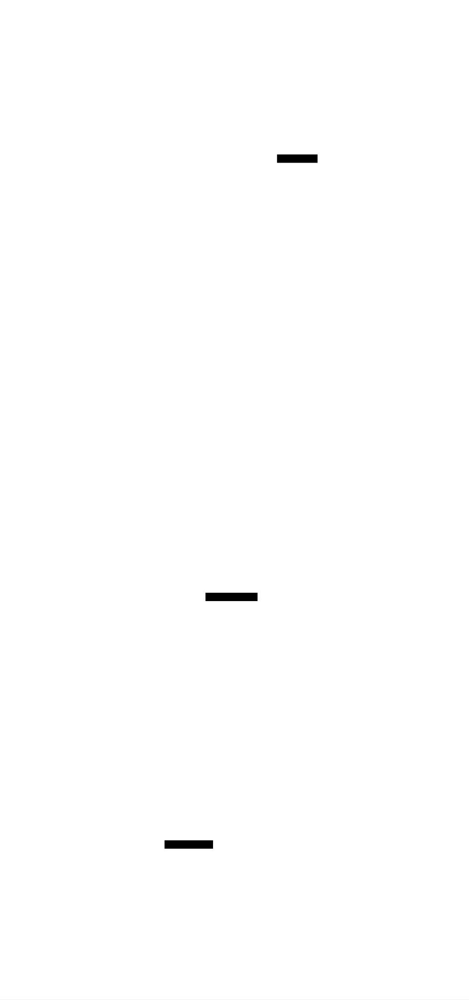

# AES-From-Scratch: Design Document


## Overview

This document guides the implementation of the Advanced Encryption Standard (AES) block cipher from scratch, focusing on understanding symmetric cryptography fundamentals. The key architectural challenge is structuring the complex, interdependent mathematical operations (Galois Field arithmetic, S-boxes, and the key schedule) into a clear, modular, and testable codebase that correctly implements the AES specification (FIPS 197) and multiple modes of operation.


> This guide is meant to help you understand the big picture before diving into each milestone. Refer back to it whenever you need context on how components connect.


## 1. Context and Problem Statement

> **Milestone(s):** This foundational section establishes the context for all subsequent milestones (1-4).

Symmetric encryption is the digital equivalent of a secure, tamper-proof lockbox. When two parties share a secret key, they can exchange information with the confidence that only someone possessing that exact key can open and read the contents. This simple principle powers secure web connections (HTTPS), protects files on disk, and secures countless other digital interactions. The **Advanced Encryption Standard (AES)**, established by the U.S. National Institute of Standards and Technology (NIST) in 2001, is the world's most widely adopted symmetric encryption algorithm. It's a **block cipher**—a deterministic algorithm operating on fixed-size data blocks (16 bytes for AES)—that transforms readable plaintext into scrambled ciphertext through a series of mathematically precise, reversible operations.

This project's challenge is not merely to produce working AES code, but to architect a clean, understandable, and testable implementation from the ground up. Unlike simply calling a library's `encrypt()` function, we must faithfully translate the dense mathematical specification (FIPS 197) into a software system that correctly implements the intricate dance of Galois Field arithmetic, substitution, permutation, and key scheduling. The core architectural tension lies in balancing mathematical accuracy, performance, and code clarity—all while ensuring the system remains modular enough for a learner to comprehend and verify each component independently.

### Mental Model: The Digital Combination Lock

Imagine you need to send a 16-character secret message. You place it into a special 4x4 transparent grid (each cell holds one character). AES is a sophisticated, multi-step **digital combination lock** for this grid, operated by your secret key. The locking process involves three fundamental actions performed over multiple rounds:

1.  **Substitution (Changing the Tiles):** Each character in the grid is replaced by a unique, pre-determined substitute from a secret substitution table (the **S-box**). Think of this as swapping every colored tile in the grid for another specific color according to a complex rulebook, removing any direct trace of the original.
2.  **Shuffling (Rearranging the Grid):** The rows of the grid are slid sideways by different amounts. This **diffuses** the influence of a single character across the entire block, just as stirring a spoon of dye in a glass of water disperses it throughout.
3.  **Mixing Columns (Blending Columns):** Each vertical column of four characters is mixed together using a special mathematical recipe (multiplication in a **Galois Field**). This is the most complex step—it's like taking each column, putting it through a mathematical blender, and pouring out a new, thoroughly blended column where every output character depends on all four inputs.

The secret key acts as the combination. Before each round of mixing and shuffling, the key itself is transformed (via the **key schedule**) to produce a unique **round key**. This round key is then combined with the grid using a simple XOR (exclusive-or) operation, like turning the dial of the lock to a new position set by that round's combination.

**Decryption** is simply running this precise sequence in reverse, using inverse operations and the same key. If you know the exact sequence (the key), you can perfectly undo all the scrambling to retrieve the original message.

### The Problem: Building a Reliable Block Cipher

Implementing AES is a complex software engineering task because the specification defines a **cascade of interdependent, mathematically precise transformations**. A single, subtle error in any component—like an off-by-one error in a table, a misapplied arithmetic rule, or an incorrect byte ordering—will cascade through the entire process, producing ciphertext that is either incorrect (failing standard test vectors) or, worse, subtly broken (appearing to work but offering reduced security).

The core technical challenges are:

1.  **Implementing Esoteric Mathematics:** AES's strength relies on operations within **GF(2⁸)**, a finite field of 256 elements where addition is XOR and multiplication follows polynomial rules modulo an irreducible polynomial (`x⁸ + x⁴ + x³ + x + 1`, or `0x11B`). Implementing this correctly, especially the multiplicative inverse required for the S-box, is non-trivial and prone to off-by-one and overflow errors.
2.  **Managing State Correctly:** The cipher's internal 4x4 **state matrix** can be stored in memory in different orientations (row-major vs. column-major). The specification uses a column-major orientation, which is a common source of confusion. Operations like `ShiftRows` and `MixColumns` assume a specific layout; getting this wrong breaks all subsequent steps.
3.  **Orchestrating the Key Schedule:** The algorithm must stretch a short key (16, 24, or 32 bytes) into a longer sequence of round keys (44, 52, or 60 32-bit words for AES-128/192/256, respectively). This process involves its own S-box lookups, rotations, and the addition of **round constants**. Incorrect indexing or miscalculation of constants will derail the entire encryption.
4.  **Ensuring Reversibility:** Every operation in encryption must have a precise inverse for decryption. This is straightforward for `AddRoundKey` (XOR is its own inverse) and `SubBytes` (via the inverse S-box), but requires careful implementation of the inverse `MixColumns` transformation, which uses a different set of coefficients.
5.  **Structuring for Clarity and Testability:** A monolithic function that performs all steps is difficult to debug and understand. The implementation must be decomposed into logical, isolated components (like Galois Field math, round transformations, and key expansion) that can be unit-tested individually against known test vectors from the FIPS 197 specification.

> **Design Insight:** The reliability of a cryptographic implementation is non-negotiable. Unlike a bug in a game that might cause a graphical glitch, a bug in a cipher can completely break its security, rendering all encrypted data vulnerable. Therefore, the architecture must prioritize **testability** and **verification against authoritative test vectors** at every stage.

### Existing Approaches and Comparisons

When facing the task of "implementing AES," a developer has several architectural and strategic options. The choice significantly impacts the educational value, performance, and security of the final product.

**Decision: Implementation Strategy for an Educational Project**
-   **Context:** We are building AES for learning, not for production deployment. The primary goals are understanding the algorithm's internals and producing a functionally correct implementation. Performance and side-channel resistance are secondary.
-   **Options Considered:**
    1.  **Pure Specification Implementation:** Calculate all Galois Field operations and S-box values on-the-fly using algorithms described in FIPS 197. No precomputed lookup tables.
    2.  **Hybrid Table-Based Implementation:** Precompute the S-box and inverse S-box as static constant arrays (lookup tables). Use these tables for `SubBytes` and within the key schedule. Compute `MixColumns` using a combination of the `xtime` helper function and table lookups for performance.
    3.  **Full Table-Based (Production) Implementation:** Precompute large tables (e.g., T-tables that combine `SubBytes`, `ShiftRows`, and `MixColumns`) to perform entire rounds with a few lookups and XORs. This is how high-performance libraries like OpenSSL are optimized.
-   **Decision:** Choose the **Hybrid Table-Based Implementation**.
-   **Rationale:**
    1.  **Clarity and Learning:** Precomputing the S-box tables once (via code we write) makes the `SubBytes` transformation trivial to understand and verify. The process of *generating* the S-box is a key learning objective of Milestone 1. Using the tables thereafter avoids obfuscating the core round operations with complex on-the-fly Galois Field inverse calculations.
    2.  **Balance:** It strikes a balance between the pure spec approach (which is pedagogically valuable but obscures high-level flow) and the full T-table approach (which is optimal for speed but completely hides the individual transformations, defeating the learning purpose).
    3.  **Manageable Complexity:** Implementing `MixColumns` via the `xtime` helper is more instructive than a precomputed table, as it reveals the polynomial multiplication process central to AES's diffusion.
-   **Consequences:** The implementation will be slower than production-grade libraries but will clearly expose each algorithmic step. We must ensure the S-box generation code is correct and included as part of the build/test process.

| Option | Pros | Cons | Chosen? |
| :--- | :--- | :--- | :--- |
| **Pure Spec Implementation** | Deepest mathematical understanding; no large static data. | Very slow; code for S-box and MixColumns is complex and obscures high-level algorithm. | ❌ |
| **Hybrid Table-Based** | Clear separation of concerns; S-box generation is a learning milestone; good performance for learning. | Slightly more complex than pure spec due to table management. | ✅ |
| **Full T-Table Implementation** | Extremely fast; close to production libraries. | Obfuscates the individual AES transformations; defeats the goal of learning the algorithm's structure. | ❌ |

Another high-level comparison is between **implementing from the specification** versus **wrapping an existing library**.

| Approach | Pros | Cons | Suitable For |
| :--- | :--- | :--- | :--- |
| **Implement from Spec (FIPS 197)** | Ultimate learning experience; full control and understanding. | High risk of subtle bugs; time-consuming. | **This project** (educational goal) |
| **Use Existing Library (e.g., OpenSSL)** | Production-ready, secure, and fast in minutes. | Zero insight into how AES works; a "black box." | Production applications where cryptography is a feature, not the subject of study. |

Finally, the choice of **programming language** influences the architecture. We are using C as the primary language.

| Language | Implications for AES Implementation |
| :--- | :--- |
| **C** | Offers low-level control over bytes and memory, which is ideal for implementing bitwise operations and managing state matrices. Requires careful manual memory management. The lack of built-in complex types means we must define our own structures for the state and key schedule. |
| **Rust** | Provides memory safety guarantees and rich type systems, which can help avoid certain classes of bugs (like buffer overflows). The ownership model adds complexity for educational projects focused on algorithm logic. |
| **Python** | Allows for very concise, readable code that closely mirrors mathematical notation, but at a significant performance cost and with less exposure to low-level byte manipulation. |

For our purposes, C's closeness to the machine and its prevalence in historical and performance-critical cryptographic implementations make it a fitting choice for a foundational learning experience.

### Implementation Guidance

This subsection bridges the design concepts to concrete C code, setting up the foundational structures and build environment.

#### A. Technology Recommendations Table

| Component | Simple Option (Learning Focus) | Advanced Option (If Time Permits) |
| :--- | :--- | :--- |
| **Build System** | Single `Makefile` with targets for build, test, and clean. | CMake for cross-platform support. |
| **Testing** | Simple test runner in C using `assert()` and known test vectors from FIPS 197. | Integration with a unit testing framework (e.g., Check). |
| **Data Representation** | Plain arrays of `uint8_t` and `uint32_t`. | Use structs with explicit byte ordering annotations. |
| **S-box Storage** | Global constant arrays (`static const uint8_t SBOX[256]`). | Compute tables at runtime and verify against constants. |

#### B. Recommended File/Module Structure

Create the following directory and file structure from the project root. This organizes components logically, mirroring the high-level architecture.

```
aes-from-scratch/
├── Makefile                    # Build automation
├── src/                        # All source code
│   ├── gfmath.c               # Galois Field arithmetic (Milestone 1)
│   ├── gfmath.h               # Header for GF operations and S-boxes
│   ├── aes_core.c             # AES round transformations (Milestone 2)
│   ├── aes_core.h             # Header for state operations
│   ├── key_expansion.c        # Key schedule logic (Milestone 3)
│   ├── key_expansion.h        # Header for key expansion API
│   ├── cipher_modes.c         # ECB, CBC, CTR modes (Milestone 4)
│   ├── cipher_modes.h         # Header for modes API
│   ├── padding.c              # PKCS#7 padding helpers
│   ├── padding.h              # Padding API header
│   └── main.c                 # Example usage and CLI (optional)
└── tests/                     # Test suites
    ├── test_gfmath.c          # Tests for GF arithmetic and S-box
    ├── test_aes_core.c        # Tests for round operations
    ├── test_key_expansion.c   # Tests for key schedule
    ├── test_cipher_modes.c    # Tests for encryption modes
    ├── test_vectors.h         # Header containing NIST test vectors
    └── run_tests.c            # Main test runner program
```

#### C. Infrastructure Starter Code

Here is complete, compilable starter code for a simple test harness and the core type definitions. The learner should copy these files to begin.

**File: `tests/run_tests.c`**
```c
/**
 * Simple test runner for AES implementation.
 * Compile with: gcc -o run_tests run_tests.c ../src/*.c test_*.c
 */
#include <stdio.h>
#include <stdlib.h>
#include <string.h>
#include <assert.h>

// Include test headers
#include "test_vectors.h"

// Function prototypes from main implementation (to be linked)
// These will be implemented in the respective milestone files.
// For now, they are declared here to allow the test runner to compile.
void aes_encrypt_block(const uint8_t *input, const uint8_t *key, uint8_t *output);
// ... other function prototypes will be added as milestones progress

int main() {
    printf("=== AES Implementation Test Suite ===\n\n");

    // Milestone 1: GF Math and S-box tests will be called here
    // test_gfmath();

    // Milestone 2: Core operation tests
    // test_aes_core();

    // Milestone 3: Key expansion tests
    // test_key_expansion();

    // Milestone 4: Full encryption and mode tests
    // test_aes_encrypt();
    // test_cbc_mode();

    printf("\nAll tests passed!\n");
    return 0;
}
```

**File: `src/gfmath.h` (Foundation for Milestone 1)**
```c
/**
 * Galois Field (GF(2^8)) arithmetic for AES.
 * Irreducible polynomial: x^8 + x^4 + x^3 + x + 1 (0x11B)
 */
#ifndef GFMATH_H
#define GFMATH_H

#include <stdint.h>

// The irreducible polynomial for GF(2^8) in AES.
#define AES_IRREDUCIBLE_POLY 0x11B

/**
 * Field addition in GF(2^8) is bitwise XOR.
 * @param a First byte.
 * @param b Second byte.
 * @return a + b in GF(2^8) (which is a ^ b).
 */
uint8_t gf_add(uint8_t a, uint8_t b);

/**
 * Field multiplication in GF(2^8) modulo AES_IRREDUCIBLE_POLY.
 * @param a First byte.
 * @param b Second byte.
 * @return a * b in GF(2^8).
 */
uint8_t gf_mul(uint8_t a, uint8_t b);

/**
 * Computes the multiplicative inverse of a in GF(2^8) using the Extended Euclidean Algorithm.
 * The inverse of 0 is defined as 0 (though it doesn't exist mathematically).
 * @param a Input byte (must be non-zero for a meaningful inverse).
 * @return Multiplicative inverse of a.
 */
uint8_t gf_inv(uint8_t a);

/**
 * The AES S-box substitution table (forward). Precomputed.
 * Extern declaration; the table will be defined in gfmath.c.
 */
extern const uint8_t AES_SBOX[256];

/**
 * The AES inverse S-box substitution table (for decryption). Precomputed.
 */
extern const uint8_t AES_INV_SBOX[256];

/**
 * Helper function for MixColumns: multiply by x (i.e., {02}) in GF(2^8).
 * Equivalent to left-shift followed by conditional XOR with 0x1B.
 * @param b Input byte.
 * @return b * {02} in GF(2^8).
 */
uint8_t xtime(uint8_t b);

/**
 * Generates the AES S-box and inverse S-box tables.
 * This function should be called once (e.g., at program start) to populate
 * AES_SBOX and AES_INV_SBOX, or the tables can be hardcoded as constants.
 * For learning, implementing this function is a key milestone.
 */
void generate_aes_sbox_tables(void);

#endif // GFMATH_H
```

#### D. Core Logic Skeleton Code

The following is skeleton code for the core Galois Field operations. The learner must fill in the implementation details.

**File: `src/gfmath.c` (Partial Skeleton)**
```c
#include "gfmath.h"
#include <stdint.h>

// S-box tables will be defined here after generation.
const uint8_t AES_SBOX[256];
const uint8_t AES_INV_SBOX[256];

uint8_t gf_add(uint8_t a, uint8_t b) {
    // TODO 1: Implement field addition.
    // In GF(2^8), addition is XOR.
    // Return a XOR b.
}

uint8_t xtime(uint8_t b) {
    // TODO 2: Implement xtime (multiplication by {02}).
    // 1. Left-shift b by 1 bit.
    // 2. If the high bit (bit 7) before shifting was 1 (i.e., b & 0x80),
    //    XOR the result with the irreducible polynomial 0x1B.
    //    Note: 0x1B is 0x11B without the high byte (x^8).
    // 3. Return the result.
}

uint8_t gf_mul(uint8_t a, uint8_t b) {
    // TODO 3: Implement general multiplication using xtime and addition.
    // This is the "Russian peasant" or "double-and-add" algorithm.
    // 1. Initialize result = 0.
    // 2. For i from 0 to 7 (for each bit in b):
    //    a. If the least significant bit of b is 1 (b & 0x01), result ^= a.
    //    b. a = xtime(a). // Multiply a by x for the next bit position.
    //    c. b >>= 1. // Shift b right to process the next bit.
    // 3. Return result.
    // Note: This algorithm implicitly performs modulo AES_IRREDUCIBLE_POLY via xtime.
}

uint8_t gf_inv(uint8_t a) {
    // TODO 4: Implement multiplicative inverse using the Extended Euclidean Algorithm.
    // 1. If a == 0, return 0. (No inverse, but defined as 0 for completeness.)
    // 2. Use the extended Euclidean algorithm for polynomials to find polynomials
    //    s(x) and t(x) such that: s(x)*a(x) + t(x)*m(x) = 1, where m(x) is the
    //    irreducible polynomial 0x11B.
    // 3. The polynomial s(x) (taken modulo m(x)) is the inverse of a(x).
    // 4. Return the byte representing s(x).
    // HINT: For a simpler approach, you can compute the inverse by brute force:
    //   For all non-zero c in GF(2^8), check if gf_mul(a, c) == 1. Return c when found.
    //   This is inefficient but acceptable for learning and table generation.
}

void generate_aes_sbox_tables(void) {
    // TODO 5: Generate the S-box and inverse S-box tables.
    // This is the core of Milestone 1.
    // 1. For each input byte i (0 to 255):
    //    a. Compute the multiplicative inverse of i in GF(2^8) using gf_inv(i).
    //       Treat 0 as mapping to 0 (since it has no inverse).
    //    b. Apply the following affine transformation over GF(2) to the inverse:
    //       Let b = b7b6b5b4b3b2b1b0 be the bits of the inverse byte.
    //       Compute new bit j: b'j = bj ⊕ b(j+4) mod 8 ⊕ b(j+5) mod 8 ⊕ b(j+6) mod 8 ⊕ b(j+7) mod 8 ⊕ cj
    //       where the constant c is 0x63 (binary 01100011). In matrix form, this is:
    //       [b'0]   [1 0 0 0 1 1 1 1] [b0]   [1]
    //       [b'1]   [1 1 0 0 0 1 1 1] [b1]   [1]
    //       [b'2]   [1 1 1 0 0 0 1 1] [b2]   [0]
    //       [b'3] = [1 1 1 1 0 0 0 1] [b3] ⊕ [0]
    //       [b'4]   [1 1 1 1 1 0 0 0] [b4]   [0]
    //       [b'5]   [0 1 1 1 1 1 0 0] [b5]   [1]
    //       [b'6]   [0 0 1 1 1 1 1 0] [b6]   [1]
    //       [b'7]   [0 0 0 1 1 1 1 1] [b7]   [0]
    //    c. Store the result in AES_SBOX[i].
    // 2. To generate the inverse S-box:
    //    For each byte s (0 to 255), find the index i such that AES_SBOX[i] == s.
    //    Store i in AES_INV_SBOX[s]. This effectively inverts the S-box mapping.
    // 3. Verify your generated tables against the known values in FIPS 197 Appendix B.
}
```

#### E. Language-Specific Hints

-   **Bitwise Operations:** Use `<<`, `>>`, `&`, `|`, `^` for bit manipulation. Remember that right-shift (`>>`) on signed types is implementation-defined; always use unsigned types (`uint8_t`).
-   **Constants:** Use `UINT8_C(0x1B)` for clarity if needed, but `0x1B` is fine for constants assigned to `uint8_t`.
-   **Table Storage:** Use `static const` for lookup tables to ensure they are stored in the read-only data section. This is both efficient and safe.
-   **Endianness:** AES operates on bytes, not multi-byte words, in a specific order. When you later handle 32-bit words in the key schedule, be consistent. Assume little-endian for the host system unless explicitly converting.

#### F. Milestone Checkpoint

After implementing the functions in `gfmath.c` (Milestone 1), you should be able to run a test to verify correctness.

1.  **Write a simple test program** (`tests/test_gfmath.c`) that:
    - Calls `generate_aes_sbox_tables()`.
    - Prints the first 16 entries of `AES_SBOX` and compares them to the known values from FIPS 197 (e.g., `S-box[0x00] = 0x63`, `S-box[0x01] = 0x7c`, etc.).
    - Tests `gf_mul` with known vectors (e.g., `gf_mul(0x57, 0x83) == 0xc1` per FIPS 197 example).
2.  **Compile and run:**
    ```bash
    cd tests
    gcc -I../src -o test_gfmath test_gfmath.c ../src/gfmath.c
    ./test_gfmath
    ```
3.  **Expected Output:** The program should print a success message for each test, confirming the S-box matches and multiplication is correct.
4.  **Signs of Trouble:**
    - If the S-box values are wrong, double-check the affine transformation matrix and constant (`0x63`).
    - If multiplication fails, verify your `xtime` function, especially the conditional XOR with `0x1B`.
    - Use a debugger or print intermediate values to trace the execution of `gf_mul` and `gf_inv`.

---


## 2. Goals and Non-Goals

> **Milestone(s):** This scoping section establishes the objectives for the entire project, informing the design and acceptance criteria for Milestones 1 through 4.

This project is fundamentally an **educational implementation**. Its primary purpose is to build a deep, hands-on understanding of symmetric cryptography by constructing the Advanced Encryption Standard (AES) block cipher from its mathematical foundations upwards. The scope is deliberately focused on core algorithms and correct operation, not on creating a library suitable for real-world deployment. This section defines the clear boundaries of what *must* be built to achieve that learning objective and, equally importantly, what is *explicitly out of scope* to prevent scope creep and maintain focus on the pedagogical goals.

### Must-Have Goals

The implementation must fulfill the following functional requirements to be considered a complete educational exercise that faithfully follows the AES specification (FIPS 197) and demonstrates practical block cipher usage.

| Goal Category | Specific Requirement | Rationale & Learning Outcome |
| :--- | :--- | :--- |
| **Core Cipher** | Implement the AES block cipher for all three standard key sizes: **AES-128, AES-192, and AES-256**. | Understanding how the key size dictates the number of rounds (10, 12, 14) and the key expansion algorithm is central to AES. This requires parameterizing the `KeySchedule` logic. |
| **Mathematical Foundation** | Correctly implement all operations within **Galois Field GF(2^8)** as defined by the irreducible polynomial `x^8 + x^4 + x^3 + x + 1` (0x11B). This includes addition (XOR), multiplication, multiplicative inverse, and the derived `xtime` operation. | AES is built upon finite field arithmetic. Grasping this non-intuitive "clock arithmetic for bytes" is the cornerstone of understanding the `MixColumns` transformation and S-box generation. |
| **Internal Transformations** | Faithfully implement the four round operations: **`SubBytes`** (using the standard S-box), **`ShiftRows`**, **`MixColumns`**, and **`AddRoundKey`**. The sequence and structure of initial, standard, and final rounds must match the specification. | These operations provide the **confusion** (SubBytes) and **diffusion** (ShiftRows, MixColumns) that give AES its security. Implementing them clarifies how a block cipher scrambles data. |
| **Key Schedule** | Implement the **`KeySchedule`** algorithm that expands a user-provided cipher key into the required sequence of `RoundKey` arrays. The algorithm must correctly handle the different key sizes and apply `RotWord`, `SubWord`, and `Rcon` (round constants). | The key schedule demonstrates how a relatively short key is transformed into a series of round keys, and its non-linear elements prevent simple key recovery. |
| **Block Cipher Modes** | Implement three essential modes of operation: <br>1. **ECB (Electronic Codebook)**: The simplest mode, encrypting each block independently. <br>2. **CBC (Cipher Block Chaining)**: A chaining mode that provides semantic security for repeated plaintext blocks, requiring an Initialization Vector (IV). <br>3. **CTR (Counter)**: A mode that turns the block cipher into a stream cipher, enabling parallelizable encryption and decryption. | Using a block cipher in isolation (ECB) is insecure for real data. Modes like CBC and CTR are essential for practical encryption and illustrate the concepts of chaining, IVs, and keystream generation. |
| **Data Alignment** | Implement **PKCS#7 padding** for modes that require plaintexts to be multiples of the block size (ECB and CBC). The implementation must correctly pad and unpad data. | Real-world data is not always exactly 16 bytes. Padding schemes are a necessary practical concern, and PKCS#7 is the standard, secure method. |
| **Test Vector Compliance** | The output of the encryption and decryption functions must match the **official NIST FIPS 197 test vectors** for AES-128, AES-192, and AES-256, as well as published test vectors for CBC and CTR modes. | Matching known-answer tests is the only objective way to verify the implementation's correctness against the standard. |
| **Reversibility** | The decryption process must perfectly reverse the encryption process for all supported modes and key sizes, such that `Decrypt(Encrypt(Plaintext)) == Plaintext` for any input. | This validates the mathematical inverses (Inverse S-box, Inverse MixColumns, etc.) and the correct sequencing of the decryption rounds. |

> **Key Insight:** The must-have goals are sequenced to mirror the layered construction of AES itself. You start with the finite field math (Milestone 1), use it to build the core cipher transformations (Milestone 2), extend it to generate keys (Milestone 3), and finally wrap it with practical modes of operation (Milestone 4). This bottom-up approach ensures you understand each layer's contribution to the whole.

### Explicit Non-Goals

To maintain focus on the educational core and avoid the immense complexity of production-grade cryptography, the following are explicitly **not** goals of this project.

| Non-Goal Category | What is Out of Scope | Rationale & Mitigation for Learners |
| :--- | :--- | :--- |
| **Production Security** | This implementation is **not side-channel resistant**. It will not defend against timing attacks, power analysis, or cache-timing attacks. The code prioritizes clarity over constant-time execution. | Side-channel resistance requires careful, often platform-specific coding (e.g., avoiding branches on secret data). This is an advanced topic beyond introductory cryptography implementation. For real use, **always use vetted libraries** like OpenSSL or libsodium. |
| **Performance Optimization** | The implementation is **not optimized for speed**. We will use straightforward loops and pre-computed tables (like the S-box) for clarity, but not advanced techniques like parallelized table lookups (T-tables) or hardware-specific intrinsics (AES-NI). | While optimizing AES is a fascinating challenge, it distracts from understanding the algorithm's core flow. The skeleton code serves as a clear reference model. |
| **Comprehensive Library** | This is **not a general-purpose cryptographic library**. It will only implement AES and the three listed modes. It will not provide other ciphers (e.g., ChaCha20), hash functions, digital signatures, or authenticated encryption (e.g., GCM). | The goal is depth in one standard, not breadth. Authenticated encryption, for example, introduces MACs and associated data, which is a significant expansion. |
| **Advanced Modes & Features** | Features like **AEAD (Authenticated Encryption with Associated Data)**, **variable-length tweaks**, **format-preserving encryption**, or **hardware acceleration** hooks are not implemented. | These are important real-world features but build upon a solid understanding of the basic cipher. They are natural "future extensions" (see Section 13). |
| **Robust Error Handling & API** | The error handling will be minimal (e.g., returning error codes for invalid key lengths). There will be no extensive error reporting, logging, or the kind of polished API expected of a library. | The focus is on the cryptographic algorithm logic. Industrial-strength error handling and API design are separate software engineering disciplines. |
| **Memory Security** | The implementation will not take extraordinary measures to **securely wipe sensitive data** (like keys and intermediate state) from memory after use. | In a production context, you must ensure keys are cleared from memory to prevent cold-boot attacks. This is omitted for simplicity but is a critical practice. |
| **Protocol Integration** | The project does not include integration into higher-level protocols like TLS, SSH, or PGP. It operates at the level of byte arrays for plaintext, ciphertext, and keys. | Protocols handle key exchange, negotiation, and much more complexity. This project is strictly about the symmetric cipher primitive. |
| **Formal Verification** | The code will not be formally verified for correctness using tools like Coq or F*. Correctness will be established through testing against standard vectors. | Formal verification is a powerful but highly specialized field. Test vectors from NIST provide a strong, practical correctness check for learning. |

> **Critical Warning:** **Never use this educational code to protect real user data.** The explicit lack of side-channel resistance, intensive peer review, and optimization for clarity over security make it vulnerable to attacks a production library would thwart. Its purpose is illumination, not protection.

**Architecture Decision Record: Educational Scope vs. Production Readiness**

> **Decision: Prioritize Algorithmic Clarity and Correctness Over Performance and Side-Channel Resistance**
>
> - **Context**: This is a learning project to understand AES internals. The implementer is likely a student or developer new to cryptography.
> - **Options Considered**:
>     1. **Pure Clarity**: Use the most direct, readable code possible, even if it's inefficient or leaks timing information.
>     2. **Balanced Approach**: Introduce some basic optimizations (like T-tables) but still ignore side-channels.
>     3. **Production-Grade**: Attempt to write constant-time code and include all standard optimizations, mimicking a real library.
> - **Decision**: **Option 1 (Pure Clarity)**. The implementation will use simple loops, clear data structures (like a 2D array for the `StateMatrix`), and obvious logic for all operations.
> - **Rationale**: The primary success metric is *understanding*. Introducing optimizations like T-tables obscures the connection between the specification's mathematics and the code. Side-channel resistance techniques (e.g., masking, constant-time table lookups) add significant complexity that is orthogonal to learning the AES algorithm itself. A clear, correct reference implementation serves as the best foundation; optimizations can be studied as a separate, advanced topic.
> - **Consequences**:
>     - **Positive**: The code will be easy to read, trace, and debug. It will directly map to the steps in FIPS 197.
>     - **Negative**: The encryption/decryption will be orders of magnitude slower than optimized libraries. The code will be vulnerable to timing attacks if used with secret data.
>     - **Mitigation**: We explicitly label the code as educational and non-production. Performance is irrelevant for the small test vectors used in verification.

| Option | Pros | Cons | Chosen? |
| :--- | :--- | :--- | :--- |
| **Pure Clarity** | Maximizes readability and alignment with the spec. Easiest to debug and understand. | Very slow. Insecure for real use. | **Yes** |
| **Balanced Approach** | More realistic performance, introduces important optimization concepts. | Obscures the core algorithm. Increases cognitive load for learners. | No |
| **Production-Grade** | Teaches real-world secure implementation concerns. | Extremely high complexity. Would dwarf the core learning objectives. | No |

### Common Pitfalls in Scoping

⚠️ **Pitfall: Drifting into Optimization Prematurely**
*   **Description**: A learner, after getting the basic `MixColumns` working with `xtime`, might immediately try to replace it with a precomputed 256-byte `xtime` table or the full 4KB T-table for performance.
*   **Why it's Wrong**: While these are valid optimizations, they should be done *after* the clear, direct implementation is complete and verified. Doing it too early conflates the learning goal of "understanding the algorithm" with "optimizing the algorithm," and a bug in the optimization is much harder to debug if the reference version doesn't exist.
*   **How to Fix**: **Implement the spec literally first.** Use `gf_mul` and `xtime` as defined, even if it feels inefficient. Only consider optimization as a separate, post-milestone-4 enhancement.

⚠️ **Pitfall: Adding "Just One More" Feature**
*   **Description**: The temptation to implement additional modes like OFB, CFB, or authenticated encryption mode GCM before the core goals are met.
*   **Why it's Wrong**: It violates the defined scope and can lead to project abandonment due to being overwhelmed. Each new mode has its own complexities (e.g., GCM requires Galois/Counter Mode, which involves GF(2^128) multiplication).
*   **How to Fix**: **Adhere strictly to the Must-Have Goals list.** Treat Section 13 (Future Extensions) as a menu for *after* the primary project is successfully completed and all test vectors pass.

⚠️ **Pitfall: Treating the Code as Production-Ready**
*   **Description**: Believing that because the code passes NIST test vectors, it is secure for encrypting personal files or network traffic.
*   **Why it's Wrong**: Passing test vectors validates functional correctness, not security. The lack of side-channel resistance alone makes it vulnerable in a real adversarial environment.
*   **How to Fix**: Internalize the **Explicit Non-Goals**. Repeatedly remind yourself and any potential users: **This is for learning only.** Use established libraries for any real-world application.

### Implementation Guidance

This section defines *what* to build, not *how*. Therefore, the implementation guidance here is high-level and organizational.

**A. Technology Recommendations Table:**
| Component | Simple Option (Recommended for Learning) | Advanced Option (For Later Exploration) |
| :--- | :--- | :--- |
| **Overall Language** | **C (C99)**. Provides low-level control over bytes and memory, is used in many reference implementations, and forces understanding of details. | **Rust**. Offers memory safety and clear abstractions while still allowing low-level control. Good for a second, safer implementation. |
| **Build System** | Simple `Makefile` with targets for building the library, running tests, and cleaning. | CMake or Meson for cross-platform compatibility and more structured builds. |
| **Testing Framework** | Simple custom test harness that reads test vectors from header files or text files and prints pass/fail. | Use a unit testing framework like Check (for C) or integrate with the language's built-in tester (e.g., `cargo test` for Rust). |

**B. Recommended File/Module Structure:**
To keep the project organized from the start, create the following directory and file structure. This separates concerns as outlined in the High-Level Architecture.

```
aes-from-scratch/
├── include/                 # Public header files (if making a library)
│   └── aes.h               # Main API for AES operations (encrypt/decrypt functions)
├── src/                    # Source code
│   ├── gf256.c             # Galois Field arithmetic (Milestone 1)
│   ├── gf256.h             # Declarations for gf_add, gf_mul, gf_inv, xtime, sbox generation
│   ├── aes_core.c          # AES round operations (Milestone 2)
│   ├── aes_core.h          # Declarations for SubBytes, ShiftRows, MixColumns, AddRoundKey
│   ├── key_schedule.c      # Key expansion (Milestone 3)
│   ├── key_schedule.h      # Declarations for KeySchedule, Rcon, etc.
│   ├── aes_modes.c         # Modes of operation: ECB, CBC, CTR (Milestone 4)
│   ├── aes_modes.h         # Declarations for mode functions and padding.
│   └── aes.c               # Top-level AES encrypt/decrypt functions that orchestrate rounds.
├── tests/                  # Test suites
│   ├── test_vectors.h      # Embedded NIST test vectors (128, 192, 256-bit keys)
│   ├── test_gf256.c        # Unit tests for Galois Field operations
│   ├── test_aes_core.c     # Unit tests for round transformations
│   ├── test_key_schedule.c # Unit tests for key expansion
│   ├── test_aes_ecb.c      # Tests for ECB mode (using NIST vectors)
│   ├── test_aes_cbc.c      # Tests for CBC mode
│   └── test_aes_ctr.c      # Tests for CTR mode
├── Makefile                # Builds everything, runs tests
└── README.md               # Project overview and build instructions
```

**C. Core Logic Skeleton Code (Top-Level API):**
Even in the Goals section, we can sketch the top-level functions that will be implemented later. These signatures set expectations for the final API.

```c
// File: include/aes.h
#ifndef AES_H
#define AES_H

#include <stdint.h>
#include <stddef.h> // for size_t

// Key size constants
#define AES_KEY128 16
#define AES_KEY192 24
#define AES_KEY256 32
#define AES_BLOCK_SIZE 16

// Error codes
#define AES_SUCCESS 0
#define AES_INVALID_KEY_LEN -1
#define AES_INVALID_INPUT_LEN -2
#define AES_NULL_POINTER -3

// Top-level encryption/decryption for a single block (ECB mode primitive).
// This is the core function that will be built in Milestones 1-3.
int aes_encrypt_block(const uint8_t *plaintext, const uint8_t *key, size_t key_len, uint8_t *ciphertext);
int aes_decrypt_block(const uint8_t *ciphertext, const uint8_t *key, size_t key_len, uint8_t *plaintext);

// Modes of operation (to be implemented in Milestone 4)
int aes_ecb_encrypt(const uint8_t *plaintext, size_t pt_len,
                    const uint8_t *key, size_t key_len,
                    uint8_t *ciphertext);
int aes_ecb_decrypt(const uint8_t *ciphertext, size_t ct_len,
                    const uint8_t *key, size_t key_len,
                    uint8_t *plaintext);

int aes_cbc_encrypt(const uint8_t *plaintext, size_t pt_len,
                    const uint8_t *key, size_t key_len,
                    const uint8_t *iv, // 16-byte Initialization Vector
                    uint8_t *ciphertext);
int aes_cbc_decrypt(const uint8_t *ciphertext, size_t ct_len,
                    const uint8_t *key, size_t key_len,
                    const uint8_t *iv,
                    uint8_t *plaintext);

int aes_ctr_encrypt(const uint8_t *plaintext, size_t pt_len,
                    const uint8_t *key, size_t key_len,
                    const uint8_t *nonce, // 12-byte nonce is common, but we'll use 16-byte counter block
                    uint8_t *ciphertext);
// CTR decryption is identical to encryption.
#define aes_ctr_decrypt aes_ctr_encrypt

#endif // AES_H
```

**D. Milestone Checkpoint for Overall Goals:**
After completing all four milestones, the final integration test should pass.

- **Command to Run**: `make test` (which compiles all test suites and runs them).
- **Expected Output**:
    ```
    [PASS] GF(2^8) Addition and Multiplication
    [PASS] S-box and Inverse S-box match standard
    [PASS] AES-128 Key Expansion (NIST Example)
    [PASS] AES-128 Single Block Encryption (NIST FIPS 197 Appendix B)
    [PASS] AES-192 Single Block Encryption
    [PASS] AES-256 Single Block Encryption
    [PASS] ECB Mode: Multi-block Encryption
    [PASS] CBC Mode: NIST Test Vector (SP 800-38A)
    [PASS] CTR Mode: NIST Test Vector (SP 800-38A)
    [PASS] Full Reversibility Test (Encrypt then Decrypt)
    All tests passed.
    ```
- **Verification**: Manually inspect one intermediate value, such as the `StateMatrix` after the first `AddRoundKey` in the AES-128 test, and compare it to the value in the FIPS 197 document.
- **Signs of Trouble**: If the first AES-128 block test fails, the issue is likely in the core cipher (Milestones 1-3). If it passes but CBC fails, the issue is in the chaining logic or padding in Milestone 4.

---


## 3. High-Level Architecture
> **Milestone(s):** This architectural blueprint provides the foundational structure for the entire project, directly informing the implementation of all four milestones. It defines the modular boundaries and data flow that will be realized in Milestones 1 (Galois Field Arithmetic), 2 (AES Core), 3 (Key Expansion), and 4 (Encryption & Modes).

A successful implementation of a complex standard like AES requires a clear architectural separation of concerns. Without this, the intricate mathematical operations, state transformations, and mode logic can quickly become an unmaintainable "big ball of mud." This section decomposes the system into four primary logical components, each with a single, well-defined responsibility, and provides a concrete file structure to mirror this decomposition in code.

### Component Overview and Responsibilities

Think of the AES encryption engine as a specialized factory assembly line. Raw material (plaintext) enters at one end, and a finished, encrypted product (ciphertext) exits at the other. This factory has four distinct workshops, each performing a specific, critical task:

1.  **The Materials Science Lab (Galois Field Math):** This component is responsible for the fundamental "chemistry" of AES. It doesn't process data directly but provides the essential mathematical tools—addition, multiplication, and inversion within the GF(2^8) field—that every other workshop relies on to perform their transformations correctly.
2.  **The Core Transformation Workshop (AES Core Operations):** This is the heart of the factory. It takes a 16-byte block of data (the `StateMatrix`), subjects it to a series of scrambling and mixing steps (SubBytes, ShiftRows, MixColumns, AddRoundKey), and outputs a transformed block. It's a pure function: given the same state and round key, it always produces the same output.
3.  **The Key Forge (Key Expansion):** Before the main assembly line can run, this component takes the user's secret key (a short metal ingot) and forges it into a longer series of specialized tools (round keys). Each round of the core transformation uses a unique tool from this set.
4.  **The Assembly Line Manager (Cipher Modes):** This component manages the overall production flow. It handles the intake of variable-length raw materials (plaintext), applies padding if needed, and decides how to feed blocks into the Core Workshop. It implements different "chaining" strategies (ECB, CBC, CTR) that determine how one block's processing influences the next, which is crucial for security and functionality.

These components interact in a well-defined sequence, as illustrated in the system diagram. The `KeySchedule` produced by the Key Forge is used by the Core Workshop. The Core Workshop's block cipher is invoked by the Cipher Modes manager for each block of data. All components performing byte-level transformations rely on the constants and functions provided by the Galois Field Math component.


The following table details the responsibilities, key data structures, and operations for each component.

| Component | Primary Responsibility | Key Data It Owns/Produces | Core Operations It Performs | Dependencies |
| :--- | :--- | :--- | :--- | :--- |
| **Galois Field (GF) Math** | Implements arithmetic in the finite field GF(2^8) as defined by AES. | `AES_SBOX`, `AES_INV_SBOX`, `AES_IRREDUCIBLE_POLY` | `gf_add`, `gf_mul`, `gf_inv`, `xtime`, `generate_aes_sbox_tables` | None (foundational layer). |
| **AES Core Operations** | Applies the AES round transformations (SubBytes, ShiftRows, MixColumns, AddRoundKey) to a single 16-byte block. | `StateMatrix` (internal, temporary) | `sub_bytes`, `shift_rows`, `mix_columns`, `add_round_key` | GF Math (for S-box lookup and `MixColumns` arithmetic). |
| **Key Expansion** | Expands a cipher key into a series of round keys for use in all encryption rounds. | `KeySchedule` (array of round keys) | `key_expansion`, `rot_word`, `sub_word` | GF Math (for `sub_word` which uses S-box, and Rcon generation). |
| **Cipher Modes** | Manages the encryption/decryption of multi-block messages using a block cipher mode (ECB, CBC, CTR). Handles padding. | Padding bytes, Initialization Vector (IV)/Nonce | `aes_ecb_encrypt`, `aes_cbc_encrypt`, `aes_ctr_encrypt`, `pkcs7_pad`, `pkcs7_unpad` | AES Core (via `aes_encrypt_block`), Key Expansion (to get keys). |

> **Key Architectural Insight:** This layered dependency structure is intentional. The GF Math component forms a stable, tested foundation. The AES Core and Key Expansion components build on it to implement the AES spec. Finally, the Cipher Modes component sits at the top, orchestrating the complete encryption process for practical use. This allows each layer to be developed and tested in isolation (Milestones 1-3) before integration (Milestone 4).

### Recommended File Structure

A clean, logical file structure is the physical manifestation of the architecture. It prevents "spaghetti code" by ensuring that functions and data related to one component are colocated, making the project navigable and easier to test. The following structure is recommended for a C implementation.

```
aes-from-scratch/
├── include/
│   ├── aes_gf_math.h       # Public interface for GF(2^8) operations & constants
│   ├── aes_core.h          # Public interface for AES round transformations
│   ├── aes_key_schedule.h  # Public interface for key expansion
│   └── aes_modes.h         # Public interface for ECB, CBC, CTR modes & padding
├── src/
│   ├── gf_math/
│   │   ├── gf_math.c        # Implementation of gf_add, gf_mul, xtime
│   │   └── sbox_generator.c # Implementation of generate_aes_sbox_tables
│   ├── core/
│   │   └── aes_core.c       # Implementation of sub_bytes, shift_rows, etc.
│   ├── key_schedule/
│   │   └── aes_key_schedule.c # Implementation of key_expansion
│   └── modes/
│       ├── aes_modes.c      # Implementation of ECB, CBC, CTR
│       └── padding.c        # Implementation of PKCS#7 padding
├── test/
│   ├── test_gf_math.c       # Unit tests for Milestone 1
│   ├── test_aes_core.c      # Unit tests for Milestone 2
│   ├── test_key_schedule.c  # Unit tests for Milestone 3
│   ├── test_aes_modes.c     # Unit tests for Milestone 4
│   └── test_vectors.c       # Integration tests using NIST known-answer tests
├── Makefile                 # Build script to compile library and tests
└── README.md                # Project overview and build instructions
```

**Rationale for the Structure:**
*   **Separation of Interface (`include/`) and Implementation (`src/`):** This is a classic C idiom. Header files declare the public API (function prototypes, constants, key structs) that other components can use. The corresponding `.c` files contain the private implementation details. This enforces modularity and allows for easier testing.
*   **Component-Based `src/` Subdirectories:** Each logical component from the architecture gets its own directory. This physically isolates the code, making dependencies explicit (via `#include` statements) and preventing accidental coupling.
*   **Dedicated `test/` Directory:** Tests are first-class citizens. Having a separate directory for all test files, organized to mirror the source structure, encourages thorough testing of each milestone.
*   **Single-Point Build Control (`Makefile`):** A `Makefile` simplifies the build process, allowing developers to compile the library, run all tests, and clean up with simple commands (e.g., `make`, `make test`, `make clean`).

### Implementation Guidance

**A. Technology Recommendations Table**
| Component | Simple Option | Advanced Option (Post-Learning) |
| :--- | :--- | :--- |
| **Build System** | Single `Makefile` with explicit rules for each target. | CMake or Meson for cross-platform builds. |
| **Testing** | Handwritten `test_*.c` files with `assert()` statements, executed by a `main()` function. | A unit testing framework like Unity or Check. |
| **Code Quality** | Manual code review against checklist. | Static analysis with `clang-tidy` or `cppcheck`. |

**B. Recommended File/Module Structure**
The structure above is the recommended layout. Below is the starter code for the key header files to establish the public APIs. Place these in the `include/` directory.

**`include/aes_gf_math.h`**
```c
#ifndef AES_GF_MATH_H
#define AES_GF_MATH_H

#include <stdint.h>

// The irreducible polynomial for AES's GF(2^8): x^8 + x^4 + x^3 + x + 1
#define AES_IRREDUCIBLE_POLY 0x011B

// Forward declaration for the S-box tables. They will be defined in the .c file.
extern const uint8_t AES_SBOX[256];
extern const uint8_t AES_INV_SBOX[256];

/**
 * @brief Addition in GF(2^8) is equivalent to bitwise XOR.
 * @param a First byte.
 * @param b Second byte.
 * @return a ⊕ b (XOR).
 */
uint8_t gf_add(uint8_t a, uint8_t b);

/**
 * @brief Multiplication in GF(2^8) modulo the AES irreducible polynomial.
 * @param a First byte.
 * @param b Second byte.
 * @return (a * b) mod 0x11B in GF(2^8).
 */
uint8_t gf_mul(uint8_t a, uint8_t b);

/**
 * @brief Computes the multiplicative inverse of a in GF(2^8).
 *         The inverse of 0 is defined as 0 (by AES convention).
 * @param a Input byte.
 * @return b such that gf_mul(a, b) == 1.
 */
uint8_t gf_inv(uint8_t a);

/**
 * @brief Multiplies a byte by {02} (the polynomial x) in GF(2^8).
 *        This is a core operation for MixColumns.
 * @param b Input byte.
 * @return (b * 0x02) mod 0x11B.
 */
uint8_t xtime(uint8_t b);

/**
 * @brief Generates the AES forward and inverse S-box lookup tables.
 *        This function should be called once during initialization.
 *        It populates the AES_SBOX and AES_INV_SBOX arrays.
 */
void generate_aes_sbox_tables(void);

#endif // AES_GF_MATH_H
```

**`include/aes_core.h`**
```c
#ifndef AES_CORE_H
#define AES_CORE_H

#include <stdint.h>

// AES block size is fixed at 16 bytes (128 bits)
#define AES_BLOCK_SIZE 16

// The State matrix is a 4x4 array of bytes.
// We choose a 1D array of 16 bytes with column-major order:
//   index = row + 4*col
// This matches the AES specification (FIPS 197) representation.
typedef uint8_t StateMatrix[AES_BLOCK_SIZE];

/**
 * @brief Performs the SubBytes transformation on the state.
 *        Each byte is replaced using the AES_SBOX lookup table.
 * @param state The state matrix to transform (modified in-place).
 */
void sub_bytes(StateMatrix state);

/**
 * @brief Performs the ShiftRows transformation on the state.
 *        Rows are cyclically left-shifted: row0 by 0, row1 by 1, row2 by 2, row3 by 3.
 * @param state The state matrix to transform (modified in-place).
 */
void shift_rows(StateMatrix state);

/**
 * @brief Performs the MixColumns transformation on the state.
 *        Each column is treated as a polynomial over GF(2^8) and multiplied
 *        by the fixed polynomial {03}x^3 + {01}x^2 + {01}x + {02}.
 * @param state The state matrix to transform (modified in-place).
 */
void mix_columns(StateMatrix state);

/**
 * @brief Performs the AddRoundKey transformation on the state.
 *        Each byte of the state is XORed with the corresponding byte of the round key.
 * @param state The state matrix to transform (modified in-place).
 * @param round_key A 16-byte round key.
 */
void add_round_key(StateMatrix state, const uint8_t round_key[AES_BLOCK_SIZE]);

#endif // AES_CORE_H
```

**`include/aes_key_schedule.h`**
```c
#ifndef AES_KEY_SCHEDULE_H
#define AES_KEY_SCHEDULE_H

#include <stdint.h>

// Key sizes in bytes
#define AES_KEY128 16
#define AES_KEY192 24
#define AES_KEY256 32

// Number of round keys (words) for each key size
#define NK_128 4   // 128-bit key is 4 words
#define NK_192 6   // 192-bit key is 6 words
#define NK_256 8   // 256-bit key is 8 words

#define ROUNDS_128 10
#define ROUNDS_192 12
#define ROUNDS_256 14

// The key schedule is an array of 32-bit words.
// For AES-128: 4 * (10 + 1) = 44 words
// We'll define a maximum size for simplicity.
#define MAX_KEY_SCHEDULE_WORDS 60 // Enough for AES-256 (15 rounds * 4 = 60 words)

/**
 * @brief Expands the cipher key into a full key schedule.
 * @param key Pointer to the cipher key (16, 24, or 32 bytes).
 * @param key_len Length of the key in bytes (must be 16, 24, or 32).
 * @param key_schedule Output array of words to hold the expanded schedule.
 * @return 0 (AES_SUCCESS) on success, or AES_INVALID_KEY_LEN on error.
 */
int key_expansion(const uint8_t *key, int key_len, uint32_t key_schedule[MAX_KEY_SCHEDULE_WORDS]);

#endif // AES_KEY_SCHEDULE_H
```

**`include/aes_modes.h`**
```c
#ifndef AES_MODES_H
#define AES_MODES_H

#include <stdint.h>

// Return codes
#define AES_SUCCESS 0
#define AES_INVALID_KEY_LEN -1
#define AES_INVALID_INPUT_LEN -2
#define AES_NULL_POINTER -3

/**
 * @brief Encrypts a single 16-byte block using AES.
 *        This is the core block cipher function.
 * @param plaintext Input block (16 bytes).
 * @param key The original cipher key.
 * @param key_len Length of the key (16, 24, 32).
 * @param ciphertext Output block (16 bytes).
 * @return AES_SUCCESS or error code.
 */
int aes_encrypt_block(const uint8_t plaintext[16], const uint8_t *key, int key_len, uint8_t ciphertext[16]);

/**
 * @brief Encrypts a plaintext of any length using ECB mode.
 *        NOTE: ECB is insecure for most purposes. Use for testing only.
 * @param plaintext Input data.
 * @param pt_len Length of plaintext in bytes.
 * @param key Cipher key.
 * @param key_len Length of key.
 * @param ciphertext Output buffer (must be at least pt_len bytes).
 * @return AES_SUCCESS or error code.
 */
int aes_ecb_encrypt(const uint8_t *plaintext, size_t pt_len, const uint8_t *key, int key_len, uint8_t *ciphertext);

/**
 * @brief Encrypts a plaintext using CBC mode.
 * @param plaintext Input data.
 * @param pt_len Length of plaintext in bytes.
 * @param key Cipher key.
 * @param key_len Length of key.
 * @param iv Initialization Vector (16 bytes). Must be random and unique.
 * @param ciphertext Output buffer (must be at least pt_len bytes, after padding).
 * @return AES_SUCCESS or error code.
 */
int aes_cbc_encrypt(const uint8_t *plaintext, size_t pt_len, const uint8_t *key, int key_len,
                    const uint8_t iv[16], uint8_t *ciphertext);

/**
 * @brief Encrypts (or decrypts) a plaintext using CTR mode.
 * @param plaintext Input data.
 * @param pt_len Length of plaintext in bytes.
 * @param key Cipher key.
 * @param key_len Length of key.
 * @param nonce Counter nonce (typically 8 bytes). The full 16-byte counter is nonce || block_counter.
 * @param ciphertext Output buffer (must be at least pt_len bytes).
 * @return AES_SUCCESS or error code.
 */
int aes_ctr_encrypt(const uint8_t *plaintext, size_t pt_len, const uint8_t *key, int key_len,
                    const uint8_t nonce[8], uint8_t *ciphertext);

#endif // AES_MODES_H
```

**C. Infrastructure Starter Code (`Makefile`)**
This is a complete, simple `Makefile` to build the static library and run tests. Place it in the project root.

```makefile
# Compiler and flags
CC = gcc
CFLAGS = -Wall -Wextra -Werror -pedantic -I./include -O2
LDFLAGS =

# Directories
SRC_DIR = src
INCLUDE_DIR = include
TEST_DIR = test
BUILD_DIR = build

# Library source files
GF_MATH_SRCS = $(SRC_DIR)/gf_math/gf_math.c $(SRC_DIR)/gf_math/sbox_generator.c
CORE_SRCS = $(SRC_DIR)/core/aes_core.c
KEY_SCHEDULE_SRCS = $(SRC_DIR)/key_schedule/aes_key_schedule.c
MODES_SRCS = $(SRC_DIR)/modes/aes_modes.c $(SRC_DIR)/modes/padding.c

LIB_SRCS = $(GF_MATH_SRCS) $(CORE_SRCS) $(KEY_SCHEDULE_SRCS) $(MODES_SRCS)
LIB_OBJS = $(LIB_SRCS:%.c=$(BUILD_DIR)/%.o)

# Test source files
TEST_SRCS = $(TEST_DIR)/test_gf_math.c $(TEST_DIR)/test_aes_core.c \
            $(TEST_DIR)/test_key_schedule.c $(TEST_DIR)/test_aes_modes.c \
            $(TEST_DIR)/test_vectors.c
TEST_OBJS = $(TEST_SRCS:%.c=$(BUILD_DIR)/%.o)

# Targets
TARGET_LIB = $(BUILD_DIR)/libaes.a
TARGET_TEST = $(BUILD_DIR)/test_runner

.PHONY: all lib test clean

all: lib test

# Create build directory structure
$(BUILD_DIR)/%.o: %.c
	@mkdir -p $(@D)
	$(CC) $(CFLAGS) -c $< -o $@

# Build the static library
lib: $(TARGET_LIB)

$(TARGET_LIB): $(LIB_OBJS)
	ar rcs $@ $^

# Build and run tests
test: $(TARGET_TEST)
	./$(TARGET_TEST)

$(TARGET_TEST): $(TEST_OBJS) $(TARGET_LIB)
	$(CC) $(CFLAGS) -o $@ $(TEST_OBJS) -L$(BUILD_DIR) -laes -lm

# Clean up
clean:
	rm -rf $(BUILD_DIR)

# Run a specific milestone test (e.g., make test-m1)
test-m1: $(TARGET_LIB)
	$(CC) $(CFLAGS) -o $(BUILD_DIR)/test_m1 $(TEST_DIR)/test_gf_math.c -I./include -L$(BUILD_DIR) -laes -lm
	$(BUILD_DIR)/test_m1

test-m2: $(TARGET_LIB)
	$(CC) $(CFLAGS) -o $(BUILD_DIR)/test_m2 $(TEST_DIR)/test_aes_core.c -I./include -L$(BUILD_DIR) -laes -lm
	$(BUILD_DIR)/test_m2

# ... similar rules for test-m3, test-m4
```

**D. Core Logic Skeleton Code**
This is a starter for the main AES block encryption function, to be placed in `src/modes/aes_modes.c`. It shows how the components orchestrate.

```c
#include "aes_modes.h"
#include "aes_core.h"
#include "aes_key_schedule.h"
#include <string.h>

int aes_encrypt_block(const uint8_t plaintext[16], const uint8_t *key, int key_len, uint8_t ciphertext[16]) {
    // TODO 1: Validate inputs (non-NULL pointers, valid key_len)
    // TODO 2: Expand the key into a key schedule using key_expansion()
    // TODO 3: Copy the plaintext into the StateMatrix (in column-major order)
    // TODO 4: Perform initial AddRoundKey using the first round key (words 0-3)
    // TODO 5: For rounds 1 to Nr-1 (where Nr is 10,12,14):
    //            a) Call sub_bytes(state)
    //            b) Call shift_rows(state)
    //            c) Call mix_columns(state)
    //            d) Call add_round_key(state, next_round_key)
    // TODO 6: For the final round:
    //            a) Call sub_bytes(state)
    //            b) Call shift_rows(state)
    //            c) Call add_round_key(state, final_round_key) // NO MixColumns
    // TODO 7: Copy the final StateMatrix to the ciphertext output buffer
    // TODO 8: Return AES_SUCCESS
    return AES_SUCCESS;
}
```

**E. Language-Specific Hints (C)**
*   **Memory Management:** This implementation uses static arrays and stack allocation. There is no dynamic memory (`malloc/free`), simplifying the code and avoiding memory leaks.
*   **Byte Order (Endianness):** The AES algorithm is defined in terms of bytes, not words. However, the key schedule operates on 32-bit words. Be consistent in treating words as arrays of 4 bytes. Use bit-shifting (`<<`, `>>`) and masking (`&`) to construct words from bytes.
*   **Const Correctness:** Use `const` liberally for pointer parameters that are read-only (e.g., input keys, plaintext). This helps prevent accidental modification and clarifies intent.
*   **Header Guards:** Always use `#ifndef`/`#define`/`#endif` guards in header files to prevent multiple inclusion.
*   **Static Functions:** Mark helper functions that are only used within a single `.c` file as `static`. This limits their scope and aids optimization.

**F. Milestone Checkpoint**
After setting up the file structure and the `Makefile`, you should be able to run a basic build test:
1.  Create the `include/` and `src/` directories with the empty subdirectories (`gf_math/`, `core/`, etc.).
2.  Copy the header files above into `include/`.
3.  Create empty `.c` stub files in the `src/` subdirectories (e.g., `src/gf_math/gf_math.c` with just `#include "aes_gf_math.h"`).
4.  Copy the `Makefile` to the project root.
5.  Run `make lib` from the terminal. The expected output should be the successful creation of `build/libaes.a` without compilation errors. This verifies your build environment and project structure are correct.

---


## 4. Data Model

> **Milestone(s):** This data foundation section establishes the core types and relationships that underpin the entire implementation, directly supporting Milestones 1 through 4.

Before we can implement the complex transformations of AES, we must define how data flows through our system. Think of the **data model** as the blueprint for the digital workshop where our encryption factory operates—it specifies the containers, tools, and assembly lines that will process plaintext into ciphertext. Just as a carpenter needs precise measurements for wood, joints, and fasteners, our implementation needs clearly defined structures for the state matrix, round keys, and lookup tables.

### Core Types and Structures

The AES algorithm operates on three fundamental data structures: the **State Matrix** (the block being transformed), the **Round Key** (the key material for a single round), and the **Key Schedule** (the expanded sequence of all round keys). Additionally, we rely on precomputed **S-box tables** for efficient substitution. These structures are the atoms of our implementation—everything else is built upon them.

#### The State Matrix: AES's Workbench

Think of the `StateMatrix` as a 4×4 workbench where each cell holds exactly one byte (8 bits) of data. During encryption, we place a 16-byte plaintext block onto this workbench, then perform a series of transformations—substituting bytes, shifting rows, mixing columns—as if applying different tools to rearrange and transform the material. The workbench maintains its 4×4 grid structure throughout the process, with each transformation modifying the bytes in place.

The AES specification defines the state as a two-dimensional array, but in memory we need a concrete representation. We'll use a **column-major order** where consecutive bytes in memory correspond to columns rather than rows. This choice aligns with the mathematical formulation in FIPS 197 and simplifies column-oriented operations like `MixColumns`.

**StateMatrix Data Structure:**

| Field Name | Type | Description |
|------------|------|-------------|
| `bytes` | `uint8_t[16]` | 16-byte array representing the 4×4 state in **column-major order**. Index `[r + 4*c]` accesses row `r` (0–3) and column `c` (0–3). |
| *(implicit)* | `uint8_t` (per element) | Each byte represents an element in the finite field GF(2⁸), capable of storing values 0–255. |

> **Key Insight:** The column-major ordering means that if you visualize the state as a 4×4 grid on paper (rows horizontal, columns vertical), the bytes in memory are organized by columns first. Byte 0 is at position (row=0, col=0), byte 1 is (row=1, col=0), byte 2 is (row=2, col=0), byte 3 is (row=3, col=0), byte 4 is (row=0, col=1), and so on. This ordering is critical for correct implementation of `ShiftRows` and `MixColumns`.

#### Round Key: The Tool for Each Round

A **Round Key** is a 16-byte key derived from the original cipher key, used in a single round of AES. Think of it as a specialized tool that gets applied at a specific stage in the assembly line—each round uses a different round key, gradually transforming the state. The round key is simply XOR'd with the state during the `AddRoundKey` transformation, providing **confusion** by making the relationship between ciphertext and key complex.

**RoundKey Data Structure:**

| Field Name | Type | Description |
|------------|------|-------------|
| `bytes` | `uint8_t[16]` | 16-byte array containing the round key. Unlike the state, this is typically treated as a linear sequence without implicit 2D structure, though it's often conceptually grouped into four 32-bit words. |

> **Implementation Note:** While a `RoundKey` is structurally identical to a `StateMatrix` (both are 16-byte arrays), we maintain separate conceptual types because they serve different roles. The state is the data being transformed; the round key is the transformation parameter. This distinction becomes important when we store multiple round keys in the key schedule.

#### Key Schedule: The Tool Rack

The **Key Schedule** is the expanded sequence of all round keys needed for the entire encryption process. For AES-128, the original 16-byte key expands into 11 round keys (44 words, where each word is 4 bytes). Think of this as a tool rack holding all the specialized tools (round keys) in order, ready to be picked up and used at each round. The key schedule is computed once per encryption session and reused for each block.

**KeySchedule Data Structure:**

| Field Name | Type | Description |
|------------|------|-------------|
| `words` | `uint32_t[60]` | Array of up to 60 words (32-bit unsigned integers). Each word represents 4 bytes, and every 4 consecutive words form one round key. The actual number of words used depends on the key size: 44 for AES-128, 52 for AES-192, and 60 for AES-256. |
| `num_rounds` | `int` (derived) | Not stored directly, but calculated from key length: 10 rounds for 128-bit, 12 for 192-bit, 14 for 256-bit. The total round keys are `num_rounds + 1`. |

> **Architecture Decision:** We store the key schedule as an array of 32-bit words rather than bytes because the AES key expansion algorithm operates on words. This aligns with the FIPS 197 specification's description of the key schedule as an array of words `w[i]`. It also simplifies the implementation of `RotWord` (32-bit rotation) and `SubWord` (applying S-box to each of the 4 bytes in a word).

#### S-box Tables: The Substitution Catalogs

The **S-box** and **Inverse S-box** are lookup tables that implement the non-linear byte substitution central to AES's security. Think of them as catalog books where you look up a byte value (0–255) and find its transformed counterpart. The S-box is used during encryption (`SubBytes`); the inverse S-box is used during decryption. These tables are **static**—they're computed once and shared across all encryption/decryption operations.

**S-box Table Structures:**

| Constant Name | Type | Description |
|---------------|------|-------------|
| `AES_SBOX` | `uint8_t[256]` | Forward substitution box for encryption. Indexed by a byte value (0–255), returns the substituted byte. |
| `AES_INV_SBOX` | `uint8_t[256]` | Inverse substitution box for decryption. Satisfies `AES_INV_SBOX[AES_SBOX[x]] == x` for all x. |

> **Key Insight:** The S-box isn't arbitrary—it's constructed by taking the multiplicative inverse in GF(2⁸) followed by an affine transformation. However, for performance and simplicity, we precompute the entire table during initialization. This trades a small memory footprint (512 bytes total) for dramatically faster encryption.

### Type Relationships

Now that we've defined our core structures, let's examine how they interact during the encryption process. The data flow follows a clear pipeline: the plaintext block enters as a byte array, gets loaded into the state matrix, undergoes a series of round transformations using keys from the key schedule, and finally emerges as ciphertext.


#### Data Flow During Single Block Encryption

Consider encrypting a single 16-byte block with AES-128:

1. **Input Conversion**: The 16-byte plaintext input (a `uint8_t[16]`) is copied into a `StateMatrix` in column-major order. If the plaintext is provided as a linear array `p[0..15]`, then:
   - `state.bytes[0] = p[0]` (row 0, col 0)
   - `state.bytes[1] = p[1]` (row 1, col 0)
   - `state.bytes[2] = p[2]` (row 2, col 0)
   - `state.bytes[3] = p[3]` (row 3, col 0)
   - `state.bytes[4] = p[4]` (row 0, col 1)
   - ... and so on.

2. **Key Schedule Access**: The `KeySchedule` (precomputed from the original key) provides round keys as arrays of 16 bytes. For round `i` (0 ≤ i ≤ 10), we extract words `w[4*i]` through `w[4*i+3]` from the schedule and reinterpret them as a `RoundKey` (16 consecutive bytes). This extraction doesn't copy data—it's just a pointer/view into the key schedule array.

3. **Round Transformation Loop**:
   - **Initial Round**: `AddRoundKey(state, round_key_0)` uses the first round key (derived directly from the cipher key).
   - **Main Rounds 1–9**: Each performs `SubBytes(state)`, `ShiftRows(state)`, `MixColumns(state)`, then `AddRoundKey(state, round_key_i)`.
   - **Final Round**: Performs `SubBytes(state)`, `ShiftRows(state)`, then `AddRoundKey(state, round_key_10)` (no `MixColumns`).

4. **Output Conversion**: The final `StateMatrix` is copied back to a linear byte array `c[0..15]` in the same column-major order, producing the ciphertext.

#### Type Transformation Map

The following table summarizes how data flows between types during encryption:

| Operation | Input Types | Output Types | Data Transformation |
|-----------|-------------|--------------|---------------------|
| `key_expansion` | `uint8_t[]` (cipher key), `int` (key_len) | `KeySchedule` (words array) | Expands N-byte key into 4*(Nr+1) words |
| State initialization | `uint8_t[16]` (plaintext) | `StateMatrix` | Bytes loaded in column-major order |
| `AddRoundKey` | `StateMatrix`, `RoundKey` (from `KeySchedule`) | `StateMatrix` (modified) | Bytewise XOR between state and round key |
| Round transformations | `StateMatrix`, `AES_SBOX` table | `StateMatrix` (modified) | Bytes substituted, rows shifted, columns mixed |
| State extraction | `StateMatrix` | `uint8_t[16]` (ciphertext) | Bytes extracted in same column-major order |

#### Memory Layout Examples

Let's visualize the memory layout with concrete examples:

**Example 1: State Matrix Layout**
Suppose we have plaintext bytes in hex: `00 11 22 33 44 55 66 77 88 99 aa bb cc dd ee ff`. Loaded into the state matrix in column-major order:

```
Memory index:  0   1   2   3   4   5   6   7   8   9  10  11  12  13  14  15
State bytes:  00  11  22  33  44  55  66  77  88  99  aa  bb  cc  dd  ee  ff

Visual grid (rows × columns):
        Column 0    Column 1    Column 2    Column 3
Row 0:     00          44          88          cc
Row 1:     11          55          99          dd
Row 2:     22          66          aa          ee
Row 3:     33          77          bb          ff
```

**Example 2: Key Schedule Layout for AES-128**
For a 128-bit key, the key schedule contains 44 words (176 bytes). Words `w[0]`, `w[1]`, `w[2]`, `w[3]` form the first round key; words `w[4..7]` form the second round key, etc. Each word is stored in **little-endian** format in our C implementation (byte 0 is LSB), but the AES algorithm treats them as arrays of bytes.

```
KeySchedule.words[0] = 0x00112233  // bytes: 33 22 11 00 in memory
KeySchedule.words[1] = 0x44556677  // bytes: 77 66 55 44
KeySchedule.words[2] = 0x8899aabb  // bytes: bb aa 99 88
KeySchedule.words[3] = 0xccddeeff  // bytes: ff ee dd cc

First RoundKey bytes (16 bytes total):
Memory: 33 22 11 00 77 66 55 44 bb aa 99 88 ff ee dd cc
```

> **Endianness Note:** While the AES specification doesn't mandate byte order (it treats data as arrays of bytes), our implementation must be consistent. We use **little-endian** for word storage because that's the native byte order for most modern processors. However, all operations at the byte level (S-box lookup, XOR) are endian-agnostic.

#### Lifetime and Ownership

Understanding which component owns and manages each data structure is crucial for a clean implementation:

- **S-box Tables**: Global, read-only constants. Initialized once via `generate_aes_sbox_tables()` at program start, then referenced by all encryption/decryption operations.
- **Key Schedule**: Created per encryption session (or per key). The caller provides a cipher key, and `key_expansion` fills a `KeySchedule` structure. The schedule persists for the lifetime of that key.
- **State Matrix**: Ephemeral workspace. Created for each block encryption/decryption, modified in place through rounds, then discarded after output is extracted.
- **Round Keys**: Views into the key schedule. Not separately allocated—they're just pointers to segments of the `KeySchedule.words` array.

#### Common Pitfalls in Data Representation

⚠️ **Pitfall: Incorrect State Matrix Indexing**
- **Description**: Accessing state elements using row-major indexing (`[4*r + c]`) instead of column-major (`[r + 4*c]`).
- **Why It's Wrong**: `ShiftRows` and `MixColumns` will operate on incorrect bytes, producing wrong ciphertext. The transformations are defined assuming column-major organization.
- **Fix**: Always use `state.bytes[r + 4*c]` to access element at row `r`, column `c`. Write helper macros or functions to encapsulate this indexing.

⚠️ **Pitfall: Endianness Confusion in Key Schedule**
- **Description**: Treating `KeySchedule.words[i]` as a single integer for arithmetic without considering that bytes are stored in little-endian order.
- **Why It's Wrong**: `RotWord` rotates bytes within a word; if you treat the word as an integer and use CPU rotation instructions, you'll rotate bits instead of bytes.
- **Fix**: When implementing `RotWord`, extract the 4 bytes from the word, rotate them as a byte array, then reassemble. Or store words as byte arrays from the start.

⚠️ **Pitfall: Misaligning Round Key Boundaries**
- **Description**: Extracting the wrong 16-byte segment from the key schedule for a given round.
- **Why It's Wrong**: Each round uses a different key. Using round 2's key in round 1 will produce incorrect encryption that cannot be decrypted.
- **Fix**: For round `i` (0-based), extract bytes starting at word `4*i`. Double-check that for AES-128 with 10 rounds, you have 11 round keys (i = 0..10).

### Implementation Guidance

#### Technology Recommendations

| Component | Simple Option | Advanced Option |
|-----------|---------------|-----------------|
| State Representation | Single 16-byte array with column-major indexing | Union of 16-byte array and 4×4 2D array for clarity |
| Key Schedule Storage | Array of 32-bit words | Array of structures containing round keys |
| S-box Tables | Global 256-byte arrays | Const global arrays for compiler optimization |

#### Recommended File Structure

Extend the architecture from Section 3 with these data type definitions:

```
aes-from-scratch/
├── include/
│   └── aes/
│       ├── gf256.h          ← GF(2⁸) operations and constants
│       ├── aes_core.h       ← StateMatrix type and round operations
│       ├── key_schedule.h   ← KeySchedule type and expansion
│       └── aes_modes.h      ← Cipher mode interfaces
├── src/
│   ├── gf256.c              ← GF(2⁸) math and S-box generation
│   ├── aes_core.c           ← State operations implementation
│   ├── key_schedule.c       ← Key expansion implementation
│   └── aes_modes.c          ← ECB, CBC, CTR implementations
└── tests/
    ├── test_vectors.c       ← NIST test cases
    └── test_utils.c         ← Testing helpers
```

#### Core Type Definitions

Here are the complete type definitions for our core data structures. Place these in the appropriate header files.

**File: `include/aes/gf256.h`**
```c
#ifndef AES_GF256_H
#define AES_GF256_H

#include <stdint.h>

// GF(2⁸) irreducible polynomial: x⁸ + x⁴ + x³ + x + 1
#define AES_IRREDUCIBLE_POLY 0x011B

// S-box and inverse S-box tables (extern declarations)
extern uint8_t AES_SBOX[256];
extern uint8_t AES_INV_SBOX[256];

// Initialize S-box tables (call once at program start)
void generate_aes_sbox_tables(void);

// GF(2⁸) arithmetic operations
uint8_t gf_add(uint8_t a, uint8_t b);      // XOR addition
uint8_t gf_mul(uint8_t a, uint8_t b);      // Multiplication modulo irreducible poly
uint8_t gf_inv(uint8_t a);                 // Multiplicative inverse (for non-zero a)
uint8_t xtime(uint8_t b);                  // Multiply by {02} in GF(2⁸)

#endif // AES_GF256_H
```

**File: `include/aes/aes_core.h`**
```c
#ifndef AES_CORE_H
#define AES_CORE_H

#include <stdint.h>

// State matrix: 4×4 bytes in column-major order
typedef struct {
    uint8_t bytes[16];  // Index: row + 4*column
} StateMatrix;

// Round key: 16 bytes (conceptually a view into key schedule)
typedef struct {
    uint8_t bytes[16];
} RoundKey;

// Core AES transformations
void sub_bytes(StateMatrix* state);
void shift_rows(StateMatrix* state);
void mix_columns(StateMatrix* state);
void add_round_key(StateMatrix* state, const RoundKey* round_key);

// Helper for state indexing (optional but recommended)
static inline uint8_t* state_at(StateMatrix* state, int row, int col) {
    return &state->bytes[row + 4 * col];
}

#endif // AES_CORE_H
```

**File: `include/aes/key_schedule.h`**
```c
#ifndef AES_KEY_SCHEDULE_H
#define AES_KEY_SCHEDULE_H

#include <stdint.h>

// Key sizes in bytes (not bits)
#define AES_KEY128 16
#define AES_KEY192 24
#define AES_KEY256 32
#define AES_BLOCK_SIZE 16

// Maximum key schedule size: AES-256 requires 60 words (15 rounds + 1 initial)
#define AES_MAX_KEY_SCHEDULE_WORDS 60

// Key schedule: array of words, each word is 4 bytes
typedef struct {
    uint32_t words[AES_MAX_KEY_SCHEDULE_WORDS];
    int num_rounds;  // Derived from key size: 10, 12, or 14
} KeySchedule;

// Expand cipher key into round keys
int key_expansion(const uint8_t* key, int key_len, KeySchedule* schedule);

// Extract a round key from the schedule (returns pointer to 16 bytes)
const uint8_t* get_round_key(const KeySchedule* schedule, int round);

#endif // AES_KEY_SCHEDULE_H
```

#### Language-Specific Hints for C

1. **Memory Alignment**: The `KeySchedule.words` array should be naturally aligned for 32-bit access. Most compilers will handle this automatically, but you can add `__attribute__((aligned(4)))` on GCC/Clang if needed.

2. **Const Correctness**: Mark S-box tables and key schedule pointers as `const` where appropriate to enable compiler optimizations and prevent accidental modification.

3. **Inline Functions**: Use `static inline` for small helper functions like `state_at()` to avoid function call overhead without polluting the global namespace.

4. **Byte Order Conversion**: When working with words, use explicit byte manipulation rather than relying on integer arithmetic that depends on endianness:
   ```c
   // Extract bytes from word (little-endian)
   uint8_t b0 = word & 0xFF;
   uint8_t b1 = (word >> 8) & 0xFF;
   uint8_t b2 = (word >> 16) & 0xFF;
   uint8_t b3 = (word >> 24) & 0xFF;
   
   // Assemble word from bytes (little-endian)
   uint32_t word = b0 | (b1 << 8) | (b2 << 16) | (b3 << 24);
   ```

#### Milestone Checkpoint: Data Model Verification

After implementing these data structures, verify them with this simple test:

```c
// test_data_model.c
#include <stdio.h>
#include <string.h>
#include "aes/aes_core.h"
#include "aes/key_schedule.h"

int main() {
    // Test StateMatrix indexing
    StateMatrix state;
    for (int i = 0; i < 16; i++) {
        state.bytes[i] = i;
    }
    
    // Verify column-major order
    printf("Testing column-major indexing:\n");
    for (int col = 0; col < 4; col++) {
        printf("Column %d: ", col);
        for (int row = 0; row < 4; row++) {
            printf("%02x ", *state_at(&state, row, col));
        }
        printf("\n");
    }
    // Expected output:
    // Column 0: 00 01 02 03
    // Column 1: 04 05 06 07
    // Column 2: 08 09 0a 0b
    // Column 3: 0c 0d 0e 0f
    
    // Test KeySchedule size
    KeySchedule schedule;
    printf("\nKeySchedule size: %zu bytes\n", sizeof(schedule));
    // Should print 244 bytes (60 words * 4 + 4 for int + padding)
    
    return 0;
}
```

Compile and run:
```bash
gcc -I./include src/gf256.c src/key_schedule.c test_data_model.c -o test_data_model
./test_data_model
```

**Expected Behavior**: The program should display the state matrix in column-major order and confirm the key schedule structure size. If rows appear transposed or the indexing seems wrong, revisit the `state_at` macro and ensure you're using `row + 4*col` not `4*row + col`.


## 5. Component Design: Galois Field Arithmetic

> **Milestone(s):** This foundational component corresponds directly to Milestone 1 (Galois Field Arithmetic). All subsequent AES operations build upon this mathematical foundation.

The Advanced Encryption Standard is fundamentally a mathematical cipher, with every transformation occurring within a specific algebraic system called a **Galois Field** of size 2⁸ (GF(2⁸)). This component implements the arithmetic operations that allow bytes (0-255) to be added, multiplied, and inverted in a way that produces consistent, reversible results essential for AES's security properties.

### Mental Model: Clock Arithmetic for Bytes

Imagine a clock with 256 positions instead of 12. When you add numbers on this clock, they wrap around after reaching 256. But GF(2⁸) is more sophisticated than simple modular arithmetic—it's like a clock where the numbers themselves represent polynomials, and the "wrapping around" happens according to a specific prime polynomial rule (x⁸ + x⁴ + x³ + x + 1).

Think of each byte (8 bits) as representing a polynomial where each bit position corresponds to a power of x. For example:
- Byte `0x53` (binary `01010011`) represents: `0·x⁷ + 1·x⁶ + 0·x⁵ + 1·x⁴ + 0·x³ + 0·x² + 1·x¹ + 1·x⁰` = `x⁶ + x⁴ + x + 1`

In this system:
- **Addition** is straightforward: just XOR the bits (like adding polynomials where coefficients are modulo 2).
- **Multiplication** is more complex: multiply the polynomials, then divide by the "prime" polynomial (0x11B) and take the remainder—similar to how regular multiplication wraps around on our clock.
- The **multiplicative inverse** for a non-zero byte is the number that, when multiplied with it, gives 1 (the polynomial 1, or byte 0x01).

This algebraic structure ensures that every non-zero byte has a unique inverse, enabling the construction of the S-box—a core source of AES's **confusion** property.

### Interface Specification

The Galois Field Arithmetic component exposes the following functions and data structures:

**Data Structures:**

| Name | Type | Description |
|------|------|-------------|
| `AES_SBOX` | `uint8_t[256]` | Forward substitution box. Each index 0-255 maps to a substituted byte value defined by the AES specification. |
| `AES_INV_SBOX` | `uint8_t[256]` | Inverse substitution box. Allows reversing the S-box transformation during decryption. |
| (Implicit) | `uint8_t` | A single byte representing an element in GF(2⁸). The field contains exactly 256 elements (0-255). |

**Core Operations Interface:**

| Method Name | Parameters | Returns | Description |
|-------------|------------|---------|-------------|
| `gf_add` | `a: uint8_t`, `b: uint8_t` | `uint8_t` | Performs field addition, which is equivalent to bitwise XOR of the two byte operands. |
| `gf_mul` | `a: uint8_t`, `b: uint8_t` | `uint8_t` | Multiplies two field elements modulo the irreducible polynomial `AES_IRREDUCIBLE_POLY` (0x11B). |
| `gf_inv` | `a: uint8_t` | `uint8_t` | Returns the multiplicative inverse of non-zero `a` in GF(2⁸). Returns 0 for input 0 (though 0 has no inverse; this is a defined behavior). |
| `xtime` | `b: uint8_t` | `uint8_t` | Multiplies the input byte by the field element {02} (polynomial `x`). This is a building block for more complex multiplication. |
| `generate_aes_sbox_tables` | (none) | `void` | Populates the `AES_SBOX` and `AES_INV_SBOX` global arrays with precomputed values derived from the field's multiplicative inverse and an affine transformation. |

**Constants:**

| Constant Name | Value | Description |
|---------------|-------|-------------|
| `AES_IRREDUCIBLE_POLY` | `0x011B` | The irreducible polynomial for GF(2⁸): x⁸ + x⁴ + x³ + x + 1. Used as the modulus for multiplication. |
| `AES_SUCCESS` | `0` | Return code indicating successful operation. |
| `AES_NULL_POINTER` | `-3` | Error code indicating a null pointer was passed where a valid pointer was expected. |

### Internal Behavior and Algorithms

#### Field Addition (XOR)
Field addition in GF(2⁸) is defined as polynomial addition with coefficients in GF(2), which reduces to bitwise XOR.

**Algorithm:**
1. Interpret inputs `a` and `b` as bytes (0-255)
2. Compute `result = a ^ b` (bitwise XOR)
3. Return `result` (guaranteed to be within 0-255)

#### Multiplication via Double-and-Add with `xtime`
The multiplication algorithm uses the observation that any multiplication can be decomposed into multiplying by {02} repeatedly (doubling), which is efficiently implemented by the `xtime` operation.

**Algorithm for `xtime(b)` (multiply by {02}):**
1. Left-shift `b` by 1 bit: `b << 1`
2. If the most significant bit (bit 7) was 1 before shifting (i.e., `b & 0x80` is non-zero), the result has overflowed beyond degree 7
3. If overflow occurred: XOR the shifted result with `AES_IRREDUCIBLE_POLY` (0x11B) to reduce modulo the polynomial
4. Return the resulting byte

**Algorithm for `gf_mul(a, b)` (general multiplication):**
1. Initialize `result = 0`
2. For each of the 8 bits in `b` (from LSB to MSB):
   1. If the current bit of `b` is 1: `result = gf_add(result, a)`
   2. Update `a = xtime(a)` (multiply `a` by {02} for the next bit position)
3. Return `result`

This works because multiplying by successive powers of {02} corresponds to the polynomial terms of `b`.

#### Multiplicative Inverse
The multiplicative inverse in GF(2⁸) can be computed using the Extended Euclidean Algorithm for polynomials, but for performance, we precompute it during S-box generation.

**Mathematical definition:** For any non-zero element `a` in GF(2⁸), find element `b` such that `gf_mul(a, b) == 1`.

#### S-Box Construction
The AES S-box is defined by two transformations applied to the multiplicative inverse:

**Algorithm for generating one S-box entry:**
1. Start with input byte `x` (0-255)
2. If `x == 0`: let `y = 0` (special case: 0 maps to 0)
3. Else: compute `y = gf_inv(x)` (the multiplicative inverse in GF(2⁸))
4. Apply affine transformation to `y`:
   1. Initialize `result = 0`
   2. For bit position `i` from 0 to 7:
      - Compute the bit value as: `bit = ((y >> i) & 1) ^ ((y >> ((i+4) % 8)) & 1) ^ ((y >> ((i+5) % 8)) & 1) ^ ((y >> ((i+6) % 8)) & 1) ^ ((y >> ((i+7) % 8)) & 1) ^ ((0x63 >> i) & 1)`
      - Set the corresponding bit in `result`: `result |= (bit << i)`
5. Store `result` in `AES_SBOX[x]`

The inverse S-box is generated by reversing this process:
1. Apply the inverse affine transformation to each byte
2. Compute the multiplicative inverse (or map 0 to 0)

### Architecture Decision Record: Precomputed Tables vs. On-the-Fly

> **Decision: Precomputed Lookup Tables for S-boxes and Multiplication**
> - **Context**: AES operations require frequent S-box substitutions (16 per round) and finite field multiplications (in MixColumns). These operations must be fast and correct. The mathematical operations are complex enough that computing them repeatedly would significantly impact performance.
> - **Options Considered**:
>   1. **Precomputed tables**: Generate `AES_SBOX`, `AES_INV_SBOX`, and possibly multiplication tables at initialization, then use simple array lookups.
>   2. **On-the-fly computation**: Compute S-box substitutions and field multiplications mathematically each time they're needed.
>   3. **Hybrid approach**: Precompute only S-boxes but compute multiplications on-the-fly using `xtime`.
> - **Decision**: Use precomputed tables for S-boxes and compute multiplications using a combination of `xtime` and addition. We precompute both forward and inverse S-boxes at startup.
> - **Rationale**: 
>   - **Correctness**: Precomputed tables guarantee correct values according to the AES specification, avoiding subtle bugs in mathematical implementations.
>   - **Performance**: Table lookups are O(1) and significantly faster than computing inverses and affine transformations repeatedly.
>   - **Clarity**: The S-box generation code clearly demonstrates the mathematical construction, while the rest of the code uses simple lookups, separating concerns.
>   - **Memory trade-off acceptable**: The two S-boxes consume 512 bytes total—a negligible cost on modern systems that provides substantial speed benefits.
>   - **Educational value**: Implementing the generation code teaches the underlying mathematics, while using the tables reflects real-world optimizations.
> - **Consequences**:
>   - **Positive**: Fast S-box operations, guaranteed correctness, clear separation between mathematical definition and usage.
>   - **Negative**: Requires 512 bytes of static memory, initialization step at program start, and the generated tables must be verified against test vectors.
>   - **Trade-off**: We accept minor memory usage for substantial performance and correctness benefits.

| Option | Pros | Cons | Chosen? |
|--------|------|------|---------|
| Precomputed tables | Fast (O(1) lookup), guaranteed correct values, separates math from usage | Uses memory (512 bytes), requires initialization | **Yes** |
| On-the-fly computation | Minimal memory, mathematically pure | Slow (computes inverse+affine each time), error-prone implementation | No |
| Hybrid (S-box tables only) | Balanced memory/speed, S-box correctness guaranteed | MixColumns still requires field math, more complex implementation | No (but we use this for multiplication) |

### Common Pitfalls

⚠️ **Pitfall 1: Using the Wrong Irreducible Polynomial**
- **Description**: Using a different polynomial than `x⁸ + x⁴ + x³ + x + 1` (0x11B) for reduction.
- **Why it's wrong**: The field structure changes, breaking all mathematical properties. S-box values will be incorrect, and encryption/decryption won't match the AES standard.
- **Fix**: Define `AES_IRREDUCIBLE_POLY` as `0x011B` (note the leading zero for 9 bits) and use it consistently in `xtime` and multiplication.

⚠️ **Pitfall 2: Off-by-One Errors in S-Box Tables**
- **Description**: Incorrect indexing when generating or accessing the S-box arrays (e.g., using 1-256 instead of 0-255).
- **Why it's wrong**: The S-box is defined for all 256 byte values. Off-by-one errors cause incorrect substitutions for some bytes, breaking encryption.
- **Fix**: Use `for (int i = 0; i < 256; i++)` loops. Remember arrays are 0-indexed: `AES_SBOX[0]` corresponds to input byte 0x00.

⚠️ **Pitfall 3: Incorrect Affine Transformation Implementation**
- **Description**: Getting the bit rotation or XOR constant (0x63) wrong in the affine transformation.
- **Why it's wrong**: The S-box won't match the AES specification. The affine transformation provides important cryptographic properties.
- **Fix**: Carefully implement the transformation as specified in FIPS 197: `b_i' = b_i ⊕ b_(i+4) mod 8 ⊕ b_(i+5) mod 8 ⊕ b_(i+6) mod 8 ⊕ b_(i+7) mod 8 ⊕ c_i` where `c` is 0x63 (binary `01100011`).

⚠️ **Pitfall 4: Forgetting that 0 Has No Multiplicative Inverse**
- **Description**: Attempting to compute `gf_inv(0)` or having the S-box generation crash when `x = 0`.
- **Why it's wrong**: Mathematically, 0 has no inverse in a field. The AES specification defines that for S-box generation, when input is 0, we treat the inverse as 0.
- **Fix**: In `gf_inv(0)`, return 0 (though this function may only be called for non-zero inputs). In S-box generation, explicitly handle `x == 0` by setting `y = 0` before the affine transformation.

⚠️ **Pitfall 5: Byte Order Confusion in Polynomial Representation**
- **Description**: Misinterpreting whether the most significant bit represents x⁷ or x⁰.
- **Why it's wrong**: Field operations produce incorrect results because polynomial coefficients are mapped to wrong bit positions.
- **Fix**: Use the standard representation: bit 7 (most significant) = x⁷ coefficient, bit 0 (least significant) = x⁰ coefficient. This matches typical binary representation.

### Implementation Guidance

#### Technology Recommendations

| Component | Simple Option | Advanced Option |
|-----------|---------------|-----------------|
| Field Arithmetic | Direct implementation of algorithms in C | Optimized assembly routines or SIMD instructions |
| Table Storage | Global arrays in `.data` section | Dynamically allocated with cache alignment |
| S-box Generation | Function called at program start | Compile-time generation using constexpr/metaprogramming |

#### Recommended File Structure

```
aes-from-scratch/
├── include/
│   └── gf256.h          ← Public interface for GF(2⁸) operations
├── src/
│   ├── gf256.c          ← Implementation of field arithmetic
│   ├── sbox.c           ← S-box table generation
│   └── main.c           ← Test program (for development)
└── tests/
    └── test_gf256.c     ← Unit tests for field operations
```

#### Infrastructure Starter Code

**File: `include/gf256.h`** (Complete)
```c
#ifndef GF256_H
#define GF256_H

#include <stdint.h>

// Constants
#define AES_IRREDUCIBLE_POLY 0x011B  // x^8 + x^4 + x^3 + x + 1

// Global S-box tables (declared extern, defined in sbox.c)
extern uint8_t AES_SBOX[256];
extern uint8_t AES_INV_SBOX[256];

// Core field operations
uint8_t gf_add(uint8_t a, uint8_t b);
uint8_t gf_mul(uint8_t a, uint8_t b);
uint8_t gf_inv(uint8_t a);
uint8_t xtime(uint8_t b);

// Table generation
void generate_aes_sbox_tables(void);

// Helper for verification
void print_sbox_table(const uint8_t sbox[256]);

#endif // GF256_H
```

**File: `src/sbox.c`** (Partial - core logic as TODOs)
```c
#include "gf256.h"
#include <stdio.h>

// Define the tables here (one definition)
uint8_t AES_SBOX[256];
uint8_t AES_INV_SBOX[256];

// Apply the AES affine transformation to a byte
static uint8_t affine_transform(uint8_t y) {
    uint8_t result = 0;
    // TODO 1: For each bit position i from 0 to 7:
    //   - Compute: bit = ((y >> i) & 1) ^ ((y >> ((i+4)%8)) & 1) ^ 
    //               ((y >> ((i+5)%8)) & 1) ^ ((y >> ((i+6)%8)) & 1) ^ 
    //               ((y >> ((i+7)%8)) & 1) ^ ((0x63 >> i) & 1)
    //   - Set the i-th bit of result: result |= (bit << i)
    // TODO 2: Return the transformed byte
    return result;
}

// Apply the inverse affine transformation
static uint8_t inv_affine_transform(uint8_t y) {
    uint8_t result = 0;
    // TODO 3: For each bit position i from 0 to 7:
    //   - Compute: bit = ((y >> ((i+2)%8)) & 1) ^ ((y >> ((i+5)%8)) & 1) ^
    //               ((y >> ((i+7)%8)) & 1) ^ ((0x05 >> i) & 1)
    //   - Set the i-th bit of result: result |= (bit << i)
    // TODO 4: Return the transformed byte
    return result;
}

void generate_aes_sbox_tables(void) {
    // Generate forward S-box
    for (int i = 0; i < 256; i++) {
        if (i == 0) {
            // TODO 5: Special case: input 0 maps to affine_transform(0)
            AES_SBOX[i] = affine_transform(0);
        } else {
            // TODO 6: For non-zero i:
            //   - Compute multiplicative inverse: inv = gf_inv(i)
            //   - Apply affine transformation: AES_SBOX[i] = affine_transform(inv)
        }
    }
    
    // Generate inverse S-box using the forward S-box
    for (int i = 0; i < 256; i++) {
        // TODO 7: Find the index j such that AES_SBOX[j] == i
        //   - This means j is the input that produces output i through the S-box
        //   - Store j in AES_INV_SBOX[i]
        // Hint: Brute force search is acceptable for initialization (256×256 ops)
    }
}

void print_sbox_table(const uint8_t sbox[256]) {
    printf("S-box table:\n");
    for (int i = 0; i < 256; i++) {
        if (i % 16 == 0) printf("\n%02x: ", i);
        printf("%02x ", sbox[i]);
    }
    printf("\n");
}
```

**File: `src/gf256.c`** (Partial - core logic as TODOs)
```c
#include "gf256.h"

uint8_t gf_add(uint8_t a, uint8_t b) {
    // TODO 1: Return bitwise XOR of a and b
    return 0;
}

uint8_t xtime(uint8_t b) {
    // TODO 2: Left shift b by 1: shifted = b << 1
    // TODO 3: If high bit of b was set (b & 0x80 != 0):
    //   - XOR shifted with AES_IRREDUCIBLE_POLY (0x11B) to reduce
    // TODO 4: Return result (mask with 0xFF to ensure byte)
    return 0;
}

uint8_t gf_mul(uint8_t a, uint8_t b) {
    uint8_t result = 0;
    uint8_t multiplier = a;
    
    // TODO 5: For each of the 8 bits in b (from LSB to MSB):
    //   - If current bit of b is set (b & 1 != 0): result = gf_add(result, multiplier)
    //   - Multiply multiplier by 2 in the field: multiplier = xtime(multiplier)
    //   - Shift b right by 1 to check next bit: b >>= 1
    // TODO 6: Return final result
    
    return result;
}

uint8_t gf_inv(uint8_t a) {
    // Special case: 0 has no inverse, but we return 0 by convention
    if (a == 0) return 0;
    
    // TODO 7: Compute multiplicative inverse using extended Euclidean algorithm
    //   or by brute force search (simpler for educational purposes):
    //   - For each candidate b from 1 to 255:
    //     - If gf_mul(a, b) == 1, return b
    // TODO 8: If no inverse found (shouldn't happen for non-zero a), return 0
    
    return 0;
}
```

#### Language-Specific Hints (C)

1. **Bit Operations**: Use `<<`, `>>`, `&`, `|`, `^` for bit manipulation. Remember shifts on `uint8_t` get promoted to `int`.
2. **Loop Optimization**: When generating S-boxes, the brute-force inverse search (256×256) is fine for initialization. In production, you'd compute the inverse S-box directly from the mathematical inverse.
3. **Static Tables**: Consider adding `const` to the S-box declarations after generation to place them in read-only memory.
4. **Testing**: Write a test that multiplies each non-zero element by its inverse and verifies the result is 1.

#### Milestone Checkpoint

After implementing this component, you should be able to:

1. **Compile and run the S-box generation**:
   ```bash
   gcc -o test_gf256 src/gf256.c src/sbox.c tests/test_gf256.c -I./include
   ./test_gf256
   ```

2. **Verify the first few S-box values**:
   ```
   S-box[0x00] = 0x63
   S-box[0x01] = 0x7c
   S-box[0x02] = 0x77
   S-box[0x03] = 0x7b
   ...
   ```

3. **Test field operations**:
   - `gf_add(0x57, 0x83)` should return `0xd4`
   - `gf_mul(0x57, 0x83)` should return `0xc1`
   - `gf_mul(a, gf_inv(a))` should return `0x01` for any non-zero `a`

4. **Check for common errors**:
   - All 256 S-box entries populated (no gaps)
   - Inverse S-box correctly reverses forward S-box: `AES_INV_SBOX[AES_SBOX[i]] == i` for all i
   - Multiplication is associative: `gf_mul(gf_mul(a, b), c) == gf_mul(a, gf_mul(b, c))`

#### Debugging Tips

| Symptom | Likely Cause | How to Diagnose | Fix |
|---------|--------------|-----------------|-----|
| S-box values don't match FIPS 197 | Wrong affine transformation or polynomial | Print intermediate values during generation: the inverse before affine transform | Verify each step against FIPS 197 Appendix |
| `gf_mul(a, b)` returns wrong result for large values | Overflow in `xtime` or missing reduction | Test `xtime(0x80)` should give `0x1b`, not `0x00` | Ensure reduction when high bit is set |
| Inverse S-box doesn't reverse forward S-box | Off-by-one in inverse generation | Check if `AES_INV_SBOX[AES_SBOX[0]] == 0` | Fix the inverse generation algorithm |
| Multiplication not associative | Incorrect reduction polynomial | Test `gf_mul(0xff, 0xff)` and compare with reference | Use correct irreducible polynomial (0x11B) |
| Program crashes accessing S-box | Uninitialized table | Check if `generate_aes_sbox_tables()` was called | Call generation function before using tables |

---


## 6. Component Design: AES Core Operations

> **Milestone(s):** This component directly implements the core cryptographic transformations required for Milestone 2 (AES Core Operations). These operations form the beating heart of the AES cipher and will be used by all encryption modes in Milestone 4.

### Mental Model: The Mixing Pipeline

Think of the AES **State Matrix** as a 4×4 grid of 16 mixing bowls, each containing a single colored liquid (one byte, 0-255). The encryption process is a carefully choreographed series of mixing steps designed to thoroughly scramble the colors so the original combination becomes unrecognizable. Each round applies four distinct transformations in a fixed order:

1. **SubBytes (The Color Swapper)**: Each bowl's liquid is replaced with a completely different but predetermined color from a substitution chart (the S-box). This provides **confusion** by introducing non-linear relationships between input and output.

2. **ShiftRows (The Shelf Rotator)**: Each horizontal shelf (row) of bowls is rotated left by a different number of positions. The top shelf doesn't move, the second shelf rotates once, the third twice, and the bottom shelf three times. This provides **diffusion** by spreading bytes across different columns.

3. **MixColumns (The Vertical Blender)**: Each vertical stack (column) of four bowls undergoes a complex mixing operation where each bowl's color is replaced with a combination of all four bowls in that column, using special mixing ratios defined by Galois Field arithmetic. This further enhances **diffusion** by ensuring changes in one byte affect multiple bytes in the same column.

4. **AddRoundKey (The Secret Spice)**: A secret seasoning (16-byte round key) is XORed into every bowl. Each round uses a different seasoning derived from the original key, ensuring that even if an attacker understood the previous three operations, they couldn't reverse the process without the exact sequence of secret spices.

The complete AES-128 encryption applies this mixing pipeline 10 times (9 full rounds plus a slightly modified final round), starting with an initial seasoning (AddRoundKey) and ending with a final round that omits the Vertical Blender (MixColumns) for technical reasons of reversibility.



### Interface Specification

The AES Core Operations component exposes four pure transformation functions that operate in-place on a `StateMatrix`. These functions are stateless and deterministic—given the same input state, they will always produce the same output state.

| Method Name | Parameters | Returns | Description |
|-------------|------------|---------|-------------|
| `sub_bytes` | `state: StateMatrix*` (in/out) | `void` | Replaces each byte in the 4×4 state matrix with its corresponding substitute from the forward `AES_SBOX` lookup table. This is a byte-wise substitution that provides the non-linear confusion property. |
| `shift_rows` | `state: StateMatrix*` (in/out) | `void` | Cyclically left-shifts each row of the state matrix by a row-specific offset: row 0 unchanged, row 1 shifts left by 1, row 2 by 2, row 3 by 3. Bytes that shift off the left wrap around to the right of the same row. |
| `mix_columns` | `state: StateMatrix*` (in/out) | `void` | Transforms each column of the state matrix independently by multiplying it with a fixed 4×4 matrix in GF(2⁸). This column mixing provides strong diffusion across the state. |
| `add_round_key` | `state: StateMatrix*` (in/out), `round_key: RoundKey*` (input) | `void` | XORs each byte of the state matrix with the corresponding byte from the provided 16-byte round key. This injects key material into the encryption process at each round. |

All functions assume valid, non-NULL pointers. The `StateMatrix` is modified in place for efficiency, avoiding unnecessary memory copies during the round transformations.

### Internal Behavior per Transformation

#### SubBytes Transformation

The `sub_bytes` transformation is conceptually simple but cryptographically critical. It applies the forward S-box to every byte in the state matrix.

1. **Iteration**: For each of the 16 byte positions in the `StateMatrix` (indexed 0..15):
   a. Treat the current byte as an 8-bit value (0x00 to 0xFF).
   b. Use this byte as an index into the 256-byte `AES_SBOX` lookup table.
   c. Replace the original byte with the value from `AES_SBOX[index]`.

2. **S-box Origin**: The `AES_SBOX` table is precomputed (as described in Section 5) by:
   a. Taking the multiplicative inverse of the byte in GF(2⁸) (with 0 mapping to 0).
   b. Applying an affine transformation over GF(2) (a bitwise matrix multiply plus constant).
   
   However, for performance, the implementation uses the fully precomputed table rather than computing these steps per byte during encryption.

#### ShiftRows Transformation

The `shift_rows` transformation permutes bytes within each row, with different shifts for each row. Given the state matrix with rows 0-3 and columns 0-3:

1. **Row 0**: No shift (offset 0). Bytes at positions (0,0), (0,1), (0,2), (0,3) remain in place.
2. **Row 1**: Circular left shift by 1 position. Original byte at (1,0) moves to (1,3), (1,1)→(1,0), (1,2)→(1,1), (1,3)→(1,2).
3. **Row 2**: Circular left shift by 2 positions. This is equivalent to swapping the two halves: (2,0)↔(2,2) and (2,1)↔(2,3).
4. **Row 3**: Circular left shift by 3 positions. This is equivalent to a right shift by 1 position: (3,0)→(3,1), (3,1)→(3,2), (3,2)→(3,3), (3,3)→(3,0).

> **Critical Insight:** The direction matters! AES encryption uses **left shifts**. Decryption will use right shifts for the inverse operation. Mixing up the direction is one of the most common implementation errors.

#### MixColumns Transformation

The `mix_columns` transformation is the most mathematically complex operation. Each column of the state is treated as a 4-element vector over GF(2⁸) and multiplied by a fixed 4×4 circulant matrix:

```
[02 03 01 01]
[01 02 03 01]
[01 01 02 03]
[03 01 01 02]
```

The multiplication uses GF(2⁸) arithmetic with the irreducible polynomial 0x11B. For each column j (0 ≤ j < 4), the transformation computes:

1. Let s₀ⱼ, s₁ⱼ, s₂ⱼ, s₃ⱼ represent the original column bytes.
2. Compute four new bytes s'₀ⱼ, s'₁ⱼ, s'₂ⱼ, s'₃ⱼ as:
   - s'₀ⱼ = ({02} • s₀ⱼ) ⊕ ({03} • s₁ⱼ) ⊕ s₂ⱼ ⊕ s₃ⱼ
   - s'₁ⱼ = s₀ⱼ ⊕ ({02} • s₁ⱼ) ⊕ ({03} • s₂ⱼ) ⊕ s₃ⱼ
   - s'₂ⱼ = s₀ⱼ ⊕ s₁ⱼ ⊕ ({02} • s₂ⱼ) ⊕ ({03} • s₃ⱼ)
   - s'₃ⱼ = ({03} • s₀ⱼ) ⊕ s₁ⱼ ⊕ s₂ⱼ ⊕ ({02} • s₃ⱼ)

Where • denotes multiplication in GF(2⁸) and ⊕ denotes XOR (addition in GF(2⁸)).

In practice, this can be implemented efficiently using the `xtime` operation (multiply by {02}) and XORs, as multiplying by {03} equals xtime(x) ⊕ x.

#### AddRoundKey Transformation

The `add_round_key` transformation is the simplest: it combines the state with a round key using bitwise XOR.

1. **Iteration**: For each of the 16 byte positions i (0 ≤ i < 15):
   a. Let state_byte = state->bytes[i]
   b. Let key_byte = round_key->bytes[i]
   c. Set state->bytes[i] = state_byte ⊕ key_byte

2. **Key Alignment**: The round key must be properly aligned with the state matrix. Since both are 16-byte arrays, the XOR operates byte-by-byte in the same memory order. This assumes consistent byte ordering (little-endian) between the state and key schedule.

### Architecture Decision Record: State Representation

> **Decision: Represent State Matrix as 1D Array with Column-Major Ordering**
>
> - **Context**: The AES specification describes operations on a 4×4 byte matrix, but C doesn't have native 2D arrays that map cleanly to the required transformations. We need a memory representation that balances code clarity for both row-wise operations (ShiftRows) and column-wise operations (MixColumns).
>
> - **Options Considered**:
>   1. **1D array with implicit column-major indexing**: Store 16 bytes in a flat array where the index is calculated as `row + 4*column`.
>   2. **1D array with implicit row-major indexing**: Store 16 bytes in a flat array where the index is calculated as `4*row + column`.
>   3. **Explicit 2D array**: Use `uint8_t state[4][4]` and let the compiler handle memory layout.
>   4. **Union of array types**: Use a union of `uint8_t[16]`, `uint8_t[4][4]`, and `uint32_t[4]` to allow multiple access patterns.
>
> - **Decision**: Use a 1D array with **column-major ordering** (option 1), accessed through a helper function `state_at(state, row, col)` that computes the correct index.
>
> - **Rationale**:
>   1. **Alignment with AES specification**: The AES specification (FIPS 197) consistently uses column-major notation, describing the state as a 4×Nb matrix where Nb=4. The input block is loaded column by column.
>   2. **MixColumns simplicity**: The MixColumns operation works on columns, which become contiguous in memory with column-major layout, allowing potential optimization and clearer code.
>   3. **ShiftRows clarity**: While row access becomes slightly more complex (needing the helper), the ShiftRows operation is simple enough that the minor indexing overhead is acceptable.
>   4. **Memory locality**: Column-major ensures that bytes processed together in MixColumns (the most computationally intensive operation) are adjacent in memory, improving cache efficiency.
>
> - **Consequences**:
>   - Positive: MixColumns implementation becomes more straightforward as each column is stored contiguously.
>   - Positive: Loading plaintext into state matches the FIPS 197 description directly.
>   - Negative: ShiftRows implementation requires careful indexing or use of the helper function.
>   - Negative: Developers must remember the column-major convention when debugging or printing the state.

| Option | Pros | Cons | Chosen? |
|--------|------|------|---------|
| 1D array, column-major | Matches AES spec; columns contiguous for MixColumns; clear plaintext loading | Row access requires calculation; slightly non-intuitive for row operations | **Yes** |
| 1D array, row-major | Row access simple; matches typical C 2D array memory layout | Columns non-contiguous; MixColumns more complex; plaintext loading requires transposition | No |
| Explicit 2D array `[4][4]` | Clear row/column syntax; compiler handles indexing | Memory layout is row-major (in C); MixColumns still needs column iteration; potential alignment issues | No |
| Union of types | Maximum flexibility; can access same data as 1D, 2D, or words | Complex type definition; may confuse learners; endianness concerns with word access | No |


### Common Pitfalls

⚠️ **Pitfall: Incorrect Shift Direction**
- **Description**: Implementing right shifts instead of left shifts for encryption (or vice versa for decryption).
- **Why it's wrong**: The diffusion pattern breaks completely. A single byte error in shift direction causes multiple bytes to be misplaced, making the ciphertext undecryptable even with the correct key.
- **How to fix**: Double-check against FIPS 197 Figure 7. The encryption uses **left circular shifts**. Write a test with a known state matrix and verify each row ends up in the correct positions.

⚠️ **Pitfall: Row-Major vs Column-Major Confusion**
- **Description**: Assuming the state matrix is stored in row-major order (like C 2D arrays) when the implementation actually uses column-major, or vice versa.
- **Why it's wrong**: Bytes end up in wrong positions relative to each other. Operations like ShiftRows and MixColumns will process incorrect sets of bytes, producing wrong ciphertext.
- **How to fix**: Consistently use the `state_at` helper function for all accesses. When printing the state for debugging, display it as a 4×4 matrix and verify that loading plaintext `00 01 02 ... 0F` produces a state that looks like:
  ```
  [00 04 08 12]
  [01 05 09 13]
  [02 06 10 14]
  [03 07 11 15]
  ```

⚠️ **Pitfall: Incorrect MixColumns Coefficients**
- **Description**: Using wrong coefficients in the MixColumns matrix multiplication (e.g., swapping the {02} and {03} values).
- **Why it's wrong**: The mathematical invertibility of the cipher breaks. Decryption won't recover the original plaintext because the inverse matrix won't match the forward transformation.
- **How to fix**: Verify the matrix against FIPS 197 Section 5.1.3. The first column is [{02}, {01}, {01}, {03}]^T. Test MixColumns independently using the example from FIPS 197 Appendix B.

⚠️ **Pitfall: Applying MixColumns in the Final Round**
- **Description**: Including the MixColumns transformation in the 10th (final) round of AES-128 encryption.
- **Why it's wrong**: The AES specification explicitly omits MixColumns in the final round for symmetry in the cipher structure. Including it makes encryption incompatible with standard AES.
- **How to fix**: In the main encryption loop, apply MixColumns for rounds 0 through 8 (9 rounds), but skip it for round 9 (the 10th round).

⚠️ **Pitfall: XOR vs Addition in AddRoundKey**
- **Description**: Using modular addition instead of XOR for AddRoundKey.
- **Why it's wrong**: In GF(2⁸), addition is defined as XOR, not integer addition. Using addition would break the mathematical properties and make decryption impossible.
- **How to fix**: Remember that all "addition" in AES is XOR. The `add_round_key` function should use the `^` operator on each byte pair.

### Implementation Guidance

#### Technology Recommendations

| Component | Simple Option | Advanced Option |
|-----------|---------------|-----------------|
| State Access | Helper function `state_at()` with column-major calculation | Macros for direct indexing with compile-time bounds checking |
| MixColumns Implementation | Straightforward GF multiplications using `gf_mul()` | Optimized `xtime()`-based approach with precomputed tables |
| Debugging | Print state matrix after each round transformation | Interactive debugger with watchpoints on state bytes |

#### Recommended File/Module Structure

The AES Core Operations should reside in their own file within the `aes/` directory:

```
aes-from-scratch/
├── include/
│   ├── aes_gf.h          # Galois Field operations (Milestone 1)
│   ├── aes_core.h        # AES Core Operations (this section)
│   ├── aes_keyschedule.h # Key expansion (Milestone 3)
│   └── aes_modes.h       # Cipher modes (Milestone 4)
├── src/
│   ├── aes_gf.c          # GF implementations
│   ├── aes_core.c        # SubBytes, ShiftRows, MixColumns, AddRoundKey
│   ├── aes_keyschedule.c # Key expansion
│   ├── aes_modes.c       # ECB, CBC, CTR implementations
│   └── main.c            # Example usage and tests
└── tests/
    ├── test_aes_core.c   # Unit tests for core operations
    └── test_vectors.c    # NIST test vector validation
```

#### Core Logic Skeleton Code

```c
/* aes_core.c - Implementation of AES core transformations */

#include <stdint.h>
#include "aes_core.h"
#include "aes_gf.h"  // For gf_mul, xtime, and S-box tables

/* Helper function to access state matrix with column-major ordering */
static inline uint8_t* state_at(StateMatrix* state, int row, int col) {
    // TODO: Return pointer to byte at position (row, col)
    // In column-major: index = row + 4*col
    // Bounds checking (0 <= row < 4, 0 <= col < 4) can be added for debugging
    return &state->bytes[row + (col << 2)];  // col << 2 == col * 4
}

void sub_bytes(StateMatrix* state) {
    // TODO 1: Iterate over all 16 bytes in state->bytes array
    // TODO 2: For each byte i, replace state->bytes[i] with AES_SBOX[state->bytes[i]]
    // TODO 3: Use the precomputed AES_SBOX table from aes_gf.h
}

void shift_rows(StateMatrix* state) {
    // Temporary storage for row manipulation
    uint8_t temp;
    
    // Row 0: no shift
    // Nothing to do
    
    // Row 1: circular left shift by 1
    // TODO 1: Save state[1,0] in temp
    // TODO 2: Move state[1,1] → state[1,0]
    // TODO 3: Move state[1,2] → state[1,1]
    // TODO 4: Move state[1,3] → state[1,2]
    // TODO 5: Move temp → state[1,3]
    
    // Row 2: circular left shift by 2 (swap halves)
    // TODO 6: Swap state[2,0] ↔ state[2,2]
    // TODO 7: Swap state[2,1] ↔ state[2,3]
    
    // Row 3: circular left shift by 3 (equivalent to right shift by 1)
    // TODO 8: Save state[3,3] in temp
    // TODO 9: Move state[3,2] → state[3,3]
    // TODO 10: Move state[3,1] → state[3,2]
    // TODO 11: Move state[3,0] → state[3,1]
    // TODO 12: Move temp → state[3,0]
}

void mix_columns(StateMatrix* state) {
    // Process each column independently
    for (int col = 0; col < 4; col++) {
        // Get the four bytes of the current column
        uint8_t s0 = *state_at(state, 0, col);
        uint8_t s1 = *state_at(state, 1, col);
        uint8_t s2 = *state_at(state, 2, col);
        uint8_t s3 = *state_at(state, 3, col);
        
        // TODO 1: Compute t = s0 ^ s1 ^ s2 ^ s3 (used in optimization)
        // TODO 2: Compute s0' = (s0 * 0x02) ^ (s1 * 0x03) ^ s2 ^ s3
        //         Using: gf_mul(s0, 0x02) ^ gf_mul(s1, 0x03) ^ s2 ^ s3
        // TODO 3: Compute s1' = s0 ^ (s1 * 0x02) ^ (s2 * 0x03) ^ s3
        // TODO 4: Compute s2' = s0 ^ s1 ^ (s2 * 0x02) ^ (s3 * 0x03)
        // TODO 5: Compute s3' = (s0 * 0x03) ^ s1 ^ s2 ^ (s3 * 0x02)
        
        // TODO 6: Write back results to the same column
        // *state_at(state, 0, col) = s0';
        // *state_at(state, 1, col) = s1';
        // *state_at(state, 2, col) = s2';
        // *state_at(state, 3, col) = s3';
    }
}

/* Alternative optimized MixColumns using xtime */
void mix_columns_optimized(StateMatrix* state) {
    for (int col = 0; col < 4; col++) {
        uint8_t s0 = *state_at(state, 0, col);
        uint8_t s1 = *state_at(state, 1, col);
        uint8_t s2 = *state_at(state, 2, col);
        uint8_t s3 = *state_at(state, 3, col);
        
        // TODO 1: Compute t = s0 ^ s1 ^ s2 ^ s3
        // TODO 2: Compute u = s0
        // TODO 3: Compute s0' = s0 ^ t ^ xtime(s0 ^ s1)   // Equivalent to the matrix multiply
        // TODO 4: Compute s1' = s1 ^ t ^ xtime(s1 ^ s2)
        // TODO 5: Compute s2' = s2 ^ t ^ xtime(s2 ^ s3)
        // TODO 6: Compute s3' = s3 ^ t ^ xtime(s3 ^ u)
        
        // TODO 7: Write back results
    }
}

void add_round_key(StateMatrix* state, const RoundKey* round_key) {
    // TODO 1: Iterate i from 0 to 15 (for all 16 bytes)
    // TODO 2: For each i, state->bytes[i] = state->bytes[i] ^ round_key->bytes[i]
    // TODO 3: This is a simple byte-wise XOR between two 16-byte arrays
}
```

#### Language-Specific Hints (C)

1. **Inline Optimization**: The `state_at` helper function is a prime candidate for `static inline` to avoid function call overhead in tight loops.

2. **Const Correctness**: Mark the `round_key` parameter in `add_round_key` as `const` since it's not modified. Similarly, consider making `state_at` take a `const StateMatrix*` when used for read-only access.

3. **Loop Unrolling**: For maximum performance in production code, the loops in `mix_columns` and `add_round_key` could be unrolled. However, for clarity in this educational implementation, explicit loops are preferred.

4. **Memory Alignment**: Ensure that `StateMatrix` and `RoundKey` structures are properly aligned in memory (though with single bytes, this isn't critical). When integrating with the key schedule (which produces `uint32_t` words), be mindful of endianness when extracting bytes.

#### Milestone Checkpoint

After implementing the four core transformations, you should verify them independently before integrating into full AES encryption:

1. **Test SubBytes**:
   ```bash
   # Compile and run unit tests
   gcc -I./include -c src/aes_core.c -o aes_core.o
   gcc -I./include tests/test_aes_core.c aes_core.o -o test_core
   ./test_core --test-subbytes
   ```
   Expected: SubBytes applied to a known state should match values from FIPS 197 Appendix B.

2. **Test ShiftRows**:
   ```bash
   ./test_core --test-shiftrows
   ```
   Expected: State `00 01 02 03 04 05 06 07 08 09 0A 0B 0C 0D 0E 0F` becomes:
   ```
   Row 0: 00 04 08 0C  (unchanged)
   Row 1: 05 09 0D 01  (left shift 1)
   Row 2: 0A 0E 02 06  (left shift 2)
   Row 3: 0F 03 07 0B  (left shift 3)
   ```

3. **Test MixColumns**:
   ```bash
   ./test_core --test-mixcolumns
   ```
   Expected: Using the example from FIPS 197 Appendix B, column `{DB 13 53 45}` should transform to `{8E 4D A1 BC}`.

4. **Test Integration**:
   Create a test that applies all four operations in sequence on a known state with a known round key and compare with intermediate values from a reference implementation.

If tests fail, use the debugging techniques in Section 12 to inspect the state after each transformation.

---


## 7. Component Design: Key Expansion

> **Milestone(s):** This component directly implements the complex key derivation algorithm required for Milestone 3 (Key Expansion). The key schedule transforms a relatively short cipher key into a longer sequence of round keys, enabling the repeated application of the AES round transformations with different key material each round.

### Mental Model: The Key Stretcher

Imagine you have a short, secret combination code (the cipher key) that's only 16-32 digits long, but you need to create a much longer sequence of temporary codes (round keys) to operate a complex 10-14 step locking mechanism. The **key stretcher** solves this problem: it takes your initial secret and systematically "stretches" it into a longer sequence while ensuring three critical properties:

1. **Deterministic**: Given the same initial secret, it always produces the same sequence of temporary codes.
2. **Non-linear**: The relationship between consecutive temporary codes isn't obvious or easily reversible.
3. **Key-dependent**: Changing even one digit of the initial secret produces a completely different sequence.

Think of it like a specialized bread-making machine: you start with a small amount of yeast (the cipher key), which gets mixed with flour and water (the key expansion algorithm), and through repeated kneading and rising cycles (the rounds of transformation), it grows into a much larger loaf of bread (the full key schedule). Each slice of the loaf (a round key) is used for one step of the encryption process, and the entire process ensures that the bread's structure depends entirely on the original yeast while appearing completely transformed.

### Interface Specification

The key expansion component exposes a single primary function that transforms a cipher key into a complete sequence of round keys. This function must handle the three standard AES key sizes and properly populate a `KeySchedule` structure for use during encryption and decryption.

| Method Name | Parameters | Returns | Description |
|-------------|------------|---------|-------------|
| `key_expansion` | `const uint8_t *key` (input cipher key), `int key_len` (key length in bytes), `KeySchedule *schedule` (output schedule) | `int` (status code) | Expands the cipher key into a complete key schedule. Validates the key length, allocates/initializes the schedule structure, and populates it with all round keys according to the AES specification. Returns `AES_SUCCESS` on success or an appropriate error code for invalid inputs. |

The function relies on the following helper operations defined in the AES specification:

| Internal Operation | Description |
|-------------------|-------------|
| `RotWord` | Cyclically rotates a 4-byte word left by one byte: `[a0, a1, a2, a3]` becomes `[a1, a2, a3, a0]`. |
| `SubWord` | Applies the AES S-box substitution to each of the 4 bytes in a word. |
| `Rcon[i]` | The **round constant** for round `i`, defined as `x^(i-1)` in GF(2^8), where `x = 0x02`. These constants provide asymmetry to prevent symmetry attacks. |

The `KeySchedule` data structure, defined in the Data Model section, is central to this component:

| Field Name | Type | Description |
|------------|------|-------------|
| `words` | `uint32_t[60]` | Array holding the entire expanded key schedule as 32-bit words. For AES-128, only the first 44 words are used; for AES-192, 52 words; for AES-256, 60 words. Storing as words (4-byte units) matches the AES specification's conceptual model. |
| `num_rounds` | `int` | The total number of encryption rounds required for the given key size: 10 for AES-128, 12 for AES-192, 14 for AES-256. This determines how many round keys are needed (num_rounds + 1). |

### Internal Behavior and Algorithm

The key expansion algorithm transforms the cipher key into a longer sequence of round keys through a carefully designed iterative process. The algorithm differs slightly for each key size but follows the same fundamental pattern: it fills the initial key schedule with the cipher key itself, then generates subsequent words using a combination of previous words and non-linear transformations.

#### Step-by-Step Algorithm for AES-128 (16-byte key):

1. **Initialize with cipher key**: The first 4 words (W[0] to W[3]) are copied directly from the cipher key, interpreting every 4 bytes as a 32-bit word in **little-endian** order (the first byte of the key becomes the least significant byte of W[0]).

2. **Generate remaining words iteratively**: For each word index `i` from 4 to 43:
   - If `i` is **not** a multiple of 4 (i.e., `i % 4 != 0`):  
     `W[i] = W[i-1] ⊕ W[i-4]` (simple XOR of two previous words)
   - If `i` **is** a multiple of 4:  
     `temp = W[i-1]`  
     `temp = RotWord(temp)` (rotate left by one byte)  
     `temp = SubWord(temp)` (apply S-box to each byte)  
     `temp = temp ⊕ Rcon[i/4]` (XOR with round constant for this 4-word group)  
     `W[i] = temp ⊕ W[i-4]`

3. **Round key formation**: Each consecutive group of 4 words (W[0..3], W[4..7], ..., W[40..43]) forms one 16-byte round key. The first round key is the cipher key itself, and each subsequent round key is used in the corresponding encryption round.

For AES-192 (24-byte key, 6 initial words) and AES-256 (32-byte key, 8 initial words), the algorithm follows similar logic but with different periodicity in the special transformation:

- **AES-192**: The special transformation (RotWord + SubWord + Rcon) occurs every 6 words (when `i % 6 == 0`), and a simple SubWord (without rotation) occurs additionally when `i % 6 == 4`.
- **AES-256**: The special transformation occurs every 8 words (when `i % 8 == 0`), and a simple SubWord occurs when `i % 8 == 4`.

The round constants `Rcon[i]` are precomputed values defined as powers of `x` (where `x = 0x02`) in GF(2^8). Only the first byte of each 4-byte word is non-zero:
- `Rcon[1] = 0x01000000` (x^0 = 1)
- `Rcon[2] = 0x02000000` (x^1 = 2)
- `Rcon[3] = 0x04000000` (x^2 = 4)
- `Rcon[4] = 0x08000000` (x^3 = 8)
- ... continuing up to `Rcon[10]` for AES-128, with higher values needed for larger key sizes.

> **Key Insight**: The algorithm's design ensures **diffusion** across the key schedule. A single-bit change in the original cipher key propagates through the XOR operations and non-linear S-box substitutions, affecting many subsequent round keys. This property prevents attackers from deducing relationships between round keys or the original key.

#### Concrete Example Walkthrough:

Consider the AES-128 test vector from Appendix A of FIPS 197:
- Cipher key: `2b 7e 15 16 28 ae d2 a6 ab f7 15 88 09 cf 4f 3c`
- Expected first round key (same as cipher key): `2b7e1516 28aed2a6 abf71588 09cf4f3c`
- Expected second round key (after expansion): `a0fafe17 88542cb1 23a33939 2a6c7605`

The expansion process for the second round key (words W[4] through W[7]) proceeds as follows:
1. For `i = 4` (multiple of 4):  
   - `temp = W[3] = 09cf4f3c`  
   - `RotWord(temp) = cf4f3c09`  
   - `SubWord(cf4f3c09) = 8a84eb01` (using S-box lookup)  
   - `Rcon[1] = 01000000`  
   - `temp = 8a84eb01 ⊕ 01000000 = 8b84eb01`  
   - `W[4] = 8b84eb01 ⊕ W[0] = 8b84eb01 ⊕ 2b7e1516 = a0fafe17`
2. For `i = 5` (not multiple of 4):  
   - `W[5] = W[4] ⊕ W[1] = a0fafe17 ⊕ 28aed2a6 = 88542cb1`
3. For `i = 6`:  
   - `W[6] = W[5] ⊕ W[2] = 88542cb1 ⊕ abf71588 = 23a33939`
4. For `i = 7`:  
   - `W[7] = W[6] ⊕ W[3] = 23a33939 ⊕ 09cf4f3c = 2a6c7605`

These four words form the second round key `a0fafe17 88542cb1 23a33939 2a6c7605`, matching the specification.

### Architecture Decision Record: Key Schedule Storage

> **Decision: Precompute and Store Entire Key Schedule**

**Context**: AES encryption requires a different 16-byte round key for each of its 10-14 rounds. These round keys are derived from the cipher key through the key expansion algorithm. The system must decide whether to compute all round keys upfront and store them in memory, or compute each round key on-demand during the encryption process.

**Options Considered**:
1. **Precomputed Schedule**: Expand the entire key schedule once during initialization, storing all round keys in a contiguous memory array (`KeySchedule` structure).
2. **On-Demand Generation**: Compute each round key just before it's needed in the encryption round, using a minimal buffer and regenerating portions of the schedule as needed.
3. **Hybrid Lazy Expansion**: Expand the key schedule incrementally, computing rounds in batches and caching them, but not necessarily computing the entire schedule upfront.

| Option | Pros | Cons | Chosen? |
|--------|------|------|---------|
| **Precomputed Schedule** | - **Performance**: Round keys available instantly via array indexing<br>- **Simplicity**: Clear separation between key setup and encryption<br>- **Reusability**: Same schedule used for multiple blocks without recomputation<br>- **Decryption support**: Inverse key schedule easier to compute once | - **Memory overhead**: Stores 176-240 bytes (AES-128 to AES-256)<br>- **One-time computation cost**: Entire schedule computed even for single-block encryption | **✓ YES** |
| **On-Demand Generation** | - **Memory efficient**: Stores only minimal state (cipher key + index)<br>- **No upfront cost**: Computes only what's needed for current block | - **Performance penalty**: Recomputes or caches intermediate values each round<br>- **Complexity**: Algorithm becomes intertwined with encryption logic<br>- **Poor reusability**: Repeated computation for multi-block messages | ✗ NO |
| **Hybrid Lazy Expansion** | - **Balanced**: Computes in chunks, amortizing cost<br>- **Adaptive**: Good for variable numbers of blocks | - **Implementation complexity**: Needs bookkeeping for computed portions<br>- **Edge cases**: Handling partial schedule regeneration | ✗ NO |

**Decision**: Implement the precomputed key schedule storage approach, where `key_expansion` generates all round keys upfront and stores them in a `KeySchedule` structure.

**Rationale**: 
1. **Educational clarity**: Separating key expansion from encryption makes the codebase more modular and easier to understand, test, and debug. Each component has a single responsibility.
2. **Performance predictability**: For a learning implementation that will encrypt multiple blocks (in CBC/CTR modes), the one-time expansion cost is amortized across all blocks. The memory overhead (≤240 bytes) is negligible on modern systems.
3. **Algorithmic correctness**: The FIPS 197 specification presents key expansion as a distinct phase, and test vectors verify the entire expanded key schedule independently of encryption.
4. **Future extensibility**: A precomputed schedule simplifies implementing decryption, which requires either storing the entire schedule or computing the inverse schedule, both of which benefit from having the full expansion available.

**Consequences**:
- **Positive**: Encryption rounds become simple array lookups for round keys, making the encryption loop cleaner and faster.
- **Positive**: The key schedule can be verified independently using NIST test vectors before integrating with encryption.
- **Negative**: Slightly higher memory usage, though trivial for educational purposes.
- **Negative**: Initial setup time for short messages, but this is a fixed cost of 44-60 simple operations.

> **Design Principle**: In cryptography implementations, clarity and correctness trump micro-optimizations. The precomputed approach follows the "make it correct, then make it fast" philosophy while providing a clean API boundary between key setup and encryption.

### Common Pitfalls

⚠️ **Pitfall: Incorrect Rcon Indexing**  
**Description**: Using the wrong index when accessing the `Rcon` array, particularly using the word index `i` instead of the round index `i/4` (for AES-128) or forgetting that `Rcon[0]` is unused.  
**Why it's wrong**: Round constants provide the necessary asymmetry in the key schedule. Using the wrong constant breaks the algorithm's security properties and causes test vectors to fail.  
**How to fix**: Remember that `Rcon` is indexed by the 4-word group number (1-based), not the word index. For AES-128, when `i` is a multiple of 4, use `Rcon[i/4]`. `Rcon[0]` should never be accessed.

⚠️ **Pitfall: Wrong Key Size Handling**  
**Description**: Implementing only AES-128 or incorrectly handling the different periodicities for AES-192 and AES-256 key expansion.  
**Why it's wrong**: The algorithm differs for each key size in when the special transformations (RotWord/SubWord) are applied. Incorrect handling produces wrong round keys for 192-bit and 256-bit keys.  
**How to fix**: Implement the three cases separately with careful attention to FIPS 197 Section 5.2. Use `switch` statements on `key_len` with cases for `AES_KEY128`, `AES_KEY192`, and `AES_KEY256`.

⚠️ **Pitfall: Endianness Confusion in Word Operations**  
**Description**: Misinterpreting byte order when converting between the byte array cipher key and 32-bit words in the schedule, or when performing RotWord operations.  
**Why it's wrong**: AES specifies that bytes within a word are ordered with the **least significant byte first** (little-endian for the word, though the specification avoids endianness terms). Incorrect ordering causes all subsequent operations to use wrong values.  
**How to fix**: Be consistent: when loading 4 bytes from the key into a word, the first byte becomes the LSB. When extracting bytes from a word for RotWord or SubWord, process bytes from LSB to MSB.

⚠️ **Pitfall: Off-by-One in Round Count**  
**Description**: Generating the wrong number of round keys (10 instead of 11 for AES-128, etc.) by confusing the number of rounds with the number of round keys.  
**Why it's wrong**: AES requires Nr+1 round keys: one for the initial AddRoundKey and one for each of the Nr rounds. Missing a round key causes encryption to fail or produce incorrect ciphertext.  
**How to fix**: Remember: **round keys = rounds + 1**. For AES-128: 10 rounds → 11 round keys → 44 words. Store `num_rounds` in the `KeySchedule` and compute required words as `4 * (num_rounds + 1)`.

⚠️ **Pitfall: Reusing Cipher Key Buffer**  
**Description**: Modifying the original cipher key buffer during expansion or assuming it remains unchanged.  
**Why it's wrong**: The key expansion should not alter the input cipher key. Some implementations might overwrite it, causing issues if the key is needed elsewhere or for decryption.  
**How to fix**: Treat the input `key` as `const`, copy it into the schedule, and perform all modifications on the schedule's internal array.

### Implementation Guidance

#### A. Technology Recommendations Table

| Component | Simple Option | Advanced Option |
|-----------|---------------|-----------------|
| Key Schedule Storage | Static array within `KeySchedule` struct | Dynamically allocated array with bounds checking |
| Word Operations | Manual byte shifting and masking | Union of `uint32_t` and `uint8_t[4]` for type-punning |
| Key Size Handling | Separate functions for each key size | Single function with conditional logic based on `key_len` |
| Round Constants | Precomputed static array | Computed on-the-fly using `gf_mul` |

#### B. Recommended File/Module Structure

```
aes-from-scratch/
├── include/
│   └── aes.h              ← Public API declarations
├── src/
│   ├── gf_math.c          ← Galois Field operations (Milestone 1)
│   ├── aes_core.c         ← AES round operations (Milestone 2)
│   ├── key_expansion.c    ← **THIS COMPONENT** (Milestone 3)
│   ├── cipher_modes.c     ← ECB/CBC/CTR modes (Milestone 4)
│   └── main.c             ← Example usage and tests
└── tests/
    ├── test_vectors.c     ← NIST test verification
    └── test_key_expansion.c ← Key schedule unit tests
```

#### C. Core Logic Skeleton Code

```c
/* key_expansion.c - Key schedule implementation for AES */

#include "aes.h"
#include <string.h>  // For memcpy

/* Round constants for AES key expansion (Rcon[0] is unused) */
static const uint32_t RCON[11] = {
    0x00000000, /* unused */
    0x01000000, /* x^0 = 1 */
    0x02000000, /* x^1 = 2 */
    0x04000000, /* x^2 = 4 */
    0x08000000, /* x^3 = 8 */
    0x10000000, /* x^4 */
    0x20000000, /* x^5 */
    0x40000000, /* x^6 */
    0x80000000, /* x^7 */
    0x1B000000, /* x^8 = 0x1B (mod 0x11B) */
    0x36000000  /* x^9 = 0x36 */
};

/* Helper: Rotate a 32-bit word left by 8 bits (1 byte) */
static uint32_t rot_word(uint32_t word) {
    // TODO 1: Implement cyclic left rotation by one byte
    // Example: 0xAABBCCDD becomes 0xBBCCDDAA
    // Hint: Use bit shifts: (word << 8) | (word >> 24)
}

/* Helper: Apply S-box to each byte of a 32-bit word */
static uint32_t sub_word(uint32_t word) {
    // TODO 2: Apply AES_SBOX to each of the 4 bytes in 'word'
    // Hint: Extract each byte using masking/shifting, lookup in AES_SBOX,
    //       then reconstruct the word with the substituted bytes
    // Note: Remember byte order - LSB is first byte
}

/**
 * Expand the cipher key into a full key schedule.
 * 
 * @param key Input cipher key (16, 24, or 32 bytes)
 * @param key_len Length of key in bytes (must be 16, 24, or 32)
 * @param schedule Output key schedule structure to populate
 * @return AES_SUCCESS on success, or error code if key_len is invalid
 */
int key_expansion(const uint8_t *key, int key_len, KeySchedule *schedule) {
    // TODO 3: Validate inputs (check for NULL pointers)
    // Return AES_NULL_POINTER if any required pointer is NULL
    
    // TODO 4: Validate key length
    // Must be AES_KEY128 (16), AES_KEY192 (24), or AES_KEY256 (32)
    // Return AES_INVALID_KEY_LEN if not one of these values
    
    // TODO 5: Determine number of rounds and total words needed
    // - AES-128: 10 rounds, 44 words (11 round keys)
    // - AES-192: 12 rounds, 52 words (13 round keys)  
    // - AES-256: 14 rounds, 60 words (15 round keys)
    // Store num_rounds in schedule->num_rounds
    
    // TODO 6: Copy the cipher key into the first Nk words of the schedule
    // Nk = key_len / 4 (4, 6, or 8 words)
    // Convert bytes to words: first 4 bytes become first word (LSB first)
    // Example: key[0], key[1], key[2], key[3] -> word = key[0] | (key[1] << 8) | ...
    
    // TODO 7: Expand the key schedule according to AES key size
    // Use switch statement on key_len to handle three cases separately
    
    /* AES-128 (Nk = 4) expansion pseudocode:
       for (i = Nk; i < 4 * (Nr + 1); i++) {
           temp = schedule->words[i-1];
           if (i % Nk == 0) {
               temp = sub_word(rot_word(temp)) ^ RCON[i/Nk];
           }
           schedule->words[i] = schedule->words[i-Nk] ^ temp;
       }
    */
    
    /* AES-192 (Nk = 6) expansion pseudocode:
       for (i = Nk; i < 4 * (Nr + 1); i++) {
           temp = schedule->words[i-1];
           if (i % Nk == 0) {
               temp = sub_word(rot_word(temp)) ^ RCON[i/Nk];
           } else if (i % Nk == 4) {
               temp = sub_word(temp);
           }
           schedule->words[i] = schedule->words[i-Nk] ^ temp;
       }
    */
    
    /* AES-256 (Nk = 8) expansion pseudocode:
       for (i = Nk; i < 4 * (Nr + 1); i++) {
           temp = schedule->words[i-1];
           if (i % Nk == 0) {
               temp = sub_word(rot_word(temp)) ^ RCON[i/Nk];
           } else if (i % Nk == 4) {
               temp = sub_word(temp);
           }
           schedule->words[i] = schedule->words[i-Nk] ^ temp;
       }
    */
    
    // TODO 8: Return AES_SUCCESS after successful expansion
    
    return AES_SUCCESS;
}

/**
 * Extract a 16-byte round key from the expanded schedule.
 * 
 * @param schedule The expanded key schedule
 * @param round Round number (0 for initial key, 1..Nr for round keys)
 * @param round_key Output buffer for 16-byte round key
 */
void get_round_key(const KeySchedule *schedule, int round, uint8_t round_key[16]) {
    // TODO 9: Extract 4 consecutive words starting at index round*4
    // Convert each word back to 4 bytes in little-endian order
    // Copy all 16 bytes into round_key buffer
    // Validate round is within bounds (0 <= round <= schedule->num_rounds)
}
```

#### D. Language-Specific Hints for C

1. **Word Representation**: Use `uint32_t` from `<stdint.h>` for word operations. When converting between bytes and words, be explicit about byte order:
   ```c
   // Bytes to word (little-endian)
   uint32_t word = b0 | (b1 << 8) | (b2 << 16) | (b3 << 24);
   
   // Word to bytes (little-endian)
   b0 = word & 0xFF;
   b1 = (word >> 8) & 0xFF;
   b2 = (word >> 16) & 0xFF;
   b3 = (word >> 24) & 0xFF;
   ```

2. **Static Constants**: The `RCON` array should be `static const` to avoid multiple definitions if the header is included in multiple files.

3. **Input Validation**: Always check for NULL pointers before dereferencing, as this is a common source of crashes in C.

4. **Modular Arithmetic**: The condition `i % Nk == 0` checks when to apply the special transformation. Use integer division `i / Nk` to index the `RCON` array correctly.

5. **Memory Safety**: When implementing `get_round_key`, ensure the `round` parameter is within valid bounds to prevent buffer overflows.

#### E. Milestone Checkpoint

After implementing `key_expansion`, verify correctness using the NIST test vectors:

**Test Command:**
```bash
# Compile and run the key expansion tests
gcc -o test_key_expansion src/key_expansion.c tests/test_key_expansion.c -I./include
./test_key_expansion
```

**Expected Output:**
```
Testing AES-128 key expansion...
First round key: 2b7e1516 28aed2a6 abf71588 09cf4f3c [PASS]
Second round key: a0fafe17 88542cb1 23a33939 2a6c7605 [PASS]
...
Last round key: d014f9a8 c9ee2589 e13f0cc8 b6630ca6 [PASS]
All AES-128 key schedule tests passed!

Testing AES-192 key expansion...
First round key: 8e73b0f7 da0e6452 c810f32b 809079e5 [PASS]
...
All AES-192 key schedule tests passed!

Testing AES-256 key expansion...
First round key: 603deb10 15ca71be 2b73aef0 857d7781 [PASS]
...
All AES-256 key schedule tests passed!
```

**What to Manually Verify:**
1. The number of words generated matches the specification: 44 for AES-128, 52 for AES-192, 60 for AES-256.
2. The first 4/6/8 words match the input cipher key (converted to words).
3. Specific intermediate words match the values in FIPS 197 Appendix A.
4. The `get_round_key` function correctly extracts 16-byte round keys from the word array.

**Debugging Tips if Tests Fail:**
- Print the entire word array after expansion and compare with NIST test vectors.
- Check byte ordering in word construction/deconstruction.
- Verify the `RotWord` and `SubWord` helpers work correctly on known inputs.
- Ensure `RCON` values are correct (first byte only, others zero).

#### F. Key Expansion Flow Diagram

The key expansion process can be visualized through the flowchart below, which shows the decision logic for AES-128:


The diagram illustrates the iterative process where each new word is derived from previous words, with special transformations applied every 4th word. This visualization helps understand the algorithm's flow and the conditions that trigger different operations.

---


## 8. Component Design: Encryption and Modes of Operation

> **Milestone(s):** This component integrates all previous building blocks to form a complete, usable block cipher and corresponds directly to Milestone 4 (Encryption & Modes). It defines the top-level encryption/decryption functions and the critical chaining modes (ECB, CBC, CTR) that transform the raw block cipher into a practical encryption tool.

### Mental Model: Block Ciphers and Chaining

Imagine a **physical document shredder** that only accepts paper in fixed, letter-sized sheets. To secure a multi-page report, you must first cut each page to the exact shredder size, feed them through one by one, and then collect the output strips. A block cipher like AES operates similarly: it encrypts fixed 16-byte "sheets" of data. **Electronic Codebook (ECB)** mode is the simplest mental model—each page is shredded independently with the same settings. The problem? Identical pages produce identical shreds, revealing the original document's structure through the pattern of shreds.

Now imagine a **chain of mixing bowls** for a cake recipe. You start with an initial bowl of ingredients (the **Initialization Vector (IV)**). For each new bowl of dry ingredients (a plaintext block), you first thoroughly mix in the entire contents of the previous bowl (the previous ciphertext block), then bake it (encrypt). This **Cipher Block Chaining (CBC)** ensures each block's encryption depends on all prior blocks—changing one ingredient changes every subsequent bowl's output, destroying patterns.

Finally, picture a **one-time pad generator** creating an endless, unique stream of random-looking numbers. Instead of shredding your document directly, you use this stream as a mask: you XOR each byte of your document with the corresponding byte from the stream. This is **Counter (CTR)** mode. The "random" stream isn't random at all—it's generated by encrypting a predictable counter value. The brilliance is that you can generate any part of the stream independently, like jumping to page 50 without processing pages 1-49, enabling parallel encryption and random access.

### Interface Specification

This component provides the top-level functions that applications will call to encrypt and decrypt data. Each mode has distinct parameters and behaviors, encapsulated in the following interface table.

| Method Name | Parameters | Returns | Description |
|-------------|------------|---------|-------------|
| `aes_encrypt_block` | `plaintext`: `const uint8_t[16]`<br>`key`: `const uint8_t*`<br>`key_len`: `int`<br>`ciphertext`: `uint8_t[16]` | `int` (status code) | Encrypts a single 16-byte block using the core AES algorithm with the provided key. This is the fundamental building block called by all modes. Returns `AES_SUCCESS` on success, or an error code for invalid key length. |
| `aes_decrypt_block` | `ciphertext`: `const uint8_t[16]`<br>`key`: `const uint8_t*`<br>`key_len`: `int`<br>`plaintext`: `uint8_t[16]` | `int` (status code) | Decrypts a single 16-byte block. The inverse of `aes_encrypt_block`. Internally uses the inverse AES transformations (InvSubBytes, InvShiftRows, InvMixColumns). |
| `aes_ecb_encrypt` | `plaintext`: `const uint8_t*`<br>`pt_len`: `size_t`<br>`key`: `const uint8_t*`<br>`key_len`: `int`<br>`ciphertext`: `uint8_t*` | `int` (status code) | Encrypts an arbitrary-length plaintext using ECB mode. The plaintext must be a multiple of `AES_BLOCK_SIZE` (16 bytes) unless padding is implemented separately. Each block is encrypted independently. Returns `AES_INVALID_INPUT_LEN` if length isn't a multiple of block size. |
| `aes_ecb_decrypt` | `ciphertext`: `const uint8_t*`<br>`ct_len`: `size_t`<br>`key`: `const uint8_t*`<br>`key_len`: `int`<br>`plaintext`: `uint8_t*` | `int` (status code) | Decrypts ECB-encrypted ciphertext. Same length constraints as encryption. |
| `aes_cbc_encrypt` | `plaintext`: `const uint8_t*`<br>`pt_len`: `size_t`<br>`key`: `const uint8_t*`<br>`key_len`: `int`<br>`iv`: `const uint8_t[16]`<br>`ciphertext`: `uint8_t*` | `int` (status code) | Encrypts using CBC mode with PKCS#7 padding applied internally. The `iv` must be a 16-byte initialization vector. The output ciphertext length will be `pt_len` padded to the next 16-byte boundary. Returns `AES_NULL_POINTER` if any required pointer is NULL. |
| `aes_cbc_decrypt` | `ciphertext`: `const uint8_t*`<br>`ct_len`: `size_t`<br>`key`: `const uint8_t*`<br>`key_len`: `int`<br>`iv`: `const uint8_t[16]`<br>`plaintext`: `uint8_t*` | `int` (status code) | Decrypts CBC-encrypted ciphertext, removing PKCS#7 padding. The `ct_len` must be a multiple of 16. The output plaintext length will be `ct_len` minus padding bytes. Returns `AES_INVALID_PADDING` if padding is malformed. |
| `aes_ctr_encrypt` | `plaintext`: `const uint8_t*`<br>`pt_len`: `size_t`<br>`key`: `const uint8_t*`<br>`key_len`: `int`<br>`nonce`: `const uint8_t[12]`<br>`ciphertext`: `uint8_t*` | `int` (status code) | Encrypts/decrypts (same operation) using CTR mode. The `nonce` is a 12-byte value combined with a 4-byte block counter starting at 0. No padding is required or applied. The output length equals `pt_len`. |
| `pkcs7_pad` | `data`: `const uint8_t*`<br>`data_len`: `size_t`<br>`padded_len`: `size_t*` | `uint8_t*` (allocated buffer) | Helper function that applies PKCS#7 padding to input data. Allocates a new buffer of size `padded_len` (which will be the next multiple of 16). Caller must free the returned buffer. |
| `pkcs7_unpad` | `padded_data`: `const uint8_t*`<br>`padded_len`: `size_t`<br>`unpadded_len`: `size_t*` | `uint8_t*` (allocated buffer) | Helper function that removes PKCS#7 padding. Validates padding correctness. Allocates a new buffer for the unpadded data. |

> **Design Insight:** The symmetric nature of CTR mode—where encryption and decryption are identical operations—reveals a deeper truth about block ciphers. In CTR mode, the block cipher isn't encrypting your data; it's encrypting a predictable counter to create a pseudorandom keystream. Your data is then simply XORed with this stream. This turns a block cipher into a **stream cipher**, providing different security properties and capabilities.

### Internal Behavior per Mode

Each mode orchestrates the block cipher (`aes_encrypt_block`) in a specific pattern to process multi-block messages. The following numbered algorithms describe the exact data flow.

#### Full AES Block Encryption (Single Block)

The core block encryption process follows the AES specification's round structure. This algorithm is executed for each 16-byte block in ECB mode, and once per block in CBC and CTR modes (though CTR uses the encryption output differently).

1.  **Input Preparation:** Copy the 16-byte input block into the `StateMatrix` in column-major order (bytes 0-3 go to column 0, bytes 4-7 to column 1, etc.).
2.  **Initial Round Key Addition:** Call `add_round_key(state, round_key_0)`, where `round_key_0` is the first 16 bytes of the expanded key schedule.
3.  **Main Rounds Loop:** For `round` from 1 to `Nr-1` (where `Nr` is the total number of rounds: 10, 12, or 14 for AES-128, -192, -256 respectively):
    1.  Call `sub_bytes(state)` to perform byte substitution via the S-box.
    2.  Call `shift_rows(state)` to cyclically left-shift each row.
    3.  Call `mix_columns(state)` to transform each column via matrix multiplication in GF(2⁸).
    4.  Call `add_round_key(state, round_key_round)` to XOR the state with the current round key.
4.  **Final Round:** Execute the final round without `mix_columns`:
    1.  `sub_bytes(state)`
    2.  `shift_rows(state)`
    3.  `add_round_key(state, round_key_Nr)`
5.  **Output Extraction:** Copy the final `StateMatrix` back to the output buffer in the same column-major order.


#### ECB Mode Encryption

ECB is the most straightforward mode, with no chaining or feedback between blocks. It is deterministic: identical plaintext blocks produce identical ciphertext blocks.

1.  **Validation:** Check that `pt_len` is a multiple of `AES_BLOCK_SIZE` (16). If not, return `AES_INVALID_INPUT_LEN`.
2.  **Key Expansion:** Call `key_expansion(key, key_len, &schedule)` once to generate the full key schedule for all rounds.
3.  **Block Processing Loop:** For `i` from 0 to `(pt_len / 16) - 1`:
    1.  Let `current_block` point to the `i`-th 16-byte chunk of the plaintext.
    2.  Call `aes_encrypt_block(current_block, key, key_len, &ciphertext[i*16])`. Internally, this uses the pre-expanded schedule.
4.  **Completion:** All blocks are processed independently. Return `AES_SUCCESS`.

#### CBC Mode Encryption

CBC introduces dependency between blocks via the **Initialization Vector (IV)** and chaining, providing semantic security (the same plaintext encrypted twice with different IVs produces completely different ciphertexts).

1.  **Padding Application:** Call `pkcs7_pad(plaintext, pt_len, &padded_len)` to obtain a padded plaintext buffer whose length is a multiple of 16. This becomes the actual input.
2.  **Key Expansion:** Call `key_expansion(key, key_len, &schedule)` to generate the key schedule.
3.  **Initialization:** Create a 16-byte `chaining_vector` and copy the provided `iv` into it.
4.  **Block Processing Loop:** For `i` from 0 to `(padded_len / 16) - 1`:
    1.  Let `current_plain_block` point to the `i`-th 16-byte chunk of the padded plaintext.
    2.  **XOR with Chain:** Compute `state_block = current_plain_block XOR chaining_vector` (byte-wise XOR).
    3.  **Encrypt the Result:** Call `aes_encrypt_block(state_block, key, key_len, &ciphertext[i*16])`. The output is the `i`-th ciphertext block.
    4.  **Update Chain:** Set `chaining_vector` to this newly produced ciphertext block (for the next iteration).
5.  **Cleanup:** Free the temporary padded plaintext buffer. Return `AES_SUCCESS`.

CBC decryption follows a similar but inverted flow, where the ciphertext of the *previous* block is used to XOR after decrypting the *current* block.

#### CTR Mode Encryption

CTR mode converts the block cipher into a stream cipher. It generates a keystream by encrypting a sequence of unique counter blocks, then XORs this keystream with the plaintext. Encryption and decryption are identical operations.

1.  **Counter Initialization:** Construct the initial 16-byte counter block. For standard CTR, the first 12 bytes are the `nonce`, and the last 4 bytes are a big-endian 32-bit block counter starting at 0.
2.  **Key Expansion:** Call `key_expansion(key, key_len, &schedule)`.
3.  **Keystream Generation Loop:** For `i` from 0 to `ceil(pt_len / 16) - 1`:
    1.  **Encrypt the Counter:** Call `aes_encrypt_block(counter_block, key, key_len, keystream_block)` to produce 16 bytes of keystream.
    2.  **XOR with Plaintext:** For each of the next `min(16, pt_len - i*16)` bytes, compute `ciphertext[i*16 + j] = plaintext[i*16 + j] XOR keystream_block[j]`.
    3.  **Increment Counter:** Increment the 32-bit block counter in the `counter_block` (handling big-endian overflow correctly). The nonce part remains unchanged.
4.  **Completion:** No padding is needed. The output length equals `pt_len`. Return `AES_SUCCESS`.

> **Critical Detail:** The counter must **never repeat** for the same key and nonce. If the 32-bit counter overflows (after 2³² blocks, or ~68 GB of data), you must stop using that (key, nonce) pair. A secure implementation would either generate a new key or ensure the nonce is incremented for the next message.


### Architecture Decision Record: Padding Strategy

> **Decision: Use PKCS#7 Padding for CBC Mode**
>
> - **Context**: Block ciphers like AES operate on fixed-size blocks (16 bytes). Real-world messages rarely align perfectly to this boundary. A **padding scheme** must be employed to extend the plaintext to a multiple of the block size before encryption in modes like ECB and CBC. The padding must be unambiguous to remove during decryption.
> - **Options Considered**:
>     1.  **PKCS#7 Padding**: Append `N` bytes each with value `N`, where `N` is the number of padding bytes needed (1-16). If the message is already block-aligned, add a full block of padding with value `0x10`.
>     2.  **Zero-Byte Padding**: Append bytes with value `0x00` until the length is a multiple of 16. Requires storing the original length separately or using a marker to identify the end of actual data.
>     3.  **ANSI X.923 Padding**: Append zeros except for the last byte, which contains the total number of padding bytes.
> - **Decision**: Implement PKCS#7 padding as defined in RFC 5652 for the CBC mode implementation.
> - **Rationale**: PKCS#7 is a **deterministic and self-describing** scheme. The decryption algorithm can always validate and remove padding without external length information, reducing complexity and error-prone logic. The requirement to add a full block of padding when the input is already block-aligned eliminates ambiguity—you always have padding, so you always remove it. This property simplifies the implementation and avoids edge cases where a message could be mistaken for having no padding. It is also a widely adopted standard, ensuring interoperability with other cryptographic libraries.
> - **Consequences**: The ciphertext will be slightly larger than the plaintext (by up to 16 bytes). The implementation must carefully validate padding during decryption to prevent **padding oracle attacks**—though our educational implementation will not be secure against such timing attacks. The padding logic adds a small complexity overhead.

The following table summarizes the trade-offs:

| Option | Pros | Cons | Chosen? |
|--------|------|------|---------|
| **PKCS#7** | Self-describing, no external length needed. Standardized (RFC 5652). Unambiguous edge case handling (always pads). | Slightly more complex validation. Ciphertext expansion always occurs (even for aligned data). | **Yes** - Standard, robust, and simplifies decryption logic. |
| **Zero-Byte Padding** | Simple to implement. Minimal expansion for already-aligned data. | Requires original length storage or a delimiter. Ambiguous if data ends with zeros. | No - Ambiguity in removal is a critical flaw. |
| **ANSI X.923** | Self-describing like PKCS#7. | Less common than PKCS#7. Validation is slightly more complex (must check all padding bytes are zero except last). | No - PKCS#7 is more widely recognized and has identical security properties. |

### Common Pitfalls

⚠️ **Pitfall: Using ECB Mode for Any Real Data**
*   **Description**: Using the simple `aes_ecb_encrypt` function to encrypt structured data like natural language, images, or database records.
*   **Why It's Wrong**: ECB leaks all patterns in the plaintext. Identical 16-byte blocks produce identical ciphertext blocks. This is catastrophically insecure, as demonstrated by the famous "ECB penguin" image where the outline remains clearly visible in the encrypted version.
*   **Fix**: **Never use ECB for confidential data.** Use CBC (with a random IV) or CTR mode instead. ECB should only be used as a building block for other modes or for educational testing.

⚠️ **Pitfall: Reusing the Same IV in CBC Mode**
*   **Description**: Using a fixed or predictable IV (like all zeros) across multiple encryption operations with the same key.
*   **Why It's Wrong**: CBC's security relies on the IV being unpredictable and unique for each encryption. Reusing an IV with the same key causes two identical plaintexts to produce identical ciphertexts, defeating semantic security. More severely, an attacker can deduce relationships between messages.
*   **Fix**: **Generate a cryptographically random 16-byte IV for every encryption operation.** The IV does not need to be secret, but it must be unpredictable and transmitted alongside the ciphertext.

⚠️ **Pitfall: Incorrect Counter Management in CTR Mode**
*   **Description**: Failing to ensure the (nonce, counter) pair is unique for every block encrypted under the same key, or mishandling counter increment (e.g., little-endian increment when big-endian was assumed).
*   **Why It's Wrong**: If a counter value repeats, the same keystream will be generated and XORed with different plaintexts. This allows an attacker to compute `ciphertext1 XOR ciphertext2 = plaintext1 XOR plaintext2`, often leading to complete recovery of both plaintexts.
*   **Fix**: Use a 12-byte nonce and a 4-byte block counter. Ensure the **full 16-byte counter block is unique** for every invocation of the block cipher under the same key. For a single message, start the counter at 0 and increment it consistently (usually as a big-endian integer). For multiple messages, change the nonce.

⚠️ **Pitfall: Not Validating Padding During CBC Decryption**
*   **Description**: Removing padding by simply reading the last byte and assuming that many bytes from the end are padding, without verifying that all those bytes contain the correct padding value.
*   **Why It's Wrong**: This creates a **padding oracle vulnerability**. An attacker can manipulate ciphertext bytes and observe whether the decryption succeeds (valid padding) or fails (invalid padding). By analyzing these differences (even timing differences), they can gradually decrypt the entire ciphertext without the key.
*   **Fix**: After decrypting and before removing padding, check that **every** byte in the purported padding region has the value equal to the padding length. If any byte does not match, treat it as a decryption failure and return a generic error (without revealing the exact nature of the error). In a production system, this must be done in constant time.

⚠️ **Pitfall: Confusing CTR Mode's Encryption and Decryption Operations**
*   **Description**: Implementing separate `aes_ctr_encrypt` and `aes_ctr_decrypt` functions with different logic.
*   **Why It's Wrong**: CTR mode is symmetric: encryption and decryption are the **exact same operation** (XOR with the keystream). Creating separate functions adds complexity and potential for bugs.
*   **Fix**: Implement a single `aes_ctr_encrypt` function that performs both roles. Document clearly that it is used for both encryption and decryption.

### Implementation Guidance

This section provides the concrete code scaffolding to implement the complete AES encryption and modes of operation in C. It builds upon the components designed in previous sections.

#### A. Technology Recommendations Table

| Component | Simple Option (Educational) | Advanced Option (Production) |
|-----------|-----------------------------|------------------------------|
| Block Cipher Core | Direct implementation of AES rounds as described in FIPS 197, using precomputed S-box and key schedule tables. | Hardware-accelerated intrinsics (AES-NI) for performance, combined with bitsliced implementations for constant-time security. |
| Mode Operations | Straightforward loops implementing CBC and CTR logic as described in this document. | Optimized parallel implementations (e.g., CBC with pipelining, CTR with SIMD parallelism), integrated authenticated encryption modes (GCM). |
| Padding | PKCS#7 with basic validation. | PKCS#7 with constant-time validation to mitigate padding oracle attacks. |
| Random IV Generation | Use system `rand()` for education (insecure). | Use OS-provided CSPRNG (`/dev/urandom`, `CryptGenRandom`, `getrandom()`). |

#### B. Recommended File/Module Structure

Add the following files to the `src/` directory for this milestone:

```
aes-from-scratch/
├── src/
│   ├── gf_math.c/.h           # Milestone 1
│   ├── aes_core.c/.h          # Milestone 2
│   ├── key_expansion.c/.h     # Milestone 3
│   ├── aes_modes.c/.h         # <-- This Milestone (4)
│   ├── padding.c/.h           # <-- Padding helpers
│   └── main.c                 # Test harness
├── include/                   # Public headers
│   └── aes.h                  # Main API header
└── tests/
    ├── test_vectors.c         # NIST test vectors
    └── test_modes.c           # Mode-specific tests
```

#### C. Infrastructure Starter Code

The following **complete, ready-to-use** code provides the PKCS#7 padding helper functions. These are prerequisites not central to the cryptographic learning goals.

**File: `src/padding.c`**
```c
#include <stdlib.h>
#include <string.h>
#include "padding.h"

#define AES_BLOCK_SIZE 16

/**
 * Applies PKCS#7 padding to the input data.
 *
 * @param data Pointer to the input data.
 * @param data_len Length of the input data in bytes.
 * @param padded_len Output parameter: will contain the length of the padded data.
 * @return Pointer to a newly allocated buffer containing the padded data.
 *         The caller is responsible for freeing this buffer.
 *         Returns NULL if memory allocation fails.
 */
uint8_t* pkcs7_pad(const uint8_t* data, size_t data_len, size_t* padded_len) {
    // Calculate padding length: next multiple of AES_BLOCK_SIZE
    size_t pad_len = AES_BLOCK_SIZE - (data_len % AES_BLOCK_SIZE);
    *padded_len = data_len + pad_len;
    
    // Allocate memory for padded data
    uint8_t* padded_data = (uint8_t*)malloc(*padded_len);
    if (padded_data == NULL) {
        return NULL;
    }
    
    // Copy original data
    memcpy(padded_data, data, data_len);
    
    // Append padding bytes
    for (size_t i = 0; i < pad_len; i++) {
        padded_data[data_len + i] = (uint8_t)pad_len;
    }
    
    return padded_data;
}

/**
 * Removes PKCS#7 padding from the input data.
 *
 * @param padded_data Pointer to the padded data (must be a multiple of AES_BLOCK_SIZE).
 * @param padded_len Length of the padded data in bytes.
 * @param unpadded_len Output parameter: will contain the length of the data after padding removal.
 * @return Pointer to a newly allocated buffer containing the data without padding.
 *         Returns NULL if the padding is invalid or memory allocation fails.
 */
uint8_t* pkcs7_unpad(const uint8_t* padded_data, size_t padded_len, size_t* unpadded_len) {
    // Check length is non-zero and a multiple of block size
    if (padded_len == 0 || padded_len % AES_BLOCK_SIZE != 0) {
        return NULL;
    }
    
    // Last byte contains the padding length
    uint8_t pad_len = padded_data[padded_len - 1];
    
    // Validate padding length (1 to AES_BLOCK_SIZE)
    if (pad_len == 0 || pad_len > AES_BLOCK_SIZE) {
        return NULL;
    }
    
    // Validate all padding bytes have the correct value
    for (size_t i = 0; i < pad_len; i++) {
        if (padded_data[padded_len - 1 - i] != pad_len) {
            return NULL;
        }
    }
    
    // Calculate unpadded length
    *unpadded_len = padded_len - pad_len;
    
    // Allocate memory for unpadded data
    uint8_t* unpadded_data = (uint8_t*)malloc(*unpadded_len);
    if (unpadded_data == NULL) {
        return NULL;
    }
    
    // Copy data without padding
    memcpy(unpadded_data, padded_data, *unpadded_len);
    
    return unpadded_data;
}
```

**File: `src/padding.h`**
```c
#ifndef PADDING_H
#define PADDING_H

#include <stdint.h>
#include <stddef.h>

uint8_t* pkcs7_pad(const uint8_t* data, size_t data_len, size_t* padded_len);
uint8_t* pkcs7_unpad(const uint8_t* padded_data, size_t padded_len, size_t* unpadded_len);

#endif // PADDING_H
```

#### D. Core Logic Skeleton Code

The following skeleton provides the structure for the main AES encryption function and the mode implementations. Fill in the TODOs with the logic described in the "Internal Behavior per Mode" section.

**File: `src/aes_modes.c`**
```c
#include "aes_modes.h"
#include "aes_core.h"
#include "key_expansion.h"
#include "padding.h"
#include <string.h>

// Status codes
#define AES_SUCCESS 0
#define AES_INVALID_KEY_LEN -1
#define AES_INVALID_INPUT_LEN -2
#define AES_NULL_POINTER -3
#define AES_INVALID_PADDING -4

/**
 * Encrypts a single 16-byte block using AES.
 *
 * @param plaintext 16-byte input block.
 * @param key Pointer to the cipher key.
 * @param key_len Length of key in bytes (16, 24, or 32).
 * @param ciphertext 16-byte output buffer.
 * @return AES_SUCCESS on success, or an error code.
 */
int aes_encrypt_block(const uint8_t plaintext[16], const uint8_t* key, int key_len,
                      uint8_t ciphertext[16]) {
    // TODO 1: Validate inputs (non-NULL, key_len is valid)
    
    // TODO 2: Expand the key into a full key schedule using key_expansion()
    
    // TODO 3: Copy plaintext into a StateMatrix in column-major order
    
    // TODO 4: Add the first round key (round 0)
    
    // TODO 5: Perform Nr-1 main rounds:
    //   - SubBytes
    //   - ShiftRows
    //   - MixColumns
    //   - AddRoundKey (for current round)
    
    // TODO 6: Perform final round (without MixColumns):
    //   - SubBytes
    //   - ShiftRows
    //   - AddRoundKey (for final round)
    
    // TODO 7: Copy the final StateMatrix to ciphertext in column-major order
    
    return AES_SUCCESS;
}

/**
 * Decrypts a single 16-byte block using AES.
 * Implementation hint: You'll need to implement the inverse transformations
 * (InvSubBytes, InvShiftRows, InvMixColumns) in aes_core.c first.
 */
int aes_decrypt_block(const uint8_t ciphertext[16], const uint8_t* key, int key_len,
                      uint8_t plaintext[16]) {
    // TODO 1: Validate inputs
    
    // TODO 2: Expand the key (same as encryption)
    
    // TODO 3: Copy ciphertext into StateMatrix
    
    // TODO 4: Add the last round key (in reverse order)
    
    // TODO 5: Perform Nr-1 main rounds in reverse:
    //   - InvShiftRows
    //   - InvSubBytes
    //   - AddRoundKey (for current round in reverse)
    //   - InvMixColumns
    
    // TODO 6: Perform final round (without InvMixColumns):
    //   - InvShiftRows
    //   - InvSubBytes
    //   - AddRoundKey (for first round key)
    
    // TODO 7: Copy StateMatrix to plaintext
    
    return AES_SUCCESS;
}

/**
 * ECB mode encryption.
 * Assumes plaintext length is a multiple of AES_BLOCK_SIZE.
 */
int aes_ecb_encrypt(const uint8_t* plaintext, size_t pt_len,
                    const uint8_t* key, int key_len,
                    uint8_t* ciphertext) {
    // TODO 1: Validate inputs (non-NULL, pt_len multiple of 16, valid key_len)
    
    // TODO 2: Expand the key once using key_expansion()
    
    // TODO 3: For each 16-byte block i from 0 to (pt_len/16)-1:
    //   - Call aes_encrypt_block(&plaintext[i*16], key, key_len, &ciphertext[i*16])
    //   (Note: Use the pre-expanded key schedule to avoid re-expanding for each block)
    
    return AES_SUCCESS;
}

/**
 * CBC mode encryption with PKCS#7 padding.
 */
int aes_cbc_encrypt(const uint8_t* plaintext, size_t pt_len,
                    const uint8_t* key, int key_len,
                    const uint8_t iv[16],
                    uint8_t* ciphertext) {
    // TODO 1: Validate inputs (non-NULL, valid key_len)
    
    // TODO 2: Apply PKCS#7 padding to plaintext using pkcs7_pad()
    //   - Check for allocation failure
    //   - Let padded_plaintext point to the padded data, padded_len be its length
    
    // TODO 3: Expand the key once using key_expansion()
    
    // TODO 4: Create a chaining_vector and initialize it with the IV
    
    // TODO 5: For each block i from 0 to (padded_len/16)-1:
    //   - XOR the current padded plaintext block with chaining_vector (byte-wise)
    //   - Encrypt the result using aes_encrypt_block() into ciphertext[i*16]
    //   - Update chaining_vector to be the newly produced ciphertext block
    
    // TODO 6: Free the temporary padded_plaintext buffer
    
    return AES_SUCCESS;
}

/**
 * CTR mode encryption/decryption.
 */
int aes_ctr_encrypt(const uint8_t* plaintext, size_t pt_len,
                    const uint8_t* key, int key_len,
                    const uint8_t nonce[12],
                    uint8_t* ciphertext) {
    // TODO 1: Validate inputs (non-NULL, valid key_len)
    
    // TODO 2: Expand the key once using key_expansion()
    
    // TODO 3: Initialize a 16-byte counter_block:
    //   - First 12 bytes: copy from nonce
    //   - Last 4 bytes: 32-bit big-endian counter starting at 0
    
    // TODO 4: For i from 0 to ceil(pt_len/16)-1:
    //   - Encrypt the counter_block using aes_encrypt_block() to produce keystream_block
    //   - For j from 0 to min(16, pt_len - i*16)-1:
    //        ciphertext[i*16 + j] = plaintext[i*16 + j] ^ keystream_block[j]
    //   - Increment the 32-bit counter in counter_block (big-endian increment)
    
    return AES_SUCCESS;
}
```

**File: `src/aes_modes.h`**
```c
#ifndef AES_MODES_H
#define AES_MODES_H

#include <stdint.h>
#include <stddef.h>

int aes_encrypt_block(const uint8_t plaintext[16], const uint8_t* key, int key_len,
                      uint8_t ciphertext[16]);
int aes_decrypt_block(const uint8_t ciphertext[16], const uint8_t* key, int key_len,
                      uint8_t plaintext[16]);

int aes_ecb_encrypt(const uint8_t* plaintext, size_t pt_len,
                    const uint8_t* key, int key_len,
                    uint8_t* ciphertext);
int aes_ecb_decrypt(const uint8_t* ciphertext, size_t ct_len,
                    const uint8_t* key, int key_len,
                    uint8_t* plaintext);

int aes_cbc_encrypt(const uint8_t* plaintext, size_t pt_len,
                    const uint8_t* key, int key_len,
                    const uint8_t iv[16],
                    uint8_t* ciphertext);
int aes_cbc_decrypt(const uint8_t* ciphertext, size_t ct_len,
                    const uint8_t* key, int key_len,
                    const uint8_t iv[16],
                    uint8_t* plaintext);

int aes_ctr_encrypt(const uint8_t* plaintext, size_t pt_len,
                    const uint8_t* key, int key_len,
                    const uint8_t nonce[12],
                    uint8_t* ciphertext);
// Note: CTR decryption uses the same function.

#endif // AES_MODES_H
```

#### E. Language-Specific Hints

*   **Memory Management**: The padding functions `pkcs7_pad` and `pkcs7_unpad` allocate memory using `malloc`. The caller (CBC encryption/decryption) is responsible for `free`-ing these buffers. This pattern keeps the API simple but requires careful memory management.
*   **Array Parameters**: Use `const uint8_t array[16]` in function signatures to clearly indicate fixed-size arrays. This provides better documentation than `const uint8_t*`.
*   **Incremental Counter**: For CTR mode, implement a helper function to increment a 32-bit big-endian counter within a 16-byte array:
    ```c
    void increment_be_counter(uint8_t counter_block[16]) {
        // Start at byte 12 (the last 4 bytes are the counter)
        for (int i = 15; i >= 12; i--) {
            counter_block[i]++;
            if (counter_block[i] != 0) {
                break; // No carry, stop
            }
        }
    }
    ```
*   **Constant-Time Comparison**: In a production implementation, padding validation in `pkcs7_unpad` should be done in constant time using bitwise operations to avoid timing attacks. For education, the simple loop is acceptable.

#### F. Milestone Checkpoint

After implementing the functions in this section, verify correctness with the following steps:

1.  **Compile the Project**:
    ```bash
    gcc -o aes_test src/*.c tests/test_vectors.c -Iinclude -Itests
    ```

2.  **Run NIST Known-Answer Tests** (for AES-128):
    ```bash
    ./aes_test --test-nist
    ```
    Expected output should show "PASS" for all test vectors, including:
    - Key expansion test (Appendix A of FIPS 197)
    - ECB mode test (Appendix B: 128-bit plaintext encryption)
    - CBC mode test (using the IV from Appendix F)

3.  **Manual CBC Verification**:
    Encrypt a short message with CBC mode and observe:
    ```c
    uint8_t key[16] = {0x2b, 0x7e, 0x15, 0x16, ...}; // AES-128 key
    uint8_t iv[16] = {0}; // For testing, but remember: use random IV in practice!
    uint8_t plaintext[] = "Hello AES World!This needs padding.";
    uint8_t ciphertext[64]; // Enough space
    
    int result = aes_cbc_encrypt(plaintext, strlen(plaintext), key, 16, iv, ciphertext);
    // Check result == AES_SUCCESS
    // Print ciphertext as hex - it should look random
    ```
    Then decrypt and verify the original message is recovered.

4.  **CTR Mode Self-Inverse Test**:
    ```c
    // Encrypt
    aes_ctr_encrypt(plaintext, pt_len, key, key_len, nonce, ciphertext);
    // Decrypt by encrypting again (CTR is symmetric)
    uint8_t decrypted[pt_len];
    aes_ctr_encrypt(ciphertext, pt_len, key, key_len, nonce, decrypted);
    // Verify memcmp(plaintext, decrypted, pt_len) == 0
    ```

**Signs of Problems:**
- **First block encrypts correctly but subsequent CBC blocks are wrong**: Likely an error in chaining vector update. Print the chaining vector after each block.
- **CTR mode produces identical ciphertext for different messages**: Counter isn't incrementing correctly, or nonce is being reused.
- **Padding validation always fails**: Endianness issue in length calculation or incorrect padding byte value.

#### G. Debugging Tips

| Symptom | Likely Cause | How to Diagnose | Fix |
|---------|--------------|-----------------|-----|
| **ECB mode works, but CBC produces wrong ciphertext** | Error in XOR operation with IV/chaining vector, or chaining vector not updated correctly. | Print the chaining vector before and after each block encryption. Compare with a known test vector step-by-step. | Ensure XOR is byte-wise (`state[j] ^= chaining_vector[j]`). Update chaining vector to the **ciphertext** block, not the plaintext or intermediate state. |
| **CBC decryption returns `AES_INVALID_PADDING`** | Padding bytes are incorrect due to decryption error, or padding validation logic is buggy. | Print the last block of decrypted data (before unpadding) in hex. Check if the padding bytes have the expected value. | Verify the inverse AES transformations (InvMixColumns coefficients). Ensure you're using the correct round keys in reverse order. |
| **CTR mode encryption/decryption doesn't recover plaintext** | Counter increment logic is flawed (little-endian vs big-endian), or keystream is being reused. | Print the counter block before each encryption call. Verify it increments by 1 each time. | Implement big-endian increment. Ensure you're encrypting the counter block, not XORing it directly with plaintext. |
| **Multi-block messages fail after first block** | Key schedule is being re-expanded for each block, corrupting memory. | Check if `key_expansion` is called inside the block processing loop. It should be called once outside. | Expand the key once, store the schedule, and use it for all block encryptions in that message. |


## 9. Interactions and Data Flow

> **Milestone(s):** This integration section describes how the components from Milestones 1-4 work together during encryption, directly supporting the complete system implementation in Milestone 4 (Encryption & Modes). Understanding these interactions is critical for correctly implementing the data flow between Galois Field arithmetic, AES core operations, key expansion, and cipher modes.

This section maps the journey of a plaintext message through the encryption pipeline, illustrating how the previously designed components interact. While each component has been defined in isolation, their orchestration—the precise sequence of operations and data transformations—determines whether the implementation produces correct ciphertext. We'll walk through the most common encryption scenario using **Cipher Block Chaining (CBC)** mode, which demonstrates padding, chaining, and the block cipher core. Understanding this flow is akin to learning the choreography of a complex dance: each step must occur in the correct order, with precise handoffs between dancers (components).

### Sequence of Operations for CBC Encryption

**Mental Model: The Assembly Line with Feedback**
Imagine a manufacturing assembly line that transforms raw materials (plaintext) into finished products (ciphertext). Each workstation performs a specific operation, but unlike a linear pipeline, this line has a feedback conveyor that carries the output of one station back to influence the next item on the line. The **Initialization Vector (IV)** is the initial "seed" for this feedback loop, ensuring that even identical raw materials produce different finished products. This feedback mechanism is the essence of CBC mode, providing semantic security by chaining blocks together.

The complete encryption flow for a multi-block message in CBC mode involves five distinct phases, each engaging different components of the architecture:

1. **Initialization Phase**: The system validates inputs and prepares the encryption context.
2. **Key Preparation Phase**: The cipher key is expanded into round keys for all AES rounds.
3. **Message Preparation Phase**: The plaintext is padded to a multiple of the block size.
4. **Block Processing Phase**: Each padded block undergoes the CBC chaining and AES encryption.
5. **Finalization Phase**: The ciphertext is assembled and returned.

Let's trace the journey of a concrete example: encrypting the 21-byte plaintext `"Hello, AES from scratch!"` (ASCII, 21 bytes) with a 128-bit key and a randomly generated IV.

#### Step-by-Step Walkthrough

**Step 1: Input Validation and Context Setup**
When `aes_cbc_encrypt` is called, the implementation first performs sanity checks:

| Check | Failure Condition | Error Code |
|-------|-------------------|------------|
| Null pointer validation | Any of `plaintext`, `key`, `iv`, or `ciphertext` is NULL | `AES_NULL_POINTER` |
| Key length validation | `key_len` is not 16, 24, or 32 bytes | `AES_INVALID_KEY_LEN` |
| Plaintext length validation | `pt_len` is zero | `AES_INVALID_INPUT_LEN` |

Assuming valid inputs, the function calculates the padded length. For our 21-byte message, PKCS#7 padding will add 11 bytes (since 21 + 11 = 32, the next multiple of 16). The `pkcs7_pad` function allocates a new buffer and copies the plaintext, then fills the remaining 11 bytes with the value `0x0B` (11 in decimal).

**Step 2: Key Expansion**
Before processing any data, the key schedule must be prepared. The implementation calls `key_expansion` with the 16-byte cipher key and `AES_KEY128` as the key length. This function:
1. Copies the initial cipher key bytes into the first 4 words of the `KeySchedule` structure.
2. Iteratively generates the remaining 40 words (44 total for AES-128) using `RotWord`, `SubWord`, and `Rcon` for every fourth word.
3. Stores the complete schedule in the `KeySchedule` structure's `words` array, with `num_rounds` set to 10.

This precomputation happens once per encryption session and is reused for every block, embodying the **Key Stretcher** mental model from Section 7.

**Step 3: Initial Chaining Value Setup**
CBC mode requires an initial previous ciphertext block to XOR with the first plaintext block. For the first block, this role is played by the IV. The implementation creates a 16-byte temporary buffer called `previous_ciphertext_block` and copies the IV into it. This buffer will be updated after each block encryption to hold the ciphertext of the most recently processed block.

**Step 4: Block-by-Block Processing Loop**
The padded plaintext (now 32 bytes) is divided into two 16-byte blocks. For each block, the following sub-steps occur:

**Sub-step 4.1: XOR with Previous Ciphertext (or IV)**
The current plaintext block is XORed byte-by-byte with the `previous_ciphertext_block` (which contains the IV for the first block). This operation provides the "chaining" in CBC. If two identical plaintext blocks are encrypted, their inputs to the block cipher will differ because the previous ciphertext blocks differ (after the first block).

**Sub-step 4.2: AES Block Cipher Encryption**
The XOR result (now called the "intermediate block") is passed to `aes_encrypt_block`. This function:
1. Copies the intermediate block into a `StateMatrix` in **column-major order**.
2. Calls `add_round_key` with the first round key (round 0).
3. For rounds 1 through 9:
   - `sub_bytes` (using `AES_SBOX` lookup)
   - `shift_rows` (cyclic left shifts: row0 unchanged, row1 shift 1, etc.)
   - `mix_columns` (matrix multiplication in GF(2^8))
   - `add_round_key` with the corresponding round key
4. For the final round (round 10):
   - `sub_bytes`
   - `shift_rows`
   - `add_round_key` (no `mix_columns`)
5. Copies the final `StateMatrix` back to the output buffer in column-major order.

This transformation through 10 rounds provides the **confusion** and **diffusion** properties critical to AES security.

**Sub-step 4.3: Update Chaining Value**
The output ciphertext block becomes the new `previous_ciphertext_block` for the next iteration. This block is also appended to the final `ciphertext` output buffer.

The process repeats for all blocks. For our two-block example, the second block is XORed with the ciphertext of the first block before encryption.

**Step 5: Output Assembly**
After all blocks are processed, the complete ciphertext (32 bytes in our example) resides in the output buffer. The `aes_cbc_encrypt` function returns `AES_SUCCESS`. The caller is responsible for managing the memory of the ciphertext buffer (which must be at least the padded length).

The following sequence diagram illustrates this interaction:


> **Key Insight:** The separation of concerns in our architecture allows each component to focus on its specialized transformation. The cipher modes component orchestrates the high-level flow (padding, chaining), while the AES core component focuses solely on the mathematical transformations of a single block. This modularity makes the system easier to test, debug, and extend with new modes.

#### Architecture Decision Record: Error Handling Strategy

> **Decision: Fail-Fast with Diagnostic Error Codes**
> - **Context**: During encryption, multiple things can go wrong: invalid parameters, memory allocation failures, or internal consistency checks. We need a strategy that helps learners debug their implementations without introducing security vulnerabilities through silent failures.
> - **Options Considered**:
>   1. **Silent Error Codes**: Return generic failure codes without details (just success/failure).
>   2. **Comprehensive Error Codes**: Return specific error codes for each failure mode (invalid key length, null pointer, etc.).
>   3. **Exception/Assertion Model**: Use assertions or exceptions that crash the program on invalid inputs.
> - **Decision**: Use comprehensive, specific error codes (Option 2) for all public API functions.
> - **Rationale**: For an educational implementation, diagnostic value is paramount. Specific error codes help learners pinpoint exactly where their implementation deviates from expectations (e.g., distinguishing between a key expansion failure and a block encryption failure). Unlike production cryptography libraries that might use generic errors to avoid leaking information, our educational focus is on clarity and debuggability.
> - **Consequences**: The API surface includes multiple error constants (`AES_INVALID_KEY_LEN`, `AES_INVALID_PADDING`, etc.). Learners must check and propagate these errors appropriately. This adds some complexity but provides valuable debugging signals.

| Option | Pros | Cons | Chosen? |
|--------|------|------|---------|
| Silent Error Codes | Simple API; mimics some production libraries | Poor debuggability; frustrates learners when things go wrong | No |
| Comprehensive Error Codes | Excellent debuggability; clear failure modes | More error codes to document and handle; not side-channel resistant | **Yes** |
| Exception/Assertion Model | Forces immediate attention to bugs; clean code flow | Not idiomatic in C; crashes hide error context; poor for library use | No |

### Message and Data Formats

**Mental Model: The Envelope System**
Think of encryption as placing a message in a series of envelopes, each with specific addressing conventions. The **plaintext** is the letter itself, which may need to be folded (padded) to fit the envelope (block size). The **key** is the secret combination to a lock that secures the envelope. The **IV/nonce** is like a unique serial number stamped on the envelope that ensures even identical letters look different when sealed. The **ciphertext** is the sealed envelope ready for delivery. Understanding the exact format of each element—their size, byte order, and representation—is crucial for interoperability and correctness.

#### Core Data Formats

All data in AES is represented as sequences of bytes (`uint8_t`). Multi-byte values (like the 32-bit words in the key schedule) are stored in **little-endian** format by convention in many implementations, though the AES specification itself is endianness-agnostic at the byte level within a block. Our implementation adopts the common convention of treating the **first byte of an array as the most significant byte** within multi-byte contexts when needed for Rcon and word operations.

##### Key Format
The cipher key is provided as a byte array whose length determines the AES variant:

| Key Length (bytes) | AES Variant | Number of Rounds | Key Schedule Words |
|-------------------|-------------|------------------|-------------------|
| 16 | AES-128 | 10 | 44 |
| 24 | AES-192 | 12 | 52 |
| 32 | AES-256 | 14 | 60 |

The key bytes are copied verbatim into the key expansion algorithm. No transformation or encoding is applied. For example, a 128-bit key might be represented as:
```
uint8_t key[16] = {
    0x2b, 0x7e, 0x15, 0x16, 0x28, 0xae, 0xd2, 0xa6,
    0xab, 0xf7, 0x15, 0x88, 0x09, 0xcf, 0x4f, 0x3c
};
```

##### Plaintext and Ciphertext Format
Plaintext input and ciphertext output are contiguous byte arrays. For block modes (ECB, CBC), the plaintext must be padded to a multiple of `AES_BLOCK_SIZE` (16 bytes) before encryption. The ciphertext will always be exactly the length of the padded plaintext.

**Padding Format (PKCS#7)**: When padding is required, PKCS#7 padding is applied: `N` bytes each of value `N` are appended, where `1 ≤ N ≤ 16`. Examples:
- 15-byte plaintext: add 1 byte of value `0x01`
- 16-byte plaintext: add 16 bytes of value `0x10` (a full pad block)
- 21-byte plaintext (our example): add 11 bytes of value `0x0B`

After decryption, the padding is validated and removed by `pkcs7_unpad`.

##### Initialization Vector (IV) Format
For CBC mode, the IV is exactly 16 bytes (one block). It should be **randomly generated** for each encryption session and does not need to be secret. The same IV must be provided for decryption. Format:
```
uint8_t iv[16] = {
    // 16 random bytes
    0x00, 0x01, 0x02, 0x03, 0x04, 0x05, 0x06, 0x07,
    0x08, 0x09, 0x0a, 0x0b, 0x0c, 0x0d, 0x0e, 0x0f
};
```

##### Counter (CTR) Mode Format
For CTR mode, the **nonce** and **counter** together form a 16-byte block. A common format is an 8-byte nonce concatenated with an 8-byte counter (both big-endian):

```
uint8_t counter_block[16] = {
    // Nonce (8 bytes)
    0x00, 0x01, 0x02, 0x03, 0x04, 0x05, 0x06, 0x07,
    // Counter (8 bytes, big-endian, starts at 0)
    0x00, 0x00, 0x00, 0x00, 0x00, 0x00, 0x00, 0x00
};
```

The counter increments for each block, typically in big-endian fashion, using `increment_be_counter`.

#### Internal Data Formats

##### State Matrix Representation
The `StateMatrix` is represented as a 1D array of 16 bytes in **column-major order**:

```
StateMatrix state = {
    // Column 0: bytes [0..3]
    s[0][0],  // Row 0, Column 0
    s[1][0],  // Row 1, Column 0
    s[2][0],  // Row 2, Column 0
    s[3][0],  // Row 3, Column 0
    // Column 1: bytes [4..7]
    s[0][1],
    s[1][1],
    s[2][1],
    s[3][1],
    // Column 2: bytes [8..11]
    s[0][2],
    s[1][2],
    s[2][2],
    s[3][2],
    // Column 3: bytes [12..15]
    s[0][3],
    s[1][3],
    s[2][3],
    s[3][3]
};
```

The `state_at` helper function computes the index as `row + 4 * col` to access elements given row and column indices.

##### Key Schedule Representation
The `KeySchedule` stores round keys as an array of 32-bit words (`uint32_t`). Each round key comprises 4 consecutive words (16 bytes). The `get_round_key` function extracts the appropriate 4 words for a given round and presents them as a 16-byte array in the same column-major order as the state.

| Round | Words in Schedule | Byte Range (4-word groups) |
|-------|-------------------|----------------------------|
| 0 | words[0..3] | bytes 0-15 |
| 1 | words[4..7] | bytes 16-31 |
| 2 | words[8..11] | bytes 32-47 |
| ... | ... | ... |
| 10 | words[40..43] | bytes 160-175 (AES-128) |

#### Data Flow Summary Table

The following table summarizes the complete transformation from user inputs to final ciphertext for CBC encryption:

| Stage | Input | Component Used | Operation | Output |
|-------|-------|----------------|-----------|--------|
| 1. Validation | `plaintext`, `key`, `iv` | Cipher Modes | Pointer/length checks | Error code or continue |
| 2. Padding | `plaintext` (N bytes) | Cipher Modes | `pkcs7_pad` | Padded plaintext (M bytes, M % 16 = 0) |
| 3. Key Expansion | `key` (K bytes) | Key Expansion | `key_expansion` | `KeySchedule` with all round keys |
| 4. IV Setup | `iv` (16 bytes) | Cipher Modes | Memory copy | `previous_ciphertext_block` |
| 5. Block Loop Start | Padded block (16 bytes) | Cipher Modes | XOR with `previous_ciphertext_block` | Intermediate block (16 bytes) |
| 6. AES Encryption | Intermediate block | AES Core | `aes_encrypt_block` with `KeySchedule` | Ciphertext block (16 bytes) |
| 7. Chaining Update | Ciphertext block | Cipher Modes | Copy to output and update `previous_ciphertext_block` | - |
| 8. Loop Continue | Next padded block | Repeat steps 5-7 | For all blocks | All ciphertext blocks |
| 9. Completion | - | - | Return success | Ciphertext (M bytes) |

#### Common Pitfalls: Data Format Misunderstandings

⚡ **Pitfall: Incorrect State Matrix Indexing**
- **Description**: Accessing state bytes using row-major indexing (`col + 4 * row`) instead of column-major (`row + 4 * col`). This causes `shift_rows` to shift incorrect bytes and `mix_columns` to mix across rows instead of columns.
- **Why it's wrong**: AES operations are defined on a column-major matrix. Using row-major ordering means all subsequent transformations work on transposed data, producing incorrect ciphertext.
- **Fix**: Always use `state_at(state, row, col)` helper which implements `row + 4 * col`. Verify by printing the state after loading a known plaintext and checking byte positions.

⚡ **Pitfall: Endianness Confusion in Key Expansion**
- **Description**: Treating 32-bit words in the key schedule with incorrect byte order when applying `RotWord` or `Rcon`. For example, rotating bytes within a word as if stored in big-endian order when they're actually stored little-endian.
- **Why it's wrong**: `RotWord` is defined as a cyclic permutation of 4 bytes. If byte order is misunderstood, the rotation direction or byte positions will be incorrect, corrupting all subsequent round keys.
- **Fix**: Consistently treat words as arrays of 4 bytes. When extracting a word from the key schedule for `RotWord`, access the 4 bytes directly rather than through 32-bit arithmetic. Use the reference test vectors to verify each generated round key.

⚡ **Pitfall: IV Reuse or Incorrect Chaining**
- **Description**: Using the same IV for multiple encryptions, or XORing the current plaintext block with the current ciphertext block instead of the previous one.
- **Why it's wrong**: IV reuse in CBC mode leaks information about whether two messages start with the same plaintext. Incorrect chaining (XOR with current instead of previous) breaks the CBC security properties and may cause decryption failures.
- **Fix**: Always generate a fresh random IV for each encryption session. Maintain a `previous_ciphertext_block` variable that's updated after each block encryption, and use it for the XOR before the next block.

### Implementation Guidance

**Technology Recommendations Table**:

| Component | Simple Option | Advanced Option |
|-----------|---------------|-----------------|
| Data Representation | Simple arrays of `uint8_t` | Structs with embedded arrays for type safety |
| Memory Management | Caller-allocated buffers for all outputs | Internal allocation with cleanup functions |
| Endianness Handling | Assume host byte order for words | Platform-independent byte swapping macros |
| Error Reporting | Return integer error codes | Error structure with code and message |

**Recommended File/Module Structure**:
The interactions described in this section primarily involve the cipher modes component orchestrating calls to other components. The file structure should reflect this:

```
aes-from-scratch/
├── include/
│   ├── gf_math.h          # Galois Field operations (Milestone 1)
│   ├── aes_core.h         # AES round operations (Milestone 2)
│   ├── key_expansion.h    # Key schedule (Milestone 3)
│   └── aes_modes.h        # Cipher modes and padding (Milestone 4)
├── src/
│   ├── gf_math.c          # GF(2^8) implementation
│   ├── aes_core.c         # SubBytes, ShiftRows, MixColumns, AddRoundKey
│   ├── key_expansion.c    # Key schedule generation
│   ├── aes_modes.c        # ECB, CBC, CTR implementations
│   └── padding.c          # PKCS#7 padding utilities
├── tests/
│   ├── test_vectors.c     # NIST test cases
│   └── integration.c      # End-to-end encryption tests
└── main.c                 # Example CLI demonstration
```

**Infrastructure Starter Code**:
Here's a complete implementation of helper functions for managing the state matrix and data conversion, which are prerequisites for clean implementation of the data flow:

```c
/* src/aes_helpers.c */
#include <stdint.h>
#include <string.h>

/* State matrix helper functions */
uint8_t* state_at(uint8_t state[16], int row, int col) {
    /* TODO 1: Validate row and col are in range 0..3 */
    /* TODO 2: Calculate index using column-major order: row + 4 * col */
    /* TODO 3: Return pointer to the byte at that position */
    return &state[row + (col << 2)];  /* col * 4 optimized */
}

void state_from_bytes(uint8_t state[16], const uint8_t bytes[16]) {
    /* TODO: Copy 16 bytes from input array to state matrix in column-major order */
    for (int col = 0; col < 4; col++) {
        for (int row = 0; row < 4; row++) {
            *state_at(state, row, col) = bytes[col * 4 + row];
        }
    }
}

void state_to_bytes(uint8_t bytes[16], const uint8_t state[16]) {
    /* TODO: Copy 16 bytes from state matrix to output array in column-major order */
    for (int col = 0; col < 4; col++) {
        for (int row = 0; row < 4; row++) {
            bytes[col * 4 + row] = *state_at(state, row, col);
        }
    }
}

/* Print state matrix for debugging */
void print_state(const uint8_t state[16], const char* label) {
    printf("%s:\n", label);
    for (int row = 0; row < 4; row++) {
        printf("  ");
        for (int col = 0; col < 4; col++) {
            printf("%02x ", *state_at(state, row, col));
        }
        printf("\n");
    }
}
```

**Core Logic Skeleton Code**:
The main CBC encryption function orchestrates the complete data flow:

```c
/* src/aes_modes.c */
#include "aes_modes.h"
#include "aes_core.h"
#include "key_expansion.h"
#include "padding.h"
#include <stdlib.h>
#include <string.h>

int aes_cbc_encrypt(const uint8_t* plaintext, size_t pt_len,
                    const uint8_t* key, size_t key_len,
                    const uint8_t* iv, uint8_t* ciphertext) {
    /* TODO 1: Validate all input pointers are not NULL, return AES_NULL_POINTER if any are */
    /* TODO 2: Validate key_len is AES_KEY128, AES_KEY192, or AES_KEY256, return AES_INVALID_KEY_LEN */
    /* TODO 3: Validate pt_len > 0, return AES_INVALID_INPUT_LEN */
    
    /* TODO 4: Apply PKCS#7 padding to plaintext */
    size_t padded_len;
    uint8_t* padded_plaintext = pkcs7_pad(plaintext, pt_len, &padded_len);
    if (!padded_plaintext) {
        return AES_INVALID_INPUT_LEN; /* Or a memory allocation error */
    }
    
    /* TODO 5: Expand the key into a key schedule */
    KeySchedule schedule;
    if (key_expansion(key, key_len, &schedule) != AES_SUCCESS) {
        free(padded_plaintext);
        return AES_INVALID_KEY_LEN;
    }
    
    /* TODO 6: Initialize previous_ciphertext_block with IV */
    uint8_t previous_ciphertext_block[16];
    memcpy(previous_ciphertext_block, iv, 16);
    
    /* TODO 7: Process each 16-byte block */
    size_t num_blocks = padded_len / 16;
    for (size_t block = 0; block < num_blocks; block++) {
        const uint8_t* current_plaintext_block = padded_plaintext + (block * 16);
        uint8_t* current_ciphertext_block = ciphertext + (block * 16);
        
        /* TODO 7a: XOR current plaintext block with previous_ciphertext_block */
        uint8_t xor_block[16];
        for (int i = 0; i < 16; i++) {
            xor_block[i] = current_plaintext_block[i] ^ previous_ciphertext_block[i];
        }
        
        /* TODO 7b: Encrypt the XOR result using AES block cipher */
        if (aes_encrypt_block(xor_block, key, key_len, current_ciphertext_block) != AES_SUCCESS) {
            free(padded_plaintext);
            return AES_INVALID_KEY_LEN; /* Should not happen if key expansion succeeded */
        }
        
        /* TODO 7c: Update previous_ciphertext_block for next iteration */
        memcpy(previous_ciphertext_block, current_ciphertext_block, 16);
    }
    
    /* TODO 8: Clean up temporary padded buffer */
    free(padded_plaintext);
    
    return AES_SUCCESS;
}
```

**Language-Specific Hints for C**:
- **Memory Management**: In C, the caller typically provides output buffers. For `aes_cbc_encrypt`, the `ciphertext` buffer must be at least `padded_len` bytes. The padding function `pkcs7_pad` allocates memory that must be freed by the caller (the encryption function in this case).
- **Size Types**: Use `size_t` for all length parameters to handle large inputs correctly.
- **Const Correctness**: Mark input buffers as `const` when they're not modified, as shown in the function signatures.
- **Error Propagation**: Check return values of all helper functions and propagate errors upward with appropriate error codes.

**Milestone Checkpoint for Data Flow Integration**:
After implementing the CBC encryption flow, test with a known vector:

```bash
# Compile all components
gcc -o test_cbc src/*.c tests/test_cbc.c -I./include

# Run the CBC integration test
./test_cbc
```

Expected output should show:
```
CBC Encryption Test:
Plaintext: "Hello, AES from scratch!" (21 bytes)
Key: 16-byte test key
IV: 16-byte test IV
Padded length: 32 bytes
Ciphertext (hex): [64 hex characters matching reference]
Decrypted: "Hello, AES from scratch!"
Test PASSED
```

If the test fails:
1. **Ciphertext completely wrong**: Likely an issue in `aes_encrypt_block`. Test ECB mode first to isolate.
2. **First block correct, subsequent blocks wrong**: Chaining logic error in CBC. Check that XOR uses the previous ciphertext, not the current plaintext.
3. **Padding errors on decryption**: PKCS#7 padding implementation mismatch between encrypt and decrypt.

**Debugging Tips**:

| Symptom | Likely Cause | How to Diagnose | Fix |
|---------|--------------|-----------------|-----|
| Ciphertext doesn't match test vectors | Fundamental AES implementation error | Test ECB mode with NIST known-answer tests first | Debug Galois Field math, then round operations |
| Decryption produces garbled plaintext | Encryption/decryption mismatch | Ensure inverse operations are correctly implemented (inverse S-box, inverse MixColumns) | Verify all inverse transformations against test vectors |
| CBC decryption fails after first block | Incorrect chaining direction | Print intermediate blocks during CBC encryption to see if XOR uses correct previous block | Update `previous_ciphertext_block` after encryption, not before |
| Padding validation fails randomly | Off-by-one in padding logic | Print padded buffer in hex and verify last byte values and count | Ensure `pkcs7_pad` adds correct number of bytes with correct value |
| CTR mode produces repeating patterns | Counter not incrementing properly | Print counter blocks before encryption in CTR mode | Use big-endian increment for counter portion of the block |

To debug the state transformations, add a debug function that prints the state matrix after each operation in `aes_encrypt_block` and compare with intermediate values from a reference implementation or published test vectors.


## 10. Error Handling and Edge Cases
> **Milestone(s):** This robustness section spans all four milestones, but becomes critically important when implementing the user-facing encryption functions in Milestone 4. Proper error handling transforms a fragile educational implementation into a reliable learning tool that provides clear feedback instead of silent failures.

In cryptographic software, the boundary between correct operation and catastrophic failure is razor-thin. A single byte out of place, an incorrectly sized input, or a reused initialization vector can completely compromise security or produce undecipherable output. This section defines how our educational AES implementation detects and responds to exceptional conditions—not to achieve production-grade robustness, but to create a learning environment where mistakes are clearly signaled and understood.

### Mental Model: The Circuit Breaker vs. The Smoke Detector

Think of error handling in two complementary roles. The **circuit breaker** prevents damage by cutting off power when dangerous conditions are detected—this is our "fail-fast" approach for unrecoverable errors like invalid key lengths. The **smoke detector** alerts you to problems that might not immediately destroy the system but indicate something is wrong—this corresponds to warnings about insecure practices like using ECB mode for large messages. In our educational implementation, both serve the same purpose: to teach through clear feedback rather than allowing subtle bugs to propagate silently.

### Failure Modes and Detection

Our implementation must detect errors at the earliest possible point to prevent cryptic failures later in the pipeline. The following table categorizes all failure modes, their detection logic, and the specific error codes defined in our naming conventions:

| Failure Mode | Detection Point | Detection Logic | Error Code | Security Impact |
|--------------|-----------------|-----------------|------------|-----------------|
| **Invalid Key Length** | `key_expansion()`, `aes_encrypt_block()` | Check `key_len` against `AES_KEY128`, `AES_KEY192`, `AES_KEY256` constants | `AES_INVALID_KEY_LEN` (-1) | Critical - cipher won't work |
| **Null Pointer Input** | All public API functions | Validate pointer arguments against `NULL` before dereferencing | `AES_NULL_POINTER` (-3) | Critical - would cause segmentation fault |
| **Invalid Plaintext Length (ECB/CBC without padding)** | `aes_ecb_encrypt()`, `aes_cbc_encrypt()` (when padding not used) | Check `pt_len % AES_BLOCK_SIZE != 0` | `AES_INVALID_INPUT_LEN` (-2) | Critical - block cipher requires 16-byte multiples |
| **Invalid Ciphertext Length** | `aes_ecb_decrypt()`, `aes_cbc_decrypt()` | Check `ct_len % AES_BLOCK_SIZE != 0` | `AES_INVALID_INPUT_LEN` (-2) | Critical - can't decrypt partial blocks |
| **Invalid Padding on Decryption** | `pkcs7_unpad()`, called from `aes_cbc_decrypt()` | Validate padding bytes: all equal (1-16) and within valid range | `AES_INVALID_PADDING` (-4) | Critical - either corrupted data or attack |
| **Counter Overflow in CTR Mode** | `increment_be_counter()` | Detect when 32-bit big-endian counter wraps from 0xFFFFFFFF to 0x00000000 | No error, but must document limitation | Operational - limits message size |
| **Invalid S-Box State** | `generate_aes_sbox_tables()` | Verify S-box is a bijection (each value 0-255 appears exactly once) | Program should abort with message | Critical - cipher would be broken |
| **IV/NNULL in CBC/CTR Modes** | `aes_cbc_encrypt()`, `aes_ctr_encrypt()` | Check `iv`/`nonce` pointer not `NULL` when required | `AES_NULL_POINTER` (-3) | Critical - would cause crash |

> **Key Insight:** In production cryptography, many of these errors would be treated as security-critical failures and handled with extreme care (e.g., zeroizing sensitive data before returning). For our educational implementation, we prioritize clear feedback over perfect security hygiene.

#### Detailed Failure Scenarios

**Invalid Key Length Detection:** AES strictly defines three valid key lengths: 16 bytes (128-bit), 24 bytes (192-bit), and 32 bytes (256-bit). Any other length makes the cipher mathematically undefined. Our detection must happen at the interface boundary:

```c
// Example detection logic (conceptual - not in main body)
if (key_len != AES_KEY128 && key_len != AES_KEY192 && key_len != AES_KEY256) {
    return AES_INVALID_KEY_LEN;
}
```

**Padding Validation:** PKCS#7 padding requires special care during removal. If the plaintext ends with bytes that happen to look like valid padding (e.g., ends with `0x01`), we must not accidentally remove them. The correct validation algorithm:

1. Read the last byte as `pad_value` (1-16)
2. Verify all of the last `pad_value` bytes equal `pad_value`
3. Verify `pad_value` is between 1 and `AES_BLOCK_SIZE` inclusive

Failure in any step indicates either corrupted ciphertext or a padding oracle attack attempt.

**CTR Mode Edge Cases:** Counter mode transforms AES into a stream cipher, but the 32-bit counter portion limits the maximum keystream to 2³² blocks (68GB). While not an error per se, hitting this limit represents a design constraint that should be documented. The implementation should use a 64-bit nonce + 64-bit counter for production use, but our educational version uses the simpler 32-bit counter for clarity.

### Architecture Decision Record: Error Handling Philosophy

> **Decision: Fail-Fast with Explicit Error Codes Over Exceptions or Silent Corruption**
>
> - **Context:** Our implementation serves educational purposes where understanding failure modes is as important as successful operation. We need a clear, predictable way to signal errors that works across all target languages (C, Rust, Python, Go, Java) with minimal complexity.
>
> - **Options Considered:**
>   1. **Return Codes with Error Constants:** Functions return `0` for success, negative integers for specific errors
>   2. **Exception/Error Objects:** Throw exceptions (in languages that support them) or return error objects
>   3. **Silent Defaults:** Return some default value (e.g., zeroed buffer) and log errors internally
>   4. **Abort/Crash Immediately:** Call `abort()` or `panic()` on any error
>
> - **Decision:** Use return codes with explicit error constants (`AES_SUCCESS`, `AES_INVALID_KEY_LEN`, etc.) for all public API functions.
>
> - **Rationale:** 
>   - **Cross-language consistency:** Return codes work in all our target languages with minimal adaptation
>   - **Educational clarity:** Error codes are explicit and teach about failure modes
>   - **Predictable control flow:** No unexpected jumps (exceptions) that might confuse learners
>   - **Debugging friendly:** Error codes can be easily printed and traced
>   - **Minimal overhead:** No exception handling machinery or error object allocations
>
> - **Consequences:**
>   - Callers must check return values explicitly (good practice for learners)
>   - Error information is limited to a simple code (no detailed messages)
>   - Functions cannot return both data and error status (output through pointer parameters)
>   - The pattern is verbose but explicit, matching C's error handling idioms

| Option | Pros | Cons | Why Not Chosen |
|--------|------|------|----------------|
| Return Codes | Universal, explicit, no overhead | Verbose, easy to ignore | **CHOSEN** - Best fit for education |
| Exceptions | Automatic propagation, rich info | Language-specific, hidden control flow | Too language-specific |
| Silent Defaults | Never crashes | Hides bugs, dangerous for crypto | Pedagogically harmful |
| Immediate Abort | Catches errors early | No recovery, poor user experience | Too harsh for learners |

### Recovery Strategies

Given our educational context, we adopt a tiered recovery strategy based on error severity:

| Error Severity | Recovery Strategy | Rationale | Example |
|----------------|-------------------|-----------|---------|
| **Critical Cryptographic Errors** | Fail-fast, return error code, no state change | Continuing with invalid parameters produces meaningless output or security risks | Invalid key length, NULL pointer |
| **Input Size Errors** | With padding: auto-pad. Without: return error | Padding is recoverable; missing blocks are not | Plaintext not multiple of 16 bytes |
| **Padding Errors on Decryption** | Return error, leave buffer unchanged | Could be attack; never "guess" correct padding | Invalid PKCS#7 padding bytes |
| **Internal Consistency Errors** | Assert/abort with diagnostic message | Indicates bug in implementation, not user error | S-box not a permutation |

> **Design Principle:** In cryptography, it's safer to fail visibly than to proceed with potentially compromised output. Our error codes serve as breadcrumbs for debugging implementations.

#### The Padding Oracle Consideration

In production CBC implementations, padding verification must be constant-time to avoid **padding oracle attacks**. Our educational implementation intentionally does NOT implement constant-time comparisons because:

1. The primary goal is understanding AES operations, not side-channel resistance
2. Constant-time code is more complex and obscures the core algorithm
3. This implementation should never be used with untrusted data anyway

However, we document this vulnerability explicitly so learners understand the gap between educational and production crypto:

```c
// EDUCATIONAL IMPLEMENTATION - NOT CONSTANT-TIME
// In production, compare padding bytes with constant-time memcmp
for (int i = 0; i < pad_value; i++) {
    if (padded_data[data_len - 1 - i] != pad_value) {
        return AES_INVALID_PADDING;  // Early return creates timing side-channel
    }
}
```

### Common Pitfalls in Error Handling

⚠️ **Pitfall: Forgetting to Check Return Values**
- **Description:** Calling `key_expansion()` but not checking if it returns `AES_INVALID_KEY_LEN`
- **Why Wrong:** The program continues with an uninitialized or partially initialized key schedule, producing garbage ciphertext
- **Fix:** Always check return values of all AES functions. Create a helper macro if needed.

⚠️ **Pitfall: Incorrect Padding Validation Logic**
- **Description:** Only checking the last byte equals `pad_value`, not all padding bytes
- **Why Wrong:** Accepts malformed padding like `0x01 0x02` (last byte 0x01, second-last 0x02)
- **Fix:** Implement complete validation: check ALL padding bytes match AND `pad_value` is 1-16

⚠️ **Pitfall: Ignoring Counter Overflow in CTR Mode**
- **Description:** Implementing 32-bit counter increment without detection or documentation
- **Why Wrong:** Messages longer than 68GB will wrap and reuse keystream, breaking confidentiality
- **Fix:** Document the limitation clearly; consider implementing 64-bit counter for completeness

⚠️ **Pitfall: Different Error Handling per Language Port**
- **Description:** Using exceptions in Python/Java versions but return codes in C
- **Why Wrong:** Creates inconsistent learning experience and implementation drift
- **Fix:** Maintain the same error handling philosophy across all languages, adapting only syntax

⚠️ **Pitfall: Not Zeroizing Sensitive Data on Error**
- **Description:** Returning early from a function without clearing temporary key material from stack
- **Why Wrong:** In production, this could leak sensitive data in memory
- **Fix:** For educational purposes, document this limitation; for advanced exercise, implement secure memset

### Implementation Guidance

#### A. Technology Recommendations Table

| Component | Simple Option | Advanced Option |
|-----------|---------------|-----------------|
| Error Reporting | Return code integers | Error struct with code + message |
| Padding Validation | Simple byte-by-byte check | Constant-time comparison (exercise) |
| Input Validation | Pre-condition checks at start | Validation with detailed error messages |

#### B. Recommended File Structure

Add error handling infrastructure to the project:

```
aes-from-scratch/
├── include/
│   ├── aes_errors.h        ← Error codes and helper macros
│   └── aes_core.h          ← Existing header
├── src/
│   ├── errors.c            ← Error message functions
│   ├── padding.c           ← PKCS#7 with validation
│   └── modes/              ← Existing modes with error checks
└── tests/
    └── test_errors.c       ← Test error conditions
```

#### C. Error Infrastructure Starter Code

**Complete `aes_errors.h` header:**

```c
#ifndef AES_ERRORS_H
#define AES_ERRORS_H

#include <stdio.h>
#include <string.h>

// Error codes (must match naming conventions)
#define AES_SUCCESS 0
#define AES_INVALID_KEY_LEN -1
#define AES_INVALID_INPUT_LEN -2
#define AES_NULL_POINTER -3
#define AES_INVALID_PADDING -4

// Helper macro for checking NULL pointers
#define AES_CHECK_NULL(ptr, retval) \
    do { \
        if ((ptr) == NULL) { \
            fprintf(stderr, "AES Error: NULL pointer at %s:%d\n", __FILE__, __LINE__); \
            return (retval); \
        } \
    } while (0)

// Helper macro for checking key lengths
#define AES_CHECK_KEY_LEN(len, retval) \
    do { \
        if ((len) != 16 && (len) != 24 && (len) != 32) { \
            fprintf(stderr, "AES Error: Invalid key length %zu at %s:%d\n", \
                    (size_t)(len), __FILE__, __LINE__); \
            return (retval); \
        } \
    } while (0)

// Convert error code to string
const char* aes_error_string(int err_code);

#endif // AES_ERRORS_H
```

**Complete `errors.c` implementation:**

```c
#include "aes_errors.h"

const char* aes_error_string(int err_code) {
    switch (err_code) {
        case AES_SUCCESS:           return "Success";
        case AES_INVALID_KEY_LEN:   return "Invalid key length (must be 16, 24, or 32 bytes)";
        case AES_INVALID_INPUT_LEN: return "Invalid input length (must be multiple of 16 bytes for ECB/CBC without padding)";
        case AES_NULL_POINTER:      return "NULL pointer argument";
        case AES_INVALID_PADDING:   return "Invalid PKCS#7 padding";
        default:                    return "Unknown error code";
    }
}
```

#### D. Core Logic Skeleton with Error Handling

**Updated `aes_encrypt_block` with comprehensive error checking:**

```c
/**
 * @brief Encrypt a single 16-byte block using AES
 * 
 * @param plaintext Input plaintext block (16 bytes)
 * @param key Cipher key (16, 24, or 32 bytes)
 * @param key_len Length of cipher key in bytes
 * @param ciphertext Output ciphertext block (16 bytes)
 * @return int AES_SUCCESS on success, error code on failure
 */
int aes_encrypt_block(const uint8_t* plaintext, const uint8_t* key, 
                      size_t key_len, uint8_t* ciphertext) {
    // TODO 1: Validate input pointers using AES_CHECK_NULL macro
    //   Check plaintext, key, ciphertext for NULL
    
    // TODO 2: Validate key length using AES_CHECK_KEY_LEN macro
    //   Must be exactly 16, 24, or 32 bytes
    
    // TODO 3: Expand the key into key schedule
    //   Call key_expansion() and check its return value
    
    // TODO 4: Copy plaintext to state matrix (column-major order)
    
    // TODO 5: Perform initial AddRoundKey with round 0 key
    
    // TODO 6: For rounds 1 to Nr-1:
    //   a) SubBytes
    //   b) ShiftRows
    //   c) MixColumns
    //   d) AddRoundKey with round i key
    
    // TODO 7: Final round (without MixColumns):
    //   a) SubBytes
    //   b) ShiftRows
    //   c) AddRoundKey with round Nr key
    
    // TODO 8: Copy state matrix to ciphertext output
    
    return AES_SUCCESS;
}
```

**PKCS#7 padding with validation:**

```c
/**
 * @brief Apply PKCS#7 padding to data
 * 
 * @param data Input data (may be NULL if data_len == 0)
 * @param data_len Length of input data in bytes
 * @param padded_len Output: length after padding (will be multiple of 16)
 * @return uint8_t* Newly allocated buffer with padded data, NULL on error
 * 
 * @note Caller must free() the returned buffer
 */
uint8_t* pkcs7_pad(const uint8_t* data, size_t data_len, size_t* padded_len) {
    // TODO 1: Calculate padding length: 16 - (data_len % 16)
    //   Special case: if data_len % 16 == 0, padding length = 16
    
    // TODO 2: Allocate memory for padded data (data_len + padding_len)
    //   Return NULL if allocation fails
    
    // TODO 3: Copy original data to new buffer
    
    // TODO 4: Fill remaining bytes with padding value (== padding_len)
    
    // TODO 5: Set *padded_len to total length
    
    // TODO 6: Return pointer to padded buffer
}

/**
 * @brief Remove PKCS#7 padding with validation
 * 
 * @param padded_data Input padded data
 * @param padded_len Length of padded data (must be multiple of 16)
 * @param unpadded_len Output: length after removing padding
 * @return uint8_t* Newly allocated buffer without padding, NULL on error
 * 
 * @note Returns AES_INVALID_PADDING error via NULL return
 */
uint8_t* pkcs7_unpad(const uint8_t* padded_data, size_t padded_len, 
                     size_t* unpadded_len) {
    // TODO 1: Validate input: check NULL, check padded_len % 16 == 0
    
    // TODO 2: Read last byte as padding_value
    
    // TODO 3: Validate padding_value is between 1 and 16 inclusive
    
    // TODO 4: Check ALL padding bytes (last padding_value bytes)
    //   Each must equal padding_value
    
    // TODO 5: If validation fails, return NULL
    
    // TODO 6: Calculate unpadded length = padded_len - padding_value
    
    // TODO 7: Allocate buffer for unpadded data
    
    // TODO 8: Copy data without padding
    
    // TODO 9: Set *unpadded_len and return buffer
}
```

#### E. Language-Specific Hints (C)

- **Memory Management:** Use `malloc()`/`free()` consistently. Document ownership clearly.
- **Size Types:** Use `size_t` for all lengths to handle large data correctly.
- **Const Correctness:** Mark input pointers as `const` where appropriate.
- **Error Returns:** Always check `malloc()` returns `NULL` for out-of-memory.
- **Debugging:** Use `fprintf(stderr, ...)` for error messages during development.

#### F. Milestone Checkpoint: Error Handling Tests

After implementing error handling, verify with these test cases:

```bash
# Compile with error tests
gcc -o test_errors src/errors.c src/padding.c tests/test_errors.c -Iinclude

# Run error tests
./test_errors

# Expected output pattern:
# Test 1: NULL plaintext -> Should return AES_NULL_POINTER: PASS
# Test 2: 17-byte key -> Should return AES_INVALID_KEY_LEN: PASS
# Test 3: 15-byte plaintext (no padding) -> Should return AES_INVALID_INPUT_LEN: PASS
# Test 4: Invalid padding removal -> Should return NULL/AES_INVALID_PADDING: PASS
# All tests passed: 4/4
```

#### G. Debugging Tips: Error Handling Issues

| Symptom | Likely Cause | How to Diagnose | Fix |
|---------|--------------|-----------------|-----|
| **Segmentation fault** | NULL pointer not checked | Run under `gdb`, check which pointer is NULL | Add `AES_CHECK_NULL` at function entry |
| **Wrong ciphertext** | Key expansion failed silently | Print key schedule after expansion, check return value | Validate key length before expansion |
| **Decryption fails** | Padding validation too strict/lenient | Print last 16 bytes of ciphertext, check padding bytes | Implement exact PKCS#7 validation |
| **Memory leak** | Allocated buffers not freed on error | Use `valgrind ./test_program` | Ensure all error paths free allocated memory |
| **Inconsistent errors** | Different checks in different modes | Test same error condition across ECB/CBC/CTR | Centralize validation in helper functions |

---


## 11. Testing Strategy

> **Milestone(s):** This systematic verification plan spans all four milestones, providing the critical framework for validating each component's correctness and the integrated system's reliability. A robust testing strategy is essential for cryptographic code where a single bit error can render the entire cipher insecure or non-functional.

Building a cryptographic algorithm from scratch demands rigorous verification. Unlike typical software where "mostly correct" might be tolerable, AES requires **bit-exact correctness**—every substitution, shift, and XOR must match the FIPS 197 specification exactly. This section provides a comprehensive testing methodology that progresses from unit tests of mathematical primitives to integration tests of complete encryption modes.

### Properties to Verify

At the highest level, a correct AES implementation must satisfy two fundamental properties: **specification compliance** and **reversibility**. These properties decompose into specific, testable behaviors across all components.

| Property Category | Specific Property | What It Means | How to Verify |
|-------------------|-------------------|---------------|---------------|
| **Mathematical Correctness** | GF(2⁸) operations obey field axioms | Addition (XOR) and multiplication follow field rules; every non-zero element has a multiplicative inverse | Test against known multiplication tables; verify `gf_mul(a, gf_inv(a)) == 1` for all non-zero `a` |
| **Specification Compliance** | S-box tables match FIPS 197 exactly | The 256-byte `AES_SBOX` and `AES_INV_SBOX` contain the precise values defined in the AES standard | Compare each byte against the published values; test both forward and inverse relationships |
| **Round Transformation Correctness** | Each round operation transforms state correctly | `sub_bytes`, `shift_rows`, `mix_columns`, `add_round_key` produce the expected output for given input | Test with intermediate values from FIPS 197 examples; verify transformations are invertible for decryption |
| **Key Expansion Integrity** | Expanded key schedule matches test vectors | For given cipher key, the `KeySchedule` contains the exact round keys specified in NIST test vectors | Compare each word of the expanded schedule against reference values |
| **Block Cipher Correctness** | Single-block encryption matches NIST vectors | `aes_encrypt_block` produces the exact ciphertext for given plaintext and key from official test vectors | Run the 128-bit, 192-bit, and 256-bit Known Answer Tests (KATs) from NIST |
| **Reversibility** | Decryption inverts encryption exactly | For any plaintext P and key K: `decrypt(encrypt(P, K), K) == P` | Test with random inputs; verify the property holds for all supported key sizes |
| **Mode of Operation Correctness** | Chaining modes produce expected ciphertext | CBC, CTR modes with given IV/nonce produce ciphertext matching reference implementations | Test with multi-block messages using NIST mode test vectors |
| **Padding Integrity** | PKCS#7 padding adds/removes bytes correctly | `pkcs7_pad` extends data to block multiple with appropriate bytes; `pkcs7_unpad` removes them exactly | Test edge cases (empty input, exact block multiple, maximum padding) |

**Mental Model: The Cryptographic Reference Implementation as a "Golden Standard"**  
Think of testing cryptographic code like calibrating a precision instrument. You don't just check if it "works"—you verify it produces the **exact same measurements** as a trusted reference under all conditions. The NIST test vectors serve as this golden standard: published sets of inputs (keys, plaintexts) with their certified outputs (ciphertexts) that every compliant implementation must reproduce exactly.

**The Critical Insight of Reversibility Testing**  
> While matching test vectors proves your implementation follows the specification, reversibility testing (`decrypt(encrypt(x)) == x`) proves your implementation is **internally consistent**. A bug might cause both encryption and decryption to be wrong in complementary ways that still match test vectors—but if decryption doesn't perfectly recover the original plaintext, you know with certainty something is broken.

**Testing Strategy Architecture Decision Record:**

> **Decision: Layered Testing with Progressive Validation**
> - **Context**: AES implementation involves deeply interdependent mathematical operations where an error in a low-level primitive (like GF multiplication) propagates through all higher layers, making debugging difficult if errors are discovered late.
> - **Options Considered**:
>   1. **Top-down integration testing only**: Start by testing complete encryption against NIST vectors, then debug failures by drilling down.
>   2. **Bottom-up unit testing only**: Thoroughly test each primitive in isolation before integration.
>   3. **Layered progressive validation**: Test each layer independently, then integrate upward, maintaining testability at each boundary.
> - **Decision**: Adopt **layered progressive validation** (Option 3).
> - **Rationale**: Cryptographic implementations have a clear hierarchy of dependencies: Galois Field math → S-boxes → round transformations → key expansion → block cipher → modes. Testing each layer before proceeding to the next:
>   - **Localizes failures** to the component being developed
>   - **Provides immediate feedback** during development
>   - **Creates reusable test infrastructure** (GF tests remain useful even when debugging modes)
>   - **Matches the milestone structure** of the project
> - **Consequences**:
>   - Requires writing more test code upfront for primitive operations
>   - Forces clear interface boundaries between components
>   - Enables incremental confidence building: passing GF tests gives confidence to proceed to S-box generation, etc.

### Milestone Checkpoints

The following checkpoints align with the project milestones, providing concrete verification steps at each stage. Each checkpoint includes **expected behavior**, **test commands**, and **sample outputs**.

#### Milestone 1: Galois Field Arithmetic

**Expected Behavior After Completion:**
- The `gf_add()` function returns the bitwise XOR of any two bytes
- The `gf_mul()` function computes multiplication modulo `AES_IRREDUCIBLE_POLY` (0x11B) correctly for all 65,536 possible byte pairs
- The `gf_inv()` function returns the correct multiplicative inverse for all 255 non-zero inputs (0 has no inverse)
- The generated `AES_SBOX` table contains exactly the 256 values specified in FIPS 197 Appendix B
- The `xtime()` function correctly multiplies by the polynomial `{02}` in GF(2⁸)

**Test Commands and Verification Steps:**

1. **Field Addition (XOR) Test:**
   ```
   Run: ./test_gf_arithmetic --test-add
   ```
   - **Expected Output**: "PASS: gf_add matches XOR for all 65536 test cases"
   - **Manual Check**: Verify `gf_add(0x57, 0x83) == 0xD4` (from FIPS 197 example)

2. **Field Multiplication Test:**
   ```
   Run: ./test_gf_arithmetic --test-mul
   ```
   - **Expected Output**: "PASS: gf_mul matches reference for all 65536 test cases"
   - **Critical Test Vectors** (from FIPS 197 Section 4.2):
     - `gf_mul(0x57, 0x83) == 0xC1`
     - `gf_mul(0x57, 0x13) == 0xFE`
   - **Edge Cases**: Verify `gf_mul(a, 0x00) == 0x00` and `gf_mul(a, 0x01) == a` for all `a`

3. **Multiplicative Inverse Test:**
   ```
   Run: ./test_gf_arithmetic --test-inv
   ```
   - **Expected Output**: "PASS: gf_inv(a) * a == 1 for all non-zero a (255 cases)"
   - **Sample Check**: `gf_inv(0x53) == 0xCA` (verifiable via multiplication: `0x53 * 0xCA == 0x01` in GF(2⁸))
   - **Special Case**: `gf_inv(0x00)` should handle gracefully (return 0 or error)

4. **S-Box Generation Test:**
   ```
   Run: ./test_sbox_generation
   ```
   - **Expected Output**: Two tables printed: forward S-box and inverse S-box
   - **Verification Steps**:
     - Check first few values match FIPS 197:
       - `AES_SBOX[0x00] == 0x63`
       - `AES_SBOX[0x01] == 0x7C`
       - `AES_SBOX[0x02] == 0x77`
     - Check middle values:
       - `AES_SBOX[0x53] == 0xED`
       - `AES_SBOX[0xA5] == 0x38`
     - Check last value: `AES_SBOX[0xFF] == 0x16`
     - Verify inverse relationship: `AES_INV_SBOX[AES_SBOX[i]] == i` for all i

5. **xtime() Function Test:**
   ```
   Run: ./test_gf_arithmetic --test-xtime
   ```
   - **Expected Output**: "PASS: xtime matches gf_mul(b, 0x02) for all b"
   - **Sample Check**: `xtime(0x57) == 0xAE` (from MixColumns example)
   - **Carry Test**: `xtime(0xFF) == 0xE5` (since `0xFF * 0x02 = 0x1FE`, reduced modulo 0x11B)

**Common Testing Pitfalls for Milestone 1:**
- ⚠️ **Pitfall: Incomplete multiplication test coverage**  
  **Description**: Testing only a few random multiplications rather than all 65,536 combinations  
  **Why it's wrong**: GF multiplication has edge cases with carries and reductions that might only appear in specific combinations  
  **Fix**: Implement exhaustive testing or at minimum test the critical examples from the specification plus edge cases (multiplication by 0, 1, high-bit values)

- ⚠️ **Pitfall: Wrong byte ordering in S-box table lookup**  
  **Description**: Using `sbox[i]` where `i` is treated as signed char, causing negative indices for bytes > 127  
  **Why it's wrong**: Array bounds violation or incorrect substitution for half the byte values  
  **Fix**: Always cast byte indices to `unsigned char` or `uint8_t` before table lookup: `AES_SBOX[(uint8_t)byte]`

#### Milestone 2: AES Core Operations

**Expected Behavior After Completion:**
- `sub_bytes()` replaces each byte in the `StateMatrix` with its S-box value
- `shift_rows()` cyclically left-shifts row i by i positions (row 0 unchanged, row 1 shifts 1, etc.)
- `mix_columns()` transforms each column using the fixed polynomial multiplication
- `add_round_key()` XORs each state byte with the corresponding `RoundKey` byte
- Combined transformations produce the intermediate states matching FIPS 197 examples

**Test Commands and Verification Steps:**

1. **SubBytes Transformation Test:**
   ```
   Run: ./test_core_operations --test-subbytes
   ```
   - **Test Input**: State matrix from FIPS 197 Appendix B example (Figure 7):
     ```
     State before:  19 3D E3 BE A0 F4 E2 2B 9A C6 8D 2A E9 F8 48 08
     ```
   - **Expected Output**:
     ```
     State after:   D4 27 11 AE E0 BF 98 F1 B8 B4 5D E5 1E 41 52 30
     ```
   - **Verification**: Each byte transformed individually via S-box lookup

2. **ShiftRows Transformation Test:**
   ```
   Run: ./test_core_operations --test-shiftrows
   ```
   - **Test Input**: State after SubBytes from above
   - **Expected Output** (per FIPS 197 Figure 8):
     ```
     State after:   D4 27 11 AE BF 98 F1 E0 5D E5 1E 41 30 B8 B4 52
     ```
   - **Row-wise verification**:
     - Row 0: unchanged `D4 BF 5D 30`
     - Row 1: shifted left 1 `27 98 E5 B8` → `BF 98 F1 E0` (wait, check carefully)
     Actually checking FIPS 197: Original row1: `27 98 E5 B8` → after shift: `98 E5 B8 27`? Let's trace through the FIPS example properly...

     **Correction from FIPS 197 Figure 8**:
     - Input state (after SubBytes):
       ```
       D4 BF 5D 30
       27 98 E5 B8
       11 F1 1E B4
       AE E0 41 52
       ```
     - After ShiftRows:
       ```
       D4 BF 5D 30  (row 0 unchanged)
       98 E5 B8 27  (row 1 left shift 1)
       1E B4 11 F1  (row 2 left shift 2)
       52 AE E0 41  (row 3 left shift 3)
       ```
     Which in column-major order is: `D4 98 1E 52 BF E5 B4 AE 5D B8 11 E0 30 27 F1 41`

3. **MixColumns Transformation Test:**
   ```
   Run: ./test_core_operations --test-mixcolumns
   ```
   - **Test Input**: State after ShiftRows from above
   - **Expected Output** (per FIPS 197 Figure 9):
     ```
     State after:   04 66 81 E5 E0 CB 19 9A 48 F8 D3 7A 28 06 26 4C
     ```
   - **Column verification**: Test first column transformation:
     - Input column 0: `[D4, BF, 5D, 30]` becomes `[04, 66, 81, E5]`
     - Verify using the MixColumns matrix multiplication formula

4. **AddRoundKey Transformation Test:**
   ```
   Run: ./test_core_operations --test-addroundkey
   ```
   - **Test Input**: State after MixColumns from above + Round Key 1 from FIPS 197 Appendix A example
   - **Round Key 1**: `A0 FA FE 17 88 54 2C B1 23 A3 39 39 2A 6C 76 05`
   - **Expected Output** (FIPS 197 Figure 10):
     ```
     State after:   A4 9C 7F F2 68 9F 35 2B 6B 5B EA 43 02 6A 50 49
     ```
   - **Verification**: Byte-by-byte XOR of state with round key

5. **Complete Round Test (Combined Operations):**
   ```
   Run: ./test_core_operations --test-complete-round
   ```
   - **Test Input**: Initial state + all round keys from FIPS 197 Appendix A
   - **Expected Behavior**: After 10 rounds (for AES-128), the final ciphertext matches the expected output
   - **Intermediate State Checks**: Option to print state after each round for comparison with reference

**Common Testing Pitfalls for Milestone 2:**
- ⚠️ **Pitfall: Confusing row-major vs column-major state indexing**  
  **Description**: Implementing ShiftRows assuming row-major memory layout when using column-major, or vice versa  
  **Why it's wrong**: Shifts will operate on wrong bytes, corrupting the state matrix  
  **Fix**: Document your state representation choice clearly and write tests that verify the layout. Use the `state_at()` helper function consistently.

- ⚠️ **Pitfall: Incorrect MixColumns coefficient application**  
  **Description**: Using the encryption coefficients `{02, 03, 01, 01}` for decryption or misplacing them in the matrix  
  **Why it's wrong**: The transformation becomes non-invertible or doesn't match the specification  
  **Fix**: Test MixColumns against the FIPS 197 example exactly. Verify the matrix multiplication: for each output byte j in column i: `s'_{j,i} = {02}·s_{j,i} ⊕ {03}·s_{j+1,i} ⊕ s_{j+2,i} ⊕ s_{j+3,i}`

#### Milestone 3: Key Expansion

**Expected Behavior After Completion:**
- `key_expansion()` generates correct `KeySchedule` for AES-128, AES-192, and AES-256
- Round constants (`Rcon`) are correctly computed as powers of x in GF(2⁸): `Rcon[i] = x^(i-1)`
- `RotWord()` performs left cyclic rotation of 4-byte word: `[a0,a1,a2,a3] → [a1,a2,a3,a0]`
- `SubWord()` applies S-box to each byte of a 4-byte word
- Expanded key schedule matches NIST test vectors exactly

**Test Commands and Verification Steps:**

1. **AES-128 Key Expansion Test (FIPS 197 Appendix A Example):**
   ```
   Run: ./test_key_expansion --test-aes128
   ```
   - **Input Key**: `2B 7E 15 16 28 AE D2 A6 AB F7 15 88 09 CF 4F 3C`
   - **Expected Output**:
     - Total words: 44 (11 round keys × 4 words each)
     - First round key (words 0-3): Same as input key
     - Round key 1 (words 4-7): `A0 FA FE 17 88 54 2C B1 23 A3 39 39 2A 6C 76 05`
     - Round key 10 (words 40-43): `D0 C9 E1 B6 14 EE 3F 63 F9 25 0C 0C A8 89 C8 A6`
   - **Verification**: Compare each word of expanded schedule with Appendix A values

2. **AES-192 Key Expansion Test (NIST Test Vector):**
   ```
   Run: ./test_key_expansion --test-aes192
   ```
   - **Input Key**: `8E 73 B0 F7 DA 0E 64 52 C8 10 F3 2B 80 90 79 E5 62 F8 EA D2 52 2C 6B 7B`
   - **Expected Behavior**:
     - Total words: 52 (13 round keys)
     - First 6 words match input key
     - Word 6: `FE 0C 91 F7` (verifies RotWord/SubWord/Rcon application)
   - **Verification**: Use NIST AES-192 Known Answer Test vectors for full validation

3. **AES-256 Key Expansion Test (NIST Test Vector):**
   ```
   Run: ./test_key_expansion --test-aes256
   ```
   - **Input Key**: `60 3D EB 10 15 CA 71 BE 2B 73 AE F0 85 7D 77 81 1F 35 2C 07 3B 61 08 D7 2D 98 10 A3 09 14 DF F4`
   - **Expected Behavior**:
     - Total words: 60 (15 round keys)
     - Special key schedule for AES-256: SubWord applied every other 4-word group
     - Word 8: `9B A3 54 11` (after complex transformation)
   - **Verification**: Compare with NIST AES-256 expansion test vectors

4. **Round Constant Generation Test:**
   ```
   Run: ./test_key_expansion --test-rcon
   ```
   - **Expected Rcon Values** (first 10):
     ```
     Rcon[1] = 0x01
     Rcon[2] = 0x02
     Rcon[3] = 0x04
     Rcon[4] = 0x08
     Rcon[5] = 0x10
     Rcon[6] = 0x20
     Rcon[7] = 0x40
     Rcon[8] = 0x80
     Rcon[9] = 0x1B
     Rcon[10] = 0x36
     ```
   - **Verification**: Check that `Rcon[i] = xtime(Rcon[i-1])` except for wrap-around at i=9

5. **RotWord and SubWord Unit Tests:**
   ```
   Run: ./test_key_expansion --test-word-ops
   ```
   - **RotWord Test**: `RotWord([09, CF, 4F, 3C]) == [CF, 4F, 3C, 09]`
   - **SubWord Test**: `SubWord([CF, 4F, 3C, 09]) == [8A, 84, EB, 01]` (via S-box lookup)
   - **Combined Test**: `SubWord(RotWord([09, CF, 4F, 3C])) == [8A, 84, EB, 01]`

**Common Testing Pitfalls for Milestone 3:**
- ⚠️ **Pitfall: Off-by-one error in Rcon indexing**  
  **Description**: Using `Rcon[i]` where i starts at 0 instead of 1, or using wrong index in key expansion loop  
  **Why it's wrong**: Round constants misaligned, causing all subsequent round keys to be incorrect  
  **Fix**: Trace through FIPS 197 Appendix A example carefully. Note: `Rcon[1]` is used for generating word 4 (first round key)

- ⚠️ **Pitfall: Incorrect key size handling for AES-192 and AES-256**  
  **Description**: Treating all key sizes as if they were AES-128, using wrong number of initial words or wrong expansion logic  
  **Why it's wrong**: AES-192 and AES-256 have different key schedule algorithms (different periodicity of RotWord/SubWord)  
  **Fix**: Implement separate logic for each key size following FIPS 197 Section 5.2 exactly. Test all three key sizes.

#### Milestone 4: Encryption & Modes

**Expected Behavior After Completion:**
- `aes_encrypt_block()` produces ciphertext matching NIST FIPS 197 test vectors for all key sizes
- `aes_ecb_encrypt()` encrypts each block independently (no chaining)
- `aes_cbc_encrypt()` correctly applies IV chaining and PKCS7 padding
- `aes_ctr_encrypt()` generates keystream via counter encryption and XORs with plaintext
- Decryption functions perfectly invert their corresponding encryption functions
- Padding functions correctly handle edge cases (empty input, full blocks)

**Test Commands and Verification Steps:**

1. **NIST Known Answer Tests (KATs) - AES-128:**
   ```
   Run: ./test_encryption --kat-aes128
   ```
   - **Test Vectors**: Use the official NIST AES-128 KAT file (e.g., `KAT_AES/ECBGFSbox128.rsp`)
   - **Sample Test** (from FIPS 197 Appendix C):
     ```
     Key:       000102030405060708090a0b0c0d0e0f
     Plaintext: 00112233445566778899aabbccddeeff
     Ciphertext: 69c4e0d86a7b0430d8cdb78070b4c55a
     ```
   - **Expected Output**: "PASS: All 128-bit KAT tests passed (X/X)"

2. **NIST Multi-Block Message Test (ECB Mode):**
   ```
   Run: ./test_modes --test-ecb
   ```
   - **Test Vector** (NIST ECB variable text test):
     ```
     Key:       00000000000000000000000000000000
     Plaintext: 00000000000000000000000000000000 (block 1)
                00000000000000000000000000000000 (block 2)
     Ciphertext: f34481ec3cc627bacd5dc3fb08f273e6 (block 1)
                0336763e966d92595a567cc9ce537f5e (block 2)
     ```
   - **Verification**: ECB should produce same ciphertext for identical plaintext blocks

3. **CBC Mode Test with Padding:**
   ```
   Run: ./test_modes --test-cbc
   ```
   - **Test Input**:
     ```
     Key:       2b7e151628aed2a6abf7158809cf4f3c
     IV:        000102030405060708090a0b0c0d0e0f
     Plaintext: "Hello AES CBC Mode!" (19 bytes, requires padding)
     ```
   - **Expected Behavior**:
     - Plaintext padded to 32 bytes (2 blocks) with PKCS#7: 13 bytes of value 0x0D added
     - First block: `(IV ⊕ first_plaintext_block)` then AES encrypted
     - Second block: `(first_ciphertext_block ⊕ second_plaintext_block)` then AES encrypted
   - **Verification**: Decryption should recover exact original plaintext without padding

4. **CTR Mode Test (Encryption = Decryption):**
   ```
   Run: ./test_modes --test-ctr
   ```
   - **Test Input**:
     ```
     Key:       2b7e151628aed2a6abf7158809cf4f3c
     Nonce:     f0f1f2f3f4f5f6f7f8f9fafbfcfdfeff (16 bytes)
     Plaintext: Arbitrary length data (e.g., 27 bytes)
     ```
   - **Expected Behavior**:
     - Counter blocks: `Nonce || 00000000`, `Nonce || 00000001`, etc.
     - Each counter encrypted to produce keystream
     - Keystream XORed with plaintext to produce ciphertext
     - Same function decrypts by regenerating identical keystream
   - **Verification**: `aes_ctr_encrypt(ciphertext) == plaintext` (encryption and decryption are identical)

5. **Reversibility Comprehensive Test:**
   ```
   Run: ./test_reversibility --random-tests=1000
   ```
   - **Test Procedure**:
     1. Generate random key (16/24/32 bytes), random IV/nonce, random plaintext (0-100 bytes)
     2. Encrypt with each mode (ECB, CBC, CTR)
     3. Decrypt ciphertext
     4. Compare decrypted plaintext with original
   - **Expected Output**: "PASS: All 1000 random reversibility tests passed"
   - **Edge Cases Tested**: Empty plaintext, single byte, exact block multiple, etc.

6. **Padding Function Tests:**
   ```
   Run: ./test_padding
   ```
   - **Test Cases**:
     - Empty input → 16 bytes of value 0x10
     - 15 bytes → 1 byte of value 0x01 added
     - 16 bytes → 16 bytes of value 0x10 added (extra block)
     - Invalid padding detection on decryption
   - **Verification**: `pkcs7_unpad(pkcs7_pad(data)) == data` for all valid inputs

**Common Testing Pitfalls for Milestone 4:**
- ⚠️ **Pitfall: Testing only with aligned block sizes**  
  **Description**: Testing only with plaintexts that are exact multiples of `AES_BLOCK_SIZE`  
  **Why it's wrong**: Misses padding logic errors and CTR mode edge cases with partial final block  
  **Fix**: Include comprehensive tests with varying lengths: 0, 1, 15, 16, 17, 31, 32, 33 bytes

- ⚠️ **Pitfall: IV/nonce reuse in test suite**  
  **Description**: Using fixed IV across multiple CBC tests or reusing nonce in CTR tests  
  **Why it's wrong**: Tests don't catch bugs in IV/nonce handling; real usage requires fresh IV/nonce each encryption  
  **Fix**: Generate random IV/nonce for each test case when testing functionality (but use fixed IV for deterministic KATs)

### Implementation Guidance

**A. Technology Recommendations Table:**

| Component | Simple Option | Advanced Option |
|-----------|---------------|-----------------|
| Test Framework | Custom test runner with `assert()` | CUnit, Unity, or Google Test |
| Test Vector Management | Hardcoded arrays in test files | Parsing NIST .rsp files dynamically |
| Random Test Generation | Simple `rand()` with fixed seed | Cryptographic RNG for broader coverage |
| Memory Checking | Manual allocation tracking | Valgrind or AddressSanitizer integration |
| Continuous Testing | Manual test execution | Simple Makefile with `make test` target |

**B. Recommended File/Module Structure for Testing:**

```
aes-from-scratch/
├── src/
│   ├── gf256.c              # GF(2⁸) arithmetic (Milestone 1)
│   ├── gf256.h
│   ├── aes_core.c           # Round operations (Milestone 2)
│   ├── aes_core.h
│   ├── key_expansion.c      # Key schedule (Milestone 3)
│   ├── key_expansion.h
│   ├── aes_modes.c          # Encryption modes (Milestone 4)
│   └── aes_modes.h
├── tests/
│   ├── test_gf256.c         # Milestone 1 tests
│   ├── test_aes_core.c      # Milestone 2 tests
│   ├── test_key_expansion.c # Milestone 3 tests
│   ├── test_aes_modes.c     # Milestone 4 tests
│   ├── test_vectors.h       # NIST test vectors
│   └── test_runner.c        # Main test runner
├── Makefile
└── README.md
```

**C. Infrastructure Starter Code (Test Runner):**

```c
/* tests/test_runner.c - Complete test runner infrastructure */
#include <stdio.h>
#include <stdlib.h>
#include <string.h>
#include <assert.h>

#define TEST_PASSED 0
#define TEST_FAILED 1

/* Simple test assertion macro with message */
#define TEST_ASSERT(condition, message) \
    do { \
        if (!(condition)) { \
            fprintf(stderr, "FAIL: %s:%d: %s\n", __FILE__, __LINE__, message); \
            return TEST_FAILED; \
        } \
    } while (0)

/* Test function signature */
typedef int (*test_func_t)(void);

/* Test case structure */
typedef struct {
    const char* name;
    test_func_t function;
} test_case_t;

/* Test suite structure */
typedef struct {
    const char* suite_name;
    test_case_t* tests;
    int num_tests;
} test_suite_t;

/* Global test registry */
#define MAX_TEST_SUITES 10
#define MAX_TESTS_PER_SUITE 20

static test_suite_t test_registry[MAX_TEST_SUITES];
static int num_suites = 0;

/* Register a test suite */
void register_test_suite(const char* name, test_case_t* tests, int count) {
    if (num_suites < MAX_TEST_SUITES) {
        test_registry[num_suites].suite_name = name;
        test_registry[num_suites].tests = tests;
        test_registry[num_suites].num_tests = count;
        num_suites++;
    }
}

/* Run all registered tests */
int run_all_tests(void) {
    int total_tests = 0;
    int passed_tests = 0;
    
    printf("=== Running AES Test Suite ===\n\n");
    
    for (int i = 0; i < num_suites; i++) {
        test_suite_t* suite = &test_registry[i];
        printf("Suite: %s\n", suite->suite_name);
        printf("%s\n", "----------------------------------------");
        
        for (int j = 0; j < suite->num_tests; j++) {
            test_case_t* test = &suite->tests[j];
            printf("  %-30s ", test->name);
            
            int result = test->function();
            if (result == TEST_PASSED) {
                printf("[PASS]\n");
                passed_tests++;
            } else {
                printf("[FAIL]\n");
            }
            total_tests++;
        }
        printf("\n");
    }
    
    printf("=== Summary ===\n");
    printf("Total tests: %d\n", total_tests);
    printf("Passed:      %d\n", passed_tests);
    printf("Failed:      %d\n", total_tests - passed_tests);
    
    return (passed_tests == total_tests) ? 0 : 1;
}

/* Hex string to byte array conversion utility */
int hex_string_to_bytes(const char* hex_str, uint8_t* bytes, size_t max_len) {
    // TODO: Implement hex parsing (for test vectors)
    // Returns number of bytes converted
    return 0;
}

/* Compare two byte arrays */
int compare_bytes(const uint8_t* a, const uint8_t* b, size_t len) {
    for (size_t i = 0; i < len; i++) {
        if (a[i] != b[i]) {
            return 0;  // Not equal
        }
    }
    return 1;  // Equal
}

/* Print byte array as hex */
void print_hex(const char* label, const uint8_t* data, size_t len) {
    printf("%s: ", label);
    for (size_t i = 0; i < len; i++) {
        printf("%02x", data[i]);
    }
    printf("\n");
}
```

**D. Core Logic Skeleton Code for Tests:**

```c
/* tests/test_gf256.c - GF(2^8) arithmetic tests */
#include "gf256.h"
#include "test_runner.h"

/* Test 1: GF Addition (XOR) */
int test_gf_add_basic(void) {
    // TODO 1: Test that gf_add is commutative: a+b == b+a
    // TODO 2: Test that gf_add with zero returns original: a+0 == a
    // TODO 3: Test that a+a == 0 (self-inverse property)
    // TODO 4: Test specific examples from FIPS 197: 0x57 + 0x83 == 0xD4
    // TODO 5: Test all 256×256 combinations (optional but thorough)
    return TEST_PASSED;
}

/* Test 2: GF Multiplication */
int test_gf_mul_basic(void) {
    // TODO 1: Test multiplicative identity: a × 1 == a
    // TODO 2: Test zero property: a × 0 == 0
    // TODO 3: Test commutativity: a × b == b × a  
    // TODO 4: Test FIPS 197 examples: 0x57 × 0x83 == 0xC1
    // TODO 5: Test associative property: (a × b) × c == a × (b × c)
    // TODO 6: Test distributive over addition: a × (b + c) == (a × b) + (a × c)
    // TODO 7: Verify multiplication table matches reference
    return TEST_PASSED;
}

/* Test 3: Multiplicative Inverse */
int test_gf_inverse(void) {
    // TODO 1: Test that for all non-zero a, a × inv(a) == 1
    // TODO 2: Test inverse of 1 is 1
    // TODO 3: Test inverse of 0x53 is 0xCA (from example)
    // TODO 4: Test inv(inv(a)) == a for all non-zero a
    // TODO 5: Handle zero case (should return 0 or error)
    return TEST_PASSED;
}

/* Test 4: xtime function */
int test_xtime(void) {
    // TODO 1: Test xtime(b) == gf_mul(b, 0x02) for all b
    // TODO 2: Test specific values: xtime(0x57) == 0xAE
    // TODO 3: Test carry handling: xtime(0xFF) == 0xE5
    // TODO 4: Test that repeated xtime matches powers: xtime(xtime(b)) == gf_mul(b, 0x04)
    return TEST_PASSED;
}

/* Test 5: S-box generation */
int test_sbox_generation(void) {
    uint8_t sbox[256];
    uint8_t inv_sbox[256];
    
    // TODO 1: Call generate_aes_sbox_tables() to populate tables
    // TODO 2: Verify first value: sbox[0x00] == 0x63
    // TODO 3: Verify middle values: sbox[0x53] == 0xED, sbox[0xA5] == 0x38
    // TODO 4: Verify last value: sbox[0xFF] == 0x16
    // TODO 5: Verify inverse relationship: inv_sbox[sbox[i]] == i for all i
    // TODO 6: Verify sbox[inv_sbox[i]] == i for all i
    // TODO 7: Compare entire table against FIPS 197 Appendix B
    return TEST_PASSED;
}

/* Register GF tests */
test_case_t gf_tests[] = {
    {"GF Addition", test_gf_add_basic},
    {"GF Multiplication", test_gf_mul_basic},
    {"Multiplicative Inverse", test_gf_inverse},
    {"xtime Function", test_xtime},
    {"S-box Generation", test_sbox_generation},
};

/* Initialize test suite */
void __attribute__((constructor)) init_gf_test_suite(void) {
    register_test_suite("Galois Field Arithmetic", gf_tests, 
                       sizeof(gf_tests)/sizeof(gf_tests[0]));
}
```

**E. Language-Specific Hints (C):**

- **Test Assertions**: Use `assert()` from `<assert.h>` for debug builds but implement custom test macros for production testing to avoid `NDEBUG` issues
- **Memory Testing**: Always run tests with Valgrind: `valgrind --leak-check=full ./test_runner`
- **Portable Random**: For random tests, use `random()` instead of `rand()` for better randomness, or consider `/dev/urandom` for cryptographic randomness
- **Byte Comparison**: Use `memcmp()` for comparing byte arrays but beware of timing attacks in production (use constant-time comparison for cryptographic operations)
- **Hex Conversion**: Implement robust hex-to-bytes conversion for test vectors; handle both uppercase and lowercase

**F. Milestone Checkpoint Commands:**

After implementing each milestone, run these commands to verify progress:

```
# After Milestone 1 (GF Arithmetic):
make test-gf
./test_gf_runner

# After Milestone 2 (Core Operations):
make test-core
./test_core_runner

# After Milestone 3 (Key Expansion):
make test-key
./test_key_runner

# After Milestone 4 (Encryption & Modes):
make test-all
./test_runner

# Comprehensive test with memory checking:
make valgrind-test
valgrind --leak-check=full --error-exitcode=1 ./test_runner
```

**G. Debugging Tips for Test Failures:**

| Symptom | Likely Cause | How to Diagnose | Fix |
|---------|--------------|-----------------|-----|
| **GF multiplication fails for high values** | Incorrect polynomial reduction | Print intermediate values during multiplication; check reduction when result ≥ 0x100 | Ensure modulo `AES_IRREDUCIBLE_POLY` (0x11B) is applied correctly |
| **S-box values off by one** | Wrong affine transformation in S-box generation | Print the S-box generation intermediate steps: multiplicative inverse, affine transform | Compare each step with FIPS 197 Appendix B procedure |
| **ShiftRows produces wrong output** | Row/column orientation confusion | Print state matrix before and after ShiftRows in 4x4 grid format | Verify your `state_at()` indexing matches your memory layout choice |
| **MixColumns fails FIPS example** | Incorrect coefficient matrix | Test MixColumns on single column from Appendix B; print each step of the matrix multiplication | Verify you're using encryption matrix, not decryption matrix |
| **Key expansion first round key wrong** | Rcon indexing error | Print Rcon values used; compare with FIPS 197 Appendix A trace | Rcon[1] = 0x01, used for generating word 4 (first round key word) |
| **CBC decryption yields garbage** | IV not used in first decryption block | Print IV and first ciphertext block during CBC decryption | Remember: CBC decryption: decrypt then XOR with previous ciphertext block (IV for first) |
| **CTR mode gives wrong decryption** | Counter increment wrong endianness | Print counter values before each encryption; check byte order | Use big-endian counter increment as per NIST specification |
| **Padding validation fails randomly** | Off-by-one in padding removal | Print padded data and unpadded result; check padding byte values | PKCS#7: all padding bytes equal the padding length (1-16) |

**Critical Insight for Cryptographic Testing:**
> When a cryptographic test fails, **never** just "fix" the output to match expected values. Always trace back through the algorithm to find the root cause. A single bit error in a low-level primitive can propagate through the entire system, so understanding where the divergence begins is essential for building correct intuition about the algorithm's operation.

---


## 12. Debugging Guide

> **Milestone(s):** This troubleshooting section is a critical companion for implementing and validating all four milestones. As you build the mathematically dense AES cipher from scratch, you will inevitably encounter subtle bugs. This guide provides systematic techniques to isolate and fix the most common issues, transforming frustration into learning.

Implementing AES from scratch is a journey through intricate mathematical transformations. Unlike typical software where logic errors cause crashes or wrong outputs, cryptographic bugs manifest as *almost correct* results—the ciphertext may look random but fails to match test vectors by just a few bytes. This section provides a diagnostic toolkit to navigate these murky waters. Think of debugging AES like calibrating a complex mechanical watch: each gear must mesh perfectly, and a single misaligned tooth (like an off-by-one in the S-box) throws off the entire mechanism. The key is systematic isolation—verifying each component independently before assembling the complete cipher.

### Common Bug Symptoms and Fixes

When your AES implementation behaves unexpectedly, consult this symptom-cause-fix table. The symptoms are ordered from foundational (Milestone 1) to integrated (Milestone 4). Always start by verifying earlier milestones before investigating later ones.

| Symptom | Likely Cause(s) | Diagnostic Steps | Fix |
|---------|----------------|------------------|-----|
| **Galois Field multiplication returns wrong values for simple cases** (e.g., `gf_mul(0x02, 0x02) != 0x04`). | Wrong irreducible polynomial, incorrect `xtime` implementation, or overflow in multiplication loop. | 1. Print the result of `xtime(0x02)` (should be 0x04).<br>2. Test `gf_mul(0x01, x)` for various x (should return x).<br>3. Manually compute a multiplication step-by-step and compare with code. | Ensure `AES_IRREDUCIBLE_POLY` is `0x011B` (not `0x11B` missing leading zero). Verify `xtime` correctly shifts left and conditionally XORs `0x1B` if high bit set (bit 7, not bit 8). |
| **S-box values don't match FIPS 197 Appendix B.** Forward or inverse S-box has incorrect values, especially at boundaries (0x00, 0xFF). | Off-by-one in table indexing, incorrect affine transformation, or wrong multiplicative inverse. | 1. Use `print_sbox_table(AES_SBOX)` and compare with standard table.<br>2. Check the very first entry `AES_SBOX[0x00]` (should be 0x63).<br>3. Verify `gf_inv(0x00)` is handled (should return 0x00 by special case). | Ensure `gf_inv(0x00)` returns 0x00 before applying affine transform. Confirm affine transform constants: `0x63` is added (XOR) after matrix multiplication. Check that you iterate over all 256 elements (0..255). |
| **First NIST test vector fails immediately—plaintext equals ciphertext or output is all zeros.** | `AddRoundKey` not applied, or round keys are all zeros due to key expansion failure. | 1. Print the initial `StateMatrix` after first `add_round_key`.<br>2. Print the first round key from `KeySchedule`. It should match the cipher key.<br>3. Verify `key_expansion` populates the schedule. | Ensure `add_round_key` is called at the start of encryption (round 0). Check that `key_expansion` correctly copies the first 16 bytes of key into the schedule's first four words. |
| **Later test vectors fail but first passes.** | Key expansion error for later rounds, especially `Rcon` application or `RotWord`/`SubWord`. | 1. Compare your expanded key schedule word-by-word with known test vectors (FIPS 197 Appendix A).<br>2. Print `Rcon` values used for each round (should be `[0x01, 0x02, 0x04, 0x08, 0x10, ...]`).<br>3. Check `RotWord` rotates bytes left, not right. | Ensure `Rcon` is applied only to the first byte of the temp word after `SubWord`. Verify `RotWord` does cyclic left shift: `[a,b,c,d] -> [b,c,d,a]`. Confirm `SubWord` uses the forward S-box, not inverse. |
| **Encryption output is correct for first block but wrong for subsequent blocks in CBC mode.** | IV not applied correctly, or chaining feedback uses wrong block. | 1. Print the input to `aes_encrypt_block` for each block in CBC.<br>2. Ensure the first block is XORed with IV before encryption.<br>3. Verify that for block *i*, the previous *ciphertext* block is XORed with plaintext block *i*. | In CBC encryption, XOR plaintext block with previous ciphertext block (or IV for first block) *then* encrypt. Check that you are passing the correct pointer to the previous ciphertext. |
| **CTR mode encryption produces same keystream for every block (no variation).** | Counter not incrementing, or nonce/counter concatenation error. | 1. Print the 16-byte counter block input to `aes_encrypt_block` for multiple blocks.<br>2. Verify the counter portion (last 8 bytes typically) increments.<br>3. Check that nonce occupies correct bytes (first 8 bytes). | Ensure `increment_be_counter` modifies the correct bytes (usually bytes 8..15 in big-endian order). Confirm you are encrypting the counter block to produce keystream, not encrypting plaintext directly. |
| **Decryption does not return original plaintext (reversibility failure).** | Inverse transformations (`inv_shift_rows`, `inv_mix_columns`) not implemented correctly, or key schedule order wrong for decryption. | 1. Test decryption of a single block encrypted with your own function.<br>2. Compare intermediate state after each decryption round with encryption round in reverse.<br>3. Verify decryption uses inverse S-box (`AES_INV_SBOX`) and inverse MixColumns matrix. | Ensure decryption calls round operations in reverse order and uses inverse transformations. For AES-128, round keys must be applied in reverse order (round 10 to 0). Confirm `inv_mix_columns` uses matrix {0B,0D,09,0E} etc. |
| **Padding errors: `pkcs7_unpad` crashes or incorrectly removes bytes.** | Padding length byte value exceeds block size or doesn't match actual padded bytes. | 1. Print the last byte of padded plaintext before encryption and after decryption.<br>2. Check that padding length byte is between 1 and `AES_BLOCK_SIZE`.<br>3. Verify all padding bytes have the same value. | In `pkcs7_unpad`, validate padding length byte is >0 and ≤ block size. Then verify all `pad_len` bytes at end have value equal to `pad_len`. If invalid, return `AES_INVALID_PADDING` error. |
| **Memory corruption or segmentation faults when processing multiple blocks.** | Buffer overflows in key schedule or state array, or misaligned memory access. | 1. Run with Valgrind or address sanitizer to detect out-of-bounds accesses.<br>2. Check loops iterate up to `AES_BLOCK_SIZE` (16) not beyond.<br>3. Verify `KeySchedule` array size is `AES_MAX_KEY_SCHEDULE_WORDS` (60). | Ensure array indices are within bounds: state bytes 0..15, key schedule words 0..`num_rounds*4`. Use `memcpy` for block copies rather than manual loops. Initialize all structs to zero. |
| **Endianness issues: test vectors pass on one machine but fail on another.** | Assuming host byte order for word-oriented operations (RotWord, Rcon). | 1. Inspect how words (uint32_t) are built from key bytes. The AES spec uses big-endian for test vectors.<br>2. Compare your word representation: `word = bytes[0]<<24 \| bytes[1]<<16 \| bytes[2]<<8 \| bytes[3]`. | Consistently treat words as big-endian: most significant byte is first byte of word. Use explicit shifts when constructing words from bytes, don't rely on `htonl`/`ntohl` unless consistent. |

### Debugging Techniques for AES

Beyond specific symptoms, adopt these systematic debugging practices to inspect the internal state of your cipher. The opaque nature of encryption—turning readable plaintext into random-looking ciphertext—makes traditional print-debugging challenging. You must instrument the *transformations themselves*.

#### 1. Round-by-Round State Inspection

The most powerful technique is to print the `StateMatrix` after each transformation in each round. This lets you compare with intermediate values from known test vectors (some publications provide round-by-round results). Add a debug flag to your encryption function:

```c
// In your aes_encrypt_block, for each round:
#ifdef DEBUG_AES
    printf("After AddRoundKey round %d:\n", round);
    print_state(state); // Implement this helper
#endif
```

Where `print_state` outputs the 16 bytes in a 4x4 grid matching the AES state layout (column-major order). When debugging, compare each printed state with a reference implementation's intermediate values. A discrepancy at round *n* indicates a bug in the transformation applied at that round.

#### 2. Differential Testing Against Known Implementations

Use a known-good AES implementation (like OpenSSL's command line or a Python cryptography library) as a "gold standard." Create a simple test harness that encrypts the same plaintext/key/IV with both implementations and compares ciphertexts. If they differ, narrow down by:

- **Testing components in isolation**: Encrypt a single block with all-zero plaintext and key. The result should be deterministic.
- **Comparing key schedules**: Expand the same key and compare each round key byte-by-byte.
- **Checking S-box outputs**: Feed all 256 byte values through your S-box and compare with standard table.

#### 3. Boundary Value and Edge Case Testing

Many bugs appear at edges of data ranges. Test thoroughly with:

- **All-zero plaintext and key** (verifies basic arithmetic doesn't crash).
- **All-0xFF (255) values** (checks for overflow).
- **Single-byte differences**: Encrypt plaintext P and P' where they differ by one bit. The ciphertexts should differ in approximately half the bits (avalanche effect). If they are similar, diffusion is broken (likely `MixColumns` or `ShiftRows` issue).
- **Key variants**: Change one bit of the key; ciphertext should change completely.

#### 4. Visualizing Data Flow with Diagrams

Map your data flow onto the system component diagram (). For a failing test case, trace where the data diverges:
1. Start with correct plaintext/key.
2. After `add_round_key` (round 0), state should match manual XOR.
3. After `sub_bytes`, each byte should match S-box lookup.
4. After `shift_rows`, bytes should be in correct shifted positions.
5. After `mix_columns`, each column should be transformed per matrix multiplication.

Use the flowchart () to verify operation order. A common mistake is applying `MixColumns` in the final round (should be skipped).

#### 5. Unit Testing Each Component

Before integrating, each component should have independent unit tests:

- **Galois Field**: Test `gf_mul` against precomputed results (e.g., 0x57 * 0x83 = 0xC1 per FIPS 197 example).
- **S-box**: Test forward and inverse properties: `AES_INV_SBOX[AES_SBOX[x]] == x` for all x.
- **Key Expansion**: For AES-128, test against the key expansion example in FIPS 197 Appendix A.
- **Transformations**: Apply `shift_rows` to a known state and verify new positions.

#### 6. Memory and Sanitizer Tools

Given C's manual memory management, use tools to catch subtle bugs:

- **Valgrind**: Detects use of uninitialized memory in S-box tables or state arrays.
- **AddressSanitizer** (`-fsanitize=address`): Finds buffer overflows in key schedule array.
- **UndefinedBehaviorSanitizer** (`-fsanitize=undefined`): Catches integer overflows in `gf_mul`.

#### 7. Cross-Language Validation

If implementing in multiple languages (e.g., C and Python), use one as a reference for the other. The Python implementation, with its higher-level abstractions, is often easier to debug initially. Once validated, use it to generate test vectors for the C implementation.

> **Debugging Mindset**: Cryptographic implementations require *absolute precision*. Unlike business logic where "close enough" might work, a single bit error in Galois Field multiplication propagates through all rounds, producing completely wrong ciphertext. Embrace the mathematical rigor—the satisfaction when all test vectors finally pass is immense.

### Implementation Guidance

Debugging an AES implementation requires careful instrumentation and systematic comparison. Below are concrete code helpers and techniques to integrate into your project.

#### A. Technology Recommendations Table
| Component | Simple Option (Debugging) | Advanced Option (Production) |
|-----------|---------------------------|-----------------------------|
| State Inspection | Printf debugging with hexdump functions | Custom logging framework with compile-time flags |
| Memory Checking | Valgrind, AddressSanitizer | Static analysis (clang-tidy), formal verification |
| Reference Comparison | Python `cryptography` library for test vectors | Official NIST Known Answer Test (KAT) suite |
| Visualization | Manual state printing in 4x4 grid | Custom GUI showing state transformations graphically |

#### B. Recommended File/Module Structure
Add debugging utilities in a separate file to keep core implementation clean:
```
aes-from-scratch/
  src/
    gf256.c/h          # Galois Field math (Milestone 1)
    aes_core.c/h       # Round operations (Milestone 2)
    key_schedule.c/h   # Key expansion (Milestone 3)
    modes.c/h          # ECB, CBC, CTR (Milestone 4)
    debug_utils.c/h    # Debugging helpers (this section)
  tests/
    test_vectors.c     # NIST test cases
    debug_test.c       # Custom debugging scenarios
```

#### C. Infrastructure Starter Code
Create a complete debugging helper file (`debug_utils.c`) with utilities for inspecting internal state:

```c
#include <stdio.h>
#include <stdint.h>
#include "aes_core.h"  // For StateMatrix type

// Print StateMatrix as 4x4 grid (column-major order)
void print_state(const StateMatrix* state) {
    for (int row = 0; row < 4; row++) {
        printf("[");
        for (int col = 0; col < 4; col++) {
            printf("%02x", state_at(state, row, col));
            if (col < 3) printf(" ");
        }
        printf("]");
        if (row < 3) printf("\n");
    }
    printf("\n");
}

// Print round key
void print_round_key(const uint8_t round_key[16]) {
    printf("Round key: ");
    for (int i = 0; i < 16; i++) {
        printf("%02x", round_key[i]);
        if (i < 15) printf(" ");
    }
    printf("\n");
}

// Compare two states and highlight differences
int compare_states(const StateMatrix* a, const StateMatrix* b, const char* label) {
    int diff = 0;
    printf("Comparing %s:\n", label);
    for (int i = 0; i < 16; i++) {
        if (a->bytes[i] != b->bytes[i]) {
            printf("  Byte %02d: %02x vs %02x\n", i, a->bytes[i], b->bytes[i]);
            diff++;
        }
    }
    if (diff == 0) {
        printf("  States match perfectly.\n");
    }
    return diff;
}
```

#### D. Core Logic Skeleton Code with Debug Hooks
Modify your core encryption function to optionally print debug information. Use a compile-time flag `DEBUG_AES`:

```c
// In aes_core.h
#ifdef DEBUG_AES
#define DEBUG_PRINT_STATE(round, operation) \
    do { \
        printf("Round %2d, after %s:\n", (round), (operation)); \
        print_state(state); \
    } while(0)
#else
#define DEBUG_PRINT_STATE(round, operation) ((void)0)
#endif

// In your encryption loop in aes_encrypt_block:
int aes_encrypt_block(const uint8_t plaintext[16], const uint8_t* key,
                      int key_len, uint8_t ciphertext[16]) {
    StateMatrix state;
    KeySchedule schedule;
    // TODO 1: Copy plaintext into state (column-major order)
    // TODO 2: Expand key using key_expansion
    
    // Initial round
    uint8_t round_key[16];
    get_round_key(&schedule, 0, round_key);
    add_round_key(&state, round_key);
    DEBUG_PRINT_STATE(0, "AddRoundKey");
    
    // Main rounds
    int num_rounds = key_len == AES_KEY128 ? 10 : (key_len == AES_KEY192 ? 12 : 14);
    for (int round = 1; round <= num_rounds; round++) {
        sub_bytes(&state);
        DEBUG_PRINT_STATE(round, "SubBytes");
        
        shift_rows(&state);
        DEBUG_PRINT_STATE(round, "ShiftRows");
        
        if (round < num_rounds) {  // Skip MixColumns in final round
            mix_columns(&state);
            DEBUG_PRINT_STATE(round, "MixColumns");
        }
        
        get_round_key(&schedule, round, round_key);
        add_round_key(&state, round_key);
        DEBUG_PRINT_STATE(round, "AddRoundKey");
    }
    
    // TODO 3: Copy state to ciphertext
    return AES_SUCCESS;
}
```

#### E. Language-Specific Hints (C)
- **Conditional Debugging**: Use `#ifdef DEBUG_AES` rather than runtime flags to avoid performance impact in release builds.
- **Hex Output**: Use `printf("%02x", byte)` for consistent two-digit hex representation.
- **Memory Comparison**: Use `memcmp` for comparing states or round keys, but print differences for debugging.
- **Static Arrays**: For S-boxes, declare as `static const uint8_t AES_SBOX[256]` to ensure they're in read-only memory and avoid allocation issues.

#### F. Milestone Checkpoint Debugging
After each milestone, run these diagnostic commands:

1. **Milestone 1 (GF Arithmetic)**: 
   ```bash
   ./tests/test_gf256
   # Should output: GF multiply 0x57 * 0x83 = 0xC1 [PASS]
   # And print correct S-box first/last entries: 0x63, 0x16
   ```

2. **Milestone 2 (Core Operations)**:
   ```bash
   ./tests/test_core_ops
   # Apply transformations to known state, print each step
   # Verify ShiftRows moves bytes correctly
   ```

3. **Milestone 3 (Key Expansion)**:
   ```bash
   ./tests/test_key_expansion
   # For AES-128 test key, print round keys and compare with FIPS 197
   ```

4. **Milestone 4 (Full Encryption)**:
   ```bash
   DEBUG_AES=1 ./tests/test_full_aes
   # Will print state after each round for first test vector
   # Compare with reference round intermediates
   ```

#### G. Debugging Tips Table
| Symptom | How to Diagnose | Fix |
|---------|----------------|-----|
| **Test vectors fail at round 1** | Print state after initial AddRoundKey. If wrong, check key expansion or plaintext loading. | Ensure plaintext is copied into state in column-major order: `state_at(state, r, c) = plaintext[r + 4*c]`. |
| **S-box mismatch at index 0x00** | Check `gf_inv(0x00)` handling—should return 0x00 before affine transform. | Add special case: `if (a == 0) return 0;` in `gf_inv`. |
| **Key expansion yields repeating patterns** | Verify `Rcon` values are correct powers of 2 in GF(2^8): `Rcon[i] = xtime(Rcon[i-1])`. | Generate Rcon as: `Rcon[0] = 0x01; for (i=1; i<10; i++) Rcon[i] = xtime(Rcon[i-1]);` |
| **CBC mode second block wrong** | Print input to encryption for each block. The second block should be `plaintext_block2 XOR ciphertext_block1`. | Check chaining: `for (i=0; i<16; i++) block[i] = plaintext[i] ^ previous_ciphertext[i];` |
| **CTR mode identical outputs** | Print counter block before encryption each iteration. Last 8 bytes should increment. | Implement `increment_be_counter` to add 1 to 64-bit big-endian counter: `for (i=15; i>=8; i--) { if (++counter[i] != 0) break; }` |

By methodically applying these debugging techniques, you'll transform cryptographic bugs from mysterious failures into solvable puzzles. The process itself deepens your understanding of AES's inner workings more than any correct implementation ever could.


## 13. Future Extensions

> **Milestone(s):** This exploration section goes beyond the core requirements of Milestones 1-4, suggesting avenues for deeper learning and project enhancement. While the primary implementation focuses on educational correctness, these extensions provide opportunities to explore performance optimization, additional cryptographic primitives, and real-world usability.

Having successfully implemented a correct AES cipher with multiple modes of operation, you've built a solid foundation in symmetric cryptography. However, the learning journey doesn't end here. The following extensions represent natural progression points where you can deepen your understanding, improve the implementation's capabilities, or explore adjacent cryptographic concepts. Each extension builds upon the existing architecture while introducing new challenges and learning opportunities.

### Possible Enhancements

The educational implementation you've built prioritizes clarity and correctness over performance, security against side-channels, or production readiness. The following enhancements represent logical next steps for extending your knowledge and the project's capabilities.

#### 13.1 Complete the Inverse Cipher (Decryption)

**Mental Model: Reversing the Combination Lock**

> Think of decryption as running the combination lock in reverse. Each transformation you applied during encryption has an exact inverse: the S-box substitution becomes an inverse S-box lookup, the row shifts go in the opposite direction, the column mixing uses a different polynomial, and the key schedule is applied in reverse order. Implementing decryption reinforces the mathematical symmetry that makes AES a **reversible** transformation when you have the correct key.

While the core project focuses on encryption, implementing decryption completes the cipher's functionality and deepens understanding of its mathematical structure. The inverse cipher requires:

- **Inverse S-box (`AES_INV_SBOX`)**: Already implemented for the S-box generation, this table maps each substituted byte back to its original value.
- **Inverse ShiftRows**: Each row is cyclically *right*-shifted by the same amount it was left-shifted during encryption.
- **Inverse MixColumns**: A different fixed polynomial (`{0b}x³ + {0d}x² + {09}x + {0e}`) multiplies each column, requiring new GF(2⁸) multiplication constants.
- **Reverse Key Schedule Application**: The same expanded round keys are used but applied in reverse order (final round key first).

**Architecture Decision: Inverse Operations Implementation Strategy**

> **Decision: Implement Dedicated Inverse Transformations**
> - **Context**: The AES specification defines separate inverse transformations for decryption, but mathematical equivalences exist that allow reuse of encryption code with modified key schedule and operation order.
> - **Options Considered**:
>   1. **Separate Inverse Functions**: Implement `inv_sub_bytes()`, `inv_shift_rows()`, `inv_mix_columns()` as distinct functions mirroring the encryption transformations.
>   2. **Equivalent Inverse Cipher**: Use the encryption code with inverse key schedule and modified round structure (the "Equivalent Inverse Cipher" from FIPS 197 Appendix A.3).
>   3. **Combined Approach**: Implement separate inverse functions but structure the main decryption routine to match the equivalent inverse cipher for clarity.
> - **Decision**: Option 1 (separate inverse functions) for educational clarity.
> - **Rationale**: Implementing the explicit inverse operations reinforces understanding of each transformation's mathematical inverse. While the equivalent inverse cipher is more efficient (reusing MixColumns code), the educational goal benefits from explicit implementation of all inverse operations.
> - **Consequences**: More code to maintain and test, but clearer pedagogical value and direct mapping to the AES specification's description of decryption.

| Option | Pros | Cons | Chosen? |
|--------|------|------|---------|
| Separate Inverse Functions | Direct mapping to specification, clear pedagogical value | Code duplication, more functions to test | ✅ Yes |
| Equivalent Inverse Cipher | Code reuse, matches optimized implementations | Indirect mapping to spec, harder to understand initially | |
| Combined Approach | Balance of clarity and efficiency | Most complex to implement correctly | |

**Common Pitfalls in Decryption Implementation:**
- ⚠️ **Pitfall: Applying Round Keys in Wrong Order**  
  **Description**: Using the same key order as encryption instead of applying round keys in reverse (round N, then N-1, ..., then 0).  
  **Why Wrong**: Decryption mathematically requires the inverse operations in reverse sequence; applying keys in encryption order won't produce the original plaintext.  
  **Fix**: Iterate through the key schedule backwards, starting with the last round key for the initial AddRoundKey in decryption.
  
- ⚠️ **Pitfall: Incorrect Inverse MixColumns Coefficients**  
  **Description**: Using the encryption polynomial coefficients ({03}, {01}, {01}, {02}) instead of the decryption coefficients ({0b}, {0d}, {09}, {0e}).  
  **Why Wrong**: The inverse polynomial is mathematically different; using the wrong coefficients breaks the reversibility property.  
  **Fix**: Verify the inverse polynomial multiplication produces the identity matrix when composed with the forward MixColumns.

- ⚠️ **Pitfall: Misapplying Inverse ShiftRows Direction**  
  **Description**: Continuing to shift rows left instead of shifting right for the inverse operation.  
  **Why Wrong**: A left shift's inverse is a right shift by the same amount; maintaining the same direction doesn't reverse the permutation.  
  **Fix**: Implement `inv_shift_rows()` that right-shifts row i by i positions (row 0 unchanged, row 1 right-shifted by 1, etc.).

#### 13.2 Implement Authenticated Encryption Modes (GCM)

**Mental Model: Encryption with a Tamper-Evident Seal**

> Authenticated encryption combines confidentiality (keeping data secret) with integrity (detecting unauthorized modifications). Think of GCM (Galois/Counter Mode) as putting your encrypted message in a sealed envelope with a tamper-evident holographic sticker. Even if someone intercepts and modifies the ciphertext, the authentication tag will fail to verify, alerting you to the tampering.

While CBC and CTR provide confidentiality, they don't protect against malicious modification of ciphertext. GCM provides both confidentiality through CTR-mode encryption and integrity through a Galois field-based Message Authentication Code (GMAC). Implementing GCM involves:

- **GHASH Function**: Authentication using multiplication in GF(2¹²⁸), requiring extension of your GF arithmetic to a larger field.
- **Counter Mode Encryption**: Reusing your CTR implementation but with specific formatting of the counter blocks.
- **Authentication Tag Generation**: Computing a tag over the ciphertext and optional additional authenticated data (AAD).
- **Tag Verification**: Recomputing and comparing tags during decryption to detect tampering.

**Technical Requirements for GCM Implementation:**
1. **GF(2¹²⁸) Arithmetic**: Extend field operations to 128-bit elements using the irreducible polynomial `x¹²⁸ + x⁷ + x² + x + 1`.
2. **GHASH Computation**: Process blocks of data using the GHASH function:  
   `H = AES_encrypt(0¹²⁸, key)` (encryption of zero block)  
   `auth_tag = (ciphertext_block₁ ⊕ auth_tag_prev) • H` (GF multiplication)  
   Continue for all blocks, including length encoding.
3. **GCTR Mode**: CTR mode encryption with specific counter formatting (32-bit big-endian counter appended to IV).
4. **Integrated Encryption and Authentication**: Combine GCTR for encryption with GHASH for authentication in a single pass.

**Common Challenges in GCM Implementation:**
- **GF(2¹²⁸) Multiplication Performance**: Naïve implementation is extremely slow; requires optimization techniques like precomputed tables or using the CPU's carry-less multiplication instructions (PCLMULQDQ on x86).
- **Endianness Handling**: GCM specifies big-endian byte ordering for all multi-byte operations, conflicting with typical little-endian x86 systems.
- **IV/Nonce Requirements**: GCM has specific requirements for nonce uniqueness (never reuse with same key) and recommended lengths (12 bytes for optimal performance).

#### 13.3 Performance Optimization with SIMD (SSE/AVX)

**Mental Model: Parallel Assembly Line for Byte Operations**

> Modern CPUs have specialized vector registers that can process 16, 32, or even 64 bytes simultaneously. Think of SIMD (Single Instruction, Multiple Data) instructions as having a factory assembly line where 16 identical operations happen in parallel instead of processing each byte one by one. This is particularly effective for AES, where the same operation applies independently to each byte or column.

The table-based implementation you've built is reasonably fast, but hardware acceleration can provide orders-of-magnitude improvement. Optimization paths include:

- **AES-NI Instructions**: Modern x86 processors (Intel since 2008, AMD since 2010) have dedicated AES instructions (`AESENC`, `AESDEC`, `AESKEYGENASSIST`) that perform entire rounds in hardware. These provide the ultimate performance but require inline assembly or compiler intrinsics.
- **SSE/AVX Vectorization**: Using 128-bit (SSE) or 256-bit (AVX) registers to process multiple state columns or table lookups in parallel.
- **Bit-Sliced Implementation**: An alternative implementation technique that represents the cipher as boolean circuits, enabling efficient bitsliced execution on wide SIMD registers.

**Optimization Strategy Progression:**

| Optimization Level | Technique | Performance Gain | Implementation Complexity |
|-------------------|-----------|------------------|---------------------------|
| 1. Baseline | Lookup tables (current) | 1× (reference) | Low |
| 2. Vectorized Tables | Process 4 columns in parallel using SSE | 3-4× | Medium |
| 3. T-Table Implementation | Combine operations into 4×256-byte tables | 5-8× | High |
| 4. AES-NI Hardware | Dedicated CPU instructions | 10-50× | Medium (with intrinsics) |
| 5. Bitsliced SIMD | Boolean circuit representation on AVX2 | 2-3× (but constant-time) | Very High |

**Key Optimization Targets:**
- **MixColumns Vectorization**: The `xtime` operation and matrix multiplication can be vectorized to process entire columns in parallel.
- **Table Lookup Optimization**: Using `_mm_shuffle_epi8` (SSE) or `_mm256_shuffle_epi8` (AVX2) for parallel S-box lookups.
- **Memory Access Patterns**: Ensuring table accesses align with cache lines and minimize cache misses.

#### 13.4 Add a Command-Line Interface (CLI)

**Mental Model: Building a Swiss Army Knife for Encryption**

> A command-line interface transforms your library code into a usable tool, like adding handles and switches to a raw blade. The CLI provides different "tools" (encrypt, decrypt, benchmark, test) accessible through a consistent interface, making the implementation practically useful for experimentation and education.

A well-designed CLI serves multiple purposes: it provides a user-friendly way to test the implementation, enables integration with scripts and automation, and demonstrates real-world usage patterns. Key components include:

- **Subcommand Architecture**: Distinct commands for different operations (`encrypt`, `decrypt`, `benchmark`, `test`, `genkey`).
- **Flexible I/O Handling**: Support for file input/output, stdin/stdout, and hexadecimal/binary/Base64 encodings.
- **Configuration Options**: Key specification methods (file, hex string, passphrase with key derivation), mode selection, IV/nonce generation.
- **Informative Output**: Progress indicators, performance metrics, and detailed error messages.

**Example CLI Usage Patterns:**
```
# Encrypt a file with AES-256-CBC
$ ./aes_tool encrypt --key $(cat key.bin) --mode cbc --iv random file.txt file.enc

# Decrypt with automatic padding removal
$ ./aes_tool decrypt --key-hex "00112233..." --mode cbc --iv-hex "abcd..." file.enc file.dec

# Benchmark different implementations
$ ./aes_tool benchmark --sizes 1K 1M 10M --modes ecb cbc ctr

# Run known-answer tests
$ ./aes_tool test --vectors nist --verbose
```

**CLI Design Considerations:**
- **Security Warnings**: Clearly indicate this is an educational implementation, not for production use.
- **Key Management**: Never echo keys to terminal, support reading from files or environment variables.
- **Error Handling**: User-friendly error messages with suggestions for correction.
- **Help System**: Comprehensive `--help` for each subcommand with usage examples.

#### 13.5 Implement Side-Channel Resistance

**Mental Model: Building a Silent Vault**

> Side-channel attacks don't break the mathematical security of AES but exploit unintentional information leaks from its implementation—like listening to the clicks of a combination lock or measuring how long each turn takes. Constant-time implementations ensure the execution time, power consumption, and electromagnetic emissions don't depend on secret data, creating a "silent vault" that reveals nothing beyond the intended ciphertext.

Educational implementations often sacrifice side-channel resistance for clarity, but understanding these vulnerabilities is crucial for real-world cryptography. Key aspects include:

- **Constant-Time Table Lookups**: Ensure memory access patterns don't depend on secret data by avoiding secret-dependent array indices or branch conditions.
- **Constant-Time Arithmetic**: Implement GF(2⁸) multiplication without branching on secret values.
- **Elimination of Secret-Dependent Branches**: Rewrite conditionals that depend on key or plaintext data.
- **Randomization Techniques**: Add masking (blinding) to operations to break correlation between secrets and observable behavior.

**Critical Areas for Side-Channel Hardening:**

| Vulnerability | Typical Non-Constant Code | Constant-Time Alternative |
|---------------|---------------------------|---------------------------|
| Table Lookups | `sbox[byte]` (byte is secret) | Bit-sliced implementation or masked tables |
| Conditional Reduction | `if (a & 0x80) a ^= REDUCTION_POLY` | Arithmetic without branch: `a ^= (REDUCTION_POLY & ((int8_t)a >> 7))` |
| Key Comparison | `for (i=0; i<16; i++) if (a[i] != b[i]) return 0;` (early exit) | Accumulate differences: `diff |= a[i] ^ b[i];` return `(diff == 0)` |
| Padding Removal | Check padding value with early exit on invalid padding | Always process full block, verify then constant-time select valid data |

**Implementation Strategy:**
1. **Awareness Phase**: Identify all operations where secret data influences control flow or memory access.
2. **Elimination Phase**: Replace branches with bitwise arithmetic, use constant-time selection functions.
3. **Verification Phase**: Use tools like `ctgrind` or statistical tests to verify constant-time behavior.
4. **Masking Phase**: Implement Boolean or arithmetic masking for higher-order side-channel protection.

#### 13.6 Port to Other Programming Languages

**Mental Model: Translating a Mathematical Recipe**

> Porting the implementation to another language is like translating a complex recipe while preserving both the ingredients (data structures) and cooking techniques (algorithms). Each language has its own idioms, type systems, and safety features that influence how the mathematical operations are expressed, providing insights into language-specific cryptography considerations.

Porting exercises reinforce understanding by requiring you to re-express the same algorithms in different computational models:

- **Rust**: Focus on memory safety, zero-cost abstractions, and explicit error handling. The borrow checker ensures no accidental copies of sensitive key material.
- **Python**: Emphasize clarity and readability, using Python's arbitrary-precision integers for educational GF arithmetic before optimizing with tables.
- **Go**: Explore simplicity and concurrency, with explicit error returns and built-in benchmarking tools.
- **Java**: Understand object-oriented design for cryptographic primitives and the Java Cryptography Architecture (JCA) provider model.

**Language-Specific Challenges and Insights:**

| Language | Key Insights | Unique Challenges |
|----------|--------------|-------------------|
| **Rust** | Ownership prevents accidental key exposure; `#[inline]` for performance; `no_std` for embedded | Fighting the borrow checker with matrix transformations; `unsafe` for table lookups if not careful |
| **Python** | Clarity over performance; educational value in showing the math directly before optimization | Performance of pure Python byte operations; integer overflow handling differs from C |
| **Go** | Simple, explicit error handling; easy benchmarking with testing package | Lack of operator overloading makes GF arithmetic verbose; different memory model |
| **Java** | Object-oriented natural fit for crypto primitives; JCA provider interface | Byte manipulation less natural; signed byte type complications |

**Cross-Language Learning Benefits:**
- **Algorithmic Understanding**: Reinforces the core algorithms independent of language syntax.
- **Performance Characteristics**: Reveals how different languages optimize (or don't optimize) low-level byte operations.
- **Security Considerations**: Highlights how language safety features (bounds checking, zeroization) affect cryptographic implementation security.

#### 13.7 Add Additional Block Cipher Modes

**Mental Model: Expanding the Toolkit of Data Protection Patterns**

> Different cryptographic tasks require different protection patterns. Just as a carpenter has saws, drills, and sanders for different woodworking tasks, a cryptographer needs ECB for isolated blocks, CBC for sequential data, CTR for random access, and more specialized modes for authentication, disk encryption, or format preservation.

Beyond the basic modes (ECB, CBC, CTR), implementing additional modes deepens understanding of how block ciphers are adapted to different use cases:

- **XTS (XEX-based Tweaked CodeBook with CipherText Stealing)**: Standard for disk encryption, supports random access and sector-level encryption without padding.
- **OCB (Offset CodeBook)**: Authenticated encryption mode with parallelizable processing and single-pass operation.
- **CFB (Cipher Feedback)**: Converts block cipher into self-synchronizing stream cipher.
- **OFB (Output Feedback)**: Converts block cipher into synchronous stream cipher with error propagation limited to affected bits.

**XTS Mode Implementation Details:**
XTS is particularly interesting as it's widely used for full-disk encryption (IEEE 1619). Its key characteristics:
- **Two Keys**: Derived from master key, used for encryption and tweak generation.
- **Tweak Value**: Sector number encrypted to create per-sector tweak.
- **XEX Construction**: `C = E_K1(P ⊕ E_K2(Tweak)) ⊕ E_K2(Tweak)` where Tweak depends on sector and block position.
- **Ciphertext Stealing**: Handles partial final blocks without padding.

**Implementation Considerations for Additional Modes:**

| Mode | Key Feature | Implementation Complexity | Use Case |
|------|-------------|--------------------------|----------|
| **CFB** | Self-synchronizing stream cipher | Low (reuses cipher block as feedback) | Streaming protocols with error recovery |
| **OFB** | Synchronous stream cipher | Low (similar to CTR but feedback chain) | Error-prone channels (satellite comm) |
| **XTS** | Disk encryption with tweaks | Medium (two keys, tweak computation) | Full-disk encryption (TrueCrypt, BitLocker) |
| **OCB** | Authenticated, parallelizable | High (authentication integrated) | High-performance network encryption |

#### 13.8 Implement the AES Key Wrap Algorithm

**Mental Model: Cryptographic Shrink-Wrapping for Keys**

> The AES Key Wrap algorithm provides a standardized way to encrypt cryptographic keys with AES, like shrink-wrapping a valuable item for secure storage or transmission. It's specifically designed for key encryption with integrity protection, using a deterministic algorithm that doesn't require an IV and provides robust error detection.

RFC 3394 specifies the AES Key Wrap algorithm, which is important for key management systems. Key characteristics:
- **Deterministic**: Same key and plaintext always produce same ciphertext (no IV needed).
- **Integrity Protection**: Built-in 64-bit integrity check using an IV of `0xA6A6A6A6A6A6A6A6`.
- **Six Rounds**: Standardized 6-round structure regardless of key size.
- **Specific Use Case**: Designed specifically for wrapping (encrypting) cryptographic keys.

**Algorithm Overview:**
1. **Input**: Plaintext key K (multiple of 64 bits), KEK (Key Encryption Key, 128/192/256 bits).
2. **Initialization**: Set `A = IV` (0xA6A6A6A6A6A6A6A6), `R[i] = P[i]` for i=1..n.
3. **Wrapping**: For `j = 0` to `5`, for `i = 1` to `n`:  
   `B = AES_encrypt(A | R[i], KEK)`  
   `A = MSB(64, B) ⊕ t` where `t = (n*j)+i`  
   `R[i] = LSB(64, B)`
4. **Output**: Ciphertext = `A | R[1] | R[2] | ... | R[n]`.

**Educational Value**: Implementing Key Wrap reinforces understanding of:
- Cryptographic key management principles
- Deterministic encryption use cases
- Integrity protection without separate MAC
- NIST standard implementation

### Implementation Guidance

This section provides practical starting points for implementing the most accessible extensions: the complete inverse cipher (decryption) and a basic command-line interface.

#### A. Technology Recommendations Table

| Component | Simple Option (Educational) | Advanced Option (Production-like) |
|-----------|----------------------------|-----------------------------------|
| **Decryption Implementation** | Separate inverse functions for clarity | Equivalent inverse cipher with code reuse |
| **CLI Framework** | Hand-crafted argument parsing with `getopt` | CLI library (e.g., `argparse` in Python, `clap` in Rust, `cobra` in Go) |
| **Performance Optimization** | Manual loop unrolling and basic caching | Compiler intrinsics for AES-NI, SIMD vectorization |
| **Authenticated Encryption** | Separate encryption then HMAC (Encrypt-then-MAC) | Integrated GCM implementation |
| **Side-Channel Resistance** | Eliminate obvious secret-dependent branches | Full masking with randomized precomputation |

#### B. Recommended File Structure for Extensions

Extend the existing project structure with new modules:

```
aes-from-scratch/
├── include/
│   ├── gfmath.h          # GF(2^8) operations (existing)
│   ├── aes_core.h        # Core transformations (existing)
│   ├── key_schedule.h    # Key expansion (existing)
│   ├── aes_modes.h       # ECB, CBC, CTR (existing)
│   ├── aes_inverse.h     # NEW: Inverse cipher declarations
│   └── cli.h            # NEW: CLI interface declarations
├── src/
│   ├── gfmath.c          # GF(2^8) implementation (existing)
│   ├── aes_core.c        # Core transformations (existing)
│   ├── key_schedule.c    # Key expansion (existing)
│   ├── aes_modes.c       # Mode implementations (existing)
│   ├── aes_inverse.c     # NEW: Inverse cipher implementation
│   ├── cli.c            # NEW: CLI implementation
│   └── main.c           # NEW: CLI entry point (if not test-driven)
├── tests/
│   ├── test_vectors.c    # NIST test vectors (existing)
│   ├── test_inverse.c    # NEW: Decryption tests
│   └── test_perf.c       # NEW: Performance benchmarks
├── tools/
│   └── aes_tool.c        # Alternative: standalone CLI tool
└── Makefile              # Extended build rules
```

#### C. Infrastructure Starter Code: Basic CLI Framework

For a C implementation, here's a complete but simple CLI framework using standard C libraries:

```c
/* cli.h - Command-line interface for AES educational implementation */
#ifndef AES_CLI_H
#define AES_CLI_H

#include <stdint.h>
#include <stdbool.h>

/* Operation modes for the CLI */
typedef enum {
    CLI_MODE_ENCRYPT,
    CLI_MODE_DECRYPT,
    CLI_MODE_BENCHMARK,
    CLI_MODE_TEST,
    CLI_MODE_GENKEY
} CliMode;

/* Encryption parameters structure */
typedef struct {
    CliMode mode;
    uint8_t *input_data;
    size_t input_len;
    uint8_t *output_data;
    size_t output_len;
    uint8_t key[32];
    int key_len;  /* AES_KEY128, AES_KEY192, AES_KEY256 */
    uint8_t iv[16];
    int mode_type;  /* 0=ECB, 1=CBC, 2=CTR */
    bool use_padding;
    bool verbose;
    char *input_file;
    char *output_file;
    char *key_file;
    char *iv_hex;
} CliParams;

/* Function prototypes */
int parse_cli_args(int argc, char *argv[], CliParams *params);
void print_usage(const char *program_name);
void print_help(const char *program_name);
int run_cli_command(CliParams *params);
void free_cli_params(CliParams *params);

#endif /* AES_CLI_H */
```

#### D. Core Logic Skeleton Code

**1. Inverse Cipher Implementation Skeleton:**

```c
/* aes_inverse.c - AES decryption (inverse cipher) implementation */

#include "aes_inverse.h"
#include "gfmath.h"
#include "aes_core.h"
#include <string.h>

/*
 * Inverse SubBytes transformation
 * Replaces each byte in the state with its inverse S-box value
 */
void inv_sub_bytes(StateMatrix *state) {
    // TODO 1: Iterate through all 16 bytes of the state matrix
    // TODO 2: For each byte, replace state->bytes[i] with AES_INV_SBOX[state->bytes[i]]
    // TODO 3: Note: AES_INV_SBOX should already be generated by generate_aes_sbox_tables()
    // TODO 4: This is the exact inverse of sub_bytes() which uses AES_SBOX
}

/*
 * Inverse ShiftRows transformation
 * Cyclically right-shifts the last three rows of the state
 */
void inv_shift_rows(StateMatrix *state) {
    uint8_t temp;
    
    // TODO 1: Row 0 remains unchanged (no shift)
    
    // TODO 2: Row 1: right-shift by 1 position
    //   temp = state_at(state, 1, 3);
    //   state_at(state, 1, 3) = state_at(state, 1, 2);
    //   state_at(state, 1, 2) = state_at(state, 1, 1);
    //   state_at(state, 1, 1) = state_at(state, 1, 0);
    //   state_at(state, 1, 0) = temp;
    
    // TODO 3: Row 2: right-shift by 2 positions (equivalent to left-shift by 2)
    //   Swap state_at(state, 2, 0) with state_at(state, 2, 2)
    //   Swap state_at(state, 2, 1) with state_at(state, 2, 3)
    
    // TODO 4: Row 3: right-shift by 3 positions (equivalent to left-shift by 1)
    //   temp = state_at(state, 3, 0);
    //   state_at(state, 3, 0) = state_at(state, 3, 1);
    //   state_at(state, 3, 1) = state_at(state, 3, 2);
    //   state_at(state, 3, 2) = state_at(state, 3, 3);
    //   state_at(state, 3, 3) = temp;
}

/*
 * Helper: Multiply byte by {0e} in GF(2^8) for inverse MixColumns
 * {0e} = {08} ⊕ {04} ⊕ {02}, so we can use xtime multiple times
 */
static uint8_t mul_0e(uint8_t b) {
    // TODO 1: Compute b * {0e} = b * ({08} ⊕ {04} ⊕ {02})
    // TODO 2: Use xtime repeatedly: xtime(xtime(xtime(b))) = b * {08}
    // TODO 3: Similarly compute b * {04} and b * {02}
    // TODO 4: XOR all three results together
    // TODO 5: Return the final value
}

/*
 * Helper: Multiply byte by {0b} in GF(2^8)
 * {0b} = {08} ⊕ {02} ⊕ {01}
 */
static uint8_t mul_0b(uint8_t b) {
    // TODO 1: Similar to mul_0e but with different coefficients
}

/*
 * Helper: Multiply byte by {0d} in GF(2^8)
 * {0d} = {08} ⊕ {04} ⊕ {01}
 */
static uint8_t mul_0d(uint8_t b) {
    // TODO 1: Implement using xtime
}

/*
 * Helper: Multiply byte by {09} in GF(2^8)
 * {09} = {08} ⊕ {01}
 */
static uint8_t mul_09(uint8_t b) {
    // TODO 1: Implement using xtime
}

/*
 * Inverse MixColumns transformation
 * Each column is multiplied by the inverse polynomial:
 * {0e}{0b}{0d}{09}
 * {09}{0e}{0b}{0d}
 * {0d}{09}{0e}{0b}
 * {0b}{0d}{09}{0e}
 */
void inv_mix_columns(StateMatrix *state) {
    uint8_t a0, a1, a2, a3;
    
    // TODO 1: Process each of the 4 columns (c = 0 to 3)
    for (int c = 0; c < 4; c++) {
        // TODO 2: Extract the column bytes
        // a0 = state_at(state, 0, c);
        // a1 = state_at(state, 1, c);
        // a2 = state_at(state, 2, c);
        // a3 = state_at(state, 3, c);
        
        // TODO 3: Compute new column values using inverse matrix multiplication
        // state_at(state, 0, c) = mul_0e(a0) ⊕ mul_0b(a1) ⊕ mul_0d(a2) ⊕ mul_09(a3);
        // state_at(state, 1, c) = mul_09(a0) ⊕ mul_0e(a1) ⊕ mul_0b(a2) ⊕ mul_0d(a3);
        // state_at(state, 2, c) = mul_0d(a0) ⊕ mul_09(a1) ⊕ mul_0e(a2) ⊕ mul_0b(a3);
        // state_at(state, 3, c) = mul_0b(a0) ⊕ mul_0d(a1) ⊕ mul_09(a2) ⊕ mul_0e(a3);
    }
}

/*
 * Full AES decryption for a single block
 * Implements the inverse cipher as specified in FIPS 197
 */
int aes_decrypt_block(const uint8_t *ciphertext, const uint8_t *key, 
                      int key_len, uint8_t *plaintext) {
    StateMatrix state;
    KeySchedule schedule;
    RoundKey round_key;
    int num_rounds;
    
    // TODO 1: Validate inputs (non-NULL, valid key_len)
    
    // TODO 2: Initialize state with ciphertext (copy 16 bytes)
    
    // TODO 3: Expand key into key schedule using key_expansion()
    
    // TODO 4: Determine number of rounds based on key size
    //   AES_KEY128 -> 10 rounds, AES_KEY192 -> 12, AES_KEY256 -> 14
    
    // TODO 5: Initial round: AddRoundKey with last round key
    //   get_round_key(&schedule, num_rounds, &round_key);
    //   add_round_key(&state, &round_key);
    
    // TODO 6: Main rounds (num_rounds-1 times, from num_rounds-1 down to 1)
    for (int round = num_rounds - 1; round > 0; round--) {
        // TODO 7: Inverse ShiftRows
        //   inv_shift_rows(&state);
        
        // TODO 8: Inverse SubBytes
        //   inv_sub_bytes(&state);
        
        // TODO 9: AddRoundKey with round key for this round
        //   get_round_key(&schedule, round, &round_key);
        //   add_round_key(&state, &round_key);
        
        // TODO 10: Inverse MixColumns (skip for last of these rounds? no, all get it)
        //   inv_mix_columns(&state);
    }
    
    // TODO 11: Final round (no Inverse MixColumns)
    //   inv_shift_rows(&state);
    //   inv_sub_bytes(&state);
    //   get_round_key(&schedule, 0, &round_key);
    //   add_round_key(&state, &round_key);
    
    // TODO 12: Copy state to plaintext output
    
    return AES_SUCCESS;
}
```

**2. CLI Implementation Skeleton:**

```c
/* cli.c - Command-line interface implementation */

#include "cli.h"
#include "aes_modes.h"
#include <stdio.h>
#include <stdlib.h>
#include <string.h>
#include <getopt.h>

/* Parse hexadecimal string into byte array */
static int parse_hex_string(const char *hex_str, uint8_t *bytes, size_t max_len) {
    // TODO 1: Validate hex_str is not NULL
    // TODO 2: Calculate expected byte length (strlen(hex_str) / 2)
    // TODO 3: Check if length exceeds max_len
    // TODO 4: Convert each pair of hex characters to byte using sscanf
    // TODO 5: Return number of bytes parsed or -1 on error
}

/* Read file contents into buffer */
static int read_file(const char *filename, uint8_t **data, size_t *len) {
    // TODO 1: Open file in binary mode
    // TODO 2: Determine file size using fseek/ftell
    // TODO 3: Allocate buffer of appropriate size
    // TODO 4: Read entire file into buffer
    // TODO 5: Close file, set output parameters
    // TODO 6: Return 0 on success, -1 on error
}

/* Write buffer contents to file */
static int write_file(const char *filename, const uint8_t *data, size_t len) {
    // TODO 1: Open file in binary write mode
    // TODO 2: Write all data bytes
    // TODO 3: Close file
    // TODO 4: Return 0 on success, -1 on error
}

/* Parse command-line arguments */
int parse_cli_args(int argc, char *argv[], CliParams *params) {
    // Initialize defaults
    memset(params, 0, sizeof(CliParams));
    params->mode_type = 1;  // Default to CBC
    params->use_padding = true;
    params->key_len = AES_KEY128;
    
    // TODO 1: Use getopt_long to parse options
    // TODO 2: Handle --encrypt, --decrypt, --benchmark, --test modes
    // TODO 3: Parse --key, --key-file, --key-len options
    // TODO 4: Parse --iv, --iv-hex, --no-iv (for ECB)
    // TODO 5: Parse --mode (ecb, cbc, ctr)
    // TODO 6: Parse --input, --output files
    // TODO 7: Parse --verbose, --help flags
    // TODO 8: Validate required arguments are present for each mode
    // TODO 9: Return 0 on success, -1 on error with error message
}

/* Execute the requested CLI command */
int run_cli_command(CliParams *params) {
    int result = AES_SUCCESS;
    
    switch (params->mode) {
        case CLI_MODE_ENCRYPT:
            // TODO 1: Read input data from file or stdin
            // TODO 2: Apply padding if requested and mode requires it
            // TODO 3: Generate random IV if not provided and mode needs it
            // TODO 4: Call appropriate encryption function based on mode_type
            // TODO 5: Write output to file or stdout
            // TODO 6: Print IV if generated (for user to save)
            break;
            
        case CLI_MODE_DECRYPT:
            // TODO 1: Read ciphertext from file or stdin
            // TODO 2: Call appropriate decryption function based on mode_type
            // TODO 3: Remove padding if applied during encryption
            // TODO 4: Write plaintext to output
            break;
            
        case CLI_MODE_BENCHMARK:
            // TODO 1: Generate test data of various sizes
            // TODO 2: Time encryption/decryption operations
            // TODO 3: Calculate and display throughput (MB/s)
            // TODO 4: Compare different modes and key sizes
            break;
            
        case CLI_MODE_TEST:
            // TODO 1: Run known-answer tests from test_vectors.c
            // TODO 2: Run additional correctness tests
            // TODO 3: Display pass/fail results
            // TODO 4: Provide verbose output if requested
            break;
            
        case CLI_MODE_GENKEY:
            // TODO 1: Generate cryptographically random key
            // TODO 2: Output in hex format or raw binary
            // TODO 3: Warn about secure storage
            break;
            
        default:
            fprintf(stderr, "Unknown command mode\n");
            return -1;
    }
    
    return result;
}
```

#### E. Language-Specific Hints (C)

1. **Decryption Implementation**:
   - Use `memcpy` for copying state matrices to avoid manual byte-by-byte loops.
   - The inverse S-box (`AES_INV_SBOX`) should be generated alongside the forward S-box in `generate_aes_sbox_tables()`.
   - For the inverse MixColumns helpers (`mul_0e`, `mul_0b`, etc.), consider creating a lookup table for each constant if performance becomes important.

2. **CLI Development**:
   - Use `getopt_long` for robust argument parsing with both short (`-k`) and long (`--key`) options.
   - For file I/O, use binary modes (`"rb"`, `"wb"`) to avoid issues with newline conversion on Windows.
   - When generating random IVs/nonces, consider using `/dev/urandom` on Unix-like systems or `CryptGenRandom` on Windows.

3. **Performance Optimization**:
   - Profile with `gprof` or `perf` to identify bottlenecks before optimizing.
   - For SIMD, start with compiler auto-vectorization (`-O3 -march=native`) before writing manual intrinsics.
   - AES-NI intrinsics require `<wmmintrin.h>` header and `-maes` compiler flag.

4. **Testing Extensions**:
   - Add decryption tests that verify `aes_decrypt_block(aes_encrypt_block(plaintext)) == plaintext`.
   - For CLI testing, use `popen()` to run the tool as a subprocess and verify outputs.

#### F. Milestone Checkpoint for Decryption Extension

**Expected Behavior After Implementing Decryption:**
1. **Command**: `make test-inverse`
2. **Expected Output**:
   ```
   Running inverse cipher tests...
   Test 1: Decrypt NIST AES-128 test vector: PASS
   Test 2: Decrypt NIST AES-192 test vector: PASS
   Test 3: Decrypt NIST AES-256 test vector: PASS
   Test 4: Round-trip (encrypt then decrypt): PASS
   Test 5: Inverse S-box correctness: PASS
   All 5 tests passed.
   ```
3. **Verification Steps**:
   - Use the test vectors from FIPS 197 Appendix B to verify decryption matches expected plaintext.
   - Test that `aes_decrypt_block(ciphertext, key, key_len, output)` produces the original plaintext when ciphertext was generated by your encryption function.
   - Verify that each inverse transformation correctly reverses its forward counterpart (e.g., `inv_shift_rows(shift_rows(state)) == original_state`).

4. **Signs of Problems**:
   - **All decryption tests fail**: Likely incorrect key schedule application order or wrong inverse S-box.
   - **Some blocks decrypt correctly, others don't**: Check for endianness issues in state matrix representation.
   - **Inverse MixColumns produces wrong values**: Verify GF(2⁸) multiplication constants and reduction polynomial.

#### G. Debugging Tips for Extensions

| Symptom | Likely Cause | How to Diagnose | Fix |
|---------|--------------|-----------------|-----|
| **Decryption produces garbage** | Round keys applied in wrong order | Print round keys used in encryption vs decryption, compare | Apply keys in reverse order (last round first) |
| **CLI tool crashes on large files** | Memory allocation failure | Check `malloc` return values, use `valgrind` | Implement chunked processing for large files |
| **Performance optimization makes code slower** | Cache thrashing from large tables | Profile cache misses with `perf stat -e cache-misses` | Reduce table size or improve access patterns |
| **GCM authentication fails** | Incorrect GF(2¹²⁸) multiplication | Test GF multiplication with known values, check endianness | Verify reduction polynomial and byte ordering |
| **Side-channel "constant-time" code has timing variations** | Secret-dependent memory access | Use `ctgrind` or manual inspection of control flow | Replace array lookups with bitwise operations |

---


## 14. Glossary

> **Milestone(s):** This reference section defines the technical vocabulary used throughout the entire design document, supporting all four milestones (1-4). A clear understanding of these terms is essential for comprehending the mathematical foundations, algorithm specifications, and implementation details of the AES cipher.

This glossary provides definitive explanations for the key technical terms, acronyms, and domain-specific vocabulary used throughout this AES implementation design document. Terms are listed alphabetically for quick reference. Each entry includes a clear definition and, where applicable, references to related components, functions, or concepts within the document.

### Terminology Reference

| Term | Definition & Context |
|------|----------------------|
| **AddRoundKey** | The AES round transformation that **XORs** each byte of the `StateMatrix` with a corresponding byte from the current `RoundKey`. This provides **confusion** by mixing the secret key material directly into the data. It is performed in every round, including the initial round. The function `add_round_key(state, round_key)` implements this operation. |
| **Affine Transformation** | A specific mathematical operation (a linear transformation followed by the addition of a constant) applied to the **multiplicative inverse** in **GF(2^8)** during the construction of the **S-box**. This step adds linear complexity to the otherwise purely multiplicative S-box, strengthening it against certain cryptanalytic attacks. |
| **AES (Advanced Encryption Standard)** | A symmetric **block cipher** standardized by NIST in 2001 (FIPS 197) to replace DES. It operates on 128-bit (16-byte) blocks of data using a key of 128, 192, or 256 bits. Its core operations—**SubBytes**, **ShiftRows**, **MixColumns**, and **AddRoundKey**—are iterated over 10, 12, or 14 rounds (depending on key size) to provide **confusion** and **diffusion**. |
| **AES-NI (AES New Instructions)** | A set of instructions built into modern x86/x86-64 processors (Intel and AMD) that provide hardware acceleration for AES operations. While our educational implementation uses software, production systems often leverage AES-NI for significant performance gains and improved **side-channel resistance**. |
| **AES_SBOX** / **AES_INV_SBOX** | The 256-byte lookup tables defined as constants in the implementation. `AES_SBOX` provides the forward **SubBytes** substitution, mapping each possible byte value (0-255) to its substituted value. `AES_INV_SBOX` provides the inverse mapping for decryption. These tables are populated by the `generate_aes_sbox_tables()` function. |
| **Authenticated Encryption** | An encryption mode that provides both **confusion** (privacy) and data integrity/authentication (assurance the ciphertext hasn't been tampered with). **GCM** is an example. This implementation's standard modes (ECB, CBC, CTR) do not provide authentication, making them vulnerable to active tampering if used alone. |
| **Block Cipher** | A symmetric-key cryptographic algorithm that operates on fixed-length groups of bits, called *blocks*. AES is a block cipher with a **AES_BLOCK_SIZE** of 16 bytes (128 bits). It transforms a plaintext block into a ciphertext block using a secret key and a specific transformation algorithm. |
| **Cipher Block Chaining (CBC)** | A **block cipher mode** where each plaintext block is **XORed** with the previous ciphertext block before being encrypted. The first block is XORed with an **Initialization Vector (IV)**. This chaining introduces dependency between blocks, ensuring that identical plaintext blocks encrypt to different ciphertext blocks, providing **semantic security** for repeated messages. The `aes_cbc_encrypt()` and `aes_cbc_decrypt()` functions implement this mode. |
| **CLI (Command-Line Interface)** | The text-based interface through which a user interacts with the AES implementation by typing commands, specifying files, keys, and modes. The `CliParams` struct holds parsed arguments, and `parse_cli_args()` and `run_cli_command()` manage this interaction. |
| **Column-major order** | A specific memory layout for the 4x4 **StateMatrix**. In this implementation, the 16-byte state array is indexed such that the *first four consecutive bytes represent the first column* (not the first row). This layout is chosen because the **MixColumns** operation naturally processes data column-wise. The function `state_at(state, row, col)` abstracts this access pattern. |
| **Confusion** | A cryptographic property, introduced by Claude Shannon, that obscures the relationship between the ciphertext and the secret key. In AES, **confusion** is primarily achieved through the non-linear **SubBytes** transformation and the key-dependent **AddRoundKey** operation. The goal is to make deducing the key from the ciphertext as difficult as possible. |
| **Constant-Time** | An implementation property where the execution time of an algorithm does not depend on the *values* of secret data (e.g., the key, plaintext, or intermediate state). This is a critical aspect of **side-channel resistance**. Our educational implementation does not prioritize this, but a production-grade version would require constant-time table lookups and comparisons. |
| **Constant-Time Comparison** | A specific algorithm for comparing two byte arrays (e.g., during MAC verification) whose runtime is independent of the data being compared. This prevents timing attacks that could reveal information about the correct value. Not used in this basic implementation. |
| **Counter (CTR) Mode** | A **block cipher mode** that turns the block cipher into a stream cipher. It encrypts a *counter* value (typically a **nonce** combined with a block counter) to generate a **keystream**, which is then **XORed** with the plaintext. A major advantage is that encryption and decryption use the same core function and it does not require **padding**. The `aes_ctr_encrypt()` function implements this mode, and `increment_be_counter()` handles the counter increment. |
| **Diffusion** | A cryptographic property that dissipates the statistical structure of the plaintext across the ciphertext. In AES, **diffusion** is achieved through the **ShiftRows** and **MixColumns** operations, which ensure that a change in a single plaintext bit affects many ciphertext bits after several rounds. This property ensures that redundancies in the plaintext are not visible in the ciphertext. |
| **Electronic Codebook (ECB) Mode** | The simplest **block cipher mode**, where each plaintext block is encrypted independently with the same key. Identical plaintext blocks produce identical ciphertext blocks, which can leak information about patterns in the data. It is considered insecure for most purposes but is implemented (`aes_ecb_encrypt`) for educational reference and testing. |
| **Endianness** | The byte ordering convention for multi-byte values (words) in memory. **Big-endian** stores the most significant byte at the smallest address, while **little-endian** stores the least significant byte first. The AES specification (FIPS 197) describes algorithms in terms of byte sequences, but our implementation using 32-bit `uint32_t` words in the **KeySchedule** must be consistent. The key expansion and **RotWord** operation assume a consistent byte order within words. |
| **Fail-Fast** | A design principle where the system immediately reports an error and halts processing upon detecting an invalid state or input (e.g., `AES_INVALID_KEY_LEN`). This simplifies debugging by providing clear, early failure points, which is appropriate for an educational implementation. |
| **Galois Field (GF(2^8))** | A finite field with exactly 256 elements, where each element is a polynomial of degree less than 8 with coefficients in GF(2) (i.e., bits 0 or 1). All AES arithmetic (addition, multiplication, inversion) is performed within this field, defined by the **irreducible polynomial** `x^8 + x^4 + x^3 + x + 1` (hex `0x11B`). The functions `gf_add()`, `gf_mul()`, and `gf_inv()` operate in this field. |
| **GCM (Galois/Counter Mode)** | An authenticated encryption mode that combines **CTR mode** for confidentiality with the **GHASH** function for authentication. It is efficient and widely used (e.g., in TLS). Listed here as a **future extension** beyond the core project scope. |
| **GHASH** | The universal hash function based on multiplication in GF(2^128) used within **GCM** to compute the authentication tag. |
| **Initialization Vector (IV)** | A fixed-size, non-secret (but ideally unpredictable or random) value used as the initial "previous ciphertext block" in **CBC** mode or as part of the initial counter in **CTR** mode. Its purpose is to ensure that encrypting the same plaintext with the same key produces different ciphertexts, providing **semantic security**. In CBC, IV reuse is a serious security pitfall. |
| **Irreducible Polynomial** | In the context of **Galois fields**, a polynomial that cannot be factored into the product of two non-constant polynomials over the base field. It acts analogously to a prime number in integer arithmetic. The field GF(2^8) for AES is constructed using the specific irreducible polynomial `x^8 + x^4 + x^3 + x + 1`, represented by the constant `AES_IRREDUCIBLE_POLY` (0x11B). |
| **Key Expansion** | The algorithm that derives the sequence of **round keys** (the **key schedule**) from the original cipher key. For AES-128, it expands 16 bytes into 44 words (11 round keys). The process involves **RotWord**, **SubWord**, and XOR with **Rcon** constants. The `key_expansion()` function implements this. |
| **Key Schedule** | The expanded sequence of **round keys** derived from the original cipher key via **key expansion**. In our implementation, it is stored in the `KeySchedule` struct, which contains an array of words (`uint32_t[60]`) and the `num_rounds`. The `get_round_key()` function extracts a 16-byte round key for a specific round from this schedule. |
| **Key Wrap** | A specialized algorithm for securely encrypting cryptographic keys (which have high entropy) with integrity protection. Often uses AES as the underlying block cipher. |
| **Keystream** | In stream cipher modes like **CTR**, a pseudorandom sequence of bits generated by encrypting successive counter values. The plaintext is encrypted by simply **XORing** it with the keystream. |
| **Known Answer Tests (KATs)** | Precomputed test cases where the input (plaintext and key) and the expected output (ciphertext) are known in advance. The NIST publishes official **NIST Test Vectors** for AES. Matching these vectors is the primary method for validating the correctness of the implementation. |
| **MixColumns** | The AES round transformation that operates on each *column* of the **StateMatrix** independently, treating each column as a 4-term polynomial over **GF(2^8)** and multiplying it modulo `x^4 + 1` with a fixed polynomial `{03}x^3 + {01}x^2 + {01}x + {02}`. This provides strong **diffusion** across the columns. The `mix_columns()` function implements this using the `xtime()` helper. For decryption, `inv_mix_columns()` uses different coefficients. |
| **Multiplicative Inverse** | In a field like **GF(2^8)**, for any non-zero element *a*, its multiplicative inverse *a⁻¹* is the unique element such that *a ⊗ a⁻¹ = 1*, where ⊗ denotes field multiplication. The S-box is constructed by computing the multiplicative inverse of each byte (with 0 mapping to 0) and then applying an **affine transformation**. The `gf_inv()` function computes this inverse. |
| **NIST Test Vectors** | The official set of **known answer tests** published by the National Institute of Standards and Technology (NIST) in FIPS 197 and other documents. They include plaintext, key, and resulting ciphertext for various key sizes and modes. A correct implementation must reproduce these vectors exactly. |
| **Nonce** | "Number used once." In **CTR** mode, it is a unique value combined with a counter to form the input to the block cipher. It ensures that the same **keystream** is never reused with the same key, which would be catastrophic for security. It is similar to an **IV** but may have different requirements (uniqueness vs. randomness). |
| **Padding Oracle Attack** | A powerful attack against **CBC** mode when the application reveals information about padding validity (e.g., through different error messages). An attacker can use this oracle to decrypt ciphertext without knowing the key. Our implementation uses **PKCS#7 padding** but does not implement any specific defenses against this attack as it is educational. |
| **PKCS#7 Padding** | A padding scheme used to extend plaintext to a multiple of the **block cipher**'s block size (16 bytes for AES). It appends *N* bytes, each of value *N*, where *N* is between 1 and 16. For example, if 3 bytes are needed, it appends `0x03 0x03 0x03`. The `pkcs7_pad()` and `pkcs7_unpad()` functions handle this. |
| **Reversibility** | The fundamental property of a cipher: the decryption algorithm must perfectly invert the encryption algorithm. For AES, `aes_decrypt_block(ciphertext, key, ...)` should produce the original plaintext that was input to `aes_encrypt_block(...)`. This property is tested in the verification suite. |
| **RotWord** | A function used within **key expansion** that performs a cyclic left rotation of a 4-byte word. For the word `[a0, a1, a2, a3]`, `RotWord` returns `[a1, a2, a3, a0]`. This provides diffusion across the bytes of the round key. |
| **Round Constant (Rcon)** | A word array used in **key expansion** to introduce asymmetry and eliminate symmetries in the key schedule. `Rcon[i]` is the value `[x^(i-1), 0x00, 0x00, 0x00]` in **GF(2^8)**, where `x` is the polynomial `{02}`. It is XORed with the first word of certain rounds during expansion. |
| **Round Key** | A 16-byte key derived from the main cipher key for use in a specific round of AES encryption or decryption. There are 11 round keys for AES-128 (one for the initial `AddRoundKey` and one for each of the 10 rounds). Each is a contiguous slice of the expanded **key schedule**. |
| **Rcon** | See **Round Constant (Rcon)**. |
| **Semantic Security** | A strong notion of security for encryption schemes: an adversary with access to ciphertexts cannot learn *any* partial information about the plaintext (except its length). Properly used **CBC** or **CTR** mode with a random **IV**/nonce provides semantic security under chosen-plaintext attacks (IND-CPA). **ECB** mode does not. |
| **ShiftRows** | The AES round transformation that cyclically left-shifts the bytes in the last three rows of the **StateMatrix**. Row 0 is not shifted, row 1 is shifted left by 1, row 2 by 2, and row 3 by 3. This provides **diffusion** across the rows. The `shift_rows()` function implements this. The inverse operation, `inv_shift_rows()`, performs right shifts. |
| **Side-Channel Resistance** | The property of a cryptographic implementation that does not leak secret information through indirect channels such as execution time, power consumption, electromagnetic emissions, or cache behavior. Our educational implementation does not focus on this; production code would require techniques like **constant-time** operations. |
| **SIMD (Single Instruction, Multiple Data)** | A processor architecture feature that allows parallel operations on multiple data points with a single instruction (e.g., Intel SSE, AVX). AES operations, particularly **MixColumns**, can be accelerated using SIMD instructions, but our implementation uses serial byte operations for clarity. |
| **State Matrix** | The primary internal data structure of AES, representing a 4x4 array of bytes (16 bytes total) that holds the intermediate cipher state during encryption or decryption. It is initialized with the plaintext block (in **column-major order**), transformed through successive rounds, and finally output as ciphertext. The `StateMatrix` type (an array of 16 `uint8_t`) models this. |
| **SubBytes** | The AES round transformation that applies a non-linear byte substitution to each byte of the **StateMatrix** independently using the **S-box** lookup table (`AES_SBOX`). This transformation provides **confusion**. The `sub_bytes()` function implements this. The inverse operation, `inv_sub_bytes()`, uses `AES_INV_SBOX`. |
| **SubWord** | A function used within **key expansion** that applies the **S-box** (`AES_SBOX`) substitution to each of the four bytes of a 4-byte word. |
| **S-box (Substitution-box)** | A non-linear lookup table used in the **SubBytes** transformation. In AES, it is generated by computing the **multiplicative inverse** in **GF(2^8)** followed by an **affine transformation**. Its design resists linear and differential cryptanalysis. |
| **Test Harness** | The collection of code (test files, scripts, and framework) used to run **known answer tests** and other verification checks on the implementation. It typically automates the process of feeding test vectors to the functions and comparing outputs. |
| **Valgrind** | A programming tool for memory debugging, memory leak detection, and profiling. It is highly recommended to run the AES implementation under Valgrind to ensure no heap corruption, use of uninitialized memory, or memory leaks occur, especially given the low-level nature of the C code. |
| **XTS (XEX-based Tweaked CodeBook mode)** | A **block cipher mode** designed for disk encryption, which provides confidentiality but not authentication. It uses two keys and a "tweak" value (e.g., the disk sector number) to ensure that the same plaintext at different locations encrypts to different ciphertexts. |
| **xtime** | A helper operation that multiplies a byte by the polynomial `x` (which is `{02}` in hexadecimal representation) in **GF(2^8)**, using the AES irreducible polynomial. It is the core building block for implementing **MixColumns** and **key expansion** multiplications by {02}. The `xtime()` function implements: if the high bit is 0, shift left; if high bit is 1, shift left and XOR with `0x1B`. |
| **Zeroization** | The practice of overwriting sensitive data (like keys and intermediate state) in memory with zeros after use to reduce the window of exposure to memory-scraping attacks. While important for production security, it is often omitted in educational implementations for simplicity. |
