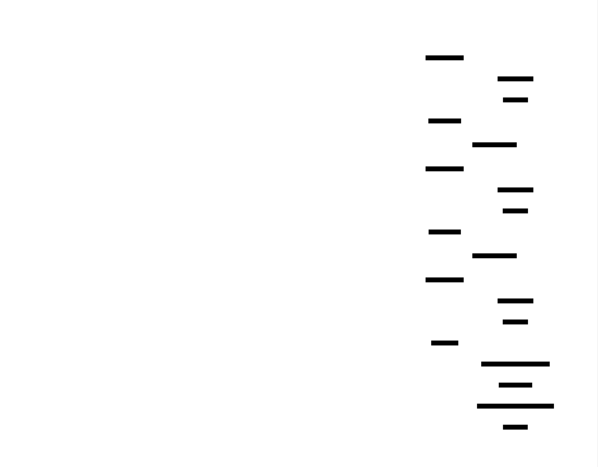

# AST Builder (Parser): Design Document


## Overview

This system transforms a sequence of tokens into an Abstract Syntax Tree (AST), capturing the grammatical structure of source code while preserving semantic meaning. The key architectural challenge is designing a parser that correctly handles operator precedence, statement nesting, and error recovery, turning flat token streams into hierarchical tree representations that can be evaluated or compiled.


> This guide is meant to help you understand the big picture before diving into each milestone. Refer back to it whenever you need context on how components connect.


> **Milestone(s):** Milestone 1 (AST Node Definitions), Milestone 2 (Recursive Descent Parser)

## Context and Problem Statement

Parsing is the critical bridge between the surface-level text of a programming language and its executable meaning. It transforms a **flat sequence of tokens**—the output of the lexer—into a **hierarchical Abstract Syntax Tree (AST)** that explicitly represents the grammatical structure and nesting of the source code. This transformation is fundamental because computers cannot reason about a program's logic from a linear token list; they require a tree structure that mirrors the nested scopes, operator precedence, and control flow of the language.

### Mental Model: From Shopping List to Recipe Book

Imagine you are handed a **shopping list** written as a single, run-on sentence: "four eggs then whisk then add flour then mix for two minutes then pour into pan." This flat list of ingredients and actions is confusing—when do you add the flour? What gets mixed for two minutes? This is analogous to a token stream: a sequential, undifferentiated list of the program's basic elements (`if`, `(`, `x`, `+`, `5`, `)`, `{`, `return`, ...).

Parsing is the process of converting this list into a **detailed recipe book** with a clear table of contents, nested steps, and visual grouping. The recipe book organizes actions into chapters (functions), sections (control blocks), and step-by-step procedures (expressions with proper order of operations). The `AST` is this recipe book: a tree where the root is the entire program, branches are statements and declarations, and leaves are literals and identifiers. Each node in the tree knows exactly what role it plays (is this an addition or a multiplication?) and how its children relate to it (the left and right operands).

This mental model highlights the parser's core task: **imposing structure on sequence**. It must discern that `1 + 2 * 3` means `1 + (2 * 3)`, not `(1 + 2) * 3`, by understanding that multiplication operators (`*`) form tighter grammatical "clusters" than addition operators (`+`). It must recognize that everything between `{` and `}` belongs together as a block, creating a subtree. The parser is the compiler's or interpreter's **grammarian**, applying the rigid rules of the language's syntax to build a navigable, meaningful document from raw words.

### Why Parsing is Challenging

Building a correct and robust parser involves navigating several intertwined difficulties that stem from the inherent complexity of programming language grammars.

**1. Hierarchical Ambiguity:** Human languages use context and common sense to resolve ambiguity. Programming languages must be unambiguous, requiring the parser to use **predefined precedence and associativity rules** to decide the correct tree structure for expressions. Without explicit rules, `a + b * c` could be parsed as `(a + b) * c` or `a + (b * c)`, leading to different program semantics. The parser must implement these rules flawlessly.

**2. Arbitrary Nesting Depth:** Programs can contain expressions within statements within blocks within functions, nested to an arbitrary and unpredictable depth. This demands a parsing strategy that can handle **recursive structures** without imposing arbitrary limits. A parser must be able to descend into a deeply nested parenthesized expression and correctly ascend back out, managing its internal state throughout.

**3. Context-Sensitive Decisions:** Determining what a token means often depends on surrounding context. For example, `(` could signal the start of a parenthesized expression, a function call argument list, or a parameter list in a function declaration. The parser must use **lookahead** and **parsing context** (are we currently expecting a type? an expression? a statement?) to make the correct branching decision.

**4. Error Tolerance and Recovery:** In a learning or development environment, code is frequently syntactically incorrect. A parser that halts at the first error (like a missing semicolon) is frustrating and unhelpful. Implementing **error recovery**—skipping over the erroneous section and resuming parsing at a logical synchronization point—allows reporting multiple errors in one pass. Designing effective synchronization points without causing cascading false errors is a significant challenge.

**5. Performance and Complexity Trade-offs:** Parsing algorithms range from simple but limited (linear parsing of a regular grammar) to powerful but complex (LR parsers with generated state tables). For an educational implementation, we must choose an algorithm that is **manually implementable**, demonstrates core concepts, and handles a realistic subset of language features without becoming intractable.

**6. Faithful Representation:** The AST must not only be syntactically correct but must also preserve every semantic nuance for later phases (type checking, optimization, code generation). This includes tracking **source locations** (file, line, column) for every node to enable precise error messages and debugging information. The data structure design must balance completeness, immutability, and ease of traversal.

### Parsing Approaches Comparison

Several algorithmic strategies exist for converting a grammar specification into a working parser. The choice profoundly impacts the implementation complexity, error messaging quality, and ease of extending the language.

> **Decision: Recursive Descent with Precedence Climbing**
> - **Context**: We need a parser for an educational project that is clear to implement, debuggable, and effective for a language with typical expression precedence and statement nesting. The grammar includes common but non-trivial constructs like function calls, if/else statements, and variable declarations.
> - **Options Considered**:
>   1. **Pure Recursive Descent (LL(1))**: Write a function for each grammar production. Precedence is encoded in the call hierarchy (e.g., `parseTerm` calls `parseFactor`).
>   2. **Pratt Parsing (Top-Down Operator Precedence)**: Associate parsing functions (nud/led) with each token type to handle prefix/infix contexts. Precedence is managed via a precedence parameter passed between these functions.
>   3. **Parser Generator (e.g., ANTLR, yacc)**: Define the grammar in a DSL and generate parser code. This is the industrial standard for complex languages.
> - **Decision**: We will implement a **Hybrid Recursive Descent Parser with the Precedence Climbing algorithm** for expressions. Statement parsing will use standard recursive descent.
> - **Rationale**:
>   - **Clarity and Pedagogical Value**: Recursive descent directly mirrors the grammar rules in code, making the implementation transparent and easier to understand for learners. Each function corresponds to a recognizable language construct.
>   - **Precedence Climbing** provides an elegant, non-exponential solution to operator precedence and associativity within the familiar recursive descent framework. It is easier to trace and debug than a full Pratt parser while being more efficient and general than naive recursive descent for expressions.
>   - **Manual Control**: Handwritten parsers offer superior error messages and recovery strategies compared to most generated parsers, which is critical for an educational tool.
>   - **Sufficiency**: Recursive descent with precedence climbing can handle the expression grammar (binary, unary, grouping, function calls) and the statement grammar (if, while, blocks, declarations) of our target language without undue complexity.
> - **Consequences**:
>   - **Positive**: The parser will be intuitive to read, modify, and extend. Error recovery can be finely controlled. The call stack during parsing will visually represent the grammatical nesting.
>   - **Negative**: The grammar must be carefully designed to avoid **left recursion**, which causes infinite recursion in naive recursive descent. Some grammar refactoring may be required. The parser is also less efficient for very large files than table-driven parsers (though this is negligible for learning).

| Option | Pros | Cons | Chosen? |
|--------|------|------|---------|
| **Pure Recursive Descent (LL(1))** | Simple to understand, direct mapping from grammar to code, excellent error localization. | Can become unwieldy for expressions with many precedence levels (requires many helper functions), prone to left recursion issues if grammar not refactored. | No – we adopt its structure but enhance expression parsing. |
| **Pratt Parsing** | Extremely elegant for expressions, naturally handles precedence and associativity, easy to add new operators. | The control flow (nud/led dispatch) can be harder to follow initially. Integrating cleanly with statement parsing requires careful design. | No – its elegance is offset by a steeper learning curve for our target audience. |
| **Parser Generator** | Handles complex grammars automatically, generates efficient code, separates grammar specification from parsing logic. | Adds a build-time dependency, generated code can be hard to debug, error messages and recovery are often less intuitive. | No – we prioritize implementability and understanding over automation. |
| **Recursive Descent + Precedence Climbing** (Our Choice) | Retains clarity of recursive descent, solves expression precedence cleanly and efficiently, integrates seamlessly with statement parsing. | Requires understanding of the precedence climbing algorithm. Slightly more complex than pure recursive descent for expressions. | **YES** – it offers the best balance of clarity, power, and educational value. |

**Left Recursion: The Hidden Pitfall**
A major challenge in recursive descent parsing is **left-recursive grammar rules**. A rule is left-recursive if its first element is the rule itself (e.g., `Expression → Expression + Term`). A naive recursive function for this rule would immediately call itself without consuming any input, causing infinite recursion. The standard solution is to **refactor the grammar** to use right recursion (e.g., `Expression → Term (+ Term)*`), which corresponds to a loop in the parsing function. Our chosen grammar and parsing strategy explicitly avoids left recursion.

**The Role of Lookahead**
Our parser will be **predictive**, meaning it will peek at the next token (`peek()`) to decide which production rule to follow. For example, seeing a `let` token indicates a variable declaration statement, while an `identifier` followed by a `(` suggests a function call expression. We will use **single-token lookahead**, which is sufficient for the grammatical constructs in our language and keeps the parser logic straightforward.

⚠️ **Pitfall: The Dangling Else**
A classic parsing ambiguity arises with nested `if` statements that lack braces: `if (a) if (b) c; else d;`. Which `if` does the `else` belong to? Most languages resolve this by attaching the `else` to the nearest unmatched `if`. Our parser must implement this **"nearest-if" rule**, which can be done naturally in a recursive descent parser by having the `parseIfStatement` function greedily consume an optional `else` branch when it sees the `else` token.

### Implementation Guidance

**A. Technology Recommendations Table**

| Component | Simple Option | Advanced Option |
|-----------|---------------|-----------------|
| **AST Node Representation** | Python `dataclasses` with inheritance | Python `@dataclass(frozen=True)` for immutability, or `attrs` library |
| **Visitor Pattern** | Abstract base class with `visit_*` methods | Single-dispatch functions using `functools.singledispatch` |
| **Token Stream** | Simple class wrapping a list of tokens with a current index | Iterator-based stream with lookahead buffer for unlimited peek |
| **Parsing Algorithm** | Explicit precedence climbing with a fixed precedence table | Dynamic operator precedence table loaded from a configuration |
| **Error Reporting** | Simple `print` to stderr with line/column info | Structured error objects collected in a list, with colorized output |
| **Source Location** | Tuple `(filename, line, column)` attached to each node | Dedicated `SourceLocation` class with methods for formatting |

**B. Recommended File/Module Structure**

For this initial section focusing on the AST and the core parsing problem, establish this foundational structure:

```
ast_builder/
├── __init__.py
├── tokens.py           # Token type definitions (from lexer milestone)
├── ast_nodes.py        # All AST node class definitions (Milestone 1)
├── visitor.py          # Visitor base class and example visitors
├── parser/
│   ├── __init__.py
│   ├── token_stream.py # TokenStream class (Milestone 2)
│   ├── parser.py       # Main Parser class (Milestones 2, 3, 4)
│   ├── expressions.py  # Expression parsing logic
│   ├── statements.py   # Statement parsing logic
│   └── errors.py       # Error handling and recovery
└── main.py             # CLI entry point (for testing)
```

**C. Infrastructure Starter Code**

Here is a complete, reusable foundation for tokens and source location tracking. The learner should place this in `tokens.py`.

```python
# tokens.py
from enum import Enum
from dataclasses import dataclass
from typing import Optional, Any

class TokenType(Enum):
    # Single-character tokens
    LEFT_PAREN = "LEFT_PAREN"
    RIGHT_PAREN = "RIGHT_PAREN"
    LEFT_BRACE = "LEFT_BRACE"
    RIGHT_BRACE = "RIGHT_BRACE"
    COMMA = "COMMA"
    DOT = "DOT"
    MINUS = "MINUS"
    PLUS = "PLUS"
    SEMICOLON = "SEMICOLON"
    SLASH = "SLASH"
    STAR = "STAR"
    # One or two character tokens
    BANG = "BANG"
    BANG_EQUAL = "BANG_EQUAL"
    EQUAL = "EQUAL"
    EQUAL_EQUAL = "EQUAL_EQUAL"
    GREATER = "GREATER"
    GREATER_EQUAL = "GREATER_EQUAL"
    LESS = "LESS"
    LESS_EQUAL = "LESS_EQUAL"
    # Literals
    IDENTIFIER = "IDENTIFIER"
    STRING = "STRING"
    NUMBER = "NUMBER"
    # Keywords
    AND = "AND"
    CLASS = "CLASS"
    ELSE = "ELSE"
    FALSE = "FALSE"
    FUN = "FUN"
    FOR = "FOR"
    IF = "IF"
    NIL = "NIL"
    OR = "OR"
    PRINT = "PRINT"
    RETURN = "RETURN"
    SUPER = "SUPER"
    THIS = "THIS"
    TRUE = "TRUE"
    VAR = "VAR"
    WHILE = "WHILE"
    EOF = "EOF"

@dataclass(frozen=True)
class SourceLocation:
    """Immutable representation of a location in source code."""
    file: str
    line: int      # 1-indexed line number
    column: int    # 1-indexed column offset
    length: int    # length of the lexeme in characters

    def __str__(self) -> str:
        return f"{self.file}:{self.line}:{self.column}"

@dataclass(frozen=True)
class Token:
    """Immutable token representation with source location."""
    type: TokenType
    lexeme: str
    literal: Optional[Any]  # The actual value for literals (int, float, str, bool, None)
    location: SourceLocation

    def __str__(self) -> str:
        return f"{self.type.name} {self.lexeme} {self.literal if self.literal is not None else ''}"
```

**D. Core Logic Skeleton Code**

The following is a skeleton for the base AST Node and Visitor pattern in `ast_nodes.py`. The learner must fill in the specific node types.

```python
# ast_nodes.py
from __future__ import annotations
from abc import ABC, abstractmethod
from dataclasses import dataclass
from typing import Optional, Any, List
from tokens import SourceLocation

class AstVisitor(ABC):
    """Abstract base class for implementing the Visitor pattern over the AST."""
    @abstractmethod
    def visit_binary_expr(self, expr: BinaryExpr) -> Any:
        pass
    # TODO: Add abstract visit methods for EVERY concrete node type:
    # visit_unary_expr, visit_literal_expr, visit_grouping_expr,
    # visit_variable_expr, visit_assign_expr, visit_logical_expr,
    # visit_call_expr, visit_get_expr, visit_set_expr,
    # visit_block_stmt, visit_expression_stmt, visit_if_stmt,
    # visit_print_stmt, visit_return_stmt, visit_var_stmt,
    # visit_while_stmt, visit_function_stmt, visit_class_stmt
    # Hint: Use a naming convention: visit_<snake_case_node_class_name>

class Node(ABC):
    """Abstract base class for all AST nodes."""
    def __init__(self, location: SourceLocation):
        self.location = location

    @abstractmethod
    def accept(self, visitor: AstVisitor) -> Any:
        """Accept a visitor, enabling the Visitor pattern. Each concrete node must implement this."""
        pass

class Expression(Node):
    """Base class for all expression nodes."""
    pass

class Statement(Node):
    """Base class for all statement nodes."""
    pass

# TODO 1: Define Expression subclasses.
# Each should be a @dataclass with appropriate fields and an accept method.
# Example for BinaryExpr:
@dataclass
class BinaryExpr(Expression):
    left: Expression
    operator: Token  # Use the Token type from tokens.py
    right: Expression

    def accept(self, visitor: AstVisitor) -> Any:
        return visitor.visit_binary_expr(self)

# TODO 2: Define other Expression types:
# - UnaryExpr (operator: Token, right: Expression)
# - LiteralExpr (value: Any)
# - GroupingExpr (expression: Expression)
# - VariableExpr (name: Token)
# - AssignExpr (name: Token, value: Expression)
# - LogicalExpr (left: Expression, operator: Token, right: Expression)
# - CallExpr (callee: Expression, paren: Token, arguments: List[Expression])

# TODO 3: Define Statement subclasses.
# Each should be a @dataclass with appropriate fields and an accept method.
# Example for PrintStmt:
@dataclass
class PrintStmt(Statement):
    expression: Expression

    def accept(self, visitor: AstVisitor) -> Any:
        return visitor.visit_print_stmt(self)

# TODO 4: Define other Statement types:
# - ExpressionStmt (expression: Expression)
# - VarStmt (name: Token, initializer: Optional[Expression])
# - BlockStmt (statements: List[Statement])
# - IfStmt (condition: Expression, then_branch: Statement, else_branch: Optional[Statement])
# - WhileStmt (condition: Expression, body: Statement)
# - FunctionStmt (name: Token, params: List[Token], body: BlockStmt)
# - ReturnStmt (keyword: Token, value: Optional[Expression])

# TODO 5: Create a simple visitor for testing, like a PrettyPrinter in visitor.py.
```

**E. Language-Specific Hints (Python)**
- Use `@dataclass(frozen=True)` to make nodes immutable, preventing accidental modification after creation.
- The `Any` type in visitor return signatures allows maximum flexibility (the visitor could return a formatted string, an evaluated value, or `None`).
- Use `from __future__ import annotations` to allow forward references in type hints (e.g., `BinaryExpr` can reference itself in its fields).
- For the token stream, consider making `TokenStream` an iterator by implementing `__next__`, but also provide a `peek()` method for lookahead.

**F. Milestone Checkpoint**
After implementing the AST node definitions (Milestone 1), you should be able to run the following test script to verify your node structure and visitor pattern:

```python
# test_ast.py
from ast_nodes import *
from tokens import Token, TokenType, SourceLocation

# Create a dummy location
loc = SourceLocation("test.py", 1, 1, 1)
# Create a dummy token
plus_tok = Token(TokenType.PLUS, "+", None, loc)

# Manually construct a simple AST: 1 + 2
left = LiteralExpr(123, loc)
right = LiteralExpr(456, loc)
expr = BinaryExpr(left, plus_tok, right, loc)

# Implement a simple visitor that prints the tree
class PrintVisitor(AstVisitor):
    def visit_binary_expr(self, expr):
        return f"({expr.left.accept(self)} {expr.operator.lexeme} {expr.right.accept(self)})"
    def visit_literal_expr(self, expr):
        return str(expr.value)
    # ... implement other visit methods as needed

printer = PrintVisitor()
result = expr.accept(printer)
print(result)  # Should output: (123 + 456)
```

**Expected Behavior:** The script should run without errors and print `(123 + 456)`. This confirms your node classes can be instantiated and the visitor pattern correctly dispatches to the appropriate method.

**Signs of Trouble:**
- **ImportError**: Check your file structure and `__init__.py` files.
- **AttributeError**: Ensure all `@dataclass` fields are defined and your `accept` methods call the correct visitor method name.
- **TypeError**: Verify that all required parameters are passed when creating nodes (especially the `location` field inherited from `Node`).

---


> **Milestone(s):** Milestone 1 (AST Node Definitions), Milestone 2 (Recursive Descent Parser), Milestone 3 (Statement Parsing), Milestone 4 (Error Recovery)

## Goals and Non-Goals

This section establishes the functional boundaries of our AST Builder (Parser) system. In educational projects, clearly defining what we will and won't build is crucial to prevent scope creep while ensuring we implement the core concepts thoroughly. Think of this as creating a blueprint for a house—we're specifying exactly which rooms we'll construct and which amenities (like a swimming pool or home theater) we'll leave for future expansion. This clarity helps learners focus their effort on mastering fundamental parsing techniques without being overwhelmed by advanced compiler features that require different architectural considerations.

The parser sits at a critical juncture in the language processing pipeline, transforming the linear sequence of tokens produced by the lexer into a structured tree representation. Our goals center on building a **correct**, **educational**, and **practical** parser that demonstrates core computer science concepts while producing a usable AST for downstream processing like interpretation or compilation.

### Goals

These are the essential capabilities our parser must implement to successfully complete all four milestones. Each goal corresponds directly to the acceptance criteria in the project milestones and represents a core competency in parser construction.

| Goal Category | Specific Capabilities | Why This Matters | Milestone Alignment |
|---------------|----------------------|------------------|---------------------|
| **Complete AST Representation** | - Define all expression types: literals, binary/unary operators, variables, assignments, logical operations, function calls<br>- Define all statement types: variable declarations, control flow (if/else, while), blocks, functions, returns<br>- Implement source location tracking for every node<br>- Support visitor pattern for type-safe traversal | The AST is the fundamental data structure that captures the complete syntactic structure of the program. Without a complete node hierarchy, downstream phases (like evaluation or code generation) cannot process all language constructs. Source locations enable meaningful error messages. | Milestone 1 |
| **Correct Expression Parsing** | - Implement recursive descent parsing for all expression types<br>- Correctly handle operator precedence (e.g., `*` before `+`)<br>- Handle operator associativity (left for `+ - * /`, right for `=` and `**`)<br>- Parse nested parentheses with proper grouping<br>- Parse function calls with argument lists | Expressions form the computational core of most languages. Getting precedence and associativity wrong would mean `1 + 2 * 3` gets evaluated as `(1 + 2) * 3 = 9` instead of the correct `1 + (2 * 3) = 7`, fundamentally breaking the language's semantics. | Milestone 2 |
| **Full Statement Coverage** | - Parse variable declarations with optional initializers<br>- Parse control flow statements (if/else, while) with proper nesting<br>- Parse function declarations with parameters and body<br>- Handle block statements that establish new scopes<br>- Resolve the "dangling else" ambiguity correctly | Statements define program structure and flow. Without correctly parsing `if`/`else`, programs couldn't make decisions. Block parsing establishes scope boundaries crucial for variable visibility. The dangling else resolution ensures consistent, predictable behavior. | Milestone 3 |
| **Robust Error Handling** | - Report multiple syntax errors in a single pass<br>- Implement panic-mode recovery to continue after errors<br>- Provide meaningful error messages with exact source locations<br>- Synchronize to statement boundaries after errors<br>- Handle edge cases like missing tokens gracefully | Real-world parsers don't stop at the first error—they report all issues so developers can fix them in one edit-compile cycle. Good error recovery makes the tool usable; good error messages make it helpful. This is essential for developer experience. | Milestone 4 |
| **Educational Implementation** | - Use clear, well-documented algorithms (recursive descent, precedence climbing)<br>- Separate concerns into distinct components (token stream, expression parser, statement parser)<br>- Include comprehensive comments explaining why choices were made<br>- Provide debugging aids like AST visualization<br>- Follow consistent naming and design patterns | Since this is an educational project, the implementation must be readable and instructive. Clean architecture helps learners understand how professional parsers are structured. Explicit design decisions with rationale teach more than just the code itself. | All Milestones |
| **Practical Usability** | - Produce a complete AST that can be walked by visitors<br>- Handle real code patterns (nested expressions, multi-statement blocks)<br>- Support basic language features comparable to simple scripting languages<br>- Process code with reasonable performance (linear time complexity)<br>- Integrate cleanly with lexer and future interpreter phases | The parser isn't just an academic exercise—it should produce a usable AST for a simple programming language. This demonstrates how parsing fits into the complete language implementation pipeline and validates the design against realistic requirements. | All Milestones |

> **Key Insight:** The primary educational value lies not just in making the parser work, but in understanding **why** each design decision was made. Each goal serves both a functional purpose (making the parser work) and an educational purpose (teaching a specific concept in language implementation).

**Architecture Decision: Educational vs. Production Parser Focus**

- **Context:** We must balance implementing a parser that teaches fundamental concepts against one optimized for performance or industrial language features. Our primary audience is learners building their first parser.
- **Options Considered:**
  1. **Pure educational minimalism:** Implement only the simplest possible parser that demonstrates concepts, skipping error recovery, location tracking, and some expression types.
  2. **Production-ready complexity:** Implement all optimizations (Pratt parsing with memoization), extensive error recovery, and advanced features (ternary operators, array literals, etc.).
  3. **Balanced approach:** Implement complete core functionality with clear, educational code while including essential real-world features like error recovery and source locations.
- **Decision:** Balanced approach (Option 3)
- **Rationale:** A minimal parser (Option 1) wouldn't teach how real parsers handle errors or track locations. A production parser (Option 2) would overwhelm learners with optimization complexity. The balanced approach provides complete coverage of fundamental concepts while keeping code understandable. Learners finish with a parser that actually works on real code patterns.
- **Consequences:** The parser will be slightly slower than optimized implementations but will be thoroughly documented and demonstrate all core concepts. Learners can later optimize it as an extension exercise.

| Option | Pros | Cons | Why Not Chosen |
|--------|------|------|----------------|
| **Educational Minimalism** | - Fast to implement<br>- Simple code | - Missing essential features<br>- Unrealistic (no error recovery)<br>- Limited educational value beyond basics | Doesn't prepare learners for real parser implementation challenges |
| **Production-Ready Complexity** | - High performance<br>- Complete feature set<br>- Professional-grade | - Steep learning curve<br>- Complex code obscures fundamentals<br>- Requires advanced CS knowledge | Would overwhelm learners; core concepts get lost in optimization details |
| **Balanced Approach** | - Teaches all fundamentals<br>- Actually usable<br>- Clear, documented code | - Not maximally optimized<br>- More code than minimal version | **CHOSEN:** Best trade-off for learning while building something real |

### Non-Goals

These are capabilities we explicitly exclude from the current implementation. Defining non-goals prevents scope creep and clarifies what learners should not spend time on. Think of these as "future enhancements" that could be added once the core parser is complete, but which would distract from learning fundamental parsing concepts if attempted now.

| Non-Goal Category | Specific Exclusions | Why This Is Out of Scope | Potential Future Extension |
|-------------------|---------------------|--------------------------|----------------------------|
| **Semantic Analysis** | - Variable existence checking (undeclared variable errors)<br>- Type checking (type mismatch errors)<br>- Scope resolution (shadowing warnings)<br>- Function arity validation (wrong number of arguments) | Semantic analysis requires a symbol table and occurs **after** the AST is built. Our parser's job is purely syntactic—it ensures code follows grammatical rules, not semantic rules. Mixing these concerns would violate separation of concerns and complicate the parser. | Milestone 5+: Build a semantic analyzer that walks the AST with a symbol table to validate these constraints. |
| **Performance Optimizations** | - Parser caching/memoization<br>- Tail recursion optimization<br>- Advanced lookup tables for operator precedence<br>- Generated parser code (like parser generators) | While important for production compilers, optimization techniques obscure the fundamental algorithms we're trying to teach. A clear, straightforward implementation of recursive descent is more educational than a highly optimized but opaque one. | After mastering fundamentals, learners can implement Pratt parsing for better performance or even build a parser generator. |
| **Advanced Language Features** | - Classes and inheritance<br>- Generics/templates<br>- Pattern matching<br>- Exception handling (try/catch)<br>- Lambda expressions/closures | These features require significant additional parsing complexity and often involve semantic analysis. Our simple statement-based language provides enough complexity to learn parsing fundamentals without being overwhelmed by advanced syntax. | Each feature could be added as an extension project once the core parser is understood. |
| **Multi-Pass or Incremental Parsing** | - Multiple parse phases<br>- Partial re-parsing of changed code<br>- Parsing while typing (as in IDEs)<br>- Dependency analysis between files | Single-pass parsing is sufficient for our educational goals and keeps the architecture simple. Incremental parsing requires completely different data structures and algorithms that are beyond introductory scope. | Could be implemented as a separate advanced project focusing on IDE tooling. |
| **Concrete Syntax Tree (CST) Preservation** | - Storing every token (including punctuation)<br>- Maintaining whitespace information<br>- Preserving comments in the AST<br>- Exact formatting reconstruction | A CST contains every syntactic detail; an AST abstracts away non-essential elements. For interpretation/compilation, we need the AST. CST preservation is only needed for tools like formatters or syntax highlighters, which are separate concerns. | Could build a CST-preserving parser for a code formatter tool as an extension. |
| **Alternative Parsing Algorithms** | - LR(1), LALR parsing (like yacc/bison)<br>- PEG (Parsing Expression Grammar) packrat parsing<br>- Earley parser for ambiguous grammars<br>- Parser combinator libraries | While these are valuable techniques, recursive descent is the most approachable first parsing algorithm. It maps directly to grammar rules and provides excellent error messages. Other algorithms can be studied after mastering this foundation. | Learners can reimplement the same language using different algorithms to compare trade-offs. |
| **Integration with Build Systems** | - Makefile/dependency tracking<br>- Module/import resolution<br>- Conditional compilation<br>- Build configuration parsing | These are ecosystem concerns, not core parsing. Our parser processes a single source file in isolation, which is sufficient for learning the fundamentals of turning tokens into ASTs. | Could be added as a "project" layer that manages multiple files and their dependencies. |
| **Binary or Serialized Output** | - Writing AST to binary format<br>- Serialization for caching<br>- Cross-language AST interchange<br>- Persistence to database | Our parser outputs an in-memory AST for immediate processing by an interpreter or compiler. Serialization adds complexity without teaching parsing concepts. The AST can be walked directly without serialization. | Could add JSON serialization for debugging or to enable separate compilation phases. |

> **Design Principle:** A well-defined non-goal is as valuable as a goal. By explicitly stating what we won't build, we create focused learning objectives and prevent "feature creep" that dilutes educational value.

**Common Pitfall: Trying to Implement Semantic Analysis in the Parser**

⚠️ **Pitfall: Mixing syntactic and semantic validation**
- **Description:** Learners often try to check if variables are declared before use or if types match during parsing, adding symbol table lookups to expression parsing methods.
- **Why it's wrong:** This violates separation of concerns. The parser's job is to validate syntax (grammatical structure), not semantics (meaning). A syntactically valid program like `x + y;` should parse successfully even if `x` and `y` aren't declared—that's a semantic error reported later. Mixing these makes both parsing and error recovery more complex.
- **How to avoid:** Strictly limit the parser to checking token sequences against grammar rules. Any check that requires looking up names in a symbol table or tracking types belongs in a subsequent semantic analysis phase that walks the completed AST.

**Architecture Decision: Single-Pass Syntax-Only Parsing**

- **Context:** We must decide how much validation to perform during parsing versus deferring to later phases. Real compilers often perform some validation during parsing for efficiency, but this increases complexity.
- **Options Considered:**
  1. **Pure syntax parsing:** Only validate grammar rules; defer all name/type checking to later phases.
  2. **Integrated validation:** Check variable declarations, types, and other semantics during parsing where possible.
  3. **Hybrid approach:** Perform simple checks (like duplicate parameter names) during parsing but defer complex analysis.
- **Decision:** Pure syntax parsing (Option 1)
- **Rationale:** This maintains clean separation of concerns and keeps the parser focused on its single responsibility: building an AST from tokens. It also simplifies error recovery since the parser doesn't need to maintain additional state like symbol tables. Learners can implement semantic analysis as a separate, clearly defined phase.
- **Consequences:** Some errors that could be caught earlier (like using an undefined variable) will be caught later. However, this actually provides a better architectural lesson about compiler phases. The parser code remains simpler and more focused.

| Option | Pros | Cons | Why Not Chosen |
|--------|------|------|----------------|
| **Pure Syntax Parsing** | - Clean separation of concerns<br>- Simpler parser code<br>- Clear phase boundaries for learning | - Some errors caught later than possible<br>- Multiple passes over AST needed | **CHOSEN:** Best for learning architecture; real-world simplicity |
| **Integrated Validation** | - Early error detection<br>- Potential performance benefits<br>- More like production compilers | - Complex parser state<br>- Mixed responsibilities<br>- Harder error recovery | Blurs important conceptual boundaries for learners |
| **Hybrid Approach** | - Balanced approach<br>- Catches simple errors early | - Inconsistent design<br>- Hard to define what's "simple" vs. "complex" | Creates ambiguous boundaries that confuse learners |

The non-goals table above serves as a "parking lot" for ideas that learners might want to implement but should postpone until after mastering the fundamentals. By clearly separating these concerns, we ensure the parser implementation remains focused, educational, and achievable within the scope of the four milestones.

### Implementation Guidance

#### A. Technology Recommendations Table
| Component | Simple Option (For Learning) | Advanced Option (For Extension) |
|-----------|-----------------------------|--------------------------------|
| **Expression Parsing** | Recursive descent with explicit precedence levels | Pratt parser with operator precedence tables |
| **Error Recovery** | Panic mode with statement-boundary synchronization | Phrase-level recovery with follow sets |
| **Visitor Pattern** | Abstract base class with methods for each node type | Double-dispatch using pattern matching (Python 3.10+) |
| **Source Location** | Simple `SourceLocation` class with line/column | Full source snippet inclusion in error messages |
| **AST Representation** | Plain data classes with `accept()` methods | Immutable nodes with hash consing for deduplication |

#### B. Recommended File/Module Structure
```
ast_builder/
├── __init__.py
├── tokens.py              # TokenType enum, Token and SourceLocation classes
├── ast_nodes.py           # All Node subclasses (Expression, Statement, etc.)
├── visitor.py             # AstVisitor base class
├── token_stream.py        # TokenStream class with peek/consume
├── parser.py              # Main Parser class integrating components
├── expression_parser.py   # Expression parsing logic
├── statement_parser.py    # Statement parsing logic
├── error_handler.py       # Error reporting and recovery
└── exceptions.py          # Custom exception types (ParseError, etc.)
```

#### C. Infrastructure Starter Code

**File: `tokens.py` (Complete Implementation)**
```python
from enum import Enum
from dataclasses import dataclass
from typing import Any, Optional

class TokenType(Enum):
    # Single-character tokens
    LEFT_PAREN = "LEFT_PAREN"
    RIGHT_PAREN = "RIGHT_PAREN"
    LEFT_BRACE = "LEFT_BRACE"
    RIGHT_BRACE = "RIGHT_BRACE"
    COMMA = "COMMA"
    DOT = "DOT"
    MINUS = "MINUS"
    PLUS = "PLUS"
    SEMICOLON = "SEMICOLON"
    SLASH = "SLASH"
    STAR = "STAR"
    
    # One or two character tokens
    BANG = "BANG"
    BANG_EQUAL = "BANG_EQUAL"
    EQUAL = "EQUAL"
    EQUAL_EQUAL = "EQUAL_EQUAL"
    GREATER = "GREATER"
    GREATER_EQUAL = "GREATER_EQUAL"
    LESS = "LESS"
    LESS_EQUAL = "LESS_EQUAL"
    
    # Literals
    IDENTIFIER = "IDENTIFIER"
    STRING = "STRING"
    NUMBER = "NUMBER"
    
    # Keywords
    AND = "AND"
    CLASS = "CLASS"
    ELSE = "ELSE"
    FALSE = "FALSE"
    FUN = "FUN"
    FOR = "FOR"
    IF = "IF"
    NIL = "NIL"
    OR = "OR"
    PRINT = "PRINT"
    RETURN = "RETURN"
    SUPER = "SUPER"
    THIS = "THIS"
    TRUE = "TRUE"
    VAR = "VAR"
    WHILE = "WHILE"
    
    EOF = "EOF"

@dataclass(frozen=True)
class SourceLocation:
    """Immutable representation of a location in source code."""
    file: str
    line: int          # 1-based line number
    column: int        # 1-based column number
    length: int        # Length of the token in characters
    
    def __str__(self) -> str:
        return f"{self.file}:{self.line}:{self.column}"

@dataclass(frozen=True)
class Token:
    """Immutable representation of a lexical token."""
    type: TokenType
    lexeme: str        # Raw text of the token
    literal: Optional[Any]  # Actual value for literals (string, number, etc.)
    location: SourceLocation
    
    def __str__(self) -> str:
        return f"{self.type.name} '{self.lexeme}' {self.literal}"
```

**File: `exceptions.py` (Complete Implementation)**
```python
from dataclasses import dataclass
from typing import Optional
from .tokens import Token

@dataclass
class ParseError(Exception):
    """Base exception for parsing errors."""
    message: str
    token: Optional[Token] = None
    
    def __str__(self) -> str:
        if self.token and self.token.location:
            loc = self.token.location
            return f"[{loc.file}:{loc.line}:{loc.column}] {self.message}"
        return self.message

class SyntaxError(ParseError):
    """Raised when syntax rules are violated."""
    pass

class RecoveryError(ParseError):
    """Raised when error recovery fails."""
    pass
```

#### D. Core Logic Skeleton Code

**File: `parser.py` (Main Parser Skeleton)**
```python
from typing import List
from .token_stream import TokenStream
from .error_handler import ErrorHandler
from .expression_parser import ExpressionParser
from .statement_parser import StatementParser
from .ast_nodes import Statement

class Parser:
    """Main parser coordinating expression, statement parsing and error recovery."""
    
    def __init__(self, tokens: List[Token], source_file: str = "<unknown>"):
        # TODO 1: Initialize TokenStream with the token list
        # TODO 2: Initialize ErrorHandler for collecting syntax errors
        # TODO 3: Initialize ExpressionParser with token_stream and error_handler
        # TODO 4: Initialize StatementParser with token_stream, error_handler, and expression_parser
        pass
    
    def parse(self) -> List[Statement]:
        """Parse a series of statements until EOF."""
        statements = []
        
        # TODO 5: While not at end of file (check token_stream.is_at_end())
        # TODO 6: Try to parse a statement using statement_parser.declaration()
        # TODO 7: If successful, append to statements list
        # TODO 8: If ParseError is raised, call error_handler.synchronize() to recover
        # TODO 9: After loop, check error_handler.had_error and raise if any errors
        # TODO 10: Return the list of statements
        
        return statements
```

#### E. Language-Specific Hints (Python)

1. **Use Python 3.7+ dataclasses** for AST nodes: They provide immutability (`frozen=True`), automatic `__init__`, and readable `__repr__`.
2. **Use `Enum` for TokenType:** Provides type safety and readable string representation.
3. **Leverage Python's exception handling** for error recovery: Use `try/except` blocks in the main parse loop to catch `ParseError` and continue.
4. **Type hints are valuable:** Use `from typing import List, Optional, Any` to make interfaces clear, especially for learners.
5. **Implement `__str__` methods** on all nodes for debugging: This allows printing the AST in a readable format during development.

#### F. Milestone Checkpoint

After implementing the basic structure from the goals:

**Command to run:**
```bash
python -m pytest tests/test_parser_structure.py -v
```

**Expected output:**
```
test_token_creation ... ok
test_source_location_str ... ok
test_parse_empty_program ... ok
test_parse_single_number ... ok
test_error_basic_syntax ... ok
```

**Manual verification:**
1. Create a simple test program: `print "Hello, world!";`
2. Run your parser on it (should produce a `PrintStmt` containing a `LiteralExpr` with value `"Hello, world!"`)
3. Verify the AST has correct source locations (line 1, column 1 for `print`, line 1, column 7 for the string)
4. Try a program with a syntax error: `print "Hello" ` (missing semicolon)
5. The parser should report: `[test.lang:1:13] Expected ';' after value.`

**Signs something is wrong:**
- If you get `AttributeError: 'NoneType' object has no attribute 'type'` → You're trying to access tokens past EOF
- If all expressions parse as left-associative regardless of operator → Precedence climbing implementation is missing
- If error messages show wrong line numbers → SourceLocation isn't being propagated correctly through node creation

#### G. Debugging Tips

| Symptom | Likely Cause | How to Diagnose | Fix |
|---------|--------------|-----------------|-----|
| Parser hangs infinitely | Left recursion in grammar rules | Add print statements to see which parsing function is called repeatedly | Rewrite grammar to eliminate left recursion (e.g., use loops instead of recursion for left-associative operators) |
| `1 + 2 * 3` parses as `(1 + 2) * 3` | Incorrect operator precedence | Test with different operator combinations; print AST structure | Implement precedence climbing correctly with precedence levels table |
| Dangling else attaches to wrong if | Not enforcing "else binds to nearest if" | Parse nested if-else without braces; examine AST | When parsing if, only parse else if current token is else (don't look ahead further) |
| Error recovery reports cascading errors | Synchronization points too aggressive | After first error, see how many tokens are discarded | Only discard until a statement boundary (semicolon, brace, or keyword) |
| AST missing source locations | Not passing location to node constructors | Check each node creation call | Ensure every node constructor receives the appropriate token's location |


> **Milestone(s):** Milestone 1 (AST Node Definitions), Milestone 2 (Recursive Descent Parser), Milestone 3 (Statement Parsing), Milestone 4 (Error Recovery)

## High-Level Architecture

The parser system transforms a flat stream of tokens into a hierarchical Abstract Syntax Tree (AST), much like a construction crew assembles a prefabricated house from a shipment of labeled parts. The tokens arrive in a linear sequence (like lumber, pipes, and wiring), and the parser's job is to follow the architectural blueprints (grammar rules) to assemble these parts into the correct structural relationships (rooms, floors, connections). This section outlines the major components responsible for this assembly process and how they coordinate to build the complete tree structure.

### Component Overview

The parser architecture follows a **modular pipeline** design where each component has a single, well-defined responsibility. This separation allows for independent development, testing, and debugging of expression parsing, statement parsing, and error handling logic. The system operates in a single pass: it consumes tokens from left to right, building the AST incrementally through recursive function calls that mirror the language's grammar.


The five core components and their responsibilities are:

| Component | Primary Responsibility | Key Data Held | Interaction Pattern |
|-----------|------------------------|---------------|---------------------|
| **Token Stream** | Acts as a buffered interface to the token sequence, providing lookahead and consumption operations. | Current position in token list, single-token lookahead buffer. | Passive provider: called by parser components to inspect or consume tokens. |
| **Expression Parser** | Parses expression grammar (arithmetic, logical, function calls) respecting precedence and associativity. | Current parsing context (e.g., precedence level). | Recursive descent: calls itself recursively based on grammar rules and token lookahead. |
| **Statement Parser** | Parses statement and declaration grammar (loops, conditionals, blocks, variable definitions). | Current parsing mode (e.g., inside a loop body). | Predictive parsing: uses token lookahead to decide which statement production to invoke. |
| **Error Handler** | Collects syntax errors and orchestrates recovery to continue parsing after failures. | List of recorded `ParseError` objects, current panic mode state. | Interceptor: called when parsing fails, influences token stream synchronization. |
| **AST Node Factory** | Creates and returns concrete AST node instances with proper source location attachment. | None (stateless). | Factory pattern: called by parser components to instantiate nodes once their constituents are parsed. |

**Data Flow Through the System:**
1. The `TokenStream` wraps the raw token list from the lexer.
2. The main `Parser` (coordinating component) repeatedly calls the `StatementParser` to parse top-level statements.
3. `StatementParser` delegates expression parsing to `ExpressionParser` when encountering expression contexts.
4. Both parsers use the `AST Node Factory` to instantiate nodes.
5. When a syntax error is detected, control transfers to the `ErrorHandler`, which records the error and synchronizes the `TokenStream` before parsing resumes.
6. The final output is a list of `Statement` nodes representing the program.

> **Architecture Insight:** The separation of `ExpressionParser` and `StatementParser` reflects the fundamental dichotomy in most programming languages: expressions *produce values*, while statements *perform actions*. This division simplifies each component's logic and mirrors typical grammar specifications.

**Architecture Decision: Component Separation Strategy**

> **Decision: Separate Expression and Statement Parsers**
> - **Context**: The language grammar contains distinct production rules for expressions (which evaluate to values) and statements (which perform actions). Both are complex enough to warrant dedicated parsing logic.
> - **Options Considered**:
>   1. **Monolithic Parser**: A single parser class with methods for all grammar rules.
>   2. **Separated Parsers**: Dedicated classes for expression parsing and statement parsing.
>   3. **Grammar-Driven Parser Generator**: Use a tool (like ANTLR) to generate parser code from a formal grammar specification.
> - **Decision**: Use separated parsers (`ExpressionParser` and `StatementParser`) as distinct logical components, potentially as separate classes or modules.
> - **Rationale**:
>   - **Separation of Concerns**: Expression parsing involves precedence climbing and associativity—a specialized algorithm. Statement parsing involves predictive branching and scope management. Mixing them increases cognitive load and code complexity.
>   - **Testability**: Each parser can be unit tested independently by mocking the token stream.
>   - **Educational Value**: Learners explicitly see how different grammatical constructs require different parsing strategies.
>   - **Maintainability**: Changes to expression grammar (e.g., adding a new operator) are isolated to the `ExpressionParser`.
> - **Consequences**:
>   - **Positive**: Clearer code organization, easier debugging, and natural alignment with grammar documentation.
>   - **Negative**: Requires careful coordination between the two parsers (e.g., `StatementParser` must call `ExpressionParser` for condition expressions). Slight overhead from method calls between objects.

| Option | Pros | Cons | Chosen? |
|--------|------|------|---------|
| Monolithic Parser | Simpler initial setup; all parsing logic in one place. | Large, hard-to-navigate class; mixes different parsing algorithms; harder to test. | No |
| Separated Parsers | Clean separation of concerns; easier testing and debugging; mirrors grammar structure. | Requires defined interface between parsers; multiple objects to manage. | **Yes** |
| Parser Generator | Guaranteed correctness to grammar; handles complex lookahead automatically. | Hides implementation details; less educational value; adds toolchain dependency. | No |

### Recommended File/Module Structure

Organizing the codebase with a clear file structure is crucial for maintainability and parallels the architectural separation. Think of this as creating a well-labeled toolbox: each drawer holds tools for a specific job (token handling, node definitions, parsing algorithms), making it easy to find and use the right tool.

The recommended structure uses a Python package layout, with each major component in its own module and the AST node definitions in a central location. This structure scales gracefully as the language grows.

```
ast_builder/
├── __init__.py              # Package exports
├── tokens.py                # Token types and Token stream component
├── nodes/                   # AST Node definitions module
│   ├── __init__.py          # Exports all node classes and visitor
│   ├── base.py              # Node, Expression, Statement base classes
│   ├── expressions.py       # Expression node types (BinaryExpr, etc.)
│   └── statements.py        # Statement node types (IfStmt, etc.)
├── parsing/                 # Parser implementation modules
│   ├── __init__.py          # Exports main Parser class
│   ├── parser.py            # Main Parser coordinating component
│   ├── token_stream.py      # TokenStream implementation
│   ├── expression_parser.py # ExpressionParser component
│   ├── statement_parser.py  # StatementParser component
│   └── error_handler.py     # ErrorHandler and recovery logic
└── utils/
    └── source_location.py   # SourceLocation data class utilities
```

**File Responsibility Matrix:**

| File | Key Contents | Responsible For |
|------|--------------|-----------------|
| `tokens.py` | `TokenType` enum, `Token` class, `SourceLocation` class (or imported) | Defining token data structures and constants. |
| `nodes/base.py` | Abstract `Node`, `Expression`, `Statement` classes; `AstVisitor` abstract class. | Base hierarchy and visitor pattern interface. |
| `nodes/expressions.py` | Concrete expression nodes: `BinaryExpr`, `UnaryExpr`, `LiteralExpr`, etc. | Expression node definitions and their `accept` methods. |
| `nodes/statements.py` | Concrete statement nodes: `IfStmt`, `WhileStmt`, `VarStmt`, etc. | Statement node definitions and their `accept` methods. |
| `parsing/token_stream.py` | `TokenStream` class with `peek()`, `consume()`, and synchronization methods. | Managing token lookahead and position; error synchronization. |
| `parsing/expression_parser.py` | `ExpressionParser` class with precedence climbing methods (`parse_primary()`, `parse_binary()`). | Parsing all expression grammar productions. |
| `parsing/statement_parser.py` | `StatementParser` class with methods like `parse_if_stmt()`, `parse_while_stmt()`. | Parsing all statement and declaration grammar productions. |
| `parsing/error_handler.py` | `ErrorHandler` class, `ParseError`, `SyntaxError`, `RecoveryError` classes. | Error collection, reporting, and panic mode recovery. |
| `parsing/parser.py` | Main `Parser` class integrating all components; `parse()` method. | Orchestrating the parsing pipeline, returning final AST. |
| `utils/source_location.py` | `SourceLocation` dataclass with utility methods (e.g., `merge()`). | Source location representation and manipulation. |

**Dependency Flow:**
- `parser.py` depends on all other parsing modules and the nodes module.
- `statement_parser.py` depends on `expression_parser.py` and `error_handler.py`.
- `expression_parser.py` depends on `token_stream.py` and `error_handler.py`.
- All parsing modules depend on `tokens.py` and the `nodes` package for types.
- Node classes depend only on `tokens.py` for the `Token` type and `SourceLocation`.

> **Design Principle:** The dependency direction flows from high-level coordination (`parser.py`) down to low-level utilities. This ensures that core data structures (tokens, nodes) have no dependencies on parsing logic, making them reusable for later phases (e.g., semantic analysis).

**Common Pitfalls in Project Structure:**

⚠️ **Pitfall: Monolithic Single File**
- **Description**: Putting all classes (nodes, token stream, parser) into one massive file (e.g., `parser.py`).
- **Why It's Wrong**: Becomes unmanageable beyond a few hundred lines; difficult to navigate, test, or reason about; violates single responsibility principle.
- **Fix**: Adopt the modular structure above from the start. Even if initially small, separate by logical component.

⚠️ **Pitfall: Circular Dependencies**
- **Description**: Module A imports module B, and module B imports module A (e.g., `nodes/expressions.py` imports `parsing/expression_parser.py` and vice versa).
- **Why It's Wrong**: Causes import errors and indicates poor separation of concerns. AST nodes should not know about parsing.
- **Fix**: Ensure dependencies flow one way. Use abstract interfaces (like `AstVisitor`) when nodes need to be processed by external components.

⚠️ **Pitfall: Missing `__init__.py` Files**
- **Description**: Forgetting to create `__init__.py` files in Python packages (the `nodes/` and `parsing/` directories).
- **Why It's Wrong**: Python won't treat directories as packages, making imports fail.
- **Fix**: Create empty `__init__.py` files in each package directory. Use them to control what symbols are exported (e.g., `from .base import Node, Expression, Statement`).

### Implementation Guidance

This section provides concrete starting code and organizational guidance for implementing the high-level architecture in Python.

**A. Technology Recommendations Table**

| Component | Simple Option (Educational) | Advanced Option (Production) |
|-----------|-----------------------------|------------------------------|
| **Token Representation** | Python `Enum` for `TokenType`, `dataclass` for `Token` and `SourceLocation`. | Use `attrs` or `pydantic` for validation and performance. |
| **AST Nodes** | Plain Python classes with `@dataclass` and manual `accept()` methods. | Use a code generation tool (e.g., from a DSL) to ensure consistency. |
| **Visitor Pattern** | Abstract base class (`ABC`) with `@abstractmethod` decorators. | Use `singledispatch` or a visitor library for more flexible dispatch. |
| **Parsing Algorithm** | Hand-written recursive descent with precedence climbing. | Use a parser combinator library (e.g., `parsec`, `pyparsing`) for declarative grammars. |
| **Error Reporting** | Simple list collection with formatted strings. | Integrate with a diagnostic library (e.g., rich error messages with source snippets). |

**B. Recommended File/Module Structure (Detailed)**

Create the following files with the exact content below to set up the project skeleton. This ensures all components can import each other correctly.

**File: `ast_builder/__init__.py`**
```python
# Main package exports for convenience
from .parsing.parser import Parser
from .tokens import Token, TokenType, SourceLocation

__all__ = ['Parser', 'Token', 'TokenType', 'SourceLocation']
```

**File: `ast_builder/tokens.py`**
```python
from enum import Enum
from dataclasses import dataclass
from typing import Any, Optional

class TokenType(Enum):
    # Single-character tokens
    LEFT_PAREN = "LEFT_PAREN"
    RIGHT_PAREN = "RIGHT_PAREN"
    LEFT_BRACE = "LEFT_BRACE"
    RIGHT_BRACE = "RIGHT_BRACE"
    COMMA = "COMMA"
    DOT = "DOT"
    MINUS = "MINUS"
    PLUS = "PLUS"
    SEMICOLON = "SEMICOLON"
    SLASH = "SLASH"
    STAR = "STAR"
    
    # One or two character tokens
    BANG = "BANG"
    BANG_EQUAL = "BANG_EQUAL"
    EQUAL = "EQUAL"
    EQUAL_EQUAL = "EQUAL_EQUAL"
    GREATER = "GREATER"
    GREATER_EQUAL = "GREATER_EQUAL"
    LESS = "LESS"
    LESS_EQUAL = "LESS_EQUAL"
    
    # Literals
    IDENTIFIER = "IDENTIFIER"
    STRING = "STRING"
    NUMBER = "NUMBER"
    
    # Keywords
    AND = "AND"
    CLASS = "CLASS"
    ELSE = "ELSE"
    FALSE = "FALSE"
    FUN = "FUN"
    FOR = "FOR"
    IF = "IF"
    NIL = "NIL"
    OR = "OR"
    PRINT = "PRINT"
    RETURN = "RETURN"
    SUPER = "SUPER"
    THIS = "THIS"
    TRUE = "TRUE"
    VAR = "VAR"
    WHILE = "WHILE"
    
    EOF = "EOF"

@dataclass(frozen=True)
class SourceLocation:
    """Represents a location in the source code."""
    file: str
    line: int          # 1-indexed line number
    column: int        # 1-indexed column number
    length: int        # Length of the token in characters

@dataclass(frozen=True)
class Token:
    """A lexical token with type, lexeme, literal value, and source location."""
    type: TokenType
    lexeme: str
    literal: Optional[Any]  # The actual value (e.g., 42, "hello")
    location: SourceLocation
    
    def __str__(self) -> str:
        return f"{self.type.name} {self.lexeme} {self.literal}"
```

**File: `ast_builder/nodes/__init__.py`**
```python
# Export all node types for convenient importing
from .base import Node, Expression, Statement, AstVisitor
from .expressions import (
    BinaryExpr, UnaryExpr, LiteralExpr, GroupingExpr,
    VariableExpr, AssignExpr, LogicalExpr, CallExpr
)
from .statements import (
    PrintStmt, ExpressionStmt, VarStmt, BlockStmt,
    IfStmt, WhileStmt, FunctionStmt, ReturnStmt
)

__all__ = [
    'Node', 'Expression', 'Statement', 'AstVisitor',
    'BinaryExpr', 'UnaryExpr', 'LiteralExpr', 'GroupingExpr',
    'VariableExpr', 'AssignExpr', 'LogicalExpr', 'CallExpr',
    'PrintStmt', 'ExpressionStmt', 'VarStmt', 'BlockStmt',
    'IfStmt', 'WhileStmt', 'FunctionStmt', 'ReturnStmt'
]
```

**File: `ast_builder/nodes/base.py`**
```python
from abc import ABC, abstractmethod
from dataclasses import dataclass
from typing import Any
from ..tokens import SourceLocation

@dataclass
class Node(ABC):
    """Abstract base class for all AST nodes."""
    location: SourceLocation
    
    @abstractmethod
    def accept(self, visitor: 'AstVisitor') -> Any:
        """Accept a visitor for double-dispatch."""
        pass

class Expression(Node, ABC):
    """Abstract base class for expression nodes."""
    pass

class Statement(Node, ABC):
    """Abstract base class for statement nodes."""
    pass

class AstVisitor(ABC):
    """Abstract visitor for the AST. Subclasses implement operations on nodes."""
    
    @abstractmethod
    def visit_binary_expr(self, expr: 'BinaryExpr') -> Any:
        pass
    
    @abstractmethod
    def visit_unary_expr(self, expr: 'UnaryExpr') -> Any:
        pass
    
    @abstractmethod
    def visit_literal_expr(self, expr: 'LiteralExpr') -> Any:
        pass
    
    @abstractmethod
    def visit_grouping_expr(self, expr: 'GroupingExpr') -> Any:
        pass
    
    @abstractmethod
    def visit_variable_expr(self, expr: 'VariableExpr') -> Any:
        pass
    
    @abstractmethod
    def visit_assign_expr(self, expr: 'AssignExpr') -> Any:
        pass
    
    @abstractmethod
    def visit_logical_expr(self, expr: 'LogicalExpr') -> Any:
        pass
    
    @abstractmethod
    def visit_call_expr(self, expr: 'CallExpr') -> Any:
        pass
    
    @abstractmethod
    def visit_print_stmt(self, stmt: 'PrintStmt') -> Any:
        pass
    
    @abstractmethod
    def visit_expression_stmt(self, stmt: 'ExpressionStmt') -> Any:
        pass
    
    @abstractmethod
    def visit_var_stmt(self, stmt: 'VarStmt') -> Any:
        pass
    
    @abstractmethod
    def visit_block_stmt(self, stmt: 'BlockStmt') -> Any:
        pass
    
    @abstractmethod
    def visit_if_stmt(self, stmt: 'IfStmt') -> Any:
        pass
    
    @abstractmethod
    def visit_while_stmt(self, stmt: 'WhileStmt') -> Any:
        pass
    
    @abstractmethod
    def visit_function_stmt(self, stmt: 'FunctionStmt') -> Any:
        pass
    
    @abstractmethod
    def visit_return_stmt(self, stmt: 'ReturnStmt') -> Any:
        pass
```

**File: `ast_builder/nodes/expressions.py`**
```python
from dataclasses import dataclass
from typing import List
from .base import Expression
from ..tokens import Token

# TODO: In each class, implement the accept method calling the appropriate visitor method.
# Example for BinaryExpr:
# def accept(self, visitor):
#     return visitor.visit_binary_expr(self)

@dataclass
class BinaryExpr(Expression):
    left: Expression
    operator: Token
    right: Expression
    
    def accept(self, visitor):
        return visitor.visit_binary_expr(self)

@dataclass
class UnaryExpr(Expression):
    operator: Token
    right: Expression
    
    def accept(self, visitor):
        return visitor.visit_unary_expr(self)

@dataclass
class LiteralExpr(Expression):
    value: Any  # Python value like int, float, str, bool, None
    
    def accept(self, visitor):
        return visitor.visit_literal_expr(self)

@dataclass
class GroupingExpr(Expression):
    expression: Expression
    
    def accept(self, visitor):
        return visitor.visit_grouping_expr(self)

@dataclass
class VariableExpr(Expression):
    name: Token
    
    def accept(self, visitor):
        return visitor.visit_variable_expr(self)

@dataclass
class AssignExpr(Expression):
    name: Token
    value: Expression
    
    def accept(self, visitor):
        return visitor.visit_assign_expr(self)

@dataclass
class LogicalExpr(Expression):
    left: Expression
    operator: Token
    right: Expression
    
    def accept(self, visitor):
        return visitor.visit_logical_expr(self)

@dataclass
class CallExpr(Expression):
    callee: Expression
    paren: Token  # The closing parenthesis token (for location)
    arguments: List[Expression]
    
    def accept(self, visitor):
        return visitor.visit_call_expr(self)
```

**File: `ast_builder/nodes/statements.py`**
```python
from dataclasses import dataclass
from typing import List, Optional
from .base import Statement
from ..tokens import Token
from .expressions import Expression
from .statements import BlockStmt  # Forward reference for type hints

@dataclass
class PrintStmt(Statement):
    expression: Expression
    
    def accept(self, visitor):
        return visitor.visit_print_stmt(self)

@dataclass
class ExpressionStmt(Statement):
    expression: Expression
    
    def accept(self, visitor):
        return visitor.visit_expression_stmt(self)

@dataclass
class VarStmt(Statement):
    name: Token
    initializer: Optional[Expression]
    
    def accept(self, visitor):
        return visitor.visit_var_stmt(self)

@dataclass
class BlockStmt(Statement):
    statements: List[Statement]
    
    def accept(self, visitor):
        return visitor.visit_block_stmt(self)

@dataclass
class IfStmt(Statement):
    condition: Expression
    then_branch: Statement
    else_branch: Optional[Statement]
    
    def accept(self, visitor):
        return visitor.visit_if_stmt(self)

@dataclass
class WhileStmt(Statement):
    condition: Expression
    body: Statement
    
    def accept(self, visitor):
        return visitor.visit_while_stmt(self)

@dataclass
class FunctionStmt(Statement):
    name: Token
    params: List[Token]
    body: BlockStmt
    
    def accept(self, visitor):
        return visitor.visit_function_stmt(self)

@dataclass
class ReturnStmt(Statement):
    keyword: Token
    value: Optional[Expression]
    
    def accept(self, visitor):
        return visitor.visit_return_stmt(self)
```

**File: `ast_builder/parsing/__init__.py`**
```python
from .parser import Parser

__all__ = ['Parser']
```

**File: `ast_builder/parsing/token_stream.py`**
```python
from typing import List, Optional
from ..tokens import Token, TokenType

class TokenStream:
    """Buffered token stream with single-token lookahead."""
    
    def __init__(self, tokens: List[Token]):
        self.tokens = tokens
        self.current = 0          # Index of the next token to consume
        self.lookahead: Optional[Token] = tokens[0] if tokens else None
    
    def peek(self) -> Token:
        """Return the current lookahead token without consuming it."""
        # TODO 1: Return the lookahead token
        # Hint: Should return a token, never None. If EOF, return the EOF token.
        pass
    
    def consume(self) -> Token:
        """Consume and return the current token, advancing the stream."""
        # TODO 2: Store the current lookahead token to return
        # TODO 3: Advance current index
        # TODO 4: Update lookahead to the next token (or None if at end)
        # TODO 5: Return the stored token
        # Hint: Handle EOF: when at the end, lookahead should remain the EOF token.
        pass
    
    def is_at_end(self) -> bool:
        """Check if the stream has reached the EOF token."""
        # TODO 6: Return True if the current token type is EOF
        pass
    
    def match(self, *expected_types: TokenType) -> bool:
        """Check if the current token matches any of the expected types.
        If it does, consume it and return True. Otherwise, return False."""
        # TODO 7: Use peek() to check the current token type
        # TODO 8: If it matches any expected type, call consume() and return True
        # TODO 9: Otherwise, return False
        pass
    
    def synchronize(self, synchronization_points: List[TokenType]) -> None:
        """Advance the stream until a synchronization point token is found.
        Used for error recovery."""
        # TODO 10: While not at end and current token type not in synchronization_points
        # TODO 11: Consume tokens until a synchronization point is found
        # Hint: This is called during panic mode recovery.
        pass
```

**File: `ast_builder/parsing/error_handler.py`**
```python
from dataclasses import dataclass
from typing import List, Optional
from ..tokens import Token, TokenType

@dataclass
class ParseError:
    """Base class for parse errors."""
    message: str
    token: Optional[Token]  # The token where the error occurred
    
    def __str__(self) -> str:
        if self.token and self.token.location:
            loc = self.token.location
            return f"[{loc.file}:{loc.line}:{loc.column}] {self.message}"
        return self.message

class SyntaxError(ParseError):
    """Syntax violation error."""
    pass

class RecoveryError(ParseError):
    """Error during recovery (e.g., unable to synchronize)."""
    pass

class ErrorHandler:
    """Collects errors and manages panic mode recovery."""
    
    def __init__(self):
        self.errors: List[ParseError] = []
        self.panic_mode = False  # Whether we're currently in panic mode
    
    def report(self, error: ParseError) -> None:
        """Record an error and optionally print it."""
        self.errors.append(error)
        # TODO: Optionally print immediately for debugging
        print(f"Error: {error}")
    
    def has_errors(self) -> bool:
        return len(self.errors) > 0
    
    def clear(self) -> None:
        self.errors.clear()
    
    def enter_panic_mode(self) -> None:
        """Enter panic mode for error recovery."""
        self.panic_mode = True
    
    def exit_panic_mode(self) -> None:
        """Exit panic mode after successful synchronization."""
        self.panic_mode = False
    
    def in_panic_mode(self) -> bool:
        return self.panic_mode
```

**File: `ast_builder/parsing/parser.py`**
```python
from typing import List
from ..tokens import Token
from ..nodes.statements import Statement
from .token_stream import TokenStream
from .expression_parser import ExpressionParser
from .statement_parser import StatementParser
from .error_handler import ErrorHandler

class Parser:
    """Main parser coordinating component."""
    
    def __init__(self, tokens: List[Token]):
        self.stream = TokenStream(tokens)
        self.error_handler = ErrorHandler()
        self.expression_parser = ExpressionParser(self.stream, self.error_handler)
        self.statement_parser = StatementParser(
            self.stream, self.error_handler, self.expression_parser
        )
    
    def parse(self) -> List[Statement]:
        """Parse a series of statements until EOF."""
        statements = []
        
        while not self.stream.is_at_end():
            try:
                # TODO 1: Call statement_parser.parse_statement()
                # TODO 2: If successful, append to statements list
                # TODO 3: If an error occurs (exception or error handler in panic mode),
                #         handle recovery and continue
                # Hint: Use try-except and check error_handler.in_panic_mode()
                pass
            except ParseError as e:
                self.error_handler.report(e)
                # Trigger panic mode recovery
                self._synchronize()
        
        return statements
    
    def _synchronize(self) -> None:
        """Synchronize after an error by discarding tokens until a statement boundary."""
        # TODO 4: Define synchronization points (e.g., semicolon, brace, keyword)
        # TODO 5: Call stream.synchronize() with those points
        # TODO 6: Exit panic mode after synchronization
        pass
```

**C. Language-Specific Hints (Python)**

- **Dataclasses**: Use `@dataclass(frozen=True)` for immutable AST nodes. This prevents accidental modification and enables caching.
- **Abstract Base Classes**: Use `ABC` and `@abstractmethod` for the `Node` and `AstVisitor` base classes to enforce interface implementation.
- **Type Hints**: Add type hints (`from typing import List, Optional, Any`) to improve IDE support and catch errors early.
- **Enum**: Use `Enum` for `TokenType` to get meaningful names instead of string literals.
- **Import Management**: Use relative imports within the package (e.g., `from ..tokens import Token`). Avoid circular imports by keeping dependencies unidirectional.
- **Error Handling**: Use custom exception classes for parse errors, but also maintain an error handler for collection and recovery.

**D. Milestone Checkpoint: Project Structure Setup**

After creating the above files, verify your project structure is correct:

1. **Run a syntax check**: Execute `python -m py_compile ast_builder/parsing/parser.py` (should produce no output if successful).
2. **Test imports**: Create a simple test script `test_imports.py`:
   ```python
   from ast_builder.tokens import TokenType, Token, SourceLocation
   from ast_builder.nodes import BinaryExpr, IfStmt, AstVisitor
   from ast_builder.parsing import Parser
   print("All imports successful!")
   ```
   Run it: `python test_imports.py`. It should print the success message without errors.
3. **Verify file existence**: Ensure all `__init__.py` files are present in `nodes/` and `parsing/` directories.

**Common Setup Issues:**
- **ImportError: attempted relative import beyond top-level package**: Make sure you're running from the correct working directory (parent of `ast_builder/`). Use `PYTHONPATH` if needed.
- **ModuleNotFoundError: No module named 'ast_builder'**: Ensure your project root is in Python's module search path, or install the package in development mode with `pip install -e .`.
- **AttributeError: module 'ast_builder.nodes' has no attribute 'BinaryExpr'**: Check that `nodes/__init__.py` correctly exports the class.

Once the structure is validated, you can proceed to implement the core logic in each component, starting with the AST node `accept` methods (Milestone 1).


> **Milestone(s):** Milestone 1 (AST Node Definitions)

## Data Model

The data model is the structural foundation of the parser system, defining how parsed source code is represented as a hierarchical tree. This section establishes the vocabulary of node types that collectively form the **Abstract Syntax Tree (AST)**, describes how source locations are tracked for debugging and error reporting, and explains the **Visitor Pattern** that enables type-safe tree traversal without invasive modifications to node classes.

### AST Node Hierarchy

**Mental Model: LEGO® Building Blocks for Code Structure**

Think of AST nodes as specialized LEGO® bricks, each designed for a specific grammatical purpose. A `BinaryExpr` brick has two connection points (left and right) for expressions and an operator label. An `IfStmt` brick has three connection points: a condition slot, a then-branch slot, and an optional else-branch slot. The parser's job is to take the flat sequence of tokens (like a bag of loose bricks) and follow the grammatical instructions to snap them together into the correct hierarchical structure that represents the program's meaning. The base `Node` class is like the universal LEGO® stud pattern—the interface that allows all bricks to connect to tools (visitors) that analyze or transform the assembled structure.

All AST nodes descend from the abstract base class `Node`, which defines two primary categories of language constructs: **expressions** (which evaluate to a value) and **statements** (which perform actions). This hierarchy enables the type system to enforce grammatical constraints—for example, ensuring that a `while` loop's condition must be an expression, not a statement.

> **Decision: Class Hierarchy with Abstract Base Classes**
> - **Context**: We need to represent diverse grammatical constructs (expressions, statements) with shared functionality (source location tracking, visitor acceptance) while maintaining type safety and avoiding runtime type checking.
> - **Options Considered**:
>   1. **Tagged Union/Sum Type**: A single `Node` type with a `type` field and conditional logic (common in functional languages).
>   2. **Interface-Only**: Every node type implements a `Node` interface with required methods.
>   3. **Abstract Base Class Hierarchy**: Concrete classes extend abstract `Expression` or `Statement` classes that extend `Node`.
> - **Decision**: Abstract base class hierarchy with `Node`, `Expression`, and `Statement`.
> - **Rationale**: Provides clear categorization of expressions vs. statements at the type level, enables shared implementation of common functionality in base classes, and aligns with object-oriented design patterns used across the implementation languages. The Visitor Pattern integration is more straightforward with this approach.
> - **Consequences**: Requires careful design of inheritance hierarchy, but provides excellent type safety and extensibility for new node types.

| Option | Pros | Cons | Chosen? |
|--------|------|------|---------|
| Tagged Union | Simple data structure, easy pattern matching in functional languages | Requires explicit type checking, less type safety in OO languages, harder to extend | No |
| Interface-Only | Maximum flexibility, multiple inheritance of interfaces | Code duplication for common functionality, no shared base implementation | No |
| Abstract Base Class | Type-safe hierarchy, shared implementation, natural Visitor Pattern fit | Fixed inheritance hierarchy, requires careful design | **Yes** |

The following table defines the complete AST node hierarchy. Each concrete node type extends either `Expression` or `Statement`, which both extend the abstract `Node` class. The inheritance relationship is visualized in the AST class hierarchy diagram.


#### Base Node Types

| Type Name | Superclass | Description |
|-----------|------------|-------------|
| `Node` | (Abstract Base) | Root of all AST nodes. Contains source location and defines the `accept` method for the Visitor Pattern. |
| `Expression` | `Node` | Abstract base for all expression nodes. Expressions produce values when evaluated. |
| `Statement` | `Node` | Abstract base for all statement nodes. Statements perform actions and do not produce values. |

#### Expression Node Types (Produce Values)

| Type Name | Fields | Field Type | Description |
|-----------|--------|------------|-------------|
| `BinaryExpr` | `left` | `Expression` | Left-hand side operand of a binary operation (e.g., `a` in `a + b`). |
| | `operator` | `Token` | The binary operator token (e.g., `+`, `*`, `==`, `&&`). |
| | `right` | `Expression` | Right-hand side operand of a binary operation (e.g., `b` in `a + b`). |
| `UnaryExpr` | `operator` | `Token` | The unary operator token (e.g., `-`, `!`). |
| | `right` | `Expression` | The operand expression being operated upon (e.g., `x` in `-x`). |
| `LiteralExpr` | `value` | `Any` | The literal value (e.g., `42`, `"hello"`, `true`, `null`). For simplicity, we store the Python/JavaScript literal value directly. |
| `GroupingExpr` | `expression` | `Expression` | An expression wrapped in parentheses for explicit precedence grouping. |
| `VariableExpr` | `name` | `Token` | The identifier token representing a variable name (e.g., `count`). |
| `AssignExpr` | `name` | `Token` | The identifier token for the variable being assigned to. |
| | `value` | `Expression` | The expression whose value will be assigned to the variable. |
| `LogicalExpr` | `left` | `Expression` | Left-hand side operand of a logical operation. |
| | `operator` | `Token` | The logical operator token (`&&` or `\|\|`). |
| | `right` | `Expression` | Right-hand side operand of a logical operation. |
| `CallExpr` | `callee` | `Expression` | The expression that evaluates to the function being called (often a `VariableExpr`). |
| | `paren` | `Token` | The closing parenthesis token (used for source location of the call). |
| | `arguments` | `List[Expression]` | List of argument expressions passed to the function. |

#### Statement Node Types (Perform Actions)

| Type Name | Fields | Field Type | Description |
|-----------|--------|------------|-------------|
| `PrintStmt` | `expression` | `Expression` | The expression to evaluate and print (educational language feature). |
| `ExpressionStmt` | `expression` | `Expression` | An expression used as a statement (e.g., function call, assignment). |
| `VarStmt` | `name` | `Token` | The identifier token for the variable being declared. |
| | `initializer` | `Optional[Expression]` | Optional expression providing the initial value (e.g., `= 42`). |
| `BlockStmt` | `statements` | `List[Statement]` | A sequence of statements grouped within braces `{...}`. |
| `IfStmt` | `condition` | `Expression` | Boolean expression determining which branch to execute. |
| | `then_branch` | `Statement` | Statement to execute if condition is truthy. |
| | `else_branch` | `Optional[Statement]` | Optional statement to execute if condition is falsy. |
| `WhileStmt` | `condition` | `Expression` | Boolean expression evaluated before each loop iteration. |
| | `body` | `Statement` | Statement to execute repeatedly while condition remains truthy. |
| `FunctionStmt` | `name` | `Token` | The identifier token for the function name. |
| | `params` | `List[Token]` | List of parameter name tokens. |
| | `body` | `BlockStmt` | The block of statements comprising the function body. |
| `ReturnStmt` | `keyword` | `Token` | The `return` keyword token (for source location). |
| | `value` | `Optional[Expression]` | Optional expression whose value is returned from the function. |

### Source Location Tracking

**Mental Model: Crime Scene Photo with Measurements**

Imagine each AST node as a piece of evidence at a crime scene, photographed with a ruler showing exact measurements from fixed reference points. The `SourceLocation` attached to each node is this photographic evidence—it precisely documents where in the source file this construct appears, down to the exact line and column. When the parser reports a syntax error like "Unexpected token at line 5, column 12", it's like a detective pointing at the exact spot on the crime scene photo. This location tracking is crucial not only for error messages but also for debugging tools, IDE features (like go-to-definition), and even runtime stack traces.

Every `Token` and `Node` includes a `SourceLocation` object that pinpoints its origin in the source code. The location spans from the first character of the construct to the last, enabling tools to highlight the entire construct in editors.

> **Decision: Location Attached to Nodes, Not Just Tokens**
> - **Context**: We need to report errors and support tooling for multi-token constructs (like binary expressions spanning multiple lines).
> - **Options Considered**:
>   1. **Token-Only Locations**: Nodes derive location from their first token only.
>   2. **Start and End Tokens**: Nodes store references to first and last tokens.
>   3. **Calculated Span Location**: Nodes store a `SourceLocation` with `file`, `line`, `column`, and `length` fields.
> - **Decision**: Calculated span location with `length` field.
> - **Rationale**: Provides complete highlighting capability without storing multiple token references. The `length` can be calculated during parsing by comparing start position with end position. This is more efficient for serialization and avoids maintaining token references after parsing.
> - **Consequences**: Requires careful calculation during node construction, but provides self-contained location data.

The `SourceLocation` data structure contains the following fields:

| Field | Type | Description |
|-------|------|-------------|
| `file` | `str` | Source file name or path (e.g., `"main.js"`). Essential for multi-file projects. |
| `line` | `int` | 1-based line number where the construct begins. Matches text editor line numbers. |
| `column` | `int` | 1-based column number of the first character. Column 1 is the first character of the line. |
| `length` | `int` | Number of characters spanned by the construct, from start to end inclusive. |

During parsing, when constructing a node from multiple tokens (e.g., `BinaryExpr` from `left`, `operator`, and `right` tokens), the node's location is calculated by taking the start location from the first token's location and computing the length by comparing with the last token's end position. The end position can be calculated as `column + length - 1`.

#### Location Calculation Example

Consider parsing the expression `x + 42`:
- `VariableExpr` for `x`: location = `{file: "test.js", line: 1, column: 1, length: 1}`
- `LiteralExpr` for `42`: location = `{file: "test.js", line: 1, column: 5, length: 2}`
- `BinaryExpr` combining these: location = `{file: "test.js", line: 1, column: 1, length: 6}` (from column 1 of `x` to column 6 after `42`)

### Visitor Pattern Implementation

**Mental Model: Museum Tour with Specialized Guides**

Imagine the AST as a museum with various exhibit rooms (node types). The Visitor Pattern is like hiring specialized tour guides for different purposes: a "Pretty Printer" guide knows how to describe each exhibit in formatted text, an "Interpreter" guide knows how to interact with exhibits to produce results, and a "Type Checker" guide knows how to verify exhibit authenticity. Each guide (visitor) implements a complete tour plan with specific instructions for each room type. When you enter a `BinaryExpr` room, the guide consults their "visit_binary_expr" instructions. The museum (AST) doesn't need to know about all possible tour purposes—it simply provides a standard way for guides to access each room via the `accept` method.

The Visitor Pattern enables adding new operations to the AST (like pretty printing, interpretation, optimization, or code generation) without modifying the node classes themselves. This follows the **Open/Closed Principle**—nodes are closed for modification but open for extension through new visitors.

> **Decision: Visitor Pattern over Switch-on-Type**
> - **Context**: We need to perform multiple distinct operations on the AST (evaluation, pretty printing, type checking) without polluting node classes with unrelated logic.
> - **Options Considered**:
>   1. **Switch-on-Type**: External functions that check node type and cast.
>   2. **Virtual Methods in Node Classes**: Each node type implements operations like `evaluate()`, `pretty_print()`.
>   3. **Visitor Pattern**: Separate visitor classes with methods for each node type.
> - **Decision**: Visitor Pattern.
> - **Rationale**: Keeps node classes focused on data representation only. New operations can be added by creating new visitor classes without touching node classes. Provides compile-time type safety in statically typed languages and avoids runtime type checking.
> - **Consequences**: Requires implementing the `accept` method in each node class and creating visitor interfaces. Slightly more boilerplate but pays off for multiple operations.


#### Visitor Interface Design

The `AstVisitor` abstract base class defines the interface that all concrete visitors must implement. Each method corresponds to a specific node type and receives an instance of that node as a parameter.

| Method Signature | Returns | Description |
|------------------|---------|-------------|
| `visit_binary_expr(expr: BinaryExpr) -> Any` | `Any` | Process a binary expression node. |
| `visit_unary_expr(expr: UnaryExpr) -> Any` | `Any` | Process a unary expression node. |
| `visit_literal_expr(expr: LiteralExpr) -> Any` | `Any` | Process a literal expression node. |
| `visit_grouping_expr(expr: GroupingExpr) -> Any` | `Any` | Process a grouping expression node. |
| `visit_variable_expr(expr: VariableExpr) -> Any` | `Any` | Process a variable expression node. |
| `visit_assign_expr(expr: AssignExpr) -> Any` | `Any` | Process an assignment expression node. |
| `visit_logical_expr(expr: LogicalExpr) -> Any` | `Any` | Process a logical expression node. |
| `visit_call_expr(expr: CallExpr) -> Any` | `Any` | Process a function call expression node. |
| `visit_print_stmt(stmt: PrintStmt) -> Any` | `Any` | Process a print statement node. |
| `visit_expression_stmt(stmt: ExpressionStmt) -> Any` | `Any` | Process an expression statement node. |
| `visit_var_stmt(stmt: VarStmt) -> Any` | `Any` | Process a variable declaration statement node. |
| `visit_block_stmt(stmt: BlockStmt) -> Any` | `Any` | Process a block statement node. |
| `visit_if_stmt(stmt: IfStmt) -> Any` | `Any` | Process an if statement node. |
| `visit_while_stmt(stmt: WhileStmt) -> Any` | `Any` | Process a while statement node. |
| `visit_function_stmt(stmt: FunctionStmt) -> Any` | `Any` | Process a function declaration statement node. |
| `visit_return_stmt(stmt: ReturnStmt) -> Any` | `Any` | Process a return statement node. |

#### Double Dispatch Mechanism

Each node class implements the `accept` method from the `Node` base class, which takes a visitor and calls the appropriate visitor method, passing itself (`self`) as the argument. This technique is called **double dispatch** because the method called depends on both the visitor type (first dispatch) and the node type (second dispatch).

For example, a `BinaryExpr`'s `accept` method would be:
```python
def accept(self, visitor):
    return visitor.visit_binary_expr(self)
```

When a visitor calls `node.accept(visitor)`, the node's concrete type determines which visitor method is invoked, providing type-safe traversal without explicit type checking.

#### Common Pitfalls

⚠️ **Pitfall: Forgetting to Implement `accept` in New Node Types**
- **Description**: When adding a new node type (e.g., `ForStmt`), you define the class but forget to implement the `accept` method.
- **Why It's Wrong**: The visitor pattern breaks—visitors cannot process the new node type, causing runtime errors or skipped nodes.
- **Fix**: Always implement the `accept` method in new node classes, and add corresponding method to the `AstVisitor` interface.

⚠️ **Pitfall: Inconsistent Return Types Across Visitor Methods**
- **Description**: Different visitor methods return different types (e.g., `visit_literal_expr` returns a value, `visit_print_stmt` returns `None`).
- **Why It's Wrong**: Callers of the visitor cannot rely on a consistent interface, leading to type errors.
- **Fix**: Design the visitor interface with a clear contract—either all methods return `None` (for side-effect operations) or all return values of a consistent type (for transformations).

⚠️ **Pitfall: Modifying AST During Visitor Traversal**
- **Description**: A visitor directly modifies node fields while traversing the tree.
- **Why It's Wrong**: Can cause concurrent modification errors during traversal, especially if the visitor is recursive.
- **Fix**: Visitors should be either **read-only** or create and return **new nodes** rather than modifying existing ones. If modification is necessary, use a tree-rewriting visitor pattern variant.

### Implementation Guidance

#### Technology Recommendations Table

| Component | Simple Option | Advanced Option |
|-----------|---------------|-----------------|
| AST Node Representation | Python dataclasses with inheritance | Immutable objects using `@dataclass(frozen=True)` |
| Source Location | Basic `SourceLocation` class | Rich location with end line/column calculated on demand |
| Visitor Pattern | Abstract base class with `@abstractmethod` decorators | Generic visitor with return type covariance |

#### Recommended File/Module Structure

```
ast_builder/
  ├── __init__.py
  ├── tokens.py              # TokenType enum, Token, SourceLocation
  ├── ast_nodes.py           # Node hierarchy, Expression, Statement subclasses
  ├── visitor.py             # AstVisitor base class
  ├── parser/
  │   ├── __init__.py
  │   ├── token_stream.py    # TokenStream implementation
  │   ├── parser.py          # Main Parser class
  │   ├── expression_parser.py
  │   ├── statement_parser.py
  │   └── error_handler.py
  └── utils/
      └── location.py        # Location calculation helpers
```

#### Infrastructure Starter Code

**tokens.py** (Complete implementation):

```python
from enum import Enum
from typing import Any, Optional
from dataclasses import dataclass

class TokenType(Enum):
    # Single-character tokens
    LEFT_PAREN = "LEFT_PAREN"
    RIGHT_PAREN = "RIGHT_PAREN"
    LEFT_BRACE = "LEFT_BRACE"
    RIGHT_BRACE = "RIGHT_BRACE"
    COMMA = "COMMA"
    DOT = "DOT"
    MINUS = "MINUS"
    PLUS = "PLUS"
    SEMICOLON = "SEMICOLON"
    SLASH = "SLASH"
    STAR = "STAR"
    
    # One or two character tokens
    BANG = "BANG"
    BANG_EQUAL = "BANG_EQUAL"
    EQUAL = "EQUAL"
    EQUAL_EQUAL = "EQUAL_EQUAL"
    GREATER = "GREATER"
    GREATER_EQUAL = "GREATER_EQUAL"
    LESS = "LESS"
    LESS_EQUAL = "LESS_EQUAL"
    
    # Literals
    IDENTIFIER = "IDENTIFIER"
    STRING = "STRING"
    NUMBER = "NUMBER"
    
    # Keywords
    AND = "AND"
    CLASS = "CLASS"
    ELSE = "ELSE"
    FALSE = "FALSE"
    FUN = "FUN"
    FOR = "FOR"
    IF = "IF"
    NIL = "NIL"
    OR = "OR"
    PRINT = "PRINT"
    RETURN = "RETURN"
    SUPER = "SUPER"
    THIS = "THIS"
    TRUE = "TRUE"
    VAR = "VAR"
    WHILE = "WHILE"
    
    EOF = "EOF"

@dataclass
class SourceLocation:
    """Source code location information for tokens and AST nodes."""
    file: str
    line: int      # 1-based line number
    column: int    # 1-based column number (first character)
    length: int    # Length in characters
    
    def end_line(self) -> int:
        """Calculate the ending line (assuming no newlines within the token).
        For multi-line tokens, this would need to be calculated differently."""
        return self.line
    
    def end_column(self) -> int:
        """Calculate the ending column position."""
        return self.column + self.length - 1
    
    def __str__(self) -> str:
        return f"{self.file}:{self.line}:{self.column}"

@dataclass
class Token:
    """A lexical token with type, text, literal value, and source location."""
    type: TokenType
    lexeme: str            # The raw text from source code
    literal: Optional[Any] # The interpreted value (e.g., float for numbers)
    location: SourceLocation
    
    def __str__(self) -> str:
        return f"{self.type} {self.lexeme} {self.literal if self.literal is not None else ''}"
```

**ast_nodes.py** (Skeleton with TODOs):

```python
from abc import ABC, abstractmethod
from typing import Any, List, Optional
from dataclasses import dataclass
from tokens import Token, SourceLocation

class Node(ABC):
    """Abstract base class for all AST nodes."""
    
    def __init__(self, location: SourceLocation):
        self.location = location
    
    @abstractmethod
    def accept(self, visitor: 'AstVisitor') -> Any:
        """Accept a visitor for double-dispatch pattern.
        
        Args:
            visitor: The visitor that will process this node.
            
        Returns:
            The result of the visitor's processing.
        """
        pass

class Expression(Node):
    """Abstract base class for expression nodes (produce values)."""
    pass

class Statement(Node):
    """Abstract base class for statement nodes (perform actions)."""
    pass

# TODO 1: Implement all expression node types as dataclasses extending Expression
# Each should have fields as defined in the design tables and implement accept()
# Example for BinaryExpr:
@dataclass
class BinaryExpr(Expression):
    left: Expression
    operator: Token
    right: Expression
    
    def accept(self, visitor: 'AstVisitor') -> Any:
        return visitor.visit_binary_expr(self)

# TODO 2: Implement UnaryExpr, LiteralExpr, GroupingExpr, VariableExpr, 
#         AssignExpr, LogicalExpr, CallExpr following the same pattern

# TODO 3: Implement all statement node types as dataclasses extending Statement
# Each should have fields as defined in the design tables and implement accept()
# Example for PrintStmt:
@dataclass
class PrintStmt(Statement):
    expression: Expression
    
    def accept(self, visitor: 'AstVisitor') -> Any:
        return visitor.visit_print_stmt(self)

# TODO 4: Implement ExpressionStmt, VarStmt, BlockStmt, IfStmt, WhileStmt,
#         FunctionStmt, ReturnStmt following the same pattern
```

**visitor.py** (Complete implementation):

```python
from abc import ABC, abstractmethod
from typing import Any
from ast_nodes import (
    BinaryExpr, UnaryExpr, LiteralExpr, GroupingExpr, VariableExpr,
    AssignExpr, LogicalExpr, CallExpr, PrintStmt, ExpressionStmt,
    VarStmt, BlockStmt, IfStmt, WhileStmt, FunctionStmt, ReturnStmt
)

class AstVisitor(ABC):
    """Abstract base class for AST visitors implementing the Visitor Pattern."""
    
    @abstractmethod
    def visit_binary_expr(self, expr: BinaryExpr) -> Any:
        pass
    
    @abstractmethod
    def visit_unary_expr(self, expr: UnaryExpr) -> Any:
        pass
    
    @abstractmethod
    def visit_literal_expr(self, expr: LiteralExpr) -> Any:
        pass
    
    @abstractmethod
    def visit_grouping_expr(self, expr: GroupingExpr) -> Any:
        pass
    
    @abstractmethod
    def visit_variable_expr(self, expr: VariableExpr) -> Any:
        pass
    
    @abstractmethod
    def visit_assign_expr(self, expr: AssignExpr) -> Any:
        pass
    
    @abstractmethod
    def visit_logical_expr(self, expr: LogicalExpr) -> Any:
        pass
    
    @abstractmethod
    def visit_call_expr(self, expr: CallExpr) -> Any:
        pass
    
    @abstractmethod
    def visit_print_stmt(self, stmt: PrintStmt) -> Any:
        pass
    
    @abstractmethod
    def visit_expression_stmt(self, stmt: ExpressionStmt) -> Any:
        pass
    
    @abstractmethod
    def visit_var_stmt(self, stmt: VarStmt) -> Any:
        pass
    
    @abstractmethod
    def visit_block_stmt(self, stmt: BlockStmt) -> Any:
        pass
    
    @abstractmethod
    def visit_if_stmt(self, stmt: IfStmt) -> Any:
        pass
    
    @abstractmethod
    def visit_while_stmt(self, stmt: WhileStmt) -> Any:
        pass
    
    @abstractmethod
    def visit_function_stmt(self, stmt: FunctionStmt) -> Any:
        pass
    
    @abstractmethod
    def visit_return_stmt(self, stmt: ReturnStmt) -> Any:
        pass
```

#### Language-Specific Hints

- **Python**: Use `@dataclass` decorator for concise class definitions. Consider `@dataclass(frozen=True)` for immutable nodes. Use `from __future__ import annotations` for forward references in type hints.
- **Type Hints**: Use `List[Expression]` instead of `list` for better static analysis. Import `List`, `Optional`, `Any` from `typing`.
- **Abstract Methods**: Use `@abstractmethod` decorator and inherit from `ABC` for abstract base classes.
- **Location Calculation**: Create helper functions in `utils/location.py` to compute span locations from start and end tokens.

#### Milestone Checkpoint

After implementing the data model:
1. **Test Node Creation**: Create instances of each node type with dummy locations and verify they store data correctly.
2. **Test Visitor Pattern**: Implement a simple `DebugVisitor` that prints node information:
   ```python
   class DebugVisitor(AstVisitor):
       def visit_binary_expr(self, expr):
           print(f"BinaryExpr: {expr.operator.lexeme}")
           expr.left.accept(self)
           expr.right.accept(self)
       # ... implement other methods
   ```
3. **Run Basic Test**: 
   ```bash
   python -m pytest tests/test_ast_nodes.py -v
   ```
   Expected output: All tests pass, demonstrating correct node structure and visitor traversal.
4. **Verify Location Tracking**: Check that each node correctly stores its `SourceLocation` and that composite nodes (like `BinaryExpr`) calculate their span correctly.

#### Debugging Tips

| Symptom | Likely Cause | How to Diagnose | Fix |
|---------|--------------|-----------------|-----|
| "AttributeError: 'Node' object has no attribute 'accept'" | Forgot to implement `accept` in a concrete node class | Check which node type is causing the error in stack trace | Implement `accept` method in that node class |
| Visitor skips nodes or processes wrong nodes | `accept` method calls wrong visitor method (e.g., calls `visit_binary_expr` for `UnaryExpr`) | Add debug prints to each `accept` method to see which is called | Ensure each node's `accept` calls its specific visitor method |
| Location span is incorrect for multi-token constructs | Manually setting location instead of calculating from child tokens | Print location of parent and child nodes during construction | Implement location calculation helper that takes start and end tokens |


> **Milestone(s):** Milestone 2 (Recursive Descent Parser), Milestone 4 (Error Recovery)

## Component: Token Stream

The `TokenStream` component serves as the parser's **input interface** and **error boundary**, transforming a static list of tokens into a dynamic, stateful stream with lookahead capabilities. It acts as the gateway between the linear token sequence produced by the lexer and the hierarchical parsing functions that need to examine tokens without permanently consuming them. This component encapsulates the parser's position in the token sequence and provides controlled access with error recovery mechanisms.

### Mental Model: Bookmark in a Book

Imagine reading a dense technical book where you frequently need to look ahead a few pages to understand a concept before returning to your current position. The `TokenStream` is your **smart bookmark** with multiple placeholders. You have:

1. **Current position marker**: Where you're actively reading (the current token being processed)
2. **Preview markers**: Ability to glance at upcoming pages (lookahead tokens) without turning the page
3. **Chapter boundaries**: Knowing where chapters begin and end (synchronization points for error recovery)
4. **Error recovery**: When you encounter incomprehensible text, you skip ahead to the next chapter heading to resume reading

This mental model clarifies why `TokenStream` needs more than just array indexing. Parsers constantly need to check "what's coming next?" before deciding how to proceed, and when they make mistakes, they need intelligent ways to recover without abandoning the entire book.

### Interface Design

The `TokenStream` interface provides four essential operations for parser interaction, each with specific guarantees about token consumption and error behavior. These operations form the complete API through which the parser interacts with the token sequence.

| Method Signature | Parameters | Returns | Description | Preconditions | Postconditions |
|------------------|------------|---------|-------------|---------------|----------------|
| `peek() -> Token` | None | Current token (or EOF if at end) | Returns the current token without consuming it. Multiple calls return the same token until `consume()` is called. | Stream is initialized with token list | No state change; token position unchanged |
| `consume() -> Token` | None | Token consumed | Consumes and returns the current token, advancing the stream by one position. Returns EOF token if at end. | Stream is initialized | Current position advances; `peek()` will return next token |
| `match(*expected_types) -> bool` | Variable number of `TokenType` enums | Boolean indicating match | Checks if current token matches any expected type. If match exists, consumes token (like `consume()`). Returns False without consumption on mismatch. | Stream is initialized | If match: token consumed, position advances. If no match: no state change |
| `synchronize(synchronization_points) -> None` | Set of `TokenType` values | None | Enters panic mode: discards tokens until finding one in synchronization_points (e.g., statement boundaries). Used for error recovery after syntax errors. | Called after error detected | Position advanced to synchronization token; error recovery state cleared |

**Key Design Insights:**

> The `match()` method embodies the parser's **predictive** nature—it represents the fundamental decision-making operation where the parser examines the current token to decide which grammar production to apply. By returning a boolean and conditionally consuming, it enables clean, readable parsing logic without repetitive `if peek().type in expected` checks.

> `synchronize()` implements the **panic mode** error recovery strategy. Its effectiveness depends entirely on well-chosen synchronization points that represent natural boundaries in the language's grammar (typically statement delimiters like semicolons, braces, or keywords that begin statements).

The `TokenStream` maintains three critical pieces of internal state:

| State Variable | Type | Purpose | Invariant |
|----------------|------|---------|-----------|
| `tokens` | `List[Token]` | Complete token sequence from lexer | Immutable after construction; includes sentinel EOF token at end |
| `current` | `int` | Index of current token (0-based) | `0 <= current <= len(tokens)`; when `current == len(tokens)`, `peek()` returns EOF token |
| `in_panic_mode` | `bool` | Recovery state flag | When `True`, normal parsing should suspend until synchronization completes |

The EOF (End-of-File) token deserves special attention. It's a synthetic token added to the end of the token list with a special `TokenType.EOF` type. This serves as a **sentinel value** that prevents the parser from attempting to read past the end of input and provides a well-defined terminal condition for loops and recursion.

**Example Walkthrough:**

Consider parsing the expression `1 + 2 * 3` with the following token sequence:

1. `Token(LITERAL, "1", 1)`
2. `Token(PLUS, "+", None)`
3. `Token(LITERAL, "2", 2)`
4. `Token(STAR, "*", None)`
5. `Token(LITERAL, "3", 3)`
6. `Token(EOF, "", None)` (sentinel)

The parser's interaction with `TokenStream` might proceed as:

1. **Initial state**: `current = 0`, `peek()` returns literal `1`
2. **Parse literal**: Call `consume()` to get `1`, `current = 1`, `peek()` returns `+`
3. **Check for operator**: `match(PLUS, MINUS)` returns `True`, consumes `+`, `current = 2`
4. **Parse right-hand side**: `peek()` returns literal `2` (lookahead needed for precedence decisions)
5. **After parsing**: `current = 5`, `peek()` returns EOF, parsing complete

### Architecture Decision: Lookahead Strategy

> **Decision: Single-Token Lookahead with Buffered Access**
> - **Context**: The parser needs to examine upcoming tokens to make parsing decisions (predictive parsing), but different parsing algorithms require varying amounts of lookahead. We must balance implementation simplicity with parsing power.
> - **Options Considered**:
>   1. **Single-token lookahead** with `peek()` method only
>   2. **Multi-token lookahead** with `peek(n)` for arbitrary lookahead distance
>   3. **Token window** maintaining a fixed-size buffer of upcoming tokens
> - **Decision**: Implement single-token lookahead via `peek()` with the ability to check arbitrary future positions via direct array indexing (when absolutely necessary).
> - **Rationale**: Recursive descent parsing for expression grammars with precedence climbing requires at most one token of lookahead. For the rare cases where more lookahead is needed (e.g., distinguishing between `(` for grouping vs. function calls), we can examine `tokens[current + 1]` directly while being mindful of bounds. This keeps the interface minimal while providing escape hatches.
> - **Consequences**:
>   - ✅ Simple implementation and mental model
>   - ✅ Efficient constant-time operations
>   - ✅ Works with all recursive descent grammars
>   - ⚠️ Direct array indexing bypasses bounds checking and EOF sentinel logic
>   - ⚠️ Not suitable for LL(k) grammars requiring k>1 (not needed for our language)

| Option | Pros | Cons | Chosen? |
|--------|------|------|---------|
| Single-token lookahead | Simple interface, minimal state, works for most grammars | May require workarounds for rare multi-token lookahead cases | ✅ Yes |
| Multi-token lookahead | More powerful for complex grammars | More complex implementation, encourages complex parsing logic | ❌ No |
| Token window | Balance between power and simplicity | Additional buffer management complexity | ❌ No |

**The Single-Token Lookahead Guarantee:**

The recursive descent parser architecture relies on the **single-token lookahead property**: at any point during parsing, examining only the current token (and possibly one additional token in limited cases) is sufficient to decide which grammar production to apply. This property enables the clean function-per-production structure of recursive descent.

> **Key Insight**: A well-designed grammar for a programming language can almost always be parsed with single-token lookahead. When you encounter a token that could start multiple productions (like `IDENTIFIER` which could begin a variable reference, function call, or declaration), the solution is to **factor the grammar**—create a parsing function that handles the common prefix, then uses additional checks to disambiguate.

### Error Boundary and Recovery Support

The `TokenStream` serves as the **primary error boundary** in the parsing system. When a syntax error occurs, the `TokenStream` provides mechanisms to contain the error and prevent it from cascading through the entire parsing process.

**Error State Management:**

| State | Trigger | Behavior | Exit Condition |
|-------|---------|----------|----------------|
| Normal | Initial state | All operations proceed normally | Syntax error detected |
| Panic Mode | Call to `synchronize()` | `consume()` called repeatedly; `match()` always returns False | Synchronization token found or EOF reached |
| Recovery Complete | Synchronization token consumed | Normal operations resume | Next parsing operation begins |

The `synchronize()` method implements the core panic mode algorithm:

1. **Enter panic mode**: Set `in_panic_mode = True`
2. **Discard tokens**: Repeatedly call `consume()` until either:
   - Current token type is in `synchronization_points` set (e.g., `SEMICOLON`, `RBRACE`, `EOF`)
   - End of file is reached
3. **Exit panic mode**: Set `in_panic_mode = False`
4. **Resume parsing**: Return control to parser at known synchronization boundary

**Synchronization Point Selection:**

Different contexts require different synchronization points. For example:

| Parsing Context | Recommended Synchronization Points | Rationale |
|-----------------|-----------------------------------|-----------|
| Statement-level | `SEMICOLON`, `RBRACE`, `EOF`, `ELSE`, `WHILE`, `FOR`, `RETURN` | Statement boundaries provide natural recovery points |
| Expression-level | `SEMICOLON`, `COMMA`, `RBRACE`, `RPAREN` | Expression terminators prevent consuming too much |
| Parameter list | `COMMA`, `RPAREN` | Keeps recovery within current argument list |

### Common Pitfalls

⚠️ **Pitfall: Forgetting the EOF Sentinel**
- **Description**: Implementing `peek()` without checking array bounds, causing `IndexError` when reaching end of input.
- **Why it's wrong**: The parser cannot distinguish between "end of input" and "array index error," leading to crashes instead of clean termination.
- **Fix**: Always append an `EOF` token during initialization and check `current < len(tokens)` before accessing `tokens[current]`.

⚠️ **Pitfall: Modifying the Token List**
- **Description**: Allowing parser components to modify the underlying `tokens` list.
- **Why it's wrong**: Breaks immutability guarantees, makes debugging nearly impossible, and can interfere with error recovery state.
- **Fix**: Make `tokens` private/read-only and provide only the four interface methods for access.

⚠️ **Pitfall: Inadequate Synchronization Points**
- **Description**: Using too few synchronization tokens (e.g., only `SEMICOLON`) causing recovery to skip large sections of valid code.
- **Why it's wrong**: Over-aggressive recovery discards potentially parseable code, masking additional syntax errors and confusing users.
- **Fix**: Include all statement-starting keywords and block delimiters as synchronization points.

⚠️ **Pitfall: Lookahead Without Bounds Checking**
- **Description**: Directly accessing `tokens[current + n]` without checking array bounds.
- **Why it's wrong**: Causes crashes when looking too far ahead at end of file or in error recovery scenarios.
- **Fix**: Either implement safe `peek_ahead(n)` helper or always check `current + n < len(tokens)`.

⚠️ **Pitfall: Ignoring Panic Mode in Match**
- **Description**: Allowing `match()` to succeed during panic mode recovery.
- **Why it's wrong**: The parser should not make grammatical decisions while discarding tokens during recovery—it could incorrectly parse malformed code.
- **Fix**: In `match()`, immediately return `False` if `in_panic_mode` is `True`.

### Implementation Guidance

**A. Technology Recommendations Table:**

| Component | Simple Option | Advanced Option |
|-----------|---------------|-----------------|
| Token Storage | Python `list` with sentinel EOF | Ring buffer for very large files |
| Lookahead | Single token with `peek()` | Cached multi-token window |
| Error Recovery | Basic panic mode with hardcoded sync points | Context-aware synchronization |

**B. Recommended File/Module Structure:**

```
ast_builder/
├── __init__.py
├── tokens.py              # TokenType enum, Token, SourceLocation classes
├── token_stream.py        # TokenStream class (this component)
├── ast_nodes.py           # AST node hierarchy
├── parser.py              # Main Parser class
├── expression_parser.py   # ExpressionParser
├── statement_parser.py    # StatementParser
└── error_handler.py       # ErrorHandler
```

**C. Infrastructure Starter Code:**

```python
# token_stream.py - Complete TokenStream implementation
from typing import List, Optional, Set
from .tokens import Token, TokenType, SourceLocation

class TokenStream:
    """Buffered token stream with single-token lookahead and error recovery support."""
    
    def __init__(self, tokens: List[Token]):
        """
        Initialize with token list from lexer.
        
        Args:
            tokens: Complete token sequence. An EOF sentinel will be appended if not present.
        """
        self._tokens = tokens.copy()
        # Ensure EOF sentinel exists
        if not self._tokens or self._tokens[-1].type != TokenType.EOF:
            eof_location = self._tokens[-1].location if self._tokens else SourceLocation("", 1, 1, 0)
            self._tokens.append(Token(TokenType.EOF, "", None, eof_location))
        
        self._current = 0
        self._in_panic_mode = False
    
    def peek(self) -> Token:
        """Return current token without consuming it."""
        if self._current >= len(self._tokens):
            return self._tokens[-1]  # Return EOF if beyond bounds
        return self._tokens[self._current]
    
    def consume(self) -> Token:
        """Consume and return current token, advancing stream."""
        if self._current >= len(self._tokens):
            return self._tokens[-1]  # Return EOF if beyond bounds
        
        token = self._tokens[self._current]
        self._current += 1
        return token
    
    def match(self, *expected_types: TokenType) -> bool:
        """
        Check if current token matches any expected type.
        
        Returns:
            True if match found (and token consumed), False otherwise.
        """
        if self._in_panic_mode:
            return False  # Don't match during error recovery
            
        current_token = self.peek()
        for expected in expected_types:
            if current_token.type == expected:
                self.consume()  # Consume the matched token
                return True
        return False
    
    def synchronize(self, synchronization_points: Set[TokenType]) -> None:
        """
        Enter panic mode: discard tokens until finding synchronization point.
        
        Args:
            synchronization_points: Token types that indicate safe recovery positions.
        """
        self._in_panic_mode = True
        
        # Keep consuming tokens until we find a synchronization point
        while not self._is_at_end():
            current_token = self.peek()
            
            # Check if current token is a synchronization point
            if current_token.type in synchronization_points:
                # Found synchronization point - exit panic mode
                self._in_panic_mode = False
                return
                
            # Also stop at statement-starting keywords (common synchronization)
            if current_token.type in {
                TokenType.CLASS, TokenType.FUN, TokenType.VAR, TokenType.FOR,
                TokenType.IF, TokenType.WHILE, TokenType.PRINT, TokenType.RETURN
            }:
                self._in_panic_mode = False
                return
                
            # Consume this token and continue
            self.consume()
        
        # If we reach EOF, exit panic mode
        self._in_panic_mode = False
    
    def _is_at_end(self) -> bool:
        """Check if stream has reached EOF."""
        return self.peek().type == TokenType.EOF
    
    def previous(self) -> Optional[Token]:
        """Get the most recently consumed token (for error reporting)."""
        if self._current == 0:
            return None
        return self._tokens[self._current - 1]
    
    @property
    def in_panic_mode(self) -> bool:
        """Check if stream is currently in panic mode recovery."""
        return self._in_panic_mode
```

**D. Core Logic Skeleton Code:**

```python
# In parser.py - Parser methods that use TokenStream
class Parser:
    def __init__(self, token_stream: TokenStream, error_handler):
        self._tokens = token_stream
        self._error_handler = error_handler
    
    def parse(self) -> List[Statement]:
        """
        Parse a series of statements until EOF.
        
        Returns:
            List of parsed statements.
        """
        statements = []
        
        # TODO 1: While not at end of file (check with TokenStream.peek().type != EOF)
        # TODO 2: Attempt to parse a declaration (call _parse_declaration())
        # TODO 3: If parsing succeeds, add statement to statements list
        # TODO 4: If parsing fails with syntax error:
        #   - Report error via error_handler.report()
        #   - Call TokenStream.synchronize() with statement-level sync points
        # TODO 5: Return collected statements list
        
        return statements
```

**E. Language-Specific Hints for Python:**

- Use `List[Token]` from `typing` module for type annotations
- Implement `__repr__()` method in `TokenStream` for debugging: include current position and next few tokens
- Consider making `TokenStream` iterable with `__iter__()` for debugging/testing
- Use `functools.lru_cache` on `peek()` if token access becomes performance bottleneck (unlikely for learning)
- For error messages, use `self.previous()` to get the token where error occurred (usually the last consumed token)

**F. Milestone Checkpoint:**

After implementing `TokenStream`, run the following verification:

```bash
# Create a simple test
python -c "
from token_stream import TokenStream
from tokens import Token, TokenType, SourceLocation

# Create mock tokens
tokens = [
    Token(TokenType.NUMBER, '123', 123, SourceLocation('test', 1, 1, 3)),
    Token(TokenType.PLUS, '+', None, SourceLocation('test', 1, 5, 1)),
    Token(TokenType.NUMBER, '456', 456, SourceLocation('test', 1, 7, 3)),
]

stream = TokenStream(tokens)
print('Initial peek:', stream.peek().lexeme)  # Should be '123'
print('Match NUMBER:', stream.match(TokenType.NUMBER))  # True, consumes '123'
print('After match peek:', stream.peek().lexeme)  # Should be '+'
print('Match STAR:', stream.match(TokenType.STAR))  # False, no consumption
print('Still at:', stream.peek().lexeme)  # Should still be '+'
print('Consume:', stream.consume().lexeme)  # Should be '+'
print('Final peek:', stream.peek().lexeme)  # Should be '456'
print('Is at end?', stream.peek().type == TokenType.EOF)  # False
"
```

**Expected Behavior:**
- `peek()` returns same token until `consume()` or successful `match()`
- `match()` returns `True` and consumes only when types match
- EOF sentinel automatically added and accessible
- Direct array access never raises `IndexError`

**G. Debugging Tips:**

| Symptom | Likely Cause | How to Diagnose | Fix |
|---------|--------------|-----------------|-----|
| `IndexError` in `peek()` | Missing EOF sentinel or bounds check | Print `len(tokens)` and `current` before each access | Add EOF sentinel in `__init__` and bounds checking |
| Parser consumes too many tokens during error | Weak synchronization points | Add debug prints showing discarded tokens | Expand synchronization point set with statement starters |
| `match()` succeeds during error recovery | Not checking panic mode flag | Print `in_panic_mode` in `match()` | Return `False` immediately if `in_panic_mode` is `True` |
| Infinite loop in `synchronize()` | No EOF in sync points and missing EOF | Check if loop reaches end of tokens | Add `TokenType.EOF` to synchronization points |

---


> **Milestone(s):** Milestone 2 (Recursive Descent Parser)

## Component: Expression Parser

The `ExpressionParser` is the subsystem responsible for transforming a flat sequence of tokens representing operators, literals, and identifiers into a correctly structured, hierarchical `Expression` tree. It is the core computational engine of the parser, resolving the inherent ambiguity in human-written mathematical and logical expressions by enforcing **operator precedence** and **associativity**. This component must reliably produce an AST where `2 * 3 + 4` is parsed as `(2 * 3) + 4`, and `a = b = 5` as `(a = (b = 5))`.

### Mental Model: Math Class PEMDAS Rules

Think of parsing an expression like solving a multi-step math problem in school. The teacher's rule "Please Excuse My Dear Aunt Sally" (PEMDAS) tells you the order of operations: Parentheses first, then Exponents, then Multiplication/Division, then Addition/Subtraction. The parser's job is to apply these rules automatically to a stream of tokens.

When you see `1 + 2 * 3`, your brain implicitly groups the multiplication before the addition because you know multiplication has higher **precedence**. The parser must do the same, building a tree where `2 * 3` is a sub-node within the `+` node. Similarly, when you see `8 / 4 / 2`, you likely evaluate it as `(8 / 4) / 2` because division is **left-associative**; the parser must group the operations from left to right. The mental model is a recursive grouping process: start with the most basic elements (literals, identifiers), then repeatedly apply the next highest precedence operator to its neighboring sub-expressions, respecting parentheses as explicit grouping instructions that reset the process.

### Precedence Climbing Algorithm

The **precedence climbing algorithm** is a specific recursive descent technique for parsing expressions efficiently and clearly. It treats expression parsing as a process of consuming a sequence of **atoms** (primary expressions) connected by **operators** of varying binding power.

The algorithm is implemented via two mutually recursive functions, often named `parse_expression` (or `parse_precedence`) and `parse_primary`. The key data structure is a **precedence table** that maps each operator token type (e.g., `PLUS`, `STAR`) to two properties: its **precedence level** (an integer, higher means tighter binding) and its **associativity** (left or right).

#### Algorithm Walkthrough

Consider parsing the expression `1 + 2 * 3 < 4`, with the following precedence table (higher number = tighter binding):

| Operator Token | Precedence | Associativity |
|----------------|------------|---------------|
| `<` (LESS)     | 10         | Left          |
| `+` (PLUS)     | 20         | Left          |
| `*` (STAR)     | 30         | Left          |

1.  **Initial Call**: The parser calls `parse_expression(min_precedence=0)`. The `min_precedence` parameter represents the minimum operator strength we are currently allowed to consume.

2.  **Parse Left Atom**: First, parse a primary expression, which becomes the initial "left" node. For `1`, this yields a `LiteralExpr` node with value `1`.

3.  **Peek at Next Operator**: Look at the next token without consuming it. It's `+` (PLUS). Its precedence (20) is ≥ `min_precedence` (0), so we enter the operator loop.

4.  **Consume Operator and Determine Right Binding Power**: Consume the `+` token. For left-associative operators, the **right binding power** (the `min_precedence` for parsing the right-hand side) is `current_precedence + 1`. For right-associative operators (like `=`), it's `current_precedence`. This ensures left-associative operators bind tighter on the right. For `+`, right binding power = 21.

5.  **Recursively Parse Right-Hand Side**: Call `parse_expression(min_precedence=21)` to parse everything to the right of the `+` that has precedence >= 21. This recursive call starts by parsing `2` as its left atom, then peeks at `*`. The precedence of `*` (30) is >= 21, so it consumes `*` and recursively parses `3`. The `*` has higher precedence than the context it was called in, so it forms a `BinaryExpr(2, *, 3)` node. This node is returned as the right-hand side of the outer `+`.

6.  **Combine and Loop**: Create a new `BinaryExpr` node with left=`1`, operator=`+`, and right=`(2 * 3)`. This becomes the new "left" node. Peek at the next token: `<`. Its precedence (10) is NOT >= the current `min_precedence` (0). The loop ends.

7.  **Return Result**: Return the final left node: `BinaryExpr(1, +, BinaryExpr(2, *, 3))`. The algorithm correctly grouped `2 * 3` before `1 + ...`.

8.  **Handle Remaining Operator**: The outer call now peeks at `<`. Its precedence (10) is >= 0, so it consumes `<` and parses the right-hand side (`4`) with `min_precedence=11`. This yields `BinaryExpr((1 + (2 * 3)), <, 4)`.

The algorithm's power lies in its recursive structure and the simple rule for computing right binding power. It cleanly handles nested precedence levels, parentheses (by treating `(` as a primary expression that resets `min_precedence` to 0 inside), and unary operators (which are handled in the `parse_primary` step).

#### State Table: Precedence Climbing Parse States for `1 + 2 * 3`

| Step | Function Call (`min_precedence`) | Left Token(s) | Next Token | Action | Built Node |
|------|----------------------------------|---------------|------------|--------|------------|
| 1 | `parse_expression(0)` | `1` | `+` | Parse primary `1` as left | `LiteralExpr(1)` |
| 2 | ... | `LiteralExpr(1)` | `+` | `+` prec (20) >= 0 → consume `+` | - |
| 3 | ... | ... | ... | Recursively call `parse_expression(21)` | - |
| 4 | `parse_expression(21)` | `2` | `*` | Parse primary `2` as left | `LiteralExpr(2)` |
| 5 | ... (inner) | `LiteralExpr(2)` | `*` | `*` prec (30) >= 21 → consume `*` | - |
| 6 | ... (inner) | ... | ... | Recursively call `parse_expression(31)` | - |
| 7 | `parse_expression(31)` | `3` | `<` | Parse primary `3`, `<` prec (10) < 31 → loop ends | `LiteralExpr(3)` |
| 8 | ... (inner) | `LiteralExpr(2)` | ... | Combine left=`2`, op=`*`, right=`3` | `BinaryExpr(2, *, 3)` |
| 9 | Return to step 3 | `BinaryExpr(2, *, 3)` | ... | Return as right-hand side of `+` | - |
| 10 | Back in outer | `LiteralExpr(1)` | ... | Combine left=`1`, op=`+`, right=`BinaryExpr(...)` | `BinaryExpr(1, +, BinaryExpr(...))` |
| 11 | Outer loop | New left node | `<` | `<` prec (10) >= 0 → consume `<`, parse right `4` | - |
| 12 | Final | ... | `EOF` | Combine left=`BinaryExpr(...)`, op=`<`, right=`4` | Final `BinaryExpr` tree |

### Architecture Decision: Recursive Descent vs. Pratt Parser

> **Decision: Use Precedence Climbing (a variant of Recursive Descent) for Expression Parsing**
> - **Context**: We need an expression parsing algorithm that is intuitive to implement, debuggable, and maps cleanly to our recursive descent statement parser. It must handle an extensible set of operators with precedence and associativity.
> - **Options Considered**:
>     1.  **Pure Recursive Descent with Grammar Factorization**: Implement a separate function for each precedence level (e.g., `parse_term`, `parse_factor`). This leads to many small, similar functions and can become unwieldy with many precedence levels.
>     2.  **Pratt Parser (Top-Down Operator Precedence)**: A well-known algorithm that associates parsing functions (nud/led) with each token type. It's elegant and efficient but introduces a more complex, token-driven dispatch mechanism that can be harder for learners to follow.
>     3.  **Precedence Climbing (Recursive Descent variant)**: A single `parse_expression` function that uses a precedence table and a loop. It centralizes operator logic and is easier to visualize and extend.
> - **Decision**: Implement **Precedence Climbing**.
> - **Rationale**: Precedence climbing provides an excellent balance of simplicity, clarity, and power. Its recursive structure aligns perfectly with the recursive descent philosophy used elsewhere in the parser. Adding a new operator requires only an entry in the precedence table, avoiding the need to modify multiple parsing functions. The algorithm's logic—parsing a left atom and then consuming operators while their precedence is high enough—is intuitive and mirrors how humans read expressions. For an educational project, debuggability is paramount; a developer can step through `parse_expression` and watch the `min_precedence` argument change, directly observing the precedence enforcement.
> - **Consequences**: The parser will have a clean separation between the precedence table (data) and the parsing logic (algorithm). Extending the language with new operators is trivial. The main trade-off is that the algorithm is slightly less flexible than a full Pratt parser for handling unusual prefix/postfix operators, but it is more than sufficient for conventional C/Java-style expression grammar.

| Option | Pros | Cons | Chosen? |
|--------|------|------|---------|
| Pure Recursive Descent (Factored Grammar) | • Direct mapping to grammar rules.<br>• Simple individual functions. | • Code duplication across precedence levels.<br>• Adding a new precedence level requires adding new functions and adjusting calls. | ❌ |
| **Pratt Parser (Top-Down Operator Precedence)** | • Extremely flexible and powerful.<br>• Can handle unusual grammar constructs elegantly.<br>• Good performance. | • More complex mental model (nud/led).<br>• Dispatch via token type can be harder to debug.<br>• More boilerplate code per operator. | ❌ |
| **Precedence Climbing** | • **Clear, single algorithm.**<br>• Easy to debug (single recursive function).<br>• Easy to extend (just update table).<br>• Excellent fit with recursive descent. | • Slightly less flexible for exotic, non-binary operators.<br>• Requires a well-defined precedence table. | ✅ |

### Common Pitfalls

⚠️ **Pitfall: Incorrect Right Binding Power for Associativity**
- **Description**: Using the same `min_precedence` for the right-hand side parse regardless of associativity (e.g., using `current_precedence` for both left- and right-associative operators).
- **Why it's Wrong**: For left-associative operators (`+`, `-`, `*`, `/`), the expression `a + b + c` must parse as `((a + b) + c)`. If the right binding power is equal to the operator's precedence, when parsing `a + b`, the next `+` would have equal precedence and be consumed *in the recursive call for the right-hand side*, leading to `(a + (b + c))`. This is incorrect left associativity.
- **How to Fix**: For left-associative operators, set `right_binding_power = current_precedence + 1`. For right-associative operators (like assignment `=`), set `right_binding_power = current_precedence`.

⚠️ **Pitfall: Forgetting to Handle Primary Expressions in `parse_primary`**
- **Description**: The `parse_primary` function only handles literals and identifiers, forgetting about parentheses `( )`, unary operators, or function calls.
- **Why it's Wrong**: The precedence climbing algorithm assumes `parse_primary` can parse any "atom" at the base of an expression. If it encounters a `(` token and doesn't recognize it, parsing will fail or produce a nonsense tree.
- **How to Fix**: Ensure `parse_primary` is a comprehensive function that checks for: literals (numbers, strings), identifiers (variable names), parentheses (calls `parse_expression(0)` and expects a `)`), unary operators (e.g., `-`, `!`), and function calls (identifier followed by `(`).

⚠️ **Pitfall: Infinite Recursion on Left Recursion**
- **Description**: Defining a grammar rule like `expression → expression + term` and implementing it directly as a recursive function `parse_expression()` that immediately calls itself.
- **Why it's Wrong**: The function calls itself unconditionally, leading to infinite recursion and a stack overflow.
- **How to Fix**: Precedence climbing and recursive descent avoid this by *never* starting a parse with a recursive call to the same function at the same precedence level. They always consume a primary expression first. The grammar is rewritten implicitly: `expression → primary (operator primary)*`.

### Interaction with Other Components

The `ExpressionParser` is not a standalone class but is typically integrated into the main `Parser` class or composed as a helper. It relies on the `TokenStream` for input and the `ErrorHandler` for reporting syntax errors (e.g., missing operand, missing closing parenthesis). It constructs `Expression` nodes (like `BinaryExpr`, `UnaryExpr`) that become part of the final AST. The sequence of operations for parsing an expression involves coordinated calls between the parser's public methods and the internal precedence climbing logic, as shown in the diagram:



### Implementation Guidance

**A. Technology Recommendations Table**

| Component | Simple Option | Advanced Option |
|-----------|---------------|-----------------|
| Expression Parser | Implement as methods within the main `Parser` class. | Factor out into a separate `ExpressionParser` class with injectable precedence table for language extensibility. |
| Precedence Table | Hard-coded dictionary mapping `TokenType` to `(precedence, associativity)` tuples. | Load table from a configuration file (JSON/YAML) to allow language grammar changes without recompilation. |

**B. Recommended File/Module Structure**

Add the expression parsing logic to the existing parser module.

```
ast_builder/
  nodes/           # AST node class definitions
    __init__.py
    expr.py        # Expression subclasses
    stmt.py        # Statement subclasses
  parser/
    __init__.py
    token_stream.py  # Previously defined TokenStream
    error_handler.py # Error collection and panic mode
    parser.py        # Main Parser class, contains ExpressionParser logic
    # OR: expression_parser.py  # If factored out as separate class
```

**C. Infrastructure Starter Code**

Here is a complete, ready-to-use precedence table and associativity enumeration. Place this in `parser.py`.

```python
# parser.py
from enum import Enum, auto
from typing import Dict, Tuple, Optional
from tokens import TokenType

class Associativity(Enum):
    LEFT = auto()
    RIGHT = auto()

# Precedence table: maps TokenType to (precedence, associativity)
# Higher precedence number = tighter binding.
PRECEDENCE: Dict[TokenType, Tuple[int, Associativity]] = {
    # Assignment is low precedence and right-associative
    TokenType.EQUAL: (10, Associativity.RIGHT),  # '='

    # Logical operators
    TokenType.OR: (15, Associativity.LEFT),
    TokenType.AND: (20, Associativity.LEFT),

    # Equality
    TokenType.BANG_EQUAL: (25, Associativity.LEFT),
    TokenType.EQUAL_EQUAL: (25, Associativity.LEFT),

    # Comparison
    TokenType.LESS: (30, Associativity.LEFT),
    TokenType.LESS_EQUAL: (30, Associativity.LEFT),
    TokenType.GREATER: (30, Associativity.LEFT),
    TokenType.GREATER_EQUAL: (30, Associativity.LEFT),

    # Term
    TokenType.PLUS: (40, Associativity.LEFT),
    TokenType.MINUS: (40, Associativity.LEFT),

    # Factor
    TokenType.STAR: (50, Associativity.LEFT),
    TokenType.SLASH: (50, Associativity.LEFT),

    # Unary operators have highest precedence, handled separately in parse_primary
    # TokenType.BANG, TokenType.MINUS
}
```

**D. Core Logic Skeleton Code**

Add these methods to your `Parser` class (which already has a `TokenStream` and `ErrorHandler`).

```python
# In parser.py, within class Parser:
    def parse_expression(self) -> Expression:
        """Parse an expression with the lowest allowed precedence (0)."""
        # TODO 1: Call and return the result of self._parse_precedence(0)
        pass

    def _parse_precedence(self, min_precedence: int) -> Expression:
        """Parse an expression until an operator with precedence < min_precedence is seen.
        
        Implements the core precedence climbing algorithm.
        """
        # TODO 2: Parse a left-hand side primary expression by calling self._parse_primary()
        # TODO 3: Enter a while loop:
        #   - Peek at the current token (self._stream.peek())
        #   - Check if it's an operator in the PRECEDENCE table
        #   - If not, or its precedence < min_precedence, break the loop
        # TODO 4: Inside loop:
        #   - Consume the operator token (self._stream.consume())
        #   - Determine its precedence and associativity from the PRECEDENCE table
        #   - Compute right_binding_power:
        #       * If associativity is LEFT: right_binding_power = op_precedence + 1
        #       * If associativity is RIGHT: right_binding_power = op_precedence
        # TODO 5: Recursively parse the right-hand side by calling
        #         self._parse_precedence(right_binding_power)
        # TODO 6: Create a new BinaryExpr node with the left operand, operator token,
        #         and right operand. This becomes the new left expression for the next
        #         iteration of the loop.
        # TODO 7: After the loop, return the final left expression.
        pass

    def _parse_primary(self) -> Expression:
        """Parse a primary expression: literals, identifiers, parentheses, unary ops, calls."""
        # TODO 8: Check the type of the current token (self._stream.peek().type)
        # TODO 9: For TokenType.NUMBER, TokenType.STRING, TokenType.TRUE, TokenType.FALSE, TokenType.NIL:
        #   - Consume the token
        #   - Return a LiteralExpr with the token's literal value and location
        # TODO 10: For TokenType.IDENTIFIER:
        #   - Consume the token
        #   - Return a VariableExpr with the token's lexeme (name) and location
        # TODO 11: For TokenType.LEFT_PAREN:
        #   - Consume the '(' token
        #   - Recursively parse an expression with self.parse_expression() (min_precedence=0)
        #   - Expect and consume a TokenType.RIGHT_PAREN using self._consume(expected_type, error_message)
        #   - Return a GroupingExpr containing the inner expression
        # TODO 12: For TokenType.BANG or TokenType.MINUS (unary operators):
        #   - Consume the operator token
        #   - Recursively parse the operand with self._parse_precedence(PRECEDENCE of unary op?).
        #     Actually, unary operators have the highest precedence, so you can call self._parse_precedence(some_high_value) or self._parse_primary().
        #   - Return a UnaryExpr with the operator and operand
        # TODO 13: If none of the above, raise a syntax error via self._error(token, "Expect expression.")
        pass

    def _consume(self, expected_type: TokenType, error_message: str) -> Token:
        """Helper to consume a token of expected type or report an error."""
        # TODO 14: Check if current token matches expected_type using self._stream.match()
        # TODO 15: If match, return the consumed token
        # TODO 16: If not match, call self._error(self._stream.peek(), error_message) and raise a ParseError (or use error recovery)
        pass

    def _error(self, token: Token, message: str) -> None:
        """Report a syntax error and initiate panic mode recovery."""
        # TODO 17: Call self._error_handler.report() with a SyntaxError
        # TODO 18: Optionally, trigger panic mode synchronization (see Error Recovery section)
        pass
```

**E. Language-Specific Hints (Python)**

- Use `is` and `is not` for comparing `TokenType` enum members (e.g., `if token.type is TokenType.PLUS:`).
- The `PRECEDENCE` table can be a module-level constant. Access it as `PRECEDENCE.get(token_type)`; it returns `None` if the token is not an infix operator.
- For error recovery, after calling `self._error()`, you may want to raise a custom `ParseError` exception that can be caught at a synchronization point in the statement parser. Alternatively, implement the panic mode directly in `_consume`.
- When creating AST nodes, remember to pass the `SourceLocation`. You can combine the location of the left operand and operator, or for simplicity, use the operator token's location for a `BinaryExpr`.

**F. Milestone Checkpoint**

After implementing the expression parser, you should be able to parse complex expressions and print the resulting AST.

1.  **Test Command**: Create a simple test script or run unit tests.
    ```bash
    python -m pytest tests/test_expression_parser.py -v
    ```
2.  **Expected Output**: Tests should pass, showing that expressions like `1 + 2 * 3`, `(1 + 2) * 3`, `-a + b`, and `a = b = 5` are parsed correctly.
3.  **Manual Verification**:
    - Write a small program that tokenizes an expression string and passes the tokens to your parser's `parse_expression()`.
    - Use a `DebugVisitor` (from Milestone 1) to print the AST structure.
    - Verify that the printed tree shows correct grouping (e.g., `(* 2 3)` is nested under `(+ 1 ...)` for `1 + 2 * 3`).
4.  **Signs of Trouble**:
    - **Infinite recursion**: Likely caused by left recursion in your grammar implementation. Ensure `_parse_primary` does not call `parse_expression` unconditionally.
    - **Wrong precedence**: Check your `PRECEDENCE` table values and the `right_binding_power` calculation for associativity.
    - **Missing nodes**: Ensure `_parse_primary` handles all primary expression types your language supports.


> **Milestone(s):** Milestone 3 (Statement Parsing)

## Component: Statement Parser

The `StatementParser` component is responsible for transforming sequences of tokens that represent **program actions and structure** into hierarchical `Statement` nodes within the AST. While the `ExpressionParser` handles the "nouns" and "phrases" of a language (values and calculations), the `StatementParser` processes the "sentences" and "paragraphs" — the commands, control flow, and declarations that constitute executable logic. This component orchestrates the parsing of variable declarations, function definitions, conditionals, loops, and block structures, ensuring that the resulting AST correctly captures the program's flow and scope boundaries.

### Mental Model: Recipe Instructions

Think of parsing statements like following a recipe book. A recipe (the program) is composed of individual instructions (statements). Each instruction type has a specific format and purpose:

*   **Variable Declaration (`let x = 5;`):** This is like gathering an ingredient and labeling it. You declare a name (`x`) and optionally provide an initial value (`5`). The parser must recognize the keyword (`let`, `var`, `const`), capture the identifier, and check for an optional `=` sign followed by an initializer expression.
*   **Expression Statement (`calculateTotal();`):** This is a standalone action, like "preheat the oven." It's an expression (a function call) that performs work but isn't assigned to a variable. The parser must recognize it's an expression and then ensure it's terminated (usually with a `;`).
*   **If-Statement (`if (isReady) { bake(); }`):** This is a conditional instruction, like "if the dough has risen, then bake it." The parser must identify the `if` keyword, parse the parenthesized condition, parse the "then" branch (a statement or block), and look ahead for an optional `else` keyword to parse an alternative branch.
*   **While-Loop (`while (timer > 0) { wait(); }`):** This is a repetitive instruction, like "while the cake is baking, check the oven every 10 minutes." The parser must identify the `while` keyword, parse the condition, and parse the loop body.
*   **Block Statement (`{ step1; step2; }`):** This groups related instructions into a single unit, like a recipe subsection titled "For the icing." It creates a new lexical scope. The parser must match an opening `{`, parse zero or more statements inside, and match the closing `}`.

Just as a recipe reader proceeds step-by-step, looking for keywords (`if`, `while`, `let`) to understand the type of instruction, the `StatementParser` examines the current token in the `TokenStream` to dispatch to the appropriate parsing function for each statement type. It also handles the "punctuation" of the language—semicolons, braces, and parentheses—that delineates these instructions.

### Dangling Else Problem and Resolution

The **dangling else** is a classic grammatical ambiguity in languages with `if`-`else` statements. Consider the following token sequence, where indentation is ignored by the parser:

```
if (condition1) if (condition2) print("A"); else print("B");
```

The ambiguity is: does the `else` clause belong to the outer `if` (making `print("B")` execute when `condition1` is false) or to the inner `if` (making `print("B")` execute when `condition1` is true and `condition2` is false)? In textual form, the two interpretations correspond to different AST structures:

| Interpretation | AST Structure (Simplified) |
| :--- | :--- |
| **`else` binds to inner `if`** | `IfStmt(condition1, IfStmt(condition2, Print("A"), Print("B")), None)` |
| **`else` binds to outer `if`** | `IfStmt(condition1, IfStmt(condition2, Print("A"), None), Print("B"))` |

Most programming languages resolve this ambiguity by adopting the rule that **an `else` clause is always associated with the nearest preceding `if` that doesn't already have an `else`**. This yields the first, more intuitive interpretation.

#### Resolution Strategy in Recursive Descent

Our recursive descent parser implements this rule naturally through its control flow. The `_parse_if_statement()` method follows a specific algorithm:

1.  Parse the `if` keyword and condition.
2.  Parse the `then_branch` statement (which may itself be another `if` statement).
3.  **Lookahead Check**: Examine the current token. If it is an `else` token, consume it and parse the `else_branch` statement. Crucially, this check happens *after* the `then_branch` is fully parsed. If the `then_branch` was itself an `if` statement without an `else`, the parser will now be positioned at the `else` token that belongs to it.

This approach is **greedy** for the `else`. The parser attaches an `else` to the most recent (innermost) `if` that is still "open" (lacking an `else`). The flowchart below illustrates this decision process:


> **Design Insight:** The dangling else resolution emerges naturally from the order of operations in recursive descent parsing—parse the `then` branch completely before checking for an `else`. This makes the "nearest `if`" rule the default behavior without requiring special lookahead or disambiguation logic.

#### Component Interface and State

The `StatementParser` is typically instantiated with dependencies on the `TokenStream` and `ErrorHandler`, and often has access to an `ExpressionParser` for parsing conditions and initializers.

| Method Name | Parameters | Returns | Description |
| :--- | :--- | :--- | :--- |
| `parse_statement` | None | `Statement` | The main dispatch method. Examines the current token to determine the statement type and calls the appropriate specialized parsing function. |
| `_parse_print_statement` | None | `PrintStmt` | Parses a `print` keyword followed by an expression and a semicolon. |
| `_parse_expression_statement` | None | `ExpressionStmt` | Parses an expression (via `ExpressionParser`) terminated by a semicolon. |
| `_parse_variable_declaration` | None | `VarStmt` | Parses a variable declaration (`let`/`var`/`const`), an identifier, an optional initializer (`=` expression), and a terminating semicolon. |
| `_parse_block` | None | `BlockStmt` | Parses a sequence of statements enclosed in `{` and `}`. Creates a new scope context. |
| `_parse_if_statement` | None | `IfStmt` | Parses an `if` statement with a condition, a `then` branch, and an optional `else` branch. Implements dangling else resolution. |
| `_parse_while_statement` | None | `WhileStmt` | Parses a `while` loop with a condition and a body statement. |
| `_parse_function_declaration` | None | `FunctionStmt` | Parses a `function` keyword, an identifier, a parameter list, and a function body block. |
| `_parse_return_statement` | None | `ReturnStmt` | Parses a `return` keyword, an optional return value expression, and a semicolon. |

### Architecture Decision: Statement vs. Expression Parsing Order

> **Decision: Expression-First Statement Parsing**
>
> *   **Context**: The parser must handle languages where expressions can appear as standalone statements (e.g., `x + 1;` or `f();`). This creates a parsing ambiguity: when the parser sees an identifier token, it could be the start of a variable declaration (`let x...`), an assignment expression statement (`x = 1;`), a function call expression statement (`f();`), or just a bare expression (`x;`). We need a clear, deterministic rule for how the parser decides.
> *   **Options Considered**:
>     1.  **Keyword-Driven Dispatch**: Check for statement-introducing keywords (`if`, `while`, `let`, `return`, etc.) first. If the current token isn't one of these, attempt to parse an expression statement.
>     2.  **Full Lookahead & Prediction**: Use multi-token lookahead to fully disambiguate between an assignment and a variable declaration (e.g., seeing `let` vs. seeing an identifier followed by `=`).
>     3.  **Combined Grammar**: Treat declarations and assignments as subtypes of a general "expression," parsing them in a single, more complex expression grammar.
> *   **Decision**: We chose **Keyword-Driven Dispatch**. The `parse_statement()` method will first check the `type` of the current token. If it matches a known statement-starting keyword (`if`, `while`, `let`, `var`, `const`, `return`, `function`, `print`), control is dispatched to the corresponding specialized parsing function. If the token is not a keyword, the parser defaults to parsing an **expression statement**.
> *   **Rationale**:
>     *   **Simplicity and Clarity**: The logic mirrors how a human reads code. Keywords signal specific statement types. This leads to a clean, modular parser structure with one function per statement type.
>     *   **Single-Token Lookahead Compatibility**: It works perfectly with our `TokenStream`'s single-token lookahead capability. No need for complex multi-token prediction.
>     *   **Avoids Grammar Conflicts**: Treating `let` as a keyword prevents ambiguity with identifier expressions. The grammar remains LL(1), making the recursive descent implementation straightforward.
>     *   **Error Recovery**: When the parser defaults to expression parsing and fails, the error context is clear—it expected an expression. The error message can be more precise.
> *   **Consequences**:
>     *   **Positive**: Clean separation of concerns. The `StatementParser` acts as a dispatcher, and each statement type has a dedicated parsing function. Easy to extend by adding new keyword checks.
>     *   **Negative**: Requires language designers to use distinct keywords for declarations. A language that uses `:=` for declaration and `=` for assignment (like Go) would require a different strategy (option 2).
>     *   **Edge Case**: The parser must handle the edge case where a user tries to write `let;` as an expression statement (using `let` as a variable name). In our grammar, `let` is a reserved keyword, so this is a syntax error, which is correct.

| Option | Pros | Cons | Chosen? |
| :--- | :--- | :--- | :--- |
| **Keyword-Driven Dispatch** | Simple, modular, LL(1) compatible, clear error messages. | Requires reserved keywords; cannot parse declaration-like expressions (e.g., `a = let;`). | **Yes** |
| **Full Lookahead & Prediction** | Can handle more complex grammars with fewer reserved words. | More complex parser logic, harder to debug, may require arbitrary lookahead. | No |
| **Combined Grammar** | Unified parsing model for expressions and some statements. | Blurs the semantic distinction between declarations and expressions; leads to a more complex precedence table. | No |

#### Statement Parsing Algorithm

The core algorithm for `parse_statement()` follows a predictable, dispatch-based flow:

1.  **Check for End-of-File**: If the `TokenStream._is_at_end()` returns `True`, return a sentinel indicating the end of the program.
2.  **Keyword Dispatch**: Examine `TokenStream.peek().type`.
    *   If it matches `TokenType.IF`: Call `_parse_if_statement()`.
    *   If it matches `TokenType.WHILE`: Call `_parse_while_statement()`.
    *   If it matches `TokenType.LET`, `VAR`, or `CONST`: Call `_parse_variable_declaration()`.
    *   If it matches `TokenType.FUNCTION`: Call `_parse_function_declaration()`.
    *   If it matches `TokenType.RETURN`: Call `_parse_return_statement()`.
    *   If it matches `TokenType.PRINT`: Call `_parse_print_statement()`.
    *   If it matches `TokenType.LEFT_BRACE`: Call `_parse_block()`.
3.  **Default to Expression**: If no keyword matches, assume the statement is an expression statement. Call `ExpressionParser.parse_expression()` to parse an expression, then `_consume` a semicolon token to terminate the statement.
4.  **Error Handling**: If any parsing function encounters an unexpected token (e.g., missing semicolon, missing parenthesis), it calls `_error` to report the issue and enter panic mode recovery. The `parse_statement()` method should be designed to be re-entrant after recovery so parsing can continue.

### Common Pitfalls

⚠️ **Pitfall: Forgetting to Consume Terminating Semicolons**
*   **Description**: After parsing a declaration (`let x = 5`) or expression statement (`f();`), the parser fails to explicitly consume the required semicolon token (`;`).
*   **Why It's Wrong**: The `TokenStream` position becomes misaligned. The next call to `parse_statement()` will see the semicolon as the current token, likely defaulting to parsing it as an expression (which will fail), causing a cascade of confusing errors.
*   **How to Fix**: Every statement parsing function that requires a semicolon must end with a call to `_consume(TokenType.SEMICOLON, "Expect ';' after statement.")`. Use a helper method to ensure consistency.

⚠️ **Pitfall: Incorrectly Handling Blocks in Control Flow**
*   **Description**: The parser requires braces `{}` for the body of `if` and `while` statements, or it incorrectly assumes a single statement without consuming it properly.
*   **Why It's Wrong**: This violates the language grammar. If the grammar allows a single statement without braces (e.g., `if (x) print(x);`), the parser must parse exactly one statement as the body, not consume tokens until a semicolon. If braces are required, the parser must enforce it.
*   **How to Fix**: Follow the grammar precisely. For a single-statement body, call `parse_statement()` once. For a required block, call `_parse_block()`. Document the grammar decision clearly.

⚠️ **Pitfall: Misplacing the `else` Check**
*   **Description**: The `_parse_if_statement()` function checks for the `else` keyword *before* parsing the `then` branch.
*   **Why It's Wrong**: This breaks the dangling else resolution. The parser would see the `else` belonging to the outer `if` before even seeing the inner `if`, leading to the incorrect AST structure where the `else` binds to the outer `if`.
*   **How to Fix**: Always structure the function as: parse condition, parse then branch, *then* check for and parse optional else branch.

⚠️ **Pitfall: Not Creating a New Scope for Blocks**
*   **Description**: The `_parse_block()` function simply parses statements between braces but doesn't signal to the broader compiler system (symbol table, resolver) that a new lexical scope has begun.
*   **Why It's Wrong**: While the AST structure (`BlockStmt`) captures the grouping, scope-dependent analyses performed later (like semantic analysis) won't know where scope boundaries are unless the parser emits scope events or annotations.
*   **How to Fix**: The `_parse_block()` function should, at a minimum, return a `BlockStmt` node. In a full compiler, it might also call `scope_begin()` and `scope_end()` hooks on a provided `ScopeManager` or push/pop a scope stack. For the parser milestone, creating the correct node is sufficient.

### Implementation Guidance

**Technology Recommendations**

| Component | Simple Option | Advanced Option |
| :--- | :--- | :--- |
| **Statement Parsing** | Recursive descent with explicit keyword checks and method dispatch. | Table-driven parsing where statement grammar rules are defined in a data structure, and a generic driver interprets them. |

**Recommended File/Module Structure**

The statement parsing logic should be co-located with the main `Parser` class, often as a mixin or a separate module to keep the code organized.

```
ast_builder/
├── ast/
│   ├── __init__.py
│   ├── nodes.py          # All AST node classes (Expression, Statement, etc.)
│   └── visitor.py        # AstVisitor base and concrete visitors
├── parser/
│   ├── __init__.py
│   ├── token_stream.py   # TokenStream class
│   ├── error_handler.py  # ErrorHandler class
│   ├── expression_parser.py  # ExpressionParser class
│   ├── statement_parser.py   # StatementParser class (this component)
│   └── parser.py         # Main Parser class composing the above
└── main.py
```

**Infrastructure Starter Code**

The `StatementParser` will rely on the `TokenStream` and `ErrorHandler` from previous milestones. Here is a minimal skeleton for the class showing its dependencies and the core dispatch method.

```python
# parser/statement_parser.py
from typing import List, Optional
from ..ast.nodes import (
    Statement, PrintStmt, ExpressionStmt, VarStmt, BlockStmt,
    IfStmt, WhileStmt, FunctionStmt, ReturnStmt
)
from .token_stream import TokenStream
from .error_handler import ErrorHandler
from .expression_parser import ExpressionParser

class StatementParser:
    """Parses statements from a token stream into AST statement nodes."""

    def __init__(self,
                 stream: TokenStream,
                 errors: ErrorHandler,
                 expression_parser: ExpressionParser):
        self._stream = stream
        self._errors = errors
        self._expr_parser = expression_parser

    def parse_statement(self) -> Optional[Statement]:
        """Parse a single statement. Returns None if at end of file or after recovery."""
        # TODO 1: If self._stream._is_at_end() is True, return None.
        # TODO 2: Peek at the current token's type.
        # TODO 3: Implement keyword dispatch:
        #   - If token type is IF: return self._parse_if_statement()
        #   - If token type is WHILE: return self._parse_while_statement()
        #   - If token type is LET, VAR, or CONST: return self._parse_variable_declaration()
        #   - If token type is FUNCTION: return self._parse_function_declaration()
        #   - If token type is RETURN: return self._parse_return_statement()
        #   - If token type is PRINT: return self._parse_print_statement()
        #   - If token type is LEFT_BRACE: return self._parse_block()
        # TODO 4: Default case: Parse an expression statement.
        #   - expression = self._expr_parser.parse_expression()
        #   - Call self._consume(TokenType.SEMICOLON, "Expect ';' after expression.")
        #   - Return ExpressionStmt(expression)
        pass

    def _consume(self, expected_type: TokenType, error_message: str) -> Token:
        """Consume a token of the expected type or report an error and recover."""
        # TODO: Use TokenStream.match() or a similar pattern.
        # If the current token matches expected_type, consume and return it.
        # Otherwise, call self._error(self._stream.peek(), error_message) and return a dummy token.
        pass

    def _error(self, token: Token, message: str) -> None:
        """Report a syntax error and trigger panic mode recovery."""
        # TODO: Call self._errors.report(...) with a SyntaxError.
        # TODO: Trigger synchronization (e.g., self._stream.synchronize(...)).
        pass
```

**Core Logic Skeleton Code**

Below are skeletons for key statement parsing methods, annotated with TODO steps that map directly to the algorithmic descriptions.

```python
# In StatementParser class

def _parse_if_statement(self) -> IfStmt:
    """Parse an if statement: 'if' '(' condition ')' then_branch ('else' else_branch)?"""
    # TODO 1: Consume the IF token (keyword) and save its location.
    # TODO 2: Consume a LEFT_PAREN token. If missing, report error via _consume.
    # TODO 3: Parse the condition expression using self._expr_parser.parse_expression().
    # TODO 4: Consume a RIGHT_PAREN token. If missing, report error.
    # TODO 5: Parse the then_branch statement by calling self.parse_statement().
    # TODO 6: Check if the next token is ELSE.
    # TODO 7: If it is, consume the ELSE token and parse the else_branch statement.
    # TODO 8: Return an IfStmt node with condition, then_branch, and else_branch (could be None).
    pass

def _parse_while_statement(self) -> WhileStmt:
    """Parse a while loop: 'while' '(' condition ')' body"""
    # TODO 1: Consume the WHILE token.
    # TODO 2: Consume LEFT_PAREN, parse condition, consume RIGHT_PAREN (handle errors).
    # TODO 3: Parse the body statement (could be a single statement or a block).
    # TODO 4: Return a WhileStmt node.
    pass

def _parse_variable_declaration(self) -> VarStmt:
    """Parse a variable declaration: ('let'|'var'|'const') identifier ('=' expression)? ';'"""
    # TODO 1: Consume the keyword token (LET, VAR, or CONST). Save it.
    # TODO 2: Consume an IDENTIFIER token as the variable name.
    # TODO 3: Check if the next token is EQUAL ('=').
    # TODO 4: If it is, consume it and parse the initializer expression.
    # TODO 5: If not, set initializer to None.
    # TODO 6: Consume a SEMICOLON token, reporting error if missing.
    # TODO 7: Return a VarStmt node with the name token and optional initializer.
    pass

def _parse_block(self) -> BlockStmt:
    """Parse a block of statements: '{' statement* '}'"""
    # TODO 1: Consume the LEFT_BRACE token.
    # TODO 2: Create an empty list to hold statements.
    # TODO 3: While the current token is not RIGHT_BRACE and not EOF:
    #   - Parse a statement using self.parse_statement() and append it to the list.
    # TODO 4: Consume the RIGHT_BRACE token, reporting error if missing.
    # TODO 5: Return a BlockStmt node containing the list of statements.
    pass

def _parse_function_declaration(self) -> FunctionStmt:
    """Parse a function declaration: 'function' identifier '(' parameters? ')' block"""
    # TODO 1: Consume the FUNCTION token.
    # TODO 2: Consume an IDENTIFIER token as the function name.
    # TODO 3: Consume LEFT_PAREN.
    # TODO 4: Parse parameters: while next token is not RIGHT_PAREN:
    #   - Consume an IDENTIFIER as a parameter name, add to list.
    #   - If next token is COMMA, consume it and continue; else break.
    # TODO 5: Consume RIGHT_PAREN.
    # TODO 6: Parse the function body as a block by calling self._parse_block().
    # TODO 7: Return a FunctionStmt node with name, params list, and body block.
    pass
```

**Language-Specific Hints (Python)**

*   **Type Hints**: Use `from typing import List, Optional` to annotate return types like `Optional[Statement]` and `List[Statement]`. This improves code clarity and helps catch errors.
*   **Error Recovery**: The `_consume` method should handle the case where the expected token is not found. A common pattern is to return a "dummy" token with the expected type to allow parsing to continue structurally, even if the AST is invalid.
*   **Dispatching**: A large `if-elif` chain in `parse_statement()` is acceptable. For a larger language, consider using a dictionary mapping `TokenType` to method names or function objects.
*   **Circular Imports**: The `StatementParser` needs the `ExpressionParser`, and the main `Parser` will need both. Structure your imports carefully to avoid circular dependencies. It's often best to have the main `Parser` class instantiate both and pass them to each other if needed.

**Milestone Checkpoint**

After implementing the `StatementParser`:

1.  **Run Basic Tests**: Write simple test programs that include each statement type (variable declaration, `if`, `while`, block, function) and parse them. Verify that the resulting AST nodes have the correct structure.
    *   Example test for `if`: `if (true) { print("then"); } else { print("else"); }`
    *   The resulting `IfStmt` should have a `LiteralExpr(True)` condition, a `BlockStmt` containing a `PrintStmt` as the `then_branch`, and another `BlockStmt` as the `else_branch`.
2.  **Check Dangling Else**: Test the ambiguous case: `if (a) if (b) print("A"); else print("B");`. Use a `DebugVisitor` to print the AST. Verify that the `else` node is a child of the *inner* `IfStmt`.
3.  **Verify Error Recovery**: Write a program with a syntax error in the middle (e.g., missing semicolon) followed by a valid statement. The parser should report the error but still produce an AST node for the valid statement that follows after synchronization.
4.  **Signs of Trouble**:
    *   **Infinite Loop**: If your parser gets stuck, check termination conditions in `_parse_block()` and ensure `parse_statement()` returns `None` at EOF.
    *   **Incorrect AST Structure**: Use the `DebugVisitor` to print the AST. If the hierarchy looks wrong, trace through your parsing method step-by-step with a debugger or print statements to see where tokens are consumed.
    *   **Cascading Errors After Recovery**: If a single missing semicolon causes 10 errors, your synchronization points may be too weak. Ensure `synchronize()` advances to a real statement boundary (like a semicolon or a closing brace).

---


> **Milestone(s):** Milestone 4 (Error Recovery)

## Component: Error Handler and Recovery

The `ErrorHandler` component is the parser's **diagnostic and repair system**. It collects syntax errors reported during parsing, prevents the parser from becoming stuck in a failed state, and orchestrates a recovery process that allows the parser to continue scanning for additional errors. This component is critical for providing a usable developer experience by reporting all syntax problems in a file at once rather than halting at the first mistake. The core challenge is balancing accurate error reporting with robust continuation—ensuring that error messages are meaningful while preventing one error from causing a cascade of spurious follow-up errors that overwhelm the user.

### Mental Model: Spell Checker in Word Processor

Think of the `ErrorHandler` as the spell checker in a word processor. When you type a document, the spell checker:

1.  **Flags individual errors** (red underlines) without stopping you from typing.
2.  **Reports all errors simultaneously**, not just the first one it finds.
3.  **Avoids cascading false positives** by intelligently skipping the erroneous word. If it marked every subsequent word as misspelled after the first error, the screen would be covered in red underlines, making the tool useless.
4.  **Provides context-aware suggestions** based on where the error occurred (e.g., expecting a comma after an introductory phrase).

Similarly, the parser's error handler:
- **Flags syntax errors** (like missing semicolons or unmatched parentheses) without halting compilation.
- **Collects multiple errors** in a single pass through the source file.
- **Enters "panic mode"** to skip past the problematic section and find a safe place to resume parsing, preventing a flood of confusing follow-up errors.
- **Generates precise error messages** that include the exact location (file, line, column) and what was expected at that point.

This mental model shifts the perspective from "the parser must produce a perfect tree" to "the parser is a diagnostic tool that must be resilient to imperfect input." The primary output is not just an AST but also a comprehensive list of problems the developer needs to fix.

### Panic Mode Recovery Algorithm

**Panic mode recovery** is a strategy where, upon detecting a syntax error, the parser discards tokens (without attempting to build AST nodes) until it reaches a known **synchronization point**—a token that typically begins a new grammatical construct. This allows the parser to resynchronize with the token stream and continue parsing subsequent valid code. The algorithm ensures that one error doesn't derail the entire parsing process.

The recovery process is managed through a collaboration between the `Parser`, `TokenStream`, and `ErrorHandler`. The state transition for this process is visualized in the following diagram:


**Algorithm Steps:**

1.  **Error Detection & Reporting:**
    1.  When a parsing function (e.g., `_consume`) encounters an unexpected token, it calls `_error(token, message)`.
    2.  `_error` creates a `SyntaxError` with the token's location and a descriptive message (e.g., `"Expected ';' after expression."`).
    3.  The error is passed to `ErrorHandler.report(error)`, which stores it in a collection for later display.
    4.  The parser sets the `TokenStream._in_panic_mode` flag to `True`, signaling the start of recovery.

2.  **Panic Mode Synchronization:**
    1.  The parser invokes `TokenStream.synchronize(synchronization_points)`.
    2.  This method enters a loop, repeatedly calling `TokenStream.consume()` to discard tokens.
    3.  The loop stops when **either**:
        - The current token (`TokenStream.peek()`) matches one of the provided `synchronization_points` (e.g., `SEMICOLON`, `EOF`, `FUNCTION`, `LET`).
        - The stream reaches the end-of-file (`TokenType.EOF`).
    4.  Once a synchronization point is found, the `_in_panic_mode` flag is cleared.

3.  **Resumption of Parsing:**
    1.  Control returns to the main parsing loop (`Parser.parse()` or `StatementParser.parse_statement()`).
    2.  The parser checks if it's in a valid state to continue (usually by verifying it's at a statement boundary).
    3.  Parsing proceeds from the synchronized position, treating the discarded section as effectively "skipped."

The effectiveness of this algorithm depends entirely on the choice of synchronization points. Poor choices can lead to over-skipping (discarding valid code) or under-skipping (remaining stuck in an error state).

**Data Structures:**

| Component | Fields | Type | Description |
|-----------|--------|------|-------------|
| `ErrorHandler` | `_errors` | `List[ParseError]` | Collection of all syntax errors encountered during parsing. |
| | `_had_error` | `bool` | Flag indicating if any errors have been reported (used to suppress code generation). |
| `TokenStream` | `_in_panic_mode` | `bool` | Flag indicating the stream is currently discarding tokens during panic recovery. |
| `SyntaxError` (extends `ParseError`) | `message` | `str` | Human-readable description of the error. |
| | `token` | `Optional[Token]` | The token where the error was detected (provides location). |
| `RecoveryError` (extends `ParseError`) | `message` | `str` | Description of a failure during recovery (e.g., could not synchronize). |
| | `token` | `Optional[Token]` | The token where recovery failed. |

**Interface Methods:**

| Method | Parameters | Returns | Description |
|--------|------------|---------|-------------|
| `ErrorHandler.report(error)` | `error: ParseError` | `None` | Records an error in the collection and optionally prints it immediately. Sets `_had_error = True`. |
| `ErrorHandler.had_error()` | None | `bool` | Returns `True` if any errors have been reported. |
| `ErrorHandler.errors()` | None | `List[ParseError]` | Returns the list of collected errors. |
| `TokenStream.synchronize(synchronization_points)` | `synchronization_points: Set[TokenType]` | `None` | Enters panic mode: discards tokens until finding one in `synchronization_points` or `EOF`. Clears `_in_panic_mode` upon success. |
| `Parser._error(token, message)` | `token: Token`, `message: str` | `None` | Convenience method that creates a `SyntaxError` and calls `ErrorHandler.report`. Also triggers `synchronize` with appropriate points for the current context. |
| `Parser._consume(expected_type, error_message)` | `expected_type: TokenType`, `error_message: str` | `Token` | If the current token matches `expected_type`, consumes and returns it. Otherwise, calls `_error` with the current token and `error_message`, then attempts to return a synthetic token or raise an exception to unwind the call stack. |

**Concrete Example Walkthrough:**

Consider parsing the following erroneous code:
```javascript
let x = 1 + ;  // Missing right-hand expression
print "hello"  // Missing parenthesis
```

1.  The parser begins parsing the variable declaration `let x = 1 + ;`.
2.  `ExpressionParser._parse_precedence` is called to parse the right-hand side of the assignment.
3.  After parsing `1`, it encounters the `+` operator. It calls `_parse_precedence` with a higher precedence to parse the right operand.
4.  `_parse_primary` is called, but the next token is `SEMICOLON`, which cannot start an expression. `_parse_primary` calls `_error` with message `"Expected expression."`.
5.  A `SyntaxError` is reported at the `SEMICOLON` token.
6.  The parser invokes `synchronize` with expression-level synchronization points (e.g., `COMMA`, `SEMICOLON`, `RPAREN`). It discards the `SEMICOLON`.
7.  Parsing resumes at the statement level. The next token is `PRINT`, a statement keyword. The `VarStmt` for `let x = 1 +` is completed (with a placeholder or null for the missing expression).
8.  `parse_statement` dispatches to `_parse_print_statement`.
9.  While parsing the print statement, `_consume(LPAREN, "Expected '(' after 'print'.")` is called. The current token is `STRING("hello")`, so it reports a second `SyntaxError` at the string token.
10. The parser synchronizes again (likely to `SEMICOLON` or `EOF`), skips the string, and continues.
11. The final AST contains two incomplete statements, and the error list contains two precise error messages with locations.

### Architecture Decision: Synchronization Points

> **Decision: Context-Sensitive Synchronization Sets**
>
> - **Context**: After reporting a syntax error, the parser must discard tokens to resynchronize. The parser can be in different grammatical contexts (e.g., inside an expression, inside a statement, expecting a declaration). Using a single fixed set of synchronization tokens would either skip too little (remaining stuck) or too much (discarding valid code).
> - **Options Considered**:
>     1.  **Fixed Global Set**: Use a universal set like `{SEMICOLON, EOF}` for all errors.
>     2.  **Statement-Only Synchronization**: Synchronize only to tokens that start statements (e.g., `PRINT`, `IF`, `WHILE`, `LET`, `RETURN`, `EOF`).
>     3.  **Context-Sensitive Sets**: Maintain different synchronization sets for expression contexts, statement contexts, and declaration contexts.
> - **Decision**: Implement **context-sensitive synchronization sets**. The parser passes different sets of `TokenType` to `TokenStream.synchronize()` depending on where the error occurred.
> - **Rationale**:
>     - A fixed set like `{SEMICOLON, EOF}` fails when errors occur inside expressions within statements (e.g., `print (1 + );`). The `SEMICOLON` is part of the error and would be skipped, but the parser would then be misaligned for the next statement.
>     - Statement-only synchronization works well for top-level errors but causes over-skipping inside expressions. For example, in `let x = (1 + 2;`, synchronizing to the next statement keyword would skip the entire rest of the line, including potentially valid code after the errant semicolon.
>     - Context-sensitive sets provide granular control. In an expression, we can synchronize to tokens that *end* expressions (`COMMA`, `SEMICOLON`, `RPAREN`). In a statement, we synchronize to tokens that *begin* statements. This minimizes discarded tokens and preserves the ability to parse subsequent correct code.
> - **Consequences**:
>     - **Enables**: Precise recovery with minimal loss of subsequent valid syntax. Multiple errors in different parts of a file are reported independently.
>     - **Introduces**: Complexity in managing and passing the appropriate synchronization set from each parsing function. The parser must track its grammatical context implicitly through call stack state.

| Option | Pros | Cons | Chosen? |
|--------|------|------|---------|
| Fixed Global Set | Simple to implement. | Poor recovery: often skips too much or too little. Leads to cascading errors. | ❌ |
| Statement-Only Synchronization | Good for top-level statement errors. Prevents cascading across statements. | Over-skips within expressions. Fails for nested errors (e.g., inside function arguments). | ❌ |
| Context-Sensitive Sets | Precise, minimal token discard. Robust recovery in nested contexts. | More complex implementation. Requires careful design of sync sets per context. | ✅ |

**Defined Synchronization Sets:**

| Context | Synchronization Points (TokenType) | Rationale |
|---------|-----------------------------------|-----------|
| **Statement-Level** | `PRINT`, `IF`, `WHILE`, `FOR`, `RETURN`, `FUNCTION`, `LET`, `VAR`, `CONST`, `EOF`, `RBRACE` | These tokens unmistakably begin a new statement or mark the end of a block. Synchronizing here ensures we resume at a clean statement boundary. |
| **Expression-Level** | `COMMA`, `SEMICOLON`, `RPAREN`, `RBRACE`, `EOF` | These tokens naturally terminate expressions (argument lists, statement endings, parenthetical groups, block ends). |
| **Declaration-Level** | `SEMICOLON`, `EOF`, `FUNCTION`, `LET`, `VAR`, `CONST` | Similar to statement-level, but tailored for places where a declaration is expected (e.g., after a module import). |

**Implementation Strategy:**
The synchronization sets are not hardcoded into `TokenStream` but are passed as arguments by the parser. When `_error` is called, the parsing function determines the appropriate set based on its context. For example:
- `_parse_expression_statement` calls `_error` with statement-level sync points.
- `_parse_precedence` (inside expression parsing) calls `_error` with expression-level sync points.
- The top-level `parse` loop uses statement-level sync points.

### Common Pitfalls

⚠️ **Pitfall: Cascading Error Storms**
- **Description**: After the first error, the parser reports dozens of additional errors that are not real syntax problems but artifacts of being out of sync.
- **Why it's wrong**: It overwhelms the user with false positives, making the real error hard to find and degrading trust in the tool.
- **How to fix**: Implement robust panic mode recovery with well-chosen synchronization points. Test with deliberately malformed code to ensure recovery happens quickly and accurately.

⚠️ **Pitfall: Ignoring the Panic Mode Flag**
- **Description**: Parsing functions continue to build AST nodes and report errors while `_in_panic_mode` is `True`.
- **Why it's wrong**: The parser is in an inconsistent state; attempting to parse will produce garbage nodes and spurious errors.
- **How to fix**: In the main parsing dispatch, check `TokenStream._in_panic_mode` and skip parsing until synchronization completes. Alternatively, have parsing functions return `None` or a placeholder error node when in panic mode.

⚠️ **Pitfall: Overly Aggressive Synchronization**
- **Description**: The synchronization set includes too many token types, causing the parser to skip valid code that contains minor errors.
- **Why it's wrong**: It defeats the purpose of error recovery by discarding code the user likely wants to see errors for.
- **How to fix**: Carefully curate synchronization sets. Prefer tokens that are *unambiguously* boundary markers. Test recovery on nested constructs (e.g., an expression inside an `if` condition inside a function).

⚠️ **Pitfall: Missing Location Information in Errors**
- **Description**: Error messages report "Expected ';'" without file, line, and column.
- **Why it's wrong**: The user cannot locate the error in their source file, especially in large files.
- **How to fix**: Always include the `SourceLocation` from the erroneous `Token` in the `ParseError`. Format error messages as: `"[file:line:column] Error: Expected ';' after expression."`

⚠️ **Pitfall: Not Clearing the Panic Mode Flag**
- **Description**: After synchronizing, `_in_panic_mode` remains `True`, causing all subsequent parsing to be skipped.
- **Why it's wrong**: The parser stops producing any AST after the first error.
- **How to fix**: Ensure `TokenStream.synchronize` always clears `_in_panic_mode` when it finds a sync point or reaches `EOF`. Add assertions or logging to verify the flag is cleared.

### Implementation Guidance

**Technology Recommendations:**

| Component | Simple Option | Advanced Option |
|-----------|---------------|-----------------|
| Error Collection | Store errors in a Python list; print to stderr immediately. | Implement a structured error collector with severity levels, error codes, and suppressions. |
| Error Reporting | Simple formatted string with line/column. | Integration with IDE/editor protocol (e.g., LSP Diagnostic) for squiggly underlines. |
| Recovery Strategy | Basic panic mode with fixed sync sets. | Adaptive panic mode that adjusts sync sets based on lexical nesting depth. |

**Recommended File/Module Structure:**
```
ast_builder/
├── __init__.py
├── ast_nodes.py          # Node class hierarchy, Visitor pattern
├── tokens.py             # TokenType, Token, SourceLocation
├── stream.py             # TokenStream
├── error_handler.py      # ErrorHandler, ParseError, SyntaxError, RecoveryError
├── expression_parser.py  # ExpressionParser
├── statement_parser.py  # StatementParser
├── parser.py            # Main Parser (composes components)
└── main.py              # Command-line interface
```

**Infrastructure Starter Code (`error_handler.py`):**
```python
"""
Error handling and recovery infrastructure for the parser.
"""
from dataclasses import dataclass
from typing import List, Optional
from tokens import Token, TokenType, SourceLocation

@dataclass
class ParseError:
    """Base class for all parse errors."""
    message: str
    token: Optional[Token]  # Where the error was detected
    
    def __str__(self) -> str:
        if self.token and self.token.location:
            loc = self.token.location
            return f"[{loc.file}:{loc.line}:{loc.column}] Error: {self.message}"
        return f"Error: {self.message}"

class SyntaxError(ParseError):
    """Syntax violation (e.g., unexpected token)."""
    pass

class RecoveryError(ParseError):
    """Failed to recover from a previous error."""
    pass

class ErrorHandler:
    """Collects errors and manages error state."""
    def __init__(self) -> None:
        self._errors: List[ParseError] = []
        self._had_error = False
    
    def report(self, error: ParseError) -> None:
        """Record an error and optionally print it immediately."""
        self._errors.append(error)
        self._had_error = True
        # Immediate printing helps with debugging
        print(error)
    
    def had_error(self) -> bool:
        """Return True if any errors have been reported."""
        return self._had_error
    
    def errors(self) -> List[ParseError]:
        """Return the list of collected errors."""
        return self._errors.copy()
    
    def clear(self) -> None:
        """Clear all errors (useful for testing)."""
        self._errors.clear()
        self._had_error = False
```

**Core Logic Skeleton Code (`parser.py` and `stream.py` integration):**

In `stream.py` (extending the TokenStream):
```python
class TokenStream:
    # ... existing fields and methods ...
    
    def synchronize(self, synchronization_points: set[TokenType]) -> None:
        """
        Panic mode recovery: discard tokens until one of the given types is found.
        
        Args:
            synchronization_points: Set of TokenType that indicate safe resumption points.
        """
        self._in_panic_mode = True
        while not self._is_at_end():
            if self.peek().type in synchronization_points:
                self._in_panic_mode = False
                return
            # Special case: if we see a statement keyword, also stop (helpful for expression errors)
            if self.peek().type in STMT_START_TOKENS:  # Define this set elsewhere
                self._in_panic_mode = False
                return
            self.consume()
        self._in_panic_mode = False  # Also clear if we hit EOF
    
    @property
    def in_panic_mode(self) -> bool:
        """Check if currently in panic mode recovery."""
        return self._in_panic_mode
```

In `parser.py` (base parser class):
```python
from error_handler import ErrorHandler, SyntaxError
from stream import TokenStream
from tokens import TokenType

class Parser:
    """Base parser with error handling utilities."""
    def __init__(self, stream: TokenStream, error_handler: ErrorHandler):
        self._stream = stream
        self._errors = error_handler
    
    def _error(self, token: Token, message: str, sync_points: set[TokenType]) -> None:
        """
        Report a syntax error and trigger panic mode recovery.
        
        Args:
            token: The token where the error was detected.
            message: Description of what was expected.
            sync_points: Synchronization set appropriate for current context.
        """
        # TODO 1: Create a SyntaxError instance with the token and message
        # TODO 2: Call self._errors.report() with that error
        # TODO 3: Call self._stream.synchronize(sync_points) to discard tokens
        # TODO 4: Consider returning a special error token or raising an exception
        #         to unwind the recursive call stack (optional but clean)
        pass
    
    def _consume(self, expected_type: TokenType, message: str, 
                 sync_points: set[TokenType]) -> Token:
        """
        Consume token of expected type; if not present, report error and recover.
        
        Args:
            expected_type: The TokenType we expect to see.
            message: Error message if token doesn't match.
            sync_points: Synchronization set for error recovery.
            
        Returns:
            The consumed token if it matches, or a dummy token after recovery.
        """
        # TODO 1: Check if self._stream.in_panic_mode is True
        #         If yes, return a dummy token (or skip) to avoid reporting cascading errors
        # TODO 2: If current token matches expected_type, consume and return it
        # TODO 3: Otherwise, call self._error with current token, message, and sync_points
        # TODO 4: After error recovery, return a synthetic token with expected_type
        #         (or None) to allow parsing to continue
        pass
```

**Language-Specific Hints (Python):**
- Use Python's `dataclasses` for error types to automatically generate `__init__` and `__repr__`.
- Use `f-strings` for formatting error messages with location info: `f"[{loc.file}:{loc.line}:{loc.column}] Error: ..."`
- Define synchronization point sets as `frozenset` for immutability and performance: `STMT_SYNC = frozenset({TokenType.PRINT, TokenType.IF, ...})`.
- When in panic mode, you may want to return a `PlaceholderExpr` or `ErrorNode` from parsing functions instead of `None` to keep the AST structurally sound for later phases.

**Milestone Checkpoint:**
After implementing error recovery, test with a file containing multiple syntax errors:
1. Run your parser: `python -m ast_builder.main test.bad`
2. Verify output shows **all errors** with correct locations.
3. Check that the parser doesn't crash or enter an infinite loop.
4. Manually inspect the AST (e.g., using a `DebugVisitor`). It should contain partial nodes for correct sections and skip erroneous parts without causing structural corruption.

**Debugging Tips:**

| Symptom | Likely Cause | How to Diagnose | Fix |
|---------|--------------|-----------------|-----|
| Parser stops after first error. | `_error` not calling `synchronize`, or panic mode flag not being cleared. | Add print statements in `_error` and `synchronize`. Check if `_in_panic_mode` remains True. | Ensure `synchronize` clears the flag and is called for all errors. |
| Cascading false error reports. | Synchronization points are too narrow; parser doesn't skip enough tokens. | Log tokens being discarded during sync. See if it stops before a real statement boundary. | Expand sync set (e.g., add more statement keywords). |
| Valid code is skipped after an error. | Synchronization points are too broad; parser skips too far. | Same logging. See if it skips past tokens that are part of the next valid statement. | Narrow sync set (e.g., remove `IDENTIFIER` if it's causing jumps). |
| Parser hangs in infinite loop during recovery. | `synchronize` loop doesn't check for `EOF`, or sync set doesn't include `EOF`. | Check loop condition. Ensure `EOF` is in the sync set. | Add `EOF` to all synchronization sets. |
| Error messages have wrong line numbers. | `Token.location` is not being populated by the lexer. | Check lexer implementation for location tracking. | Ensure each token's `SourceLocation` is filled during lexing. |


## Interactions and Data Flow

> **Milestone(s):** Milestone 2 (Recursive Descent Parser), Milestone 3 (Statement Parsing), Milestone 4 (Error Recovery)

This section describes the dynamic behavior of the parser system—how components interact, data flows through transformations, and control transfers between subsystems during both normal parsing and error recovery scenarios. Understanding these interactions is crucial for debugging complex parsing issues and extending the system with new language features.

### Parsing Sequence: From Tokens to AST

**Mental Model: Assembly Line in a Factory**
Imagine the parser as an assembly line where raw tokens enter at one end and finished AST nodes emerge at the other. The `TokenStream` is the conveyor belt delivering parts. The `ExpressionParser` and `StatementParser` are specialized workstations that assemble components according to blueprints (grammar rules). The `ErrorHandler` is the quality control inspector who flags defective parts and triggers the line to skip ahead when a serious defect is found. This mental model emphasizes the **sequential**, **transformative**, and **collaborative** nature of parsing.

**Overall Parsing Flow**
The main parsing sequence begins when the top-level `Parser.parse()` method is invoked. This orchestrates the complete transformation from tokens to a program AST through the following coordinated steps:

1. **Initialization**: The `Parser` wraps the token list in a `TokenStream`, creating the input buffer with single-token lookahead capability.
2. **Top-Level Loop**: The parser enters a loop that continues until the end-of-file token is reached, parsing one statement per iteration.
3. **Statement Dispatch**: For each iteration, `Parser.parse()` calls `StatementParser.parse_statement()`, which examines the current token to determine the statement type (keyword-driven dispatch).
4. **Statement-Specific Parsing**: The statement parser invokes specialized methods like `_parse_if_statement()` or `_parse_variable_declaration()`, which in turn call the expression parser for subcomponents.
5. **Expression Nesting**: Within statements, the expression parser uses precedence climbing to build correctly structured expression trees.
6. **AST Assembly**: Each parsing method constructs appropriate AST node objects, linking child nodes and preserving source location data.
7. **Completion**: The loop collects all parsed statements into a list, which is returned as the complete program AST.


**Expression Parsing Sequence Walkthrough**
Consider parsing the expression `1 + 2 * 3` to illustrate the interaction between components:

| Step | Component | Action | Token State | AST State |
|------|-----------|--------|-------------|-----------|
| 1 | `Parser` | Invokes `parse_expression()` | Current: `1` (NUMBER) | Empty |
| 2 | `ExpressionParser` | Calls `_parse_precedence(0)` | Lookahead: `1` | None |
| 3 | `_parse_precedence` | Calls `_parse_primary()` | Consumes `1` | Creates `LiteralExpr(1)` |
| 4 | `_parse_precedence` | Checks next token `+` precedence (PRECEDENCE[PLUS] = (1, LEFT)) | Current: `+` | Left operand: `LiteralExpr(1)` |
| 5 | `_parse_precedence` | Precedence (1) ≥ min_precedence (0) → enters loop | Lookahead: `2` | Current node: `LiteralExpr(1)` |
| 6 | `_parse_precedence` | Consumes `+` operator | Current: `2` | Operator: `+` token |
| 7 | `_parse_precedence` | Recursively calls `_parse_precedence(2)` (right binding power for LEFT associative) | Lookahead: `2` | Building `BinaryExpr` skeleton |
| 8 | `_parse_precedence` (recursive) | Calls `_parse_primary()` | Consumes `2` | Creates `LiteralExpr(2)` as right operand candidate |
| 9 | `_parse_precedence` (recursive) | Checks next token `*` precedence (PRECEDENCE[STAR] = (3, LEFT)) | Current: `*` | Right operand: `LiteralExpr(2)` |
| 10 | `_parse_precedence` (recursive) | Precedence (3) ≥ min_precedence (2) → enters loop | Lookahead: `3` | Current node: `LiteralExpr(2)` |
| 11 | `_parse_precedence` (recursive) | Consumes `*` operator | Current: `3` | Operator: `*` token |
| 12 | `_parse_precedence` (recursive) | Recursively calls `_parse_precedence(4)` | Lookahead: `3` | Building nested `BinaryExpr` |
| 13 | `_parse_precedence` (deep) | Calls `_parse_primary()` | Consumes `3` | Creates `LiteralExpr(3)` |
| 14 | `_parse_precedence` (deep) | Checks next token (EOF) precedence (0) < min_precedence (4) → exits | Current: EOF | Returns `LiteralExpr(3)` |
| 15 | `_parse_precedence` (recursive) | Assembles `BinaryExpr(left=LiteralExpr(2), operator=*, right=LiteralExpr(3))` | Current: EOF | Returns multiplication node |
| 16 | `_parse_precedence` (original) | Assembles `BinaryExpr(left=LiteralExpr(1), operator=+, right=multiplication node)` | Current: EOF | Returns final addition node |
| 17 | `Parser` | Returns completed expression AST | EOF | `BinaryExpr` with correct precedence |

This sequence demonstrates the **recursive descent with precedence climbing** algorithm in action, where the call stack depth mirrors operator precedence nesting.

**Statement Parsing Sequence**
For a more complex example, consider parsing `if (x > 0) { print x; } else { print 0; }`:

| Step | Component | Method Called | Action Taken | AST Construction |
|------|-----------|---------------|--------------|------------------|
| 1 | `StatementParser` | `parse_statement()` | Sees `TokenType.IF` → dispatches to `_parse_if_statement()` | None |
| 2 | `_parse_if_statement` | `_consume(LEFT_PAREN)` | Consumes `if` and `(` tokens | Creates `IfStmt` skeleton |
| 3 | `_parse_if_statement` | `parse_expression()` | Delegates to expression parser for condition | Condition: `BinaryExpr(x > 0)` |
| 4 | `_parse_if_statement` | `_consume(RIGHT_PAREN)` | Consumes `)` after condition | Attaches condition to `IfStmt` |
| 5 | `_parse_if_statement` | `parse_statement()` | Parses then branch (a block statement) | Then branch: `BlockStmt` |
| 6 | `BlockStmt` parsing | `_parse_block()` | Consumes `{`, enters block parsing loop | Creates `BlockStmt` node |
| 7 | `_parse_block` | `parse_statement()` | Parses `print x;` inside block | Adds `PrintStmt` to block |
| 8 | `_parse_block` | Loop continues until `}` | Consumes `}` | Returns completed block |
| 9 | `_parse_if_statement` | Checks for `TokenType.ELSE` | Sees `else` token | Proceeds to else branch |
| 10 | `_parse_if_statement` | `_consume(ELSE)` | Consumes `else` token | Moves to else parsing |
| 11 | `_parse_if_statement` | `parse_statement()` | Parses else branch block | Else branch: `BlockStmt` |
| 12 | `_parse_if_statement` | Returns completed `IfStmt` | All components assembled | Full `IfStmt` with both branches |

**Component Interaction Matrix**
The table below summarizes the primary interactions between parser components:

| Initiator Component | Target Component | Interaction Type | Data Passed | Purpose |
|-------------------|------------------|------------------|-------------|---------|
| `Parser` | `TokenStream` | Method call | None (uses internal reference) | Consume tokens, check lookahead |
| `Parser` | `StatementParser` | Delegation | Current token context | Parse next statement in program |
| `StatementParser` | `ExpressionParser` | Delegation | Current token position | Parse expression within statement |
| `ExpressionParser` | `TokenStream` | Method call | Expected token types | Match tokens against grammar |
| Any parser component | `ErrorHandler` | Error reporting | `ParseError` object | Record syntax violation |
| `ErrorHandler` | `TokenStream` | State modification | Synchronization points | Trigger panic mode recovery |
| `Parser` | AST node constructors | Object creation | Child nodes, tokens, locations | Build tree structure |
| External consumer | `AstVisitor` | Double dispatch | AST node to visit | Process or analyze AST |

> **Architecture Decision: Component Decoupling vs. Integrated Control**
> 
> **Context**: The parser system needs to coordinate multiple specialized subsystems (expression parsing, statement parsing, error handling) while maintaining clean separation of concerns for testability and maintainability.
> 
> **Options Considered**:
> 1. **Monolithic Parser Class**: One giant class containing all parsing logic with direct method calls between expression and statement parsing.
> 2. **Fully Decoupled Components**: Separate parser classes communicating only through well-defined interfaces, with a coordinator managing all interactions.
> 3. **Hybrid Approach**: Core `Parser` class orchestrating high-level flow, with specialized sub-parsers for expressions and statements that share the token stream and error handler.
> 
> | Option | Pros | Cons | Decision |
> |--------|------|------|----------|
> | Monolithic | Simple to implement; all state in one place | Massive class (>1000 lines); hard to test; violates SRP | Rejected |
> | Fully Decoupled | Excellent separation; easy to unit test | Complex coordination; overhead of passing context between components | Rejected |
> | Hybrid | Balanced separation; clear ownership; testable components | Some coupling through shared token stream | **Chosen** |
> 
> **Decision**: Adopt a hybrid architecture where `Parser` owns the token stream and error handler, delegating to specialized `ExpressionParser` and `StatementParser` components that receive these dependencies.
> 
> **Rationale**: This approach provides clear separation of expression vs. statement parsing logic (different grammar domains) while maintaining the practical need for shared parsing state. The token stream and error handler are fundamental parsing infrastructure that all components need access to, making them reasonable shared dependencies.
> 
> **Consequences**:
> - Expression and statement parsers can be tested independently by mocking the token stream
> - The architecture naturally mirrors the grammar hierarchy (expressions within statements)
> - Adding new statement types doesn't require modifying expression parsing logic
> - Some care is needed to ensure error recovery coordinates properly across components

**Data Flow Through Transformation Layers**
The parser transforms data through three distinct abstraction layers:

| Layer | Input | Transformation Process | Output |
|-------|-------|-----------------------|--------|
| **Lexical** | Source code characters | Tokenization by lexer | `List[Token]` with types and literals |
| **Syntactic** | Flat token sequence | Recursive descent parsing | Hierarchical `List[Statement]` AST |
| **Structural** | Raw AST nodes | Visitor pattern traversal | Analyzed, optimized, or executed program |

The critical data flow occurs at the syntactic layer, where tokens are consumed left-to-right and AST nodes are constructed bottom-up. Each parsing method returns a node representing the grammatical construct it recognized, which becomes a child node in the calling method's construct.

### Error Recovery Flow

**Mental Model: Spell Checker in a Word Processor**
When a word processor encounters a misspelled word, it doesn't stop processing the entire document. Instead, it highlights the error, suggests corrections, and continues checking the rest of the text. The parser's error recovery system works similarly: when a syntax error is detected, it records the error, "skips ahead" to a safe point in the token stream, and continues parsing to find additional errors. This mental model emphasizes **non-blocking error reporting** and **intelligent resynchronization**.


**Panic Mode Recovery Algorithm**
The parser implements panic mode recovery through the following coordinated sequence when a syntax error is detected:

1. **Error Detection**: A parsing method encounters an unexpected token (e.g., missing semicolon, mismatched parenthesis).
2. **Error Reporting**: The method calls `_error()` which creates a `ParseError` with location and message, then passes it to `ErrorHandler.report()`.
3. **Panic Mode Activation**: The error handler sets `_had_error = True` and the token stream enters `_in_panic_mode = True` state.
4. **Synchronization Point Selection**: Based on the parsing context, appropriate synchronization tokens are selected:
   - Statement-level: `SEMICOLON`, `EOF`, `RIGHT_BRACE`
   - Block-level: `RIGHT_BRACE`
   - Expression-level: `COMMA`, `SEMICOLON`, `RIGHT_PAREN`
5. **Token Discarding**: The token stream advances, discarding tokens until it encounters a synchronization point token.
6. **State Cleanup**: Any partially constructed AST nodes are discarded (not added to the final tree).
7. **Recovery Completion**: The token stream exits panic mode, and parsing resumes from the synchronization point.
8. **Error Collection**: The process repeats if more errors are found, collecting multiple errors in a single pass.

**Error Recovery State Machine**
The parser's error handling follows a deterministic state machine:

| Current State | Event | Next State | Actions Taken |
|---------------|-------|------------|---------------|
| **NORMAL** | Unexpected token detected | **ERROR_REPORTED** | Create `ParseError`, call `ErrorHandler.report()` |
| **ERROR_REPORTED** | `_error()` method invoked | **PANIC_MODE** | Set `TokenStream._in_panic_mode = True`, select sync points |
| **PANIC_MODE** | Token matches sync point | **SYNCHRONIZING** | Consume synchronization token |
| **SYNCHRONIZING** | No more tokens to discard | **NORMAL** | Set `_in_panic_mode = False`, return from error method |
| **NORMAL** | `TokenStream.match()` called | **NORMAL** | Proceed with normal parsing |
| Any state | `TokenStream._is_at_end()` returns True | **COMPLETED** | Stop parsing, return collected AST/errors |

**Context-Specific Recovery Strategies**
The parser employs different synchronization strategies based on what was being parsed when the error occurred:

| Parsing Context | Example Error | Synchronization Points | Recovery Behavior |
|-----------------|---------------|------------------------|-------------------|
| **Statement parsing** | Missing semicolon after expression | `SEMICOLON`, `EOF`, `RIGHT_BRACE` | Skip to next statement boundary |
| **Block parsing** | Unclosed brace in block | `RIGHT_BRACE`, `EOF` | Skip to end of current block |
| **Expression parsing** | Mismatched parenthesis | `COMMA`, `SEMICOLON`, `RIGHT_PAREN` | Skip to expression boundary |
| **Parameter list** | Extra comma in arguments | `RIGHT_PAREN`, `COMMA` | Skip to end of parameter list |
| **If/else statement** | Missing condition parentheses | `RIGHT_PAREN`, `LEFT_BRACE`, `ELSE`, `EOF` | Try to recover statement structure |

**Error Recovery Sequence Example**
Consider parsing the erroneous code: `let x = 5 print x; if (x) { }`. The recovery flow would be:

| Step | Token Stream State | Parser Action | Error Handler State | Recovery Action |
|------|-------------------|---------------|---------------------|-----------------|
| 1 | `let` `x` `=` `5` `print` | Parses `let x = 5` successfully | No errors | Normal parsing |
| 2 | `print` (after `5`) | Expects `SEMICOLON` but finds `print` | Records error "Expected ';'" | Enters panic mode |
| 3 | `print` `x` `;` `if` | Discards tokens until sync point | In panic mode | `print` not a sync point |
| 4 | `x` `;` `if` | Continues discarding | In panic mode | `x` not a sync point |
| 5 | `;` `if` | Finds `SEMICOLON` (sync point) | In panic mode | Consumes `;`, exits panic mode |
| 6 | `if` `(` `x` `)` `{` `}` | Resumes parsing at `if` | Error recorded, continues | Parses if statement normally |
| 7 | End of file | Completes parsing | Returns AST + 1 error | Both statements parsed |

**Component Collaboration During Recovery**
The error recovery process requires tight coordination between components:

| Phase | `Parser` | `TokenStream` | `ErrorHandler` | AST Construction |
|-------|----------|---------------|----------------|------------------|
| **Detection** | Calls `_error()` with token and message | Provides current token | Creates `ParseError` object | Stops building current node |
| **Reporting** | Passes error to handler | Marks panic mode | Adds to `_errors` list | Discards partial node |
| **Synchronization** | Provides context-specific sync points | Advances until sync token found | Tracks error count | No construction during discard |
| **Resumption** | Continues parsing from sync point | Exits panic mode | Ready for next error | Resumes normal construction |

> **Architecture Decision: Error Recovery Granularity**
> 
> **Context**: The parser must decide how aggressively to recover from errors—too little recovery misses subsequent errors, too much recovery creates cascading false errors or produces meaningless AST structures.
> 
> **Options Considered**:
> 1. **No Recovery (Fail-Fast)**: Stop at first error, report it, and exit.
> 2. **Token-Level Recovery**: Skip just the erroneous token and continue.
> 3. **Statement-Level Recovery (Panic Mode)**: Skip to the next statement boundary.
> 4. **Intelligent Phrase-Level Recovery**: Use parsing stack context to skip just the current grammatical phrase.
> 
> | Option | Pros | Cons | Decision |
> |--------|------|------|----------|
> | Fail-Fast | Simple; no cascading errors | Poor UX; only one error per compile | Rejected |
> | Token-Level | Minimal skipping; preserves context | Often insufficient; leads to cascading errors | Rejected |
> | Statement-Level | Reliable resynchronization; finds multiple errors | May skip valid code after error | **Chosen** |
> | Phrase-Level | Precise; minimizes skipped code | Complex implementation; context-dependent | Rejected |
> 
> **Decision**: Implement panic mode recovery at statement granularity, synchronizing to statement boundaries (`SEMICOLON`, `RIGHT_BRACE`, `EOF`).
> 
> **Rationale**: Statement boundaries are unambiguous in the grammar and provide natural synchronization points. While some valid code may be skipped after an error, this approach reliably resynchronizes the parser and finds multiple independent errors in one pass—a critical requirement for developer productivity.
> 
> **Consequences**:
> - The parser can report all syntax errors in a file in one compilation pass
> - Some correct statements following an error may be skipped
> - Error messages must be clear about what was expected
> - The AST after recovery may be incomplete but usable for partial analysis

**Cascading Error Prevention**
A key challenge in error recovery is preventing **cascading errors**—spurious errors caused by the parser being out of sync after recovering from a genuine error. The system prevents this through:

1. **Conservative Synchronization**: Skipping to unambiguous statement boundaries minimizes misinterpretation of subsequent tokens.
2. **Panic Mode State**: The `_in_panic_mode` flag prevents nested error reporting during recovery.
3. **AST Discard**: Partial AST nodes built before the error are discarded, preventing malformed trees from affecting later parsing.
4. **Error Count Limiting**: Some implementations limit total errors to prevent infinite loops in severely malformed code.

**Common Error Recovery Pitfalls**

⚠️ **Pitfall: Insufficient Synchronization Points**
- **Description**: Using too few synchronization tokens causes the parser to discard large sections of valid code.
- **Why It's Wrong**: Excessive skipping hides legitimate errors and reduces the utility of multi-error reporting.
- **Fix**: Include context-appropriate synchronization points (e.g., for expressions: `COMMA`, `SEMICOLON`, `RIGHT_PAREN`).

⚠️ **Pitfall: Not Exiting Panic Mode**
- **Description**: Forgetting to clear the `_in_panic_mode` flag after synchronization leaves the parser in recovery state indefinitely.
- **Why It's Wrong**: All subsequent tokens are discarded, resulting in empty AST and missed errors.
- **Fix**: Ensure `TokenStream.synchronize()` always clears the panic mode flag after finding a sync point.

⚠️ **Pitfall: Not Discarding Partial AST Nodes**
- **Description**: Adding partially constructed nodes to the AST after an error creates malformed trees.
- **Why It's Wrong**: Subsequent passes (type checking, code generation) may crash on malformed trees.
- **Fix**: In error methods, discard any nodes currently being built and return placeholder `None` values.

### Implementation Guidance

**Technology Recommendations Table**

| Component | Simple Option | Advanced Option |
|-----------|---------------|-----------------|
| Error Collection | List of error objects in memory | Error stream with line buffering |
| Synchronization | Fixed token type lists | Context-aware synchronization based on parsing stack |
| Error Reporting | Console output with basic formatting | IDE-integrated diagnostic format (LSP) |
| Recovery State | Boolean panic mode flag | State machine with history tracking |

**Recommended File/Module Structure**
```
ast_builder/
├── parser/                    # Parser implementation
│   ├── __init__.py           # Parser exports
│   ├── parser.py             # Main Parser class (orchestrator)
│   ├── token_stream.py       # TokenStream implementation
│   ├── expression_parser.py  # ExpressionParser class
│   ├── statement_parser.py   # StatementParser class
│   ├── error_handler.py      # ErrorHandler class
│   └── sync_points.py        # Synchronization point constants
├── ast/                      # AST node definitions
│   ├── __init__.py           # AST node exports
│   ├── nodes.py              # Base and concrete node classes
│   └── visitor.py            # AstVisitor interface and implementations
└── main.py                   # Command-line interface
```

**Infrastructure Starter Code**

**token_stream.py** (enhanced with panic mode):
```python
from typing import List, Optional, Set
from dataclasses import dataclass
from .tokens import Token, TokenType

class TokenStream:
    """Buffered token stream with single-token lookahead and panic mode recovery."""
    
    def __init__(self, tokens: List[Token]):
        self._tokens = tokens
        self._current = 0
        self._in_panic_mode = False
    
    def peek(self) -> Token:
        """Return current token without consuming it."""
        if self._is_at_end():
            return self._tokens[-1]  # EOF token
        return self._tokens[self._current]
    
    def consume(self) -> Token:
        """Consume and return current token, advancing stream."""
        if self._is_at_end():
            return self._tokens[-1]
        token = self._tokens[self._current]
        self._current += 1
        return token
    
    def match(self, *expected_types: TokenType) -> bool:
        """Check and consume token if it matches expected types."""
        for expected in expected_types:
            if self.check(expected):
                self.consume()
                return True
        return False
    
    def check(self, expected_type: TokenType) -> bool:
        """Check if current token matches expected type without consuming."""
        if self._is_at_end():
            return False
        return self.peek().type == expected_type
    
    def previous(self) -> Optional[Token]:
        """Get most recently consumed token."""
        if self._current == 0:
            return None
        return self._tokens[self._current - 1]
    
    def _is_at_end(self) -> bool:
        """Check if stream has reached EOF."""
        return self._current >= len(self._tokens) or \
               self._tokens[self._current].type == TokenType.EOF
    
    def synchronize(self, synchronization_points: Set[TokenType]) -> None:
        """
        Enter panic mode recovery, discarding tokens until a synchronization point.
        
        Args:
            synchronization_points: Set of token types indicating safe resumption points
        """
        self._in_panic_mode = True
        while not self._is_at_end():
            if self.peek().type in synchronization_points:
                # Found sync point - consume it and exit panic mode
                self.consume()
                self._in_panic_mode = False
                return
            
            # Special case: if we're at a statement start, that's also a good sync point
            if self._is_at_statement_start():
                self._in_panic_mode = False
                return
                
            self.consume()
        
        # Reached EOF
        self._in_panic_mode = False
    
    def _is_at_statement_start(self) -> bool:
        """Check if current token likely starts a statement."""
        token_type = self.peek().type
        return token_type in {
            TokenType.IF, TokenType.WHILE, TokenType.FOR, 
            TokenType.RETURN, TokenType.PRINT, TokenType.LET,
            TokenType.VAR, TokenType.CONST, TokenType.FUNCTION,
            TokenType.CLASS, TokenType.SEMICOLON
        }
```

**error_handler.py**:
```python
from typing import List, Optional
from dataclasses import dataclass
from .tokens import Token

@dataclass
class ParseError:
    """Represents a syntax error detected during parsing."""
    message: str
    token: Optional[Token]
    
    def __str__(self) -> str:
        if self.token and self.token.location:
            loc = self.token.location
            return f"{loc.file}:{loc.line}:{loc.column}: {self.message}"
        return self.message

class ErrorHandler:
    """Collects and manages parse errors with reporting capabilities."""
    
    def __init__(self):
        self._errors: List[ParseError] = []
        self._had_error = False
    
    def report(self, error: ParseError) -> None:
        """Record a parse error in the collection."""
        self._errors.append(error)
        self._had_error = True
        # Optional: print immediately for development
        print(f"Syntax Error: {error}")
    
    def had_error(self) -> bool:
        """Returns True if any errors have been reported."""
        return self._had_error
    
    def errors(self) -> List[ParseError]:
        """Returns the list of collected errors."""
        return self._errors.copy()  # Return copy to prevent mutation
    
    def clear(self) -> None:
        """Clear all collected errors (useful for testing)."""
        self._errors.clear()
        self._had_error = False
```

**Core Logic Skeleton Code**

**parser.py** (main orchestration):
```python
from typing import List, Optional, Set
from .token_stream import TokenStream
from .error_handler import ErrorHandler, ParseError
from .expression_parser import ExpressionParser
from .statement_parser import StatementParser
from ..ast.nodes import Statement
from ..tokens import Token, TokenType

class Parser:
    """Main parser class orchestrating the parsing process."""
    
    def __init__(self, tokens: List[Token]):
        # TODO 1: Initialize the token stream with provided tokens
        # TODO 2: Create an ErrorHandler instance for collecting errors
        # TODO 3: Create an ExpressionParser with the token stream and error handler
        # TODO 4: Create a StatementParser with token stream, error handler, and expression parser
        pass
    
    def parse(self) -> List[Statement]:
        """
        Parse a series of statements until EOF.
        
        Returns:
            List of parsed statements (may be incomplete if errors occurred)
        """
        statements = []
        
        # TODO 1: While not at end of file, continue parsing statements
        # TODO 2: Call parse_statement() on the statement parser
        # TODO 3: If a statement was returned (not None), add it to statements list
        # TODO 4: If in panic mode, the statement parser may return None - skip it
        # TODO 5: Return the collected statements (even if empty due to errors)
        
        return statements
    
    def _error(self, token: Token, message: str, 
               sync_points: Optional[Set[TokenType]] = None) -> None:
        """
        Report a syntax error and trigger recovery.
        
        Args:
            token: Token where error occurred
            message: Error description
            sync_points: Optional custom synchronization points for recovery
        """
        # TODO 1: Create a ParseError object with message and token
        # TODO 2: Report the error through the error handler
        # TODO 3: If no sync points provided, use default statement boundaries
        # TODO 4: Call token_stream.synchronize() with the sync points
        # TODO 5: Ensure parsing can continue after synchronization
        pass
    
    def _consume(self, expected_type: TokenType, message: str,
                 sync_points: Optional[Set[TokenType]] = None) -> Token:
        """
        Consume expected token or report error and recover.
        
        Args:
            expected_type: Token type expected
            message: Error message if token doesn't match
            sync_points: Synchronization points for recovery if error occurs
            
        Returns:
            The consumed token (or last token before error)
        """
        # TODO 1: Check if current token matches expected type
        # TODO 2: If matches, consume and return it
        # TODO 3: If doesn't match, report error using _error()
        # TODO 4: Return the current token (even if not expected) for caller to handle
        pass
```

**statement_parser.py** (error integration):
```python
from typing import Optional, Set
from .token_stream import TokenStream
from .error_handler import ErrorHandler
from .expression_parser import ExpressionParser
from ..ast.nodes import Statement, IfStmt, WhileStmt, BlockStmt, VarStmt
from ..tokens import Token, TokenType

class StatementParser:
    """Parses statements and declarations with error recovery."""
    
    # Default synchronization points for statement-level errors
    STATEMENT_SYNC_POINTS = {
        TokenType.SEMICOLON, TokenType.EOF, TokenType.RIGHT_BRACE,
        TokenType.IF, TokenType.WHILE, TokenType.FOR, TokenType.RETURN,
        TokenType.PRINT, TokenType.LET, TokenType.VAR, TokenType.CONST,
        TokenType.FUNCTION
    }
    
    def __init__(self, stream: TokenStream, errors: ErrorHandler, 
                 expr_parser: ExpressionParser):
        self._stream = stream
        self._errors = errors
        self._expr_parser = expr_parser
    
    def parse_statement(self) -> Optional[Statement]:
        """
        Parse a single statement with error recovery.
        
        Returns:
            Parsed statement or None if recovery skipped tokens
        """
        # TODO 1: If in panic mode, return None immediately
        # TODO 2: Check current token type for keyword-driven dispatch
        # TODO 3: Based on token type, call appropriate parsing method
        # TODO 4: Wrap each parsing method in try-except to catch parsing errors
        # TODO 5: If error occurs, return None (recovery handled in _error)
        # TODO 6: For unknown token at statement start, report error and synchronize
        pass
    
    def _parse_if_statement(self) -> Optional[IfStmt]:
        """Parse an if statement with optional else branch."""
        # TODO 1: Consume 'if' keyword (already matched by caller)
        # TODO 2: Consume '(' or report error with expression sync points
        # TODO 3: Parse condition expression
        # TODO 4: Consume ')' or report error
        # TODO 5: Parse then branch statement
        # TODO 6: Check for 'else' keyword
        # TODO 7: If present, parse else branch statement
        # TODO 8: Return IfStmt with all components (some may be None due to errors)
        pass
    
    def _parse_block(self) -> Optional[BlockStmt]:
        """Parse a block of statements enclosed in braces."""
        # TODO 1: Consume '{' or report error with block sync points
        # TODO 2: Create empty statements list
        # TODO 3: While not at '}' and not at EOF, parse statements
        # TODO 4: If statement parsing returns None (due to error), continue loop
        # TODO 5: Consume '}' or report error with block recovery
        # TODO 6: Return BlockStmt with collected statements
        pass
    
    def _error(self, token: Token, message: str, 
               sync_points: Optional[Set[TokenType]] = None) -> None:
        """
        Report syntax error and trigger statement-level recovery.
        
        Args:
            token: Token where error occurred
            message: Error description
            sync_points: Optional custom sync points (defaults to statement boundaries)
        """
        # TODO 1: Use provided sync points or default STATEMENT_SYNC_POINTS
        # TODO 2: Delegate to parser's _error method with appropriate sync points
        # TODO 3: Ensure this method doesn't throw exceptions
        pass
```

**Language-Specific Hints**

**Python-Specific Implementation Tips:**
1. **Error Recovery State**: Use properties or getter methods for `_in_panic_mode` to ensure proper encapsulation.
2. **Synchronization Points**: Define sync points as `frozenset` for immutability and performance.
3. **Error Collection**: Use list comprehension to filter `None` values from statements list after recovery.
4. **Context Management**: Consider using context managers for panic mode to ensure proper cleanup.
5. **Type Hints**: Use `Optional[TokenType]` for parameters that can be `None`, and `Set[TokenType]` for synchronization point collections.

**Milestone Checkpoint**

**After implementing error recovery:**
1. **Run the test suite**: `python -m pytest tests/test_error_recovery.py -v`
2. **Expected output**: Tests should pass for multiple error collection, panic mode recovery, and synchronization.
3. **Manual verification**:
   - Create a test file with multiple syntax errors
   - Run the parser on it: `python main.py parse test.broken.lang`
   - Verify all errors are reported (not just the first)
   - Check that error messages include file, line, and column information
4. **Signs of problems**:
   - Parser stops after first error → `_error()` method not calling `synchronize()` properly
   - Cascading errors reported → Synchronization points too narrow
   - No AST produced after errors → Panic mode not being cleared
   - Incorrect line numbers in errors → Source location not being propagated correctly

**Debugging Tips**

| Symptom | Likely Cause | How to Diagnose | Fix |
|---------|--------------|-----------------|-----|
| Parser stops after first error | `_error()` not triggering recovery | Add debug print to `_error()` method | Ensure `synchronize()` is called in `_error()` |
| All tokens discarded after error | No synchronization points found | Print tokens being discarded during panic mode | Add more synchronization points |
| Cascading false errors | Recovery didn't resynchronize properly | Check token stream position after recovery | Use more appropriate sync points for context |
| Error messages missing location | Token not passed to ParseError | Check `_error()` call arguments | Pass current token to error constructor |
| Infinite loop during recovery | No sync points and not at EOF | Add termination condition in `synchronize()` | Include `TokenType.EOF` in sync points |
| Partial AST nodes after errors | Nodes not being discarded on error | Check parsing method return values on error | Return `None` or empty nodes after errors |


> **Milestone(s):** Milestone 4 (Error Recovery)

## Error Handling and Edge Cases

A parser operates at the boundary between structured code and potential chaos. While the grammar defines the ideal path through token sequences, real-world source code presents countless deviations: typos, omitted punctuation, malformed constructs, and ambiguous syntactic structures. This section documents the **failure modes** the parser must anticipate, the **detection strategies** for identifying them, and the **recovery mechanisms** that enable the parser to report multiple errors while maintaining structural integrity.

Think of the parser as a **construction site supervisor** building a house from blueprints (the grammar). When workers encounter missing materials, mislabeled parts, or ambiguous instructions, the supervisor must:
1. **Identify the problem** immediately (detection)
2. **Document the issue** in the inspection report (error reporting)
3. **Make a repair decision** without halting the entire project (recovery)
4. **Resume construction** from a stable point (synchronization)

The parser's error handling system implements this same workflow, transforming what would be a fragile, single-error-fatal system into a robust diagnostic tool that helps developers fix multiple issues in one pass.

### Common Error Cases

The parser encounters systematic error patterns that correspond to common programming mistakes and syntax violations. Each error type has a specific **detection trigger**, **diagnostic message**, and **recovery strategy**.

| Failure Mode | Detection Trigger | Diagnostic Message Example | Recovery Strategy |
|--------------|------------------|----------------------------|-------------------|
| **Missing Semicolon** | After parsing a statement, the current token is not `TokenType.SEMICOLON` | `"Expected ';' after expression at line X, column Y"` | Report error but do NOT consume any token (treat as virtual semicolon) |
| **Missing Closing Parenthesis** | In expression parsing, `_parse_grouping()` encounters EOF or unexpected token after expression | `"Expected ')' after expression at line X, column Y"` | Synchronize to next expression boundary (comma, semicolon, or statement start) |
| **Missing Closing Brace** | In `_parse_block()`, EOF reached before `TokenType.RIGHT_BRACE` | `"Expected '}' at end of block at line X, column Y"` | Synchronize to file end or next top-level declaration |
| **Unexpected Token in Expression** | During `_parse_precedence()`, token doesn't match any primary expression pattern | `"Expected expression, found '}' at line X, column Y"` | Synchronize to next statement boundary and return a placeholder error expression |
| **Duplicate Else Clause** | After parsing `IfStmt`, encountering `TokenType.ELSE` when `else_branch` already set | `"Unexpected 'else' at line X, column Y"` | Parse the else branch anyway (creating nested if) but report error |
| **Missing Condition in Control Flow** | After `TokenType.IF` or `TokenType.WHILE`, no opening parenthesis found | `"Expected '(' after 'if' at line X, column Y"` | Attempt to parse expression anyway, synchronize after condition |
| **Missing Then/Do Keyword** | After condition in control flow, expected `TokenType.THEN` or `TokenType.DO` not found | `"Expected 'then' after condition at line X, column Y"` | Parse next statement as body regardless |
| **Variable Declared Without Name** | After `TokenType.LET`/`TokenType.VAR`, token is not an identifier | `"Expected variable name after 'let' at line X, column Y"` | Skip to next semicolon, create placeholder declaration |
| **Function Parameter List Malformed** | In `_parse_function_declaration()`, parameter list contains non-identifier tokens | `"Expected parameter name in function declaration at line X, column Y"` | Skip to next comma or closing parenthesis |
| **Unterminated String Literal** | String token lacks closing quote before newline or EOF | `"Unterminated string literal at line X, column Y"` | Already caught by lexer, but parser should handle gracefully |
| **Invalid Assignment Target** | Left side of `=` is not a valid l-value (e.g., `1 + 2 = 3`) | `"Invalid assignment target at line X, column Y"` | Parse as expression anyway, treat `=` as binary operator error |
| **Missing Return Value After Return** | After `TokenType.RETURN`, expression expected but semicolon found | `"Expected expression after 'return' at line X, column Y"` | Create `ReturnStmt` with `None` value, continue |
| **Empty Block Without Braces** | Expected `TokenType.LEFT_BRACE` for multi-statement body but found statement | `"Expected '{' before block body at line X, column Y"` | Parse single statement as body, continue |

> **Design Insight:** Error detection follows the **fail-fast principle** — identify violations immediately when the grammatical expectation is violated, not deferred to later stages. This provides precise source location information and prevents cascading misinterpretations.

#### Detection Strategy Implementation

The parser employs a **layered detection strategy** that matches error severity with appropriate responses:

1. **Syntax Error Detection** (Primary): Triggered by `_consume()` when expected token type is not found
2. **Semantic Error Detection** (Secondary): Detected during AST construction (invalid assignment targets)
3. **Structural Error Detection** (Tertiary): Identified during tree validation (duplicate function names)

The primary detection mechanism uses the `_consume(expected_type, error_message, sync_points)` method, which implements this pattern:

```python
# Conceptual implementation (not actual code in main body)
def _consume(self, expected_type, message, sync_points=None):
    if self._stream.match(expected_type):
        return self._stream.previous()
    else:
        # Detection trigger: unexpected token type
        token = self._stream.peek()
        self._error(token, message, sync_points)
        # Recovery: return a synthetic token or trigger panic mode
```

#### Error Severity Classification

Not all errors are equal. The parser classifies errors by their impact on continued parsing:

| Severity Level | Description | Examples | Parser State After Error |
|----------------|-------------|----------|--------------------------|
| **Recoverable Syntax Error** | Missing punctuation or minor syntax issue | Missing semicolon, extra comma | Continues parsing same statement |
| **Statement-Level Error** | Malformed statement structure | Missing condition in `if`, malformed declaration | Synchronizes to next statement |
| **Block-Level Error** | Structural issues in blocks | Missing closing brace, nested block errors | Synchronizes to enclosing block end |
| **Fatal Error** | Unrecoverable structural damage | Unmatched braces at file level, EOF in middle of expression | Stops parsing entirely |

The parser's error recovery system is designed to handle **recoverable syntax errors** and **statement-level errors** gracefully, reporting them while continuing to parse. **Block-level errors** may cause partial tree construction, and **fatal errors** trigger immediate termination.

> **Architecture Decision: Error Reporting vs. Recovery Granularity**
> 
> - **Context**: The parser must balance between precise error reporting and robust continuation. Stopping at the first error provides clean diagnostics but poor user experience; continuing through multiple errors risks producing meaningless cascading errors.
> 
> - **Options Considered**:
>   1. **Stop at First Error**: Report one error and halt parsing entirely
>   2. **Best-Effort Continuation**: Parse as much as possible, reporting all errors but producing potentially nonsensical AST
>   3. **Panic-Mode Recovery**: Discard tokens until a known synchronization point, then resume parsing
>   4. **Error Productions**: Add explicit error-handling productions to the grammar
> 
> - **Decision**: **Panic-mode recovery with statement-level synchronization** was chosen as the primary strategy.
> 
> - **Rationale**: Panic mode provides a clean separation between error detection and recovery phases. Statement boundaries (semicolons, braces, keywords) provide natural synchronization points that align with programmer mental models. This approach minimizes cascading errors while enabling multiple error reports in a single compilation pass.
> 
> - **Consequences**: The parser can report multiple independent syntax errors, but nested errors within a single malformed statement may be missed. Recovery occasionally skips valid code, but this trade-off is acceptable for an educational parser focused on clear error reporting.

| Option | Pros | Cons | Chosen? |
|--------|------|------|---------|
| Stop at First Error | Simple implementation, clean error context | Poor UX, requires re-running after each fix | ❌ |
| Best-Effort Continuation | Maximizes error reports, parses entire file | Produces cascading errors, confusing AST | ❌ |
| Panic-Mode Recovery | Multiple errors reported, minimizes cascading | May skip valid code, complex implementation | ✅ |
| Error Productions | Grammar-level error handling, precise recovery | Complex grammar design, language-specific | ❌ |

### Edge Case Resolution Strategies

Beyond common error patterns, parsers must handle **edge cases** — ambiguous, unusual, or borderline-valid syntactic constructs that test the grammar's boundaries. These cases require special resolution strategies to ensure consistent, predictable behavior.

#### 1. The Dangling Else Ambiguity

The classic **dangling else problem** occurs with nested if-statements without braces:

```javascript
if (condition1)
    if (condition2)
        statement1;
else
    statement2;  // Which 'if' does this belong to?
```

**Detection**: When parsing an `if` statement and encountering an `else` token, the parser must decide whether to attach it to the current `if` or an outer one.

**Resolution Strategy**: The parser implements the **"closest if" rule** (standard in most languages), attaching the `else` to the nearest unmatched `if`. This is achieved naturally in recursive descent parsing by greedily consuming the `else` when parsing an `if` statement.

```python
# Conceptual parsing logic (not actual code)
def _parse_if_statement(self):
    # Parse condition and then_branch
    then_branch = self._parse_statement()
    
    # Greedily consume else if present
    if self._stream.match(TokenType.ELSE):
        else_branch = self._parse_statement()
    else:
        else_branch = None
    
    return IfStmt(condition, then_branch, else_branch)
```

**Edge Case Variant**: Multiple dangling else clauses are resolved left-associatively, creating a right-leaning tree structure.

#### 2. Expression/Statement Ambiguity

Some syntactic constructs can be interpreted as either expressions or statements depending on context:

```javascript
a + b;      // Expression statement
{ a + b; }  // Block with expression statement
a = b = c;  // Chained assignment (expression)
```

**Detection**: The parser uses **keyword-driven dispatch** for statements and **expression-first parsing** for ambiguous constructs. When the parser sees an identifier at statement start, it must decide: is this a declaration, expression statement, or assignment?

**Resolution Strategy**: Implement **multi-token lookahead** (limited to 1-2 tokens) to disambiguate:
- `let x = ...` → Variable declaration (keyword `let`)
- `x = ...` → Expression statement (assignment expression)
- `x + y` → Expression statement (binary expression)

The parser checks for declaration keywords before falling back to expression parsing:

```python
def parse_statement(self):
    if self._stream.match(TokenType.LET, TokenType.VAR, TokenType.CONST):
        return self._parse_variable_declaration()
    elif self._stream.match(TokenType.IF):
        return self._parse_if_statement()
    # ... other statement types
    else:
        # Must be an expression statement
        return self._parse_expression_statement()
```

#### 3. Empty Productions and Optional Elements

Grammar rules with optional elements create parsing decisions about what constitutes "empty":

```javascript
function foo() {}      // No parameters
function bar(x,) {}    // Trailing comma (some languages)
while (true);          // Empty loop body
```

**Detection**: When optional elements (parameters, else clauses, loop bodies) are missing, the parser must detect the boundary without consuming following tokens.

**Resolution Strategy**: Use **positive lookahead** to test for optional element presence:
- Function parameters: Look for `TokenType.RIGHT_PAREN`
- Else clause: Look for `TokenType.ELSE`
- Loop body: Look for `TokenType.SEMICOLON` (empty body) or `TokenType.LEFT_BRACE`

The parser implements these as conditional checks before attempting to parse optional elements:

```python
def _parse_parameter_list(self):
    parameters = []
    if not self._stream.match(TokenType.RIGHT_PAREN):
        # At least one parameter exists
        while True:
            param = self._consume(TokenType.IDENTIFIER, "Expected parameter name")
            parameters.append(param)
            if not self._stream.match(TokenType.COMMA):
                break
    return parameters
```

#### 4. Operator Precedence and Associativity Edge Cases

Certain expression patterns test precedence and associativity rules:

```javascript
a = b = c;      // Right-associative assignment
!x.y;           // Unary operator vs. member access
a ? b : c ? d : e  // Ternary operator nesting
```

**Detection**: During `_parse_precedence()`, the parser must correctly apply operator precedence tables and associativity rules.

**Resolution Strategy**: The precedence climbing algorithm naturally handles these cases through its recursive structure and precedence comparison logic:

1. **Right-associative operators** (like `=`): Have lower precedence for their right operand in the precedence table
2. **Unary vs. binary operators**: Unary operators are parsed in `_parse_primary()` before precedence climbing
3. **Ternary operators**: Special handling as a unique operator form with three operands

The `PRECEDENCE` table encodes these relationships:

| TokenType | Precedence | Associativity | Notes |
|-----------|------------|---------------|-------|
| `TokenType.EQUAL` | 1 | RIGHT | Assignment operator |
| `TokenType.QUESTION` | 2 | RIGHT | Ternary operator part 1 |
| `TokenType.COLON` | 3 | RIGHT | Ternary operator part 2 |
| `TokenType.OR` | 4 | LEFT | Logical OR |
| `TokenType.AND` | 5 | LEFT | Logical AND |
| `TokenType.EQUAL_EQUAL` | 6 | LEFT | Equality comparison |
| `TokenType.PLUS` | 7 | LEFT | Addition |
| `TokenType.STAR` | 8 | LEFT | Multiplication |
| `TokenType.DOT` | 9 | LEFT | Member access (highest) |

#### 5. Error Recovery Synchronization Points

Different syntactic contexts require different synchronization strategies:

| Context | Primary Sync Points | Fallback Sync Points | Rationale |
|---------|---------------------|----------------------|-----------|
| **Expression** | `TokenType.SEMICOLON`, `TokenType.COMMA`, `TokenType.RIGHT_PAREN` | Next statement keyword | Expressions typically end at statement boundaries |
| **Statement** | `TokenType.SEMICOLON`, `TokenType.RIGHT_BRACE` | Next declaration or EOF | Statements are self-contained units |
| **Block** | `TokenType.RIGHT_BRACE` | EOF at top level | Blocks must be properly nested |
| **Parameter List** | `TokenType.COMMA`, `TokenType.RIGHT_PAREN` | Next statement | Parameters are comma-separated |
| **Type Annotation** | `TokenType.COLON`, next identifier | Skip to expression start | Type errors shouldn't break expression parsing |

The synchronization algorithm follows these steps:

1. **Enter panic mode**: Set `_in_panic_mode = True` to suppress additional error reports
2. **Discard tokens**: Consume tokens until a synchronization point is found
3. **Exit panic mode**: Reset flag when synchronized
4. **Resume parsing**: Continue from the synchronized position

⚠️ **Pitfall: Overly Aggressive Synchronization**
- **Description**: Setting synchronization points too frequently causes the parser to skip valid code unnecessarily.
- **Why it's wrong**: Legitimate code after an error is ignored, preventing detection of additional independent errors and confusing users with "phantom" errors.
- **Fix**: Use conservative synchronization (statement boundaries for statements, expression boundaries for expressions) and test with nested error cases.

#### 6. Cascading Error Prevention

**Cascading errors** occur when one syntax error causes the parser to misinterpret subsequent valid code as erroneous. For example, a missing closing brace might cause all following statements to be parsed as part of the previous block.

**Detection Strategy**: The parser monitors **error density** (errors per token window) and enters more aggressive recovery when density exceeds a threshold.

**Prevention Mechanisms**:
1. **Panic mode suppression**: When in panic mode, don't report additional errors until synchronized
2. **Error location tracking**: If new error is within N tokens of previous error, classify as likely cascade
3. **Bounded lookahead**: In error recovery, look ahead only limited tokens to avoid deep misinterpretation

The parser implements a simple cascade detection:

```python
# Conceptual logic (not actual code)
def _error(self, token, message, sync_points):
    # Check if this error is likely a cascade of a previous error
    if self._errors and self._is_cascade_error(token):
        return  # Suppress cascading error report
    
    # Record the error
    error = ParseError(message, token)
    self._errors.report(error)
    
    # Enter recovery with provided synchronization points
    self._recover(sync_points)

def _is_cascade_error(self, token):
    last_error = self._errors[-1] if self._errors else None
    if last_error and last_error.token:
        # If this error is within 5 tokens of previous error, likely cascade
        token_distance = abs(token.location.line - last_error.token.location.line) * 100 + \
                        abs(token.location.column - last_error.token.location.column)
        return token_distance < 50  # Heuristic threshold
    return False
```

#### 7. EOF Handling Edge Cases

End-of-file conditions create special parsing challenges:

| Scenario | Correct Behavior | Common Mistake |
|----------|------------------|----------------|
| **EOF in middle of expression** | Report error, synchronize to EOF | Infinite loop trying to parse missing tokens |
| **EOF in block without closing brace** | Report missing brace, return partial block | Returning None causing None reference errors |
| **EOF after statement without semicolon** | Report missing semicolon, return statement | Attempting to parse next statement causes index error |
| **Empty file** | Return empty statement list | Error on first token access |

**Resolution Strategy**: All parsing methods must explicitly check for EOF using `_stream._is_at_end()` before attempting token access. The parser treats EOF as a valid synchronization point for all contexts.

> **Design Insight:** EOF is not an error condition but a **parsing completion signal**. The parser should distinguish between "expected token X but found EOF" (error) and "reached EOF naturally" (successful completion).

#### 8. Comment and Whitespace Edge Cases

Although comments and whitespace are typically removed by the lexer, edge cases remain:

1. **Whitespace-sensitive constructs**: Some languages use indentation for block structure (Python)
2. **Comment placement**: Comments between tokens don't affect parsing but preserve source locations
3. **Shebang lines**: `#!/usr/bin/env node` at file start must be handled specially

For this educational parser (assuming lexer strips comments), the main consideration is **preserving source location accuracy** across whitespace. The `SourceLocation` tracking must account for token positions in the original source, not the token stream index.

### Implementation Guidance

**Technology Recommendations:**
| Component | Simple Option | Advanced Option |
|-----------|---------------|-----------------|
| Error Collection | List of error objects in memory | Error stream with severity levels and suppression |
| Synchronization | Fixed set of sync points per context | Dynamic sync point calculation based on grammar |
| Cascade Detection | Distance-based heuristic | Parse tree validation post-recovery |
| Error Reporting | Simple console output with source lines | IDE-friendly format with source context |

**Recommended File Structure:**
```
ast_builder/
├── parser/
│   ├── __init__.py
│   ├── parser.py              # Main Parser class with error handling
│   ├── errors.py              # ParseError, ErrorHandler, recovery logic
│   ├── expression_parser.py   # ExpressionParser with expression error recovery
│   └── statement_parser.py    # StatementParser with statement error recovery
├── ast/
│   ├── nodes.py               # AST node definitions
│   └── visitor.py             # Visitor pattern base classes
└── utils/
    └── source_location.py     # SourceLocation class with span calculations
```

**Infrastructure Starter Code (Error Handler):**
```python
# errors.py - Complete error handling infrastructure
from dataclasses import dataclass
from typing import List, Optional
from .tokens import Token, TokenType

@dataclass
class ParseError:
    """A syntax error detected during parsing."""
    message: str
    token: Optional[Token]  # Token where error was detected
    
    def __str__(self) -> str:
        if self.token and self.token.location:
            loc = self.token.location
            return f"[{loc.file}:{loc.line}:{loc.column}] {self.message}"
        return self.message

@dataclass  
class ErrorHandler:
    """Collects and manages parse errors with cascade detection."""
    
    def __init__(self):
        self._errors: List[ParseError] = []
        self._had_error: bool = False
        self._panic_mode: bool = False
        self._last_error_location = None
    
    def report(self, error: ParseError) -> None:
        """Record a parse error."""
        # Check for cascade (within 20 columns of last error)
        if self._is_cascade_error(error):
            return
            
        self._errors.append(error)
        self._had_error = True
        self._last_error_location = error.token.location if error.token else None
    
    def _is_cascade_error(self, error: ParseError) -> bool:
        """Heuristic detection of cascading errors."""
        if not error.token or not self._last_error_location:
            return False
            
        # Same line and nearby column suggests cascade
        if (error.token.location.line == self._last_error_location.line and
            abs(error.token.location.column - self._last_error_location.column) < 20):
            return True
        return False
    
    def had_error(self) -> bool:
        """Check if any errors have been reported."""
        return self._had_error
    
    def errors(self) -> List[ParseError]:
        """Get all non-cascade errors."""
        return self._errors.copy()
    
    def enter_panic_mode(self) -> None:
        """Enter error recovery state."""
        self._panic_mode = True
    
    def exit_panic_mode(self) -> None:
        """Exit error recovery state."""
        self._panic_mode = False
    
    def in_panic_mode(self) -> bool:
        """Check if currently recovering from error."""
        return self._panic_mode
```

**Core Logic Skeleton (Parser Error Recovery):**
```python
# parser.py - Main parser with error recovery methods
from typing import List, Optional, Set
from .tokens import Token, TokenType
from .errors import ErrorHandler, ParseError
from .ast import Statement

class Parser:
    """Main parser coordinating expression and statement parsing with error recovery."""
    
    def __init__(self, stream: 'TokenStream'):
        self._stream = stream
        self._errors = ErrorHandler()
        # TODO 1: Initialize expression and statement parsers with shared stream/errors
    
    def parse(self) -> List[Statement]:
        """Parse entire token stream into a list of statements."""
        statements: List[Statement] = []
        
        while not self._stream._is_at_end():
            # TODO 2: Attempt to parse a statement
            # TODO 3: If parsing returns None (EOF or unrecoverable error), break
            # TODO 4: Add valid statement to statements list
            # TODO 5: If error occurred, synchronize to next statement boundary
            pass
        
        return statements
    
    def _error(self, token: Token, message: str, 
               sync_points: Optional[Set[TokenType]] = None) -> None:
        """Report a syntax error and initiate recovery."""
        # TODO 1: Create ParseError with message and token
        # TODO 2: Report error through ErrorHandler
        # TODO 3: If not already in panic mode, call _synchronize with sync_points
        # TODO 4: Default sync points to statement boundaries if none provided
        pass
    
    def _synchronize(self, sync_points: Set[TokenType]) -> None:
        """Panic-mode recovery: discard tokens until synchronization point."""
        # TODO 1: Enter panic mode in ErrorHandler
        # TODO 2: Consume tokens while current token is not in sync_points and not EOF
        # TODO 3: Consume the synchronization token itself
        # TODO 4: Exit panic mode in ErrorHandler
        pass
    
    def _consume(self, expected_type: TokenType, message: str,
                 sync_points: Optional[Set[TokenType]] = None) -> Token:
        """Consume token of expected type or report error."""
        # TODO 1: Check if current token matches expected_type
        # TODO 2: If match, consume and return token
        # TODO 3: If not match, call _error with token, message, and sync_points
        # TODO 4: Return a synthetic token or raise exception for error recovery
        pass
```

**Language-Specific Hints (Python):**
- Use `typing.Set` for synchronization point collections for fast membership testing
- Implement `__str__` methods on error classes for readable error reporting
- Use `contextlib.contextmanager` for panic mode state management if desired
- Consider `enum.Enum` or `typing.Literal` for token type comparisons

**Milestone Checkpoint (Error Recovery):**
After implementing error handling, run this test to verify functionality:

```python
# test_error_recovery.py
source = """
let x = 1 + 2 * ;      // Missing right operand
if (true) {            // Valid if statement
    print "Hello";
else                   // Missing opening brace for else
print "World";
"""

# Expected behavior:
# 1. Reports error for missing right operand at line 2
# 2. Parses if statement correctly
# 3. Reports error for missing brace before else at line 5
# 4. Continues to parse print statement
# 5. Returns AST with 2 statements (let with error expr, if statement)
# 6. Collects exactly 2 errors (not cascading errors)
```

**Debugging Tips:**
| Symptom | Likely Cause | How to Diagnose | Fix |
|---------|--------------|-----------------|-----|
| Parser stops after first error | Missing panic mode recovery | Check if `_synchronize()` is called after errors | Implement token discarding until sync point |
| Cascading error reports | No cascade detection | Count errors in malformed single statement | Add heuristic distance check between errors |
| Infinite loop in recovery | Missing EOF check in sync | Add print to see which tokens are examined | Ensure `_is_at_end()` check in sync loop |
| Valid code skipped after error | Overly aggressive sync points | Test with error near statement boundary | Use statement-specific sync points, not expression |
| Error location inaccurate | Token tracking issue | Compare token location to source | Ensure `previous()` returns correct token |


> **Milestone(s):** Milestone 1 (AST Node Definitions), Milestone 2 (Recursive Descent Parser), Milestone 3 (Statement Parsing), Milestone 4 (Error Recovery)

## Testing Strategy

A robust testing strategy is essential for parser development because parsing involves complex grammar rules, nested structures, and error conditions that are difficult to reason about through code inspection alone. This section defines systematic verification approaches, concrete test scenarios, and milestone checkpoints to ensure your parser correctly transforms token sequences into valid Abstract Syntax Trees while gracefully handling syntax errors.

Think of parser testing like **quality control in a manufacturing assembly line**. Each station (component) must be validated individually, then the entire production line must be tested with sample inputs, and finally, stress tests must verify how the system handles defective materials (syntax errors). Without comprehensive testing, subtle bugs in operator precedence, statement nesting, or error recovery can remain hidden for months, only to surface when users write complex programs.

### Testing Approaches

#### Mental Model: The Testing Pyramid for Parser Development

The parser testing strategy follows a **three-layer pyramid** approach:

1. **Foundation (Unit Tests)**: Individual components are tested in isolation with mocked dependencies
2. **Integration (Component Tests)**: Components work together to parse complete programs  
3. **Validation (End-to-End Tests)**: Full parser validates against reference implementations

This layered approach ensures each component's correctness before integration, making debugging manageable when tests fail.

#### Unit Testing Strategy

Unit tests verify individual components in isolation, focusing on their specific responsibilities without the complexity of the full system.

**TokenStream Unit Tests** verify the token buffer mechanics:

| Test Scenario | Input Tokens | Operations | Expected Outcome |
|---------------|--------------|------------|------------------|
| Empty stream | `[EOF]` | `peek()`, `consume()` | `peek()` returns EOF, `consume()` returns EOF and doesn't advance |
| Single token | `[NUMBER "1", EOF]` | `peek()` → `consume()` → `peek()` | First `peek()` returns NUMBER, `consume()` returns NUMBER, second `peek()` returns EOF |
| Lookahead | `[IDENT "x", PLUS, IDENT "y", EOF]` | `peek()`, `match(PLUS)`, `peek()` | First `peek()` returns IDENT, `match(PLUS)` returns False (doesn't consume), second `peek()` still returns IDENT |
| Match consumption | `[PLUS, IDENT "y", EOF]` | `match(PLUS)`, `peek()` | `match(PLUS)` returns True and consumes, `peek()` returns IDENT |
| Multiple match | `[PLUS, MINUS, EOF]` | `match(PLUS, MINUS)`, `peek()` | `match()` returns True (matches PLUS), consumes PLUS, `peek()` returns MINUS |
| Previous tracking | `[NUMBER "1", PLUS, EOF]` | `consume()`, `previous()` | After consuming NUMBER, `previous()` returns the NUMBER token |
| End detection | `[NUMBER "1", PLUS, EOF]` | `consume()` ×3, `_is_at_end()` | After consuming all tokens, `_is_at_end()` returns True |

**ExpressionParser Unit Tests** focus on precedence and associativity:

| Test Category | Sample Input | Expected AST Structure | Key Validation |
|---------------|--------------|-----------------------|----------------|
| Primary expressions | `"42"` | `LiteralExpr(value=42)` | Literal values produce leaf nodes |
| | `"x"` | `VariableExpr(name="x")` | Identifiers become variable references |
| | `"(1 + 2)"` | `GroupingExpr(inner=BinaryExpr(1, +, 2))` | Parentheses create grouping nodes |
| Binary operators | `"1 + 2 * 3"` | `BinaryExpr(1, +, BinaryExpr(2, *, 3))` | Multiplication binds tighter than addition |
| | `"1 * 2 + 3"` | `BinaryExpr(BinaryExpr(1, *, 2), +, 3)` | Left-associative operators nest correctly |
| Unary operators | `"-5"` | `UnaryExpr(-, LiteralExpr(5))` | Unary operator applied to operand |
| | `"!true"` | `UnaryExpr(!, LiteralExpr(true))` | Logical negation operator |
| Mixed precedence | `"-a * b + c"` | `BinaryExpr(BinaryExpr(UnaryExpr(-, a), *, b), +, c)` | Unary binds tighter than binary, multiplication tighter than addition |
| Right associativity | `"a = b = c"` | `AssignExpr(a, AssignExpr(b, c))` | Assignment nests right-to-left |
| Function calls | `"f(x, y + 1)"` | `CallExpr(callee=VariableExpr("f"), args=[VariableExpr("x"), BinaryExpr(y, +, 1)])` | Arguments are expressions, comma separated |

**StatementParser Unit Tests** verify control flow and declarations:

| Test Category | Sample Input | Expected Statement Type | Key Validation |
|---------------|--------------|-------------------------|----------------|
| Variable declaration | `"let x = 5;"` | `VarStmt(name="x", initializer=LiteralExpr(5))` | Initializer expression correctly parsed |
| | `"var y;"` | `VarStmt(name="y", initializer=None)` | Optional initializer supported |
| If statement | `"if (x) print x;"` | `IfStmt(condition=VariableExpr("x"), then_branch=PrintStmt(...), else_branch=None)` | Condition in parentheses, then branch parsed |
| If-else statement | `"if (x) print 1; else print 2;"` | `IfStmt(condition=..., then_branch=..., else_branch=...)` | Else branch correctly attached to nearest if |
| While loop | `"while (i < 10) i = i + 1;"` | `WhileStmt(condition=BinaryExpr(i, <, 10), body=AssignExpr(...))` | Condition expression, body statement |
| Block statement | `"{ let x = 1; print x; }"` | `BlockStmt(statements=[VarStmt(...), PrintStmt(...)])` | Multiple statements grouped, braces consumed |
| Function declaration | `"func add(a, b) { return a + b; }"` | `FunctionStmt(name="add", params=["a", "b"], body=BlockStmt(...))` | Parameter list, body block parsed |
| Return statement | `"return 42;"` | `ReturnStmt(keyword=RETURN, value=LiteralExpr(42))` | Optional return value expression |

**ErrorHandler Unit Tests** validate error collection and recovery:

| Test Scenario | Input | Expected Errors | Recovery Behavior |
|---------------|-------|-----------------|-------------------|
| Missing semicolon | `"let x = 5 print x;"` | 1 error at `print`: "Expected ';' before 'print'" | Recovers at next statement boundary |
| Unexpected token | `"if 5) { }"` | 1 error at `)`: "Expected '(' before '5'" | Recovers by discarding unexpected token |
| Multiple errors | `"let x = ; if ) { }"` | 2 errors: missing expression after '=', unexpected ')' | Both errors reported in single pass |
| Panic mode | `"let x = ; ; ; print 1;"` | 1 error at first ';', skips to `print` | Continues parsing after discarded tokens |
| Nested error | `"if (x { print 1; }"` | 1 error at `{`: "Expected ')' before '{'" | Recovers inside block, continues parsing |

> **Architecture Decision: Test-Driven Development vs. Test-After Development**
> - **Context**: We need to choose a testing methodology that ensures comprehensive coverage while being practical for an educational parser implementation.
> - **Options Considered**:
>   1. **Pure TDD**: Write tests before implementation, refactor constantly
>   2. **Test-After Development**: Implement components first, then write tests to verify correctness
>   3. **Hybrid Approach**: Write critical tests first (error cases, precedence), implement, then expand test coverage
> - **Decision**: Hybrid approach with scaffolding tests
> - **Rationale**: Pure TDD can be overwhelming for learners new to parsing concepts. Starting with scaffold tests for the most complex parts (precedence, error recovery) provides guardrails, while allowing flexibility to experiment with implementation details. Critical edge cases are tested first to prevent fundamental design flaws.
> - **Consequences**: Learners get early feedback on complex algorithms but may need to refactor tests as understanding deepens. The approach balances learning with quality assurance.

| Testing Methodology | Pros | Cons | Chosen? |
|-------------------|------|------|---------|
| **Test-Driven Development** | Catches design issues early, ensures test coverage, enforces interface thinking | Steep learning curve, can slow exploration, requires upfront design clarity | No |
| **Test-After Development** | Faster initial progress, flexible to change implementation, matches exploratory learning | May miss edge cases, tests can become implementation-coupled, harder to achieve high coverage | No |
| **Hybrid Approach** | Balances guidance with flexibility, critical cases tested early, allows iterative refinement | Requires discipline to write tests for complex parts first, may need test refactoring | **Yes** |

#### Integration Testing Strategy

Integration tests verify that components work together correctly to parse complete programs.

**Component Integration Tests** validate interactions between parsers:

| Integration Point | Test Focus | Validation Method |
|-------------------|------------|-------------------|
| TokenStream → ExpressionParser | Token consumption during expression parsing | Verify parser advances stream correctly after each production |
| ExpressionParser → StatementParser | Expression parsing within statement contexts | Ensure statement parser correctly delegates to expression parser |
| ErrorHandler → All Parsers | Error reporting across different parsing contexts | Confirm errors are collected regardless of which parser detects them |
| StatementParser → Block Parsing | Nested scope handling | Verify block statements correctly parse their inner statements |

**End-to-End Integration Tests** validate complete parsing pipelines:

```python
# Example test case structure (described in prose, not code)
# Input: "let x = 1 + 2 * 3; if (x > 0) { print x; }"
# Expected output: AST with VarStmt containing BinaryExpr with correct precedence,
#                  followed by IfStmt with BlockStmt containing PrintStmt
# Expected errors: None
```

**Golden Master Testing** compares parser output against pre-verified reference ASTs:

| Test File | Purpose | Validation Approach |
|-----------|---------|---------------------|
| `test_expressions.golden` | Expression parsing correctness | Compare generated AST against hand-verified reference AST |
| `test_statements.golden` | Statement parsing correctness | Verify control flow structures match expected nesting |
| `test_errors.golden` | Error reporting consistency | Check error messages and locations match expected output |
| `test_programs.golden` | Complete program parsing | Validate complex multi-statement programs parse correctly |

#### Property-Based Testing

Property-based testing generates random valid programs and verifies they parse without errors, or that invalid programs produce appropriate errors.

| Property | Description | Testing Approach |
|----------|-------------|------------------|
| **Round-trip property** | Any valid AST, when pretty-printed and re-parsed, should produce an equivalent AST | Generate random ASTs, print to text, parse back, compare equality |
| **Error location property** | Any syntax error should be reported at or after the actual error location | Inject errors at random positions, verify error location >= injection point |
| **Precedence consistency** | Operator precedence should be consistent regardless of expression complexity | Generate random expressions, verify AST nesting matches precedence rules |
| **Associativity property** | Left-associative operators nest left, right-associative nest right | Generate chains of operators, verify AST structure matches associativity |

#### Visitor Pattern Testing

The Visitor pattern enables testing AST structure without direct introspection:

| Test Visitor | Purpose | Validation Method |
|--------------|---------|-------------------|
| `PrettyPrintVisitor` | AST serialization to text | Compare output against expected string representation |
| `StructureValidator` | AST structural integrity | Verify parent-child relationships, required fields present |
| `DepthCalculator` | AST complexity measurement | Confirm nesting depth matches expected structure |
| `TypeCounter` | AST node distribution | Count node types to verify expected distribution |

> **Key Insight**: The Visitor pattern enables **behavioral testing** of ASTs—instead of testing internal structure directly, we test the operations visitors perform on the structure. This aligns with the Open/Closed Principle, allowing new tests without modifying node classes.

#### Error Recovery Testing

Error recovery requires specialized testing to ensure the parser continues meaningfully after failures:

| Recovery Test | Scenario | Expected Outcome |
|---------------|----------|------------------|
| **Single error recovery** | Missing semicolon in middle of program | Error reported, parsing continues at next statement |
| **Cascade prevention** | Multiple closely-spaced errors | Each distinct error reported, no spurious cascade errors |
| **Panic mode exit** | Error inside nested block | Recovery exits panic mode correctly after synchronization |
| **Statement boundary detection** | Error in expression within statement | Recovery synchronizes to semicolon or block boundary |
| **Nested error handling** | Error inside if condition | Error reported, parser recovers to parse then-branch if possible |

### Milestone Checkpoints

Each project milestone has specific acceptance criteria that translate to concrete testable outcomes.

#### Milestone 1: AST Node Definitions Checkpoint

**Objective**: Verify AST node hierarchy correctly represents language constructs with proper source location tracking.

| Component | Testable Outcome | Verification Method |
|-----------|------------------|---------------------|
| Base `Node` class | All nodes have `location` field and `accept()` method | Create test nodes, verify fields present and methods callable |
| Expression nodes | Each expression type has correct fields | Instantiate each expression type, verify field values match constructor args |
| Statement nodes | Each statement type has correct child references | Create nested statements, verify child relationships |
| Visitor pattern | Double dispatch works for all node types | Implement test visitor, verify correct method called for each node type |
| Source location | Location spans correct source positions | Create nodes with mock locations, verify `end_line()` and `end_column()` calculations |

**Checkpoint Validation Script**:
```bash
# Run AST node definition tests
python -m pytest tests/test_ast_nodes.py -v

# Expected output: All tests pass, showing:
# - Node instantiation tests ✓
# - Visitor pattern tests ✓  
# - Source location tests ✓
# - Inheritance hierarchy tests ✓
```

**Common Pitfalls at This Stage**:

⚠️ **Pitfall: Missing accept() method in concrete nodes**
- **Description**: Forgetting to implement the `accept()` method in concrete node classes like `BinaryExpr` or `IfStmt`
- **Why it's wrong**: Visitor pattern double dispatch fails—visitors cannot traverse those node types
- **Fix**: Ensure every concrete node class implements `accept()` calling the appropriate visitor method

⚠️ **Pitfall: Mutable node fields allowing illegal modifications**
- **Description**: Node fields are publicly mutable, allowing external code to modify AST structure after creation
- **Why it's wrong**: AST should be immutable after construction; modifications break assumptions in later passes
- **Fix**: Use read-only properties, private fields with getters, or immutable data structures

⚠️ **Pitfall: Inaccurate source location calculations**
- **Description**: `end_line()` and `end_column()` methods return incorrect positions for multi-line tokens
- **Why it's wrong**: Error messages point to wrong locations, debugging becomes difficult
- **Fix**: Store token length, compute end positions based on lexeme content and newline counts

#### Milestone 2: Recursive Descent Parser Checkpoint

**Objective**: Verify expression parsing correctly implements grammar rules with proper precedence and associativity.

| Component | Testable Outcome | Verification Method |
|-----------|------------------|---------------------|
| TokenStream integration | Parser consumes tokens correctly | Mock token stream, verify consumption pattern matches expectations |
| Precedence climbing | Operator precedence respected in AST | Parse expressions with mixed operators, verify AST nesting matches precedence table |
| Associativity | Left/right associativity correctly implemented | Parse operator chains, verify AST nesting direction matches associativity |
| Primary expressions | Literals, identifiers, groups parse correctly | Test each primary expression type produces appropriate node |
| Function calls | Call expressions with arguments parse correctly | Test various argument counts, nested calls, empty argument lists |
| Error reporting | Expression-level errors reported | Test missing operands, mismatched parentheses, unexpected tokens |

**Checkpoint Validation Script**:
```bash
# Run expression parser tests
python -m pytest tests/test_expression_parser.py -v

# Run precedence-specific tests  
python -m pytest tests/test_precedence.py -v

# Expected output: All tests pass, showing:
# - Basic expression parsing ✓
# - Operator precedence tests ✓
# - Associativity tests ✓
# - Error cases ✓
```

**Expression Test Matrix** (partial):

| Test Case | Input | Expected AST Shape | Purpose |
|-----------|-------|-------------------|---------|
| Precedence 1 | `"1 + 2 * 3"` | `+(1, *(2, 3))` | Multiplication before addition |
| Precedence 2 | `"1 * 2 + 3"` | `+(*(1, 2), 3)` | Addition after multiplication |
| Parentheses | `"(1 + 2) * 3"` | `*(+(1, 2), 3)` | Parentheses override precedence |
| Unary precedence | `"-a * b"` | `*(-(a), b)` | Unary binds tighter than binary |
| Right assoc | `"a = b = c"` | `=(a, =(b, c))` | Right-associative nesting |
| Left assoc | `"a + b + c"` | `+(+(a, b), c)` | Left-associative nesting |
| Mixed assoc | `"a = b + c = d"` | Syntax error at second `=` | Mixed associativity error |

**Common Pitfalls at This Stage**:

⚠️ **Pitfall: Infinite recursion from left-recursive grammar**
- **Description**: Grammar rules like `expression → expression + term` cause infinite recursion in recursive descent
- **Why it's wrong**: Parser enters infinite loop, crashes with recursion depth exceeded
- **Fix**: Rewrite grammar to eliminate left recursion: `expression → term (+ term)*`

⚠️ **Pitfall: Wrong precedence for unary operators**
- **Description**: Unary operators parsed with same precedence as binary operators
- **Why it's wrong**: `-a + b` incorrectly parses as `-(a + b)` instead of `(-a) + b`
- **Fix**: Give unary operators higher precedence in precedence table

⚠️ **Pitfall: Missing operand recovery**
- **Description**: Parser fails to recover when binary operator missing right operand
- **Why it's wrong**: Single error causes cascade failures through rest of expression
- **Fix**: In `_parse_precedence()`, when right operand fails to parse, report error and return partial expression

#### Milestone 3: Statement Parsing Checkpoint

**Objective**: Verify statement and declaration parsing handles control flow, blocks, and variable declarations correctly.

| Component | Testable Outcome | Verification Method |
|-----------|------------------|---------------------|
| Statement dispatch | Keyword tokens route to correct parsing method | Test each statement type triggers appropriate parser method |
| Variable declarations | `let`/`var`/`const` with optional initializers | Test declaration syntax variations produce correct `VarStmt` nodes |
| Control flow | `if`, `while`, `for` statements parse with correct nesting | Test condition expressions, body statements, optional else clauses |
| Block statements | `{ ... }` groups statements, establishes scope | Test empty blocks, nested blocks, statement sequences |
| Function declarations | `func` with parameters and body block | Test parameter lists, return type annotations, function bodies |
| Dangling else resolution | Nested if-else statements attach correctly | Test ambiguous else clauses attach to innermost if |

**Checkpoint Validation Script**:
```bash
# Run statement parser tests
python -m pytest tests/test_statement_parser.py -v

# Run control flow specific tests
python -m pytest tests/test_control_flow.py -v

# Run integration tests with mixed statements
python -m pytest tests/test_program_parsing.py::test_complete_programs -v

# Expected output: All tests pass, showing:
# - Statement type parsing ✓
# - Control flow nesting ✓
# - Block scoping ✓
# - Dangling else resolution ✓
```

**Statement Test Matrix** (partial):

| Test Case | Input | Expected Structure | Key Validation |
|-----------|-------|-------------------|----------------|
| If without else | `"if (x) print x;"` | `IfStmt(cond=x, then=print, else=None)` | Condition parentheses, then branch |
| If with else | `"if (x) print 1; else print 2;"` | `IfStmt(cond=x, then=print1, else=print2)` | Else branch attached |
| Nested if-else | `"if (a) if (b) c; else d;"` | `IfStmt(cond=a, then=IfStmt(cond=b, then=c, else=d), else=None)` | Else attaches to inner if |
| While loop | `"while (i < 10) i = i + 1;"` | `WhileStmt(cond=i<10, body=assign)` | Condition expression, single statement body |
| Block as body | `"while (true) { x = x + 1; }"` | `WhileStmt(cond=true, body=BlockStmt(...))` | Block statement as loop body |
| Variable declaration | `"let x = 5 + 3;"` | `VarStmt(name=x, initializer=5+3)` | Initializer expression parsed |
| Function declaration | `"func add(a, b) { return a + b; }"` | `FunctionStmt(name=add, params=[a,b], body=Block(Return(...)))` | Parameters, body block |

**Common Pitfalls at This Stage**:

⚠️ **Pitfall: Dangling else ambiguity not resolved**
- **Description**: `if (a) if (b) c; else d;` incorrectly parses with else attaching to outer if
- **Why it's wrong**: Violates principle of least astonishment—else should attach to nearest if
- **Fix**: Always parse optional else clause immediately after if statement, don't look ahead

⚠️ **Pitfall: Missing semicolon recovery in statement parser**
- **Description**: Parser fails to recover when statement missing terminating semicolon
- **Why it's wrong**: Single missing semicolon causes failure to parse rest of program
- **Fix**: In `_parse_expression_statement()`, if semicolon missing, report error and synchronize

⚠️ **Pitfall: Block scope boundaries not tracked**
- **Description**: Parser doesn't track when entering/exiting block scopes for error recovery
- **Why it's wrong**: Error recovery synchronization points incorrect inside nested blocks
- **Fix**: Maintain stack of scope boundaries, use `RIGHT_BRACE` as sync point when in block

#### Milestone 4: Error Recovery Checkpoint

**Objective**: Verify parser reports multiple syntax errors and recovers gracefully using panic mode synchronization.

| Component | Testable Outcome | Verification Method |
|-----------|------------------|---------------------|
| Multiple error collection | Parser continues after first error | Test programs with multiple syntax errors all reported |
| Panic mode recovery | Parser discards tokens to synchronization point | Verify tokens discarded until statement boundary |
| Error location accuracy | Errors point to correct source location | Compare error locations against known error positions |
| Cascade error prevention | Spurious errors not reported after recovery | Test that recovery doesn't generate false additional errors |
| Synchronization points | Different contexts have appropriate sync points | Test sync points: semicolon (statement), right brace (block), EOF (global) |

**Checkpoint Validation Script**:
```bash
# Run error recovery tests
python -m pytest tests/test_error_recovery.py -v

# Run multiple error collection tests
python -m pytest tests/test_multiple_errors.py -v

# Expected output: All tests pass, showing:
# - Single error reporting ✓
# - Multiple error collection ✓
# - Panic mode recovery ✓
# - Accurate error locations ✓
# - No cascade errors ✓
```

**Error Recovery Test Matrix**:

| Test Scenario | Input | Expected Errors | Recovery Point |
|---------------|-------|-----------------|----------------|
| Missing expression | `"let x = ;"` | 1: "Expected expression after '='" | Semicolon |
| Unmatched paren | `"print (1 + 2;"` | 1: "Expected ')' after expression" | Semicolon |
| Missing semicolon | `"let x = 5 print y;"` | 1: "Expected ';' after expression" | `print` token |
| Multiple statements | `"let x = ; let y = 1;"` | 1: "Expected expression after '='" | Second `let` |
| Nested error | `"if (x { print 1; }"` | 1: "Expected ')' before '{'" | Inside block, continues |
| Cascade prevention | `"let x = ; ; ;"` | 1: Initial error, not 3 errors | EOF |

**Error Message Validation**:
```python
# Expected error message format (described in prose)
# Format: "[file:line:column] Error: message"
# Example: "[test.lang:2:15] Error: Expected ';' after expression, found 'print'"
# Components: file name, line number (1-based), column (1-based), error description
```

**Common Pitfalls at This Stage**:

⚠️ **Pitfall: Stopping at first error**
- **Description**: Parser calls `exit()` or raises exception on first syntax error
- **Why it's wrong**: Users want to see all errors at once, not fix one at a time
- **Fix**: Collect errors in `ErrorHandler`, continue parsing after recovery

⚠️ **Pitfall: Bad synchronization points causing infinite loops**
- **Description`: Synchronization advances to token that's also a sync point, causing infinite discard loop
- **Why it's wrong**: Parser enters infinite loop discarding same token repeatedly
- **Fix**: Always consume current token before checking sync points, or ensure forward progress

⚠️ **Pitfall: Cascading errors from single mistake**
- **Description**: One syntax error causes many spurious errors as parser gets out of sync
- **Why it's wrong**: Users overwhelmed with false errors, lose trust in error messages
- **Fix**: Implement panic mode, discard tokens until known good state, suppress errors during recovery

### Implementation Guidance

#### A. Technology Recommendations Table

| Component | Simple Option | Advanced Option | Recommendation |
|-----------|--------------|----------------|----------------|
| Testing Framework | Python `unittest` | `pytest` with plugins | `pytest` (richer features, better output) |
| Assertion Library | Built-in `assert` | `pytest` assertions | `pytest` assertions (detailed diff output) |
| Mocking | `unittest.mock` | `pytest-mock` | `unittest.mock` (standard library) |
| Property Testing | Manual generation | `hypothesis` library | Start with manual, graduate to `hypothesis` |
| Test Coverage | Manual inspection | `pytest-cov` with reporting | `pytest-cov` for coverage metrics |
| Golden Testing | Manual file comparison | Automated diff with `filecmp` | Start with manual, add automation later |

#### B. Recommended File/Module Structure

```
parser-project/
├── src/
│   ├── ast/                    # AST node definitions
│   │   ├── __init__.py
│   │   ├── nodes.py           # Node base classes and concrete nodes
│   │   └── visitor.py         # Visitor pattern interfaces
│   ├── parser/                # Parser implementation
│   │   ├── __init__.py
│   │   ├── token_stream.py    # TokenStream component
│   │   ├── error_handler.py   # ErrorHandler component
│   │   ├── expression_parser.py  # ExpressionParser component
│   │   └── statement_parser.py   # StatementParser component
│   └── main.py               # Command-line interface
├── tests/                    # Test suite
│   ├── __init__.py
│   ├── conftest.py          # pytest configuration
│   ├── unit/                # Unit tests
│   │   ├── test_ast_nodes.py
│   │   ├── test_token_stream.py
│   │   ├── test_expression_parser.py
│   │   ├── test_statement_parser.py
│   │   └── test_error_handler.py
│   ├── integration/         # Integration tests
│   │   ├── test_parser_integration.py
│   │   └── test_full_programs.py
│   ├── property/            # Property-based tests
│   │   └── test_properties.py
│   └── golden/              # Golden master tests
│       ├── test_expressions.golden
│       ├── test_statements.golden
│       ├── test_errors.golden
│       └── test_programs.golden
├── test_data/               # Test input files
│   ├── valid/
│   └── invalid/
└── pyproject.toml          # Project configuration
```

#### C. Infrastructure Starter Code

**Test Helper Module** (`tests/test_helpers.py`):
```python
"""Test helpers for parser testing."""
from typing import List, Optional, Any
from src.ast.nodes import *
from src.ast.visitor import AstVisitor
from src.parser.token_stream import TokenStream
from src.parser.error_handler import ErrorHandler

class AstPrinter(AstVisitor):
    """Simple visitor for converting AST to string representation for testing."""
    
    def visit_binary_expr(self, expr: BinaryExpr) -> str:
        # TODO 1: Return string in format "(left operator right)"
        # TODO 2: Recursively visit left and right expressions
        # TODO 3: Example: BinaryExpr(Literal(1), PLUS, Literal(2)) → "(1 + 2)"
        pass
    
    def visit_unary_expr(self, expr: UnaryExpr) -> str:
        # TODO 1: Return string in format "(operator operand)"
        # TODO 2: Recursively visit the operand expression
        # TODO 3: Example: UnaryExpr(MINUS, Literal(5)) → "(-5)"
        pass
    
    def visit_literal_expr(self, expr: LiteralExpr) -> str:
        # TODO 1: Return string representation of literal value
        # TODO 2: Handle different types: numbers, strings, booleans, None
        # TODO 3: Example: LiteralExpr(42) → "42"
        pass
    
    # TODO 4: Implement remaining visitor methods for all expression types
    # TODO 5: Implement statement visitor methods for statement testing
    
def create_token_stream(tokens: List[Token]) -> TokenStream:
    """Create a TokenStream from a list of tokens for testing."""
    # TODO 1: Initialize TokenStream with the provided tokens
    # TODO 2: Ensure EOF token is appended if not present
    # TODO 3: Return the configured TokenStream
    pass

def assert_ast_equal(actual: Node, expected: Node, message: str = "") -> None:
    """Assert that two ASTs are structurally equal."""
    # TODO 1: Compare node types match
    # TODO 2: Compare field values match (recursive for child nodes)
    # TODO 3: Provide detailed diff message on mismatch
    # TODO 4: Handle optional fields (like else_branch in IfStmt)
    pass

def parse_and_get_ast(source: str) -> List[Statement]:
    """Parse source code and return AST, ignoring errors for test simplicity."""
    # TODO 1: Lex source into tokens (use existing lexer)
    # TODO 2: Create TokenStream from tokens
    # TODO 3: Create Parser and parse statements
    # TODO 4: Return AST root (list of statements)
    pass
```

#### D. Core Test Skeleton Code

**Expression Parser Test** (`tests/unit/test_expression_parser.py`):
```python
"""Unit tests for ExpressionParser."""
import pytest
from src.parser.expression_parser import ExpressionParser
from src.parser.token_stream import TokenStream
from src.parser.error_handler import ErrorHandler
from src.ast.nodes import *
from tests.test_helpers import create_token_stream, AstPrinter

class TestExpressionParser:
    def test_literal_expression(self):
        """Test parsing of literal expressions."""
        # TODO 1: Create tokens for a literal number: [NUMBER "42", EOF]
        # TODO 2: Create TokenStream from tokens
        # TODO 3: Create ExpressionParser with stream
        # TODO 4: Call parse_expression()
        # TODO 5: Verify result is LiteralExpr with value 42
        # TODO 6: Verify source location is correct
        pass
    
    def test_binary_expression_precedence(self):
        """Test that operator precedence is correctly handled."""
        # TODO 1: Create tokens for "1 + 2 * 3"
        # TODO 2: Parse expression
        # TODO 3: Verify AST structure: BinaryExpr(+, Literal(1), BinaryExpr(*, Literal(2), Literal(3)))
        # TODO 4: Use AstPrinter to convert to string, assert "(1 + (2 * 3))"
        pass
    
    def test_parentheses_override_precedence(self):
        """Test that parentheses correctly override default precedence."""
        # TODO 1: Create tokens for "(1 + 2) * 3"
        # TODO 2: Parse expression
        # TODO 3: Verify AST structure: BinaryExpr(*, BinaryExpr(+, 1, 2), Literal(3))
        # TODO 4: String representation should be "((1 + 2) * 3)"
        pass
    
    def test_unary_operator_precedence(self):
        """Test that unary operators have higher precedence than binary."""
        # TODO 1: Create tokens for "-a * b"
        # TODO 2: Parse expression
        # TODO 3: Verify AST: BinaryExpr(*, UnaryExpr(-, Variable(a)), Variable(b))
        # TODO 4: Not: UnaryExpr(-, BinaryExpr(*, Variable(a), Variable(b)))
        pass
    
    def test_associativity_left(self):
        """Test left associativity of operators like + and *."""
        # TODO 1: Create tokens for "a + b + c"
        # TODO 2: Parse expression
        # TODO 3: Verify AST: BinaryExpr(+, BinaryExpr(+, Variable(a), Variable(b)), Variable(c))
        # TODO 4: Not: BinaryExpr(+, Variable(a), BinaryExpr(+, Variable(b), Variable(c)))
        pass
    
    def test_associativity_right(self):
        """Test right associativity of assignment operator."""
        # TODO 1: Create tokens for "a = b = c"
        # TODO 2: Parse expression
        # TODO 3: Verify AST: AssignExpr(Variable(a), AssignExpr(Variable(b), Variable(c)))
        # TODO 4: Not: AssignExpr(AssignExpr(Variable(a), Variable(b)), Variable(c))
        pass
    
    def test_function_call(self):
        """Test parsing of function call expressions."""
        # TODO 1: Create tokens for "f(x, y + 1)"
        # TODO 2: Parse expression
        # TODO 3: Verify AST: CallExpr(callee=Variable(f), args=[Variable(x), BinaryExpr(+, y, 1)])
        # TODO 4: Verify parentheses token is captured
        pass
    
    def test_error_missing_right_operand(self):
        """Test error reporting when binary operator missing right operand."""
        # TODO 1: Create tokens for "1 +"
        # TODO 2: Create ErrorHandler to capture errors
        # TODO 3: Parse expression, expect ParseError
        # TODO 4: Verify error message: "Expected expression after '+'"
        # TODO 5: Verify error location points to end of input
        pass
```

**Error Recovery Test** (`tests/unit/test_error_recovery.py`):
```python
"""Unit tests for error recovery functionality."""
import pytest
from src.parser.parser import Parser
from src.parser.error_handler import ParseError

class TestErrorRecovery:
    def test_single_error_recovery(self):
        """Test parser recovers from single error and continues."""
        # TODO 1: Create source with error then valid statement: "let x = ; print 1;"
        # TODO 2: Parse full source
        # TODO 3: Verify exactly 1 error reported
        # TODO 4: Verify AST contains PrintStmt despite earlier error
        # TODO 5: Verify error message mentions missing expression
        pass
    
    def test_multiple_errors_collected(self):
        """Test parser collects multiple errors in single pass."""
        # TODO 1: Create source with multiple errors: "let x = ; if ) { }"
        # TODO 2: Parse full source
        # TODO 3: Verify 2 errors reported (not 1, not 0)
        # TODO 4: Verify first error: missing expression after '='
        # TODO 5: Verify second error: unexpected ')' in if condition
        pass
    
    def test_panic_mode_recovery(self):
        """Test panic mode discards tokens until synchronization point."""
        # TODO 1: Create source: "let x = ; ; ; print 1;"
        # TODO 2: Parse full source
        # TODO 3: Verify 1 error (not 3 errors for each semicolon)
        # TODO 4: Verify parser recovers at 'print' statement
        # TODO 5: Verify PrintStmt in AST
        pass
    
    def test_no_cascade_errors(self):
        """Test that recovery prevents cascading spurious errors."""
        # TODO 1: Create source with major error then valid code: "if (x { print 1; }"
        # TODO 2: Parse full source
        # TODO 3: Verify 1 error (missing ')'), not additional errors
        # TODO 4: Verify parser continues inside block, parses print statement
        pass
    
    def test_synchronization_at_statement_boundary(self):
        """Test parser synchronizes to next statement after error."""
        # TODO 1: Create source: "print (1 + 2; print 3;"
        # TODO 2: Parse full source
        # TODO 3: Verify error at missing ')'
        # TODO 4: Verify recovery at next 'print' (statement boundary)
        # TODO 5: Verify both PrintStmts in AST
        pass
    
    def test_synchronization_at_block_boundary(self):
        """Test parser synchronizes to block boundary when inside block."""
        # TODO 1: Create source: "{ let x = ; print 1; }"
        # TODO 2: Parse full source
        # TODO 3: Verify error at missing expression
        # TODO 4: Verify recovery inside block, continues to print statement
        # TODO 5: Verify BlockStmt contains both statements in AST
        pass
```

#### E. Language-Specific Hints (Python)

1. **Use `pytest` fixtures for common test setup**:
   ```python
   @pytest.fixture
   def token_stream():
       return TokenStream([])
   
   @pytest.fixture  
   def parser(token_stream):
       return Parser(token_stream)
   ```

2. **Leverage `pytest.raises` for expected exceptions**:
   ```python
   def test_error_case():
       with pytest.raises(ParseError) as exc_info:
           parse_invalid_expression()
       assert "Expected expression" in str(exc_info.value)
   ```

3. **Use `pytest.mark.parametrize` for data-driven tests**:
   ```python
   @pytest.mark.parametrize("input_str,expected_str", [
       ("1 + 2", "(1 + 2)"),
       ("1 + 2 * 3", "(1 + (2 * 3))"),
       ("(1 + 2) * 3", "((1 + 2) * 3)"),
   ])
   def test_expression_parsing(input_str, expected_str):
       ast = parse_expression(input_str)
       assert AstPrinter().visit(ast) == expected_str
   ```

4. **Mock dependencies with `unittest.mock`**:
   ```python
   from unittest.mock import Mock, patch
   
   def test_parser_with_mocked_stream():
       mock_stream = Mock()
       mock_stream.peek.return_value = Token(EOF, "", None, location)
       parser = Parser(mock_stream)
       # Test parser behavior with mocked stream
   ```

5. **Use `tempfile` for golden test file management**:
   ```python
   import tempfile
   
   def test_golden_master():
       with tempfile.NamedTemporaryFile(mode='w', suffix='.golden') as tmp:
           # Write test output to temp file
           # Compare with expected golden file
   ```

#### F. Milestone Checkpoint Commands

**Milestone 1 Complete**:
```bash
# Run AST node tests
cd parser-project
python -m pytest tests/unit/test_ast_nodes.py -v

# Expected: All tests pass
# 10+ tests covering node creation, visitor pattern, location tracking
# Sample passing output:
# test_ast_nodes.py::TestAstNodes::test_binary_expr_creation PASSED
# test_ast_nodes.py::TestAstNodes::test_visitor_pattern PASSED
# test_ast_nodes.py::TestAstNodes::test_source_location PASSED
```

**Milestone 2 Complete**:
```bash
# Run expression parser tests
python -m pytest tests/unit/test_expression_parser.py -v
python -m pytest tests/unit/test_precedence.py -v

# Expected: All expression parsing tests pass
# Key validation: precedence tests show correct AST nesting
# Warning signs:
# - FAILED test_binary_expression_precedence: AST nesting wrong
# - FAILED test_parentheses_override_precedence: Parentheses not working
# - ERROR test_associativity: Recursion depth exceeded (left recursion issue)
```

**Milestone 3 Complete**:
```bash
# Run statement parser tests
python -m pytest tests/unit/test_statement_parser.py -v
python -m pytest tests/integration/test_full_programs.py -v

# Expected: All statement parsing tests pass
# Key validation: if-else, while, block statements parse correctly
# Warning signs:
# - FAILED test_if_else_statement: Else branch missing or wrong
# - FAILED test_dangling_else: Else attaches to wrong if
# - ERROR test_block_statement: Missing right brace handling
```

**Milestone 4 Complete**:
```bash
# Run error recovery tests
python -m pytest tests/unit/test_error_recovery.py -v
python -m pytest tests/unit/test_multiple_errors.py -v

# Expected: All error recovery tests pass
# Key validation: Multiple errors reported, recovery works
# Warning signs:
# - FAILED test_multiple_errors_collected: Only first error reported
# - FAILED test_no_cascade_errors: Many spurious errors after first
# - ERROR test_panic_mode_recovery: Infinite loop in synchronization
```

#### G. Debugging Tips for Testing Issues

| Symptom | Likely Cause | How to Diagnose | Fix |
|---------|--------------|-----------------|-----|
| **All precedence tests fail** | Precedence table incorrect or not used | Print precedence values during parsing, check operator binding power | Verify `PRECEDENCE` dict has correct values for all operators |
| **Parser hangs/infinite recursion** | Left-recursive grammar rule | Add debug print to parsing functions, see call pattern | Rewrite grammar: `expression → term (operator term)*` not `expression → expression operator term` |
| **Else attaches to wrong if** | Dangling else ambiguity not resolved | Print AST structure, see else branch nesting | Always parse else immediately after if, don't look ahead for else |
| **Only first error reported** | Parser stops on first error | Check if `ErrorHandler` raises exception instead of collecting | Change error reporting to collect, not raise; implement panic mode |
| **Many spurious errors after first** | No panic mode recovery | Add debug to see tokens consumed after error | Implement `synchronize()` to discard tokens to next sync point |
| **Error locations wrong** | SourceLocation calculations incorrect | Compare location with actual source text position | Verify `end_column()` adds token length, handles multi-line tokens |
| **Visitor methods not called** | Missing `accept()` in node class | Check all concrete node classes implement `accept()` | Add `accept(visitor): return visitor.visit_X(self)` to each node |
| **Tests pass but real programs fail** | Integration issues between parsers | Test with complete programs, not just unit tests | Verify statement parser correctly calls expression parser |

By following this comprehensive testing strategy, you'll build confidence in your parser's correctness, catch subtle bugs early, and create a maintainable codebase that can evolve as you add language features. Remember: **a well-tested parser is a reliable foundation for the entire language implementation**.


## Debugging Guide

> **Milestone(s):** Milestone 1 (AST Node Definitions), Milestone 2 (Recursive Descent Parser), Milestone 3 (Statement Parsing), Milestone 4 (Error Recovery)

Debugging a parser is like **debugging a conversation between two rigid rule-followers**—the tokenizer provides words (tokens) and the parser tries to assemble them into sentences according to strict grammatical rules. When the conversation breaks down, both sides might be at fault: the tokenizer might have provided wrong words, the parser might misunderstand the grammar rules, or the grammar itself might have ambiguous interpretations. This section provides systematic approaches to identify and fix the most common parser implementation issues, organized by symptom and component.

### Common Bugs and Fixes

Parser bugs manifest in specific, predictable ways because the system follows deterministic algorithms. The table below categorizes common symptoms, their likely causes, diagnostic steps, and fixes.

| Symptom | Likely Cause | How to Diagnose | Fix |
|---------|--------------|-----------------|-----|
| **Expression `1 + 2 * 3` parses as `(1 + 2) * 3` instead of `1 + (2 * 3)`** | Incorrect operator precedence in expression parser | 1. Print the AST structure using a debug visitor<br>2. Trace the `_parse_precedence` calls for `PLUS` and `STAR`<br>3. Check the `PRECEDENCE` table values for each operator | Ensure multiplication operators (`STAR`, `SLASH`) have higher precedence values than addition operators (`PLUS`, `MINUS`) in the `PRECEDENCE` table |
| **Unary minus on `-5 + 3` applies only to `5` (parses as `(-5) + 3` works, but other cases fail)** | Unary operator parsing limited to primary expressions only | 1. Test `-5 + 3` vs `-5 * 3` vs `-true`<br>2. Check if `_parse_primary()` handles unary operators recursively | In `_parse_primary()`, when encountering a unary operator token, recursively call `_parse_precedence` with the unary operator's precedence to allow complex right-hand sides |
| **Right-associative operator `**` (exponentiation) parses left-associative (`2 ** 3 ** 2` as `(2 ** 3) ** 2`)** | Precedence climbing algorithm using same precedence for right operand | 1. Test `2 ** 3 ** 2` and print AST<br>2. Check `PRECEDENCE` table associates `ASSOCIATIVITY.RIGHT` for exponentiation<br>3. Trace `_parse_precedence` recursion depth | In `_parse_precedence`, when operator is right-associative, call `_parse_precedence` with `current_precedence` (not `current_precedence + 1`) for right operand |
| **Function call `f(x, y)` parses as variable `f` followed by grouping `(x, y)`** | Call expression parsing not triggered after primary expression | 1. Check if `_parse_primary()` returns after identifier without checking for `LEFT_PAREN`<br>2. Add debug print to see parser state after identifier | After parsing a primary expression (identifier, literal, etc.), add a loop in `_parse_precedence` that checks for `LEFT_PAREN` and parses arguments if found |
| **Missing semicolon causes next statement to be swallowed as expression continuation** | Expression statement parsing doesn't require semicolon synchronization | 1. Test `print 1 print 2` without semicolons<br>2. Check `_parse_expression_statement()` consumes semicolon with `_consume`<br>3. Verify error recovery doesn't skip too far | In `_parse_expression_statement()`, use `_consume(SEMICOLON, "Expect ';' after expression")` and implement proper error recovery with statement boundary synchronization |
| **Dangling else attaches to wrong if statement (`if (a) if (b) c; else d;` else binds to inner if)** | Naïve if-statement parsing consumes else immediately | 1. Test nested if-else with and without braces<br>2. Check `_parse_if_statement()` parsing logic for else clause<br>3. Print AST to see nesting | Implement "longest match" rule: always parse an else clause when `ELSE` token is present, attaching it to the nearest unmatched if |
| **Error recovery reports hundreds of cascading errors after one mistake** | Parser stays in panic mode indefinitely or synchronizes poorly | 1. Test with a single syntax error in middle of file<br>2. Check `ErrorHandler._is_cascade_error()` logic<br>3. Verify `_synchronize()` advances to real statement boundaries | Implement cascade detection: skip errors that occur shortly after/locationally near previous errors; ensure panic mode exits after synchronization |
| **Block statement `{ let x = 1; }` loses the closing brace in AST** | Block parsing consumes but doesn't capture the closing brace token | 1. Check `_parse_block()` return value includes location<br>2. Verify token consumption in block parsing loop<br>3. Test with nested blocks | Store the closing brace token's location in `BlockStmt` node for accurate source mapping; use `_consume(RIGHT_BRACE, ...)` |
| **Variable declaration `let x =` (missing initializer) crashes parser** | `_parse_variable_declaration()` assumes `=` always present | 1. Test `let x;` and `let x = 5;`<br>2. Check if parser uses `match(EQUAL)` before parsing initializer<br>3. Look for `NullPointerException`/`AttributeError` on missing initializer | Use `TokenStream.match(EQUAL)` to check for optional initializer; only parse expression if `=` is present |
| **Line/column numbers in error messages point to wrong location** | SourceLocation objects store start but not length, or tokens have wrong locations | 1. Test error on multi-character token like `123`<br>2. Check tokenizer passes correct location with length<br>3. Verify `SourceLocation.end_column()` uses length | Ensure `Token.location.length` is set by tokenizer; implement `SourceLocation.end_line()` and `end_column()` using length; for operators, length is token lexeme length |
| **Visitor pattern double dispatch calls wrong method or infinite recursion** | Base `accept()` method not overridden in concrete nodes | 1. Create a simple visitor that prints node types<br>2. Check each concrete node class implements `accept()`<br>3. Verify visitor methods have correct signatures | Every concrete `Expression` and `Statement` subclass must override `accept(self, visitor)` calling appropriate visitor method |
| **Parser enters infinite loop on malformed input like `1 + + + 2`** | Error recovery fails to advance token stream | 1. Test with consecutive binary operators<br>2. Add debug prints in `_parse_precedence` loop<br>3. Check panic mode synchronization in expression parser | Ensure `_error()` method triggers panic mode and `_parse_precedence` has a fallback to consume token when no prefix parser matches |
| **AST nodes are mutable and shared between parses causing cross-contamination** | Node objects reused across parser invocations | 1. Parse same expression twice, modify first AST, check second<br>2. Look for static/global AST node caches<br>3. Check parser factory methods create new instances | Ensure parser creates fresh node instances for each parse; avoid class-level caching; make nodes immutable (fields `final` in Java, `__slots__` in Python) |
| **`print` statement parsed as expression, not statement** | Keyword `print` not distinguished from identifier in statement dispatch | 1. Test `print 5;` vs `x = print;`<br>2. Check `StatementParser.parse_statement()` keyword detection<br>3. Look at token type for `print` keyword | In `parse_statement()`, check `peek().type == TokenType.PRINT` before dispatching to `_parse_print_statement()` |
| **Binary operator missing right operand (`1 +` at EOF) causes stack overflow** | Precedence climbing doesn't check for EOF before parsing right operand | 1. Test expression ending with operator<br>2. Add stack depth limits or debug prints<br>3. Check `_parse_precedence` loop exit condition | Before parsing right operand in binary expression, check `_is_at_end()` and report error with `_error()`; ensure panic mode recovers |
| **Function parameters `(a, b,)` with trailing comma cause error** | Parameter list parsing expects exact count without trailing comma support | 1. Test function definitions with trailing comma<br>2. Check `_parse_arguments()` or `_parse_parameters()` loop logic<br>3. Look for comma consumption logic | In argument/parameter parsing loops, after parsing an expression, check for comma with `match(COMMA)` and continue only if not at closing paren |
| **`return;` without value crashes expecting expression** | Return statement parsing always tries to parse expression | 1. Test `return;` and `return 5;`<br>2. Check `_parse_return_statement()` logic<br>3. Look for semicolon consumption before expression parse | In `_parse_return_statement()`, check `match(SEMICOLON)` first; if not present, parse expression then consume semicolon |

#### Architecture Decision: Error Cascade Suppression Strategy

> **Decision: Heuristic Cascade Detection Over Strict Time/Location Window**
> - **Context**: After the first syntax error, the parser enters panic mode and discards tokens until reaching a synchronization point. During this discard phase, many additional "errors" may be detected (missing operands, unexpected tokens) that are consequences of the initial error, not independent problems.
> - **Options Considered**:
>   1. **Report all errors during recovery**: Simple but generates overwhelming noise that obscures the root cause.
>   2. **Suppress all errors until panic mode exits**: Clean output but may miss legitimate secondary errors in unrelated parts of the code.
>   3. **Heuristic detection based on token distance**: Track location of last error, suppress errors within N tokens or lines.
> - **Decision**: Implement heuristic cascade detection in `ErrorHandler._is_cascade_error()` that suppresses errors occurring within a configurable token distance (default: 10 tokens) of the last reported error.
> - **Rationale**: The heuristic approach balances error reporting fidelity with usability—genuine secondary errors far from the initial mistake are still reported, while cascade noise is filtered. Token distance is more reliable than line count for typical statement boundaries.
> - **Consequences**: Requires tracking last error location and token stream position; may occasionally suppress legitimate nearby errors but significantly improves developer experience.

| Option | Pros | Cons | Chosen? |
|--------|------|------|---------|
| Report all errors during recovery | Simple implementation; never misses an error | Overwhelming noise; obscures root cause | No |
| Suppress all errors until panic mode exits | Clean output; easy to understand root cause | Misses legitimate secondary errors | No |
| Heuristic distance-based suppression | Balanced; filters most cascade noise | May suppress legitimate nearby errors; adds complexity | Yes |

### Parser-Specific Debugging Techniques

Debugging a parser requires specialized techniques beyond standard debugging because the system operates on linguistic structures rather than business logic. Think of it as **debugging a grammar textbook**—you need to verify each rule produces correct sentence diagrams.

#### 1. Visual AST Inspection with Debug Visitor

The most powerful parser debugging technique is visualizing the AST structure. Create a `DebugVisitor` that prints the tree with indentation:

**Implementation Pattern:**
1. The visitor implements `AstVisitor` with methods for each node type
2. Each method prints the node type and key data (operator lexeme, literal value, identifier name)
3. Use increasing indentation for child nodes to show nesting
4. Call `root_node.accept(debug_visitor)` after parsing

**Diagnostic Use Cases:**
- Verify operator precedence: `1 + 2 * 3` should show `*` deeper than `+`
- Check statement nesting: `if` condition should be sibling to then-branch, not parent
- Identify missing nodes: Function call without arguments should still show `CallExpr` node
- Validate source locations: Each node should have correct line/column range

#### 2. Parser Decision Tracing

Add trace logging to key parsing decisions to see how the parser interprets the token stream:

**What to Trace:**
- When entering/exiting each parsing method (`_parse_if_statement`, `_parse_precedence`, etc.)
- Token consumption events with token type and lexeme
- Precedence climbing decisions: operator found, current precedence, recursion depth
- Error detection and recovery actions

**Trace Format Example:**
```
[TRACE] Enter _parse_if_statement at token IF(line 5)
[TRACE] Consumed IF, parsing condition
[TRACE] Enter _parse_precedence(0) for condition
[TRACE] _parse_primary() returning LiteralExpr(true)
[TRACE] Exiting _parse_precedence, returning LiteralExpr
[TRACE] Condition parsed, consuming LEFT_PAREN
...
```

#### 3. Grammar Rule Validation Testing

Create minimal test cases for each grammar production rule:

**Test Categories:**
- **Positive Tests**: Valid code that should parse without errors
- **Negative Tests**: Invalid code that should produce specific error messages
- **Boundary Tests**: Edge cases (empty blocks, zero arguments, maximum nesting)
- **Idempotency Tests**: Parse → print → reparse should produce identical AST

**Example Test Table:**
| Grammar Rule | Valid Test Case | Expected AST Shape | Invalid Test Case | Expected Error |
|--------------|-----------------|-------------------|-------------------|----------------|
| Binary expression | `1 + 2` | `BinaryExpr(Literal(1), PLUS, Literal(2))` | `1 +` | "Expect expression after '+' operator" |
| If statement | `if (x) y;` | `IfStmt(VariableExpr(x), ExpressionStmt(VariableExpr(y)), None)` | `if x y;` | "Expect '(' after 'if'" |
| Function call | `f()` | `CallExpr(VariableExpr(f), [], RIGHT_PAREN)` | `f(,` | "Expect expression or ')' after '(' in call" |

#### 4. Token Stream State Inspection

When debugging, frequently check the token stream state:

**Key State Variables:**
- Current token index and token content
- Lookahead token (next token without consuming)
- Previous token (recently consumed)
- Panic mode status

**Diagnostic Questions:**
- Is the parser looking at the right token for the current grammatical context?
- Has it consumed too many or too few tokens?
- Did error recovery advance too far or not far enough?

#### 5. Step-by-Step Parsing Simulation

For complex parsing failures, manually simulate the parser's operation:

**Procedure:**
1. Write the problematic source code
2. List tokens from tokenizer with line/column numbers
3. Create a table tracking parser state changes:

| Step | Parser Method | Current Token | Action Taken | Next State |
|------|---------------|---------------|--------------|------------|
| 1 | `parse_statement()` | `IF` (line 5) | Dispatch to `_parse_if_statement()` | Parsing if condition |
| 2 | `_parse_if_statement()` | `IF` | Consume `IF` | Expect `LEFT_PAREN` |
| 3 | `_consume(LEFT_PAREN)` | `(` | Success, consume | Parse condition expression |
| ... | ... | ... | ... | ... |

#### 6. Differential Debugging with Reference Implementation

Compare your parser's output with a known-good reference:

**Approaches:**
- Use a formal grammar validator (ANTLR, tree-sitter) to parse same input
- Compare AST structure with another implementation (e.g., Python's `ast` module for Python subsets)
- Implement cross-checking visitor that validates structural invariants

**Validation Rules:**
- Every binary operator has left and right children
- Every statement/expression node has valid source location span
- Block statements contain only statement nodes
- Function call callee is an expression (not a statement)

#### 7. Interactive Debugging Session Protocol

When using a debugger, follow this systematic protocol:

1. **Set breakpoints at error boundaries**:
   - `ErrorHandler.report()` to catch all errors
   - `_error()` methods in parser components
   - `TokenStream.synchronize()` to watch recovery

2. **Watch parser decision points**:
   - `TokenStream.match()` calls to see which path parser takes
   - `_parse_precedence()` entry with current precedence level
   - Statement parser dispatch (`parse_statement()` switch)

3. **Inspect AST during construction**:
   - Break at each node constructor to see parameters
   - Watch visitor pattern accept() calls to verify double dispatch

4. **Correlate tokens with source**:
   - Keep source code visible alongside token stream
   - Map token line/column back to original source lines

#### 8. Common Parser Debugging Scenarios

| Scenario | Debugging Focus | Evidence to Collect | Common Root Cause |
|----------|-----------------|---------------------|-------------------|
| **Wrong operator precedence** | Expression parser precedence table and climbing algorithm | AST structure visualization; precedence values at parse time | Precedence table values incorrect; associativity wrong |
| **Missing statement in block** | Block parsing loop termination condition | Token stream position before/after block; statement count | Early exit on error without recovery; missing synchronization |
| **Infinite recursion** | Recursive descent call stack depth | Stack trace; recursion guard triggers | Left recursion in grammar; missing base case in recursive function |
| **Error message points to wrong location** | Source location propagation through parsing | Token locations vs node locations; location calculation | Tokenizer not setting length; nodes not propagating child locations |
| **Parser accepts invalid syntax** | Grammar rule implementation completeness | Test case coverage; negative test results | Missing validation in parsing methods; too permissive matching |

#### Architecture Decision: Debug Visitor vs. AST Pretty Printer

> **Decision: Separate Debug Visitor for Structural Inspection**
> - **Context**: Developers need to inspect AST structure during debugging to verify parsing correctness. Two approaches exist: modifying the AST `__str__`/`toString()` methods versus implementing a separate debug visitor.
> - **Options Considered**:
>   1. **Enhanced `__str__` methods**: Each node class implements human-readable string representation.
>   2. **Debug visitor pattern**: Separate `DebugVisitor` class traverses AST and formats output.
>   3. **AST pretty printer**: Specialized visitor that reconstructs source-like representation.
> - **Decision**: Implement both a `DebugVisitor` for structural debugging and an `AstPrinter` for source reconstruction, keeping node `__str__` methods minimal.
> - **Rationale**: Separation of concerns—debug visitor focuses on structural details (node types, relationships) while pretty printer focuses on source fidelity. This avoids bloating node classes with multiple string representations and allows different formatting for different debugging needs.
> - **Consequences**: Requires maintaining additional visitor classes; debug output requires `accept()` call rather than simple `str(node)`.

| Option | Pros | Cons | Chosen? |
|--------|------|------|---------|
| Enhanced `__str__` methods | Simple to use; always available | Mixes concerns; one format fits all | No |
| Debug visitor only | Clean separation; customizable output | Requires explicit visitor call | Partially |
| Both debug visitor and pretty printer | Best of both worlds; different outputs for different needs | More code to maintain | Yes |

#### Parser Debugging Checklist

Before concluding a parsing bug is fixed, verify:

- [ ] **Precedence**: All operator precedence relationships correct (PEMDAS order)
- [ ] **Associativity**: Left-associative operators nest left, right-associative nest right
- [ ] **Error Recovery**: Single syntax error doesn't cause cascade; parser resumes at statement boundary
- [ ] **Location Accuracy**: Error messages point to correct source location with line/column
- [ ] **Completeness**: All grammar productions have corresponding parsing method
- [ ] **Coverage**: Negative test cases exist for each production's error conditions
- [ ] **Visitor Pattern**: All node types implement `accept()`; all visitor methods defined
- [ ] **Immutable AST**: Node objects don't change after creation; no shared mutable state
- [ ] **Token Boundaries**: Parser consumes exactly the tokens for each construct
- [ ] **Lookahead**: Single-token lookahead sufficient for all parsing decisions

### Implementation Guidance

#### A. Technology Recommendations Table

| Component | Simple Option | Advanced Option |
|-----------|--------------|-----------------|
| Debug Visualization | Print AST with indentation in console | Generate Graphviz DOT files for visual tree graphs |
| Tracing | Print statements with conditional flags | Structured logging with log levels (DEBUG, INFO, ERROR) |
| Testing | Manual test cases with assertions | Property-based testing with hypothesis (Python) or QuickCheck (Rust) |
| Interactive Debugging | pdb (Python), debugger statements | IDE-integrated debugging with watch expressions and conditional breakpoints |

#### B. Recommended File/Module Structure

```
ast_builder/
├── ast/                           # AST node definitions
│   ├── __init__.py
│   ├── nodes.py                   # Node base classes and concrete nodes
│   ├── visitor.py                 # AstVisitor interface and base visitors
│   └── debug_visitor.py           # DebugVisitor implementation
├── parser/                        # Parser implementation
│   ├── __init__.py
│   ├── token_stream.py            # TokenStream component
│   ├── error_handler.py           # ErrorHandler component
│   ├── expression_parser.py       # ExpressionParser component
│   ├── statement_parser.py        # StatementParser component
│   └── parser.py                  # Main Parser class coordinating components
├── debug/                         # Debugging utilities
│   ├── __init__.py
│   ├── trace_logger.py            # Parser tracing decorators
│   └── ast_visualizer.py          # AST visualization tools
└── tests/                         # Test suite
    ├── test_ast_nodes.py
    ├── test_expression_parser.py
    ├── test_statement_parser.py
    └── test_error_recovery.py
```

#### C. Infrastructure Starter Code

**Complete Debug Visitor Implementation:**

```python
# ast/debug_visitor.py
from typing import Any
from .visitor import AstVisitor
from .nodes import *

class DebugVisitor(AstVisitor):
    """Visitor that prints AST structure with indentation for debugging."""
    
    def __init__(self, indent_str: str = "  "):
        self.indent_str = indent_str
        self.current_indent = 0
        
    def _indent(self) -> str:
        return self.indent_str * self.current_indent
    
    def _enter_scope(self) -> None:
        self.current_indent += 1
    
    def _exit_scope(self) -> None:
        self.current_indent -= 1
    
    def visit_binary_expr(self, expr: BinaryExpr) -> Any:
        print(f"{self._indent()}BinaryExpr({expr.operator.lexeme})")
        print(f"{self._indent()}  left:")
        self._enter_scope()
        expr.left.accept(self)
        self._exit_scope()
        print(f"{self._indent()}  right:")
        self._enter_scope()
        expr.right.accept(self)
        self._exit_scope()
        return None
    
    def visit_unary_expr(self, expr: UnaryExpr) -> Any:
        print(f"{self._indent()}UnaryExpr({expr.operator.lexeme})")
        print(f"{self._indent()}  operand:")
        self._enter_scope()
        expr.right.accept(self)
        self._exit_scope()
        return None
    
    def visit_literal_expr(self, expr: LiteralExpr) -> Any:
        print(f"{self._indent()}LiteralExpr({repr(expr.value)})")
        return None
    
    def visit_grouping_expr(self, expr: GroupingExpr) -> Any:
        print(f"{self._indent()}GroupingExpr")
        print(f"{self._indent()}  expression:")
        self._enter_scope()
        expr.expression.accept(self)
        self._exit_scope()
        return None
    
    def visit_variable_expr(self, expr: VariableExpr) -> Any:
        print(f"{self._indent()}VariableExpr({expr.name.lexeme})")
        return None
    
    def visit_assign_expr(self, expr: AssignExpr) -> Any:
        print(f"{self._indent()}AssignExpr({expr.name.lexeme})")
        print(f"{self._indent()}  value:")
        self._enter_scope()
        expr.value.accept(self)
        self._exit_scope()
        return None
    
    def visit_logical_expr(self, expr: LogicalExpr) -> Any:
        print(f"{self._indent()}LogicalExpr({expr.operator.lexeme})")
        print(f"{self._indent()}  left:")
        self._enter_scope()
        expr.left.accept(self)
        self._exit_scope()
        print(f"{self._indent()}  right:")
        self._enter_scope()
        expr.right.accept(self)
        self._exit_scope()
        return None
    
    def visit_call_expr(self, expr: CallExpr) -> Any:
        print(f"{self._indent()}CallExpr")
        print(f"{self._indent()}  callee:")
        self._enter_scope()
        expr.callee.accept(self)
        self._exit_scope()
        print(f"{self._indent()}  arguments ({len(expr.arguments)}):")
        self._enter_scope()
        for i, arg in enumerate(expr.arguments):
            print(f"{self._indent()}  [{i}]:")
            self._enter_scope()
            arg.accept(self)
            self._exit_scope()
        self._exit_scope()
        return None
    
    def visit_print_stmt(self, stmt: PrintStmt) -> Any:
        print(f"{self._indent()}PrintStmt")
        print(f"{self._indent()}  expression:")
        self._enter_scope()
        stmt.expression.accept(self)
        self._exit_scope()
        return None
    
    def visit_expression_stmt(self, stmt: ExpressionStmt) -> Any:
        print(f"{self._indent()}ExpressionStmt")
        print(f"{self._indent()}  expression:")
        self._enter_scope()
        stmt.expression.accept(self)
        self._exit_scope()
        return None
    
    def visit_var_stmt(self, stmt: VarStmt) -> Any:
        print(f"{self._indent()}VarStmt({stmt.name.lexeme})")
        if stmt.initializer:
            print(f"{self._indent()}  initializer:")
            self._enter_scope()
            stmt.initializer.accept(self)
            self._exit_scope()
        else:
            print(f"{self._indent()}  initializer: None")
        return None
    
    def visit_block_stmt(self, stmt: BlockStmt) -> Any:
        print(f"{self._indent()}BlockStmt ({len(stmt.statements)} statements)")
        self._enter_scope()
        for i, stmt in enumerate(stmt.statements):
            print(f"{self._indent()}[{i}]:")
            self._enter_scope()
            stmt.accept(self)
            self._exit_scope()
        self._exit_scope()
        return None
    
    def visit_if_stmt(self, stmt: IfStmt) -> Any:
        print(f"{self._indent()}IfStmt")
        print(f"{self._indent()}  condition:")
        self._enter_scope()
        stmt.condition.accept(self)
        self._exit_scope()
        print(f"{self._indent()}  then_branch:")
        self._enter_scope()
        stmt.then_branch.accept(self)
        self._exit_scope()
        if stmt.else_branch:
            print(f"{self._indent()}  else_branch:")
            self._enter_scope()
            stmt.else_branch.accept(self)
            self._exit_scope()
        else:
            print(f"{self._indent()}  else_branch: None")
        return None
    
    def visit_while_stmt(self, stmt: WhileStmt) -> Any:
        print(f"{self._indent()}WhileStmt")
        print(f"{self._indent()}  condition:")
        self._enter_scope()
        stmt.condition.accept(self)
        self._exit_scope()
        print(f"{self._indent()}  body:")
        self._enter_scope()
        stmt.body.accept(self)
        self._exit_scope()
        return None
    
    def visit_function_stmt(self, stmt: FunctionStmt) -> Any:
        param_names = [p.lexeme for p in stmt.params]
        print(f"{self._indent()}FunctionStmt({stmt.name.lexeme}, params={param_names})")
        print(f"{self._indent()}  body:")
        self._enter_scope()
        stmt.body.accept(self)
        self._exit_scope()
        return None
    
    def visit_return_stmt(self, stmt: ReturnStmt) -> Any:
        print(f"{self._indent()}ReturnStmt")
        if stmt.value:
            print(f"{self._indent()}  value:")
            self._enter_scope()
            stmt.value.accept(self)
            self._exit_scope()
        else:
            print(f"{self._indent()}  value: None")
        return None
```

#### D. Core Logic Skeleton Code

**Parser Tracing Decorator for Debugging:**

```python
# debug/trace_logger.py
import functools
from typing import Callable, Any

def trace_parser(method_name: str = None) -> Callable:
    """
    Decorator that logs entry/exit of parser methods for debugging.
    
    Usage:
        @trace_parser("parse_if_statement")
        def _parse_if_statement(self):
            ...
    """
    def decorator(func: Callable) -> Callable:
        @functools.wraps(func)
        def wrapper(self, *args, **kwargs):
            # Get method name from decorator or function name
            name = method_name or func.__name__
            
            # Get current token for context
            current_token = "EOF"
            if hasattr(self, '_stream'):
                stream = self._stream
                if hasattr(stream, 'peek'):
                    token = stream.peek()
                    current_token = f"{token.type.name}('{token.lexeme}')" if token else "EOF"
            
            print(f"[TRACE] Enter {name} at token {current_token}")
            
            try:
                result = func(self, *args, **kwargs)
                print(f"[TRACE] Exit {name}, returning {type(result).__name__}")
                return result
            except Exception as e:
                print(f"[TRACE] Exception in {name}: {e}")
                raise
        
        return wrapper
    return decorator
```

**Precedence Table Debugging Helper:**

```python
# debug/ast_visualizer.py
from typing import Dict, Tuple
from parser.expression_parser import PRECEDENCE, Associativity

def print_precedence_table() -> None:
    """Print the operator precedence table for debugging."""
    print("Operator Precedence Table:")
    print("-" * 60)
    print(f"{'Token Type':<20} {'Precedence':<12} {'Associativity':<15}")
    print("-" * 60)
    
    # Sort by precedence (descending) for readability
    sorted_items = sorted(
        PRECEDENCE.items(),
        key=lambda x: x[1][0],
        reverse=True
    )
    
    for token_type, (precedence, associativity) in sorted_items:
        token_name = token_type.name if hasattr(token_type, 'name') else str(token_type)
        assoc_str = "LEFT" if associativity == Associativity.LEFT else "RIGHT"
        print(f"{token_name:<20} {precedence:<12} {assoc_str:<15}")
    
    print("-" * 60)
```

#### E. Language-Specific Hints

**Python Tips:**
- Use `functools.lru_cache` to memoize expensive debug computations (like AST pretty printing)
- The `inspect` module can automatically trace call stack for debugging
- Python's `logging` module supports different levels (DEBUG, INFO, WARNING) for controlled debug output
- Use `__slots__` in AST node classes to prevent accidental attribute creation and reduce memory

**Testing Tips:**
- `pytest` fixtures can create reusable parser instances with debug logging enabled
- Use `pytest -v --tb=short` for concise test output during debugging
- `pytest --pdb` drops into debugger on test failure

**Interactive Debugging:**
- In IPython/Jupyter: `%debug` after exception enters post-mortem debugging
- `breakpoint()` built-in function (Python 3.7+) sets conditional breakpoints
- Use `locals()` and `globals()` in debugger to inspect variable state

#### F. Milestone Checkpoint

**After implementing debugging infrastructure:**
1. **Run the debug visitor** on a complex expression:
   ```bash
   python -c "
   from ast.debug_visitor import DebugVisitor
   from parser.parser import Parser
   from tokenizer.tokenizer import Tokenizer
   
   source = 'if (x) { print 1 + 2 * 3; } else { f(x, y); }'
   tokens = Tokenizer(source).tokenize()
   parser = Parser(tokens)
   ast = parser.parse()
   
   visitor = DebugVisitor()
   for stmt in ast:
       stmt.accept(visitor)
   "
   ```
2. **Expected output**: A structured tree showing if statement with condition `x`, then block containing print statement with correct precedence (`*` deeper than `+`), else block with function call.

3. **Verify**: 
   - Operator precedence is correct (`2 * 3` is right child of `+`, not sibling)
   - Block statements properly nest their statements
   - Function call shows two arguments `x` and `y`
   - Source locations appear in output (if implemented in debug visitor)

4. **Signs of trouble**:
   - Infinite recursion: Check for circular references in AST or visitor
   - Missing nodes: Verify all node types have visitor methods
   - Wrong nesting: Check precedence table and parsing algorithm

#### G. Debugging Tips Table

| Symptom | Diagnosis Technique | Fix Verification |
|---------|---------------------|------------------|
| **Parser crashes with recursion depth exceeded** | Add recursion limit counter in `_parse_precedence`; trace call stack | Test with simple expression like `1` (no operators) first |
| **AST nodes show wrong source locations** | Create location validation visitor that checks node spans are within token spans | Test with multi-line expression and verify locations |
| **Error recovery skips too much code** | Add debug prints in `_synchronize()` showing discarded tokens | Test with error in middle of long file; should resume at next statement |
| **Visitor pattern missing method for new node type** | Use Python's `@abstractmethod` or MyPy type checking | Add test that creates visitor for all node types and calls accept |
| **Operator associativity wrong for custom operators** | Test with chain of same operator: `a OP b OP c` | Visualize AST to see nesting direction |


## Future Extensions

> **Milestone(s):** All milestones (shows how design supports evolution)

The parser's architecture is intentionally designed to accommodate future growth without requiring fundamental redesign. This section explores potential enhancements that can be built upon the current foundation, demonstrating how the established patterns and structures naturally support evolution.

### Language Feature Extensions

Think of the current parser as building a **language's core vocabulary and grammar**—it establishes the foundational sentence structures. Adding new language features is like expanding this vocabulary with new types of sentences while keeping the same grammatical rules. The design patterns established in earlier milestones create extension points where new constructs can be added with minimal disruption to existing functionality.

#### Type Annotations and Complex Types

Many languages evolve from dynamic to static typing or add type annotations for documentation and tooling. The current AST structure can be extended to support type declarations without breaking existing code.

**Extension Pattern:** Add optional `type_annotation` fields to relevant node types and create new node types for complex type expressions.

| Node Type Extension | Additional Fields | Purpose |
|-------------------|-------------------|---------|
| `VarStmt` | `type_annotation Optional[Expression]` | Optional type annotation after variable name |
| `FunctionStmt` | `return_type Optional[Expression]` | Return type annotation after parameter list |
| `Parameter` (new) | `name Token, type_annotation Optional[Expression]` | Formal parameter with optional type |
| `TypeAnnotationExpr` (new) | `name Token, generic_args Optional[List[Expression]]` | Type reference expression |

**Integration Points:**
1. **Token Stream:** Add new token types for type operators (`TokenType.COLON`, `TokenType.ARROW`, `TokenType.LESS`, `TokenType.GREATER`)
2. **Statement Parser:** Extend `_parse_variable_declaration()` to optionally parse `: Type` after identifier
3. **Expression Parser:** Add `_parse_type_expression()` method for parsing type literals and generic type references
4. **AST Visitor:** Add corresponding `visit_type_annotation_expr()` and `visit_parameter()` methods

> **Architecture Decision: Optional Type Fields**
> - **Context:** The language may evolve from dynamically typed to optionally typed without breaking backward compatibility
> - **Options Considered:** 1) Create separate typed/untyped node hierarchies 2) Make all type fields optional in existing nodes 3) Use composition with type wrapper nodes
> - **Decision:** Add optional type annotation fields to existing node types where needed
> - **Rationale:** Maintains backward compatibility with existing code while supporting gradual typing; existing visitors work without modification (they just ignore the new fields)
> - **Consequences:** Node objects become slightly larger; visitors must be updated to handle type information when needed for type checking

#### Pattern Matching and Destructuring

Pattern matching provides powerful control flow and data extraction capabilities found in modern languages. The parser can be extended to recognize pattern syntax in multiple contexts.

**Extension Pattern:** Create new `Pattern` AST hierarchy parallel to `Expression` for matching structures.

| New Pattern Node Types | Fields | Usage Context |
|-----------------------|---------|--------------|
| `LiteralPattern` | `value Any` | Match exact literal values |
| `VariablePattern` | `name Token` | Bind matched value to variable |
| `ConstructorPattern` | `constructor Token, arguments List[Pattern]` | Match structured data with nested patterns |
| `OrPattern` | `alternatives List[Pattern]` | Match any of several patterns |
| `WildcardPattern` | `none` | Match anything without binding |

**Grammar Integration:**
- `match` statement: `match expression { case pattern => block, ... }`
- Variable declarations with pattern: `let (x, y) = point`
- Function parameters: `fn area((x1, y1), (x2, y2)) = ...`

**Implementation Strategy:**
1. **Parser Dispatch:** Add `_parse_pattern()` method to `StatementParser` that mirrors expression parsing but for patterns
2. **Precedence Table:** Create `PATTERN_PRECEDENCE` table for pattern operators (`|` for alternation, `as` for binding)
3. **AST Updates:** Add `Pattern` base class and visitor methods alongside existing `Expression` hierarchy
4. **Statement Extensions:** Add `MatchStmt` node with `subject Expression` and `cases List[Tuple[Pattern, BlockStmt]]`

> **Architecture Decision: Separate Pattern Hierarchy**
> - **Context:** Patterns share similarities with expressions but have different semantics and usage contexts
> - **Options Considered:** 1) Reuse `Expression` nodes for patterns 2) Create separate `Pattern` hierarchy 3) Use tagged union distinguishing pattern vs expression
> - **Decision:** Create separate `Pattern` AST hierarchy parallel to `Expression`
> - **Rationale:** Clean separation of concerns; patterns have different validation rules (linearity checking, exhaustiveness); visitors can clearly distinguish between pattern matching and expression evaluation phases
> - **Consequences:** Doubles the number of AST node types; requires pattern-specific visitors; but enables independent evolution of pattern matching features

#### Comprehensions and Generator Expressions

List comprehensions, generator expressions, and other comprehension syntax provide concise ways to create collections. These can be added as new expression types.

**Extension Pattern:** Add comprehension nodes that capture the transformation, filtering, and iteration logic.

| New Expression Nodes | Fields | Description |
|---------------------|---------|-------------|
| `ListComprehensionExpr` | `element Expression, generators List[ComprehensionGenerator]` | Build list via transformation of iterables |
| `DictComprehensionExpr` | `key Expression, value Expression, generators List[ComprehensionGenerator]` | Build dictionary via key-value pairs |
| `GeneratorExpr` | `element Expression, generators List[ComprehensionGenerator]` | Lazy sequence generator |
| `ComprehensionGenerator` (helper) | `target Pattern, iter Expression, conditions List[Expression]` | Single `for ... in ... if ...` clause |

**Parsing Challenge:** Comprehensions have unique grammar that doesn't fit standard operator precedence models, requiring special parsing rules.

**Implementation Approach:**
1. **Special Grammar Rule:** Add `_parse_comprehension()` method that recognizes opening brackets/braces followed by expression and `for` keyword
2. **Lookahead Strategy:** Use `TokenStream.match()` to detect comprehension syntax `[` expr `for` vs normal list literal `[` expr `]`
3. **Backtracking:** If comprehension parsing fails after consuming tokens, the parser must roll back and attempt normal expression parsing
4. **Visitor Support:** Add comprehension-specific visitor methods for evaluation and code generation

#### Async/Await and Concurrency Primitives

Modern languages increasingly support asynchronous programming. The parser can be extended to recognize async/await keywords and concurrency constructs.

**Extension Pattern:** Add new statement and expression types for asynchronous operations.

| New AST Nodes | Fields | Purpose |
|---------------|---------|---------|
| `AsyncFunctionStmt` | `function FunctionStmt` | Async function declaration (wrapper) |
| `AwaitExpr` | `expression Expression` | `await` keyword applied to promise |
| `SpawnExpr` | `expression Expression` | Launch concurrent task |
| `SelectStmt` | `arms List[SelectArm]` | Wait for first completed operation |
| `SelectArm` | `pattern Pattern, expression Expression, body BlockStmt` | Case in select statement |

**Token and Grammar Extensions:**
- New keywords: `TokenType.ASYNC`, `TokenType.AWAIT`, `TokenType.SPAWN`, `TokenType.SELECT`
- Modified function parsing: `async` modifier before `fn` keyword
- New expression precedence: `await` as unary operator with custom precedence

**Implementation Considerations:**
1. **Backward Compatibility:** Async features are additive; existing synchronous code continues to work unchanged
2. **Error Recovery:** New keywords become synchronization points in error recovery
3. **Visitor Pattern:** Add async-specific visitor methods; existing visitors ignore async nodes or treat them as synchronous equivalents

### Architectural Extensions

Beyond language features, the parser's architecture itself can evolve to support more sophisticated tooling, better performance, and integration with broader language ecosystems. Think of these extensions as **upgrading the parser's toolset**—adding power tools to the basic hand tools already present.

#### Incremental Parsing and Edit Resilience

Modern IDEs and language servers require parsers that can efficiently update the AST when source code changes, without re-parsing entire files. The current parser can be extended with incremental capabilities.

**Extension Architecture:** Add change tracking and dependency information to enable partial re-parsing.

| Component Extension | Enhancement | Benefit |
|-------------------|-------------|---------|
| `TokenStream` | Line/column change tracking | Know which tokens are affected by edits |
| `Parser` | Parse cache with dependency graphs | Reuse unchanged subtrees |
| `Node` | Source span boundaries | Quickly locate nodes affected by edits |
| `ErrorHandler` | Error location dependency tracking | Update error messages after edits |

**Incremental Algorithm:**
1. **Change Detection:** Track which token ranges have been inserted, deleted, or modified
2. **Scope Identification:** Find the minimal containing syntactic construct (expression, statement, block) affected
3. **Island Parsing:** Re-parse only the affected region using the same parsing functions
4. **AST Surgery:** Replace the old subtree with the new one, preserving references to unaffected nodes
5. **Error Update:** Recalculate error messages only in affected regions

> **Architecture Decision: Parse Tree Persistence**
> - **Context:** IDEs need fast response to edits but parsing entire files on every keystroke is inefficient
> - **Options Considered:** 1) Always re-parse entire file 2) Incremental parsing with edit tracking 3) Background full re-parsing with optimistic updates
> - **Decision:** Implement incremental parsing with parse tree persistence between edits
> - **Rationale:** Provides sub-millisecond response to edits; enables sophisticated IDE features like syntax highlighting of incomplete code; aligns with modern language tool expectations
> - **Consequences:** Significant complexity increase; requires maintaining parallel data structures (token-position maps, node-dependency graphs); but delivers professional-grade tooling capabilities

#### Grammar Validation and DSL Integration

The parser can evolve from a fixed grammar implementation to a configurable grammar engine that can validate custom domain-specific languages (DSLs) or language dialects.

**Extension Pattern:** Externalize grammar definition and make parsing rules data-driven rather than hardcoded.

| New Components | Responsibility | Integration Point |
|---------------|----------------|-------------------|
| `GrammarDefinition` | Load and validate grammar rules from external definition | Replaces hardcoded precedence tables and parsing functions |
| `RuleValidator` | Check grammar for ambiguities and left recursion | Used during grammar loading phase |
| `DSLParser` | Dynamically configured parser for domain-specific subsets | Can be instantiated alongside main language parser |

**Grammar Definition Format Example:**
```
expression: logical_or ;
logical_or: logical_and ( '||' logical_and )* ;
logical_and: equality ( '&&' equality )* ;
equality: comparison ( ('!=' | '==') comparison )* ;
comparison: term ( ('>' | '>=' | '<' | '<=') term )* ;
term: factor ( ('-' | '+') factor )* ;
factor: unary ( ('/' | '*') unary )* ;
unary: ('!' | '-') unary | primary ;
primary: NUMBER | STRING | IDENTIFIER | '(' expression ')' ;
```

**Implementation Approach:**
1. **Grammar Loader:** Parse grammar definition files into rule objects
2. **Parser Generator:** Generate parsing functions or configure existing parsers based on rules
3. **Conflict Resolution:** Apply precedence and associativity declarations to resolve ambiguities
4. **Integration Layer:** Allow mixing of hardcoded core grammar with extensible DSL rules

#### Multilingual AST with Language Interop

For polyglot environments or language translation tools, the parser can be extended to produce a language-agnostic AST that can be converted to multiple target languages.

**Extension Architecture:** Add translation layers and canonical intermediate representation.

| Extension Layer | Purpose | Implementation |
|----------------|---------|----------------|
| **Canonical IR** | Language-neutral intermediate representation | New `IrNode` hierarchy with operations instead of language-specific syntax |
| **Source Mappers** | Bidirectional mapping between source tokens and IR nodes | Track provenance of each IR element |
| **Backend Emitters** | Generate target language code from IR | Visitor patterns for Python, JavaScript, Java, etc. |
| **Cross-Language Validator** | Ensure IR can be expressed in target languages | Check for unsupported features before emission |

**Workflow Example:**
1. Parse Python-like source code into language-specific AST
2. Convert to canonical IR (replacing Python-specific constructs with generic equivalents)
3. Validate IR can be expressed in JavaScript (no Python-specific features)
4. Emit JavaScript code from IR using JavaScript emitter visitor

**Benefits:**
- Source-to-source translation between language dialects
- Polyglot code analysis with common intermediate representation
- Gradual migration between language versions or dialects
- Educational tool showing equivalent constructs across languages

#### Statistical Error Correction and Intent Inference

Beyond syntax error recovery, the parser can incorporate statistical models to suggest corrections based on common mistakes and coding patterns.

**Extension Pattern:** Augment error reporting with correction suggestions using n-gram models and edit distance.

| Enhancement Component | Data Source | Correction Strategy |
|----------------------|-------------|-------------------|
| **Token N-Gram Model** | Corpus of correct code | Suggest most likely token given context |
| **Edit Distance Calculator** | Common typo patterns | Suggest corrections based on keyboard proximity |
| **Pattern Corrector** | Common idiom violations | Suggest restructuring (e.g., `if (x = y)` → `if (x == y)`) |
| **Confidence Scorer** | Multiple correction candidates | Rank suggestions by estimated probability |

**Integration with Existing Error Handler:**
```python
# Extended error reporting with suggestions
def report_with_suggestions(self, token, message):
    error = ParseError(message, token)
    
    # Generate suggestions using statistical models
    suggestions = self._suggester.get_suggestions(
        token_stream=self._stream,
        error_location=token.location,
        error_type=self._classify_error(token, message)
    )
    
    if suggestions:
        error.suggestions = suggestions
        error.message += f". Did you mean: {', '.join(suggestions[:3])}?"
    
    self._errors.append(error)
    self.enter_panic_mode()
```

**Implementation Considerations:**
1. **Performance:** Statistical models must not significantly slow parsing
2. **Accuracy:** Suggestions should have high precision to avoid confusion
3. **Customizability:** Allow domain-specific correction rules (e.g., common API misuse patterns)
4. **Feedback Loop:** Collect correction acceptance rates to improve models

#### Parallel Parsing and Distributed Analysis

For large codebases or batch processing, the parser can be extended to leverage multiple CPU cores or distributed systems.

**Extension Architecture:** Add work-stealing parallel parser and merge capabilities.

| Parallelization Strategy | Unit of Work | Synchronization Challenge |
|-------------------------|-------------|--------------------------|
| **File-Level Parallel** | Entire source files | No synchronization needed (embarrassingly parallel) |
| **Function-Level Parallel** | Individual function definitions | Need global symbol table for cross-reference |
| **Statement-Level Parallel** | Independent statements within block | Statement ordering must be preserved |
| **Pipeline Parallel** | Tokenization → Parsing → Analysis stages | Buffered communication between stages |

**Implementation Approach:**
1. **Work Splitting:** Divide token stream into independent regions (function boundaries, class definitions)
2. **Parallel Parser Instances:** Create multiple `Parser` instances with shared `ErrorHandler`
3. **Result Merging:** Combine AST fragments respecting original source order
4. **Conflict Resolution:** Handle cases where parallel parsers make different error recovery decisions

**Challenges and Solutions:**

| Challenge | Solution |
|-----------|----------|
| **Shared State Corruption** | Thread-local error handlers with periodic merging |
| **Non-Deterministic Order** | Deterministic work assignment by source position |
| **Memory Overhead** | Copy-on-write token streams and AST nodes |
| **Load Imbalance** | Work stealing from busy to idle threads |

> **Architecture Decision: Embarrassingly Parallel Design**
> - **Context:** Large codebases require fast parsing but single-threaded parser becomes bottleneck
> - **Options Considered:** 1) Remain single-threaded 2) Fine-grained statement-level parallelism 3) File-level parallelism with merge
> - **Decision:** Implement file-level parallelism with optional function-level parallelism within large files
> - **Rationale:** File boundaries are natural synchronization points with no shared state; provides near-linear scaling for multi-file projects; simpler implementation than fine-grained parallelism
> - **Consequences:** Cannot speed up single huge files; requires whole-project context rather than single-file parsing; but delivers significant speedup for real-world codebases

#### Visualization and Interactive Debugging

The parser can be extended with rich visualization tools to aid in understanding parsing decisions, especially useful for educational contexts and parser development itself.

**Extension Components:** Add interactive visualizations for each stage of the parsing pipeline.

| Visualization Tool | Data Visualized | User Interaction |
|-------------------|----------------|------------------|
| **Token Stream Viewer** | Token sequence with highlighting | Click tokens to see parser lookahead |
| **Parse Tree Animator** | Step-by-step parser method calls | Control execution speed, set breakpoints |
| **Precedence Graph** | Operator precedence relationships | Hover to see binding power values |
| **Error Recovery Visualizer** | Panic mode token discarding | Step through recovery decisions |
| **AST Explorer** | Interactive tree navigation | Expand/collapse nodes, view properties |

**Integration Architecture:**
1. **Instrumentation Hooks:** Add callback points in parser methods for visualization events
2. **State Snapshots:** Capture parser state (current token, call stack, partial AST) at each step
3. **Visualization Server:** Separate process/service that receives events and updates displays
4. **Web Interface:** Browser-based UI using WebSocket communication with parser

**Educational Benefits:**
- Visual demonstration of precedence climbing algorithm
- Debugging parser logic by watching decision flow
- Understanding error recovery by seeing which tokens are discarded
- Interactive experimentation with grammar changes and immediate visualization

### Implementation Guidance

#### Technology Recommendations

| Extension Category | Simple Option | Advanced Option |
|-------------------|---------------|----------------|
| **Type Annotations** | Add optional fields to existing nodes | Full type system with inference and checking |
| **Pattern Matching** | Basic destructuring in `let` statements | Full `match` expression with exhaustiveness checking |
| **Incremental Parsing** | Simple edit range detection | Full persistent parse trees with red-black tree intervals |
| **Grammar DSL** | JSON configuration for operator precedence | Full EBNF grammar loader with parser generator |
| **Parallel Parsing** | Multiprocessing per file | Work-stealing thread pool with fine-grained tasks |
| **Visualization** | Text-based debug output | WebSocket server with D3.js visualizations |

#### Recommended Extension File Structure

```
ast_builder/
├── parser/                      # Core parser (existing)
│   ├── __init__.py
│   ├── ast_nodes.py             # AST node definitions
│   ├── token_stream.py          # Token buffer
│   ├── expression_parser.py     # Expression parsing
│   ├── statement_parser.py      # Statement parsing
│   └── error_handler.py         # Error recovery
├── extensions/                  # Future extensions
│   ├── types/                   # Type system extensions
│   │   ├── __init__.py
│   │   ├── type_annotations.py  # Type annotation parsing
│   │   ├── type_nodes.py        # Type AST nodes
│   │   └── type_checker.py      # Type validation visitor
│   ├── patterns/                # Pattern matching
│   │   ├── __init__.py
│   │   ├── pattern_parser.py    # Pattern grammar
│   │   ├── pattern_nodes.py     # Pattern AST nodes
│   │   └── match_statement.py   # Match statement parsing
│   ├── incremental/             # Incremental parsing
│   │   ├── __init__.py
│   │   ├── change_tracker.py    # Edit detection
│   │   ├── incremental_parser.py # Partial re-parsing
│   │   └── parse_cache.py       # AST fragment caching
│   ├── visualization/           # Debug visualization
│   │   ├── __init__.py
│   │   ├── trace_logger.py      # Parser instrumentation
│   │   ├── web_server.py        # Visualization server
│   │   └── static/              # Web assets
│   └── grammar_dsl/             # Configurable grammar
│       ├── __init__.py
│       ├── grammar_loader.py    # Load external grammar
│       ├── rule_validator.py    # Check grammar properties
│       └── dynamic_parser.py    # Runtime parser configuration
└── tools/                       # Development tools
    ├── ast_visualizer.py        # Command-line AST viewer
    ├── grammar_tester.py        # Grammar validation tool
    └── benchmark_parser.py      # Performance testing
```

#### Extension Starter Code: Type Annotations

```python
# extensions/types/type_nodes.py
"""AST node extensions for type annotations."""

from typing import Optional, List, Any
from parser.ast_nodes import Expression, Token

class TypeExpression(Expression):
    """Base class for type expressions in annotations."""
    pass

class SimpleTypeExpr(TypeExpression):
    """Reference to a simple type name like 'int' or 'string'."""
    
    def __init__(self, name: Token, location):
        super().__init__(location)
        self.name = name  # Token with type identifier
    
    def accept(self, visitor):
        return visitor.visit_simple_type_expr(self)

class GenericTypeExpr(TypeExpression):
    """Type with generic parameters like 'List<int>'."""
    
    def __init__(self, base: SimpleTypeExpr, 
                 type_arguments: List[TypeExpression], 
                 location):
        super().__init__(location)
        self.base = base
        self.type_arguments = type_arguments
    
    def accept(self, visitor):
        return visitor.visit_generic_type_expr(self)

class FunctionTypeExpr(TypeExpression):
    """Function type like '(int, string) -> bool'."""
    
    def __init__(self, 
                 parameter_types: List[TypeExpression],
                 return_type: TypeExpression,
                 location):
        super().__init__(location)
        self.parameter_types = parameter_types
        self.return_type = return_type
    
    def accept(self, visitor):
        return visitor.visit_function_type_expr(self)

# extensions/types/type_annotations.py
"""Parsing extensions for type annotations."""

from typing import Optional
from parser.token_stream import TokenStream
from parser.error_handler import ErrorHandler
from .type_nodes import TypeExpression, SimpleTypeExpr, GenericTypeExpr

class TypeAnnotationParser:
    """Parser for type expressions used in annotations."""
    
    def __init__(self, stream: TokenStream, errors: ErrorHandler):
        self._stream = stream
        self._errors = errors
    
    def parse_type_expression(self) -> Optional[TypeExpression]:
        """
        Parse a type expression.
        
        Grammar:
        type_expr → simple_type ( '<' type_expr (',' type_expr)* '>' )?
                  | '(' type_expr (',' type_expr)* ')' '->' type_expr
        """
        # TODO 1: Check if current token is '(' for function type
        # TODO 2: Parse simple type name (identifier token)
        # TODO 3: Check for '<' for generic type arguments
        # TODO 4: If '<' found, parse comma-separated type arguments until '>'
        # TODO 5: Check for '(' after type name for function type
        # TODO 6: If '(' found, parse parameter types, then '->' and return type
        # TODO 7: Return appropriate TypeExpression node with source location
        pass
    
    def _parse_simple_type(self) -> SimpleTypeExpr:
        """Parse a simple type identifier like 'int' or 'string'."""
        # TODO 1: Consume identifier token
        # TODO 2: Create SimpleTypeExpr node with token and location
        # TODO 3: Return the node
        pass
```

#### Extension Starter Code: Incremental Parsing

```python
# extensions/incremental/change_tracker.py
"""Track source code changes for incremental parsing."""

from dataclasses import dataclass
from typing import List, Tuple

@dataclass
class TextChange:
    """Represents an edit to source code."""
    start_line: int
    start_column: int
    end_line: int
    end_column: int
    new_text: str
    old_text: str
    
    def affects_token(self, token_line: int, token_col: int, 
                      token_length: int) -> bool:
        """Check if this change affects the given token position."""
        # TODO 1: Convert change range and token range to linear positions
        # TODO 2: Check if ranges overlap
        # TODO 3: Return True if change affects this token
        pass

class ChangeTracker:
    """Track changes across multiple edits for incremental parsing."""
    
    def __init__(self):
        self._changes: List[TextChange] = []
    
    def add_change(self, change: TextChange):
        """Record a text change."""
        # TODO 1: Merge with adjacent changes if possible
        # TODO 2: Add to changes list
        pass
    
    def get_affected_ranges(self) -> List[Tuple[int, int]]:
        """Get token index ranges affected by changes."""
        # TODO 1: Map line/column changes to token indices
        # TODO 2: Expand ranges to include full syntactic constructs
        # TODO 3: Merge overlapping or adjacent ranges
        # TODO 4: Return list of (start_token_idx, end_token_idx) ranges
        pass
    
    def clear(self):
        """Reset change tracking after incremental parse."""
        self._changes.clear()
```

#### Language-Specific Hints for Python Implementation

- **Type Annotations:** Use Python's `typing` module for type hints in extension code
- **Parallel Processing:** Use `concurrent.futures.ProcessPoolExecutor` for file-level parallelism
- **Visualization:** Use `asyncio` and `websockets` library for real-time visualization server
- **Incremental Parsing:** Use `intervaltree` library for efficient range queries on token positions
- **Statistical Models:** Use `collections.Counter` for simple n-gram models or integrate with `nltk` for advanced NLP

#### Debugging Extension Implementation

| Symptom | Likely Cause | How to Diagnose | Fix |
|---------|--------------|-----------------|-----|
| **Type annotations ignored** | Visitor not updated for new node types | Check if visitor has `visit_simple_type_expr` method | Add missing visitor methods for all new node types |
| **Pattern parsing conflicts** | Ambiguous grammar with expressions | Log parser decisions at choice points | Add stronger lookahead or reorder grammar rules |
| **Incremental parse fails** | Change tracking off by one error | Print before/after token indices | Adjust range expansion to include whole nodes |
| **Parallel parsing crashes** | Shared state corruption | Add thread ID to debug logs | Use thread-local storage or proper locking |
| **Visualization laggy** | Too many events captured | Count events per parse operation | Add sampling or aggregation of similar events |

#### Milestone Checkpoints for Extensions

**Type System Extension Checkpoint:**
```bash
# Test type annotation parsing
python -m pytest tests/test_type_annotations.py -v

# Expected: Tests pass for:
# - Simple type annotations: `let x: int = 5`
# - Generic types: `let list: List<int> = []`
# - Function types: `let f: (int) -> string`
```

**Pattern Matching Checkpoint:**
```bash
# Test pattern destructuring
python -m pytest tests/test_pattern_matching.py -k "test_destructure"

# Expected: Tests pass for:
# - Tuple destructuring: `let (x, y) = point`
# - Nested patterns: `let [first, *rest] = list`
# - Match statements: `match value { case 1 => print("one") }`
```

**Incremental Parsing Checkpoint:**
```bash
# Benchmark incremental vs full parse
python tools/benchmark_parser.py --incremental --file large_source.py

# Expected: Second parse after small edit is 10x faster than full reparse
# Verify: Changed region is correctly identified and only that region re-parsed
```

The parser's architecture, with its clear separation of concerns, visitor pattern for extensibility, and modular component design, provides a solid foundation for these future enhancements. Each extension builds upon existing patterns rather than requiring architectural overhaul, demonstrating the value of the design decisions made in earlier milestones.


> **Milestone(s):** Milestone 1 (AST Node Definitions), Milestone 2 (Recursive Descent Parser), Milestone 3 (Statement Parsing), Milestone 4 (Error Recovery)

## Glossary

This glossary defines key technical terms, acronyms, and domain-specific vocabulary used throughout this design document. Understanding these terms is essential for working effectively with parser implementation, abstract syntax trees, and compiler/interpreter development. Each term is explained in the context of this parser system rather than as a general computer science definition.

### Terms and Definitions

| Term | Definition |
|------|------------|
| **Abstract Syntax Tree (AST)** | A hierarchical tree representation of source code structure that captures grammatical relationships while abstracting away syntactic details like punctuation and whitespace. The AST is the primary output of the parser and serves as input for semantic analysis and code generation. |
| **Associativity** | A property of operators that determines how operators of equal precedence are grouped when they appear in sequence without parentheses. **Left associativity** (e.g., `a - b - c` means `(a - b) - c`) processes operators left-to-right, while **right associativity** (e.g., `a = b = c` means `a = (b = c)`) processes operators right-to-left. |
| **Block Statement** | A statement that groups multiple statements within braces (`{}`) and establishes a new lexical scope. The block's statements are executed sequentially, and any variables declared within the block are typically only accessible inside that block. |
| **Cascading Errors** | Spurious syntax errors reported as a consequence of an earlier genuine error throwing the parser out of synchronization with the token stream. These are false errors caused by the parser misinterpreting subsequent tokens after a real error has occurred. |
| **Concrete Syntax Tree (CST)** | Also called a "parse tree," this is a complete tree representation containing every syntactic detail from the source, including punctuation tokens, whitespace nodes, and intermediate grammar productions. Unlike the AST, the CST preserves all source information but is more verbose. |
| **Dangling Else Problem** | A grammatical ambiguity that arises when an `else` clause could belong to either of two nested `if` statements: `if (a) if (b) x = 1; else y = 2;`. Most parsers resolve this by attaching the `else` to the nearest unmatched `if` (the innermost one). |
| **Double Dispatch** | A technique where the method called depends on both the type of the visitor object and the type of the node being visited. This enables the Visitor pattern to provide type-safe operations on AST nodes without requiring type-checking or casting in the node classes. |
| **Edit Resilience** | A parser's ability to handle incomplete, malformed, or rapidly changing source code gracefully, typically for use in IDEs and editors. This includes incremental parsing and robust error recovery to maintain responsiveness during editing. |
| **Expression Statement** | A statement formed by an expression followed by a semicolon, where the expression's value is computed (possibly with side effects) but discarded. Common in C-style languages for function calls with side effects or assignment operations. |
| **Fail-Fast Principle** | A design approach where the parser identifies and reports grammatical violations immediately when an expectation is violated, rather than attempting to guess or continue with potentially incorrect assumptions. |
| **Grammar DSL** | A Domain-Specific Language used for defining parser grammar rules in a declarative format. Allows grammar specifications to be loaded from external files and validated for issues like left recursion or ambiguities. |
| **Incremental Parsing** | A parsing technique where only the changed portions of source code are re-parsed, with previously parsed sections reused when possible. This significantly improves performance in interactive development environments. |
| **Keyword-Driven Dispatch** | A parsing strategy where the first token (typically a keyword like `if`, `while`, `return`) determines which parsing function to invoke for handling the complete statement. This is the primary method used in recursive descent statement parsing. |
| **Left Recursion** | A grammar rule where the first symbol on the right-hand side is the same non-terminal being defined: `expression → expression PLUS term`. This creates infinite recursion in naive recursive descent parsers and must be eliminated or handled specially. |
| **Lookahead** | Examining the next token(s) in the token stream without consuming them, allowing the parser to make predictive decisions about which grammar rule applies. **Single-token lookahead** examines only the current token, sufficient for LL(1) grammars. |
| **Open/Closed Principle** | A software design principle stating that software entities (classes, modules, functions) should be **open for extension** (new functionality can be added) but **closed for modification** (existing code doesn't need to change). The Visitor pattern exemplifies this principle for AST processing. |
| **Panic Mode Recovery** | An error recovery strategy where the parser discards tokens until it reaches a known **synchronization point** (like a semicolon or closing brace), then resumes normal parsing. This prevents cascading errors and allows reporting multiple independent syntax issues in one pass. |
| **Pattern Matching** | A control flow construct that matches values against patterns, potentially binding variables to matched subcomponents. In parsing context, this refers to both pattern syntax in the source language and techniques for matching AST structures during analysis. |
| **Precedence Climbing** | A recursive descent algorithm for parsing expressions that uses a precedence table to correctly handle operator precedence and associativity without requiring deeply nested grammar rules. It's mathematically equivalent to Pratt parsing but structured differently. |
| **Precedence Table** | A data structure (typically a dictionary/map) that associates each operator token type with its **precedence level** (integer) and **associativity** (left or right), defining the relative binding strength between operators. |
| **Primary Expression** | An atomic expression unit that serves as the foundation for building complex expressions: literals, identifiers, parenthesized expressions, unary operations, and function calls. These are parsed by the `_parse_primary()` method. |
| **Property-Based Testing** | A testing approach that generates random inputs according to specifications and verifies that certain properties hold for all generated cases, rather than testing specific pre-defined examples. |
| **Recursive Descent** | A top-down parsing technique where each grammar production is implemented as a separate recursive function. The parser "descends" through the grammar rules by making function calls that mirror the grammatical structure. |
| **Right Binding Power** | In precedence climbing/Pratt parsing, the minimum precedence required to parse the right-hand side of an operator. This value determines whether the parser continues to consume higher-precedence operators to the right. |
| **Semantic Analysis** | The phase following parsing that validates program meaning beyond syntax: type checking, scope resolution, definite assignment, and other semantic rules. The parser produces the AST, which semantic analysis then validates and enriches. |
| **Sentinel Value** | A special marker value that indicates a terminal condition, such as the `TokenType.EOF` token type that marks the end of the token stream, preventing infinite loops in parsing algorithms. |
| **Single-Token Lookahead** | A parsing strategy where the parser examines only the current token (without peeking further ahead) to make parsing decisions. This defines LL(1) parsers and is sufficient for many programming language grammars. |
| **Source Span** | The range of source code (starting position to ending position) covered by a token or AST node, typically stored as a `SourceLocation` with file, line, column, and length information. Essential for error messages and editor tooling. |
| **Step-by-Step Parsing Simulation** | A debugging technique where the developer manually traces through parser state changes (token consumption, function calls, AST construction) to understand how a particular input is being parsed and identify logic errors. |
| **Synchronization Points** | Specific token types (like semicolons, closing braces, or statement keywords) that indicate safe positions to resume parsing after an error. The parser discards tokens until reaching one of these points during panic mode recovery. |
| **Test-Driven Development (TDD)** | A software development approach where tests are written before implementation code, driving the design through a red-green-refactor cycle: write failing test, implement minimal code to pass, then refactor while maintaining passing tests. |
| **Testing Pyramid** | A testing strategy model with three layers: **unit tests** (foundation, many fast tests of individual components), **integration tests** (middle, fewer tests of component interactions), and **end-to-end tests** (top, few tests of complete workflows). |
| **Token Stream** | A buffered sequence of tokens that provides lookahead and consumption operations, acting as the parser's input interface. It maintains a current position, allows peeking at upcoming tokens, and handles end-of-file detection. |
| **Type Annotation** | Optional type specification for variables, function parameters, and return values (e.g., `let x: number = 5;`). The parser captures these as part of the AST but semantic analysis performs actual type checking. |
| **Visitor Pattern** | A behavioral design pattern that separates operations on an object structure (like an AST) from the objects themselves. A visitor class implements type-specific methods for each node type, and nodes accept visitors via their `accept()` method. |

---

## Implementation Guidance

The glossary section doesn't require implementation code, but understanding these terms is crucial for implementing the parser correctly. Here's how to ensure you're using terminology consistently in your codebase:

**A. Naming Consistency Checklist:**
- Review your code to ensure you're using the exact type, method, and constant names from the Naming Conventions section
- Use the `SourceLocation` type consistently for all position tracking
- Ensure your `TokenStream` implements the exact interface methods (`peek()`, `consume()`, `match()`, etc.)
- Name your AST node classes exactly as specified (`BinaryExpr`, `IfStmt`, etc.)

**B. Terminology in Documentation and Comments:**
When writing documentation, tests, or code comments, use the defined terms consistently:

```python
# GOOD: Using precise terminology
def parse_expression(self) -> Expression:
    """Parse any expression using precedence climbing algorithm."""
    # Uses single-token lookahead for predictive parsing
    # Handles operator precedence via precedence table
    # Returns primary expression for atomic cases

# POOR: Using vague or inconsistent terminology
def parse_expr(self) -> Expr:
    """Parse stuff."""  # Vague, doesn't use defined terms
```

**C. Language-Specific Considerations:**
- **Python**: Use type hints to document the exact return types (`-> Expression`, `-> List[Statement]`)
- **JavaScript/TypeScript**: Use JSDoc comments to document parameter and return types
- **Java**: Use the exact class names from the conventions in import statements and type declarations
- **Go**: Follow Go naming conventions (camelCase for methods) while maintaining the logical names from the design
- **Rust/C**: Adapt the naming patterns while preserving the architectural concepts

**D. Consistency Verification:**
Create a simple script to check naming consistency:

```python
# scripts/verify_naming.py - Example consistency checker
import ast
import os

EXPECTED_CLASS_NAMES = {
    'Token', 'SourceLocation', 'Node', 'Expression', 'Statement',
    'BinaryExpr', 'UnaryExpr', 'LiteralExpr', 'GroupingExpr',
    'VariableExpr', 'AssignExpr', 'LogicalExpr', 'CallExpr',
    'PrintStmt', 'ExpressionStmt', 'VarStmt', 'BlockStmt',
    'IfStmt', 'WhileStmt', 'FunctionStmt', 'ReturnStmt',
    'TokenStream', 'ErrorHandler', 'Parser', 'ExpressionParser',
    'StatementParser', 'AstVisitor', 'ParseError'
}

def verify_file(filename: str):
    """Check that class names in file match expected names."""
    with open(filename, 'r') as f:
        tree = ast.parse(f.read())
    
    for node in ast.walk(tree):
        if isinstance(node, ast.ClassDef):
            if node.name not in EXPECTED_CLASS_NAMES:
                print(f"Warning: Unexpected class name '{node.name}' in {filename}")

if __name__ == "__main__":
    for root, dirs, files in os.walk("."):
        for file in files:
            if file.endswith(".py"):
                verify_file(os.path.join(root, file))
```

**E. Glossary Integration in Development Workflow:**
1. **During Code Reviews**: Point out when team members use inconsistent terminology
2. **In Pull Request Descriptions**: Reference relevant terms from the glossary when explaining changes
3. **For New Features**: Update the glossary when introducing new concepts or terms
4. **Onboarding New Developers**: Provide the glossary as essential reading before they start working on the parser

**F. Testing Terminology Consistency:**
Write tests that verify the correct use of terminology in error messages:

```python
def test_error_message_terminology():
    """Verify error messages use correct technical terms."""
    source = "x = 1 +  # Missing right operand"
    parser = Parser(tokenize(source))
    statements = parser.parse()
    
    errors = parser.errors()
    assert len(errors) > 0
    error_msg = errors[0].message
    
    # Error message should use precise terms
    assert "expression" in error_msg or "operand" in error_msg
    assert "expected" in error_msg  # Standard error terminology
    # Should NOT use vague terms like "thing" or "stuff"
```

Maintaining consistent terminology throughout your implementation helps with code clarity, team communication, and long-term maintainability of the parser system.
