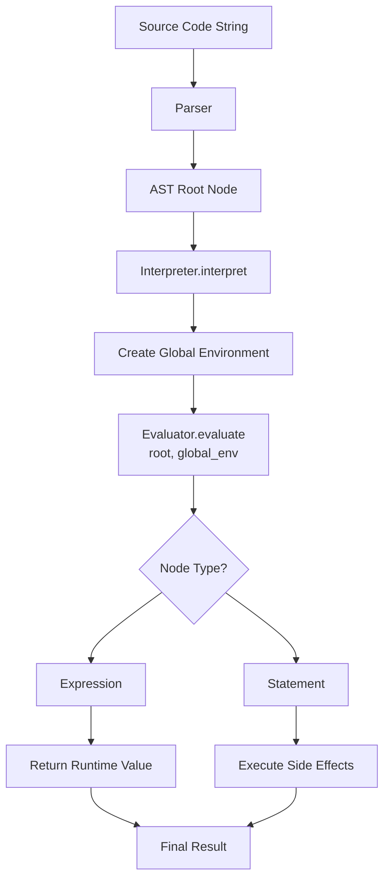

# AST Tree-Walking Interpreter: Design Document


## Overview

This document outlines the design of a tree-walking interpreter that directly executes code by traversing its Abstract Syntax Tree (AST). The key architectural challenge is managing the evaluation environment—a dynamic mapping of names to values—and correctly implementing lexical scoping, function calls, and closures within a simple, recursive evaluator framework.


> This guide is meant to help you understand the big picture before diving into each milestone. Refer back to it whenever you need context on how components connect.


> **Milestone(s):** This section establishes the foundational concepts for the entire project, providing context and rationale that underpins all four milestones of the AST Tree-Walking Interpreter.

## Context and Problem Statement

The core challenge of building an interpreter is to bridge the gap between the **static text** of a source program and the **dynamic behavior** it is intended to produce. An interpreter must transform inert code into live computation, faithfully executing the programmer's intent—calculating values, managing changing state, and controlling the flow of execution. This document outlines the design of a **tree-walking interpreter**, a classic and pedagogically valuable architecture that directly evaluates a program by traversing its Abstract Syntax Tree (AST). The primary architectural challenge in this design is not merely processing syntax, but correctly modeling and managing the **runtime environment**—a dynamic, nested mapping of variable names to their values—which is the essence of how programs remember and manipulate state across different scopes and function calls. This section explains the problem space, introduces a foundational mental model, and contrasts our chosen approach with viable alternatives.

### Mental Model: The Math Homework Grader

Imagine you are a teacher grading a complex arithmetic assignment. A student has written down an expression like `(5 + 3) * (10 - 2) / 4`. Your task is to compute the final answer. You don't just glance at it and guess; you follow a systematic, step-by-step process dictated by mathematical rules:

1.  You first locate and solve any sub-expressions inside parentheses: `(5 + 3)` becomes `8` and `(10 - 2)` becomes `8`.
2.  You then apply multiplication and division from left to right: `8 * 8` becomes `64`, then `64 / 4` becomes `16`.
3.  Throughout this process, you hold intermediate results in your working memory.

Now, suppose the student's homework includes **variables**: "Let `x = 5`. Calculate `x * (x + 2)`." Your process becomes more involved. You must first write down in a notebook—a **ledger**—that `x` is `5`. When you encounter the variable `x` in the expression, you pause your calculation, look up its current value in your ledger, and substitute it (`5 * (5 + 2)`). If the problem defines a new `x` inside a sub-problem, you might start a fresh page in your notebook for that sub-problem, knowing you can look back to previous pages if a variable isn't found locally.

Finally, imagine the assignment includes **procedures**: "To compute the area of a rectangle, use the formula: `length * width`." The student then writes `area(10, 3)`. As the grader, you now have a **recipe** (the formula) and specific **ingredients** (`10` and `3`). You create a new, temporary workspace, assign `length = 10` and `width = 3`, perform the multiplication, report the result `30`, and then discard that temporary workspace, returning to the main problem.

**The tree-walking interpreter is this teacher.** The **AST** is the structured, unambiguous representation of the student's homework. The **evaluator** is the step-by-step grading procedure, recursively descending into sub-expressions. The **environment** is the notebook of ledgers, tracking variable bindings across different scopes. This mental model captures the essence of interpretation: a meticulous, rule-governed walk through a tree of instructions, consulting and updating a memory of state along the way.

### The Interpretation Problem

Formally, the interpretation problem is: **Given a string of source code, produce the corresponding runtime behavior.** This involves several distinct sub-problems:

1.  **Structural Disambiguation:** Source code is a linear sequence of characters. The interpreter must first resolve this into a hierarchical structure that explicitly represents nesting, precedence, and statement boundaries. This is the role of the **parser**, which produces the AST—a data structure our interpreter will walk. The AST is a static, immutable representation of the program's *syntax*.

2.  **Semantic Evaluation:** Each node in the AST corresponds to a language construct with defined *semantics* (meaning). A literal number `42` means the numeric value forty-two. A `+` operator means the mathematical addition of its two operand values. The interpreter must implement the semantics for every type of node. This is not a simple translation; it involves **recursive computation**. To evaluate `a + b`, you must first evaluate the subtrees for `a` and `b`. This recursive evaluation is the "tree-walking" process.

3.  **State Management:** The most complex aspect of interpretation is managing mutable, named state—**variables**. A program is not a pure function from input to output; it is a sequence of operations that read and write to memory. The interpreter must provide a mechanism to:
    *   **Bind** a name to a value (`x = 10`).
    *   **Look up** the value associated with a name when it is used (`print x + 1`).
    *   **Re-bind** a name to a new value (`x = 20`).
    *   **Scope** these bindings so that a variable defined inside a function does not leak out, and a variable defined outside a function is accessible within it (lexical scoping).

    This is the domain of the **environment**, a runtime data structure that exists alongside and is manipulated by the evaluator. The design of the environment—how it models nesting, lookup, and assignment—is critical to implementing correct language semantics.

4.  **Control Flow Management:** Programs are not linear. They branch with `if` statements, loop with `while` and `for`, and jump with `break`, `continue`, and `return`. The interpreter must orchestrate the order of evaluation, deciding which branch of the AST to walk down next based on computed conditions. This requires the evaluator to manage its own traversal path, not just compute values.

5.  **Abstraction and Encapsulation:** Functions allow programmers to define reusable blocks of code. Interpreting a function call involves suspending the current execution context, creating a new isolated environment for the function's parameters and local variables, executing the function body, obtaining a result, and then resuming the original context. Supporting **closures**—where a function "remembers" the environment in which it was created—adds another layer of complexity to environment management.

The tree-walking interpreter tackles these sub-problems in a direct, intuitive way: write a recursive function that takes an AST node and an environment, and contains a large `switch` statement (or equivalent) to handle each node type. This approach shines in its conceptual clarity and closeness to the language specification, making it an ideal vehicle for learning. However, it is not the only architectural option, and its trade-offs must be understood.

### Existing Approaches and Trade-offs

When building an interpreter, the primary architectural decision is the choice of **intermediate representation (IR)**—the data structure that drives execution. The two most common patterns are the **Abstract Syntax Tree (AST) Walker**, which we have chosen, and the **Bytecode Virtual Machine (VM)**. A third, more advanced approach is **Just-In-Time (JIT) Compilation** to native machine code. The following table compares these approaches across dimensions critical to our learning project: implementation complexity, runtime performance, educational value, and flexibility.

| Approach | Core Idea | How Execution Works | Key Data Structures |
| :--- | :--- | :--- | :--- |
| **AST Tree-Walker** | Directly interpret the parse tree. | A recursive function traverses the AST, evaluating nodes in post-order. | AST node hierarchy, Environment chain (stack of dictionaries). |
| **Bytecode VM** | Compile the AST to a linear sequence of dense, simple instructions (bytecode). | A virtual CPU (interpreter loop) fetches and executes bytecode instructions, operating on a stack. | Bytecode array, Value stack, Constant pool, Frame stack. |
| **JIT Compiler** | Dynamically compile "hot" code paths to optimized native machine code. | A runtime profiling system identifies hot loops/functions, a compiler generates machine code, and execution jumps to it. | Intermediate Representation (IR), Native code cache, Runtime profiling data. |

> **Decision: Use an AST Tree-Walking Interpreter Architecture**
> - **Context**: We are building an interpreter for an educational project with the primary goals of understanding core language implementation concepts (evaluation, environments, scoping, closures) and achieving a working system within an intermediate-level time frame.
> - **Options Considered**:
>     1.  **AST Tree-Walker**: Implement a recursive `evaluate` function that dispatches on AST node types.
>     2.  **Bytecode Virtual Machine**: Build a compiler from AST to a custom bytecode, then implement a stack-based VM to run it.
>     3.  **JIT Compilation (Theoretical)**: Use a library like LLVM to generate native code on the fly.
> - **Decision**: We will implement an AST Tree-Walking Interpreter.
> - **Rationale**:
>     1.  **Conceptual Transparency**: The evaluator's logic maps directly to the language grammar. Seeing `evaluateIfStatement` handle an `If` node makes the connection between syntax and semantics obvious. There is no intermediate transformation to learn.
>     2.  **Lower Initial Complexity**: A tree-walker can be built incrementally, feature by feature. Adding a new expression type often just means adding a new branch to the `evaluate` function. A VM requires designing an instruction set, a compiler, and the VM itself before any code runs.
>     3.  **Focus on Language Semantics, Not Optimization**: Our goal is to learn about scoping, closures, and evaluation—not about bytecode design or register allocation. The tree-walker keeps the focus on these high-level semantics.
>     4.  **Sufficient Performance for Learning**: While slower, a tree-walker's performance is adequate for running the small to medium-sized test programs typical in a learning project. The performance bottleneck is not a primary educational concern.
> - **Consequences**:
>     - **Positive**: We will have a clear, debuggable system where the runtime stack mirrors the AST structure. Stepping through the recursive evaluator with a debugger is an excellent learning tool.
>     - **Negative**: The interpreter will be slower than a bytecode VM, especially for loop-heavy code, due to the overhead of tree traversal and repeated dispatch. It is not suitable for production performance needs.
>     - **Neutral**: The design naturally supports dynamic features and metaprogramming but may require more careful design for complex control flow (e.g., `break`/`continue`).

The trade-offs between these approaches are summarized below:

| Approach | Pros (Why choose it?) | Cons (Why avoid it?) | Best For |
| :--- | :--- | :--- | :--- |
| **AST Tree-Walker** | <ul><li>**Simple to implement and understand.** The code is a direct translation of language semantics.</li><li>**Fast to prototype.** New language features can be added with minimal boilerplate.</li><li>**Excellent for education.** The runtime structure (AST, environment chain) is visible and tangible.</li><li>**No separate compilation phase.** Execution begins immediately after parsing.</li></ul> | <ul><li>**Slow execution.** High overhead per operation due to tree traversal, recursion, and type dispatch.</li><li>**Poor cache locality.** AST nodes are typically heap-allocated objects scattered in memory.</li><li>**Hard to optimize.** Difficult to apply low-level optimizations common in VMs (e.g., stack-based operations, JIT).</li></ul> | **Learning projects, prototyping, scripting languages where simplicity is valued over raw speed (e.g., early versions of Ruby, PHP).** |
| **Bytecode VM** | <ul><li>**Much faster execution.** Bytecode is dense, linear, and easy to cache; the interpreter loop is tight and efficient.</li><li>**Easier to optimize.** Enables classic compiler optimizations on bytecode and efficient stack-based operand management.</li><li>**Clear separation of concerns.** Compiler front-end (parsing, AST) is distinct from back-end (code gen, execution).</li><li>**Foundation for JIT.** Bytecode is a natural input for a JIT compiler.</li></ul> | <ul><li>**Higher complexity.** Requires designing an instruction set and building both a compiler *and* a VM.</li><li>**Indirect mapping.** The relationship between source code and bytecode is less obvious for debugging.</li><li>**Slower startup.** Requires a full compilation pass before any code runs.</li></ul> | **Production interpreters (e.g., CPython, Lua, the Java VM), where performance is critical.** |
| **JIT Compilation** | <ul><li>**Highest performance.** Executes native machine code, can rival or exceed static compilation for dynamic languages.</li><li>**Advanced optimizations.** Can perform runtime profiling and specialization (e.g., type-specialized code, inlining).</li></ul> | <ul><li>**Extreme complexity.** Requires deep knowledge of compiler backends, instruction selection, and runtime systems.</li><li>**Large memory overhead.** Maintaining profiling data and multiple code versions consumes memory.</li><li>**"Warm-up" time.** Peak performance is only achieved after repeated execution of code paths.</li></ul> | **High-performance runtimes (e.g., JavaScript V8, Java HotSpot, PyPy) where execution speed is paramount.** |

Given our project's goals—**learning** the fundamentals of interpreters, **completing** a working system at an intermediate difficulty level, and **understanding** environments and closures—the AST tree-walking approach offers the optimal balance of pedagogical value and implementability. It allows us to focus on the core challenge: managing dynamic runtime state through the environment model, which is elegantly visualized in the system component diagram.


As shown, the **Evaluator** component is the heart of the system. It reads the static program structure from the **AST** and interacts with the dynamic **Environment Chain** to read and update variable state. This clear separation of concerns—syntax, evaluation logic, and runtime state—forms the backbone of our design. The subsequent sections will delve into the detailed design of each component, starting with the data model for runtime values and environments.


## Goals and Non-Goals
> **Milestone(s):** 1, 2, 3, 4

This section establishes the explicit boundaries of the interpreter project. A clearly defined scope prevents feature creep and ensures focused effort on the core learning objectives: understanding tree-walking evaluation, lexical scoping, and function execution. We delineate what the interpreter **must** do to be considered complete versus what it **explicitly will not** implement, even if such features are common in production languages.

### Goals (What we must implement)

The interpreter's primary purpose is pedagogical—to provide a hands-on understanding of language implementation fundamentals through a complete, working example. The following capabilities represent the minimum feature set required to demonstrate the core concepts.

> **Design Principle: Completeness over Complexity**
> The interpreter should implement a *coherent subset* of language features that interact meaningfully, rather than many shallow features. Each implemented feature must correctly integrate with the evaluation model, scoping rules, and control flow.

1.  **Expression Evaluation**
    The interpreter must evaluate all basic expressions, forming the foundation for every computation. This includes:
    *   **Literal values**: Direct evaluation of numbers (integers and floats), strings, booleans (`true`, `false`), and the `nil` value representing absence.
    *   **Arithmetic operations**: Binary operators for addition (`+`), subtraction (`-`), multiplication (`*`), and division (`/`), with proper operator precedence and support for unary negation (`-`).
    *   **Comparison and equality**: Operators for relative comparison (`<`, `>`, `<=`, `>=`) and equality (`==`, `!=`), returning boolean results.
    *   **Logical operators**: Support for `and` and `or` with **short-circuit evaluation**, where the right operand is only evaluated if the left operand doesn't determine the result.
    *   **Grouping**: Parentheses `()` must override default precedence, requiring correct handling of nested expression trees.

2.  **Variables and Lexical Scoping**
    The interpreter must support named storage locations whose visibility follows **lexical (static) scoping** rules.
    *   **Variable declaration**: A statement (e.g., `var x = 5;`) that introduces a new name into the current scope, binding it to an initial value.
    *   **Variable assignment**: An expression (e.g., `x = 10;`) that updates the value of an existing variable, searching outward through enclosing scopes.
    *   **Variable lookup**: Reading a variable's value by its name, resolving it by searching the current environment, then its parent, recursively.
    *   **Nested block scopes**: Code blocks (e.g., inside `{ }`) create new nested scopes. Variables declared inside a block shadow outer ones and are inaccessible after the block exits.

3.  **Control Flow**
    The interpreter must direct the path of execution based on conditions and loops.
    *   **Conditional execution**: An `if` statement that evaluates a condition and executes one branch or another. An `else` clause must be optional.
    *   **Looping constructs**:
        *   `while` loops that repeatedly execute a body while a condition remains truthy.
        *   `for` loops (converted/desugared into `while` loops) with an initializer, condition, and increment expression.
    *   **Loop control**: `break` to exit the nearest enclosing loop immediately, and `continue` to skip to the next iteration.
    *   **Truthiness**: A consistent rule set for determining if a non-boolean value (like `0`, `""`, or `nil`) counts as `true` or `false` in conditional contexts.

4.  **First-Class Functions and Closures**
    Functions must be **first-class values** that can be stored, passed, and returned, with proper support for **lexical closures**.
    *   **Function definition**: A declaration (e.g., `fun add(a, b) { return a + b; }`) that creates a function object and binds it to a name.
    *   **Function calls**: Invocation syntax (e.g., `add(1, 2)`) that evaluates arguments, creates a new local environment for parameters, and executes the body.
    *   **Return mechanism**: A `return` statement that terminates function execution and provides a value back to the caller, even from nested blocks.
    *   **Closure capture**: When a function is defined, it must capture a reference to its *defining* environment, allowing it to access variables from outer scopes even after those scopes have exited.
    *   **Recursion**: Functions must be able to call themselves by name, requiring the function's name to be bound in its own local environment.

The successful implementation of these four pillars creates a Turing-complete, dynamically-typed language with lexical scope—a significant and educationally complete achievement.

### Non-Goals (What we explicitly omit)

To maintain focus on the core learning objectives and avoid project sprawl, we deliberately exclude several common language features and implementation optimizations. These are valuable topics but belong to more advanced study.

| Feature Category | Specific Omissions | Rationale for Exclusion |
| :--- | :--- | :--- |
| **Memory Management** | Automatic garbage collection, reference counting. | Adds significant complexity (tracing, cycle detection) and is orthogonal to the evaluation model. The interpreter can rely on the host language's garbage collector for its own data structures. |
| **Modularity** | Modules, imports, separate compilation units, `include` statements. | Introduces file I/O, dependency resolution, and global namespace management. The interpreter evaluates a single program text. |
| **Object-Oriented Programming** | Classes, inheritance, prototypes, `this`/`self` context, methods. | Represents a major paradigm with distinct dispatch semantics (late binding, inheritance chains) that would double the project's scope. |
| **Advanced Types** | Static type checking, user-defined types, type annotations, generics. | The interpreter is dynamically typed for simplicity. Type systems are a deep, separate subject area. |
| **Optimization** | Just-In-Time (JIT) compilation, tail-call optimization (TCO), bytecode compilation, constant folding. | These are performance optimizations that obscure the clear tree-walking algorithm. The goal is clarity of semantics, not speed. |
| **Standard Library** | Built-in functions for I/O (print, read), mathematics (sin, sqrt), data structures (arrays, maps), system interaction. | While useful, a standard library is a large addition. A single `print` statement may be added for debugging, but extensive libraries are out of scope. |
| **Error Recovery & Debugging** | Stack traces, line number reporting in errors, debugger integration, REPL history. | Basic error detection (e.g., "Undefined variable 'x'") is required, but sophisticated tooling is a project in itself. |
| **Concurrency** | Threads, async/await, promises, coroutines, parallelism. | Concurrency introduces entirely new dimensions of complexity (race conditions, schedulers) far beyond the sequential evaluation model. |
| **Syntax Sugar** | Increment/decrement operators (`++`, `--`), assignment operators (`+=`, `-=`), ternary operator (`?:`), switch statements. | These can be desugared into existing constructs and do not introduce new semantic concepts. |
| **Metaprogramming** | Macros, reflection, eval at runtime. | These features fundamentally change the evaluation model (code-as-data) and require a more sophisticated interpreter architecture. |

> **Architectural Decision: Focused Pedagogical Scope**
> **Context**: The project aims to teach core interpreter concepts within a limited timeframe. Every additional feature increases implementation complexity and cognitive load for the learner.
> **Options Considered**:
> 1.  **Minimal Core**: Implement only the essential features listed in Goals.
> 2.  **Expressive Language**: Add commonly requested features like arrays, a basic standard library, and classes.
> 3.  **Extensible Framework**: Build a minimal core with plug-in points for optional features.
> **Decision**: Adopt the **Minimal Core** approach.
> **Rationale**: The primary success criterion is a deep understanding of tree-walking evaluation, environments, and closures. A minimal, complete implementation achieves this without distraction. Additional features can be built as separate, advanced projects once fundamentals are mastered.
> **Consequences**: The interpreter will feel "spartan" compared to production languages, but it will be fully functional for algorithms, recursion, and closure-based abstraction. Learners can confidently extend it later using the same architectural patterns.

This explicit list of non-goals serves as a guardrail. When encountering a potential feature not listed above (e.g., "should we add arrays?"), the answer is "not in this version." The design document's subsequent sections assume this bounded scope.

### Implementation Guidance

#### Technology Recommendations Table
For this project, the technology stack is intentionally simple, focusing on the host language's standard data structures and control flow.

| Component | Simple Option (Recommended) | Advanced Option (Optional) |
| :--- | :--- | :--- |
| **Runtime Value Representation** | Built-in Python/JS/Java types (`int`, `str`, `bool`, `None`/`null`). | Custom `Value` class hierarchy with explicit type tags. |
| **Environment Storage** | Dictionary/HashMap for the store, with a parent reference. | Persistent data structures for environment snapshots (useful for advanced debugging). |
| **Control Flow Jump (break/continue/return)** | Python exceptions, JS `throw` with custom error types, Java custom exceptions. | Explicit `Result` object returned from every evaluation, carrying a value or jump signal. |
| **Function Representation** | Plain class/object storing parameters, body AST, and closure environment. | Compiling to host-language closures (advanced, blends semantics). |

#### Recommended File/Module Structure
Organizing code into logical modules improves readability and mirrors the separation of concerns in the design.

```
treewalk_interpreter/
├── ast.py               # AST node class definitions (from previous parser milestone)
├── evaluator.py         # Core Evaluator class (handles expression/statement evaluation)
├── environment.py       # Environment class (variable storage and scoping)
├── runtime_values.py    # Runtime value definitions (Function, maybe built-in callables)
├── errors.py            # Custom runtime error types (RuntimeError, UndefinedVariable, etc.)
├── interpreter.py       # Main entry point: parses source and runs evaluator
└── test_interpreter.py  # Comprehensive test suite
```

#### Infrastructure Starter Code: Runtime Error Types
Proper error handling is crucial for debugging. These custom exception classes provide clear, actionable error messages.

**File: `errors.py`**
```python
"""
Custom runtime error types for the tree-walking interpreter.
All errors include the token (or line number) for context.
"""

class RuntimeError(Exception):
    """Base class for all runtime errors."""
    def __init__(self, message, token=None):
        super().__init__(message)
        self.message = message
        self.token = token

    def __str__(self):
        if self.token:
            return f"[line {self.token.line}] RuntimeError: {self.message}"
        return f"RuntimeError: {self.message}"


class UndefinedVariableError(RuntimeError):
    """Raised when trying to access a variable that is not defined."""
    def __init__(self, variable_name, token):
        super().__init__(f"Undefined variable '{variable_name}'.", token)


class TypeError(RuntimeError):
    """Raised when an operation is applied to an incompatible type."""
    def __init__(self, message, token):
        super().__init__(message, token)


class DivisionByZeroError(RuntimeError):
    """Raised on division by zero."""
    def __init__(self, token):
        super().__init__("Division by zero.", token)


class ArgumentError(RuntimeError):
    """Raised on function call argument mismatch."""
    def __init__(self, expected, got, token):
        super().__init__(f"Expected {expected} arguments but got {got}.", token)


class ControlFlowSignal(Exception):
    """
    Base for non-local jumps (break, continue, return).
    These are caught by loop/function evaluators.
    """
    pass


class BreakSignal(ControlFlowSignal):
    """Signals a 'break' statement."""
    pass


class ContinueSignal(ControlFlowSignal):
    """Signals a 'continue' statement."""
    pass


class ReturnSignal(ControlFlowSignal):
    """Signals a 'return' statement. Carries the return value."""
    def __init__(self, value):
        super().__init__()
        self.value = value
```

#### Core Logic Skeleton: Main Interpreter Entry Point
The main entry point ties together the parser (from a previous milestone) and the evaluator.

**File: `interpreter.py`**
```python
"""
Main interpreter entry point.
Assumes an existing parser that produces an AST from source code.
"""

import sys
from ast import Program  # Assume this is the root AST node from parser
from evaluator import Evaluator
from environment import Environment
from errors import RuntimeError

class Interpreter:
    def __init__(self):
        self.evaluator = Evaluator()
        self.global_env = Environment()  # The outermost environment

    def interpret(self, source_code: str):
        """
        Parse and execute the given source code.
        
        Steps:
        1. Parse source_code into an AST (using existing parser).
        2. Evaluate the AST with the global environment.
        3. Print any result (if the program is an expression).
        4. Catch and report runtime errors.
        """
        # TODO 1: Call your existing parser to convert source_code to an AST.
        #   The parser should return a Program node (or a list of statements).
        #   For now, we assume `parse(source_code)` exists.
        #   Example: ast_root = parse(source_code)
        ast_root = None  # Placeholder

        try:
            # TODO 2: Evaluate the program AST starting from the global environment.
            #   The evaluator's evaluate method should be called on the root node.
            result = self.evaluator.evaluate(ast_root, self.global_env)
            
            # TODO 3: If the result is not None (i.e., the program was an expression),
            #   print it for user visibility, mimicking a REPL.
            if result is not None:
                print(self._stringify(result))
                
        except RuntimeError as e:
            # TODO 4: Report runtime errors to the user with line information.
            print(e, file=sys.stderr)
            # Optionally, set an error flag or exit code.
            return False
        
        return True

    def _stringify(self, value) -> str:
        """Convert a runtime value to a readable string."""
        if value is None:
            return "nil"
        if isinstance(value, bool):
            return str(value).lower()
        if isinstance(value, float):
            # Show integer values without decimal if possible
            text = str(value)
            if text.endswith('.0'):
                text = text[:-2]
            return text
        # For strings, numbers, etc.
        return str(value)


if __name__ == "__main__":
    # Simple REPL or file execution
    interpreter = Interpreter()
    if len(sys.argv) == 1:
        # REPL mode
        print("Tree-walking interpreter (exit with Ctrl+D)")
        while True:
            try:
                line = input("> ")
                interpreter.interpret(line)
            except EOFError:
                print("\nGoodbye!")
                break
            except KeyboardInterrupt:
                print("\nInterrupted.")
                continue
    else:
        # File mode: read and execute the entire file
        with open(sys.argv[1], 'r') as f:
            source = f.read()
        success = interpreter.interpret(source)
        sys.exit(0 if success else 1)
```

#### Language-Specific Hints
*   **Python**: Use `isinstance()` for runtime type checks. Be careful with `None` (use `is`/`is not` for identity). The `math.isclose()` function is better for floating-point equality than `==`.
*   **JavaScript**: Use `===` for equality to avoid type coercion. `undefined` can serve as `nil`. Use `Map` or plain objects for environment stores.
*   **Java**: Define an abstract `Value` class or use `Object` references with careful casting. Use `HashMap<String, Object>` for environment stores.

#### Milestone Checkpoint
After reading this section, before writing any code, you should be able to articulate the exact boundaries of your project.

**Verification Questions:**
1.  Will your interpreter support `for` loops? (Yes, as a desugared form)
2.  Will your interpreter support arrays and hash maps? (No, non-goal)
3.  Will your interpreter automatically free unused memory? (No, relies on host GC)
4.  Will your interpreter support defining functions inside other functions? (Yes, and they must correctly capture closures)

A correct understanding of these boundaries will guide all subsequent implementation decisions.

#### Debugging Tips
Early mis-scoping is a common source of subtle bugs.

| Symptom | Likely Cause | How to Diagnose | Fix |
| :--- | :--- | :--- | :--- |
| Variable is `nil` when it should have a value. | Variable was declared in an inner scope and is not visible where accessed. | Print the environment chain during lookup. Check if the variable's name exists in any parent environment. | Ensure variable is declared in a scope that encloses all usage points. |
| Changing a variable inside a function doesn't affect the outer variable. | Assignment is creating a new local binding instead of updating the outer one. | Trace the `assign` method in the environment. Is it walking the parent chain? | Implement assignment to search through the environment chain, not just the current environment. |
| Function cannot access variables from its defining scope. | Closure environment was not captured or is incorrectly set as parent. | Print the function's closure environment when created and when called. | Store the *defining* environment as the function's closure, not the global environment. |


## High-Level Architecture
> **Milestone(s):** 1, 2, 3, 4  
> This section provides the architectural blueprint for the entire interpreter system. Understanding this component breakdown and data flow is essential before diving into implementation details for any specific milestone.

The AST tree-walking interpreter follows a classic three-tier architecture that cleanly separates static program structure from dynamic runtime execution. This design enables straightforward implementation of lexical scoping, function calls, and control flow while maintaining conceptual clarity—critical for an educational project. The architecture centers on three core components that interact through well-defined interfaces.

### Component Overview

Think of the interpreter as a **theater production**:
- The **AST Nodes** are the script—a static, structured document containing all the dialogue and stage directions
- The **Evaluator** is the director—reading the script and instructing actors on what to do next
- The **Environment Chain** is the stage with multiple backdrops—each scene (scope) has its own props (variables), and actors can look for props on the current stage or behind it in previous scenes

This metaphor captures the essence: the script doesn't change during performance (AST is immutable), the director follows the script step-by-step (recursive evaluation), and the stage setup evolves as scenes change (environments track runtime state).

The three architectural pillars are:

| Component | Primary Responsibility | Key Data Structures | Statefulness |
|-----------|------------------------|---------------------|--------------|
| **AST (Abstract Syntax Tree)** | Represents the program's syntactic structure as a hierarchy of nodes | `LiteralNode`, `BinaryNode`, `VariableNode`, `IfNode`, `FunctionNode`, etc. | Immutable (parsed once, never modified) |
| **Evaluator** | Recursively traverses AST nodes, executing their semantics | `evaluate()` function with node-type dispatch logic, maintains current execution context | Stateless per call (receives environment as parameter) |
| **Environment Chain** | Manages variable storage with lexical scoping via parent links | `Environment` objects with `store` dictionary and `parent` reference | Mutable (bindings change during execution) |

These components interact in a specific data flow pattern: the Evaluator reads instructions from the AST and reads/writes variable state from/to the current Environment. Environments themselves form a linked chain that mirrors the program's lexical structure. 


#### AST: The Static Blueprint
The AST serves as the interpreter's immutable source of truth about program structure. Each node type encapsulates a specific language construct with fields representing its components:

| AST Node Category | Example Node Types | Key Fields (per node type) | Runtime Semantics |
|-------------------|-------------------|----------------------------|-------------------|
| Expressions (produce values) | `LiteralNode`, `BinaryNode`, `UnaryNode`, `VariableNode`, `CallNode` | `value` (for literals), `left`/`right` (for binary), `operator`, `operand` | Evaluate to a runtime value |
| Statements (produce effects) | `ExpressionStmtNode`, `VarDeclNode`, `BlockNode`, `IfNode`, `WhileNode` | `expression`, `identifier`, `body`, `condition`, `thenBranch`/`elseBranch` | Execute side effects, control flow |
| Declarations | `FunctionDeclNode` | `name`, `parameters`, `body` | Create bindings in environment |

The AST is generated once by the parser and remains unchanged throughout execution. This immutability is crucial—it means the same AST can be evaluated multiple times with different environments (as in function calls) without interference.

#### Evaluator: The Recursive Director
The Evaluator implements the tree-walking algorithm—a depth-first, recursive traversal of the AST that executes operations in the correct order. Its core design follows the **Interpreter Pattern** from design patterns literature, where each AST node type has a corresponding evaluation method. The Evaluator maintains no persistent state of its own; instead, it receives the current `Environment` as a parameter and returns runtime values or control flow signals.

The Evaluator's key characteristic is **single-threaded, synchronous execution**—it processes one node at a time, completely finishing its evaluation before moving to siblings. This simplifies reasoning about program behavior but imposes the performance limitations typical of tree-walkers.

#### Environment Chain: The Layered Storage
The Environment system implements lexical (static) scoping through a chain of binding tables. Each `Environment` represents one scope level (global, function, block) and links to its parent scope. This creates a dynamic runtime structure that mirrors the program's static nesting:

| Scope Type | Created When | Parent Environment | Typical Lifespan |
|------------|--------------|-------------------|------------------|
| Global | Interpreter initialization | `None` (end of chain) | Entire program execution |
| Function | Function call | The closure environment (where function was defined) | Duration of function call |
| Block | Entering `{}` blocks, control flow bodies | The enclosing environment | Duration of block execution |

The chain structure enables variable lookup to follow lexical rules: search starts in the current environment and proceeds up the parent chain until the variable is found or the global scope is reached. This design naturally supports variable shadowing—inner scopes can redefine names that hide outer definitions.

> **Key Insight:** The separation between immutable AST and mutable Environments is what enables powerful language features like recursion and closures. Multiple function calls create new Environments but share the same function body AST, allowing efficient reuse of code structure while maintaining independent variable instances.

### Execution Flow

The interpreter follows a linear pipeline from source code to execution result. Understanding this flow clarifies how components hand off responsibilities at each stage:



#### Step-by-Step Processing Pipeline

1. **Source Input**
   - The interpreter receives a string containing program source code
   - Example: `"var x = 5; print x + 3;"`

2. **Parsing Phase** (outside interpreter proper but prerequisite)
   - The parser (lexer + syntax analyzer) converts the source string into an AST
   - Syntax validation occurs here—malformed programs fail before evaluation begins
   - The parser produces a root node (typically a `ProgramNode` containing statement list)

3. **Initialization**
   - The `Interpreter` class creates the initial `global_env` (empty Environment with no parent)
   - Any built-in functions (like `print`, `clock`) are defined in this global environment

4. **Evaluation Dispatch**
   - The interpreter calls `evaluate(root_node, global_env)` to begin execution
   - The Evaluator examines the node type and dispatches to the appropriate handler method

5. **Recursive Tree Traversal**
   - For each node, the Evaluator recursively evaluates child nodes as needed
   - Expression evaluation flows upward: leaves (literals/variables) → internal nodes → root
   - Statement execution proceeds sequentially with potential jumps (loops, returns)

6. **Environment Interaction**
   - Variable lookups: `evaluate(VariableNode)` calls `environment.get(name)`
   - Assignments: `evaluate(AssignNode)` calls `environment.assign(name, value)`
   - New scopes: Block execution creates a child Environment with current as parent

7. **Result Propagation**
   - Expression evaluation returns a runtime value to its parent node
   - Statement evaluation typically returns `None` (except return statements)
   - The final value of the program is the value of the last expression evaluated

8. **Error Handling**
   - Runtime errors (type mismatches, undefined variables) halt evaluation
   - The interpreter reports the error with location information from the AST node's token
   - No recovery attempted—program execution stops

#### Phase Separation: Parse vs. Evaluate
A critical architectural decision is maintaining strict separation between parsing and evaluation phases:

| Phase | Input | Output | Error Types | When Occur |
|-------|-------|--------|-------------|------------|
| **Parsing** | Source code string | AST nodes | Syntax errors, parse errors | Before any execution |
| **Evaluation** | AST nodes + Environment | Runtime values + side effects | Runtime errors, type errors | During program execution |

This separation provides several benefits:
- **Single parse, multiple executions**: The AST can be evaluated repeatedly (useful for REPLs or loops)
- **Clear error categorization**: Users get distinct feedback for syntax vs. logic errors
- **Testing simplicity**: ASTs can be constructed programmatically for unit tests
- **Potential optimization**: The AST could be optimized/transformed before evaluation

> **Design Principle:** The interpreter follows a "parse completely, then execute" model rather than "parse and execute interleaved." This ensures all syntax errors are caught before any code runs, providing better developer experience.

#### Control Flow and Unwinding
Special handling is required for control flow statements that break the linear recursion:

1. **Conditionals (`if/else`)**
   - Evaluate condition expression to boolean (with truthiness conversion)
   - Execute only the chosen branch, skipping the other entirely

2. **Loops (`while`, `for`)**
   - Create a loop execution context that can intercept `break`/`continue`
   - Repeatedly evaluate condition and body until condition becomes falsey

3. **Function Calls**
   - Create new Environment with closure as parent
   - Bind parameters to argument values
   - Execute function body, catching `return` signals to unwind

4. **Return Statements**
   - Use a non-local exit mechanism (exception/sentinel) to propagate return values up through nested calls

This control flow management requires the Evaluator to be aware of context—whether it's evaluating an expression (must return value) or statement (may trigger jumps).

### Recommended File Structure

A well-organized codebase significantly reduces implementation complexity. The following structure separates concerns logically, making the system easier to understand, test, and extend:

```
tree_walker_interpreter/
├── __init__.py
├── interpreter.py              # Main Interpreter class, entry point
├── evaluator.py               # Core Evaluator class with dispatch logic
├── environment.py             # Environment class and scope management
├── runtime_values.py          # Runtime value representations
├── errors.py                  # Runtime error classes and handling
├── control_flow.py            # Break/Continue/Return signal classes
│
├── ast/                       # AST node definitions (from parser)
│   ├── __init__.py
│   ├── nodes.py               # Base Node class and all concrete node types
│   └── visitor.py             # Optional: Visitor pattern infrastructure
│
├── builtins/                  # Standard library functions
│   ├── __init__.py
│   └── functions.py           # print(), clock(), etc.
│
└── tests/                     # Test suite organized by milestone
    ├── __init__.py
    ├── test_expressions.py    # Milestone 1: Expression evaluation
    ├── test_variables.py      # Milestone 2: Variables and scoping
    ├── test_control_flow.py   # Milestone 3: Conditionals and loops
    └── test_functions.py      # Milestone 4: Functions and closures
```

#### Module Responsibilities and Dependencies

| Module | Primary Exports | Dependencies | Used By |
|--------|----------------|--------------|---------|
| `interpreter.py` | `Interpreter` class with `interpret()` method | `evaluator`, `environment`, `builtins`, `errors` | End-user API, REPL |
| `evaluator.py` | `Evaluator` class with `evaluate()` method | `environment`, `runtime_values`, `control_flow`, `errors`, `ast.nodes` | `interpreter`, test suites |
| `environment.py` | `Environment` class, `UndefinedVariableError` | `errors` | `evaluator`, `interpreter` |
| `runtime_values.py` | `RuntimeValue` base, `NumberValue`, `StringValue`, `BooleanValue`, `NilValue`, `FunctionValue` | (none) | `evaluator`, `environment`, `builtins` |
| `errors.py` | `RuntimeError`, `TypeError`, `DivisionByZeroError`, `ArgumentError` | `ast.nodes` (for token) | All modules |
| `control_flow.py` | `ControlFlowSignal`, `BreakSignal`, `ContinueSignal`, `ReturnSignal` | `runtime_values` | `evaluator` |
| `ast/nodes.py` | All AST node classes (`LiteralNode`, `BinaryNode`, etc.) | (none) | `evaluator`, parser, tests |
| `builtins/functions.py` | Built-in function implementations | `runtime_values` | `interpreter` (initialization) |

This structure enforces clear boundaries:
- **AST module** contains only data definitions, no logic
- **Evaluator** contains all execution logic but no storage
- **Environment** contains all storage logic but no execution
- **Errors** centralizes all error types for consistent handling

#### Import Strategy to Avoid Circular Dependencies
The dependency graph must remain acyclic. Follow these import rules:

1. **AST nodes** import nothing from other interpreter modules
2. **Runtime values** import nothing (base types only)
3. **Environment** imports only `errors`
4. **Evaluator** imports everything else as needed
5. **Interpreter** imports all components

If using a visitor pattern, the `ast/visitor.py` would define the visitor interface, which `evaluator.py` would implement. This adds indirection but provides cleaner separation.

> **Implementation Tip:** Use Python's `__all__` in each module's `__init__.py` to control what gets exported. This prevents internal helper classes from leaking into the public API and keeps imports clean.

#### Configuration and Entry Points
For different usage scenarios, provide multiple entry points:

```python
# Direct API usage
from tree_walker_interpreter import Interpreter
interpreter = Interpreter()
result = interpreter.interpret("print 'Hello, World!';")

# REPL mode
python -m tree_walker_interpreter.repl

# File execution
python -m tree_walker_interpreter.run path/to/script.tl

# Test runner
python -m pytest tests/ -v
```

This modular structure scales well as features are added. Each milestone naturally maps to specific modules:
- **Milestone 1**: Implement `evaluator.py` for expressions
- **Milestone 2**: Implement `environment.py` and extend `evaluator.py` for variables
- **Milestone 3**: Extend `evaluator.py` with control flow, add `control_flow.py`
- **Milestone 4**: Implement `runtime_values.py` for functions, extend all components

The separation also enables incremental testing—you can test the Environment class independently before integrating it with the Evaluator.

### Implementation Guidance

#### A. Technology Recommendations Table

| Component | Simple Option (Recommended) | Advanced Option (Alternative) |
|-----------|-----------------------------|-------------------------------|
| **AST Representation** | Plain Python classes with fields | Dataclasses (`@dataclass`) or namedtuples |
| **Node Type Dispatch** | if-elif chain in `evaluate()` | Visitor pattern with double dispatch |
| **Environment Chain** | Linked list of dict wrappers | Flat array with static distance indexing |
| **Runtime Values** | Python native types (int, str, bool, None) | Wrapper classes with type tags |
| **Error Propagation** | Python exceptions | Return value with error flag (Result type) |
| **Control Flow Signals** | Python exceptions for break/continue/return | State flag in Evaluator context object |

For this educational project, the Simple Options are strongly recommended—they minimize cognitive overhead and let learners focus on the interpreter concepts rather than Python patterns.

#### B. Recommended File Structure Implementation

Create the following files with their basic skeletons:

**`tree_walker_interpreter/__init__.py`:**
```python
"""
AST Tree-Walking Interpreter - Educational Implementation
"""

from .interpreter import Interpreter
from .errors import RuntimeError, TypeError, UndefinedVariableError

__version__ = "0.1.0"
__all__ = ["Interpreter", "RuntimeError", "TypeError", "UndefinedVariableError"]
```

**`tree_walker_interpreter/interpreter.py`:**
```python
"""
Main interpreter entry point and public API.
"""

from typing import Any, Optional
from .evaluator import Evaluator
from .environment import Environment
from .builtins.functions import create_global_environment
from .errors import RuntimeError


class Interpreter:
    """Main interpreter class providing the public interpret() method."""
    
    def __init__(self):
        self.evaluator = Evaluator()
        self.global_env = create_global_environment()
    
    def interpret(self, source_code: str) -> bool:
        """
        Parse and execute source code.
        
        Args:
            source_code: The program source as a string
            
        Returns:
            True if execution completed successfully, False if a runtime error occurred
            
        Raises:
            SyntaxError: If the source code has syntax errors (from parser)
        """
        # TODO: Integrate with parser when available
        # For now, we'll assume AST is passed differently for testing
        pass
    
    def _stringify(self, value: Any) -> str:
        """
        Convert a runtime value to a display string.
        
        Args:
            value: Any runtime value (number, string, boolean, nil, function)
            
        Returns:
            String representation for output
        """
        if value is None:
            return "nil"
        if isinstance(value, bool):
            return str(value).lower()
        if callable(value):  # Function value
            return "<fn>"
        return str(value)
```

**`tree_walker_interpreter/environment.py`:**
```python
"""
Environment chain for lexical scoping.
"""

from typing import Any, Optional, Dict
from .errors import UndefinedVariableError


class Environment:
    """
    Maps variable names to values with support for nested scopes via parent chain.
    
    Attributes:
        store: Dictionary of name -> value bindings in this scope
        parent: Parent environment for variable lookup chain (None for global)
    """
    
    def __init__(self, parent: Optional['Environment'] = None):
        self.store: Dict[str, Any] = {}
        self.parent = parent
    
    def define(self, name: str, value: Any) -> None:
        """
        Create a new variable binding in the current environment.
        
        Args:
            name: Variable name
            value: Initial value
            
        Note:
            This always creates binding in current environment, even if name
            exists in parent scope (shadowing).
        """
        # TODO: Implement variable definition
        pass
    
    def get(self, name: str) -> Any:
        """
        Retrieve a variable's value by walking the environment chain.
        
        Args:
            name: Variable name to look up
            
        Returns:
            The value bound to this name
            
        Raises:
            UndefinedVariableError: If name is not found in any environment
        """
        # TODO: Implement chain lookup
        pass
    
    def assign(self, name: str, value: Any) -> None:
        """
        Update an existing variable's value in the nearest enclosing scope.
        
        Args:
            name: Variable name to assign to
            value: New value
            
        Raises:
            UndefinedVariableError: If name is not defined in any environment
        """
        # TODO: Implement assignment with scope walking
        pass
```

**`tree_walker_interpreter/errors.py`:**
```python
"""
Runtime error classes for the interpreter.
"""


class RuntimeError(Exception):
    """Base class for all runtime errors."""
    
    def __init__(self, message: str, token=None):
        super().__init__(message)
        self.message = message
        self.token = token
    
    def __str__(self):
        if self.token:
            return f"[Line {self.token.line}] RuntimeError: {self.message}"
        return f"RuntimeError: {self.message}"


class UndefinedVariableError(RuntimeError):
    """Raised when accessing an undefined variable."""
    pass


class TypeError(RuntimeError):
    """Raised when operations are applied to incompatible types."""
    pass


class DivisionByZeroError(RuntimeError):
    """Raised when dividing by zero."""
    pass


class ArgumentError(RuntimeError):
    """Raised when function is called with wrong number of arguments."""
    pass
```

**`tree_walker_interpreter/runtime_values.py`:**
```python
"""
Runtime value representations and type utilities.
"""

from typing import Any, List, Optional
from .environment import Environment


# For Milestone 4:
class FunctionValue:
    """
    Runtime representation of a user-defined function.
    
    Attributes:
        name: Function name (or None for anonymous/lambda)
        parameters: List of parameter names
        body: The function body AST node
        closure: Environment captured when function was defined
    """
    
    def __init__(self, name: Optional[str], parameters: List[str], body, closure: Environment):
        self.name = name
        self.parameters = parameters
        self.body = body
        self.closure = closure
    
    def call(self, arguments: List[Any]) -> Any:
        """Execute the function with given arguments."""
        # TODO: Implement in Milestone 4
        pass
    
    def __str__(self):
        if self.name:
            return f"<fn {self.name}>"
        return "<anonymous fn>"
```

#### C. Infrastructure Starter Code

**Complete parser integration helper** (when parser is available):

```python
# tree_walker_interpreter/parser_integration.py
"""
Bridge between parser output and interpreter evaluation.
"""

import sys
from typing import Optional
from .interpreter import Interpreter
from .errors import RuntimeError

# Assuming parser module provides parse(source) -> AST
try:
    from parser import parse, ParseError
except ImportError:
    # Stub for when parser isn't available yet
    class ParseError(Exception):
        pass
    
    def parse(source):
        raise NotImplementedError("Parser not integrated yet")


def run_source(source: str, interpreter: Optional[Interpreter] = None) -> bool:
    """
    Complete pipeline: parse source and interpret it.
    
    Returns True on success, prints errors and returns False on failure.
    """
    if interpreter is None:
        interpreter = Interpreter()
    
    try:
        ast = parse(source)
        interpreter.interpret(ast)  # Assuming interpret accepts AST directly
        return True
    except ParseError as e:
        print(f"Syntax error: {e}", file=sys.stderr)
        return False
    except RuntimeError as e:
        print(f"Runtime error: {e}", file=sys.stderr)
        return False
```

#### D. Core Logic Skeleton Code

**Evaluator skeleton** (to be filled in across milestones):

```python
# tree_walker_interpreter/evaluator.py
"""
Core recursive evaluator for AST nodes.
"""

from typing import Any
from .environment import Environment
from .errors import RuntimeError, TypeError, DivisionByZeroError
from .control_flow import BreakSignal, ContinueSignal, ReturnSignal


class Evaluator:
    """Recursively evaluates AST nodes in the context of an environment."""
    
    def evaluate(self, node, env: Environment) -> Any:
        """
        Main dispatch method - evaluates any AST node.
        
        Args:
            node: Any AST node from the parser
            env: Current environment for variable lookup
            
        Returns:
            Runtime value resulting from evaluating the node
            
        Raises:
            RuntimeError: For any runtime error during evaluation
        """
        # TODO: Implement node type dispatch
        # This will grow as we implement more node types across milestones
        
        # Example structure:
        node_type = type(node).__name__
        
        if node_type == "LiteralNode":
            # TODO Milestone 1: Return literal value
            pass
        elif node_type == "BinaryNode":
            # TODO Milestone 1: Evaluate left and right, apply operator
            pass
        elif node_type == "UnaryNode":
            # TODO Milestone 1: Evaluate operand, apply unary operator
            pass
        elif node_type == "GroupingNode":
            # TODO Milestone 1: Evaluate expression inside parentheses
            pass
        elif node_type == "VariableNode":
            # TODO Milestone 2: Look up variable in environment
            pass
        elif node_type == "VarDeclNode":
            # TODO Milestone 2: Evaluate initializer, define in environment
            pass
        elif node_type == "AssignNode":
            # TODO Milestone 2: Evaluate value, assign to existing variable
            pass
        elif node_type == "IfNode":
            # TODO Milestone 3: Evaluate condition, execute appropriate branch
            pass
        elif node_type == "WhileNode":
            # TODO Milestone 3: Loop while condition is truthy
            pass
        elif node_type == "FunctionDeclNode":
            # TODO Milestone 4: Create function value, define in environment
            pass
        elif node_type == "CallNode":
            # TODO Milestone 4: Evaluate callee and arguments, call function
            pass
        elif node_type == "ReturnNode":
            # TODO Milestone 4: Evaluate expression, raise ReturnSignal
            pass
        else:
            raise RuntimeError(f"Unhandled node type: {node_type}")
```

#### E. Language-Specific Hints for Python

1. **Truthiness Conversion**: Use Python's `bool()` but treat `None` (nil) and `0` as falsey for language consistency:
   ```python
   def is_truthy(value):
       if value is None:
           return False
       if isinstance(value, bool):
           return value
       return True  # Everything else is truthy (including 0, empty string)
   ```

2. **Type Checking**: Use `isinstance()` for runtime type checks rather than `type()` to handle inheritance:
   ```python
   if not isinstance(left, (int, float)):
       raise TypeError(f"Operand must be a number, got {type(left).__name__}")
   ```

3. **Environment Chain**: Implement parent traversal with a simple while loop:
   ```python
   current = self
   while current is not None:
       if name in current.store:
           return current.store[name]
       current = current.parent
   raise UndefinedVariableError(f"Undefined variable '{name}'")
   ```

4. **Control Flow Signals**: Use custom exceptions for non-local exits:
   ```python
   class ReturnSignal(Exception):
       def __init__(self, value):
           self.value = value
   
   # In function evaluation:
   try:
       self.evaluate(function_body, call_env)
       return None  # Implicit return nil
   except ReturnSignal as ret:
       return ret.value  # Explicit return value
   ```

5. **Function Value Equality**: For testing, you may want function values to compare equal if they refer to the same AST node and closure. Implement `__eq__` method in `FunctionValue`.

#### F. Milestone Checkpoint

After setting up the file structure, verify your foundation:

1. **Run basic imports test**:
   ```bash
   python -c "
   from tree_walker_interpreter import Interpreter
   from tree_walker_interpreter.environment import Environment
   from tree_walker_interpreter.errors import RuntimeError
   print('✓ All imports successful')
   "
   ```

2. **Expected output**: `✓ All imports successful`

3. **Create a simple test** to verify component creation:
   ```python
   # test_architecture.py
   from tree_walker_interpreter.environment import Environment
   
   # Test environment chain creation
   global_env = Environment()
   local_env = Environment(global_env)
   
   assert local_env.parent == global_env
   assert global_env.parent is None
   print("✓ Environment chain created correctly")
   ```

4. **Common early issues**:
   - **Circular import errors**: Ensure modules follow the dependency order above
   - **Missing `__init__.py`**: Each directory needs this file to be a package
   - **Relative import issues**: Use absolute imports within the package

This architectural foundation will support all four milestones. The clean separation allows you to implement and test each component independently before integration.

---


## Data Model
> **Milestone(s):** 1, 2, 3, 4

This section defines the fundamental building blocks the interpreter uses to represent both static program structure and dynamic runtime state. It is the interpreter's "type system" in the broadest sense, encompassing the values that can be manipulated, the storage for those values as the program runs, and the syntactic structures that are evaluated to produce them. Getting this model clear and consistent is critical before implementing the evaluation logic, as it defines the contracts between all components.

### Runtime Values and Types

**Mental Model: The Toy Box with Labeled Compartments**
Think of the interpreter's memory as a toy box with separate, clearly marked compartments for different types of toys: one for `Number` blocks, one for `String` jump ropes, one for `Boolean` light switches, one for `Nil` (an empty space), and a special shelf for `Function` instruction manuals. When you evaluate an expression, you reach into the box and pull out a toy. The evaluator must know which compartment it came from because you can't stack blocks with a jump rope or flip a light switch that's actually a block. This compartmentalization—the **runtime type**—defines what operations are allowed.

The interpreter is dynamically typed; types are associated with values, not variables. A variable can hold a `Number` at one moment and a `String` the next. However, operations are type-aware: you cannot add a `Boolean` to a `Number`. The set of **runtime value** types is intentionally minimal to match the language's expressiveness defined in the goals.

The following table enumerates all possible runtime value types and their concrete representation in the implementation. The representation is designed to be simple and to leverage the host language's (Python's) native types where possible, while requiring a custom type for functions to capture their lexical environment.

| Type Name | Internal Representation | Description & Examples |
|-----------|------------------------|------------------------|
| `Number` | Python's `float` or `int` | All numeric literals. Internally, we use Python's numeric types. For simplicity, we treat all numbers as floating-point (`float`), but an integer subtype can be added later. Example: `42`, `3.14`. |
| `String` | Python's `str` | Text literals enclosed in double quotes. Example: `"hello world"`. |
| `Boolean` | Python's `bool` | The logical values `true` and `false`. |
| `Nil` | The singleton `None` | Represents the absence of a value. The result of an expression like `print("hi")` or an uninitialized variable. |
| `Function` | Instance of `FunctionValue` class | A callable unit of execution. It is not a native Python function but a custom object storing the function's definition (parameters, body) and its **closure environment**—a reference to the environment active when the function was declared. This is the key to implementing lexical scoping and closures. |

The `FunctionValue` is a critical custom type. Its structure is detailed below, as it must be explicitly defined to support closures.

| Field Name | Type | Description |
|------------|------|-------------|
| `name` | `Optional[str]` | The function's name as declared in the source code. This is optional to support anonymous/lambda functions. Used for better error reporting and recursion (a function can refer to its own name in its body). |
| `parameters` | `List[str]` | An ordered list of parameter names (as strings). The length of this list defines the function's arity. |
| `body` | `ASTNode` (typically a `Block` statement) | The abstract syntax tree of the function's body. This is the static code that will be evaluated each time the function is called. |
| `closure` | `Environment` | A reference to the **environment in effect at the moment the function was declared**, not when it is called. This is the "captured" environment that allows the function to access variables from its surrounding scope, enabling closures. |


**Architecture Decision Record: Runtime Value Representation**

> **Decision: Use Host Language Types with a Custom Function Wrapper**
> - **Context**: We need a simple, efficient way to represent values during interpretation. The interpreter must support basic operations (arithmetic, comparison) and first-class functions with closures.
> - **Options Considered**:
>     1. **Tagged Union / Sum Type**: Create a dedicated `Value` class or enum with a type tag and a union field for each possible type (number, string, etc.). Functions would be one variant of this union.
>     2. **Host Language Primitives + Custom Class**: Use the host language's built-in types (int, str, bool, None) for primitive values, and a custom `FunctionValue` class for functions.
>     3. **Fully Custom Wrapper for All Types**: Create a base `RuntimeValue` class with subclasses for each type (NumberValue, StringValue, etc.), providing a uniform interface.
> - **Decision**: Option 2 (Host Language Primitives + Custom Class).
> - **Rationale**:
>     - **Simplicity & Performance**: Using native types for primitives (e.g., Python's `int`, `str`) is straightforward and leverages the host's efficient operations. There is no need to wrap a number in a custom class just to add a type tag when Python's `type()` serves that purpose.
>     - **Clear Demarcation for Complex Types**: Functions require additional metadata (parameters, body, closure). A custom class is a natural and explicit way to bundle this data. This creates a clear conceptual boundary: primitives are "just values," while functions are "executable objects with state."
>     - **Easier Debugging and Testing**: Printing a native Python string shows its value directly. A custom wrapper would require a `__repr__` method to be equally readable.
> - **Consequences**:
>     - **Pros**: Cleaner code, less boilerplate, faster execution for primitive operations.
>     - **Cons**: Requires careful type checking in the evaluator, as the type system is implicit (e.g., `isinstance(value, str)` for strings). The mix of native and custom types can feel inconsistent, but the conceptual separation (function vs. primitive) mitigates this.

| Option | Pros | Cons | Chosen? |
|--------|------|------|---------|
| Tagged Union | Uniform interface, explicit type tags, easy to extend | Boilerplate for every operation, slower due to indirection, memory overhead | No |
| Host Primitives + Custom Class | Fast, simple, leverages host language | Inconsistent representation, requires explicit type checks | **Yes** |
| Fully Custom Wrapper | Ultimate consistency and control, easy to add metadata to all types | Maximum boilerplate, inefficient for primitives, over-engineering | No |

### The Environment Model

**Mental Model: A Stack of Ledgers in a Library**
Imagine a library with a main ledger (the global scope) on a central desk. When you enter a study room (a new block or function), you take a fresh, empty ledger and place it on top of the main one. You can write new entries (define variables) in this top ledger. When you need to look up a value, you first check the top ledger. If it's not there, you look in the ledger beneath it, and so on, until you reach the main desk's ledger. When you leave the study room, you discard the top ledger—all entries made there vanish—and you're back to using only the lower ledgers. This is **lexical (static) scoping**: the visibility of a name depends on the static, nested structure of the code, not the dynamic call flow.

The `Environment` class implements this stack-of-ledgers model as a linked chain. Each `Environment` object represents one scope or ledger. It contains a dictionary (`store`) mapping variable names to their current runtime values and a reference (`parent`) to the environment that encloses it (the next ledger down). The chain starts at the **global environment**, which has no parent (`parent = None`).

The core operations are:
1.  **Define (`define`)** : Write a new name-value binding in the *current* ledger (environment). This is used for variable declarations (`var x = 5;`).
2.  **Get (`get`)** : Read a value by name. Start at the current ledger and walk up the parent chain until the name is found. If the chain ends (reached the global scope with no parent) and the name is still not found, the variable is **undefined**.
3.  **Assign (`assign`)** : Update the value of an *existing* binding. Walk the parent chain to find the *first* ledger where the name exists, then update its value there. If the name is not found in any ledger, it's an error (cannot assign to an undefined variable). This implements the rule that assignment modifies the variable in the nearest enclosing scope where it is defined, which may not be the current scope.

The structure and interface of the `Environment` class are formally defined below.

| Field Name | Type | Description |
|------------|------|-------------|
| `store` | `Dict[str, Any]` | The dictionary holding variable bindings for this specific scope. Keys are variable names (strings), values are runtime values (Number, String, Boolean, Nil, or FunctionValue). |
| `parent` | `Optional[Environment]` | A reference to the environment that encloses this one. The global environment's `parent` is `None`. |

| Method Signature | Description & Algorithm |
|------------------|-------------------------|
| `define(name: str, value: Any) -> None` | Creates a new binding in the current environment's `store`. This operation does **not** check for existing bindings—it allows **shadowing** (a new binding with the same name hides an outer one). |
| `get(name: str) -> Any` | 1. Check if `name` exists as a key in the current environment's `store`. <br> 2. If found, return the associated value. <br> 3. If not found and `parent` is not `None`, recursively call `parent.get(name)`. <br> 4. If `parent` is `None` (we are in the global scope and didn't find it), raise an `UndefinedVariableError`. |
| `assign(name: str, value: Any) -> None` | 1. Check if `name` exists as a key in the current environment's `store`. <br> 2. If found, update the value for that key in `store`. <br> 3. If not found and `parent` is not `None`, recursively call `parent.assign(name, value)`. <br> 4. If `parent` is `None` (name not found in any scope), raise an `UndefinedVariableError` (similar to `get`). |

**Common Pitfalls: Environment Chain**
⚠️ **Pitfall: Forgetting to walk the parent chain in `get` or `assign`**
*   **Description**: Implementing `get` by only checking the current environment's `store` without consulting the `parent`.
*   **Why it's wrong**: This breaks lexical scoping. A function would be unable to see variables from its outer scope, making closures impossible and rendering most programs invalid.
*   **Fix**: Always implement the recursive walk. The base case is either finding the name or reaching an environment with a `None` parent.

⚠️ **Pitfall: Confusing `define` with `assign`**
*   **Description**: Using `assign` for variable declaration (e.g., on a `var` statement). This will incorrectly try to update an existing binding and will raise an `UndefinedVariableError` if the variable hasn't been declared in an outer scope.
*   **Why it's wrong**: Declaration (`var x`) should *create* a new binding in the *current* scope, even if a same-named variable exists in an outer scope (shadowing). Assignment (`x = 5`) should *modify* an existing binding, searching outward.
*   **Fix**: Map the AST's `VariableDeclaration` node to `environment.define(...)` and the `Assignment` node to `environment.assign(...)`.

⚠️ **Pitfall: Incorrectly setting the parent for a new function environment**
*   **Description**: When creating a new environment for a function call, setting its `parent` to the *caller's* current environment instead of the function's own `closure` environment.
*   **Why it's wrong**: This would implement **dynamic scoping**, where a function sees the variables of its caller, not the variables in place where it was defined. This is contrary to the language's goal of lexical scoping and makes programs very difficult to reason about.
*   **Fix**: The new call environment's `parent` must be the `closure` field of the `FunctionValue` being called.


### Key AST Node Types for Evaluation

**Mental Model: The Recipe Card Box**
The AST is a box of indexed recipe cards (nodes). Each card has a specific type (`Literal`, `Binary`, etc.) printed at the top and a set of blank fields to fill in (like "left ingredient," "operator," "right ingredient"). The evaluator's job is to take a card, follow its instructions (defined by its type), retrieve the values for its fields (which might involve pulling other cards), and produce a final dish (a runtime value). The semantics—*what to do* when you see a given card type—are fixed and must be implemented in the evaluator.

This subsection lists the essential AST node types produced by the parser that the evaluator must handle. It focuses on their *runtime semantics*: what the node evaluates to and any side effects it causes. The exact field names may vary slightly depending on the parser implementation, but the core concepts are consistent.

| AST Node Type | Key Fields | Evaluation Semantics & Notes |
|---------------|------------|------------------------------|
| `Literal`     | `value: Any` (raw Python value) | Evaluates directly to the corresponding runtime value. For example, a `Literal` node with `value=42` evaluates to the runtime `Number` 42. This is a leaf node in the AST. |
| `Grouping`    | `expression: ASTNode` | Evaluates its inner `expression` and returns that result. Its sole purpose is to override default precedence; it has no runtime effect beyond forcing a specific evaluation order. |
| `Unary`       | `operator: Token`, `right: ASTNode` | 1. Evaluate the `right` operand to a value. <br> 2. Apply the unary operator to that value. The `-` operator expects a `Number` operand and returns its negation. The `!` operator performs logical NOT on any value, following **truthiness** rules (e.g., `nil` and `false` are falsey; everything else is truthy). |
| `Binary`      | `left: ASTNode`, `operator: Token`, `right: ASTNode` | 1. Evaluate the `left` operand to a value. <br> 2. Evaluate the `right` operand to a value. <br> 3. Apply the binary operator to the two values. This includes arithmetic (`+`, `-`, `*`, `/`), comparison (`<`, `<=`, `>`, `>=`), and equality (`==`, `!=`) operators. The `+` operator also performs string concatenation if both operands are strings. `/` must check for division by zero. |
| `Logical`     | `left: ASTNode`, `operator: Token` (`and`, `or`), `right: ASTNode` | Implements **short-circuit evaluation**. For `and`: Evaluate `left`. If it's falsey, return the `left` value immediately. Otherwise, evaluate and return the `right` value. For `or`: Evaluate `left`. If it's truthy, return the `left` value immediately. Otherwise, evaluate and return the `right` value. |
| `Variable`    | `name: Token` (with lexeme) | Represents an identifier usage. Evaluates to the value bound to the variable's name in the current environment chain. Triggers a `get` operation. |
| `Assignment`  | `name: Token`, `value: ASTNode` | 1. Evaluate the `value` expression. <br> 2. Perform an `assign` operation on the environment with the `name`'s lexeme and the computed value. Returns the assigned value. |
| `VariableDeclaration` | `name: Token`, `initializer: Optional[ASTNode]` | 1. Evaluate the `initializer` expression (if present), otherwise use `nil`. <br> 2. Perform a `define` operation on the current environment with the `name`'s lexeme and the initial value. Returns the initial value. |
| `Block`       | `statements: List[ASTNode]` | Evaluates each statement in sequence, in a new nested environment whose parent is the current environment. Returns the value of the last statement evaluated, or `nil` if the block is empty. This creates a new lexical scope. |
| `If`          | `condition: ASTNode`, `then_branch: ASTNode`, `else_branch: Optional[ASTNode]` | 1. Evaluate the `condition`. <br> 2. If the condition is **truthy**, evaluate and return the value of the `then_branch`. <br> 3. Otherwise, if an `else_branch` exists, evaluate and return its value. If no `else_branch`, return `nil`. |
| `While`       | `condition: ASTNode`, `body: ASTNode` | 1. Evaluate the `condition`. <br> 2. If the condition is falsey, exit the loop and return `nil`. <br> 3. If truthy, evaluate the `body`. If a `BreakSignal` is raised, exit the loop and return `nil`. If a `ContinueSignal` is raised, jump back to step 1. <br> 4. After executing the body (with no jump signal), loop back to step 1. |
| `For`         | `initializer: Optional[ASTNode]`, `condition: Optional[ASTNode]`, `increment: Optional[ASTNode]`, `body: ASTNode` | This is typically **desugared** (transformed) in the parser or evaluator into an equivalent `Block` containing the `initializer`, a `While` loop with the `condition`, and the `increment` statement at the end of the loop body. The evaluator can thus treat it as this desugared form. |
| `FunctionDeclaration` | `name: Token`, `parameters: List[Token]`, `body: ASTNode` | 1. Create a new `FunctionValue` object. Its `name` is the token's lexeme, `parameters` are the list of parameter name strings, `body` is the function body AST node, and `closure` is a reference to the *current environment* at the time of declaration. <br> 2. Perform a `define` operation in the current environment, binding the function's name to this `FunctionValue`. Returns the `FunctionValue`. |
| `Call`        | `callee: ASTNode`, `arguments: List[ASTNode]` | 1. Evaluate the `callee` expression. It must result in a `FunctionValue` or another callable (though we only have functions). <br> 2. Evaluate each argument expression in order, from left to right. <br> 3. Call the `call(arguments)` method on the `FunctionValue`, passing the list of evaluated argument values. This method creates a new environment for the call, binds parameters, executes the body, and returns the result. The result of the `Call` node is the return value from the function. |
| `Return`      | `value: Optional[ASTNode]` | 1. Evaluate the `value` expression (if present), otherwise use `nil`. <br> 2. Raise a `ReturnSignal` containing this value. This signal is a **non-local exit** that unwinds the call stack until it is caught by the function call evaluator, which then returns the value as the result of the call. |
| `ExpressionStatement` | `expression: ASTNode` | Evaluates the inner expression for its side effects (e.g., a function call) and discards its value. Returns `nil`. |

> **Key Insight:** AST nodes are **immutable**. They are created by the parser and never modified. Evaluation traverses this static structure and produces dynamic values, but the tree itself does not change. This separation simplifies reasoning and prevents accidental state corruption.

### Implementation Guidance

This section provides concrete starter code for the foundational data model components. The `Environment` class is a prerequisite for evaluation and is provided in full. The representation of runtime values is mostly implicit, but the `FunctionValue` class is provided as a complete building block.

#### A. Technology Recommendations Table
| Component | Simple Option | Advanced Option |
|-----------|---------------|-----------------|
| **Runtime Values** | Python's built-in types (`int`, `float`, `str`, `bool`, `None`) + custom `FunctionValue` class. | Use a `dataclass` or `NamedTuple` for `FunctionValue` for cleaner attribute definition. |
| **Environment Chain** | Simple class with `dict` and `parent` reference. | Use a `collections.ChainMap` for the lookup logic, though implementing the chain manually is more educational. |
| **Error Types** | Simple exception classes inheriting from a base `RuntimeError`. | Add more context like stack traces or line numbers to error objects. |

#### B. Recommended File/Module Structure
Place the data model in a dedicated module to keep the project organized.
```
treewalk_interpreter/
├── ast_nodes.py          # AST node class definitions (from parser)
├── environment.py        # Environment and FunctionValue classes
├── errors.py            # Custom exception classes (RuntimeError, etc.)
├── evaluator.py         # Main Evaluator class (next section)
└── interpreter.py       # Top-level Interpreter class (orchestrates parse & evaluate)
```

#### C. Infrastructure Starter Code (COMPLETE)
The following code for `errors.py` and the core of `environment.py` is complete and ready to use. The learner should integrate these files as-is.

**File: `errors.py`**
```python
"""Custom exceptions for the tree-walking interpreter."""

class RuntimeError(Exception):
    """Base class for all runtime errors."""
    def __init__(self, message: str, token):
        super().__init__(message)
        self.message = message
        self.token = token  # The Token object from the lexer (should have line, column info)

    def __str__(self):
        return f"[Line {self.token.line}] {self.message}"

class UndefinedVariableError(RuntimeError):
    """Raised when trying to access a variable that is not defined in any accessible scope."""
    def __init__(self, message: str, token):
        super().__init__(message, token)

class TypeError(RuntimeError):
    """Raised when an operation is applied to an operand of an inappropriate type."""
    def __init__(self, message: str, token):
        super().__init__(message, token)

class DivisionByZeroError(RuntimeError):
    """Raised when dividing by zero."""
    def __init__(self, message: str, token):
        super().__init__(message, token)

class ArgumentError(RuntimeError):
    """Raised when a function is called with the wrong number of arguments."""
    def __init__(self, message: str, token):
        super().__init__(message, token)

class ControlFlowSignal(Exception):
    """Base class for non-local control flow signals (break, continue, return)."""
    pass

class BreakSignal(ControlFlowSignal):
    """Signals that a break statement was executed."""
    pass

class ContinueSignal(ControlFlowSignal):
    """Signals that a continue statement was executed."""
    pass

class ReturnSignal(ControlFlowSignal):
    """Signals that a return statement was executed. Carries the return value."""
    def __init__(self, value):
        super().__init__()
        self.value = value
```

**File: `environment.py`**
```python
"""Environment and FunctionValue classes for variable storage and closures."""
from typing import Dict, Any, Optional, List
import ast_nodes  # Assuming your AST node types are in ast_nodes module

class Environment:
    """A lexical scoping environment mapping variable names to values."""
    def __init__(self, parent: Optional['Environment'] = None):
        self.store: Dict[str, Any] = {}
        self.parent: Optional['Environment'] = parent

    def define(self, name: str, value: Any) -> None:
        """Define a new variable in the current environment. Allows shadowing."""
        self.store[name] = value

    def get(self, name: str) -> Any:
        """Retrieve the value of a variable. Walks up the parent chain."""
        # 1. Check current scope
        if name in self.store:
            return self.store[name]
        # 2. Walk up the chain
        if self.parent is not None:
            return self.parent.get(name)
        # 3. Not found anywhere
        raise UndefinedVariableError(f"Undefined variable '{name}'.", token=None)  # Token will be added in evaluator

    def assign(self, name: str, value: Any) -> None:
        """Update the value of an existing variable. Walks up the parent chain to find it."""
        # 1. Check current scope
        if name in self.store:
            self.store[name] = value
            return
        # 2. Walk up the chain
        if self.parent is not None:
            self.parent.assign(name, value)
            return
        # 3. Not found anywhere
        raise UndefinedVariableError(f"Cannot assign to undefined variable '{name}'.", token=None)  # Token added in evaluator


class FunctionValue:
    """Runtime representation of a function. Captures its definition environment for closures."""
    def __init__(self, name: Optional[str], parameters: List[str], body: 'ast_nodes.Block', closure: Environment):
        self.name = name  # Can be None for anonymous functions
        self.parameters = parameters
        self.body = body
        self.closure = closure  # The environment where the function was defined

    def call(self, arguments: List[Any]) -> Any:
        """Execute the function with the given arguments."""
        # 1. Validate argument count
        if len(arguments) != len(self.parameters):
            raise ArgumentError(
                f"Function '{self.name}' expected {len(self.parameters)} arguments but got {len(arguments)}.",
                token=None  # Token will be added in evaluator
            )
        # 2. Create a new environment for this function call.
        #    Its parent is the function's closure environment, NOT the caller's environment.
        call_env = Environment(parent=self.closure)
        # 3. Bind parameters to arguments in the new environment
        for param_name, arg_value in zip(self.parameters, arguments):
            call_env.define(param_name, arg_value)
        # 4. Execute the function body in the new environment.
        #    The evaluator will catch ReturnSignal and return its value.
        #    This requires the evaluator to be available here, which introduces a circular dependency.
        #    We'll solve this in the Component Design: Function Manager section.
        #    For now, we leave this method as a skeleton.
        #    TODO: Actually evaluate the body using the global evaluator.
        pass

    def __repr__(self):
        name = self.name if self.name is not None else "<anonymous>"
        return f"<function {name}>"
```

#### D. Core Logic Skeleton Code
The `FunctionValue.call` method depends on the evaluator, which hasn't been built yet. Its completion is left as a guided TODO in the next section (Component Design: Function Manager). The `Environment` class is complete.

#### E. Language-Specific Hints (Python)
- Use `isinstance(value, (int, float))` to check for numbers, as Python's `int` and `float` are distinct types but both represent our `Number` runtime type.
- For `Nil`, the singleton `None` is perfect. Check for it using `value is None`.
- The `FunctionValue` class's `__repr__` method is helpful for debugging. Use it to print functions in a readable way.
- The `Environment` class uses recursion for `get` and `assign`. Ensure the base case (`parent is None`) is correctly handled to avoid infinite recursion.

#### F. Milestone Checkpoint
After implementing the `Environment` class, you should be able to run a simple test to verify its chain behavior.
```python
# test_environment.py
from environment import Environment

global_env = Environment()
global_env.define("a", 1)
global_env.define("b", 2)

local_env = Environment(parent=global_env)
local_env.define("b", 20)  # Shadows global b
local_env.define("c", 30)

print(local_env.get("a"))  # Should print 1 (found in parent)
print(local_env.get("b"))  # Should print 20 (found in current, shadowing)
print(local_env.get("c"))  # Should print 30 (found in current)
try:
    print(local_env.get("d"))  # Should raise UndefinedVariableError
except UndefinedVariableError as e:
    print(f"Caught expected error: {e}")

local_env.assign("a", 100)  # Modifies the binding in global_env
print(global_env.get("a"))  # Should now print 100
```

#### G. Debugging Tips
| Symptom | Likely Cause | How to Diagnose | Fix |
|---------|--------------|-----------------|-----|
| Variable lookup always returns `nil` or raises "undefined" for names you know exist. | The `get` method is not walking the parent chain. It only checks `self.store`. | Add a print statement in `get` to show which environment is being checked and whether it proceeds to the parent. | Implement the recursive walk: if name not in `self.store` and `self.parent` is not `None`, return `self.parent.get(name)`. |
| Changing a variable inside a function affects a variable with the same name outside, unexpectedly. | The function's call environment has its `parent` set to the caller's environment (dynamic scoping) instead of the function's `closure`. | Print the `parent` of the new call environment when a function is called. | Ensure `call_env = Environment(parent=self.closure)`, where `self.closure` is the environment saved when the function was declared. |
| "Cannot assign to undefined variable" error on a `var` declaration. | You are using `assign` instead of `define` for variable declarations. | Check which method you call for `VariableDeclaration` nodes in your evaluator. | Use `environment.define(...)` for declarations, `environment.assign(...)` for assignments. |


## Component Design: Core Evaluator
> **Milestone(s):** 1, 3, 4

This section details the heart of the interpreter: the recursive `evaluate` function that traverses the Abstract Syntax Tree (AST), transforming syntactic nodes into runtime values. The evaluator embodies the principle of **tree-walking**: it starts at the root of the AST and recursively descends into child nodes, computing values and applying operations until the entire program is reduced to a final result. Its design must gracefully handle the diverse categories of language constructs—from simple literals to complex function calls—while maintaining a clear separation between the static AST structure and the dynamic environment of variable bindings.

### Mental Model: The DOM Tree Walker

Think of the AST as a detailed map of a city (the program), with different districts representing expression types (arithmetic, logic, function calls). The evaluator is like a tour bus driver following this map. At each intersection (node), the driver consults a rulebook (the evaluation logic) that says, "If you see a `BinaryExpression` node, first visit the left street (evaluate left operand), then visit the right street (evaluate right operand), then apply the operation (e.g., add them)." The bus recursively navigates deeper into neighborhoods (sub-expressions) until it reaches a dead-end—a literal value like a house number (e.g., `5`). Then it backs out, combining results along the way.

This is analogous to traversing a Document Object Model (DOM) tree in a web browser. A script that walks the DOM to collect all paragraph text starts at the root `<html>` element, checks if the current node is a `<p>`, and if so, extracts its text. Then it recursively visits each child node. Similarly, the evaluator visits each AST node, applies a specific action based on the node's type, and recursively processes its children. The key insight is that the structure of the traversal mirrors the structure of the tree, and the operations are applied in an order that respects language semantics (e.g., operator precedence, parentheses).

### Interface and Dispatch

The evaluator's primary interface is a single, stateless function that accepts an AST node and the current **environment** (the mapping of variable names to values) and returns a runtime value. This function acts as a central dispatch router, examining the node's type and delegating to specialized handling logic.

| Method Name | Parameters | Returns | Description |
|-------------|------------|---------|-------------|
| `Evaluator.evaluate` | `node: ASTNode`, `env: Environment` | `Any` (a runtime value) | The main entry point for evaluation. Inspects the `node.type` and calls the appropriate internal handler method (e.g., `_visit_literal`). It is recursively called for child nodes. |

The dispatch strategy is intentionally straightforward: a large `if`/`elif`/`else` chain (or a dictionary mapping node types to handler methods) that directly calls the corresponding method. This approach, known as **single dispatch**, is chosen for its transparency and ease of debugging for learners. When `evaluate` encounters a `BinaryExpression` node, it will:
1.  Recursively call `evaluate` on the `left` child node to obtain its value.
2.  Recursively call `evaluate` on the `right` child node to obtain its value.
3.  Apply the specific operator (e.g., `+`, `*`) to those two values, performing necessary type checks.

The `environment` parameter is passed through every recursive call, allowing all nodes access to the current set of variable bindings. For certain constructs (like blocks or function calls), a new environment will be created and passed down for the evaluation of specific sub-trees.

### Internal Behavior and Algorithm

The evaluator's internal logic is organized around the different categories of AST nodes. The following numbered steps describe the generic algorithms for each major category. These steps are implemented in the handler methods that `evaluate` dispatches to.

**1. Literal Nodes (e.g., `Literal` for `5`, `"hello"`, `true`, `nil`)**
   - **Input**: A node containing a raw value.
   - **Process**: No computation is needed. The value stored in the node is the runtime value.
   - **Output**: Return the node's value directly.

**2. Grouping Expressions (e.g., `Grouping` for `(5 + 3)`)**
   - **Input**: A node with a single `expression` child.
   - **Process**: The parentheses themselves don't alter the semantics; they only affect parsing precedence. Therefore, evaluate the inner expression.
   - **Algorithm**:
       1. Call `evaluate` on the `expression` child node.
       2. Return the result from that evaluation.
   - **Output**: The value of the inner expression.

**3. Unary Expressions (e.g., `Unary` for `-5` or `!true`)**
   - **Input**: A node with an `operator` (e.g., `-`, `!`) and a `right` operand child.
   - **Process**: Evaluate the operand, then apply the unary operator.
   - **Algorithm**:
       1. Call `evaluate` on the `right` child node to obtain the operand value.
       2. **Type Check**: Verify the operand type is valid for the operator (e.g., `-` requires a number).
       3. **Apply Operator**:
          - For `-` (negation): Return the arithmetic negation of the operand (`-operand_value`).
          - For `!` (logical NOT): Return the logical negation according to the language's **truthiness** rules (typically, `false` for truthy values, `true` for falsy values like `nil` and `false`).
   - **Output**: The resulting value.

**4. Binary Expressions (e.g., `Binary` for `3 + 4`, `5 > 2`, `"a" == "a"`)**
   - **Input**: A node with `left` and `right` child nodes and an `operator`.
   - **Process**: Evaluate both operands, then apply the binary operator, which may be arithmetic, comparison, or equality.
   - **Algorithm**:
       1. Call `evaluate` on the `left` child node.
       2. Call `evaluate` on the `right` child node.
       3. **Type Check**: Verify the operand types are compatible with the operator (e.g., `+` works on numbers or strings, `<` works on numbers).
       4. **Apply Operator**:
          - **Arithmetic (`+`, `-`, `*`, `/`)**: Perform the corresponding mathematical operation. For `+`, if both operands are strings, perform concatenation. For `/`, check for division by zero.
          - **Comparison (`<`, `>`, `<=`, `>=`)**: Compare the operands and return a boolean.
          - **Equality (`==`, `!=`)**: Compare for equality based on value and type. `nil` is only equal to `nil`.
   - **Output**: The result (a number, string, or boolean).

**5. Logical Expressions (e.g., `Logical` for `a and b`, `x or y`)**
   - **Input**: A node with `left` and `right` child nodes and an `operator` (`and` or `or`).
   - **Process**: Implement **short-circuit evaluation**. The right operand is only evaluated if necessary.
   - **Algorithm**:
       1. Call `evaluate` on the `left` child node.
       2. Determine the **truthiness** of the left result.
       3. For `and`: If the left is falsy, return the left value immediately (short-circuit). Otherwise, evaluate the right operand and return its value.
       4. For `or`: If the left is truthy, return the left value immediately (short-circuit). Otherwise, evaluate the right operand and return its value.
   - **Output**: The value of the left or right operand (not necessarily a boolean; the operator returns the operand value that determined the outcome, which preserves semantics for values like `nil` or `0`).

**6. Variable Expressions (e.g., `Variable` for `x`)**
   - **Input**: A node with a variable `name`.
   - **Process**: Look up the variable's value in the current environment chain.
   - **Algorithm**:
       1. Call `env.get(name)`.
       2. If the name is found in the environment chain, return the associated value.
       3. If the name is not defined in any enclosing environment, raise an `UndefinedVariableError` with the variable name.
   - **Output**: The value bound to the variable.

**7. Assignment Expressions (e.g., `Assign` for `x = 10`)**
   - **Input**: A node with a variable `name` and a `value` expression child.
   - **Process**: Evaluate the right-hand side expression and update the variable's binding in the environment.
   - **Algorithm**:
       1. Call `evaluate` on the `value` child node to obtain the value to assign.
       2. Call `env.assign(name, value)` to update the existing variable binding in the nearest enclosing scope where `name` is defined.
       3. If `env.assign` raises an error (variable not defined), propagate it.
       4. Return the assigned value (this allows assignments to be used within larger expressions, e.g., `y = (x = 5) + 2`).
   - **Output**: The assigned value.

**8. Call Expressions (e.g., `Call` for `add(1, 2)`)**
   - **Input**: A node with a `callee` expression (usually a `Variable` referring to a function), a list of `arguments` expression nodes, and a closing parenthesis token (for error reporting).
   - **Process**: Evaluate the callee and each argument, then invoke the function.
   - **Algorithm**:
       1. Call `evaluate` on the `callee` node. The result should be a `FunctionValue` (or other callable). If not, raise a `TypeError`.
       2. For each argument expression in `arguments`, call `evaluate` to get its value, resulting in a list of argument values.
       3. **Arity Check**: Compare the number of argument values to the number of parameters in the function. If they don't match, raise an `ArgumentError`.
       4. Invoke the function's `call` method, passing the list of argument values. This method will handle creating a new environment, binding parameters, and executing the function body.
   - **Output**: The value returned by the function call.

**9. Control Flow Statements (e.g., `If`, `While`, `For`, `Return`)**
   - These are technically "statements" that do not produce a value in the same way expressions do. Their evaluation is detailed in the **Control Flow Executor** component section. However, the core evaluator's dispatch will route to handlers for these nodes, which typically evaluate conditions and manage the execution of statement blocks, possibly signaling **non-local exits** (like `return`).

> The recursive descent is visually captured in the flowchart: . The flow starts at `Evaluate(node, env)`, branches based on `node.type`, and shows the recursive calls for operands before applying the operator.

### ADR: Expression Dispatch Strategy

> **Decision: Single Dispatch via Type Checking in `evaluate`**
> - **Context**: The evaluator must handle over a dozen distinct AST node types, each requiring different evaluation logic. We need a clear, maintainable way to route nodes to the correct handler that is appropriate for an educational implementation.
> - **Options Considered**:
>     1. **Single Dispatch Function**: A central `evaluate` function with a large `if`/`elif` chain (or dictionary lookup) that checks `node.type` and calls a corresponding method (e.g., `_visit_binary`).
>     2. **Visitor Pattern**: Define a `Visitor` interface with a `visit_X` method for each node type. Each AST node class has an `accept(visitor)` method that calls the appropriate `visit_X` on the visitor. The evaluator implements this visitor interface.
>     3. **Double Dispatch (Dynamic Dispatch)**: Rely on the language's method overriding. Define an abstract `evaluate` method on the base `ASTNode` class and override it in each concrete node subclass. The evaluator would just call `node.evaluate(env)`.
> - **Decision**: We chose **Option 1 (Single Dispatch Function)**.
> - **Rationale**:
>     - **Simplicity and Transparency**: For learners, seeing all dispatch logic in one place (`evaluate`) is easier to understand and debug than the indirection of the Visitor pattern or the distributed logic of double dispatch. The control flow is explicit.
>     - **Separation of Concerns**: The AST nodes remain plain data structures (immutable AST), free of any evaluation logic. This keeps the parser simple and the data model clean. The evaluation logic is centralized in the `Evaluator` class.
>     - **Avoiding Language Pitfalls**: In dynamically-typed languages like Python or JavaScript, implementing double dispatch requires careful setup of class hierarchies and can be confusing. The single dispatch function is idiomatic and straightforward.
> - **Consequences**:
>     - **Pros**: Easy to follow, modify, and log. The evaluator is self-contained. Adding a new node type requires adding one branch to the `if` chain and one handler method.
>     - **Cons**: The `evaluate` function can become long (though it remains linear). It violates the Open/Closed principle if we were building a large, extensible system—but for a learner's interpreter, this is acceptable.

| Option | Pros | Cons | Chosen? |
|--------|------|------|---------|
| Single Dispatch Function | Simple, transparent, keeps nodes as data. | Large dispatch function, manual type checking. | ✅ Yes |
| Visitor Pattern | Extensible, clean separation, encapsulates logic. | More complex, indirect, requires visitor interface. | |
| Double Dispatch (Dynamic) | Polymorphic, elegant. | Evaluation logic scattered across node classes, complicates AST data model. | |

### Common Pitfalls

⚡ **Pitfall: Forgetting to Return Values from Handlers**
- **Description**: In the handler for a binary expression, you correctly evaluate the left and right operands but forget to `return` the result of the operation, causing the function to implicitly return `None` (or `nil`).
- **Why it's wrong**: This leads to mysterious `None` values propagating up the tree, causing type errors or incorrect program output. For example, `5 + 3` evaluates to `None`.
- **Fix**: Ensure every branch of the `evaluate` function and every handler method explicitly returns a value. For statement nodes that don't produce a value (like `print`), return a designated `nil` value.

⚡ **Pitfall: Incorrect Recursion Base Case**
- **Description**: The recursive `evaluate` function lacks a proper base case for literal nodes, causing infinite recursion (e.g., trying to treat a literal as a compound node with children).
- **Why it's wrong**: The program crashes with a stack overflow or infinite loop.
- **Fix**: Literal nodes (and other primitive nodes like `Variable`) are the leaves of the AST. Their handlers should return a value without making further recursive calls to `evaluate` on non-existent children.

⚡ **Pitfall: Misunderstanding Truthiness Rules**
- **Description**: Implementing logical operators (`and`, `or`) or conditionals (`if`, `while`) using strict boolean-only checks, rather than the language's defined **truthiness** (where `0`, `""`, `nil` are falsy, everything else is truthy).
- **Why it's wrong**: Programs behave incorrectly. For example, `if (0) { print "true"; }` might incorrectly execute the block.
- **Fix**: Implement a helper function `is_truthy(value)` that returns a boolean based on the language's truthiness rules. Use this function consistently for all logical and conditional evaluations.

⚡ **Pitfall: Not Propagating the Environment**
- **Description**: Forgetting to pass the current `environment` parameter in a recursive call to `evaluate` for a child node, or creating a new environment for a block but not passing it down.
- **Why it's wrong**: Variable lookup fails because child nodes cannot access the correct bindings, leading to undefined variable errors even for defined variables.
- **Fix**: Ensure every recursive call to `evaluate` includes the appropriate environment object. For constructs that create a new scope (like a block), create the new environment and use it for evaluating the block's statements.

⚡ **Pitfall: Side-Effecting Operators on Immutable Values**
- **Description**: In languages like Python, some values (e.g., numbers, strings) are immutable. However, a learner might incorrectly try to modify the value returned from a child evaluation, expecting it to change the original variable.
- **Why it's wrong**: This misunderstanding doesn't cause runtime errors but leads to incorrect mental models. The evaluator should treat all values as immutable; assignment is handled by updating the environment, not the value itself.
- **Fix**: Emphasize that evaluation produces *new* values, not modifying existing ones. For example, `a + 1` evaluates to a new number; it does not change the value stored in `a`.

### Implementation Guidance

#### A. Technology Recommendations Table
| Component | Simple Option | Advanced Option |
|-----------|---------------|-----------------|
| Expression Dispatch | Large `if`/`elif` chain in `evaluate` | Dictionary mapping node type strings to method objects |
| Value Representation | Python's built-in types (`int`, `str`, `bool`, `None`) | Custom `RuntimeValue` wrapper classes with type tags |
| Error Handling | Raise custom exception classes (`RuntimeError` subclasses) | Use a result type (e.g., `Result` monad) to propagate errors |

#### B. Recommended File/Module Structure
The Core Evaluator resides in its own module, separate from parsing and environment management.

```
tree_walker/
  interpreter.py          # Main Interpreter class, coordinates parsing and evaluation
  evaluator.py            # Evaluator class (this component)
  environment.py          # Environment class
  ast_nodes.py            # AST node class definitions (from parser)
  errors.py               # Custom exception definitions (RuntimeError, etc.)
  main.py                 # CLI entry point
```

#### C. Infrastructure Starter Code
Here is the complete, ready-to-use code for the custom exception classes, which are prerequisites for the evaluator. Place this in `errors.py`.

```python
# errors.py
class RuntimeError(Exception):
    """Base class for all runtime errors."""
    def __init__(self, message: str, token):
        self.message = message
        self.token = token
        super().__init__(self.message)

class UndefinedVariableError(RuntimeError):
    """Raised when trying to access a variable that is not defined."""
    def __init__(self, variable_name: str, token):
        message = f"Undefined variable '{variable_name}'."
        super().__init__(message, token)

class TypeError(RuntimeError):
    """Raised when an operation is applied to an inappropriate type."""
    def __init__(self, message: str, token):
        super().__init__(message, token)

class DivisionByZeroError(RuntimeError):
    """Raised on division by zero."""
    def __init__(self, token):
        message = "Division by zero."
        super().__init__(message, token)

class ArgumentError(RuntimeError):
    """Raised when a function is called with wrong number of arguments."""
    def __init__(self, expected: int, actual: int, token):
        message = f"Expected {expected} arguments but got {actual}."
        super().__init__(message, token)

class ControlFlowSignal(Exception):
    """Base for non-local control flow (break, continue, return)."""
    pass

class BreakSignal(ControlFlowSignal):
    """Signals a break statement."""
    pass

class ContinueSignal(ControlFlowSignal):
    """Signals a continue statement."""
    pass

class ReturnSignal(ControlFlowSignal):
    """Signals a return statement."""
    def __init__(self, value):
        self.value = value
        super().__init__()
```

#### D. Core Logic Skeleton Code
Below is the skeleton for the `Evaluator` class in `evaluator.py`. It includes the main dispatch method and stubs for each node type handler, with detailed TODO comments mapping to the algorithm steps described earlier.

```python
# evaluator.py
from typing import Any
from errors import (
    RuntimeError, UndefinedVariableError, TypeError,
    DivisionByZeroError, ArgumentError, ControlFlowSignal,
    BreakSignal, ContinueSignal, ReturnSignal
)
from environment import Environment
# Assume AST node classes are imported, e.g.:
# from ast_nodes import (
#     Literal, Grouping, Unary, Binary, Logical,
#     Variable, Assign, Call, If, While, For, Return, ...
# )

class Evaluator:
    """Recursively evaluates AST nodes to produce runtime values."""

    def evaluate(self, node, env: Environment) -> Any:
        """Main dispatch method. Routes based on node type."""
        # TODO: Implement dispatch based on node.type.
        # Use a large if/elif chain or a dictionary mapping.
        # For each node type, call the corresponding _visit_ method.
        # Example:
        # if node.type == 'literal':
        #     return self._visit_literal(node, env)
        # elif node.type == 'binary':
        #     return self._visit_binary(node, env)
        # ...
        # Remember to pass the environment `env` to each handler.
        pass

    # --- Expression Handlers ---

    def _visit_literal(self, node, env: Environment) -> Any:
        """Evaluate a literal node (number, string, boolean, nil)."""
        # TODO 1: Literal nodes already contain the value.
        # Return node.value directly.
        pass

    def _visit_grouping(self, node, env: Environment) -> Any:
        """Evaluate a grouping node (parenthesized expression)."""
        # TODO 1: The grouping node has an 'expression' child.
        # Recursively evaluate that expression by calling self.evaluate.
        # Return the result.
        pass

    def _visit_unary(self, node, env: Environment) -> Any:
        """Evaluate a unary expression (-, !)."""
        # TODO 1: Evaluate the right operand (node.right) by calling self.evaluate.
        # TODO 2: Check the operator (node.operator).
        #   If operator is '-':
        #     - Ensure the operand is a number (int or float). If not, raise TypeError.
        #     - Return -operand.
        #   If operator is '!':
        #     - Return the logical NOT of the operand using the language's truthiness rules.
        #       (Hint: Use a helper `is_truthy` method.)
        pass

    def _visit_binary(self, node, env: Environment) -> Any:
        """Evaluate a binary expression (+, -, *, /, ==, !=, <, <=, >, >=)."""
        # TODO 1: Evaluate left operand (node.left) by calling self.evaluate.
        # TODO 2: Evaluate right operand (node.right) by calling self.evaluate.
        # TODO 3: Check the operator (node.operator).
        #   Arithmetic operators (+, -, *, /):
        #     - For +, if both operands are numbers, add; if both are strings, concatenate.
        #       Otherwise, raise TypeError.
        #     - For -, *, /: Ensure both operands are numbers. For /, check for division by zero.
        #   Comparison operators (<, <=, >, >=):
        #     - Ensure both operands are numbers. Compare and return boolean.
        #   Equality operators (==, !=):
        #     - Compare values for equality. Note: nil is only equal to nil.
        # Return the result.
        pass

    def _visit_logical(self, node, env: Environment) -> Any:
        """Evaluate a logical expression (and, or) with short-circuiting."""
        # TODO 1: Evaluate left operand (node.left) by calling self.evaluate.
        # TODO 2: Determine truthiness of left value (use `is_truthy` helper).
        # TODO 3: If operator is 'and':
        #   - If left is falsy, return left value (short-circuit).
        #   - Otherwise, evaluate right operand and return its value.
        # TODO 4: If operator is 'or':
        #   - If left is truthy, return left value (short-circuit).
        #   - Otherwise, evaluate right operand and return its value.
        pass

    def _visit_variable(self, node, env: Environment) -> Any:
        """Evaluate a variable expression (look up by name)."""
        # TODO 1: Get variable name from node.name.
        # TODO 2: Call env.get(name) to retrieve the value.
        # TODO 3: If env.get raises an UndefinedVariableError, propagate it.
        # Return the value.
        pass

    def _visit_assign(self, node, env: Environment) -> Any:
        """Evaluate an assignment expression (name = value)."""
        # TODO 1: Evaluate the value expression (node.value) by calling self.evaluate.
        # TODO 2: Call env.assign(node.name, value) to update the variable binding.
        # TODO 3: Return the assigned value.
        pass

    # --- Statement Handlers (Milestone 3 & 4) ---
    # These are often called by evaluate but may return None (or a control flow signal).

    def _visit_if(self, node, env: Environment) -> Any:
        """Evaluate an if statement (with optional else)."""
        # TODO 1: Evaluate the condition expression (node.condition) by calling self.evaluate.
        # TODO 2: Check truthiness of the condition result.
        # TODO 3: If truthy, evaluate the then branch (node.then_branch).
        # TODO 4: Otherwise, if an else branch exists (node.else_branch), evaluate it.
        # Return None (or the value of the last executed statement if you want to support expression statements).
        pass

    def _visit_while(self, node, env: Environment) -> Any:
        """Evaluate a while loop."""
        # TODO 1: While True:
        #   TODO 2: Evaluate the condition (node.condition). If falsy, break.
        #   TODO 3: Try to evaluate the body (node.body) in a try-except that catches BreakSignal and ContinueSignal.
        #   TODO 4: If BreakSignal is caught, break out of the loop.
        #   TODO 5: If ContinueSignal is caught, continue to next iteration (skip any remaining code in body).
        # Return None.
        pass

    # Note: For loops are typically desugared into while loops in the parser or evaluator.
    # If you implement _visit_for, it would create a while loop structure and evaluate it.

    def _visit_return(self, node, env: Environment) -> Any:
        """Evaluate a return statement."""
        # TODO 1: If node.value exists, evaluate it to get the return value; otherwise use nil.
        # TODO 2: Raise a ReturnSignal with the value.
        # This signal will be caught by the function call handler.
        pass

    # --- Helper Methods ---

    def is_truthy(self, value) -> bool:
        """Determine truthiness of a runtime value."""
        # TODO: Return False for nil and False, True for everything else.
        # (Adjust based on your language's truthiness rules; e.g., 0 and "" might be truthy.)
        # For simplicity, we follow Lox/Python-like rules: nil and false are falsy.
        pass
```

#### E. Language-Specific Hints (Python)
- **Type Checking**: Use `isinstance(value, (int, float))` to check for numbers. For strings, use `isinstance(value, str)`. Avoid checking for exact `type(value) == int` to allow floats.
- **Error Reporting**: The `token` parameter in exceptions should be the token from the AST node (often stored as `node.token`). Use it to report line numbers in error messages.
- **Truthiness Helper**: In `is_truthy`, you can simply return `value not in (None, False)`. Note: In Python, `0` and `""` are falsy, but many interpreter implementations treat them as truthy to match the target language's semantics. Choose your rule and be consistent.
- **Handling `nil`**: Represent `nil` as Python's `None`.

#### F. Milestone Checkpoint (Milestone 1: Expression Evaluation)
After implementing the expression handlers (`_visit_literal`, `_visit_grouping`, `_visit_unary`, `_visit_binary`, `_visit_logical`), you should be able to evaluate arithmetic and logical expressions.

**Test Program:**
```javascript
print (5 + 3) * 2;        // Should print 16
print !(5 > 3);           // Should print false
print (5 > 3) and (2 < 4); // Should print true
print "Hello, " + "world!"; // Should print "Hello, world!"
```

**Expected Output:**
```
16
false
true
Hello, world!
```

**Signs of Trouble:**
- If you get `None` printed, check that your handlers are returning values.
- If you get a type error on string concatenation, verify your `+` operator handling.
- If logical operators don't short-circuit, ensure you are using `is_truthy` and returning the operand value, not a forced boolean.

#### G. Debugging Tips
| Symptom | Likely Cause | How to Diagnose | Fix |
|---------|--------------|-----------------|-----|
| All expressions evaluate to `None` | Forgetting to `return` values in handlers. | Add print statements at the start and end of each handler to see what is returned. | Ensure every handler ends with `return some_value`. |
| Infinite recursion on literals | Missing base case in `evaluate`; literal nodes incorrectly treated as compound. | Check the dispatch logic: is `node.type` being compared correctly? | Add a clause for `'literal'` that returns `node.value`. |
| Variable lookup fails inside binary expression | Environment not passed to child evaluations. | In `_visit_binary`, print the `env` before evaluating left and right. | Pass `env` to the recursive `self.evaluate` calls. |
| `and`/`or` always evaluate both sides | Not implementing short-circuiting. | Check if `_visit_logical` evaluates the right operand unconditionally. | Only evaluate the right operand if the left does not determine the outcome. |


## Component Design: Environment Manager

> **Milestone(s):** 2

The Environment Manager is the **dynamic memory** of our interpreter—the system responsible for storing, retrieving, and managing the lifetime of all named values (variables) as the program executes. While the AST represents the static structure of the program and the evaluator represents the execution logic, the environment represents the **mutable runtime state** that changes with every assignment and function call. The central architectural challenge is implementing **lexical scoping**—the rule that a variable's visibility is determined by its position in the source code's nested block structure—in a way that is both correct and intuitive for learners.

### Mental Model: Stack of Ledgers

Imagine you're an accountant working with a **stack of accounting ledgers**. Each ledger represents a distinct scope in your program: the topmost ledger is your current workspace (like the function you're inside), beneath it is the ledger for the enclosing function, and at the bottom is the master company ledger (the global scope). When you need to look up a transaction (variable), you first check the topmost ledger. If it's not there, you look in the ledger below it, continuing down the stack until you find the transaction or reach the bottom (resulting in an "undefined variable" error).

When you start a new project (enter a new scope), you place a fresh, empty ledger on top of the stack. You record new transactions (define variables) in this top ledger. When the project finishes (scope exits), you remove that ledger from the stack—all transactions recorded there are forgotten, but transactions in lower ledgers remain intact. This model elegantly captures **lexical scoping**: inner scopes can see outer scopes' variables (by looking down the stack), but outer scopes cannot see inner scopes' variables (ledgers above them are inaccessible). The model also explains **shadowing**: if you record a transaction with the same name in an inner ledger, it hides (shadows) any transaction with that name in lower ledgers.

### Interface: Define, Get, Set

The Environment Manager exposes three fundamental operations that correspond to the three ways a program interacts with variables: declaring a new variable (`var x = 5`), reading a variable's value (`print x`), and updating an existing variable (`x = 10`). Each operation has specific semantics and error conditions that enforce the language's scoping rules.

| Method | Parameters | Returns | Description |
|--------|------------|---------|-------------|
| `define(name, value)` | `name: str`<br>`value: RuntimeValue` | `None` | Creates a new binding of `name` to `value` in the *current* environment's store. This corresponds to variable declaration (`var`, `let`, or function parameter binding). The operation always succeeds—it will overwrite any existing binding of the same name in the current environment (shadowing). |
| `get(name)` | `name: str` | `RuntimeValue` | Retrieves the value bound to `name` by searching the environment chain. Starts in the current environment; if not found, recursively searches the parent environment (and its parents) until the name is found. If the name is not bound in any environment in the chain, raises an `UndefinedVariableError` with the name and token location. |
| `assign(name, value)` | `name: str`<br>`value: RuntimeValue` | `None` | Updates the binding of an *existing* variable named `name` to a new `value`. Searches the environment chain (same as `get`) to find the *first* environment where `name` is defined, then updates that binding. If `name` is not defined in any environment in the chain, raises an `UndefinedVariableError`. This corresponds to assignment statements (`x = 10`). |

> **Key Insight:** The critical distinction between `define` and `assign` is that `define` creates a binding in the *current* environment regardless of what exists in outer scopes (enabling shadowing), while `assign` updates an existing binding by walking the chain (respecting lexical scoping). This separation is what makes lexical scoping work correctly.

### Internal Behavior

The environment manager implements lexical scoping through a **linked chain of dictionaries**. Each environment object contains a dictionary (`store`) mapping names to values, and an optional reference to a `parent` environment. The chain forms a tree structure, typically linear during simple execution but branching when multiple functions are defined in the same scope.

#### Variable Resolution Algorithm (Walking the Chain)

When looking up a variable (for `get` or `assign`), the interpreter follows this recursive procedure:

1. **Check current store:** Look for `name` in the current environment's `store` dictionary.
2. **Found locally:** If present, return the associated value (for `get`) or update it (for `assign`).
3. **Not found locally:** If `name` is not in the current store, check if the environment has a `parent`.
4. **Recurse upward:** If a parent exists, repeat the process in the parent environment (effectively walking up the chain).
5. **Reach global scope:** If no parent exists (we're at the global environment) and the name is not found, the variable is undefined.

This algorithm naturally implements lexical scoping because the parent relationship mirrors the syntactic nesting of scopes in the source code. The environment chain is constructed such that each new scope's environment has its enclosing scope's environment as its parent.

#### Scope Creation and Teardown

Scopes are created and destroyed dynamically during execution:

- **Entering a block/function:** When a block (like a function body or `if` branch) is entered, the evaluator creates a new environment with the current environment as its parent, then evaluates statements within that new environment.
- **Exiting a block/function:** When the block finishes, the evaluator discards the environment (by returning to the previous environment). All variable bindings local to that block become inaccessible—this is how local variables are automatically "cleaned up."
- **Function calls:** A function call creates a new environment whose parent is the function's **closure environment** (the environment where the function was *defined*, not where it was *called*). This is the mechanism that enables closures.

The following diagram illustrates how variable lookup traverses the environment chain:


### ADR: Environment Chain vs. Flat Frame

> **Decision: Implement Lexical Scoping via Linked Environment Chain**

- **Context:** We need a mechanism to manage variable bindings that correctly implements lexical (static) scoping. The interpreter must support nested scopes (blocks, functions), variable shadowing, and closures. The implementation should be clear and educational for learners.

- **Options Considered:**
  1. **Linked Environment Chain:** Each scope is represented by an `Environment` object with a `store` dictionary and a `parent` pointer. Variable lookup walks the parent chain.
  2. **Flat Frame with Display Array:** All local variables for all active scopes are stored in a single contiguous array (frame). A separate "display" array stores pointers to the start of each lexical level's segment. Variable access calculates offsets.
  3. **Single Global Dictionary with Lexical Depth Tags:** A single dictionary maps `(name, lexical_depth)` pairs to values. The current lexical depth is tracked during evaluation.

- **Decision:** Implement the **Linked Environment Chain** (Option 1).

- **Rationale:**
  - **Conceptual clarity:** The chain directly mirrors the mental model of nested scopes as a stack of ledgers. Learners can easily visualize and debug by following parent pointers.
  - **Implementation simplicity:** The chain requires minimal infrastructure—just a dictionary and a parent pointer. No complex offset calculations or depth tracking.
  - **Natural support for closures:** Storing the defining environment as a parent pointer in function objects directly implements closure capture without additional machinery.
  - **Educational value:** Understanding this model prepares learners for similar designs in real interpreters (like Python's frame objects) and introduces the important concept of parent-linked data structures.

- **Consequences:**
  - **Performance:** Lookup time is O(n) where n is the depth of nesting (linear search up the chain). For deeply nested scopes, this is slower than the O(1) offset calculation of a flat frame.
  - **Memory overhead:** Each environment object incurs overhead for the dictionary and parent pointer. However, for an educational interpreter, this is acceptable.
  - **Ease of debugging:** The chain structure is easy to inspect—printing the chain shows all active bindings at each level.

| Option | Pros | Cons | Chosen? |
|--------|------|------|---------|
| Linked Environment Chain | Intuitive, simple implementation, natural closures | O(n) lookup time, per-environment overhead | **Yes** |
| Flat Frame with Display | O(1) lookup, memory-efficient | Complex to implement, harder to debug | No |
| Single Dictionary with Depth Tags | Simple storage model | Complex depth tracking, inefficient updates | No |

### Common Pitfalls

⚠️ **Pitfall: Incorrect Parent Chain Traversal**
- **Description:** Forgetting to recursively check parent environments when a variable is not found locally, leading to "undefined variable" errors for variables that exist in outer scopes.
- **Why it's wrong:** Breaks lexical scoping—inner scopes cannot access outer variables, making functions and nested blocks unusable.
- **Fix:** Ensure `get` and `assign` methods contain a loop or recursion that continues searching via the `parent` pointer until either the variable is found or `parent` is `None`.

⚠️ **Pitfall: Confusing Assignment with Definition**
- **Description:** Using `define` instead of `assign` in assignment statements, causing a new local variable to be created that shadows an outer variable rather than updating the existing one.
- **Why it's wrong:** Changes program semantics. For example, `x = x + 1` inside a function would create a new local `x` instead of updating the outer `x`, potentially causing unexpected behavior and infinite recursion in some cases.
- **Fix:** Strictly separate the two operations: `define` only for variable declarations (`var`, `let`, parameters) and `assign` for assignment expressions (`=`).

⚠️ **Pitfall: Improper Scope Creation/Teardown**
- **Description:** Forgetting to create a new environment when entering a block or function, or failing to restore the previous environment after exiting, causing variable bindings to leak or be lost.
- **Why it's wrong:** Variables from different scopes interfere with each other, breaking isolation. Local variables might persist after their scope ends or overwrite outer variables.
- **Fix:** Use a consistent pattern: before evaluating a block, create `new_env = Environment(parent=current_env)`, evaluate statements with `new_env`, then discard `new_env` (return to `current_env`). Consider implementing a context manager or try-finally pattern to ensure cleanup.

⚠️ **Pitfall: Mishandling Closure Environment Capture**
- **Description:** Setting the parent of a function call's environment to the *caller's* environment instead of the function's *defining* environment.
- **Why it's wrong:** Breaks closures—functions cannot access variables from their lexical scope if called from a different location.
- **Fix:** Store the environment active when the function is *defined* as the function's `closure` property. When calling, create a new environment with `function.closure` as its parent.

⚠️ **Pitfall: Not Handling Undefined Variables Gracefully**
- **Description:** Raising a generic exception or crashing with a stack trace when a variable is not found, making debugging difficult.
- **Why it's wrong:** Learners need clear, actionable error messages that point to the exact location and name of the undefined variable.
- **Fix:** Raise an `UndefinedVariableError` with a descriptive message including the variable name and line number (from the token). Ensure this exception is caught and presented cleanly by the interpreter.

### Implementation Guidance

#### Technology Recommendations

| Component | Simple Option | Advanced Option |
|-----------|---------------|-----------------|
| Environment Storage | Python `dict` for `store`, class attribute for `parent` | Custom hash map for performance, weak references for parent |
| Error Reporting | Raise custom exception classes with token context | Add error code, suggestion hints, multilingual messages |
| Debug Visualization | Simple `__repr__` method printing store contents | Interactive debugger with environment chain inspection |

#### Recommended File Structure

Add the environment manager to your project structure:

```
tree-walker-interpreter/
├── src/
│   ├── interpreter.py          # Main Interpreter class
│   ├── evaluator.py            # Core Evaluator class (from previous section)
│   ├── environment.py          # Environment class (this component)
│   ├── ast_nodes.py            # AST node definitions
│   ├── runtime_errors.py       # Custom exception classes
│   └── tokens.py               # Token class (from lexer)
└── tests/
    ├── test_environment.py
    └── test_evaluation.py
```

#### Infrastructure Starter Code

The following complete code provides the foundation for the Environment Manager, including all custom error classes:

```python
# runtime_errors.py
"""Custom runtime error classes for the interpreter."""

class RuntimeError(Exception):
    """Base class for all runtime errors."""
    def __init__(self, message, token):
        super().__init__(message)
        self.message = message
        self.token = token
    
    def __str__(self):
        if self.token:
            return f"[Line {self.token.line}] RuntimeError: {self.message}"
        return f"RuntimeError: {self.message}"

class UndefinedVariableError(RuntimeError):
    """Raised when trying to access a variable that is not defined."""
    def __init__(self, variable_name, token):
        message = f"Undefined variable '{variable_name}'."
        super().__init__(message, token)

class TypeError(RuntimeError):
    """Raised when operations are applied to incorrect types."""
    def __init__(self, message, token):
        super().__init__(message, token)

class DivisionByZeroError(RuntimeError):
    """Raised when dividing by zero."""
    def __init__(self, token):
        message = "Division by zero."
        super().__init__(message, token)

class ArgumentError(RuntimeError):
    """Raised when function is called with wrong number of arguments."""
    def __init__(self, message, token):
        super().__init__(message, token)

class ControlFlowSignal(Exception):
    """Base class for non-local control flow (break, continue, return)."""
    pass

class BreakSignal(ControlFlowSignal):
    """Signals a break statement."""
    pass

class ContinueSignal(ControlFlowSignal):
    """Signals a continue statement."""
    pass

class ReturnSignal(ControlFlowSignal):
    """Signals a return statement with a value."""
    def __init__(self, value):
        super().__init__()
        self.value = value
```

```python
# environment.py
"""Environment manager for variable storage with lexical scoping."""

from typing import Any, Dict, Optional
from runtime_errors import UndefinedVariableError
from tokens import Token

class Environment:
    """
    A lexical scoping environment mapping variable names to values.
    
    Attributes:
        store: Dictionary of variable bindings in this scope.
        parent: Parent environment (None for global scope).
    """
    
    def __init__(self, parent: Optional['Environment'] = None):
        """
        Initialize a new environment.
        
        Args:
            parent: The enclosing environment (for lexical scoping).
        """
        self.store: Dict[str, Any] = {}
        self.parent: Optional[Environment] = parent
    
    def define(self, name: str, value: Any) -> None:
        """
        Define a new variable in the current environment.
        
        Creates or overwrites a binding for `name` in this environment's store.
        This corresponds to variable declaration (var, let, function parameters).
        
        Args:
            name: Variable name.
            value: Initial value.
        """
        # TODO: Implement variable definition
        # 1. Store the value in self.store with name as key
        # 2. No need to check for existing binding - shadowing is allowed
        pass
    
    def get(self, name: str) -> Any:
        """
        Retrieve the value of a variable by walking the environment chain.
        
        Searches the current environment, then parent environments recursively.
        
        Args:
            name: Variable name to look up.
            
        Returns:
            The value bound to the variable.
            
        Raises:
            UndefinedVariableError: If the variable is not found in any environment
                in the chain.
        """
        # TODO: Implement variable lookup with chain walking
        # 1. Check if name exists in self.store
        # 2. If found, return the value
        # 3. If not found and self.parent is not None, delegate to parent.get(name)
        # 4. If not found and self.parent is None, raise UndefinedVariableError
        #    Note: You'll need a Token to raise the error - for now use None,
        #    the evaluator will pass the actual token.
        pass
    
    def assign(self, name: str, value: Any) -> None:
        """
        Update an existing variable's value by walking the environment chain.
        
        Searches for the variable in the current environment, then parent
        environments recursively, and updates the first binding found.
        
        Args:
            name: Variable name to assign to.
            value: New value.
            
        Raises:
            UndefinedVariableError: If the variable is not found in any environment
                in the chain.
        """
        # TODO: Implement variable assignment with chain walking
        # 1. Check if name exists in self.store
        # 2. If found, update the value in self.store
        # 3. If not found and self.parent is not None, delegate to parent.assign(name, value)
        # 4. If not found and self.parent is None, raise UndefinedVariableError
        pass
    
    def get_at(self, distance: int, name: str) -> Any:
        """
        Advanced: Get a variable at a specific lexical depth.
        
        This method is used for optimizing variable access in closures and is
        not required for the basic implementation. It enables O(1) lookups
        when the lexical depth is known (from resolver pass).
        
        Args:
            distance: Number of environments to walk up (0 = current).
            name: Variable name.
            
        Returns:
            The value bound to the variable at that depth.
        """
        # Optional enhancement for later optimization
        environment = self
        for _ in range(distance):
            if environment.parent is None:
                break
            environment = environment.parent
        return environment.store.get(name)
    
    def __repr__(self) -> str:
        """String representation for debugging."""
        parent_repr = f" -> {self.parent}" if self.parent else ""
        return f"Environment({self.store}{parent_repr})"
```

#### Core Logic Skeleton Code

Here's how to integrate the environment with variable and block nodes in the evaluator:

```python
# evaluator.py (additions to the existing Evaluator class)
from environment import Environment
from runtime_errors import UndefinedVariableError
from ast_nodes import VariableExpr, BlockStmt, VarStmt, AssignExpr

class Evaluator:
    # ... existing code from previous section ...
    
    def evaluate(self, node: 'ASTNode', env: Environment) -> Any:
        """
        Main dispatch method for AST evaluation.
        
        Args:
            node: The AST node to evaluate.
            env: The current environment for variable lookup.
            
        Returns:
            The result of evaluating the node.
        """
        # TODO: Add cases for variable-related nodes to the existing dispatch
        
        if isinstance(node, VariableExpr):
            return self._evaluate_variable_expr(node, env)
        elif isinstance(node, AssignExpr):
            return self._evaluate_assign_expr(node, env)
        elif isinstance(node, VarStmt):
            return self._evaluate_var_stmt(node, env)
        elif isinstance(node, BlockStmt):
            return self._evaluate_block_stmt(node, env)
        # ... handle other node types from previous section ...
    
    def _evaluate_variable_expr(self, node: VariableExpr, env: Environment) -> Any:
        """
        Evaluate a variable expression (just the name).
        
        Args:
            node: Variable expression node with 'name' and 'token' attributes.
            env: Current environment.
            
        Returns:
            The value bound to the variable name.
        """
        # TODO: Implement variable expression evaluation
        # 1. Call env.get(node.name) to retrieve the value
        # 2. If UndefinedVariableError is raised, catch it and re-raise with node.token
        # 3. Return the retrieved value
        pass
    
    def _evaluate_assign_expr(self, node: AssignExpr, env: Environment) -> Any:
        """
        Evaluate an assignment expression (name = value).
        
        Args:
            node: Assignment expression with 'name', 'value', and 'token' attributes.
            env: Current environment.
            
        Returns:
            The assigned value (right-hand side).
        """
        # TODO: Implement assignment expression evaluation
        # 1. Evaluate the right-hand side expression (node.value) using self.evaluate
        # 2. Call env.assign(node.name, value) to update the variable
        # 3. If UndefinedVariableError is raised, catch it and re-raise with node.token
        # 4. Return the assigned value
        pass
    
    def _evaluate_var_stmt(self, node: VarStmt, env: Environment) -> None:
        """
        Evaluate a variable declaration statement (var x = value).
        
        Args:
            node: Variable statement with 'name', 'initializer', and 'token' attributes.
            env: Current environment.
            
        Returns:
            None (statements don't produce values).
        """
        # TODO: Implement variable declaration
        # 1. Evaluate the initializer expression if present (node.initializer)
        #    - If no initializer, use None/nil value
        # 2. Call env.define(node.name, value) to create the binding
        # 3. Return None
        pass
    
    def _evaluate_block_stmt(self, node: BlockStmt, env: Environment) -> Any:
        """
        Evaluate a block of statements in a new nested environment.
        
        Args:
            node: Block statement with 'statements' list attribute.
            env: Current environment (will become parent of new environment).
            
        Returns:
            The result of the last statement executed, or None if block is empty.
        """
        # TODO: Implement block evaluation with scope creation
        # 1. Create a new environment with env as parent: block_env = Environment(env)
        # 2. Iterate through each statement in node.statements
        # 3. Evaluate each statement using self.evaluate(statement, block_env)
        # 4. If a statement raises ReturnSignal, BreakSignal, or ContinueSignal,
        #    propagate it upward (don't catch it here)
        # 5. Return the result of the last statement, or None if no statements
        pass
```

#### Language-Specific Hints

- **Python dictionaries:** Use Python's built-in `dict` for the store—it's perfect for variable name to value mapping. Remember that dictionary keys must be strings (variable names).
- **None vs. nil:** In Python, we can use `None` to represent the language's `nil` value. Be consistent throughout the interpreter.
- **Exception handling:** When catching `UndefinedVariableError` in the evaluator to add token context, use `try-except` and re-raise with the node's token: `raise UndefinedVariableError(e.message, node.token) from e`.
- **Recursive parent traversal:** Implement `get` and `assign` recursively for clarity, or use a while loop. Recursive implementation closely matches the algorithm description.

#### Milestone Checkpoint

After implementing the Environment Manager and integrating it with variable-related AST nodes, test with this program:

```javascript
var x = 10;
var y = 20;
{
  var x = 30;  // Shadows outer x
  print x;     // Should print 30
  y = 40;      // Updates outer y
}
print x;       // Should print 10 (outer x unchanged)
print y;       // Should print 40
```

**Expected output:**
```
30
10
40
```

**Run the test:**
```bash
python src/interpreter.py test_program.txt
```

**Signs of success:**
- Program executes without errors.
- Output matches exactly the expected values.
- The inner `x` shadows but doesn't affect the outer `x`.
- The assignment to `y` inside the block updates the outer `y`.

**If something is wrong:**
- **Variable not found:** Check that `get` walks the parent chain correctly.
- **Wrong value printed:** Verify that `define` creates in current environment, `assign` updates in the correct environment.
- **Scope leak:** Ensure the block creates a new environment with the correct parent.

#### Debugging Tips

| Symptom | Likely Cause | How to Diagnose | Fix |
|---------|--------------|-----------------|-----|
| "Undefined variable" for variable that exists in outer scope | `get` not checking parent environments | Add debug prints to `get` showing which environment is being checked | Implement recursive parent lookup |
| Assignment creates new variable instead of updating outer one | Using `define` instead of `assign` in assignment evaluation | Check `_evaluate_assign_expr` calls `env.assign` not `env.define` | Use correct method for assignment |
| Variable value persists after block exits | Not creating new environment for blocks | Check `_evaluate_block_stmt` creates `Environment(env)` | Create new environment for each block |
| Inner scope cannot access its own variables | Parent chain reversed (child points to wrong parent) | Print environment chain during lookup | Ensure `Environment(parent)` gets correct parent |
| All variables return `nil` | Forgetting to evaluate initializer expressions | Check `_evaluate_var_stmt` evaluates `node.initializer` | Evaluate initializer before defining |

---


> **Milestone(s):** 3
>
> This section details the component responsible for altering the linear flow of program execution. While the Core Evaluator processes expressions in a straightforward recursive descent, real programs require branching, repetition, and non-local jumps. The Control Flow Executor introduces these capabilities, allowing the interpreter to make decisions, loop over code blocks, and exit loops or functions early. This component must integrate seamlessly with the Environment Manager for scoped variable access and the Core Evaluator for condition evaluation, while handling disruptive jumps that violate the normal call-and-return pattern of recursion.

## Component Design: Control Flow Executor

### Mental Model: Railroad Switching Yard

Think of program execution as a train traveling along a single track—the sequence of statements. The **Control Flow Executor** acts as the **railroad switching yard**, dynamically rerouting the train based on signal conditions. A conditional (`if`/`else`) is a **track switch**: the condition is a signal light—if green (truthy), the train takes the main branch; if red (falsy), it takes the alternative siding (or proceeds straight if no `else` exists). Loops are **circular spurs**: the train enters a loop section, completes a lap (executes the loop body), and then returns to the loop's entrance checkpoint (the condition) to receive a new signal. If the signal remains green, it performs another lap; if red, it exits the spur and continues down the main line. Jump statements (`break`, `continue`, `return`) are **emergency rerouting commands** that override the normal track logic: a `break` command immediately escorts the train out of the entire loop spur and back to the main line, a `continue` command teleports it back to the loop's entrance checkpoint for the next signal check, and a `return` command stops the current train entirely and sends a result package back to the previous station (the calling function).

This model clarifies the key challenge: normal recursion provides a simple "enter, evaluate, exit" linear path, but control flow requires short-circuiting this recursion. We need a mechanism to *signal* these emergency reroutes and *unwind* the execution stack until a component (the loop executor or function caller) catches the signal and acts accordingly.

### Interface for Statements and Jumps

Statement evaluation differs fundamentally from expression evaluation. Expressions *produce a value* (e.g., `3 + 4` yields `7`), while statements *perform an action* (e.g., `if (x) print("hi")`) and typically do not produce a value for the surrounding context. Consequently, the `Evaluator.evaluate` method, when processing a statement node, will usually return `None` (or `nil` in the runtime) to indicate the statement completed without a meaningful result. However, jump statements are special: they must communicate a *command* to alter the control flow, which cannot be represented by a normal return value.

To handle this, we introduce a family of **control flow signal objects** that are thrown (using exception mechanisms in the implementation language) to unwind the call stack. This is a form of **non-local exit**. The `Evaluator.evaluate` method, when encountering a `break`, `continue`, or `return` statement, will raise a corresponding signal object instead of returning normally. The signal propagates up through the recursive evaluation calls until it is caught by a dedicated handler—a loop construct catches `BreakSignal` and `ContinueSignal`, while a function call catches `ReturnSignal`.

| Signal Type | Purpose | Carried Data | Caught By |
|-------------|---------|--------------|-----------|
| `BreakSignal` | Exit the nearest enclosing loop immediately. | None | Loop executor (`while`, `for`) |
| `ContinueSignal` | Skip the remainder of the current loop iteration and jump to the next condition check. | None | Loop executor (`while`, `for`) |
| `ReturnSignal` | Exit the current function immediately, providing a return value. | `value` (the return value, may be `nil`) | Function call execution in `Evaluator._evaluate_call_expr` |

This table defines the core interface for jumps. The evaluator's method for statements (`_evaluate_if_stmt`, `_evaluate_while_stmt`, etc.) do not return these signals; they either complete normally (returning `None`) or raise a signal, which bubbles up. The loop and function call handlers are responsible for catching the appropriate signals and acting on them.

### Internal Behavior for Loops and Jumps

The control flow executor is not a separate class but a set of behaviors within the `Evaluator` class. The following numbered algorithms describe how the evaluator processes each control flow construct. These steps assume the evaluator is already inside the `evaluate` method and has dispatched to the specific handler based on the AST node type.

#### Algorithm for `if` Statement Evaluation
1.  **Evaluate Condition:** Call `evaluate(node.condition, env)`. This returns a runtime value.
2.  **Determine Truthiness:** Apply the interpreter's **truthiness** rules to the condition value. In our language, the rules are: `nil` and `false` are falsy; every other value (including `0`, `""`, and `true`) is truthy.
3.  **Choose Branch:** If the condition is truthy, set `branch_to_execute = node.then_branch`. Otherwise, if an `else` branch exists (`node.else_branch` is not `None`), set `branch_to_execute = node.else_branch`. If no `else` branch exists, the `if` statement is complete; return `None`.
4.  **Execute Chosen Branch:** Call `evaluate(branch_to_execute, env)`. This may be a single statement or a block. The result of this evaluation (which could be a raised signal) is returned/propagated directly.

#### Algorithm for `while` Loop Evaluation
Refer to the state machine diagram for a visual overview of this process: 

1.  **Check Condition:** Evaluate `node.condition` in the current environment. If the result is falsy, exit the loop (proceed to step 5).
2.  **Execute Body:** Evaluate `node.body` in the current environment. This execution occurs within a **protected context** that catches `BreakSignal` and `ContinueSignal`.
    *   If the body completes normally, proceed to step 3.
    *   If a `BreakSignal` is raised, catch it and immediately exit the loop (proceed to step 5). Do not propagate the signal further.
    *   If a `ContinueSignal` is raised, catch it and proceed directly to step 3 (next iteration). Do not propagate the signal further.
    *   If a `ReturnSignal` (or any other unhandled exception) is raised, do not catch it; allow it to propagate outward (this will exit the enclosing function).
3.  **Loop Continuation:** After completing the body (or catching a `continue`), the loop naturally returns to step 1 to re-evaluate the condition.
4.  **Loop Termination:** When the condition evaluates to falsy, proceed to the next step.
5.  **Post-Loop:** The `while` statement completes. Return `None`.

#### Algorithm for `for` Loop Evaluation (via Desugaring)
Our interpreter implements `for` loops by **desugaring** them into equivalent `while` loop AST structures during the parsing phase (not during evaluation). This simplifies the evaluator, as it only needs to handle the primitive `while` construct. The desugaring follows this pattern:
```
// Original: for (initializer; condition; increment) { body; }
// Desugared:
{
    initializer;
    while (condition) {
        body;
        increment;
    }
}
```
Note the addition of an outer block `{ ... }` to ensure any variables declared in the `initializer` are scoped to the loop. Therefore, the evaluator's `_evaluate_for_stmt` method simply evaluates the already-desugared AST. If the parser performs the desugaring, this method may not be needed at all. However, if evaluation-time desugaring is preferred, the algorithm is:
1.  **Create New Scope:** Create a new environment `loop_env` with the current environment as its parent. This ensures the loop variable (if declared in the initializer) is scoped to the loop.
2.  **Execute Initializer:** If `node.initializer` exists, evaluate it within `loop_env`.
3.  **Construct While Loop:** Build a `while` loop AST node where:
    *   `condition` is `node.condition` (or a literal `true` if absent).
    *   `body` is a block containing the original `node.body` followed by `node.increment` (if present).
4.  **Evaluate While Loop:** Evaluate the constructed `while` node within `loop_env`.
5.  **Return Result:** Return the result (typically `None`) from the while loop evaluation.

#### Algorithm for Handling `return` Statement
The `return` statement is evaluated within the body of a function.
1.  **Evaluate Value:** If `node.value` exists, evaluate it in the current environment to obtain the `return_value`. Otherwise, `return_value` is `nil`.
2.  **Raise Signal:** Raise a `ReturnSignal` object, storing the `return_value` within it. This signal will propagate up through any nested blocks and loops until caught by the function call handler.

### ADR: Handling Break/Continue

> **Decision: Use Exception Mechanism for Control Flow Jumps**
>
> - **Context**: We need a way for `break` and `continue` statements inside a loop body to immediately affect the loop's execution, bypassing the normal sequential completion of the remaining statements in the body. This requires exiting multiple levels of nested AST evaluation calls (e.g., a `break` inside a block inside an `if` inside a loop must exit the loop, not just the `if`). We must choose a mechanism that cleanly unwinds the execution stack to the loop handler.
> - **Options Considered**:
>     1.  **Exception/Signal Objects**: Raise a special object (e.g., `BreakSignal`) and catch it at the loop level. This leverages the language's native stack-unwinding mechanism.
>     2.  **Explicit Status Flag Propagation**: Have each evaluator method return a tuple `(value, status)`, where `status` indicates "break", "continue", "normal", etc. The caller checks the status and propagates it upward manually.
>     3.  **Continuation Passing Style (CPS)**: Transform the evaluator to accept explicit success and "jump" callbacks, completely avoiding deep call stacks. This is a more advanced functional technique.
> - **Decision**: We will use **exception/signal objects** (Option 1).
> - **Rationale**:
>     *   **Simplicity for Learners**: Exception handling is a common, well-understood control flow mechanism in most imperative languages. The concept of "throwing" a signal and "catching" it at a higher level is intuitive for the railroad switching yard mental model.
>     *   **Clean Separation of Concerns**: The loop evaluation logic can be written as a clear `try-catch` block, isolating the jump-handling code. This makes the control flow explicit and easy to debug.
>     *   **Performance is Secondary**: For an educational tree-walking interpreter, raw performance is less critical than clarity. While exceptions can be slower than flag checking in tight loops, the overhead is acceptable for our goals.
>     *   **Consistency with `return`**: The same mechanism naturally extends to `return` statements, which must unwind even further (out of function bodies). Using a unified signal class hierarchy (`ControlFlowSignal`) provides consistency.
> - **Consequences**:
>     *   **Positive**: Clear, idiomatic code; easy to implement and understand; matches the "non-local exit" semantics perfectly.
>     *   **Negative**: Requires careful design to ensure signals are not accidentally caught by the wrong handler (e.g., a `BreakSignal` escaping a function). Must ensure only loops catch `break`/`continue` and only function calls catch `return`.
>     *   **Language Dependency**: The implementation relies on the host language's exception mechanism (try/catch in Python/JavaScript/Java). This is portable across our target languages.

The following table compares the options:

| Option | Pros | Cons | Suitable for Learning? |
|--------|------|------|------------------------|
| **Exception/Signal Objects** | Clean stack unwinding; Intuitive analogy; Easy to implement; Consistent with `return`. | Slight performance overhead; Requires careful catch-scoping to avoid mishandling. | ✅ **Yes** – clear, common pattern. |
| **Explicit Status Flag** | No exception overhead; Full control flow visible in return values. | Significantly more complex code; Every evaluator method must check and propagate status; Obscures main logic. | ❌ No – adds pervasive boilerplate that distracts from core concepts. |
| **Continuation Passing Style** | No deep call stacks; Enables advanced features (coroutines, true tail-calls). | Major paradigm shift; Highly complex to implement and understand; Overkill for simple loops. | ❌ No – too advanced for an intermediate project. |

### Common Pitfalls

⚠️ **Pitfall: Infinite Loops from Non-Mutating Conditions**
*   **Description**: Writing a `while` loop whose condition expression never becomes falsy because no variable inside it changes within the loop body. For example, `while (x > 0) { print("hi"); }` where `x` is never decremented.
*   **Why It's Wrong**: The interpreter will hang, repeatedly evaluating the same truthy condition. This is a logical error in the user's program, but our interpreter must still be able to run it (and the user must be able to stop it with Ctrl+C).
*   **How to Avoid**: This is a programmer error, not an interpreter bug. However, during testing, ensure your evaluator doesn't have an infinite loop due to incorrectly *evaluating* the condition (e.g., always returning `true`). Use a timeout in your test harness for safety.

⚠️ **Pitfall: Incorrect Truthiness Rules**
*   **Description**: Implementing custom truthiness rules that differ from the language specification. For example, treating the number `0` or empty string `""` as falsy (like in some languages) when our spec defines them as truthy.
*   **Why It's Wrong**: Programs will behave unexpectedly, causing subtle bugs in conditionals and loops. Consistency with the defined language semantics is critical.
*   **How to Fix**: Implement a dedicated `_is_truthy(value)` helper function that encodes exactly: return `False` only if the value is `nil` or the boolean `False`; return `True` for all other values (numbers, strings, `True`, functions, etc.).

⚠️ **Pitfall: Mis-scoping Loop Variables (The "For Loop Variable Leak")**
*   **Description**: When evaluating a `for` loop, failing to create a new nested environment for the initializer. This causes a variable declared in the `for (var i = 0; ...)` to persist in the outer scope after the loop ends, and worse, if the loop is nested, inner loops may incorrectly share the same `i` variable.
*   **Why It's Wrong**: Violates lexical scoping principles. The loop variable should be local to the loop. This can lead to unintended variable shadowing or modification.
*   **How to Fix**: Ensure the `for` loop's initializer (if it's a variable declaration) is executed inside a new environment whose parent is the surrounding scope. The `while` loop condition and body must also use this new environment. This is handled automatically if you desugar correctly with an outer block.

⚠️ **Pitfall: Accidentally Catching the Wrong Signal**
*   **Description**: Using a generic `except ControlFlowSignal:` clause in a loop handler, which catches `ReturnSignal` as well as `BreakSignal`/`ContinueSignal`. This would prevent a `return` statement inside a loop from exiting the enclosing function.
*   **Why It's Wrong**: `return` must propagate out of loops to the function call. Catching it traps the function, causing it to incorrectly continue looping or return `nil`.
*   **How to Fix**: Catch only the specific signal types (`BreakSignal`, `ContinueSignal`) in the loop handler. Let `ReturnSignal` and other exceptions propagate upward. Use separate `except` clauses or explicit type checking.

⚠️ **Pitfall: Forgetting to Return a Value from `_evaluate_if_stmt`**
*   **Description**: The `if` statement handler evaluates the chosen branch but does not explicitly return the result of that evaluation. In many languages, a function/method without a return statement implicitly returns `None`. This can break if the branch contains a `return` statement whose `ReturnSignal` needs to be propagated.
*   **Why It's Wrong**: If the branch raises a `ReturnSignal`, the `if` statement handler must re-raise it (or let it propagate). If the handler simply returns `None` after catching the signal (or doesn't propagate it), the return is lost and the function won't exit.
*   **How to Fix**: Ensure the result of evaluating the branch (`evaluate(branch_to_execute, env)`) is returned directly from the `if` handler. Do not catch signals unless you intend to handle them.

### Implementation Guidance

**Technology Recommendations:**
| Component | Simple Option | Advanced Option |
|-----------|---------------|-----------------|
| Control Flow Signals | Custom exception classes inheriting from `Exception` (Python) or `Error` (JavaScript). | A dedicated `ControlFlowSignal` base class with a `type` enum to avoid many subclasses (less Pythonic). |
| Loop Control | `try...except` blocks with precise exception types. | A custom `LoopContext` manager class that encapsulates signal handling, enabling `with` statement usage. |

**Recommended File/Module Structure:**
```
interpreter/
├── ast.py               # AST node class definitions (already exists)
├── environment.py       # Environment class (already exists)
├── evaluator.py         # Evaluator class (add control flow methods here)
├── interpreter.py       # Main Interpreter class (orchestrates parsing/evaluation)
└── exceptions.py        # New file: RuntimeError and ControlFlowSignal definitions
```

**Infrastructure Starter Code (COMPLETE - exceptions.py):**
This file defines the signal classes used for non-local exits. Place this in `exceptions.py`.
```python
class RuntimeError(Exception):
    """Base class for all runtime errors."""
    def __init__(self, message, token):
        self.message = message
        self.token = token
        super().__init__(self.message)

class UndefinedVariableError(RuntimeError):
    pass

class TypeError(RuntimeError):
    pass

class DivisionByZeroError(RuntimeError):
    pass

class ArgumentError(RuntimeError):
    pass

# --- Control Flow Signals (NOT errors, but use same exception mechanism) ---
class ControlFlowSignal(Exception):
    """Base for break, continue, return signals. Not an error."""
    pass

class BreakSignal(ControlFlowSignal):
    """Raised to break out of a loop."""
    pass

class ContinueSignal(ControlFlowSignal):
    """Raised to skip to next loop iteration."""
    pass

class ReturnSignal(ControlFlowSignal):
    """Raised to return from a function."""
    def __init__(self, value):
        self.value = value
        super().__init__()
```

**Core Logic Skeleton Code (Evaluator methods in evaluator.py):**
Add these methods to the `Evaluator` class. They assume the AST node classes have attributes like `condition`, `then_branch`, `else_branch`, `body`, `initializer`, `increment`, and `value`. Also assume a helper `_is_truthy(value)`.

```python
def _evaluate_if_stmt(self, node, env):
    """
    Evaluate an if/else statement.
    Returns: The result of executing the chosen branch (may be a raised signal).
    """
    # TODO 1: Evaluate the condition expression using self.evaluate
    # TODO 2: Use self._is_truthy to test the condition result
    # TODO 3: If truthy, set branch = node.then_branch
    # TODO 4: Else, if node.else_branch exists, set branch = node.else_branch
    # TODO 5: If no else branch and condition falsy, return None (if statement completes)
    # TODO 6: If a branch was selected, evaluate it with self.evaluate and return that result
    pass

def _evaluate_while_stmt(self, node, env):
    """
    Evaluate a while loop.
    Returns: None (loops do not produce a value).
    """
    # TODO 1: Enter a loop: while True:
    # TODO 2:   Evaluate the condition expression using self.evaluate
    # TODO 3:   If condition is falsy (not self._is_truthy), break out of the loop
    # TODO 4:   Try to evaluate the body (node.body) using self.evaluate within a try-except
    # TODO 5:     If a BreakSignal is caught, break out of the outer loop
    # TODO 6:     If a ContinueSignal is caught, continue to the next iteration (skip rest of body)
    # TODO 7:     If a ReturnSignal is caught, re-raise it (propagate upward)
    # TODO 8:     If any other exception is raised, let it propagate
    # TODO 9: After loop exits, return None
    pass

def _evaluate_for_stmt(self, node, env):
    """
    Evaluate a for loop (by desugaring into a while loop).
    This assumes the parser did NOT desugar; we do it at evaluation time.
    For simplicity, we recommend parser-level desugaring; if so, this method is not needed.
    """
    # TODO 1: Create a new environment loop_env with parent 'env'
    # TODO 2: If node.initializer exists, evaluate it in loop_env
    # TODO 3: Build a while loop AST node (may need to construct manually):
    #         condition = node.condition if exists, else a literal True node
    #         body_ast = a block containing [node.body, node.increment] (if increment exists)
    # TODO 4: Evaluate the constructed while loop node in loop_env
    # TODO 5: Return the result (should be None)
    pass

def _evaluate_break_stmt(self, node, env):
    """Evaluate a break statement by raising a BreakSignal."""
    # TODO 1: Raise BreakSignal()
    pass

def _evaluate_continue_stmt(self, node, env):
    """Evaluate a continue statement by raising a ContinueSignal."""
    # TODO 1: Raise ContinueSignal()
    pass

def _evaluate_return_stmt(self, node, env):
    """Evaluate a return statement by raising a ReturnSignal with the value."""
    # TODO 1: If node.value exists, evaluate it to get return_value
    # TODO 2: Else, set return_value = None (or nil)
    # TODO 3: Raise ReturnSignal(return_value)
    pass

# Helper method for truthiness
def _is_truthy(self, value):
    """
    Determine truthiness of a runtime value.
    Returns: False only for nil and False; True for everything else.
    """
    # TODO 1: If value is None (nil) or False, return False
    # TODO 2: Otherwise, return True
    pass
```

**Language-Specific Hints (Python):**
- Use `try:` ... `except BreakSignal:` ... `except ContinueSignal:` to catch specific signals.
- When re-raising a `ReturnSignal`, simply use `raise` without arguments inside the `except ReturnSignal:` block, or don't catch it at all.
- Remember that `0`, `""`, and `[]` are truthy in our language, so `bool(value)` is NOT sufficient for `_is_truthy`. Implement the exact rule.
- For constructing AST nodes during desugaring, you may need to import the AST node classes from your `ast` module and create instances manually (e.g., `ast.While(condition, body)`). This is advanced; parser desugaring is simpler.

**Milestone Checkpoint (Testing Control Flow):**
After implementing the above, run a test program that exercises all control flow features. For example:
```javascript
// test_control_flow.lox (or similar)
var i = 0;
while (i < 3) {
    if (i == 1) {
        print "Skipping 1";
        i = i + 1;
        continue;
    }
    print i;
    if (i == 2) {
        print "Breaking at 2";
        break;
    }
    i = i + 1;
}
print "Loop finished";

// Expected output:
// 0
// Skipping 1
// 2
// Breaking at 2
// Loop finished
```
Also test nested loops, `return` inside a loop, and `for` loop variable scoping. Use your interpreter's `interpret` method and verify the output matches. If you get an infinite loop, check your condition evaluation and variable updates. If `break` or `continue` doesn't work, ensure you are raising and catching the correct signals.

**Debugging Tips:**
| Symptom | Likely Cause | How to Diagnose | Fix |
|---------|--------------|-----------------|-----|
| Loop runs forever, no output. | Condition never becomes falsy. | Print the condition value each iteration. Check if variables in condition are being updated. | Ensure loop body modifies variables used in condition. |
| `break` or `continue` is ignored; loop continues as normal. | Signal not being raised, or being caught by wrong handler. | Add print before raising signal. Add print in loop's except block to see if caught. | Ensure `_evaluate_break_stmt` raises `BreakSignal()`, and loop handler catches it. |
| `return` inside a loop causes function to return wrong value or not exit. | Loop handler catching `ReturnSignal`. | Check your `except` clauses; you may have a generic `except ControlFlowSignal`. | Catch only `BreakSignal` and `ContinueSignal` in loop. Let `ReturnSignal` propagate. |
| Variable declared in `for` loop persists after loop. | No new environment created for loop initializer. | Print environment chain before/after loop. See if variable exists in outer env. | Ensure `for` loop desugaring creates a new block scope. |


## Component Design: Function Manager

> **Milestone(s):** 4

The Function Manager is the component that breathes life into our interpreter by enabling reusable, parameterized blocks of code. This system transforms static function definitions into dynamic, callable values that can capture and remember their surrounding context, enabling powerful programming patterns like recursion, higher-order functions, and closures. Implementing this component requires carefully weaving together the **Environment chain** for lexical scoping with the **Evaluator**'s recursive traversal and the **AST**'s representation of function bodies.

### Mental Model: Recipe with Personal Ingredients

Imagine a function as a **recipe card** you write while cooking in your kitchen. The recipe has:
1. **A name** (optional, like "Grandma's Cookies")
2. **A list of ingredients you need to provide** (the parameters)
3. **Step-by-step instructions** (the function body)

When you decide to follow the recipe (call the function), you:
- **Grab a fresh mixing bowl** (create a new local environment)
- **Measure out your specific ingredients** (bind arguments to parameters in that bowl)
- **Follow the steps** (execute the body in the new environment)

Crucially, while following the recipe, you can also **reach into your own pantry** (access variables from the surrounding kitchen/closure environment). Even if you later move to a different kitchen, you remember which pantry you were using when you wrote down the recipe. This "pantry capture" is what makes closures work: the function remembers the environment where it was defined, not where it's called.

This model illustrates three key concepts:
- **Definition vs. Call**: Writing the recipe vs. actually baking
- **Parameter Binding**: Each call gets its own fresh set of ingredients
- **Closure Capture**: The function remembers the environment (pantry) it came from

### Interface: Callable Values and Closure

Functions are **first-class values** in our interpreter, meaning they can be assigned to variables, passed as arguments, and returned from other functions. This requires a runtime representation that encapsulates everything needed to execute the function later.

#### FunctionValue Data Structure

The `FunctionValue` type represents a callable function at runtime:

| Field | Type | Description |
|-------|------|-------------|
| `name` | `Optional[str]` | The function's declared name (for recursion and debugging). Anonymous functions have `None`. |
| `parameters` | `List[str]` | Ordered list of parameter names. Empty list for functions that take no arguments. |
| `body` | `ASTNode` | The function body, typically a `Block` statement containing the code to execute. |
| `closure` | `Environment` | The **defining environment**—the environment active when the function was created. This enables lexical closures. |

#### Callable Interface

The `FunctionValue` implements a single public operation:

| Method | Parameters | Returns | Description |
|--------|------------|---------|-------------|
| `call` | `arguments: List[Any]` | `Any` (the return value) | Executes the function with the provided arguments. Creates a new environment, binds arguments to parameters, evaluates the body, and returns the result. |

This simple interface hides the complexity of environment creation, argument binding, and body evaluation behind a single method call.

### Internal Behavior: Call and Return

Executing a function call involves multiple coordinated steps across the evaluator, environment system, and AST. Here's the complete algorithm:

#### 1. Function Definition Evaluation

When the evaluator encounters a function declaration statement:

1. **Extract definition components**: From the AST node, get the function name, parameter list, and body statement.
2. **Create a FunctionValue**: Instantiate a new `FunctionValue` with:
   - The extracted name and parameters
   - The body AST node
   - The **current environment** as the `closure` field (this captures the defining scope)
3. **Bind to name**: In the current environment, call `Environment.define()` to create a binding between the function name and the `FunctionValue`.
4. **Return nothing**: Function declarations don't produce a value at the statement level (they return `None`/nil).

#### 2. Function Call Evaluation

When evaluating a call expression like `add(2, 3)`:

1. **Evaluate the callee**: Recursively evaluate the expression before the parentheses (could be a variable name, property access, or another call).
2. **Validate callee type**: Ensure the result is a `FunctionValue`. If not, raise a `TypeError`.
3. **Evaluate arguments**: For each argument expression in the parentheses, evaluate it in the **caller's environment** (left-to-right evaluation order).
4. **Check arity**: Compare the number of arguments to the number of parameters. If they don't match, raise an `ArgumentError`.
5. **Create call environment**: Instantiate a new `Environment` with the function's `closure` environment as its parent. This establishes the lexical scope chain.
6. **Bind parameters**: For each parameter name at index `i`, call `Environment.define()` in the new environment to bind it to the corresponding argument value.
7. **Execute the body**: Call `Evaluator.evaluate()` on the function's body node, passing the new call environment.
8. **Handle the return**: The body evaluation may complete normally or exit early via a `ReturnSignal`. 
   - If a `ReturnSignal` is caught, extract and return its value.
   - If the body completes without a return statement, return `nil` (implicit return).
9. **Clean up**: The call environment becomes eligible for garbage collection (though Python handles this automatically).

#### 3. Return Statement Handling

The `return` statement introduces **non-local exit**—it needs to unwind through potentially multiple nested evaluations to deliver a value back to the original call site. Our implementation uses an exception-like control flow signal:

1. **Evaluate return value**: If the return statement has an expression, evaluate it in the current environment.
2. **Raise ReturnSignal**: Create a `ReturnSignal` with the return value and raise it (as an exception in Python).
3. **Unwind through scopes**: The signal propagates up through nested block evaluations until caught by the function call handler.
4. **Stop propagation**: Once caught, the signal is not re-raised; the function returns the value.

> **Key Insight**: The `ReturnSignal` must only be catchable by the function call evaluation logic—not by loop constructs or other control flow handlers. This ensures `return` works correctly inside nested loops and conditionals within a function body.


### ADR: Closure Capture Strategy

> **Decision: Store Defining Environment in Function Object**
> - **Context**: We need to support lexical closures where functions can access variables from their surrounding scope, even after that scope has exited. The interpreter must decide which environment to use as the parent when creating the call environment.
> - **Options Considered**:
>   1. **Dynamic Scoping**: Use the caller's environment as the parent for the call environment.
>   2. **Lexical Closures**: Store the environment where the function was *defined* and use that as the parent for all calls.
>   3. **Hybrid Approach**: Store both defining and calling environments with complex resolution rules.
> - **Decision**: Implement **lexical closures** by storing the defining environment in the `FunctionValue.closure` field.
> - **Rationale**:
>   - **Predictability**: Lexical scoping is what modern programmers expect—variable resolution depends on where the function was written, not where it's called.
>   - **Encapsulation**: Functions maintain consistent behavior regardless of calling context, enabling reliable abstraction.
>   - **Industry Standard**: JavaScript, Python, and most modern languages use lexical closures.
>   - **Simplicity**: The implementation is straightforward—capture one environment reference at definition time.
> - **Consequences**:
>   - **Positive**: Enables powerful functional programming patterns (closures, higher-order functions).
>   - **Positive**: Functions behave consistently, aiding debuggability.
>   - **Negative**: The defining environment must stay alive as long as any function referencing it exists (memory consideration).
>   - **Negative**: Slightly more complex than dynamic scoping but much more useful.

| Option | Pros | Cons | Chosen? |
|--------|------|------|---------|
| Dynamic Scoping | Simpler implementation, smaller memory footprint | Unintuitive behavior, breaks encapsulation, not standard | ❌ |
| Lexical Closures | Predictable, enables powerful patterns, industry standard | Must maintain environment references, slightly more complex | ✅ |
| Hybrid Approach | Maximum flexibility, can simulate both | Very complex, confusing semantics, hard to debug | ❌ |

### Common Pitfalls

⚠️ **Pitfall: Forgetting to Capture the Defining Environment**
- **Description**: Creating a `FunctionValue` with `closure=None` or using the global environment for all functions.
- **Why it's wrong**: Functions won't be able to access variables from their surrounding scope, breaking closure behavior. `inner()` in nested functions will fail.
- **Fix**: Always pass the **current environment at definition time** as the `closure` parameter when creating a `FunctionValue`.

⚠️ **Pitfall: Using the Wrong Parent for Call Environment**
- **Description**: Setting the new call environment's parent to the caller's current environment instead of the function's closure environment.
- **Why it's wrong**: Breaks lexical scoping—functions see variables from where they're called, not where they're defined.
- **Fix**: Always create the call environment with `parent=function_value.closure`.

⚠️ **Pitfall: Mishandling Implicit Returns**
- **Description**: Forgetting that functions should return `nil` when execution reaches the end without encountering a `return` statement.
- **Why it's wrong**: Function calls that don't explicitly return a value will return whatever the last expression evaluated to (which might be a statement value like `None` from a variable declaration).
- **Fix**: After evaluating the function body, if no `ReturnSignal` was caught, explicitly return `nil` (or `None` in Python).

⚠️ **Pitfall: Incorrect Return Signal Propagation**
- **Description**: Catching `ReturnSignal` in the wrong place (e.g., in loop handlers) or failing to re-raise it after catching.
- **Why it's wrong**: `return` statements inside loops won't work properly, or return signals might escape function boundaries.
- **Fix**: Only catch `ReturnSignal` in the function call evaluation logic. Don't catch it in block, loop, or conditional evaluation.

⚠️ **Pitfall: Not Validating Argument Count**
- **Description**: Allowing calls with too few or too many arguments without error checking.
- **Why it's wrong**: Functions with missing parameters will reference undefined variables; extra arguments are silently ignored.
- **Fix**: Before binding arguments, compare `len(arguments)` with `len(function_value.parameters)`. Raise an `ArgumentError` on mismatch.

⚠️ **Pitfall: Evaluating Arguments in Wrong Environment**
- **Description**: Evaluating argument expressions in the new call environment instead of the caller's environment.
- **Why it's wrong**: Arguments can't reference the function's own parameters (which aren't bound yet), breaking patterns like `func(x, x*2)`.
- **Fix**: Evaluate all argument expressions in the **caller's current environment** before creating the call environment.

### Implementation Guidance

#### A. Technology Recommendations Table

| Component | Simple Option | Advanced Option |
|-----------|---------------|-----------------|
| Function Representation | Python class with fields | Named tuple or dataclass |
| Closure Capture | Store environment reference | Environment copying for security |
| Return Mechanism | Python exceptions for non-local exit | Return value propagation with explicit stack |
| Arity Checking | Simple length comparison | Default parameters, variadic functions |

#### B. Recommended File/Module Structure

```
interpreter/
├── __init__.py
├── ast_nodes.py           # AST node definitions (from previous milestone)
├── environment.py         # Environment class (from Milestone 2)
├── evaluator.py           # Core Evaluator class (from Milestone 1)
├── function_value.py      # NEW: FunctionValue class and call logic
├── control_flow.py        # Control flow signals (from Milestone 3)
├── runtime_errors.py      # Error classes (RuntimeError, TypeError, etc.)
├── interpreter.py         # Main Interpreter class tying everything together
└── tests/
    ├── test_evaluator.py
    ├── test_environment.py
    └── test_functions.py  # NEW: Tests for functions and closures
```

#### C. Infrastructure Starter Code

**Complete `runtime_errors.py` (expanded for function errors):**

```python
"""Runtime error classes for the interpreter."""

class RuntimeError(Exception):
    """Base class for all runtime errors."""
    def __init__(self, message, token=None):
        self.message = message
        self.token = token
        super().__init__(self.message)

class UndefinedVariableError(RuntimeError):
    """Raised when trying to access an undefined variable."""
    pass

class TypeError(RuntimeError):
    """Raised when operations are applied to incorrect types."""
    pass

class DivisionByZeroError(RuntimeError):
    """Raised when dividing by zero."""
    pass

class ArgumentError(RuntimeError):
    """Raised when function is called with wrong number of arguments."""
    pass

# Control flow signals (from Milestone 3, kept for completeness)
class ControlFlowSignal(Exception):
    """Base class for break/continue/return signals."""
    pass

class BreakSignal(ControlFlowSignal):
    """Signals a break statement."""
    pass

class ContinueSignal(ControlFlowSignal):
    """Signals a continue statement."""
    pass

class ReturnSignal(ControlFlowSignal):
    """Signals a return statement with a value."""
    def __init__(self, value):
        self.value = value
        super().__init__()
```

**Complete `function_value.py`:**

```python
"""Function value representation and call logic."""

from typing import List, Optional, Any
from environment import Environment
from runtime_errors import ArgumentError, TypeError

class FunctionValue:
    """Runtime representation of a function."""
    
    def __init__(self, name: Optional[str], parameters: List[str], 
                 body: 'ASTNode', closure: Environment):
        self.name = name  # Optional function name for recursion
        self.parameters = parameters  # List of parameter names
        self.body = body  # AST node for the function body
        self.closure = closure  # The environment where the function was defined
        
    def call(self, arguments: List[Any]) -> Any:
        """
        Execute the function with given arguments.
        
        Args:
            arguments: Evaluated argument values
            
        Returns:
            The function's return value
            
        Raises:
            ArgumentError: If argument count doesn't match parameter count
        """
        # TODO 1: Check argument count matches parameter count
        # TODO 2: Create new environment with closure as parent
        # TODO 3: Bind each parameter to corresponding argument
        # TODO 4: Evaluate the body in the new environment
        # TODO 5: Return the result (or nil if no return statement)
        pass
    
    def __str__(self) -> str:
        """String representation for debugging."""
        if self.name:
            return f"<function {self.name}>"
        return "<anonymous function>"
```

#### D. Core Logic Skeleton Code

**In `evaluator.py` (add to existing Evaluator class):**

```python
# Add these imports at the top
from function_value import FunctionValue
from runtime_errors import ReturnSignal, ArgumentError, TypeError

class Evaluator:
    # ... existing code from previous milestones ...
    
    def _evaluate_function_decl(self, node, env):
        """
        Evaluate a function declaration statement.
        
        Args:
            node: FunctionDecl AST node with fields:
                - name: str (function name)
                - params: List[str] (parameter names)
                - body: ASTNode (function body)
            env: Current environment
            
        Returns:
            None (function declarations don't produce values)
        """
        # TODO 1: Extract function name, parameters, and body from node
        # TODO 2: Create a FunctionValue with:
        #         - The extracted name and parameters
        #         - The body node  
        #         - Current environment as closure (for lexical scope)
        # TODO 3: Define the function name in the current environment
        #         env.define(function_name, function_value)
        # TODO 4: Return None (function declarations are statements)
        pass
    
    def _evaluate_call_expr(self, node, env):
        """
        Evaluate a function call expression.
        
        Args:
            node: CallExpr AST node with fields:
                - callee: ASTNode (expression evaluating to function)
                - args: List[ASTNode] (argument expressions)
            env: Current environment
            
        Returns:
            The return value from the function call
            
        Raises:
            TypeError: If callee is not a function
            ArgumentError: If argument count mismatch
        """
        # TODO 1: Evaluate the callee expression to get the function value
        # TODO 2: Check if callee is a FunctionValue, raise TypeError if not
        # TODO 3: Evaluate ALL argument expressions in the current environment
        #         (left to right, store in a list)
        # TODO 4: Call function_value.call(arguments) and return the result
        # Hint: The call() method handles environment creation and body evaluation
        pass
    
    def _evaluate_return_stmt(self, node, env):
        """
        Evaluate a return statement.
        
        Args:
            node: ReturnStmt AST node with field:
                - value: Optional[ASTNode] (return value expression)
            env: Current environment
            
        Returns:
            Never returns normally—always raises ReturnSignal
            
        Raises:
            ReturnSignal: With the return value (or nil)
        """
        # TODO 1: Check if return has a value expression
        # TODO 2: If yes, evaluate it in the current environment
        # TODO 3: If no, use nil/None as the return value
        # TODO 4: Raise ReturnSignal(value)
        # Important: This method should NOT catch ReturnSignal itself
        pass
```

#### E. Language-Specific Hints

**Python Tips:**
- Use `isinstance(value, FunctionValue)` for type checking
- Catch `ReturnSignal` with `except ReturnSignal as signal:` and access `signal.value`
- Remember Python's `None` represents our `nil` value
- For recursion: functions call themselves by name, which works because the function name is bound in the environment before the function value is fully created

**Key Implementation Pattern for Recursion:**
```python
# When evaluating a function declaration:
function_value = FunctionValue(name, params, body, env)
# Define the name IN THE SAME ENVIRONMENT (env.define)
# This allows the function to reference itself in its body
env.define(name, function_value)
```

#### F. Milestone Checkpoint

After implementing the Function Manager, test with this program:

```javascript
// Test program: functions_test.lox
function factorial(n) {
    if (n <= 1) return 1;
    return n * factorial(n - 1);
}

print factorial(5);  // Should print: 120

function makeCounter() {
    var i = 0;
    function count() {
        i = i + 1;
        return i;
    }
    return count;
}

var counter = makeCounter();
print counter();  // 1
print counter();  // 2
print counter();  // 3
```

**Expected behavior:**
1. The interpreter should parse and execute without errors
2. `factorial(5)` should calculate and print `120` (recursion works)
3. `makeCounter()` returns a closure that increments and remembers `i`
4. Each call to `counter()` returns the next integer (1, 2, 3)

**Signs of problems:**
- Recursion fails with "undefined variable 'factorial'": Function name not bound in its own environment
- Counter always returns 1: Closure not capturing `i`, or new environment created incorrectly
- "Too many/few arguments" error when correct: Argument count checking too strict
- Return value is `None` when expecting a number: Forgetting to extract value from `ReturnSignal`

#### G. Debugging Tips

| Symptom | Likely Cause | How to Diagnose | Fix |
|---------|--------------|-----------------|-----|
| Function can't access outer variables | Closure not captured | Print function_value.closure during definition | Pass current environment as closure |
| Recursion fails: "undefined variable" | Function name not bound before body | Check order of definition vs. environment binding | Define function name in SAME environment used as closure |
| Return value always nil | ReturnSignal caught in wrong place | Add print before/after try-catch in call evaluation | Only catch ReturnSignal in _evaluate_call_expr |
| Arguments evaluate to wrong values | Evaluating args in call environment | Check which environment is used for arg evaluation | Evaluate args in caller's environment, not new one |
| Function called as method fails | Callee not a FunctionValue | Print type of callee before call | Ensure variable lookup returns FunctionValue, not raw value |


## Interactions and Data Flow
> **Milestone(s):** 2, 3, 4

This section illustrates the dynamic collaboration between the interpreter's core components during execution. While previous sections described each component's static design, here we trace the concrete flow of control and data as the interpreter evaluates real programs. Understanding these interactions is critical for debugging and for appreciating how lexical scoping, closures, and control flow jumps are realized through the interplay of the immutable AST, the recursive Evaluator, and the chained Environment objects.

We will examine three foundational scenarios that demonstrate increasing complexity: a simple variable lookup illustrating the environment chain, a function call with closure capture showing how functions preserve their defining scope, and a loop with a `break` statement demonstrating non-local control flow. Each scenario will be narrated step-by-step, highlighting the components involved, the messages passed, and the state transformations.

### Sequence of Operations

The interpreter's execution follows a consistent pattern: the `Evaluator` receives an AST node and an `Environment` context, dispatches to a specific handler method based on the node type, and returns a result. This simple protocol enables complex behaviors through recursion and state mutation. The following walkthroughs make these abstract interactions concrete.

#### Scenario 1: Variable Lookup Across Nested Scopes
**Program:** `{ var x = 10; { var y = x + 5; } }`
**Goal:** Illustrate environment chain creation and lexical variable resolution.

This program contains a block statement with a variable `x`, nested inside another block that defines `y` and references `x`. This demonstrates how the environment chain enables inner scopes to access outer bindings.

**Step-by-Step Walkthrough:**

1.  **Initialization:** The `Interpreter` creates a global `Environment` (call it `env_global`) with no parent. It parses the source code into an AST, resulting in a `Block` node containing two statements: a `Var` statement for `x` and an inner `Block` statement.

2.  **Outer Block Evaluation:** The `Interpreter` calls `Evaluator.evaluate(outer_block, env_global)`. The `_evaluate_block_stmt` method is invoked.

3.  **Defining `x`:** The evaluator processes the first statement, a `Var` node for `x`. It evaluates the initializer expression (the literal `10`), yielding the runtime value `10`. It then calls `env_global.define("x", 10)`, which inserts the binding `"x": 10` into `env_global.store`.

4.  **Creating Nested Scope:** The evaluator moves to the second statement, another `Block` node. To evaluate it, `_evaluate_block_stmt` creates a new `Environment` (call it `env_inner`) with its `parent` field set to `env_global`.

5.  **Inner Block Execution:** Inside `env_inner`, the evaluator processes its single `Var` statement for `y`. The initializer is a `Binary` expression `x + 5`.

6.  **Resolving `x` for the Addition:** To evaluate the `Binary` node's left operand (a `Variable` node for `x`), the evaluator calls `_evaluate_variable_expr`. This method calls `env_inner.get("x")`.
    1.  `env_inner` checks its own `store`; `x` is not found.
    2.  It follows its `parent` pointer to `env_global`.
    3.  `env_global` finds `"x": 10` in its store and returns the value `10`.

7.  **Completing the Binding:** The binary expression evaluates to `15`. The evaluator calls `env_inner.define("y", 15)`, creating a binding local to the inner block. The inner block completes, and its environment (`env_inner`) is discarded. The outer block completes, returning `None`.


**Key Interaction Insight:** The `get` operation recursively traverses the environment chain via parent links. The `Evaluator` is unaware of the chain's length; it simply requests a value from the current environment, which handles the lookup. This clean separation of concerns makes lexical scoping straightforward to implement and reason about.

#### Scenario 2: Function Call with Closure Capture
**Program:** `var a = 1; fun makeAdder(b) { fun adder(c) { return a + b + c; } return adder; } var addTwo = makeAdder(2); print(addTwo(3)); // prints 6`
**Goal:** Demonstrate function definition, closure environment capture, and the call stack simulation using environments.

This classic closure example shows how a function (`adder`) retains access to variables (`a` and `b`) from its defining scope, even after that scope has exited.

**Step-by-Step Walkthrough:**

1.  **Global Setup:** The global environment `env_global` is created. `a` is defined as `1`. The `makeAdder` function is defined: a `FunctionValue` object `F1` is created with `parameters=["b"]`, `body` (the function's block), and `closure=env_global`. `env_global.define("makeAdder", F1)`.

2.  **Calling `makeAdder(2)`:** The evaluator encounters the call `makeAdder(2)`. It evaluates the callee to `F1` and the argument to `2`. It then executes `F1.call([2])`.
    1.  **New Function Environment:** `call` creates a new environment `env_makeAdder` with its `parent` set to `F1.closure` (which is `env_global`). This establishes the function's local scope.
    2.  **Parameter Binding:** `env_makeAdder.define("b", 2)` is called.
    3.  **Body Execution:** The evaluator runs `F1.body` (a block containing a function declaration and a return statement) within `env_makeAdder`.
    4.  **Defining `adder`:** The inner function declaration creates a new `FunctionValue` `F2` with `parameters=["c"]`, `body` (the return statement `a + b + c`), and **crucially** `closure=env_makeAdder`. This captures the *entire* environment active at its definition, including the binding for `b`.
    5.  **Returning `adder`:** The `return adder;` statement is evaluated. The evaluator's `_evaluate_return_stmt` raises a `ReturnSignal` containing the value `F2`. This signal propagates out of the `call` method, which catches it and returns `F2` to the original call site. The `env_makeAdder` environment is *retained* because `F2` holds a reference to it as its closure.

3.  **Binding `addTwo`:** The returned function `F2` is assigned to the global variable `addTwo`.

4.  **Calling `addTwo(3)`:** The evaluator encounters `addTwo(3)`. It evaluates the callee to `F2` and the argument to `3`. It executes `F2.call([3])`.
    1.  **New Closure Environment:** `call` creates a new environment `env_adder` with its `parent` set to `F2.closure` (which is `env_makeAdder`). This is the key to closure: `env_adder`'s parent chain is `env_makeAdder` → `env_global`.
    2.  **Parameter Binding:** `env_adder.define("c", 3)`.
    3.  **Body Execution:** The evaluator runs `F2.body` (the return expression `a + b + c`). To resolve these variables:
        - `c`: Found in `env_adder.store` as `3`.
        - `b`: Not in `env_adder`. Lookup goes to parent `env_makeAdder`, where `b` is found as `2`.
        - `a`: Not in `env_adder` or `env_makeAdder`. Lookup goes to `env_global`, where `a` is found as `1`.
    4.  The sum `1 + 2 + 3 = 6` is computed. A `ReturnSignal(6)` is raised, caught by `call`, and returned as the result of `addTwo(3)`. The `print` statement outputs `6`.


**Key Interaction Insight:** The closure is implemented by storing a reference to the *defining* environment within the function object. When the function is called, this stored environment becomes the parent of the new call-site environment. This creates a persistent scope chain that outlives the execution of the outer function, enabling closure. The `Evaluator` treats all function calls identically; the magic is in the environment link.

#### Scenario 3: Loop Execution with a Break Statement
**Program:** `var i = 0; while (i < 10) { if (i == 5) { break; } i = i + 1; }`
**Goal:** Demonstrate how loop evaluation interacts with control flow signals and the environment.

This shows the `while` loop's repetitive evaluation and how a `break` statement causes an early, non-local exit from the loop's body.

**Step-by-Step Walkthrough:**

1.  **Initialization:** `env_global` defines `i = 0`. The AST contains a `While` node with a condition `(i < 10)` and a body `Block`.

2.  **Entering the Loop:** `Evaluator._evaluate_while_stmt` is called with the `While` node and `env_global`.
    1.  **Condition Check:** It evaluates the condition `i < 10` by calling `evaluate(condition, env_global)`. This involves looking up `i` (value `0`) and performing the comparison, yielding `True`.
    2.  **Body Execution (Iteration 1):** Since the condition is truthy, it calls `evaluate(body, env_global)` to execute the loop's block. The block contains an `If` statement and an assignment.
        - The `If` condition `i == 5` evaluates to `False`, so its then-branch (containing the `Break` node) is skipped.
        - The assignment `i = i + 1` is evaluated, updating `i` to `1` in `env_global`.
    3.  The loop iterates, repeating steps 2a and 2b, with `i` incrementing to `2`, `3`, `4`, and `5`.

3.  **Triggering the Break (Iteration where i == 5):**
    1.  **Condition Check:** `i < 10` is still `True`.
    2.  **Body Execution:** The `If` condition `i == 5` is now `True`. The evaluator proceeds to evaluate the then-branch, which is a block containing a `Break` statement.
    3.  **Break Signal Raised:** `Evaluator._evaluate_break_stmt` is called. It does **not** return normally. Instead, it raises a `BreakSignal` exception (a subclass of `ControlFlowSignal`).

4.  **Signal Propagation and Loop Termination:**
    1.  The `BreakSignal` propagates out of the `evaluate(body, ...)` call. The `_evaluate_while_stmt` method is specifically designed to catch `BreakSignal` exceptions.
    2.  Upon catching the `BreakSignal`, the loop evaluator **immediately stops iteration**. It does not evaluate any remaining statements in the loop body (the assignment `i = i + 1` is skipped for this iteration). It then exits, returning `None`.
    3.  The `BreakSignal` is caught and consumed by the loop evaluator; it does not propagate further up the call stack.

5.  **Post-Loop State:** The loop has terminated. The variable `i` remains with the value `5`, as the increment was skipped on the iteration where the break occurred.


**Key Interaction Insight:** Control flow jumps like `break` are implemented as exceptions (or a similar non-local exit mechanism) that unwind the evaluator's recursion until caught by the appropriate handler (the nearest enclosing loop construct). This separates the signaling of the jump (in `_evaluate_break_stmt`) from the handling logic (in `_evaluate_while_stmt`), making the control flow explicit and avoiding the need for complex flag-passing throughout the recursion.

### Message and Value Formats

During the sequences described above, components communicate through method calls and return values. The data structures passed are simple, yet they must carry all necessary information for correct execution. The following tables catalog these formats.

**Primary Evaluation Protocol:**
The core interaction is the `Evaluator.evaluate(node, environment)` call and its return. The `node` is an immutable AST node, and the `environment` is the current lexical scope. The return value is a runtime value or `None`.

| Message | Direction | Format (Type) | Description |
| :--- | :--- | :--- | :--- |
| **Evaluation Request** | Caller → `Evaluator` | `(ASTNode, Environment)` | A request to evaluate a given AST node within a specific environment context. |
| **Runtime Value Result** | `Evaluator` → Caller | `Any` (Number, String, Boolean, Nil, `FunctionValue`) | The result of evaluating an expression. For statement evaluation, the result is often `None`. |
| **Control Flow Signal** | `Evaluator` (deep in recursion) → Loop/Function Handler | `ControlFlowSignal` subclass (`BreakSignal`, `ContinueSignal`, `ReturnSignal`) | A non-local exit signal raised by statements like `break`, `continue`, or `return`. Carries optional data (e.g., a return value). |

**Environment Management Messages:**
The `Environment` API is called by the `Evaluator` to manage variable bindings.

| Method Call | Invoked By | Parameters | Returns / Effect |
| :--- | :--- | :--- | :--- |
| `Environment.define(name, value)` | `Evaluator._evaluate_var_stmt` | `name: str`, `value: Any` | Creates a new binding in the current environment's store. Fails silently if name already exists (allowing redefinition in our simple interpreter). |
| `Environment.get(name)` | `Evaluator._evaluate_variable_expr` | `name: str` | Returns the value bound to `name` by walking the parent chain. Raises `UndefinedVariableError` if not found. |
| `Environment.assign(name, value)` | `Evaluator._evaluate_assign_expr` | `name: str`, `value: Any` | Updates the binding for `name` in the nearest enclosing environment where it is defined. Raises `UndefinedVariableError` if no binding exists. |

**Function Call Protocol:**
When a `FunctionValue` is called, a specific sequence of messages creates and populates a new scope.

| Step | Message | Description |
| :--- | :--- | :--- |
| 1. **Call Initiation** | `Evaluator` → `FunctionValue`: `call(arguments)` | The evaluator, after evaluating the callee and arguments, invokes the function's `call` method. |
| 2. **Environment Creation** | `FunctionValue` creates a new `Environment` with `parent = self.closure`. | This establishes the lexical scope link for the function call. |
| 3. **Parameter Binding** | `FunctionValue` → new `Environment`: `define(param_name, argument_value)` for each parameter/argument pair. | Binds the call's arguments to the function's parameter names in the new local environment. |
| 4. **Body Evaluation** | `FunctionValue` → `Evaluator`: `evaluate(self.body, new_environment)` | Executes the function body within the newly created and populated environment. |
| 5. **Result Return** | `Evaluator` → `FunctionValue`: Returns a value or raises `ReturnSignal`. | The body's result is captured. `ReturnSignal` is caught and its value is extracted. |
| 6. **Call Completion** | `FunctionValue` → `Evaluator`: Returns the extracted value. | The result of the function call is delivered to the original call site in the evaluator. |

**Control Flow Signal Formats:**
These signals are implemented as exception classes (or a similar mechanism) to facilitate non-local exit. Their fields carry necessary information.

| Signal Class | Fields | Purpose |
| :--- | :--- | :--- |
| `BreakSignal` | None | Signals that the nearest enclosing loop should terminate immediately. |
| `ContinueSignal` | None | Signals that the nearest enclosing loop should skip to the next iteration. |
| `ReturnSignal` | `value: Any` | Signals that a function should exit and return the attached `value`. |

> **Design Insight:** The uniformity of the `evaluate(node, environment)` interface is the interpreter's greatest strength. Every piece of code, from a simple literal to a complex loop, is evaluated through the same recursive doorway. This consistency simplifies the architecture and makes it easy to extend with new node types.

**ADR: Control Flow via Exceptions**

> **Decision: Use exceptions for non-local control flow (break, continue, return).**
> - **Context**: Statements like `break` and `return` need to exit multiple levels of nested evaluation (e.g., break out of a loop that is deep inside several block statements). The evaluator uses deep recursion; returning normally would require every intermediate function to check for and propagate a special flag.
> - **Options Considered**:
>     1.  **Exception Mechanism**: Raise a special signal (`BreakSignal`) that unwinds the stack until caught by the loop evaluator.
>     2.  **Explicit Status Propagation**: Have `evaluate` return a tuple `(status, value)` where `status` indicates normal completion, break, continue, or return. Each caller must check and propagate this status.
>     3.  **Continuation Passing Style (CPS)**: Transform the evaluator to manage control flow explicitly via callbacks. This is more powerful but significantly more complex.
> - **Decision**: Use the Exception Mechanism (Option 1).
> - **Rationale**: Exceptions are a language feature designed precisely for non-local exit. They cleanly separate the point where a control flow event is triggered from the point where it is handled, without polluting the return type of every evaluation method. This leads to simpler, more readable core logic. The performance overhead is negligible for a learning-focused tree-walking interpreter.
> - **Consequences**: The loop and function evaluation methods must be wrapped in try-catch blocks. Control flow signals must be distinct from actual runtime errors (like `TypeError`). This approach is idiomatic in many languages (Python, Java, C#) for implementing interpreters.

| Option | Pros | Cons | Chosen? |
| :--- | :--- | :--- | :--- |
| **Exceptions** | Clean separation, minimal code pollution, idiomatic. | Can be confused with real errors, requires careful catch blocks. | **Yes** |
| **Status Propagation** | Explicit control flow, no language-specific mechanism. | Clutters every function signature and call site with status checks. | No |
| **CPS** | Ultimate control flow flexibility, enables advanced features. | Extreme complexity, fundamental rewrite of the evaluator. | No |

### Implementation Guidance

This section provides the skeleton code and integration points for the interaction patterns described above. The focus is on how the components connect, not on re-implementing their internal logic.

**A. Technology Recommendations Table**
| Component | Simple Option | Advanced Option |
| :--- | :--- | :--- |
| Control Flow Signals | Custom Exception classes (inherit from `Exception`). | A dedicated `Result` monad type that encapsulates both value and control flow state (more functional, but complex). |
| Environment Chain | Python dictionaries with an explicit `parent` reference. | A persistent immutable hash map (like `pyrsistent`) for efficient snapshots and undo, useful for advanced debugging or time-travel. |
| Function Call Management | Direct recursion within the `Evaluator`. | An explicit call stack list storing `(function, environment, return_address)` tuples, which would allow for future features like stack traces and tail-call optimization. |

**B. Recommended File/Module Structure**
The interactions span multiple files. Ensure your project structure keeps related components together.
```
tree_walk_interpreter/
│
├── interpreter.py           # Main Interpreter class (orchestrates parsing and evaluation)
├── evaluator.py             # Evaluator class (core dispatch logic)
├── environment.py           # Environment class and runtime error definitions
├── ast_nodes.py             # AST node class definitions (from parser)
├── values.py                # Runtime value wrappers (e.g., FunctionValue)
└── control_flow.py          # ControlFlowSignal and its subclasses (BreakSignal, etc.)
```

**C. Infrastructure Starter Code: Control Flow Signals**
These exception classes are complete and ready to use. They form the messaging system for non-local exits.
```python
# control_flow.py
"""
Signals for non-local control flow within the interpreter.
These are raised as exceptions and caught by the appropriate handler.
"""

class ControlFlowSignal(Exception):
    """Base class for all non-local control flow signals."""
    pass

class BreakSignal(ControlFlowSignal):
    """Raised by a `break` statement. Caught by the nearest enclosing loop evaluator."""
    pass

class ContinueSignal(ControlFlowSignal):
    """Raised by a `continue` statement. Caught by the nearest enclosing loop evaluator."""
    pass

class ReturnSignal(ControlFlowSignal):
    """Raised by a `return` statement. Carries the return value back to the function call."""
    def __init__(self, value):
        super().__init__()
        self.value = value
```

**D. Core Logic Skeleton Code: Integrating Signals and Calls**
The following code snippets show key integration points in the `Evaluator` where the components interact. Fill in the TODOs based on the sequence walkthroughs.

**1. Loop Evaluation with Break/Continue Handling**
```python
# evaluator.py
class Evaluator:
    # ... other methods ...

    def _evaluate_while_stmt(self, node, env):
        """
        Evaluate a while loop statement.
        Handles break and continue signals.
        """
        # TODO 1: Enter a loop: Evaluate the condition expression using self.evaluate
        # TODO 2: While the condition result is truthy (use self._is_truthy):
        #   TODO 2a: Try to evaluate the loop body statement(s) using self.evaluate
        #   TODO 2b: If a BreakSignal is raised, break out of the while loop entirely
        #   TODO 2c: If a ContinueSignal is raised, simply continue to the next iteration (skip any remainder of the body)
        #   TODO 2d: Re-evaluate the condition for the next iteration
        # TODO 3: Loop finished (condition false or break). Return None.
        pass

    def _evaluate_break_stmt(self, node, env):
        """Evaluate a break statement by raising the signal."""
        # TODO 1: Simply raise BreakSignal()
        pass

    def _evaluate_continue_stmt(self, node, env):
        """Evaluate a continue statement by raising the signal."""
        # TODO 1: Simply raise ContinueSignal()
        pass
```

**2. Function Call Evaluation and Return Handling**
```python
# evaluator.py
class Evaluator:
    # ... other methods ...

    def _evaluate_call_expr(self, node, env):
        """Evaluate a function call expression."""
        # TODO 1: Evaluate the callee expression (node.callee) to get the callable (should be a FunctionValue)
        # TODO 2: Evaluate each argument expression in node.arguments, producing a list of argument values
        # TODO 3: Verify the callee is callable (e.g., isinstance(callee, FunctionValue))
        # TODO 4: Check arity: len(arguments) should equal len(callee.parameters). Raise ArgumentError if not.
        # TODO 5: Call callee.call(arguments) and return its result.
        pass

# values.py
class FunctionValue:
    def __init__(self, name, parameters, body, closure):
        self.name = name          # Optional, for debugging
        self.parameters = parameters  # List of parameter name strings
        self.body = body          # The AST block or statement for the function body
        self.closure = closure    # The Environment where the function was defined

    def call(self, arguments):
        """Execute the function with the given arguments."""
        # TODO 1: Create a new Environment for this function call. Set its parent to self.closure.
        # TODO 2: For each parameter name and corresponding argument value, define the binding in the new environment.
        # TODO 3: Try to evaluate self.body within the new environment.
        # TODO 4: If a ReturnSignal is raised during evaluation, catch it and return its .value attribute.
        # TODO 5: If evaluation completes without a ReturnSignal (i.e., falls off the end of the function), return None (implicit nil return).
        pass
```

**E. Language-Specific Hints (Python)**
- **Catching Multiple Exceptions:** Use separate `except` clauses for `BreakSignal`, `ContinueSignal`, and `ReturnSignal` to handle them differently. You can also catch the base `ControlFlowSignal` and then check its type.
- **Maintaining Clean Stack Traces:** When raising a custom `RuntimeError`, include the relevant token information (like line number) for user-friendly error messages. The `ControlFlowSignal` exceptions are for internal control and should not be reported as user errors.
- **Environment References:** Be mindful of circular references (e.g., an environment stored in a closure). Python's garbage collector will handle it, but for long-running programs, ensure you're not accidentally holding onto large environment chains unnecessarily.

**F. Milestone Checkpoint: Integration Test**
After implementing the components and their interactions, run this integration test to verify the scenarios from this section work correctly.
```python
# test_integration.py (simple script)
from interpreter import Interpreter

source = """
var a = 1;
fun makeAdder(b) {
    fun adder(c) {
        return a + b + c;
    }
    return adder;
}
var addTwo = makeAdder(2);
print(addTwo(3)); // Should print 6

var i = 0;
while (i < 10) {
    if (i == 5) {
        break;
    }
    i = i + 1;
}
print(i); // Should print 5
"""

interpreter = Interpreter()
success = interpreter.interpret(source)
print("Interpretation succeeded:", success)
```
**Expected Output:**
```
6
5
Interpretation succeeded: True
```

**G. Debugging Tips for Interactions**
| Symptom | Likely Cause | How to Diagnose | Fix |
| :--- | :--- | :--- | :--- |
| Variable lookup returns `nil` or wrong value from outer scope. | The environment chain link (`parent`) is broken or not set when creating a new scope. | Add debug prints to `Environment.get` to log each step of the lookup chain. Check that inner environment creation correctly sets `parent`. | Ensure `Environment(parent=...)` is called when creating block, function, or loop bodies. |
| Function does not remember variables from its outer scope (closure broken). | The `FunctionValue.closure` field is set to the wrong environment (e.g., the global env instead of the defining one). | Print the `closure` field when a function is created and when it's called. Verify it's the environment active at definition time. | When evaluating a function declaration, capture the *current* environment (`env`) as the closure. |
| `break` or `return` causes the entire interpreter to crash with an uncaught exception. | The corresponding signal is not being caught by the appropriate handler (loop or function call). | Check that `_evaluate_while_stmt` and `FunctionValue.call` have try-catch blocks for the relevant signals. | Wrap the loop body evaluation in a try-catch for `BreakSignal`. Wrap the function body evaluation in a try-catch for `ReturnSignal`. |
| Loop runs forever even after `break` is executed. | The `BreakSignal` is being caught by a handler *outside* the loop (e.g., a block evaluator), preventing the loop from seeing it. | Ensure only the loop evaluator catches `BreakSignal`. Block evaluators should not catch it; they should let it propagate. | Remove any `except BreakSignal` from `_evaluate_block_stmt` and similar non-loop statement evaluators. |


## Error Handling and Edge Cases

> **Milestone(s):** 1, 2, 3, 4
>
> This section defines the interpreter's approach to runtime failures and exceptional conditions. Unlike compiled languages that catch many errors during compilation, an interpreter must validate operations at runtime, making robust error handling critical. We'll catalog expected failure modes, define detection strategies, and establish recovery behaviors—most of which involve halting execution with a clear diagnostic message.

### Runtime Error Types

In a tree-walking interpreter, **runtime errors** represent invalid operations that cannot be detected until execution time. Think of these as "math errors" that occur when you actually perform calculations, not when you write the equations. For example, dividing by zero isn't wrong in the syntax `10 / 0`, but becomes invalid when you attempt the division operation.

Our interpreter recognizes five core error categories, each represented by a dedicated exception class that inherits from a common base:

| Error Type | Trigger Condition | Typical Location in AST | Example Source |
|------------|-------------------|-------------------------|----------------|
| **Type Error** | Operation applied to incompatible operand types | Binary/unary expression evaluation | `"hello" + 42` |
| **Undefined Variable Error** | Attempt to read or assign to undeclared variable | Variable expression or assignment | `x = 10; print y;` |
| **Division By Zero Error** | Division operator with right operand of zero | Binary expression (division operator) | `10 / 0` |
| **Argument Error** | Function call with incorrect argument count | Function call expression | `fn add(a,b){a+b}; add(1);` |
| **Control Flow Error** | `break`/`continue` outside loop context | Break/continue statement | `if true { break; }` |

> **Design Insight**: We separate `DivisionByZeroError` from `TypeError` because division by zero is a *domain* error (mathematically invalid) rather than a *type* error (operand-type mismatch). This distinction helps users understand whether they used the wrong operator or the wrong value.

Each error class extends a common base `RuntimeError` with standardized fields:

| Error Class | Parent | Fields (beyond inherited) | Description |
|-------------|--------|---------------------------|-------------|
| `RuntimeError` | (Base class) | `message: str`, `token: Token` | Base for all runtime errors |
| `TypeError` | `RuntimeError` | (none) | Operation on incompatible types |
| `UndefinedVariableError` | `RuntimeError` | (none) | Reference to undefined variable |
| `DivisionByZeroError` | `RuntimeError` | (none) | Division by numeric zero |
| `ArgumentError` | `RuntimeError` | (none) | Incorrect function argument count |

**Mental Model: Traffic Violation Tickets**
Think of each error type as a specific traffic violation. A `TypeError` is like trying to drive a car on a train track—wrong vehicle for the infrastructure. An `UndefinedVariableError` is like trying to deliver a package to a non-existent address. A `DivisionByZeroError` is like trying to split a pizza among zero people—mathematically undefined. Each violation requires a specific citation (error message) explaining what rule was broken.

The `RuntimeError` base class provides consistent error reporting through its fields:

| Field | Type | Description |
|-------|------|-------------|
| `message` | `str` | Human-readable error description including contextual details |
| `token` | `Token` | The token from the source code where the error occurred (contains line/column) |

> **ADR: Granular Error Types vs. Single Generic Error**
> - **Context**: We need to decide how specifically to categorize runtime failures for better debugging and error messages.
> - **Options Considered**:
>   1. **Single generic `RuntimeError`**: One class with a string error code
>   2. **Granular error hierarchy**: Separate classes for each error category (chosen)
>   3. **Error codes in base class**: Single class with enum error codes
> - **Decision**: Implement granular error hierarchy with dedicated classes
> - **Rationale**: 
>   1. **Better debugging**: Catch specific error types during testing
>   2. **Clearer error messages**: Each class can generate tailored messages
>   3. **Future extensibility**: Easy to add new error types without modifying existing code
>   4. **Educational value**: Helps learners understand different failure modes
> - **Consequences**: 
>   - More classes to maintain
>   - Slightly more complex error handling code
>   - Better user experience with specific error diagnostics

| Option | Pros | Cons | Chosen? |
|--------|------|------|---------|
| Single generic error | Simple implementation, fewer classes | Vague error messages, harder to test specific cases | ✗ |
| Granular hierarchy | Specific error handling, better debugging | More boilerplate, multiple exception classes | ✓ |
| Error codes enum | Middle ground, single class structure | Still requires switch statements, less type safety | ✗ |

### Detection and Reporting

Runtime error detection follows a **proactive validation** strategy: before performing any operation that could fail, we check preconditions and raise the appropriate error if conditions aren't met. This happens at specific points in the evaluation process, typically within operator evaluation methods and environment lookup operations.

#### Detection Points and Strategies

Each error type has specific detection logic:

| Error Type | Detection Point | Validation Logic |
|------------|-----------------|------------------|
| **Type Error** | Binary/unary operator evaluation | Check operand types before operation using type predicates |
| **Undefined Variable** | `Environment.get()` method | Walk parent chain; if name not found, raise error |
| **Division By Zero** | Division operator evaluation | Check right operand equals numeric zero before division |
| **Argument Error** | Function call execution | Compare argument count to parameter count before binding |
| **Control Flow Error** | Break/continue statement evaluation | Check if executing within loop context via flag or environment |

**Concrete Example Walkthrough**: Consider evaluating the expression `"hello" * 3`:
1. `Evaluator._evaluate_binary_expr()` is called with a `Binary` node (operator: `*`, left: `"hello"`, right: `3`)
2. Both operands are evaluated recursively: left yields string `"hello"`, right yields number `3`
3. Before applying multiplication, the method checks: `isinstance(left, str) and isinstance(right, (int, float))`
4. This check fails because string multiplication isn't supported (only numeric multiplication)
5. Raise `TypeError("Operands must be numbers for multiplication")` with the `*` operator token

#### Error Message Guidelines

Effective error messages follow these principles:
1. **Specificity**: State exactly what went wrong, not just "error"
2. **Context**: Include the problematic operation and values involved
3. **Location**: Reference source line and column from the token
4. **Actionable**: Suggest possible fixes when obvious

Error message templates for each error type:

| Error Type | Message Template | Example Output |
|------------|------------------|----------------|
| Type Error | `"Operand TYPE_A for OPERATOR must be TYPE_B"` | `"Operand 'hello' for * must be a number at line 1:15"` |
| Undefined Variable | `"Undefined variable 'NAME'"` | `"Undefined variable 'count' at line 3:8"` |
| Division By Zero | `"Division by zero"` | `"Division by zero at line 2:12"` |
| Argument Error | `"Expected ARITY arguments but got COUNT"` | `"Expected 2 arguments but got 1 at line 5:3"` |
| Control Flow Error | `"BREAK/CONTINUE outside loop"` | `"break outside loop at line 4:5"` |

**Implementation Algorithm for Type Checking**:
1. When evaluating a binary operation:
   1. Evaluate left and right operands recursively
   2. Determine required types based on operator (e.g., `+` accepts numbers or strings, `*` only numbers)
   3. If operands don't match required types, construct error message with:
      - Operator symbol from token
      - Actual types of operands
      - Expected types
      - Source location from operator token
   4. Raise `TypeError` with constructed message

2. When looking up a variable:
   1. Start at current environment
   2. Walk parent chain checking `store` dictionary for name
   3. If chain exhausted without finding name:
      - Construct message: `f"Undefined variable '{name}'"`
      - Use variable name token for location
      - Raise `UndefinedVariableError`

> **Key Insight**: Use the `token` field from AST nodes (provided by the parser) for error location. Every expression and statement node should store its relevant token (operator token for expressions, name token for variables, etc.).

#### Recovery Behavior

The interpreter implements a **fail-fast** recovery strategy: when any runtime error occurs, execution halts immediately, the error is reported, and the interpreter returns to a clean state (ready for the next input). This mimics how most scripting languages handle runtime errors.

**Recovery Process**:
1. Error raised in `Evaluator.evaluate()` or any handler method
2. Error propagates up call stack through recursive evaluations
3. Caught at top level in `Interpreter.interpret()` method
4. Error message printed to stderr with format: `[RUNTIME ERROR] Message at line X:Y`
5. `Interpreter.interpret()` returns `False` indicating failed execution
6. Environment chain remains unchanged (no partial state corruption)

⚠️ **Pitfall: Error Cascading**
- **Problem**: After catching one error, continuing execution often leads to more confusing errors (e.g., undefined variables from previous failed assignment)
- **Why it's wrong**: Masks the root cause and creates debugging confusion
- **Fix**: Implement fail-fast—stop at first error and provide clear diagnostics

### Special Edge Cases

Beyond explicit runtime errors, several language semantics require careful handling of special values and conditions. These edge cases define the "personality" of the language and must be implemented consistently.

#### Nil Handling

`nil` represents the absence of a value (similar to `null` or `None`). Its semantics include:

| Context | Behavior | Rationale |
|---------|----------|-----------|
| **Arithmetic operations** | `TypeError` (nil is not numeric) | Prevents silent bugs from uninitialized variables |
| **Comparison** | `nil == nil` → `true`, `nil == anything_else` → `false` | Follows equality semantics of "no value" |
| **Logical operators** | `nil` is falsy | Consistent with "absence" being falsey |
| **String concatenation** | Convert to `"nil"` string | Allows `print` to display nil values |
| **Function return** | Default return value when no `return` statement | Functions always return something |

**Algorithm for Nil Propagation**:
1. When a variable is declared without initializer: `var x;` → binds `nil` to `x`
2. When accessing undefined variable: raises `UndefinedVariableError` (different from nil)
3. When function reaches end without return: implicitly returns `nil`
4. When printing nil: `Interpreter._stringify(nil)` returns `"nil"`

#### Truthiness Rules

**Truthiness** determines which values count as "true" in boolean contexts (if conditions, while loops, logical operators). Our rules follow the principle of **minimal surprise**:

| Value Type | Truthiness | Reasoning |
|------------|------------|-----------|
| Boolean `true` | `true` | Literal true |
| Boolean `false` | `false` | Literal false |
| `nil` | `false` | Absence of value is falsey |
| Number `0` | `true` | Unlike some languages, zero is truthy |
| Empty string `""` | `true` | String exists, even if empty |
| All other values | `true` | Default: everything exists is truthy |

**Implementation Algorithm**:
```python
# In Evaluator._is_truthy(value):
if value is None or value is False:
    return False
return True  # Everything else is truthy
```

> **ADR: Zero/Empty String Truthiness**
> - **Context**: Need consistent rules for what values count as false in boolean contexts
> - **Options Considered**:
>   1. **JavaScript-style**: `0`, `""`, `null`, `undefined`, `false`, `NaN` are falsey
>   2. **Python-style**: `0`, `0.0`, `False`, `None`, empty collections are falsey  
>   3. **Simple strict**: Only `false` and `nil` are falsey (chosen)
> - **Decision**: Only `false` and `nil` are falsey
> - **Rationale**:
>   1. **Simplicity**: Easy to remember and explain
>   2. **Predictability**: `if (0)` and `if ("")` work as intuitively expected
>   3. **Consistency**: Numbers and strings always behave uniformly
>   4. **Avoids bugs**: Common error `if (x)` where `x` is `0` still executes
> - **Consequences**:
>   - Different from many mainstream languages
>   - Requires explicit `x == 0` checks for numeric zero conditions
>   - Fewer surprises for beginners

#### Empty Statement Blocks

An empty block `{}` or statement list evaluates to `nil`:

1. **Empty block evaluation**: `Evaluator._evaluate_block_stmt()` returns `nil` when no statements
2. **Empty if/else branches**: Missing else clause implicitly returns `nil`
3. **Empty function body**: Returns `nil` when called

**Example Walkthrough**: Evaluating `if (false) { 10; }`
1. Condition evaluates to `false`
2. Then branch is skipped (not evaluated at all)
3. No else branch exists
4. Entire `if` statement returns `nil`

#### Implicit Return from Functions

When a function execution reaches the end of its body without encountering a `return` statement, it **implicitly returns `nil`**. This ensures all function calls produce a value.

**Execution Flow**:
1. Function body is evaluated as a block statement
2. If block completes normally (no `ReturnSignal` raised), evaluation returns `nil`
3. This `nil` becomes the return value of the function call

⚠️ **Pitfall: Forgetting Return in Recursive Base Case**
- **Problem**: Recursive function without return in base case returns `nil`, contaminating result
- **Example**: `function fact(n) { if (n <= 1) { 1; } else { n * fact(n-1); } }` (missing `return`)
- **Why it's wrong**: Base case returns `nil`, making whole expression `n * nil` → `TypeError`
- **Fix**: Always use explicit `return` statements in functions

#### Short-Circuit Evaluation Edge Cases

Logical operators `and` and `or` use short-circuit evaluation, which has subtle edge cases:

| Expression | Evaluation Behavior | Result |
|------------|---------------------|--------|
| `false and (1/0)` | Right operand never evaluated | `false` (no division error) |
| `true or (x = 10)` | Right operand never evaluated | `true` (assignment doesn't happen) |
| `nil or "default"` | Right operand evaluated (nil is falsey) | `"default"` |

**Implementation Algorithm**:
1. Evaluate left operand
2. For `and`: if left is falsey, return left (skip right)
3. For `or`: if left is truthy, return left (skip right)  
4. Otherwise, evaluate and return right operand

#### Variable Shadowing and Redeclaration

Variable **shadowing** (inner scope redefining outer variable) is allowed, but redeclaration in same scope should be detected:

| Case | Behavior | Implementation |
|------|----------|----------------|
| `var x = 1; { var x = 2; }` | Allowed (shadowing) | `Environment.define()` always succeeds |
| `var x = 1; var x = 2;` | Allowed (redeclaration) | Overwrites existing binding |
| `x = 1;` (no prior `var`) | `UndefinedVariableError` | `Environment.assign()` fails if not found |

> **Design Choice**: We allow redeclaration in same scope for simplicity, though some languages prohibit it. This matches JavaScript's `var` semantics rather than `let`.

#### Division and Modulo by Zero

While `DivisionByZeroError` catches `/ 0`, we must also handle:

1. **Integer division by zero**: Same error (mathematically undefined)
2. **Modulo by zero**: `10 % 0` should also raise `DivisionByZeroError` 
3. **Negative zero**: `-0` is still zero numerically, triggers error

**Algorithm for Division Operators**:
1. Evaluate right operand
2. If right operand is numeric zero (0 or 0.0 or -0.0):
   - Construct message: `"Division by zero"`
   - Use operator token for location
   - Raise `DivisionByZeroError`
3. Otherwise, perform operation normally

### Implementation Guidance

#### Technology Recommendations

| Component | Simple Option | Advanced Option |
|-----------|---------------|-----------------|
| Error Types | Custom exception classes with message/token | Rich error hierarchy with error codes, suggestions |
| Error Reporting | Simple print to stderr | Structured logging with context capture |
| Validation | Manual type checks in each operator | Visitor pattern with type validation decorators |

#### Recommended File Structure

```
interpreter/
├── __init__.py
├── ast.py              # AST node definitions
├── parser.py           # Parser (generates AST)
├── interpreter.py      # Main Interpreter class
├── evaluator.py        # Evaluator class with evaluation logic
├── environment.py      # Environment class hierarchy
├── errors.py           # Error class definitions ← NEW FILE
└── values.py           # Runtime value wrappers (optional)
```

#### Infrastructure Starter Code: Error Classes

```python
# errors.py
"""
Runtime error definitions for the tree-walking interpreter.
All errors include source location via token reference.
"""

class RuntimeError(Exception):
    """Base class for all runtime errors."""
    
    def __init__(self, message: str, token):
        """
        Initialize a runtime error.
        
        Args:
            message: Human-readable error description
            token: The Token from source where error occurred
        """
        super().__init__(message)
        self.message = message
        self.token = token
    
    def __str__(self):
        """Format error for display including line number."""
        if self.token:
            return f"[RUNTIME ERROR] {self.message} at line {self.token.line}:{self.token.column}"
        return f"[RUNTIME ERROR] {self.message}"


class TypeError(RuntimeError):
    """Operation on incompatible types."""
    pass


class UndefinedVariableError(RuntimeError):
    """Reference to undefined variable."""
    pass


class DivisionByZeroError(RuntimeError):
    """Division or modulo by zero."""
    pass


class ArgumentError(RuntimeError):
    """Incorrect number of function arguments."""
    pass


# Control flow signals (not errors, but exceptional flow)
class ControlFlowSignal(Exception):
    """Base for break/continue/return signals."""
    pass


class BreakSignal(ControlFlowSignal):
    """Signals a break statement."""
    pass


class ContinueSignal(ControlFlowSignal):
    """Signals a continue statement."""
    pass


class ReturnSignal(ControlFlowSignal):
    """Signals a return statement with value."""
    
    def __init__(self, value):
        super().__init__()
        self.value = value
```

#### Core Logic Skeleton: Error Detection in Evaluator

```python
# evaluator.py (partial)
from errors import (
    TypeError, UndefinedVariableError, 
    DivisionByZeroError, ArgumentError
)

class Evaluator:
    """Recursive AST evaluator with error checking."""
    
    def _evaluate_binary_expr(self, node, env):
        """
        Evaluate binary expression with type checking.
        
        Args:
            node: Binary expression AST node
            env: Current evaluation environment
            
        Returns:
            Result of binary operation
            
        Raises:
            TypeError: If operands have incompatible types
            DivisionByZeroError: If division by zero
        """
        # TODO 1: Evaluate left and right operands recursively
        # left_val = self.evaluate(node.left, env)
        # right_val = self.evaluate(node.right, env)
        
        # TODO 2: Check for division by zero for / and % operators
        # if node.operator.type in (TokenType.SLASH, TokenType.PERCENT):
        #     if self._is_zero(right_val):
        #         raise DivisionByZeroError(
        #             "Division by zero", 
        #             node.operator
        #         )
        
        # TODO 3: Determine expected types based on operator
        # For +: numbers or strings (but both same type)
        # For -, *, /, %: numbers only
        # For comparisons: numbers or strings (comparable)
        # For equality: any types allowed
        
        # TODO 4: Validate operand types match expected types
        # if not self._check_types(left_val, right_val, node.operator):
        #     actual_types = (type(left_val).__name__, type(right_val).__name__)
        #     raise TypeError(
        #         f"Operands {actual_types[0]} and {actual_types[1]} "
        #         f"for {node.operator.lexeme} must be compatible",
        #         node.operator
        #     )
        
        # TODO 5: Perform the operation based on operator type
        # Use Python's operators with appropriate type conversions
        
        pass
    
    def _evaluate_call_expr(self, node, env):
        """
        Evaluate function call expression.
        
        Args:
            node: Call expression AST node
            env: Current evaluation environment
            
        Returns:
            Function return value
            
        Raises:
            ArgumentError: If argument count doesn't match parameter count
        """
        # TODO 1: Evaluate the callee (function) expression
        
        # TODO 2: Evaluate all argument expressions
        
        # TODO 3: Verify callee is callable (FunctionValue)
        
        # TODO 4: Check argument count matches parameter count
        # if len(arguments) != len(function.parameters):
        #     raise ArgumentError(
        #         f"Expected {len(function.parameters)} arguments "
        #         f"but got {len(arguments)}",
        #         node.paren  # Use closing parenthesis token
        #     )
        
        # TODO 5: Call the function with arguments
        
        pass
    
    def _is_truthy(self, value):
        """
        Determine truthiness of a runtime value.
        
        Args:
            value: Any runtime value
            
        Returns:
            True if value is truthy, False otherwise
        """
        # TODO 1: Return False for nil and False boolean
        # TODO 2: Return True for all other values (including 0, "")
        pass
    
    def _is_zero(self, value):
        """
        Check if value is numeric zero (including negative zero).
        
        Args:
            value: Any runtime value
            
        Returns:
            True if value is numeric zero
        """
        # TODO 1: Check if value is int or float
        # TODO 2: Return True if value == 0 (works for 0.0 and -0.0)
        pass
```

#### Environment with Error Detection

```python
# environment.py (partial)
from errors import UndefinedVariableError

class Environment:
    """Lexical scope environment with error checking."""
    
    def get(self, name_token):
        """
        Retrieve variable value by name, walking parent chain.
        
        Args:
            name_token: Token containing variable name
            
        Returns:
            Variable value
            
        Raises:
            UndefinedVariableError: If variable not found in any scope
        """
        # TODO 1: Check current environment's store for name
        # if name_token.lexeme in self.store:
        #     return self.store[name_token.lexeme]
        
        # TODO 2: If not found and has parent, delegate to parent
        
        # TODO 3: If no parent (global) and not found, raise error
        # raise UndefinedVariableError(
        #     f"Undefined variable '{name_token.lexeme}'",
        #     name_token
        # )
        pass
    
    def assign(self, name_token, value):
        """
        Update existing variable binding.
        
        Args:
            name_token: Token containing variable name
            value: New value to assign
            
        Raises:
            UndefinedVariableError: If variable not found in any scope
        """
        # TODO 1: Check current environment for variable
        # TODO 2: If found, update value in current environment
        # TODO 3: If not found and has parent, delegate to parent
        # TODO 4: If no parent and not found, raise UndefinedVariableError
        pass
```

#### Language-Specific Hints (Python)

1. **Exception Inheritance**: Use `class TypeError(RuntimeError): pass` for minimal boilerplate
2. **Token Storage**: Store the full token object, not just line/column, for future extensions
3. **Type Checking**: Use `isinstance(value, (int, float))` for numeric checks, not `type(value) == int`
4. **Zero Detection**: `value == 0` works for both `int` and `float` (including `-0.0`)
5. **String Formatting**: Use f-strings for error messages: `f"Expected {expected} but got {actual}"`

#### Testing Error Handling

Create test programs that trigger each error type:

```python
# test_errors.py
test_cases = [
    ("1 + 'hello'", "TypeError"),
    ("print(undefined)", "UndefinedVariableError"),
    ("10 / 0", "DivisionByZeroError"),
    ("function f(a,b){return a+b}; f(1)", "ArgumentError"),
    ("break;", "ControlFlowError"),
]

for source, expected_error in test_cases:
    try:
        interpreter.interpret(source)
        print(f"FAIL: {source} should raise {expected_error}")
    except RuntimeError as e:
        error_type = type(e).__name__
        if error_type == expected_error:
            print(f"PASS: {source} raised {error_type}")
        else:
            print(f"FAIL: {source} raised {error_type}, expected {expected_error}")
```

**Expected Output**:
```
PASS: 1 + 'hello' raised TypeError
PASS: print(undefined) raised UndefinedVariableError  
PASS: 10 / 0 raised DivisionByZeroError
PASS: function f(a,b){return a+b}; f(1) raised ArgumentError
PASS: break; raised ControlFlowError
```

#### Debugging Tips

| Symptom | Likely Cause | How to Diagnose | Fix |
|---------|--------------|-----------------|-----|
| Error message shows wrong line number | Token not passed correctly to error | Print token line/column in error handler | Ensure all error raises include the relevant token |
| Type error on valid operation | Missing type check for specific operator | Add debug print to show operand types | Add type validation for that operator |
| Undefined variable when variable exists | Environment chain traversal bug | Print environment chain during lookup | Fix parent traversal logic in `Environment.get()` |
| Division by zero not caught | Float -0.0 not recognized as zero | Print value and `value == 0` check | Use `value == 0` not `value is 0` |
| Implicit return returns wrong value | Block evaluation returns last statement, not nil | Trace block statement evaluation | Ensure empty block returns `nil` |


## Testing Strategy

> **Milestone(s):** 1, 2, 3, 4

A robust testing strategy is essential for building confidence in the interpreter's correctness and for catching regressions as features are added. This section outlines a comprehensive approach that combines **unit tests** for individual components with **integration tests** for complete programs, organized by the four project milestones. The testing philosophy follows a **fail-fast** approach, where the interpreter halts at the first detected error, making it easier to isolate and diagnose issues during development.

### Testing Approach and Tools

**Mental Model: The Watchful Factory Inspector**  
Think of testing as a quality control inspector in a factory assembly line. Unit tests are like inspecting individual machine parts (e.g., testing that a gear turns correctly in isolation). Integration tests are like running the entire assembly line with sample materials to verify the final product works as expected. The test suite acts as the inspector's checklist, systematically verifying each component and interaction.

The recommended testing approach uses a **pyramid structure**: many fast, focused unit tests for core components, supplemented by fewer but comprehensive integration tests that exercise the entire interpreter on complete programs. This balance ensures both deep component validation and end-to-end system correctness.

**Testing Framework Selection**

| Component | Simple Option | Advanced Option |
|-----------|---------------|-----------------|
| **Test Framework** | Built-in `unittest` module | `pytest` with richer features |
| **Test Organization** | One test file per component/module | Feature-based test directories |
| **Test Runner** | IDE integration or command line | CI/CD pipeline with coverage |

For the primary Python implementation, we recommend starting with Python's built-in `unittest` framework for its simplicity and zero dependencies. As the project grows, teams may transition to `pytest` for its concise syntax and powerful fixtures, but the initial focus should remain on test coverage rather than framework sophistication.

**Test Organization by Language Feature**

Tests should be organized to mirror the project's milestones and the interpreter's feature progression:

| Test Category | Corresponding Milestone | Focus Areas | Example Test Cases |
|---------------|------------------------|-------------|-------------------|
| **Expression Evaluation** | Milestone 1 | Literals, arithmetic, comparisons, logical operators | `2 + 3 * 4`, `!(true == false)`, `"hello" + "world"` |
| **Variable and Scope** | Milestone 2 | Declaration, assignment, shadowing, nested environments | `var x = 5; { var x = 10; } print x;` |
| **Control Flow** | Milestone 3 | Conditionals, loops, break/continue, return | `while (i < 5) { if (i == 2) break; i = i + 1; }` |
| **Functions and Closures** | Milestone 4 | Function definition, calls, parameters, closures, recursion | `fun makeCounter() { var i = 0; fun count() { i = i + 1; return i; } return count; }` |

**Test Structure Pattern**

Each test follows a consistent pattern:

1. **Setup**: Initialize the interpreter with a clean `global_env`
2. **Execution**: Call `Interpreter.interpret(source_code)` or directly invoke evaluator methods
3. **Verification**: Check returned values, printed output, or expected error conditions
4. **Teardown**: Reset any shared state to ensure test isolation

**Special Considerations for Runtime Errors**

Since the interpreter must detect and report various runtime errors, test cases should verify both successful execution and proper error handling:

| Error Type | Test Approach | Verification Method |
|------------|---------------|---------------------|
| `UndefinedVariableError` | Attempt to use undeclared variable | Assert exception raised with correct token |
| `TypeError` | Apply operator to incompatible types | Assert exception message mentions types |
| `DivisionByZeroError` | Divide by zero literal or variable | Assert exception with division token |
| `ArgumentError` | Call function with wrong argument count | Assert exception mentions expected vs actual |
| Invalid `break`/`continue` | Use outside loop context | Assert control flow signal caught appropriately |

For error tests, the test should verify not just that an error occurs, but that it's the *correct* error type with an informative message containing the variable name, line number, or other diagnostic information.

### Milestone Checkpoints

Each milestone has a **verification checkpoint**—a concrete test program that exercises the core acceptance criteria. These checkpoints serve as integration tests that validate the complete feature set for that milestone. When all checkpoint tests pass, the milestone can be considered complete.

**Milestone 1 Checkpoint: Expression Evaluation**

This test verifies all expression types work correctly, including operator precedence, type conversions, and short-circuit evaluation.

**Test Program:**
```
// Basic literals
print 42;                         // Expect: 42
print "hello";                    // Expect: hello
print true;                       // Expect: true
print nil;                        // Expect: nil

// Arithmetic with precedence
print 2 + 3 * 4;                  // Expect: 14 (not 20)
print (2 + 3) * 4;                // Expect: 20

// Comparisons
print 5 > 3;                      // Expect: true
print 5 == 5;                     // Expect: true
print 5 != 5;                     // Expect: false
print "abc" == "abc";             // Expect: true
print "abc" == "def";             // Expect: false

// Logical operators with short-circuit
print false and (1 / 0);          // Expect: false (no division by zero!)
print true or (1 / 0);            // Expect: true (no division by zero!)

// Unary operators
print -(-5);                      // Expect: 5
print !true;                      // Expect: false
print !false;                     // Expect: true
print !!true;                     // Expect: true
```

**Expected Output:**
```
42
hello
true
nil
14
20
true
true
false
true
false
false
true
5
false
true
true
```

**Verification Criteria:**
- All literals print their correct string representation
- Arithmetic follows standard precedence (multiplication before addition)
- Parentheses override precedence correctly
- Comparisons work for both numbers and strings
- Logical operators `and`/`or` short-circuit (no division by zero occurs)
- Unary operators correctly negate and invert values

**Milestone 2 Checkpoint: Variables and Environment**

This test verifies variable declaration, assignment, scoping rules, and shadowing across nested blocks.

**Test Program:**
```
// Global scope
var global = "global";
print global;                     // Expect: global

// Block creates new scope
{
  var local = "local";
  print local;                    // Expect: local
  print global;                   // Expect: global (outer accessible)
  
  // Shadowing
  var global = "shadowed";
  print global;                   // Expect: shadowed
}

// Outer scope unchanged
print global;                     // Expect: global

// Assignment in correct scope
var x = 1;
{
  x = 2;                          // Modifies outer x
}
print x;                          // Expect: 2

// Undefined variable error (commented for test structure)
// print not_defined;             // Should raise UndefinedVariableError
```

**Expected Output:**
```
global
local
global
shadowed
global
2
```

**Error Test (should raise exception):**
```python
# In test code, this should raise UndefinedVariableError
try:
    interpreter.interpret("print not_defined;")
    assert False, "Should have raised UndefinedVariableError"
except UndefinedVariableError as e:
    assert "not_defined" in str(e)
```

**Verification Criteria:**
- Variables can be declared and printed in their scope
- Inner blocks can access outer variables (lexical scoping)
- Inner declarations shadow outer variables without affecting them
- Assignment finds and modifies the nearest enclosing variable definition
- Accessing undefined variables raises a clear error with the variable name

**Milestone 3 Checkpoint: Control Flow**

This test verifies conditional execution, loops, and control flow jumps with proper scoping.

**Test Program:**
```
// If/else statements
var result = "";
if (true) result = "true"; else result = "false";
print result;                     // Expect: true

if (false) result = "wrong"; else result = "correct";
print result;                     // Expect: correct

// While loop with break
var i = 0;
while (i < 5) {
  if (i == 3) break;
  i = i + 1;
}
print i;                          // Expect: 3

// For loop desugaring (should behave like while)
var sum = 0;
for (var j = 0; j < 5; j = j + 1) {
  if (j == 2) continue;          // Skip when j == 2
  sum = sum + j;
}
print sum;                        // Expect: 8 (0+1+3+4)

// Loop variable scoping
var counter = 0;
for (var k = 0; k < 3; k = k + 1) {
  counter = counter + 1;
}
// k should not be accessible here (out of scope)
print counter;                    // Expect: 3
// print k;                      // Should raise UndefinedVariableError
```

**Expected Output:**
```
true
correct
3
8
3
```

**Verification Criteria:**
- `if`/`else` executes correct branch based on condition truthiness
- `while` loops execute while condition is truthy
- `break` exits the innermost loop immediately
- `for` loops execute initialization, condition check, and increment correctly
- `continue` skips to next iteration without exiting loop
- Loop variables are scoped to the loop body (not accessible after)
- Control flow statements work correctly within nested blocks

**Milestone 4 Checkpoint: Functions and Closures**

This test verifies function definition, calls, parameters, return values, closures, and recursion.

**Test Program:**
```
// Function definition and call
fun sayHello(name) {
  return "Hello, " + name + "!";
}
print sayHello("World");          // Expect: Hello, World!

// Multiple parameters
fun add(a, b) {
  return a + b;
}
print add(3, 4);                  // Expect: 7

// Closure captures enclosing scope
fun makeCounter() {
  var i = 0;
  fun count() {
    i = i + 1;
    return i;
  }
  return count;
}

var counter = makeCounter();
print counter();                  // Expect: 1
print counter();                  // Expect: 2
print counter();                  // Expect: 3

// Each closure gets its own environment
var counter2 = makeCounter();
print counter2();                 // Expect: 1 (independent of first counter)

// Recursion
fun factorial(n) {
  if (n <= 1) return 1;
  return n * factorial(n - 1);
}
print factorial(5);               // Expect: 120

// Implicit return nil
fun noReturn() {
  var x = 1;
  // No return statement
}
print noReturn();                 // Expect: nil
```

**Expected Output:**
```
Hello, World!
7
1
2
3
1
120
nil
```

**Error Tests (should raise exceptions):**
```python
# Wrong argument count
try:
    interpreter.interpret('fun f(a,b) { return a+b; } print f(1);')
    assert False, "Should have raised ArgumentError"
except ArgumentError as e:
    assert "arguments" in str(e).lower()

# Return from top level (if supported, should error)
# This depends on language design - may be allowed to return nil
```

**Verification Criteria:**
- Functions can be defined and called by name
- Parameters are bound to argument values in function scope
- `return` statements immediately exit function with value
- Closures capture and maintain access to variables from defining scope
- Each closure instance maintains independent state
- Recursive functions work correctly (call themselves)
- Functions without explicit `return` statement implicitly return `nil`
- Argument count mismatches raise clear errors

### Implementation Guidance

**Technology Recommendations Table**

| Component | Simple Option | Advanced Option |
|-----------|---------------|-----------------|
| **Test Framework** | Python `unittest` | `pytest` with plugins |
| **Test Organization** | Separate test files per component | Test directories mirroring source |
| **Test Runner** | `python -m unittest discover` | `pytest` with coverage reports |
| **Mocking** | `unittest.mock` for isolation | Custom test doubles |
| **Assertion Style** | `self.assertEqual()` | `assert` statements with `pytest` |

**Recommended File Structure**

Organize tests to mirror the source code structure:

```
interpreter_project/
├── src/
│   ├── interpreter.py           # Main Interpreter class
│   ├── evaluator.py             # Evaluator class
│   ├── environment.py           # Environment class
│   ├── errors.py                # RuntimeError and subclasses
│   └── ast_nodes.py             # AST node definitions
└── tests/
    ├── __init__.py
    ├── test_evaluator.py        # Unit tests for Evaluator
    ├── test_environment.py      # Unit tests for Environment
    ├── test_interpreter.py      # Integration tests
    ├── test_errors.py           # Error condition tests
    └── milestone_checkpoints/   # Milestone verification tests
        ├── test_milestone1.py
        ├── test_milestone2.py
        ├── test_milestone3.py
        └── test_milestone4.py
```

**Infrastructure Starter Code**

Here's a complete test helper module that sets up common test infrastructure:

```python
# tests/test_helpers.py
import unittest
from src.interpreter import Interpreter
from src.errors import RuntimeError, UndefinedVariableError

class InterpreterTestCase(unittest.TestCase):
    """Base test case with common setup and assertions."""
    
    def setUp(self):
        """Create a fresh interpreter for each test."""
        self.interpreter = Interpreter()
    
    def assertOutput(self, source_code, expected_output_lines):
        """
        Run source code and compare printed output line by line.
        
        Args:
            source_code: Program source as string
            expected_output_lines: List of expected output strings
        """
        # Capture printed output
        import io
        import sys
        
        old_stdout = sys.stdout
        sys.stdout = io.StringIO()
        
        try:
            success = self.interpreter.interpret(source_code)
            actual_output = sys.stdout.getvalue().strip().split('\n')
            
            self.assertTrue(success, "Interpretation should succeed")
            self.assertEqual(
                len(actual_output), 
                len(expected_output_lines),
                f"Expected {len(expected_output_lines)} output lines, got {len(actual_output)}"
            )
            
            for i, (actual, expected) in enumerate(zip(actual_output, expected_output_lines)):
                self.assertEqual(actual.strip(), expected.strip(), 
                               f"Line {i+1}: expected '{expected}', got '{actual}'")
        finally:
            sys.stdout = old_stdout
    
    def assertRaisesRuntimeError(self, source_code, error_type, expected_message_substring=None):
        """
        Assert that interpreting source_code raises a specific runtime error.
        
        Args:
            source_code: Program source as string
            error_type: Expected exception class
            expected_message_substring: Optional substring that should be in error message
        """
        with self.assertRaises(error_type) as context:
            self.interpreter.interpret(source_code)
        
        if expected_message_substring:
            self.assertIn(expected_message_substring, str(context.exception))
```

**Core Test Skeleton Code**

Example unit test for the `Environment` class:

```python
# tests/test_environment.py
import unittest
from src.environment import Environment

class TestEnvironment(unittest.TestCase):
    
    def test_define_and_get(self):
        """Test basic variable definition and retrieval."""
        env = Environment()
        
        # TODO 1: Define a variable 'x' with value 42
        # TODO 2: Retrieve the value of 'x' and assert it equals 42
        # TODO 3: Test that getting undefined variable raises UndefinedVariableError
        
        pass
    
    def test_parent_chain_lookup(self):
        """Test variable lookup walks up parent chain."""
        # TODO 1: Create parent environment with variable 'x' = 10
        # TODO 2: Create child environment with parent chain
        # TODO 3: Verify child can retrieve parent's 'x'
        # TODO 4: Define 'x' in child (shadowing) and verify child gets shadowed value
        # TODO 5: Verify parent's 'x' remains unchanged
        
        pass
    
    def test_assignment_updates_nearest_scope(self):
        """Test assignment modifies the nearest enclosing scope where defined."""
        # TODO 1: Create parent with 'x' = 1, child with no 'x'
        # TODO 2: From child, assign 'x' = 2
        # TODO 3: Verify parent's 'x' now equals 2 (not child's)
        # TODO 4: Define 'x' in child, then assign to verify child's updates
        
        pass
```

Example integration test for milestone checkpoint:

```python
# tests/milestone_checkpoints/test_milestone2.py
from tests.test_helpers import InterpreterTestCase

class TestMilestone2Variables(InterpreterTestCase):
    """Integration tests for Milestone 2: Variables and Environment."""
    
    def test_variable_declaration_and_print(self):
        """Test variable declaration and printing."""
        source = """
            var x = 42;
            print x;
        """
        self.assertOutput(source, ["42"])
    
    def test_scope_and_shadowing(self):
        """Test nested scopes and variable shadowing."""
        source = """
            var x = "global";
            {
                var x = "local";
                print x;
            }
            print x;
        """
        self.assertOutput(source, ["local", "global"])
    
    def test_undefined_variable_error(self):
        """Test accessing undefined variable raises proper error."""
        source = "print not_defined;"
        
        with self.assertRaises(UndefinedVariableError) as context:
            self.interpreter.interpret(source)
        
        # Verify error message contains variable name
        self.assertIn("not_defined", str(context.exception))
```

**Language-Specific Hints for Python Testing**

- Use `unittest.TestCase` as base class for all test cases
- Set up fresh interpreter instances in `setUp()` method to ensure test isolation
- Use `self.assertRaises()` context manager for testing expected exceptions
- Capture standard output with `io.StringIO` when testing `print` statements
- Consider using `@unittest.skip("reason")` decorator for tests not yet implemented
- Run tests from command line with: `python -m unittest discover -s tests -v`

**Milestone Checkpoint Verification**

For each milestone, after implementing the features, run the corresponding checkpoint test:

```bash
# Run all tests for a specific milestone
python -m unittest tests.milestone_checkpoints.test_milestone1 -v
python -m unittest tests.milestone_checkpoints.test_milestone2 -v
python -m unittest tests.milestone_checkpoints.test_milestone3 -v
python -m unittest tests.milestone_checkpoints.test_milestone4 -v

# Run all tests
python -m unittest discover -s tests -v
```

**Expected Success Indicators:**
- All tests pass with "OK" status
- No unexpected errors or warnings
- Test output shows the correct number of tests run and passed

**Common Failure Patterns and Diagnosis:**

| Symptom | Likely Cause | How to Diagnose | Fix |
|---------|--------------|-----------------|-----|
| **All tests fail immediately** | Import errors in test files | Check Python path and imports | Ensure `src/` is in `PYTHONPATH` or use relative imports |
| **Variable tests pass but print wrong values** | `_stringify()` method incorrect | Add debug prints in `_stringify()` | Ensure each value type converts to string properly |
| **Scope tests fail intermittently** | Environment parent chain broken | Print environment chain during lookup | Verify `parent` references are correctly maintained |
| **Control flow tests hang** | Infinite loop in test execution | Add loop iteration counter with guard | Ensure loop conditions eventually become false |
| **Error tests don't raise exceptions** | Exceptions caught somewhere in call chain | Add try-catch in interpreter to see if error is swallowed | Ensure errors propagate to test level |
| **Closure tests show wrong values** | Closure environment captured incorrectly | Print closure environment at definition vs call | Store defining environment, not current one |

**Debugging Tips Table**

| Debugging Technique | How to Apply | When to Use |
|-------------------|--------------|-------------|
| **Strategic Print Logging** | Add `print(f"DEBUG: {variable}")` at key points | When you need to see execution flow or variable values |
| **AST Visualization** | Print AST structure before evaluation | When unsure how the parser is structuring the code |
| **Environment Inspection** | Add method to print entire environment chain | When debugging scope or variable lookup issues |
| **Step-by-Step Debugger** | Use IDE debugger or `pdb.set_trace()` | For complex control flow or hard-to-find bugs |
| **Minimal Test Case** | Reduce failing test to smallest reproducing case | When a large test fails and you need to isolate cause |
| **Type Annotation Checking** | Use `mypy` or IDE type hints | When dealing with complex return types or value propagation |

> **Key Testing Principle:** Write tests **alongside** implementation, not after. For each feature implemented, immediately write a test that verifies it works. This **test-driven development** approach ensures the interpreter remains correct at each step and makes debugging easier by catching errors close to their introduction point.


## Debugging Guide

> **Milestone(s):** 1, 2, 3, 4

Even the most carefully designed interpreters contain bugs during implementation. This section provides a systematic approach to diagnosing and fixing common issues that arise when building a tree-walking interpreter. Unlike compiled systems where bugs often manifest as crashes or incorrect outputs, interpreter bugs frequently involve subtle misunderstandings of evaluation order, environment chain traversal, or control flow semantics. This guide equips you with concrete diagnostic techniques and a symptom-based lookup table to efficiently troubleshoot your implementation.

The core challenge in debugging a tree-walking interpreter is that you're building the very tool that would normally help you debug—there's no built-in debugger or elaborate logging system. Instead, you must instrument the interpreter itself to reveal its internal state. The key insight is to treat the interpreter as a **black box that you can make transparent** by adding observation points at critical junctions: before and after evaluating each node, during environment lookups, and when handling control flow jumps.

### Symptom → Cause → Fix Table

The following table catalogs the most common symptoms, their root causes, and systematic approaches to diagnosis and correction. Each entry follows a four-column structure: the observable symptom, the most likely underlying cause, a step-by-step diagnostic procedure to confirm the hypothesis, and the specific fix to apply.

| Symptom | Likely Cause | Diagnostic Steps | Fix |
|---------|--------------|------------------|-----|
| **Variable always returns `nil` or `undefined`** | The `Environment.get()` method is not correctly walking the parent chain, or the variable was never defined in the current or any enclosing scope. | 1. Insert print statements in `Environment.get()` showing the current environment's store and whether it has a parent.<br>2. Check that `Environment.define()` was called for this variable name during declaration evaluation.<br>3. Verify the environment chain structure: ensure inner scopes have their `parent` field set to the enclosing environment. | In `Environment.get()`, ensure the while-loop correctly traverses from `self` to `self.parent` until finding the name or reaching `None`. Return `UndefinedVariableError` only after the entire chain is exhausted. |
| **Assignment modifies wrong scope or creates new variable** | `Environment.assign()` is incorrectly creating a new binding instead of updating an existing one, or it's only checking the current environment without walking the chain. | 1. Log both `assign()` and `define()` calls with the environment's identifier (e.g., "global", "function local").<br>2. Check if `assign()` returns successfully without finding the variable—it should raise `UndefinedVariableError`.<br>3. Verify that `_evaluate_assign_expr()` calls `env.assign()` not `env.define()`. | Implement `Environment.assign()` to recursively walk the parent chain exactly like `get()`. Only update if found; if the loop exits with `current is None`, raise `UndefinedVariableError`. |
| **Binary operators work for numbers but not strings** | The `_evaluate_binary_expr()` method has type-checking logic that only handles numeric operands, or the operator dispatch doesn't include string concatenation for `+`. | 1. Check the operator token type in your evaluation logic.<br>2. Print the types of left and right operands before applying the operator.<br>3. Verify that string concatenation is explicitly handled for `TokenType.PLUS` (or equivalent). | Extend type-checking to allow string operands for `+` and possibly comparison operators. Implement explicit concatenation: `if operator == PLUS and isinstance(left, str) and isinstance(right, str): return left + right`. |
| **If/else condition always executes the true branch** | The `_is_truthy()` helper function incorrectly treats non-boolean values (like 0, "", `nil`) as truthy, or the condition evaluation returns the AST node instead of its runtime value. | 1. Print the raw value passed to `_is_truthy()` and its output.<br>2. Verify that `_evaluate_if_stmt()` calls `_is_truthy()` on the evaluated condition result, not the condition node itself.<br>3. Test `_is_truthy()` with falsey values: `0`, `""`, `false`, `nil`. | Implement `_is_truthy()` following language semantics: `nil` and `false` are falsey; numbers are truthy except 0; strings are truthy except empty string. Ensure condition is fully evaluated via `self.evaluate(node.condition, env)`. |
| **While loop runs infinitely** | The loop condition is not being re-evaluated after each iteration, or the loop body fails to modify variables referenced in the condition. | 1. Add logging inside the while loop evaluation showing the condition value on each iteration.<br>2. Check that `_evaluate_while_stmt()` re-evaluates the condition node (not reusing the first result) before each iteration.<br>3. Trace variable modifications inside the loop body to ensure they affect the condition. | In `_evaluate_while_stmt()`, ensure the condition is evaluated inside the while loop: `while self._is_truthy(self.evaluate(node.condition, env)): ...`. |
| **Break or continue causes interpreter crash** | The control flow signals (`BreakSignal`, `ContinueSignal`) are not being caught at the appropriate level (loop evaluators), or they're being propagated as regular values. | 1. Verify that `_evaluate_break_stmt()` and `_evaluate_continue_stmt()` raise the corresponding signal instances, not return them.<br>2. Check that `_evaluate_while_stmt()` and `_evaluate_for_stmt()` wrap the body evaluation in a try-catch that catches these signals.<br>3. Ensure signals aren't caught by generic exception handlers that treat them as errors. | Wrap the loop body evaluation in a try-except block. Catch `BreakSignal` to exit the loop entirely; catch `ContinueSignal` to skip to the next iteration. Re-raise signals not intended for the current loop level. |
| **Function call returns `nil` regardless of return statement** | The `ReturnSignal` is not being properly caught and unpacked at the function call site, or the function body evaluation doesn't propagate the return value. | 1. Add logging in `_evaluate_call_expr()` showing the value returned from `function.call(arguments)`.<br>2. Check that `_evaluate_return_stmt()` raises a `ReturnSignal` with the value.<br>3. Verify that `FunctionValue.call()` catches `ReturnSignal` and returns its value, not the signal object. | In `FunctionValue.call()`, wrap the body evaluation in a try-except that catches `ReturnSignal`. Extract the signal's `value` attribute and return it. Ensure uncaught exceptions (like `BreakSignal`) are not mistakenly caught. |
| **Closure accesses wrong variable value (sees global instead of outer)** | The `closure` field of `FunctionValue` is set incorrectly—likely to the global environment or the environment at call time instead of definition time. | 1. Print the closure environment's store when the function is defined and when it's called.<br>2. Verify that `_evaluate_function_decl()` captures the *current* environment (where the function is defined) as the closure.<br>3. Check that `FunctionValue.call()` creates the new environment with `self.closure` as parent, not the caller's environment. | Store `env` (the environment active during function definition) in the `FunctionValue.closure` field. In `call()`, create the new environment with parent=`self.closure`. |
| **Logical AND (`&&`) or OR (`||`) evaluates both operands always** | Short-circuit evaluation is not implemented; both left and right operands are evaluated unconditionally before applying the logical operator. | 1. Add logging showing evaluation of left and right operands.<br>2. Test with an expression like `false && someUndefinedVariable()`—if it crashes, short-circuit is missing.<br>3. Check the operator dispatch logic for `AND` and `OR` tokens. | Implement short-circuit: For `AND`, evaluate left operand; if falsey, return it; otherwise evaluate and return right. For `OR`, evaluate left; if truthy, return it; otherwise evaluate and return right. |
| **Division by zero crashes with Python/Java exception instead of `DivisionByZeroError`** | The `_evaluate_binary_expr()` does not check for division by zero before performing the operation, letting the host language raise its own exception. | 1. Check the operator type for `TokenType.SLASH` and `TokenType.PERCENT`.<br>2. Verify that the right operand is checked against zero (using `_is_zero()` helper) before division.<br>3. Ensure the check uses interpreter's numeric representation, not host-language truthiness. | Before performing division or modulo, call `self._is_zero(right)`. If true, raise a `DivisionByZeroError` with the operator token. Ensure `_is_zero()` handles the interpreter's number type (float/int). |
| **Variable shadowing doesn't work—inner scope sees outer value** | The environment chain lookup is incorrectly stopping at the first occurrence of the name, even if it's in a parent environment, when the name is redefined in the current environment. | 1. Log the store of each environment during a lookup.<br>2. Verify that `Environment.define()` adds the name to the current environment's store even if it exists in a parent.<br>3. Check that `Environment.get()` looks in the current store first, then recursively checks parent—this automatically implements shadowing. | Ensure `Environment.get()` uses `while current:` and checks `if name in current.store: return current.store[name]`. This gives precedence to the innermost definition, shadowing outer ones. |
| **Block statement doesn't create new scope** | The `_evaluate_block_stmt()` evaluates statements in the same environment passed in, instead of creating a new child environment. | 1. Check if variable defined inside block is accessible outside it (should not be in lexical scoping).<br>2. Print environment identifiers before and after block execution.<br>3. Verify that `_evaluate_block_stmt()` creates a new `Environment` with the given env as parent. | In `_evaluate_block_stmt()`, create a new environment with parent=`env`. Evaluate all block statements within this new environment. The outer environment remains unchanged. |
| **For-loop variables leak into outer scope** | The for-loop desugaring incorrectly uses the same environment for initializer, condition, increment, and body, rather than creating a enclosing block scope. | 1. Check if the loop variable (from the initializer) is accessible after the loop ends.<br>2. Examine your desugaring logic: does it wrap the while-loop in a new environment?<br>3. Verify that the initializer (often a `var` statement) is evaluated in the appropriate environment. | When desugaring a for-loop, create a new environment for the entire loop. Place the initializer, condition, increment, and body inside this environment. This contains the loop variable. |
| **Recursive function causes infinite recursion or stack overflow** | The function's name is not bound in its own local environment, so recursive calls cannot find the function within its body. The function value exists only in the outer environment. | 1. Check if the function name is defined in the environment where the function body executes.<br>2. Print the environment store inside `FunctionValue.call()`—does it contain the function's name?<br>3. Verify that `_evaluate_function_decl()` both creates the `FunctionValue` *and* defines it in the current environment. | In `_evaluate_function_decl()`, create the `FunctionValue` with the current environment as closure, then immediately call `env.define(node.name, function_value)`. This ensures the function name is bound in the scope where it's defined, enabling recursion. |
| **Equality operator (`==`) returns false for identical values** | The equality check is comparing object identity (like Python's `is`) instead of value equality, or it's not handling all runtime value types (numbers, strings, booleans, `nil`). | 1. Print the types and values of left and right operands.<br>2. Test equality with `nil == nil` (should be true).<br>3. Verify that the equality operator uses deep value comparison, not reference comparison. | Implement type-specific equality: compare numbers numerically, strings character-wise, booleans directly. Treat `nil` as equal only to `nil`. Consider implementing a helper `_is_equal(a, b)` that handles all types. |
| **Unary minus (`-`) applied to boolean or string crashes** | The `_evaluate_unary_expr()` does not validate that the operand is a number for the negation operator. | 1. Check the operator type and operand type.<br>2. Verify that `_evaluate_unary_expr()` includes type checking similar to binary operators.<br>3. Test with `-"string"` or `-true`. | Before applying unary minus, verify the operand is a number (using `isinstance(operand, (int, float))` or similar). If not, raise a `TypeError`. |

### Debugging Techniques and Tools

When systematic deduction from the symptom table isn't sufficient, you need to actively instrument your interpreter to observe its internal state. These techniques transform the interpreter from an opaque box into a transparent observatory of execution dynamics.

#### Strategic Print Logging

The most direct and effective debugging technique is to insert print statements at key points in the evaluation pipeline. This creates a trace of execution that reveals the flow through the AST, the values being computed, and the state of the environment chain.

> **Design Insight:** Think of print logging as installing security cameras throughout a factory assembly line. Each camera (print statement) shows what's happening at a specific workstation (component), allowing you to see where the product (program execution) goes off track.

Create a consistent logging format that includes:
1. **Node type and location** (line number from token if available)
2. **Evaluation phase** (entering/exiting the node)
3. **Current environment identifier** (e.g., "global", "function:foo", "block@line5")
4. **Relevant values** (operands, results, variable names)

Example logging approach:
```python
# In your Evaluator.evaluate() method
def evaluate(self, node, env):
    print(f"[EVAL] Entering {node.__class__.__name__} at line {node.token.line if hasattr(node, 'token') else '?'}")
    print(f"      Environment: {id(env)} parent: {id(env.parent) if env.parent else None}")
    
    result = self._dispatch_evaluate(node, env)
    
    print(f"[EVAL] Exiting {node.__class__.__name__} -> {repr(result)}")
    return result
```

For environment operations, add logging to `define`, `get`, and `assign`:
```python
def get(self, name):
    print(f"[ENV] Lookup '{name}' in env {id(self)}")
    current = self
    while current:
        if name in current.store:
            print(f"[ENV] Found '{name}' = {current.store[name]} in env {id(current)}")
            return current.store[name]
        print(f"[ENV] Not in env {id(current)}, moving to parent {id(current.parent) if current.parent else None}")
        current = current.parent
    # ... error handling
```

This trace will show you exactly how variable lookups traverse the environment chain, where values are defined, and when shadowing occurs.

#### AST and Environment Visualization

Sometimes you need to see the structure of the program and the runtime state simultaneously. Create simple visualization utilities that dump the AST as an indented tree and display the environment chain as nested dictionaries.

**AST Visualizer:** Write a recursive function that prints each node with increasing indentation. This helps verify that the parser produces the expected structure, especially for complex expressions and nested statements.
```
Program
  Block
    VarStmt (x)
      Literal: 5
    WhileStmt
      Binary (<)
        Variable: x
        Literal: 10
      Block
        ExpressionStmt
          Assign (=)
            Variable: x
            Binary (+)
              Variable: x
              Literal: 1
```

**Environment Chain Dumper:** Create a function that walks from the current environment up to the global environment, printing each level's bindings:
```
Environment @0x7f8a (global)
  store: {'PI': 3.14159, 'print': <Function>}
Environment @0x7f9b (parent=0x7f8a) [function:fib]
  store: {'n': 5}
Environment @0x7fac (parent=0x7f9b) [block]
  store: {'a': 1, 'b': 1}
```

Seeing both the static structure (AST) and dynamic state (environment chain) side-by-side often reveals mismatches between what you think should happen and what actually happens.

#### Interactive Debugger via REPL Hook

For the most powerful debugging, extend your interpreter's REPL (Read-Eval-Print Loop) to include inspection commands. Even if your interpreter doesn't have a full REPL, you can add a debug mode that pauses execution at breakpoints.

Implement a simple debug command interface:
- `env` - show current environment chain
- `step` - evaluate next AST node
- `continue` - run to completion
- `print <expr>` - evaluate expression in current environment

This approach requires modifying the evaluator to accept callbacks or check for debug flags, but it pays dividends when debugging complex control flow or closure issues. The mental model here is that of a **surgical microscope**—you can pause execution at any moment, examine the precise state, and then proceed incrementally.

#### Using Your Language's Debugger

Don't forget that you're writing the interpreter in a host language (Python, JavaScript, etc.) that likely has its own debugger. You can use pdb (Python), debugger statements (JavaScript), or IDE debuggers to step through your interpreter's code.

**Key breakpoints to set:**
1. At the entry to `Evaluator.evaluate()` to catch every node evaluation
2. Inside `Environment.get()` when a specific variable name is looked up
3. Inside `FunctionValue.call()` to observe function invocation
4. Around the try-catch blocks that handle control flow signals

When using a host-language debugger, pay attention to the call stack—it will mirror the interpreter's own call stack as it recursively evaluates nodes. This can help identify missing base cases or infinite recursion.

#### Differential Testing Against Known Implementations

When a bug is particularly elusive, create a test suite of small programs and compare your interpreter's output against a known correct implementation (like JavaScript for a JavaScript-like syntax, or Python for a Python-like syntax). This can help isolate semantic differences in edge cases.

1. Write a minimal program that exhibits the bug
2. Run it through a reference interpreter (if available)
3. Compare outputs step-by-step
4. Isolate the first point of divergence—this is where your bug lies

This technique is especially useful for verifying subtle semantics of closure capture, variable hoisting (if implemented), and truthiness rules.

### Implementation Guidance

The following implementation guidance provides concrete code for debugging utilities and integration points to help you instrument your interpreter effectively.

#### A. Technology Recommendations Table

| Component | Simple Option | Advanced Option |
|-----------|---------------|-----------------|
| Logging | Print statements with manual formatting | Python's `logging` module with configurable levels |
| AST Visualization | Recursive print function with indentation | Graphviz output for graphical tree representation |
| Environment Inspection | Manual store dumping | Interactive debugger with readline support |
| Tracing | Conditional `DEBUG` flag in evaluator | Decorator-based tracing that can be enabled/disabled per module |

#### B. Recommended File/Module Structure

Add debugging utilities in a separate module to keep your core interpreter clean:

```
interpreter/
  ast/                    # AST node definitions
  parser/                 # Parser components
  interpreter.py          # Main Interpreter class
  evaluator.py            # Core Evaluator class
  environment.py          # Environment class
  debug/                  # Debugging utilities
    __init__.py
    tracer.py             # Evaluation tracer with indented logs
    visualizer.py         # AST and environment visualizers
    repl_debugger.py      # Interactive debugger extension
  errors.py               # Runtime error definitions
  main.py                 # CLI entry point
```

#### C. Complete Debug Tracer (Ready to Use)

Here's a complete tracer class that can be wrapped around your evaluator to log all evaluation steps:

```python
# debug/tracer.py
import sys

class DebugTracer:
    def __init__(self, enabled=True, output=sys.stdout):
        self.enabled = enabled
        self.output = output
        self.indent_level = 0
        self.current_line = 0
    
    def trace(self, message, node=None):
        if not self.enabled:
            return
        
        # Update line number if node has token
        if node and hasattr(node, 'token') and node.token:
            self.current_line = node.token.line
        
        indent = "  " * self.indent_level
        line_info = f"line {self.current_line}: " if self.current_line else ""
        self.output.write(f"{indent}[TRACE] {line_info}{message}\n")
    
    def enter_node(self, node_type, description=""):
        if not self.enabled:
            return
        self.trace(f"--> {node_type} {description}")
        self.indent_level += 1
    
    def exit_node(self, node_type, result=None):
        if not self.enabled:
            return
        self.indent_level -= 1
        result_str = f" -> {repr(result)}" if result is not None else ""
        self.trace(f"<-- {node_type}{result_str}")
    
    def env_operation(self, op, name, value=None, env_id=None):
        if not self.enabled:
            return
        env_str = f" env={env_id}" if env_id else ""
        value_str = f" = {repr(value)}" if value is not None else ""
        self.trace(f"[ENV] {op} '{name}'{value_str}{env_str}")
```

#### D. Core Evaluator Integration with Tracer

Modify your Evaluator to optionally use the tracer:

```python
# evaluator.py
from debug.tracer import DebugTracer

class Evaluator:
    def __init__(self, debug=False):
        self.tracer = DebugTracer(enabled=debug)
    
    def evaluate(self, node, env):
        # TODO 1: Trace entering this node (use node.__class__.__name__)
        # TODO 2: Call the appropriate evaluation method based on node type
        # TODO 3: Trace exiting this node with the result
        # TODO 4: Return the result
        pass
    
    def _evaluate_binary_expr(self, node, env):
        # TODO 1: Trace entering binary expression with operator
        # TODO 2: Evaluate left operand
        # TODO 3: Evaluate right operand  
        # TODO 4: Apply operator with type checking
        # TODO 5: Trace exiting with result
        # TODO 6: Return result
        pass
    
    # ... other evaluation methods with similar tracing
```

#### E. Environment Class with Debug Support

Augment your Environment class to support debugging:

```python
# environment.py
class Environment:
    def __init__(self, parent=None, name="anonymous"):
        self.store = {}
        self.parent = parent
        self.name = name
        self.id = id(self)  # For debugging identification
    
    def define(self, name, value):
        # TODO 1: Add tracing: self.tracer.env_operation('DEFINE', name, value, self.id)
        # TODO 2: Store the name-value pair in self.store
        pass
    
    def get(self, name):
        # TODO 1: Trace the lookup attempt
        # TODO 2: Walk the parent chain, tracing each step
        # TODO 3: If found, trace the successful find and return value
        # TODO 4: If not found, raise UndefinedVariableError
        pass
    
    def assign(self, name, value):
        # TODO 1: Trace the assignment attempt
        # TODO 2: Walk the parent chain to find existing binding
        # TODO 3: If found, update and trace
        # TODO 4: If not found, raise UndefinedVariableError
        pass
```

#### F. Debugging Tips for Specific Languages

**Python:**
- Use `f-string` formatting for concise debug output
- The `id()` function returns a unique identifier for objects—useful for distinguishing environment instances
- `repr(value)` gives a programmer-friendly string representation
- Consider using `contextlib.redirect_stdout` to capture debug output in tests

**JavaScript:**
- `console.group()` and `console.groupEnd()` create indented debug groups
- Use `performance.now()` for timing specific operations
- `JSON.stringify()` with a replacer function can help inspect circular structures

**Java:**
- Use `System.identityHashCode()` for object identifiers
- Override `toString()` in AST nodes and Environment for better debug output
- Consider using a logging framework like SLF4J with different log levels

#### G. Milestone Debugging Checkpoints

After implementing each milestone, run these diagnostic programs to verify core functionality:

**Milestone 1 (Expressions):**
```javascript
print 1 + 2 * 3;        // Should print 7, not 9
print (1 + 2) * 3;      // Should print 9
print !true == false;   // Should print true
print 1 / 0;            // Should raise DivisionByZeroError
```

**Milestone 2 (Variables):**
```javascript
var x = 10;
{
  var x = 20;
  print x;  // Should print 20
}
print x;    // Should print 10 (shadowing works)
print y;    // Should raise UndefinedVariableError
```

**Milestone 3 (Control Flow):**
```javascript
var i = 0;
while (i < 3) {
  if (i == 1) break;
  print i;
  i = i + 1;
}
// Should print 0 only (break works)
```

**Milestone 4 (Functions):**
```javascript
var x = "global";
function outer() {
  var x = "outer";
  function inner() {
    return x;
  }
  return inner;
}
var fn = outer();
print fn();  // Should print "outer" (closure works)
```

If any test produces unexpected output, use the debugging techniques above to trace through the execution step by step.

#### H. Common Debug Workflow

When confronted with a bug, follow this systematic workflow:

1. **Minimize**: Create the smallest possible program that reproduces the bug
2. **Observe**: Run with debug tracing enabled, capturing all output
3. **Hypothesize**: Based on the trace, form a hypothesis about the root cause
4. **Test**: Add additional logging to confirm or refute your hypothesis
5. **Fix**: Implement the correction
6. **Verify**: Run the minimized test and all existing tests to ensure no regressions

Remember that most interpreter bugs stem from a few recurring themes: incorrect environment chain traversal, mishandled control flow signals, missing type checks, or improper closure capture. By methodically applying these debugging techniques, you'll develop both the skills to fix bugs and the intuition to avoid them in the first place.


## Future Extensions

> **Milestone(s):** This section explores potential enhancements beyond the four core milestones, providing a roadmap for extending the interpreter's capabilities and evolving its architecture.

While the current interpreter implements the essential features of a dynamic, lexically-scoped language with first-class functions, its design intentionally leaves room for growth. This section outlines natural extensions that build upon the existing architecture, showing how each enhancement fits into—or requires modification of—the current component design. These extensions provide excellent pathways for deepening understanding of language implementation and interpreter architecture.

### Language Feature Extensions

The interpreter's core evaluation engine and environment model provide a solid foundation for adding more sophisticated language features. These extensions would make the language more practical and expressive while demonstrating important programming language concepts.

#### Arrays and Hashes (Composite Data Types)

**Mental Model: The Filing Cabinet and Key-Ring Box**
Think of arrays as numbered filing cabinets where each drawer (index) holds a value, accessible by its numerical position. Hashes (or dictionaries) are like a key-ring box where each unique key unlocks a specific compartment holding a value. Both are **compound values**—single runtime objects that contain multiple other values, requiring the interpreter to manage collections as first-class entities.

**Design Impact and Integration Strategy**
Adding arrays and hashes requires extending several interconnected components:

1. **Runtime Value System**: New `ArrayValue` and `HashValue` classes would join the existing runtime value hierarchy. These must be immutable (by the AST) but mutable at runtime through operations.

2. **Literal Syntax and AST Nodes**: The parser would need to recognize `[1, 2, 3]` and `{"key": "value"}` syntax, creating new `ArrayLiteral` and `HashLiteral` AST nodes containing their element expressions.

3. **Indexing Operations**: Both get (`array[0]`) and set (`array[0] = 5`) operations require new expression node types and evaluation logic that integrates with the existing `Evaluator._evaluate_binary_expr` or a new specialized handler.

4. **Built-in Methods**: Practical arrays and hashes need operations like `push`, `length`, `keys`, etc., which could be implemented as built-in functions or as methods on the value objects themselves.

**Data Structure Extensions Table**
| Component | Current Design | Extended Design for Collections |
|-----------|----------------|----------------------------------|
| Runtime Values | `Number`, `String`, `Boolean`, `Nil`, `FunctionValue` | Add `ArrayValue` (stores `list`), `HashValue` (stores `dict`) |
| AST Nodes | `Literal`, `Binary`, `Unary`, `Call`, etc. | Add `ArrayLiteral`, `HashLiteral`, `SubscriptExpr`, `SubscriptAssign` |
| Environment Storage | Any primitive value or `FunctionValue` | Can now store `ArrayValue` and `HashValue` references |
| Equality Comparison | Works for primitives | Need reference vs. value semantics decision for collections |

**> Decision: Reference Semantics for Compound Types**
> - **Context**: When arrays and hashes are assigned to variables or passed as arguments, we must decide whether copies are made (value semantics) or references are shared (reference semantics).
> - **Options Considered**:
>   1. **Value Semantics**: Each assignment creates a deep copy of the entire collection
>   2. **Reference Semantics**: Variables hold references to the same underlying collection object
>   3. **Copy-on-Write Hybrid**: References until modification, then copy
> - **Decision**: **Reference semantics** (option 2)
> - **Rationale**: Most dynamic languages (JavaScript, Python, Ruby) use reference semantics for collections for performance and consistency. Value semantics would require expensive deep copying on every assignment and function call. The mental model of "variables hold references to objects" is consistent with function objects already implemented.
> - **Consequences**: Variables can alias the same array, modifications through one variable affect all references. This requires careful implementation of equality operators (typically reference equality unless implementing deep equality).

| Option | Pros | Cons | Suitable For |
|--------|------|------|--------------|
| Value Semantics | No aliasing surprises, simpler reasoning | Performance cost on assignment/calls, memory overhead | Languages emphasizing immutability |
| Reference Semantics | Fast assignment/passing, matches industry norms | Aliasing can cause bugs, requires GC consideration | Most imperative dynamic languages |
| Copy-on-Write | Best of both worlds when reading | Complex implementation, still has copy cost on write | Specialized use cases |

**Common Implementation Pitfalls**
1. ⚠️ **Pitfall: Forgetting to Clone Arrays in Literals**  
   **Description**: Using the same list object for multiple array literals due to Python's mutable default arguments or object reuse.  
   **Why Wrong**: Modifying one array would affect all arrays created with the same literal syntax.  
   **Fix**: Always create fresh `list`/`dict` objects when evaluating array/hash literals.

2. ⚠️ **Pitfall: Index Type Checking at Runtime**  
   **Description**: Allowing non-integer indices for arrays or non-hashable keys for dictionaries without error.  
   **Why Wrong**: `array["string"]` should raise a `TypeError`, not silently fail or behave unpredictably.  
   **Fix**: In `Evaluator._evaluate_subscript_expr`, validate index types before access.

#### Classes and Object-Oriented Programming

**Mental Model: The Factory Blueprint and Instance Stamp**
A class is like a factory blueprint that defines (1) what attributes every object made from it contains, and (2) the operations (methods) those objects can perform. Each object instance is a stamped copy from that blueprint with its own set of attribute values. Methods are special functions that implicitly receive the instance (`this`/`self`) as their first argument.

**Design Impact and Integration Strategy**
Adding classes represents the most significant language extension, touching nearly every component:

1. **Runtime Value System**: New `ClassValue` and `InstanceValue` types. `ClassValue` stores method definitions and inheritance chain; `InstanceValue` stores instance fields and class reference.

2. **Environment Model Extension**: Methods need access to both instance fields (through `self`) and class-level static members. This may require a specialized environment chain linking instance → class → parent class → global.

3. **Method Invocation**: The call mechanism must handle the implicit `self` binding. This could extend the existing `FunctionValue.call` or create a new `MethodValue` wrapper.

4. **Inheritance**: Requires implementing property/method lookup along the prototype chain, analogous to environment chain lookup but for properties.

**ADR: Class Implementation Strategy**

> **Decision: Prototype-Based vs. Class-Based OOP**
> - **Context**: We must choose between class-based inheritance (Java, Python) and prototype-based delegation (JavaScript, Lua).
> - **Options Considered**:
>   1. **Class-Based (Classical)**: Explicit class definitions with `class` keyword, constructor methods, and fixed inheritance hierarchies
>   2. **Prototype-Based**: Objects inherit directly from other objects via prototype chain, more dynamic but less structured
>   3. **Hybrid**: Class syntax that compiles to prototype chains (like JavaScript ES6)
> - **Decision**: **Class-based with explicit syntax** (option 1)
> - **Rationale**: More intuitive for learners coming from Java, Python, or C++. The mental model of blueprints and instances is straightforward. The implementation aligns well with the existing `Environment` chain concept (inheritance chain is similar to parent environment lookup).
> - **Consequences**: Requires new syntax (`class`, `new`, `this`), constructor handling, and explicit inheritance resolution. Less dynamic than prototypes but more structured.

| Option | Pros | Cons | Implementation Complexity |
|--------|------|------|---------------------------|
| Class-Based | Familiar syntax, clear mental model | Less dynamic, more syntax to parse | Medium |
| Prototype-Based | Extremely flexible, minimal syntax | Unfamiliar to many, "magical" behavior | Medium-High |
| Hybrid | Modern feel, backward compatibility | Complex transformation step | High |

**Example Class Evaluation Steps**
1. When encountering a `ClassStatement`, the evaluator creates a `ClassValue` object storing:
   - Class name
   - Methods dictionary (mapping method names to `FunctionValue` objects)
   - Parent class reference (for inheritance)
2. The class is bound to its name in the current environment
3. When evaluating `new ClassName(args)`:
   - Create an `InstanceValue` with a reference to its class
   - Create a new environment for the instance (for `this` access)
   - Call the constructor method with the instance as implicit `self`
   - Return the instance
4. Method calls `obj.method(arg)`:
   - Look up method in the instance's class (walking inheritance chain)
   - Bind `self` to the instance (creating a bound method or adjusting call context)
   - Call with remaining arguments

#### Exception Handling

**Mental Model: The Emergency Exit Rope**
Exceptions are like emergency exit ropes in a building—when something goes wrong deep inside nested rooms (function calls), you can pull the rope to immediately exit multiple levels until reaching a designated rescue station (catch block). The rope carries information about what went wrong (exception object).

**Design Impact and Integration Strategy**
Exception handling requires non-local control flow that jumps out of multiple nested environments, similar to but more general than `return`:

1. **Exception Value Type**: New `ExceptionValue` runtime type to carry error messages, types, and stack traces.

2. **Control Flow Extension**: Beyond `BreakSignal`, `ContinueSignal`, and `ReturnSignal`, we'd need `ThrowSignal` carrying an exception value.

3. **Unwinding Mechanism**: The evaluator must catch `ThrowSignal` at appropriate points (in `try` blocks) and unwind the evaluation stack until finding a matching `catch`.

4. **Stack Trace Collection**: To provide useful error messages, the interpreter needs to track the call stack during evaluation.

**> Decision: Exception Handling Implementation Strategy**
> - **Context**: We need to implement non-local exit from arbitrary depth with resumable execution at catch blocks.
> - **Options Considered**:
>   1. **Exception Signals**: Extend the existing control flow signal system with `ThrowSignal` and try/catch handlers in the evaluator
>   2. **Return Code Propagation**: Each evaluation method returns a `(value, exception)` pair that callers must check
>   3. **True Stack Unwinding**: Maintain an explicit evaluation stack and unwind it when exceptions occur
> - **Decision**: **Exception Signals** (option 1)
> - **Rationale**: Consistent with the existing `ReturnSignal`, `BreakSignal`, and `ContinueSignal` pattern. The evaluator already has infrastructure to catch these signals at appropriate boundaries. Minimal disruption to existing evaluation methods.
> - **Consequences**: All statement evaluation methods must properly propagate uncaught `ThrowSignal`. Try/catch blocks become special statement nodes that catch these signals.

**Exception Handling Algorithm Overview**
1. `throw expression` evaluates the expression to get an exception value, then raises `ThrowSignal(value)`
2. `try { block } catch (identifier) { handler }` statement evaluation:
   - Wrap block evaluation in a try-catch that catches `ThrowSignal`
   - If signal caught, create new environment for catch block with identifier bound to exception value
   - Evaluate handler in that environment
3. The evaluator's top level catches any uncaught `ThrowSignal` and reports it as a runtime error

#### Standard Library Functions

**Mental Model: The Toolbox Included with the Workshop**
A standard library is like a toolbox that comes with a workshop—basic tools (functions) for common tasks that would be tedious to build from scratch every time. These are built-in functions that are always available in the global environment.

**Design Impact and Integration Strategy**
Adding standard library functions is one of the easiest extensions:

1. **Native Function Type**: Create a `NativeFunctionValue` that wraps Python/JavaScript/Java functions, distinct from user-defined `FunctionValue`.

2. **Global Environment Initialization**: Populate the initial global environment with useful functions like `print`, `clock`, `input`, `toString`, `length` (for strings/arrays), etc.

3. **Variadic Functions**: Some built-ins (like `print`) accept any number of arguments, requiring flexible argument handling.

4. **Type Coercion Helpers**: Functions for converting between types (string to number, etc.).

**Built-in Function Table Example**
| Function Name | Arguments | Returns | Description |
|---------------|-----------|---------|-------------|
| `print` | Any number of values | `nil` | Converts each value to string and outputs |
| `clock` | None | Number | Returns current time in seconds |
| `length` | String or Array | Number | Returns character count or element count |
| `substring` | String, start, end | String | Extracts portion of string |
| `arrayPush` | Array, value | `nil` | Appends value to array |
| `toNumber` | String | Number or `nil` | Converts string to number if possible |

**Implementation Simplicity**: Each built-in can be implemented as a regular function in the host language that's wrapped in a `NativeFunctionValue` and added to the global environment during interpreter initialization.

#### Tail-Call Optimization

**Mental Model: The Recycling Elevator**
Normally, each function call is like taking a new elevator car up a floor—you accumulate more cars (stack frames) as you nest calls. Tail-call optimization is like having a recycling elevator that reuses the same car when you immediately return to go up another floor, preventing the accumulation of cars (stack overflow) during deep recursion.

**Design Impact and Integration Strategy**
Tail-call optimization (TCO) allows recursive function calls in tail position to reuse the current stack frame:

1. **Tail Position Identification**: A call is in tail position if its value is immediately returned (e.g., `return f(x)` or `f(x)` at end of function).

2. **Evaluation Strategy Modification**: Instead of recursively calling `Evaluator.evaluate` for the tail call, the evaluator would:
   - Reuse the current environment (after updating parameters)
   - Jump back to function body evaluation instead of nesting deeper

3. **Implementation Approaches**:
   - **Trampoline**: Transform evaluation to iterative loop with explicit continuation passing
   - **Direct Optimization**: Special handling in `ReturnSignal` and function call evaluation
   - **Source Transformation**: Rewrite tail calls during parsing/compilation

**Challenges and Considerations**
- TCO changes stack trace behavior (fewer frames available for debugging)
- Requires careful analysis of tail positions
- Makes infinite recursion safe from stack overflow but still infinite loops
- Could be implemented as optional optimization flag

### Architectural Evolutions

Beyond adding language features, the interpreter's architecture itself can evolve in significant ways. These transformations demonstrate how real-world language implementations grow in sophistication.

#### From Tree-Walking to Bytecode Compilation and Virtual Machine

**Mental Model: From Interpreting Sheet Music to Playing a Recording**
A tree-walking interpreter is like a musician reading sheet music (AST) and playing each note as they see it. A bytecode compiler translates that sheet music into a piano roll (bytecode) that can be fed into a player piano (VM) for faster, more predictable execution. The piano roll is a denser, linear representation optimized for efficient execution.

**Why Transform the Architecture?**
| Aspect | Tree-Walking Interpreter | Bytecode VM |
|--------|--------------------------|-------------|
| Performance | Slow: repeated AST traversal, interpreter overhead | Faster: linear bytecode, direct instruction dispatch |
| Memory Use | High: AST stays in memory, recursion overhead | Lower: compact bytecode, explicit stack |
| Optimization Opportunities | Few: AST is high-level | Many: peephole, constant folding, JIT potential |
| Implementation Complexity | Lower: direct mapping to language semantics | Higher: compiler + VM dual components |
| Educational Value | Excellent for understanding semantics | Excellent for understanding execution models |

**Migration Strategy: Incremental Compilation**
The current design can evolve incrementally toward a bytecode system:

1. **Phase 1: AST to Bytecode Compiler**  
   - Add a `Compiler` component that walks the AST and emits bytecode instructions
   - Keep the existing `Evaluator` but have it interpret bytecode instead of AST nodes
   - Initially compile each function/block to bytecode on first execution (lazy compilation)

2. **Phase 2: Virtual Machine Core**  
   - Replace the `Evaluator` with a `VM` class with:
     - Instruction pointer (IP)
     - Value stack (operand stack)
     - Call stack (return addresses, frames)
   - Implement instruction dispatch loop (giant switch on opcode)

3. **Phase 3: Optimization Passes**  
   - Add constant folding during compilation
   - Implement basic block analysis
   - Add simple peephole optimizations

**Bytecode Instruction Set Example**
| Instruction | Operands | Description | Stack Effect |
|-------------|----------|-------------|--------------|
| `CONSTANT` | index | Push constant from pool | `[] → [value]` |
| `ADD` | - | Pop two values, push sum | `[a, b] → [a+b]` |
| `GET_LOCAL` | slot | Push local variable value | `[] → [value]` |
| `SET_LOCAL` | slot | Pop value, store in local | `[value] → []` |
| `CALL` | arg_count | Call function with args | `[fn, arg1...argN] → [result]` |
| `RETURN` | - | Return from function | `[value] → []` (in caller) |

**Data Flow Transformation**
Current: `Source → Parser → AST → Evaluator (recursive) → Result`  
Future: `Source → Parser → AST → Compiler → Bytecode → VM (iterative) → Result`

**> Decision: Stack-Based vs. Register-Based VM**
> - **Context**: When designing the bytecode VM, we must choose between stack-based architecture (Java JVM, Python) and register-based architecture (Lua, Dalvik).
> - **Options Considered**:
>   1. **Stack-Based**: Instructions implicitly operate on top of value stack
>   2. **Register-Based**: Instructions explicitly reference virtual registers
> - **Decision**: **Stack-based architecture** (option 1)
> - **Rationale**: Simpler to implement and generate code for. The operand stack concept naturally matches expression evaluation order. Most educational VMs (including from Crafting Interpreters) use stack-based design, making resources more applicable.
> - **Consequences**: More instructions may be needed (due to stack manipulation), but each instruction is simpler. Easier to reason about and debug.

#### Adding a REPL and Debugger

**Mental Model: The Conversation Partner and X-Ray Glasses**
A REPL (Read-Eval-Print Loop) transforms the interpreter from a batch processor into a conversational partner—you give it a piece of code, it responds immediately with the result. A debugger adds X-ray glasses that let you see inside the running program: variable values, call stack, and execution flow.

**REPL Design and Implementation**
A REPL is surprisingly simple to add to the existing architecture:

1. **Interactive Loop**: Wrap the interpreter in a loop that:
   - Prints a prompt (`> `)
   - Reads a line of input
   - Parses and evaluates it
   - Prints the result (using `Interpreter._stringify`)
   - Repeats

2. **Special REPL Behavior**:
   - Allow multi-line input (e.g., function definitions spanning lines)
   - Handle incomplete expressions gracefully
   - Maintain environment state across inputs (persistent global environment)
   - Support special commands (like `.exit`, `.reset`)

3. **Implementation Integration**:
   - The REPL shares the same `Interpreter`, `Evaluator`, and global `Environment`
   - Each input is parsed and evaluated in the same context
   - Variable definitions persist across inputs

**Debugger Architecture**
A debugger is more complex but builds naturally on existing components:

1. **Breakpoint System**:
   - Store breakpoints (source line numbers or function names)
   - Check before each statement evaluation if at breakpoint
   - Pause execution and enter debugger loop

2. **Inspection Interface**:
   - Access to current environment chain
   - Call stack inspection (requires maintaining evaluation stack trace)
   - Step-by-step execution control

3. **Debugger Commands**:
   - `step` (execute next statement)
   - `continue` (resume execution)
   - `print <expression>` (evaluate expression in current context)
   - `backtrace` (show call stack)
   - `locals` (show current environment variables)

4. **Implementation Approaches**:
   - **Passive Debugging**: Add instrumentation that can be toggled, pausing at breakpoints
   - **Active Debugging**: Run interpreter in a separate thread/process with control channel
   - **Source Mapping**: Map execution position back to source code for meaningful breakpoints

**Example REPL Session Flow**
```
> var x = 10
nil
> x + 5
15
> fun add(a, b) { return a + b; }
nil
> add(3, 4)
7
> .exit
```

**The Debugger-Enhanced Evaluator**
The `Evaluator.evaluate` method would gain additional logic:
```python
def evaluate(self, node, env):
    # Debugger hook: check if we should break here
    if self.debugger.should_break(node):
        self.debugger.enter_debug_mode(node, env)
    
    # Original evaluation logic
    # ...
```

### Implementation Guidance

This section provides practical starting points for implementing the extensions discussed above, focusing on the Python implementation as the primary language.

#### Technology Recommendations Table
| Component | Simple Option | Advanced Option |
|-----------|---------------|-----------------|
| Array/Hash Values | Python `list`/`dict` as backing store | Custom collection classes with copy-on-write |
| Class System | Single inheritance with explicit `super` | Multiple inheritance with C3 linearization |
| Exceptions | Control flow signals (extending existing system) | True stack unwinding with traceback objects |
| Bytecode Compiler | Simple linear bytecode generation | Basic block analysis with optimization passes |
| VM Implementation | Stack-based with switch dispatch | Register-based with computed goto (C extension) |
| REPL Interface | Basic line-by-line input with `readline` | Full terminal UI with syntax highlighting |
| Debugger | Simple breakpoint inspection | Remote debugging protocol with IDE integration |

#### Recommended File/Module Structure
For a project extending the interpreter with these features, consider this expanded structure:
```
tree_walker/
├── __init__.py
├── interpreter.py          # Main Interpreter class, REPL integration
├── parser/
│   ├── __init__.py
│   ├── parser.py          # Extended parser with new syntax
│   └── ast_nodes.py       # New AST nodes for classes, try/catch, etc.
├── compiler/              # For bytecode evolution
│   ├── __init__.py
│   ├── compiler.py        # AST → Bytecode compiler
│   └── bytecode.py        # Bytecode instruction definitions
├── vm/                    # For bytecode evolution
│   ├── __init__.py
│   └── virtual_machine.py # Stack-based VM implementation
├── runtime/
│   ├── __init__.py
│   ├── values.py          # Extended runtime values (ArrayValue, ClassValue, etc.)
│   ├── environment.py     # Enhanced for class inheritance chains
│   └── builtins.py        # Standard library function implementations
├── eval/
│   ├── __init__.py
│   ├── evaluator.py       # Extended Evaluator with new statement handlers
│   ├── control_flow.py    # Exception signal handling
│   └── debugger.py        # Debugger integration hooks
└── repl/
    ├── __init__.py
    └── interactive.py     # REPL implementation with line editing
```

#### Infrastructure Starter Code: Native Function Wrapper

Here's complete starter code for implementing built-in standard library functions, a prerequisite for many extensions:

```python
# runtime/builtins.py
"""Built-in standard library functions."""

from typing import List, Any
from runtime.values import Value, NativeFunctionValue, NumberValue, StringValue, ArrayValue

class Builtins:
    """Registry of built-in functions."""
    
    @staticmethod
    def clock(args: List[Value]) -> Value:
        """Return current time in seconds since epoch."""
        import time
        return NumberValue(time.time())
    
    @staticmethod
    def print(args: List[Value]) -> Value:
        """Print all arguments converted to strings."""
        from interpreter import Interpreter
        strings = [Interpreter._stringify(arg) for arg in args]
        print(" ".join(strings))
        return NilValue()  # Assuming NilValue is defined elsewhere
    
    @staticmethod
    def length(args: List[Value]) -> Value:
        """Return length of string or array."""
        if len(args) != 1:
            raise RuntimeError("length() expects exactly 1 argument")
        
        val = args[0]
        if isinstance(val, StringValue):
            return NumberValue(len(val.value))
        elif isinstance(val, ArrayValue):
            return NumberValue(len(val.elements))
        else:
            raise TypeError("length() expects string or array")
    
    @staticmethod
    def array_push(args: List[Value]) -> Value:
        """Append value to array. Returns nil."""
        if len(args) != 2:
            raise RuntimeError("array_push() expects 2 arguments (array, value)")
        
        array, value = args[0], args[1]
        if not isinstance(array, ArrayValue):
            raise TypeError("First argument to array_push() must be array")
        
        array.elements.append(value)
        return NilValue()
    
    # More built-in functions...
    
    @classmethod
    def get_all(cls) -> dict:
        """Return dictionary of all built-in functions for global environment."""
        return {
            "clock": NativeFunctionValue("clock", cls.clock, arity=0),
            "print": NativeFunctionValue("print", cls.print, arity=-1),  # -1 = variadic
            "length": NativeFunctionValue("length", cls.length, arity=1),
            "array_push": NativeFunctionValue("array_push", cls.array_push, arity=2),
        }

# runtime/values.py addition
class NativeFunctionValue(Value):
    """Runtime value representing a built-in function implemented in host language."""
    
    def __init__(self, name: str, func: callable, arity: int):
        self.name = name
        self.func = func
        self.arity = arity  # -1 for variadic
    
    def call(self, arguments: List[Value]) -> Value:
        """Execute the native function with given arguments."""
        # Check arity unless variadic
        if self.arity >= 0 and len(arguments) != self.arity:
            raise RuntimeError(f"{self.name}() expects {self.arity} arguments, got {len(arguments)}")
        
        try:
            return self.func(arguments)
        except Exception as e:
            # Convert host language exceptions to interpreter runtime errors
            raise RuntimeError(f"Built-in function error: {e}")
    
    def __str__(self) -> str:
        return f"<native function {self.name}>"
```

#### Core Logic Skeleton Code: Class Evaluation

For implementing class-based OOP, here's skeleton code for the key evaluator methods:

```python
# eval/evaluator.py additions
class Evaluator:
    # ... existing code ...
    
    def _evaluate_class_stmt(self, node: ClassStmt, env: Environment) -> Value:
        """
        Evaluate a class definition statement.
        
        Steps:
        1. Evaluate parent class expression if present (must evaluate to ClassValue)
        2. Create a new environment for the class's methods (parent is global/env?)
        3. Evaluate all method definitions in the class's environment
        4. Create ClassValue with method dictionary and parent reference
        5. Bind class name in current environment
        6. Return nil
        """
        # TODO 1: Handle parent class inheritance
        #   if node.parent is not None:
        #     parent = self.evaluate(node.parent, env)
        #     if not isinstance(parent, ClassValue):
        #         raise TypeError("Parent must be a class")
        #   else:
        #     parent = None
        
        # TODO 2: Create class environment for method definitions
        #   class_env = Environment(store={}, parent=env)  # Or parent's class env?
        
        # TODO 3: Evaluate each method definition in class_env
        #   methods = {}
        #   for method in node.methods:
        #     # method is a FunctionStmt node
        #     func_value = FunctionValue(
        #         name=method.name,
        #         parameters=method.params,
        #         body=method.body,
        #         closure=class_env  # Methods close over class environment
        #     )
        #     methods[method.name] = func_value
        
        # TODO 4: Create the ClassValue
        #   class_value = ClassValue(
        #         name=node.name,
        #         methods=methods,
        #         parent=parent,
        #         class_env=class_env
        #   )
        
        # TODO 5: Bind class name in current environment
        #   env.define(node.name, class_value)
        
        # TODO 6: Return nil
        return NilValue()
    
    def _evaluate_new_expr(self, node: NewExpr, env: Environment) -> Value:
        """
        Evaluate 'new ClassName(arguments)' expression.
        
        Steps:
        1. Evaluate the class expression (should be a ClassValue)
        2. Create a new InstanceValue with reference to the class
        3. Create a new environment for the instance (self)
        4. If class has constructor ('init' method), call it with arguments
        5. Return the instance
        """
        # TODO 1: Evaluate class expression
        #   class_value = self.evaluate(node.class_expr, env)
        #   if not isinstance(class_value, ClassValue):
        #     raise TypeError("Can only instantiate classes")
        
        # TODO 2: Create InstanceValue
        #   instance = InstanceValue(class_value)
        
        # TODO 3: Create instance environment for 'self'
        #   instance_env = Environment(store={}, parent=???)
        #   instance_env.define("self", instance)
        
        # TODO 4: Find and call constructor if exists
        #   if "init" in class_value.methods:
        #     constructor = class_value.methods["init"]
        #     # Bind 'self' as implicit first argument
        #     bound_args = [instance] + evaluated_args
        #     constructor.call(bound_args, instance_env)
        
        # TODO 5: Return the instance
        return instance
    
    def _evaluate_get_expr(self, node: GetExpr, env: Environment) -> Value:
        """
        Evaluate 'object.property' expression.
        
        Steps:
        1. Evaluate the object expression (should be InstanceValue)
        2. Look up property name in instance fields first
        3. If not found, look up in class methods (walking inheritance chain)
        4. If found as method, return it bound to the instance
        5. If not found, raise runtime error
        """
        # TODO 1: Evaluate object expression
        #   obj = self.evaluate(node.object, env)
        #   if not isinstance(obj, InstanceValue):
        #     raise TypeError("Only instances have properties")
        
        # TODO 2: Check instance fields
        #   if node.property in obj.fields:
        #     return obj.fields[node.property]
        
        # TODO 3: Look up in class method chain
        #   method = obj.klass.find_method(node.property)
        #   if method is not None:
        #     # Return a bound method (function with self pre-bound)
        #     return BoundMethodValue(instance=obj, method=method)
        
        # TODO 4: Raise property error if not found
        raise RuntimeError(f"Undefined property '{node.property}'")
```

#### Core Logic Skeleton Code: Exception Handling

For implementing exceptions with the control flow signal pattern:

```python
# eval/control_flow.py additions
class ThrowSignal(ControlFlowSignal):
    """Signal raised when 'throw' statement is executed."""
    def __init__(self, value: Value):
        self.value = value

# eval/evaluator.py additions
class Evaluator:
    # ... existing code ...
    
    def _evaluate_throw_stmt(self, node: ThrowStmt, env: Environment) -> None:
        """
        Evaluate 'throw expression' statement.
        
        Steps:
        1. Evaluate the exception expression
        2. Raise ThrowSignal with the exception value
        """
        # TODO 1: Evaluate the exception expression
        #   exception_value = self.evaluate(node.expression, env)
        
        # TODO 2: Raise ThrowSignal
        #   raise ThrowSignal(exception_value)
        pass
    
    def _evaluate_try_stmt(self, node: TryStmt, env: Environment) -> Value:
        """
        Evaluate try-catch statement.
        
        Steps:
        1. Wrap try block evaluation in try-except catching ThrowSignal
        2. If ThrowSignal caught, evaluate catch block with exception bound
        3. If no exception, just return try block result (or nil)
        4. Always execute finally block if present
        """
        # TODO 1: Try to evaluate the try block
        #   try:
        #     result = self.evaluate(node.try_block, env)
        #   except ThrowSignal as e:
        #     # Exception was thrown
        
        # TODO 2: If exception caught and catch block present
        #   if node.catch_block is not None:
        #     # Create new environment for catch variable
        #     catch_env = Environment(store={}, parent=env)
        #     catch_env.define(node.catch_var, e.value)
        #     result = self.evaluate(node.catch_block, catch_env)
        
        # TODO 3: If no catch or re-throw, propagate
        
        # TODO 4: Execute finally block if present (always)
        #   if node.finally_block is not None:
        #     self.evaluate(node.finally_block, env)
        
        return result  # Or nil
```

#### Language-Specific Hints: Python

1. **For Array/Hash Values**: Use Python's `list` and `dict` as backing stores but wrap them in custom classes to control string representation and equality semantics.

2. **For Class Method Lookup**: Implement method resolution order (MRO) similar to Python's C3 linearization for multiple inheritance, or simple depth-first search for single inheritance.

3. **For Bytecode VM**: Use Python's `array('B')` or `bytes` for compact bytecode storage. For the dispatch loop, a `while True:` loop with a large `match` statement (Python 3.10+) or dictionary dispatch.

4. **For REPL History**: Use the `readline` module on Unix or `pyreadline` on Windows for line editing and history. Handle `KeyboardInterrupt` (Ctrl+C) gracefully.

5. **For Debugger Inspection**: Use the `inspect` module to examine Python call stack, but maintain your own interpreter call stack for meaningful source-level debugging.

#### Milestone Checkpoint: Testing Extensions

After implementing any extension, verify with these test programs:

**Arrays Test:**
```javascript
var arr = [1, 2, 3];
print(arr[0]);  // Should print: 1
arr[0] = 10;
print(arr[0]);  // Should print: 10
print(length(arr));  // Should print: 3
```

**Classes Test:**
```javascript
class Counter {
  init() {
    this.value = 0;
  }
  increment() {
    this.value = this.value + 1;
  }
}

var c = new Counter();
c.increment();
print(c.value);  // Should print: 1
```

**Exceptions Test:**
```javascript
try {
  throw "Something went wrong";
} catch (e) {
  print("Caught:", e);  // Should print: Caught: Something went wrong
}
```

**REPL Test:**
```
$ python interpreter.py --repl
> var x = 5
nil
> x * 2
10
> .exit
```

#### Debugging Tips for Extensions

| Symptom | Likely Cause | How to Diagnose | Fix |
|---------|--------------|-----------------|-----|
| **Array modifications affect unrelated variables** | Reference semantics issue: multiple variables reference same list object | Print object IDs or check `id(array)` in Python | Ensure array literals create new lists: `ArrayValue(elements=list(node.elements))` |
| **Class method can't access `self` properties** | Method closure environment not set correctly | Check `FunctionValue.closure` field for methods | Methods should close over class environment, which has `self` defined during calls |
| **Exceptions not caught by correct `catch` block** | `ThrowSignal` caught at wrong level | Add print statements showing signal propagation | Ensure `TryStmt` evaluation catches `ThrowSignal` before parent evaluators |
| **REL doesn't preserve variable state between inputs** | New Environment created for each input | Check if REPL reuses the same global environment | Pass persistent environment to each evaluation in the REPL loop |
| **Bytecode VM runs slower than tree-walker** | Instruction dispatch overhead | Profile to see time spent in switch/match statement | Consider computed goto (C extension) or direct threading for performance |

These extensions transform a simple educational interpreter into a more capable language implementation, providing excellent learning opportunities in language design, runtime systems, and software architecture. Each builds upon the solid foundation established in the core milestones while introducing new concepts and challenges.


## Glossary

> **Milestone(s):** 1, 2, 3, 4

This section defines key technical terms, acronyms, and domain-specific vocabulary used throughout this design document. Understanding this lexicon is essential for precise communication about the interpreter's architecture and behavior.

---

**Abstract Syntax Tree (AST):** A hierarchical, tree-like data structure that represents the syntactic structure of source code. Each node in the tree corresponds to a construct in the language (e.g., an expression, a statement). The AST discards irrelevant details like whitespace and parentheses (though grouping nodes preserve evaluation order). The interpreter executes programs by recursively "walking" this tree. Compare to a *parse tree*, which is more granular and includes every syntactic detail from the grammar.

**Arity:** The number of parameters a function or operation expects. For example, a binary operator has an arity of two. The interpreter checks that the number of arguments passed in a function call matches the function's declared arity, raising an `ArgumentError` if they differ.

**Binding:** The association between a variable name (an identifier) and its current runtime value. Binding occurs during variable declaration (e.g., `var x = 5;`) and reassignment (e.g., `x = 10;`). The `Environment` stores these name-to-value mappings.

**Block:** A sequence of statements enclosed by braces `{}`. A block introduces a new lexical scope. When evaluated, statements within a block are executed sequentially. The result of a block is the value of the last statement executed (often `nil` if the block ends without a return statement).

**Bytecode:** A compact, intermediate representation of a program designed for efficient execution by a virtual machine (VM). Bytecode is lower-level than an AST but higher-level than machine code. This design document focuses on a tree-walking interpreter, not a bytecode VM, but the Future Extensions section discusses evolving the design toward bytecode.

**Closure:** A **first-class function** that "closes over" or captures variables from its **lexical scope** at the time of its definition. A closure consists of the function's code (its parameters and body) and a reference to its **defining environment**. This allows the function to access those captured variables even when called outside their original scope. In our interpreter, a `FunctionValue` stores its `closure` environment, enabling true lexical closures.

**Control Flow:** The order in which individual statements, instructions, or function calls are executed or evaluated. Basic control flow is sequential. **Control flow statements** like `if`, `while`, `for`, `break`, `continue`, and `return` alter this sequence based on conditions or explicit jumps.

**Control Flow Signal:** A special exception-like mechanism used internally by the interpreter to implement non-local jumps such as `break`, `continue`, and `return`. Instead of unwinding the call stack through normal function returns, these signals are caught by designated handlers (e.g., a loop catcher for `break`/`continue`, the function call mechanism for `return`).

**Desugaring:** The process of translating syntactic sugar—convenient, higher-level syntax—into more primitive constructs already present in the core language. For example, a `for` loop can be *desugared* into an equivalent `while` loop plus some initialization and increment statements. This simplifies the interpreter's core evaluation logic by reducing the number of distinct node types it must handle directly.

**Dispatch:** The mechanism by which the `Evaluator` selects the appropriate evaluation logic for a given AST node type. Our design uses a single `evaluate` function that inspects the node's type and routes it to a corresponding internal method (e.g., `_evaluate_binary_expr`). This is a form of *single dispatch* based on the node type.

**Environment:** A runtime data structure that maps variable names to their current values. It represents a **scope**. Environments are linked in a chain via `parent` references, forming an **environment chain**. The `Environment` class provides three core operations: `define` (create a new binding), `get` (retrieve a value by name, walking the chain), and `assign` (update an existing binding, walking the chain to find it).

**Environment Chain:** A linked list of `Environment` objects, where each link represents a nested lexical scope. When looking up a variable, the interpreter starts in the innermost (current) environment and proceeds outward through parent links until the variable is found or the global scope (with no parent) is reached. This chain implements **lexical scoping**. 

**Evaluator:** The core component of the interpreter responsible for traversing the AST and computing results. It is a stateless class whose main entry point is the recursive `evaluate(node, environment)` method. The evaluator contains the semantic rules of the language—it knows how to add numbers, execute an `if` statement, call a function, etc.

**First-Class Function:** A function that can be treated like any other value in the language: it can be assigned to variables, stored in data structures, passed as an argument to other functions, and returned as a result from a function. Our interpreter implements first-class functions via `FunctionValue` objects.

**Frame:** Another term for an **environment** or scope, often used in the context of a call stack. Each function call typically creates a new frame/environment to hold its local variables.

**Global Environment:** The outermost environment in the **environment chain**. It has no parent. It typically holds built-in functions (like `print`) and globally declared variables. The global environment persists for the entire execution of the program.

**Immutable AST:** A design principle where AST nodes, once created by the parser, are never modified. The interpreter treats the AST as a read-only data structure, generating new runtime values but never altering the tree itself. This simplifies reasoning about program execution and enables potential future optimizations like caching.

**Interpreter:** In this context, the complete system that executes source code. Our **tree-walking interpreter** consists of a parser (which builds the AST from text) and the evaluation components (Evaluator, Environment Manager, etc.). The `Interpreter` class often serves as the public facade, with an `interpret(source_code)` method.

**Lexical Scoping (Static Scoping):** A scoping rule where the visibility of a variable is determined by its location in the source code—specifically, by the static, nested block structure. A variable defined in an outer scope is accessible in all inner scopes, unless it is **shadowed**. This contrasts with *dynamic scoping*, where visibility depends on the runtime call stack. Our interpreter implements lexical scoping via the **environment chain** captured in **closures**.

**Literal:** A syntactic representation of a fixed value in source code, such as a number (`42`), string (`"hello"`), boolean (`true`, `false`), or `nil`. In the AST, a literal node evaluates directly to the corresponding runtime value.

**Lookup:** The process of retrieving the value associated with a variable name by searching the **environment chain**. This is performed by the `Environment.get(name)` method.

**Mental Model:** An intuitive analogy or simplified conceptual framework used to understand a complex system without grappling with all its underlying details. This document uses mental models like "The Math Homework Grader" for the evaluator and "Stack of Ledgers" for environments to build reader intuition before presenting technical specifications.

**Name Binding:** See **Binding**.

**Native Function:** A function implemented in the interpreter's host language (e.g., Python) rather than in the interpreted language itself. Native functions, such as `Builtins.clock`, provide essential capabilities that would be inefficient or impossible to implement in the interpreted language. They are exposed as `NativeFunctionValue` objects.

**Nil:** A special value representing the absence of a meaningful value. It is analogous to `null` in many languages. In our interpreter, `nil` is falsy in boolean contexts and is the implicit return value of statements and functions that don't execute an explicit `return`.

**Non-Local Exit:** A control flow operation that transfers execution out of the current context, potentially skipping multiple levels of nested scopes or statements. `break`, `continue`, and `return` are examples. Our interpreter implements these using **control flow signals** that are caught by specific handlers higher up the call stack.

**Operator Precedence:** Rules that determine the order in which different operators in an expression are evaluated when parentheses are not present. For example, multiplication has higher precedence than addition. Precedence is handled during parsing, not evaluation; the resulting AST's structure implicitly encodes the correct order.

**Parse Tree (Concrete Syntax Tree):** A detailed tree representation of source code that includes every token and syntactic rule used during parsing, including punctuation and grammar artifacts. The **AST** is a simplified abstraction derived from the parse tree, focusing on semantic structure.

**REPL (Read-Eval-Print Loop):** An interactive programming environment that reads a user's input, evaluates it, prints the result, and then loops to wait for the next input. While not a core milestone, a REPL is a common extension for interpreters, useful for testing and exploration.

**Runtime Error:** An error that occurs during program execution (as opposed to a syntax error, which is caught during parsing). Our interpreter defines specific error types like `TypeError`, `UndefinedVariableError`, and `DivisionByZeroError`. The interpreter follows a **fail-fast** strategy, halting execution and reporting the error when one occurs.

**Runtime Value:** A piece of data that exists and can be manipulated during program execution. Our interpreter's runtime values include numbers, strings, booleans, `nil`, and `FunctionValue` objects (including `NativeFunctionValue`). These are distinct from AST nodes, which represent the static structure of the code.

**Scope:** A region of the source code where a variable binding is visible. Scopes are typically introduced by functions, blocks, or the global context. Our interpreter uses **lexical scoping**, meaning the scope is determined by the physical nesting of code structures.

**Shadowing:** The phenomenon where a variable declared in an inner scope has the same name as a variable in an outer scope. The inner variable "shadows" the outer one, making the outer variable inaccessible by its name within the inner scope. The **environment chain** lookup resolves to the innermost binding, thereby implementing shadowing.

**Short-Circuit Evaluation:** An optimization for logical operators `and` and `or` where the right operand is evaluated only if necessary to determine the result. For `and`, if the left operand is falsy, the result is falsy without evaluating the right. For `or`, if the left operand is truthy, the result is truthy without evaluating the right. This is both a performance optimization and a feature that allows expressions like `if (x != nil and x.value > 0)` to avoid null pointer errors.

**Statement:** A unit of code that performs an action but does not produce a value (or produces a value of secondary importance). Examples include variable declarations, assignments, `if` statements, loops, and `return`. In our interpreter, statements are evaluated for their side effects; their evaluation typically returns `nil` unless they contain an expression that yields a value (like a function call inside a `print` statement).

**Static vs. Dynamic:**  
- **Static:** Properties determined by analyzing the source code without executing it (e.g., syntax, lexical scope).  
- **Dynamic:** Properties determined only at runtime (e.g., the value of a variable, the type of an expression's result). Our interpreter performs static parsing but dynamic evaluation.

**Tail-Call Optimization (TCO):** A compiler/interpreter optimization that reuses the current function's stack frame for a function call in *tail position* (the last action before returning). This allows infinite recursion without stack overflow for tail-recursive algorithms. Our interpreter does not implement TCO (it's a non-goal), but the architecture could be extended to support it.

**Token:** The smallest meaningful unit in the source code, produced by the lexer/scanner. Examples include identifiers, keywords, operators, literals, and punctuation. Tokens are used by the parser to build the AST. While not directly used during evaluation, tokens are attached to AST nodes and referenced in error messages for location information.

**Tree-Walking:** The evaluation strategy where the interpreter directly traverses the **AST**, executing operations at each node recursively. This is contrasted with compilation to **bytecode** or machine code. Tree-walking is simple to implement and understand but is typically slower than bytecode execution.

**Truthiness:** The boolean interpretation of a non-boolean value when used in a conditional context (e.g., `if (value)`). Our interpreter's truthiness rules are: `false` and `nil` are falsy; everything else (including `0`, empty string `""`) is truthy. The `Evaluator._is_truthy(value)` method encapsulates this logic.

**Type Checking:** The process of verifying that the operands of an operation are of appropriate types before performing the operation. Our interpreter performs *dynamic type checking* at runtime. For example, the `+` operator checks that both operands are numbers or both are strings; if not, it raises a `TypeError`.

**Undefined Variable:** A variable that is referenced (in an expression or assignment) but has not been declared in any accessible scope. Attempting to evaluate such a variable raises an `UndefinedVariableError`.

**Variable:** A named reference to a **runtime value**. Variables are declared (which creates a **binding**) and can later be assigned new values. Variable lookup follows the **environment chain**.

**Virtual Machine (VM):** A software simulation of a computer that executes instructions. In language implementation, a **bytecode VM** executes a compact instruction set. Our tree-walking interpreter is not a VM in this sense, but the design could evolve into one by adding a compilation phase from AST to bytecode and an execution engine for that bytecode.

---
