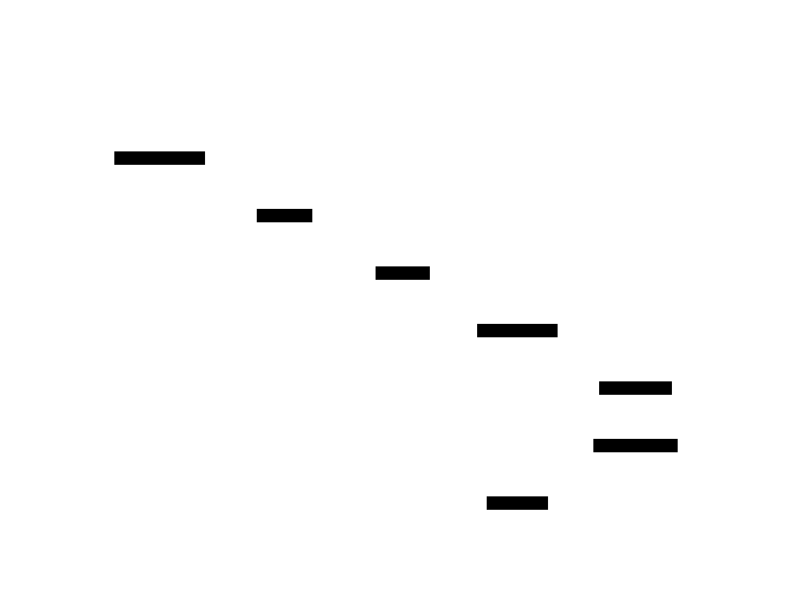

# CI/CD Pipeline Orchestrator: Design Document


## Overview

This document outlines the design for a custom Continuous Integration (CI) system that automatically runs defined test and build pipelines in response to code changes. The key architectural challenge is orchestrating isolated, parallel job executions reliably while providing real-time feedback to developers, balancing simplicity for educational purposes with the core patterns used in production systems like GitHub Actions.


> This guide is meant to help you understand the big picture before diving into each milestone. Refer back to it whenever you need context on how components connect.


## Context and Problem Statement
> **Milestone(s):** Milestone 1, Milestone 2, Milestone 3, Milestone 4

This section establishes the foundational problem our CI/CD Pipeline Orchestrator aims to solve. We begin by constructing an intuitive mental model, then formalize the core integration challenges, and finally survey the landscape of existing solutions to understand where our design fits.

### Mental Model: The Automated Factory Floor

Imagine a modern, fully automated factory that produces software. In this factory:

*   **Code changes** (a `git push`, a pull request) are the **work orders** arriving at the receiving dock.
*   Each **pipeline configuration file** (e.g., `.ci.yml`) is an **assembly line blueprint**, detailing the specific sequence of operations required to validate and package a particular product (your application).
*   A **pipeline run** is an **active assembly line** instantiated to process a single work order.
*   **Stages** (like `test`, `build`, `deploy`) are **logical workstations** along the assembly line, grouping related tasks. Some workstations can operate in parallel, while others must wait for upstream stations to finish.
*   **Jobs** within a stage are the **robotic stations** at each workstation. Each job is a self-contained unit of work, like running a linter, executing a test suite, or compiling a binary.
*   **Steps** are the **individual commands** the robot executes, such as `npm install` or `go test ./...`.
*   **Docker containers** provide **identical, sterile workbenches** for each robotic station. Every job gets a fresh, predictable environment, ensuring no oil (state) from assembling a car (web service) contaminates the bench for assembling a motorcycle (CLI tool).
*   The **Orchestrator** is the **factory floor manager**. It receives work orders, consults the blueprints, schedules tasks on available stations, and monitors progress.
*   The **Dashboard** is the **factory control room's giant display**, showing the status of every active assembly line, streaming live video from each station (logs), and flashing alerts when a robot malfunctions (a job fails).

This mental model frames the CI system not as a monolithic application, but as a **coordination engine for isolated, parallelizable tasks**. The primary architectural challenge becomes reliably managing this coordination—dispatching work, isolating execution, capturing output, and reporting results—without creating a tangled mess of dependencies or becoming a single point of failure.

### The Core Integration Problem

Before automated CI, integrating code changes was a manual, error-prone, and time-consuming process. A developer would:
1.  Pull the latest `main` branch.
2.  Run the test suite locally, hoping their environment (OS, dependency versions, environment variables) matches what other developers and production use.
3.  Manually build artifacts, often forgetting a step documented in a wiki.
4.  Deploy to a staging environment, crossing fingers that it works.

This approach suffers from several critical flaws:

1.  **The "It Works on My Machine" Syndrome:** Inconsistent environments lead to bugs that appear only in production or on a colleague's computer. The lack of **isolation and reproducibility** makes diagnosing issues a nightmare.
2.  **Feedback Delay:** Manual steps mean integration happens infrequently (perhaps once a day in a "daily build"), allowing bugs to accumulate and making it hard to pinpoint which change introduced a regression. Developers need **immediate feedback** on whether their change breaks the system.
3.  **Resource Contention and Scaling:** Running long test suites on a developer's laptop ties up their machine. As the team grows, coordinating who runs what test when becomes impossible. The system needs to **manage shared resources** (compute, memory) and **scale execution** horizontally.
4.  **Process Consistency:** Humans forget steps. An automated process defined in code (**Pipeline as Code**) ensures that every change undergoes the exact same rigorous validation, every single time.

A CI system directly addresses these flaws by providing:
*   **Environment Isolation:** Each job runs in a fresh, containerized environment defined by a Docker image, guaranteeing consistency.
*   **Automation and Triggering:** Code changes automatically trigger the defined pipeline via webhooks, removing manual intervention.
*   **Parallel Execution:** Independent jobs and stages run concurrently, slashing total feedback time.
*   **Centralized Logging and Artifacts:** All output and build products are captured in a single place, accessible to the entire team.
*   **Visibility:** Everyone can see the health of the codebase via the build status dashboard and real-time logs.

### Survey of Existing CI Systems

To inform our design, we examine how popular CI systems architecturally address the core problem. They generally fall along two axes: **deployment model** (hosted vs. self-hosted) and **execution architecture** (monolithic vs. distributed).

| System | Deployment Model | Execution Architecture | Key Architectural Insight | Primary Use Case |
| :--- | :--- | :--- | :--- | :--- |
| **GitHub Actions** | Hosted (SaaS) | Distributed, event-driven with managed runners. | Tight integration with the GitHub platform. Uses a YAML-based workflow file stored in the repository. Jobs are dispatched to scalable, managed (or self-hosted) runner machines. Employs a rich marketplace of reusable actions. | Teams deeply embedded in the GitHub ecosystem seeking a seamless, low-maintenance CI/CD solution. |
| **Jenkins** | Self-hosted | Traditionally monolithic master/agent, plugin-based. | Extreme extensibility via plugins. The Jenkins master server handles webhooks, scheduling, and the UI. Build execution is delegated to agent nodes (which can be on different machines). Configuration is often managed via a web UI or Jenkinsfile (Pipeline as Code). | Organizations requiring maximum flexibility, control over infrastructure, and support for a wide variety of tools and languages. |
| **GitLab CI/CD** | Hybrid (SaaS & Self-hosted) | Integrated, distributed with GitLab Runners. | Deeply integrated into the GitLab DevOps platform. Configuration is via `.gitlab-ci.yml`. Runners (which can be shared or project-specific) pick up jobs from a central coordinator. Supports auto-scaling runners with Kubernetes. | Teams using GitLab who want a unified experience from source control to deployment. |
| **CircleCI** | Hosted (SaaS) | Distributed, container-based. | Strong focus on parallelism and test splitting to optimize speed. Uses a declarative `config.yml`. Jobs run in isolated containers on managed infrastructure or on self-hosted runner machines. | Teams prioritizing fast build times and a robust, cloud-native CI service. |
| **Buildkite** | Hybrid (Agent-based) | Distributed, with self-hosted agents. | The control plane is hosted, but all build execution happens on customer-managed agents. This provides the reliability of a SaaS dashboard with the security and flexibility of controlling your own compute. | Organizations that need the simplicity of SaaS but must run builds on their own infrastructure due to compliance, network, or resource needs. |

**Architectural Patterns Comparison:**

> **Decision: Monolithic vs. Distributed Orchestration**
>
> *   **Context:** We must decide how to coordinate and execute pipeline jobs. A monolithic design runs everything within a single process/machine, while a distributed design separates coordination from execution.
> *   **Options Considered:**
>     1.  **Monolithic Server:** A single binary that handles webhooks, queuing, scheduling, and job execution (e.g., spawning Docker containers directly).
>     2.  **Distributed with Central Queue:** A coordinator handles webhooks and scheduling, placing jobs into a persistent queue. Separate worker processes (on the same or different machines) consume jobs from the queue and execute them.
> *   **Decision:** **Distributed with Central Queue**.
> *   **Rationale:** Even for an educational project, this pattern is fundamental to reliable, scalable systems. It decouples components, allowing them to fail and restart independently. The webhook handler and dashboard remain responsive even if workers are bogged down with long jobs. It also cleanly maps to our mental model (factory manager vs. robotic stations).
> *   **Consequences:** Introduces complexity of managing a queue (persistence, delivery semantics) and worker coordination. However, it provides a clear path for scaling horizontally by adding more workers and makes the system more resilient to partial failures.

| Option | Pros | Cons | Our Choice? |
| :--- | :--- | :--- | :--- |
| **Monolithic Server** | Simpler to deploy (one binary). Easier to reason about data flow (in-process). No network overhead for job dispatch. | Components are tightly coupled. A long-running job can block the entire system (UI, webhooks). Scaling requires running entire monolith copies. Harder to isolate failures. | ❌ |
| **Distributed with Central Queue** | Loose coupling, high availability. UI and webhooks remain responsive under load. Workers can be scaled independently. Clear separation of concerns. | More moving parts (queue, workers). Requires job serialization. Must handle network failures and queue semantics (at-least-once vs. exactly-once delivery). | ✅ |

Our design takes inspiration from the distributed, queue-based pattern used by GitHub Actions (with its job queue and runner model) and Jenkins (with its master/agent separation), but aims for a **simplified, self-contained architecture** suitable for learning and deployment on a single machine initially. We will use a **persistent queue** (like Redis or an embedded database) to allow components to be restarted without losing jobs, and a **pool of worker goroutines** (or processes) that pull jobs and execute them in Docker containers.


## Goals and Non-Goals

> **Milestone(s):** Milestone 1, Milestone 2, Milestone 3, Milestone 4

This section defines the concrete boundaries of our CI/CD Pipeline Orchestrator project. Establishing clear goals and non-goals is critical for maintaining focus, managing complexity, and ensuring the implementation remains achievable within the educational context. Think of this as the **project requirements document** for our automated factory floor—it specifies what features our factory must include (the assembly lines, robotic stations, and control panels) and explicitly states what's outside our current construction plans (like building multiple factories worldwide or manufacturing custom robot parts).

### Goals (Must Have)

These are the core capabilities our CI system must implement to be considered functionally complete. Each goal corresponds directly to one of the four project milestones and represents a fundamental building block of a production-ready CI system, scaled down to an educational implementation.

| Goal | Corresponding Milestone | Description | Rationale & Key Capabilities |
|------|------------------------|-------------|------------------------------|
| **1. Pipeline Configuration Parser** | Milestone 1 | Parse YAML configuration files into executable pipeline definitions with dependency resolution. | Every CI system needs a way to define workflows. YAML is industry-standard (GitHub Actions, GitLab CI). The parser must handle: <br>• **Structured Pipeline Objects**: Convert YAML into `PipelineConfig`, `Stage`, `Job`, and `Step` representations <br>• **Environment Variable Substitution**: Resolve `$VAR` and `${VAR}` references from pipeline config, system env, and secrets <br>• **Conditional Execution**: Support `if` expressions for branch/event filtering <br>• **Matrix Build Expansion**: Generate cartesian product of axis values (e.g., `os: [linux, macos]`) into parallel job configurations <br>• **DAG Construction**: Build dependency graphs from explicit `needs:` declarations or implicit stage ordering |
| **2. Containerized Job Execution Engine** | Milestone 2 | Execute pipeline jobs in isolated Docker containers with real-time log capture and artifact collection. | Reliable, repeatable execution is the heart of CI. Containerization provides: <br>• **Isolation**: Each job runs in a fresh container, preventing state contamination <br>• **Consistency**: Same environment across all runs (specified by Docker image) <br>• **Resource Control**: Memory/CPU limits via Docker <br>• **Step Execution**: Sequential shell command execution with exit code checking <br>• **Output Capture**: Real-time streaming of stdout/stderr to persistent storage <br>• **Artifact Collection**: Copying files matching glob patterns from container to storage |
| **3. Webhook Handling & Job Queue System** | Milestone 3 | Receive Git webhooks, validate signatures, and manage queued pipeline runs with worker coordination. | The system must respond automatically to code changes and handle multiple concurrent executions: <br>• **Webhook Processing**: HTTP endpoint for GitHub/GitLab push, PR, and tag events with signature verification <br>• **Event Parsing**: Extract commit SHA, branch, author, and changed files from webhook payloads <br>• **Queue Management**: Reliable job queuing with at-least-once delivery semantics <br>• **Worker Pool**: Concurrent job execution with configurable parallelism limits <br>• **Priority Scheduling**: Higher priority for production deployment pipelines vs. feature branch tests |
| **4. Basic Web Dashboard** | Milestone 4 | Provide a web interface for viewing pipeline history, real-time logs, and visualizations. | Developers need visibility into CI runs: <br>• **Build List View**: Paginated table of `PipelineRun` history with status, trigger, branch, and duration <br>• **Real-time Log Streaming**: Live tail of job output as it executes (via Server-Sent Events or WebSockets) <br>• **Status Badges**: SVG images showing pass/fail status for embedding in repository READMEs <br>• **Pipeline Visualization**: DAG rendering of stages and jobs showing dependencies and current status <br>• **Artifact Access**: Download links for artifacts generated by completed jobs |
| **5. Single-Machine Deployment** | Cross-cutting | All components run on a single machine using local Docker and a file-based or SQLite database. | For educational simplicity and minimal infrastructure requirements: <br>• **Local Execution**: No need for cloud VMs or Kubernetes clusters <br>• **Simplified Networking**: All communication happens via localhost or Unix sockets <br>• **Unified Logging**: All logs accessible from the same machine <br>• **Easy Reset**: Clear all state by stopping processes and deleting local files |
| **6. Core Data Model Persistence** | Cross-cutting | Store pipeline definitions, run history, job logs, and artifacts in persistent storage. | The system must retain history across restarts: <br>• **Structured Storage**: SQL tables for `PipelineConfig`, `PipelineRun`, `JobRun`, and `StepRun` entities <br>• **Log Storage**: Job output stored in files or database blobs with efficient retrieval <br>• **Artifact Storage**: File system directory structure organized by run/job identifiers <br>• **State Recovery**: Resume monitoring of in-progress runs after system restart |

> **Design Insight:** The goals follow a **vertical slice architecture**—each milestone delivers a complete end-to-end flow for one aspect of the system (parsing → execution → triggering → visualization). This approach provides working software at each stage rather than implementing all layers of one component before moving to the next.

### Non-Goals (Out of Scope)

These are features explicitly excluded from the current implementation. Listing non-goals prevents scope creep and clarifies that while these capabilities exist in production CI systems, they are not required for our educational version. Each exclusion is accompanied by reasoning and suggestions for how they could be added as future extensions.

| Non-Goal | Reasoning | What We're Doing Instead |
|----------|-----------|--------------------------|
| **Distributed Workers Across Multiple Machines** | Adds significant complexity in networking, service discovery, artifact synchronization, and fault tolerance. The educational focus is on job execution logic, not distributed systems. | All workers run on the same machine as the orchestrator, sharing local Docker daemon and file system. |
| **Complex Secret Management** | Production secret management involves encryption, key rotation, access controls, and integration with Vault/Key Management Services. This is security-focused rather than CI-core logic. | Environment variables (including "secrets") are passed as plaintext to containers. For educational purposes, we assume secrets are stored in the pipeline configuration or system environment variables without encryption. |
| **Full-Featured SaaS UI** | A production-grade UI with user accounts, team management, analytics dashboards, and complex filtering would dwarf the core CI logic in implementation effort. | Basic dashboard with essential views (run list, logs, DAG visualization) using server-rendered HTML or minimal JavaScript. No authentication required. |
| **Custom Docker Image Building** | Building Docker images as part of pipelines requires Docker-in-Docker, privileged containers, and layer caching—complex concerns orthogonal to job execution. | Jobs use pre-existing Docker images from public registries (e.g., `alpine`, `golang:latest`). The pipeline configuration specifies which image to use. |
| **Advanced Caching Mechanisms** | Dependency caching (e.g., npm packages, Go modules) across pipeline runs requires distributed storage, cache key generation, and invalidation logic. | Each job starts with a clean container without any cross-run caching. Users can implement caching within their own scripts if needed. |
| **Multi-Repository Pipeline Triggers** | Pipelines that trigger based on changes across multiple repositories require complex event correlation and permission models. | Pipelines are triggered only by events in the repository where the pipeline configuration file resides (single-repo scope). |
| **Manual Approval Gates & Human Intervention** | Waiting for human approval adds stateful pause/resume logic, notification systems, and UI for approval actions. | All pipeline steps run automatically once triggered. Conditional `if` expressions can skip jobs but not pause for manual review. |
| **Extensive Plugin Ecosystem** | Supporting third-party plugins requires plugin loading, versioning, sandboxing, and a marketplace infrastructure. | Core functionality is built directly into the system. Extensibility is limited to shell commands within job steps. |
| **Multi-tenant Isolation** | Running pipelines for multiple organizations/teams requires resource quotas, network isolation, and authentication/authorization. | The system assumes a single tenant (e.g., one development team or individual user). |
| **Advanced Notification Integrations** | Slack, email, webhook notifications require configurable templates, retry logic, and integration credential management. | Pipeline status is only visible via the web dashboard and status badges. No external notifications are sent. |

> **Design Insight:** By explicitly declaring these non-goals, we create a **constrained design space** that allows for deep implementation of core CI concepts without being overwhelmed by peripheral features. Each non-goal represents a potential future extension point that could be built upon the solid foundation established here.

#### Architecture Decision Record: Scope Definition Strategy

> **Decision: Vertical Slice with Clear Boundaries**
> - **Context**: We need to build a functional CI system for educational purposes within limited time/complexity constraints. The system must demonstrate core CI concepts while remaining implementable by learners.
> - **Options Considered**:
>     1. **Horizontal Layering**: Implement all data access logic first, then all business logic, then all UI logic. Provides clean separation but delays end-to-end functionality.
>     2. **Vertical Slicing (Chosen)**: Build complete feature slices (parser → executor → webhook → dashboard) that each deliver visible value and can be tested independently.
>     3. **Minimal Viable Product then Expand**: Build the absolute simplest CI (single job, no parallelism) then incrementally add features, risking significant refactoring at each stage.
> - **Decision**: Adopt vertical slicing organized by milestones, with each milestone delivering a complete, testable subsystem.
> - **Rationale**: Vertical slicing provides early feedback, maintains learner motivation with visible progress, and aligns with the project's milestone structure. Each slice can be designed with clean interfaces that allow for later expansion without breaking existing functionality.
> - **Consequences**: 
>     - **Positive**: Working software after each milestone; natural integration testing as slices connect; clear boundaries between components.
>     - **Negative**: Some duplication of effort (e.g., data models may need refinement across slices); later milestones may reveal early design limitations.

| Option | Pros | Cons | Chosen? |
|--------|------|------|---------|
| Horizontal Layering | Clean separation of concerns; each layer can be optimized independently; easier to swap implementations (e.g., database) | No working end-to-end system until all layers complete; harder to test integration early; less motivating for learners | No |
| **Vertical Slicing** | **Delivers user-visible value each milestone; natural integration testing; aligns with project structure; maintains motivation** | **May require refactoring as understanding deepens; some duplication across slices** | **Yes** |
| MVP then Expand | Starts with simplest possible system; forces prioritization of essentials | Significant refactoring as features added; early design may not accommodate later complexity well | No |

#### Common Pitfalls in Scope Definition

⚠️ **Pitfall: Implementing Production-Grade Features Prematurely**
- **Description**: Learners often try to implement distributed workers, Kubernetes integration, or OAuth authentication before completing core job execution.
- **Why it's wrong**: These features introduce massive complexity early, diverting focus from the fundamental CI algorithms (parsing, execution, queuing). The system becomes over-engineered and may never reach basic functionality.
- **How to avoid**: Strictly adhere to the non-goals list. When tempted to add a feature, ask: "Is this required for any of the four milestones?" If not, document it as a future extension and move on.

⚠️ **Pitfall: Neglecting the "Basic" in Basic Web Dashboard**
- **Description**: Spending excessive time on polished UI animations, complex filtering, or real-time updates across all views instead of focusing on core log streaming and status display.
- **Why it's wrong**: The dashboard's primary educational value is demonstrating real-time log streaming and pipeline visualization—not UI polish. Time spent on cosmetic features detracts from implementing core streaming mechanisms.
- **How to avoid**: Implement the dashboard as server-rendered HTML with minimal JavaScript. Use Server-Sent Events (SSE) for log streaming as it's simpler than WebSockets. Accept that the UI will be functional but not beautiful.

⚠️ **Pitfall: Over-Engineering the Parser**
- **Description**: Creating an overly complex YAML parser with custom DSL extensions, template inheritance, or complex validation beyond what's needed for the milestone acceptance criteria.
- **Why it's wrong**: The parser should be robust but not exhaustive. Production CI systems have evolved complex syntax over years; our educational version needs only the specified features (matrix, env vars, conditionals).
- **How to avoid**: Implement exactly what the Milestone 1 acceptance criteria specify. Use existing YAML parsing libraries rather than writing custom parsers. Validate only required fields.

### Implementation Guidance

> **Technology Stack Recommendations**: The following table recommends specific technologies for each component, balancing simplicity for learners against production relevance.

| Component | Simple Option (Recommended) | Advanced Option (Alternative) |
|-----------|----------------------------|-------------------------------|
| **Language & Runtime** | Go (static binary, excellent concurrency primitives) | Python (faster prototyping) or Rust (maximum performance) |
| **Configuration Parser** | `gopkg.in/yaml.v3` (stable YAML parsing) | Custom parser with `github.com/goccy/go-yaml` for advanced features |
| **Container Runtime** | Docker Engine via `github.com/docker/docker/client` | `containerd` via direct API or `podman` compatibility layer |
| **Queue Backend** | In-memory channel with persistent SQLite backup | Redis via `github.com/go-redis/redis` for distributed scenarios |
| **Database** | SQLite with `github.com/mattn/go-sqlite3` | PostgreSQL via `github.com/lib/pq` for concurrent access |
| **Web Framework** | Standard library `net/http` with minimal routing | `github.com/gin-gonic/gin` for productivity features |
| **Real-time Streaming** | Server-Sent Events (SSE) using `net/http` | WebSockets via `github.com/gorilla/websocket` |
| **Frontend** | Server-rendered HTML with vanilla JavaScript | React/Vite SPA with TypeScript |

> **File/Module Structure**: Organize the codebase by component boundaries aligned with the milestones.

```
build-your-own-ci/
├── cmd/
│   ├── server/                 # Main orchestrator server
│   │   └── main.go
│   ├── worker/                 # Worker process (can be same binary with flag)
│   │   └── main.go
│   └── dashboard/              # Dashboard web server
│       └── main.go
├── internal/                   # Private application code
│   ├── config/
│   │   ├── parser.go           # PipelineConfig parsing (Milestone 1)
│   │   ├── dag.go              # DAG construction
│   │   ├── matrix.go           # Matrix expansion
│   │   └── validator.go        # YAML validation
│   ├── executor/
│   │   ├── docker.go           # Container execution (Milestone 2)
│   │   ├── artifacts.go        # Artifact collection
│   │   └── logger.go           # Log capture and streaming
│   ├── orchestrator/
│   │   ├── queue.go            # Job queue (Milestone 3)
│   │   ├── scheduler.go        # Worker scheduling
│   │   └── webhook.go          # Webhook handler
│   ├── dashboard/
│   │   ├── server.go           # HTTP handlers (Milestone 4)
│   │   ├── sse.go              # Server-Sent Events for logs
│   │   └── badges.go           # SVG badge generation
│   ├── storage/
│   │   ├── database.go         # SQLite interface
│   │   ├── models.go           # PipelineRun, JobRun structs
│   │   └── artifacts.go        # File system artifact storage
│   └── types/                  # Shared data types
│       ├── pipeline.go         # PipelineConfig, Stage, Job, Step
│       └── runs.go             # PipelineRun, JobRun, StepRun
├── pkg/                        # Public libraries (if any)
├── web/                        # Frontend assets
│   ├── static/
│   │   ├── css/
│   │   └── js/
│   └── templates/              # Go HTML templates
│       ├── index.html
│       └── run_detail.html
├── migrations/                 # SQL schema migrations
│   └── 001_initial.sql
├── docker-compose.yml          # For optional Redis/PostgreSQL
├── go.mod
└── README.md
```

> **Infrastructure Starter Code**: Basic SQLite setup and Docker client wrapper.

```go
// internal/storage/database.go
package storage

import (
    "database/sql"
    "fmt"
    "log"
    _ "github.com/mattn/go-sqlite3"
)

type DB struct {
    *sql.DB
}

func NewSQLiteDB(path string) (*DB, error) {
    db, err := sql.Open("sqlite3", path)
    if err != nil {
        return nil, fmt.Errorf("failed to open database: %w", err)
    }
    
    // Enable foreign keys and journaling for data integrity
    _, err = db.Exec(`PRAGMA foreign_keys = ON; PRAGMA journal_mode = WAL;`)
    if err != nil {
        return nil, fmt.Errorf("failed to set pragmas: %w", err)
    }
    
    // Run migrations
    if err := runMigrations(db); err != nil {
        return nil, fmt.Errorf("migrations failed: %w", err)
    }
    
    return &DB{db}, nil
}

func runMigrations(db *sql.DB) error {
    migrations := []string{
        `CREATE TABLE IF NOT EXISTS pipeline_configs (
            id TEXT PRIMARY KEY,
            repo TEXT NOT NULL,
            path TEXT NOT NULL,
            raw_yaml TEXT NOT NULL,
            parsed_config BLOB,
            created_at TIMESTAMP DEFAULT CURRENT_TIMESTAMP
        )`,
        `CREATE TABLE IF NOT EXISTS pipeline_runs (
            id TEXT PRIMARY KEY,
            pipeline_config_id TEXT REFERENCES pipeline_configs(id),
            status TEXT CHECK(status IN ('pending', 'running', 'succeeded', 'failed', 'cancelled', 'skipped')),
            trigger_event TEXT,
            commit_sha TEXT,
            branch TEXT,
            started_at TIMESTAMP,
            finished_at TIMESTAMP,
            created_at TIMESTAMP DEFAULT CURRENT_TIMESTAMP
        )`,
        `CREATE TABLE IF NOT EXISTS job_runs (
            id TEXT PRIMARY KEY,
            pipeline_run_id TEXT REFERENCES pipeline_runs(id) ON DELETE CASCADE,
            job_name TEXT NOT NULL,
            status TEXT CHECK(status IN ('pending', 'running', 'succeeded', 'failed', 'cancelled', 'skipped')),
            container_id TEXT,
            worker_id TEXT,
            log_path TEXT,
            started_at TIMESTAMP,
            finished_at TIMESTAMP,
            created_at TIMESTAMP DEFAULT CURRENT_TIMESTAMP
        )`,
        `CREATE TABLE IF NOT EXISTS step_runs (
            id TEXT PRIMARY KEY,
            job_run_id TEXT REFERENCES job_runs(id) ON DELETE CASCADE,
            step_name TEXT NOT NULL,
            command TEXT,
            exit_code INTEGER,
            output TEXT,
            started_at TIMESTAMP,
            finished_at TIMESTAMP
        )`,
        `CREATE INDEX IF NOT EXISTS idx_pipeline_runs_status ON pipeline_runs(status)`,
        `CREATE INDEX IF NOT EXISTS idx_job_runs_pipeline_id ON job_runs(pipeline_run_id)`,
    }
    
    for _, migration := range migrations {
        _, err := db.Exec(migration)
        if err != nil {
            return fmt.Errorf("migration failed: %w\nQuery: %s", err, migration)
        }
    }
    return nil
}

// Helper for paginated queries
func (db *DB) GetPipelineRuns(limit, offset int) ([]PipelineRun, error) {
    // TODO: Implement query with JOIN to pipeline_configs for repo info
    rows, err := db.Query(`
        SELECT id, status, trigger_event, commit_sha, branch, started_at, finished_at
        FROM pipeline_runs 
        ORDER BY created_at DESC 
        LIMIT ? OFFSET ?
    `, limit, offset)
    if err != nil {
        return nil, err
    }
    defer rows.Close()
    
    var runs []PipelineRun
    for rows.Next() {
        var run PipelineRun
        // TODO: Scan row into struct fields
        runs = append(runs, run)
    }
    return runs, nil
}
```

```go
// internal/executor/docker.go
package executor

import (
    "context"
    "io"
    "github.com/docker/docker/api/types"
    "github.com/docker/docker/api/types/container"
    "github.com/docker/docker/client"
)

type DockerExecutor struct {
    client *client.Client
}

func NewDockerExecutor() (*DockerExecutor, error) {
    cli, err := client.NewClientWithOpts(client.FromEnv, client.WithAPIVersionNegotiation())
    if err != nil {
        return nil, err
    }
    return &DockerExecutor{client: cli}, nil
}

func (d *DockerExecutor) PullImage(ctx context.Context, image string) error {
    // TODO 1: Check if image exists locally with d.client.ImageList
    // TODO 2: If not present, pull with d.client.ImagePull
    // TODO 3: Stream pull progress to logs
    return nil
}

func (d *DockerExecutor) CreateContainer(ctx context.Context, config *ContainerConfig) (string, error) {
    // TODO 1: Define container.Config with Image, Env, Cmd, WorkingDir
    // TODO 2: Define container.HostConfig with Binds (for workspace), NetworkMode
    // TODO 3: Call d.client.ContainerCreate and return container ID
    return "", nil
}

func (d *DockerExecutor) RunContainer(ctx context.Context, containerID string, output io.Writer) (int64, error) {
    // TODO 1: Start container with d.client.ContainerStart
    // TODO 2: Attach to container logs with d.client.ContainerLogs (follow=true)
    // TODO 3: Stream logs to output writer in real-time
    // TODO 4: Wait for container completion with d.client.ContainerWait
    // TODO 5: Return exit code and any error
    return 0, nil
}

func (d *DockerExecutor) CleanupContainer(ctx context.Context, containerID string) error {
    // TODO 1: Force remove container with d.client.ContainerRemove
    // TODO 2: Ignore "container not found" errors
    return nil
}
```

> **Core Logic Skeleton**: Key functions with TODO comments mapping to algorithm steps.

```go
// internal/config/parser.go
package config

// ParseConfig parses and validates a YAML pipeline configuration file.
// Algorithm steps correspond to the parsing flowchart (diag-parser-flowchart).
func ParseConfig(yamlContent string) (PipelineConfig, error) {
    var config PipelineConfig
    
    // TODO 1: Parse raw YAML into a temporary map structure using yaml.Unmarshal
    // TODO 2: Validate required top-level fields exist (at least one job)
    // TODO 3: Parse environment variables section (if present) into map
    // TODO 4: Parse matrix definitions (if any) for later expansion
    // TODO 5: Parse jobs section, for each job:
    //   - Extract steps as []Step
    //   - Parse job-level environment variables
    //   - Parse 'if' conditions for conditional execution
    //   - Parse 'needs' dependencies for DAG construction
    // TODO 6: Validate no circular dependencies in 'needs' graph
    // TODO 7: Expand matrix jobs by computing cartesian product of axis values
    // TODO 8: Build DAG of job dependencies based on 'needs' or stage ordering
    // TODO 9: Return populated PipelineConfig struct with all parsed data
    
    return config, nil
}

// ExpandMatrix takes a job definition with matrix axes and returns multiple job configurations.
func ExpandMatrix(baseJob Job, matrixAxes map[string][]interface{}) ([]Job, error) {
    // TODO 1: Validate matrix axes have at least one dimension with non-empty values
    // TODO 2: Compute cartesian product of all axis values
    // TODO 3: For each combination in the product:
    //   - Clone the base job
    //   - Substitute matrix values into job name (e.g., "test-${{matrix.os}}")
    //   - Add matrix values as environment variables
    //   - Apply axis-specific overrides if defined in matrix.include/exclude
    // TODO 4: Return the list of expanded jobs
    return []Job{}, nil
}
```

```go
// internal/orchestrator/queue.go  
package orchestrator

// EnqueueRun places a pipeline run into the job queue for execution.
// Implements priority scheduling and rate limiting.
func (q *Queue) EnqueueRun(run PipelineRun) (string, error) {
    // TODO 1: Determine priority based on branch/event (production = high priority)
    // TODO 2: Check rate limits for the repository to prevent overload
    // TODO 3: Generate unique queue ID for the run
    // TODO 4: Serialize run to JSON for storage
    // TODO 5: Store in database with status = STATUS_PENDING
    // TODO 6: If using in-memory queue, also add to priority queue structure
    // TODO 7: Notify available workers via channel or condition variable
    // TODO 8: Return queue ID
    return "", nil
}

// DequeueJob retrieves the next available job from the queue for a worker to process.
func (q *Queue) DequeueJob(workerID string) (JobRun, error) {
    // TODO 1: Acquire queue lock for thread-safe access
    // TODO 2: Find highest priority run that has pending jobs
    // TODO 3: Select a job from that run that has all dependencies satisfied
    // TODO 4: Update job status to STATUS_RUNNING and assign workerID
    // TODO 5: Update database record for the job
    // TODO 6: Return the JobRun for execution
    var job JobRun
    return job, nil
}
```

> **Language-Specific Hints**:

- **Go Modules**: Use `go mod init build-your-own-ci` to initialize the project. Dependencies will be automatically managed.
- **Concurrency**: Use `sync.Mutex` for protecting shared queue state, and `goroutines` with `channels` for worker coordination.
- **Context Propagation**: Pass `context.Context` through all execution paths to enable timeouts and cancellation.
- **Error Handling**: Use Go's multi-value returns with `error`. Wrap errors with `fmt.Errorf("... %w", err)` to preserve stack traces.
- **Docker Client**: The official Docker client library is thread-safe; create one instance and reuse it across goroutines.
- **SQLite Concurrency**: SQLite supports concurrent reads but only one write at a time. Use `PRAGMA journal_mode=WAL` to improve concurrency.

> **Milestone Checkpoint**: After completing the Goals and Non-Goals section, learners should:

1. **Create the project structure** with the recommended directory layout.
2. **Set up the database** by running the provided SQLite initialization code.
3. **Verify Docker is accessible** by running a simple test:
   ```bash
   docker run --rm alpine echo "Hello from CI"
   ```
4. **Create a simple webhook endpoint** that logs incoming requests:
   ```bash
   curl -X POST http://localhost:8080/webhook -d '{"test": "payload"}'
   ```
   Should see log output in the server console.

> **Debugging Tips** for scope-related issues:

| Symptom | Likely Cause | How to Diagnose | Fix |
|---------|--------------|-----------------|-----|
| "I'm implementing Kubernetes pod scheduling instead of Docker containers" | Scope creep into advanced orchestration | Check if feature is in Milestone 2 acceptance criteria | Revert to simple Docker client; Kubernetes is a non-goal |
| "Dashboard has real-time updates for everything but logs aren't streaming" | Over-investment in UI polish before core functionality | Verify Server-Sent Events endpoint returns logs | Focus on log streaming first; add other real-time updates later |
| "Parser supports Jinja2 templating but matrix builds don't work" | Implementing nice-to-have features before required ones | Compare implemented features against Milestone 1 checklist | Remove templating; implement matrix expansion per acceptance criteria |


## High-Level Architecture
> **Milestone(s):** Milestone 1, Milestone 2, Milestone 3, Milestone 4

This section paints the architectural blueprint of our CI/CD Pipeline Orchestrator. Before diving into the gritty details of each component, we establish a shared mental model of the system as a whole. Understanding the **responsibilities** of each major subsystem, **how they connect**, and **where code should live** is crucial for building a coherent system that scales from a single binary to a distributed service.

Think of the architecture as a **modern restaurant kitchen**. The `Webhook Listener` is the host who greets customers (Git events) and takes their orders (code changes). The `Orchestrator` is the head chef who breaks down the order into individual dishes (jobs) and posts tickets (queue messages) on the kitchen rail. The `Worker Pool` comprises line cooks who each grab a ticket and prepare a dish in their own isolated workstation (container). Finally, the `Dashboard` is the expo station and dining room TV, showing the status of every order and allowing the customer (developer) to watch the cooking process in real-time. Each station is specialized, communicates through clear protocols, and together they deliver a consistent dining experience.

### Component Map and Responsibilities

The system is decomposed into four core subsystems, each with a distinct responsibility and clear boundaries. This separation of concerns allows for independent development, testing, and scaling.

| Component | Responsibility | Key Functions | Owned Data (In-Memory/Persistent) |
| :--- | :--- | :--- | :--- |
| **Webhook Listener** | Acts as the secure public gateway for Git hosting services (GitHub, GitLab). It validates incoming requests and translates external events into internal pipeline triggers. | 1. Validate webhook signatures.<br>2. Parse event payloads (push, pull request, tag).<br>3. Match events to pipeline configurations (e.g., via branch filters).<br>4. Create an initial `PipelineRun` record. | Webhook secret keys (configuration). Temporary in-memory cache for rate-limiting per repository. |
| **Orchestrator** | The brain of the operation. It manages the lifecycle of pipeline runs, coordinates job execution order based on dependencies, and serves as the interface between the queue and the workers. | 1. Parse pipeline configuration (`ParseConfig`).<br>2. Manage the job queue (`EnqueueRun`, `DequeueJob`).<br>3. Expand matrix builds and build the execution DAG.<br>4. Dispatch `JobRun` instances to workers.<br>5. Update overall `PipelineRun` status based on job outcomes. | `PipelineConfig` cache. In-memory or persistent job queue. The authoritative state of all `PipelineRun`, `JobRun`, and `StepRun` entities (persisted in a database). |
| **Worker Pool** | A fleet of stateless executors that carry out the actual work. Each worker claims a job and runs its steps in an isolated, containerized environment. | 1. Poll for or receive `JobRun` assignments.<br>2. Execute job steps sequentially in a Docker container (`ExecuteJob`).<br>3. Stream real-time log output (`StreamLogs`).<br>4. Collect and upload artifacts.<br>5. Report job status (success/failure) back to the Orchestrator. | Ephemeral container IDs and local log buffers during job execution. No long-term state; workers are disposable and horizontally scalable. |
| **Dashboard** | The user-facing control panel and observation deck. It provides visibility into pipeline execution history and real-time progress, and serves status badges. | 1. Display a paginated list of pipeline runs (`GetRunHistory`).<br>2. Stream live logs from running jobs to the browser.<br>3. Generate and serve status badge SVGs.<br>4. Visualize pipeline DAGs for each run.<br>5. Provide download links for artifacts. | Cached badge SVGs and session data for active log streams. It primarily reads data owned by the Orchestrator. |


### How Components Connect

The flow of data through the system follows a unidirectional pipeline, reminiscent of an assembly line. This design minimizes coupling and makes the system easy to reason about. The primary connections are HTTP for external communication, an internal job queue for work dispatch, and a shared database for state persistence.

**Primary Data Flow: The Happy Path of a Git Push**

1.  **Event Ingestion:** A developer pushes code to a repository on GitHub. GitHub's servers send an HTTP POST request (a webhook) to the publicly accessible endpoint of our **Webhook Listener**.
2.  **Trigger & Creation:** The **Webhook Listener** validates the request's signature using a shared secret, parses the JSON payload, and determines which pipeline configuration (e.g., `.ci/pipeline.yml`) should be triggered. It then calls the **Orchestrator** to create a new `PipelineRun` record, passing along the commit SHA, branch, and event type.
3.  **Orchestration & Queuing:** The **Orchestrator** loads the relevant `PipelineConfig`, resolves environment variables, expands any matrix definitions, and constructs the execution DAG. It then creates individual `JobRun` records for each job and places references to them into the **Job Queue** via `EnqueueRun`. The `PipelineRun` status is set to `STATUS_PENDING`.
4.  **Job Execution:** An idle **Worker** from the **Worker Pool** calls `DequeueJob` on the **Orchestrator** (or polls the queue directly). Upon receiving a `JobRun`, the worker executes it by calling `ExecuteJob`. This involves pulling the specified Docker image, creating a container, injecting environment variables and secrets, and running the job's shell commands sequentially.
5.  **Real-Time Observation:** As the job runs, the **Worker** captures `stdout` and `stderr`. The **Dashboard** opens a Server-Sent Events (SSE) or WebSocket connection to stream logs. The worker pushes log chunks to a channel that the **Dashboard** subscribes to (or writes to a location the Dashboard can read), enabling the developer to see output in their browser in real-time.
6.  **Status Propagation & Completion:** Upon job completion (success or failure), the **Worker** updates the `JobRun` status (`STATUS_SUCCEEDED` or `STATUS_FAILED`) and uploads any artifacts to persistent storage. The **Orchestrator** is notified and updates the overall `PipelineRun` status accordingly (e.g., if all jobs succeed, the run succeeds; if any job fails, the run fails).
7.  **History & Inspection:** The **Dashboard** uses `GetRunHistory` to fetch completed runs from the database (via the **Orchestrator** or directly) and displays them in a list. The developer can click on any run to see its detailed DAG visualization, archived logs, and download artifacts.

**Key Communication Channels:**

| From → To | Protocol/Mechanism | Data Exchanged | Direction |
| :--- | :--- | :--- | :--- |
| Git Host → Webhook Listener | HTTP(S) POST | Webhook payload (JSON) | Inbound |
| Webhook Listener → Orchestrator | Internal Function Call / RPC | `PipelineRun` creation request | Internal |
| Orchestrator → Job Queue | Database insert / Pub-Sub | `JobRun` reference (ID, metadata) | Internal |
| Worker Pool → Job Queue | Database query / Pub-Sub consume | Claimed `JobRun` reference | Internal |
| Worker → Dashboard (Logs) | SSE / WebSocket / Shared Bus | Real-time log lines | Internal |
| Dashboard → Orchestrator / DB | HTTP API / Direct SQL | Queries for `PipelineRun` history | Internal |
| Worker → Docker Daemon | Docker Socket (Unix/HTTP) | Container lifecycle commands | Outbound (Infra) |

> The critical insight here is the **separation of the control plane (Orchestrator) from the data plane (Worker Pool)**. The Orchestrator makes all scheduling and state decisions, while Workers are dumb executors. This allows you to scale workers horizontally without complex coordination, and even run workers on different machines, as long as they can communicate with the central Orchestrator and Docker daemon.

### Recommended File/Module Structure

A well-organized codebase mirrors the architectural boundaries. For our Go implementation, we adopt a standard project layout centered around an `internal` package, which prevents external imports of our core logic. Each major component gets its own subpackage.

```
build-your-own-ci/
├── cmd/                           # Application entry points
│   ├── ci-server/                 # Main server binary (Orchestrator + Webhook Listener + Dashboard)
│   │   └── main.go
│   └── ci-worker/                 # Optional separate worker binary
│       └── main.go
├── internal/                      # Private application code
│   ├── config/                    # Pipeline configuration parsing (Milestone 1)
│   │   ├── parser.go              # `ParseConfig`, YAML unmarshaling
│   │   ├── dag.go                 # DAG construction, dependency resolution
│   │   ├── matrix.go              # Matrix expansion logic
│   │   ├── envsubst.go            # Environment variable substitution
│   │   └── config_test.go
│   ├── orchestrator/              # Core orchestration logic (Milestone 1, 3)
│   │   ├── orchestrator.go        # Manages runs, queue interface
│   │   ├── queue/                 * Abstract queue interface and implementations
│   │   │   ├── queue.go           # Interface (EnqueueRun, DequeueJob)
│   │   │   ├── memory.go          # In-memory channel-based queue
│   │   │   └── redis.go           # Redis-backed queue
│   │   └── store/                 * Abstract storage interface and implementations
│   │       ├── store.go           # Interface for PipelineRun, JobRun, StepRun
│   │       ├── memory.go          # In-memory store (for dev)
│   │       └── sqlite.go          # SQLite persistence
│   ├── worker/                    # Job execution engine (Milestone 2)
│   │   ├── executor.go            # `ExecuteJob`, container management
│   │   ├── docker_client.go       # Wrapper around Docker SDK
│   │   ├── logstream.go           # `StreamLogs`, real-time output handling
│   │   ├── artifact.go            # Artifact collection and upload
│   │   └── pool.go                * Worker pool management
│   ├── webhook/                   # Webhook handling (Milestone 3)
│   │   ├── handler.go             # `HandleWebhook`, HTTP handler
│   │   ├── github.go              # GitHub payload parsing & validation
│   │   ├── gitlab.go              # GitLab payload parsing & validation
│   │   └── verifier.go            # Signature verification
│   └── dashboard/                 # Web dashboard (Milestone 4)
│       ├── server.go              # HTTP server, route definitions
│       ├── handlers.go            # `GetRunHistory`, badge handler, DAG data endpoint
│       ├── sse.go                 # Server-Sent Events for log streaming
│       └── assets/                # Static HTML, JS, CSS
│           ├── index.html
│           └── app.js
├── pkg/                           # Public, reusable libraries (if any)
│   └── ciutils/                   # E.g., shared logging, constants
├── go.mod
├── go.sum
└── docker-compose.yml             # For local Redis, Docker-in-Docker setup
```

**Package Dependencies Flow:** The `cmd/ci-server` imports from `internal/webhook`, `internal/orchestrator`, and `internal/dashboard`. The `internal/orchestrator` imports `internal/config` and `internal/worker` (for job definitions and execution interface). The `internal/worker` is the only package that directly interacts with the Docker SDK. This structure enforces a clear dependency hierarchy and prevents circular imports.

### Architecture Decision Record: Monolithic vs. Microservices Deployment

> **Decision: Deploy as a Single Monolithic Binary with Optional Worker Separation**
>
> - **Context**: We are building a learning-focused CI system that must be simple to run locally and deploy. We need to balance conceptual clarity with the ability to scale components independently.
> - **Options Considered**:
>     1.  **Pure Monolith**: A single binary containing the Webhook Listener, Orchestrator, Worker Pool, and Dashboard. All components run in one process.
>     2.  **Full Microservices**: Separate binaries (and possibly containers) for each major component, communicating via network calls (gRPC/HTTP).
>     3.  **Hybrid Monolith with Extractable Workers**: A primary server binary (Orchestrator, Listener, Dashboard) and a separate, optional worker binary. The worker connects back to the main server's queue and API.
> - **Decision**: We choose the **Hybrid** approach (Option 3). The primary `ci-server` will embed the Webhook Listener, Orchestrator, and Dashboard. The Worker Pool can be run either as goroutines within the same process (simple mode) or as separate `ci-worker` processes (scalable mode).
> - **Rationale**: A pure monolith is the simplest for learners to grasp and run, but it conflates the very different concerns of job scheduling and job execution. The hybrid model maintains logical separation in the code (`internal/worker` package) while offering deployment flexibility. Learners can start with the all-in-one server and later extract workers without rewriting core logic. It mirrors the pattern of real-world systems like Jenkins (controller/agent) or GitHub Actions (runner).
> - **Consequences**:
>     - **Positive**: Simplifies initial development and debugging (single binary). Clear component boundaries in code. Allows scaling workers horizontally by launching more `ci-worker` processes.
>     - **Negative**: Introduces a slight operational complexity for the multi-process deployment. Requires the queue and storage to be accessible from separate processes (i.e., cannot use simple in-memory channels).

| Option | Pros | Cons | Chosen? |
| :--- | :--- | :--- | :--- |
| **Pure Monolith** | Ultimate simplicity for running and debugging. No inter-process communication. | Components cannot scale independently. A long-running job can block the webhook handler. Blurs architectural boundaries. | No |
| **Full Microservices** | Maximum scalability and fault isolation. Clear deployment boundaries. | High operational and development complexity. Network latency and failure modes add significant learning overhead. | No |
| **Hybrid Monolith** | Good separation of concerns in code. Flexible deployment: all-in-one or scaled workers. Mimics production patterns. | Slightly more complex than a pure monolith. Requires shared, persistent queue/storage for multi-process mode. | **Yes** |

### Implementation Guidance

This section provides concrete starting points for organizing and implementing the high-level architecture in Go.

**A. Technology Recommendations Table**

| Component | Simple Option (Starting Point) | Advanced Option (For Extension) |
| :--- | :--- | :--- |
| **Web Transport** | `net/http` with Gorilla Mux or `http.ServeMux` | `chi` router for middleware, `gRPC` for internal RPC |
| **Queue Backend** | In-memory channel (`chan interface{}`) with a wrapper | `Redis` (go-redis), `PostgreSQL` with SKIP LOCKED, `RabbitMQ` |
| **Data Persistence** | In-memory map with `sync.RWMutex` (for dev) | `SQLite` (go-sqlite3) for single-binary persistence, `PostgreSQL` |
| **Docker Client** | Official Docker SDK for Go (`github.com/docker/docker/client`) | Direct use of `containerd` API for lower-level control |
| **Real-time Logs** | Server-Sent Events (SSE) via `http.ResponseWriter` | `WebSocket` (gorilla/websocket) for bidirectional communication |
| **Frontend** | Plain HTML/JavaScript with vanilla JS or Alpine.js | React/Vite SPA with a separate build process |

**B. Recommended File/Module Structure Starter**

The provided structure above can be initialized with the following commands and stub files.

First, create the module and base directories:
```bash
mkdir -p build-your-own-ci/cmd/ci-server build-your-own-ci/cmd/ci-worker
mkdir -p build-your-own-ci/internal/config internal/orchestrator/queue internal/orchestrator/store
mkdir -p build-your-own-ci/internal/worker internal/webhook internal/dashboard/assets
cd build-your-own-ci
go mod init github.com/yourusername/build-your-own-ci
```

**C. Infrastructure Starter Code: Core Data Types and Store Interface**

To ensure consistency across components, we define the core data structures and a generic storage interface in a shared internal package. Place this in `internal/types/types.go`.

```go
package types

import (
    "time"
)

// PipelineConfig holds the parsed and validated pipeline configuration.
type PipelineConfig struct {
    // Raw YAML source (or file path). Useful for debugging.
    Source         string
    // Map of job names to their definition.
    Jobs           map[string]JobConfig
    // Global environment variables defined in the pipeline.
    Environment    map[string]string
    // Matrix definitions for parallel job expansion.
    MatrixAxes     map[string][]interface{}
}

// JobConfig defines a single job within a pipeline.
type JobConfig struct {
    Name         string
    RunsOn       string   // Docker image, e.g., "ubuntu:latest"
    Steps        []StepConfig
    Needs        []string // Dependencies on other jobs
    Environment  map[string]string
    Matrix       map[string]interface{} // Per-job matrix overrides
}

// StepConfig defines a single shell command or action.
type StepConfig struct {
    Name    string
    Command string
    Env     map[string]string
    If      string // Conditional expression
}

// PipelineRun represents a single execution instance of a pipeline.
type PipelineRun struct {
    ID        string
    Status    string // e.g., STATUS_PENDING
    Trigger   string // EVENT_PUSH, EVENT_PULL_REQUEST, EVENT_TAG
    CommitSHA string
    Branch    string
    CreatedAt time.Time
    UpdatedAt time.Time
    StartedAt *time.Time
    FinishedAt *time.Time
    Config    *PipelineConfig // Reference to the pipeline config
}

// JobRun represents a single execution instance of a job.
type JobRun struct {
    ID           string
    PipelineRunID string
    JobName      string
    Status       string
    AssignedWorker string // Worker ID that claimed this job
    ContainerID  string
    LogKey       string // Reference to where logs are stored (e.g., file path, object storage key)
    ArtifactKeys []string
    StartedAt    *time.Time
    FinishedAt   *time.Time
    Env          map[string]string // Resolved environment for this specific run
}

// StepRun represents the execution of a single step.
type StepRun struct {
    ID        string
    JobRunID  string
    StepName  string
    Command   string
    ExitCode  int
    Output    string // May be truncated; full logs via LogKey
    StartedAt time.Time
    Duration  time.Duration
}

// Store defines the interface for persistent storage of runs.
// Implementations can be in-memory, SQLite, PostgreSQL, etc.
type Store interface {
    // PipelineRun operations
    CreatePipelineRun(run *PipelineRun) error
    GetPipelineRun(id string) (*PipelineRun, error)
    UpdatePipelineRunStatus(id string, status string) error
    ListPipelineRuns(limit, offset int) ([]*PipelineRun, error)

    // JobRun operations
    CreateJobRun(job *JobRun) error
    GetJobRun(id string) (*JobRun, error)
    UpdateJobRunStatus(id string, status string) error
    UpdateJobRunLogKey(id string, logKey string) error
    ListJobRunsForPipeline(pipelineRunID string) ([]*JobRun, error)

    // StepRun operations
    CreateStepRun(step *StepRun) error
    UpdateStepRunOutput(id string, output string, exitCode int, duration time.Duration) error
    ListStepRunsForJob(jobRunID string) ([]*StepRun, error)

    Close() error
}
```

**D. Core Logic Skeleton: Main Server Entry Point**

The `cmd/ci-server/main.go` ties all components together. This is a skeleton showing the orchestration.

```go
package main

import (
    "context"
    "log"
    "net/http"
    "os"
    "os/signal"
    "syscall"

    "github.com/yourusername/build-your-own-ci/internal/config"
    "github.com/yourusername/build-your-own-ci/internal/dashboard"
    "github.com/yourusername/build-your-own-ci/internal/orchestrator"
    "github.com/yourusername/build-your-own-ci/internal/orchestrator/queue/memory"
    "github.com/yourusername/build-your-own-ci/internal/orchestrator/store/sqlite"
    "github.com/yourusername/build-your-own-ci/internal/webhook"
    "github.com/yourusername/build-your-own-ci/internal/worker"
)

func main() {
    ctx, cancel := context.WithCancel(context.Background())
    defer cancel()

    // 1. Initialize storage (using SQLite for simplicity)
    store, err := sqlite.NewStore("ci_pipeline.db")
    if err != nil {
        log.Fatalf("Failed to initialize store: %v", err)
    }
    defer store.Close()

    // 2. Initialize the job queue (in-memory for single process)
    jobQueue := memory.NewQueue()

    // 3. Create the Orchestrator, injecting dependencies
    orch := orchestrator.NewOrchestrator(store, jobQueue)

    // 4. Create the Webhook Handler, passing a callback to the Orchestrator
    webhookHandler := webhook.NewHandler(store, func(event webhook.Event) error {
        // TODO 1: Load the pipeline config for the repository/event from a file (e.g., .ci/pipeline.yml)
        // TODO 2: Call orch.CreatePipelineRun with the config and event details
        return nil
    })

    // 5. Create the Dashboard server
    dashboardServer := dashboard.NewServer(store, orch)

    // 6. Optionally, start an in-process worker pool
    workerPool := worker.NewPool(2, jobQueue, store) // 2 concurrent workers
    go workerPool.Run(ctx)

    // 7. Set up HTTP routing
    mux := http.NewServeMux()
    mux.HandleFunc("/webhook/github", webhookHandler.HandleGitHubWebhook)
    mux.HandleFunc("/api/runs", dashboardServer.HandleListRuns)
    mux.HandleFunc("/api/runs/", dashboardServer.HandleGetRun)
    mux.HandleFunc("/logs/", dashboardServer.HandleStreamLogs)
    mux.Handle("/", http.FileServer(http.Dir("./internal/dashboard/assets")))

    srv := &http.Server{
        Addr:    ":8080",
        Handler: mux,
    }

    // 8. Graceful shutdown
    go func() {
        sig := make(chan os.Signal, 1)
        signal.Notify(sig, syscall.SIGINT, syscall.SIGTERM)
        <-sig
        log.Println("Shutting down server...")
        srv.Shutdown(ctx)
        cancel()
    }()

    log.Println("Server starting on :8080")
    if err := srv.ListenAndServe(); err != nil && err != http.ErrServerClosed {
        log.Fatalf("Server failed: %v", err)
    }
}
```

**E. Language-Specific Hints**

*   **Dependency Injection**: Use interfaces (like `Store` and `Queue`) liberally. Pass dependencies as parameters to constructors (as shown above). This makes components testable and interchangeable.
*   **Context Propagation**: Use `context.Context` throughout for cancellation and timeouts, especially in long-running operations like job execution and log streaming.
*   **Error Handling**: In Go, handle errors immediately where they occur. For the orchestrator, consider defining custom error types (e.g., `ErrConfigNotFound`, `ErrJobDependencyCycle`) for better error reporting.
*   **Concurrency**: Use `sync.WaitGroup` to coordinate goroutines, like waiting for all workers to finish on shutdown. Use `sync.RWMutex` to protect in-memory data structures in the simple queue and store implementations.


## Data Model

> **Milestone(s):** Milestone 1, Milestone 2, Milestone 3, Milestone 4

This section defines the core data structures that represent the **blueprint**, **execution records**, and **runtime state** of our CI/CD Pipeline Orchestrator. Just as a construction project requires architectural drawings (blueprints), work orders (execution plans), and daily progress reports (runtime logs), our system needs three fundamental categories of data: configuration models that define what to do, run models that track ongoing and completed executions, and the supporting infrastructure that persists this information reliably. This data model serves as the shared language between all system components, ensuring the Webhook Listener, Orchestrator, Worker Pool, and Dashboard all understand the same concepts of pipelines, jobs, and steps.

### Core Types and Structures

Think of the data model as a **family tree of execution**. The `PipelineConfig` is the founding ancestor—a static definition. Each time it's triggered, it spawns a `PipelineRun` (a child), which then gives birth to multiple `JobRun` grandchildren. Each `JobRun` further produces `StepRun` great-grandchildren, representing the finest granularity of work. This hierarchy ensures traceability from a single shell command back to the original code change that initiated it.

The following tables define each entity with all its fields, their types, and their purpose. These exact names and structures must be used consistently across the codebase.

#### Configuration Entities (Blueprint)

These structures represent the parsed and validated pipeline definition. They are **immutable** after parsing and define the "what" and "in what order" of the work.

**Table: `PipelineConfig` (The Master Blueprint)**
| Field Name | Type | Description |
|------------|------|-------------|
| `Source` | `string` | The source location of the original configuration file (e.g., repository URL and path). Useful for debugging and auditing. |
| `Jobs` | `map[string]JobConfig` | A dictionary of all jobs defined in the pipeline, keyed by the job's unique name. This map is the primary definition of work units. |
| `Environment` | `map[string]string` | Global environment variables that should be available to all jobs in the pipeline, unless overridden at the job or step level. |
| `MatrixAxes` | `map[string][]interface{}` | **Optional.** Defines axes for matrix builds. Each key is an axis name (e.g., `go_version`), and the value is a list of possible values (e.g., `["1.19", "1.20"]`). The orchestrator will compute the cartesian product to expand into multiple job instances. |

**Table: `JobConfig` (An Individual Work Unit Blueprint)**
| Field Name | Type | Description |
|------------|------|-------------|
| `Name` | `string` | The unique identifier for this job within the pipeline (e.g., `"test-linux"`). |
| `RunsOn` | `string` | The Docker image or a runner label specifying the execution environment (e.g., `"ubuntu:22.04"` or `"linux-arm64"`). |
| `Steps` | `[]StepConfig` | An ordered list of shell commands or actions to execute within the job's container. Execution stops if any step fails. |
| `Needs` | `[]string` | **Optional.** A list of job names that must complete successfully before this job can start. This defines the dependency graph (DAG). If empty, the job can start immediately. |
| `Environment` | `map[string]string` | **Optional.** Job-specific environment variables, which merge with and override pipeline-level environment variables. |
| `Matrix` | `map[string]interface{}` | **Optional.** A job-specific matrix definition. If present, this job will be expanded into multiple instances using the cartesian product of the defined axes. This overrides any pipeline-level `MatrixAxes`. |

**Table: `StepConfig` (A Single Command Instruction)**
| Field Name | Type | Description |
|------------|------|-------------|
| `Name` | `string` | A human-readable label for this step (e.g., `"Run unit tests"`). Used for logging and UI display. |
| `Command` | `string` | The shell command to execute (e.g., `"go test ./..."`). |
| `Env` | `map[string]string` | **Optional.** Step-specific environment variables, which merge with and override job and pipeline-level variables. |
| `If` | `string` | **Optional.** A conditional expression that determines if the step should run. Evaluated at runtime. Common expressions check branch name (`github.ref == 'refs/heads/main'`) or event type. |

#### Run Entities (Execution Records)

These structures represent a **specific instance** of pipeline execution. They are **mutable**, tracking the live state, timings, and results as work progresses.

**Table: `PipelineRun` (A Single Pipeline Execution Instance)**
| Field Name | Type | Description |
|------------|------|-------------|
| `ID` | `string` | A globally unique identifier for this run (e.g., a UUID). Used in URLs and for cross-referencing. |
| `Status` | `string` | The current high-level state of the pipeline run. Must be one of the `STATUS_` constants (e.g., `STATUS_RUNNING`). |
| `Trigger` | `string` | The webhook event type that initiated this run (e.g., `EVENT_PUSH`, `EVENT_PULL_REQUEST`). |
| `CommitSHA` | `string` | The full Git commit hash that triggered the pipeline (e.g., `"a1b2c3d..."`). |
| `Branch` | `string` | The Git branch name from the triggering event (e.g., `"feature/login"`). |
| `CreatedAt` | `time.Time` | The timestamp when the `PipelineRun` was first created (when the webhook was processed). |
| `UpdatedAt` | `time.Time` | The timestamp of the last status update. Useful for detecting stalled runs. |
| `StartedAt` | `*time.Time` | **Optional.** The timestamp when the first job in the pipeline began execution. `nil` if the pipeline hasn't started. |
| `FinishedAt` | `*time.Time` | **Optional.** The timestamp when the final job in the pipeline completed (successfully or not). `nil` if the pipeline is still running. |
| `Config` | `*PipelineConfig` | A **pointer** to the immutable `PipelineConfig` that defines this run's structure. This is a denormalization for convenience; the config could be stored separately and linked by a foreign key. |

**Table: `JobRun` (An Instance of a Job Execution)**
| Field Name | Type | Description |
|------------|------|-------------|
| `ID` | `string` | A unique identifier for this job execution (e.g., a UUID). |
| `PipelineRunID` | `string` | The ID of the parent `PipelineRun`. Establishes the "belongs to" relationship. |
| `JobName` | `string` | The name of the job as defined in the original `JobConfig` (e.g., `"test-go-1.19"`). This is the key to look up the configuration in `PipelineConfig.Jobs`. |
| `Status` | `string` | The current state of the job. Must be one of the `STATUS_` constants. |
| `AssignedWorker` | `string` | **Optional.** The identifier of the worker process that picked up this job from the queue. Used for monitoring and cleanup. |
| `ContainerID` | `string` | **Optional.** The Docker container ID where the job is executing (or executed). Crucial for log retrieval and forced cleanup. |
| `LogKey` | `string` | **Optional.** A reference to where the job's combined stdout/stderr logs are stored (e.g., a file path or an object storage key). |
| `ArtifactKeys` | `[]string` | **Optional.** A list of references to artifacts produced by this job (e.g., paths in persistent storage). |
| `StartedAt` | `*time.Time` | **Optional.** The timestamp when the job's container started and the first step began. |
| `FinishedAt` | `*time.Time` | **Optional.** The timestamp when the job's final step completed. |
| `Env` | `map[string]string` | The final, fully-resolved environment variables for this specific job run, including pipeline, job, matrix, and system variables. This is a snapshot used for execution. |

**Table: `StepRun` (A Record of a Single Command Execution)**
| Field Name | Type | Description |
|------------|------|-------------|
| `ID` | `string` | A unique identifier for this step execution. |
| `JobRunID` | `string` | The ID of the parent `JobRun`. |
| `StepName` | `string` | The name of the step from the `StepConfig`. |
| `Command` | `string` | The actual shell command that was executed, after any environment variable substitution. |
| `ExitCode` | `int` | The exit code returned by the shell after executing the command. `0` indicates success; non-zero indicates failure. |
| `Output` | `string` | **Optional.** The combined stdout and stderr output of the command. For very large outputs, this may be truncated, and the full logs should be read from the `JobRun.LogKey`. |
| `StartedAt` | `time.Time` | The timestamp when the command began execution. |
| `Duration` | `time.Duration` | How long the command took to execute. Can be calculated as `FinishedAt - StartedAt`. |

### Relationships and Lifecycle

> The data model relationships form a **composition hierarchy**: a `PipelineRun` **has many** `JobRun`s, and a `JobRun` **has many** `StepRun`s. This is a classic one-to-many relationship that can be efficiently represented in a relational database with foreign keys or in a document store with nested documents. The configuration (`PipelineConfig`, `JobConfig`, `StepConfig`) is referenced but not owned by the runs, as the same configuration can spawn many runs over time.


#### Entity Relationships

The diagram above illustrates the following key relationships:

1.  **`PipelineRun` to `JobRun` (One-to-Many):** A single pipeline execution consists of multiple job executions. The `JobRun.PipelineRunID` field is the foreign key linking back. When a pipeline is triggered, the orchestrator creates one `JobRun` for each job defined in the `PipelineConfig.Jobs` map, after applying matrix expansion. The `JobRun.JobName` field matches a key in that map.
2.  **`JobRun` to `StepRun` (One-to-Many):** Each job execution sequences through its defined steps. The `StepRun.JobRunID` links to its parent. The worker creates a `StepRun` record just before executing each command in `JobConfig.Steps`.
3.  **`PipelineRun` references `PipelineConfig` (One-to-One):** The `PipelineRun.Config` field points to the full configuration used for that run. This is a **denormalization** for performance and simplicity, allowing any component to inspect the run's definition without a separate lookup. In a persistent storage strategy, we might store the config as a serialized JSON blob alongside the run record or in a separate table linked by ID.
4.  **`JobRun` references `JobConfig` (Indirect):** `JobRun` does not directly store a `JobConfig`. Instead, it stores the `JobName`, which is used to look up the configuration within the parent `PipelineRun.Config.Jobs` map. This ensures consistency—the run always uses the configuration that was active at the time of its creation.

#### State Lifecycles

Each run entity has a well-defined lifecycle, moving through a series of states. These states are not just for display; they drive the system's logic (e.g., a job with `STATUS_SUCCEEDED` allows its dependent jobs to start).

**PipelineRun State Flow:**
The pipeline's overall status is typically derived from the states of its constituent jobs. A common aggregation logic is:
- If any job has `STATUS_FAILED`, the pipeline is `STATUS_FAILED`.
- If all jobs are `STATUS_SUCCEEDED`, the pipeline is `STATUS_SUCCEEDED`.
- If all jobs are either `STATUS_SUCCEEDED` or `STATUS_SKIPPED`, the pipeline is `STATUS_SUCCEEDED`.
- If any job is `STATUS_RUNNING`, the pipeline is `STATUS_RUNNING`.
- Otherwise, it's `STATUS_PENDING`.

**JobRun State Machine:**
The job state machine is more explicit and is managed by the orchestrator and worker components.


**Table: JobRun State Transitions**
| Current State | Event | Next State | Action Taken by System |
|---------------|-------|------------|------------------------|
| `STATUS_PENDING` | `start` (job dequeued by a worker) | `STATUS_RUNNING` | Worker updates `JobRun.Status`, sets `StartedAt`, and begins container setup. |
| `STATUS_RUNNING` | `finish(success)` (all steps exited with code 0) | `STATUS_SUCCEEDED` | Worker updates status, sets `FinishedAt`, collects artifacts, and cleans up the container. |
| `STATUS_RUNNING` | `finish(error)` (any step failed, or container error) | `STATUS_FAILED` | Worker updates status, sets `FinishedAt`, saves logs, and cleans up the container. |
| `STATUS_PENDING` or `STATUS_RUNNING` | `cancel` (user request or timeout) | `STATUS_CANCELLED` | Orchestrator or worker sends SIGKILL to container, updates status, and performs cleanup. |
| `STATUS_PENDING` | `skip` (conditional `if` expression evaluated to false) | `STATUS_SKIPPED` | Orchestrator evaluates condition before enqueuing job; marks it skipped without worker assignment. |
| Any state | `retry` (manual user action) | `STATUS_PENDING` | A new `JobRun` is typically created, but the old one retains its final state for history. |

> **Key Insight:** The `STATUS_SKIPPED` state is special. It is determined during the pipeline's initial "planning" phase by the orchestrator, based on the `StepConfig.If` or `JobConfig` conditions. A skipped job never consumes a worker or a container, but it remains in the run history for a complete audit trail.

### Storage Strategy ADR

> **Decision: Use SQLite as the Primary Persistent Store for Run History and Job Queue**
>
> - **Context**: We need a storage mechanism for pipeline and job run records, their statuses, logs, and artifacts metadata. This storage must support concurrent access from multiple components (Webhook Listener, Orchestrator, Workers, Dashboard) and persist across system restarts. The project emphasizes simplicity for educational purposes and ease of setup, but also requires reliability for core queue operations to prevent job loss.
> - **Options Considered**:
>     1.  **SQLite (Single-file relational database)**
>     2.  **PostgreSQL (Dedicated relational database server)**
>     3.  **In-memory storage with periodic file backup (e.g., gob encoding)**
> - **Decision**: Use SQLite as the primary store for all run-related entities (`PipelineRun`, `JobRun`, `StepRun`). The job queue will also be backed by a SQLite table, using transactional `SELECT ... FOR UPDATE SKIP LOCKED` patterns for reliable, concurrent job dequeuing.
> - **Rationale**:
>     1.  **Simplicity and Zero Dependencies**: SQLite requires no separate server process or setup. The entire database is a single file, making deployment and backup trivial. This aligns perfectly with the project's educational goal of focusing on CI/CD logic rather than infrastructure.
>     2.  **Adequate Concurrency for Learning Scale**: While not designed for high-write, distributed scenarios, SQLite's write-ahead log (WAL) mode supports multiple concurrent readers and one writer efficiently. For a learning project with a modest number of concurrent jobs (e.g., <10 workers), this is more than sufficient. It correctly handles the transactional semantics needed for the job queue.
>     3.  **Relational Model Fit**: Our data model is inherently relational (run -> job -> step). SQLite allows us to define schemas, foreign keys, and perform efficient joins (e.g., fetching all jobs for a pipeline run for the dashboard), which would be more complex in a simple file-based store.
>     4.  **Persistence Guarantees**: Unlike a pure in-memory store, SQLite provides ACID transactions. This ensures that once a webhook is processed and a `PipelineRun` is committed, it survives a system crash. This is a non-negotiable requirement for a reliable CI system.
> - **Consequences**:
>     - **Positive**: Drastically simplifies the development and testing environment. Learners can run the entire system with a single binary and a database file. The system becomes self-contained.
>     - **Negative**: Becomes a bottleneck at very high scale (hundreds of concurrent job starts per minute). The single-writer limitation can cause contention. This is an acceptable trade-off for the project's scope.
>     - **Mitigation**: The design isolates storage behind the `Store` interface. If scaling is needed later, the implementation can be swapped for PostgreSQL or a distributed queue like Redis without changing the core application logic.

**Table: Storage Options Comparison**
| Option | Pros | Cons | Suitability for Project |
|--------|------|------|-------------------------|
| **SQLite** | Zero setup, single file, ACID transactions, good enough concurrency in WAL mode. | Single-writer bottleneck, not distributed, less performant under extreme write load. | **CHOSEN.** Excellent fit for simplicity, reliability, and educational goals. |
| **PostgreSQL** | High concurrency, robust, scalable, full-featured SQL. | Requires running a separate database server, adds deployment complexity. | Overkill for the initial learning project. A good choice for a "Phase 2" scaling enhancement. |
| **In-Memory + File Backup** | Extremely fast, simple to implement for basic reads/writes. | Data loss on crash unless complex flushing logic is added. Poor support for concurrent access and complex queries. | Unreliable for a core system component. Could be used for a non-persistent cache, but not for primary storage. |

**Common Pitfalls: Data Storage**

⚠️ **Pitfall: Ignoring Database Migrations**
- **Description**: Hardcoding the database schema creation (`CREATE TABLE ...`) in the application startup logic. When you need to add a new field (like `Branch` to `PipelineRun`), you either drop all existing data or face complex manual upgrade steps.
- **Why it's wrong**: It makes the application brittle and destroys valuable historical run data during development and updates.
- **Fix**: Use a simple migration system from day one. This can be as basic as a `migrations/` folder containing sequential SQL files (e.g., `001_initial_schema.sql`, `002_add_branch_column.sql`). The application checks a `schema_version` table on startup and applies any missing migrations.

⚠️ **Pitfall: Storing Large Logs in the Database**
- **Description**: Storing the full stdout/stderr log text (which can be megabytes) directly in the `StepRun.Output` or `JobRun` table.
- **Why it's wrong**: Bloating the database table makes queries slower, backups huge, and can hit size limits. It also makes real-time streaming less efficient.
- **Fix**: Follow the model defined above: store logs externally (e.g., in a rotating file on disk, or in an object store like S3/MinIO) and keep only a small reference (`LogKey`) in the database. The `StepRun.Output` should contain only a truncated preview (last few hundred lines) for quick UI display.

⚠️ **Pitfall: Not Using Transactions for Queue Operations**
- **Description**: Implementing the job queue with a simple `SELECT` followed by an `UPDATE` to mark a job as "taken," without wrapping it in a transaction.
- **Why it's wrong**: Under concurrency, two workers might `SELECT` the same `STATUS_PENDING` job simultaneously, leading to duplicate execution—a critical bug in a CI system.
- **Fix**: Use a transactional pattern. For SQLite, this looks like:
    ```sql
    BEGIN IMMEDIATE;
    SELECT id, ... FROM job_run WHERE status = 'pending' ORDER BY created_at LIMIT 1 FOR UPDATE SKIP LOCKED;
    -- Application logic: if a row is found, update its status to 'running' and set assigned_worker.
    UPDATE job_run SET status = 'running', assigned_worker = ? WHERE id = ?;
    COMMIT;
    ```
    The `FOR UPDATE SKIP LOCKED` clause (or equivalent with `BEGIN IMMEDIATE` and careful locking in SQLite) ensures safe concurrent access.

### Implementation Guidance

**A. Technology Recommendations Table**
| Component | Simple Option | Advanced Option |
|-----------|---------------|-----------------|
| **Storage & ORM** | SQLite with `database/sql` and manual SQL queries. | Use a lightweight ORM like `sqlc` (generate type-safe Go from SQL) or `entgo`. |
| **Migrations** | Custom migration runner reading SQL files from an embedded filesystem (`//go:embed`). | Use a dedicated library like `golang-migrate`. |
| **Log Storage** | Rotating files in a local directory (e.g., `/var/log/ciserver/jobs/`). | Object storage (S3-compatible like MinIO for local development, AWS S3 for production). |

**B. Recommended File/Module Structure**
```
build-your-own-ci/
  cmd/
    server/                 # Main application entry point
      main.go
  internal/
    store/                 # Data model persistence layer
      store.go             # Store interface definition
      sqlite/              # SQLite implementation of Store
        sqlite.go
        migrations/        # SQL migration files
          001_initial.sql
          002_add_artifact_keys.sql
        queries/           # Optional: if using sqlc
          jobs.sql
          runs.sql
    models/                # Core data type definitions (structs)
      pipeline.go          # PipelineConfig, JobConfig, StepConfig
      run.go               # PipelineRun, JobRun, StepRun
      constants.go         # STATUS_*, EVENT_* constants
  ... (other components like orchestrator, worker, dashboard)
```

**C. Infrastructure Starter Code**
The following is a complete, ready-to-use foundation for the SQLite store with a basic migration mechanism.

**File: `internal/store/sqlite/sqlite.go`**
```go
package sqlite

import (
    "database/sql"
    "embed"
    "fmt"
    "log"

    // SQLite driver
    _ "modernc.org/sqlite"
)

//go:embed migrations/*.sql
var migrationsFS embed.FS

// DB wraps a sql.DB connection and provides application-specific methods.
type DB struct {
    conn *sql.DB
}

// NewDB opens a connection to the SQLite database at the given path,
// applies any pending migrations, and returns a ready-to-use DB instance.
func NewDB(dataSourceName string) (*DB, error) {
    // Enable WAL mode for better concurrency
    dsn := fmt.Sprintf("%s?_journal=WAL&_timeout=5000", dataSourceName)
    conn, err := sql.Open("sqlite", dsn)
    if err != nil {
        return nil, fmt.Errorf("open sqlite db: %w", err)
    }

    // Test connection
    if err := conn.Ping(); err != nil {
        conn.Close()
        return nil, fmt.Errorf("ping sqlite db: %w", err)
    }

    db := &DB{conn: conn}

    // Apply migrations
    if err := db.migrate(); err != nil {
        conn.Close()
        return nil, fmt.Errorf("migrate database: %w", err)
    }

    return db, nil
}

// migrate ensures the database schema is up-to-date.
func (db *DB) migrate() error {
    // Create migrations table if it doesn't exist
    _, err := db.conn.Exec(`
        CREATE TABLE IF NOT EXISTS schema_migrations (
            version INTEGER PRIMARY KEY,
            applied_at DATETIME DEFAULT CURRENT_TIMESTAMP
        );
    `)
    if err != nil {
        return err
    }

    // Read migration files from embedded filesystem
    files, err := migrationsFS.ReadDir("migrations")
    if err != nil {
        return err
    }

    // Get the last applied migration version
    var currentVersion int
    row := db.conn.QueryRow("SELECT MAX(version) FROM schema_migrations")
    row.Scan(¤tVersion) // If NULL, currentVersion stays 0.

    // Apply migrations in order
    for _, file := range files {
        // Simple numeric prefix: 001_initial.sql -> version 1
        var version int
        _, err := fmt.Sscanf(file.Name(), "%d_", &version)
        if err != nil {
            return fmt.Errorf("invalid migration filename %q: %w", file.Name(), err)
        }

        if version > currentVersion {
            log.Printf("Applying migration %d: %s", version, file.Name())
            content, err := migrationsFS.ReadFile("migrations/" + file.Name())
            if err != nil {
                return err
            }

            // Execute migration within a transaction
            tx, err := db.conn.Begin()
            if err != nil {
                return err
            }

            if _, err := tx.Exec(string(content)); err != nil {
                tx.Rollback()
                return fmt.Errorf("failed to execute migration %d: %w", version, err)
            }

            // Record the migration version
            _, err = tx.Exec("INSERT INTO schema_migrations (version) VALUES (?)", version)
            if err != nil {
                tx.Rollback()
                return err
            }

            if err := tx.Commit(); err != nil {
                return err
            }
            log.Printf("Migration %d applied successfully", version)
        }
    }
    return nil
}

// Close closes the database connection.
func (db *DB) Close() error {
    return db.conn.Close()
}

// Conn returns the underlying *sql.DB (use for implementing Store methods).
func (db *DB) Conn() *sql.DB {
    return db.conn
}
```

**File: `internal/store/sqlite/migrations/001_initial.sql`**
```sql
-- Initial schema for CI/CD Pipeline Orchestrator
-- Includes tables for pipeline runs, job runs, step runs, and a simple queue mechanism.

PRAGMA foreign_keys = ON;

-- Pipeline runs represent a single execution of a pipeline config.
CREATE TABLE pipeline_runs (
    id TEXT PRIMARY KEY,
    status TEXT NOT NULL DEFAULT 'pending',
    trigger TEXT NOT NULL,
    commit_sha TEXT NOT NULL,
    branch TEXT NOT NULL,
    created_at DATETIME NOT NULL DEFAULT CURRENT_TIMESTAMP,
    updated_at DATETIME NOT NULL DEFAULT CURRENT_TIMESTAMP,
    started_at DATETIME,
    finished_at DATETIME,
    config_json TEXT NOT NULL  -- Serialized PipelineConfig as JSON
);

-- Job runs represent an instance of a job within a pipeline run.
CREATE TABLE job_runs (
    id TEXT PRIMARY KEY,
    pipeline_run_id TEXT NOT NULL,
    job_name TEXT NOT NULL,
    status TEXT NOT NULL DEFAULT 'pending',
    assigned_worker TEXT,
    container_id TEXT,
    log_key TEXT,
    artifact_keys TEXT,  -- JSON array of strings
    started_at DATETIME,
    finished_at DATETIME,
    env_json TEXT NOT NULL,  -- Serialized map[string]string as JSON
    FOREIGN KEY (pipeline_run_id) REFERENCES pipeline_runs(id) ON DELETE CASCADE
);

-- Step runs represent the execution of a single command within a job.
CREATE TABLE step_runs (
    id TEXT PRIMARY KEY,
    job_run_id TEXT NOT NULL,
    step_name TEXT NOT NULL,
    command TEXT NOT NULL,
    exit_code INTEGER,
    output TEXT,
    started_at DATETIME NOT NULL,
    duration_ns INTEGER,  -- Stored as nanoseconds for precision
    FOREIGN KEY (job_run_id) REFERENCES job_runs(id) ON DELETE CASCADE
);

-- Indexes for efficient querying
CREATE INDEX idx_job_runs_pipeline_run_id ON job_runs(pipeline_run_id);
CREATE INDEX idx_job_runs_status ON job_runs(status) WHERE status = 'pending';
CREATE INDEX idx_step_runs_job_run_id ON step_runs(job_run_id);
CREATE INDEX idx_pipeline_runs_created_at ON pipeline_runs(created_at DESC);

-- Trigger to automatically update `updated_at` on pipeline_runs
CREATE TRIGGER update_pipeline_runs_timestamp 
AFTER UPDATE ON pipeline_runs
BEGIN
    UPDATE pipeline_runs SET updated_at = CURRENT_TIMESTAMP WHERE id = NEW.id;
END;
```

**D. Core Logic Skeleton Code**
The `Store` interface defines the persistence contract. Here is its definition and a skeleton for its SQLite implementation.

**File: `internal/store/store.go`**
```go
package store

import (
    "context"
    "time"

    "github.com/yourusername/build-your-own-ci/internal/models"
)

// Store defines the interface for all persistence operations.
type Store interface {
    // PipelineRun operations
    CreatePipelineRun(ctx context.Context, run *models.PipelineRun) error
    GetPipelineRun(ctx context.Context, id string) (*models.PipelineRun, error)
    UpdatePipelineRunStatus(ctx context.Context, id string, status string) error
    ListPipelineRuns(ctx context.Context, limit, offset int) ([]*models.PipelineRun, error)

    // JobRun operations
    CreateJobRun(ctx context.Context, job *models.JobRun) error
    GetJobRun(ctx context.Context, id string) (*models.JobRun, error)
    UpdateJobRunStatus(ctx context.Context, id string, status string) error
    UpdateJobRunAssignedWorker(ctx context.Context, id, workerID string) error
    UpdateJobRunWithContainerInfo(ctx context.Context, id, containerID, logKey string) error
    MarkJobRunFinished(ctx context.Context, id, status string, finishedAt time.Time) error
    AddArtifactKeyToJobRun(ctx context.Context, jobRunID, artifactKey string) error

    // StepRun operations
    CreateStepRun(ctx context.Context, step *models.StepRun) error
    UpdateStepRunOutput(ctx context.Context, id string, output string) error
    MarkStepRunFinished(ctx context.Context, id string, exitCode int, duration time.Duration) error

    // Queue operations (implemented using the job_runs table)
    EnqueueJobRun(ctx context.Context, jobRunID string) error
    DequeueJobRun(ctx context.Context, workerID string) (*models.JobRun, error)

    // Close releases any resources held by the store.
    Close() error
}
```

**File: `internal/store/sqlite/queries.go`**
```go
package sqlite

import (
    "context"
    "database/sql"
    "encoding/json"
    "fmt"
    "time"

    "github.com/yourusername/build-your-own-ci/internal/models"
    "github.com/yourusername/build-your-own-ci/internal/store"
)

// Ensure *DB implements store.Store
var _ store.Store = (*DB)(nil)

// CreatePipelineRun implements store.Store.
func (db *DB) CreatePipelineRun(ctx context.Context, run *models.PipelineRun) error {
    // TODO 1: Serialize run.Config to JSON (use json.Marshal)
    // TODO 2: Prepare SQL INSERT statement for pipeline_runs table with all fields
    // TODO 3: Execute the INSERT, using the generated ID from the run parameter
    // TODO 4: Handle potential errors (e.g., duplicate ID) and return appropriately
    // Hint: Use db.conn.ExecContext or db.conn.PrepareContext
    return fmt.Errorf("not implemented")
}

// DequeueJobRun implements store.Store.
// This is a critical method that must use a transaction to avoid double-processing.
func (db *DB) DequeueJobRun(ctx context.Context, workerID string) (*models.JobRun, error) {
    // TODO 1: Begin an immediate transaction (db.conn.BeginTx with isolation level sql.LevelSerializable)
    // TODO 2: Query for a single pending job: SELECT ... FROM job_runs WHERE status = 'pending' ORDER BY created_at LIMIT 1
    // TODO 3: If a row is found, update its status to 'running' and set assigned_worker to workerID
    // TODO 4: Commit the transaction
    // TODO 5: If the transaction succeeded and a row was updated, deserialize the env_json and artifact_keys fields
    // TODO 6: Construct and return a models.JobRun object
    // TODO 7: If no row was found, return (nil, nil) — no error
    // TODO 8: Ensure proper rollback on any error
    // Important: Use FOR UPDATE SKIP LOCKED style locking if your SQLite driver supports it, or rely on the transaction isolation.
    return nil, fmt.Errorf("not implemented")
}

// ListPipelineRuns implements store.Store.
func (db *DB) ListPipelineRuns(ctx context.Context, limit, offset int) ([]*models.PipelineRun, error) {
    // TODO 1: Query pipeline_runs ordered by created_at DESC with LIMIT and OFFSET
    // TODO 2: Iterate through rows, deserialize config_json for each run
    // TODO 3: Build a slice of *models.PipelineRun
    // TODO 4: Return the slice and any error
    return nil, fmt.Errorf("not implemented")
}
```

**E. Language-Specific Hints (Go)**
- Use `encoding/json` to serialize `PipelineConfig` and `Env` maps for storage. Remember to handle `time.Time` fields correctly (they serialize to RFC3339 by default).
- Use `sql.NullString` and `sql.NullTime` for nullable database fields if you don't want to use pointers. The starter code uses pointers (`*time.Time`) for clarity in the models.
- The `modernc.org/sqlite` driver is a pure-Go alternative to CGO-based drivers, simplifying cross-compilation.
- For the `Duration` field in `StepRun`, store it as an integer number of nanoseconds in the database for precision and easy conversion (`time.Duration` is an alias for `int64` nanoseconds in Go).

**F. Milestone Checkpoint**
After implementing the data model and basic store methods, verify your setup:
1.  Run the SQLite migrations: Start your application; it should create a `.db` file and the tables without errors.
2.  Write a small test program in `cmd/teststore/main.go` that:
    - Creates a `DB` instance.
    - Creates a simple `PipelineRun` with a minimal `PipelineConfig` and inserts it.
    - Queries it back and prints the result.
    - Runs `DequeueJobRun` (should return `nil, nil` as no pending jobs exist).
3.  Use the SQLite CLI to inspect the database: `sqlite3 ciserver.db "SELECT * FROM pipeline_runs;"`

**G. Debugging Tips**
| Symptom | Likely Cause | How to Diagnose | Fix |
|---------|--------------|-----------------|-----|
| "Database is locked" errors under concurrency. | SQLite's default journaling mode (`DELETE`) doesn't handle concurrent writes well. | Check the journal mode: `PRAGMA journal_mode;` | Enable Write-Ahead Logging by appending `_journal=WAL` to your DSN (already done in starter code). |
| `DequeueJobRun` gives the same job to two workers. | The dequeuing logic is not properly transactional or lacks locking. | Add debug logs before and after the transaction; check if two workers call it at nearly the same time. | Ensure you use `BEGIN IMMEDIATE` and update the row within the same transaction before committing. The `FOR UPDATE SKIP LOCKED` pattern is ideal but verify your SQLite version supports it. |
| JSON serialization of `PipelineConfig` fails. | Circular references or unsupported types in the struct (e.g., a `map[string]interface{}` with values that `json` can't handle). | Print the struct before marshalling with `fmt.Printf("%+v", config)`. | Ensure all nested types are JSON-serializable. Consider using `json.RawMessage` for the `config_json` field if you need to delay parsing. |


## Component: Pipeline Configuration Parser (Milestone 1)

> **Milestone(s):** Milestone 1

This component is the foundational translator that converts human-readable pipeline definitions into a structured, executable plan the CI system can understand and act upon. It sits at the very beginning of the pipeline lifecycle, transforming a static YAML configuration file into a dynamic **Directed Acyclic Graph (DAG)** of jobs, ready for the execution engine. Its correctness is paramount—a misparsed configuration can lead to failed builds, security vulnerabilities, or incorrect automation.

### Mental Model: The Blueprint Interpreter

Imagine you're an architect reviewing a set of blueprint drawings for a new building. The blueprints (your YAML file) contain symbols, notes, and diagrams that specify what to build, in what order, and with what materials. Your job as the architect is to interpret these drawings and produce a precise **bill of materials** and **construction schedule** that foremen and workers can execute. You must:
1. **Decode the symbols** (parse YAML syntax).
2. **Check for errors and contradictions** (validate structure).
3. **Resolve any placeholder references** (substitute environment variables).
4. **Expand any "optional wings" that have multiple design choices** (expand matrix builds).
5. **Create a task dependency chart** showing which foundations must be poured before which walls can be built (build the job DAG).

This component is that architect. It takes the creative, declarative "what" from the developer and converts it into the procedural, unambiguous "how" for the CI system's execution engine. A flawed interpretation leads to a building that collapses; a correct one ensures a smooth, automated assembly line.

### Interface and API

The parser exposes a clean, functional interface centered around the `PipelineConfig` structure. Its primary job is to produce this validated configuration object from raw YAML text.

| Method Name | Parameters | Returns | Description |
|-------------|------------|---------|-------------|
| `ParseConfig` | `yamlContent string` | `(PipelineConfig, error)` | The main entry point. Accepts a string containing the entire pipeline configuration file (e.g., `.ci.yml`). It performs syntax parsing, structural validation, and initializes the core `PipelineConfig` object. |
| `ResolveEnvVars` | `config *PipelineConfig`, `env map[string]string` | `error` | Processes the configuration, substituting all environment variable references (e.g., `$VAR`, `${VAR}`) in `command` strings, `image` names, and other fields with their actual values from the provided `env` map. It respects precedence: job-level env overrides pipeline-level env, which overrides system-provided env. |
| `ExpandMatrix` | `jobConfig JobConfig` | `[]JobConfig, error` | Takes a single `JobConfig` that contains a `matrix` definition and returns a slice of new `JobConfig` objects, each representing one unique combination (cartesian product) of the matrix axes. For example, a job with `os: [ubuntu-latest, macos-latest]` and `node-version: [14, 16]` expands into four separate job configurations. |
| `BuildExecutionGraph` | `config PipelineConfig` | `(map[string][]string, error)` | Analyzes the `needs` dependencies declared between jobs and constructs an adjacency list representing the execution DAG. The returned map has job names as keys and a slice of job names that depend on that key as values. This graph is used by the orchestrator to schedule jobs in the correct order. |
| `ValidateConfig` | `config PipelineConfig` | `error` | Performs semantic validation beyond basic parsing. Checks for circular dependencies, validates that all `needs` references point to existing jobs, ensures `if` conditions have valid syntax, and warns about potentially insecure patterns (like commands constructed from unsanitized env vars). |

These functions are typically used in sequence by the orchestrator:
```go
rawYAML := readFile(".ci.yml")
config, err := ParseConfig(rawYAML)
if err != nil { ... }
err = ResolveEnvVars(&config, combinedEnvMap)
if err != nil { ... }
executionGraph, err := BuildExecutionGraph(config)
if err != nil { ... }
```

### Internal Behavior and Algorithm

The transformation from raw YAML to an execution plan follows a strict, multi-stage pipeline. Each stage validates and enriches the data, catching errors as early as possible.

1.  **Lexical Analysis & Syntax Parsing**: The raw YAML string is fed into a YAML parser (like `gopkg.in/yaml.v3`). This stage checks for basic YAML syntax errors—unclosed quotes, invalid indentation, malformed mappings. On success, it produces a generic nested `map[string]interface{}` and `[]interface{}` tree in memory.

2.  **Unmarshaling into Structured Types**: The generic tree is unmarshaled into our strongly-typed `PipelineConfig` struct. This involves mapping YAML keys like `jobs` and `environment` to the corresponding Go struct fields. This step fails if required top-level fields (like `jobs`) are missing or if data types are incompatible (e.g., a `job.steps` is provided as a string instead of a list).

3.  **Per-Job Validation and Enrichment**: Each `JobConfig` within `PipelineConfig.Jobs` is validated individually.
    *   The `runs-on` field is checked for a non-empty value (specifying the Docker image).
    *   The `steps` list is validated to ensure it's non-empty and each `StepConfig` has a `name` and `command`.
    *   The `if` condition string for each step is parsed into a simple abstract syntax tree (AST) to validate its grammar (e.g., `branch == 'main' && event == 'push'`), though full evaluation happens later during runtime.
    *   Default values are injected where appropriate (e.g., if no `environment` is specified at the job level, an empty map is created).

4.  **Environment Variable Resolution**: This is a recursive, context-aware substitution process.
    *   A combined environment map is built, merging (in order of increasing precedence): system environment, pipeline-level `environment`, job-level `environment`, and runtime-provided secrets/context (like `GIT_COMMIT_SHA`).
    *   The parser traverses every string field in `PipelineConfig` that is designated as "expandable" (primarily `StepConfig.Command`, `JobConfig.RunsOn`). It identifies patterns like `$VAR` or `${VAR}`.
    *   For each match, it looks up the variable name in the combined environment map. If found, it replaces the pattern with the value. If not found and the pattern is `${VAR}`, it may be replaced with an empty string or cause an error based on configuration; `$VAR` patterns without braces are left untouched if not followed by a valid terminator.
    *   **Security Note**: This step must avoid recursive substitution (where a variable's value contains another variable reference) unless explicitly intended, to prevent injection or infinite loops.

5.  **Matrix Expansion**: For each job that defines a `matrix` field, the expansion algorithm runs.
    *   It iterates over each key-value pair in the `matrix` map, where the key is an axis name (e.g., `os`) and the value is a list of choices.
    *   It computes the **cartesian product** of all axes. For a matrix with axes `os: [a, b]` and `version: [1, 2]`, the product is `[a,1], [a,2], [b,1], [b,2]`.
    *   For each combination, it creates a new `JobConfig` clone of the original. It then injects the combination's values into the new job's environment map (e.g., adds `MATRIX_OS=a, MATRIX_VERSION=1`) and also substitutes any references to the matrix axis in the job's `name` or `runs-on` field (e.g., `runs-on: ${{ matrix.os }}-runner` becomes `runs-on: a-runner`).
    *   The original job (if it had a matrix) is replaced by the list of expanded jobs in the pipeline's job map.

6.  **Dependency Graph Construction**: The final step is to analyze job dependencies to build an execution schedule.
    *   It initializes an adjacency list representation of a graph, where nodes are job names.
    *   For each job, it examines its `needs` field (a list of job names that must complete successfully before this job can start).
    *   For each dependency `dep` in `needs`, it adds a directed edge from `dep` to the current job in the adjacency list.
    *   Once all edges are added, it runs a **cycle detection algorithm** (like Depth-First Search) on the graph. If a cycle is found (e.g., Job A needs Job B, and Job B needs Job A), it returns an error because a cyclic dependency cannot be executed.
    *   The resulting graph is a **DAG**. The orchestrator will later use **topological sorting** on this DAG to determine a valid linear order of execution that respects all dependencies.

The entire process can be visualized in the provided flowchart: 

### ADR: YAML vs. Custom DSL for Configuration

> **Decision: Use YAML for Pipeline Configuration**
>
> - **Context**: We need a human-readable, writable, and maintainable format for developers to define their CI/CD pipelines. The format must support complex nested structures (jobs, steps, environment) and be easy to integrate with existing Git repository files. The learning curve for contributors writing pipelines should be minimal.
> - **Options Considered**:
>     1.  **YAML (YAML Ain't Markup Language)**: A superset of JSON designed for human readability, with support for comments, multiline strings, and anchors/aliases for reducing duplication.
>     2.  **JSON (JavaScript Object Notation)**: A ubiquitous data interchange format that is simple to parse and generate but lacks comments and can be verbose for humans to write.
>     3.  **Custom Domain-Specific Language (DSL)**: A dedicated language (e.g., using a parser generator or an embedded DSL in a language like Python or Ruby) that could offer perfect syntactic fit, validation at definition time, and powerful abstractions.
> - **Decision**: We will use **YAML** as the primary configuration format, specifically a schema similar to GitHub Actions and GitLab CI for familiarity.
> - **Rationale**:
>     *   **Familiarity and Ecosystem**: YAML is the de facto standard for modern CI/CD systems (GitHub Actions, GitLab CI, CircleCI). Using it reduces cognitive load for users and leverages existing editor support (syntax highlighting, snippets).
>     *   **Human-Friendliness**: Support for comments is critical for documenting complex pipelines. Readable multiline strings are essential for embedding shell scripts directly in the config.
>     *   **Adequate Expressiveness**: While not a programming language, YAML's structure (maps, lists, scalars) is sufficient to represent pipelines, dependencies, and matrices. Advanced logic (conditionals) can be embedded as string expressions evaluated at runtime.
>     *   **Implementation Simplicity**: Mature, robust YAML parsers exist for all our target languages (e.g., `go-yaml`, `PyYAML`, `serde_yaml`). We avoid the significant complexity of designing, parsing, and maintaining a custom DSL.
> - **Consequences**:
>     *   **Positive**: Quick onboarding for users, extensive prior art for schema design, trivial parsing logic.
>     *   **Negative**: YAML has well-known pitfalls (ambiguous syntax, security concerns with `!!` tags). We must strictly limit the schema and disable advanced YAML features to avoid issues. Runtime validation is mandatory since the format is not type-safe.

| Option | Pros | Cons | Chosen? |
|--------|------|------|---------|
| **YAML** | Human-readable, supports comments, wide ecosystem, familiar to developers. | Can be tricky with indentation, requires careful schema validation, potential security issues with custom tags. | **Yes** |
| **JSON** | Extremely simple to parse, universal support, unambiguous structure. | No comments, verbose, harder for humans to write and read. | No |
| **Custom DSL** | Maximum expressiveness, can enforce correctness at syntax level, enable powerful abstractions. | High implementation cost, steep learning curve for users, requires custom tooling (editors, linters). | No |

### Common Pitfalls: Parser

⚠️ **Pitfall: Insecure Environment Variable Substitution**
*   **Description**: Directly substituting environment variables into shell commands without any sanitization can lead to **command injection**. For example, if an environment variable `BRANCH` contains `main; rm -rf /`, a command like `echo "Building $BRANCH"` would execute the malicious `rm` command.
*   **Why it's wrong**: This is a critical security vulnerability that could allow an attacker who controls an environment variable (e.g., via a pull request title or comment) to execute arbitrary code on the CI worker.
*   **How to fix**: Never directly interpolate variables into the shell command string that will be passed to `sh -c`. Instead, pass environment variables to the container as true environment variables (`os.Environ` or Docker `--env`). Then, in the shell script, they are referenced natively by the shell, which doesn't involve a parsing/expansion step by our Go code. For step commands written directly in YAML, we must ensure the command is executed as `sh -c 'your script'` where the variables are already present in the shell's environment.

⚠️ **Pitfall: Circular Dependencies**
*   **Description**: A pipeline where Job A `needs` Job B, and Job B `needs` Job A (directly or transitively) creates a cycle. The parser must detect this; otherwise, the orchestrator will deadlock trying to schedule these jobs, as neither can start without the other finishing.
*   **Why it's wrong**: The execution graph is no longer a **DAG** (Directed *Acyclic* Graph), breaking the fundamental scheduling algorithm. The pipeline will never start or will get stuck in a logical loop.
*   **How to fix**: Implement cycle detection as part of `BuildExecutionGraph`. Use a standard DFS-based algorithm to traverse the dependency graph. If, during traversal, you encounter a node that is already in the current recursion stack, a cycle exists. Report a clear error to the user listing the jobs involved in the cycle.

⚠️ **Pitfall: Combinatorial Explosion in Matrix Builds**
*   **Description**: A matrix definition with many axes, each with many values, can generate an enormous number of jobs. For example, `os: [a,b,c,d,e]` x `version: [1,2,3,4,5]` x `test-suite: [unit, integration, e2e]` creates 5*5*3 = 75 jobs. This can overwhelm system resources and queue capacity.
*   **Why it's wrong**: While functionally correct, it's often not the user's intent to run *every* combination. It can lead to excessive resource consumption, long queue times, and cost overruns.
*   **How to fix**: Implement guardrails. **1.** Set a conservative default limit (e.g., max 50 matrix combinations per job). **2.** Allow users to explicitly increase this limit via a configuration flag (accepting the risk). **3.** Provide an `exclude` keyword in the matrix schema (like GitHub Actions) to let users prune specific unwanted combinations. **4.** Log a prominent warning when a matrix expands beyond a certain threshold.

⚠️ **Pitfall: Unvalidated `if` Conditions**
*   **Description**: The `if` field in a step or job is a string expression (e.g., `github.event_name == 'push'`). If the parser only treats it as an opaque string and leaves full evaluation to the runtime, a syntax error in the expression will only surface when the step is about to run, causing confusing failures.
*   **Why it's wrong**: Failures should be caught as early as possible (at configuration parsing time). A syntax error in an `if` condition is a configuration error, not a runtime failure.
*   **How to fix**: During the `ValidateConfig` phase, parse each `if` string using a simple expression parser. You don't need to evaluate it (values aren't known yet), but you can validate the grammar—ensuring parentheses are balanced, operators are valid (`==`, `!=`, `&&`, `||`), and operands look like identifiers or literals. This provides immediate feedback to the user.

⚠️ **Pitfall: Incorrect Variable Scoping and Precedence**
*   **Description**: Environment variables can be defined at the pipeline level, job level, and step level. If the resolution order is not clearly defined and implemented, a step might get the wrong value (e.g., a job-level variable overwriting a pipeline-level secret).
*   **Why it's wrong**: This leads to non-deterministic behavior and hard-to-debug pipeline failures. It can also cause secret leakage if a less-specific scope overrides a more-specific one.
*   **How to fix**: Define and document a strict precedence order. A common and intuitive order is (from lowest to highest priority): System Environment < Pipeline `environment` < Job `environment` < Step `env`. When resolving a variable for a step, search in reverse order: first in step `env`, then job `environment`, then pipeline `environment`, then system. The first match wins.

### Implementation Guidance

**A. Technology Recommendations Table**
| Component | Simple Option | Advanced Option |
|-----------|---------------|-----------------|
| YAML Parsing | `gopkg.in/yaml.v3` (pure Go, stable) | `github.com/go-yaml/yaml` (same, v2/v3) |
| Expression Parsing (for `if`) | Simple string splitting and token matching for a limited grammar (`==`, `!=`, `&&`, `||`). | Embed a JavaScript interpreter via `github.com/robertkrimen/otto` or use a dedicated expression language like `github.com/antonmedv/expr`. |
| DAG Algorithms | Implement DFS cycle detection and topological sort manually (50-100 lines of Go). | Use a graph library like `github.com/yourbasic/graph` for more complex operations. |

**B. Recommended File/Module Structure**
```
ci-system/
├── cmd/
│   └── server/                 # Main application entry point
├── internal/
│   ├── parser/                 # This component
│   │   ├── config.go           # Core structs: PipelineConfig, JobConfig, StepConfig
│   │   ├── parser.go           # ParseConfig, ValidateConfig, ResolveEnvVars
│   │   ├── matrix.go           # ExpandMatrix function
│   │   ├── dag.go              # BuildExecutionGraph, cycle detection
│   │   └── parser_test.go      # Unit tests
│   ├── orchestrator/           # Uses the parsed config
│   ├── worker/                 # Executes jobs
│   └── store/                  # Data persistence
├── pkg/
│   └── yamlutils/              # (Optional) Shared YAML helpers
└── go.mod
```

**C. Infrastructure Starter Code**

Here is a complete, ready-to-use foundation for the YAML parsing and core data structures. The learner should copy this into `internal/parser/config.go`.

```go
// internal/parser/config.go
package parser

import (
    "fmt"
    "regexp"
    "strings"
    "time"

    "gopkg.in/yaml.v3"
)

// PipelineConfig represents the fully parsed and validated pipeline blueprint.
type PipelineConfig struct {
    Source      string                  `yaml:"-"` // File path or URL where config was loaded from
    Jobs        map[string]JobConfig    `yaml:"jobs"`
    Environment map[string]string       `yaml:"environment,omitempty"`
    MatrixAxes  map[string][]interface{} `yaml:"matrix,omitempty"` // Top-level matrix (legacy style, less common)
}

// JobConfig defines a single runnable job within a pipeline.
type JobConfig struct {
    Name        string            `yaml:"name"`
    RunsOn      string            `yaml:"runs-on"` // Docker image identifier
    Steps       []StepConfig      `yaml:"steps"`
    Needs       []string          `yaml:"needs,omitempty"` // Job dependencies
    Environment map[string]string `yaml:"env,omitempty"`   // Job-specific environment
    Matrix      map[string]interface{} `yaml:"matrix,omitempty"` // Matrix definition for this job
    // Internal fields after processing
    Expanded    bool              `yaml:"-"` // True if this job came from matrix expansion
}

// StepConfig defines a single command to run within a job.
type StepConfig struct {
    Name    string            `yaml:"name"`
    Command string            `yaml:"run"` // The shell command to execute
    Env     map[string]string `yaml:"env,omitempty"` // Step-specific environment
    If      string            `yaml:"if,omitempty"` // Conditional expression
}

// ParseConfig is the main entry point. It unmarshals YAML and performs basic validation.
func ParseConfig(yamlContent string) (PipelineConfig, error) {
    var config PipelineConfig
    // TODO 1: Use yaml.Unmarshal to parse yamlContent into a temporary map.
    // TODO 2: Perform basic top-level validation: ensure "jobs" key exists and is a map.
    // TODO 3: Unmarshal the YAML node for "jobs" directly into config.Jobs using yaml.Unmarshal.
    // TODO 4: For each job in config.Jobs, validate required fields: name, runs-on, steps.
    // TODO 5: Validate that each step has a 'name' and 'run' field.
    // TODO 6: Return the populated PipelineConfig and nil error, or a descriptive error if validation fails.
    // Hint: Use a custom YAML unmarshaler or two-pass parsing if you need more control.
    return config, fmt.Errorf("ParseConfig not implemented")
}

// Helper function to extract a string slice from a YAML node (for matrix values).
func parseStringSlice(node *yaml.Node) ([]string, error) {
    // (Implementation provided: handles YAML sequence nodes)
    return nil, nil
}
```

**D. Core Logic Skeleton Code**

The following skeletons guide the implementation of the core algorithms. The learner must fill in the TODOs.

```go
// internal/parser/matrix.go
package parser

// ExpandMatrix takes a job with a matrix definition and returns a slice of jobs,
// one for each combination of matrix axes.
func ExpandMatrix(job JobConfig) ([]JobConfig, error) {
    // TODO 1: Check if the job has a "matrix" field. If not, return a slice containing just the original job.
    // TODO 2: Validate that each matrix axis value is a list (slice). Log an error if not.
    // TODO 3: Compute the cartesian product of all axis values.
    //    - Example: axes = {"os": ["linux", "macos"], "node": ["14", "16"]}
    //    - Product = [{"os":"linux","node":"14"}, {"os":"linux","node":"16"}, ...]
    // TODO 4: For each combination in the product:
    //    a. Create a deep copy of the original job (important to not share references).
    //    b. Set job.Expanded = true.
    //    c. For each axis in the combination, add it to the job's Environment map with a prefix (e.g., "MATRIX_OS").
    //    d. Replace placeholders in job.Name and job.RunsOn (e.g., "${{ matrix.os }}" -> "linux").
    //    e. Append the new job to the result slice.
    // TODO 5: Apply any "exclude" rules if your matrix schema supports them (filter out combinations).
    // TODO 6: Enforce a maximum expansion limit (e.g., 50). Return an error if exceeded.
    // TODO 7: Return the slice of expanded jobs.
    return nil, fmt.Errorf("ExpandMatrix not implemented")
}
```

```go
// internal/parser/dag.go
package parser

// BuildExecutionGraph constructs an adjacency list of job dependencies.
// Returns a map where key = job name, value = list of jobs that depend on the key.
func BuildExecutionGraph(config PipelineConfig) (map[string][]string, error) {
    graph := make(map[string][]string)
    // Initialize graph with all jobs as keys.
    for jobName := range config.Jobs {
        graph[jobName] = []string{}
    }
    // TODO 1: Build the adjacency list.
    // For each job in config.Jobs:
    //   For each neededJobName in job.Needs:
    //      Append the current job's name to graph[neededJobName] (edge from needed -> current).
    // TODO 2: Detect cycles.
    //   Implement a DFS function that tracks visited nodes and the recursion stack.
    //   For each unvisited job node in the graph, run DFS.
    //   If during DFS you visit a node already in the current stack, you found a cycle.
    //   Return an error describing the cycle path.
    // TODO 3: If no cycles, return the graph.
    return graph, fmt.Errorf("BuildExecutionGraph not implemented")
}
```

```go
// internal/parser/parser.go (additional functions)
package parser

var envVarRegex = regexp.MustCompile(`\$\{?([a-zA-Z_][a-zA-Z0-9_]*)\}?`)

// ResolveEnvVars performs substitution of environment variable references in a configuration.
// It modifies the passed config in-place.
func ResolveEnvVars(config *PipelineConfig, env map[string]string) error {
    // TODO 1: Build the final environment map for each job, merging:
    //   baseEnv (system + pipeline environment), job.Environment, and step.Env.
    // TODO 2: Traverse all string fields in config where substitution is allowed:
    //   - JobConfig.RunsOn
    //   - StepConfig.Command
    //   - Possibly JobConfig.Name for matrix placeholders
    // TODO 3: For each string, find all matches of envVarRegex.
    // TODO 4: For each match, look up the variable name in the appropriate environment map.
    //   If found, replace the match with the value. If not found, either leave it as is (for $VAR)
    //   or replace with empty string (for ${VAR}) based on your policy.
    // TODO 5: Be careful to avoid infinite recursion if a variable's value contains another variable reference.
    //   You may want to limit the number of substitution passes.
    // TODO 6: Return an error if a required variable (e.g., ${SECRET_KEY}) is not defined.
    return fmt.Errorf("ResolveEnvVars not implemented")
}
```

**E. Language-Specific Hints**
*   Use `gopkg.in/yaml.v3` for parsing. Prefer `yaml.UnmarshalStrict` to reject unknown fields, helping catch typos in the YAML.
*   When unmarshaling directly into structs, define YAML tags (`yaml:"runs-on"`) to match the common CI schema.
*   For deep copying `JobConfig` during matrix expansion, a simple way is to marshal to JSON and unmarshal back (`json.Marshal/Unmarshal`) since the struct contains only basic types. For production, consider a dedicated copying library.
*   Use `regexp.MustCompile` for environment variable patterns, compiling them once at package init for efficiency.
*   Implement DFS for cycle detection using a `map[string]int` to track status: `0=unvisited, 1=visiting, 2=visited`.

**F. Milestone Checkpoint**
After implementing the parser component, you should be able to run a verification test.
1.  **Run Unit Tests**: Execute `go test ./internal/parser/... -v` from the project root. You should see tests passing for parsing a simple pipeline, detecting a circular dependency, and expanding a 2x2 matrix.
2.  **Manual Verification**:
    *   Create a file `test.yml` with a pipeline definition containing a matrix and dependencies.
    *   Write a small Go program in `cmd/testparser/main.go` that calls `ParseConfig`, `ExpandMatrix`, and `BuildExecutionGraph`.
    *   Run it: `go run cmd/testparser/main.go`. It should print the parsed structure, the list of expanded jobs, and the dependency graph without errors.
3.  **Signs of Trouble**:
    *   **Panic on nil map**: You forgot to initialize `PipelineConfig.Jobs` map before unmarshaling into it.
    *   **Circular dependency not detected**: Your DFS algorithm is missing the "visiting" state. A job depending on itself should be caught.
    *   **Matrix expansion produces duplicate combinations**: Check your cartesian product logic; a nested loop over axes is needed.

---


## Component: Job Execution Engine (Milestone 2)

> **Milestone(s):** Milestone 2

This component transforms pipeline definitions into concrete execution. It's the **factory floor** where the automated assembly line comes to life, running each job's commands in isolated, predictable environments and producing build artifacts. The core challenge is providing strong isolation without sacrificing performance, capturing real-time output, and managing resources cleanly even when jobs fail.

### Mental Model: The Sandboxed Playground

Imagine giving each job its own **identical, fresh sandbox**—a containerized environment where it can "play" (execute commands) without affecting other jobs or the underlying system. This sandbox has:

1. **Fresh Sand**: Every job starts with a clean workspace—no leftover files from previous jobs.
2. **Controlled Toys**: Only specified tools and dependencies (via the Docker image) are available.
3. **Supervised Play**: An attendant (the execution engine) watches each command, intervenes if rules are broken (non-zero exit codes), and records everything said (stdout/stderr).
4. **Keepsake Collection**: When playtime ends, the attendant gathers designated creations (artifacts) for safekeeping before dismantling the sandbox.

This mental model emphasizes the core guarantees: **isolation, reproducibility, and observability**. Each job gets an identical starting point, runs without interference, and leaves no mess behind.

### Interface and API

The execution engine exposes a clean interface for orchestrators to trigger job execution and monitor progress. The primary abstraction is the `Executor` interface, which hides the Docker implementation details.

| Method Name | Parameters | Returns | Description |
|-------------|------------|---------|-------------|
| `ExecuteJob` | `ctx context.Context`, `job JobRun`, `env map[string]string` | `(JobRun, error)` | Executes all steps of a job in sequence within a Docker container. Injects environment variables, captures logs, and updates the job status. Returns the updated `JobRun` with timestamps and exit codes. |
| `StreamLogs` | `ctx context.Context`, `jobID string`, `writer io.Writer` | `error` | Streams the real-time log output of a currently running job to the provided writer (e.g., an HTTP response). Blocks until the job completes or the context is cancelled. |
| `CollectArtifacts` | `ctx context.Context`, `job JobRun`, `patterns []string` | `([]string, error)` | Copies files matching the glob patterns from the completed job container to persistent storage (e.g., local disk, cloud storage). Returns the storage keys/URLs of collected artifacts. |
| `CancelJob` | `ctx context.Context`, `jobID string` | `error` | Forcefully stops a running job, kills its container, and updates the job status to `STATUS_CANCELLED`. Performs cleanup of container resources. |
| `GetJobStatus` | `ctx context.Context`, `jobID string` | `(string, error)` | Returns the current status (`STATUS_RUNNING`, `STATUS_SUCCEEDED`, etc.) of a job by inspecting its container and internal state. |

Additionally, the engine maintains internal state through these key data structures:

| Field | Type | Description |
|-------|------|-------------|
| `ContainerID` | `string` | Docker container identifier assigned when the job starts execution. Used for all container operations. |
| `LogKey` | `string` | Reference to where the job's combined stdout/stderr output is stored (e.g., file path, object storage key). |
| `ArtifactKeys` | `[]string` | List of storage references for artifacts collected from this job run. |
| `StartedAt` | `*time.Time` | Timestamp when job execution began (set when container starts). |
| `FinishedAt` | `*time.Time` | Timestamp when job execution completed (set when container stops). |

The state transitions for a `JobRun` follow a predictable lifecycle:


| Current State | Event | Next State | Action Taken |
|---------------|-------|------------|--------------|
| `STATUS_PENDING` | `start` | `STATUS_RUNNING` | Create Docker container, inject environment variables, begin first step. Set `StartedAt`. |
| `STATUS_RUNNING` | `step_complete(exit_code=0)` | `STATUS_RUNNING` | Continue to next step in sequence. Append step output to logs. |
| `STATUS_RUNNING` | `step_complete(exit_code≠0)` | `STATUS_FAILED` | Stop job execution, capture final step output, kill container. Set `FinishedAt`. |
| `STATUS_RUNNING` | `all_steps_complete` | `STATUS_SUCCEEDED` | Stop container gracefully, collect artifacts. Set `FinishedAt`. |
| `STATUS_RUNNING` | `timeout` | `STATUS_FAILED` | Force-kill container, record timeout error in logs. Set `FinishedAt`. |
| `STATUS_RUNNING` | `cancel` | `STATUS_CANCELLED` | Force-kill container, record cancellation. Set `FinishedAt`. |
| Any state | `cleanup` | (unchanged) | Remove container if still exists, release any held resources. |

### Internal Behavior and Algorithm

When `ExecuteJob` is called, the engine follows a precise sequence of operations to ensure reliable, isolated execution:

1. **Preparation Phase**
   - Generate a unique workspace directory on the host filesystem (e.g., `/workspaces/job-<id>`).
   - Create a temporary directory for log aggregation (`/workspaces/job-<id>/logs`).
   - Merge environment variables: system defaults → pipeline-level variables → job-level variables → step-level variables, with later sources overriding earlier ones.
   - Validate the Docker image reference exists locally or is pullable from a registry.

2. **Container Creation**
   - Construct Docker `ContainerConfig` with:
     - Image: `job.RunsOn` (e.g., `golang:1.21`)
     - Working directory: `/workspace` (mounted from host workspace)
     - Environment variables: The merged map from step 1
     - Entrypoint: `["/bin/sh", "-c"]` to execute shell commands
     - Network: `bridge` with no extra privileges (security baseline)
   - Create the container with a unique name (`ci-job-<job-id>`).
   - Start the container, which immediately pauses waiting for commands.

3. **Step Execution Loop**
   For each `StepConfig` in `job.Steps`:
   - Evaluate the `If` condition using the current environment. If false, mark step as `STATUS_SKIPPED` and continue.
   - Prepare the command by performing environment variable substitution on `StepConfig.Command`.
   - Create an exec instance in the running container for the command.
   - Attach multiplexed stdout/stderr streams to both:
     - Real-time streaming buffer (for `StreamLogs` consumers)
     - Cumulative log file (for permanent storage)
   - Start the exec instance and wait for completion with a timeout (default 1 hour).
   - Capture the exit code. If non-zero, break the loop and transition job to `STATUS_FAILED`.

4. **Completion Handling**
   - If all steps succeeded:
     - Call `CollectArtifacts` to copy files matching patterns from container `/workspace` to persistent storage.
     - Update `JobRun` with `ArtifactKeys` and status `STATUS_SUCCEEDED`.
   - If any step failed or timed out:
     - Still attempt artifact collection (for debugging failed runs).
     - Update status to `STATUS_FAILED` with the failing exit code.
   - Stop the container (gracefully if succeeded, forcefully if failed).
   - Set `FinishedAt` timestamp.

5. **Cleanup Phase**
   - Remove the Docker container (regardless of success/failure).
   - Delete the temporary host workspace directory.
   - Close all open file handles and network connections.
   - Update the `Store` with the final `JobRun` state.

For `StreamLogs`, the algorithm is:
1. Locate the job's running container by `ContainerID`.
2. Attach to the container's combined stdout/stderr stream (Docker's `logs` API with `follow=true`).
3. Stream bytes directly to the provided `io.Writer`.
4. Continue streaming until either:
   - The container stops (job completes)
   - The client disconnects (context cancellation)
   - A timeout occurs (configured keepalive)

### ADR: Container vs. Process Isolation

> **Decision: Use Docker Containers for Job Isolation**
> - **Context**: We need strong isolation between concurrent job executions to prevent contamination (file system, environment variables, processes) while maintaining reasonable implementation complexity for an educational project.
> - **Options Considered**:
>   1. **Docker Containers**: Full OS-level isolation via namespaces, cgroups, and union filesystems.
>   2. **Linux Namespaces/Cgroups Direct**: Using Go libraries to create namespaces directly without Docker.
>   3. **Simple Subprocess Execution**: Running commands as child processes with environment cleanup.
> - **Decision**: Use Docker containers via the Docker Engine API.
> - **Rationale**:
>   - **Standardization**: Docker provides a consistent, well-documented interface for creating isolated environments across different host systems.
>   - **Ecosystem**: Access to thousands of pre-built images (language runtimes, tools) without manual installation.
>   - **Safety**: Strong isolation by default (filesystem, network, process tree) prevents "noisy neighbor" issues.
>   - **Implementation Simplicity**: The Docker Go SDK provides high-level abstractions that reduce boilerplate compared to raw namespace manipulation.
> - **Consequences**:
>   - **Requires Docker**: Users must have Docker installed and running, adding a system dependency.
>   - **Performance Overhead**: Container startup adds ~100-500ms per job versus subprocess execution.
>   - **Resource Management**: Need explicit cleanup logic to avoid accumulating stopped containers.
>   - **Security Considerations**: Must run containers with minimal privileges (no `--privileged`, read-only root filesystem where possible).

| Option | Pros | Cons | Chosen? |
|--------|------|------|---------|
| Docker Containers | Strong isolation, vast image ecosystem, well-documented API, cross-platform | Requires Docker daemon, container startup overhead, extra dependency | **Yes** |
| Linux Namespaces/Cgroups Direct | Minimal overhead, fine-grained control, no Docker dependency | Complex implementation, requires root privileges, less portable | No |
| Simple Subprocess Execution | Fastest startup, simplest implementation, no extra dependencies | No filesystem isolation, environment contamination risk, limited reproducibility | No |

### Common Pitfalls: Execution Engine

⚠️ **Pitfall: Zombie Containers Accumulation**
- **Description**: Forgetting to remove containers after job completion (especially after failures or cancellations) leads to hundreds of stopped containers consuming disk space.
- **Why it's wrong**: Disk exhaustion can crash the host system; container limit errors prevent new jobs from starting.
- **Fix**: Implement a `defer` in `ExecuteJob` that always calls container removal. Add a periodic cleanup goroutine that removes containers older than a threshold.

⚠️ **Pitfall: Log Stream Blocking Deadlocks**
- **Description**: Writing log output synchronously to both the streaming buffer and persistent storage can block if one destination is slow (e.g., disk I/O congestion), causing the entire job to stall.
- **Why it's wrong**: Jobs appear to hang; real-time logs stop updating; timeouts trigger incorrectly.
- **Fix**: Use a buffered channel as a log queue. Start separate goroutines for streaming and disk writing that consume from this channel. Implement backpressure detection.

⚠️ **Pitfall: Artifact Path Confusion**
- **Description**: Collecting artifacts using container paths instead of host paths (or vice versa) results in empty artifact collections or "file not found" errors.
- **Why it's wrong**: Developers expect build outputs but get empty archives; debugging information is lost.
- **Fix**: Always use `docker cp` with container paths (e.g., `/workspace/dist/*.tar`) for extraction. Document clearly that patterns are evaluated inside the container's workspace.

⚠️ **Pitfall: Timeout Cascade Failure**
- **Description**: Setting a single global timeout for the entire job (e.g., 1 hour) without per-step timeouts can let a single hanging step consume all allotted time, delaying failure feedback.
- **Why it's wrong**: Developers wait unnecessarily for hung jobs; resource utilization is inefficient.
- **Fix**: Implement dual timeouts: (1) per-step timeout (default 30 minutes), (2) total job timeout (default 2 hours). Cancel the job immediately when either triggers.

⚠️ **Pitfall: Environment Variable Injection Leakage**
- **Description**: Printing environment variables (including secrets) to logs during debugging or command echoing exposes sensitive data in build logs.
- **Why it's wrong**: Secret leakage violates security policies; credentials become publicly accessible.
- **Fix**: Never log raw environment variables. Mask secrets in logs by replacing values with `***` during output redaction. Use Docker's secret mounting feature for production.

### Implementation Guidance

#### Technology Recommendations

| Component | Simple Option | Advanced Option |
|-----------|---------------|-----------------|
| Container Runtime | Docker Engine via official Go SDK | containerd via direct Go client (more complex but Docker-independent) |
| Log Streaming | File-based with periodic polling | In-memory ring buffer with Server-Sent Events (SSE) |
| Artifact Storage | Local filesystem directory | S3-compatible object storage (MinIO for local testing) |
| Concurrency Control | `sync.WaitGroup` for job parallelism | Worker pool with rate limiting and priority queue |

#### Recommended File/Module Structure

```
ci-system/
├── cmd/
│   ├── server/                 # Main orchestrator server
│   └── worker/                 # Dedicated worker binary (optional)
├── internal/
│   ├── executor/              # This component
│   │   ├── docker.go          # Docker client wrapper and container operations
│   │   ├── executor.go        # Main ExecuteJob and StreamLogs logic
│   │   ├── artifacts.go       # Artifact collection utilities
│   │   ├── logging.go         # Log streaming and aggregation
│   │   └── executor_test.go   # Integration tests with testcontainers
│   ├── queue/                 # Job queue system
│   ├── parser/                # Pipeline configuration parser
│   └── store/                 # Data persistence layer
└── pkg/
    └── types/                 # Shared types (JobRun, StepRun, etc.)
```

#### Infrastructure Starter Code

**Complete Docker Client Wrapper (`internal/executor/docker.go`):**

```go
package executor

import (
    "context"
    "fmt"
    "io"
    "time"

    "github.com/docker/docker/api/types"
    "github.com/docker/docker/api/types/container"
    "github.com/docker/docker/api/types/mount"
    "github.com/docker/docker/client"
    "github.com/docker/docker/pkg/stdcopy"
)

// DockerExecutor wraps the Docker client with convenience methods.
type DockerExecutor struct {
    cli *client.Client
}

// NewDockerExecutor creates a new executor with a Docker client.
func NewDockerExecutor() (*DockerExecutor, error) {
    cli, err := client.NewClientWithOpts(client.FromEnv, client.WithAPIVersionNegotiation())
    if err != nil {
        return nil, fmt.Errorf("failed to create Docker client: %w", err)
    }
    return &DockerExecutor{cli: cli}, nil
}

// CreateContainer creates and starts a container with the given configuration.
// Returns the container ID and a cleanup function that removes the container.
func (d *DockerExecutor) CreateContainer(ctx context.Context, config *container.Config, hostConfig *container.HostConfig) (string, func(), error) {
    // Pull image if not present locally
    _, _, err := d.cli.ImageInspectWithRaw(ctx, config.Image)
    if err != nil {
        reader, err := d.cli.ImagePull(ctx, config.Image, types.ImagePullOptions{})
        if err != nil {
            return "", nil, fmt.Errorf("failed to pull image %s: %w", config.Image, err)
        }
        io.Copy(io.Discard, reader) // Drain the response
        reader.Close()
    }

    // Create container
    resp, err := d.cli.ContainerCreate(ctx, config, hostConfig, nil, nil, "")
    if err != nil {
        return "", nil, fmt.Errorf("failed to create container: %w", err)
    }

    // Start container
    if err := d.cli.ContainerStart(ctx, resp.ID, types.ContainerStartOptions{}); err != nil {
        d.cli.ContainerRemove(ctx, resp.ID, types.ContainerRemoveOptions{Force: true})
        return "", nil, fmt.Errorf("failed to start container: %w", err)
    }

    // Cleanup function that removes the container
    cleanup := func() {
        d.cli.ContainerRemove(context.Background(), resp.ID, types.ContainerRemoveOptions{
            Force:         true,
            RemoveVolumes: true,
        })
    }

    return resp.ID, cleanup, nil
}

// ExecInContainer executes a command in a running container.
// Returns exit code, combined output, and any error.
func (d *DockerExecutor) ExecInContainer(ctx context.Context, containerID string, cmd []string, env []string) (int, string, error) {
    execConfig := types.ExecConfig{
        Cmd:          cmd,
        Env:          env,
        AttachStdout: true,
        AttachStderr: true,
    }

    execResp, err := d.cli.ContainerExecCreate(ctx, containerID, execConfig)
    if err != nil {
        return -1, "", fmt.Errorf("failed to create exec instance: %w", err)
    }

    attachResp, err := d.cli.ContainerExecAttach(ctx, execResp.ID, types.ExecStartCheck{})
    if err != nil {
        return -1, "", fmt.Errorf("failed to attach to exec: %w", err)
    }
    defer attachResp.Close()

    // Capture output
    var outputBuf bytes.Buffer
    outputDone := make(chan error)
    go func() {
        _, err = stdcopy.StdCopy(&outputBuf, &outputBuf, attachResp.Reader)
        outputDone <- err
    }()

    // Start execution
    if err := d.cli.ContainerExecStart(ctx, execResp.ID, types.ExecStartCheck{}); err != nil {
        return -1, "", fmt.Errorf("failed to start exec: %w", err)
    }

    // Wait for completion
    select {
    case err := <-outputDone:
        if err != nil {
            return -1, "", fmt.Errorf("error reading output: %w", err)
        }
    case <-ctx.Done():
        return -1, "", ctx.Err()
    }

    // Inspect to get exit code
    inspectResp, err := d.cli.ContainerExecInspect(ctx, execResp.ID)
    if err != nil {
        return -1, outputBuf.String(), fmt.Errorf("failed to inspect exec: %w", err)
    }

    return inspectResp.ExitCode, outputBuf.String(), nil
}

// StreamLogs streams container logs to the provided writer.
func (d *DockerExecutor) StreamLogs(ctx context.Context, containerID string, writer io.Writer) error {
    options := types.ContainerLogsOptions{
        ShowStdout: true,
        ShowStderr: true,
        Follow:     true,
        Timestamps: false,
    }

    reader, err := d.cli.ContainerLogs(ctx, containerID, options)
    if err != nil {
        return fmt.Errorf("failed to get container logs: %w", err)
    }
    defer reader.Close()

    // Demultiplex Docker's log stream (stdout/stderr are interleaved)
    _, err = stdcopy.StdCopy(writer, writer, reader)
    return err
}
```

#### Core Logic Skeleton Code

**Main Execution Logic (`internal/executor/executor.go`):**

```go
package executor

import (
    "context"
    "fmt"
    "os"
    "path/filepath"
    "time"

    "ci-system/pkg/types"
)

// Executor implements the job execution interface.
type Executor struct {
    docker     *DockerExecutor
    workspace  string          // Base directory for job workspaces
    logStore   LogStore        // Interface for storing logs
    artifactStore ArtifactStore // Interface for storing artifacts
}

// ExecuteJob implements the main job execution algorithm.
func (e *Executor) ExecuteJob(ctx context.Context, job types.JobRun, env map[string]string) (types.JobRun, error) {
    // TODO 1: Prepare workspace directory on host
    //   - Create directory at filepath.Join(e.workspace, job.ID)
    //   - Set up log file in workspace/logs/job.log
    
    // TODO 2: Merge environment variables
    //   - Start with system env (os.Environ())
    //   - Override with pipeline env (from job.PipelineRun.Config.Environment)
    //   - Override with job env (job.Env)
    //   - Add CI-specific variables (CI=true, JOB_ID=job.ID, etc.)
    
    // TODO 3: Create Docker container
    //   - Build container config with image from job.JobName's RunsOn
    //   - Mount host workspace directory to /workspace in container
    //   - Set environment variables from step 2
    //   - Use e.docker.CreateContainer() and defer the cleanup function
    
    // TODO 4: Update job status to STATUS_RUNNING
    //   - Set job.StartedAt = time.Now()
    //   - Store updated job in database
    
    // TODO 5: Execute steps sequentially
    for _, step := range job.Steps {
        // TODO 5.1: Evaluate step.If condition
        //   - Parse condition expression
        //   - Evaluate against current environment
        //   - If false, mark step as STATUS_SKIPPED and continue
        
        // TODO 5.2: Prepare command with env var substitution
        //   - Replace $VAR and ${VAR} patterns in step.Command
        //   - Handle default values ${VAR:-default} syntax
        
        // TODO 5.3: Execute command in container
        //   - Use e.docker.ExecInContainer() with timeout
        //   - Capture exit code and output
        
        // TODO 5.4: Stream output in real-time
        //   - Write to log file
        //   - Notify log streaming clients via channel
        
        // TODO 5.5: Handle step completion
        //   - If exit code != 0, break loop and mark job as STATUS_FAILED
        //   - Record step execution in StepRun structure
    }
    
    // TODO 6: Handle job completion
    //   - If all steps succeeded:
    //     - Collect artifacts using e.CollectArtifacts()
    //     - Update job.Status = STATUS_SUCCEEDED
    //   - If any step failed:
    //     - Still attempt artifact collection (for debugging)
    //     - Update job.Status = STATUS_FAILED
    
    // TODO 7: Cleanup
    //   - Stop container (already handled by defer)
    //   - Remove temporary workspace directory
    //   - Set job.FinishedAt = time.Now()
    //   - Store final job state
    
    return job, nil
}

// StreamLogs streams job logs to the writer in real-time.
func (e *Executor) StreamLogs(ctx context.Context, jobID string, writer io.Writer) error {
    // TODO 1: Look up job by ID to get ContainerID
    //   - Query database for job.ContainerID
    
    // TODO 2: If container is still running, attach to logs
    //   - Use e.docker.StreamLogs() with the container ID
    //   - Stream directly to writer
    
    // TODO 3: If container has stopped, stream from stored logs
    //   - Read from log file in workspace
    //   - Write to writer
    
    // TODO 4: Handle client disconnection
    //   - Watch for context cancellation
    //   - Clean up resources when client disconnects
    
    return nil
}
```

**Artifact Collection (`internal/executor/artifacts.go`):**

```go
package executor

// CollectArtifacts copies artifacts from container to storage.
func (e *Executor) CollectArtifacts(ctx context.Context, job types.JobRun, patterns []string) ([]string, error) {
    var artifactKeys []string
    
    // TODO 1: For each pattern in patterns:
    //   - Execute `find` command in container to locate matching files
    //   - Parse output to get list of files
    
    // TODO 2: For each matching file:
    //   - Use docker cp to copy from container to temporary host location
    //   - Compress if file is large (>10MB)
    //   - Upload to artifact storage (e.artifactStore)
    //   - Record the storage key in artifactKeys
    
    // TODO 3: Create artifact manifest
    //   - JSON file listing all artifacts with metadata
    //   - Upload manifest as additional artifact
    
    return artifactKeys, nil
}
```

#### Language-Specific Hints

- **Docker SDK**: Use `github.com/docker/docker/client` version `v20.10.17+` for stable API. Always call `client.WithAPIVersionNegotiation()` to handle different Docker daemon versions.
- **Context Propagation**: Pass `context.Context` through all Docker operations to enable proper cancellation and timeouts. Use `context.WithTimeout` for step execution.
- **Concurrent Log Handling**: Use `io.MultiWriter` to send output to both file and streaming buffer simultaneously. Consider a ring buffer implementation for memory-efficient log retention.
- **Resource Cleanup**: Implement `ContainerRemove` with `Force: true` in a deferred function to ensure containers are always cleaned up, even on panic.
- **Error Wrapping**: Use `fmt.Errorf("... %w", err)` throughout to create actionable error chains that include Docker API errors.

#### Milestone Checkpoint

After implementing the execution engine, verify functionality:

1. **Run unit tests**: `go test ./internal/executor/... -v` should pass tests for:
   - Environment variable merging
   - Command substitution
   - Step execution ordering

2. **Integration test with Docker**:
   ```bash
   # Start a test job manually
   curl -X POST http://localhost:8080/api/test/execute \
     -H "Content-Type: application/json" \
     -d '{
       "image": "alpine:latest",
       "commands": ["echo 'Hello CI'", "ls -la"],
       "env": {"TEST_VAR": "value"}
     }'
   ```
   Expected: Returns a job ID immediately, creates an Alpine container, executes commands, streams output.

3. **Verify container cleanup**:
   ```bash
   docker ps -a | grep ci-job-  # Should show no containers after job completes
   ```

4. **Check artifact collection**:
   Create a test job that produces a file (`touch output.txt`), specify artifact pattern `output.txt`, and verify the file appears in the artifact storage directory.

Signs of problems:
- Containers remain running after job completion → Check cleanup deferred function.
- Logs appear truncated → Check buffer sizes in `StreamLogs`.
- Environment variables not available in commands → Verify merging order and substitution logic.
- "Permission denied" when copying artifacts → Check Docker volume mount permissions.

#### Debugging Tips

| Symptom | Likely Cause | How to Diagnose | Fix |
|---------|--------------|-----------------|-----|
| Job hangs at "Creating container" | Docker daemon not running or unreachable | Run `docker ps` to check daemon status; check `e.docker.cli.Ping()` in code | Start Docker daemon; ensure client uses correct socket path |
| Logs stop streaming but job continues | Writer blocking (e.g., slow HTTP client) | Check if `StreamLogs` goroutine is stuck; monitor buffer sizes | Implement non-blocking writes with channel buffering; add write timeouts |
| "No space left on device" error | Workspace directories not cleaned up | Check disk usage `df -h`; list workspace directories | Add workspace cleanup in defer; implement periodic cleanup job |
| Artifact patterns match no files | Paths relative to wrong directory | Log container working directory; run `pwd` command in container | Ensure patterns are relative to `/workspace`; document this requirement |
| Environment variables with special characters break commands | Improper shell escaping | Log the actual command sent to Docker exec | Use `sh -c` with proper quoting; consider `exec.Command` with explicit args |
| Job succeeds but status remains "RUNNING" | Database update failed after execution | Check for panics after container cleanup; verify transaction commits | Wrap entire ExecuteJob in transaction; add final status update in defer |


## Component: Webhook & Queue System (Milestone 3)

> **Milestone(s):** Milestone 3

This component serves as the **entry point and traffic controller** for the entire CI/CD system. Its primary responsibility is to reliably accept events from external Git services, validate their authenticity, transform them into executable pipeline runs, and manage the orderly dispatch of work to available workers. This dual role—acting as both a secure gateway and a fair scheduler—makes it a critical subsystem for system reliability and performance.

### Mental Model: The Restaurant Host and Kitchen Ticket Rail

Imagine a busy restaurant. **Customers** (Git events like pushes or pull requests) arrive at the door. The **host** (webhook handler) greets them, checks their reservation (validates the webhook signature), and understands their order (parses the payload to determine which pipeline to run). The host then creates a **ticket** (a `PipelineRun`) that describes the complete meal (the series of jobs to execute) and places it on the **kitchen ticket rail** (the job queue).

The ticket rail has a specific order: priority tickets (like production deployments) go to the front. Multiple **chefs** (workers) watch the rail. When a chef becomes free, they take the next available ticket from the rail (`DequeueJob`), prepare that specific dish (execute the job in a container), and mark the ticket as done when finished. The host never directly interrupts the chefs; all coordination happens through the ticket rail. This separation ensures that even during a dinner rush (a flood of commits), orders are processed fairly and no single order blocks the entire kitchen.

### Interface and API

This component exposes two primary interfaces: an **HTTP handler** for external Git services and a **programmatic queue API** for internal system components. The following table details the key methods and their contracts.

| Method | Parameters | Returns | Description |
|--------|------------|---------|-------------|
| `HandleWebhook` | `payload []byte`, `signature string` | `(PipelineRun, error)` | The primary public HTTP handler. Validates the incoming webhook signature, parses the JSON payload, determines the appropriate pipeline configuration from the repository, creates a new `PipelineRun`, and enqueues it. Returns the created run or an error if validation fails. |
| `EnqueueRun` | `run PipelineRun` | `(string, error)` | Internal method that inserts a complete pipeline run (with all its constituent `JobRun` records in `STATUS_PENDING`) into the queue for execution. Returns a queue identifier or an error if the queue is unavailable. |
| `DequeueJob` | `workerID string` | `(JobRun, error)` | Called by worker processes to request the next available job. Atomically marks a pending `JobRun` as `STATUS_RUNNING` and assigns it to the requesting worker. Returns an error if no jobs are available or if the worker fails to check in. |
| `MarkJobComplete` | `jobID string`, `status string` | `error` | Updates the status of a `JobRun` (to `STATUS_SUCCEEDED`, `STATUS_FAILED`, etc.) and triggers the evaluation of dependent jobs. If all jobs in a `PipelineRun` are complete, updates the pipeline run status accordingly. |
| `GetQueueStats` | - | `(pending int, running int)` | Returns operational metrics: the count of jobs in `STATUS_PENDING` and `STATUS_RUNNING`. Used for monitoring and dashboard display. |

### Internal Behavior and Algorithm

The component orchestrates a multi-step process from an incoming HTTP request to a job being picked up by a worker. The sequence diagram  illustrates this flow. The following numbered steps detail the internal logic.

1.  **HTTP Request Reception & Signature Verification**
    The HTTP server receives a `POST` request at the `/webhook` endpoint. The handler immediately extracts the `X-Hub-Signature-256` header (for GitHub) or `X-GitLab-Token` header and the raw request body.
    > **Security Principle:** Never trust the network. The signature is an HMAC hex digest of the request body using a shared secret token. The handler must compute the HMAC of the received payload and perform a **constant-time comparison** with the provided signature to prevent timing attacks. If the signature is invalid or missing, the request is rejected with HTTP 403.

2.  **Payload Parsing and Event Classification**
    The valid JSON payload is unmarshaled into a generic event structure. The handler inspects key fields to classify the event type:
    *   For GitHub: The `X-GitHub-Event` header indicates `push`, `pull_request`, or `create` (for tags).
    *   For GitLab: The `object_kind` field indicates `push`, `merge_request`, or `tag_push`.
    The handler extracts the critical context: **repository SSH URL**, **branch or tag name**, **commit SHA**, and **event type** (`EVENT_PUSH`, `EVENT_PULL_REQUEST`, `EVENT_TAG`).

3.  **Pipeline Configuration Matching**
    Using the repository URL and branch, the system locates the pipeline configuration file (e.g., `.ci/pipeline.yaml`) from the source code. In a real-world scenario, this would involve cloning the repository at the specific commit. For our system's scope, we assume the configuration is already present or fetched via a lightweight API call to the Git provider. The configuration's `on:` block (or equivalent) is evaluated against the event context. For example, a pipeline configured with `on: push: branches: [main]` will only trigger for push events to the `main` branch.

4.  **PipelineRun and JobRun Creation**
    If the event matches, the handler instantiates a new `PipelineRun`. It generates unique IDs for the run and for each `JobRun` derived from the parsed `PipelineConfig`. The `JobRun` statuses are set to `STATUS_PENDING`. The `Trigger` field is set to the event type, and the `CommitSHA`, `Branch`, and repository metadata are recorded. The complete `PipelineRun` is persisted via the `Store` interface (`CreatePipelineRun`).

5.  **Queue Insertion with Priority**
    The `EnqueueRun` method is called with the new `PipelineRun`. The queue backend stores a reference to the run. **Priority scheduling** is applied here: runs triggered by tags or the main branch may be assigned a higher priority score than those from feature branches. The queue orders items by this score (and secondarily by creation time).

6.  **Worker Polling and Job Dispatch**
    Worker processes, started as part of the worker pool, continuously call `DequeueJob`, providing their unique `workerID`. The queue logic performs an atomic transaction:
    a. Find the highest-priority `PipelineRun` with at least one `STATUS_PENDING` job where the job's dependencies (the `Needs` field) are all satisfied (i.e., in `STATUS_SUCCEEDED`).
    b. Select a pending `JobRun` from that pipeline.
    c. Update the `JobRun`: set `Status` to `STATUS_RUNNING`, `AssignedWorker` to `workerID`, and `StartedAt` to the current time.
    d. Return the updated `JobRun` object to the worker.
    This atomicity prevents the same job from being assigned to two workers.

7.  **Job Completion and State Propagation**
    When a worker finishes executing a job, it calls `MarkJobComplete` with the final status. The queue component updates the `JobRun` (`FinishedAt`, `Status`) and then **re-evaluates the dependency graph**. It checks all jobs that `Need` the now-completed job. If all dependencies for a pending job are met, that job becomes eligible for dequeuing. This process continues until the pipeline run reaches a terminal state (all jobs succeeded, failed, or were cancelled).

### ADR: In-Memory vs. Persistent Queue Backend

> **Decision: Use a hybrid queue model with SQLite for persistence and an in-memory priority heap for dispatch.**
>
> *   **Context**: The job queue must be persistent to survive server restarts but also support efficient priority-based dequeue operations and concurrent worker access. Given the educational nature of the project, we want to minimize external dependencies while demonstrating production-like queue semantics.
> *   **Options Considered**:
>     1.  Pure in-memory channel (Go `chan`): Simple and fast for a single process, but jobs are lost on crash and scaling to multiple processes is impossible.
>     2.  External Redis: Excellent for persistence, high performance, and built-in support for priority queues and pub/sub. However, it introduces an additional moving part and operational complexity for learners.
>     3.  Database (PostgreSQL/SQLite) with advisory locks: Uses the existing persistence layer. Provides durability and transactional safety. Requires careful design to avoid table-level contention and to implement efficient priority ordering.
> *   **Decision**: Use SQLite (via the `Store` interface) as the system of record for all `JobRun` states, combined with an **in-memory priority heap** within the orchestrator process that holds references to pending jobs. The heap is rebuilt from the database on startup.
> *   **Rationale**: This hybrid approach balances simplicity with required durability. SQLite is already a project dependency for the `Store`. By storing the canonical job state there, we guarantee no job is lost. The in-memory heap provides O(log n) dequeue performance. On startup, a simple query (`SELECT * FROM job_runs WHERE status = 'PENDING'`) rebuilds the heap. For a single-server educational project, this is sufficient and avoids introducing Redis.
> *   **Consequences**:
>     *   **Positive**: No new external dependencies. Job state is durable. Priority scheduling is straightforward to implement with `container/heap`.
>     *   **Negative**: The queue is not distributed. Multiple orchestrator processes would have separate, unsynchronized heaps leading to job duplication. This aligns with our non-goal of distributed workers. If the orchestrator process crashes, the in-memory heap is lost, but can be safely rebuilt from the database, though any jobs `STATUS_RUNNING` at the time of the crash will need a recovery mechanism (e.g., a timeout-based reset to `STATUS_PENDING`).

| Option | Pros | Cons | Chosen? |
|--------|------|------|---------|
| In-Memory Channel (`chan`) | Extremely simple, native concurrency, very fast. | No persistence (jobs lost on crash), single-process only, no priority support. | No |
| Redis (External) | Persistent, high performance, supports pub/sub and priority queues, battle-tested for distributed systems. | Adds operational complexity, requires running another service, network dependency. | No |
| Hybrid (SQLite + In-Memory Heap) | Durable (via SQLite), good single-process performance, leverages existing store, supports priority. | Not distributed, requires startup recovery logic, potential state drift if not carefully managed. | **Yes** |

### Common Pitfalls

⚠️ **Pitfall: Insecure Webhook Signature Verification**
*   **Description**: Implementing signature verification using a simple string equality (`==`) operator, which is vulnerable to timing attacks. An attacker could theoretically deduce the secret by measuring tiny differences in response time.
*   **Why it's wrong**: It compromises the entire system's security. An attacker could forge webhook events, triggering arbitrary pipeline executions, potentially leading to unauthorized code deployment or resource exhaustion.
*   **Fix**: Always use a constant-time comparison function. In Go, use `crypto/hmac`'s `hmac.Equal`. Never log the secret or the computed signature.

⚠️ **Pitfall: Queue Starvation**
*   **Description**: Low-priority jobs (e.g., from long-running feature branches) are never executed because higher-priority jobs (from `main`) continuously enter the queue.
*   **Why it's wrong**: It violates fairness. Developers on feature branches receive no feedback, undermining the purpose of CI. The queue backlog grows indefinitely.
*   **Fix**: Implement a **fair priority queue**. Instead of strict priority, use a weighted round-robin or aging strategy. For example, increase a job's effective priority the longer it waits in the queue. A simple method is to periodically promote a batch of old, low-priority jobs.

⚠️ **Pitfall: Lost Jobs on Orchestrator Crash**
*   **Description**: If the orchestrator process crashes while a job is `STATUS_RUNNING`, the corresponding worker may complete the job, but there is no process to call `MarkJobComplete`. The job remains `STATUS_RUNNING` forever in the database, and dependent jobs are blocked.
*   **Why it's wrong**: It causes pipeline hangs and requires manual database intervention to fix.
*   **Fix**: Implement a **dead man's switch** or **heartbeat**. Workers must periodically update a `last_heartbeat` timestamp on their assigned `JobRun`. A recovery goroutine (or startup routine) scans for jobs where `status = 'RUNNING'` and `last_heartbeat` is older than a threshold (e.g., 5 minutes) and resets them to `STATUS_PENDING`. This allows another worker to retry the job.

⚠️ **Pitfall: Concurrent Worker Coordination Race Condition**
*   **Description**: Two workers call `DequeueJob` at nearly the same time. The naive implementation reads the same pending job, and both proceed to execute it, leading to duplicate execution, resource contention, and potential artifact corruption.
*   **Why it's wrong**: Breaks the core queue guarantee of "exactly once" delivery (within the context of a single job run). Wastes resources and produces confusing, non-deterministic results.
*   **Fix**: The dequeue operation **must be atomic**. Implement it within a database transaction that includes a `SELECT ... FOR UPDATE` (or SQLite's `BEGIN EXCLUSIVE` transaction) to lock the row, check its status, and update it. The in-memory heap should only be used as a fast index; the final assignment must be committed via the database.

### Implementation Guidance

This section provides concrete starter code and skeletons to implement the Webhook & Queue system in Go.

#### A. Technology Recommendations Table

| Component | Simple Option | Advanced Option |
|-----------|---------------|-----------------|
| HTTP Server | `net/http` with Gorilla Mux or `http.ServeMux` | `chi` router for middleware and structured routes |
| Queue Backend | SQLite (`modernc.org/sqlite`) + `container/heap` | Redis (`go-redis/redis`) with Sorted Sets (`ZSET`) |
| Webhook Verification | `crypto/hmac` for manual signing | Use provider SDKs (e.g., `google/go-github`) |
| Worker Pool | Goroutines + channels managed in-process | External worker binaries coordinated via RPC |

#### B. Recommended File/Module Structure

```
your-ci-system/
├── cmd/
│   ├── orchestrator/          # Main orchestrator process (webhook + queue)
│   │   └── main.go
│   └── worker/                # Worker process (job execution)
│       └── main.go
├── internal/
│   ├── queue/                 # This component
│   │   ├── queue.go           # Core Queue interface and hybrid implementation
│   │   ├── webhook.go         # HTTP handlers and signature verification
│   │   ├── worker_pool.go     # In-process worker pool management
│   │   └── priority_heap.go   # In-memory heap implementation
│   ├── store/                 # Data persistence (from Data Model section)
│   │   └── sqlite.go
│   └── executor/              # Job Execution Engine (from Milestone 2)
│       └── docker_executor.go
└── webhook_payloads/          # Example JSON payloads for testing
    ├── github_push.json
    └── gitlab_merge_request.json
```

#### C. Infrastructure Starter Code

**Complete HTTP Webhook Handler Helper (`internal/queue/webhook.go`):**

```go
package queue

import (
    "crypto/hmac"
    "crypto/sha256"
    "encoding/hex"
    "errors"
    "fmt"
    "io"
    "net/http"
)

// WebhookVerifier handles signature verification for different Git providers.
type WebhookVerifier struct {
    gitHubSecret []byte
    gitLabToken  string
}

// NewWebhookVerifier creates a verifier with provided secrets.
func NewWebhookVerifier(gitHubSecret, gitLabToken string) *WebhookVerifier {
    return &WebhookVerifier{
        gitHubSecret: []byte(gitHubSecret),
        gitLabToken:  gitLabToken,
    }
}

// VerifyGitHubSignature validates a GitHub webhook signature.
// signatureHeader is the value of the "X-Hub-Signature-256" header.
// body is the raw HTTP request body.
func (v *WebhookVerifier) VerifyGitHubSignature(signatureHeader string, body []byte) error {
    if len(v.gitHubSecret) == 0 {
        return errors.New("github secret not configured")
    }

    const signaturePrefix = "sha256="
    if len(signatureHeader) < len(signaturePrefix) {
        return errors.New("invalid signature format")
    }
    actualSignature := signatureHeader[len(signaturePrefix):]

    mac := hmac.New(sha256.New, v.gitHubSecret)
    mac.Write(body)
    expectedSignature := hex.EncodeToString(mac.Sum(nil))

    // Use constant-time comparison to prevent timing attacks
    if !hmac.Equal([]byte(expectedSignature), []byte(actualSignature)) {
        return errors.New("invalid signature")
    }
    return nil
}

// VerifyGitLabToken validates a GitLab webhook token.
// tokenHeader is the value of the "X-GitLab-Token" header.
func (v *WebhookVerifier) VerifyGitLabToken(tokenHeader string) error {
    if v.gitLabToken == "" {
        return errors.New("gitlab token not configured")
    }
    if !hmac.Equal([]byte(tokenHeader), []byte(v.gitLabToken)) {
        return errors.New("invalid token")
    }
    return nil
}

// ExtractEventDetails parses common fields from GitHub and GitLab payloads.
// Returns repoSSHUrl, branch, commitSHA, eventType.
func ExtractEventDetails(r *http.Request, body []byte) (string, string, string, string, error) {
    // This is a simplified example. A real implementation would fully unmarshal
    // into provider-specific structs.
    provider := r.Header.Get("User-Agent")
    var repo, branch, sha, event string

    if contains(provider, "GitHub") {
        event = r.Header.Get("X-GitHub-Event")
        // Parse GitHub JSON to extract repo, ref, and sha...
        // (Use github.com/google/go-github/v50/github for full parsing)
    } else if contains(provider, "GitLab") {
        event = r.Header.Get("X-Gitlab-Event")
        // Parse GitLab JSON...
    } else {
        return "", "", "", "", errors.New("unknown Git provider")
    }
    // Return extracted values or placeholders
    return repo, branch, sha, event, nil
}

func contains(s, substr string) bool {
    //... helper implementation
}

// Middleware to read and restore the request body for signature verification.
func readBodyMiddleware(next http.HandlerFunc) http.HandlerFunc {
    return func(w http.ResponseWriter, r *http.Request) {
        body, err := io.ReadAll(r.Body)
        if err != nil {
            http.Error(w, "Bad request", http.StatusBadRequest)
            return
        }
        r.Body.Close()
        // Restore the body for subsequent handlers
        r.Body = io.NopCloser(bytes.NewBuffer(body))
        // Store the raw body in the request context
        ctx := context.WithValue(r.Context(), "raw_body", body)
        next.ServeHTTP(w, r.WithContext(ctx))
    }
}
```

#### D. Core Logic Skeleton Code

**Priority Heap for In-Memory Queue (`internal/queue/priority_heap.go`):**

```go
package queue

import (
    "container/heap"
    "time"
)

// Item represents an entry in the priority queue.
type Item struct {
    JobRunID      string
    PipelineRunID string
    Priority      int    // Higher number = higher priority
    CreatedAt     time.Time
    index         int // Internal index for heap.Interface
}

// PriorityQueue implements heap.Interface.
type PriorityQueue []*Item

func (pq PriorityQueue) Len() int { return len(pq) }

func (pq PriorityQueue) Less(i, j int) bool {
    // We want Pop to give us the highest priority, so use greater than.
    if pq[i].Priority == pq[j].Priority {
        // If priorities equal, older items (smaller CreatedAt) have higher priority.
        return pq[i].CreatedAt.Before(pq[j].CreatedAt)
    }
    return pq[i].Priority > pq[j].Priority
}

func (pq PriorityQueue) Swap(i, j int) {
    pq[i], pq[j] = pq[j], pq[i]
    pq[i].index = i
    pq[j].index = j
}

func (pq *PriorityQueue) Push(x interface{}) {
    n := len(*pq)
    item := x.(*Item)
    item.index = n
    *pq = append(*pq, item)
}

func (pq *PriorityQueue) Pop() interface{} {
    old := *pq
    n := len(old)
    item := old[n-1]
    old[n-1] = nil  // avoid memory leak
    item.index = -1 // for safety
    *pq = old[0 : n-1]
    return item
}
```

**Hybrid Queue Manager (`internal/queue/queue.go`):**

```go
package queue

import (
    "context"
    "sync"
    "time"
)

// Queue defines the interface for enqueuing and dequeuing jobs.
type Queue interface {
    EnqueueJobRun(ctx context.Context, job *JobRun) error
    DequeueJobRun(ctx context.Context, workerID string) (*JobRun, error)
    MarkJobRunComplete(ctx context.Context, jobID string, status string) error
}

// HybridQueue implements Queue using SQLite for persistence and an in-memory heap for priority.
type HybridQueue struct {
    store Store
    heap  *PriorityQueue
    mu    sync.Mutex
}

func NewHybridQueue(store Store) *HybridQueue {
    hq := &HybridQueue{
        store: store,
        heap:  &PriorityQueue{},
    }
    heap.Init(hq.heap)
    go hq.recoverPendingJobs()
    return hq
}

// EnqueueJobRun persists the job and pushes it onto the in-memory heap.
func (hq *HybridQueue) EnqueueJobRun(ctx context.Context, job *JobRun) error {
    // TODO 1: Validate job status is STATUS_PENDING.
    // TODO 2: Persist the job via hq.store.UpdateJobRun (ensure it's marked PENDING).
    // TODO 3: Calculate priority: e.g., priority=10 for main branch, priority=5 for tags, priority=1 for other branches.
    // TODO 4: Acquire mutex lock (hq.mu.Lock()), push a new *Item onto the heap, release lock.
    // TODO 5: Log the enqueue operation.
    return nil
}

// DequeueJobRun atomically assigns the highest-priority eligible job to a worker.
func (hq *HybridQueue) DequeueJobRun(ctx context.Context, workerID string) (*JobRun, error) {
    // TODO 1: Acquire mutex lock (hq.mu.Lock()).
    // TODO 2: If heap is empty, release lock and return an error indicating no jobs.
    // TODO 3: Start a database transaction (hq.store.BeginTx).
    // TODO 4: Peek at the highest-priority item from the heap (do not pop yet).
    // TODO 5: In the transaction, SELECT the corresponding JobRun FOR UPDATE where status = STATUS_PENDING.
    // TODO 6: Verify the job's dependencies are met by checking the status of all jobs in its Needs list.
    // TODO 7: If job is eligible, update its status to STATUS_RUNNING, set AssignedWorker and StartedAt.
    // TODO 8: Commit the transaction. On success, pop the item from the heap and return the updated JobRun.
    // TODO 9: If the job is not eligible (dependencies not met), remove it from the heap temporarily, continue to the next item. Consider re-adding it later.
    // TODO 10: On any error, rollback the transaction, release the lock, and return the error.
    return nil, nil
}

// MarkJobRunComplete updates job status and potentially unblocks dependent jobs.
func (hq *HybridQueue) MarkJobRunComplete(ctx context.Context, jobID string, status string) error {
    // TODO 1: Update the JobRun in the store: set status, FinishedAt.
    // TODO 2: Query for all JobRuns in the same PipelineRun that have a 'Needs' field containing this completed job's name.
    // TODO 3: For each dependent job, check if ALL of its needed jobs are now complete (STATUS_SUCCEEDED or STATUS_FAILED/SKIPPED depending on semantics).
    // TODO 4: If a dependent job's dependencies are now satisfied and it's still PENDING, ensure it has an Item in the heap (it may have been skipped earlier in Dequeue). You may need to re-add it.
    // TODO 5: If all jobs in the PipelineRun are complete, update the PipelineRun status accordingly.
    return nil
}

// recoverPendingJobs runs on startup to rebuild the heap from persistent storage.
func (hq *HybridQueue) recoverPendingJobs() {
    // TODO 1: Query hq.store for all JobRuns with status = STATUS_PENDING.
    // TODO 2: For each, calculate priority and push onto the heap.
    // TODO 3: Also query for JobRuns with status = STATUS_RUNNING but with old heartbeat. Reset them to PENDING and push onto heap.
}
```

#### E. Language-Specific Hints

*   **Concurrency**: Use `sync.Mutex` to protect the in-memory heap. For database operations, rely on SQL transactions (`BEGIN EXCLUSIVE` in SQLite) for atomicity.
*   **Context Propagation**: Pass `context.Context` through all queue methods to enable cancellation and timeouts, especially important for long-running database queries.
*   **Error Handling**: Distinguish between transient errors (e.g., database temporary unavailability) and permanent errors (e.g., invalid job data). For transient errors, implement retry with exponential backoff in the worker.
*   **Logging**: Use structured logging (e.g., `log/slog`) with fields like `job_id`, `pipeline_run_id`, and `worker_id` to trace execution across components.

#### F. Milestone Checkpoint

To verify your Webhook & Queue system is functioning:

1.  **Start the Orchestrator**: Run `go run cmd/orchestrator/main.go`. It should start an HTTP server on port 8080.
2.  **Send a Test Webhook**: Use `curl` to simulate a GitHub push event:
    ```bash
    curl -X POST http://localhost:8080/webhook \
      -H "Content-Type: application/json" \
      -H "X-GitHub-Event: push" \
      -H "X-Hub-Signature-256: sha256=<compute-using-secret>" \
      -d @webhook_payloads/github_push.json
    ```
    You should see logs indicating the webhook was received, validated, and a pipeline run was created.
3.  **Check the Queue**: A second log line should indicate the job was enqueued. You can also expose a simple `GET /queue/stats` endpoint that uses `GetQueueStats` to display pending/running counts.
4.  **Start a Worker**: In another terminal, run `go run cmd/worker/main.go`. The worker should log that it's polling for jobs, then almost immediately dequeue and start executing the test job.
5.  **Verify Database State**: Query the SQLite database: `sqlite3 ci.db "SELECT id, status FROM job_runs;"`. You should see the job's status transition from `PENDING` to `RUNNING` to `SUCCEEDED`.

**Signs of Trouble**:
*   **Webhook returns 403**: Check your secret token and signature calculation. Ensure the middleware reads the body correctly.
*   **Job stays in PENDING**: The worker may not be running, or the `DequeueJobRun` logic has a bug (e.g., dependency check failing incorrectly).
*   **Duplicate job execution**: The atomicity in `DequeueJobRun` is broken. Verify your database transaction and row-level locking.


## Component: Web Dashboard (Milestone 4)

> **Milestone(s):** Milestone 4

This component serves as the **visual command center** for the CI/CD Pipeline Orchestrator, providing developers with real-time visibility into pipeline execution, historical trends, and diagnostic information. It transforms raw execution data—status updates, log streams, and dependency graphs—into an intuitive, actionable interface. The dashboard acts as the primary feedback mechanism, closing the loop between automated systems and human operators by delivering immediate, contextualized insights about build health and execution progress.

### Mental Model: The Airport Flight Display Board

Think of the Web Dashboard as an **airport flight information display system**. Each pipeline run is a *flight* with a unique identifier (like a flight number). The overall status (pending, running, succeeded, failed) corresponds to a flight's status (scheduled, boarding, in-air, landed, cancelled). Individual jobs within the pipeline are like *gates* or *boarding areas*—subcomponents of the flight operation with their own status and timing. The real-time log streaming is the *live announcements and status updates* broadcast to passengers (developers) waiting at the gate, providing immediate feedback about delays or progress. The dependency graph visualization is the *airport terminal map* showing how gates connect via walkways (dependencies), helping you understand the overall flow. Finally, the status badges are the *flight status displays on external airport websites*—simple, embeddable indicators for external consumers. This mental model clarifies the dashboard's dual role: providing detailed operational data for engineers while offering high-level status indicators for external systems and quick glances.

### Interface and API

The dashboard exposes a RESTful HTTP API alongside serving static web assets. The API follows resource-oriented design, with primary resources being `PipelineRun` and `JobRun` entities. Real-time updates are delivered via Server-Sent Events (SSE), providing efficient, unidirectional streaming from server to client.

| Method | Endpoint | Parameters | Returns (Content-Type) | Description |
|--------|----------|------------|------------------------|-------------|
| `GET`  | `/` | None | `text/html` | Serves the main dashboard Single Page Application (SPA) HTML |
| `GET`  | `/api/runs` | `limit` (query, default 50), `offset` (query, default 0) | `application/json` (`[]PipelineRun`) | Returns paginated list of pipeline runs, sorted by `CreatedAt` descending |
| `GET`  | `/api/runs/:id` | `id` (path parameter) | `application/json` (`PipelineRun` with nested `JobRun`s) | Returns detailed information for a specific pipeline run |
| `GET`  | `/api/runs/:id/logs` | `id` (path), `job` (query, optional), `step` (query, optional) | `text/event-stream` | Server-Sent Events stream of log output for a run, optionally filtered by job or step |
| `GET`  | `/api/runs/:id/dag` | `id` (path) | `application/json` (DAG structure) | Returns dependency graph data for visualization of a specific pipeline run |
| `GET`  | `/api/runs/:id/artifacts` | `id` (path) | `application/json` (`[]ArtifactMetadata`) | Lists artifact metadata (name, size, path) available for download |
| `GET`  | `/api/artifacts/:key/download` | `key` (path) | `application/octet-stream` (file) | Streams the artifact file for download; requires authentication in production |
| `GET`  | `/badge/:repo.svg` | `repo` (path), `branch` (query, default "main") | `image/svg+xml` | Returns an SVG status badge showing pipeline status for a repository/branch |
| `GET`  | `/assets/*` | Wildcard path | Static files (JS, CSS, images) | Serves static assets for the dashboard SPA |
| `POST` | `/api/runs/:id/cancel` | `id` (path) | `application/json` (`{"success": boolean}`) | Attempts to cancel a running pipeline; marks as `STATUS_CANCELLED` |

The API is designed for simplicity and leverages the existing `Store` interface for data persistence. The `PipelineRun` returned from `/api/runs/:id` includes its nested `JobRun` slices, each potentially containing `StepRun` data for comprehensive inspection. The DAG endpoint returns a specialized structure optimized for frontend visualization libraries.

### Internal Behavior and Algorithm

The dashboard component orchestrates multiple subsystems: an HTTP server, real-time event broadcasting, SVG generation, and data aggregation. Its operation follows these coordinated processes:

1. **HTTP Server Initialization and Static Asset Serving**
   - The component starts an HTTP server listening on a configured port (e.g., `:8080`)
   - It registers route handlers for API endpoints and static file serving
   - For the root path `/`, it serves a pre-built `index.html` that loads the JavaScript SPA
   - Static assets (JS, CSS, images) are served from an embedded filesystem or directory with appropriate cache headers (1-hour max-age for immutable assets)

2. **Pipeline Run Listing and Detail Retrieval**
   - When `/api/runs` is requested, the handler calls `ListPipelineRuns` on the `Store` with `limit` and `offset` parsed from query parameters
   - The results are serialized to JSON, with timestamps formatted as RFC3339 strings for consistency
   - For `/api/runs/:id`, the handler retrieves the `PipelineRun` by ID, then fetches all associated `JobRun`s using a `GetJobRunsForPipeline` method (not defined in conventions but implied)
   - The nested structure is assembled and returned as a single JSON object

3. **Real-Time Log Streaming via Server-Sent Events**
   - When a client connects to `/api/runs/:id/logs`, the server establishes an SSE connection by setting headers: `Content-Type: text/event-stream`, `Cache-Control: no-cache`, `Connection: keep-alive`
   - The handler registers the client's connection channel with a central `LogBroadcaster` component, keyed by pipeline run ID (and optionally job/step filters)
   - As the job execution engine writes log lines (via `StreamLogs`), it publishes them to the `LogBroadcaster`
   - The broadcaster formats each log line as an SSE event: `data: <JSON-encoded log chunk>\n\n` and sends to all registered clients
   - The connection is kept alive with periodic heartbeat comments (`: ping\n\n`) every 30 seconds to prevent timeout
   - On client disconnect or pipeline completion, the handler unregisters the client channel

4. **SVG Badge Generation**
   - The badge endpoint `/badge/:repo.svg` extracts repository identifier and branch from request parameters
   - It queries the `Store` for the most recent `PipelineRun` for that repository/branch with status in `[STATUS_SUCCEEDED, STATUS_FAILED, STATUS_CANCELLED]`
   - Based on the status, it selects a color (green for success, red for failure, orange for cancelled, gray for pending/running)
   - It renders an inline SVG using a template with dynamic text (`{repo} | {branch} | {status}`), color, and optional animation for running builds
   - The response includes caching headers: `Cache-Control: max-age=60` for dynamic status, `max-age=3600` for completed builds

5. **Dependency Graph Visualization Data Preparation**
   - The DAG endpoint `/api/runs/:id/dag` retrieves the pipeline run and its configuration
   - It reconstructs the execution graph using the original `BuildExecutionGraph` algorithm from the parsed `PipelineConfig`
   - It transforms this into a frontend-friendly format: nodes with `id`, `label`, `status`, `type` ("stage" or "job"), and edges with `source`, `target`, `type` ("depends_on")
   - The graph is enriched with runtime data: actual start/end times, durations, and status colors from the `JobRun` records
   - The resulting JSON structure is optimized for libraries like Cytoscape.js or D3.js

6. **Artifact Listing and Secure Download**
   - The artifacts endpoint lists files stored during `CollectArtifacts` execution
   - Each artifact is represented with metadata: `name`, `size_bytes`, `storage_key`, `content_type` (inferred from extension)
   - The download endpoint streams files from persistent storage (e.g., local filesystem, S3-compatible storage) with proper content-disposition headers
   - In a production system, this endpoint would validate authentication tokens; for the educational implementation, it may be omitted or use a simple shared secret

### ADR: Real-time Log Streaming: WebSockets vs. Server-Sent Events

> **Decision: Use Server-Sent Events (SSE) for real-time log streaming**
> - **Context**: The dashboard needs to push real-time log output from running jobs to connected browsers with minimal latency. The solution must be simple to implement, reliable, and handle potentially long-lived connections (jobs running 30+ minutes).
> - **Options Considered**: 
>   1. **WebSockets**: Full-duplex communication channel over a single TCP connection. Provides bidirectional messaging.
>   2. **Server-Sent Events (SSE)**: Unidirectional server-to-client streaming over standard HTTP, automatically reconnects.
>   3. **Long-polling**: Client repeatedly requests updates, server holds connection until new data arrives.
> - **Decision**: Implement Server-Sent Events for log streaming.
> - **Rationale**: 
>   - **Simplicity**: SSE uses plain HTTP with minimal protocol overhead; no special framing or handshake needed. The browser's `EventSource` API is trivial to use.
>   - **Unidirectional nature fits the use case**: Log streaming is purely server→client; we don't need client→server messages during streaming.
>   - **Automatic reconnection**: The `EventSource` API automatically reconnects on failure, providing resilience to network interruptions.
>   - **HTTP compatibility**: Works seamlessly with existing HTTP infrastructure (load balancers, firewalls) and doesn't require special WebSocket support.
>   - **Resource efficiency**: Less overhead than maintaining full WebSocket connections when only unidirectional streaming is needed.
> - **Consequences**:
>   - **Positive**: Easier implementation and debugging (plain text protocol), better browser compatibility for our needs, automatic reconnection handling.
>   - **Negative**: Limited to UTF-8 text data (sufficient for logs), maximum concurrent connections per browser (6 per domain, but sufficient for our use case), no bidirectional communication without separate HTTP requests.

| Option | Pros | Cons | Chosen? |
|--------|------|------|---------|
| **WebSockets** | Full-duplex, low latency, efficient for high-frequency messages | More complex protocol, requires connection upgrade, manual reconnection logic | No |
| **Server-Sent Events (SSE)** | Simple HTTP-based, automatic reconnection, perfect for server→client streaming | Unidirectional only, limited to text data, browser connection limits | **Yes** |
| **Long-polling** | Works with any HTTP server, simple to implement | Higher latency, repeated connection overhead, less efficient | No |

### Common Pitfalls

⚠️ **Pitfall: Browser Connection Limits Exhaustion**
*Description*: Modern browsers limit concurrent connections to a single domain (typically 6). If the dashboard opens multiple SSE connections for different pipeline runs simultaneously, it can exhaust this limit, blocking other resources (CSS, JS, API calls).
*Why it's wrong*: This causes the dashboard to freeze or fail to load additional runs while streaming logs from multiple active pipelines.
*Fix*: Implement connection management: 1) Close SSE connections when users navigate away from the log view; 2) Use a single multiplexed SSE connection that streams all logs with filtering on the client side; 3) Implement exponential backoff for reconnection attempts.

⚠️ **Pitfall: Log Streaming Backpressure and Memory Buildup**
*Description*: When a job produces logs faster than the browser can consume them (slow network, busy client), unbuffered writes to the SSE connection can cause memory buildup on the server as it buffers unsent data.
*Why it's wrong*: This can lead to memory exhaustion, crashing the dashboard server during high-output jobs.
*Fix*: Implement backpressure control: 1) Use buffered channels with limited capacity for log broadcasting; 2) Drop old log lines if buffer exceeds limit (with warning); 3) Monitor client readiness using the underlying TCP flow control.

⚠️ **Pitfall: Missing Cache Headers on SVG Badges**
*Description*: SVG badges served without proper `Cache-Control` headers cause every page load (e.g., README display) to request a fresh badge, overwhelming the server.
*Why it's wrong*: This creates unnecessary load and delays badge display. GitHub caches external images aggressively, but without proper headers, requests still reach the server.
*Fix*: Set appropriate cache headers based on build status: `max-age=60` for running/pending builds (frequent updates), `max-age=3600` for completed builds (stable status). Use `ETag` or `Last-Modified` headers for conditional requests.

⚠️ **Pitfall: Cross-Origin Requests Blocked for Embedded Badges**
*Description*: When badges are embedded in external sites (GitHub README), the browser's same-origin policy may block the SVG image request if CORS headers aren't set.
*Why it's wrong*: Badges appear as broken images on GitHub or other external sites.
*Fix*: Add CORS headers to the badge endpoint: `Access-Control-Allow-Origin: *` (or specific origins). Also ensure the endpoint responds correctly to `OPTIONS` preflight requests if needed.

⚠️ **Pitfall: Inefficient DAG Data Structure for Large Pipelines**
*Description*: Returning the entire execution graph with all job details for pipelines with 100+ jobs creates massive JSON payloads (MBs), slowing page load.
*Why it's wrong*: The dashboard becomes unresponsive while loading, and the visualization may render poorly with too many nodes.
*Fix*: Implement pagination or progressive loading for the DAG: 1) Return only top-level stages initially; 2) Load job details on demand when nodes are expanded; 3) Use server-side filtering to return only visible portions of the graph.

### Implementation Guidance

**A. Technology Recommendations Table**

| Component | Simple Option | Advanced Option |
|-----------|---------------|-----------------|
| HTTP Server | Standard library `net/http` with `gorilla/mux` for routing | `chi` router for lightweight routing with middleware |
| Static File Serving | `embed` package (Go 1.16+) for embedding built frontend | CDN serving with cache invalidation |
| Real-time Streaming | Server-Sent Events via `http.ResponseWriter` | `github.com/r3labs/sse` library for SSE utilities |
| Frontend Framework | Vanilla JavaScript with minimal dependencies | React/Vue.js SPA with state management |
| SVG Generation | Go template with inline SVG XML | `github.com/ajstarks/svgo` for programmatic SVG |
| DAG Visualization | Preprocess JSON for `cytoscape.js` | Custom Canvas rendering with `d3.js` |

**B. Recommended File/Module Structure**

```
project-root/
├── cmd/
│   └── dashboard/
│       └── main.go              # Dashboard entry point
├── internal/
│   ├── dashboard/
│   │   ├── server.go            # HTTP server setup and routing
│   │   ├── handlers.go          # HTTP route handlers
│   │   ├── broadcaster.go       # Log broadcasting for SSE
│   │   ├── badges.go            # SVG badge generation
│   │   ├── dag.go               # DAG data preparation
│   │   └── artifacts.go         # Artifact serving logic
│   ├── store/                   # Storage interface and implementations
│   └── models.go                # Shared data structures (PipelineRun, etc.)
├── web/
│   ├── public/                  # Static assets (built frontend)
│   │   ├── index.html
│   │   ├── app.js
│   │   └── style.css
│   └── src/                     # Frontend source (optional)
│       └── ...                  # JavaScript/TypeScript source files
└── go.mod
```

**C. Infrastructure Starter Code (COMPLETE, ready to use)**

```go
// internal/dashboard/broadcaster.go
package dashboard

import (
	"encoding/json"
	"fmt"
	"sync"
	"time"
)

// LogEvent represents a single log line or chunk for broadcasting
type LogEvent struct {
	PipelineRunID string    `json:"pipeline_run_id"`
	JobRunID      string    `json:"job_run_id,omitempty"`
	StepName      string    `json:"step_name,omitempty"`
	Timestamp     time.Time `json:"timestamp"`
	Line          string    `json:"line"`
	Stream        string    `json:"stream"` // "stdout" or "stderr"
}

// ClientChannel represents a connected SSE client
type ClientChannel struct {
	ID       string
	PipelineRunID string
	JobFilter    string // optional
	StepFilter   string // optional
	Send         chan []byte
}

// LogBroadcaster manages real-time log distribution
type LogBroadcaster struct {
	mu            sync.RWMutex
	clients       map[string]map[string]*ClientChannel // pipelineID -> clientID -> client
	clientCounter int
}

// NewLogBroadcaster creates a new broadcaster instance
func NewLogBroadcaster() *LogBroadcaster {
	return &LogBroadcaster{
		clients: make(map[string]map[string]*ClientChannel),
	}
}

// RegisterClient adds a new client for a specific pipeline run
func (b *LogBroadcaster) RegisterClient(pipelineRunID, jobFilter, stepFilter string) *ClientChannel {
	b.mu.Lock()
	defer b.mu.Unlock()
	
	b.clientCounter++
	clientID := fmt.Sprintf("client-%d", b.clientCounter)
	client := &ClientChannel{
		ID:            clientID,
		PipelineRunID: pipelineRunID,
		JobFilter:     jobFilter,
		StepFilter:    stepFilter,
		Send:          make(chan []byte, 100), // Buffered channel for backpressure
	}
	
	if _, exists := b.clients[pipelineRunID]; !exists {
		b.clients[pipelineRunID] = make(map[string]*ClientChannel)
	}
	b.clients[pipelineRunID][clientID] = client
	
	return client
}

// UnregisterClient removes a client
func (b *LogBroadcaster) UnregisterClient(pipelineRunID, clientID string) {
	b.mu.Lock()
	defer b.mu.Unlock()
	
	if pipelineClients, ok := b.clients[pipelineRunID]; ok {
		if client, ok := pipelineClients[clientID]; ok {
			close(client.Send)
			delete(pipelineClients, clientID)
		}
		if len(pipelineClients) == 0 {
			delete(b.clients, pipelineRunID)
		}
	}
}

// Broadcast sends a log event to all interested clients
func (b *LogBroadcaster) Broadcast(event LogEvent) {
	b.mu.RLock()
	defer b.mu.RUnlock()
	
	clients, ok := b.clients[event.PipelineRunID]
	if !ok {
		return
	}
	
	jsonData, err := json.Marshal(event)
	if err != nil {
		return
	}
	sseData := fmt.Sprintf("data: %s\n\n", jsonData)
	
	for _, client := range clients {
		// Apply filters
		if client.JobFilter != "" && client.JobFilter != event.JobRunID {
			continue
		}
		if client.StepFilter != "" && client.StepFilter != event.StepName {
			continue
		}
		
		// Non-blocking send with buffer
		select {
		case client.Send <- []byte(sseData):
			// Successfully sent
		default:
			// Buffer full, drop event for this client
			// Optionally log or implement backpressure strategy
		}
	}
}

// SSEHandler sets up Server-Sent Events response
func (b *LogBroadcaster) SSEHandler(w http.ResponseWriter, r *http.Request, pipelineRunID, jobFilter, stepFilter string) {
	// Set SSE headers
	w.Header().Set("Content-Type", "text/event-stream")
	w.Header().Set("Cache-Control", "no-cache")
	w.Header().Set("Connection", "keep-alive")
	w.Header().Set("Access-Control-Allow-Origin", "*")
	
	// Create flusher
	flusher, ok := w.(http.Flusher)
	if !ok {
		http.Error(w, "Streaming unsupported", http.StatusInternalServerError)
		return
	}
	
	// Register client
	client := b.RegisterClient(pipelineRunID, jobFilter, stepFilter)
	defer b.UnregisterClient(pipelineRunID, client.ID)
	
	// Send initial comment to establish connection
	fmt.Fprintf(w, ": connected\n\n")
	flusher.Flush()
	
	// Heartbeat ticker
	heartbeat := time.NewTicker(30 * time.Second)
	defer heartbeat.Stop()
	
	// Handle client close
	ctx := r.Context()
	
	for {
		select {
		case <-ctx.Done():
			// Client disconnected
			return
		case <-heartbeat.C:
			// Send heartbeat comment
			fmt.Fprintf(w, ": ping\n\n")
			flusher.Flush()
		case data, ok := <-client.Send:
			if !ok {
				// Channel closed
				return
			}
			_, err := w.Write(data)
			if err != nil {
				// Client likely disconnected
				return
			}
			flusher.Flush()
		}
	}
}
```

**D. Core Logic Skeleton Code (signature + TODOs only)**

```go
// internal/dashboard/handlers.go
package dashboard

import (
	"encoding/json"
	"net/http"
	"strconv"
	"time"
	
	"yourproject/internal/store"
)

type DashboardServer struct {
	Store         store.Store
	Broadcaster   *LogBroadcaster
	// ... other dependencies
}

// GetRuns handles GET /api/runs
func (s *DashboardServer) GetRuns(w http.ResponseWriter, r *http.Request) {
	// TODO 1: Parse limit and offset query parameters with defaults (limit=50, offset=0)
	// TODO 2: Call store.ListPipelineRuns with the parsed parameters
	// TODO 3: Handle potential error from store (return HTTP 500 with appropriate message)
	// TODO 4: Set Content-Type header to application/json
	// TODO 5: Encode the runs slice as JSON and write to response
	// TODO 6: Consider adding pagination metadata (total count, next/prev links) in response
}

// GetRunDetail handles GET /api/runs/:id
func (s *DashboardServer) GetRunDetail(w http.ResponseWriter, r *http.Request) {
	// TODO 1: Extract pipeline run ID from URL path (use gorilla/mux or chi)
	// TODO 2: Call store.GetPipelineRun to retrieve the main run object
	// TODO 3: Call store.GetJobRunsForPipeline to retrieve all associated job runs
	// TODO 4: Assemble a response DTO that nests job runs within the pipeline run
	// TODO 5: For each job run, optionally fetch step details if needed for the UI
	// TODO 6: Encode and return the combined response as JSON
	// TODO 7: Handle not found errors (return HTTP 404) and other errors appropriately
}

// StreamLogs handles GET /api/runs/:id/logs
func (s *DashboardServer) StreamLogs(w http.ResponseWriter, r *http.Request) {
	// TODO 1: Extract pipeline run ID from URL path
	// TODO 2: Extract optional job and step filters from query parameters
	// TODO 3: Validate that the pipeline run exists and is accessible
	// TODO 4: Call broadcaster.SSEHandler with the appropriate parameters
	// TODO 5: Note: This method should not return until the SSE connection closes
}

// GetBadge handles GET /badge/:repo.svg
func (s *DashboardServer) GetBadge(w http.ResponseWriter, r *http.Request) {
	// TODO 1: Extract repository identifier from URL path
	// TODO 2: Extract branch from query parameter (default to "main")
	// TODO 3: Query store for most recent completed pipeline run for repo/branch
	// TODO 4: Determine badge color based on status: success=#4CAF50, failure=#F44336, running=#2196F3, pending=#FF9800
	// TODO 5: Generate SVG using template or programmatic generation
	// TODO 6: Set appropriate Cache-Control headers based on status (running: max-age=60, completed: max-age=3600)
	// TODO 7: Set Content-Type to image/svg+xml and CORS headers (Access-Control-Allow-Origin: *)
	// TODO 8: Write SVG to response body
}

// GetDAG handles GET /api/runs/:id/dag
func (s *DashboardServer) GetDAG(w http.ResponseWriter, r *http.Request) {
	// TODO 1: Extract pipeline run ID from URL path
	// TODO 2: Retrieve pipeline run and its configuration from store
	// TODO 3: If config not stored with run, you may need to retrieve from original source
	// TODO 4: Reconstruct execution graph using BuildExecutionGraph on the config
	// TODO 5: Transform graph into frontend-friendly format with nodes and edges
	// TODO 6: Enrich nodes with runtime data (status, timestamps) from job runs
	// TODO 7: For large pipelines, consider implementing pagination or level-of-detail
	// TODO 8: Return JSON structure optimized for visualization library consumption
}

// ListArtifacts handles GET /api/runs/:id/artifacts
func (s *DashboardServer) ListArtifacts(w http.ResponseWriter, r *http.Request) {
	// TODO 1: Extract pipeline run ID from URL path
	// TODO 2: Query store for artifact metadata associated with this run
	// TODO 3: Format response as array of objects with name, size, storage_key, content_type
	// TODO 4: Return JSON response
	// TODO 5: Consider implementing authentication/authorization for production use
}
```

**E. Language-Specific Hints**

- Use Go's `embed` package (Go 1.16+) to bundle static frontend files directly into the binary: `//go:embed web/public/*` then `http.FS` to serve.
- For SSE, ensure you call `http.Flusher.Flush()` after writing each event to immediately send data to the client.
- Use `context.Context` to detect client disconnection in streaming handlers via `r.Context().Done()`.
- For JSON serialization of time fields, use `json:",omitempty"` for nullable timestamps (`*time.Time`) and consider custom marshaler for formatting.
- Implement middleware for CORS headers: `w.Header().Set("Access-Control-Allow-Origin", "*")` for development; restrict in production.
- Use `sync.RWMutex` in the `LogBroadcaster` for concurrent client map access—read lock for broadcasting, write lock for registration/deregistration.

**F. Milestone Checkpoint**

After implementing the dashboard component, verify functionality:

1. **Start the dashboard server**: `go run cmd/dashboard/main.go` should start on port 8080 (or configured port).
2. **Access the dashboard**: Navigate to `http://localhost:8080/` in a browser. You should see the dashboard interface (even if empty).
3. **Trigger a pipeline run** via webhook (from Milestone 3) or manually via API.
4. **Verify real-time updates**: Open the dashboard while a pipeline is running. You should see:
   - The run appear in the list with `STATUS_RUNNING`
   - Clicking on the run should show detailed view with job statuses
   - Clicking "View Logs" should open a streaming log view that updates in real-time
5. **Check badge generation**: Visit `http://localhost:8080/badge/my-repo.svg?branch=main`. You should see an SVG badge with status.
6. **Verify artifact listing**: After a job with artifacts completes, the artifacts should be listed and downloadable.

**Expected signs of correct implementation**:
- No browser errors in developer console
- Logs stream without requiring page refresh
- Badge images render correctly in `` tags
- DAG visualization shows correct node relationships

**Common issues and checks**:
- *Logs not streaming*: Check browser network tab for SSE connection status (200). Verify `LogBroadcaster.Broadcast` is being called from the job execution engine.
- *Badge not updating*: Check cache headers; force refresh with Ctrl+F5. Verify the store query returns the correct latest run.
- *CORS errors for badges*: Check response headers include `Access-Control-Allow-Origin: *`.
- *High memory usage during log streaming*: Check the buffered channel size in `LogBroadcaster` and implement backpressure strategy.

**G. Debugging Tips**

| Symptom | Likely Cause | How to Diagnose | Fix |
|---------|--------------|-----------------|-----|
| Dashboard shows "Loading..." forever | JavaScript bundle not loading or API endpoints failing | Open browser dev tools → Network tab, check for failed requests (404/500). Check console for errors. | Ensure static files are correctly embedded/served. Verify API endpoints return valid JSON. |
| Logs stop updating after a few seconds | SSE connection dropping due to timeout or network issue | Check browser network tab → SSE connection status (disconnected). Check server logs for errors. | Implement heartbeat in SSE handler. Increase server timeout settings. Check for proxy/firewall killing idle connections. |
| Badge shows wrong status (e.g., success when failed) | Cache returning old badge or query fetching wrong run | Check response headers for `Cache-Control`. Verify store query orders by `CreatedAt DESC` and filters by status. | Adjust cache headers. Debug the database query for latest run. |
| DAG visualization renders nodes overlapping | Frontend graph layout algorithm issue or missing layout config | Check browser console for visualization library errors. Inspect the JSON data structure from `/api/runs/:id/dag`. | Ensure DAG endpoint returns proper node/edge structure. Configure layout options in frontend (e.g., `dagre` layout for Cytoscape). |
| Artifact download fails with 404 | Storage key not found or path mapping incorrect | Check server logs for error when accessing artifact. Verify the storage key exists in the artifact storage. | Ensure `CollectArtifacts` correctly stores artifacts and records keys in `JobRun.ArtifactKeys`. Verify download handler reads from correct storage backend. |
| High CPU when multiple users view logs | Unoptimized broadcast to many clients or inefficient filtering | Profile server CPU. Check number of registered clients in `LogBroadcaster`. | Implement client filtering at broadcast time. Consider connection pooling or multiplexing. |


## Interactions and Data Flow
> **Milestone(s):** Milestone 2, Milestone 3, Milestone 4

This section traces the journey of a single code change through the entire CI/CD system, from the initial Git push to the final pipeline completion notification. Understanding these interactions is critical for debugging and for appreciating how the isolated components defined in previous sections collaborate to deliver a seamless automation experience. We will follow a concrete example, define the precise data formats exchanged between components, and explain the sophisticated concurrency patterns that enable efficient parallel execution.

### Happy Path: From Push to Pipeline Completion

Imagine a developer pushes a commit to the `main` branch of their repository. This event triggers a cascade of actions across our system, transforming a simple HTTP payload into a fully executed pipeline with logs, artifacts, and a status report. The journey can be visualized in the sequence diagram:


Let's walk through each step in detail, following the life of a hypothetical pipeline run with ID `run_abc123`.

1.  **Git Host Fires the Webhook:** Upon the push event, the Git hosting service (e.g., GitHub) packages event details into a JSON payload. It signs this payload with a secret key known only to itself and our CI system, then dispatches an HTTP POST request to our configured webhook endpoint URL (e.g., `https://ci.example.com/webhooks/github`).

2.  **Webhook Listener Validates and Parses:** Our `DashboardServer`'s HTTP handler receives the request. The `WebhookVerifier` is invoked to `VerifyGitHubSignature`, ensuring the payload is authentic and untampered. The `ExtractEventDetails` function parses the JSON to extract the **repository URL**, **commit SHA** (`abc123`), **branch name** (`main`), and **event type** (`EVENT_PUSH`).

3.  **Pipeline Configuration Retrieval:** The system clones the repository at the given commit SHA into a temporary workspace. It looks for the pipeline configuration file (e.g., `.ci/pipeline.yaml`) in the root of the repository. The raw YAML content is read from the cloned code.

4.  **Configuration Parsing and Enrichment:** The YAML string is passed to `ParseConfig`. This function validates the syntax and structure, returning a `PipelineConfig` object. `ResolveEnvVars` is called to substitute any `$VARIABLE` references within the config, using a combined map of system environment variables and pipeline-defined defaults. If any jobs use the `matrix` keyword, `ExpandMatrix` is invoked, transforming a single `JobConfig` into multiple `JobConfig` instances (e.g., `test-go-1.19`, `test-go-1.20`). Finally, `BuildExecutionGraph` analyzes the `Needs` clauses in each job to produce a dependency graph (a DAG).

5.  **Pipeline Run Creation:** The orchestrator (logic within the webhook handler) creates a new `PipelineRun` instance. It populates the struct with the `Trigger` (`EVENT_PUSH`), `CommitSHA`, `Branch`, `Status` (`STATUS_PENDING`), and a pointer to the fully resolved `PipelineConfig`. This run is persisted via `CreatePipelineRun`.

6.  **Job Runs Generation and Enqueueing:** For each job defined in the expanded pipeline configuration, a corresponding `JobRun` is created. Its `Status` is set to `STATUS_PENDING`, and its `Needs` dependencies are recorded. Jobs with no dependencies (the entry points of the DAG) are immediately eligible for execution. The orchestrator calls `EnqueueJobRun` for each eligible job. This method does two things: it persists the `JobRun` to the `Store` (e.g., SQLite), and then pushes a reference (an `Item` containing the `JobRunID` and `Priority`) onto the in-memory `PriorityQueue` within the `HybridQueue`.

7.  **Worker Polls for Work:** A worker process, which is part of a configured pool, is idle and continuously calling `DequeueJobRun`. This method performs an atomic operation: it locks the queue, pops the highest-priority `Item` from the heap, loads the full `JobRun` data from the `Store`, updates the job's `Status` to `STATUS_RUNNING` and `AssignedWorker` to the worker's ID, and finally returns the `JobRun` struct to the worker.

8.  **Job Execution in Container:** The worker receives the `JobRun` and calls `ExecuteJob`. This function interacts with the Docker daemon: it pulls the required image (if not cached), creates a container with a fresh workspace volume, and injects the resolved environment variables (including any secrets). It then iterates through the job's `Steps`, executing each shell command sequentially via `StreamLogs`. The output (stdout/stderr) is captured in real-time. Each line of output is packaged into a `LogEvent` and sent to the `LogBroadcaster`.

9.  **Real-Time Log Streaming:** The `LogBroadcaster` receives the `LogEvent` for `run_abc123`. It holds a registry of all connected dashboard clients (browsers) that have subscribed to logs for this run via the `SSEHandler`. The broadcaster iterates through these clients and sends the log line as a Server-Sent Event (SSE) formatted string (`data: {"job": "...", "line": "..."}\n\n`). The user's dashboard page receives this event and appends the line to the relevant job's log viewer.

10. **Step Completion and Artifact Collection:** After a step finishes, its `ExitCode` is recorded. If non-zero, the job is marked as `STATUS_FAILED`, and execution stops. If all steps succeed, `CollectArtifacts` is called. This function uses `docker cp` to copy files matching the job's artifact patterns (e.g., `./bin/*`) from the container's workspace to a persistent storage location (e.g., a local directory or cloud bucket). The resulting file paths are stored as `ArtifactKeys` in the `JobRun`.

11. **Job Completion and Dependency Unblocking:** The worker calls `MarkJobRunComplete` to update the job's `Status` to `STATUS_SUCCEEDED` and its `FinishedAt` timestamp. Crucially, this function also queries the `Store` to find all `JobRun` records whose `Needs` dependencies are now satisfied (i.e., all the jobs they depend on have succeeded). For each of these now-eligible jobs, it calls `EnqueueJobRun` to push them onto the queue. This is the mechanism that drives the DAG forward.

12. **Pipeline Run Completion:** Steps 7-11 repeat for all jobs in the DAG. The orchestrator (or a separate monitoring process) periodically checks if all `JobRun` records for a `PipelineRun` have reached a terminal state (`STATUS_SUCCEEDED`, `STATUS_FAILED`, or `STATUS_CANCELLED`). Once this is true, it updates the `PipelineRun`'s overall `Status` to reflect the aggregate outcome (e.g., if any job failed, the pipeline run fails).

13. **Dashboard Reflection:** Throughout this process, the user has the dashboard open on the build detail page for `run_abc123`. They see:
    *   The pipeline run status change from "Pending" to "Running" to "Succeeded".
    *   The DAG visualization update in real-time as jobs move from pending to running to succeeded.
    *   A live, streaming log for each job as it executes.
    *   Upon completion, an "Artifacts" section appears with download links.

This end-to-end flow demonstrates the seamless integration of parsing, isolation, queueing, and visualization that defines a robust CI/CD system.

### Message and Event Formats

The components communicate using well-defined data structures. The primary "messages" are the core entities (`PipelineRun`, `JobRun`) stored in the database, and the `LogEvent` streamed to the dashboard. Additionally, webhooks and internal queue items have specific formats.

#### Webhook Payload (GitHub Push Event Example)
The CI system must handle a subset of fields from provider-specific payloads. The `ExtractEventDetails` function abstracts these differences.

| Field | Type | Description | Source (GitHub Example) |
| :--- | :--- | :--- | :--- |
| `repository.full_name` | `string` | Repository identifier in "owner/name" format. Used to match pipeline configs and clone. | `"octocat/Hello-World"` |
| `ref` | `string` | Full Git ref that was pushed. Parsed to extract branch/tag name. | `"refs/heads/main"` |
| `head_commit.id` | `string` | The SHA of the most recent commit in the push. The commit that will be built. | `"abc123..."` |
| `head_commit.message` | `string` | Commit message. Could be used for conditional logic or display. | `"Fix login bug"` |
| `action` / `event` | `string` | Type of event: `push`, `pull_request.opened`, `tag`. Mapped to `EVENT_PUSH`, etc. | `"push"` |
| `pull_request` (optional) | `object` | For PR events, contains base/head refs and SHA. Used for building the merge commit. | `{"base": {"ref": "main", "sha": "..."}, ...}` |
| `signature` | `string` | The value of the `X-Hub-Signature-256` HTTP header. Used for verification. | `"sha256=..."` |

#### Internal Queue Item (`Item`)
The `PriorityQueue` manages `Item` structs, which are lightweight references to persisted `JobRun` records.

| Field | Type | Description |
| :--- | :--- | :--- |
| `JobRunID` | `string` | Primary key of the `JobRun` in the `Store`. The worker fetches the full details using this ID. |
| `PipelineRunID` | `string` | Foreign key to the parent `PipelineRun`. Useful for priority grouping or cleanup. |
| `Priority` | `int` | Numerical priority. **Higher** numbers are dequeued first. Critical deployments might have priority 100, while regular tests have 10. |
| `CreatedAt` | `time.Time` | Timestamp of when the item was enqueued. Used as a tie-breaker for equal priority (FIFO). |
| `index` | `int` | Internal field used by the heap implementation (`container/heap`) to track position. |

#### Log Event (`LogEvent`)
This is the data structure broadcast to all connected dashboard clients whenever a job produces a line of output.

| Field | Type | Description |
| :--- | :--- | :--- |
| `PipelineRunID` | `string` | The pipeline run this log line belongs to. Allows clients to filter subscriptions. |
| `JobRunID` | `string` | The specific job producing the output. |
| `StepName` | `string` | The name of the step (e.g., `"Install dependencies"`) that emitted the line. |
| `Timestamp` | `time.Time` | The exact time the line was captured on the worker. Used for ordering and display. |
| `Line` | `string` | The raw text of the log line (without newline). |
| `Stream` | `string` | Either `"stdout"` or `"stderr"`. Allows the UI to color-code output. |

> **Design Insight:** The `LogEvent` is kept minimal. It does not contain the full `JobRun` or `StepRun` data. The dashboard client is responsible for fetching static metadata (job names, pipeline structure) via separate REST API calls and then correlating streaming log lines using the IDs.

### Concurrency and Parallelism Patterns

The system employs several layers of concurrency to maximize resource utilization and provide fast feedback. Coordination is crucial to prevent race conditions and ensure deterministic outcomes.

#### 1. Parallel Job Execution via Worker Pool
This is the most fundamental concurrency pattern. The `HybridQueue` and worker pool enable multiple jobs to run simultaneously on a single host.

*   **Pattern:** Producer-Consumer with Priority Scheduling.
*   **Producers:** The webhook handler (`EnqueueJobRun`) and the job completion logic (`MarkJobRunComplete`) that unblocks dependent jobs.
*   **Consumers:** The worker goroutines, which call `DequeueJobRun` in a loop.
*   **Coordination:** The `HybridQueue` uses a mutex (`mu sync.Mutex`) to ensure that the `PriorityQueue` (a heap) and the `Store` updates are modified atomically. The `DequeueJobRun` method is the critical section: it must atomically "claim" a job so that no two workers receive the same `JobRun`. This is implemented by marking the job as `STATUS_RUNNING` within the same transaction that removes the `Item` from the heap.
*   **Limit:** The `workerPool` configuration (e.g., `maxConcurrency: 4`) limits the number of concurrent jobs. This is enforced by the pool manager, which only spins up a fixed number of worker goroutines.

#### 2. DAG-Based Dependency Scheduling
Jobs within a pipeline are not all independent; they form a Directed Acyclic Graph (DAG). The system must enforce these dependencies while maximizing parallelism where possible.

*   **Pattern:** Reactive Fan-out. Jobs are enqueued only when **all** of their upstream dependencies (listed in `Needs`) have completed successfully.
*   **Algorithm:** When a job finishes (`MarkJobRunComplete`), the system performs a query: `SELECT * FROM job_runs WHERE pipeline_run_id = ? AND status = ? AND needs_met = FALSE`. For each candidate job, it checks if all jobs in its `Needs` list have `Status == STATUS_SUCCEEDED`. If true, it sets `needs_met = TRUE` and calls `EnqueueJobRun`. This check can be optimized with a materialized view or additional indexing.
*   **Consequence:** This pattern allows multiple independent chains of jobs to run in parallel. For example, a `lint` job and a `test-unit` job with no `Needs` can start immediately and concurrently.

#### 3. Matrix Build Parallelism
A single job definition can be expanded into multiple parallel job instances, each with a different combination of parameters (e.g., Go version, operating system).

*   **Pattern:** Parametric Fan-out.
*   **Expansion:** During parsing (`ExpandMatrix`), the cartesian product of all matrix axes is computed. For a matrix defining `go: [1.19, 1.20]` and `os: [linux, macos]`, four distinct `JobConfig` objects are created: `{go:1.19, os:linux}`, `{go:1.19, os:macos}`, etc. Each gets a unique `JobName` suffix (e.g., `test-go-1.19-linux`).
*   **Execution:** These expanded jobs are treated as independent nodes in the DAG. If the original job had `Needs: [build]`, all four expanded jobs inherit that dependency. Once `build` succeeds, all four matrix jobs can be enqueued **and run in parallel**, subject to worker pool limits.
*   **Synchronization (Fan-in):** If a downstream job `deploy` `Needs: [test]`, it must wait for **all** expanded matrix jobs named `test-*` to succeed. This is a fan-in synchronization point. The dependency resolution logic in `MarkJobRunComplete` handles this naturally because `deploy`'s `Needs` list would contain the original job name `test`, and the system must interpret this as "wait for all jobs where the base name is `test`".

> **ADR: Fan-in Synchronization Semantics for Matrix Jobs**
> *   **Context:** When a job `C` depends on a job `B` that uses a matrix, we must define what "job `B` is complete" means. Does `C` start after the first `B` variant succeeds, after all succeed, or after any succeed?
> *   **Options Considered:**
>     1.  **All must succeed:** `C` waits for every expanded variant of `B` (e.g., `B-go1.19`, `B-go1.20`) to reach `STATUS_SUCCEEDED`.
>     2.  **Any succeeds:** `C` starts as soon as any single variant of `B` succeeds. This is risky and rarely desired.
>     3.  **First succeeds:** `C` starts after the first variant succeeds and cancels the others. This requires complex coordination.
> *   **Decision:** **Option 1 (All must succeed).** This is the standard semantics in GitHub Actions and Jenkins. It ensures the downstream job (like a deployment) only proceeds if the test matrix passes **entirely**.
> *   **Rationale:** Provides the safest and most intuitive behavior for CI/CD pipelines. A deployment should not proceed if tests for any configuration are failing.
> *   **Consequences:** Requires the dependency resolution logic to treat a dependency on a matrix job name as a dependency on all its expanded children. The system must track the mapping from the original logical job name to its physical expanded `JobRun` IDs.

#### 4. Real-Time Log Streaming Concurrency
The `LogBroadcaster` must efficiently deliver log events to many potentially idle dashboard clients.

*   **Pattern:** Publish-Subscribe with Client Registration.
*   **Registration:** When a browser connects to `/api/runs/run_abc123/logs`, the `SSEHandler` calls `RegisterClient`, creating a `ClientChannel` with a buffered `Send chan []byte`. The channel is stored in a nested map: `clients[pipelineRunID][clientID]`.
*   **Broadcasting:** When `Broadcast(event)` is called, it acquires a read lock (`mu.RLock`), iterates over the clients subscribed to that `pipelineRunID`, and attempts to send the formatted log line into each client's `Send` channel.
*   **Non-Blocking Send:** The send operation must **never block** the broadcaster if a client is slow (e.g., a user on a slow network). This is achieved by using a buffered channel for `Send` and a `select` with a `default` case that drops the log line if the buffer is full. This implements **backpressure** protection.
*   **Cleanup:** If the send fails (channel full), or if the client's HTTP connection closes, the `UnregisterClient` function is called to remove the channel from the map and close it, preventing memory leaks.

### Implementation Guidance

This section provides starter code for the core coordination mechanisms: the hybrid queue and the log broadcaster. The queue ensures reliable, prioritized job dispatch, while the broadcaster enables the real-time log streaming that brings the dashboard to life.

#### A. Technology Recommendations Table
| Component | Simple Option | Advanced Option |
| :--- | :--- | :--- |
| **Queue Persistence** | **SQLite (`database/sql` + `mattn/go-sqlite3`)**: Embedded, zero-config, ACID transactions. | PostgreSQL (`lib/pq`): Better for high concurrency and scaling to multiple orchestrate instances. |
| **Priority Queue** | **`container/heap`**: Standard library implementation, perfect for in-memory priority queue. | Custom heap based on slice with manual `heap.Interface`. |
| **Real-time Transport** | **Server-Sent Events (SSE)**: Simpler, works over standard HTTP, automatic reconnection. | WebSockets (`gorilla/websocket`): Full-duplex, more overhead but enables bidirectional communication. |
| **Concurrency Control** | **`sync.Mutex` & `sync.RWMutex`**: Straightforward for coordinating access to shared in-memory structures. | Channels: Can be used for a more Go-idiomatic worker pool design. |

#### B. Recommended File/Module Structure
```
project-root/
  cmd/
    server/                 # Main application entry point
      main.go
    worker/                 # Optional separate worker binary
      main.go
  internal/
    queue/                  # Hybrid queue implementation
      queue.go              # HybridQueue, PriorityQueue, Item
      store.go              # Store interface and SQLite implementation
    orchestrator/           # Logic for DAG scheduling & run creation
      orchestrator.go       # Calls parser, creates runs, triggers queue
    dashboard/              # Web dashboard server
      server.go             # DashboardServer, HTTP handlers
      broadcaster.go        # LogBroadcaster, ClientChannel
    executor/               # Job execution engine (Milestone 2)
      docker.go             # Docker client wrapper
    webhook/                # Webhook handling (Milestone 3)
      verifier.go           # WebhookVerifier, signature validation
    parser/                 # Pipeline configuration parser (Milestone 1)
      parser.go
```

#### C. Infrastructure Starter Code: LogBroadcaster
This is a complete, ready-to-use component for managing real-time log subscriptions.

```go
// internal/dashboard/broadcaster.go
package dashboard

import (
    "sync"
    "time"
)

type LogEvent struct {
    PipelineRunID string
    JobRunID      string
    StepName      string
    Timestamp     time.Time
    Line          string
    Stream        string // "stdout" or "stderr"
}

type ClientChannel struct {
    ID            string
    PipelineRunID string
    JobFilter     string // If empty, receive all jobs for the pipeline
    StepFilter    string // If empty, receive all steps
    Send          chan []byte // Buffered channel for SSE data
}

type LogBroadcaster struct {
    mu            sync.RWMutex
    clients       map[string]map[string]*ClientChannel // pipelineRunID -> clientID -> ClientChannel
    clientCounter int
}

func NewLogBroadcaster() *LogBroadcaster {
    return &LogBroadcaster{
        clients: make(map[string]map[string]*ClientChannel),
    }
}

func (b *LogBroadcaster) RegisterClient(pipelineRunID, jobFilter, stepFilter string) *ClientChannel {
    b.mu.Lock()
    defer b.mu.Unlock()

    if _, exists := b.clients[pipelineRunID]; !exists {
        b.clients[pipelineRunID] = make(map[string]*ClientChannel)
    }

    clientID := fmt.Sprintf("client-%d", b.clientCounter)
    b.clientCounter++

    ch := &ClientChannel{
        ID:            clientID,
        PipelineRunID: pipelineRunID,
        JobFilter:     jobFilter,
        StepFilter:    stepFilter,
        Send:          make(chan []byte, 100), // Buffer 100 log lines
    }
    b.clients[pipelineRunID][clientID] = ch
    return ch
}

func (b *LogBroadcaster) UnregisterClient(pipelineRunID, clientID string) {
    b.mu.Lock()
    defer b.mu.Unlock()

    if pipelineClients, ok := b.clients[pipelineRunID]; ok {
        if ch, ok := pipelineClients[clientID]; ok {
            close(ch.Send)
            delete(pipelineClients, clientID)
        }
        if len(pipelineClients) == 0 {
            delete(b.clients, pipelineRunID)
        }
    }
}

func (b *LogBroadcaster) Broadcast(event LogEvent) {
    b.mu.RLock()
    defer b.mu.RUnlock()

    pipelineClients, ok := b.clients[event.PipelineRunID]
    if !ok {
        return
    }

    data := fmt.Sprintf(`{"job":"%s","step":"%s","stream":"%s","line":"%s"}`,
        event.JobRunID, event.StepName, event.Stream, escapeJSONString(event.Line))
    sseMsg := []byte("data: " + data + "\n\n")

    for _, client := range pipelineClients {
        // Apply client-specific filters
        if client.JobFilter != "" && client.JobFilter != event.JobRunID {
            continue
        }
        if client.StepFilter != "" && client.StepFilter != event.StepName {
            continue
        }
        // Non-blocking send to prevent broadcaster from stalling on slow clients
        select {
        case client.Send <- sseMsg:
            // Sent successfully
        default:
            // Channel buffer full; drop the log line for this client
            // Optionally log or increment a metric
        }
    }
}

func escapeJSONString(s string) string {
    // Simple escape for quotes and newlines. Use encoding/json for robust escaping in production.
    return strings.ReplaceAll(strings.ReplaceAll(s, `"`, `\"`), "\n", "\\n")
}
```

#### D. Core Logic Skeleton Code: HybridQueue Dequeue
The `DequeueJobRun` method is the heart of the worker coordination, requiring careful atomic operations.

```go
// internal/queue/queue.go
package queue

import (
    "container/heap"
    "context"
    "sync"
    "time"
)

type HybridQueue struct {
    store Store
    heap  *PriorityQueue
    mu    sync.Mutex
}

// DequeueJobRun atomically assigns the highest-priority eligible job to a worker.
func (q *HybridQueue) DequeueJobRun(ctx context.Context, workerID string) (*JobRun, error) {
    q.mu.Lock()
    defer q.mu.Unlock()

    // TODO 1: Check if the in-memory heap is empty. If so, return a sentinel error (e.g., ErrNoJobs).
    // TODO 2: Pop the highest-priority Item from the heap using heap.Pop(q.heap).
    // TODO 3: Use the Item.JobRunID to fetch the full JobRun from the persistent store (q.store.GetJobRun).
    // TODO 4: Validate the job is still in a PENDING state. If not (e.g., already taken by another worker), discard this item and loop back to step 1 (or return error).
    // TODO 5: Update the JobRun in the store: set Status = STATUS_RUNNING, AssignedWorker = workerID, StartedAt = time.Now().
    // TODO 6: Persist the updated JobRun using q.store.UpdateJobRun.
    // TODO 7: Return the updated JobRun to the caller (the worker).
    // Hint: Wrap steps 3-6 in a database transaction if your store supports it to ensure atomicity.
}
```

#### E. Language-Specific Hints (Go)
*   **Atomic Updates:** Use `database/sql` transactions (`BEGIN`, `COMMIT`) in the `Store` implementation to ensure the job state transition from `PENDING` to `RUNNING` is atomic.
*   **Heap Management:** Implement `heap.Interface` (`Len`, `Less`, `Swap`, `Push`, `Pop`) on your `PriorityQueue` type. The `Less` method should define priority ordering: higher `Priority` first, with `CreatedAt` as a tie-breaker for FIFO behavior.
*   **Graceful Shutdown:** Implement a context cancellation mechanism in `DequeueJobRun` so worker goroutines can be shut down cleanly when the application stops.
*   **Log Streaming:** In your `SSEHandler`, after registering the client, run a loop that reads from `client.Send` and writes to the `http.ResponseWriter`. Remember to set the correct SSE headers (`Content-Type: text/event-stream`, `Cache-Control: no-cache`).

#### F. Milestone Checkpoint (Milestone 3 & 4 Integration)
After implementing the queue and broadcaster, verify the happy path works end-to-end.

1.  **Start the system:** `go run cmd/server/main.go`
2.  **Simulate a webhook:** Use `curl` to send a mock GitHub push payload to `http://localhost:8080/webhooks/github`. Include a valid signature header if you have verification enabled.
    ```bash
    curl -X POST http://localhost:8080/webhooks/github \
      -H "Content-Type: application/json" \
      -H "X-GitHub-Event: push" \
      -d '{"ref":"refs/heads/main","repository":{"full_name":"test/repo"},"head_commit":{"id":"abc123"}}'
    ```
3.  **Observe the dashboard:** Open `http://localhost:8080` in your browser. You should see a new pipeline run appear in the list within a few seconds.
4.  **Check worker activity:** If you have a separate worker process, start it (`go run cmd/worker/main.go`). Observe logs showing it dequeuing and executing jobs.
5.  **Watch real-time logs:** Click on the new pipeline run in the dashboard. Navigate to the logs tab. As the job executes (runs `echo "Hello"` in a container), you should see log lines appear in the browser in real-time, without needing to refresh.
6.  **Verify completion:** The pipeline run should eventually reach a terminal status (`Succeeded` or `Failed`). Artifacts, if defined, should be listed on the run detail page.

**Signs of Trouble:**
*   **Webhook ignored:** Check server logs for signature verification errors or parsing failures.
*   **Jobs stuck in "Pending":** Verify the worker is running and connected to the same queue/store. Check for deadlocks in the `DequeueJobRun` logic.
*   **Logs not streaming:** Ensure the `LogBroadcaster.Broadcast` is being called from `StreamLogs` in the executor. Use browser developer tools to check the SSE connection status and any JavaScript errors.


## Error Handling and Edge Cases

> **Milestone(s):** Milestone 1, Milestone 2, Milestone 3, Milestone 4

In any automated system, things will fail. The true test of a CI/CD system's robustness lies not in preventing failures (which is impossible), but in how it detects, recovers from, and communicates about those failures. This section catalogs the potential failure modes across our CI/CD Pipeline Orchestrator components and defines comprehensive strategies for recovery and user-facing error reporting.

**Mental Model: The Factory Incident Response Team**  
Imagine our CI/CD system as an automated factory. When something goes wrong—a conveyor belt jams, a robotic arm malfunctions, or a parts delivery is delayed—the factory doesn't just shut down. Instead, an incident response team springs into action: they **detect** the problem (alarms, sensors), **contain** it (isolate the affected area), **recover** (repair or work around), and **communicate** (alert supervisors, update status boards). This section defines our digital incident response team: the patterns and mechanisms that keep the factory running even when individual components fail.

### Categorized Failure Modes

Failures can originate from various sources: malformed user input, infrastructure issues, network problems, or bugs in our own code. Categorizing them helps us apply appropriate handling strategies. The following tables detail failure modes across our four main component categories, their detection mechanisms, and immediate mitigation actions.

#### Parsing and Configuration Failures
These occur during the interpretation of pipeline configuration files, environment variable resolution, and dependency graph construction.

| Failure Mode | Detection Mechanism | Immediate Mitigation |
|--------------|---------------------|----------------------|
| **Malformed YAML syntax** | `ParseConfig()` returns a YAML parsing error with line/column information | Return error immediately without proceeding; log with context (file path, problematic line) |
| **Missing required fields** (e.g., `JobConfig` without `Steps`) | Validation step after unmarshaling checks each required field | Return validation error with specific field name; suggest correction in error message |
| **Circular job dependencies** | `BuildExecutionGraph()` detects cycles during topological sort | Return error listing the circular chain (e.g., "Job A → Job B → Job A"); reject entire pipeline |
| **Invalid matrix axis combinations** | `ExpandMatrix()` validates each axis value type and compatibility | Return error specifying invalid axis and value; skip expansion for that job |
| **Environment variable substitution errors** | `ResolveEnvVars()` detects undefined variables when strict mode enabled | Option 1 (default): Leave unresolved `${VAR}` as literal. Option 2 (strict): Return error listing undefined variables |
| **Invalid conditional expressions** in `If` fields | Syntax validation of `If` expression during parsing | Return error with expression and parsing failure; mark step/job as `STATUS_SKIPPED` with error reason |
| **Combinatorial explosion** from large matrix | `ExpandMatrix()` computes total combinations and compares against configurable limit (e.g., 100) | Return error exceeding limit; suggest reducing matrix dimensions or increasing limit |
| **Invalid glob patterns** for artifacts | Pattern syntax validation during configuration parsing | Return error with invalid pattern; continue without artifact collection for that pattern |

#### Execution Engine Failures
These occur during container lifecycle management, command execution, and artifact collection.

| Failure Mode | Detection Mechanism | Immediate Mitigation |
|--------------|---------------------|----------------------|
| **Docker daemon unavailable** | Docker client connection fails during `ExecuteJob()` | Mark job as `STATUS_FAILED` with "Infrastructure unavailable" error; implement retry at queue level |
| **Container image pull failure** (network, authentication, missing image) | Docker image pull returns non-zero exit code or timeout | Mark job as `STATUS_FAILED` with specific pull error; cache error to avoid repeated pulls for same job |
| **Container startup failure** (insufficient resources, port conflicts) | Container create/start returns error from Docker API | Mark job as `STATUS_FAILED` with startup error; ensure cleanup of partially created containers |
| **Step command non-zero exit code** | Command execution returns exit code ≠ 0 | Stop job execution immediately; mark job as `STATUS_FAILED`; continue to artifact collection if configured |
| **Step timeout exceeded** | Per-step or per-job timeout timer fires | Kill container process; mark step as failed with timeout error; proceed to job cleanup |
| **Log stream blocking/disconnection** | `StreamLogs()` detects write failures or broken pipe | Close log stream; continue job execution but log warning; store partial logs up to disconnection point |
| **Artifact collection failures** (file not found, permission denied) | `CollectArtifacts()` returns error for specific patterns | Log warning for failed patterns; continue collecting other patterns; store partial artifact list |
| **Container cleanup failure** (zombie containers) | Periodic health check scans for containers older than max job duration | Force-kill containers; remove with Docker API; log cleanup event for audit |
| **Resource exhaustion** (memory, disk, containers) | Docker daemon returns resource errors; system monitoring | Reject new jobs with "Resource unavailable"; implement backpressure to queue |

#### Queue and Webhook System Failures
These occur during webhook processing, queue operations, and worker coordination.

| Failure Mode | Detection Mechanism | Immediate Mitigation |
|--------------|---------------------|----------------------|
| **Invalid webhook signature/token** | `VerifyGitHubSignature()` or `VerifyGitLabToken()` returns validation error | Respond with HTTP 401 Unauthorized; log attempt with source IP for security monitoring |
| **Malformed webhook payload** | `ExtractEventDetails()` fails to parse required fields (SHA, branch, event type) | Respond with HTTP 400 Bad Request; log payload snippet for debugging |
| **Webhook replay attack** (duplicate delivery ID) | Track webhook delivery IDs in short-term cache (5 minutes) | Ignore duplicate; respond with HTTP 200 OK but skip processing |
| **Queue persistence failure** | `EnqueueJobRun()` returns error when writing to database | Retry with exponential backoff (3 attempts); if all fail, respond with HTTP 503 Service Unavailable |
| **Worker crash during job execution** | Heartbeat timeout: worker fails to send periodic "alive" signal | Re-queue job with original priority; mark original `JobRun` as orphaned; spawn new worker if needed |
| **Queue starvation** (low-priority jobs never run) | Monitor queue age metrics; alert when low-priority jobs exceed age threshold | Temporarily elevate priority of oldest jobs; implement fair scheduling algorithm |
| **Lost jobs on system crash** (in-memory heap only) | `recoverPendingJobs()` on startup rebuilds heap from persistent storage | Design: Use hybrid queue with persistence; recovery scans for `STATUS_PENDING` jobs in database |
| **Concurrent dequeue race condition** | Database optimistic locking or `SELECT FOR UPDATE` in `DequeueJobRun()` | Retry dequeue on version conflict; ensure exactly-once delivery through atomic operations |

#### Dashboard and Network Failures
These occur during real-time streaming, data retrieval, and user interface interactions.

| Failure Mode | Detection Mechanism | Immediate Mitigation |
|--------------|---------------------|----------------------|
| **SSE/WebSocket connection drop** | `Broadcast()` detects closed client channel | `UnregisterClient()` automatically; log disconnection; client can reconnect |
| **Log backpressure** (client slower than log production) | Channel send with timeout; buffer fills | Drop oldest log lines when buffer exceeds limit; log warning about backpressure |
| **Database query timeout** | Context timeout in `ListPipelineRuns()` or `GetRunDetail()` | Return HTTP 504 Gateway Timeout; implement query pagination and indexes |
| **SVG badge generation failure** | Template rendering error in `GetBadge()` | Return fallback "unknown" status badge; log rendering error |
| **CORS errors** (dashboard hosted separately) | Browser console errors; preflight request failures | Configure appropriate CORS headers in dashboard endpoints |
| **Large log file rendering freeze** | Browser memory exhaustion when loading multi-MB logs | Implement client-side virtual scrolling; server-side log truncation for initial load |
| **Real-time log staleness** (logs stop updating) | Client-side timer detects no new events for >30 seconds | Auto-reconnect logic in JavaScript; server-side connection health checks |

### Recovery and Retry Strategy

Not all failures are equal. **Transient failures** (network blips, temporary resource constraints) often resolve themselves and warrant retries. **Persistent failures** (buggy user code, configuration errors) require different handling. Our strategy distinguishes between these and defines clear recovery paths.

#### Retry Policies for Transient Failures

We implement a layered retry strategy with increasing delays to avoid overwhelming recovering systems:

| Failure Category | Retryable? | Retry Policy | Max Attempts | Backoff Strategy | Notes |
|------------------|------------|--------------|--------------|------------------|-------|
| Docker image pull failure | Yes (network timeouts) | Exponential backoff | 3 | 2s, 4s, 8s | Reset after successful pull of same image |
| Webhook processing (queue full) | Yes | Immediate retry with jitter | 5 | 100ms ± 50ms jitter | After max attempts, respond with HTTP 503 |
| Worker dequeue (temporary DB issue) | Yes | Linear backoff | 10 | 1s increments | Worker sleeps between attempts; continues other jobs |
| Artifact upload (network) | Yes | Exponential backoff | 4 | 1s, 2s, 4s, 8s | Store artifacts locally first, async upload |
| Step execution (timeout due to load) | Conditional | Configurable per step | 1 (default) | N/A | Only retry if `retry_on_timeout: true` in config |
| SSE connection drop | Yes (client-side) | Exponential backoff | ∞ | 1s, 2s, 4s, 8s, 16s, 30s (cap) | Implemented in browser JavaScript |

**Mental Model: The Gradual Knock**  
Imagine knocking on a door when someone might be temporarily unavailable. You don't pound relentlessly—you knock, wait a moment, knock again a bit louder, wait longer, and eventually give up. Our retry policies follow this intuition: gradually increasing delays prevent overwhelming a recovering service while persistently trying to complete the operation.

#### Cleanup Procedures for Stuck Resources

Some failures leave behind resources that need cleanup to prevent resource leaks and system degradation:

| Resource Type | Detection Method | Cleanup Procedure | Trigger Frequency |
|---------------|------------------|-------------------|-------------------|
| **Orphaned containers** (no corresponding active `JobRun`) | Periodic scan: Docker containers with CI labels older than max job duration | Force stop (`docker stop`), then remove (`docker rm`) | Every 5 minutes |
| **Stuck `STATUS_RUNNING` jobs** (no heartbeat updates) | Worker heartbeat timeout (e.g., 5 minutes no update) | Mark job as `STATUS_FAILED` with "timeout"; trigger container cleanup | On heartbeat check (every 30 seconds) |
| **Old pipeline run artifacts** | Scan artifact storage for runs older than retention period (default 30 days) | Delete files from storage; update database records | Daily cron job |
| **Expired webhook delivery ID cache** | TTL-based cache eviction | Automatic removal from cache | On cache insert with TTL |
| **Dead worker entries** in worker registry | Worker heartbeat timeout | Remove from registry; reassign any jobs assigned to that worker | On heartbeat check |
| **Partial queue items** (persisted but not in heap) | `recoverPendingJobs()` on startup | Re-add to in-memory heap; log recovery count | System startup |

> **Architecture Decision: Retry at Queue Level vs. Execution Level**
> - **Context**: When a job fails due to transient infrastructure issues, we need to decide where retry logic resides.
> - **Options Considered**:
>   1. **Execution-level retry**: Each step/job retries itself immediately within `ExecuteJob()`.
>   2. **Queue-level retry**: Failed jobs return to the queue with incremented attempt count.
>   3. **Hybrid approach**: Transient failures (network) retry at execution level; persistent failures (test failures) don't retry.
> - **Decision**: Queue-level retry for infrastructure failures only.
> - **Rationale**: Queue retry maintains proper priority ordering and respects worker concurrency limits. Immediate execution retry could bypass queue fairness and cause cascading failures. We distinguish failure types: exit code ≠ 0 (user error) never retries; Docker daemon errors (infrastructure) retry via queue.
> - **Consequences**: Simpler execution engine logic, but requires accurate failure classification. May delay retry due to queue position.

| Option | Pros | Cons | Chosen? |
|--------|------|------|---------|
| Execution-level retry | Faster retry, no queue overhead | Bypasses priority, may overload recovering system | No |
| Queue-level retry | Maintains fairness, respects limits | Slower retry, more complex failure classification | **Yes** |
| Hybrid approach | Optimized for different failure types | Most complex implementation, hard to debug | No |

### User-Facing Error Reporting

When failures occur, developers need clear, actionable information to understand what went wrong and how to fix it. Our error reporting strategy spans multiple channels with consistent information.

#### Dashboard Error Display

The web dashboard surfaces errors through structured UI components:

| Error Context | Dashboard Presentation | Example Content |
|---------------|------------------------|-----------------|
| **Pipeline configuration error** | Red banner at top of pipeline run view with parse error details | "YAML parse error at line 12, column 5: unexpected ':'" with link to config file |
| **Job failure** | Job node turns red in DAG; click reveals failure reason and step details | "Job 'test' failed at step 'run-tests': Exit code 1" with collapsed log snippet |
| **Step failure** | Expanded step view shows exit code, duration, and error output highlighted | "Command 'npm test' failed with exit code 1. Output: [last 10 lines of stderr]" |
| **Infrastructure error** | Orange warning icon with generic message to avoid exposing internals | "Infrastructure issue: Job could not start. Our team has been notified." |
| **Real-time streaming failure** | Connection status indicator in log viewer; auto-reconnect countdown | "Disconnected from log stream. Reconnecting in 5...4...3..." |

#### Structured Error Logging

All components log errors with consistent structured fields for debugging:

```log
[ERROR] 2023-10-05T14:30:22Z component=execution_engine job_run_id=job_abc123 
error="container start failed" error_type=infrastructure 
detail="Docker API error: port 8080 already allocated" 
container_id=container_xyz recovery_action=requeue attempt=2/3
```

Key logging principles:
1. **Structured fields**: Machine-parsable key-value pairs for aggregation
2. **Error categorization**: `error_type` = {`user_error`, `infrastructure`, `system_bug`}
3. **Correlation IDs**: Include `pipeline_run_id`, `job_run_id` in all related logs
4. **Sensitive data redaction**: Never log secrets or environment variables in plain text
5. **Recovery actions logged**: Document what the system did in response

#### Build Status Badges

Even in failure states, badges provide immediate visual feedback:

| Status | Badge Color | Text | Hover Tooltip |
|--------|-------------|------|---------------|
| `STATUS_FAILED` (user error) | Bright red | failed | "Tests failed: click for details" |
| `STATUS_FAILED` (infrastructure) | Orange | error | "System error: retrying" |
| `STATUS_CANCELLED` | Grey | cancelled | "Manually cancelled" |
| `STATUS_SKIPPED` | Light grey | skipped | "Skipped due to condition" |

Badges include a timestamp to indicate freshness and prevent caching of stale status.

#### Error Communication Guidelines

> **Design Principle: The Three Layers of Error Information**
> 1. **User Actionable**: What the developer should do (e.g., "Fix syntax in .ci.yml line 12")
> 2. **Debug Context**: Technical details for investigation (e.g., "Exit code 127: command not found")
> 3. **System Internal**: Infrastructure details for administrators (e.g., "Docker daemon OOM kill")

We follow these communication patterns:

| Audience | Information Level | Delivery Channel |
|----------|------------------|------------------|
| **Developer** | User-actionable + limited debug context | Dashboard UI, badge status, PR comments (future) |
| **System Admin** | Debug context + system internal | Structured logs, monitoring alerts |
| **Support Team** | All three layers | Centralized log aggregation with correlation IDs |

**Common Reporting Anti-Patterns to Avoid**:
- ⚠️ **Exposing internal infrastructure details** to end-users (security risk)
- ⚠️ **Generic error messages** like "Something went wrong" (not actionable)
- ⚠️ **Logging secrets** in error messages (security breach)
- ⚠️ **Silent failures** where jobs disappear without trace (debugging nightmare)

### Implementation Guidance

#### A. Technology Recommendations Table

| Component | Simple Option | Advanced Option |
|-----------|---------------|-----------------|
| Error categorization | String constants in code | Structured error types with Go 1.13+ `errors.As/Is` |
| Retry logic | Simple for-loop with `time.Sleep` | `github.com/cenkalti/backoff/v4` exponential backoff |
| Structured logging | `log.Printf` with fmt strings | `github.com/sirupsen/logrus` or `go.uber.org/zap` |
| Health checks | Basic endpoint returning 200 OK | Comprehensive checks (DB, Docker, queue depth) |
| Metrics collection | Count errors in log analysis | Prometheus counters and histograms |

#### B. Recommended File/Module Structure

```
project-root/
  internal/
    errors/                    # Error types and categorization
      types.go                 # Error constants and types
      categorization.go        # Error classification logic
    recovery/                  # Retry and cleanup logic
      retry.go                 # Retry policies with backoff
      cleanup.go               # Stuck resource cleanup
    logging/                   # Structured logging setup
      structured.go            # Logger configuration
      redaction.go             # Secret redaction in logs
  cmd/
    cleanup-agent/             # Optional: separate cleanup daemon
      main.go
```

#### C. Infrastructure Starter Code

**Complete structured logging wrapper** (ready to use):

```go
// internal/logging/structured.go
package logging

import (
    "context"
    "fmt"
    "runtime"
    "strings"
    "time"
)

// ErrorType categorizes errors for appropriate handling
type ErrorType string

const (
    ErrorTypeUser      ErrorType = "user_error"      // Malformed config, test failures
    ErrorTypeInfra     ErrorType = "infrastructure"  // Docker, network, disk issues
    ErrorTypeSystem    ErrorType = "system_bug"      // Bugs in our code
)

// LogEntry represents a structured log entry
type LogEntry struct {
    Timestamp   time.Time              `json:"timestamp"`
    Level       string                 `json:"level"`
    Component   string                 `json:"component"`
    Message     string                 `json:"message"`
    Error       string                 `json:"error,omitempty"`
    ErrorType   ErrorType              `json:"error_type,omitempty"`
    Fields      map[string]interface{} `json:"fields"`
    Caller      string                 `json:"caller,omitempty"`
}

// Logger provides structured logging methods
type Logger struct {
    component string
}

// NewLogger creates a new logger for a component
func NewLogger(component string) *Logger {
    return &Logger{component: component}
}

// Error logs an error with structured fields
func (l *Logger) Error(ctx context.Context, err error, errorType ErrorType, fields map[string]interface{}) {
    entry := LogEntry{
        Timestamp: time.Now().UTC(),
        Level:     "ERROR",
        Component: l.component,
        Message:   err.Error(),
        Error:     err.Error(),
        ErrorType: errorType,
        Fields:    make(map[string]interface{}),
    }
    
    // Add caller information (file:line)
    if _, file, line, ok := runtime.Caller(1); ok {
        // Shorten file path
        parts := strings.Split(file, "/")
        if len(parts) > 3 {
            file = strings.Join(parts[len(parts)-3:], "/")
        }
        entry.Caller = fmt.Sprintf("%s:%d", file, line)
    }
    
    // Copy fields, redacting secrets
    for k, v := range fields {
        if strings.Contains(strings.ToLower(k), "secret") || 
           strings.Contains(strings.ToLower(k), "token") ||
           strings.Contains(strings.ToLower(k), "password") {
            entry.Fields[k] = "[REDACTED]"
        } else {
            entry.Fields[k] = v
        }
    }
    
    // Add correlation IDs from context if available
    if runID, ok := ctx.Value("pipeline_run_id").(string); ok {
        entry.Fields["pipeline_run_id"] = runID
    }
    if jobID, ok := ctx.Value("job_run_id").(string); ok {
        entry.Fields["job_run_id"] = jobID
    }
    
    // In simple implementation, output as JSON
    // For production, integrate with logrus/zap
    fmt.Printf("%s\n", toJSON(entry))
}

// toJSON is a simple JSON marshaller (use encoding/json in production)
func toJSON(entry LogEntry) string {
    // Simplified for example
    return fmt.Sprintf(
        `{"timestamp":"%s","level":"%s","component":"%s","message":"%s"}`,
        entry.Timestamp.Format(time.RFC3339),
        entry.Level,
        entry.Component,
        strings.ReplaceAll(entry.Message, `"`, `\"`),
    )
}

// Errorf logs a formatted error message
func (l *Logger) Errorf(ctx context.Context, errorType ErrorType, format string, args ...interface{}) {
    err := fmt.Errorf(format, args...)
    l.Error(ctx, err, errorType, nil)
}
```

#### D. Core Logic Skeleton Code

**Error categorization helper** (learner implements):

```go
// internal/errors/categorization.go
package errors

import (
    "strings"
)

// CategorizeError determines the ErrorType from an error message and context
func CategorizeError(err error, component string) ErrorType {
    // TODO 1: Check if error is nil - return empty string
    
    // TODO 2: Check error message for infrastructure patterns
    // Patterns indicating infrastructure: "connection refused", "timeout", 
    // "no space left", "port already in use", "image not found"
    
    // TODO 3: Check component-specific categorization
    // Parser errors are user_error, execution engine Docker errors are infrastructure
    
    // TODO 4: Default to system_bug if not clearly infrastructure or user_error
    // (assuming our code is correct, but handle unknown patterns)
    
    // TODO 5: Return the determined ErrorType
    return ErrorTypeSystem // Placeholder
}
```

**Retry with exponential backoff** (learner implements):

```go
// internal/recovery/retry.go
package recovery

import (
    "context"
    "time"
)

// RetryWithBackoff executes f with exponential backoff until success or max attempts
func RetryWithBackoff(
    ctx context.Context,
    maxAttempts int,
    initialDelay time.Duration,
    f func() error,
    shouldRetry func(error) bool,
) error {
    // TODO 1: Initialize attempt counter
    
    // TODO 2: Calculate delay with exponential backoff: delay = initialDelay * 2^(attempt-1)
    
    // TODO 3: Loop while attempts < maxAttempts
    
    // TODO 4: Execute the function f
    
    // TODO 5: If no error, return success immediately
    
    // TODO 6: Check if error should be retried using shouldRetry function
    // If not retryable, return error immediately
    
    // TODO 7: Wait for delay with context cancellation support
    // Use time.Sleep or better, select with context.Done()
    
    // TODO 8: Increment attempt counter and recalculate delay
    
    // TODO 9: After max attempts, return the last error
    return nil // Placeholder
}
```

**Stuck job detection and cleanup** (learner implements):

```go
// internal/recovery/cleanup.go
package recovery

import (
    "context"
    "time"
    
    "github.com/yourproject/internal/store"
)

// CleanupStuckJobs finds and marks jobs stuck in RUNNING state
func CleanupStuckJobs(ctx context.Context, s store.Store, timeout time.Duration) (int, error) {
    cleanedCount := 0
    
    // TODO 1: Calculate cutoff time: current time - timeout
    
    // TODO 2: Query database for jobs with Status = STATUS_RUNNING 
    // AND StartedAt < cutoff
    
    // TODO 3: For each stuck job:
    //   - Mark as STATUS_FAILED with reason "timeout"
    //   - Log cleanup action with job ID
    //   - Attempt to stop Docker container (if ContainerID exists)
    //   - Increment cleanedCount
    
    // TODO 4: Return count of cleaned jobs and any error
    return cleanedCount, nil
}
```

#### E. Language-Specific Hints

- **Error wrapping**: Use `fmt.Errorf("... %w", err)` in Go 1.13+ to wrap errors while preserving original error for `errors.Is/As`
- **Context cancellation**: Always check `ctx.Done()` in retry loops to allow graceful shutdown
- **Structured logging keys**: Use consistent naming like `snake_case` for log fields
- **Docker client errors**: Check for `errdefs.IsNotFound(err)` to distinguish missing images from other Docker errors
- **Timeout handling**: Use `context.WithTimeout` for any external calls (DB, Docker API, network)

#### F. Milestone Checkpoint

After implementing error handling, verify with:

```bash
# Test error categorization
go test ./internal/errors/... -v

# Test retry logic with mock failing function
go test ./internal/recovery/... -v

# Integration test: Trigger a pipeline with malformed YAML
curl -X POST http://localhost:8080/webhooks/github \
  -H "Content-Type: application/json" \
  -d '{"ref": "refs/heads/main", "repository": {"default_branch": "main"}}'
# Expected: HTTP 400 with clear error about missing fields

# Check structured logs appear
tail -f ci-server.log | grep ERROR
# Should see structured JSON logs with component, error_type fields
```

#### G. Debugging Tips

| Symptom | Likely Cause | How to Diagnose | Fix |
|---------|--------------|-----------------|-----|
| **Jobs stuck in PENDING forever** | Queue worker crashed or deadlock | Check worker logs for panics; run `SELECT * FROM job_runs WHERE status = 'pending'` | Restart workers; implement worker health checks |
| **Logs stop streaming mid-job** | SSE connection dropped due to network or backpressure | Check browser console for errors; server logs for "broken pipe" | Implement client reconnection; increase log buffer size |
| **"Infrastructure error" with no details** | Docker daemon down or resource exhausted | Run `docker ps` and `docker info`; check system metrics | Restart Docker; add resource limits; implement health checks |
| **Webhooks ignored silently** | Signature validation failing | Check webhook logs for "invalid signature"; verify secret matches | Update webhook secret in both Git provider and config |
| **Artifacts missing after successful job** | Globbing pattern doesn't match or permission issues | Check job logs for artifact collection errors; inspect container filesystem | Fix glob patterns; ensure artifacts are in workspace |


## Testing Strategy
> **Milestone(s):** Milestone 1, Milestone 2, Milestone 3, Milestone 4

Building a CI/CD system that reliably orchestrates complex workflows requires a robust testing strategy for the system *itself*. The core challenge lies in testing a distributed, stateful system that interacts with external services (Docker, Git hosts) and manages concurrent execution. This section outlines a pragmatic, multi-layered approach to verifying each component and their integration, ensuring the system behaves correctly under expected and unexpected conditions.

A well-structured testing strategy not only catches bugs early but also serves as living documentation of the system's expected behavior. Given the educational nature of this project, the focus is on **practical verification** that a learner can execute after each milestone to gain confidence in their implementation.

### Testing Pyramid for a CI System

The classic testing pyramid—emphasizing many unit tests, fewer integration tests, and even fewer end-to-end (E2E) tests—applies well to our CI orchestrator. However, the nature of a CI system, which heavily relies on external infrastructure (containers, queues, HTTP), shifts the weight more towards integration tests.

> **Mental Model: The Construction Site Inspection**
> Think of testing the CI system like inspecting a construction site at different levels of detail. **Unit tests** are like checking individual tools (a hammer, a saw) to ensure they work correctly in isolation. **Integration tests** are like verifying that teams of workers (plumbers and electricians) can coordinate when the water and power are connected to the building. **End-to-end tests** are the final building inspection, where you flip the light switch and expect the bulb to illuminate, verifying the entire system from foundation to finish.

The following table outlines the three testing tiers, their scope, tools, and what they validate for our CI system:

| Test Tier | Scope & Responsibility | Primary Tools/Mocks | Key Verification Points | Recommended Coverage |
|-----------|------------------------|---------------------|-------------------------|----------------------|
| **Unit Tests** | Isolated logic of a single function, struct, or algorithm. No external dependencies. | Standard library testing, `testify` for assertions, `gomock` for generating mocks. | - YAML parsing into `PipelineConfig` <br> - Environment variable substitution logic <br> - Matrix expansion algorithm <br> - DAG dependency sorting <br> - Priority queue ordering <br> - Log event broadcasting logic | High (70-80%). Focus on pure business logic. |
| **Integration Tests** | Interaction between two or more components, or with a lightweight version of an external service. | `testcontainers` for Docker, an in-memory SQL database, a real HTTP server for webhook testing. | - `ParseConfig` + `BuildExecutionGraph` produces correct job order <br> - `ExecuteJob` successfully runs a command in a real container <br> - `HybridQueue` persists and recovers jobs <br> - Webhook handler validates signatures and creates `PipelineRun` <br> - Dashboard API returns correct run history | Medium (20-25%). Critical for core workflows. |
| **End-to-End (E2E) Tests** | The entire system working together, from webhook to dashboard update, using production-like configurations. | Full system binary, real Docker daemon, mock Git server (e.g., `gitea` in testcontainers), headless browser for UI. | - A git push triggers a pipeline via webhook <br> - Jobs execute in parallel as defined <br> - Logs stream to the dashboard in real-time <br> - Artifacts are saved and downloadable <br> - The system recovers from a restart mid-pipeline | Low (5-10%). Complex and slow, but essential for confidence. |

**Testing External Dependencies:** A key decision is how to handle tests for components that interact with Docker, a database, or a Git host.

> **Decision: Use Test Doubles for Unit Tests, Lightweight Real Services for Integration**
> - **Context**: Unit tests must be fast and deterministic. Spinning up a Docker daemon or a PostgreSQL instance is slow and flaky.
> - **Options Considered**:
>     1. **Mock everything**: Use interfaces and generated mocks for all external interactions (Docker client, store, queue).
>     2. **Use lightweight fakes**: Implement in-memory fakes (e.g., a `FakeDockerClient` that records calls).
>     3. **Use real services in containers**: Leverage `testcontainers` to spin up real Docker, Redis, or Postgres for integration tests.
> - **Decision**: Use **Option 1 (mocks) for unit tests** and **Option 3 (testcontainers) for integration tests**. Option 2 is avoided as it requires maintaining fake implementations that must mimic complex external behavior.
> - **Rationale**: Mocks keep unit tests fast and focused on the component's logic, not the external service's behavior. Using real services in integration tests provides the highest fidelity, catching issues like API incompatibility or connection handling. `testcontainers` provides a clean, programmatic way to manage these dependencies.
> - **Consequences**: Integration test suites will be slower and require a working Docker environment. This is an acceptable trade-off for the confidence gained.

**Structured Logging for Testability:** The system's use of structured logging with correlation IDs (as defined in the `LogEntry` type) is a powerful testing tool. During integration and E2E tests, logs can be captured and assertions can be made about the sequence and content of log messages, providing a trace of the system's internal state.

### Milestone Verification Checkpoints

After completing each milestone, learners should run a series of verification steps to confirm their implementation aligns with the design. These checkpoints mix automated tests, manual commands, and visual inspection.

#### Milestone 1: Pipeline Configuration Parser

The goal is to verify that YAML configuration is correctly parsed, validated, and transformed into an executable plan.

| Checkpoint | Verification Method | Steps to Execute | Expected Outcome |
|------------|---------------------|------------------|------------------|
| **1. Basic Parsing** | Unit Test | Run `go test ./internal/parser/... -v -run TestParseConfig` | All tests pass. A test parsing a simple pipeline YAML returns a `PipelineConfig` struct with correctly populated `Jobs` map and `Environment`. |
| **2. Environment Variable Resolution** | Unit Test / Manual CLI | 1. Write a test YAML with `command: "echo $USER ${HOME}"`. <br> 2. Call `ParseConfig` and then `ResolveEnvVars` with a provided env map. <br> 3. Inspect the resolved command in the resulting `StepConfig`. | The `Command` field in the `StepConfig` has the variable references replaced with values from the provided map (e.g., `"echo alice /home/alice"`). System environment variables are also substituted when no override is provided. |
| **3. Matrix Expansion** | Unit Test | Run a test for `ExpandMatrix` with a job containing `matrix: { go: ["1.19", "1.20"], os: ["linux"] }`. | The function returns a slice of `JobConfig` structs with length 2. Each job's `Env` map should contain `GO_VERSION=1.19` and `OS=linux` (or the equivalent for the second combination). The `Name` field should be updated to reflect the combination (e.g., `"build (go=1.19, os=linux)"`). |
| **4. DAG Construction** | Unit Test & Visual Inspection | 1. Write a test pipeline with 3 jobs: `A`, `B` (needs: `A`), `C` (needs: `A`). <br> 2. Call `BuildExecutionGraph`. <br> 3. Assert the adjacency list: `A` has no dependencies, `B` and `C` depend on `A`. <br> 4. Print the topological order. | The graph is constructed without cycles. A topological sort yields `[A, B, C]` (or `[A, C, B]`), confirming `A` must run before `B` and `C`, which can run in parallel. |
| **5. Validation & Error Cases** | Unit Test | Run tests for invalid YAML, circular dependencies, and invalid matrix axes. | The parser returns descriptive, actionable error messages (e.g., `"job 'B' forms a circular dependency with job 'A'"`). Tests for invalid input pass (i.e., they expect an error). |

**Integration Checkpoint:** Create a small Go program that uses your parser package to read a file `.ci/pipeline.yaml` and print the execution plan (job order and expanded matrix jobs). Run it against a sample configuration. You should see a human-readable list of jobs and their dependencies.

#### Milestone 2: Job Execution Engine

The goal is to verify that jobs can be run in isolated containers, with output capture and artifact collection.

| Checkpoint | Verification Method | Steps to Execute | Expected Outcome |
|------------|---------------------|------------------|------------------|
| **1. Container Lifecycle** | Integration Test | Write a test that calls `ExecuteJob` for a job with a single step: `command: "echo 'Hello World'"`. Use a simple image like `alpine:latest`. | The test passes. The `JobRun` returned has `Status: STATUS_SUCCEEDED`. The `LogKey` is populated. The container is created, runs, and is removed (verified by checking `docker ps -a` after test completion). |
| **2. Step Execution & Exit Codes** | Integration Test | Test two jobs: one with `command: "exit 0"` and one with `command: "exit 1"`. | The first job returns `STATUS_SUCCEEDED` with `ExitCode: 0`. The second job returns `STATUS_FAILED` with `ExitCode: 1`. The execution stops after the failing step. |
| **3. Log Streaming** | Integration Test / Manual | In a test, call `StreamLogs` while a job is running (e.g., a job with `command: "for i in 1 2 3; do echo $i; sleep 0.5; done"`). Capture the output to a buffer. | The buffer contains the lines `"1"`, `"2"`, `"3"` in real-time, as they are produced. The output is captured via stdout/stderr. |
| **4. Environment Injection** | Integration Test | Execute a job with an `Env` map `{"GREETING": "Hello"}` and a step command `"echo $GREETING"`. Capture the logs. | The log output contains the line `"Hello"`. The environment variable was successfully injected into the container. |
| **5. Artifact Collection** | Integration Test | Run a job that creates a file (`touch output.txt`) and specify artifact patterns `["output.txt", "*.txt"]`. Call `CollectArtifacts` after job completion. | The function returns a list of artifact keys (e.g., file paths in persistent storage). The specified file is copied from the container's workspace and can be retrieved from the storage layer. |
| **6. Parallel Execution** | Integration Test / Manual | Use the `WorkerPool` to enqueue two independent jobs that each run for 2 seconds. Measure total execution time. | Both jobs start nearly simultaneously. The total time is just over 2 seconds (not 4 seconds), confirming parallel execution. |

**Integration Checkpoint:** Start a standalone worker process, and manually enqueue a `JobRun` (by inserting directly into the queue/store). Observe the worker picks it up, runs the container, and updates the status. Check the database: the `JobRun` record should progress from `STATUS_PENDING` to `STATUS_RUNNING` to `STATUS_SUCCEEDED`.

#### Milestone 3: Webhook & Queue System

The goal is to verify that the system correctly receives events, queues work, and coordinates workers.

| Checkpoint | Verification Method | Steps to Execute | Expected Outcome |
|------------|---------------------|------------------|------------------|
| **1. Webhook Signature Verification** | Unit Test | Use the `WebhookVerifier` to test `VerifyGitHubSignature` with a known secret, payload, and signature. Test both valid and invalid signatures. | The valid signature passes (no error). The invalid signature returns a clear error (e.g., `"invalid signature"`). |
| **2. Webhook Handling & Pipeline Creation** | Integration Test | Start the webhook listener HTTP server. Use `curl` to send a mock GitHub push event payload (with correct signature). | The server responds with `202 Accepted`. A new `PipelineRun` is created in the store with `Status: STATUS_PENDING`. The `Trigger`, `CommitSHA`, and `Branch` fields are correctly extracted from the payload. |
| **3. Queue Persistence** | Integration Test | 1. Enqueue a `PipelineRun`. <br> 2. Simulate a system crash (kill the process). <br> 3. Restart and call `recoverPendingJobs`. | The pending `PipelineRun` (and its `JobRun`s) are reloaded into the in-memory queue and are available for dequeuing. No work is lost. |
| **4. Worker Pool & Job Assignment** | Integration Test | Start a worker pool with 2 workers. Enqueue 4 jobs. Observe the logs or database. | Only 2 jobs are in `STATUS_RUNNING` at any given time. As workers finish, they pick up the next job. Each job is assigned a unique `AssignedWorker` ID. |
| **5. Priority Scheduling** | Unit Test / Integration Test | Enqueue jobs with different `Priority` values (e.g., 10, 5, 1). Have a single worker dequeue jobs sequentially. | The jobs are dequeued in order of highest priority (10 first, then 5, then 1), regardless of insertion order. |
| **6. Rate Limiting** | Integration Test / Manual | Configure a low rate limit (e.g., 2 requests per second). Send 5 webhook requests in rapid succession via a script. | The first 2 requests are processed immediately. The next 3 are delayed or rejected (depending on design). The system log indicates rate limiting is active. |

**Integration Checkpoint:** Set up a local repository with a webhook pointing to your listener. Push a commit. Observe the system: within seconds, a webhook should be received, a pipeline run created, jobs enqueued, and workers should begin processing. The dashboard should show the new run.

#### Milestone 4: Web Dashboard

The goal is to verify that the dashboard serves data, streams logs in real-time, and generates visualizations.

| Checkpoint | Verification Method | Steps to Execute | Expected Outcome |
|------------|---------------------|------------------|------------------|
| **1. API Endpoints Return Data** | Integration Test | Start the dashboard server with a populated store. Use `curl` or a browser to hit `GET /api/runs`. | The endpoint returns a JSON array of `PipelineRun` objects with correct status, branch, and commit data. Pagination (`limit`, `offset`) works. |
| **2. Real-Time Log Streaming (SSE)** | Manual / E2E Test | 1. Start a pipeline run that produces periodic output. <br> 2. Open `GET /api/runs/:id/logs` in a browser or use `curl -N`. <br> 3. Alternatively, use the dashboard UI. | Log lines appear in the browser/console as they are produced by the job, with minimal delay (seconds). The connection remains open until the job finishes. |
| **3. Badge Generation** | Unit Test / Manual | Call `GET /badge/myproject.svg` for a pipeline with status `STATUS_SUCCEEDED` and another with `STATUS_FAILED`. | The endpoint returns an SVG image with `Content-Type: image/svg+xml`. The badge for the successful run is green (e.g., "passing"), and for the failed run is red ("failing"). |
| **4. DAG Visualization Endpoint** | Unit Test / Manual | For a pipeline run with dependencies, call `GET /api/runs/:id/dag`. | Returns a JSON representation of the DAG suitable for rendering (e.g., nodes and edges). The structure correctly reflects the `needs` dependencies from the pipeline config. |
| **5. Artifact Listing & Download** | Integration Test | After a run with artifacts, call `GET /api/runs/:id/artifacts`. Then download one artifact via the provided link. | The list endpoint returns metadata for the artifacts. The download link serves the file with correct `Content-Disposition` header. |
| **6. Frontend Integration** | Manual E2E | Start the full system. Open the dashboard in a browser (`localhost:8080`). Trigger a pipeline via webhook. | The build list updates automatically or on refresh. Clicking on a run shows details, a live log stream, and the DAG visualization. All interactive elements work. |

**Integration Checkpoint:** Deploy the dashboard and have a colleague interact with it without prior explanation. They should be able to find the status of their latest commit, see live logs, and download build artifacts without assistance. This validates the UI/UX design.

### Implementation Guidance

**Technology Recommendations Table:**

| Component | Simple Option (For Learning) | Advanced Option (For Production) |
|-----------|------------------------------|----------------------------------|
| Unit Testing | Go standard `testing` package, `testify/assert` for assertions. | `github.com/stretchr/testify` suite (assert, mock, require). |
| Mock Generation | Hand-written interface mocks. | `go.uber.org/mock` (formerly `gomock`) for auto-generated mocks. |
| Integration Testing (Docker) | Direct `exec` of `docker` CLI in tests. | `testcontainers/testcontainers-go` for managed, ephemeral containers. |
| Integration Testing (HTTP) | Go's `net/http/httptest` package. | `golang.org/x/net/http2/h2c` for HTTP/2, `github.com/gorilla/websocket` for WebSocket tests. |
| E2E Testing | Bash script orchestrating binary, Docker, and `curl`. | `github.com/cucumber/godog` for BDD, or `playwright-go` for browser automation. |
| Code Coverage | `go test -cover` | `go test -coverprofile=coverage.out && go tool cover -html=coverage.out` for HTML report. |

**Recommended File/Module Structure:**
```
ci-system/
├── internal/
│   ├── parser/                    # Milestone 1
│   │   ├── parser.go              # ParseConfig, ResolveEnvVars, etc.
│   │   ├── parser_test.go         # Unit tests
│   │   ├── matrix.go              # ExpandMatrix
│   │   ├── dag.go                 # BuildExecutionGraph
│   │   └── integration_test.go    # Integration tests (if any)
│   ├── executor/                  # Milestone 2
│   │   ├── docker/
│   │   │   └── client.go          # Wrapper around Docker SDK
│   │   ├── executor.go            # ExecuteJob, StreamLogs
│   │   ├── artifacts.go           # CollectArtifacts
│   │   ├── executor_test.go       # Unit tests (with mocks)
│   │   └── executor_integration_test.go # Needs Docker
│   ├── queue/                     # Milestone 3
│   │   ├── hybrid_queue.go        # HybridQueue implementation
│   │   ├── priority_heap.go       # PriorityQueue (heap.Interface)
│   │   ├── worker_pool.go         # Worker pool management
│   │   ├── queue_test.go          # Unit tests for heap logic
│   │   └── queue_integration_test.go # With real store
│   ├── webhook/                   # Milestone 3
│   │   ├── handler.go             # HandleWebhook, VerifyGitHubSignature
│   │   ├── parser.go              # ExtractEventDetails
│   │   └── handler_test.go        # Tests with httptest
│   ├── dashboard/                 # Milestone 4
│   │   ├── server.go              # DashboardServer, HTTP handlers
│   │   ├── sse.go                 # LogBroadcaster, SSEHandler
│   │   ├── badges.go              # GetBadge SVG generation
│   │   ├── dag_viz.go             # GetDAG data generation
│   │   └── server_test.go         # API endpoint tests
│   └── store/                     # Data persistence layer
│       ├── store.go               # Store interface
│       ├── sqlite.go              # SQLite implementation
│       └── store_test.go          # Store interface tests
├── cmd/
│   ├── server/                    # Main orchestrator binary
│   │   └── main.go
│   ├── worker/                    # Dedicated worker binary (optional)
│   │   └── main.go
│   └── dashboard/                 # Dashboard binary
│       └── main.go
├── test/                          # E2E and integration test utilities
│   ├── e2e/
│   │   └── pipeline_test.go       # Full system test
│   └── fixtures/
│       ├── configs/               # Sample pipeline YAMLs
│       └── webhook_payloads/      # Sample GitHub/GitLab JSON
└── scripts/
    └── test-e2e.sh                # Script to run E2E tests
```

**Infrastructure Starter Code (Test Helper with Testcontainers):**
```go
// test/testhelpers/docker.go
package testhelpers

import (
    "context"
    "testing"
    "github.com/testcontainers/testcontainers-go"
    "github.com/testcontainers/testcontainers-go/wait"
)

func CreatePostgresContainer(ctx context.Context, t *testing.T) (testcontainers.Container, string) {
    req := testcontainers.ContainerRequest{
        Image:        "postgres:15-alpine",
        ExposedPorts: []string{"5432/tcp"},
        Env: map[string]string{
            "POSTGRES_DB":       "testdb",
            "POSTGRES_USER":     "testuser",
            "POSTGRES_PASSWORD": "testpass",
        },
        WaitingFor: wait.ForLog("database system is ready to accept connections"),
    }
    pgContainer, err := testcontainers.GenericContainer(ctx, testcontainers.GenericContainerRequest{
        ContainerRequest: req,
        Started:          true,
    })
    if err != nil {
        t.Fatal(err)
    }

    host, err := pgContainer.Host(ctx)
    if err != nil {
        t.Fatal(err)
    }
    port, err := pgContainer.MappedPort(ctx, "5432")
    if err != nil {
        t.Fatal(err)
    }
    dsn := fmt.Sprintf("postgres://testuser:testpass@%s:%s/testdb?sslmode=disable", host, port.Port())
    return pgContainer, dsn
}
```

**Core Logic Skeleton Code (Example: Unit Test for Parser):**
```go
// internal/parser/parser_test.go
package parser

import (
    "testing"
    "github.com/stretchr/testify/assert"
    "github.com/stretchr/testify/require"
)

func TestParseConfig_ValidYAML(t *testing.T) {
    yamlContent := `
jobs:
  build:
    runs-on: ubuntu-latest
    steps:
      - name: Echo
        command: echo "Hello"
`
    config, err := ParseConfig(yamlContent)
    require.NoError(t, err)
    require.NotNil(t, config)

    // TODO 1: Assert that the Jobs map has exactly one key: "build"
    // TODO 2: Assert that the job "build" has RunsOn equal to "ubuntu-latest"
    // TODO 3: Assert that the job "build" has exactly one step
    // TODO 4: Assert that the step's Name is "Echo" and Command is `echo "Hello"`
}

func TestResolveEnvVars(t *testing.T) {
    yamlContent := `
env:
  GREETING: "Hello"
jobs:
  test:
    runs-on: ubuntu-latest
    steps:
      - name: Print
        command: echo $GREETING ${GREETING}
`
    config, err := ParseConfig(yamlContent)
    require.NoError(t, err)

    overrideEnv := map[string]string{"GREETING": "Hola"}
    // TODO 1: Call ResolveEnvVars with config and overrideEnv
    // TODO 2: Assert that the step's Command is resolved to `echo Hola Hola`
    // TODO 3: Test that system env (like $HOME) is also resolved if not overridden
}

func TestExpandMatrix(t *testing.T) {
    job := JobConfig{
        Name: "test",
        Matrix: map[string]interface{}{
            "version": []interface{}{"1.19", "1.20"},
            "os":      []interface{}{"linux"},
        },
    }
    // TODO 1: Call ExpandMatrix with this job
    // TODO 2: Assert the result is a slice of length 2 (cartesian product)
    // TODO 3: For each expanded job, assert the Env map contains VERSION and OS
    // TODO 4: Assert the job names are distinct (e.g., "test (version=1.19, os=linux)")
}
```

**Milestone Checkpoint Commands:**
- **After Milestone 1:** Run `go test ./internal/parser/... -v`. Expect: All tests pass, with green `PASS` output. For manual verification, run `go run cmd/testparser/main.go` (if you create a small test program) and see a printed execution plan.
- **After Milestone 2:** Run `go test ./internal/executor/... -v -short` to run unit tests. Then run `go test ./internal/executor/... -v -run TestExecuteJobIntegration` (requires Docker). Expect: Integration test passes and cleans up containers (`docker ps -a` shows no leftover test containers).
- **After Milestone 3:** Start the webhook server (`go run cmd/server/main.go`). In another terminal, use `curl -X POST -H "X-GitHub-Event: push" -H "Content-Type: application/json" -d @test/fixtures/webhook_payloads/push.json http://localhost:8080/webhook`. Expect a `202 Accepted` response. Check the server logs for "Pipeline run created".
- **After Milestone 4:** Run `go test ./internal/dashboard/... -v`. Start the dashboard (`go run cmd/dashboard/main.go`). Open `http://localhost:8081` in your browser. You should see the build history page. If you have a run in progress, click on it and see logs updating in real-time.

**Debugging Tips for Tests:**

| Symptom | Likely Cause | How to Diagnose | Fix |
|---------|--------------|-----------------|-----|
| Integration test hangs forever. | Docker container not starting, or command in container is infinite loop. | Check test logs for container start errors. Run `docker ps` during the test to see container state. | Ensure the container image is correct and the command exits. Use timeouts in tests (`t.Timeout`). |
| Unit test with mocks fails: "unexpected call". | The test code is calling a method you didn't expect, or the mock setup is incomplete. | Examine the mock error message: it shows which method was called with what arguments. | Adjust the mock setup (`On(...).Return(...)`) to match the actual calls made by your code under test. |
| Webhook test passes locally but fails in CI. | Missing Docker or network environment differences. | Check CI runner logs for "cannot connect to Docker daemon". | In CI, use Docker-in-Docker or configure the test to skip integration tests if Docker is unavailable (`if testing.Short()`). |
| SSE log streaming test doesn't receive events. | The `LogBroadcaster` is not connected to the actual log producer in the test. | Add logging to `Broadcast` method to see if events are being sent. Check if the client is registered correctly. | In the test, ensure you call `Broadcast` after registering the SSE client. Simulate a log event from the executor. |
| Priority queue test fails after adding many items. | The heap invariant is violated (parent priority not >= child priority). | Write a helper function to verify the heap property after each operation. Print the heap contents before failure. | Carefully implement `heap.Interface` methods (`Len`, `Less`, `Swap`, `Push`, `Pop`). `Less` should compare priority (higher priority first). |


## Debugging Guide

> **Milestone(s):** Milestone 1, Milestone 2, Milestone 3, Milestone 4

Building a CI/CD system involves orchestrating multiple moving parts—webhooks, queues, containers, and real-time data streams. When things go wrong, symptoms can be confusing because a failure in one component often manifests as a strange behavior in another. This section provides a structured approach to debugging by cataloging common symptoms, their root causes, and step-by-step fixes. Think of debugging this system like being a **factory floor supervisor**: when the assembly line stops, you need to walk the line, check each station (component), inspect the work orders (queue items), and examine the machinery (containers) to find the blockage.

### Common Bugs: Symptom → Cause → Fix

The following table maps observable symptoms to their likely causes, provides diagnostic steps to confirm the diagnosis, and outlines concrete fixes. Each entry assumes you're following the architecture and data models defined in previous sections.

| Symptom | Likely Cause | Diagnostic Steps | Fix |
|---------|--------------|------------------|-----|
| **Webhooks are ignored** – No pipeline runs are created when pushing to the repository. | 1. **Webhook signature validation failure**: The `WebhookVerifier.VerifyGitHubSignature` or `VerifyGitLabToken` is rejecting the payload.<br>2. **Event type mismatch**: The `ExtractEventDetails` function cannot parse the event, or the pipeline configuration's `if` conditions filter it out.<br>3. **Network/firewall issue**: The webhook listener isn't reachable from your Git host. | 1. Check the webhook listener logs for errors during `HandleWebhook`. Look for `"signature invalid"` or `"event type unknown"` messages.<br>2. Use `curl` to send a test payload locally: `curl -X POST -H "X-GitHub-Event: push" -d @payload.json http://localhost:8080/webhook`. Inspect the `Store` for new `PipelineRun` entries.<br>3. Verify the webhook endpoint URL is correctly configured in your repository settings and that port forwarding/firewall rules allow inbound connections. | 1. Ensure the webhook secret in your CI system matches the one configured in your repository. Double-check the signature header name (GitHub uses `X-Hub-Signature-256`, GitLab uses `X-GitLab-Token`).<br>2. Add debug logging in `ExtractEventDetails` to print the raw event type and ref. Ensure your pipeline YAML's `on:` clause matches the event.<br>3. If using a local development environment, use a service like ngrok to expose your local server with a public URL for testing webhooks. |
| **Jobs hang forever** – A `JobRun` remains in `STATUS_RUNNING` long after commands should have completed. | 1. **Container cleanup failure**: The Docker container exited, but `ExecuteJob` failed to update the `JobRun.Status` to `STATUS_FAILED` or `STATUS_SUCCEEDED`.<br>2. **Infinite loop in user script**: A step command (e.g., `while true; do sleep 1; done`) never exits.<br>3. **Deadlock in worker coordination**: The worker process crashed while holding a lock, or the `HybridQueue.DequeueJobRun` is stuck waiting. | 1. Run `docker ps -a` to list all containers. Look for containers with the `JobRun.ID` in their name or labels. Check if they are in `Exited` state.<br>2. Check the real-time logs for the job. If logs stop abruptly, the container may have been killed. Use `docker logs <container-id>` to see the container's stdout/stderr.<br>3. Inspect the worker logs. If a worker panicked, there may be no log of job completion. Check the `Store` for `JobRun` records with `Status=STATUS_RUNNING` but no recent `UpdatedAt` timestamp. | 1. Implement a **heartbeat or timeout** in `ExecuteJob`. Use `context.WithTimeout` and ensure the Docker client's `ContainerWait` call respects it. Always call `ContainerRemove` in a `defer` block.<br>2. Add **timeout configuration** to `JobConfig`. In `ExecuteJob`, enforce a maximum duration per job, killing the container if exceeded.<br>3. Implement a **stuck job recovery** routine. The `CleanupStuckJobs` function should periodically scan for jobs in `STATUS_RUNNING` with an old `StartedAt` time and mark them as `STATUS_FAILED`. |
| **Logs stop streaming** – The dashboard shows a job is running, but the log output freezes and doesn't update. | 1. **Backpressure in log streaming**: The `LogBroadcaster.Broadcast` is blocked because a client channel is full (slow browser).<br>2. **Broken pipe in container log tail**: The goroutine reading from Docker's `ContainerLogs` encountered an error and stopped.<br>3. **SSE connection closed**: The browser's EventSource connection dropped due to network interruption or server-side timeout. | 1. Check the dashboard server logs for errors like `"send on closed channel"` or `"client channel full"`. Monitor the number of active clients in `LogBroadcaster.clients`.<br>2. In `StreamLogs`, verify the reader from `dockerClient.ContainerLogs` is still active. Add logging to capture `io.Copy` errors.<br>3. Open browser developer tools, check the Network tab for the SSE endpoint (`/api/runs/:id/logs`). Look for connection status and error events. | 1. Implement **non-blocking send with buffer** in `LogBroadcaster`. Use a buffered channel for each `ClientChannel.Send` and a select statement with a default case to drop old log lines if the client is too slow.<br>2. Add **reconnection logic** in the frontend JavaScript. When the EventSource closes, wait a few seconds and reconnect.<br>3. Ensure the `StreamLogs` method handles `context.Canceled` gracefully (when client disconnects) and stops reading container logs to free resources. |
| **Artifacts missing** – The job completes successfully, but no artifacts appear on the download page. | 1. **Glob pattern mismatch**: The artifact `patterns` in the pipeline YAML don't match any files in the container's workspace.<br>2. **Permission error during copy**: The `CollectArtifacts` function cannot read files from the container or write to persistent storage.<br>3. **Container removed before collection**: The `ExecuteJob` function removes the container before `CollectArtifacts` is called. | 1. Check the job logs for messages from `CollectArtifacts`. Look for `"no files matched"` warnings. Run the job locally with the same image and commands to verify file paths.<br>2. Inspect the Docker daemon logs for permission errors. Ensure the CI system's process has read/write access to the artifact storage directory.<br>3. Verify the order of operations in `ExecuteJob`: artifacts should be collected *before* `ContainerRemove` is called. Check if the `JobRun.Status` is updated before artifact collection. | 1. Improve **artifact pattern debugging**: Log the resolved absolute paths inside the container before attempting copy. Consider supporting absolute paths and relative paths from the workspace.<br>2. Run the CI system with appropriate user permissions. If using Docker, ensure the container runs with a user ID that can read the files (or run as root if necessary).<br>3. Refactor `ExecuteJob` to use a **deferred cleanup** pattern: schedule container removal only after all steps (including artifact collection) are complete or have failed. |
| **Matrix builds explode** – Creating a pipeline run with a matrix causes hundreds of jobs, overwhelming the system. | 1. **Combinatorial explosion**: A matrix with multiple axes, each with many values, produces too many job permutations (e.g., `os: [ubuntu, alpine]` × `node: [14, 16, 18, 20]` × `python: [3.8, 3.9, 3.10]` = 24 jobs).<br>2. **Infinite expansion loop**: A bug in `ExpandMatrix` causes recursive expansion or incorrect handling of nested arrays. | 1. Check the pipeline run detail in the dashboard. Count the number of `JobRun` entries created. Examine the `MatrixAxes` field in the `PipelineConfig`.<br>2. Add logging to `ExpandMatrix` to print each axis and its values. Verify the Cartesian product logic is correct. | 1. Implement **matrix limits** in the parser: reject matrix definitions that would produce more than a configured maximum (e.g., 100) jobs.<br>2. Add **exclude clauses** to the matrix configuration (like GitHub Actions) to filter out unwanted combinations.<br>3. Ensure `ExpandMatrix` correctly handles scalar values and empty arrays. Use unit tests with edge cases. |
| **Dependency deadlock** – Jobs are stuck in `STATUS_PENDING` even though their dependencies have completed. | 1. **Circular dependency**: The pipeline configuration has a cycle in job `needs` (e.g., job A needs B, B needs C, C needs A).<br>2. **Missing dependency update**: `MarkJobRunComplete` fails to notify or enqueue dependent jobs.<br>3. **Silent dependency failure**: A dependent job was skipped (`STATUS_SKIPPED`) due to an `if` condition, but downstream jobs are waiting for it to succeed. | 1. Use the pipeline DAG visualization (`GetDAG` endpoint) to inspect the graph. Look for cycles.<br>2. Check the `HybridQueue` after a job completes. Are the dependent jobs added to the heap? Inspect the `Store` for `JobRun` records whose `Needs` list contains only completed jobs.<br>3. Examine the `JobRun.Status` of all jobs in the pipeline. Look for `STATUS_SKIPPED` jobs that other jobs depend on. | 1. Add **cycle detection** in `BuildExecutionGraph`. Use topological sort (Kahn's algorithm) and fail early if a cycle is detected.<br>2. In `MarkJobRunComplete`, after updating the job status, query all jobs that list this job in their `Needs`. If *all* dependencies of a downstream job are satisfied (complete or skipped), call `EnqueueJobRun` for it.<br>3. Adjust dependency resolution logic: a job should run if its dependencies are `STATUS_SUCCEEDED` *or* `STATUS_SKIPPED`. Update the condition in `MarkJobRunComplete`. |
| **Priority scheduling not working** – High-priority jobs (like production deploys) are stuck behind low-priority test jobs. | 1. **Priority field not set**: The `PipelineRun` or `JobRun` created from the webhook has `Priority=0` (default).<br>2. **Heap invariant broken**: The `PriorityQueue` implementation (a min-heap) is not correctly maintaining order during `push`/`pop`.<br>3. **Worker not respecting priority**: Workers are dequeuing jobs in a different order (e.g., FIFO) because they're accessing the queue incorrectly. | 1. Inspect the `Item` entries in the `HybridQueue.heap`. Log the `Priority` of each item when enqueuing. Check the webhook handler logic that sets priority based on branch name (e.g., `main` gets higher priority).<br>2. Write a unit test for `PriorityQueue` that inserts items with random priorities and verifies they pop in correct order.<br>3. Check that all workers use the same `DequeueJobRun` method, which should atomically fetch the highest-priority item. | 1. Ensure `HandleWebhook` assigns a meaningful priority. For example: `main` branch → priority 10, feature branches → priority 1. Store this in the `PipelineRun` and propagate to `JobRun`.<br>2. Verify the `heap.Interface` implementation (Len, Less, Swap, Push, Pop). The `Less` method should compare `Priority` (higher priority = smaller number if min-heap).<br>3. Use **transactional dequeue**: `DequeueJobRun` must lock the heap, take the top item, remove it, and update the store, all in one atomic operation. |
| **Real-time dashboard shows stale data** – The list of pipeline runs doesn't update until the page is refreshed. | 1. **No reactive updates**: The dashboard frontend uses periodic polling instead of live updates for the run list.<br>2. **Caching in API layer**: The `GetRuns` handler serves a cached response or doesn't reflect the latest `Store` state.<br>3. **Database isolation level**: If using SQLite with multiple goroutines, reads may not see writes from other connections without proper transaction handling. | 1. Check the browser's network tab. Are there repeated calls to `/api/runs`? If not, the frontend is not polling.<br>2. Add a timestamp log in `GetRuns`. Verify it's called when new runs are created. Check if the `Store.ListPipelineRuns` uses a cache with TTL.<br>3. In SQLite, enable WAL mode (`journal_mode=WAL`) to allow reads and writes to happen concurrently. Check for `BEGIN EXCLUSIVE` transactions that block reads. | 1. Implement **Server-Sent Events (SSE) for run list updates** or use WebSocket to push new run events to the dashboard. Alternatively, use simple HTTP polling (every 5 seconds).<br>2. Ensure the `Store` interface methods are called with a context that has a short timeout. Avoid caching in the API layer for real-time data.<br>3. Use a connection pool for the database and set appropriate transaction isolation levels. For SQLite, ensure writes are committed before reads are attempted. |

### Debugging Techniques and Tools

Effective debugging requires both systematic thinking and familiarity with the tools at your disposal. When faced with an issue, adopt the mindset of a **detective following clues**: start from the symptom, gather evidence from logs and system state, form a hypothesis, test it, and then apply the fix. Below are specialized techniques and tools for this CI/CD system.

#### 1. Container Forensics with Docker Commands

Since jobs run in Docker containers, your first stop when a job behaves oddly is the Docker daemon.

- **List all containers**: `docker ps -a` shows containers from all runs, including exited ones. Look for containers with names or labels containing the `JobRun.ID`. If a container is still running when it should be finished, you might have a hanging process.
- **Inspect container details**: `docker inspect <container-id>` gives you a JSON dump of the container's configuration, including environment variables, mounted volumes, and the exact command that was run. Compare this with what you expect from the `JobConfig`.
- **Check container logs**: `docker logs <container-id>` shows the stdout/stderr of the container, which might have more details than what was captured by `StreamLogs` (especially if the log streaming broke). Use `--tail` and `--follow` to watch in real time.
- **Examine filesystem**: `docker exec -it <container-id> /bin/sh` (if the container is still running) lets you explore the workspace and verify that files were created as expected. For stopped containers, you can `docker export` the filesystem to a tar archive.
- **Clean up orphaned containers**: If your CI system crashes, containers might be left behind. `docker container prune` removes all stopped containers. Be careful not to remove containers belonging to active jobs.

#### 2. Queue and State Inspection

The queue (`HybridQueue`) and the `Store` hold the authoritative state of what's supposed to happen.

- **Dump the queue contents**: Add a debug endpoint (or temporary code) that logs the contents of the `PriorityQueue` heap. Print each `Item`'s `JobRunID`, `Priority`, and `CreatedAt`. This reveals if jobs are stuck in the queue or ordered incorrectly.
- **Query the database directly**: If using SQLite, open the database file with `sqlite3 ci.db` and run queries:
  ```sql
  SELECT * FROM pipeline_runs ORDER BY created_at DESC LIMIT 5;
  SELECT * FROM job_runs WHERE status = 'RUNNING';
  SELECT job_name, status, COUNT(*) FROM job_runs GROUP BY job_name, status;
  ```
  This gives you a ground truth independent of the application's memory state.
- **Check for blocked dependencies**: Write a query to find jobs that are `STATUS_PENDING` but have all their dependencies satisfied (i.e., all jobs in their `needs` list are `STATUS_SUCCEEDED` or `STATUS_SKIPPED`). This uncovers bugs in the dependency resolution logic.

#### 3. Structured Logging and Correlation IDs

The system produces many logs; without proper structure, it's hard to trace a single pipeline run across components.

- **Enable correlation IDs**: Ensure every webhook request generates a unique correlation ID (e.g., `X-Correlation-ID`) that is passed through all components and included in every log entry. The `Logger` should have a `WithCorrelationID` method that adds this field to the `LogEntry.Fields`.
- **Search logs by run ID**: When investigating a specific pipeline run, grep your log files for its `PipelineRun.ID`. For example: `grep "run_abc123" ci.log | tail -20`. This shows you the entire lifecycle across webhook, queue, worker, and dashboard.
- **Log at key decision points**: Add debug-level logs at critical junctures:
  - When a webhook is received and validated (`HandleWebhook`)
  - When a job is enqueued (`EnqueueJobRun`)
  - When a worker picks up a job (`DequeueJobRun`)
  - When a container starts and stops (`ExecuteJob`)
  - When artifacts are collected (`CollectArtifacts`)
- **Use log levels wisely**: `ERROR` for conditions that require intervention (e.g., signature mismatch, container failure). `WARN` for unusual but recoverable situations (e.g., artifact pattern matched no files). `INFO` for normal business logic (e.g., job started). `DEBUG` for detailed step-by-step flow.

#### 4. Network and Endpoint Testing

Many failures are due to misconfigured networking or HTTP errors.

- **Test webhook endpoint manually**: Use `curl` or Postman to simulate a webhook payload. This bypasses Git host complexities and lets you control exactly what's sent. Example for GitHub:
  ```bash
  curl -X POST -H "Content-Type: application/json" \
       -H "X-GitHub-Event: push" \
       -H "X-Hub-Signature-256: sha256=$(openssl dgst -sha256 -hmac "your-secret" payload.json | cut -d' ' -f2)" \
       -d @payload.json \
       http://localhost:8080/webhook
  ```
- **Verify dashboard API responses**: The dashboard endpoints (`/api/runs`, `/api/runs/:id/logs`) should return appropriate HTTP status codes. Use `curl` to check:
  ```bash
  curl -v http://localhost:8080/api/runs
  curl -v http://localhost:8080/api/runs/run_abc123/logs
  ```
  Look for `200 OK`, correct `Content-Type` (e.g., `text/event-stream` for logs), and CORS headers if needed.
- **Monitor open connections**: Use `netstat` or `lsof` to see if your server is accumulating many open connections (indicating a leak). For example: `lsof -i :8080` lists processes using port 8080.

#### 5. Performance Profiling and Resource Monitoring

When the system slows down or becomes unresponsive, resource exhaustion might be the cause.

- **Monitor Docker daemon resources**: `docker stats` shows real-time CPU, memory, and network usage of all containers. A job with a memory leak can starve other jobs.
- **Check system resource usage**: Use `top` or `htop` to see if the CI server process itself is using excessive CPU or memory. The log broadcaster holding many client channels in memory can cause bloat.
- **Profile Go code**: If you suspect a performance bug in the Go code, use the built-in profiler. Add `import _ "net/http/pprof"` and start an HTTP server on a debug port. Then use `go tool pprof` to examine CPU and memory profiles.
- **Set resource limits**: In `ExecuteJob`, use Docker's `--memory`, `--cpus`, and `--ulimit` flags to prevent a single job from consuming all host resources.

#### 6. Incremental and Isolated Testing

When you add a new feature or fix a bug, test it in isolation before integrating.

- **Unit test each component**: Run `go test ./internal/parser/...` to ensure the parser still works after changes. Write table-driven tests for edge cases in `ExpandMatrix` and `BuildExecutionGraph`.
- **Integration test with a mock Docker daemon**: Use a library like `testcontainers` or a mock Docker client to test `ExecuteJob` without a real Docker daemon. This speeds up tests and avoids side effects.
- **End-to-end test with a local Git server**: Set up a local Git server (e.g., Gitea) or use file:// URLs to simulate pushes. Trigger a webhook and watch the pipeline run through completion. This tests the entire chain.
- **Use a staging environment**: If possible, run a second instance of the CI system against a test repository. This lets you experiment with configuration changes without affecting production pipelines.

> **Key Insight**: The most effective debugging combines **observability** (logs, metrics, traces) with **reproducibility** (being able to recreate the failure on demand). Invest time in building good logging and making the system testable; it pays off when things go wrong at 3 AM.

### Implementation Guidance

While debugging is primarily a thinking skill, having the right tools and code patterns makes it easier. Below are some implementation snippets that help with debugging.

#### A. Technology Recommendations Table

| Component | Simple Option | Advanced Option |
|-----------|---------------|-----------------|
| Logging | Structured JSON logs to stdout (using `log/slog` or `zap`) | Centralized log aggregation (ELK stack, Grafana Loki) with correlation IDs |
| Metrics | Basic counters and gauges exposed via `/metrics` (Prometheus format) | Full tracing with OpenTelemetry to track requests across components |
| Debug Endpoints | HTTP `/debug/pprof` for profiling, `/debug/queue` for queue inspection | Admin dashboard with real-time system health and manual intervention buttons |
| Container Inspection | Direct `docker` command-line calls | Container monitoring tools (cAdvisor, Portainer) |

#### B. Recommended File/Module Structure

Add debugging utilities within a dedicated package:

```
ci-system/
  cmd/
    server/main.go
    worker/main.go
  internal/
    debug/              # Debugging utilities
      inspector.go     # Functions to dump queue state, list stuck jobs
      profiler.go      # pprof HTTP server setup
    store/
      store.go         # Store interface
      sqlite.go        # SQLite implementation
    queue/
      hybrid_queue.go  # HybridQueue with debug methods
    logger/
      logger.go        # Structured Logger with correlation ID support
```

#### C. Infrastructure Starter Code: Structured Logger with Correlation ID

Here's a complete, ready-to-use structured logger that supports correlation IDs and log levels:

```go
// internal/logger/logger.go
package logger

import (
    "context"
    "log/slog"
    "os"
)

type ctxKey string

const correlationIDKey ctxKey = "correlation_id"

// Logger wraps slog.Logger and adds correlation ID support.
type Logger struct {
    *slog.Logger
}

// New creates a new Logger with JSON output.
func New(component string) *Logger {
    return &Logger{
        Logger: slog.New(slog.NewJSONHandler(os.Stdout, &slog.HandlerOptions{
            Level: slog.LevelDebug,
        })).With("component", component),
    }
}

// WithCorrelationID returns a new Logger with the correlation ID added to all log entries.
func (l *Logger) WithCorrelationID(cid string) *Logger {
    return &Logger{l.Logger.With("correlation_id", cid)}
}

// FromContext extracts the correlation ID from context and returns a Logger with it.
func (l *Logger) FromContext(ctx context.Context) *Logger {
    if cid, ok := ctx.Value(correlationIDKey).(string); ok {
        return l.WithCorrelationID(cid)
    }
    return l
}

// NewContextWithCorrelationID creates a new context with the given correlation ID.
func NewContextWithCorrelationID(ctx context.Context, cid string) context.Context {
    return context.WithValue(ctx, correlationIDKey, cid)
}

// LogEntry is the structured log entry (for reference, not used directly).
type LogEntry struct {
    Timestamp   string                 `json:"timestamp"`
    Level       string                 `json:"level"`
    Component   string                 `json:"component"`
    Message     string                 `json:"message"`
    Error       string                 `json:"error,omitempty"`
    ErrorType   string                 `json:"error_type,omitempty"`
    Fields      map[string]interface{} `json:"fields,omitempty"`
    Caller      string                 `json:"caller,omitempty"`
}
```

#### D. Core Logic Skeleton Code: Debug Inspector for Queue

Add a debug method to `HybridQueue` to inspect its contents safely:

```go
// internal/queue/hybrid_queue.go
package queue

import (
    "fmt"
    "sort"
)

// DebugItems returns a slice of all items in the heap, sorted by priority (highest first).
// This is safe for debugging but not for production use as it holds the lock.
func (hq *HybridQueue) DebugItems() []Item {
    hq.mu.Lock()
    defer hq.mu.Unlock()
    
    // Copy the heap slice
    items := make([]Item, len(hq.heap))
    for i, item := range hq.heap {
        items[i] = *item
    }
    // Sort by priority (ascending for min-heap, so highest priority = smallest number)
    sort.Slice(items, func(i, j int) bool {
        return items[i].Priority < items[j].Priority
    })
    return items
}

// PrintDebugInfo logs the current state of the queue.
func (hq *HybridQueue) PrintDebugInfo() {
    items := hq.DebugItems()
    fmt.Printf("=== Queue Debug Info ===\n")
    fmt.Printf("Total items: %d\n", len(items))
    for _, item := range items {
        fmt.Printf("  JobRunID: %s, Priority: %d, CreatedAt: %v\n",
            item.JobRunID, item.Priority, item.CreatedAt)
    }
}
```

#### E. Language-Specific Hints

- **Go's pprof**: Import `_ "net/http/pprof"` and start an HTTP server on a debug port (e.g., `:6060`). Then run `go tool pprof http://localhost:6060/debug/pprof/heap` to analyze memory usage.
- **Docker SDK**: Use `github.com/docker/docker/client` to interact with Docker. When debugging, set `DOCKER_LOG_LEVEL=debug` to see verbose output from the Docker client.
- **SQLite browser**: Use a GUI like DB Browser for SQLite to visually inspect tables and run ad-hoc queries during debugging.
- **Context timeouts**: Always pass a context with timeout to potentially blocking operations (like `ContainerWait`). Use `context.WithTimeout` and handle `context.DeadlineExceeded` errors appropriately.

#### F. Milestone Checkpoint

After implementing the system, verify debugging capabilities:

1. **Trigger a pipeline run** and check that correlation IDs flow through all logs:
   ```bash
   curl -X POST http://localhost:8080/webhook -d @test_payload.json
   tail -f ci.log | grep -E "correlation_id.*<id>"
   ```
   You should see logs from webhook handler, queue, worker, and dashboard with the same correlation ID.

2. **Simulate a stuck job** by adding a `sleep 1000` command in a pipeline step. Then use the debug inspector:
   ```bash
   curl http://localhost:8080/debug/queue   # if you implement such endpoint
   ```
   You should see the job in the queue with its priority.

3. **Test artifact collection debugging** by intentionally using a wrong glob pattern. Check the logs for a clear warning message indicating which pattern matched zero files.

#### G. Debugging Tips

| Symptom | Likely Cause | How to Diagnose | Fix |
|---------|--------------|-----------------|-----|
| Dashboard shows "Connection lost" repeatedly | SSE stream keeps disconnecting | Check browser console for errors. Look for server logs with "client channel full" or "write timeout". | Increase the `Send` channel buffer size in `ClientChannel`. Implement ping/pong keepalive in SSE. |
| Worker crashes with "container not found" | Race condition: container removed before logs are fully read | Check timestamps: when does `ContainerRemove` happen vs when does `StreamLogs` finish? | Use a waitgroup or channel to ensure `StreamLogs` goroutine completes before container removal. |
| SQLite database locked | Multiple goroutines writing without proper locking | Use `sqlite3 ci.db "PRAGMA journal_mode=WAL;"` to enable WAL mode. Check for long-running transactions. | Use a connection pool with max open connections = 1, or switch to a proper database like PostgreSQL. |
| Webhook handler returns 500 but logs show nothing | Panic recovered by HTTP server | Look for `http: panic serving` in stdout. Add a defer with recover in `HandleWebhook`. | Wrap the handler logic in a defer to catch panics and log them with the correlation ID. |


## Future Extensions

> **Milestone(s):** Milestone 1, Milestone 2, Milestone 3, Milestone 4

The initial CI/CD Pipeline Orchestrator is designed as a **minimal viable product** that delivers the core value proposition: running automated pipelines in response to code changes. However, the architecture is intentionally **extensible** at key interfaces to accommodate future enhancements without requiring a complete rewrite. This section explores potential improvements that could be built upon the existing foundation, categorized by implementation effort and architectural impact.

Think of the current system as a **modular factory** with standardized connection points: just as a real factory can add new assembly lines or upgrade individual workstations without shutting down the entire plant, our CI system can evolve by extending components that follow clear contracts.

### Low-Effort Extensions

Low-effort extensions are features that require **minimal architectural changes** and can often be implemented by adding new configuration options, extending existing data structures, or introducing small new modules that plug into existing interfaces. These are ideal for learners who want to practice incremental enhancement after completing the core milestones.

| Extension Idea | Current Design Support | Required Changes | Effort Estimate |
|----------------|------------------------|------------------|-----------------|
| **Additional Git Providers (Bitbucket, Gitea)** | The `WebhookVerifier` interface and `ExtractEventDetails` function are already abstracted to handle multiple providers. The `HandleWebhook` method uses a generic payload structure. | 1. Add new secret/token validation methods to `WebhookVerifier`.<br>2. Extend `ExtractEventDetails` to parse provider-specific payload schemas.<br>3. Add provider-specific event type constants (e.g., `EVENT_BITBUCKET_PUSH`). | Low |
| **Manual Pipeline Triggers via API** | The `EnqueueRun` function and `PipelineRun` creation logic are already decoupled from webhooks. The `Store` interface supports creating arbitrary runs. | 1. Add a new HTTP endpoint (e.g., `POST /api/runs/trigger`) that accepts a pipeline config and branch/commit parameters.<br>2. Reuse the existing `HandleWebhook` logic to construct a `PipelineRun` from manual parameters. | Low |
| **Per-Job Timeout Configuration** | The `JobConfig` structure already includes a `RunsOn` field for image specification; timeouts are a similar job-level property. The `ExecuteJob` function already has a context for cancellation. | 1. Add a `TimeoutSeconds int` field to `JobConfig`.<br>2. In `ExecuteJob`, create a context with a deadline derived from this timeout.<br>3. Propagate timeout errors through the job status (`STATUS_FAILED` with a timeout reason). | Low |
| **Job Artifacts as Pipeline Dependencies** | The `ArtifactKeys` field in `JobRun` already stores references to collected artifacts. The dependency graph (`BuildExecutionGraph`) currently only uses the `Needs` field. | 1. Extend `JobConfig` with an `ArtifactDependencies []string` field that lists artifact patterns from upstream jobs.<br>2. During job execution, download these artifacts into the container workspace before running steps.<br>3. Modify the `CollectArtifacts` function to also handle uploading for downstream consumption. | Medium |
| **Pipeline-Level Environment Variables File** | The `PipelineConfig` already has an `Environment map[string]string` field. The `ResolveEnvVars` function merges pipeline, system, and secret variables. | 1. Add a `EnvFile string` field to `PipelineConfig` that specifies a path (e.g., `.ci-env`) in the repository.<br>2. During parsing, read this file from the source code and merge its key-value pairs into the pipeline environment.<br>3. Ensure the file is fetched as part of the source checkout before variable resolution. | Low |
| **Basic Notification Webhooks** | The `Store` interface can be extended to emit events when a pipeline run changes state. The `MarkJobRunComplete` function already updates status. | 1. Define a simple event bus interface (e.g., `Notify(stateChange)`).<br>2. In `MarkJobRunComplete`, fire a notification event with run details.<br>3. Implement a webhook notifier that posts JSON to a configurable URL on failure/success. | Medium |

#### Deep Dive: Supporting Additional Git Providers

> **Decision: Extensible Webhook Parser Design**
> - **Context**: The initial implementation supports GitHub and GitLab, but teams may use other Git hosting services like Bitbucket, Gitea, or self-hosted solutions.
> - **Options Considered**:
>   1. **Hardcoded per-provider logic**: Write separate handler functions for each provider.
>   2. **Plugin architecture**: Define a `WebhookProvider` interface that each provider implements, with dynamic registration.
>   3. **Unified payload normalization**: Parse all provider payloads into a common internal event format using a configurable mapping.
> - **Decision**: Use a **unified payload normalization** approach, extending the existing `ExtractEventDetails` function with provider detection and mapping tables.
> - **Rationale**: This keeps the webhook handling simple and linear, avoiding the complexity of a plugin system while still allowing new providers to be added by editing a single mapping file. The current `WebhookVerifier` already supports multiple secret mechanisms.
> - **Consequences**: Adding a new provider requires updating the payload mapping and adding a verification method, but no changes to the core queue or execution logic.

**How the current design accommodates this**:
The `HandleWebhook` method currently calls `ExtractEventDetails` which returns generic fields (`eventType`, `repo`, `branch`, `commitSHA`). This abstraction means the rest of the system doesn't care whether the event came from GitHub or GitLab. To add Bitbucket:

1. **Verification**: Add a `VerifyBitbucketSignature` method to `WebhookVerifier`.
2. **Parsing**: Extend `ExtractEventDetails` to detect Bitbucket webhooks (via `User-Agent` header or `X-Event-Key`) and map its JSON payload to the same internal fields.
3. **Configuration**: Allow users to set a Bitbucket secret in the system configuration.

The `PipelineRun` created will be identical, and the rest of the pipeline execution proceeds unchanged.

#### Deep Dive: Manual Pipeline Triggers

> **Decision: Reusing Webhook Pipeline Creation Logic**
> - **Context**: Developers may want to trigger a pipeline run manually (e.g., for a specific branch, with custom parameters) without waiting for a Git event.
> - **Options Considered**:
>   1. **New standalone pipeline creation service**: Build a separate module that constructs runs from scratch.
>   2. **Parameterized webhook handler**: Reuse the `HandleWebhook` function but pass it a synthetic webhook payload constructed from manual parameters.
>   3. **Direct store invocation**: Call `CreatePipelineRun` directly with a fully formed `PipelineRun` object.
> - **Decision**: **Parameterized webhook handler** – extend `HandleWebhook` to accept an optional manually constructed payload.
> - **Rationale**: This maximizes code reuse: the same validation, pipeline matching, and run creation logic applies. The only difference is the source of the event data. By adding a `manualPayload` parameter, we avoid duplicating complex logic.
> - **Consequences**: The `HandleWebhook` function becomes slightly more complex, but the manual trigger endpoint becomes trivial to implement.

**Implementation path**:
```go
// Extended HandleWebhook signature
func HandleWebhook(payload []byte, signature string, manualEvent *ManualEvent) (PipelineRun, error) {
    if manualEvent != nil {
        // Construct synthetic webhook payload from manualEvent
        payload = createSyntheticPayload(manualEvent)
        // Skip signature verification
    } else {
        // Normal verification flow
    }
    // Existing parsing and run creation...
}
```

A new `ManualEvent` struct would contain fields like `Repo`, `Branch`, `CommitSHA`, `EventType`, and optional `Parameters` (for custom environment variables).

### Major Enhancements

Major enhancements require **significant architectural changes**, potentially introducing new components, changing core data flows, or requiring a redesign of existing interfaces. These represent the evolution of the system from a single-node educational tool towards a production-grade distributed CI/CD platform.

| Extension Idea | Architectural Impact | Required Changes | Effort Estimate |
|----------------|----------------------|------------------|-----------------|
| **Distributed Workers Across Machines** | High - Changes the fundamental execution model from a local worker pool to a cluster. | 1. Replace the in-memory `PriorityQueue` with a distributed queue (e.g., Redis Streams, RabbitMQ).<br>2. Introduce a worker registration/discovery mechanism.<br>3. Modify the job execution engine to support remote Docker daemons or Kubernetes pods.<br>4. Add a resource requirement system (CPU, memory) and scheduling constraints. | High |
| **Plugin Ecosystem for Steps and Actions** | Medium - Requires a new plugin runtime and extension points in the job execution engine. | 1. Define a `StepPlugin` interface with a standard invocation method.<br>2. Create a plugin registry that loads external binaries or scripts.<br>3. Extend `StepConfig` to support `plugin: name` instead of just `command`.<br>4. Implement secure plugin execution with isolated permissions. | High |
| **Persistent Workflow Caches** | Medium - Introduces a shared cache service and integration points in the job execution engine. | 1. Design a cache service with storage backends (local disk, S3).<br>2. Define cache keys based on job context (e.g., `hash(dependencies, command)`).<br>3. Integrate cache restore/save into `ExecuteJob` for specific directories (e.g., `node_modules`, `go/pkg`).<br>4. Add cache configuration to `JobConfig` (paths, key generation). | Medium |
| **Pipeline-as-Code with Dynamic Generation** | High - Changes how pipeline configurations are discovered and evaluated. | 1. Introduce a scriptable pipeline generator (e.g., a `generate-pipeline` script that outputs YAML).<br>2. Modify the parser to run this generator before parsing.<br>3. Support multiple configuration files and inheritance (e.g., base pipeline with overrides). | Medium |
| **Advanced Security with Secret Management** | Medium - Requires a secure secret injection system beyond environment variables. | 1. Integrate with external secret managers (Hashicorp Vault, AWS Secrets Manager).<br>2. Add secret references in pipeline config (e.g., `secret: DB_PASSWORD`).<br>3. Implement just-in-time secret retrieval and secure temporary storage in containers.<br>4. Audit logging for secret access. | High |
| **Pipeline Approval Gates and Manual Interventions** | Medium - Introduces a new paused state and user interaction mechanism. | 1. Add a new job status `STATUS_WAITING_FOR_APPROVAL`.<br>2. Extend the dashboard with an approval UI.<br>3. Create an API for resuming paused jobs.<br>4. Integrate with notification systems to alert approvers. | Medium |

#### Deep Dive: Distributed Workers Across Machines

> **Decision: Decentralized Job Scheduling Architecture**
> - **Context**: As pipeline volume grows, a single machine becomes a bottleneck. We need to scale horizontally by adding worker nodes across multiple machines, potentially in different data centers.
> - **Options Considered**:
>   1. **Centralized scheduler with remote execution**: Keep a single orchestrator that schedules jobs and uses SSH or Docker API to execute on remote nodes.
>   2. **Distributed work queue with worker pull**: Use a persistent distributed queue (Redis, PostgreSQL) where workers pull jobs independently.
>   3. **Peer-to-peer job distribution**: Workers discover each other and distribute jobs via gossip protocol.
> - **Decision**: **Distributed work queue with worker pull** – replace the `HybridQueue` with a Redis-backed queue and implement worker nodes as independent processes.
> - **Rationale**: This pattern is battle-tested in production CI systems (Jenkins, GitLab Runner). It provides clear separation of concerns, scales horizontally, and allows workers to be added/removed dynamically. Redis provides persistence, pub/sub for coordination, and atomic operations for job assignment.
> - **Consequences**: Introduces a new infrastructure dependency (Redis). Workers become stateful and must handle network partitions. The `JobRun`'s `AssignedWorker` field becomes critical for tracking and recovery.

**Architectural changes required**:

1. **Queue Replacement**: The current `HybridQueue` (in-memory heap + SQLite persistence) would be replaced with a `RedisQueue` that implements the same `Store` interface methods (`EnqueueJobRun`, `DequeueJobRun`, `MarkJobRunComplete`). Jobs would be stored as Redis streams or sorted sets with priority scores.

2. **Worker Node Daemon**: A new `worker-node` binary would be created, containing:
   - Connection to the Redis queue
   - Docker client for execution
   - Health reporting and metrics
   - Configuration for resource limits (concurrency, CPU/memory reservations)

3. **Orchestrator Role Changes**: The main orchestrator becomes a **pure scheduler** that only creates pipeline runs and pushes jobs to Redis. It no longer manages a local worker pool.

4. **Discovery and Registration**: Workers register themselves in Redis when they start, allowing the dashboard to show available capacity.

5. **Artifact Storage**: Artifacts can no longer be stored on the orchestrator's local filesystem. They must be uploaded to a shared storage service (S3, MinIO) with `ArtifactKeys` becoming URLs.

The current `JobRun` data model already supports this: the `AssignedWorker` field would store the worker node ID, and `ContainerID` would still reference the Docker container on that specific worker.

#### Deep Dive: Plugin Ecosystem for Steps and Actions

> **Decision: Binary Plugin Interface with gRPC**
> - **Context**: Hardcoded shell commands limit pipeline flexibility. Teams want reusable, versioned actions (like GitHub Actions) that can abstract complex operations.
> - **Options Considered**:
>   1. **Shell script wrappers**: Continue using shell commands but package them in versioned scripts fetched from a repository.
>   2. **Docker container actions**: Each step runs a specified Docker container with entrypoint and arguments.
>   3. **Binary plugins with gRPC**: Define a gRPC service interface that plugins must implement, allowing any language.
> - **Decision**: **Docker container actions** as the initial plugin mechanism, with potential evolution to gRPC.
> - **Rationale**: Docker containers provide the strongest isolation, versioning, and dependency packaging. They align with the existing execution model (we already run jobs in containers). This approach mirrors GitHub Actions' "composite actions" and "Docker container actions". gRPC adds unnecessary complexity for most use cases initially.
> - **Consequences**: Plugin execution becomes launching a container instead of running a shell command. The plugin must follow conventions for input (environment variables) and output (files). Artifact collection becomes the primary communication channel between plugins.

**How this extends the current design**:

The `StepConfig` would gain a new field `Action` alongside `Command`:

```yaml
steps:
  - name: Run tests
    action: docker://mytestframework:1.0  # Special URI scheme
    with:  # Parameters passed as environment variables
      test_pattern: "**/*_test.go"
```

During job execution, `ExecuteJob` would:
1. Detect if a step uses `action:` instead of `command:`
2. Pull the specified Docker image (if not cached)
3. Run the container with the specified environment variables (`with:` mapping)
4. Capture logs from the container's stdout/stderr
5. After completion, collect artifacts from a predefined output directory in the container

The existing container execution infrastructure (`ExecuteJob`) can handle this with minimal modification—instead of executing a shell command, it runs the container with the appropriate entrypoint.

For advanced use cases, the system could later add a `grpc://` action type that connects to a local gRPC service implementing a `StepPlugin` protocol, allowing long-running plugins that maintain state across steps.

#### Deep Dive: Persistent Workflow Caches

> **Decision: Content-Addressable Cache with S3 Backend**
> - **Context**: Many build and test jobs download dependencies (npm packages, Go modules) repeatedly, wasting time and bandwidth. A shared cache between pipeline runs can dramatically speed up execution.
> - **Options Considered**:
>   1. **Local per-worker cache**: Each worker node maintains its own cache directory.
>   2. **Network filesystem (NFS)**: Mount a shared drive to all workers.
>   3. **Content-addressable object store (S3)**: Cache entries keyed by content hash, stored in S3-compatible storage.
> - **Decision**: **Content-addressable object store with S3 backend** for the initial implementation.
> - **Rationale**: Content addressing ensures cache integrity (same hash = same content). S3 provides durability, scalability, and works across distributed workers. It also allows cache pruning by age or size. The implementation can start with a local filesystem backend for simplicity, then switch to S3.
> - **Consequences**: Introduces a new service dependency (object storage). Cache keys must be carefully designed to avoid collisions while maximizing hit rates. Requires integration into the job execution flow (restore before steps, save after).

**Integration points in the current system**:

1. **Cache Configuration**: Extend `JobConfig` with:
   ```go
   type CacheConfig struct {
       Key     string   // Template string like "node-modules-{{ hashFiles('package-lock.json') }}"
       Paths   []string // Directories to cache
       When    string   // "on_success" or "always"
   }
   ```

2. **Cache Service Interface**:
   ```go
   type CacheStore interface {
       Restore(ctx context.Context, key string, destPath string) (bool, error) // returns hit/miss
       Save(ctx context.Context, key string, srcPath string) error
   }
   ```

3. **Job Execution Integration**: In `ExecuteJob`, after creating the container but before running steps:
   - Generate cache keys by evaluating templates with job context
   - Call `cache.Restore()` for each cache entry
   - After successful job completion, call `cache.Save()` for each cache entry

The current artifact collection mechanism (`CollectArtifacts`) could be extended to also handle cache saving, since both involve copying files from the container to persistent storage.

### Architectural Evolution Guidance

When considering these enhancements, follow these principles to maintain system coherence:

1. **Preserve Core Data Model**: The `PipelineRun`, `JobRun`, and `StepRun` structures should remain the central execution records. Enhance them with optional fields (e.g., `CacheHits []string`) rather than creating parallel data structures.

2. **Extend Interfaces, Don't Break Them**: When adding new capabilities, extend existing interfaces with new methods rather than changing method signatures. Use optional parameters (struct options pattern) where possible.

3. **Maintain Single-Node Simplicity**: The default configuration should remain a single-node system that runs everything locally. Distributed features should be opt-in via configuration.

4. **Progressive Enhancement**: Start with the simplest implementation that works for the 80% use case. For example, a persistent cache could first be implemented as a local directory shared between jobs, then upgraded to S3.

The current architecture, with its clear separation between **orchestration**, **execution**, **queuing**, and **presentation**, provides natural boundaries for these extensions. Most enhancements will live within one component or at the interface between two components, minimizing ripple effects throughout the system.

### Implementation Guidance

While full implementation of these extensions is beyond the scope of the core milestones, here are starting points for the most impactful enhancements.

**A. Technology Recommendations Table:**

| Extension | Simple Option | Advanced Option |
|-----------|---------------|-----------------|
| Additional Git Providers | Extend `ExtractEventDetails` with hardcoded mappings | Provider plugin system with dynamic registration |
| Distributed Workers | Redis as queue backend with single consumer group | Kubernetes Custom Resource Definitions (CRDs) and operator pattern |
| Plugin Ecosystem | Docker container actions with predefined entrypoints | gRPC plugin protocol with versioned SDKs |
| Persistent Caches | Local directory shared via volume mounts | S3-compatible object storage with content-addressable keys |

**B. Recommended File/Module Structure for Extensions:**

```
project-root/
  cmd/
    orchestrator/          # Existing orchestrator binary
    worker-node/           # New: distributed worker daemon
      main.go
    cache-service/         # New: optional cache service
      main.go
  
  internal/
    webhook/
      providers/           # New: provider-specific parsers
        github.go
        gitlab.go
        bitbucket.go       # New provider
      verifier.go          # Extended with new methods
    
    queue/
      redis_queue.go       # New: Redis implementation of Store interface
      hybrid_queue.go      # Existing in-memory + SQLite queue
    
    cache/                 # New: cache abstraction
      cache.go            # CacheStore interface
      s3_cache.go         # S3 implementation
      local_cache.go      # Local filesystem implementation
    
    plugin/               # New: plugin runtime
      docker_action.go    # Docker container action executor
      grpc_client.go      # gRPC plugin client (future)
    
    execution/
      engine.go           # Extended to support cache restore/save
      docker_client.go    # Extended to support plugin containers
```

**C. Infrastructure Starter Code for Redis Queue:**

```go
// internal/queue/redis_queue.go
package queue

import (
    "context"
    "encoding/json"
    "fmt"
    "time"

    "github.com/go-redis/redis/v8"
    "github.com/your-org/ci-system/internal/store"
)

type RedisQueue struct {
    client *redis.Client
    stream string
    group  string
}

func NewRedisQueue(addr, password string, db int) (*RedisQueue, error) {
    rdb := redis.NewClient(&redis.Options{
        Addr:     addr,
        Password: password,
        DB:       db,
    })
    
    // Test connection
    ctx := context.Background()
    if err := rdb.Ping(ctx).Err(); err != nil {
        return nil, fmt.Errorf("failed to connect to Redis: %w", err)
    }
    
    // Create consumer group if it doesn't exist
    err := rdb.XGroupCreateMkStream(ctx, "jobs", "ci-workers", "0").Err()
    if err != nil && err.Error() != "BUSYGROUP Consumer Group name already exists" {
        return nil, fmt.Errorf("failed to create consumer group: %w", err)
    }
    
    return &RedisQueue{
        client: rdb,
        stream: "jobs",
        group:  "ci-workers",
    }, nil
}

func (rq *RedisQueue) EnqueueJobRun(ctx context.Context, job *store.JobRun) error {
    // Convert job to JSON
    data, err := json.Marshal(job)
    if err != nil {
        return fmt.Errorf("failed to marshal job: %w", err)
    }
    
    // Add to stream with priority as score in sorted set
    // Use Redis Streams for ordered consumption with consumer groups
    _, err = rq.client.XAdd(ctx, &redis.XAddArgs{
        Stream: rq.stream,
        Values: map[string]interface{}{
            "job":      string(data),
            "priority": job.Priority, // Assume Priority field added to JobRun
            "time":     time.Now().UnixNano(),
        },
    }).Result()
    
    return err
}

// TODO 1: Implement DequeueJobRun using XReadGroup for consumer group pattern
// TODO 2: Implement MarkJobRunComplete using XACK to acknowledge processing
// TODO 3: Implement recovery of pending jobs on startup using XPENDING
// TODO 4: Add retry logic for failed jobs (move to dead letter stream after N attempts)
```

**D. Core Logic Skeleton for Cache Integration:**

```go
// internal/execution/engine.go (extensions)
func (e *Engine) ExecuteJob(ctx context.Context, job store.JobRun, env map[string]string) (store.JobRun, error) {
    // ... existing setup code (create container, etc.)
    
    // NEW: Restore caches before executing steps
    for _, cache := range job.Config.Caches {
        // TODO 1: Generate cache key by evaluating template with job context
        //   Example: Replace {{ hashFiles('package-lock.json') }} with actual hash
        // TODO 2: Call cacheStore.Restore(ctx, key, destPathInContainer)
        // TODO 3: If cache hit, record in job metadata for dashboard display
        // TODO 4: If cache miss, continue (will save after job)
    }
    
    // Execute steps (existing logic)
    for _, step := range job.Config.Steps {
        // ... step execution
    }
    
    // NEW: Save caches after successful execution
    if job.Status == STATUS_SUCCEEDED {
        for _, cache := range job.Config.Caches {
            // TODO 5: Skip if cache.When == "on_failure" and job succeeded
            // TODO 6: Call cacheStore.Save(ctx, key, srcPathInContainer)
            // TODO 7: Handle cache save errors (log but don't fail job)
        }
    }
    
    // ... existing cleanup code
    return job, nil
}
```

**E. Language-Specific Hints for Extensions:**

- **Redis Integration**: Use `github.com/go-redis/redis/v8` for Go. Remember to handle connection pooling and timeouts. Use Redis Streams for ordered job processing with consumer groups.
- **S3 Cache Storage**: Use `github.com/aws/aws-sdk-go-v2/service/s3` for Go. Implement multipart uploads for large caches. Set appropriate cache-control headers for expiration.
- **Docker Plugin Actions**: Use the existing Docker client (`github.com/docker/docker/client`) but instead of `ExecCreate` for shell commands, use `ContainerCreate` with the plugin image and appropriate entrypoint.
- **gRPC Plugins**: Use `google.golang.org/grpc` to define a `StepPlugin` service protocol buffer. Generate server and client code. Plugins can be compiled as binaries that the orchestrator launches and connects to via local socket.

**F. Milestone Checkpoint for Distributed Workers:**

After implementing the Redis queue and worker node:
1. **Start Redis**: `docker run -p 6379:6379 redis`
2. **Start Orchestrator**: Configure it to use Redis queue instead of hybrid queue
3. **Start Worker Node**: `go run cmd/worker-node/main.go --redis-addr localhost:6379`
4. **Trigger a Pipeline**: Send a webhook or manual trigger
5. **Verify**: Check Redis with `redis-cli XINFO GROUPS jobs` to see pending jobs. Worker logs should show job execution. Dashboard should show job assigned to worker node ID.

**Expected Behavior**: Jobs are distributed to available workers. Multiple workers can run jobs concurrently. If a worker dies, its unacknowledged jobs are reassigned to other workers after timeout.

**G. Debugging Tips for Extensions:**

| Symptom | Likely Cause | How to Diagnose | Fix |
|---------|--------------|-----------------|-----|
| **Cache hits are always 0%** | Cache key generation doesn't match between runs | Compare generated cache keys in job logs. Check template variable resolution. | Ensure hash functions use same input files. Standardize key generation algorithm. |
| **Distributed workers pick up jobs but don't execute** | Container runtime not accessible on worker node | Check worker logs for Docker API errors. Run `docker ps` on worker node. | Ensure Docker socket is mounted/accessible. Configure DOCKER_HOST environment variable. |
| **Plugin containers exit immediately with code 0** | Entrypoint expects different arguments | Inspect plugin container logs. Check plugin documentation for required env vars. | Pass required environment variables from `step.with` mapping. |
| **Redis queue grows indefinitely** | Workers not acknowledging completed jobs | Check `XPENDING` count in Redis. Look for missing `XACK` calls in worker code. | Ensure `MarkJobRunComplete` calls `XACK`. Add dead-letter stream for failed jobs after retries. |
| **Manual trigger API returns 400** | Missing required parameters | Check API endpoint validation logic. Review request payload structure. | Ensure all required fields (repo, branch, commit) are provided. Add better validation error messages. |


## Glossary
> **Milestone(s):** Milestone 1, Milestone 2, Milestone 3, Milestone 4

This glossary provides definitive explanations of key terms, acronyms, and domain-specific vocabulary used throughout this design document. Understanding this terminology is essential for building a shared mental model of the CI/CD Pipeline Orchestrator system. The terms are organized alphabetically, with each entry providing a clear definition and, where helpful, an illustrative example or connection to system components.

### Terminology Reference

| Term | Definition | Example / Notes |
|------|------------|-----------------|
| **Artifact** | A file or directory produced by a job that is saved for later use, such as compiled binaries, test reports, or deployment packages. Artifacts are specified in the pipeline configuration with glob patterns and uploaded to persistent storage after job completion. | A job might produce artifacts: `dist/*.zip` and `test-results.xml`. These are stored and can be downloaded from the dashboard. |
| **Atomic Operation** | An operation that completes entirely or not at all, crucial for maintaining data consistency during concurrent access. In our system, this applies to queue operations (like `DequeueJobRun`) and database updates to prevent race conditions. | Marking a job as `STATUS_RUNNING` and assigning it to a worker must be atomic; otherwise, two workers might execute the same job. |
| **Backpressure** | Resistance or force opposing data flow when a consumer is slower than a producer. In log streaming, if the browser cannot keep up with log events, the server must apply backpressure to avoid overwhelming memory or network buffers. | The `LogBroadcaster` drops old log lines for slow clients to prevent unbounded memory growth, a form of backpressure. |
| **CI/CD** | **Continuous Integration and Continuous Delivery/Deployment**. A set of practices and tools that automate the process of integrating code changes, running tests, and delivering/deploying software. Our system focuses on the CI aspect (integration and testing). | The entire purpose of the Pipeline Orchestrator is to enable CI/CD by automating pipeline execution on code changes. |
| **Consumer Group** | A Redis Streams feature for distributing messages among multiple consumers (workers) in a load-balanced fashion, ensuring each message is processed by exactly one consumer in the group. | The `RedisQueue` can use consumer groups to allow multiple workers to share the load of processing jobs from a single stream. |
| **Content-Addressable Cache** | A cache where keys are derived from a cryptographic hash (e.g., SHA-256) of the content being stored. This ensures identical content generates the same key, enabling efficient deduplication and verification. | Used in persistent workflow caches: the key for `node_modules` might be a hash of the `package-lock.json` file. |
| **Correlation IDs** | Unique identifiers included in log messages and event payloads to trace a single request or pipeline run across multiple system components. Essential for debugging distributed workflows. | A `PipelineRunID` is used as a correlation ID, appearing in logs from the webhook handler, queue, worker, and dashboard. |
| **CORS (Cross-Origin Resource Sharing)** | A mechanism that uses additional HTTP headers to tell a browser to allow a web application running at one origin (domain) to access selected resources from a server at a different origin. | The dashboard API endpoints may need CORS headers if the frontend is served from a different domain than the backend. |
| **DAG (Directed Acyclic Graph)** | A graph structure consisting of nodes (jobs or stages) connected by directed edges (dependencies), with no cycles. Used to model the execution order and parallelism within a pipeline. | The `BuildExecutionGraph` function constructs a DAG from job `needs` dependencies.  |
| **DAG Visualization** | A graphical representation of a Directed Acyclic Graph, showing nodes (jobs/stages) and arrows (dependencies). The dashboard component generates this to help developers understand pipeline structure. | The `GetDAG` endpoint returns data for rendering a DAG visualization of a pipeline run's jobs and their dependencies. |
| **Distributed Work Queue** | A queue implementation using an external data store like Redis or a database that allows multiple worker processes across different machines to coordinate job processing. Enables horizontal scaling. | The `RedisQueue` is a distributed work queue alternative to the in-memory `HybridQueue`. |
| **Matrix Build** | A feature that runs multiple variations of a job by computing the cartesian product of defined axis values (e.g., operating systems and Python versions). Creates parallel job instances for comprehensive testing. | A job with matrix: `{os: [ubuntu-latest, windows-latest], python: ['3.9', '3.10']}` expands to 4 separate `JobRun` instances. |
| **Persistent Failures** | Failures that are not expected to resolve themselves if retried immediately (e.g., a syntax error in the code). Require different handling (e.g., immediate failure) than transient failures. | A job step with `exit code 1` (compilation error) is a persistent failure; retrying won't help. |
| **Persistent Workflow Caches** | Shared cache storage across pipeline runs to speed up execution by reusing expensive-to-compute data (e.g., dependency downloads). Implemented with a `CacheStore` interface. | A `CacheConfig` might define a cache for `node_modules` keyed by `package-lock.json` hash, restored on subsequent runs. |
| **Pipeline** | The entire automated process defined to build, test, and deploy code. Represented by a `PipelineConfig` (blueprint) and instantiated as a `PipelineRun` (execution instance). | A pipeline might consist of stages: "lint", "test", "build", "deploy". |
| **Plugin Ecosystem** | A system for extending pipeline steps with reusable, packaged actions (plugins) that can be invoked in pipeline YAML. Allows community contributions and complex functionality beyond shell commands. | A future extension could allow steps like `uses: actions/checkout@v3` similar to GitHub Actions. |
| **Priority Scheduling** | A method of ordering jobs in the queue based on importance, allowing critical pipelines (e.g., production deploys) to be processed before lower-priority jobs (e.g., feature branch tests). | The `PriorityQueue` orders `Item` structs by `Priority` field (higher number = higher priority). |
| **Queue** | A data structure that holds pending jobs for execution in a specific order (FIFO or priority). The system uses a queue (like `HybridQueue` or `RedisQueue`) to decouple webhook reception from job execution. | The `EnqueueRun` and `DequeueJob` functions manage the flow of jobs through the queue. |
| **S3 Backend** | Amazon S3 or compatible object storage service, often used for storing build artifacts or persistent workflow caches due to its durability, scalability, and cost-effectiveness. | An implementation of `CacheStore` or artifact storage might use an S3 backend. |
| **Server-Sent Events (SSE)** | A unidirectional server-to-client streaming technology over standard HTTP, where the server can push text events to the browser. Used for real-time log streaming in the dashboard. | The `SSEHandler` sets up an HTTP connection that streams `LogEvent` data as server-sent events. |
| **Stage** | A logical grouping of jobs within a pipeline (e.g., 'test', 'build'). Stages often run sequentially, with all jobs in a stage completing before the next stage begins. Represented implicitly via job dependencies in our system. | A pipeline might have stages: "Build" (jobs: compile, docker-build), then "Test" (jobs: unit, integration). |
| **Step** | An individual shell command or action within a job. A job consists of a sequence of steps executed in order. Represented by `StepConfig` (definition) and `StepRun` (execution record). | A step: `- name: Run tests   command: go test ./...` |
| **Structured Logging** | Logging with machine-parsable key-value pairs (e.g., JSON) instead of plain text, enabling aggregation, filtering, and analysis by log management systems. Our `LogEntry` struct supports structured logging. | A log entry: `{"timestamp": "...", "level": "ERROR", "component": "worker", "message": "container start failed", "error": "no such image"}` |
| **Transient Failures** | Failures that often resolve themselves and warrant retries (e.g., network timeouts, temporary resource unavailability). The system uses `RetryWithBackoff` for such failures. | A Docker daemon connection timeout is transient; retrying after a delay may succeed. |
| **Webhook** | An HTTP callback triggered by an event in a Git repository (e.g., push, pull request). Our webhook listener receives these POST requests, validates signatures, and triggers pipeline runs. | GitHub sends a webhook payload with `event: push` to our `/webhook/github` endpoint. |
| **Worker** | A process that executes jobs by pulling them from the queue. Multiple workers can run concurrently, limited by a configurable pool size. Each worker calls `DequeueJob` and `ExecuteJob`. | The worker pool consists of 5 worker goroutines, each processing `JobRun` items from the `HybridQueue`. |

---
