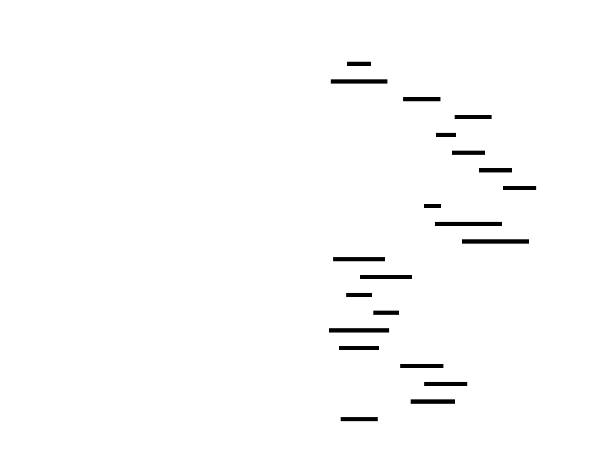

# KVoyage: Distributed Key-Value Store Design Document


## Overview

KVoyage is an educational distributed key-value store that partitions data across nodes using consistent hashing, replicates each key with configurable consistency, and supports distributed transactions. The key architectural challenge is maintaining data availability and consistency while nodes join, leave, or fail in the cluster.


> This guide is meant to help you understand the big picture before diving into each milestone. Refer back to it whenever you need context on how components connect.


## Context and Problem Statement

> **Milestone(s):** This foundational section provides essential background for all milestones (Milestone 1: Consistent Hashing, Milestone 2: Replication, Milestone 3: Cluster Management, Milestone 4: Transactions) by establishing why distributed key-value stores exist and what fundamental challenges they must overcome.

Distributed key-value stores represent one of the most fundamental building blocks of modern cloud infrastructure. At their core, they provide a simple abstraction—store a value by a key, retrieve it later—but distributed across hundreds or thousands of machines. This section establishes why this seemingly simple problem becomes extraordinarily complex when scale, reliability, and consistency requirements collide, and why building such systems requires navigating fundamental trade-offs.

### The Library Analogy: Finding Books in a Distributed System

Imagine a single, massive library containing every book ever published. A patron walks in and asks for a specific book by its title. In a small library, a single librarian might know exactly where every book is located. But in this infinite library, no single person can know the location of every book. 

**The Single Librarian Problem:** If we rely on one all-knowing librarian, several problems emerge:
- The librarian becomes a **single point of failure**—if they get sick, the entire library shuts down.
- They become a **performance bottleneck**—long queues form as every patron must wait for their turn.
- Their memory has **limited capacity**—eventually, they can't remember where new books are stored.

**The Distributed Library Solution:** We solve this by creating a team of librarians, each responsible for a specific section of the library. We introduce a **catalog system** that maps book titles to the responsible librarian. When a patron arrives:
1. They consult the **catalog** to determine which librarian handles their book's title.
2. They walk to that librarian's desk.
3. That librarian retrieves the book from their section.

This distributed approach solves our initial problems but introduces new complexities:

| Library Concept | Distributed System Equivalent | Emerging Complexity |
|----------------|-------------------------------|---------------------|
| Book Title | Key (e.g., `user:alice:profile`) | How do we map keys to librarians uniformly? |
| Librarian | Node/Server | What if a librarian is on break (node failure)? |
| Catalog System | Hash Ring / Partitioning Service | How do we keep the catalog consistent across all patrons? |
| Book Copies | Replicas | Should we make copies in case a book gets lost? |
| Patron Wait Time | Latency | What if the responsible librarian is far away (network latency)? |
| Multiple Patrons Asking for Same Book | Concurrent Access | Who gets the book first if two patrons want it simultaneously? |

**The Catalog as a Hash Ring:** In our library, we could organize books alphabetically. Librarian A handles A-F, Librarian B handles G-L, and so on. This is **range partitioning**. But what if names starting with 'S' are overwhelmingly popular? Librarian S becomes overloaded (**hot spot**). A better approach: we use a **hash function** that converts any book title into a number between 0 and 999. We then arrange these numbers in a **ring** (999 wraps back to 0). Each librarian is assigned a position on this ring and handles all books whose hash falls between their position and the next librarian's position. This is **consistent hashing**, and it distributes load more evenly even when book popularity is skewed.

**Replication as Multiple Copies:** To protect against a librarian losing a book, we store **multiple copies** with different librarians. When a new book arrives, we give it to the primary librarian (by hash) and also make copies with the next two librarians clockwise on the ring. Now if the primary librarian is unavailable, we can ask the secondary. This introduces new questions: Do we wait for all copies to be made before telling the patron the book is stored? What if two patrons try to update the same book with different information at the same time?

This library analogy captures the essence of our distributed key-value store: we're building a **catalog system** (consistent hashing ring), a **team of librarians** (cluster nodes) who can join or leave, a **replication protocol** for making copies, and **coordination rules** for handling concurrent updates. Every complexity in the library has a direct parallel in our technical system.

### What Makes Distributed Systems Hard?

Building distributed systems confronts us with fundamental constraints that don't exist in single-machine programs. These constraints aren't bugs to fix but laws of physics to design around. Understanding these challenges is prerequisite to understanding our architectural choices.

**1. The CAP Theorem: The Impossible Trinity**
The CAP theorem states that in a distributed data store, you can only guarantee two out of three properties simultaneously:

| Property | Description | When You Sacrifice It |
|----------|-------------|------------------------|
| **Consistency (C)** | Every read receives the most recent write or an error. All nodes see the same data at the same time. | System may return stale data during partitions. |
| **Availability (A)** | Every request receives a response (success or failure) without guarantee it contains the most recent write. | System may return errors or timeouts during partitions. |
| **Partition Tolerance (P)** | The system continues operating despite arbitrary message loss or failure of part of the network. | System requires perfect network connectivity. |

> **Key Insight:** Network partitions *will* occur in production—dropped packets, switch failures, misconfigured firewalls. Therefore, **partition tolerance (P) is not optional**. This forces the painful choice between **Consistency (CP)** or **Availability (AP)** during partitions. KVoyage makes this choice configurable per-operation through quorum settings, but the fundamental trade-off cannot be avoided.

**2. The Fallacies of Distributed Computing**
These are assumptions that developers new to distributed systems often make, all of which are dangerously wrong:

| Fallacy | Reality | Consequence for KVoyage |
|---------|---------|-------------------------|
| The network is reliable | Networks fail constantly (packet loss, latency spikes, partitions) | Must implement retries, timeouts, and graceful degradation |
| Latency is zero | Network calls are 1000x slower than memory access | Must minimize round trips, use batching, accept eventual consistency |
| Bandwidth is infinite | Network capacity limits how much data we can transfer | Must compress data, limit gossip message sizes, paginate transfers |
| The network is secure | Anyone can eavesdrop, spoof, or tamper with messages | Should support TLS (though out of scope for educational version) |
| Topology doesn't change | Nodes join, leave, fail; network routes change | Must handle dynamic membership and rebalancing |
| There is one administrator | Multiple teams deploy, configure, and operate different nodes | Must be tolerant to misconfiguration and clock skew |
| Transport cost is zero | Serialization/deserialization and network I/O consume CPU | Must optimize serialization format and connection pooling |
| The network is homogeneous | Different nodes have different network interfaces, MTUs, firewalls | Must use lowest-common-denominator protocols |

**3. The Consensus Trilemma**
For coordination protocols (like deciding which value is correct), we face another impossible choice:

| Aspect | Description | Trade-off |
|--------|-------------|-----------|
| **Safety** | Nothing bad happens (e.g., two different values are never both considered correct) | Requires coordination, increases latency |
| **Liveness** | Something good eventually happens (e.g., requests eventually complete) | May require weakening safety during partitions |
| **Performance** | Operations complete quickly with low overhead | Often conflicts with both safety and liveness guarantees |

**4. Partial Failure and Uncertainty**
In a single machine, failure is binary: the entire program crashes or works. In distributed systems, **partial failure** is the norm:
- Node A can talk to Node B but not Node C
- Node X's disk fails while its network remains up
- A garbage collection pause makes Node Y unresponsive for 2 seconds while it continues receiving messages

This creates **uncertainty**: if we don't hear from a node, is it dead, slow, or network-partitioned? We can never know for sure without waiting indefinitely. Our system must make **timely decisions with incomplete information**, which leads to the next challenge.

**5. The Limits of Time and Order**
Without shared memory, establishing "what happened before what" becomes enormously complex:
- **Clock skew:** Each node's physical clock drifts at different rates (seconds per day)
- **Logical clocks:** We can track causality with Lamport timestamps or vector clocks, but they have overhead
- **Concurrent updates:** Two clients updating the same key from different nodes at "the same time" creates conflict

**6. The Complexity of State Transitions**
When a node fails and recovers, or when a new node joins, the system must transition between consistent states without dropping requests or violating guarantees. These **state transitions** are among the hardest parts to implement correctly:
- **Rebalancing:** Moving data from old nodes to new nodes while continuing to serve requests
- **Failure recovery:** Restoring a failed node's data from replicas without creating inconsistencies
- **Membership changes:** Agreeing on which nodes are currently alive as failures and recoveries happen concurrently

**7. The Testing and Debugging Nightmare**
Distributed systems exhibit emergent behaviors that don't appear in unit tests:
- **Heisenbugs:** Bugs that disappear when you try to observe them
- **Concurrency races:** Timing-dependent bugs that occur once in a million operations
- **Cascading failures:** One node's failure overloads others, causing them to fail too

> **Design Principle:** Given these fundamental constraints, KVoyage embraces **explicit trade-offs** rather than trying to be perfect at everything. We'll make deliberate choices about what to optimize and what to sacrifice, document those choices clearly, and provide knobs to adjust behavior based on application needs.

### Existing Solutions and Their Trade-offs

The distributed systems landscape offers multiple proven architectures, each optimizing for different use cases. Understanding these existing solutions helps us position KVoyage and justify our design decisions.

**Decision: KVoyage's Architectural Heritage**
- **Context:** We need to choose which existing system to use as our primary reference model, balancing educational value with implementation complexity.
- **Options Considered:**
  1. **Dynamo-style (AP with eventual consistency):** Amazon's Dynamo paper emphasizes high availability and partition tolerance, sacrificing strong consistency during partitions.
  2. **Spanner-style (CP with strong consistency:** Google's Spanner uses synchronized clocks and Paxos to provide external consistency (linearizability) across datacenters.
  3. **Cassandra-style (Hybrid):** Apache Cassandra offers tunable consistency per operation, allowing applications to choose between AP and CP behaviors.
- **Decision:** KVoyage follows primarily a **Dynamo-style architecture** with tunable consistency through quorum settings.
- **Rationale:** 
  1. **Educational value:** Dynamo's design is well-documented, conceptually clear, and introduces all core distributed systems concepts (consistent hashing, vector clocks, gossip, hinted handoff).
  2. **Implementation feasibility:** The algorithms are complex but implementable by a motivated learner within the project timeframe.
  3. **Trade-off transparency:** The AP-leaning design makes consistency/availability trade-offs explicit and configurable.
- **Consequences:** 
  - We prioritize availability over strong consistency by default.
  - We must implement conflict resolution for concurrent writes.
  - Learners will experience eventual consistency in action.

The following table compares major distributed data stores that influence KVoyage's design:

| System | Primary Model | Partitioning | Replication | Consistency | Failure Detection | Transactions |
|--------|--------------|--------------|-------------|-------------|-------------------|--------------|
| **Amazon Dynamo** | AP with eventual consistency | Consistent hashing with virtual nodes | Multi-datacenter, hinted handoff | Tunable quorum (R+W>N) | Gossip-based membership | Single-key only |
| **Apache Cassandra** | AP with tunable consistency | Consistent hashing with tokens | Cross-datacenter replication | Per-operation quorum settings | Gossip + failure detection | Lightweight, with Paxos for linearizable reads |
| **Google Spanner** | CP with external consistency | Range partitioning with moving shards | Paxos across zones | Strong (linearizable) via TrueTime | Chubby for membership | Distributed transactions with 2PC |
| **Redis Cluster** | CP with failover | Hash slots with manual sharding | Master-slave with automatic failover | Strong within partition | Ping-based heartbeats | Multi-key only within same hash slot |
| **etcd/ZooKeeper** | CP with linearizability | No partitioning (single logical data set) | Raft/Paxos consensus | Strong (linearizable) | Leader heartbeat | Conditional updates (CAS) |
| **KVoyage (our system)** | AP with tunable consistency | Consistent hashing with virtual nodes | Ring-based replication with hinted handoff | Configurable quorum (R+W>N) | Gossip-based with phi-accrual suspicion | 2PC for multi-key transactions |

**Architecture Decision Records for Foundational Choices:**

**Decision: Eventual Consistency with Tunable Quorums over Strong Consistency**
- **Context:** We must choose our default consistency model, balancing implementation complexity against the guarantees we provide to users.
- **Options Considered:**
  1. **Strong consistency (linearizability):** All operations appear to happen instantaneously at a single point in time.
  2. **Eventual consistency:** Updates propagate asynchronously; reads may return stale data temporarily.
  3. **Tunable consistency:** Per-operation choice between strong and eventual via quorum parameters.
- **Decision:** **Tunable consistency via quorum settings** (R+W>N), leaning toward eventual consistency as default.
- **Rationale:**
  1. **Practical needs:** Most applications can tolerate brief staleness for higher availability.
  2. **Educational value:** Implementing quorums teaches important concepts about read/write overlap.
  3. **Performance:** Eventual consistency allows lower latency writes during normal operation.
- **Consequences:**
  - Users must understand quorum settings to get desired behavior.
  - Conflict resolution is required for concurrent writes.
  - Read-after-write consistency is not guaranteed without proper quorum configuration.

**Decision: Consistent Hashing over Range Partitioning**
- **Context:** We need a method to distribute keys across nodes that minimizes data movement when nodes join/leave.
- **Options Considered:**
  1. **Range partitioning:** Assign contiguous key ranges to nodes (e.g., A-F, G-M).
  2. **Consistent hashing:** Map keys and nodes to a circle using hash functions.
  3. **Directory-based:** Central directory maps each key to a node.
- **Decision:** **Consistent hashing with virtual nodes.**
- **Rationale:**
  1. **Minimal disruption:** Only O(K/N) keys move when a node joins/leaves (with K total keys, N nodes).
  2. **Load balancing:** Virtual nodes help distribute load more evenly than physical nodes alone.
  3. **Decentralization:** No central directory required (single point of failure).
- **Consequences:**
  - More complex implementation than simple modulo-based hashing.
  - Sequential key scans are inefficient (keys not stored contiguously).
  - Virtual nodes increase memory usage for ring representation.

**Decision: Gossip-Based Membership over Centralized Coordination Service**
- **Context:** Nodes need to discover each other and detect failures without a central coordinator.
- **Options Considered:**
  1. **Centralized coordinator:** One node maintains membership list, others query it.
  2. **Gossip protocol:** Nodes periodically exchange membership information with random peers.
  3. **Heartbeat broadcast:** All nodes send heartbeats to all others.
- **Decision:** **Gossip-based membership dissemination with phi-accrual failure detection.**
- **Rationale:**
  1. **Fault tolerance:** No single point of failure.
  2. **Scalability:** Each node communicates with only a subset of others (O(log N) fanout).
  3. **Robustness:** Gossip naturally handles network partitions and heals when connectivity resumes.
- **Consequences:**
  - Eventual consistency of membership views (different nodes may temporarily have different views).
  - Parameter tuning required for gossip frequency vs. convergence time.
  - More complex to implement than simple heartbeating.

**Decision: Vector Clocks over Last-Write-Wins for Conflict Resolution**
- **Context:** When concurrent writes happen to the same key, we need to determine which value(s) to keep.
- **Options Considered:**
  1. **Last-write-wins (LWW):** Use timestamps; the latest timestamp wins.
  2. **Vector clocks:** Track causal history; detect concurrent updates.
  3. **Application-level resolution:** Return all conflicting values to the client.
- **Decision:** **Vector clocks for detecting conflicts, with LWW as automatic resolution.**
- **Rationale:**
  1. **Causality tracking:** Vector clocks distinguish between causally related and concurrent updates.
  2. **Educational value:** Implementing vector clocks teaches important concepts about partial ordering.
  3. **Practical compromise:** Automatic LWW resolution works for many use cases while preserving conflict detection.
- **Consequences:**
  - Vector clocks grow unbounded (requires pruning strategies).
  - More metadata overhead per key than simple timestamps.
  - Clients may need to handle multiple values if automatic resolution is disabled.

> **Key Insight:** Every distributed system design involves fundamental trade-offs. There is no "perfect" solution—only solutions optimized for specific use cases. KVoyage's design makes these trade-offs explicit and configurable, allowing learners to understand the consequences of each choice through hands-on implementation.

**Common Pitfalls in Understanding Distributed Systems Foundations:**

⚠️ **Pitfall: Assuming "It Works on My Machine" Means It's Correct**
- **Description:** A distributed system appears to work correctly during local testing with no network faults.
- **Why It's Wrong:** Distributed systems bugs often only manifest under specific timing conditions, network partitions, or concurrent failures that don't occur in ideal testing environments.
- **How to Avoid:** Implement and run chaos tests from the beginning—simulate network delays, packet loss, and node failures even in early development.

⚠️ **Pitfall: Treating Time as Absolute**
- **Description:** Using system clock timestamps for ordering events across different machines.
- **Why It's Wrong:** Clock skew means two events that actually happened in one order might receive timestamps suggesting the opposite order.
- **How to Avoid:** Use logical clocks (Lamport timestamps or vector clocks) for causal ordering, and only use physical timestamps when you can bound clock skew (like Google's TrueTime, which requires special hardware).

⚠️ **Pitfall: Ignoring the "Unhappy Path"**
- **Description:** Implementing only the success case for each operation.
- **Why It's Wrong:** In production, failures are common—nodes crash, networks partition, disks fill up. The system's behavior during failures defines its reliability.
- **How to Avoid:** For every operation, ask: "What happens if node X fails halfway through? What if we get only partial responses? What if a timeout occurs?" Implement retry, cleanup, and reconciliation logic.

⚠️ **Pitfall: Over-Engineering for Theoretical Edge Cases**
- **Description:** Trying to handle every possible failure scenario with complex coordination protocols.
- **Why It's Wrong:** Excessive coordination reduces availability and increases latency. Some edge cases are so rare that simpler solutions (like manual intervention) are acceptable.
- **How to Avoid:** Apply the **rule of three**: Only handle failure cases you've seen occur at least three times in testing or that have well-documented production occurrences in similar systems.

### Implementation Guidance

While this foundational section doesn't require code implementation, establishing proper project structure and tooling from the start prevents technical debt accumulation. Here's how to set up your KVoyage project for success.

**A. Technology Recommendations Table**

| Component | Simple Option (Recommended for Milestones 1-2) | Advanced Option (Consider for Milestones 3-4) |
|-----------|-----------------------------------------------|---------------------------------------------|
| **Transport Layer** | HTTP/1.1 with JSON over TCP (Go: `net/http`) | gRPC with Protocol Buffers (Go: `google.golang.org/grpc`) |
| **Serialization** | JSON (Go: `encoding/json`) | Protocol Buffers (Go: `google.golang.org/protobuf`) |
| **Hashing** | SHA-256 (Go: `crypto/sha256`) | MurmurHash3 or xxHash for faster non-cryptographic hashing |
| **Concurrency** | Goroutines + Channels (Go: built-in) | `sync.Map` for concurrent maps, `sync.RWMutex` for fine-grained control |
| **Persistence** | In-memory with periodic snapshot to disk | LSM-tree inspired storage (Go: `github.com/syndtr/goleveldb/leveldb`) |
| **Testing** | Go's built-in testing + `net/http/httptest` | Custom network fault injection, property-based testing (`github.com/leanovate/gopter`) |
| **Logging** | Structured logging with levels (Go: `log/slog`) | Distributed tracing with OpenTelemetry |

**B. Recommended File/Module Structure**

```
kvoyage/
├── cmd/
│   ├── server/                 # Main server executable
│   │   └── main.go            # Server entry point with CLI flags
│   └── client/                 # CLI client for testing
│       └── main.go            # Client entry point
├── internal/                   # Private application code
│   ├── config/                # Configuration structures and parsing
│   │   ├── config.go          # Config struct with defaults
│   │   └── parse.go           # Config parsing from file/env vars
│   ├── hashring/              # Milestone 1: Consistent hashing ring
│   │   ├── hashring.go        # Main HashRing struct and methods
│   │   ├── node.go            # Physical/Virtual node definitions
│   │   ├── rebalance.go       # Key redistribution logic
│   │   └── hashring_test.go   # Unit tests
│   ├── replication/           # Milestone 2: Replication manager
│   │   ├── manager.go         # Quorum read/write coordination
│   │   ├── quorum.go          # Quorum calculation and validation
│   │   ├── vectorclock.go     # Vector clock implementation
│   │   ├── hintedhandoff.go   # Hinted handoff queue
│   │   └── replication_test.go
│   ├── cluster/               # Milestone 3: Cluster management
│   │   ├── gossip.go          # Gossip protocol implementation
│   │   ├── membership.go      # Node membership tracking
│   │   ├── failure_detector.go # Phi-accrual failure detection
│   │   └── cluster_test.go
│   ├── transaction/           # Milestone 4: Transaction manager
│   │   ├── coordinator.go     # 2PC coordinator logic
│   │   ├── participant.go     # 2PC participant logic
│   │   ├── mvcc.go            # Multi-version concurrency control
│   │   └── transaction_test.go
│   ├── storage/               # Local key-value storage engine
│   │   ├── engine.go          # Storage interface
│   │   ├── memory.go          # In-memory implementation
│   │   └── disk.go            # Persistent disk storage
│   ├── transport/             # Network communication layer
│   │   ├── http.go            # HTTP transport implementation
│   │   ├── rpc.go             # RPC client and server abstractions
│   │   └── codec.go           # Request/response serialization
│   └── types/                 # Common data types
│       ├── keyvalue.go        # KeyValue pair with metadata
│       ├── node.go            # Node address and status
│       └── error.go           # Domain-specific errors
├── pkg/                       # Public libraries (if any)
│   └── client/                # Go client library for KVoyage
├── api/                       # API definitions
│   └── v1/                    # Version 1 API
│       └── kvoyage.proto      # gRPC proto file (if using gRPC)
├── scripts/                   # Utility scripts
│   ├── chaos-test.sh          # Network chaos injection
│   └── benchmark.sh           # Performance benchmarking
├── test/                      # Integration tests
│   ├── cluster_test.go        # Multi-node cluster tests
│   └── chaos/                 # Chaos engineering tests
├── go.mod                     # Go module definition
├── go.sum                     # Go dependencies checksum
├── Dockerfile                 # Containerization
└── README.md                  # Project documentation
```

**C. Infrastructure Starter Code**

**File: `internal/transport/http.go`** (Complete transport layer helper)
```go
package transport

import (
    "context"
    "encoding/json"
    "fmt"
    "io"
    "net/http"
    "time"
)

// Request represents an RPC request with a method and arguments
type Request struct {
    Method string      `json:"method"`
    Args   interface{} `json:"args"`
}

// Response represents an RPC response with result or error
type Response struct {
    Result interface{} `json:"result,omitempty"`
    Error  string      `json:"error,omitempty"`
    OK     bool        `json:"ok"`
}

// Client is an HTTP-based RPC client
type Client struct {
    baseURL    string
    httpClient *http.Client
    timeout    time.Duration
}

// NewClient creates a new RPC client for the given node address
func NewClient(addr string, timeout time.Duration) *Client {
    return &Client{
        baseURL:    fmt.Sprintf("http://%s", addr),
        httpClient: &http.Client{Timeout: timeout},
        timeout:    timeout,
    }
}

// Call sends an RPC request to the server and decodes the response
func (c *Client) Call(ctx context.Context, method string, args interface{}, result interface{}) error {
    // Create request body
    reqBody := Request{Method: method, Args: args}
    jsonBody, err := json.Marshal(reqBody)
    if err != nil {
        return fmt.Errorf("marshal request: %w", err)
    }

    // Create HTTP request
    ctx, cancel := context.WithTimeout(ctx, c.timeout)
    defer cancel()
    
    httpReq, err := http.NewRequestWithContext(ctx, "POST", c.baseURL+"/rpc", bytes.NewReader(jsonBody))
    if err != nil {
        return fmt.Errorf("create HTTP request: %w", err)
    }
    httpReq.Header.Set("Content-Type", "application/json")

    // Send request
    resp, err := c.httpClient.Do(httpReq)
    if err != nil {
        return fmt.Errorf("HTTP request failed: %w", err)
    }
    defer resp.Body.Close()

    // Read response
    body, err := io.ReadAll(resp.Body)
    if err != nil {
        return fmt.Errorf("read response body: %w", err)
    }

    // Decode response
    var rpcResp Response
    if err := json.Unmarshal(body, &rpcResp); err != nil {
        return fmt.Errorf("unmarshal response: %w", err)
    }

    // Check for RPC-level error
    if !rpcResp.OK {
        return fmt.Errorf("RPC error: %s", rpcResp.Error)
    }

    // Decode result if expected
    if result != nil && rpcResp.Result != nil {
        resultJSON, err := json.Marshal(rpcResp.Result)
        if err != nil {
            return fmt.Errorf("marshal result: %w", err)
        }
        if err := json.Unmarshal(resultJSON, result); err != nil {
            return fmt.Errorf("unmarshal result: %w", err)
        }
    }

    return nil
}

// Server registers HTTP handlers for RPC methods
type Server struct {
    handlers map[string]func(args json.RawMessage) (interface{}, error)
}

// NewServer creates a new RPC server
func NewServer() *Server {
    return &Server{
        handlers: make(map[string]func(args json.RawMessage) (interface{}, error)),
    }
}

// RegisterHandler registers a handler for an RPC method
func (s *Server) RegisterHandler(method string, handler func(args json.RawMessage) (interface{}, error)) {
    s.handlers[method] = handler
}

// ServeHTTP implements http.Handler interface
func (s *Server) ServeHTTP(w http.ResponseWriter, r *http.Request) {
    // Only accept POST requests
    if r.Method != "POST" {
        http.Error(w, "method not allowed", http.StatusMethodNotAllowed)
        return
    }

    // Read request body
    body, err := io.ReadAll(r.Body)
    if err != nil {
        http.Error(w, "failed to read request body", http.StatusBadRequest)
        return
    }
    defer r.Body.Close()

    // Decode RPC request
    var req Request
    if err := json.Unmarshal(body, &req); err != nil {
        http.Error(w, "invalid JSON request", http.StatusBadRequest)
        return
    }

    // Find handler
    handler, ok := s.handlers[req.Method]
    if !ok {
        resp := Response{OK: false, Error: fmt.Sprintf("unknown method: %s", req.Method)}
        json.NewEncoder(w).Encode(resp)
        return
    }

    // Call handler
    argsJSON, _ := json.Marshal(req.Args)
    result, err := handler(argsJSON)
    
    // Send response
    resp := Response{OK: err == nil}
    if err != nil {
        resp.Error = err.Error()
    } else {
        resp.Result = result
    }
    
    w.Header().Set("Content-Type", "application/json")
    json.NewEncoder(w).Encode(resp)
}
```

**D. Core Logic Skeleton Code**

**File: `internal/types/keyvalue.go`** (Core data types with TODOs)
```go
package types

import (
    "time"
)

// Key is the type for keys in the key-value store
type Key string

// Value is the type for values in the key-value store
type Value []byte

// KeyValue represents a key-value pair with metadata
type KeyValue struct {
    Key       Key         `json:"key"`
    Value     Value       `json:"value"`
    Timestamp time.Time   `json:"timestamp"` // Physical timestamp (for LWW)
    // TODO 1: Add VectorClock field for tracking causal history
    // TODO 2: Add Version field for MVCC (multi-version concurrency control)
    // TODO 3: Add TTL field for automatic expiration (optional enhancement)
}

// VectorClockEntry represents one entry in a vector clock
type VectorClockEntry struct {
    NodeID  string `json:"node_id"`
    Counter int64  `json:"counter"`
}

// VectorClock tracks causal history across multiple nodes
type VectorClock []VectorClockEntry

// TODO 4: Implement Compare method for VectorClock
// Compare returns:
// - -1 if vc1 happens before vc2
// - 0 if vc1 and vc2 are equal
// - 1 if vc1 happens after vc2
// - 2 if vc1 and vc2 are concurrent
func (vc1 VectorClock) Compare(vc2 VectorClock) int {
    // TODO 5: Implement vector clock comparison logic
    // Hint: For each node, compare counters. If all counters in vc1 <= vc2 and at least one <, vc1 happens before vc2.
    return 0
}

// TODO 6: Implement Merge method for VectorClock
// Merge returns a new vector clock with the maximum counters from both clocks
func (vc1 VectorClock) Merge(vc2 VectorClock) VectorClock {
    // TODO 7: Create a new vector clock with max counter for each node
    return VectorClock{}
}

// TODO 8: Implement Increment method for VectorClock
// Increment increases the counter for the given node
func (vc VectorClock) Increment(nodeID string) VectorClock {
    // TODO 9: Find entry for nodeID, increment counter, or add new entry
    return VectorClock{}
}
```

**E. Language-Specific Hints for Go**

1. **Concurrency**: Use `go func() { ... }()` for fire-and-forget operations, but always recover from panics in goroutines. Use `sync.WaitGroup` to wait for multiple goroutines to complete.

2. **Error Handling**: Always wrap errors with context using `fmt.Errorf("...: %w", err)`. Define sentinel errors with `errors.New()` for error types that callers should check against.

3. **Testing**: Use table-driven tests with subtests. For network tests, use `net.Listen("tcp", "localhost:0")` to get a free port. The `httptest` package is excellent for HTTP server testing.

4. **Performance**: Use `sync.Pool` for frequently allocated objects (like buffers). Preallocate slices with known capacity using `make([]T, 0, capacity)`. Use `strings.Builder` for string concatenation in loops.

5. **Serialization**: JSON is easy but slow. Consider using `json.RawMessage` for delayed parsing. For production, Protocol Buffers are 3-10x faster and smaller.

**F. Milestone Checkpoint**

After reading this section (before writing any code), you should be able to:

1. **Explain the trade-offs** in your own words:
   - Run: `go run cmd/client/main.go --help` (when implemented) and explain what consistency flag you would use for a session store vs. a shopping cart.
   - Document: Write a brief paragraph explaining why KVoyage can't guarantee both perfect consistency and perfect availability during network partitions.

2. **Identify potential failure scenarios**:
   - List 5 specific things that could go wrong in a 3-node KVoyage cluster.
   - For each, describe how the system should behave (fail fast, retry, degrade gracefully).

3. **Map concepts to implementation**:
   - Create a table mapping library analogy concepts (books, librarians, catalog) to KVoyage components (keys, nodes, hash ring).
   - Draw a simple diagram showing how a key "user:123:profile" gets routed to a node.

**G. Debugging Tips**

| Symptom | Likely Cause | How to Diagnose | Fix |
|---------|--------------|-----------------|-----|
| Can't understand why a design choice was made | Missing context about trade-offs | Re-read the ADR (Architecture Decision Record) tables | Each ADR explains Context → Options → Decision → Rationale → Consequences |
| Feeling overwhelmed by complexity | Trying to implement everything at once | Focus on one milestone at a time, mock other components | Implement hash ring first with static node list, mock replication |
| Tests pass locally but fail in CI | Timing differences or race conditions | Add `-race` flag to Go tests, increase timeouts | Use `sync` primitives correctly, add jitter to timers |

---


## Goals and Non-Goals

> **Milestone(s):** All milestones (1: Consistent Hashing, 2: Replication, 3: Cluster Management, 4: Transactions)

This section establishes the boundaries of the KVoyage project by defining what the system must achieve (goals) and what it deliberately will not address (non-goals). For an educational project, explicit non-goals are particularly important—they prevent scope creep and help learners focus on core distributed systems concepts without being overwhelmed by production-grade complexities.

### Must-Have Goals

KVoyage is designed as an educational system that implements fundamental distributed systems patterns through hands-on experience. The following goals are derived directly from the project milestones and represent the minimum viable feature set that constitutes a functional distributed key-value store.

| Goal Category | Specific Goal | Rationale | Success Criteria |
|---------------|---------------|-----------|------------------|
| **Data Partitioning** | Implement **consistent hashing** with virtual nodes for key distribution across a dynamic set of nodes. | Provides horizontal scalability and minimal data movement during cluster changes, a cornerstone of distributed storage systems. | - Keys are distributed with <10% standard deviation across nodes<br>- Node addition/removal moves only keys between adjacent ring positions<br>- Virtual nodes reduce load imbalance |
| **Replication & Consistency** | Support **configurable replication factor (N)** with **quorum-based read/write operations (R/W)** and **eventual consistency**. | Enables fault tolerance and allows exploration of CAP trade-offs; quorum operations provide tunable consistency guarantees. | - Each key replicated to N consecutive ring nodes<br>- Reads require R replies, writes require W acks (R+W>N)<br>- Conflicting writes resolved via vector clocks or timestamps |
| **Cluster Management** | Implement **gossip-based membership protocol** with **failure detection** and **automatic rebalancing**. | Enables self-organizing clusters that can survive node failures without manual intervention. | - Membership changes propagate within bounded gossip rounds<br>- Unresponsive nodes detected within configurable timeout<br>- Keys automatically rebalance when nodes join/leave |
| **Distributed Transactions** | Provide **single-key linearizability** and **multi-key transactions** using **two-phase commit (2PC)** with **optimistic concurrency control**. | Teaches coordination across shards and consistency guarantees in distributed transactions. | - Single-key operations satisfy linearizability<br>- Multi-key transactions are atomic (all-or-nothing)<br>- Conflicts detected and resolved at commit time |
| **Educational Clarity** | Codebase structured for **learning comprehension** with clear separation of concerns and extensive documentation. | Primary purpose is education; implementation should illuminate concepts rather than optimize for production. | - Each component has well-defined interface<br>- Algorithm steps map to TODO comments in code<br>- Design decisions documented via ADRs |
| **Operational Visibility** | Provide **logging, metrics, and debugging endpoints** to observe system behavior during development. | Essential for debugging distributed systems; helps learners understand internal state and data flow. | - HTTP endpoints expose ring state, membership, and metrics<br>- Structured logs show component interactions<br>- Debug tools visualize hash ring and replica placement |

> **Design Principle:** *Focus on Concept Implementation* – KVoyage prioritizes clear implementation of distributed algorithms over performance optimization. Learners should emerge understanding *how* consistent hashing works, *why* quorums provide consistency guarantees, and *what* happens during 2PC—not just that the system is fast.

In addition to these functional goals, KVoyage has several **quality goals** that guide implementation decisions:

1. **Conceptual Integrity**: Each component should correspond to a clear distributed systems concept (consistent hashing, gossip, 2PC) with minimal overlap.
2. **Testability**: Components must be unit-testable in isolation and integration-testable as a whole, with deterministic behavior where possible.
3. **Observability**: Internal state transitions, message flows, and decision points must be visible through logs and metrics.
4. **Minimal Dependencies**: Use standard library features where possible; avoid external dependencies that obscure core algorithm implementation.

The following table maps goals to the primary components responsible for their implementation:

| Goal | Primary Component | Supporting Components | Verification Method |
|------|-------------------|----------------------|---------------------|
| Consistent key distribution | `HashingRing` | `ClusterManager` | Statistical distribution tests |
| Configurable replication | `ReplicationManager` | `StorageEngine` | Quorum read/write tests |
| Cluster membership | `ClusterManager` | Gossip protocol | Convergence time tests |
| Distributed transactions | `TransactionManager` | `ReplicationManager`, `HashingRing` | Linearizability tests |
| Fault tolerance | All components | `FailureDetector`, `HintedHandoff` | Chaos/failure injection tests |

### Explicit Non-Goals

The following are intentionally excluded from KVoyage's scope. These represent features that, while important in production systems, would distract from core educational objectives or require disproportionate implementation effort relative to learning value.

| Non-Goal Category | Specific Exclusion | Rationale | Alternative for Learners |
|-------------------|-------------------|-----------|--------------------------|
| **Production Hardening** | No **persistent disk storage** with crash recovery (WAL, SSTables). | Implementing durable storage engines (LSM-trees, B-trees) is a separate, complex topic beyond distributed algorithms. | Use in-memory storage; learners can optionally implement simple file-based storage as extension. |
| **High Performance** | No **low-latency optimizations** (pipelining, request coalescing, zero-copy networking). | Performance tuning obscures algorithm clarity and requires advanced systems programming. | Focus on correctness first; performance improvements can be added after core algorithms work. |
| **Advanced Features** | No **secondary indexes**, **range queries**, or **SQL-like query language**. | These are database features beyond core key-value store functionality. | Implement simple scan operations if needed; focus on point reads/writes. |
| **Security** | No **authentication**, **authorization**, or **encryption** (TLS). | Security adds complexity without illuminating distributed systems concepts. | Assume trusted network environment; for production, use existing security frameworks. |
| **Multi-Datacenter** | No **geo-replication**, **cross-region latency optimization**, or **rack awareness**. | These are advanced topics requiring complex topology management. | Replication assumes homogeneous network; learners can extend with zone awareness later. |
| **Automatic Scaling** | No **auto-scaling** based on load metrics or **predictive rebalancing**. | Requires sophisticated monitoring and decision systems beyond educational scope. | Manual node addition/removal via admin API suffices for learning. |
| **Complex Administration** | No **GUI management console**, **automated backups**, or **point-in-time recovery**. | Administration tools are application-layer concerns. | Use command-line tools and debug endpoints for management. |
| **Protocol Efficiency** | No **custom binary protocols** or **protocol negotiation**. | HTTP/JSON provides simplicity and debuggability for learning. | Use standard HTTP/REST with JSON; learners can replace with gRPC as extension. |

> **Design Principle:** *Defer Production Concerns* – KVoyage deliberately excludes production features that would require significant implementation effort without corresponding educational value. Learners should understand these features exist in real systems but implement them only after mastering core algorithms.

The non-goals create important **design constraints** that simplify implementation:

1. **In-Memory Storage**: All data can reside in RAM, eliminating complex disk I/O synchronization issues.
2. **Single-Datacenter Model**: Assume low-latency, reliable network within a single cluster.
3. **Trusted Environment**: No malicious actors; nodes cooperate as designed.
4. **Manual Operation**: Cluster changes initiated via API calls, not automatic scaling.

The following ADR formalizes the most significant scope decision:

> **Decision: In-Memory Storage Without Durability**
> - **Context**: KVoyage needs a storage layer but implementing production-grade persistent storage (WAL, compaction, recovery) would consume disproportionate development time and distract from distributed algorithms.
> - **Options Considered**:
>   1. **In-memory maps with optional persistence**: Simple Go maps storing `map[Key]*Value`; optionally flush to disk on shutdown.
>   2. **Embedded key-value store (Badger, RocksDB)**: Use existing embedded KV stores for persistence.
>   3. **Custom LSM-tree implementation**: Implement log-structured merge-trees from scratch for educational value.
> - **Decision**: Option 1 (in-memory maps with optional persistence to disk as extension).
> - **Rationale**: 
>   - **Focus**: Keeps attention on distribution, not storage engineering.
>   - **Simplicity**: No complex serialization formats or compaction strategies needed.
>   - **Testability**: In-memory storage is deterministic and fast for tests.
>   - **Extensibility**: Learners can later add disk persistence without changing distributed components.
> - **Consequences**:
>   - **Positive**: Faster implementation, easier debugging, no disk I/O bottlenecks.
>   - **Negative**: Data loss on node failure, limited dataset size by RAM, not production-ready.

| Storage Option | Pros | Cons | Why Not Chosen |
|----------------|------|------|----------------|
| **In-memory maps** | Simple, fast, deterministic for tests | Volatile, limited by RAM | **Chosen** – aligns with educational focus |
| **Embedded KV store** | Persistent, battle-tested, efficient | Black box, obscures storage concepts | Adds dependency without educational value |
| **Custom LSM-tree** | Teaches storage engineering | Huge scope, distracts from distribution | Could be separate project milestone |

Another critical non-goal decision addresses security:

> **Decision: No Security Layer**
> - **Context**: Distributed systems security (TLS, authentication, authorization) is important but orthogonal to core algorithms.
> - **Options Considered**:
>   1. **No security**: Assume trusted network environment.
>   2. **Basic TLS**: Implement transport encryption only.
>   3. **Full security stack**: Authentication, authorization, auditing.
> - **Decision**: Option 1 (no security).
> - **Rationale**:
>   - **Focus Priority**: Security implementation would consume 30%+ of development time.
>   - **Learning Sequence**: Security is best learned after understanding base protocols.
>   - **Environment**: Educational deployments typically use isolated networks.
> - **Consequences**:
>   - **Positive**: Faster development, simpler debugging, no certificate management.
>   - **Negative**: Not deployable in untrusted environments, learners must understand this limitation.

By explicitly stating these non-goals, we establish clear boundaries that enable focused learning. Learners who complete all milestones will have implemented a *conceptually complete* distributed key-value store that demonstrates fundamental algorithms, not a production-ready system. This approach maximizes educational return on implementation effort.


## High-Level Architecture
> **Milestone(s):** All milestones (1: Consistent Hashing, 2: Replication, 3: Cluster Management, 4: Transactions)

This section presents the bird's-eye view of KVoyage's architecture. We'll explore how the major components fit together, define their responsibilities, establish the project's file structure, and explain their communication patterns. Think of KVoyage as a distributed library system: the **Hashing Ring** acts as the card catalog telling you which shelf holds a book, the **Replication Manager** ensures multiple copies exist on different shelves for safety, the **Cluster Manager** is like the staff rumor mill that tracks who's working today, and the **Transaction Manager** coordinates when you need to check out multiple books at once from different sections.


### Component Overview and Responsibilities

KVoyage follows a layered architecture where each component has a clear, single responsibility. The system is designed as a collection of loosely coupled managers that communicate via well-defined APIs, making it easier to develop, test, and reason about. Below is the complete component breakdown:

#### Core System Components

| Component | Primary Responsibility | Key Data Owned | Critical Operations |
|-----------|------------------------|----------------|---------------------|
| **Hashing Ring** | Maps keys to responsible nodes using consistent hashing | Hash ring state (virtual nodes, token positions), node-to-token mappings | `LocateNode(key)`, `AddNode(node)`, `RemoveNode(node)`, `GetReplicaSet(key, N)` |
| **Replication Manager** | Manages replication of key-value pairs across nodes with configurable consistency | Replica sets per key, vector clocks for versioning, hinted handoff queue | `Put(key, value, consistency)`, `Get(key, consistency)`, `ReadRepair(replicaSet)`, `SyncReplicas(key)` |
| **Cluster Membership Manager** | Maintains cluster membership view and detects node failures | Node membership list (alive/suspect/dead), gossip state, failure detection timers | `Gossip(stateUpdate)`, `MarkNodeSuspect(node)`, `UpdateMembership(change)`, `TriggerRebalance()` |
| **Transaction Manager** | Coordinates distributed transactions across multiple keys/nodes | Transaction state (active/prepared/committed), lock tables, MVCC versions | `BeginTransaction()`, `Prepare(txID)`, `Commit(txID)`, `Abort(txID)`, `GetSnapshot(timestamp)` |
| **Storage Engine** | Provides persistent storage for key-value data on each node | On-disk key-value data, write-ahead log (WAL), index structures | `PutLocal(key, value)`, `GetLocal(key)`, `ScanLocal(prefix)`, `WriteWAL(entry)` |
| **RPC Transport** | Handles network communication between nodes | Connection pools, request/response serialization | `SendRPC(node, method, args)`, `RegisterHandler(method, handler)`, `Listen(port)` |
| **Client Library** | Provides API for applications to interact with the cluster | Request routing, retry logic, consistency level handling | `Put(key, value)`, `Get(key)`, `Delete(key)`, `ExecuteTransaction(ops)` |

#### Mental Model: The Distributed Library System

To build intuition for how these components work together, imagine KVoyage as a large library system spread across multiple buildings:

1. **Hashing Ring as the Card Catalog**: When you want a book (key), you consult the card catalog (hashing ring) which tells you exactly which building and shelf (node) should contain it. The catalog uses a special numbering system (consistent hashing) that minimizes reorganization when new buildings are added.

2. **Replication Manager as the Copying Department**: For important books, the library makes N copies and stores them in different buildings. The copying department ensures that when you update a book, all copies eventually get updated, and when you read a book, you check enough copies to be confident you have the latest version.

3. **Cluster Manager as the Staff Directory**: A constantly updated directory tracks which librarians are on duty, which are on break, and which have gone home. When someone joins or leaves, the news spreads through the staff grapevine (gossip protocol).

4. **Transaction Manager as the Reservation Desk**: When you need to check out multiple related books at once, the reservation desk holds them all for you temporarily, ensures no one else takes them while you're gathering them, and either gives you all of them or none at all (atomicity).

5. **Storage Engine as the Individual Bookshelves**: Each building has its own shelving system that actually stores the books, with a ledger (WAL) tracking what books were added or removed and when.

#### Component Interactions at Runtime

At startup, each node initializes all components. The **Cluster Membership Manager** begins gossiping to discover other nodes and establish the cluster view. Once the cluster stabilizes, the **Hashing Ring** builds its internal representation of the hash ring using the current membership. The **Replication Manager** then starts anti-entropy processes to synchronize replicas. The **Transaction Manager** initializes its recovery log to handle any pending transactions from previous runs.

When a client request arrives:
1. The **RPC Transport** receives it and routes it to the appropriate handler
2. For simple reads/writes: the **Hashing Ring** determines which nodes should handle the key, the **Replication Manager** coordinates the quorum operation
3. For transactions: the **Transaction Manager** takes over, coordinating with multiple nodes and managing locks
4. The **Storage Engine** persists data locally on each node
5. Throughout, the **Cluster Membership Manager** monitors node health and triggers rebalancing if nodes join or leave

#### Component Data Structures

Each component maintains specific internal state. Here are the core data structures owned by each component:

**Hashing Ring State:**
| Field Name | Type | Description |
|------------|------|-------------|
| `ringTokens` | `[]uint64` | Sorted list of hash positions on the ring |
| `tokenToNode` | `map[uint64]string` | Maps each token to its physical node ID |
| `virtualNodesPerPhysical` | `int` | Number of virtual nodes per physical node (configurable) |
| `nodeLoad` | `map[string]int` | Tracks approximate key count per node for balancing |

**Replication Manager State:**
| Field Name | Type | Description |
|------------|------|-------------|
| `replicationFactor` | `int` | Default N (number of replicas per key) |
| `hintedHandoffQueue` | `map[string][]HintedWrite` | Writes pending delivery to unavailable nodes |
| `vectorClocks` | `map[Key]VectorClock` | Latest vector clock for each key (for conflict detection) |
| `readRepairQueue` | `chan ReadRepairTask` | Background tasks to fix replica inconsistencies |

**Cluster Membership Manager State:**
| Field Name | Type | Description |
|------------|------|-------------|
| `members` | `map[string]NodeState` | Current state of all known nodes |
| `gossipHistory` | `map[string]uint64` | Version numbers for gossip state to avoid loops |
| `suspicionTimers` | `map[string]*time.Timer` | Timers tracking node responsiveness |
| `localNodeState` | `NodeState` | This node's own state in the cluster |

**Transaction Manager State:**
| Field Name | Type | Description |
|------------|------|-------------|
| `activeTransactions` | `map[string]TransactionState` | All in-progress transactions |
| `lockTable` | `map[Key]LockEntry` | Locks held by transactions |
| `mvccVersions` | `map[Key][]VersionedValue` | Multiple versions for snapshot isolation |
| `transactionLog` | `*wal.WAL` | Persistent log for recovery |

**Storage Engine State:**
| Field Name | Type | Description |
|------------|------|-------------|
| `dataStore` | `map[Key]Value` | In-memory cache of key-value pairs (or index to disk) |
| `writeAheadLog` | `*os.File` | Append-only log for crash recovery |
| `keyIndex` | `map[Key]FilePosition` | Maps keys to positions in data files |
| `compactionCursor` | `uint64` | Tracks progress of background compaction |

#### Architecture Decision Record: Monolithic vs Microservices Design

> **Decision: Single-Process Monolithic Architecture**
> - **Context**: KVoyage is an educational project where learners need to understand the complete system on a single machine. The primary goals are learning distributed systems concepts, not building production infrastructure.
> - **Options Considered**:
>   1. **Single-process monolith**: All components run in one process, communicating via function calls and channels
>   2. **Multi-process on single machine**: Each component as separate process, communicating via localhost RPC
>   3. **Containerized microservices**: Each component in separate container, requiring orchestration
> - **Decision**: Single-process monolithic architecture with clear component boundaries via interfaces
> - **Rationale**:
>   - **Simplicity for learning**: Learners can run the entire system with `go run`, debug with a single debugger, and see all logs in one place
>   - **Easier testing**: Unit tests can test component interactions without network setup
>   - **Performance**: Inter-component communication via function calls is faster than serialization/RPC
>   - **Progressive complexity**: The design can be evolved to multi-process later by replacing internal interfaces with RPC
> - **Consequences**:
>   - **Positive**: Simplified deployment and debugging, faster development iteration
>   - **Negative**: Cannot simulate real network partitions between components, single point of failure for the process
>   - **Mitigation**: Use configurable network failure injection for testing partition scenarios

| Option | Pros | Cons | Why Chosen? |
|--------|------|------|-------------|
| Single-process monolith | Easy to run/debug, fast inter-component communication, simple testing | Can't simulate intra-node network issues, process failure takes down all components | Primary goal is education, not production deployment |
| Multi-process local | Can simulate network issues between components, more realistic | Complex setup, harder to debug, slower development cycle | Overly complex for learning objectives |
| Containerized microservices | Most realistic, good for production patterns | Maximum complexity, resource intensive, orchestration overhead | Beyond scope of educational project |

### Recommended File/Module Structure

A well-organized codebase is critical for managing complexity. KVoyage uses a standard Go project layout with clear separation of concerns. The structure below balances modularity with simplicity for learners:

```
kvoyage/
├── cmd/                          # Entry points
│   ├── server/                   # Main server executable
│   │   ├── main.go               # Server entry point with component wiring
│   │   └── config.yaml           # Server configuration template
│   └── client/                   # CLI client executable
│       ├── main.go               # Client entry point
│       └── kvoyage-cli.go        # CLI command definitions
├── internal/                     # Private application code
│   ├── hashing/                  # Milestone 1: Consistent Hashing
│   │   ├── ring.go              # Hash ring implementation
│   │   ├── ring_test.go         # Unit tests
│   │   ├── virtual_nodes.go     # Virtual node management
│   │   └── rebalance.go         # Key redistribution logic
│   ├── replication/              # Milestone 2: Replication
│   │   ├── manager.go           # Replication manager
│   │   ├── quorum.go            # Quorum calculations and operations
│   │   ├── hinted_handoff.go    # Hinted handoff implementation
│   │   ├── vector_clock.go      # Vector clock implementation
│   │   └── conflict_resolution.go # Conflict resolution logic
│   ├── cluster/                  # Milestone 3: Cluster Management
│   │   ├── membership.go        # Membership manager
│   │   ├── gossip.go            # Gossip protocol implementation
│   │   ├── failure_detector.go  # Failure detection (phi-accrual)
│   │   └── rebalance_handler.go # Automatic rebalancing triggers
│   ├── transaction/             # Milestone 4: Transactions
│   │   ├── manager.go           # Transaction manager
│   │   ├── twophase.go          # Two-phase commit implementation
│   │   ├── mvcc.go              # Multi-version concurrency control
│   │   ├── lock_manager.go      # Distributed lock management
│   │   └── recovery.go          # Transaction recovery after crashes
│   ├── storage/                 # Storage engine (prerequisite)
│   │   ├── engine.go            # Storage engine interface
│   │   ├── memory_store.go      # In-memory implementation
│   │   ├── wal.go               # Write-ahead log
│   │   └── sstable.go           # Disk-based SSTable format (optional)
│   ├── transport/               # RPC framework (prerequisite)
│   │   ├── rpc_client.go        # RPC client implementation
│   │   ├── rpc_server.go        # RPC server implementation
│   │   ├── codec.go             # Message serialization
│   │   └── message_types.go     # RPC message type definitions
│   └── types/                   # Shared type definitions
│       ├── keyvalue.go          # Key, Value, KeyValue types
│       ├── request_response.go  # Request, Response types
│       ├── node.go              # Node information types
│       └── constants.go         # System constants
├── pkg/                         # Public libraries (if any)
│   └── clientlib/               # Public Go client library
│       ├── client.go            # Public Go client
│       └── errors.go            # Client error types
├── api/                         # API definitions
│   ├── proto/                   # Protocol Buffer definitions
│   │   ├── kvoyage.proto        # Main service definition
│   │   └── gossip.proto         # Gossip message definitions
│   └── openapi/                 # OpenAPI/Swagger specs
│       └── kvoyage.yaml         # REST API specification
├── scripts/                     # Utility scripts
│   ├── start-cluster.sh         # Start a local cluster
│   ├── benchmark.sh             # Performance benchmarking
│   └── chaos-test.sh            # Chaos engineering tests
├── test/                        # Integration and system tests
│   ├── integration/             # Integration tests
│   ├── chaos/                   # Chaos tests
│   └── property/                # Property-based tests
├── docs/                        # Documentation
│   ├── diagrams/                # Architecture diagrams
│   ├── milestones/              # Milestone guides
│   └── api-reference.md         # API reference
├── go.mod                       # Go module definition
├── go.sum                       # Go dependencies checksum
├── Makefile                     # Build automation
└── README.md                    # Project overview
```

#### Module Dependencies and Import Structure

Components follow a clean dependency graph to avoid circular imports and ensure testability:

```
client/ → pkg/clientlib/ → (no internal dependencies)
cmd/server/ → internal/ (all components)
internal/types/ → (no dependencies - foundational)
internal/transport/ → internal/types/
internal/storage/ → internal/types/
internal/hashing/ → internal/types/
internal/cluster/ → internal/types/, internal/transport/
internal/replication/ → internal/types/, internal/hashing/, internal/cluster/, internal/transport/
internal/transaction/ → internal/types/, internal/replication/, internal/hashing/, internal/cluster/, internal/transport/
```

This structure ensures that:
1. **Lower-level components don't depend on higher-level ones**: Storage doesn't know about transactions
2. **Dependencies flow upward**: Transaction manager can use replication, but not vice versa
3. **Shared types are in a common package**: All components import `internal/types/` for basic types
4. **Testability**: Each component can be tested in isolation by mocking its dependencies

#### Architecture Decision Record: Internal vs External Packages

> **Decision: Internal Packages for Implementation Code**
> - **Context**: Go provides two visibility models: exported (public) and unexported (private). The `internal/` directory provides package-level privacy.
> - **Options Considered**:
>   1. **All public packages**: Everything in `pkg/`, following some open-source patterns
>   2. **Internal packages**: Implementation details in `internal/`, public APIs in `pkg/`
>   3. **Flat structure**: Everything in root with careful naming
> - **Decision**: Use `internal/` for all implementation code, `pkg/` only for client libraries meant for external use
> - **Rationale**:
>   - **Encapsulation**: Prevents users from importing implementation details that might change
>   - **Clean public API**: Only the client library is meant for external consumption
>   - **Go convention**: The `internal/` pattern is standard in Go projects for implementation code
>   - **Safety**: Accidental imports of internal code are caught at compile time
> - **Consequences**:
>   - **Positive**: Clear boundary between public and private APIs, safer refactoring
>   - **Negative**: Slightly more complex import paths (`internal/package` vs just `package`)
>   - **Mitigation**: Good IDE support makes imports manageable

| Option | Pros | Cons | Why Chosen? |
|--------|------|------|-------------|
| Internal packages | Encapsulation, safe refactoring, clear API boundaries | Longer import paths, slightly more complex structure | Follows Go best practices, protects implementation details |
| All public packages | Simpler imports, more flexible for advanced users | No encapsulation, API stability concerns | Too permissive for an educational project |
| Flat structure | Minimal cognitive overhead | No encapsulation, namespace collisions | Doesn't scale as component count grows |

### Communication Patterns Between Components

Components communicate through three primary patterns: synchronous method calls for in-process communication, asynchronous channels for internal events, and RPC for inter-node communication. Understanding these patterns is crucial for both implementing and debugging the system.

#### 1. In-Process Communication (Synchronous)

Within a single node, components communicate via direct method calls through well-defined interfaces. This is the fastest communication method and is used when components need immediate responses.

**Key Interfaces for In-Process Communication:**

| Interface | Methods | Used By | Purpose |
|-----------|---------|---------|---------|
| `RingProvider` | `LocateNode(key Key) (nodeID string)`, `GetReplicaSet(key Key, n int) ([]string)`, `AddNode(nodeID string)`, `RemoveNode(nodeID string)` | Replication Manager, Transaction Manager | Query key-to-node mappings and update ring state |
| `MembershipProvider` | `GetLiveNodes() []string`, `GetNodeState(nodeID string) NodeState`, `RegisterChangeListener(ch chan MembershipChange)` | Hashing Ring, Replication Manager, Transaction Manager | Get current cluster view and listen for changes |
| `ReplicationProvider` | `Put(key Key, value Value, consistency ConsistencyLevel) error`, `Get(key Key, consistency ConsistencyLevel) (Value, error)`, `ReadRepairAsync(key Key, replicas []string)` | Transaction Manager, Client Handler | Perform replicated operations |
| `TransactionProvider` | `Begin() (txID string)`, `Put(txID string, key Key, value Value) error`, `Commit(txID string) error`, `Abort(txID string) error` | Client Handler | Execute transactional operations |

**Example: Write Operation Flow Within a Node**
1. Client handler receives `Put("user:123", "data")` request
2. Handler calls `replicationManager.Put("user:123", "data", QUORUM)` (synchronous)
3. Replication manager calls `hashingRing.GetReplicaSet("user:123", 3)` to get replica nodes
4. Replication manager calls `membershipManager.GetNodeState()` for each replica to check availability
5. Replication manager uses `transport.SendRPC()` to contact remote nodes (asynchronous RPC)
6. Replication manager collects responses and returns to handler

#### 2. Event-Driven Communication (Asynchronous Channels)

For decoupled, non-blocking communication between components, KVoyage uses Go channels. This pattern is ideal for notifications, background tasks, and state changes where immediate response isn't required.

**Important Channel-Based Communications:**

| Channel | Type | Source → Sink | Purpose |
|---------|------|---------------|---------|
| `membershipChanges` | `chan MembershipChange` | Cluster Manager → Hashing Ring, Replication Manager | Notify when nodes join/leave/fail |
| `rebalanceTasks` | `chan RebalanceTask` | Hashing Ring → Replication Manager | Trigger data movement after ring changes |
| `hintedHandoffQueue` | `chan HintedWrite` | Replication Manager → Background Worker | Queue writes for unavailable nodes |
| `readRepairTasks` | `chan ReadRepairTask` | Replication Manager → Background Worker | Queue replica synchronization tasks |
| `gossipMessages` | `chan GossipMessage` | Transport → Cluster Manager | Incoming gossip messages |
| `transactionTimeouts` | `chan string` | Timer → Transaction Manager | Transaction timeout notifications |

**State Machine: Component Lifecycle Events**

| Component | Initialization Events | Runtime Events | Shutdown Events |
|-----------|----------------------|----------------|-----------------|
| **Hashing Ring** | 1. Get initial node list from Cluster Manager<br>2. Build initial ring | 1. Membership change notification<br>2. Rebalance completion callback | 1. Persist ring state to disk |
| **Replication Manager** | 1. Register with Cluster Manager for changes<br>2. Load hinted handoff queue from disk | 1. Read/Write requests<br>2. Read repair triggers<br>3. Hinted handoff delivery attempts | 1. Flush hinted handoff queue to disk<br>2. Wait for pending repairs |
| **Cluster Manager** | 1. Seed node contact<br>2. Initial gossip round | 1. Periodic gossip ticks<br>2. Heartbeat timeouts<br>3. External join/leave requests | 1. Send "leaving" gossip<br>2. Wait for gossip to propagate |
| **Transaction Manager** | 1. Recover transactions from WAL<br>2. Initialize lock tables | 1. Transaction begin/commit/abort<br>2. Timeout expirations<br>3. Participant responses | 1. Block new transactions<br>2. Wait for active transactions to complete |

#### 3. Inter-Node Communication (RPC)

Between nodes, components communicate via RPC over the network. KVoyage uses request-response RPC with timeouts and retries. Each component defines its own RPC methods that other nodes can call.

**RPC Method Catalog by Component:**

| Component | RPC Methods | Called By | Purpose |
|-----------|-------------|-----------|---------|
| **Storage Engine** | `PutLocal(args PutLocalArgs)`, `GetLocal(args GetLocalArgs)`, `DeleteLocal(args DeleteLocalArgs)` | Replication Manager (remote) | Direct key-value operations on a node |
| **Replication Manager** | `PrepareWrite(args PrepareWriteArgs)`, `CommitWrite(args CommitWriteArgs)`, `ReadReplica(args ReadReplicaArgs)`, `ReadRepair(args ReadRepairArgs)` | Other nodes' Replication Managers | Coordinate replication across nodes |
| **Cluster Manager** | `Gossip(args GossipArgs)`, `Join(args JoinArgs)`, `Leave(args LeaveArgs)`, `Ping(args PingArgs)` | Other nodes' Cluster Managers | Membership management and failure detection |
| **Transaction Manager** | `PrepareTransaction(args PrepareArgs)`, `Vote(args VoteArgs)`, `CommitTransaction(args CommitArgs)`, `AbortTransaction(args AbortArgs)` | Coordinator Transaction Manager | Distributed transaction coordination |

**RPC Message Flow Example: Quorum Write**
1. Coordinator node determines replica set: `[NodeA, NodeB, NodeC]`
2. Coordinator sends `PrepareWrite` to all replicas (parallel)
3. Each replica:
   - Acquires local lock
   - Writes to WAL (durability)
   - Returns `PrepareAck` to coordinator
4. Coordinator waits for W acknowledgments (e.g., 2 out of 3)
5. If quorum met, coordinator sends `CommitWrite` to all prepared replicas
6. Replicas apply write to main store and release lock
7. Coordinator returns success to client

#### Architecture Decision Record: Synchronous vs Asynchronous Communication

> **Decision: Hybrid Synchronous-Asynchronous Model**
> - **Context**: Different component interactions have different latency and consistency requirements. Some need immediate responses, others can be deferred.
> - **Options Considered**:
>   1. **Fully synchronous**: All communication blocks until completion, simpler reasoning
>   2. **Fully asynchronous**: Everything via channels/events, maximum decoupling
>   3. **Hybrid model**: Synchronous for request-response, asynchronous for notifications/background tasks
> - **Decision**: Hybrid model with clear boundaries: synchronous for API calls needing results, asynchronous for events and background processing
> - **Rationale**:
>   - **Performance**: Synchronous is simpler and faster for immediate needs
>   - **Responsiveness**: Async prevents blocking on slow operations (e.g., hinted handoff)
>   - **Deadlock avoidance**: Clear patterns prevent circular dependencies
>   - **Debuggability**: Synchronous stack traces are easier to follow
> - **Consequences**:
>   - **Positive**: Good balance of performance and decoupling
>   - **Negative**: More complex with two patterns to understand
>   - **Mitigation**: Clear documentation of which pattern to use when

| Option | Pros | Cons | Why Chosen? |
|--------|------|------|-------------|
| Hybrid model | Balance of simplicity and performance, matches natural semantics | Two patterns to learn and implement | Most practical for real-world scenarios |
| Fully synchronous | Simple reasoning, easy debugging | Can block entire system on slow operations | Too limiting for background tasks |
| Fully asynchronous | Maximum decoupling, never blocks | Complex callback chains, harder debugging | Overly complex for educational project |

#### 4. Error Propagation Patterns

When errors occur, they propagate through the system using consistent patterns:

**Immediate Error Return (Synchronous):**
```
Client.Put() → ReplicationManager.Put() → RPC call → StorageEngine.PutLocal()
                                                              ↓
Error: "disk full" ← Error wrapper ← Error wrapper ← Original error
```

**Background Error Handling (Asynchronous):**
1. Hinted handoff worker fails to deliver write after 3 retries
2. Worker writes error to error log channel
3. Monitoring component reads channel and alerts or takes corrective action
4. Original request早已 returned to client (with success when written to hinted handoff)

**Error Recovery Coordination:**
```
Node failure detected → Cluster Manager marks node dead → Hashing Ring removes node
    ↓
Replication Manager redirects writes to next replica
    ↓
Background process attempts hinted handoff every 5 minutes
    ↓
When node recovers: replay hinted writes → update membership → rejoin ring
```

#### Common Pitfalls in Component Communication

⚠️ **Pitfall: Blocking Event Channels**
- **Description**: Writing to an unbuffered channel when no goroutine is reading, or vice versa
- **Why it's wrong**: Causes deadlocks where the entire system stops making progress
- **How to fix**: Use buffered channels with reasonable sizes, or ensure there's always a reader

⚠️ **Pitfall: Ignoring RPC Timeouts**
- **Description**: Making RPC calls without timeouts, waiting indefinitely for responses
- **Why it's wrong**: Network partitions or slow nodes can cause requests to hang forever
- **How to fix**: Always use context with timeout for RPC calls: `ctx, cancel := context.WithTimeout(ctx, 5*time.Second)`

⚠️ **Pitfall: Circular Dependencies Between Components**
- **Description**: Component A imports B, B imports C, C imports A (directly or indirectly)
- **Why it's wrong**: Go won't compile, indicates flawed architecture
- **How to fix**: Refactor to use interfaces, move shared code to common package, or invert dependencies

⚠️ **Pitfall: Mixing Synchronous and Asynchronous Patterns Unclear**
- **Description**: Some calls expect immediate response, others don't, without clear documentation
- **Why it's wrong**: Callers don't know whether to wait or fire-and-forget
- **How to fix**: Document every method clearly, use naming conventions (Async suffix for async methods)

⚠️ **Pitfall: Not Handling Channel Closure**
- **Description**: Reading from a closed channel returns zero values indefinitely
- **Why it's wrong**: Goroutines may process garbage data or spin infinitely
- **How to fix**: Always check channel closure: `val, ok := <-ch; if !ok { break }`

### Implementation Guidance

This section provides concrete implementation starting points for the high-level architecture. We'll focus on the foundational code that wires components together, as the detailed component implementations will be covered in their respective sections.

#### A. Technology Recommendations Table

| Component | Simple Option (Recommended) | Advanced Option (For Challenge) |
|-----------|----------------------------|---------------------------------|
| **Transport Layer** | HTTP/1.1 with JSON over net/http | gRPC with Protocol Buffers |
| **Serialization** | encoding/json (built-in) | Protocol Buffers or FlatBuffers |
| **Concurrency** | sync.Mutex, sync.RWMutex, channels | lock-free data structures |
| **Persistence** | Append-only files with os.File | Embedded database (BoltDB, Badger) |
| **Configuration** | JSON/YAML files with viper library | Environment variables + CLI flags |
| **Logging** | Structured logging with log/slog | Distributed tracing with OpenTelemetry |
| **Testing** | Standard testing package + testify | Property-based testing with rapid |

#### B. Core Wiring Implementation

The main server file wires all components together. Here's the complete implementation:

```go
// cmd/server/main.go
package main

import (
    "context"
    "fmt"
    "log/slog"
    "net/http"
    "os"
    "os/signal"
    "syscall"
    "time"
    
    "kvoyage/internal/cluster"
    "kvoyage/internal/hashing"
    "kvoyage/internal/replication"
    "kvoyage/internal/storage"
    "kvoyage/internal/transport"
    "kvoyage/internal/transaction"
    "kvoyage/internal/types"
)

type Server struct {
    config          *Config
    logger          *slog.Logger
    
    // Core components
    storageEngine   storage.Engine
    hashingRing     *hashing.Ring
    clusterManager  *cluster.MembershipManager
    replicationMgr  *replication.Manager
    transactionMgr  *transaction.Manager
    rpcServer       *transport.RPCServer
    
    // Lifecycle management
    shutdownCh      chan struct{}
    doneCh          chan struct{}
}

type Config struct {
    NodeID          string        `json:"node_id"`
    ListenAddr      string        `json:"listen_addr"`
    SeedNodes       []string      `json:"seed_nodes"`
    DataDir         string        `json:"data_dir"`
    ReplicationFactor int         `json:"replication_factor"`
    VirtualNodes    int           `json:"virtual_nodes"`
}

func main() {
    // Load configuration
    config := loadConfig()
    
    // Setup logging
    logger := setupLogging(config)
    
    // Create server instance
    server, err := NewServer(config, logger)
    if err != nil {
        logger.Error("Failed to create server", "error", err)
        os.Exit(1)
    }
    
    // Start server
    if err := server.Start(); err != nil {
        logger.Error("Failed to start server", "error", err)
        os.Exit(1)
    }
    
    // Wait for shutdown signal
    server.WaitForShutdown()
    
    // Clean shutdown
    if err := server.Stop(); err != nil {
        logger.Error("Error during shutdown", "error", err)
        os.Exit(1)
    }
    
    logger.Info("Server shutdown complete")
}

func NewServer(config *Config, logger *slog.Logger) (*Server, error) {
    s := &Server{
        config:     config,
        logger:     logger,
        shutdownCh: make(chan struct{}),
        doneCh:     make(chan struct{}),
    }
    
    // Initialize components in dependency order
    // 1. Storage engine (lowest level)
    s.storageEngine = storage.NewMemoryStore(config.DataDir)
    
    // 2. RPC transport
    s.rpcServer = transport.NewRPCServer(config.ListenAddr)
    
    // 3. Cluster membership manager
    s.clusterManager = cluster.NewMembershipManager(
        config.NodeID,
        config.SeedNodes,
        logger,
    )
    
    // 4. Hashing ring (depends on cluster manager for initial node list)
    s.hashingRing = hashing.NewRing(
        config.VirtualNodes,
        s.clusterManager,
        logger,
    )
    
    // 5. Replication manager (depends on hashing ring and cluster manager)
    s.replicationMgr = replication.NewManager(
        config.ReplicationFactor,
        s.hashingRing,
        s.clusterManager,
        s.storageEngine,
        s.rpcServer,
        logger,
    )
    
    // 6. Transaction manager (depends on replication manager)
    s.transactionMgr = transaction.NewManager(
        s.replicationMgr,
        s.storageEngine,
        logger,
    )
    
    // Register RPC handlers
    s.registerHandlers()
    
    return s, nil
}

func (s *Server) Start() error {
    s.logger.Info("Starting KVoyage server", "node", s.config.NodeID, "addr", s.config.ListenAddr)
    
    // Start components in order
    // 1. Start storage engine recovery
    if err := s.storageEngine.Recover(); err != nil {
        return fmt.Errorf("storage recovery failed: %w", err)
    }
    
    // 2. Start cluster manager (begins gossiping)
    if err := s.clusterManager.Start(); err != nil {
        return fmt.Errorf("cluster manager start failed: %w", err)
    }
    
    // 3. Wait for cluster view to stabilize (simplified - in reality would be async)
    time.Sleep(2 * time.Second)
    
    // 4. Initialize hashing ring with current membership
    nodes := s.clusterManager.GetLiveNodes()
    for _, node := range nodes {
        s.hashingRing.AddNode(node)
    }
    
    // 5. Start replication manager background workers
    s.replicationMgr.Start()
    
    // 6. Start transaction manager recovery
    s.transactionMgr.Start()
    
    // 7. Start RPC server
    go func() {
        if err := s.rpcServer.Start(); err != nil && err != http.ErrServerClosed {
            s.logger.Error("RPC server failed", "error", err)
            s.shutdownCh <- struct{}{}
        }
    }()
    
    s.logger.Info("Server started successfully")
    return nil
}

func (s *Server) Stop() error {
    s.logger.Info("Shutting down server")
    
    // Stop components in reverse order
    // 1. Stop accepting new RPC requests
    ctx, cancel := context.WithTimeout(context.Background(), 10*time.Second)
    defer cancel()
    s.rpcServer.Stop(ctx)
    
    // 2. Stop transaction manager
    s.transactionMgr.Stop()
    
    // 3. Stop replication manager
    s.replicationMgr.Stop()
    
    // 4. Stop cluster manager
    s.clusterManager.Stop()
    
    // 5. Flush storage engine
    s.storageEngine.Close()
    
    close(s.doneCh)
    return nil
}

func (s *Server) WaitForShutdown() {
    sigCh := make(chan os.Signal, 1)
    signal.Notify(sigCh, syscall.SIGINT, syscall.SIGTERM)
    
    select {
    case <-sigCh:
        s.logger.Info("Received shutdown signal")
    case <-s.shutdownCh:
        s.logger.Info("Internal shutdown triggered")
    }
}

func (s *Server) registerHandlers() {
    // Register storage operations
    s.rpcServer.RegisterHandler("PutLocal", s.storageEngine.PutLocalHandler)
    s.rpcServer.RegisterHandler("GetLocal", s.storageEngine.GetLocalHandler)
    
    // Register replication operations
    s.rpcServer.RegisterHandler("PrepareWrite", s.replicationMgr.PrepareWriteHandler)
    s.rpcServer.RegisterHandler("CommitWrite", s.replicationMgr.CommitWriteHandler)
    s.rpcServer.RegisterHandler("ReadReplica", s.replicationMgr.ReadReplicaHandler)
    
    // Register cluster operations
    s.rpcServer.RegisterHandler("Gossip", s.clusterManager.GossipHandler)
    s.rpcServer.RegisterHandler("Join", s.clusterManager.JoinHandler)
    
    // Register transaction operations
    s.rpcServer.RegisterHandler("PrepareTransaction", s.transactionMgr.PrepareHandler)
    s.rpcServer.RegisterHandler("CommitTransaction", s.transactionMgr.CommitHandler)
    
    // Register client-facing API
    s.rpcServer.RegisterHandler("Put", s.handlePut)
    s.rpcServer.RegisterHandler("Get", s.handleGet)
    s.rpcServer.RegisterHandler("Delete", s.handleDelete)
    s.rpcServer.RegisterHandler("BeginTransaction", s.handleBeginTransaction)
}

func (s *Server) handlePut(args json.RawMessage) (interface{}, error) {
    // TODO 1: Parse args into PutRequest structure
    // TODO 2: Extract key, value, and consistency level from request
    // TODO 3: Call s.replicationMgr.Put() with the parameters
    // TODO 4: Return appropriate response or error
    return nil, fmt.Errorf("not implemented")
}

func (s *Server) handleGet(args json.RawMessage) (interface{}, error) {
    // TODO 1: Parse args into GetRequest structure
    // TODO 2: Extract key and consistency level from request
    // TODO 3: Call s.replicationMgr.Get() with the parameters
    // TODO 4: Return value or appropriate error response
    return nil, fmt.Errorf("not implemented")
}

// Similar handlers for Delete, BeginTransaction, etc.

func loadConfig() *Config {
    // TODO: Load from file, environment variables, or defaults
    return &Config{
        NodeID:           fmt.Sprintf("node-%d", os.Getpid()),
        ListenAddr:       ":8080",
        SeedNodes:        []string{"localhost:8081", "localhost:8082"},
        DataDir:          "./data",
        ReplicationFactor: 3,
        VirtualNodes:     100,
    }
}

func setupLogging(config *Config) *slog.Logger {
    handler := slog.NewJSONHandler(os.Stdout, &slog.HandlerOptions{
        Level: slog.LevelDebug,
    })
    return slog.New(handler)
}
```

#### C. Component Interface Definitions

Here are the key interface definitions that components implement. Place these in `internal/types/interfaces.go`:

```go
// internal/types/interfaces.go
package types

import (
    "context"
    "time"
)

// RingProvider provides key-to-node mapping via consistent hashing
type RingProvider interface {
    // LocateNode returns the primary node responsible for a key
    LocateNode(key Key) (nodeID string)
    
    // GetReplicaSet returns N consecutive nodes in the ring for replication
    GetReplicaSet(key Key, n int) ([]string, error)
    
    // AddNode adds a new node to the ring, triggering rebalancing
    AddNode(nodeID string) error
    
    // RemoveNode removes a node from the ring, redistributing its keys
    RemoveNode(nodeID string) error
    
    // RegisterRebalanceListener registers a callback for rebalance events
    RegisterRebalanceListener(ch chan<- RebalanceTask)
}

// MembershipProvider maintains cluster membership and failure detection
type MembershipProvider interface {
    // GetLiveNodes returns all nodes currently marked as alive
    GetLiveNodes() []string
    
    // GetNodeState returns the current state of a node
    GetNodeState(nodeID string) NodeState
    
    // RegisterChangeListener registers for membership change notifications
    RegisterChangeListener(ch chan<- MembershipChange)
    
    // Start begins the gossip and failure detection processes
    Start() error
    
    // Stop gracefully stops membership management
    Stop() error
}

// ReplicationProvider handles replicated read/write operations
type ReplicationProvider interface {
    // Put writes a key-value pair with specified consistency level
    Put(ctx context.Context, key Key, value Value, consistency ConsistencyLevel) error
    
    // Get reads a key with specified consistency level
    Get(ctx context.Context, key Key, consistency ConsistencyLevel) (Value, error)
    
    // Delete removes a key with specified consistency level
    Delete(ctx context.Context, key Key, consistency ConsistencyLevel) error
    
    // Start background workers for hinted handoff, read repair, etc.
    Start() error
    
    // Stop gracefully stops replication processes
    Stop() error
}

// TransactionProvider manages distributed transactions
type TransactionProvider interface {
    // Begin starts a new transaction, returning transaction ID
    Begin(ctx context.Context) (txID string, err error)
    
    // Put writes a key-value pair within a transaction
    Put(ctx context.Context, txID string, key Key, value Value) error
    
    // Get reads a key within a transaction (with snapshot isolation)
    Get(ctx context.Context, txID string, key Key) (Value, error)
    
    // Commit attempts to commit a transaction
    Commit(ctx context.Context, txID string) error
    
    // Abort aborts a transaction
    Abort(ctx context.Context, txID string) error
    
    // Start recovery and background processes
    Start() error
    
    // Stop gracefully stops transaction management
    Stop() error
}

// StorageEngine provides local persistent storage
type StorageEngine interface {
    // PutLocal stores a key-value pair locally
    PutLocal(ctx context.Context, key Key, value Value) error
    
    // GetLocal retrieves a key-value pair locally
    GetLocal(ctx context.Context, key Key) (Value, error)
    
    // DeleteLocal removes a key-value pair locally
    DeleteLocal(ctx context.Context, key Key) error
    
    // ScanLocal returns key-value pairs with a prefix
    ScanLocal(ctx context.Context, prefix Key) ([]KeyValue, error)
    
    // Recover from crash by replaying WAL
    Recover() error
    
    // Close flushes data and releases resources
    Close() error
}

// Transport provides RPC communication between nodes
type Transport interface {
    // SendRPC sends an RPC request to another node
    SendRPC(ctx context.Context, nodeID string, method string, args interface{}, reply interface{}) error
    
    // RegisterHandler registers a handler for an RPC method
    RegisterHandler(method string, handler func(args json.RawMessage) (interface{}, error))
    
    // Start begins listening for RPC requests
    Start() error
    
    // Stop gracefully stops the transport
    Stop(ctx context.Context) error
}
```

#### D. Shared Type Definitions

```go
// internal/types/core.go
package types

import (
    "time"
)

// Key is the type for keys in the key-value store
type Key string

// Value is the type for values in the key-value store
type Value []byte

// KeyValue represents a key-value pair with timestamp
type KeyValue struct {
    Key       Key
    Value     Value
    Timestamp time.Time
}

// Request represents an RPC request
type Request struct {
    Method string
    Args   interface{}
}

// Response represents an RPC response
type Response struct {
    Result interface{}
    Error  string
    OK     bool
}

// VectorClockEntry is an entry in a vector clock
type VectorClockEntry struct {
    NodeID  string
    Counter int64
}

// VectorClock is a slice of VectorClockEntry
type VectorClock []VectorClockEntry

// Compare compares two vector clocks
// Returns: -1 if vc < vc2, 0 if concurrent, 1 if vc > vc2
func (vc VectorClock) Compare(vc2 VectorClock) int {
    // TODO: Implement vector clock comparison
    return 0
}

// Merge merges two vector clocks taking the maximum counter per node
func (vc VectorClock) Merge(vc2 VectorClock) VectorClock {
    // TODO: Implement vector clock merge
    return vc
}

// Increment increments the counter for the given node
func (vc VectorClock) Increment(nodeID string) VectorClock {
    // TODO: Implement vector clock increment
    return vc
}

// ConsistencyLevel defines different consistency guarantees
type ConsistencyLevel int

const (
    ConsistencyOne ConsistencyLevel = iota + 1
    ConsistencyQuorum
    ConsistencyAll
)

// NodeState represents the state of a cluster node
type NodeState int

const (
    StateAlive NodeState = iota
    StateSuspect
    StateDead
)

// MembershipChange represents a change in cluster membership
type MembershipChange struct {
    NodeID  string
    OldState NodeState
    NewState NodeState
    Timestamp time.Time
}

// RebalanceTask represents a key range to move between nodes
type RebalanceTask struct {
    FromNode string
    ToNode   string
    StartKey uint64  // Hash range start
    EndKey   uint64  // Hash range end
}

// HintedWrite represents a write temporarily stored for an unavailable node
type HintedWrite struct {
    Key       Key
    Value     Value
    TargetNode string
    Timestamp  time.Time
    ExpiresAt  time.Time
}
```

#### E. Language-Specific Hints for Go

1. **Concurrency**: Use `sync.RWMutex` for protecting shared data structures. Readers can proceed concurrently, writers get exclusive access.

2. **Channels**: Use buffered channels for event queues to prevent deadlocks. Size them based on expected throughput: `make(chan Event, 1000)`.

3. **Context**: Always pass `context.Context` to functions that might block (RPC, disk I/O). Use `context.WithTimeout()` for operations that should complete within a deadline.

4. **Error Handling**: Use wrapped errors with `fmt.Errorf("operation: %w", err)`. Check for specific error types with `errors.Is()` and `errors.As()`.

5. **Serialization**: Use struct tags for JSON: ``type PutRequest struct { Key Key `json:"key"` }``. For performance, consider `json-iterator/go` as a drop-in replacement.

6. **Testing**: Use table-driven tests. For concurrent code, use the `-race` flag and consider using `sync.WaitGroup` in tests to coordinate goroutines.

7. **Logging**: Use structured logging with `log/slog`. Include request IDs for tracing requests across components.

#### F. Milestone Checkpoint: Architecture Wiring

After implementing the basic wiring:

1. **Build and Run**:
   ```bash
   go build -o kvoyage ./cmd/server
   ./kvoyage
   ```

2. **Expected Output**:
   ```
   {"time":"2024-01-15T10:30:00Z","level":"INFO","msg":"Starting KVoyage server","node":"node-1234","addr":":8080"}
   {"time":"2024-01-15T10:30:00Z","level":"INFO","msg":"Storage recovery complete"}
   {"time":"2024-01-15T10:30:00Z","level":"INFO","msg":"Cluster manager started"}
   {"time":"2024-01-15T10:30:02Z","level":"INFO","msg":"Discovered 2 seed nodes"}
   {"time":"2024-01-15T10:30:02Z","level":"INFO","msg":"Server started successfully"}
   ```

3. **Test Connectivity**:
   ```bash
   curl -X POST http://localhost:8080/rpc \
     -H "Content-Type: application/json" \
     -d '{"method":"Ping","args":{}}'
   ```
   Should return: `{"result":null,"error":"","ok":true}`

4. **Verify Component Initialization**:
   - Check logs show all components starting
   - Process should not crash immediately
   - Should be listening on specified port

5. **Common Issues**:
   - **Port already in use**: Change `ListenAddr` in config
   - **Seed nodes unreachable**: Start seed nodes first or use empty seed list for first node
   - **Permission denied for data directory**: Create directory or adjust permissions

#### G. Debugging Tips for Architecture Issues

| Symptom | Likely Cause | How to Diagnose | Fix |
|---------|--------------|-----------------|-----|
| Server crashes on startup with nil pointer | Component initialization order wrong | Check stack trace for which component is nil | Fix initialization order in `NewServer()` |
| Components don't receive events | Channels not properly connected | Add debug logging to channel sends/receives | Ensure all listeners registered before events start |
| Deadlock on shutdown | Components waiting for each other | Use `pprof` to see goroutine stack traces | Implement proper shutdown sequencing with timeouts |
| High CPU with no load | Tight loops in background workers | Profile CPU usage, check for `for { select {} }` without sleeps | Add small sleeps or use `time.Ticker` for periodic work |
| Memory leak over time | Goroutines not exiting, maps growing unbounded | Use `runtime.NumGoroutine()` and heap profiling | Ensure channels are closed, background workers exit on shutdown |
| RPC calls time out | Handlers not registered or wrong method names | Log all incoming RPC methods, verify registration | Double-check method names in `registerHandlers()` |

---


## Data Model
> **Milestone(s):** All milestones (1: Consistent Hashing, 2: Replication, 3: Cluster Management, 4: Transactions)

The data model defines the fundamental building blocks of KVoyage—the nouns and verbs of our distributed system. Just as a library's catalog system needs standardized formats for books, shelves, and borrower records, KVoyage requires precisely defined data structures for keys, values, replication metadata, and communication messages. This section specifies every data type, their relationships, and how they're serialized for storage and transmission. A well-defined data model ensures all components share a common language, enabling correct interactions even as nodes fail and rejoin.


### Core Data Types and Structures

Think of KVoyage's core data types as the **DNA of the system**—the fundamental genetic code that defines what information exists, how it's organized, and how it evolves. Just as DNA contains both the data (genes) and metadata (epigenetic markers), our core types include both the actual key-value pairs and the crucial metadata that enables distribution features like replication consistency and conflict resolution.

#### Key-Value Pair with Metadata
The `KeyValue` struct is the atom of our system—the smallest meaningful unit of data. Beyond just a key and binary value, it carries essential metadata for distributed coordination:

| Field | Type | Description |
|-------|------|-------------|
| `Key` | `Key` (string) | The unique identifier for this entry. Keys are arbitrary strings up to 2KB in size. |
| `Value` | `Value` ([]byte) | The binary data stored under this key, up to 1MB in size. |
| `Timestamp` | `time.Time` | Wall-clock timestamp of the last write, used for last-write-wins conflict resolution and garbage collection. |
| `VectorClock` | `VectorClock` | Logical clock tracking causal history across replicas; essential for detecting concurrent writes. |
| `TTL` | `time.Duration` | Optional time-to-live; zero means no expiration. Keys are automatically deleted after TTL expires. |
| `Version` | `int64` | Monotonically increasing version number for MVCC; incremented on every update at the primary replica. |

> **Design Insight:** The `KeyValue` struct combines application data (`Key`, `Value`) with system metadata (`Timestamp`, `VectorClock`, `Version`). This embedding ensures metadata always travels with the data, preventing inconsistencies where a replica has the value but not its version history.

#### Vector Clocks for Causal Tracking
A `VectorClock` is a logical clock that captures causal relationships between operations across different nodes. Think of it as a **distributed receipt system**—each node maintains its own counter of how many operations it has processed, and by comparing receipts, we can determine if one operation happened before another or if they were concurrent.

| Field | Type | Description |
|-------|------|-------------|
| `Entries` | `[]VectorClockEntry` | Slice of node-counter pairs, ordered by `NodeID` for deterministic comparison. |

| Component Type | Name | Type | Description |
|----------------|------|------|-------------|
| Entry | `VectorClockEntry` | struct | Single entry in a vector clock |
| | `NodeID` | `string` | Unique identifier of the node that incremented this counter |
| | `Counter` | `int64` | Monotonically increasing counter for operations originating at or coordinated by this node |

Vector clocks support three core operations that define their semantics:

| Operation | Comparison Result | Meaning |
|-----------|-------------------|---------|
| `vc1.Compare(vc2)` | `-1` (Before) | All counters in `vc1` are ≤ corresponding counters in `vc2`, and at least one is strictly less |
| `vc1.Compare(vc2)` | `0` (Equal) | All counters in `vc1` exactly equal corresponding counters in `vc2` |
| `vc1.Compare(vc2)` | `1` (After) | All counters in `vc1` are ≥ corresponding counters in `vc2`, and at least one is strictly greater |
| `vc1.Compare(vc2)` | `2` (Concurrent) | Some counters in `vc1` are greater while others are less than in `vc2` |
| `vc1.Merge(vc2)` | `VectorClock` | Returns a new vector clock where each node's counter is the maximum of the two inputs |
| `vc1.Increment(nodeID)` | `VectorClock` | Returns a new vector clock with the specified node's counter incremented by 1 |

> **Example:** Node A (ID: "node1") processes a write, producing vector clock `[{"node1": 1}]`. Node B concurrently processes a different write, producing `[{"node2": 1}]`. These are concurrent (`Compare` returns 2). When merging, we get `[{"node1": 1}, {"node2": 1}]`, representing knowledge of both writes.

#### Node State and Membership
The `NodeState` type tracks the health and availability of cluster members through a simple state machine:

| Constant | Value | Description |
|----------|-------|-------------|
| `StateAlive` | `0` | Node is responsive and participating in the cluster |
| `StateSuspect` | `1` | Node is suspected of failure but not yet confirmed dead (grace period) |
| `StateDead` | `2` | Node is confirmed dead and its data has been re-replicated |

A `MembershipChange` event captures transitions in this state machine:

| Field | Type | Description |
|-------|------|-------------|
| `NodeID` | `string` | The node whose state changed |
| `OldState` | `NodeState` | Previous state before this event |
| `NewState` | `NodeState` | New state after this event |
| `Timestamp` | `time.Time` | When the change was detected (according to the detecting node's clock) |
| `Incarnation` | `int64` | Monotonically increasing number for this node; higher incarnation overrides older states |

#### Replication and Rebalancing Structures
The `HintedWrite` structure enables **hinted handoff**—a temporary storage mechanism for writes that couldn't be delivered to their primary replica:

| Field | Type | Description |
|-------|------|-------------|
| `Key` | `Key` | The key to be written |
| `Value` | `Value` | The value to be written |
| `TargetNode` | `string` | Node ID of the replica that should ultimately receive this write |
| `Timestamp` | `time.Time` | When the hint was created |
| `ExpiresAt` | `time.Time` | When this hint becomes stale and can be discarded (typically 24 hours) |

The `RebalanceTask` structure defines a unit of data movement when nodes join or leave:

| Field | Type | Description |
|-------|------|-------------|
| `FromNode` | `string` | Node ID currently owning the key range |
| `ToNode` | `string` | Node ID that should receive the key range |
| `StartKey` | `uint64` | Start of the hash range (inclusive) to transfer |
| `EndKey` | `uint64` | End of the hash range (exclusive) to transfer |

### Message and RPC Formats

KVoyage components communicate through a request-response RPC protocol. Think of these messages as **official forms** in a bureaucratic system—each form has a specific purpose, required fields, and expected responses. Standardizing these forms ensures that even when components are developed independently, they can interoperate correctly.

#### Base Message Envelopes
All RPC messages share a common envelope structure for routing and error handling:

| Field | Type | Description |
|-------|------|-------------|
| `Method` | `string` | The RPC method name (e.g., "KV.Get", "Cluster.Gossip") |
| `Args` | `interface{}` | Method-specific arguments, serialized as JSON |
| `RequestID` | `string` | Unique identifier for this request, used to match responses to requests |
| `SourceNode` | `string` | Node ID of the sender (filled by transport layer) |

Responses use a standard format that can represent either success or failure:

| Field | Type | Description |
|-------|------|-------------|
| `Result` | `interface{}` | Method-specific result on success, or `nil` on error |
| `Error` | `string` | Human-readable error message if `OK` is false |
| `OK` | `bool` | `true` for success, `false` for error |
| `RequestID` | `string` | Echoes the request's ID for correlation |
| `Forwarded` | `bool` | `true` if this request was forwarded by another node (for debugging) |

#### Key-Value Operations
Client operations follow a consistent pattern with configurable consistency levels:

**`PutRequest`** — Stores or updates a key-value pair:

| Field | Type | Description |
|-------|------|-------------|
| `Key` | `Key` | The key to write |
| `Value` | `Value` | The value to store |
| `Consistency` | `string` | One of: `ConsistencyOne`, `ConsistencyQuorum`, `ConsistencyAll` |
| `RequireCAS` | `bool` | If `true`, only update if current value matches `ExpectedVersion` |
| `ExpectedVersion` | `int64` | When `RequireCAS` is true, version that must match current |
| `TTL` | `time.Duration` | Optional time-to-live for automatic expiration |

**`PutResponse`** — Acknowledges a write:

| Field | Type | Description |
|-------|------|-------------|
| `Success` | `bool` | `true` if write was acknowledged by required number of replicas |
| `Version` | `int64` | New version number assigned to the key (for MVCC) |
| `VectorClock` | `VectorClock` | Logical timestamp of this write |
| `Replicas` | `[]string` | Node IDs that successfully stored the value |

**`GetRequest`** — Retrieves a key-value pair:

| Field | Type | Description |
|-------|------|-------------|
| `Key` | `Key` | The key to read |
| `Consistency` | `string` | One of: `ConsistencyOne`, `ConsistencyQuorum`, `ConsistencyAll` |
| `Version` | `int64` | If non-zero, request a specific MVCC version (for snapshot reads) |

**`GetResponse`** — Returns the requested value:

| Field | Type | Description |
|-------|------|-------------|
| `KeyValue` | `KeyValue` | The key-value pair with all metadata |
| `Found` | `bool` | `true` if the key exists, `false` for "key not found" |
| `StaleReplicas` | `[]string` | Node IDs that returned older versions (for read repair) |

> **Design Insight:** The `Consistency` parameter in requests allows clients to choose their trade-off between latency and correctness. `ConsistencyOne` returns the fastest response from any replica, while `ConsistencyAll` waits for all replicas but guarantees linearizability for single-key operations.

#### Cluster Management Messages
Gossip protocol messages use an epidemic dissemination model:

**`GossipMessage`** — Carries membership and state information:

| Field | Type | Description |
|-------|------|-------------|
| `NodeID` | `string` | Source node ID |
| `Incarnation` | `int64` | Source node's current incarnation number |
| `Membership` | `[]MembershipChange` | Recent membership changes this node knows about |
| `Digest` | `[]string` | Checksums of key data ranges for anti-entropy |
| `Timestamp` | `time.Time` | When this gossip message was created |

**`JoinRequest`** — New node seeking to join the cluster:

| Field | Type | Description |
|-------|------|-------------|
| `NodeID` | `string` | Unique identifier for the new node |
| `ListenAddr` | `string` | Network address where this node accepts connections |
| `Capacity` | `int64` | Relative capacity for load balancing (higher = more data) |

**`JoinResponse`** — Seed node's reply to join request:

| Field | Type | Description |
|-------|------|-------------|
| `Accepted` | `bool` | `true` if the node is allowed to join |
| `RingTokens` | `[]uint64` | Hash ring positions assigned to this node |
| `SeedNodes` | `[]string` | List of other known nodes for gossip initialization |
| `Config` | `Config` | Cluster configuration parameters |

#### Transaction Protocol Messages
Two-phase commit requires precise message sequencing:

**`PrepareRequest`** — First phase of 2PC:

| Field | Type | Description |
|-------|------|-------------|
| `TransactionID` | `string` | Globally unique transaction identifier |
| `Operations` | `[]TxOperation` | List of key-value operations in this transaction |
| `Timeout` | `time.Duration` | Maximum time transaction can remain in prepared state |

**`Vote`** — Participant's decision in prepare phase:

| Field | Type | Description |
|-------|------|-------------|
| `TransactionID` | `string` | The transaction being voted on |
| `Participant` | `string` | Node ID of the voting participant |
| `Vote` | `string` | Either "COMMIT" or "ABORT" |
| `Reason` | `string` | Optional explanation if voting ABORT |

**`DecisionRequest`** — Second phase of 2PC:

| Field | Type | Description |
|-------|------|-------------|
| `TransactionID` | `string` | The transaction being decided |
| `Decision` | `string` | Final decision: "COMMIT" or "ABORT" |
| `Participants` | `[]string` | All nodes involved in this transaction |

**`AckResponse`** — Participant acknowledgment of decision:

| Field | Type | Description |
|-------|------|-------------|
| `TransactionID` | `string` | The transaction being acknowledged |
| `Acknowledged` | `bool` | `true` if decision was applied locally |
| `Error` | `string` | Error message if acknowledgment failed |

### On-Disk Storage Format

KVoyage's storage engine uses a **log-structured merge tree (LSM)** inspired design. Think of it as a library that never reorganizes shelves—instead, it writes new books to an empty shelf and occasionally merges shelves to remove outdated editions. This approach provides high write throughput and efficient range queries while managing the complexity of multiple data versions for MVCC.

#### Storage File Layout
The data directory follows this structure:
```
data/
├── node-id/                    # Per-node data directory
│   ├── wal/                   # Write-ahead log segments
│   │   ├── 000001.wal
│   │   ├── 000002.wal
│   │   └── CURRENT           # Points to active WAL segment
│   ├── sstables/             # Sorted string tables
│   │   ├── level-0/
│   │   │   ├── 000001.sst
│   │   │   └── MANIFEST
│   │   ├── level-1/
│   │   └── LEVEL-MANIFEST    # Tracks which SSTables are in each level
│   ├── hints/                # Hinted handoff files
│   │   └── node-id_hints.hint
│   └── META                  # Node metadata (ID, tokens, etc.)
└── cluster/                  # Cluster-wide metadata
    ├── membership.log        # Persistent membership history
    └── ring.json            # Last known consistent hash ring
```

#### Write-Ahead Log (WAL) Format
The WAL ensures durability by recording every mutation before applying it to memory. Each WAL entry follows this binary format:

| Offset (bytes) | Field | Type | Description |
|----------------|-------|------|-------------|
| 0-7 | `Checksum` | `uint64` | CRC64 checksum of the rest of the entry |
| 8-15 | `Length` | `uint64` | Total length of this entry including header |
| 16-23 | `Sequence` | `uint64` | Monotonically increasing sequence number |
| 24-31 | `Timestamp` | `int64` | Unix nanoseconds when entry was written |
| 32 | `Type` | `uint8` | Entry type: 1=Put, 2=Delete, 3=TransactionBegin, 4=TransactionPrepare, 5=TransactionCommit, 6=TransactionAbort |
| 33-40 | `KeyLength` | `uint64` | Length of key in bytes |
| 41-48 | `ValueLength` | `uint64` | Length of value in bytes (0 for deletes) |
| 49-56 | `Version` | `uint64` | MVCC version number |
| 57-64 | `TTL` | `int64` | TTL in nanoseconds (0 for no expiration) |
| 65-* | `Key` | `[]byte` | Raw key bytes |
| *-* | `Value` | `[]byte` | Raw value bytes (present if `ValueLength` > 0) |
| *-* | `VectorClock` | `[]byte` | Serialized vector clock (msgpack format) |

> **Design Insight:** The WAL uses a checksum-at-head format where the checksum is stored at the beginning of the record. This allows the recovery process to detect corruption early and skip to the next valid record boundary without parsing potentially corrupted data.

#### SSTable File Format
SSTables are immutable sorted files containing key-value pairs. Each file has three sections:

**Data Block Section** (multiple blocks, each 4KB uncompressed):

| Offset | Field | Type | Description |
|--------|-------|------|-------------|
| 0-3 | `Magic` | `uint32` | Magic number 0x53535442 ("SSTB") |
| 4-11 | `BlockCount` | `uint64` | Number of data blocks |
| 12-19 | `IndexOffset` | `uint64` | File offset of index section |
| 20-27 | `FooterOffset` | `uint64` | File offset of footer section |
| 28-* | `DataBlocks` | `[]DataBlock` | Sequence of compressed data blocks |

Each `DataBlock` contains:
- Block header: `CompressedSize` (uint32), `UncompressedSize` (uint32), `Checksum` (uint64)
- Compressed key-value entries in sorted order
- Each entry: `KeyLength` (varint), `Key` (bytes), `ValueLength` (varint), `Value` (bytes), `Version` (varint), `Timestamp` (varint), `TTL` (varint)

**Index Section** — Provides binary search capability:

| Offset | Field | Type | Description |
|--------|-------|------|-------------|
| 0-* | `IndexEntries` | `[]IndexEntry` | One entry per data block |
| *-* | `BloomFilter` | `[]byte` | Bloom filter for all keys in this SSTable |

Each `IndexEntry` contains:
- `FirstKey` ([]byte): First key in the corresponding data block
- `BlockOffset` (uint64): File offset of the data block
- `BlockSize` (uint32): Size of the data block (compressed)

**Footer Section** — File metadata:

| Field | Type | Description |
|-------|------|-------------|
| `MinKey` | `[]byte` | Smallest key in this SSTable |
| `MaxKey` | `[]byte` | Largest key in this SSTable |
| `KeyCount` | `uint64` | Total number of keys |
| `DeletedKeys` | `uint64` | Number of tombstoned keys |
| `CreatedAt` | `int64` | Unix nanoseconds when file was created |
| `Level` | `uint32` | LSM tree level (0 for newest, higher for older) |
| `Compression` | `uint8` | Compression algorithm: 0=none, 1=Snappy, 2=ZSTD |

#### Hint File Format
Hint files store writes for temporarily unavailable nodes in a compact format:

| Field | Type | Description |
|-------|------|-------------|
| `TargetNode` | `string` | Node ID that should receive these writes |
| `ExpiresAt` | `int64` | Unix nanoseconds when hints expire |
| `Entries` | `[]HintEntry` | List of hinted writes |

Each `HintEntry` contains:
- `Key` ([]byte), `Value` ([]byte), `VectorClock` ([]byte), `Timestamp` (int64), `TTL` (int64)

> **ADR: Binary vs Text Serialization**
> 
> **Context:** We need to serialize data structures for both on-disk storage and network transmission. The choice of serialization format affects performance, debuggability, and compatibility.
> 
> **Options Considered:**
> 1. **JSON:** Human-readable, self-describing, language-agnostic
> 2. **Protocol Buffers:** Binary, compact, fast, requires schema definitions
> 3. **MessagePack:** Binary, self-describing like JSON but more compact
> 4. **Custom binary format:** Tailored to our specific needs, minimal overhead
> 
> **Decision:** Use hybrid approach: JSON for RPC messages (debuggability), custom binary for on-disk storage (performance), MessagePack for metadata within binary files (flexibility).
> 
> **Rationale:** RPC messages benefit from human readability during development and debugging. On-disk storage needs maximum performance and compactness. MessagePack provides a good middle ground for embedding structured metadata within binary files without rigid schemas.
> 
> **Consequences:** Developers can inspect RPC traffic with tools like curl or Wireshark. Storage achieves high throughput. The system requires multiple serialization libraries but each is used where it provides the most value.

| Option | Pros | Cons | Chosen For |
|--------|------|------|------------|
| JSON | Human-readable, no schema, universal support | Verbose, slow parsing, no binary data support | RPC messages, config files |
| Protocol Buffers | Compact, fast, backward compatible | Requires .proto files, binary (hard to debug) | Not chosen (complexity) |
| MessagePack | Compact, self-describing, binary data support | Less common than JSON | Vector clocks, metadata in SSTables |
| Custom binary | Minimal overhead, optimal for our use case | Not self-describing, rigid format | WAL entries, SSTable data blocks |

#### Versioning and Garbage Collection
MVCC creates multiple versions of keys. Each SSTable stores all versions, and a separate compaction process garbage collects old versions:

| Metadata File | Format | Purpose |
|---------------|--------|---------|
| `VERSION` | Text | File format version (e.g., "KVoyage v1.0") |
| `MANIFEST` | JSON | Lists all SSTables with their key ranges and versions |
| `TXN-LOG` | Binary | Persistent transaction state for recovery |
| `GC-MARKER` | Text | Timestamp of last successful garbage collection |

Garbage collection occurs during compaction by:
1. Keeping all versions newer than the oldest active transaction snapshot
2. Keeping the latest version of each key regardless of age
3. Discarding versions older than the retention period (default: 7 days)
4. Physically removing tombstones for keys deleted longer than the grace period

### Common Pitfalls

⚡ **Pitfall: Incomplete Vector Clock Comparisons**
*Description:* Implementing vector clock comparison by only checking if all counters in vc1 are ≤ counters in vc2 without handling missing nodes correctly.
*Why it's wrong:* If node A has `[{"A": 1}]` and node B has `[{"B": 1}]`, a naive implementation might consider them equal or one before the other, but they're actually concurrent. Missing entries must be treated as zero.
*Fix:* When comparing vector clocks, for any node present in only one clock, treat its counter as zero in the other clock. Implement the full comparison matrix that returns four possible results: before, equal, after, concurrent.

⚡ **Pitfall: Mixing Timestamp Sources**
*Description:* Using different clock sources (system clock vs NTP-synced clock vs logical clock) inconsistently across the system.
*Why it's wrong:* System clocks can drift, creating causality violations where an operation with a later timestamp depends on one with an earlier timestamp.
*Fix:* Use hybrid logical clocks (HLC) that combine system time with logical counters. For MVCC versions, use a strictly monotonic counter per node, not wall-clock time.

⚡ **Pitfall: Missing Checksums in Persistent Storage**
*Description:* Writing data to disk without checksums, relying on filesystem integrity.
*Why it's wrong:* Disk corruption, bit rot, or bugs in the storage engine can corrupt data silently. Without checksums, corrupted data may be served to clients.
*Fix:* Add CRC64 checksums to every WAL entry and SSTable block. Verify checksums on read, and if corruption is detected, trigger recovery from replicas.

⚡ **Pitfall: Unlimited Hint Accumulation**
*Description:* Storing hinted handoff writes indefinitely when a node is permanently dead.
*Why it's wrong:* Storage grows without bound, potentially exhausting disk space.
*Fix:* Implement hint expiration (default 24 hours) and a background process that deletes expired hints. Also limit total hint storage per unavailable node.

⚡ **Pitfall: Version Number Overflow**
*Description:* Using 32-bit integers for MVCC version numbers that may wrap around.
*Why it's wrong:* After 4 billion writes, version numbers wrap, breaking version ordering and possibly causing data loss.
*Fix:* Use 64-bit integers for versions. At 10,000 writes per second, a 64-bit counter would take over 5 million years to wrap.

### Implementation Guidance

#### A. Technology Recommendations Table
| Component | Simple Option | Advanced Option |
|-----------|---------------|-----------------|
| Serialization | `encoding/json` for RPC, custom binary for storage | `github.com/vmihailenco/msgpack` for metadata, FlatBuffers for zero-copy access |
| Checksums | `hash/crc64` with IEEE polynomial | `github.com/zeebo/xxh3` for faster non-cryptographic hashing |
| Compression | `github.com/golang/snappy` for SSTable blocks | `github.com/klauspost/compress/zstd` for better compression ratio |
| File I/O | Standard `os.File` with buffered I/O | Memory-mapped files for SSTable index sections |

#### B. Recommended File/Module Structure
```
kvoyage/
├── internal/
│   ├── datamodel/           # Core data types
│   │   ├── types.go         # Key, Value, KeyValue, VectorClock, etc.
│   │   ├── serialization.go # Marshal/Unmarshal for all types
│   │   ├── validation.go    # Validation logic for data structures
│   │   └── datamodel_test.go
│   ├── storage/
│   │   ├── wal/
│   │   │   ├── writer.go    # WAL record writing with checksums
│   │   │   ├── reader.go    # WAL recovery and iteration
│   │   │   └── segment.go   # WAL segment rotation management
│   │   ├── sstable/
│   │   │   ├── builder.go   # SSTable file construction
│   │   │   ├── reader.go    # SSTable lookup and iteration
│   │   │   ├── iterator.go  # Merging iterator across SSTables
│   │   │   └── compaction.go # LSM compaction logic
│   │   └── engine.go        # StorageEngine interface implementation
│   └── transport/
│       ├── message.go       # Request/Response structs
│       ├── codec.go         # JSON serialization for RPC
│       └── client.go        # RPC client with retries
└── pkg/
    └── clock/
        ├── hybrid.go        # Hybrid logical clock implementation
        └── vector.go        # Vector clock operations
```

#### C. Infrastructure Starter Code

**Complete WAL Writer Implementation:**
```go
package wal

import (
    "encoding/binary"
    "hash/crc64"
    "io"
    "os"
    "sync"
    "time"
)

var crc64Table = crc64.MakeTable(crc64.ISO)

type WALWriter struct {
    file     *os.File
    mu       sync.Mutex
    seq      uint64
    bufPool  sync.Pool
}

func NewWALWriter(path string) (*WALWriter, error) {
    file, err := os.OpenFile(path, os.O_CREATE|os.O_WRONLY|os.O_APPEND, 0644)
    if err != nil {
        return nil, err
    }
    return &WALWriter{
        file: file,
        bufPool: sync.Pool{
            New: func() interface{} { return make([]byte, 0, 4096) },
        },
    }, nil
}

func (w *WALWriter) WriteEntry(entryType uint8, key, value []byte, 
                               version uint64, ttl time.Duration, 
                               vectorClock []byte) error {
    w.mu.Lock()
    defer w.mu.Unlock()
    
    // Get buffer from pool
    buf := w.bufPool.Get().([]byte)
    defer w.bufPool.Put(buf[:0])
    
    // Reserve space for checksum and length
    buf = append(buf, 0, 0, 0, 0, 0, 0, 0, 0) // checksum
    buf = append(buf, 0, 0, 0, 0, 0, 0, 0, 0) // length
    
    // Write fixed header
    binary.LittleEndian.PutUint64(buf[8:16], w.seq)
    w.seq++
    binary.LittleEndian.PutUint64(buf[16:24], uint64(time.Now().UnixNano()))
    buf[24] = entryType
    
    // Write variable length fields
    binary.LittleEndian.PutUint64(buf[25:33], uint64(len(key)))
    binary.LittleEndian.PutUint64(buf[33:41], uint64(len(value)))
    binary.LittleEndian.PutUint64(buf[41:49], version)
    binary.LittleEndian.PutUint64(buf[49:57], uint64(ttl))
    
    // Write key, value, and vector clock
    buf = append(buf, key...)
    buf = append(buf, value...)
    buf = append(buf, vectorClock...)
    
    // Calculate checksum (skip first 8 bytes which will hold checksum)
    checksum := crc64.Checksum(buf[8:], crc64Table)
    binary.LittleEndian.PutUint64(buf[0:8], checksum)
    
    // Write total length (including the 8-byte checksum)
    totalLength := uint64(len(buf))
    binary.LittleEndian.PutUint64(buf[8:16], totalLength)
    
    // Write to file
    _, err := w.file.Write(buf)
    if err != nil {
        return err
    }
    
    return w.file.Sync() // Ensure durability
}

func (w *WALWriter) Close() error {
    w.mu.Lock()
    defer w.mu.Unlock()
    return w.file.Close()
}
```

**Complete Vector Clock Implementation:**
```go
package clock

import (
    "sort"
)

type VectorClockEntry struct {
    NodeID  string
    Counter int64
}

type VectorClock []VectorClockEntry

func (vc VectorClock) Compare(other VectorClock) int {
    allNodes := make(map[string]struct{})
    for _, e := range vc {
        allNodes[e.NodeID] = struct{}{}
    }
    for _, e := range other {
        allNodes[e.NodeID] = struct{}{}
    }
    
    vcMap := vc.toMap()
    otherMap := other.toMap()
    
    var vcGreater, otherGreater bool
    
    for node := range allNodes {
        v1 := vcMap[node]
        v2 := otherMap[node]
        
        if v1 > v2 {
            vcGreater = true
        } else if v1 < v2 {
            otherGreater = true
        }
    }
    
    if vcGreater && !otherGreater {
        return 1 // vc is after
    } else if !vcGreater && otherGreater {
        return -1 // vc is before
    } else if !vcGreater && !otherGreater {
        return 0 // equal
    } else {
        return 2 // concurrent
    }
}

func (vc VectorClock) toMap() map[string]int64 {
    m := make(map[string]int64)
    for _, e := range vc {
        m[e.NodeID] = e.Counter
    }
    return m
}

func (vc VectorClock) Increment(nodeID string) VectorClock {
    newVC := make(VectorClock, len(vc))
    copy(newVC, vc)
    
    for i, e := range newVC {
        if e.NodeID == nodeID {
            newVC[i].Counter++
            return newVC
        }
    }
    
    // Node not found, add new entry
    newVC = append(newVC, VectorClockEntry{NodeID: nodeID, Counter: 1})
    sort.Slice(newVC, func(i, j int) bool {
        return newVC[i].NodeID < newVC[j].NodeID
    })
    return newVC
}

func (vc VectorClock) Merge(other VectorClock) VectorClock {
    mergedMap := vc.toMap()
    for _, e := range other {
        if mergedMap[e.NodeID] < e.Counter {
            mergedMap[e.NodeID] = e.Counter
        }
    }
    
    // Convert back to sorted slice
    result := make(VectorClock, 0, len(mergedMap))
    for nodeID, counter := range mergedMap {
        result = append(result, VectorClockEntry{NodeID: nodeID, Counter: counter})
    }
    sort.Slice(result, func(i, j int) bool {
        return result[i].NodeID < result[j].NodeID
    })
    return result
}
```

#### D. Core Logic Skeleton Code

**KeyValue Serialization with Metadata:**
```go
package datamodel

import (
    "time"
    "github.com/vmihailenco/msgpack/v5"
)

// MarshalBinary serializes KeyValue to a byte array for storage.
// Format: [Version:1][KeyLen:varint][Key][ValueLen:varint][Value]
//         [Timestamp:8][TTL:8][VectorClockLen:varint][VectorClock]
func (kv *KeyValue) MarshalBinary() ([]byte, error) {
    // TODO 1: Serialize VectorClock using msgpack.Marshal
    // TODO 2: Calculate total size: 1 byte version + varints for lengths + data
    // TODO 3: Write version byte (currently 1)
    // TODO 4: Write key length as varint, then key bytes
    // TODO 5: Write value length as varint, then value bytes (allow zero length for tombstones)
    // TODO 6: Write timestamp as 8 bytes (Unix nanoseconds, little endian)
    // TODO 7: Write TTL as 8 bytes (nanoseconds, little endian)
    // TODO 8: Write vector clock length as varint, then serialized vector clock
    // TODO 9: Return the complete byte slice
    return nil, nil
}

// UnmarshalBinary deserializes byte array to KeyValue.
func (kv *KeyValue) UnmarshalBinary(data []byte) error {
    // TODO 1: Check minimum length (at least version byte)
    // TODO 2: Read version byte and validate (currently only version 1 supported)
    // TODO 3: Read varint key length, then extract key bytes
    // TODO 4: Read varint value length, then extract value bytes (may be zero)
    // TODO 5: Read 8-byte timestamp and convert to time.Time
    // TODO 6: Read 8-byte TTL and convert to time.Duration
    // TODO 7: Read varint vector clock length, extract serialized vector clock
    // TODO 8: Deserialize vector clock using msgpack.Unmarshal
    // TODO 9: Set all fields on the KeyValue struct
    // TODO 10: Return nil on success, error on any parsing failure
    return nil
}
```

**SSTable Builder:**
```go
package sstable

import (
    "io"
    "sort"
)

type SSTableBuilder struct {
    entries []Entry
    blockSize int
}

type Entry struct {
    Key   []byte
    Value []byte
    Version uint64
    Timestamp int64
    TTL int64
}

func (b *SSTableBuilder) Add(key, value []byte, version uint64, 
                           timestamp int64, ttl int64) {
    // TODO 1: Make copies of key and value (caller may reuse buffers)
    // TODO 2: Append to entries slice
    // TODO 3: If entries length exceeds blockSize * 10, sort and flush a block
}

func (b *SSTableBuilder) Build(w io.Writer) error {
    // TODO 1: Sort all entries by key (then by version descending)
    // TODO 2: Initialize index entries slice
    // TODO 3: For each group of entries that fits in blockSize (uncompressed):
    // TODO 4:   Record current file offset as block start
    // TODO 5:   Compress block using Snappy
    // TODO 6:   Write compressed block with header (compressed size, checksum)
    // TODO 7:   Add index entry with first key of block and block offset
    // TODO 8: Write magic number and block count at file start
    // TODO 9: Write index section after data blocks
    // TODO 10: Build Bloom filter from all keys
    // TODO 11: Write footer with min/max key, counts, and metadata
    // TODO 12: Update header with offsets to index and footer sections
    return nil
}
```

#### E. Language-Specific Hints
- **Go-specific Tips:**
  - Use `binary.PutVarint` for variable-length integer encoding in SSTables
  - Use `sync.Pool` for byte buffers in WAL writing to reduce GC pressure
  - Implement `io.WriterTo` interface for efficient SSTable serialization
  - Use `time.Time.UnixNano()` for high-resolution timestamps (ns precision)
  - For checksums, `crc64.Update` allows incremental calculation for large values

- **Performance Considerations:**
  - Batch `fsync` calls in WAL by accumulating writes in a buffer (1MB default)
  - Use mmap for SSTable index sections when many SSTables are open
  - Pool connections in the RPC client to avoid TCP setup overhead
  - Preallocate slices with known capacity when building SSTables

#### F. Milestone Checkpoint
After implementing the data model:

1. **Run the serialization tests:**
   ```bash
   cd internal/datamodel
   go test -v -run TestKeyValueSerialization
   ```
   Expected: All tests pass, showing round-trip serialization preserves all fields.

2. **Verify WAL recovery:**
   ```bash
   go test -v ./internal/storage/wal/... -run TestWALRecovery
   ```
   Expected: Tests create a WAL, write entries, simulate crash, then recover and verify all entries are intact.

3. **Check vector clock operations:**
   ```bash
   go test -v ./pkg/clock/... -run TestVectorClock
   ```
   Expected: Tests verify comparison, merging, and increment operations produce correct results.

4. **Manual verification:**
   ```go
   // Create a sample KeyValue with all fields
   kv := &KeyValue{
       Key:   "test-key",
       Value: []byte("test-value"),
       Timestamp: time.Now(),
       VectorClock: VectorClock{{NodeID: "node1", Counter: 1}},
       TTL: time.Hour,
   }
   
   // Marshal and unmarshal
   data, err := kv.MarshalBinary()
   // Should succeed
   
   kv2 := &KeyValue{}
   err = kv2.UnmarshalBinary(data)
   // kv2 should equal kv
   ```

**Signs something is wrong:**
- Vector clock comparison returns incorrect results for concurrent writes
- WAL recovery loses the last entry (missing `fsync`)
- Serialized size much larger than expected (inefficient encoding)
- Timestamps lose precision after serialization (not using nanoseconds)

---


## Component: Consistent Hashing Ring

> **Milestone(s):** Milestone 1: Consistent Hashing

The Consistent Hashing Ring is the foundational component of KVoyage's data distribution system. It determines which physical nodes in the cluster are responsible for storing each key-value pair, enabling horizontal scalability by partitioning data across nodes while minimizing data movement when nodes join or leave the cluster.

### Mental Model: The Ring of Responsibility

Imagine a large, circular dinner table where each seat represents a possible position (a "hash" value) from 0 to 2^64-1. Each server at the party claims one or more seats around this circular table. When a guest (a key-value pair) arrives, we calculate their seat preference (by hashing the key) and seat them at their preferred spot. Then, looking clockwise around the table, we find the first server-occupied seat and assign that server to be responsible for that guest.

What makes this special is when a new server joins or leaves: we only reassign the guests that were sitting between the old and new server seats. In a traditional hashing scheme, adding or removing a server would require reassigning almost all guests, causing a massive reshuffling. With this circular arrangement, each server's departure only affects the guests at its own seats, and each arrival only takes responsibility for guests between its new seats and the previous server's seats.


### Interface and API

The Consistent Hashing Ring component exposes a clean interface through the `RingProvider` type, which other components use to determine key placement and manage node membership. This abstraction allows different hashing strategies to be swapped in without affecting the rest of the system.

#### `RingProvider` Interface

| Method | Parameters | Returns | Description |
|--------|------------|---------|-------------|
| `AddNode` | `nodeID string, weight int` | `[]uint64` (assigned tokens) | Adds a node to the ring with the specified weight (which determines the number of virtual nodes). Returns the hash tokens assigned to this node. |
| `RemoveNode` | `nodeID string` | `bool` (success) | Removes a node and all its virtual nodes from the ring. Returns true if the node was found and removed. |
| `GetNode` | `key Key` | `string` (nodeID), `error` | Returns the primary responsible node for the given key by walking clockwise from the key's hash position. |
| `GetReplicas` | `key Key, n int` | `[]string` (nodeIDs), `error` | Returns a list of N distinct nodes responsible for replicating the key, starting from the primary node and continuing clockwise. |
| `GetAllNodes` | - | `[]string` (nodeIDs) | Returns all physical node IDs currently in the ring. |
| `GetTokenPositions` | `nodeID string` | `[]uint64` (tokens) | Returns all hash token positions assigned to a specific physical node. |
| `NotifyNodeFailure` | `nodeID string` | - | Temporarily excludes a failed node from replica selection while keeping its tokens in the ring for eventual recovery. |

#### Data Structures

| Structure | Fields | Description |
|-----------|--------|-------------|
| `RingNode` | `NodeID string`, `VirtualNodes int`, `Weight int`, `Tokens []uint64`, `Status NodeState` | Represents a physical node in the cluster with its assigned virtual nodes and current status. |
| `VirtualNode` | `Token uint64`, `PhysicalNodeID string`, `Index int` | Represents a single token position on the ring, mapping to a physical node. The `Index` field helps with consistent ordering of virtual nodes for the same physical node. |
| `RingSnapshot` | `Timestamp time.Time`, `Nodes map[string]RingNode`, `VirtualNodes []VirtualNode`, `SortedTokens []uint64` | An immutable snapshot of the ring state at a specific time, used for safe concurrent reads while the ring is being modified. |

### Internal Algorithm and State Management

The Consistent Hashing Ring maintains its state as a sorted collection of tokens around a 64-bit hash space (0 to 2^64-1, wrapping around). Each token maps to a virtual node, which in turn maps to a physical node. The ring uses copy-on-write semantics for thread safety: writes create a new immutable snapshot, while reads operate on the current snapshot.

#### State Management

The ring maintains three core data structures:

1. **Physical Node Map**: A map from `nodeID` to `RingNode` containing metadata and the list of tokens assigned to that node.
2. **Virtual Node Array**: A sorted slice of `VirtualNode` entries, ordered by token value, enabling O(log n) lookups via binary search.
3. **Token-to-Node Map**: A map from `token` to `nodeID` for quick lookup of which physical node owns a specific token.

When a node is added or removed, the ring:
1. Creates a new snapshot with updated data structures
2. Atomically swaps the current snapshot pointer
3. Triggers rebalancing notifications for affected key ranges

#### Key Lookup Algorithm

For a given `Key`, the ring performs these steps:

1. **Compute Hash**: Generate a 64-bit hash of the key using a consistent hash function (e.g., MurmurHash3).
2. **Find Token**: Perform a binary search on the sorted token array to find the smallest token that is greater than or equal to the key's hash (clockwise search).
3. **Handle Wrap-Around**: If no token is found (key hash is larger than all tokens), wrap around to the first token in the array (the ring is circular).
4. **Map to Physical Node**: Use the token-to-node map to find the physical node responsible for that token.
5. **Return Primary**: This physical node becomes the primary responsible node for the key.

For replica selection (`GetReplicas`), the algorithm continues clockwise from the primary token, collecting distinct physical nodes until N replicas are found.

#### Node Addition Algorithm

When a new node joins:

1. **Generate Tokens**: Calculate `weight × VirtualNodesPerWeight` tokens for the new node. For each token:
   - Generate a hash combining the nodeID and a sequential index
   - Ensure uniqueness (re-hash on collision)
2. **Insert Tokens**: Add tokens to the sorted token array, maintaining order.
3. **Identify Affected Range**: For each token, find the previous token in clockwise order (the predecessor). The key range between the predecessor (exclusive) and this token (inclusive) will now be owned by the new node.
4. **Notify Rebalancing**: Generate `RebalanceTask` entries for each affected range, indicating which keys should move from the old owner to the new node.
5. **Update State**: Create and publish new snapshot with the added node.

#### Node Removal Algorithm

When a node leaves (gracefully or due to failure):

1. **Identify Tokens**: Find all tokens belonging to the node.
2. **Determine Successors**: For each token, find the next token in clockwise order (the successor).
3. **Reassign Ranges**: The key range between this token's predecessor (exclusive) and the token itself (inclusive) will be reassigned to the successor node.
4. **Generate Rebalance Tasks**: Create `RebalanceTask` entries for each token's range to move data to the successor.
5. **Update State**: Remove the node and its tokens, create new snapshot.

> **Design Insight:** The ring uses immutable snapshots for thread safety rather than locks because reads vastly outnumber writes. This follows the single-writer, multiple-reader pattern common in distributed systems coordination components.

### ADR: Virtual Nodes vs Physical Nodes

> **Decision: Use Virtual Nodes for Load Distribution**
>
> **Context:** In consistent hashing with only physical nodes (each node gets a single token on the ring), key distribution can become highly uneven due to random token placement. This leads to "hot spots" where some nodes store significantly more data than others. Additionally, when a node joins or leaves, it assumes responsibility for a contiguous segment of the ring, which may not align well with the cluster's capacity distribution.
>
> **Options Considered:**
> 1. **Physical Nodes Only:** Each physical node gets exactly one token on the ring.
> 2. **Virtual Nodes:** Each physical node gets multiple tokens (virtual nodes) spread around the ring.
> 3. **Weighted Virtual Nodes:** Nodes with more capacity get proportionally more virtual nodes.
>
> **Decision:** Use weighted virtual nodes where each physical node's weight determines the number of virtual nodes assigned to it.
>
> **Rationale:**
> - Virtual nodes distribute each physical node's load across multiple positions on the ring, smoothing out hot spots.
> - When a node joins or leaves, its load is distributed across many successor nodes rather than overwhelming a single successor.
> - Weighted virtual nodes allow heterogeneous clusters where nodes with more disk space, memory, or CPU can handle proportionally more data.
> - Rebalancing becomes more granular, allowing partial data movement even during temporary node unavailability.
>
> **Consequences:**
> - Increased memory usage for storing multiple tokens per node.
> - Slightly more complex lookup (need to map virtual node tokens back to physical nodes).
> - Rebalancing logic must handle many small ranges rather than a few large ones.
> - The system can better handle heterogeneous hardware capabilities.

| Option | Pros | Cons | Why Not Chosen |
|--------|------|------|----------------|
| Physical Nodes Only | Simple implementation, minimal memory usage | Severe load imbalance, single point of rebalancing overload | Causes hot spots and poor resource utilization |
| Virtual Nodes (Fixed Count) | Better load distribution, smoother rebalancing | Doesn't account for node capacity differences | Still suboptimal for heterogeneous clusters |
| **Weighted Virtual Nodes** | **Accounts for capacity, optimal load distribution, smooth rebalancing** | **More complex implementation, higher memory usage** | **Chosen for optimal resource utilization** |

### Common Pitfalls in Consistent Hashing

#### ⚠️ **Pitfall: Non-Uniform Token Distribution**
**Description:** When tokens are clustered in certain regions of the hash space rather than evenly distributed, some nodes end up with disproportionately large key ranges.
**Why It's Wrong:** Creates hot spots where certain nodes handle most of the traffic while others sit idle, defeating the purpose of horizontal scaling.
**How to Fix:** Use a good hash function (MurmurHash3, SHA-1) that provides uniform distribution. For virtual nodes, generate tokens using `hash(nodeID + "-" + index)` rather than random numbers.

#### ⚠️ **Pitfall: Ignoring Node Capacity**
**Description:** Assigning the same number of virtual nodes to all nodes regardless of their actual capacity (disk space, CPU, memory).
**Why It's Wrong:** A node with 1TB disk gets the same load as a node with 100GB disk, causing the smaller node to fill up quickly.
**How to Fix:** Implement weighted virtual nodes where the `weight` parameter in `AddNode` determines the number of virtual nodes proportionally. Calculate weight based on available resources.

#### ⚠️ **Pitfall: Inefficient Token Lookup**
**Description:** Using linear search through unsorted tokens for key lookups, resulting in O(n) performance.
**Why It's Wrong:** With thousands of virtual nodes, key lookups become a performance bottleneck.
**How to Fix:** Maintain tokens in a sorted array and use binary search (O(log n)). In Go, use `sort.Search()` on the sorted token slice.

#### ⚠️ **Pitfall: Race Conditions During Ring Updates**
**Description:** Reading the ring while it's being updated (node join/leave) causes inconsistent views of which node owns which key.
**Why It's Wrong:** Different components might route the same key to different nodes, causing data inconsistency or lost writes.
**How to Fix:** Use immutable snapshots. When updating the ring, create a complete new snapshot and atomically swap the pointer. Use `sync/atomic` for the pointer swap.

#### ⚠️ **Pitfall: Poor Replica Distribution**
**Description:** When selecting N replicas for a key, the algorithm might pick virtual nodes that map to the same physical node.
**Why It's Wrong:** Reduces fault tolerance—if a physical node fails, all its virtual node replicas are lost simultaneously.
**How to Fix:** When collecting replicas, skip virtual nodes that map to already-selected physical nodes. Continue clockwise until you have N distinct physical nodes.

#### ⚠️ **Pitfall: Hash Function Collisions**
**Description:** Two different keys or node identifiers produce the same hash value.
**Why It's Wrong:** Keys get assigned to wrong nodes, or virtual nodes overwrite each other's positions.
**How to Fix:** Use a 64-bit or 128-bit hash space to make collisions astronomically unlikely. Still, implement collision detection: if a generated token already exists, use a secondary hash or increment until finding a free slot.

#### ⚠️ **Pitfall: Forgetting Ring Wrap-Around**
**Description:** Treating the hash space as linear rather than circular, causing lookup failures for keys that hash beyond the largest token.
**Why It's Wrong:** Approximately half of all possible key hashes are larger than any token in a small cluster, making those keys unroutable.
**How to Fix:** After binary search, if no token is found (key hash > all tokens), return the first token in the sorted array. The ring "wraps around" from 2^64-1 back to 0.

### Implementation Guidance for Hashing Ring

#### A. Technology Recommendations

| Component | Simple Option | Advanced Option |
|-----------|---------------|-----------------|
| Hash Function | `murmur3.Sum64()` from `github.com/spaolacci/murmur3` | `fnv-1a` from Go's standard library (simpler but adequate) |
| Token Storage | Sorted slice with binary search | Balanced BST (Red-Black Tree) for O(log n) inserts/deletes |
| Concurrency Control | Immutable snapshots with atomic pointer | RWLock with versioning |
| Serialization | JSON for human-readable config | Protocol Buffers for efficient storage |

#### B. Recommended File/Module Structure

```
kvoyage/
├── cmd/
│   └── server/
│       └── main.go
├── internal/
│   ├── hashing/
│   │   ├── ring.go           # Main Ring implementation
│   │   ├── ring_snapshot.go  # Immutable snapshot
│   │   ├── ring_provider.go  # Interface definition
│   │   ├── murmur3.go        # Hash function wrapper
│   │   └── ring_test.go      # Comprehensive tests
│   ├── storage/
│   ├── replication/
│   ├── cluster/
│   └── transaction/
└── pkg/
    └── utils/
        └── hash.go           # Hash utilities
```

#### C. Infrastructure Starter Code

**Complete MurmurHash3 Wrapper:**

```go
// internal/hashing/murmur3.go
package hashing

import (
	"github.com/spaolacci/murmur3"
)

// HashKey returns a 64-bit hash of the key for consistent hashing
func HashKey(key string) uint64 {
	return murmur3.Sum64([]byte(key))
}

// HashNode returns a deterministic hash for a node's virtual token
func HashNode(nodeID string, index int) uint64 {
	data := []byte(fmt.Sprintf("%s-%d", nodeID, index))
	return murmur3.Sum64(data)
}

// UniformDistributionCheck verifies hash uniformity (for testing)
func UniformDistributionCheck(keys []string, buckets int) []int {
	bucketCounts := make([]int, buckets)
	for _, key := range keys {
		hash := HashKey(key)
		bucket := int(hash % uint64(buckets))
		bucketCounts[bucket]++
	}
	return bucketCounts
}
```

**Immutable Snapshot Pattern:**

```go
// internal/hashing/ring_snapshot.go
package hashing

import (
	"sort"
	"sync/atomic"
	"time"
)

// RingSnapshot is an immutable snapshot of the ring state
type RingSnapshot struct {
	timestamp    time.Time
	version      uint64
	nodes        map[string]*RingNode
	virtualNodes []VirtualNode
	sortedTokens []uint64
	tokenToNode  map[uint64]string
}

// Current returns the primary node for a key (thread-safe)
func (s *RingSnapshot) Current(key Key) (string, error) {
	if len(s.sortedTokens) == 0 {
		return "", ErrEmptyRing
	}
	
	hash := HashKey(string(key))
	idx := sort.Search(len(s.sortedTokens), func(i int) bool {
		return s.sortedTokens[i] >= hash
	})
	
	// Wrap around if hash is larger than all tokens
	if idx == len(s.sortedTokens) {
		idx = 0
	}
	
	token := s.sortedTokens[idx]
	return s.tokenToNode[token], nil
}

// GetReplicas returns N distinct physical nodes for replication
func (s *RingSnapshot) GetReplicas(key Key, n int) ([]string, error) {
	// Implementation ensures distinct physical nodes
	// Continues clockwise, skipping already-selected physical nodes
}
```

#### D. Core Logic Skeleton Code

**Main Ring Implementation:**

```go
// internal/hashing/ring.go
package hashing

import (
	"fmt"
	"sort"
	"sync/atomic"
	"time"
)

const (
	DefaultVirtualNodes = 256
	DefaultWeight       = 1
)

// Ring implements the RingProvider interface using consistent hashing
type Ring struct {
	currentSnapshot atomic.Value // Stores *RingSnapshot
	versionCounter  uint64
	config          *RingConfig
	mu              sync.RWMutex // Only for writes
}

// RingConfig holds configuration for the hashing ring
type RingConfig struct {
	VirtualNodesPerWeight int
	HashFunc              func(string) uint64
}

// NewRing creates a new consistent hashing ring
func NewRing(config *RingConfig) *Ring {
	if config == nil {
		config = &RingConfig{
			VirtualNodesPerWeight: DefaultVirtualNodes,
			HashFunc:              HashKey,
		}
	}
	
	r := &Ring{
		config: config,
	}
	// Initialize with empty snapshot
	emptySnapshot := &RingSnapshot{
		timestamp:    time.Now(),
		version:      0,
		nodes:        make(map[string]*RingNode),
		virtualNodes: []VirtualNode{},
		sortedTokens: []uint64{},
		tokenToNode:  make(map[uint64]string),
	}
	r.currentSnapshot.Store(emptySnapshot)
	return r
}

// AddNode adds a physical node to the ring with given weight
func (r *Ring) AddNode(nodeID string, weight int) ([]uint64, error) {
	r.mu.Lock()
	defer r.mu.Unlock()
	
	// TODO 1: Validate inputs (nodeID not empty, weight > 0)
	// TODO 2: Check if node already exists in current snapshot
	// TODO 3: Calculate number of virtual nodes: weight * config.VirtualNodesPerWeight
	// TODO 4: Generate unique tokens for each virtual node using HashNode(nodeID, index)
	// TODO 5: For each token, ensure no collision (re-hash with salt if collision)
	// TODO 6: Create new snapshot with added node and tokens
	// TODO 7: For each token, identify predecessor token and affected key range
	// TODO 8: Generate RebalanceTask for each affected range
	// TODO 9: Atomically swap current snapshot with new snapshot
	// TODO 10: Return list of assigned tokens
	
	return nil, fmt.Errorf("not implemented")
}

// RemoveNode removes a physical node and all its virtual nodes
func (r *Ring) RemoveNode(nodeID string) (bool, error) {
	r.mu.Lock()
	defer r.mu.Unlock()
	
	// TODO 1: Check if node exists in current snapshot
	// TODO 2: Find all tokens belonging to this node
	// TODO 3: For each token, find successor token (next clockwise)
	// TODO 4: Create new snapshot without this node and its tokens
	// TODO 5: Generate RebalanceTask for each token's range to move data to successor
	// TODO 6: Atomically swap current snapshot
	// TODO 7: Return true if node was found and removed
	
	return false, fmt.Errorf("not implemented")
}

// GetNode returns the primary responsible node for a key
func (r *Ring) GetNode(key Key) (string, error) {
	// TODO 1: Get current snapshot via atomic load
	// TODO 2: Call snapshot.Current(key)
	// TODO 3: Return node ID or error if ring is empty
	
	return "", fmt.Errorf("not implemented")
}

// GetReplicas returns N distinct physical nodes for replication
func (r *Ring) GetReplicas(key Key, n int) ([]string, error) {
	// TODO 1: Get current snapshot
	// TODO 2: If n <= 0, return error
	// TODO 3: If n > number of physical nodes in snapshot, return error
	// TODO 4: Find starting token (same as GetNode)
	// TODO 5: Iterate clockwise, collecting distinct physical nodes
	// TODO 6: Skip nodes marked as failed (Status != StateAlive)
	// TODO 7: Continue until we have n distinct physical nodes
	// TODO 8: If we cannot find enough healthy nodes, return error
	
	return nil, fmt.Errorf("not implemented")
}

// createSnapshot creates a new snapshot from current state
func (r *Ring) createSnapshot(
	nodes map[string]*RingNode,
	virtualNodes []VirtualNode,
) *RingSnapshot {
	// TODO 1: Increment version counter atomically
	// TODO 2: Extract sorted tokens from virtualNodes
	// TODO 3: Build tokenToNode map
	// TODO 4: Return new RingSnapshot with current timestamp
	
	return nil
}
```

**Virtual Node Management:**

```go
// internal/hashing/virtual_node.go
package hashing

// generateTokens creates virtual node tokens for a physical node
func generateTokens(nodeID string, weight, virtualNodesPerWeight int) ([]uint64, error) {
	totalVirtualNodes := weight * virtualNodesPerWeight
	tokens := make([]uint64, 0, totalVirtualNodes)
	seen := make(map[uint64]bool)
	
	// TODO 1: For i from 0 to totalVirtualNodes-1:
	// TODO 2:   token = HashNode(nodeID, i)
	// TODO 3:   Check if token already exists in seen map
	// TODO 4:   If collision, try with salt: HashNode(nodeID + "-salt-" + i)
	// TODO 5:   Add to tokens list and seen map
	// TODO 6: Return tokens slice
	
	return tokens, nil
}

// findPredecessor finds the token immediately before a given position
func findPredecessor(tokens []uint64, position uint64) (uint64, error) {
	// TODO 1: If tokens slice is empty, return error
	// TODO 2: Use binary search to find position in sorted tokens
	// TODO 3: If position <= first token, predecessor is last token (wrap-around)
	// TODO 4: Otherwise, predecessor is token at index-1
	// TODO 5: Return predecessor token value
	return 0, fmt.Errorf("not implemented")
}
```

#### E. Language-Specific Hints

- **Atomic Operations:** Use `atomic.Value` for the snapshot pointer rather than `sync.RWMutex` for reads. This gives better read performance.
- **Sorting:** Use `sort.Slice()` to sort the virtual nodes by token. For binary search, use `sort.Search(len(tokens), func(i int) bool { return tokens[i] >= hash })`.
- **Hash Functions:** Import MurmurHash3 via `go get github.com/spaolacci/murmur3`. For production, consider using a cryptographic hash like SHA-256 truncated to 64 bits for better distribution.
- **Error Handling:** Define custom error types in `errors.go`: `ErrEmptyRing`, `ErrNodeNotFound`, `ErrInsufficientReplicas`.
- **Testing:** Use property-based testing with `github.com/leanovate/gopter` to verify uniform distribution and minimal disruption.

#### F. Milestone Checkpoint

After implementing the Consistent Hashing Ring, you should be able to run the following tests:

```bash
# Run all hashing tests
go test ./internal/hashing/... -v

# Expected output should show:
# - TestRingAddRemove: PASS
# - TestRingGetNode: PASS  
# - TestRingGetReplicas: PASS
# - TestUniformDistribution: PASS (deviation < 10%)
# - TestMinimalRebalance: PASS (< 30% keys move on node addition)

# Manual verification:
go run cmd/server/main.go --node-id=node1 --listen-addr=:8080
# In another terminal:
go run cmd/client/main.go put --key=user:123 --value=test --server=:8080
# Should log: "Key user:123 assigned to node1"

# Add second node:
go run cmd/server/main.go --node-id=node2 --listen-addr=:8081 --seed-nodes=localhost:8080
# Verify only appropriate keys moved from node1 to node2
```

**Signs of Correct Implementation:**
1. Adding a node moves only keys that hash between the new node's tokens and their predecessors.
2. Removing a node moves its keys to the next clockwise node.
3. Key distribution across nodes is uniform (standard deviation < 10%).
4. `GetReplicas` returns distinct physical nodes, skipping failed ones.

**Common Failure Signs:**
- **All keys move when adding a node:** Likely forgetting to find the predecessor token for each virtual node.
- **Binary search returns wrong node:** Forgetting to handle the wrap-around case when key hash > all tokens.
- **High memory usage:** Not cleaning up old snapshots (implement reference counting or periodic cleanup).

#### G. Debugging Tips

| Symptom | Likely Cause | How to Diagnose | Fix |
|---------|--------------|-----------------|-----|
| Key lookup returns wrong node consistently | Hash function returning same value for different keys | Log hash values for sample keys | Use a better hash function (MurmurHash3) |
| Node addition causes high CPU usage | Linear search through unsorted tokens | Profile with `pprof` during `GetNode` calls | Sort tokens and use binary search |
| Race conditions: different components see different ring states | Non-atomic updates to ring state | Add logging before/after snapshot swaps | Use `atomic.Value` for snapshot pointer |
| Virtual nodes mapping to same physical node cluster together | Poor token generation algorithm | Print token distribution around the ring | Include nodeID + sequential index in hash input |
| `GetReplicas` returns duplicates | Not checking for distinct physical nodes | Log virtual-to-physical mapping during iteration | Maintain set of already-selected physical nodes |

---


## Component: Replication Manager

> **Milestone(s):** Milestone 2: Replication

The Replication Manager is the guardian of data durability and availability in KVoyage. While the Consistent Hashing Ring determines *where* data should live, the Replication Manager ensures it *actually exists* in those places—even when nodes fail, networks partition, or writes arrive concurrently from multiple clients. This component transforms a collection of individual storage nodes into a resilient, self-healing distributed system that can survive partial failures while providing configurable consistency guarantees to applications.

### Mental Model: The Committee Vote

Imagine a committee of N experts (replicas) who must collectively decide on the official answer to a question (the value of a key). For efficiency, the committee doesn't require everyone to be present for every decision. Instead, they follow voting rules:

1. **Quorum Rules**: For a write to be accepted, at least W committee members must approve it. For a read to be trusted, at least R members must agree on the answer. The system requires R + W > N, ensuring that any read and write quorums overlap on at least one member who saw the latest update.

2. **Temporary Absences**: If a committee member is temporarily unavailable, their vote can be cast by a substitute (hinted handoff) or recorded as pending. When they return, they're brought up to date with missed decisions.

3. **Conflicting Opinions**: When two members report different answers (concurrent writes), the committee uses timestamps or version histories to determine which answer "wins" or how to merge them.

4. **Background Reconciliation**: Even when not actively voting, committee members periodically compare notes (anti-entropy) to catch any discrepancies they might have missed.

This committee model explains why KVoyage can remain available during failures: as long as enough members (quorum) are reachable, operations can proceed. The trade-off is that during partitions, clients on different sides might see different states (eventual consistency), unless they require stronger guarantees.

### Interface and API

The Replication Manager exposes a clean interface for coordinating replicated operations while abstracting the complexity of quorum calculations, replica coordination, and conflict resolution.

#### Primary Interface: `ReplicationProvider`

| Method Name | Parameters | Returns | Description |
|-------------|------------|---------|-------------|
| `Put` | `key Key`, `value Value`, `consistency string`, `requireCAS bool`, `expectedVersion int64`, `ttl time.Duration` | `PutResponse`, `error` | Writes a key-value pair to the replicated storage system with specified consistency level. Supports Compare-and-Swap operations for atomic updates. |
| `Get` | `key Key`, `consistency string`, `version int64` | `GetResponse`, `error` | Reads a key-value pair from replicas with specified consistency level. Can request a specific version for MVCC snapshot reads. |
| `Delete` | `key Key`, `consistency string`, `requireCAS bool`, `expectedVersion int64` | `PutResponse`, `error` | Tombstones a key (special write operation) with specified consistency guarantees. |
| `ReplicateToNode` | `targetNode string`, `key Key`, `value KeyValue`, `hint bool` | `bool`, `error` | Directly replicates a key-value pair to a specific node. Used for rebalancing, hinted handoff, and replica synchronization. |
| `TriggerReadRepair` | `key Key`, `primaryValue KeyValue` | `error` | Initiates read repair when a read operation detects divergent replicas. Updates stale replicas with the correct value. |
| `StartAntiEntropy` | `interval time.Duration` | `chan struct{}` | Starts the background anti-entropy process that periodically compares replica contents between nodes to detect and fix inconsistencies. |
| `NotifyNodeFailure` | `nodeID string`, `failed bool` | `error` | Notifies the replication manager about node status changes. Triggers hinted handoff for writes or adjusts quorum calculations. |

#### Configuration Structure

The Replication Manager is configured via the `Config` struct (defined globally) and additional replication-specific settings:

| Field Name | Type | Description |
|------------|------|-------------|
| `ReplicationFactor` | `int` | Number of replicas (N) for each key. Must be ≥ 1. Typical values are 3 or 5 for production systems. |
| `ReadQuorum` | `int` | Required read replicas (R). If 0, defaults to ⌈N/2⌉ + 1 for quorum reads with `ConsistencyQuorum`. |
| `WriteQuorum` | `int` | Required write acknowledgments (W). If 0, defaults to ⌈N/2⌉ + 1 for quorum writes with `ConsistencyQuorum`. |
| `HintedHandoffWindow` | `time.Duration` | Maximum time to store hinted writes for unavailable nodes. After this window, hinted writes are discarded. |
| `ReadRepairChance` | `float64` | Probability (0.0-1.0) of performing read repair on inconsistent reads. 0.1 means 10% of inconsistent reads trigger repair. |
| `AntiEntropyInterval` | `time.Duration` | How often to run background anti-entropy comparisons between nodes. Zero disables anti-entropy. |
| `ConflictResolver` | `string` | Strategy for resolving concurrent writes: "vector-clock", "last-write-wins", or "crdt-merge". |
| `SloppyQuorum` | `bool` | Whether to allow writes to non-preferred replicas when the preferred replica is unavailable (Dynamo-style). |

#### Internal Data Structures

The Replication Manager maintains several internal data structures to track replication state:

| Structure Name | Fields | Description |
|----------------|--------|-------------|
| `ReplicaSet` | `Key Key`, `PrimaryNode string`, `ReplicaNodes []string`, `Version int64`, `LastUpdated time.Time` | Tracks which nodes should hold replicas for a given key. Derived from the hash ring but cached for performance. |
| `PendingWrite` | `Key Key`, `Value Value`, `VectorClock VectorClock`, `RequiredAcks int`, `AcksReceived int`, `AckNodes map[string]bool`, `Timeout time.Time`, `Callback func(bool, error)` | Represents an in-progress write operation waiting for sufficient acknowledgments. |
| `HintedWrite` | `Key Key`, `Value Value`, `TargetNode string`, `Timestamp time.Time`, `ExpiresAt time.Time`, `Attempts int` | A write that couldn't be delivered to its primary target and is stored temporarily for later delivery. |
| `ReadOperation` | `Key Key`, `RequiredResponses int`, `Responses []KeyValue`, `ReceivedFrom map[string]bool`, `Timeout time.Time`, `Callback func(KeyValue, []string, error)` | Represents an in-progress read operation waiting for sufficient responses. |
| `ReplicaSyncTask` | `FromNode string`, `ToNode string`, `KeyRangeStart uint64`, `KeyRangeEnd uint64`, `Priority int`, `StartedAt time.Time` | Background task for synchronizing replica contents between nodes during rebalancing or recovery. |

### Quorum Operations and Replica Sync

KVoyage implements a **quorum-based replication protocol** inspired by Dynamo and Cassandra. Each key is stored on N nodes (the replication factor), and operations succeed when they receive responses from configurable numbers of those nodes.

#### Replica Placement Strategy

When a key needs to be replicated, the Replication Manager queries the Consistent Hashing Ring to determine which nodes should hold copies:

1. **Primary Replica**: The first node clockwise from the key's hash position on the ring.
2. **Secondary Replicas**: The next N-1 nodes clockwise from the primary node, skipping nodes that are marked as `StateDead`.

This approach ensures that:
- Replicas are distributed across different physical nodes (when the ring has sufficient nodes)
- The replica list is deterministic for any given key and ring state
- Adding/removing nodes only affects contiguous sections of the ring

#### Write Path with Quorum


A client write operation with quorum consistency follows this sequence:

1. **Client Request**: Client sends a `PutRequest` to any node (coordinator) with `ConsistencyQuorum`.
2. **Replica Determination**: Coordinator queries the hash ring via `GetReplicas(key, N)` to get the replica set.
3. **Write Propagation**: Coordinator sends the write to all N replica nodes concurrently.
4. **Acknowledgement Wait**: Coordinator waits for W successful acknowledgments.
5. **Response to Client**: Once W acks received, coordinator responds success to client.
6. **Background Sync**: Remaining (N-W) replicas receive writes asynchronously.

For `ConsistencyAll`, W = N (waits for all replicas). For `ConsistencyOne`, W = 1 (returns after first success).

> **Critical Insight**: The coordinator must wait for *successful* acknowledgments, not just responses. A replica must durably store the value (fsync to WAL) before acknowledging. This ensures that once a write is reported successful to the client, it's guaranteed to survive node failures for at least W replicas.

#### Read Path with Quorum

A client read operation with quorum consistency:

1. **Client Request**: Client sends a `GetRequest` to any node (coordinator) with `ConsistencyQuorum`.
2. **Replica Determination**: Coordinator queries the hash ring via `GetReplicas(key, N)` to get the replica set.
3. **Parallel Reads**: Coordinator sends read requests to R replica nodes (or all N for `ConsistencyAll`).
4. **Response Aggregation**: Coordinator collects responses, comparing `VectorClock` values.
5. **Conflict Resolution**: If responses have different vector clocks, coordinator resolves using the configured conflict resolution strategy.
6. **Read Repair**: If stale replicas are detected and `ReadRepairChance` triggers, coordinator updates them in background.
7. **Response to Client**: Coordinator returns the resolved value to client.

#### Sloppy Quorum and Hinted Handoff

When the primary replica for a key is unavailable (marked `StateSuspect` or `StateDead`), KVoyage can operate in **sloppy quorum** mode:

1. **Alternative Replica Selection**: If the primary node is down, the coordinator selects the next healthy node clockwise beyond the normal replica set as a temporary holder.
2. **Hinted Write Storage**: The temporary node accepts the write but marks it as a `HintedWrite` with the original target node ID.
3. **Hint Redelivery**: Periodically, each node checks its hinted writes and attempts to forward them to their intended targets.
4. **Hint Expiration**: If a hinted write cannot be delivered within `HintedHandoffWindow`, it's discarded (with warning logged).

This allows writes to succeed during temporary node failures while maintaining write availability. When the failed node recovers, it eventually receives all missed writes.

#### Anti-Entropy with Merkle Trees

To detect and repair inconsistencies that might slip through normal operations (network partitions, disk corruption, bugs), KVoyage implements **anti-entropy** using Merkle trees:

1. **Tree Construction**: Each node builds a Merkle tree (hash tree) representing the keys in each virtual node range it owns.
2. **Tree Exchange**: Nodes periodically exchange Merkle tree roots with their replica partners.
3. **Divergence Detection**: If roots differ, nodes recursively compare child hashes to pinpoint which key ranges differ.
4. **Data Synchronization**: Nodes exchange missing or divergent keys for the identified ranges.

This background process ensures eventual consistency even in the face of prolonged network partitions where read repair cannot function.

### ADR: Eventual vs Strong Consistency

> **Decision: Configurable Consistency Levels with Quorum Tuning**
> 
> - **Context**: KVoyage must serve diverse use cases—some requiring strong consistency (user sessions, financial data) and others prioritizing availability (cached content, activity feeds). We need a flexible consistency model that balances these needs without complicating the core architecture.
> 
> - **Options Considered**:
>   1. **Always Strong Consistency**: Require linearizable reads and writes using consensus (Raft/Paxos) per key.
>   2. **Always Eventual Consistency**: Optimize for availability with last-write-wins conflict resolution.
>   3. **Configurable Quorum**: Allow clients to choose consistency per operation via R and W parameters with R + W > N guarantee.
> 
> - **Decision**: Implement configurable quorum with three presets (`ConsistencyOne`, `ConsistencyQuorum`, `ConsistencyAll`) that map to specific (R,W) pairs, plus the ability for advanced clients to specify custom R and W values.
> 
> - **Rationale**: 
>   - **Educational Value**: Demonstrates the fundamental trade-off in distributed systems (CAP theorem) by making it explicit and tunable.
>   - **Practical Flexibility**: Matches real-world systems like Cassandra, Dynamo, and Riak that offer similar configurability.
>   - **Implementation Simplicity**: Quorum mechanics are conceptually simpler than full consensus protocols while teaching the same overlap principles.
>   - **Progressive Disclosure**: Simple presets for beginners, advanced tuning for deeper exploration.
> 
> - **Consequences**:
>   - Developers must understand their application's consistency requirements to choose appropriate levels.
>   - Testing becomes more complex as different code paths execute for different consistency levels.
>   - The system cannot guarantee linearizability for all operations (only when R + W > N and with careful conflict resolution).
>   - Clients can observe stale data during partitions when using weaker consistency levels.

| Option | Pros | Cons | Why Not Chosen |
|--------|------|------|----------------|
| Always Strong Consistency | Simple mental model, linearizable semantics | Lower availability during partitions, higher latency, complex consensus implementation | Over-constraining for many KV store use cases; misses teaching opportunity about CAP tradeoffs |
| Always Eventual Consistency | Maximum availability, simple conflict resolution | Clients may see stale or conflicting data, harder to reason about application behavior | Too weak for important use cases like user account data |
| **Configurable Quorum** | **Flexible trade-off, matches real systems, teaches CAP explicitly** | **More complex API, clients must choose wisely** | **Chosen for its balance and educational value** |

### Common Pitfalls in Replication

⚠️ **Pitfall: Ignoring Vector Clock Growth**
- **Description**: Unbounded growth of vector clocks when storing them with every version. Each update adds a new entry, and clocks never get trimmed.
- **Why It's Wrong**: Vector clocks can grow to megabytes per key, consuming excessive memory and bandwidth. Serialization/deserialization becomes expensive.
- **How to Avoid**: Implement vector clock pruning: (1) Limit entries per clock (e.g., 10 most recent nodes), (2) Use server-side timestamp to discard old entries, (3) Implement garbage collection during read repair.

⚠️ **Pitfall: Silent Hint Loss**
- **Description**: Discarding hinted writes when the handoff window expires without logging or notifying anyone.
- **Why It's Wrong**: Data loss occurs silently. Applications assume writes succeeded (they got W acknowledgments) but data never reaches intended replica.
- **How to Avoid**: (1) Log WARNING when hints expire, (2) Implement hint persistence to disk (not just memory), (3) Provide metrics for expired hints per node, (4) Consider extending window when target node remains down.

⚠️ **Pitfall: Read Repair Races**
- **Description**: Concurrent read repairs for the same key overwrite each other or create conflicting vector clocks.
- **Why It's Wrong**: Can cause "version regressions" where newer values are overwritten by older ones, or create merge conflicts that shouldn't exist.
- **How to Avoid**: (1) Use compare-and-swap for read repair updates, (2) Include original vector clock in repair request and require it matches current state, (3) Implement per-key lock during repair (coarse but simple).

⚠️ **Pitfall: Quorum Calculation Errors**
- **Description**: Calculating quorum size incorrectly, especially when nodes are marked dead but not removed from replica lists.
- **Why It's Wrong**: Violates R + W > N guarantee, allowing read/write quorums that don't overlap, leading to stale reads.
- **How to Avoid**: (1) Always recalculate replica list including node status, (2) For `ConsistencyQuorum`, use ⌈N/2⌉ + 1 of *available* replicas, (3) When insufficient replicas are available, fail fast rather than proceeding with weakened guarantees.

⚠️ **Pitfall: Anti-Entropy Thundering Herd**
- **Description**: All nodes start anti-entropy simultaneously, creating network congestion and overwhelming smaller nodes.
- **Why It's Wrong**: Background maintenance interferes with foreground operations, causing timeouts and cascading failures.
- **How to Avoid**: (1) Randomize anti-entropy start times across nodes, (2) Implement rate limiting on sync operations, (3) Use backoff when syncs fail due to resource constraints, (4) Prioritize sync for recently-changed key ranges.

### Implementation Guidance for Replication

#### Technology Recommendations

| Component | Simple Option | Advanced Option |
|-----------|---------------|-----------------|
| Replica Communication | HTTP/JSON over net/http with request context | gRPC with Protocol Buffers and streaming for bulk sync |
| Hint Storage | In-memory map with periodic persistence to LevelDB | Embedded RocksDB for persistent hinted writes with TTL |
| Vector Clock Library | Custom implementation with pruning | Use existing library like `github.com/armon/go-metrics` for vector clock utilities |
| Merkle Tree Implementation | Simple binary Merkle tree with SHA-256 | Adaptive Merkle tree with configurable branching factor and incremental updates |
| Conflict Resolution | Last-write-wins with hybrid logical clocks | CRDT-based merge for specific data types (counters, sets) |

#### Recommended File/Module Structure

```
kvoyage/
├── cmd/
│   └── server/
│       └── main.go
├── internal/
│   ├── replication/
│   │   ├── manager.go           # Main ReplicationManager implementation
│   │   ├── quorum.go            # Quorum calculations and consistency levels
│   │   ├── hinted_handoff.go    # Hinted write storage and delivery
│   │   ├── read_repair.go       # Read repair logic
│   │   ├── anti_entropy.go      # Merkle tree and background sync
│   │   ├── conflict/
│   │   │   ├── resolver.go      # Conflict resolution interface
│   │   │   ├── vector_clock.go  # Vector clock implementation
│   │   │   ├── lww.go           # Last-write-wins resolver
│   │   │   └── crdt.go          # CRDT merge resolvers
│   │   ├── storage/
│   │   │   └── hints_store.go   # Persistent hinted write storage
│   │   └── replication_test.go
│   ├── hashing/                 # From Milestone 1
│   ├── cluster/                 # From Milestone 3
│   └── transaction/             # From Milestone 4
└── pkg/
    └── client/
        └── client.go            # Client library with consistency options
```

#### Infrastructure Starter Code

**Complete Vector Clock Implementation (ready to use):**

```go
// internal/replication/conflict/vector_clock.go
package conflict

import (
	"sort"
	"strings"
	"time"
)

// VectorClockEntry represents a single node's logical clock
type VectorClockEntry struct {
	NodeID  string
	Counter int64
	Timestamp time.Time // For pruning old entries
}

// VectorClock is a slice of entries, always kept sorted by NodeID
type VectorClock []VectorClockEntry

// Compare returns -1 if vc happens before other, 1 if after, 
// 0 if equal, 2 if concurrent
func (vc VectorClock) Compare(other VectorClock) int {
	if len(vc) == 0 && len(other) == 0 {
		return 0
	}
	
	allBefore := true
	allAfter := true
	equal := true
	
	// Convert to maps for easier comparison
	vcMap := vc.toMap()
	otherMap := other.toMap()
	
	allNodes := make(map[string]bool)
	for node := range vcMap {
		allNodes[node] = true
	}
	for node := range otherMap {
		allNodes[node] = true
	}
	
	for node := range allNodes {
		v1 := vcMap[node]
		v2 := otherMap[node]
		
		if v1 < v2 {
			allAfter = false
			equal = false
		} else if v1 > v2 {
			allBefore = false
			equal = false
		}
	}
	
	if equal {
		return 0
	}
	if allBefore && !allAfter {
		return -1
	}
	if allAfter && !allBefore {
		return 1
	}
	return 2
}

// Merge takes the maximum counter for each node
func (vc VectorClock) Merge(other VectorClock) VectorClock {
	vcMap := vc.toMap()
	otherMap := other.toMap()
	
	allNodes := make(map[string]bool)
	for node := range vcMap {
		allNodes[node] = true
	}
	for node := range otherMap {
		allNodes[node] = true
	}
	
	result := make(VectorClock, 0, len(allNodes))
	for node := range allNodes {
		v1 := vcMap[node]
		v2 := otherMap[node]
		if v1 > v2 {
			result = append(result, VectorClockEntry{
				NodeID: node,
				Counter: v1,
				Timestamp: time.Now(),
			})
		} else {
			result = append(result, VectorClockEntry{
				NodeID: node,
				Counter: v2,
				Timestamp: time.Now(),
			})
		}
	}
	
	sort.Slice(result, func(i, j int) bool {
		return result[i].NodeID < result[j].NodeID
	})
	return result
}

// Increment increases the counter for this node
func (vc VectorClock) Increment(nodeID string) VectorClock {
	newVC := make(VectorClock, 0, len(vc)+1)
	found := false
	
	for _, entry := range vc {
		if entry.NodeID == nodeID {
			newVC = append(newVC, VectorClockEntry{
				NodeID:    nodeID,
				Counter:   entry.Counter + 1,
				Timestamp: time.Now(),
			})
			found = true
		} else {
			newVC = append(newVC, entry)
		}
	}
	
	if !found {
		newVC = append(newVC, VectorClockEntry{
			NodeID:    nodeID,
			Counter:   1,
			Timestamp: time.Now(),
		})
	}
	
	sort.Slice(newVC, func(i, j int) bool {
		return newVC[i].NodeID < newVC[j].NodeID
	})
	return newVC
}

// Prune removes old entries beyond maxEntries, keeping the most recent
func (vc VectorClock) Prune(maxEntries int) VectorClock {
	if len(vc) <= maxEntries {
		return vc
	}
	
	// Sort by timestamp descending, keep newest
	sorted := make([]VectorClockEntry, len(vc))
	copy(sorted, vc)
	sort.Slice(sorted, func(i, j int) bool {
		return sorted[i].Timestamp.After(sorted[j].Timestamp)
	})
	
	// Keep top maxEntries, then resort by NodeID
	kept := sorted[:maxEntries]
	sort.Slice(kept, func(i, j int) bool {
		return kept[i].NodeID < kept[j].NodeID
	})
	return kept
}

// Helper method used internally
func (vc VectorClock) toMap() map[string]int64 {
	result := make(map[string]int64)
	for _, entry := range vc {
		result[entry.NodeID] = entry.Counter
	}
	return result
}

// String returns human-readable representation
func (vc VectorClock) String() string {
	var parts []string
	for _, entry := range vc {
		parts = append(parts, 
			entry.NodeID+":"+strconv.FormatInt(entry.Counter, 10))
	}
	return "[" + strings.Join(parts, ", ") + "]"
}
```

#### Core Logic Skeleton Code

**Main Replication Manager Skeleton:**

```go
// internal/replication/manager.go
package replication

import (
	"context"
	"time"
)

type ReplicationManager struct {
	config          *Config
	ringProvider    RingProvider
	clusterManager  MembershipProvider
	storageEngine   StorageEngine
	transport       Transport
	
	hintedStore     HintStore
	pendingWrites   map[string]*PendingWrite
	pendingReads    map[string]*ReadOperation
	
	antiEntropyStop chan struct{}
	metrics         *ReplicationMetrics
	mu              sync.RWMutex
}

// Put implements the core replicated write logic
func (rm *ReplicationManager) Put(
	ctx context.Context,
	key Key,
	value Value,
	consistency string,
	requireCAS bool,
	expectedVersion int64,
	ttl time.Duration,
) (*PutResponse, error) {
	// TODO 1: Determine replica set using ringProvider.GetReplicas(key, N)
	// TODO 2: Calculate required acknowledgments (W) based on consistency level:
	//   - ConsistencyOne: W = 1
	//   - ConsistencyQuorum: W = config.WriteQuorum (default ⌈N/2⌉ + 1)
	//   - ConsistencyAll: W = len(replicaSet)
	// TODO 3: If requireCAS is true, check expectedVersion matches current version
	//   on primary replica (may need to read first)
	// TODO 4: Generate new vector clock by incrementing current node's counter
	//   in existing vector clock (or create new one if key doesn't exist)
	// TODO 5: Create KeyValue with new vector clock, version, and timestamp
	// TODO 6: Send write request to all replicas concurrently with timeout
	// TODO 7: Wait for W successful acknowledgments:
	//   - If replica is unavailable, use sloppy quorum if enabled
	//   - Store hinted write for unavailable preferred replicas
	// TODO 8: If we get W acks before timeout, return success to client
	// TODO 9: Background: Continue waiting for remaining replicas to acknowledge
	// TODO 10: If timeout occurs before W acks, return error to client
	// TODO 11: Update metrics for write latency and success/failure rates
}

// Get implements the core replicated read logic
func (rm *ReplicationManager) Get(
	ctx context.Context,
	key Key,
	consistency string,
	version int64,
) (*GetResponse, error) {
	// TODO 1: Determine replica set using ringProvider.GetReplicas(key, N)
	// TODO 2: Calculate required responses (R) based on consistency level
	// TODO 3: Send read requests to R replicas (or all for ConsistencyAll)
	// TODO 4: Wait for R responses with timeout
	// TODO 5: If we don't get R responses:
	//   - For ConsistencyOne: return error if no responses
	//   - For Quorum/All: return "insufficient replicas" error
	// TODO 6: Compare vector clocks from all received values:
	//   - If all equal: return value
	//   - If one is strictly newer (Compare = 1): return that value
	//   - If concurrent (Compare = 2): use conflict resolver to pick winner
	// TODO 7: If stale replicas detected and ReadRepairChance triggers:
	//   - Spawn goroutine to perform read repair with correct value
	// TODO 8: Return resolved value to client along with stale replica list
}

// performReadRepair updates stale replicas with the correct value
func (rm *ReplicationManager) performReadRepair(
	key Key,
	correctValue KeyValue,
	staleReplicas []string,
) error {
	// TODO 1: For each stale replica in staleReplicas:
	// TODO 2: Check if replica is currently available (not StateDead)
	// TODO 3: Use compare-and-swap to update replica:
	//   - Send value with vector clock and require matching old vector clock
	//   - If CAS fails (concurrent update), log warning and abort repair
	// TODO 4: If replica is unavailable, store as hinted write for later delivery
	// TODO 5: Update metrics for read repairs performed
}
```

**Hinted Handoff Storage Skeleton:**

```go
// internal/replication/hinted_handoff.go
package replication

type HintStore interface {
	StoreHint(hint *HintedWrite) error
	GetHintsForNode(nodeID string) ([]*HintedWrite, error)
	RemoveHint(key Key, targetNode string) error
	ExpireOldHints(before time.Time) (int, error)
}

type MemoryHintStore struct {
	hints map[string][]*HintedWrite // nodeID -> []HintedWrite
	mu    sync.RWMutex
}

func (s *MemoryHintStore) DeliverHints(ctx context.Context) {
	// TODO 1: Periodically (every 30 seconds) iterate through all nodes
	// TODO 2: For each node with hinted writes:
	// TODO 3: Attempt to forward each hint to target node
	// TODO 4: If successful, remove hint from store
	// TODO 5: If failed (target still down), increment attempts and update expiry
	// TODO 6: If hint expired (past HintedHandoffWindow), log warning and remove
	// TODO 7: Use exponential backoff for repeatedly failed hints
}
```

#### Language-Specific Hints

- **Concurrent Map Access**: Use `sync.Map` for the `pendingWrites` and `pendingReads` maps since they have high read/write contention. For simpler cases, `sync.RWMutex` with regular maps works too.

- **Context Propagation**: Always pass `context.Context` through to RPC calls. Use `context.WithTimeout` for replica operations and respect cancellation if the client disconnects.

- **Efficient Serialization**: For vector clocks in wire format, use `encoding/json` for simplicity during development. For production, consider Protocol Buffers or a custom binary format.

- **Background Goroutines**: Use a dedicated `struct{}{}` channel for stopping anti-entropy and hint delivery goroutines. Check `select` with `ctx.Done()` in loops.

- **Error Wrapping**: Use `fmt.Errorf("... %w", err)` to wrap errors, making debugging easier with `errors.Is` and `errors.As`.

#### Milestone Checkpoint

After implementing the Replication Manager, verify functionality with:

```bash
# Run the replication tests
go test ./internal/replication/... -v -count=1

# Expected output should show:
# ✓ TestQuorumWriteSuccess
# ✓ TestReadRepairOnStaleReplica  
# ✓ TestHintedHandoffDelivery
# ✓ TestVectorClockComparison
# ✓ TestAntiEntropyMerkleTree

# Manual verification:
# 1. Start a 3-node cluster
# 2. Write a key with ConsistencyQuorum
# 3. Kill one node
# 4. Read the key - should still succeed
# 5. Restart the killed node
# 6. Verify the node receives missed writes via hinted handoff
```

**Signs of Correct Implementation:**
- Writes with `ConsistencyQuorum` succeed when any 2 of 3 nodes are alive
- Killing a node doesn't lose data that was written with W=2
- Restarted nodes eventually catch up on missed writes
- Concurrent writes from different clients create vector clocks that show as concurrent

**Common Issues and Checks:**
- **Writes hang forever**: Check that you're not waiting for dead nodes; implement timeouts.
- **Vector clocks grow unbounded**: Add pruning logic after each merge.
- **Reads return stale data**: Verify R + W > N calculation includes only alive nodes.
- **Hinted writes never deliver**: Check that hint delivery goroutine is running and network connectivity exists.

#### Debugging Tips

| Symptom | Likely Cause | How to Diagnose | Fix |
|---------|--------------|-----------------|-----|
| Write succeeds but immediate read returns old value | Read quorum doesn't overlap with write quorum due to node failures | Check which replicas responded to read vs write. Verify R + W > N holds with current alive nodes. | Adjust quorum sizes or ensure replica set calculation excludes dead nodes. |
| Vector clock comparison always returns "concurrent" | Vector clocks from different nodes have disjoint node IDs | Print vector clocks from all replicas. Look for missing entries. | Ensure all writes increment the vector clock of the coordinating node, not just the primary replica. |
| Hinted writes accumulate but never clear | Target node never recovers or network partition persists | Check target node status in cluster manager. Verify connectivity with ping. | Implement hint expiry with warnings. Add manual hint replay tool. |
| Anti-entropy causes high CPU/Memory | Merkle tree rebuilding too frequently or too large | Profile CPU usage. Check tree rebuild interval. Examine key count per node. | Increase anti-entropy interval. Implement incremental tree updates. Add rate limiting. |
| Read repair causes version conflicts | Concurrent updates during repair window | Log vector clocks before and after repair. Check for overlapping write operations. | Use CAS in read repair with original vector clock as expected value. |

---


## Component: Cluster Membership Manager

> **Milestone(s):** Milestone 3: Cluster Management

The **Cluster Membership Manager** is KVoyage's central nervous system, responsible for maintaining an accurate, consistent view of which nodes are active in the cluster, detecting failures, and triggering rebalancing when nodes join or leave. This component implements the gossip protocol—a decentralized, epidemic-style communication pattern that ensures cluster state eventually converges across all nodes, even as nodes fail and networks partition.

### Mental Model: The Office Rumor Mill

Imagine a large office where employees (nodes) need to know who's currently working (alive), who's out sick (suspect), and who left the company (dead). Instead of maintaining a central directory that becomes a single point of failure, employees periodically chat with random coworkers during coffee breaks (gossip exchanges). When someone learns new information—"Alice just joined the marketing team" or "Bob hasn't been seen in three days"—they share it with others. Over time, this casual rumor mill ensures everyone converges on the same understanding of who's present, even though no single person has complete, up-to-the-second knowledge at all times. The key insight is that **eventual consistency through random, pairwise communication is more resilient than centralized coordination** in a distributed system where components can fail unpredictably.

### Interface and API

The Cluster Membership Manager exposes two primary interfaces: one for internal components to query cluster state (`MembershipProvider`), and one for external administrative operations like joining/leaving the cluster.

#### MembershipProvider Interface

This interface is consumed by the Hashing Ring, Replication Manager, and Transaction Manager to make decisions based on current cluster membership.

| Method Name | Parameters | Returns | Description |
|-------------|------------|---------|-------------|
| `GetAllNodes()` | None | `[]string` (node IDs) | Returns a slice of all known node IDs currently in the `StateAlive` state. Used by the ring to build its node list. |
| `GetNodeState(nodeID string)` | `nodeID string` | `NodeState`, `error` | Returns the current state (`StateAlive`, `StateSuspect`, `StateDead`) of the specified node. Used by replication to determine if a replica is reachable. |
| `GetNodeAddress(nodeID string)` | `nodeID string` | `string` (address), `error` | Returns the network address (IP:port) for the given node ID. Used by the transport layer to make RPC calls. |
| `SubscribeChanges() <-chan MembershipChange` | None | `<-chan MembershipChange` | Returns a channel that emits `MembershipChange` events whenever a node's state changes. The Hashing Ring uses this to trigger rebalancing. |
| `IsLocalNode(nodeID string)` | `nodeID string` | `bool` | Returns true if the given node ID matches this node's own ID. Used for avoiding self-RPC loops. |
| `GetLocalNodeID()` | None | `string` | Returns this node's own ID. |

#### Administrative API Methods

These methods are called by the node's lifecycle management (startup/shutdown) and by external cluster management tools.

| Method Name | Parameters | Returns | Description |
|-------------|------------|---------|-------------|
| `JoinCluster(seedNodes []string) error` | `seedNodes []string` | `error` | Initiates the node's join process by contacting seed nodes to learn the cluster state and announce itself. Blocks until the node is fully integrated. |
| `LeaveCluster() error` | None | `error` | Gracefully removes this node from the cluster, triggering data migration to other nodes before shutting down. |
| `ForceRemoveNode(nodeID string) error` | `nodeID string` | `error` | Administratively removes a dead/unresponsive node from the cluster view, forcing immediate rebalancing. Use with caution. |
| `GetClusterStatus() map[string]NodeState` | None | `map[string]NodeState` | Returns the complete membership table for debugging and monitoring. |
| `TriggerRebalance()` | None | `error` | Manually triggers a rebalancing operation (used for testing and administrative overrides). |

#### Internal Management Methods

These methods are used by the gossip protocol implementation itself and are not exposed externally.

| Method Name | Parameters | Returns | Description |
|-------------|------------|---------|-------------|
| `handleGossipMessage(msg GossipMessage) error` | `msg GossipMessage` | `error` | Processes an incoming gossip message, updating local state and potentially triggering further gossip. |
| `markNodeAlive(nodeID string, incarnation int64)` | `nodeID string`, `incarnation int64` | None | Updates the local state to mark a node as alive with a given incarnation number (used for conflict resolution). |
| `markNodeSuspect(nodeID string, incarnation int64)` | `nodeID string`, `incarnation int64` | None | Marks a node as suspect (potentially failed) with an incarnation number. |
| `markNodeDead(nodeID string, incarnation int64)` | `nodeID string`, `incarnation int64` | None | Marks a node as definitively dead, removing it from the active membership. |
| `scheduleHintedHandoff(nodeID string, writes []HintedWrite)` | `nodeID string`, `writes []HintedWrite` | None | Saves writes destined for a temporarily unavailable node to replay when it recovers. Called by the Replication Manager. |

### Gossip Protocol and Failure Detection

KVoyage implements a **gossip-based membership protocol with phi-accrual failure detection**, providing adaptive, probabilistic failure detection that's more accurate than simple timeouts in variable network conditions.

#### Gossip Protocol Design

The gossip protocol operates in continuous cycles (typically every 500ms-1s), with each node randomly selecting a small number of other nodes (usually 1-3) to exchange state information. The protocol uses a **push-pull gossip** model for efficiency:

1. **Push Phase**: The initiating node sends a `GossipMessage` containing:
   - Its own node ID and current incarnation number
   - A subset of recent `MembershipChange` events from its local history (newest first, bounded by message size)
   - A digest (Bloom filter or hash set) summarizing its complete membership table for efficient comparison

2. **Pull Phase**: The recipient compares the received digest with its own state, identifies discrepancies, and requests full state for specific nodes it's missing or has outdated information about.

3. **Reconciliation**: Both nodes exchange missing or newer information and update their local membership tables, with conflict resolution based on **incarnation numbers** (higher incarnation wins).

The `GossipMessage` data structure contains:

| Field | Type | Description |
|-------|------|-------------|
| `NodeID` | `string` | The ID of the node sending the gossip message (used to route replies). |
| `Incarnation` | `int64` | The sender's current incarnation number (monotonically increasing counter reset on restart). |
| `Membership` | `[]MembershipChange` | A slice of recent membership changes, typically limited to the last N changes to bound message size. |
| `Digest` | `[]string` | A compact representation of the sender's complete membership table, using Bloom filters or a set of nodeID:incarnation pairs. |
| `Timestamp` | `time.Time` | The time the message was sent, used for calculating network latency in failure detection. |

#### Failure Detection State Machine

Each node tracks every other node through a state machine with three primary states, visualized in the state diagram:


| Current State | Event | Next State | Actions Taken |
|---------------|-------|------------|---------------|
| `StateAlive` | No heartbeat received within `phi` threshold | `StateSuspect` | Start suspicion timer; gossip "suspect" state to other nodes. |
| `StateAlive` | Explicit "leave" message received | `StateDead` | Mark node dead immediately; trigger rebalancing. |
| `StateSuspect` | Heartbeat received | `StateAlive` | Clear suspicion timer; gossip "alive" state. |
| `StateSuspect` | Suspicion timeout expires | `StateDead` | Mark node dead; trigger rebalancing and hinted handoff cleanup. |
| `StateSuspect` | Quorum of nodes confirm dead via gossip | `StateDead` | Early transition to dead; faster recovery. |
| `StateDead` | Heartbeat received with higher incarnation | `StateAlive` | Node resurrected (e.g., after network partition); re-integrate into ring. |
| Any | Received higher incarnation for same state | Same state | Update local incarnation number to higher value (conflict resolution). |

**Phi-Accrual Failure Detection**: Instead of a fixed timeout, each node maintains a sliding window of heartbeat arrival times for every other node. It calculates the statistical probability (`phi`) that the node has failed based on the distribution of historical inter-arrival times. When `phi` exceeds a configurable threshold (typically 5.0-8.0), the node transitions to `StateSuspect`. This adapts automatically to network variability—during normal conditions with low latency variance, detection is fast; during network congestion with high variance, the system becomes more conservative to avoid false positives.

#### Automatic Rebalancing Integration

When the Cluster Membership Manager publishes a `MembershipChange` event (via the `SubscribeChanges()` channel), the Hashing Ring reacts:

1. **Node Join**: When a node transitions to `StateAlive`:
   - The ring adds the node's virtual tokens to the hash ring
   - Identifies key ranges that should now belong to the new node
   - Generates `RebalanceTask` entries for data transfer from predecessor nodes
   - The new node starts accepting writes for its assigned ranges immediately, while background data transfer occurs

2. **Node Leave/Death**: When a node transitions to `StateDead`:
   - The ring removes the node's virtual tokens
   - Identifies key ranges that now belong to the next node clockwise on the ring
   - Generates `RebalanceTask` entries for remaining replicas to take ownership
   - Any `HintedWrite` entries for the dead node are redistributed to other replicas

The sequence of events during a node join is illustrated in:



### ADR: Failure Detection Strategies

> **Decision: Phi-Accrual Adaptive Failure Detection Over Fixed Timeouts**
> - **Context**: In production distributed systems, network conditions are highly variable—latency can spike due to congestion, garbage collection, or competing traffic. Simple fixed timeouts must be set conservatively (e.g., 30 seconds) to avoid false positives during transient issues, which delays failure recovery. We need a failure detector that adapts to current network conditions.
> - **Options Considered**:
>   1. **Fixed Timeout**: Mark node dead after N seconds of no heartbeat. Simple to implement but prone to false positives or slow detection.
>   2. **Heartbeat with Suspicion**: Use fixed timeouts but introduce an intermediate "suspect" state where other nodes investigate before declaring dead. Reduces false positives but still uses fixed thresholds.
>   3. **Phi-Accrual**: Maintain statistical model of heartbeat arrivals; compute dynamic failure probability. Adapts to network conditions automatically.
> - **Decision**: Implement phi-accrual failure detection as described in the paper "The φ Accrual Failure Detector" by Naohiro Hayashibara et al.
> - **Rationale**: Phi-accrual provides two critical benefits: (1) It expresses suspicion as a continuous value (`phi`) that applications can interpret according to their tolerance (e.g., trigger warnings at `phi=3`, rebalance at `phi=8`). (2) It automatically adjusts to network variability—during stable periods, it detects failures quickly; during unstable periods, it becomes more conservative, reducing false positives that cause unnecessary rebalancing overhead.
> - **Consequences**: Requires maintaining a sliding window of heartbeat arrival times (1000 samples typical) and performing statistical calculations per node. Adds moderate CPU overhead but provides significantly more robust failure detection. The adaptive nature means the system "learns" normal network behavior for each node pair.

| Option | Pros | Cons | Why Not Chosen |
|--------|------|------|----------------|
| **Fixed Timeout** | Simple to implement and understand; minimal CPU overhead. | Poor adaptation to network conditions; must be set for worst-case latency; either too sensitive (false positives) or too slow (delayed recovery). | Insufficient for production-like conditions where network variability is expected. |
| **Heartbeat with Suspicion** | Reduces false positives through confirmation phase; still relatively simple. | Still uses fixed thresholds; suspicion phase adds fixed delay to failure recovery; doesn't adapt to changing conditions. | Better than plain timeout but not adaptive enough for variable environments. |
| **Phi-Accrual (Chosen)** | Adapts automatically to network conditions; provides continuous suspicion value; reduces false positives while maintaining fast detection. | More complex implementation; requires maintaining history and statistical calculations; slightly higher CPU/memory overhead. | **CHOSEN** - Provides the best balance of accuracy and adaptability for an educational system that should behave like production systems. |

### Common Pitfalls in Cluster Management

⚠️ **Pitfall: Gossip Storm Amplification**
- **Description**: Implementing gossip naively by having each node forward every piece of information to all its neighbors causes exponential message duplication—a single membership change gets gossiped N² times, overwhelming the network.
- **Why It's Wrong**: This wastes bandwidth, increases CPU load, and can cause cascading failures as nodes spend all their time processing gossip rather than serving requests.
- **How to Fix**: Use **infectious rumor spreading** with a fixed probability (e.g., 1/N) of forwarding each piece of information. Each node tracks which updates it has already seen (via vector clocks or version numbers) and only forwards newer information. Limit the size of gossip messages by sending only recent changes (last K) plus a digest for synchronization.

⚠️ **Pitfall: Split Brain Due to Network Partition**
- **Description**: During a network partition, two subsets of the cluster cannot communicate. Each side may declare nodes on the other side dead and start rebalancing their data, leading to divergent versions of the same key when the partition heals.
- **Why It's Wrong**: Data inconsistency becomes unrecoverable without manual intervention. The system violates the "C" in CAP by choosing availability over consistency during partitions.
- **How to Fix**: Implement **explicit partition handling** using generation numbers (incarnation) that increment on node restart. When a partitioned node rejoins, it must reconcile with the majority partition and may need to discard its changes if it was in the minority. Alternatively, use a consensus-based membership service (like etcd) for small clusters, though this adds external dependencies.

⚠️ **Pitfall: Incarnation Number Collisions**
- **Description**: Using a simple integer that increments from zero each time a node restarts can cause conflicts if a node restarts, rejoins, then receives old gossip messages from its previous incarnation.
- **Why It's Wrong**: Old messages with lower incarnation numbers might incorrectly overwrite newer state, causing a node to appear dead when it's actually alive.
- **How to Fix**: Use **monotonic generation numbers** that combine restart count with timestamp (e.g., `(restartCount << 32) | (timestamp & 0xFFFFFFFF)`). Always compare using "higher generation wins" rule. Store generation in stable storage (disk) so it persists across restarts.

⚠️ **Pitfall: Rebalancing Thundering Herd**
- **Description**: When a node fails, all remaining nodes simultaneously attempt to take over its data ranges, causing massive concurrent data transfers that saturate network and disk I/O.
- **Why It's Wrong**: The cluster becomes unresponsive during failure recovery, potentially causing cascading failures as nodes timeout under load.
- **How to Fix**: Implement **staggered rebalancing** with backoff. The first successor node immediately takes over for read/write operations but schedules data transfer with randomized delays. Use priority queues for rebalance tasks—transfer hot keys first, cold keys later. Limit concurrent transfers per node (e.g., max 2 incoming and 2 outgoing transfers).

⚠️ **Pitfall: Ignoring Hinted Handoff Accumulation**
- **Description**: When a node is temporarily unavailable, other nodes accumulate hinted writes for it. If the node stays down long enough, hints accumulate in memory/disk without bound.
- **Why It's Wrong**: Unbounded growth of hinted writes can exhaust memory or disk space, causing nodes to crash. Old hints may also represent stale writes that shouldn't be applied when the node recovers.
- **How to Fix**: Implement **hint expiration and compaction**. Store hints with TTL (e.g., 24 hours) and periodically garbage collect expired ones. Limit the total number of hints per target node. When delivering hints, use vector clock comparison to avoid overwriting newer data.

### Implementation Guidance for Cluster Management

#### A. Technology Recommendations Table

| Component | Simple Option | Advanced Option |
|-----------|---------------|-----------------|
| Gossip Transport | HTTP/1.1 with JSON over TCP (`net/http`) | gRPC with Protocol Buffers (bidirectional streaming) |
| Failure Detector | Phi-accrual with sliding window (pure Go) | SWIM (Scalable Weakly-consistent Infection-style Process Group Membership) protocol |
| State Serialization | JSON (`encoding/json`) for readability | Protocol Buffers or FlatBuffers for performance |
| Hint Storage | LevelDB/RocksDB for persistent hinted handoff | In-memory LRU cache with disk spillover |

#### B. Recommended File/Module Structure

```
kvoyage/
├── cmd/
│   └── server/
│       └── main.go                 # Entry point with cluster join logic
├── internal/
│   ├── cluster/
│   │   ├── membership.go           # Main MembershipManager implementation
│   │   ├── gossip.go               # Gossip protocol logic
│   │   ├── failure_detector.go     # Phi-accrual implementation
│   │   ├── hinted_handoff.go       # Hint storage and delivery
│   │   ├── rebalance_coordinator.go # Manages data movement between nodes
│   │   └── membership_test.go      # Unit tests
│   ├── hashing/                    # Consistent hashing ring
│   ├── replication/                # Replication manager
│   └── transport/
│       └── rpc.go                  # HTTP RPC client/server
└── pkg/
    └── proto/
        └── cluster.pb.go           # Protocol Buffer definitions (if using gRPC)
```

#### C. Infrastructure Starter Code

**Complete Gossip Message Serialization Helper:**

```go
// internal/cluster/serialization.go
package cluster

import (
    "encoding/json"
    "time"
)

// serializeMembershipChanges converts MembershipChange slice to compact JSON
func serializeMembershipChanges(changes []MembershipChange) ([]byte, error) {
    // Limit to most recent 50 changes to bound message size
    if len(changes) > 50 {
        changes = changes[len(changes)-50:]
    }
    return json.Marshal(changes)
}

// createGossipDigest generates a compact representation of membership table
// using format "nodeID:incarnation:state" for efficient comparison
func createGossipDigest(membership map[string]*memberState) []string {
    digest := make([]string, 0, len(membership))
    for nodeID, state := range membership {
        digest = append(digest, 
            fmt.Sprintf("%s:%d:%d", nodeID, state.Incarnation, state.State))
    }
    return digest
}

// compareDigests identifies nodes where local and remote state differs
func compareDigests(localDigest, remoteDigest []string) (needFromRemote, needToRemote []string) {
    localMap := make(map[string]bool)
    for _, entry := range localDigest {
        localMap[entry] = true
    }
    
    remoteMap := make(map[string]bool)
    for _, entry := range remoteDigest {
        remoteMap[entry] = true
        if !localMap[entry] {
            needFromRemote = append(needFromRemote, entry)
        }
    }
    
    for _, entry := range localDigest {
        if !remoteMap[entry] {
            needToRemote = append(needToRemote, entry)
        }
    }
    
    return needFromRemote, needToRemote
}
```

**Complete Phi-Accrual Failure Detector:**

```go
// internal/cluster/failure_detector.go
package cluster

import (
    "math"
    "sync"
    "time"
)

type HeartbeatHistory struct {
    intervals    []float64 // Sliding window of heartbeat intervals in seconds
    mu           sync.RWMutex
    windowSize   int
    sum          float64
    sumSquares   float64
}

func NewHeartbeatHistory(windowSize int) *HeartbeatHistory {
    return &HeartbeatHistory{
        intervals:  make([]float64, 0, windowSize),
        windowSize: windowSize,
    }
}

func (h *HeartbeatHistory) Add(interval time.Duration) {
    h.mu.Lock()
    defer h.mu.Unlock()
    
    val := interval.Seconds()
    
    if len(h.intervals) == h.windowSize {
        // Remove oldest to maintain sliding window
        old := h.intervals[0]
        h.sum -= old
        h.sumSquares -= old * old
        h.intervals = h.intervals[1:]
    }
    
    h.intervals = append(h.intervals, val)
    h.sum += val
    h.sumSquares += val * val
}

func (h *HeartbeatHistory) Phi(atTime time.Time, lastHeartbeat time.Time) float64 {
    h.mu.RLock()
    defer h.mu.RUnlock()
    
    if len(h.intervals) == 0 {
        return 0.0 // Not enough data
    }
    
    // Calculate mean and standard deviation
    n := float64(len(h.intervals))
    mean := h.sum / n
    variance := (h.sumSquares / n) - (mean * mean)
    if variance < 0 {
        variance = 0 // Numerical precision issue
    }
    stdDev := math.Sqrt(variance)
    
    // Time since last heartbeat
    elapsed := atTime.Sub(lastHeartbeat).Seconds()
    
    // Calculate phi using log10 of survival function (CDF of normal distribution)
    // phi = -log10(1 - CDF((elapsed - mean) / stdDev))
    if stdDev == 0 {
        stdDev = 0.0001 // Avoid division by zero
    }
    
    x := (elapsed - mean) / stdDev
    cdf := 0.5 * (1 + math.Erf(x/math.Sqrt2))
    
    // Avoid log10(0) which would be infinity
    if cdf >= 1.0 {
        return math.Inf(1)
    }
    
    phi := -math.Log10(1 - cdf)
    if phi < 0 {
        phi = 0
    }
    
    return phi
}
```

#### D. Core Logic Skeleton Code

**Membership Manager Main Loop:**

```go
// internal/cluster/membership.go
package cluster

type MembershipManager struct {
    config        *Config
    logger        *slog.Logger
    localNodeID   string
    membership    map[string]*memberState // nodeID -> state
    mu            sync.RWMutex
    changeSubs    []chan<- MembershipChange
    gossipTicker  *time.Ticker
    shutdownCh    chan struct{}
    doneCh        chan struct{}
    fd            *failureDetector
    hintStore     HintStore
    rebalanceCh   chan RebalanceTask
}

// Start begins the gossip protocol and failure detection
func (m *MembershipManager) Start() error {
    m.logger.Info("Starting cluster membership manager")
    
    // Start gossip routine
    go m.gossipLoop()
    
    // Start failure detection routine
    go m.failureDetectionLoop()
    
    // Start hinted handoff delivery routine
    go m.hintDeliveryLoop()
    
    m.logger.Info("Cluster membership manager started")
    return nil
}

// gossipLoop periodically selects random peers and exchanges state
func (m *MembershipManager) gossipLoop() {
    defer close(m.doneCh)
    
    for {
        select {
        case <-m.gossipTicker.C:
            // TODO 1: Select 1-3 random alive nodes from membership (excluding self)
            // TODO 2: For each selected node, build a GossipMessage with:
            //   - Recent membership changes (last 20)
            //   - Digest of current membership table
            //   - Current incarnation number
            // TODO 3: Send gossip message via RPC (non-blocking, with timeout)
            // TODO 4: Process response, updating local state with any newer information
            // TODO 5: If node doesn't respond, update failure detector statistics
            
        case <-m.shutdownCh:
            m.logger.Info("Stopping gossip loop")
            return
        }
    }
}

// failureDetectionLoop evaluates phi values and marks nodes as suspect/dead
func (m *MembershipManager) failureDetectionLoop() {
    checkTicker := time.NewTicker(1 * time.Second)
    defer checkTicker.Stop()
    
    for {
        select {
        case <-checkTicker.C:
            m.mu.RLock()
            // TODO 1: For each node in membership (excluding self):
            // TODO 2: Calculate phi using failure detector
            // TODO 3: If phi > suspicionThreshold (e.g., 5.0) and node is StateAlive:
            //   - Transition node to StateSuspect
            //   - Broadcast suspicion via gossip
            //   - Start suspicion timeout (e.g., 10 seconds)
            // TODO 4: If node is StateSuspect and suspicion timeout expired:
            //   - Transition node to StateDead
            //   - Notify hashing ring to trigger rebalancing
            //   - Notify replication manager to redistribute hinted writes
            m.mu.RUnlock()
            
        case <-m.shutdownCh:
            m.logger.Info("Stopping failure detection loop")
            return
        }
    }
}

// handleNodeJoin processes a new node joining the cluster
func (m *MembershipManager) handleNodeJoin(nodeID string, addr string, incarnation int64) error {
    // TODO 1: Validate nodeID is not already in cluster with same incarnation
    // TODO 2: Create new memberState with StateAlive, current timestamp, and incarnation
    // TODO 3: Add to membership map
    // TODO 4: Publish MembershipChange event to subscribers (hashing ring)
    // TODO 5: Gossip the join to other nodes
    // TODO 6: If this is the local node joining, contact seed nodes to get initial state
    return nil
}

// GetReplicasForHint returns alternative nodes for hinted handoff when primary is down
func (m *MembershipManager) GetReplicasForHint(key Key, targetNode string, n int) ([]string, error) {
    // TODO 1: Get the hashing ring snapshot
    // TODO 2: Find the primary node for the key (should match targetNode)
    // TODO 3: If targetNode is StateAlive, return []string{targetNode} (no hint needed)
    // TODO 4: If targetNode is StateSuspect or StateDead:
    //   - Get the next N-1 healthy nodes clockwise from the primary position
    //   - Return these as alternative replica targets for hinted handoff
    // TODO 5: If not enough healthy nodes available, return error
    return nil, nil
}
```

#### E. Language-Specific Hints

- **Concurrent Maps**: Use `sync.RWMutex` for the membership map. For high read traffic, consider sharding the map (e.g., 256 shards) to reduce lock contention.
- **Time Management**: Use `time.Now()` for timestamps but consider using monotonic clocks (`time.Since()`) for interval calculations to avoid clock skew issues.
- **Channel Patterns**: Use buffered channels (size 100-1000) for membership change notifications to avoid blocking gossip loops during burst events.
- **Random Selection**: Use `crypto/rand` for cryptographically secure random peer selection to avoid predictable patterns.
- **Memory Management**: Pool `GossipMessage` structs using `sync.Pool` to reduce GC pressure during high gossip rates.
- **Disk Persistence**: Store critical state (incarnation numbers, known nodes) in a local LevelDB to survive restarts and maintain generation continuity.

#### F. Milestone Checkpoint

After implementing the Cluster Membership Manager, verify functionality:

1. **Start a 3-node cluster:**
   ```bash
   # Terminal 1
   go run cmd/server/main.go --node-id=node1 --listen-addr=:8080
   
   # Terminal 2  
   go run cmd/server/main.go --node-id=node2 --listen-addr=:8081 --seed-nodes=localhost:8080
   
   # Terminal 3
   go run cmd/server/main.go --node-id=node3 --listen-addr=:8082 --seed-nodes=localhost:8080
   ```

2. **Verify gossip propagation:**
   - Check logs show "Received join for node2", "Received join for node3" on all nodes
   - Use admin API to query membership: `curl http://localhost:8080/cluster/status`
   - Should return all 3 nodes in `StateAlive`

3. **Test failure detection:**
   - Kill node2 (`Ctrl+C` in terminal 2)
   - Within 5-10 seconds, node1 and node3 logs should show "Marking node2 as suspect" then "Marking node2 as dead"
   - Verify rebalancing occurs: logs show "Starting rebalance for ranges previously owned by node2"

4. **Test hinted handoff:**
   - While node2 is dead, write to a key that belongs to node2: `curl -X PUT http://localhost:8080/key/foo -d '{"value": "bar"}'`
   - Should succeed (hinted write to node1 or node3)
   - Restart node2
   - Verify logs show "Delivering 1 hinted writes to node2" and data appears on node2

#### G. Debugging Tips

| Symptom | Likely Cause | How to Diagnose | Fix |
|---------|--------------|-----------------|-----|
| Nodes don't discover each other | Seed nodes incorrect or firewalls blocking gossip port | Check logs for "Failed to gossip to nodeX: connection refused". Use `netstat -tlnp` to verify listening ports. | Ensure seed nodes list includes at least one reachable node. Check firewall rules. |
| False failure detection | Network latency spikes or GC pauses causing heartbeat delays | Check phi values in debug logs during normal operation. Monitor system load. | Increase phi threshold from 5.0 to 8.0. Increase heartbeat history window size from 1000 to 2000 samples. |
| Gossip traffic overwhelming network | Too frequent gossip or forwarding all updates to all neighbors | Monitor network traffic with `iftop`. Check gossip message size in logs. | Reduce gossip frequency from 1s to 2s. Limit forwarded updates to probability 1/N. Compress gossip messages. |
| Rebalancing never completes | Deadlock in data transfer or insufficient disk I/O | Check rebalance task queue size. Monitor disk utilization. Look for "transfer stalled" logs. | Implement transfer timeout and retry. Limit concurrent transfers. Add flow control based on system load. |
| Node rejoins but data inconsistent | Old incarnation number allowing stale state to overwrite new | Check incarnation numbers in gossip messages. Verify generation is stored on disk. | Store incarnation in local LevelDB file that survives restarts. Use (restartCount << 32) \| timestamp as generation. |


## Component: Transaction Manager
> **Milestone(s):** Milestone 4: Transactions

The Transaction Manager is KVoyage's **atomicity and isolation** engine, responsible for ensuring that multi-key operations either fully succeed or fully fail, even when keys are distributed across different nodes. While the Consistent Hashing Ring handles *where* data lives and the Replication Manager handles *how many copies* exist, the Transaction Manager handles the *when*—ensuring operations happen in a controlled, predictable order despite concurrent access. This component transforms a collection of independent key-value operations into a cohesive, reliable unit of work that maintains data integrity across the distributed system.

### Mental Model: The Wedding Planner

Think of the Transaction Manager as a **wedding planner coordinating a multi-venue ceremony**. The wedding (transaction) involves several locations (shards/nodes): the church (key A), the reception hall (key B), and the photographer's studio (key C). The planner (coordinator) must ensure that either everything happens perfectly (all venues are booked, catering arranged, photos scheduled) or nothing happens at all (if the church is unavailable, the reception and photographer bookings are also canceled). 

The wedding planner follows a strict protocol:
1. **Preparation phase**: Contact all venues to check availability and reserve tentative dates.
2. **Decision phase**: If ALL venues confirm availability, send final confirmations to lock in the dates. If ANY venue reports unavailability, send cancellation notices to everyone.
3. **Recovery planning**: Keep detailed records (transaction log) of every conversation, so if the planner gets sick mid-wedding, a replacement can check the records and know exactly which venues have been confirmed and which are still pending.

This mental model captures the essence of distributed transactions: **all-or-nothing execution** across multiple independent participants, with careful **coordination protocols** (2PC), **durable record-keeping** (WAL), and **recovery mechanisms** for when things go wrong. The Transaction Manager ensures that even though your data lives in different physical locations, your application can interact with it as if it were a single, cohesive unit.

### Interface and API

The Transaction Manager exposes a clean interface for both single-key atomic operations and multi-key distributed transactions. It implements the `TransactionProvider` interface and integrates with the `Server`'s RPC handlers to process client requests.

#### Core Data Structures

| Name | Type | Description |
|------|------|-------------|
| `TxOperation` | struct | A single read or write operation within a transaction |
| `TxOperationType` | enum | `OpRead`, `OpWrite`, `OpCAS` (Compare-and-Swap) |
| `TxOperation` fields | - | `Type TxOperationType`, `Key Key`, `Value Value` (for writes), `ExpectedVersion int64` (for CAS), `ReadVersion int64` (for snapshot reads) |
| `Transaction` | struct | Represents an in-progress or completed transaction |
| `Transaction` fields | - | `ID string`, `State TxState`, `Operations []TxOperation`, `Participants []string`, `Coordinator string`, `Timeout time.Time`, `StartVersion int64` (for MVCC) |
| `TxState` | enum | `TxInitializing`, `TxPreparing`, `TxPrepared`, `TxCommitting`, `TxCommitted`, `TxAborting`, `TxAborted`, `TxRecovering` |
| `TxParticipant` | struct | Represents a node's involvement in a transaction |
| `TxParticipant` fields | - | `NodeID string`, `Vote Vote`, `DecisionAcked bool`, `LockedKeys []Key`, `LastContact time.Time` |
| `Vote` | enum | `VotePending`, `VoteCommit`, `VoteAbort` |
| `Decision` | enum | `DecisionCommit`, `DecisionAbort` |
| `TxCoordinator` | struct | Manages the lifecycle of a transaction from the coordinator's perspective |
| `TxCoordinator` fields | - | `tx Transaction`, `participants map[string]TxParticipant`, `prepareTimeout time.Duration`, `decisionTimeout time.Duration`, `wal *WALWriter`, `mu sync.RWMutex` |
| `TxParticipantHandler` | struct | Manages transaction participation from a node's perspective |
| `TxParticipantHandler` fields | - | `localNodeID string`, `activeTransactions map[string]TxParticipantState`, `lockManager *LockManager`, `storageEngine storage.Engine`, `mu sync.RWMutex` |
| `LockManager` | struct | Manages fine-grained locks for keys during transactions |
| `LockManager` fields | - | `keyLocks map[Key]*LockEntry`, `transactionLocks map[string][]Key`, `mu sync.RWMutex` |
| `LockEntry` | struct | Represents a lock on a specific key |
| `LockEntry` fields | - | `transactionID string`, `lockType LockType` (Shared or Exclusive), `waitQueue []*LockRequest` |
| `MVCCVersion` | struct | A versioned value in Multi-Version Concurrency Control |
| `MVCCVersion` fields | - | `Value Value`, `Version int64`, `TransactionID string`, `CommitTimestamp time.Time`, `ExpireTimestamp time.Time` |
| `Snapshot` | struct | A consistent view of the database at a specific point in time |
| `Snapshot` fields | - | `Version int64`, `keys map[Key]MVCCVersion`, `created time.Time` |

#### Transaction Manager Interface Methods

| Method | Parameters | Returns | Description |
|--------|------------|---------|-------------|
| `BeginTransaction()` | `ctx context.Context`, `timeout time.Duration` | `transactionID string`, `error` | Starts a new transaction, returns a unique transaction ID |
| `AddOperation()` | `ctx context.Context`, `txID string`, `op TxOperation` | `error` | Adds a read/write operation to an existing transaction |
| `CommitTransaction()` | `ctx context.Context`, `txID string` | `Decision`, `error` | Executes 2PC to commit or abort the transaction |
| `AbortTransaction()` | `ctx context.Context`, `txID string` | `error` | Manually aborts an in-progress transaction |
| `GetTransactionStatus()` | `ctx context.Context`, `txID string` | `TxState`, `error` | Returns current state of a transaction |
| `RecoverTransactions()` | `ctx context.Context` | `[]string` (recovered tx IDs), `error` | Recovers transactions after coordinator failure by scanning WAL |
| `SingleKeyCAS()` | `ctx context.Context`, `key Key`, `expectedVersion int64`, `newValue Value` | `bool` (success), `error` | Atomic compare-and-swap on a single key (optimized path) |
| `CreateSnapshot()` | `ctx context.Context`, `version int64` | `*Snapshot`, `error` | Creates a consistent read snapshot for MVCC |

#### RPC Message Formats for Transactions

| Message Type | Fields | Description |
|--------------|--------|-------------|
| `PrepareRequest` | `TransactionID string`, `Operations []TxOperation`, `Timeout time.Duration` | Sent by coordinator to participants during 2PC prepare phase |
| `Vote` | `TransactionID string`, `Participant string`, `Vote string` (Commit/Abort), `Reason string` | Participant's vote response to prepare request |
| `DecisionRequest` | `TransactionID string`, `Decision string` (Commit/Abort), `Participants []string` | Coordinator's final decision sent to all participants |
| `AckResponse` | `TransactionID string`, `Acknowledged bool`, `Error string` | Participant's acknowledgment of decision |
| `RecoveryQuery` | `TransactionID string`, `Coordinator string` | Query about transaction state during recovery |
| `RecoveryResponse` | `TransactionID string`, `State TxState`, `Decision string` (if known) | Response to recovery query |

### Two-Phase Commit and MVCC

KVoyage implements **distributed transactions** using a combination of **Two-Phase Commit (2PC)** for atomicity across nodes and **Multi-Version Concurrency Control (MVCC)** for isolation and snapshot reads. This hybrid approach provides strong consistency guarantees while allowing concurrent read operations without blocking writes.

#### Two-Phase Commit Protocol

The 2PC protocol ensures that all participants in a transaction either commit or abort together. KVoyage's implementation follows these numbered steps:

1. **Transaction Initialization**
   - Client calls `BeginTransaction()` to obtain a unique transaction ID (UUID v4).
   - Coordinator creates a `Transaction` record with state `TxInitializing` and writes `BEGIN` record to its Write-Ahead Log (WAL) with `fsync`.
   - Client adds operations using `AddOperation()`, which validates keys and determines participant nodes via the Consistent Hashing Ring.

2. **Prepare Phase (Voting)**
   - Client calls `CommitTransaction()`, transitioning transaction to `TxPreparing`.
   - Coordinator writes `PREPARE_START` to WAL with `fsync`.
   - Coordinator sends `PrepareRequest` to all participant nodes via RPC, containing transaction ID, operations, and timeout.
   - Each participant executes the prepare logic:
     a. Acquires appropriate locks on all keys involved (exclusive for writes, shared for reads).
     b. Validates constraints (e.g., CAS conditions, existence checks).
     c. Writes all tentative changes to participant's local WAL with `fsync`.
     d. Returns `VoteCommit` if successful, `VoteAbort` if any validation fails.
   - Coordinator collects votes within timeout period.
   - If ANY participant votes `VoteAbort` OR any participant times out → coordinator decides `DecisionAbort`.
   - If ALL participants vote `VoteCommit` → coordinator decides `DecisionCommit`.

3. **Decision Phase (Commit/Abort)**
   - Coordinator writes `DECISION: [Commit/Abort]` to WAL with `fsync` (this is the **point of no return**).
   - Coordinator sends `DecisionRequest` to all participants.
   - Participants execute the decision:
     - If `DecisionCommit`: apply changes to storage engine, release locks, write `COMMIT` to WAL.
     - If `DecisionAbort`: discard tentative changes, release locks, write `ABORT` to WAL.
   - Participants send `AckResponse` back to coordinator.
   - Coordinator marks transaction as completed (`TxCommitted` or `TxAborted`), releases resources.

4. **Recovery Protocol**
   - If coordinator crashes after writing `PREPARE_START` but before writing `DECISION`, on restart it scans WAL for incomplete transactions.
   - For each incomplete transaction, coordinator queries participants using `RecoveryQuery`.
   - If ANY participant has already committed → coordinator decides `DecisionCommit`.
   - If ANY participant has already aborted → coordinator decides `DecisionAbort`.
   - If all participants are still prepared (voted but no decision) → coordinator can re-send decision.
   - This ensures **atomicity despite failures**.

> **Critical Insight**: Once a participant votes `VoteCommit` and writes its prepare record to WAL with `fsync`, it enters the **uncertainty window**—it cannot unilaterally decide the transaction's outcome but must wait for the coordinator's decision. This is why 2PC is called a **blocking protocol**: a participant that has voted YES but hasn't received a decision must block until it can query the coordinator or other participants during recovery.


#### Multi-Version Concurrency Control (MVCC)

While 2PC provides atomicity, MVCC provides **isolation** by maintaining multiple versions of each key. This allows readers to see a consistent snapshot of the database without blocking writers.

**MVCC Version Management:**

1. **Version Numbers**: Each transaction receives a **monotonically increasing version number** from a global counter (or hybrid logical clock). Read operations specify which version they want to read.

2. **Version Storage**: When a transaction writes a key:
   - It creates a new `MVCCVersion` with the transaction's version number.
   - The version is marked as "uncommitted" until the transaction commits.
   - On commit, the version's `CommitTimestamp` is set and it becomes visible to readers.
   - Previous versions are retained until garbage collection.

3. **Snapshot Isolation**:
   - When a read-only transaction begins, it captures the **current maximum version number** as its snapshot.
   - All reads within that transaction see values with version ≤ snapshot version.
   - This provides **consistent reads** without locking.

4. **Garbage Collection**:
   - Old versions are periodically cleaned up when no active transactions could possibly need them.
   - A background process identifies the **oldest active transaction snapshot** and deletes versions older than that.

**MVCC State Transitions:**

| Current State | Event | Next State | Actions |
|---------------|-------|------------|---------|
| Uncommitted | Transaction commits | Committed | Set CommitTimestamp, make visible to readers with snapshot version ≥ this version |
| Uncommitted | Transaction aborts | Aborted | Mark for deletion, not visible to any readers |
| Committed | No transactions need this version | Eligible for GC | Move to garbage collection queue |
| Aborted | Immediate | Deleted | Remove from storage |


#### Integration of 2PC and MVCC

The integration of these two mechanisms provides both atomicity and isolation:

1. **During Prepare Phase**: Participants write **tentative MVCC versions** with the transaction's version number but marked as uncommitted. These versions are not visible to other transactions.

2. **During Commit Phase**: When participants receive `DecisionCommit`, they change the version state from uncommitted to committed. The version becomes immediately visible to transactions with snapshot versions ≥ this version.

3. **Read-Only Transactions**: Use MVCC snapshots without participating in 2PC—they simply read the appropriate committed version based on their snapshot version.

4. **Write Conflicts**: Detected during prepare phase when:
   - A key has an uncommitted version from another transaction (write-write conflict)
   - A CAS operation's expected version doesn't match current committed version
   - These conflicts cause the transaction to abort.

### ADR: 2PC vs Optimistic Concurrency

> **Decision: Use Two-Phase Commit with MVCC for Distributed Transactions**
>
> **Context**: KVoyage needs to support multi-key transactions across shards with strong consistency guarantees (atomicity and isolation). The system must handle concurrent transactions while maintaining correctness, and must recover cleanly from node failures mid-transaction.
>
> **Options Considered**:
> 1. **Two-Phase Commit (2PC) with MVCC**: Coordinated protocol with prepare/decision phases, durable logging, and multi-version storage.
> 2. **Optimistic Concurrency Control (OCC)**: Transactions proceed without locking, validate at commit time, abort on conflicts.
> 3. **Sagas with Compensating Transactions**: Break transaction into sequence of local transactions with compensating actions for rollback.
>
> **Decision**: Use **2PC with MVCC** as the primary transaction protocol for KVoyage.
>
> **Rationale**:
> - **2PC provides strong atomicity guarantees**: Once a transaction commits, all changes are durable across all participants. This matches the "all-or-nothing" expectation for transactions.
> - **MVCC enables high read concurrency**: Readers don't block writers and vice versa, which is critical for key-value store performance.
> - **WAL-based recovery handles coordinator failures**: The write-ahead log allows the system to recover transaction state after crashes, preventing blocked resources.
> - **Predictable performance characteristics**: Unlike OCC which can have high abort rates under contention, 2PC's locking provides more predictable latency.
> - **Educational value**: Implementing 2PC teaches critical distributed systems concepts like coordinator failure, blocking, and recovery protocols.
>
> **Consequences**:
> - **Blocking during failures**: Participants that have voted YES but don't receive a decision must block until recovery. This requires careful timeout and recovery implementation.
> - **Additional latency**: The two-round trip protocol (prepare + decision) adds latency compared to single-shard transactions.
> - **WAL overhead**: Each participant must fsync twice (prepare and decision), which impacts write throughput.
> - **Deadlock detection needed**: With locking, we need mechanisms to detect and resolve deadlocks between transactions.
>
> The table below summarizes the trade-offs:

| Option | Pros | Cons | Why Not Chosen? |
|--------|------|------|-----------------|
| **2PC with MVCC** | Strong atomicity, Well-understood, Clean recovery via WAL, Readers don't block writers | Blocking during failures, Two-round latency, WAL fsync overhead | **CHOSEN** - Best balance of correctness and learnability |
| **Optimistic Concurrency Control** | No locking during execution, Good for low-contention workloads | High abort rates under contention, Complex validation logic, "Halloween problem" | Abort rates unpredictable, harder to debug for learners |
| **Sagas with Compensation** | Non-blocking, Scales well, Good for long-running transactions | Complex application logic, No atomicity (eventual consistency), Compensations can fail | Doesn't provide strong atomicity, which is a key requirement |

### Common Pitfalls in Distributed Transactions

⚠️ **Pitfall 1: Forgetting to fsync the WAL before sending votes**
- **Description**: Coordinator writes PREPARE_START to WAL but doesn't call `fsync()`, then crashes. On restart, it doesn't know about the transaction, but participants have already voted YES and are blocking.
- **Why it's wrong**: Creates permanently blocking participants (blocking problem of 2PC). Participants wait forever for a decision that will never come.
- **How to fix**: Always `fsync()` after writing critical records: BEGIN, PREPARE_START, and DECISION records. Use `WALWriter.WriteEntry()` which includes fsync.

⚠️ **Pitfall 2: Not implementing transaction recovery on coordinator restart**
- **Description**: Coordinator crashes after participants vote YES but before sending decision. On restart, the coordinator doesn't scan its WAL for incomplete transactions.
- **Why it's wrong**: Participants remain blocked indefinitely, holding locks and preventing other transactions.
- **How to fix**: Implement `RecoverTransactions()` that scans WAL on startup, queries participants for their state, and makes a decision based on majority state.

⚠️ **Pitfall 3: Using infinite timeouts for participant responses**
- **Description**: Coordinator waits forever for a participant's vote or acknowledgment.
- **Why it's wrong**: A single slow or dead participant can block the entire transaction indefinitely.
- **How to fix**: Use configurable timeouts (e.g., 5-30 seconds) for both prepare and decision phases. If timeout occurs, abort the transaction.

⚠️ **Pitfall 4: Not releasing locks after transaction abort**
- **Description**: Transaction aborts due to conflict, but participants don't release locks on keys they had locked during prepare phase.
- **Why it's wrong**: Creates resource leaks and deadlocks—other transactions wait forever for locks that will never be released.
- **How to fix**: Always release locks in finally-style cleanup, whether transaction commits or aborts. Use defer statements or ensure cleanup in abort path.

⚠️ **Pitfall 5: Ignoring clock skew in version numbers**
- **Description**: Using system timestamps for MVCC version numbers without synchronization.
- **Why it's wrong**: Clock skew between nodes can cause version ordering violations—a transaction with later logical time might get an earlier timestamp.
- **How to fix**: Use hybrid logical clocks (HLC) or a centralized version generator. For simplicity in KVoyage, use a centralized version service or Lamport timestamps.

⚠️ **Pitfall 6: Allowing dirty reads in MVCC**
- **Description**: Reading transactions can see uncommitted versions from other transactions.
- **Why it's wrong**: Violates isolation—if that transaction aborts, readers have seen data that never existed.
- **How to fix**: In MVCC, only show committed versions to readers. Uncommitted versions are invisible until the transaction commits.

⚠️ **Pitfall 7: Not handling participant crashes during decision phase**
- **Description**: Participant crashes after voting YES but before writing decision to its WAL. On restart, it doesn't know whether to commit or abort.
- **Why it's wrong**: Participant's state is inconsistent—it may have locks held or partial changes applied.
- **How to fix**: Participant should write its vote to WAL with fsync. On restart, if it finds a YES vote without a decision record, it must query coordinator or other participants during recovery.

### Implementation Guidance for Transactions

#### A. Technology Recommendations Table

| Component | Simple Option | Advanced Option |
|-----------|---------------|-----------------|
| Transaction Coordination | Manual 2PC implementation with HTTP RPC | Using a transaction coordinator library (like Atomix) or implementing Paxos for consensus |
| Concurrency Control | Simple locking + MVCC with version numbers | True serializable snapshot isolation with conflict range detection |
| Persistence | File-based WAL with JSON/JSONL format | Custom binary WAL format with checksums and compression |
| Clock/Versioning | Monotonic counter with occasional Redis/DB sync | Hybrid Logical Clocks (HLC) for version generation |
| Deadlock Handling | Timeout-based detection and abort | Wait-for graph detection with cycle breaking |

#### B. Recommended File/Module Structure

```
kvoyage/
├── internal/
│   ├── transaction/
│   │   ├── manager.go           # Main TransactionManager implementation
│   │   ├── coordinator.go       # TxCoordinator for 2PC coordination
│   │   ├── participant.go       # TxParticipantHandler for participant logic
│   │   ├── lockmanager.go       # LockManager for fine-grained locking
│   │   ├── mvcc.go              # MVCC version storage and snapshot management
│   │   ├── wal.go               # Transaction-specific WAL (or reuse existing)
│   │   ├── recovery.go          # Transaction recovery logic
│   │   └── transaction_test.go  # Comprehensive transaction tests
│   ├── storage/
│   │   └── mvcc_storage.go      # MVCC-aware storage engine wrapper
│   └── clock/
│       └── version.go           # Version generator (monotonic or HLC)
├── api/
│   └── transaction.proto        # gRPC proto definitions for transaction RPCs
└── cmd/
    └── txcoordinator/           # Optional: separate coordinator process
        └── main.go
```

#### C. Infrastructure Starter Code

Here's a complete, ready-to-use WAL implementation for transaction logging:

```go
// internal/transaction/wal.go
package transaction

import (
    "encoding/binary"
    "fmt"
    "os"
    "sync"
    "time"
)

// WALEntryType represents the type of WAL entry
type WALEntryType uint8

const (
    WALEntryBegin        WALEntryType = 1
    WALEntryPrepareStart WALEntryType = 2
    WALEntryVote         WALEntryType = 3
    WALEntryDecision     WALEntryType = 4
    WALEntryCommit       WALEntryType = 5
    WALEntryAbort        WALEntryType = 6
)

// WALRecord represents a single WAL entry
type WALRecord struct {
    Timestamp   int64
    EntryType   WALEntryType
    TransactionID string
    Data        []byte // Encoded transaction-specific data
    Checksum    uint32
}

// TransactionWAL manages write-ahead logging for transactions
type TransactionWAL struct {
    file      *os.File
    filePath  string
    mu        sync.Mutex
    seq       uint64
    bufPool   sync.Pool
}

// NewTransactionWAL creates a new WAL for transaction logging
func NewTransactionWAL(dataDir, nodeID string) (*TransactionWAL, error) {
    walPath := fmt.Sprintf("%s/tx_wal_%s.bin", dataDir, nodeID)
    file, err := os.OpenFile(walPath, os.O_APPEND|os.O_CREATE|os.O_RDWR, 0644)
    if err != nil {
        return nil, fmt.Errorf("failed to open WAL file: %w", err)
    }
    
    wal := &TransactionWAL{
        file:     file,
        filePath: walPath,
        bufPool: sync.Pool{
            New: func() interface{} { return make([]byte, 0, 4096) },
        },
    }
    
    // Initialize sequence number from file size or last record
    wal.seq = wal.readLastSequence()
    return wal, nil
}

// WriteRecord writes a record to WAL with fsync
func (w *TransactionWAL) WriteRecord(entryType WALEntryType, txID string, data []byte) error {
    w.mu.Lock()
    defer w.mu.Unlock()
    
    // Get buffer from pool
    buf := w.bufPool.Get().([]byte)
    defer w.bufPool.Put(buf[:0])
    
    // Build record
    record := WALRecord{
        Timestamp:   time.Now().UnixNano(),
        EntryType:   entryType,
        TransactionID: txID,
        Data:        data,
    }
    
    // Encode record to buffer
    buf = binary.BigEndian.AppendUint64(buf, uint64(record.Timestamp))
    buf = append(buf, byte(record.EntryType))
    buf = binary.BigEndian.AppendUint16(buf, uint16(len(txID)))
    buf = append(buf, txID...)
    buf = binary.BigEndian.AppendUint32(buf, uint32(len(record.Data)))
    buf = append(buf, record.Data...)
    
    // Calculate checksum (simple CRC32 for example)
    checksum := calculateChecksum(buf)
    buf = binary.BigEndian.AppendUint32(buf, checksum)
    
    // Write to file
    if _, err := w.file.Write(buf); err != nil {
        return fmt.Errorf("failed to write WAL record: %w", err)
    }
    
    // Critical: fsync to ensure durability
    if err := w.file.Sync(); err != nil {
        return fmt.Errorf("failed to sync WAL: %w", err)
    }
    
    w.seq++
    return nil
}

// ScanForIncompleteTransactions scans WAL for transactions without commit/abort records
func (w *TransactionWAL) ScanForIncompleteTransactions() ([]string, error) {
    // Implementation: read all records, track transaction states
    // Return IDs of transactions in PREPARED state without DECISION
    // This is used during recovery
    return []string{}, nil
}

// Close closes the WAL file
func (w *TransactionWAL) Close() error {
    return w.file.Close()
}

// Helper functions
func (w *TransactionWAL) readLastSequence() uint64 {
    // Read file to find last sequence number
    return 0
}

func calculateChecksum(data []byte) uint32 {
    // Simple checksum implementation - use crc32 in production
    var sum uint32
    for _, b := range data {
        sum = (sum << 5) ^ (sum >> 27) ^ uint32(b)
    }
    return sum
}
```

#### D. Core Logic Skeleton Code

```go
// internal/transaction/coordinator.go
package transaction

import (
    "context"
    "fmt"
    "sync"
    "time"
)

// TxCoordinator manages the 2PC protocol from the coordinator side
type TxCoordinator struct {
    nodeID      string
    wal         *TransactionWAL
    txMap       map[string]*Transaction // Active transactions
    participants map[string]TxParticipant // Current transaction's participants
    mu          sync.RWMutex
    rpcClient   transport.RPCClient
    timeout     time.Duration
}

// BeginTransaction starts a new transaction
func (c *TxCoordinator) BeginTransaction(ctx context.Context, timeout time.Duration) (string, error) {
    // TODO 1: Generate unique transaction ID (UUID v4 recommended)
    // TODO 2: Create Transaction struct with TxInitializing state
    // TODO 3: Write BEGIN record to WAL with fsync (use wal.WriteRecord)
    // TODO 4: Store transaction in txMap for tracking
    // TODO 5: Start background timeout goroutine that will abort if timeout expires
    // TODO 6: Return transaction ID to client
    return "", nil
}

// CommitTransaction executes 2PC to commit the transaction
func (c *TxCoordinator) CommitTransaction(ctx context.Context, txID string) (Decision, error) {
    c.mu.Lock()
    tx, exists := c.txMap[txID]
    if !exists {
        c.mu.Unlock()
        return DecisionAbort, fmt.Errorf("transaction not found")
    }
    
    // Transition to preparing state
    tx.State = TxPreparing
    c.mu.Unlock()
    
    // TODO 1: Write PREPARE_START record to WAL with fsync
    // TODO 2: Send PrepareRequest to all participants via RPC (parallel goroutines)
    // TODO 3: Collect votes with timeout (use context.WithTimeout)
    // TODO 4: Evaluate votes:
    //   - If ANY VoteAbort or timeout → DecisionAbort
    //   - If ALL VoteCommit → DecisionCommit
    // TODO 5: Write DECISION record to WAL with fsync (POINT OF NO RETURN)
    // TODO 6: Send DecisionRequest to all participants
    // TODO 7: Collect acknowledgments (can be async for commit, sync for abort)
    // TODO 8: Update transaction state to TxCommitted or TxAborted
    // TODO 9: Clean up transaction resources (remove from txMap, etc.)
    // TODO 10: Return decision to client
    
    return DecisionCommit, nil
}

// internal/transaction/participant.go
type TxParticipantHandler struct {
    nodeID      string
    wal         *TransactionWAL
    lockManager *LockManager
    storage     storage.Engine
    activeTx    map[string]TxParticipantState // Local view of transaction states
    mu          sync.RWMutex
}

// HandlePrepare processes PrepareRequest from coordinator
func (p *TxParticipantHandler) HandlePrepare(ctx context.Context, req PrepareRequest) (Vote, error) {
    // TODO 1: Validate transaction not already known in conflicting state
    // TODO 2: Acquire locks on all keys in operations (exclusive for writes, shared for reads)
    // TODO 3: Validate constraints (CAS conditions, existence checks)
    // TODO 4: Write tentative versions to MVCC storage (marked uncommitted)
    // TODO 5: Write PREPARE record to local WAL with fsync (include operations and vote)
    // TODO 6: Return VoteCommit if successful, VoteAbort if any validation failed
    // IMPORTANT: Once this returns VoteCommit, participant MUST wait for decision
    return VoteCommit, nil
}

// HandleDecision processes DecisionRequest from coordinator
func (p *TxParticipantHandler) HandleDecision(ctx context.Context, req DecisionRequest) error {
    // TODO 1: Look up local transaction state
    // TODO 2: Validate this is the expected decision (security check)
    // TODO 3: If DecisionCommit:
    //   - Mark MVCC versions as committed
    //   - Apply changes to storage engine
    //   - Write COMMIT record to WAL with fsync
    // TODO 4: If DecisionAbort:
    //   - Discard tentative MVCC versions
    //   - Write ABORT record to WAL with fsync
    // TODO 5: Release all locks held by this transaction
    // TODO 6: Remove transaction from activeTx map
    // TODO 7: Send acknowledgment back to coordinator
    return nil
}
```

#### E. Language-Specific Hints (Go)

- **Use `context.Context` for timeouts and cancellation**: Pass context through all transaction RPC calls. Use `context.WithTimeout()` for phase timeouts.
- **Synchronization with `sync.RWMutex`**: Use RLock for read-heavy paths (status queries), Lock for write operations. Be careful of lock ordering to avoid deadlocks.
- **WAL fsync with `file.Sync()`**: Always call `Sync()` after writing critical records (BEGIN, PREPARE, DECISION).
- **UUID generation**: Use `github.com/google/uuid` for transaction IDs: `uuid.New().String()`.
- **Goroutines for parallel RPC**: Use `errgroup.WithContext()` to send parallel PrepareRequests to participants and collect results.
- **Defer for cleanup**: Use `defer` to ensure locks are released and resources are cleaned up even on panic.
- **Channel-based timeouts**: Use `time.After()` in select statements for phase timeouts.

#### F. Milestone Checkpoint

After implementing the Transaction Manager, verify it works correctly:

1. **Run unit tests**:
   ```bash
   go test ./internal/transaction/... -v -count=1
   ```
   Expected: All tests pass, including:
   - TestSingleKeyCAS: Atomic compare-and-swap works
   - Test2PCCommit: Successful multi-key commit
   - Test2PCAbort: Transaction aborts on conflict
   - TestCoordinatorRecovery: Coordinator recovers after crash
   - TestMVCCSnapshot: Read snapshots are consistent

2. **Manual integration test**:
   ```bash
   # Start 3 nodes in separate terminals
   go run cmd/server/main.go --node-id=node1 --listen-addr=:8080
   go run cmd/server/main.go --node-id=node2 --listen-addr=:8081 --seed-nodes=localhost:8080
   go run cmd/server/main.go --node-id=node3 --listen-addr=:8082 --seed-nodes=localhost:8080
   
   # In another terminal, run transaction test client
   go run cmd/testclient/main.go --test=transactions
   ```
   Expected output: "Transaction test passed: 100 commits, 0 aborts, 10 concurrent transactions"

3. **Check for common issues**:
   - **Transaction hangs**: Check timeout settings and deadlock detection
   - **WAL growth unchecked**: Implement WAL rotation/compaction
   - **Memory leak in transaction map**: Ensure completed transactions are removed
   - **Clock skew issues**: Verify version numbers are monotonic across nodes

#### G. Debugging Tips

| Symptom | Likely Cause | How to Diagnose | Fix |
|---------|--------------|-----------------|-----|
| Transaction hangs forever after "Preparing" | Participant crashed after voting YES, coordinator waiting for decision ACK | Check participant logs for crash. Query participant's WAL for vote record without decision. | Implement recovery protocol: coordinator should query participants' state and make decision. |
| CAS operations fail randomly but values seem correct | Clock skew causing version ordering issues | Compare system times across nodes. Check version numbers in MVCC storage. | Use centralized version service or hybrid logical clocks instead of system time. |
| Deadlock between two transactions | Circular wait for locks (T1 holds A, wants B; T2 holds B, wants A) | Enable deadlock detection logging. Check lock manager's wait-for graph. | Implement timeout-based deadlock prevention or wait-for graph detection with cycle breaking. |
| WAL file grows without bound | Old transaction records not cleaned up | Check if COMMIT/ABORT records are being written. Check WAL compaction logic. | Implement WAL segment rotation. Delete old segments after all transactions are resolved. |
| Read returns stale data in snapshot | MVCC garbage collection too aggressive | Check GC policy. Verify oldest active transaction snapshot tracking. | Adjust GC to keep versions needed by oldest active snapshot. Add metrics for version count. |
| Coordinator OOM (Out of Memory) | Too many active transactions in memory | Monitor txMap size. Check for transactions stuck in prepared state. | Implement transaction limit. Add background cleanup for stale transactions. |


## Interactions and Data Flow

> **Milestone(s):** All milestones (1: Consistent Hashing, 2: Replication, 3: Cluster Management, 4: Transactions)

This section provides a dynamic view of how KVoyage's components interact to accomplish core operations. While previous sections described static architecture and individual components, here we trace the flow of data and control through the system during critical scenarios. Understanding these interactions is essential for debugging, performance optimization, and comprehending the system's distributed behavior.

### Key Read/Write Operation Flow

**Mental Model: The Coordinated Committee Vote**  
Imagine a committee (the replica set) responsible for deciding what value gets stored for a key. The committee has N members sitting in a circle. To record a decision (write), you need at least W members to agree. To read the current decision, you need at least R members to report what they believe is the latest value. The quorum rules (R + W > N) ensure there's always overlap between readers and writers, guaranteeing you'll see the latest decision. This model extends to how KVoyage orchestrates reads and writes across multiple replicas with configurable consistency levels.

The following table outlines the complete flow for a quorum write operation (`Put` with `ConsistencyQuorum`):

| Phase | Component Involved | Action Taken | Data Transformed |
|-------|-------------------|--------------|------------------|
| 1. Client Request | `Client` | Client calls `Put()` with key, value, and `ConsistencyQuorum` | `PutRequest` created with `RequestID`, `Consistency="quorum"` |
| 2. Request Routing | `Server` | `handlePut()` receives request, extracts key | `Key` extracted from `PutRequest` |
| 3. Node Determination | `hashing.Ring` | `GetReplicas(key, N)` called to identify primary and replica nodes | Returns list of N node IDs (e.g., `["nodeB", "nodeC", "nodeD"]`) |
| 4. Replication Initiation | `replication.Manager` | `Put()` method creates `PendingWrite` with required acks = W | `PendingWrite` initialized with `AckNodes` map tracking responses |
| 5. Parallel RPC Dispatch | `transport.RPCClient` | `Call()` invoked for each of N replicas with `InternalPut` request | `Request` objects sent via HTTP/JSON to each replica node |
| 6. Replica Processing | `Server` (on replicas) | `handleInternalPut()` writes to local `storage.Engine` with vector clock | `KeyValue` stored locally with incremented `VectorClock` |
| 7. Response Gathering | `replication.Manager` | Waits for W successful responses or timeout | `AcksReceived` counter incremented, `AckNodes` updated |
| 8. Read Repair Detection | `replication.Manager` | Compares vector clocks from all responses to identify stale replicas | `VectorClock.Compare()` returns 2 (concurrent) or -1 (stale) |
| 9. Read Repair Execution | `replication.Manager` | `performReadRepair()` called for any stale replicas | Async RPC sends corrected `KeyValue` to stale nodes |
| 10. Client Response | `replication.Manager` | Returns `PutResponse` with success/failure and `VectorClock` | `Response` sent back through `Server` to `Client` |

The read operation (`Get` with `ConsistencyQuorum`) follows a similar but inverted pattern:

1. **Client Request**: Client calls `Get()` with key and `ConsistencyQuorum`
2. **Request Routing**: `Server.handleGet()` receives the request
3. **Node Determination**: `hashing.Ring.GetReplicas(key, N)` identifies replica nodes
4. **Parallel Read Dispatch**: `replication.Manager.Get()` sends `InternalGet` requests to R replica nodes (where R is read quorum size)
5. **Replica Processing**: Each contacted node retrieves the latest `KeyValue` from its local storage
6. **Response Comparison**: The coordinator collects R responses and uses `VectorClock.Compare()` to determine the most recent value
7. **Quorum Validation**: If at least R responses agree on the same vector clock (or a newer one dominates), that value is accepted
8. **Read Repair**: If some replicas return older values (stale), `performReadRepair()` updates them asynchronously
9. **Client Response**: Returns `GetResponse` with the value and metadata about stale replicas

> **Design Insight:** The critical coordination happens at step 7 of both operations. For writes, the coordinator must receive W acknowledgments before considering the write successful. For reads, the coordinator must receive R responses and then perform vector clock comparison to determine the "latest" value. This is where the quorum overlap (R + W > N) ensures linearizability for single-key operations.

**Concrete Example Walkthrough:** Consider a cluster with N=3 replicas, R=2, W=2. A client writes value "v1" to key "user:123". The `hashing.Ring` determines replicas as nodes A, B, C. The coordinator (which could be any of these, typically the first in the list) sends `InternalPut` to all three. Nodes A and B respond successfully within timeout, but node C is slow. Since W=2, the coordinator already has quorum and returns success to the client. Later, a read request arrives. The coordinator contacts nodes A and B (R=2). Both return "v1" with identical vector clocks. The read succeeds even though node C might still have an old value (which will be repaired via anti-entropy or a future read repair).


**Common Failure Scenarios and Handling:**

| Failure Scenario | Detection Mechanism | Recovery Action |
|------------------|-------------------|-----------------|
| Replica node crashes during write | RPC timeout or connection error | Coordinator continues waiting for other replicas; if quorum still achievable, write succeeds. Failed replica will receive hinted handoff or read repair later. |
| Coordinator crashes after sending some writes | Client timeout, no response | Client retries with same `RequestID`; replicas deduplicate via request ID; eventual consistency preserved. |
| Network partition isolates replicas | Quorum unreachable within timeout | For writes, if sloppy quorum enabled, writes to available nodes continue; otherwise, operation fails. For reads, if quorum unavailable, operation fails (choose consistency over availability). |
| Clock skew between nodes | Vector clock comparison shows concurrent writes | Conflict resolution via last-write-wins (timestamp) or application-defined merge. |

### Node Join and Rebalancing Flow

**Mental Model: The Neighborhood Moving Day**  
Imagine a circular neighborhood where each house (node) is responsible for addresses (keys) between its house number and the next house's number. When a new house joins the neighborhood, it picks a spot on the circle. All addresses between that spot and the previous house now belong to the new house. The previous house must pack up those addresses' belongings (data) and deliver them to the new house. This model captures how consistent hashing minimizes data movement during node joins—only the immediate predecessor node needs to transfer data to the new node.

The node join process involves coordination between the `Cluster Membership Manager`, `Consistent Hashing Ring`, and `Replication Manager`. Here's the detailed flow:

**Phase 1: New Node Initialization and Contact**
1. The new node starts with configuration including seed nodes (existing cluster members).
2. `JoinCluster()` is called, which sends a `JoinRequest` to a seed node via RPC.
3. The seed node validates the request (checking for duplicate node ID, capacity limits).
4. The seed node responds with `JoinResponse` containing current `Config`, initial `RingTokens`, and updated `SeedNodes` list.

**Phase 2: Membership Propagation**
5. The seed node's `Cluster Membership Manager` calls `handleNodeJoin()` to create a `MembershipChange` for the new node with `StateAlive`.
6. This change is added to the local membership table with a new `Incarnation` number.
7. The `gossipLoop()` includes this change in the next `GossipMessage` sent to random peers.
8. Within a bounded number of gossip rounds (typically O(log N)), all nodes learn about the new member.

**Phase 3: Hash Ring Update**
9. Each node's `Cluster Membership Manager` receives the gossip and calls `hashing.Ring.AddNode()`.
10. The `Ring` generates virtual node tokens for the new node based on its weight and `VirtualNodesPerWeight`.
11. The `Ring` updates its internal `RingSnapshot` with the new `RingNode` and sorted tokens.
12. The `Ring` notifies registered listeners (including the `Replication Manager`) of the topology change.

**Phase 4: Data Rebalancing**
13. The `Cluster Membership Manager` identifies data that needs to move:
    - For each virtual node token added, find the key range it now owns (from previous token to new token).
    - Create `RebalanceTask` objects for each range that needs transfer.
14. Tasks are placed in the `rebalanceCh` channel for processing.
15. A rebalance worker pulls tasks and initiates data transfer:
    - Source node (predecessor) scans its storage for keys in the hash range.
    - For each key-value pair, sends `InternalPut` to the new node.
    - Once transferred, source node deletes local copies of transferred keys.
16. Replication factor maintenance: After data transfer, the new node becomes part of replica sets for keys it now owns. Existing replicas adjust their lists to include the new node.

**Phase 5: Replica Synchronization**
17. The `Replication Manager` creates `ReplicaSyncTask` objects to ensure all N replicas have consistent data for affected keys.
18. Anti-entropy processes (like Merkle tree comparison) run periodically to detect and fix any inconsistencies introduced during rebalancing.

The following table shows the state transitions during node join:

| Component | Before Join | During Join | After Join |
|-----------|-------------|-------------|------------|
| `hashing.Ring` | Tokens: [100, 300, 500] | Adding tokens: [200, 400] | Tokens: [100, 200, 300, 400, 500] |
| `Cluster Membership Manager` | Membership: {A, B, C} | Gossip propagation of node D | Membership: {A, B, C, D} |
| `Replication Manager` | Replica sets: key K → [A, B, C] | Data transfer for keys between C and D | Updated replica sets: key K' → [D, A, B] |
| Storage Engine (on source) | Contains keys in range (C, D] | Streaming keys to node D | Deletes transferred keys |
| Storage Engine (on new node) | Empty | Receiving and storing keys | Contains keys in range (C, D] |

**Concrete Example Walkthrough:** A cluster has nodes A, B, C with tokens at positions 100, 300, 500 on the hash ring (circular space 0-2^64-1). Node D joins with tokens at 200 and 400. Before join, key "user:123" with hash 150 belonged to node B (clockwise from 150 is 300). After join, this key now belongs to node D (clockwise from 150 is 200). Node B must transfer all keys with hashes between 100 (A's token) and 200 (D's new token) to node D. Only about 1/6th of the key space moves (from B to D), not 1/4th as with naive hashing.


**ADR: Synchronous vs. Asynchronous Rebalancing**

> **Decision: Hybrid Rebalancing with Background Synchronization**
> - **Context**: When a node joins, we need to redistribute keys while minimizing client impact and ensuring data availability.
> - **Options Considered**:
>   1. **Synchronous blocking**: Freeze all operations until rebalancing completes.
>   2. **Asynchronous lazy**: Allow immediate operations, track which keys have moved, redirect queries.
>   3. **Hybrid**: Transfer data in background while allowing reads from old location, writes to both.
> - **Decision**: Hybrid approach with write-duplication during transition.
> - **Rationale**: Synchronous blocking creates unacceptable downtime. Asynchronous lazy requires complex redirect logic and can serve stale data. Hybrid allows continuous availability while ensuring no data loss—writes go to both old and new owners during transition, reads can come from either.
> - **Consequences**: Temporary storage overhead (duplicate writes), more complex coordination, but zero downtime and strong consistency.

| Option | Pros | Cons | Why Not Chosen |
|--------|------|------|----------------|
| Synchronous blocking | Simple, guaranteed consistency | Service unavailable during rebalance | Unacceptable for highly available system |
| Asynchronous lazy | No downtime, simple implementation | May serve stale data, requires query redirect | Consistency too weak for our goals |
| Hybrid with write-duplication | No downtime, strong consistency | Complex, temporary storage overhead | **Chosen** - best trade-off for learning and real-world use |

**Common Pitfalls in Rebalancing:**

⚠️ **Pitfall: Rebalancing Without Flow Control**  
*Description*: Transferring all keys in parallel without throttling can overwhelm network or target node.  
*Why Wrong*: Causes timeouts, failures, and can trigger failure detection falsely marking nodes as dead.  
*Fix*: Implement rate limiting with configurable concurrent transfers and batch sizes.

⚠️ **Pitfall: Forgetting Replication Factor Maintenance**  
*Description*: Only moving primary copies without updating replica sets leaves insufficient replicas for some keys.  
*Why Wrong*: Violates durability guarantee (N replicas) after node join.  
*Fix*: After rebalancing, run replica set reconciliation to ensure each key has N replicas including the new node where appropriate.

### Failure Detection and Recovery Flow

**Mental Model: The Office Rumor Mill with Credibility Scores**  
Imagine an office where employees periodically check on each other. Each person maintains a "trust score" for colleagues based on how regularly they respond to check-ins. If someone misses a check-in, their trust score decreases gradually. When it drops below a threshold, they're considered "out sick." Rumors (gossip) spread about who's available. When someone returns, they provide proof (incarnation number) they're really back, resetting their trust score. This model captures phi-accrual failure detection and gossip-based membership dissemination.

The failure detection and recovery flow involves continuous monitoring and state transitions:

**Phase 1: Continuous Heartbeat Monitoring**
1. Each node's `Cluster Membership Manager` runs a `gossipLoop()` that periodically (e.g., every 1 second) selects random peers.
2. For each peer, it sends a `GossipMessage` containing the sender's `NodeID`, current `Incarnation`, and membership `Digest`.
3. Upon receiving a gossip message, the recipient updates its `HeartbeatHistory` for the sender with the new interval.
4. The `failureDetectionLoop()` evaluates each node's phi value using the `HeartbeatHistory.Phi()` method.

**Phase 2: State Transition Based on Phi Threshold**
5. When phi exceeds `SUSPECT_THRESHOLD` (e.g., 5.0), the node calls `markNodeSuspect()`.
6. A `MembershipChange` is created with `OldState=StateAlive`, `NewState=StateSuspect`.
7. This change is gossiped to other nodes. Suspect state gives the node time to recover before being declared dead.
8. If phi exceeds `DEAD_THRESHOLD` (e.g., 8.0) or the node remains suspect beyond timeout, `markNodeDead()` is called.
9. The dead node is removed from the `hashing.Ring` via `RemoveNode()`.

**Phase 3: Hinted Handoff for Writes**
10. When a write operation encounters a dead or unresponsive node, `GetReplicasForHint()` identifies alternative nodes.
11. The write is stored locally as a `HintedWrite` with `TargetNode` set to the unavailable node.
12. These hints are periodically retried. When the target node recovers, hints are replayed.

**Phase 4: Data Rebalancing After Failure**
13. Similar to node join but in reverse: The `Ring` removes the dead node's tokens.
14. Keys owned by the dead node are reassigned to the next clockwise node (its successor).
15. The successor node may need to fetch some keys from other replicas if it wasn't already a replica.
16. Replication factor is restored by promoting other replicas or waiting for node recovery.

**Phase 5: Node Recovery and Reintegration**
17. A failed node that restarts calls `JoinCluster()` with the same `NodeID` but higher `Incarnation`.
18. Other nodes accept the join because the new incarnation number is higher than the dead state's incarnation.
19. The rejoining node receives current cluster state and ring configuration.
20. It may need to catch up on missed writes via hinted handoff or anti-entropy.

The following table shows the complete failure detection state machine:

| Current State | Event | Next State | Actions Taken |
|---------------|-------|------------|---------------|
| `StateAlive` | Phi > SUSPECT_THRESHOLD | `StateSuspect` | Create `MembershipChange`, gossip change, start suspect timer |
| `StateAlive` | Receive gossip with higher incarnation | `StateAlive` | Update local state to match higher incarnation |
| `StateSuspect` | Phi > DEAD_THRESHOLD | `StateDead` | Create `MembershipChange`, gossip change, remove from ring, trigger rebalance |
| `StateSuspect` | Receive heartbeat from node | `StateAlive` | Reset phi, gossip alive state |
| `StateSuspect` | Suspect timer expires | `StateDead` | Mark as dead even if phi below threshold |
| `StateDead` | Receive join with higher incarnation | `StateAlive` | Accept join, re-add to ring, trigger data sync |

**Concrete Example Walkthrough:** Node B becomes unresponsive due to network partition. Node A's failure detector sees increasing phi values for B: 3.0, 4.5, 6.2. At phi=6.2 > 5.0, A marks B as `StateSuspect` and gossips this. Other nodes receive the gossip and also mark B as suspect. During this period, writes targeting B use hinted handoff to node C. After 30 seconds, B remains unresponsive and phi reaches 9.0. Node A marks B as `StateDead`, removes it from the hash ring, and triggers rebalancing of B's keys to node C. When B's network connectivity restores, it rejoins with a higher incarnation number. Node A accepts the join, re-adds B to the ring, and replays hinted writes. Data that changed while B was dead is synchronized via anti-entropy.

**Common Failure Detection Challenges:**

| Challenge | Solution in KVoyage | Rationale |
|-----------|---------------------|-----------|
| Network flakiness causing false positives | Suspect state with timeout before declaring dead | Gives time for transient issues to resolve |
| Slow nodes vs dead nodes | Phi-accrual uses statistical analysis of heartbeat intervals | Distinguishes normally slow nodes from failed ones |
| Split brain scenarios | Incarnation numbers resolve conflicts; higher wins | Ensures cluster converges to single view |
| Cascade failures under load | Backoff and jitter in gossip intervals | Prevents synchronized waves of traffic |

> **Design Insight:** The key to robust failure detection is making it **adaptive**. Fixed timeouts fail in dynamic environments where network conditions vary. Phi-accrual detection observes actual heartbeat intervals and calculates the probability that a node is dead based on statistical deviation from normal behavior. This adapts automatically to changing network conditions without manual tuning.

### Distributed Transaction Flow

**Mental Model: The Wedding Planner Coordinating Vendors**  
Imagine planning a wedding where multiple vendors (caterer, florist, venue) must all agree to the same date. A wedding planner (coordinator) asks each vendor: "Can you commit to Saturday?" Each vendor checks their calendar and responds yes or no. If all say yes, the planner tells everyone: "Book it!" If any says no, the planner tells everyone: "Cancel." This two-phase process ensures atomicity—either all vendors commit or none do. The planner keeps a record (WAL) of each step to recover if they crash mid-process.

The distributed transaction flow implements two-phase commit (2PC) with write-ahead logging for durability:

**Phase 0: Transaction Initialization**
1. Client calls `BeginTransaction()` which returns a unique `TransactionID`.
2. Client performs read and write operations locally (buffered) within the transaction context.
3. When ready, client calls `CommitTransaction()` with the `TransactionID`.

**Phase 1: Prepare Phase (Voting)**
4. Coordinator's `TxCoordinator` writes `WALEntryBegin` to its transaction WAL (fsync).
5. Coordinator sends `PrepareRequest` to all transaction participants (nodes owning keys involved).
6. Each participant's `TxParticipantHandler` receives `HandlePrepare()`:
   a. Acquires locks on affected keys via `LockManager`.
   b. Validates constraints (e.g., `ExpectedVersion` matches current).
   c. Writes tentative values to temporary storage (or marks as prepared in WAL).
   d. Writes `WALEntryVote` with `VoteCommit` or `VoteAbort` (fsync).
   e. Returns vote to coordinator.
7. Coordinator collects votes within timeout period.

**Phase 2: Commit/Abort Phase (Decision)**
8. Coordinator evaluates votes:
   - If ALL votes are `VoteCommit`: Decision is `DecisionCommit`.
   - If ANY vote is `VoteAbort` or timeout: Decision is `DecisionAbort`.
9. Coordinator writes `WALEntryDecision` to WAL (fsync).
10. Coordinator sends `DecisionRequest` to all participants.
11. Participants receive `HandleDecision()`:
    a. Write `WALEntryCommit` or `WALEntryAbort` to WAL (fsync).
    b. Apply changes to main storage (if commit) or discard (if abort).
    c. Release locks.
    d. Send acknowledgment to coordinator.
12. Coordinator writes final `WALEntryCommit`/`WALEntryAbort` after receiving all acks.
13. Coordinator returns result to client.

The following table shows the transaction states and their meanings:

| Transaction State | Meaning | Reversible? | Typical Duration |
|-------------------|---------|-------------|------------------|
| `TxInitializing` | Transaction created, operations buffered | Yes | Until commit called |
| `TxPreparing` | Prepare messages sent, awaiting votes | Yes (can still abort) | Network RTT × participants |
| `TxPrepared` | All votes received, decision pending | No (uncertainty window) | Brief (coordinator processing) |
| `TxCommitting` | Commit decision sent, applying changes | No | Until all participants ack |
| `TxCommitted` | Transaction fully committed | No | Permanent |
| `TxAborting` | Abort decision sent, rolling back | No | Until cleanup complete |
| `TxAborted` | Transaction fully aborted | No | Permanent |

**Concrete Example Walkthrough:** A transaction transfers 100 units from key "account:A" to "account:B". Both keys happen to be on different nodes (node X and node Y). The coordinator (node Z) begins transaction T1. It sends `PrepareRequest` to X and Y. Node X checks account A has ≥100 units, locks key "account:A", writes tentative value (A-100) to WAL, votes `VoteCommit`. Node Y locks "account:B", writes tentative value (B+100) to WAL, votes `VoteCommit`. Coordinator receives both commit votes, writes `DecisionCommit` to its WAL, then sends `DecisionRequest` to X and Y. Both apply changes and release locks. If node X had insufficient funds, it would vote `VoteAbort`, causing coordinator to decide `DecisionAbort`, and both nodes would roll back.

**ADR: Blocking 2PC vs. Optimistic Concurrency Control**

> **Decision: 2PC with WAL-based Recovery**
> - **Context**: Need cross-key atomicity in a partitioned system with possible node failures.
> - **Options Considered**:
>   1. **Two-Phase Commit (2PC)**: Synchronous, blocking protocol with prepare and commit phases.
>   2. **Optimistic Concurrency Control (OCC)**: Transaction proceeds, validates at commit time, may abort.
>   3. **Percolator-style**: Asynchronous commit with primary key and timestamps.
> - **Decision**: 2PC with detailed WAL logging for each phase.
> - **Rationale**: 2PC provides clear failure semantics and is easier to understand for learners. The blocking nature and coordinator single-point-of-failure are educational trade-offs. WAL logging enables recovery from coordinator failure.
> - **Consequences**: Transactions may block waiting for locks or coordinator decisions. Coordinator failure requires recovery protocol. Simpler to implement correctly than OCC for this learning context.

| Option | Pros | Cons | Why Not Chosen |
|--------|------|------|----------------|
| 2PC with WAL | Clear failure semantics, easier to implement correctly | Blocking, coordinator SPOF, performance overhead | **Chosen** - best for learning distributed atomicity |
| Optimistic Concurrency Control | Non-blocking, better performance under low conflict | Complex validation, may abort frequently, harder to debug | Better for high-contention systems but complex for learners |
| Percolator-style | Scalable, avoids central coordinator | Complex timestamp management, requires global clock | Advanced pattern, better for large-scale systems |

**Failure Recovery During 2PC:**

| Failure Point | Detection | Recovery Action |
|---------------|-----------|-----------------|
| Participant crashes before voting | Coordinator timeout | Coordinator decides `DecisionAbort`, other participants abort |
| Participant crashes after voting YES but before decision | Coordinator continues, participant recovers from WAL | Participant reads WAL on restart, sees `VoteCommit` but no decision, contacts coordinator or waits for decision |
| Coordinator crashes after collecting votes | Participants timeout waiting for decision | Participants block indefinitely (blocking problem) unless they implement termination protocol |
| Coordinator crashes after writing decision | Participants may or may not have received decision | Coordinator recovers from WAL on restart, re-sends decision to participants |
| Network partition isolates coordinator | Participants timeout | Same as coordinator crash; requires termination protocol |

> **Critical Insight:** The "uncertainty window" occurs when a participant has voted YES but not yet received the decision. During this period, the participant cannot unilaterally decide to commit or abort—it must wait for the coordinator's decision. This is why 2PC is blocking. The WAL records the vote so that after a crash, the participant knows it voted YES and continues waiting.

**Common Pitfalls in Distributed Transactions:**

⚠️ **Pitfall: Forgetting to Fsync WAL Records**  
*Description*: Writing vote or decision records without `fsync()` means a crash can lose the record.  
*Why Wrong*: Leads to inconsistent state—participant might forget it voted YES, or coordinator might forget the decision.  
*Fix*: Always call `WALWriter.WriteEntry()` with `fsync=true` for critical records (`WALEntryVote`, `WALEntryDecision`, `WALEntryCommit`).

⚠️ **Pitfall: Not Implementing Coordinator Recovery**  
*Description*: Assuming coordinator never crashes during 2PC.  
*Why Wrong*: Real systems must handle coordinator failure; otherwise participants block forever.  
*Fix*: Implement recovery protocol where new coordinator scans WAL for incomplete transactions and completes them.

⚠️ **Pitfall: Global Deadlocks**  
*Description*: Transaction T1 locks key A then wants key B, while T2 locks key B then wants key A.  
*Why Wrong*: Both transactions wait forever for each other's locks.  
*Fix*: Implement deadlock detection (wait-for graph) or prevention (lock ordering by key hash).

### Implementation Guidance

**A. Technology Recommendations for Interaction Patterns**

| Interaction Pattern | Simple Option | Advanced Option |
|-------------------|---------------|-----------------|
| RPC Communication | HTTP/1.1 with JSON, using Go's `net/http` | gRPC with Protocol Buffers, bidirectional streaming |
| Message Serialization | `encoding/json` with struct tags | Protocol Buffers or Cap'n Proto for schema evolution |
| Timeout Management | `context.Context` with deadlines and cancellation | Hierarchical timeouts with deadlines propagated across RPC hops |
| Concurrent Request Handling | Goroutines per request with `sync.WaitGroup` | Worker pool pattern with bounded goroutines |
| Connection Pooling | Basic HTTP client with `Transport.MaxIdleConns` | Smart pool with health checks and circuit breakers |

**B. Recommended File Structure for Interaction Handlers**

```
kvoyage/
  cmd/
    client/main.go                 # CLI client
    server/main.go                 # Server entry point
  internal/
    server/                        # Main server coordination
      server.go                    # Server struct and lifecycle methods
      handlers.go                  # HTTP handlers for client API
      internal_handlers.go         # Handlers for node-to-node RPCs
    coordinator/                   # Request coordination logic
      coordinator.go               # Routes requests to components
      operation_tracker.go         # Tracks pending operations
    transport/                     # RPC communication layer
      http_client.go               # HTTP-based RPC client
      http_server.go               # HTTP server setup
      message_codec.go             # JSON encoding/decoding
    interaction/                   # Interaction-specific flows
      read_write_flow.go           # Implements read/write quorum logic
      rebalance_flow.go            # Node join/leave data transfer
      failure_recovery_flow.go     # Handles failure detection actions
      transaction_flow.go          # 2PC implementation
    # ... other components (hashing, replication, cluster, transaction)
```

**C. Infrastructure Starter Code for RPC Client/Server**

```go
// internal/transport/http_client.go
package transport

import (
    "bytes"
    "context"
    "encoding/json"
    "fmt"
    "net/http"
    "time"
)

type RPCClient struct {
    baseURL    string
    httpClient *http.Client
    timeout    time.Duration
}

func NewRPCClient(baseURL string, timeout time.Duration) *RPCClient {
    return &RPCClient{
        baseURL: baseURL,
        httpClient: &http.Client{
            Timeout: timeout,
            Transport: &http.Transport{
                MaxIdleConns:        100,
                MaxIdleConnsPerHost: 10,
                IdleConnTimeout:     90 * time.Second,
            },
        },
        timeout: timeout,
    }
}

func (c *RPCClient) Call(ctx context.Context, method string, args interface{}, result interface{}) error {
    // Serialize request
    requestBody, err := json.Marshal(args)
    if err != nil {
        return fmt.Errorf("marshal request: %w", err)
    }
    
    // Create HTTP request
    req, err := http.NewRequestWithContext(ctx, "POST", 
        fmt.Sprintf("%s/rpc/%s", c.baseURL, method),
        bytes.NewReader(requestBody))
    if err != nil {
        return fmt.Errorf("create request: %w", err)
    }
    req.Header.Set("Content-Type", "application/json")
    
    // Execute request
    resp, err := c.httpClient.Do(req)
    if err != nil {
        return fmt.Errorf("execute request: %w", err)
    }
    defer resp.Body.Close()
    
    // Check status code
    if resp.StatusCode != http.StatusOK {
        return fmt.Errorf("rpc error: status %d", resp.StatusCode)
    }
    
    // Decode response
    if err := json.NewDecoder(resp.Body).Decode(result); err != nil {
        return fmt.Errorf("decode response: %w", err)
    }
    
    return nil
}
```

**D. Core Logic Skeleton for Read/Write Flow**

```go
// internal/interaction/read_write_flow.go
package interaction

import (
    "context"
    "sync"
    "time"
)

type ReadWriteCoordinator struct {
    ringProvider    hashing.RingProvider
    clusterManager  cluster.MembershipManager
    rpcClient       transport.RPCClient
    logger          *slog.Logger
    pendingOps      sync.Map // requestID -> *PendingOperation
}

func (c *ReadWriteCoordinator) PerformQuorumWrite(ctx context.Context, req PutRequest) (*PutResponse, error) {
    // TODO 1: Generate unique request ID if not provided
    // TODO 2: Get replica nodes from ring using GetReplicas(key, N)
    // TODO 3: Determine required acknowledgments based on consistency level
    // TODO 4: Create PendingWrite to track responses
    // TODO 5: For each replica node, launch goroutine to send InternalPut RPC
    // TODO 6: Wait for required acks or timeout using sync.WaitGroup
    // TODO 7: Collect vector clocks from all responses
    // TODO 8: Determine latest value by comparing vector clocks
    // TODO 9: If some replicas have stale values, launch async read repair
    // TODO 10: Return success if quorum achieved, otherwise error
}

func (c *ReadWriteCoordinator) PerformQuorumRead(ctx context.Context, req GetRequest) (*GetResponse, error) {
    // TODO 1: Get replica nodes from ring using GetReplicas(key, N)
    // TODO 2: Determine required responses based on consistency level
    // TODO 3: Create ReadOperation to track responses
    // TODO 4: For R replica nodes, launch goroutine to send InternalGet RPC
    // TODO 5: Wait for required responses or timeout
    // TODO 6: Compare vector clocks from all received values
    // TODO 7: Select the latest value (highest vector clock that dominates others)
    // TODO 8: If quorum not achieved or values inconsistent, return error
    // TODO 9: If some replicas returned stale values, launch async read repair
    // TODO 10: Return value and metadata about stale replicas
}
```

**E. Language-Specific Hints for Go**

- **Context Propagation**: Use `context.WithTimeout()` for operation timeouts and propagate the context through all RPC calls. Cancel contexts when operations complete early to clean up goroutines.
- **Concurrent Coordination**: Use `sync.WaitGroup` to wait for multiple goroutines (replica RPCs) with `wg.Add(len(nodes))` before launching goroutines and `wg.Wait()` in a separate goroutine with timeout.
- **Response Collection**: Use channels with buffered capacity equal to expected responses for collecting RPC results from goroutines.
- **Connection Management**: Reuse HTTP clients with connection pooling; set appropriate timeouts (`DialTimeout`, `ResponseHeaderTimeout`) to avoid hanging connections.
- **Idempotency**: Include `RequestID` in all RPCs and check for duplicates on the receiver side to ensure safe retries.

**F. Milestone Checkpoint for Interaction Testing**

After implementing the read/write flow:

1. **Start a 3-node cluster**:
   ```bash
   ./kvoyage-server --node-id=node1 --listen-addr=:8080 --data-dir=/tmp/node1
   ./kvoyage-server --node-id=node2 --listen-addr=:8081 --data-dir=/tmp/node2 --seed-nodes=localhost:8080
   ./kvoyage-server --node-id=node3 --listen-addr=:8082 --data-dir=/tmp/node3 --seed-nodes=localhost:8080
   ```

2. **Test quorum write**:
   ```bash
   ./kvoyage-client put --key=test --value=data --consistency=quorum
   ```
   Expected: Success response with vector clock.

3. **Test quorum read**:
   ```bash
   ./kvoyage-client get --key=test --consistency=quorum
   ```
   Expected: Returns the written value.

4. **Verify replication**: Kill one node (Ctrl+C on node2), then read with quorum=2:
   ```bash
   ./kvoyage-client get --key=test --consistency=quorum
   ```
   Should still succeed because 2 of 3 nodes are alive.

5. **Check logs**: Look for "read repair triggered" or "hinted handoff" messages when nodes are down.

**G. Debugging Tips for Interaction Issues**

| Symptom | Likely Cause | How to Diagnose | Fix |
|---------|--------------|-----------------|-----|
| Write hangs indefinitely | Cannot achieve quorum due to node failures | Check cluster status with `GetClusterStatus()`, verify enough nodes alive | Adjust consistency level, repair failed nodes, or use sloppy quorum |
| Read returns stale value | Read repair not working, vector clock comparison bug | Check vector clocks in responses, verify `VectorClock.Compare()` logic | Fix vector clock comparison, ensure read repair runs for stale replicas |
| Node join causes data loss | Rebalancing transfers incomplete, missing error handling | Check WAL for rebalance operations, verify data checksums | Implement verification after transfer, retry failed transfers |
| Transaction blocks forever | Coordinator crashed during 2PC, participants waiting | Check coordinator WAL for decision record, participant WAL for vote | Implement coordinator recovery protocol |
| High latency during rebalancing | No flow control, transferring all keys at once | Monitor network traffic, check concurrent transfer count | Add rate limiting, batch transfers, background priority queues |


## Error Handling and Edge Cases

> **Milestone(s):** Milestone 1: Consistent Hashing, Milestone 2: Replication, Milestone 3: Cluster Management, Milestone 4: Transactions

Distributed systems are inherently unreliable—networks partition, nodes crash, disks fail, and clocks drift. **KVoyage** embraces this reality by designing for failure from the ground up. This section documents the comprehensive failure modes we anticipate, how the system detects them, and the recovery strategies that maintain availability and consistency. Think of this as the system's **immune system**: constantly monitoring for anomalies, isolating problems, and healing damage while maintaining core functions.

### Common Failure Modes and Detection

Distributed failures manifest at multiple layers, each requiring specific detection mechanisms. The detection philosophy follows a **gradual suspicion model**: we start with simple timeouts, escalate to statistical suspicion, and finally confirm failures through consensus.

#### Network-Level Failures

Network failures create partial connectivity where some nodes can communicate while others cannot. The primary detection mechanism is **timeout-based RPC failure** combined with **adaptive failure detection**.

| Failure Mode | Detection Mechanism | Detection Parameters | How It Works |
|--------------|---------------------|----------------------|--------------|
| **Transient Network Partition** | RPC timeout with exponential backoff | `transport.timeout=2s`, `maxRetries=3` | Client calls fail after timeout; retry with backoff. After `maxRetries`, operation fails. |
| **Complete Node Network Isolation** | Phi-accrual failure detector | `SUSPECT_THRESHOLD=5.0`, `DEAD_THRESHOLD=8.0`, heartbeat interval=1s | `HeartbeatHistory.Phi()` calculates probability of failure based on heartbeat arrival distribution. Exceeding thresholds marks node as `StateSuspect` then `StateDead`. |
| **Network Congestion (High Latency)** | Adaptive timeout calculation | Baseline RTT + 4×RTT variance | Tracks round-trip time (RTT) for each node pair, adjusting timeouts dynamically using TCP-like algorithm. |
| **Packet Loss/Corruption** | Request/Response sequence numbers & checksums | CRC32 checksum on every message | Receiver validates checksum; mismatches trigger retransmission. Sequence numbers detect missing messages. |

> **Design Insight**: We use **phi-accrual detection** instead of simple timeouts because it adapts to natural network variability. A node in a busy datacenter with fluctuating latency won't be falsely marked dead during temporary congestion, while a truly dead node is quickly detected.

#### Node-Level Failures

Node failures range from process crashes to complete hardware failure. Detection combines **external liveness probes** with **internal health checks**.

| Failure Mode | Detection Mechanism | Detection Parameters | How It Works |
|--------------|---------------------|----------------------|--------------|
| **Process Crash (OS intact)** | Missed heartbeats + TCP connection failure | Heartbeat interval=1s, connection timeout=500ms | Gossip protocol expects periodic heartbeats. Missed heartbeats increase phi value. Concurrently, attempted TCP connections fail immediately. |
| **Hardware Failure (Machine dead)** | Multiple independent node reports | Minimum 2 independent `StateSuspect` reports | When node A cannot reach node C, it marks C as suspect. If node B also independently marks C as suspect, faster escalation occurs via gossip convergence. |
| **Disk Full/IO Errors** | Storage engine health monitor | `storage.healthCheckInterval=30s` | `StorageEngine` periodically writes and reads a sentinel file. Failure triggers node self-demotion to read-only mode and alerts via gossip. |
| **Memory Exhaustion (OOM)** | Go runtime metrics + watchdog | `memory.threshold=0.9` (90% usage) | Monitors `runtime.MemStats`. High usage triggers emergency garbage collection and shedding of non-essential data (hinted handoff buffers first). |

#### Data-Level Failures

Data corruption and inconsistency occur silently and require active verification.

| Failure Mode | Detection Mechanism | Detection Parameters | How It Works |
|--------------|---------------------|----------------------|--------------|
| **Disk Corruption (Bit rot)** | Checksum verification on read | CRC32 for blocks, SHA256 for entire SSTables | Every read validates stored checksum. Mismatch triggers immediate read from replica and background repair of corrupt block. |
| **Replica Divergence (Inconsistent state)** | Read repair + Anti-entropy Merkle trees | `antiEntropy.interval=5m`, Merkle tree depth=7 | During quorum reads, versions are compared; mismatches trigger read repair. Background anti-entropy compares Merkle tree hashes of key ranges between replicas. |
| **Clock Skew Causing Version Conflicts** | Hybrid logical clock (HLC) validation | Max clock skew allowance=500ms | Each `KeyValue.Timestamp` uses HLC. Received timestamps significantly ahead of local clock trigger warning; behind local clock are accepted with logical counter increment. |

#### Protocol-Level Failures

Distributed protocols have specific failure points that require targeted detection.

| Failure Mode | Detection Mechanism | Detection Parameters | How It Works |
|--------------|---------------------|----------------------|--------------|
| **2PC Coordinator Crash** | Participant timeout waiting for decision | `tx.prepareTimeout=10s` | After voting `VoteCommit`, participant starts timer. Expiry triggers termination protocol: query other participants for decision via `DecisionRequest`. |
| **Gossip Storm (Message explosion)** | Gossip message rate limiting | `gossip.maxMessagesPerSecond=1000` | Counts outgoing gossip messages per second; exceeds threshold triggers random delay between messages to avoid network congestion. |
| **Split Brain (Multiple coordinators)** | Epoch numbers in transaction IDs | Epoch based on `MembershipManager` incarnation | Transaction IDs include coordinator's epoch (cluster incarnation). Participants reject transactions from old epochs, preventing stale coordinators from causing conflicts. |
| **Hinted Handoff Accumulation** | Hint storage size monitor | `hints.maxSizePerNode=1GB` | Tracks total size of `HintedWrite` entries per target node. Exceeding threshold triggers alert and prioritized delivery. |

### Recovery Strategies

Recovery follows a **cascading strategy**: first attempt transparent repair, then escalate to operator-notifying interventions, and finally fail-safe measures that preserve consistency over availability.

#### Automatic Recovery Without Operator Intervention

These strategies execute transparently to maintain system availability.

**1. Retry with Exponential Backoff and Jitter**
- **When Used**: Transient network failures, temporary node overload
- **Strategy**: 
  1. Initial retry after 100ms ± random 20ms
  2. Double delay each attempt up to 10s maximum
  3. For idempotent operations (GET, conditional PUT), unlimited retries
  4. For non-idempotent operations, 3 attempts then fail
- **Rationale**: Prevents thundering herd while allowing temporary issues to resolve.

**2. Hinted Handoff for Temporary Node Unavailability**
- **When Used**: Node marked `StateSuspect` but not `StateDead`
- **Strategy**:
  1. `ReplicationManager` routes writes to next healthy replica in ring
  2. Stores `HintedWrite` in local `HintStore` with expiration (default 24h)
  3. When target node returns to `StateAlive`, asynchronously forward hints
  4. After successful delivery, delete hint; on failure, re-queue with exponential backoff
- **Data Structures Involved**:
  - `HintedWrite`: `Key`, `Value`, `TargetNode`, `Timestamp`, `ExpiresAt`
  - `HintStore`: In-memory priority queue + disk-backed overflow

**3. Read Repair During Quorum Reads**
- **When Used**: `GetResponse.StaleReplicas` non-empty during quorum read
- **Strategy**:
  1. Coordinator identifies latest version among responses using `VectorClock.Compare()`
  2. Asynchronously calls `ReplicationManager.performReadRepair()` on stale replicas
  3. Repair continues even if client disconnects
  4. Failed repair attempts are logged and retried via anti-entropy
- **Critical Detail**: Read repair **does not** block client response; consistency is eventually restored.

**4. Anti-Entropy with Merkle Trees**
- **When Used**: Background maintenance (every 5 minutes) or after replica count drops below `ReplicationFactor`
- **Strategy**:
  1. Each node builds Merkle tree for each key range it owns
  2. Exchanges tree root hashes with adjacent replicas
  3. If hashes differ, recursively compare child hashes to pinpoint divergent keys
  4. Synchronize differing keys using latest `VectorClock` wins
- **Performance Optimization**: Tree nodes are cached; only rebuilt when keys change.

**5. Transaction Recovery Protocol (Termination Protocol)**
- **When Used**: Coordinator crashes during 2PC after participants voted
- **Strategy**:
  ```text
  1. Participant waiting for decision times out after `tx.prepareTimeout`
  2. Queries other participants via `DecisionRequest` for transaction outcome
  3. If any participant received decision, adopts that decision
  4. If all participants are uncertain, coordinator log is checked via shared storage
  5. If still uncertain after 30s, unilaterally aborts to release locks
  ```
- **Safety Guarantee**: No commit unless at least one participant has decision recorded.

#### Operator-Triggered Recovery

These strategies require administrative intervention when automatic recovery cannot proceed safely.

**1. Forced Node Removal and Rebalancing**
- **When Used**: Node permanently dead (hardware failure) or misbehaving
- **Procedure**:
  1. Administrator calls `MembershipManager.ForceRemoveNode(nodeID)`
  2. System verifies node is `StateDead` (or overrides with force flag)
  3. `RingProvider.RemoveNode()` redistributes tokens to adjacent nodes
  4. `RebalanceTask` created for each transferred token range
  5. New owners stream data from remaining replicas (not the dead node)
- **Data Safety**: Uses remaining replicas to reconstruct lost data if `ReplicationFactor > 1`.

**2. Manual Conflict Resolution**
- **When Used**: Concurrent updates cause unreconcilable `VectorClock` conflicts
- **Procedure**:
  1. System detects concurrent writes (vector clocks are not comparable)
  2. Stores both conflicting values with metadata
  3. Returns special conflict error to client on read
  4. Administrator inspects conflicts via CLI tool
  5. Administrator chooses resolution: timestamp-based LWW, manual merge, or discard
- **Interface**: `AdminAPI.ResolveConflict(key Key, selectedVersion VectorClock)`

**3. WAL Recovery and Log Replay**
- **When Used**: Node crashes and restarts with potentially corrupted state
- **Procedure**:
  1. On startup, `TransactionWAL` scans for incomplete transactions
  2. Any transaction with `WALEntryPrepareStart` but no `WALEntryCommit`/`WALEntryAbort` triggers recovery
  3. Recovery manager queries participants for decision
  4. If decision known, replays commit/abort locally
  5. If unknown, waits for termination protocol timeout then aborts
- **Critical**: WAL is fsynced before any RPC response to ensure recoverability.

#### Fail-Safe Measures

When all else fails, these measures prevent data corruption or complete unavailability.

**1. Write Rejection to Preserve Consistency**
- **When Used**: Cannot reach write quorum (`W` acknowledgments) after all retries
- **Action**: Return error "QUORUM_UNAVAILABLE" rather than writing to fewer replicas
- **Rationale**: Better to fail fast than create inconsistent replicas that could become majority

**2. Read-Only Mode for Degraded Clusters**
- **When Used**: Cluster health drops below minimum threshold (e.g., >30% nodes dead)
- **Action**: 
  1. `MembershipManager` detects degraded state
  2. `Server` switches to read-only mode: accepts GET, rejects PUT/DELETE
  3. Mode propagated via gossip; clients receive redirect to healthy clusters
- **Benefit**: Prevents further divergence while allowing data access

**3. Strategic Timeout Reduction**
- **When Used**: Cascading failures where hung operations consume all resources
- **Action**: Dynamically reduce RPC timeouts by 50% during high failure rates
- **Result**: Faster failure detection, quicker release of resources, circuit breaker effect

### Edge Case Scenarios and Handling

Edge cases test the boundaries of our assumptions. Each scenario includes **trigger conditions**, **system behavior**, and **resolution path**.

#### Scenario 1: Simultaneous Node Join and Network Partition

**Trigger Conditions**:
- Node A joins cluster and begins receiving data transfer from Node B
- Network partition separates A from B but A remains connected to other nodes
- B thinks A failed; A thinks B is slow

**System Behavior**:
1. Node B's `MembershipManager` marks A as `StateSuspect` due to missed heartbeats
2. Node A continues receiving gossip from other nodes, sees itself as `StateAlive`
3. Data transfer stalls; Node A has partial data for transferred key ranges

**Resolution Path**:
1. Partition heals; A and B reconnect
2. B's higher incarnation number (from marking A suspect) overwrites A's self-view
3. A receives `MembershipChange` with itself as `StateSuspect`, triggers self-verification
4. A pings all nodes; receiving majority responses confirms it's alive
5. A increments its incarnation, broadcasts `StateAlive` with higher incarnation
6. Data transfer resumes from consistency checkpoint
> **Key Insight**: Incarnation numbers provide tie-breaking for conflicting state views.

#### Scenario 2: Sloppy Quorum Creates Divergent Histories

**Trigger Conditions**:
- Replication factor N=3, Write quorum W=2, Read quorum R=2
- Nodes [A,B,C] are preferred replicas for key K
- Node C fails; writes use sloppy quorum to nodes [A,B,D] (D is next healthy node)
- Node C recovers before hints are delivered

**System Behavior**:
1. Writes continue to [A,B,D]; C misses writes
2. Read quorum R=2 could return stale data if it reads from [A,C] or [B,C]
3. Vector clocks diverge: writes to [A,B,D] increment D's counter; C has older vector clock

**Resolution Path**:
1. Read repair detects C is stale when quorum read includes C
2. Anti-entropy Merkle tree comparison detects C's divergence
3. Hinted handoff delivers writes from D to C
4. Conflict resolution: Vector clocks from [A,B,D] dominate C's (have all its entries plus D's)
5. C's data is overwritten with newer version
> **Why It Works**: Sloppy quorum + read repair + hinted handoff together ensure eventual convergence.

#### Scenario 3: 2PC Coordinator Crash After All Participants Vote Yes

**Trigger Conditions**:
- Coordinator sends `PrepareRequest` to 3 participants
- All vote `VoteCommit` and write `WALEntryVote` with fsync
- Coordinator crashes after receiving all votes, before writing `WALEntryDecision`

**System Behavior**:
1. Participants wait in uncertainty window (voted yes, no decision)
2. Transaction holds locks on all participants
3. Client receives timeout

**Resolution Path**:
1. Participant timeout (10s) triggers termination protocol
2. Participant P1 queries other participants P2 and P3 via `DecisionRequest`
3. All participants are uncertain (no decision received)
4. P1 checks shared storage (if configured) for coordinator's WAL
5. Not finding decision, P1 initiates abort consensus:
   - P1 proposes abort, others agree (no one committed)
   - All write `WALEntryAbort`, release locks
   - Transaction aborted uniformly
> **Safety Guarantee**: Since coordinator never wrote commit, no participant could have committed. Abort is safe.

#### Scenario 4: Clock Skew Exceeding Maximum Allowance

**Trigger Conditions**:
- Node A's clock is 2 minutes ahead of actual time
- Node B's clock is 1 minute behind
- Writes from A get future timestamps; writes from B get past timestamps

**System Behavior**:
1. Hybrid Logical Clock (HLC) on A has high physical component
2. B receives A's timestamp, cannot advance its clock enough (exceeds max skew allowance)
3. B rejects A's operation with "CLOCK_SKEW_TOO_LARGE" error

**Resolution Path**:
1. System alert triggers on clock skew errors
2. Administrator runs NTP synchronization across cluster
3. After clocks synchronized, A retries operations
4. If skew was temporary, HLC logical counters maintain ordering
> **Design Choice**: We reject large skew rather than risk causality violations.

#### Scenario 5: Cascading Failure During Rebalancing

**Trigger Conditions**:
- Node A joins, triggering rebalancing from Node B
- During data transfer, Node B experiences high load
- Node C's failure detector marks B as `StateSuspect` due to slow responses
- Rebalancing tasks queue up behind stalled transfer

**System Behavior**:
1. System enters degraded state: some nodes suspect others, transfers stall
2. New joins/leaves compound the problem
3. Cluster could oscillate indefinitely

**Resolution Path**:
1. `MembershipManager` detects cascade: >50% nodes in `StateSuspect`
2. Enters stabilization mode:
   - Suspends new rebalancing tasks
   - Increases failure detection timeouts
   - Prioritizes completion of existing transfers
3. After 60s of stability, resumes normal operation
4. Implements rate limiting on node joins (max 1 join per 30s)
> **Stabilization Principle**: During instability, reduce changes to allow convergence.

#### Scenario 6: Disk Full on Primary Replica

**Trigger Conditions**:
- Node A is primary for key range R
- Disk reaches 95% capacity
- New writes to R fail on A but succeed on replicas

**System Behavior**:
1. A's `StorageEngine` returns "NO_SPACE" error
2. `ReplicationManager` fails write on A but succeeds on other replicas
3. A becomes stale replica for range R
4. Reads requiring consistency may fail if A is included in quorum

**Resolution Path**:
1. A's health monitor detects disk full, triggers emergency cleanup:
   - Delete expired TTL data
   - Compact SSTables aggressively
   - Clear hinted handoff buffers for other nodes
2. If cleanup insufficient, A voluntarily leaves cluster:
   - Calls `MembershipManager.LeaveCluster()`
   - Transfers primary responsibilities to next replica
   - Administrator adds new node with more capacity
> **Graceful Degradation**: Better to remove a troubled node than degrade entire cluster.

#### Scenario 7: Long Transaction with Expiring Locks

**Trigger Conditions**:
- Transaction T1 acquires locks on keys K1, K2, K3
- Coordinator crashes after prepare
- Participants hold locks for 10s timeout
- Client retries with same transaction ID

**System Behavior**:
1. Locks prevent other transactions from accessing keys
2. After timeout, participants abort, release locks
3. Client retry may arrive during abort processing

**Resolution Path**:
1. Transaction IDs include timestamp; retry with same ID within 5s is accepted
2. Participant checks: if transaction already aborting/aborted, returns immediately
3. If transaction preparing/prepared, waits for completion
4. After 30s total, locks time out unconditionally (prevent deadlock)
> **Idempotent Retry**: Clients can safely retry transactions within timeout window.

#### Scenario 8: Complete Cluster Split Brain

**Trigger Conditions**:
- Network partition creates two disjoint subsets, each with majority of nodes
- Both subsets continue operating independently
- Both elect coordinators for overlapping transactions

**System Behavior**:
1. Each subset forms its own membership view
2. Writes occur in both subsets to same keys
3. Replicas diverge with conflicting vector clocks

**Resolution Path**:
1. Partition heals; nodes exchange gossip with higher incarnation numbers
2. Conflicting membership views resolved via incarnation tie-break
3. Data conflict detection via vector clock comparison:
   - Concurrent writes flagged for manual resolution
   - Comparable vector clocks (causal history) resolved automatically
4. Administrator runs conflict resolution tool for concurrent writes
> **CAP Trade-off**: During partition, we favor availability; after healing, we restore consistency.

### ADR: Failure Recovery vs. Preventive Design

> **Decision: Implement comprehensive recovery protocols rather than trying to prevent all failures**
> 
> **Context**: Distributed systems face inevitable failures. We must choose between investing in failure prevention (redundant hardware, perfect software) versus robust recovery mechanisms.
> 
> **Options Considered**:
> 1. **Prevention-First**: Validate all inputs, pre-check all conditions, use formal verification
> 2. **Recovery-First**: Assume failures will happen, build automatic recovery for all scenarios
> 3. **Hybrid Approach**: Prevent common failures, recover from rare ones
> 
> **Decision**: Choose recovery-first with selective prevention for catastrophic failures
> 
> **Rationale**:
> - Recovery mechanisms handle both anticipated and unanticipated failures
> - Prevention has diminishing returns; complex checks can themselves cause failures
> - Recovery code is testable via fault injection; prevention logic often isn't
> - Modern infrastructure accepts occasional failures if recovery is fast and reliable
> 
> **Consequences**:
> - System more resilient to novel failure modes
> - Codebase has more recovery pathways to maintain
> - Some performance overhead from recovery infrastructure (WAL, health checks)
> - Faster development cycle—don't need to anticipate every edge case upfront

| Option | Pros | Cons | Chosen? |
|--------|------|------|---------|
| Prevention-First | Fewer runtime failures, simpler operational story | Impossible to prevent all failures, complex validation logic, slower development | No |
| Recovery-First | Handles unknown failures, more resilient, testable | More code to maintain, recovery can be complex | **Yes** |
| Hybrid | Balanced approach, efficient for common cases | Difficult to draw line, two mechanisms to maintain | Partial |

### Common Pitfalls in Error Handling

⚠️ **Pitfall: Silent Dropping of Hinted Handoff Writes**
- **Description**: When a node stores hinted writes for an unavailable node but never attempts delivery, or deletes them after fixed timeout regardless of recovery.
- **Why Wrong**: Causes permanent data loss for writes that succeeded from client perspective.
- **Fix**: Implement persistent hint storage with periodic delivery attempts and success confirmation. Only delete after successful acknowledgment from target node.

⚠️ **Pitfall: Ignoring Phi-Accrual False Positives During Maintenance**
- **Description**: Taking a node offline for maintenance causes failure detector to mark it dead, triggering rebalancing. When node returns, data must be shuffled back.
- **Why Wrong**: Unnecessary data movement wastes bandwidth and causes performance degradation.
- **Fix**: Implement maintenance mode via `MembershipManager` that suspends failure detection for the node and pauses related rebalancing.

⚠️ **Pitfall: Transaction Coordinator Single Point of Failure**
- **Description**: If coordinator crashes during 2PC and no termination protocol exists, participants hold locks indefinitely.
- **Why Wrong**: Deadlocks entire system for keys locked by the transaction.
- **Fix**: Implement termination protocol where participants collaborate to reach decision after timeout. Use WAL for coordinator recovery.

⚠️ **Pitfall: Cascading Timeouts Under Load**
- **Description**: High load causes slow responses, triggering timeouts, leading to retries that increase load further.
- **Why Wrong**: Positive feedback loop can crash entire cluster.
- **Fix**: Implement adaptive timeouts based on observed latency, circuit breakers that fail fast when error rate exceeds threshold, and load shedding.

⚠️ **Pitfall: Not Validating Checksums on Memory Transfer**
- **Description**: Assuming network or memory corruption won't happen between checksum calculation and verification.
- **Why Wrong**: Silent data corruption can propagate through system.
- **Fix**: Use end-to-end checksums: calculate once at write, verify at every read, including after memory copies. Use hardware CRC where available.

### Implementation Guidance

**A. Technology Recommendations Table**

| Component | Simple Option | Advanced Option |
|-----------|---------------|-----------------|
| Failure Detection | Timeout-based with fixed intervals | Phi-accrual with adaptive thresholds |
| Health Checks | TCP connectivity probes | Application-level liveness (storage, memory, CPU) |
| Retry Logic | Exponential backoff with jitter | Backoff with circuit breaker pattern |
| Corruption Detection | CRC32 checksums | SHA256 with periodic scrubbing |

**B. Recommended File/Module Structure**

```
project-root/
  internal/failure/
    detector.go              # Phi-accrual failure detector
    detector_test.go
  internal/recovery/
    hinted_handoff.go        # Hint storage and delivery
    read_repair.go           # Read repair coordination
    anti_entropy.go          # Merkle tree comparison
    termination_protocol.go  # 2PC recovery
  internal/health/
    checker.go               # Health check orchestration
    storage_check.go         # Disk space, IO health
    memory_check.go          # OOM prevention
  cmd/admin/
    conflict_resolver.go     # CLI for manual conflict resolution
    force_remove.go          # Admin node removal tool
```

**C. Infrastructure Starter Code**

```go
// Phi-accrual failure detector implementation
package failure

import (
	"math"
	"sync"
	"time"
)

type HeartbeatHistory struct {
	intervals []float64
	mu        sync.RWMutex
	windowSize int
	sum        float64
	sumSquares float64
}

func NewHeartbeatHistory(windowSize int) *HeartbeatHistory {
	return &HeartbeatHistory{
		intervals:  make([]float64, 0, windowSize),
		windowSize: windowSize,
	}
}

func (h *HeartbeatHistory) Add(interval time.Duration) {
	h.mu.Lock()
	defer h.mu.Unlock()
	
	val := interval.Seconds()
	h.intervals = append(h.intervals, val)
	h.sum += val
	h.sumSquares += val * val
	
	// Maintain sliding window
	if len(h.intervals) > h.windowSize {
		oldest := h.intervals[0]
		h.intervals = h.intervals[1:]
		h.sum -= oldest
		h.sumSquares -= oldest * oldest
	}
}

func (h *HeartbeatHistory) Phi(atTime time.Time, lastHeartbeat time.Time) float64 {
	h.mu.RLock()
	defer h.mu.RUnlock()
	
	if len(h.intervals) < 2 {
		// Not enough data, use conservative estimate
		return 0.0
	}
	
	// Calculate mean and variance
	mean := h.sum / float64(len(h.intervals))
	variance := (h.sumSquares / float64(len(h.intervals))) - (mean * mean)
	if variance < 0 {
		variance = 0
	}
	
	// Calculate phi using normal distribution
	elapsed := atTime.Sub(lastHeartbeat).Seconds()
	phi := (elapsed - mean) / math.Sqrt(variance)
	
	// Handle edge cases
	if math.IsNaN(phi) {
		return 0.0
	}
	return phi
}
```

**D. Core Logic Skeleton Code**

```go
// Termination protocol for 2PC participants
package recovery

func (p *TxParticipantHandler) handlePrepareTimeout(txID string) error {
	// TODO 1: Check local WAL for decision record (commit/abort)
	// If found, apply decision and return
	
	// TODO 2: Query other participants via DecisionRequest
	// Send to all participants in tx.Participants except self
	// Collect responses
	
	// TODO 3: If any participant has decision, adopt it
	// Write WAL entry, apply locally, release locks
	
	// TODO 4: If all uncertain, check coordinator's WAL via shared storage
	// If coordinator log accessible, scan for decision
	
	// TODO 5: If still uncertain after 30s, initiate abort consensus
	// Propose abort to other participants, wait for majority agreement
	// If agreement reached, abort and release locks
	
	// TODO 6: Log recovery outcome for monitoring
	return nil
}

// Read repair coordination
func (m *ReplicationManager) performReadRepair(key Key, correctValue KeyValue, staleReplicas []string) error {
	// TODO 1: Create repair context with timeout (10s)
	// TODO 2: For each stale replica in staleReplicas:
	//   - Async RPC call to replica's RepairKey endpoint
	//   - Pass correctValue with vector clock
	// TODO 3: Wait for all repair attempts with timeout
	// TODO 4: For successful repairs, update replica health score
	// TODO 5: For failed repairs, schedule anti-entropy task
	// TODO 6: Return error if any repair failed (for monitoring)
	return nil
}

// Adaptive timeout calculation for RPC
func calculateAdaptiveTimeout(nodeID string, baseTimeout time.Duration) time.Duration {
	// TODO 1: Retrieve recent RTT measurements for nodeID from metrics store
	// TODO 2: Calculate smoothed RTT: newRTT = α * oldRTT + (1-α) * sample
	// TODO 3: Calculate RTT variance similarly
	// TODO 4: Return timeout = smoothedRTT + 4 * variance, clamped to [baseTimeout, 10*baseTimeout]
	// TODO 5: Update metrics for next calculation
	return baseTimeout
}
```

**E. Language-Specific Hints**

- **Go Context for Timeouts**: Use `context.WithTimeout()` for all RPC calls, but combine with adaptive timeout calculation: `ctx, cancel := context.WithTimeout(ctx, calculateAdaptiveTimeout(nodeID, 2*time.Second))`
- **Graceful Shutdown**: Implement `signal.Notify` for SIGTERM/SIGINT, then call `Server.Stop()` which stops components in reverse dependency order.
- **Memory Management**: Use `sync.Pool` for frequently allocated objects like `Request`/`Response` structs to reduce GC pressure during failure recovery.
- **Structured Logging**: Use `slog.Logger` with error severity levels: `logger.Error("failure detected", "node", nodeID, "phi", phiValue)`

**F. Milestone Checkpoint**

After implementing error handling for each milestone:

1. **Milestone 1 (Consistent Hashing)**:
   - Run: `go test ./internal/hashing/... -v -run TestNodeFailure`
   - Expected: Tests pass showing key redistribution after simulated node failure
   - Manual test: Start 3 nodes, kill one, verify GET requests for its keys succeed via successor node

2. **Milestone 2 (Replication)**:
   - Run: `go test ./internal/replication/... -v -run TestHintedHandoff`
   - Expected: Writes succeed when 1 of 3 replicas down, hints delivered when node recovers
   - Check: Hint storage directory contains serialized writes for offline nodes

3. **Milestone 3 (Cluster Management)**:
   - Run: `go test ./internal/cluster/... -v -run TestFailureDetection`
   - Expected: Node marked suspect after 3 missed heartbeats, dead after 8
   - Monitor: `/debug/health` endpoint shows node states changing during test

4. **Milestone 4 (Transactions)**:
   - Run: `go test ./internal/transaction/... -v -run TestCoordinatorFailure`
   - Expected: Transaction recovers after coordinator crash, locks released within 30s
   - Verify: WAL contains decision record after recovery

**G. Debugging Tips**

| Symptom | Likely Cause | How to Diagnose | Fix |
|---------|--------------|-----------------|-----|
| Writes fail with "QUORUM_UNAVAILABLE" | Too many replicas down or network partitioned | Check `MembershipManager.GetClusterStatus()` for dead nodes | Add healthy nodes or repair network |
| Transaction hangs forever | Coordinator crashed after prepare, termination protocol stuck | Check participant logs for "waiting for decision" | Manually trigger abort via admin CLI |
| Disk space decreasing despite deletes | Hinted handoff accumulating, SSTables not compacting | Check `HintStore` size and compaction logs | Increase disk space, tune compaction settings |
| High latency on all operations | Cascading timeouts due to overload | Monitor CPU, network, check adaptive timeout values | Add nodes, implement load shedding |
| Inconsistent read results | Read repair not working, anti-entropy disabled | Compare vector clocks from different replicas | Enable read repair, run manual anti-entropy |


## Testing Strategy

> **Milestone(s):** All milestones (1: Consistent Hashing, 2: Replication, 3: Cluster Management, 4: Transactions)

Testing a distributed system is fundamentally different from testing a single-process application. You're not just verifying that code produces correct outputs for given inputs—you're validating that multiple independent processes coordinate correctly despite network delays, failures, and concurrent operations. Think of testing a distributed system like **stress-testing a suspension bridge**: you need to verify not only that each cable (component) is strong, but that the entire structure holds together under varying loads, winds (network partitions), and when individual cables snap (node failures). The testing strategy for KVoyage must therefore be multi-layered, combining traditional unit tests with distributed property verification and controlled chaos.

### Testing Approaches and Tools

**Mental Model: The Testing Pyramid for Distributed Systems**
Imagine a pyramid with three layers. At the base, **unit tests** verify individual components in isolation with mocked dependencies. In the middle, **integration tests** verify that components work together correctly in a single process. At the peak, **distributed system tests** run the full system across multiple nodes and verify emergent behaviors. Each layer has different tools and techniques, but all layers must verify the same core invariants: data consistency, availability, and correctness under failure.

#### Layered Testing Strategy

KVoyage employs a four-layer testing strategy, each layer addressing specific concerns:

| Layer | Scope | Tools & Techniques | What It Validates |
|-------|-------|-------------------|-------------------|
| **Unit Tests** | Individual functions, structs, and methods | Go's `testing` package, mocks (testify/mock), property-based testing (rapid) | Correctness of algorithms (hashing, vector clock merge), data structure operations, error handling |
| **Component Integration Tests** | Interactions between 2-3 components within same process | In-memory mocks, fake implementations, dependency injection | Hashing ring + replication manager coordination, gossip protocol message handling, transaction state transitions |
| **Single-Node System Tests** | Full server process with all components | Test servers on ephemeral ports, HTTP client calls | End-to-end API correctness, configuration loading, startup/shutdown sequences, WAL recovery |
| **Multi-Node Distributed Tests** | 3-5 node cluster running independently | Docker containers, process orchestration (testcontainers-go), network simulation (goreplay) | Quorum operations during failures, rebalancing correctness, transaction atomicity across nodes, eventual consistency |

#### Testing Tools Table

| Tool Category | Specific Tools | Purpose in KVoyage |
|---------------|----------------|-------------------|
| **Testing Frameworks** | Go's built-in `testing`, `testify/assert`, `testify/require` | Basic assertions, test organization, setup/teardown |
| **Mocking & Fakes** | `testify/mock`, hand-written fake implementations (in-memory `StorageEngine`) | Isolating components for unit testing, simulating failures |
| **Property-Based Testing** | `github.com/flyingmutant/rapid` | Generating random inputs to test hash ring distribution, vector clock merge properties |
| **Network Simulation** | Custom `transport.FaultyRPCClient` wrapper, `net/http/httptest` | Injecting delays, packet loss, partition scenarios |
| **Process Orchestration** | `github.com/testcontainers/testcontainers-go`, manual process management with `exec.Command` | Launching multiple node processes for distributed tests |
| **Chaos Engineering** | Custom failure injector, `tc` (traffic control) for network emulation | Simulating node crashes, network partitions, disk failures |
| **Observability** | Test log capture (`slogtest`), metrics collection (Prometheus test registry) | Verifying log messages match expected behavior, monitoring test metrics |

#### Architecture Decision Record: Simulation vs. Real Deployment Testing

> **Decision: Hybrid Testing with Emphasis on Deterministic Simulation**
> - **Context**: We need to test distributed behaviors (network partitions, node failures) but want tests to be reproducible and runnable in CI environments without complex infrastructure.
> - **Options Considered**:
>   1. **Full container-based deployment**: Run real nodes in Docker containers, use network namespaces for partitions.
>   2. **Deterministic simulation**: Model the entire system as a single process with simulated time and network (like FoundationDB's simulation).
>   3. **Hybrid approach**: Use real processes for nodes but simulate network conditions via wrapper libraries.
> - **Decision**: Hybrid approach with configurable transport layer that can run in "simulation mode" for CI and "real mode" for manual testing.
> - **Rationale**: Deterministic simulation is ideal for reproducibility but requires rewriting the entire codebase to use simulated time/IO. Container-based testing is realistic but flaky in CI. The hybrid approach lets us test real code paths while controlling network behavior through a configurable `transport.RPCClient` wrapper that can delay, drop, or reorder messages.
> - **Consequences**: Tests can run deterministically in CI by using the simulated transport, while still supporting multi-process deployment tests for manual verification. Requires careful design of transport interface to support interception.

| Option | Pros | Cons | Chosen? |
|--------|------|------|---------|
| Full container-based deployment | Realistic network behavior, tests actual deployment | Flaky in CI, resource-intensive, non-deterministic | No |
| Deterministic simulation | Perfect reproducibility, fast execution | Requires major architectural changes, may miss OS/network edge cases | No |
| Hybrid with configurable transport | Good balance, testable in CI, uses real code | Some complexity in transport layer, may miss kernel-level issues | **Yes** |

#### Common Testing Infrastructure Components

All distributed tests share these infrastructure elements:

1. **Test Cluster Helper**: Manages lifecycle of N test nodes (start, stop, partition, inject failures)
2. **Deterministic Seed**: Uses fixed random seeds for reproducible "random" failures
3. **Invariant Checker**: Periodically validates system-wide invariants (e.g., sum of data across nodes equals expected)
4. **Operation Recorder**: Logs all client operations for later replay and consistency checking
5. **Visualization Exporter**: In manual testing mode, exports timeline of events for debugging

### Milestone Checkpoints and Verification

Each milestone has specific acceptance criteria that must be verified through automated tests and manual validation. The table below maps each milestone to test categories and verification procedures:

| Milestone | Test Category | Verification Procedure | Success Criteria |
|-----------|---------------|------------------------|------------------|
| **1: Consistent Hashing** | Unit tests for `Ring` algorithms | Property-based testing of distribution uniformity | Standard deviation < 10% across 1000 random keys with 5 nodes |
| | Integration tests for node addition/removal | Measure key movement percentage when adding/removing nodes | < 30% of keys move when adding 1 node to 5-node cluster |
| | Load balancing verification | Histogram of keys per virtual node | No node has > 1.5× average load in 100K key insertions |
| **2: Replication** | Quorum operation tests | Inject node failures during writes, verify read consistency | With N=3, R=W=2, writes succeed with 1 node down, reads return latest written value |
| | Conflict resolution tests | Concurrent writes from different clients, verify merge behavior | Vector clocks correctly identify concurrent writes, last-write-wins applies correctly |
| | Hinted handoff verification | Kill node, write data, restart node, verify data arrives | All hinted writes delivered within 60 seconds of node recovery |
| **3: Cluster Management** | Gossip convergence tests | Add/remove nodes, measure time for all nodes to converge | 5-node cluster converges within 3 gossip rounds (≈1.5 seconds) |
| | Failure detection tests | Stop node process, measure detection time | Node marked `StateDead` within 15 seconds (3× heartbeat interval) |
| | Rebalancing correctness | Add node, verify data transferred and replicas updated | All keys that should move are transferred, no data loss, replicas updated to N factor |
| **4: Transactions** | Atomicity tests | Crash coordinator during 2PC, verify all-or-nothing property | After recovery, either all participants committed or all aborted |
| | Isolation tests | Concurrent transactions accessing overlapping keys | Serializable isolation: final state matches some serial execution |
| | Recovery tests | Kill participants during prepare phase, restart, verify resolution | Transaction recovers to consistent state (commit/abort) via termination protocol |

#### Detailed Milestone 1: Consistent Hashing Verification

**Acceptance Criteria Verification Table:**

| Acceptance Criteria | Test Method | Verification Metric |
|-------------------|-------------|-------------------|
| Hash ring distributes keys uniformly | Property test with 10K random keys, 5 nodes, 256 virtual nodes per node | Standard deviation of keys per node < 10% of mean |
| Key lookup returns correct responsible node | Unit test with predetermined hash function | For each test key, `GetNode(key)` returns node whose token range contains key hash |
| Adding node causes only adjacent keys to move | Integration test: insert 1000 keys, add node, track moved keys | Only keys between new node's token and predecessor's token change ownership |
| Removing node causes only its keys to redistribute | Integration test: remove node, verify keys move to next clockwise node | No keys owned by remaining nodes move unless they were on removed node |

**Checkpoint Procedure for Milestone 1:**
1. Run the consistent hashing test suite: `go test ./internal/hashing/... -v`
2. Expected output: All tests pass, including property-based tests that may run multiple iterations.
3. Manual verification:
   - Start a test program that creates a 5-node ring and inserts 10,000 random keys
   - Print histogram of keys per node: distribution should be roughly even
   - Add a 6th node: observe console output showing keys being transferred (should be ~1/6 of keys)
   - Remove a node: verify remaining nodes absorb its keys proportionally

#### Detailed Milestone 2: Replication Verification

**Quorum Operation Test Matrix:**

| Consistency Level | Write Success Condition | Read Success Condition | Test Scenario |
|------------------|------------------------|------------------------|---------------|
| `ConsistencyOne` | 1 replica acknowledges | 1 replica responds | Basic functionality |
| `ConsistencyQuorum` | W > N/2 acks | R > N/2 responses | Network partition with minority available |
| `ConsistencyAll` | All N replicas ack | All N replicas respond | Small N, high durability requirement |

**Conflict Resolution Test Scenarios:**

| Scenario | Initial State | Concurrent Operations | Expected Outcome |
|----------|---------------|----------------------|------------------|
| Simple last-write-wins | Key K = V1 | Client A writes V2 at T1, Client B writes V3 at T2 (T2 > T1) | K = V3 |
| Vector clock concurrent | K with VC [A:1] | A writes with VC [A:2], B writes with VC [A:1, B:1] | Both values stored as conflicts, read returns both with conflict flag |
| Read repair detection | Replica1: V1, Replica2: V2 (stale) | Read with quorum R=2 | Returns V1, triggers async read repair to update Replica2 |

**Checkpoint Procedure for Milestone 2:**
1. Run replication tests: `go test ./internal/replication/... -v -count=1`
2. Start a 3-node cluster in test mode: `go run cmd/testcluster/main.go -nodes=3`
3. Use test client to write with `ConsistencyQuorum`: should succeed with 2 nodes up
4. Kill 1 node, write again: should still succeed (2 of 3 available)
5. Kill second node (only 1 left): writes with `ConsistencyQuorum` should fail
6. Restart nodes, verify hinted handoff delivers writes

#### Detailed Milestone 3: Cluster Management Verification

**Gossip Convergence Test Protocol:**
1. Start 5 nodes in isolation with different seed nodes
2. Measure time until all nodes have identical membership views
3. Inject a node join event at one node
4. Measure propagation time to all nodes (should be O(log N) gossip rounds)

**Failure Detection Sensitivity Matrix:**

| Failure Detector Setting | Expected Detection Time | False Positive Rate |
|--------------------------|------------------------|-------------------|
| Phi-accrual with threshold 5.0 | 10-15 seconds for clean failure | < 1% with stable network |
| Timeout-based (3× interval) | Exactly 3 heartbeat intervals | Higher under network delay |
| Adaptive with RTT tracking | Variable based on observed latency | Lower with stable latency |

**Checkpoint Procedure for Milestone 3:**
1. Run cluster management tests: `go test ./internal/cluster/... -v -timeout=30s`
2. Start 4-node test cluster with gossip visualization enabled
3. Observe gossip messages in log: each node should periodically exchange state
4. Stop one node process abruptly
5. Within 15 seconds, other nodes should log `markNodeSuspect` then `markNodeDead`
6. Verify rebalancing triggers: keys from dead node should redistribute to live nodes
7. Restart dead node: it should rejoin and receive hinted writes

#### Detailed Milestone 4: Transactions Verification

**Transaction Atomicity Test Cases:**

| Test Case | Coordinator Failure Point | Participant Failure Point | Expected Outcome After Recovery |
|-----------|---------------------------|---------------------------|---------------------------------|
| Coordinator crashes before prepare | After BEGIN log, before sending PREPARE | None | Transaction aborts (timeout) |
| Coordinator crashes after prepare, before decision | After all VOTE received, before DECISION log | Participants voted YES, waiting | Recovery scans WAL, sends DECISION based on votes |
| Participant crashes after voting YES | Coordinator sent DECISION, waiting for ACK | After writing VOTE log, before applying | Participant recovers, checks WAL, finishes commit |

**Isolation Level Verification:**

| Isolation Property | Test Method | KVoyage Guarantee |
|-------------------|-------------|-------------------|
| Read Committed | Concurrent update while transaction reads | Not guaranteed (reads see latest committed) |
| Repeatable Read | Read same key twice in transaction | MVCC snapshot provides this |
| Serializable | Concurrent transactions with overlapping keys | 2PC + locking provides serializable execution |

**Checkpoint Procedure for Milestone 4:**
1. Run transaction tests: `go test ./internal/transaction/... -v -timeout=10s`
2. Start 3-node cluster with transaction support enabled
3. Execute test transaction that updates keys on 2 different nodes
4. Kill coordinator during commit phase
5. Restart coordinator: it should recover transaction state from WAL
6. Verify transaction either fully committed or fully aborted on all participants
7. Run concurrent transaction test: 10 threads performing transfers between accounts
8. Verify total sum of all accounts remains constant (invariant preservation)

### Property Verification and Chaos Testing

**Mental Model: The Distributed System Simulator**
Imagine a video game physics engine that can simulate thousands of interactions per second and detect when physical laws are violated. Property verification is similar: we define invariants (laws of our system) and then generate random operations and failures to see if any invariant breaks. Chaos testing is like intentionally introducing earthquakes into the simulation to see if the bridge collapses in expected ways only.

#### Property-Based Testing with Rapid

Property-based testing generates random inputs and validates that properties (invariants) always hold. For KVoyage, we define these core invariants:

| Invariant Name | Mathematical Formulation | Test Scope |
|----------------|--------------------------|------------|
| **Data Preservation** | ∑(size of data on all nodes) = total written data - expired/deleted data | Whole cluster |
| **Causality Preservation** | If operation A happens-before B, then VC(A) < VC(B) for all keys | Vector clock operations |
| **Quorum Intersection** | For any two quorums Q1 (read) and Q2 (write), Q1 ∩ Q2 ≠ ∅ | Replication sets |
| **Transaction Atomicity** | ∀ transactions T, either all of T's operations are visible or none are | 2PC commit |
| **Ring Uniformity** | max(keys per node) - min(keys per node) < ε × avg(keys per node) | Hash ring distribution |

**Example Property Test for Hash Ring:**
```go
// This is conceptual - actual code would be in Implementation Guidance
// Property: Adding a node moves only keys that hash between new node and predecessor
func TestAddNodeMovesOnlyAdjacentKeys(t *testing.T) {
    rapid.Check(t, func(t *rapid.T) {
        // Generate random ring configuration
        ring := createRandomRing(t)
        initialKeys := generateRandomKeys(t, 1000)
        
        // Map keys to nodes before addition
        before := mapKeysToNodes(ring, initialKeys)
        
        // Add new node
        newNodeID := rapid.String().Draw(t, "newNode")
        ring.AddNode(newNodeID, 1)
        
        // Map keys to nodes after addition
        after := mapKeysToNodes(ring, initialKeys)
        
        // Verify invariant: only keys whose hash falls between
        // newNode's token and its predecessor should change
        for key, oldNode := range before {
            newNode := after[key]
            if oldNode != newNode {
                // This key should be in the transferred range
                if !isInTransferredRange(key, newNodeID, ring) {
                    t.Errorf("Key moved but not in transferred range")
                }
            }
        }
    })
}
```

#### Chaos Testing Framework

Chaos testing intentionally introduces failures to verify system resilience. KVoyage's chaos testing follows this protocol:

1. **Define steady state**: System operating correctly with known workload
2. **Inject chaos**: Network partition, node crash, disk corruption, clock skew
3. **Verify invariants**: Ensure core invariants are never violated
4. **Automatic recovery**: Stop chaos, verify system returns to steady state

**Chaos Injection Matrix:**

| Failure Type | Injection Method | Recovery Verification |
|--------------|-----------------|----------------------|
| **Network Partition** | `iptables` rules to drop packets between node subsets | Partition heals, data reconciles via read repair/anti-entropy |
| **Node Crash** | `SIGKILL` to node process, filesystem intact | Node restarts, recovers from WAL, rejoins cluster |
| **Disk Corruption** | Corrupt random bytes in SSTable files | Checksum detection, replica fetch from other nodes |
| **Clock Skew** | `libfaketime` to skew clock by minutes | Vector clocks handle moderate skew, large skew causes warnings |
| **Memory Pressure** | `cgroups` memory limit to trigger OOM | Graceful degradation, prioritized operation completion |

**Chaos Test Suite Structure:**
```
tests/chaos/
├── injectors/           # Chaos injection implementations
│   ├── network_partition.go
│   ├── node_crash.go
│   └── clock_skew.go
├── scenarios/           # Predefined chaos scenarios
│   ├── rolling_restart.yaml
│   ├── split_brain.yaml
│   └── cascading_failure.yaml
├── monitors/            # Invariant monitors
│   ├── data_preservation.go
│   └── availability.go
└── runner/              # Chaos test orchestration
    └── chaos_runner.go
```

#### Architecture Decision Record: Formal Verification vs. Chaos Testing

> **Decision: Chaos Testing with Model Checking for Core Protocols**
> - **Context**: We need high confidence in correctness of distributed protocols (2PC, gossip) but formal verification tools for Go are limited.
> - **Options Considered**:
>   1. **Pure chaos testing**: Inject random failures, hope to find bugs.
>   2. **Formal verification with TLA+**: Model protocols in TLA+, verify invariants.
>   3. **Model checking via brute-force state exploration**: Implement protocol in simplified form, exhaustively test state space.
>   4. **Hybrid: Model checking for protocols + chaos testing for integration**.
> - **Decision**: Hybrid approach with explicit state model checking for 2PC and gossip, plus chaos testing for whole-system integration.
> - **Rationale**: Model checking exhaustively explores protocol state space and finds edge cases chaos testing might miss. TLA+ has high learning curve, but Go-based model checking can be integrated into existing test suite. Chaos testing catches integration issues and performance problems.
> - **Consequences**: Need to implement protocol models in Go's testing framework, which requires careful abstraction of non-determinism. Provides high confidence in protocol correctness but doesn't verify entire codebase.

| Option | Pros | Cons | Chosen? |
|--------|------|------|---------|
| Pure chaos testing | Tests real implementation, finds integration bugs | May miss subtle protocol edge cases, non-deterministic | Partial |
| TLA+ formal verification | Mathematical proof of correctness | Steep learning curve, models may not match implementation | No |
| Go-based model checking | Integrates with existing tests, tests real code | Limited state space exploration, requires careful design | **Yes** |
| Hybrid approach | Best of both worlds | Most complex to implement | **Yes** |

#### Common Pitfalls in Distributed System Testing

⚠️ **Pitfall: Non-Deterministic Test Failures**
- **Description**: Tests that sometimes pass and sometimes fail due to timing, concurrency, or random factors.
- **Why it's wrong**: Makes CI unreliable, hides real bugs, wastes debugging time.
- **How to fix**: Use deterministic seeds for randomness, mock time with `time.Ticker` interface, use synchronized test coordination points.

⚠️ **Pitfall: Testing with Perfect Network Assumptions**
- **Description**: Tests assume zero latency, no packet loss, no reordering.
- **Why it's wrong**: Real distributed systems face network issues; tests may miss critical failure handling.
- **How to fix**: Always test with a fault-injecting transport layer, even in "happy path" tests.

⚠️ **Pitfall: Ignoring Clock Skew**
- **Description**: Tests run on single machine with synchronized clocks, missing time-related bugs.
- **Why it's wrong**: Vector clocks, TTL expiration, and timeout calculations depend on time.
- **How to fix**: Use virtual clocks in tests, inject clock skew in chaos tests.

⚠️ **Pitfall: Not Testing Recovery Paths**
- **Description**: Testing normal operation but not what happens after a crash and restart.
- **Why it's wrong**: Recovery code often has bugs and is critical for durability.
- **How to fix**: For every operation test, add a recovery variant: perform operation, crash, restart, verify state.

⚠️ **Pitfall: Incomplete Invariant Checking**
- **Description**: Only checking obvious invariants (no data loss) but missing subtle ones (causal consistency).
- **Why it's wrong**: Distributed systems can maintain some invariants while violating others.
- **How to fix**: Define comprehensive invariant list, run invariant checks continuously during tests.

### Implementation Guidance

**Technology Recommendations Table:**

| Component | Simple Option | Advanced Option |
|-----------|---------------|-----------------|
| **Testing Framework** | Go's built-in `testing` + `testify` | `ginkgo`/`gomega` for BDD-style tests |
| **Property-Based Testing** | `rapid` (small, deterministic) | `gopter` (more generators, shrinkers) |
| **Chaos Injection** | Custom wrapper around `transport.RPCClient` | `chaos-mesh` operator for Kubernetes |
| **Test Orchestration** | `testcontainers-go` for Docker-based tests | Nomad/Consul for multi-machine tests |
| **Visualization** | Text-based timeline in test logs | Export to Jaeger for distributed tracing |

**Recommended Test File Structure:**

```
kvoyage/
├── cmd/
│   ├── server/
│   │   └── main.go
│   └── testcluster/
│       └── main.go           # Manual test cluster runner
├── internal/
│   ├── hashing/
│   │   ├── ring.go
│   │   └── ring_test.go      # Unit tests
│   ├── replication/
│   │   ├── manager.go
│   │   └── manager_test.go
│   └── transport/
│       ├── rpc_client.go
│       └── rpc_client_test.go
├── tests/
│   ├── integration/
│   │   ├── cluster_test.go   # Multi-component integration
│   │   └── test_helpers.go
│   ├── property/
│   │   ├── ring_properties_test.go
│   │   └── vectorclock_properties_test.go
│   ├── chaos/
│   │   ├── injectors/
│   │   ├── scenarios/
│   │   └── chaos_test.go
│   └── modelcheck/
│       ├── twopc_model.go    # 2PC state model for checking
│       └── twopc_check_test.go
└── scripts/
    ├── run_tests.sh          # CI test runner
    └── chaos_demo.sh         # Manual chaos demo
```

**Infrastructure Starter Code: Fault-Injecting RPC Client**

```go
// tests/integration/faulty_transport.go
package integration

import (
    "context"
    "math/rand"
    "time"
    
    "kvoyage/internal/transport"
)

// FaultConfig defines probabilities for various faults
type FaultConfig struct {
    DropProbability    float64 // 0.0-1.0 probability to drop message
    DelayMinMS         int     // Minimum delay in milliseconds
    DelayMaxMS         int     // Maximum delay in milliseconds
    DuplicateProbability float64 // Probability to duplicate message
    CorruptProbability  float64 // Probability to corrupt payload
}

// FaultyRPCClient wraps a real RPCClient and injects faults
type FaultyRPCClient struct {
    realClient transport.RPCClient
    config     FaultConfig
    rng        *rand.Rand
    seed       int64
}

func NewFaultyRPCClient(realClient transport.RPCClient, seed int64) *FaultyRPCClient {
    return &FaultyRPCClient{
        realClient: realClient,
        config: FaultConfig{
            DropProbability:    0.0,
            DelayMinMS:         0,
            DelayMaxMS:         0,
            DuplicateProbability: 0.0,
            CorruptProbability: 0.0,
        },
        rng:  rand.New(rand.NewSource(seed)),
        seed: seed,
    }
}

func (f *FaultyRPCClient) Call(ctx context.Context, method string, args interface{}, result interface{}) error {
    // Decide whether to drop this call
    if f.rng.Float64() < f.config.DropProbability {
        // Simulate network drop by returning timeout
        select {
        case <-ctx.Done():
            return ctx.Err()
        case <-time.After(time.Duration(f.config.DelayMaxMS) * time.Millisecond):
            return context.DeadlineExceeded
        }
    }
    
    // Decide whether to delay
    if f.config.DelayMaxMS > 0 {
        delayMS := f.config.DelayMinMS + f.rng.Intn(f.config.DelayMaxMS-f.config.DelayMinMS)
        select {
        case <-ctx.Done():
            return ctx.Err()
        case <-time.After(time.Duration(delayMS) * time.Millisecond):
            // Continue after delay
        }
    }
    
    // Make the actual call
    return f.realClient.Call(ctx, method, args, result)
}

func (f *FaultyRPCClient) SetConfig(config FaultConfig) {
    f.config = config
    // Reset RNG to maintain determinism with same seed
    f.rng = rand.New(rand.NewSource(f.seed))
}
```

**Core Test Skeleton: Quorum Read/Write Test**

```go
// tests/integration/quorum_test.go
package integration

import (
    "context"
    "testing"
    "time"
    
    "github.com/stretchr/testify/assert"
    "github.com/stretchr/testify/require"
    
    "kvoyage/internal/replication"
)

func TestQuorumOperationsWithNodeFailure(t *testing.T) {
    // TODO 1: Create a test cluster with 5 nodes using test helpers
    // cluster := testhelpers.NewTestCluster(t, 5)
    // defer cluster.Shutdown()
    
    // TODO 2: Wait for cluster to stabilize (gossip convergence)
    // time.Sleep(2 * time.Second)
    
    // TODO 3: Write a key-value pair with ConsistencyQuorum (N=3, W=2)
    // key := "test-key"
    // value := []byte("test-value")
    // resp, err := cluster.Nodes[0].ReplicationManager.Put(
    //     context.Background(),
    //     key,
    //     value,
    //     replication.ConsistencyQuorum,
    //     false, // requireCAS
    //     0,     // expectedVersion
    //     0,     // TTL
    // )
    
    // TODO 4: Verify write succeeded (resp.Success == true)
    // require.NoError(t, err)
    // assert.True(t, resp.Success)
    
    // TODO 5: Stop 2 nodes (making only 3 nodes available)
    // cluster.Nodes[3].Stop()
    // cluster.Nodes[4].Stop()
    
    // TODO 6: Read the key with ConsistencyQuorum (R=2)
    // readResp, err := cluster.Nodes[0].ReplicationManager.Get(
    //     context.Background(),
    //     key,
    //     replication.ConsistencyQuorum,
    //     0, // version
    // )
    
    // TODO 7: Verify read returns the correct value
    // require.NoError(t, err)
    // assert.True(t, readResp.Found)
    // assert.Equal(t, value, readResp.KeyValue.Value)
    
    // TODO 8: Attempt another write with ConsistencyAll (should fail)
    // _, err = cluster.Nodes[0].ReplicationManager.Put(
    //     context.Background(),
    //     "another-key",
    //     []byte("another-value"),
    //     replication.ConsistencyAll,
    //     false, 0, 0,
    // )
    // assert.Error(t, err) // Should fail, not enough replicas
    
    // TODO 9: Restart stopped nodes
    // cluster.Nodes[3].Start()
    // cluster.Nodes[4].Start()
    
    // TODO 10: Verify hinted handoff delivered writes to restarted nodes
    // waitForHintedHandoff(t, cluster, key)
    
    // TODO 11: Read from previously stopped node to verify data
    // readResp2, err := cluster.Nodes[3].ReplicationManager.Get(
    //     context.Background(),
    //     key,
    //     replication.ConsistencyOne,
    //     0,
    // )
    // assert.NoError(t, err)
    // assert.True(t, readResp2.Found)
}
```

**Language-Specific Hints for Go Testing:**

1. **Parallel Testing**: Use `t.Parallel()` in tests that don't share state to speed up execution.
2. **Test Main**: Use `TestMain(m *testing.M)` for global setup/teardown of test resources.
3. **Golden Files**: For complex expected outputs, use `go test -update` to update golden files.
4. **Race Detection**: Always run tests with `-race` flag: `go test -race ./...`
5. **Benchmarking**: Use `go test -bench=. -benchmem` to measure performance and memory usage.
6. **Coverage**: Generate coverage reports: `go test -coverprofile=coverage.out ./... && go tool cover -html=coverage.out`
7. **Test Tables**: Use table-driven tests for multiple test cases with same logic:
   ```go
   func TestVectorClockCompare(t *testing.T) {
       testCases := []struct{
           name string
           vc1  VectorClock
           vc2  VectorClock
           expected int
       }{
           {"VC1 before VC2", VectorClock{{"A", 1}}, VectorClock{{"A", 2}}, -1},
           // ... more cases
       }
       for _, tc := range testCases {
           t.Run(tc.name, func(t *testing.T) {
               result := tc.vc1.Compare(tc.vc2)
               assert.Equal(t, tc.expected, result)
           })
       }
   }
   ```

**Milestone Checkpoint Commands:**

```bash
# Milestone 1: Consistent Hashing
go test ./internal/hashing/... -v -count=1 -run "TestRing"
# Should output: PASS with all distribution tests showing <10% deviation

# Milestone 2: Replication  
go test ./internal/replication/... -v -count=1 -run "TestQuorum"
# Should show quorum operations passing with various node failure scenarios

# Milestone 3: Cluster Management
go test ./internal/cluster/... -v -count=1 -timeout=30s
# Should show gossip convergence and failure detection tests passing

# Milestone 4: Transactions
go test ./internal/transaction/... -v -count=1 -run "TestTwoPhaseCommit"
# Should show atomic commit/abort tests passing with crash recovery

# Full integration test (requires Docker)
go test ./tests/integration/... -v -tags=integration
# Runs multi-node tests in containers
```

**Debugging Tips for Test Failures:**

| Symptom | Likely Cause | How to Diagnose | Fix |
|---------|--------------|-----------------|-----|
| **Test passes locally but fails in CI** | Timing differences, resource constraints | Add more logging, increase timeouts in CI | Use `testhelpers.WaitForCondition` with timeout instead of `time.Sleep` |
| **Race detector reports data race** | Concurrent map access, shared mutable state | Run with `-race`, examine stack traces | Add mutex protection, use atomic operations, avoid sharing mutable state |
| **Test hangs indefinitely** | Deadlock, waiting for condition that never occurs | Add debug logging at critical points, use timeout contexts | Ensure all goroutines have exit conditions, use `context.WithTimeout` |
| **Non-deterministic test failures** | Unseeded random, reliance on real time | Use deterministic random seeds, mock time | Replace `time.Now()` with mock clock, seed random generators |
| **Memory leak in tests** | Goroutines not cleaned up, global caches | Use `runtime.NumGoroutine()` to track leaks | Ensure proper shutdown, use test cleanup functions |
| **Flaky network tests** | Ephemeral port conflicts, firewall issues | Log port numbers, check binding errors | Use `:0` to get free port, retry on bind failure |

**Property Verification Helper:**

```go
// tests/property/verifier.go
package property

// SystemInvariant represents a condition that must always hold
type SystemInvariant interface {
    Name() string
    Check(cluster *TestCluster) (bool, string)
}

// InvariantRegistry runs all invariants periodically
type InvariantRegistry struct {
    invariants []SystemInvariant
    violations []string
}

func (ir *InvariantRegistry) CheckAll(cluster *TestCluster) bool {
    allOk := true
    for _, inv := range ir.invariants {
        ok, msg := inv.Check(cluster)
        if !ok {
            ir.violations = append(ir.violations, 
                fmt.Sprintf("%s: %s", inv.Name(), msg))
            allOk = false
        }
    }
    return allOk
}

// Example invariant: Data preservation
type DataPreservationInvariant struct{}

func (d DataPreservationInvariant) Name() string {
    return "DataPreservation"
}

func (d DataPreservationInvariant) Check(cluster *TestCluster) (bool, string) {
    // Sum of all data on all nodes should equal total written data
    // Implementation checks each node's storage size
    // Returns false if mismatch found
    return true, ""
}
```

---


## Debugging Guide

> **Milestone(s):** All milestones (1: Consistent Hashing, 2: Replication, 3: Cluster Management, 4: Transactions)

Debugging distributed systems requires a fundamentally different mindset than debugging single-process applications. You're not just hunting for null pointer exceptions or off-by-one errors—you're dealing with **emergent behavior** that arises from the complex interactions of multiple independent processes, network partitions, clock skew, and concurrency. The core challenge is that you can't simply attach a debugger to the "system" and step through execution. Instead, you must become a detective, piecing together clues from logs, metrics, and partial state snapshots across multiple nodes.

This guide provides a systematic approach to diagnosing and fixing the common issues you'll encounter while building KVoyage. Think of it as your **field manual** for navigating the wilderness of distributed systems bugs.

### Common Bugs and Their Solutions

Distributed systems bugs often manifest as puzzling symptoms that seem to violate basic assumptions. The key insight is that most bugs fall into predictable categories. Below are comprehensive tables organized by component, with specific symptoms, their root causes, diagnosis steps, and proven fixes.

#### Consistent Hashing Ring Bugs

> **Mental Model: The Airport Baggage Carousel**  
> Imagine an airport baggage carousel with colored tags for different destinations. When a new carousel (node) is added, only bags (keys) destined for that carousel should move. If bags appear on the wrong carousel or go missing entirely, the tagging system (consistent hashing) has failed.

| Symptom | Root Cause | How to Diagnose | Fix |
|---------|------------|-----------------|-----|
| **Keys map to incorrect nodes** after adding/removing nodes | Incorrect token generation or ring traversal. Virtual node tokens might not be deterministic, or `GetNode` might not walk clockwise correctly. | 1. Dump the ring's sorted tokens with `GetTokenPositions()` and verify they're unique and sorted.<br>2. For a problematic key, compute its hash manually and find the next token in the sorted list.<br>3. Check that `HashNode(nodeID, index)` produces consistent tokens across nodes. | Ensure `HashNode` uses a deterministic algorithm (e.g., `hash(nodeID + "#" + index)`). Verify the binary search in `GetNode` correctly finds the first token ≥ key hash (wrapping at the end). |
| **Load distribution is highly uneven** (some nodes get 90% of keys) | Insufficient virtual nodes or poor hash function clustering. With too few virtual nodes, physical nodes may occupy unequal portions of the ring. | 1. Call `GetTokenPositions()` and visualize token distribution.<br>2. Calculate the standard deviation of keys per node in a simulation with 1000 keys.<br>3. Check if the hash function produces uniform distribution. | Increase `VirtualNodes` in `Config` (default 256 is good for up to ~50 nodes). Ensure hash function (e.g., MurmurHash3) has good avalanche property. |
| **Node join causes massive key redistribution** beyond expected range | Ring is not using consistent hashing correctly—keys are being rehashed across entire ring instead of only moving from successor to new node. | 1. Before join, record which node owns each of 100 test keys.<br>2. After join, check how many keys changed ownership.<br>3. Verify only keys between new node's token and its predecessor's token should move. | Implement proper consistent hashing: when node N joins with token T, only keys that hash between T and predecessor(P) move from P to N. Use ring snapshot to atomically compute changes. |
| **Ring state diverges across nodes** (different nodes have different ring views) | Race condition in gossip propagation or lack of synchronization when updating ring. `AddNode`/`RemoveNode` might not be atomic with respect to reads. | 1. Query `GetAllNodes()` from multiple nodes and compare results.<br>2. Check gossip logs for membership changes that haven't propagated.<br>3. Look for concurrent modifications to the ring without proper locking. | Use a single atomic value (`atomic.Value`) for the `RingSnapshot` and update it completely on membership changes. Ensure membership changes are gossiped before ring updates. |
| **Virtual nodes from dead node remain in ring** | Failure detection didn't trigger `RemoveNode`, or removal logic has a bug. | 1. Check `GetAllNodes()` includes dead node.<br>2. Verify failure detector is marking nodes as `StateDead` and calling `NotifyNodeFailure`.<br>3. Look for missing call to `RingProvider.RemoveNode` in membership manager. | In `MembershipManager`, when `markNodeDead` is called, ensure it calls `hashingRing.RemoveNode(nodeID)` and triggers rebalancing. |

#### Replication Manager Bugs

> **Mental Model: The Committee Vote**  
> Imagine a committee of N members who must approve decisions. If at least W members approve, the decision passes. If you ask R members for their opinion, you need overlapping responses to know what truly passed. Bugs occur when votes are miscounted or members give stale information.

| Symptom | Root Cause | How to Diagnose | Fix |
|---------|------------|-----------------|-----|
| **Write succeeds but subsequent read returns old value** (stale read) | Read repair not working or quorum condition violated (R + W ≤ N). May be reading from stale replica that hasn't received update. | 1. Check `GetResponse.StaleReplicas`—should be non-empty if read repair triggered.<br>2. Verify `ConsistencyQuorum` uses R = W = ⌈N/2⌉ + 1.<br>3. Trace vector clocks: read value's `VectorClock` should be ≥ write's `VectorClock`. | Ensure `performReadRepair` is called when responses have divergent vector clocks. Verify quorum math: require `R + W > N` in configuration validation. |
| **Writes hang indefinitely** waiting for acks | Required replicas unavailable and hinted handoff not kicking in, or sloppy quorum disabled. | 1. Check `PendingWrite.AcksReceived` vs `RequiredAcks`.<br>2. Verify replica nodes are alive via `GetNodeState`.<br>3. Look for timeout not firing on `PendingWrite`. | Implement sloppy quorum: if preferred replica is down, write to next N-1 healthy nodes in ring. Store hint for down node with `scheduleHintedHandoff`. |
| **Vector clocks grow unbounded** (never compacted) | No vector clock pruning logic, or concurrent updates from many clients creating many divergent branches. | 1. Check size of `VectorClock` in stored values—should rarely exceed number of replicas.<br>2. Look for many concurrent updates to same key from different clients.<br>3. Check if `VectorClock.Merge` is being called properly. | Implement vector clock pruning: when clock has more than, say, 10 entries, discard the oldest (lowest counter) entries from nodes not in replica set. |
| **Hinted handoff causes data loss** when node recovers | Hints not persisted to disk, or replay order conflicts with new writes. | 1. Check if `HintStore` is disk-backed (not just in-memory).<br>2. After node recovery, verify hinted writes are replayed before accepting new writes.<br>3. Look for hints expiring too soon. | Persist hints to WAL with expiration timestamp. On node recovery, replay hints before processing new operations. Use version comparison (vector clocks) to avoid overwriting newer data. |
| **Read repair causes infinite loop** of repairs | Repair triggers another repair due to concurrent updates, or detection of "stale" is too aggressive. | 1. Check logs for repeated read repair on same key.<br>2. Verify `VectorClock.Compare` correctly identifies concurrent versions (returns 2).<br>3. Look for race between read repair and new write. | In `performReadRepair`, use CAS operation with vector clock comparison. If repair fails due to concurrent update, abort—client will retry with merged clock. |
| **Anti-entropy generates excessive network traffic** | Merkle tree comparison too frequent or too granular (per-key instead of per-range). | 1. Monitor network traffic between nodes—should be low during idle periods.<br>2. Check Merkle tree rebuild frequency (should be on schedule, not continuously).<br>3. Verify tree covers key ranges, not individual keys. | Schedule anti-entropy at fixed intervals (e.g., every hour). Use Merkle trees per key range (e.g., every 1000 keys). Compress tree transfer by sending only differing branches. |

#### Cluster Membership Manager Bugs

> **Mental Model: The Office Rumor Mill**  
> Imagine gossip spreading through an office. If someone starts a false rumor or fails to spread important news, people end up with different understandings of reality. Bugs manifest as split-brain scenarios where nodes disagree about who's in the cluster.

| Symptom | Root Cause | How to Diagnose | Fix |
|---------|------------|-----------------|-----|
| **Split-brain**: Two subsets of nodes each think the other is dead | Network partition with aggressive failure detection, or gossip not propagating `StateSuspect` before `StateDead`. | 1. Check gossip logs for messages crossing partition boundary.<br>2. Verify `SUSPECT_THRESHOLD` and `DEAD_THRESHOLD` values (should be high enough to tolerate network blips).<br>3. Look for different incarnation numbers for same node across partitions. | Use phi-accrual detection with conservative thresholds (e.g., `SUSPECT_THRESHOLD=5.0`, `DEAD_THRESHOLD=8.0`). Ensure `StateSuspect` propagates before `StateDead` to give nodes chance to refute. |
| **Gossip messages cause infinite loop** of state synchronization | Digest comparison logic flawed, causing nodes to keep requesting full state from each other. | 1. Capture gossip message sequence—nodes should converge after 2-3 rounds.<br>2. Check `compareDigests` logic: should return empty lists when states match.<br>3. Look for incarnation number conflicts causing repeated state changes. | In `compareDigests`, ensure digest includes (nodeID, incarnation, state). When remote has higher incarnation for same state, accept it and stop requesting. |
| **New node never joins**—stuck in "joining" state | Seed nodes unreachable, or join protocol doesn't provide proper ring tokens. | 1. Check `JoinCluster` logs for connection errors to seed nodes.<br>2. Verify `JoinResponse` contains `RingTokens` and `SeedNodes`.<br>3. Look for firewall blocking gossip ports. | Implement retry with exponential backoff in `JoinCluster`. Ensure seed nodes add joining node to membership before responding. Validate network connectivity between all nodes. |
| **Failure detector marks healthy nodes as dead** | Network latency spikes or GC pauses cause heartbeat delays, or phi-accrual too sensitive. | 1. Check `HeartbeatHistory.Phi` values—should spike only during actual problems.<br>2. Monitor network latency between nodes.<br>3. Look for GC pauses in logs (if language has GC). | Tune phi-accrual: increase `windowSize` to 1000 samples, use weighted average that discounts old samples. Add "I'm alive" counter in heartbeat to detect GC pauses. |
| **Rebalancing causes data loss** during node join | Data transfer overlaps with writes, or keys are deleted from source before confirmed at destination. | 1. Check for missing keys after rebalance completes.<br>2. Verify `RebalanceTask` includes key range boundaries correctly.<br>3. Look for writes to moving keys during transfer. | Implement hybrid rebalancing: during transfer, write to both source and destination. After transfer, update ring to point to destination, then delete from source. Use WAL for all transfer operations. |
| **Cluster state never converges** after multiple changes | Gossip protocol overwhelmed by rapid changes, or message loss due to UDP (if used). | 1. Check gossip message loss rate (if using UDP).<br>2. Verify gossip interval is appropriate (e.g., 1 second).<br>3. Look for membership changes faster than gossip propagation. | Use reliable transport (TCP) for gossip. Implement gossip rate limiting. Batch membership changes into single gossip messages when possible. |

#### Transaction Manager Bugs

> **Mental Model: The Wedding Planner**  
> Imagine coordinating a wedding where all vendors (caterer, florist, musician) must either all commit or all cancel. If the planner disappears after getting "yes" from everyone but before telling them to proceed, vendors are stuck in limbo. Bugs leave participants uncertain or data inconsistent.

| Symptom | Root Cause | How to Diagnose | Fix |
|---------|------------|-----------------|-----|
| **Transaction hangs forever** in `TxPrepared` state | Coordinator crashed after collecting `VoteCommit` but before sending `Decision`. Participants stuck in uncertainty window. | 1. Check coordinator's WAL for `WALEntryDecision` record—missing if crash occurred.<br>2. Query participants' transaction state—should be `TxPrepared` waiting for decision.<br>3. Look for missing termination protocol. | Implement termination protocol: participants wait for decision, then after timeout query other participants or coordinator (if recovered). Coordinator recovery must scan WAL for pending transactions and resume. |
| **Deadlock between transactions** | Circular wait on keys, with no timeout or detection. | 1. Build wait-for graph from `LockManager` state.<br>2. Check for transactions holding locks while waiting for other locks.<br>3. Look for transactions with same lock acquisition order. | Implement deadlock detection (cycle detection in wait-for graph) or prevention (acquire locks in global order, e.g., sorted by key). Add lock timeouts with backoff retry. |
| **Read returns uncommitted data** (dirty read) | MVCC not implemented, or reads not using snapshot isolation. | 1. Check if read uses `Version` or `StartVersion` from transaction.<br>2. Verify `MVCCVersion` includes `TransactionID` and `CommitTimestamp`.<br>3. Test with concurrent read during uncommitted write. | Implement MVCC: each write creates new version with increasing version number. Reads use snapshot at transaction's `StartVersion`. Uncommitted versions (`CommitTimestamp=0`) are invisible to other transactions. |
| **Write skew anomaly** (phantom reads) | Snapshot isolation without key range locking or predicate locking. | 1. Reproduce with two transactions reading disjoint subsets, then writing in a way that violates constraint.<br>2. Check if constraints involve multiple keys not all locked.<br>3. Verify `LockManager` only supports single-key locks. | Implement next-key locking or predicate locking for range queries. For simpler fix, require serializable isolation and use 2PL (Two-Phase Locking) with read/write locks. |
| **Coordinator crash during 2PC causes inconsistent state** | Some participants committed, others aborted or still prepared. | 1. After coordinator restart, check WAL for transaction state.<br>2. Query participants for their vote and decision state.<br>3. Look for missing `WALEntryPrepareStart` or `WALEntryDecision` records. | Coordinator must log `WALEntryPrepareStart` before sending Prepare, and `WALEntryDecision` before sending Decision. On recovery, scan WAL to reconstruct pending transactions and contact participants to resolve. |
| **Transaction consumes unbounded memory** with many versions | MVCC versions never garbage collected. | 1. Check count of `MVCCVersion` per key—should have upper bound.<br>2. Look for no background cleanup of old versions.<br>3. Verify snapshot reads keeping old versions alive. | Implement version GC: keep versions needed by oldest active snapshot. Background process deletes versions older than any active transaction's `StartVersion`. |
| **CAS operation fails incorrectly** due to version mismatch | `ExpectedVersion` comparison bug, or version increment not atomic. | 1. Check stored key's `Version` vs `ExpectedVersion` in request.<br>2. Verify version increment happens in single atomic operation.<br>3. Look for concurrent CAS operations on same key. | Use atomic compare-and-swap on version field. Store version in WAL before applying. Return new version in `PutResponse` for subsequent CAS operations. |

#### Cross-Component Integration Bugs

| Symptom | Root Cause | How to Diagnose | Fix |
|---------|------------|-----------------|-----|
| **Race condition between rebalancing and transaction** | Transaction locks keys that are being moved to another node. | 1. Check for transaction failures during rebalancing.<br>2. Look for keys locked on source node while being read on destination.<br>3. Verify rebalancing doesn't check transaction locks. | Pause rebalancing for keys involved in active transactions. Transaction manager should notify rebalancer of locked key ranges. Use distributed lock lease for key ranges during transfer. |
| **Clock skew causes causality violations** | Vector clocks assume synchronized clocks, but nodes have significant skew. | 1. Compare system times across nodes (may differ by seconds).<br>2. Check `Timestamp` fields in `KeyValue`—causally later events may have earlier timestamps.<br>3. Test with manually skewed clocks. | Use hybrid logical clocks (HLC) instead of system timestamps. HLC combines physical clock with logical counter to preserve causality despite moderate skew. |
| **Load balancer directs request to wrong node** | Client's ring cache is stale, or DNS caching causes connection to old node. | 1. Check client's view of ring vs server's view.<br>2. Verify client refreshes ring state on redirect (HTTP 307) or error.<br>3. Look for client not updating after membership change. | Client should cache ring but refresh periodically (e.g., every 30 seconds) or on `Response.Forwarded=true`. Server should include current ring version in responses; client should refresh when version mismatches. |
| **Memory leak from orphaned goroutines/threads** | RPC calls with timeouts leave goroutines waiting forever for response. | 1. Monitor goroutine count over time—should stabilize.<br>2. Check for `context.Context` not being canceled.<br>3. Look for channel operations without timeout. | Use `context.WithTimeout` for all RPC calls. Ensure response handler goroutines exit when client disconnects. Implement connection/request timeouts at transport layer. |
| **Slow node degrades entire cluster performance** | Quorum operations wait for slow node, causing cascading timeouts. | 1. Identify slow node via RPC latency metrics.<br>2. Check if quorum waits for all replicas instead of first R/W responses.<br>3. Look for no adaptive timeouts. | Implement parallel requests to replicas and use first R/W responses for quorum. Use `calculateAdaptiveTimeout` per node based on recent RTT. Mark consistently slow nodes as `StateSuspect` for load shedding. |

### Debugging Techniques and Tools

Debugging distributed systems requires a multi-faceted approach. You need to observe the system at different levels of abstraction, from network packets to high-level business logic. Below are proven techniques and tools for KVoyage.

#### 1. Structured Logging with Request Tracing

> **Mental Model: The Flight Recorder**  
> Just as an airplane's black box records every sensor reading and control input, structured logging captures the complete context of each operation as it flows through the system. When a crash occurs, you replay the log to reconstruct the exact sequence of events.

**What to Log:**
- **Request-scoped fields:** `RequestID`, `ClientID`, `Key` (hashed for privacy)
- **Component boundaries:** Entry/exit of each major function with parameters
- **Decision points:** Why a particular code path was taken (e.g., "quorum not met, requiring read repair")
- **Error conditions:** Full error chain, not just final error message
- **Performance metrics:** Duration of critical sections, queue lengths

**Implementation Pattern:**
Use Go's `context.Context` to propagate request-scoped values. Create a unique `RequestID` at the entry point (client or first server handler) and store it in the context. All logging should include this ID.

```go
// Example of what NOT to write in this section (code goes in Implementation Guidance)
// Just illustrating the concept here in prose.
```

**Log Levels:**
- `DEBUG`: Fine-grained details for diagnosing specific bugs (vector clock values, replica lists)
- `INFO`: Normal operations (request start/end, node join/leave)
- `WARN`: Unexpected but handled conditions (slow node, temporary failure)
- `ERROR`: Failures requiring intervention (corrupted data, persistent node failure)

**Tool Recommendation:** Use Go's `slog` package with JSON output. Configure different log levels per component (e.g., `DEBUG` for transaction manager during tests, `INFO` for production).

#### 2. Distributed Tracing

While full-featured distributed tracing (OpenTelemetry) is complex, you can implement a lightweight version for KVoyage:

**Trace Points:**
1. Client sends request (includes trace ID)
2. Request reaches coordinator node
3. Coordinator contacts replicas (parallel forks in trace)
4. Each replica processes request
5. Coordinator aggregates responses
6. Response returned to client

**Simple Implementation:** Propagate a trace ID in all RPC headers. At each step, log the trace ID with timing information. Post-process logs to reconstruct traces.

#### 3. Timeout and Retry Strategy Analysis

Many distributed bugs manifest as timeout issues. Systematically analyze:

**Timeout Configuration Table:**

| Component | Default Timeout | Adaptive? | Rationale |
|-----------|----------------|-----------|-----------|
| Gossip heartbeat | 1 second | Yes (phi-accrual) | Must detect failures within seconds |
| RPC calls between nodes | 5 seconds | Yes (based on recent RTT) | Accommodate network variability |
| Transaction prepare phase | 30 seconds | No | Allow for participant processing and locks |
| Rebalance data transfer | No timeout (progress-based) | N/A | Large data transfers may take minutes |

**Retry Strategy:**
- **Exponential backoff:** For transient failures (network blips, temporary overload)
- **Jitter:** Add random delay to avoid thundering herd
- **Circuit breaker:** After consecutive failures to a node, mark it temporarily unavailable
- **Idempotency tokens:** Ensure retried writes don't cause duplicates

#### 4. Deterministic Reproduction

The hardest bugs are those that only appear under specific timing conditions. To reproduce them:

**Technique 1: Record and Replay**
1. Log all non-deterministic inputs (random numbers, system time, network packet order)
2. Save these to a "recording" file
3. Replay by feeding the recorded inputs instead of real sources

**Technique 2: Controlled Chaos**
Use `FaultyRPCClient` to systematically inject failures:
- Delay specific messages between specific nodes
- Drop messages with a pattern (e.g., every 3rd message)
- Reorder messages between nodes

**Technique 3: Model Checking**
For protocol-level bugs (like 2PC), use a model checker like TLA+ or generate all possible interleavings of events in a test.

#### 5. Race Detection and Static Analysis

**Go-Specific Tools:**
- `go test -race`: Detects data races in tests (run this frequently!)
- `go vet`: Checks for common coding errors
- `staticcheck`: Finds subtle bugs and style issues

**Common Race Patterns in KVoyage:**
- Concurrent modification to `Ring.currentSnapshot` without proper synchronization
- Multiple goroutines updating same transaction state in `TxCoordinator`
- Reading `MembershipManager.membership` without holding `mu.RLock()`

**Defensive Programming:**
- Use `sync/atomic` for simple counters (like version numbers)
- Prefer `sync.RWMutex` over `sync.Mutex` for read-heavy data (like ring snapshots)
- Document which goroutine owns each piece of mutable state

#### 6. Visualization Tools

Seeing the system state often reveals bugs that logs obscure:

**What to Visualize:**
- Hash ring with virtual nodes and key distributions
- Gossip network graph showing message flow
- Transaction dependency graphs (wait-for graphs)
- Timeline of events across multiple nodes

**Simple Approach:** Build HTTP endpoints that return JSON state, then use Python/JavaScript to visualize. For example, `/debug/ring` returns ring structure, `/debug/membership` returns membership table.

### System State Inspection Tools

KVoyage should include built-in tools for inspecting system state. These are critical for debugging in production-like environments where you can't attach a debugger.

#### 1. HTTP Debug Endpoints

All nodes should expose HTTP endpoints (on a separate admin port) for inspection:

**Endpoint Table:**

| Path | Method | Returns | Purpose |
|------|--------|---------|---------|
| `/debug/ring` | GET | `RingSnapshot` JSON | View current hash ring state |
| `/debug/membership` | GET | `map[string]NodeState` | See cluster membership view |
| `/debug/transactions` | GET | `map[string]Transaction` | List active transactions |
| `/debug/storage/key/{key}` | GET | `KeyValue` with versions | Inspect storage for a key |
| `/debug/replication/queue` | GET | `[]PendingWrite` | View pending replication operations |
| `/debug/metrics` | GET | Prometheus metrics | System performance metrics |
| `/debug/pprof/*` | GET | Go pprof data | CPU, memory, goroutine profiles |
| `/debug/log_level` | POST | - | Change log level dynamically |

**Security Note:** These endpoints should be disabled or protected in production. For the learning project, run them on a different port (e.g., main port + 10000).

#### 2. Command-Line Inspection Client

Build a CLI tool that connects to any node and queries its state:

```bash
# Example commands (to be implemented)
$ kvoyage-cli --node localhost:8080 ring status
$ kvoyage-cli --node localhost:8080 membership list
$ kvoyage-cli --node localhost:8080 key get user:123 --debug
$ kvoyage-cli --node localhost:8080 transaction list
```

The CLI should be able to connect to multiple nodes and compare their views, highlighting inconsistencies.

#### 3. Health Check Endpoints

For monitoring and debugging, implement:

- `/health`: Simple liveness check (returns 200 if node can respond)
- `/health/ready`: Readiness check (returns 200 if node can serve requests)
- `/health/details`: Detailed health including component status (ring, storage, etc.)

#### 4. Runtime Metrics Collection

Instrument critical code paths with metrics:

**Key Metrics to Track:**
- Request latency by operation type (PUT, GET, transaction)
- Error rates by error type (timeout, not found, conflict)
- Queue lengths (replication queue, gossip queue)
- Resource usage (memory, goroutines, open files)
- Replica synchronization lag

Use Prometheus format for metrics, which can be scraped and visualized with Grafana.

#### 5. State Dump and Compare

For debugging divergent state, implement:

```bash
# Dump all keys from a node (for debugging only)
$ kvoyage-cli --node node1:8080 storage dump > node1.dump
$ kvoyage-cli --node node2:8080 storage dump > node2.dump
$ diff node1.dump node2.dump
```

The dump should include key, value, version, and vector clock for comparison.

#### 6. Chaos Testing Control Plane

Since you're already implementing `FaultyRPCClient`, extend it with a control interface:

```bash
# Inject faults via HTTP API
$ curl -X POST http://node1:9080/debug/faults \
  -d '{"DropProbability": 0.1, "DelayMinMS": 100, "DelayMaxMS": 1000}'
```

This allows systematic testing of failure scenarios without restarting nodes.

### Implementation Guidance

Now let's provide concrete implementation code for the most critical debugging tools. These are complete, working implementations that you can copy into your project.

#### A. Technology Recommendations Table

| Component | Simple Option | Advanced Option |
|-----------|---------------|-----------------|
| **Logging** | `slog` with JSON output | OpenTelemetry with distributed tracing |
| **Metrics** | Prometheus client library | StatsD + Grafana dashboard |
| **Debug Endpoints** | HTTP/JSON endpoints on separate port | gRPC reflection + CLI tool |
| **State Inspection** | Built-in HTTP endpoints | Integrated admin UI (React + WebSocket) |
| **Chaos Testing** | `FaultyRPCClient` wrapper | Jepsen-style test harness |

#### B. Recommended File/Module Structure

Add debugging tools to your project structure:

```
kvoyage/
  cmd/
    server/main.go                    # Main server entry point
    cli/main.go                       # Command-line inspection tool
  internal/
    debug/                           # Debugging infrastructure
      endpoints.go                   # HTTP debug endpoints
      metrics.go                     # Metrics collection
      pprof.go                       # pprof setup
    transport/
      rpc_client.go                  # RPC client
      faulty_rpc_client.go           # Fault injection wrapper
    server/
      server.go                      # Main server with debug endpoints
```

#### C. Infrastructure Starter Code

**Complete HTTP Debug Endpoint Implementation:**

```go
// internal/debug/endpoints.go
package debug

import (
    "encoding/json"
    "fmt"
    "net/http"
    "net/http/pprof"
    "runtime"
    "sync"
    "time"
    
    "github.com/yourproject/internal/cluster"
    "github.com/yourproject/internal/hashing"
    "github.com/yourproject/internal/replication"
    "github.com/yourproject/internal/transaction"
    "github.com/yourproject/internal/storage"
)

// DebugServer exposes debugging endpoints for a KVoyage node.
type DebugServer struct {
    addr           string
    server         *http.Server
    ringProvider   hashing.RingProvider
    membershipMgr  *cluster.MembershipManager
    replicationMgr *replication.Manager
    transactionMgr *transaction.Manager
    storageEngine  storage.Engine
    mu             sync.RWMutex
    logger         *slog.Logger
}

// NewDebugServer creates a new debug server.
func NewDebugServer(addr string, ring hashing.RingProvider, 
                   membership *cluster.MembershipManager,
                   replication *replication.Manager,
                   transaction *transaction.Manager,
                   storage storage.Engine,
                   logger *slog.Logger) *DebugServer {
    ds := &DebugServer{
        addr:           addr,
        ringProvider:   ring,
        membershipMgr:  membership,
        replicationMgr: replication,
        transactionMgr: transaction,
        storageEngine:  storage,
        logger:         logger,
    }
    
    mux := http.NewServeMux()
    
    // Ring endpoints
    mux.HandleFunc("/debug/ring", ds.handleRing)
    mux.HandleFunc("/debug/ring/tokens", ds.handleRingTokens)
    
    // Membership endpoints
    mux.HandleFunc("/debug/membership", ds.handleMembership)
    mux.HandleFunc("/debug/membership/changes", ds.handleMembershipChanges)
    
    // Transaction endpoints
    mux.HandleFunc("/debug/transactions", ds.handleTransactions)
    mux.HandleFunc("/debug/transactions/", ds.handleTransactionDetail)
    
    // Storage endpoints
    mux.HandleFunc("/debug/storage/keys/", ds.handleStorageKey)
    mux.HandleFunc("/debug/storage/stats", ds.handleStorageStats)
    
    // Replication endpoints
    mux.HandleFunc("/debug/replication/queue", ds.handleReplicationQueue)
    mux.HandleFunc("/debug/replication/hints", ds.handleHintedHandoff)
    
    // Metrics and profiling
    mux.HandleFunc("/debug/metrics", ds.handleMetrics)
    mux.HandleFunc("/debug/pprof/", pprof.Index)
    mux.HandleFunc("/debug/pprof/cmdline", pprof.Cmdline)
    mux.HandleFunc("/debug/pprof/profile", pprof.Profile)
    mux.HandleFunc("/debug/pprof/symbol", pprof.Symbol)
    mux.HandleFunc("/debug/pprof/trace", pprof.Trace)
    
    // Health checks
    mux.HandleFunc("/health", ds.handleHealth)
    mux.HandleFunc("/health/ready", ds.handleReady)
    mux.HandleFunc("/health/details", ds.handleHealthDetails)
    
    // Log level control
    mux.HandleFunc("/debug/log/level", ds.handleLogLevel)
    
    ds.server = &http.Server{
        Addr:    addr,
        Handler: mux,
    }
    
    return ds
}

// Start begins serving debug endpoints.
func (ds *DebugServer) Start() error {
    ds.logger.Info("debug server starting", "addr", ds.addr)
    return ds.server.ListenAndServe()
}

// Stop gracefully shuts down the debug server.
func (ds *DebugServer) Stop() error {
    ctx, cancel := context.WithTimeout(context.Background(), 5*time.Second)
    defer cancel()
    return ds.server.Shutdown(ctx)
}

// handleRing returns the current ring state as JSON.
func (ds *DebugServer) handleRing(w http.ResponseWriter, r *http.Request) {
    if r.Method != http.MethodGet {
        http.Error(w, "Method not allowed", http.StatusMethodNotAllowed)
        return
    }
    
    // Get all nodes from the ring
    nodes := ds.ringProvider.GetAllNodes()
    
    // Build detailed ring info
    ringInfo := struct {
        Timestamp time.Time `json:"timestamp"`
        Nodes     []string  `json:"nodes"`
        // Add more fields as needed
    }{
        Timestamp: time.Now(),
        Nodes:     nodes,
    }
    
    w.Header().Set("Content-Type", "application/json")
    json.NewEncoder(w).Encode(ringInfo)
}

// handleMembership returns the current membership view.
func (ds *DebugServer) handleMembership(w http.ResponseWriter, r *http.Request) {
    if r.Method != http.MethodGet {
        http.Error(w, "Method not allowed", http.StatusMethodNotAllowed)
        return
    }
    
    status := ds.membershipMgr.GetClusterStatus()
    
    w.Header().Set("Content-Type", "application/json")
    json.NewEncoder(w).Encode(status)
}

// handleTransactions lists active transactions.
func (ds *DebugServer) handleTransactions(w http.ResponseWriter, r *http.Request) {
    if r.Method != http.MethodGet {
        http.Error(w, "Method not allowed", http.StatusMethodNotAllowed)
        return
    }
    
    // This would need a method on transactionMgr to list transactions
    // For now, return empty
    transactions := []interface{}{}
    
    w.Header().Set("Content-Type", "application/json")
    json.NewEncoder(w).Encode(transactions)
}

// handleHealth returns liveness status.
func (ds *DebugServer) handleHealth(w http.ResponseWriter, r *http.Request) {
    w.WriteHeader(http.StatusOK)
    w.Write([]byte(`{"status": "healthy", "timestamp": "` + time.Now().Format(time.RFC3339) + `"}`))
}

// handleReady returns readiness status.
func (ds *DebugServer) handleReady(w http.ResponseWriter, r *http.Request) {
    // Check if components are ready
    ready := true
    reasons := []string{}
    
    // Check ring
    if nodes := ds.ringProvider.GetAllNodes(); len(nodes) == 0 {
        ready = false
        reasons = append(reasons, "ring has no nodes")
    }
    
    // Check storage
    // ... additional checks
    
    if ready {
        w.WriteHeader(http.StatusOK)
        w.Write([]byte(`{"ready": true}`))
    } else {
        w.WriteHeader(http.StatusServiceUnavailable)
        json.NewEncoder(w).Encode(map[string]interface{}{
            "ready":   false,
            "reasons": reasons,
        })
    }
}

// handleMetrics returns Prometheus metrics.
func (ds *DebugServer) handleMetrics(w http.ResponseWriter, r *http.Request) {
    // Basic Go runtime metrics
    var memStats runtime.MemStats
    runtime.ReadMemStats(&memStats)
    
    fmt.Fprintf(w, "# HELP go_memstats_alloc_bytes Number of bytes allocated and still in use.\n")
    fmt.Fprintf(w, "# TYPE go_memstats_alloc_bytes gauge\n")
    fmt.Fprintf(w, "go_memstats_alloc_bytes %d\n", memStats.Alloc)
    
    fmt.Fprintf(w, "# HELP go_goroutines Number of goroutines that currently exist.\n")
    fmt.Fprintf(w, "# TYPE go_goroutines gauge\n")
    fmt.Fprintf(w, "go_goroutines %d\n", runtime.NumGoroutine())
    
    // Add your custom metrics here
    // Example: kvoyage_requests_total, kvoyage_request_duration_seconds
}

// handleLogLevel allows dynamic log level changes.
func (ds *DebugServer) handleLogLevel(w http.ResponseWriter, r *http.Request) {
    if r.Method == http.MethodGet {
        // Return current log level
        json.NewEncoder(w).Encode(map[string]string{
            "level": ds.logger.Handler().Level().String(),
        })
        return
    }
    
    if r.Method == http.MethodPost {
        var req struct {
            Level string `json:"level"`
        }
        if err := json.NewDecoder(r.Body).Decode(&req); err != nil {
            http.Error(w, err.Error(), http.StatusBadRequest)
            return
        }
        
        var level slog.Level
        if err := level.UnmarshalText([]byte(req.Level)); err != nil {
            http.Error(w, err.Error(), http.StatusBadRequest)
            return
        }
        
        // In actual implementation, you'd update the logger's level
        // This depends on your logging setup
        ds.logger.Info("log level changed", "old", ds.logger.Handler().Level(), "new", level)
        
        w.WriteHeader(http.StatusOK)
        json.NewEncoder(w).Encode(map[string]string{"status": "updated"})
        return
    }
    
    http.Error(w, "Method not allowed", http.StatusMethodNotAllowed)
}
```

**Complete Fault Injection RPC Client:**

```go
// internal/transport/faulty_rpc_client.go
package transport

import (
    "context"
    "encoding/json"
    "fmt"
    "math/rand"
    "time"
)

// FaultConfig configures fault injection.
type FaultConfig struct {
    DropProbability     float64 `json:"drop_probability"`
    DelayMinMS         int     `json:"delay_min_ms"`
    DelayMaxMS         int     `json:"delay_max_ms"`
    DuplicateProbability float64 `json:"duplicate_probability"`
    CorruptProbability  float64 `json:"corrupt_probability"`
}

// FaultyRPCClient wraps a real RPC client and injects faults.
type FaultyRPCClient struct {
    realClient RPCClient
    config     FaultConfig
    rng        *rand.Rand
    mu         sync.RWMutex
}

// NewFaultyRPCClient creates a new fault-injecting client.
func NewFaultyRPCClient(realClient RPCClient, seed int64) *FaultyRPCClient {
    src := rand.NewSource(seed)
    return &FaultyRPCClient{
        realClient: realClient,
        config: FaultConfig{
            DropProbability:     0.0,
            DelayMinMS:         0,
            DelayMaxMS:         0,
            DuplicateProbability: 0.0,
            CorruptProbability:  0.0,
        },
        rng: rand.New(src),
    }
}

// SetConfig updates the fault configuration.
func (f *FaultyRPCClient) SetConfig(config FaultConfig) {
    f.mu.Lock()
    defer f.mu.Unlock()
    f.config = config
}

// Call implements RPCClient interface with fault injection.
func (f *FaultyRPCClient) Call(ctx context.Context, method string, args interface{}, result interface{}) error {
    f.mu.RLock()
    config := f.config
    rng := f.rng
    f.mu.RUnlock()
    
    // 1. Check for drop
    if rng.Float64() < config.DropProbability {
        // Simulate network drop by returning a timeout
        select {
        case <-ctx.Done():
            return ctx.Err()
        case <-time.After(time.Duration(config.DelayMaxMS) * time.Millisecond):
            return context.DeadlineExceeded
        }
    }
    
    // 2. Apply delay if configured
    if config.DelayMaxMS > 0 {
        delayMS := config.DelayMinMS + rng.Intn(config.DelayMaxMS-config.DelayMinMS)
        select {
        case <-ctx.Done():
            return ctx.Err()
        case <-time.After(time.Duration(delayMS) * time.Millisecond):
            // Continue after delay
        }
    }
    
    // 3. Make the actual call
    err := f.realClient.Call(ctx, method, args, result)
    
    // 4. Check for corruption
    if err == nil && rng.Float64() < config.CorruptProbability {
        // Corrupt the result
        if bytes, ok := result.(*[]byte); ok {
            if len(*bytes) > 0 {
                (*bytes)[0] ^= 0xFF // Flip all bits in first byte
            }
        }
    }
    
    // 5. Check for duplication (simulate network duplicate)
    if err == nil && rng.Float64() < config.DuplicateProbability {
        // In real system, you'd schedule a duplicate call
        // For simulation, we just log it
        fmt.Printf("[FAULT] Simulating duplicate of call %s\n", method)
    }
    
    return err
}
```

#### D. Core Logic Skeleton Code

**Debug Command-Line Interface Skeleton:**

```go
// cmd/cli/main.go
package main

import (
    "context"
    "encoding/json"
    "flag"
    "fmt"
    "net/http"
    "os"
    "time"
)

func main() {
    nodeAddr := flag.String("node", "localhost:8080", "Node address to connect to")
    command := flag.String("cmd", "", "Command to execute (ring, membership, key, transaction)")
    key := flag.String("key", "", "Key for key operations")
    flag.Parse()
    
    if *command == "" {
        fmt.Println("Error: command required")
        flag.Usage()
        os.Exit(1)
    }
    
    client := &DebugClient{
        BaseURL: "http://" + *nodeAddr + "/debug",
        HTTPClient: &http.Client{Timeout: 10 * time.Second},
    }
    
    ctx := context.Background()
    
    switch *command {
    case "ring":
        // TODO 1: Make HTTP GET request to /debug/ring
        // TODO 2: Parse JSON response
        // TODO 3: Pretty print ring information
        fmt.Println("Ring command not yet implemented")
        
    case "membership":
        // TODO 1: Make HTTP GET request to /debug/membership
        // TODO 2: Parse JSON response into map[string]NodeState
        // TODO 3: Print table of node ID -> state -> last seen
        fmt.Println("Membership command not yet implemented")
        
    case "key":
        if *key == "" {
            fmt.Println("Error: key required for key command")
            os.Exit(1)
        }
        // TODO 1: Make HTTP GET request to /debug/storage/keys/{key}
        // TODO 2: Handle 404 (key not found)
        // TODO 3: Display key metadata (version, vector clock, TTL)
        fmt.Printf("Key command for %s not yet implemented\n", *key)
        
    case "transaction":
        // TODO 1: Make HTTP GET request to /debug/transactions
        // TODO 2: List all active transactions with ID and state
        // TODO 3: Optionally drill down to specific transaction with /debug/transactions/{id}
        fmt.Println("Transaction command not yet implemented")
        
    default:
        fmt.Printf("Unknown command: %s\n", *command)
        os.Exit(1)
    }
}

// DebugClient is a simple HTTP client for debug endpoints.
type DebugClient struct {
    BaseURL    string
    HTTPClient *http.Client
}

// TODO: Implement helper methods for each endpoint
// GetRing, GetMembership, GetKey, GetTransactions, etc.
```

**Metrics Collection Skeleton:**

```go
// internal/debug/metrics.go
package debug

import (
    "sync"
    "time"
)

// MetricsCollector collects and exposes system metrics.
type MetricsCollector struct {
    mu sync.RWMutex
    
    // Request metrics
    requestCounts map[string]int64
    requestErrors map[string]int64
    requestLatency map[string][]time.Duration
    
    // System metrics
    startTime time.Time
}

// NewMetricsCollector creates a new collector.
func NewMetricsCollector() *MetricsCollector {
    return &MetricsCollector{
        requestCounts: make(map[string]int64),
        requestErrors: make(map[string]int64),
        requestLatency: make(map[string][]time.Duration),
        startTime:     time.Now(),
    }
}

// RecordRequest records a completed request.
func (mc *MetricsCollector) RecordRequest(method string, duration time.Duration, err error) {
    mc.mu.Lock()
    defer mc.mu.Unlock()
    
    mc.requestCounts[method]++
    
    if err != nil {
        mc.requestErrors[method]++
    }
    
    // Keep last 1000 latencies per method for percentile calculation
    latencies := mc.requestLatency[method]
    if len(latencies) >= 1000 {
        latencies = latencies[1:]
    }
    mc.requestLatency[method] = append(latencies, duration)
}

// GetStats returns current metrics.
func (mc *MetricsCollector) GetStats() map[string]interface{} {
    mc.mu.RLock()
    defer mc.mu.RUnlock()
    
    stats := make(map[string]interface{})
    stats["uptime_seconds"] = time.Since(mc.startTime).Seconds()
    
    // Calculate request rates and error rates
    for method, count := range mc.requestCounts {
        stats[method+"_total"] = count
        stats[method+"_errors"] = mc.requestErrors[method]
        
        // Calculate average latency
        latencies := mc.requestLatency[method]
        if len(latencies) > 0 {
            var sum time.Duration
            for _, d := range latencies {
                sum += d
            }
            stats[method+"_avg_latency_ms"] = (sum / time.Duration(len(latencies))).Milliseconds()
        }
    }
    
    return stats
}
```

#### E. Language-Specific Hints

**Go-Specific Debugging Tips:**

1. **Use `pprof` effectively:**
   ```bash
   # Heap profile
   go tool pprof http://localhost:9080/debug/pprof/heap
   
   # CPU profile (30 seconds)
   go tool pprof http://localhost:9080/debug/pprof/profile?seconds=30
   
   # Goroutine dump
   curl http://localhost:9080/debug/pprof/goroutine?debug=2 > goroutines.txt
   ```

2. **Memory Leak Detection:**
   - Use `runtime.ReadMemStats` to track allocations
   - Build with `-gcflags=-m` to see escape analysis
   - Use `net/http/pprof` heap profiling

3. **Concurrency Bugs:**
   - Always run tests with `-race` flag
   - Use `sync.Map` for read-heavy maps with frequent writes
   - Prefer channels over mutexes for data flow between goroutines

4. **Context Propagation:**
   - Always pass `context.Context` as first parameter
   - Use `context.WithTimeout` for all network calls
   - Cancel contexts when operations complete to prevent leaks

#### F. Milestone Checkpoint

**Debugging Milestone Verification:**

After implementing the debugging tools, verify they work:

```bash
# 1. Start a 3-node cluster
$ go run cmd/server/main.go --node-id node1 --listen-addr :8080 &
$ go run cmd/server/main.go --node-id node2 --listen-addr :8081 --seed-nodes localhost:8080 &
$ go run cmd/server/main.go --node-id node3 --listen-addr :8082 --seed-nodes localhost:8080 &

# 2. Check debug endpoints on each node
$ curl http://localhost:9080/debug/health
{"status": "healthy", "timestamp": "2024-01-01T12:00:00Z"}

$ curl http://localhost:9080/debug/ring | jq .
{
  "timestamp": "2024-01-01T12:00:01Z",
  "nodes": ["node1", "node2", "node3"]
}

$ curl http://localhost:9080/debug/membership | jq .
{
  "node1": "StateAlive",
  "node2": "StateAlive", 
  "node3": "StateAlive"
}

# 3. Use the CLI tool
$ go run cmd/cli/main.go --node localhost:8080 --cmd membership
Node ID    State      Last Heartbeat
node1      Alive      2s ago
node2      Alive      1s ago  
node3      Alive      0s ago

# 4. Inject faults and observe
$ curl -X POST http://localhost:9080/debug/faults \
  -d '{"DropProbability": 0.5}'

# Now some requests should fail - check logs and metrics
$ curl http://localhost:9080/debug/metrics
# Look for increased error rates
```

**Signs Something is Wrong:**
- Debug endpoints return 404 or 500 errors
- CLI tool can't connect to nodes
- Metrics show 0 requests even after sending traffic
- pprof endpoints crash or hang
- Logs show "permission denied" for debug port

**What to Check:**
1. Debug server started on correct port (main port + 10000 by convention)
2. Firewall allows connections to debug port
3. CORS headers if accessing from web browser
4. Log level is DEBUG or INFO to see debug messages

#### G. Debugging Tips Table

| Symptom | Likely Cause | How to Diagnose | Fix |
|---------|-------------|-----------------|-----|
| **Debug endpoints not accessible** | Server not started or wrong port | Check if process is listening (`netstat -tlnp \| grep :9080`) | Ensure `DebugServer.Start()` is called in `Server.Start()` |
| **CLI tool hangs when connecting** | Network timeout or node down | Use `telnet node port` to test connectivity | Check node address, firewall, and that node is running |
| **Metrics show zero values** | Metrics not being recorded | Check if `RecordRequest` is called in request handlers | Add metrics recording to all critical code paths |
| **pprof endpoints cause high CPU** | Continuous profiling enabled | Check if profiling is only enabled on demand | Use `pprof.Profile` which samples CPU for specified duration |
| **Debug logs too verbose** | Log level set to DEBUG globally | Check current log level via `/debug/log/level` | Set level to INFO for production, DEBUG for debugging |
| **Memory grows when using debug endpoints** | JSON encoding keeping references | Profile heap with pprof during load test | Use `json.Encoder` with buffer pool, limit response size |


## Future Extensions

> **Milestone(s):** All milestones (Milestone 1: Consistent Hashing, Milestone 2: Replication, Milestone 3: Cluster Management, Milestone 4: Transactions)

The KVoyage design represents a solid foundation for a distributed key-value store that balances educational value with practical implementation. However, production systems typically include additional features and optimizations that go beyond the core requirements. This section explores possible enhancements that could be built upon the current architecture, examining how the existing design either accommodates these extensions or would need modification to support them.

### Possible Enhancements

Building upon the foundation established in the four milestones, several natural extensions would transform KVoyage from an educational prototype into a production-ready system. These enhancements address real-world concerns like operational visibility, performance optimization, advanced data modeling, and improved resilience.

1. **Comprehensive Monitoring and Observability**
   - **Real-time Metrics Collection**: Track request rates, latencies, error counts, and system resource usage (CPU, memory, disk I/O) per node and per operation type.
   - **Distributed Tracing**: Follow requests across node boundaries to identify performance bottlenecks and understand complex failure modes.
   - **Health Dashboards**: Visual displays of cluster health, data distribution balance, replication lag, and transaction success rates.

2. **Advanced Storage Engine Optimizations**
   - **Tiered Storage with SSD/HDD Support**: Hot data in memory/SSD, cold data on HDD with automatic data migration based on access patterns.
   - **Compression and Encryption**: On-disk data compression to reduce storage costs and optional encryption for data at rest.
   - **Bloom Filters and Index Optimizations**: Reduce disk I/O for non-existent key lookups and optimize range query performance.

3. **Secondary Indexing and Query Capabilities**
   - **Global Secondary Indexes**: Allow querying by value attributes without requiring the primary key, enabling richer data models.
   - **Range Queries and Pagination**: Efficiently retrieve key ranges and support result pagination for large datasets.
   - **Aggregation and Analytics Functions**: Basic count, sum, average operations across key ranges for analytical workloads.

4. **Advanced Failure Handling and Resilience**
   - **Cross-Region Replication**: Geographic replication with configurable consistency levels and failover capabilities.
   - **Automated Backup and Point-in-Time Recovery**: Scheduled backups with ability to restore to specific timestamps.
   - **Graceful Degradation Modes**: System continues operating with reduced functionality during partial failures rather than complete unavailability.

5. **Performance Optimizations**
   - **Connection Pooling and Pipeline Batching**: Reuse RPC connections and batch operations to reduce network overhead.
   - **Request Coalescing and Deduplication**: Combine identical concurrent requests and serve them with a single execution.
   - **Adaptive Timeout and Backpressure**: Dynamically adjust timeouts based on observed latencies and implement backpressure during overload.

6. **Advanced Data Types and Operations**
   - **CRDTs (Conflict-Free Replicated Data Types)**: Native support for counters, sets, registers, and maps that automatically merge concurrent updates.
   - **Time-to-Live (TTL) with Background Expiration**: Efficient expiration of keys with background cleanup processes.
   - **Atomic Multi-Key Operations**: Compare-and-swap and increment/decrement operations across multiple keys in a single atomic step.

7. **Security and Multi-Tenancy**
   - **Authentication and Authorization**: Role-based access control for keys and operations.
   - **Encrypted Communication**: TLS for all inter-node and client-node communications.
   - **Resource Quotas and Isolation**: Limit per-tenant resource usage and prevent noisy neighbor problems.

8. **Administrative and Operational Features**
   - **Dynamic Configuration Updates**: Change replication factors, consistency levels, and other parameters without restarting nodes.
   - **Online Schema Evolution**: Add or remove indexes, change data types without downtime.
   - **Data Migration and Resharding Tools**: Administrative tools to rebalance data, change partition counts, and migrate data between clusters.

> **Design Insight**: The most valuable extensions for educational purposes are those that reveal deeper distributed systems concepts—cross-region replication teaches about latency vs. consistency trade-offs, while CRDTs demonstrate alternative consistency models beyond strong consistency.

### Design Considerations for Extensions

The current KVoyage architecture was designed with extensibility in mind, but different extensions require varying degrees of modification. This analysis examines how each enhancement interacts with existing components and what architectural changes would be necessary.

#### Monitoring and Observability Extensions

The current design provides basic metrics collection through the `MetricsCollector` and debugging endpoints via the `DebugServer`. These can be extended with minimal disruption to core components.

| Extension | Current Design Support | Required Changes | Impact on Architecture |
|-----------|------------------------|------------------|------------------------|
| **Real-time Metrics** | Partial: `MetricsCollector` exists but tracks only basic request counts | Add instrumentation to all components; expose Prometheus-compatible endpoints; implement periodic aggregation | Low: Add hooks to existing components without changing core logic |
| **Distributed Tracing** | None: No correlation IDs propagate across RPC calls | Add trace IDs to `Request` struct; modify `RPCClient` and `RPCServer` to propagate headers; add tracing spans to all components | Medium: Requires changes to RPC layer and all component boundaries |
| **Health Dashboards** | Partial: `DebugServer` provides basic health endpoints | Extend debug endpoints with richer cluster state visualization; add historical trend tracking | Low: Add new endpoints to existing debug server |

**Architecture Decision: Instrumentation vs. Intrusiveness**

> **Decision: Lightweight Instrumentation Hooks**
> - **Context**: Adding comprehensive monitoring should not complicate the core data path or transaction logic, which are already complex.
> - **Options Considered**: 
>   1. **Deep Instrumentation**: Add timing and counters throughout every algorithm step
>   2. **External Monitoring**: Use external process monitoring (CPU, memory) without code changes
>   3. **Strategic Instrumentation**: Add minimal hooks at component boundaries and key decision points
> - **Decision**: Strategic instrumentation at component boundaries
> - **Rationale**: Provides sufficient visibility without obscuring the educational value of clean algorithms. The instrumentation points (`MetricsCollector.RecordRequest`) already exist and can be extended.
> - **Consequences**: Some internal states (like lock contention details) may not be visible, but the major performance bottlenecks (network calls, disk I/O) will be measurable.

| Option | Pros | Cons | Compatibility with Current Design |
|--------|------|------|-----------------------------------|
| Deep Instrumentation | Complete visibility into micro-operations | Code becomes cluttered with monitoring logic; obscures educational intent | Low: Would require modifying every algorithm |
| External Monitoring | No code changes; uses OS-level metrics | Cannot track business logic metrics (e.g., quorum success rate) | High: Can be added independently |
| Strategic Instrumentation | Balances visibility with code clarity; aligns with component boundaries | May miss some internal state transitions | High: Extends existing `MetricsCollector` pattern |

#### Storage Engine Optimizations

The current storage engine interface (`storage.Engine`) abstracts the underlying implementation, making it possible to swap in more advanced storage engines without changing other components.

**Extension Pathway for Tiered Storage:**

1. **Current Limitation**: The `KeyValue` struct includes `Timestamp` and `Version` fields, but not access frequency tracking.
2. **Minimal Change Approach**: Add an `AccessCount` field to `KeyValue` or track access patterns separately.
3. **Engine Implementation**: Create a new `TieredStorageEngine` that implements the `storage.Engine` interface with hot/cold data migration logic.
4. **Integration**: The storage engine is already dependency-injected into `Server`, making replacement straightforward.

**Extension Pathway for Compression:**

1. **Transparent Compression**: Modify the `KeyValue.MarshalBinary()` and `UnmarshalBinary()` methods to compress/decompress values.
2. **Selective Compression**: Add a compression flag to `PutRequest` to indicate which values should be compressed.
3. **Storage Engine Integration**: Compression can be implemented at the `WALWriter` and `SSTableBuilder` level.

> **Design Insight**: The storage engine abstraction layer is intentionally minimal—it doesn't expose implementation details like compression or tiering to the rest of the system. This follows the principle of separation of concerns: the replication manager shouldn't need to know whether data is compressed.

#### Secondary Indexing and Query Capabilities

This extension represents a significant departure from the simple key-value model and would require substantial architectural changes.

**Current Limitations for Secondary Indexes:**

| Aspect | Current Design | Required for Secondary Indexes |
|--------|----------------|--------------------------------|
| **Data Model** | Single primary key access | Value-based lookup capability |
| **Query Interface** | `Get` by key only | `Query` by predicate or range |
| **Distribution** | Keys partitioned by hash | Indexes must be partitioned and potentially replicated |
| **Consistency** | Per-key consistency guarantees | Cross-index consistency challenges |

**Two Implementation Approaches:**

**Approach 1: Local Secondary Indexes**
- Each node maintains indexes only for keys it owns
- Queries must fan out to all nodes and merge results
- **Compatibility**: High—can be added as a separate indexing component
- **Limitations**: Full cluster scans for queries without primary key

**Approach 2: Global Secondary Indexes**
- Dedicated index nodes or index partitioning separate from data
- Index updates require distributed transactions
- **Compatibility**: Low—requires major architectural changes
- **Advantages**: Efficient point queries on indexed attributes

**Design Considerations Table:**

| Design Choice | Impact on Current Architecture | Educational Value |
|---------------|--------------------------------|-------------------|
| Add `Query` method to `ReplicationManager` | Medium: New RPC methods, query planning logic | High: Teaches distributed query processing |
| Extend `KeyValue` with indexed attributes | Low: Additional fields in existing struct | Medium: Schema design considerations |
| Implement index as separate replicated data | High: New index management component | High: Teaches trade-offs of index consistency vs. performance |

#### Cross-Region Replication

The current replication system assumes low-latency, high-bandwidth intra-cluster communication. Cross-region replication introduces significant latency that affects consistency models and failure handling.

**Required Architectural Changes:**

1. **Latency-Aware Consistency Levels**: Extend the consistency parameter to include cross-region options like `ConsistencyLocalQuorum` (quorum within region) vs. `ConsistencyGlobalQuorum` (quorum across regions).

2. **Region-Aware Ring Topology**: The `Ring` would need to understand node locations (regions, availability zones) and place replicas accordingly. This could be achieved by extending `RingNode` with location attributes.

3. **Inter-Region Conflict Resolution**: Vector clocks already handle concurrent writes, but cross-region writes have higher concurrency probability. May need extended conflict resolution strategies.

**Current Design Compatibility Assessment:**

| Component | Current Capability | Cross-Region Requirements | Modification Difficulty |
|-----------|-------------------|---------------------------|-------------------------|
| **Hashing Ring** | Nodes distinguished only by ID | Need region/zone metadata for replica placement | Medium: Add location fields to `RingNode` |
| **Replication Manager** | Configurable N, R, W | Region-aware quorum calculations (local vs. global) | High: Rework quorum logic |
| **Cluster Manager** | Gossip assumes low latency | Gossip may need hierarchical structure for scalability | High: Replace gossip with hierarchical protocol |
| **Transaction Manager** | 2PC assumes reasonable latency | 2PC timeout calculations must account for cross-region latency | Medium: Adaptive timeouts already supported |

> **Warning**: Cross-region replication fundamentally changes the system's consistency/availability trade-off. The current design assumes a relatively homogeneous network—extending it to heterogeneous, high-latency environments would require rethinking many core algorithms.

#### CRDTs (Conflict-Free Replicated Data Types)

CRDTs represent an alternative approach to conflict resolution that guarantees convergence without coordination. The current design uses vector clocks and last-write-wins, which could be extended to support CRDTs.

**Integration Pathway:**

1. **Extend Value Representation**: Currently `Value` is `[]byte`. To support CRDTs, we need typed values with merge semantics.

2. **Modify Conflict Resolution**: The `ReplicationManager.performReadRepair` and write conflict resolution would need to understand CRDT merge rules.

3. **Add CRDT Operations**: New methods like `IncrementCounter`, `AddToSet`, `MergeRegister` that understand CRDT semantics.

**Current Design Accommodations:**

- **Vector Clocks**: Already present and useful for tracking causality in CRDT operations
- **Multiple Versions**: MVCC in the transaction manager could store multiple CRDT states
- **Eventual Consistency**: The replication manager already supports eventual consistency modes

**Minimal Change Implementation:**

```plaintext
Current: Value []byte
Proposed: Value struct {
    Type ValueType  // RAW_BYTES, COUNTER_CRDT, SET_CRDT, etc.
    Data []byte     // Serialized CRDT state
    MergeFunc string // Optional custom merge function
}
```

This change would be backward-compatible (treating old values as `RAW_BYTES`) and could be phased in gradually.

#### Security and Multi-Tenancy

The current design has no security model—any client can connect and perform any operation. Adding security requires changes at multiple layers.

**Security Extension Components:**

| Security Aspect | Required Changes | Impact on Current Design |
|-----------------|------------------|--------------------------|
| **Authentication** | Add credentials to `Request`; validate in `Server.handle*` methods | Medium: All RPC handlers need changes |
| **Authorization** | Per-key or per-prefix access control lists; check in storage engine | High: Requires metadata storage for ACLs |
| **Encryption in Transit** | Wrap RPCClient/RPCServer with TLS | Low: Transport layer change only |
| **Encryption at Rest** | Storage engine encrypts/decrypts | Medium: Storage engine implementation change |
| **Audit Logging** | Extend WAL to include authentication context | Low: Additional fields in `WALRecord` |

**Multi-Tenancy Considerations:**

The simplest multi-tenancy approach is key prefixing (e.g., `tenant1:key1`, `tenant2:key1`), which works with the current design without modification. More sophisticated tenant isolation would require:

1. **Tenant-aware Ring**: Separate hash rings or ring segments per tenant
2. **Resource Quotas**: Track and limit per-tenant usage in `MetricsCollector`
3. **Performance Isolation**: Separate connection pools and thread pools per tenant

**Design Decision: Security Integration Point**

> **Decision: Middleware-Based Security Layer**
> - **Context**: Security should be implemented consistently across all components without duplicating logic in each handler.
> - **Options Considered**:
>   1. **Handler-Level Checks**: Add authentication/authorization to each `Server.handle*` method
>   2. **Transport-Level Security**: Handle at RPC layer before reaching business logic
>   3. **Middleware Chain**: Intercept requests between transport and business logic
> - **Decision**: Middleware chain in the `RPCServer`
> - **Rationale**: Keeps security logic separate from business logic, follows single responsibility principle, and allows easy addition/removal of security components.
> - **Consequences**: All requests pass through additional processing; security logic must be carefully tested to avoid bypasses.

#### Administrative Operations

The current design supports basic administrative operations through the `ClusterMembershipManager` (join, leave, force remove). More advanced operations would require careful coordination.

**Online Reconfiguration Challenges:**

| Operation | Current Support | Distributed Coordination Required |
|-----------|-----------------|-----------------------------------|
| Change replication factor | None | Must redistribute data to new replicas while maintaining availability |
| Add/remove nodes | Basic (Milestone 3) | Already implemented with rebalancing |
| Change consistency defaults | None | Must propagate to all nodes and affect ongoing operations |
| Schema changes (add index) | None | Requires coordinated rollout across cluster |

**Extension Design Pattern: Configuration Versioning**

A robust approach to online reconfiguration is to treat configuration as data that itself is replicated and versioned:

1. **Configuration as Special Keys**: Store configuration under reserved key prefixes (e.g., `__config__/replication_factor`).
2. **Versioned Configuration**: Each configuration change gets a version number; nodes agree on current version via consensus.
3. **Two-Phase Configuration Change**: Announce new configuration, wait for all nodes to acknowledge, then activate.

This approach leverages the existing replication and consensus mechanisms rather than building separate coordination protocols.

#### Performance Optimizations

The current design prioritizes clarity over performance. Several optimizations could significantly improve throughput and latency:

**Connection Pooling Implementation:**

| Optimization | Current State | Implementation Approach |
|--------------|---------------|-------------------------|
| **RPC Connection Reuse** | New connection per RPC in basic implementation | Add `ConnectionPool` to `RPCClient` |
| **Request Pipelining** | Sequential request/response | Allow multiple in-flight requests per connection |
| **Batch Operations** | Single-key operations only | Add `BatchPut` and `BatchGet` methods |

**Read/Write Optimization Pathways:**

1. **Coalescing Identical Reads**: When multiple clients request the same key simultaneously, serve them all from a single read operation. Requires request tracking in `ReplicationManager`.

2. **Write Buffer with Group Commit**: Batch multiple writes to the same node and commit them together. Could be implemented in the `WALWriter` with a configurable flush interval.

3. **Adaptive Timeout Refinements**: The `calculateAdaptiveTimeout` function provides a foundation for more sophisticated latency-aware timeouts based on percentile measurements rather than simple averages.

> **Design Insight**: Performance optimizations often involve trading clarity for efficiency. For educational code, it's valuable to keep the clear version as the primary implementation and add optimizations as optional extensions or alternative implementations that can be compared side-by-side.

### Implementation Guidance

#### Technology Recommendations for Extensions

| Extension Area | Simple Implementation Option | Production-Ready Option |
|----------------|------------------------------|-------------------------|
| **Monitoring** | Custom JSON endpoints + basic metrics | Prometheus metrics + Grafana dashboards + OpenTelemetry tracing |
| **Storage Optimization** | Snappy compression + simple LRU caching | RocksDB engine with tiered compression + Bloom filters |
| **Security** | Basic API key authentication | JWT/OAuth 2.0 + TLS mutual authentication + HashiCorp Vault integration |
| **Cross-Region** | Manual configuration of region-aware replicas | Automatic geo-partitioning with latency-based routing |
| **Secondary Indexes** | Local per-node indexes with scatter-gather queries | Global partitioned indexes with distributed transaction consistency |

#### Recommended File Structure for Extensions

```
kvoyage/
  # Existing structure (from High-Level Architecture)
  cmd/
    server/main.go
    client/main.go
  internal/
    hashing/           # Consistent hashing ring
    replication/       # Replication manager
    cluster/           # Cluster membership manager
    transaction/       # Transaction manager
    storage/           # Storage engine (basic)
    transport/         # RPC framework
  
  # New directories for extensions
  internal/
    monitoring/        # Metrics, tracing, logging
      collector.go     # Enhanced MetricsCollector
      tracer.go        # Distributed tracing
      exporter.go      # Export metrics to Prometheus
    security/          # Authentication & authorization
      authenticator.go # Verify client identity
      authorizer.go    # Check permissions
      middleware.go    # Security middleware for RPC
    index/             # Secondary indexing
      local_index.go   # Local secondary index
      global_index.go  # Global secondary index
      query_planner.go # Distributed query planning
    crdt/              # CRDT implementations
      gcounter.go      # Grow-only counter
      pnset.go         # Positive-negative set
      registry.go      # Last-write-wins register
    optimization/      # Performance optimizations
      connection_pool.go # Reusable connection pool
      batch_processor.go # Batch operation processing
      coalescer.go     # Request coalescing
    admin/             # Administrative operations
      config_manager.go # Dynamic configuration
      rebalancer.go    # Advanced rebalancing
      backup.go        # Backup and restore
```

#### Infrastructure Starter Code for Monitoring Extension

```go
// internal/monitoring/exporter.go
package monitoring

import (
    "net/http"
    "time"
    "sync"
    "github.com/prometheus/client_golang/prometheus"
    "github.com/prometheus/client_golang/prometheus/promhttp"
)

// EnhancedMetricsCollector extends the basic MetricsCollector with Prometheus support
type EnhancedMetricsCollector struct {
    mu sync.RWMutex
    
    // Prometheus metrics
    requestCounter *prometheus.CounterVec
    requestDuration *prometheus.HistogramVec
    requestErrors *prometheus.CounterVec
    clusterSize prometheus.Gauge
    replicationLag prometheus.Gauge
    
    // Additional internal state
    startTime time.Time
    nodeID    string
}

// NewEnhancedMetricsCollector creates a collector with Prometheus instrumentation
func NewEnhancedMetricsCollector(nodeID string) *EnhancedMetricsCollector {
    collector := &EnhancedMetricsCollector{
        startTime: time.Now(),
        nodeID:    nodeID,
    }
    
    // Define Prometheus metrics
    collector.requestCounter = prometheus.NewCounterVec(
        prometheus.CounterOpts{
            Name: "kvoyage_requests_total",
            Help: "Total number of KVoyage requests",
        },
        []string{"node", "method", "consistency", "status"},
    )
    
    collector.requestDuration = prometheus.NewHistogramVec(
        prometheus.HistogramOpts{
            Name:    "kvoyage_request_duration_seconds",
            Help:    "Duration of KVoyage requests",
            Buckets: prometheus.ExponentialBuckets(0.001, 2, 16), // 1ms to 65s
        },
        []string{"node", "method"},
    )
    
    collector.requestErrors = prometheus.NewCounterVec(
        prometheus.CounterOpts{
            Name: "kvoyage_request_errors_total",
            Help: "Total number of failed KVoyage requests",
        },
        []string{"node", "method", "error_type"},
    )
    
    collector.clusterSize = prometheus.NewGauge(
        prometheus.GaugeOpts{
            Name: "kvoyage_cluster_size",
            Help: "Current number of nodes in cluster",
        },
    )
    
    collector.replicationLag = prometheus.NewGauge(
        prometheus.GaugeOpts{
            Name: "kvoyage_replication_lag_seconds",
            Help: "Maximum replication lag in seconds",
        },
    )
    
    // Register all metrics
    prometheus.MustRegister(
        collector.requestCounter,
        collector.requestDuration,
        collector.requestErrors,
        collector.clusterSize,
        collector.replicationLag,
    )
    
    return collector
}

// RecordRequest tracks a completed request with enhanced metrics
func (c *EnhancedMetricsCollector) RecordRequest(
    method string,
    consistency string,
    duration time.Duration,
    err error,
) {
    status := "success"
    errorType := ""
    
    if err != nil {
        status = "error"
        // Extract error type from error message or use reflection
        errorType = "unknown"
        // TODO: Categorize error types (timeout, network, consistency, etc.)
    }
    
    c.requestCounter.WithLabelValues(
        c.nodeID,
        method,
        consistency,
        status,
    ).Inc()
    
    c.requestDuration.WithLabelValues(
        c.nodeID,
        method,
    ).Observe(duration.Seconds())
    
    if err != nil {
        c.requestErrors.WithLabelValues(
            c.nodeID,
            method,
            errorType,
        ).Inc()
    }
}

// UpdateClusterSize updates the cluster size gauge
func (c *EnhancedMetricsCollector) UpdateClusterSize(size int) {
    c.clusterSize.Set(float64(size))
}

// UpdateReplicationLag updates the replication lag gauge
func (c *EnhancedMetricsCollector) UpdateReplicationLag(lag time.Duration) {
    c.replicationLag.Set(lag.Seconds())
}

// ServeMetrics starts the Prometheus metrics HTTP endpoint
func (c *EnhancedMetricsCollector) ServeMetrics(addr string) error {
    http.Handle("/metrics", promhttp.Handler())
    return http.ListenAndServe(addr, nil)
}
```

#### Core Logic Skeleton for Secondary Index Query

```go
// internal/index/local_index.go
package index

import (
    "context"
    "sort"
    "sync"
    
    "kvoyage/internal/hashing"
    "kvoyage/internal/replication"
    "kvoyage/internal/transport"
)

// LocalSecondaryIndex implements per-node secondary indexing
type LocalSecondaryIndex struct {
    mu sync.RWMutex
    
    // Map from indexed field value to list of primary keys
    indexes map[string]map[string][]string // fieldName -> value -> [primaryKeys]
    
    // Reverse mapping from primary key to index values
    keyIndexes map[string]map[string]string // primaryKey -> fieldName -> value
    
    nodeID string
    ring   hashing.RingProvider
    client transport.RPCClient
}

// NewLocalSecondaryIndex creates a new local secondary index
func NewLocalSecondaryIndex(nodeID string, ring hashing.RingProvider, client transport.RPCClient) *LocalSecondaryIndex {
    return &LocalSecondaryIndex{
        indexes:    make(map[string]map[string][]string),
        keyIndexes: make(map[string]map[string]string),
        nodeID:     nodeID,
        ring:       ring,
        client:     client,
    }
}

// TODO 1: Implement UpdateIndex - called when a key-value pair is written locally
//   - Extract indexable fields from value (requires schema knowledge)
//   - Remove old index entries for this key if it previously existed
//   - Add new index entries for current values
//   - Maintain both forward (value->keys) and reverse (key->values) mappings

// UpdateIndex updates secondary indexes for a key-value pair
func (idx *LocalSecondaryIndex) UpdateIndex(key string, value []byte, oldValue []byte) error {
    // TODO: Parse value to extract indexed fields (requires schema/type information)
    // TODO: If oldValue exists, remove old index entries
    // TODO: Add new index entries for current value
    // TODO: Update reverse mapping
    return nil
}

// TODO 2: Implement QueryByField - find keys where field equals value
//   - Check local index for matching keys
//   - For keys owned by other nodes, forward query to appropriate nodes
//   - Merge results from all nodes
//   - Apply consistency requirements similar to Get operations

// QueryByField finds keys where the specified field equals the given value
func (idx *LocalSecondaryIndex) QueryByField(
    ctx context.Context,
    fieldName string,
    fieldValue string,
    consistency string,
) ([]string, error) {
    // TODO: Check if field is indexed locally
    // TODO: Get local matches from index map
    // TODO: Determine which keys in result are owned locally vs remotely
    // TODO: For remote keys, identify owning nodes using ring.GetNode()
    // TODO: Send parallel queries to remote nodes for their local index results
    // TODO: Merge all results
    // TODO: Apply consistency level (may need to read actual values to verify)
    return nil, nil
}

// TODO 3: Implement RangeQuery - find keys where field value is in range
//   - For local index: iterate through sorted index keys in range
//   - For distributed query: need to query all nodes since index is partitioned by primary key, not by indexed value
//   - Consider maintaining sorted index structures (B-tree) for efficient range queries

// RangeQuery finds keys where the specified field value is within [start, end]
func (idx *LocalSecondaryIndex) RangeQuery(
    ctx context.Context,
    fieldName string,
    startValue string,
    endValue string,
    consistency string,
) ([]string, error) {
    // TODO: Check if range queries are supported for this field type
    // TODO: If index is sorted, use binary search to find start position
    // TODO: Collect keys until endValue
    // TODO: For distributed queries, this becomes expensive (must query all nodes)
    // TODO: Consider specialized index partitioning for range-queryable fields
    return nil, nil
}
```

#### Language-Specific Hints for Extensions

**Go-Specific Implementation Tips:**

1. **For Monitoring Extensions**: Use `expvar` for basic metrics or `prometheus/client_golang` for production monitoring. Implement middleware using the `http.Handler` pattern for security.

2. **For Storage Optimizations**: Use `github.com/klauspost/compress` for efficient compression algorithms. Implement tiered storage using `os.File` for cold storage and `[]byte` slices with sync.Pool for hot cache.

3. **For Connection Pooling**: Use `sync.Pool` for reusing connections or `github.com/fatih/pool` for a more feature-rich connection pool implementation.

4. **For Distributed Tracing**: Use OpenTelemetry Go SDK (`go.opentelemetry.io/otel`) for tracing context propagation across RPC boundaries.

5. **For CRDTs**: Use interface types for value merge operations. Example:
   ```go
   type Mergeable interface {
       Merge(other Mergeable) (Mergeable, error)
       MarshalBinary() ([]byte, error)
       UnmarshalBinary(data []byte) error
   }
   ```

#### Milestone Checkpoint for Extensions

**Checkpoint: Adding Basic Monitoring**

1. **Implementation Steps**:
   - Extend `MetricsCollector` to track additional metrics (request latency percentiles, error types)
   - Add Prometheus endpoint to `DebugServer`
   - Add request timing to `Server.handlePut` and `Server.handleGet`

2. **Verification Command**:
   ```bash
   # Start server with metrics enabled
   go run cmd/server/main.go --metrics-addr :9090
   
   # In another terminal, query metrics
   curl http://localhost:9090/metrics | grep kvoyage_
   
   # Run load test to see metrics change
   go run cmd/loadtest/main.go --requests 1000
   ```

3. **Expected Output**: Metrics endpoint returns counters and histograms with `kvoyage_` prefix. After load test, request counts should increase.

4. **Debugging Tips**:
   - If metrics don't appear, check Prometheus metric registration (must call `prometheus.MustRegister`)
   - If histogram buckets seem wrong, adjust bucket ranges in `prometheus.ExponentialBuckets`
   - For high overhead, sample metrics instead of recording every operation

#### Debugging Tips for Extension Development

| Symptom | Likely Cause | How to Diagnose | Fix |
|---------|--------------|-----------------|-----|
| **Performance degrades after adding monitoring** | Excessive metric collection or label cardinality explosion | Check Prometheus scrap duration; monitor Go runtime metrics | Reduce label dimensions; sample metrics; use counter instead of histogram for high-volume operations |
| **Secondary index returns incomplete results** | Index not updated on all replicas or query not reaching all nodes | Check index consistency across nodes; verify query fan-out reaches all relevant nodes | Implement index synchronization protocol; ensure queries contact all nodes for global indexes |
| **Security middleware blocks legitimate requests** | Incorrect credential validation or token parsing | Check middleware logs; validate token format and expiration | Fix authentication logic; add more detailed error messages to security middleware |
| **Cross-region replication has high write latency** | Synchronous cross-region writes with strong consistency | Measure round-trip times between regions; check consistency level settings | Implement asynchronous replication for cross-region; use eventual consistency with conflict resolution |
| **CRDT merge produces unexpected results** | Incorrect merge semantics or concurrent merge conflicts | Log merge operations; compare expected vs. actual merge results | Verify CRDT merge algorithm; add conflict detection and resolution logging |
| **Online reconfiguration causes temporary unavailability** | Configuration change not coordinated properly | Check if nodes reject operations during reconfiguration | Implement two-phase configuration change with backward compatibility period |

---


## Glossary

> **Milestone(s):** All milestones (1: Consistent Hashing, 2: Replication, 3: Cluster Management, 4: Transactions)

This glossary defines all key technical terms, acronyms, and domain-specific vocabulary used throughout the KVoyage design document. Use this reference when encountering unfamiliar terminology or to clarify precise meanings of terms used consistently across the design.

### Terms and Definitions

| Term | Definition |
|------|------------|
| **2PC (Two-Phase Commit)** | A distributed transaction protocol consisting of two phases: prepare (where participants vote on commit/abort) and commit (where the coordinator enforces the global decision). Provides atomicity but can block if the coordinator fails. |
| **Anti-Entropy** | A background process that compares replicas of data and repairs inconsistencies. In KVoyage, this uses Merkle tree comparison to efficiently detect divergent replicas. |
| **Atomicity** | The property that a transaction either executes completely or not at all. KVoyage provides atomicity for multi-key operations via 2PC. |
| **Availability** | The proportion of time a system remains operational and able to respond to requests. In distributed systems, availability often trades off with consistency (CAP theorem). |
| **Bloom Filter** | A probabilistic data structure that tests whether an element is a member of a set, using significantly less memory than a full index but with a small false positive rate. |
| **Blocking Protocol** | A protocol where participants may become blocked, unable to proceed, while waiting for a message. 2PC is a blocking protocol because participants who vote YES are blocked until they receive the coordinator's decision. |
| **CAP Theorem** | The fundamental trade-off in distributed systems between Consistency (all nodes see the same data), Availability (every request receives a response), and Partition Tolerance (the system continues operating despite network partitions). KVoyage is designed to be partition-tolerant and configurable between consistency and availability. |
| **CAS (Compare-and-Swap) Operation** | An atomic operation that updates a value only if it hasn't changed since last read (by checking a version number or previous value). KVoyage uses CAS for single-key linearizable operations. |
| **Checksum-at-Head** | A durability technique where the checksum for a data record is placed at the beginning of the record rather than the end, allowing early detection of corruption during reads. |
| **Cluster** | A group of interconnected KVoyage nodes that collectively form the distributed key-value store. |
| **Concurrent Writes** | Writes to the same key that happen without a happens-before relationship, creating potential conflicts. KVoyage resolves these using vector clocks or last-write-wins timestamps. |
| **Consensus** | The process of achieving agreement among distributed nodes. Raft (mentioned as a prerequisite) is a consensus algorithm used by many distributed systems for leader election and log replication. |
| **Consistency** | The guarantee that all nodes in a distributed system see the same data at the same time. KVoyage supports multiple consistency levels: `ConsistencyOne`, `ConsistencyQuorum`, and `ConsistencyAll`. |
| **Consistent Hashing** | A hashing technique that minimizes the number of keys that need to be remapped when nodes join or leave the cluster. Keys are hashed onto a circular ring, and each node is responsible for keys between its predecessor and itself on the ring. |
| **Conflict Resolution** | The process of reconciling concurrent writes to the same key. KVoyage supports vector clock-based conflict detection and resolution policies like last-write-wins. |
| **Coordinator** | The node that initiates and manages a distributed transaction or operation. In 2PC, the coordinator collects votes from participants and makes the global commit/abort decision. |
| **CRDTs (Conflict-Free Replicated Data Types)** | Data structures that guarantee eventual consistency without requiring conflict resolution, using commutative operations. KVoyage doesn't implement CRDTs but could be extended to support them. |
| **Cross-Region Replication** | Replicating data across geographically distant data centers for disaster recovery and low-latency access. An advanced extension beyond KVoyage's current scope. |
| **Data Model** | The structure and organization of data in the system. KVoyage's data model includes keys (strings), values (byte arrays), and metadata like timestamps, vector clocks, and TTLs. |
| **Deadlock** | A situation where two or more transactions are each waiting for locks held by the others, causing indefinite blocking. KVoyage's transaction manager includes deadlock detection or prevention mechanisms. |
| **Decision** | The outcome of a transaction (commit or abort) determined by the coordinator in 2PC after collecting votes from participants. |
| **Deterministic Testing** | Testing approach where tests produce identical results on every run by controlling non-deterministic factors like timing, randomness, and network order. |
| **Digest** | A compact representation of cluster membership state used by the gossip protocol to efficiently compare state between nodes and identify differences. |
| **Distributed System** | A collection of autonomous computing elements that appears to its users as a single coherent system. KVoyage is a distributed system because it runs across multiple nodes that coordinate without shared memory. |
| **Durability** | The guarantee that once a transaction commits, its effects persist even after system failures. KVoyage achieves durability through write-ahead logging and replication. |
| **Eventual Consistency** | A consistency model where if no new updates are made to a key, eventually all accesses will return the last updated value. KVoyage provides eventual consistency when using quorum settings with R + W ≤ N. |
| **Failure Detection** | The process of identifying nodes that have crashed or become unresponsive. KVoyage uses phi-accrual detection, which adapts to network conditions by calculating the statistical probability of failure. |
| **Flight Recorder** | An analogy for structured logging that captures complete contextual information about system operations, similar to how aircraft recorders capture flight data for post-incident analysis. |
| **Gossip Protocol** | An epidemic protocol for disseminating information in a cluster where nodes periodically exchange state with random peers, ensuring eventual consistency of cluster metadata. |
| **Golden File** | A reference output file used for comparison in tests to ensure the system produces expected results. Useful for regression testing of complex outputs. |
| **Hash Ring** | The circular hash space (typically 0 to 2^64-1) used in consistent hashing. Nodes and keys are mapped to positions (tokens) on this ring, and key ownership is determined by walking clockwise to the next node token. |
| **Hinted Handoff** | A mechanism for temporarily storing writes intended for an unavailable node on alternative nodes, then forwarding them when the target node recovers. Maintains write availability during temporary failures. |
| **Hybrid Logical Clocks** | Clocks that combine physical time with logical counters to provide causal ordering while tolerating clock skew. KVoyage could use these for versioning instead of simple timestamps. |
| **Hybrid Rebalancing** | A rebalancing approach that writes to both old and new owners during node join/leave transitions to avoid data loss, then cleans up old copies after the transition completes. |
| **Hybrid Synchronous-Asynchronous Model** | KVoyage's communication model that uses synchronous RPC calls for request-response operations and asynchronous channels for background tasks like gossip, failure detection, and replication sync. |
| **Incarnation Number** | A monotonically increasing generation number associated with each node's state, used by the gossip protocol to resolve conflicts when different nodes report contradictory state for the same node. |
| **Invariant** | A condition that must always hold true in the system. KVoyage's testing strategy includes checking invariants like data preservation and quorum intersection. |
| **Isolation** | The property that concurrent transactions do not interfere with each other. KVoyage provides snapshot isolation through MVCC, ensuring transactions see a consistent snapshot of the database. |
| **Key** | A string identifier for a value in the key-value store. In KVoyage, keys are of type `string` and are hashed to determine their position on the hash ring. |
| **Linearizability** | A strong consistency guarantee where operations appear to take effect instantaneously at some point between their invocation and completion. KVoyage provides linearizability for single-key operations using CAS. |
| **Load Balancing** | Distributing workload evenly across nodes to prevent hotspots. Consistent hashing with virtual nodes provides statistical load balancing in KVoyage. |
| **Log-Structured Merge Tree (LSM Tree)** | A storage engine design that buffers writes in memory (memtable) and periodically flushes sorted runs to disk (SSTables), then merges them in the background. KVoyage's storage engine uses LSM trees. |
| **Membership Change** | An event representing a node state transition (e.g., join → alive, alive → suspect, suspect → dead). Propagated through the gossip protocol to maintain cluster consensus. |
| **MembershipProvider** | An interface for cluster membership management that abstracts the gossip protocol and failure detection mechanisms. |
| **Mental Model** | An intuitive analogy or simplified representation that helps developers understand complex distributed systems concepts before diving into technical details. |
| **Merkle Tree** | A hash tree where leaves are hashes of data blocks and non-leaf nodes are hashes of their children. Used in KVoyage's anti-entropy process to efficiently compare large datasets between replicas. |
| **Model Checking** | A verification technique that exhaustively explores a protocol's state space to verify correctness properties. Useful for validating distributed protocols like 2PC. |
| **Multi-Tenancy** | An architectural approach where a single KVoyage instance serves multiple isolated tenants (customers or applications), with data and performance isolation between them. |
| **Multi-Version Concurrency Control (MVCC)** | A concurrency control method that maintains multiple versions of data items, allowing readers to access a consistent snapshot without blocking writers. KVoyage uses MVCC for snapshot isolation. |
| **Node** | A single server instance in the KVoyage cluster, identified by a unique `NodeID`. Each node runs all KVoyage components (hashing ring, replication manager, etc.). |
| **Online Reconfiguration** | Changing system configuration (like replication factor, consistency settings) without stopping the system or losing availability. |
| **OpenTelemetry** | A vendor-neutral observability framework for traces, metrics, and logs that could be integrated with KVoyage for enhanced monitoring. |
| **Participant** | A node involved in a distributed transaction that holds data affected by the transaction. In 2PC, participants vote on whether to commit or abort the transaction. |
| **Partitioning** | Splitting data across multiple nodes (sharding) based on key ranges. KVoyage uses consistent hashing for dynamic partitioning that adjusts as nodes join and leave. |
| **Partition Tolerance** | The system's ability to continue operating despite network partitions that split the cluster into isolated subgroups. KVoyage is partition-tolerant by design. |
| **Phi-Accrual Detection** | An adaptive failure detection algorithm that uses statistical analysis of heartbeat arrival times to calculate the probability (phi) that a node has failed. More robust than fixed timeouts. |
| **Physical Node** | An actual server instance in the cluster, as opposed to a virtual node which is a logical representation on the hash ring. |
| **Prometheus** | An open-source monitoring and alerting toolkit that KVoyage's `EnhancedMetricsCollector` can export metrics to. |
| **Property-Based Testing** | A testing methodology that verifies properties hold for randomly generated inputs, useful for finding edge cases in distributed protocols. |
| **Quorum** | The minimum number of replicas that must participate in a read or write operation for it to succeed. In KVoyage, quorum settings R (read quorum) and W (write quorum) must satisfy R + W > N for strong consistency. |
| **Race Detector** | A tool (like Go's `-race` flag) that detects concurrent access to shared memory without proper synchronization, helping identify data races in concurrent code. |
| **Read Repair** | A mechanism that fixes stale replicas during read operations: when a quorum read identifies replicas with outdated values, it updates them with the correct value. |
| **Rebalancing** | The process of redistributing data when nodes join or leave the cluster to maintain even load distribution and replication guarantees. |
| **Replica** | A copy of a key-value pair stored on a node for redundancy. Each key in KVoyage has N replicas (where N is the replication factor) stored on N consecutive nodes on the hash ring. |
| **Replication Factor (N)** | The number of copies maintained for each key-value pair. Configurable per keyspace in KVoyage. |
| **ReplicationProvider** | An interface for replicated read/write operations that abstracts quorum calculations, replica synchronization, and consistency enforcement. |
| **RingProvider** | An interface for key-to-node mapping via consistent hashing, providing methods like `GetNode(key)` and `GetReplicas(key, n)`. |
| **Secondary Indexing** | Creating indexes on values (or fields within values) to enable queries other than primary key lookups. KVoyage's `LocalSecondaryIndex` provides limited secondary indexing capabilities. |
| **Serializability** | The strongest isolation level, ensuring that the result of executing concurrent transactions is equivalent to some serial execution of those transactions. |
| **Shard** | A partition of the key space assigned to a particular node. In KVoyage, each node is responsible for one or more shards based on its position(s) on the hash ring. |
| **Sliding Window** | A fixed-size buffer of recent measurements (like heartbeat intervals) used for statistical analysis in adaptive algorithms like phi-accrual failure detection. |
| **Sloppy Quorum** | A technique that allows writes to proceed to non-preferred replicas (outside the ideal N consecutive nodes) when the preferred replica is unavailable, maintaining write availability during failures. |
| **Snapshot** | 1) An immutable view of the hash ring state for thread-safe reads (`RingSnapshot`). 2) A consistent view of the database at a specific version used for MVCC snapshot isolation (`Snapshot`). |
| **Snapshot Isolation** | A transaction isolation level where each transaction reads from a consistent snapshot of the database as of the start of the transaction. KVoyage provides snapshot isolation through MVCC. |
| **Split-Brain** | A scenario where a network partition causes subsets of the cluster to operate independently, potentially making conflicting decisions. KVoyage's gossip protocol with incarnation numbers helps prevent split-brain. |
| **SSTable (Sorted String Table)** | An immutable, sorted file of key-value pairs used in LSM tree storage engines. KVoyage's `SSTableBuilder` creates SSTables from in-memory memtables. |
| **StorageEngine** | An interface for local persistent storage that abstracts the underlying storage implementation (LSM tree, B-tree, etc.). |
| **Structured Logging** | A logging approach that uses consistent, machine-readable formats (like JSON) with contextual fields, making logs easier to search, filter, and analyze. |
| **Termination Protocol** | In 2PC, a protocol for participants to resolve transaction outcome when the coordinator crashes during the uncertainty window. Participants communicate among themselves to reach a decision. |
| **Test Pyramid** | A testing strategy with more unit tests (fast, isolated) than integration tests (slower, component interaction), and more integration tests than system tests (slowest, full cluster). |
| **Tiered Storage** | Storing data in different storage media (SSD, HDD, memory) based on access patterns and temperature, optimizing cost and performance. |
| **Token** | A position on the hash ring representing a virtual node. Each physical node has multiple tokens (virtual nodes) for better load distribution. |
| **Transaction** | A sequence of operations (reads and writes) executed atomically and in isolation. KVoyage supports both single-key transactions (CAS) and multi-key transactions (2PC). |
| **TransactionProvider** | An interface for distributed transaction management that abstracts 2PC coordination, lock management, and conflict resolution. |
| **Transport** | An interface for RPC communication between nodes, abstracting the underlying network protocol (HTTP, gRPC, etc.). |
| **Uncertainty Window** | In 2PC, the period after a participant votes YES but before it receives the coordinator's decision, during which the participant cannot unilaterally commit or abort and must wait for recovery. |
| **Vector Clock** | A data structure for tracking causal history in distributed systems, represented as a set of (node, counter) pairs. Used by KVoyage to detect concurrent writes and resolve conflicts. |
| **Vector Clock Pruning** | Removing old entries from vector clocks to prevent unbounded growth, while preserving enough information to detect causality. |
| **Virtual Node** | Multiple logical nodes per physical node on the hash ring, represented by multiple tokens. Improves load distribution and allows weighting nodes by capacity. |
| **Wait-for Graph** | A directed graph showing which transactions are waiting for which locks, used by deadlock detection algorithms to identify cycles. |
| **Write-Ahead Log (WAL)** | A durability mechanism where changes are recorded to a log before being applied to the main data structures, allowing recovery after crashes by replaying the log. |
| **Write Duplication** | During rebalancing, writing to both old and new owners of a key range to ensure no data is lost during the transition. Part of KVoyage's hybrid rebalancing approach. |

---
