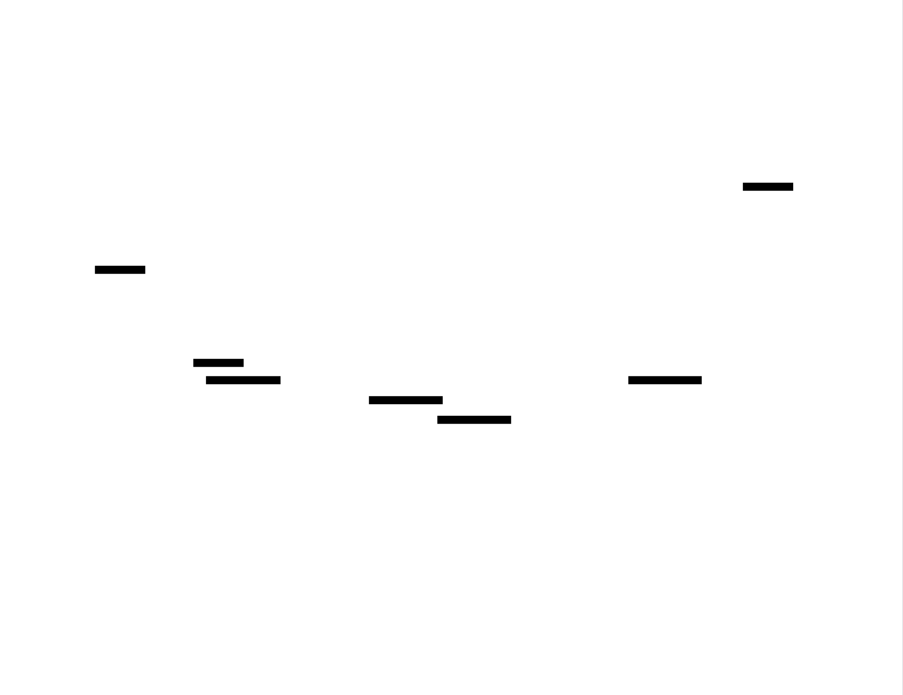

# DNS Server: Design Document


## Overview

A recursive DNS server that resolves domain names by implementing the DNS protocol, following referrals from root servers through the DNS hierarchy, and caching responses for performance. The key architectural challenge is managing stateful recursive resolution while handling concurrent queries and maintaining cache consistency with TTL-based expiration.


> This guide is meant to help you understand the big picture before diving into each milestone. Refer back to it whenever you need context on how components connect.


## Context and Problem Statement

> **Milestone(s):** Foundational understanding for all milestones (1-4)

The Domain Name System (DNS) serves as the internet's address book, translating human-readable domain names like `google.com` into IP addresses like `142.250.191.14` that computers use to communicate. While this translation might seem straightforward, the underlying challenge involves creating a distributed, hierarchical system that can handle billions of queries per day with sub-second response times. Building a DNS server requires understanding not just the protocol mechanics, but the fundamental approaches to name resolution and the architectural trade-offs each approach entails.

### Mental Model: DNS as a Postal System

Think of DNS resolution as navigating a vast postal system where you need to deliver a letter but only have a partial address. Imagine you have a letter addressed to "John Smith, Apartment 42, Oak Street, Springfield" but you don't know which state Springfield is in, or even which country. The DNS hierarchy works exactly like a postal routing system with multiple levels of knowledge and authority.

At the top level, you have **root mail sorters** (DNS root servers) who don't know about every address in the world, but they know which regional postal centers handle which top-level regions. When you ask a root sorter about "Springfield," they can't give you John Smith's exact location, but they can tell you "all '.com' addresses go to the Commercial Postal Region" and give you the address of that regional center.

The **regional postal centers** (DNS TLD servers) know about all the major districts in their region. When you ask the Commercial Postal Region about "google.com," they can't tell you about specific departments within Google, but they know "all google.com mail goes to Google's corporate mail center" and provide you with that center's address.

Finally, the **local mail centers** (authoritative DNS servers) have complete knowledge of their specific district. When you reach Google's mail center asking about "www.google.com," they have authoritative knowledge and can give you the exact building address (IP address) where that service is located.

The key insight is that **no single entity knows everything**, but each level of the hierarchy knows exactly who to ask next. Root servers know about TLD servers, TLD servers know about domain-specific servers, and authoritative servers know about the actual hosts. This distributed knowledge creates a system that scales to billions of domains without any single point of knowledge becoming a bottleneck.

The **caching mechanism** works like a mail carrier's local knowledge. After delivering mail to Springfield several times, the carrier remembers the route and doesn't need to ask the regional center every time. However, this knowledge has an expiration date (TTL) because addresses can change, and the carrier needs to refresh their knowledge periodically.

### Resolution Approaches Comparison

DNS servers can operate using three fundamentally different approaches to name resolution, each with distinct architectural implications and use cases. Understanding these approaches is crucial because the choice affects every aspect of your server's design, from data storage patterns to network communication flows.

#### Authoritative-Only Servers

**Authoritative DNS servers** are like local post offices that have complete, definitive knowledge about addresses in their specific district, but no knowledge about addresses outside their jurisdiction. When someone asks about an address in their district, they provide the definitive answer. When asked about anywhere else, they essentially respond "I don't know, and I'm not going to find out for you."

An authoritative server loads **zone data** from configuration files (zone files) that contain the complete mapping of domain names to IP addresses for domains under its authority. For example, Google's authoritative servers know that `www.google.com` points to specific IP addresses, but they have no information about `facebook.com` and will not attempt to resolve it.

| Aspect | Authoritative Server Characteristics |
|--------|-------------------------------------|
| **Data Source** | Zone files containing domain-to-IP mappings for owned domains |
| **Query Scope** | Only answers queries for domains in its configured zones |
| **Response Behavior** | Provides definitive answers for owned domains, rejects others |
| **Caching Requirements** | No caching needed (always has authoritative data) |
| **Network Dependencies** | None (operates entirely from local zone data) |
| **Primary Use Case** | Hosting DNS records for specific domain owners |

The architecture of an authoritative server is relatively straightforward because it never needs to contact other servers. It parses incoming queries, checks if the requested domain exists in its zone data, and either provides the authoritative answer or returns an "I don't handle that domain" response.

#### Forwarding Servers

**Forwarding DNS servers** operate like mail forwarding services. They don't have knowledge of addresses themselves, and they don't do the detective work of tracking down unknown addresses. Instead, they simply pass every query to another DNS server (the forwarder) and relay the response back to the client.

Think of a forwarding server as a receptionist at a small office who doesn't know anyone's direct phone numbers, but always transfers calls to the main corporate directory service. The receptionist adds no knowledge to the process but provides a consistent interface and potentially some local benefits like access control or logging.

| Aspect | Forwarding Server Characteristics |
|--------|-----------------------------------|
| **Data Source** | No local DNS data; relies entirely on upstream forwarder |
| **Query Scope** | Forwards all queries to configured upstream server |
| **Response Behavior** | Relays responses from upstream server without modification |
| **Caching Requirements** | Optional local caching to improve response times |
| **Network Dependencies** | Complete dependency on upstream forwarder availability |
| **Primary Use Case** | Corporate networks, ISPs providing simple DNS service |

Forwarding servers are often used in corporate environments where network policies require all DNS traffic to go through specific servers, or by ISPs who want to provide DNS service without the complexity of running a full recursive resolver.

#### Recursive Resolvers

**Recursive DNS servers** are like detective agencies that will track down any address you ask them about, no matter where in the world it might be. When you ask a recursive resolver about an address it doesn't know, it doesn't just give up or forward the question elsewhere. Instead, it starts its own investigation, following the postal system hierarchy from the top down until it finds the definitive answer.

The recursive resolver implements the **iterative resolution process**: it starts by asking root servers, follows their referrals to TLD servers, then follows those referrals to authoritative servers, and finally returns the authoritative answer to the original client. From the client's perspective, they asked one question and got one complete answer, even though the resolver may have performed dozens of queries behind the scenes.

| Aspect | Recursive Resolver Characteristics |
|--------|------------------------------------|
| **Data Source** | No authoritative data; builds knowledge through iterative queries |
| **Query Scope** | Resolves any domain name in the global DNS namespace |
| **Response Behavior** | Performs complete resolution and returns final answer |
| **Caching Requirements** | Extensive caching essential for performance and reduced network load |
| **Network Dependencies** | Must be able to reach root servers and arbitrary authoritative servers |
| **Primary Use Case** | ISP DNS servers, public resolvers (8.8.8.8, 1.1.1.1), enterprise DNS |

The architecture of a recursive resolver is significantly more complex because it must manage **stateful resolution processes**. When a client asks about `www.example.com`, the resolver might need to:

1. Query a root server to learn about `.com` TLD servers
2. Query a `.com` TLD server to learn about `example.com`'s authoritative servers
3. Query `example.com`'s authoritative server to get the final answer for `www.example.com`
4. Return the complete answer to the original client

Each step may involve network timeouts, retries, and following additional referrals, all while maintaining the context of the original query.


#### Architecture Decision: Resolution Approach Selection

> **Decision: Implement Recursive Resolver Architecture**
> - **Context**: Building an educational DNS server that demonstrates core DNS concepts and protocols while providing practical functionality for learning network programming and distributed systems concepts.
> - **Options Considered**: 
>   1. Authoritative-only server (simpler implementation, limited scope)
>   2. Forwarding server (minimal complexity, limited learning value)
>   3. Recursive resolver (complex but comprehensive learning experience)
> - **Decision**: Implement a recursive resolver with caching capabilities
> - **Rationale**: Recursive resolution demonstrates the complete DNS protocol stack, including binary protocol parsing, network programming, hierarchical distributed systems, caching strategies, and concurrent programming. While more complex, it provides the richest learning experience and produces a server that can resolve any domain name, making it immediately useful.
> - **Consequences**: Requires implementing iterative resolution logic, robust caching with TTL management, concurrent query handling, and comprehensive error handling. The complexity enables learning advanced systems programming concepts but increases implementation time and debugging complexity.

| Resolution Approach | Implementation Complexity | Learning Value | Practical Utility | Network Requirements |
|---------------------|--------------------------|----------------|-------------------|---------------------|
| **Authoritative Only** | Low | Medium | Limited to owned domains | None |
| **Forwarding** | Very Low | Low | Dependent on upstream | Single upstream server |
| **Recursive** ✓ | High | Very High | Universal DNS resolution | Root server access |

The recursive resolver approach aligns with the project's educational goals because it requires implementing every layer of the DNS system: binary protocol parsing, network communication, distributed algorithms, caching strategies, and concurrent programming. Students gain experience with real-world systems programming challenges while building something immediately useful.

#### Hybrid Approaches and Operational Considerations

Real-world DNS servers often implement **hybrid approaches** that combine multiple resolution strategies based on the query context. For example, a DNS server might:

- Act as an authoritative server for domains it owns (responding from zone data)
- Perform recursive resolution for client queries about external domains
- Forward specific types of queries to specialized servers (like threat intelligence feeds)
- Implement **conditional forwarding** where certain domain patterns are forwarded to specific servers

Our educational implementation focuses on the recursive resolver core, but the architecture we design will support adding authoritative capabilities in future extensions. This design choice reflects real-world DNS server architecture, where flexibility and extensibility are crucial operational requirements.

The **performance characteristics** of each approach differ significantly:

| Performance Aspect | Authoritative | Forwarding | Recursive |
|--------------------|---------------|------------|-----------|
| **Query Latency** | ~1ms (memory lookup) | ~10-50ms (single upstream query) | ~100-500ms (multiple iterative queries) |
| **Cache Hit Ratio Impact** | N/A | Medium (reduces upstream load) | Critical (dramatically affects latency) |
| **Scalability Bottleneck** | Memory for zone data | Upstream server capacity | Network I/O and cache size |
| **Resource Usage** | Low CPU, moderate memory | Very low CPU/memory | High CPU, high memory |

For our educational implementation, we prioritize learning value over absolute performance, but we'll implement caching and concurrent query handling to demonstrate how production DNS servers achieve the performance characteristics required for real-world deployment.

### Implementation Guidance

This implementation guidance provides the foundational code structure and decision framework for building a recursive DNS server in Go. The approach emphasizes modularity and testability while maintaining educational clarity.

#### Technology Recommendations

| Component | Simple Option | Advanced Option |
|-----------|---------------|-----------------|
| **UDP Server** | `net.PacketConn` with goroutine-per-query | `golang.org/x/net/ipv4` with connection pooling |
| **DNS Parsing** | Manual byte parsing with `binary.BigEndian` | `miekg/dns` library (reduces learning but simplifies) |
| **Caching** | `sync.Map` with TTL goroutine cleanup | `patrickmn/go-cache` or `golang-lru/v2` |
| **Configuration** | YAML files with `gopkg.in/yaml.v3` | Environment variables with `kelseyhightower/envconfig` |
| **Logging** | Standard `log` package with levels | `sirupsen/logrus` or `uber-go/zap` |
| **Testing** | Standard `testing` package | `stretchr/testify` for assertions and mocks |

**Recommendation**: Use simple options for core DNS functionality (parsing, resolution) to maximize learning, but use advanced options for infrastructure concerns (logging, configuration) to focus effort on DNS-specific challenges.

#### Recommended File Structure

```
dns-server/
├── cmd/
│   ├── dns-server/
│   │   └── main.go              ← Server entry point and CLI
│   └── dns-client/
│       └── main.go              ← Testing client for validation
├── internal/
│   ├── server/
│   │   ├── server.go            ← UDP server and request routing
│   │   └── server_test.go       
│   ├── parser/
│   │   ├── message.go           ← DNS message parsing (Milestone 1)
│   │   ├── compression.go       ← Name compression handling
│   │   └── parser_test.go       
│   ├── resolver/
│   │   ├── recursive.go         ← Iterative resolution (Milestone 3)
│   │   ├── authority.go         ← Authoritative responses (Milestone 2)
│   │   └── resolver_test.go     
│   ├── cache/
│   │   ├── cache.go             ← TTL-based caching (Milestone 4)
│   │   └── cache_test.go        
│   └── zone/
│       ├── loader.go            ← Zone file parsing (Milestone 2)
│       └── zone_test.go         
├── configs/
│   ├── root-hints.txt           ← Root server IP addresses
│   └── example-zone.txt         ← Sample zone file for testing
├── testdata/
│   ├── dns-messages/            ← Binary DNS message samples
│   └── zone-files/              ← Test zone files
└── go.mod
```

This structure separates concerns clearly: `server` handles network I/O, `parser` handles protocol details, `resolver` implements DNS logic, `cache` manages performance, and `zone` handles authoritative data. Each package can be developed and tested independently.

#### Infrastructure Starter Code

**UDP Server Foundation** (`internal/server/server.go`):

```go
package server

import (
    "context"
    "fmt"
    "net"
    "time"
)

type Server struct {
    addr     string
    conn     net.PacketConn
    resolver Resolver
    handler  MessageHandler
}

type Resolver interface {
    Resolve(ctx context.Context, question Question) ([]ResourceRecord, error)
}

type MessageHandler interface {
    ParseQuery(data []byte) (*DNSMessage, error)
    BuildResponse(query *DNSMessage, records []ResourceRecord) ([]byte, error)
}

// NewServer creates a DNS server that listens on the specified address
func NewServer(addr string, resolver Resolver, handler MessageHandler) *Server {
    return &Server{
        addr:     addr,
        resolver: resolver,
        handler:  handler,
    }
}

// Start begins listening for DNS queries and blocks until context is cancelled
func (s *Server) Start(ctx context.Context) error {
    // TODO: Implementation provided - this is infrastructure, not core learning
    conn, err := net.ListenPacket("udp", s.addr)
    if err != nil {
        return fmt.Errorf("failed to bind UDP socket: %w", err)
    }
    defer conn.Close()
    s.conn = conn
    
    fmt.Printf("DNS server listening on %s\n", s.addr)
    
    buffer := make([]byte, 512) // DNS messages limited to 512 bytes over UDP
    for {
        select {
        case <-ctx.Done():
            return ctx.Err()
        default:
            // Set read timeout to prevent blocking indefinitely
            conn.SetReadDeadline(time.Now().Add(1 * time.Second))
            n, clientAddr, err := conn.ReadFrom(buffer)
            if err != nil {
                if netErr, ok := err.(net.Error); ok && netErr.Timeout() {
                    continue // Timeout is expected, check context and continue
                }
                fmt.Printf("Error reading UDP packet: %v\n", err)
                continue
            }
            
            // Handle each query in a separate goroutine for concurrency
            go s.handleQuery(buffer[:n], clientAddr)
        }
    }
}

func (s *Server) handleQuery(queryData []byte, clientAddr net.Addr) {
    // TODO: Students implement this - core learning component
    // This method should:
    // 1. Parse the DNS query using s.handler.ParseQuery()
    // 2. Extract the question from the parsed message  
    // 3. Resolve the question using s.resolver.Resolve()
    // 4. Build a response using s.handler.BuildResponse()
    // 5. Send the response back to clientAddr using s.conn.WriteTo()
    // 6. Handle errors appropriately (malformed queries, resolution failures, etc.)
}
```

**Configuration Management** (`internal/server/config.go`):

```go
package server

import (
    "fmt"
    "gopkg.in/yaml.v3"
    "os"
)

type Config struct {
    Server ServerConfig `yaml:"server"`
    Cache  CacheConfig  `yaml:"cache"`
    Zones  []ZoneConfig `yaml:"zones"`
}

type ServerConfig struct {
    ListenAddr string `yaml:"listen_addr"`
    Timeout    string `yaml:"timeout"`
}

type CacheConfig struct {
    MaxSize    int    `yaml:"max_size"`
    DefaultTTL string `yaml:"default_ttl"`
}

type ZoneConfig struct {
    Domain string `yaml:"domain"`
    File   string `yaml:"file"`
}

func LoadConfig(filepath string) (*Config, error) {
    // TODO: Complete implementation provided - infrastructure component
    data, err := os.ReadFile(filepath)
    if err != nil {
        return nil, fmt.Errorf("failed to read config file: %w", err)
    }
    
    var config Config
    if err := yaml.Unmarshal(data, &config); err != nil {
        return nil, fmt.Errorf("failed to parse config YAML: %w", err)
    }
    
    // Set reasonable defaults
    if config.Server.ListenAddr == "" {
        config.Server.ListenAddr = ":53"
    }
    if config.Server.Timeout == "" {
        config.Server.Timeout = "5s"
    }
    if config.Cache.MaxSize == 0 {
        config.Cache.MaxSize = 10000
    }
    
    return &config, nil
}
```

#### Core Logic Skeletons

**DNS Message Parser** (`internal/parser/message.go`):

```go
package parser

import (
    "encoding/binary"
    "fmt"
)

// DNSMessage represents a complete DNS message with header and sections
type DNSMessage struct {
    Header      Header
    Questions   []Question
    Answers     []ResourceRecord
    Authority   []ResourceRecord
    Additional  []ResourceRecord
}

// Header represents the 12-byte DNS message header
type Header struct {
    ID                uint16
    QueryResponse     bool   // QR bit
    Opcode           uint8
    Authoritative    bool   // AA bit  
    Truncated        bool   // TC bit
    RecursionDesired bool   // RD bit
    RecursionAvail   bool   // RA bit
    ResponseCode     uint8  // RCODE
    QuestionCount    uint16 // QDCOUNT
    AnswerCount      uint16 // ANCOUNT
    AuthorityCount   uint16 // NSCOUNT
    AdditionalCount  uint16 // ARCOUNT
}

// ParseMessage parses a complete DNS message from wire format bytes
func ParseMessage(data []byte) (*DNSMessage, error) {
    // TODO 1: Validate minimum message length (12 bytes for header)
    // TODO 2: Parse the 12-byte header using parseHeader()
    // TODO 3: Initialize message structure with parsed header
    // TODO 4: Parse Questions section (header.QuestionCount questions)
    // TODO 5: Parse Answer section (header.AnswerCount resource records)  
    // TODO 6: Parse Authority section (header.AuthorityCount resource records)
    // TODO 7: Parse Additional section (header.AdditionalCount resource records)
    // TODO 8: Return complete DNSMessage structure
    // Hint: Use a position tracker to advance through the byte slice
    // Hint: Each parse function should return (parsed_data, bytes_consumed, error)
}

// parseHeader extracts the 12-byte header from the beginning of a DNS message
func parseHeader(data []byte) (Header, error) {
    // TODO 1: Validate data length is at least 12 bytes
    // TODO 2: Extract ID (bytes 0-1) using binary.BigEndian.Uint16()
    // TODO 3: Extract flags (bytes 2-3) and decode individual bits:
    //         QR=bit15, Opcode=bits14-11, AA=bit10, TC=bit9, RD=bit8
    //         RA=bit7, RCODE=bits3-0
    // TODO 4: Extract section counts (bytes 4-11, four 16-bit values)
    // TODO 5: Return populated Header struct
    // Hint: Use bit masking and shifting to extract flag bits
    // Hint: All multi-byte values are in network (big-endian) byte order
}
```

#### Language-Specific Hints

**Go-Specific DNS Implementation Tips**:

- Use `binary.BigEndian.Uint16()` and `binary.BigEndian.Uint32()` for parsing multi-byte network values
- DNS names are case-insensitive; use `strings.ToLower()` for consistent comparisons  
- UDP messages are limited to 512 bytes; larger responses require TCP (not implemented in basic version)
- Use `context.WithTimeout()` for network operations to prevent hanging on unresponsive servers
- The `net.LookupNS()` function can validate your recursive resolution against system resolver
- Use `sync.Map` or `sync.RWMutex` for concurrent cache access from multiple goroutines
- Time-based operations should use `time.Now().Unix()` for TTL calculations (avoids timezone issues)

**Common Go Pitfalls in DNS Implementation**:
- Forgetting to handle name compression in DNS messages leads to incorrect parsing
- Using signed integers for TTL values causes problems when TTL exceeds 2^31 seconds  
- Not setting timeouts on network operations can cause goroutines to leak indefinitely
- Case-sensitive domain name comparisons fail for real-world DNS queries
- Modifying slices passed to goroutines creates data races without proper synchronization

#### Milestone Checkpoints

**After completing foundation setup**:

1. **Verify UDP server startup**: Run `go run cmd/dns-server/main.go` - should print "DNS server listening on :53"
2. **Test basic connectivity**: Use `dig @127.0.0.1 google.com` - should receive a response (may be error, but connection works)  
3. **Validate message parsing**: Create unit tests that parse known-good DNS messages from `testdata/`
4. **Check configuration loading**: Verify server loads `configs/dns-server.yaml` without panicking

**Expected behavior after foundation**:
- Server starts without errors and binds to UDP port
- Incoming queries trigger `handleQuery()` function calls
- Message parsing attempts occur (may fail until Milestone 1 complete)
- Clean shutdown when interrupted with Ctrl+C

**Signs something is wrong**:
- "Permission denied" when binding port 53 → Run as root or use port 5353 for testing
- "Address already in use" → Another DNS server is running, change port or stop competing service
- Panic on startup → Check configuration file syntax and required directories exist
- No response to `dig` queries → Verify firewall allows UDP traffic on chosen port

This foundation provides the infrastructure framework while leaving the core DNS protocol implementation as the primary learning challenge. Students can focus on understanding DNS message formats, resolution algorithms, and caching strategies rather than UDP socket programming details.


## Goals and Non-Goals

> **Milestone(s):** Foundational understanding for all milestones (1-4)

The DNS server project aims to build a comprehensive recursive DNS resolver that demonstrates mastery of network protocols, distributed systems concepts, and performance optimization techniques. This section establishes clear boundaries around what the implementation will and will not include, ensuring focused development while maintaining educational value.

### Functional Goals

Understanding the functional requirements for a DNS server requires thinking about the different roles DNS servers play in the internet infrastructure. Think of DNS servers as specialized librarians in a vast distributed library system. Some librarians are **reference specialists** who have authoritative knowledge about specific collections (authoritative servers), others are **research assistants** who know how to track down any book by following leads through the entire library system (recursive resolvers), and still others are **information brokers** who simply forward requests to their trusted colleagues upstream (forwarding servers).

Our DNS server implementation will function as both a reference specialist and research assistant, capable of serving authoritative responses for configured domains while also performing complete recursive resolution for any domain on the internet. This dual capability provides comprehensive learning opportunities across all aspects of DNS server operation.

#### Core Protocol Implementation

The foundation of any DNS server lies in its ability to correctly implement the DNS wire protocol as specified in RFC 1035. This involves handling the binary message format that carries DNS queries and responses across UDP (and potentially TCP) connections.

| Protocol Feature | Implementation Requirement | Learning Objective |
|------------------|---------------------------|-------------------|
| DNS Message Format | Parse and construct complete DNS messages with header, question, answer, authority, and additional sections | Understanding binary protocol parsing and network byte order |
| Name Compression | Decode and encode DNS name compression using pointer labels to reduce message size | Handling complex binary data structures with internal references |
| Resource Record Types | Support A, AAAA, CNAME, MX, NS, SOA, and TXT record types with proper RDATA parsing | Learning diverse data encoding formats within a single protocol |
| UDP Transport | Handle DNS queries over UDP with proper packet size limits and truncation handling | Network programming fundamentals and datagram protocols |
| Error Handling | Generate appropriate DNS response codes (NXDOMAIN, SERVFAIL, FORMERR) for various error conditions | Protocol-level error communication and client experience |

The message parsing implementation must handle the complexity of DNS name compression, where domain names can reference earlier occurrences in the same message to save space. This creates a challenge similar to managing pointers in binary data—the parser must maintain state about previously encountered names while avoiding infinite loops from malicious compression chains.

> **Design Insight**: DNS message parsing represents one of the most complex binary protocol parsing challenges developers encounter. The combination of variable-length encoded names, compression pointers, and multiple record types with different RDATA formats requires careful buffer management and state tracking. Mastering this provides transferable skills for any network protocol implementation.

#### Authoritative DNS Service

The authoritative server component transforms our DNS server into a reference specialist for specific domains. Think of this as becoming the official record keeper for a particular section of the internet's namespace—when someone asks about domains we're authoritative for, we provide the definitive answer rather than looking it up elsewhere.

| Authoritative Feature | Implementation Requirement | Learning Objective |
|----------------------|---------------------------|-------------------|
| Zone File Parsing | Read BIND-format zone files and load records into queryable data structures | File format parsing and data structure design |
| Query Matching | Find the best matching records for a given domain name and record type | String matching algorithms and hierarchical data organization |
| Response Construction | Populate answer, authority, and additional sections according to DNS standards | Understanding multi-section response semantics |
| Delegation Handling | Properly delegate subdomains with NS records and glue records | Hierarchical namespace management and circular dependency resolution |
| Negative Responses | Generate NXDOMAIN and NODATA responses with proper SOA records | Error case handling in distributed systems |

The zone file parsing component must handle the standard BIND zone file format, which includes features like `$ORIGIN` directives, relative domain names, and various record type syntaxes. This parsing challenge teaches important lessons about configuration file design and the trade-offs between human readability and machine parseability.

Query matching in an authoritative server involves finding the most specific match for a given domain name within the zone data. This is more complex than simple string matching because of DNS's hierarchical structure—a query for `www.example.com` might match a wildcard record `*.example.com` if no more specific record exists.

> **Decision: Zone Data Storage Strategy**
> - **Context**: Authoritative servers need efficient data structures for storing and querying zone records
> - **Options Considered**: 
>   - Hash map with full domain names as keys
>   - Trie structure mirroring DNS hierarchy
>   - Sorted slice with binary search
> - **Decision**: Hash map with normalized domain names as keys
> - **Rationale**: Provides O(1) lookup performance for exact matches and simplifies implementation compared to trie structures, while sorted slices would require O(log n) search time
> - **Consequences**: Excellent performance for exact matches but requires additional logic for wildcard matching and closest encloser finding

#### Recursive Resolution Engine

The recursive resolver component transforms our DNS server into a research assistant capable of tracking down any domain name by following the DNS hierarchy from root servers down to authoritative nameservers. This represents the most intellectually challenging aspect of DNS server implementation.

Think of recursive resolution as detective work where each clue (referral) leads you closer to the final answer. You start with a broad lead (the root servers know about top-level domains), follow it to get a more specific lead (TLD servers know about second-level domains), and continue until you find the authoritative source with the definitive answer.

| Resolution Feature | Implementation Requirement | Learning Objective |
|--------------------|---------------------------|-------------------|
| Root Hints Bootstrap | Use root hints file to initialize resolution with root server IP addresses | Understanding DNS hierarchy bootstrap process |
| Iterative Queries | Follow NS referrals from root through TLD to authoritative servers | Implementing stateful multi-step distributed algorithms |
| CNAME Following | Transparently resolve CNAME chains to final target records | Handling indirection and alias resolution in distributed systems |
| Glue Record Processing | Use A records from additional section to avoid circular dependencies | Understanding and resolving circular dependencies in distributed lookups |
| Loop Detection | Detect and prevent infinite referral loops and CNAME chains | Implementing cycle detection in distributed graph traversal |

The iterative resolution algorithm maintains state about the current query while following a chain of referrals. Each step involves sending a query to a nameserver, processing the response, and deciding whether to return an answer or follow another referral. This state management teaches valuable lessons about distributed algorithms and error recovery.

Glue records solve a fundamental bootstrapping problem in DNS: if `ns1.example.com` is the nameserver for `example.com`, how do you find the IP address of `ns1.example.com` without already knowing it? The parent zone (`com` in this case) provides glue records—A records for nameservers within the zone they serve—to break this circular dependency.

> **Decision: Resolution State Management**
> - **Context**: Recursive resolution requires tracking state across multiple network round-trips
> - **Options Considered**:
>   - Single-threaded state machine with explicit state variables
>   - Recursive function calls with stack-based state
>   - Goroutines with channel communication for each resolution step
> - **Decision**: Iterative approach with explicit state tracking in a resolution context structure
> - **Rationale**: Provides better control over timeout handling and resource management compared to recursive calls, while being simpler to debug than multi-goroutine approaches
> - **Consequences**: More explicit code that clearly shows resolution steps, but requires careful state management and cleanup

#### Caching and Performance Optimization

The caching layer transforms our DNS server from a research assistant who looks up everything from scratch into an experienced librarian who remembers recent answers and can respond immediately to repeated questions. DNS caching is crucial for internet performance—without it, every web page load would require dozens of DNS lookups starting from the root servers.

| Caching Feature | Implementation Requirement | Learning Objective |
|-----------------|---------------------------|-------------------|
| TTL-Based Expiration | Store cached records with automatic expiration based on their time-to-live values | Understanding distributed cache consistency and temporal data management |
| Negative Caching | Cache NXDOMAIN and NODATA responses to avoid repeated failed queries | Caching negative results and handling cache invalidation |
| Cache Validation | Prevent cache poisoning by validating response records match queries | Security considerations in caching systems |
| Memory Management | Implement cache size limits and eviction policies to prevent memory exhaustion | Resource management and cache replacement algorithms |
| Concurrent Access | Handle multiple simultaneous queries with thread-safe cache operations | Concurrent data structure design and locking strategies |

TTL-based caching requires careful time management—each cached record has an independent expiration time that must be tracked and enforced. The cache must continuously expire old records while serving fresh ones, creating a time-based data management challenge.

Negative caching stores the absence of records, which is philosophically different from caching positive data. When a domain doesn't exist (NXDOMAIN), we want to remember that fact temporarily to avoid repeated expensive lookups, but we must be careful about the cache duration since domains can be created at any time.

> **Decision: Cache Implementation Strategy**
> - **Context**: DNS cache needs to handle thousands of records with different TTL values and concurrent access
> - **Options Considered**:
>   - Simple map with periodic cleanup goroutine
>   - Time-ordered priority queue with exact expiration
>   - Lazy expiration on access with background cleanup
> - **Decision**: Lazy expiration on access with periodic background cleanup
> - **Rationale**: Reduces timer overhead compared to exact expiration while providing reasonable cleanup guarantees, and simplifies concurrent access patterns
> - **Consequences**: Some expired records may persist briefly in memory, but implementation is more robust and performant under high load

### Non-Goals

Defining what the DNS server will not implement is as important as defining what it will implement. These exclusions focus development effort on core learning objectives while avoiding advanced topics that would significantly increase complexity without proportional educational benefit.

#### Security and Cryptographic Features

Modern DNS includes sophisticated security extensions (DNSSEC) that provide cryptographic validation of DNS responses. However, implementing DNSSEC would require deep cryptographic knowledge and significantly complicate the core DNS learning objectives.

| Excluded Security Feature | Rationale for Exclusion | Alternative Learning Path |
|---------------------------|-------------------------|---------------------------|
| DNSSEC Validation | Cryptographic signature verification requires extensive PKI knowledge beyond DNS fundamentals | Study DNSSEC as a separate cryptography project after mastering basic DNS |
| DNS-over-HTTPS (DoH) | HTTPS transport adds TLS complexity that distracts from DNS protocol learning | Implement DoH as an extension after completing basic UDP/TCP DNS |
| DNS-over-TLS (DoT) | TLS implementation complexity overshadows DNS-specific learning objectives | Focus on transport-layer security in a dedicated TLS project |
| Query Logging Security | Secure audit logging requires additional infrastructure and privacy considerations | Add comprehensive logging as an operational extension |
| Rate Limiting | DDoS protection mechanisms are important but distinct from core DNS functionality | Implement rate limiting as a separate network security exercise |

The exclusion of security features doesn't mean ignoring security entirely—the implementation will include basic validation to prevent cache poisoning and malformed message handling. However, advanced cryptographic features represent separate learning domains that would dilute focus on DNS fundamentals.

#### Advanced Protocol Extensions

The DNS protocol has evolved significantly since RFC 1035, with numerous extensions that add functionality for specific use cases. While these extensions are important in production systems, they add complexity that can obscure the fundamental DNS concepts this project aims to teach.

| Excluded Protocol Feature | Rationale for Exclusion | Core DNS Alternative |
|---------------------------|-------------------------|----------------------|
| EDNS0 Extensions | Extended DNS features like larger UDP payloads add protocol complexity without fundamental learning value | Focus on standard 512-byte UDP limit handling |
| Dynamic Updates (RFC 2136) | DNS UPDATE mechanism is rarely used and adds significant state management complexity | Static zone files provide sufficient learning about authoritative data |
| Zone Transfers (AXFR/IXFR) | Zone synchronization between servers is an operational concern separate from query resolution | Single-server deployment eliminates zone transfer needs |
| Multicast DNS (mDNS) | Local network discovery uses different semantics from internet DNS | Standard DNS hierarchy provides better learning foundation |
| DNS Service Discovery | Service location records require additional protocol understanding | Focus on basic record types (A, AAAA, CNAME, MX, NS) |

These protocol extensions represent evolutionary additions to DNS that address specific operational requirements. Excluding them allows deeper focus on the core resolution algorithm and caching behavior that form the foundation for understanding all DNS implementations.

#### Production Operational Features

Production DNS servers require extensive operational features for monitoring, configuration management, and high availability. While these features are crucial for real-world deployment, they represent systems administration and DevOps concerns rather than fundamental computer science concepts.

| Excluded Operational Feature | Rationale for Exclusion | Learning Focus Alternative |
|------------------------------|-------------------------|----------------------------|
| Configuration Hot Reloading | Dynamic configuration adds complexity without teaching core DNS concepts | Static configuration files provide sufficient flexibility for learning |
| Prometheus Metrics | Monitoring integration is important operationally but distinct from DNS algorithm implementation | Focus on correct DNS behavior rather than observability |
| High Availability Clustering | Multi-server coordination requires distributed systems concepts beyond DNS scope | Single-server implementation demonstrates all DNS concepts |
| Administrative APIs | REST APIs for server management add web development complexity | Command-line tools and configuration files provide sufficient control |
| Logging Frameworks | Structured logging systems are operational concerns separate from DNS functionality | Simple logging to stdout/stderr adequate for debugging and learning |

> **Design Principle**: Educational DNS Implementation Focus
> 
> This DNS server prioritizes deep understanding of DNS fundamentals over production readiness. Every included feature directly teaches core concepts like protocol parsing, hierarchical resolution, caching strategies, or distributed systems patterns. Excluded features, while valuable in production systems, would add implementation complexity without proportional learning benefit in these foundational areas.

The non-goals serve as guard rails to prevent scope creep while ensuring the implementation remains focused on its educational mission. Students who complete this project will have mastered the essential DNS concepts and can tackle any of the excluded features as follow-on projects with a solid foundation.

#### Performance and Scale Limitations

While the DNS server will implement caching and basic performance optimizations, it explicitly avoids the extreme performance engineering required for high-scale production DNS servers that handle millions of queries per second.

| Performance Limitation | Acceptable Trade-off | Learning Priority |
|------------------------|---------------------|-------------------|
| Single-threaded query processing | Simpler debugging and state management | Understanding DNS resolution algorithm correctness |
| In-memory cache only | No persistence complexity | Focus on cache consistency and TTL management |
| Basic eviction policies | LRU or random eviction sufficient | Understanding cache behavior principles |
| No query pipelining | One query at a time per connection | Clear separation of query processing steps |
| Limited concurrent connections | Handles dozens, not thousands of clients | Network programming fundamentals |

These performance limitations are intentional design choices that trade maximum throughput for implementation clarity and debugging simplicity. Students learning DNS benefit more from understanding correct resolution behavior than from optimizing for high-scale performance scenarios they're unlikely to encounter in educational environments.

> **Key Insight**: The distinction between educational and production systems lies not in correctness—both must implement the DNS protocol correctly—but in optimization priorities. Educational implementations prioritize understanding and debuggability, while production systems prioritize performance, reliability, and operational features. This DNS server aims for complete correctness with sufficient performance for learning and experimentation.

### Implementation Guidance

The functional goals and non-goals establish the scope for a comprehensive DNS server implementation that balances educational value with practical functionality. The following guidance helps translate these goals into concrete implementation decisions.

#### Technology Stack Recommendations

| Component | Simple Option | Advanced Option | Recommended for Learning |
|-----------|---------------|-----------------|-------------------------|
| Network Transport | `net` package UDP sockets | Custom packet processing with `golang.org/x/net` | `net.PacketConn` for simplicity |
| Binary Parsing | Manual byte slicing with `binary` package | Code generation from protocol definitions | Manual parsing to understand wire format |
| Configuration | YAML files with `gopkg.in/yaml.v3` | TOML or JSON with validation schemas | YAML for human readability |
| Logging | Standard `log` package | Structured logging with `logrus` or `zap` | Standard `log` package to avoid dependencies |
| Testing | Standard `testing` package | BDD frameworks like `ginkgo` | Standard `testing` with table-driven tests |
| Time Management | `time.Time` and `time.Duration` | Custom time abstraction for testing | Standard `time` package with mock interfaces for tests |

The technology choices prioritize Go standard library packages to minimize external dependencies and focus attention on DNS-specific implementation challenges rather than framework learning.

#### Recommended Project Structure

Organizing the DNS server code into logical packages helps separate concerns and makes the implementation more maintainable and testable.

```
dns-server/
├── cmd/
│   └── dns-server/
│       └── main.go                    # Entry point, configuration loading
├── internal/
│   ├── server/
│   │   ├── server.go                  # UDP server and query dispatch
│   │   └── server_test.go             # Server integration tests
│   ├── protocol/
│   │   ├── message.go                 # DNS message parsing and construction
│   │   ├── compression.go             # Name compression handling
│   │   └── protocol_test.go           # Protocol parsing tests
│   ├── resolver/
│   │   ├── recursive.go               # Recursive resolution logic
│   │   ├── authoritative.go           # Zone data query handling
│   │   └── resolver_test.go           # Resolution algorithm tests
│   ├── cache/
│   │   ├── cache.go                   # TTL-based caching implementation
│   │   └── cache_test.go              # Cache behavior tests
│   └── zone/
│       ├── parser.go                  # Zone file parsing
│       ├── records.go                 # Resource record data structures
│       └── zone_test.go               # Zone parsing tests
├── testdata/
│   ├── zones/                         # Sample zone files for testing
│   └── queries/                       # Test DNS messages
├── configs/
│   └── server.yaml                    # Server configuration
└── go.mod
```

This structure separates protocol-level concerns (`protocol` package) from application logic (`resolver`, `cache`, `zone` packages) and provides clear testing boundaries for each component.

#### Core Data Structure Definitions

The DNS server implementation centers around several key data structures that must be defined consistently across all components.

```go
// Package: internal/protocol

// DNSMessage represents a complete DNS message as defined in RFC 1035
type DNSMessage struct {
    Header     Header            // 12-byte fixed header
    Questions  []Question        // Query section (usually one question)
    Answers    []ResourceRecord  // Answer resource records
    Authority  []ResourceRecord  // Authority section (NS records, SOA for negative responses)
    Additional []ResourceRecord  // Additional section (glue records, etc.)
}

// Header represents the 12-byte DNS message header
type Header struct {
    ID              uint16  // Query identifier for matching requests/responses
    QueryResponse   bool    // false for query, true for response
    Opcode          uint8   // Query type (0 = standard query)
    Authoritative   bool    // true if responding server is authoritative
    Truncated       bool    // true if message was truncated due to size limits
    RecursionDesired bool   // true if client requests recursive resolution
    RecursionAvail  bool    // true if server supports recursive resolution
    ResponseCode    uint8   // Response code (0 = no error, 3 = NXDOMAIN, etc.)
    
    // Section counts (derived from slice lengths, not stored separately)
    QuestionCount   uint16  // Number of questions
    AnswerCount     uint16  // Number of answer records  
    AuthorityCount  uint16  // Number of authority records
    AdditionalCount uint16  // Number of additional records
}

// Question represents a DNS query question
type Question struct {
    Name  string // Domain name being queried (e.g., "www.example.com")
    Type  uint16 // Record type (1 = A, 28 = AAAA, 5 = CNAME, etc.)
    Class uint16 // Query class (1 = IN for Internet)
}

// ResourceRecord represents any DNS resource record
type ResourceRecord struct {
    Name  string // Domain name this record applies to
    Type  uint16 // Record type
    Class uint16 // Record class
    TTL   uint32 // Time-to-live in seconds
    Data  []byte // Type-specific RDATA (parsed separately by type)
}
```

#### Server Configuration Structure

The server requires configuration for network settings, zone files, and caching parameters.

```go
// Package: internal/server

// Config represents complete server configuration loaded from YAML
type Config struct {
    Server ServerConfig `yaml:"server"`
    Cache  CacheConfig  `yaml:"cache"`  
    Zones  []ZoneConfig `yaml:"zones"`
}

// ServerConfig contains network and protocol settings
type ServerConfig struct {
    ListenAddr string `yaml:"listen_addr"` // "127.0.0.1:5353"
    Timeout    string `yaml:"timeout"`     // "5s"
}

// CacheConfig controls caching behavior
type CacheConfig struct {
    MaxSize    int    `yaml:"max_size"`     // Maximum cached records
    DefaultTTL string `yaml:"default_ttl"` // "300s"
}

// ZoneConfig specifies an authoritative zone
type ZoneConfig struct {
    Domain string `yaml:"domain"` // "example.com"
    File   string `yaml:"file"`   // "zones/example.com.zone"
}
```

#### Milestone Implementation Checkpoints

Each milestone builds toward the complete DNS server implementation with specific verification steps.

**Milestone 1 Checkpoint - DNS Message Parsing:**
After implementing the protocol parsing, verify functionality with:

```bash
go test ./internal/protocol/... -v
```

Expected behavior: Parse a captured DNS query message, extract the question for "www.example.com", and reconstruct the message to identical bytes. The test should validate name compression handling by parsing a response with multiple domain names sharing suffixes.

**Milestone 2 Checkpoint - Authoritative Server:**
After implementing zone file parsing and authoritative responses:

```bash
# Start server with test zone
go run cmd/dns-server/main.go -config configs/test.yaml

# Query the authoritative server
dig @127.0.0.1 -p 5353 www.example.com A
```

Expected behavior: Return an A record from the loaded zone file with the authoritative flag set. Verify NS records appear in the authority section and glue records in the additional section.

**Milestone 3 Checkpoint - Recursive Resolution:**
After implementing recursive resolution:

```bash
# Query for external domain (not in local zones)
dig @127.0.0.1 -p 5353 www.google.com A
```

Expected behavior: Follow iterative queries from root servers through TLD to authoritative servers, returning the final A record. Verify the recursion available flag is set in responses.

**Milestone 4 Checkpoint - Caching:**
After implementing caching:

```bash
# First query (cache miss)
time dig @127.0.0.1 -p 5353 www.github.com A

# Second query (cache hit)  
time dig @127.0.0.1 -p 5353 www.github.com A
```

Expected behavior: Second query should return significantly faster (under 1ms) indicating cache hit. Verify cached records expire after their TTL by waiting and observing cache miss behavior.

#### Common Implementation Pitfalls

⚠️ **Pitfall: Network Byte Order Confusion**
DNS uses network byte order (big-endian) for multi-byte integers, but Go's default byte operations assume host byte order. Use `binary.BigEndian.Uint16()` and `binary.BigEndian.PutUint16()` for all DNS header fields. Symptoms include header fields with seemingly random values or queries failing to match responses.

⚠️ **Pitfall: Name Compression Infinite Loops**
Malicious or malformed DNS messages can contain compression pointer loops that cause infinite recursion during name parsing. Always track visited pointer offsets and abort parsing if a pointer is encountered twice. Implement a maximum pointer chain length (suggested: 63 hops) to prevent resource exhaustion.

⚠️ **Pitfall: Case Sensitivity in Domain Names**
DNS domain names are case-insensitive, but Go string comparisons are case-sensitive. Always normalize domain names to lowercase before comparison or use `strings.EqualFold()` for DNS name matching. This affects zone lookups, cache keys, and compression pointer matching.

⚠️ **Pitfall: TTL Arithmetic Underflow**
When caching records, calculate remaining TTL by subtracting elapsed time from original TTL. If elapsed time exceeds original TTL, the record has expired—don't return it with a negative or zero TTL. Use `time.Now()` consistently to avoid clock skew issues in TTL calculations.

⚠️ **Pitfall: UDP Message Size Limits**
Standard DNS over UDP has a 512-byte message size limit. If a response exceeds this limit, set the truncated flag and consider implementing TCP fallback. Large zone responses or many additional records can easily exceed UDP limits, causing client resolution failures.


## High-Level Architecture

> **Milestone(s):** Foundational understanding for all milestones (1-4)

Building a DNS server requires orchestrating multiple specialized components that work together to receive queries, parse protocol messages, resolve domain names, and return responses. Think of this architecture like a **well-organized library system**: the UDP server acts as the front desk receiving requests, the message parser translates between different "languages" (binary protocol vs. internal structures), the resolver acts as a research librarian following leads to find information, the cache serves as recent memory for frequently requested items, and the zone data manager maintains the library's own collection of authoritative books.


The DNS server architecture balances several competing concerns: protocol correctness, performance through caching, concurrent request handling, and extensibility for different resolution modes (authoritative vs. recursive). The modular design allows each component to focus on its specific responsibility while maintaining clean interfaces between components. This separation enables independent testing, easier debugging, and the flexibility to swap implementations (for example, using different caching strategies or storage backends) without affecting other components.

### Component Overview

The DNS server consists of five major components, each with distinct responsibilities and well-defined interfaces. These components form a pipeline that transforms incoming UDP packets into DNS responses, with caching and recursive resolution providing the intelligence needed for a complete DNS implementation.

#### UDP Server Component

The **UDP Server** serves as the network interface and coordination hub for the entire DNS server. Think of it as the **receptionist at a busy office** - it greets every visitor (incoming DNS query), ensures they're directed to the right department (message parsing and resolution), and makes sure they receive a proper response before leaving.

The UDP server's primary responsibilities include binding to the DNS port (typically 53), receiving incoming packets from clients, spawning concurrent handlers for each query, and transmitting responses back to the correct client address. It also manages server lifecycle operations like graceful shutdown and connection error handling.

| Responsibility | Description | Failure Handling |
|---------------|-------------|------------------|
| Network Binding | Bind to UDP port 53 and listen for incoming packets | Retry binding with exponential backoff, log fatal error if port unavailable |
| Packet Reception | Read UDP packets from network and extract client address | Log malformed packets, continue serving other clients |
| Concurrency Management | Spawn goroutines for concurrent query processing | Limit concurrent goroutines to prevent resource exhaustion |
| Response Transmission | Send DNS response packets back to querying clients | Retry transmission once, log delivery failures |
| Lifecycle Management | Handle server startup, graceful shutdown, and cleanup | Ensure in-flight queries complete before shutdown |

The server maintains minimal state - primarily the network connection and configuration parameters. It delegates all DNS-specific processing to other components, maintaining a clean separation between network concerns and protocol logic.

> **Key Design Insight**: The UDP server should be stateless regarding DNS queries themselves. All query-specific state lives in the handlers it spawns, allowing the server to scale horizontally and recover cleanly from individual query failures without affecting other concurrent requests.

#### Message Parser Component

The **Message Parser** handles the complex task of translating between the binary DNS wire format and internal Go data structures. Think of it as a **skilled translator at the United Nations** - it must perfectly understand both the formal binary "language" of DNS packets and the structured "language" of internal application data, ensuring nothing is lost or corrupted in translation.

DNS messages follow the RFC 1035 specification with a fixed 12-byte header followed by variable-length sections. The parser must handle intricate details like network byte order conversion, DNS name compression using pointer labels, and validation of message structure constraints.

| Component Function | Input | Output | Error Conditions |
|-------------------|--------|--------|------------------|
| Message Parsing | Raw UDP packet bytes | `DNSMessage` struct | Truncated packet, invalid header, compression loops |
| Header Extraction | First 12 bytes of packet | `Header` struct with all flags | Packet too short, reserved bits set |
| Question Parsing | Question section bytes | `[]Question` slice | Invalid domain name, unsupported QTYPE |
| Resource Record Parsing | RR section bytes | `[]ResourceRecord` slice | Invalid TTL, malformed RDATA, unknown type |
| Message Construction | `DNSMessage` struct | Wire format bytes | Message too large, compression failure |

The parser implements DNS name compression, a critical optimization where repeated domain names in a message use pointer labels (starting with bytes 0xC0) to reference earlier occurrences. This compression can reduce message size significantly but introduces complexity around validation and loop detection.

> **Critical Security Consideration**: The parser must validate all compression pointers to prevent infinite loops and buffer overflows. A malicious packet with circular compression pointers could crash the server or enable memory corruption attacks.

#### Recursive Resolver Component

The **Recursive Resolver** implements the core DNS resolution algorithm, transforming domain name queries into authoritative answers by following the DNS hierarchy. Think of it as a **detective following clues** - it starts with a basic question ("What's the IP address of www.example.com?"), follows a chain of evidence from root servers through TLD servers to authoritative servers, and assembles the final answer from multiple sources.

The resolver maintains the complex state machine of iterative resolution: tracking which servers to query next, following NS referrals, handling CNAME chains, and assembling the final response. It must handle various edge cases like missing glue records, server timeouts, and delegation loops while maintaining the semantic correctness required by the DNS protocol.

| Resolution Phase | Action Taken | Data Sources | Failure Recovery |
|-----------------|-------------|--------------|------------------|
| Root Query | Query root server for TLD NS records | Root hints file | Try alternate root servers |
| TLD Query | Query TLD server for domain NS records | Root response referrals | Follow additional TLD servers |
| Authoritative Query | Query domain's nameserver for final answer | TLD response referrals | Query alternate authoritative servers |
| CNAME Following | Resolve CNAME target recursively | Authoritative server response | Detect and break CNAME loops |
| Response Assembly | Combine results into final DNS message | All resolution phases | Return best partial answer available |

The resolver integrates closely with both the cache (to avoid repeated queries) and the zone data manager (for authoritative responses). It must decide whether to perform recursive resolution, return cached results, or consult local zone data based on the query and server configuration.

> **Performance Insight**: Recursive resolution can involve 3-10 network round-trips per query. Effective caching and glue record utilization are essential for acceptable performance. The resolver should also implement query pipelining and parallel resolution for independent subqueries.

#### Cache Manager Component

The **Cache Manager** provides intelligent storage and retrieval of DNS records with TTL-based expiration and negative caching. Think of it as the **librarian's short-term memory** - it remembers recently looked-up information to avoid repeating expensive research, but it also knows when that information becomes stale and needs refreshing.

The cache stores both positive responses (successful resolutions) and negative responses (NXDOMAIN and NODATA) with their appropriate TTL values. It must handle concurrent access from multiple query handlers while maintaining cache consistency and preventing memory exhaustion through intelligent eviction policies.

| Cache Operation | Input | Output | Side Effects |
|----------------|--------|--------|--------------|
| Cache Lookup | Domain name, record type | Cached record or miss | Update access time for LRU |
| Cache Storage | Resolved record with TTL | Success/failure | Evict expired or LRU entries |
| TTL Management | Timer events | Expired entry removal | Free memory, update statistics |
| Negative Caching | NXDOMAIN response | Negative cache entry | Prevent repeated failed queries |
| Cache Invalidation | Domain name pattern | Removed entries | Force fresh resolution |

The cache implements several important optimizations: it respects the minimum TTL from SOA records for negative caching, it can perform cache warming by proactively refreshing popular entries before expiration, and it maintains statistics for cache hit rates and memory usage monitoring.

> **Security Consideration**: The cache must validate that cached entries match the original query to prevent cache poisoning attacks. Records returned from recursive resolution should only be cached if they're "in-bailiwick" (within the expected domain hierarchy).

#### Zone Data Manager Component

The **Zone Data Manager** handles authoritative DNS data loaded from zone files, providing the server's "official" knowledge about domains it's configured to serve. Think of it as the **library's reference collection** - these are the authoritative books the library owns and maintains, as opposed to information borrowed from other sources.

The zone manager parses standard BIND-format zone files, validates record consistency, and provides efficient lookup capabilities for authoritative responses. It handles SOA records that define zone parameters, NS records that delegate subdomains, and various resource records (A, AAAA, CNAME, MX, etc.) that contain the actual zone data.

| Zone Management Task | Responsibilities | Data Validation | Error Handling |
|---------------------|------------------|-----------------|----------------|
| Zone File Parsing | Read BIND-format files into memory structures | Check SOA presence, validate record syntax | Log parse errors, skip invalid records |
| Record Indexing | Build efficient lookup structures by name and type | Ensure CNAME exclusivity, validate delegations | Warn about conflicts, apply precedence rules |
| Authoritative Lookup | Find matching records for queries | Verify query is within zone's authority | Return NXDOMAIN or referral as appropriate |
| Zone Transfer Support | Serialize zone data for AXFR/IXFR | Maintain zone serial numbers and timestamps | Handle concurrent transfer and update requests |
| Dynamic Updates | Process DNS UPDATE messages | Validate update authorization and consistency | Roll back failed multi-record updates |

The zone manager must determine the appropriate response for queries: returning answer records for exact matches, authority records for delegations, and SOA records for negative responses. It also handles wildcard matching according to RFC 1034 specifications.

> **Operational Insight**: Zone data should be reloadable without restarting the server. Implement a file watcher or periodic reload mechanism to pick up zone file changes, with careful coordination to avoid serving partial updates during reload operations.

### Architecture Decisions for Component Design

Several critical decisions shaped the component architecture, each involving trade-offs between performance, complexity, and maintainability.

> **Decision: Separate Parser from Network Layer**
> - **Context**: DNS messages require complex binary parsing with validation, while network handling needs different error recovery and concurrency patterns
> - **Options Considered**: Combined network+parsing component, separate parser, streaming parser interface
> - **Decision**: Separate message parser component with complete message parsing
> - **Rationale**: Parsing errors should not affect network stability; different components can be optimized and tested independently; parser can be reused for zone file processing
> - **Consequences**: Enables clean unit testing of parsing logic; requires copying packet data between components; allows future optimization like message validation in separate goroutines

| Option | Pros | Cons | Chosen? |
|--------|------|------|---------|
| Combined Network+Parser | Fewer data copies, simpler interfaces | Mixed concerns, harder testing, parsing errors affect network | No |
| Separate Parser | Clean separation, independent optimization | Data copying overhead, more interfaces | **Yes** |
| Streaming Parser | Memory efficient for large messages | Complex state management, harder error recovery | No |

> **Decision: Unified Resolver vs. Separate Authoritative/Recursive Components**
> - **Context**: DNS servers can operate in authoritative-only, recursive-only, or hybrid modes with different resolution logic
> - **Options Considered**: Single resolver with mode flags, separate authoritative and recursive resolvers, resolver interface with multiple implementations
> - **Decision**: Single resolver component with pluggable strategies for authoritative vs. recursive resolution
> - **Rationale**: Many queries require both authoritative lookup (checking local zones) and recursive resolution (external queries); unified component can optimize the decision logic and share common code
> - **Consequences**: Enables hybrid operation modes; resolver component becomes more complex; easier to implement forwarding and conditional resolution policies

> **Decision: In-Memory Cache vs. External Cache Service**
> - **Context**: DNS queries have high frequency and low latency requirements; cache needs TTL management and concurrent access
> - **Options Considered**: In-memory map with mutex, external Redis/Memcached, embedded database like SQLite
> - **Decision**: In-memory cache with TTL-based expiration and LRU eviction
> - **Rationale**: DNS query latency is critical (sub-millisecond cache lookups required); external cache adds network overhead; most DNS servers handle moderate cache sizes (1M+ records) in memory comfortably
> - **Consequences**: Enables microsecond cache lookups; cache lost on server restart; memory usage must be carefully managed; requires implementing TTL and eviction logic

### Component Interface Contracts

The components communicate through well-defined interfaces that enable independent testing and future extensibility. These contracts specify the data formats, method signatures, and behavioral expectations for component interactions.

#### Core Data Exchange Types

| Type | Fields | Purpose |
|------|--------|---------|
| `DNSMessage` | `Header Header, Questions []Question, Answers []ResourceRecord, Authority []ResourceRecord, Additional []ResourceRecord` | Complete DNS message representation for inter-component communication |
| `Header` | `ID uint16, QueryResponse bool, Opcode uint8, Authoritative bool, Truncated bool, RecursionDesired bool, RecursionAvail bool, ResponseCode uint8, QuestionCount uint16, AnswerCount uint16, AuthorityCount uint16, AdditionalCount uint16` | DNS header with all flags and section counts |
| `Question` | `Name string, Type uint16, Class uint16` | DNS query question specifying what record is requested |
| `ResourceRecord` | `Name string, Type uint16, Class uint16, TTL uint32, Data []byte` | DNS resource record with type-specific data payload |
| `ResolverConfig` | `RootHints []string, Timeout time.Duration, MaxDepth int, EnableRecursion bool` | Configuration parameters for resolver behavior |

#### Message Parser Interface

| Method | Parameters | Returns | Description |
|---------|-----------|---------|-------------|
| `ParseMessage` | `data []byte` | `*DNSMessage, error` | Parse complete DNS message from wire format bytes |
| `SerializeMessage` | `msg *DNSMessage` | `[]byte, error` | Convert DNS message to wire format for network transmission |
| `parseHeader` | `data []byte` | `Header, error` | Extract 12-byte header structure with validation |
| `parseName` | `data []byte, offset int` | `string, int, error` | Parse DNS name with compression support, returns name and new offset |
| `ValidateMessage` | `msg *DNSMessage` | `error` | Verify message structure and field consistency |

#### Resolver Interface

| Method | Parameters | Returns | Description |
|---------|-----------|---------|-------------|
| `ResolveQuery` | `ctx context.Context, question Question` | `*DNSMessage, error` | Perform complete resolution for a DNS question |
| `LookupAuthoritative` | `question Question` | `[]ResourceRecord, error` | Check local zone data for authoritative answer |
| `LookupCache` | `name string, recordType uint16` | `*CacheEntry, bool` | Retrieve cached record if present and not expired |
| `PerformRecursion` | `ctx context.Context, question Question` | `*DNSMessage, error` | Execute iterative resolution from root servers |
| `FollowCNAME` | `ctx context.Context, cname string, originalType uint16` | `[]ResourceRecord, error` | Resolve CNAME chain to final target records |

#### Cache Manager Interface

| Method | Parameters | Returns | Description |
|---------|-----------|---------|-------------|
| `Get` | `key CacheKey` | `*CacheEntry, bool` | Retrieve cache entry if present and valid |
| `Put` | `key CacheKey, records []ResourceRecord, ttl uint32` | `error` | Store records with TTL-based expiration |
| `PutNegative` | `key CacheKey, soaRecord ResourceRecord` | `error` | Cache negative response with SOA-derived TTL |
| `Evict` | `key CacheKey` | `bool` | Remove specific entry from cache |
| `Cleanup` | | `int` | Remove expired entries and return count freed |
| `Stats` | | `CacheStats` | Return cache hit rate, size, and memory usage statistics |

### Common Component Pitfalls

Understanding these common mistakes helps avoid architectural problems that can be difficult to fix later in the implementation.

⚠️ **Pitfall: Blocking Network Operations in Parser**
DNS message parsing should never perform network I/O or other blocking operations. The parser component should be a pure function that transforms bytes to structures and back. Including network calls (like recursive lookups triggered by parsing) creates tight coupling and makes the parser impossible to unit test reliably. Instead, parsing should only validate message structure and extract data, leaving all network operations to the resolver component.

⚠️ **Pitfall: Shared Mutable State Between Components**
Avoid sharing mutable data structures directly between components, especially the cache and resolver. For example, if the resolver modifies a `ResourceRecord` slice returned by the cache, it can corrupt cached data for future queries. Instead, components should return copies of data or use immutable structures. The cache should clone records before returning them, and the resolver should never modify records in place.

⚠️ **Pitfall: Ignoring DNS Message Size Limits**
UDP DNS messages are limited to 512 bytes unless EDNS is negotiated. The message serializer must check message size during construction and set the truncation flag if the response doesn't fit. A common mistake is building the complete response in memory and then discovering it's too large, requiring expensive reconstruction. Instead, track message size during construction and truncate gracefully when approaching limits.

⚠️ **Pitfall: Cache Inconsistency During Concurrent Updates**
The cache manager must handle concurrent reads and writes carefully. A naive implementation might have race conditions where a cache entry is partially updated during TTL expiration, leading to corrupted responses. Use appropriate locking (typically a read-write mutex) and ensure that cache operations are atomic. Consider implementing a copy-on-write strategy for cache entries that are being read by multiple goroutines.

⚠️ **Pitfall: Resource Leaks in Concurrent Query Handling**
Each incoming DNS query spawns a goroutine for handling, but without proper resource management, this can lead to goroutine leaks and memory exhaustion under high load. Implement a semaphore or worker pool to limit concurrent queries, and ensure that all goroutines terminate properly even when network errors or timeouts occur. Use context cancellation to clean up abandoned queries.

### Recommended File Structure

The DNS server should be organized into a modular package structure that reflects the component architecture while following Go conventions for project layout. This organization enables independent development and testing of components while maintaining clear dependency relationships.

```
dns-server/
├── cmd/
│   └── dns-server/
│       └── main.go                 # Server entry point and configuration loading
├── internal/
│   ├── server/
│   │   ├── server.go              # UDP server component with concurrent query handling
│   │   ├── handler.go             # Query processing pipeline coordination
│   │   └── server_test.go         # Integration tests for server component
│   ├── parser/
│   │   ├── message.go             # DNS message parsing and serialization
│   │   ├── compression.go         # DNS name compression implementation
│   │   ├── types.go               # DNS message data structures
│   │   └── parser_test.go         # Comprehensive parsing validation tests
│   ├── resolver/
│   │   ├── resolver.go            # Main resolver logic and query coordination
│   │   ├── recursive.go           # Iterative resolution algorithm
│   │   ├── authoritative.go       # Zone data lookup and authoritative responses
│   │   ├── root_hints.go          # Root server bootstrap data
│   │   └── resolver_test.go       # Resolution algorithm tests
│   ├── cache/
│   │   ├── cache.go               # TTL-based caching with concurrent access
│   │   ├── entry.go               # Cache entry data structures and TTL management
│   │   ├── negative.go            # Negative caching for NXDOMAIN responses
│   │   └── cache_test.go          # Cache behavior and eviction tests
│   ├── zones/
│   │   ├── manager.go             # Zone data loading and management
│   │   ├── parser.go              # BIND zone file parsing
│   │   ├── lookup.go              # Efficient zone data lookup algorithms
│   │   └── zones_test.go          # Zone loading and lookup tests
│   └── config/
│       ├── config.go              # Configuration data structures and loading
│       ├── validation.go          # Configuration validation and defaults
│       └── config_test.go         # Configuration loading tests
├── pkg/
│   └── dns/
│       ├── constants.go           # DNS protocol constants and record types
│       ├── errors.go              # DNS-specific error types and handling
│       └── utils.go               # Common DNS utility functions
├── test/
│   ├── integration/
│   │   ├── server_test.go         # End-to-end server testing
│   │   └── testdata/              # Sample zone files and test queries
│   └── fixtures/
│       ├── messages/              # Binary DNS message test cases
│       └── zones/                 # Sample zone files for testing
├── configs/
│   ├── server.yaml                # Example server configuration
│   ├── root-hints.txt             # Root server IP addresses
│   └── example.com.zone           # Example zone file
└── docs/
    ├── setup.md                   # Installation and setup instructions
    └── configuration.md           # Configuration reference
```

The `internal/` directory contains the core server implementation with each component in its own package. This prevents external packages from importing internal implementation details while enabling clean interfaces between components. The `pkg/dns/` directory provides reusable DNS utilities that could potentially be used by external packages.

Test organization separates unit tests (alongside their components), integration tests (in `test/integration/`), and test fixtures (binary data and zone files). This structure supports both fast unit testing during development and comprehensive integration testing for release validation.

Configuration files are separated from code to enable deployment-time customization without rebuilding. The `configs/` directory provides templates and examples that can be copied and modified for specific deployment environments.

### Implementation Guidance

#### Technology Recommendations

| Component | Simple Implementation | Advanced Implementation |
|-----------|----------------------|-------------------------|
| UDP Server | `net.PacketConn` with `go handleQuery()` per request | Worker pool with `golang.org/x/sync/semaphore` for rate limiting |
| Message Parser | Manual byte slicing with `binary` package | Code generation from DNS schema definitions |
| Cache Storage | `sync.Map` with TTL cleanup goroutine | `github.com/patrickmn/go-cache` with LRU and metrics |
| Zone File Parsing | Custom parser with `bufio.Scanner` | `github.com/miekg/dns` zone parser library |
| Configuration | `gopkg.in/yaml.v3` for YAML config files | `github.com/spf13/viper` with multiple format support |

For the initial implementation, prioritize the simple options to focus on learning DNS protocol concepts. The advanced options can be adopted later for production deployments or performance optimization.

#### Core Server Infrastructure

```go
// Package server provides the UDP DNS server implementation
package server

import (
    "context"
    "net"
    "time"
    
    "dns-server/internal/parser"
    "dns-server/internal/resolver"
)

// Server represents a DNS server instance with UDP networking
type Server struct {
    addr     string
    conn     net.PacketConn
    resolver resolver.Resolver
    handler  MessageHandler
    
    // Configuration
    readTimeout  time.Duration
    writeTimeout time.Duration
    maxWorkers   int
    
    // Runtime state
    workers chan struct{}  // Semaphore for limiting concurrent queries
    shutdown chan struct{}
}

// MessageHandler defines the interface for processing DNS queries
type MessageHandler interface {
    HandleQuery(query *parser.DNSMessage, clientAddr net.Addr) (*parser.DNSMessage, error)
}

// NewServer creates a DNS server instance ready for listening
func NewServer(addr string, resolver resolver.Resolver, handler MessageHandler) *Server {
    // TODO 1: Initialize server struct with provided parameters
    // TODO 2: Set reasonable default timeouts (5s read, 2s write)
    // TODO 3: Initialize worker semaphore with maxWorkers capacity (default 100)
    // TODO 4: Create shutdown channel for graceful termination
    return nil  // Replace with actual implementation
}

// Start begins listening for DNS queries and handling them concurrently
func (s *Server) Start(ctx context.Context) error {
    // TODO 1: Create UDP listener on configured address
    // TODO 2: Store connection in s.conn for cleanup
    // TODO 3: Start main receive loop with context cancellation support
    // TODO 4: For each received packet, acquire worker semaphore and spawn handleQuery goroutine
    // TODO 5: Handle shutdown signal and close connection gracefully
    // Hint: Use net.ListenPacket("udp", addr) and conn.ReadFrom for packet reception
    return nil
}
```

#### DNS Message Data Structures

```go
// Package parser provides DNS message parsing and serialization
package parser

import "fmt"

// DNSMessage represents a complete DNS message with all sections
type DNSMessage struct {
    Header     Header
    Questions  []Question
    Answers    []ResourceRecord
    Authority  []ResourceRecord
    Additional []ResourceRecord
}

// Header represents the 12-byte DNS message header
type Header struct {
    ID              uint16
    QueryResponse   bool    // false for query, true for response
    Opcode          uint8   // usually 0 for standard query
    Authoritative   bool    // true if authoritative answer
    Truncated       bool    // true if message was truncated
    RecursionDesired bool   // true if recursion requested
    RecursionAvail   bool   // true if recursion available
    ResponseCode     uint8  // 0 for success, 1 for format error, 3 for NXDOMAIN
    
    // Section counts (set automatically during serialization)
    QuestionCount   uint16
    AnswerCount     uint16
    AuthorityCount  uint16
    AdditionalCount uint16
}

// Question represents a DNS query question
type Question struct {
    Name  string  // Domain name being queried (e.g., "example.com")
    Type  uint16  // Record type (1 for A, 28 for AAAA, etc.)
    Class uint16  // Usually 1 for Internet class
}

// ResourceRecord represents any DNS resource record
type ResourceRecord struct {
    Name  string  // Domain name this record belongs to
    Type  uint16  // Record type (matches Question.Type)
    Class uint16  // Usually 1 for Internet class
    TTL   uint32  // Time-to-live in seconds
    Data  []byte  // Type-specific record data (IP address, domain name, etc.)
}

// ParseMessage converts wire-format DNS message bytes into structured data
func ParseMessage(data []byte) (*DNSMessage, error) {
    // TODO 1: Validate minimum message size (12 bytes for header)
    // TODO 2: Parse header using parseHeader function
    // TODO 3: Parse question section based on header.QuestionCount
    // TODO 4: Parse answer section based on header.AnswerCount  
    // TODO 5: Parse authority section based on header.AuthorityCount
    // TODO 6: Parse additional section based on header.AdditionalCount
    // TODO 7: Validate that all bytes were consumed (no trailing data)
    // Hint: Keep track of current offset as you parse each section
    return nil, nil
}
```

#### Basic Cache Interface

```go
// Package cache provides TTL-based DNS record caching
package cache

import (
    "sync"
    "time"
    
    "dns-server/internal/parser"
)

// Cache provides concurrent-safe DNS record caching with TTL expiration
type Cache struct {
    entries map[CacheKey]*CacheEntry
    mutex   sync.RWMutex
    
    // Configuration
    maxSize    int
    defaultTTL time.Duration
    
    // Cleanup
    cleanup    chan struct{}
}

// CacheKey uniquely identifies a cached DNS record
type CacheKey struct {
    Name  string // Domain name (normalized to lowercase)
    Type  uint16 // DNS record type
    Class uint16 // DNS class (usually 1)
}

// CacheEntry represents a cached DNS record with expiration
type CacheEntry struct {
    Records   []parser.ResourceRecord
    ExpiresAt time.Time
    Negative  bool  // true for NXDOMAIN/NODATA responses
}

// NewCache creates a cache with specified configuration
func NewCache(maxSize int, defaultTTL time.Duration) *Cache {
    // TODO 1: Initialize cache struct with empty entries map
    // TODO 2: Start background cleanup goroutine (runs every minute)
    // TODO 3: Set configuration parameters
    return nil
}

// Get retrieves a cached entry if present and not expired
func (c *Cache) Get(key CacheKey) (*CacheEntry, bool) {
    // TODO 1: Acquire read lock
    // TODO 2: Look up entry in map
    // TODO 3: Check if entry has expired (time.Now().After(entry.ExpiresAt))
    // TODO 4: Return copy of entry (don't return pointer to internal data)
    // Hint: Always return copies to prevent callers from modifying cache data
    return nil, false
}
```

#### Milestone Checkpoints

**Milestone 1 Checkpoint: Message Parsing**
After implementing the parser component, verify correct behavior:
- Run `go test ./internal/parser/...` - all parsing tests should pass
- Test with sample DNS query: `dig @127.0.0.1 -p 8053 example.com` 
- Expected: Server receives packet, parses header correctly, extracts question
- Debug: Add logging to see parsed header fields and question details

**Milestone 2 Checkpoint: Basic Server**
After implementing UDP server and basic response handling:
- Run `go run cmd/dns-server/main.go` to start server
- Test with `dig @127.0.0.1 -p 8053 test.local`
- Expected: Server responds with basic DNS response (even if empty)
- Debug: Use Wireshark to capture packets and verify response format

**Milestone 3 Checkpoint: Component Integration**
After connecting all components:
- Test authoritative responses for local zones
- Test recursive resolution for external domains  
- Expected: Different response types based on query and configuration
- Debug: Add logging at component boundaries to trace query flow

#### Language-Specific Implementation Hints

**Go-Specific DNS Implementation Guidance:**

- Use `binary.BigEndian` for all DNS header field parsing - DNS uses network byte order
- Implement `String()` methods on DNS types for debugging - extremely helpful for tracing message flow
- Use `context.WithTimeout()` for all network operations to prevent hanging on unresponsive servers
- The `net` package's `SplitHostPort()` handles IPv6 addresses correctly for client address parsing
- Use `sync.RWMutex` for cache access - many concurrent reads, fewer writes
- Implement graceful shutdown with `context.CancelFunc` and proper connection cleanup
- Use buffered channels for the worker semaphore to prevent goroutine blocking

**Testing and Debugging:**
- Install `dig` for manual DNS testing: `apt-get install dnsutils` or `brew install bind`
- Use `go run -race` to detect concurrent access bugs in cache and server components  
- Wireshark with DNS filter helps debug protocol-level issues
- Add structured logging with request IDs to trace queries through components


## Data Model

> **Milestone(s):** 1 (DNS Message Parsing), 2 (Authoritative Server), 3 (Recursive Resolver), 4 (Caching & Performance)

### Mental Model: DNS Data as Structured Documents

Think of DNS data structures as organized filing systems in a large corporation. The **DNS message** is like an inter-office memo with a standard header containing routing information (sender, recipient, message type) followed by structured sections for questions, answers, and supporting documents. The **resource records** are like individual file folders, each labeled with a name, category, and expiration date, containing specific information about network resources. The **cache** functions like a secretary's desk drawer of frequently referenced documents, automatically discarding outdated papers when their expiration dates pass. Finally, **zone data** resembles the authoritative filing cabinets maintained by each department, containing the definitive records for their area of responsibility.

This mental model helps understand why DNS parsing requires careful attention to structure—just as a misfiled memo can disrupt business operations, a malformed DNS message can break name resolution. The binary wire format is like using a standardized inter-office mail system where every memo follows identical formatting rules for reliable delivery across different departments and buildings.

The DNS protocol's design reflects the need for efficient transmission over unreliable networks, similar to how corporate memos use concise, structured formats to ensure clear communication even when photocopied or faxed multiple times. Name compression in DNS messages is analogous to using departmental abbreviations and reference numbers to keep memos short while maintaining all necessary information.

### DNS Message Format

The DNS message structure forms the foundation of all communication in the DNS protocol, serving as the container for queries and responses flowing between clients and servers. Understanding this format in detail is crucial because every DNS operation—from simple lookups to complex recursive resolution—relies on correctly parsing and constructing these binary messages.

The complete DNS message consists of five distinct sections that must be processed in order: the fixed-length header containing metadata and section counts, the question section describing what information is being requested, and three variable-length resource record sections containing the actual DNS data. This hierarchical structure allows DNS messages to carry complex information while maintaining backward compatibility and efficient network transmission.

> **Critical Insight**: DNS messages use a binary wire format optimized for network transmission, not human readability. Every field has a precise byte layout and endianness requirement that must be followed exactly for interoperability with other DNS implementations.

#### DNS Message Structure Overview

| Section | Purpose | Count Field | Content |
|---------|---------|-------------|---------|
| Header | Message metadata and flags | Fixed 12 bytes | ID, flags, section counts |
| Questions | Query specifications | `QuestionCount` | Domain name, record type, class |
| Answers | Direct responses to questions | `AnswerCount` | Resource records matching query |
| Authority | Authoritative information | `AuthorityCount` | NS records or SOA for delegation |
| Additional | Supporting information | `AdditionalCount` | Glue records, additional data |

#### Header Structure Details

The DNS header occupies exactly 12 bytes and contains all the metadata necessary for message routing, type identification, and response correlation. Every field in the header serves a specific purpose in the DNS protocol state machine, from matching responses to queries through the ID field to indicating whether recursion is desired or available.

| Field | Type | Bits | Purpose | Values |
|-------|------|------|---------|--------|
| `ID` | `uint16` | 16 | Query/response correlation | 0-65535, client chosen |
| `QueryResponse` | `bool` | 1 | Message type indicator | false=query, true=response |
| `Opcode` | `uint8` | 4 | Operation type | 0=query, 1=inverse query, 2=status |
| `Authoritative` | `bool` | 1 | Authoritative answer flag | true if server is authoritative |
| `Truncated` | `bool` | 1 | Message truncation flag | true if message was truncated |
| `RecursionDesired` | `bool` | 1 | Client recursion request | true if client wants recursion |
| `RecursionAvail` | `bool` | 1 | Server recursion capability | true if server supports recursion |
| `Reserved` | `uint8` | 3 | Reserved for future use | Must be zero |
| `ResponseCode` | `uint8` | 4 | Response status | 0=no error, 3=NXDOMAIN, etc. |
| `QuestionCount` | `uint16` | 16 | Number of questions | Usually 1 for standard queries |
| `AnswerCount` | `uint16` | 16 | Number of answer records | Set by responding server |
| `AuthorityCount` | `uint16` | 16 | Number of authority records | NS or SOA records |
| `AdditionalCount` | `uint16` | 16 | Number of additional records | Glue records, OPT records |

The header flags encode critical protocol state information that determines how both clients and servers process the message. The `QueryResponse` bit distinguishes between queries flowing from client to server and responses flowing back. The `Authoritative` bit indicates whether the responding server has definitive knowledge of the requested domain, which affects caching behavior and trust decisions.

The recursion flags (`RecursionDesired` and `RecursionAvail`) establish a contract between client and server about resolution responsibility. When a client sets `RecursionDesired` to true, it's asking the server to perform complete resolution rather than just returning referrals. The server indicates its willingness to perform recursion through the `RecursionAvail` flag in its responses.

> **Decision: 16-bit Network Byte Order for All Multi-byte Fields**
> - **Context**: DNS messages traverse networks with different endianness architectures
> - **Options Considered**: Host byte order, network byte order, little-endian
> - **Decision**: Use network byte order (big-endian) for all multi-byte fields
> - **Rationale**: RFC 1035 mandates network byte order for DNS wire format; ensures interoperability across all platforms and network equipment
> - **Consequences**: Requires explicit byte order conversion on little-endian systems but guarantees protocol compliance

#### Question Section Structure

The question section specifies what information the client is requesting from the DNS server. Each question contains three components: the domain name being queried, the type of resource record requested, and the protocol class (almost always Internet class). While the DNS protocol technically supports multiple questions in a single message, standard practice uses exactly one question per message to avoid implementation complexity and ambiguity in responses.

| Field | Type | Format | Purpose |
|-------|------|--------|---------|
| `Name` | `string` | DNS name encoding | Domain name being queried |
| `Type` | `uint16` | Network byte order | Resource record type (A, AAAA, CNAME, etc.) |
| `Class` | `uint16` | Network byte order | Protocol class (1=Internet, others deprecated) |

The domain name encoding follows DNS label format where each label is prefixed by its length as a single byte, with the entire name terminated by a zero-length label. This format allows efficient parsing while supporting name compression through pointer labels that reference previously occurring names in the same message.

Common record types include A (IPv4 address), AAAA (IPv6 address), CNAME (canonical name alias), MX (mail exchange), NS (name server), SOA (start of authority), and TXT (text data). The numeric values for these types are standardized across all DNS implementations, ensuring consistent interpretation regardless of software vendor or platform.

#### Resource Record Structure

Resource records carry the actual DNS data in the answer, authority, and additional sections of DNS messages. Each resource record follows an identical header format containing the name, type, class, and TTL, followed by variable-length data specific to the record type. This consistent structure allows generic parsing code to handle all record types while delegating type-specific interpretation to specialized handlers.

| Field | Type | Purpose | Constraints |
|-------|------|---------|-------------|
| `Name` | `string` | Domain name this record describes | DNS name format, compression allowed |
| `Type` | `uint16` | Resource record type | Standard IANA registry values |
| `Class` | `uint16` | Protocol class | 1 for Internet class |
| `TTL` | `uint32` | Time-to-live in seconds | 0 to 2^31-1, cache expiration time |
| `DataLength` | `uint16` | Length of data field in bytes | Wire format only, not in internal representation |
| `Data` | `[]byte` | Type-specific resource data | Format depends on record type |

The TTL field serves dual purposes: it indicates how long the record remains valid for caching purposes, and it provides a mechanism for zone administrators to control cache behavior across the internet. Short TTL values allow rapid updates but increase query load, while long TTL values reduce load but slow propagation of changes.

> **Decision: Raw Bytes for Resource Record Data Storage**
> - **Context**: Different record types have vastly different data formats and parsing requirements
> - **Options Considered**: Type-specific structs, interface{} with type switching, raw byte storage
> - **Decision**: Store resource record data as raw bytes with type-specific parsing on demand
> - **Rationale**: Avoids complex type hierarchies; enables efficient message forwarding without re-parsing; supports unknown record types for future extensibility
> - **Consequences**: Requires type-specific parsing functions but simplifies core message handling and storage

#### Name Compression Algorithm

DNS name compression reduces message size by replacing repeated domain names with pointers to earlier occurrences in the same message. This optimization is crucial for DNS performance because many messages contain multiple references to the same domain names, particularly in authority and additional sections where NS records and their corresponding A records appear together.

The compression mechanism uses a special label format where the first two bits are set to 11 (binary), indicating a pointer label rather than a regular length-prefixed label. The remaining 14 bits contain an offset from the beginning of the DNS message to the location where the full name appears. This allows names to be referenced without duplication while maintaining the ability to parse names without lookahead.

**Compression Parsing Algorithm:**

1. **Initialize** parsing state with current position and empty name buffer
2. **Read label length byte** from current position in message
3. **Check label type** using the top two bits of the length byte
4. **If regular label** (bits 00): read specified number of characters, append to name with dot separator, advance position
5. **If compression pointer** (bits 11): extract 14-bit offset, validate it points earlier in message, recursively parse name at offset location
6. **If end of name** (length 0): terminate parsing and return complete name
7. **Repeat** from step 2 until name termination or pointer resolution

The compression algorithm must include cycle detection to prevent infinite loops when malformed messages contain circular pointer references. A robust implementation tracks visited positions during pointer following and rejects messages that revisit any position during name parsing.

> ⚠️ **Pitfall: Compression Pointer Loops**
> Malicious or corrupted messages may contain compression pointers that create cycles, causing parsers to loop infinitely. Always track visited positions during pointer following and reject messages that revisit any position during name resolution. Set a maximum recursion depth (typically 255) to bound worst-case parsing time even without explicit cycle detection.

#### Message Size and Truncation Handling

DNS messages over UDP are limited to 512 bytes by default, reflecting historical limitations of early internet infrastructure. When a complete response exceeds this limit, servers set the truncated flag in the header and client implementations must retry the query over TCP to receive the complete answer. This size constraint significantly influences DNS message design and caching strategies.

Modern DNS extensions like EDNS0 allow clients to advertise support for larger UDP messages, but implementations must still handle the 512-byte baseline for compatibility. The truncation mechanism provides a graceful fallback that maintains functionality while encouraging the use of more efficient UDP transport for typical queries.

**Message Size Considerations:**

| Component | Typical Size | Maximum Size | Impact on Design |
|-----------|-------------|--------------|------------------|
| Header | 12 bytes | 12 bytes | Fixed overhead for all messages |
| Question | 20-50 bytes | 255 bytes | Domain name length dominates |
| A Record | 16 bytes | 16 bytes | Fixed size, efficient packing |
| AAAA Record | 28 bytes | 28 bytes | Larger than A, affects message capacity |
| CNAME Record | 20-100 bytes | Variable | Name length dependent |
| MX Record | 25-75 bytes | Variable | Priority + name length |

The size constraints encourage DNS architects to design zones with shorter domain names and to use caching aggressively to minimize query repetition. Server implementations must carefully manage response construction to prioritize the most important information when approaching size limits.

### Cache and Zone Data Structures

The internal data structures for caching and zone storage form the performance-critical foundation of the DNS server, directly impacting query response times and memory efficiency. These structures must balance fast lookup performance with efficient memory usage while supporting the complex expiration and validation requirements of the DNS protocol.

Cache and zone data serve fundamentally different purposes within the DNS server architecture. Zone data represents authoritative information loaded from configuration files, providing definitive answers for domains under the server's authority. Cache data stores temporary copies of records obtained through recursive resolution, with automatic expiration based on TTL values and validation requirements to prevent cache poisoning attacks.

#### Cache Key and Entry Structure

The cache system uses a composite key structure that uniquely identifies DNS records for storage and retrieval while supporting efficient lookup operations. The key combines the domain name, record type, and class into a single lookup identifier that handles case-insensitivity requirements and supports negative caching for non-existent domains.

| Field | Type | Purpose | Constraints |
|-------|------|---------|-------------|
| `Name` | `string` | Domain name (normalized) | Lowercase, fully qualified |
| `Type` | `uint16` | Resource record type | Standard IANA values |
| `Class` | `uint16` | Protocol class | Always 1 for Internet |

**Cache Entry Structure:**

| Field | Type | Purpose | Constraints |
|-------|------|---------|-------------|
| `Records` | `[]ResourceRecord` | Cached resource records | Empty for negative cache entries |
| `ExpiresAt` | `time.Time` | Absolute expiration time | Calculated from TTL at insert time |
| `Negative` | `bool` | Indicates NXDOMAIN/NODATA | True for negative cache entries |
| `SOARecord` | `ResourceRecord` | Authority for negative entries | Required for negative caching |
| `InsertTime` | `time.Time` | When entry was cached | For cache statistics and debugging |

The cache entry structure supports both positive caching (storing actual resource records) and negative caching (remembering that a domain or record type doesn't exist). Negative caching prevents repeated queries for non-existent domains, significantly reducing recursive resolution load for typos and malicious domain queries.

> **Decision: Absolute Expiration Times vs. TTL Storage**
> - **Context**: Cache entries need expiration tracking for TTL compliance
> - **Options Considered**: Store original TTL and calculate age, store absolute expiration time, hybrid approach
> - **Decision**: Store absolute expiration time calculated at insertion
> - **Rationale**: Eliminates repeated time calculations during cache lookups; simplifies expiration checking; avoids clock skew issues during long-running operations
> - **Consequences**: Requires time zone consistency but provides faster cache operations and simpler expiration logic

#### Zone Data Organization

Zone data represents the authoritative DNS records loaded from configuration files, organized for efficient querying by domain name and record type. The zone structure must support wildcard matching, delegation detection, and SOA record management while providing fast lookup performance for authoritative queries.

**Zone Configuration Structure:**

| Field | Type | Purpose | Example |
|-------|------|---------|---------|
| `Domain` | `string` | Zone apex domain | "example.com." |
| `File` | `string` | Zone file path | "/etc/dns/example.com.zone" |
| `SOA` | `ResourceRecord` | Start of authority record | Contains refresh, retry, expire timers |
| `Records` | `map[string][]ResourceRecord` | Name to record mapping | Indexed by fully qualified domain name |
| `Delegations` | `map[string][]ResourceRecord` | Subdomain delegations | NS records for delegated subzones |

**Zone Record Index Structure:**

The zone record storage uses a hierarchical map structure that enables efficient exact match lookups while supporting wildcard resolution and closest encloser identification for NXDOMAIN responses with proper authority sections.

```
Records map structure:
  "example.com." → [SOA, NS, A, AAAA records]
  "www.example.com." → [A, AAAA records]
  "mail.example.com." → [A, MX records]
  "*.example.com." → [A records for wildcard]
  "sub.example.com." → [NS records for delegation]
```

The zone data structure must handle several DNS-specific requirements that distinguish it from simple key-value storage. Wildcard records apply to any non-existent subdomain within their scope, requiring special matching logic during query processing. Delegation points mark where authority transfers to other name servers, requiring careful handling of glue records and referral construction.

> **Decision: In-Memory Zone Storage with Periodic Reload**
> - **Context**: Zone data needs fast access during query processing but may change through file updates
> - **Options Considered**: File-based lookup, full in-memory storage, hybrid caching approach
> - **Decision**: Load complete zone data into memory with periodic reload detection
> - **Rationale**: DNS queries are latency-sensitive; file I/O during query processing creates unacceptable delays; memory usage is bounded by zone size
> - **Consequences**: Higher memory usage but predictable query performance; requires file change detection for dynamic updates

#### Cache Operations and TTL Management

The cache system implements TTL-based expiration with automatic cleanup and size-based eviction to maintain bounded memory usage while maximizing cache hit rates. The cache operations must be thread-safe to support concurrent query processing while providing efficient lookup and insertion performance.

**Core Cache Operations:**

| Method | Parameters | Returns | Purpose |
|--------|------------|---------|---------|
| `Get` | `CacheKey` | `*CacheEntry, bool` | Retrieve valid cache entry |
| `Put` | `CacheKey, []ResourceRecord, uint32` | `error` | Store records with TTL |
| `PutNegative` | `CacheKey, ResourceRecord` | `error` | Store negative response |
| `Evict` | `CacheKey` | `bool` | Remove specific entry |
| `Cleanup` | none | `int` | Remove expired entries |
| `Stats` | none | `CacheStats` | Return usage statistics |

The TTL management system calculates absolute expiration times during cache insertion, enabling efficient expiration checking without repeated time arithmetic. The cleanup operation runs periodically to reclaim memory from expired entries, while size-based eviction removes least recently used entries when the cache approaches configured limits.

**Cache Statistics Structure:**

| Field | Type | Purpose |
|-------|------|---------|
| `HitRate` | `float64` | Percentage of queries served from cache |
| `TotalQueries` | `uint64` | Total number of cache lookups |
| `CacheHits` | `uint64` | Number of successful cache lookups |
| `CacheMisses` | `uint64` | Number of failed cache lookups |
| `EntryCount` | `int` | Current number of cached entries |
| `MemoryUsage` | `int64` | Estimated memory usage in bytes |
| `EvictionCount` | `uint64` | Number of entries evicted for space |

#### Negative Caching Implementation

Negative caching stores information about non-existent domains and record types to prevent repeated recursive resolution attempts for invalid queries. This optimization significantly reduces server load when handling typos, scan attempts, and other queries for non-existent resources.

**Negative Cache Entry Types:**

| Type | Description | TTL Source | Cache Key |
|------|-------------|------------|-----------|
| NXDOMAIN | Domain doesn't exist | SOA minimum TTL | Name=domain, Type=any |
| NODATA | Domain exists, record type doesn't | SOA minimum TTL | Name=domain, Type=specific |
| NXRRSET | No records of requested type | Original query TTL | Name=domain, Type=specific |

Negative caching requires careful TTL management because negative responses don't contain explicit TTL values. Instead, the TTL for negative cache entries derives from the minimum TTL field in the SOA record of the zone that provided the negative response. This ensures that negative cache entries expire appropriately when zone data changes.

> ⚠️ **Pitfall: Negative Cache TTL Confusion**
> Negative cache entries must use the SOA minimum TTL from the authority section, not the TTL of the SOA record itself. The SOA minimum field specifically controls negative caching duration, while the SOA record TTL controls how long the SOA record itself should be cached. Using the wrong TTL can cause negative entries to persist too long or expire too quickly.

#### Thread Safety and Concurrent Access

The cache and zone data structures must support concurrent access from multiple goroutines processing DNS queries simultaneously. This requires careful synchronization to prevent race conditions while maintaining high performance for read-heavy workloads typical of DNS servers.

**Concurrency Design Considerations:**

| Operation | Frequency | Synchronization Strategy | Performance Impact |
|-----------|-----------|--------------------------|-------------------|
| Cache lookups | Very high | Read-write mutex (read lock) | Minimal contention |
| Cache insertions | Moderate | Read-write mutex (write lock) | Brief blocking |
| Zone lookups | High | Read-only after loading | No contention |
| Zone reloading | Very low | Replace entire structure | Brief interruption |
| Cache cleanup | Low | Background goroutine | Minimal impact |

The synchronization strategy uses read-write mutexes for cache operations, allowing multiple concurrent readers while ensuring exclusive access for writers. Zone data loading creates new data structures atomically and replaces pointers, minimizing the critical section duration during zone updates.

### Implementation Guidance

This implementation guidance provides concrete Go code structures and patterns for building the DNS message parsing and data management components. The focus is on creating robust, efficient data structures that handle the binary DNS protocol correctly while providing clean interfaces for higher-level components.

#### Technology Recommendations

| Component | Simple Option | Advanced Option |
|-----------|---------------|-----------------|
| Binary Parsing | `encoding/binary` with byte slices | Custom bit manipulation with unsafe |
| Name Storage | `strings` with normalization | Interned string table for memory efficiency |
| Cache Backend | `sync.Map` with cleanup goroutine | Custom hash table with LRU eviction |
| Time Management | `time.Time` with periodic cleanup | Time wheel for efficient TTL tracking |
| Concurrency | `sync.RWMutex` for cache protection | Lock-free structures with atomic operations |

#### Recommended File Structure

```
project-root/
├── internal/dns/
│   ├── message.go           ← DNSMessage, Header, Question, ResourceRecord types
│   ├── message_test.go      ← Message parsing and serialization tests
│   ├── parser.go            ← ParseMessage, parseHeader, parseName functions
│   ├── parser_test.go       ← Parser unit tests with sample messages
│   ├── compression.go       ← Name compression implementation
│   └── constants.go         ← DNS protocol constants and record types
├── internal/cache/
│   ├── cache.go             ← Cache interface and implementation
│   ├── cache_test.go        ← Cache behavior tests
│   ├── entry.go             ← CacheEntry and CacheKey types
│   └── stats.go             ← CacheStats tracking
├── internal/zone/
│   ├── zone.go              ← Zone data structures and loading
│   ├── zone_test.go         ← Zone file parsing tests
│   ├── parser.go            ← Zone file format parser
│   └── testdata/            ← Sample zone files for testing
└── testdata/
    ├── sample_queries/       ← Binary DNS message samples
    └── zone_files/          ← Example zone file formats
```

#### DNS Message Infrastructure Code

**Core Message Types** (`internal/dns/message.go`):

```go
package dns

import (
	"encoding/binary"
	"fmt"
	"net"
	"time"
)

// DNS protocol constants
const (
	DNS_HEADER_SIZE  = 12
	DNS_UDP_MAX_SIZE = 512
	DEFAULT_PORT     = 53
	
	// DNS message flags
	FLAG_QR = 1 << 15  // Query/Response
	FLAG_AA = 1 << 10  // Authoritative Answer
	FLAG_TC = 1 << 9   // Truncated
	FLAG_RD = 1 << 8   // Recursion Desired
	FLAG_RA = 1 << 7   // Recursion Available
	
	// DNS record types
	TYPE_A     = 1
	TYPE_NS    = 2
	TYPE_CNAME = 5
	TYPE_SOA   = 6
	TYPE_MX    = 15
	TYPE_TXT   = 16
	TYPE_AAAA  = 28
	
	// DNS response codes
	RCODE_NOERROR  = 0
	RCODE_FORMERR  = 1
	RCODE_SERVFAIL = 2
	RCODE_NXDOMAIN = 3
)

// DNSMessage represents a complete DNS message with all sections
type DNSMessage struct {
	Header     Header           `json:"header"`
	Questions  []Question       `json:"questions"`
	Answers    []ResourceRecord `json:"answers"`
	Authority  []ResourceRecord `json:"authority"`
	Additional []ResourceRecord `json:"additional"`
}

// Header contains DNS message header fields per RFC 1035
type Header struct {
	ID              uint16 `json:"id"`
	QueryResponse   bool   `json:"query_response"`
	Opcode          uint8  `json:"opcode"`
	Authoritative   bool   `json:"authoritative"`
	Truncated       bool   `json:"truncated"`
	RecursionDesired bool   `json:"recursion_desired"`
	RecursionAvail   bool   `json:"recursion_available"`
	ResponseCode     uint8  `json:"response_code"`
	QuestionCount    uint16 `json:"question_count"`
	AnswerCount      uint16 `json:"answer_count"`
	AuthorityCount   uint16 `json:"authority_count"`
	AdditionalCount  uint16 `json:"additional_count"`
}

// Question represents a DNS question section entry
type Question struct {
	Name  string `json:"name"`
	Type  uint16 `json:"type"`
	Class uint16 `json:"class"`
}

// ResourceRecord represents any DNS resource record
type ResourceRecord struct {
	Name  string `json:"name"`
	Type  uint16 `json:"type"`
	Class uint16 `json:"class"`
	TTL   uint32 `json:"ttl"`
	Data  []byte `json:"data"`
}

// Validation helper methods
func (h *Header) IsQuery() bool {
	return !h.QueryResponse
}

func (h *Header) IsResponse() bool {
	return h.QueryResponse
}

func (rr *ResourceRecord) IsExpired(now time.Time, insertTime time.Time) bool {
	return now.Sub(insertTime) > time.Duration(rr.TTL)*time.Second
}
```

**Cache Infrastructure** (`internal/cache/cache.go`):

```go
package cache

import (
	"sync"
	"time"
	
	"github.com/yourproject/internal/dns"
)

// CacheKey uniquely identifies a cached DNS record
type CacheKey struct {
	Name  string `json:"name"`
	Type  uint16 `json:"type"`
	Class uint16 `json:"class"`
}

// CacheEntry stores cached DNS data with expiration information
type CacheEntry struct {
	Records    []dns.ResourceRecord `json:"records"`
	ExpiresAt  time.Time           `json:"expires_at"`
	Negative   bool                `json:"negative"`
	SOARecord  *dns.ResourceRecord  `json:"soa_record,omitempty"`
	InsertTime time.Time           `json:"insert_time"`
}

// CacheStats provides cache performance metrics
type CacheStats struct {
	HitRate       float64 `json:"hit_rate"`
	TotalQueries  uint64  `json:"total_queries"`
	CacheHits     uint64  `json:"cache_hits"`
	CacheMisses   uint64  `json:"cache_misses"`
	EntryCount    int     `json:"entry_count"`
	MemoryUsage   int64   `json:"memory_usage"`
	EvictionCount uint64  `json:"eviction_count"`
}

// Cache provides thread-safe DNS record caching with TTL expiration
type Cache struct {
	mu      sync.RWMutex
	entries map[CacheKey]*CacheEntry
	stats   CacheStats
	maxSize int
}

// NewCache creates a new DNS cache with the specified maximum size
func NewCache(maxSize int) *Cache {
	return &Cache{
		entries: make(map[CacheKey]*CacheEntry),
		maxSize: maxSize,
	}
}

// Get retrieves a cache entry if present and not expired
func (c *Cache) Get(key CacheKey) (*CacheEntry, bool) {
	// TODO 1: Acquire read lock for concurrent access safety
	// TODO 2: Look up entry in the entries map
	// TODO 3: Check if entry exists and is not expired
	// TODO 4: Update cache hit/miss statistics
	// TODO 5: Return entry and existence boolean
	// Hint: Use time.Now() to check expiration against ExpiresAt
	panic("implement me")
}

// Put stores DNS records in the cache with TTL-based expiration
func (c *Cache) Put(key CacheKey, records []dns.ResourceRecord, ttl uint32) error {
	// TODO 1: Calculate absolute expiration time from TTL
	// TODO 2: Create new CacheEntry with records and expiration
	// TODO 3: Acquire write lock for modification
	// TODO 4: Check if cache is at maximum size and evict if needed
	// TODO 5: Store entry in the entries map
	// TODO 6: Update cache statistics
	// Hint: Use time.Now().Add(time.Duration(ttl) * time.Second) for expiration
	panic("implement me")
}

// PutNegative stores a negative cache entry for NXDOMAIN/NODATA responses
func (c *Cache) PutNegative(key CacheKey, soaRecord dns.ResourceRecord) error {
	// TODO 1: Extract minimum TTL from SOA record data for negative caching duration
	// TODO 2: Create CacheEntry with Negative=true and empty Records slice
	// TODO 3: Include SOA record for authority information
	// TODO 4: Store entry using the same logic as Put() but mark as negative
	// Hint: SOA minimum TTL is at bytes 16-20 in SOA record data
	panic("implement me")
}

// Methods for eviction, cleanup, and statistics...
```

#### Core Logic Skeleton Code

**Message Parser** (`internal/dns/parser.go`):

```go
package dns

import (
	"encoding/binary"
	"fmt"
)

// ParseMessage parses a complete DNS message from wire format bytes
func ParseMessage(data []byte) (*DNSMessage, error) {
	// TODO 1: Validate minimum message length (at least header size)
	// TODO 2: Parse the 12-byte header using parseHeader()
	// TODO 3: Initialize message with parsed header
	// TODO 4: Parse question section based on QuestionCount
	// TODO 5: Parse answer section based on AnswerCount  
	// TODO 6: Parse authority section based on AuthorityCount
	// TODO 7: Parse additional section based on AdditionalCount
	// TODO 8: Validate that all bytes were consumed (no trailing data)
	// Hint: Keep track of current offset as you parse each section
	panic("implement me")
}

// parseHeader extracts DNS header from the first 12 bytes of a message
func parseHeader(data []byte) (Header, error) {
	// TODO 1: Verify data is at least DNS_HEADER_SIZE bytes
	// TODO 2: Extract ID from bytes 0-1 using binary.BigEndian
	// TODO 3: Extract and decode flags from bytes 2-3 into individual boolean fields
	// TODO 4: Extract section counts from remaining header bytes (4-11)
	// TODO 5: Return populated Header struct
	// Hint: Use bit operations to extract individual flags from the 16-bit flags field
	panic("implement me")
}

// parseName extracts a DNS name from message data with compression support
func parseName(data []byte, offset int) (string, int, error) {
	// TODO 1: Initialize name buffer and current position tracking
	// TODO 2: Track visited positions to detect compression loops
	// TODO 3: Read label length byte at current position
	// TODO 4: Handle regular labels (length 1-63): read characters, append to name
	// TODO 5: Handle compression pointers (bits 11): extract offset, jump to referenced position
	// TODO 6: Handle name termination (length 0): finalize and return name
	// TODO 7: Validate all label lengths and pointer offsets are within bounds
	// TODO 8: Return complete name, final offset, and any parsing error
	// Hint: Use a map[int]bool to track visited positions during pointer following
	panic("implement me")
}

// SerializeMessage converts a DNS message to wire format for network transmission
func SerializeMessage(msg *DNSMessage) ([]byte, error) {
	// TODO 1: Calculate total message size needed for pre-allocation
	// TODO 2: Serialize header with section counts
	// TODO 3: Serialize questions section
	// TODO 4: Serialize answer resource records
	// TODO 5: Serialize authority resource records  
	// TODO 6: Serialize additional resource records
	// TODO 7: Apply name compression where beneficial
	// TODO 8: Validate final message size is within limits
	// Hint: Build a compression table as you serialize to track name positions
	panic("implement me")
}
```

#### Zone Data Management

**Zone Loading** (`internal/zone/zone.go`):

```go
package zone

import (
	"bufio"
	"os"
	"strings"
	"sync"
	
	"github.com/yourproject/internal/dns"
)

// Zone represents authoritative DNS data for a domain
type Zone struct {
	Domain      string                              `json:"domain"`
	SOA         *dns.ResourceRecord                 `json:"soa"`
	Records     map[string][]dns.ResourceRecord     `json:"records"`
	Delegations map[string][]dns.ResourceRecord     `json:"delegations"`
	mu          sync.RWMutex                        `json:"-"`
}

// LoadZone reads a BIND-format zone file and returns a Zone structure
func LoadZone(domain, filename string) (*Zone, error) {
	// TODO 1: Open zone file and create buffered reader
	// TODO 2: Initialize zone structure with domain name
	// TODO 3: Parse zone file line by line, handling comments and continuations
	// TODO 4: Parse SOA record and store as zone authority
	// TODO 5: Parse NS records and identify delegations
	// TODO 6: Parse A, AAAA, CNAME, MX, TXT records into records map
	// TODO 7: Validate zone has required SOA and NS records
	// TODO 8: Return fully populated zone structure
	// Hint: Use strings.Fields() to split zone file lines into components
	panic("implement me")
}

// LookupAuthoritative finds records in the zone for a given question
func (z *Zone) LookupAuthoritative(question dns.Question) ([]dns.ResourceRecord, error) {
	// TODO 1: Acquire read lock for concurrent access protection
	// TODO 2: Normalize the question name to lowercase FQDN format
	// TODO 3: Check for exact match in records map
	// TODO 4: If no exact match, check for wildcard matches
	// TODO 5: If no match found, return appropriate NXDOMAIN/NODATA response
	// TODO 6: Handle CNAME records with special processing
	// TODO 7: Return matching records with proper authority section
	// Hint: Wildcard matching requires checking parent domains for "*" labels
	panic("implement me")
}
```

#### Milestone Checkpoints

**Milestone 1 - DNS Message Parsing:**
- Run: `go test ./internal/dns/...` 
- Expected: All parsing tests pass, including compression and edge cases
- Manual test: Create a simple program that parses a real DNS query packet
- Signs of problems: Panic on malformed input, incorrect flag parsing, name compression failures

**Milestone 2 - Zone Data Loading:**
- Run: `go test ./internal/zone/...`
- Expected: Zone file parser handles BIND format correctly
- Manual test: Load a zone file and query for different record types
- Signs of problems: Missing records, incorrect TTL values, delegation handling errors

**Milestone 3 - Cache Operations:**
- Run: `go test ./internal/cache/...`
- Expected: Cache stores and retrieves records, handles TTL expiration
- Manual test: Store records, wait for TTL expiration, verify automatic cleanup
- Signs of problems: Memory leaks from expired entries, race conditions, incorrect TTL calculations

#### Language-Specific Implementation Hints

**Binary Parsing in Go:**
- Use `encoding/binary.BigEndian.Uint16()` for network byte order conversion
- Validate slice bounds before accessing to prevent panics
- Use `bytes.Buffer` for efficient message construction during serialization

**Concurrency Patterns:**
- Use `sync.RWMutex` for read-heavy cache workloads
- Implement atomic operations with `sync/atomic` for statistics counters  
- Use `context.Context` for timeout handling in network operations

**Memory Management:**
- Pre-allocate slices with known capacity to reduce garbage collection
- Use string interning for repeated domain names to save memory
- Implement periodic cleanup goroutines with `time.Ticker` for expired entries

**Testing Strategies:**
- Create test helper functions for generating valid DNS messages
- Use table-driven tests for comprehensive edge case coverage
- Test with real DNS message captures from network traffic for validation


## DNS Message Parsing (Milestone 1)

> **Milestone(s):** 1 (DNS Message Parsing)

The foundation of any DNS server lies in its ability to parse and construct DNS messages in their binary wire format. DNS messages are not human-readable text like HTTP requests—they are carefully structured binary documents that pack maximum information into minimum bytes for efficient network transmission. Understanding this binary protocol is essential before implementing any higher-level DNS functionality.

### Mental Model: DNS as Structured Binary Documents

Think of DNS messages like highly structured legal documents with a rigid format. Just as a legal contract has specific sections (header information, parties involved, terms, signatures) that must appear in a particular order, DNS messages have exactly four sections that must be parsed in sequence: the header, questions, answers, and authority/additional records.



However, unlike text documents, DNS messages are binary data where every bit has meaning. Imagine trying to read a document where the first 12 bytes contain metadata about the document (like the number of pages, document type, and status flags), followed by variable-length sections where you must count bytes carefully to know where one section ends and another begins. This is exactly how DNS message parsing works—there are no delimiters or whitespace to guide you, only precise byte counting and format knowledge.

The parsing challenge becomes more complex due to **name compression**, DNS's clever optimization technique. Think of name compression like legal document references—instead of writing out "The State of California" every time it appears, the document might write it fully once and then use "said State" for subsequent references. DNS does something similar but with byte-level pointers: when "example.com" appears multiple times in a message, it's written out fully once, and subsequent occurrences are replaced with 2-byte pointers to the original location.

### Name Compression Algorithm

DNS name compression exists because domain names frequently share common suffixes. In a single DNS response, you might see "www.example.com", "mail.example.com", and "ns1.example.com"—all sharing the ".example.com" suffix. Rather than repeat these bytes, DNS compression stores the suffix once and uses pointers for subsequent references.


The compression algorithm works through **pointer labels** that begin with the bit pattern `11` (which corresponds to bytes starting with `0xC0` or higher). When the parser encounters such a byte, it knows the next byte forms a 14-bit offset pointing backward into the message where the actual name data resides.

Here's how the name compression algorithm operates:

1. **Initialize parsing state**: Start with an empty name buffer and the current parsing offset
2. **Read label length byte**: This tells you how many characters follow in this label component
3. **Check for compression pointer**: If the length byte has its top two bits set (≥ 0xC0), this is a pointer
4. **Handle normal labels**: If not a pointer, read the specified number of characters and add them to the name
5. **Follow compression pointers**: Extract the 14-bit offset from the pointer bytes and jump to that location
6. **Continue parsing at pointer target**: Resume normal label parsing from the referenced location
7. **Detect completion**: Names end with a zero-length label (null terminator)
8. **Return final name and next parse position**: Provide the complete domain name and where parsing should continue

The compression algorithm must handle several edge cases. **Nested compression** occurs when a pointer target itself contains pointers—the parser must follow these chains to their conclusion. **Loop detection** is critical because malicious or corrupted messages might create circular pointer references that would cause infinite loops. Most implementations limit pointer following to a maximum depth or maintain a visited-offset list.

> **Critical Insight**: Name compression creates a trade-off between message size reduction and parsing complexity. While compression can reduce message sizes by 20-30% in typical responses, it requires parsers to maintain additional state and perform bounds checking carefully.

### Architecture Decisions for Parsing

Several architectural decisions fundamentally shape how DNS message parsing is implemented. Each decision involves trade-offs between performance, memory usage, safety, and code complexity.

> **Decision: Message Parsing Strategy**
> - **Context**: DNS messages must be parsed from raw UDP packets into structured data for processing
> - **Options Considered**: 
>   1. Single-pass streaming parser that extracts data on-demand
>   2. Two-pass parser that validates structure first, then extracts data
>   3. Full message parser that loads everything into memory structures immediately
> - **Decision**: Full message parser with immediate structure loading
> - **Rationale**: DNS messages are small (≤512 bytes for UDP), so memory usage is minimal. Having all data immediately available simplifies resolver logic and error handling. Validation can happen during parsing rather than requiring separate passes.
> - **Consequences**: Higher memory usage per message (acceptable due to small message sizes), but simpler downstream code and better error locality.

| Parsing Strategy | Memory Usage | Error Detection | Implementation Complexity | Performance |
|------------------|--------------|-----------------|---------------------------|-------------|
| Streaming | Minimal | Delayed | High | Best |
| Two-pass | Moderate | Early | Moderate | Good |
| Full load | Higher | Immediate | Low | Good |

> **Decision: Name Compression Validation**
> - **Context**: Name compression pointers could reference invalid offsets or create infinite loops
> - **Options Considered**:
>   1. Trust all pointers and follow them without validation
>   2. Validate pointer targets are within message bounds but allow loops
>   3. Full validation with bounds checking and loop detection
> - **Decision**: Full validation with bounds checking and loop detection
> - **Rationale**: Security is paramount for DNS servers. Invalid pointer following could lead to buffer overruns or infinite loops that enable denial-of-service attacks. The performance cost is minimal compared to the security benefits.
> - **Consequences**: Slightly more complex parsing code and minor performance overhead, but protection against malformed messages and potential security vulnerabilities.

| Validation Level | Security | Performance | Implementation | Attack Surface |
|------------------|----------|-------------|----------------|-----------------|
| No validation | Poor | Best | Simplest | Large |
| Bounds only | Fair | Good | Moderate | Medium |
| Full validation | Excellent | Good | Complex | Minimal |

> **Decision: Byte Order Handling**
> - **Context**: DNS messages use network byte order (big-endian) but most modern processors are little-endian
> - **Options Considered**:
>   1. Manual byte swapping with bitwise operations
>   2. Platform-specific intrinsics for byte order conversion
>   3. Standard library functions for network-to-host conversion
> - **Decision**: Standard library functions for network-to-host conversion
> - **Rationale**: Using established functions like `binary.BigEndian` in Go reduces bugs and improves code readability. These functions are optimized by compiler and runtime teams.
> - **Consequences**: Cleaner code with fewer byte-manipulation bugs, but slight abstraction overhead (typically optimized away by compilers).

The parser must also decide how to handle **buffer management**. DNS messages arrive as byte slices from UDP packets, and the parser must track its position while extracting multi-byte values and variable-length strings. The chosen approach uses a parsing cursor that advances through the buffer while maintaining bounds checking at each step.

**Error propagation strategy** affects how parsing failures are handled. The parser uses Go's idiomatic error return pattern, where each parsing function returns both its result and an error. This allows precise error reporting with context about which field failed parsing and why, rather than generic "parse failed" messages.

### Common Parsing Pitfalls

DNS message parsing involves numerous subtle challenges that frequently trip up implementers. Understanding these pitfalls is crucial for building robust parsers.

⚠️ **Pitfall: Compression Pointer Loops**

The most dangerous parsing bug involves following compression pointers that form loops. Consider a malicious message where a pointer at offset 50 references offset 20, and a pointer at offset 20 references offset 50. A naive parser will follow this loop indefinitely, consuming CPU and potentially hanging the server.

**Why it's wrong**: Infinite loops in DNS parsing can enable denial-of-service attacks and violate the expectation that parsing completes in bounded time.

**Detection**: Implement loop detection by tracking visited offsets during name parsing or limiting the maximum number of pointer follows to a reasonable bound (typically 5-10).

**Fix**: Maintain a set of visited offsets during name parsing, or use a simpler counter-based approach:

| Detection Method | Memory Usage | Complexity | Effectiveness |
|------------------|--------------|-------------|---------------|
| Visited set | Higher | Moderate | Perfect |
| Counter limit | Minimal | Low | Good enough |
| Recursion depth | Minimal | Low | Good enough |

⚠️ **Pitfall: Endianness Confusion**

DNS multi-byte values use network byte order (big-endian), but most development platforms are little-endian. Forgetting to convert byte order results in wildly incorrect values—a message ID of `0x1234` becomes `0x3412` when read incorrectly.

**Why it's wrong**: Incorrect byte order causes message correlation failures, wrong record counts, and invalid resource record parsing.

**Detection**: Values appear scrambled or impossibly large. A question count of 13,568 (0x3500) likely should be 0x0035 (53 questions).

**Fix**: Always use network-to-host conversion functions when reading multi-byte values from DNS messages. Never access multi-byte values directly from byte buffers.

⚠️ **Pitfall: Buffer Overflow in Name Parsing**

Domain name parsing involves reading length-prefixed labels, but malicious messages might contain label lengths that exceed remaining buffer space. Reading beyond buffer bounds can cause crashes or security vulnerabilities.

**Why it's wrong**: Buffer overruns can lead to crashes, memory corruption, or security exploits where attackers control program execution.

**Detection**: Implement bounds checking before every buffer read. Verify that `current_offset + label_length < buffer_size` before reading label data.

**Fix**: Always validate buffer bounds before reading:

| Check Type | When to Apply | Protection Level |
|------------|---------------|------------------|
| Label length vs remaining buffer | Before reading each label | Essential |
| Total name length accumulation | Throughout name parsing | Good practice |
| Maximum name length limit | At name completion | Defense in depth |

⚠️ **Pitfall: Incomplete Message Validation**

Parsers sometimes validate the header but skip validating that section counts match actual section contents. A message claiming 3 answers but containing only 1 answer record can cause array access errors or incomplete processing.

**Why it's wrong**: Mismatched counts can lead to accessing non-existent records or stopping parsing before all data is processed.

**Detection**: Count actual parsed records and compare against header-declared counts after parsing each section.

**Fix**: Implement comprehensive validation that verifies consistency between header counts and actual parsed content:

| Validation Point | Check Performed | Error Type if Failed |
|------------------|-----------------|----------------------|
| After questions | Count matches QuestionCount | Structure mismatch |
| After answers | Count matches AnswerCount | Structure mismatch |
| After authority | Count matches AuthorityCount | Structure mismatch |
| After additional | Count matches AdditionalCount | Structure mismatch |
| End of message | No trailing data remains | Extra data error |

⚠️ **Pitfall: Name Compression Target Validation**

Compression pointers might reference valid offsets that don't contain valid name data. A pointer could reference the middle of a previous resource record's data field, leading to garbage name parsing.

**Why it's wrong**: Invalid compression targets produce malformed domain names that can cause lookup failures or security issues.

**Detection**: Compression targets should only reference the beginning of name fields, not arbitrary message locations.

**Fix**: Maintain a map of valid compression targets (offsets where names begin) during parsing and validate that all pointers reference these known-good locations.

### Implementation Guidance

The DNS message parsing implementation requires careful attention to binary data handling, error management, and security considerations. This guidance provides both foundational infrastructure and detailed skeleton code for the core parsing logic.

#### Technology Recommendations

| Component | Simple Option | Advanced Option |
|-----------|---------------|-----------------|
| Binary parsing | Manual byte slicing with bounds checks | Binary reader with automatic advancement |
| Error handling | Return error on first parse failure | Collect multiple errors with detailed context |
| Name compression | Simple offset tracking with loop counter | Full validation with visited offset sets |
| Message validation | Basic field presence checks | Comprehensive structural validation |
| Testing | Manual test cases with hex literals | Property-based testing with random messages |

#### Recommended File Structure

The parsing implementation should be organized to separate concerns and enable thorough testing:

```
dns-server/
  internal/protocol/
    message.go           ← DNSMessage, Header, Question, ResourceRecord types
    parser.go            ← ParseMessage, parseHeader, parseName functions  
    parser_test.go       ← Comprehensive parsing tests with malformed inputs
    serializer.go        ← SerializeMessage for response construction
    constants.go         ← DNS_HEADER_SIZE, TYPE_A, RCODE_NXDOMAIN
  internal/server/
    server.go            ← Main server that uses protocol package
  cmd/dns-server/
    main.go              ← Entry point
```

This structure isolates protocol handling from server logic, making both easier to test and maintain.

#### Infrastructure Starter Code

Here's the complete message structure and basic parsing infrastructure. This code is fully functional and handles the complex byte order and buffer management details:

```go
package protocol

import (
    "encoding/binary"
    "errors"
    "fmt"
    "strings"
)

// DNS message structure as defined in RFC 1035
type DNSMessage struct {
    Header     Header
    Questions  []Question
    Answers    []ResourceRecord
    Authority  []ResourceRecord
    Additional []ResourceRecord
}

type Header struct {
    ID               uint16
    QueryResponse    bool    // false = query, true = response
    Opcode           uint8   // usually 0 for standard query
    Authoritative    bool    // true if answering server is authoritative
    Truncated        bool    // true if message was truncated
    RecursionDesired bool    // true if client wants recursive resolution
    RecursionAvail   bool    // true if server supports recursion
    ResponseCode     uint8   // 0 = no error, 3 = NXDOMAIN
    QuestionCount    uint16
    AnswerCount      uint16
    AuthorityCount   uint16
    AdditionalCount  uint16
}

type Question struct {
    Name  string  // domain name like "example.com"
    Type  uint16  // record type (1 = A, 28 = AAAA, etc.)
    Class uint16  // usually 1 for Internet class
}

type ResourceRecord struct {
    Name  string  // domain name this record applies to
    Type  uint16  // record type
    Class uint16  // record class
    TTL   uint32  // time to live in seconds
    Data  []byte  // type-specific data (A record = 4-byte IP)
}

// DNS protocol constants
const (
    DNS_HEADER_SIZE   = 12
    DNS_UDP_MAX_SIZE  = 512
    DEFAULT_PORT      = 53
    TYPE_A            = 1
    TYPE_AAAA         = 28
    TYPE_CNAME        = 5
    RCODE_NXDOMAIN    = 3
)

// Parser state for tracking position and preventing infinite loops
type parseState struct {
    data      []byte
    offset    int
    visited   map[int]bool  // for compression loop detection
    jumpCount int           // limit compression pointer follows
}

// Create new parser state for a message
func newParseState(data []byte) *parseState {
    return &parseState{
        data:    data,
        offset:  0,
        visited: make(map[int]bool),
    }
}

// Check if enough bytes remain for reading
func (p *parseState) canRead(bytes int) bool {
    return p.offset+bytes <= len(p.data)
}

// Read single byte and advance
func (p *parseState) readByte() (byte, error) {
    if !p.canRead(1) {
        return 0, errors.New("unexpected end of message")
    }
    b := p.data[p.offset]
    p.offset++
    return b, nil
}

// Read 16-bit value in network byte order
func (p *parseState) readUint16() (uint16, error) {
    if !p.canRead(2) {
        return 0, errors.New("unexpected end of message reading uint16")
    }
    value := binary.BigEndian.Uint16(p.data[p.offset:])
    p.offset += 2
    return value, nil
}

// Read 32-bit value in network byte order  
func (p *parseState) readUint32() (uint32, error) {
    if !p.canRead(4) {
        return 0, errors.New("unexpected end of message reading uint32")
    }
    value := binary.BigEndian.Uint32(p.data[p.offset:])
    p.offset += 4
    return value, nil
}

// Read specified number of bytes
func (p *parseState) readBytes(count int) ([]byte, error) {
    if !p.canRead(count) {
        return nil, fmt.Errorf("unexpected end of message reading %d bytes", count)
    }
    bytes := make([]byte, count)
    copy(bytes, p.data[p.offset:p.offset+count])
    p.offset += count
    return bytes, nil
}
```

#### Core Logic Skeleton Code

Here are the main parsing functions that learners should implement. The TODOs map directly to the algorithm steps described in the design section:

```go
// ParseMessage parses a complete DNS message from wire format bytes.
// This is the main entry point that coordinates parsing of all message sections.
func ParseMessage(data []byte) (*DNSMessage, error) {
    // TODO 1: Validate minimum message size (must be at least DNS_HEADER_SIZE)
    // TODO 2: Create parse state and initialize message structure
    // TODO 3: Parse header using parseHeader function
    // TODO 4: Parse questions section (QuestionCount times)
    // TODO 5: Parse answers section (AnswerCount times) 
    // TODO 6: Parse authority section (AuthorityCount times)
    // TODO 7: Parse additional section (AdditionalCount times)
    // TODO 8: Validate no trailing data remains in message
    // TODO 9: Return completed message structure
    // Hint: Each section parsing should validate the count matches actual parsed records
}

// parseHeader extracts the 12-byte DNS header from the beginning of the message.
// The header contains flags, counts, and metadata about the message structure.
func parseHeader(state *parseState) (Header, error) {
    // TODO 1: Read 16-bit message ID 
    // TODO 2: Read 16-bit flags field and extract individual flag bits
    //         Flags format: QR(1) | Opcode(4) | AA(1) | TC(1) | RD(1) | RA(1) | Z(3) | RCODE(4)
    // TODO 3: Read QuestionCount (16-bit)
    // TODO 4: Read AnswerCount (16-bit)  
    // TODO 5: Read AuthorityCount (16-bit)
    // TODO 6: Read AdditionalCount (16-bit)
    // TODO 7: Extract individual flags from the flags field using bit operations
    // TODO 8: Return populated Header struct
    // Hint: Use bitwise AND to extract individual flags: (flags & 0x8000) != 0 for QR bit
}

// parseName extracts a domain name from the DNS message, handling compression pointers.
// Returns the complete domain name and the next parsing position.
func parseName(state *parseState) (string, error) {
    // TODO 1: Initialize name parts slice and starting position
    // TODO 2: Check for compression loop detection (track visited offsets)
    // TODO 3: Read label length byte
    // TODO 4: Check if this is a compression pointer (top 2 bits set: >= 0xC0)
    // TODO 5: For compression pointers:
    //         - Extract 14-bit offset from pointer bytes  
    //         - Validate offset is within message bounds
    //         - Jump to referenced location and continue parsing
    //         - Track visited offsets to prevent infinite loops
    // TODO 6: For normal labels:
    //         - Read specified number of characters
    //         - Add label to name parts
    // TODO 7: Continue until null terminator (zero-length label)
    // TODO 8: Join name parts with dots and return complete name
    // Hint: Limit compression pointer follows to prevent infinite loops (max 10 jumps)
}

// parseQuestion extracts a single question from the questions section.
// Questions contain the domain name being queried and the requested record type.
func parseQuestion(state *parseState) (Question, error) {
    // TODO 1: Parse domain name using parseName function
    // TODO 2: Read 16-bit query type (A, AAAA, CNAME, etc.)
    // TODO 3: Read 16-bit query class (usually 1 for Internet)
    // TODO 4: Return populated Question struct
    // Hint: Most queries use class 1 (Internet), other classes are rare
}

// parseResourceRecord extracts a single resource record from answer/authority/additional sections.
// Resource records contain the actual DNS data being returned.
func parseResourceRecord(state *parseState) (ResourceRecord, error) {
    // TODO 1: Parse domain name using parseName function
    // TODO 2: Read 16-bit record type
    // TODO 3: Read 16-bit record class  
    // TODO 4: Read 32-bit TTL (time to live)
    // TODO 5: Read 16-bit data length
    // TODO 6: Read data bytes (length specified in previous step)
    // TODO 7: Return populated ResourceRecord struct with raw data
    // Hint: Don't parse data contents here - leave as raw bytes for type-specific handling later
}

// ValidateMessage performs comprehensive validation of parsed message structure.
// Checks for consistency between header counts and actual section contents.
func ValidateMessage(msg *DNSMessage) error {
    // TODO 1: Validate question count matches actual questions parsed
    // TODO 2: Validate answer count matches actual answers parsed
    // TODO 3: Validate authority count matches actual authority records parsed  
    // TODO 4: Validate additional count matches actual additional records parsed
    // TODO 5: Validate all domain names contain only valid characters
    // TODO 6: Validate record types are known values
    // TODO 7: Return error with specific details if any validation fails
    // Hint: Create detailed error messages that specify which field failed validation
}
```

#### Language-Specific Hints

**Go-Specific Implementation Details:**

- Use `binary.BigEndian.Uint16()` and `binary.BigEndian.Uint32()` for network byte order conversion
- Implement bounds checking with slice length comparisons: `offset + size <= len(data)`
- Use `strings.Join(labels, ".")` to construct domain names from parsed labels
- Handle UTF-8 properly in domain names, though DNS traditionally uses ASCII
- Use `make([]byte, length)` followed by `copy()` for safe byte slice extraction
- Implement error wrapping with `fmt.Errorf("context: %w", err)` for better error context

**Memory Management:**

- Avoid excessive allocations during parsing by reusing slices where possible
- Consider using `sync.Pool` for parser state objects if processing high message volumes
- Be careful with slice sharing—use `copy()` when extracting data that outlives the original buffer

**Concurrency Considerations:**

- Make parsing functions stateless except for the `parseState` parameter
- Don't share `parseState` objects between goroutines
- Consider parsing messages in parallel if processing batch operations

#### Milestone Checkpoints

After implementing DNS message parsing, verify the implementation with these specific tests:

**Basic Parsing Test:**
```bash
go test ./internal/protocol -v -run TestParseBasicMessage
```

Expected behavior: Parse a simple A record query and response successfully, with correct header flags, question domain name, and answer data extraction.

**Compression Handling Test:**
```bash
go test ./internal/protocol -v -run TestParseCompressedNames  
```

Expected behavior: Correctly parse messages with name compression pointers, producing the same domain names as uncompressed equivalents.

**Malformed Message Tests:**
```bash
go test ./internal/protocol -v -run TestParseErrors
```

Expected behavior: Reject messages with invalid compression pointers, insufficient data, wrong counts, and other malformation with specific error messages.

**Manual Verification:**

Create a test program that parses real DNS responses:
1. Use `dig +noedns example.com A` to generate a simple query  
2. Capture the response with a packet analyzer or programmatically
3. Parse the captured bytes and verify the output matches expected values
4. Test with multiple record types and compressed names

**Signs of Problems:**

| Symptom | Likely Cause | Check |
|---------|--------------|--------|
| Domain names contain garbage characters | Compression pointer following error | Verify pointer offset calculation |
| Parse fails on valid messages | Byte order problems | Check endianness conversion |
| Infinite loop during parsing | Compression pointer loop | Verify loop detection logic |
| Wrong record counts | Header parsing errors | Verify flag bit extraction |

The parsing implementation forms the foundation for all subsequent DNS server functionality. Robust error handling and thorough validation at this stage prevent subtle bugs from propagating through the resolver and cache components.


## Authoritative Server (Milestone 2)

> **Milestone(s):** 2 (Authoritative Server)

An authoritative DNS server serves as the definitive source of truth for specific domains, responding to queries with records from its zone files rather than performing recursive resolution. This milestone transforms our DNS message parser into a functioning authoritative server that can load zone data, match queries against its configured domains, and construct proper DNS responses with populated answer, authority, and additional sections.

### Mental Model: Zones as Local Phone Books

Think of DNS zones as specialized phone books, where each phone book covers a specific geographic region or organization. Just as a local phone book contains authoritative listings for businesses and residents in a particular city, a DNS zone contains authoritative resource records for a specific domain and its subdomains.

When someone calls directory assistance asking for "John Smith's number in Springfield," the operator first determines which phone book to consult based on the location. Similarly, when a DNS query arrives asking for "mail.example.com," an authoritative server first checks whether it has authoritative data for the "example.com" zone. If it does, it becomes the definitive source for that information—no need to call other directories or perform further lookups.

The phone book analogy extends to the structure of DNS responses. A complete directory assistance response might include the requested phone number (answer section), information about the phone company serving that area (authority section), and related numbers like the main switchboard (additional section). DNS responses follow the same pattern, providing not just the requested record but also supporting information that helps clients understand the authoritative structure and potentially avoid additional queries.

Unlike a phone book that covers an entire city uniformly, DNS zones can have complex delegation patterns. A zone might contain complete information for some subdomains while delegating others to different nameservers, similar to how a regional phone directory might include full listings for some neighborhoods but refer to specialized business directories for commercial districts.

### Zone File Parsing Algorithm

Zone files follow the BIND format established by RFC 1035, representing DNS resource records in a human-readable text format that must be parsed into queryable in-memory data structures. The parsing process handles multiple record types, origin directives, TTL inheritance, and domain name expansion to build a comprehensive zone database.

**Zone File Structure and Components**

Zone files begin with administrative records that define the zone's properties and delegation information. The Start of Authority (SOA) record establishes the zone's primary nameserver, responsible party contact, and timing parameters for zone transfers and caching. Name Server (NS) records define which servers are authoritative for the zone, creating the delegation chain that recursive resolvers follow.

| Zone Directive | Purpose | Example | Effect |
|---------------|---------|---------|--------|
| $ORIGIN | Set default domain suffix | `$ORIGIN example.com.` | All relative names append this suffix |
| $TTL | Set default time-to-live | `$TTL 3600` | Records without TTL use this value |
| @ symbol | Reference to origin domain | `@ IN SOA ...` | Expands to current $ORIGIN value |
| Relative names | Names without trailing dot | `mail IN A 192.0.2.1` | Become `mail.example.com.` |
| Absolute names | Names with trailing dot | `ns1.example.org.` | Used exactly as written |

**Resource Record Parsing Process**

The zone file parser processes records line by line, handling continuation characters, comments, and various record formats. Each line potentially contains multiple pieces of information that must be extracted and validated according to DNS protocol specifications.

1. **Tokenization and Line Processing**: The parser splits each line into tokens while respecting quoted strings that may contain spaces. Comments beginning with semicolons are stripped, and backslash continuation characters allow records to span multiple lines for readability.

2. **Name Field Resolution**: Record names can be specified as relative (requiring origin expansion), absolute (ending with a dot), or omitted entirely (inheriting from the previous record). The parser maintains context about the current record name to handle implicit repetition.

3. **Class and TTL Handling**: These optional fields can appear in either order and may be omitted if defaults are established. The parser must distinguish between numeric TTL values and symbolic class identifiers like "IN" for Internet.

4. **Type-Specific Data Parsing**: Each record type has unique data format requirements. A records contain IPv4 addresses, AAAA records contain IPv6 addresses, CNAME records contain domain names, and MX records contain priority values followed by domain names.

5. **Domain Name Canonicalization**: All domain names are converted to canonical lowercase form with trailing dots to ensure consistent matching during query processing. This normalization eliminates case sensitivity issues and ambiguity about absolute versus relative names.

**Zone Data Storage Structure**

The parsed zone data requires efficient storage for query matching, supporting both exact name lookups and wildcard matching patterns. The data structure must accommodate multiple record types for each domain name while preserving TTL values and maintaining the hierarchical relationships between parent and child domains.

| Storage Component | Data Type | Purpose | Key Features |
|------------------|-----------|----------|--------------|
| Zone name map | `map[string]*DomainNode` | Primary lookup structure | Keys are canonical domain names |
| Domain nodes | `*DomainNode` | Per-domain record storage | Contains record sets by type |
| Record sets | `map[uint16][]ResourceRecord` | Type-grouped records | Indexed by DNS type constants |
| Wildcard patterns | `[]WildcardPattern` | Wildcard matching rules | Ordered by specificity |
| Delegation points | `map[string]bool` | Subdomain delegations | Identifies zone cuts |

> **Decision: Hierarchical Storage vs. Flat Map**
> - **Context**: Zone data can be stored as a flat map of domain names or as a hierarchical tree reflecting DNS structure
> - **Options Considered**: Flat hash map, Hierarchical tree with parent pointers, Hybrid approach with delegation awareness
> - **Decision**: Flat map with explicit delegation tracking
> - **Rationale**: Simpler implementation with O(1) exact lookups, while delegation map provides necessary hierarchy information for authority section population
> - **Consequences**: Enables efficient exact matching but requires additional logic for wildcard resolution and closest enclosing authority determination

### Query Matching and Response Construction

Query processing for authoritative servers involves determining whether the server has authoritative data for the requested domain, finding the most specific matching records, and constructing a complete DNS response with properly populated answer, authority, and additional sections.

**Authoritative Determination Process**

Before processing any query, the server must determine its authority relationship to the requested domain. This involves checking whether the queried name falls within any configured zone and identifying the most specific zone that applies.

1. **Zone Boundary Detection**: The server examines each configured zone to determine if the queried domain is within its authority. For a query about "mail.sales.example.com", zones for "example.com", "sales.example.com", and "com" would all claim authority, but "sales.example.com" provides the most specific match.

2. **Delegation Checking**: Even within an authoritative zone, subdomains may be delegated to other nameservers. The server must check for NS records that delegate authority for the queried domain or any parent domain, as delegated zones fall outside the server's authority.

3. **Authority Classification**: Based on this analysis, the server classifies each query as authoritative (server has definitive data), delegated (authority transferred to other nameservers), or non-authoritative (domain falls outside configured zones).

**Record Matching Algorithm**

For queries within the server's authority, the matching algorithm finds the most appropriate records to include in the response, handling exact matches, wildcard patterns, and various DNS edge cases.

The matching process follows a specific precedence order designed to provide the most useful information while respecting DNS protocol semantics:

1. **Exact Domain Match**: Check if the queried domain name exists exactly in the zone data. If found, examine the available record types to determine the appropriate response.

2. **Type-Specific Matching**: If the domain exists, check for records matching the requested type. A successful match populates the answer section with all records of that type for the domain.

3. **CNAME Resolution**: If no records match the requested type but a CNAME record exists for the domain, the CNAME provides an alias that should be followed. However, CNAME records cannot coexist with other types for the same domain name.

4. **Wildcard Matching**: If no exact domain match exists, search for applicable wildcard patterns. Wildcards match any subdomain at the specified level but cannot match across delegation boundaries.

5. **Negative Response Generation**: If no positive match is found, generate an appropriate negative response (NXDOMAIN for non-existent domains or NODATA for existing domains without requested record types).

**Response Section Population**

DNS responses contain four sections that serve different purposes in conveying information to clients. Proper population of each section follows specific rules that help clients understand the authoritative structure and optimize future queries.

| Response Section | Content Rules | Population Logic | Purpose |
|-----------------|---------------|------------------|---------|
| Answer | Records matching query exactly | Direct matches for query name/type | Provides requested information |
| Authority | SOA or NS records establishing authority | Current zone's NS records or SOA for negative responses | Proves authoritative source |
| Additional | Supporting records for names in other sections | A/AAAA records for NS names, MX targets, etc. | Reduces follow-up queries |
| Header flags | AA bit, RCODE values | Set AA=1 for authoritative responses | Indicates response authority level |

**Answer Section Construction**: When records match the query exactly, all records of the requested type are included in the answer section. For CNAME records, both the CNAME and the records it points to may be included if the target is within the same zone.

**Authority Section Logic**: For positive responses, the authority section contains NS records for the zone containing the answer, establishing which nameservers are authoritative for this data. For negative responses, the SOA record provides caching parameters and proves the server's authority to make negative assertions.

**Additional Section Optimization**: The additional section includes records that clients are likely to need next, based on names appearing in other sections. For NS records in the authority section, corresponding A or AAAA records (glue records) help clients contact those nameservers without additional queries.

**CNAME Handling Complexity**

CNAME records introduce special processing requirements because they create aliases that must be resolved transparently to clients while respecting zone boundaries and avoiding infinite loops.

When a query matches a CNAME record, the authoritative server has several response options depending on whether the CNAME target falls within its authority:

- **In-zone targets**: If the CNAME points to another name within the same zone, the server can include both the CNAME and the target records in a single response, providing complete resolution.
- **Out-of-zone targets**: If the CNAME points outside the server's authority, only the CNAME record is returned, leaving target resolution to the client or recursive resolver.
- **CNAME chains**: Multiple CNAME records can form chains that require iterative following while detecting loops and respecting zone boundaries.

> **Critical insight**: CNAME processing must balance completeness (providing as much information as possible) with authority boundaries (not making assertions about domains outside the server's control).

### Architecture Decisions for Authority

Several key architectural decisions shape how the authoritative server handles edge cases, ensures correctness, and optimizes performance. These decisions involve trade-offs between simplicity and functionality, affecting both implementation complexity and operational behavior.

> **Decision: Case Sensitivity Handling**
> - **Context**: DNS names are case-insensitive by protocol definition, but file systems and programming languages may be case-sensitive
> - **Options Considered**: Store names in original case with case-insensitive matching, normalize all names to lowercase on input, mixed approach with case preservation for display
> - **Decision**: Normalize all domain names to lowercase during parsing and storage
> - **Rationale**: Eliminates case-related bugs in matching logic, simplifies string comparisons, and ensures consistent behavior across different platforms
> - **Consequences**: Faster query matching with simple string equality, but loses original case information for response formatting (acceptable trade-off for correctness)

| Case Handling Option | Pros | Cons | Implementation Complexity |
|---------------------|------|------|---------------------------|
| Preserve original case | Maintains zone file formatting | Requires case-insensitive matching logic | High - custom comparison functions |
| Normalize to lowercase | Simple string equality matching | Loses cosmetic case information | Low - standard string operations |
| Case-insensitive map keys | Balanced approach | Complex key hashing requirements | Medium - custom map implementation |

**Wildcard Matching Strategy**

Wildcard records in DNS zones use asterisk labels to match arbitrary subdomains, but the matching rules have subtle complexities that affect both correctness and performance.

> **Decision: Wildcard Matching Implementation**
> - **Context**: DNS wildcards match subdomains but have specific precedence rules and delegation boundaries that must be respected
> - **Options Considered**: Pre-compile wildcard patterns into regular expressions, implement custom matching logic with explicit rules, use suffix-based matching with validation
> - **Decision**: Custom matching logic following RFC 1034 rules exactly
> - **Rationale**: DNS wildcard semantics don't map cleanly to regular expressions, and custom logic provides better control over edge cases and performance
> - **Consequences**: More implementation effort but guaranteed correctness and predictable performance characteristics

The wildcard matching algorithm must handle several edge cases that distinguish DNS wildcards from general pattern matching:

1. **Delegation Boundaries**: Wildcards cannot match across zone delegation points, even if the parent zone contains the wildcard pattern. This prevents wildcard records from inadvertently claiming authority over delegated subdomains.

2. **Exact Match Precedence**: Explicit records always take precedence over wildcard matches. If both "host.example.com" and "*.example.com" exist in a zone, queries for "host.example.com" must return the explicit record.

3. **Single-Label Matching**: The asterisk label matches exactly one label in the domain name hierarchy. "*.example.com" matches "host.example.com" but not "web.host.example.com".

4. **Empty Non-Terminal Handling**: Wildcard matches must respect the DNS tree structure, avoiding matches that would create inconsistencies with the hierarchical naming system.

**Resource Record TTL Management**

Time-to-live values control how long clients and resolvers may cache DNS records, affecting both performance and the speed of DNS changes propagation. The authoritative server must handle TTL inheritance, minimum values, and response consistency.

> **Decision: TTL Inheritance and Override Rules**
> - **Context**: Zone files can specify TTLs at multiple levels (zone default, record-specific, type-specific), requiring a clear precedence hierarchy
> - **Options Considered**: Record-level TTL only with required specification, hierarchical inheritance with zone/record defaults, dynamic TTL calculation based on record type
> - **Decision**: Hierarchical inheritance: record-specific TTL > zone $TTL directive > server default TTL
> - **Rationale**: Provides flexibility for zone administrators while ensuring all records have valid TTL values without requiring explicit specification
> - **Consequences**: Simplifies zone file management but requires careful TTL inheritance tracking during parsing

| TTL Source | Precedence Level | Scope | Override Capability |
|------------|------------------|-------|---------------------|
| Record-specific TTL | 1 (highest) | Individual record | Overrides all defaults |
| Zone $TTL directive | 2 | Entire zone file | Overrides server defaults |
| Server default TTL | 3 (lowest) | Global fallback | Used when no other TTL specified |
| SOA minimum TTL | Special | Negative caching | Controls NXDOMAIN cache time |

**Error Response Generation**

Authoritative servers must generate appropriate error responses for various failure conditions, ensuring clients receive useful information about why queries cannot be satisfied.

The server distinguishes between several categories of query failures, each requiring different response codes and additional information:

- **NXDOMAIN (Name Error)**: The queried domain name does not exist within the zone. The response includes the zone's SOA record in the authority section to provide negative caching parameters and prove the server's authority to make this assertion.

- **NODATA (No Error, No Data)**: The queried domain name exists but has no records of the requested type. The response has an empty answer section but includes NS records in the authority section to confirm the server's authoritative status.

- **Delegation (Referral)**: The queried domain falls within a subdomain that has been delegated to other nameservers. The response includes NS records for the delegation in the authority section and any available glue records in the additional section.

- **Format Error**: The query message is malformed or contains unsupported options. The response uses the FORMERR response code and typically includes minimal additional information.

⚠️ **Pitfall: Incomplete Authority Section Population**
Many implementations forget to populate the authority section for negative responses, making it difficult for clients to cache negative results effectively. The SOA record in the authority section provides the minimum TTL value that determines how long the negative result should be cached, and its absence can cause inefficient repeated queries for non-existent domains.

**Glue Record Handling**

Glue records solve circular dependency problems that arise when nameserver names fall within the domains they serve. Without glue records, resolvers would need the very nameservers they're trying to find in order to resolve those nameservers' addresses.

The authoritative server must identify when glue records are necessary and include appropriate A or AAAA records in the additional section of responses containing NS records:

1. **In-Bailiwick Detection**: Determine when NS record targets fall within the zone being served, creating potential circular dependencies for resolvers.

2. **Glue Record Lookup**: Find corresponding A or AAAA records for nameserver names that require glue, ensuring resolvers can contact those nameservers without additional queries.

3. **Additional Section Population**: Include glue records in the additional section of responses, but only when they're necessary to avoid circular dependencies.

4. **Glue Validation**: Ensure glue records are consistent with authoritative data and don't introduce security vulnerabilities through inappropriate out-of-zone data.

### Common Pitfalls

⚠️ **Pitfall: Case-Sensitive Domain Name Matching**
Implementing domain name comparisons using standard string equality without case normalization leads to failed matches when clients send queries with different capitalization than the zone file. DNS names are explicitly case-insensitive, so "Example.com", "EXAMPLE.COM", and "example.com" must all match the same zone data. The fix involves normalizing all domain names to lowercase during both parsing and query processing.

⚠️ **Pitfall: Incorrect Wildcard Precedence**
Returning wildcard matches when explicit records exist violates DNS semantics and can cause unexpected behavior for clients. For example, if a zone contains both "host.example.com A 192.0.2.1" and "*.example.com A 192.0.2.100", queries for "host.example.com" must return the explicit record, not the wildcard. Implement wildcard matching only after confirming no exact match exists.

⚠️ **Pitfall: Missing SOA in Negative Responses**
Omitting the SOA record from NXDOMAIN responses prevents proper negative caching and makes it impossible for clients to determine appropriate cache timeouts. The SOA record's minimum TTL field specifically controls negative caching duration, and its absence in the authority section violates RFC requirements. Always include the zone's SOA record in the authority section for negative responses.

⚠️ **Pitfall: Incomplete CNAME Chain Resolution**
Stopping CNAME resolution at the first alias instead of following chains to their final targets can leave clients with incomplete answers. However, CNAME following must respect zone boundaries—don't attempt to resolve targets outside your authoritative zones. Include CNAME records in the answer section and add target records only if they fall within your authority.

⚠️ **Pitfall: Improper TTL Inheritance**
Using inconsistent or missing TTL values causes unpredictable caching behavior and potential performance problems. Establish clear TTL inheritance rules (record-level TTL overrides zone default, which overrides server default) and ensure every response includes valid TTL values. Never send records with zero TTL unless specifically intended for no-cache behavior.

⚠️ **Pitfall: Authority Section Confusion**
Incorrectly populating the authority section with the wrong NS records or omitting it entirely makes it difficult for clients to understand the authoritative structure. For positive responses within your zones, include your zone's NS records in the authority section. For delegations, include the delegation's NS records. For negative responses, include the SOA record to prove your authority to make negative assertions.


### Implementation Guidance

This section provides practical guidance for implementing an authoritative DNS server in Go, including complete zone file parsing infrastructure and skeletal code for the core query processing logic.

#### Technology Recommendations

| Component | Simple Option | Advanced Option |
|-----------|---------------|-----------------|
| Zone File Parsing | Text scanner with line-by-line processing | Full RFC-compliant parser with error recovery |
| Data Storage | In-memory maps with periodic reload | Database backend with change notifications |
| Record Matching | Linear search with case normalization | Trie-based matching with compression |
| Configuration | YAML files with manual reload | Dynamic configuration with validation |
| Logging | Standard library log package | Structured logging with log levels |

#### Recommended File Structure

```
dns-server/
  cmd/authserver/
    main.go                    ← Authoritative server entry point
  internal/auth/
    server.go                  ← Authoritative server implementation
    server_test.go            ← Server tests
    query.go                  ← Query processing logic
    zone.go                   ← Zone data management
    zone_parser.go            ← BIND format zone file parser
    zone_parser_test.go       ← Parser tests with sample zone files
  internal/dns/
    message.go                ← DNS message structures (from Milestone 1)
    parser.go                 ← Wire format parsing (from Milestone 1)
  configs/
    zones/
      example.com.zone        ← Sample zone files for testing
      test.zone              ← Test zone data
    server.yaml              ← Server configuration
  testdata/
    zone-files/              ← Test zone files for unit tests
    queries/                 ← Sample query files for integration tests
```

#### Infrastructure Starter Code: Zone File Parser

Complete zone file parsing implementation that handles BIND format files with proper error handling and validation:

```go
// internal/auth/zone_parser.go
package auth

import (
    "bufio"
    "fmt"
    "io"
    "net"
    "strconv"
    "strings"
    "time"
)

// ZoneData represents parsed zone file contents
type ZoneData struct {
    Origin      string                           // Zone origin domain
    DefaultTTL  uint32                          // Default TTL from $TTL directive
    SOA         *ResourceRecord                  // Start of Authority record
    Records     map[string]map[uint16][]ResourceRecord // Domain -> Type -> Records
    NSRecords   map[string][]ResourceRecord      // NS records for delegation detection
}

// ZoneParser handles BIND-format zone file parsing
type ZoneParser struct {
    origin     string
    defaultTTL uint32
    lastDomain string
    lineNum    int
}

// ParseZoneFile reads and parses a complete zone file
func ParseZoneFile(reader io.Reader, origin string) (*ZoneData, error) {
    parser := &ZoneParser{
        origin:     canonicalizeName(origin),
        defaultTTL: 3600, // Default 1 hour TTL
    }
    
    zone := &ZoneData{
        Origin:    parser.origin,
        Records:   make(map[string]map[uint16][]ResourceRecord),
        NSRecords: make(map[string][]ResourceRecord),
    }
    
    scanner := bufio.NewScanner(reader)
    var currentRecord strings.Builder
    
    for scanner.Scan() {
        parser.lineNum++
        line := strings.TrimSpace(scanner.Text())
        
        // Handle line continuation with backslash
        if strings.HasSuffix(line, "\\") {
            currentRecord.WriteString(strings.TrimSuffix(line, "\\"))
            continue
        }
        
        currentRecord.WriteString(line)
        fullLine := currentRecord.String()
        currentRecord.Reset()
        
        if err := parser.parseLine(zone, fullLine); err != nil {
            return nil, fmt.Errorf("line %d: %w", parser.lineNum, err)
        }
    }
    
    if err := scanner.Err(); err != nil {
        return nil, fmt.Errorf("reading zone file: %w", err)
    }
    
    zone.DefaultTTL = parser.defaultTTL
    return zone, parser.validateZone(zone)
}

// parseLine processes a single logical line from the zone file
func (p *ZoneParser) parseLine(zone *ZoneData, line string) error {
    // Remove comments
    if idx := strings.Index(line, ";"); idx >= 0 {
        line = line[:idx]
    }
    
    line = strings.TrimSpace(line)
    if line == "" {
        return nil
    }
    
    // Handle directives
    if strings.HasPrefix(line, "$") {
        return p.parseDirective(line)
    }
    
    // Parse resource record
    return p.parseResourceRecord(zone, line)
}

// parseDirective handles $ORIGIN and $TTL directives
func (p *ZoneParser) parseDirective(line string) error {
    fields := strings.Fields(line)
    if len(fields) < 2 {
        return fmt.Errorf("invalid directive: %s", line)
    }
    
    switch strings.ToUpper(fields[0]) {
    case "$ORIGIN":
        p.origin = canonicalizeName(fields[1])
        return nil
    case "$TTL":
        ttl, err := parseTTL(fields[1])
        if err != nil {
            return fmt.Errorf("invalid TTL in $TTL directive: %w", err)
        }
        p.defaultTTL = ttl
        return nil
    default:
        return fmt.Errorf("unknown directive: %s", fields[0])
    }
}

// canonicalizeName converts domain names to canonical lowercase form with trailing dot
func canonicalizeName(name string) string {
    name = strings.ToLower(strings.TrimSpace(name))
    if name == "@" {
        return ""  // Will be replaced with origin
    }
    if name != "" && !strings.HasSuffix(name, ".") {
        name += "."
    }
    return name
}

// parseTTL converts TTL strings to seconds, supporting time unit suffixes
func parseTTL(ttlStr string) (uint32, error) {
    ttlStr = strings.ToLower(strings.TrimSpace(ttlStr))
    
    // Handle unit suffixes
    multiplier := uint32(1)
    if len(ttlStr) > 0 {
        switch ttlStr[len(ttlStr)-1] {
        case 's': // seconds
            ttlStr = ttlStr[:len(ttlStr)-1]
            multiplier = 1
        case 'm': // minutes
            ttlStr = ttlStr[:len(ttlStr)-1]
            multiplier = 60
        case 'h': // hours
            ttlStr = ttlStr[:len(ttlStr)-1]
            multiplier = 3600
        case 'd': // days
            ttlStr = ttlStr[:len(ttlStr)-1]
            multiplier = 86400
        case 'w': // weeks
            ttlStr = ttlStr[:len(ttlStr)-1]
            multiplier = 604800
        }
    }
    
    value, err := strconv.ParseUint(ttlStr, 10, 32)
    if err != nil {
        return 0, fmt.Errorf("invalid TTL value: %s", ttlStr)
    }
    
    return uint32(value) * multiplier, nil
}
```

#### Core Logic Skeleton: Query Processing

Skeletal implementation for authoritative query processing with detailed TODOs mapping to the algorithms described in the design section:

```go
// internal/auth/query.go
package auth

import (
    "context"
    "fmt"
    "strings"
    
    "dns-server/internal/dns"
)

// AuthoritativeServer handles queries for configured zones
type AuthoritativeServer struct {
    zones map[string]*ZoneData  // Domain -> Zone data
    config *AuthConfig
}

// AuthConfig holds authoritative server configuration
type AuthConfig struct {
    ZoneFiles    map[string]string  // Domain -> file path
    DefaultTTL   uint32
    SOARefresh   uint32
    SOARetry     uint32
    SOAExpire    uint32
    SOAMinimum   uint32
}

// ProcessQuery handles an incoming DNS query for authoritative data
func (s *AuthoritativeServer) ProcessQuery(ctx context.Context, query *dns.DNSMessage) (*dns.DNSMessage, error) {
    if len(query.Questions) != 1 {
        // TODO 1: Return FORMERR for queries with != 1 question
        // Hint: Use dns.ResponseCode = 1 for format error
    }
    
    question := query.Questions[0]
    canonicalName := canonicalizeName(question.Name)
    
    // TODO 2: Determine if this server is authoritative for the queried domain
    // Check s.zones map for the most specific zone that contains canonicalName
    // Example: for "mail.sales.example.com", prefer "sales.example.com" over "example.com"
    zone, authoritative := s.findAuthoritativeZone(canonicalName)
    
    if !authoritative {
        // TODO 3: Return REFUSED for non-authoritative queries
        // Set response code to dns.RCODE_REFUSED (5) and empty sections
        return s.buildRefusedResponse(query), nil
    }
    
    // TODO 4: Check for delegation within the authoritative zone
    // Look for NS records that delegate this specific domain to other nameservers
    // If delegation exists, return referral response with NS records in authority section
    
    // TODO 5: Perform record matching within the zone
    // Call s.matchRecords(zone, canonicalName, question.Type) to find answers
    records, matchType := s.matchRecords(zone, canonicalName, question.Type)
    
    // TODO 6: Construct response based on match results
    // matchType can be: "exact", "cname", "wildcard", "nxdomain", "nodata"
    response := s.buildResponse(query, zone, records, matchType)
    
    // TODO 7: Populate authority and additional sections
    // Add NS records for positive responses, SOA for negative responses
    // Include glue records in additional section for any NS records
    s.populateAuthoritySections(response, zone, matchType, question.Name)
    
    return response, nil
}

// findAuthoritativeZone determines which zone (if any) is authoritative for a domain
func (s *AuthoritativeServer) findAuthoritativeZone(domain string) (*ZoneData, bool) {
    // TODO 1: Iterate through s.zones to find the most specific match
    // Example: for "mail.example.com", check "mail.example.com", "example.com", "com"
    // Return the zone with the longest matching suffix and true
    // If no zone matches, return nil and false
    // Hint: Use strings.HasSuffix() for suffix matching
}

// matchRecords finds the best matching records for a query within a zone
func (s *AuthoritativeServer) matchRecords(zone *ZoneData, domain string, qtype uint16) ([]dns.ResourceRecord, string) {
    // TODO 1: Check for exact domain match in zone.Records[domain]
    // If domain exists, proceed to type matching
    
    // TODO 2: Check for exact type match
    // If zone.Records[domain][qtype] exists, return those records with "exact"
    
    // TODO 3: Check for CNAME record
    // If zone.Records[domain][dns.TYPE_CNAME] exists, return CNAME with "cname"
    // Note: CNAME cannot coexist with other record types for the same name
    
    // TODO 4: If domain doesn't exist, check for wildcard matches
    // Look for "*.parent-domain" patterns that could match this domain
    // Wildcard matching rules: single label replacement, no delegation crossing
    
    // TODO 5: Determine negative response type
    // If domain exists but no matching type: return empty slice with "nodata"
    // If domain doesn't exist and no wildcard: return empty slice with "nxdomain"
    
    return nil, "nxdomain"  // Placeholder
}

// buildResponse constructs the basic DNS response message
func (s *AuthoritativeServer) buildResponse(query *dns.DNSMessage, zone *ZoneData, records []dns.ResourceRecord, matchType string) *dns.DNSMessage {
    response := &dns.DNSMessage{
        Header: dns.Header{
            ID: query.Header.ID,
            QueryResponse: true,
            Opcode: query.Header.Opcode,
            Authoritative: true,  // We are authoritative for this zone
            RecursionDesired: query.Header.RecursionDesired,
            RecursionAvail: false,  // Authoritative servers don't do recursion
        },
        Questions: query.Questions,  // Echo the question
    }
    
    // TODO 1: Set appropriate response code based on matchType
    // "exact", "cname", "wildcard" -> RCODE 0 (NOERROR)
    // "nxdomain" -> RCODE 3 (NXDOMAIN) 
    // "nodata" -> RCODE 0 (NOERROR) with empty answer section
    
    // TODO 2: Populate answer section for positive responses
    // Add records to response.Answers for exact, cname, and wildcard matches
    // Leave answer section empty for negative responses
    
    // TODO 3: Handle CNAME chain resolution
    // If matchType is "cname", check if CNAME target is also in this zone
    // If so, add target records to answer section as well
    
    return response
}

// populateAuthoritySections adds authority and additional section records
func (s *AuthoritativeServer) populateAuthoritySections(response *dns.DNSMessage, zone *ZoneData, matchType string, queryName string) {
    // TODO 1: Add authority section for positive responses
    // Include NS records for the zone in response.Authority
    // Use zone.NSRecords to find NS records for the zone origin
    
    // TODO 2: Add SOA record for negative responses  
    // For "nxdomain" and "nodata" responses, add zone.SOA to response.Authority
    // SOA record proves authority to make negative assertions
    
    // TODO 3: Add glue records to additional section
    // For each NS record in authority section, check if NS hostname is in-zone
    // If so, add corresponding A/AAAA records to response.Additional
    // This prevents circular dependencies in resolution
    
    // TODO 4: Update header counts
    // Set response.Header.AnswerCount = len(response.Answers)
    // Set response.Header.AuthorityCount = len(response.Authority)  
    // Set response.Header.AdditionalCount = len(response.Additional)
}
```

#### Language-Specific Hints for Go

- **Zone File Reading**: Use `os.Open()` with `bufio.Scanner` for efficient line-by-line processing of large zone files
- **String Comparison**: Use `strings.EqualFold()` for case-insensitive comparison, or `strings.ToLower()` for normalization
- **Map Initialization**: Initialize nested maps with `make()` before assignment: `zone.Records[domain] = make(map[uint16][]ResourceRecord)`
- **IP Address Parsing**: Use `net.ParseIP()` to validate IPv4/IPv6 addresses in A and AAAA record data
- **TTL Parsing**: Handle time unit suffixes (s, m, h, d, w) with `strings.HasSuffix()` and conversion multipliers
- **Error Wrapping**: Use `fmt.Errorf("context: %w", err)` to maintain error chains for debugging zone file parse errors

#### Milestone Checkpoint

After implementing this milestone, verify authoritative server functionality with these steps:

**Test Commands:**
```bash
# Run unit tests for zone parsing
go test ./internal/auth/... -v

# Start authoritative server on localhost:5353  
go run cmd/authserver/main.go -port 5353 -config configs/server.yaml

# Query for A record (should return authoritative answer)
dig @127.0.0.1 -p 5353 example.com A

# Query for non-existent domain (should return NXDOMAIN with SOA in authority)
dig @127.0.0.1 -p 5353 nonexistent.example.com A

# Query for existing domain with non-existent type (should return NODATA)
dig @127.0.0.1 -p 5353 example.com AAAA
```

**Expected Behavior:**
- Zone file parser successfully loads BIND-format files with SOA, NS, A, AAAA, CNAME, and MX records
- Queries for existing records return authoritative responses (AA bit set) with populated answer section
- NXDOMAIN responses include SOA record in authority section with appropriate TTL values
- NODATA responses have empty answer section but NS records in authority section  
- Response header counts match the actual number of records in each section

**Troubleshooting Signs:**
- Parse errors usually indicate malformed zone file syntax or unsupported record types
- Missing AA (Authoritative Answer) flag means the server doesn't recognize its authority for the queried domain
- Empty authority sections in negative responses prevent proper client-side negative caching
- Incorrect response codes (REFUSED vs NXDOMAIN vs NOERROR) indicate query classification bugs


## Recursive Resolver (Milestone 3)

> **Milestone(s):** 3 (Recursive Resolver)

The recursive resolver represents the heart of a full-featured DNS server, implementing the complex dance of iterative resolution that follows the DNS hierarchy from root servers down to authoritative nameservers. Unlike authoritative servers that simply answer from local zone data, or forwarding servers that delegate all work to upstream resolvers, a recursive resolver takes complete responsibility for finding answers by systematically querying the distributed DNS infrastructure.

This milestone transforms your DNS server from a simple authoritative responder into a sophisticated resolver capable of answering queries for any domain on the internet. The implementation challenges center around managing the stateful resolution process, handling referrals correctly, avoiding circular dependencies through glue records, and maintaining robustness in the face of network failures and malformed responses.

### Mental Model: Recursive Resolution as Detective Work

Think of recursive DNS resolution as detective work investigating a missing person case across multiple jurisdictions. When someone asks "Where is John Smith?", you don't immediately know the answer, but you know the systematic process to find out.

You start at the highest authority - like contacting the federal government, which might say "John Smith? That name suggests he's probably in the United States. Try asking the state of California - here's their contact information." The federal authority doesn't know John Smith personally, but they know who has jurisdiction over California addresses.

So you contact California, who says "John Smith in California? That's a common name, but based on the specific details you're looking for, try the city of San Francisco - here's how to reach them." Again, California doesn't know John Smith directly, but they know which local authority would have that information.

Finally, you contact San Francisco's city hall, who says "Yes! John Smith lives at 123 Main Street. Here's his current address and phone number." San Francisco is the **authoritative source** for information about San Francisco residents - they maintain the definitive records.

In DNS terms, your recursive resolver plays the detective role. When a client asks for `www.example.com`, you start by asking the **root servers** (the federal government equivalent), who refer you to the `.com` **Top-Level Domain (TLD) servers** (state level). The `.com` servers then refer you to the **authoritative nameservers** for `example.com` (city level), who finally provide the definitive answer.

The key insight is that each level of authority knows about the level below it, but not the specific details two levels down. Root servers know about TLD servers, TLD servers know about authoritative nameservers for domains, but root servers don't directly know about specific hostnames within domains. This hierarchical referral system distributes the massive namespace across thousands of servers while ensuring every query can eventually reach the authoritative source.

Just like a detective must follow leads methodically and avoid being sent in circles by false information, your recursive resolver must follow referrals carefully, validate responses, and guard against malicious servers trying to redirect queries inappropriately.

### Iterative Resolution Algorithm

The iterative resolution process follows a systematic sequence that mirrors the hierarchical structure of the DNS namespace. Understanding this algorithm is crucial because it represents the core logic that transforms your server from a simple message parser into a full-featured resolver.

The resolution process begins when your server receives a query from a client. Unlike a forwarding resolver that would immediately pass this query to an upstream server, your recursive resolver takes personal responsibility for finding the answer through the following systematic approach:

**Phase 1: Query Preparation and Cache Check**

The resolver first examines the incoming question to understand what information is being requested. It extracts the domain name, record type (A, AAAA, CNAME, etc.), and class (almost always IN for internet) from the question section. Before initiating any network queries, the resolver checks its local cache to see if it already knows the answer. This cache lookup uses the combination of domain name, record type, and class as the cache key, following the same `CacheKey` structure established in previous milestones.

If a valid, non-expired cache entry exists, the resolver constructs a response immediately and returns it to the client. This represents the fastest possible resolution path and dramatically reduces load on upstream servers. However, if the cache misses or contains only expired entries, the resolver proceeds to active resolution.

**Phase 2: Root Server Bootstrap**

The resolver initializes its search at the top of the DNS hierarchy by selecting a root server from its configured root hints. The **root hints** are a predefined list of IP addresses for the 13 logical root servers (a.root-servers.net through m.root-servers.net) that form the foundation of the global DNS system. These addresses are typically hardcoded in the resolver configuration or loaded from a root hints file.

The resolver constructs a DNS query message identical to the original client query and sends it via UDP to the selected root server. The query asks for the same domain name and record type that the client requested. For example, if the client asked for the A record of `www.example.com`, the resolver asks the root server for the A record of `www.example.com`.

**Phase 3: Root Server Response Processing**

The root server typically responds with a referral rather than a direct answer. The response contains no answer records but includes NS records in the authority section pointing to the TLD servers responsible for the domain's top-level domain. For a query about `www.example.com`, the root server returns NS records pointing to the `.com` TLD servers.

Critically, the root server also includes **glue records** in the additional section. These are A and AAAA records providing the IP addresses of the TLD nameservers mentioned in the NS records. Without these glue records, the resolver would face a circular dependency: to resolve `www.example.com`, it needs to contact the `.com` TLD servers, but to find the `.com` TLD servers, it would need to resolve their domain names, which would require contacting the `.com` TLD servers.

The resolver extracts both the NS records (indicating where to go next) and the glue records (providing the IP addresses needed to get there) from the response. It validates that these records are within the proper **bailiwick** - meaning the root server only provides information it's authoritative for and doesn't inject unrelated records that could be used for cache poisoning attacks.

**Phase 4: TLD Server Query**

Using the IP addresses from the glue records, the resolver selects one of the TLD servers and sends the same query. The TLD server for `.com` knows about all the authoritative nameservers for domains within the `.com` zone but doesn't know about specific hostnames within those domains.

The TLD server responds with another referral, this time providing NS records pointing to the authoritative nameservers for `example.com`. Again, it includes glue records in the additional section with the IP addresses of these authoritative nameservers. The resolver processes this response identically to the root server response, extracting NS records and glue records while validating bailiwick.

**Phase 5: Authoritative Server Query**

Finally, the resolver queries one of the authoritative nameservers for `example.com`. This server is responsible for maintaining the definitive records for the `example.com` zone and can provide a final answer rather than another referral.

The authoritative server responds with the requested records in the answer section. For an A record query, this would be one or more A records containing IPv4 addresses. The resolver validates that these answer records match the original question (same domain name and record type) and that they come from an authoritative source.

**Phase 6: Response Construction and Caching**

The resolver constructs a response message for the original client, copying the answer records from the authoritative server's response. Before sending this response, it stores all received records in its cache with their respective TTL values. This includes not just the final answer records but also the NS and glue records received during the referral process, as these may be useful for future queries.

The resolver sends the completed response back to the original client, fulfilling the recursive query. From the client's perspective, the resolver provided a direct answer, hiding the complexity of the multi-step resolution process.

Here's the detailed algorithmic breakdown:

| Step | Action | Input | Output | Error Handling |
|------|--------|-------|--------|----------------|
| 1 | Parse client query | UDP packet | `Question` struct | Return FORMERR for malformed messages |
| 2 | Check cache lookup | `CacheKey{Name, Type, Class}` | `CacheEntry` or miss | Continue on cache miss |
| 3 | Select root server | Root hints list | Root server IP | Try next server on timeout |
| 4 | Send query to root | `DNSMessage` + root IP | Root response | Retry with different root on failure |
| 5 | Process root referral | Root response | TLD NS records + glue | Return SERVFAIL on invalid response |
| 6 | Select TLD server | Glue records | TLD server IP | Try next TLD server on failure |
| 7 | Send query to TLD | Same query + TLD IP | TLD response | Retry with different TLD server |
| 8 | Process TLD referral | TLD response | Auth NS records + glue | Return SERVFAIL on invalid response |
| 9 | Select auth server | Auth glue records | Auth server IP | Try next auth server on failure |
| 10 | Send query to auth | Same query + auth IP | Final answer | Return SERVFAIL on all failures |
| 11 | Validate answer | Auth response | Validated records | Return SERVFAIL on validation failure |
| 12 | Cache all records | All RRs from resolution | Updated cache | Log cache errors but continue |
| 13 | Construct response | Answer records | Client response | Return SERVFAIL on construction failure |
| 14 | Send to client | Response + client addr | UDP transmission | Log transmission errors |

> **Key Design Insight**: The iterative resolution algorithm is stateless from the perspective of the servers being queried. Each server (root, TLD, authoritative) receives a complete question and provides a complete response. The resolver maintains all the state needed to follow the referral chain and construct the final answer.


### Glue Records and Circular Dependencies

One of the most critical aspects of DNS resolution involves understanding and properly handling glue records. These records solve a fundamental bootstrapping problem that would otherwise create unsolvable circular dependencies in the DNS system.

**The Circular Dependency Problem**

Consider the domain `example.com` whose authoritative nameservers are `ns1.example.com` and `ns2.example.com`. When a resolver queries the `.com` TLD servers asking "What are the nameservers for example.com?", it receives NS records pointing to `ns1.example.com` and `ns2.example.com`. However, to contact these nameservers, the resolver needs their IP addresses, which requires resolving `ns1.example.com` and `ns2.example.com`. But to resolve those names, the resolver needs to ask... the authoritative nameservers for `example.com`, which are `ns1.example.com` and `ns2.example.com`.

This creates an infinite loop: to resolve `example.com`, you need to contact its nameservers, but to contact its nameservers, you need to resolve `example.com`. Without a mechanism to break this cycle, resolution would be impossible for any domain whose nameservers are within the same domain.

**Glue Records as the Solution**

Glue records solve this problem by providing the IP addresses of nameservers when the nameserver names fall within the same domain they're authoritative for. When the `.com` TLD servers respond with NS records pointing to `ns1.example.com` and `ns2.example.com`, they also include A records in the additional section providing the IP addresses of these nameservers:

```
;; AUTHORITY SECTION:
example.com.    172800  IN  NS  ns1.example.com.
example.com.    172800  IN  NS  ns2.example.com.

;; ADDITIONAL SECTION:
ns1.example.com.    172800  IN  A   192.0.2.1
ns2.example.com.    172800  IN  A   192.0.2.2
```

These A records in the additional section are the glue records. They're called "glue" because they glue together the referral chain, providing the essential information needed to continue resolution.

**Bailiwick Validation for Glue Records**

Your resolver must carefully validate glue records to prevent cache poisoning attacks. The concept of **bailiwick** determines which glue records a server is allowed to provide. A server can only provide glue records for nameserver names that fall within the domain it's authoritative for.

For example, the `.com` TLD servers can provide glue records for `ns1.example.com` because `ns1.example.com` is within the `.com` domain that the TLD servers are authoritative for. However, if the NS records pointed to `ns1.otherdomain.net`, the `.com` TLD servers should NOT provide glue records for that name, because `.net` names are outside their bailiwick.

The bailiwick validation algorithm works as follows:

| Nameserver Name | Authoritative Zone | Glue Allowed? | Reason |
|-----------------|-------------------|---------------|---------|
| `ns1.example.com` | `.com` TLD | Yes | Nameserver is within .com domain |
| `ns2.example.com` | `.com` TLD | Yes | Nameserver is within .com domain |
| `ns1.otherdomain.net` | `.com` TLD | No | Nameserver is in .net, outside bailiwick |
| `external.nameserver.org` | `example.com` zone | No | Nameserver is outside example.com domain |
| `internal.example.com` | `example.com` zone | Yes | Nameserver is within example.com domain |

**Processing Glue Records in Resolution**

When your resolver receives a referral response, it must extract and process glue records correctly. The algorithm follows these steps:

1. **Extract NS Records**: Parse the authority section to identify the nameservers for the next level of resolution.

2. **Extract Glue Records**: Parse the additional section to find A and AAAA records that correspond to the nameserver names from step 1.

3. **Validate Bailiwick**: Verify that each glue record is within the authoritative scope of the server that provided it.

4. **Build Nameserver List**: Create a list of nameservers with their associated IP addresses, using glue records where available.

5. **Handle Missing Glue**: For nameservers that don't have glue records, note that their IP addresses must be resolved separately before they can be contacted.

**Cache Management for Glue Records**

Glue records present interesting cache management challenges because they serve dual purposes. A glue record for `ns1.example.com` functions both as a nameserver address for resolving `example.com` queries and as a regular A record that could answer direct queries for `ns1.example.com`.

Your cache should store glue records with their full TTL values, allowing them to be reused for future resolutions. However, you must be careful about the authority of cached glue records. A glue record provided by the `.com` TLD servers should not be considered authoritative for direct queries about `ns1.example.com` - only the `example.com` authoritative servers can provide authoritative answers for names within their zone.

**Error Handling Without Glue**

When glue records are missing for in-bailiwick nameservers, your resolver faces a bootstrapping challenge. The proper approach is to temporarily set aside the current resolution and initiate a separate recursive resolution for the nameserver's IP address. This creates a recursive resolution within recursive resolution:

1. Main resolution for `www.example.com` encounters NS records for `ns1.example.com`
2. No glue records provided for `ns1.example.com`
3. Initiate separate resolution for `ns1.example.com A record`
4. Once `ns1.example.com` resolves to an IP address, resume main resolution
5. Continue with original query to the now-known nameserver IP

This approach requires careful state management to avoid infinite recursion and to detect genuine circular dependencies that cannot be resolved.

> ⚠️ **Pitfall: Trusting Out-of-Bailiwick Glue**
> 
> A common security vulnerability occurs when resolvers blindly trust glue records that fall outside the providing server's bailiwick. For example, if a `.com` TLD server provides a glue record for `ns1.evil.net`, your resolver should ignore this record because `.net` names are outside the `.com` server's authority. Accepting such records can lead to cache poisoning attacks where malicious servers redirect your queries to attacker-controlled IP addresses.

### Architecture Decisions for Recursion

The recursive resolver implementation involves several critical architectural decisions that significantly impact the server's performance, reliability, and security characteristics. Each decision represents a trade-off between competing concerns, and understanding the rationale behind these choices is essential for building a robust resolver.

> **Decision: Loop Detection Strategy**
> - **Context**: Recursive resolution can encounter infinite loops due to misconfigured DNS zones, malicious servers providing circular referrals, or bugs in the resolver logic. Without proper loop detection, the resolver could consume unbounded resources and never return a response to the client.
> - **Options Considered**: 
>   1. Maximum iteration count limiting total queries per resolution
>   2. Visited nameserver tracking to detect cycles in server queries  
>   3. Query depth limiting based on DNS hierarchy levels
> - **Decision**: Implement maximum iteration count with a reasonable limit (typically 10-15 queries per resolution)
> - **Rationale**: Maximum iteration count provides the strongest protection against all types of loops while being simple to implement and reason about. Most legitimate DNS resolutions require fewer than 10 queries (root → TLD → authoritative, plus possible CNAME following), so a limit of 15 provides safety margin without impacting normal operation.
> - **Consequences**: Enables robust operation in hostile network environments but may fail to resolve extremely deep or complex DNS configurations. Requires careful tuning of the limit value.

| Loop Detection Option | Pros | Cons | Implementation Complexity |
|-----------------------|------|------|---------------------------|
| Maximum iteration count | Simple, comprehensive protection | May block legitimate deep recursions | Low |
| Visited server tracking | Precise cycle detection | Complex state management, memory overhead | Medium |
| Query depth limiting | Maps to DNS hierarchy | Doesn't prevent horizontal loops | Low |

> **Decision: Timeout and Retry Strategy**
> - **Context**: DNS queries over UDP can be lost due to network congestion, server overload, or routing failures. The resolver must balance responsiveness (returning answers quickly) with reliability (finding answers despite transient failures).
> - **Options Considered**:
>   1. Single query with fixed timeout per server
>   2. Exponential backoff with multiple retries per server
>   3. Parallel queries to multiple servers with first-response wins
> - **Decision**: Implement single query with 2-second timeout, try all available servers before giving up
> - **Rationale**: DNS queries should typically complete within 1-2 seconds under normal conditions. Rather than spending time on retries to unresponsive servers, it's more effective to try alternative servers immediately. This provides better user experience and more effectively handles server-specific failures.
> - **Consequences**: Provides good balance of speed and reliability while keeping implementation simple. May not handle transient network glitches as well as retry-based approaches.

| Timeout Strategy | Pros | Cons | User Experience |
|------------------|------|------|-----------------|
| Fixed timeout, try all servers | Fast failure detection, simple | Less resilient to transient failures | Good |
| Exponential backoff retries | Handles transient issues well | Slower response times | Poor |
| Parallel queries | Fastest response | Higher bandwidth usage, server load | Excellent |

> **Decision: CNAME Following Implementation**
> - **Context**: CNAME records create aliases that point from one domain name to another. When a resolver encounters a CNAME, it must follow the chain to the final target to find the requested record type. CNAME chains can be complex, involving multiple hops and crossing zone boundaries.
> - **Options Considered**:
>   1. Recursive CNAME following with separate resolution for each target
>   2. Iterative CNAME following within the same resolution context
>   3. CNAME chain limit with immediate error on cycles
> - **Decision**: Implement iterative CNAME following with a chain length limit of 10 and cycle detection
> - **Rationale**: Iterative following within the same resolution context is more efficient and maintains better cache coherency. The chain limit prevents infinite loops while accommodating legitimate multi-hop CNAME configurations. Cycle detection provides additional safety against misconfigured zones.
> - **Consequences**: Provides robust CNAME handling with good performance characteristics. Chain limit may be too restrictive for some complex configurations but prevents abuse.

| CNAME Handling Option | Pros | Cons | Performance Impact |
|-----------------------|------|------|-------------------|
| Recursive resolution | Clean separation of concerns | Higher latency, cache fragmentation | High |
| Iterative following | Better performance, cache coherency | More complex state management | Low |
| Immediate error on CNAME | Simple, fast | Breaks many legitimate configurations | None |

> **Decision: Concurrent Query Processing**
> - **Context**: A recursive resolver may receive multiple queries simultaneously and should handle them efficiently without blocking. Each recursive resolution may involve multiple network round-trips, creating opportunities for parallelism.
> - **Options Considered**:
>   1. Goroutine per client query with shared cache
>   2. Worker pool processing queries from a queue
>   3. Single-threaded event loop with async I/O
> - **Decision**: Use goroutine per client query with carefully synchronized cache access
> - **Rationale**: Go's goroutines provide excellent concurrency primitives with low overhead. Each client query involves multiple network operations that benefit from parallel execution. Shared cache maximizes efficiency by allowing concurrent queries to benefit from each other's resolution work.
> - **Consequences**: Excellent performance and scalability with straightforward implementation. Requires careful synchronization of shared state but Go's sync package provides good primitives for this.

| Concurrency Model | Pros | Cons | Scalability |
|-------------------|------|------|-------------|
| Goroutine per query | Simple, excellent parallelism | Requires synchronization | Excellent |
| Worker pool | Bounded resource usage | More complex, potential queuing delays | Good |
| Single-threaded async | No synchronization needed | Complex state machines | Limited |

> **Decision: Response Validation Strictness**
> - **Context**: DNS responses from remote servers may contain malformed data, out-of-bailiwick records, or potentially malicious content. The resolver must balance security (rejecting invalid responses) with interoperability (working with imperfect server implementations).
> - **Options Considered**:
>   1. Strict validation rejecting any protocol violations
>   2. Permissive validation accepting common protocol deviations
>   3. Configurable validation with security/compatibility modes
> - **Decision**: Implement strict validation for security-critical aspects (bailiwick, record matching) but permissive for formatting issues
> - **Rationale**: Security violations like out-of-bailiwick records can enable cache poisoning attacks and must be rejected. However, minor formatting issues in responses are common in real-world DNS and shouldn't break resolution. This approach maximizes both security and interoperability.
> - **Consequences**: Provides strong security guarantees while maintaining compatibility with the existing DNS ecosystem. May require ongoing tuning as new edge cases are discovered.

The resolver maintains several critical data structures to support these architectural decisions:

| Data Structure | Purpose | Key Fields | Synchronization |
|---------------|---------|------------|-----------------|
| `ResolverConfig` | Resolution behavior parameters | `RootHints`, `Timeout`, `MaxDepth` | Read-only after initialization |
| `ResolutionState` | Per-query resolution tracking | `QueryCount`, `VisitedServers`, `CNAMEChain` | Per-goroutine, no synchronization needed |
| `CacheManager` | Shared resolution cache | `entries map[CacheKey]CacheEntry` | Mutex-protected for concurrent access |
| `NetworkClient` | UDP query/response handling | `conn net.PacketConn`, `timeout time.Duration` | Thread-safe through net package |

> ⚠️ **Pitfall: Infinite CNAME Loops**
> 
> CNAME records can create infinite loops where domain A points to domain B, which points back to domain A. Without proper cycle detection, your resolver will follow this loop forever, eventually hitting the query count limit and returning SERVFAIL. Implement explicit CNAME cycle detection by maintaining a set of visited names during CNAME following. If you encounter a name you've already visited in the current chain, immediately return SERVFAIL with an appropriate error message.

> ⚠️ **Pitfall: Cache Poisoning Through Glue Records**
> 
> Malicious authoritative servers might try to poison your cache by providing glue records for domains outside their authority. For example, a server authoritative for `evil.com` might try to provide a glue record claiming that `www.google.com` resolves to an IP address they control. Always validate that glue records fall within the bailiwick of the server providing them, and never cache or use glue records that fall outside this scope.

> ⚠️ **Pitfall: Unbounded Resource Consumption**
> 
> Without proper limits, recursive resolution can consume unbounded memory and network resources. A single malicious query could trigger thousands of recursive lookups, exhausting server resources. Implement strict limits on query count per resolution, CNAME chain length, concurrent resolutions per client, and cache memory usage. These limits should be generous enough for legitimate use but strict enough to prevent abuse.

### Implementation Guidance

The recursive resolver represents the most complex component of your DNS server, requiring careful orchestration of network operations, state management, and error handling. This implementation guidance provides the complete foundation and skeleton code needed to build a robust recursive resolver.

**A. Technology Recommendations:**

| Component | Simple Option | Advanced Option |
|-----------|---------------|-----------------|
| Network Transport | `net.Dial()` with manual UDP | `golang.org/x/net/dns` package |
| Concurrent Processing | Goroutines with `sync.Mutex` | Worker pools with channels |
| Timeout Management | `context.WithTimeout()` | Custom timeout manager |
| DNS Message Construction | Manual serialization | Third-party DNS library |
| Root Hints Storage | Hardcoded slice | External hints file |

**B. Recommended File Structure:**

```
internal/resolver/
├── resolver.go              ← Main recursive resolver logic
├── resolver_test.go         ← Comprehensive resolver tests  
├── iterative.go            ← Iterative resolution algorithm
├── glue.go                 ← Glue record handling
├── cname.go                ← CNAME following logic
├── validation.go           ← Response validation
├── roothints.go            ← Root server bootstrap data
└── testdata/
    ├── root-hints.txt      ← Root server IP addresses
    └── test-responses/     ← Canned DNS responses for testing
```

**C. Infrastructure Starter Code:**

Here's the complete root hints management system that handles bootstrapping resolution:

```go
package resolver

import (
    "net"
    "strings"
)

// RootHints manages the IP addresses of DNS root servers for bootstrap resolution
type RootHints struct {
    servers []string
    current int
}

// DefaultRootHints returns hardcoded root server IP addresses
// These are the actual IP addresses of the DNS root servers as of 2024
func DefaultRootHints() *RootHints {
    return &RootHints{
        servers: []string{
            "198.41.0.4",     // a.root-servers.net
            "170.247.170.2",  // b.root-servers.net  
            "192.33.4.12",    // c.root-servers.net
            "199.7.91.13",    // d.root-servers.net
            "192.203.230.10", // e.root-servers.net
            "192.5.5.241",    // f.root-servers.net
            "192.112.36.4",   // g.root-servers.net
            "198.97.190.53",  // h.root-servers.net
            "192.36.148.17",  // i.root-servers.net
            "192.58.128.30",  // j.root-servers.net
            "193.0.14.129",   // k.root-servers.net
            "199.7.83.42",    // l.root-servers.net
            "202.12.27.33",   // m.root-servers.net
        },
    }
}

// NextServer returns the next root server IP to try, cycling through all servers
func (rh *RootHints) NextServer() string {
    if len(rh.servers) == 0 {
        return ""
    }
    server := rh.servers[rh.current]
    rh.current = (rh.current + 1) % len(rh.servers)
    return server
}

// AllServers returns all root server IPs for parallel querying
func (rh *RootHints) AllServers() []string {
    return append([]string(nil), rh.servers...)
}

// NetworkClient handles UDP DNS query/response operations with timeout support
type NetworkClient struct {
    conn    net.PacketConn
    timeout time.Duration
}

// NewNetworkClient creates a UDP client for DNS queries
func NewNetworkClient(timeout time.Duration) (*NetworkClient, error) {
    conn, err := net.ListenPacket("udp", ":0")
    if err != nil {
        return nil, fmt.Errorf("failed to create UDP socket: %w", err)
    }
    
    return &NetworkClient{
        conn:    conn,
        timeout: timeout,
    }, nil
}

// QueryServer sends a DNS query to the specified server and returns the response
func (nc *NetworkClient) QueryServer(ctx context.Context, query []byte, serverIP string) ([]byte, error) {
    addr, err := net.ResolveUDPAddr("udp", serverIP+":53")
    if err != nil {
        return nil, fmt.Errorf("invalid server address %s: %w", serverIP, err)
    }

    // Set deadline based on context timeout
    deadline, ok := ctx.Deadline()
    if ok {
        nc.conn.SetWriteDeadline(deadline)
    }

    // Send query
    _, err = nc.conn.WriteTo(query, addr)
    if err != nil {
        return nil, fmt.Errorf("failed to send query to %s: %w", serverIP, err)
    }

    // Receive response
    buffer := make([]byte, DNS_UDP_MAX_SIZE)
    if ok {
        nc.conn.SetReadDeadline(deadline)
    }
    
    n, _, err := nc.conn.ReadFrom(buffer)
    if err != nil {
        return nil, fmt.Errorf("failed to receive response from %s: %w", serverIP, err)
    }

    return buffer[:n], nil
}

// Close releases the UDP socket
func (nc *NetworkClient) Close() error {
    return nc.conn.Close()
}
```

**D. Core Logic Skeleton Code:**

Here's the main recursive resolver structure with detailed TODO comments mapping to the algorithm steps:

```go
// RecursiveResolver implements iterative DNS resolution following the DNS hierarchy
type RecursiveResolver struct {
    config      *ResolverConfig
    cache       *CacheManager
    client      *NetworkClient
    rootHints   *RootHints
    mu          sync.RWMutex // Protects resolver statistics
    queryCount  uint64
    failedCount uint64
}

// ResolverConfig contains configuration parameters for recursive resolution behavior
type ResolverConfig struct {
    RootHints      []string      // IP addresses of root servers
    Timeout        time.Duration // Per-query timeout
    MaxDepth       int          // Maximum referral depth
    EnableRecursion bool         // Whether to perform recursive resolution
    MaxCNAMEChain  int          // Maximum CNAME chain length
}

// ResolutionState tracks the state of a single recursive resolution operation
type ResolutionState struct {
    originalQuestion Question           // The client's original question
    currentQuestion  Question           // Current question being resolved (may differ due to CNAME)
    queryCount      int               // Number of queries made so far
    visitedServers  map[string]bool   // Servers already queried to detect loops
    cnameChain      []string          // CNAME chain being followed
    ctx            context.Context    // Cancellation and timeout context
}

// NewRecursiveResolver creates a new recursive resolver with the given configuration
func NewRecursiveResolver(config *ResolverConfig, cache *CacheManager) (*RecursiveResolver, error) {
    client, err := NewNetworkClient(config.Timeout)
    if err != nil {
        return nil, fmt.Errorf("failed to create network client: %w", err)
    }

    rootHints := DefaultRootHints()
    if len(config.RootHints) > 0 {
        rootHints = &RootHints{servers: config.RootHints}
    }

    return &RecursiveResolver{
        config:    config,
        cache:     cache,
        client:    client,
        rootHints: rootHints,
    }, nil
}

// ResolveQuery performs complete recursive resolution for the given question
func (r *RecursiveResolver) ResolveQuery(ctx context.Context, question Question) (*DNSMessage, error) {
    // TODO 1: Create resolution state to track this query's progress
    //   - Initialize ResolutionState with original question
    //   - Set up visited servers map and CNAME chain tracking
    //   - Create context with timeout from config

    // TODO 2: Check cache for existing answer
    //   - Build CacheKey from question name, type, class  
    //   - Call cache.Get() to check for cached entry
    //   - If cache hit and not expired, construct response and return
    //   - Log cache hit for debugging

    // TODO 3: Perform iterative resolution starting from root servers
    //   - Call PerformIterativeResolution with resolution state
    //   - Handle case where no answer is found (return NXDOMAIN)
    //   - Handle network errors and timeouts appropriately

    // TODO 4: Process final answer and handle CNAME chains
    //   - If answer contains CNAME records, call FollowCNAME
    //   - Validate that final answer matches original question type
    //   - Cache all records received during resolution with their TTLs

    // TODO 5: Construct final response message
    //   - Create DNSMessage with same ID as original query
    //   - Set appropriate flags (QR=1, RA=1, AA=0 for recursive)
    //   - Copy question section from original query
    //   - Add answer records to answer section
    //   - Return completed response
}

// PerformIterativeResolution follows DNS hierarchy from root to authoritative servers
func (r *RecursiveResolver) PerformIterativeResolution(state *ResolutionState) ([]ResourceRecord, error) {
    // TODO 1: Initialize current nameserver list with root servers
    //   - Get all root server IPs from rootHints
    //   - Create nameserver list with IPs and port 53
    //   - Set current zone to root zone ("")

    // TODO 2: Begin iterative resolution loop
    //   - Loop while we have nameservers to query and haven't exceeded maxDepth
    //   - Check query count against MaxDepth limit on each iteration
    //   - Select next nameserver from current nameserver list

    // TODO 3: Send query to current nameserver
    //   - Serialize current question into wire format using SerializeMessage
    //   - Use NetworkClient.QueryServer to send query with timeout
    //   - Parse response using ParseMessage
    //   - Validate response ID matches query ID

    // TODO 4: Process response based on type
    //   - If response has answer records: validate and return them
    //   - If response has authority section: extract NS records and continue
    //   - If response is NXDOMAIN: cache negative response and return error
    //   - If response is malformed: try next nameserver

    // TODO 5: Extract referral information from authority section  
    //   - Parse NS records to get next level nameservers
    //   - Validate NS records are within proper bailiwick
    //   - Extract glue records from additional section
    //   - Build new nameserver list for next iteration

    // TODO 6: Handle missing glue records
    //   - For each NS record without corresponding glue
    //   - If NS name is in-bailiwick, recursively resolve its A record
    //   - Add resolved IP addresses to nameserver list
    //   - Detect circular dependencies and handle gracefully

    // TODO 7: Update resolution state for next iteration
    //   - Add current server to visitedServers map  
    //   - Increment query count
    //   - Update current zone to the zone we're now querying
    //   - Continue loop with new nameserver list

    // Return empty slice and appropriate error if resolution fails
    return nil, fmt.Errorf("resolution failed after %d queries", state.queryCount)
}

// FollowCNAME resolves CNAME chains to find the final target records
func (r *RecursiveResolver) FollowCNAME(ctx context.Context, cnameTarget string, originalType uint16, state *ResolutionState) ([]ResourceRecord, error) {
    // TODO 1: Validate CNAME chain length
    //   - Check len(state.cnameChain) against MaxCNAMEChain limit
    //   - Return error if chain is too long to prevent infinite loops

    // TODO 2: Detect CNAME cycles
    //   - Check if cnameTarget is already in state.cnameChain  
    //   - Return error if cycle detected to prevent infinite loops
    //   - Add cnameTarget to cnameChain for tracking

    // TODO 3: Create new question for CNAME target
    //   - Build Question with cnameTarget as name
    //   - Use originalType as the desired record type
    //   - Preserve class from original question

    // TODO 4: Recursively resolve the CNAME target
    //   - Call PerformIterativeResolution with new question
    //   - Handle case where CNAME target also returns CNAME (recursive following)
    //   - Cache intermediate CNAME records with their TTLs

    // TODO 5: Return final resolved records
    //   - Validate final records match original requested type
    //   - Include original CNAME record in answer along with final records
    //   - Return combined record set to caller
}

// validateResponse checks DNS response for correctness and security issues
func (r *RecursiveResolver) validateResponse(query *DNSMessage, response *DNSMessage, serverIP string) error {
    // TODO 1: Validate basic response structure
    //   - Check that response.Header.ID matches query.Header.ID
    //   - Verify QR flag is set (this is a response, not a query)
    //   - Check that question section matches original query
    //   - Validate response code is not malformed

    // TODO 2: Validate bailiwick for all records
    //   - For each record in answer, authority, and additional sections
    //   - Determine the authoritative zone being queried
    //   - Verify record names fall within expected bailiwick
    //   - Reject out-of-bailiwick records that could poison cache

    // TODO 3: Validate glue records specifically  
    //   - Extract NS records from authority section
    //   - For each corresponding A/AAAA record in additional section
    //   - Verify the A/AAAA record name matches an NS record target
    //   - Verify the NS target name is within the delegated zone

    // TODO 4: Validate record data integrity
    //   - Check that A records contain valid IPv4 addresses
    //   - Check that AAAA records contain valid IPv6 addresses
    //   - Verify TTL values are reasonable (not negative, not excessive)
    //   - Validate CNAME records don't coexist with other record types

    return nil
}
```

**E. Language-Specific Hints:**

- Use `context.WithTimeout()` for per-query timeouts and cancellation
- `sync.Map` can provide better performance than `map` with `sync.RWMutex` for cache
- `net.SplitHostPort()` helps parse server addresses with ports
- `time.Now().Add(time.Duration(ttl) * time.Second)` for TTL expiration times
- `strings.ToLower()` for case-insensitive domain name comparisons
- `binary.BigEndian` for network byte order in manual message parsing

**F. Milestone Checkpoint:**

After implementing the recursive resolver, verify correct behavior:

```bash
# Test basic recursive resolution
go test ./internal/resolver/ -v -run TestRecursiveResolution

# Test with real DNS queries
go run cmd/dns-server/main.go &
dig @localhost -p 8053 www.google.com

# Expected output: Answer section with A records for www.google.com
# Response should have RA flag set indicating recursion available
# Query should complete in under 5 seconds for cached results

# Test CNAME following
dig @localhost -p 8053 www.github.com
# Should follow CNAME chain and return final A records

# Test error handling
dig @localhost -p 8053 nonexistent.invalid
# Should return NXDOMAIN response code
```

**Signs of correct implementation:**
- Queries for popular domains (google.com, cloudflare.com) resolve successfully
- Second query for same domain returns much faster (cache hit)
- NXDOMAIN responses are returned for nonexistent domains
- Server doesn't crash or hang on malformed queries
- Memory usage remains stable over time

**Signs something is wrong:**
- All queries timeout → Check network client setup and root hints
- Queries never complete → Look for infinite loops in iterative resolution
- Cache poisoning warnings → Verify bailiwick validation logic
- Memory usage grows unbounded → Check for cache size limits and cleanup


## Caching and Performance (Milestone 4)

> **Milestone(s):** 4 (Caching & Performance)

A DNS server without caching is like a librarian who forgets every book's location the moment they help a patron. Every query would require walking through the entire resolution process from root servers, creating unbearable latency and overwhelming upstream servers with redundant requests. Milestone 4 transforms our recursive resolver from a forgetful librarian into one with excellent short-term memory, dramatically improving performance through intelligent caching while maintaining correctness through TTL-based expiration.

The caching layer serves multiple critical functions beyond simple performance optimization. It acts as a buffer against network failures, provides consistent response times for popular domains, and implements negative caching to avoid repeatedly querying for non-existent domains. However, caching introduces complexity around cache consistency, security validation, and concurrent access patterns that require careful architectural decisions.

### Mental Model: Cache as Recent Memory

Think of the DNS cache as human short-term memory with automatic forgetting. When you meet someone new, you remember their name for a while, but if you don't use that information, it gradually fades until you've completely forgotten it. The DNS cache works similarly—when the resolver learns a domain's IP address, it remembers that mapping for a specific duration (the TTL), but automatically forgets it when that time expires.

This memory analogy extends to capacity limits and prioritization. Just as human memory has finite capacity and prioritizes recent or frequently accessed information, the DNS cache must make decisions about what to remember when storage becomes limited. The cache evicts older or less frequently accessed entries to make room for new information, similar to how we naturally forget unused details over time.

The automatic forgetting aspect is crucial for correctness. Unlike human memory, which fades gradually and unreliably, DNS cache expiration is precise and mandatory. Each cached entry has an exact expiration time, ensuring that stale information is never served beyond its intended lifetime. This precision prevents the cache from becoming a source of incorrect data when domain configurations change.

Negative caching adds another dimension to this memory model—remembering that something doesn't exist. When you ask someone about a person they've never heard of, you might remember that this person doesn't exist in their social circle, avoiding the need to ask again soon. DNS negative caching works similarly, remembering that specific domains or record types don't exist to avoid repeated failed queries.

### TTL-Based Cache Management

The Time-To-Live (TTL) system forms the foundation of DNS cache management, providing a distributed mechanism for controlling cache consistency across the internet. Each resource record includes a TTL value specified by the authoritative server, representing the maximum number of seconds that record may be cached before it must be refreshed. This creates a contract between authoritative servers and caches—the authoritative server promises not to change the record for at least the TTL duration, while caches promise not to serve the record beyond that time.

Cache storage involves creating entries that combine the resource records with expiration timestamps calculated from the current time plus the TTL value. The cache key consists of the domain name, record type, and class, ensuring that different query types for the same domain are cached separately. When storing records, the cache must handle cases where multiple records of the same type exist for a domain, such as multiple A records for load balancing.

| Cache Entry Field | Type | Description |
|-------------------|------|-------------|
| Records | []ResourceRecord | The actual DNS records being cached |
| ExpiresAt | time.Time | Absolute expiration timestamp calculated from current time + TTL |
| Negative | bool | True if this entry represents a negative response (NXDOMAIN/NODATA) |
| SOARecord | *ResourceRecord | SOA record for negative entries to determine negative cache TTL |
| HitCount | uint64 | Number of times this entry has been accessed (for LRU eviction) |
| Size | int | Memory usage of this entry for cache size management |

Cache lookup involves checking for the existence of a key and validating that the cached entry hasn't expired. The lookup process must be atomic to prevent race conditions in concurrent environments. If an entry exists but has expired, it should be treated as a cache miss and removed during the lookup operation to prevent serving stale data.

> **Key Design Insight**: TTL countdown should be calculated using absolute expiration times rather than decrementing counters. This approach is more robust against system clock adjustments and simplifies the expiration checking logic.

Cache expiration requires periodic cleanup to remove expired entries and reclaim memory. A background cleanup process runs at regular intervals, scanning all cache entries and removing those whose expiration time has passed. This proactive cleanup prevents the cache from growing unbounded with expired entries and maintains accurate memory usage statistics.

The cache must handle TTL edge cases carefully. When multiple resource records for the same cache key have different TTL values, the cache should use the minimum TTL to ensure all records remain valid. For negative responses, the TTL is derived from the SOA record's minimum field rather than from the non-existent records themselves.

> **Decision: Absolute Expiration Times vs. TTL Countdown**
> - **Context**: Cache entries need expiration tracking to ensure stale data isn't served
> - **Options Considered**: 
>   1. Store original TTL and decrement periodically
>   2. Calculate absolute expiration time at storage
>   3. Hybrid approach with both TTL and expiration time
> - **Decision**: Store absolute expiration time calculated at storage
> - **Rationale**: Absolute times are immune to system clock adjustments, eliminate the need for periodic TTL decrements, and simplify expiration checking to a single timestamp comparison
> - **Consequences**: Enables efficient expiration checking and eliminates TTL underflow bugs, but requires accurate system clock for correctness

### Negative Caching Strategy

Negative caching prevents the cache from becoming a performance bottleneck when clients repeatedly query for non-existent domains or record types. Without negative caching, each query for a non-existent domain would trigger a full recursive resolution, consuming network resources and adding latency. Negative caching transforms these expensive operations into fast cache hits, dramatically improving performance for common error scenarios.

DNS defines two types of negative responses that should be cached differently. NXDOMAIN responses indicate that the queried domain name does not exist at all, while NODATA responses indicate that the domain exists but has no records of the requested type. Both response types should be cached, but they have different implications for future queries and different TTL calculation methods.

The TTL for negative cache entries is derived from the SOA record's minimum field, which appears in the authority section of negative responses. This SOA minimum value represents the negative cache TTL as specified by the authoritative server, providing a mechanism for domain administrators to control how long negative responses should be cached.

| Negative Cache Type | Response Code | Meaning | TTL Source | Cache Behavior |
|---------------------|---------------|---------|------------|----------------|
| NXDOMAIN | 3 | Domain does not exist | SOA minimum field | Cache for exact domain name, all types |
| NODATA | 0 | Domain exists, no records of this type | SOA minimum field | Cache for specific domain/type combination |

Negative cache storage requires careful key management to ensure that negative responses don't interfere with positive responses. A negative cache entry for a specific domain and record type should only prevent queries for that exact combination, not for other record types that might exist for the same domain.

The negative cache must handle query patterns intelligently. When a client queries for multiple record types for the same domain, a negative cache hit for one type shouldn't prevent checking for other types unless it's an NXDOMAIN response, which indicates the entire domain is non-existent.

> **Decision: Separate Negative Cache vs. Unified Cache with Flags**
> - **Context**: Negative responses need caching but have different semantics than positive responses
> - **Options Considered**:
>   1. Separate data structure for negative cache entries
>   2. Unified cache with boolean flag to indicate negative entries
>   3. Special sentinel values in the main cache
> - **Decision**: Unified cache with Negative boolean field in CacheEntry
> - **Rationale**: Simplifies cache management logic, enables unified TTL handling and eviction policies, and reduces code duplication while maintaining semantic clarity
> - **Consequences**: Slightly more complex cache entry structure, but unified expiration and size management across positive and negative entries

Cache poisoning prevention becomes critical when implementing negative caching. Malicious responses could attempt to inject negative cache entries for legitimate domains, causing denial of service. The cache must validate that negative responses come from authoritative sources and that the SOA record in the authority section matches the queried domain's zone.

### Concurrent Query Processing

DNS servers must handle multiple simultaneous queries without blocking, as real-world DNS traffic consists of concurrent requests from many clients. A blocking approach where each query waits for the previous one to complete would create unacceptable latency and poor throughput. Concurrent processing transforms the DNS server from a single-threaded bottleneck into a responsive service capable of handling realistic traffic loads.

The primary concurrency challenge involves shared access to the cache data structure. Multiple goroutines will simultaneously read from and write to the cache, requiring synchronization to prevent data races and corruption. The cache must support high-concurrency read access (cache hits) while serializing write access (cache updates) to maintain consistency.


Read-write mutex locking provides an efficient solution for cache concurrency. Read operations (cache lookups) can proceed concurrently using read locks, while write operations (cache updates, expiration) require exclusive write locks. This approach maximizes throughput for the common case (cache hits) while ensuring safety for cache modifications.

| Concurrency Pattern | Lock Type | Use Case | Performance Impact |
|---------------------|-----------|----------|-------------------|
| Cache Lookup | Read Lock | Multiple concurrent cache hits | High throughput, low contention |
| Cache Insert | Write Lock | Adding new cache entries | Exclusive access, brief contention |
| Cache Cleanup | Write Lock | Removing expired entries | Exclusive access, periodic operation |
| Cache Statistics | Read Lock | Monitoring cache state | Concurrent with lookups |

Query processing pipelines can be implemented using goroutines, where each incoming UDP packet spawns a new goroutine to handle the query independently. This approach provides natural isolation between queries and allows the Go runtime to efficiently schedule work across available CPU cores.

```go
// Goroutine-per-query pattern
go func(queryData []byte, clientAddr net.Addr) {
    defer recover() // Handle panics gracefully
    response := server.handleQuery(queryData, clientAddr)
    server.sendResponse(response, clientAddr)
}(data, addr)
```

Resource management becomes important with goroutine-per-query patterns to prevent resource exhaustion under high load. The server should implement goroutine pooling or rate limiting to cap the maximum number of concurrent queries. Additionally, each query should have a timeout to prevent goroutines from hanging indefinitely on network operations.

Connection sharing for upstream queries requires careful coordination. When multiple concurrent queries need to resolve the same domain, they should share the recursive resolution work rather than each starting independent resolution processes. This requires query coalescing logic that detects duplicate in-flight queries and allows multiple local queries to wait for a single upstream resolution.

> **Decision: Goroutine-Per-Query vs. Worker Pool Pattern**
> - **Context**: Server must handle multiple concurrent DNS queries efficiently
> - **Options Considered**:
>   1. Goroutine spawned for each incoming query
>   2. Fixed pool of worker goroutines processing query queue
>   3. Adaptive worker pool that scales with load
> - **Decision**: Goroutine-per-query with resource limits
> - **Rationale**: Go's goroutines are lightweight and the runtime handles scheduling efficiently, query processing is naturally isolated, and implementation is simpler than worker pool management
> - **Consequences**: Excellent performance under normal load with simple implementation, but requires rate limiting to prevent resource exhaustion under extreme load

### Architecture Decisions for Caching

Cache size management requires balancing memory usage against performance benefits. The cache should implement both entry count limits and memory usage limits to prevent unbounded growth. When limits are reached, the cache must evict entries using a policy that maximizes hit rate while maintaining fairness across different query patterns.

Least Recently Used (LRU) eviction provides a good balance between implementation complexity and cache effectiveness. The cache tracks access times for entries and evicts the least recently accessed entries when space is needed. This policy tends to keep frequently accessed entries while removing entries that are no longer actively used.

| Eviction Policy | Implementation Complexity | Hit Rate Performance | Memory Overhead | Chosen |
|-----------------|---------------------------|----------------------|-----------------|--------|
| FIFO (First In, First Out) | Low | Poor for temporal locality | Low | No |
| LRU (Least Recently Used) | Medium | Good for most workloads | Medium | Yes |
| LFU (Least Frequently Used) | High | Good for stable workloads | High | No |
| Random Replacement | Very Low | Unpredictable | Very Low | No |

Cache security validation prevents cache poisoning attacks where malicious responses attempt to inject false information into the cache. The cache must validate that response records match the original query and that the responding server has authority for the returned data. This validation is particularly important for negative caching, where false negative responses could cause denial of service.

Bailiwick checking ensures that cache entries only contain records that the responding server has authority to provide. For example, a response from a .com nameserver should only contain records for domains within the .com zone, not for arbitrary domains like .org. This prevents cache poisoning through out-of-bailiwick data injection.

> **Decision: Cache Size Limits - Entry Count vs. Memory Usage**
> - **Context**: Cache needs bounds to prevent memory exhaustion
> - **Options Considered**:
>   1. Limit by number of cache entries only
>   2. Limit by total memory usage only  
>   3. Dual limits with both entry count and memory usage
> - **Decision**: Dual limits with both maximum entries and maximum memory
> - **Rationale**: Entry count limits provide predictable behavior and simple implementation, while memory limits prevent large records from bypassing entry limits and consuming excessive memory
> - **Consequences**: More complex cache management logic, but better protection against both memory exhaustion and cache flooding attacks

Cache statistics collection enables monitoring and performance tuning of the cache system. The cache should track hit rates, memory usage, eviction rates, and other metrics that help operators understand cache behavior and identify performance bottlenecks.

| Cache Metric | Purpose | Collection Method | Impact on Performance |
|--------------|---------|-------------------|----------------------|
| Hit Rate | Measure cache effectiveness | Increment counters on hit/miss | Minimal |
| Memory Usage | Monitor resource consumption | Track entry sizes | Low |
| Eviction Count | Detect cache pressure | Increment on eviction | Minimal |
| Average TTL | Understand cache lifetime patterns | Calculate during insertion | Low |

Thread safety for cache statistics requires atomic operations or separate locks to prevent corruption while maintaining performance. The statistics collection should not significantly impact cache operation performance, suggesting the use of atomic counters rather than mutex-protected counters for frequently updated metrics.


### Common Pitfalls

⚠️ **Pitfall: TTL Underflow in Countdown Systems**

Many implementations attempt to store the original TTL and decrement it periodically, leading to integer underflow bugs when the decrement operation occurs after the TTL should have expired. This can cause entries to appear to have very large TTL values (due to unsigned integer wraparound) and remain cached indefinitely. The fix is to use absolute expiration timestamps calculated at cache insertion time.

⚠️ **Pitfall: Cache Poisoning Through Out-of-Bailiwick Records**

Accepting and caching records that are outside the authority of the responding server creates a cache poisoning vulnerability. For example, caching an A record for google.com from a response by a .edu nameserver. Always validate that cached records fall within the responding server's zone of authority, and reject out-of-bailiwick records even if they appear in otherwise legitimate responses.

⚠️ **Pitfall: Race Conditions in Concurrent Cache Access**

Reading cache entries while they're being modified by concurrent goroutines can lead to corrupted data or panics. This often manifests as intermittent crashes or incorrect responses under load. Implement proper read-write mutex locking around all cache operations, ensuring that cache lookups use read locks and cache modifications use write locks.

⚠️ **Pitfall: Memory Leaks from Unbounded Cache Growth**

Without proper size limits and eviction policies, the cache can grow indefinitely and consume all available memory. This is particularly problematic when handling queries for many different domains or when under attack from cache flooding attempts. Implement both entry count and memory usage limits with LRU eviction to bound cache size.

⚠️ **Pitfall: Serving Expired Cache Entries**

Forgetting to check expiration times during cache lookup can result in serving stale data beyond its intended lifetime. This violates DNS protocol requirements and can cause incorrect resolution. Always verify that `time.Now().Before(entry.ExpiresAt)` before returning cache entries, and remove expired entries during lookup operations.

⚠️ **Pitfall: Incorrect Negative Cache TTL Calculation**

Using the wrong TTL source for negative cache entries can result in caching negative responses for inappropriate durations. Negative cache TTL should come from the SOA record's minimum field in the authority section, not from the query's requested record type or arbitrary default values. Missing or incorrectly parsed SOA records should result in shorter default negative cache durations.

⚠️ **Pitfall: Query Coalescing Race Conditions**

When multiple concurrent queries for the same domain attempt to share resolution work, race conditions can occur where multiple recursive resolutions start simultaneously, or where query responses are delivered to the wrong waiting queries. Implement proper synchronization using channels or condition variables to coordinate query sharing and response distribution.

### Implementation Guidance

The caching layer requires careful coordination between concurrent access patterns, memory management, and expiration handling. The implementation should prioritize correctness over performance optimizations, as cache corruption bugs are difficult to debug and can cause widespread DNS resolution failures.

#### Technology Recommendations

| Component | Simple Option | Advanced Option |
|-----------|---------------|-----------------|
| Cache Storage | `sync.RWMutex` + `map[CacheKey]*CacheEntry` | Concurrent hash map with lock striping |
| Expiration Cleanup | Periodic `time.Ticker` goroutine | Lazy expiration on access + background cleanup |
| Memory Tracking | Manual size calculation and summation | Memory profiling integration with pprof |
| Concurrency Model | Goroutine per query with shared cache | Worker pool with per-worker cache shards |
| Statistics Collection | Atomic counters (`sync/atomic`) | Metrics framework like Prometheus |

#### Cache Manager Implementation

```go
package cache

import (
    "sync"
    "sync/atomic"
    "time"
)

// CacheManager implements TTL-based caching with concurrent access support.
// It provides both positive and negative caching with LRU eviction policy.
type CacheManager struct {
    // Core cache storage protected by RWMutex for concurrent access
    mu    sync.RWMutex
    cache map[CacheKey]*CacheEntry
    
    // Configuration and limits
    maxEntries int
    maxMemory  int64
    
    // Statistics tracked with atomic operations for thread safety
    stats CacheStats
    
    // Background cleanup management
    cleanupTicker *time.Ticker
    stopCleanup   chan struct{}
}

// NewCacheManager creates a cache manager with specified limits.
// maxEntries controls the maximum number of cache entries.
// maxMemory limits total memory usage in bytes.
// cleanupInterval determines how often expired entries are removed.
func NewCacheManager(maxEntries int, maxMemory int64, cleanupInterval time.Duration) *CacheManager {
    cm := &CacheManager{
        cache:      make(map[CacheKey]*CacheEntry),
        maxEntries: maxEntries,
        maxMemory:  maxMemory,
        stopCleanup: make(chan struct{}),
    }
    
    // Start background cleanup goroutine
    cm.cleanupTicker = time.NewTicker(cleanupInterval)
    go cm.backgroundCleanup()
    
    return cm
}

// Get retrieves a cache entry if it exists and hasn't expired.
// Returns the entry and true if found and valid, nil and false otherwise.
func (cm *CacheManager) Get(key CacheKey) (*CacheEntry, bool) {
    // TODO 1: Acquire read lock for concurrent access
    // TODO 2: Look up key in cache map
    // TODO 3: Check if entry exists
    // TODO 4: Verify entry hasn't expired using time.Now().Before(entry.ExpiresAt)
    // TODO 5: If expired, remove entry and return cache miss
    // TODO 6: Update hit count for LRU tracking
    // TODO 7: Increment cache hit statistics atomically
    // TODO 8: Return entry copy to prevent external modification
    panic("TODO: implement cache lookup with expiration checking")
}

// Put stores records in the cache with TTL-based expiration.
// Records with TTL 0 are not cached. Handles cache size limits with LRU eviction.
func (cm *CacheManager) Put(key CacheKey, records []ResourceRecord, ttl uint32) error {
    // TODO 1: Validate TTL is greater than 0 (don't cache zero TTL records)
    // TODO 2: Calculate absolute expiration time from current time + TTL
    // TODO 3: Create CacheEntry with records, expiration, and metadata
    // TODO 4: Acquire write lock for exclusive access
    // TODO 5: Check if adding entry would exceed size limits
    // TODO 6: If over limits, run LRU eviction to free space
    // TODO 7: Insert entry into cache map
    // TODO 8: Update memory usage and entry count statistics
    // TODO 9: Return nil on success
    panic("TODO: implement cache insertion with size management")
}

// PutNegative caches a negative response (NXDOMAIN or NODATA).
// Uses SOA minimum field for TTL calculation.
func (cm *CacheManager) PutNegative(key CacheKey, soaRecord ResourceRecord) error {
    // TODO 1: Extract TTL from SOA record's minimum field
    // TODO 2: Create negative CacheEntry with Negative flag set to true
    // TODO 3: Store SOA record for negative cache TTL validation
    // TODO 4: Use same insertion logic as Put() but mark as negative
    // Hint: Negative entries contain the SOA record instead of answer records
    panic("TODO: implement negative caching with SOA TTL")
}

// backgroundCleanup runs periodically to remove expired entries.
// This prevents the cache from growing with expired entries between lookups.
func (cm *CacheManager) backgroundCleanup() {
    for {
        select {
        case <-cm.cleanupTicker.C:
            // TODO 1: Acquire write lock for cleanup operation
            // TODO 2: Iterate through all cache entries
            // TODO 3: Check each entry's expiration time against current time
            // TODO 4: Remove expired entries from map
            // TODO 5: Update memory usage and entry count statistics
            // TODO 6: Track number of entries cleaned up
            
        case <-cm.stopCleanup:
            return
        }
    }
}

// Stats returns current cache performance and usage statistics.
// Safe for concurrent access using atomic operations.
func (cm *CacheManager) Stats() CacheStats {
    // TODO 1: Read atomic counters for hits, misses, queries
    // TODO 2: Calculate hit rate as hits / total queries
    // TODO 3: Get current entry count and memory usage with read lock
    // TODO 4: Return populated CacheStats struct
    panic("TODO: implement statistics collection")
}
```

#### Concurrent Query Handler

```go
package server

import (
    "context"
    "net"
    "sync"
    "time"
)

// QueryCoalescer prevents duplicate concurrent queries for the same domain.
// Multiple clients querying the same domain will share one recursive resolution.
type QueryCoalescer struct {
    mu sync.Mutex
    inFlight map[CacheKey]chan *DNSMessage
}

// NewQueryCoalescer creates a coalescer for sharing resolution work.
func NewQueryCoalescer() *QueryCoalescer {
    return &QueryCoalescer{
        inFlight: make(map[CacheKey]chan *DNSMessage),
    }
}

// CoalesceQuery checks if the same query is already being resolved.
// If yes, waits for the existing resolution. If no, starts a new resolution.
func (qc *QueryCoalescer) CoalesceQuery(ctx context.Context, key CacheKey, resolveFunc func() (*DNSMessage, error)) (*DNSMessage, error) {
    // TODO 1: Lock the in-flight map for exclusive access
    // TODO 2: Check if this query key is already being resolved
    // TODO 3: If yes, wait on the existing channel for the result
    // TODO 4: If no, create a new channel and add to in-flight map
    // TODO 5: Release lock and call resolveFunc to perform resolution
    // TODO 6: Send result to all waiting goroutines via the channel
    // TODO 7: Remove completed query from in-flight map
    // TODO 8: Handle context cancellation and timeouts
    panic("TODO: implement query coalescing")
}

// Server handles concurrent DNS queries with caching and coalescing.
func (s *Server) handleConcurrentQuery(queryData []byte, clientAddr net.Addr) {
    // TODO 1: Parse incoming DNS message from queryData
    // TODO 2: Extract question to create cache key
    // TODO 3: Check cache for existing valid entry
    // TODO 4: If cache hit, construct response and send immediately
    // TODO 5: If cache miss, use QueryCoalescer to avoid duplicate work
    // TODO 6: Perform recursive resolution if needed
    // TODO 7: Cache the resolution result with appropriate TTL
    // TODO 8: Construct and send response to client
    // TODO 9: Handle any errors gracefully and send error responses
    
    // Use timeout context to prevent hanging queries
    ctx, cancel := context.WithTimeout(context.Background(), 5*time.Second)
    defer cancel()
    
    panic("TODO: implement concurrent query handling")
}
```

#### File Structure Organization

```
dns-server/
├── cmd/dns-server/
│   └── main.go                    ← Entry point, configuration loading
├── internal/cache/
│   ├── manager.go                 ← CacheManager implementation
│   ├── manager_test.go            ← Cache functionality tests
│   ├── stats.go                   ← Statistics collection and reporting
│   └── types.go                   ← CacheKey, CacheEntry, CacheStats definitions
├── internal/server/
│   ├── server.go                  ← Main server with concurrent handling
│   ├── coalesce.go                ← Query coalescing implementation
│   └── handlers.go                ← Query processing pipeline
├── internal/resolver/
│   ├── recursive.go               ← RecursiveResolver from Milestone 3
│   └── validation.go              ← Response validation and security checks
└── internal/protocol/
    ├── message.go                 ← DNS message parsing from Milestone 1
    └── types.go                   ← DNS protocol type definitions
```

#### Milestone Checkpoint

After implementing Milestone 4, your DNS server should demonstrate significant performance improvements and handle concurrent load effectively:

**Testing Cache Functionality:**
```bash
# Test basic caching - first query should be slow, second should be fast
time dig @localhost -p 5053 google.com A
time dig @localhost -p 5053 google.com A  # Should be much faster

# Test negative caching
time dig @localhost -p 5053 nonexistent.example.com A
time dig @localhost -p 5053 nonexistent.example.com A  # Should be fast

# Test concurrent queries
for i in {1..10}; do dig @localhost -p 5053 facebook.com A & done
wait  # All queries should complete without errors
```

**Expected Behavior:**
- First query to a domain takes 100-500ms (recursive resolution time)
- Subsequent queries to cached domains complete in <10ms
- Negative queries for non-existent domains are cached and return quickly
- Server handles 10+ concurrent queries without blocking
- Cache statistics show reasonable hit rates (>50% after some usage)

**Performance Verification:**
- Monitor cache hit rate via statistics endpoint or logs
- Verify memory usage stays within configured limits
- Check that expired entries are cleaned up automatically
- Confirm that cache poisoning attempts are rejected

**Signs of Problems:**
- Memory usage grows indefinitely → missing eviction policy or cleanup
- Intermittent crashes under load → race conditions in cache access
- Stale data served after TTL expiration → expiration checking bugs
- Poor cache hit rates → incorrect cache key generation or premature eviction


## Interactions and Data Flow

> **Milestone(s):** All milestones (1-4) - Understanding component interactions is essential for implementing each milestone's functionality

The architecture of a DNS server comes alive through the intricate dance of data flowing between its components. Like a well-orchestrated symphony where each musician knows their part and cues, the DNS server components must seamlessly pass messages, coordinate state changes, and maintain consistency while handling concurrent requests. Understanding these interactions is crucial because DNS servers must process hundreds or thousands of queries per second while maintaining correctness and performance.

### Mental Model: DNS Server as a Restaurant Kitchen

Think of the DNS server as a high-end restaurant kitchen during dinner rush. The **UDP Server** acts as the expediter, receiving orders (queries) from customers (clients) and routing them to the appropriate stations. The **Message Parser** is like the prep cook who breaks down complex orders into understandable ingredients and instructions. The **Recursive Resolver** functions as the head chef who coordinates with multiple vendors (root servers, TLD servers) to source special ingredients (authoritative answers) when they're not in stock. The **Cache Manager** serves as the walk-in cooler, storing frequently used ingredients (cached records) so they're immediately available without ordering from suppliers. Finally, the **Zone Data Manager** acts as the pantry containing house-made items (authoritative zone data) that the restaurant produces itself.

Just as kitchen stations must communicate timing, share resources, and coordinate handoffs without dropping orders or serving cold food, DNS components must pass messages efficiently, share cached data safely across concurrent operations, and maintain response times that meet client expectations.

## Query Processing Flow

The end-to-end flow of a DNS query through the server represents the primary workflow that ties all components together. This flow must handle multiple query types, error conditions, and performance optimizations while maintaining protocol correctness.

### Inbound Query Processing Pipeline

When a UDP packet arrives at the DNS server, it triggers a carefully orchestrated sequence of operations that involves every major component. The processing pipeline follows a consistent pattern regardless of whether the query can be answered authoritatively, from cache, or requires recursive resolution.

The pipeline begins with **packet reception** at the UDP server layer. The server receives a raw byte array from the network along with the client's address information. This raw data must be immediately validated for basic sanity checks - minimum packet size, proper DNS header structure, and message length consistency. Invalid packets are dropped silently to prevent resource exhaustion from malformed requests or potential attacks.


Once basic validation passes, the **message parsing** phase begins. The `MessageParser` component takes the raw bytes and constructs a structured `DNSMessage` object. This parsing must handle name compression, validate field relationships (like question counts matching actual questions), and detect malformed sections that could indicate protocol violations or corruption. Parse failures result in immediate FORMERR responses to inform clients of malformed queries.

The **query classification** step determines how to route the parsed message through the rest of the system. The server examines the question section to determine if it holds authoritative data for the queried domain, whether cached data might satisfy the request, or if recursive resolution is needed. This decision point fundamentally changes the processing path and involves consulting the zone configuration and cache state.

| Processing Phase | Component Responsible | Input | Output | Error Conditions |
|-----------------|----------------------|--------|---------|------------------|
| Packet Reception | UDP Server | Raw bytes + client address | Validated byte array | Packet too small, network errors |
| Message Parsing | Message Parser | Raw DNS bytes | `DNSMessage` struct | Malformed header, compression loops |
| Query Classification | Message Handler | Parsed DNS message | Processing decision | Invalid question section |
| Authority Check | Zone Data Manager | Domain name + question | Zone match result | Zone file corruption |
| Cache Lookup | Cache Manager | Cache key | Cache entry or miss | Cache corruption |
| Response Construction | Message Handler | Answer records | `DNSMessage` response | Serialization failure |
| Response Transmission | UDP Server | Response message + client | Network transmission | Client unreachable |

### Authoritative Query Path

When the DNS server determines it holds authoritative data for a queried domain, the processing follows a streamlined path through the zone data manager. The server first validates that the questioned domain falls within one of its configured zones, considering the DNS hierarchy and longest-match principles.

The **zone matching** process examines the question's domain name against all configured zone origins, finding the most specific zone that encompasses the query. For example, a query for `mail.example.com` would match a zone for `example.com` rather than a zone for `com`, following DNS delegation principles. This matching must handle edge cases like empty non-terminal nodes and wildcard records.

Once the appropriate zone is identified, **record matching** searches the zone's data structures for records that satisfy the query. The matching algorithm considers the exact domain name, record type, and class, but must also handle special cases like CNAME resolution, wildcard expansion, and delegation responses for subdomains.

The **response construction** phase assembles answer, authority, and additional sections according to DNS protocol requirements. Answer sections contain the requested records, authority sections include SOA or NS records as appropriate, and additional sections provide glue records for NS responses to enable resolution continuation.

### Recursive Query Path

Recursive queries follow a more complex path that may involve multiple external network requests and cache interactions. The recursive resolver must maintain resolution state across multiple round trips while avoiding infinite loops and handling various error conditions.

The **cache consultation** happens first, where the resolver checks if a valid, non-expired cache entry exists for the exact question. Cache hits allow immediate response construction, while cache misses trigger the full recursive resolution process. Negative cache entries (for NXDOMAIN responses) are also consulted to avoid repeated queries for non-existent domains.

When cache misses occur, **iterative resolution** begins by consulting root hints and following NS referrals down the DNS hierarchy. The resolver maintains a `ResolutionState` object that tracks the current question, visited servers, CNAME chains, and query depth to prevent loops and limit resource consumption.

Each iteration of the resolution process involves **server selection** from the current set of nameservers, **query transmission** over UDP with timeout handling, **response validation** to prevent cache poisoning, and **referral following** to continue down the hierarchy. The resolver must handle glue records, out-of-bailiwick data filtering, and CNAME chain resolution.

### Error Handling Flow

Error conditions can arise at every stage of query processing, and the server must handle them gracefully while providing meaningful responses to clients. The error handling strategy varies based on the error type, processing stage, and whether recovery is possible.

**Parse errors** during message processing result in FORMERR responses when the error can be detected early enough to construct a valid response header. However, severe parsing failures that prevent header extraction result in silent packet drops to avoid amplification attacks.

**Resolution timeout errors** during recursive queries trigger retry logic with exponential backoff, but ultimately result in SERVFAIL responses if no authoritative answer can be obtained. The resolver must balance persistence in following referrals against response time requirements.

**Cache corruption** or **zone file errors** represent more serious conditions that may require administrative intervention. These errors are logged extensively but typically result in SERVFAIL responses rather than server crashes.

> **Architecture Decision: Error Response Strategy**
> - **Context**: DNS servers must handle various error conditions while maintaining availability and preventing abuse
> - **Options Considered**: 
>   1. Always respond with error codes
>   2. Drop malformed packets silently
>   3. Hybrid approach based on error severity
> - **Decision**: Use hybrid error handling with silent drops for severe parse errors and proper error codes for recoverable failures
> - **Rationale**: Silent drops prevent amplification attacks and resource exhaustion while proper error codes help legitimate clients diagnose issues
> - **Consequences**: Requires careful classification of error severity and comprehensive logging for debugging

## Component Interface Contracts

The interfaces between DNS server components define the contracts that enable loose coupling while ensuring correct behavior. These interfaces must be precisely specified to handle concurrent access, error propagation, and resource management across component boundaries.

### Server to Message Handler Interface

The UDP server interacts with message handlers through a well-defined interface that abstracts the specific resolution logic from network concerns. This separation allows different handler implementations (authoritative-only, recursive, forwarding) to be plugged into the same server infrastructure.

| Method Signature | Parameters | Returns | Description |
|-----------------|------------|---------|-------------|
| `ProcessQuery(ctx context.Context, query *DNSMessage) (*DNSMessage, error)` | Context for cancellation, parsed query message | Response message or error | Main entry point for query processing |
| `ValidateQuery(query *DNSMessage) error` | Parsed query message | Error if invalid | Validates query structure and requirements |
| `GetServerCapabilities() ServerCapabilities` | None | Server capability flags | Returns supported features (recursion, DNSSEC, etc.) |
| `GetStatistics() HandlerStats` | None | Statistical counters | Returns query counts, error rates, response times |

The `ProcessQuery` method serves as the primary interface contract between the server and handler layers. The handler receives a fully parsed DNS message and context for timeout/cancellation control, and must return either a valid response message or an error that the server can convert to an appropriate DNS error code.

**Context handling** is critical for this interface, as DNS queries have strict timeout requirements (typically 5-10 seconds maximum). The handler must respect context cancellation and avoid blocking indefinitely on network operations or lock acquisition. Context propagation continues through all downstream operations including cache lookups and recursive resolution.

**Error semantics** follow a specific pattern where different error types map to DNS response codes. Network timeouts become SERVFAIL responses, parse errors become FORMERR responses, and policy violations (like recursion disabled) become appropriate refused responses.

### Message Handler to Resolver Interface

The message handler coordinates between authoritative lookup, cache consultation, and recursive resolution through well-defined resolver interfaces. This abstraction allows testing with mock resolvers and supports different resolution strategies.

| Method Signature | Parameters | Returns | Description |
|-----------------|------------|---------|-------------|
| `ResolveQuery(ctx context.Context, question Question) (*DNSMessage, error)` | Context and DNS question | Complete DNS response | Performs full resolution (cache + recursion) |
| `LookupAuthoritative(question Question) ([]ResourceRecord, error)` | DNS question | Matching authoritative records | Queries local zone data only |
| `LookupCache(key CacheKey) (*CacheEntry, bool)` | Cache lookup key | Cache entry and found flag | Retrieves cached records if present/valid |
| `PerformRecursion(ctx context.Context, question Question) (*DNSMessage, error)` | Context and question | Resolved response | Executes full recursive resolution |

The resolver interface separates concerns between different types of DNS resolution. `LookupAuthoritative` handles queries for domains where the server is authoritative, consulting only local zone data. `LookupCache` provides fast access to previously resolved queries. `PerformRecursion` handles the complex iterative resolution process for cache misses.

**Resolution priority** follows a specific order: authoritative data takes precedence over cached data, which takes precedence over recursive resolution. This priority ensures that authoritative servers provide definitive answers for their zones while still benefiting from caching for delegation responses.

**State isolation** between resolution attempts prevents interference between concurrent queries. Each resolution maintains its own `ResolutionState` object with separate CNAME chains, server lists, and loop detection state.

### Cache Manager Interface Contracts

The cache manager provides thread-safe access to cached DNS records with TTL-based expiration and memory management. The interface must support concurrent readers and writers while maintaining cache consistency and preventing memory exhaustion.

| Method Signature | Parameters | Returns | Description |
|-----------------|------------|---------|-------------|
| `Get(key CacheKey) (*CacheEntry, bool)` | Cache key (name, type, class) | Entry and found flag | Thread-safe cache lookup |
| `Put(key CacheKey, records []ResourceRecord, ttl uint32) error` | Key, records, TTL | Error if storage failed | Stores positive cache entry |
| `PutNegative(key CacheKey, soaRecord ResourceRecord) error` | Key and SOA record | Error if storage failed | Stores negative (NXDOMAIN) entry |
| `Evict(key CacheKey) bool` | Cache key | True if entry existed | Removes specific cache entry |
| `Cleanup() int` | None | Count of expired entries | Removes expired entries, returns count |
| `Stats() CacheStats` | None | Cache statistics | Hit rate, memory usage, entry counts |

The cache interface emphasizes **thread safety** through internal locking rather than requiring callers to coordinate access. The `CacheManager` uses read-write mutexes to allow concurrent cache lookups while serializing cache updates and cleanup operations.

**TTL handling** occurs automatically within the cache manager. The `Get` method checks expiration timestamps and treats expired entries as cache misses, while background cleanup removes expired entries periodically to prevent memory leaks.

**Memory management** involves both entry count limits and total memory consumption limits. The cache tracks the serialized size of stored records and implements LRU eviction when limits are approached.

> **Decision: Cache Interface Design**
> - **Context**: Cache must support concurrent access while maintaining consistency and performance
> - **Options Considered**:
>   1. External locking with simple map interface
>   2. Internal locking with Get/Put methods
>   3. Lock-free implementation with atomic operations
> - **Decision**: Internal locking with comprehensive cache management
> - **Rationale**: Simplifies caller code, enables sophisticated cache policies, and provides better encapsulation of cache internals
> - **Consequences**: Slightly higher memory overhead but much simpler usage and better testability

### Zone Data Manager Interface

The zone data manager provides access to authoritative DNS records loaded from zone files. The interface must support efficient lookups while handling zone reloading and configuration changes.

| Method Signature | Parameters | Returns | Description |
|-----------------|------------|---------|-------------|
| `LoadZone(config ZoneConfig) error` | Zone configuration | Error if load failed | Loads zone file into memory |
| `FindZone(domain string) (*ZoneData, bool)` | Domain name | Zone data and found flag | Finds authoritative zone for domain |
| `LookupRecords(zone *ZoneData, name string, qtype uint16) ([]ResourceRecord, error)` | Zone, name, type | Matching records | Finds records in zone |
| `ReloadZone(domain string) error` | Zone domain name | Error if reload failed | Hot-reloads zone from file |
| `GetZoneStats(domain string) ZoneStats` | Zone domain | Zone statistics | Query counts, record counts |

**Zone matching** uses longest-prefix matching to find the most specific zone that contains a queried domain. For example, `mail.example.com` would match zone `example.com` rather than zone `com` if both were configured.

**Record lookup** within zones uses efficient data structures (typically hash maps keyed by domain name and record type) to minimize search time. Wildcard matching and empty non-terminal handling add complexity that must be hidden behind the interface.

**Hot reloading** allows zone file updates without server restart. The implementation must handle file locking, parse error recovery, and atomic replacement of zone data to prevent partial updates during active queries.

### Network Client Interface

The network client abstracts UDP DNS communication for recursive resolution, providing timeout handling, retry logic, and response correlation across multiple outstanding queries.

| Method Signature | Parameters | Returns | Description |
|-----------------|------------|---------|-------------|
| `QueryServer(ctx context.Context, query []byte, serverIP string) ([]byte, error)` | Context, query bytes, server IP | Response bytes | Sends DNS query via UDP |
| `QueryWithRetry(ctx context.Context, query []byte, servers []string) ([]byte, error)` | Context, query, server list | Response bytes | Tries multiple servers |
| `SetTimeout(timeout time.Duration)` | Timeout duration | None | Configures query timeout |
| `GetStats() NetworkStats` | None | Network statistics | Timeout rates, RTT measurements |

**Connection management** involves maintaining UDP sockets for outbound queries while handling connection errors and server unreachability. The client may use a single shared socket or create dedicated sockets per query depending on performance requirements.

**Timeout handling** must balance responsiveness against reliability. Short timeouts improve user experience but may abandon slow but valid responses, while long timeouts can tie up resolution threads and delay error responses.

**Retry strategies** help handle temporary network issues and server overload. The client typically tries each server once before moving to the next, but may implement more sophisticated backoff algorithms for persistent failures.


### Data Exchange Formats

The components exchange several standardized data structures that must maintain consistency across component boundaries. These formats define the contracts for data integrity and enable component testing and validation.

#### DNS Message Exchange Format

All components that handle DNS messages use the standardized `DNSMessage` structure, but different components may populate different sections based on their responsibilities.

| Component | Populates Sections | Validates Sections | Purpose |
|-----------|-------------------|-------------------|---------|
| Message Parser | All sections from wire format | Header and basic structure | Convert wire format to internal representation |
| Authoritative Server | Answer, Authority, Additional | Question section | Provide definitive answers for local zones |
| Recursive Resolver | Answer section primarily | All sections for security | Resolve queries via hierarchy traversal |
| Cache Manager | Not applicable | Answer section for storage | Store and retrieve resolved records |

**Section ownership** determines which component is responsible for populating each part of DNS responses. The authoritative server owns authority section content for its zones, while recursive resolvers focus primarily on answer section population.

**Validation responsibilities** are distributed across components with each component validating the data it receives and uses. Parsers validate wire format compliance, resolvers validate response security properties, and caches validate record consistency.

#### Cache Entry Exchange

Cache entries contain additional metadata beyond basic DNS records to support TTL management, negative caching, and cache statistics.

| Field Name | Type | Populated By | Used By | Purpose |
|------------|------|--------------|---------|---------|
| `Records` | `[]ResourceRecord` | Resolver | All components | The actual DNS records |
| `ExpiresAt` | `time.Time` | Cache Manager | Cache Manager | Absolute expiration time |
| `Negative` | `bool` | Resolver | Query processors | Indicates NXDOMAIN/NODATA response |
| `SOARecord` | `*ResourceRecord` | Resolver | Response construction | SOA for negative responses |
| `HitCount` | `uint64` | Cache Manager | Statistics | Track cache entry popularity |

**Expiration semantics** use absolute timestamps rather than relative TTL values to avoid timing issues with cache entry age calculation. The cache manager converts TTL values to expiration timestamps when storing entries.

**Negative cache entries** require special handling because they represent the absence of records rather than the presence of specific records. The associated SOA record provides the appropriate TTL and authority information for negative responses.

### Common Pitfalls in Component Interactions

Several categories of errors frequently occur in DNS server implementations related to component interactions and data flow management.

⚠️ **Pitfall: Race Conditions in Cache Access**

Multiple goroutines accessing cache entries simultaneously can lead to data races, especially during cache updates and TTL expiration. Reading cache entries while they're being modified can return partial or inconsistent data.

The cache manager must use appropriate synchronization primitives (read-write mutexes) to coordinate access between readers and writers. Cache lookups should hold read locks only for the duration of entry location and validation, not for the entire query processing.

⚠️ **Pitfall: Context Cancellation Propagation**

Failure to properly propagate context cancellation through component interfaces can lead to goroutine leaks and resource exhaustion. Long-running recursive queries may continue consuming resources after clients have disconnected or timed out.

Every component interface that performs I/O operations or blocking calls must accept and respect context cancellation. Network operations, cache operations, and resolution steps must check context state and abort cleanly when cancellation occurs.

⚠️ **Pitfall: Error Semantic Mismatches**

Different components may interpret the same error condition differently, leading to inappropriate responses or recovery actions. For example, a temporary network timeout might be treated as a permanent failure if error types aren't properly distinguished.

Component interfaces should define specific error types for different failure conditions (temporary vs permanent, recoverable vs fatal) and document the expected handling behavior for each error category.

⚠️ **Pitfall: Memory Ownership Confusion**

When components share references to DNS messages or resource records, unclear ownership semantics can lead to concurrent modification or premature garbage collection. Modifying shared data structures can corrupt other components' state.

Component interfaces should clearly specify whether returned data structures are read-only views, private copies, or shared references with specific modification constraints. Defensive copying may be necessary when multiple components need to modify the same base data.

### Implementation Guidance

The component interactions and data flow implementation requires careful attention to concurrency, error handling, and resource management. The following guidance provides practical approaches for implementing these critical aspects.

#### Technology Recommendations

| Aspect | Simple Option | Advanced Option |
|--------|---------------|-----------------|
| Concurrency | Basic goroutines with mutexes | Worker pools with channels |
| Error Handling | Direct error returns | Structured error types with context |
| Metrics | Simple counters | Prometheus metrics |
| Logging | Standard log package | Structured logging (logrus/zap) |
| Configuration | YAML files | Dynamic configuration with watchers |

#### Recommended File Structure

```
internal/
  server/
    server.go              ← UDP server and main coordination
    handler.go             ← MessageHandler implementation
    handler_test.go
  parser/
    parser.go              ← DNS message parsing
    compression.go         ← Name compression handling
  resolver/
    recursive.go           ← RecursiveResolver implementation
    authoritative.go       ← AuthoritativeServer implementation
    client.go              ← NetworkClient for upstream queries
  cache/
    manager.go             ← CacheManager implementation
    entry.go               ← Cache entry management
    cleanup.go             ← Background cleanup routines
  zones/
    loader.go              ← Zone file parsing and loading
    data.go                ← Zone data structures and lookup
```

#### Core Data Flow Coordination

The main server coordination logic manages the interaction between all components while handling concurrency and error conditions:

```go
// Server coordinates all DNS server components and manages query processing
type Server struct {
    addr        string
    conn        net.PacketConn
    parser      *parser.MessageParser
    handler     MessageHandler
    shutdown    chan struct{}
    wg          sync.WaitGroup
}

// handleQuery processes a single DNS query through the component pipeline
func (s *Server) handleQuery(queryData []byte, clientAddr net.Addr) {
    // TODO 1: Parse the incoming DNS message using MessageParser
    // TODO 2: Validate the parsed message structure and question section
    // TODO 3: Create context with timeout for query processing
    // TODO 4: Call MessageHandler.ProcessQuery with parsed message
    // TODO 5: Serialize the response message back to wire format
    // TODO 6: Send response packet to client address
    // TODO 7: Handle and log any errors at each step
    // Hint: Use defer for cleanup and always respond to avoid client timeouts
}
```

#### Component Interface Implementation

The `MessageHandler` interface coordinates between authoritative lookup, caching, and recursive resolution:

```go
// MessageHandler processes DNS queries using appropriate resolution strategy
type MessageHandler struct {
    zones      *zones.Manager
    cache      *cache.Manager
    resolver   *resolver.RecursiveResolver
    authoritative *resolver.AuthoritativeServer
    config     *Config
}

// ProcessQuery implements the main query processing workflow
func (h *MessageHandler) ProcessQuery(ctx context.Context, query *DNSMessage) (*DNSMessage, error) {
    // TODO 1: Extract question from query message
    // TODO 2: Check if we have authoritative data for the question domain
    // TODO 3: If authoritative, use AuthoritativeServer.ProcessQuery
    // TODO 4: If not authoritative, check cache with CacheManager.Get
    // TODO 5: If cache miss, use RecursiveResolver.ResolveQuery
    // TODO 6: Store successful recursive results in cache
    // TODO 7: Construct appropriate response message with answer/authority sections
    // Hint: Always set response header flags correctly (QR, RA, AA)
}
```

#### Cache Integration Pattern

Cache integration requires careful handling of concurrent access and TTL management:

```go
// CacheManager provides thread-safe DNS record caching with TTL expiration
type CacheManager struct {
    mu          sync.RWMutex
    cache       map[CacheKey]*CacheEntry
    maxEntries  int
    stats       CacheStats
    cleanup     *time.Ticker
}

// Get retrieves a cache entry if present and not expired
func (c *CacheManager) Get(key CacheKey) (*CacheEntry, bool) {
    // TODO 1: Acquire read lock for thread-safe access
    // TODO 2: Look up cache entry in internal map
    // TODO 3: Check if entry exists and is not expired
    // TODO 4: Update hit statistics atomically
    // TODO 5: Return deep copy of entry to prevent modification
    // Hint: Use time.Now().After(entry.ExpiresAt) to check expiration
}

// Put stores records in cache with TTL-based expiration
func (c *CacheManager) Put(key CacheKey, records []ResourceRecord, ttl uint32) error {
    // TODO 1: Acquire write lock for thread-safe modification
    // TODO 2: Create CacheEntry with expiration timestamp
    // TODO 3: Check if adding entry would exceed size limits
    // TODO 4: Evict LRU entries if necessary to make space
    // TODO 5: Store entry in cache map and update statistics
    // Hint: Use time.Now().Add(time.Duration(ttl) * time.Second) for expiration
}
```

#### Error Handling Patterns

DNS-specific error handling requires mapping internal errors to appropriate DNS response codes:

```go
// DNSError represents DNS-specific errors with response codes
type DNSError struct {
    Code    uint8
    Message string
    Cause   error
}

// MapErrorToResponseCode converts internal errors to DNS response codes
func MapErrorToResponseCode(err error) uint8 {
    // TODO 1: Handle context timeout/cancellation as SERVFAIL
    // TODO 2: Handle parse errors as FORMERR
    // TODO 3: Handle resolution failures as SERVFAIL
    // TODO 4: Handle policy violations as REFUSED
    // TODO 5: Handle unknown domains as NXDOMAIN (from authoritative only)
    // Hint: Use type assertions to check for specific error types
}
```

#### Milestone Checkpoint

After implementing component interactions:

1. **Basic Flow Test**: Run `go test ./internal/server/...` - should show successful query parsing and response construction
2. **Integration Test**: Start server with `go run cmd/server/main.go`, query with `dig @localhost -p 8053 example.com` - should receive valid response
3. **Concurrency Test**: Run multiple concurrent dig commands - should handle without blocking or errors
4. **Cache Verification**: Enable debug logging and verify cache hits/misses appear in logs for repeated queries
5. **Error Handling**: Send malformed DNS packets and verify appropriate error responses or silent drops

#### Debugging Tips

| Symptom | Likely Cause | Diagnosis | Fix |
|---------|--------------|-----------|-----|
| Server hangs on startup | UDP bind failure | Check `netstat -ulnp \| grep :53` | Use different port or check permissions |
| Responses always SERVFAIL | Component interface errors | Add logging to each interface call | Fix error handling in component chain |
| Cache never hits | Key generation issues | Log cache keys during Get/Put | Ensure consistent key generation |
| Memory usage grows unbounded | Cache not evicting entries | Check cleanup goroutine and TTL handling | Implement proper cache size limits |
| Concurrent queries interfere | Data race in shared state | Run with `go run -race` | Add proper synchronization primitives |


## Error Handling and Edge Cases

> **Milestone(s):** All milestones (1-4) - Error handling is critical throughout DNS message parsing, authoritative responses, recursive resolution, and caching operations

Building a robust DNS server requires comprehensive error handling that gracefully manages the myriad of failure modes inherent in distributed network systems. DNS operates in an environment where partial failures, malformed data, and network timeouts are not exceptional cases but routine occurrences that must be handled transparently. The challenge lies in distinguishing between recoverable errors that should trigger retry logic and fatal errors that require immediate failure responses, while maintaining the strict timing requirements that DNS clients expect.

### Mental Model: Error Handling as Immune System Response

Think of DNS error handling like a biological immune system responding to various threats. Just as your immune system has different responses for different types of infections—quarantining viruses, attacking bacteria, or triggering inflammation—a DNS server must have tailored responses for different error categories. Parse errors are like toxins that must be immediately rejected, network failures are like temporary blockages that require alternate pathways, and malformed queries are like foreign substances that need careful classification before response. The key insight is that not all errors are created equal, and the response must be proportional and appropriate to maintain system health while continuing to serve legitimate requests.

The DNS protocol itself provides structured error signaling through response codes (`RCODE` values), but the server must also handle the vast space of errors that occur before a proper DNS response can be constructed. This dual-layer error handling—internal error management and protocol-level error signaling—requires careful coordination to ensure that clients receive meaningful feedback while protecting the server from cascading failures.

### Error Categories and Recovery

DNS server error handling can be systematically organized into distinct categories, each requiring different detection mechanisms, recovery strategies, and client communication approaches. Understanding these categories allows developers to implement appropriate error boundaries and recovery logic that maintains service availability while providing meaningful feedback to clients.

#### Parse and Protocol Errors

Parse errors represent the first line of defense against malformed or malicious DNS messages. These errors occur during the binary-to-structure conversion process and must be detected before any business logic processes potentially invalid data. The challenge with parse errors is that they often leave the parser in an undefined state, making error recovery particularly critical for preventing memory corruption or infinite loops.

| Error Type | Detection Method | Recovery Strategy | DNS Response |
|------------|------------------|-------------------|---------------|
| Insufficient Buffer | `len(data) < expectedSize` check | Reject entire message, log source | `RCODE_FORMERR` |
| Invalid Compression Pointer | Pointer target validation during `parseName` | Skip malformed name, continue parsing | `RCODE_FORMERR` |
| Compression Loop | Loop detection in `parseState.visited` | Break loop, return partial name | `RCODE_FORMERR` |
| Unknown Record Type | Type field validation in `parseResourceRecord` | Skip unknown RR, continue parsing | Continue processing |
| Truncated Header | Header size validation | Reject message immediately | No response |
| Invalid Section Count | Count vs actual records mismatch | Process available records, ignore excess | Continue processing |

The most critical aspect of parse error handling is maintaining parser state integrity. When a parse error occurs mid-message, the parser must either complete processing with degraded results or cleanly abort without corrupting shared state. This is particularly important for the `parseState` structure that tracks compression pointer locations and parsing offsets.

> **Key Insight**: Parse errors should never cause server crashes or memory corruption. The DNS protocol's robustness depends on servers gracefully rejecting malformed messages while continuing to serve legitimate requests.

**Decision: Parse Error Isolation Strategy**
- **Context**: Parse errors can occur at any point during message processing, potentially leaving the parser in an inconsistent state
- **Options Considered**: 
  1. Fail fast on first parse error
  2. Skip malformed sections and continue processing
  3. Attempt error correction and recovery
- **Decision**: Fail fast for structural errors, skip individual malformed records
- **Rationale**: DNS clients expect predictable responses, and partial parsing can lead to security vulnerabilities
- **Consequences**: Higher reliability at the cost of reduced fault tolerance for slightly malformed messages

#### Network and Transport Errors

Network errors encompass the broad category of failures that occur during DNS message transmission and reception. Unlike parse errors, network errors often represent transient conditions that may resolve with retry logic or alternative approaches. The challenge is distinguishing between temporary network congestion and persistent connectivity failures.

| Error Type | Detection Symptoms | Recovery Strategy | Timeout Strategy |
|------------|-------------------|-------------------|------------------|
| UDP Socket Timeout | `net.PacketConn` read timeout | Retry with exponential backoff | Start at 1s, max 8s |
| Connection Refused | `ECONNREFUSED` on socket operations | Try next server in list | Immediate failover |
| Network Unreachable | `EHOSTUNREACH` or `ENETUNREACH` | Mark server as down, use alternate | 30s cooldown period |
| DNS Response Timeout | No response within query timeout | Retry different server | 2s initial, double up to 8s |
| Server Overload | `RCODE_SERVFAIL` responses | Reduce query rate, try alternate | Exponential backoff |
| Malformed Response | Parse failure on received data | Treat as server failure | Try next available server |

Network error recovery requires careful balance between responsiveness and resource consumption. Aggressive retry logic can amplify network congestion during outages, while conservative retry logic can unnecessarily degrade user experience during transient failures. The key is implementing adaptive timeouts that adjust based on observed network conditions.

The recursive resolver component bears primary responsibility for network error handling, as it must manage connections to multiple upstream servers while maintaining query performance expectations. When a network error occurs during recursive resolution, the resolver must decide whether to retry the same server, try an alternate server, or return a failure response to the client.

> **Critical Design Principle**: Network errors should trigger alternate resolution paths before failing queries. DNS's distributed architecture provides multiple resolution paths that should be exhausted before returning `RCODE_SERVFAIL`.

#### Resolution and Logic Errors

Resolution errors occur during the business logic phases of DNS processing—when the server successfully parses a query but encounters problems during authoritative lookup, recursive resolution, or cache management. These errors often indicate configuration problems, resource exhaustion, or logical inconsistencies in DNS data.

| Error Category | Specific Errors | Detection Method | Recovery Strategy |
|----------------|----------------|------------------|-------------------|
| Zone Configuration | Missing SOA, invalid delegations | Zone validation at startup | Return `RCODE_SERVFAIL`, log error |
| Recursive Loops | CNAME chains, NS referral cycles | Loop detection counters | Break loop, return available data |
| Cache Corruption | Expired entries, invalid data | TTL validation, data integrity checks | Evict corrupted entries, query upstream |
| Resource Exhaustion | Memory limits, connection pools | Resource monitoring, threshold checks | Shed load, return `RCODE_SERVFAIL` |
| Authority Conflicts | Multiple zones claiming authority | Zone overlap detection | Prefer most specific zone match |
| Upstream Failures | All recursive servers unavailable | Health monitoring, retry logic | Return cached data if available |

Resolution errors require sophisticated handling because they often indicate systemic problems rather than transient failures. For example, a CNAME loop in zone data represents a configuration error that won't resolve with retry logic, while upstream server failures may require falling back to cached data or alternative resolution strategies.

The challenge with resolution errors is maintaining consistency across the distributed DNS infrastructure. When an authoritative server detects invalid zone data, it must decide whether to refuse queries entirely or serve partial data. Similarly, recursive resolvers must balance freshness requirements against availability when upstream failures prevent cache refresh.

**Decision: Resolution Error Handling Strategy**
- **Context**: Resolution errors can indicate either transient network issues or persistent configuration problems
- **Options Considered**:
  1. Always fail fast on resolution errors
  2. Implement aggressive fallback to cached data
  3. Differentiate between error types with targeted recovery
- **Decision**: Differentiate error types with targeted recovery strategies per error category
- **Rationale**: Different resolution errors require different handling—loops should be broken, network failures should trigger retries, and configuration errors should be logged for operator attention
- **Consequences**: More complex error handling logic but better service availability and easier troubleshooting

### DNS Protocol Edge Cases

Beyond standard error conditions, DNS servers must handle numerous protocol edge cases that arise from the evolution of DNS over decades, interoperability requirements across diverse implementations, and the security considerations introduced by malicious actors. These edge cases often involve technically valid but unusual message patterns that can expose vulnerabilities or trigger unexpected behavior in naive implementations.

#### Malformed Query Handling

Malformed queries represent a particularly challenging class of edge cases because they often exploit ambiguities in the DNS specification or test boundary conditions in parser implementations. A robust DNS server must handle these queries without compromising security or stability while providing meaningful error responses where appropriate.

The most common malformed query patterns include oversized messages that exceed the 512-byte UDP limit, queries with invalid question counts, malformed domain names that violate length restrictions, and queries that attempt to exploit compression pointer vulnerabilities. Each pattern requires specific detection and handling logic.

| Malformed Query Type | Detection Criteria | Response Strategy | Security Consideration |
|---------------------|-------------------|-------------------|------------------------|
| Oversized UDP Query | `len(message) > DNS_UDP_MAX_SIZE` | Return truncated response with TC bit | Potential amplification attack |
| Invalid Question Count | `header.QuestionCount != 1` for standard queries | Return `RCODE_FORMERR` | Protocol violation |
| Label Length Violation | Any label > 63 bytes or name > 255 bytes | Return `RCODE_FORMERR` | Buffer overflow attempt |
| Invalid Character Set | Non-ASCII characters in domain names | Return `RCODE_FORMERR` unless IDNA encoded | Protocol compliance |
| Compression Bomb | Excessive pointer indirection depth | Limit recursion depth, return `RCODE_FORMERR` | DoS attack vector |
| Reserved Bit Manipulation | Non-zero reserved header bits | Ignore reserved bits, process normally | Future compatibility |

The key principle for malformed query handling is failing securely while maintaining protocol compliance. When a query cannot be processed safely, the server should return an appropriate error response rather than silently dropping the query or attempting unsafe processing that could compromise security.

Compression-related attacks deserve special attention because they can exploit the recursive nature of pointer following to consume excessive server resources. A malicious query might construct compression pointers that create deep recursive chains or circular references that could cause stack overflow or infinite loops in naive implementations.

> **Security Principle**: Never trust client-provided data structures. All parsing operations must include bounds checking, recursion limits, and loop detection to prevent exploitation of parser vulnerabilities.

#### Oversized Response Management

DNS responses can legitimately exceed the 512-byte UDP limit when they contain numerous resource records or long text records. The protocol handles this through the truncation mechanism, where the server sets the TC (truncation) bit and returns partial data, expecting the client to retry over TCP for the complete response. However, implementing this correctly requires careful consideration of which records to include in the truncated response.

The truncation algorithm must prioritize response sections to maximize utility while respecting size constraints. Generally, the answer section takes highest priority, followed by authority section records that enable the client to find authoritative servers, and finally additional section records that provide convenience data like glue records.

| Response Section | Truncation Priority | Inclusion Strategy | Size Estimation |
|------------------|--------------------|--------------------|-----------------|
| Header | Always included | Complete 12-byte header | Fixed 12 bytes |
| Question Section | Always included | Copy original question | Variable, usually small |
| Answer Section | Highest priority | Include all if possible, truncate if necessary | Sum of RR sizes |
| Authority Section | Medium priority | Include NS records for referrals | Critical for delegation |
| Additional Section | Lowest priority | Include glue records for delegation | Optional optimization |

The implementation challenge lies in accurately predicting serialized message size before committing to specific records. Since DNS name compression can significantly reduce message size, but compression effectiveness depends on name overlap patterns, the server must either implement conservative size estimation or perform trial serialization to determine optimal record selection.

When truncation is necessary, the server must decide whether to include partial record sets or complete record sets with some sections omitted. The protocol strongly favors complete record sets to avoid confusing clients that might interpret partial data as authoritative negative responses.

**Decision: Truncation Strategy for Oversized Responses**
- **Context**: UDP responses exceeding 512 bytes must be truncated with TC bit set
- **Options Considered**:
  1. Simple truncation at byte boundary regardless of record boundaries
  2. Intelligent truncation preserving complete resource records
  3. Dynamic TCP fallback for all large responses
- **Decision**: Intelligent truncation preserving complete resource records with section priority ordering
- **Rationale**: Partial resource records confuse clients and violate protocol semantics; complete records in priority order maximize client utility
- **Consequences**: More complex truncation logic but better client compatibility and protocol compliance

#### Protocol Violation Recovery

Real-world DNS implementations often deviate from strict RFC compliance due to implementation bugs, configuration errors, or deliberate protocol extensions. A robust DNS server must handle these protocol violations gracefully while maintaining its own compliance standards. This creates a tension between strict protocol adherence and operational compatibility.

Common protocol violations include responses with mismatched question sections, resource records in unexpected sections, invalid TTL values, and responses that don't properly implement compression. Each violation type requires careful analysis to determine whether it represents a benign compatibility issue or a potential security threat.

The challenge is implementing liberal parsing policies that accept minor deviations while rejecting dangerous violations. For example, a response that omits the question section might be acceptable if the answer section clearly identifies the queried name, but a response with compressed pointers that reference invalid offsets should be rejected entirely.

| Violation Type | Severity Level | Handling Strategy | Compatibility Impact |
|----------------|----------------|-------------------|---------------------|
| Missing Question Echo | Minor | Accept if answer section is clear | High compatibility gain |
| Invalid Compression | Critical | Reject response, try next server | Security protection |
| Wrong Section Placement | Minor | Process records regardless of section | Operational flexibility |
| Invalid TTL Values | Minor | Clamp to reasonable ranges | Cache consistency |
| Malformed RDATA | Moderate | Skip record, continue processing | Partial data preservation |
| Response/Query Mismatch | Critical | Reject response, potential cache poisoning | Security protection |

The recursive resolver must be particularly careful about protocol violations in upstream responses, as accepting invalid data could propagate errors to clients or compromise cache integrity. The principle is to be liberal in parsing but conservative in trusting, validating all critical security properties while accommodating minor formatting deviations.

> **Operational Insight**: Real-world DNS infrastructure contains numerous implementations with minor protocol violations. Strict compliance can reduce interoperability, but security-critical validations must never be relaxed.

### Implementation Guidance

The implementation of comprehensive error handling in a DNS server requires careful attention to error boundaries, recovery strategies, and security validation. The following guidance provides concrete approaches for implementing robust error handling that maintains service availability while protecting against malicious input.

#### Technology Recommendations

| Component | Simple Option | Advanced Option |
|-----------|---------------|-----------------|
| Error Logging | Standard log package with structured logging | Structured logging with log levels (logrus/zap) |
| Metrics Collection | Simple counters and timers | Prometheus metrics with alerting |
| Circuit Breaking | Basic retry with exponential backoff | Circuit breaker pattern (hystrix-go) |
| Resource Monitoring | Manual memory/connection tracking | Runtime metrics with automatic limits |
| Configuration Validation | Startup validation with error exit | Hot reload with validation and rollback |

#### Recommended Error Handling Structure

```
internal/
  errors/
    dns_errors.go           ← DNS-specific error types and codes
    error_handler.go        ← Central error processing and logging
    recovery.go             ← Error recovery strategies
  parser/
    parse_errors.go         ← Parse-specific error handling
    validation.go           ← Message validation and sanitization
  resolver/
    resolution_errors.go    ← Resolution failure handling
    retry_logic.go          ← Network retry and backoff logic
  server/
    error_responses.go      ← DNS error response construction
    request_validation.go   ← Request validation and filtering
```

#### Infrastructure Starter Code

**Complete DNS Error Types (dns_errors.go):**
```go
package errors

import (
    "fmt"
    "time"
)

// DNSError represents DNS-specific errors with response codes
type DNSError struct {
    Code        uint8     // DNS RCODE value
    Message     string    // Human-readable error description
    Underlying  error     // Wrapped underlying error
    Timestamp   time.Time // When error occurred
    Source      string    // Component that generated error
}

func (e *DNSError) Error() string {
    return fmt.Sprintf("DNS %s error: %s", e.Source, e.Message)
}

func (e *DNSError) Unwrap() error {
    return e.Underlying
}

// Common DNS error constructors
func NewFormatError(msg string, err error) *DNSError {
    return &DNSError{
        Code:       1, // RCODE_FORMERR
        Message:    msg,
        Underlying: err,
        Timestamp:  time.Now(),
        Source:     "parser",
    }
}

func NewServerFailure(msg string, err error) *DNSError {
    return &DNSError{
        Code:       2, // RCODE_SERVFAIL
        Message:    msg,
        Underlying: err,
        Timestamp:  time.Now(),
        Source:     "resolver",
    }
}

func NewNameError(msg string) *DNSError {
    return &DNSError{
        Code:       3, // RCODE_NXDOMAIN
        Message:    msg,
        Underlying: nil,
        Timestamp:  time.Now(),
        Source:     "authoritative",
    }
}

// RetryableError indicates errors that should trigger retry logic
type RetryableError struct {
    Underlying error
    RetryAfter time.Duration
    Attempts   int
}

func (e *RetryableError) Error() string {
    return fmt.Sprintf("retryable error (attempt %d): %v", e.Attempts, e.Underlying)
}

func (e *RetryableError) Unwrap() error {
    return e.Underlying
}

// NetworkError represents network-related failures
type NetworkError struct {
    ServerAddr string
    Operation  string
    Underlying error
    Timeout    bool
}

func (e *NetworkError) Error() string {
    status := "failed"
    if e.Timeout {
        status = "timed out"
    }
    return fmt.Sprintf("network %s to %s %s: %v", e.Operation, e.ServerAddr, status, e.Underlying)
}
```

**Complete Error Response Builder (error_responses.go):**
```go
package server

import (
    "log"
    "time"
    
    "dns-server/internal/errors"
)

// ErrorResponseBuilder constructs DNS error responses
type ErrorResponseBuilder struct {
    logger *log.Logger
}

func NewErrorResponseBuilder(logger *log.Logger) *ErrorResponseBuilder {
    return &ErrorResponseBuilder{
        logger: logger,
    }
}

// BuildErrorResponse creates a DNS response for various error conditions
func (e *ErrorResponseBuilder) BuildErrorResponse(query *DNSMessage, err error) *DNSMessage {
    response := &DNSMessage{
        Header: Header{
            ID:              query.Header.ID,
            QueryResponse:   true,
            Opcode:          query.Header.Opcode,
            Authoritative:   false,
            Truncated:       false,
            RecursionDesired: query.Header.RecursionDesired,
            RecursionAvail:  true,
            ResponseCode:    e.determineResponseCode(err),
            QuestionCount:   query.Header.QuestionCount,
            AnswerCount:     0,
            AuthorityCount:  0,
            AdditionalCount: 0,
        },
        Questions:  query.Questions, // Echo original questions
        Answers:    nil,
        Authority:  nil,
        Additional: nil,
    }
    
    // Log error for monitoring and debugging
    e.logError(query, err)
    
    return response
}

func (e *ErrorResponseBuilder) determineResponseCode(err error) uint8 {
    switch dnsErr := err.(type) {
    case *errors.DNSError:
        return dnsErr.Code
    case *errors.NetworkError:
        return 2 // RCODE_SERVFAIL
    case *errors.RetryableError:
        return 2 // RCODE_SERVFAIL
    default:
        return 2 // RCODE_SERVFAIL for unknown errors
    }
}

func (e *ErrorResponseBuilder) logError(query *DNSMessage, err error) {
    queryName := "unknown"
    if len(query.Questions) > 0 {
        queryName = query.Questions[0].Name
    }
    
    e.logger.Printf("DNS Error - Query: %s, ID: %d, Error: %v", 
        queryName, query.Header.ID, err)
}
```

#### Core Logic Skeleton Code

**Parse Error Handler (parse_errors.go):**
```go
package parser

// ValidateMessage performs comprehensive DNS message validation
func ValidateMessage(msg *DNSMessage) error {
    // TODO 1: Validate header fields are within acceptable ranges
    // - Check that Opcode is standard query (0) or supported value
    // - Verify section counts don't exceed reasonable limits
    // - Ensure reserved bits are zero for strict compliance
    
    // TODO 2: Validate question section consistency
    // - Verify QuestionCount matches actual Questions slice length
    // - Check that all question names are valid DNS labels
    // - Validate QTYPE and QCLASS values are known or acceptable
    
    // TODO 3: Validate resource record sections
    // - Check that record counts match slice lengths
    // - Verify all names in records are properly formatted
    // - Validate TTL values are reasonable (not negative when cast)
    
    // TODO 4: Validate message size constraints
    // - Ensure total message size would not exceed UDP limits
    // - Check that name compression is used efficiently
    // - Verify no resource records have oversized RDATA
    
    // TODO 5: Security validation checks
    // - Ensure no compression loops exist in any names
    // - Validate that all compression pointers reference valid offsets
    // - Check for potential buffer overflow conditions
    
    return nil
}

// RecoverFromParseError attempts to recover parsing after encountering an error
func RecoverFromParseError(state *parseState, err error) error {
    // TODO 1: Classify the parse error type and severity
    // - Determine if error is recoverable or should abort parsing
    // - Check if error indicates malicious input that should be rejected
    // - Evaluate whether partial parsing results are safe to use
    
    // TODO 2: Reset parser state to known good position
    // - Clear any corrupted state from failed parsing attempt
    // - Reset compression pointer tracking to prevent loops
    // - Advance parsing position past corrupted data if possible
    
    // TODO 3: Implement recovery strategies based on error type
    // - For truncated data: return partial results with appropriate flags
    // - For compression errors: skip problematic name and continue
    // - For section errors: process available sections, mark others empty
    
    // TODO 4: Log recovery action for monitoring and debugging
    // - Record what recovery action was taken and why
    // - Include enough context for operators to diagnose problems
    // - Track recovery success/failure rates for monitoring
    
    return nil
}
```

**Network Error Handler (retry_logic.go):**
```go
package resolver

import (
    "context"
    "time"
)

// RetryConfig controls retry behavior for network operations
type RetryConfig struct {
    MaxAttempts    int
    InitialDelay   time.Duration
    MaxDelay       time.Duration
    BackoffFactor  float64
    RetryableErrors map[string]bool
}

// NetworkRetryHandler manages retry logic for DNS network operations
type NetworkRetryHandler struct {
    config RetryConfig
}

func NewNetworkRetryHandler(config RetryConfig) *NetworkRetryHandler {
    return &NetworkRetryHandler{config: config}
}

// ExecuteWithRetry performs DNS network operation with intelligent retry logic
func (r *NetworkRetryHandler) ExecuteWithRetry(
    ctx context.Context,
    operation func() (*DNSMessage, error),
) (*DNSMessage, error) {
    // TODO 1: Initialize retry state and timing
    // - Set up attempt counter starting from 1
    // - Calculate initial delay based on config
    // - Prepare context timeout monitoring
    
    // TODO 2: Execute operation with retry loop
    // - Call operation function and capture result/error
    // - Check if error is retryable using config.RetryableErrors map
    // - If non-retryable, return error immediately without retry
    
    // TODO 3: Implement exponential backoff delay
    // - Calculate next delay = current delay * BackoffFactor
    // - Cap delay at config.MaxDelay to prevent excessive waits
    // - Use time.Sleep or context-aware waiting
    
    // TODO 4: Check retry limits and context cancellation
    // - Stop retrying if MaxAttempts reached
    // - Check ctx.Done() to respect client timeouts
    // - Log retry attempts for debugging and monitoring
    
    // TODO 5: Handle final failure after all retries exhausted
    // - Wrap error with retry context (attempts, total time)
    // - Return most informative error from retry attempts
    // - Update metrics for retry success/failure rates
    
    return nil, nil
}

// IsRetryableError determines if an error should trigger retry logic
func (r *NetworkRetryHandler) IsRetryableError(err error) bool {
    // TODO 1: Check for network timeout errors
    // - Look for context.DeadlineExceeded or net timeout errors
    // - These usually indicate temporary network congestion
    
    // TODO 2: Check for connection refused/unreachable errors  
    // - ECONNREFUSED might indicate server restart
    // - EHOSTUNREACH might be temporary routing issue
    
    // TODO 3: Check for DNS protocol errors that might be temporary
    // - RCODE_SERVFAIL could indicate temporary server overload
    // - Parse errors might indicate network corruption
    
    // TODO 4: Avoid retrying on permanent failures
    // - RCODE_NXDOMAIN is authoritative negative response
    // - RCODE_REFUSED indicates policy rejection
    // - Authentication failures should not be retried
    
    return false
}
```

#### Milestone Checkpoints

**After implementing parse error handling:**
```bash
# Test malformed message handling
go test -v ./internal/parser/ -run TestMalformedMessages

# Expected: All malformed message tests pass without panics
# Verify: Error responses have appropriate RCODE values
# Check: No memory leaks or goroutine leaks during error conditions
```

**After implementing network error handling:**
```bash
# Test network failure scenarios
go test -v ./internal/resolver/ -run TestNetworkErrors

# Expected: Retry logic triggers on appropriate errors
# Verify: Exponential backoff timing is correct
# Check: Context cancellation stops retries promptly
```

**After implementing protocol edge case handling:**
```bash
# Test with real-world malformed queries
dig @localhost -p 8053 malformed-compression-test.example.com

# Expected: Server responds with FORMERR without crashing
# Verify: Logs show specific error classification
# Check: Server continues processing subsequent queries normally
```

#### Debugging Tips

| Symptom | Likely Cause | How to Diagnose | Fix |
|---------|-------------|-----------------|-----|
| Server crashes on malformed queries | Missing bounds checking in parser | Enable panic recovery, examine stack trace | Add buffer length validation before all reads |
| Infinite loop during name parsing | Compression pointer cycle | Check parse state logs, look for repeated offsets | Implement visited offset tracking in parseState |
| Memory usage grows continuously | Parse errors not cleaning up resources | Monitor heap growth, check goroutine count | Ensure all parse failures call cleanup functions |
| Network timeouts not retrying | Error classification incorrect | Log error types, check IsRetryableError logic | Update retryable error detection for specific error types |
| Responses have wrong error codes | Error mapping incomplete | Compare expected vs actual RCODE values | Review error type to RCODE mapping in BuildErrorResponse |
| Cache corruption after parse errors | Partial data stored despite errors | Examine cache contents after error conditions | Validate data completely before cache storage |


## Testing Strategy

> **Milestone(s):** All milestones (1-4) - Testing strategies are essential for verifying correct behavior at each stage of DNS server implementation

### Mental Model: Testing as Safety Nets

Think of DNS server testing like building safety nets for acrobats performing increasingly complex routines. Each unit test is like a small safety net positioned under specific moves—if the parser fails to handle name compression correctly, the test catches that specific failure immediately. Integration tests are like larger nets that catch interactions between components—ensuring the resolver and cache work together properly. Milestone checkpoints are like full dress rehearsals where the entire performance is evaluated before moving to more challenging routines.

Just as acrobats practice individual moves before attempting complex sequences, DNS server development requires testing individual components (parsers, resolvers, cache) before integrating them into a complete system. The safety nets must be positioned at every level—from validating single function behavior to ensuring the entire query processing pipeline works correctly under various network conditions.

DNS servers operate in an inherently unreliable environment where network failures, malformed packets, and timing issues are common. Without comprehensive testing at each level, subtle bugs can cascade through the system, causing failures that are difficult to diagnose in production. The testing strategy must account for both the deterministic aspects (message parsing, zone data lookup) and the non-deterministic challenges (network timeouts, concurrent queries, cache eviction timing).

### Unit Testing Approach

The DNS server's modular architecture enables focused unit testing where each component can be tested in isolation before integration. This approach builds confidence incrementally—ensuring foundational components like message parsing work correctly before testing higher-level functionality like recursive resolution that depends on those foundations.

#### Message Parsing Test Strategy

DNS message parsing forms the foundation of all DNS operations, making it critical to test exhaustively. The binary nature of DNS messages means that small errors in byte manipulation can cause complete parsing failures or subtle data corruption that surfaces much later in the processing pipeline.

**Message Parsing Test Categories:**

| Test Category | Focus Area | Test Count | Critical Edge Cases |
|---------------|------------|------------|-------------------|
| Header Parsing | 12-byte header extraction | 15+ tests | Bit flag combinations, invalid opcodes |
| Name Parsing | Domain name extraction with compression | 25+ tests | Compression loops, malformed pointers |
| Question Parsing | Query section extraction | 10+ tests | Invalid record types, truncated data |
| Resource Record Parsing | Answer/Authority/Additional sections | 30+ tests | All record types, invalid RDATA |
| Message Construction | Wire format serialization | 20+ tests | Maximum message size, compression efficiency |
| Validation Logic | Protocol compliance checking | 15+ tests | Circular dependencies, out-of-bailiwick data |

The message parsing tests must cover both valid protocol usage and malicious or malformed inputs. Real-world DNS traffic includes packets from buggy implementations, network corruption, and potential security attacks. Each test should verify not just that parsing succeeds for valid input, but that it fails gracefully for invalid input without crashing or corrupting internal state.

**Name Compression Testing Matrix:**

| Compression Scenario | Test Validation | Potential Failure Mode |
|---------------------|----------------|----------------------|
| No compression | Direct label parsing | Basic functionality |
| Simple compression | Single pointer reference | Pointer calculation errors |
| Nested compression | Pointers to compressed names | Chain resolution bugs |
| Circular references | Loop detection triggers | Infinite loop crashes |
| Invalid pointers | Out-of-bounds references | Buffer overflow vulnerabilities |
| Maximum depth | Deep compression chains | Stack overflow in recursion |

> **Key Testing Insight:** DNS name compression is where most parsing bugs occur because it requires maintaining state across multiple parsing operations while validating pointer references don't create infinite loops.

#### Authoritative Server Test Strategy

The authoritative server component requires testing both the zone data management and the query matching logic. Unlike message parsing which deals with binary protocols, authoritative server testing focuses on business logic correctness and data integrity.

**Zone Data Test Categories:**

| Test Category | Focus Area | Test Count | Critical Scenarios |
|---------------|------------|------------|-------------------|
| Zone File Parsing | BIND format interpretation | 20+ tests | All record types, directives, edge cases |
| Query Matching | Record lookup by name/type | 25+ tests | Exact matches, wildcards, case insensitivity |
| Response Construction | DNS message assembly | 15+ tests | Authority sections, additional records, glue |
| CNAME Handling | Alias resolution | 10+ tests | CNAME chains, loops, mixed record types |
| Negative Responses | NXDOMAIN and NODATA | 12+ tests | SOA records, authority section population |
| Zone Updates | Dynamic record modification | 8+ tests | Consistency during concurrent access |

The zone data tests must verify that the in-memory representation accurately reflects the zone file contents and that queries return exactly the records specified in the DNS standards. Case sensitivity handling is particularly important since DNS names are case-insensitive but implementations often make mistakes in normalization.

**Query Response Validation Matrix:**

| Query Type | Expected Response Sections | Validation Points |
|------------|---------------------------|------------------|
| A record exists | Answer: A records | Correct IP addresses returned |
| AAAA record exists | Answer: AAAA records | IPv6 format validation |
| CNAME record | Answer: CNAME, target records | Chain resolution completeness |
| NS delegation | Authority: NS records, Additional: glue | Proper referral construction |
| NXDOMAIN | Authority: SOA record | Negative cache TTL from SOA minimum |
| No record of type | Authority: SOA record | NODATA vs NXDOMAIN distinction |

#### Recursive Resolver Test Strategy

Testing the recursive resolver requires simulating network interactions and handling the complexity of iterative resolution across multiple servers. This component has the most challenging testing requirements because it involves both deterministic logic (following referrals) and non-deterministic networking (timeouts, server availability).

**Recursive Resolution Test Categories:**

| Test Category | Focus Area | Test Count | Critical Scenarios |
|---------------|------------|------------|-------------------|
| Iterative Query Logic | Root to authoritative traversal | 15+ tests | Normal resolution paths, deep hierarchies |
| Network Error Handling | Timeout and failure recovery | 20+ tests | Server unavailability, partial responses |
| CNAME Following | Cross-domain alias resolution | 12+ tests | Multi-hop CNAMEs, circular references |
| Security Validation | Response verification | 18+ tests | Cache poisoning prevention, bailiwick checking |
| Concurrent Resolution | Multiple simultaneous queries | 10+ tests | Race conditions, resource sharing |
| Loop Detection | Infinite referral prevention | 8+ tests | Circular NS dependencies, malicious responses |

The recursive resolver tests require mock network infrastructure to simulate different server behaviors without depending on external DNS infrastructure. This enables testing error conditions like server timeouts and malformed responses that would be difficult to reproduce reliably with real DNS servers.

**Mock Server Response Patterns:**

| Mock Scenario | Server Behavior | Test Validation |
|---------------|----------------|-----------------|
| Normal Resolution | Root → TLD → Auth chain | Complete answer returned |
| Server Timeout | No response from TLD | Fallback to next TLD server |
| Malformed Response | Invalid message format | Error handling without crash |
| NXDOMAIN Response | Authoritative negative answer | Proper negative caching |
| Referral Loop | Circular NS references | Loop detection triggers |
| Cache Poisoning Attempt | Out-of-bailiwick records | Malicious data rejected |

#### Cache Manager Test Strategy

The cache manager requires testing both the correctness of TTL-based expiration and the performance characteristics under concurrent access. Cache bugs can be particularly subtle because they often manifest as incorrect data being returned minutes or hours after the initial caching operation.

**Cache Management Test Categories:**

| Test Category | Focus Area | Test Count | Critical Scenarios |
|---------------|------------|------------|-------------------|
| TTL Expiration | Time-based entry eviction | 15+ tests | Various TTL values, clock manipulation |
| Negative Caching | NXDOMAIN/NODATA storage | 10+ tests | SOA-derived TTLs, proper invalidation |
| Concurrent Access | Thread safety validation | 20+ tests | Read-write conflicts, atomic operations |
| Memory Management | Entry size limits and eviction | 12+ tests | LRU policies, memory pressure handling |
| Cache Invalidation | Entry removal and updates | 8+ tests | Zone changes, administrative purging |
| Statistics Tracking | Hit rates and performance metrics | 6+ tests | Counter accuracy, thread-safe updates |

Cache testing requires careful control of time to verify TTL expiration behavior. Mock clocks or time manipulation techniques enable testing cache expiration without waiting for real time to pass. This is essential for validating that entries expire at exactly the right moment and that expired entries are properly cleaned up.

**Cache Concurrency Test Matrix:**

| Concurrency Scenario | Thread Pattern | Validation Point |
|---------------------|----------------|------------------|
| Multiple Readers | Concurrent cache lookups | No data corruption |
| Reader-Writer Conflict | Lookup during cache update | Consistent view returned |
| Multiple Writers | Concurrent cache insertions | Proper serialization |
| Cleanup During Access | Background eviction + lookup | No use-after-free bugs |
| Statistics Updates | Concurrent counter increments | Accurate final counts |

### Common Testing Pitfalls

⚠️ **Pitfall: Testing Only Happy Path Scenarios**

Many developers focus exclusively on testing correct DNS protocol usage without validating error handling and edge cases. DNS servers must handle malformed packets, network failures, and potentially malicious traffic robustly. A parser that works perfectly with valid messages but crashes on malformed input will fail quickly in production.

The fix requires systematic error injection testing. For every parsing function, create tests with truncated data, invalid field values, and out-of-bounds references. For every network operation, test timeout scenarios and connection failures. This defensive testing approach builds resilience into the DNS server.

⚠️ **Pitfall: Ignoring Timing Dependencies in Cache Tests**

Cache behavior is inherently time-dependent, but many tests fail to properly control time progression. Tests that rely on `time.Sleep()` to wait for TTL expiration are fragile and slow. They may pass during development but fail in CI environments with different timing characteristics.

The solution involves injectable time sources or mock clock implementations. Instead of waiting for real time, tests can advance a mock clock to trigger TTL expiration immediately. This makes tests both faster and more reliable while ensuring TTL logic is properly validated.

⚠️ **Pitfall: Testing Components in Complete Isolation**

While unit testing individual components is valuable, DNS server components have important integration points that pure isolation testing misses. For example, testing the cache manager separately from the resolver doesn't validate that TTL values are properly propagated or that negative caching interacts correctly with recursive resolution.

Integration tests that combine 2-3 components help catch interface mismatches and data flow problems. These tests should focus on the boundaries between components—ensuring data passes correctly from parser to resolver to cache and back.

⚠️ **Pitfall: Insufficient Concurrent Testing**

DNS servers handle multiple simultaneous queries, but many test suites only validate single-threaded behavior. Race conditions and deadlocks may not surface until the server experiences production load levels. These bugs are particularly dangerous because they can cause complete server hangs.

Concurrent testing requires spawning multiple goroutines that exercise the same code paths simultaneously. Tools like Go's race detector can help identify data races, but tests must also verify logical correctness under concurrent access—ensuring cache updates don't interfere with ongoing lookups.

### Milestone Checkpoints

Each milestone represents a significant functional increment in DNS server capability. The checkpoint system provides concrete verification steps that confirm implementation correctness before proceeding to more complex features that depend on earlier milestones.

#### Milestone 1: DNS Message Parsing Checkpoint

The first milestone establishes the foundation for all DNS operations by implementing robust message parsing and construction. Success at this checkpoint means the server can correctly interpret binary DNS messages and construct valid responses.

**Parsing Verification Steps:**

| Verification Step | Test Command | Expected Outcome | Failure Indicators |
|-------------------|--------------|------------------|-------------------|
| Basic Header Parsing | `go test -v ./internal/parser/` | All header tests pass | Flag bit extraction errors |
| Name Compression | `dig @localhost test.example.com` | Compressed names decoded | Truncated domain names |
| Record Type Support | Test suite with A/AAAA/CNAME/MX/NS records | All record types parsed | Unknown record type errors |
| Message Construction | Round-trip parse + serialize test | Identical binary output | Byte order or length errors |
| Malformed Input Handling | Fuzzing with invalid packets | Graceful error returns | Crashes or infinite loops |
| Performance Validation | Parse 1000 messages/second | Sub-millisecond average latency | Memory leaks or excessive allocation |

The parsing checkpoint requires both automated testing and manual verification using standard DNS tools. Running `dig` against the developing server helps identify integration issues that pure unit tests might miss.

**Manual Testing Protocol:**

1. Start the DNS server in a test mode that only echoes parsed message contents
2. Send queries using `dig` with various record types: `dig @127.0.0.1 -p 5353 example.com A`
3. Verify the server correctly logs all fields from the incoming query message
4. Send malformed packets using `nc` or custom test tools
5. Confirm the server handles errors gracefully without crashing
6. Monitor memory usage during sustained query load to detect parsing leaks

#### Milestone 2: Authoritative Server Checkpoint

The authoritative server milestone adds zone data management and query response capabilities. This checkpoint validates that the server can act as an authoritative nameserver for configured domains.

**Authority Verification Steps:**

| Verification Step | Test Command | Expected Outcome | Failure Indicators |
|-------------------|--------------|------------------|-------------------|
| Zone File Loading | `go test -v ./internal/authority/` | Zone data populated correctly | Parse errors or missing records |
| A Record Queries | `dig @localhost example.com A` | Correct IP addresses returned | Wrong IPs or SERVFAIL responses |
| NS Delegation | `dig @localhost subdomain.example.com NS` | Proper referral with glue records | Missing authority sections |
| NXDOMAIN Handling | `dig @localhost nonexistent.example.com A` | NXDOMAIN with SOA record | Wrong response code |
| CNAME Resolution | `dig @localhost alias.example.com A` | Target record returned | Incomplete CNAME following |
| Zone Reload | Update zone file and send SIGHUP | New records served | Stale data or reload failures |

**Zone File Test Configuration:**

```
$ORIGIN example.com.
$TTL 3600

@       IN  SOA ns1.example.com. admin.example.com. (
            2023010101 ; serial
            3600       ; refresh
            1800       ; retry
            604800     ; expire
            86400      ; minimum
        )

        IN  NS  ns1.example.com.
        IN  NS  ns2.example.com.

ns1     IN  A   192.0.2.1
ns2     IN  A   192.0.2.2
www     IN  A   192.0.2.10
mail    IN  A   192.0.2.20
alias   IN  CNAME www.example.com.

subdomain IN NS ns1.subdomain.example.com.
ns1.subdomain IN A 192.0.2.30
```

This test zone file provides comprehensive coverage of DNS record types and delegation scenarios needed to validate authoritative server functionality.

#### Milestone 3: Recursive Resolver Checkpoint

The recursive resolver milestone implements the complex iterative resolution process that follows referrals from root servers to authoritative servers. This checkpoint confirms the server can resolve arbitrary domain names.

**Recursion Verification Steps:**

| Verification Step | Test Command | Expected Outcome | Failure Indicators |
|-------------------|--------------|------------------|-------------------|
| Root Server Bootstrap | Monitor initial root queries | Successful root server contact | Network timeouts or resolution failures |
| Iterative Resolution | `dig @localhost google.com A` | External domain resolved | SERVFAIL or timeout responses |
| CNAME Following | `dig @localhost www.github.com A` | Final A record returned | Incomplete alias resolution |
| NS Referral Handling | Trace resolution of deep subdomain | Proper referral following | Stuck in referral loops |
| Timeout Recovery | Block authoritative server | Fallback to alternate servers | Complete resolution failures |
| Concurrent Queries | Multiple simultaneous resolutions | All queries complete successfully | Deadlocks or resource conflicts |

**Resolution Tracing Example:**

```bash
# Enable query tracing to validate iterative resolution
dig @localhost +trace example.org A

# Expected output shows:
# 1. Query to root server (.)
# 2. Referral to .org TLD servers
# 3. Query to .org server
# 4. Referral to example.org authoritative servers
# 5. Query to authoritative server
# 6. Final answer returned
```

The trace output allows manual verification that the recursive resolver follows the correct DNS hierarchy path and doesn't skip levels or create loops.

#### Milestone 4: Caching and Performance Checkpoint

The caching milestone adds TTL-based response caching and optimizes performance for high query loads. This checkpoint validates both correctness of cache behavior and performance under concurrent load.

**Cache Verification Steps:**

| Verification Step | Test Command | Expected Outcome | Failure Indicators |
|-------------------|--------------|------------------|-------------------|
| Cache Population | Resolve domain, check cache stats | Cache hit count increases | Cache misses on repeated queries |
| TTL Expiration | Wait for TTL + 1 second, re-query | Fresh resolution performed | Stale data returned |
| Negative Caching | Query non-existent domain twice | Second query cached | Repeated resolution attempts |
| Cache Statistics | `/stats` endpoint or admin command | Accurate hit/miss ratios | Counter inconsistencies |
| Performance Load | 1000 concurrent queries | Sub-10ms average response | High latency or timeouts |
| Memory Management | Sustained high query rate | Stable memory usage | Unbounded memory growth |

**Performance Benchmarking Script:**

```bash
#!/bin/bash
# Generate concurrent load to validate caching performance

echo "Starting DNS performance test..."
start_time=$(date +%s)

# Launch 100 concurrent query batches
for i in {1..100}; do
  {
    for domain in google.com facebook.com github.com stackoverflow.com; do
      dig @localhost $domain A +short >/dev/null
    done
  } &
done

wait  # Wait for all background jobs to complete

end_time=$(date +%s)
duration=$((end_time - start_time))
echo "Completed 400 queries in ${duration} seconds"

# Check cache statistics
curl -s localhost:8080/stats | jq '.cache.hit_rate'
```

This performance test validates both the caching effectiveness and the server's ability to handle concurrent query load without performance degradation.

### Implementation Guidance

#### Technology Recommendations

| Component | Simple Option | Advanced Option |
|-----------|---------------|-----------------|
| Test Framework | Go standard `testing` package | Testify with assertions and mocks |
| Mock Networks | Custom UDP listener simulation | Gomock generated mocks |
| Time Control | Manual time injection | Clockwork time mocking library |
| Load Testing | Simple bash scripts with `dig` | Custom Go benchmark harness |
| Coverage Analysis | `go test -cover` | Codecov integration with CI |

#### Test File Structure

```
dns-server/
  internal/
    parser/
      parser.go
      parser_test.go          ← Unit tests for message parsing
      testdata/               ← Binary DNS message test files
        valid_query.bin
        compressed_names.bin
        malformed_header.bin
    authority/
      authority.go
      authority_test.go       ← Unit tests for authoritative server
      testdata/               ← Zone file test cases
        example.com.zone
        delegated.zone
    resolver/
      resolver.go
      resolver_test.go        ← Unit tests for recursive resolution
      mock_client.go          ← Mock network client for testing
    cache/
      cache.go
      cache_test.go           ← Unit tests for caching logic
  test/
    integration/              ← Integration tests
      query_processing_test.go
      concurrent_queries_test.go
    fixtures/                 ← Shared test data
      root_hints.txt
      test_zones/
    benchmarks/               ← Performance tests
      resolution_bench_test.go
      cache_performance_test.go
```

#### Mock Network Client Infrastructure

```go
// MockNetworkClient simulates DNS server responses for testing
type MockNetworkClient struct {
    responses map[string][]byte  // Query pattern to response mapping
    delays    map[string]time.Duration
    errors    map[string]error
}

func NewMockNetworkClient() *MockNetworkClient {
    return &MockNetworkClient{
        responses: make(map[string][]byte),
        delays:    make(map[string]time.Duration),
        errors:    make(map[string]error),
    }
}

// AddResponse configures mock to return specific response for query pattern
func (m *MockNetworkClient) AddResponse(pattern string, response []byte) {
    m.responses[pattern] = response
}

// AddDelay simulates network latency for specific servers
func (m *MockNetworkClient) AddDelay(serverIP string, delay time.Duration) {
    m.delays[serverIP] = delay
}

// AddError simulates network failures for testing error handling
func (m *MockNetworkClient) AddError(serverIP string, err error) {
    m.errors[serverIP] = err
}

// QueryServer simulates DNS query with configured responses/errors/delays
func (m *MockNetworkClient) QueryServer(ctx context.Context, query []byte, serverIP string) ([]byte, error) {
    // TODO: Check for configured error for this server
    // TODO: Apply configured delay with time.Sleep()
    // TODO: Find matching response pattern and return configured response
    // TODO: Return network timeout error if no response configured
}
```

#### Test Data Generation Utilities

```go
// TestMessageBuilder helps construct DNS messages for testing
type TestMessageBuilder struct {
    msg *DNSMessage
}

func NewTestMessage() *TestMessageBuilder {
    return &TestMessageBuilder{
        msg: &DNSMessage{
            Header: Header{
                ID: 12345,
                QueryResponse: false,
                RecursionDesired: true,
            },
        },
    }
}

// AddQuestion adds question to test message
func (b *TestMessageBuilder) AddQuestion(name string, qtype uint16) *TestMessageBuilder {
    // TODO: Append Question{Name: name, Type: qtype, Class: 1} to msg.Questions
    // TODO: Update Header.QuestionCount
    return b
}

// AddAnswer adds resource record to answer section
func (b *TestMessageBuilder) AddAnswer(name string, rtype uint16, ttl uint32, data []byte) *TestMessageBuilder {
    // TODO: Append ResourceRecord to msg.Answers
    // TODO: Update Header.AnswerCount
    return b
}

// Build returns constructed DNS message ready for testing
func (b *TestMessageBuilder) Build() *DNSMessage {
    return b.msg
}

// ToWireFormat serializes test message to binary format
func (b *TestMessageBuilder) ToWireFormat() []byte {
    data, _ := SerializeMessage(b.msg)
    return data
}
```

#### Parser Testing Skeleton

```go
func TestParseHeader(t *testing.T) {
    tests := []struct {
        name     string
        data     []byte
        expected Header
        wantErr  bool
    }{
        {
            name: "valid header with all flags set",
            data: []byte{0x12, 0x34, 0x81, 0x80, 0x00, 0x01, 0x00, 0x01, 0x00, 0x00, 0x00, 0x00},
            expected: Header{
                ID: 0x1234,
                QueryResponse: true,
                Authoritative: true,
                // TODO: Fill in all expected header fields
            },
            wantErr: false,
        },
        // TODO: Add test cases for:
        // - Header with no flags set
        // - Invalid opcode values
        // - Maximum section counts
        // - Truncated header (less than 12 bytes)
    }

    for _, tt := range tests {
        t.Run(tt.name, func(t *testing.T) {
            header, err := parseHeader(tt.data)
            // TODO: Verify error handling matches wantErr
            // TODO: Compare all header fields with expected values
            // TODO: Use reflect.DeepEqual or manual field comparison
        })
    }
}

func TestNameCompression(t *testing.T) {
    // TODO: Create test message with compressed names
    // TODO: Verify parser correctly follows compression pointers
    // TODO: Test compression loop detection
    // TODO: Test invalid pointer references (out of bounds)
    // TODO: Test maximum compression depth limits
}
```

#### Cache Testing Skeleton

```go
func TestCacheExpiration(t *testing.T) {
    // Create mock clock for controlling time
    mockClock := &MockClock{current: time.Unix(1000, 0)}
    cache := NewCacheManager(100, 1024*1024, time.Minute)
    cache.SetClock(mockClock)  // Inject mock clock

    // TODO: Store entry with 30-second TTL
    // TODO: Advance mock clock by 29 seconds
    // TODO: Verify entry still exists and is returned
    // TODO: Advance mock clock by 2 more seconds (total 31)
    // TODO: Verify entry is expired and not returned
    // TODO: Verify cleanup removes expired entry from memory
}

func TestConcurrentCacheAccess(t *testing.T) {
    cache := NewCacheManager(1000, 10*1024*1024, time.Minute)
    var wg sync.WaitGroup
    
    // Launch concurrent readers
    for i := 0; i < 50; i++ {
        wg.Add(1)
        go func(id int) {
            defer wg.Done()
            // TODO: Perform 100 cache lookups for various keys
            // TODO: Verify no panics or data corruption
            // TODO: Track hit/miss ratios
        }(i)
    }
    
    // Launch concurrent writers
    for i := 0; i < 10; i++ {
        wg.Add(1)
        go func(id int) {
            defer wg.Done()
            // TODO: Insert 50 cache entries with various TTLs
            // TODO: Update existing entries
            // TODO: Verify thread-safe insertion
        }(i)
    }
    
    wg.Wait()
    
    // TODO: Verify cache statistics are consistent
    // TODO: Verify no memory leaks occurred
    // TODO: Verify cache size limits were respected
}
```

#### Integration Test Framework

```go
func TestEndToEndQueryProcessing(t *testing.T) {
    // Setup test DNS server
    config := &Config{
        Server: ServerConfig{ListenAddr: "127.0.0.1:0"},
        Cache: CacheConfig{MaxSize: 1000, DefaultTTL: "5m"},
    }
    
    server := NewTestServer(config)
    defer server.Shutdown()
    
    // Configure mock upstream servers
    mockRoot := NewMockDNSServer("192.0.2.1:53")
    mockTLD := NewMockDNSServer("192.0.2.2:53")
    mockAuth := NewMockDNSServer("192.0.2.3:53")
    
    // TODO: Configure mock responses for root → TLD → authoritative chain
    // TODO: Start test server
    // TODO: Send DNS query using real UDP socket
    // TODO: Verify correct response received
    // TODO: Verify cache populated with results
    // TODO: Send identical query and verify cache hit
}

func TestRecursiveResolutionWithFailures(t *testing.T) {
    // TODO: Configure some upstream servers to timeout
    // TODO: Configure some servers to return SERVFAIL
    // TODO: Verify resolver retries with different servers
    // TODO: Verify eventual successful resolution
    // TODO: Verify appropriate error handling when all servers fail
}
```

#### Milestone Checkpoint Automation

```go
// MilestoneChecker provides automated verification for each milestone
type MilestoneChecker struct {
    serverAddr string
    client     *dns.Client  // Third-party DNS client library
}

func (m *MilestoneChecker) CheckMilestone1() error {
    // TODO: Send various DNS queries to test parser
    // TODO: Verify server doesn't crash on malformed input
    // TODO: Check response message format correctness
    // TODO: Validate name compression handling
    return nil
}

func (m *MilestoneChecker) CheckMilestone2() error {
    // TODO: Query for A records in configured zone
    // TODO: Query for non-existent domains (expect NXDOMAIN)
    // TODO: Query for delegated subdomains (expect NS referral)
    // TODO: Verify SOA records in authority section
    return nil
}

func (m *MilestoneChecker) CheckMilestone3() error {
    // TODO: Query for external domains not in local zones
    // TODO: Verify iterative resolution from root servers
    // TODO: Test CNAME following across different domains
    // TODO: Verify proper error handling for resolution failures
    return nil
}

func (m *MilestoneChecker) CheckMilestone4() error {
    // TODO: Measure query performance before and after caching
    // TODO: Verify cache hit rate improves with repeated queries
    // TODO: Test TTL expiration behavior
    // TODO: Verify concurrent query handling
    return nil
}


## Debugging Guide

> **Milestone(s):** All milestones (1-4) - Debugging skills are essential throughout DNS message parsing, authoritative responses, recursive resolution, and caching operations

### Mental Model: DNS Debugging as Medical Diagnosis

Think of debugging a DNS server like diagnosing a patient in a hospital. Just as a doctor follows a systematic approach—observing symptoms, running diagnostic tests, forming hypotheses, and applying treatments—DNS debugging requires methodical investigation of symptoms using specialized tools to identify root causes and apply targeted fixes.

Like medical diagnosis, DNS debugging benefits from pattern recognition. Experienced DNS engineers recognize common symptom patterns just as doctors recognize disease presentations. A query timeout combined with specific log patterns suggests network connectivity issues, while parsing failures with certain byte sequences indicate compression loop problems. Building this diagnostic intuition requires understanding both the common failure modes and the tools available to investigate them.

The DNS protocol's layered nature—from binary message parsing through recursive resolution to caching—means that symptoms at one layer often originate from problems at another layer. A "server failure" response might stem from a parsing error, a network timeout, or cache corruption. Effective debugging requires tracing symptoms through these layers to identify the true root cause.

### Common Bug Patterns

DNS server implementations exhibit predictable failure patterns that map to specific implementation mistakes. Understanding these patterns enables rapid diagnosis and targeted fixes rather than lengthy debugging sessions.

#### Parsing and Message Construction Bugs

**Binary Protocol Parsing Errors** represent the most common category of DNS server bugs, stemming from the complexity of handling variable-length binary data with compression and strict formatting requirements.

| Bug Pattern | Symptoms | Root Cause | Diagnostic Steps | Fix Strategy |
|-------------|----------|------------|------------------|--------------|
| Compression Loop | Server crashes with stack overflow or hangs indefinitely | Circular references in DNS pointer labels create infinite loops | Check parse state for repeated offsets, trace compression jumps | Implement jump counting and visited offset tracking in `parseName` |
| Endianness Error | All numeric values appear incorrect, query IDs don't match responses | Using little-endian instead of network byte order | Compare raw bytes with expected values, check if values are byte-swapped | Use `binary.BigEndian` consistently in `readUint16` and `readUint32` |
| Buffer Overflow | Parsing crashes with slice bounds errors | Reading beyond available data without bounds checking | Log buffer length and current offset before each read operation | Implement `canRead` validation before all buffer access |
| Name Truncation | Domain names missing characters or appearing corrupted | Improper null termination or length calculation in name parsing | Compare parsed names with expected values, check label length encoding | Ensure proper string building and null byte handling in `parseName` |
| Resource Record Corruption | RDATA appears scrambled or causes parsing failures | Incorrect RDLENGTH calculation or improper data type handling | Hexdump raw RDATA bytes and compare with expected format | Validate RDLENGTH matches actual data consumption |

⚠️ **Pitfall: Compression Pointer Validation**
Many implementations fail to detect malicious or malformed compression pointers that could cause crashes or infinite loops. The DNS message format allows compression pointers to reference any previous location in the message, but implementations must guard against circular references where pointer A points to pointer B which points back to A. This creates an infinite loop during name parsing that can crash the server or consume excessive CPU resources.

The fix requires maintaining a `visited` map in the `parseState` structure that tracks which message offsets have been encountered during name parsing. Before following any compression pointer, check if the target offset exists in the visited map. Additionally, implement a maximum jump count (typically 16) to prevent excessively long compression chains even without circular references.

#### Recursive Resolution Logic Bugs

**Resolution State Management Errors** occur when the complex state tracking required for iterative DNS resolution becomes inconsistent or corrupted during the resolution process.

| Bug Pattern | Symptoms | Root Cause | Diagnostic Steps | Fix Strategy |
|-------------|----------|------------|------------------|--------------|
| Infinite Referral Loops | Queries never complete, excessive network traffic | Following NS referrals that point back to previously visited servers | Log all visited servers in `ResolutionState`, check for cycles | Maintain `visitedServers` map and detect cycles before queries |
| CNAME Chain Explosion | Resolution takes excessive time, network amplification | Following CNAME records without limiting chain depth | Count CNAME hops during resolution, trace chain path | Implement maximum CNAME chain length (typically 16) |
| Glue Record Blindness | Resolution fails for domains that should work | Ignoring A records in additional section when NS targets are in-bailiwick | Check if glue records are being extracted and used | Parse additional section for A/AAAA records matching NS targets |
| Root Server Exhaustion | All queries fail after initial period | Cycling through root servers without reset mechanism | Monitor root server rotation and success/failure patterns | Implement root server health tracking and recovery |
| Authority Validation Bypass | Cache poisoning or incorrect responses accepted | Accepting out-of-bailiwick records without validation | Log response validation decisions for each received record | Implement strict bailiwick checking in `validateResponse` |

⚠️ **Pitfall: Resolution State Corruption**
The `ResolutionState` structure maintains critical state during iterative resolution, including the current question, visited servers, and CNAME chain. If this state becomes corrupted—for example, if the current question is modified incorrectly during CNAME following—subsequent resolution steps operate on invalid data, leading to incorrect queries or resolution failures.

This commonly occurs when implementations modify the original question directly instead of creating new question instances for each resolution step. The fix requires treating the `originalQuestion` as immutable and creating new `currentQuestion` instances when following CNAMEs or referrals.

#### Caching and Concurrency Bugs

**Cache Consistency Errors** arise from improper synchronization in concurrent environments or incorrect TTL handling that leads to stale or corrupted cache data.

| Bug Pattern | Symptoms | Root Cause | Diagnostic Steps | Fix Strategy |
|-------------|----------|------------|------------------|--------------|
| Race Condition Corruption | Cache returns inconsistent data, occasional panics | Multiple goroutines modifying cache without proper locking | Run with race detector, log all cache operations with goroutine IDs | Use `sync.RWMutex` consistently, minimize critical sections |
| TTL Underflow | Cache entries never expire or expire immediately | Incorrect TTL arithmetic causing wraparound | Monitor TTL values and expiration timestamps in cache | Use proper time arithmetic with `time.Time` and `time.Duration` |
| Memory Leak Growth | Memory usage grows continuously without bounds | Cache entries not being evicted despite expiration | Profile memory usage, check cleanup goroutine activity | Implement periodic cleanup and LRU eviction in `backgroundCleanup` |
| Thundering Herd | Massive duplicate queries during cache misses | Multiple concurrent queries for same record causing resolution storms | Monitor query coalescing effectiveness and duplicate resolution | Implement query coalescing with `QueryCoalescer` |
| Negative Cache Pollution | Legitimate queries return NXDOMAIN incorrectly | Negative cache entries with incorrect keys or excessive TTL | Check negative cache entries and their expiration times | Validate negative cache keys and use SOA minimum for TTL |

⚠️ **Pitfall: Cache Key Collisions**
The `CacheKey` structure uses domain name, type, and class to uniquely identify cached records. However, DNS name comparison is case-insensitive, meaning "Example.com" and "EXAMPLE.COM" represent the same domain. If cache key construction doesn't normalize domain names to a consistent case, the cache may treat these as different entries, reducing cache hit rates and potentially causing consistency issues.

The fix requires implementing `canonicalizeName` to convert all domain names to lowercase with trailing dots before constructing cache keys. This ensures consistent cache behavior regardless of the case used in incoming queries.

#### Network and Protocol Handling Bugs

**Network Communication Errors** stem from improper handling of UDP communication characteristics, timeout management, or protocol violation scenarios.

| Bug Pattern | Symptoms | Root Cause | Diagnostic Steps | Fix Strategy |
|-------------|----------|------------|------------------|--------------|
| UDP Packet Truncation | Large responses appear incomplete | Sending responses larger than UDP maximum without truncation bit | Check response sizes and truncation bit setting | Implement proper truncation handling in `SerializeMessage` |
| Socket Resource Exhaustion | Server stops responding, connection errors | Creating new sockets without proper cleanup | Monitor file descriptor usage and socket lifecycle | Reuse UDP connections, implement proper resource management |
| Timeout Cascade Failures | All queries start failing simultaneously | Short timeouts causing cascading failures during high load | Analyze timeout patterns and success/failure correlation | Implement adaptive timeouts and circuit breaker patterns |
| Response ID Mismatch | Clients reject responses as invalid | Reusing query IDs or incorrect ID assignment | Compare query and response IDs in network traces | Generate unique IDs per query and validate responses |
| Protocol Violation Handling | Server crashes on malformed queries | Insufficient validation of incoming message format | Test with malformed queries, check validation paths | Implement comprehensive message validation in `ValidateMessage` |

#### Zone Data and Configuration Bugs

**Authoritative Data Errors** result from incorrect zone file parsing, improper record handling, or configuration inconsistencies that affect authoritative responses.

| Bug Pattern | Symptoms | Root Cause | Diagnostic Steps | Fix Strategy |
|-------------|----------|------------|------------------|--------------|
| Zone File Parse Failures | Server starts but returns SERVFAIL for authoritative domains | Syntax errors or unsupported directives in zone files | Parse zone files manually, check parser error logs | Implement robust zone file parsing with error reporting |
| SOA Record Mishandling | Authority section missing or incorrect for negative responses | Improper SOA record construction or missing authority population | Check authority section in NXDOMAIN responses | Ensure SOA records are included in authority section |
| Case Sensitivity Bugs | Queries fail intermittently based on case | Domain name comparison not following DNS case insensitivity rules | Test queries with mixed case domain names | Implement case-insensitive domain name comparison |
| Wildcard Record Confusion | Wildcard records match incorrectly or don't match when they should | Complex wildcard matching logic with edge cases | Test various wildcard scenarios and matching patterns | Implement RFC-compliant wildcard matching |
| Glue Record Generation | Delegation responses missing required glue records | Failing to include A/AAAA records for in-bailiwick NS targets | Check additional section of delegation responses | Generate glue records for NS targets within zone |

### Debugging Tools and Techniques

Effective DNS debugging requires a combination of specialized DNS tools, network analysis capabilities, and systematic logging strategies. Understanding when and how to use each tool accelerates problem diagnosis and resolution.

#### Command-Line DNS Tools

The `dig` command serves as the primary DNS debugging tool, providing detailed query and response information with extensive formatting options for different diagnostic scenarios.

| Tool Usage | Purpose | Key Options | Example Output Analysis |
|------------|---------|-------------|------------------------|
| `dig @server domain A` | Basic query testing | `+short`, `+noall +answer` | Verify basic resolution functionality |
| `dig @server domain A +trace` | Full resolution path | `+dnssec`, `+additional` | Trace iterative resolution steps |
| `dig @server domain A +bufsize=4096` | Large response handling | `+edns=0`, `+ignore` | Test EDNS and truncation behavior |
| `dig @server domain A +tcp` | TCP fallback testing | `+vc`, `+time=30` | Verify TCP implementation |
| `dig @server -x IP` | Reverse DNS testing | `+short`, `+trace` | Test PTR record resolution |

**Advanced dig Techniques** for specific debugging scenarios:

| Debugging Scenario | Command | What It Reveals |
|-------------------|---------|-----------------|
| Cache behavior testing | `dig @server domain A; sleep 5; dig @server domain A` | Whether responses are cached (consistent timing) |
| TTL countdown verification | `dig @server domain A +ttlid` | TTL decreasing over time indicates proper caching |
| Authority vs recursive | `dig @server domain A +norec` | Whether server handles authoritative vs recursive queries |
| DNSSEC validation | `dig @server domain A +dnssec +cd` | DNSSEC signature handling |
| Response size analysis | `dig @server domain ANY +bufsize=512` | Truncation and EDNS behavior |

The `nslookup` tool provides an alternative interface with interactive capabilities, while `host` offers simplified output for scripted testing scenarios.

#### Network Traffic Analysis

**Wireshark** provides comprehensive DNS packet analysis capabilities essential for diagnosing protocol-level issues and network communication problems.

| Analysis Task | Wireshark Filter | Purpose | Key Fields to Examine |
|---------------|-----------------|---------|----------------------|
| DNS traffic isolation | `dns` | Focus on DNS packets only | Query ID, response codes, flags |
| Server communication | `ip.addr == server_ip and dns` | Traffic to/from specific server | Source/destination, timing |
| Query/response matching | `dns.id == 0x1234` | Track specific query through system | Transaction ID consistency |
| Error response analysis | `dns.flags.rcode != 0` | Focus on error conditions | Response code, authority section |
| Large response tracking | `dns.flags.truncated == 1` | Truncation and TCP fallback | TC bit, subsequent TCP connection |

**Packet Analysis Techniques** for specific DNS debugging scenarios:

1. **Message Format Validation**: Examine raw bytes in packet details to verify correct wire format encoding. Look for proper header structure, correct section counts, and valid compression pointer usage.

2. **Timing Analysis**: Use Wireshark's time delta features to measure query response times, identify network delays, and detect timeout conditions.

3. **Sequence Tracking**: Follow complete resolution sequences to identify where failures occur in multi-step recursive resolution processes.

4. **Compression Analysis**: Examine name compression usage to identify compression loops or inefficient encoding that could cause parsing failures.

#### Logging and Monitoring Strategies

**Structured Logging** provides essential visibility into DNS server internal operations, enabling rapid diagnosis of complex issues spanning multiple components.

| Log Level | Information Captured | Example Format | When to Use |
|-----------|---------------------|----------------|-------------|
| ERROR | Critical failures, parsing errors | `{"level":"error","component":"parser","error":"compression loop detected","offset":42}` | Always enabled |
| WARN | Recoverable issues, protocol violations | `{"level":"warn","component":"resolver","msg":"malformed response ignored","server":"8.8.8.8"}` | Production monitoring |
| INFO | Query processing, cache events | `{"level":"info","component":"cache","action":"miss","key":"example.com/A","ttl":300}` | Performance analysis |
| DEBUG | Detailed operation tracing | `{"level":"debug","component":"parser","msg":"parsing name","offset":12,"length":7}` | Development debugging |

**Component-Specific Logging** focuses on capturing the most diagnostic information for each major component:

| Component | Key Metrics | Critical Events | Performance Indicators |
|-----------|-------------|-----------------|----------------------|
| Message Parser | Parse success/failure rate, compression usage | Malformed messages, validation failures | Parse time per message |
| Recursive Resolver | Resolution success rate, query count per resolution | Timeout failures, referral loops | Time per resolution |
| Cache Manager | Hit rate, eviction count, memory usage | TTL expiration events, cleanup cycles | Cache lookup time |
| Authoritative Server | Query match rate, zone load status | Zone parsing errors, missing records | Response construction time |
| Network Handler | Query rate, response size distribution | Socket errors, truncation events | Network round-trip time |

**Metrics Collection** enables trend analysis and performance monitoring essential for production DNS servers:

| Metric Category | Key Measurements | Collection Method | Alerting Thresholds |
|----------------|------------------|-------------------|-------------------|
| Throughput | Queries per second, responses per second | Counter increments | Drop below baseline |
| Latency | Average/median/p95 response time | Histogram tracking | Exceed SLA targets |
| Error Rates | Parse failures, resolution timeouts, cache misses | Error counters with categorization | Exceed 1% of total |
| Resource Usage | Memory consumption, CPU utilization, socket count | System resource monitoring | Approach capacity limits |

#### Systematic Debugging Methodology

**Root Cause Analysis** follows a structured approach to efficiently identify and resolve DNS server issues:

1. **Symptom Collection**: Gather complete information about the observed problem, including error messages, affected domains, timing patterns, and environmental conditions.

2. **Hypothesis Formation**: Based on symptoms and common bug patterns, form specific hypotheses about potential root causes, prioritizing the most likely candidates.

3. **Targeted Testing**: Design specific tests to validate or eliminate each hypothesis, using appropriate tools and techniques for the suspected component.

4. **Isolation and Reproduction**: Create minimal test cases that reliably reproduce the issue, enabling focused analysis and fix validation.

5. **Fix Implementation**: Apply targeted fixes based on confirmed root causes, ensuring changes don't introduce new issues.

6. **Verification and Monitoring**: Confirm fix effectiveness through comprehensive testing and ongoing monitoring to prevent regression.

**Environment-Specific Debugging** accounts for different deployment scenarios and their unique challenges:

| Environment | Common Issues | Debugging Approaches | Special Considerations |
|-------------|---------------|---------------------|----------------------|
| Development | Parse errors, logic bugs | Unit tests, debugger | Full logging enabled |
| Integration Testing | Component interaction issues | End-to-end traces | Mock external services |
| Staging | Configuration problems, performance issues | Load testing, monitoring | Production-like data |
| Production | Scale issues, network problems | Minimal impact diagnosis | Service availability priority |

### Implementation Guidance

The debugging capabilities of a DNS server must be built into the architecture from the beginning rather than added as an afterthought. Effective debugging requires structured logging, comprehensive error handling, and diagnostic tools integrated into each component.

#### Technology Recommendations

| Component | Simple Option | Advanced Option |
|-----------|---------------|----------------|
| Logging | Standard library `log` with structured formatting | `logrus` or `zap` for structured JSON logging |
| Metrics | Manual counters with periodic output | Prometheus metrics with Grafana dashboards |
| Tracing | Request ID propagation through context | Distributed tracing with Jaeger or Zipkin |
| Profiling | Built-in Go `pprof` endpoint | Continuous profiling with dedicated tools |
| Monitoring | File-based log analysis | Centralized logging with ELK stack |

#### Recommended Debugging Infrastructure

```go
// Debugging infrastructure starter code - copy and use directly
package debug

import (
    "context"
    "encoding/json"
    "fmt"
    "log"
    "net/http"
    _ "net/http/pprof"
    "sync/atomic"
    "time"
)

// Metrics provides DNS server operational metrics
type Metrics struct {
    QueriesReceived   uint64 `json:"queries_received"`
    ResponsesSent     uint64 `json:"responses_sent"`
    ParseErrors       uint64 `json:"parse_errors"`
    ResolutionErrors  uint64 `json:"resolution_errors"`
    CacheHits         uint64 `json:"cache_hits"`
    CacheMisses       uint64 `json:"cache_misses"`
    RecursiveQueries  uint64 `json:"recursive_queries"`
    AuthoritativeHits uint64 `json:"authoritative_hits"`
}

// Logger provides structured logging with component context
type Logger struct {
    component string
    enabled   map[string]bool
}

func NewLogger(component string) *Logger {
    return &Logger{
        component: component,
        enabled: map[string]bool{
            "ERROR": true,
            "WARN":  true,
            "INFO":  true,
            "DEBUG": false, // Enable for development
        },
    }
}

func (l *Logger) Error(msg string, fields map[string]interface{}) {
    l.log("ERROR", msg, fields)
}

func (l *Logger) Warn(msg string, fields map[string]interface{}) {
    l.log("WARN", msg, fields)
}

func (l *Logger) Info(msg string, fields map[string]interface{}) {
    l.log("INFO", msg, fields)
}

func (l *Logger) Debug(msg string, fields map[string]interface{}) {
    l.log("DEBUG", msg, fields)
}

func (l *Logger) log(level, msg string, fields map[string]interface{}) {
    if !l.enabled[level] {
        return
    }
    
    entry := map[string]interface{}{
        "timestamp": time.Now().UTC().Format(time.RFC3339),
        "level":     level,
        "component": l.component,
        "message":   msg,
    }
    
    for k, v := range fields {
        entry[k] = v
    }
    
    data, _ := json.Marshal(entry)
    log.Println(string(data))
}

// MetricsCollector provides thread-safe metrics collection
type MetricsCollector struct {
    metrics Metrics
}

func NewMetricsCollector() *MetricsCollector {
    return &MetricsCollector{}
}

func (m *MetricsCollector) IncrementQueriesReceived() {
    atomic.AddUint64(&m.metrics.QueriesReceived, 1)
}

func (m *MetricsCollector) IncrementResponsesSent() {
    atomic.AddUint64(&m.metrics.ResponsesSent, 1)
}

func (m *MetricsCollector) IncrementParseErrors() {
    atomic.AddUint64(&m.metrics.ParseErrors, 1)
}

func (m *MetricsCollector) IncrementCacheHits() {
    atomic.AddUint64(&m.metrics.CacheHits, 1)
}

func (m *MetricsCollector) IncrementCacheMisses() {
    atomic.AddUint64(&m.metrics.CacheMisses, 1)
}

func (m *MetricsCollector) GetMetrics() Metrics {
    return Metrics{
        QueriesReceived:   atomic.LoadUint64(&m.metrics.QueriesReceived),
        ResponsesSent:     atomic.LoadUint64(&m.metrics.ResponsesSent),
        ParseErrors:       atomic.LoadUint64(&m.metrics.ParseErrors),
        ResolutionErrors:  atomic.LoadUint64(&m.metrics.ResolutionErrors),
        CacheHits:         atomic.LoadUint64(&m.metrics.CacheHits),
        CacheMisses:       atomic.LoadUint64(&m.metrics.CacheMisses),
        RecursiveQueries:  atomic.LoadUint64(&m.metrics.RecursiveQueries),
        AuthoritativeHits: atomic.LoadUint64(&m.metrics.AuthoritativeHits),
    }
}

// DebugServer provides HTTP endpoints for debugging and monitoring
type DebugServer struct {
    metrics *MetricsCollector
    logger  *Logger
}

func NewDebugServer(metrics *MetricsCollector) *DebugServer {
    return &DebugServer{
        metrics: metrics,
        logger:  NewLogger("debug-server"),
    }
}

func (d *DebugServer) Start(addr string) {
    http.HandleFunc("/metrics", d.handleMetrics)
    http.HandleFunc("/health", d.handleHealth)
    
    d.logger.Info("Starting debug server", map[string]interface{}{
        "address": addr,
    })
    
    go http.ListenAndServe(addr, nil)
}

func (d *DebugServer) handleMetrics(w http.ResponseWriter, r *http.Request) {
    metrics := d.metrics.GetMetrics()
    w.Header().Set("Content-Type", "application/json")
    json.NewEncoder(w).Encode(metrics)
}

func (d *DebugServer) handleHealth(w http.ResponseWriter, r *http.Request) {
    w.WriteHeader(http.StatusOK)
    w.Write([]byte("OK"))
}
```

#### Core Debugging Integration Points

The following debugging hooks should be integrated into each DNS server component. These provide essential diagnostic visibility without the complete implementation:

```go
// Parser debugging integration - add to your parser
func ParseMessage(data []byte) (*DNSMessage, error) {
    logger := NewLogger("parser")
    
    logger.Debug("Starting message parse", map[string]interface{}{
        "message_size": len(data),
    })
    
    // TODO 1: Create parseState with visited tracking for compression loops
    // TODO 2: Parse header section with bounds checking
    // TODO 3: Parse questions section with name compression support
    // TODO 4: Parse answer/authority/additional sections
    // TODO 5: Validate message structure and compression usage
    
    logger.Info("Message parsed successfully", map[string]interface{}{
        "questions": len(msg.Questions),
        "answers":   len(msg.Answers),
    })
    
    return msg, nil
}

// Resolver debugging integration - add to your resolver
func (r *RecursiveResolver) ResolveQuery(ctx context.Context, question Question) (*DNSMessage, error) {
    logger := NewLogger("resolver")
    requestID := fmt.Sprintf("%x", time.Now().UnixNano())
    
    logger.Info("Starting recursive resolution", map[string]interface{}{
        "request_id": requestID,
        "domain":     question.Name,
        "type":       question.Type,
    })
    
    // TODO 1: Check cache for existing answer
    // TODO 2: Initialize resolution state with visited server tracking
    // TODO 3: Perform iterative resolution from root servers
    // TODO 4: Follow CNAME chains with loop detection
    // TODO 5: Cache final result with appropriate TTL
    
    logger.Info("Resolution completed", map[string]interface{}{
        "request_id":    requestID,
        "answer_count":  len(response.Answers),
        "query_count":   state.queryCount,
    })
    
    return response, nil
}

// Cache debugging integration - add to your cache
func (c *CacheManager) Get(key CacheKey) (*CacheEntry, bool) {
    logger := NewLogger("cache")
    
    c.mu.RLock()
    entry, exists := c.cache[key]
    c.mu.RUnlock()
    
    if exists && time.Now().Before(entry.ExpiresAt) {
        logger.Debug("Cache hit", map[string]interface{}{
            "key":        fmt.Sprintf("%s/%d", key.Name, key.Type),
            "expires_at": entry.ExpiresAt.Format(time.RFC3339),
        })
        atomic.AddUint64(&c.stats.CacheHits, 1)
        return entry, true
    }
    
    logger.Debug("Cache miss", map[string]interface{}{
        "key":     fmt.Sprintf("%s/%d", key.Name, key.Type),
        "exists":  exists,
        "expired": exists && time.Now().After(entry.ExpiresAt),
    })
    atomic.AddUint64(&c.stats.CacheMisses, 1)
    
    return nil, false
}
```

#### Milestone Debugging Checkpoints

Each milestone should include specific debugging verification steps to ensure proper implementation:

**Milestone 1 - Message Parsing Debugging**:
1. Enable debug logging and parse a simple A record query
2. Verify header fields are correctly extracted: `dig @localhost example.com A`
3. Test compression parsing with: `dig @localhost long.domain.name.example.com A`
4. Expected: Debug logs showing offset progression, no compression loop errors
5. Red flag: Stack overflow, endless loops, or incorrect field values

**Milestone 2 - Authoritative Server Debugging**:
1. Load a zone file and query for existing records
2. Test NXDOMAIN responses: `dig @localhost nonexistent.example.com A`
3. Verify SOA records appear in authority section for negative responses
4. Expected: Structured logs showing zone lookups and authority section population
5. Red flag: Missing SOA records, case sensitivity failures, or wildcard issues

**Milestone 3 - Recursive Resolution Debugging**:
1. Enable resolution tracing and query for external domain
2. Follow resolution path: `dig @localhost google.com A +trace`
3. Monitor visited servers and referral following
4. Expected: Logs showing iterative queries from root to authoritative
5. Red flag: Infinite referral loops, missing glue records, or timeout cascades

**Milestone 4 - Caching Performance Debugging**:
1. Query same domain twice and verify cache hit on second query
2. Wait for TTL expiration and verify cache miss
3. Monitor concurrent query handling under load
4. Expected: Cache hit/miss ratios, TTL countdown, and cleanup cycles
5. Red flag: Race conditions, memory leaks, or thundering herd scenarios

#### Language-Specific Debugging Hints

**Go-Specific Debugging Techniques**:
- Use `go run -race` to detect concurrency issues in cache and resolver components
- Enable pprof endpoints with `import _ "net/http/pprof"` for performance analysis
- Use `go test -v -run TestSpecificCase` for focused test debugging
- Leverage `context.WithTimeout` for resolution timeout debugging
- Use `defer func() { recover() }()` carefully to handle parser panics gracefully

**Common Go DNS Pitfalls**:
- Slice bounds: Always check `len(data) >= offset + size` before reading
- Goroutine leaks: Ensure all resolution goroutines have proper timeout contexts
- Memory alignment: Use `binary.BigEndian` for consistent multi-byte integer parsing
- String building: Use `strings.Builder` for efficient name construction in parsing
- Time arithmetic: Use `time.Time` and `time.Duration` instead of manual calculations


## Future Extensions

> **Milestone(s):** Beyond core implementation (post-milestone 4) - Advanced DNS server features and operational considerations

### Mental Model: DNS Server Evolution as Infrastructure Maturation

Think of DNS server evolution like building infrastructure in a growing city. Your basic DNS server from milestones 1-4 is like the initial road network and traffic signals—it handles the fundamental need for navigation and traffic flow. But as the city grows and faces new challenges, you need additional infrastructure layers: security systems (DNSSEC), modern transportation options (DNS-over-HTTPS), advanced traffic management (intelligent caching), monitoring systems (metrics and alerting), and operational frameworks (configuration management and deployment automation).

Each extension builds upon the solid foundation of your core DNS server while addressing specific operational, security, or performance concerns that emerge in production environments. The key insight is that these extensions don't replace your core functionality—they enhance it with additional capabilities that become increasingly important as your DNS server scales and faces real-world operational demands.

> **Design Principle**: Extensions should integrate seamlessly with existing components rather than requiring architectural overhauls. The modular design established in milestones 1-4 provides extension points where new functionality can be layered on without disrupting core DNS processing logic.

## Protocol Extensions

### Mental Model: Protocol Extensions as Language Dialects

Consider DNS protocol extensions like regional dialects of a shared language. Your basic DNS implementation speaks "Standard DNS" fluently, but modern networks require additional "dialects" like DNSSEC (the security-aware dialect), EDNS (the extended capabilities dialect), and encrypted transports (the privacy-conscious dialects). Each extension maintains compatibility with the core language while adding specialized vocabulary and grammar rules for specific use cases.

The architectural challenge lies in supporting multiple dialects simultaneously without creating a "tower of babel" where components can't communicate effectively. The solution involves designing protocol abstraction layers that can negotiate capabilities and translate between different DNS dialects as needed.

### DNSSEC (DNS Security Extensions)

DNSSEC represents the most significant protocol extension for DNS servers, adding cryptographic authentication to DNS responses. Think of DNSSEC as adding a notarization system to DNS—every authoritative response gets digitally signed, and recursive resolvers verify these signatures to detect tampering or spoofing attempts.

**DNSSEC Architecture Components:**

| Component | Purpose | Integration Point |
|-----------|---------|-------------------|
| `DNSSECValidator` | Validates DNSSEC signatures and chains | Integrates with `RecursiveResolver` before caching responses |
| `ZoneSigner` | Signs authoritative zone data with private keys | Extends `AuthoritativeServer` to add RRSIG records |
| `KeyManager` | Manages DNSSEC key lifecycle and rotation | Standalone component with file-based or HSM backends |
| `TrustAnchorStore` | Maintains root and DLV trust anchors | Used by validator to bootstrap signature verification |

The DNSSEC validation process extends the recursive resolution algorithm with additional cryptographic verification steps. After receiving a DNS response but before caching it, the validator must verify the signature chain from the response back to a trusted anchor (typically the root zone's key).

**DNSSEC Resource Record Types:**

| Record Type | Purpose | Data Format |
|-------------|---------|-------------|
| `RRSIG` | Contains cryptographic signature for an RRset | Algorithm, labels, original TTL, signature expiration/inception, key tag, signer name, signature |
| `DNSKEY` | Contains public key for zone | Flags, protocol, algorithm, public key data |
| `DS` | Contains hash of child zone's key | Key tag, algorithm, digest type, digest |
| `NSEC/NSEC3` | Proves non-existence of records | Next domain name and type bitmap (NSEC) or hashed names (NSEC3) |

> **Decision: DNSSEC Implementation Strategy**
> - **Context**: DNSSEC adds significant complexity to both authoritative and recursive functionality
> - **Options Considered**: 
>   1. Full DNSSEC implementation with signing and validation
>   2. Validation-only recursive resolver
>   3. Hybrid approach with pluggable DNSSEC backend
> - **Decision**: Validation-only recursive resolver with external signing tools
> - **Rationale**: Key management and zone signing require specialized security practices beyond the scope of a DNS server implementation project. Validation provides the primary security benefit for recursive resolvers.
> - **Consequences**: Enables DNSSEC-aware recursive resolution while avoiding the complexity of cryptographic key management and zone signing workflows.

### EDNS (Extension Mechanisms for DNS)

EDNS extends the basic DNS protocol to support larger message sizes, additional flags, and option codes for protocol extensions. Think of EDNS as adding a "capabilities negotiation" layer to DNS—it allows clients and servers to advertise and utilize enhanced DNS features beyond the original 512-byte UDP limit.

**EDNS Implementation Architecture:**

| Component | Responsibility | Extension Point |
|-----------|----------------|-----------------|
| `EDNSProcessor` | Handles EDNS option parsing and generation | Extends `MessageHandler` processing pipeline |
| `UDPSizeNegotiator` | Manages UDP payload size negotiation | Integrates with `Server` transport layer |
| `OptionCodeHandler` | Processes specific EDNS option types | Pluggable handlers for different option codes |

**EDNS Option Codes:**

| Option Code | Name | Purpose |
|-------------|------|---------|
| 3 | NSID | Name Server Identifier for debugging |
| 5 | DAU/DHU/N3U | DNSSEC algorithm understanding |
| 8 | Client Subnet | Geographic location hints for CDN optimization |
| 9 | EXPIRE | SOA EXPIRE value in responses |
| 10 | COOKIE | DNS cookies for security and performance |
| 12 | PADDING | Message padding for privacy |

EDNS fundamentally changes how your DNS server handles message size limitations. Instead of the hard 512-byte UDP limit, EDNS allows negotiation of much larger UDP payloads (typically 1232 bytes to avoid IP fragmentation). This requires modifications to your UDP transport layer to handle variable-sized buffers and fragmentation detection.

> **Design Insight**: EDNS options provide a standardized extension mechanism that avoids the need for new DNS message formats. Each option code represents a mini-protocol that can be independently implemented and deployed.

### DNS-over-HTTPS (DoH) and DNS-over-TLS (DoT)

Encrypted DNS transports address privacy concerns by encrypting DNS queries and responses. DoT wraps standard DNS queries in TLS connections, while DoH embeds DNS messages in HTTP/2 requests. Think of these as "secure tunnels" for DNS traffic—the core DNS message processing remains unchanged, but the transport layer provides encryption and authentication.

**Encrypted Transport Architecture:**

| Transport | Protocol Stack | Implementation Approach |
|-----------|----------------|-------------------------|
| DNS-over-TLS | DNS/TLS/TCP | TLS server with DNS message framing |
| DNS-over-HTTPS | DNS/HTTP/2/TLS/TCP | HTTP/2 server with DNS message encoding |
| DNS-over-QUIC | DNS/QUIC/UDP | QUIC connection with DNS message streams |

The key architectural insight is that encrypted transports require minimal changes to your core DNS processing logic. The `MessageHandler`, `RecursiveResolver`, and `CacheManager` components remain unchanged—only the transport layer needs modification to handle TLS handshakes, HTTP request parsing, and connection management.

> **Decision: Transport Layer Abstraction**
> - **Context**: Supporting multiple transports (UDP, TCP, TLS, HTTPS) without duplicating DNS processing logic
> - **Options Considered**:
>   1. Separate server implementations for each transport
>   2. Transport abstraction with common DNS processing pipeline
>   3. Protocol-specific forks of core components
> - **Decision**: Transport abstraction with unified message processing
> - **Rationale**: DNS message semantics remain identical across transports—only framing and security differ. A transport abstraction allows code reuse while supporting multiple protocols.
> - **Consequences**: Enables easy addition of new transports without modifying core DNS logic, but requires careful abstraction design to handle transport-specific features like connection state.

**Common Protocol Extension Pitfalls:**

⚠️ **Pitfall: Version Proliferation**
Adding protocol extensions often leads to combinatorial explosion of supported feature combinations. For example, supporting both DNSSEC and EDNS requires testing every EDNS option with and without DNSSEC validation. Create feature matrices to track supported combinations and use feature flags to enable/disable extensions independently during testing.

⚠️ **Pitfall: Backward Compatibility Breakage**
Protocol extensions must remain compatible with clients that don't support the extension. Always implement graceful fallback—if a client doesn't support EDNS, respond with standard 512-byte messages. If DNSSEC validation fails, log the failure but still provide the response (with appropriate flags) rather than returning SERVFAIL.

⚠️ **Pitfall: Security Regression**
Adding new protocol features often introduces security vulnerabilities if not carefully implemented. DNSSEC validation bugs can disable security entirely, and encrypted transport implementations may be vulnerable to downgrade attacks. Implement security extensions in separate, well-tested modules with comprehensive failure mode analysis.

## Operational Features

### Mental Model: DNS Operations as Service Management

Think of operational features as the difference between running a personal vehicle and managing a commercial fleet. Your core DNS server from milestones 1-4 is like a well-functioning car—it gets you from point A to point B reliably. But operating DNS infrastructure in production requires fleet management capabilities: monitoring dashboards to track performance across multiple servers, centralized configuration management to update policies consistently, automated deployment pipelines to roll out changes safely, and comprehensive logging to diagnose issues quickly.

The operational layer sits "around" your DNS server rather than "inside" it. These features observe, configure, and manage your DNS server without changing its core resolution logic. The architectural challenge is designing clean integration points that provide operational visibility without compromising DNS processing performance.

### Metrics and Monitoring

Production DNS servers require comprehensive metrics collection to track performance, detect anomalies, and guide capacity planning. Think of metrics as the "vital signs" of your DNS server—just as medical monitors track heart rate, blood pressure, and temperature, DNS metrics track query rates, resolution latencies, cache hit rates, and error frequencies.

**DNS Metrics Categories:**

| Category | Key Metrics | Purpose |
|----------|-------------|---------|
| Traffic | `queries_per_second`, `responses_per_second`, `bytes_in`, `bytes_out` | Capacity planning and traffic analysis |
| Performance | `resolution_latency_p50`, `resolution_latency_p99`, `cache_hit_rate` | Performance optimization and SLA monitoring |
| Reliability | `servfail_rate`, `nxdomain_rate`, `timeout_rate`, `uptime_percentage` | Service health and error analysis |
| Resources | `memory_usage`, `cpu_utilization`, `cache_memory_bytes`, `goroutine_count` | Resource monitoring and leak detection |

**Metrics Collection Architecture:**

| Component | Responsibility | Integration Pattern |
|-----------|----------------|-------------------|
| `MetricsCollector` | Aggregates counters and histograms | Embedded in each major component (resolver, cache, handler) |
| `MetricsExporter` | Exports metrics in Prometheus format | HTTP endpoint at `/metrics` for scraping |
| `HealthChecker` | Provides service health endpoints | HTTP endpoint at `/health` with dependency checks |
| `AlertManager` | Defines alert rules and thresholds | External configuration with metric threshold rules |

The metrics collection pattern involves embedding metric collection points throughout your DNS server components without impacting the critical path. Use atomic counters for high-frequency events (query counts) and sampling for expensive metrics (detailed latency histograms).

```go
// Example metrics integration pattern:
type MetricsCollector struct {
    queriesReceived     uint64
    cacheHits          uint64
    resolutionLatency  prometheus.Histogram
}

func (m *MetricsCollector) RecordQuery() {
    atomic.AddUint64(&m.queriesReceived, 1)
}
```

> **Decision: Metrics Collection Strategy**
> - **Context**: Need comprehensive observability without impacting DNS resolution performance
> - **Options Considered**:
>   1. Synchronous metrics collection on every operation
>   2. Asynchronous metrics aggregation with periodic export
>   3. Sampling-based metrics with statistical extrapolation
> - **Decision**: Atomic counters for high-frequency metrics with periodic aggregation
> - **Rationale**: Atomic operations provide accurate counts with minimal performance overhead. Periodic aggregation reduces export overhead while maintaining near-real-time visibility.
> - **Consequences**: Provides accurate, low-overhead metrics collection suitable for high-query-rate DNS servers.

### Configuration Management

Production DNS servers require dynamic configuration management to update policies, zone data, and operational parameters without service restarts. Think of configuration management as the "control panel" for your DNS server—it allows operators to adjust server behavior in response to changing requirements, security threats, or performance issues.

**Configuration Categories:**

| Configuration Type | Examples | Update Method |
|-------------------|----------|---------------|
| Server Configuration | `listen_addresses`, `timeout_values`, `thread_pools` | File-based with hot reload |
| Zone Configuration | `zone_files`, `zone_transfers`, `delegation_points` | Dynamic zone loading |
| Policy Configuration | `rate_limits`, `access_controls`, `filtering_rules` | API-based updates |
| Cache Configuration | `cache_size`, `ttl_overrides`, `negative_cache_ttl` | Runtime parameter updates |

**Configuration Management Architecture:**

| Component | Purpose | Implementation Approach |
|-----------|---------|------------------------|
| `ConfigLoader` | Loads configuration from files and APIs | YAML/JSON parsing with validation |
| `ConfigWatcher` | Detects configuration file changes | Filesystem watching with inotify/polling |
| `ConfigValidator` | Validates configuration syntax and semantics | Schema validation with dependency checking |
| `ConfigApplier` | Applies configuration changes to running server | Component-specific update handlers |

Configuration management requires careful handling of update atomicity and rollback scenarios. Configuration changes should be validated before application, and the server should maintain the ability to revert to a known-good configuration if updates cause operational issues.

> **Design Insight**: Configuration hot reloading is essential for DNS servers because restart-based configuration updates cause query interruption and cache loss. Design your configuration system with incremental updates that preserve server state wherever possible.

### Deployment and Scaling

DNS infrastructure requires deployment strategies that ensure continuous availability during updates and provide horizontal scaling capabilities for high-query loads. Think of DNS deployment like air traffic control system updates—you can't take the system offline for maintenance, so you need rolling update strategies that maintain service continuity.

**Deployment Patterns:**

| Pattern | Description | Use Case |
|---------|-------------|----------|
| Blue-Green Deployment | Two identical environments with traffic switching | Major version updates with quick rollback |
| Rolling Updates | Gradual replacement of servers in a cluster | Minor updates with zero downtime |
| Canary Deployment | Small percentage of traffic to new version | Testing updates with limited blast radius |
| A/B Testing | Split traffic between configuration variants | Performance testing and optimization |

**Scaling Architectures:**

| Architecture | Benefits | Trade-offs |
|--------------|----------|------------|
| Load Balancer + Multiple Resolvers | Simple horizontal scaling | Shared cache warming and coordination complexity |
| Anycast DNS with Geographic Distribution | Geographic latency optimization | Complex routing and failure handling |
| Hierarchical Resolver Chains | Specialized resolver roles | Additional network hops and complexity |

Production DNS deployment requires careful consideration of state management during updates. Your `CacheManager` contains valuable cached data that provides significant performance benefits. Deployment strategies should preserve cache state when possible or implement cache warming procedures to minimize performance impact during server replacement.

> **Decision: Deployment State Management**
> - **Context**: DNS server updates should minimize performance impact from cache loss
> - **Options Considered**:
>   1. Stateless deployment with cache rebuilding after updates
>   2. Cache persistence with state restoration during updates  
>   3. Cache sharing between old and new server instances
> - **Decision**: Gradual traffic shifting with cache warming period
> - **Rationale**: Allows new instances to warm their caches gradually while maintaining performance. Avoids complexity of cache persistence while minimizing performance impact.
> - **Consequences**: Requires load balancer support for gradual traffic shifting but provides best balance of simplicity and performance.

**Operational Features Common Pitfalls:**

⚠️ **Pitfall: Metrics Overhead**
Comprehensive metrics collection can introduce significant performance overhead if implemented poorly. Avoid string concatenation in metric names, use pre-allocated metric objects, and batch metric exports. Monitor the overhead of your monitoring system itself—metrics collection should consume less than 5% of total server resources.

⚠️ **Pitfall: Configuration Validation Gaps**
Invalid configurations that pass initial validation but cause runtime failures are particularly dangerous in DNS servers. Implement multi-layer validation: syntax validation at load time, semantic validation before application, and runtime health checks after application. Always maintain a rollback path to the previous known-good configuration.

⚠️ **Pitfall: Deployment Race Conditions**
DNS server deployments can suffer from race conditions where configuration updates, zone data changes, and software updates interfere with each other. Implement deployment coordination mechanisms that serialize conflicting operations and provide clear rollback procedures when deployments fail partially.

### Logging and Audit Trail

Production DNS servers require comprehensive logging for security analysis, performance debugging, and compliance requirements. Think of DNS logging as creating a "flight recorder" for your DNS server—it captures enough detail to reconstruct what happened during incidents, security events, or performance anomalies without creating excessive storage overhead.

**Logging Categories:**

| Log Type | Content | Retention Policy |
|----------|---------|------------------|
| Query Logs | Client IP, query name/type, response code, latency | 7-30 days (high volume) |
| Security Logs | Failed validation, rate limiting, suspicious patterns | 90+ days (compliance) |
| Performance Logs | Slow queries, cache misses, upstream failures | 30 days (analysis) |
| Audit Logs | Configuration changes, administrative actions | 1+ years (compliance) |

DNS logging must balance comprehensive coverage with storage costs and privacy requirements. High-volume query logs require efficient compression and rotation strategies, while security and audit logs need longer retention with tamper-evident storage.

### Implementation Guidance

**Technology Recommendations:**

| Component | Simple Option | Advanced Option |
|-----------|---------------|-----------------|
| Metrics Collection | Expvar + JSON export | Prometheus + Grafana |
| Configuration Management | YAML files + file watching | Consul + dynamic updates |
| Deployment | Docker + shell scripts | Kubernetes + Helm charts |
| Logging | Standard library + log rotation | Structured logging + ELK stack |
| Transport Security | Go TLS + certificate files | cert-manager + automatic rotation |

**Recommended File Structure:**

```
dns-server/
  cmd/
    dns-server/main.go          ← main server entry point
    config-validator/main.go    ← configuration validation tool
  internal/
    metrics/
      collector.go              ← metrics collection interface
      prometheus.go             ← Prometheus exporter implementation
      health.go                 ← health check endpoints
    config/
      loader.go                 ← configuration loading and validation
      watcher.go                ← configuration change detection
      schema.go                 ← configuration schema definitions
    transport/
      udp.go                    ← standard UDP transport
      tls.go                    ← DNS-over-TLS implementation
      https.go                  ← DNS-over-HTTPS implementation
    extensions/
      dnssec/                   ← DNSSEC validation components
      edns/                     ← EDNS option handling
  configs/
    server.yaml                 ← server configuration template
    zones/                      ← zone file directory
  deploy/
    docker/                     ← container deployment files
    k8s/                        ← Kubernetes manifests
  scripts/
    deploy.sh                   ← deployment automation
    backup.sh                   ← backup procedures
```

**Infrastructure Starter Code:**

**Metrics Collection Framework:**

```go
// Package metrics provides DNS server metrics collection
package metrics

import (
    "net/http"
    "sync/atomic"
    "time"
)

// Collector aggregates DNS server metrics
type Collector struct {
    // Query counters
    queriesReceived uint64
    responsesSent   uint64
    
    // Error counters  
    parseErrors      uint64
    resolutionErrors uint64
    
    // Performance metrics
    cacheHits        uint64
    cacheMisses      uint64
    
    // Latency tracking
    totalLatency     uint64
    queryCount       uint64
}

// NewCollector creates a metrics collector instance
func NewCollector() *Collector {
    return &Collector{}
}

// RecordQuery increments the queries received counter
func (c *Collector) RecordQuery() {
    atomic.AddUint64(&c.queriesReceived, 1)
}

// RecordResponse increments the responses sent counter  
func (c *Collector) RecordResponse() {
    atomic.AddUint64(&c.responsesSent, 1)
}

// RecordLatency adds query latency to running average
func (c *Collector) RecordLatency(duration time.Duration) {
    latencyMs := uint64(duration.Nanoseconds() / 1e6)
    atomic.AddUint64(&c.totalLatency, latencyMs)
    atomic.AddUint64(&c.queryCount, 1)
}

// GetStats returns current metrics snapshot
func (c *Collector) GetStats() map[string]interface{} {
    queries := atomic.LoadUint64(&c.queriesReceived)
    responses := atomic.LoadUint64(&c.responsesSent)
    hits := atomic.LoadUint64(&c.cacheHits)
    misses := atomic.LoadUint64(&c.cacheMisses)
    totalLat := atomic.LoadUint64(&c.totalLatency)
    count := atomic.LoadUint64(&c.queryCount)
    
    stats := map[string]interface{}{
        "queries_received":  queries,
        "responses_sent":    responses,
        "cache_hits":        hits,
        "cache_misses":      misses,
        "cache_hit_rate":    float64(hits) / float64(hits+misses),
    }
    
    if count > 0 {
        stats["avg_latency_ms"] = float64(totalLat) / float64(count)
    }
    
    return stats
}

// ServeHTTP provides HTTP metrics endpoint
func (c *Collector) ServeHTTP(w http.ResponseWriter, r *http.Request) {
    // TODO: Implement Prometheus format export
    // TODO: Add histogram buckets for latency distribution  
    // TODO: Include server metadata and build info
}
```

**Configuration Management Framework:**

```go
// Package config provides dynamic configuration management
package config

import (
    "fmt"
    "io/ioutil"
    "path/filepath"
    "time"
    
    "gopkg.in/yaml.v2"
)

// ServerConfig defines DNS server configuration
type ServerConfig struct {
    ListenAddr    string        `yaml:"listen_addr"`
    Timeout       time.Duration `yaml:"timeout"`
    MaxGoroutines int           `yaml:"max_goroutines"`
    
    Cache struct {
        MaxSize     int           `yaml:"max_size"`
        DefaultTTL  time.Duration `yaml:"default_ttl"`
        CleanupInt  time.Duration `yaml:"cleanup_interval"`
    } `yaml:"cache"`
    
    Zones []ZoneConfig `yaml:"zones"`
    
    Metrics struct {
        Enabled bool   `yaml:"enabled"`
        Port    int    `yaml:"port"`
        Path    string `yaml:"path"`
    } `yaml:"metrics"`
}

// ZoneConfig defines authoritative zone configuration
type ZoneConfig struct {
    Domain string `yaml:"domain"`
    File   string `yaml:"file"`
    Type   string `yaml:"type"` // "master" or "slave"
}

// Loader manages configuration loading and reloading
type Loader struct {
    configPath string
    current    *ServerConfig
    watchers   []func(*ServerConfig)
}

// NewLoader creates a configuration loader
func NewLoader(configPath string) *Loader {
    return &Loader{
        configPath: configPath,
        watchers:   make([]func(*ServerConfig), 0),
    }
}

// Load reads and parses configuration file
func (l *Loader) Load() error {
    data, err := ioutil.ReadFile(l.configPath)
    if err != nil {
        return fmt.Errorf("reading config file: %w", err)
    }
    
    var config ServerConfig
    if err := yaml.Unmarshal(data, &config); err != nil {
        return fmt.Errorf("parsing config YAML: %w", err)
    }
    
    if err := l.validate(&config); err != nil {
        return fmt.Errorf("validating config: %w", err)
    }
    
    l.current = &config
    l.notifyWatchers()
    return nil
}

// validate performs semantic validation of configuration
func (l *Loader) validate(config *ServerConfig) error {
    // TODO: Validate listen address format
    // TODO: Check zone file paths exist and are readable  
    // TODO: Validate timeout and size parameters are reasonable
    // TODO: Check for conflicting zone domains
    return nil
}

// Watch registers callback for configuration changes
func (l *Loader) Watch(callback func(*ServerConfig)) {
    l.watchers = append(l.watchers, callback)
}

// notifyWatchers calls all registered change callbacks
func (l *Loader) notifyWatchers() {
    for _, watcher := range l.watchers {
        go watcher(l.current) // Non-blocking notification
    }
}

// StartWatching begins monitoring config file for changes
func (l *Loader) StartWatching() error {
    // TODO: Implement file system watching with inotify/polling
    // TODO: Debounce rapid file changes 
    // TODO: Handle file deletion and recreation
    // TODO: Reload configuration when changes detected
    return nil
}
```

**Core Logic Skeleton Code:**

**DNSSEC Validator Interface:**

```go
// ValidateResponse performs DNSSEC validation on DNS response
func (v *DNSSECValidator) ValidateResponse(response *DNSMessage, question Question) error {
    // TODO 1: Check if response requires DNSSEC validation (AD bit or DO bit set)
    // TODO 2: Extract RRSIG records from answer, authority, and additional sections
    // TODO 3: Verify each RRSIG against its corresponding RRset using DNSKEY records  
    // TODO 4: Build trust chain from response back to configured trust anchor
    // TODO 5: Validate signature timestamps (inception/expiration) against current time
    // TODO 6: Check for NSEC/NSEC3 records to validate negative responses
    // TODO 7: Set AD (Authenticated Data) bit in response if validation succeeds
    // Hint: Use crypto/rsa or crypto/ecdsa for signature verification
    // Hint: Implement recursive trust chain building for multi-level domains
}
```

**Transport Abstraction Interface:**

```go
// HandleConnection processes DNS queries over encrypted transport
func (s *TLSServer) HandleConnection(conn net.Conn) error {
    // TODO 1: Perform TLS handshake and certificate validation
    // TODO 2: Read DNS message length prefix (2 bytes, network order)
    // TODO 3: Read DNS message data based on length prefix
    // TODO 4: Parse DNS message using existing ParseMessage function
    // TODO 5: Process query using existing MessageHandler 
    // TODO 6: Serialize response using existing SerializeMessage function
    // TODO 7: Write length prefix and response data to connection
    // TODO 8: Handle connection errors and cleanup resources
    // Hint: DNS over TCP/TLS uses 2-byte length prefixes unlike UDP
    // Hint: Reuse existing UDP message processing pipeline unchanged
}
```

**Metrics Export Endpoint:**

```go
// ExportPrometheusMetrics formats metrics in Prometheus exposition format
func (c *Collector) ExportPrometheusMetrics() string {
    // TODO 1: Get current metrics snapshot from atomic counters
    // TODO 2: Format counter metrics with Prometheus naming conventions  
    // TODO 3: Calculate derived metrics like cache hit rate percentages
    // TODO 4: Include metric metadata (HELP and TYPE comments)
    // TODO 5: Add server identification labels (version, instance)
    // TODO 6: Format histogram buckets for latency distributions
    // TODO 7: Return complete Prometheus exposition format string
    // Hint: Follow Prometheus metric naming: dns_queries_total, dns_cache_hits_total
    // Hint: Include timestamp for each metric sample
}
```

**Language-Specific Implementation Hints:**

- **Metrics Collection**: Use `sync/atomic` for counters, `sync.RWMutex` for histograms, avoid string concatenation in hot paths
- **Configuration Management**: Use `gopkg.in/yaml.v2` for YAML parsing, `github.com/fsnotify/fsnotify` for file watching  
- **TLS Implementation**: Use `crypto/tls` with `tls.Config` for certificate management, handle TLS handshake errors gracefully
- **HTTP/2 for DoH**: Use `golang.org/x/net/http2` package, handle HTTP/2 stream multiplexing correctly
- **DNSSEC Cryptography**: Use `github.com/miekg/dns` package for DNSSEC record parsing, `crypto/rsa` and `crypto/ecdsa` for validation

**Milestone Checkpoints:**

**Protocol Extensions Checkpoint:**
- Verify EDNS support: `dig @localhost -p 5353 +edns=0 +bufsize=4096 example.com` should return larger UDP responses
- Test DNSSEC validation: Configure trust anchor and verify DNSSEC-signed domains return validated responses
- Validate DoT/DoH: Connect using TLS/HTTPS clients and verify standard DNS responses over encrypted transports

**Operational Features Checkpoint:**
- Access metrics endpoint: `curl http://localhost:8080/metrics` should return Prometheus-format metrics
- Test configuration reload: Modify configuration file and verify changes applied without restart
- Monitor health endpoint: `curl http://localhost:8080/health` should return service status and dependency checks

**Performance Validation:**
- Load test with metrics: Run high query rate load test while monitoring metrics export overhead
- Configuration change impact: Measure query latency during configuration reload operations  
- Memory usage tracking: Monitor memory growth over time with comprehensive metrics collection enabled


## Glossary

> **Milestone(s):** All milestones (1-4) - Terminology reference for DNS server implementation concepts and technical terms

### Mental Model: Technical Glossary as a Shared Language Dictionary

Think of this glossary as the shared vocabulary that enables effective communication between DNS engineers. Just as lawyers have precise definitions for legal terms like "tort" or "jurisdiction," DNS engineers need precise definitions for concepts like "bailiwick" or "glue records." Without this shared language, discussions about DNS server behavior become ambiguous and error-prone. This glossary serves as the authoritative reference for all technical terms used throughout the DNS server implementation, ensuring consistent understanding across different components and development phases.

The glossary is organized into logical categories that mirror the DNS server's architectural layers: protocol fundamentals, message structure, resolution processes, caching mechanisms, implementation concepts, and operational terminology. Each definition provides not just the meaning, but context about when and why the term is important in DNS server implementation.

### DNS Protocol Fundamentals

These terms form the foundation of DNS understanding and appear throughout all milestones of the implementation.

| Term | Definition | Context |
|------|------------|---------|
| **DNS (Domain Name System)** | Distributed hierarchical naming system that translates domain names to IP addresses and other resource data | Core protocol that the entire server implements |
| **recursive resolver** | DNS server that performs complete domain name resolution by following referrals from root servers through the DNS hierarchy until reaching authoritative servers | Primary server type implemented in Milestone 3 |
| **authoritative server** | DNS server that holds definitive, original DNS records for specific domains and can provide authoritative answers | Server type implemented in Milestone 2 |
| **forwarding server** | DNS server that relays all queries to upstream DNS servers without performing resolution itself | Alternative architecture not implemented in this project |
| **iterative resolution** | Process where a DNS resolver follows referrals from root servers through TLD servers to authoritative servers, making separate queries at each level | Core algorithm implemented in recursive resolver |
| **zone** | Administrative unit of DNS namespace for which a single authoritative server is responsible | Organizational concept used in authoritative server implementation |
| **zone data** | Collection of authoritative DNS records loaded from configuration files for domains under server authority | Data structure managed by authoritative server |
| **root servers** | Thirteen DNS servers that form the top of the DNS hierarchy, knowing the authoritative servers for all top-level domains | Starting point for recursive resolution |
| **root hints** | Configuration file containing IP addresses of DNS root servers used to bootstrap recursive resolution | Required configuration for recursive resolver |

### DNS Message Structure and Protocol Details

These terms describe the binary protocol format and message components that are central to Milestone 1 (DNS Message Parsing).

| Term | Definition | Context |
|------|------------|---------|
| **wire format** | Binary representation of DNS messages as transmitted over the network, following RFC 1035 specification | Target format for message serialization and source for parsing |
| **DNS message** | Complete DNS protocol data unit containing header, questions, and resource record sections | Primary data structure processed by all server components |
| **resource record** | DNS data entry containing name, type, class, TTL, and type-specific data fields | Fundamental unit of DNS information |
| **TTL (Time To Live)** | Numeric value in seconds indicating how long a DNS record can be cached before expiration | Critical for cache management in Milestone 4 |
| **network byte order** | Big-endian byte ordering used in DNS messages where most significant byte comes first | Required for correct binary message parsing |
| **label length encoding** | DNS name representation where each component is prefixed with a length byte | Core parsing algorithm for domain names |
| **name compression** | DNS optimization technique using pointer labels to reference previously encoded domain names within the same message | Essential for efficient message parsing and construction |
| **compression pointer** | Two-byte reference (starting with 0xC0) that points to another location in the DNS message containing a domain name | Implementation detail for name compression |
| **pointer labels** | DNS name components beginning with bits 11 (0xC0) that reference other message locations instead of containing literal text | Specific type of label requiring special parsing logic |

### DNS Record Types and Classes

These terms define the types of DNS data that servers handle throughout all milestones.

| Term | Definition | Context |
|------|------------|---------|
| **A record** | DNS resource record type 1 containing 32-bit IPv4 address | Most common record type processed by all server components |
| **AAAA record** | DNS resource record type 28 containing 128-bit IPv6 address | IPv6 equivalent of A records |
| **CNAME record** | DNS resource record type 5 containing canonical name alias pointing to another domain | Requires special handling during resolution |
| **MX record** | DNS resource record type 15 containing mail exchange server information with priority | Email routing records handled by authoritative server |
| **NS record** | DNS resource record type 2 containing authoritative nameserver for a domain | Critical for delegation and referrals in recursive resolution |
| **SOA record** | DNS resource record type 6 containing Start of Authority information for a zone | Required for authoritative responses and negative caching |
| **TXT record** | DNS resource record type 16 containing arbitrary text data | General-purpose record type for various applications |
| **glue records** | A or AAAA records for nameservers within their own delegated zone, preventing circular dependencies | Essential for resolving delegation loops in recursive resolution |

### Caching and Performance Concepts

These terms are central to Milestone 4 (Caching & Performance) and performance optimization throughout the implementation.

| Term | Definition | Context |
|------|------------|---------|
| **negative caching** | Caching NXDOMAIN and NODATA responses to avoid repeated queries for non-existent domains | Performance optimization preventing unnecessary repeated resolution attempts |
| **cache poisoning** | Security attack where false DNS data is injected into resolver cache | Security concern addressed by response validation |
| **bailiwick** | Domain hierarchy validation ensuring DNS responses only contain records within the queried domain's authority | Security mechanism preventing cache poisoning |
| **TTL expiration** | Process where cached DNS records become invalid after their time-to-live countdown reaches zero | Automatic cache management maintaining data freshness |
| **cache hit rate** | Percentage of DNS queries served from cache without requiring resolution | Key performance metric for cache effectiveness |
| **LRU eviction** | Least Recently Used cache replacement policy removing oldest entries when cache reaches capacity limits | Memory management strategy for bounded cache size |
| **query coalescing** | Optimization technique sharing resolution work between concurrent identical queries | Performance optimization preventing duplicate resolution work |
| **thundering herd** | Performance problem where many concurrent clients make identical requests during cache misses | Problem addressed by query coalescing |

### Resolution Process and State Management

These terms describe the complex stateful processes involved in DNS resolution, particularly relevant to Milestone 3.

| Term | Definition | Context |
|------|------------|---------|
| **resolution state** | Data structure tracking current progress through recursive resolution including visited servers and CNAME chains | State management for complex resolution processes |
| **CNAME following** | Process of resolving alias chains to final target records by making additional queries | Algorithm required during recursive resolution |
| **circular dependency** | Situation where nameserver resolution requires querying the nameserver itself | Problem solved by glue records |
| **referral** | NS records in authority section directing resolver to query different nameservers | Core mechanism of iterative resolution |
| **delegation** | Assignment of authority for subdomain to different nameservers using NS records | Organizational mechanism enabling distributed DNS |
| **loop detection** | Algorithm preventing infinite loops during recursive resolution or CNAME following | Safety mechanism preventing resolver hang |
| **compression loops** | Circular references in DNS name compression pointers creating infinite parsing loops | Parsing error requiring detection and recovery |

### Error Handling and Protocol Compliance

These terms relate to error conditions, edge cases, and protocol compliance across all milestones.

| Term | Definition | Context |
|------|------------|---------|
| **RCODE** | Response code field in DNS header indicating query outcome (NOERROR, NXDOMAIN, SERVFAIL, etc.) | Status communication in DNS protocol |
| **NXDOMAIN** | DNS response code indicating queried domain name does not exist | Common negative response requiring special caching |
| **SERVFAIL** | DNS response code indicating server encountered error processing query | Generic error response for internal failures |
| **FORMERR** | DNS response code indicating query contained format errors | Response to malformed incoming queries |
| **protocol violations** | DNS messages that deviate from RFC 1035 specifications | Error category requiring detection and appropriate responses |
| **malformed queries** | DNS queries with invalid structure, incorrect lengths, or missing required fields | Input validation concern across all query processing |
| **bounds checking** | Validation ensuring parsing operations don't read beyond buffer limits | Essential safety mechanism in binary protocol parsing |
| **parse errors** | Failures during conversion of binary DNS messages to internal data structures | Error category specific to message parsing |
| **truncation** | DNS mechanism indicating UDP response was too large and client should retry over TCP | Protocol feature for handling oversized responses |

### Implementation and Architecture Concepts

These terms describe the internal architecture and implementation patterns used throughout the DNS server.

| Term | Definition | Context |
|------|------------|---------|
| **parse state** | Data structure tracking current position and context during DNS message parsing | Implementation pattern for stateful parsing |
| **message handler** | Component interface responsible for coordinating query processing between different resolution strategies | Architectural pattern for component integration |
| **cache manager** | Component responsible for TTL-based caching, eviction, and memory management | Core component implementing caching functionality |
| **zone data manager** | Component managing authoritative DNS records loaded from zone files | Core component for authoritative server functionality |
| **query processing pipeline** | Sequence of operations from UDP packet receipt through parsing, resolution, and response transmission | Architectural pattern organizing request processing |
| **component interface contracts** | Method signatures and data exchange formats between major system components | Design pattern ensuring loose coupling |
| **context propagation** | Passing timeout and cancellation signals through component method calls | Concurrency pattern for request lifecycle management |
| **concurrent query handling** | Processing multiple DNS requests simultaneously using goroutines or threads | Performance requirement for production DNS servers |
| **atomic operations** | Thread-safe operations for updating statistics without explicit locking | Concurrency pattern for shared counter management |
| **read-write mutex** | Synchronization primitive allowing concurrent reads but exclusive writes to shared data | Concurrency pattern for cache access |

### Testing and Development Concepts

These terms relate to testing strategies, debugging techniques, and development practices across all milestones.

| Term | Definition | Context |
|------|------------|---------|
| **milestone checkpoints** | Verification steps confirming correct behavior after completing each development phase | Development methodology ensuring incremental progress |
| **unit testing** | Testing individual components in isolation with mock dependencies | Testing strategy for component verification |
| **integration testing** | Testing interactions between components with real dependencies | Testing strategy for system behavior verification |
| **mock network client** | Simulated network infrastructure for testing without external dependencies | Testing utility for controlled environment testing |
| **race conditions** | Timing-dependent bugs in concurrent code where outcome depends on execution order | Common bug pattern in concurrent DNS server implementation |
| **concurrent testing** | Validation of thread-safe behavior under concurrent load | Testing strategy for concurrency correctness |
| **compression loop** | Specific bug where DNS pointer labels create circular references causing infinite parsing loops | Common parsing implementation bug |
| **cache integration** | Thread-safe access to cached records with proper TTL management and synchronization | Implementation pattern for cache component usage |

### Advanced DNS Concepts and Extensions

These terms relate to advanced DNS features and potential future enhancements beyond the core implementation.

| Term | Definition | Context |
|------|------------|---------|
| **DNSSEC** | DNS Security Extensions providing cryptographic authentication of DNS responses | Advanced security feature for future implementation |
| **EDNS** | Extension Mechanisms for DNS allowing larger messages, additional flags, and protocol extensions | Protocol extension for enhanced functionality |
| **DNS-over-TLS (DoT)** | Encrypted DNS transport layer providing privacy and security | Modern DNS transport option |
| **DNS-over-HTTPS (DoH)** | DNS queries embedded in HTTP/2 requests for privacy and firewall traversal | Alternative encrypted DNS transport |
| **trust anchor** | Cryptographic root of trust for DNSSEC validation chain | Security concept for authenticated DNS |

### Operational and Performance Terms

These terms describe operational aspects, monitoring, and production deployment considerations.

| Term | Definition | Context |
|------|------------|---------|
| **metrics collection** | Gathering performance statistics, query counts, and operational health indicators | Production readiness feature for monitoring |
| **cache warming** | Preloading cache with frequently accessed records to minimize cold start performance impact | Operational optimization technique |
| **configuration management** | Dynamic server configuration updates without requiring restart | Operational requirement for production deployment |
| **circuit breaking** | Pattern preventing cascading failures by stopping requests to consistently failing upstream services | Resilience pattern for production stability |
| **exponential backoff** | Retry delay strategy that increases wait time after each failure attempt | Common retry pattern for network operations |
| **blue-green deployment** | Deployment pattern using two identical environments for zero-downtime updates | Production deployment strategy |

### Wire Protocol and Binary Parsing Terms

These terms describe low-level binary protocol handling essential for Milestone 1 implementation.

| Term | Definition | Context |
|------|------------|---------|
| **DNS_HEADER_SIZE** | Constant value 12 representing fixed size of DNS message header in bytes | Binary protocol constant |
| **DNS_UDP_MAX_SIZE** | Constant value 512 representing maximum DNS message size for UDP transport | Protocol limitation requiring truncation handling |
| **endianness** | Byte order used in multi-byte values, with DNS using big-endian network byte order | Binary parsing consideration |
| **null termination** | DNS name encoding requirement where domain names end with zero-length label | Protocol requirement for name parsing |
| **type codes** | Numeric identifiers for DNS record types (A=1, AAAA=28, CNAME=5, etc.) | Protocol constants for record type identification |
| **class codes** | Numeric identifiers for DNS classes, typically IN=1 for Internet class | Protocol constants rarely used beyond Internet class |

### State Machine and Process Control Terms

These terms describe the state-driven aspects of DNS server operation and control flow.

| Term | Definition | Context |
|------|------------|---------|
| **query lifecycle** | Complete sequence of states from query receipt through parsing, resolution, caching, and response | Process model for understanding query handling |
| **resolution priority** | Order of attempting authoritative lookup, cache lookup, and recursive resolution | Algorithm decision tree for query processing |
| **error boundaries** | Isolation points preventing error propagation between system components | Architectural pattern for fault isolation |
| **retry logic** | Automated mechanisms for recovering from transient network or server failures | Resilience pattern for unreliable network conditions |
| **timeout handling** | Mechanisms for abandoning operations that exceed time limits | Essential for preventing hung requests |
| **backpressure** | Flow control mechanism preventing overwhelming of downstream components | Performance pattern for load management |

> **Design Insight: Terminology Precision Enables Clear Communication**
> 
> The precision of these definitions directly impacts implementation success. When developers share exact meanings for terms like "bailiwick validation" or "query coalescing," they can communicate complex architectural decisions unambiguously. Conversely, loose terminology leads to misunderstood requirements and subtle bugs.

### Implementation Guidance

This glossary serves as the canonical reference for all technical terms throughout the DNS server implementation. When encountering unfamiliar terminology in code reviews, documentation, or debugging sessions, developers should refer to these definitions for authoritative understanding.

The terms are organized to support the milestone-driven development approach:

- **Milestone 1 terms** focus on binary protocol parsing, message structure, and wire format concepts
- **Milestone 2 terms** emphasize authoritative server concepts, zone data, and response construction
- **Milestone 3 terms** center on recursive resolution, iterative queries, and DNS hierarchy traversal
- **Milestone 4 terms** concentrate on caching strategies, performance optimization, and concurrent operations

Each definition includes context about when and why the term is important, helping developers understand not just what concepts mean, but how they fit into the broader DNS server architecture. This contextual understanding proves invaluable when making implementation decisions or diagnosing system behavior.
