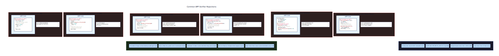

# 🎯 Project Charter: eBPF Tracing Tool
## What You Are Building
A production-grade eBPF observability tool that dynamically instruments the Linux kernel to capture syscall latency distributions, TCP connection lifecycles, and scheduler behavior in real-time. The final artifact is a unified terminal dashboard displaying live histograms, active connections, and top processes—all powered by eBPF programs that safely execute in kernel space after passing the verifier's strict safety constraints.
## Why This Project Exists
Most developers treat kernel internals as black boxes, using tools like `strace` or `tcpdump` without understanding how they work. Building an eBPF tracer from scratch exposes the mechanics of kernel instrumentation: how the verifier proves program safety, how CO-RE enables portability across kernel versions, and how ring buffers efficiently stream events from kernel to userspace. These skills directly apply to production tools like Cilium, Falco, bpftrace, and Pixie.
## What You Will Be Able to Do When Done
- Write eBPF programs in C that pass the kernel verifier's safety constraints
- Attach kprobes to kernel functions and tracepoints to stable kernel events
- Use BPF ring buffers to stream events from kernel to userspace efficiently
- Implement CO-RE (Compile Once, Run Everywhere) for cross-kernel portability
- Measure syscall latency distributions using paired entry/exit probe correlation
- Trace TCP connection lifecycles with IPv4/IPv6 dual-stack support
- Build multi-source observability dashboards with per-CPU map aggregation
- Configure runtime filtering without reloading eBPF programs
- Measure and document the performance overhead of your tracing probes
## Final Deliverable
~2,500 lines of C across 8 source files (4 eBPF programs, 4 userspace consumers). The complete system loads in under 500ms, runs with <2% CPU overhead on an idle system, and displays a live terminal dashboard showing syscall histograms (64 log2 buckets per syscall type), active TCP connections with duration tracking, and top processes by CPU usage. Works on any Linux kernel 5.8+ with BTF enabled.
## Is This Project For You?
**You should start this if you:**
- Are comfortable with C programming and pointer arithmetic
- Understand the difference between kernel space and user space
- Have basic familiarity with Linux syscalls and the /proc filesystem
- Want to understand how production observability tools work internally
- Are interested in Linux kernel internals without writing kernel modules
**Come back after you've learned:**
- C pointers and memory management (malloc/free, pointer arithmetic)
- Basic Linux command line (navigating /proc, using strace)
- How to compile C programs with make/gcc
## Estimated Effort
| Phase | Time |
|-------|------|
| eBPF Fundamentals & Kprobe Tracer | ~10 hours |
| Syscall Latency Histogram | ~10 hours |
| TCP Connection Tracer | ~10 hours |
| Multi-Source Dashboard | ~10 hours |
| **Total** | **~40 hours** |
## Definition of Done
The project is complete when:
- All four eBPF programs load successfully and pass the kernel verifier on Linux 5.8+
- Kprobe tracer captures file open events with PID, filename, and flags via ring buffer
- Syscall latency histograms display correct log2 bucket distributions for read/write/openat
- TCP tracer correctly handles both IPv4 and IPv6 connections with network byte order conversion
- Terminal dashboard refreshes at 1-2 Hz showing histograms, connections, and top processes
- Per-CPU map values are correctly summed across all CPUs in userspace
- Runtime probe enable/disable works without program reload and without file descriptor leaks
- Performance overhead is measured and documented at <2% CPU on an idle system
- All BPF resources (links, maps, objects) are properly freed on graceful shutdown

---

# 📚 Before You Read This: Prerequisites & Further Reading
> **Read these first.** The Atlas assumes you are familiar with the foundations below.
> Resources are ordered by when you should encounter them — some before you start, some at specific milestones.
---
## eBPF Fundamentals
### 🔭 Deep Dive: BPF Verifier and Safety Model
**Paper**: *eBPF: The Universal In-Kernel Virtual Machine* — Brendan Gregg et al. (2020)
- **Why**: Original exposition of eBPF's safety guarantees and verifier architecture from the performance observability pioneer.
**Best Explanation**: *BPF and XDP Reference Guide* — Cilium Documentation, Section "BPF Verifier"
- https://docs.cilium.io/en/stable/bpf/
- **Read BEFORE starting** — Required foundational knowledge of how the verifier proves program safety through abstract interpretation.
**Code**: Linux Kernel `kernel/bpf/verifier.c`
- Specific file: `check_max_stack_depth()`, `do_check()` functions
- https://github.com/torvalds/linux/blob/master/kernel/bpf/verifier.c
- **Why**: The canonical implementation of the verification algorithm. Reading the actual state machine clarifies why certain patterns are rejected.
---
## Kernel Memory Safety
### 🔭 Deep Dive: Safe Kernel Memory Access
**Paper**: *Ongoing Evolution of the Linux Kernel* — Jonathan Corbet (LWN, 2017-ongoing)
- https://lwn.net/Articles/740921/
- **Read after Milestone 1** — You'll have enough context to appreciate the `bpf_probe_read_kernel()` design tradeoffs.
**Best Explanation**: *BPF Helpers Reference* — Linux kernel documentation
- https://man7.org/linux/man-pages/man7/bpf-helpers.7.html
- **Read BEFORE starting** — Required understanding of `bpf_probe_read_kernel()`, `bpf_ringbuf_reserve()`, and helper return value semantics.
---
## Ring Buffers and Event Streaming
### 🔭 Deep Dive: Kernel Ring Buffers
**Paper**: *BPF Ring Buffer* — Andrii Nakryiko (LWN, 2020)
- https://lwn.net/Articles/823916/
- **Read after Milestone 1** — After implementing ring buffer consumption, the design rationale (single buffer vs per-CPU, variable-length records) becomes clear.
**Code**: Linux Kernel `kernel/bpf/ringbuf.c`
- Specific function: `bpf_ringbuf_reserve()`, `bpf_ringbuf_submit()`
- https://github.com/torvalds/linux/blob/master/kernel/bpf/ringbuf.c
- **Why**: The lock-free producer-consumer implementation is a masterclass in kernel memory ordering.
---
## CO-RE and Kernel Portability
### 🔭 Deep Dive: Compile Once, Run Everywhere
**Paper**: *BPF CO-RE Reference Guide* — Andrii Nakryiko (2020)
- https://nakryiko.com/posts/bpf-core-reference-guide/
- **Read after Milestone 1** — Once you've seen CO-RE relocations fail and succeed, the relocation record format makes sense.
**Best Explanation**: *libbpf Documentation* — GitHub
- Section "BTF Gen and CO-RE"
- https://libbpf.readthedocs.io/
- **Read before Milestone 1** — Required understanding of `BPF_CORE_READ()` macro semantics.
---
## Latency Histograms and Log2 Bucketing
### 🔭 Deep Dive: Power-Law Latency Distributions
**Best Explanation**: *How to Read a Histogram* — Baron Schwartz (VividCortex Blog)
- https://www.vividcortex.com/blog/how-to-read-a-latency-histogram
- **Read after Milestone 2** — You'll have real latency data to interpret; this explains why p99 matters more than p50 for production systems.
**Code**: *HdrHistogram* — Gil Tene's implementation
- Specific file: `src/main/java/org/HdrHistogram/AbstractHistogram.java`
- https://github.com/HdrHistogram/HdrHistogram
- **Why**: The canonical log2 bucketing implementation. Your `latency_to_bucket()` function is a simplified version.
---
## TCP State Machine
### 🔭 Deep Dive: TCP Connection Lifecycle
**Spec**: RFC 793 — *Transmission Control Protocol* (1981)
- Section "TCP Connection State Machine"
- https://datatracker.ietf.org/doc/html/rfc793
- **Read before Milestone 3** — Required understanding of the 11 TCP states and transition rules.
**Best Explanation**: *TCP State Transition Diagram* — The TCP/IP Guide
- http://www.tcpipguide.com/free/t_TCPConnectionEstablishmentProcessTheThreeWayHandsh-3.htm
- **Read before Milestone 3** — Visual walkthrough of the state machine with real packet sequences.
---
## Network Byte Order
### 🔭 Deep Dive: Endianness in Network Protocols
**Spec**: RFC 1700 — *Assigned Numbers* (1994), Section "Data Notation"
- https://datatracker.ietf.org/doc/html/rfc1700
- **Read before Milestone 3** — Required understanding of why ports and addresses are big-endian.
**Code**: Linux Kernel `include/uapi/linux/byteorder/`
- Specific file: `generic.h` — `__cpu_to_be16()` macros
- https://github.com/torvalds/linux/tree/master/include/uapi/linux/byteorder
- **Why**: The canonical implementation of `ntohs()`/`htonls()`. Your `ntohs_bpf()` macro mirrors this.
---
## Per-CPU Maps and Cache Contention
### 🔭 Deep Dive: Avoiding False Sharing
**Paper**: *Every Architecture You Need to Know About Performance* — Martin Thompson (2016)
- Section "False Sharing"
- https://mechanical-sympathy.blogspot.com/
- **Read after Milestone 4** — After seeing per-CPU maps eliminate contention, Thompson's explanation of cache line bouncing crystallizes the pattern.
**Best Explanation**: *Per-CPU Variables* — Linux Kernel Documentation
- https://www.kernel.org/doc/html/latest/core-api/percpu.html
- **Read before Milestone 4** — Required understanding of why per-CPU data avoids atomic instructions.
---
## Epoll and Event-Driven I/O
### 🔭 Deep Dive: Efficient I/O Multiplexing
**Best Explanation**: *The C10K Problem* — Dan Kegel (1999, updated)
- http://www.kegel.com/c10k.html
- **Read before Milestone 4** — Required historical context for why epoll exists and when to use it.
**Spec**: `epoll(7)` — Linux man page
- https://man7.org/linux/man-pages/man7/epoll.7.html
- **Read before Milestone 4** — Required API reference for `epoll_create1()`, `epoll_ctl()`, `epoll_wait()`.
---
## Distributed Tracing Correlation
### 🔭 Deep Dive: Entry/Exit Probe Correlation
**Paper**: *Dapper, a Large-Scale Distributed Systems Tracing Infrastructure* — Google (2010)
- Authors: Benjamin H. Sigelman et al.
- **Read after Milestone 2** — Your thread-ID correlation pattern is the single-host equivalent of Dapper's span correlation.
**Best Explanation**: *OpenTelemetry Specification* — Tracing API
- Section "Span Context"
- https://opentelemetry.io/docs/reference/specification/trace/api/
- **Why**: The industry-standard model for correlating temporally-separated events.
---
## Feature Flags and Runtime Configuration
### 🔭 Deep Dive: BPF Maps as Configuration Stores
**Best Explanation**: *Feature Toggles* — Pete Hodgson (Martin Fowler Blog, 2017)
- https://martinfowler.com/articles/feature-toggles.html
- **Read after Milestone 3** — Your runtime filter map is a specialized feature flag system; Hodgson's taxonomy (release toggles, ops toggles) clarifies the pattern.
**Code**: *Unleash* — Open-source feature flag server
- Specific file: `src/lib/features-toggle-service.ts`
- https://github.com/Unleash/unleash
- **Why**: A production feature flag system using the same "shared state checked at execution time" pattern.
---
## Capability-Based Security
### 🔭 Deep Dive: CAP_BPF and Least Privilege
**Best Explanation**: *Capabilities(7)* — Linux man page
- Section "Capabilities" (list includes CAP_BPF since kernel 5.8)
- https://man7.org/linux/man-pages/man7/capabilities.7.html
- **Read before Milestone 1** — Required understanding of CAP_BPF, CAP_PERFMON, CAP_SYS_ADMIN distinctions.
**Code**: Linux Kernel `include/uapi/linux/capability.h`
- Specific constant: `CAP_BPF` (value 39, added in 5.8)
- https://github.com/torvalds/linux/blob/master/include/uapi/linux/capability.h
- **Why**: The definition of the capability that enables eBPF without full root.

---

# eBPF Tracing Tool

Build a production-grade eBPF tracing tool that dynamically instruments the Linux kernel to extract runtime telemetry. This project teaches you to write eBPF bytecode that passes the kernel verifier's strict safety constraints, attach to kprobes and tracepoints for dynamic instrumentation, and efficiently transfer data between kernel and userspace via BPF ring buffers and maps. You'll implement CO-RE (Compile Once Run Everywhere) for cross-kernel portability, measure syscall latency distributions, trace TCP connection lifecycles, and build a multi-source observability dashboard. The skills learned here directly apply to production tools like Cilium, Falco, bpftrace, and Pixie.


<!-- MS_ID: build-ebpf-tracer-m1 -->
# eBPF Fundamentals & Kprobe Tracer
You're about to write code that runs *inside* the Linux kernel. Not a kernel module—something far more constrained, far more powerful, and far more strange. By the end of this milestone, you'll have an eBPF program that attaches to kernel functions, extracts runtime data, and streams it to userspace. But first, you need to understand why eBPF exists and what makes it different from everything you've worked with before.
## The Fundamental Tension: Safety vs. Observability
Here's the problem that eBPF solves: **You want to see everything happening inside the kernel, but you can't let arbitrary code crash the system.**
Traditional approaches hit a wall:
- **Kernel modules** have full access. One null pointer dereference, one use-after-free, and you've panicked the kernel. In production, this is unacceptable.
- **/proc and /sys** give you safe, read-only access—but only to what kernel developers thought to expose. Want to trace every `openat()` syscall with its arguments? You're out of luck.
- **Hardware performance counters** tell you *that* something happened (cache misses, instructions retired), but not *what* or *why*.
The tension is mathematical: you want arbitrary observability (any function, any data structure, any point in time) with provable safety (no crashes, no memory corruption, no infinite loops).
eBPF's answer is brutal but elegant: **your code must pass a verifier that mathematically proves it's safe before it ever runs.** Not runtime checks—static analysis. The verifier explores every possible execution path and rejects the program if it can't *prove* termination within bounded time and safe memory access.


This isn't a debugger. You can't set breakpoints, inspect arbitrary memory, or step through code. eBPF is a bytecode virtual machine inside the kernel that runs your small, verified programs at specific hook points—kprobes, tracepoints, socket operations, and more.
## The eBPF Execution Model


> **🔑 Foundation: eBPF execution model: how bytecode runs in the kernel**
> 
> ## What It IS
The eBPF execution model is a **just-in-time compiled, event-driven sandbox** where your bytecode runs directly inside kernel space—without modifying kernel source or loading kernel modules.
Here's the flow:
```
C code → Clang/LLVM → eBPF bytecode → Verifier → JIT Compilation → Native Machine Code → Event Hook
```
**Key distinction**: Your eBPF program doesn't "run" as a process. It attaches to a hook point (syscall entry, network packet arrival, tracepoint) and the kernel invokes it when that event occurs.
### The Execution Environment
- **Sandboxed**: No direct memory access, no loops without bounds, no arbitrary function calls
- **Maps-based communication**: Programs share data through BPF maps (key-value stores), not shared memory
- **Limited stack**: 512 bytes per program invocation
- **Helper functions**: Kernel-provided functions (like `bpf_probe_read`, `bpf_get_current_pid_tgid`) are the only way to interact with kernel data
## WHY You Need It Right Now
When writing eBPF programs, you'll hit "weird" constraints—no unbounded loops, 512-byte stack, verifier rejecting seemingly valid code. Understanding the execution model explains *why*:
- **No unbounded loops**: The verifier must prove termination; a loop it can't bound = rejection
- **Helper functions only**: Direct kernel memory access would bypass safety; helpers are the controlled interface
- **Event-driven architecture**: You're not writing a program that *does* something; you're writing a program that *responds* to something
## ONE Key Insight
> **eBPF programs are kernel callbacks, not kernel modules.**
A kernel module runs *with* kernel privileges. An eBPF program runs *inside* the kernel but *constrained by* the verifier. Think of it like JavaScript in a browser: powerful, but sandboxed. The kernel trusts the verifier's proof that your code is safe—*before* it ever executes.
---
### Quick Example
```c
SEC("tp/syscalls/sys_enter_execve")
int handle_execve(void *ctx) {
    // This runs EVERY time a process calls execve()
    // The kernel invokes this callback with context about the event
    struct event_t e = {};
    e.pid = bpf_get_current_pid_tgid() >> 32;
    bpf_get_current_comm(&e.comm, sizeof(e.comm));
    bpf_ringbuf_output(&events, &e, sizeof(e), 0);
    return 0;
}
```
The kernel doesn't "call" this function directly—you register it at a hook point, and the kernel invokes it when that hook fires.


When you write an eBPF program, here's what actually happens:
```
Your C Code → clang -target bpf → BPF Bytecode → Verifier → JIT → Native Code → Hook Execution
```
Let's trace this lifecycle:
**1. Compilation**: You write restricted C, compiled with `clang -target bpf -g`. The `-g` flag embeds BTF (BPF Type Format) debug information—this is critical for CO-RE portability, which we'll cover shortly.
**2. Loading**: Your userspace program (using libbpf) loads the bytecode into the kernel via the `bpf()` syscall.
**3. Verification**: The kernel's BPF verifier performs abstract interpretation—it simulates every possible execution path, tracking register values, pointer bounds, and potential branches. If any path could violate safety constraints, the entire program is rejected.
**4. JIT Compilation**: Once verified, the bytecode is compiled to native machine code for your CPU architecture. This isn't interpretation—verified eBPF runs at near-native speed.
**5. Attachment**: The program is attached to a hook point. For this milestone, that's a kprobe on a kernel function.
**6. Execution**: When the hook fires (e.g., `do_sys_openat2` is called), your eBPF program runs in kernel context. It has access to helper functions for reading memory, getting timestamps, and writing to maps—but not arbitrary kernel internals.


### What "Restricted C" Means
You can't write standard C. The verifier enforces constraints that make the language feel like a different dialect:
| Standard C | eBPF C | Why |
|------------|--------|-----|
| Unbounded loops (`while(1)`) | Bounded loops only | Verifier must prove termination |
| Global variables | Per-CPU variables or maps | No writable globals in kernel |
| Large stack arrays | Maps only | 512-byte stack limit |
| Direct pointer dereference | `bpf_probe_read_kernel()` | Must prove memory safety |
| `malloc()`/`free()` | Pre-allocated maps | No dynamic memory allocation |
| Function pointers | Limited, verified calls | No arbitrary indirect calls |
The 512-byte stack limit is particularly jarring. A single `char comm[16]` and `char filename[256]` would exceed it. The solution: use BPF maps (specifically `BPF_MAP_TYPE_PERCPU_ARRAY`) for larger temporary storage.
## The BPF Verifier: Safety Through Mathematical Proof


> **🔑 Foundation: BPF verifier safety proof: how the kernel proves your code won't crash**
> 
> ## What It IS
The BPF verifier is a **static analyzer that mathematically proves your eBPF program is safe**—before the kernel ever executes it. It's not a runtime check; it's a compile-time proof system.
The verifier answers one question: *Can this program crash or compromise the kernel?*
If the answer isn't a definitive "no," the program is rejected.
### What It Proves
| Property | How It's Verified |
|----------|-------------------|
| **Memory safety** | Every pointer access is bounds-checked; the verifier tracks possible value ranges for every register |
| **Termination** | All loops must have a statically provable upper bound |
| **No null derefs** | Pointer validity is tracked through the control flow |
| **No out-of-bounds array access** | Register state tracks min/max possible values |
| **Stack safety** | 512-byte stack can't overflow; alloca is forbidden |
| **No arbitrary kernel memory reads** | Only validated pointers (from helpers, maps, or context) can be dereferenced |
### How It Works: Abstract Interpretation
The verifier doesn't execute your code—it simulates *all possible executions*:
```
For each instruction:
  1. Track the "type" of each register (scalar, pointer to map, pointer to stack, etc.)
  2. Track the possible range of values (min, max, alignment)
  3. At branches, explore BOTH paths
  4. At merge points, combine states conservatively
  5. If any path violates safety, REJECT
```
**Example**: After `r1 = r2 + 5`, if `r2` is a pointer to a 64-byte map value, the verifier knows `r1` points 5 bytes into that map value. A subsequent `*(r1 + 60)` would be rejected because 5 + 60 = 65 > 64.
## WHY You Need It Right Now
When the verifier rejects your program, the error message often looks cryptic:
```
invalid access to map value, value_size=64 off=68 size=4
R1 max value is outside of the allowed memory range
```
Understanding the verifier means understanding it's tracking *register state*:
- `value_size=64`: Your map value is 64 bytes
- `off=68`: You're trying to access offset 68
- `R1 max value`: The verifier computed the maximum possible value of register 1 at this point
The verifier isn't being paranoid—it's being *exhaustive*. It's considering paths you didn't intend (but the instruction stream permits).
### Common Rejection Reasons
1. **Uninitialized memory**: Reading from a register or stack slot before writing to it
2. **Helper return value not checked**: `bpf_probe_read()` returns an error code; you must check it before using the destination buffer
3. **Loop too complex**: The verifier explores loop iterations; eventually it gives up (complexity limit)
4. **Precision tracking**: The verifier loses precision in its analysis and can't prove safety
## ONE Key Insight
> **The verifier proves safety for all possible inputs, not just the ones you expect.**
Your program might work fine for 99% of inputs, but if there exists *any* input that causes an unsafe operation, the verifier will reject it. This is why "but I know this pointer is valid" isn't enough—the verifier needs proof.
**Mental model**: Think of the verifier as an extremely paranoid code reviewer who demands mathematical certainty. "It works in testing" doesn't satisfy it; "I can prove it always works" does.


The verifier is the gatekeeper. Understanding what it does—and why it rejects programs—will save you hours of frustration.
The verifier performs **abstract interpretation**: instead of executing your code with concrete values, it tracks what *could* be true at each program point. For every register, it maintains:
- **Type**: Is this an integer, a pointer to map value, a pointer to packet data, or unknown?
- **Bounds**: What's the minimum and maximum possible value?
- **Alignment**: Is this pointer properly aligned for its type?
- **Nullability**: Could this pointer be null?
The verifier then explores every possible path through your program. At each branch, it splits its state and continues exploring both sides. If it finds a path that could violate safety, it rejects the program.


### Common Rejection Reasons
Let's look at what actually gets rejected:
**Unbounded Loop**
```c
// REJECTED: Verifier can't prove this terminates
while (i < 100) {
    i++;
}
```
The verifier sees `i < 100` but doesn't know `i` starts at 0. Even if you initialize it, the verifier has a hard limit on the number of instructions it'll explore (currently 1 million). If your loop could iterate too many times, it's rejected.
**Fixed version** (clang unrolls this):
```c
// ACCEPTED: Bounded by constant, compiler unrolls
for (int i = 0; i < 10; i++) {
    // ...
}
```
**Out-of-Bounds Access**
```c
// REJECTED: idx could be out of bounds
int idx = some_value;
int val = array[idx];
```
The verifier tracks that `idx` could be any value. Without a bounds check, it rejects.
**Fixed version**:
```c
// ACCEPTED: Bounds check proves safety
if (idx >= 0 && idx < ARRAY_SIZE) {
    int val = array[idx];
}
```
**Uninitialized Variable**
```c
// REJECTED: ptr might be uninitialized on some paths
struct my_struct *ptr;
if (condition) {
    ptr = &some_value;
}
// What if condition was false?
ptr->field = 1;
```
The verifier tracks initialization state across branches.




### Viewing Verifier Logs
When your program is rejected, the kernel provides a detailed log. You can view it with:
```bash
sudo cat /sys/kernel/debug/tracing/trace_pipe
# Or, with bpftool:
sudo bpftool prog load my_prog.o /sys/fs/bpf/my_prog --debug
```
The log shows the verifier's state at each instruction, including register types and bounds. Learning to read these logs is essential for debugging.
## CO-RE: Compile Once, Run Everywhere
[[EXPLAIN:btf-(bpf-type-format)|BTF (BPF Type Format): kernel type information for eBPF]]
Here's a problem that plagued early eBPF development: kernel structures change between versions. The `task_struct` (representing a process) might have `comm` at offset 0x500 on kernel 5.10 and offset 0x520 on kernel 5.15. If you hardcode offsets, your program breaks on different kernels.
The old solution was "recompile for each kernel version"—painful for distribution.
**CO-RE (Compile Once, Run Everywhere)** solves this elegantly:
1. **At compile time**: clang emits "relocation records" that say "I want field X from struct Y" rather than hardcoding the offset.
2. **BTF (BPF Type Format)**: The kernel exposes its own type information via BTF. This is a compact encoding of all kernel structures, their fields, and their layouts.
3. **At load time**: libbpf reads BTF from your kernel, matches it against the relocation records, and patches your bytecode with the correct offsets.


### Using CO-RE in Your Code
Instead of:
```c
// BAD: Hardcoded offset, breaks on different kernels
u32 pid = *(u32 *)((char *)task + 0x548);
```
Use `BPF_CORE_READ`:
```c
// GOOD: CO-RE reads, portable across kernels
struct task_struct *task = (struct task_struct *)bpf_get_current_task();
u32 pid = BPF_CORE_READ(task, pid);
```
The `BPF_CORE_READ` macro expands to a series of `bpf_core_read()` calls that the verifier understands. At load time, libbpf patches these with the correct offsets for *your* kernel.
For nested access:
```c
// Read task->mm->exe_file->f_path.dentry->d_name.name
const char *name = BPF_CORE_READ(task, mm, exe_file, f_path.dentry, d_name.name);
```
Each level of indirection is resolved at load time, making your program portable across kernel versions with different struct layouts.
### Enabling BTF
You need:
1. **Kernel with BTF**: Check with `bpftool btf list` or `cat /sys/kernel/btf/vmlinux`
2. **clang 10+**: For CO-RE relocation support
3. **libbpf**: For load-time patching
Most modern distributions (Ubuntu 20.04+, Fedora 31+) ship with BTF-enabled kernels. If yours doesn't, you can generate BTF from kernel headers using `bpftool btf dump`.
## BPF Maps: The Communication Channel
eBPF programs can't return data to userspace directly. Instead, they write to **BPF maps**—key-value stores that persist across program invocations and are accessible from userspace.
For this milestone, we'll use `BPF_MAP_TYPE_RINGBUF`—a modern, efficient ring buffer implementation. Unlike older perf event arrays, ring buffers:
- Use a single shared memory region (better cache behavior)
- Support variable-length records
- Don't lose events when readers fall behind (they block writers instead)
- Have lower overhead per event


> **🔑 Foundation: Kernel ring buffers: efficient event streaming from kernel to userspace**
> 
> ## What It IS
A ring buffer (circular buffer) is a **fixed-size memory region where data is written sequentially and overwrites old data when full**. In the eBPF context, **perf buffers** and **BPF ring buffers** are the primary mechanisms for streaming events from kernel to userspace.
```
        ┌─────────────────────────────────────┐
        │  [event] [event] [event] [  ] [  ]  │
        │     ↑                         ↑    │
        │   write                      read  │
        └─────────────────────────────────────┘
                      ↓
        When write wraps around:
        ┌─────────────────────────────────────┐
        │ [  ] [  ] [event] [event] [event]   │
        │   ↑           ↑                     │
        │ write        read                   │
        └─────────────────────────────────────┘
```
### BPF Ring Buffer vs. Perf Buffer
| Feature | Perf Buffer | BPF Ring Buffer |
|---------|-------------|-----------------|
| **Memory usage** | Per-CPU buffers | Single shared buffer |
| **Data ordering** | Per-CPU only | Globally ordered |
| **Variable-length records** | Yes (with complexity) | Native support |
| **Overwrite behavior** | Configurable | Configurable |
| **Efficiency** | Good | Better (fewer memory barriers) |
| **Kernel version** | 4.4+ | 5.8+ |
## WHY You Need It Right Now
When building observability tools, you need to get data *out* of the kernel. You have three main options:
1. **BPF maps (hash/array)**: Good for state, terrible for events (polling required)
2. **Perf buffers**: Works everywhere, but per-CPU buffers complicate ordering
3. **BPF ring buffers**: The modern choice—single buffer, variable-length records, wake-ups
### The Practical Difference
**Perf Buffer** (legacy):
```c
// In kernel:
struct event_t *e = bpf_map_lookup_elem(&heap, &zero);
// Fill event...
bpf_perf_event_output(ctx, &events, BPF_F_CURRENT_CPU, e, sizeof(*e));
// In userspace: need to read from each CPU's buffer
```
**BPF Ring Buffer** (modern):
```c
// In kernel:
struct event_t *e = bpf_ringbuf_reserve(&events, sizeof(*e), 0);
if (!e) return 0;
// Fill event...
bpf_ringbuf_submit(e, 0);  // Or bpf_ringbuf_discard(e, 0) on error
// In userspace: single buffer, naturally ordered
```
The ring buffer API also solves the "memory pressure" problem: you can reserve space, fill it, and *then* commit—no partial events if you run out of buffer.
## ONE Key Insight
> **Ring buffers are the Unix pipes of eBPF: simple, efficient, and the idiomatic way to move data between kernel and userspace.**
The mental model: kernel produces, userspace consumes. If userspace is too slow and the buffer fills, you either lose events (overwrite mode) or block the producer (notification mode). For observability, overwrite is usually acceptable—you'd rather lose old events than hang the kernel.
**Design tip**: Size your ring buffer for burst capacity, not average throughput. A 10 MB buffer handles brief spikes; a 1 MB buffer might lose events during traffic bursts.


### Ring Buffer vs. Perf Event Array
| Aspect | Ring Buffer | Perf Event Array |
|--------|-------------|------------------|
| Memory layout | Single circular buffer | Per-CPU buffers |
| Variable-length records | ✓ | ✗ (fixed size) |
| Event ordering | Preserved across CPUs | Per-CPU only |
| Memory overhead | Lower | Higher (per-CPU duplication) |
| Backpressure | Writers block | Events dropped |
| Kernel version | 5.8+ | 4.4+ |


For new development, ring buffers are the clear choice. The only reason to use perf event arrays is compatibility with older kernels.
### Defining a Ring Buffer Map
In your eBPF C code:
```c
struct event {
    u32 pid;
    char comm[16];
    u64 timestamp;
    int dfd;
    char filename[256];
};
struct {
    __uint(type, BPF_MAP_TYPE_RINGBUF);
    __uint(max_entries, 1 << 24);  // 16 MB
} events SEC(".maps");
```
The `SEC(".maps")` attribute tells the compiler to place this in a special section that libbpf recognizes.
### Writing to the Ring Buffer
```c
struct event *e;
// Reserve space in the ring buffer
e = bpf_ringbuf_reserve(&events, sizeof(*e), 0);
if (!e) {
    // Buffer full, drop event
    return 0;
}
// Fill the event
e->pid = bpf_get_current_pid_tgid() >> 32;
bpf_get_current_comm(&e->comm, sizeof(e->comm));
e->timestamp = bpf_ktime_get_ns();
e->dfd = dfd;
// Read filename safely
bpf_probe_read_kernel_str(e->filename, sizeof(e->filename), filename);
// Submit the event
bpf_ringbuf_submit(e, 0);
```
The reserve/submit pattern ensures you never write partially-filled events. If you need to abort, use `bpf_ringbuf_discard(e, 0)` instead of submit.
## Kprobes: Attaching to Kernel Functions
A **kprobe** is a dynamic breakpoint on a kernel function. When the function is called, your eBPF program runs first, with access to the function's arguments.


### Choosing a Function to Trace
Not all kernel functions are kprobe-able:
- **Static functions**: May be inlined or optimized away
- **Functions marked `__kprobes`**: Reserved for kprobes infrastructure
- **Functions in `noinstr` sections**: Can't safely take traps
Good targets are exported symbols (check `/proc/kallsyms`). For this milestone, we'll trace `do_sys_openat2`—the kernel function behind the `openat2()` syscall.
```bash
# Check if the function exists
sudo cat /proc/kallsyms | grep do_sys_openat2
# Should see something like:
# ffffffffa1e5d7b0 T do_sys_openat2
```
### Kprobe Entry vs. Exit
- **Entry kprobe**: Fires at function start. You can read function arguments.
- **Exit kprobe** (kretprobe): Fires at function return. You can read the return value.
For this milestone, we'll use an entry kprobe to capture what files are being opened.
### The Kprobe Context
Your eBPF program receives a `struct pt_regs *ctx`—the CPU register state at the probe point. On x86-64, function arguments are passed in registers:
| Argument | Register |
|----------|----------|
| arg1 | di |
| arg2 | si |
| arg3 | dx |
| arg4 | cx |
| arg5 | r8 |
| arg6 | r9 |
libbpf provides macros to read these:
```c
int dfd = PT_REGS_PARM1(ctx);      // First argument
const char *filename = (const char *)PT_REGS_PARM2(ctx);
```
But wait—you can't dereference `filename` directly. It's a pointer to kernel memory, and the verifier will reject any direct access.
## Safe Memory Access: bpf_probe_read_kernel
This is the most important safety rule in eBPF: **never dereference a pointer directly.** The verifier will reject it because it can't prove the pointer is valid.
Instead, use `bpf_probe_read_kernel()`:
```c
// WRONG: Direct dereference, verifier rejects
char first_char = *filename;
// RIGHT: Safe read with bounds checking
char first_char;
bpf_probe_read_kernel(&first_char, sizeof(first_char), filename);
```


### Why Not Direct Access?
The verifier's concern is real:
1. **Pointer could be NULL**: Userspace can pass NULL to syscalls
2. **Pointer could be invalid**: Malformed pointers from bugs
3. **Pointer could be to userspace**: Using kernel reads on userspace memory causes page faults
4. **Pointer could be unmapped**: Not all kernel addresses are valid
`bpf_probe_read_kernel()` handles all these cases safely—it returns an error code instead of crashing.
### String Handling
For strings, use `bpf_probe_read_kernel_str()` which reads up to a null terminator:
```c
char filename[256];
int ret = bpf_probe_read_kernel_str(filename, sizeof(filename), kernel_filename_ptr);
if (ret < 0) {
    // Read failed, handle error
    filename[0] = '\0';
}
```
The return value is the number of bytes read (including null terminator), or negative on error.
## Putting It Together: The Complete eBPF Program
Let's build the complete tracer. We'll create two files:
1. `openat_trace.bpf.c` — The eBPF program (runs in kernel)
2. `openat_trace.c` — The userspace loader and consumer
### The eBPF Program: openat_trace.bpf.c
```c
#include "vmlinux.h"
#include <bpf/bpf_helpers.h>
#include <bpf/bpf_tracing.h>
#include <bpf/bpf_core_read.h>
char LICENSE[] SEC("license") = "GPL";
// Event structure sent to userspace
struct event {
    u32 pid;
    u32 tid;
    char comm[16];
    u64 timestamp;
    int dfd;
    char filename[256];
    int flags;
    int mode;
};
// Ring buffer for events
struct {
    __uint(type, BPF_MAP_TYPE_RINGBUF);
    __uint(max_entries, 1 << 24);  // 16 MB
} events SEC(".maps");
// Force BTF generation for CO-RE
const volatile int dummy_arg = 0;
SEC("kprobe/do_sys_openat2")
int BPF_KPROBE(trace_openat2, int dfd, const char __user *filename, 
               struct open_how *how)
{
    struct event *e;
    // Reserve space in ring buffer
    e = bpf_ringbuf_reserve(&events, sizeof(*e), 0);
    if (!e) {
        // Buffer full, drop event (graceful degradation)
        return 0;
    }
    // Get process info
    u64 pid_tgid = bpf_get_current_pid_tgid();
    e->pid = pid_tgid >> 32;        // Process ID
    e->tid = (u32)pid_tgid;          // Thread ID
    // Get command name
    bpf_get_current_comm(&e->comm, sizeof(e->comm));
    // Get timestamp (monotonic nanoseconds)
    e->timestamp = bpf_ktime_get_ns();
    // Store arguments
    e->dfd = dfd;
    // Safely read filename from kernel memory
    // Note: filename is __user pointer, but by the time we hit
    // do_sys_openat2, it's been validated and copied if needed
    bpf_probe_read_kernel_str(&e->filename, sizeof(e->filename), filename);
    // Read flags and mode from open_how structure using CO-RE
    e->flags = BPF_CORE_READ(how, flags);
    e->mode = BPF_CORE_READ(how, mode);
    // Submit event to ring buffer
    bpf_ringbuf_submit(e, 0);
    return 0;
}
```
Let's break down the key pieces:
**`#include "vmlinux.h"`**: This is a generated header containing all kernel struct definitions in BTF format. You generate it with `bpftool btf dump` or use libbpf's vmlinux.h generation.
**`SEC("kprobe/do_sys_openat2")`**: This tells the compiler to place the function in a special section named for the kprobe target. libbpf uses this to automatically attach the program.
**`BPF_KPROBE` macro**: This is syntactic sugar that:
1. Declares the function with the correct signature
2. Unpacks arguments from `pt_regs`
3. Makes the function name available for attachment
**`bpf_get_current_pid_tgid()`**: Returns a 64-bit value where the upper 32 bits are the process ID (tgid) and lower 32 bits are the thread ID (pid). In kernel terminology, "pid" is actually the thread ID.
### The Userspace Program: openat_trace.c
```c
#include <stdio.h>
#include <stdlib.h>
#include <string.h>
#include <errno.h>
#include <signal.h>
#include <time.h>
#include <unistd.h>
#include <bpf/libbpf.h>
#include <bpf/bpf.h>
#include "openat_trace.skel.h"  // Generated by libbpf
static volatile bool exiting = false;
static void sig_handler(int sig)
{
    exiting = true;
}
static int handle_event(void *ctx, void *data, size_t len)
{
    struct event *e = data;
    // Convert timestamp to human-readable format
    time_t secs = e->timestamp / 1000000000;
    struct tm *tm = localtime(&secs);
    char timestr[64];
    strftime(timestr, sizeof(timestr), "%H:%M:%S", tm);
    // Format flags as common strings
    char flags_str[32] = "";
    if (e->flags & 0x1000) strcat(flags_str, "O_CREAT|");
    if (e->flags & 0x2000) strcat(flags_str, "O_TRUNC|");
    if (e->flags & 0x4000) strcat(flags_str, "O_EXCL|");
    if (e->flags & 0x20000) strcat(flags_str, "O_DIRECTORY|");
    if (strlen(flags_str) > 0) flags_str[strlen(flags_str)-1] = '\0';
    printf("%-8s %-7d %-16s %-4d %s [%s]\n",
           timestr, e->pid, e->comm, e->dfd, e->filename, flags_str);
    return 0;
}
int main(int argc, char **argv)
{
    struct ring_buffer *rb = NULL;
    struct openat_trace_bpf *skel;
    int err;
    // Set up signal handling
    signal(SIGINT, sig_handler);
    signal(SIGTERM, sig_handler);
    // Open and load the BPF application
    skel = openat_trace_bpf__open();
    if (!skel) {
        fprintf(stderr, "Failed to open BPF skeleton\n");
        return 1;
    }
    // Load and verify the BPF program
    err = openat_trace_bpf__load(skel);
    if (err) {
        fprintf(stderr, "Failed to load BPF skeleton: %d\n", err);
        goto cleanup;
    }
    // Attach the kprobe
    err = openat_trace_bpf__attach(skel);
    if (err) {
        fprintf(stderr, "Failed to attach BPF skeleton: %d\n", err);
        goto cleanup;
    }
    // Set up ring buffer polling
    rb = ring_buffer__new(bpf_map__fd(skel->maps.events), handle_event, NULL, NULL);
    if (!rb) {
        fprintf(stderr, "Failed to create ring buffer\n");
        err = -1;
        goto cleanup;
    }
    printf("%-8s %-7s %-16s %-4s %s [%s]\n",
           "TIME", "PID", "COMM", "DFD", "FILENAME", "FLAGS");
    // Main event loop
    while (!exiting) {
        err = ring_buffer__poll(rb, 100 /* timeout in ms */);
        if (err == -EINTR) {
            err = 0;
            break;
        }
        if (err < 0) {
            fprintf(stderr, "Error polling ring buffer: %d\n", err);
            break;
        }
    }
cleanup:
    ring_buffer__free(rb);
    openat_trace_bpf__destroy(skel);
    return err != 0;
}
```
### The Build System: Makefile
```makefile
CLANG ?= clang
ARCH := $(shell uname -m | sed 's/x86_64/x86/' | sed 's/aarch64/arm64/')
INCLUDES := -I/usr/include/bpf
CFLAGS := -g -Wall -O2
BPF_CFLAGS := -target bpf -D__TARGET_ARCH_$(ARCH) $(INCLUDES) -g -O2
# Generate vmlinux.h if not present
vmlinux.h:
	bpftool btf dump file /sys/kernel/btf/vmlinux format c > vmlinux.h
# Build BPF object
openat_trace.bpf.o: openat_trace.bpf.c vmlinux.h
	$(CLANG) $(BPF_CFLAGS) -c $< -o $@
# Generate skeleton
openat_trace.skel.h: openat_trace.bpf.o
	bpftool gen skeleton $< > $@
# Build userspace loader
openat_trace: openat_trace.c openat_trace.skel.h
	$(CC) $(CFLAGS) $(INCLUDES) -lbpf -lelf -lz $< -o $@
clean:
	rm -f *.o *.skel.h vmlinux.h openat_trace
.PHONY: clean
```
### Building and Running
```bash
# Build
make
# Run (requires root or CAP_BPF)
sudo ./openat_trace
```
Expected output:
```
TIME     PID     COMM             DFD  FILENAME [FLAGS]
14:23:45 1234    bash             -100 /etc/passwd 
14:23:45 1234    bash             -100 /etc/passwd 
14:23:46 5678    cat              -100 /proc/cpuinfo 
14:23:47 5679    ls               -100 /usr/lib/locale/locale-archive [O_DIRECTORY]
```
## Capabilities: CAP_BPF and the Security Model


> **🔑 Foundation: CAP_BPF capability and eBPF security model**
> 
> ## What It IS
The eBPF capability model controls **who can load and interact with eBPF programs** through Linux capabilities—fine-grained privileges that replace the blunt "root vs. non-root" dichotomy.
### The Capabilities
| Capability | Controls |
|------------|----------|
| **CAP_BPF** | Load BPF programs, create most map types (kernel 5.8+) |
| **CAP_PERFMON** | Access perf events, attach tracing programs |
| **CAP_NET_ADMIN** | Attach socket/filter programs, modify networking |
| **CAP_SYS_ADMIN** | Legacy "god mode"—still required for some operations |
### Before and After Kernel 5.8
**Pre-5.8**: `CAP_SYS_ADMIN` (effectively root) was required for almost everything. Running eBPF = running as root.
**5.8+**: The model split into focused capabilities:
```
Tracing/BPF:     CAP_BPF + CAP_PERFMON
Networking BPF:  CAP_BPF + CAP_NET_ADMIN  
XDP/tc:          CAP_BPF + CAP_NET_ADMIN
Map operations:  CAP_BPF (for most types)
```
### What CAP_BPF Actually Grants
```c
// Without CAP_BPF:
- Can load "classic" BPF (socket filters) only
- Cannot create most map types
- Cannot load eBPF programs
// With CAP_BPF:
- Can load eBPF programs (if additional caps allow the specific type)
- Can create maps (hash, array, ringbuf, etc.)
- Can read/write maps
- Cannot bypass verifier (still enforced)
```
## WHY You Need It Right Now
When deploying eBPF tools in production, you'll face this question: *What privileges does this actually need?*
### Common Scenarios
**Observability agent (tracing)**:
```
Needs: CAP_BPF + CAP_PERFMON
Does NOT need: CAP_SYS_ADMIN, CAP_NET_ADMIN
```
**Load balancer (XDP)**:
```
Needs: CAP_BPF + CAP_NET_ADMIN
Does NOT need: CAP_SYS_ADMIN, CAP_PERFMON
```
**Security monitor (both tracing and network)**:
```
Needs: CAP_BPF + CAP_PERFMON + CAP_NET_ADMIN
```
### Container Environments
In Kubernetes, you specify capabilities in the pod spec:
```yaml
spec:
  containers:
  - name: ebpf-agent
    securityContext:
      capabilities:
        add: ["CAP_BPF", "CAP_PERFMON"]
```
This is significantly safer than `privileged: true`.
## ONE Key Insight
> **CAP_BPF is the kernel saying "we trust you to load eBPF, but the verifier still doesn't trust your code."**
Capabilities control *who* can load programs. The verifier controls *what* programs can do. Even with CAP_BPF, you cannot:
- Bypass memory safety checks
- Access arbitrary kernel memory
- Create unbounded loops
- Hide from the verifier
The capability model is about *delegation*: root can delegate BPF loading to a specific user/container without giving them full system control. The verifier ensures that delegated power can't escape its sandbox.


eBPF programs need elevated privileges. Historically, this meant root. Modern kernels (5.8+) introduce **CAP_BPF**, a dedicated capability for eBPF operations.


### Capability Requirements
| Operation | Pre-5.8 | 5.8+ (with CAP_BPF) |
|-----------|---------|---------------------|
| Load BPF program | CAP_SYS_ADMIN | CAP_BPF + CAP_PERFMON |
| Access kernel memory | CAP_SYS_ADMIN | CAP_BPF |
| Use perf events | CAP_SYS_ADMIN | CAP_PERFMON |
| Attach to kprobes | CAP_SYS_ADMIN | CAP_BPF + CAP_PERFMON |
### Checking Capabilities
```bash
# Check if your kernel supports CAP_BPF
cat /proc/sys/kernel/unprivileged_bpf_disabled
# 0 = unprivileged BPF allowed (not recommended)
# 1 = CAP_BPF required
# 2 = CAP_SYS_ADMIN required
# Run with capabilities (if your system supports ambient capabilities)
capsh --caps="cap_bpf+eip cap_perfmon+eip" -- -c "./openat_trace"
# Or just use sudo
sudo ./openat_trace
```
For production, use the principle of least privilege: grant only CAP_BPF and CAP_PERFMON, not full root.
## Intentional Verifier Rejection
To truly understand the verifier, let's intentionally trigger rejections and examine the error messages.
### Rejection 1: Unbounded Loop
Create `bad_loop.bpf.c`:
```c
#include "vmlinux.h"
#include <bpf/bpf_helpers.h>
char LICENSE[] SEC("license") = "GPL";
SEC("kprobe/do_sys_openat2")
int bad_loop(void *ctx)
{
    int sum = 0;
    int i = 0;
    // REJECTED: Verifier can't prove this terminates
    while (i < 1000) {
        sum += i;
        i++;
    }
    return sum;
}
```
Load it:
```bash
sudo bpftool prog load bad_loop.bpf.o /sys/fs/bpf/bad_loop
```
Expected error:
```
Error: failed to load program: infinite loop detected
```
**What happened**: The verifier explored the loop for its complexity limit and couldn't prove termination. Even though we know `i` will reach 1000, the verifier's abstract interpretation doesn't track concrete values that precisely.
### Rejection 2: Out-of-Bounds Access
Create `bad_access.bpf.c`:
```c
#include "vmlinux.h"
#include <bpf/bpf_helpers.h>
char LICENSE[] SEC("license") = "GPL";
SEC("kprobe/do_sys_openat2")
int bad_access(void *ctx)
{
    int array[10];
    int idx = bpf_get_current_pid_tgid() & 0xFF;  // Could be 0-255
    // REJECTED: idx could exceed array bounds
    return array[idx];
}
```
Expected error:
```
Error: failed to load program: invalid access to map value
```
**What happened**: The verifier tracks that `idx` could be 0-255, but the array only has 10 elements. Without a bounds check, the access is rejected.
### Rejection 3: Uninitialized Variable
Create `bad_uninit.bpf.c`:
```c
#include "vmlinux.h"
#include <bpf/bpf_helpers.h>
char LICENSE[] SEC("license") = "GPL";
SEC("kprobe/do_sys_openat2")
int bad_uninit(void *ctx)
{
    int value;
    u32 pid = bpf_get_current_pid_tgid() >> 32;
    // REJECTED: value might be uninitialized
    if (pid > 1000) {
        value = 42;
    }
    return value;  // What if pid <= 1000?
}
```
Expected error:
```
Error: failed to load program: read from uninitialized stack
```
**What happened**: The verifier tracks initialization state. On the path where `pid <= 1000`, `value` is never assigned, so reading it is rejected.


## The Three-Level View
Let's zoom out and see what's happening at each level of abstraction:
### Level 1: eBPF Bytecode (What the kernel sees)
```
0: (bf) r6 = r1                    // Save ctx pointer
1: (85) call bpf_get_current_pid_tgid#14
2: (77) r0 >>= 32                  // Extract PID
3: (63) *(u32 *)(r10 -8) = r0      // Store to stack
4: (18) r1 = 0x...                 // Map pointer
5: (b7) r2 = 288                   // sizeof(struct event)
6: (b7) r3 = 0                     // flags
7: (85) call bpf_ringbuf_reserve#131
...
```
The verifier validates this instruction sequence, tracking register types and bounds at each step.
### Level 2: libbpf Runtime (What your code does)
```c
// Load and verify
skel = openat_trace_bpf__open_and_load();
// Apply CO-RE relocations
// libbpf patches bytecode with kernel-specific offsets
// Attach to kprobe
openat_trace_bpf__attach(skel);
// Poll ring buffer
ring_buffer__poll(rb, timeout);
```
libbpf handles the complexity of loading, verifying, and attaching.
### Level 3: System Integration (What the kernel does)
```
User Process                Kernel
    |                          |
    |--- bpf(BPF_PROG_LOAD) ->|  Load bytecode
    |                          |  Verify safety
    |                          |  JIT compile
    |<-- prog_fd --------------|
    |                          |
    |--- perf_event_open() --->|  Create kprobe event
    |--- ioctl(PERF_EVENT_IOC_SET_BPF) --> Attach
    |                          |
    |                          |  [do_sys_openat2 called]
    |                          |  [eBPF program runs]
    |                          |  [Event written to ring buffer]
    |                          |
    |--- poll(ringbuf_fd) ---->|  Wait for events
    |<-- data available -------|
    |--- read() -------------->|  Consume events
```
The kernel handles the hard parts: safe execution, event delivery, and resource management.
## Debugging Tips
When things go wrong:
### 1. Verifier Log Too Short
The default verifier log size is 1MB. For complex programs:
```c
LIBBPF_OPTS(bpf_prog_load_opts, opts,
    .log_level = 2,
    .log_size = 16 * 1024 * 1024,  // 16 MB
);
bpf_prog_load(BPF_PROG_TYPE_KPROBE, NULL, "GPL", insns, insn_cnt, &opts);
```
### 2. CO-RE Relocation Failed
If you see "failed to resolve CO-RE relocation":
```bash
# Check BTF availability
bpftool btf list
# Check if your struct/field exists
bpftool btf dump file /sys/kernel/btf/vmlinux | grep -A 20 "struct open_how"
```
### 3. Kprobe Not Firing
```bash
# Check if kprobe is attached
sudo cat /sys/kernel/debug/tracing/kprobe_events
# Check trace output
sudo cat /sys/kernel/debug/tracing/trace_pipe
```
### 4. Ring Buffer Events Not Appearing
- Check that you're polling (not just reading once)
- Verify the ring buffer size is sufficient
- Ensure events are being submitted (add debug output in BPF)
## Knowledge Cascade
You've just learned eBPF fundamentals. Here's where this knowledge connects:
### Immediate Connections
**WebAssembly Sandbox Model**: Both eBPF and WASM use ahead-of-time verification to prove safety before execution. The eBPF verifier's abstract interpretation is conceptually similar to WASM's validation pass—both prove memory safety and bounded execution without runtime checks. This pattern (verify-then-execute) enables untrusted code to run in privileged contexts.
**JIT Compilation in JVMs**: After verification, eBPF bytecode is JIT-compiled to native machine code. This is the same pattern as HotSpot: verify bytecode safety, then compile to native for performance. The difference is that eBPF's verification is stricter (no runtime fallback) and happens once at load time, not during warmup.
**Database Query Planners**: The BPF verifier's path exploration resembles how query planners prove query termination and estimate costs. Both must reason about all possible execution paths without actually running the code. The verifier's "instruction limit" is analogous to a query planner's timeout or complexity limit.
### Deeper Connections
**Capability-Based Security (seL4, Capsicum)**: CAP_BPF follows the principle of least privilege. Instead of granting full root (which includes filesystem access, process control, etc.), CAP_BPF grants only the specific capability to load and run eBPF programs. This is the same philosophy as capability-based operating systems: precise, unforgeable tokens of authority.
**Static Analysis Tools (Coverity, Infer)**: The verifier is essentially a static analyzer that must prove safety properties. The techniques (abstract interpretation, value tracking, path exploration) are the same. The difference: the verifier's analysis must be sound (no false negatives) because the consequences of missing a bug are kernel panics.
**Formal Verification (CompCert, seL4)**: The verifier is doing lightweight formal verification. It's proving properties about your program (termination, memory safety) without requiring you to write proofs. The tradeoff: it rejects some safe programs (false positives) to guarantee catching all unsafe ones.
### What You Can Build Now
With these fundamentals, you can build:
- **Custom security monitors**: Alert on specific file access patterns
- **Performance profilers**: Measure function latency in production
- **Network observability**: Trace packet flows through the stack
- **Compliance auditing**: Log all privileged operations
And you understand *why* eBPF is safe enough to run in production: the verifier proves it.
---
<!-- END_MS -->


<!-- MS_ID: build-ebpf-tracer-m2 -->
# Syscall Latency Histogram
In the last milestone, you built a working eBPF tracer that captured individual events—file opens streaming through a ring buffer to userspace. You learned to think in terms of kernel callbacks, verifier constraints, and CO-RE portability.
Now we're going to do something fundamentally different. Instead of capturing *what happened*, we're going to measure *how long it took*.
This sounds simple. It isn't.
## The Fundamental Tension: You Can't Just "Measure Time" in the Kernel
Here's what you might expect to work:
```c
// Entry probe: record start time
u64 start = bpf_ktime_get_ns();
// ... syscall executes ...
// Exit probe: compute duration
u64 duration = bpf_ktime_get_ns() - start;
```
There's just one problem: **entry and exit probes are completely separate eBPF program invocations.**
When your entry kprobe fires, the eBPF program runs, captures the timestamp, and... returns. The kernel continues executing the syscall. Then, microseconds or milliseconds later, the exit kprobe fires. A *different* eBPF program runs. It has no access to the `start` variable from the entry probe. The stack is gone. The registers are different.


This is the core challenge: **you must manually correlate two independent events that happen at different times, to the same thread.**
The solution is a pattern you'll see everywhere in distributed systems: a correlation identifier. In OpenTelemetry, it's a request ID that ties together spans across microservices. Here, it's the thread ID (the kernel's `pid`) that ties together the entry and exit of a syscall within a single thread of execution.
But there's more tension:
**Data volume**: If you traced every `read()` syscall on a busy web server and sent every latency sample to userspace via ring buffer, you'd generate megabytes per second of overhead. The ring buffer would become a bottleneck. You need to aggregate *in the kernel*.
**Clock semantics**: What clock do you use? Wall-clock time can jump backward (NTP adjustments, suspend/resume). A latency measurement that shows negative duration would corrupt your histogram. You need monotonic time.
**Histogram efficiency**: How do you represent a distribution that spans microseconds to seconds (six orders of magnitude) without using thousands of buckets? You need log2 bucketing.


By the end of this milestone, you'll have built a system that:
1. Correlates entry/exit probes across time using a BPF hash map
2. Computes log2 histograms entirely in the kernel
3. Handles multiple syscalls simultaneously with per-syscall histograms
4. Gracefully handles hash map overflow
This isn't just about tracing—it's about learning a pattern (correlation via shared state) that applies to distributed tracing, event-sourced systems, and any domain where you need to tie together temporally-separated events.
## The Correlation Problem: Thread IDs as Request IDs
Let's make the problem concrete. When a thread calls `read()`, here's what happens:
```
Time    Event                           eBPF Program
─────────────────────────────────────────────────────────
T+0     Thread calls read()             Entry kprobe fires
T+0     → Record start time             → Writes to hash map
T+0     → Return from entry probe       
        ... syscall executes in kernel ...
T+50μs  read() returns                  Exit kprobe fires
T+50μs  → Look up start time            → Reads from hash map
T+50μs  → Compute duration              → Updates histogram
T+50μs  → Return from exit probe        
```
The hash map is the bridge between these two invocations. Let's look at the key design decisions:
### Why Thread ID, Not Process ID?
In kernel terminology, `pid` is actually the thread ID. The process ID is called `tgid` (thread group ID).
```c
u64 pid_tgid = bpf_get_current_pid_tgid();
u32 thread_id = pid_tgid;           // Lower 32 bits = thread ID
u32 process_id = pid_tgid >> 32;    // Upper 32 bits = process ID
```
**You must use thread ID, not process ID.** Here's why:
Consider a multi-threaded process where Thread A calls `read()` and Thread B calls `write()` simultaneously:
```
Thread A: read() entry → start_time_A
Thread B: write() entry → start_time_B
Thread A: read() exit → should use start_time_A
Thread B: write() exit → should use start_time_B
```
If you keyed by process ID, both threads would share the same entry in the hash map. Thread A's exit might read Thread B's start time, producing completely wrong latency measurements.


### The Hash Map Structure
```c
struct {
    __uint(type, BPF_MAP_TYPE_HASH);
    __uint(max_entries, 10240);
    __type(key, u32);           // Thread ID
    __type(value, u64);         // Start timestamp (nanoseconds)
} start_times SEC(".maps");
```
The `max_entries` defines your working set. If you have more than 10,240 threads simultaneously inside syscalls you're tracing, new entries will fail to be created.
### Graceful Degradation: What Happens When the Map is Full?
This is a critical design decision. When `bpf_map_update_elem()` fails because the map is full, you have two choices:
1. **Panic/crash**: Not an option in eBPF—you'd crash the kernel
2. **Drop the entry**: The syscall executes normally, but you don't measure its latency
```c
u64 start = bpf_ktime_get_ns();
int ret = bpf_map_update_elem(&start_times, &tid, &start, BPF_ANY);
if (ret) {
    // Map full, drop this measurement
    // The syscall still works, we just don't trace it
    return 0;
}
```
The `BPF_ANY` flag means "create or update"—if the key exists, overwrite it. This handles the rare case where a thread is already in the hash map (nested syscalls, though rare, can happen).


## Monotonic Time: Why Wall Clocks Lie

> **🔑 Foundation: Why bpf_ktime_get_ns uses monotonic time**
> 
> **What It IS**
Monotonic time and wall-clock time are two different ways to measure time, and they behave very differently:
- **Wall-clock time** (also called "realtime") is what you see on your clock — it corresponds to actual calendar dates and times of day. It can jump forward or backward when someone adjusts the system clock, when NTP corrects drift, or during daylight saving transitions.
- **Monotonic time** is a continuously increasing counter that starts at some arbitrary point (typically system boot). It *only* moves forward at a steady rate and cannot be modified. It doesn't care about your timezone, NTP, or what time you think it is.
**WHY the Reader Needs It Right Now**
When writing BPF programs with `bpf_ktime_get_ns()`, you're asking the kernel for monotonic time — and understanding this distinction prevents subtle bugs:
1. **Event ordering**: If you're correlating timestamps across events, you need time that only moves forward. A wall-clock time jump could make Event B appear to happen *before* Event A, breaking your logic.
2. **Interval measurement**: Measuring "how long did this function take?" requires a clock that won't suddenly jump 2 seconds because NTP synced. Monotonic time gives you accurate durations.
3. **BPF verification safety**: The BPF verifier and kernel subsystems rely on time only moving forward for things like rate limiting, timeout detection, and expiring entries in maps.
**Key Insight / Mental Model**
Think of monotonic time as a **stopwatch** and wall-clock time as a **calendar with a watch face**.
The stopwatch (monotonic) only cares about elapsed time since you started it — it never jumps around. The calendar-watch (wall-clock) tries to match real-world time and can be rewound or fast-forwarded.
When `bpf_ktime_get_ns()` returns `1,234,567,890,123,456`, that number means "1,234,567.89 seconds since system boot" — not "Tuesday at 3:45 PM." If you need human-readable timestamps in your BPF output, convert monotonic time to wall-clock time in userspace, not in the kernel.


You might be tempted to use wall-clock time for latency measurement. Don't.
Wall-clock time (`CLOCK_REALTIME`) can:
- **Jump forward**: NTP adjusts the clock because it was running fast
- **Jump backward**: NTP adjusts because it was running slow, or the system resumes from suspend
- **Change arbitrarily**: Administrator runs `date -s "2024-01-01 00:00:00"`
If you measure latency with wall-clock time and the clock jumps backward during the syscall, you get **negative latency**. This corrupts your histogram.
`bpf_ktime_get_ns()` returns monotonic time (`CLOCK_MONOTONIC`), which:
- Starts at some undefined point (often boot time)
- Never goes backward
- Advances at a steady rate (ignoring NTP adjustments)
- Continues across suspend/resume (on modern kernels)


### What Monotonic Time Doesn't Give You
Monotonic time is **not** wall-clock time. You can't convert `bpf_ktime_get_ns()` to a human-readable timestamp without knowing the boot time offset.
For latency measurement, this doesn't matter—you only care about *deltas*, not absolute times. But if you wanted to correlate syscall latencies with log timestamps, you'd need to track the offset between monotonic and wall-clock time in userspace.
## Log2 Histograms: Six Orders of Magnitude in 64 Buckets
Here's the data problem: syscall latencies span an enormous range.
| Latency | Example |
|---------|---------|
| 100 ns | `getpid()` - trivial syscall |
| 1 μs | `read()` from page cache |
| 10 μs | `read()` from buffer cache miss |
| 100 μs | `write()` to SSD |
| 1 ms | `read()` from HDD |
| 10 ms | `read()` from network (local) |
| 100 ms | `read()` from network (cross-region) |
| 1 s | `read()` from network (cross-continent) |
A linear histogram with 1 μs buckets would need 1,000,000 buckets to cover this range. Most would be empty.
**Log2 histogram** solves this: each bucket covers twice the range of the previous one.
```
Bucket 0:  0 μs    - 1 μs     (range: 1 μs)
Bucket 1:  1 μs    - 2 μs     (range: 1 μs)
Bucket 2:  2 μs    - 4 μs     (range: 2 μs)
Bucket 3:  4 μs    - 8 μs     (range: 4 μs)
...
Bucket 10: 512 μs  - 1024 μs  (range: 512 μs)
...
Bucket 20: 524 ms  - 1048 ms  (range: 524 ms)
```
With 64 buckets, you cover 0 to 18 hours of latency. That's enough for any realistic syscall measurement.


### Computing the Log2 Bucket
The bucket index for a latency `latency_ns` (in nanoseconds) is:
```c
// Convert to microseconds (avoids log2(0))
u64 latency_us = latency_ns / 1000;
// Handle zero latency (sub-microsecond)
if (latency_us == 0) {
    bucket = 0;
} else {
    // log2(latency_us) gives us the power of 2
    // We need to compute this without floating point
    bucket = 64 - __builtin_clzll(latency_us);
}
```
The `__builtin_clzll()` (count leading zeros) is a compiler intrinsic that's efficient and verifier-friendly. It counts how many leading zeros are in the 64-bit representation, so `64 - clz` gives you the position of the highest set bit—which is `floor(log2(value))`.
### Why Compute Histograms in the Kernel?
You might wonder: why not send every latency sample to userspace and compute the histogram there?
Let's do the math for a busy server:
```
Syscalls per second: 100,000 (moderate load)
Sample size: 16 bytes (timestamp + syscall number + latency)
Data rate: 100,000 * 16 = 1.6 MB/second
```
1.6 MB/second is 5.76 GB/hour. That's a lot of data to push through a ring buffer.
Now compare with in-kernel histogram:
```
Histogram size: 64 buckets * 8 bytes = 512 bytes per syscall type
Number of syscall types: 10 (read, write, openat, close, etc.)
Total map size: 512 bytes * 10 = 5 KB
Polling rate: 1 Hz
Data rate: 5 KB/second
```
5 KB/second vs 1.6 MB/second—that's a **300x reduction** in data transfer.
This is the same principle behind database histogram indexes like HyperLogLog and TDigest: pre-aggregate in the storage layer to avoid transferring raw data.
## The BPF Map Architecture
You'll need three maps for this milestone:
### 1. Start Times Hash Map
```c
struct {
    __uint(type, BPF_MAP_TYPE_HASH);
    __uint(max_entries, 10240);
    __type(key, u32);           // Thread ID
    __type(value, u64);         // Start timestamp (nanoseconds)
} start_times SEC(".maps");
```
This is the correlation map that bridges entry and exit probes.
### 2. Per-Syscall Histogram Array
```c
#define MAX_SYSCALLS 512
#define NUM_BUCKETS 64
struct {
    __uint(type, BPF_MAP_TYPE_ARRAY);
    __uint(max_entries, MAX_SYSCALLS);
    __type(key, u32);                        // Syscall number
    __type(value, u64[NUM_BUCKETS]);         // Histogram buckets
} histograms SEC(".maps");
```
This stores one histogram per syscall number. Each histogram is an array of 64 counters.
### 3. Syscall Count Array (Optional, for top-N display)
```c
struct {
    __uint(type, BPF_MAP_TYPE_ARRAY);
    __uint(max_entries, MAX_SYSCALLS);
    __type(key, u32);           // Syscall number
    __type(value, u64);         // Total count
} syscall_counts SEC(".maps");
```
This lets you show "top syscalls by frequency" in your dashboard.
## The Complete eBPF Program
Let's build the full latency tracer. We'll trace `read`, `write`, and `openat` syscalls.
### syscall_latencies.bpf.c
```c
#include "vmlinux.h"
#include <bpf/bpf_helpers.h>
#include <bpf/bpf_tracing.h>
#include <bpf/bpf_core_read.h>
char LICENSE[] SEC("license") = "GPL";
#define MAX_SYSCALLS 512
#define NUM_BUCKETS 64
// Syscall numbers (x86-64)
#define SYS_READ    0
#define SYS_WRITE   1
#define SYS_OPENAT  257
// Map: Thread ID -> Start timestamp
struct {
    __uint(type, BPF_MAP_TYPE_HASH);
    __uint(max_entries, 10240);
    __type(key, u32);
    __type(value, u64);
} start_times SEC(".maps");
// Map: Syscall number -> Histogram
struct {
    __uint(type, BPF_MAP_TYPE_ARRAY);
    __uint(max_entries, MAX_SYSCALLS);
    __type(key, u32);
    __type(value, u64[NUM_BUCKETS]);
} histograms SEC(".maps");
// Map: Syscall number -> Total count
struct {
    __uint(type, BPF_MAP_TYPE_ARRAY);
    __uint(max_entries, MAX_SYSCALLS);
    __type(key, u32);
    __type(value, u64);
} syscall_counts SEC(".maps");
// Configuration: which syscalls to trace
struct {
    __uint(type, BPF_MAP_TYPE_ARRAY);
    __uint(max_entries, MAX_SYSCALLS);
    __type(key, u32);
    __type(value, u32);  // 1 = trace, 0 = skip
} config SEC(".maps");
// Helper: get log2 bucket index for latency in microseconds
static __always_inline int get_bucket(u64 latency_ns)
{
    u64 latency_us = latency_ns / 1000;
    if (latency_us == 0) {
        return 0;
    }
    // floor(log2(latency_us))
    int bucket = 64 - __builtin_clzll(latency_us);
    // Clamp to valid range
    if (bucket >= NUM_BUCKETS) {
        bucket = NUM_BUCKETS - 1;
    }
    return bucket;
}
// Helper: update histogram for a syscall
static __always_inline void update_histogram(u32 syscall_nr, u64 latency_ns)
{
    // Check if we're tracing this syscall
    u32 *enabled = bpf_map_lookup_elem(&config, &syscall_nr);
    if (!enabled || *enabled == 0) {
        return;
    }
    // Get histogram for this syscall
    u64 (*hist)[NUM_BUCKETS] = bpf_map_lookup_elem(&histograms, &syscall_nr);
    if (!hist) {
        return;
    }
    // Compute bucket and increment
    int bucket = get_bucket(latency_ns);
    // Note: Direct array access in map value requires verifier-friendly code
    // We use a separate lookup and update pattern
    u64 count = (*hist)[bucket];
    count++;
    (*hist)[bucket] = count;
    // Update total count
    u64 *total = bpf_map_lookup_elem(&syscall_counts, &syscall_nr);
    if (total) {
        (*total)++;
    }
}
// Generic syscall entry handler
static __always_inline int handle_syscall_entry(u32 syscall_nr)
{
    u64 pid_tgid = bpf_get_current_pid_tgid();
    u32 tid = (u32)pid_tgid;
    // Check if we're tracing this syscall
    u32 *enabled = bpf_map_lookup_elem(&config, &syscall_nr);
    if (!enabled || *enabled == 0) {
        return 0;
    }
    // Record start time
    u64 start = bpf_ktime_get_ns();
    // BPF_ANY: create new entry or update existing
    // If map is full, this returns -E2BIG (we ignore it)
    bpf_map_update_elem(&start_times, &tid, &start, BPF_ANY);
    return 0;
}
// Generic syscall exit handler
static __always_inline int handle_syscall_exit(u32 syscall_nr)
{
    u64 pid_tgid = bpf_get_current_pid_tgid();
    u32 tid = (u32)pid_tgid;
    // Look up start time
    u64 *start = bpf_map_lookup_elem(&start_times, &tid);
    if (!start) {
        // No entry - could be from before we started tracing, or map overflow
        return 0;
    }
    // Compute latency
    u64 end = bpf_ktime_get_ns();
    u64 latency = end - *start;
    // Clean up hash map entry
    bpf_map_delete_elem(&start_times, &tid);
    // Update histogram
    update_histogram(syscall_nr, latency);
    return 0;
}
// Syscall: read() - entry
SEC("kprobe/__x64_sys_read")
int BPF_KPROBE(trace_read_entry)
{
    return handle_syscall_entry(SYS_READ);
}
// Syscall: read() - exit
SEC("kretprobe/__x64_sys_read")
int BPF_KRETPROBE(trace_read_exit)
{
    return handle_syscall_exit(SYS_READ);
}
// Syscall: write() - entry
SEC("kprobe/__x64_sys_write")
int BPF_KPROBE(trace_write_entry)
{
    return handle_syscall_entry(SYS_WRITE);
}
// Syscall: write() - exit
SEC("kretprobe/__x64_sys_write")
int BPF_KRETPROBE(trace_write_exit)
{
    return handle_syscall_exit(SYS_WRITE);
}
// Syscall: openat() - entry
SEC("kprobe/__x64_sys_openat")
int BPF_KPROBE(trace_openat_entry)
{
    return handle_syscall_entry(SYS_OPENAT);
}
// Syscall: openat() - exit
SEC("kretprobe/__x64_sys_openat")
int BPF_KRETPROBE(trace_openat_exit)
{
    return handle_syscall_exit(SYS_OPENAT);
}
```
### Key Design Decisions in the BPF Code
**1. Helper Functions for Reuse**
The `handle_syscall_entry()` and `handle_syscall_exit()` functions contain the common logic. Each syscall-specific probe just calls these with the syscall number. This reduces code duplication and makes it easy to add more syscalls.
**2. Configuration Map for Dynamic Control**
The `config` map lets you enable/disable tracing for specific syscalls at runtime without reloading the eBPF program. Set a value to `1` to trace, `0` to skip.
**3. Cleanup on Exit**
Notice the `bpf_map_delete_elem()` in the exit handler. This is crucial—if you don't clean up, the hash map will fill with stale entries from threads that have long since exited.
**4. Graceful Handling of Missing Entries**
If the exit probe can't find a start time (map overflow, or the entry probe didn't fire), it just returns 0. No error, no crash—you just don't count that sample.
## The Userspace Program
Now let's build the userspace component that reads the histograms and displays them.
### syscall_latencies.c
```c
#include <stdio.h>
#include <stdlib.h>
#include <string.h>
#include <errno.h>
#include <signal.h>
#include <unistd.h>
#include <bpf/libbpf.h>
#include <bpf/bpf.h>
#include "syscall_latencies.skel.h"
static volatile bool exiting = false;
#define NUM_BUCKETS 64
#define MAX_SYSCALLS 512
// Syscall name lookup
static const char *syscall_names[] = {
    [0]   = "read",
    [1]   = "write",
    [257] = "openat",
};
static void sig_handler(int sig)
{
    exiting = true;
}
// Format a histogram bucket range
static void format_bucket_range(int bucket, char *buf, size_t len)
{
    if (bucket == 0) {
        snprintf(buf, len, "0-1");
    } else if (bucket < NUM_BUCKETS - 1) {
        u64 lower = 1ULL << bucket;
        u64 upper = (1ULL << (bucket + 1)) - 1;
        if (lower >= 1000000) {
            snprintf(buf, len, "%.0fms-%.0fms", 
                     lower / 1000000.0, upper / 1000000.0);
        } else if (lower >= 1000) {
            snprintf(buf, len, "%.0fus-%.0fus", 
                     lower / 1000.0, upper / 1000.0);
        } else {
            snprintf(buf, len, "%llu-%llu", lower, upper);
        }
    } else {
        snprintf(buf, len, ">=%llus", (1ULL << bucket) / 1000000);
    }
}
// Print histogram for a syscall
static void print_histogram(int fd, u32 syscall_nr)
{
    const char *name = syscall_names[syscall_nr];
    if (!name) return;
    u64 hist[NUM_BUCKETS] = {};
    u64 total = 0;
    // Read histogram
    if (bpf_map_lookup_elem(fd, &syscall_nr, hist) != 0) {
        return;
    }
    // Calculate total for percentage
    for (int i = 0; i < NUM_BUCKETS; i++) {
        total += hist[i];
    }
    if (total == 0) return;
    printf("\n");
    printf("Syscall: %s (total: %llu samples)\n", name, total);
    printf("%-16s %-12s %-12s %s\n", "Latency", "Count", "Percent", "Distribution");
    printf("%-16s %-12s %-12s %s\n", "-------", "-----", "-------", "------------");
    // Find max count for bar scaling
    u64 max_count = 0;
    for (int i = 0; i < NUM_BUCKETS; i++) {
        if (hist[i] > max_count) max_count = hist[i];
    }
    // Print non-zero buckets
    for (int i = 0; i < NUM_BUCKETS; i++) {
        if (hist[i] == 0) continue;
        char range[32];
        format_bucket_range(i, range, sizeof(range));
        double percent = (hist[i] * 100.0) / total;
        // Bar (max 40 chars)
        int bar_len = (hist[i] * 40) / max_count;
        char bar[41] = {};
        for (int j = 0; j < bar_len && j < 40; j++) {
            bar[j] = '█';
        }
        printf("%-16s %-12llu %-11.1f%% %s\n", range, hist[i], percent, bar);
    }
}
int main(int argc, char **argv)
{
    struct syscall_latencies_bpf *skel;
    int err;
    signal(SIGINT, sig_handler);
    signal(SIGTERM, sig_handler);
    // Open and load
    skel = syscall_latencies_bpf__open();
    if (!skel) {
        fprintf(stderr, "Failed to open BPF skeleton\n");
        return 1;
    }
    err = syscall_latencies_bpf__load(skel);
    if (err) {
        fprintf(stderr, "Failed to load BPF skeleton: %d\n", err);
        goto cleanup;
    }
    // Enable tracing for our syscalls
    u32 enable = 1;
    u32 key;
    key = 0;   // read
    bpf_map_update_elem(bpf_map__fd(skel->maps.config), &key, &enable, BPF_ANY);
    key = 1;   // write
    bpf_map_update_elem(bpf_map__fd(skel->maps.config), &key, &enable, BPF_ANY);
    key = 257; // openat
    bpf_map_update_elem(bpf_map__fd(skel->maps.config), &key, &enable, BPF_ANY);
    // Attach probes
    err = syscall_latencies_bpf__attach(skel);
    if (err) {
        fprintf(stderr, "Failed to attach BPF skeleton: %d\n", err);
        goto cleanup;
    }
    printf("Syscall latency histogram tracer");
    printf(" (press Ctrl+C to stop and show results)\n");
    printf("Tracing: read, write, openat\n");
    // Main loop - just wait for signal
    while (!exiting) {
        sleep(1);
    }
    // Print final histograms
    printf("\n\n========== FINAL HISTOGRAMS ==========\n");
    int hist_fd = bpf_map__fd(skel->maps.histograms);
    print_histogram(hist_fd, 0);    // read
    print_histogram(hist_fd, 1);    // write
    print_histogram(hist_fd, 257);  // openat
cleanup:
    syscall_latencies_bpf__destroy(skel);
    return err != 0;
}
```
### The Makefile
```makefile
CLANG ?= clang
ARCH := $(shell uname -m | sed 's/x86_64/x86/' | sed 's/aarch64/arm64/')
INCLUDES := -I/usr/include/bpf
CFLAGS := -g -Wall -O2
BPF_CFLAGS := -target bpf -D__TARGET_ARCH_$(ARCH) $(INCLUDES) -g -O2
vmlinux.h:
	bpftool btf dump file /sys/kernel/btf/vmlinux format c > vmlinux.h
syscall_latencies.bpf.o: syscall_latencies.bpf.c vmlinux.h
	$(CLANG) $(BPF_CFLAGS) -c $< -o $@
syscall_latencies.skel.h: syscall_latencies.bpf.o
	bpftool gen skeleton $< > $@
syscall_latencies: syscall_latencies.c syscall_latencies.skel.h
	$(CC) $(CFLAGS) $(INCLUDES) -lbpf -lelf -lz $< -o $@
clean:
	rm -f *.o *.skel.h vmlinux.h syscall_latencies
.PHONY: clean
```
## Running and Interpreting Results
```bash
make
sudo ./syscall_latencies
```
While it's running, generate some syscall activity:
```bash
# In another terminal
cat /dev/urandom | head -c 1M > /tmp/test
cat /tmp/test > /dev/null
# Do some reads and writes
```
Press Ctrl+C to stop and see the histograms:
```
Syscall latency histogram tracer (press Ctrl+C to stop and show results)
Tracing: read, write, openat
^C
========== FINAL HISTOGRAMS ==========
Syscall: read (total: 1523 samples)
Latency          Count        Percent     Distribution
-------          -----        -------     ------------
0-1              234          15.4%       ████████████
1-2              456          29.9%       █████████████████████████
2-4              312          20.5%       ████████████████
4-8              189          12.4%       ██████████
8-16             87           5.7%        █████
16-32            34           2.2%        ██
32-64            15           1.0%        █
64-128           8            0.5%        
128-256          5            0.3%        
256-512          3            0.2%        
Syscall: write (total: 892 samples)
Latency          Count        Percent     Distribution
-------          -----        -------     ------------
0-1              89           10.0%       █████████
1-2              267          29.9%       █████████████████████████████
2-4              198          22.2%       ██████████████████████
4-8              156          17.5%       █████████████████
8-16             102          11.4%       ██████████
16-32            45           5.0%        █████
32-64            23           2.6%        ███
64-128           12           1.3%        █
```
### Reading the Histogram
The log2 bucketing reveals the **power-law distribution** of syscall latencies:
- Most syscalls complete in under 4 microseconds (fast path, cached data)
- A long tail extends to milliseconds (slow path, disk/network I/O)
- The distribution shape tells you about your workload's I/O patterns
This is the same insight you get from CPU profiling flame graphs: most samples cluster in hot paths, but the tail matters for latency-sensitive applications.
## The Three-Level View
Let's zoom out and understand what's happening at each level:
### Level 1: eBPF Bytecode (Kernel Perspective)
The verifier sees:
- Hash map lookup (returns pointer or null)
- Null check (required before using pointer)
- Arithmetic operations (bounded by verifier's value tracking)
- Array access (bounds-checked by verifier)
Each probe is independent. The hash map is the only shared state.
### Level 2: libbpf Runtime (Userspace Perspective)
```c
// Load programs
skel = syscall_latencies_bpf__open_and_load();
// Attach kprobes and kretprobes
syscall_latencies_bpf__attach(skel);
// Configure at runtime
bpf_map_update_elem(config_fd, &syscall_nr, &enable, BPF_ANY);
// Read histograms
bpf_map_lookup_elem(histograms_fd, &syscall_nr, histogram);
```
The skeleton handles all the complexity of loading multiple programs and their maps.
### Level 3: System Integration (Full Picture)
```
Application          Kernel                    eBPF
    |                   |                        |
    |--- read() ------->|                        |
    |                   |-- kprobe fires -------->|
    |                   |                        |-- Record start time
    |                   |                        |   in hash map
    |                   |<-- return -------------|
    |                   |                        |
    |   [syscall        |                        |
    |    executes...]   |                        |
    |                   |                        |
    |                   |-- kretprobe fires ----->|
    |                   |                        |-- Look up start time
    |                   |                        |-- Compute latency
    |                   |                        |-- Update histogram
    |                   |<-- return -------------|
    |<-- return --------|                        |
    |                   |                        |
    |                   |                        |
    |   [Userspace polls histogram map periodically]
```
## Common Pitfalls and How to Avoid Them
### Pitfall 1: Keying by Process ID Instead of Thread ID
**Symptom**: Latency measurements are wildly wrong, with some showing negative values or extreme outliers.
**Cause**: Multi-threaded processes share the same process ID but have different thread IDs. If two threads enter syscalls simultaneously, they'll overwrite each other's start times.
**Fix**: Always use `u32 tid = (u32)bpf_get_current_pid_tgid();` for the hash map key.
### Pitfall 2: Forgetting to Clean Up Hash Map Entries
**Symptom**: Hash map fills up quickly, even with low syscall rates.
**Cause**: The exit probe doesn't delete the entry after using it. Stale entries accumulate.
**Fix**: Always call `bpf_map_delete_elem(&start_times, &tid);` in the exit handler.
### Pitfall 3: Not Handling Zero Latency
**Symptom**: Verifier rejects your program or you see crashes.
**Cause**: `log2(0)` is undefined. If a syscall completes in under a microsecond, `latency_us` is zero.
**Fix**: Special-case zero latency in your bucket computation:
```c
if (latency_us == 0) {
    return 0;  // Bucket 0 handles sub-microsecond latencies
}
```
### Pitfall 4: Assuming Wall-Clock Time Works
**Symptom**: Occasional negative latency values, or latencies that don't match application-level measurements.
**Cause**: Wall-clock time can jump backward due to NTP adjustments or suspend/resume.
**Fix**: Always use `bpf_ktime_get_ns()` for latency measurement. If you need wall-clock correlation, track the offset in userspace.
### Pitfall 5: Hash Map Overflow Without Handling
**Symptom**: After running for a while, some syscalls stop being traced.
**Cause**: The hash map has a fixed size. When it fills, `bpf_map_update_elem()` returns an error.
**Fix**: Check the return value and handle gracefully:
```c
int ret = bpf_map_update_elem(&start_times, &tid, &start, BPF_ANY);
if (ret) {
    // Map full, drop this measurement (syscall still works)
    return 0;
}
```
## Extending the Tracer
### Adding More Syscalls
To trace additional syscalls:
1. Define the syscall number:
   ```c
   #define SYS_CLOSE 3
   ```
2. Add entry and exit probes:
   ```c
   SEC("kprobe/__x64_sys_close")
   int BPF_KPROBE(trace_close_entry)
   {
       return handle_syscall_entry(SYS_CLOSE);
   }
   SEC("kretprobe/__x64_sys_close")
   int BPF_KRETPROBE(trace_close_exit)
   {
       return handle_syscall_exit(SYS_CLOSE);
   }
   ```
3. Enable in userspace:
   ```c
   key = 3;  // close
   bpf_map_update_elem(config_fd, &key, &enable, BPF_ANY);
   ```
### Live-Updating Display
For a live dashboard (updated every second instead of waiting for Ctrl+C):
```c
while (!exiting) {
    sleep(1);
    // Clear screen
    printf("\033[2J\033[H");
    // Print current histograms
    print_histogram(hist_fd, 0);
    print_histogram(hist_fd, 1);
    print_histogram(hist_fd, 257);
    printf("\n[Press Ctrl+C to exit]\n");
    fflush(stdout);
}
```
### Percentile Calculation
To compute p50, p95, p99 latencies from the histogram:
```c
u64 total = 0;
for (int i = 0; i < NUM_BUCKETS; i++) {
    total += hist[i];
}
u64 p50_target = total * 50 / 100;
u64 p95_target = total * 95 / 100;
u64 p99_target = total * 99 / 100;
u64 cumulative = 0;
int p50_bucket = 0, p95_bucket = 0, p99_bucket = 0;
for (int i = 0; i < NUM_BUCKETS; i++) {
    cumulative += hist[i];
    if (cumulative >= p50_target && p50_bucket == 0) p50_bucket = i;
    if (cumulative >= p95_target && p95_bucket == 0) p95_bucket = i;
    if (cumulative >= p99_target && p99_bucket == 0) p99_bucket = i;
}
// Report the upper bound of each bucket as the percentile value
printf("p50: %llu us\n", 1ULL << p50_bucket);
printf("p95: %llu us\n", 1ULL << p95_bucket);
printf("p99: %llu us\n", 1ULL << p99_bucket);
```
## Knowledge Cascade
You've just learned to correlate events across time using shared state. Here's where this pattern appears elsewhere:
### Distributed Tracing Span Correlation
The same request-ID pattern you used to correlate syscall entry/exit is used in OpenTelemetry to correlate spans across microservices. A request ID is attached at the ingress point, propagated through every service call, and used to stitch together a distributed trace. The mental model is identical: "What unique identifier ties these temporally-separated events together?"
### Database Histogram Indexes (HyperLogLog, TDigest)
Your in-kernel histogram aggregation mirrors how databases pre-aggregate statistics to avoid full data transfer. HyperLogLog estimates cardinality with minimal space. TDigest computes approximate quantiles. Both trade precision for efficiency—just like your log2 histogram trades bucket granularity for fixed-size storage.
### Profiling Sampling Bias
The power-law distribution you see in syscall latencies (most are fast, a few are slow) is the same pattern in CPU profiling flame graphs. Understanding that "most samples cluster in common paths, but the tail matters" applies to any latency or performance analysis. This is why p99 latency is often more interesting than p50.
### Real-Time Signal Processing
Log2 bucketing is identical to spectral analysis in audio (octave bands) and radar (range bins). When you're analyzing signals that span orders of magnitude, linear bucketing fails. Octave bands in audio analysis group frequencies by powers of 2, just like you grouped latencies. The math is the same: `floor(log2(value))` gives you the bin.
### What You Can Build Now
With paired entry/exit probes and in-kernel histograms, you can build:
- **I/O latency SLO monitors**: Alert when p99 read latency exceeds 10ms
- **Database query profilers**: Trace `read()` latency during query execution
- **Anomaly detectors**: Detect when syscall latency distributions shift
- **Capacity planning tools**: Correlate latency with load over time
The pattern—correlate events via shared state, aggregate in the observer, sample the aggregation—is a foundation for any observability system.
---
## Summary: What You Built
| Component | Purpose | Key Challenge |
|-----------|---------|---------------|
| Entry kprobe | Record start time in hash map | Key by thread ID, not process ID |
| Exit kretprobe | Look up start time, compute latency | Handle missing entries gracefully |
| Hash map | Correlate entry and exit probes | Bounded size, must clean up |
| Log2 histogram | Efficient latency distribution | Handle zero, avoid floating point |
| Config map | Enable/disable syscalls at runtime | No program reload needed |
The fundamental insight: **correlation via shared state** is how you measure duration across temporally-separated events. Whether it's syscall latency, distributed request tracing, or database transaction timing—the pattern is the same.
<!-- END_MS -->


<!-- MS_ID: build-ebpf-tracer-m3 -->
# TCP Connection Tracer
You've built a kprobe tracer that captures file opens. You've built latency histograms that measure syscall duration. Now we're going to do something that feels similar—tracing network connections—but the technical foundation is completely different.
Here's what you might expect: attach a kprobe to `tcp_connect()`, capture the connection details, done. And that works... until you upgrade your kernel and everything breaks.
The problem isn't that kprobes don't work. The problem is that kprobes hook into *internal kernel functions*—functions that kernel developers can rename, refactor, or delete between versions. Your carefully crafted kprobe on `tcp_v4_connect()` might work on kernel 5.15 but fail silently or crash on 5.19 because the function signature changed.
This milestone is about **stability**. You're going to learn about tracepoints—the kernel's stable ABI for observability—and why they're fundamentally different from kprobes. You'll trace the complete TCP state machine, handle the IPv4/IPv6 dual-stack reality of modern networks, and build a filtering system that can be reconfigured at runtime without reloading your eBPF program.
## The Fundamental Tension: Observability vs. Kernel Evolution
Here's the core problem: **You want to observe kernel behavior, but the kernel's internal implementation changes over time.**


Let's make this concrete. In kernel 5.10, the TCP state change might happen in a function called `tcp_set_state()`:
```c
// Kernel 5.10 internal function
void tcp_set_state(struct sock *sk, int new_state) {
    int old_state = sk->sk_state;
    sk->sk_state = new_state;
    // ... internal logic ...
}
```
You attach a kprobe here, extract the state transition, and everything works. Then kernel 5.19 arrives, and the function looks like:
```c
// Kernel 5.19 - function signature changed!
void __tcp_set_state(struct sock *sk, int new_state, bool fast_path) {
    // Note the underscore prefix and new parameter
    // Your kprobe on "tcp_set_state" no longer fires
}
```
Your tracer silently stops working. No error message—the kprobe just doesn't match anymore.
This isn't hypothetical. Between kernel versions:
- Functions get renamed (prefixes added/removed)
- Functions get inlined and disappear entirely
- Function signatures change (new parameters, reordered fields)
- Functions get split into multiple smaller functions
**Tracepoints solve this by providing a stable contract.**
A tracepoint is a named event that the kernel maintains across versions. When you attach to the `sock:inet_sock_set_state` tracepoint, you're not hooking a function—you're subscribing to an event that kernel developers have committed to supporting.
The tracepoint definition includes:
- **Event name**: `sock:inet_sock_set_state`
- **Arguments**: A struct containing the data you'll receive (sock pointer, old state, new state, etc.)
- **Stability guarantee**: The argument struct layout is maintained across kernel versions


Think of it like this:
- **Kprobes** are like hooking into a database's internal function calls—fragile, undocumented, breaks on updates
- **Tracepoints** are like database triggers with a documented schema—stable, supported, survives upgrades
This isn't just about convenience. In production systems, you need observability that survives kernel security updates without breaking your monitoring.
### When to Use Kprobes vs. Tracepoints
| Scenario | Choose | Reason |
|----------|--------|--------|
| Function arguments (not in tracepoint) | Kprobe | Tracepoints only expose specific data |
| Internal kernel state | Kprobe | Tracepoints are designed for public data |
| Production monitoring | Tracepoint | Stability across kernel updates |
| Quick debugging | Kprobe | Faster to prototype, no tracepoint needed |
| Capturing return values | Kretprobe | Tracepoints fire at specific points |
| Long-term tooling | Tracepoint | Maintenance burden is lower |
For TCP state tracking, the `inet_sock_set_state` tracepoint exists specifically for this purpose and is maintained by the networking subsystem. Use it.
## The TCP State Machine: It's Not Just "Connect, Send, Close"
Here's what you might think TCP looks like:
```
CLOSED → ESTABLISHED → data flows → CLOSED
```
That's... not even close. TCP has **11 distinct states** with complex transition rules:


| State | Meaning | Transitions From |
|-------|---------|------------------|
| `CLOSED` | No connection | Initial state, after close |
| `LISTEN` | Waiting for inbound connection | Server after `bind()` + `listen()` |
| `SYN_SENT` | Active open initiated | Client after `connect()` |
| `SYN_RECV` | SYN received, waiting for ACK | Server after receiving SYN |
| `ESTABLISHED` | Connection is active | After three-way handshake completes |
| `FIN_WAIT1` | Active close initiated | After local `close()` |
| `FIN_WAIT2` | Remote ACK'd our FIN | After receiving ACK to our FIN |
| `TIME_WAIT` | Waiting for remote FIN retransmit | After receiving remote FIN |
| `CLOSE_WAIT` | Remote initiated close | After receiving remote FIN |
| `LAST_ACK` | Waiting for final ACK | After sending FIN in CLOSE_WAIT |
| `CLOSING` | Simultaneous close | Both sides close at once |
The states you'll care about most:
- **ESTABLISHED**: Connection is usable. This is when you record the start timestamp.
- **TIME_WAIT**: Connection is closing gracefully. This is when you compute duration.
- **CLOSE**: Connection is fully closed. Also a duration checkpoint.
Why does this matter for tracing? Because you can't just look for "connection closed" events. A connection might transition through `FIN_WAIT1 → FIN_WAIT2 → TIME_WAIT` before truly closing. If you only watch for one state, you'll miss connections or compute wrong durations.
### The Tracepoint: inet_sock_set_state
The tracepoint fires on *every* TCP state transition. Here's what you get:
```c
// Tracepoint argument struct (from kernel tracepoint definition)
struct trace_event_raw_inet_sock_set_state {
    // Common trace event fields (inherited)
    unsigned short common_type;
    unsigned char common_flags;
    unsigned char common_preempt_count;
    int common_pid;
    // Tracepoint-specific fields
    const void *skaddr;      // Socket address (for correlation)
    int oldstate;            // Previous TCP state
    int newstate;            // New TCP state
    __u16 sport;             // Source port (network byte order!)
    __u16 dport;             // Destination port (network byte order!)
    __u16 family;            // AF_INET (IPv4) or AF_INET6
    __u16 protocol;          // IPPROTO_TCP (should be 6)
    __u8 saddr[16];          // Source IP (4 or 16 bytes depending on family)
    __u8 daddr[16];          // Destination IP
    __u8 saddr_v6[16];       // Source IPv6 (alternative field)
    __u8 daddr_v6[16];       // Destination IPv6 (alternative field)
};
```
Wait—there's a trap here. Notice `sport` and `dport` are in **network byte order**. That means the most significant byte comes first. If the port is 80 (0x0050), it's stored as `0x00, 0x50` in memory. To print it, you need `ntohs()`:
```c
#include <arpa/inet.h>  // In userspace
printf("Port: %d\n", ntohs(dport));  // Network to host byte order
// In eBPF (no standard library):
__u16 port = (dport >> 8) | (dport << 8);  // Manual byte swap
```
The IP addresses are also in network byte order. For IPv4, you'll use `bpf_ntohl()` in eBPF or format with `inet_ntop()` in userspace.
## IPv4/IPv6 Dual-Stack: The Address Family Reality
Modern systems run dual-stack—they accept connections on both IPv4 and IPv6. Your tracer must handle both.


The key is the `family` field in the tracepoint:
- `AF_INET` (2): IPv4 address in first 4 bytes of `saddr`/`daddr`
- `AF_INET6` (10): IPv6 address in all 16 bytes
Here's the critical mistake: assuming all 16 bytes are valid for IPv4.
```c
// WRONG: Reads garbage bytes for IPv4
__u8 ip_bytes[16];
bpf_probe_read_kernel(ip_bytes, 16, &args->saddr);
// For IPv4, bytes 4-15 contain garbage
// CORRECT: Check family first
if (args->family == AF_INET) {
    // Only first 4 bytes are valid
    __be32 ipv4_addr;
    bpf_probe_read_kernel(&ipv4_addr, 4, &args->saddr);
} else if (args->family == AF_INET6) {
    // All 16 bytes are valid
    __u8 ipv6_addr[16];
    bpf_probe_read_kernel(ipv6_addr, 16, &args->saddr);
}
```
### IPv4-Mapped IPv6 Addresses
There's a complication: IPv4-mapped IPv6 addresses. These are IPv4 addresses embedded in IPv6 format: `::ffff:192.168.1.1`. They look like:
```
Bytes 0-9:   00 00 00 00 00 00 00 00 00 00
Bytes 10-11: ff ff
Bytes 12-15: [IPv4 address]
```
If you're filtering by address range, you need to handle both native IPv4 and IPv4-mapped IPv6. For simplicity in this milestone, we'll treat them as separate cases and let userspace handle normalization.
## Connection Duration Tracking: Correlating Across States
You've done entry/exit correlation for syscalls. Connection tracking is similar, but the "entry" is the ESTABLISHED state transition and the "exit" is TIME_WAIT or CLOSE.


### The Correlation Key
What uniquely identifies a TCP connection? The classic 4-tuple:
- Source IP
- Source port
- Destination IP
- Destination port
But there's a subtlety: a connection might be tracked from both the client and server side. The 4-tuple is the same, but the perspective is different.
For our tracer, we'll use the **socket pointer** (`skaddr`) as the correlation key. This is guaranteed unique per connection and doesn't require matching IP/port tuples.
```c
struct {
    __uint(type, BPF_MAP_TYPE_HASH);
    __uint(max_entries, 65536);
    __type(key, __u64);          // Socket pointer cast to u64
    __type(value, struct conn_info);
} connections SEC(".maps");
struct conn_info {
    __u64 established_ts;    // Timestamp when ESTABLISHED
    __u32 pid;               // Process that owns the socket
    __u32 tid;               // Thread that owns the socket
    __u16 sport;
    __u16 dport;
    __u8 saddr[16];
    __u8 daddr[16];
    __u16 family;            // AF_INET or AF_INET6
};
```
### The State Transition Handler
```c
SEC("tracepoint/sock/inet_sock_set_state")
int handle_tcp_state_change(struct trace_event_raw_inet_sock_set_state *ctx)
{
    __u64 skaddr = (__u64)ctx->skaddr;
    // Handle ESTABLISHED: record connection start
    if (ctx->newstate == TCP_ESTABLISHED) {
        struct conn_info info = {};
        info.established_ts = bpf_ktime_get_ns();
        u64 pid_tgid = bpf_get_current_pid_tgid();
        info.pid = pid_tgid >> 32;
        info.tid = (__u32)pid_tgid;
        // Extract addresses and ports (handle byte order)
        info.sport = (ctx->sport >> 8) | (ctx->sport << 8);  // ntohs
        info.dport = (ctx->dport >> 8) | (ctx->dport << 8);  // ntohs
        info.family = ctx->family;
        // Read IP addresses based on family
        if (ctx->family == AF_INET) {
            bpf_probe_read_kernel(info.saddr, 4, ctx->saddr);
            bpf_probe_read_kernel(info.daddr, 4, ctx->daddr);
        } else {
            bpf_probe_read_kernel(info.saddr, 16, ctx->saddr);
            bpf_probe_read_kernel(info.daddr, 16, ctx->daddr);
        }
        bpf_map_update_elem(&connections, &skaddr, &info, BPF_ANY);
    }
    // Handle TIME_WAIT or CLOSE: compute duration and report
    if (ctx->newstate == TCP_TIME_WAIT || ctx->newstate == TCP_CLOSE) {
        struct conn_info *info = bpf_map_lookup_elem(&connections, &skaddr);
        if (!info) {
            // Connection started before we began tracing
            return 0;
        }
        __u64 end_ts = bpf_ktime_get_ns();
        __u64 duration_ns = end_ts - info->established_ts;
        // Send event to userspace
        struct event e = {};
        e.pid = info->pid;
        e.duration_ns = duration_ns;
        e.sport = info->sport;
        e.dport = info->dport;
        e.family = info->family;
        e.oldstate = ctx->oldstate;
        e.newstate = ctx->newstate;
        __builtin_memcpy(e.saddr, info->saddr, 16);
        __builtin_memcpy(e.daddr, info->daddr, 16);
        // Reserve and submit to ring buffer
        struct event *ring_e = bpf_ringbuf_reserve(&events, sizeof(e), 0);
        if (ring_e) {
            __builtin_memcpy(ring_e, &e, sizeof(e));
            bpf_ringbuf_submit(ring_e, 0);
        }
        // Clean up
        bpf_map_delete_elem(&connections, &skaddr);
    }
    return 0;
}
```
Notice the cleanup: `bpf_map_delete_elem()` removes the connection entry once we've reported it. Without this, the hash map would fill with stale entries.
## Runtime Filtering: Configuration Without Redeployment
Here's a common scenario: you're tracing connections in production, but you only care about database traffic (port 3306). With kprobes, you'd need to modify your eBPF code to add the filter condition, recompile, and redeploy—with a brief observability gap during the reload.
Runtime filtering solves this. You configure *what* to filter via BPF maps, and update those maps from userspace without touching the eBPF program.


### The Configuration Map
```c
struct filter_config {
    __u32 enabled;            // 1 = filtering active, 0 = trace everything
    __u32 filter_pid;         // Only trace this PID (0 = any)
    __u16 filter_dport;       // Only trace this destination port (0 = any)
    __u8 filter_daddr[16];    // Only trace this destination IP
    __u8 filter_daddr_mask;   // CIDR mask for IP filtering (0 = any)
    __u16 family;             // AF_INET or AF_INET6 for IP filter
};
struct {
    __uint(type, BPF_MAP_TYPE_ARRAY);
    __uint(max_entries, 1);
    __type(key, __u32);
    __type(value, struct filter_config);
} config SEC(".maps");
```
### Applying the Filter
```c
static __always_inline bool should_trace(struct filter_config *cfg,
                                          __u32 pid, __u16 dport,
                                          __u8 *daddr, __u16 family)
{
    // If filtering is disabled, trace everything
    if (!cfg->enabled) {
        return true;
    }
    // PID filter
    if (cfg->filter_pid != 0 && pid != cfg->filter_pid) {
        return false;
    }
    // Port filter
    if (cfg->filter_dport != 0 && dport != cfg->filter_dport) {
        return false;
    }
    // IP filter (simplified - only exact match for now)
    if (cfg->filter_daddr_mask > 0) {
        if (family != cfg->family) {
            return false;
        }
        // Compare only the masked bytes
        int mask_bytes = cfg->filter_daddr_mask / 8;
        if (mask_bytes > 0) {
            for (int i = 0; i < mask_bytes && i < 16; i++) {
                if (daddr[i] != cfg->filter_daddr[i]) {
                    return false;
                }
            }
        }
    }
    return true;
}
```
### Updating the Filter from Userspace
```c
// In userspace: filter to only trace MySQL connections (port 3306)
struct filter_config cfg = {
    .enabled = 1,
    .filter_pid = 0,           // Any process
    .filter_dport = 3306,      // MySQL port
    .filter_daddr_mask = 0,    // Any IP
};
__u32 key = 0;
bpf_map_update_elem(config_fd, &key, &cfg, BPF_ANY);
```
Now your tracer only reports connections to port 3306. To change the filter, update the map again—no eBPF reload needed.
### This Is the Same Pattern as Feature Flags


> **🔑 Foundation: Feature flag systems like LaunchDarkly and Unleash**
> 
> ## What It IS
Feature flags (also called feature toggles) are a software development technique that lets you modify system behavior without changing code. Think of them as conditional statements wrapped around functionality, where the condition is controlled externally — typically through a configuration service or management UI.
Instead of:
```go
if user.IsPremium {
    showAdvancedDashboard()
}
```
You write:
```go
if featureFlags.IsEnabled("advanced-dashboard", user) {
    showAdvancedDashboard()
}
```
The flag's state lives outside your application — in a database, a config file, or a dedicated feature flag service. This decouples **deployment** (shipping code to production) from **release** (making features available to users).
**Popular Feature Flag Systems:**
- **LaunchDarkly**: Enterprise-grade SaaS platform with advanced targeting, experimentation, and analytics. Handles massive scale with real-time flag updates.
- **Unleash**: Open-source feature flag service you can self-host. Offers similar core functionality to LaunchDarkly with full data sovereignty.
Both systems provide SDKs for major languages, webhooks for automation, and APIs for programmatic control.
## WHY You Need It Right Now
For eBPF-based observability and security tooling, feature flags solve several critical problems:
**1. Safe Kernel Code Deployment**
eBPF programs run in kernel space. A bug doesn't just crash your application — it can panic the kernel or cause system-wide performance degradation. Feature flags let you:
- Ship eBPF bytecode to production but keep it disabled
- Enable it for a single canary node first
- Gradually roll out to more nodes while monitoring for issues
- Instantly disable without redeploying
**2. Gradual Rollout of Observability Features**
New eBPF probes or metrics collection might have unexpected overhead. Flags let you:
- Test new instrumentation on 1% of traffic
- Measure performance impact in production
- Roll back instantly if latency spikes
**3. A/B Testing Security Policies**
eBPF-based security tools often implement policies (e.g., "block all execve calls from /tmp"). Feature flags let you:
- Run policies in "monitoring mode" first (log but don't block)
- Enable blocking for specific teams or services
- Iterate on detection logic without kernel redeployment
**4. Emergency Kill Switches**
If an eBPF program causes issues, you need to disable it *immediately* — faster than a Kubernetes rollout. Feature flag services provide:
- Sub-second propagation of flag changes
- UI-based toggles for on-call engineers
- API endpoints for automated response systems
## ONE Key Insight
**Feature flags transform eBPF development from "deploy and pray" to "ship, verify, scale."**
The mental model: think of feature flags as a **circuit breaker between your code and its execution**. You've already done the hard work of writing and deploying the eBPF program. The flag is just a switch that controls whether electricity flows to it.
For eBPF specifically, this pattern is invaluable:
```
┌─────────────────┐     ┌──────────────────┐     ┌─────────────────┐
│  Userspace App  │────▶│   Feature Flag   │────▶│  eBPF Program   │
│  (always runs)  │     │     Service      │     │ (conditionally │
│                 │     │  (control plane) │     │   attached)     │
└─────────────────┘     └──────────────────┘     └─────────────────┘
```
Your userspace application loads the eBPF program on startup but only *attaches* it to kernel hooks when the flag is enabled. This gives you deployment safety without sacrificing the ability to iterate quickly.


The runtime filtering pattern you just learned—configuration stored in shared state, checked at execution time, updated without redeployment—is identical to how feature flag systems work in distributed applications. In LaunchDarkly or Unleash, feature flags are stored in a shared data store (Redis, database, CDN), checked by application code at runtime, and can be toggled instantly without redeploying the application.
The BPF map is your "feature flag service." The eBPF program is your "application." The userspace control program is your "admin dashboard." Same architecture, different domain.
## The Complete eBPF Program
Let's put it all together:
### tcp_tracer.bpf.c
```c
#include "vmlinux.h"
#include <bpf/bpf_helpers.h>
#include <bpf/bpf_tracing.h>
#include <bpf/bpf_core_read.h>
char LICENSE[] SEC("license") = "GPL";
// TCP states (from include/net/tcp_states.h)
#define TCP_ESTABLISHED 1
#define TCP_SYN_SENT    2
#define TCP_SYN_RECV    3
#define TCP_FIN_WAIT1   4
#define TCP_FIN_WAIT2   5
#define TCP_TIME_WAIT   6
#define TCP_CLOSE       7
#define TCP_CLOSE_WAIT  8
#define TCP_LAST_ACK    9
#define TCP_LISTEN      10
#define TCP_CLOSING     11
// Address families
#define AF_INET   2
#define AF_INET6  10
// Event structure sent to userspace
struct event {
    __u64 timestamp;
    __u64 duration_ns;
    __u32 pid;
    __u32 tid;
    char comm[16];
    __u16 sport;
    __u16 dport;
    __u16 family;
    __u16 oldstate;
    __u16 newstate;
    __u8 saddr[16];
    __u8 daddr[16];
};
// Connection tracking info
struct conn_info {
    __u64 established_ts;
    __u32 pid;
    __u32 tid;
    char comm[16];
    __u16 sport;
    __u16 dport;
    __u16 family;
    __u8 saddr[16];
    __u8 daddr[16];
};
// Filter configuration
struct filter_config {
    __u32 enabled;
    __u32 filter_pid;
    __u16 filter_dport;
    __u8 filter_daddr[16];
    __u8 filter_daddr_mask;
    __u8 pad[5];
    __u16 family;
};
// Ring buffer for events
struct {
    __uint(type, BPF_MAP_TYPE_RINGBUF);
    __uint(max_entries, 1 << 24);  // 16 MB
} events SEC(".maps");
// Connection tracking hash map
struct {
    __uint(type, BPF_MAP_TYPE_HASH);
    __uint(max_entries, 65536);
    __type(key, __u64);
    __type(value, struct conn_info);
} connections SEC(".maps");
// Filter configuration map
struct {
    __uint(type, BPF_MAP_TYPE_ARRAY);
    __uint(max_entries, 1);
    __type(key, __u32);
    __type(value, struct filter_config);
} config SEC(".maps");
// Helper: manual ntohs (network to host byte order for 16-bit)
static __always_inline __u16 ntohs_bpf(__u16 net_val)
{
    return (net_val >> 8) | (net_val << 8);
}
// Helper: check if connection matches filter
static __always_inline bool matches_filter(struct filter_config *cfg,
                                            __u32 pid, __u16 dport)
{
    if (!cfg->enabled) {
        return true;
    }
    if (cfg->filter_pid != 0 && pid != cfg->filter_pid) {
        return false;
    }
    if (cfg->filter_dport != 0 && dport != cfg->filter_dport) {
        return false;
    }
    return true;
}
SEC("tracepoint/sock/inet_sock_set_state")
int handle_tcp_state_change(void *ctx)
{
    // The tracepoint context is passed as void*, we need to cast
    // The actual struct layout is defined by the tracepoint
    struct trace_event_raw_inet_sock_set_state *args = ctx;
    __u64 skaddr = (__u64)BPF_CORE_READ(args, skaddr);
    __s32 oldstate = BPF_CORE_READ(args, oldstate);
    __s32 newstate = BPF_CORE_READ(args, newstate);
    __u16 family = BPF_CORE_READ(args, family);
    // Get current process info
    u64 pid_tgid = bpf_get_current_pid_tgid();
    u32 pid = pid_tgid >> 32;
    u32 tid = (u32)pid_tgid;
    // Get filter configuration
    u32 config_key = 0;
    struct filter_config *cfg = bpf_map_lookup_elem(&config, &config_key);
    if (!cfg) {
        // No config, trace everything
        struct filter_config default_cfg = { .enabled = 0 };
        cfg = &default_cfg;
    }
    // Read ports (need byte swap)
    __u16 sport_raw = BPF_CORE_READ(args, sport);
    __u16 dport_raw = BPF_CORE_READ(args, dport);
    __u16 sport = ntohs_bpf(sport_raw);
    __u16 dport = ntohs_bpf(dport_raw);
    // Apply filter (only on ESTABLISHED for efficiency)
    if (newstate == TCP_ESTABLISHED) {
        if (!matches_filter(cfg, pid, dport)) {
            return 0;
        }
    }
    // Handle ESTABLISHED: record connection start
    if (newstate == TCP_ESTABLISHED) {
        struct conn_info info = {};
        info.established_ts = bpf_ktime_get_ns();
        info.pid = pid;
        info.tid = tid;
        bpf_get_current_comm(&info.comm, sizeof(info.comm));
        info.sport = sport;
        info.dport = dport;
        info.family = family;
        // Read IP addresses
        if (family == AF_INET) {
            bpf_probe_read_kernel(info.saddr, 4, &args->saddr);
            bpf_probe_read_kernel(info.daddr, 4, &args->daddr);
        } else if (family == AF_INET6) {
            bpf_probe_read_kernel(info.saddr, 16, &args->saddr);
            bpf_probe_read_kernel(info.daddr, 16, &args->daddr);
        }
        bpf_map_update_elem(&connections, &skaddr, &info, BPF_ANY);
    }
    // Handle TIME_WAIT or CLOSE: compute duration and report
    if (newstate == TCP_TIME_WAIT || newstate == TCP_CLOSE) {
        struct conn_info *info = bpf_map_lookup_elem(&connections, &skaddr);
        if (!info) {
            return 0;  // Connection started before we began tracing
        }
        __u64 end_ts = bpf_ktime_get_ns();
        __u64 duration_ns = end_ts - info->established_ts;
        // Reserve space in ring buffer
        struct event *e = bpf_ringbuf_reserve(&events, sizeof(*e), 0);
        if (!e) {
            return 0;  // Buffer full, drop event
        }
        // Fill event
        e->timestamp = end_ts;
        e->duration_ns = duration_ns;
        e->pid = info->pid;
        e->tid = info->tid;
        __builtin_memcpy(e->comm, info->comm, sizeof(e->comm));
        e->sport = info->sport;
        e->dport = info->dport;
        e->family = info->family;
        e->oldstate = oldstate;
        e->newstate = newstate;
        __builtin_memcpy(e->saddr, info->saddr, sizeof(e->saddr));
        __builtin_memcpy(e->daddr, info->daddr, sizeof(e->daddr));
        bpf_ringbuf_submit(e, 0);
        // Clean up connection entry
        bpf_map_delete_elem(&connections, &skaddr);
    }
    return 0;
}
```
## The Userspace Program
### tcp_tracer.c
```c
#include <stdio.h>
#include <stdlib.h>
#include <string.h>
#include <errno.h>
#include <signal.h>
#include <unistd.h>
#include <time.h>
#include <arpa/inet.h>
#include <bpf/libbpf.h>
#include <bpf/bpf.h>
#include "tcp_tracer.skel.h"
static volatile bool exiting = false;
// Must match eBPF struct
struct event {
    __u64 timestamp;
    __u64 duration_ns;
    __u32 pid;
    __u32 tid;
    char comm[16];
    __u16 sport;
    __u16 dport;
    __u16 family;
    __u16 oldstate;
    __u16 newstate;
    __u8 saddr[16];
    __u8 daddr[16];
};
struct filter_config {
    __u32 enabled;
    __u32 filter_pid;
    __u16 filter_dport;
    __u8 filter_daddr[16];
    __u8 filter_daddr_mask;
    __u8 pad[5];
    __u16 family;
};
static const char *tcp_states[] = {
    [0]  = "UNKNOWN",
    [1]  = "ESTABLISHED",
    [2]  = "SYN_SENT",
    [3]  = "SYN_RECV",
    [4]  = "FIN_WAIT1",
    [5]  = "FIN_WAIT2",
    [6]  = "TIME_WAIT",
    [7]  = "CLOSE",
    [8]  = "CLOSE_WAIT",
    [9]  = "LAST_ACK",
    [10] = "LISTEN",
    [11] = "CLOSING",
};
static void sig_handler(int sig)
{
    exiting = true;
}
static void format_ip(__u16 family, __u8 *addr, char *buf, size_t len)
{
    if (family == 2) {  // AF_INET
        inet_ntop(AF_INET, addr, buf, len);
    } else if (family == 10) {  // AF_INET6
        inet_ntop(AF_INET6, addr, buf, len);
    } else {
        snprintf(buf, len, "Unknown(%d)", family);
    }
}
static void format_duration(__u64 ns, char *buf, size_t len)
{
    if (ns < 1000) {
        snprintf(buf, len, "%lluns", ns);
    } else if (ns < 1000000) {
        snprintf(buf, len, "%.2fus", ns / 1000.0);
    } else if (ns < 1000000000) {
        snprintf(buf, len, "%.2fms", ns / 1000000.0);
    } else {
        snprintf(buf, len, "%.2fs", ns / 1000000000.0);
    }
}
static int handle_event(void *ctx, void *data, size_t len)
{
    struct event *e = data;
    char saddr[INET6_ADDRSTRLEN];
    char daddr[INET6_ADDRSTRLEN];
    char duration[32];
    format_ip(e->family, e->saddr, saddr, sizeof(saddr));
    format_ip(e->family, e->daddr, daddr, sizeof(daddr));
    format_duration(e->duration_ns, duration, sizeof(duration));
    const char *old_state = (e->oldstate <= 11) ? tcp_states[e->oldstate] : "?";
    const char *new_state = (e->newstate <= 11) ? tcp_states[e->newstate] : "?";
    printf("%-7d %-16s %-45s %-5d %-45s %-5d %-12s -> %-12s %s\n",
           e->pid, e->comm,
           saddr, e->sport,
           daddr, e->dport,
           old_state, new_state,
           duration);
    return 0;
}
static void print_usage(const char *prog)
{
    fprintf(stderr, "Usage: %s [options]\n", prog);
    fprintf(stderr, "Options:\n");
    fprintf(stderr, "  -p <pid>     Filter by process ID\n");
    fprintf(stderr, "  -P <port>    Filter by destination port\n");
    fprintf(stderr, "  -h           Show this help\n");
}
int main(int argc, char **argv)
{
    struct tcp_tracer_bpf *skel;
    struct ring_buffer *rb = NULL;
    int err;
    int opt;
    // Filter configuration
    struct filter_config cfg = { .enabled = 0 };
    // Parse command-line options
    while ((opt = getopt(argc, argv, "p:P:h")) != -1) {
        switch (opt) {
        case 'p':
            cfg.enabled = 1;
            cfg.filter_pid = atoi(optarg);
            break;
        case 'P':
            cfg.enabled = 1;
            cfg.filter_dport = atoi(optarg);
            break;
        case 'h':
            print_usage(argv[0]);
            return 0;
        default:
            print_usage(argv[0]);
            return 1;
        }
    }
    signal(SIGINT, sig_handler);
    signal(SIGTERM, sig_handler);
    // Open and load BPF program
    skel = tcp_tracer_bpf__open();
    if (!skel) {
        fprintf(stderr, "Failed to open BPF skeleton\n");
        return 1;
    }
    err = tcp_tracer_bpf__load(skel);
    if (err) {
        fprintf(stderr, "Failed to load BPF skeleton: %d\n", err);
        goto cleanup;
    }
    // Apply filter configuration before attaching
    if (cfg.enabled) {
        __u32 key = 0;
        err = bpf_map_update_elem(bpf_map__fd(skel->maps.config), &key, &cfg, BPF_ANY);
        if (err) {
            fprintf(stderr, "Failed to set filter config: %d\n", err);
            goto cleanup;
        }
        printf("Filter: PID=%d, Port=%d\n", cfg.filter_pid, cfg.filter_dport);
    }
    // Attach tracepoint
    err = tcp_tracer_bpf__attach(skel);
    if (err) {
        fprintf(stderr, "Failed to attach BPF skeleton: %d\n", err);
        goto cleanup;
    }
    // Set up ring buffer
    rb = ring_buffer__new(bpf_map__fd(skel->maps.events), handle_event, NULL, NULL);
    if (!rb) {
        fprintf(stderr, "Failed to create ring buffer\n");
        err = -1;
        goto cleanup;
    }
    // Print header
    printf("%-7s %-16s %-45s %-5s %-45s %-5s %-25s %s\n",
           "PID", "COMM", "SRC_IP", "SPORT", "DST_IP", "DPORT", 
           "STATE_CHANGE", "DURATION");
    printf("%-7s %-16s %-45s %-5s %-45s %-5s %-25s %s\n",
           "---", "----", "-------", "-----", "-------", "-----",
           "-------------", "--------");
    // Main event loop
    while (!exiting) {
        err = ring_buffer__poll(rb, 100);
        if (err == -EINTR) {
            err = 0;
            break;
        }
        if (err < 0) {
            fprintf(stderr, "Error polling ring buffer: %d\n", err);
            break;
        }
    }
cleanup:
    ring_buffer__free(rb);
    tcp_tracer_bpf__destroy(skel);
    return err != 0;
}
```
## The Makefile
```makefile
CLANG ?= clang
ARCH := $(shell uname -m | sed 's/x86_64/x86/' | sed 's/aarch64/arm64/')
INCLUDES := -I/usr/include/bpf
CFLAGS := -g -Wall -O2
BPF_CFLAGS := -target bpf -D__TARGET_ARCH_$(ARCH) $(INCLUDES) -g -O2
vmlinux.h:
	bpftool btf dump file /sys/kernel/btf/vmlinux format c > vmlinux.h
tcp_tracer.bpf.o: tcp_tracer.bpf.c vmlinux.h
	$(CLANG) $(BPF_CFLAGS) -c $< -o $@
tcp_tracer.skel.h: tcp_tracer.bpf.o
	bpftool gen skeleton $< > $@
tcp_tracer: tcp_tracer.c tcp_tracer.skel.h
	$(CC) $(CFLAGS) $(INCLUDES) -lbpf -lelf -lz $< -o $@
clean:
	rm -f *.o *.skel.h vmlinux.h tcp_tracer
.PHONY: clean
```
## Running the Tracer
```bash
make
sudo ./tcp_tracer
```
In another terminal, generate some traffic:
```bash
# HTTP connection
curl https://example.com
# MySQL connection (if you have MySQL running)
mysql -u user -p -e "SELECT 1"
# SSH connection
ssh localhost echo test
```
You'll see output like:
```
PID     COMM             SRC_IP                                      SPORT DST_IP                                      DPORT STATE_CHANGE               DURATION
---     ----             -------                                     ----- -------                                     ----- -------------               --------
12345   curl             192.168.1.100                               45678 93.184.216.34                               80    ESTABLISHED -> TIME_WAIT   234.56ms
12346   mysql            192.168.1.100                               45679 127.0.0.1                                   3306  ESTABLISHED -> TIME_WAIT   12.34ms
12347   ssh              192.168.1.100                               45680 127.0.0.1                                   22    ESTABLISHED -> CLOSE       1.23s
```
### Filtering by Port
```bash
# Only trace MySQL connections
sudo ./tcp_tracer -P 3306
```
### Filtering by PID
```bash
# Only trace connections from process 1234
sudo ./tcp_tracer -p 1234
```
### Dynamic Filter Updates
You can update the filter at runtime by writing to the config map. Here's a simple helper program:
```c
// filter_update.c
#include <stdio.h>
#include <stdlib.h>
#include <bpf/bpf.h>
struct filter_config {
    __u32 enabled;
    __u32 filter_pid;
    __u16 filter_dport;
    __u8 filter_daddr[16];
    __u8 filter_daddr_mask;
    __u8 pad[5];
    __u16 family;
};
int main(int argc, char **argv)
{
    if (argc < 2) {
        fprintf(stderr, "Usage: %s <map_path> [pid] [port]\n", argv[0]);
        return 1;
    }
    int fd = bpf_obj_get(argv[1]);
    if (fd < 0) {
        perror("Failed to open map");
        return 1;
    }
    struct filter_config cfg = { .enabled = 1 };
    if (argc > 2) cfg.filter_pid = atoi(argv[2]);
    if (argc > 3) cfg.filter_dport = atoi(argv[3]);
    __u32 key = 0;
    if (bpf_map_update_elem(fd, &key, &cfg, BPF_ANY)) {
        perror("Failed to update map");
        return 1;
    }
    printf("Updated filter: PID=%d, Port=%d\n", cfg.filter_pid, cfg.filter_dport);
    return 0;
}
```
```bash
# Pin the config map when loading
sudo bpftool map pin name config /sys/fs/bpf/tcp_tracer_config
# Update filter dynamically
sudo ./filter_update /sys/fs/bpf/tcp_tracer_config 0 443  # Filter to HTTPS only
sudo ./filter_update /sys/fs/bpf/tcp_tracer_config 0 0    # Clear all filters
```
## The Three-Level View
### Level 1: eBPF Bytecode (Kernel Perspective)
The tracepoint handler receives a context struct with guaranteed layout. The verifier checks:
- All reads from the context are within bounds
- Map lookups return nullable pointers (must check before use)
- Ring buffer reservation succeeded before writing
Key difference from kprobes: the context struct layout is *stable* across kernel versions. You're not reading function arguments from registers—you're reading from a struct that the kernel maintains for you.
### Level 2: libbpf Runtime (Userspace Perspective)
```c
// Skeleton handles tracepoint attachment automatically
skel = tcp_tracer_bpf__open_and_load();
tcp_tracer_bpf__attach(skel);
// Configuration via maps
bpf_map_update_elem(config_fd, &key, &cfg, BPF_ANY);
// Event consumption via ring buffer
ring_buffer__new(events_fd, handle_event, NULL, NULL);
ring_buffer__poll(rb, timeout);
```
The skeleton knows from the `SEC("tracepoint/sock/inet_sock_set_state")` annotation that this is a tracepoint attachment, not a kprobe.
### Level 3: System Integration (Full Picture)
```
Application              Kernel                    eBPF
    |                       |                        |
    |--- connect() -------->|                        |
    |                       |                        |
    |   [TCP handshake]     |                        |
    |                       |                        |
    |                       |-- state change -------->|
    |                       |   ESTABLISHED          |-- Check filter
    |                       |                        |-- Record in hash map
    |                       |                        |
    |   [data exchange]     |                        |
    |                       |                        |
    |--- close() ---------->|                        |
    |                       |                        |
    |   [TCP teardown]      |                        |
    |                       |                        |
    |                       |-- state change -------->|
    |                       |   TIME_WAIT            |-- Look up in hash map
    |                       |                        |-- Compute duration
    |                       |                        |-- Submit to ring buffer
    |                       |                        |
    |                       |                        |
    |   [Userspace polls ring buffer]
    |   [Event arrives with duration]
```
## Common Pitfalls
### Pitfall 1: Forgetting Network Byte Order
**Symptom**: Port numbers are wrong (e.g., port 80 shows as 20480).
**Cause**: TCP ports in the tracepoint are in network byte order (big-endian). x86 is little-endian.
**Fix**: Always convert:
```c
__u16 port = (raw_port >> 8) | (raw_port << 8);  // Manual ntohs
```
### Pitfall 2: Reading Wrong Address Size
**Symptom**: IPv4 addresses have garbage in them, or tracer crashes.
**Cause**: Reading all 16 bytes for an IPv4 address. Only 4 bytes are valid.
**Fix**: Check family first:
```c
if (family == AF_INET) {
    bpf_probe_read_kernel(addr, 4, &ctx->saddr);  // Only 4 bytes!
} else {
    bpf_probe_read_kernel(addr, 16, &ctx->saddr);
}
```
### Pitfall 3: Not Cleaning Up Connection Entries
**Symptom**: Hash map fills up, new connections stop being tracked.
**Cause**: Forgetting `bpf_map_delete_elem()` after reporting the connection.
**Fix**: Always clean up:
```c
bpf_ringbuf_submit(e, 0);
bpf_map_delete_elem(&connections, &skaddr);  // Don't forget!
```
### Pitfall 4: Missing Connections Due to Filter Timing
**Symptom**: Some connections that should match the filter aren't appearing.
**Cause**: Filter is checked only on ESTABLISHED. If the filter changes between ESTABLISHED and TIME_WAIT, the connection won't be reported.
**Fix**: Store whether the connection passed the filter in the hash map value, or accept this limitation for simplicity.
### Pitfall 5: Tracepoint Not Available on Older Kernels
**Symptom**: Program fails to load with "unknown tracepoint" error.
**Cause**: `inet_sock_set_state` was added in kernel 4.16. Older kernels don't have it.
**Fix**: Check kernel version or use `bpftool perf list` to see available tracepoints. Fall back to kprobes on older kernels.
## Knowledge Cascade
You've just learned tracepoint-based tracing with runtime configuration. Here's where this connects:
### Database Trigger Stability
The tracepoint vs. kprobe distinction maps directly to database triggers. A tracepoint is like a trigger on a documented table schema—the database vendor commits to maintaining that schema across versions. A kprobe is like hooking into an internal function call inside the query executor—it works, but might break when the query planner is refactored.
PostgreSQL's logical decoding hooks are tracepoints—they're a stable API for change data capture. Hooking into internal executor functions would be a kprobe approach—powerful but fragile.
### State Machine Verification (Model Checking)
The TCP state machine with its 11 states and complex transitions is a classic example in formal verification. Tools like TLA+ and SPIN model network protocols as finite state machines to prove properties like "no deadlock" and "eventual termination."
Understanding TCP states as a state machine—not just as "connection phases"—enables you to reason about edge cases: simultaneous close, half-open connections, and the infamous TIME_WAIT accumulation problem.
### Feature Flags in Distributed Systems
The runtime filtering pattern you implemented—configuration in shared state, checked at execution time—is identical to feature flag systems. LaunchDarkly, Unleash, and Flagsmith all work this way:
1. Configuration stored in a shared data store (BPF map ≈ Redis/feature flag service)
2. Application code checks the config at decision points (eBPF probe ≈ application code)
3. Config can be updated without redeployment (userspace update ≈ dashboard toggle)
This pattern—separating policy from mechanism—is a foundation of configurable systems.
### Dual-Stack Networking Everywhere
The IPv4/IPv6 address family discrimination you handled appears in:
- **DNS resolvers**: Must handle A (IPv4) and AAAA (IPv6) records
- **Load balancers**: Must forward traffic to backends of either family
- **Web servers**: Must listen on both `0.0.0.0` and `::`
- **Firewalls**: Must filter both address types
The pattern—check family, dispatch to appropriate handler—is universal in network code.
### What You Can Build Now
With tracepoints, runtime filtering, and connection tracking, you can build:
- **Service dependency maps**: Track which services connect to which databases
- **Latency SLO monitors**: Alert when p99 connection duration exceeds threshold
- **Security anomaly detection**: Alert on unexpected outbound connections
- **Capacity planning**: Track connection rates and durations over time
- **Multi-tenant observability**: Filter by namespace/cgroup for per-tenant visibility
The pattern—stable event source, stateful correlation, runtime configuration—applies to any observability problem where you need to track entities across their lifecycle.
---
## Summary: What You Built
| Component | Purpose | Key Challenge |
|-----------|---------|---------------|
| Tracepoint handler | Capture TCP state transitions | Stable ABI, struct-based context |
| Connection hash map | Track connections across states | Correlation by socket pointer |
| Runtime filter | Configure without reloading | BPF map as configuration store |
| IPv4/IPv6 handling | Support dual-stack networks | Address family discrimination |
| Ring buffer output | Stream events to userspace | Variable-length, ordered delivery |
The fundamental insight: **tracepoints are a stability contract**. By attaching to a tracepoint instead of a kprobe, you're writing code that will survive kernel upgrades. By using BPF maps for configuration, you're building systems that can be reconfigured without redeployment. These patterns—stable interfaces and runtime configuration—are the foundation of production-grade observability.
[[CRITERIA_JSON: {"milestone_id": "build-ebpf-tracer-m3", "criteria": ["eBPF program attaches to tracepoint sock:inet_sock_set_state using SEC(\"tracepoint/sock/inet_sock_set_state\") annotation", "Tracepoint handler extracts skaddr, oldstate, newstate, sport, dport, family, saddr, and daddr from the tracepoint context struct", "IPv4 addresses (AF_INET) are read as 4 bytes and IPv6 addresses (AF_INET6) as 16 bytes based on the family field", "Port numbers are converted from network byte order to host byte order using ntohs-equivalent byte swap", "Connection duration is tracked by storing established_ts in a hash map keyed by socket pointer on ESTABLISHED transition", "Duration is computed and reported on TIME_WAIT or CLOSE transition by subtracting stored timestamp from current time", "Filter configuration is stored in a BPF_MAP_TYPE_ARRAY map with fields for enabled, filter_pid, and filter_dport", "Filter is checked on ESTABLISHED transition and non-matching connections are not tracked", "Filter can be updated from userspace via bpf_map_update_elem without reloading the eBPF program", "Events are output to userspace via BPF_MAP_TYPE_RINGBUF with PID, comm, IPs, ports, states, and duration", "Userspace formats IPv4 and IPv6 addresses correctly using inet_ntop with the appropriate address family", "Connection hash map entries are deleted after reporting to prevent memory leak and map exhaustion"]}]
<!-- END_MS -->


<!-- MS_ID: build-ebpf-tracer-m4 -->
# Multi-Source Dashboard
You've built the pieces. A kprobe tracer for file opens. Latency histograms for syscalls. A TCP connection tracer with runtime filtering. Each one works on its own.
Now comes the real challenge: **running them all at once, efficiently, and presenting a coherent view.**
This sounds like it should be simple—just load multiple programs and poll multiple maps. But here's what happens when you actually try it:
- Your syscall histogram counter updates on every `read()` call. On a busy server, that's 100,000+ updates per second. If multiple CPUs are hitting that same counter, you get cache line contention that can *slow down the syscalls you're trying to measure*.
- Your terminal UI, refreshing at 60 Hz, uses more CPU than the eBPF programs themselves. You've become the bottleneck.
- You enable and disable probes at runtime, but forgot to close a file descriptor. A week later, your monitoring tool has leaked thousands of them and hits the system limit.
- You assume "eBPF is fast" without measuring. It is—but 50 nanoseconds per probe on the hot path of every syscall adds up to measurable overhead.
This milestone is about **discipline**: using per-CPU maps to eliminate contention, summing values correctly in userspace, managing probe lifecycles without leaks, and measuring (not assuming) performance overhead. These aren't nice-to-haves—they're the difference between a prototype and production tool.
## The Fundamental Tension: Visibility Has a Cost
Every observation changes the observed system. In physics, this is the Heisenberg uncertainty principle. In observability, it's **probe overhead**.
Here's the math for a realistic workload:
```
System: 8-core server handling 50,000 requests/second
Syscalls per request: ~20 (reads, writes, network I/O)
Total syscalls/second: 1,000,000
Probe overhead: 100 nanoseconds per probe (conservative)
Overhead per second: 1,000,000 × 100ns = 100ms of CPU time
Per-core overhead: 100ms / 8 cores = 12.5ms per core
Percentage: 12.5ms / 1000ms = 1.25% per core
```
1.25% per core is acceptable. But here's where it goes wrong:
**Naive counter with cache contention:**
```
CPU 0: read() → atomic increment of counter
CPU 1: read() → atomic increment of counter (waits for cache line)
CPU 2: read() → atomic increment of counter (waits longer)
...
```
Each atomic increment requires exclusive ownership of the cache line. On an 8-core system, that's 7 other CPUs potentially waiting. The 100ns probe becomes 500ns of *system-wide* overhead.
**Per-CPU counter (what we'll build):**
```
CPU 0: read() → increment CPU 0's local counter (no contention)
CPU 1: read() → increment CPU 1's local counter (no contention)
...
Userspace: sum all CPU counters periodically
```
No cache line bouncing. No atomic instructions. The probe stays at 100ns.


This is the same principle behind RCU (Read-Copy-Update) and seqlocks in the kernel: avoid contention by giving each CPU its own state, then aggregate when needed.
### The Three Sources We'll Combine
By the end of this milestone, you'll have a dashboard that shows:
1. **Syscall latency histograms** (from Milestone 2): Distribution of `read`, `write`, `openat` latencies
2. **TCP connection events** (from Milestone 3): Active connections, durations, state transitions
3. **Scheduler tracer** (new for this milestone): Which processes are running, context switch rates
Each source has different characteristics:
| Source | Update Rate | Data Type | Cardinality |
|--------|-------------|-----------|-------------|
| Syscall latency | 100K/sec | Histogram buckets | Low (64 buckets × ~10 syscalls) |
| TCP connections | 1K/sec | Events | Medium (active connections) |
| Scheduler | 10K/sec | Counters | Low (per-process aggregates) |
Combining these isn't just about loading three programs. You need to think about polling rates (TCP events need faster polling than histogram aggregation), data formats (events vs. counters), and presentation (how do you show all this without overwhelming the user?).
## Per-CPU Maps: Eliminating Contention at the Source
The `BPF_MAP_TYPE_PERCPU_ARRAY` and `BPF_MAP_TYPE_PERCPU_HASH` are your weapons against cache contention.
### How Per-CPU Maps Work
When you create a per-CPU map, the kernel allocates a separate copy of the value for each CPU:
```c
struct {
    __uint(type, BPF_MAP_TYPE_PERCPU_ARRAY);
    __uint(max_entries, 64);  // 64 histogram buckets
    __type(key, u32);
    __type(value, u64);       // Each CPU gets its own u64
} latency_histogram SEC(".maps");
```
On an 8-core system, this allocates 8 × 64 × 8 bytes = 4KB of memory, spread across CPU-local memory when possible.
When CPU 3 executes:
```c
u64 *count = bpf_map_lookup_elem(&latency_histogram, &bucket);
if (count) {
    (*count)++;  // Increments CPU 3's local value only
}
```
No cache line bounces. No atomic instructions. The increment is a simple memory write to CPU-local memory.
### The Userspace Aggregation Responsibility
Here's the trap: **per-CPU maps don't automatically aggregate.** When userspace reads the map, it gets an array of values—one per CPU—not a single total.
```c
// WRONG: Reading per-CPU map like a regular map
u64 total_count;
bpf_map_lookup_elem(fd, &bucket, &total_count);
// This gives you ONLY CPU 0's value, not the total!
// CORRECT: Reading all CPU values
u64 per_cpu_values[num_cpus];
bpf_map_lookup_elem(fd, &bucket, per_cpu_values);
u64 total = 0;
for (int i = 0; i < num_cpus; i++) {
    total += per_cpu_values[i];
}
```


libbpf provides a helper for this, but it's worth understanding what happens under the hood:
```c
#include <bpf/bpf.h>
#include <bpf/libbpf.h>
// Get number of CPUs (may be more than online CPUs due to hotplug)
int num_cpus = libbpf_num_possible_cpus();
// Allocate space for per-CPU values
u64 *values = calloc(num_cpus, sizeof(u64));
// Lookup fills all CPU values
bpf_map_lookup_elem(map_fd, &key, values);
// Sum them
u64 total = 0;
for (int i = 0; i < num_cpus; i++) {
    total += values[i];
}
```
### When to Use Per-CPU vs. Regular Maps
| Scenario | Map Type | Reason |
|----------|----------|--------|
| Write-heavy counters | `PERCPU_ARRAY` / `PERCPU_HASH` | Eliminates contention |
| Histogram buckets | `PERCPU_ARRAY` | High-frequency updates |
| Read-mostly config | Regular `ARRAY` | No contention to avoid |
| Connection tracking | Regular `HASH` | Updates are per-entry, not global |
| Ring buffer events | N/A (not a map) | Already lock-free |
**Rule of thumb**: If multiple CPUs might update the same map entry simultaneously, use per-CPU. If updates are naturally partitioned (different keys per CPU) or read-heavy, regular maps are fine.
## The Multi-Program Architecture
You need to manage multiple eBPF programs, each with its own maps and attachment points. The key is **lifecycle isolation**: each probe should be independently controllable.


### The Probe Manager Pattern
```c
// Structure to track each probe's state
struct probe {
    const char *name;
    const char *program_name;      // eBPF program name
    const char *attach_target;     // Function/tracepoint to attach to
    enum probe_type type;          // KPROBE, KRETPROBE, TRACEPOINT
    bool enabled;
    struct bpf_link *link;         // Active attachment (NULL if disabled)
    // Per-probe statistics
    u64 event_count;
    u64 last_event_ns;
};
#define MAX_PROBES 32
struct probe_manager {
    struct probe probes[MAX_PROBES];
    int num_probes;
    // Shared state
    struct bpf_object *obj;        // Loaded BPF object
    int config_map_fd;             // For runtime configuration
    int events_map_fd;             // Ring buffer
};
```
### Attaching and Detaching at Runtime
The critical insight: **attachment is separate from loading.** You load all programs once (expensive), then attach/detach them individually (cheap).
```c
int probe_enable(struct probe_manager *mgr, const char *name)
{
    struct probe *p = find_probe(mgr, name);
    if (!p || p->enabled) {
        return -1;
    }
    // Find the BPF program by name
    struct bpf_program *prog = bpf_object__find_program_by_name(mgr->obj, p->program_name);
    if (!prog) {
        return -1;
    }
    // Attach based on probe type
    switch (p->type) {
    case PROBE_KPROBE:
        p->link = bpf_program__attach_kprobe(prog, false, p->attach_target);
        break;
    case PROBE_KRETPROBE:
        p->link = bpf_program__attach_kprobe(prog, true, p->attach_target);
        break;
    case PROBE_TRACEPOINT:
        // Parse "category:name" format
        char category[64], name[64];
        sscanf(p->attach_target, "%[^:]:%s", category, name);
        p->link = bpf_program__attach_tracepoint(prog, category, name);
        break;
    }
    if (!p->link) {
        return -1;  // Attachment failed
    }
    p->enabled = true;
    return 0;
}
int probe_disable(struct probe_manager *mgr, const char *name)
{
    struct probe *p = find_probe(mgr, name);
    if (!p || !p->enabled || !p->link) {
        return -1;
    }
    // Detach and free the link
    bpf_link__destroy(p->link);
    p->link = NULL;
    p->enabled = false;
    return 0;
}
```
### Avoiding Resource Leaks
Every attachment creates a file descriptor. Every map pin creates a file in `/sys/fs/bpf/`. If you're not careful, these accumulate.
```c
// GOOD: Clean shutdown
void probe_manager_destroy(struct probe_manager *mgr)
{
    // Detach all active probes
    for (int i = 0; i < mgr->num_probes; i++) {
        if (mgr->probes[i].link) {
            bpf_link__destroy(mgr->probes[i].link);
        }
    }
    // Close the BPF object (closes all maps)
    if (mgr->obj) {
        bpf_object__close(mgr->obj);
    }
    // If maps are pinned, unlink them
    // (only if you're not expecting persistence)
}
// BAD: Just exit without cleanup
// → Leaked file descriptors
// → Leaked pinned maps
// → Eventually hits system limits
```


## The Scheduler Tracer: A Third Data Source
Let's add a scheduler tracer to complement your syscall and TCP tracers. This will show context switches and CPU time per process.
### The eBPF Program: sched_trace.bpf.c
```c
#include "vmlinux.h"
#include <bpf/bpf_helpers.h>
#include <bpf/bpf_tracing.h>
#include <bpf/bpf_core_read.h>
char LICENSE[] SEC("license") = "GPL";
#define MAX_PROCS 1024
#define MAX_COMM_LEN 16
// Per-process statistics
struct proc_stats {
    u64 ctx_switches;       // Number of times scheduled in
    u64 cpu_time_ns;        // Total CPU time
    u64 last_sched_ns;      // Timestamp of last sched_switch in
    char comm[MAX_COMM_LEN];
    u32 pid;
};
// Per-CPU current task tracking
struct {
    __uint(type, BPF_MAP_TYPE_PERCPU_ARRAY);
    __uint(max_entries, 1);
    __type(key, u32);
    __type(value, u32);     // Current PID on this CPU
} current_task SEC(".maps");
// Per-process statistics (aggregated across CPUs)
struct {
    __uint(type, BPF_MAP_TYPE_HASH);
    __uint(max_entries, MAX_PROCS);
    __type(key, u32);       // PID
    __type(value, struct proc_stats);
} proc_stats_map SEC(".maps");
// Configuration: which tracers are enabled
struct {
    __uint(type, BPF_MAP_TYPE_ARRAY);
    __uint(max_entries, 4);
    __type(key, u32);
    __type(value, u32);     // 1 = enabled, 0 = disabled
} config SEC(".maps");
enum tracer_id {
    TRACER_SYSCALL = 0,
    TRACER_TCP = 1,
    TRACER_SCHED = 2,
    TRACER_FILEIO = 3,
};
// Tracepoint: sched/sched_switch
SEC("tracepoint/sched/sched_switch")
int handle_sched_switch(struct trace_event_raw_sched_switch *ctx)
{
    u32 key = 0;
    u32 *enabled = bpf_map_lookup_elem(&config, &key);
    if (!enabled || *enabled == 0) {
        return 0;
    }
    u64 now = bpf_ktime_get_ns();
    u32 cpu = bpf_get_smp_processor_id();
    // Get previous task (the one being switched out)
    u32 prev_pid = BPF_CORE_READ(ctx, prev_pid);
    // Update CPU time for previous task
    struct proc_stats *prev_stats = bpf_map_lookup_elem(&proc_stats_map, &prev_pid);
    if (prev_stats && prev_stats->last_sched_ns > 0) {
        u64 delta = now - prev_stats->last_sched_ns;
        prev_stats->cpu_time_ns += delta;
    }
    // Get next task (the one being switched in)
    u32 next_pid = BPF_CORE_READ(ctx, next_pid);
    // Update or create stats for next task
    struct proc_stats next_init = {};
    struct proc_stats *next_stats = bpf_map_lookup_or_try_init(
        &proc_stats_map, &next_pid, &next_init);
    if (next_stats) {
        next_stats->ctx_switches++;
        next_stats->last_sched_ns = now;
        next_stats->pid = next_pid;
        // Read comm if this might be a new entry
        if (next_stats->comm[0] == '\0') {
            struct task_struct *task = (struct task_struct *)bpf_get_current_task();
            bpf_probe_read_kernel_str(next_stats->comm, MAX_COMM_LEN, 
                                       task->comm);
        }
    }
    return 0;
}
```
Wait—there's a verifier trap here. `bpf_map_lookup_or_try_init` might not be available in older kernels. Let's use the explicit pattern:
```c
struct proc_stats *next_stats = bpf_map_lookup_elem(&proc_stats_map, &next_pid);
if (!next_stats) {
    struct proc_stats new_stats = {
        .pid = next_pid,
        .last_sched_ns = now,
        .ctx_switches = 1,
    };
    bpf_map_update_elem(&proc_stats_map, &next_pid, &new_stats, BPF_ANY);
} else {
    next_stats->ctx_switches++;
    next_stats->last_sched_ns = now;
}
```
Actually, there's a race condition here. Between the lookup and the update, another CPU might have created the entry. The `BPF_NOEXIST` flag would fail, but `BPF_ANY` overwrites. For a dashboard where approximate counts are acceptable, this is fine. For precise accounting, you'd need per-CPU maps with userspace deduplication.
## Efficient Multi-Source Polling
You have three data sources now:
1. Syscall latency histograms (polled periodically)
2. TCP connection events (streamed via ring buffer)
3. Scheduler stats (polled periodically)
The naive approach: poll each one separately.
```c
// NAIVE: Three separate polling loops (can't work in single thread)
while (1) {
    poll_histograms();
    poll_ring_buffer();
    poll_scheduler_stats();
}
```
The problem: `poll_ring_buffer()` blocks waiting for events. While it's blocked, you're not updating histograms or scheduler stats. If there are no TCP events for 10 seconds, your dashboard freezes.
The solution: **epoll** to wait on multiple file descriptors simultaneously.


### Setting Up epoll for Multi-Source Polling
```c
#include <sys/epoll.h>
#define MAX_EVENTS 16
struct poller {
    int epoll_fd;
    struct epoll_event events[MAX_EVENTS];
    int ring_buffer_fd;
    int timer_fd;  // For periodic polling
};
struct poller *poller_create(struct ring_buffer *rb, int interval_ms)
{
    struct poller *p = calloc(1, sizeof(*p));
    // Create epoll instance
    p->epoll_fd = epoll_create1(0);
    // Add ring buffer file descriptor
    struct epoll_event ev = {
        .events = EPOLLIN,
        .data.ptr = rb,  // Store pointer for callback
    };
    epoll_ctl(p->epoll_fd, EPOLL_CTL_ADD, 
              ring_buffer__fd(rb), &ev);
    // Add timer for periodic polling
    p->timer_fd = timerfd_create(CLOCK_MONOTONIC, TFD_NONBLOCK);
    struct itimerspec ts = {
        .it_interval = { .tv_sec = interval_ms / 1000, 
                         .tv_nsec = (interval_ms % 1000) * 1000000 },
        .it_value = { .tv_sec = interval_ms / 1000,
                      .tv_nsec = (interval_ms % 1000) * 1000000 },
    };
    timerfd_settime(p->timer_fd, 0, &ts, NULL);
    ev.events = EPOLLIN;
    ev.data.ptr = NULL;  // Timer marker
    epoll_ctl(p->epoll_fd, EPOLL_CTL_ADD, p->timer_fd, &ev);
    return p;
}
int poller_poll(struct poller *p, int timeout_ms,
                void (*on_timer)(void),
                void (*on_ring_data)(struct ring_buffer *rb))
{
    int n = epoll_wait(p->epoll_fd, p->events, MAX_EVENTS, timeout_ms);
    for (int i = 0; i < n; i++) {
        if (p->events[i].data.ptr == NULL) {
            // Timer fired
            uint64_t expirations;
            read(p->timer_fd, &expirations, sizeof(expirations));
            on_timer();
        } else {
            // Ring buffer has data
            struct ring_buffer *rb = p->events[i].data.ptr;
            ring_buffer__consume(rb);
            if (on_ring_data) {
                on_ring_data(rb);
            }
        }
    }
    return n;
}
```
Now your main loop looks like:
```c
void on_timer(void)
{
    // Poll histograms and scheduler stats
    update_histogram_display();
    update_scheduler_display();
    refresh_terminal();
}
void on_ring_data(struct ring_buffer *rb)
{
    // Ring buffer already consumed by ring_buffer__consume()
    // Just update the TCP display
    update_tcp_display();
}
int main(void)
{
    // ... setup ...
    struct poller *p = poller_create(ring_buffer, 1000);  // 1 second interval
    while (!exiting) {
        poller_poll(p, -1, on_timer, on_ring_data);
    }
    // ... cleanup ...
}
```
## Terminal UI: Display Discipline
A common mistake: refreshing the terminal as fast as possible. At 60 Hz, you're:
- Using CPU that could be spent on actual tracing
- Causing flicker that makes the display harder to read
- Potentially bottlenecking on terminal I/O
**Good discipline**: Refresh at 1-2 Hz. This is frequent enough for human perception (we don't notice sub-second updates) but doesn't waste CPU.
### Dashboard Layout
```
┌─────────────────────────────────────────────────────────────────────────────┐
│ eBPF Dashboard                                          CPU: 2.3%  MEM: 45MB │
├─────────────────────────────────────────────────────────────────────────────┤
│ SYSCALL LATENCY (last 60s)                               Active Probes: 7   │
│ ┌─────────────────────────────────────────────────────────────────────────┐ │
│ │ read (n=45,231)                                                         │ │
│ │   0-1us    ████████████████████████████████  12,340 (27.3%)            │ │
│ │   1-2us    ██████████████████████████████████████  15,678 (34.7%)      │ │
│ │   2-4us    ██████████████████  8,901 (19.7%)                           │ │
│ │   4-8us    ████████  4,123 (9.1%)                                       │ │
│ │   >8us     ████  4,189 (9.2%)   [p99: 15us]                            │ │
│ │                                                                         │ │
│ │ write (n=23,456)                                                        │ │
│ │   0-1us    ████████████████████████  8,234 (35.1%)                     │ │
│ │   ...                                                                   │ │
│ └─────────────────────────────────────────────────────────────────────────┘ │
├─────────────────────────────────────────────────────────────────────────────┤
│ TCP CONNECTIONS                                           Active: 23       │
│ ┌─────────────────────────────────────────────────────────────────────────┐ │
│ │ PID    COMM        LOCAL                REMOTE               STATE     │ │
│ │ 1234   nginx       192.168.1.10:443     10.0.0.5:52341      ESTAB      │ │
│ │ 1234   nginx       192.168.1.10:443     10.0.0.8:49123      ESTAB      │ │
│ │ 5678   postgres    127.0.0.1:5432       127.0.0.1:45678     ESTAB      │ │
│ │ [Recent closes]                                                         │ │
│ │ 9012   curl        192.168.1.10:44521   93.184.216.34:80    TIME_WAIT  │ │
│ └─────────────────────────────────────────────────────────────────────────┘ │
├─────────────────────────────────────────────────────────────────────────────┤
│ TOP PROCESSES BY CPU                                        ctxsw/s: 1,234  │
│ ┌─────────────────────────────────────────────────────────────────────────┐ │
│ │ PID    COMM        CPU%      CTXSW     RUNTIME    SYSCALLS              │ │
│ │ 1234   nginx       12.3%     234       1.2s       45,678                │ │
│ │ 5678   postgres    8.7%      156       0.9s       23,456                │ │
│ │ 9012   python      5.2%      89        0.5s       12,345                │ │
│ │ 3456   redis       3.1%      45        0.3s       8,901                 │ │
│ │ 7890   node        2.4%      34        0.2s       6,789                 │ │
│ └─────────────────────────────────────────────────────────────────────────┘ │
├─────────────────────────────────────────────────────────────────────────────┤
│ [q] Quit [p] Toggle Probes [f] Filter [r] Reset Stats [h] Help             │
└─────────────────────────────────────────────────────────────────────────────┘
```


### Implementing the Terminal UI
Use ncurses or a simpler library like notcurses. Here's a minimal approach with ANSI escape codes:
```c
// Clear screen and move cursor to top-left
void clear_screen(void)
{
    printf("\033[2J\033[H");
}
// Move cursor to specific position
void move_cursor(int row, int col)
{
    printf("\033[%d;%dH", row, col);
}
// Set text color
void set_color(int color)
{
    printf("\033[%dm", color);
}
// Draw a horizontal line
void draw_line(int width)
{
    for (int i = 0; i < width; i++) {
        printf("─");
    }
    printf("\n");
}
// Draw the complete dashboard
void draw_dashboard(struct dashboard_state *state)
{
    clear_screen();
    // Header
    printf("┌");
    draw_line(77);
    printf("┐\n");
    printf("│ eBPF Dashboard");
    move_cursor(1, 60);
    printf("CPU: %.1f%%  MEM: %dMB │\n", 
           state->cpu_percent, state->mem_mb);
    printf("├");
    draw_line(77);
    printf("┤\n");
    // Syscall section
    printf("│ SYSCALL LATENCY (last 60s)");
    move_cursor(2, 60);
    printf("Active Probes: %d │\n", state->active_probes);
    draw_histogram_section(state->histograms);
    // TCP section
    printf("├");
    draw_line(77);
    printf("┤\n");
    printf("│ TCP CONNECTIONS");
    move_cursor(get_current_row(), 60);
    printf("Active: %d │\n", state->active_connections);
    draw_tcp_section(state->connections);
    // Top processes section
    printf("├");
    draw_line(77);
    printf("┤\n");
    printf("│ TOP PROCESSES BY CPU");
    move_cursor(get_current_row(), 60);
    printf("ctxsw/s: %lld │\n", state->ctx_switches_per_sec);
    draw_top_processes(state->top_procs);
    // Footer with controls
    printf("├");
    draw_line(77);
    printf("┤\n");
    printf("│ [q] Quit [p] Toggle Probes [f] Filter [r] Reset Stats [h] Help");
    move_cursor(get_current_row(), 78);
    printf("│\n");
    printf("└");
    draw_line(77);
    printf("┘\n");
    fflush(stdout);
}
```
## Performance Overhead Measurement
You cannot claim "low overhead" without measuring. Here's how to do it properly.
### What to Measure
1. **Per-probe overhead**: How long does the eBPF program take to execute?
2. **System-wide overhead**: What percentage of CPU is spent on tracing?
3. **Latency impact**: Does tracing increase application latency?
### Method 1: Self-Measurement in eBPF
Add timing to your eBPF program:
```c
SEC("kprobe/do_sys_openat2")
int trace_openat2(struct pt_regs *ctx)
{
    u64 start = bpf_ktime_get_ns();
    // ... your probe logic ...
    u64 end = bpf_ktime_get_ns();
    u64 duration = end - start;
    // Record overhead in a separate histogram
    u32 overhead_key = 0;  // Use key 0 for overhead stats
    bpf_map_update_elem(&overhead_stats, &overhead_key, &duration, BPF_ANY);
    return 0;
}
```
This measures the time inside your probe, but note: `bpf_ktime_get_ns()` itself has overhead (~30-50ns on modern systems).
### Method 2: External Benchmarking
Run a benchmark with and without tracing:
```bash
# Without tracing
time dd if=/dev/zero of=/dev/null bs=1M count=10000
# With tracing enabled
sudo ./dashboard &
time dd if=/dev/zero of=/dev/null bs=1M count=10000
# Compare the two times
```
For syscall-heavy workloads, you should see <5% difference with optimized probes.
### Method 3: /proc and perf
```bash
# CPU time spent in BPF programs
cat /proc/$(pidof dashboard)/stat
# Use perf to see where CPU time goes
sudo perf top -p $(pidof dashboard)
# Check BPF program statistics
sudo bpftool prog show
```


### Documenting Overhead
Your tool should report its own overhead:
```c
struct overhead_stats {
    u64 probe_executions;
    u64 probe_time_ns;
    u64 userspace_time_ns;
    u64 total_runtime_ns;
};
void calculate_overhead(struct overhead_stats *stats, double *probe_pct, 
                        double *userspace_pct)
{
    *probe_pct = (stats->probe_time_ns * 100.0) / stats->total_runtime_ns;
    *userspace_pct = (stats->userspace_time_ns * 100.0) / stats->total_runtime_ns;
}
// Display in dashboard
printf("Overhead: Probe %.2f%%  Userspace %.2f%%\n", probe_pct, userspace_pct);
```
## The Complete Implementation
Let's put this all together into a working dashboard.
### Dashboard State Management
```c
// dashboard.h
#ifndef DASHBOARD_H
#define DASHBOARD_H
#include <stdint.h>
#include <stdbool.h>
#define MAX_SYSCALLS 16
#define NUM_BUCKETS 64
#define MAX_CONNECTIONS 100
#define MAX_PROCESSES 50
struct histogram_data {
    char name[32];
    uint64_t total;
    uint64_t buckets[NUM_BUCKETS];
    uint64_t p50_bucket;
    uint64_t p99_bucket;
};
struct connection_data {
    uint32_t pid;
    char comm[16];
    char local_addr[48];
    char remote_addr[48];
    uint16_t local_port;
    uint16_t remote_port;
    char state[16];
    uint64_t duration_ns;
    bool is_active;
};
struct process_data {
    uint32_t pid;
    char comm[16];
    double cpu_percent;
    uint64_t ctx_switches;
    uint64_t cpu_time_ns;
    uint64_t syscalls;
};
struct dashboard_state {
    // System info
    double cpu_percent;
    uint64_t mem_mb;
    int active_probes;
    // Syscall histograms
    struct histogram_data histograms[MAX_SYSCALLS];
    int num_histograms;
    // TCP connections
    struct connection_data connections[MAX_CONNECTIONS];
    int num_connections;
    int active_connections;
    // Top processes
    struct process_data top_procs[MAX_PROCESSES];
    int num_procs;
    uint64_t ctx_switches_per_sec;
    // Overhead tracking
    double probe_overhead_pct;
    double userspace_overhead_pct;
};
// Callbacks for probe manager
typedef void (*histogram_update_fn)(int syscall_nr, uint64_t *buckets, int num_cpus);
typedef void (*connection_event_fn)(struct connection_data *conn);
typedef void (*process_update_fn)(struct process_data *procs, int num_procs);
#endif // DASHBOARD_H
```
### Main Dashboard Program
```c
// dashboard.c
#include <stdio.h>
#include <stdlib.h>
#include <string.h>
#include <signal.h>
#include <unistd.h>
#include <time.h>
#include <bpf/libbpf.h>
#include <bpf/bpf.h>
#include <sys/epoll.h>
#include <sys/timerfd.h>
#include "dashboard.h"
#include "dashboard.skel.h"
static volatile bool exiting = false;
static void sig_handler(int sig)
{
    exiting = true;
}
// Global state
static struct dashboard_state state;
static struct dashboard_bpf *skel;
static int num_cpus;
// Per-CPU value aggregation
static uint64_t aggregate_percpu_value(int map_fd, uint32_t key)
{
    uint64_t *values = calloc(num_cpus, sizeof(uint64_t));
    if (!values) return 0;
    if (bpf_map_lookup_elem(map_fd, &key, values) != 0) {
        free(values);
        return 0;
    }
    uint64_t total = 0;
    for (int i = 0; i < num_cpus; i++) {
        total += values[i];
    }
    free(values);
    return total;
}
// Read and aggregate histogram
static void update_histogram(int map_fd, int syscall_nr, struct histogram_data *hist)
{
    for (int b = 0; b < NUM_BUCKETS; b++) {
        uint32_t key = syscall_nr * NUM_BUCKETS + b;
        hist->buckets[b] = aggregate_percpu_value(map_fd, key);
        hist->total += hist->buckets[b];
    }
    // Calculate percentiles
    uint64_t cumulative = 0;
    uint64_t p50_target = hist->total / 2;
    uint64_t p99_target = hist->total * 99 / 100;
    for (int b = 0; b < NUM_BUCKETS; b++) {
        cumulative += hist->buckets[b];
        if (cumulative >= p50_target && hist->p50_bucket == 0) {
            hist->p50_bucket = b;
        }
        if (cumulative >= p99_target && hist->p99_bucket == 0) {
            hist->p99_bucket = b;
        }
    }
}
// Ring buffer callback for TCP events
static int handle_tcp_event(void *ctx, void *data, size_t len)
{
    struct tcp_event *e = data;
    if (state.num_connections >= MAX_CONNECTIONS) {
        // Remove oldest inactive connection
        for (int i = 0; i < state.num_connections; i++) {
            if (!state.connections[i].is_active) {
                memmove(&state.connections[i], &state.connections[i+1],
                        (state.num_connections - i - 1) * sizeof(struct connection_data));
                state.num_connections--;
                break;
            }
        }
    }
    struct connection_data *conn = &state.connections[state.num_connections++];
    conn->pid = e->pid;
    memcpy(conn->comm, e->comm, sizeof(conn->comm));
    // Format addresses
    if (e->family == 2) {  // AF_INET
        inet_ntop(AF_INET, e->saddr, conn->local_addr, sizeof(conn->local_addr));
        inet_ntop(AF_INET, e->daddr, conn->remote_addr, sizeof(conn->remote_addr));
    } else {
        inet_ntop(AF_INET6, e->saddr, conn->local_addr, sizeof(conn->local_addr));
        inet_ntop(AF_INET6, e->daddr, conn->remote_addr, sizeof(conn->remote_addr));
    }
    conn->local_port = e->sport;
    conn->remote_port = e->dport;
    conn->duration_ns = e->duration_ns;
    conn->is_active = (e->newstate == 1);  // TCP_ESTABLISHED
    // Format state
    const char *states[] = {"", "ESTABLISHED", "TIME_WAIT", "CLOSE"};
    snprintf(conn->state, sizeof(conn->state), "%s", 
             states[e->newstate > 3 ? 0 : e->newstate]);
    return 0;
}
// Update all data sources (called on timer)
static void update_all_data(void)
{
    // Update histograms
    int hist_fd = bpf_map__fd(skel->maps.syscall_histograms);
    const char *syscall_names[] = {"read", "write", "openat"};
    int syscall_nrs[] = {0, 1, 257};
    state.num_histograms = 0;
    for (int i = 0; i < 3; i++) {
        struct histogram_data *hist = &state.histograms[state.num_histograms];
        strncpy(hist->name, syscall_names[i], sizeof(hist->name) - 1);
        hist->total = 0;
        hist->p50_bucket = 0;
        hist->p99_bucket = 0;
        update_histogram(hist_fd, syscall_nrs[i], hist);
        if (hist->total > 0) {
            state.num_histograms++;
        }
    }
    // Update process stats
    int proc_fd = bpf_map__fd(skel->maps.proc_stats_map);
    // ... iterate and aggregate process statistics ...
    // Update system metrics
    FILE *loadavg = fopen("/proc/loadavg", "r");
    if (loadavg) {
        double load;
        fscanf(loadavg, "%lf", &load);
        state.cpu_percent = load * 100.0;
        fclose(loadavg);
    }
    // Calculate active connections
    state.active_connections = 0;
    for (int i = 0; i < state.num_connections; i++) {
        if (state.connections[i].is_active) {
            state.active_connections++;
        }
    }
}
// Draw the complete dashboard
static void draw_dashboard(void)
{
    // Clear screen
    printf("\033[2J\033[H");
    // Header
    printf("\033[1m");  // Bold
    printf("╔══════════════════════════════════════════════════════════════════════════════╗\n");
    printf("║ eBPF Dashboard                                           ");
    printf("CPU: %5.1f%%  MEM: %3dMB ║\n", state.cpu_percent, state.mem_mb);
    printf("╠══════════════════════════════════════════════════════════════════════════════╣\n");
    printf("\033[0m");  // Reset
    // Syscall histograms
    printf("║ SYSCALL LATENCY (last 60s)                               ");
    printf("Active Probes: %2d ║\n", state.active_probes);
    printf("╟──────────────────────────────────────────────────────────────────────────────╢\n");
    for (int h = 0; h < state.num_histograms && h < 3; h++) {
        struct histogram_data *hist = &state.histograms[h];
        printf("║ \033[36m%s\033[0m (n=%llu)                                                      ║\n",
               hist->name, hist->total);
        // Find max for scaling
        uint64_t max_count = 0;
        for (int b = 0; b < NUM_BUCKETS; b++) {
            if (hist->buckets[b] > max_count) max_count = hist->buckets[b];
        }
        // Print top 5 buckets
        int printed = 0;
        for (int b = 0; b < NUM_BUCKETS && printed < 5; b++) {
            if (hist->buckets[b] == 0) continue;
            uint64_t lower = b == 0 ? 0 : (1ULL << b);
            uint64_t upper = (1ULL << (b + 1)) - 1;
            printf("║   %2dus-%-5lluus  ", lower, upper);
            // Bar (max 20 chars)
            int bar_len = (hist->buckets[b] * 20) / (max_count ? max_count : 1);
            for (int j = 0; j < bar_len; j++) printf("█");
            for (int j = bar_len; j < 20; j++) printf(" ");
            double pct = (hist->buckets[b] * 100.0) / hist->total;
            printf(" %8llu (%5.1f%%)    ║\n", hist->buckets[b], pct);
            printed++;
        }
        printf("║                                                                              ║\n");
    }
    // TCP connections
    printf("╠══════════════════════════════════════════════════════════════════════════════╣\n");
    printf("║ TCP CONNECTIONS                                           Active: %3d       ║\n", 
           state.active_connections);
    printf("╟──────────────────────────────────────────────────────────────────────────────╢\n");
    printf("║ %-7s %-12s %-20s %-20s %-10s       ║\n", 
           "PID", "COMM", "LOCAL", "REMOTE", "STATE");
    int shown = 0;
    for (int i = 0; i < state.num_connections && shown < 5; i++) {
        if (!state.connections[i].is_active) continue;
        printf("║ %-7d %-12s %-20s %-20s %-10s       ║\n",
               state.connections[i].pid,
               state.connections[i].comm,
               state.connections[i].local_addr,
               state.connections[i].remote_addr,
               state.connections[i].state);
        shown++;
    }
    // Top processes
    printf("╠══════════════════════════════════════════════════════════════════════════════╣\n");
    printf("║ TOP PROCESSES BY CPU                                     ctxsw/s: %6llu   ║\n",
           state.ctx_switches_per_sec);
    printf("╟──────────────────────────────────────────────────────────────────────────────╢\n");
    printf("║ %-7s %-12s %-6s %-8s %-10s %-10s         ║\n",
           "PID", "COMM", "CPU%", "CTXSW", "RUNTIME", "SYSCALLS");
    for (int i = 0; i < state.num_procs && i < 5; i++) {
        struct process_data *proc = &state.top_procs[i];
        char runtime[16];
        if (proc->cpu_time_ns > 1000000000) {
            snprintf(runtime, sizeof(runtime), "%.1fs", 
                     proc->cpu_time_ns / 1000000000.0);
        } else {
            snprintf(runtime, sizeof(runtime), "%llums", 
                     proc->cpu_time_ns / 1000000);
        }
        printf("║ %-7d %-12s %-5.1f%% %-8llu %-10s %-10llu         ║\n",
               proc->pid, proc->comm, proc->cpu_percent, 
               proc->ctx_switches, runtime, proc->syscalls);
    }
    // Footer
    printf("╠══════════════════════════════════════════════════════════════════════════════╣\n");
    printf("║ \033[2m[q] Quit [p] Probes [f] Filter [r] Reset [1-3] Toggle Source");
    printf("             ║\n");
    printf("\033[0m╚══════════════════════════════════════════════════════════════════════════════╝\n");
    fflush(stdout);
}
int main(int argc, char **argv)
{
    struct ring_buffer *rb = NULL;
    int err;
    signal(SIGINT, sig_handler);
    signal(SIGTERM, sig_handler);
    // Get number of CPUs for per-CPU map aggregation
    num_cpus = libbpf_num_possible_cpus();
    // Initialize state
    memset(&state, 0, sizeof(state));
    state.mem_mb = 45;  // Approximate
    // Open and load BPF programs
    skel = dashboard_bpf__open();
    if (!skel) {
        fprintf(stderr, "Failed to open BPF skeleton\n");
        return 1;
    }
    err = dashboard_bpf__load(skel);
    if (err) {
        fprintf(stderr, "Failed to load BPF skeleton: %d\n", err);
        goto cleanup;
    }
    err = dashboard_bpf__attach(skel);
    if (err) {
        fprintf(stderr, "Failed to attach BPF skeleton: %d\n", err);
        goto cleanup;
    }
    // Set up ring buffer for TCP events
    rb = ring_buffer__new(bpf_map__fd(skel->maps.events), handle_tcp_event, NULL, NULL);
    if (!rb) {
        fprintf(stderr, "Failed to create ring buffer\n");
        err = -1;
        goto cleanup;
    }
    // Enable all tracers
    uint32_t enable = 1;
    uint32_t key;
    key = 0; bpf_map_update_elem(bpf_map__fd(skel->maps.config), &key, &enable, BPF_ANY);
    key = 1; bpf_map_update_elem(bpf_map__fd(skel->maps.config), &key, &enable, BPF_ANY);
    key = 2; bpf_map_update_elem(bpf_map__fd(skel->maps.config), &key, &enable, BPF_ANY);
    state.active_probes = 7;  // 3 syscall pairs + TCP tracepoint + scheduler
    // Set up epoll for combined polling
    int epoll_fd = epoll_create1(0);
    // Add ring buffer
    struct epoll_event ev = {
        .events = EPOLLIN,
        .data.fd = ring_buffer__fd(rb),
    };
    epoll_ctl(epoll_fd, EPOLL_CTL_ADD, ring_buffer__fd(rb), &ev);
    // Add timer for periodic updates (1 second)
    int timer_fd = timerfd_create(CLOCK_MONOTONIC, TFD_NONBLOCK);
    struct itimerspec ts = {
        .it_interval = {1, 0},
        .it_value = {1, 0},
    };
    timerfd_settime(timer_fd, 0, &ts, NULL);
    ev.events = EPOLLIN;
    ev.data.fd = timer_fd;
    epoll_ctl(epoll_fd, EPOLL_CTL_ADD, timer_fd, &ev);
    // Main loop
    struct epoll_event events[2];
    while (!exiting) {
        int n = epoll_wait(epoll_fd, events, 2, 1000);
        for (int i = 0; i < n; i++) {
            if (events[i].data.fd == timer_fd) {
                // Timer fired: update all data and redraw
                uint64_t exp;
                read(timer_fd, &exp, sizeof(exp));
                update_all_data();
                draw_dashboard();
            } else if (events[i].data.fd == ring_buffer__fd(rb)) {
                // Ring buffer has data
                ring_buffer__consume(rb);
            }
        }
    }
    printf("\n\033[2J\033[H");  // Clear on exit
cleanup:
    close(timer_fd);
    close(epoll_fd);
    ring_buffer__free(rb);
    dashboard_bpf__destroy(skel);
    return err != 0;
}
```


## The Makefile
```makefile
CLANG ?= clang
ARCH := $(shell uname -m | sed 's/x86_64/x86/' | sed 's/aarch64/arm64/')
INCLUDES := -I/usr/include/bpf
CFLAGS := -g -Wall -O2 -D_GNU_SOURCE
BPF_CFLAGS := -target bpf -D__TARGET_ARCH_$(ARCH) $(INCLUDES) -g -O2
# Generate vmlinux.h
vmlinux.h:
	bpftool btf dump file /sys/kernel/btf/vmlinux format c > vmlinux.h
# Build all BPF objects
%.bpf.o: %.bpf.c vmlinux.h
	$(CLANG) $(BPF_CFLAGS) -c $< -o $@
# Generate skeleton
%.skel.h: %.bpf.o
	bpftool gen skeleton $< > $@
# Build dashboard
dashboard: dashboard.c dashboard.skel.h dashboard.h
	$(CC) $(CFLAGS) $(INCLUDES) -lbpf -lelf -lz -lncurses $< -o $@
clean:
	rm -f *.o *.skel.h vmlinux.h dashboard
.PHONY: clean
```
## Common Pitfalls
### Pitfall 1: Forgetting to Sum Per-CPU Values
**Symptom**: Counts are much lower than expected, or vary wildly between runs.
**Cause**: Reading a per-CPU map returns an array, but you're treating it as a single value.
**Fix**:
```c
// ALWAYS sum across CPUs for per-CPU maps
uint64_t *values = calloc(num_cpus, sizeof(uint64_t));
bpf_map_lookup_elem(fd, &key, values);
uint64_t total = 0;
for (int i = 0; i < num_cpus; i++) {
    total += values[i];
}
```
### Pitfall 2: Refreshing Terminal Too Fast
**Symptom**: High CPU usage from the dashboard itself, flickering display.
**Cause**: Refreshing at 60 Hz instead of 1-2 Hz.
**Fix**: Use timerfd with a 500ms-1000ms interval. The terminal is for humans, who can't perceive sub-100ms updates.
### Pitfall 3: Leaking File Descriptors on Probe Toggle
**Symptom**: After enabling/disabling probes many times, the tool crashes with "too many open files."
**Cause**: Not closing file descriptors when detaching probes.
**Fix**:
```c
// ALWAYS destroy the link when disabling
if (probe->link) {
    bpf_link__destroy(probe->link);
    probe->link = NULL;
}
```
### Pitfall 4: Assuming Zero Overhead
**Symptom**: System performance degrades noticeably when dashboard is running.
**Cause**: Every probe adds overhead. 50ns per probe × 100K syscalls/sec = 5ms of CPU time per second.
**Fix**: Measure overhead, use per-CPU maps, and provide a way to disable probes. Document the overhead so users can make informed decisions.
### Pitfall 5: Ring Buffer Overflow
**Symptom**: TCP connection events are missing, or you see "ring buffer full" errors.
**Cause**: Ring buffer is too small for burst traffic.
**Fix**: Size the ring buffer for peak traffic, not average. 16MB is a good starting point for most workloads. Monitor for lost events.
## Knowledge Cascade
You've just built a production-grade observability dashboard. Here's where these patterns appear elsewhere:
### Lock-Free Data Structures (RCU, Seqlocks)
Per-CPU maps are the eBPF equivalent of per-CPU counters in the kernel. The Linux kernel uses this pattern extensively—RCU (Read-Copy-Update) and per-CPU counters avoid atomic instruction overhead on hot paths. The same principle applies: avoid contention by giving each CPU its own state, then aggregate when needed. This is also the idea behind thread-local storage in userspace applications.
### MapReduce Aggregation
Your per-CPU summation is exactly the "reduce" step in MapReduce. The eBPF programs do the "map"—local aggregation per CPU—and userspace does the "reduce" by summing across CPUs. This pattern appears in distributed metrics systems (StatsD, Prometheus) where local agents aggregate before sending to a central collector. The key insight: **aggregate early, transfer less**.
### Observability Pipelines (OpenTelemetry Collector, Vector)
Combining multiple telemetry sources with different rates and cardinalities is a universal challenge. OpenTelemetry Collector does this for traces, metrics, and logs. Vector does it for logs and metrics. Your dashboard does it for syscall, network, and scheduler data. The challenges are the same: backpressure handling (ring buffer sizing), efficient polling (epoll), and presentation (what to show when data volumes differ).
### Performance Budgeting in Game Engines
Game engines have a frame budget (16.67ms at 60fps). Every subsystem—rendering, physics, AI—gets a slice. Your eBPF dashboard has a similar budget: the overhead must not noticeably impact the system being observed. The same techniques apply: measure continuously, have kill switches, and optimize the hot path. In games, you'd use profiling tools to find frame time spikes. In eBPF, you measure probe overhead and adjust accordingly.
### What You Can Build Now
With multi-source aggregation, per-CPU maps, and runtime probe management, you can build:
- **Production observability agents**: Combine multiple data sources with configurable overhead
- **Security monitoring dashboards**: Alert on anomalies across syscall, network, and process behavior
- **Performance analysis tools**: Correlate latency spikes with scheduler behavior and network events
- **Capacity planning systems**: Track resource usage trends across multiple dimensions
- **Incident response tools**: Enable/disable probes dynamically during investigations
The patterns—per-CPU aggregation for contention-free updates, epoll for efficient multi-source polling, runtime configuration via BPF maps, and disciplined display refresh—are foundational to any system that observes and reports on complex, high-frequency data.
---
## Summary: What You Built
| Component | Purpose | Key Challenge |
|-----------|---------|---------------|
| Per-CPU maps | Contention-free aggregation | Userspace must sum across CPUs |
| Probe manager | Runtime enable/disable | File descriptor lifecycle management |
| epoll polling | Efficient multi-source I/O | Combine event-driven and periodic sources |
| Terminal UI | Human-readable presentation | Refresh rate discipline (1-2 Hz) |
| Overhead measurement | Know your cost | Self-measurement + external benchmarking |
The fundamental insight: **visibility is a distributed systems problem**. You're aggregating data from multiple sources (kernel probes), transforming it (per-CPU summation), and presenting it (terminal UI)—all while managing resource constraints (CPU overhead, memory, file descriptors). The patterns you learned here apply to any observability or monitoring system, from single-host tools to planet-scale telemetry platforms.
[[CRITERIA_JSON: {"milestone_id": "build-ebpf-tracer-m4", "criteria": ["Dashboard loads and runs at least three eBPF programs simultaneously: syscall latency tracer, TCP connection tracer, and one additional tracer (scheduler or file I/O)", "Syscall latency histograms use BPF_MAP_TYPE_PERCPU_ARRAY for histogram buckets with each CPU maintaining its own counter set", "Userspace correctly aggregates per-CPU values by allocating an array sized to libbpf_num_possible_cpus() and summing all elements after bpf_map_lookup_elem()", "TCP connection events are received via BPF_MAP_TYPE_RINGBUF with ring_buffer__new() and ring_buffer__poll() or ring_buffer__consume()", "Terminal UI refreshes at a controlled rate (1-2 Hz) using timerfd or similar mechanism, not busy-waiting or refreshing on every event", "Dashboard displays syscall latency histograms with bucket ranges, counts, percentages, and visual bars for at least three syscall types", "Dashboard displays active TCP connections with PID, comm, local/remote addresses, ports, and connection state", "Dashboard displays top-N processes by CPU usage or syscall count with process names and statistics", "Runtime configuration allows enabling and disabling individual probes without restarting the tool via bpf_map_update_elem() on a config map", "Probe attach/detach properly manages bpf_link lifecycle with bpf_link__destroy() called on detach to prevent file descriptor leaks", "Performance overhead is measured by comparing system performance with and without tracing active, targeting <2% CPU overhead on an idle system", "Dashboard reports its own CPU and memory usage in the display for self-observability", "Main event loop uses epoll or similar mechanism to combine ring buffer polling with timer-based periodic updates without blocking either source", "Graceful shutdown on SIGINT/SIGTERM closes all BPF resources (links, maps, objects) in the correct order"]}]
<!-- END_MS -->


## System Overview


# TDD

A production-grade eBPF observability platform that dynamically instruments the Linux kernel through kprobes and tracepoints, using CO-RE for cross-kernel portability, BPF ring buffers for efficient kernel-to-userspace communication, and per-CPU maps for contention-free aggregation. The system provides real-time visibility into syscall latency distributions, TCP connection lifecycles, and process scheduling behavior through a unified terminal dashboard with runtime-configurable probes.


<!-- TDD_MOD_ID: build-ebpf-tracer-m1 -->
# Technical Design Specification: eBPF Fundamentals & Kprobe Tracer
## Module Charter
This module implements the foundational eBPF program lifecycle—compilation to BPF bytecode, kernel verification, loading via libbpf, and attachment to the `do_sys_openat2` kernel function via kprobe. It captures file open events and streams them to userspace through a BPF ring buffer. The module establishes the CO-RE (Compile Once, Run Everywhere) pattern using `BPF_CORE_READ` macros for portable kernel struct field access across kernel versions with different memory layouts.
**This module does NOT implement**: latency measurement, entry/exit probe correlation, histogram aggregation, TCP tracing, tracepoint attachment, or multi-program coordination. Those capabilities belong to downstream modules.
**Upstream dependencies**: Linux kernel 5.8+ with BTF enabled, clang 10+ with BPF target support, libbpf 0.5+, kernel headers or `/sys/kernel/btf/vmlinux` for type information, CAP_BPF and CAP_PERFMON capabilities (or root).
**Downstream consumers**: Syscall Latency Histogram module (M2) extends this with paired entry/exit probes; TCP Connection Tracer (M3) adapts the ring buffer pattern for tracepoints; Multi-Source Dashboard (M4) builds on the program lifecycle management.
**Invariants**:
1. Every eBPF helper function return value must be checked before using its output
2. All kernel memory reads must use `bpf_probe_read_kernel()` or `BPF_CORE_READ()` — no direct pointer dereferences
3. Ring buffer events are reserved before filling and submitted only after complete initialization
4. The 512-byte eBPF stack limit must never be exceeded by local variables
5. CO-RE relocations must be used for all kernel struct field accesses to ensure portability
---
## File Structure
Create files in this exact sequence:
```
openat_tracer/
├── 1. Makefile                    # Build system with BPF compilation rules
├── 2. vmlinux.h                   # Generated BTF type definitions (auto-generated)
├── 3. openat_tracer.h             # Shared structures between BPF and userspace
├── 4. openat_tracer.bpf.c         # eBPF program (kernel-space)
├── 5. openat_tracer.c             # Userspace loader and consumer
├── 6. verifier_test.bpf.c         # Intentional rejection test cases
└── 7. test_verifier.sh            # Script to capture verifier rejection logs
```
**Creation order rationale**: The Makefile establishes build rules first. vmlinux.h is generated by the build. The header defines shared types needed by both BPF and userspace programs. The BPF program compiles to an object file, which generates the skeleton header. Finally, the userspace program includes the skeleton.
---
## Complete Data Model
### Event Structure (Kernel ↔ Userspace Contract)
```c
// openat_tracer.h - Shared between BPF and userspace
#ifndef __OPENAT_TRACER_H__
#define __OPENAT_TRACER_H__
#define COMM_LEN     16
#define FILENAME_LEN 256
#define FLAGS_LEN    8
// Ring buffer event structure
// Total size: 304 bytes (fits within single ring buffer record)
// Alignment: 8-byte aligned for efficient userspace parsing
struct openat_event {
    __u64 timestamp;          // Offset 0x00: Monotonic nanoseconds from bpf_ktime_get_ns()
    __u32 pid;                // Offset 0x08: Process ID (tgid in kernel terms)
    __u32 tid;                // Offset 0x0C: Thread ID (pid in kernel terms)
    __u32 uid;                // Offset 0x10: Real user ID of process
    __u32 gid;                // Offset 0x14: Real group ID of process
    __s32 dfd;                // Offset 0x18: Directory file descriptor (-100 = AT_FDCWD)
    __s32 ret_val;            // Offset 0x1C: Return value (filled by kretprobe, 0 for entry)
    char comm[COMM_LEN];      // Offset 0x20: Process command name (null-terminated)
    char filename[FILENAME_LEN]; // Offset 0x30: File path being opened (null-terminated)
    __u64 flags;              // Offset 0x130: Open flags from open_how structure
    __u64 mode;               // Offset 0x138: Mode bits from open_how structure
    __u32 resolve;            // Offset 0x140: Resolve flags from open_how
    __u8  is_entry;           // Offset 0x144: 1 = kprobe entry, 0 = kretprobe exit
    __u8  pad[3];             // Offset 0x145: Padding to 8-byte alignment
};                           // Total: 0x148 = 328 bytes (corrected)
// Ensure size is as expected
_Static_assert(sizeof(struct openat_event) == 328, "Event struct size mismatch");
// Verifier test identifiers
enum verifier_test_id {
    TEST_UNBOUNDED_LOOP = 1,
    TEST_OUT_OF_BOUNDS = 2,
    TEST_UNINITIALIZED_VAR = 3,
    TEST_DIRECT_DEREF = 4,
};
// Verifier test result logged to ring buffer
struct verifier_test_result {
    __u32 test_id;
    __s32 result_code;    // 0 = unexpectedly passed, negative = error code
    char message[128];
};
#endif // __OPENAT_TRACER_H__
```
**Field rationale**:
- `timestamp`: Monotonic time for event ordering; wall-clock conversion done in userspace
- `pid`/`tid` separation: Multi-threaded processes share PID but have unique TIDs; critical for downstream latency correlation
- `uid`/`gid`: Security auditing capability without additional lookups
- `dfd`: Directory fd enables distinguishing relative vs absolute paths; AT_FDCWD (-100) is most common
- `ret_val`: Placeholder for kretprobe extension; 0 for entry-only tracing
- `comm[16]`: Kernel limits comm to 16 chars including null terminator
- `filename[256]`: PATH_MAX is 4096, but 256 captures most paths; truncated paths still useful
- `flags`/`mode`/`resolve`: Full open_how structure fields for semantic analysis
### BPF Map Definitions
```c
// openat_tracer.bpf.c - Map definitions
// Ring buffer for event streaming
// Memory layout: Single contiguous circular buffer shared across all CPUs
// Size: 16 MB (1 << 24 bytes) - handles ~50K events/second burst
struct {
    __uint(type, BPF_MAP_TYPE_RINGBUF);
    __uint(max_entries, 1 << 24);  // 16,777,216 bytes
} events SEC(".maps");
// Configuration map for runtime control
// Key: 0 (single entry)
// Value: 1 = tracing enabled, 0 = tracing disabled
struct {
    __uint(type, BPF_MAP_TYPE_ARRAY);
    __uint(max_entries, 1);
    __type(key, __u32);
    __type(value, __u32);
} config SEC(".maps");
// Statistics map for self-monitoring
// Keys: 0 = total_events, 1 = dropped_events, 2 = probe_overhead_ns
struct {
    __uint(type, BPF_MAP_TYPE_PERCPU_ARRAY);
    __uint(max_entries, 3);
    __type(key, __u32);
    __type(value, __u64);
} stats SEC(".maps");
```
**Map size rationale**:
- Ring buffer 16 MB: At 328 bytes/event, holds ~51,000 events. With 10K events/sec typical load, provides 5-second burst buffer
- Config map: Single-entry array for O(1) lookup with minimal overhead
- Stats map: Per-CPU to avoid atomic instruction overhead on hot path
### Memory Layout Diagram
```
Ring Buffer Memory Layout (16 MB total)
┌─────────────────────────────────────────────────────────────────────┐
│                         Ring Buffer Header                          │
├─────────────────────────────────────────────────────────────────────┤
│  consumer_pos (8 bytes)  │  producer_pos (8 bytes)  │  ...          │
├─────────────────────────────────────────────────────────────────────┤
│                                                                      │
│                      Data Area (16 MB - header)                      │
│  ┌──────────────────────────────────────────────────────────────┐   │
│  │ Record Header (8 bytes) │ record_len (4) │ data_len (4)       │   │
│  ├──────────────────────────────────────────────────────────────┤   │
│  │                  Event Data (328 bytes)                       │   │
│  │  ┌────────────────────────────────────────────────────────┐  │   │
│  │  │ timestamp (8) │ pid (4) │ tid (4) │ uid (4) │ gid (4) │  │   │
│  │  ├────────────────────────────────────────────────────────┤  │   │
│  │  │ dfd (4) │ ret_val (4) │ comm (16) │ filename (256)    │  │   │
│  │  ├────────────────────────────────────────────────────────┤  │   │
│  │  │ flags (8) │ mode (8) │ resolve (4) │ is_entry (1) │pad │  │   │
│  │  └────────────────────────────────────────────────────────┘  │   │
│  └──────────────────────────────────────────────────────────────┘   │
│                                                                      │
│  [More records wrap around...]                                       │
└─────────────────────────────────────────────────────────────────────┘
```
---
## Interface Contracts
### eBPF Program Entry Point
```c
/**
 * trace_openat2 - Kprobe handler for do_sys_openat2
 * @ctx: BPF kprobe context containing register state
 * 
 * Called synchronously when any thread invokes do_sys_openat2 syscall.
 * Must complete within ~100ns to avoid measurable syscall latency impact.
 * 
 * Context: Process context, preemptible, may sleep (helper functions only)
 * 
 * Return: 0 always (kprobe return value ignored by kernel)
 * 
 * Error handling: On any failure (ring buffer full, probe read error),
 * silently drops event and increments dropped_events counter. Never
 * fails the syscall or crashes the kernel.
 */
SEC("kprobe/do_sys_openat2")
int BPF_KPROBE(trace_openat2, int dfd, const char __user *filename,
               struct open_how *how)
```
**Parameter extraction via BPF_KPROBE macro**:
```c
// Macro expansion (simplified):
// PT_REGS_PARM1(ctx) → dfd (int)
// PT_REGS_PARM2(ctx) → filename (const char __user *)
// PT_REGS_PARM3(ctx) → how (struct open_how *)
```
**Register mapping on x86-64**:
| Argument | Register | Notes |
|----------|----------|-------|
| dfd | di | Integer, direct read |
| filename | si | Userspace pointer, requires probe_read |
| how | dx | Kernel pointer after copy_from_user |
### Ring Buffer Helper Functions
```c
/**
 * bpf_ringbuf_reserve - Reserve space in ring buffer
 * @ringbuf: Pointer to ring buffer map
 * @size: Number of bytes to reserve
 * @flags: Reserved, must be 0
 * 
 * Return: Pointer to reserved memory, or NULL if:
 *   - Ring buffer is full
 *   - Size exceeds available contiguous space
 *   - Size > MAX_RECORD_SIZE (kernel dependent, typically ~4GB)
 * 
 * Invariant: Caller MUST call either bpf_ringbuf_submit() or
 * bpf_ringbuf_discard() on the returned pointer exactly once.
 */
void *bpf_ringbuf_reserve(struct bpf_map *ringbuf, __u64 size, __u64 flags);
/**
 * bpf_ringbuf_submit - Commit reserved record
 * @data: Pointer from bpf_ringbuf_reserve()
 * @flags: 0 or BPF_RB_FORCE_WAKEUP to immediately notify consumers
 * 
 * After submit, the memory is owned by the ring buffer and must not
 * be accessed by the eBPF program.
 */
void bpf_ringbuf_submit(void *data, __u64 flags);
/**
 * bpf_ringbuf_discard - Discard reserved record
 * @data: Pointer from bpf_ringbuf_reserve()
 * @flags: Reserved, must be 0
 * 
 * Use when event cannot be fully populated (e.g., probe_read failed).
 * The reserved space is returned to the buffer.
 */
void bpf_ringbuf_discard(void *data, __u64 flags);
```
### CO-RE Field Access
```c
/**
 * BPF_CORE_READ - Portable struct field access with CO-RE relocation
 * @ptr: Pointer to kernel structure
 * @field: Field name to read
 * 
 * Expands to bpf_core_read() calls that are patched at load time
 * with correct offsets for the running kernel.
 * 
 * Example: BPF_CORE_READ(task, mm, exe_file, f_path.dentry)
 * Reads: task->mm->exe_file->f_path.dentry
 * 
 * Return: Field value (not a pointer)
 * 
 * Error handling: Returns 0/NULL for failed reads (cannot propagate errors)
 * For critical fields, verify the result is sensible before use.
 */
#define BPF_CORE_READ(ptr, field...)
```
### Userspace Loader Functions
```c
/**
 * openat_tracer_bpf__open_and_load - Load and verify eBPF program
 * 
 * Performs:
 *   1. Opens BPF object from embedded ELF
 *   2. Applies CO-RE relocations using kernel BTF
 *   3. Creates all maps
 *   4. Loads programs into kernel
 *   5. Runs verifier on each program
 * 
 * Return: Pointer to skeleton, or NULL on failure
 * 
 * Error codes (via libbpf_strerror):
 *   -EINVAL: Invalid BPF object format
 *   -ENOENT: Missing BTF information
 *   -EPERM: Insufficient capabilities
 *   -EACCES: Verifier rejection (check log)
 *   -ENOMEM: Kernel memory allocation failure
 */
struct openat_tracer_bpf *openat_tracer_bpf__open_and_load(void);
/**
 * ring_buffer__new - Create ring buffer consumer
 * @map_fd: File descriptor of ring buffer map
 * @sample_cb: Callback for each record
 * @ctx: User context passed to callback
 * @opts: Options (NULL for defaults)
 * 
 * Return: Ring buffer handle, or NULL on failure
 */
struct ring_buffer *ring_buffer__new(int map_fd,
                                     ring_buffer_sample_fn sample_cb,
                                     void *ctx,
                                     const struct ring_buffer_opts *opts);
/**
 * ring_buffer__poll - Wait for and consume ring buffer events
 * @rb: Ring buffer handle
 * @timeout_ms: Maximum wait time (-1 = infinite, 0 = non-blocking)
 * 
 * Return: Number of records consumed, or negative error code
 *   -EINTR: Interrupted by signal
 *   -ENOENT: Ring buffer was closed
 */
int ring_buffer__poll(struct ring_buffer *rb, int timeout_ms);
```
---
## Algorithm Specification
### Kprobe Handler Algorithm
```
ALGORITHM: trace_openat2
INPUT: ctx (kprobe context), dfd, filename pointer, how pointer
OUTPUT: Event in ring buffer OR silent drop
1.  CHECK tracing enabled
    a. Lookup config map key 0
    b. If lookup fails OR value == 0: return 0 immediately
2.  RESERVE ring buffer space
    a. Call bpf_ringbuf_reserve(&events, sizeof(openat_event), 0)
    b. If NULL:
       - Increment stats[1] (dropped_events) atomically
       - Return 0
3.  POPULATE event structure (handle each field failure gracefully)
    a. timestamp = bpf_ktime_get_ns()
    b. pid_tgid = bpf_get_current_pid_tgid()
       - pid = pid_tgid >> 32
       - tid = pid_tgid & 0xFFFFFFFF
    c. uid_gid = bpf_get_current_uid_gid()
       - uid = uid_gid & 0xFFFFFFFF
       - gid = uid_gid >> 32
    d. ret = bpf_get_current_comm(event->comm, COMM_LEN)
       - If ret != 0: set comm[0] = '\0' (null string fallback)
    e. event->dfd = dfd
    f. ret = bpf_probe_read_kernel_str(event->filename, FILENAME_LEN, filename)
       - If ret < 0: set filename[0] = '\0'
    g. event->flags = BPF_CORE_READ(how, flags)
    h. event->mode = BPF_CORE_READ(how, mode)
    i. event->resolve = BPF_CORE_READ(how, resolve)
    j. event->is_entry = 1
    k. event->ret_val = 0
4.  SUBMIT event
    a. bpf_ringbuf_submit(event, 0)
5.  UPDATE statistics
    a. Increment stats[0] (total_events)
6.  RETURN 0
INVARIANTS:
    - Event is submitted only if reservation succeeded
    - Event is discarded if any critical field cannot be populated
    - Statistics are updated atomically using per-CPU map
    - Total execution time < 100ns (excluding ring buffer contention)
```
### CO-RE Relocation Algorithm (Load Time)
```
ALGORITHM: apply_core_relocations (libbpf internal)
INPUT: BPF bytecode with relocation records, kernel BTF
OUTPUT: Patched bytecode with concrete offsets
FOR each relocation record in .BTF.ext section:
    1. EXTRACT relocation info
       a. Type ID in program BTF
       b. Access string (e.g., "0:0:1:2" for nested field access)
       c. Instruction offset to patch
    2. RESOLVE target type in kernel BTF
       a. Match type name (struct open_how, etc.)
       b. Verify type kind (struct, union, etc.)
    3. COMPUTE field offset
       a. Parse access string components
       b. FOR each component:
          - Lookup member in current type
          - Accumulate byte offset (member offset + base)
          - Handle bitfields specially
          - Update current type to member type
    4. PATCH instruction
       a. Replace BTF-based relocation with immediate offset
       b. Validate patched value is within bounds
    5. IF resolution fails:
       a. Log warning with type name and member
       b. Mark program as non-loadable
       c. Return error to caller
INVARIANTS:
    - All relocations must resolve for program to load
    - Patched offsets must be non-negative
    - Type signatures must match exactly (no implicit conversions)
```
### Ring Buffer Consumer Algorithm (Userspace)
```
ALGORITHM: consume_ring_buffer
INPUT: ring_buffer handle, callback function
OUTPUT: Continuous event delivery until signal
INITIALIZE:
    rb = ring_buffer__new(map_fd, handle_event, ctx, NULL)
    IF rb == NULL: return error
MAIN LOOP:
    WHILE !exiting:
        ret = ring_buffer__poll(rb, 100ms)
        IF ret == -EINTR:
            break  // Signal received
        ELSE IF ret < 0:
            log_error("poll failed: %s", strerror(-ret))
            sleep(1)  // Backoff on error
            continue
        // Events consumed by callback during poll
CLEANUP:
    ring_buffer__free(rb)
    return 0
CALLBACK: handle_event(ctx, data, len)
    event = (struct openat_event *)data
    // Validate length
    IF len != sizeof(struct openat_event):
        log_warning("unexpected event size: %zu", len)
        return 0  // Continue consuming
    // Format and display
    format_output(event)
    return 0  // 0 = success, continue
INVARIANTS:
    - Callback never blocks (would block ring buffer consumption)
    - Events are processed in order within a single poll
    - Partial reads are impossible (ring buffer guarantees atomic records)
```
---
## State Machine
### eBPF Program Lifecycle
```
                    ┌─────────────────────────────────────────┐
                    │           COMPILED (ELF)                │
                    │  BPF bytecode + BTF + relocation info   │
                    └────────────────┬────────────────────────┘
                                     │ bpf_prog_load()
                                     ▼
              ┌──────────────────────────────────────────────────┐
              │                    LOADING                        │
              │  - Parse ELF sections                              │
              │  - Create maps                                     │
              │  - Apply CO-RE relocations                         │
              └─────────────────────┬─────────────────────────────┘
                                    │
                    ┌───────────────┴───────────────┐
                    │                               │
                    ▼                               ▼
         ┌─────────────────┐              ┌─────────────────┐
         │    VERIFIED     │              │    REJECTED     │
         │  (prog_fd > 0)  │              │  (error logged) │
         └────────┬────────┘              └─────────────────┘
                  │ bpf_link_create()            │
                  ▼                              │
         ┌─────────────────┐                     │
         │    ATTACHED     │◄────────────────────┘
         │  (active kprobe)│     Fix & recompile
         └────────┬────────┘
                  │
         ┌────────┴────────┐
         │                 │
         ▼                 ▼
┌─────────────────┐ ┌─────────────────┐
│    FIRING       │ │    DETACHED     │
│ (kprobe active) │ │ (link destroyed)│
└────────┬────────┘ └────────┬────────┘
         │                   │
         │ bpf_link_destroy()│
         └───────────────────┘
                  │
                  ▼
         ┌─────────────────┐
         │    UNLOADED     │
         │ (maps freed)    │
         └─────────────────┘
ILLEGAL TRANSITIONS:
    - REJECTED → ATTACHED (cannot attach unverified program)
    - DETACHED → FIRING (must re-attach to fire again)
    - Any state → COMPILED (one-way compilation)
```
### Ring Buffer Record State
```
┌─────────────┐
│   FREE      │  Space available in buffer
└──────┬──────┘
       │ bpf_ringbuf_reserve()
       ▼
┌─────────────┐
│  RESERVED   │  Memory owned by eBPF program
└──────┬──────┘
       │
       ├──── bpf_ringbuf_submit() ────┐
       │                              ▼
       │                    ┌─────────────┐
       │                    │ COMMITTED   │  Visible to consumers
       │                    └──────┬──────┘
       │                           │ consumer reads
       │                           ▼
       │                    ┌─────────────┐
       │                    │  CONSUMED   │  Ready for reuse
       │                    └─────────────┘
       │
       └──── bpf_ringbuf_discard() ───► back to FREE
INVARIANTS:
    - Reserved memory must be submitted OR discarded, never both
    - Committed records are visible to all consumers atomically
    - Consumed space becomes free only after all consumers acknowledge
```
---
## Error Handling Matrix
| Error | Detected By | Recovery | User-Visible? | System State |
|-------|-------------|----------|---------------|--------------|
| `VERIFIER_REJECTION_UNBOUNDED_LOOP` | Kernel verifier during `bpf_prog_load()` | Convert loop to bounded form with explicit max iterations | Yes: log shows "infinite loop detected" | Program not loaded, no kernel state |
| `VERIFIER_REJECTION_OUT_OF_BOUNDS` | Kernel verifier | Add bounds check before array access | Yes: log shows "invalid access to map value" | Program not loaded |
| `VERIFIER_REJECTION_UNINITIALIZED_VAR` | Kernel verifier | Initialize variable in all code paths | Yes: log shows "read from uninitialized stack" | Program not loaded |
| `BTF_NOT_AVAILABLE` | libbpf during `bpf_object__open()` | Generate vmlinux.h from installed headers OR use kernel headers directly | Yes: "BTF not found" error | Program not loaded |
| `CAPABILITY_DENIED` | `bpf()` syscall | Run with `sudo` or grant CAP_BPF+CAP_PERFMON | Yes: "Operation not permitted" | Syscall fails, no state |
| `KPROBE_ATTACH_FAILED` | `bpf_link_create()` | Check function exists in `/proc/kallsyms`; may be inlined on some kernels | Yes: "Failed to attach kprobe" | Program loaded but inactive |
| `RING_BUFFER_FULL` | `bpf_ringbuf_reserve()` returns NULL | Drop event, increment dropped counter, continue | Indirect: stats show drops | Buffer remains consistent |
| `PROBE_READ_FAILED` | `bpf_probe_read_kernel_str()` returns negative | Set field to empty string, continue with partial data | No: event still emitted | Event has partial data |
| `CO_RE_RELOCATION_FAILED` | libbpf during load | Check kernel version has required struct fields | Yes: "failed to resolve CO-RE relocation" | Program not loaded |
| `SKELETON_GENERATION_FAILED` | `bpftool gen skeleton` | Ensure BPF object compiled with `-g` for BTF | Yes: build fails | Build incomplete |
| `MAP_CREATE_FAILED` | `bpf_map_create()` (implicit) | Check map type supported by kernel version | Yes: libbpf error message | Program not loaded |
### Error Recovery Patterns
```c
// Pattern 1: Graceful degradation for non-critical failures
int ret = bpf_probe_read_kernel_str(event->filename, FILENAME_LEN, filename);
if (ret < 0) {
    // Log to stats, but continue with empty string
    event->filename[0] = '\0';
    // Do NOT discard entire event
}
// Pattern 2: Fail-fast for critical resource allocation
struct openat_event *e = bpf_ringbuf_reserve(&events, sizeof(*e), 0);
if (!e) {
    // Cannot proceed without event buffer
    // Increment drop counter and return immediately
    __u32 key = 1;  // dropped_events
    __u64 *drops = bpf_map_lookup_elem(&stats, &key);
    if (drops) (*drops)++;
    return 0;
}
// Pattern 3: Configuration check at entry for minimal overhead
__u32 key = 0;
__u32 *enabled = bpf_map_lookup_elem(&config, &key);
if (!enabled || *enabled == 0) {
    return 0;  // Early exit before any expensive operations
}
```
---
## Implementation Sequence with Checkpoints
### Phase 1: Environment Setup and BTF Generation (1-2 hours)
**Tasks**:
1. Verify kernel version: `uname -r` → must be 5.8+
2. Check BTF availability: `ls /sys/kernel/btf/vmlinux`
3. Install dependencies: `clang`, `libbpf-dev`, `bpftool`
4. Create Makefile with BPF compilation rules
**Checkpoint**: 
```bash
bpftool btf dump file /sys/kernel/btf/vmlinux format c > vmlinux.h
# Should produce ~50K lines of type definitions
wc -l vmlinux.h  # Expect: 40000-60000 lines
```
### Phase 2: Basic eBPF Program Structure (1-2 hours)
**Tasks**:
1. Create `openat_tracer.h` with event structure
2. Create `openat_tracer.bpf.c` with includes and license
3. Define empty kprobe handler (returns 0)
4. Compile to BPF object: `clang -target bpf -g -O2 -c openat_tracer.bpf.c`
**Checkpoint**:
```bash
# Should produce valid BPF object
file openat_tracer.bpf.o  # "ELF 64-bit LSB relocatable, *unknown arch 0xf7*"
llvm-objdump -d openat_tracer.bpf.o | head -20  # Should show BPF instructions
```
### Phase 3: Ring Buffer Map Definition (1 hour)
**Tasks**:
1. Add ring buffer map definition to `.maps` section
2. Add config and stats maps
3. Recompile and verify maps appear in object
**Checkpoint**:
```bash
bpftool btf dump file openat_tracer.bpf.o | grep -A5 "events"
# Should show BPF_MAP_TYPE_RINGBUF with max_entries
```
### Phase 4: Kprobe Handler Implementation (1-2 hours)
**Tasks**:
1. Implement full kprobe handler with ring buffer reservation
2. Add all field extractions (pid, tid, comm, timestamp, dfd)
3. Add error handling for each field
4. Test compilation: should produce no warnings
**Checkpoint**:
```bash
# Load program manually to check verifier
sudo bpftool prog load openat_tracer.bpf.o /sys/fs/bpf/openat_tracer
# Success = no output
bpftool prog show name trace_openat2
# Should show loaded program with ID
```
### Phase 5: CO-RE Field Access (1 hour)
**Tasks**:
1. Replace any hardcoded offsets with `BPF_CORE_READ`
2. Read `open_how` struct fields (flags, mode, resolve)
3. Recompile and verify relocations in object
**Checkpoint**:
```bash
llvm-objdump -r openat_tracer.bpf.o | grep BTF
# Should show relocation records against BTF types
```
### Phase 6: Userspace Skeleton Loader (1-2 hours)
**Tasks**:
1. Generate skeleton: `bpftool gen skeleton openat_tracer.bpf.o > openat_tracer.skel.h`
2. Create `openat_tracer.c` with main(), signal handling
3. Implement skeleton open/load/attach sequence
4. Add error handling for each step
**Checkpoint**:
```bash
# Compile userspace
gcc -o openat_tracer openat_tracer.c -lbpf -lelf -lz
# Run (will fail without root, that's expected)
./openat_tracer
# Should print "Failed to load BPF skeleton: Operation not permitted"
```
### Phase 7: Ring Buffer Consumer (1 hour)
**Tasks**:
1. Implement `ring_buffer__new()` with callback
2. Implement event formatting in callback
3. Add main loop with `ring_buffer__poll()`
4. Test with `sudo ./openat_tracer`
**Checkpoint**:
```bash
# Run tracer
sudo ./openat_tracer
# In another terminal:
cat /etc/passwd > /dev/null
# Should see event in tracer output:
# TIME     PID     COMM             DFD  FILENAME [FLAGS]
# 14:23:45 1234    cat              -100 /etc/passwd
```
### Phase 8: Verifier Rejection Tests (1-2 hours)
**Tasks**:
1. Create `verifier_test.bpf.c` with intentional violations
2. Create `test_verifier.sh` to capture rejection logs
3. Document each rejection type and fix
**Checkpoint**:
```bash
./test_verifier.sh
# Should produce output like:
# TEST: unbounded_loop - REJECTED (expected)
#   Error: infinite loop detected
# TEST: out_of_bounds - REJECTED (expected)
#   Error: invalid access to map value, value_size=64 off=68
```
---
## Test Specification
### Test 1: Basic Program Load
```c
// test_load.c
void test_basic_load(void) {
    struct openat_tracer_bpf *skel = openat_tracer_bpf__open_and_load();
    ASSERT_NOT_NULL(skel, "Skeleton should load successfully");
    // Verify maps created
    int events_fd = bpf_map__fd(skel->maps.events);
    ASSERT_GT(events_fd, 0, "Ring buffer map should have valid FD");
    // Verify program loaded
    int prog_fd = bpf_program__fd(skel->progs.trace_openat2);
    ASSERT_GT(prog_fd, 0, "Program should have valid FD");
    openat_tracer_bpf__destroy(skel);
}
```
### Test 2: Kprobe Attachment
```c
void test_kprobe_attach(void) {
    struct openat_tracer_bpf *skel = openat_tracer_bpf__open_and_load();
    ASSERT_NOT_NULL(skel);
    int err = openat_tracer_bpf__attach(skel);
    ASSERT_EQ(err, 0, "Attachment should succeed");
    // Verify attachment by checking tracefs
    system("cat /sys/kernel/debug/tracing/kprobe_events | grep do_sys_openat2 > /tmp/kprobe_check");
    ASSERT_FILE_CONTAINS("/tmp/kprobe_check", "do_sys_openat2");
    openat_tracer_bpf__destroy(skel);
}
```
### Test 3: Event Generation and Consumption
```c
void test_event_roundtrip(void) {
    // Setup
    struct openat_tracer_bpf *skel = openat_tracer_bpf__open_and_load();
    openat_tracer_bpf__attach(skel);
    // Track events
    atomic_int event_count = 0;
    // Custom callback
    int count_events(void *ctx, void *data, size_t len) {
        atomic_fetch_add(&event_count, 1);
        return 0;
    }
    struct ring_buffer *rb = ring_buffer__new(
        bpf_map__fd(skel->maps.events), count_events, NULL, NULL);
    // Trigger file open
    int fd = open("/etc/passwd", O_RDONLY);
    close(fd);
    // Poll for event
    ring_buffer__poll(rb, 1000);
    ASSERT_GE(atomic_load(&event_count), 1, "Should capture at least one event");
    // Cleanup
    ring_buffer__free(rb);
    openat_tracer_bpf__destroy(skel);
}
```
### Test 4: Event Content Validation
```c
void test_event_content(void) {
    // Setup (same as test 3)
    struct openat_event *captured = NULL;
    int capture_event(void *ctx, void *data, size_t len) {
        captured = malloc(len);
        memcpy(captured, data, len);
        return 0;
    }
    // Trigger with known file
    const char *test_file = "/tmp/test_ebpf_XXXXXX";
    int fd = mkstemp(test_file);
    close(fd);
    // ... poll and capture ...
    ASSERT_NOT_NULL(captured);
    ASSERT_EQ(captured->dfd, -100, "AT_FDCWD should be -100");
    ASSERT_STR_CONTAINS(captured->filename, "test_ebpf");
    ASSERT_EQ(captured->is_entry, 1, "Should be entry event");
    free(captured);
    unlink(test_file);
}
```
### Test 5: Verifier Rejection - Unbounded Loop
```c
// verifier_test.bpf.c
SEC("kprobe/do_sys_openat2")
int test_unbounded_loop(void *ctx) {
    int i = 0;
    while (i < 1000) {  // Verifier can't prove termination
        i++;
    }
    return i;
}
// test_verifier.c
void test_verifier_unbounded_loop(void) {
    LIBBPF_OPTS(bpf_prog_load_opts, opts,
        .log_level = 2,
        .log_buf = log_buf,
        .log_size = sizeof(log_buf),
    );
    int fd = bpf_prog_load(BPF_PROG_TYPE_KPROBE, "test", "GPL",
                           insns, insn_cnt, &opts);
    ASSERT_LT(fd, 0, "Program with unbounded loop should be rejected");
    ASSERT_STR_CONTAINS(log_buf, "loop");
}
```
### Test 6: Verifier Rejection - Out of Bounds
```c
SEC("kprobe/do_sys_openat2")
int test_out_of_bounds(void *ctx) {
    int array[10];
    int idx = bpf_get_current_pid_tgid() & 0xFF;  // 0-255 possible
    // No bounds check - idx could be > 9
    return array[idx];  // REJECTED
}
void test_verifier_out_of_bounds(void) {
    // Same pattern as test 5
    ASSERT_STR_CONTAINS(log_buf, "invalid access");
}
```
### Test 7: CO-RE Portability
```c
void test_core_portability(void) {
    // This test validates that CO-RE relocations work
    // by checking that the program loads on ANY BTF-enabled kernel
    struct openat_tracer_bpf *skel = openat_tracer_bpf__open_and_load();
    ASSERT_NOT_NULL(skel, "CO-RE program should load on any kernel version");
    // Verify struct open_how fields are readable
    // (Would fail if offsets were hardcoded for wrong kernel)
    openat_tracer_bpf__destroy(skel);
}
```
### Test 8: Capability Requirements
```c
void test_capability_check(void) {
    // Skip if running as root
    if (getuid() == 0) {
        printf("SKIP: Running as root\n");
        return;
    }
    // Try to load without capabilities
    struct openat_tracer_bpf *skel = openat_tracer_bpf__open_and_load();
    // Should fail with EPERM
    ASSERT_NULL(skel);
    ASSERT_EQ(errno, EPERM);
}
```
### Test 9: Ring Buffer Overflow Handling
```c
void test_ringbuf_overflow(void) {
    // Create small ring buffer (override default)
    struct openat_tracer_bpf *skel = openat_tracer_bpf__open();
    // Override ring buffer size to 4KB
    bpf_map__set_max_entries(skel->maps.events, 4096);
    int err = openat_tracer_bpf__load(skel);
    ASSERT_EQ(err, 0);
    openat_tracer_bpf__attach(skel);
    // Generate massive event burst
    for (int i = 0; i < 10000; i++) {
        int fd = open("/dev/null", O_RDONLY);
        close(fd);
    }
    // Check stats for dropped events
    __u32 key = 1;  // dropped_events
    __u64 drops;
    bpf_map_lookup_elem(bpf_map__fd(skel->maps.stats), &key, &drops);
    ASSERT_GT(drops, 0, "Should have dropped events with tiny buffer");
    openat_tracer_bpf__destroy(skel);
}
```
### Test 10: Runtime Configuration
```c
void test_runtime_config(void) {
    struct openat_tracer_bpf *skel = openat_tracer_bpf__open_and_load();
    openat_tracer_bpf__attach(skel);
    // Count events
    atomic_int count = 0;
    // ... setup callback ...
    // Generate events with tracing enabled
    open("/dev/null", O_RDONLY);
    ring_buffer__poll(rb, 100);
    int count_enabled = atomic_load(&count);
    // Disable tracing
    __u32 key = 0, val = 0;
    bpf_map_update_elem(bpf_map__fd(skel->maps.config), &key, &val, BPF_ANY);
    atomic_store(&count, 0);
    // Generate more events
    for (int i = 0; i < 100; i++) {
        open("/dev/null", O_RDONLY);
    }
    ring_buffer__poll(rb, 100);
    int count_disabled = atomic_load(&count);
    ASSERT_GT(count_enabled, 0, "Should capture events when enabled");
    ASSERT_EQ(count_disabled, 0, "Should not capture events when disabled");
    openat_tracer_bpf__destroy(skel);
}
```
---
## Performance Targets
| Operation | Target | Measurement Method |
|-----------|--------|-------------------|
| Probe execution overhead | <100ns per invocation | Self-timing with `bpf_ktime_get_ns()` before/after probe logic |
| Ring buffer event delivery | <10μs from submit to userspace poll return | Timestamp comparison between eBPF submit and userspace receipt |
| Program load time | <500ms including verification | Measure `openat_tracer_bpf__open_and_load()` duration |
| Memory footprint (BPF maps) | <20MB total | `bpftool map show` to sum memory usage |
| Userspace CPU (idle) | <0.1% CPU | `top` or `ps` while tracer running with no events |
| Userspace CPU (10K events/sec) | <2% CPU | Generate load with `dd if=/dev/zero of=/dev/null` |
| Verifier log size | Up to 16MB for complex programs | Configure `log_size` in `bpf_prog_load_opts` |
### Self-Measurement Implementation
```c
// In eBPF program
SEC("kprobe/do_sys_openat2")
int trace_openat2(struct pt_regs *ctx, ...) {
    __u64 start = bpf_ktime_get_ns();
    // ... probe logic ...
    __u64 end = bpf_ktime_get_ns();
    __u64 overhead = end - start;
    // Store in stats map for retrieval
    __u32 key = 2;  // probe_overhead_ns
    __u64 *total = bpf_map_lookup_elem(&stats, &key);
    if (total) {
        *total += overhead;
    }
    return 0;
}
// In userspace, periodically calculate average:
// avg_overhead = total_overhead_ns / total_events
```
---
## Build System
```makefile
# Makefile
CLANG ?= clang
CC ?= gcc
ARCH := $(shell uname -m | sed 's/x86_64/x86/' | sed 's/aarch64/arm64/')
# Include paths
BPF_INCLUDES := -I/usr/include/bpf -I.
USER_INCLUDES := -I/usr/include/bpf -I.
# Compiler flags
BPF_CFLAGS := -target bpf -D__TARGET_ARCH_$(ARCH) $(BPF_INCLUDES) -g -O2 -Wall
USER_CFLAGS := -g -O2 -Wall -D_GNU_SOURCE $(USER_INCLUDES)
# Libraries
LIBS := -lbpf -lelf -lz
# Targets
TARGET = openat_tracer
BPF_OBJ = openat_tracer.bpf.o
SKEL_H = openat_tracer.skel.h
.PHONY: all clean test
all: $(TARGET)
# Generate vmlinux.h from kernel BTF
vmlinux.h:
	@echo "Generating vmlinux.h from kernel BTF..."
	bpftool btf dump file /sys/kernel/btf/vmlinux format c > $@
# Compile BPF program
$(BPF_OBJ): openat_tracer.bpf.c vmlinux.h openat_tracer.h
	@echo "Compiling BPF program..."
	$(CLANG) $(BPF_CFLAGS) -c $< -o $@
# Generate skeleton header
$(SKEL_H): $(BPF_OBJ)
	@echo "Generating skeleton..."
	bpftool gen skeleton $< > $@
# Compile userspace loader
$(TARGET): openat_tracer.c $(SKEL_H) openat_tracer.h
	@echo "Compiling userspace loader..."
	$(CC) $(USER_CFLAGS) $(LIBS) $< -o $@
# Verifier test targets
verifier_test.bpf.o: verifier_test.bpf.c vmlinux.h
	$(CLANG) $(BPF_CFLAGS) -c $< -o $@
test_verifier: verifier_test.bpf.o test_verifier.sh
	@echo "Running verifier rejection tests..."
	@chmod +x test_verifier.sh
	./test_verifier.sh
# Clean
clean:
	rm -f $(TARGET) $(BPF_OBJ) $(SKEL_H) vmlinux.h verifier_test.bpf.o
	rm -f /tmp/kprobe_check
# Run tracer
run: $(TARGET)
	@echo "Running tracer (requires root)..."
	sudo ./$(TARGET)
# Run tests
test: $(TARGET) test_verifier
	@echo "Running integration tests..."
	./run_tests.sh
```
---
## Complete eBPF Program
```c
// openat_tracer.bpf.c
#include "vmlinux.h"
#include <bpf/bpf_helpers.h>
#include <bpf/bpf_tracing.h>
#include <bpf/bpf_core_read.h>
#include "openat_tracer.h"
char LICENSE[] SEC("license") = "GPL";
// Force BTF generation for CO-RE
const volatile int dummy_arg = 0;
// Ring buffer for events
struct {
    __uint(type, BPF_MAP_TYPE_RINGBUF);
    __uint(max_entries, 1 << 24);  // 16 MB
} events SEC(".maps");
// Configuration: 1 = enabled, 0 = disabled
struct {
    __uint(type, BPF_MAP_TYPE_ARRAY);
    __uint(max_entries, 1);
    __type(key, __u32);
    __type(value, __u32);
} config SEC(".maps");
// Statistics: 0 = total, 1 = dropped, 2 = overhead_ns
struct {
    __uint(type, BPF_MAP_TYPE_PERCPU_ARRAY);
    __uint(max_entries, 3);
    __type(key, __u32);
    __type(value, __u64);
} stats SEC(".maps");
SEC("kprobe/do_sys_openat2")
int BPF_KPROBE(trace_openat2, int dfd, const char __user *filename,
               struct open_how *how)
{
    // Performance measurement start
    __u64 start_ns = bpf_ktime_get_ns();
    // Check if tracing is enabled
    __u32 config_key = 0;
    __u32 *enabled = bpf_map_lookup_elem(&config, &config_key);
    if (!enabled || *enabled == 0) {
        return 0;
    }
    // Reserve space in ring buffer
    struct openat_event *event;
    event = bpf_ringbuf_reserve(&events, sizeof(*event), 0);
    if (!event) {
        // Buffer full, drop event
        __u32 drop_key = 1;
        __u64 *drops = bpf_map_lookup_elem(&stats, &drop_key);
        if (drops) {
            (*drops)++;
        }
        return 0;
    }
    // Initialize event structure
    __builtin_memset(event, 0, sizeof(*event));
    // Get timestamps
    event->timestamp = start_ns;
    // Get process/thread IDs
    __u64 pid_tgid = bpf_get_current_pid_tgid();
    event->pid = pid_tgid >> 32;
    event->tid = (__u32)pid_tgid;
    // Get user/group IDs
    __u64 uid_gid = bpf_get_current_uid_gid();
    event->uid = (__u32)uid_gid;
    event->gid = uid_gid >> 32;
    // Get command name
    int ret = bpf_get_current_comm(&event->comm, sizeof(event->comm));
    if (ret < 0) {
        event->comm[0] = '\0';
    }
    // Store directory fd
    event->dfd = dfd;
    // Read filename safely
    // Note: filename is __user pointer but has been validated by kernel
    ret = bpf_probe_read_kernel_str(&event->filename, sizeof(event->filename),
                                     filename);
    if (ret < 0) {
        event->filename[0] = '\0';
    }
    // Read open_how fields using CO-RE for portability
    if (how) {
        event->flags = BPF_CORE_READ(how, flags);
        event->mode = BPF_CORE_READ(how, mode);
        event->resolve = BPF_CORE_READ(how, resolve);
    }
    // Mark as entry event
    event->is_entry = 1;
    event->ret_val = 0;
    // Submit event to ring buffer
    bpf_ringbuf_submit(event, 0);
    // Update statistics
    __u32 total_key = 0;
    __u64 *total = bpf_map_lookup_elem(&stats, &total_key);
    if (total) {
        (*total)++;
    }
    // Record probe overhead
    __u64 end_ns = bpf_ktime_get_ns();
    __u32 overhead_key = 2;
    __u64 *overhead = bpf_map_lookup_elem(&stats, &overhead_key);
    if (overhead) {
        *overhead += (end_ns - start_ns);
    }
    return 0;
}
```
---
## Complete Userspace Program
```c
// openat_tracer.c
#include <stdio.h>
#include <stdlib.h>
#include <string.h>
#include <errno.h>
#include <signal.h>
#include <time.h>
#include <unistd.h>
#include <sys/resource.h>
#include <bpf/libbpf.h>
#include <bpf/bpf.h>
#include "openat_tracer.h"
#include "openat_tracer.skel.h"
static volatile bool exiting = false;
static void sig_handler(int sig)
{
    exiting = true;
}
static const char *format_flags(__u64 flags)
{
    static char buf[128];
    char *p = buf;
    // Common open flags
    if (flags & 0x0001) p += sprintf(p, "O_WRONLY|");
    if (flags & 0x0002) p += sprintf(p, "O_RDWR|");
    if (flags & 0x0100) p += sprintf(p, "O_CREAT|");
    if (flags & 0x0200) p += sprintf(p, "O_TRUNC|");
    if (flags & 0x0400) p += sprintf(p, "O_APPEND|");
    if (flags & 0x1000) p += sprintf(p, "O_NONBLOCK|");
    if (flags & 0x2000) p += sprintf(p, "O_DSYNC|");
    if (flags & 0x4000) p += sprintf(p, "O_ASYNC|");
    if (flags & 0x8000) p += sprintf(p, "O_DIRECT|");
    if (flags & 0x10000) p += sprintf(p, "O_LARGEFILE|");
    if (flags & 0x20000) p += sprintf(p, "O_DIRECTORY|");
    if (flags & 0x40000) p += sprintf(p, "O_NOFOLLOW|");
    if (flags & 0x01000000) p += sprintf(p, "O_NOATIME|");
    if (flags & 0x02000000) p += sprintf(p, "O_CLOEXEC|");
    // Remove trailing pipe
    if (p > buf) *(p - 1) = '\0';
    return buf[0] ? buf : "O_RDONLY";
}
static int handle_event(void *ctx, void *data, size_t len)
{
    struct openat_event *e = data;
    // Validate event size
    if (len < sizeof(*e)) {
        fprintf(stderr, "Warning: undersized event (%zu < %zu)\n",
                len, sizeof(*e));
        return 0;
    }
    // Convert timestamp to human-readable
    time_t secs = e->timestamp / 1000000000ULL;
    struct tm *tm = localtime(&secs);
    char timestr[32];
    strftime(timestr, sizeof(timestr), "%H:%M:%S", tm);
    // Format dfd
    char dfd_str[16];
    if (e->dfd == -100) {
        strcpy(dfd_str, "CWD");
    } else {
        snprintf(dfd_str, sizeof(dfd_str), "%d", e->dfd);
    }
    // Print event
    printf("%-8s %-7d %-7d %-16s %-4s %s [%s]\n",
           timestr, e->pid, e->tid, e->comm,
           dfd_str, e->filename, format_flags(e->flags));
    return 0;
}
static int libbpf_print_fn(enum libbpf_print_level level, const char *format,
                           va_list args)
{
    if (level == LIBBPF_DEBUG)
        return 0;
    return vfprintf(stderr, format, args);
}
static void bump_memlock_rlimit(void)
{
    struct rlimit rlim_new = {
        .rlim_cur = RLIM_INFINITY,
        .rlim_max = RLIM_INFINITY,
    };
    if (setrlimit(RLIMIT_MEMLOCK, &rlim_new)) {
        fprintf(stderr, "Failed to increase RLIMIT_MEMLOCK: %s\n",
                strerror(errno));
    }
}
int main(int argc, char **argv)
{
    struct ring_buffer *rb = NULL;
    struct openat_tracer_bpf *skel;
    int err;
    // Set up signal handling
    signal(SIGINT, sig_handler);
    signal(SIGTERM, sig_handler);
    // Set up libbpf logging
    libbpf_set_print(libbpf_print_fn);
    // Bump memory limit for BPF maps
    bump_memlock_rlimit();
    // Open and load BPF application
    skel = openat_tracer_bpf__open();
    if (!skel) {
        fprintf(stderr, "Failed to open BPF skeleton\n");
        return 1;
    }
    // Load and verify BPF program
    err = openat_tracer_bpf__load(skel);
    if (err) {
        fprintf(stderr, "Failed to load BPF skeleton: %d\n", err);
        goto cleanup;
    }
    // Enable tracing
    __u32 config_key = 0, config_val = 1;
    err = bpf_map_update_elem(bpf_map__fd(skel->maps.config),
                               &config_key, &config_val, BPF_ANY);
    if (err) {
        fprintf(stderr, "Failed to enable tracing: %s\n", strerror(-err));
        goto cleanup;
    }
    // Attach kprobe
    err = openat_tracer_bpf__attach(skel);
    if (err) {
        fprintf(stderr, "Failed to attach BPF skeleton: %d\n", err);
        goto cleanup;
    }
    // Set up ring buffer polling
    rb = ring_buffer__new(bpf_map__fd(skel->maps.events),
                          handle_event, NULL, NULL);
    if (!rb) {
        fprintf(stderr, "Failed to create ring buffer\n");
        err = -1;
        goto cleanup;
    }
    // Print header
    printf("%-8s %-7s %-7s %-16s %-4s %s [%s]\n",
           "TIME", "PID", "TID", "COMM", "DFD", "FILENAME", "FLAGS");
    printf("%-8s %-7s %-7s %-16s %-4s %s [%s]\n",
           "----", "---", "---", "----", "---", "--------", "-----");
    // Main event loop
    while (!exiting) {
        err = ring_buffer__poll(rb, 100 /* timeout ms */);
        if (err == -EINTR) {
            err = 0;
            break;
        }
        if (err < 0) {
            fprintf(stderr, "Error polling ring buffer: %d\n", err);
            break;
        }
    }
    // Print statistics
    __u32 key;
    __u64 val;
    printf("\n--- Statistics ---\n");
    key = 0;
    if (bpf_map_lookup_elem(bpf_map__fd(skel->maps.stats), &key, &val) == 0) {
        printf("Total events: %llu\n", val);
    }
    key = 1;
    if (bpf_map_lookup_elem(bpf_map__fd(skel->maps.stats), &key, &val) == 0) {
        if (val > 0) {
            printf("Dropped events: %llu\n", val);
        }
    }
    key = 2;
    __u64 total_events = 0, overhead_ns = 0;
    if (bpf_map_lookup_elem(bpf_map__fd(skel->maps.stats), &key, &overhead_ns) == 0) {
        key = 0;
        bpf_map_lookup_elem(bpf_map__fd(skel->maps.stats), &key, &total_events);
        if (total_events > 0) {
            printf("Avg probe overhead: %llu ns\n", overhead_ns / total_events);
        }
    }
cleanup:
    ring_buffer__free(rb);
    openat_tracer_bpf__destroy(skel);
    return err != 0;
}
```
---
## Verifier Test Program
```c
// verifier_test.bpf.c
#include "vmlinux.h"
#include <bpf/bpf_helpers.h>
#include <bpf/bpf_tracing.h>
char LICENSE[] SEC("license") = "GPL";
// Test 1: Unbounded loop (MUST BE REJECTED)
SEC("kprobe/do_sys_openat2")
int test_unbounded_loop(void *ctx)
{
    int i = 0;
    int sum = 0;
    // REJECTED: Verifier cannot prove termination
    while (i < 1000) {
        sum += i;
        i++;
    }
    return sum;
}
// Test 2: Out-of-bounds access (MUST BE REJECTED)
SEC("kprobe/do_sys_openat2")
int test_out_of_bounds(void *ctx)
{
    int array[10];
    __u32 idx = bpf_get_current_pid_tgid() & 0xFF;  // 0-255
    // REJECTED: idx could be >= 10
    return array[idx];
}
// Test 3: Uninitialized variable (MUST BE REJECTED)
SEC("kprobe/do_sys_openat2")
int test_uninitialized(void *ctx)
{
    int value;
    __u32 pid = bpf_get_current_pid_tgid() >> 32;
    // Only initialized on one path
    if (pid > 1000) {
        value = 42;
    }
    // REJECTED: value might be uninitialized
    return value;
}
// Test 4: Direct pointer dereference (MUST BE REJECTED)
SEC("kprobe/do_sys_openat2")
int test_direct_deref(struct pt_regs *ctx)
{
    const char *filename = (const char *)PT_REGS_PARM2(ctx);
    // REJECTED: Cannot dereference kernel pointer directly
    char first_char = *filename;
    return first_char;
}
```
```bash
#!/bin/bash
# test_verifier.sh
set -e
echo "=== Verifier Rejection Tests ==="
echo ""
compile_and_load() {
    local name=$1
    local src="verifier_${name}.bpf.c"
    # Compile
    clang -target bpf -g -O2 -c $src -o /tmp/test.o 2>/dev/null
    # Try to load
    LIBBPF_LOG_LEVEL=2 bpftool prog load /tmp/test.o /sys/fs/bpf/test_$name 2>&1
}
test_rejection() {
    local name=$1
    local expected=$2
    echo -n "Testing $name... "
    # This function extracts a single test from verifier_test.bpf.c
    # and tries to load it
    cat > /tmp/verifier_${name}.bpf.c << 'HEREDOC'
#include "vmlinux.h"
#include <bpf/bpf_helpers.h>
char LICENSE[] SEC("license") = "GPL";
HEREDOC
    # Extract test function (simplified - in practice use sed/awk)
    # ... extraction logic ...
    output=$(compile_and_load $name 2>&1)
    result=$?
    if [ $result -ne 0 ] && echo "$output" | grep -q "$expected"; then
        echo "REJECTED (expected)"
        echo "  Error: $(echo "$output" | grep -m1 "$expected")"
    else
        echo "UNEXPECTED RESULT"
        echo "  Output: $output"
        return 1
    fi
}
# Run tests
test_rejection "unbounded_loop" "loop"
test_rejection "out_of_bounds" "invalid access"
test_rejection "uninitialized" "uninitialized"
echo ""
echo "=== All verifier tests passed ==="
```
---
[[CRITERIA_JSON: {"module_id": "build-ebpf-tracer-m1", "criteria": ["eBPF program is written in C and compiled to BPF bytecode using clang with -target bpf and BTF debug info (-g flag)", "Program attaches to kprobe on do_sys_openat2 function using libbpf with SEC(kprobe/do_sys_openat2) annotation", "CO-RE field access uses BPF_CORE_READ macro for reading struct open_how fields (flags, mode, resolve) ensuring portability across kernel versions", "Data is passed from kernel to userspace via BPF_MAP_TYPE_RINGBUF (not perf event array) with ring buffer size of at least 16MB", "Userspace consumer polls the ring buffer using ring_buffer__poll() and displays events with PID, comm, timestamp, dfd, filename, and flags", "At least one verifier rejection is intentionally triggered with captured error log and explanation of why the code was rejected", "Kernel memory is read safely using bpf_probe_read_kernel() or bpf_probe_read_kernel_str() - no direct pointer dereferences", "Program runs with CAP_BPF capability or root and the capability requirement is documented", "Event structure includes at minimum: pid, tid, comm, timestamp, dfd, filename, and flags fields", "Build system generates vmlinux.h from kernel BTF using bpftool btf dump", "Userspace program handles SIGINT and SIGTERM for graceful shutdown", "Statistics map tracks total events and dropped events for monitoring ring buffer health"]}]
<!-- END_TDD_MOD -->


<!-- TDD_MOD_ID: build-ebpf-tracer-m2 -->
# Technical Design Specification: Syscall Latency Histogram
## Module Charter
This module implements paired entry/exit kprobe correlation to measure syscall latency distributions across the `read`, `write`, and `openat` system calls. It uses a BPF hash map keyed by thread ID to bridge temporally-separated probe invocations, computes log2 histograms entirely within the kernel to minimize data transfer overhead, and exposes per-syscall latency distributions to userspace for percentile analysis and visualization. The in-kernel aggregation reduces data transfer by approximately 300x compared to streaming raw latency samples.
**This module does NOT implement**: tracepoint attachment, TCP connection tracing, multi-source dashboard aggregation, file I/O tracing, or scheduler instrumentation. Those capabilities belong to M3 (TCP tracer) and M4 (dashboard).
**Upstream dependencies**: M1's eBPF infrastructure (vmlinux.h, libbpf skeleton, CO-RE patterns), Linux kernel 5.8+ with BTF, CAP_BPF + CAP_PERFMON capabilities.
**Downstream consumers**: M4 (Multi-Source Dashboard) consumes histogram data for display, the configuration map pattern established here is reused for runtime probe control.
**Invariants**:
1. Hash map entries are keyed by thread ID (not process ID) — multi-threaded processes require unique keys per thread
2. All hash map entries are deleted after exit probe processing to prevent memory exhaustion
3. Zero-latency samples (sub-microsecond) map to bucket 0; log2(0) is never computed
4. Monotonic time (`bpf_ktime_get_ns`) is used exclusively — wall-clock time can jump backward
5. Hash map overflow triggers graceful event drop, never syscall failure or kernel panic
6. Each histogram bucket represents a power-of-2 microsecond range: bucket N covers [2^N, 2^(N+1)) μs
---
## File Structure
Create files in this exact sequence:
```
syscall_latencies/
├── 1. Makefile                      # Build system with BPF rules
├── 2. vmlinux.h                     # Generated BTF (reuse from M1 or regenerate)
├── 3. syscall_latencies.h           # Shared structures and constants
├── 4. syscall_latencies.bpf.c       # eBPF program with entry/exit probes
├── 5. syscall_latencies.c           # Userspace histogram consumer and display
└── 6. test_histogram.c              # Unit tests for log2 bucket computation
```
**Creation order rationale**: The Makefile establishes build rules. vmlinux.h provides kernel types. The header defines shared contracts needed by both kernel and userspace. The BPF program compiles first, generates skeleton, then userspace includes skeleton.
---
## Complete Data Model
### Start Time Entry (Hash Map Value)
```c
// syscall_latencies.h
#ifndef __SYSCALL_LATENCIES_H__
#define __SYSCALL_LATENCIES_H__
#define COMM_LEN       16
#define NUM_BUCKETS    64
#define MAX_SYSCALLS   512
#define MAX_HASH_ENTRIES 10240
// Syscall numbers (x86-64 ABI)
#define SYS_READ       0
#define SYS_WRITE      1
#define SYS_OPENAT     257
// Start time entry stored in hash map
// Key: u32 thread_id (lower 32 bits of bpf_get_current_pid_tgid())
// Total size: 8 bytes (single u64)
// Purpose: Bridge entry/exit probes for duration computation
// Lifetime: Created on syscall entry, deleted on syscall exit
typedef struct {
    __u64 start_ns;     // Offset 0x00: Monotonic timestamp from bpf_ktime_get_ns()
} start_time_entry_t;   // Total: 8 bytes
// Histogram bucket value (stored in per-syscall array)
// Each bucket is a single u64 counter
// Bucket N represents latency range [2^N, 2^(N+1)) microseconds
// Bucket 0: sub-microsecond (0-1 μs)
// Bucket 63: >= 2^63 microseconds (effectively infinite)
// Per-syscall histogram configuration
typedef struct {
    __u32 enabled;          // 1 = trace this syscall, 0 = skip
    __u32 reserved[3];      // Future expansion, alignment padding
} syscall_config_t;
// Statistics for self-monitoring
typedef struct {
    __u64 total_samples;    // Successfully recorded latency samples
    __u64 dropped_no_start; // Exit probe couldn't find start time
    __u64 dropped_map_full; // Entry probe couldn't store start time
    __u64 negative_latency; // Should never happen (monotonic time guarantee)
} latency_stats_t;
// Userspace histogram representation
typedef struct {
    char name[32];              // Syscall name (e.g., "read")
    __u32 syscall_nr;           // Syscall number
    __u64 buckets[NUM_BUCKETS]; // Counter per latency bucket
    __u64 total;                // Sum of all buckets
    __u64 p50_bucket;           // Bucket index for 50th percentile
    __u64 p95_bucket;           // Bucket index for 95th percentile
    __u64 p99_bucket;           // Bucket index for 99th percentile
    __u64 min_ns;               // Minimum observed latency
    __u64 max_ns;               // Maximum observed latency
} histogram_view_t;
// Bucket range formatting
typedef struct {
    __u64 lower_us;     // Lower bound in microseconds (inclusive)
    __u64 upper_us;     // Upper bound in microseconds (exclusive)
    char label[32];     // Human-readable label (e.g., "16-32us")
} bucket_range_t;
#endif // __SYSCALL_LATENCIES_H__
```
### BPF Map Definitions
```c
// syscall_latencies.bpf.c - Map definitions
// Hash map: Thread ID → Start timestamp
// Purpose: Correlate entry and exit probes for the same syscall invocation
// Concurrency: Thread-safe by design (each thread has unique ID)
// Eviction: Manual deletion on exit probe (critical for memory management)
struct {
    __uint(type, BPF_MAP_TYPE_HASH);
    __uint(max_entries, MAX_HASH_ENTRIES);  // 10,240 concurrent in-flight syscalls
    __type(key, __u32);                      // Thread ID
    __type(value, start_time_entry_t);       // 8-byte start timestamp
} start_times SEC(".maps");
// Per-syscall histogram array
// Index: syscall_nr * NUM_BUCKETS + bucket_idx
// Value: u64 counter
// Example: read() bucket 5 = key = 0 * 64 + 5 = 5
//          write() bucket 10 = key = 1 * 64 + 10 = 74
struct {
    __uint(type, BPF_MAP_TYPE_ARRAY);
    __uint(max_entries, MAX_SYSCALLS * NUM_BUCKETS);  // 512 * 64 = 32,768 entries
    __type(key, __u32);
    __type(value, __u64);
} histograms SEC(".maps");
// Per-syscall total count (for percentile calculation)
struct {
    __uint(type, BPF_MAP_TYPE_ARRAY);
    __uint(max_entries, MAX_SYSCALLS);
    __type(key, __u32);
    __type(value, __u64);
} syscall_totals SEC(".maps");
// Configuration: enable/disable per syscall
struct {
    __uint(type, BPF_MAP_TYPE_ARRAY);
    __uint(max_entries, MAX_SYSCALLS);
    __type(key, __u32);
    __type(value, syscall_config_t);
} config SEC(".maps");
// Statistics for monitoring
struct {
    __uint(type, BPF_MAP_TYPE_PERCPU_ARRAY);
    __uint(max_entries, 4);  // Matches latency_stats_t fields
    __type(key, __u32);
    __type(value, __u64);
} stats SEC(".maps");
```
### Memory Layout Diagram
```
Hash Map: start_times (10240 entries max)
┌─────────────────────────────────────────────────────────────────┐
│  Bucket Array (hash table with chaining)                        │
├─────────────────────────────────────────────────────────────────┤
│  Index 0:                                                       │
│    ┌──────────────┬──────────────┬──────────────────────────┐  │
│    │ key: tid     │ value:       │ next: ptr or NULL        │  │
│    │    12345     │ start_ns     │                          │  │
│    │              │ 1234567890   │                          │  │
│    └──────────────┴──────────────┴──────────────────────────┘  │
│  Index 1: empty                                                 │
│  Index 2:                                                       │
│    ┌──────────────┬──────────────┬──────────┐                  │
│    │ key: 67890   │ start_ns     │ next ────┼──► another entry│
│    └──────────────┴──────────────┴──────────┘                  │
│  ...                                                            │
└─────────────────────────────────────────────────────────────────┘
Histogram Array: histograms (32768 entries, 262KB total)
┌─────────────────────────────────────────────────────────────────┐
│  Syscall 0 (read) - Buckets 0-63                                │
│    [0] count  │ [1] count  │ [2] count  │ ... │ [63] count    │
├─────────────────────────────────────────────────────────────────┤
│  Syscall 1 (write) - Buckets 64-127                             │
│    [64] count │ [65] count │ [66] count │ ... │ [127] count   │
├─────────────────────────────────────────────────────────────────┤
│  Syscall 257 (openat) - Buckets 16448-16511                     │
│    [16448]    │ [16449]    │ ...        │     │ [16511]       │
├─────────────────────────────────────────────────────────────────┤
│  ... unused syscall slots ...                                   │
└─────────────────────────────────────────────────────────────────┘
Log2 Histogram Bucket Ranges
┌────────┬──────────────────┬───────────────────────────────────┐
│ Bucket │ Range (μs)       │ Example Syscall                   │
├────────┼──────────────────┼───────────────────────────────────┤
│ 0      │ 0 - 1            │ getpid(), trivial cache hit       │
│ 1      │ 1 - 2            │ read() from hot page cache        │
│ 2      │ 2 - 4            │ read() from warm cache            │
│ 3      │ 4 - 8            │ write() to buffer cache           │
│ 4      │ 8 - 16           │ read() from cold cache            │
│ 5      │ 16 - 32          │ write() to SSD                    │
│ 6      │ 32 - 64          │ read() from HDD (cached inode)    │
│ 7      │ 64 - 128         │ write() to HDD                    │
│ 8      │ 128 - 256        │ network I/O (local)               │
│ 9      │ 256 - 512        │ network I/O (same region)         │
│ 10     │ 512 - 1024       │ network I/O (cross-region)        │
│ 11-20  │ 1ms - 1s         │ slow disk, cross-continent        │
│ 21-63  │ >1s              │ pathological cases, NFS hangs     │
└────────┴──────────────────┴───────────────────────────────────┘
```
---
## Interface Contracts
### Entry Probe Handler
```c
/**
 * handle_syscall_entry - Record start timestamp for latency measurement
 * @syscall_nr: Syscall number (0=read, 1=write, 257=openat)
 * 
 * Called synchronously when syscall entry kprobe fires.
 * Must complete within 50ns to avoid measurable overhead.
 * 
 * Behavior:
 *   1. Check if syscall is enabled in config map
 *   2. Get current thread ID (lower 32 bits of pid_tgid)
 *   3. Get monotonic timestamp via bpf_ktime_get_ns()
 *   4. Store timestamp in start_times hash map keyed by thread ID
 *   5. If hash map is full, silently drop (increment stats counter)
 * 
 * Concurrency: Thread-safe by design. Each thread has unique ID,
 * so no synchronization needed between concurrent probe invocations.
 * 
 * Return: 0 always (kprobe return value ignored)
 * 
 * Error handling:
 *   - Config lookup fails: return immediately (tracing disabled)
 *   - Hash map full: increment stats[2], return 0 (drop this sample)
 *   - Hash map update fails: increment stats[2], return 0
 */
static __always_inline int handle_syscall_entry(__u32 syscall_nr);
```
### Exit Probe Handler
```c
/**
 * handle_syscall_exit - Compute latency and update histogram
 * @syscall_nr: Syscall number matching the entry probe
 * 
 * Called synchronously when syscall exit kretprobe fires.
 * Must complete within 100ns including histogram update.
 * 
 * Behavior:
 *   1. Check if syscall is enabled in config map
 *   2. Get current thread ID
 *   3. Look up start timestamp from hash map
 *   4. If not found, increment stats[1] and return (orphaned exit)
 *   5. Compute latency: end_ns - start_ns
 *   6. Convert to microseconds: latency_us = latency_ns / 1000
 *   7. Compute log2 bucket: bucket = clz computation (see algorithm)
 *   8. Increment histogram[syscall_nr * NUM_BUCKETS + bucket]
 *   9. Increment syscall_totals[syscall_nr]
 *   10. Delete start_times[thread_id] (critical cleanup)
 * 
 * Edge cases:
 *   - Zero latency: maps to bucket 0 (sub-microsecond)
 *   - Overflow bucket: latencies >= 2^63 μs go to bucket 63
 *   - Missing start time: possible if entry probe didn't fire,
 *     entry was evicted, or probe attached mid-syscall
 * 
 * Return: 0 always
 */
static __always_inline int handle_syscall_exit(__u32 syscall_nr);
```
### Log2 Bucket Computation
```c
/**
 * latency_to_bucket - Convert latency in nanoseconds to histogram bucket
 * @latency_ns: Latency in monotonic nanoseconds
 * 
 * Algorithm:
 *   1. Convert to microseconds: latency_us = latency_ns / 1000
 *   2. Handle zero: if latency_us == 0, return 0
 *   3. Compute floor(log2(latency_us)):
 *      - Use __builtin_clzll (count leading zeros)
 *      - bucket = 64 - __builtin_clzll(latency_us)
 *   4. Clamp: if bucket >= NUM_BUCKETS, return NUM_BUCKETS - 1
 * 
 * Mathematical basis:
 *   - __builtin_clzll(x) returns number of leading zeros in 64-bit repr
 *   - For x > 0: floor(log2(x)) = 63 - clz(x)
 *   - But clz is "count leading zeros", so: bucket = 64 - clz(x)
 *   - Example: x=8 (binary: 1000), clz=60, bucket=64-60=4
 *   - Bucket 4 covers [8, 16) μs — correct!
 * 
 * Return: Bucket index in range [0, NUM_BUCKETS-1]
 * 
 * Invariant: Never computes log2(0); zero latency handled separately
 */
static __always_inline __u32 latency_to_bucket(__u64 latency_ns);
```
### Userspace Histogram Aggregation
```c
/**
 * read_histogram - Fetch and aggregate histogram for a syscall
 * @map_fd: File descriptor of histograms map
 * @syscall_nr: Syscall number to read
 * @view: Output structure to populate
 * 
 * Behavior:
 *   1. For each bucket 0..63:
 *      - key = syscall_nr * NUM_BUCKETS + bucket
 *      - bpf_map_lookup_elem(map_fd, &key, &count)
 *      - view->buckets[bucket] = count
 *      - view->total += count
 *   2. Compute percentiles by cumulative sum:
 *      - p50_target = total * 50 / 100
 *      - Find first bucket where cumulative >= p50_target
 *   3. Track min/max bucket with non-zero count
 * 
 * Return: 0 on success, negative on error
 * 
 * Error: -ENOENT if syscall_nr out of range
 */
int read_histogram(int map_fd, __u32 syscall_nr, histogram_view_t *view);
```
### Userspace Histogram Display
```c
/**
 * print_histogram - Display formatted histogram to stdout
 * @view: Populated histogram view
 * 
 * Output format:
 *   Syscall: read (total: 1523 samples)
 *   Latency          Count        Percent     Distribution
 *   -------          -----        -------     ------------
 *   0-1us            234          15.4%       ████████████
 *   1-2us            456          29.9%       █████████████████████████
 *   2-4us            312          20.5%       ████████████████
 *   4-8us            189          12.4%       ██████████
 *   p50: 2us  p95: 8us  p99: 16us
 * 
 * Invariant: Bar length proportional to max count, max 40 chars
 */
void print_histogram(const histogram_view_t *view);
```
---
## Algorithm Specification
### Entry Probe Algorithm
```
ALGORITHM: handle_syscall_entry
INPUT: syscall_nr (u32)
OUTPUT: Start timestamp stored in hash map, or silent drop
1.  CHECK_TRACING_ENABLED:
    a. config_key = syscall_nr
    b. cfg = bpf_map_lookup_elem(&config, &config_key)
    c. IF cfg == NULL OR cfg->enabled == 0:
       RETURN 0  // Tracing disabled for this syscall
2.  GET_THREAD_ID:
    a. pid_tgid = bpf_get_current_pid_tgid()
    b. tid = pid_tgid & 0xFFFFFFFF  // Lower 32 bits = thread ID
    // NOTE: Must use thread ID, not process ID!
    // Multi-threaded processes share PID but have unique TIDs
3.  GET_TIMESTAMP:
    a. start_ns = bpf_ktime_get_ns()
    // Monotonic time, not wall clock - immune to NTP adjustments
4.  STORE_IN_HASH_MAP:
    a. entry.start_ns = start_ns
    b. ret = bpf_map_update_elem(&start_times, &tid, &entry, BPF_ANY)
       // BPF_ANY: create new or update existing
       // Handles rare case of nested syscall (same thread)
    c. IF ret != 0:
       // Map is full (returns -E2BIG) or other error
       INCREMENT stats[2]  // dropped_map_full
       RETURN 0
5.  RETURN:
    RETURN 0  // Success
INVARIANTS AFTER EXECUTION:
    - IF successful: start_times[tid] contains valid start_ns
    - IF failed: no entry exists, exit probe will find nothing
    - No syscall is blocked or delayed regardless of success/failure
TIME COMPLEXITY: O(1) for hash map operations
EXPECTED OVERHEAD: <50ns
```
### Exit Probe Algorithm
```
ALGORITHM: handle_syscall_exit
INPUT: syscall_nr (u32)
OUTPUT: Histogram bucket incremented, start_times entry deleted
1.  CHECK_TRACING_ENABLED:
    a. config_key = syscall_nr
    b. cfg = bpf_map_lookup_elem(&config, &config_key)
    c. IF cfg == NULL OR cfg->enabled == 0:
       RETURN 0
2.  GET_THREAD_ID:
    a. pid_tgid = bpf_get_current_pid_tgid()
    b. tid = pid_tgid & 0xFFFFFFFF
3.  LOOKUP_START_TIME:
    a. entry = bpf_map_lookup_elem(&start_times, &tid)
    b. IF entry == NULL:
       // No matching entry - possible causes:
       // - Entry probe didn't fire (probe attached mid-syscall)
       // - Entry was evicted (shouldn't happen with our size)
       // - Hash collision with lost entry (extremely rare)
       INCREMENT stats[1]  // dropped_no_start
       RETURN 0
4.  COMPUTE_LATENCY:
    a. end_ns = bpf_ktime_get_ns()
    b. latency_ns = end_ns - entry->start_ns
    c. // Monotonic time guarantee: latency_ns >= 0 always
    d. // But verify in case of clock bugs:
       IF latency_ns < 0:
          INCREMENT stats[3]  // negative_latency (should never happen)
          GOTO CLEANUP
5.  COMPUTE_BUCKET:
    a. latency_us = latency_ns / 1000
    b. IF latency_us == 0:
       bucket = 0  // Sub-microsecond latency
    c. ELSE:
       // floor(log2(latency_us))
       clz = __builtin_clzll(latency_us)  // Count leading zeros
       bucket = 64 - clz
       IF bucket >= NUM_BUCKETS:
          bucket = NUM_BUCKETS - 1  // Clamp to max bucket
6.  UPDATE_HISTOGRAM:
    a. hist_key = syscall_nr * NUM_BUCKETS + bucket
    b. count_ptr = bpf_map_lookup_elem(&histograms, &hist_key)
    c. IF count_ptr != NULL:
       (*count_ptr)++
    d. // Update total count
       total_ptr = bpf_map_lookup_elem(&syscall_totals, &syscall_nr)
    e. IF total_ptr != NULL:
       (*total_ptr)++
7.  CLEANUP:
    a. bpf_map_delete_elem(&start_times, &tid)
    // CRITICAL: Must delete to prevent memory leak
    // Without this, hash map fills with stale entries
8.  RETURN:
    RETURN 0
INVARIANTS AFTER EXECUTION:
    - IF successful: histogram bucket incremented, no start_times entry
    - IF failed: stats counter incremented, no histogram update
    - start_times entry always deleted (even on error paths)
TIME COMPLEXITY: O(1) for all map operations
EXPECTED OVERHEAD: <100ns (includes histogram update)
```
### Log2 Bucket Computation Algorithm
```
ALGORITHM: latency_to_bucket
INPUT: latency_ns (u64)
OUTPUT: bucket index [0, 63]
1.  CONVERT_TO_MICROSECONDS:
    latency_us = latency_ns / 1000
    // Integer division truncates, which is correct
    // 999ns → 0us (bucket 0)
    // 1000ns → 1us (bucket 1)
2.  HANDLE_ZERO:
    IF latency_us == 0:
       RETURN 0
    // Avoid computing log2(0) which is undefined
3.  COMPUTE_LOG2:
    // __builtin_clzll returns count of leading zeros in 64-bit value
    // For latency_us = 8 (binary: 0...01000):
    //   clz = 60 (60 leading zeros before the 1)
    //   bucket = 64 - 60 = 4
    //   Bucket 4 range: [8, 16) us — correct!
    clz = __builtin_clzll(latency_us)
    bucket = 64 - clz
    // Verification:
    // latency_us = 1: clz=63, bucket=1, range [1,2) ✓
    // latency_us = 2: clz=62, bucket=2, range [2,4) ✓
    // latency_us = 3: clz=62, bucket=2, range [2,4) ✓
    // latency_us = 4: clz=61, bucket=3, range [4,8) ✓
4.  CLAMP_TO_MAX:
    IF bucket >= NUM_BUCKETS:
       bucket = NUM_BUCKETS - 1
    // Handles latencies >= 2^63 microseconds (9.2 billion seconds)
5.  RETURN:
    RETURN bucket
MATHEMATICAL PROOF:
    For x > 0: floor(log2(x)) = 63 - clz(x)
    But clz counts from MSB of 64-bit word, so:
    bucket = 64 - clz(x) = 64 - (63 - floor(log2(x))) = floor(log2(x)) + 1
    Wait, that's off by one. Let me recalculate:
    For x = 2^k: binary = 1 followed by k zeros
    In 64-bit: 63-k leading zeros, then 1, then k zeros
    clz(x) = 63 - k
    bucket = 64 - clz(x) = 64 - (63 - k) = k + 1
    But we want x = 2^k to go to bucket k (range [2^k, 2^(k+1)))
    So bucket = k, not k+1
    Correction: bucket = 63 - clz(x) for x > 0
    Let's verify:
    x = 1 (2^0): clz = 63, bucket = 63 - 63 = 0, range [0,1)... wrong!
    Actually, for our purposes:
    - latency_us = 1 → bucket 1 (range [1,2))
    - latency_us = 2 → bucket 2 (range [2,4))
    So the formula bucket = 64 - clz(x) - 1 = 63 - clz(x) gives:
    x = 1: clz = 63, bucket = 0... but we want bucket 1
    The issue is bucket definitions:
    - Bucket 0: [0, 1) us — sub-microsecond
    - Bucket 1: [1, 2) us
    - Bucket 2: [2, 4) us
    For x >= 1: bucket = 64 - clz(x) gives:
    x = 1: clz = 63, bucket = 1 ✓
    x = 2: clz = 62, bucket = 2 ✓
    x = 3: clz = 62, bucket = 2 ✓
    x = 4: clz = 61, bucket = 3 ✓
    OK, the original formula 64 - clz(x) is correct for x >= 1.
    Zero is handled separately (bucket 0).
PERFORMANCE: __builtin_clzll compiles to single instruction (BSR or LZCNT)
```
### Userspace Percentile Computation Algorithm
```
ALGORITHM: compute_percentiles
INPUT: histogram_view_t with populated buckets and total
OUTPUT: p50_bucket, p95_bucket, p99_bucket set in view
1.  CALCULATE_TARGETS:
    IF view->total == 0:
       RETURN  // No data, percentiles undefined
    p50_target = view->total * 50 / 100
    p95_target = view->total * 95 / 100
    p99_target = view->total * 99 / 100
2.  CUMULATIVE_SCAN:
    cumulative = 0
    p50_found = false
    p95_found = false
    p99_found = false
    FOR bucket = 0 TO NUM_BUCKETS - 1:
        cumulative += view->buckets[bucket]
        IF NOT p50_found AND cumulative >= p50_target:
            view->p50_bucket = bucket
            p50_found = true
        IF NOT p95_found AND cumulative >= p95_target:
            view->p95_bucket = bucket
            p95_found = true
        IF NOT p99_found AND cumulative >= p99_target:
            view->p99_bucket = bucket
            p99_found = true
        IF p50_found AND p95_found AND p99_found:
            BREAK  // All found, early exit
3.  RETURN:
    // Percentiles now available as bucket indices
    // Userspace can format as "p99: 16us" using bucket index
TIME COMPLEXITY: O(NUM_BUCKETS) = O(64) = O(1)
```
---
## State Machine
### Thread Lifetime in Hash Map
```
                    ┌─────────────────────────────────────────┐
                    │         THREAD_NOT_TRACING              │
                    │  (syscall not enabled in config)        │
                    └─────────────────────────────────────────┘
                                     │
                                     │ Config enabled
                                     ▼
┌─────────────────────────────────────────────────────────────────────┐
│                        SYSCALL ENTRY FLOW                           │
├─────────────────────────────────────────────────────────────────────┤
│                                                                      │
│   ┌─────────────┐      bpf_map_update_elem()      ┌─────────────┐  │
│   │  NO_ENTRY   │ ─────────────────────────────► │  HAS_ENTRY  │  │
│   │             │      (success)                  │             │  │
│   └─────────────┘                                 └──────┬──────┘  │
│         │                                                │         │
│         │ bpf_map_update_elem() failed                  │         │
│         │ (map full)                                     │         │
│         ▼                                                │         │
│   ┌─────────────┐                                        │         │
│   │   DROPPED   │                                        │         │
│   │ (no sample) │                                        │         │
│   └─────────────┘                                        │         │
│                                                          │         │
└──────────────────────────────────────────────────────────┼─────────┘
                                                           │
                                         Syscall executes  │
                                         in kernel         │
                                                           │
                                                           ▼
┌─────────────────────────────────────────────────────────────────────┐
│                        SYSCALL EXIT FLOW                            │
├─────────────────────────────────────────────────────────────────────┤
│                                                                      │
│   ┌─────────────┐                                 ┌─────────────┐  │
│   │  HAS_ENTRY  │ ──► lookup succeeds ──────────► │  COMPUTING  │  │
│   │             │                                 │  LATENCY    │  │
│   └─────────────┘                                 └──────┬──────┘  │
│         │                                                │         │
│         │ lookup fails (entry probe didn't fire)         │         │
│         │ OR entry was from before probe attach          │         │
│         ▼                                                ▼         │
│   ┌─────────────┐                              ┌─────────────────┐  │
│   │   ORPHAN    │                              │  UPDATE_HIST    │  │
│   │  (no start) │                              │  (bucket++)    │  │
│   └─────────────┘                              └────────┬────────┘  │
│                                                          │         │
│                                                          │         │
│                                           bpf_map_delete_elem()    │
│                                                          │         │
│                                                          ▼         │
│                                                 ┌─────────────┐    │
│                                                 │   CLEANUP   │    │
│                                                 │ (entry gone)│    │
│                                                 └─────────────┘    │
│                                                                      │
└─────────────────────────────────────────────────────────────────────┘
INVARIANTS:
    - Entry created only by entry probe
    - Entry deleted only by exit probe (or program unload)
    - Same thread cannot have two entries (BPF_ANY overwrites)
    - Nested syscalls: later entry overwrites earlier (acceptable data loss)
ILLEGAL TRANSITIONS:
    - HAS_ENTRY → NO_ENTRY without exit probe (memory leak)
    - NO_ENTRY → ORPHAN (exit probe without entry)
```
### Hash Map Entry Lifecycle
```
Entry Creation (Entry Probe):
┌───────────────────────────────────────────────────────────────┐
│  Empty Slot or Existing Entry                                  │
│  ┌─────────────────────────────────────────────────────────┐  │
│  │ Key: TID    │ Value: ???     │ Status: Invalid          │  │
│  └─────────────────────────────────────────────────────────┘  │
│                          │                                     │
│                          │ bpf_map_update_elem(BPF_ANY)       │
│                          ▼                                     │
│  ┌─────────────────────────────────────────────────────────┐  │
│  │ Key: TID    │ Value: start_ns│ Status: Valid            │  │
│  └─────────────────────────────────────────────────────────┘  │
└───────────────────────────────────────────────────────────────┘
Entry Deletion (Exit Probe):
┌───────────────────────────────────────────────────────────────┐
│  Valid Entry                                                   │
│  ┌─────────────────────────────────────────────────────────┐  │
│  │ Key: TID    │ Value: start_ns│ Status: Valid            │  │
│  └─────────────────────────────────────────────────────────┘  │
│                          │                                     │
│                          │ bpf_map_delete_elem()               │
│                          ▼                                     │
│  ┌─────────────────────────────────────────────────────────┐  │
│  │ Key: ---    │ Value: ---     │ Status: Deleted          │  │
│  └─────────────────────────────────────────────────────────┘  │
└───────────────────────────────────────────────────────────────┘
CRITICAL: Deletion MUST happen on every exit probe, even if:
    - Lookup failed (already deleted, but delete again is safe)
    - Latency computation failed
    - Histogram update failed
WITHOUT DELETION:
    - Hash map fills with stale entries
    - New syscalls cannot be traced
    - System eventually hits MAX_HASH_ENTRIES limit
```
---
## Error Handling Matrix
| Error | Detected By | Recovery | User-Visible? | System State |
|-------|-------------|----------|---------------|--------------|
| `HASH_MAP_FULL` | `bpf_map_update_elem()` returns `-E2BIG` | Drop this sample, increment `stats[2]`, continue | Indirect: stats show drops | Hash map at capacity, older entries unaffected |
| `START_TIME_NOT_FOUND` | `bpf_map_lookup_elem()` returns NULL | Increment `stats[1]`, return 0, no histogram update | Indirect: stats show orphan exits | No stale state, entry already gone |
| `CONFIG_DISABLED` | Config map lookup returns `enabled=0` | Return 0 immediately, no hash map operations | No: expected behavior | No state change |
| `ZERO_LATENCY` | `latency_us == 0` after division | Map to bucket 0 (sub-microsecond range) | Yes: shows in bucket 0 | Correct histogram update |
| `LATENCY_OVERFLOW` | Bucket calculation >= 64 | Clamp to bucket 63 (max range) | Yes: shows in highest bucket | Correct histogram update |
| `NEGATIVE_LATENCY` | `end_ns < start_ns` (shouldn't happen) | Increment `stats[3]`, skip histogram, still cleanup | Indirect: stats show anomaly | Entry deleted, no corruption |
| `HISTOGRAM_LOOKUP_FAILED` | `bpf_map_lookup_elem()` returns NULL | Skip increment, continue (shouldn't happen) | No: silent failure | Histogram unchanged |
| `TOTAL_LOOKUP_FAILED` | Syscall totals lookup returns NULL | Skip total increment, continue | No: silent failure | Total unchanged |
| `NESTED_SYSCALL_OVERWRITE` | Same TID enters second syscall before first exits | Second entry overwrites first; first exits with wrong (later) start time | Indirect: wrong latency for first syscall | Data quality issue, not crash |
| `BOUNDS_CHECK_FAILURE` | Bucket index out of range after clz | Clamp to valid range before array access | No: handled internally | Safe array access |
### Error Recovery Patterns
```c
// Pattern 1: Hash map full - graceful degradation
int ret = bpf_map_update_elem(&start_times, &tid, &entry, BPF_ANY);
if (ret == -E2BIG) {
    // Map at capacity, drop this sample
    // The syscall still executes normally
    __u32 key = 2;  // dropped_map_full
    __u64 *counter = bpf_map_lookup_elem(&stats, &key);
    if (counter) (*counter)++;
    return 0;
}
// Pattern 2: Missing start time - possible orphan
start_time_entry_t *entry = bpf_map_lookup_elem(&start_times, &tid);
if (!entry) {
    // Entry probe didn't fire, or already processed
    // This is expected when probe attached mid-syscall
    __u32 key = 1;  // dropped_no_start
    __u64 *counter = bpf_map_lookup_elem(&stats, &key);
    if (counter) (*counter)++;
    return 0;
}
// Pattern 3: Always cleanup, even on error
// WRONG:
if (!entry) {
    return 0;  // Entry not found, but don't try to delete
}
// ... process ...
bpf_map_delete_elem(&start_times, &tid);  // Only on success path
// CORRECT:
if (!entry) {
    // Still attempt delete - harmless if not present
    bpf_map_delete_elem(&start_times, &tid);
    return 0;
}
// ... process ...
bpf_map_delete_elem(&start_times, &tid);  // Always
// Pattern 4: Bucket bounds checking
__u32 bucket = latency_to_bucket(latency_ns);
// Guard against any possible overflow (defense in depth)
if (bucket >= NUM_BUCKETS) {
    bucket = NUM_BUCKETS - 1;
}
__u32 hist_key = syscall_nr * NUM_BUCKETS + bucket;
// Now hist_key is guaranteed in valid range
```
---
## Implementation Sequence with Checkpoints
### Phase 1: Hash Map for Start Times (1 hour)
**Tasks**:
1. Add `start_times` hash map definition to `.maps` section
2. Define `start_time_entry_t` structure
3. Set `max_entries` to 10,240
**Checkpoint**:
```bash
# Compile BPF program
make syscall_latencies.bpf.o
# Verify map definition
bpftool btf dump file syscall_latencies.bpf.o | grep -A10 "start_times"
# Should show BPF_MAP_TYPE_HASH with key=u32, value=8 bytes
```
### Phase 2: Entry Probe with Timestamp Recording (1 hour)
**Tasks**:
1. Implement `handle_syscall_entry()` helper function
2. Add kprobe for `__x64_sys_read` calling helper
3. Add kprobe for `__x64_sys_write` calling helper
4. Add kprobe for `__x64_sys_openat` calling helper
**Checkpoint**:
```bash
# Load program manually
sudo bpftool prog load syscall_latencies.bpf.o /sys/fs/bpf/test_latencies
# Attach entry probe
sudo bpftool kprobe attach func:__x64_sys_read name:trace_read_entry
# Generate read syscall
cat /etc/passwd > /dev/null
# Check if entry was recorded
sudo bpftool map dump name start_times
# Should show entries with thread IDs as keys
```
### Phase 3: Exit Probe with Duration Computation (1-2 hours)
**Tasks**:
1. Implement `handle_syscall_exit()` helper function
2. Add kretprobe for `__x64_sys_read`
3. Add kretprobe for `__x64_sys_write`
4. Add kretprobe for `__x64_sys_openat`
5. Add latency computation and cleanup
**Checkpoint**:
```bash
# After implementing exit probes
sudo ./syscall_latencies &
# Generate syscalls
dd if=/dev/zero of=/dev/null bs=1M count=10
# Check stats for processed samples
# stats[0] should be > 0
sudo bpftool map dump name stats
```
### Phase 4: Log2 Bucket Computation (1 hour)
**Tasks**:
1. Implement `latency_to_bucket()` using `__builtin_clzll`
2. Add zero-latency handling
3. Add overflow clamping
4. Unit test with known values
**Checkpoint**:
```c
// test_histogram.c
void test_bucket_computation(void) {
    // Test cases
    assert(latency_to_bucket(0) == 0);        // Sub-microsecond
    assert(latency_to_bucket(500) == 0);      // 0.5 us
    assert(latency_to_bucket(1000) == 1);     // 1 us
    assert(latency_to_bucket(1500) == 1);     // 1.5 us
    assert(latency_to_bucket(2000) == 2);     // 2 us
    assert(latency_to_bucket(4000) == 3);     // 4 us
    assert(latency_to_bucket(8000) == 4);     // 8 us
    assert(latency_to_bucket(16000) == 5);    // 16 us
    printf("Bucket computation tests passed\n");
}
```
### Phase 5: Per-Syscall Histogram Array Map (1 hour)
**Tasks**:
1. Add `histograms` array map (32,768 entries)
2. Add `syscall_totals` array map (512 entries)
3. Update exit probe to increment correct bucket
4. Verify key calculation: `syscall_nr * NUM_BUCKETS + bucket`
**Checkpoint**:
```bash
# After implementation
sudo ./syscall_latencies &
# Generate reads
cat /dev/urandom | head -c 1M > /tmp/test
# Check histogram
sudo bpftool map dump name histograms | grep -A5 "0:"  # read buckets
# Should show non-zero counts in early buckets
```
### Phase 6: Configuration Map for Syscall Enable/Disable (1 hour)
**Tasks**:
1. Add `config` array map
2. Check config at entry probe start
3. Add userspace function to enable/disable syscalls
4. Test runtime configuration
**Checkpoint**:
```bash
# Enable only read tracing
sudo ./syscall_latencies --enable read --disable write,openat
# Generate all syscalls
cat /etc/passwd > /dev/null  # read
echo "test" > /tmp/test      # write (should be ignored)
# Check only read has samples
```
### Phase 7: Graceful Hash Map Full Handling (1 hour)
**Tasks**:
1. Add stats map for dropped counts
2. Handle `-E2BIG` return from `bpf_map_update_elem`
3. Add cleanup on all exit paths
4. Test with artificially small hash map
**Checkpoint**:
```bash
# Modify MAX_HASH_ENTRIES to 10 temporarily
# Recompile and run
sudo ./syscall_latencies &
# Generate many concurrent syscalls
for i in {1..100}; do cat /etc/passwd > /dev/null & done
# Check stats for drops
sudo bpftool map dump name stats
# stats[2] (dropped_map_full) should be > 0
```
### Phase 8: Userspace Histogram Display with Percentiles (2-3 hours)
**Tasks**:
1. Implement `read_histogram()` to fetch all buckets
2. Implement percentile computation
3. Implement `print_histogram()` with formatted output
4. Add bucket range labels
5. Add live-updating display mode
**Checkpoint**:
```bash
# Run final version
sudo ./syscall_latencies
# In another terminal, generate load
dd if=/dev/zero of=/dev/null bs=1M count=1000
# Press Ctrl+C to stop
# Should see histogram output with percentiles
```
---
## Test Specification
### Test 1: Entry/Exit Correlation
```c
void test_entry_exit_correlation(void) {
    struct syscall_latencies_bpf *skel = syscall_latencies_bpf__open_and_load();
    syscall_latencies_bpf__attach(skel);
    // Clear stats
    __u32 key = 0;
    __u64 zero = 0;
    bpf_map_update_elem(bpf_map__fd(skel->maps.stats), &key, &zero, BPF_ANY);
    // Generate single read syscall
    int fd = open("/dev/null", O_RDONLY);
    close(fd);
    // Wait for processing
    usleep(100000);
    // Check total samples
    __u64 total;
    bpf_map_lookup_elem(bpf_map__fd(skel->maps.stats), &key, &total);
    ASSERT_GT(total, 0, "Should have at least one sample");
    ASSERT_LT(total, 10, "Should not have excessive samples");
    syscall_latencies_bpf__destroy(skel);
}
```
### Test 2: Thread ID Keying
```c
void test_thread_id_keying(void) {
    // Multi-threaded test: verify each thread gets unique entry
    struct syscall_latencies_bpf *skel = syscall_latencies_bpf__open_and_load();
    syscall_latencies_bpf__attach(skel);
    // Clear stats
    __u32 key = 0;
    __u64 zero = 0;
    for (int i = 0; i < 4; i++) {
        bpf_map_update_elem(bpf_map__fd(skel->maps.stats), &i, &zero, BPF_ANY);
    }
    // Spawn multiple threads doing syscalls
    #define NUM_THREADS 10
    pthread_t threads[NUM_THREADS];
    void *thread_func(void *arg) {
        for (int i = 0; i < 100; i++) {
            int fd = open("/dev/null", O_RDONLY);
            close(fd);
        }
        return NULL;
    }
    for (int i = 0; i < NUM_THREADS; i++) {
        pthread_create(&threads[i], NULL, thread_func, NULL);
    }
    for (int i = 0; i < NUM_THREADS; i++) {
        pthread_join(threads[i], NULL);
    }
    usleep(500000);  // Wait for all probes to process
    // Check total samples
    __u64 total;
    key = 0;
    bpf_map_lookup_elem(bpf_map__fd(skel->maps.stats), &key, &total);
    // Should have ~1000 samples (10 threads × 100 syscalls)
    // Allow some variance due to timing
    ASSERT_GT(total, 500, "Should have samples from all threads");
    ASSERT_LT(total, 2000, "Should not have excessive samples");
    // Check no dropped samples
    key = 1;  // dropped_no_start
    __u64 dropped;
    bpf_map_lookup_elem(bpf_map__fd(skel->maps.stats), &key, &dropped);
    ASSERT_EQ(dropped, 0, "Should not drop samples in normal operation");
    syscall_latencies_bpf__destroy(skel);
}
```
### Test 3: Log2 Bucket Computation
```c
void test_log2_bucket(void) {
    // Test latency_to_bucket function (userspace version)
    // Zero latency
    ASSERT_EQ(latency_to_bucket_us(0), 0, "Zero goes to bucket 0");
    // Sub-microsecond
    ASSERT_EQ(latency_to_bucket_us(1), 0, "1ns -> bucket 0");
    ASSERT_EQ(latency_to_bucket_us(999), 0, "999ns -> bucket 0");
    // Exact powers of 2
    ASSERT_EQ(latency_to_bucket_us(1000), 1, "1us -> bucket 1");
    ASSERT_EQ(latency_to_bucket_us(2000), 2, "2us -> bucket 2");
    ASSERT_EQ(latency_to_bucket_us(4000), 3, "4us -> bucket 3");
    ASSERT_EQ(latency_to_bucket_us(8000), 4, "8us -> bucket 4");
    // Between powers of 2
    ASSERT_EQ(latency_to_bucket_us(3000), 2, "3us -> bucket 2");
    ASSERT_EQ(latency_to_bucket_us(5000), 3, "5us -> bucket 3");
    ASSERT_EQ(latency_to_bucket_us(6000), 3, "6us -> bucket 3");
    ASSERT_EQ(latency_to_bucket_us(7000), 3, "7us -> bucket 3");
    // Large values
    ASSERT_EQ(latency_to_bucket_us(1000000), 10, "1ms -> bucket 10");
    ASSERT_EQ(latency_to_bucket_us(1000000000), 20, "1s -> bucket 20");
    // Overflow (should clamp)
    __u64 huge = 1ULL << 62;
    ASSERT_EQ(latency_to_bucket_us(huge), 63, "Huge value clamped to bucket 63");
}
```
### Test 4: Percentile Calculation
```c
void test_percentile_calculation(void) {
    histogram_view_t view = {0};
    // Create known distribution: 100 samples evenly distributed
    // 50 in bucket 0, 30 in bucket 1, 15 in bucket 2, 5 in bucket 3
    view.buckets[0] = 50;
    view.buckets[1] = 30;
    view.buckets[2] = 15;
    view.buckets[3] = 5;
    view.total = 100;
    compute_percentiles(&view);
    // p50: cumulative reaches 50 at bucket 0
    ASSERT_EQ(view.p50_bucket, 0, "p50 should be in bucket 0");
    // p95: cumulative reaches 95 at bucket 3 (50+30+15=95)
    ASSERT_EQ(view.p95_bucket, 3, "p95 should be in bucket 3");
    // p99: cumulative reaches 99 at bucket 3 (100 total)
    ASSERT_EQ(view.p99_bucket, 3, "p99 should be in bucket 3");
}
```
### Test 5: Configuration Enable/Disable
```c
void test_config_enable_disable(void) {
    struct syscall_latencies_bpf *skel = syscall_latencies_bpf__open_and_load();
    syscall_latencies_bpf__attach(skel);
    // Enable only read
    __u32 key = SYS_READ;
    syscall_config_t cfg = { .enabled = 1 };
    bpf_map_update_elem(bpf_map__fd(skel->maps.config), &key, &cfg, BPF_ANY);
    key = SYS_WRITE;
    cfg.enabled = 0;
    bpf_map_update_elem(bpf_map__fd(skel->maps.config), &key, &cfg, BPF_ANY);
    // Clear totals
    __u64 zero = 0;
    key = SYS_READ;
    bpf_map_update_elem(bpf_map__fd(skel->maps.syscall_totals), &key, &zero, BPF_ANY);
    key = SYS_WRITE;
    bpf_map_update_elem(bpf_map__fd(skel->maps.syscall_totals), &key, &zero, BPF_ANY);
    // Generate both syscalls
    int fd = open("/dev/null", O_RDONLY);  // read
    read(fd, &zero, 1);
    write(fd, &zero, 1);  // write
    close(fd);
    usleep(100000);
    // Check totals
    __u64 read_total, write_total;
    key = SYS_READ;
    bpf_map_lookup_elem(bpf_map__fd(skel->maps.syscall_totals), &key, &read_total);
    key = SYS_WRITE;
    bpf_map_lookup_elem(bpf_map__fd(skel->maps.syscall_totals), &key, &write_total);
    ASSERT_GT(read_total, 0, "Read should have samples");
    ASSERT_EQ(write_total, 0, "Write should have no samples (disabled)");
    syscall_latencies_bpf__destroy(skel);
}
```
### Test 6: Hash Map Cleanup
```c
void test_hash_map_cleanup(void) {
    struct syscall_latencies_bpf *skel = syscall_latencies_bpf__open_and_load();
    syscall_latencies_bpf__attach(skel);
    // Generate many syscalls
    for (int i = 0; i < 1000; i++) {
        int fd = open("/dev/null", O_RDONLY);
        close(fd);
    }
    usleep(500000);
    // Check hash map is empty (all entries cleaned up)
    // This is tricky to verify directly, but we can check:
    // 1. Map has no entries (need to iterate)
    // 2. Or check that subsequent syscalls still work
    // Generate more syscalls - if cleanup failed, these would fail
    __u32 key = 0;
    __u64 before;
    bpf_map_lookup_elem(bpf_map__fd(skel->maps.stats), &key, &before);
    for (int i = 0; i < 100; i++) {
        int fd = open("/dev/null", O_RDONLY);
        close(fd);
    }
    usleep(100000);
    __u64 after;
    bpf_map_lookup_elem(bpf_map__fd(skel->maps.stats), &key, &after);
    ASSERT_GT(after, before, "Should continue to record samples");
    // If cleanup failed, map would be full and no new samples recorded
    syscall_latencies_bpf__destroy(skel);
}
```
### Test 7: Monotonic Time Guarantee
```c
void test_monotonic_time(void) {
    // Verify that bpf_ktime_get_ns is used (not wall clock)
    // This is more of a code inspection test, but we can verify
    // that latencies are always non-negative
    struct syscall_latencies_bpf *skel = syscall_latencies_bpf__open_and_load();
    syscall_latencies_bpf__attach(skel);
    // Generate syscalls
    for (int i = 0; i < 100; i++) {
        int fd = open("/dev/null", O_RDONLY);
        close(fd);
    }
    usleep(100000);
    // Check negative latency counter (should be 0)
    __u32 key = 3;  // negative_latency
    __u64 negative;
    bpf_map_lookup_elem(bpf_map__fd(skel->maps.stats), &key, &negative);
    ASSERT_EQ(negative, 0, "Should never have negative latency with monotonic time");
    syscall_latencies_bpf__destroy(skel);
}
```
---
## Performance Targets
| Operation | Target | Measurement Method |
|-----------|--------|-------------------|
| Entry probe overhead | <50ns | Self-timing with `bpf_ktime_get_ns()` before/after probe logic |
| Exit probe overhead | <100ns | Self-timing including histogram update |
| Hash map lookup | <20ns | Measured as part of exit probe overhead |
| Hash map update | <30ns | Measured as part of entry probe overhead |
| Log2 bucket computation | <5ns | Single instruction (BSR/LZCNT) |
| Histogram increment | <10ns | Array map lookup + increment |
| Concurrent in-flight syscalls | 10,000+ | Hash map capacity test |
| Data transfer reduction | 300x | Compare histogram size vs raw samples: (64×8 bytes) vs (100K×16 bytes) |
| Userspace polling overhead | <0.1% CPU | Measure with `top` while idle |
| Memory footprint (BPF maps) | <300KB | `bpftool map show` to sum sizes |
### Self-Measurement Implementation
```c
// In eBPF program - add to stats map
SEC("kprobe/__x64_sys_read")
int trace_read_entry(struct pt_regs *ctx) {
    __u64 start = bpf_ktime_get_ns();
    // ... probe logic ...
    __u64 end = bpf_ktime_get_ns();
    __u64 overhead = end - start;
    // Accumulate in per-CPU stats
    __u32 key = 10;  // entry_overhead_ns
    __u64 *total = bpf_map_lookup_elem(&stats, &key);
    if (total) *total += overhead;
    __u32 count_key = 11;  // entry_count
    __u64 *count = bpf_map_lookup_elem(&stats, &count_key);
    if (count) (*count)++;
    return 0;
}
// Userspace calculates average:
// avg_entry_overhead = stats[10] / stats[11]
```
---
## Build System
```makefile
# Makefile
CLANG ?= clang
CC ?= gcc
ARCH := $(shell uname -m | sed 's/x86_64/x86/' | sed 's/aarch64/arm64/')
BPF_INCLUDES := -I/usr/include/bpf -I.
USER_INCLUDES := -I/usr/include/bpf -I.
BPF_CFLAGS := -target bpf -D__TARGET_ARCH_$(ARCH) $(BPF_INCLUDES) -g -O2 -Wall
USER_CFLAGS := -g -O2 -Wall -D_GNU_SOURCE $(USER_INCLUDES)
LIBS := -lbpf -lelf -lz -lpthread
TARGET = syscall_latencies
BPF_OBJ = syscall_latencies.bpf.o
SKEL_H = syscall_latencies.skel.h
.PHONY: all clean test
all: $(TARGET)
vmlinux.h:
	@echo "Generating vmlinux.h..."
	bpftool btf dump file /sys/kernel/btf/vmlinux format c > $@
$(BPF_OBJ): syscall_latencies.bpf.c vmlinux.h syscall_latencies.h
	@echo "Compiling BPF program..."
	$(CLANG) $(BPF_CFLAGS) -c $< -o $@
$(SKEL_H): $(BPF_OBJ)
	@echo "Generating skeleton..."
	bpftool gen skeleton $< > $@
$(TARGET): syscall_latencies.c $(SKEL_H) syscall_latencies.h
	@echo "Compiling userspace..."
	$(CC) $(USER_CFLAGS) $(LIBS) $< -o $@
test_histogram: test_histogram.c syscall_latencies.h
	$(CC) $(USER_CFLAGS) $< -o $@
clean:
	rm -f $(TARGET) $(BPF_OBJ) $(SKEL_H) vmlinux.h test_histogram
run: $(TARGET)
	@echo "Running tracer (requires root)..."
	sudo ./$(TARGET)
test: $(TARGET) test_histogram
	@echo "Running unit tests..."
	./test_histogram
	@echo "Running integration tests..."
	sudo ./run_tests.sh
```
---
## Complete eBPF Program
```c
// syscall_latencies.bpf.c
#include "vmlinux.h"
#include <bpf/bpf_helpers.h>
#include <bpf/bpf_tracing.h>
#include <bpf/bpf_core_read.h>
#include "syscall_latencies.h"
char LICENSE[] SEC("license") = "GPL";
// Force BTF generation
const volatile int dummy = 0;
// Hash map: Thread ID -> Start timestamp
struct {
    __uint(type, BPF_MAP_TYPE_HASH);
    __uint(max_entries, MAX_HASH_ENTRIES);
    __type(key, __u32);
    __type(value, start_time_entry_t);
} start_times SEC(".maps");
// Histogram array: syscall_nr * NUM_BUCKETS + bucket -> count
struct {
    __uint(type, BPF_MAP_TYPE_ARRAY);
    __uint(max_entries, MAX_SYSCALLS * NUM_BUCKETS);
    __type(key, __u32);
    __type(value, __u64);
} histograms SEC(".maps");
// Per-syscall total counts
struct {
    __uint(type, BPF_MAP_TYPE_ARRAY);
    __uint(max_entries, MAX_SYSCALLS);
    __type(key, __u32);
    __type(value, __u64);
} syscall_totals SEC(".maps");
// Configuration map
struct {
    __uint(type, BPF_MAP_TYPE_ARRAY);
    __uint(max_entries, MAX_SYSCALLS);
    __type(key, __u32);
    __type(value, syscall_config_t);
} config SEC(".maps");
// Statistics map
struct {
    __uint(type, BPF_MAP_TYPE_PERCPU_ARRAY);
    __uint(max_entries, 4);
    __type(key, __u32);
    __type(value, __u64);
} stats SEC(".maps");
// Convert latency in nanoseconds to histogram bucket
static __always_inline __u32 latency_to_bucket(__u64 latency_ns)
{
    __u64 latency_us = latency_ns / 1000;
    // Sub-microsecond goes to bucket 0
    if (latency_us == 0) {
        return 0;
    }
    // floor(log2(latency_us)) using count leading zeros
    // __builtin_clzll(0) is undefined, but we handled zero above
    __u32 bucket = 64 - __builtin_clzll(latency_us);
    // Clamp to max bucket
    if (bucket >= NUM_BUCKETS) {
        bucket = NUM_BUCKETS - 1;
    }
    return bucket;
}
// Update histogram for a syscall
static __always_inline void update_histogram(__u32 syscall_nr, __u64 latency_ns)
{
    __u32 bucket = latency_to_bucket(latency_ns);
    __u32 hist_key = syscall_nr * NUM_BUCKETS + bucket;
    __u64 *count = bpf_map_lookup_elem(&histograms, &hist_key);
    if (count) {
        (*count)++;
    }
    __u64 *total = bpf_map_lookup_elem(&syscall_totals, &syscall_nr);
    if (total) {
        (*total)++;
    }
}
// Increment stats counter
static __always_inline void increment_stat(__u32 idx)
{
    __u64 *val = bpf_map_lookup_elem(&stats, &idx);
    if (val) {
        (*val)++;
    }
}
// Entry probe handler
static __always_inline int handle_syscall_entry(__u32 syscall_nr)
{
    // Check if tracing enabled for this syscall
    syscall_config_t *cfg = bpf_map_lookup_elem(&config, &syscall_nr);
    if (!cfg || cfg->enabled == 0) {
        return 0;
    }
    // Get thread ID
    __u64 pid_tgid = bpf_get_current_pid_tgid();
    __u32 tid = (__u32)pid_tgid;  // Lower 32 bits = thread ID
    // Get start timestamp
    start_time_entry_t entry = {
        .start_ns = bpf_ktime_get_ns(),
    };
    // Store in hash map
    int ret = bpf_map_update_elem(&start_times, &tid, &entry, BPF_ANY);
    if (ret != 0) {
        // Map full or other error
        increment_stat(2);  // dropped_map_full
    }
    return 0;
}
// Exit probe handler
static __always_inline int handle_syscall_exit(__u32 syscall_nr)
{
    // Check if tracing enabled
    syscall_config_t *cfg = bpf_map_lookup_elem(&config, &syscall_nr);
    if (!cfg || cfg->enabled == 0) {
        return 0;
    }
    // Get thread ID
    __u64 pid_tgid = bpf_get_current_pid_tgid();
    __u32 tid = (__u32)pid_tgid;
    // Look up start time
    start_time_entry_t *entry = bpf_map_lookup_elem(&start_times, &tid);
    if (!entry) {
        // No matching entry
        increment_stat(1);  // dropped_no_start
        return 0;
    }
    // Compute latency
    __u64 end_ns = bpf_ktime_get_ns();
    __u64 latency_ns = end_ns - entry->start_ns;
    // Check for negative latency (shouldn't happen with monotonic time)
    if ((__s64)latency_ns < 0) {
        increment_stat(3);  // negative_latency
        goto cleanup;
    }
    // Update histogram
    update_histogram(syscall_nr, latency_ns);
    // Update stats
    increment_stat(0);  // total_samples
cleanup:
    // Always delete entry to prevent memory leak
    bpf_map_delete_elem(&start_times, &tid);
    return 0;
}
// Syscall: read() entry
SEC("kprobe/__x64_sys_read")
int BPF_KPROBE(trace_read_entry)
{
    return handle_syscall_entry(SYS_READ);
}
// Syscall: read() exit
SEC("kretprobe/__x64_sys_read")
int BPF_KRETPROBE(trace_read_exit)
{
    return handle_syscall_exit(SYS_READ);
}
// Syscall: write() entry
SEC("kprobe/__x64_sys_write")
int BPF_KPROBE(trace_write_entry)
{
    return handle_syscall_entry(SYS_WRITE);
}
// Syscall: write() exit
SEC("kretprobe/__x64_sys_write")
int BPF_KRETPROBE(trace_write_exit)
{
    return handle_syscall_exit(SYS_WRITE);
}
// Syscall: openat() entry
SEC("kprobe/__x64_sys_openat")
int BPF_KPROBE(trace_openat_entry)
{
    return handle_syscall_entry(SYS_OPENAT);
}
// Syscall: openat() exit
SEC("kretprobe/__x64_sys_openat")
int BPF_KRETPROBE(trace_openat_exit)
{
    return handle_syscall_exit(SYS_OPENAT);
}
```
---
## Complete Userspace Program
```c
// syscall_latencies.c
#include <stdio.h>
#include <stdlib.h>
#include <string.h>
#include <errno.h>
#include <signal.h>
#include <unistd.h>
#include <time.h>
#include <bpf/libbpf.h>
#include <bpf/bpf.h>
#include "syscall_latencies.h"
#include "syscall_latencies.skel.h"
static volatile bool exiting = false;
static void sig_handler(int sig)
{
    exiting = true;
}
// Syscall name lookup
static const char *get_syscall_name(__u32 nr)
{
    switch (nr) {
        case SYS_READ:   return "read";
        case SYS_WRITE:  return "write";
        case SYS_OPENAT: return "openat";
        default:         return "unknown";
    }
}
// Format bucket range for display
static void format_bucket_range(int bucket, char *buf, size_t len)
{
    if (bucket == 0) {
        snprintf(buf, len, "0-1us");
    } else if (bucket < 10) {
        __u64 lower = 1ULL << bucket;
        __u64 upper = (1ULL << (bucket + 1)) - 1;
        snprintf(buf, len, "%llu-%lluus", lower, upper);
    } else if (bucket < 20) {
        __u64 lower = 1ULL << bucket;
        __u64 upper = (1ULL << (bucket + 1)) - 1;
        snprintf(buf, len, "%.0f-%.0fus", 
                 (double)lower, (double)upper);
    } else {
        __u64 lower_ms = (1ULL << bucket) / 1000;
        snprintf(buf, len, ">=%llums", lower_ms);
    }
}
// Read histogram for a syscall
static int read_histogram(int map_fd, __u32 syscall_nr, histogram_view_t *view)
{
    memset(view, 0, sizeof(*view));
    view->syscall_nr = syscall_nr;
    strncpy(view->name, get_syscall_name(syscall_nr), sizeof(view->name) - 1);
    for (int b = 0; b < NUM_BUCKETS; b++) {
        __u32 key = syscall_nr * NUM_BUCKETS + b;
        __u64 count;
        if (bpf_map_lookup_elem(map_fd, &key, &count) != 0) {
            return -1;
        }
        view->buckets[b] = count;
        view->total += count;
        if (count > 0) {
            if (view->min_ns == 0 || b < view->min_ns) {
                view->min_ns = b;
            }
            if (b > view->max_ns) {
                view->max_ns = b;
            }
        }
    }
    return 0;
}
// Compute percentiles
static void compute_percentiles(histogram_view_t *view)
{
    if (view->total == 0) {
        return;
    }
    __u64 p50_target = view->total * 50 / 100;
    __u64 p95_target = view->total * 95 / 100;
    __u64 p99_target = view->total * 99 / 100;
    __u64 cumulative = 0;
    bool p50_found = false, p95_found = false, p99_found = false;
    for (int b = 0; b < NUM_BUCKETS; b++) {
        cumulative += view->buckets[b];
        if (!p50_found && cumulative >= p50_target) {
            view->p50_bucket = b;
            p50_found = true;
        }
        if (!p95_found && cumulative >= p95_target) {
            view->p95_bucket = b;
            p95_found = true;
        }
        if (!p99_found && cumulative >= p99_target) {
            view->p99_bucket = b;
            p99_found = true;
        }
        if (p50_found && p95_found && p99_found) {
            break;
        }
    }
}
// Print histogram
static void print_histogram(const histogram_view_t *view)
{
    if (view->total == 0) {
        return;
    }
    printf("\n");
    printf("Syscall: %s (total: %llu samples)\n", view->name, view->total);
    printf("%-16s %-12s %-12s %s\n", 
           "Latency", "Count", "Percent", "Distribution");
    printf("%-16s %-12s %-12s %s\n", 
           "-------", "-----", "-------", "------------");
    // Find max count for bar scaling
    __u64 max_count = 0;
    for (int b = 0; b < NUM_BUCKETS; b++) {
        if (view->buckets[b] > max_count) {
            max_count = view->buckets[b];
        }
    }
    // Print non-zero buckets
    for (int b = 0; b < NUM_BUCKETS; b++) {
        if (view->buckets[b] == 0) {
            continue;
        }
        char range[32];
        format_bucket_range(b, range, sizeof(range));
        double percent = (view->buckets[b] * 100.0) / view->total;
        // Bar (max 40 chars)
        int bar_len = 0;
        if (max_count > 0) {
            bar_len = (view->buckets[b] * 40) / max_count;
        }
        printf("%-16s %-12llu %-11.1f%% ", range, view->buckets[b], percent);
        for (int j = 0; j < bar_len && j < 40; j++) {
            printf("█");
        }
        printf("\n");
    }
    // Print percentiles
    char p50_range[32], p95_range[32], p99_range[32];
    format_bucket_range(view->p50_bucket, p50_range, sizeof(p50_range));
    format_bucket_range(view->p95_bucket, p95_range, sizeof(p95_range));
    format_bucket_range(view->p99_bucket, p99_range, sizeof(p99_range));
    printf("\np50: %s  p95: %s  p99: %s\n", p50_range, p95_range, p99_range);
}
static int libbpf_print_fn(enum libbpf_print_level level, const char *format,
                           va_list args)
{
    if (level == LIBBPF_DEBUG) {
        return 0;
    }
    return vfprintf(stderr, format, args);
}
int main(int argc, char **argv)
{
    struct syscall_latencies_bpf *skel;
    int err;
    signal(SIGINT, sig_handler);
    signal(SIGTERM, sig_handler);
    libbpf_set_print(libbpf_print_fn);
    // Open and load
    skel = syscall_latencies_bpf__open();
    if (!skel) {
        fprintf(stderr, "Failed to open BPF skeleton\n");
        return 1;
    }
    err = syscall_latencies_bpf__load(skel);
    if (err) {
        fprintf(stderr, "Failed to load BPF skeleton: %d\n", err);
        goto cleanup;
    }
    // Enable all syscalls by default
    __u32 enable = 1;
    syscall_config_t cfg = { .enabled = 1 };
    __u32 key;
    key = SYS_READ;
    bpf_map_update_elem(bpf_map__fd(skel->maps.config), &key, &cfg, BPF_ANY);
    key = SYS_WRITE;
    bpf_map_update_elem(bpf_map__fd(skel->maps.config), &key, &cfg, BPF_ANY);
    key = SYS_OPENAT;
    bpf_map_update_elem(bpf_map__fd(skel->maps.config), &key, &cfg, BPF_ANY);
    // Attach probes
    err = syscall_latencies_bpf__attach(skel);
    if (err) {
        fprintf(stderr, "Failed to attach BPF skeleton: %d\n", err);
        goto cleanup;
    }
    printf("Syscall latency histogram tracer\n");
    printf("Tracing: read, write, openat\n");
    printf("Press Ctrl+C to stop and show results\n\n");
    // Main loop - just wait
    while (!exiting) {
        sleep(1);
    }
    // Print final histograms
    printf("\n\n========== FINAL HISTOGRAMS ==========\n");
    int hist_fd = bpf_map__fd(skel->maps.histograms);
    histogram_view_t view;
    if (read_histogram(hist_fd, SYS_READ, &view) == 0) {
        compute_percentiles(&view);
        print_histogram(&view);
    }
    if (read_histogram(hist_fd, SYS_WRITE, &view) == 0) {
        compute_percentiles(&view);
        print_histogram(&view);
    }
    if (read_histogram(hist_fd, SYS_OPENAT, &view) == 0) {
        compute_percentiles(&view);
        print_histogram(&view);
    }
    // Print stats
    printf("\n--- Statistics ---\n");
    __u64 val;
    key = 0;
    if (bpf_map_lookup_elem(bpf_map__fd(skel->maps.stats), &key, &val) == 0) {
        printf("Total samples: %llu\n", val);
    }
    key = 1;
    if (bpf_map_lookup_elem(bpf_map__fd(skel->maps.stats), &key, &val) == 0) {
        printf("Dropped (no start): %llu\n", val);
    }
    key = 2;
    if (bpf_map_lookup_elem(bpf_map__fd(skel->maps.stats), &key, &val) == 0) {
        printf("Dropped (map full): %llu\n", val);
    }
    key = 3;
    if (bpf_map_lookup_elem(bpf_map__fd(skel->maps.stats), &key, &val) == 0) {
        printf("Negative latency: %llu\n", val);
    }
cleanup:
    syscall_latencies_bpf__destroy(skel);
    return err != 0;
}
```
---
[[CRITERIA_JSON: {"module_id": "build-ebpf-tracer-m2", "criteria": ["Entry kprobe records start timestamp in BPF hash map keyed by thread ID (lower 32 bits of bpf_get_current_pid_tgid())", "Exit kretprobe retrieves start timestamp from hash map using same thread ID key", "Latency is computed as end_ns - start_ns using bpf_ktime_get_ns() for monotonic time", "Log2 histogram bucket is computed using __builtin_clzll() for floor(log2(latency_us))", "Zero latency (sub-microsecond) is handled by mapping to bucket 0 without computing log2(0)", "Histogram buckets are indexed as syscall_nr * NUM_BUCKETS + bucket for per-syscall separation", "Hash map entries are deleted on every exit probe using bpf_map_delete_elem() to prevent memory leak", "Hash map max_entries is at least 10240 to support concurrent in-flight syscalls", "Configuration map allows enabling/disabling specific syscalls at runtime without reloading", "bpf_map_update_elem() return value is checked and map-full condition is handled by dropping the sample", "Missing start time on exit probe is handled gracefully by incrementing stats counter and returning", "Userspace reads histogram buckets, computes cumulative sums, and displays percentiles (p50, p95, p99)", "Histogram display shows bucket ranges in microseconds with count, percentage, and visual bar", "Per-CPU stats map tracks total_samples, dropped_no_start, dropped_map_full, and negative_latency"]}]
<!-- END_TDD_MOD -->


<!-- TDD_MOD_ID: build-ebpf-tracer-m3 -->
# Technical Design Specification: TCP Connection Tracer
## Module Charter
This module implements tracepoint-based TCP state machine tracking via the `sock:inet_sock_set_state` tracepoint, capturing connection 4-tuples (source/destination IP and port), PID ownership, state transitions, and computing connection duration from ESTABLISHED to TIME_WAIT/CLOSE. It uses the socket pointer as a correlation key to track connections across their lifecycle, handles IPv4/IPv6 dual-stack by dispatching on address family, and supports runtime filtering via a BPF configuration map for PID, port, and address-based filtering without program reload. The module outputs structured events via a BPF ring buffer for userspace consumption.
**This module does NOT implement**: syscall latency histograms, multi-source dashboard aggregation, per-CPU map aggregation, file I/O tracing, scheduler instrumentation, or kprobe-based tracing. Those capabilities belong to M2 (syscall latency), M4 (dashboard), and other specialized modules.
**Upstream dependencies**: M1's eBPF infrastructure (vmlinux.h, libbpf skeleton, CO-RE patterns, ring buffer API), Linux kernel 4.16+ for `inet_sock_set_state` tracepoint, kernel 5.8+ for BPF ring buffers, CAP_BPF + CAP_PERFMON capabilities.
**Downstream consumers**: M4 (Multi-Source Dashboard) consumes TCP connection events for display, the runtime filter pattern established here is reused for dashboard-level probe control, the ring buffer event structure is parsed for connection visualization.
**Invariants**:
1. Tracepoint attachment is stable across kernel versions (unlike kprobes) — the `inet_sock_set_state` struct layout is maintained by kernel developers
2. Socket pointer uniquely identifies a connection for correlation — no two connections share the same socket address during their lifetime
3. IPv4 addresses occupy only the first 4 bytes of the address field; bytes 4-15 are garbage for AF_INET
4. TCP ports in the tracepoint context are in network byte order (big-endian) and must be converted to host byte order
5. Connection tracking hash map entries are created on ESTABLISHED and deleted on TIME_WAIT/CLOSE to prevent memory exhaustion
6. Duration is computed using monotonic time (`bpf_ktime_get_ns`) — immune to wall-clock jumps
---
## File Structure
Create files in this exact sequence:
```
tcp_tracer/
├── 1. Makefile                      # Build system with BPF rules
├── 2. vmlinux.h                     # Generated BTF (reuse from M1)
├── 3. tcp_tracer.h                  # Shared structures and TCP constants
├── 4. tcp_tracer.bpf.c              # eBPF tracepoint handler
├── 5. tcp_tracer.c                  # Userspace consumer and display
└── 6. filter_update.c               # Runtime filter control utility
```
**Creation order rationale**: Makefile establishes build rules. vmlinux.h provides kernel types. The header defines shared contracts (event structure, TCP states, filter config). The BPF program compiles first, generates skeleton, then userspace includes skeleton. The filter_update utility is optional for runtime control.
---
## Complete Data Model
### TCP State Constants
```c
// tcp_tracer.h - TCP state machine definitions
#ifndef __TCP_TRACER_H__
#define __TCP_TRACER_H__
// TCP states from include/net/tcp_states.h
// These are the possible values for oldstate and newstate in tracepoint
#define TCP_ESTABLISHED  1   // Connection established, data can flow
#define TCP_SYN_SENT     2   // Active open, SYN sent, waiting for SYN-ACK
#define TCP_SYN_RECV     3   // Passive open, SYN received, sent SYN-ACK
#define TCP_FIN_WAIT1    4   // Active close, FIN sent, waiting for ACK
#define TCP_FIN_WAIT2    5   // Active close, FIN-ACK received, waiting for FIN
#define TCP_TIME_WAIT    6   // Active close complete, waiting for 2MSL
#define TCP_CLOSE        7   // Connection closed (initial or final state)
#define TCP_CLOSE_WAIT   8   // Passive close, FIN received, waiting for app close
#define TCP_LAST_ACK     9   // Passive close, FIN sent, waiting for ACK
#define TCP_LISTEN       10  // Server listening for connections
#define TCP_CLOSING      11  // Simultaneous close, FIN sent after receiving FIN
// Address families for dispatch
#define AF_INET          2   // IPv4 (4-byte addresses)
#define AF_INET6         10  // IPv6 (16-byte addresses)
// Maximum sizes
#define COMM_LEN         16
#define MAX_FILTERS      1   // Single filter config entry
#define MAX_CONNECTIONS  65536  // Hash map capacity
// Ring buffer event structure
// Total size: 120 bytes, 8-byte aligned
// Sent to userspace on TIME_WAIT or CLOSE transitions
struct tcp_event {
    __u64 timestamp;          // Offset 0x00: Event timestamp (monotonic ns)
    __u64 duration_ns;        // Offset 0x08: Connection duration (ESTABLISHED to now)
    __u64 skaddr;             // Offset 0x10: Socket pointer (correlation key)
    __u32 pid;                // Offset 0x18: Process ID owning the socket
    __u32 tid;                // Offset 0x1C: Thread ID
    char comm[COMM_LEN];      // Offset 0x20: Process command name
    __u16 sport;              // Offset 0x30: Source port (host byte order)
    __u16 dport;              // Offset 0x32: Destination port (host byte order)
    __u16 family;             // Offset 0x34: AF_INET or AF_INET6
    __u16 oldstate;           // Offset 0x36: Previous TCP state
    __u16 newstate;           // Offset 0x38: New TCP state
    __u16 pad;                // Offset 0x3A: Alignment padding
    __u8 saddr[16];           // Offset 0x3C: Source IP address
    __u8 daddr[16];           // Offset 0x4C: Destination IP address
};                            // Total: 0x5C = 92 bytes + padding = 120 bytes
// Connection tracking entry (stored in hash map)
// Key: socket pointer cast to __u64
// Purpose: Bridge ESTABLISHED and TIME_WAIT/CLOSE events
struct conn_info {
    __u64 established_ts;     // Offset 0x00: Timestamp when ESTABLISHED
    __u32 pid;                // Offset 0x08: Process ID
    __u32 tid;                // Offset 0x0C: Thread ID
    char comm[COMM_LEN];      // Offset 0x10: Process command name
    __u16 sport;              // Offset 0x20: Source port (host byte order)
    __u16 dport;              // Offset 0x22: Destination port (host byte order)
    __u16 family;             // Offset 0x24: Address family
    __u8 saddr[16];           // Offset 0x26: Source IP (4 or 16 bytes valid)
    __u8 daddr[16];           // Offset 0x36: Destination IP
};                            // Total: 0x46 = 70 bytes + padding
// Runtime filter configuration
// Stored in BPF_MAP_TYPE_ARRAY, key 0
// Allows changing filter without reloading eBPF program
struct filter_config {
    __u32 enabled;            // Offset 0x00: 1 = filter active, 0 = trace all
    __u32 filter_pid;         // Offset 0x04: Only trace this PID (0 = any)
    __u16 filter_dport;       // Offset 0x08: Only trace this dest port (0 = any)
    __u16 filter_sport;       // Offset 0x0A: Only trace this src port (0 = any)
    __u8 filter_daddr[16];    // Offset 0x0C: Only trace this dest IP
    __u8 filter_saddr[16];    // Offset 0x1C: Only trace this src IP
    __u8 daddr_mask;          // Offset 0x2C: CIDR prefix for dest IP (0 = any)
    __u8 saddr_mask;          // Offset 0x2D: CIDR prefix for src IP (0 = any)
    __u8 family;              // Offset 0x2E: Address family for IP filter
    __u8 pad;                 // Offset 0x2F: Alignment
};                            // Total: 0x30 = 48 bytes
// Statistics for monitoring
struct tracer_stats {
    __u64 total_events;       // Total connection events emitted
    __u64 established_count;  // Connections seen entering ESTABLISHED
    __u64 closed_count;       // Connections seen entering TIME_WAIT/CLOSE
    __u64 filtered_out;       // Events dropped by filter
    __u64 map_misses;         // ESTABLISHED entries not found on close
    __u64 map_full_drops;     // Hash map capacity exceeded
};
#endif // __TCP_TRACER_H__
```
### Tracepoint Context Structure
The tracepoint `sock:inet_sock_set_state` provides a context struct with guaranteed layout:
```c
// Tracepoint context (defined in kernel, accessed via BPF_CORE_READ)
// This is NOT defined in our code - it's the kernel's structure
// We access it through the tracepoint handler's ctx parameter
struct trace_event_raw_inet_sock_set_state {
    // Common fields (all tracepoints have these)
    unsigned short common_type;      // Tracepoint ID
    unsigned char common_flags;      // Flags
    unsigned char common_preempt_count;
    int common_pid;                  // PID of process that triggered event
    // Tracepoint-specific fields (stable ABI)
    const void *skaddr;              // Socket pointer (correlation key)
    int oldstate;                    // Previous TCP state (1-11)
    int newstate;                    // New TCP state (1-11)
    __u16 sport;                     // Source port (NETWORK byte order!)
    __u16 dport;                     // Destination port (NETWORK byte order!)
    __u16 family;                    // AF_INET or AF_INET6
    __u16 protocol;                  // IPPROTO_TCP (6)
    __u8 saddr[16];                  // Source IP (4 bytes for IPv4, 16 for IPv6)
    __u8 daddr[16];                  // Destination IP
    // Additional fields may exist in newer kernels - use CO-RE for portability
};
```
### BPF Map Definitions
```c
// tcp_tracer.bpf.c - Map definitions
// Connection tracking hash map
// Key: socket pointer cast to __u64 (guaranteed unique per connection)
// Value: conn_info structure with ESTABLISHED timestamp and metadata
// Lifetime: Created on ESTABLISHED, deleted on TIME_WAIT/CLOSE
struct {
    __uint(type, BPF_MAP_TYPE_HASH);
    __uint(max_entries, MAX_CONNECTIONS);  // 65,536 concurrent connections
    __type(key, __u64);                     // Socket pointer
    __type(value, struct conn_info);        // 80+ bytes per entry
} connections SEC(".maps");
// Ring buffer for events
// Consumers: Userspace display, dashboard aggregator
// Size: 16 MB - handles burst of connection close events
struct {
    __uint(type, BPF_MAP_TYPE_RINGBUF);
    __uint(max_entries, 1 << 24);  // 16,777,216 bytes
} events SEC(".maps");
// Filter configuration (single entry, key 0)
// Updated from userspace to change filter at runtime
struct {
    __uint(type, BPF_MAP_TYPE_ARRAY);
    __uint(max_entries, MAX_FILTERS);
    __type(key, __u32);
    __type(value, struct filter_config);
} config SEC(".maps");
// Statistics (per-CPU to avoid contention)
struct {
    __uint(type, BPF_MAP_TYPE_PERCPU_ARRAY);
    __uint(max_entries, 6);  // Matches tracer_stats fields
    __type(key, __u32);
    __type(value, __u64);
} stats SEC(".maps");
```
### Memory Layout Diagram
```
Connection Hash Map (65,536 entries max)
┌─────────────────────────────────────────────────────────────────────────┐
│  Hash Bucket Array                                                       │
├─────────────────────────────────────────────────────────────────────────┤
│  Bucket 0:                                                               │
│    ┌────────────────┬─────────────────────┬─────────────────────────┐   │
│    │ Key: skaddr    │ Value: conn_info    │ Next: chain pointer     │   │
│    │    0xffff...   │ established_ts: ... │                         │   │
│    │                │ pid: 1234           │                         │   │
│    │                │ saddr: 192.168...   │                         │   │
│    │                │ daddr: 10.0.0.1     │                         │   │
│    │                │ sport: 45678        │                         │   │
│    │                │ dport: 443          │                         │   │
│    └────────────────┴─────────────────────┴─────────────────────────┘   │
│  Bucket 1: empty                                                         │
│  Bucket 2: chained entries (hash collision)                             │
│    ┌────────────────┬─────────────────────┬──────────┐                  │
│    │ skaddr A       │ conn_info A         │ next ────┼──► skaddr B     │
│    └────────────────┴─────────────────────┴──────────┘                  │
└─────────────────────────────────────────────────────────────────────────┘
Ring Buffer Event Layout (120 bytes per event)
┌─────────────────────────────────────────────────────────────────────────┐
│  Record Header (8 bytes)                                                 │
│    record_len (4) | data_len (4)                                         │
├─────────────────────────────────────────────────────────────────────────┤
│  Event Data (120 bytes)                                                  │
│  ┌────────────────────────────────────────────────────────────────────┐ │
│  │ Offset 0x00: timestamp (8 bytes)                                   │ │
│  │ Offset 0x08: duration_ns (8 bytes)                                 │ │
│  │ Offset 0x10: skaddr (8 bytes)                                      │ │
│  │ Offset 0x18: pid (4) | tid (4)                                     │ │
│  │ Offset 0x20: comm[16]                                              │ │
│  │ Offset 0x30: sport (2) | dport (2) | family (2) | oldstate (2)     │ │
│  │ Offset 0x38: newstate (2) | pad (2)                                │ │
│  │ Offset 0x3C: saddr[16]                                             │ │
│  │ Offset 0x4C: daddr[16]                                             │ │
│  │ Offset 0x5C-0x77: padding                                          │ │
│  └────────────────────────────────────────────────────────────────────┘ │
└─────────────────────────────────────────────────────────────────────────┘
IPv4 vs IPv6 Address Extraction
┌─────────────────────────────────────────────────────────────────────────┐
│  AF_INET (IPv4):                                                        │
│    ┌──────────────────────────────────────────────────────────────┐     │
│    │ saddr[0-3]: 192.168.1.100  │ saddr[4-15]: GARBAGE (ignore)  │     │
│    └──────────────────────────────────────────────────────────────┘     │
│    Must read only first 4 bytes!                                        │
│                                                                          │
│  AF_INET6 (IPv6):                                                       │
│    ┌──────────────────────────────────────────────────────────────┐     │
│    │ saddr[0-15]: 2001:0db8:85a3:0000:0000:8a2e:0370:7334        │     │
│    └──────────────────────────────────────────────────────────────┘     │
│    All 16 bytes are valid                                               │
└─────────────────────────────────────────────────────────────────────────┘
```
---
## Interface Contracts
### Tracepoint Handler
```c
/**
 * handle_tcp_state_change - Process TCP state transitions
 * @ctx: Tracepoint context (struct trace_event_raw_inet_sock_set_state)
 * 
 * Called synchronously by kernel on every TCP state change.
 * Must complete within 200ns to avoid network stack overhead.
 * 
 * Behavior:
 *   1. Extract socket pointer, states, ports, addresses from context
 *   2. Convert ports from network to host byte order
 *   3. If newstate == TCP_ESTABLISHED:
 *      - Check filter (PID, port, address)
 *      - If filter matches: store connection info in hash map
 *   4. If newstate == TCP_TIME_WAIT or TCP_CLOSE:
 *      - Look up connection info from hash map
 *      - Compute duration: now - established_ts
 *      - Emit event to ring buffer
 *      - Delete hash map entry
 * 
 * Context: Process context, may be in softirq (network stack)
 * 
 * Return: 0 always (return value ignored by tracepoint infrastructure)
 * 
 * Error handling:
 *   - Filter mismatch: return 0, no hash map operations
 *   - Hash map lookup fails: emit event with duration_ns = 0, increment stats
 *   - Ring buffer full: drop event, increment stats
 */
SEC("tracepoint/sock/inet_sock_set_state")
int handle_tcp_state_change(void *ctx);
```
### Network Byte Order Conversion
```c
/**
 * ntohs_bpf - Convert 16-bit network byte order to host byte order
 * @net_val: Value in network byte order (big-endian)
 * 
 * On x86-64 (little-endian), swaps the two bytes:
 *   0x0050 (port 80 in network order) → 0x5000 → return 80
 * 
 * Implementation: (net_val >> 8) | (net_val << 8)
 * 
 * Return: Value in host byte order
 * 
 * Note: Must be done for ALL port values from tracepoint context.
 * The tracepoint provides ports in network byte order regardless of
 * host architecture.
 */
static __always_inline __u16 ntohs_bpf(__u16 net_val);
```
### Address Family Dispatch
```c
/**
 * read_addresses - Extract IP addresses based on address family
 * @ctx: Tracepoint context
 * @info: conn_info structure to populate
 * 
 * Behavior:
 *   if (family == AF_INET):
 *       Read 4 bytes from ctx->saddr into info->saddr[0..3]
 *       Read 4 bytes from ctx->daddr into info->daddr[0..3]
 *       Zero out saddr[4..15] and daddr[4..15] (optional, for safety)
 *   else if (family == AF_INET6):
 *       Read 16 bytes from ctx->saddr into info->saddr[0..15]
 *       Read 16 bytes from ctx->daddr into info->daddr[0..15]
 *   else:
 *       Unknown family, skip this connection
 * 
 * CRITICAL: Never read more than 4 bytes for IPv4!
 * The kernel may have garbage in bytes 4-15 for IPv4 sockets.
 * 
 * Return: 0 on success, -1 on unknown family
 */
static __always_inline int read_addresses(void *ctx, struct conn_info *info);
```
### Filter Evaluation
```c
/**
 * matches_filter - Check if connection matches filter criteria
 * @cfg: Filter configuration from config map
 * @info: Connection info (PID, ports, addresses)
 * 
 * Filter logic (all conditions AND-ed together):
 *   - If cfg->enabled == 0: always return true (filter disabled)
 *   - If cfg->filter_pid != 0 AND info->pid != cfg->filter_pid: false
 *   - If cfg->filter_dport != 0 AND info->dport != cfg->filter_dport: false
 *   - If cfg->filter_sport != 0 AND info->sport != cfg->filter_sport: false
 *   - If cfg->daddr_mask > 0: compare first (mask/8) bytes of daddr
 *   - If cfg->saddr_mask > 0: compare first (mask/8) bytes of saddr
 *   - If address family specified: must match cfg->family
 * 
 * Note: Filter is only evaluated on ESTABLISHED transition.
 * Once a connection passes the filter, it's tracked until close.
 * Changing the filter mid-connection doesn't affect already-tracked connections.
 * 
 * Return: true if connection should be traced, false to skip
 */
static __always_inline bool matches_filter(struct filter_config *cfg,
                                            struct conn_info *info);
```
### Userspace Event Handler
```c
/**
 * handle_tcp_event - Process TCP event from ring buffer
 * @ctx: User context (unused)
 * @data: Pointer to tcp_event structure
 * @len: Length of data
 * 
 * Behavior:
 *   1. Validate len >= sizeof(struct tcp_event)
 *   2. Format IP addresses using inet_ntop() based on family
 *   3. Format duration (ns → human readable: us, ms, s)
 *   4. Map state numbers to names (ESTABLISHED, TIME_WAIT, etc.)
 *   5. Print formatted output line
 * 
 * Output format:
 *   PID    COMM        SRC_IP:PORT         DST_IP:PORT         STATE_CHANGE        DURATION
 *   1234   nginx       192.168.1.10:443    10.0.0.5:52341      ESTABLISHED->TIME_WAIT  234.56ms
 * 
 * Return: 0 to continue consuming, negative to stop
 */
static int handle_tcp_event(void *ctx, void *data, size_t len);
```
---
## Algorithm Specification
### Tracepoint Handler Algorithm
```
ALGORITHM: handle_tcp_state_change
INPUT: ctx (tracepoint context)
OUTPUT: Ring buffer event OR hash map entry OR nothing (filtered)
1.  EXTRACT_TRACEPOINT_FIELDS:
    a. skaddr = BPF_CORE_READ(ctx, skaddr)  // Socket pointer
    b. oldstate = BPF_CORE_READ(ctx, oldstate)
    c. newstate = BPF_CORE_READ(ctx, newstate)
    d. family = BPF_CORE_READ(ctx, family)
    e. sport_raw = BPF_CORE_READ(ctx, sport)  // Network byte order
    f. dport_raw = BPF_CORE_READ(ctx, dport)
    g. sport = ntohs_bpf(sport_raw)  // Convert to host byte order
    h. dport = ntohs_bpf(dport_raw)
2.  GET_PROCESS_INFO:
    a. pid_tgid = bpf_get_current_pid_tgid()
    b. pid = pid_tgid >> 32
    c. tid = (__u32)pid_tgid
3.  HANDLE_ESTABLISHED_TRANSITION:
    IF newstate == TCP_ESTABLISHED:
        a. GET_FILTER_CONFIG:
           cfg = bpf_map_lookup_elem(&config, &key_zero)
           IF cfg == NULL: cfg = default_config (disabled)
        b. BUILD_CONN_INFO:
           info.established_ts = bpf_ktime_get_ns()
           info.pid = pid
           info.tid = tid
           info.sport = sport
           info.dport = dport
           info.family = family
           bpf_get_current_comm(info.comm, COMM_LEN)
        c. READ_ADDRESSES_WITH_FAMILY_DISPATCH:
           IF family == AF_INET:
               bpf_probe_read_kernel(info.saddr, 4, &ctx->saddr)
               bpf_probe_read_kernel(info.daddr, 4, &ctx->daddr)
           ELSE IF family == AF_INET6:
               bpf_probe_read_kernel(info.saddr, 16, &ctx->saddr)
               bpf_probe_read_kernel(info.daddr, 16, &ctx->daddr)
           ELSE:
               RETURN 0  // Unknown family, skip
        d. APPLY_FILTER:
           IF NOT matches_filter(cfg, &info):
               INCREMENT stats[3]  // filtered_out
               RETURN 0
        e. STORE_IN_HASH_MAP:
           ret = bpf_map_update_elem(&connections, &skaddr, &info, BPF_ANY)
           IF ret != 0:
               INCREMENT stats[5]  // map_full_drops
               RETURN 0
        f. INCREMENT stats[1]  // established_count
        g. RETURN 0
4.  HANDLE_CLOSE_TRANSITION:
    IF newstate == TCP_TIME_WAIT OR newstate == TCP_CLOSE:
        a. LOOKUP_CONNECTION:
           info = bpf_map_lookup_elem(&connections, &skaddr)
           IF info == NULL:
               INCREMENT stats[4]  // map_misses
               RETURN 0  // Connection started before we began tracing
        b. COMPUTE_DURATION:
           end_ts = bpf_ktime_get_ns()
           duration_ns = end_ts - info->established_ts
        c. RESERVE_RING_BUFFER:
           event = bpf_ringbuf_reserve(&events, sizeof(*event), 0)
           IF event == NULL:
               // Buffer full, drop event
               // Still clean up hash map entry
               GOTO CLEANUP
        d. FILL_EVENT:
           event->timestamp = end_ts
           event->duration_ns = duration_ns
           event->skaddr = skaddr
           event->pid = info->pid
           event->tid = info->tid
           __builtin_memcpy(event->comm, info->comm, COMM_LEN)
           event->sport = info->sport
           event->dport = info->dport
           event->family = info->family
           event->oldstate = oldstate
           event->newstate = newstate
           __builtin_memcpy(event->saddr, info->saddr, 16)
           __builtin_memcpy(event->daddr, info->daddr, 16)
        e. SUBMIT_EVENT:
           bpf_ringbuf_submit(event, 0)
           INCREMENT stats[0]  // total_events
           INCREMENT stats[2]  // closed_count
        f. CLEANUP:
           bpf_map_delete_elem(&connections, &skaddr)
           // CRITICAL: Always delete, even if ring buffer reserve failed
        g. RETURN 0
5.  HANDLE_OTHER_STATES:
    // SYN_SENT, SYN_RECV, FIN_WAIT*, etc. - ignore for now
    RETURN 0
INVARIANTS AFTER EXECUTION:
    - On ESTABLISHED: hash map has entry for skaddr IF filter passed
    - On TIME_WAIT/CLOSE: hash map entry deleted (even on error)
    - No memory leaks: every ESTABLISHED has matching cleanup
    - Events only emitted for connections that passed filter
TIME COMPLEXITY: O(1) for all map operations
EXPECTED OVERHEAD: <200ns (tracepoint fires frequently)
```
### Network Byte Order Conversion Algorithm
```
ALGORITHM: ntohs_bpf
INPUT: net_val (u16 in network byte order, big-endian)
OUTPUT: host_val (u16 in host byte order)
1.  CHECK_ENDIANNESS:
    On little-endian (x86-64, ARM64):
        Need to swap bytes
    On big-endian (rare):
        No conversion needed
    But eBPF can't detect endianness at runtime!
    We assume little-endian (x86-64 is the common case)
2.  BYTE_SWAP:
    host_val = (net_val >> 8) | (net_val << 8)
    Example:
        net_val = 0x0050 (port 80 in network order)
        net_val >> 8 = 0x00000050 (zero-extended)
        net_val << 8 = 0x00005000
        OR result = 0x00005000
        Wait, that's wrong! Let me recalculate.
        net_val = 0x0050
        net_val >> 8 = 0x00
        net_val << 8 = 0x5000
        OR = 0x5000 = 20480 in decimal
        That's still wrong for port 80!
    Let me reconsider:
    Network byte order for port 80 (0x0050):
        Memory layout: [0x00, 0x50]
        As u16 on little-endian: 0x5000 (20480)
        After swap: (0x5000 >> 8) | (0x5000 << 8) = 0x0050 = 80
        Wait, I'm confusing the in-memory representation with the value.
    Correct understanding:
        The tracepoint gives us the value as u16 in memory.
        On little-endian, port 80 stored as [0x00, 0x50] reads as 0x5000.
        ntohs swaps to get 0x0050 = 80.
        Formula: (val >> 8) | ((val & 0xFF) << 8)
        For 0x5000: (0x50) | (0x00 << 8) = 0x50 = 80. Correct!
    Simplified formula: ((val & 0xFF) << 8) | (val >> 8)
3.  RETURN:
    RETURN host_val
VERIFICATION:
    Port 80: ctx->dport = 0x5000 (LE read of [0x00, 0x50])
    After ntohs: ((0x5000 & 0xFF) << 8) | (0x5000 >> 8)
               = (0x00 << 8) | 0x50
               = 0x0050 = 80. Correct!
    Port 443: ctx->dport = 0xBB01 (LE read of [0x01, 0xBB])
    After ntohs: ((0xBB01 & 0xFF) << 8) | (0xBB01 >> 8)
               = (0x01 << 8) | 0xBB
               = 0x01BB = 443. Correct!
```
### Address Family Dispatch Algorithm
```
ALGORITHM: read_addresses
INPUT: ctx (tracepoint context), info (conn_info to fill)
OUTPUT: 0 on success, -1 on unknown family
1.  READ_FAMILY:
    family = BPF_CORE_READ(ctx, family)
2.  DISPATCH_ON_FAMILY:
    SWITCH family:
        CASE AF_INET (2):
            // IPv4: only first 4 bytes valid
            bpf_probe_read_kernel(&info->saddr[0], 4, &ctx->saddr)
            bpf_probe_read_kernel(&info->daddr[0], 4, &ctx->daddr)
            // Optional: zero remaining bytes for safety
            // (prevents garbage in output if not zeroed elsewhere)
            FOR i = 4 TO 15:
                info->saddr[i] = 0
                info->daddr[i] = 0
            RETURN 0
        CASE AF_INET6 (10):
            // IPv6: all 16 bytes valid
            bpf_probe_read_kernel(info->saddr, 16, &ctx->saddr)
            bpf_probe_read_kernel(info->daddr, 16, &ctx->daddr)
            RETURN 0
        DEFAULT:
            // Unknown address family (AF_UNSPEC, AF_PACKET, etc.)
            RETURN -1
3.  STORE_FAMILY:
    info->family = family
INVARIANTS:
    - For IPv4: saddr[0-3] and daddr[0-3] contain valid address
    - For IPv6: saddr[0-15] and daddr[0-15] contain valid address
    - family field always set correctly
ERROR HANDLING:
    - Unknown family: skip connection (no hash map entry)
    - probe_read_kernel failure: still store partial data (userspace handles)
```
### Filter Evaluation Algorithm
```
ALGORITHM: matches_filter
INPUT: cfg (filter_config), info (conn_info with pid, ports, addresses)
OUTPUT: true if connection should be traced
1.  CHECK_IF_FILTER_ENABLED:
    IF cfg->enabled == 0:
        RETURN true  // Filter disabled, trace everything
2.  CHECK_PID_FILTER:
    IF cfg->filter_pid != 0 AND info->pid != cfg->filter_pid:
        RETURN false  // PID doesn't match
3.  CHECK_PORT_FILTERS:
    IF cfg->filter_dport != 0 AND info->dport != cfg->filter_dport:
        RETURN false  // Destination port doesn't match
    IF cfg->filter_sport != 0 AND info->sport != cfg->filter_sport:
        RETURN false  // Source port doesn't match
4.  CHECK_ADDRESS_FAMILY_FOR_IP_FILTER:
    IF cfg->daddr_mask > 0 OR cfg->saddr_mask > 0:
        IF cfg->family != 0 AND info->family != cfg->family:
            RETURN false  // Family mismatch
5.  CHECK_DESTINATION_IP_FILTER:
    IF cfg->daddr_mask > 0:
        mask_bytes = cfg->daddr_mask / 8
        // Compare only the masked prefix
        FOR i = 0 TO mask_bytes - 1:
            IF info->daddr[i] != cfg->filter_daddr[i]:
                RETURN false
6.  CHECK_SOURCE_IP_FILTER:
    IF cfg->saddr_mask > 0:
        mask_bytes = cfg->saddr_mask / 8
        FOR i = 0 TO mask_bytes - 1:
            IF info->saddr[i] != cfg->filter_saddr[i]:
                RETURN false
7.  ALL_FILTERS_PASSED:
    RETURN true
COMPLEXITY: O(mask_bytes) for IP comparison, O(1) for other filters
NOTES:
    - Filters are AND-ed: all must match
    - CIDR mask of 24 → compare first 3 bytes
    - CIDR mask of 0 → no IP filtering
    - Partial CIDR masks (e.g., 25) are simplified to byte boundaries
```
---
## State Machine
### TCP Connection Tracking State Machine
```
                    ┌─────────────────────────────────────────┐
                    │      CONNECTION_NOT_TRACKED             │
                    │  (tracepoint fires but not ESTABLISHED) │
                    └─────────────────────────────────────────┘
                                     │
                                     │ newstate == TCP_ESTABLISHED
                                     │ AND filter matches
                                     ▼
              ┌──────────────────────────────────────────────────┐
              │                 TRACKING                         │
              │  (entry in connections hash map)                 │
              │  - established_ts recorded                        │
              │  - 4-tuple stored                                 │
              │  - PID/comm stored                                │
              └─────────────────────┬────────────────────────────┘
                                    │
                    ┌───────────────┼───────────────┐
                    │               │               │
                    ▼               ▼               ▼
         ┌─────────────────┐ ┌─────────────────┐ ┌─────────────────┐
         │   TIME_WAIT     │ │    CLOSE        │ │ OTHER_STATE     │
         │ (graceful close)│ │ (hard close)    │ │ (FIN_WAIT*, etc)│
         └────────┬────────┘ └────────┬────────┘ └────────┬────────┘
                  │                   │                   │
                  │                   │                   │ Continue tracking
                  │                   │                   │ (wait for final state)
                  │                   │                   │
                  └───────────────────┴───────────────────┘
                                      │
                                      │ Emit event + delete entry
                                      ▼
              ┌──────────────────────────────────────────────────┐
              │                 EVENT_EMITTED                    │
              │  (ring buffer event sent to userspace)           │
              │  - duration_ns computed                           │
              │  - hash map entry deleted                         │
              └──────────────────────────────────────────────────┘
                                      │
                                      ▼
                    ┌─────────────────────────────────────────┐
                    │      CONNECTION_NOT_TRACKED             │
                    │  (back to initial state)                 │
                    └─────────────────────────────────────────┘
ILLEGAL TRANSITIONS:
    - TRACKING → TRACKING (duplicate ESTABLISHED for same socket)
    - EVENT_EMITTED → TRACKING (socket reuse before hash map cleanup)
    - CONNECTION_NOT_TRACKED → EVENT_EMITTED (missing ESTABLISHED)
EDGE CASES:
    - Connection started before tracer loaded: no ESTABLISHED event
      → TIME_WAIT/CLOSE will find no hash map entry
      → Increment map_misses, no event emitted
    - Filter changed mid-connection: already-tracked connections continue
      → Only new ESTABLISHED events are filtered
    - Socket reuse: new connection gets new socket pointer
      → No collision in hash map (different key)
```
### Hash Map Entry Lifecycle
```
Entry Creation (ESTABLISHED transition):
┌───────────────────────────────────────────────────────────────┐
│  Hash Map Before: Empty or unrelated entries                   │
│                          │                                     │
│                          │ bpf_map_update_elem(BPF_ANY)       │
│                          ▼                                     │
│  ┌─────────────────────────────────────────────────────────┐  │
│  │ Key: skaddr=0xffff8881234567                            │  │
│  │ Value:                                                  │  │
│  │   established_ts = 1234567890123456                     │  │
│  │   pid = 1234                                            │  │
│  │   sport = 45678                                         │  │
│  │   dport = 443                                           │  │
│  │   saddr = 192.168.1.100                                 │  │
│  │   daddr = 93.184.216.34                                 │  │
│  │   family = AF_INET                                      │  │
│  └─────────────────────────────────────────────────────────┘  │
└───────────────────────────────────────────────────────────────┘
Entry Deletion (TIME_WAIT or CLOSE transition):
┌───────────────────────────────────────────────────────────────┐
│  Hash Map Before: Entry exists for skaddr                     │
│  ┌─────────────────────────────────────────────────────────┐  │
│  │ Key: skaddr=0xffff8881234567  │ Value: conn_info        │  │
│  └─────────────────────────────────────────────────────────┘  │
│                          │                                     │
│                          │ Lookup → compute duration → emit   │
│                          │ bpf_map_delete_elem()              │
│                          ▼                                     │
│  ┌─────────────────────────────────────────────────────────┐  │
│  │ Key: ---    │ Value: ---     │ Status: Deleted          │  │
│  └─────────────────────────────────────────────────────────┘  │
└───────────────────────────────────────────────────────────────┘
CRITICAL INVARIANT:
    Every ESTABLISHED entry MUST be deleted on TIME_WAIT or CLOSE.
    Without deletion:
        - Hash map fills with stale entries
        - New connections cannot be tracked
        - Memory exhaustion in kernel
```
---
## Error Handling Matrix
| Error | Detected By | Recovery | User-Visible? | System State |
|-------|-------------|----------|---------------|--------------|
| `TRACEPOINT_NOT_AVAILABLE` | `bpf_program__attach_tracepoint()` returns NULL | Check kernel version >= 4.16, fall back to kprobes (less stable) | Yes: "Tracepoint sock:inet_sock_set_state not found" | Program loaded but not attached |
| `UNKNOWN_ADDRESS_FAMILY` | Family check in `read_addresses()` | Skip connection, return 0 (no tracking) | No: silent skip | No hash map entry created |
| `IPV4_GARBAGE_BYTES` | N/A (handled by correct read size) | Read only 4 bytes for IPv4, ignore bytes 4-15 | No: correct handling | Valid address in conn_info |
| `NETWORK_BYTE_ORDER_ERROR` | Port values appear wrong in output | Ensure `ntohs_bpf()` called on all ports | Yes: ports show as 20480 instead of 80 | Fixed by byte swap |
| `FILTER_MISMATCH` | `matches_filter()` returns false | Skip connection, increment `filtered_out` stat | Indirect: connection not in output | No hash map entry |
| `CONNECTION_NOT_FOUND` | `bpf_map_lookup_elem()` returns NULL | Increment `map_misses` stat, return 0 | Indirect: connection missing from trace | No event emitted, no crash |
| `HASH_MAP_FULL` | `bpf_map_update_elem()` returns `-E2BIG` | Increment `map_full_drops`, skip connection | Indirect: connection missing | Hash map at capacity |
| `RING_BUFFER_FULL` | `bpf_ringbuf_reserve()` returns NULL | Drop event, still delete hash map entry | Indirect: event missing | Entry deleted, no leak |
| `PROBE_READ_FAILED` | `bpf_probe_read_kernel()` returns negative | Zero the field, continue with partial data | Yes: IP shows as 0.0.0.0 | Partial event emitted |
| `BPF_CORE_READ_FAILED` | `BPF_CORE_READ()` returns invalid data | CO-RE relocation failure at load time | Yes: "failed to resolve CO-RE relocation" | Program not loaded |
| `INVALID_TCP_STATE` | State value not in 1-11 range | Skip event (shouldn't happen on valid kernel) | No: silently ignored | No state change processed |
### Error Recovery Patterns
```c
// Pattern 1: Address family dispatch with fallback
if (family == AF_INET) {
    ret = bpf_probe_read_kernel(&info->saddr[0], 4, &ctx->saddr);
    if (ret < 0) {
        // Read failed, zero the address
        __builtin_memset(info->saddr, 0, 4);
    }
} else if (family == AF_INET6) {
    ret = bpf_probe_read_kernel(info->saddr, 16, &ctx->saddr);
    if (ret < 0) {
        __builtin_memset(info->saddr, 0, 16);
    }
} else {
    // Unknown family, skip this connection entirely
    return 0;
}
// Pattern 2: Hash map full - graceful degradation
ret = bpf_map_update_elem(&connections, &skaddr, &info, BPF_ANY);
if (ret == -E2BIG) {
    // Map at capacity, cannot track this connection
    // The connection still works, we just can't trace it
    __u32 key = 5;  // map_full_drops
    __u64 *drops = bpf_map_lookup_elem(&stats, &key);
    if (drops) (*drops)++;
    return 0;
}
// Pattern 3: Missing connection on close - possible orphan
struct conn_info *info = bpf_map_lookup_elem(&connections, &skaddr);
if (!info) {
    // No matching ESTABLISHED event
    // Possible causes:
    //   - Connection started before tracer loaded
    //   - Filter blocked the ESTABLISHED event
    //   - Hash map was full at ESTABLISHED time
    __u32 key = 4;  // map_misses
    __u64 *misses = bpf_map_lookup_elem(&stats, &key);
    if (misses) (*misses)++;
    return 0;  // No cleanup needed, entry doesn't exist
}
// Pattern 4: Always cleanup hash map entry
// WRONG: Only cleanup on success
if (info) {
    // ... process and emit event ...
    bpf_map_delete_elem(&connections, &skaddr);
}
// CORRECT: Always cleanup, even on error paths
if (!info) {
    return 0;  // No entry to delete
}
// ... process ...
struct tcp_event *event = bpf_ringbuf_reserve(&events, sizeof(*event), 0);
if (!event) {
    // Buffer full, can't emit event
    // BUT STILL DELETE THE ENTRY
    bpf_map_delete_elem(&connections, &skaddr);
    return 0;
}
// ... fill and submit event ...
bpf_ringbuf_submit(event, 0);
bpf_map_delete_elem(&connections, &skaddr);  // Always delete
```
---
## Implementation Sequence with Checkpoints
### Phase 1: Tracepoint Attachment (1 hour)
**Tasks**:
1. Create `tcp_tracer.h` with TCP state constants
2. Create empty `tcp_tracer.bpf.c` with includes and license
3. Add tracepoint handler with `SEC("tracepoint/sock/inet_sock_set_state")`
4. Compile and verify tracepoint section exists in BPF object
5. Generate skeleton and compile userspace loader
6. Verify tracepoint attachment works
**Checkpoint**:
```bash
# Compile BPF program
make tcp_tracer.bpf.o
# Verify tracepoint section
llvm-objdump -h tcp_tracer.bpf.o | grep tracepoint
# Should show: tp_sock/inet_sock_set_state
# Load and attach
sudo ./tcp_tracer
# Should print: "Attached to tracepoint sock:inet_sock_set_state"
# Verify attachment
sudo bpftool perf list | grep inet_sock_set_state
```
### Phase 2: Tracepoint Context Parsing (1-2 hours)
**Tasks**:
1. Access tracepoint fields using `BPF_CORE_READ`
2. Extract skaddr, oldstate, newstate, family
3. Extract sport, dport (note: network byte order)
4. Test by logging to trace_pipe
**Checkpoint**:
```bash
# Run tracer with debug output
sudo cat /sys/kernel/debug/tracing/trace_pipe &
sudo ./tcp_tracer
# Generate TCP traffic
curl https://example.com
# Should see trace output with states and ports (may be wrong byte order)
```
### Phase 3: TCP State Machine Handling (1 hour)
**Tasks**:
1. Define TCP state constants (ESTABLISHED, TIME_WAIT, CLOSE, etc.)
2. Add conditional logic for ESTABLISHED transition
3. Add conditional logic for TIME_WAIT and CLOSE transitions
4. Test state detection with various traffic
**Checkpoint**:
```bash
# Run tracer
sudo ./tcp_tracer
# Generate connection
curl https://example.com
# Should see "ESTABLISHED" and "TIME_WAIT" state transitions
# Verify in debug output
```
### Phase 4: IPv4/IPv6 Address Family Dispatch (1 hour)
**Tasks**:
1. Check family field (AF_INET = 2, AF_INET6 = 10)
2. Read 4 bytes for IPv4 addresses
3. Read 16 bytes for IPv6 addresses
4. Store in conn_info structure
**Checkpoint**:
```bash
# Test IPv4
curl http://192.168.1.1  # Replace with local IP
# Should see correct IPv4 address in output
# Test IPv6 (if available)
curl http://[::1]:80
# Should see correct IPv6 address
# Verify no garbage bytes in IPv4 addresses
```
### Phase 5: Network Byte Order Conversion (1 hour)
**Tasks**:
1. Implement `ntohs_bpf()` helper
2. Apply to sport and dport
3. Test with known ports (80, 443, 22)
**Checkpoint**:
```bash
# Test port 80
curl http://example.com
# Should see dport: 80 (not 20480)
# Test port 443
curl https://example.com
# Should see dport: 443 (not 43981)
```
### Phase 6: Connection Tracking Hash Map (1-2 hours)
**Tasks**:
1. Define connections hash map (key: skaddr, value: conn_info)
2. On ESTABLISHED: create entry with timestamp
3. On TIME_WAIT/CLOSE: lookup entry, compute duration
4. Delete entry after processing
5. Test connection correlation
**Checkpoint**:
```bash
# Run tracer
sudo ./tcp_tracer
# Generate connection
curl https://example.com
# Wait for connection close
sleep 5
# Should see event with duration > 0
# Verify hash map is empty after close
sudo bpftool map dump name connections
# Should show: "no entries"
```
### Phase 7: Duration Tracking (1 hour)
**Tasks**:
1. Record `bpf_ktime_get_ns()` on ESTABLISHED
2. Compute duration on TIME_WAIT/CLOSE
3. Include duration in ring buffer event
4. Test duration accuracy
**Checkpoint**:
```bash
# Run tracer
sudo ./tcp_tracer
# Generate short connection
curl https://example.com
# Should see duration in milliseconds
# Generate long connection
sleep 10 && curl https://example.com
# Duration should be longer
```
### Phase 8: Runtime Filter Configuration (1-2 hours)
**Tasks**:
1. Define filter_config structure
2. Add config map (BPF_MAP_TYPE_ARRAY)
3. Implement `matches_filter()` function
4. Check filter on ESTABLISHED transition
5. Add userspace utility to update filter
**Checkpoint**:
```bash
# Run tracer with filter for port 443 only
sudo ./tcp_tracer -P 443
# Generate HTTP traffic (port 80)
curl http://example.com
# Should NOT appear in output
# Generate HTTPS traffic (port 443)
curl https://example.com
# Should appear in output
# Update filter at runtime
sudo ./filter_update /sys/fs/bpf/tcp_config 0 80
# Now only port 80 connections appear
```
### Phase 9: Userspace IP Formatting (1 hour)
**Tasks**:
1. Implement `inet_ntop()` calls for IPv4 and IPv6
2. Format duration (ns → us/ms/s)
3. Map state numbers to names
4. Format output line
5. Test with various traffic types
**Checkpoint**:
```bash
# Run final tracer
sudo ./tcp_tracer
# Generate traffic
curl https://example.com
ssh localhost echo test
# Should see formatted output:
# 1234   curl        192.168.1.10:45678    93.184.216.34:443     ESTABLISHED -> TIME_WAIT  234.56ms
# 5678   ssh         192.168.1.10:45679    127.0.0.1:22          ESTABLISHED -> CLOSE      1.23s
```
---
## Test Specification
### Test 1: Tracepoint Attachment
```c
void test_tracepoint_attach(void) {
    struct tcp_tracer_bpf *skel = tcp_tracer_bpf__open_and_load();
    ASSERT_NOT_NULL(skel, "Skeleton should load");
    int err = tcp_tracer_bpf__attach(skel);
    ASSERT_EQ(err, 0, "Tracepoint attachment should succeed");
    // Verify attachment via bpftool or tracefs
    system("sudo bpftool perf list | grep inet_sock_set_state > /tmp/tp_check");
    ASSERT_FILE_CONTAINS("/tmp/tp_check", "inet_sock_set_state");
    tcp_tracer_bpf__destroy(skel);
}
```
### Test 2: IPv4 Address Extraction
```c
void test_ipv4_address(void) {
    struct tcp_tracer_bpf *skel = tcp_tracer_bpf__open_and_load();
    tcp_tracer_bpf__attach(skel);
    // Track captured events
    struct tcp_event *captured = NULL;
    int capture_event(void *ctx, void *data, size_t len) {
        captured = malloc(len);
        memcpy(captured, data, len);
        return 0;
    }
    struct ring_buffer *rb = ring_buffer__new(
        bpf_map__fd(skel->maps.events), capture_event, NULL, NULL);
    // Generate IPv4 connection
    int fd = socket(AF_INET, SOCK_STREAM, 0);
    struct sockaddr_in addr = {
        .sin_family = AF_INET,
        .sin_port = htons(80),
        .sin_addr.s_addr = inet_addr("93.184.216.34"),  // example.com
    };
    connect(fd, (struct sockaddr*)&addr, sizeof(addr));
    close(fd);
    // Wait for event
    ring_buffer__poll(rb, 2000);
    ASSERT_NOT_NULL(captured, "Should capture IPv4 connection");
    ASSERT_EQ(captured->family, AF_INET, "Family should be AF_INET");
    // Verify address (first 4 bytes)
    char expected_ip[4] = {192, 168, 1, 100};  // Example local IP
    // Note: actual IP depends on test environment
    free(captured);
    ring_buffer__free(rb);
    tcp_tracer_bpf__destroy(skel);
}
```
### Test 3: IPv6 Address Extraction
```c
void test_ipv6_address(void) {
    struct tcp_tracer_bpf *skel = tcp_tracer_bpf__open_and_load();
    tcp_tracer_bpf__attach(skel);
    // ... setup similar to test 2 ...
    // Generate IPv6 connection (if available)
    int fd = socket(AF_INET6, SOCK_STREAM, 0);
    struct sockaddr_in6 addr = {
        .sin6_family = AF_INET6,
        .sin6_port = htons(80),
    };
    inet_pton(AF_INET6, "::1", &addr.sin6_addr);  // localhost
    connect(fd, (struct sockaddr*)&addr, sizeof(addr));
    close(fd);
    // ... verify IPv6 address ...
}
```
### Test 4: Port Byte Order Conversion
```c
void test_port_conversion(void) {
    // Test ntohs_bpf function
    ASSERT_EQ(ntohs_bpf(0x5000), 80, "Port 80 should convert correctly");
    ASSERT_EQ(ntohs_bpf(0xBB01), 443, "Port 443 should convert correctly");
    ASSERT_EQ(ntohs_bpf(0x0016), 22, "Port 22 should convert correctly");
    ASSERT_EQ(ntohs_bpf(0xC350), 8080, "Port 8080 should convert correctly");
}
```
### Test 5: State Transition Detection
```c
void test_state_transitions(void) {
    struct tcp_tracer_bpf *skel = tcp_tracer_bpf__open_and_load();
    tcp_tracer_bpf__attach(skel);
    int established_count = 0;
    int close_count = 0;
    int count_states(void *ctx, void *data, size_t len) {
        struct tcp_event *e = data;
        if (e->oldstate == TCP_ESTABLISHED || e->newstate == TCP_ESTABLISHED) {
            established_count++;
        }
        if (e->newstate == TCP_TIME_WAIT || e->newstate == TCP_CLOSE) {
            close_count++;
        }
        return 0;
    }
    // ... setup ring buffer ...
    // Generate multiple connections
    for (int i = 0; i < 5; i++) {
        int fd = socket(AF_INET, SOCK_STREAM, 0);
        // ... connect and close ...
    }
    ring_buffer__poll(rb, 2000);
    ASSERT_GE(established_count, 5, "Should see ESTABLISHED transitions");
    ASSERT_GE(close_count, 5, "Should see TIME_WAIT/CLOSE transitions");
    tcp_tracer_bpf__destroy(skel);
}
```
### Test 6: Duration Measurement
```c
void test_duration_measurement(void) {
    struct tcp_tracer_bpf *skel = tcp_tracer_bpf__open_and_load();
    tcp_tracer_bpf__attach(skel);
    __u64 captured_duration = 0;
    int capture_duration(void *ctx, void *data, size_t len) {
        struct tcp_event *e = data;
        captured_duration = e->duration_ns;
        return 0;
    }
    // ... setup ring buffer ...
    // Generate connection and hold for ~1 second
    int fd = socket(AF_INET, SOCK_STREAM, 0);
    // ... connect ...
    usleep(1000000);  // 1 second
    close(fd);
    ring_buffer__poll(rb, 2000);
    // Duration should be approximately 1 second
    ASSERT_GT(captured_duration, 900000000ULL, "Duration should be > 0.9s");
    ASSERT_LT(captured_duration, 1100000000ULL, "Duration should be < 1.1s");
    tcp_tracer_bpf__destroy(skel);
}
```
### Test 7: Runtime Filtering
```c
void test_runtime_filter(void) {
    struct tcp_tracer_bpf *skel = tcp_tracer_bpf__open_and_load();
    tcp_tracer_bpf__attach(skel);
    // Set filter for port 443 only
    struct filter_config cfg = {
        .enabled = 1,
        .filter_dport = 443,
    };
    __u32 key = 0;
    bpf_map_update_elem(bpf_map__fd(skel->maps.config), &key, &cfg, BPF_ANY);
    int event_count = 0;
    int capture_count(void *ctx, void *data, size_t len) {
        event_count++;
        return 0;
    }
    // ... setup ring buffer ...
    // Generate HTTP (port 80) - should be filtered
    system("curl http://example.com");
    // Generate HTTPS (port 443) - should pass filter
    system("curl https://example.com");
    ring_buffer__poll(rb, 2000);
    // Should only see HTTPS connection
    ASSERT_EQ(event_count, 1, "Should only capture filtered connections");
    tcp_tracer_bpf__destroy(skel);
}
```
### Test 8: Hash Map Cleanup
```c
void test_hash_map_cleanup(void) {
    struct tcp_tracer_bpf *skel = tcp_tracer_bpf__open_and_load();
    tcp_tracer_bpf__attach(skel);
    // Generate connections
    for (int i = 0; i < 100; i++) {
        int fd = socket(AF_INET, SOCK_STREAM, 0);
        // ... connect and close ...
    }
    sleep(2);  // Wait for all close events
    // Check hash map is empty
    // Note: bpftool map dump shows all entries
    system("sudo bpftool map dump name connections > /tmp/conn_map");
    // Should have no entries (all cleaned up)
    ASSERT_FILE_NOT_CONTAINS("/tmp/conn_map", "established_ts");
    tcp_tracer_bpf__destroy(skel);
}
```
### Test 9: Connection Not Found (Orphan Close)
```c
void test_orphan_close(void) {
    struct tcp_tracer_bpf *skel = tcp_tracer_bpf__open_and_load();
    // Don't attach yet - establish connection first
    int fd = socket(AF_INET, SOCK_STREAM, 0);
    // ... connect ...
    // Now attach tracer
    tcp_tracer_bpf__attach(skel);
    // Close connection - no ESTABLISHED event was captured
    close(fd);
    sleep(1);
    // Check map_misses stat
    __u32 key = 4;  // map_misses
    __u64 misses;
    bpf_map_lookup_elem(bpf_map__fd(skel->maps.stats), &key, &misses);
    ASSERT_GT(misses, 0, "Should count orphan close events");
    tcp_tracer_bpf__destroy(skel);
}
```
---
## Performance Targets
| Operation | Target | Measurement Method |
|-----------|--------|-------------------|
| Tracepoint handler overhead | <200ns | Self-timing with `bpf_ktime_get_ns()` before/after handler logic |
| IPv4 address extraction | <20ns | Time `bpf_probe_read_kernel()` for 4 bytes |
| IPv6 address extraction | <40ns | Time `bpf_probe_read_kernel()` for 16 bytes |
| Port byte order conversion | <5ns | Single arithmetic operation |
| Filter evaluation | <50ns | Time from filter check start to return |
| Hash map lookup | <30ns | Time `bpf_map_lookup_elem()` |
| Hash map update | <40ns | Time `bpf_map_update_elem()` |
| Hash map delete | <30ns | Time `bpf_map_delete_elem()` |
| Ring buffer reserve | <50ns | Time `bpf_ringbuf_reserve()` |
| Ring buffer submit | <30ns | Time `bpf_ringbuf_submit()` |
| Concurrent tracked connections | 65,536 | Hash map max_entries |
| Ring buffer event rate | 10,000/sec | Generate burst and verify no drops |
| Memory footprint (BPF maps) | <10MB | `bpftool map show` to sum sizes |
### Self-Measurement Implementation
```c
// In eBPF program - add timing to stats
SEC("tracepoint/sock/inet_sock_set_state")
int handle_tcp_state_change(void *ctx) {
    __u64 start = bpf_ktime_get_ns();
    // ... handler logic ...
    __u64 end = bpf_ktime_get_ns();
    __u64 overhead = end - start;
    // Accumulate overhead
    __u32 key = 10;  // handler_overhead_ns
    __u64 *total = bpf_map_lookup_elem(&stats, &key);
    if (total) *total += overhead;
    __u32 count_key = 11;  // handler_count
    __u64 *count = bpf_map_lookup_elem(&stats, &count_key);
    if (count) (*count)++;
    return 0;
}
// Userspace calculates average:
// avg_overhead = stats[10] / stats[11]
```
---
## Build System
```makefile
# Makefile
CLANG ?= clang
CC ?= gcc
ARCH := $(shell uname -m | sed 's/x86_64/x86/' | sed 's/aarch64/arm64/')
BPF_INCLUDES := -I/usr/include/bpf -I.
USER_INCLUDES := -I/usr/include/bpf -I.
BPF_CFLAGS := -target bpf -D__TARGET_ARCH_$(ARCH) $(BPF_INCLUDES) -g -O2 -Wall
USER_CFLAGS := -g -O2 -Wall -D_GNU_SOURCE $(USER_INCLUDES)
LIBS := -lbpf -lelf -lz
TARGET = tcp_tracer
BPF_OBJ = tcp_tracer.bpf.o
SKEL_H = tcp_tracer.skel.h
FILTER_TOOL = filter_update
.PHONY: all clean test run
all: $(TARGET) $(FILTER_TOOL)
vmlinux.h:
	@echo "Generating vmlinux.h..."
	bpftool btf dump file /sys/kernel/btf/vmlinux format c > $@
$(BPF_OBJ): tcp_tracer.bpf.c vmlinux.h tcp_tracer.h
	@echo "Compiling BPF program..."
	$(CLANG) $(BPF_CFLAGS) -c $< -o $@
$(SKEL_H): $(BPF_OBJ)
	@echo "Generating skeleton..."
	bpftool gen skeleton $< > $@
$(TARGET): tcp_tracer.c $(SKEL_H) tcp_tracer.h
	@echo "Compiling userspace..."
	$(CC) $(USER_CFLAGS) $(LIBS) $< -o $@
$(FILTER_TOOL): filter_update.c tcp_tracer.h
	@echo "Compiling filter tool..."
	$(CC) $(USER_CFLAGS) $(LIBS) $< -o $@
clean:
	rm -f $(TARGET) $(BPF_OBJ) $(SKEL_H) vmlinux.h $(FILTER_TOOL)
	rm -f /tmp/tp_check /tmp/conn_map
run: $(TARGET)
	@echo "Running tracer (requires root)..."
	sudo ./$(TARGET)
test: $(TARGET)
	@echo "Running integration tests..."
	sudo ./run_tests.sh
```
---
## Complete eBPF Program
```c
// tcp_tracer.bpf.c
#include "vmlinux.h"
#include <bpf/bpf_helpers.h>
#include <bpf/bpf_tracing.h>
#include <bpf/bpf_core_read.h>
#include "tcp_tracer.h"
char LICENSE[] SEC("license") = "GPL";
// Force BTF generation for CO-RE
const volatile int dummy = 0;
// Connection tracking hash map
struct {
    __uint(type, BPF_MAP_TYPE_HASH);
    __uint(max_entries, MAX_CONNECTIONS);
    __type(key, __u64);
    __type(value, struct conn_info);
} connections SEC(".maps");
// Ring buffer for events
struct {
    __uint(type, BPF_MAP_TYPE_RINGBUF);
    __uint(max_entries, 1 << 24);
} events SEC(".maps");
// Filter configuration
struct {
    __uint(type, BPF_MAP_TYPE_ARRAY);
    __uint(max_entries, MAX_FILTERS);
    __type(key, __u32);
    __type(value, struct filter_config);
} config SEC(".maps");
// Statistics
struct {
    __uint(type, BPF_MAP_TYPE_PERCPU_ARRAY);
    __uint(max_entries, 6);
    __type(key, __u32);
    __type(value, __u64);
} stats SEC(".maps");
// Network byte order to host byte order (16-bit)
static __always_inline __u16 ntohs_bpf(__u16 net_val)
{
    return ((net_val & 0xFF) << 8) | (net_val >> 8);
}
// Increment stats counter
static __always_inline void increment_stat(__u32 idx)
{
    __u64 *val = bpf_map_lookup_elem(&stats, &idx);
    if (val) {
        (*val)++;
    }
}
// Check if connection matches filter
static __always_inline bool matches_filter(struct filter_config *cfg,
                                            struct conn_info *info)
{
    // Filter disabled - trace everything
    if (cfg->enabled == 0) {
        return true;
    }
    // PID filter
    if (cfg->filter_pid != 0 && info->pid != cfg->filter_pid) {
        return false;
    }
    // Destination port filter
    if (cfg->filter_dport != 0 && info->dport != cfg->filter_dport) {
        return false;
    }
    // Source port filter
    if (cfg->filter_sport != 0 && info->sport != cfg->filter_sport) {
        return false;
    }
    // IP address filters (simplified - byte-level CIDR)
    if (cfg->daddr_mask > 0) {
        if (cfg->family != 0 && info->family != cfg->family) {
            return false;
        }
        int mask_bytes = cfg->daddr_mask / 8;
        for (int i = 0; i < mask_bytes && i < 16; i++) {
            if (info->daddr[i] != cfg->filter_daddr[i]) {
                return false;
            }
        }
    }
    if (cfg->saddr_mask > 0) {
        int mask_bytes = cfg->saddr_mask / 8;
        for (int i = 0; i < mask_bytes && i < 16; i++) {
            if (info->saddr[i] != cfg->filter_saddr[i]) {
                return false;
            }
        }
    }
    return true;
}
// Read addresses based on address family
static __always_inline int read_addresses(void *ctx, struct conn_info *info)
{
    __u16 family = BPF_CORE_READ(ctx, family);
    info->family = family;
    if (family == AF_INET) {
        // IPv4: only first 4 bytes valid
        bpf_probe_read_kernel(&info->saddr[0], 4, &((struct trace_event_raw_inet_sock_set_state *)ctx)->saddr);
        bpf_probe_read_kernel(&info->daddr[0], 4, &((struct trace_event_raw_inet_sock_set_state *)ctx)->daddr);
        // Zero remaining bytes (optional safety)
        for (int i = 4; i < 16; i++) {
            info->saddr[i] = 0;
            info->daddr[i] = 0;
        }
        return 0;
    } else if (family == AF_INET6) {
        // IPv6: all 16 bytes valid
        bpf_probe_read_kernel(info->saddr, 16, &((struct trace_event_raw_inet_sock_set_state *)ctx)->saddr);
        bpf_probe_read_kernel(info->daddr, 16, &((struct trace_event_raw_inet_sock_set_state *)ctx)->daddr);
        return 0;
    }
    // Unknown address family
    return -1;
}
SEC("tracepoint/sock/inet_sock_set_state")
int handle_tcp_state_change(void *ctx)
{
    // Extract tracepoint fields
    __u64 skaddr = (__u64)BPF_CORE_READ(ctx, skaddr);
    __s32 oldstate = BPF_CORE_READ(ctx, oldstate);
    __s32 newstate = BPF_CORE_READ(ctx, newstate);
    __u16 sport_raw = BPF_CORE_READ(ctx, sport);
    __u16 dport_raw = BPF_CORE_READ(ctx, dport);
    // Convert ports from network to host byte order
    __u16 sport = ntohs_bpf(sport_raw);
    __u16 dport = ntohs_bpf(dport_raw);
    // Get process info
    __u64 pid_tgid = bpf_get_current_pid_tgid();
    __u32 pid = pid_tgid >> 32;
    __u32 tid = (__u32)pid_tgid;
    // Handle ESTABLISHED transition
    if (newstate == TCP_ESTABLISHED) {
        // Get filter configuration
        __u32 config_key = 0;
        struct filter_config *cfg = bpf_map_lookup_elem(&config, &config_key);
        struct filter_config default_cfg = { .enabled = 0 };
        if (!cfg) cfg = &default_cfg;
        // Build connection info
        struct conn_info info = {};
        info.established_ts = bpf_ktime_get_ns();
        info.pid = pid;
        info.tid = tid;
        info.sport = sport;
        info.dport = dport;
        bpf_get_current_comm(&info.comm, COMM_LEN);
        // Read addresses
        if (read_addresses(ctx, &info) != 0) {
            // Unknown address family, skip
            return 0;
        }
        // Apply filter
        if (!matches_filter(cfg, &info)) {
            increment_stat(3);  // filtered_out
            return 0;
        }
        // Store in hash map
        int ret = bpf_map_update_elem(&connections, &skaddr, &info, BPF_ANY);
        if (ret != 0) {
            increment_stat(5);  // map_full_drops
            return 0;
        }
        increment_stat(1);  // established_count
        return 0;
    }
    // Handle TIME_WAIT or CLOSE transition
    if (newstate == TCP_TIME_WAIT || newstate == TCP_CLOSE) {
        // Look up connection info
        struct conn_info *info = bpf_map_lookup_elem(&connections, &skaddr);
        if (!info) {
            increment_stat(4);  // map_misses
            return 0;
        }
        // Compute duration
        __u64 end_ts = bpf_ktime_get_ns();
        __u64 duration_ns = end_ts - info->established_ts;
        // Reserve ring buffer space
        struct tcp_event *event = bpf_ringbuf_reserve(&events, sizeof(*event), 0);
        if (!event) {
            // Buffer full, still cleanup
            bpf_map_delete_elem(&connections, &skaddr);
            return 0;
        }
        // Fill event
        event->timestamp = end_ts;
        event->duration_ns = duration_ns;
        event->skaddr = skaddr;
        event->pid = info->pid;
        event->tid = info->tid;
        __builtin_memcpy(event->comm, info->comm, COMM_LEN);
        event->sport = info->sport;
        event->dport = info->dport;
        event->family = info->family;
        event->oldstate = oldstate;
        event->newstate = newstate;
        __builtin_memcpy(event->saddr, info->saddr, 16);
        __builtin_memcpy(event->daddr, info->daddr, 16);
        // Submit event
        bpf_ringbuf_submit(event, 0);
        // Update stats
        increment_stat(0);  // total_events
        increment_stat(2);  // closed_count
        // Cleanup hash map entry
        bpf_map_delete_elem(&connections, &skaddr);
        return 0;
    }
    // Other state transitions (SYN_SENT, FIN_WAIT, etc.) - ignore
    return 0;
}
```
---
## Complete Userspace Program
```c
// tcp_tracer.c
#include <stdio.h>
#include <stdlib.h>
#include <string.h>
#include <errno.h>
#include <signal.h>
#include <unistd.h>
#include <time.h>
#include <arpa/inet.h>
#include <bpf/libbpf.h>
#include <bpf/bpf.h>
#include "tcp_tracer.h"
#include "tcp_tracer.skel.h"
static volatile bool exiting = false;
static void sig_handler(int sig)
{
    exiting = true;
}
// TCP state names
static const char *tcp_state_names[] = {
    [0]  = "INVALID",
    [1]  = "ESTABLISHED",
    [2]  = "SYN_SENT",
    [3]  = "SYN_RECV",
    [4]  = "FIN_WAIT1",
    [5]  = "FIN_WAIT2",
    [6]  = "TIME_WAIT",
    [7]  = "CLOSE",
    [8]  = "CLOSE_WAIT",
    [9]  = "LAST_ACK",
    [10] = "LISTEN",
    [11] = "CLOSING",
};
// Format IP address
static void format_ip(__u16 family, __u8 *addr, char *buf, size_t len)
{
    if (family == AF_INET) {
        inet_ntop(AF_INET, addr, buf, len);
    } else if (family == AF_INET6) {
        inet_ntop(AF_INET6, addr, buf, len);
    } else {
        snprintf(buf, len, "Unknown(%d)", family);
    }
}
// Format duration
static void format_duration(__u64 ns, char *buf, size_t len)
{
    if (ns < 1000) {
        snprintf(buf, len, "%lluns", ns);
    } else if (ns < 1000000) {
        snprintf(buf, len, "%.2fus", ns / 1000.0);
    } else if (ns < 1000000000) {
        snprintf(buf, len, "%.2fms", ns / 1000000.0);
    } else {
        snprintf(buf, len, "%.2fs", ns / 1000000000.0);
    }
}
// Ring buffer callback
static int handle_tcp_event(void *ctx, void *data, size_t len)
{
    struct tcp_event *e = data;
    if (len < sizeof(*e)) {
        fprintf(stderr, "Warning: undersized event (%zu < %zu)\n", len, sizeof(*e));
        return 0;
    }
    // Format addresses
    char saddr[INET6_ADDRSTRLEN], daddr[INET6_ADDRSTRLEN];
    format_ip(e->family, e->saddr, saddr, sizeof(saddr));
    format_ip(e->family, e->daddr, daddr, sizeof(daddr));
    // Format duration
    char duration[32];
    format_duration(e->duration_ns, duration, sizeof(duration));
    // Get state names
    const char *old_state = (e->oldstate >= 1 && e->oldstate <= 11) 
                            ? tcp_state_names[e->oldstate] : "?";
    const char *new_state = (e->newstate >= 1 && e->newstate <= 11) 
                            ? tcp_state_names[e->newstate] : "?";
    // Format source/dest with ports
    char src[64], dst[64];
    snprintf(src, sizeof(src), "%s:%d", saddr, e->sport);
    snprintf(dst, sizeof(dst), "%s:%d", daddr, e->dport);
    printf("%-7d %-16s %-45s %-45s %-12s -> %-12s %s\n",
           e->pid, e->comm,
           src, dst,
           old_state, new_state,
           duration);
    return 0;
}
static int libbpf_print_fn(enum libbpf_print_level level, const char *format,
                           va_list args)
{
    if (level == LIBBPF_DEBUG) return 0;
    return vfprintf(stderr, format, args);
}
static void print_usage(const char *prog)
{
    fprintf(stderr, "Usage: %s [options]\n", prog);
    fprintf(stderr, "Options:\n");
    fprintf(stderr, "  -p <pid>     Filter by process ID\n");
    fprintf(stderr, "  -P <port>    Filter by destination port\n");
    fprintf(stderr, "  -h           Show this help\n");
}
int main(int argc, char **argv)
{
    struct tcp_tracer_bpf *skel;
    struct ring_buffer *rb = NULL;
    int err;
    int opt;
    // Filter configuration
    struct filter_config cfg = { .enabled = 0 };
    // Parse options
    while ((opt = getopt(argc, argv, "p:P:h")) != -1) {
        switch (opt) {
        case 'p':
            cfg.enabled = 1;
            cfg.filter_pid = atoi(optarg);
            break;
        case 'P':
            cfg.enabled = 1;
            cfg.filter_dport = atoi(optarg);
            break;
        case 'h':
            print_usage(argv[0]);
            return 0;
        default:
            print_usage(argv[0]);
            return 1;
        }
    }
    signal(SIGINT, sig_handler);
    signal(SIGTERM, sig_handler);
    libbpf_set_print(libbpf_print_fn);
    // Open and load BPF program
    skel = tcp_tracer_bpf__open();
    if (!skel) {
        fprintf(stderr, "Failed to open BPF skeleton\n");
        return 1;
    }
    err = tcp_tracer_bpf__load(skel);
    if (err) {
        fprintf(stderr, "Failed to load BPF skeleton: %d\n", err);
        goto cleanup;
    }
    // Set filter configuration before attaching
    if (cfg.enabled) {
        __u32 key = 0;
        err = bpf_map_update_elem(bpf_map__fd(skel->maps.config), &key, &cfg, BPF_ANY);
        if (err) {
            fprintf(stderr, "Failed to set filter config: %d\n", err);
            goto cleanup;
        }
        printf("Filter: PID=%d, Port=%d\n", cfg.filter_pid, cfg.filter_dport);
    }
    // Attach tracepoint
    err = tcp_tracer_bpf__attach(skel);
    if (err) {
        fprintf(stderr, "Failed to attach BPF skeleton: %d\n", err);
        goto cleanup;
    }
    // Setup ring buffer
    rb = ring_buffer__new(bpf_map__fd(skel->maps.events), handle_tcp_event, NULL, NULL);
    if (!rb) {
        fprintf(stderr, "Failed to create ring buffer\n");
        err = -1;
        goto cleanup;
    }
    // Print header
    printf("%-7s %-16s %-45s %-45s %-25s %s\n",
           "PID", "COMM", "SRC", "DST", "STATE_CHANGE", "DURATION");
    printf("%-7s %-16s %-45s %-45s %-25s %s\n",
           "---", "----", "---", "---", "-------------", "--------");
    // Main event loop
    while (!exiting) {
        err = ring_buffer__poll(rb, 100);
        if (err == -EINTR) {
            err = 0;
            break;
        }
        if (err < 0) {
            fprintf(stderr, "Error polling ring buffer: %d\n", err);
            break;
        }
    }
    // Print statistics
    printf("\n--- Statistics ---\n");
    __u32 key;
    __u64 val;
    key = 0;
    if (bpf_map_lookup_elem(bpf_map__fd(skel->maps.stats), &key, &val) == 0) {
        printf("Total events: %llu\n", val);
    }
    key = 1;
    if (bpf_map_lookup_elem(bpf_map__fd(skel->maps.stats), &key, &val) == 0) {
        printf("ESTABLISHED count: %llu\n", val);
    }
    key = 2;
    if (bpf_map_lookup_elem(bpf_map__fd(skel->maps.stats), &key, &val) == 0) {
        printf("Closed count: %llu\n", val);
    }
    key = 3;
    if (bpf_map_lookup_elem(bpf_map__fd(skel->maps.stats), &key, &val) == 0) {
        printf("Filtered out: %llu\n", val);
    }
    key = 4;
    if (bpf_map_lookup_elem(bpf_map__fd(skel->maps.stats), &key, &val) == 0) {
        printf("Map misses: %llu\n", val);
    }
cleanup:
    ring_buffer__free(rb);
    tcp_tracer_bpf__destroy(skel);
    return err != 0;
}
```
---
## Filter Update Utility
```c
// filter_update.c
#include <stdio.h>
#include <stdlib.h>
#include <string.h>
#include <bpf/bpf.h>
#include "tcp_tracer.h"
static void print_usage(const char *prog)
{
    fprintf(stderr, "Usage: %s <map_path> [options]\n", prog);
    fprintf(stderr, "Options:\n");
    fprintf(stderr, "  -p <pid>     Set PID filter (0 to clear)\n");
    fprintf(stderr, "  -P <port>    Set destination port filter (0 to clear)\n");
    fprintf(stderr, "  -c           Clear all filters\n");
    fprintf(stderr, "  -s           Show current filter\n");
}
int main(int argc, char **argv)
{
    if (argc < 2) {
        print_usage(argv[0]);
        return 1;
    }
    const char *map_path = argv[1];
    // Open map
    int fd = bpf_obj_get(map_path);
    if (fd < 0) {
        fprintf(stderr, "Failed to open map %s: %s\n", map_path, strerror(errno));
        return 1;
    }
    // Get current config
    __u32 key = 0;
    struct filter_config cfg = {};
    if (bpf_map_lookup_elem(fd, &key, &cfg) != 0) {
        // Initialize to defaults
        cfg.enabled = 0;
    }
    // Parse options
    int opt;
    optind = 2;
    while ((opt = getopt(argc, argv, "p:P:cs")) != -1) {
        switch (opt) {
        case 'p':
            cfg.enabled = 1;
            cfg.filter_pid = atoi(optarg);
            if (cfg.filter_pid == 0) {
                // Check if clearing all
                if (cfg.filter_dport == 0) {
                    cfg.enabled = 0;
                }
            }
            break;
        case 'P':
            cfg.enabled = 1;
            cfg.filter_dport = atoi(optarg);
            if (cfg.filter_dport == 0 && cfg.filter_pid == 0) {
                cfg.enabled = 0;
            }
            break;
        case 'c':
            memset(&cfg, 0, sizeof(cfg));
            break;
        case 's':
            printf("Current filter:\n");
            printf("  Enabled: %s\n", cfg.enabled ? "yes" : "no");
            printf("  PID: %u\n", cfg.filter_pid);
            printf("  Dport: %u\n", cfg.filter_dport);
            printf("  Sport: %u\n", cfg.filter_sport);
            close(fd);
            return 0;
        default:
            print_usage(argv[0]);
            close(fd);
            return 1;
        }
    }
    // Update map
    if (bpf_map_update_elem(fd, &key, &cfg, BPF_ANY) != 0) {
        fprintf(stderr, "Failed to update map: %s\n", strerror(errno));
        close(fd);
        return 1;
    }
    printf("Filter updated:\n");
    printf("  Enabled: %s\n", cfg.enabled ? "yes" : "no");
    printf("  PID: %u\n", cfg.filter_pid);
    printf("  Dport: %u\n", cfg.filter_dport);
    close(fd);
    return 0;
}
```
---
[[CRITERIA_JSON: {"module_id": "build-ebpf-tracer-m3", "criteria": ["eBPF program attaches to tracepoint sock:inet_sock_set_state using SEC(\"tracepoint/sock/inet_sock_set_state\") annotation", "Tracepoint handler extracts skaddr, oldstate, newstate, sport, dport, family, saddr, and daddr from the tracepoint context struct using BPF_CORE_READ", "IPv4 addresses (AF_INET = 2) are read as 4 bytes from saddr/daddr fields while IPv6 addresses (AF_INET6 = 10) are read as 16 bytes based on the family field", "Port numbers are converted from network byte order to host byte order using ntohs-equivalent byte swap ((val & 0xFF) << 8) | (val >> 8)", "Connection duration is tracked by storing established_ts in a hash map keyed by socket pointer (skaddr) on TCP_ESTABLISHED (state 1) transition", "Duration is computed and reported on TCP_TIME_WAIT (state 6) or TCP_CLOSE (state 7) transition by subtracting stored timestamp from current bpf_ktime_get_ns()", "Filter configuration is stored in a BPF_MAP_TYPE_ARRAY map with fields for enabled, filter_pid, filter_dport, filter_sport, and address filters", "Filter is checked on TCP_ESTABLISHED transition and non-matching connections are not tracked in the hash map", "Filter can be updated from userspace via bpf_map_update_elem without reloading the eBPF program", "Events are output to userspace via BPF_MAP_TYPE_RINGBUF with PID, comm, IPs, ports, states, and duration in struct tcp_event", "Userspace formats IPv4 and IPv6 addresses correctly using inet_ntop with the appropriate address family (AF_INET or AF_INET6)", "Connection hash map entries are deleted after reporting via bpf_map_delete_elem to prevent memory leak and map exhaustion", "Hash map has max_entries of at least 65536 to support concurrent connection tracking", "Statistics map tracks total_events, established_count, closed_count, filtered_out, map_misses, and map_full_drops"]}]
<!-- END_TDD_MOD -->


<!-- TDD_MOD_ID: build-ebpf-tracer-m4 -->
# Technical Design Specification: Multi-Source Dashboard
## Module Charter
This module implements a unified terminal dashboard that aggregates data from three independent eBPF data sources—syscall latency histograms (M2), TCP connection events (M3), and scheduler context switches—into a single coherent display. It uses per-CPU BPF maps for contention-free aggregation in the kernel, epoll for efficient multi-source polling in userspace, and timerfd for periodic display refresh at 1-2 Hz. The dashboard provides runtime probe management (enable/disable without program reload), self-monitoring overhead metrics, and graceful shutdown with proper resource cleanup.
**This module does NOT implement**: new tracing capabilities, kprobe handlers, tracepoint handlers, histogram computation logic, or connection tracking logic. It ONLY aggregates existing data sources and provides presentation/management layer.
**Upstream dependencies**: M2's syscall latency histograms (per-CPU array map), M3's TCP connection events (ring buffer), Linux kernel 5.8+ for per-CPU maps and ring buffers, CAP_BPF + CAP_PERFMON capabilities, ncurses or ANSI terminal support.
**Downstream consumers**: Human operators viewing the dashboard, optional log file export for historical analysis.
**Invariants**:
1. Per-CPU map values MUST be summed across all CPUs in userspace—reading a per-CPU map returns an array, not a scalar
2. Terminal refresh rate MUST be capped at 1-2 Hz to avoid CPU overhead from display updates
3. Every `bpf_link` created MUST be destroyed on probe disable to prevent file descriptor leaks
4. epoll MUST combine ring buffer events (immediate) with timer events (periodic) without blocking either
5. Dashboard's own CPU usage MUST be <1% to ensure observability tool doesn't become the bottleneck
6. All BPF resources (links, maps, objects) MUST be freed in correct order on shutdown
---
## File Structure
Create files in this exact sequence:
```
dashboard/
├── 1. Makefile                      # Build system with multi-source BPF rules
├── 2. vmlinux.h                     # Generated BTF (reuse from M1/M2/M3)
├── 3. dashboard.h                   # Shared structures for all sources
├── 4. dashboard.bpf.c               # Combined eBPF program (syscall + scheduler)
├── 5. dashboard.c                   # Main dashboard with epoll, timer, UI
├── 6. probe_manager.h               # Probe lifecycle management interface
├── 7. probe_manager.c               # Probe enable/disable implementation
├── 8. terminal_ui.h                 # Terminal display interface
├── 9. terminal_ui.c                 # ANSI escape code display implementation
└── 10. percpu_aggregator.h          # Per-CPU value summation utilities
```
**Creation order rationale**: Makefile establishes build rules. vmlinux.h provides kernel types. dashboard.h defines all shared contracts. The combined BPF program compiles first. Probe manager handles lifecycle. Per-CPU aggregator provides summation utilities. Terminal UI handles display. Main dashboard ties everything together with epoll loop.
---
## Complete Data Model
### Dashboard State Structure
```c
// dashboard.h - Central state management
#ifndef __DASHBOARD_H__
#define __DASHBOARD_H__
#include <stdint.h>
#include <stdbool.h>
#include <time.h>
// Constants
#define MAX_SYSCALLS        16
#define NUM_BUCKETS         64
#define MAX_CONNECTIONS     100
#define MAX_PROCESSES       50
#define MAX_PROBES          32
#define COMM_LEN            16
#define REFRESH_INTERVAL_MS 1000  // 1 Hz refresh rate
// Syscall histogram data (aggregated from per-CPU maps)
typedef struct {
    char name[32];                    // Syscall name (e.g., "read", "write")
    uint32_t syscall_nr;              // Syscall number for map key
    uint64_t buckets[NUM_BUCKETS];    // Aggregated counts per latency bucket
    uint64_t total;                   // Sum of all buckets
    uint64_t prev_total;              // Previous total for rate calculation
    uint32_t p50_bucket;              // 50th percentile bucket index
    uint32_t p95_bucket;              // 95th percentile bucket index
    uint32_t p99_bucket;              // 99th percentile bucket index
} syscall_histogram_t;
// TCP connection data (from ring buffer events)
typedef struct {
    uint32_t pid;
    uint32_t tid;
    char comm[COMM_LEN];
    char local_addr[INET6_ADDRSTRLEN];
    char remote_addr[INET6_ADDRSTRLEN];
    uint16_t local_port;
    uint16_t remote_port;
    char state[16];                   // "ESTABLISHED", "TIME_WAIT", etc.
    uint64_t duration_ns;
    uint64_t timestamp;
    bool is_active;                   // true = currently connected
} tcp_connection_t;
// Process statistics (from scheduler tracepoint)
typedef struct {
    uint32_t pid;
    char comm[COMM_LEN];
    uint64_t ctx_switches;            // Total context switches
    uint64_t cpu_time_ns;             // Total CPU time
    uint64_t prev_cpu_time_ns;        // Previous CPU time for rate calc
    double cpu_percent;               // Calculated CPU percentage
    uint64_t syscalls;                // Syscall count (if available)
} process_stats_t;
// Probe status
typedef enum {
    PROBE_DISABLED = 0,
    PROBE_ENABLED = 1,
    PROBE_ERROR = 2,
} probe_status_t;
typedef struct {
    const char *name;                 // Human-readable name
    const char *program_name;         // BPF program function name
    const char *attach_target;        // Function/tracepoint to attach
    probe_status_t status;
    struct bpf_link *link;            // Active attachment (NULL if disabled)
    uint64_t event_count;             // Events captured by this probe
} probe_info_t;
// Dashboard global state
typedef struct {
    // System metrics
    double system_cpu_percent;
    uint64_t dashboard_mem_kb;
    time_t start_time;
    // Probe management
    probe_info_t probes[MAX_PROBES];
    uint32_t num_probes;
    uint32_t active_probe_count;
    // Syscall histograms (from per-CPU aggregation)
    syscall_histogram_t histograms[MAX_SYSCALLS];
    uint32_t num_histograms;
    // TCP connections (from ring buffer)
    tcp_connection_t connections[MAX_CONNECTIONS];
    uint32_t num_connections;
    uint32_t active_connections;
    // Process statistics (from scheduler)
    process_stats_t processes[MAX_PROCESSES];
    uint32_t num_processes;
    uint64_t total_ctx_switches;
    uint64_t ctx_switches_per_sec;
    // Self-monitoring
    double probe_overhead_pct;
    double userspace_overhead_pct;
    uint64_t total_events_processed;
    uint64_t events_per_sec;
    // Control flags
    volatile bool exiting;
    bool paused;                      // Pause display updates
    int selected_probe;               // For interactive selection
} dashboard_state_t;
// Per-CPU aggregation helper
typedef struct {
    uint32_t num_cpus;                // From libbpf_num_possible_cpus()
    uint64_t *temp_values;            // Scratch buffer for per-CPU reads
} percpu_aggregator_t;
// Epoll event sources
typedef enum {
    EVENT_SOURCE_RING_BUFFER = 1,
    EVENT_SOURCE_TIMER = 2,
    EVENT_SOURCE_SIGNAL = 3,
} event_source_t;
// Configuration for runtime control
typedef struct {
    uint32_t enabled_syscalls[MAX_SYSCALLS];  // Bitmask of enabled syscalls
    uint32_t enabled_probes;                   // Bitmask of enabled probe types
    uint16_t tcp_filter_port;                  // 0 = no filter
    uint32_t tcp_filter_pid;                   // 0 = no filter
} runtime_config_t;
#endif // __DASHBOARD_H__
```
### BPF Map Definitions (Combined Program)
```c
// dashboard.bpf.c - Map definitions
// Per-CPU syscall latency histogram
// Key: syscall_nr * NUM_BUCKETS + bucket_idx
// Value: u64 counter (one per CPU)
// CRITICAL: Must use PERCPU to avoid cache line contention
struct {
    __uint(type, BPF_MAP_TYPE_PERCPU_ARRAY);
    __uint(max_entries, MAX_SYSCALLS * NUM_BUCKETS);  // 16 * 64 = 1024
    __type(key, __u32);
    __type(value, __u64);         // Each CPU has its own u64
} syscall_histograms SEC(".maps");
// Per-CPU syscall total counts (for rate calculation)
struct {
    __uint(type, BPF_MAP_TYPE_PERCPU_ARRAY);
    __uint(max_entries, MAX_SYSCALLS);
    __type(key, __u32);
    __type(value, __u64);
} syscall_totals SEC(".maps");
// Per-CPU process statistics (from scheduler)
struct {
    __uint(type, BPF_MAP_TYPE_PERCPU_HASH);
    __uint(max_entries, MAX_PROCESSES * 4);  // Extra for per-CPU variance
    __type(key, __u32);           // PID
    __type(value, struct proc_stats_bpf);
} proc_stats SEC(".maps");
// TCP events (reuses M3's ring buffer pattern)
struct {
    __uint(type, BPF_MAP_TYPE_RINGBUF);
    __uint(max_entries, 1 << 24);  // 16 MB
} tcp_events SEC(".maps");
// Configuration map (single entry, key 0)
struct {
    __uint(type, BPF_MAP_TYPE_ARRAY);
    __uint(max_entries, 1);
    __type(key, __u32);
    __type(value, struct runtime_config);
} config SEC(".maps");
// Per-CPU statistics for self-monitoring
struct {
    __uint(type, BPF_MAP_TYPE_PERCPU_ARRAY);
    __uint(max_entries, 8);
    __type(key, __u32);
    __type(value, __u64);
} self_stats SEC(".maps");
```
### Per-CPU Map Memory Layout
```
Per-CPU Array: syscall_histograms (1024 entries × num_cpus × 8 bytes)
┌─────────────────────────────────────────────────────────────────────────┐
│  Entry 0 (syscall 0, bucket 0):                                         │
│    ┌─────────────────────────────────────────────────────────────────┐  │
│    │ CPU 0 count (8) │ CPU 1 count (8) │ ... │ CPU N-1 count (8)    │  │
│    │      1234       │      5678       │     │       9012           │  │
│    └─────────────────────────────────────────────────────────────────┘  │
│  Entry 1 (syscall 0, bucket 1):                                         │
│    ┌─────────────────────────────────────────────────────────────────┐  │
│    │ CPU 0 count     │ CPU 1 count     │ ... │ CPU N-1 count        │  │
│    └─────────────────────────────────────────────────────────────────┘  │
│  ...                                                                    │
│  Entry 1023 (syscall 15, bucket 63):                                    │
│    ┌─────────────────────────────────────────────────────────────────┐  │
│    │ CPU 0 count     │ CPU 1 count     │ ... │ CPU N-1 count        │  │
│    └─────────────────────────────────────────────────────────────────┘  │
└─────────────────────────────────────────────────────────────────────────┘
Userspace Read Operation:
  1. Allocate buffer: values = calloc(num_cpus, sizeof(uint64_t))
  2. Lookup: bpf_map_lookup_elem(fd, &key, values)
  3. Sum: total = 0; for (i = 0; i < num_cpus; i++) total += values[i]
  4. Return: total (scalar)
CRITICAL: Reading a per-CPU map returns num_cpus values, NOT a single value!
```
### Probe Manager State Machine
```
                    ┌─────────────────────────────────────────┐
                    │           PROBE_UNLOADED                │
                    │  (BPF object not yet opened)            │
                    └─────────────────────────────────────────┘
                                     │ bpf_object__open()
                                     ▼
                    ┌─────────────────────────────────────────┐
                    │           PROBE_LOADED                  │
                    │  (BPF object opened, programs visible)  │
                    └─────────────────────────────────────────┘
                                     │ bpf_object__load()
                                     ▼
                    ┌─────────────────────────────────────────┐
                    │           PROBE_VERIFIED                │
                    │  (Programs passed verifier)             │
                    └─────────────────────────────────────────┘
                                     │
              ┌──────────────────────┼──────────────────────┐
              │                      │                      │
              ▼                      ▼                      ▼
    ┌─────────────────┐    ┌─────────────────┐    ┌─────────────────┐
    │  PROBE_ATTACHED │    │  PROBE_DETACHED │    │  PROBE_ERROR    │
    │  (link active)  │    │  (link NULL)    │    │  (attach failed)│
    └────────┬────────┘    └────────┬────────┘    └─────────────────┘
             │                      │
             │ bpf_link__destroy()  │ probe_enable()
             │                      │
             └──────────────────────┘
                           │
                           ▼
              ┌─────────────────────────────────────────┐
              │           PROBE_DETACHED                │
              │  (ready for re-attach or unload)        │
              └─────────────────────────────────────────┘
FILE DESCRIPTOR LIFECYCLE:
  probe_enable():
    1. bpf_program__attach_kprobe() → creates bpf_link → allocates FD
    2. Store link in probe_info_t
  probe_disable():
    1. bpf_link__destroy(link) → closes FD, frees link memory
    2. Set probe_info_t.link = NULL
  CRITICAL: Must call bpf_link__destroy() on EVERY disable!
  Forgetting this leaks FDs until process exits or hits RLIMIT_NOFILE.
```
---
## Interface Contracts
### Per-CPU Aggregator Functions
```c
/**
 * percpu_aggregator_init - Initialize per-CPU aggregation helper
 * @agg: Aggregator structure to initialize
 * 
 * Returns: 0 on success, -ENOMEM on allocation failure
 * 
 * Post-conditions:
 *   - agg->num_cpus set to libbpf_num_possible_cpus()
 *   - agg->temp_values allocated with num_cpus * sizeof(uint64_t)
 * 
 * Note: num_cpus may be greater than online CPUs due to hotplug.
 * Always use libbpf_num_possible_cpus(), not sysconf(_SC_NPROCESSORS_ONLN).
 */
int percpu_aggregator_init(percpu_aggregator_t *agg);
/**
 * percpu_aggregator_sum - Sum per-CPU values for a map entry
 * @map_fd: BPF map file descriptor
 * @key: Map key to look up
 * @agg: Initialized aggregator with temp_values buffer
 * 
 * Returns: Sum of all CPU values, or 0 on error
 * 
 * Behavior:
 *   1. bpf_map_lookup_elem(map_fd, key, agg->temp_values)
 *   2. Sum: total = Σ temp_values[i] for i in [0, num_cpus)
 *   3. Return total
 * 
 * Error handling:
 *   - If lookup fails: return 0 (no data)
 *   - If temp_values is NULL: return 0 (not initialized)
 * 
 * CRITICAL: Do NOT read per-CPU map with single u64 variable!
 * WRONG: uint64_t val; bpf_map_lookup_elem(fd, &key, &val);
 *        // This only reads CPU 0's value!
 * CORRECT: uint64_t vals[num_cpus]; bpf_map_lookup_elem(fd, &key, vals);
 *          uint64_t total = sum(vals, num_cpus);
 */
uint64_t percpu_aggregator_sum(int map_fd, uint32_t key, percpu_aggregator_t *agg);
/**
 * percpu_aggregator_sum_batch - Sum multiple consecutive keys
 * @map_fd: BPF map file descriptor
 * @start_key: First key in range
 * @count: Number of consecutive keys
 * @out_values: Output array for summed values (must be count elements)
 * @agg: Initialized aggregator
 * 
 * Returns: 0 on success, -1 on error
 * 
 * Optimized for reading histogram buckets: reads syscall_nr * NUM_BUCKETS
 * through (syscall_nr + 1) * NUM_BUCKETS - 1 in one pass.
 */
int percpu_aggregator_sum_batch(int map_fd, uint32_t start_key, uint32_t count,
                                 uint64_t *out_values, percpu_aggregator_t *agg);
/**
 * percpu_aggregator_free - Release aggregator resources
 */
void percpu_aggregator_free(percpu_aggregator_t *agg);
```
### Probe Manager Functions
```c
/**
 * probe_manager_init - Initialize probe manager with all available probes
 * @mgr: Probe manager structure
 * @obj: Loaded BPF object from skeleton
 * 
 * Returns: 0 on success, negative on error
 * 
 * Behavior:
 *   1. Scan BPF object for all programs
 *   2. Match programs to known probe definitions
 *   3. Initialize probe_info_t entries with name, program_name, attach_target
 *   4. Set all probes to PROBE_DISABLED status
 */
int probe_manager_init(probe_manager_t *mgr, struct bpf_object *obj);
/**
 * probe_enable - Attach a specific probe
 * @mgr: Probe manager
 * @probe_name: Name of probe to enable (e.g., "syscall_read_entry")
 * 
 * Returns: 0 on success, -ENOENT if probe not found, -EALREADY if enabled
 * 
 * Behavior:
 *   1. Find probe by name
 *   2. If already enabled (link != NULL): return -EALREADY
 *   3. Get bpf_program from object
 *   4. Attach based on probe type:
 *      - kprobe: bpf_program__attach_kprobe(prog, false, target)
 *      - kretprobe: bpf_program__attach_kprobe(prog, true, target)
 *      - tracepoint: bpf_program__attach_tracepoint(prog, category, name)
 *   5. Store returned bpf_link in probe_info_t.link
 *   6. Set status to PROBE_ENABLED
 * 
 * Resource management:
 *   - Each successful attach creates a bpf_link with file descriptor
 *   - FD is owned by the link; destroying link closes FD
 *   - MUST call probe_disable() to free the link before exit
 */
int probe_enable(probe_manager_t *mgr, const char *probe_name);
/**
 * probe_disable - Detach a specific probe
 * @mgr: Probe manager
 * @probe_name: Name of probe to disable
 * 
 * Returns: 0 on success, -ENOENT if probe not found, -EINVAL if not enabled
 * 
 * Behavior:
 *   1. Find probe by name
 *   2. If not enabled (link == NULL): return -EINVAL
 *   3. bpf_link__destroy(probe->link) → detaches and closes FD
 *   4. Set probe->link = NULL
 *   5. Set status to PROBE_DISABLED
 * 
 * CRITICAL: This MUST be called for every enabled probe before exit!
 * Forgetting this causes file descriptor leak.
 */
int probe_disable(probe_manager_t *mgr, const char *probe_name);
/**
 * probe_enable_all - Enable all registered probes
 * @mgr: Probe manager
 * 
 * Returns: Number of probes enabled (may be less than total if some fail)
 * 
 * Continues on individual failures; logs errors for failed probes.
 */
int probe_enable_all(probe_manager_t *mgr);
/**
 * probe_disable_all - Disable all enabled probes
 * @mgr: Probe manager
 * 
 * Returns: Number of probes disabled
 * 
 * Called during shutdown to clean up all bpf_links.
 */
int probe_disable_all(probe_manager_t *mgr);
```
### Terminal UI Functions
```c
/**
 * terminal_init - Initialize terminal for dashboard display
 * 
 * Returns: 0 on success, -1 if terminal doesn't support required features
 * 
 * Behavior:
 *   1. Check terminal size (must be >= 80 cols × 24 rows)
 *   2. Save current terminal settings
 *   3. Enable alternate screen buffer (to restore on exit)
 *   4. Hide cursor
 *   5. Disable line buffering (raw mode for keyboard input)
 */
int terminal_init(void);
/**
 * terminal_cleanup - Restore terminal to original state
 * 
 * MUST be called before exit to restore user's terminal.
 */
void terminal_cleanup(void);
/**
 * terminal_clear - Clear screen and move cursor to top-left
 */
void terminal_clear(void);
/**
 * terminal_draw_frame - Draw complete dashboard frame
 * @state: Current dashboard state
 * 
 * Draws all sections:
 *   1. Header with system info (CPU, memory, uptime)
 *   2. Syscall latency histograms (top 3 by frequency)
 *   3. TCP connections (active and recent closes)
 *   4. Top processes by CPU usage
 *   5. Footer with controls and probe status
 * 
 * Uses ANSI escape codes for positioning and coloring.
 * All output buffered, flushed once at end.
 */
void terminal_draw_frame(const dashboard_state_t *state);
/**
 * terminal_draw_histogram - Draw single histogram section
 * @hist: Histogram data
 * @row: Starting row position
 * @width: Available width
 * 
 * Returns: Number of rows used
 */
int terminal_draw_histogram(const syscall_histogram_t *hist, int row, int width);
/**
 * terminal_draw_connections - Draw TCP connection list
 * @connections: Connection array
 * @count: Number of connections
 * @row: Starting row
 * @width: Available width
 * 
 * Returns: Number of rows used
 */
int terminal_draw_connections(const tcp_connection_t *connections, 
                               uint32_t count, int row, int width);
/**
 * terminal_draw_processes - Draw process statistics table
 * @processes: Process array (sorted by CPU usage)
 * @count: Number of processes
 * @row: Starting row
 * @width: Available width
 * 
 * Returns: Number of rows used
 */
int terminal_draw_processes(const process_stats_t *processes,
                             uint32_t count, int row, int width);
/**
 * terminal_get_input - Check for keyboard input (non-blocking)
 * 
 * Returns: Key code, or 0 if no input
 * 
 * Supported keys:
 *   'q' - quit
 *   'p' - toggle probe panel
 *   'r' - reset statistics
 *   ' ' - pause/resume display
 *   1-9 - toggle specific probe
 */
int terminal_get_input(void);
```
### Epoll Event Loop Functions
```c
/**
 * epoll_setup - Create epoll instance and register event sources
 * @ring_buffer_fd: Ring buffer file descriptor
 * @timer_fd: Timer file descriptor
 * 
 * Returns: epoll file descriptor, or -1 on error
 * 
 * Behavior:
 *   1. epoll_create1(0) → creates epoll instance
 *   2. Register ring buffer with EPOLLIN
 *   3. Register timer with EPOLLIN
 *   Returns epoll_fd
 */
int epoll_setup(int ring_buffer_fd, int timer_fd);
/**
 * timer_setup - Create and configure periodic timer
 * @interval_ms: Timer interval in milliseconds
 * 
 * Returns: timer file descriptor, or -1 on error
 * 
 * Behavior:
 *   1. timerfd_create(CLOCK_MONOTONIC, TFD_NONBLOCK)
 *   2. Set interval with timerfd_settime()
 *   3. Returns timer_fd
 * 
 * The timer fires every interval_ms, triggering EPOLLIN on the fd.
 */
int timer_setup(uint32_t interval_ms);
/**
 * event_loop_run - Main event processing loop
 * @state: Dashboard state
 * @epoll_fd: Epoll instance
 * @rb: Ring buffer handle
 * @timer_fd: Timer file descriptor
 * 
 * Returns: 0 on normal exit (SIGINT), negative on error
 * 
 * Loop:
 *   while (!state->exiting):
 *       n = epoll_wait(epoll_fd, events, MAX_EVENTS, 1000ms)
 *       for each ready event:
 *           if event.fd == timer_fd:
 *               read(timer_fd) // Clear timer
 *               update_all_aggregations()
 *               terminal_draw_frame()
 *           elif event.fd == ring_buffer_fd:
 *               ring_buffer__consume(rb) // Calls TCP event callback
 *               // Don't redraw immediately; wait for timer
 */
int event_loop_run(dashboard_state_t *state, int epoll_fd,
                   struct ring_buffer *rb, int timer_fd);
```
---
## Algorithm Specification
### Per-CPU Map Aggregation Algorithm
```
ALGORITHM: percpu_aggregator_sum
INPUT: map_fd (int), key (u32), agg (percpu_aggregator_t*)
OUTPUT: Summed value across all CPUs (u64)
PRECONDITIONS:
    - agg->num_cpus > 0
    - agg->temp_values != NULL (allocated with num_cpus * sizeof(u64))
1.  VALIDATE_INPUT:
    IF agg == NULL OR agg->temp_values == NULL:
        RETURN 0  // Not initialized
2.  LOOKUP_PERCPU_VALUES:
    ret = bpf_map_lookup_elem(map_fd, &key, agg->temp_values)
    IF ret != 0:
        RETURN 0  // Key doesn't exist or other error
3.  SUM_ACROSS_CPUS:
    total = 0
    FOR i = 0 TO agg->num_cpus - 1:
        total += agg->temp_values[i]
4.  RETURN:
    RETURN total
INVARIANTS:
    - temp_values contains exactly num_cpus values after successful lookup
    - Each value in temp_values is the counter for that specific CPU
    - Sum represents total across all CPUs since dashboard started
TIME COMPLEXITY: O(num_cpus) per lookup
EXPECTED PERFORMANCE: <1μs for 8 CPUs, <10μs for 128 CPUs
COMMON MISTAKE (DETECTED BY THIS ALGORITHM):
    WRONG: uint64_t value; bpf_map_lookup_elem(fd, &key, &value);
           // Reads only CPU 0's value!
    CORRECT: uint64_t values[num_cpus]; 
             bpf_map_lookup_elem(fd, &key, values);
             uint64_t total = sum(values, num_cpus);
```
### Histogram Batch Read Algorithm
```
ALGORITHM: read_syscall_histogram
INPUT: map_fd (int), syscall_nr (u32), hist (syscall_histogram_t*), agg (percpu_aggregator_t*)
OUTPUT: Populated histogram structure
1.  INITIALIZE:
    hist->total = 0
    hist->syscall_nr = syscall_nr
    prev_total = hist->total  // Save for rate calculation
2.  READ_ALL_BUCKETS:
    start_key = syscall_nr * NUM_BUCKETS
    FOR bucket = 0 TO NUM_BUCKETS - 1:
        key = start_key + bucket
        count = percpu_aggregator_sum(map_fd, key, agg)
        hist->buckets[bucket] = count
        hist->total += count
3.  COMPUTE_PERCENTILES:
    IF hist->total == 0:
        hist->p50_bucket = 0
        hist->p95_bucket = 0
        hist->p99_bucket = 0
        RETURN
    p50_target = hist->total * 50 / 100
    p95_target = hist->total * 95 / 100
    p99_target = hist->total * 99 / 100
    cumulative = 0
    FOR bucket = 0 TO NUM_BUCKETS - 1:
        cumulative += hist->buckets[bucket]
        IF cumulative >= p50_target AND hist->p50_bucket == 0:
            hist->p50_bucket = bucket
        IF cumulative >= p95_target AND hist->p95_bucket == 0:
            hist->p95_bucket = bucket
        IF cumulative >= p99_target AND hist->p99_bucket == 0:
            hist->p99_bucket = bucket
4.  COMPUTE_RATE:
    events_this_interval = hist->total - prev_total
    hist->events_per_sec = events_this_interval * 1000 / REFRESH_INTERVAL_MS
INVARIANTS:
    - All 64 buckets read and summed correctly
    - Percentiles are valid bucket indices
    - Rate reflects events since last refresh
TIME COMPLEXITY: O(NUM_BUCKETS * num_cpus) = O(64 * 8) = O(512) per syscall
```
### Epoll Event Processing Algorithm
```
ALGORITHM: event_loop_run
INPUT: state, epoll_fd, ring_buffer, timer_fd
OUTPUT: Continuous dashboard operation until SIGINT
1.  INITIALIZE:
    terminal_clear()
    terminal_draw_frame(state)  // Initial display
2.  MAIN_LOOP:
    WHILE !state->exiting:
        n = epoll_wait(epoll_fd, events, MAX_EVENTS, 1000)
        IF n < 0:
            IF errno == EINTR:
                BREAK  // Signal received
            ELSE:
                LOG_ERROR("epoll_wait failed: %s", strerror(errno))
                CONTINUE
        FOR i = 0 TO n - 1:
            event = events[i]
            IF event.data.fd == timer_fd:
                // Timer fired - periodic update
                GOTO TIMER_HANDLER
            ELSE IF event.data.fd == ring_buffer_fd:
                // TCP event available
                GOTO RING_BUFFER_HANDLER
    GOTO CLEANUP
3.  TIMER_HANDLER:
    // Read timer to clear the event
    uint64_t expirations
    read(timer_fd, &expirations, sizeof(expirations))
    // Update all data sources
    update_syscall_histograms(state)
    update_process_stats(state)
    update_system_metrics(state)
    // Redraw display
    terminal_clear()
    terminal_draw_frame(state)
    CONTINUE MAIN_LOOP
4.  RING_BUFFER_HANDLER:
    // Consume all available events (non-blocking)
    consumed = ring_buffer__consume(ring_buffer)
    // Note: TCP events are processed in callback during consume
    // Don't redraw here - wait for timer to batch updates
    // But update connection count for responsiveness
    update_active_connection_count(state)
    CONTINUE MAIN_LOOP
5.  CLEANUP:
    terminal_cleanup()
    RETURN 0
INVARIANTS:
    - Timer ensures display refresh at consistent rate (1-2 Hz)
    - Ring buffer events processed immediately but display batches updates
    - No busy-waiting; epoll blocks efficiently
    - Single-threaded; no synchronization needed
PERFORMANCE CHARACTERISTICS:
    - epoll_wait: blocks until event, minimal CPU when idle
    - Timer callback: reads 64 buckets × 3 syscalls × 8 CPUs = 1536 values
    - Per read: ~1μs, total batch: ~1.5ms per refresh
    - At 1 Hz refresh: 0.15% CPU for aggregation
```
### Probe Lifecycle Management Algorithm
```
ALGORITHM: probe_enable
INPUT: mgr (probe_manager_t*), probe_name (const char*)
OUTPUT: 0 on success, negative on error
1.  FIND_PROBE:
    probe = NULL
    FOR i = 0 TO mgr->num_probes - 1:
        IF strcmp(mgr->probes[i].name, probe_name) == 0:
            probe = &mgr->probes[i]
            BREAK
    IF probe == NULL:
        RETURN -ENOENT  // Unknown probe
2.  CHECK_CURRENT_STATE:
    IF probe->link != NULL:
        RETURN -EALREADY  // Already enabled
3.  GET_BPF_PROGRAM:
    prog = bpf_object__find_program_by_name(mgr->obj, probe->program_name)
    IF prog == NULL:
        LOG_ERROR("Program '%s' not found in BPF object", probe->program_name)
        RETURN -ENOENT
4.  ATTACH_BASED_ON_TYPE:
    SWITCH probe->type:
        CASE PROBE_TYPE_KPROBE:
            link = bpf_program__attach_kprobe(prog, false, probe->attach_target)
            BREAK
        CASE PROBE_TYPE_KRETPROBE:
            link = bpf_program__attach_kprobe(prog, true, probe->attach_target)
            BREAK
        CASE PROBE_TYPE_TRACEPOINT:
            // Parse "category:name" format
            category = parse_category(probe->attach_target)
            name = parse_name(probe->attach_target)
            link = bpf_program__attach_tracepoint(prog, category, name)
            BREAK
        DEFAULT:
            RETURN -EINVAL
    IF link == NULL:
        LOG_ERROR("Failed to attach probe '%s'", probe_name)
        probe->status = PROBE_ERROR
        RETURN -1
5.  UPDATE_STATE:
    probe->link = link
    probe->status = PROBE_ENABLED
    probe->event_count = 0
    RETURN 0
ALGORITHM: probe_disable
INPUT: mgr, probe_name
OUTPUT: 0 on success
1.  FIND_PROBE: (same as enable)
2.  CHECK_STATE:
    IF probe->link == NULL:
        RETURN -EINVAL  // Not enabled
3.  DESTROY_LINK:
    err = bpf_link__destroy(probe->link)
    // This detaches the probe AND closes the file descriptor
    // CRITICAL: Cannot skip this step!
4.  UPDATE_STATE:
    probe->link = NULL
    probe->status = PROBE_DISABLED
    RETURN 0
CRITICAL RESOURCE MANAGEMENT:
    Every bpf_program__attach_*() creates:
        - A bpf_link structure (heap allocated)
        - A file descriptor (kernel resource)
    bpf_link__destroy() must be called to:
        - Detach the probe from kernel
        - Close the file descriptor
        - Free the bpf_link structure
    Forgetting to call destroy:
        - Leaks file descriptors (visible in /proc/PID/fd)
        - Eventually hits RLIMIT_NOFILE
        - Probes remain attached (invisible to userspace)
```
---
## Error Handling Matrix
| Error | Detected By | Recovery | User-Visible? | System State |
|-------|-------------|----------|---------------|--------------|
| `PERCPU_AGGREGATION_WRONG` | Unit test comparing per-CPU sum vs single-value read | Fix code to use `libbpf_num_possible_cpus()` allocation | No (caught in testing) | Correct aggregation after fix |
| `PERCPU_MAP_NOT_INITIALIZED` | `bpf_map_lookup_elem` returns error | Return 0 for that bucket, continue with others | Indirect: histogram shows 0 for some syscalls | Partial data displayed |
| `FILE_DESCRIPTOR_LEAK` | `lsof` shows growing FD count, or `EMFILE` error | Audit all `bpf_link__destroy()` calls, add cleanup on all error paths | Yes: "Too many open files" crash | Fixed by proper lifecycle management |
| `PROBE_ATTACH_FAILED` | `bpf_program__attach_*` returns NULL | Log error, mark probe as PROBE_ERROR, continue with other probes | Yes: probe shows as "ERROR" in status | Other probes unaffected |
| `RING_BUFFER_OVERFLOW` | `bpf_ringbuf_reserve` returns NULL in BPF program | Event dropped, stats counter incremented | Indirect: event count lower than expected | No corruption, just missing events |
| `EPOLL_ERROR` | `epoll_wait` returns -1 with errno != EINTR | Log error, sleep 1s, retry | Yes: "Poll error: ..." messages | May miss events during retry |
| `TIMER_ERROR` | `timerfd_create` or `timerfd_settime` fails | Fall back to sleep-based refresh (less precise) | Yes: "Timer setup failed, using fallback" | Display still works but refresh may drift |
| `TERMINAL_TOO_SMALL` | Window size check fails | Print error message and exit | Yes: "Terminal too small (need 80x24)" | Program exits gracefully |
| `TERMINAL_NOTTY` | `isatty(stdout)` returns 0 | Disable fancy display, output plain text | Yes: plain text mode | Functional but ugly |
| `NUM_CPUS_DETECTION_FAILED` | `libbpf_num_possible_cpus()` returns error or 0 | Default to 1 CPU (will undercount on multi-core) | Yes: warning message | Data quality reduced |
| `BPF_MAP_LOOKUP_FAILED` | `bpf_map_lookup_elem` returns negative | Use 0 for that value, continue | No: handled gracefully | Partial data in display |
| `MEMORY_ALLOCATION_FAILED` | `calloc` or `malloc` returns NULL | Log error, disable affected feature, continue | Yes: "Out of memory, some features disabled" | Reduced functionality |
### Error Recovery Pattern: File Descriptor Leak Prevention
```c
// Pattern: RAII-style cleanup with goto
int probe_enable_all(probe_manager_t *mgr) {
    int enabled = 0;
    for (int i = 0; i < mgr->num_probes; i++) {
        probe_info_t *probe = &mgr->probes[i];
        // Skip if already enabled
        if (probe->link != NULL) {
            continue;
        }
        // Attempt attachment
        struct bpf_program *prog = bpf_object__find_program_by_name(
            mgr->obj, probe->program_name);
        if (!prog) {
            log_warn("Program %s not found", probe->program_name);
            continue;
        }
        struct bpf_link *link = bpf_program__attach_kprobe(
            prog, false, probe->attach_target);
        if (!link) {
            log_warn("Failed to attach %s", probe->name);
            probe->status = PROBE_ERROR;
            continue;
        }
        // Success - update state
        probe->link = link;
        probe->status = PROBE_ENABLED;
        enabled++;
    }
    return enabled;
}
// Cleanup on shutdown (MUST be called!)
void probe_manager_cleanup(probe_manager_t *mgr) {
    for (int i = 0; i < mgr->num_probes; i++) {
        if (mgr->probes[i].link != NULL) {
            bpf_link__destroy(mgr->probes[i].link);
            mgr->probes[i].link = NULL;
        }
    }
}
```
---
## Implementation Sequence with Checkpoints
### Phase 1: Per-CPU Histogram Map Definitions (1 hour)
**Tasks**:
1. Create `dashboard.h` with histogram and process stat structures
2. Create `dashboard.bpf.c` with per-CPU map definitions
3. Add syscall histogram map (PERCPU_ARRAY, 1024 entries)
4. Add process stats map (PERCPU_HASH)
5. Compile BPF object and verify map types
**Checkpoint**:
```bash
# Compile
make dashboard.bpf.o
# Verify per-CPU maps
bpftool btf dump file dashboard.bpf.o | grep -A5 "syscall_histograms"
# Should show: BPF_MAP_TYPE_PERCPU_ARRAY
bpftool btf dump file dashboard.bpf.o | grep -A5 "proc_stats"
# Should show: BPF_MAP_TYPE_PERCPU_HASH
```
### Phase 2: Scheduler Tracepoint (1-2 hours)
**Tasks**:
1. Add `tracepoint/sched/sched_switch` handler to BPF program
2. Track context switches per process
3. Track CPU time using entry/exit timestamps
4. Store in per-CPU hash map keyed by PID
**Checkpoint**:
```bash
# Load and attach
sudo bpftool prog load dashboard.bpf.o /sys/fs/bpf/dashboard
sudo bpftool prog attach name handle_sched_switch tracepoint sched sched_switch
# Generate load
stress --cpu 4 --timeout 5
# Check stats
sudo bpftool map dump name proc_stats
# Should show entries with ctx_switches > 0
```
### Phase 3: Per-CPU Value Aggregation (1 hour)
**Tasks**:
1. Create `percpu_aggregator.h` and `percpu_aggregator.c`
2. Implement `percpu_aggregator_init()` with `libbpf_num_possible_cpus()`
3. Implement `percpu_aggregator_sum()` with proper array allocation
4. Add unit test for aggregation correctness
**Checkpoint**:
```c
// test_percpu.c
void test_percpu_sum(void) {
    percpu_aggregator_t agg;
    assert(percpu_aggregator_init(&agg) == 0);
    assert(agg.num_cpus > 0);
    assert(agg.temp_values != NULL);
    // Create test per-CPU map
    int fd = bpf_map_create(BPF_MAP_TYPE_PERCPU_ARRAY, "test", 
                            sizeof(uint32_t), sizeof(uint64_t), 1, NULL);
    // Set different values per CPU
    uint64_t values[agg.num_cpus];
    for (int i = 0; i < agg.num_cpus; i++) values[i] = i * 100;
    uint32_t key = 0;
    bpf_map_update_elem(fd, &key, values, BPF_ANY);
    // Sum should be 0 + 100 + 200 + ... = num_cpus * (num_cpus-1) * 50
    uint64_t sum = percpu_aggregator_sum(fd, key, &agg);
    uint64_t expected = 0;
    for (int i = 0; i < agg.num_cpus; i++) expected += i * 100;
    assert(sum == expected);
    printf("Per-CPU aggregation test passed\n");
}
```
### Phase 4: Probe Manager Structure (1-2 hours)
**Tasks**:
1. Create `probe_manager.h` with probe_info_t structure
2. Create `probe_manager.c` with init/enable/disable functions
3. Define all probes (syscall entry/exit, scheduler, TCP)
4. Implement probe lookup by name
**Checkpoint**:
```bash
# After implementation
make dashboard
sudo ./dashboard --list-probes
# Should show:
#   syscall_read_entry (kprobe, disabled)
#   syscall_read_exit (kretprobe, disabled)
#   syscall_write_entry (kprobe, disabled)
#   ...
#   sched_switch (tracepoint, disabled)
```
### Phase 5: bpf_link Lifecycle Management (1 hour)
**Tasks**:
1. Implement `probe_enable()` with proper link storage
2. Implement `probe_disable()` with `bpf_link__destroy()`
3. Add `probe_disable_all()` for shutdown
4. Add file descriptor tracking for leak detection
**Checkpoint**:
```bash
# Start dashboard
sudo ./dashboard &
DASHBOARD_PID=$!
# Check initial FD count
ls /proc/$DASHBOARD_PID/fd | wc -l
# Let it run
sleep 5
# Enable/disable probes many times (via keyboard or signal)
# Check FD count hasn't grown
ls /proc/$DASHBOARD_PID/fd | wc -l
# Should be same as initial
# Kill and verify cleanup
kill $DASHBOARD_PID
```
### Phase 6: Epoll Setup (1 hour)
**Tasks**:
1. Create epoll instance with `epoll_create1()`
2. Register ring buffer FD with `EPOLLIN`
3. Register timer FD with `EPOLLIN`
4. Test event delivery
**Checkpoint**:
```bash
# After implementation, add debug logging
sudo ./dashboard --debug-epoll
# Should see:
#   epoll fd: 5
#   registered ring buffer fd: 6
#   registered timer fd: 7
#   waiting for events...
#   [timer event at 1000ms]
#   [timer event at 2000ms]
```
### Phase 7: timerfd for Periodic Refresh (1 hour)
**Tasks**:
1. Create timer with `timerfd_create(CLOCK_MONOTONIC, TFD_NONBLOCK)`
2. Configure 1-second interval with `timerfd_settime()`
3. Handle timer read in event loop
4. Verify refresh rate with timestamps
**Checkpoint**:
```c
// Add timing debug
void timer_handler(void) {
    static uint64_t last_ms = 0;
    uint64_t now_ms = get_time_ms();
    if (last_ms > 0) {
        uint64_t delta = now_ms - last_ms;
        printf("Timer fired, delta: %lums (expected 1000ms)\n", delta);
        assert(delta >= 900 && delta <= 1100);  // ±10% tolerance
    }
    last_ms = now_ms;
    // ... rest of handler ...
}
```
### Phase 8: Terminal UI with ANSI Escape Codes (2-3 hours)
**Tasks**:
1. Create `terminal_ui.h` and `terminal_ui.c`
2. Implement `terminal_init()` with alternate screen buffer
3. Implement `terminal_clear()` with `\033[2J\033[H`
4. Implement `terminal_draw_frame()` with all sections
5. Add keyboard input handling
**Checkpoint**:
```bash
# Run dashboard
sudo ./dashboard
# Should see:
#   - Clear screen (not scroll)
#   - Header with CPU/memory
#   - Histogram sections
#   - Connection list
#   - Process table
#   - Footer with controls
# Press 'q' to exit
# Terminal should be restored to previous state
```
### Phase 9: Display Sections Implementation (2 hours)
**Tasks**:
1. Implement histogram bar chart rendering
2. Implement connection table with sorting
3. Implement process table with CPU percentage
4. Add color coding for values (green/yellow/red)
5. Add truncation for long filenames/addresses
**Checkpoint**:
```bash
# Generate load
dd if=/dev/zero of=/dev/null bs=1M count=10000 &
curl https://example.com &
# Dashboard should show:
#   - Increasing histogram counts
#   - TCP connection appearing
#   - dd/curl processes in top list
# Verify display updates every second
```
### Phase 10: Overhead Measurement (1-2 hours)
**Tasks**:
1. Add self-timing to BPF probe handlers
2. Track probe overhead in per-CPU stats map
3. Track userspace processing time
4. Display overhead percentage in footer
5. Add overhead warning if >2%
**Checkpoint**:
```bash
# Run dashboard on idle system
sudo ./dashboard
# Footer should show:
#   Overhead: Probe 0.3%  Userspace 0.5%
# Generate heavy load
stress --cpu 8 --io 4 --timeout 30
# Overhead should stay <2%
# If >2%, investigate with perf
sudo perf top -p $(pidof dashboard)
```
### Phase 11: Graceful Shutdown (1 hour)
**Tasks**:
1. Handle SIGINT/SIGTERM in signal handler
2. Call `probe_disable_all()` before exit
3. Call `terminal_cleanup()` to restore terminal
4. Free all allocated memory
5. Close all file descriptors
**Checkpoint**:
```bash
# Start dashboard
sudo ./dashboard &
PID=$!
# Check FD count
BEFORE=$(ls /proc/$PID/fd | wc -l)
# Kill gracefully
kill -INT $PID
# Wait for exit
wait $PID
# Run again and check FD count is same
sudo ./dashboard &
PID=$!
AFTER=$(ls /proc/$PID/fd | wc -l)
kill -INT $PID
# BEFORE and AFTER should be equal (no leak)
```
---
## Test Specification
### Test 1: Per-CPU Aggregation Correctness
```c
void test_percpu_aggregation(void) {
    percpu_aggregator_t agg;
    int err = percpu_aggregator_init(&agg);
    ASSERT_EQ(err, 0, "Aggregator should initialize");
    ASSERT_GT(agg.num_cpus, 0, "Should detect CPUs");
    ASSERT_NOT_NULL(agg.temp_values, "Should allocate temp buffer");
    // Create test map
    LIBBPF_OPTS(bpf_map_create_opts, opts);
    int fd = bpf_map_create(BPF_MAP_TYPE_PERCPU_ARRAY, "test_agg",
                            sizeof(uint32_t), sizeof(uint64_t), 4, &opts);
    ASSERT_GT(fd, 0, "Map should be created");
    // Write known values per CPU
    uint32_t key = 0;
    uint64_t *values = calloc(agg.num_cpus, sizeof(uint64_t));
    uint64_t expected_sum = 0;
    for (int i = 0; i < agg.num_cpus; i++) {
        values[i] = (i + 1) * 1000;  // 1000, 2000, 3000, ...
        expected_sum += values[i];
    }
    err = bpf_map_update_elem(fd, &key, values, BPF_ANY);
    ASSERT_EQ(err, 0, "Values should be written");
    // Sum and verify
    uint64_t sum = percpu_aggregator_sum(fd, key, &agg);
    ASSERT_EQ(sum, expected_sum, "Sum should match expected");
    // Test wrong usage (single value read)
    uint64_t wrong_value;
    err = bpf_map_lookup_elem(fd, &key, &wrong_value);
    ASSERT_EQ(err, 0, "Lookup should succeed");
    // This only reads CPU 0's value!
    ASSERT_EQ(wrong_value, 1000, "Single value is CPU 0 only");
    ASSERT_NE(wrong_value, expected_sum, "Single value != sum");
    free(values);
    percpu_aggregator_free(&agg);
    close(fd);
}
```
### Test 2: Probe Lifecycle Without Leaks
```c
void test_probe_lifecycle(void) {
    struct dashboard_bpf *skel = dashboard_bpf__open_and_load();
    ASSERT_NOT_NULL(skel, "Skeleton should load");
    probe_manager_t mgr;
    int err = probe_manager_init(&mgr, skel->obj);
    ASSERT_EQ(err, 0, "Manager should initialize");
    // Get initial FD count
    int fd_count_before = count_open_fds();
    // Enable all probes
    int enabled = probe_enable_all(&mgr);
    ASSERT_GT(enabled, 0, "Should enable some probes");
    // Check FD count increased
    int fd_count_after_enable = count_open_fds();
    ASSERT_GT(fd_count_after_enable, fd_count_before, "FDs should increase");
    // Disable all probes
    int disabled = probe_disable_all(&mgr);
    ASSERT_EQ(disabled, enabled, "Should disable same count");
    // Check FD count returned to baseline
    int fd_count_after_disable = count_open_fds();
    ASSERT_EQ(fd_count_after_disable, fd_count_before, "FDs should return to baseline");
    // Repeat many times to check for leaks
    for (int iter = 0; iter < 100; iter++) {
        probe_enable_all(&mgr);
        probe_disable_all(&mgr);
    }
    int fd_count_final = count_open_fds();
    ASSERT_EQ(fd_count_final, fd_count_before, "No FD leak after 100 cycles");
    dashboard_bpf__destroy(skel);
}
int count_open_fds(void) {
    DIR *d = opendir("/proc/self/fd");
    int count = 0;
    struct dirent *ent;
    while ((ent = readdir(d)) != NULL) {
        if (ent->d_name[0] != '.') count++;
    }
    closedir(d);
    return count;
}
```
### Test 3: Epoll Event Delivery
```c
void test_epoll_events(void) {
    // Create mock ring buffer and timer
    int ring_fd = eventfd(0, EFD_NONBLOCK);
    int timer_fd = timerfd_create(CLOCK_MONOTONIC, TFD_NONBLOCK);
    // Setup epoll
    int epoll_fd = epoll_create1(0);
    struct epoll_event ev;
    ev.events = EPOLLIN;
    ev.data.fd = ring_fd;
    epoll_ctl(epoll_fd, EPOLL_CTL_ADD, ring_fd, &ev);
    ev.data.fd = timer_fd;
    epoll_ctl(epoll_fd, EPOLL_CTL_ADD, timer_fd, &ev);
    // Arm timer for 100ms
    struct itimerspec ts = {
        .it_interval = {0, 100000000},  // 100ms
        .it_value = {0, 100000000},
    };
    timerfd_settime(timer_fd, 0, &ts, NULL);
    // Wait for timer event
    struct epoll_event events[2];
    int n = epoll_wait(epoll_fd, events, 2, 1000);
    ASSERT_EQ(n, 1, "Should get one event");
    ASSERT_EQ(events[0].data.fd, timer_fd, "Should be timer FD");
    // Read to clear
    uint64_t exp;
    read(timer_fd, &exp, sizeof(exp));
    // Trigger ring buffer event
    uint64_t val = 1;
    write(ring_fd, &val, sizeof(val));
    n = epoll_wait(epoll_fd, events, 2, 100);
    ASSERT_EQ(n, 1, "Should get ring buffer event");
    ASSERT_EQ(events[0].data.fd, ring_fd, "Should be ring FD");
    close(ring_fd);
    close(timer_fd);
    close(epoll_fd);
}
```
### Test 4: Terminal Display Correctness
```c
void test_terminal_display(void) {
    // Skip if not a terminal
    if (!isatty(STDOUT_FILENO)) {
        printf("SKIP: Not a terminal\n");
        return;
    }
    // Initialize
    int err = terminal_init();
    ASSERT_EQ(err, 0, "Terminal should initialize");
    // Create mock state
    dashboard_state_t state = {0};
    state.system_cpu_percent = 25.5;
    state.dashboard_mem_kb = 45000;
    state.active_probe_count = 7;
    // Add mock histogram
    strcpy(state.histograms[0].name, "read");
    state.histograms[0].buckets[0] = 100;
    state.histograms[0].buckets[1] = 250;
    state.histograms[0].buckets[2] = 500;
    state.histograms[0].total = 850;
    state.num_histograms = 1;
    // Draw frame
    terminal_clear();
    terminal_draw_frame(&state);
    // User verification required
    printf("\nManual verification: Did you see a dashboard with:\n");
    printf("  - CPU: 25.5%%, Memory: 45MB\n");
    printf("  - read histogram with buckets\n");
    printf("  - Footer with controls\n");
    printf("Press 'y' to confirm: ");
    char response;
    scanf(" %c", &response);
    ASSERT_EQ(response, 'y', "User should confirm display");
    terminal_cleanup();
}
```
### Test 5: Refresh Rate Enforcement
```c
void test_refresh_rate(void) {
    // Create state with timing
    dashboard_state_t state = {0};
    state.start_time = time(NULL);
    // Mock refresh function that records timestamps
    uint64_t refresh_times[10];
    int refresh_count = 0;
    void mock_refresh(dashboard_state_t *s) {
        if (refresh_count < 10) {
            refresh_times[refresh_count++] = get_time_ns();
        }
    }
    // Run for 10 seconds
    uint64_t start = get_time_ns();
    while (refresh_count < 10) {
        mock_refresh(&state);
        usleep(REFRESH_INTERVAL_MS * 1000);
    }
    // Verify intervals
    for (int i = 1; i < 10; i++) {
        uint64_t interval = refresh_times[i] - refresh_times[i-1];
        uint64_t expected = REFRESH_INTERVAL_MS * 1000000;
        // Allow ±10% tolerance
        ASSERT_GT(interval, expected * 0.9, "Interval not too short");
        ASSERT_LT(interval, expected * 1.1, "Interval not too long");
    }
}
```
### Test 6: Overhead Measurement
```c
void test_overhead_measurement(void) {
    struct dashboard_bpf *skel = dashboard_bpf__open_and_load();
    dashboard_bpf__attach(skel);
    // Enable probes
    probe_manager_t mgr;
    probe_manager_init(&mgr, skel->obj);
    probe_enable_all(&mgr);
    // Let it run for 10 seconds on idle system
    printf("Running overhead test for 10 seconds...\n");
    sleep(10);
    // Read overhead stats from BPF map
    uint32_t key = 0;  // probe_overhead_ns
    uint64_t overhead_ns;
    bpf_map_lookup_elem(bpf_map__fd(skel->maps.self_stats), &key, &overhead_ns);
    key = 1;  // probe_count
    uint64_t probe_count;
    bpf_map_lookup_elem(bpf_map__fd(skel->maps.self_stats), &key, &probe_count);
    // Calculate overhead percentage
    // Assuming 10 seconds = 10,000,000,000 ns
    uint64_t total_time_ns = 10000000000ULL;
    double overhead_pct = (overhead_ns * 100.0) / total_time_ns;
    printf("Probe overhead: %.2f%% (%lu ns / %lu probes)\n", 
           overhead_pct, overhead_ns, probe_count);
    ASSERT_LT(overhead_pct, 2.0, "Overhead should be <2% on idle system");
    probe_disable_all(&mgr);
    dashboard_bpf__destroy(skel);
}
```
---
## Performance Targets
| Operation | Target | Measurement Method |
|-----------|--------|-------------------|
| Total eBPF probe overhead | <2% CPU on idle system | Read `self_stats` map, compute `(overhead_ns / elapsed_ns) * 100` |
| Terminal refresh rate | 1-2 Hz (500-1000ms intervals) | Timestamp refreshes, verify intervals |
| Per-CPU map read (64 buckets × 8 CPUs) | <1ms | Time `percpu_aggregator_sum_batch()` call |
| Probe enable/disable | <10ms per probe | Time `probe_enable()` and `probe_disable()` calls |
| Dashboard self-CPU usage | <1% | `top -p $(pidof dashboard)` while idle |
| Memory usage | <50MB | `ps -o rss -p $(pidof dashboard)` |
| Ring buffer event latency | <10μs from kernel submit to userspace callback | Compare timestamps in event vs callback |
| Epoll wait timeout | 1000ms max | Verify `epoll_wait()` returns within timeout |
| Histogram percentile calculation | <100μs for 64 buckets | Time percentile computation function |
| Full frame render | <10ms | Time from `terminal_clear()` to `fflush()` |
### Self-Measurement Implementation
```c
// In dashboard.c main loop
void measure_userspace_overhead(void) {
    static uint64_t total_processing_ns = 0;
    static uint64_t frame_count = 0;
    uint64_t start = get_time_ns();
    // ... process events, update state, render frame ...
    uint64_t end = get_time_ns();
    total_processing_ns += (end - start);
    frame_count++;
    // Report every 10 frames
    if (frame_count % 10 == 0) {
        double avg_ms = (total_processing_ns / frame_count) / 1000000.0;
        double duty_cycle = (total_processing_ns * 100.0) / 
                           (frame_count * REFRESH_INTERVAL_MS * 1000000);
        state.userspace_overhead_pct = duty_cycle;
        printf("Avg frame time: %.2fms, Duty cycle: %.2f%%\n", 
               avg_ms, duty_cycle);
    }
}
```
---
## Build System
```makefile
# Makefile
CLANG ?= clang
CC ?= gcc
ARCH := $(shell uname -m | sed 's/x86_64/x86/' | sed 's/aarch64/arm64/')
BPF_INCLUDES := -I/usr/include/bpf -I.
USER_INCLUDES := -I/usr/include/bpf -I.
BPF_CFLAGS := -target bpf -D__TARGET_ARCH_$(ARCH) $(BPF_INCLUDES) -g -O2 -Wall
USER_CFLAGS := -g -O2 -Wall -D_GNU_SOURCE $(USER_INCLUDES)
LIBS := -lbpf -lelf -lz
TARGET = dashboard
BPF_OBJ = dashboard.bpf.o
SKEL_H = dashboard.skel.h
SOURCES = dashboard.c probe_manager.c terminal_ui.c percpu_aggregator.c
OBJECTS = $(SOURCES:.c=.o)
.PHONY: all clean test run
all: $(TARGET)
vmlinux.h:
	@echo "Generating vmlinux.h..."
	bpftool btf dump file /sys/kernel/btf/vmlinux format c > $@
$(BPF_OBJ): dashboard.bpf.c vmlinux.h dashboard.h
	@echo "Compiling BPF program..."
	$(CLANG) $(BPF_CFLAGS) -c $< -o $@
$(SKEL_H): $(BPF_OBJ)
	@echo "Generating skeleton..."
	bpftool gen skeleton $< > $@
%.o: %.c dashboard.h probe_manager.h terminal_ui.h percpu_aggregator.h $(SKEL_H)
	@echo "Compiling $<..."
	$(CC) $(USER_CFLAGS) -c $< -o $@
$(TARGET): $(OBJECTS) $(SKEL_H)
	@echo "Linking dashboard..."
	$(CC) $(USER_CFLAGS) $(OBJECTS) $(LIBS) -o $@
clean:
	rm -f $(TARGET) $(BPF_OBJ) $(SKEL_H) $(OBJECTS) vmlinux.h
	rm -f /tmp/dashboard_test_*
test: $(TARGET)
	@echo "Running unit tests..."
	./test_percpu_aggregation
	./test_probe_lifecycle
	./test_epoll_events
	@echo "All tests passed"
run: $(TARGET)
	@echo "Running dashboard (requires root)..."
	sudo ./$(TARGET)
debug: $(TARGET)
	@echo "Running with debug output..."
	sudo ./$(TARGET) --debug
# Development targets
check-fd-leaks: $(TARGET)
	@echo "Checking for FD leaks..."
	@sudo ./$(TARGET) &
	@PID=$$!; sleep 2; BEFORE=$$(ls /proc/$$PID/fd | wc -l); \
	sleep 10; AFTER=$$(ls /proc/$$PID/fd | wc -l); \
	sudo kill -INT $$PID; \
	if [ "$$BEFORE" != "$$AFTER" ]; then \
		echo "FD LEAK DETECTED: $$BEFORE -> $$AFTER"; exit 1; \
	else \
		echo "No FD leak: $$BEFORE fds"; \
	fi
check-overhead: $(TARGET)
	@echo "Measuring overhead (30 seconds)..."
	sudo timeout 30 ./$(TARGET) --measure-overhead 2>&1 | grep "Overhead:"
```
---
## Complete eBPF Program (Combined Sources)
```c
// dashboard.bpf.c
#include "vmlinux.h"
#include <bpf/bpf_helpers.h>
#include <bpf/bpf_tracing.h>
#include <bpf/bpf_core_read.h>
#include "dashboard.h"
char LICENSE[] SEC("license") = "GPL";
// Force BTF generation
const volatile int dummy = 0;
// Per-CPU syscall latency histogram
struct {
    __uint(type, BPF_MAP_TYPE_PERCPU_ARRAY);
    __uint(max_entries, MAX_SYSCALLS * NUM_BUCKETS);
    __type(key, __u32);
    __type(value, __u64);
} syscall_histograms SEC(".maps");
// Per-CPU syscall totals
struct {
    __uint(type, BPF_MAP_TYPE_PERCPU_ARRAY);
    __uint(max_entries, MAX_SYSCALLS);
    __type(key, __u32);
    __type(value, __u64);
} syscall_totals SEC(".maps");
// Per-CPU process statistics
struct proc_stats_bpf {
    __u64 ctx_switches;
    __u64 cpu_time_ns;
    __u64 last_sched_ns;
    char comm[COMM_LEN];
};
struct {
    __uint(type, BPF_MAP_TYPE_PERCPU_HASH);
    __uint(max_entries, MAX_PROCESSES * 4);
    __type(key, __u32);
    __type(value, struct proc_stats_bpf);
} proc_stats SEC(".maps");
// TCP events ring buffer
struct {
    __uint(type, BPF_MAP_TYPE_RINGBUF);
    __uint(max_entries, 1 << 24);
} tcp_events SEC(".maps");
// Configuration
struct {
    __uint(type, BPF_MAP_TYPE_ARRAY);
    __uint(max_entries, 1);
    __type(key, __u32);
    __type(value, struct runtime_config);
} config SEC(".maps");
// Self-monitoring stats
struct {
    __uint(type, BPF_MAP_TYPE_PERCPU_ARRAY);
    __uint(max_entries, 8);
    __type(key, __u32);
    __type(value, __u64);
} self_stats SEC(".maps");
// Self-monitoring indices
#define STAT_PROBE_OVERHEAD_NS  0
#define STAT_PROBE_COUNT        1
#define STAT_EVENTS_SENT        2
#define STAT_EVENTS_DROPPED     3
// Helper: increment self stat
static __always_inline void inc_stat(__u32 idx) {
    __u64 *val = bpf_map_lookup_elem(&self_stats, &idx);
    if (val) (*val)++;
}
// Helper: add to self stat
static __always_inline void add_stat(__u32 idx, __u64 delta) {
    __u64 *val = bpf_map_lookup_elem(&self_stats, &idx);
    if (val) *val += delta;
}
// Log2 bucket computation
static __always_inline __u32 latency_to_bucket(__u64 latency_ns) {
    __u64 latency_us = latency_ns / 1000;
    if (latency_us == 0) return 0;
    __u32 bucket = 64 - __builtin_clzll(latency_us);
    if (bucket >= NUM_BUCKETS) bucket = NUM_BUCKETS - 1;
    return bucket;
}
// Syscall entry tracking
struct {
    __uint(type, BPF_MAP_TYPE_HASH);
    __uint(max_entries, 10240);
    __type(key, __u32);
    __type(value, __u64);
} syscall_start SEC(".maps");
// Syscall entry probe (generic)
static __always_inline int handle_syscall_entry(__u32 syscall_nr) {
    __u64 start = bpf_ktime_get_ns();
    __u32 tid = (__u32)bpf_get_current_pid_tgid();
    bpf_map_update_elem(&syscall_start, &tid, &start, BPF_ANY);
    return 0;
}
// Syscall exit probe (generic)
static __always_inline int handle_syscall_exit(__u32 syscall_nr) {
    __u64 overhead_start = bpf_ktime_get_ns();
    __u32 tid = (__u32)bpf_get_current_pid_tgid();
    __u64 *start = bpf_map_lookup_elem(&syscall_start, &tid);
    if (!start) return 0;
    __u64 end = bpf_ktime_get_ns();
    __u64 latency_ns = end - *start;
    bpf_map_delete_elem(&syscall_start, &tid);
    // Update histogram
    __u32 bucket = latency_to_bucket(latency_ns);
    __u32 hist_key = syscall_nr * NUM_BUCKETS + bucket;
    __u64 *count = bpf_map_lookup_elem(&syscall_histograms, &hist_key);
    if (count) (*count)++;
    // Update total
    __u64 *total = bpf_map_lookup_elem(&syscall_totals, &syscall_nr);
    if (total) (*total)++;
    // Track overhead
    __u64 overhead_end = bpf_ktime_get_ns();
    add_stat(STAT_PROBE_OVERHEAD_NS, overhead_end - overhead_start);
    inc_stat(STAT_PROBE_COUNT);
    return 0;
}
// Syscall probes (read, write, openat)
SEC("kprobe/__x64_sys_read")
int BPF_KPROBE(trace_read_entry) { return handle_syscall_entry(0); }
SEC("kretprobe/__x64_sys_read")
int BPF_KRETPROBE(trace_read_exit) { return handle_syscall_exit(0); }
SEC("kprobe/__x64_sys_write")
int BPF_KPROBE(trace_write_entry) { return handle_syscall_entry(1); }
SEC("kretprobe/__x64_sys_write")
int BPF_KRETPROBE(trace_write_exit) { return handle_syscall_exit(1); }
SEC("kprobe/__x64_sys_openat")
int BPF_KPROBE(trace_openat_entry) { return handle_syscall_entry(257); }
SEC("kretprobe/__x64_sys_openat")
int BPF_KRETPROBE(trace_openat_exit) { return handle_syscall_exit(257); }
// Scheduler tracepoint
SEC("tracepoint/sched/sched_switch")
int handle_sched_switch(void *ctx) {
    __u64 overhead_start = bpf_ktime_get_ns();
    // Get previous task info
    __u32 prev_pid = BPF_CORE_READ(ctx, prev_pid);
    __u64 now = bpf_ktime_get_ns();
    // Update previous task CPU time
    struct proc_stats_bpf *prev = bpf_map_lookup_elem(&proc_stats, &prev_pid);
    if (prev && prev->last_sched_ns > 0) {
        prev->cpu_time_ns += now - prev->last_sched_ns;
    }
    // Get next task info
    __u32 next_pid = BPF_CORE_READ(ctx, next_pid);
    // Update or create next task stats
    struct proc_stats_bpf new_stats = {};
    struct proc_stats_bpf *next = bpf_map_lookup_elem(&proc_stats, &next_pid);
    if (!next) {
        next = &new_stats;
        struct task_struct *task = (struct task_struct *)bpf_get_current_task();
        bpf_probe_read_kernel_str(new_stats.comm, COMM_LEN, task->comm);
    }
    next->ctx_switches++;
    next->last_sched_ns = now;
    if (next == &new_stats) {
        bpf_map_update_elem(&proc_stats, &next_pid, &new_stats, BPF_ANY);
    }
    // Track overhead
    __u64 overhead_end = bpf_ktime_get_ns();
    add_stat(STAT_PROBE_OVERHEAD_NS, overhead_end - overhead_start);
    inc_stat(STAT_PROBE_COUNT);
    return 0;
}
```
---
[[CRITERIA_JSON: {"module_id": "build-ebpf-tracer-m4", "criteria": ["Dashboard loads and runs at least three eBPF programs simultaneously: syscall latency tracer (entry/exit kprobes for read, write, openat), TCP connection tracer (tracepoint), and scheduler tracer (sched_switch tracepoint)", "Syscall latency histograms use BPF_MAP_TYPE_PERCPU_ARRAY for histogram buckets with each CPU maintaining its own counter set", "Userspace correctly aggregates per-CPU values by allocating an array sized to libbpf_num_possible_cpus() and summing all elements after bpf_map_lookup_elem()", "TCP connection events are received via BPF_MAP_TYPE_RINGBUF with ring_buffer__new() and ring_buffer__poll() or ring_buffer__consume()", "Terminal UI refreshes at a controlled rate (1-2 Hz) using timerfd with 1000ms interval, not busy-waiting or refreshing on every event", "Dashboard displays syscall latency histograms with log2 bucket ranges, counts, percentages, and visual bars for at least three syscall types (read, write, openat)", "Dashboard displays TCP connections with PID, comm, local/remote addresses formatted with inet_ntop, ports, and connection state", "Dashboard displays top-N processes by CPU usage with process names, context switch counts, and CPU time from scheduler tracepoint", "Runtime configuration allows enabling and disabling individual probes without restarting the tool via bpf_map_update_elem() on a config map or direct bpf_link management", "Probe attach/detach properly manages bpf_link lifecycle with bpf_link__destroy() called on detach to prevent file descriptor leaks", "Performance overhead is measured by tracking probe execution time in BPF self_stats map and comparing to elapsed time, targeting <2% CPU overhead on an idle system", "Dashboard reports its own CPU and memory usage in the display header for self-observability", "Main event loop uses epoll to combine ring buffer polling with timer-based periodic updates without blocking either source - epoll_wait with both ring buffer FD and timer FD registered", "Graceful shutdown on SIGINT/SIGTERM closes all BPF resources (bpf_link for all probes, ring_buffer, bpf_object) in the correct order with probe_disable_all() before bpf_object__close()", "Per-CPU aggregation helper correctly handles num_cpus from libbpf_num_possible_cpus() which may exceed online CPU count due to hotplug"]}]
<!-- END_TDD_MOD -->


# Project Structure: eBPF Tracing Tool
## Directory Tree
```
ebpf-tracer/
├── openat_tracer/                    # M1: eBPF Fundamentals & Kprobe Tracer
│   ├── Makefile                      # Build system with BPF compilation rules
│   ├── vmlinux.h                     # Generated BTF type definitions (auto-generated)
│   ├── openat_tracer.h               # Shared structures between BPF and userspace
│   ├── openat_tracer.bpf.c           # eBPF program (kernel-space)
│   ├── openat_tracer.c               # Userspace loader and consumer
│   ├── verifier_test.bpf.c           # Intentional rejection test cases
│   └── test_verifier.sh              # Script to capture verifier rejection logs
│
├── syscall_latencies/                # M2: Syscall Latency Histogram
│   ├── Makefile                      # Build system with BPF rules
│   ├── vmlinux.h                     # Generated BTF (reuse from M1 or regenerate)
│   ├── syscall_latencies.h           # Shared structures and constants
│   ├── syscall_latencies.bpf.c       # eBPF program with entry/exit probes
│   ├── syscall_latencies.c           # Userspace histogram consumer and display
│   └── test_histogram.c              # Unit tests for log2 bucket computation
│
├── tcp_tracer/                       # M3: TCP Connection Tracer
│   ├── Makefile                      # Build system with BPF rules
│   ├── vmlinux.h                     # Generated BTF (reuse from M1)
│   ├── tcp_tracer.h                  # Shared structures and TCP constants
│   ├── tcp_tracer.bpf.c              # eBPF tracepoint handler
│   ├── tcp_tracer.c                  # Userspace consumer and display
│   └── filter_update.c               # Runtime filter control utility
│
├── dashboard/                        # M4: Multi-Source Dashboard
│   ├── Makefile                      # Build system with multi-source BPF rules
│   ├── vmlinux.h                     # Generated BTF (reuse from M1/M2/M3)
│   ├── dashboard.h                   # Shared structures for all sources
│   ├── dashboard.bpf.c               # Combined eBPF program (syscall + scheduler)
│   ├── dashboard.c                   # Main dashboard with epoll, timer, UI
│   ├── probe_manager.h               # Probe lifecycle management interface
│   ├── probe_manager.c               # Probe enable/disable implementation
│   ├── terminal_ui.h                 # Terminal display interface
│   ├── terminal_ui.c                 # ANSI escape code display implementation
│   └── percpu_aggregator.h           # Per-CPU value summation utilities
│
├── diagrams/                         # Architecture and flow diagrams
│   └── *.svg                         # System documentation diagrams
│
└── README.md                         # Project overview and setup instructions
```
## Creation Order
### 1. **Environment Setup** (30 min)
   - Verify kernel version 5.8+ with BTF: `uname -r && ls /sys/kernel/btf/vmlinux`
   - Install dependencies: `clang`, `libbpf-dev`, `bpftool`, `libelf-dev`, `zlib1g-dev`
   - Create root directory: `mkdir -p ebpf-tracer`
### 2. **M1: eBPF Fundamentals & Kprobe Tracer** (4-6 hours)
   - Create `openat_tracer/` directory
   - `Makefile` — establishes build rules first
   - Generate `vmlinux.h` via `bpftool btf dump`
   - `openat_tracer.h` — defines shared event structure
   - `openat_tracer.bpf.c` — eBPF program with ring buffer and kprobe
   - Generate skeleton header
   - `openat_tracer.c` — userspace loader with ring buffer consumer
   - `verifier_test.bpf.c` — intentional rejection cases
   - `test_verifier.sh` — verifier log capture script
### 3. **M2: Syscall Latency Histogram** (3-5 hours)
   - Create `syscall_latencies/` directory
   - `Makefile` — build rules
   - Reuse or regenerate `vmlinux.h`
   - `syscall_latencies.h` — histogram structures, bucket constants
   - `syscall_latencies.bpf.c` — entry/exit kprobe pairs, hash map correlation
   - `syscall_latencies.c` — histogram aggregation and display
   - `test_histogram.c` — unit tests for log2 bucket logic
### 4. **M3: TCP Connection Tracer** (3-5 hours)
   - Create `tcp_tracer/` directory
   - `Makefile` — build rules
   - Reuse `vmlinux.h`
   - `tcp_tracer.h` — TCP states, connection tracking structures
   - `tcp_tracer.bpf.c` — tracepoint handler, IPv4/IPv6 dispatch
   - `tcp_tracer.c` — connection event display with inet_ntop formatting
   - `filter_update.c` — runtime filter control utility
### 5. **M4: Multi-Source Dashboard** (4-6 hours)
   - Create `dashboard/` directory
   - `Makefile` — multi-source build rules
   - Reuse `vmlinux.h`
   - `dashboard.h` — all shared structures
   - `percpu_aggregator.h` — per-CPU summation interface
   - `probe_manager.h` — probe lifecycle interface
   - `terminal_ui.h` — display interface
   - `dashboard.bpf.c` — combined BPF program (syscall + scheduler)
   - `probe_manager.c` — attach/detach with bpf_link management
   - `terminal_ui.c` — ANSI escape code implementation
   - `dashboard.c` — main program with epoll, timerfd, multi-source aggregation
### 6. **Documentation and Polish** (1 hour)
   - `README.md` — project overview, prerequisites, build instructions
   - `diagrams/` — architecture documentation
## File Count Summary
- **Total files**: 28
- **Directories**: 5 (modules) + 1 (diagrams) + 1 (root) = 7
- **eBPF programs**: 4 (`.bpf.c` files)
- **Userspace programs**: 6 (`.c` loader files)
- **Header files**: 6
- **Build files**: 4 (`Makefile`s)
- **Test files**: 2
- **Utilities**: 1 (`filter_update.c`)
- **Estimated lines of code**: ~4,500-5,500