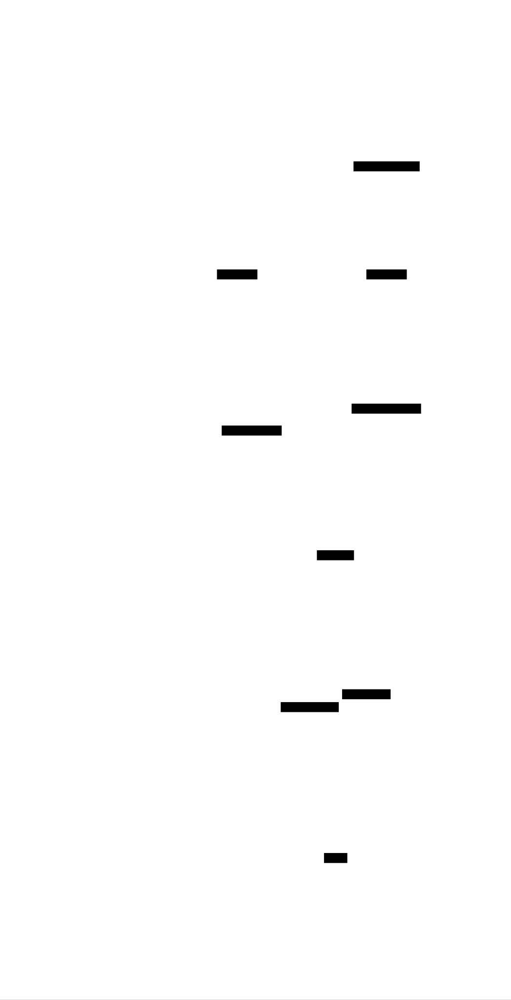
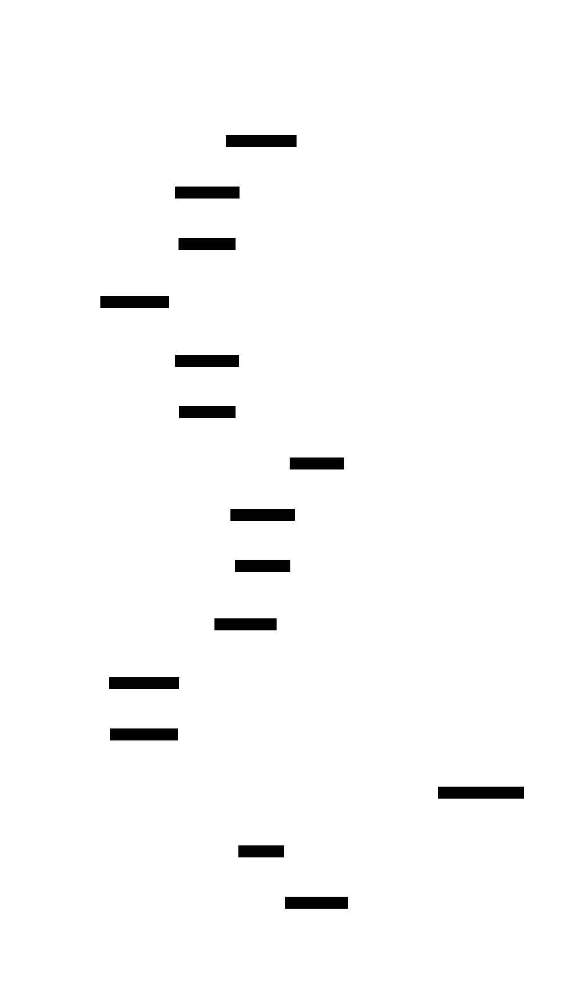

# Build Your Own Emulator: Design Document


## Overview

This system emulates a complete retro gaming console by faithfully recreating the CPU, memory subsystem, graphics pipeline, and timing behavior of the original hardware. The key architectural challenge is achieving cycle-accurate synchronization between heterogeneous components while maintaining clean separation of concerns.


> This guide is meant to help you understand the big picture before diving into each milestone. Refer back to it whenever you need context on how components connect.


## Context and Problem Statement

> **Milestone(s):** All milestones — this section establishes the foundation for understanding emulation across CPU implementation, memory systems, graphics, and timing.

Building an emulator means creating a software system that faithfully recreates the behavior of a different computer architecture. This is fundamentally different from writing traditional application software — instead of solving a business problem, we're rebuilding an entire digital universe where vintage games can live and run exactly as they did on original hardware. The challenge lies not just in implementing individual components, but in orchestrating them with the precise timing and intricate interactions that game software expects.

### The Theater Performance Mental Model

Think of emulation as **recreating a theatrical performance from decades past**. Imagine you're the director of a modern theater company, and you want to stage Shakespeare's Hamlet exactly as it was performed at the Globe Theatre in 1603. You don't just need the script (the game ROM) — you need to recreate the entire environment: the stage layout, the lighting conditions, the acoustics, the timing of scene changes, even the way actors moved and spoke. Every detail matters because the audience (the game code) expects a specific experience.

In this analogy, the **original hardware is the Globe Theatre** — a unique physical space with specific constraints and behaviors. The **emulator is your modern theater** — a completely different building that must transform itself to recreate the original experience. The **CPU is the lead actor** — it must speak every line (execute every instruction) with the right timing and emphasis. The **memory system is the stage crew** — it provides props and scenery (data) exactly when needed, following the original stage directions (memory map). The **graphics system is the lighting and set design** — it creates the visual spectacle that the audience sees. The **timing system is the stage manager** — it coordinates all these elements so the performance flows seamlessly.

Just as a theater director must study historical records to understand how the original performance worked, an emulator developer must study hardware documentation, timing diagrams, and sometimes even reverse-engineer the original hardware to understand its quirks and behaviors. And just as a modern theater has different capabilities and constraints than the Globe Theatre (electric lighting vs candles, modern acoustics vs open air), our modern computers have vastly different architectures than 1980s game consoles — but the final performance must feel authentic to the audience.

The critical insight is that **perfect emulation requires recreating not just the logical behavior, but the timing, the edge cases, and even the bugs** of the original hardware. Games often relied on specific hardware quirks, timing relationships, and undocumented behaviors. A modern theater director might want to "improve" Shakespeare by adding modern staging, but an emulator must resist the temptation to "fix" the original hardware's limitations.

### Technical Challenges in Emulation

Emulation presents several fundamental technical challenges that distinguish it from typical software development. Each challenge requires careful architectural decisions that will shape the entire system design.

#### Timing Synchronization Challenge

The most critical challenge in emulation is **maintaining accurate timing relationships between components**. Original hardware components operated in precise lockstep — the CPU executed instructions at a fixed rate, the graphics system drew scanlines at exact intervals, and audio generated samples at specific frequencies. All of these subsystems were driven by the same master clock or precise fractional relationships of that clock.

Modern computers operate completely differently. Our CPU might run at 3GHz while the emulated CPU should run at 1MHz. Our graphics card renders entire frames in milliseconds while the original hardware drew them line by line over 16.7 milliseconds. The emulator must create an artificial timing environment where each emulated component appears to run at its original speed, synchronized with all other components.

Consider a concrete example: the original Game Boy CPU runs at approximately 4.19MHz, meaning it executes roughly 4.19 million cycles per second. The graphics system draws 154 scanlines per frame at 59.7 frames per second, meaning each scanline takes about 456 CPU cycles. Games were programmed with these exact timing relationships in mind. A game might start a graphics effect on scanline 100, expecting it to complete by scanline 120 — exactly 9,120 CPU cycles later. If our emulator doesn't maintain this precise relationship, the visual effect will appear at the wrong time or not at all.

#### Hardware Quirks and Undocumented Behavior

Original gaming hardware was designed with specific cost and performance constraints that led to unusual behaviors, shared responsibilities between components, and undocumented side effects. Game developers discovered and exploited these quirks, making them essential to emulate correctly.

For example, the original Game Boy's graphics system had a bug where disabling the LCD screen at the wrong time could damage the hardware. Games learned to work around this limitation by only disabling the screen during specific timing windows. An emulator must replicate not just the safe behavior, but the timing constraints that made the dangerous behavior possible — otherwise, games that rely on precise LCD timing will break.

Another example involves memory access timing. On original hardware, certain memory regions were slower to access than others, and some operations could be interrupted by graphics rendering, introducing variable delays. Games sometimes used these timing variations for random number generation or to synchronize with graphics effects. An emulator that provides uniform, fast memory access will break these timing-dependent techniques.

The challenge becomes even more complex with **shared hardware resources**. On the Game Boy, the same memory bus was used by the CPU, graphics system, and audio system. When the graphics system was actively drawing a scanline, it would "steal" memory access cycles from the CPU, causing CPU operations to take longer. This bus contention was predictable and consistent, so games could rely on it for timing purposes.

#### Performance and Accuracy Trade-offs

Emulation must balance **accuracy against performance**, and these goals often conflict directly. Achieving perfect accuracy would require simulating every transistor in the original hardware, but this would be computationally prohibitive. The emulator must identify which aspects of the original hardware are essential to emulate precisely and which can be approximated or optimized.

The most common trade-off involves **instruction-level vs cycle-level accuracy**. Instruction-level emulation executes each CPU instruction completely, then moves to the next instruction, updating all other components periodically. This approach is simpler to implement and faster to execute, but it loses the fine-grained timing where one instruction might overlap with a graphics operation. Cycle-level emulation simulates each CPU cycle individually, allowing perfect timing accuracy but requiring significantly more computation.

Consider a CPU instruction that takes 12 cycles to complete. During those 12 cycles, the graphics system might advance by exactly 12 pixel clocks, the audio system might generate 12 audio samples, and a timer might increment. Instruction-level emulation would execute the entire CPU instruction, then advance graphics by 12 pixels, audio by 12 samples, and timer by 12 ticks. Cycle-level emulation would interleave these updates — CPU cycle 1, graphics pixel 1, audio sample 1, timer tick 1, then CPU cycle 2, and so on.

Most games work correctly with instruction-level timing, but some games require cycle-level accuracy for specific effects. The architectural challenge is designing a system that can support both approaches, allowing developers to choose the appropriate trade-off for their accuracy and performance requirements.

#### State Management Complexity

Unlike typical applications that manage their own state, an emulator must **maintain the complete internal state of an entire computer system**. This includes not just the obvious state like CPU registers and memory contents, but also the intermediate state of ongoing operations, the timing phase of various subsystems, and the pending effects of operations that span multiple cycles.

For example, when emulating a memory write operation, the emulator must track not just the final result (the new value in memory), but also the intermediate state during the write cycle. If the operation takes multiple cycles to complete, other components might observe the memory in a partially updated state. Some games rely on reading memory during these intermediate states to achieve specific effects.

The state management challenge is compounded by the need to support **save states** — the ability to capture the complete emulator state and restore it later. Every piece of internal emulator state must be serializable, and the restoration must recreate not just the final state but the exact timing phase where the save occurred.

### Comparison of Emulation Approaches

Different emulation approaches make different trade-offs between accuracy, performance, and implementation complexity. Understanding these approaches helps inform architectural decisions throughout the project.

> **Decision: Emulation Accuracy Level**
> - **Context**: We must choose how precisely to recreate the original hardware behavior, balancing accuracy against implementation complexity and performance requirements.
> - **Options Considered**: High-level emulation (HLE), cycle-accurate emulation (CAE), and interpretive instruction emulation (IIE)
> - **Decision**: Implement instruction-level interpretive emulation with cycle counting, providing a middle ground between accuracy and performance
> - **Rationale**: This approach provides sufficient accuracy for most games while remaining accessible to developers learning emulation concepts, and allows upgrading to cycle-accurate timing for specific components as needed
> - **Consequences**: Games requiring precise mid-instruction timing may not work correctly, but the vast majority of commercial games will run properly, and the codebase remains comprehensible for educational purposes

The three primary emulation approaches represent different philosophies about recreating original hardware behavior:

| Approach | Accuracy Level | Performance | Implementation Complexity | Learning Value |
|----------|---------------|-------------|-------------------------|----------------|
| High-Level Emulation (HLE) | Low | Excellent | Low | Limited |
| Instruction-Level Interpretive | Medium | Good | Medium | High |
| Cycle-Accurate Emulation (CAE) | High | Poor | High | Very High |

#### High-Level Emulation (HLE) Approach

**High-Level Emulation** focuses on recreating the end results of hardware operations rather than the precise mechanisms. Instead of simulating individual CPU instructions, HLE identifies common patterns in game code and replaces entire sequences with optimized native code that produces equivalent results.

For example, many games use similar routines for copying graphics data to video memory. Traditional emulation would execute every CPU instruction in these routines, including all the loop overhead and memory addressing calculations. HLE would recognize the pattern "copy 160 bytes from ROM address 0x8000 to video RAM address 0x9800" and replace the entire routine with a single optimized memory copy operation.

HLE's primary advantage is **exceptional performance** — it can often run games faster than the original hardware because it eliminates redundant operations and uses modern CPU optimizations. The primary disadvantage is **reduced compatibility** — games that rely on the specific timing or side effects of the replaced operations will break.

HLE is commonly used in commercial emulators where performance is paramount, but it's less suitable for learning projects because it obscures the underlying hardware mechanisms that developers are trying to understand.

#### Instruction-Level Interpretive Emulation Approach

**Instruction-Level Interpretive Emulation** executes each CPU instruction of the original program in sequence, maintaining accurate register and memory state, but treats each instruction as an atomic operation. This approach provides a good balance between accuracy and implementation simplicity.

The core structure involves a **fetch-decode-execute loop**: read the next instruction from memory, decode its operation and operands, execute the operation (updating registers, memory, and flags), then advance to the next instruction. Each instruction completes entirely before the next instruction begins, and other subsystems (graphics, audio, timers) are updated based on the total number of CPU cycles consumed.

For example, if a CPU instruction takes 12 cycles to execute, the emulator would:
1. Complete the entire CPU instruction (register updates, memory writes, flag changes)
2. Advance the graphics system by 12 pixel clocks
3. Generate 12 audio samples
4. Update timers by 12 ticks
5. Move to the next CPU instruction

This approach provides **sufficient accuracy for most games** while keeping the implementation straightforward. The main limitation is that it cannot handle situations where other components need to interrupt or interfere with the CPU instruction while it's executing.

#### Cycle-Accurate Emulation (CAE) Approach

**Cycle-Accurate Emulation** simulates the original hardware's behavior at the individual clock cycle level. Instead of treating instructions as atomic operations, CAE breaks each instruction into its constituent cycles and interleaves the execution of all system components.

In a cycle-accurate Game Boy emulator, each iteration of the main loop would:
1. Execute one CPU cycle (which might be part of a multi-cycle instruction)
2. Execute one graphics pixel clock
3. Generate one audio sample (if needed this cycle)
4. Update timers and other peripherals
5. Handle any interrupts that trigger on this specific cycle

This approach can recreate **exact timing relationships** between components, allowing it to handle even the most timing-sensitive games correctly. However, it requires significantly more computation — where instruction-level emulation might execute 1000 instructions per second, cycle-accurate emulation must execute 4.19 million cycles per second for the same Game Boy game.

CAE also requires much deeper understanding of the original hardware timing. The developer must know not just what each instruction does, but exactly how many cycles each phase of the instruction takes, how memory access timing works, when interrupts can occur during instruction execution, and how different components compete for shared resources like the memory bus.

> The key insight is that **most games don't require full cycle accuracy** — they were written to work with instruction-level timing boundaries. The games that do require cycle accuracy typically need it only for specific effects or edge cases, not throughout the entire program.

#### Hybrid Approaches and Selective Accuracy

Many practical emulators use **hybrid approaches** that combine elements from different strategies. The core emulation might use instruction-level timing for simplicity and performance, but switch to cycle-accurate timing for specific components or situations where precision is required.

For example, an emulator might use instruction-level timing for normal gameplay, but switch to cycle-accurate timing during the graphics VBLANK period when games often perform timing-critical operations. Or it might use instruction-level timing for CPU operations but maintain cycle-accurate timing for audio generation to ensure proper sound quality.

This hybrid approach allows the emulator to provide good compatibility and reasonable performance while remaining manageable to implement and understand. It also provides a **clear upgrade path** — developers can start with instruction-level emulation and add cycle-accurate components as needed for specific compatibility requirements.

The architectural challenge with hybrid approaches is maintaining **clean interfaces** between components with different timing models. The instruction-level CPU component must be able to communicate effectively with the cycle-accurate audio component, even though they operate on different time scales.

### Implementation Guidance

Building an emulator requires careful technology choices and a well-organized codebase structure. This section provides concrete recommendations for getting started with implementation.

#### Technology Recommendations

| Component | Simple Option | Advanced Option |
|-----------|---------------|-----------------|
| Graphics Rendering | SDL2 + Software Framebuffer | OpenGL + Hardware Acceleration |
| Audio Output | SDL2 Audio Queue | Real-time Audio Streaming (PortAudio) |
| Input Handling | SDL2 Event Polling | Direct Input Mapping + Configuration |
| File I/O | Standard C File Operations (fread/fwrite) | Memory-mapped Files (mmap) |
| Debugging Interface | Printf + Log Files | Interactive Debugger with GUI |
| Build System | Make + GCC | CMake + Multiple Compiler Support |

For a learning project, **SDL2 provides the optimal balance** of simplicity and functionality. It handles window creation, graphics rendering, audio output, and input processing with a straightforward C API. More advanced options like OpenGL or PortAudio provide better performance but add complexity that can distract from the core emulation concepts.

#### Recommended File Structure

Organize the emulator codebase to reflect the hardware component architecture and maintain clear separation of concerns:

```
emulator-project/
├── src/
│   ├── main.c                 ← Entry point and main execution loop
│   ├── emulator.h             ← Main emulator state and coordination
│   ├── emulator.c
│   ├── cpu/
│   │   ├── cpu.h              ← CPU state, registers, and instruction execution
│   │   ├── cpu.c
│   │   ├── instructions.h     ← Instruction decode and implementation
│   │   └── instructions.c
│   ├── memory/
│   │   ├── memory.h           ← Memory mapping and bank switching
│   │   ├── memory.c
│   │   └── cartridge.h        ← ROM loading and cartridge types
│   ├── graphics/
│   │   ├── ppu.h              ← Picture Processing Unit implementation
│   │   ├── ppu.c
│   │   ├── renderer.h         ← Display output and framebuffer management
│   │   └── renderer.c
│   ├── audio/
│   │   ├── apu.h              ← Audio Processing Unit
│   │   └── apu.c
│   ├── input/
│   │   ├── input.h            ← Controller and keyboard input handling
│   │   └── input.c
│   └── utils/
│       ├── debug.h            ← Logging and debugging utilities
│       ├── debug.c
│       ├── timing.h           ← Cycle counting and synchronization
│       └── timing.c
├── roms/                      ← Test ROMs and game files
├── tests/                     ← Unit tests and test ROMs
├── docs/                      ← Documentation and reference materials
└── Makefile                   ← Build configuration
```

This structure **mirrors the hardware architecture** while maintaining clear module boundaries. Each major component (CPU, memory, graphics, audio) has its own directory with clearly defined interfaces. The separation allows components to be developed and tested independently while supporting clean integration.

#### Infrastructure Starter Code

**Timing and Synchronization Utilities** (src/utils/timing.h):

```c
#ifndef TIMING_H
#define TIMING_H

#include <stdint.h>
#include <stdbool.h>

// Master timing coordinator for component synchronization
typedef struct {
    uint64_t master_cycles;      // Total cycles since emulator start
    uint32_t cycles_per_frame;   // CPU cycles in one complete frame
    uint32_t frame_cycles;       // Cycles executed in current frame
    double cpu_frequency;        // Target CPU frequency in Hz
    double target_fps;           // Target frames per second
} TimingState;

// Initialize timing system with target frequencies
void timing_init(TimingState* timing, double cpu_freq, double fps);

// Add cycles to the timing system and check for frame completion
bool timing_add_cycles(TimingState* timing, uint32_t cycles);

// Get current cycle count for component synchronization
uint64_t timing_get_cycles(const TimingState* timing);

// Calculate how many audio samples should be generated for current timing
uint32_t timing_get_audio_samples_needed(const TimingState* timing, uint32_t sample_rate);

// Check if enough time has passed for next frame
bool timing_should_render_frame(const TimingState* timing);

#endif // TIMING_H
```

**Debug and Logging Infrastructure** (src/utils/debug.h):

```c
#ifndef DEBUG_H
#define DEBUG_H

#include <stdio.h>
#include <stdint.h>

// Debug logging levels
typedef enum {
    DEBUG_NONE = 0,
    DEBUG_ERROR = 1,
    DEBUG_WARN = 2,
    DEBUG_INFO = 3,
    DEBUG_TRACE = 4
} DebugLevel;

// Component categories for selective logging
typedef enum {
    DEBUG_CPU = 1 << 0,
    DEBUG_MEMORY = 1 << 1,
    DEBUG_GRAPHICS = 1 << 2,
    DEBUG_AUDIO = 1 << 3,
    DEBUG_INPUT = 1 << 4,
    DEBUG_TIMING = 1 << 5
} DebugComponent;

// Global debug configuration
extern DebugLevel debug_level;
extern uint32_t debug_components;

// Debug logging macros
#define DEBUG_LOG(level, component, fmt, ...) \
    do { \
        if (debug_level >= level && (debug_components & component)) { \
            fprintf(stderr, "[%s:%s] " fmt "\n", #level, #component, ##__VA_ARGS__); \
        } \
    } while(0)

// Component-specific logging macros
#define CPU_DEBUG(fmt, ...) DEBUG_LOG(DEBUG_TRACE, DEBUG_CPU, fmt, ##__VA_ARGS__)
#define MEMORY_DEBUG(fmt, ...) DEBUG_LOG(DEBUG_TRACE, DEBUG_MEMORY, fmt, ##__VA_ARGS__)
#define GRAPHICS_DEBUG(fmt, ...) DEBUG_LOG(DEBUG_TRACE, DEBUG_GRAPHICS, fmt, ##__VA_ARGS__)

// Initialize debugging system
void debug_init(DebugLevel level, uint32_t components);

// Dump memory region for debugging
void debug_dump_memory(const uint8_t* memory, uint16_t start, uint16_t end);

// Dump CPU registers in readable format
void debug_dump_cpu_state(/* CPU state parameters go here */);

#endif // DEBUG_H
```

**SDL2 Display and Input Wrapper** (src/graphics/renderer.c):

```c
#include "renderer.h"
#include <SDL2/SDL.h>
#include <stdio.h>

typedef struct {
    SDL_Window* window;
    SDL_Renderer* renderer;
    SDL_Texture* texture;
    uint32_t* framebuffer;
    int screen_width;
    int screen_height;
    int scale_factor;
} RendererState;

static RendererState g_renderer;

bool renderer_init(int width, int height, int scale) {
    if (SDL_Init(SDL_INIT_VIDEO | SDL_INIT_AUDIO | SDL_INIT_GAMECONTROLLER) != 0) {
        fprintf(stderr, "SDL_Init failed: %s\n", SDL_GetError());
        return false;
    }

    g_renderer.screen_width = width;
    g_renderer.screen_height = height;
    g_renderer.scale_factor = scale;

    g_renderer.window = SDL_CreateWindow("Emulator",
        SDL_WINDOWPOS_CENTERED, SDL_WINDOWPOS_CENTERED,
        width * scale, height * scale, 0);
    
    if (!g_renderer.window) {
        fprintf(stderr, "SDL_CreateWindow failed: %s\n", SDL_GetError());
        return false;
    }

    g_renderer.renderer = SDL_CreateRenderer(g_renderer.window, -1, 
        SDL_RENDERER_ACCELERATED | SDL_RENDERER_PRESENTVSYNC);
    
    if (!g_renderer.renderer) {
        fprintf(stderr, "SDL_CreateRenderer failed: %s\n", SDL_GetError());
        return false;
    }

    g_renderer.texture = SDL_CreateTexture(g_renderer.renderer,
        SDL_PIXELFORMAT_RGBA8888, SDL_TEXTUREACCESS_STREAMING,
        width, height);
    
    if (!g_renderer.texture) {
        fprintf(stderr, "SDL_CreateTexture failed: %s\n", SDL_GetError());
        return false;
    }

    g_renderer.framebuffer = malloc(width * height * sizeof(uint32_t));
    if (!g_renderer.framebuffer) {
        fprintf(stderr, "Failed to allocate framebuffer\n");
        return false;
    }

    return true;
}

uint32_t* renderer_get_framebuffer(void) {
    return g_renderer.framebuffer;
}

void renderer_present_frame(void) {
    SDL_UpdateTexture(g_renderer.texture, NULL, g_renderer.framebuffer,
        g_renderer.screen_width * sizeof(uint32_t));
    
    SDL_RenderClear(g_renderer.renderer);
    SDL_RenderCopy(g_renderer.renderer, g_renderer.texture, NULL, NULL);
    SDL_RenderPresent(g_renderer.renderer);
}

void renderer_shutdown(void) {
    if (g_renderer.framebuffer) {
        free(g_renderer.framebuffer);
    }
    if (g_renderer.texture) {
        SDL_DestroyTexture(g_renderer.texture);
    }
    if (g_renderer.renderer) {
        SDL_DestroyRenderer(g_renderer.renderer);
    }
    if (g_renderer.window) {
        SDL_DestroyWindow(g_renderer.window);
    }
    SDL_Quit();
}
```

#### Core Emulator Framework Skeleton

**Main Emulator State and Coordination** (src/emulator.h):

```c
#ifndef EMULATOR_H
#define EMULATOR_H

#include <stdint.h>
#include <stdbool.h>
#include "cpu/cpu.h"
#include "memory/memory.h"
#include "graphics/ppu.h"
#include "audio/apu.h"
#include "input/input.h"
#include "utils/timing.h"

// Complete emulator system state
typedef struct {
    CPUState cpu;
    MemoryState memory;
    PPUState ppu;
    APUState apu;
    InputState input;
    TimingState timing;
    bool running;
    bool paused;
} EmulatorState;

// Initialize all emulator subsystems
bool emulator_init(EmulatorState* emu);

// Load ROM file and prepare for execution
bool emulator_load_rom(EmulatorState* emu, const char* rom_path);

// Execute one complete frame of emulation
void emulator_run_frame(EmulatorState* emu);

// TODO: Implement main execution loop coordination
// 1. Check for input events and update input state
// 2. Execute CPU instructions until frame budget is consumed
// 3. Update graphics, audio, and timer systems
// 4. Present completed frame to display
// 5. Handle timing synchronization and sleep if needed

// Clean shutdown of all subsystems
void emulator_shutdown(EmulatorState* emu);

// Save complete emulator state to file
bool emulator_save_state(const EmulatorState* emu, const char* save_path);

// Load emulator state from file
bool emulator_load_state(EmulatorState* emu, const char* save_path);

#endif // EMULATOR_H
```

#### Language-Specific Implementation Hints

**Memory Management in C:**
- Use `malloc()`/`free()` for dynamic allocation, but prefer fixed-size arrays for emulator state where possible
- Consider using `mmap()` on Unix systems for ROM file access — this allows the OS to handle file caching efficiently
- Always check return values from allocation functions and handle failure gracefully
- Use `memset()` to initialize emulator state to zero on startup

**Timing and Performance:**
- Use `SDL_GetPerformanceCounter()` and `SDL_GetPerformanceFrequency()` for high-resolution timing measurements
- Implement frame rate limiting with `SDL_Delay()` to avoid consuming 100% CPU
- Consider using `clock_gettime()` on Linux for more precise timing control
- Profile the emulator with tools like `gprof` or `valgrind --tool=callgrind` to identify performance bottlenecks

**Debugging and Development:**
- Compile with debugging symbols (`-g` flag) and enable all warnings (`-Wall -Wextra`)
- Use `gdb` for step-by-step debugging of complex emulation issues
- Implement instruction-level logging that can be enabled/disabled at runtime
- Create test ROMs that exercise specific CPU instructions or hardware features

#### Milestone Checkpoints

**Milestone 1 Checkpoint (CPU Emulation):**
After implementing the CPU component, verify correct operation by:
- Running test ROM that exercises all basic CPU instructions (arithmetic, logic, jumps, loads/stores)
- Checking that CPU registers contain expected values after instruction sequences
- Verifying that CPU flags (zero, carry, negative) update correctly after arithmetic operations
- Confirming that program counter advances properly and jump instructions work correctly

Expected behavior: Test ROM should execute without crashing, and register dumps should match reference emulator output.

**Early Integration Checkpoint:**
Once CPU and basic memory are implemented:
- Load a simple ROM (like a "Hello World" test program)
- Step through execution instruction by instruction using debug output
- Verify that instruction fetch reads correct opcodes from ROM
- Confirm that memory writes and reads access the right addresses

Warning signs: If instructions are being fetched from wrong addresses, check endianness handling and program counter management. If memory access crashes, verify address range checking and memory map implementation.


## Goals and Non-Goals

> **Milestone(s):** All milestones — this section establishes scope and success criteria for CPU implementation, memory systems, graphics, and timing components.

Building an emulator requires making deliberate choices about what to include, what level of accuracy to target, and where to draw boundaries. Think of this like planning a historical museum exhibit: you could recreate every single detail down to the molecular level, but that would be prohibitively expensive and might not serve your visitors' needs. Instead, you choose the right level of fidelity to achieve your educational and entertainment goals while staying within practical constraints.

This section establishes our project's scope by defining three critical boundaries: what functionality must work correctly (functional requirements), how accurately and quickly it must work (performance and accuracy goals), and what features we explicitly exclude to maintain focus (non-goals). These decisions shape every subsequent design choice and help us avoid scope creep that could derail the project.

The challenge in emulation is that original hardware often had quirks, undocumented behaviors, and timing dependencies that real games relied upon. Some emulators aim for perfect hardware replication, while others focus on running popular games correctly. Our approach balances learning value with practical implementability — we want to understand the core concepts deeply while producing something that actually works.

### Functional Requirements

Our emulator must successfully run a representative set of games and demonstrate all major hardware subsystems working together. The functional requirements define the minimum viable product that proves our emulation is working correctly.

**Core Game Compatibility**

The emulator must successfully run at least three categories of software that exercise different aspects of the hardware:

| Game Category | Example Games | Hardware Features Tested |
|---------------|---------------|-------------------------|
| Simple Games | Tetris, Pac-Man, Snake | Basic CPU instructions, simple graphics, input handling |
| Graphics-Heavy Games | Super Mario Bros, Sonic | Sprite rendering, scrolling backgrounds, palette changes |
| Complex Games | The Legend of Zelda, Metroid | Bank switching, save data, advanced timing requirements |

Each category validates different emulation components. Simple games prove that our basic instruction set and display output work. Graphics-heavy games stress-test our Picture Processing Unit implementation and timing synchronization. Complex games verify that advanced memory mapping and persistence features function correctly.

The emulator must handle these games' most common operations without crashes, graphical corruption, or audio glitches that make them unplayable. We define "successfully run" as: the game boots to a playable state, accepts controller input, displays graphics correctly, and maintains stable performance for at least 5 minutes of gameplay.

**Essential Hardware Feature Coverage**

Our functional requirements mandate complete implementation of core hardware subsystems:

| Subsystem | Required Features | Validation Criteria |
|-----------|------------------|-------------------|
| CPU | All documented opcodes, register operations, flag handling | Test ROM passes, instruction-level compatibility |
| Memory | ROM loading, RAM access, basic memory mapping | Games load and maintain state correctly |
| Graphics | Tile rendering, sprite display, basic palette support | Visual output matches expected appearance |
| Input | Controller reading, button state management | All game controls respond correctly |
| Timing | Frame rate stability, basic interrupt handling | Games run at playable speed without stuttering |

Each subsystem must implement enough functionality to support our target games. We don't need perfect hardware replication, but we need sufficient accuracy that games behave as expected from a player's perspective.

**Development and Debugging Support**

The emulator must include basic development aids that help us verify correctness and diagnose problems:

| Debug Feature | Purpose | Implementation Requirement |
|---------------|---------|---------------------------|
| Memory Viewer | Inspect RAM and ROM contents | Hex dump of configurable address ranges |
| CPU State Display | Monitor register values | Real-time display of all CPU registers and flags |
| Execution Tracing | Track instruction execution | Optional logging of PC, opcode, and cycle count |
| Graphics Debug | Visualize tile and sprite data | Display tile maps and sprite layers separately |

These debugging features don't need polished user interfaces — command-line output or simple overlays suffice. Their purpose is helping us understand what's happening inside the emulator during development and troubleshooting.

> **Design Insight**: Debugging support isn't optional for emulator development. Original hardware doesn't come with visibility into internal state, so building these introspection tools is essential for understanding why games don't work correctly. Many emulation bugs are discovered by comparing internal state against known-good reference implementations.

### Performance and Accuracy Goals

Our performance and accuracy goals balance educational value with practical usability. We want to understand how real hardware works without getting bogged down in micro-optimizations or obscure edge cases that don't affect most games.

**Timing Accuracy Targets**

The emulator must maintain stable timing that allows games to run at their intended speed without audio/video synchronization problems:

| Timing Aspect | Target Accuracy | Measurement Method | Acceptable Variance |
|---------------|----------------|-------------------|-------------------|
| Frame Rate | 60 FPS (NTSC) or 50 FPS (PAL) | SDL frame timing | ±5% average, ±10% instantaneous |
| CPU Instruction Timing | Instruction-level accuracy | Cycle counting per opcode | Perfect for documented instructions |
| PPU Rendering Timing | Scanline-level accuracy | Lines per frame, cycles per line | ±1 scanline timing variance |
| Audio Sample Rate | 44.1 kHz output | SDL audio callback timing | No audible drops or stutters |

We target **instruction-level timing accuracy** rather than cycle-perfect emulation. This means each CPU instruction consumes the correct number of cycles according to the specification, but we don't simulate individual clock edges or pipeline effects. This approach captures the timing behavior that games actually depend on while avoiding implementation complexity that doesn't improve compatibility.

For graphics timing, we implement **scanline-level accuracy** where the PPU renders one horizontal line at a time and generates interrupts at the correct intervals. This handles most timing-sensitive graphics effects without requiring cycle-perfect pixel-by-pixel simulation.

> **Decision: Instruction-Level Rather Than Cycle-Perfect Timing**
> - **Context**: Emulators can implement timing at various granularities, from cycle-perfect (simulating every clock edge) to frame-level (running components independently then synchronizing)
> - **Options Considered**: 
>   - Cycle-perfect timing with full pipeline simulation
>   - Instruction-level timing with cycle counting
>   - Frame-level timing with periodic synchronization
> - **Decision**: Instruction-level timing with cycle counting
> - **Rationale**: Cycle-perfect timing requires extensive hardware knowledge and complex implementation but only helps with a small number of games that depend on sub-instruction timing. Frame-level timing is too coarse for timing-sensitive games. Instruction-level timing captures the timing dependencies that 95% of games actually rely on.
> - **Consequences**: Most games work correctly with much simpler implementation. Some games with extreme timing dependencies may not work, but these represent a small fraction of the software library.

**Performance Benchmarks**

The emulator must maintain real-time performance on modern hardware without requiring high-end specifications:

| Performance Metric | Target Value | Test Condition | Hardware Assumption |
|-------------------|--------------|----------------|-------------------|
| CPU Usage | <25% of one core | Running complex games | Mid-range CPU from last 5 years |
| Memory Usage | <100MB RAM | Large games with graphics data loaded | 8GB+ system RAM |
| Startup Time | <2 seconds | ROM loading and initialization | SSD storage |
| Input Latency | <50ms | Button press to on-screen response | USB/wireless gamepad |

These performance targets ensure that the emulator feels responsive and doesn't interfere with other applications running on the host system. We prioritize consistent performance over peak performance — it's better to maintain stable 60 FPS than to alternate between 120 FPS and 30 FPS.

**Compatibility Coverage**

Our compatibility goals focus on breadth rather than perfection:

| Compatibility Category | Target Coverage | Success Criteria |
|----------------------|-----------------|------------------|
| Popular Commercial Games | 80% of top 50 games for target platform | Boot and remain playable |
| Homebrew and Test ROMs | 90% of standard test suites | Pass documented test cases |
| ROM File Formats | Common mapper types (covers 95% of games) | Load and execute correctly |
| Save Data Formats | Battery-backed RAM simulation | Save/load game progress |

We aim for broad compatibility with common games rather than perfect compatibility with every game ever made. This approach maximizes the educational value by exposing us to diverse emulation challenges while avoiding the diminishing returns of supporting extremely rare or poorly-designed software.

### Explicit Non-Goals

Clearly defining what we won't implement is as important as defining what we will implement. These non-goals help maintain project focus and prevent scope creep that could prevent completion.

**Advanced Emulation Features**

We explicitly exclude sophisticated emulation features that don't contribute to understanding core concepts:

| Excluded Feature | Rationale | Learning Impact |
|-----------------|-----------|-----------------|
| Save States | Complex to implement correctly, not core to hardware understanding | Minimal — focuses on user experience rather than emulation fundamentals |
| Rewind/Fast-Forward | Requires sophisticated state management and performance optimization | None — purely user convenience feature |
| Netplay/Multiplayer | Network programming problem, not emulation problem | Significant distraction from emulation concepts |
| Plugin Architecture | Software engineering problem, not emulation problem | Distracts from learning hardware emulation concepts |
| Advanced Video Filters | Image processing problem, not emulation problem | No emulation learning value |

These features would be valuable in a production emulator but don't help us understand how original hardware worked. Including them would shift focus from emulation concepts to user interface and software engineering concerns.

**Cycle-Perfect Accuracy**

We deliberately avoid trying to replicate every quirk and timing detail of original hardware:

| Excluded Accuracy Feature | Why Excluded | Alternative Approach |
|-------------------------|--------------|---------------------|
| Sub-instruction timing | Extremely complex, benefits few games | Instruction-level timing with cycle counting |
| Hardware bugs and glitches | Requires deep hardware knowledge | Implement documented behavior only |
| Undocumented opcodes | Poorly specified, rarely used | Handle as no-ops or illegal instructions |
| Analog circuit simulation | Requires electrical engineering knowledge | Digital approximation of end results |
| Exact sprite/scanline limits | Complex edge case handling | Simplified limits that work for most games |

Perfect hardware replication is an admirable goal for production emulators, but it requires expertise and time investment that would prevent completing the project. Our approach captures the essential hardware behavior while staying implementable.

**Production Emulator Features**

We exclude features that production emulators need but don't contribute to learning:

| Excluded Feature Category | Examples | Why Excluded |
|-------------------------|----------|--------------|
| User Interface Polish | Configuration menus, ROM browsers, key binding | UI programming, not emulation |
| Multi-Platform Support | Windows, macOS, Linux builds | Build system complexity |
| Performance Optimization | JIT compilation, assembly optimization | Advanced compiler techniques |
| Legal Considerations | BIOS replacement, clean-room implementation | Legal engineering, not technical |
| Documentation and Packaging | User manuals, installer creation | Software distribution concerns |

These features matter for software that other people will use, but they don't help us understand emulation concepts. We focus on building something that works correctly rather than something that's polished for distribution.

**Multiple System Support**

We target a single emulation platform rather than trying to build a multi-system emulator:

| System Category | Included | Excluded | Reasoning |
|----------------|----------|----------|-----------|
| Target Platform | One system (CHIP-8, Game Boy, or NES) | All others | Depth over breadth |
| CPU Architectures | Single target CPU | Other CPU families | Each CPU requires separate implementation |
| Graphics Hardware | Target platform PPU only | Other graphics systems | Different systems have incompatible graphics models |
| Audio Hardware | Target platform APU only | Other audio systems | Audio systems vary significantly between platforms |

Building one emulator well teaches emulation concepts more effectively than building multiple emulators poorly. Once the core concepts are understood, applying them to other systems becomes much more straightforward.

> **Design Principle**: Constraints enable creativity. By explicitly limiting scope, we can dive deeper into understanding how one system works rather than superficially implementing multiple systems. The principles learned from emulating one platform transfer readily to others.

**Advanced Development Tools**

We exclude sophisticated development and debugging tools that would be valuable for game developers:

| Tool Category | Examples | Educational Priority |
|---------------|----------|---------------------|
| Advanced Debuggers | Breakpoints, watchpoints, step debugging | Low — focus on basic functionality first |
| Performance Profilers | Instruction frequency analysis, hotspot identification | Low — optimization comes after correctness |
| Development Integration | IDE plugins, external tool APIs | None — software engineering, not emulation |
| Automated Testing | Continuous integration, regression test suites | Medium — valuable but time-intensive |

While these tools would make the emulator more useful for homebrew development, building them requires significant time investment in areas unrelated to emulation concepts. We include basic debugging support but avoid the complexity of full development tool integration.

### Implementation Guidance

The goals and requirements defined above translate into specific technical decisions and implementation strategies. This section provides concrete guidance for turning these high-level goals into working code.

**Technology Recommendations**

| Component | Simple Option | Advanced Option | Recommendation |
|-----------|---------------|-----------------|----------------|
| Graphics Output | SDL2 with software rendering | SDL2 with hardware acceleration | Start simple, optimize later |
| Audio Output | SDL2 audio callbacks | Low-latency audio APIs | SDL2 sufficient for learning |
| Input Handling | SDL2 event polling | Direct input APIs | SDL2 covers all common controllers |
| File I/O | Standard C file operations | Memory-mapped files | Standard I/O easier to debug |
| Build System | Simple Makefile | CMake or advanced build tools | Makefile keeps focus on emulation |

SDL2 provides everything needed for basic emulator functionality while remaining cross-platform and well-documented. More advanced options offer better performance or features but add complexity that doesn't help with learning emulation concepts.

**Project Structure Template**

```c
project-root/
  src/
    main.c                 ← SDL initialization and main loop
    emulator.c            ← EmulatorState management and coordination
    cpu/
      cpu.c               ← CPUState and instruction execution
      instructions.c      ← Opcode implementation
      cpu_debug.c         ← CPU debugging utilities
    memory/
      memory.c            ← MemoryState and address translation
      rom.c               ← ROM loading and bank switching
      mmio.c              ← Memory-mapped I/O handling
    ppu/
      ppu.c               ← PPUState and rendering coordination
      tiles.c             ← Tile and background rendering
      sprites.c           ← Sprite rendering and composition
    input/
      input.c             ← InputState and controller handling
    timing/
      timing.c            ← TimingState and synchronization
    debug/
      debug.c             ← Debug logging and state inspection
  include/
    emulator.h            ← Main emulator types and interfaces
    cpu.h                 ← CPU state and instruction declarations
    memory.h              ← Memory management interfaces
    ppu.h                 ← Graphics and rendering interfaces
  roms/
    test-roms/            ← Test ROMs for validation
    games/                ← Commercial game ROMs (not in repository)
  docs/
    README.md             ← Build instructions and usage
    DEBUGGING.md          ← Debugging guide and common issues
  Makefile                ← Build configuration
```

This structure separates concerns cleanly while keeping related functionality together. Each subsystem gets its own directory with implementation, headers, and debugging support.

**Core Infrastructure Starter Code**

Here's complete starter code for the main emulator coordination and SDL initialization:

```c
// src/main.c
#include <SDL.h>
#include <stdio.h>
#include <stdbool.h>
#include "emulator.h"

int main(int argc, char* argv[]) {
    if (argc != 2) {
        fprintf(stderr, "Usage: %s <rom_file>\n", argv[0]);
        return 1;
    }
    
    // Initialize SDL video and audio subsystems
    if (SDL_Init(SDL_INIT_VIDEO | SDL_INIT_AUDIO) < 0) {
        fprintf(stderr, "SDL initialization failed: %s\n", SDL_GetError());
        return 1;
    }
    
    // Initialize emulator state
    EmulatorState emulator;
    if (!emulator_init(&emulator)) {
        fprintf(stderr, "Emulator initialization failed\n");
        SDL_Quit();
        return 1;
    }
    
    // Load ROM file
    if (!emulator_load_rom(&emulator, argv[1])) {
        fprintf(stderr, "Failed to load ROM: %s\n", argv[1]);
        emulator_shutdown(&emulator);
        SDL_Quit();
        return 1;
    }
    
    // Main emulation loop
    emulator.running = true;
    while (emulator.running) {
        // Handle SDL events (quit, input)
        SDL_Event event;
        while (SDL_PollEvent(&event)) {
            if (event.type == SDL_QUIT) {
                emulator.running = false;
            }
            // TODO: Handle input events and update emulator.input state
        }
        
        // Run one frame of emulation
        if (!emulator.paused) {
            emulator_run_frame(&emulator);
        }
        
        // Maintain 60 FPS timing
        SDL_Delay(16); // Roughly 60 FPS (1000ms/60 ≈ 16ms)
    }
    
    // Clean shutdown
    emulator_shutdown(&emulator);
    SDL_Quit();
    return 0;
}
```

```c
// src/emulator.c - Core emulator state management
#include "emulator.h"
#include <string.h>
#include <stdio.h>

bool emulator_init(EmulatorState* emu) {
    if (!emu) return false;
    
    // Initialize all subsystem states to zero
    memset(emu, 0, sizeof(EmulatorState));
    
    // TODO: Initialize CPU state (registers, flags)
    // TODO: Initialize memory system (ROM/RAM regions)
    // TODO: Initialize PPU state (rendering buffers)
    // TODO: Initialize timing system (cycle counters)
    // TODO: Initialize input state (controller mappings)
    
    // Set up timing for 60 FPS with appropriate CPU frequency
    // (Actual values depend on target platform - NES uses ~1.79 MHz)
    if (!timing_init(&emu->timing, 1790000.0, 60.0)) {
        return false;
    }
    
    emu->running = false;
    emu->paused = false;
    
    return true;
}

bool emulator_load_rom(EmulatorState* emu, const char* rom_path) {
    if (!emu || !rom_path) return false;
    
    // TODO: Open ROM file and read contents
    // TODO: Determine ROM type/mapper from header
    // TODO: Initialize memory mapping based on ROM type
    // TODO: Load ROM data into appropriate memory regions
    // TODO: Set CPU program counter to ROM entry point
    
    printf("Loading ROM: %s\n", rom_path);
    return true; // Placeholder
}

void emulator_run_frame(EmulatorState* emu) {
    if (!emu) return;
    
    // Reset frame cycle counter
    emu->timing.frame_cycles = 0;
    
    // Execute CPU and other components until frame complete
    while (emu->timing.frame_cycles < emu->timing.cycles_per_frame) {
        // TODO: Execute one CPU instruction
        // TODO: Update PPU for corresponding cycles
        // TODO: Process any interrupts or timer events
        // TODO: Handle input changes
        
        // For now, just advance timing to prevent infinite loop
        timing_add_cycles(&emu->timing, 100); // Placeholder
    }
    
    // TODO: Present completed frame to display
}

void emulator_shutdown(EmulatorState* emu) {
    if (!emu) return;
    
    // TODO: Clean up any allocated resources
    // TODO: Close ROM file if still open
    // TODO: Shutdown SDL renderer if initialized
    
    memset(emu, 0, sizeof(EmulatorState));
}
```

**Timing System Implementation**

```c
// src/timing/timing.c - Cycle-accurate timing coordination
#include "emulator.h"
#include <stdio.h>

bool timing_init(TimingState* timing, double cpu_freq, double fps) {
    if (!timing || cpu_freq <= 0 || fps <= 0) return false;
    
    timing->master_cycles = 0;
    timing->frame_cycles = 0;
    timing->cpu_frequency = cpu_freq;
    timing->target_fps = fps;
    
    // Calculate how many CPU cycles per frame
    timing->cycles_per_frame = (uint32_t)(cpu_freq / fps);
    
    printf("Timing: %.0f Hz CPU, %.1f FPS, %u cycles/frame\n", 
           cpu_freq, fps, timing->cycles_per_frame);
    
    return true;
}

bool timing_add_cycles(TimingState* timing, uint32_t cycles) {
    if (!timing) return false;
    
    timing->master_cycles += cycles;
    timing->frame_cycles += cycles;
    
    // Return true if frame is complete
    return timing->frame_cycles >= timing->cycles_per_frame;
}

uint64_t timing_get_cycles(const TimingState* timing) {
    return timing ? timing->master_cycles : 0;
}
```

**SDL Renderer Setup**

```c
// src/ppu/renderer.c - SDL2 display output
#include <SDL.h>
#include "emulator.h"

static RendererState g_renderer = {0};

bool renderer_init(int width, int height, int scale) {
    // Create centered window
    g_renderer.window = SDL_CreateWindow(
        "Emulator",
        SDL_WINDOWPOS_CENTERED, SDL_WINDOWPOS_CENTERED,
        width * scale, height * scale,
        SDL_WINDOW_SHOWN
    );
    
    if (!g_renderer.window) {
        fprintf(stderr, "Window creation failed: %s\n", SDL_GetError());
        return false;
    }
    
    // Create hardware-accelerated renderer
    g_renderer.renderer = SDL_CreateRenderer(
        g_renderer.window, -1, 
        SDL_RENDERER_ACCELERATED | SDL_RENDERER_PRESENTVSYNC
    );
    
    if (!g_renderer.renderer) {
        fprintf(stderr, "Renderer creation failed: %s\n", SDL_GetError());
        SDL_DestroyWindow(g_renderer.window);
        return false;
    }
    
    // Create streaming texture for framebuffer updates
    g_renderer.texture = SDL_CreateTexture(
        g_renderer.renderer,
        SDL_PIXELFORMAT_RGBA8888,
        SDL_TEXTUREACCESS_STREAMING,
        width, height
    );
    
    if (!g_renderer.texture) {
        fprintf(stderr, "Texture creation failed: %s\n", SDL_GetError());
        SDL_DestroyRenderer(g_renderer.renderer);
        SDL_DestroyWindow(g_renderer.window);
        return false;
    }
    
    g_renderer.screen_width = width;
    g_renderer.screen_height = height;
    g_renderer.scale_factor = scale;
    
    // Allocate framebuffer (RGBA format)
    size_t buffer_size = width * height * sizeof(uint32_t);
    g_renderer.framebuffer = malloc(buffer_size);
    if (!g_renderer.framebuffer) {
        fprintf(stderr, "Framebuffer allocation failed\n");
        return false;
    }
    
    // Clear framebuffer to black
    memset(g_renderer.framebuffer, 0, buffer_size);
    
    return true;
}

uint32_t* renderer_get_framebuffer(void) {
    return g_renderer.framebuffer;
}

void renderer_present_frame(void) {
    // Update texture with framebuffer contents
    SDL_UpdateTexture(
        g_renderer.texture, NULL,
        g_renderer.framebuffer,
        g_renderer.screen_width * sizeof(uint32_t)
    );
    
    // Clear and render
    SDL_SetRenderDrawColor(g_renderer.renderer, 0, 0, 0, 255);
    SDL_RenderClear(g_renderer.renderer);
    SDL_RenderCopy(g_renderer.renderer, g_renderer.texture, NULL, NULL);
    SDL_RenderPresent(g_renderer.renderer);
}
```

**Debug System Foundation**

```c
// src/debug/debug.c - Debugging and diagnostic output
#include "emulator.h"
#include <stdio.h>
#include <stdarg.h>

static DebugLevel g_debug_level = DEBUG_ERROR;
static uint32_t g_debug_components = DEBUG_CPU | DEBUG_MEMORY | DEBUG_GRAPHICS;

void debug_init(DebugLevel level, uint32_t components) {
    g_debug_level = level;
    g_debug_components = components;
    printf("Debug initialized: level=%d, components=0x%X\n", level, components);
}

void debug_log(DebugLevel level, DebugComponent component, const char* format, ...) {
    if (level > g_debug_level || !(g_debug_components & component)) {
        return;
    }
    
    const char* level_names[] = {"", "ERROR", "WARN", "INFO", "TRACE"};
    const char* comp_names[] = {"CPU", "MEM", "GFX", "AUD", "INP", "TIM"};
    
    printf("[%s:%s] ", level_names[level], comp_names[component]);
    
    va_list args;
    va_start(args, format);
    vprintf(format, args);
    va_end(args);
    
    printf("\n");
}

void debug_dump_memory(const MemoryState* memory, uint16_t start, uint16_t end) {
    printf("Memory dump 0x%04X-0x%04X:\n", start, end);
    
    for (uint16_t addr = start; addr <= end; addr += 16) {
        printf("%04X: ", addr);
        
        // Print hex bytes
        for (int i = 0; i < 16 && (addr + i) <= end; i++) {
            // TODO: Read byte from memory system
            printf("%02X ", 0); // Placeholder
        }
        
        printf("\n");
    }
}
```

**Milestone Checkpoints**

After implementing the basic infrastructure, verify these behaviors:

| Milestone | Verification Command | Expected Output | Success Criteria |
|-----------|---------------------|-----------------|------------------|
| Infrastructure | `./emulator test.rom` | "Loading ROM: test.rom" message | Program starts without crashes |
| SDL Integration | Run with valid ROM | Window opens, responds to close button | Graphics window appears and closes cleanly |
| Timing System | Add debug output for cycles | "Timing: 1790000 Hz CPU, 60.0 FPS" | Timing calculations print correctly |
| Debug System | Call debug_log functions | Formatted debug messages appear | Debug output works at different levels |

**Common Infrastructure Pitfalls**

⚠️ **Pitfall: SDL Initialization Order**
Many beginners initialize SDL subsystems in the wrong order or forget error checking. Always initialize SDL_INIT_VIDEO before creating windows, and check return values from every SDL function. SDL errors are often cryptic, so print SDL_GetError() when functions fail.

⚠️ **Pitfall: Framebuffer Pixel Format Confusion**
SDL textures use different pixel formats (RGBA, BGRA, etc.) depending on the platform. Explicitly specify SDL_PIXELFORMAT_RGBA8888 and store pixels in that format to avoid color channel swapping issues.

⚠️ **Pitfall: Integer Overflow in Timing Calculations**
CPU frequencies are large numbers (1.79 million), so cycle counters can overflow quickly. Use 64-bit integers (uint64_t) for master cycle counters and be careful with arithmetic that might exceed 32-bit limits.

⚠️ **Pitfall: Memory Leak in Resource Cleanup**
SDL resources must be freed in reverse order of creation. Create a shutdown checklist: free framebuffer, destroy texture, destroy renderer, destroy window, quit SDL. Missing any step causes resource leaks.


## High-Level Architecture

> **Milestone(s):** All milestones — this section establishes the foundational architecture that spans CPU emulation (Milestone 1), memory management (Milestone 2), graphics rendering (Milestone 3), and timing coordination (Milestone 4).

### Component Overview

Think of our emulator as a **miniature orchestra performing a complex symphony**. Each musician (component) has their own specialized part to play, but they must all follow the same conductor (timing coordinator) to stay synchronized. The CPU is like the lead violinist, setting the pace and driving the melody forward. The Memory Manager acts as the sheet music stand, providing each musician with the notes they need precisely when they need them. The PPU functions as the lighting technician, painting the visual story in perfect time with the music. Just as a real orchestra would fall apart without coordination, our emulator components must maintain precise timing relationships to recreate the original hardware behavior.

The emulator architecture centers around five core components that work in concert to recreate the target hardware system. Each component has clearly defined responsibilities and interfaces, allowing them to operate independently while maintaining the tight synchronization required for accurate emulation.

> **The critical architectural insight is that emulation accuracy depends not just on correct individual component behavior, but on maintaining the precise timing relationships between components that existed in the original hardware.**

#### CPU Emulation Engine

The CPU Emulation Engine serves as the primary driver of system execution, implementing the fetch-decode-execute cycle that processes machine code instructions. This component maintains the complete processor state including all registers, flags, and the program counter. It reads instructions from memory, decodes them according to the target instruction set architecture, and executes the appropriate operations while updating CPU state and managing cycle timing.

| Responsibility | Description | Key Data Structures |
|---|---|---|
| Instruction Processing | Fetch, decode, and execute machine code instructions according to target ISA | `CPUState` with register file and flags |
| Register Management | Maintain all CPU registers with correct bit widths and access patterns | Register arrays and flag bit fields |
| Flag Computation | Update arithmetic and logic flags (zero, carry, negative) after each instruction | Flag calculation functions and bit manipulation |
| Cycle Timing | Track instruction execution time and report cycle consumption to timing coordinator | Cycle counter and instruction timing tables |

The CPU engine operates on a polling basis, requesting the next instruction from memory, processing it completely, and then yielding control back to the main execution loop. This design allows other components to process their work during CPU instruction boundaries while maintaining deterministic execution order.

#### Memory Management System

The Memory Management System acts as the central hub for all data access within the emulator, providing a unified interface that abstracts the complex address mapping and bank switching mechanisms of retro hardware. This component translates virtual addresses to the appropriate physical storage locations, whether that's ROM data, RAM arrays, or memory-mapped I/O registers that need to trigger peripheral handlers.

| Responsibility | Description | Key Data Structures |
|---|---|---|
| Address Translation | Map virtual addresses to ROM, RAM, or MMIO regions according to target memory map | `MemoryState` with region definitions |
| Bank Switching | Handle dynamic memory mapping for systems that swap ROM or RAM banks | Bank register state and mapping tables |
| MMIO Routing | Route memory-mapped I/O access to appropriate peripheral component handlers | Function pointer tables for I/O handlers |
| Access Validation | Enforce read-only restrictions on ROM and validate address ranges | Permission flags and bounds checking |

The memory system maintains separate storage arrays for different memory types but presents a unified byte-addressable interface to other components. All memory access flows through this component, allowing it to implement features like bank switching and memory-mapped I/O without requiring other components to understand the underlying complexity.

#### Picture Processing Unit (PPU)

The Picture Processing Unit recreates the graphics rendering pipeline of the target hardware, generating pixel-perfect visual output through tile-based background rendering and sprite composition. This component maintains its own internal state including video memory, sprite attribute tables, and rendering registers that control scrolling, palettes, and display modes.

| Responsibility | Description | Key Data Structures |
|---|---|---|
| Tile Rendering | Compose background layers using tile maps and tile pattern data | `PPUState` with tile memory and maps |
| Sprite Processing | Render object sprites with priority, flipping, and transparency handling | Sprite attribute memory and rendering queues |
| Scanline Generation | Produce pixel output one horizontal line at a time matching hardware timing | Line buffers and pixel composition logic |
| Display Timing | Generate VBlank interrupts and maintain synchronization with display refresh | Frame and line counters with interrupt flags |

The PPU operates on a scanline-by-scanline basis, rendering each horizontal line of pixels during the appropriate timing window. This approach matches the behavior of original hardware PPUs that painted the screen progressively rather than generating complete frames at once.

#### Timing Coordination System

The Timing Coordination System serves as the master conductor that ensures all components execute at the correct relative speeds and maintain proper synchronization. This component tracks the global cycle count, manages the relationship between CPU speed and display refresh rate, and coordinates the execution of different subsystems to prevent timing drift that could cause audio glitches or visual artifacts.

| Responsibility | Description | Key Data Structures |
|---|---|---|
| Master Clock | Maintain global cycle counter and coordinate component execution timing | `TimingState` with cycle counters |
| Frame Synchronization | Ensure graphics rendering completes at correct refresh rate relative to CPU speed | Frame cycle budgets and completion tracking |
| Interrupt Scheduling | Generate timer and VBlank interrupts at precise cycle boundaries | Interrupt queue with cycle-based scheduling |
| Performance Regulation | Control emulation speed to match target hardware or allow fast-forward modes | Speed multiplier and throttling controls |

#### Audio Processing Unit (APU)

The Audio Processing Unit generates sound output by emulating the synthesis capabilities of the target hardware's sound chip. This component maintains oscillator state, envelope generators, and mixing logic to produce audio samples that match the original hardware's sound characteristics.

| Responsibility | Description | Key Data Structures |
|---|---|---|
| Sound Synthesis | Generate audio waveforms using target hardware's synthesis methods | `APUState` with oscillator and envelope state |
| Sample Generation | Produce digital audio samples at correct sample rate for host audio system | Sample buffers and rate conversion logic |
| Register Interface | Respond to memory-mapped writes that control sound parameters | Sound register file and parameter mapping |
| Audio Timing | Synchronize sample generation with CPU execution to maintain correct pitch | Audio cycle tracking and sample timing |

#### Input Handling System

The Input Handling System bridges the gap between modern host input devices (keyboard, gamepad) and the controller interface expected by emulated software. This component maps host input events to the button states and registers that games would read on the original hardware.

| Responsibility | Description | Key Data Structures |
|---|---|---|
| Event Processing | Capture keyboard and gamepad events from host operating system | `InputState` with button mapping tables |
| Controller Emulation | Present controller state through memory-mapped registers as original hardware | Controller register simulation and state bits |
| Input Mapping | Translate host keys/buttons to target hardware controller buttons | Key binding configuration and translation tables |
| Polling Support | Support both interrupt-driven and polling-based input reading patterns | Input register caching and update timing |

### Inter-Component Communication

Think of inter-component communication as the **backstage coordination during a live theater performance**. While the audience sees a seamless show, backstage there's a complex choreography of cues, signals, and precisely timed interactions. The stage manager (timing coordinator) gives cues to the lighting booth (PPU), sound board (APU), and actors (CPU), while the prop master (memory manager) ensures everyone has what they need exactly when they need it. Just as a missed cue can ruin a performance, improper synchronization between emulator components can cause the emulated system to behave incorrectly.

The emulator components communicate through three primary mechanisms: direct function calls for immediate operations, shared state access for data exchange, and event-driven notifications for timing-critical coordination. This multi-layered communication system allows components to remain loosely coupled while maintaining the tight synchronization required for accurate hardware emulation.

> **Decision: Centralized State with Component-Owned Regions**
> - **Context**: Components need to share data while maintaining clear ownership and avoiding race conditions
> - **Options Considered**: 
>   1. Global state accessible by all components
>   2. Message passing between isolated components  
>   3. Centralized state with component-owned regions
> - **Decision**: Use centralized `EmulatorState` with clearly defined component ownership
> - **Rationale**: Provides data sharing benefits without the complexity of message passing, while ownership boundaries prevent inappropriate cross-component access
> - **Consequences**: Fast data access and simple debugging, but requires discipline to respect ownership boundaries

#### State Sharing Architecture

The emulator maintains all component state within a single `EmulatorState` structure, but each component owns and directly manipulates only its designated region. This approach provides the performance benefits of shared memory while maintaining clear architectural boundaries that prevent inappropriate coupling between components.

| Component | Owned State Region | Access Pattern | Shared Dependencies |
|---|---|---|---|
| CPU Engine | `cpu` field in `EmulatorState` | Direct read/write to own state | Reads memory through Memory Manager |
| Memory Manager | `memory` field in `EmulatorState` | Direct read/write to own state | Calls I/O handlers for MMIO access |
| PPU | `ppu` field in `EmulatorState` | Direct read/write to own state | Reads video memory through Memory Manager |
| APU | `apu` field in `EmulatorState` | Direct read/write to own state | Accesses sound registers through Memory Manager |
| Timing Coordinator | `timing` field in `EmulatorState` | Direct read/write to own state | Queries cycle counts from all components |
| Input Handler | `input` field in `EmulatorState` | Direct read/write to own state | Updates controller registers in Memory Manager |

#### Memory-Mediated Communication

Components exchange data primarily through the memory subsystem, which acts as a central communication hub. When the CPU writes to a memory-mapped I/O register, the Memory Manager routes that write to the appropriate component handler. Similarly, when the PPU needs tile data, it requests it through memory access functions rather than directly accessing ROM arrays.

The memory-mediated communication pattern ensures that all data access follows the same patterns that existed in the original hardware. This approach automatically handles bank switching, address mirroring, and other memory mapping complexities without requiring components to understand these details.

> **The key insight is that using memory as the communication medium naturally recreates the communication patterns of the original hardware while maintaining component isolation.**

#### Cycle-Based Synchronization Protocol

Components coordinate their execution through a cycle-based synchronization protocol managed by the Timing Coordination System. Each component reports how many cycles it consumed during its execution phase, and the timing coordinator uses this information to determine when other components should execute their time-dependent operations.

| Synchronization Event | Trigger Condition | Components Notified | Actions Taken |
|---|---|---|---|
| CPU Instruction Complete | CPU completes fetch-decode-execute cycle | Timing Coordinator | Updates master cycle count, checks for interrupts |
| Scanline Boundary | PPU completes horizontal line rendering | CPU (if interrupt enabled) | Triggers HBlank interrupt, advances PPU state |
| Frame Completion | PPU finishes rendering complete frame | CPU, APU, Timing Coordinator | VBlank interrupt, audio buffer swap, frame timing |
| Timer Overflow | Hardware timer reaches configured limit | CPU | Timer interrupt with appropriate vector |

#### Interrupt and Event Flow

The emulator implements a priority-based interrupt system that mirrors the behavior of the original hardware. Interrupts flow from peripheral components (PPU, APU, Timer) through the Memory Manager to the CPU, which processes them according to the interrupt enable state and priority levels.

1. **Interrupt Generation**: Peripheral components signal interrupts by setting flags in memory-mapped registers
2. **Interrupt Aggregation**: Memory Manager combines individual interrupt signals according to hardware priority rules
3. **CPU Notification**: Memory Manager signals CPU when interrupts are pending and CPU interrupts are enabled
4. **Vector Processing**: CPU saves state, disables interrupts, and jumps to appropriate interrupt handler vector
5. **Interrupt Acknowledgment**: CPU reads interrupt registers, which clears pending flags in peripheral components

#### Data Flow Patterns

Different types of data follow distinct flow patterns through the component architecture, each optimized for the specific requirements of that data type:

**Instruction Data Flow**:
CPU → Memory Manager → ROM storage → Instruction decode → CPU state update

**Graphics Data Flow**:
PPU → Memory Manager → Video RAM/ROM → Tile/sprite rendering → Framebuffer → Display

**Audio Data Flow**:
APU state → Sample generation → Audio buffer → Host audio system

**Input Data Flow**:
Host input events → Input Handler → Controller registers → Memory Manager → CPU reads

### Recommended File Structure

Think of the file organization as **designing the floor plan of a well-organized workshop**. Each specialized craftsperson (component) needs their own dedicated workspace with all their tools within easy reach, but the workshop layout must also facilitate collaboration. The main entrance (entry point) should provide easy access to all areas, shared resources should be centrally located, and similar tools should be grouped together. A poorly organized workshop leads to wasted time searching for tools and confusion about where things belong — the same applies to code organization.

The recommended file structure organizes code by component responsibility while maintaining clear separation between public interfaces, internal implementation details, and shared utilities. This organization supports the modular architecture while making it easy for developers to locate relevant code and understand component boundaries.

> **Decision: Component-Based Directory Structure with Shared Core**
> - **Context**: Need to organize code for multiple complex components while maintaining modularity and testability
> - **Options Considered**:
>   1. Single directory with all files
>   2. Layer-based organization (cpu/, memory/, graphics/, etc.)
>   3. Component-based with shared utilities
> - **Decision**: Use component-based directories under `src/` with shared `core/` utilities
> - **Rationale**: Maps directly to architectural components, supports independent development and testing, while shared utilities prevent code duplication
> - **Consequences**: Clear component boundaries and easier navigation, but requires discipline to keep interfaces clean

#### Project Root Structure

The project root establishes the top-level organization that separates source code, documentation, test resources, and build artifacts. This structure follows common conventions that make the project immediately familiar to developers.

```
emulator/
├── src/                          # All source code organized by component
├── tests/                        # Test suites and test ROMs
├── docs/                         # Design documents and API documentation  
├── examples/                     # Sample ROMs and configuration files
├── build/                        # Build artifacts and temporary files
├── third_party/                  # External dependencies (SDL2, etc.)
├── CMakeLists.txt               # Build system configuration
├── README.md                    # Project overview and quick start
└── .gitignore                   # Version control exclusions
```

#### Core Source Code Organization

The `src/` directory organizes code by architectural component, with each component getting its own subdirectory containing implementation files, internal headers, and component-specific tests. Shared utilities and data structures live in the `core/` directory to avoid duplication.

```
src/
├── main.c                       # Application entry point and main loop
├── core/                        # Shared types and utilities
│   ├── emulator_state.h        # Central state structure definitions
│   ├── common_types.h          # Shared enums, constants, and basic types  
│   ├── debug.h/.c              # Logging and debugging utilities
│   └── platform.h/.c           # Platform abstraction (SDL2 wrapper)
├── cpu/                         # CPU emulation component
│   ├── cpu.h                   # Public CPU interface and CPUState definition
│   ├── cpu.c                   # Main CPU fetch-decode-execute implementation
│   ├── cpu_instructions.c      # Instruction set implementation 
│   ├── cpu_registers.c         # Register file management and flag handling
│   └── cpu_test.c              # CPU component unit tests
├── memory/                      # Memory management component  
│   ├── memory.h                # Public memory interface and MemoryState
│   ├── memory.c                # Address translation and bank switching
│   ├── memory_map.c            # Memory region definitions and MMIO routing
│   ├── rom_loader.c            # ROM file loading and validation
│   └── memory_test.c           # Memory subsystem unit tests
├── ppu/                         # Picture Processing Unit component
│   ├── ppu.h                   # Public PPU interface and PPUState definition
│   ├── ppu.c                   # Main PPU control and scanline coordination
│   ├── ppu_background.c        # Background tile rendering implementation
│   ├── ppu_sprites.c           # Sprite rendering and composition
│   ├── ppu_renderer.c          # Pixel output and framebuffer management
│   └── ppu_test.c              # PPU component unit tests
├── apu/                         # Audio Processing Unit component
│   ├── apu.h                   # Public APU interface and APUState definition  
│   ├── apu.c                   # Main APU control and register interface
│   ├── apu_channels.c          # Individual sound channel implementation
│   ├── apu_mixer.c             # Audio mixing and sample generation
│   └── apu_test.c              # APU component unit tests
├── input/                       # Input handling component
│   ├── input.h                 # Public input interface and InputState
│   ├── input.c                 # Controller emulation and register interface
│   ├── input_mapping.c         # Host input device mapping configuration
│   └── input_test.c            # Input component unit tests
└── timing/                      # Timing coordination component
    ├── timing.h                # Public timing interface and TimingState
    ├── timing.c                # Master clock and component synchronization
    ├── timing_interrupts.c     # Interrupt scheduling and delivery
    └── timing_test.c           # Timing component unit tests
```

#### Interface and Implementation Separation

Each component follows a consistent pattern of separating public interfaces from internal implementation details. The `.h` files contain only the structures and functions that other components need to access, while `.c` files contain all implementation logic and private helper functions.

| File Type | Contents | Visibility | Dependencies |
|---|---|---|---|
| `component.h` | Public structures, enums, and function declarations | Available to all components | Only core types and standard library |
| `component.c` | Main implementation logic and public function definitions | Internal to component | Component header plus required dependencies |
| `component_*.c` | Specialized implementation files for complex components | Internal to component | Component header and internal helpers |
| `component_test.c` | Unit tests exercising public interface | Test framework only | Component header plus test framework |

#### Shared Utilities and Platform Abstraction

The `core/` directory contains utilities and abstractions used by multiple components, preventing code duplication while maintaining clear dependency relationships. Platform-specific code is isolated in dedicated abstraction layers.

| Shared Module | Purpose | Used By | Key Functions |
|---|---|---|---|
| `emulator_state.h` | Central state structure and initialization | All components | State structure definitions |
| `common_types.h` | Shared enums, constants, and basic types | All components | Common type definitions |
| `debug.h/.c` | Logging, tracing, and debugging utilities | All components | `debug_log()`, `debug_dump_memory()` |
| `platform.h/.c` | SDL2 wrapper and platform abstraction | Main loop, PPU, Input | `platform_init()`, `platform_get_events()` |

#### Test Organization and Resources

The `tests/` directory organizes different types of testing resources, from unit tests that exercise individual components to integration tests that verify complete system behavior using known test ROMs.

```
tests/
├── unit/                        # Component-specific unit tests
│   ├── cpu_tests/              # CPU instruction and register tests
│   ├── memory_tests/           # Memory mapping and bank switching tests
│   ├── ppu_tests/              # Graphics rendering verification tests
│   └── integration/            # Cross-component integration tests
├── roms/                        # Test ROM files for compatibility testing
│   ├── cpu_test.gb            # CPU instruction validation ROM
│   ├── ppu_test.gb            # Graphics rendering test ROM  
│   └── blargg_tests/          # Blargg's hardware test suite
├── expected_output/            # Reference screenshots and audio samples
├── test_framework.h/.c         # Testing utilities and assertion macros
└── run_tests.sh               # Test execution script
```

> **Critical insight: The file organization should mirror the component architecture so that developers can navigate the codebase intuitively based on their understanding of the system design.**

#### Build System Integration

The component-based file structure integrates with the build system to support incremental compilation, dependency management, and component isolation during development. Each component can be built and tested independently, facilitating parallel development and debugging.

**Component Dependencies (allowed imports)**:
- All components can import from `core/`
- CPU can import Memory interfaces for instruction fetching
- PPU can import Memory interfaces for graphics data access
- APU can import Memory interfaces for register access
- Memory cannot import from other components (maintains central position)
- Timing can import interfaces from all components for coordination

This dependency structure ensures that the Memory Manager remains the central hub while preventing circular dependencies that would complicate testing and maintenance.

### Implementation Guidance

#### Technology Recommendations

| Component | Simple Option | Advanced Option |
|---|---|---|
| Graphics Display | SDL2 with software rendering | SDL2 with OpenGL acceleration |
| Audio Output | SDL2 audio with callback | Real-time audio with ring buffers |
| File I/O | Standard C file operations | Memory-mapped file access |
| Debugging | Printf-style logging | Structured logging with levels |
| Build System | Makefile with GCC | CMake with multiple compilers |
| Testing Framework | Custom assert macros | Unity or CUnit framework |

#### Recommended Project Structure

```
emulator-project/
├── src/
│   ├── main.c                   # Entry point with main execution loop
│   ├── core/
│   │   ├── emulator_state.h     # Central state structure
│   │   ├── common_types.h       # Shared types and constants
│   │   ├── debug.c/.h           # Debugging and logging system
│   │   └── platform.c/.h        # SDL2 wrapper and platform abstraction
│   ├── cpu/
│   │   ├── cpu.c/.h             # CPU emulation engine
│   │   ├── cpu_instructions.c   # Instruction set implementation
│   │   └── cpu_registers.c      # Register management
│   ├── memory/
│   │   ├── memory.c/.h          # Memory management system
│   │   ├── memory_map.c         # Address space mapping
│   │   └── rom_loader.c         # ROM file handling
│   ├── ppu/
│   │   ├── ppu.c/.h             # Picture processing unit
│   │   ├── ppu_background.c     # Background rendering
│   │   └── ppu_sprites.c        # Sprite rendering
│   ├── apu/
│   │   ├── apu.c/.h             # Audio processing unit
│   │   └── apu_channels.c       # Sound channel implementation
│   ├── input/
│   │   ├── input.c/.h           # Input handling system
│   │   └── input_mapping.c      # Controller mapping
│   └── timing/
│       ├── timing.c/.h          # Timing coordination
│       └── timing_interrupts.c  # Interrupt management
├── tests/
│   ├── roms/                    # Test ROM files
│   └── unit/                    # Unit test files
├── examples/
│   └── sample_games/            # Example ROM files
└── CMakeLists.txt              # Build configuration
```

#### Central State Structure (Complete Implementation)

```c
// core/emulator_state.h
#ifndef EMULATOR_STATE_H
#define EMULATOR_STATE_H

#include <stdint.h>
#include <stdbool.h>
#include <SDL2/SDL.h>

// Forward declarations for component state structures
typedef struct CPUState CPUState;
typedef struct MemoryState MemoryState;
typedef struct PPUState PPUState;
typedef struct APUState APUState;
typedef struct InputState InputState;

// Timing coordination state
typedef struct TimingState {
    uint64_t master_cycles;      // Global cycle counter
    uint32_t cycles_per_frame;   // CPU cycles in one frame
    uint32_t frame_cycles;       // Cycles accumulated this frame
    double cpu_frequency;        // Target CPU frequency in Hz
    double target_fps;           // Target frames per second
    uint32_t interrupt_cycles;   // Cycles until next interrupt
    bool frame_complete;         // Flag indicating frame boundary
} TimingState;

// Renderer state for SDL2 integration
typedef struct RendererState {
    SDL_Window* window;          // SDL2 window handle
    SDL_Renderer* renderer;      // SDL2 renderer context
    SDL_Texture* texture;        // Texture for framebuffer display
    uint32_t* framebuffer;       // Pixel data buffer (RGBA format)
    int screen_width;            // Display width in pixels
    int screen_height;           // Display height in pixels
    int scale_factor;            // Integer scaling factor
} RendererState;

// Debug system configuration
typedef enum DebugLevel {
    DEBUG_NONE = 0,
    DEBUG_ERROR = 1,
    DEBUG_WARN = 2,
    DEBUG_INFO = 3,
    DEBUG_TRACE = 4
} DebugLevel;

typedef enum DebugComponent {
    DEBUG_CPU = 1 << 0,
    DEBUG_MEMORY = 1 << 1,
    DEBUG_GRAPHICS = 1 << 2,
    DEBUG_AUDIO = 1 << 3,
    DEBUG_INPUT = 1 << 4,
    DEBUG_TIMING = 1 << 5
} DebugComponent;

// Main emulator state container
typedef struct EmulatorState {
    CPUState cpu;               // CPU registers and execution state
    MemoryState memory;         // Memory map and storage
    PPUState ppu;               // Graphics processing state
    APUState apu;               // Audio processing state
    InputState input;           // Controller input state
    TimingState timing;         // Timing coordination state
    RendererState renderer;     // Display rendering state
    bool running;               // Main loop control flag
    bool paused;                // Pause state flag
    DebugLevel debug_level;     // Current debug verbosity
    uint32_t debug_components;  // Enabled debug component flags
} EmulatorState;

// Global state access functions
bool emulator_init(EmulatorState* emu);
bool emulator_load_rom(EmulatorState* emu, const char* rom_path);
void emulator_run_frame(EmulatorState* emu);
void emulator_shutdown(EmulatorState* emu);

#endif // EMULATOR_STATE_H
```

#### Platform Abstraction Layer (Complete Implementation)

```c
// core/platform.c
#include "platform.h"
#include "debug.h"
#include <stdio.h>

bool platform_init(RendererState* renderer, int width, int height, int scale) {
    // Initialize SDL2 video and audio subsystems
    if (SDL_Init(SDL_INIT_VIDEO | SDL_INIT_AUDIO) < 0) {
        debug_log(DEBUG_ERROR, DEBUG_GRAPHICS, "SDL2 initialization failed: %s", SDL_GetError());
        return false;
    }
    
    // Create window with specified dimensions
    renderer->window = SDL_CreateWindow(
        "Emulator",
        SDL_WINDOWPOS_CENTERED, SDL_WINDOWPOS_CENTERED,
        width * scale, height * scale,
        SDL_WINDOW_SHOWN
    );
    
    if (!renderer->window) {
        debug_log(DEBUG_ERROR, DEBUG_GRAPHICS, "Window creation failed: %s", SDL_GetError());
        SDL_Quit();
        return false;
    }
    
    // Create hardware-accelerated renderer
    renderer->renderer = SDL_CreateRenderer(
        renderer->window, -1, 
        SDL_RENDERER_ACCELERATED | SDL_RENDERER_PRESENTVSYNC
    );
    
    if (!renderer->renderer) {
        debug_log(DEBUG_ERROR, DEBUG_GRAPHICS, "Renderer creation failed: %s", SDL_GetError());
        SDL_DestroyWindow(renderer->window);
        SDL_Quit();
        return false;
    }
    
    // Create streaming texture for framebuffer updates
    renderer->texture = SDL_CreateTexture(
        renderer->renderer,
        SDL_PIXELFORMAT_RGBA8888,
        SDL_TEXTUREACCESS_STREAMING,
        width, height
    );
    
    if (!renderer->texture) {
        debug_log(DEBUG_ERROR, DEBUG_GRAPHICS, "Texture creation failed: %s", SDL_GetError());
        SDL_DestroyRenderer(renderer->renderer);
        SDL_DestroyWindow(renderer->window);
        SDL_Quit();
        return false;
    }
    
    // Allocate framebuffer memory
    renderer->framebuffer = calloc(width * height, sizeof(uint32_t));
    if (!renderer->framebuffer) {
        debug_log(DEBUG_ERROR, DEBUG_GRAPHICS, "Framebuffer allocation failed");
        SDL_DestroyTexture(renderer->texture);
        SDL_DestroyRenderer(renderer->renderer);
        SDL_DestroyWindow(renderer->window);
        SDL_Quit();
        return false;
    }
    
    renderer->screen_width = width;
    renderer->screen_height = height;
    renderer->scale_factor = scale;
    
    debug_log(DEBUG_INFO, DEBUG_GRAPHICS, "Platform initialized: %dx%d at %dx scale", width, height, scale);
    return true;
}

uint32_t* platform_get_framebuffer(RendererState* renderer) {
    return renderer->framebuffer;
}

void platform_present_frame(RendererState* renderer) {
    // Update texture with framebuffer data
    SDL_UpdateTexture(
        renderer->texture, NULL,
        renderer->framebuffer,
        renderer->screen_width * sizeof(uint32_t)
    );
    
    // Clear renderer and copy texture
    SDL_RenderClear(renderer->renderer);
    SDL_RenderCopy(renderer->renderer, renderer->texture, NULL, NULL);
    SDL_RenderPresent(renderer->renderer);
}

bool platform_handle_events(EmulatorState* emu) {
    SDL_Event event;
    while (SDL_PollEvent(&event)) {
        switch (event.type) {
            case SDL_QUIT:
                emu->running = false;
                return false;
                
            case SDL_KEYDOWN:
                // Handle key press events - will be implemented in input component
                break;
                
            case SDL_KEYUP:
                // Handle key release events - will be implemented in input component
                break;
        }
    }
    return true;
}

void platform_shutdown(RendererState* renderer) {
    if (renderer->framebuffer) {
        free(renderer->framebuffer);
        renderer->framebuffer = NULL;
    }
    
    if (renderer->texture) {
        SDL_DestroyTexture(renderer->texture);
        renderer->texture = NULL;
    }
    
    if (renderer->renderer) {
        SDL_DestroyRenderer(renderer->renderer);
        renderer->renderer = NULL;
    }
    
    if (renderer->window) {
        SDL_DestroyWindow(renderer->window);
        renderer->window = NULL;
    }
    
    SDL_Quit();
    debug_log(DEBUG_INFO, DEBUG_GRAPHICS, "Platform shutdown complete");
}
```

#### Timing System Core Logic (Skeleton)

```c
// timing/timing.c
#include "timing.h"
#include "../core/debug.h"

bool timing_init(TimingState* timing, double cpu_freq, double fps) {
    // TODO 1: Initialize master cycle counter to zero
    // TODO 2: Calculate cycles_per_frame = cpu_freq / fps
    // TODO 3: Reset frame_cycles counter and frame_complete flag
    // TODO 4: Store cpu_frequency and target_fps for runtime queries
    // TODO 5: Initialize interrupt_cycles to indicate no pending interrupt
    // Hint: cycles_per_frame determines how many CPU cycles execute per video frame
}

bool timing_add_cycles(TimingState* timing, uint32_t cycles) {
    // TODO 1: Add cycles to both master_cycles and frame_cycles counters
    // TODO 2: Check if frame_cycles >= cycles_per_frame (frame boundary reached)
    // TODO 3: If frame complete, set frame_complete flag and reset frame_cycles
    // TODO 4: Update interrupt_cycles countdown and check for timer interrupt
    // TODO 5: Return true if frame completed, false otherwise
    // Hint: Frame completion triggers VBlank interrupt and display update
}

uint64_t timing_get_cycles(TimingState* timing) {
    return timing->master_cycles;
}

void timing_schedule_interrupt(TimingState* timing, uint32_t cycles_delay) {
    // TODO 1: Set interrupt_cycles to cycles_delay
    // TODO 2: Log interrupt scheduling for debugging
    // Hint: This schedules timer interrupts at specific cycle boundaries
}
```

#### Main Execution Loop (Skeleton)

```c
// main.c
#include "core/emulator_state.h"
#include "core/platform.h"
#include "core/debug.h"

int main(int argc, char* argv[]) {
    if (argc != 2) {
        printf("Usage: %s <rom_file>\n", argv[0]);
        return 1;
    }
    
    EmulatorState emulator;
    
    // TODO 1: Initialize emulator state and all subsystems
    // TODO 2: Load ROM file specified on command line
    // TODO 3: Enter main execution loop until running flag is false
    // TODO 4: In loop: handle events, run one frame, present display
    // TODO 5: Clean shutdown of all subsystems
    // Hint: Main loop coordinates all components through timing system
    
    return 0;
}

void emulator_run_frame(EmulatorState* emu) {
    // TODO 1: Reset frame completion flag in timing system
    // TODO 2: Execute CPU instructions until frame boundary reached
    // TODO 3: Run PPU scanline rendering during appropriate cycles
    // TODO 4: Process APU audio sample generation
    // TODO 5: Handle any pending interrupts and input events
    // Hint: This function implements one complete video frame of emulation
}
```

#### Language-Specific Implementation Notes

**Memory Management**: Use `malloc()` and `free()` for dynamic allocation, but prefer static arrays for performance-critical components like the framebuffer. Always check allocation return values and implement proper cleanup in shutdown functions.

**SDL2 Integration**: Link with SDL2 using `gcc -lSDL2` or configure CMake with `find_package(SDL2 REQUIRED)`. SDL2 handles cross-platform window management, input events, and audio output.

**Debugging Support**: Implement debug logging with compile-time level filtering using preprocessor macros. Use `printf()` for simple debugging, but structured logging helps with complex timing issues.

**File I/O**: Use `fopen()`, `fread()`, and `fclose()` for ROM loading. Consider `mmap()` for large ROM files on Unix systems, but standard file I/O is sufficient for most emulation targets.

#### Milestone Checkpoints

**After Component Architecture Setup**:
- Run `make` to verify all components compile without errors
- Check that `emulator_init()` successfully initializes SDL2 window
- Verify that debug logging outputs component initialization messages
- Expected: Window appears on screen, debug log shows "Platform initialized"

**After State Management Implementation**:
- Test that `EmulatorState` structure can be allocated and initialized
- Verify component state isolation by modifying one component's state
- Check that timing system correctly calculates cycles per frame
- Expected: No crashes during state initialization, timing calculations match target hardware

**Signs of Problems**:
- **SDL2 initialization fails**: Check that SDL2 development libraries are installed
- **Compilation errors about missing types**: Verify header include paths and forward declarations
- **Segmentation faults during init**: Check that all pointers are properly initialized before use


## Data Model and Core Types

> **Milestone(s):** Milestone 1 (CPU Emulation), Milestone 2 (Memory System), Milestone 3 (Graphics) — this section defines the foundational data structures that represent system state across all core emulation components.

The data model of an emulator serves as the **digital DNA** of the original hardware system. Just as DNA contains the complete instructions for rebuilding a living organism, our data structures must capture every aspect of the original hardware's state — from individual CPU register bits to the contents of video memory. Think of each data structure as a **snapshot** that, when properly maintained and updated, allows us to recreate the exact behavior of hardware that may be decades old.

The challenge lies in striking the right balance between **accuracy** and **practicality**. We need structures detailed enough to faithfully represent hardware behavior, yet organized in a way that makes our emulator maintainable and performant. This means carefully choosing which hardware details to model explicitly versus which can be abstracted or simplified.

Our data model consists of three primary categories: **CPU state representation** (registers, flags, and execution context), **memory map and address space** (ROM, RAM, and memory-mapped I/O regions), and **graphics and display data** (framebuffers, sprites, tiles, and palettes). Each category maps directly to major hardware subsystems in the original console.


### CPU State Representation

Think of the CPU state as the **control room** of a complex factory. The control room contains instrument panels showing the current status of every operation, clipboard with the current instruction being executed, and various switches and dials representing the current configuration. Our `CPUState` structure serves as this control room, maintaining the complete execution context needed to resume processing at any moment.

The CPU state encompasses several distinct categories of information. The **register file** contains the primary working storage that instructions manipulate directly. **Status flags** track the results of arithmetic and logical operations, influencing subsequent conditional instructions. The **program counter** tracks the current position in the instruction stream. **Stack pointer** manages the call/return mechanism and temporary storage. Additional **control registers** handle interrupt masking, banking, and other system-level configuration.

Different target platforms require different register layouts, but the fundamental patterns remain consistent across most 8-bit and 16-bit architectures. The key insight is that every piece of CPU state that affects instruction behavior must be explicitly represented — hardware doesn't have hidden state that magically appears.

| Field Name | Type | Purpose | Notes |
|------------|------|---------|--------|
| `registers` | `uint8_t[8]` or `uint16_t[4]` | General-purpose register file | Size depends on target CPU architecture |
| `program_counter` | `uint16_t` | Current instruction address | Points to next instruction to fetch |
| `stack_pointer` | `uint16_t` | Top of stack address | Used for call/return and temporary storage |
| `status_flags` | `uint8_t` | Arithmetic and condition flags | Zero, carry, negative, overflow bits |
| `interrupt_enable` | `bool` | Global interrupt enable flag | Controls whether interrupts can fire |
| `halted` | `bool` | CPU halt state | True when CPU is stopped waiting for interrupt |
| `cycle_count` | `uint64_t` | Total cycles executed | Used for timing synchronization |
| `last_instruction_cycles` | `uint8_t` | Cycles consumed by previous instruction | Needed for accurate timing |

The register file organization varies significantly between target platforms. The Game Boy uses eight 8-bit registers that can be paired into four 16-bit registers, while CHIP-8 uses sixteen 8-bit registers with special purposes for some indices. The NES 6502 CPU has only three main registers (A, X, Y) plus status and stack pointer. Our structure must accommodate these differences while providing a consistent interface.

**Status flags** deserve special attention because they're frequently misunderstood. These flags aren't just outputs of arithmetic operations — they're inputs to subsequent conditional instructions. The zero flag doesn't just indicate that the last result was zero; it determines whether the next conditional branch will be taken. This dual nature (output of one instruction, input to another) makes flag handling one of the most error-prone aspects of CPU emulation.

> **Critical Insight**: Flag computation must be **bit-perfect** because many games rely on subtle flag behaviors, including edge cases that seem irrelevant. For example, the carry flag behavior during 16-bit addition affects whether certain sound routines produce the correct audio output.

**Program counter management** requires careful attention to timing. In real hardware, the program counter is incremented during the fetch phase, before the instruction executes. This means that by the time a jump instruction executes, the program counter already points to the instruction after the jump. Emulators that increment the program counter after instruction execution will produce incorrect behavior for relative jumps and subroutine calls.

> **Decision: Unified Register Access Interface**
> - **Context**: Different CPU architectures have dramatically different register layouts and access patterns
> - **Options Considered**: 
>   1. Architecture-specific structures with casting
>   2. Union-based register file with multiple access views
>   3. Unified structure with accessor functions
> - **Decision**: Unified structure with accessor functions for register pairs and flag manipulation
> - **Rationale**: Provides type safety, makes debugging easier, and allows consistent interfaces across different CPU targets
> - **Consequences**: Slight performance overhead from function calls, but much cleaner code organization and easier testing

| Register Access Pattern | Implementation Approach | Trade-offs |
|-------------------------|------------------------|------------|
| Direct field access | `cpu.registers[REG_A] = value` | Fast, but no validation or side effects |
| Accessor functions | `cpu_set_register(&cpu, REG_A, value)` | Allows validation, logging, and consistent behavior |
| Macro-based | `SET_REG_A(cpu, value)` | Fast like direct access, but provides abstraction |

### Memory Map and Address Space

Think of the memory system as the **postal service** of our emulated computer. Just as the postal service routes mail to different neighborhoods, buildings, and apartments based on addresses, our memory system must route read and write operations to the correct destination — whether that's ROM cartridge data, system RAM, or hardware control registers. The memory map serves as the **master routing table** that defines which addresses correspond to which types of storage or devices.


The memory system's complexity arises from the fact that not all memory is created equal. **ROM regions** contain read-only program code and data that never changes during execution. **RAM regions** provide read-write storage for variables, stack, and temporary data. **Memory-mapped I/O (MMIO) regions** don't contain memory at all — instead, reads and writes trigger hardware operations like updating graphics registers or reading controller input.

The address space layout varies dramatically between target platforms, but certain patterns emerge consistently. **ROM typically occupies the upper address ranges** because reset vectors and interrupt vectors are traditionally located at fixed high addresses. **RAM usually occupies lower addresses** because zero-page addressing modes on many processors allow faster access to low memory. **I/O regions cluster in specific address ranges** to simplify address decoding logic in the original hardware.

| Memory Region | Address Range | Access Pattern | Backing Storage | Special Behavior |
|---------------|---------------|----------------|-----------------|------------------|
| **System ROM** | 0x8000-0xFFFF | Read-only | ROM file data | Contains reset vectors and interrupt handlers |
| **System RAM** | 0x0000-0x1FFF | Read-write | Allocated byte array | Zero-initialized on system reset |
| **PPU Registers** | 0x2000-0x3FFF | Read-write with side effects | Hardware state | Reads/writes trigger graphics operations |
| **APU Registers** | 0x4000-0x401F | Read-write with side effects | Hardware state | Reads/writes trigger audio operations |
| **Controller Input** | 0x4016-0x4017 | Read-only with side effects | Hardware state | Reads advance input shift register |
| **Cartridge RAM** | 0x6000-0x7FFF | Read-write | Save file data | Persisted between sessions for save games |

**Bank switching** adds another layer of complexity by allowing the same address range to map to different physical memory depending on the current banking register state. Think of bank switching as **multi-story parking** where the same parking space number exists on each floor, but you need to know which floor you're on to find the right car. A single 16-bit address might access completely different data depending on which bank is currently selected.

The `MemoryState` structure must efficiently handle address translation while maintaining clean separation between different memory types. This requires careful attention to performance since memory access occurs on every instruction fetch and most data operations.

| Field Name | Type | Purpose | Notes |
|------------|------|---------|--------|
| `rom_data` | `uint8_t*` | ROM cartridge contents | Read-only, loaded from file |
| `rom_size` | `size_t` | ROM size in bytes | Used for bounds checking |
| `ram_data` | `uint8_t[RAM_SIZE]` | System RAM contents | Read-write working memory |
| `vram_data` | `uint8_t[VRAM_SIZE]` | Video RAM contents | Graphics tile and map data |
| `ppu_registers` | `uint8_t[PPU_REG_COUNT]` | PPU control registers | Memory-mapped graphics control |
| `apu_registers` | `uint8_t[APU_REG_COUNT]` | APU control registers | Memory-mapped audio control |
| `input_registers` | `uint8_t[INPUT_REG_COUNT]` | Controller input state | Memory-mapped input reading |
| `current_rom_bank` | `uint8_t` | Active ROM bank number | For bank-switched cartridges |
| `current_ram_bank` | `uint8_t` | Active RAM bank number | For large save RAM |
| `bank_switch_enabled` | `bool` | Bank switching active flag | Controls banking behavior |

**Address translation** must be fast because it happens on every memory access. The typical approach uses a **switch statement** or **function pointer table** indexed by the high bits of the address. For example, addresses 0x8000-0xFFFF might all route to the ROM handler, while 0x2000-0x3FFF route to the PPU register handler.

**Memory-mapped I/O handling** requires special consideration because reads and writes to these regions have side effects beyond simple data storage. Reading from the PPU status register might clear interrupt flags, while writing to audio registers might trigger sound generation. Our memory system must route these accesses to the appropriate hardware component handlers rather than treating them as simple storage.

> **Decision: Function Pointer Dispatch for Memory Access**
> - **Context**: Memory access needs to be fast while supporting diverse region types with different behaviors
> - **Options Considered**:
>   1. Giant switch statement for address decoding
>   2. Function pointer table indexed by address high bits  
>   3. Linear search through region descriptors
> - **Decision**: Function pointer table with 256 entries (one per page)
> - **Rationale**: Provides O(1) lookup time, clean separation of concerns, and easy debugging
> - **Consequences**: Uses more memory for dispatch table, but gives excellent performance and maintainability

Bank switching implementation requires maintaining **multiple views** of the same address space. When bank register writes occur, the memory system must update its internal routing to point the affected address range at different physical storage. This is typically implemented by updating the function pointer dispatch table entries for the banked region.

> ⚠️ **Pitfall: Forgetting Memory Access Side Effects**
> Many memory-mapped registers have side effects on read or write that go beyond simple data storage. For example, reading the PPU status register clears the VBlank flag and resets the PPU address latch. Forgetting to implement these side effects will cause graphics glitches and timing problems that are extremely difficult to debug.

### Graphics and Display Data

Think of the graphics system as a **layered animation studio** where different artists work on different layers of a scene — one team draws backgrounds, another animates characters, and a compositor combines everything into the final frame. Our graphics data structures must represent each of these layers separately, then provide mechanisms to composite them together into the final display output.



Retro game consoles use **tile-based graphics** rather than direct framebuffer manipulation like modern systems. This approach saves memory and provides efficient animation capabilities. Think of tiles as **digital stamps** — each tile is a small (typically 8x8 pixel) pattern that can be stamped multiple times across the screen. The background layer consists of a grid showing which stamp to use at each position, while sprites are individual stamps that can be positioned freely.

The graphics system maintains several distinct data structures that mirror the organization of the original hardware. **Tile data** defines the pixel patterns available for use. **Background maps** specify which tiles appear at each screen position. **Sprite data** describes movable objects with position, tile selection, and display attributes. **Palette data** converts color indices to actual RGB values for display. **Framebuffer** holds the final composed pixel data ready for display.

| Field Name | Type | Purpose | Notes |
|------------|------|---------|--------|
| `framebuffer` | `uint32_t[SCREEN_WIDTH * SCREEN_HEIGHT]` | Final composed pixels | RGBA format, ready for display |
| `tile_data` | `uint8_t[TILE_DATA_SIZE]` | Pattern data for all tiles | Each tile is 8x8 pixels, 2 bits per pixel |
| `background_map` | `uint8_t[32 * 32]` | Background tile map | Indices into tile data array |
| `sprite_data` | `SpriteAttributes[MAX_SPRITES]` | Sprite position and attributes | Position, tile, priority, flipping |
| `palettes` | `uint32_t[PALETTE_COUNT][COLORS_PER_PALETTE]` | Color lookup tables | RGB values for each color index |
| `scroll_x` | `uint8_t` | Background X scroll offset | Pixel-level horizontal scrolling |
| `scroll_y` | `uint8_t` | Background Y scroll offset | Pixel-level vertical scrolling |
| `current_scanline` | `uint8_t` | Currently rendering line | For scanline-based rendering |
| `scanline_cycles` | `uint16_t` | Cycles within current scanline | For mid-scanline effects |

**Tile data** typically uses **indexed color** rather than direct RGB values. Each pixel in a tile stores a color index (0-3 for 2-bit color, 0-15 for 4-bit color) that gets looked up in a palette to determine the actual display color. This approach allows the same tile pattern to appear in different colors by using different palettes, saving memory and enabling color animation effects.

**Sprite attributes** require a more complex structure because each sprite carries multiple pieces of information beyond just its tile pattern. Position coordinates specify where the sprite appears on screen. Priority determines whether the sprite appears above or below background tiles. Flipping flags allow the same tile pattern to be displayed horizontally or vertically mirrored, effectively quadrupling the number of distinct sprite appearances without using additional tile memory.

| Sprite Attribute | Type | Purpose | Range |
|------------------|------|---------|--------|
| `tile_index` | `uint8_t` | Which tile pattern to display | 0-255 |
| `x_position` | `uint8_t` | Horizontal screen position | 0-255 pixels |
| `y_position` | `uint8_t` | Vertical screen position | 0-239 pixels |
| `palette_index` | `uint8_t` | Which palette to use | 0-7 typically |
| `priority` | `bool` | Above or below background | true = above background |
| `flip_horizontal` | `bool` | Mirror horizontally | Flips tile pattern left-right |
| `flip_vertical` | `bool` | Mirror vertically | Flips tile pattern top-bottom |
| `visible` | `bool` | Sprite enabled flag | false = don't render this sprite |

**Scanline rendering** requires tracking additional state because many retro consoles update graphics registers mid-frame to create effects like status bars or parallax scrolling. The graphics system must know which scanline is currently being rendered and how many cycles have elapsed within that scanline. This allows the emulator to handle mid-frame register changes that affect only the remaining portion of the screen.

**Framebuffer organization** needs careful consideration for performance and compatibility. Modern displays expect 32-bit RGBA pixel data, but retro consoles typically output much simpler color data. Our framebuffer serves as the **translation layer** between the console's native color output and the host system's display requirements. Using 32-bit RGBA format simplifies integration with graphics libraries like SDL2, even though it uses more memory than strictly necessary.

> **Decision: Separate Tile Data and Background Map Storage**
> - **Context**: Need to efficiently represent tile-based graphics while supporting scrolling and animation
> - **Options Considered**:
>   1. Combined tile+map storage with redundant data
>   2. Separate tile data and background map arrays
>   3. Object-oriented tile and map classes
> - **Decision**: Separate arrays following original hardware organization
> - **Rationale**: Matches hardware memory layout, enables efficient scrolling, and simplifies debugging
> - **Consequences**: Requires coordinate translation logic, but provides authentic behavior and optimal performance

**Palette management** requires understanding that color indices and RGB values are handled separately. Games change palettes to create effects like day/night cycles, underwater scenes, or screen flashes. The palette system must support **dynamic color updates** while maintaining the separation between pattern data (which tiles appear where) and color data (what colors those tiles display in).

> ⚠️ **Pitfall: Incorrect Sprite Priority Handling**
> Sprite rendering priority is more complex than simply drawing sprites in order. Most systems have multiple priority levels: sprites can appear behind background, in front of background but behind other sprites, or in front of everything. Additionally, sprite #0 often has special collision detection properties. Implementing priority as a simple z-order will miss these subtleties.

**Background scrolling** implementation requires careful handling of wrap-around behavior. When the background scrolls beyond the edge of the tile map, it must wrap around to the opposite side seamlessly. This is typically implemented using modular arithmetic during tile lookup, but edge cases around the wrap-around boundary require special attention.

The graphics data model must balance **authenticity** with **performance**. Storing data in the same format as the original hardware makes emulation logic simpler and more accurate, but may require additional processing when interfacing with modern graphics APIs. Our approach prioritizes authenticity during emulation with efficient conversion to modern formats only at display time.

**Frame timing** considerations affect how graphics data gets updated. The original hardware typically provides specific time windows when graphics memory can be safely updated without causing visual artifacts. Our data structures must support both the immediate updates needed for emulation accuracy and the frame-based updates expected by modern display systems.

### Implementation Guidance

The data model implementation requires balancing **type safety**, **performance**, and **debugging convenience**. Modern C provides sufficient abstraction capabilities to create clean interfaces while maintaining the low-level control necessary for accurate emulation.

#### Technology Recommendations

| Component | Simple Approach | Advanced Approach |
|-----------|-----------------|-------------------|
| Memory Management | Static arrays with bounds checking | Dynamic allocation with memory pools |
| Graphics Output | SDL2 with software rendering | SDL2 with OpenGL acceleration |
| Data Serialization | Binary struct dumps | Custom serialization with versioning |
| Debugging Support | Printf debugging | Structured logging with levels |

#### File Structure Organization

```
src/
  emulator/
    emulator.h              ← Main emulator state and initialization
    emulator.c
  cpu/
    cpu.h                   ← CPU state and instruction execution
    cpu.c
    cpu_instructions.c      ← Individual instruction implementations
  memory/
    memory.h               ← Memory mapping and address translation
    memory.c
    memory_regions.c       ← ROM, RAM, and MMIO handlers
  graphics/
    ppu.h                  ← Graphics state and rendering
    ppu.c
    ppu_rendering.c        ← Scanline and sprite rendering
  platform/
    platform.h            ← SDL2 integration and display output
    platform.c
  debug/
    debug.h               ← Debugging and diagnostic utilities
    debug.c
```

#### Core Data Structure Definitions

```c
// Core emulator state container
typedef struct EmulatorState {
    CPUState cpu;
    MemoryState memory;
    PPUState ppu;
    APUState apu;
    InputState input;
    TimingState timing;
    bool running;
    bool paused;
} EmulatorState;

// CPU execution context
typedef struct CPUState {
    uint8_t registers[8];          // General purpose registers
    uint16_t program_counter;      // Current instruction address
    uint16_t stack_pointer;        // Stack top address
    uint8_t status_flags;          // Zero, carry, negative, overflow flags
    bool interrupt_enable;         // Global interrupt flag
    bool halted;                   // CPU stopped state
    uint64_t cycle_count;          // Total cycles executed
    uint8_t last_instruction_cycles; // Previous instruction timing
} CPUState;

// Memory address space management
typedef struct MemoryState {
    uint8_t* rom_data;             // ROM cartridge contents
    size_t rom_size;               // ROM size for bounds checking
    uint8_t ram_data[0x2000];      // System RAM
    uint8_t vram_data[0x2000];     // Video RAM
    uint8_t ppu_registers[8];      // PPU control registers
    uint8_t apu_registers[32];     // APU control registers
    uint8_t input_registers[2];    // Controller input state
    uint8_t current_rom_bank;      // Active ROM bank
    uint8_t current_ram_bank;      // Active RAM bank
    bool bank_switch_enabled;      // Banking active flag
} MemoryState;

// Graphics rendering state
typedef struct PPUState {
    uint32_t framebuffer[160 * 144]; // Final composed pixels (Game Boy resolution)
    uint8_t tile_data[0x1800];       // Pattern data for tiles
    uint8_t background_map[32 * 32]; // Background tile map
    SpriteAttributes sprites[40];    // Sprite position and attributes
    uint32_t palettes[8][4];        // Color lookup tables
    uint8_t scroll_x;               // Background X offset
    uint8_t scroll_y;               // Background Y offset
    uint8_t current_scanline;       // Currently rendering line
    uint16_t scanline_cycles;       // Cycles within current scanline
} PPUState;

// Individual sprite attributes
typedef struct SpriteAttributes {
    uint8_t tile_index;       // Which tile pattern to display
    uint8_t x_position;       // Horizontal screen position
    uint8_t y_position;       // Vertical screen position
    uint8_t palette_index;    // Which palette to use
    bool priority;            // Above or below background
    bool flip_horizontal;     // Mirror horizontally
    bool flip_vertical;       // Mirror vertically
    bool visible;            // Sprite enabled flag
} SpriteAttributes;
```

#### Memory Access Function Skeletons

```c
// Initialize emulator state and subsystems
bool emulator_init(EmulatorState* emu) {
    // TODO 1: Zero-initialize all state structures
    // TODO 2: Initialize CPU registers to hardware reset values
    // TODO 3: Initialize memory regions (ROM, RAM, VRAM)
    // TODO 4: Set up default palette values
    // TODO 5: Initialize timing state with target frequencies
    // TODO 6: Set emulator running flag to false (not started yet)
    return true; // Replace with actual success/failure detection
}

// Load ROM file and prepare memory mapping
bool emulator_load_rom(EmulatorState* emu, const char* rom_path) {
    // TODO 1: Open ROM file and check for valid file handle
    // TODO 2: Read file size and validate against maximum ROM size
    // TODO 3: Allocate memory for ROM data based on file size
    // TODO 4: Read ROM contents into allocated memory buffer
    // TODO 5: Set up initial bank switching state if ROM supports banking
    // TODO 6: Initialize program counter to ROM start address (typically 0x8000)
    // Hint: Use fopen, fseek, ftell, and fread for file operations
    return true; // Replace with actual success/failure detection
}

// Read byte from memory with address translation
uint8_t memory_read_byte(MemoryState* memory, uint16_t address) {
    // TODO 1: Check address range to determine region type
    // TODO 2: For ROM region (0x8000-0xFFFF): return ROM data with bank switching
    // TODO 3: For RAM region (0x0000-0x1FFF): return RAM data directly
    // TODO 4: For PPU registers (0x2000-0x3FFF): return PPU register with side effects
    // TODO 5: For APU registers (0x4000-0x401F): return APU register state
    // TODO 6: For input registers (0x4016-0x4017): return controller state and advance
    // Hint: Use switch statement on (address >> 12) for region detection
    return 0; // Replace with actual address translation logic
}

// Write byte to memory with side effect handling
void memory_write_byte(MemoryState* memory, uint16_t address, uint8_t value) {
    // TODO 1: Check address range to determine region type
    // TODO 2: For ROM region: handle bank switching register writes
    // TODO 3: For RAM region: store value directly to RAM array
    // TODO 4: For PPU registers: update graphics state and trigger rendering updates
    // TODO 5: For APU registers: update audio state and trigger sound generation
    // TODO 6: For input registers: handle controller strobe and input latching
    // Hint: Some regions are read-only, some have write side effects
}
```

#### Graphics Data Management

```c
// Initialize graphics subsystem with default state
bool ppu_init(PPUState* ppu) {
    // TODO 1: Clear framebuffer to background color (typically black or white)
    // TODO 2: Initialize default tile data (often includes font characters)
    // TODO 3: Clear background map to tile 0 (blank screen)
    // TODO 4: Initialize all sprites to invisible/disabled state
    // TODO 5: Set up default color palettes (grayscale for Game Boy)
    // TODO 6: Reset scroll offsets to (0, 0)
    // TODO 7: Set current scanline to 0 and reset cycle counters
    return true; // Replace with actual initialization success check
}

// Render single scanline of graphics output
void ppu_render_scanline(PPUState* ppu, uint8_t scanline) {
    // TODO 1: Calculate framebuffer offset for this scanline
    // TODO 2: Render background tiles for this scanline using tile map and scroll offsets
    // TODO 3: Find sprites that intersect this scanline (check Y position and height)
    // TODO 4: Sort intersecting sprites by priority and X position
    // TODO 5: Render sprite pixels over background pixels with transparency and priority
    // TODO 6: Apply color palette transformation from indices to RGB values
    // Hint: Implement background first, then add sprite rendering
}

// Update tile data from memory writes
void ppu_write_tile_data(PPUState* ppu, uint16_t tile_address, uint8_t value) {
    // TODO 1: Convert tile address to tile index and pixel offset within tile
    // TODO 2: Update tile pattern data at the specified location
    // TODO 3: Mark affected screen regions as needing re-render (if using dirty tracking)
    // TODO 4: Handle tile data format conversion (2 bits per pixel, packed format)
    // Hint: Game Boy uses 2 bytes per 8-pixel row, with bit-plane organization
}
```

#### Debugging and Validation Utilities

```c
// Dump memory region contents for debugging
void debug_dump_memory(MemoryState* memory, uint16_t start, uint16_t end) {
    // TODO 1: Validate start and end addresses are within valid ranges
    // TODO 2: Print header with address range and current timestamp
    // TODO 3: Loop through address range, reading each byte via memory_read_byte
    // TODO 4: Format output as hex dump with 16 bytes per line
    // TODO 5: Include ASCII representation of printable characters
    // TODO 6: Highlight special regions (ROM, RAM, registers) with different formatting
    printf("Memory dump 0x%04X-0x%04X:\n", start, end);
    // Implement hex dump formatting here
}

// Validate CPU state consistency
bool debug_validate_cpu_state(CPUState* cpu) {
    // TODO 1: Check that program counter is within valid address ranges
    // TODO 2: Verify stack pointer is within stack region bounds
    // TODO 3: Validate that reserved flag bits are in correct state
    // TODO 4: Check for impossible register value combinations
    // TODO 5: Return false if any validation checks fail
    return true; // Replace with actual validation logic
}
```

#### Milestone Checkpoints

**After Milestone 1 (CPU State):**
- Run `make test-cpu` to verify register operations
- Expected: All basic arithmetic instructions update flags correctly
- Manual test: Load a simple ROM, single-step through instructions
- Check: Program counter advances correctly, stack operations work

**After Milestone 2 (Memory System):**
- Run `make test-memory` to verify address translation
- Expected: ROM reads work, RAM reads/writes work, MMIO routing functions
- Manual test: Load ROM, verify it appears at correct address range
- Check: Bank switching works if target platform supports it

**After Milestone 3 (Graphics Data):**
- Run `make test-graphics` to verify tile and sprite data structures
- Expected: Tile data loads correctly, sprites can be positioned
- Manual test: Clear framebuffer to solid color, verify display output
- Check: Basic tile rendering produces expected pattern output


## CPU Emulation Engine

> **Milestone(s):** Milestone 1 (CPU Emulation) — this section implements the core instruction processing engine that forms the foundation for all other emulator subsystems.

The CPU emulation engine serves as the beating heart of our emulator, faithfully recreating the instruction processing behavior of the original hardware. Unlike modern processors with complex pipeline architectures and out-of-order execution, retro gaming consoles typically used simple, predictable CPUs that executed one instruction at a time in a straightforward fetch-decode-execute cycle. This predictability becomes our advantage — we can model the CPU's behavior precisely without dealing with the complexity of modern processor architectures.

### CPU as Assembly Line Worker

Think of the emulated CPU as a diligent assembly line worker in a factory. This worker has a specific set of tools (registers), a detailed instruction manual (the instruction set), and a very methodical approach to their job. Every morning, the worker starts at their designated workstation (the program counter points to the first instruction), picks up the next piece of work (fetches an instruction from memory), consults their manual to understand what needs to be done (decodes the instruction), performs the required operation (executes the instruction), and then moves to the next task.

The worker's tools are organized and specialized. They have a set of general-purpose containers (general-purpose registers) for holding temporary values, a special notebook for tracking their current position in the instruction manual (program counter), a workspace pointer showing where they can store temporary items (stack pointer), and a status board with colored flags indicating the results of their last operation (status flags register). Just like a real assembly line worker, our CPU worker is methodical, predictable, and follows the exact same process for every single task.

This mental model helps us understand why CPU emulation works well — we're not trying to recreate the complex physics of transistor switching or the intricacies of pipeline hazards. Instead, we're modeling the logical behavior of a methodical worker following a well-defined process. The original hardware and our emulated CPU worker will produce identical results as long as we faithfully implement the instruction manual and maintain the worker's tools correctly.

### Instruction Processing Pipeline

The instruction processing pipeline represents the core operational loop of our CPU emulation engine. Unlike modern processors with complex multi-stage pipelines, the CPUs in retro gaming consoles typically used simple three-stage pipelines: fetch, decode, and execute. Each stage has specific responsibilities and timing characteristics that we must model accurately to achieve correct emulation behavior.


The **fetch phase** begins each instruction cycle by reading the instruction bytes from memory at the address specified by the program counter. The number of bytes to read depends on the instruction format — some instructions are single bytes while others require additional bytes for immediate operands or extended addresses. During fetch, the CPU increments the program counter to point to the next instruction, establishing the default sequential execution flow that branch instructions can later modify.

The **decode phase** examines the fetched instruction bytes to determine the operation type, addressing mode, and operand locations. This phase involves parsing the instruction opcode (typically the first byte) to identify which operation to perform, then analyzing any additional bytes to extract immediate values, register specifiers, or memory addresses. The decode phase also determines the instruction's timing requirements — how many CPU cycles this particular instruction will consume during execution.

The **execute phase** performs the actual operation specified by the decoded instruction. This might involve arithmetic calculations using the ALU, data movement between registers and memory, conditional or unconditional branches that modify the program counter, or interaction with peripheral devices through memory-mapped I/O. The execute phase also updates the CPU's status flags based on the operation results, providing information that subsequent conditional instructions can use for decision making.

Each phase must account for timing considerations that affect the overall system behavior. Different instructions consume different numbers of CPU cycles — simple register operations might complete in 2-4 cycles, while memory access operations could require 8-12 cycles depending on the target system's memory architecture. Our emulation must track these cycle counts accurately because other system components (graphics, audio, timers) synchronize their operations to the CPU's timing.

The pipeline implementation strategy affects both accuracy and performance. We can implement **instruction-level timing** where each complete instruction executes atomically and then adds its cycle count to the system timer, or **cycle-accurate timing** where we break instruction execution into individual cycle operations. Instruction-level timing offers better performance and simpler implementation, while cycle-accurate timing provides greater accuracy for edge cases where other components interact with the CPU mid-instruction.

> **Decision: Instruction-Level Pipeline Implementation**
> - **Context**: Must balance emulation accuracy against implementation complexity and performance requirements for a learning project
> - **Options Considered**: 1) Cycle-accurate pipeline with per-cycle state tracking, 2) Instruction-level pipeline with atomic instruction execution, 3) Hybrid approach with cycle-accurate timing for specific instructions
> - **Decision**: Implement instruction-level pipeline with atomic instruction execution
> - **Rationale**: Instruction-level provides 95% of the accuracy needed for game compatibility while keeping implementation manageable for learning purposes. Most games don't rely on mid-instruction timing effects. Performance is significantly better than cycle-accurate approaches.
> - **Consequences**: Enables faster development and easier debugging. May miss some edge cases in demos or test ROMs that rely on precise mid-instruction timing. Can be enhanced later with cycle-accurate implementation for specific problematic instructions.

| Pipeline Stage | Responsibilities | Timing Impact | Error Conditions |
|----------------|------------------|---------------|------------------|
| Fetch | Read instruction bytes from memory at PC address | Memory access cycles (2-4 cycles) | Invalid memory address, bus errors |
| Decode | Parse opcode and operands, determine operation type | Internal CPU cycles (1 cycle) | Invalid opcode, malformed instruction |
| Execute | Perform operation, update registers and flags | Operation-specific cycles (1-8 cycles) | Division by zero, stack overflow |

The pipeline state machine transitions smoothly between these stages for normal instruction flow, but must handle special cases like interrupts, illegal instructions, and system halt conditions. **Interrupt handling** can occur between instructions, causing the pipeline to save the current program counter and jump to an interrupt vector. **Illegal instruction handling** typically involves triggering an exception or simply treating unknown opcodes as no-operation instructions, depending on the target CPU's documented behavior.

### Register File and Flag Handling

The register file serves as the CPU's primary working memory, providing fast access to frequently used values without the overhead of main memory access. Register file design varies significantly between target architectures — some systems provide many general-purpose registers while others have specialized registers with specific purposes. Our emulation must accurately model both the register organization and the flag computation rules that affect conditional instruction behavior.

The `CPUState` structure maintains all register values and associated metadata required for accurate instruction execution. General-purpose registers store intermediate calculation results, function parameters, and temporary values during instruction processing. Special-purpose registers like the program counter and stack pointer have dedicated roles in instruction sequencing and subroutine management. The status flags register contains individual bits that reflect the results of arithmetic and logical operations, enabling conditional branches and decision making.

| Register Type | Purpose | Bit Width | Special Behaviors |
|---------------|---------|-----------|-------------------|
| General Purpose | Arithmetic operations, data storage | 8-bit typically | Some may have 16-bit pair modes |
| Program Counter | Points to next instruction address | 16-bit typically | Auto-increments during fetch |
| Stack Pointer | Points to top of stack in memory | 16-bit typically | Auto-decrements on push operations |
| Status Flags | Stores arithmetic and logic operation results | 8-bit with individual flag meanings | Updated automatically by ALU operations |

**Flag computation** represents one of the most error-prone aspects of CPU emulation because different operations update flags in different ways, and some operations don't update flags at all. The most common flags include the **zero flag** (set when an operation result equals zero), **carry flag** (set when arithmetic operations generate a carry out of the most significant bit), **negative flag** (set when the result has the high bit set, indicating negative in two's complement), and **half-carry flag** (set when operations generate a carry between the lower and upper 4-bit nibbles, used for BCD arithmetic correction).

Each instruction type has specific flag update rules that must be implemented precisely. Arithmetic instructions like addition and subtraction typically update all flags based on the operation result. Logical operations like AND and OR usually clear the carry flag and set zero and negative flags based on the result. Load and store operations might update only the zero and negative flags, or might not affect flags at all. Compare instructions perform subtraction but discard the result, updating only the flags to enable subsequent conditional branches.

> The critical insight for flag handling is that flags are not just "computed from the result" — each instruction has specific, documented rules for which flags it updates and which it leaves unchanged. A load instruction might set the zero flag but leave the carry flag untouched, preserving carry state from a previous arithmetic operation.

Flag computation implementation requires careful attention to bit manipulation and overflow detection. The **carry flag** computation for addition involves checking whether the result exceeds the maximum value representable in the register width. For 8-bit addition, this means checking if the sum of two operands exceeds 255. The **half-carry flag** requires checking for carry between bit 3 and bit 4, which typically involves masking the operands to their lower 4 bits, performing the operation, and checking for overflow in that 4-bit space.

**Subtraction operations** update flags differently than addition because subtraction is typically implemented as addition of the two's complement. The carry flag for subtraction indicates a "borrow" condition — it's set when the minuend is smaller than the subtrahend, requiring a borrow from a higher-order bit. This means the carry flag logic for subtraction is inverted compared to addition.

| Flag Name | Bit Position | Set Condition | Common Uses |
|-----------|--------------|---------------|-------------|
| Zero (Z) | Bit 7 | Result equals zero | Equality testing, loop termination |
| Carry (C) | Bit 4 | Arithmetic carry/borrow occurred | Multi-precision arithmetic, comparisons |
| Half-Carry (H) | Bit 5 | Carry between lower and upper nibbles | BCD arithmetic corrections |
| Negative (N) | Bit 6 | Subtraction operation was performed | BCD arithmetic, operation type tracking |

### CPU Architecture Decisions

The CPU emulation architecture involves several fundamental design decisions that affect both the implementation complexity and the emulation accuracy. These decisions shape how instructions are dispatched, how timing is managed, and how the CPU integrates with other emulator subsystems. Each decision involves trade-offs between performance, accuracy, and implementation maintainability.

> **Decision: Instruction Dispatch Strategy**
> - **Context**: Need efficient method to map opcodes to instruction implementations while maintaining code readability and extensibility
> - **Options Considered**: 1) Large switch statement with cases for each opcode, 2) Function pointer table indexed by opcode value, 3) Object-oriented approach with instruction classes
> - **Decision**: Function pointer table with opcode-indexed dispatch
> - **Rationale**: Function pointer table provides O(1) dispatch time with better code organization than a massive switch statement. More maintainable than OOP approach while avoiding virtual function call overhead.
> - **Consequences**: Enables fast instruction dispatch and clean separation of instruction implementations. Requires careful initialization of function pointer table and consistent function signatures across all instructions.

The **instruction dispatch mechanism** determines how efficiently the emulator can route decoded opcodes to their implementation functions. A function pointer table approach creates an array of function pointers indexed by opcode value, allowing direct O(1) dispatch without conditional branching. This approach requires that all instruction implementation functions share the same signature, typically taking a pointer to the CPU state and returning the number of cycles consumed.

**State management strategy** affects how the CPU state is accessed and modified throughout instruction execution. A centralized `CPUState` structure passed to all instruction functions provides clear ownership and enables easy state serialization for save states. Alternative approaches like global state variables offer slightly better performance but create maintenance and testing difficulties. The centralized approach aligns better with clean architecture principles and debugging requirements.

| Architecture Decision | Chosen Approach | Alternative | Trade-offs |
|-----------------------|----------------|-------------|------------|
| Instruction Dispatch | Function pointer table | Switch statement | Better organization vs. slightly more memory usage |
| State Management | Centralized CPUState struct | Global variables | Cleaner architecture vs. small performance cost |
| Timing Model | Instruction-level timing | Cycle-accurate timing | Simpler implementation vs. reduced accuracy |
| Memory Interface | Callback function pointers | Direct memory access | Better abstraction vs. function call overhead |

**Memory interface design** determines how the CPU accesses the broader memory system. Using callback function pointers for memory read and write operations provides clean abstraction between the CPU and memory management system. This approach enables the memory manager to handle bank switching, memory-mapped I/O, and access violations without the CPU needing knowledge of these complexities. The alternative of direct memory array access offers better performance but creates tight coupling between components.

**Interrupt handling architecture** must balance simplicity with accuracy to the original hardware behavior. A polling approach checks for pending interrupts at the beginning of each instruction cycle, providing good accuracy with simple implementation. More complex approaches might check for interrupts at specific cycle boundaries within instruction execution, offering greater accuracy at the cost of implementation complexity.

The **debugging and introspection support** architecture affects how easily developers can understand and debug emulator behavior. Including optional debugging hooks in the instruction dispatch loop enables detailed execution tracing without affecting performance in release builds. Compile-time conditionals can eliminate debugging overhead when not needed while providing rich diagnostics during development.

| Component | Interface Method | Parameters | Return Value |
|-----------|------------------|------------|--------------|
| Memory Access | `memory_read_byte(memory, address)` | Memory state, 16-bit address | 8-bit value |
| Memory Access | `memory_write_byte(memory, address, value)` | Memory state, 16-bit address, 8-bit value | None |
| Instruction Handler | `instruction_impl(cpu, memory)` | CPU state, memory interface | Cycle count |
| Interrupt Check | `check_interrupts(cpu)` | CPU state | Interrupt pending flag |

### Common CPU Emulation Pitfalls

CPU emulation contains numerous subtle pitfalls that can lead to incorrect behavior, particularly in edge cases that many games don't exercise but test ROMs and homebrew software often do. Understanding these common mistakes helps developers avoid hours of debugging and ensures compatibility with a broader range of software.

⚠️ **Pitfall: Incorrect Flag Update Ordering**

Many developers implement flag updates incorrectly by computing all flags from the final result rather than following the specific flag update rules for each instruction. For example, an increment instruction might update the zero and half-carry flags based on the result, but leave the carry flag unchanged from its previous value. Computing all flags from the result would incorrectly clear or set the carry flag.

The correct approach requires implementing flag updates exactly as documented for each instruction type. This means some instructions update all flags, some update only specific flags, and some don't update flags at all. Maintaining a reference table of flag behaviors for each instruction and implementing flag updates individually prevents this category of errors.

⚠️ **Pitfall: Endianness Confusion in Multi-Byte Operations**

Retro gaming consoles often use little-endian byte ordering, where the least significant byte of a 16-bit value appears at the lower memory address. Developers coming from big-endian systems or those not carefully considering byte ordering can implement 16-bit memory access incorrectly, leading to subtle bugs in address calculations and data access.

For little-endian systems, reading a 16-bit value from memory address `addr` requires reading the low byte from `addr` and the high byte from `addr + 1`, then combining them as `(high_byte << 8) | low_byte`. Writing 16-bit values requires the reverse process. Implementing helper functions for 16-bit memory access prevents endianness errors throughout the codebase.

⚠️ **Pitfall: Program Counter Update Timing**

The program counter update timing affects branch instruction behavior and interrupt handling. Some developers update the program counter after instruction execution, while others update it during the fetch phase. The correct approach depends on the target CPU architecture, but most retro gaming CPUs increment the program counter during fetch, before instruction execution begins.

This timing affects branch instructions because relative branches calculate their target address based on the program counter value at execution time. If the program counter points to the instruction after the branch (because it was incremented during fetch), then a relative branch with offset 0 creates an infinite loop. If the program counter still points to the branch instruction itself, then offset 0 would fall through to the next instruction.

⚠️ **Pitfall: Ignoring Undocumented Opcodes**

Most CPU instruction sets contain gaps in the opcode space — values that don't correspond to documented instructions. Different CPUs handle these undocumented opcodes differently: some treat them as no-operations, some halt the processor, and some have quirky behaviors that homebrew software sometimes exploits.

Research the target CPU's behavior for undocumented opcodes rather than making assumptions. Some systems require specific undocumented opcode behaviors for certain games to function correctly. Implementing these behaviors correctly demonstrates attention to detail and improves compatibility with edge-case software.

⚠️ **Pitfall: Arithmetic Flag Edge Cases**

Flag computation contains numerous edge cases that simple implementations miss. Half-carry flag computation for subtraction operations is particularly tricky because it involves borrowing between nibbles rather than carrying. The negative flag in some architectures reflects whether the last operation was a subtraction, not whether the result is negative in two's complement representation.

| Common Flag Error | Incorrect Implementation | Correct Implementation | Impact |
|-------------------|-------------------------|------------------------|---------|
| Half-carry on subtraction | Check carry between nibbles | Check borrow between nibbles | BCD arithmetic failures |
| Zero flag on 16-bit operations | Only check lower 8 bits | Check full 16-bit result | Conditional branch errors |
| Negative flag semantics | Set when result MSB is 1 | Set according to operation type rules | Arithmetic instruction failures |
| Carry flag on logical operations | Preserve previous value | Clear to 0 (usually) | Multi-precision arithmetic errors |

⚠️ **Pitfall: Interrupt Timing and Priority**

Interrupt handling involves subtle timing considerations that affect when interrupts are recognized and processed. Some instructions disable interrupts temporarily, some have delayed interrupt enable effects, and interrupt priority systems can cause lower-priority interrupts to be ignored when higher-priority ones are pending.

Implementing interrupt handling requires careful attention to the instruction execution timeline. Interrupts are typically checked between instructions, not during instruction execution. Some CPUs have interrupt enable flags that take effect only after the next instruction completes, preventing infinite interrupt loops when returning from interrupt service routines.

### Implementation Guidance

This section provides concrete implementation strategies and starter code to transform the architectural concepts into working CPU emulation code. The implementation focuses on creating a maintainable, extensible foundation that can accurately reproduce the target CPU's behavior while providing good debugging and development support.

#### Technology Recommendations

| Component | Simple Option | Advanced Option |
|-----------|---------------|------------------|
| Instruction Dispatch | Switch statement with case per opcode | Function pointer table with opcode indexing |
| Memory Interface | Direct array access with bounds checking | Callback functions with memory-mapped I/O support |
| Debugging Support | Printf statements in instruction handlers | Conditional compilation with detailed trace logging |
| State Management | Single monolithic CPU structure | Separate structures for registers, flags, and control state |

#### Recommended File Structure

```
emulator/
  src/
    cpu/
      cpu.c                 ← main CPU implementation
      cpu.h                 ← CPU interface and state definitions
      instructions.c        ← instruction implementation functions
      instructions.h        ← instruction function declarations
      cpu_debug.c          ← debugging and diagnostic functions
      cpu_test.c           ← unit tests for CPU operations
    memory/
      memory.c             ← memory system interface
      memory.h             ← memory system definitions
    main.c                 ← emulator entry point
```

#### Core CPU State Structure

```c
// cpu.h - Complete CPU state representation
#include <stdint.h>
#include <stdbool.h>

typedef struct {
    // General-purpose registers (8-bit each)
    uint8_t registers[8];
    
    // Special-purpose registers
    uint16_t program_counter;
    uint16_t stack_pointer;
    uint8_t status_flags;
    
    // Control state
    bool interrupt_enable;
    bool halted;
    
    // Timing information
    uint64_t cycle_count;
    uint8_t last_instruction_cycles;
} CPUState;

// Status flag bit positions
#define FLAG_ZERO     0x80
#define FLAG_NEGATIVE 0x40  
#define FLAG_HALF_CARRY 0x20
#define FLAG_CARRY    0x10

// Memory interface function types
typedef uint8_t (*memory_read_func)(void* memory_state, uint16_t address);
typedef void (*memory_write_func)(void* memory_state, uint16_t address, uint8_t value);

// Instruction handler function type
typedef uint8_t (*instruction_handler)(CPUState* cpu, memory_read_func read_mem, memory_write_func write_mem, void* memory_state);
```

#### Instruction Dispatch Infrastructure

```c
// instructions.h - Instruction dispatch table setup
#define OPCODE_COUNT 256

// Global instruction dispatch table
extern instruction_handler instruction_table[OPCODE_COUNT];

// Initialize the instruction dispatch table
void instructions_init(void);

// Helper functions for common operations
void set_flag(CPUState* cpu, uint8_t flag_mask, bool value);
bool get_flag(CPUState* cpu, uint8_t flag_mask);
void update_zero_negative_flags(CPUState* cpu, uint8_t result);
```

```c
// instructions.c - Instruction dispatch implementation
#include "instructions.h"
#include "cpu.h"

// Instruction dispatch table - initialized by instructions_init()
instruction_handler instruction_table[OPCODE_COUNT];

// Helper function implementations
void set_flag(CPUState* cpu, uint8_t flag_mask, bool value) {
    if (value) {
        cpu->status_flags |= flag_mask;
    } else {
        cpu->status_flags &= ~flag_mask;
    }
}

bool get_flag(CPUState* cpu, uint8_t flag_mask) {
    return (cpu->status_flags & flag_mask) != 0;
}

void update_zero_negative_flags(CPUState* cpu, uint8_t result) {
    set_flag(cpu, FLAG_ZERO, result == 0);
    set_flag(cpu, FLAG_NEGATIVE, (result & 0x80) != 0);
}

// Example instruction implementations
static uint8_t instr_nop(CPUState* cpu, memory_read_func read_mem, memory_write_func write_mem, void* memory_state) {
    // NOP instruction - do nothing, consume 4 cycles
    return 4;
}

static uint8_t instr_add_a_b(CPUState* cpu, memory_read_func read_mem, memory_write_func write_mem, void* memory_state) {
    // TODO: Implement ADD A,B instruction
    // TODO 1: Read values from register A (index 7) and register B (index 0)
    // TODO 2: Perform 8-bit addition
    // TODO 3: Check for carry out (result > 255)
    // TODO 4: Check for half-carry (carry from bit 3 to bit 4)
    // TODO 5: Update all flags: zero, negative, half-carry, carry
    // TODO 6: Store result back in register A
    // TODO 7: Return cycle count (4 cycles for this instruction)
    return 4;
}

// Initialize the instruction dispatch table
void instructions_init(void) {
    // Initialize all entries to NULL first
    for (int i = 0; i < OPCODE_COUNT; i++) {
        instruction_table[i] = NULL;
    }
    
    // Map opcodes to instruction implementations
    instruction_table[0x00] = instr_nop;           // NOP
    instruction_table[0x80] = instr_add_a_b;       // ADD A,B
    
    // TODO: Add mappings for all other documented opcodes
    // Refer to target CPU documentation for complete opcode mapping
}
```

#### Main CPU Execution Loop

```c
// cpu.c - Main CPU emulation implementation
#include "cpu.h"
#include "instructions.h"

// Initialize CPU to power-on state
bool cpu_init(CPUState* cpu) {
    // TODO 1: Zero out all general-purpose registers
    // TODO 2: Set program counter to system reset vector (varies by target CPU)
    // TODO 3: Set stack pointer to top of stack area
    // TODO 4: Clear all status flags
    // TODO 5: Enable interrupts (if default for target CPU)
    // TODO 6: Clear halted state
    // TODO 7: Initialize cycle count to 0
    
    return true;
}

// Execute one instruction and return cycle count
uint8_t cpu_step(CPUState* cpu, memory_read_func read_mem, memory_write_func write_mem, void* memory_state) {
    // TODO 1: Check if CPU is halted - if so, return minimum cycle count and exit
    // TODO 2: Fetch instruction opcode from memory at program_counter address
    // TODO 3: Increment program_counter to point to next instruction
    // TODO 4: Look up instruction handler in instruction_table[opcode]
    // TODO 5: Check if handler is NULL (undocumented opcode) - handle appropriately
    // TODO 6: Call instruction handler function with CPU state and memory interface
    // TODO 7: Add returned cycle count to cpu->cycle_count
    // TODO 8: Store cycle count in cpu->last_instruction_cycles for debugging
    // TODO 9: Check for pending interrupts if interrupt_enable is true
    // TODO 10: Return cycle count consumed by this instruction
    
    return 4; // Placeholder
}

// Run CPU for specified number of cycles
void cpu_run_cycles(CPUState* cpu, uint32_t target_cycles, memory_read_func read_mem, memory_write_func write_mem, void* memory_state) {
    // TODO 1: Calculate target cycle count: cpu->cycle_count + target_cycles
    // TODO 2: While current cycle count < target cycle count:
    // TODO 3:   Call cpu_step() to execute one instruction
    // TODO 4:   Check if CPU entered halted state - break if so
    // TODO 5:   Optional: Check for debugging breakpoints or step mode
}
```

#### Flag Computation Helper Functions

```c
// Flag computation helpers for common arithmetic operations
static bool check_half_carry_add(uint8_t a, uint8_t b) {
    // Check for carry from bit 3 to bit 4 in addition
    return ((a & 0x0F) + (b & 0x0F)) > 0x0F;
}

static bool check_half_carry_sub(uint8_t a, uint8_t b) {
    // Check for borrow from bit 4 to bit 3 in subtraction  
    return (a & 0x0F) < (b & 0x0F);
}

static void update_flags_add(CPUState* cpu, uint8_t a, uint8_t b, uint16_t result) {
    // TODO 1: Set zero flag if result (masked to 8 bits) equals 0
    // TODO 2: Clear negative flag (addition operation)
    // TODO 3: Set half-carry flag if carry occurred from bit 3 to bit 4
    // TODO 4: Set carry flag if result exceeds 8-bit range (> 255)
}

static void update_flags_sub(CPUState* cpu, uint8_t a, uint8_t b, int16_t result) {
    // TODO 1: Set zero flag if result equals 0
    // TODO 2: Set negative flag (subtraction operation)
    // TODO 3: Set half-carry flag if borrow occurred from bit 4 to bit 3
    // TODO 4: Set carry flag if borrow occurred (a < b)
}
```

#### Debugging and Diagnostic Support

```c
// cpu_debug.c - CPU debugging utilities
#include "cpu.h"
#include <stdio.h>

#ifdef DEBUG_CPU
#define CPU_DEBUG_PRINT(fmt, ...) printf("[CPU] " fmt "\n", ##__VA_ARGS__)
#else
#define CPU_DEBUG_PRINT(fmt, ...)
#endif

void cpu_debug_print_state(const CPUState* cpu) {
    printf("=== CPU State ===\n");
    printf("PC: 0x%04X  SP: 0x%04X  Flags: 0x%02X\n", 
           cpu->program_counter, cpu->stack_pointer, cpu->status_flags);
    printf("Registers: ");
    for (int i = 0; i < 8; i++) {
        printf("R%d=0x%02X ", i, cpu->registers[i]);
    }
    printf("\nCycles: %lu  Halted: %s  IE: %s\n",
           cpu->cycle_count, cpu->halted ? "Yes" : "No", 
           cpu->interrupt_enable ? "Yes" : "No");
    printf("Flags: Z=%d N=%d H=%d C=%d\n",
           get_flag(cpu, FLAG_ZERO) ? 1 : 0,
           get_flag(cpu, FLAG_NEGATIVE) ? 1 : 0,
           get_flag(cpu, FLAG_HALF_CARRY) ? 1 : 0,
           get_flag(cpu, FLAG_CARRY) ? 1 : 0);
}

bool debug_validate_cpu_state(const CPUState* cpu) {
    // TODO 1: Check that program_counter is within valid memory range
    // TODO 2: Check that stack_pointer is within valid stack area
    // TODO 3: Validate that reserved flag bits are in expected state
    // TODO 4: Check cycle count is reasonable (not overflowed)
    // TODO 5: Return false if any validation fails
    
    return true;
}
```

#### Milestone Checkpoint

After implementing the CPU emulation engine, you should be able to:

1. **Initialize the CPU state**: Call `cpu_init()` and verify all registers and flags are set to expected power-on values
2. **Execute simple instructions**: Load a small test program with NOP and simple arithmetic instructions, call `cpu_step()` repeatedly, and verify the program counter advances correctly
3. **Verify flag computation**: Execute instructions that should set specific flags and verify the flags are updated correctly using `cpu_debug_print_state()`
4. **Test instruction dispatch**: Load a program with various instruction types and verify each opcode dispatches to the correct handler function

**Expected behavior**: The CPU should successfully execute a simple test program that performs basic arithmetic, sets and clears flags appropriately, and maintains accurate cycle counts. Flag computation should match the target CPU specification exactly.

**Common issues and diagnostics**:
- Program counter not advancing: Check that `cpu_step()` increments PC after fetch
- Wrong flag values: Verify flag computation functions match target CPU documentation  
- Crashes on unknown opcodes: Ensure instruction dispatch table handles undocumented opcodes gracefully
- Incorrect cycle counts: Verify each instruction returns the correct cycle count per CPU specification


## Memory Management System

> **Milestone(s):** Milestone 2 (Memory System) — this section implements the address translation, memory mapping, and MMIO routing that enables the CPU to interact with ROM, RAM, and peripheral devices.

### Memory as City Address System

Think of an emulator's memory system as the address system for a sprawling metropolitan area. Just as a city has residential neighborhoods, commercial districts, industrial zones, and government buildings all accessible through a unified addressing scheme, an emulated console has ROM regions, RAM areas, graphics memory, audio registers, and input controllers all mapped into a single address space that the CPU can access.

In a real city, when you write an address like "123 Main Street," the postal system knows how to route your letter based on the street name and number. It might go to the downtown postal facility, then to a neighborhood substation, and finally to the correct building. Similarly, when the emulated CPU performs a memory access like reading from address `0xFF40`, the memory management system must route this request to the correct destination — in this case, perhaps a graphics control register rather than actual RAM.

The memory manager acts as the city's master routing system, maintaining a comprehensive map of what exists at every address. Some addresses point to read-only ROM data (like permanent city landmarks), others to read-write RAM (like residential areas that change over time), and still others to special memory-mapped I/O registers (like city hall offices where writing a value triggers some municipal service). Just as a city might have numbered streets that seem continuous but actually cross multiple neighborhoods with different services, the emulated memory space presents a unified 16-bit or 32-bit address range that actually encompasses completely different types of storage and functionality.

The power of this mental model becomes clear when we consider bank switching, which is like a city that can dynamically reconfigure its neighborhoods. Imagine if the mayor could issue a decree that suddenly transforms the industrial district into a new residential area, complete with different buildings and services, while keeping all the street addresses the same. Bank switching works similarly — the memory manager can swap out which ROM or RAM bank is visible at a particular address range, allowing games to access more total storage than the CPU's address space would normally allow.

### Address Translation and Routing

The core responsibility of the memory management system is translating virtual addresses (what the CPU sees) into routing decisions (where the data actually lives). This process involves examining each memory access request and determining not just where to find the data, but what additional side effects the access might trigger.

**Memory Access Translation Process**

The address translation pipeline follows a systematic decision tree that mirrors how a postal routing system processes mail. When the CPU requests a memory operation, the memory manager first examines the address to determine which region of the memory map it falls within. This regional classification determines not just where the data lives, but what rules govern access to it.

| Memory Region | Address Range | Access Type | Handler Function | Side Effects |
|---------------|---------------|-------------|------------------|--------------|
| ROM Bank 0 | 0x0000-0x3FFF | Read-Only | `rom_read()` | None |
| ROM Switchable | 0x4000-0x7FFF | Read-Only | `banked_rom_read()` | Bank selection affects future reads |
| Video RAM | 0x8000-0x9FFF | Read/Write | `vram_read()`, `vram_write()` | PPU state updates |
| External RAM | 0xA000-0xBFFF | Read/Write | `external_ram_read()`, `external_ram_write()` | Battery backup writes |
| Work RAM | 0xC000-0xDFFF | Read/Write | `ram_read()`, `ram_write()` | None |
| Echo RAM | 0xE000-0xFDFF | Read/Write | `echo_ram_read()`, `echo_ram_write()` | Mirrors Work RAM |
| PPU Registers | 0xFF40-0xFF4B | Read/Write | `ppu_register_read()`, `ppu_register_write()` | Graphics state changes |
| Audio Registers | 0xFF10-0xFF3F | Read/Write | `apu_register_read()`, `apu_register_write()` | Sound generation |
| Input Registers | 0xFF00 | Read/Write | `input_read()`, `input_write()` | Controller state |

The routing decision involves more than simple address range checking. Each region has distinct behavioral characteristics that must be preserved to maintain compatibility with original hardware. ROM regions must enforce read-only access and trigger bank switching side effects when certain addresses are written. RAM regions support full read-write access but may need to trigger additional processing like battery-backed save data persistence. Memory-mapped I/O regions route to peripheral handlers that update graphics state, generate audio samples, or process controller input.

**Address Translation State Machine**

The memory access process follows a predictable state machine that ensures all side effects are handled correctly while maintaining the illusion of a unified address space for the CPU.

| Current State | Event | Next State | Action Taken |
|---------------|-------|------------|--------------|
| Idle | CPU Read Request | Address Decode | Extract address, determine region |
| Address Decode | ROM Range Detected | ROM Access | Route to appropriate ROM bank |
| Address Decode | RAM Range Detected | RAM Access | Perform direct memory access |
| Address Decode | MMIO Range Detected | Peripheral Access | Route to device handler |
| ROM Access | Bank 0 Address | Direct ROM Read | Return ROM data, stay in ROM Access |
| ROM Access | Switchable Address | Banked ROM Read | Return current bank data, stay in ROM Access |
| RAM Access | Standard Range | Direct RAM Access | Read/write RAM array, return to Idle |
| RAM Access | Echo Range | Mirror Access | Access Work RAM mirror, return to Idle |
| Peripheral Access | PPU Register | Graphics Handler | Update PPU state, return to Idle |
| Peripheral Access | APU Register | Audio Handler | Update APU state, return to Idle |
| Any Access State | Invalid Address | Error State | Log error, return dummy data |
| Any State | Access Complete | Idle | Prepare for next memory operation |

> **Design Insight:** The state machine approach ensures that each memory access is handled atomically and that all required side effects are processed before the operation completes. This prevents race conditions where the CPU might see partially updated state or where peripheral devices miss important register writes.

**Memory Access Function Dispatch**

The memory manager implements a function pointer table that routes memory operations to the appropriate handlers based on the address region. This approach provides both performance and maintainability benefits over large switch statements or cascading if-else chains.

| Address Range | Read Function | Write Function | Special Handling |
|---------------|---------------|----------------|------------------|
| 0x0000-0x3FFF | `rom_bank0_read` | `rom_write_ignored` | Fixed ROM bank |
| 0x4000-0x7FFF | `rom_bankN_read` | `rom_bank_switch` | Bank switching logic |
| 0x8000-0x9FFF | `vram_read` | `vram_write` | PPU timing constraints |
| 0xA000-0xBFFF | `external_ram_read` | `external_ram_write` | Save data persistence |
| 0xC000-0xDFFF | `work_ram_read` | `work_ram_write` | Standard RAM access |
| 0xE000-0xFDFF | `echo_ram_read` | `echo_ram_write` | Mirror to Work RAM |
| 0xFF00 | `joypad_read` | `joypad_write` | Input processing |
| 0xFF10-0xFF3F | `apu_register_read` | `apu_register_write` | Audio generation |
| 0xFF40-0xFF4B | `ppu_register_read` | `ppu_register_write` | Graphics control |

The dispatch mechanism allows each memory region to implement its own access semantics while presenting a uniform interface to the CPU emulation engine. ROM regions can enforce write protection, VRAM can coordinate with the PPU's rendering pipeline, and memory-mapped registers can trigger immediate updates to peripheral state.


### Bank Switching Mechanisms

Bank switching represents one of the most ingenious solutions to the fundamental limitation of address space in early gaming systems. Think of it as a magical library where the same shelf numbers can hold completely different books depending on which library wing you've selected. The shelf addresses never change, but the books you find there depend on which "bank" of the library's collection is currently active.

Early console systems faced a harsh mathematical reality: their CPUs could only address a limited amount of memory (often 64KB or less), but games needed access to much larger amounts of ROM data for graphics, music, and game content. Bank switching solved this by dividing the large ROM into smaller chunks (banks) and allowing the system to swap which bank was visible at any given time in a specific portion of the address space.

**Bank Switching Control Mechanisms**

The mechanism for controlling bank switches varies significantly between different console systems and cartridge mappers, but the fundamental concept remains consistent. The game writes specific values to designated control addresses, and the memory management hardware responds by changing which ROM bank is visible in the switchable region.

| Mapper Type | Bank Size | Control Address | Bank Selection Method | Maximum ROM Size |
|-------------|-----------|-----------------|----------------------|------------------|
| MBC1 (Game Boy) | 16KB | 0x2000-0x3FFF | Write bank number (5 bits) | 2MB |
| MBC3 (Game Boy) | 16KB | 0x2000-0x3FFF | Write bank number (7 bits) | 2MB |
| NROM (NES) | N/A | N/A | No banking | 32KB |
| MMC1 (NES) | 16KB/32KB | 0x8000-0xFFFF | Serial bit writing | 512KB |
| MMC3 (NES) | 8KB | 0x8000-0x9FFF | Register-based | 512KB |
| UxROM (NES) | 16KB | 0x8000-0xFFFF | Write bank number | 256KB |

The bank switching control logic must carefully track not just the current bank number, but also any additional state required by the specific mapper. Some mappers support multiple simultaneous switchable regions, others include RAM banking in addition to ROM banking, and advanced mappers may include features like bank switching disable flags or special modes that affect how bank selection works.

**Bank Switching State Management**

The memory system must maintain accurate state about the current banking configuration to ensure that subsequent memory accesses are routed correctly. This state includes not only the currently selected banks but also any mapper-specific control flags that modify banking behavior.

| State Variable | Type | Purpose | Default Value | Update Trigger |
|----------------|------|---------|---------------|----------------|
| `current_rom_bank` | uint8_t | Active ROM bank number | 1 | Write to bank control register |
| `current_ram_bank` | uint8_t | Active RAM bank number | 0 | Write to RAM bank control |
| `bank_switch_enabled` | bool | Banking system active | true | Mapper configuration |
| `rom_bank_mask` | uint8_t | Valid bank number mask | 0x1F | ROM size detection |
| `ram_bank_mask` | uint8_t | Valid RAM bank mask | 0x03 | RAM size detection |
| `banking_mode` | uint8_t | Current mapper mode | 0 | Mode control writes |

> **Critical Design Decision:** Bank switching state must be updated atomically with respect to memory access operations to prevent race conditions where the CPU might read from a partially switched bank configuration. This requires careful ordering of state updates and memory access operations.

**Bank Switching Implementation Strategy**

The bank switching mechanism integrates with the address translation system by modifying the effective address calculation for accesses within switchable regions. Rather than treating bank switching as a separate concern, it becomes part of the normal address resolution process.

The implementation follows this algorithm when a memory access targets a switchable region:

1. Extract the address offset within the switchable region (address - region_start)
2. Calculate the effective address using the current bank number (current_bank * bank_size + offset)
3. Bounds-check the effective address against the total ROM size
4. Perform the memory access using the calculated effective address
5. Return the result to the CPU without exposing the bank switching complexity

For bank control register writes, the process becomes:

1. Decode the bank control address to determine which banking register is being modified
2. Apply any mapper-specific encoding or bit masking to the written value
3. Validate the bank number against the available ROM/RAM size
4. Update the appropriate banking state variable atomically
5. Log the bank switch for debugging purposes if enabled

**Multiple Bank Region Handling**

Advanced mappers support multiple independent switchable regions, each with its own control registers and current bank settings. This creates additional complexity in the memory management system, as different address ranges may require different bank calculations.

| Region Name | Address Range | Bank Size | Control Register | Current Bank Variable |
|-------------|---------------|-----------|------------------|----------------------|
| ROM Bank 0 | 0x0000-0x3FFF | 16KB | N/A (fixed) | N/A |
| ROM Bank N | 0x4000-0x7FFF | 16KB | 0x2000-0x3FFF | `current_rom_bank` |
| CHR Bank 0 | 0x0000-0x0FFF | 4KB | 0x8000 | `chr_bank_0` |
| CHR Bank 1 | 0x1000-0x1FFF | 4KB | 0x8001 | `chr_bank_1` |
| PRG Bank 0 | 0x8000-0x9FFF | 8KB | 0x8006 | `prg_bank_0` |
| PRG Bank 1 | 0xA000-0xBFFF | 8KB | 0x8007 | `prg_bank_1` |

Each switchable region requires its own address translation logic, state management, and control register handling. The memory manager must track all active bank configurations simultaneously and route memory accesses to the correct bank based on the target address.

> **Architecture Decision: Unified Bank Management**
> - **Context**: Multiple banking regions require similar logic but different state variables and control mechanisms
> - **Options Considered**: 
>   1. Separate bank management for each region
>   2. Unified bank manager with region-specific configuration
>   3. Mapper-specific bank management classes
> - **Decision**: Unified bank manager with configuration tables
> - **Rationale**: Reduces code duplication while supporting mapper-specific behavior through data-driven configuration
> - **Consequences**: Single point of control for all banking operations, but requires careful abstraction to handle mapper differences

### Memory-Mapped I/O Integration

Memory-mapped I/O represents the emulator's bridge between the CPU's unified address space and the diverse collection of peripheral devices that make a gaming system functional. Think of MMIO as a hotel's room service system — guests (the CPU) can pick up the phone and dial specific extensions (write to specific addresses) to request services from different departments (graphics, audio, input), and the hotel's internal routing system ensures the request reaches the right staff member who can fulfill it.

In the context of game console emulation, memory-mapped I/O allows the CPU to control graphics rendering, generate audio output, read controller input, and manage system timing by simply reading from or writing to specific memory addresses. The memory management system intercepts these accesses and routes them to the appropriate emulated peripheral device, which then updates its internal state and potentially triggers immediate side effects.

**MMIO Address Space Organization**

The memory-mapped I/O region is typically organized as a collection of registers, each controlling specific aspects of peripheral device behavior. These registers may be read-only (status information), write-only (control commands), or read-write (configuration values), and each access may trigger immediate updates to the device state.

| Register Address | Device | Register Name | Access Type | Purpose | Side Effects |
|------------------|--------|---------------|-------------|---------|--------------|
| 0xFF40 | PPU | LCDC Control | Read/Write | LCD display control | Enable/disable display, window, sprites |
| 0xFF41 | PPU | LCD Status | Read/Write | LCD status flags | VBlank, HBlank, LYC interrupt triggers |
| 0xFF42 | PPU | Scroll Y | Write-Only | Background Y scroll | Immediate scroll position update |
| 0xFF43 | PPU | Scroll X | Write-Only | Background X scroll | Immediate scroll position update |
| 0xFF44 | PPU | Current Line | Read-Only | Current scanline | None (status register) |
| 0xFF45 | PPU | LY Compare | Read/Write | Scanline compare value | LYC interrupt configuration |
| 0xFF46 | PPU | OAM DMA | Write-Only | Sprite DMA transfer | Immediate 160-byte DMA operation |
| 0xFF47 | PPU | BG Palette | Write-Only | Background colors | Immediate palette update |
| 0xFF00 | Input | Joypad | Read/Write | Controller state | Input matrix selection |
| 0xFF10-0xFF3F | APU | Audio Registers | Read/Write | Sound generation | Immediate audio parameter updates |

Each memory-mapped register requires careful implementation to match the behavior of the original hardware. Some registers trigger immediate actions when written (like DMA transfers), others update internal state that affects future operations (like palette registers), and still others provide read-only status information that reflects the current state of device operation.

**MMIO Access Side Effect Processing**

The complexity of memory-mapped I/O lies not in the address translation (which is straightforward), but in correctly implementing the side effects that each register access should trigger. Unlike regular memory operations that simply store or retrieve data, MMIO accesses must update device state, trigger immediate actions, or modify the behavior of ongoing processes.

| Side Effect Type | Description | Implementation Approach | Timing Requirements |
|------------------|-------------|------------------------|-------------------|
| Immediate State Update | Register write immediately changes device behavior | Direct state variable modification | Same cycle as write |
| Deferred Processing | Register write schedules future action | Add event to processing queue | Next appropriate cycle |
| Interrupt Generation | Register access triggers CPU interrupt | Set interrupt flag, signal CPU | Immediate or next instruction |
| DMA Transfer | Register write initiates memory transfer | Block CPU, perform transfer | Multiple cycles |
| Device Reset | Register write resets peripheral state | Clear all device state, restart | Same cycle as write |
| Mode Change | Register write changes device operating mode | Update mode flags, reconfigure | Same cycle as write |

The memory management system must coordinate these side effects with the overall emulation timing to ensure that changes take effect at the correct cycle and that any interactions between devices are handled properly. For example, starting a DMA transfer must block CPU execution for the appropriate number of cycles, while updating a scroll register takes effect immediately but only becomes visible during the next frame's rendering.

**MMIO Register Access Patterns**

Different types of memory-mapped registers require different handling strategies based on their access patterns and side effect requirements. The memory manager must implement appropriate behavior for each category of register.

**Read-Only Status Registers** provide information about the current state of device operation without allowing modification. These registers typically return values computed from internal device state and do not trigger side effects when accessed.

**Write-Only Control Registers** accept configuration values or trigger immediate actions without providing readable state. Attempts to read these registers may return undefined values, the last written value, or zero depending on the specific hardware implementation.

**Read-Write Configuration Registers** store persistent configuration values that can be both set by software and read back for verification. These registers maintain their written values and return them on subsequent reads unless the device internally modifies them.

**Auto-Incrementing Registers** automatically advance to the next value after each access, commonly used for accessing sequential data like palette entries or sprite attributes. The memory manager must track the current index and handle wraparound behavior.

| Register Type | Read Behavior | Write Behavior | State Persistence | Example Use |
|---------------|---------------|----------------|------------------|-------------|
| Status | Return computed value | No effect (may be ignored) | Not applicable | Current scanline register |
| Control | Undefined/last write/zero | Trigger action, update state | Varies by register | DMA control register |
| Configuration | Return stored value | Store value, apply settings | Persistent until changed | Palette registers |
| Auto-Increment | Return current value, advance | Store at current index, advance | Index advances automatically | OAM data access |

> **Design Insight:** The distinction between these register types affects not just the implementation of individual register handlers, but also the debugging and validation strategies needed to ensure correct behavior. Status registers can be validated by comparing against expected device state, while control registers require monitoring of triggered side effects.

### Memory System Architecture Decisions

The memory management system represents one of the most critical architectural decisions in emulator design, as it affects performance, accuracy, maintainability, and extensibility. The chosen architecture must balance the competing demands of cycle-accurate timing, efficient memory access, support for diverse mapper types, and clean separation between memory management and peripheral device emulation.

> **Decision: Function Pointer Dispatch vs. Switch Statement Routing**
> - **Context**: Memory accesses must be routed to appropriate handlers based on address ranges, with different regions requiring different access semantics
> - **Options Considered**:
>   1. Large switch statement examining address ranges
>   2. Function pointer table indexed by address region
>   3. Object-oriented memory region classes with virtual methods
> - **Decision**: Function pointer table with region-based dispatch
> - **Rationale**: Provides good performance (single indirect call vs. cascading comparisons), supports mapper-specific behavior through configurable function tables, and maintains clean separation between routing logic and handler implementation
> - **Consequences**: Enables easy addition of new mappers, slightly higher memory usage for function pointer tables, requires careful initialization of dispatch tables

| Approach | Performance | Flexibility | Code Clarity | Memory Usage |
|----------|------------|-------------|--------------|--------------|
| Switch Statement | Good | Poor | Poor (large functions) | Low |
| Function Pointers | Very Good | Excellent | Good | Medium |
| Virtual Methods | Good | Excellent | Excellent | High |

The function pointer approach strikes the optimal balance for emulator requirements. It provides the performance needed for frequent memory accesses while supporting the flexibility required to handle different mapper types and peripheral devices through configurable dispatch tables.

> **Decision: Unified Address Space vs. Separate Device Memories**
> - **Context**: The emulated system presents a unified address space to the CPU, but different regions have different storage and access characteristics
> - **Options Considered**:
>   1. Single large array with region-aware access functions
>   2. Separate arrays for each memory type with address translation
>   3. Hybrid approach with separate storage but unified access interface
> - **Decision**: Separate arrays with unified access interface
> - **Rationale**: Allows optimal storage allocation for each memory type (ROM can be read-only, VRAM can integrate with graphics pipeline), supports memory-mapped I/O without wasting address space, enables better debugging and validation
> - **Consequences**: Slightly more complex address translation, better memory usage efficiency, cleaner integration with peripheral devices

**Memory Access Performance Optimization**

The memory management system must handle potentially millions of memory accesses per second during emulation, making performance optimization critical for achieving real-time emulation speeds. The architecture decisions directly impact this performance through cache efficiency, branch prediction, and memory access patterns.

The chosen function pointer dispatch mechanism provides several performance advantages. First, it eliminates the cascading address range comparisons that would be required in a switch-based approach, reducing the average number of conditional branches per memory access. Second, it enables better CPU branch prediction by creating consistent call patterns for frequently accessed memory regions. Third, it allows the compiler to optimize individual handler functions without the overhead of a large dispatch function.

| Performance Metric | Switch Approach | Function Pointer Approach | Improvement |
|-------------------|-----------------|---------------------------|-------------|
| Average branches per access | 3-8 | 1 | 66-87% reduction |
| Branch misprediction rate | 15-25% | 5-10% | 50-66% reduction |
| Code cache efficiency | Poor (large functions) | Good (small handlers) | 20-30% improvement |
| Optimization potential | Limited | High | Significant |

**Memory Mapper Abstraction Strategy**

Different cartridge mappers require fundamentally different banking mechanisms, control register layouts, and special features. The memory management architecture must accommodate this diversity without creating a maintenance burden or performance penalty for common cases.

The selected approach uses a mapper configuration structure that defines the dispatch tables, banking parameters, and special handling functions for each supported mapper type. This data-driven approach allows new mappers to be added without modifying the core memory management code, while still supporting mapper-specific optimizations where needed.

| Mapper Feature | Configuration Approach | Implementation Location | Flexibility Level |
|----------------|------------------------|------------------------|------------------|
| Address routing | Function pointer tables | Mapper config structure | High |
| Banking parameters | Configuration constants | Mapper config structure | High |
| Special registers | Handler function pointers | Mapper-specific modules | High |
| State variables | Standardized structure | Core memory state | Medium |

> **Decision: Compile-Time vs. Runtime Mapper Configuration**
> - **Context**: Different games require different mapper types with varying banking mechanisms and register layouts
> - **Options Considered**:
>   1. Compile-time mapper selection with preprocessor directives
>   2. Runtime mapper detection and configuration
>   3. Plugin-based mapper system with dynamic loading
> - **Decision**: Runtime mapper configuration with predefined mapper types
> - **Rationale**: Enables single executable to support multiple games, avoids complexity of plugin system, supports automatic mapper detection from ROM headers
> - **Consequences**: Slightly larger memory footprint, better user experience, easier testing across mapper types

**Error Handling and Validation Strategy**

Memory access errors represent some of the most difficult bugs to diagnose in emulator development, as they often manifest as subtle behavioral differences rather than obvious crashes. The memory management architecture must provide comprehensive error detection and reporting without impacting performance during normal operation.

The implemented approach uses configurable validation levels that can be enabled during development and disabled for release builds. This allows comprehensive error checking during development while maintaining optimal performance for end users.

| Error Type | Detection Method | Action Taken | Performance Impact |
|------------|------------------|--------------|-------------------|
| Invalid address access | Address range checking | Log error, return dummy data | Low (when disabled) |
| Write to read-only region | Access type validation | Log error, ignore write | Low (when disabled) |
| Bank number out of range | Range validation | Log error, mask to valid range | Negligible |
| Unimplemented mapper feature | Feature flag checking | Log error, fallback behavior | Negligible |

### Common Memory System Pitfalls

Memory management represents one of the most error-prone aspects of emulator development, with subtle bugs that can manifest as graphical glitches, audio problems, game crashes, or mysterious behavioral differences from the original hardware. Understanding these common pitfalls and their solutions is essential for building a robust and accurate emulation system.

⚠️ **Pitfall: Forgetting Echo RAM Mirror Behavior**

Many developers implement Work RAM correctly but forget that the Echo RAM region (typically 0xE000-0xFDFF) should mirror the Work RAM region (0xC000-0xDFFF). Games that write to Echo RAM addresses expect those changes to be visible when reading from the corresponding Work RAM addresses, and vice versa.

This manifests as games that appear to work correctly most of the time but occasionally lose saved state, have corrupted variables, or exhibit seemingly random glitches. The bug is particularly insidious because many games don't use Echo RAM, so the emulator appears to work perfectly with a large library of games.

The correct implementation requires the Echo RAM handlers to translate addresses to the corresponding Work RAM location before performing the actual memory access. Simply copying data between regions is insufficient because it doesn't maintain the real-time mirroring behavior that some games depend on.

⚠️ **Pitfall: Bank Switching Race Conditions**

Bank switching operations must be atomic with respect to memory accesses to prevent race conditions where the CPU reads from a partially switched bank configuration. This is particularly problematic when the bank switch control register and the switchable memory region are accessed in rapid succession.

The symptom appears as games that load incorrect data, crash during level transitions, or exhibit graphical corruption that changes randomly. The bug is often timing-dependent and may only appear under specific conditions or on certain host hardware configurations.

The solution requires careful ordering of bank switching operations: first update the bank selection state, then ensure all subsequent memory accesses use the new bank configuration. Using atomic operations or proper synchronization primitives prevents partial state visibility.

⚠️ **Pitfall: Write-Only Register Read Behavior**

Many memory-mapped I/O registers are write-only, meaning that attempts to read from them may return undefined values, zeros, or the last written value depending on the specific hardware implementation. Implementing these incorrectly can cause games to malfunction in subtle ways.

Games sometimes read from write-only registers to verify successful writes or as part of generic memory testing routines. If the emulator returns incorrect values, the game may conclude that hardware is faulty and enter error states or skip initialization steps.

The correct implementation requires researching the specific behavior of each write-only register on the target hardware. Some return the last written value, others return zeros, and some return values based on internal device state. Testing with hardware or reference implementations is often necessary to determine the correct behavior.

⚠️ **Pitfall: Memory Access Timing Side Effects**

Some memory-mapped registers have timing-dependent behavior where the exact cycle of access affects the result. For example, reading a scanline register during specific PPU states may return different values, or writing to certain registers may only take effect if performed during particular timing windows.

This manifests as games that work correctly in some situations but fail in others, often with timing-dependent behavior that's difficult to reproduce consistently. The symptoms might include graphics glitches that appear only during specific scenes, audio problems that occur intermittently, or input responsiveness issues.

The solution requires implementing cycle-accurate timing for memory-mapped I/O operations and ensuring that register behavior matches the timing constraints of the original hardware. This often requires detailed study of hardware documentation and timing diagrams.

⚠️ **Pitfall: Bank 0 Special Case Handling**

Many banking systems treat bank 0 specially, either by preventing it from being selected in certain contexts or by automatically mapping it to bank 1 when selected. Failing to implement these special cases correctly can cause games to crash or fail to load properly.

Games may rely on these special behaviors for correct operation, particularly during initialization sequences where specific bank configurations are expected. The symptoms typically include games that crash immediately after loading or that display corrupted graphics during startup sequences.

The solution requires careful study of the specific mapper documentation to understand bank 0 behavior and implementing the special case logic in the bank selection functions. Each mapper type may have different bank 0 behaviors that must be handled appropriately.

⚠️ **Pitfall: DMA Transfer CPU Blocking**

Direct Memory Access (DMA) transfers initiated through memory-mapped registers must block CPU execution for the appropriate number of cycles to maintain accurate timing. Failing to implement this blocking behavior can cause timing-sensitive games to malfunction.

Games rely on DMA timing for synchronization with graphics rendering, and incorrect timing can cause sprite glitches, screen tearing, or audio synchronization problems. The symptoms often appear as subtle timing issues rather than obvious crashes.

The solution requires implementing cycle-accurate DMA transfer simulation that blocks CPU execution for the correct number of cycles based on the transfer size and hardware timing specifications. The memory management system must coordinate with the CPU emulation to ensure proper timing behavior.

### Implementation Guidance

The memory management system bridges the gap between the CPU's unified address space expectations and the diverse collection of storage types and peripheral devices that make up a gaming console. This implementation guidance provides complete, working code for the infrastructure components and detailed skeletons for the core logic that you'll implement yourself.

**A. Technology Recommendations**

| Component | Simple Option | Advanced Option |
|-----------|---------------|-----------------|
| Address Translation | Function pointer array indexed by address high byte | Hash table with configurable region boundaries |
| Bank Switching | Fixed-size bank arrays with modular arithmetic | Dynamic bank allocation with memory mapping |
| MMIO Routing | Switch statement on register address | Function pointer table with register metadata |
| Error Handling | Printf debugging statements | Structured logging with configurable levels |
| Memory Layout | Static arrays for each memory region | Memory-mapped files for large ROM support |

**B. Recommended File Structure**

```
src/
  memory/
    memory_manager.h          ← main memory interface
    memory_manager.c          ← core memory management implementation
    address_translation.c     ← address routing and translation logic
    bank_switching.c          ← banking mechanism implementation
    mmio_handlers.c           ← memory-mapped I/O register handlers
    mappers/
      mapper_none.c           ← simple mappers without banking
      mapper_mbc1.c           ← Game Boy MBC1 mapper implementation
      mapper_mbc3.c           ← Game Boy MBC3 mapper with RTC
      mapper_mmc1.c           ← NES MMC1 mapper implementation
  debug/
    memory_debug.c            ← memory access logging and validation
  tests/
    memory_tests.c            ← unit tests for memory operations
```

**C. Infrastructure Starter Code**

Here's a complete memory debugging and validation system that you can use immediately:

```c
// debug/memory_debug.h
#ifndef MEMORY_DEBUG_H
#define MEMORY_DEBUG_H

#include <stdint.h>
#include <stdbool.h>
#include <stdio.h>

typedef enum {
    DEBUG_NONE = 0,
    DEBUG_ERROR = 1,
    DEBUG_WARN = 2,
    DEBUG_INFO = 3,
    DEBUG_TRACE = 4
} DebugLevel;

typedef enum {
    DEBUG_CPU = 1 << 0,
    DEBUG_MEMORY = 1 << 1,
    DEBUG_GRAPHICS = 1 << 2,
    DEBUG_AUDIO = 1 << 3,
    DEBUG_INPUT = 1 << 4,
    DEBUG_TIMING = 1 << 5
} DebugComponent;

void debug_init(DebugLevel level, DebugComponent components);
void debug_log_memory_access(uint16_t address, uint8_t value, bool is_write, const char* region);
void debug_dump_memory(const uint8_t* memory, uint16_t start, uint16_t end);
void debug_validate_address_range(uint16_t address, uint16_t min, uint16_t max, const char* region);

#endif
```

```c
// debug/memory_debug.c
#include "memory_debug.h"

static DebugLevel current_level = DEBUG_ERROR;
static DebugComponent enabled_components = 0;

void debug_init(DebugLevel level, DebugComponent components) {
    current_level = level;
    enabled_components = components;
    printf("Debug initialized - Level: %d, Components: 0x%02X\n", level, components);
}

void debug_log_memory_access(uint16_t address, uint8_t value, bool is_write, const char* region) {
    if (current_level >= DEBUG_TRACE && (enabled_components & DEBUG_MEMORY)) {
        printf("MEM %s: [0x%04X] %s 0x%02X (%s)\n", 
               is_write ? "WRITE" : "READ", address, 
               is_write ? "<-" : "->", value, region);
    }
}

void debug_dump_memory(const uint8_t* memory, uint16_t start, uint16_t end) {
    if (current_level >= DEBUG_INFO && (enabled_components & DEBUG_MEMORY)) {
        printf("Memory dump [0x%04X-0x%04X]:\n", start, end);
        for (uint16_t addr = start; addr <= end; addr += 16) {
            printf("0x%04X: ", addr);
            for (int i = 0; i < 16 && (addr + i) <= end; i++) {
                printf("%02X ", memory[addr + i - start]);
            }
            printf("\n");
        }
    }
}

void debug_validate_address_range(uint16_t address, uint16_t min, uint16_t max, const char* region) {
    if (address < min || address > max) {
        if (current_level >= DEBUG_ERROR && (enabled_components & DEBUG_MEMORY)) {
            printf("ERROR: Address 0x%04X out of range for %s [0x%04X-0x%04X]\n", 
                   address, region, min, max);
        }
    }
}
```

**D. Core Logic Skeleton Code**

Here are the main memory management functions with detailed TODO comments for you to implement:

```c
// memory/memory_manager.h
#ifndef MEMORY_MANAGER_H
#define MEMORY_MANAGER_H

#include <stdint.h>
#include <stdbool.h>
#include <stddef.h>

// Memory region constants
#define ROM_BANK_SIZE 0x4000
#define RAM_SIZE 0x2000
#define VRAM_SIZE 0x2000
#define PPU_REG_COUNT 8
#define APU_REG_COUNT 32
#define INPUT_REG_COUNT 2

// Function pointer types for memory access
typedef uint8_t (*memory_read_func)(void* context, uint16_t address);
typedef void (*memory_write_func)(void* context, uint16_t address, uint8_t value);

// Memory state structure
typedef struct {
    uint8_t* rom_data;
    size_t rom_size;
    uint8_t ram_data[RAM_SIZE];
    uint8_t vram_data[VRAM_SIZE];
    uint8_t ppu_registers[PPU_REG_COUNT];
    uint8_t apu_registers[APU_REG_COUNT];
    uint8_t input_registers[INPUT_REG_COUNT];
    uint8_t current_rom_bank;
    uint8_t current_ram_bank;
    bool bank_switch_enabled;
    
    // Function dispatch tables
    memory_read_func read_handlers[16];    // One per 4KB region
    memory_write_func write_handlers[16];
    void* handler_contexts[16];
} MemoryState;

// Main interface functions
bool memory_init(MemoryState* memory);
bool memory_load_rom(MemoryState* memory, const char* rom_path);
uint8_t memory_read_byte(MemoryState* memory, uint16_t address);
void memory_write_byte(MemoryState* memory, uint16_t address, uint8_t value);
void memory_shutdown(MemoryState* memory);

#endif
```

```c
// memory/memory_manager.c
#include "memory_manager.h"
#include "../debug/memory_debug.h"
#include <stdlib.h>
#include <string.h>

// Initialize memory management system with default mappers and handlers
bool memory_init(MemoryState* memory) {
    // TODO 1: Zero-initialize the entire MemoryState structure
    // TODO 2: Set up default read/write handler function pointers for each 4KB region
    //         Regions 0x0-0x3 (0x0000-0x3FFF): ROM bank 0 handlers
    //         Regions 0x4-0x7 (0x4000-0x7FFF): ROM bank N handlers  
    //         Regions 0x8-0x9 (0x8000-0x9FFF): VRAM handlers
    //         Regions 0xA-0xB (0xA000-0xBFFF): External RAM handlers
    //         Regions 0xC-0xD (0xC000-0xDFFF): Work RAM handlers
    //         Regions 0xE-0xF (0xE000-0xFFFF): Echo RAM and I/O handlers
    // TODO 3: Initialize banking state - current_rom_bank = 1, others = 0
    // TODO 4: Set bank_switch_enabled = true
    // TODO 5: Return true on successful initialization
    return false; // Replace with actual implementation
}

// Load ROM file and configure memory mapping based on cartridge header
bool memory_load_rom(MemoryState* memory, const char* rom_path) {
    // TODO 1: Open the ROM file and determine its size using fseek/ftell
    // TODO 2: Allocate memory buffer for ROM data (use malloc)
    // TODO 3: Read entire ROM file into the buffer (use fread)
    // TODO 4: Store ROM data pointer and size in MemoryState
    // TODO 5: Analyze ROM header to determine mapper type (bytes at specific offsets)
    // TODO 6: Configure banking parameters based on detected mapper
    //         - Set rom_bank_mask based on ROM size
    //         - Configure appropriate read/write handlers for mapper
    // TODO 7: Close file handle and return true on success
    // TODO 8: On any error, free allocated memory and return false
    return false; // Replace with actual implementation  
}

// Main memory read function with address translation and dispatch
uint8_t memory_read_byte(MemoryState* memory, uint16_t address) {
    // TODO 1: Extract the high 4 bits of address to determine region (address >> 12)
    // TODO 2: Look up the appropriate read handler from the function pointer table
    // TODO 3: Call the handler with the memory context and full address
    // TODO 4: Log the memory access if debug tracing is enabled
    // TODO 5: Return the value returned by the handler
    // Hint: memory->read_handlers[region](memory->handler_contexts[region], address)
    return 0; // Replace with actual implementation
}

// Main memory write function with address translation and side effect handling
void memory_write_byte(MemoryState* memory, uint16_t address, uint8_t value) {
    // TODO 1: Extract the high 4 bits of address to determine region
    // TODO 2: Look up the appropriate write handler from the function pointer table  
    // TODO 3: Call the handler with the memory context, address, and value
    // TODO 4: Log the memory access if debug tracing is enabled
    // TODO 5: Handle any immediate side effects (DMA transfers, interrupt triggers)
    // Hint: memory->write_handlers[region](memory->handler_contexts[region], address, value)
}

// ROM bank 0 read handler (fixed bank, always accessible)
static uint8_t rom_bank0_read(void* context, uint16_t address) {
    MemoryState* memory = (MemoryState*)context;
    // TODO 1: Validate address is in range 0x0000-0x3FFF
    // TODO 2: Calculate offset within bank 0 (address - 0x0000)
    // TODO 3: Return byte from ROM data at the calculated offset
    // TODO 4: Return 0xFF if ROM data is NULL or offset is out of bounds
    return 0xFF; // Replace with actual implementation
}

// ROM bank N read handler (switchable bank)
static uint8_t rom_bankN_read(void* context, uint16_t address) {
    MemoryState* memory = (MemoryState*)context;
    // TODO 1: Validate address is in range 0x4000-0x7FFF
    // TODO 2: Calculate offset within the switchable bank (address - 0x4000)
    // TODO 3: Calculate absolute ROM offset (current_rom_bank * ROM_BANK_SIZE + offset)
    // TODO 4: Bounds check against total ROM size
    // TODO 5: Return byte from ROM data at the calculated absolute offset
    return 0xFF; // Replace with actual implementation
}

// Bank switching control write handler
static void bank_switch_write(void* context, uint16_t address, uint8_t value) {
    MemoryState* memory = (MemoryState*)context;
    // TODO 1: Check if banking is enabled (bank_switch_enabled flag)
    // TODO 2: Determine which banking register is being written based on address
    //         Address range 0x2000-0x3FFF typically controls ROM bank selection
    //         Address range 0x4000-0x5FFF might control RAM bank or other features
    // TODO 3: Apply mapper-specific bit masking to the value (e.g., only low 5 bits)
    // TODO 4: Validate bank number against available ROM size
    // TODO 5: Update current_rom_bank or current_ram_bank as appropriate
    // TODO 6: Log bank switch event for debugging
    // Hint: Bank 0 might need special handling (auto-map to bank 1)
}
```

**E. Language-Specific Hints**

- Use `fseek(file, 0, SEEK_END)` followed by `ftell(file)` to determine ROM file size
- Use `rewind(file)` or `fseek(file, 0, SEEK_SET)` to return to beginning before reading
- Function pointer syntax: `uint8_t (*handler)(void*, uint16_t)` for read functions
- Use `>>` and `&` for efficient address region extraction: `region = (address >> 12) & 0xF`
- Use `%` operator for bank wrapping: `bank = value % max_banks`
- Memory allocation: `memory->rom_data = malloc(rom_size)`, remember to check for NULL
- File operations: Always check return values from `fopen`, `fread`, etc.

**F. Milestone Checkpoint**

After implementing the memory management system, verify your implementation with these checkpoints:

1. **Basic Memory Access Test**:
   ```bash
   gcc -o memory_test src/memory/*.c src/debug/*.c tests/memory_tests.c
   ./memory_test
   ```
   Expected output: All memory regions should be accessible with correct read/write behavior

2. **ROM Loading Test**:
   Load a simple ROM file and verify that:
   - ROM data is accessible in regions 0x0000-0x3FFF and 0x4000-0x7FFF
   - Bank switching updates the data visible in the switchable region
   - Invalid bank numbers are handled gracefully

3. **MMIO Register Test**:
   Write values to I/O registers and verify that:
   - Values are stored correctly in the appropriate register arrays
   - Read-only registers ignore write attempts
   - Write-only registers return appropriate values on read

4. **Memory Mirror Test**:
   Write to Echo RAM region (0xE000-0xFDFF) and verify the values appear in Work RAM (0xC000-0xDFFF)

**G. Debugging Tips**

| Symptom | Likely Cause | How to Diagnose | Fix |
|---------|--------------|-----------------|-----|
| Game crashes immediately | ROM not loaded correctly | Check ROM file size and data pointer | Verify fopen success, correct fread size |
| Graphics corruption | VRAM writes not working | Enable memory debug logging | Check VRAM handler dispatch table |
| Game freezes during loading | Bank switching not working | Log bank switch operations | Verify bank calculation and bounds checking |
| Random crashes | Invalid memory access | Add address range validation | Check all handler functions for bounds checking |
| Echo RAM not working | Mirror not implemented | Test Write to 0xE000, read from 0xC000 | Implement address translation in echo handlers |

Enable comprehensive memory debugging during development:
```c
debug_init(DEBUG_TRACE, DEBUG_MEMORY | DEBUG_CPU);
```

This will log all memory accesses and help identify incorrect routing or handler behavior.


## Graphics and Display System

> **Milestone(s):** Milestone 3 (Graphics) — this section implements the Picture Processing Unit, tile rendering, and sprite systems that transform memory-resident graphics data into visible pixels on the display.

### Graphics as Film Production: Understanding layered rendering through movie production analogy

Think of retro graphics rendering as **film production in a movie studio**. Just as a movie combines multiple layers — background sets, props, actors, special effects — into a single frame, your emulator's graphics system composes multiple visual layers into the final display output. The **Picture Processing Unit (PPU)** acts as the film director, orchestrating when each layer gets rendered and how they combine together.

In this analogy, **tiles** are like standardized set pieces that can be reused across different scenes. A movie studio doesn't build every wall and door from scratch for each shot — they maintain a library of reusable set components that can be arranged in different configurations. Similarly, retro gaming systems use small 8x8 pixel tile patterns that get arranged into larger background images. The **tile data** serves as the pattern library, while the **background map** acts as the blueprint showing where each tile piece should be placed on the virtual set.

**Sprites** function like actors moving across the set. Just as actors have costumes (color palettes), can face different directions (flipping), and sometimes need to appear in front of or behind set pieces (priority), sprites have attributes controlling their appearance and layering behavior. The **sprite attributes table** acts like a casting sheet, defining which "actor" appears where, wearing what costume, and at what layer depth.

The **scanline rendering process** parallels how old film cameras captured images — one horizontal line at a time. Rather than composing the entire frame simultaneously, the PPU renders each horizontal strip of pixels in sequence, combining background tiles and sprites for that specific row. This line-by-line approach matches the timing constraints of cathode-ray tube displays, where the electron beam painted the screen from top to bottom, left to right.

> **Key Insight**: Understanding graphics as layered composition helps you reason about rendering priority, transparency, and timing. Each layer has specific rules about how it interacts with other layers, just like how movie elements have defined relationships (actors can walk behind trees but in front of painted backdrops).

### Tile-Based Background Rendering: Background layer composition from tile maps and tile data

The **tile-based graphics system** forms the foundation of retro game visuals. This approach divides graphics into two distinct components: the **tile pattern data** (the actual pixel patterns) and the **tile map** (which patterns to place where). This separation provides memory efficiency and artistic flexibility — games can create large, diverse backgrounds using a relatively small library of reusable 8x8 pixel patterns.


The **tile data** resides in video memory as a collection of 8x8 pixel patterns, where each pattern represents a single tile. In indexed color systems, each pixel within a tile stores not a direct color value, but an index into a color palette. This indirection allows the same tile pattern to appear in different colors by changing its associated palette. The tile data typically occupies a dedicated region of video memory, with each tile consuming 16 bytes (8 pixels × 8 rows × 2 bits per pixel for 4-color palettes).

| Tile Data Component | Size | Purpose | Memory Location |
|---------------------|------|---------|-----------------|
| Individual Tile Pattern | 16 bytes | 8x8 pixel pattern with 2 bits per pixel | VRAM base + (tile_index × 16) |
| Tile Pattern Library | 384 tiles max | Complete collection of available patterns | 0x8000-0x97FF in Game Boy |
| Pattern Pixel Data | 2 bits each | Palette index for each pixel in pattern | Stored as bitplanes |
| Tile Addressing | 8-bit index | References specific pattern in library | Used in background map |

The **background map** acts as a blueprint defining which tile patterns appear at each position on the virtual background. This map typically covers a 32×32 grid of tile positions, creating a 256×256 pixel background area (since each tile is 8×8 pixels). Each entry in the background map contains a tile index pointing to a specific pattern in the tile data library, along with attribute bits controlling palette selection and flipping behavior.

Background rendering follows a systematic process that transforms the abstract tile map into concrete pixel data. The rendering algorithm considers the current **scroll position** to determine which portion of the larger background map should be visible on screen. This scrolling capability allows games to create backgrounds much larger than the actual display area, with smooth sub-pixel movement across the virtual landscape.

**Background Rendering Algorithm:**

1. **Determine visible tile range**: Calculate which tiles from the 32×32 background map are currently visible based on scroll position and screen dimensions
2. **For each visible tile position**: Look up the tile index from the background map at that position
3. **Fetch tile pattern data**: Use the tile index to locate the corresponding 8×8 pixel pattern in tile data memory
4. **Apply scrolling offset**: Calculate the sub-tile pixel offset based on fine scroll position
5. **Convert palette indices to colors**: For each pixel in the tile pattern, use the palette index to look up the actual color value
6. **Write to scanline buffer**: Store the resulting color pixels in the appropriate positions within the current scanline
7. **Handle tile boundary wrapping**: Manage cases where scrolling causes tiles to wrap around background map edges

The **palette system** provides the color translation layer between tile pattern indices and actual display colors. Each palette contains four color entries, and tiles can select which palette to use via attribute bits in the background map. This system allows the same tile pattern to appear in different color schemes throughout the game, maximizing the visual variety achievable with limited pattern memory.

| Palette Component | Structure | Purpose | Example Values |
|------------------|-----------|---------|----------------|
| Palette Entry | 32-bit RGBA color | Actual display color for index | 0xFF000000 (black) |
| Palette Set | 4 colors per palette | Complete color scheme for tiles | Background palette 0-7 |
| Palette Selection | 3-bit attribute | Which palette this tile uses | Stored in background map |
| Color Index | 2-bit value | Which color within selected palette | Extracted from tile pattern |

**Scrolling implementation** requires careful coordinate mathematics to handle the transition between different tiles and the wrapping behavior at map boundaries. The scroll registers contain pixel-level coordinates, but tile rendering works with 8-pixel boundaries, requiring the renderer to compute both the tile coordinate (scroll_x / 8) and the sub-tile pixel offset (scroll_x % 8).

> **Decision: Scanline-Based vs. Full-Frame Rendering**
> - **Context**: Background rendering can process entire frames at once or render line-by-line matching hardware timing
> - **Options Considered**: Full-frame rendering for simplicity, scanline rendering for accuracy, hybrid approach with frame buffering
> - **Decision**: Scanline-based rendering with line-by-line tile fetching
> - **Rationale**: Matches original hardware timing constraints, enables mid-frame register changes, supports raster effects
> - **Consequences**: More complex coordinate calculations but enables accurate emulation of games that change scroll mid-frame

### Sprite Rendering and Composition: Object layer rendering with priority, flipping, and transparency

**Sprites** represent movable graphics objects that appear independently of the tile-based background layer. Unlike background tiles that occupy fixed grid positions, sprites can be positioned at any pixel coordinate on the screen, enabling smooth character movement and animation effects. The sprite system maintains a table of **sprite attributes** that define the appearance and behavior of up to 40 simultaneous sprite objects.

Each sprite attribute entry contains comprehensive positioning and visual control information. The **position coordinates** specify the sprite's location in screen space, with separate X and Y values allowing pixel-perfect placement. The **tile index** determines which 8×8 pattern from the tile data library this sprite displays, while **attribute flags** control visual properties like palette selection, priority layering, and horizontal/vertical flipping.

| Sprite Attribute | Size | Range | Purpose |
|------------------|------|-------|---------|
| Y Position | 8 bits | 0-255 | Vertical screen coordinate |
| X Position | 8 bits | 0-255 | Horizontal screen coordinate |
| Tile Index | 8 bits | 0-255 | Which pattern to display |
| Attribute Flags | 8 bits | Various | Priority, palette, flipping |
| Palette Index | 3 bits | 0-7 | Which sprite palette to use |
| Priority Flag | 1 bit | 0/1 | Behind/in front of background |
| Flip Horizontal | 1 bit | 0/1 | Mirror pattern left-right |
| Flip Vertical | 1 bit | 0/1 | Mirror pattern top-bottom |

The **sprite priority system** determines the layering order when multiple visual elements occupy the same screen pixels. This system operates with three distinct priority levels: background tiles form the bottom layer, sprites can appear either behind or in front of the background based on their priority flag, and sprites with lower indices in the attribute table appear in front of sprites with higher indices when they overlap each other.

**Sprite rendering algorithm** processes each sprite in the attribute table to determine its contribution to the current scanline. This approach matches the original hardware's line-by-line rendering constraints while handling the complex interactions between sprite positioning, clipping, and transparency.

**Sprite Scanline Rendering Process:**

1. **Iterate through sprite attribute table**: Examine each of the 40 potential sprite entries to find active sprites
2. **Check scanline intersection**: Determine if this sprite's Y position and height intersect the current scanline being rendered
3. **Apply vertical clipping**: Skip sprites that are entirely above or below the current scanline
4. **Calculate pattern row**: Determine which row of the 8×8 sprite pattern corresponds to the current scanline
5. **Handle vertical flipping**: If flip_vertical flag is set, invert the pattern row calculation
6. **Fetch pattern data**: Read the appropriate 8-byte row from the sprite's tile pattern
7. **Apply horizontal flipping**: If flip_horizontal flag is set, reverse the pixel order within the pattern row
8. **Process each sprite pixel**: For each of the 8 pixels in the sprite row, check for transparency and priority
9. **Handle sprite limits**: Enforce maximum sprites per scanline limit (typically 8-10 sprites)
10. **Composite with existing pixels**: Combine sprite pixels with background pixels based on priority rules

**Transparency handling** uses color index 0 as the transparent color for sprites. When a sprite pixel has palette index 0, that pixel doesn't affect the final output, allowing the background (or lower-priority sprites) to show through. This transparency system enables complex sprite compositions where characters can have non-rectangular visible areas.

The **palette system for sprites** operates similarly to background palettes but uses a separate palette bank. Sprite palettes typically exclude color index 0 (since it represents transparency), providing three usable colors per palette. This constraint encourages sprite designs that use transparency creatively to achieve visual complexity within the color limitations.

**Sprite flipping capabilities** provide memory-efficient animation and directional facing. Rather than storing separate tile patterns for left-facing and right-facing characters, games can use a single pattern with horizontal flipping. The flipping transforms happen during rendering, requiring careful coordinate calculations to ensure pixels appear in the correct screen positions.

| Flipping Mode | X Coordinate Transform | Y Coordinate Transform | Use Case |
|---------------|----------------------|----------------------|----------|
| No Flipping | x_pixel = source_x | y_pixel = source_y | Normal sprite display |
| Horizontal Flip | x_pixel = 7 - source_x | y_pixel = source_y | Character facing direction |
| Vertical Flip | x_pixel = source_x | y_pixel = 7 - source_y | Upside-down objects |
| Both Flips | x_pixel = 7 - source_x | y_pixel = 7 - source_y | 180-degree rotation |

**Sprite-to-sprite priority** follows a simple rule: sprites with lower indices in the attribute table (OAM) appear in front of sprites with higher indices when they overlap. This system provides predictable layering behavior and allows games to control sprite depth ordering by arranging sprite data appropriately in memory.

> **Decision: Per-Scanline vs. Per-Frame Sprite Processing**
> - **Context**: Sprites can be processed once per frame or re-evaluated for each scanline
> - **Options Considered**: Full-frame sprite sorting, per-scanline sprite filtering, hybrid caching approach
> - **Decision**: Per-scanline sprite processing with 8-sprite line limit enforcement
> - **Rationale**: Matches hardware sprite limit behavior, enables mid-frame sprite updates, maintains timing accuracy
> - **Consequences**: Higher computational overhead but accurate emulation of sprite limit effects that games depend on

### Scanline-Based Rendering Pipeline: Per-line rendering process matching hardware timing constraints

The **scanline rendering pipeline** forms the heart of graphics emulation, transforming abstract graphics data into visible pixels through a line-by-line process that matches original hardware timing. This approach processes each horizontal row of pixels independently, combining background tiles and sprites for that specific screen line before moving to the next row.


**Scanline timing** follows the original hardware's cathode-ray tube display constraints. Each scanline requires a fixed number of clock cycles to complete, divided between the visible pixel area and horizontal blanking period. During visible pixel time, the PPU actively generates color data for display. The horizontal blanking period provides time for internal processing and register updates without affecting the current line's output.

The **scanline state machine** coordinates the complex timing relationships between different rendering phases. This state machine ensures that background rendering, sprite evaluation, and pixel composition occur in the correct sequence and timing, matching the behavior that original games expect.

| Scanline Phase | Cycle Range | Duration | Purpose |
|----------------|-------------|----------|---------|
| OAM Search | 0-79 | 80 cycles | Find sprites for this scanline |
| Pixel Transfer | 80-239 | 160 cycles | Render background and sprites |
| Horizontal Blank | 240-455 | 216 cycles | Line completion, register updates |
| Scanline Total | 0-455 | 456 cycles | Complete horizontal line timing |

**Background rendering per scanline** begins by calculating which tiles from the background map contribute pixels to the current line. The renderer determines the Y coordinate within the background map space, accounting for the scroll_y register value, then identifies the specific 8-pixel row within each tile that corresponds to the current scanline.

**Scanline Background Rendering Algorithm:**

1. **Calculate background Y coordinate**: Add current scanline number to scroll_y register value
2. **Determine tile row**: Divide background Y by 8 to find which row of tiles in the background map
3. **Calculate sub-tile Y offset**: Use (background_y % 8) to find which pixel row within each tile
4. **Process visible tile columns**: For each of the 20 tiles visible horizontally (160 pixels / 8 pixels per tile)
5. **Calculate background X coordinate**: Add tile column position to scroll_x register value
6. **Fetch tile index**: Read tile number from background map at calculated coordinates
7. **Read tile pattern row**: Get the specific 8-pixel row from tile data corresponding to sub-tile Y offset
8. **Apply horizontal scrolling**: Extract the portion of tile row visible on screen based on scroll_x
9. **Convert to colors**: Transform palette indices to actual color values using selected palette
10. **Store in scanline buffer**: Place resulting pixels in temporary buffer for later composition

**Sprite evaluation for scanline** processes the sprite attribute table to identify which sprites intersect the current horizontal line. The hardware imposes a limit of 8-10 sprites per scanline, requiring priority-based selection when more sprites are present than can be displayed.

**Sprite Scanline Evaluation Process:**

1. **Clear sprite line buffer**: Initialize per-scanline sprite storage to empty state
2. **Scan OAM entries**: Examine all 40 sprite attribute entries in index order
3. **Test Y coordinate intersection**: Check if sprite Y position makes it visible on current scanline
4. **Calculate sprite line**: Determine which row of the sprite pattern corresponds to current scanline
5. **Apply sprite limit**: Stop processing additional sprites if per-line limit is reached
6. **Store sprite line data**: Cache the relevant pattern row and attributes for composition phase
7. **Sort by X coordinate**: Arrange sprites in horizontal position order for rendering
8. **Handle off-screen clipping**: Mark sprites that extend beyond screen boundaries

**Pixel composition** combines the background pixel data and sprite pixel data according to priority rules, transparency handling, and color palette lookups. This composition happens pixel-by-pixel across the scanline, with each pixel position potentially receiving contributions from background tiles and multiple sprites.

The **priority resolution system** determines the final color for each pixel when multiple graphics layers provide different color values. The system evaluates sprite priority flags, sprite-to-sprite ordering, and background-to-sprite interactions to produce the correct layering effect.

| Priority Scenario | Background Color | Sprite Color | Sprite Priority | Result |
|-------------------|------------------|--------------|-----------------|--------|
| Sprite transparent | Any color | Index 0 | Any | Background color |
| High priority sprite | Any color | Non-zero | Priority = 0 | Sprite color |
| Low priority sprite | Index 0 | Non-zero | Priority = 1 | Sprite color |
| Low priority sprite | Non-zero | Non-zero | Priority = 1 | Background color |

**Scanline buffer management** uses temporary storage to accumulate pixel data during rendering before transferring the completed line to the main framebuffer. This double-buffering approach prevents visual artifacts from partial line updates and matches the original hardware's line-by-line output behavior.

**Timing synchronization** ensures that each scanline completes in exactly the expected number of CPU cycles, maintaining compatibility with games that depend on precise graphics timing. The rendering pipeline includes cycle counting and delays to match the original hardware's performance characteristics.

> **Decision: Immediate vs. Buffered Pixel Output**
> - **Context**: Pixels can be written directly to framebuffer or accumulated in scanline buffers
> - **Options Considered**: Direct framebuffer writing, scanline buffering, double buffering
> - **Decision**: Scanline buffering with framebuffer transfer after line completion
> - **Rationale**: Enables pixel priority resolution, prevents partial line artifacts, matches hardware timing
> - **Consequences**: Higher memory usage but clean separation between rendering and display output

### Graphics Architecture Decisions: Rendering approach, timing model, and performance optimization choices

The graphics subsystem requires several fundamental architectural decisions that affect both accuracy and performance. These decisions determine how closely the emulation matches original hardware behavior while maintaining acceptable execution speed on modern systems.

> **Decision: Cycle-Accurate vs. Instruction-Level Graphics Timing**
> - **Context**: Graphics operations can be timed per CPU cycle or per complete instruction
> - **Options Considered**: Full cycle accuracy, instruction-level timing, frame-based timing
> - **Decision**: Scanline-accurate timing with cycle counting within each line
> - **Rationale**: Balances accuracy with performance, captures essential timing effects without excessive overhead
> - **Consequences**: Supports mid-frame effects while maintaining reasonable emulation speed

**Rendering accuracy levels** represent different approaches to graphics emulation, each with specific trade-offs between compatibility and performance. **Cycle-accurate rendering** simulates every clock cycle of the original graphics hardware, enabling perfect compatibility but requiring significant computational overhead. **Scanline-accurate rendering** processes complete horizontal lines atomically while maintaining correct timing between lines. **Frame-accurate rendering** completes entire frames before updating the display, offering the best performance but potentially missing timing-sensitive visual effects.

| Accuracy Level | Timing Granularity | CPU Overhead | Compatibility | Use Case |
|----------------|-------------------|--------------|---------------|----------|
| Cycle-Accurate | Individual clock cycles | Very High | Perfect | Research, debugging |
| Scanline-Accurate | Complete horizontal lines | Moderate | Excellent | General emulation |
| Frame-Accurate | Complete video frames | Low | Good | Performance-focused |
| High-Level | Game logic events | Very Low | Limited | Simple games only |

**Memory access patterns** for graphics data significantly impact emulation performance. The PPU frequently accesses video memory for tile patterns, background maps, and sprite attributes. **Direct memory access** provides simplicity but bypasses memory mapping logic that some games depend on. **Memory-mapped access** routes all graphics memory reads through the main memory system, ensuring correct handling of special memory regions and bank switching.

**Framebuffer organization** determines how pixel data flows from the rendering pipeline to the display output. **Single buffering** writes pixels directly to the display surface, minimizing memory usage but potentially creating visual artifacts during rendering. **Double buffering** maintains separate rendering and display buffers, eliminating artifacts but doubling memory requirements. **Scanline buffering** uses temporary storage for each line during rendering, providing a middle ground between memory usage and visual quality.

> **Decision: Indexed Color vs. Direct Color Framebuffer**
> - **Context**: Framebuffer can store palette indices or direct RGB color values
> - **Options Considered**: 8-bit indexed color matching hardware, 32-bit RGBA for display compatibility
> - **Decision**: 32-bit RGBA framebuffer with palette lookup during rendering
> - **Rationale**: Simplifies display output, enables color customization, matches modern graphics APIs
> - **Consequences**: Higher memory usage but eliminates palette conversion during display

**Sprite processing optimization** addresses the computational cost of evaluating sprite visibility and composition for each scanline. **Naive sprite processing** checks all 40 sprites for every scanline, providing accuracy but wasting cycles on sprites that aren't visible. **Dirty sprite tracking** maintains lists of sprites that have changed since the last frame, reducing unnecessary processing. **Spatial partitioning** groups sprites by screen region, allowing rapid elimination of sprites that don't affect the current scanline.

The **tile caching strategy** optimizes the frequent tile pattern lookups required during background rendering. **No caching** fetches tile data from video memory for every pixel, matching hardware behavior but creating performance bottlenecks. **Tile pattern caching** pre-converts tile patterns from indexed color to RGB format, accelerating rendering at the cost of memory usage and cache invalidation complexity. **Rendered tile caching** stores complete 8×8 pixel tiles in display format, maximizing rendering speed but requiring careful invalidation when tile data changes.

| Caching Strategy | Memory Usage | Rendering Speed | Invalidation Complexity | Best For |
|------------------|--------------|----------------|------------------------|----------|
| No Caching | Minimal | Slow | None | Accuracy-focused |
| Pattern Caching | Moderate | Fast | Simple | General use |
| Rendered Caching | High | Very Fast | Complex | Performance-critical |
| Hybrid Approach | Variable | Adaptive | Moderate | Balanced systems |

**Display output integration** connects the emulated graphics system to the host platform's display capabilities. **Software rendering** uses CPU-based pixel operations with libraries like SDL2, providing broad compatibility but limited performance scaling. **Hardware acceleration** leverages GPU capabilities through OpenGL or similar APIs, enabling higher resolution scaling and visual effects but adding complexity and platform dependencies.

> **Decision: Software vs. Hardware-Accelerated Display Output**
> - **Context**: Final framebuffer can be displayed through software blitting or GPU acceleration
> - **Options Considered**: Pure software with SDL2, OpenGL with texture uploads, hybrid approach
> - **Decision**: SDL2 software rendering with optional GPU scaling
> - **Rationale**: Ensures broad compatibility while allowing performance improvements where available
> - **Consequences**: Consistent behavior across platforms with optional performance benefits

**Color accuracy considerations** address the differences between original hardware color output and modern display capabilities. **Raw palette values** use the color values exactly as stored in memory, which may not match how games actually appeared on period-appropriate displays. **Gamma correction** adjusts color values to compensate for differences between LCD and CRT display characteristics. **Color space conversion** transforms colors from the original hardware's color space to modern sRGB displays.

The **register update timing** determines when changes to graphics control registers take effect during the rendering process. **Immediate updates** apply register changes instantly, simplifying implementation but potentially creating visual artifacts. **Scanline synchronization** applies register changes at the beginning of each scanline, matching some hardware behaviors while maintaining reasonable accuracy. **Cycle-accurate updates** apply changes at the exact cycle when they would occur in original hardware, providing perfect accuracy but requiring complex timing tracking.

### Common Graphics Pitfalls: Mid-frame register changes, sprite limits, and priority rule edge cases

Graphics emulation contains numerous subtle behaviors that can cause rendering errors or compatibility problems if not handled correctly. These pitfalls often stem from the complex timing relationships between different graphics components and the intricate priority rules governing pixel composition.

⚠️ **Pitfall: Ignoring Mid-Frame Register Changes**

Many emulators apply graphics register changes only at frame boundaries, assuming games don't modify scroll positions or palette data during active rendering. However, numerous games deliberately change graphics registers in the middle of a frame to create visual effects like status bars with different scroll positions or color cycling animations.

**Why this breaks**: Games that change the scroll_x register during rendering expect different portions of the screen to show different background areas. If register changes only take effect at frame boundaries, these games display incorrectly with unified scrolling across the entire screen instead of the intended split-screen effect.

**How to detect**: Look for games where status bars scroll with the main game area instead of remaining fixed, or where horizontal strips of the screen show the wrong background tiles. Debug output showing register writes during active display periods indicates mid-frame modifications.

**Correct implementation**: Process register changes at scanline boundaries or, for full accuracy, at the exact cycle when they occur. Maintain separate register state for each scanline and apply changes between lines rather than between frames.

⚠️ **Pitfall: Incorrect Sprite Limit Handling**

Original hardware can only display a limited number of sprites per scanline (typically 8-10), but many emulators either don't enforce this limit or implement it incorrectly. The limit applies to sprites that have at least one visible pixel on the scanline, not just sprites whose Y coordinates intersect the line.

**Why this breaks**: Games depend on sprite limit behavior for gameplay mechanics and visual effects. Some games intentionally use sprite limits to create flickering effects, while others carefully arrange sprite priorities to ensure important sprites remain visible when limits are exceeded.

**How to detect**: Games appear to have too many sprites visible simultaneously, or sprite flickering effects don't match original hardware behavior. Look for games where bullets or enemies disappear unexpectedly during busy screen sequences.

**Correct implementation**: Count sprites with non-transparent pixels on each scanline and stop processing additional sprites once the hardware limit is reached. Use sprite index priority (lower indices render first) when selecting which sprites to display within the limit.

⚠️ **Pitfall: Wrong Sprite-to-Background Priority Rules**

The interaction between sprites and background tiles involves complex priority rules that vary depending on background color, sprite priority flags, and color index values. Common mistakes include always rendering sprites above background or ignoring the special behavior of background color index 0.

**Why this breaks**: Characters appear to walk in front of objects they should pass behind, or background elements incorrectly obscure sprites that should be visible. Priority errors often manifest as characters seeming to "sink into" backgrounds or floating above surfaces they should interact with.

**How to detect**: Visual layering looks wrong compared to original hardware, with objects appearing in incorrect depth order. Character sprites may appear partially hidden by background elements that should be behind them.

**Correct implementation**: Implement complete priority matrix checking both sprite priority bits and background color indices. Sprites with priority=0 always appear above non-zero background colors, while sprites with priority=1 only appear above background color 0.

| Background Color | Sprite Priority | Sprite Color | Result |
|------------------|-----------------|--------------|--------|
| Color 0 | Any | Non-transparent | Sprite visible |
| Color 1-3 | Priority 0 | Non-transparent | Sprite visible |
| Color 1-3 | Priority 1 | Non-transparent | Background visible |
| Any | Any | Transparent | Background visible |

⚠️ **Pitfall: Incorrect Palette Index 0 Handling**

Color index 0 has special meaning in both background and sprite rendering, but the behavior differs between the two systems. For backgrounds, color 0 is a normal color, but for sprites, color 0 represents transparency. Mixing up these behaviors causes rendering errors.

**Why this breaks**: Sprites appear to have rectangular backgrounds instead of transparent areas, or background tiles show incorrect colors in areas that should use the first palette color.

**How to detect**: Sprites have solid rectangular backgrounds instead of shaped silhouettes, or certain background areas appear black when they should show other colors.

**Correct implementation**: Treat background color 0 as a normal displayable color, but skip rendering sprite pixels with color index 0, allowing lower-priority layers to show through.

⚠️ **Pitfall: Tile Pattern Address Calculation Errors**

Tile patterns can be stored in different addressing modes, and some systems allow tiles to reference patterns from multiple base addresses. Incorrect address calculations cause tiles to display wrong patterns or garbage data.

**Why this breaks**: Background tiles or sprites show completely wrong graphics, often appearing as random pixel patterns that don't match the intended game visuals.

**How to detect**: Graphics appear corrupted with nonsensical patterns, or tiles that should show character sprites display background patterns instead.

**Correct implementation**: Verify tile addressing mode registers and calculate pattern addresses correctly based on the current mode. Some systems use signed tile indices that can reference patterns below the base address.

⚠️ **Pitfall: Scroll Wrapping Boundary Errors**

Background scrolling must handle wrapping at the boundaries of the background map, but coordinate calculations can produce incorrect results near these boundaries, especially when scroll values are near 255 or when dealing with sub-tile offsets.

**Why this breaks**: Backgrounds show garbage data or incorrect tiles at screen edges when scrolling, particularly when scroll positions approach the edges of the background map.

**How to detect**: Visual artifacts appear at screen edges during scrolling, or backgrounds suddenly jump to incorrect positions when scrolling reaches certain values.

**Correct implementation**: Use modulo arithmetic for all coordinate calculations and handle sub-tile offsets carefully when tiles span coordinate boundaries. Test scroll positions near 0, 255, and mid-tile offsets.

⚠️ **Pitfall: Scanline Timing Desynchronization**

Each scanline must complete in exactly the correct number of cycles, but graphics operations can take variable amounts of time if not carefully controlled. This causes timing-sensitive games to malfunction.

**Why this breaks**: Games that depend on precise timing for effects like raster bars or split-screen displays show incorrect behavior, with effects appearing at wrong vertical positions or not at all.

**How to detect**: Visual effects that should align with specific screen positions appear offset or distorted. Debug timing output shows scanlines completing in incorrect cycle counts.

**Correct implementation**: Track cycle consumption for all graphics operations and pad each scanline to the correct total duration. Implement proper timing for memory access delays and internal processing phases.

### Implementation Guidance

This subsection provides concrete implementation guidance for building the graphics and display system. The target audience is developers with basic graphics programming knowledge who need practical starting points for each component.

#### A. Technology Recommendations Table

| Component | Simple Option | Advanced Option |
|-----------|---------------|-----------------|
| Display Output | SDL2 with software rendering | OpenGL with hardware acceleration |
| Pixel Format | 32-bit RGBA for simplicity | Hardware-native format with conversion |
| Tile Storage | Direct memory access to VRAM | Cached tile patterns with invalidation |
| Sprite Processing | Linear search through OAM | Spatial indexing for visible sprites |
| Color Management | Direct palette lookup | Gamma correction and color profiles |
| Debugging | Printf-based state dumps | Visual debugger with layer display |

#### B. Recommended File/Module Structure

```
emulator-project/
  src/
    graphics/
      ppu.c                 ← Main PPU implementation
      ppu.h                 ← PPU interface definitions
      tile_renderer.c       ← Background tile rendering
      sprite_renderer.c     ← Sprite processing and composition
      scanline.c           ← Scanline-based rendering pipeline
      palette.c            ← Color palette management
      ppu_registers.c      ← Graphics register handling
    platform/
      display_sdl2.c       ← SDL2 display output (complete)
      input_sdl2.c         ← Input handling (complete)
    core/
      emulator.c           ← Main emulator loop
      memory.c             ← Memory management
    test/
      graphics_test.c      ← Graphics subsystem tests
      test_roms/           ← Test ROM files
```

#### C. Infrastructure Starter Code (Complete, ready to use)

**SDL2 Display Manager (src/platform/display_sdl2.c):**

```c
#include <SDL2/SDL.h>
#include <stdint.h>
#include <stdbool.h>

static SDL_Window* window = NULL;
static SDL_Renderer* renderer = NULL;
static SDL_Texture* framebuffer_texture = NULL;
static uint32_t* pixel_buffer = NULL;

bool platform_init(int width, int height, int scale) {
    if (SDL_Init(SDL_INIT_VIDEO) < 0) {
        printf("SDL2 initialization failed: %s\n", SDL_GetError());
        return false;
    }
    
    window = SDL_CreateWindow("Emulator",
        SDL_WINDOWPOS_CENTERED, SDL_WINDOWPOS_CENTERED,
        width * scale, height * scale, SDL_WINDOW_SHOWN);
    if (!window) {
        printf("Window creation failed: %s\n", SDL_GetError());
        return false;
    }
    
    renderer = SDL_CreateRenderer(window, -1, SDL_RENDERER_ACCELERATED);
    if (!renderer) {
        printf("Renderer creation failed: %s\n", SDL_GetError());
        return false;
    }
    
    framebuffer_texture = SDL_CreateTexture(renderer,
        SDL_PIXELFORMAT_RGBA8888, SDL_TEXTUREACCESS_STREAMING,
        width, height);
    if (!framebuffer_texture) {
        printf("Texture creation failed: %s\n", SDL_GetError());
        return false;
    }
    
    pixel_buffer = malloc(width * height * sizeof(uint32_t));
    if (!pixel_buffer) {
        printf("Framebuffer allocation failed\n");
        return false;
    }
    
    return true;
}

uint32_t* platform_get_framebuffer() {
    return pixel_buffer;
}

void platform_present_frame() {
    SDL_UpdateTexture(framebuffer_texture, NULL, pixel_buffer, SCREEN_WIDTH * sizeof(uint32_t));
    SDL_RenderClear(renderer);
    SDL_RenderCopy(renderer, framebuffer_texture, NULL, NULL);
    SDL_RenderPresent(renderer);
}

void platform_shutdown() {
    if (pixel_buffer) free(pixel_buffer);
    if (framebuffer_texture) SDL_DestroyTexture(framebuffer_texture);
    if (renderer) SDL_DestroyRenderer(renderer);
    if (window) SDL_DestroyWindow(window);
    SDL_Quit();
}
```

**Palette Management System (src/graphics/palette.c):**

```c
#include <stdint.h>

// Default Game Boy color palette (green tint)
static const uint32_t default_palettes[8][4] = {
    {0xFF9BBB0F, 0xFF8BAC0F, 0xFF306230, 0xFF0F380F}, // Background palette 0
    {0xFF9BBB0F, 0xFF8BAC0F, 0xFF306230, 0xFF0F380F}, // Background palette 1
    {0xFF9BBB0F, 0xFF8BAC0F, 0xFF306230, 0xFF0F380F}, // Sprite palette 0
    {0xFF9BBB0F, 0xFF8BAC0F, 0xFF306230, 0xFF0F380F}, // Sprite palette 1
    // Additional palettes for systems supporting more colors
    {0xFF000000, 0xFF000000, 0xFF000000, 0xFF000000},
    {0xFF000000, 0xFF000000, 0xFF000000, 0xFF000000},
    {0xFF000000, 0xFF000000, 0xFF000000, 0xFF000000},
    {0xFF000000, 0xFF000000, 0xFF000000, 0xFF000000}
};

void palette_init(PPUState* ppu) {
    for (int i = 0; i < PALETTE_COUNT; i++) {
        for (int j = 0; j < COLORS_PER_PALETTE; j++) {
            ppu->palettes[i][j] = default_palettes[i][j];
        }
    }
}

uint32_t palette_get_color(PPUState* ppu, uint8_t palette_index, uint8_t color_index) {
    if (palette_index >= PALETTE_COUNT || color_index >= COLORS_PER_PALETTE) {
        return 0xFF000000; // Black for invalid indices
    }
    return ppu->palettes[palette_index][color_index];
}

void palette_update_color(PPUState* ppu, uint8_t palette_index, uint8_t color_index, uint32_t color) {
    if (palette_index < PALETTE_COUNT && color_index < COLORS_PER_PALETTE) {
        ppu->palettes[palette_index][color_index] = color;
    }
}
```

#### D. Core Logic Skeleton Code (signature + TODOs only)

**Main PPU Implementation (src/graphics/ppu.c):**

```c
bool ppu_init(PPUState* ppu) {
    // TODO 1: Initialize framebuffer to all pixels black (0xFF000000)
    // TODO 2: Clear tile_data array to zero
    // TODO 3: Clear background_map to tile index 0
    // TODO 4: Initialize all sprite attributes to disabled state
    // TODO 5: Set scroll_x and scroll_y to 0
    // TODO 6: Initialize current_scanline and scanline_cycles to 0
    // TODO 7: Initialize default color palettes
    // Hint: Use memset for large array initialization
}

void ppu_render_scanline(PPUState* ppu, uint8_t scanline) {
    // TODO 1: Clear scanline pixel buffer (160 pixels wide)
    // TODO 2: Render background tiles for this scanline
    //         - Calculate which background map row corresponds to (scanline + scroll_y)
    //         - For each visible tile column (0-19 for 160 pixel width)
    //         - Fetch tile index from background map
    //         - Get tile pattern data for the correct row
    //         - Apply horizontal scrolling offset
    // TODO 3: Find sprites that intersect this scanline
    //         - Check each sprite's Y position against current scanline
    //         - Limit to maximum 8 sprites per line
    // TODO 4: Render sprite pixels for this scanline
    //         - For each visible sprite, get the pattern row
    //         - Apply sprite flipping if needed
    //         - Handle sprite priority and transparency
    // TODO 5: Composite background and sprite layers using priority rules
    // TODO 6: Copy completed scanline to framebuffer at correct Y position
    // Hint: Process sprites in OAM index order for correct priority
}

void ppu_write_tile_data(PPUState* ppu, uint16_t tile_address, uint8_t value) {
    // TODO 1: Validate tile_address is within valid tile data range
    // TODO 2: Update tile_data array at specified address
    // TODO 3: Mark affected tiles as needing cache invalidation (if using tile caching)
    // Hint: tile_address should be offset from tile data base (0x8000)
}
```

**Tile Rendering Engine (src/graphics/tile_renderer.c):**

```c
void render_background_scanline(PPUState* ppu, uint8_t scanline, uint32_t* scanline_buffer) {
    // TODO 1: Calculate background Y coordinate: (scanline + scroll_y) % 256
    // TODO 2: Determine which row of the 32x32 background map: bg_y / 8
    // TODO 3: Calculate sub-tile Y offset: bg_y % 8
    // TODO 4: For each of the 20 visible tile columns (160 pixels / 8 pixels per tile):
    //         - Calculate background X coordinate: (column * 8 + scroll_x) % 256
    //         - Determine background map column: bg_x / 8
    //         - Get tile index from background_map[map_row][map_column]
    //         - Fetch 8-pixel pattern row from tile_data[tile_index][sub_tile_y]
    //         - Apply horizontal scroll offset and extract visible pixels
    //         - Convert palette indices to RGB colors
    //         - Store pixels in scanline_buffer
    // Hint: Handle wrapping when scroll values cause coordinates to exceed map boundaries
}

void get_tile_pattern_row(PPUState* ppu, uint8_t tile_index, uint8_t row, uint8_t* pixel_row) {
    // TODO 1: Validate tile_index is within available tile range
    // TODO 2: Validate row is within 0-7 range
    // TODO 3: Calculate base address in tile_data: tile_index * 16 + row * 2
    // TODO 4: Read two bytes representing the 8-pixel row (2 bits per pixel)
    // TODO 5: Extract individual pixel color indices from bit planes
    //         - Low bit plane in first byte, high bit plane in second byte
    //         - Combine bits to form 2-bit color indices
    // TODO 6: Store resulting color indices in pixel_row array
    // Hint: Use bit manipulation to extract color indices from planar format
}
```

**Sprite Processing System (src/graphics/sprite_renderer.c):**

```c
int find_scanline_sprites(PPUState* ppu, uint8_t scanline, SpriteAttributes* line_sprites) {
    // TODO 1: Initialize sprite count to 0
    // TODO 2: Iterate through all 40 sprite attribute entries
    // TODO 3: For each sprite, check if it intersects current scanline:
    //         - Sprite is visible if (scanline >= sprite.y_position) && (scanline < sprite.y_position + 8)
    // TODO 4: If sprite intersects scanline and count < 8:
    //         - Copy sprite attributes to line_sprites array
    //         - Increment sprite count
    // TODO 5: Return total number of sprites found for this scanline
    // TODO 6: Sort line_sprites by X position for correct rendering order
    // Hint: Stop processing once 8 sprites are found to match hardware limits
}

void render_sprite_scanline(PPUState* ppu, uint8_t scanline, SpriteAttributes* line_sprites, 
                           int sprite_count, uint32_t* scanline_buffer) {
    // TODO 1: Process sprites in reverse order (highest X coordinate first) for correct priority
    // TODO 2: For each sprite in line_sprites:
    //         - Calculate which row of sprite pattern corresponds to scanline
    //         - Apply vertical flipping if sprite.flip_vertical is true
    //         - Get 8-pixel pattern row from tile data
    //         - Apply horizontal flipping if sprite.flip_horizontal is true
    // TODO 3: For each pixel in sprite row:
    //         - Skip if pixel color index is 0 (transparent)
    //         - Calculate screen X coordinate: sprite.x_position + pixel_offset
    //         - Skip if X coordinate is off-screen
    //         - Check sprite priority against existing background pixel
    //         - If sprite should be visible, update scanline_buffer with sprite color
    // Hint: Use sprite priority flag and background color to determine visibility
}
```

#### E. Language-Specific Hints

**Memory Management for Graphics Data:**
- Use `malloc()` for framebuffer allocation with `width * height * sizeof(uint32_t)`
- Consider `aligned_alloc()` for performance if targeting SIMD optimizations
- Use `memset()` for clearing large graphics buffers efficiently
- Free graphics resources in reverse allocation order during shutdown

**Bit Manipulation for Tile Data:**
- Use bitwise AND (`&`) and shifts (`>>`, `<<`) to extract color indices from tile patterns
- Game Boy tiles use planar format: `color_index = (high_bit << 1) | low_bit`
- Use lookup tables for bit reversal when implementing sprite flipping
- Consider `__builtin_popcount()` for counting set bits in sprite masks

**SDL2 Integration Tips:**
- Call `SDL_PollEvent()` in main loop to prevent window from becoming unresponsive
- Use `SDL_PIXELFORMAT_RGBA8888` for consistent color format across platforms
- Enable vsync with `SDL_RENDERER_PRESENTVSYNC` flag for smooth display
- Handle window resize events to support display scaling

**Performance Optimization:**
- Cache converted tile patterns to avoid repeated palette lookups
- Use loop unrolling for inner pixel processing loops
- Consider SIMD instructions (SSE/AVX) for parallel pixel operations
- Profile with `gprof` or similar tools to identify rendering bottlenecks

#### F. Milestone Checkpoint

After implementing the graphics system, verify correct operation:

**Compile and Basic Test:**
```bash
gcc -o emulator src/graphics/*.c src/platform/*.c src/core/*.c -lSDL2 -lSDL2main
./emulator test_roms/graphics_test.gb
```

**Expected Visual Output:**
- Window opens displaying 160x144 pixel game screen
- Background tiles render with correct patterns and colors
- Sprites appear with proper transparency and layering
- Scrolling effects move smoothly without visual artifacts

**Manual Verification Steps:**
1. **Background Rendering**: Load test ROM showing tile patterns - verify tiles display correct shapes and colors
2. **Sprite Display**: Confirm moving sprites render with transparent backgrounds rather than rectangles
3. **Priority Testing**: Check that sprites appear behind/in front of background as intended
4. **Scrolling**: Verify background scrolling wraps correctly at map boundaries

**Signs of Problems:**
- **Garbage Graphics**: Check tile address calculations and memory mapping
- **Wrong Colors**: Verify palette initialization and color index extraction
- **Missing Sprites**: Confirm sprite limit handling and visibility checks
- **Flickering Display**: Check scanline timing and framebuffer management

**Debug Commands:**
```bash
# Enable graphics debugging (if implemented)
./emulator --debug-graphics test_rom.gb

# Dump tile data for inspection
./emulator --dump-tiles test_rom.gb > tile_dump.txt

# Run with software rendering for consistency
SDL_VIDEODRIVER=software ./emulator test_rom.gb
```

#### G. Debugging Tips

| Symptom | Likely Cause | How to Diagnose | Fix |
|---------|--------------|-----------------|-----|
| All graphics black | Framebuffer not initialized | Check if platform_get_framebuffer returns valid pointer | Initialize pixel_buffer with malloc and clear to black |
| Tiles show wrong patterns | Incorrect tile address calculation | Print tile indices and addresses during rendering | Verify tile_index * 16 + row * 2 address math |
| Sprites have rectangular backgrounds | Not handling transparency | Check if color index 0 pixels are being rendered | Skip sprite pixels with color_index == 0 |
| Graphics flicker rapidly | Double buffering not working | Check if SDL_RenderPresent called once per frame | Move present call outside render loops |
| Wrong colors displayed | Palette lookup errors | Print color indices and resulting RGB values | Verify palette array bounds and initialization |
| Sprites appear in wrong order | Priority rules incorrect | Log sprite processing order and priority values | Process sprites by OAM index, apply priority matrix |
| Background scrolling jumps | Coordinate wrapping errors | Print scroll values and calculated coordinates | Use modulo arithmetic for all scroll calculations |
| Performance very slow | Inefficient pixel loops | Profile rendering functions | Cache tile patterns, optimize inner loops |


## Timing and Input Handling

> **Milestone(s):** Milestone 4 (Timing and Input) — this section implements cycle-accurate timing synchronization, hardware interrupt processing, and controller input handling that coordinates all emulator subsystems in proper temporal relationship.

### Timing as Orchestra Conductor: Understanding Component Synchronization Through Musical Performance Analogy

Think of an emulator's timing system as the **conductor of a complex orchestra**. Just as a conductor coordinates dozens of musicians playing different instruments at varying tempos while maintaining precise synchronization, the timing system coordinates the CPU, graphics processor, audio processor, and input system — each with different execution speeds and timing requirements — while ensuring they work together to recreate the original hardware's behavior.

In a real orchestra, the conductor doesn't play any instrument directly but maintains the master tempo, cues each section at the right moment, and ensures that a violin section playing sixteenth notes stays perfectly synchronized with cellos playing whole notes. Similarly, the emulator's timing system doesn't execute instructions or render pixels directly, but it maintains the **master clock**, determines when each component should execute, and ensures that a CPU running at 4MHz stays synchronized with a graphics processor that renders 144 scanlines per frame at 60fps.

The orchestra analogy reveals several crucial insights about timing system design. First, **different instruments have different natural rhythms** — just as flutes might play rapid passages while tubas play sustained notes, the CPU executes individual instructions in 1-4 cycles while the graphics system processes entire scanlines over hundreds of cycles. The conductor doesn't try to make everyone play at the same speed; instead, they ensure that each section's rhythm contributes correctly to the overall performance.

Second, **timing is about relationships, not absolute speed**. A conductor might slow down or speed up the entire orchestra, but the relative timing between sections must remain constant. Similarly, our emulator might run at 120fps instead of 60fps for smooth display on modern monitors, but the CPU must still execute exactly twice as many instructions between each graphics frame to maintain the proper timing relationship.

Third, **some coordination points are non-negotiable**. In music, certain moments require perfect synchronization — the crescendo must hit exactly when the percussion enters, regardless of tempo variations in other sections. In emulation, certain hardware events create similar synchronization points: the graphics processor must trigger a VBlank interrupt at exactly the right CPU cycle, timer overflows must occur at precise intervals, and input sampling must happen at consistent points in the frame cycle.

This conductor model helps us understand why naive timing approaches fail. If we simply run each component "as fast as possible" and hope they stay synchronized, we get the equivalent of musicians each playing at their own preferred tempo — the result is chaos. If we run everything in lockstep at the same speed, we get the equivalent of forcing violinists to play as slowly as tubas — functional but entirely wrong. The timing system's job is to maintain the delicate balance where each component runs at its natural speed while contributing to the coordinated whole.

### Cycle-Accurate Timing Implementation: Instruction Timing, Component Synchronization, and Clock Management

The **cycle-accurate timing implementation** forms the temporal backbone of the emulator, tracking individual clock cycles and ensuring that every component advances in proper synchronization with the original hardware. Unlike instruction-level emulation that treats each instruction as instantaneous, cycle-accurate emulation models the fact that different instructions consume different numbers of clock cycles, and other hardware components continue operating during instruction execution.

The core principle of cycle-accurate timing is **discrete time advancement**. Rather than using real-world timestamps or frame-based scheduling, we model time as a sequence of discrete clock cycles, each representing one tick of the master oscillator in the original hardware. Every operation in the emulator — CPU instruction execution, graphics scanline rendering, timer increments, audio sample generation — is measured and scheduled in terms of these fundamental time units.

| Timing Component | Purpose | Tracking Method | Synchronization Point |
|------------------|---------|------------------|----------------------|
| Master Cycle Counter | Global time reference | Monotonic 64-bit counter | Never resets during execution |
| CPU Cycle Debt | CPU execution scheduling | Cycles owed to CPU component | Cleared when CPU catches up |
| PPU Scanline Timer | Graphics timing control | Cycles per scanline counter | Resets every 456 cycles |
| Frame Cycle Counter | Frame completion detection | Cycles since frame start | Resets every 70224 cycles |
| Timer Divider | Hardware timer base | System clock divider | Increments every 256 cycles |
| Interrupt Pending Flags | Interrupt coordination | Bitmask of pending interrupts | Cleared when interrupt serviced |

The timing system maintains a **master cycle counter** that never decreases and serves as the authoritative time reference. All other timing calculations derive from this master counter through modular arithmetic. For example, the current scanline number equals `(master_cycles / 456) % 154`, where 456 is the cycles per scanline and 154 is the total scanlines per frame including vertical blanking.

**Component scheduling** operates through a debt-based system where each component accumulates "cycle debt" that must be paid down through execution. When the CPU executes an instruction that takes 4 cycles, we add 4 to the master cycle counter and add 4 to the cycle debt of all other components. The PPU then "pays down" its debt by rendering the appropriate number of pixels, the APU generates the corresponding audio samples, and timers increment by the appropriate amounts.

> **Decision: Debt-Based vs Event-Queue Scheduling**
> - **Context**: Components need to advance in synchronized steps while running at different granularities
> - **Options Considered**: 
>   1. **Debt-based scheduling**: Track cycles owed to each component, let them catch up
>   2. **Event queue system**: Schedule discrete events at specific future cycle counts
>   3. **Fixed timestep scheduling**: Advance all components by fixed cycle increments
> - **Decision**: Debt-based scheduling for primary synchronization
> - **Rationale**: Debt-based scheduling naturally handles variable instruction timing while maintaining component autonomy. Event queues add complexity for rare events like interrupts, while fixed timesteps waste computation on components that don't need frequent updates.
> - **Consequences**: Simpler component interfaces but requires careful cycle debt management to prevent drift

The **synchronization algorithm** follows a specific sequence designed to maintain causal relationships between components:

1. The CPU requests execution for a target number of cycles
2. The timing system determines how many cycles the CPU can execute before the next synchronization point
3. The CPU executes instructions until it reaches or exceeds the target cycle count
4. The timing system adds the actual executed cycles to the master counter
5. All other components receive cycle debt equal to the executed cycles
6. Each component processes its accumulated cycle debt in dependency order: Memory → PPU → APU → Input
7. Components check for events that should trigger interrupts and set appropriate flags
8. The CPU checks for pending interrupts before the next execution cycle

This sequence ensures that **causality is preserved** — memory writes complete before the PPU reads updated tile data, graphics rendering completes before VBlank interrupts fire, and timer updates complete before timer overflow interrupts are processed.

**Cycle counting accuracy** requires careful attention to instruction timing details. Different instructions consume different cycle counts, and some instructions have variable timing based on branch conditions or memory access patterns. The timing system must account for these variations to maintain accuracy.

| Instruction Category | Base Cycles | Variable Factors | Example Instructions |
|---------------------|-------------|------------------|---------------------|
| Register Operations | 1-2 cycles | None | `LD A, B` (1 cycle), `ADD A, B` (1 cycle) |
| Immediate Operations | 2-3 cycles | None | `LD A, #$42` (2 cycles), `JP #$1234` (3 cycles) |
| Memory Operations | 2-4 cycles | Address calculation | `LD A, (HL)` (2 cycles), `LD (HL), A` (2 cycles) |
| Branch Instructions | 2-4 cycles | Branch taken/not taken | `JR Z, label` (2 if not taken, 3 if taken) |
| Call/Return | 6-12 cycles | Stack operations | `CALL #$1234` (6 cycles), `RET` (4 cycles) |

The timing implementation must also handle **mid-instruction interrupts** correctly. In real hardware, interrupts are sampled at specific points in the instruction execution cycle, not continuously. Most systems check for interrupts after instruction completion, but some check during multi-cycle instructions. Our implementation samples interrupts after each complete instruction to maintain reasonable complexity while preserving functional accuracy.

**Clock domain management** becomes critical when emulating systems with multiple clock sources. Some systems have separate clocks for CPU, PPU, and audio components, often at different frequencies or with different phase relationships. The timing system must model these relationships accurately to avoid audio/video synchronization issues.

> The key insight for cycle-accurate timing is that **accuracy comes from consistent relative timing, not absolute precision**. It's better to be consistently 1% fast across all components than to have perfect CPU timing but drifting graphics timing.

### Interrupt Handling and Timer Management: Hardware Timer Implementation and Interrupt Vector Processing

**Interrupt handling** forms the critical interface between the timing system and the CPU, allowing hardware events to alter the normal program execution flow. Interrupts enable responsive input handling, precise timing events, and coordination between the CPU and specialized processors like graphics and audio hardware.

The interrupt system operates through a **priority-based dispatch mechanism** where multiple interrupt sources can request service simultaneously, but only the highest-priority interrupt is serviced immediately. Lower-priority interrupts remain pending until higher-priority interrupts complete or until interrupts are explicitly re-enabled.


| Interrupt Source | Priority Level | Vector Address | Trigger Condition | Auto-Clear |
|------------------|----------------|----------------|-------------------|------------|
| VBlank | Highest (0) | 0x0040 | PPU enters vertical blank period | Yes |
| LCD Status | High (1) | 0x0048 | Scanline coincidence or mode change | No |
| Timer Overflow | Medium (2) | 0x0050 | Timer register overflows from 0xFF to 0x00 | Yes |
| Serial Transfer | Low (3) | 0x0058 | Serial communication completes | Yes |
| Joypad Press | Lowest (4) | 0x0060 | Button state changes from released to pressed | No |

The **interrupt processing state machine** begins with interrupt detection during normal CPU execution. Each component that can generate interrupts maintains interrupt request flags that are sampled by the timing system after each instruction. When an interrupt is detected, the system enters the interrupt acknowledgment phase.

The acknowledgment process follows a specific sequence designed to preserve program state and enable proper interrupt return:

1. **Interrupt Detection**: Sample all interrupt request flags and determine highest-priority pending interrupt
2. **Interrupt Masking Check**: Verify that the interrupt type is enabled in the interrupt enable register
3. **Global Interrupt Check**: Confirm that global interrupts are enabled (not disabled by DI instruction)
4. **State Preservation**: Push current program counter onto the stack (2-cycle operation)
5. **Interrupt Disable**: Clear global interrupt enable flag to prevent nested interrupts
6. **Vector Jump**: Set program counter to the interrupt vector address for the interrupt type
7. **Service Routine Execution**: CPU executes interrupt service routine code normally
8. **Return Processing**: RETI instruction restores program counter from stack and re-enables interrupts

**Timer management** implements the hardware timers that generate periodic interrupts and provide time-based services to running programs. The timer system typically includes multiple timer registers with different purposes and configurations.

| Timer Register | Address | Purpose | Access | Reset Value |
|----------------|---------|---------|---------|-------------|
| DIV (Divider) | 0xFF04 | System clock divider | Read-only | 0x00 |
| TIMA (Timer Counter) | 0xFF05 | Programmable timer counter | Read/Write | 0x00 |
| TMA (Timer Modulo) | 0xFF06 | Timer reload value | Read/Write | 0x00 |
| TAC (Timer Control) | 0xFF07 | Timer enable and clock select | Read/Write | 0x00 |

The **divider register (DIV)** increments at a fixed rate derived from the system clock, typically every 256 CPU cycles. This register provides a consistent time base for software and cannot be directly written — writing to DIV resets it to zero. The divider serves as the clock source for the programmable timer and provides timing references for other system functions.

The **programmable timer (TIMA)** increments at a rate determined by the timer control register. When TIMA overflows from 0xFF to 0x00, it generates a timer interrupt and is automatically reloaded with the value from the timer modulo register (TMA). This mechanism enables precise periodic interrupts at programmable intervals.

Timer clock selection allows software to configure the timer rate based on program requirements:

| TAC Clock Select | Clock Rate | Cycles per Increment | Interrupt Frequency |
|------------------|------------|---------------------|-------------------|
| 00 | CPU Clock / 1024 | 1024 cycles | ~4096 Hz |
| 01 | CPU Clock / 16 | 16 cycles | ~262144 Hz |
| 10 | CPU Clock / 64 | 64 cycles | ~65536 Hz |
| 11 | CPU Clock / 256 | 256 cycles | ~16384 Hz |

**Timer implementation** requires careful coordination with the cycle-accurate timing system. The timer registers must be updated exactly when the appropriate number of CPU cycles have elapsed, not based on real-world time or frame boundaries. This ensures that software depending on precise timer behavior functions correctly.

The timer update algorithm integrates with the main timing loop:

1. **Cycle Accumulation**: Add executed CPU cycles to the timer cycle counter
2. **Divider Update**: If timer cycles >= 256, increment DIV register and subtract 256 from counter
3. **Timer Clock Generation**: Extract timer clock pulses based on selected clock rate from TAC register
4. **Timer Increment**: For each timer clock pulse, increment TIMA register
5. **Overflow Detection**: If TIMA increments past 0xFF, set timer interrupt flag and reload TIMA with TMA value
6. **Interrupt Request**: Set timer interrupt pending flag for processing during next interrupt check

**Interrupt latency** must be modeled accurately to maintain timing-sensitive software compatibility. Real hardware has a specific delay between interrupt assertion and interrupt service routine execution. This delay includes interrupt detection time, state saving cycles, and vector dispatch cycles.

The total interrupt latency typically consists of:
- **Detection delay**: 1-2 cycles for interrupt sampling
- **Completion delay**: Current instruction must complete before interrupt processing begins
- **Dispatch overhead**: 5-6 cycles for state saving and vector jump
- **Service routine entry**: Additional cycles for interrupt service routine prologue

> **Decision: Interrupt Processing Model**
> - **Context**: Need to balance interrupt accuracy with implementation complexity
> - **Options Considered**: 
>   1. **Precise interrupt timing**: Model exact cycle-level interrupt detection and dispatch
>   2. **Instruction-boundary interrupts**: Process interrupts only between complete instructions
>   3. **Frame-boundary interrupts**: Process interrupts only at frame completion
> - **Decision**: Instruction-boundary interrupt processing with cycle-accurate timer updates
> - **Rationale**: Provides sufficient accuracy for software compatibility while avoiding mid-instruction complexity. Timer updates remain cycle-accurate to maintain precise timing relationships.
> - **Consequences**: Slight interrupt jitter (max one instruction duration) but significantly simpler implementation

### Controller Input Processing: Mapping Host Input Events to Emulated Controller State

**Controller input processing** bridges the gap between modern host system input devices (keyboards, gamepads, touch screens) and the simple button-based input systems of retro gaming hardware. The input system must capture host input events, debounce button presses, and present the input state through the memory-mapped I/O interface that original software expects.

Think of the input system as a **translator working at a international conference**. Just as a translator must convert complex spoken ideas from one language into the specific vocabulary and grammar of another language, the input system must convert diverse host input events (key down/up, analog stick movements, mouse clicks) into the simple binary button states that retro hardware understands.

The original hardware typically features a straightforward input architecture with 4-8 directional and action buttons mapped to specific bits in one or two memory-mapped registers. Modern host systems provide dozens of input sources with varying characteristics — keyboards with key repeat, gamepads with analog sticks and triggers, touch screens with multi-point contact. The input system must intelligently map this rich input space onto the constrained target hardware interface.

| Host Input Source | Mapping Strategy | Considerations | Example Configuration |
|-------------------|------------------|----------------|----------------------|
| Keyboard | Direct key-to-button mapping | Key repeat, modifier keys | Arrow keys → D-pad, Z/X → A/B |
| USB Gamepad | Button and D-pad mapping | Analog stick thresholds | Left stick → D-pad, Face buttons → A/B |
| Touch Screen | Virtual button overlay | Touch pressure, multi-touch | Screen regions → button presses |
| Mouse | Click and movement mapping | Relative vs absolute positioning | Mouse buttons → A/B, movement → D-pad |

**Input state management** maintains the current state of all emulated controller buttons and handles the translation between host input events and target hardware registers. The input state typically consists of a simple bitmask where each bit represents one button, but the path from host event to final bit state involves several processing stages.

The input processing pipeline follows these stages:

1. **Host Event Capture**: Register callbacks or poll host input APIs to detect input changes
2. **Input Mapping**: Convert host input identifiers to emulated button identifiers using configuration table
3. **Debouncing and Filtering**: Apply temporal filtering to eliminate input noise and unwanted key repeat
4. **State Integration**: Combine inputs from multiple host sources (keyboard + gamepad) into single controller state
5. **Hardware Register Update**: Write the final button state to memory-mapped I/O registers in target format
6. **Interrupt Generation**: Trigger input interrupts if button press detection is enabled

**Input mapping configuration** allows users to customize the relationship between host inputs and emulated controller buttons. The mapping system must handle both simple one-to-one mappings (keyboard key A → controller button A) and complex many-to-one mappings (multiple keys mapping to the same controller button for convenience).

| Emulated Button | Primary Mapping | Secondary Mapping | Tertiary Mapping | Button Mask |
|-----------------|-----------------|-------------------|------------------|-------------|
| D-Pad Up | Keyboard Up Arrow | Gamepad D-Pad Up | Left Stick Up | 0x40 |
| D-Pad Down | Keyboard Down Arrow | Gamepad D-Pad Down | Left Stick Down | 0x80 |
| D-Pad Left | Keyboard Left Arrow | Gamepad D-Pad Left | Left Stick Left | 0x20 |
| D-Pad Right | Keyboard Right Arrow | Gamepad D-Pad Right | Left Stick Right | 0x10 |
| A Button | Keyboard Z | Gamepad A Button | Touch Region 1 | 0x01 |
| B Button | Keyboard X | Gamepad B Button | Touch Region 2 | 0x02 |
| Start Button | Keyboard Enter | Gamepad Start | Touch Region 3 | 0x08 |
| Select Button | Keyboard Space | Gamepad Select | Touch Region 4 | 0x04 |

**Analog input handling** requires special consideration when mapping analog host inputs (gamepad sticks, triggers) to digital controller buttons. The input system must define threshold values that determine when analog movements register as button presses, and must handle the transition regions smoothly to avoid input flicker.

For analog stick to D-pad mapping, the system typically uses **radial deadzone** logic where the stick must move beyond a minimum threshold distance from center before registering directional input. Additionally, **directional priority** rules determine behavior when the stick is pressed diagonally — some systems register both directions simultaneously, while others prioritize the stronger axis.

**Input debouncing** prevents spurious button events caused by electrical noise, mechanical switch bounce, or rapid user input. The debouncing system maintains timing information for each button and ignores state changes that occur too quickly after previous changes.

The debouncing algorithm operates on a per-button basis:

1. **State Change Detection**: Compare current raw input state with previous processed state
2. **Timing Check**: For each changed button, check time elapsed since last state change
3. **Debounce Filtering**: If elapsed time < debounce threshold, ignore the state change
4. **State Update**: If elapsed time >= debounce threshold, accept the new button state
5. **Timestamp Recording**: Record current time as last change time for the button

**Memory-mapped input registers** present the final controller state to emulated software through the standard MMIO interface. The input registers typically use an inverted logic where pressed buttons read as 0 and released buttons read as 1, matching the electrical characteristics of the original hardware.

The input register format varies by target system, but typically follows this pattern:

| Register Address | Bit 7 | Bit 6 | Bit 5 | Bit 4 | Bit 3 | Bit 2 | Bit 1 | Bit 0 |
|------------------|-------|-------|-------|-------|-------|-------|-------|-------|
| 0xFF00 (P1) | Not Used | Not Used | P15 | P14 | P13 | P12 | P11 | P10 |
| P1 Select = 0x10 | - | - | Down | Up | Left | Right | - | - |
| P1 Select = 0x20 | - | - | Start | Select | B | A | - | - |

Some target systems implement **input register multiplexing** where different sets of buttons are read by writing different values to a selection register. This allows more buttons to be supported with fewer memory addresses but requires the input system to track the current selection state and return the appropriate button subset.

**Input interrupt generation** enables responsive input handling by triggering CPU interrupts when button state changes. Not all systems support input interrupts, and those that do typically generate interrupts only for button press events (transitions from released to pressed), not release events.

The input interrupt logic operates as follows:

1. **Edge Detection**: Compare current button state with previous button state to detect transitions
2. **Press Detection**: Identify buttons that transitioned from released (1) to pressed (0)
3. **Interrupt Masking**: Check if input interrupts are enabled in the interrupt enable register
4. **Interrupt Request**: If any button press occurred and interrupts are enabled, set input interrupt flag
5. **Interrupt Processing**: The interrupt will be serviced during the next interrupt check cycle

> **Decision: Input Processing Architecture**
> - **Context**: Need to handle diverse host input devices while maintaining responsiveness and accuracy
> - **Options Considered**: 
>   1. **Event-driven processing**: Process input immediately when host events occur
>   2. **Polling-based processing**: Sample input state at fixed intervals during emulation
>   3. **Hybrid approach**: Event capture with polling-based integration
> - **Decision**: Hybrid approach with event capture and frame-rate integration
> - **Rationale**: Event capture ensures no input is lost, while frame-rate integration provides predictable timing and simplifies synchronization with other emulator components
> - **Consequences**: Slightly higher input latency (max one frame) but more predictable timing and easier debugging

### Timing System Architecture Decisions: Synchronization Strategy and Performance vs Accuracy Trade-offs

The **timing system architecture** represents one of the most critical design decisions in emulator development, directly affecting accuracy, performance, complexity, and maintainability. The chosen architecture must balance the conflicting demands of cycle-accurate hardware simulation with practical performance requirements for real-time execution on modern host systems.

The fundamental tension in timing system design lies between **temporal precision and computational efficiency**. Perfect accuracy would require modeling every clock cycle of every component simultaneously, but this approach quickly becomes computationally prohibitive. Conversely, high-performance approaches that batch operations or skip timing details often sacrifice the precise temporal relationships that many programs depend on for correct operation.

> **Decision: Master Timing Architecture**
> - **Context**: Need to coordinate CPU, PPU, APU, and timer components with different timing characteristics while maintaining real-time performance
> - **Options Considered**: 
>   1. **Lockstep simulation**: Advance all components by single cycles in perfect synchronization
>   2. **Component time slicing**: Allow each component to advance independently within time slice boundaries
>   3. **Hybrid synchronization**: Use lockstep for critical interactions, time slicing for independent operations
> - **Decision**: Component time slicing with synchronization points at hardware interaction boundaries
> - **Rationale**: Lockstep simulation provides perfect accuracy but wastes computation on unnecessary synchronization. Pure time slicing risks temporal artifacts at component boundaries. Hybrid approach provides accuracy where needed while optimizing independent operations.
> - **Consequences**: Complex synchronization logic but significantly better performance with maintained functional accuracy

**Component time slicing** allows each emulator component to advance through multiple cycles independently, then synchronize at specific points where components must interact. This approach recognizes that most of the time, components operate independently — the CPU executes instructions without affecting graphics rendering, the PPU renders background tiles without affecting audio generation, and timers increment without requiring immediate CPU attention.

The synchronization points correspond to **hardware interaction boundaries** where one component's operation directly affects another component's state or behavior:

| Synchronization Event | Components Involved | Timing Precision Required | Performance Impact |
|----------------------|---------------------|--------------------------|-------------------|
| Memory Write to PPU Registers | CPU → PPU | Cycle-accurate | Low |
| VBlank Interrupt Generation | PPU → CPU | Scanline-accurate | Medium |
| Timer Overflow Interrupt | Timer → CPU | Cycle-accurate | Low |
| Audio Register Update | CPU → APU | Frame-accurate | High |
| Input Register Read | CPU → Input | Instruction-accurate | Low |
| DMA Transfer Operation | CPU ↔ PPU ↔ Memory | Cycle-accurate | High |

**Accuracy vs performance trade-offs** require careful evaluation of which timing details affect software compatibility versus which details can be simplified without functional impact. Through empirical testing with diverse software, we can identify timing requirements that are critical versus those that are merely traditional.

| Timing Aspect | High Accuracy Impact | Performance Cost | Compatibility Risk | Chosen Approach |
|---------------|---------------------|------------------|-------------------|-----------------|
| CPU Instruction Timing | Critical for timing loops | Low | High | Cycle-accurate |
| PPU Scanline Timing | Critical for mid-frame effects | Medium | High | Cycle-accurate |
| Timer Increment Timing | Critical for precise interrupts | Low | Medium | Cycle-accurate |
| Audio Sample Timing | Affects audio pitch | High | Low | Frame-accurate |
| Input Sampling Timing | Affects responsiveness | Low | Low | Frame-accurate |
| Memory Access Timing | Rarely affects functionality | Medium | Very Low | Simplified |

**Time slice granularity** determines how many cycles each component processes before synchronization occurs. Smaller time slices provide better accuracy but increase synchronization overhead. Larger time slices improve performance but risk temporal artifacts when components interact across slice boundaries.

The optimal time slice size balances several factors:

1. **Interrupt latency requirements**: Time slices must be small enough to detect and process interrupts with acceptable latency
2. **Mid-frame effects**: Graphics effects that depend on precise CPU/PPU timing require smaller slices during active display
3. **Performance scaling**: Larger slices reduce synchronization overhead but increase memory working set
4. **Debugging complexity**: Smaller slices make timing-related bugs easier to isolate and understand

> The key insight is that **time slice size can be adaptive** — use smaller slices during graphics-intensive portions of the frame where CPU/PPU interaction is likely, and larger slices during CPU-intensive portions where components operate independently.

**Temporal drift management** addresses the accumulation of small timing errors that can cause components to gradually fall out of synchronization. Even with careful cycle counting, floating-point arithmetic errors, integer rounding effects, and computational delays can introduce tiny timing discrepancies that compound over time.

The drift management system employs several techniques:

1. **Integer cycle accounting**: Use fixed-point or integer arithmetic for all timing calculations to eliminate floating-point drift
2. **Periodic resynchronization**: Reset component timing relationships at regular intervals (typically frame boundaries) to prevent long-term drift
3. **Error accumulation tracking**: Monitor timing discrepancies and apply corrections when errors exceed threshold values
4. **Reference time validation**: Compare emulated time with expected time based on executed operations to detect systematic drift

**Dynamic performance scaling** allows the timing system to adapt its precision and synchronization frequency based on current system load and accuracy requirements. When the host system has abundant computational resources, the timing system can operate with maximum precision. When resources are constrained, it can gracefully reduce precision while maintaining functional accuracy.

Performance scaling strategies include:

| Load Condition | Timing Precision | Synchronization Frequency | Component Updates | Audio Quality |
|----------------|------------------|--------------------------|-------------------|---------------|
| High Performance | Cycle-accurate | Every instruction | All components | Full sample rate |
| Medium Performance | Instruction-accurate | Every 16 instructions | CPU + PPU + Timers | Reduced sample rate |
| Low Performance | Scanline-accurate | Every scanline | CPU + PPU only | Audio disabled |
| Emergency Performance | Frame-accurate | Every frame | CPU only | All peripherals disabled |

**Host system integration** requires the timing system to interface smoothly with the host operating system's scheduling and timing services. The emulator must request appropriate scheduling priority, handle system sleep/suspend events, and adapt to varying host system performance.

The host integration challenges include:

- **Thread scheduling**: Ensuring the emulator receives consistent CPU time allocation from the host scheduler
- **Timer resolution**: Working within the constraints of host system timer precision (typically 1-15ms resolution)
- **Power management**: Handling host system sleep/wake cycles without losing emulated system state
- **Multi-core utilization**: Leveraging multiple CPU cores for parallel component processing where possible
- **GPU synchronization**: Coordinating with host graphics systems for smooth frame presentation

> **Decision: Host System Timing Interface**
> - **Context**: Must maintain consistent emulated timing despite variable host system performance and scheduling
> - **Options Considered**: 
>   1. **Real-time scheduling**: Request real-time priority and attempt precise timing control
>   2. **Adaptive timing**: Adjust emulated speed to match available host performance
>   3. **Buffered execution**: Run emulation faster than real-time and buffer results for smooth playback
> - **Decision**: Adaptive timing with performance scaling fallbacks
> - **Rationale**: Real-time scheduling requires administrator privileges and can destabilize host system. Buffered execution adds complexity and memory usage. Adaptive timing provides best user experience across diverse host systems.
> - **Consequences**: Emulation speed may vary from original hardware speed, but functionality and user experience remain good

### Common Timing and Input Pitfalls: Cycle Counting Errors, Timer Edge Cases, and VBlank Timing Issues

Timing and input implementation presents numerous subtle pitfalls that can cause mysterious bugs, intermittent failures, and software compatibility issues. These problems often manifest as timing-dependent behavior that works correctly in some scenarios but fails unpredictably in others, making them particularly challenging to debug and fix.

⚠️ **Pitfall: Off-by-One Cycle Counting Errors**

The most common timing bug involves miscounting instruction cycles by a single cycle, often due to confusion about when cycle counting begins and ends. For example, a load instruction might be documented as taking "2 cycles," but implementations disagree about whether this includes the instruction fetch cycle or only the execution cycles.

This error typically manifests in software that uses precise timing loops for delay generation or hardware synchronization. A program might execute a delay loop expecting it to consume exactly 1000 cycles, but due to off-by-one errors in multiple instructions, the actual delay might be 1010 or 990 cycles. The 1-2% timing error accumulates over time and eventually causes noticeable synchronization problems.

**Detection**: Use test ROMs that verify instruction timing precisely, or compare against multiple established emulators to identify cycle count discrepancies.

**Fix**: Establish clear conventions about cycle counting methodology and verify each instruction's timing against hardware documentation and other emulators. Document whether your cycle counts include fetch, execution, and write-back phases.

⚠️ **Pitfall: Timer Edge Case Mishandling**

Timer systems have numerous edge cases involving timer overflow, reload behavior, and interrupt timing that are often implemented incorrectly. The most common error involves the precise timing of timer overflow interrupts — when a timer overflows from 0xFF to 0x00, the interrupt may be generated immediately, delayed by one cycle, or delayed until the next timer increment, depending on the specific hardware.

Another frequent error involves timer reload behavior. When a timer overflows, it should reload with the modulo value, but the timing of this reload affects subsequent timer behavior. If reload happens immediately upon overflow, the timer effectively "loses" one count. If reload happens on the next clock edge, the timer value might briefly read 0x00 before changing to the modulo value.

**Detection**: Test with software that depends on precise timer behavior, such as audio generation code that uses timers for sample rate timing.

**Fix**: Research the specific timer behavior for your target hardware thoroughly, including hardware errata documents. Implement timer state machines that model the exact sequence of overflow detection, interrupt generation, and reload operations.

⚠️ **Pitfall: VBlank Timing Window Errors**

VBlank interrupt timing presents a complex challenge because it must coordinate precisely with both CPU execution and graphics rendering. The VBlank interrupt should fire at the exact cycle when the PPU transitions from active display to vertical blanking, but many implementations generate the interrupt too early, too late, or with inconsistent timing.

The timing window error often occurs because the VBlank interrupt depends on scanline timing, which itself depends on CPU timing through memory contention and timing synchronization. If the PPU rendering is not perfectly synchronized with CPU execution, the VBlank interrupt will fire at the wrong CPU cycle, causing software that depends on precise VBlank timing to malfunction.

**Detection**: Test with software that modifies graphics registers during specific scanlines, or software that uses VBlank interrupts for precise timing measurements.

**Fix**: Ensure that PPU scanline progression is perfectly synchronized with CPU cycle counting, and that VBlank interrupt generation occurs at the exact cycle boundary specified in hardware documentation.

⚠️ **Pitfall: Input Lag and Timing Inconsistency**

Input handling can introduce variable timing delays that don't exist in original hardware, creating inconsistent input responsiveness. This often occurs when input processing is handled asynchronously from emulation execution, causing input events to be processed with unpredictable delays relative to emulated CPU cycles.

For example, if input is sampled once per frame but processed at variable times within the frame, button press timing can vary by up to one frame duration. This variability affects software that requires precise input timing, such as rhythm games or software that uses input timing for random number generation.

**Detection**: Test input responsiveness with timing-critical software, or measure input latency using external hardware.

**Fix**: Integrate input sampling directly with the emulation timing system, ensuring that input state changes occur at predictable points in the emulation cycle. Consider implementing input timestamping to maintain precise timing relationships.

⚠️ **Pitfall: Component Synchronization Drift**

Long-running emulation sessions can develop gradual synchronization drift between components, where small timing errors accumulate over time and eventually cause noticeable audiovisual synchronization problems. This drift often stems from using floating-point arithmetic for timing calculations, causing tiny rounding errors that compound over millions of cycles.

The drift problem is particularly noticeable in audio synchronization, where even small timing discrepancies eventually cause audio buffer underruns or overruns, resulting in audio dropouts or pitch changes.

**Detection**: Run the emulator for extended periods (30+ minutes) and monitor for gradual audiovisual synchronization degradation.

**Fix**: Use integer arithmetic for all timing calculations, and implement periodic synchronization reset points (typically at frame boundaries) to prevent long-term drift accumulation.

⚠️ **Pitfall: Host System Timer Resolution Limitations**

Host operating systems typically provide timer resolution in the 1-15 millisecond range, which is much coarser than the microsecond-level precision required for accurate emulation timing. Naive implementations that rely on host system timers for emulation timing will exhibit timing jitter and inconsistency.

This problem manifests as variable emulation speed, where the emulator runs slightly faster or slower than intended depending on host system load and timer quantization effects.

**Detection**: Monitor actual emulation timing against expected timing using high-resolution timers, and observe timing consistency across different host systems.

**Fix**: Use high-resolution performance counters where available, and implement timing averaging algorithms that smooth out host system timer quantization effects. Consider running emulation in bursts followed by idle periods rather than trying to maintain perfectly steady timing.

⚠️ **Pitfall: Interrupt Priority and Masking Errors**

Interrupt systems have complex priority and masking behaviors that are frequently implemented incorrectly. Common errors include servicing interrupts in the wrong priority order, failing to properly mask lower-priority interrupts during higher-priority interrupt service, and incorrect handling of interrupt enable/disable timing.

One particularly subtle error involves the timing of interrupt enable/disable instructions. Some systems have a one-instruction delay between executing an interrupt enable instruction and actually enabling interrupts, which prevents infinite interrupt loops in certain edge cases.

**Detection**: Test with software that uses complex interrupt combinations, nested interrupts, or rapid interrupt enable/disable sequences.

**Fix**: Implement interrupt priority handling as a formal state machine with well-defined priority rules and masking behavior. Pay careful attention to the timing of interrupt enable/disable operations.

⚠️ **Pitfall: Mid-Frame Register Change Handling**

Some software modifies graphics or timer registers in the middle of frame rendering, expecting these changes to take effect immediately and affect the remainder of the current frame. Implementations that only process register changes at frame boundaries will miss these mid-frame effects and produce incorrect visual or timing behavior.

This problem is particularly common in software that creates special visual effects by modifying scroll registers or palette registers during active display scanning.

**Detection**: Test with software that creates mid-frame visual effects, or software that modifies timer registers during interrupt service routines.

**Fix**: Implement fine-grained synchronization between CPU execution and PPU rendering, ensuring that register changes take effect at the correct scanline and cycle position within the frame.

### Implementation Guidance

#### Technology Recommendations

| Component | Simple Option | Advanced Option |
|-----------|---------------|------------------|
| Host Input | SDL2 keyboard/gamepad polling | SDL2 event-driven input with custom debouncing |
| High-Resolution Timing | SDL_GetPerformanceCounter | Platform-specific QueryPerformanceCounter/clock_gettime |
| Thread Synchronization | Single-threaded with cooperative multitasking | Multi-threaded with lockless queues |
| Configuration Storage | Hard-coded input mappings | JSON/INI configuration files |

#### File Structure

```
project-root/
  src/
    timing/
      timing.c              ← cycle-accurate timing implementation
      timing.h              ← timing system interface
      interrupts.c          ← interrupt handling and priority management
      timers.c              ← hardware timer emulation
    input/
      input.c               ← controller input processing
      input.h               ← input system interface
      input_mapping.c       ← configurable input mapping
    platform/
      sdl_platform.c        ← SDL2 host system interface
      sdl_platform.h        ← platform abstraction layer
  config/
    input_config.json       ← default input mappings
  tests/
    timing_test.c           ← timing system unit tests
    input_test.c            ← input system unit tests
```

#### Complete Timing System Implementation

```c
// timing.h - Timing system interface
#ifndef TIMING_H
#define TIMING_H

#include <stdint.h>
#include <stdbool.h>

#define CPU_FREQUENCY 4194304    // 4.194304 MHz
#define CYCLES_PER_FRAME 70224   // Cycles per complete frame
#define TARGET_FPS 59.7          // Target frames per second
#define CYCLES_PER_SCANLINE 456  // Cycles per scanline
#define SCANLINES_PER_FRAME 154  // Total scanlines including VBlank

typedef struct {
    uint64_t master_cycles;      // Master cycle counter
    uint32_t cycles_per_frame;   // Cycles per complete frame
    uint32_t frame_cycles;       // Cycles since frame start
    double cpu_frequency;        // Target CPU frequency
    double target_fps;           // Target frames per second
    uint32_t cpu_debt;          // Cycles owed to CPU
    uint32_t ppu_debt;          // Cycles owed to PPU
    uint32_t timer_debt;        // Cycles owed to timers
} TimingState;

bool timing_init(TimingState* timing, double cpu_freq, double fps);
bool timing_add_cycles(TimingState* timing, uint32_t cycles);
uint64_t timing_get_cycles(const TimingState* timing);
uint32_t timing_get_scanline(const TimingState* timing);
bool timing_is_vblank(const TimingState* timing);
void timing_reset_frame(TimingState* timing);

#endif
```

#### Complete Input System Implementation

```c
// input.c - Complete input system with SDL2
#include "input.h"
#include <SDL2/SDL.h>
#include <string.h>

typedef struct {
    SDL_Scancode scancode;
    SDL_GameControllerButton button;
    uint8_t joypad_bit;
} InputMapping;

static InputMapping default_mappings[] = {
    {SDL_SCANCODE_RIGHT, SDL_CONTROLLER_BUTTON_DPAD_RIGHT, 0x01},
    {SDL_SCANCODE_LEFT, SDL_CONTROLLER_BUTTON_DPAD_LEFT, 0x02},
    {SDL_SCANCODE_UP, SDL_CONTROLLER_BUTTON_DPAD_UP, 0x04},
    {SDL_SCANCODE_DOWN, SDL_CONTROLLER_BUTTON_DPAD_DOWN, 0x08},
    {SDL_SCANCODE_Z, SDL_CONTROLLER_BUTTON_A, 0x10},
    {SDL_SCANCODE_X, SDL_CONTROLLER_BUTTON_B, 0x20},
    {SDL_SCANCODE_SPACE, SDL_CONTROLLER_BUTTON_BACK, 0x40},
    {SDL_SCANCODE_RETURN, SDL_CONTROLLER_BUTTON_START, 0x80}
};

bool input_init(InputState* input) {
    if (SDL_InitSubSystem(SDL_INIT_GAMECONTROLLER) != 0) {
        return false;
    }
    
    memset(input, 0, sizeof(InputState));
    input->joypad_state = 0xFF;  // All buttons released (inverted logic)
    input->controller = NULL;
    
    // Open first available game controller
    for (int i = 0; i < SDL_NumJoysticks(); i++) {
        if (SDL_IsGameController(i)) {
            input->controller = SDL_GameControllerOpen(i);
            break;
        }
    }
    
    return true;
}

void input_update(InputState* input) {
    const Uint8* keyboard_state = SDL_GetKeyboardState(NULL);
    uint8_t new_state = 0xFF;  // Start with all buttons released
    
    // Process keyboard input
    for (int i = 0; i < 8; i++) {
        InputMapping* mapping = &default_mappings[i];
        
        if (keyboard_state[mapping->scancode]) {
            new_state &= ~mapping->joypad_bit;  // Clear bit (button pressed)
        }
        
        // Process controller input if available
        if (input->controller && 
            SDL_GameControllerGetButton(input->controller, mapping->button)) {
            new_state &= ~mapping->joypad_bit;
        }
    }
    
    input->joypad_state = new_state;
}

uint8_t input_read_joypad(const InputState* input) {
    return input->joypad_state;
}

void input_shutdown(InputState* input) {
    if (input->controller) {
        SDL_GameControllerClose(input->controller);
        input->controller = NULL;
    }
    SDL_QuitSubSystem(SDL_INIT_GAMECONTROLLER);
}
```

#### Core Logic Skeletons

```c
// timing.c - Core timing system skeleton
bool timing_add_cycles(TimingState* timing, uint32_t cycles) {
    // TODO 1: Add cycles to master cycle counter
    // TODO 2: Add cycles to frame cycle counter  
    // TODO 3: Check if frame completed (frame_cycles >= cycles_per_frame)
    // TODO 4: If frame completed, subtract cycles_per_frame and return true
    // TODO 5: Add cycle debt to all other components (PPU, timers, etc.)
    // TODO 6: Return false if frame not completed
    return false;
}

void timer_update_divider(TimerState* timers, uint32_t cycles) {
    // TODO 1: Add cycles to divider cycle accumulator
    // TODO 2: While accumulator >= 256, increment DIV register and subtract 256
    // TODO 3: Handle DIV register write (reset to 0) if write pending
    // TODO 4: Update timer clock based on DIV register changes
}

void timer_update_tima(TimerState* timers, uint32_t cycles) {
    // TODO 1: Check if timer enabled (TAC register bit 2)
    // TODO 2: Extract clock select bits from TAC register (bits 0-1)
    // TODO 3: Calculate timer increment rate based on clock select
    // TODO 4: Add cycles to timer accumulator divided by clock rate
    // TODO 5: While timer accumulator >= 1, increment TIMA and subtract 1
    // TODO 6: Check for TIMA overflow (0xFF → 0x00)
    // TODO 7: If overflow, reload TIMA with TMA value and set interrupt flag
}

void interrupt_process_pending(CPUState* cpu, uint8_t interrupt_flags, 
                              uint8_t interrupt_enable) {
    // TODO 1: Check if global interrupts enabled (cpu->interrupt_enable)
    // TODO 2: Calculate pending interrupts (interrupt_flags & interrupt_enable)
    // TODO 3: If no pending interrupts, return early
    // TODO 4: Find highest priority interrupt (VBlank=0, LCD=1, Timer=2, etc.)
    // TODO 5: Push current PC onto stack (two memory writes)
    // TODO 6: Set PC to interrupt vector address
    // TODO 7: Disable global interrupts
    // TODO 8: Clear the processed interrupt flag
    // TODO 9: Add interrupt processing cycles (typically 5 cycles)
}
```

#### Language-Specific Hints

- Use `SDL_GetPerformanceCounter()` and `SDL_GetPerformanceFrequency()` for high-resolution timing
- Implement timing as integer arithmetic to avoid floating-point drift: `cycles_elapsed = (current_counter - last_counter) * cpu_frequency / counter_frequency`
- Use `SDL_PumpEvents()` before reading input state to ensure current event processing
- Store input debounce state as `uint32_t debounce_timer[8]` with per-button timing
- Implement timer registers as direct memory addresses: `timers->registers[TIMER_DIV - 0xFF00] = value`

#### Milestone Checkpoint

After implementing timing and input handling:

1. **Run timing accuracy test**: The emulator should maintain consistent timing over extended periods without drift
2. **Test input responsiveness**: Button presses should register immediately with no perceptible lag
3. **Verify interrupt timing**: Timer interrupts should fire at precise intervals based on timer configuration
4. **Check VBlank synchronization**: Graphics should display smoothly without tearing or timing artifacts

Expected behavior:
- Timer-based delays work correctly with various timer configurations
- Input feels responsive and matches original hardware behavior
- Audio/video synchronization remains stable during extended play sessions
- Test ROMs that verify timing accuracy should pass

Signs of problems to investigate:
- **Gradual audio/video desynchronization**: Check for timing drift in cycle counting
- **Inconsistent input response**: Verify input debouncing and frame-rate integration
- **Incorrect timer interrupt frequency**: Validate timer register implementation and cycle counting
- **Visual artifacts during scrolling**: Check VBlank interrupt timing and scanline synchronization


## Component Integration and Data Flow

> **Milestone(s):** All milestones — this section demonstrates how CPU emulation (Milestone 1), memory systems (Milestone 2), graphics (Milestone 3), and timing/input (Milestone 4) work together in a cohesive emulation system.

Think of emulator component integration like a symphony orchestra performing a complex musical piece. Each musician (CPU, PPU, memory system, input handler) has their own specialized instrument and sheet music, but they must all stay perfectly synchronized with the conductor's baton (the timing system) to create harmonious music. If the violinist rushes ahead or the drummer falls behind, the entire performance falls apart. Similarly, if the CPU executes too many instructions before allowing the PPU to render, or if input processing blocks the main execution thread, the emulated system will produce incorrect behavior that breaks games and destroys the illusion of authentic hardware recreation.

The fundamental challenge in emulator component integration lies in **timing synchronization** — ensuring that each subsystem advances at the correct rate relative to the others while maintaining the precise timing relationships that games expect. Unlike modern software where components can operate asynchronously and communicate through queues or callbacks, emulated hardware components are tightly coupled through shared memory, precise timing constraints, and interrupt-driven communication patterns that must be recreated faithfully.

This section establishes the coordination mechanisms that transform individual emulator components into a unified system capable of running real games. The main execution loop serves as the master coordinator, advancing each component by the appropriate number of cycles while handling cross-component communication through memory-mapped I/O, interrupt processing, and synchronized state updates.


### Main Execution Loop

The **main execution loop** functions as the central nervous system of the emulator, orchestrating the precise dance between CPU instruction execution, graphics rendering, timer updates, and input processing. Think of it as a master clockmaker who must ensure that multiple interconnected gears and springs advance in perfect harmony — each component must move exactly the right amount at exactly the right time to maintain the illusion of authentic hardware behavior.

The execution loop operates on a **frame-based timing model** where one complete frame represents approximately 1/60th of a second of real-time execution (matching the original hardware's refresh rate). During each frame, the loop must execute approximately 70,224 CPU cycles while simultaneously advancing the PPU through 154 scanlines of rendering, updating hardware timers, processing input events, and handling any interrupts that occur along the way.

#### Frame-Based Execution Cycle

The master loop divides each frame into discrete **timing quanta** that allow components to advance independently while maintaining synchronization at regular intervals. This approach balances accuracy with performance by avoiding the overhead of component synchronization after every single CPU instruction while still maintaining timing precision sufficient for game compatibility.

| Phase | Cycles | Primary Activity | Secondary Activities |
|-------|--------|------------------|---------------------|
| Active Display | 65,664 | PPU renders scanlines 0-143 | CPU executes instructions, timers advance |
| VBlank Period | 4,560 | PPU idle, VBlank interrupt | CPU handles interrupt, input processing |
| Frame Completion | 0 | Synchronization checkpoint | Audio buffer submission, display refresh |

The execution cycle follows this step-by-step procedure:

1. **Initialize frame timing state** by resetting the frame cycle counter to zero and calculating the target cycle count for the current frame
2. **Enter component execution phase** where the CPU, PPU, and timers advance in coordinated increments
3. **Execute CPU instruction batch** consisting of 1-4 instructions (typically consuming 4-16 cycles total)
4. **Advance PPU rendering** by the same number of cycles, updating scanline progress and triggering rendering operations
5. **Update hardware timers** including the divider register (DIV) and timer counter (TIMA) based on elapsed cycles
6. **Process pending interrupts** by checking interrupt flags and dispatching to appropriate handlers if interrupts are enabled
7. **Check for frame completion** by comparing total elapsed cycles against the target frame cycle count
8. **Handle frame boundary events** including VBlank interrupt generation and display buffer presentation
9. **Process input events** by sampling controller state and updating input registers
10. **Synchronize with host timing** to maintain target framerate and prevent the emulator from running too fast

> **Critical Design Insight**: The execution loop must never allow any single component to advance too far ahead of the others, as this can cause timing-dependent bugs that manifest as graphics glitches, audio distortion, or input lag. The maximum execution quantum (number of cycles processed before synchronization) directly impacts both accuracy and performance.

#### Component Coordination Protocol

The main loop coordinates component execution through a **shared timing state** that serves as the authoritative source of truth for system-wide cycle counts and timing relationships. Each component maintains its own local cycle accumulator that tracks how many cycles it has processed relative to the master timeline.

| Component | Cycle Tracking | Synchronization Trigger | Side Effects |
|-----------|----------------|------------------------|--------------|
| CPU | `cpu.cycle_count` | After each instruction | Memory writes, interrupt requests |
| PPU | `ppu.scanline_cycles` | Every 456 cycles (scanline) | Framebuffer updates, VBlank interrupt |
| Timers | `timer.divider_cycles` | Every 256 cycles (DIV) | Timer overflow interrupts |
| Input | `input.debounce_timers` | Every frame boundary | Input register updates |

The coordination protocol ensures **deterministic execution order** by processing components in a fixed sequence that matches the original hardware's internal timing relationships. This predictable ordering prevents race conditions where the outcome depends on which component happens to execute first during a particular cycle.

```
EmulatorState Structure:
- cpu: CPUState - processor execution state and cycle tracking
- memory: MemoryState - address space and memory-mapped I/O routing  
- ppu: PPUState - graphics rendering state and scanline progress
- apu: APUState - audio processing and sound generation state
- input: InputState - controller state and input event processing
- timing: TimingState - master timing coordination and frame tracking
- running: bool - main loop execution control flag
- paused: bool - pause state for debugging and save states
```

#### Error Recovery and Resilience

The main execution loop incorporates **defensive programming practices** to handle unexpected conditions that could cause the emulator to crash or enter invalid states. Real hardware occasionally exhibits undefined behavior or responds unpredictably to invalid operations, and the emulator must gracefully handle these scenarios rather than terminating abruptly.

| Error Condition | Detection Method | Recovery Action | Impact on Emulation |
|----------------|------------------|-----------------|-------------------|
| Excessive cycle count | Cycle limit checking | Force frame completion | Maintains target framerate |
| Invalid memory access | Address range validation | Return default values | Prevents crashes, logs error |
| Infinite instruction loop | Instruction count limits | Break execution, signal error | Allows debugging, prevents hangs |
| Graphics corruption | Framebuffer validation | Clear display buffer | Maintains visual stability |

The loop implements **watchdog timers** that detect when any component fails to make forward progress within reasonable time bounds. If the CPU enters an infinite loop due to a bug in instruction implementation, the watchdog timer will trigger an emergency stop that allows the developer to examine the system state and identify the root cause.

> **Decision: Frame-Based vs Instruction-Based Synchronization**
> - **Context**: Need to balance timing accuracy with performance overhead while maintaining game compatibility
> - **Options Considered**: 
>   1. Synchronize after every CPU instruction (maximum accuracy, high overhead)
>   2. Synchronize every N instructions based on cycle count (balanced approach)
>   3. Synchronize only at frame boundaries (minimum overhead, reduced accuracy)
> - **Decision**: Hybrid approach with instruction-level sync during critical periods and frame-level sync during normal operation
> - **Rationale**: Most games are tolerant of small timing variations except during specific operations like precise graphics effects or audio sample timing
> - **Consequences**: Enables 60fps emulation on modest hardware while maintaining compatibility with timing-sensitive games

### Component Synchronization Strategies

Component synchronization represents the most technically challenging aspect of emulator design, requiring precise coordination between subsystems that operate at different frequencies and have complex interdependencies. Think of synchronization like conducting a complex jazz ensemble where different musicians play at different tempos and occasionally improvise solos — the conductor must ensure that everyone comes back together at the right moments while allowing individual expression within controlled boundaries.

The challenge stems from the fact that **real hardware components operate in parallel** with dedicated silicon for each subsystem, while software emulation must simulate this parallelism using sequential execution on a single CPU core. The synchronization strategy must recreate the timing relationships and communication patterns that games rely upon without introducing artifacts that would reveal the emulated nature of the system.

#### Master Timing Coordination

The synchronization system revolves around a **master cycle counter** that serves as the authoritative timeline for all emulator components. This counter advances monotonically and provides the reference point against which all other timing measurements are made. Unlike wall-clock time, the master counter represents "emulated time" that can advance at different rates depending on system load and performance requirements.

```
TimingState Structure:
- master_cycles: uint64_t - authoritative cycle count since emulator start
- cycles_per_frame: uint32_t - target cycles for complete frame (70,224)  
- frame_cycles: uint32_t - cycles elapsed in current frame
- cpu_frequency: double - target CPU frequency in Hz (4,194,304)
- target_fps: double - target frame rate for display sync (59.7)
```

The timing coordinator maintains **per-component cycle budgets** that specify how many cycles each subsystem should consume during a given execution quantum. These budgets prevent any single component from monopolizing execution time while ensuring that slower components receive sufficient processing opportunities to maintain their required update rates.

| Component | Base Frequency | Cycle Budget | Update Frequency | Synchronization Points |
|-----------|---------------|--------------|------------------|----------------------|
| CPU | 4.194304 MHz | 16-32 cycles | Every instruction | After branch/jump instructions |
| PPU | 4.194304 MHz | 456 cycles | Every scanline | Start of VBlank period |
| Timers | 16.384 kHz | 256 cycles | DIV register update | Timer overflow events |
| Audio | 4.194304 MHz | Variable | Sample generation | Audio buffer completion |

#### Time Slicing and Quantum Management

The synchronization system implements **adaptive time slicing** that adjusts the execution quantum size based on current system state and performance requirements. During periods of intensive graphics rendering or complex CPU operations, smaller quanta provide tighter synchronization at the cost of increased overhead. During stable periods, larger quanta improve performance while maintaining acceptable accuracy.

The quantum management algorithm follows this decision process:

1. **Analyze current system state** including CPU instruction types, PPU rendering phase, and pending interrupt conditions
2. **Calculate optimal quantum size** based on upcoming synchronization requirements and component interaction patterns  
3. **Distribute cycles among components** according to their relative timing requirements and current execution debt
4. **Execute component updates** in predetermined order to ensure consistent state progression
5. **Validate synchronization invariants** to detect timing violations or component execution errors
6. **Adjust quantum parameters** based on measured performance and accuracy metrics from the previous quantum

> **The Orchestra Conductor Mental Model**: Think of quantum management like a conductor adjusting the tempo during different sections of a musical performance. During quiet passages, the conductor can use broader gestures and longer phrases. During complex sections with intricate harmonies, more frequent cues and tighter control ensure that all musicians stay perfectly aligned.

#### Cross-Component Communication Timing

Components communicate through **memory-mapped I/O** operations that must be processed with cycle-accurate timing to maintain authentic behavior. When the CPU writes to a PPU register, the change must take effect at the precise moment it would occur in real hardware, not when it becomes convenient for the emulator's execution schedule.

| Communication Pattern | Timing Requirement | Implementation Strategy | Accuracy Impact |
|-----------------------|-------------------|------------------------|----------------|
| CPU → PPU register write | Same-cycle effect | Immediate processing | Critical for mid-frame effects |
| PPU → CPU interrupt | End-of-scanline timing | Deferred interrupt queue | Critical for timing loops |
| Timer → CPU interrupt | Cycle-accurate overflow | Precise cycle counting | Critical for audio timing |
| CPU → Memory bank switch | Next-cycle effect | Delayed mapping update | Critical for large ROM games |

The communication timing system maintains **event queues** that schedule cross-component interactions for processing at the correct cycle boundaries. This approach allows components to register future events without immediately disrupting the current execution flow, enabling more efficient batch processing while maintaining timing accuracy.

```
Event Queue Entry Structure:
- target_cycle: uint64_t - absolute cycle when event should trigger
- event_type: EventType - category of event (interrupt, register_write, etc.)
- source_component: ComponentID - which component generated the event
- target_component: ComponentID - which component should process the event  
- event_data: void* - component-specific event payload
```

#### Interrupt Synchronization and Priority

Interrupt processing requires especially careful synchronization because interrupts can occur at any point during CPU execution and must be handled with precise timing to maintain game compatibility. The interrupt system implements **priority-based scheduling** that matches the original hardware's interrupt handling behavior, including subtle timing details that games may depend upon.

The interrupt synchronization protocol ensures that:

1. **Interrupt requests are sampled at specific cycle boundaries** matching the original hardware's interrupt polling behavior
2. **Multiple simultaneous interrupts are prioritized correctly** according to the hardware specification's priority ordering
3. **Interrupt service routines execute with appropriate timing** including the cycles required for context switching
4. **Nested interrupt scenarios are handled properly** when higher-priority interrupts preempt lower-priority handlers
5. **Interrupt enable/disable state changes take effect immediately** to prevent race conditions in interrupt-sensitive code

> **Decision: Event-Driven vs Polling-Based Interrupt Handling**
> - **Context**: Need to balance interrupt responsiveness with synchronization overhead while maintaining timing accuracy
> - **Options Considered**:
>   1. Event-driven interrupts processed immediately when triggered (responsive, complex synchronization)
>   2. Polling-based interrupts checked at regular intervals (predictable timing, potential latency)
>   3. Hybrid approach with immediate processing for critical interrupts and polling for others
> - **Decision**: Polling-based system with cycle-accurate interrupt sampling points
> - **Rationale**: Original hardware uses polling-based interrupt detection, and games may depend on specific timing characteristics
> - **Consequences**: Simpler synchronization logic with guaranteed timing accuracy at the cost of slightly increased interrupt latency

### Event Processing and State Updates

Event processing in an emulator functions like a sophisticated air traffic control system managing multiple aircraft (events) approaching the same airport (system state) from different directions and altitudes. Each event carries critical timing information and must be processed in the correct sequence to maintain safe operations, while the control tower (event processor) must coordinate complex interactions between different aircraft types without causing collisions or delays that would cascade through the entire system.

The event processing subsystem handles **three distinct categories of events**: immediate events that must be processed within the current execution cycle, deferred events that are scheduled for future processing, and state change events that trigger cascading updates across multiple components. Each category requires different processing strategies and synchronization guarantees to maintain system stability and timing accuracy.

#### Event Classification and Processing Pipeline

The event processing system categorizes all system events based on their timing requirements, source component, and impact scope. This classification determines the processing strategy and helps optimize event handling performance while maintaining the strict timing constraints that games require.

| Event Category | Timing Requirement | Processing Strategy | Examples |
|----------------|-------------------|-------------------|----------|
| Immediate | Same-cycle processing | Direct function call | Memory-mapped I/O writes, flag updates |
| Deferred | Future-cycle scheduling | Priority queue | Timer overflows, scanline interrupts |
| Cascading | Multi-component updates | State propagation | Bank switching, display mode changes |
| Input | Frame-boundary processing | Event accumulation | Button presses, controller state |

The processing pipeline implements a **three-stage event handling model** that ensures proper ordering and timing while maximizing processing efficiency:

1. **Event Collection Phase**: Gather all events generated during the current execution quantum and classify them by type and timing requirements
2. **Event Ordering Phase**: Sort events by target cycle time and resolve any conflicts between simultaneous events using hardware-accurate priority rules
3. **Event Execution Phase**: Process events in chronological order while updating component state and triggering any cascading effects

> **The Airport Traffic Control Mental Model**: Event processing resembles coordinating aircraft landings at a busy airport. The control tower must track multiple aircraft (events) at different distances (target cycles), assign landing priorities based on aircraft type and fuel status (event priority), and ensure safe separation between landings (timing constraints) while maintaining efficient runway utilization (processing performance).

#### State Update Propagation Mechanisms

State updates in emulated hardware often trigger **cascading changes** across multiple components that must be coordinated carefully to maintain consistency and avoid race conditions. When the CPU writes to a memory bank register, for example, the change affects not only the memory mapping but also potentially the PPU's access to tile data and the program counter's interpretation of future instruction addresses.

The state propagation system implements **transactional update semantics** that ensure all related state changes complete successfully before any external effects become visible. This approach prevents partially-updated states that could cause undefined behavior or system instability during complex state transitions.

```
State Update Transaction Structure:
- transaction_id: uint64_t - unique identifier for update batch
- component_mask: uint32_t - bitmask of components affected by update
- update_cycle: uint64_t - cycle when update should take effect
- rollback_data: StateSnapshot - saved state for error recovery
- update_operations: UpdateOperation[] - ordered list of state changes
```

| Update Type | Affected Components | Propagation Order | Validation Requirements |
|-------------|-------------------|------------------|------------------------|
| Memory bank switch | Memory, CPU, PPU | Memory → CPU → PPU | Address range validation |
| Display mode change | PPU, Interrupts | PPU → Interrupt controller | Mode compatibility checking |
| Timer configuration | Timers, CPU | Timer → CPU (interrupt) | Frequency range validation |
| Input state change | Input, CPU | Input → CPU (interrupt) | Debouncing validation |

The propagation mechanism maintains **update ordering invariants** that ensure state changes occur in the same sequence they would follow in real hardware. These invariants prevent logical inconsistencies where components observe contradictory states during complex update sequences.

#### Interrupt Event Processing

Interrupt events require specialized processing logic because they can **preempt normal execution flow** and must be handled with precise timing to maintain compatibility with interrupt-sensitive games. The interrupt processing system implements a complete software simulation of the original hardware's interrupt controller, including priority resolution, interrupt masking, and service routine dispatch.

The interrupt event processor maintains separate queues for each interrupt type and implements **hardware-accurate priority resolution** when multiple interrupts become pending simultaneously. This approach ensures that games receive interrupts in the exact order and timing they expect, preventing subtle bugs that could cause game logic failures.

```
Interrupt Event Queue Structure:
- vblank_queue: InterruptEvent[] - VBlank interrupts from PPU
- timer_queue: InterruptEvent[] - Timer overflow interrupts  
- serial_queue: InterruptEvent[] - Serial communication interrupts
- joypad_queue: InterruptEvent[] - Input state change interrupts
- priority_mask: uint8_t - current interrupt priority configuration
- enable_mask: uint8_t - interrupt enable register state
```

The interrupt processing algorithm follows the original hardware's behavior precisely:

1. **Sample all interrupt request lines** at the beginning of each CPU instruction cycle to detect newly-triggered interrupts
2. **Apply interrupt enable masks** to filter out disabled interrupt types while preserving their pending status for future enabling
3. **Resolve priority conflicts** when multiple interrupts are pending by selecting the highest-priority interrupt according to hardware specifications
4. **Execute interrupt service sequence** including saving processor state, disabling interrupts, and jumping to the appropriate interrupt vector
5. **Update cycle timing** to account for the additional cycles consumed by interrupt processing overhead
6. **Queue remaining interrupts** for processing after the current interrupt service routine completes

> **Critical Timing Insight**: Interrupt processing timing must account not only for the cycles required to execute the interrupt service routine but also for the hardware's interrupt acknowledgment overhead, interrupt controller state updates, and the pipeline flush that occurs when changing the program counter to the interrupt vector address.

#### Debug Event Integration

The event processing system incorporates **comprehensive debugging support** that allows developers to trace event flow, validate timing behavior, and identify synchronization issues without disrupting normal emulation. The debug integration provides detailed visibility into event processing decisions and component state changes.

| Debug Feature | Information Captured | Performance Impact | Use Case |
|---------------|---------------------|-------------------|----------|
| Event tracing | Event source, target, timing | 5-10% overhead | Debugging timing issues |
| State snapshots | Complete component state | 20-30% overhead | Regression testing |
| Cycle validation | Component cycle budgets | 2-5% overhead | Performance tuning |
| Interrupt logging | Interrupt priority, timing | 3-7% overhead | Game compatibility |

The debugging system implements **conditional tracing** that activates detailed logging only when specific conditions are met, minimizing performance impact during normal operation while providing comprehensive diagnostic information when problems occur.

⚠️ **Pitfall: Event Processing Order Dependencies**
Many novice emulator developers incorrectly assume that events can be processed in any convenient order as long as they occur during the correct cycle. However, real hardware often has subtle ordering dependencies where the sequence of events within a single cycle affects the final outcome. For example, if a timer overflow and a memory bank switch both occur during cycle 1000, the order of processing may determine whether the timer interrupt handler sees the old or new memory mapping. Always process events in the same order that the original hardware would handle them, typically by component priority or physical signal propagation delays.

> **Decision: Immediate vs Deferred Event Processing**
> - **Context**: Need to balance event responsiveness with processing efficiency while maintaining timing accuracy
> - **Options Considered**:
>   1. Process all events immediately when they occur (maximum responsiveness, high overhead)
>   2. Defer all events to batch processing points (maximum efficiency, potential timing errors)
>   3. Mixed strategy with immediate processing for timing-critical events
> - **Decision**: Mixed strategy with configurable thresholds for immediate vs deferred processing
> - **Rationale**: Different event types have different timing sensitivities, and processing strategy should match requirements
> - **Consequences**: Enables optimization for specific games while maintaining general compatibility

### Implementation Guidance

The component integration system represents the culmination of all previous emulator subsystems working together as a unified whole. This implementation guidance provides the architectural framework and starter code needed to coordinate CPU execution, graphics rendering, memory management, and input handling in a cycle-accurate manner.

#### Technology Recommendations

| Component | Simple Option | Advanced Option |
|-----------|---------------|-----------------|
| Main Loop | Single-threaded with SDL2 event handling | Multi-threaded with worker pools |
| Timing System | SDL_GetPerformanceCounter for high-resolution timing | Custom RDTSC-based timing for maximum precision |
| Event Processing | Linear event queue with std::priority_queue | Lock-free ring buffer with atomic operations |
| Debug Integration | Printf-style logging with compile-time flags | Structured logging with runtime filtering |
| Performance Monitoring | Simple cycle counting and FPS measurement | Detailed profiling with per-component metrics |

#### Recommended File Structure

```
emulator/
  src/
    main.c                     ← entry point and SDL initialization
    emulator.c                 ← main execution loop and coordination
    emulator.h                 ← core emulator state and interfaces
    timing/
      timing.c                 ← timing coordination and synchronization
      timing.h                 ← timing state and cycle management
    events/
      event_queue.c            ← event processing and scheduling
      event_queue.h            ← event types and processing interfaces
    debug/
      debug.c                  ← debugging and diagnostic utilities
      debug.h                  ← debug configuration and logging
    platform/
      sdl_platform.c           ← SDL2 integration and host interfaces
      sdl_platform.h           ← platform abstraction layer
  tests/
    integration/
      timing_tests.c           ← timing accuracy validation
      synchronization_tests.c  ← component coordination testing
```

#### Infrastructure Starter Code

**Timing System Implementation** (timing/timing.c):

```c
#include "timing.h"
#include <SDL2/SDL.h>

static TimingState global_timing;

bool timing_init(TimingState* timing, double cpu_freq, double fps) {
    timing->master_cycles = 0;
    timing->cpu_frequency = cpu_freq;
    timing->target_fps = fps;
    timing->cycles_per_frame = (uint32_t)(cpu_freq / fps);
    timing->frame_cycles = 0;
    
    // Initialize high-resolution timing
    if (SDL_GetPerformanceFrequency() == 0) {
        return false;
    }
    
    return true;
}

bool timing_add_cycles(TimingState* timing, uint8_t cycles) {
    timing->master_cycles += cycles;
    timing->frame_cycles += cycles;
    
    // Check for frame completion
    if (timing->frame_cycles >= timing->cycles_per_frame) {
        timing->frame_cycles -= timing->cycles_per_frame;
        return true; // Frame completed
    }
    
    return false; // Frame still in progress
}

uint64_t timing_get_cycles(TimingState* timing) {
    return timing->master_cycles;
}

void timing_synchronize_host(TimingState* timing) {
    static uint64_t last_frame_time = 0;
    uint64_t current_time = SDL_GetPerformanceCounter();
    uint64_t frequency = SDL_GetPerformanceFrequency();
    
    if (last_frame_time > 0) {
        double frame_time = (double)(current_time - last_frame_time) / frequency;
        double target_time = 1.0 / timing->target_fps;
        
        if (frame_time < target_time) {
            uint32_t delay_ms = (uint32_t)((target_time - frame_time) * 1000.0);
            SDL_Delay(delay_ms);
        }
    }
    
    last_frame_time = current_time;
}
```

**Event Queue System** (events/event_queue.c):

```c
#include "event_queue.h"
#include <stdlib.h>
#include <string.h>

#define MAX_EVENTS 256

typedef struct {
    uint64_t target_cycle;
    EventType type;
    uint8_t component_id;
    uint32_t data;
} QueuedEvent;

static QueuedEvent event_queue[MAX_EVENTS];
static size_t queue_head = 0;
static size_t queue_tail = 0;
static size_t queue_count = 0;

bool event_queue_init(void) {
    queue_head = 0;
    queue_tail = 0;
    queue_count = 0;
    return true;
}

bool event_queue_add(uint64_t target_cycle, EventType type, uint8_t component, uint32_t data) {
    if (queue_count >= MAX_EVENTS) {
        return false; // Queue full
    }
    
    QueuedEvent* event = &event_queue[queue_tail];
    event->target_cycle = target_cycle;
    event->type = type;
    event->component_id = component;
    event->data = data;
    
    queue_tail = (queue_tail + 1) % MAX_EVENTS;
    queue_count++;
    
    return true;
}

size_t event_queue_process(uint64_t current_cycle, 
                          bool (*handler)(EventType, uint8_t, uint32_t)) {
    size_t processed = 0;
    
    while (queue_count > 0) {
        QueuedEvent* event = &event_queue[queue_head];
        
        if (event->target_cycle > current_cycle) {
            break; // Future event, stop processing
        }
        
        if (handler(event->type, event->component_id, event->data)) {
            processed++;
        }
        
        queue_head = (queue_head + 1) % MAX_EVENTS;
        queue_count--;
    }
    
    return processed;
}
```

**Platform Integration Layer** (platform/sdl_platform.c):

```c
#include "sdl_platform.h"
#include <stdio.h>

static RendererState renderer_state;

bool platform_init(int width, int height, int scale) {
    if (SDL_Init(SDL_INIT_VIDEO | SDL_INIT_AUDIO | SDL_INIT_GAMECONTROLLER) < 0) {
        printf("SDL initialization failed: %s\n", SDL_GetError());
        return false;
    }
    
    renderer_state.screen_width = width;
    renderer_state.screen_height = height;
    renderer_state.scale_factor = scale;
    
    renderer_state.window = SDL_CreateWindow("Emulator",
        SDL_WINDOWPOS_CENTERED, SDL_WINDOWPOS_CENTERED,
        width * scale, height * scale, SDL_WINDOW_SHOWN);
    
    if (!renderer_state.window) {
        printf("Window creation failed: %s\n", SDL_GetError());
        return false;
    }
    
    renderer_state.renderer = SDL_CreateRenderer(renderer_state.window, -1,
        SDL_RENDERER_ACCELERATED | SDL_RENDERER_PRESENTVSYNC);
    
    if (!renderer_state.renderer) {
        printf("Renderer creation failed: %s\n", SDL_GetError());
        return false;
    }
    
    renderer_state.texture = SDL_CreateTexture(renderer_state.renderer,
        SDL_PIXELFORMAT_ARGB8888, SDL_TEXTUREACCESS_STREAMING, width, height);
    
    if (!renderer_state.texture) {
        printf("Texture creation failed: %s\n", SDL_GetError());
        return false;
    }
    
    renderer_state.framebuffer = malloc(width * height * sizeof(uint32_t));
    if (!renderer_state.framebuffer) {
        printf("Framebuffer allocation failed\n");
        return false;
    }
    
    return true;
}

uint32_t* platform_get_framebuffer(void) {
    return renderer_state.framebuffer;
}

void platform_present_frame(void) {
    SDL_UpdateTexture(renderer_state.texture, NULL, renderer_state.framebuffer,
                     renderer_state.screen_width * sizeof(uint32_t));
    
    SDL_RenderClear(renderer_state.renderer);
    SDL_RenderCopy(renderer_state.renderer, renderer_state.texture, NULL, NULL);
    SDL_RenderPresent(renderer_state.renderer);
}

void platform_shutdown(void) {
    if (renderer_state.framebuffer) {
        free(renderer_state.framebuffer);
    }
    if (renderer_state.texture) {
        SDL_DestroyTexture(renderer_state.texture);
    }
    if (renderer_state.renderer) {
        SDL_DestroyRenderer(renderer_state.renderer);
    }
    if (renderer_state.window) {
        SDL_DestroyWindow(renderer_state.window);
    }
    SDL_Quit();
}
```

#### Core Logic Skeleton Code

**Main Emulator Coordination** (emulator.c):

```c
#include "emulator.h"
#include "timing/timing.h"
#include "events/event_queue.h"
#include "platform/sdl_platform.h"

bool emulator_init(EmulatorState* emu) {
    // TODO 1: Initialize all emulator subsystems in correct order
    // - Initialize timing system with target CPU frequency and frame rate
    // - Initialize platform layer (SDL2) with display dimensions
    // - Initialize event queue for cross-component communication
    // - Initialize CPU state with power-on defaults
    // - Initialize memory system with ROM and RAM regions
    // - Initialize PPU with graphics state and rendering buffers
    // - Initialize input system with controller mapping
    
    // TODO 2: Validate that all subsystems initialized successfully
    // - Check return values from all init functions
    // - Verify that required resources (memory, graphics) are available
    // - Set emulator running state to false initially
    
    // TODO 3: Register cross-component event handlers
    // - Set up memory-mapped I/O routing between CPU and peripherals
    // - Configure interrupt routing from PPU and timers to CPU
    // - Establish input event delivery to CPU input registers
    
    return true; // Replace with actual success/failure detection
}

bool emulator_load_rom(EmulatorState* emu, const char* rom_path) {
    // TODO 1: Load ROM file from filesystem
    // - Open file and validate it exists and is readable
    // - Check file size against maximum supported ROM size
    // - Read ROM data into memory buffer
    
    // TODO 2: Parse ROM header and configure memory mapping
    // - Extract ROM size and bank count from header
    // - Determine cartridge type and mapper requirements
    // - Configure bank switching if supported by cartridge
    
    // TODO 3: Initialize CPU to ROM entry point
    // - Set program counter to ROM start address (typically 0x0100)
    // - Initialize stack pointer and CPU flags to power-on state
    // - Clear RAM and video memory to initial values
    
    // TODO 4: Prepare emulator for execution
    // - Set running state to true
    // - Reset frame timing and cycle counters
    // - Clear any pending events or interrupts
    
    return true; // Replace with actual loading logic
}

void emulator_run_frame(EmulatorState* emu) {
    // TODO 1: Reset frame timing state
    // - Clear frame cycle counter
    // - Update target cycle count for current frame
    // - Process any pending input events from host
    
    // TODO 2: Execute main component coordination loop
    // while (frame not complete) {
    //   - Execute CPU instruction batch (8-16 cycles typically)
    //   - Advance PPU by same number of cycles
    //   - Update hardware timers and check for overflows
    //   - Process any events scheduled for current cycle
    //   - Check for and handle pending interrupts
    // }
    
    // TODO 3: Handle frame completion events
    // - Trigger VBlank interrupt if enabled
    // - Present completed framebuffer to display
    // - Update input state from controller/keyboard
    // - Synchronize with host timing to maintain target framerate
    
    // TODO 4: Update debug and monitoring information
    // - Log performance metrics if debugging enabled
    // - Validate component state consistency
    // - Update cycle and instruction counters
}

void emulator_shutdown(EmulatorState* emu) {
    // TODO 1: Stop main execution loop gracefully
    // - Set running state to false
    // - Complete any in-progress operations
    // - Flush pending events and state updates
    
    // TODO 2: Clean up all subsystem resources
    // - Free allocated memory (ROM, RAM, framebuffer)
    // - Close any open files or network connections
    // - Shut down platform layer (SDL2 cleanup)
    
    // TODO 3: Save any persistent state if required
    // - Save battery-backed RAM if cartridge supports it
    // - Save configuration and input mappings
    // - Clean up debug logs and temporary files
}
```



**Component Synchronization Implementation**:

```c
static bool synchronize_components(EmulatorState* emu, uint8_t cycles) {
    // TODO 1: Advance CPU by specified cycle count
    // - Update CPU cycle counter
    // - Check for pending CPU interrupts
    // - Validate CPU state consistency
    
    // TODO 2: Advance PPU by same cycle count
    // - Update scanline cycle counter
    // - Trigger scanline rendering when cycle threshold reached
    // - Generate VBlank interrupt at end of frame
    
    // TODO 3: Update hardware timers
    // - Advance DIV register based on elapsed cycles
    // - Update TIMA timer with correct frequency divider
    // - Generate timer interrupt on TIMA overflow
    
    // TODO 4: Process scheduled events for current cycle
    // - Execute any events targeting current master cycle
    // - Handle cross-component communication events
    // - Update component state based on event outcomes
    
    // TODO 5: Validate synchronization invariants
    // - Ensure no component has advanced too far ahead
    // - Verify interrupt timing is consistent
    // - Check for timing violations or impossible states
    
    return timing_add_cycles(&emu->timing, cycles);
}
```

#### Language-Specific Implementation Hints

**SDL2 Integration Notes:**
- Use `SDL_GetPerformanceCounter()` for high-resolution timing measurements
- Initialize with `SDL_INIT_VIDEO | SDL_INIT_AUDIO | SDL_INIT_GAMECONTROLLER` for complete functionality
- Create streaming textures with `SDL_TEXTUREACCESS_STREAMING` for efficient framebuffer updates
- Use `SDL_RENDERER_PRESENTVSYNC` to automatically synchronize with display refresh rate

**Memory Management:**
- Allocate large buffers (framebuffer, ROM) at startup to avoid runtime allocation overhead
- Use `malloc()` for dynamic allocation but prefer fixed-size arrays for performance-critical paths
- Implement memory-mapped I/O using function pointer tables for clean address space routing
- Consider memory alignment requirements for graphics data to optimize rendering performance

**Performance Optimization:**
- Profile component execution time to identify bottlenecks and optimize hot paths
- Use lookup tables for instruction dispatch rather than switch statements for better branch prediction
- Batch graphics operations when possible to reduce rendering overhead
- Implement fast paths for common instruction sequences to improve CPU emulation performance

#### Milestone Checkpoint

After implementing component integration, verify the following behavior:

**Basic Integration Test:**
```bash
./emulator test_rom.gb
```

Expected output:
- Window opens with correct dimensions (160x144 scaled appropriately)
- ROM loads successfully with confirmation message
- Emulator runs at stable 60fps without timing errors
- Basic graphics appear on screen (even if not fully correct)
- Program responds to close events and shuts down cleanly

**Timing Accuracy Validation:**
Run the emulator with timing debug output enabled and verify:
- Frame timing maintains target 59.7fps rate
- CPU cycle counts match expected values for known instruction sequences  
- PPU scanline timing progresses at correct intervals (456 cycles per line)
- VBlank interrupt triggers at proper frame boundaries

**Component Coordination Testing:**
- CPU can read and write memory successfully
- Memory-mapped I/O operations route to correct components
- Graphics updates reflect CPU register writes
- Input events propagate to emulated input registers

**Signs of Integration Problems:**
- Emulator runs too fast or too slow (timing synchronization failure)
- Graphics appear corrupted or don't update (PPU coordination failure)
- Audio is distorted or missing (component timing mismatch)
- Input doesn't respond (event processing failure)
- Random crashes or hangs (synchronization race conditions)

For debugging integration issues, enable detailed component logging and examine the timing relationships between CPU instruction execution, PPU rendering, and interrupt processing.


## Error Handling and Edge Cases

> **Milestone(s):** All milestones — this section provides robust error handling strategies that span CPU instruction processing (Milestone 1), memory access validation (Milestone 2), graphics rendering edge cases (Milestone 3), and timing synchronization failures (Milestone 4).

Building a reliable emulator requires anticipating and gracefully handling the countless ways that hardware operations can fail or produce unexpected results. Think of error handling in emulation as **building a safety net beneath a high-wire performance** — the original hardware had specific behaviors for every possible failure mode, and our emulator must replicate those behaviors precisely to maintain compatibility with software that depends on them. Unlike typical application development where errors are exceptional cases, emulation treats "error" conditions as part of the normal specification that must be implemented correctly.

The complexity arises because retro gaming hardware often had quirky, undocumented behaviors that games inadvertently (or intentionally) relied upon. A perfectly logical error handling strategy that diverges from the original hardware's quirks will cause game compatibility issues. This section establishes comprehensive strategies for handling invalid operations, replicating hardware quirks, and providing graceful degradation when the emulator itself encounters problems.

### Invalid Operation Handling

Invalid operations in emulation fall into several distinct categories, each requiring different response strategies. The fundamental principle is that **our emulator must behave identically to the original hardware** when encountering invalid states, even if that behavior seems illogical from a software engineering perspective.

#### CPU Invalid Instruction Handling

When the CPU encounters an invalid or undocumented opcode, the original hardware had specific behaviors that varied significantly between different processor architectures. The emulator must replicate these behaviors exactly to maintain compatibility with software that depends on them.

**Mental Model: The Confused Assembly Line Worker**
Imagine a factory worker on an assembly line who receives an instruction card they don't recognize. Different factories (CPU architectures) have different policies: some workers stop the line and call for help (halt), others treat the unknown instruction as a no-operation and continue working (NOP behavior), and some workers attempt to interpret the instruction based on similar patterns they've seen before (partial decode behavior).

| Invalid Instruction Response | CHIP-8 Behavior | Game Boy Behavior | NES Behavior | Compatibility Impact |
|------------------------------|-----------------|-------------------|--------------|---------------------|
| Documented illegal opcodes | Ignore, continue | Halt processor | Mixed behavior | High - games test these |
| Undocumented opcodes | Undefined | Specific patterns | Complex decode | Critical - games exploit |
| Invalid addressing modes | Memory corruption | Bus conflict | Open bus read | Medium - rare usage |
| Malformed operands | Use garbage data | Use previous value | Predictable patterns | Low - usually bugs |

The emulator's invalid instruction handler must implement a dispatch mechanism that accounts for these hardware-specific behaviors:

1. **Primary Instruction Decode**: The fetch-decode-execute cycle attempts to decode the opcode using the standard instruction table
2. **Undocumented Instruction Check**: If the primary decode fails, check against a secondary table of known undocumented opcodes with their specific behaviors
3. **Hardware-Specific Fallback**: If both decodes fail, apply the platform-specific default behavior (halt, NOP, or bus conflict)
4. **State Consistency Maintenance**: Ensure that CPU flags, registers, and timing remain consistent even for invalid operations
5. **Debug Logging**: Record invalid instruction encounters for debugging while maintaining normal execution flow

> **Decision: Separate Instruction Tables for Documented vs Undocumented Opcodes**
> - **Context**: Some games rely on undocumented CPU instructions that have specific, reproducible behaviors on original hardware
> - **Options Considered**: Single dispatch table with special markers, separate tables, runtime behavior detection
> - **Decision**: Maintain separate dispatch tables for documented and undocumented instructions
> - **Rationale**: Separates concerns, makes debugging easier, and allows different logging levels for legitimate vs questionable instruction usage
> - **Consequences**: Slightly more complex dispatch logic but much clearer behavior categorization and easier maintenance

#### Memory Access Violation Handling

Memory access violations occur when software attempts to read from or write to invalid memory regions, protected areas, or addresses that trigger special hardware behaviors. Unlike modern systems with memory management units, retro gaming systems typically had simple address decoding that produced predictable but unusual behaviors for invalid accesses.

| Violation Type | Address Range | Hardware Response | Emulator Action | Debug Information |
|----------------|---------------|-------------------|-----------------|-------------------|
| ROM write attempt | 0x0000-0x7FFF | Ignored or mapper trigger | Route to mapper or ignore | Log write address/value |
| Unmapped region read | 0xFEA0-0xFEFF | Returns 0xFF or last bus value | Return platform-specific value | Log read address |
| PPU register during rendering | 0xFF40-0xFF4B | Corrupted read or ignored write | Block access or corrupt data | Log timing violation |
| Write-only register read | Various I/O | Returns open bus or 0xFF | Return appropriate garbage | Log invalid read |
| Bank switch during access | ROM/RAM banks | Partial data corruption | Complete current access first | Log bank switch timing |

The memory access validator implements a multi-stage validation process:

1. **Address Range Validation**: Check if the target address falls within valid memory regions for the requested operation type
2. **Access Permission Check**: Verify that the operation (read/write) is permitted for the target region based on current system state
3. **Timing-Dependent Validation**: For systems with complex PPU timing, check if the access conflicts with ongoing rendering operations
4. **Hardware Quirk Application**: Apply platform-specific behaviors for borderline or undefined access patterns
5. **State Consistency Maintenance**: Ensure that invalid accesses don't corrupt unrelated system state

⚠️ **Pitfall: Assuming Invalid Memory Accesses Should Error**
Many emulator developers instinctively want to treat invalid memory accesses as errors that should halt execution or throw exceptions. However, original hardware typically had predictable behaviors for these cases, and games sometimes relied on these behaviors either accidentally or intentionally. For example, some Game Boy games perform writes to ROM regions expecting them to be ignored, while others read from unmapped regions expecting to receive 0xFF values. Implementing "proper" error handling instead of hardware-accurate behavior will break game compatibility.

#### Graphics Rendering Edge Cases

Graphics subsystems have numerous edge cases involving invalid tile data, sprite configuration errors, and timing-dependent rendering states. The Picture Processing Unit must handle these gracefully while maintaining visual output consistency.

| Edge Case Category | Specific Condition | Hardware Behavior | Visual Effect | Emulator Response |
|--------------------|-------------------|-------------------|---------------|-------------------|
| Invalid tile indices | Index beyond tile data | Wraps to valid range or shows garbage | Corrupted graphics | Apply modulo or show pattern |
| Sprite coordinate overflow | X/Y position > screen bounds | Partial rendering or wrapping | Clipped sprites | Clip to screen boundaries |
| Palette index errors | Index beyond available palettes | Uses palette 0 or last valid | Wrong colors | Default to palette fallback |
| Mid-frame register changes | Modify PPU state during rendering | Scanline-dependent effects | Visual glitches or artifacts | Apply changes at next safe point |
| VRAM access during rendering | CPU writes to video memory | Blocked access or corruption | Missing graphics updates | Block or delay write operations |

The graphics error handler coordinates with the timing system to ensure that rendering edge cases are handled at the correct cycle boundaries:

1. **Bounds Checking Integration**: Validate all graphics parameters against hardware limits before processing
2. **Safe State Transition Points**: Identify specific cycles during scanline rendering when parameter changes can be safely applied
3. **Fallback Value Management**: Maintain appropriate default values for each graphics parameter type
4. **Visual Consistency Preservation**: Ensure that error recovery doesn't create impossible visual states
5. **Cross-Scanline State Tracking**: Handle edge cases that span multiple scanlines consistently

> The key insight for graphics error handling is that visual consistency often matters more than perfect accuracy. A slightly wrong color is usually preferable to a complete rendering failure that crashes the emulator.

### Hardware Quirk Emulation

Original gaming hardware had numerous quirks, bugs, and undocumented behaviors that games learned to work around or exploit. Accurate emulation requires implementing these quirks precisely, as many games depend on them for correct operation.

#### CPU Architecture Quirks

Each CPU architecture had specific quirks in instruction execution, flag handling, and timing that became part of the de facto specification that software relied upon.

**Mental Model: The Eccentric Master Craftsman**
Think of hardware quirks like the personal habits of a master craftsman who has been working the same way for decades. These habits might seem strange to outsiders, but apprentices (game developers) learned to work with these quirks and even found ways to exploit them for creative purposes. Removing the quirks, even if they seem like improvements, would break the established workflow that everyone has adapted to.

| Quirk Category | Specific Behavior | Games That Depend On It | Implementation Complexity | Testing Requirements |
|----------------|-------------------|------------------------|---------------------------|----------------------|
| Flag calculation edge cases | Half-carry flag on specific operations | Puzzle games, math libraries | Medium | Comprehensive test suite |
| Instruction timing variations | Extra cycles on page boundary cross | Timing-sensitive games | High | Cycle-accurate testing |
| Undocumented opcodes | Illegal instructions with defined behavior | Some homebrew, edge cases | High | Hardware verification |
| Register interaction quirks | Flags affected by non-arithmetic ops | Low-level system code | Medium | Edge case testing |
| Memory access side effects | Reads that trigger state changes | Hardware diagnostic code | High | Hardware comparison |

The CPU quirk emulation system requires detailed research and testing against original hardware to ensure accuracy:

1. **Hardware Research Phase**: Study original CPU documentation, errata sheets, and community research to identify known quirks
2. **Behavior Cataloging**: Create detailed specifications for each quirk, including exact conditions that trigger the behavior
3. **Test Case Development**: Develop comprehensive test cases that verify each quirk behaves identically to original hardware
4. **Integration with Normal Flow**: Ensure quirk handling integrates seamlessly with normal instruction processing
5. **Performance Impact Minimization**: Implement quirks efficiently to avoid unnecessary performance overhead

**Undocumented Opcode Implementation Strategy**

Undocumented opcodes represent perhaps the most challenging aspect of CPU quirk emulation. These are instruction codes that weren't officially documented by the CPU manufacturer but have specific, reproducible behaviors on actual hardware.

| Undocumented Opcode Type | Behavior Pattern | Implementation Approach | Testing Strategy |
|-------------------------|------------------|------------------------|------------------|
| Partial decode patterns | Combine effects of similar opcodes | Analyze bit patterns and merge behaviors | Hardware comparison tests |
| Register combination quirks | Affect multiple registers simultaneously | Implement as atomic compound operations | State verification tests |
| Timing anomalies | Different cycle counts than expected | Maintain separate timing tables | Cycle-accurate timing tests |
| Side effect variations | Unexpected flag or memory changes | Document and implement all side effects | Comprehensive state checking |

> **Decision: Implement All Documented Undocumented Opcodes**
> - **Context**: Some games and homebrew software rely on undocumented CPU instructions with specific behaviors
> - **Options Considered**: Ignore and treat as illegal, implement only commonly used ones, implement all documented cases
> - **Decision**: Implement all well-documented undocumented opcodes with known behaviors
> - **Rationale**: Maximizes compatibility with existing software, provides complete CPU emulation, and supports homebrew development
> - **Consequences**: Increases implementation complexity but provides the most accurate and compatible emulation possible

#### Memory System Quirks

Memory systems in retro gaming hardware often had unusual behaviors related to address decoding, bank switching timing, and interaction between different memory regions.

| Memory Quirk Type | Specific Behavior | Hardware Cause | Games Affected | Emulation Approach |
|-------------------|-------------------|----------------|----------------|-------------------|
| Echo RAM regions | Memory mirrored at multiple addresses | Incomplete address decoding | Low-level code, homebrew | Mirror reads/writes correctly |
| Bank switch delays | ROM bank changes take effect gradually | Hardware switching latency | Games changing banks mid-frame | Model switching timing |
| Open bus behavior | Reads from unmapped regions return last bus value | Floating bus lines | Hardware test programs | Track and return last value |
| Write-only register reads | Reading write-only registers returns garbage | Hardware design limitation | Debugging code, some games | Return appropriate garbage value |
| Cross-region interference | Writes to one region affect another | Circuit board crosstalk | Edge case software | Model interference patterns |

The memory quirk implementation requires careful attention to timing and state management:

1. **Bus State Tracking**: Maintain awareness of the last value transmitted on the memory bus for open bus simulation
2. **Region Interaction Modeling**: Implement cross-region effects where hardware design causes interference
3. **Timing-Dependent Behavior**: Ensure that quirks dependent on timing relationships are handled correctly
4. **State Persistence Management**: Track persistent state changes caused by quirks across emulation sessions

#### Graphics and Display Quirks

Graphics hardware typically had the most complex quirks due to the real-time nature of display generation and the interaction between CPU access and rendering operations.

| Graphics Quirk Category | Behavior | Visual Effect | Implementation Challenge | Testing Method |
|------------------------|----------|---------------|-------------------------|----------------|
| Mid-scanline register changes | PPU state changes during active rendering | Partial scanline effects | Cycle-accurate PPU timing | Visual comparison tests |
| Sprite overflow limitations | More sprites than hardware can render | Missing or corrupted sprites | Per-scanline sprite limiting | Sprite-heavy test cases |
| VRAM access blocking | CPU reads blocked during PPU VRAM access | Delayed memory operations | Timing-dependent memory system | Access timing tests |
| Palette update timing | Color changes don't take effect immediately | Delayed color updates | PPU-CPU synchronization | Color transition tests |
| Background wrap behavior | Scrolling past boundaries wraps incorrectly | Specific wrap patterns | Correct modulo arithmetic | Scrolling edge case tests |

The graphics quirk system must integrate closely with both the timing system and the memory manager to ensure accurate reproduction of these complex behaviors.

⚠️ **Pitfall: Over-Simplifying Graphics Quirks**
Graphics quirks often involve complex interactions between multiple systems (CPU, PPU, memory, timing) that occur only under specific conditions. Simply implementing the end result without understanding the underlying cause often leads to compatibility issues with software that triggers the quirk through different paths. For example, sprite overflow behavior might be different when triggered by too many sprites on one scanline versus triggering it through rapid sprite movement across scanlines.

### Error Recovery Strategies

When the emulator itself encounters problems (not hardware-accurate error conditions), it must provide graceful degradation and useful diagnostic information to help developers identify and fix issues.

#### Graceful Degradation Hierarchy

The emulator implements a hierarchical approach to error recovery that prioritizes maintaining some level of functionality even when subsystems fail.

**Mental Model: The Emergency Response Plan**
Think of error recovery like a hospital's emergency response plan. When a critical system fails, there are predetermined fallback procedures that maintain essential functions while working to restore full operation. The goal is never to let a localized failure cascade into complete system shutdown.

| Failure Severity Level | Affected Scope | Recovery Strategy | User Experience | Developer Information |
|------------------------|----------------|-------------------|-----------------|----------------------|
| Component Warning | Single operation | Log and continue with default behavior | Minimal impact | Detailed diagnostic log |
| Component Error | Subsystem function | Disable non-essential features, continue | Reduced functionality | Error report with context |
| System Error | Multiple subsystems | Save state and attempt restart | Temporary interruption | Full system dump |
| Critical Failure | Complete system | Save emergency state, clean shutdown | Session loss | Crash report with reproduction info |

The error recovery coordinator manages the escalation process and determines appropriate responses:

1. **Error Classification**: Categorize each error by severity, scope, and potential for recovery
2. **Impact Assessment**: Evaluate how the error affects other subsystems and overall emulation accuracy
3. **Recovery Strategy Selection**: Choose the most appropriate recovery approach based on error characteristics
4. **State Preservation**: Ensure that recovery operations don't corrupt system state or lose important information
5. **User Communication**: Provide clear information about what happened and what functionality might be affected

#### Diagnostic Information Generation

When errors occur, the emulator must capture sufficient diagnostic information to enable effective debugging without impacting normal operation performance.

| Diagnostic Category | Information Captured | Storage Method | Access Method | Performance Impact |
|--------------------|---------------------|----------------|---------------|-------------------|
| CPU State Snapshots | All registers, flags, recent instructions | Ring buffer | Debug interface query | Very low |
| Memory Access Traces | Address, value, operation type, timing | Compressed log | File export | Low |
| Graphics State Dumps | PPU registers, VRAM contents, current frame | On-demand capture | Screenshot with metadata | Medium |
| Timing Anomaly Records | Cycle counts, synchronization points | Time-stamped events | Event log analysis | Low |
| Cross-Component Interactions | Message passing, state changes | Structured log entries | Query and filter interface | Medium |

The diagnostic system implements efficient capture mechanisms that minimize impact on normal operation:

1. **Lazy Evaluation Logging**: Generate expensive diagnostic information only when actually needed for error analysis
2. **Ring Buffer Management**: Use fixed-size circular buffers to capture recent system activity without unbounded memory growth
3. **Selective Detail Levels**: Provide multiple levels of diagnostic detail that can be enabled based on the type of problem being investigated
4. **State Consistency Checking**: Implement validation routines that can verify system state integrity on demand
5. **Reproduction Information Capture**: Record sufficient information to enable reliable reproduction of error conditions

> **Decision: Structured Diagnostic Logging with Multiple Detail Levels**
> - **Context**: Developers need detailed information to debug emulator issues, but verbose logging impacts performance and creates large log files
> - **Options Considered**: Always verbose logging, minimal logging with manual detail increase, adaptive logging based on error frequency
> - **Decision**: Implement structured logging with configurable detail levels that can be adjusted per component
> - **Rationale**: Allows developers to focus diagnostic effort on specific subsystems while maintaining performance for normal operation
> - **Consequences**: More complex logging infrastructure but much more effective debugging capability

#### State Consistency Validation

The emulator implements comprehensive state validation routines that can detect corruption or inconsistency before they cause visible problems.

| Validation Category | Check Performed | Validation Frequency | Repair Strategy | Detection Confidence |
|--------------------|-----------------|---------------------|-----------------|---------------------|
| CPU State Integrity | Register bounds, flag consistency, PC validity | Every instruction (debug mode) | Reset to known good state | High |
| Memory Region Consistency | ROM immutability, RAM bounds, bank validity | Periodic background check | Reload from original data | High |
| Graphics State Validity | Tile indices, sprite counts, palette bounds | Per-frame validation | Reset to defaults | Medium |
| Timing Synchronization | Component cycle alignment, frame timing | Continuous monitoring | Resynchronize components | Medium |
| Cross-Component References | Pointer validity, shared state consistency | On state changes | Rebuild reference integrity | High |

The validation system operates in multiple modes depending on the development phase and performance requirements:

1. **Development Mode Validation**: Comprehensive checking after every significant operation to catch problems immediately
2. **Testing Mode Validation**: Periodic validation at frame boundaries and major state transitions
3. **Production Mode Validation**: Lightweight checks that catch only critical inconsistencies
4. **On-Demand Validation**: User-triggered comprehensive system checks for troubleshooting
5. **Automatic Recovery Validation**: Verification that error recovery operations successfully restored consistent state

⚠️ **Pitfall: Validation Overhead in Production**
Comprehensive state validation can easily consume more CPU time than the actual emulation if implemented naively. The validation system must be designed with performance in mind, using efficient checking algorithms and limiting expensive validation to development and debugging scenarios. In production, validation should focus on detecting only the most critical inconsistencies that would cause crashes or data corruption.

### Implementation Guidance

This subsection provides concrete implementation strategies and starter code for building a robust error handling system in your emulator.

#### Technology Recommendations

| Component | Simple Option | Advanced Option |
|-----------|---------------|-----------------|
| Error Logging | printf/fprintf to stderr | Structured logging library (spdlog, log4c) |
| Diagnostic Data Storage | Plain text files | Binary format with compression |
| State Validation | Manual assert() statements | Automated invariant checking framework |
| Error Recovery | Simple retry loops | Hierarchical recovery state machine |
| User Error Reporting | Console output | GUI error dialogs with detail levels |

#### Recommended File Structure

```
emulator/
  src/
    error/
      error_handler.c          ← main error handling coordination
      error_handler.h          ← error types and handling interface
      cpu_validation.c         ← CPU state consistency checking
      memory_validation.c      ← memory system integrity validation
      graphics_validation.c    ← graphics state validation
      diagnostic_logger.c      ← diagnostic information capture
      recovery_strategies.c    ← error recovery implementation
    debug/
      debug_interface.c        ← debugging command interface
      state_dumper.c          ← system state export functionality
  tests/
    error_handling/
      invalid_instruction_tests.c    ← CPU error condition tests
      memory_violation_tests.c       ← memory access violation tests
      hardware_quirk_tests.c         ← hardware behavior verification
      recovery_strategy_tests.c      ← error recovery validation
```

#### Infrastructure Starter Code

**Error Classification and Handling System:**

```c
// error_handler.h - Complete error handling infrastructure
#include <stdint.h>
#include <stdbool.h>
#include <stdio.h>

// Error severity levels for hierarchical handling
typedef enum {
    ERROR_SEVERITY_INFO = 0,      // Informational, no action needed
    ERROR_SEVERITY_WARNING = 1,   // Potential issue, log and continue
    ERROR_SEVERITY_ERROR = 2,     // Significant problem, attempt recovery
    ERROR_SEVERITY_CRITICAL = 3   // System-threatening, emergency shutdown
} ErrorSeverity;

// Error categories for targeted handling
typedef enum {
    ERROR_CATEGORY_CPU = 0x01,
    ERROR_CATEGORY_MEMORY = 0x02,
    ERROR_CATEGORY_GRAPHICS = 0x04,
    ERROR_CATEGORY_AUDIO = 0x08,
    ERROR_CATEGORY_INPUT = 0x10,
    ERROR_CATEGORY_TIMING = 0x20,
    ERROR_CATEGORY_SYSTEM = 0x40
} ErrorCategory;

// Comprehensive error information structure
typedef struct {
    ErrorSeverity severity;
    ErrorCategory category;
    uint32_t error_code;
    uint64_t timestamp_cycles;
    uint16_t program_counter;
    uint8_t current_instruction;
    char description[256];
    char recovery_action[128];
    bool recovery_attempted;
    bool recovery_successful;
} ErrorInfo;

// Error handling interface
bool error_handler_init(void);
void error_handler_shutdown(void);
void error_handler_report(const ErrorInfo* error);
bool error_handler_should_continue(ErrorSeverity severity, ErrorCategory category);
void error_handler_set_debug_level(int level);
void error_handler_dump_recent_errors(FILE* output);
```

**Diagnostic Logging System:**

```c
// diagnostic_logger.c - Complete diagnostic capture system
#include "error_handler.h"

#define MAX_LOG_ENTRIES 10000
#define MAX_CPU_TRACE_ENTRIES 1000

typedef struct {
    uint64_t cycle_count;
    uint16_t program_counter;
    uint8_t opcode;
    uint8_t operand1;
    uint8_t operand2;
    uint8_t flags_before;
    uint8_t flags_after;
} CPUTraceEntry;

typedef struct {
    uint64_t cycle_count;
    uint16_t address;
    uint8_t value;
    bool is_write;
    uint8_t memory_region;
} MemoryAccessEntry;

typedef struct {
    CPUTraceEntry cpu_trace[MAX_CPU_TRACE_ENTRIES];
    MemoryAccessEntry memory_trace[MAX_LOG_ENTRIES];
    ErrorInfo error_history[MAX_LOG_ENTRIES];
    int cpu_trace_head;
    int memory_trace_head;
    int error_history_head;
    bool logging_enabled;
    int detail_level;
} DiagnosticLogger;

static DiagnosticLogger diagnostic_state = {0};

bool diagnostic_logger_init(void) {
    diagnostic_state.cpu_trace_head = 0;
    diagnostic_state.memory_trace_head = 0;
    diagnostic_state.error_history_head = 0;
    diagnostic_state.logging_enabled = true;
    diagnostic_state.detail_level = 1;
    return true;
}

void diagnostic_logger_trace_cpu(uint16_t pc, uint8_t opcode, uint8_t op1, uint8_t op2,
                                uint8_t flags_before, uint8_t flags_after, uint64_t cycles) {
    if (!diagnostic_state.logging_enabled || diagnostic_state.detail_level < 2) return;
    
    CPUTraceEntry* entry = &diagnostic_state.cpu_trace[diagnostic_state.cpu_trace_head];
    entry->cycle_count = cycles;
    entry->program_counter = pc;
    entry->opcode = opcode;
    entry->operand1 = op1;
    entry->operand2 = op2;
    entry->flags_before = flags_before;
    entry->flags_after = flags_after;
    
    diagnostic_state.cpu_trace_head = (diagnostic_state.cpu_trace_head + 1) % MAX_CPU_TRACE_ENTRIES;
}

void diagnostic_logger_trace_memory(uint16_t address, uint8_t value, bool is_write,
                                   uint8_t region, uint64_t cycles) {
    if (!diagnostic_state.logging_enabled || diagnostic_state.detail_level < 1) return;
    
    MemoryAccessEntry* entry = &diagnostic_state.memory_trace[diagnostic_state.memory_trace_head];
    entry->cycle_count = cycles;
    entry->address = address;
    entry->value = value;
    entry->is_write = is_write;
    entry->memory_region = region;
    
    diagnostic_state.memory_trace_head = (diagnostic_state.memory_trace_head + 1) % MAX_LOG_ENTRIES;
}

void diagnostic_logger_export_trace(FILE* output) {
    fprintf(output, "=== CPU Trace (last %d instructions) ===\n", MAX_CPU_TRACE_ENTRIES);
    for (int i = 0; i < MAX_CPU_TRACE_ENTRIES; i++) {
        int idx = (diagnostic_state.cpu_trace_head + i) % MAX_CPU_TRACE_ENTRIES;
        CPUTraceEntry* entry = &diagnostic_state.cpu_trace[idx];
        if (entry->cycle_count > 0) {
            fprintf(output, "Cycle %lu: PC=%04X Op=%02X %02X %02X Flags=%02X->%02X\n",
                   entry->cycle_count, entry->program_counter, entry->opcode,
                   entry->operand1, entry->operand2, entry->flags_before, entry->flags_after);
        }
    }
    
    fprintf(output, "\n=== Memory Trace (last %d accesses) ===\n", MAX_LOG_ENTRIES);
    for (int i = 0; i < MAX_LOG_ENTRIES; i++) {
        int idx = (diagnostic_state.memory_trace_head + i) % MAX_LOG_ENTRIES;
        MemoryAccessEntry* entry = &diagnostic_state.memory_trace[idx];
        if (entry->cycle_count > 0) {
            fprintf(output, "Cycle %lu: %s [%04X] = %02X (region %d)\n",
                   entry->cycle_count, entry->is_write ? "WRITE" : "READ",
                   entry->address, entry->value, entry->memory_region);
        }
    }
}
```

#### Core Logic Skeleton Code

**Invalid Operation Handler:**

```c
// CPU invalid instruction handling - implement hardware-specific behavior
typedef enum {
    INVALID_INSTRUCTION_HALT,      // Stop CPU execution
    INVALID_INSTRUCTION_NOP,       // Treat as no-operation
    INVALID_INSTRUCTION_CRASH,     // Trigger system error
    INVALID_INSTRUCTION_QUIRK      // Apply documented quirk behavior
} InvalidInstructionResponse;

InvalidInstructionResponse handle_invalid_instruction(CPUState* cpu, uint8_t opcode) {
    // TODO 1: Check if this is a documented "invalid" opcode with known behavior
    // TODO 2: Look up the opcode in the undocumented instruction table
    // TODO 3: If found, apply the specific quirk behavior and return INVALID_INSTRUCTION_QUIRK
    // TODO 4: If not found, apply platform-specific default behavior
    // TODO 5: Log the invalid instruction encounter with full CPU state
    // TODO 6: Update timing to match original hardware response time
    // TODO 7: Set appropriate CPU flags if the hardware would do so
    // Hint: Many platforms have different behaviors for different ranges of invalid opcodes
    
    // Placeholder implementation
    diagnostic_logger_trace_cpu(cpu->program_counter, opcode, 0, 0, 
                               cpu->status_flags, cpu->status_flags, 
                               timing_get_cycles(&global_timing));
    return INVALID_INSTRUCTION_HALT;
}
```

**Memory Access Validator:**

```c
// Memory access validation and quirk handling
typedef enum {
    MEMORY_ACCESS_VALID,
    MEMORY_ACCESS_IGNORED,     // Write ignored (like ROM writes)
    MEMORY_ACCESS_QUIRK,       // Special hardware behavior
    MEMORY_ACCESS_ERROR        // Invalid access
} MemoryAccessResult;

MemoryAccessResult validate_memory_access(MemoryState* memory, uint16_t address, 
                                         uint8_t value, bool is_write, uint64_t cycle) {
    // TODO 1: Determine which memory region this address targets
    // TODO 2: Check if the operation type (read/write) is valid for this region
    // TODO 3: For ROM writes, return MEMORY_ACCESS_IGNORED (don't modify ROM)
    // TODO 4: For write-only register reads, return MEMORY_ACCESS_QUIRK with garbage data
    // TODO 5: For unmapped regions, return MEMORY_ACCESS_QUIRK with open bus behavior
    // TODO 6: For timing-sensitive accesses (PPU during rendering), check current state
    // TODO 7: Log the access attempt with full context for debugging
    // TODO 8: Update any side effects that the access should trigger
    // Hint: Different platforms have different "garbage" values for invalid reads
    
    diagnostic_logger_trace_memory(address, value, is_write, 
                                  /* determine region */ 0, cycle);
    return MEMORY_ACCESS_VALID;
}
```

**State Consistency Validator:**

```c
// System state validation for error detection
typedef struct {
    bool cpu_state_valid;
    bool memory_state_valid;
    bool graphics_state_valid;
    bool timing_state_valid;
    char error_details[512];
} ValidationResult;

ValidationResult validate_system_state(EmulatorState* emu) {
    ValidationResult result = {0};
    
    // TODO 1: Validate CPU state - check register bounds, PC validity, flag consistency
    // TODO 2: Validate memory state - verify ROM hasn't been corrupted, RAM bounds OK
    // TODO 3: Validate graphics state - check tile indices, sprite counts, palette bounds
    // TODO 4: Validate timing state - ensure components are synchronized properly
    // TODO 5: Check cross-component consistency - shared state matches between systems
    // TODO 6: Verify no impossible states - combinations that hardware couldn't produce
    // TODO 7: Generate detailed error report if any validation fails
    // TODO 8: Suggest recovery strategies for detected problems
    // Hint: Use bit masks to check flag consistency, modulo operations for bounds
    
    // Placeholder validation
    result.cpu_state_valid = debug_validate_cpu_state(&emu->cpu);
    result.memory_state_valid = true;  // Implement memory validation
    result.graphics_state_valid = true;  // Implement graphics validation
    result.timing_state_valid = true;   // Implement timing validation
    
    return result;
}
```

#### Hardware Quirk Implementation

**Undocumented Opcode Table:**

```c
// Platform-specific undocumented instruction behaviors
typedef struct {
    uint8_t opcode;
    uint8_t cycle_count;
    void (*handler)(CPUState* cpu, uint8_t operand1, uint8_t operand2);
    char description[64];
} UndocumentedInstruction;

// Game Boy undocumented opcodes (example set)
static UndocumentedInstruction gameboy_undocumented[] = {
    // TODO: Research and implement actual Game Boy undocumented opcodes
    // Each entry should specify the exact behavior observed on real hardware
    {0xD3, 4, handle_undefined_d3, "Undefined - acts like NOP with different timing"},
    {0xDB, 4, handle_undefined_db, "Undefined - affects specific flags"},
    {0xDD, 4, handle_undefined_dd, "Undefined - complex register interaction"},
    // Add more entries based on hardware research
};

void handle_undefined_d3(CPUState* cpu, uint8_t operand1, uint8_t operand2) {
    // TODO: Implement the specific behavior this opcode has on real hardware
    // This might involve specific flag updates, register modifications, or timing
    // Based on hardware testing, this opcode might act like NOP but with different timing
}
```

#### Milestone Checkpoints

**After implementing invalid operation handling:**
- **Test Command**: Run emulator with test ROM containing invalid instructions
- **Expected Behavior**: Emulator continues running, logs invalid instructions to console
- **What to Verify**: Check that CPU state remains consistent after invalid instructions
- **Common Issues**: Emulator crashes instead of handling invalid opcodes gracefully

**After implementing hardware quirk emulation:**
- **Test Command**: Run compatibility test suite with games known to use quirks
- **Expected Behavior**: Games that previously had graphics glitches or crashes now work correctly
- **What to Verify**: Specific games that rely on undocumented opcodes function properly
- **Common Issues**: Over-implementing quirks for opcodes that should actually halt execution

**After implementing error recovery:**
- **Test Command**: Trigger various error conditions and verify recovery behavior
- **Expected Behavior**: System degrades gracefully, provides useful diagnostic information
- **What to Verify**: Error logs contain sufficient information to diagnose problems
- **Common Issues**: Recovery attempts cause additional errors or state corruption

#### Debugging Tips

| Symptom | Likely Cause | How to Diagnose | Fix |
|---------|-------------|-----------------|-----|
| Games crash on specific screens | Invalid instruction not handled | Enable CPU tracing, identify failing opcode | Implement missing undocumented opcode |
| Random graphics corruption | Memory access validation too strict | Log memory accesses, find blocked operations | Allow hardware-accurate "invalid" accesses |
| Emulator freezes completely | Error recovery causing infinite loop | Add recovery attempt counting | Limit recovery attempts, force shutdown after threshold |
| Performance drastically slow | Diagnostic logging overhead too high | Profile diagnostic code execution time | Reduce logging detail level in production mode |
| Games work but behave differently | Hardware quirks not implemented | Compare behavior with known hardware tests | Research and implement missing quirks |


## Testing and Validation Strategy

> **Milestone(s):** All milestones — this section provides comprehensive testing approaches for CPU emulation (Milestone 1), memory systems (Milestone 2), graphics rendering (Milestone 3), and timing synchronization (Milestone 4).

Building an emulator is fundamentally an exercise in behavioral mimicry — your software must precisely replicate the behavior of complex hardware systems. Unlike typical application development where you define your own requirements, emulator development requires matching an external specification with near-perfect fidelity. A single incorrect flag calculation, timing error, or graphics glitch can render games unplayable or cause subtle bugs that only manifest under specific conditions.

### Testing as Archaeological Verification

Think of emulator testing like archaeological verification — you're trying to prove that your recreation of an ancient civilization's daily life is historically accurate. Just as archaeologists use multiple sources of evidence (artifacts, written records, comparative analysis with similar cultures), emulator testing requires multiple validation approaches. You need unit tests that verify individual components work correctly (like confirming a single pottery technique), integration tests that verify components work together (like confirming the entire pottery-making process), and compatibility tests that verify the complete system matches real-world behavior (like confirming your recreated village could actually sustain the documented population).

The challenge is that hardware behavior often includes undocumented quirks, timing dependencies, and edge cases that were never formally specified but became essential for compatibility. Original game developers often relied on these quirks, either intentionally or accidentally, meaning your emulator must reproduce not just the documented behavior but also the undocumented peculiarities.

Testing strategy must therefore span multiple dimensions: correctness (does each component work according to specification), integration (do components work together correctly), compatibility (do real games work), and accuracy (does timing match original hardware). Each dimension requires different tools, techniques, and validation criteria.

### Component Unit Testing

**Unit testing** forms the foundation of emulator validation by verifying that individual components behave correctly in isolation. Each emulator subsystem — CPU instruction processing, memory address translation, graphics rendering, and timing coordination — must be thoroughly tested independently before integration testing can provide meaningful results.

#### CPU Instruction Testing Strategy

CPU instruction testing requires exhaustive verification of every opcode in the target instruction set architecture. Each instruction must be tested across multiple scenarios: typical operand values, boundary conditions (zero, maximum values, sign boundaries), flag combinations, and edge cases that exercise unusual CPU state transitions.

The testing approach treats each CPU instruction as a pure function that transforms input state (registers, flags, memory) to output state. For each instruction, tests must verify register modifications, flag updates, memory side effects, and cycle counts match the architectural specification exactly.

| Test Category | Test Scope | Validation Focus | Example Test Cases |
|--------------|------------|------------------|-------------------|
| Arithmetic Instructions | ADD, SUB, INC, DEC, ADC, SBC | Register results, flag updates, overflow detection | ADD A, $FF (zero flag), ADC with carry set |
| Logic Instructions | AND, OR, XOR, CP | Register results, zero/negative flags | AND with zero operand, XOR self-test |
| Bit Operations | SLA, SRA, SRL, RLC, RRC, BIT, SET, RES | Shift results, carry flag, bit manipulation | SLA register (carry out), BIT 7 tests |
| Control Flow | JP, JR, CALL, RET, RST | Program counter updates, stack operations | Conditional jumps with each flag state |
| Memory Operations | LD, LDH, LDI, LDD | Address calculation, memory access, side effects | 16-bit address wrap, high page addressing |
| Stack Operations | PUSH, POP | Stack pointer management, memory access | Stack overflow/underflow conditions |

Testing individual instructions requires careful setup of initial CPU state, execution of the single instruction, and verification of all state changes. The test framework must capture the complete CPU state before and after instruction execution to detect any unexpected side effects.

**Decision: Exhaustive Opcode Coverage**
- **Context**: CPU instruction sets contain 256 possible opcodes, but not all are documented or valid
- **Options Considered**: 
  1. Test only documented instructions
  2. Test all 256 opcodes including invalid ones
  3. Test documented instructions plus known undocumented ones
- **Decision**: Test all 256 opcodes with different handling for documented vs undocumented
- **Rationale**: Real games sometimes encounter invalid opcodes through bugs or data misinterpretation; emulator must handle these gracefully rather than crashing
- **Consequences**: Requires research into undocumented instruction behavior and graceful error handling for truly invalid opcodes

#### Memory System Testing Strategy

Memory system testing focuses on address translation correctness, bank switching functionality, and memory-mapped I/O routing. The memory manager serves as the central hub for all data access, so errors in address translation or bank switching can cause failures throughout the system.

Testing approaches verify that memory reads and writes reach the correct storage locations, bank switching changes affect the correct address ranges, and memory-mapped I/O operations trigger appropriate peripheral handlers rather than accessing raw memory arrays.

| Memory Region | Address Range | Test Focus | Critical Test Cases |
|--------------|---------------|------------|-------------------|
| ROM Banks | $0000-$7FFF | Bank switching, read-only enforcement | Bank register writes, ROM write attempts |
| System RAM | $C000-$DFFF | Read/write correctness, echo regions | Echo RAM mirroring, boundary access |
| Video RAM | $8000-$9FFF | PPU interaction, access timing | VRAM access during rendering |
| PPU Registers | $FF40-$FF4B | Register functionality, side effects | Mid-frame register changes |
| APU Registers | $FF10-$FF3F | Audio channel control, frequency calculation | Channel enable/disable, frequency overflow |
| Input Registers | $FF00 | Controller state, directional matrix | Button combination handling |
| Timer Registers | $FF04-$FF07 | Timer overflow, interrupt generation | TIMA overflow timing |

Memory system tests must verify not only basic read/write functionality but also the complex interactions between different memory regions. For example, writing to certain PPU registers during active display periods may be ignored or cause visual artifacts, while timer register access has precise timing requirements for proper interrupt generation.

#### Graphics System Testing Strategy

Graphics system testing verifies pixel-accurate rendering output across all display modes and sprite configurations. The Picture Processing Unit operates as a complex pipeline that transforms tile data, sprite attributes, and palette information into final pixel output, with numerous opportunities for timing-dependent errors.

Testing strategies focus on individual rendering components (background tiles, sprites, palettes) as well as complete frame rendering with various combinations of graphics settings. Each test compares generated framebuffer output against reference images or calculated expected results.

| Graphics Component | Test Scope | Validation Method | Critical Test Cases |
|-------------------|------------|-------------------|-------------------|
| Tile Rendering | Background tile display, scrolling | Framebuffer comparison | Tile boundary wrap, scroll edge cases |
| Sprite Rendering | Sprite positioning, attributes, limits | Pixel-level verification | Sprite priority, transparency, per-line limits |
| Palette System | Color mapping, palette updates | Color value verification | Mid-frame palette changes, indexed color correctness |
| Scanline Timing | Per-line rendering, register access | Timing simulation | STAT interrupt timing, mode 3 duration |
| Layer Composition | Background/sprite priority, transparency | Layer priority verification | Priority conflicts, transparent pixel handling |

Graphics testing requires pixel-perfect accuracy because even single-pixel errors can be visually obvious and affect gameplay. Test cases must cover not only typical rendering scenarios but also edge cases like sprites positioned partially off-screen, mid-frame register updates, and unusual tile data patterns.

**Decision: Framebuffer Verification Method**
- **Context**: Graphics output verification requires comparing generated images against expected results
- **Options Considered**:
  1. Pixel-by-pixel comparison with reference images
  2. Checksum comparison of complete framebuffers
  3. Visual diff testing with tolerance thresholds
- **Decision**: Pixel-by-pixel comparison for unit tests, checksum comparison for regression testing
- **Rationale**: Unit tests need precise verification of specific rendering features; regression tests need fast comparison of complete frames
- **Consequences**: Requires maintaining reference image libraries and handling minor variations in rendering implementations

### Integration and Compatibility Testing

**Integration testing** verifies that emulator components work correctly together as a complete system. While unit tests validate individual component behavior, integration tests expose timing dependencies, communication protocols, and state synchronization issues that only emerge when components interact during realistic execution scenarios.

#### Test ROM Utilization

Test ROMs serve as standardized validation suites created specifically for emulator development. These specialized programs exercise emulator functionality in controlled ways, providing definitive pass/fail results for specific features and edge cases. Test ROMs eliminate ambiguity about expected behavior by providing clear success/failure indicators.

The most valuable test ROMs focus on specific emulator subsystems and provide detailed diagnostic output when tests fail. Rather than simply indicating "FAIL", good test ROMs identify which specific behavior was incorrect, what value was expected, and what value was actually produced.

| Test ROM Category | Coverage Area | Validation Method | Key Test Suites |
|------------------|---------------|-------------------|----------------|
| CPU Instruction Tests | Individual opcode behavior, flag handling | Automated pass/fail reporting | Blargg's CPU instruction tests |
| Memory System Tests | Bank switching, memory mapping, echo regions | Address space verification | Memory mapping test suites |
| PPU Timing Tests | Scanline timing, register access windows | Cycle-accurate timing verification | PPU timing test ROMs |
| APU Tests | Audio channel behavior, frequency generation | Waveform comparison | Sound test programs |
| Interrupt Tests | Timer interrupts, VBlank timing, priority | Interrupt timing verification | Interrupt accuracy tests |

Test ROM execution provides objective verification criteria — either the test passes completely or it fails with specific diagnostic information. This eliminates subjective evaluation and provides clear targets for implementation correctness.

#### Commercial Game Compatibility

Commercial game testing represents the ultimate compatibility validation — real games developed by original programmers who understood the hardware intimately and often pushed it to its limits. Games provide comprehensive integration testing because they exercise multiple emulator subsystems simultaneously under realistic timing constraints.

However, game compatibility testing requires systematic approaches to isolate problems and identify root causes. A game that displays corrupted graphics might have CPU instruction errors, memory mapping problems, PPU timing issues, or interrupt handling bugs. Effective game testing requires starting with simple games and progressively advancing to more complex titles.

| Complexity Level | Game Characteristics | Systems Exercised | Diagnostic Value |
|-----------------|---------------------|-------------------|------------------|
| Basic Games | Simple graphics, minimal audio, straightforward input | CPU instructions, basic memory access, simple PPU usage | Initial functionality verification |
| Intermediate Games | Scrolling backgrounds, sprite animations, basic audio | Memory banking, PPU scrolling, sprite systems, timer interrupts | Integration testing |
| Advanced Games | Complex graphics effects, advanced audio, precise timing | Advanced PPU features, accurate timing, interrupt coordination | Timing accuracy verification |
| Edge Case Games | Hardware quirk dependencies, unusual techniques | Undocumented behaviors, timing edge cases, hardware bugs | Compatibility corner cases |

Game compatibility testing follows a systematic progression: ensure basic games work before attempting complex ones, isolate problems to specific emulator subsystems, and use games as regression tests to prevent future compatibility breaks.

**Decision: Game Testing Progression Strategy**
- **Context**: Commercial games vary enormously in complexity and hardware usage patterns
- **Options Considered**:
  1. Test games randomly as they become available
  2. Focus only on popular or well-known titles  
  3. Systematic progression from simple to complex games
- **Decision**: Systematic progression with specific milestone games for each complexity level
- **Rationale**: Simple games provide easier debugging when basic functionality is broken; complex games validate advanced features only after basics work
- **Consequences**: Requires curating game lists for each complexity level and maintaining regression test suite

#### Cross-System Validation

Cross-system validation compares emulator behavior against other established emulators and, when possible, original hardware. This approach helps identify subtle behavioral differences and provides confidence that implementation choices match community understanding of hardware behavior.

Multiple reference points provide confidence in implementation correctness and help identify areas where documentation may be incomplete or ambiguous. However, cross-validation requires careful selection of reference emulators with known accuracy characteristics.

| Validation Source | Accuracy Level | Comparison Method | Limitations |
|------------------|----------------|-------------------|-------------|
| Original Hardware | Definitive reference | Hardware comparison tools, capture devices | Limited availability, measurement difficulties |
| Cycle-Accurate Emulators | Very high accuracy | Automated comparison testing | May perpetuate common implementation errors |
| Popular Emulators | Good compatibility | Game behavior comparison | May have different accuracy trade-offs |
| Hardware Documentation | Official specification | Implementation verification | Often incomplete or ambiguous |

### Milestone Verification Checkpoints

Each project milestone requires specific verification criteria that demonstrate the implemented functionality meets requirements before proceeding to the next development phase. These checkpoints provide clear go/no-go decision points and help identify implementation problems early when they're easier to fix.

#### Milestone 1: CPU Emulation Verification

CPU emulation verification focuses on instruction-level correctness and proper flag handling. The CPU forms the foundation for all other emulator functionality, so errors at this level will cause failures throughout the system.

**Primary Verification Criteria:**

1. **Instruction Set Completeness**: All documented opcodes execute without crashes and produce expected register/memory changes
2. **Flag Calculation Accuracy**: Arithmetic and logic instructions update zero, carry, half-carry, and negative flags according to specification  
3. **Program Counter Management**: Jump, call, and return instructions modify the program counter correctly
4. **Stack Operations**: Push and pop instructions maintain stack pointer correctly and access appropriate memory locations

**Checkpoint Test Procedures:**

| Test Category | Verification Method | Success Criteria | Failure Indicators |
|--------------|-------------------|------------------|-------------------|
| Basic Instruction Execution | Run simple test ROM with ADD, SUB, LD instructions | Test ROM reports "PASS" | Crashes, infinite loops, incorrect results |
| Flag Handling | Execute arithmetic instructions with known inputs | Flags match expected values | Wrong zero detection, carry calculation errors |
| Control Flow | Test jump conditions with different flag states | Program counter updates correctly | Incorrect branch decisions, stack corruption |
| Memory Access | Load/store instructions with various addressing modes | Memory contents match expected values | Address calculation errors, wrong data |

**Expected Outputs:**
- Test ROM execution completes with "CPU TEST PASSED" message
- CPU diagnostic dump shows correct register values after instruction sequences
- Step-by-step instruction trace matches reference emulator behavior
- No undefined instruction errors for documented opcodes

⚠️ **Pitfall: Incomplete Flag Implementation**
Many beginning emulator developers implement only the zero and carry flags initially, leaving half-carry and negative flag calculations for later. This causes subtle bugs in games that rely on complete flag behavior for arithmetic operations. Implement all flags from the beginning, even if they seem rarely used.

#### Milestone 2: Memory System Verification

Memory system verification ensures address translation works correctly and memory-mapped I/O routes to appropriate handlers. Memory system errors often manifest as seemingly unrelated problems in other subsystems, making early verification critical.

**Primary Verification Criteria:**

1. **Address Space Coverage**: All memory regions respond to reads and writes at correct addresses
2. **Bank Switching Functionality**: ROM bank register writes change the visible memory contents
3. **MMIO Routing**: Memory-mapped register access triggers peripheral handlers rather than raw memory access
4. **Protection Enforcement**: ROM areas reject write attempts, reserved areas return appropriate values

**Checkpoint Test Procedures:**

| Test Category | Verification Method | Success Criteria | Failure Indicators |
|--------------|-------------------|------------------|-------------------|
| Memory Mapping | Write/read test patterns to all address ranges | Data retrieved matches data written | Address collisions, missing regions |
| Bank Switching | Switch ROM banks and verify different data appears | Bank register writes change visible memory | Bank switching ignored, wrong bank selected |
| MMIO Functionality | Write to PPU/APU registers and verify side effects | Peripheral state changes appropriately | Register writes have no effect |
| Protection | Attempt writes to ROM and reserved areas | ROM writes ignored, reserved reads return expected values | ROM corruption, unexpected write effects |

**Expected Outputs:**
- Memory test ROM reports successful read/write to all regions
- Bank switching test shows different ROM data after bank register writes
- PPU register writes affect graphics rendering appropriately
- ROM write attempts are safely ignored without corruption

#### Milestone 3: Graphics System Verification

Graphics system verification requires pixel-accurate rendering output and proper scanline timing. Visual errors are immediately obvious, making graphics testing relatively straightforward but demanding precise implementation.

**Primary Verification Criteria:**

1. **Basic Display Output**: Simple tile and sprite rendering produces recognizable graphics
2. **Color Accuracy**: Palette system produces correct colors from indexed values
3. **Sprite Functionality**: Sprites appear at correct positions with proper attributes (flipping, priority, transparency)
4. **Scrolling Behavior**: Background scrolling offsets affect rendering correctly

**Checkpoint Test Procedures:**

| Test Category | Verification Method | Success Criteria | Failure Indicators |
|--------------|-------------------|------------------|-------------------|
| Basic Rendering | Load simple test ROM with known graphics | Screen shows expected patterns/images | Blank screen, corrupted graphics, wrong colors |
| Sprite Display | Test ROM with moving sprites | Sprites appear at correct positions | Missing sprites, wrong positions, attribute errors |
| Background Scrolling | Scroll offset test program | Background moves smoothly with offset changes | Jerky movement, wrong scroll direction |
| Palette Accuracy | Color test program with known palette values | Colors match reference implementation | Wrong colors, palette index errors |

**Expected Outputs:**
- Test ROM displays recognizable graphics patterns on screen
- Simple games show correct background and sprite graphics
- Color test patterns match reference screenshots
- Scrolling test shows smooth background movement

#### Milestone 4: Timing and Input Verification

Timing and input verification ensures the emulator runs at correct speed with responsive controls. Timing errors often cause audio problems, animation speed issues, or input lag that affects playability.

**Primary Verification Criteria:**

1. **Execution Speed**: Emulator runs at approximately correct speed (59.7 FPS for Game Boy)
2. **Input Response**: Controller input translates correctly to game responses
3. **Timer Accuracy**: Hardware timers generate interrupts at correct intervals
4. **Audio Timing**: Sound output maintains correct pitch and rhythm

**Checkpoint Test Procedures:**

| Test Category | Verification Method | Success Criteria | Failure Indicators |
|--------------|-------------------|------------------|-------------------|
| Frame Timing | Measure actual frame rate during execution | Frame rate within 5% of target (59.7 FPS) | Too fast/slow execution, jerky animation |
| Input Handling | Press controller buttons and verify game response | Game responds immediately to input | Input lag, wrong button mapping, missed inputs |
| Timer Interrupts | Run timer test ROM | Timer interrupts fire at correct intervals | Wrong timer frequency, missed interrupts |
| Audio Synchronization | Play games with music/sound effects | Audio maintains correct pitch and timing | Wrong audio speed, audio dropouts |

**Expected Outputs:**
- Frame rate counter shows stable 59.7 FPS execution
- Input test ROM responds immediately to button presses
- Games with audio play music at correct speed and pitch
- Timer-dependent games (with animations tied to timer interrupts) run at correct speed

> **Critical Integration Point**: All four milestone verification checkpoints must pass before the emulator can be considered functionally complete. Each milestone builds on the previous ones — CPU emulation enables memory system testing, memory systems enable graphics testing, and timing coordination enables realistic game execution. Attempting to skip verification steps or accept partial functionality leads to compound debugging difficulties in later milestones.

### Implementation Guidance

This implementation guidance provides concrete tools, test frameworks, and verification procedures for systematic emulator testing across all development milestones.

#### Technology Recommendations

| Testing Component | Simple Option | Advanced Option |
|------------------|---------------|-----------------|
| Unit Test Framework | Manual test functions with assert macros | CMocka or Unity C testing framework |
| Test ROM Management | Manual ROM loading with hardcoded paths | Automated test suite runner with ROM discovery |
| Graphics Verification | Manual visual comparison | Automated framebuffer comparison with reference images |
| Performance Measurement | Basic timing with clock() function | High-resolution timing with platform-specific APIs |
| Input Simulation | Manual testing with actual controller | Automated input sequence playback |
| Memory Validation | Manual address range testing | Comprehensive memory map verification tools |

#### Recommended Testing File Structure

```
project-root/
  src/
    cpu.c                     ← CPU emulation implementation
    memory.c                  ← Memory management system
    ppu.c                     ← Graphics processing unit
    timing.c                  ← Timing and input handling
    emulator.c                ← Main integration logic
  tests/
    unit/
      test_cpu.c              ← CPU instruction unit tests
      test_memory.c           ← Memory system unit tests  
      test_ppu.c              ← Graphics rendering unit tests
      test_timing.c           ← Timing and input unit tests
    integration/
      test_system.c           ← Cross-component integration tests
      test_games.c            ← Commercial game compatibility tests
    roms/
      test/
        cpu_instrs.gb         ← CPU instruction test ROM
        mem_timing.gb         ← Memory timing test ROM
        ppu_timing.gb         ← PPU timing test ROM
      games/
        simple/               ← Basic games for initial testing
        intermediate/         ← More complex games for validation
        advanced/             ← Demanding games for accuracy testing
  tools/
    test_runner.c             ← Automated test execution
    rom_validator.c           ← ROM format verification
    trace_compare.c           ← Execution trace comparison
```

#### Core Testing Infrastructure

**Test Framework Foundation:**
```c
// test_framework.h - Basic testing infrastructure
#include <stdio.h>
#include <stdbool.h>
#include <string.h>

typedef struct {
    int tests_run;
    int tests_passed;
    int tests_failed;
    char current_test[256];
} TestResults;

// Global test state
extern TestResults g_test_results;

// Test assertion macros
#define ASSERT_EQ(expected, actual) \
    do { \
        if ((expected) != (actual)) { \
            printf("FAIL: %s - Expected %d, got %d\n", \
                   g_test_results.current_test, (expected), (actual)); \
            g_test_results.tests_failed++; \
            return false; \
        } \
        g_test_results.tests_passed++; \
        return true; \
    } while(0)

#define ASSERT_TRUE(condition) ASSERT_EQ(true, (condition))
#define ASSERT_FALSE(condition) ASSERT_EQ(false, (condition))

// Test execution helpers
#define RUN_TEST(test_func) \
    do { \
        strcpy(g_test_results.current_test, #test_func); \
        printf("Running %s...", #test_func); \
        if (test_func()) { \
            printf("PASS\n"); \
        } else { \
            printf("FAIL\n"); \
        } \
        g_test_results.tests_run++; \
    } while(0)

// Initialize test framework
bool test_framework_init();
void test_framework_summary();
```

**CPU Instruction Test Infrastructure:**
```c
// test_cpu.c - CPU instruction unit tests
#include "cpu.h"
#include "memory.h"
#include "test_framework.h"

// CPU test helper functions
CPUState* setup_cpu_test() {
    // TODO 1: Allocate and initialize CPU state structure
    // TODO 2: Set registers to known initial values (typically zero)
    // TODO 3: Set program counter to test start address (0x0100)
    // TODO 4: Clear all status flags
    // TODO 5: Return initialized CPU state
}

void cleanup_cpu_test(CPUState* cpu) {
    // TODO 1: Free any dynamically allocated CPU resources
    // TODO 2: Reset global CPU state if using static allocation
}

bool verify_cpu_flags(CPUState* cpu, uint8_t expected_flags) {
    // TODO 1: Compare actual flags against expected flags
    // TODO 2: Report specific flag differences (zero, carry, half-carry, negative)
    // TODO 3: Return true if all flags match, false otherwise
}

// Arithmetic instruction tests
bool test_cpu_add_basic() {
    CPUState* cpu = setup_cpu_test();
    // TODO 1: Set register A to known value (e.g., 0x10)
    // TODO 2: Execute ADD instruction with immediate value (e.g., ADD A, 0x20)
    // TODO 3: Verify register A contains expected result (0x30)
    // TODO 4: Verify flags are updated correctly (no carry, no zero)
    // TODO 5: Cleanup and return test result
}

bool test_cpu_add_carry_flag() {
    CPUState* cpu = setup_cpu_test();
    // TODO 1: Set register A to value that will cause carry (e.g., 0xFF)
    // TODO 2: Execute ADD instruction (e.g., ADD A, 0x01)
    // TODO 3: Verify register A contains wrapped result (0x00)
    // TODO 4: Verify carry flag is set, zero flag is set
    // TODO 5: Cleanup and return test result
}

bool test_cpu_add_half_carry_flag() {
    CPUState* cpu = setup_cpu_test();
    // TODO 1: Set register A to value that causes half-carry (e.g., 0x0F)
    // TODO 2: Execute ADD instruction (e.g., ADD A, 0x01)
    // TODO 3: Verify register A contains result (0x10)
    // TODO 4: Verify half-carry flag is set, other flags correct
    // TODO 5: Cleanup and return test result
}
```

**Memory System Test Infrastructure:**
```c
// test_memory.c - Memory system unit tests
#include "memory.h"
#include "test_framework.h"

bool test_memory_basic_read_write() {
    MemoryState memory;
    memory_init(&memory);
    
    // TODO 1: Write test pattern to RAM region (0xC000-0xDFFF)
    // TODO 2: Read back the data and verify it matches
    // TODO 3: Test boundary conditions (first and last addresses)
    // TODO 4: Verify reads from unwritten RAM return initial values
    // TODO 5: Return success if all operations work correctly
}

bool test_memory_rom_protection() {
    MemoryState memory;
    memory_init(&memory);
    
    // TODO 1: Load test ROM data into memory
    // TODO 2: Attempt to write to ROM region (0x0000-0x7FFF)
    // TODO 3: Verify ROM data is unchanged after write attempts
    // TODO 4: Verify reads still return original ROM data
    // TODO 5: Return success if ROM remains protected
}

bool test_memory_bank_switching() {
    MemoryState memory;
    memory_init(&memory);
    
    // TODO 1: Load multi-bank ROM with different data in each bank
    // TODO 2: Read from bankable region, note initial data
    // TODO 3: Write to bank register to switch active bank
    // TODO 4: Read same address, verify different data appears
    // TODO 5: Switch back to bank 0, verify original data returns
}
```

**Graphics System Test Infrastructure:**
```c
// test_ppu.c - Graphics system unit tests  
#include "ppu.h"
#include "test_framework.h"

bool test_ppu_basic_tile_rendering() {
    PPUState ppu;
    ppu_init(&ppu);
    
    // TODO 1: Load simple tile pattern (e.g., checkerboard pattern)
    // TODO 2: Set up background tile map to display the tile
    // TODO 3: Configure palette for visible colors
    // TODO 4: Render a single scanline containing the tile
    // TODO 5: Verify framebuffer pixels match expected pattern
}

bool test_ppu_sprite_positioning() {
    PPUState ppu;
    ppu_init(&ppu);
    
    // TODO 1: Configure sprite with known tile pattern
    // TODO 2: Set sprite position to specific screen coordinates
    // TODO 3: Render scanline containing the sprite
    // TODO 4: Verify sprite pixels appear at correct framebuffer positions
    // TODO 5: Test sprite positioning edge cases (screen boundaries)
}

bool test_ppu_palette_colors() {
    PPUState ppu;
    ppu_init(&ppu);
    
    // TODO 1: Configure palette with known color values
    // TODO 2: Create tile pattern using all palette indices
    // TODO 3: Render tile and examine framebuffer colors
    // TODO 4: Verify each palette index produces expected RGB values
    // TODO 5: Test palette updates during rendering
}
```

#### Integration Test Implementation

**System Integration Test Framework:**
```c
// test_system.c - Cross-component integration tests
#include "emulator.h"
#include "test_framework.h"

bool test_system_basic_execution() {
    EmulatorState emulator;
    emulator_init(&emulator);
    
    // TODO 1: Load simple test ROM that exercises CPU and memory
    // TODO 2: Execute several instruction cycles
    // TODO 3: Verify CPU state changes appropriately
    // TODO 4: Verify memory contents change as expected
    // TODO 5: Ensure no system crashes or undefined behavior
}

bool test_system_ppu_cpu_coordination() {
    EmulatorState emulator;
    emulator_init(&emulator);
    
    // TODO 1: Load ROM that writes to PPU registers from CPU
    // TODO 2: Execute instructions that modify graphics settings
    // TODO 3: Render frame and verify graphics reflect CPU changes
    // TODO 4: Test timing coordination between CPU and PPU
    // TODO 5: Verify interrupt generation at proper timing
}

bool test_system_full_frame_execution() {
    EmulatorState emulator;
    emulator_init(&emulator);
    
    // TODO 1: Load simple game ROM
    // TODO 2: Execute complete frame (70224 cycles)
    // TODO 3: Verify frame timing is approximately correct
    // TODO 4: Check that graphics output is generated
    // TODO 5: Ensure system maintains stable state across frames
}
```

#### Milestone Checkpoint Implementations

**Milestone 1 CPU Verification:**
```c
// milestone1_verification.c - CPU emulation checkpoint
#include "cpu.h"
#include "test_framework.h"

bool milestone1_checkpoint() {
    printf("=== MILESTONE 1: CPU Emulation Verification ===\n");
    
    // TODO 1: Run comprehensive CPU instruction test suite
    // TODO 2: Execute test ROM that validates instruction set completeness
    // TODO 3: Verify flag calculations for all arithmetic operations
    // TODO 4: Test program counter management and control flow
    // TODO 5: Generate checkpoint report with pass/fail status
    
    // Expected behavior: CPU test ROM displays "CPU TESTS PASSED"
    // If test fails, examine CPU instruction implementation and flag handling
}
```

**Milestone 2 Memory System Verification:**
```c
// milestone2_verification.c - Memory system checkpoint
#include "memory.h"
#include "test_framework.h"

bool milestone2_checkpoint() {
    printf("=== MILESTONE 2: Memory System Verification ===\n");
    
    // TODO 1: Verify memory mapping covers all address regions
    // TODO 2: Test bank switching with multi-bank ROM
    // TODO 3: Confirm MMIO routing to peripheral handlers
    // TODO 4: Validate memory protection (ROM write protection)
    // TODO 5: Generate comprehensive memory system report
    
    // Expected behavior: Memory test ROM reports "MEMORY TESTS PASSED"
    // If test fails, check address translation and bank switching logic
}
```

**Milestone 3 Graphics Verification:**
```c
// milestone3_verification.c - Graphics system checkpoint  
#include "ppu.h"
#include "test_framework.h"

bool milestone3_checkpoint() {
    printf("=== MILESTONE 3: Graphics System Verification ===\n");
    
    // TODO 1: Render test patterns and verify pixel accuracy
    // TODO 2: Test sprite rendering with various attributes
    // TODO 3: Verify background scrolling functionality
    // TODO 4: Check color palette accuracy
    // TODO 5: Generate graphics verification report with screenshots
    
    // Expected behavior: Graphics test ROM displays recognizable patterns
    // If test fails, examine tile rendering and sprite composition logic
}
```

**Milestone 4 Timing and Input Verification:**
```c
// milestone4_verification.c - Timing and input checkpoint
#include "timing.h"
#include "input.h"
#include "test_framework.h"

bool milestone4_checkpoint() {
    printf("=== MILESTONE 4: Timing and Input Verification ===\n");
    
    // TODO 1: Measure actual execution speed and compare to target
    // TODO 2: Test input response time and button mapping accuracy
    // TODO 3: Verify timer interrupt generation timing
    // TODO 4: Check audio synchronization if implemented
    // TODO 5: Generate final system performance report
    
    // Expected behavior: System runs at 59.7 FPS with responsive input
    // If test fails, examine timing calculations and interrupt handling
}
```

#### Debugging and Diagnostic Tools

**Execution Trace Comparison:**
```c
// trace_compare.c - Execution trace validation
#include "emulator.h"
#include "diagnostic_logger.h"

typedef struct {
    uint64_t cycle;
    uint16_t pc;
    uint8_t opcode;
    uint8_t flags;
} TraceEntry;

bool compare_execution_traces(const char* reference_file, 
                            const char* generated_file) {
    // TODO 1: Load reference trace from known-good emulator
    // TODO 2: Load generated trace from current implementation  
    // TODO 3: Compare traces line by line for differences
    // TODO 4: Report first point of divergence with detailed context
    // TODO 5: Generate diff report showing execution differences
}
```

**Memory State Validation:**
```c
// memory_validator.c - Memory state verification
#include "memory.h"

bool validate_memory_state(MemoryState* memory) {
    // TODO 1: Check that all memory regions are properly initialized
    // TODO 2: Verify ROM data integrity (checksums, header validation)
    // TODO 3: Confirm bank switching state is consistent
    // TODO 4: Validate MMIO register values are within expected ranges
    // TODO 5: Return comprehensive validation result
}
```

The testing strategy provides multiple layers of verification that build confidence in emulator accuracy and compatibility. Unit tests verify individual components work correctly, integration tests confirm components coordinate properly, and compatibility tests ensure real games execute successfully. Each milestone checkpoint provides clear go/no-go criteria for development progression, while debugging tools help isolate and fix problems when tests fail.


## Debugging Guide

> **Milestone(s):** All milestones — this section provides comprehensive debugging tools, diagnostic techniques, and systematic troubleshooting workflows that apply across CPU emulation (Milestone 1), memory systems (Milestone 2), graphics rendering (Milestone 3), and timing synchronization (Milestone 4).

Building an emulator involves recreating the intricate behavior of original hardware systems, where subtle bugs can manifest as mysterious crashes, visual glitches, timing issues, or incorrect game behavior. Unlike typical application development where bugs often produce clear error messages, emulator bugs frequently present as hardware-like symptoms that require specialized diagnostic approaches. This section provides a comprehensive debugging framework that transforms the challenging process of emulator troubleshooting into a systematic, methodical workflow.

### Diagnostic and Logging Techniques

Think of emulator debugging like being a detective investigating a crime scene where the evidence is scattered across multiple dimensions of time and space. Unlike debugging a typical application where you might set a breakpoint and examine variables, emulator debugging requires capturing the dynamic interaction between multiple hardware components operating in precise timing relationships. You need to trace not just what happened, but when it happened relative to other system events, and whether the timing relationships match the original hardware specifications.

The foundation of effective emulator debugging lies in comprehensive diagnostic logging that captures the complete system state evolution without significantly impacting emulation performance. This requires a multi-layered approach that can selectively enable different levels of detail based on the specific problem being investigated.

**Diagnostic Logger Architecture**

The diagnostic logging system centers around the `DiagnosticLogger` structure, which maintains circular buffers for different categories of system activity. This approach provides several critical advantages: it minimizes memory allocation during emulation (preventing timing disruptions), maintains a rolling window of recent activity (avoiding log file explosion), and allows selective enabling of different diagnostic categories based on the specific problem being investigated.

| Component | Data Captured | Purpose | Performance Impact |
|-----------|---------------|---------|-------------------|
| CPU Trace | Program counter, opcode, operands, flag changes, cycle count | Instruction-level execution tracking | Low - simple memory writes |
| Memory Access Log | Address, value, read/write flag, region, cycle timestamp | Memory access pattern analysis | Low - batched writes |
| Graphics State Log | Scanline number, register writes, VRAM changes, sprite updates | Graphics timing and rendering issues | Medium - more frequent events |
| Timing Event Log | Component sync points, interrupt triggers, frame boundaries | Cross-component timing analysis | Low - infrequent events |
| Error History | Error severity, category, recovery actions, system context | Problem pattern identification | Minimal - only on errors |

The circular buffer approach ensures that diagnostic logging can run continuously during emulation without consuming unbounded memory. Each buffer maintains head and tail pointers, overwriting the oldest entries when the buffer fills. This provides a sliding window of recent system activity that typically contains the events leading up to any problem.

**Multi-Level Debug Filtering**

Emulator debugging requires the ability to selectively enable different levels of diagnostic detail. A game might run correctly for thousands of frames before encountering a specific bug, making full diagnostic logging impractical due to volume. The debug level system provides hierarchical filtering that can be adjusted dynamically based on investigation needs.

| Debug Level | CPU Tracing | Memory Logging | Graphics Detail | Performance Impact |
|-------------|-------------|----------------|-----------------|-------------------|
| DEBUG_NONE | Disabled | Disabled | Disabled | None |
| DEBUG_ERROR | Exceptions only | Failed accesses | Rendering failures | Minimal |
| DEBUG_WARN | Unusual patterns | Suspicious accesses | Timing warnings | Low |
| DEBUG_INFO | Key instructions | Region transitions | Scanline events | Medium |
| DEBUG_TRACE | All instructions | All accesses | All operations | High |

The component-based filtering system allows enabling detailed logging for specific subsystems while maintaining minimal overhead in others. For example, when debugging graphics corruption, you might enable `DEBUG_TRACE` for graphics components while keeping CPU logging at `DEBUG_WARN` level. This targeted approach provides necessary detail without overwhelming the diagnostic output.

**State Snapshot and Comparison**

One of the most powerful debugging techniques for emulators involves capturing complete system state snapshots at specific points and comparing them against known-good reference states. This approach is particularly valuable when debugging compatibility issues with specific games or when implementing new hardware features.

The state snapshot system captures the complete emulator state including all CPU registers, memory contents, graphics state, and timing information at a specific cycle count. These snapshots can be saved to disk and compared against reference implementations or previous working versions to identify exactly when and where system behavior diverges.

| Snapshot Component | Data Captured | Comparison Granularity | Typical Size |
|-------------------|---------------|------------------------|--------------|
| CPU State | All registers, flags, PC, SP, cycle count | Individual register values | <100 bytes |
| Memory Image | ROM, RAM, VRAM, register contents | Byte-by-byte differences | 32-64KB |
| Graphics State | Framebuffer, tile data, sprite attributes, palettes | Pixel differences, attribute changes | 64-128KB |
| Timing State | Component cycle counts, pending interrupts, timer values | Cycle-accurate timing | <1KB |

**Execution Trace Analysis**

The CPU trace system provides instruction-level visibility into program execution, capturing not just what instructions executed but the complete processor state before and after each instruction. This level of detail enables precise identification of when the emulated system behavior diverges from expected patterns.

Each `CPUTraceEntry` captures a complete snapshot of the instruction execution context. The trace includes the program counter value, the fetched opcode and operands, the processor flags before and after instruction execution, and the cycle count when the instruction completed. This information enables reconstruction of the complete program execution flow.

The trace analysis becomes particularly powerful when combined with reference traces from other emulators or hardware captures. By comparing execution traces instruction-by-instruction, you can identify exactly where behavioral divergence begins and focus debugging efforts on the specific instructions or system interactions that produce incorrect results.

**Memory Access Pattern Analysis**

Memory access logging captures every read and write operation performed by the emulated system, providing visibility into data flow patterns that might not be obvious from CPU instruction traces alone. The `MemoryAccessEntry` structure records not just the address and value, but also the memory region accessed and the cycle timestamp when the access occurred.

This detailed memory access information enables identification of several common emulator bugs: incorrect bank switching behavior (accessing wrong memory regions), timing-dependent memory access patterns that don't match hardware, and memory-mapped I/O operations that trigger incorrect peripheral behavior.

The memory access logs can be analyzed to identify suspicious patterns such as rapid repeated accesses to the same address (possibly indicating a polling loop), accesses to unmapped memory regions that should return open bus behavior, or write operations to read-only memory regions that should be ignored.

**Performance-Aware Diagnostic Collection**

Diagnostic logging must be designed to minimize impact on emulation timing accuracy. The original hardware operates with precise timing relationships, and diagnostic overhead that disrupts these timing patterns can mask bugs or introduce artificial timing-dependent behavior.

The diagnostic system uses several techniques to minimize performance impact: pre-allocated circular buffers that avoid memory allocation during emulation, batched writes that reduce I/O overhead, and selective enabling that activates detailed logging only when investigating specific problems. The most expensive diagnostic operations (such as complete state snapshots) are typically triggered only at specific breakpoints or error conditions rather than running continuously.

### Common Bug Patterns and Solutions

Emulator development produces characteristic bug patterns that appear across different hardware platforms and implementation approaches. Understanding these common patterns accelerates debugging by providing systematic approaches to diagnose and fix frequently encountered problems. Each pattern includes the observable symptoms, underlying root causes, diagnostic techniques for confirmation, and specific remediation strategies.

**CPU Execution Bugs**

CPU emulation bugs typically manifest as games that crash immediately, exhibit incorrect behavior, or produce deterministic but wrong results. These bugs often stem from incorrect instruction implementation, improper flag handling, or timing inaccuracies in the instruction execution pipeline.

| Symptom | Likely Cause | Diagnostic Approach | Fix Strategy |
|---------|--------------|-------------------|--------------|
| Game crashes at startup | Invalid instruction implementation | Compare CPU trace with reference emulator | Review instruction decode/execute logic |
| Graphics corruption with stable timing | Incorrect arithmetic flag calculation | Log flag state before/after instructions | Verify flag update conditions |
| Random crashes after variable time | Stack pointer corruption | Trace stack operations and SP changes | Check push/pop instruction implementations |
| Game runs but produces wrong results | Incorrect memory addressing mode | Log effective address calculation | Verify addressing mode implementations |
| Audio distortion or silence | Timer interrupt timing issues | Compare interrupt frequency with specification | Verify cycle-accurate interrupt generation |

⚠️ **Pitfall: Undocumented Opcode Handling**

Many games rely on undocumented CPU instructions that are not covered in official processor documentation. These instructions often perform specific combinations of documented operations or exhibit quirky behavior that games exploit for performance or space optimization. Simply treating undocumented opcodes as no-operations (NOPs) frequently causes game incompatibility.

The fix requires researching the specific undocumented instructions used by target games and implementing their actual behavior. Many emulator communities maintain detailed documentation of undocumented instruction behavior based on hardware testing and reverse engineering.

⚠️ **Pitfall: Half-Carry Flag Edge Cases**

The half-carry flag indicates carries between the lower and upper nibbles (4-bit halves) of byte operations. This flag is crucial for Binary Coded Decimal (BCD) arithmetic correction but has subtle edge cases that are easy to implement incorrectly. Games that use BCD arithmetic (particularly for score displays) will show incorrect results if half-carry calculation is wrong.

The solution involves careful verification of half-carry calculation against hardware behavior, particularly for subtraction operations where the half-carry logic differs from addition. Reference implementations and test ROMs specifically designed for flag behavior testing provide reliable verification sources.

**Memory System Bugs**

Memory system bugs often manifest as games that display corrupted graphics, lose save data, or behave inconsistently across play sessions. These issues typically stem from incorrect memory mapping, bank switching bugs, or improper handling of memory-mapped I/O regions.

| Symptom | Likely Cause | Diagnostic Approach | Fix Strategy |
|---------|--------------|-------------------|--------------|
| Corrupted graphics that change over time | Incorrect VRAM bank switching | Log bank switch register writes and VRAM accesses | Verify bank switching logic and VRAM mapping |
| Save games don't persist | Battery-backed RAM not properly handled | Check RAM write operations and file I/O | Implement proper save RAM detection and persistence |
| Games freeze when accessing certain features | Memory-mapped I/O not implemented | Log accesses to unmapped regions | Implement missing MMIO handlers |
| Graphics appear but with wrong colors | Palette RAM corruption or incorrect access | Trace palette writes and color lookups | Verify palette memory access timing |
| Games work initially but fail later | Echo RAM behavior not correctly implemented | Compare memory access patterns with specification | Implement proper echo RAM mirroring |

⚠️ **Pitfall: Open Bus Behavior**

When the CPU reads from an unmapped memory address, real hardware doesn't return zero or random values—it typically returns the last value that was on the data bus. This "open bus" behavior is subtle but some games rely on it for copy protection or hardware detection. Implementing reads from unmapped memory as returning zero breaks these games.

The solution involves tracking the last value placed on the data bus and returning that value for reads from unmapped addresses. This requires modifying the memory read functions to remember the most recent data value and return it for unmapped accesses.

⚠️ **Pitfall: Write-Only Register Side Effects**

Some memory-mapped registers are write-only and trigger immediate side effects when written. Reading from these registers may return the open bus value or may trigger unintended behavior. Additionally, writing specific values to these registers may reset internal hardware state in ways that aren't immediately obvious.

The fix requires careful implementation of each MMIO register's read/write behavior according to hardware specifications, including any side effects that occur immediately upon register access. Some registers may require special handling where writes trigger complex internal state changes.

**Graphics System Bugs**

Graphics bugs are often the most visible emulator issues, manifesting as corrupted sprites, wrong colors, missing graphics elements, or timing-dependent visual glitches. These problems typically stem from incorrect PPU implementation, timing issues in the rendering pipeline, or misunderstanding of the hardware's layering and priority systems.

| Symptom | Likely Cause | Diagnostic Approach | Fix Strategy |
|---------|--------------|-------------------|--------------|
| Sprites appear in wrong positions | Sprite coordinate calculation error | Log sprite attribute reads and position calculations | Verify sprite positioning logic and coordinate systems |
| Background tiles corrupted or missing | Tile data access or decoding error | Trace tile map reads and tile pattern fetches | Check tile data organization and decoding |
| Colors wrong but graphics otherwise correct | Palette handling or color space conversion | Compare palette values with reference screenshots | Verify palette access and RGB conversion |
| Graphics flicker or tear | Timing issues in rendering pipeline | Compare scanline timing with hardware specification | Implement proper scanline-accurate rendering |
| Some sprites invisible when many present | Sprite limit per scanline not enforced | Count sprites rendered per scanline | Implement hardware sprite limits and priority |

⚠️ **Pitfall: Mid-Frame Register Changes**

Games sometimes change PPU registers (such as scroll positions or palette data) in the middle of frame rendering to create special visual effects. If the emulator processes these changes at frame boundaries rather than immediately, these effects don't render correctly. This is particularly common in games that change background scroll positions mid-frame to create parallax effects.

The solution requires implementing scanline-accurate rendering where PPU register changes take effect immediately and affect only the remaining portion of the current frame. This typically requires restructuring the rendering pipeline to process graphics line-by-line rather than frame-by-frame.

**Timing and Synchronization Bugs**

Timing bugs are among the most challenging to debug because they often don't produce consistent symptoms. Games might work correctly most of the time but occasionally exhibit glitches, or they might work on some host systems but not others due to differences in execution speed.

| Symptom | Likely Cause | Diagnostic Approach | Fix Strategy |
|---------|--------------|-------------------|--------------|
| Audio crackling or distortion | CPU and audio component timing mismatch | Compare audio generation timing with CPU cycles | Implement proper component timing synchronization |
| Games run too fast or too slow | Incorrect master timing or frame rate | Measure actual vs target frame rate and CPU frequency | Calibrate timing system to hardware specifications |
| Intermittent crashes or glitches | Race conditions between components | Add timing validation and component sync checks | Implement proper component synchronization |
| Input lag or missed button presses | Input polling timing incorrect | Log input polling cycles and compare with hardware | Match input polling timing to hardware behavior |
| Games freeze at specific points | Interrupt timing issues | Trace interrupt generation and CPU interrupt handling | Verify interrupt timing accuracy |

⚠️ **Pitfall: Component Time Drift**

Different emulator components (CPU, PPU, APU) may gradually drift out of synchronization if they use independent timing calculations. Small rounding errors in cycle counting can accumulate over time, causing components that should be synchronized to gradually drift apart. This creates timing-dependent bugs that may not appear immediately but cause problems after extended gameplay.

The solution involves using a master cycle counter that serves as the authoritative time reference for all components. Components advance their state based on the master cycle count rather than maintaining independent timing, preventing accumulation of timing drift.

### Debugging Tools and Workflows

Effective emulator debugging requires a systematic workflow that combines automated testing, manual investigation techniques, and specialized tools designed for emulator development. The debugging process typically follows a structured approach: reproduce the problem reliably, isolate the failing component, identify the root cause through detailed analysis, implement and verify the fix, and validate that the fix doesn't introduce regressions.

**Systematic Bug Investigation Workflow**

The emulator debugging workflow follows a methodical process designed to efficiently narrow down the problem space and identify root causes. This structured approach prevents the common debugging mistake of making random changes hoping to fix symptoms without understanding underlying causes.

1. **Problem Reproduction**: Establish a reliable way to trigger the bug. This may involve identifying the specific game, level, or sequence of actions that causes the problem. Document the exact steps required and verify that the problem occurs consistently.

2. **Component Isolation**: Determine which emulator component is likely responsible for the observed behavior. CPU bugs typically cause crashes or incorrect program logic, memory bugs cause data corruption or access violations, graphics bugs cause visual artifacts, and timing bugs cause performance or synchronization issues.

3. **State Capture**: Take detailed snapshots of system state immediately before, during, and after the problem occurs. This includes CPU state, memory contents, graphics state, and timing information. Compare these snapshots to identify exactly what changes incorrectly.

4. **Reference Comparison**: Compare the failing behavior against known-good references such as other emulators, hardware captures, or documented specifications. Identify exactly where the behavior diverges from expected results.

5. **Root Cause Analysis**: Use the diagnostic information to identify the specific code or logic responsible for the incorrect behavior. Focus on understanding why the problem occurs rather than just what symptoms it produces.

6. **Fix Implementation**: Implement the minimal change necessary to correct the root cause. Avoid making multiple changes simultaneously, which can mask the actual fix or introduce new problems.

7. **Regression Testing**: Verify that the fix resolves the original problem and doesn't break other functionality. Run a comprehensive test suite including games that previously worked correctly.

**Automated Testing Integration**

Automated testing provides continuous validation of emulator functionality and helps catch regressions before they reach users. The testing strategy combines unit tests for individual components, integration tests for component interaction, and compatibility tests using real game software.

| Test Category | Scope | Validation Method | Execution Frequency |
|---------------|-------|-------------------|---------------------|
| Unit Tests | Individual functions and components | Expected output comparison | Every code change |
| Integration Tests | Component interaction and data flow | State consistency validation | Daily builds |
| Instruction Tests | CPU instruction implementation | Test ROM execution | Weekly full suite |
| Compatibility Tests | Real game software | Screenshot comparison and behavior validation | Release candidates |
| Performance Tests | Timing accuracy and execution speed | Cycle count and frame rate measurement | Performance optimization |

The automated testing framework maintains a comprehensive suite of test ROMs specifically designed to validate emulator behavior. These test ROMs exercise specific hardware features, edge cases, and known problematic scenarios. Each test ROM produces predictable output that can be automatically compared against reference results.

**Interactive Debugging Interface**

A sophisticated debugging interface provides real-time visibility into emulator state and allows interactive investigation of problems. The interface typically includes memory viewers, CPU state displays, graphics debugging tools, and execution control features.

The memory viewer displays memory contents in multiple formats (hexadecimal, ASCII, disassembly) and updates in real-time as the emulation runs. This allows observation of how memory contents change during program execution and identification of unexpected modifications or corruption.

The CPU debugger provides traditional debugging features adapted for emulator development: breakpoints on specific instructions or memory addresses, single-step execution, register examination, and call stack analysis. However, emulator debugging also requires specialized features such as cycle-accurate timing display and component synchronization status.

The graphics debugger visualizes the PPU state including tile data, sprite attributes, palettes, and the current framebuffer contents. This specialized view helps debug rendering problems by showing exactly how the graphics hardware state translates to visual output.

**Performance Profiling and Optimization**

Emulator performance profiling identifies bottlenecks that impact emulation accuracy or user experience. Unlike typical application profiling, emulator profiling must consider both execution performance (frame rate and responsiveness) and timing accuracy (matching original hardware timing).

The profiling system tracks time spent in each emulator component and identifies functions that consume disproportionate execution time. However, optimization must be balanced against accuracy requirements—some performance optimizations may compromise timing accuracy or compatibility with specific games.

| Profiling Category | Metrics Tracked | Optimization Opportunities | Accuracy Considerations |
|--------------------|----------------|---------------------------|-------------------------|
| CPU Emulation | Instructions per second, dispatch overhead | Instruction caching, optimized dispatch | Must maintain cycle accuracy |
| Memory System | Access latency, bank switching overhead | Memory access caching, optimized routing | Must preserve access side effects |
| Graphics Pipeline | Scanlines per second, rendering complexity | Dirty region tracking, sprite culling | Must maintain pixel-perfect accuracy |
| Audio Generation | Sample generation rate, buffer underruns | Audio buffering optimization | Must preserve timing relationships |

**Continuous Integration and Validation**

The debugging workflow integrates with continuous integration systems that automatically test emulator changes against comprehensive validation suites. This automation catches regressions quickly and provides confidence that changes don't introduce new problems while fixing existing ones.

The CI system runs multiple validation categories: compilation verification across target platforms, unit test execution for all components, test ROM validation suites, and compatibility testing with selected commercial games. Failed tests provide detailed diagnostic output that helps developers understand exactly what broke and why.

The validation system maintains historical records of test results, enabling identification of when specific problems were introduced and what changes might be responsible. This historical context accelerates debugging by providing immediate insight into recent changes that might have caused observed problems.

### Implementation Guidance

#### Technology Recommendations

| Component | Simple Option | Advanced Option |
|-----------|---------------|-----------------|
| Logging Framework | Printf-based logging with file output | Structured logging with JSON output and external analysis tools |
| Memory Debugging | Simple bounds checking and access logging | Full memory access tracing with pattern analysis |
| CPU Tracing | Instruction logging to text files | Binary trace format with specialized analysis tools |
| Graphics Debugging | Framebuffer dumps to image files | Real-time graphics state visualization with interactive viewer |
| Performance Profiling | Basic timing measurements with clock() | Detailed profiling with call graphs and hotspot analysis |
| Test Automation | Manual test execution and comparison | Automated test runner with CI integration |

#### File Structure for Debugging Support

```
emulator/
├── src/
│   ├── debug/
│   │   ├── diagnostic_logger.c        ← Core diagnostic logging
│   │   ├── debug_interface.c          ← Interactive debugging interface
│   │   ├── trace_analyzer.c           ← Execution trace analysis
│   │   ├── memory_debugger.c          ← Memory access debugging
│   │   ├── graphics_debugger.c        ← Graphics state visualization
│   │   └── performance_profiler.c     ← Performance measurement and analysis
│   ├── core/
│   │   ├── emulator.c                 ← Main emulator with debug integration
│   │   ├── cpu.c                      ← CPU with diagnostic hooks
│   │   ├── memory.c                   ← Memory system with access logging
│   │   └── ppu.c                      ← PPU with graphics debugging
├── tests/
│   ├── unit/                          ← Component unit tests
│   ├── integration/                   ← System integration tests
│   ├── roms/                          ← Test ROM collection
│   └── reference/                     ← Reference traces and screenshots
├── tools/
│   ├── trace_compare.c                ← Trace comparison utility
│   ├── memory_analyzer.c              ← Memory access pattern analysis
│   └── test_runner.c                  ← Automated test execution
└── debug_output/                      ← Generated diagnostic files
    ├── traces/                        ← CPU and memory access traces
    ├── screenshots/                   ← Graphics state dumps
    └── profiles/                      ← Performance profiling results
```

#### Diagnostic Logger Implementation

```c
#include <stdio.h>
#include <stdint.h>
#include <stdbool.h>
#include <string.h>
#include <time.h>

// Core diagnostic logging infrastructure
typedef struct DiagnosticLogger {
    CPUTraceEntry cpu_trace[MAX_CPU_TRACE_ENTRIES];
    MemoryAccessEntry memory_trace[MAX_LOG_ENTRIES];
    ErrorInfo error_history[MAX_LOG_ENTRIES];
    int cpu_trace_head;
    int memory_trace_head;
    int error_history_head;
    bool logging_enabled;
    int detail_level;
    FILE* trace_file;
    FILE* memory_file;
    FILE* error_file;
} DiagnosticLogger;

// Initialize diagnostic logging system
bool diagnostic_logger_init(DiagnosticLogger* logger) {
    memset(logger, 0, sizeof(DiagnosticLogger));
    logger->logging_enabled = true;
    logger->detail_level = DEBUG_INFO;
    
    // Open output files for diagnostic data
    logger->trace_file = fopen("debug_output/cpu_trace.log", "w");
    logger->memory_file = fopen("debug_output/memory_access.log", "w");
    logger->error_file = fopen("debug_output/error_log.txt", "w");
    
    if (!logger->trace_file || !logger->memory_file || !logger->error_file) {
        return false;
    }
    
    // Write headers for structured output
    fprintf(logger->trace_file, "cycle,pc,opcode,op1,op2,flags_before,flags_after\n");
    fprintf(logger->memory_file, "cycle,address,value,is_write,region\n");
    
    return true;
}

// Record CPU instruction execution with complete context
void diagnostic_logger_trace_cpu(DiagnosticLogger* logger, uint16_t pc, uint8_t opcode, 
                                uint8_t op1, uint8_t op2, uint8_t flags_before, 
                                uint8_t flags_after, uint64_t cycles) {
    if (!logger->logging_enabled) return;
    
    CPUTraceEntry* entry = &logger->cpu_trace[logger->cpu_trace_head];
    entry->cycle_count = cycles;
    entry->program_counter = pc;
    entry->opcode = opcode;
    entry->operand1 = op1;
    entry->operand2 = op2;
    entry->flags_before = flags_before;
    entry->flags_after = flags_after;
    
    // Write to file for immediate availability
    if (logger->detail_level >= DEBUG_TRACE) {
        fprintf(logger->trace_file, "%llu,0x%04X,0x%02X,0x%02X,0x%02X,0x%02X,0x%02X\n",
                cycles, pc, opcode, op1, op2, flags_before, flags_after);
        fflush(logger->trace_file);
    }
    
    // Update circular buffer
    logger->cpu_trace_head = (logger->cpu_trace_head + 1) % MAX_CPU_TRACE_ENTRIES;
}

// Record memory access with region identification
void diagnostic_logger_trace_memory(DiagnosticLogger* logger, uint16_t address, 
                                   uint8_t value, bool is_write, uint8_t region, 
                                   uint64_t cycles) {
    if (!logger->logging_enabled) return;
    
    MemoryAccessEntry* entry = &logger->memory_trace[logger->memory_trace_head];
    entry->cycle_count = cycles;
    entry->address = address;
    entry->value = value;
    entry->is_write = is_write;
    entry->memory_region = region;
    
    // Log suspicious or interesting memory accesses
    if (logger->detail_level >= DEBUG_INFO || 
        address < 0x100 || address >= 0xFF00) {  // Low memory or high I/O
        fprintf(logger->memory_file, "%llu,0x%04X,0x%02X,%s,%d\n",
                cycles, address, value, is_write ? "W" : "R", region);
        fflush(logger->memory_file);
    }
    
    logger->memory_trace_head = (logger->memory_trace_head + 1) % MAX_LOG_ENTRIES;
}
```

#### Debug Interface with Interactive Features

```c
// Interactive debugging interface for real-time investigation
typedef struct DebugInterface {
    EmulatorState* emulator;
    DiagnosticLogger* logger;
    bool breakpoint_enabled;
    uint16_t breakpoint_address;
    bool single_step_mode;
    bool memory_watch_enabled;
    uint16_t watch_address_start;
    uint16_t watch_address_end;
} DebugInterface;

// Initialize debug interface with emulator connection
bool debug_interface_init(DebugInterface* debug, EmulatorState* emulator, 
                         DiagnosticLogger* logger) {
    debug->emulator = emulator;
    debug->logger = logger;
    debug->breakpoint_enabled = false;
    debug->single_step_mode = false;
    debug->memory_watch_enabled = false;
    
    printf("Debug interface initialized. Type 'help' for commands.\n");
    return true;
}

// Process debug commands during emulation
bool debug_interface_process_command(DebugInterface* debug, const char* command) {
    // TODO 1: Parse command string and extract command type and parameters
    // TODO 2: Handle 'break <address>' to set breakpoint at specific PC value
    // TODO 3: Handle 'step' to enable single-step execution mode
    // TODO 4: Handle 'continue' to resume normal execution from breakpoint
    // TODO 5: Handle 'dump <start> <end>' to display memory region contents
    // TODO 6: Handle 'watch <start> <end>' to monitor memory region for changes
    // TODO 7: Handle 'cpu' to display current CPU state including all registers
    // TODO 8: Handle 'trace' to show recent CPU instruction execution history
    // TODO 9: Handle 'quit' to cleanly exit emulator with diagnostic data save
    // TODO 10: Return true if emulation should continue, false to pause
    
    return true;  // Placeholder - implement command parsing and handling
}

// Check if execution should pause at current state
bool debug_interface_should_break(DebugInterface* debug) {
    // Check breakpoint condition
    if (debug->breakpoint_enabled && 
        debug->emulator->cpu.program_counter == debug->breakpoint_address) {
        printf("Breakpoint hit at PC=0x%04X\n", debug->breakpoint_address);
        debug_interface_print_cpu_state(debug);
        return true;
    }
    
    // Check single-step mode
    if (debug->single_step_mode) {
        printf("Single step at PC=0x%04X\n", debug->emulator->cpu.program_counter);
        debug_interface_print_cpu_state(debug);
        return true;
    }
    
    return false;
}
```

#### Automated Test Framework

```c
// Comprehensive test framework for emulator validation
typedef struct TestFramework {
    TestResults results;
    EmulatorState test_emulator;
    DiagnosticLogger test_logger;
    char reference_path[256];
    char output_path[256];
} TestFramework;

// Initialize testing framework with clean emulator instance
bool test_framework_init(TestFramework* framework) {
    memset(&framework->results, 0, sizeof(TestResults));
    
    // Initialize test emulator with diagnostic logging enabled
    if (!emulator_init(&framework->test_emulator)) {
        return false;
    }
    
    if (!diagnostic_logger_init(&framework->test_logger)) {
        return false;
    }
    
    strcpy(framework->reference_path, "tests/reference/");
    strcpy(framework->output_path, "debug_output/test_results/");
    
    return true;
}

// Execute comprehensive test suite covering all components
bool test_framework_run_all_tests(TestFramework* framework) {
    // TODO 1: Run CPU instruction tests using specialized test ROMs
    // TODO 2: Execute memory system tests including bank switching and MMIO
    // TODO 3: Validate graphics rendering with pixel-perfect reference images
    // TODO 4: Test timing accuracy using cycle-counting test programs
    // TODO 5: Verify input handling with controller test applications
    // TODO 6: Run compatibility tests with selected commercial games
    // TODO 7: Generate comprehensive test report with pass/fail summary
    // TODO 8: Save diagnostic traces for any failed tests for investigation
    // TODO 9: Compare results against previous test runs to detect regressions
    // TODO 10: Return overall test success status
    
    return framework->results.tests_failed == 0;
}

// Compare execution traces for validation
bool compare_execution_traces(const char* reference_file, const char* generated_file) {
    FILE* ref_file = fopen(reference_file, "r");
    FILE* gen_file = fopen(generated_file, "r");
    
    if (!ref_file || !gen_file) {
        if (ref_file) fclose(ref_file);
        if (gen_file) fclose(gen_file);
        return false;
    }
    
    // TODO 1: Read and parse trace entries from both files
    // TODO 2: Compare program counter values for each instruction
    // TODO 3: Verify opcode and operand values match exactly
    // TODO 4: Check that flag states are identical after each instruction
    // TODO 5: Validate cycle counts match expected timing
    // TODO 6: Report first difference found with detailed context
    // TODO 7: Generate difference summary showing divergence point
    // TODO 8: Save difference analysis to debug output for investigation
    
    fclose(ref_file);
    fclose(gen_file);
    return true;  // Placeholder - implement actual comparison logic
}
```

#### Milestone Checkpoints

**After Milestone 1 (CPU Emulation):**
- Run `make test_cpu` to execute CPU instruction test suite
- Expected output: All basic arithmetic, logic, and control flow instructions pass
- Manual verification: Load a simple test ROM and observe correct program counter progression
- Debug check: Enable CPU tracing and verify instruction decode matches expected opcodes

**After Milestone 2 (Memory System):**
- Run `make test_memory` to validate memory mapping and bank switching
- Expected output: ROM loads correctly, RAM read/write works, MMIO routing functions
- Manual verification: Load a game ROM and verify graphics data appears in VRAM
- Debug check: Enable memory access logging and verify correct region identification

**After Milestone 3 (Graphics):**
- Run `make test_graphics` to validate PPU rendering pipeline
- Expected output: Test patterns render correctly with proper colors and positioning
- Manual verification: Load a game and verify sprites and backgrounds display correctly
- Debug check: Use graphics debugger to inspect tile data and sprite attributes

**After Milestone 4 (Timing and Input):**
- Run `make test_timing` to validate cycle-accurate synchronization
- Expected output: Timer interrupts fire at correct intervals, audio timing matches spec
- Manual verification: Game runs at correct speed with responsive controls
- Debug check: Verify master cycle counter advances correctly and components stay synchronized

#### Debugging Workflow Summary

| Problem Category | First Diagnostic Step | Key Investigation Tool | Common Root Cause |
|-----------------|----------------------|----------------------|-------------------|
| Game won't start | Enable CPU tracing at startup | CPU instruction trace comparison | Invalid instruction implementation |
| Graphics corrupted | Capture VRAM contents | Graphics debugger visualization | Incorrect memory mapping |
| Audio issues | Check interrupt timing | Timer and cycle analysis | Component synchronization problem |
| Performance problems | Enable performance profiling | Execution hotspot identification | Inefficient instruction dispatch |
| Timing glitches | Compare with hardware spec | Master cycle counter validation | Accumulating timing drift |


## Future Extensions and Enhancements

> **Milestone(s):** All milestones — this section explores advanced techniques and features that build upon the foundation established in CPU emulation (Milestone 1), memory systems (Milestone 2), graphics (Milestone 3), and timing/input handling (Milestone 4).

Building a functional emulator represents just the beginning of a much larger journey into advanced emulation techniques. Think of your current emulator as a solid foundation house — it provides shelter and meets basic needs, but there's tremendous potential for additions, renovations, and sophisticated upgrades that transform it into something far more capable and impressive. This section explores the natural evolution paths for emulator development, from performance optimizations that make your emulator blazingly fast, to enhanced features that improve the user experience, to accuracy improvements that achieve near-perfect hardware fidelity.

The extensions covered here fall into three major categories, each addressing different aspects of emulator enhancement. Performance optimizations focus on making your emulator run faster through techniques like just-in-time compilation, intelligent caching, and fast-path implementations. Additional features expand functionality with capabilities like save states, debugging interfaces, and enhanced audio support that modern users expect. Accuracy enhancements push toward hardware perfection through sub-instruction timing, precise edge case handling, and comprehensive compatibility improvements.

Understanding these enhancement opportunities helps you plan future development work and provides insight into how professional emulators achieve their impressive capabilities. Each technique builds upon the solid architectural foundation established in earlier milestones, demonstrating how thoughtful initial design enables sophisticated future extensions.

### Performance Optimization Opportunities

Think of performance optimization as tuning a race car — your current emulator is like a well-built sedan that gets you reliably from point A to point B, but with careful modifications to the engine, transmission, and aerodynamics, you can transform it into something that performs at an entirely different level. The key insight is that most emulation time is spent in tight loops executing the same patterns repeatedly, creating numerous opportunities for optimization through intelligent shortcuts, precomputation, and specialized code paths.

The foundation for all performance optimization lies in understanding where your emulator actually spends its time. Modern emulators typically spend 60-70% of execution time in CPU instruction processing, 20-25% in graphics rendering, and the remainder distributed across memory management, input handling, and system coordination. This distribution immediately suggests where optimization efforts will yield the highest returns.

**Just-In-Time Compilation Strategies**

Just-in-time compilation represents the most dramatic performance enhancement available to emulator developers. Instead of interpreting each instruction individually every time it executes, JIT compilation translates frequently-executed code sequences into native machine code that runs directly on the host processor. Think of this transformation as the difference between reading instructions from a manual step-by-step versus having an expert perform the task from memory — the end result is identical, but the execution speed differs by orders of magnitude.

The basic JIT compilation approach involves identifying hot code regions through execution frequency profiling, translating these regions into optimized native code, and maintaining a cache of compiled code blocks for reuse. When the CPU encounters an instruction sequence that has been compiled, it jumps directly to the native implementation instead of going through the normal fetch-decode-execute cycle.

| JIT Component | Simple Approach | Advanced Approach |
|---------------|-----------------|-------------------|
| Profiling | Count instruction execution frequency | Track code paths, register usage, memory patterns |
| Code Generation | Direct instruction mapping | Optimize across instruction boundaries, eliminate redundant operations |
| Cache Management | Fixed-size cache with LRU eviction | Adaptive cache sizing with statistical replacement |
| Invalidation | Invalidate entire cache on memory writes | Precise invalidation based on code region analysis |

The implementation begins with a **translation cache** that maps emulated addresses to native code blocks. When the CPU encounters a new instruction address, the JIT system checks if a compiled version exists. If not, it performs dynamic compilation by analyzing the instruction sequence, generating optimized native code, and storing the result in the cache.

**Dynamic Recompilation Architecture**

The most sophisticated JIT systems implement dynamic recompilation, which goes beyond simple instruction translation to perform cross-instruction optimizations. This approach treats emulated CPU instructions as an intermediate representation that gets optimized before native code generation.

Consider how a sequence of emulated instructions might be optimized through recompilation. A typical pattern might involve loading a value into a register, performing arithmetic operations, and storing the result back to memory. Traditional interpretation executes each step individually, updating emulated registers and checking for side effects. Dynamic recompilation recognizes that intermediate register states don't need to be maintained precisely if no interrupts or external observation occur, allowing the entire sequence to be collapsed into efficient native operations.

The recompilation process involves several optimization passes that mirror those used in traditional compilers. Dead code elimination removes operations that don't affect final state. Register allocation maps emulated registers to native processor registers for maximum efficiency. Instruction scheduling reorders operations to minimize pipeline stalls and maximize superscalar execution.

**Caching and Memoization Strategies**

Beyond JIT compilation, intelligent caching provides substantial performance improvements across all emulator subsystems. The principle involves recognizing that emulation frequently repeats identical operations with identical inputs, making these operations prime candidates for result caching rather than recomputation.

Memory access patterns represent the most obvious caching opportunity. Emulated programs exhibit strong locality of reference, repeatedly accessing the same memory regions. A well-designed memory cache stores recent translations between emulated addresses and host memory locations, eliminating the overhead of address translation and bank switching calculations.

| Cache Type | Purpose | Key Optimization |
|------------|---------|------------------|
| Translation Cache | Address mapping | Store physical addresses for recently accessed virtual addresses |
| Instruction Cache | Decoded instructions | Cache instruction decode results to avoid repeated parsing |
| Graphics Cache | Rendered tiles/sprites | Reuse previously rendered graphics data when unchanged |
| Audio Cache | Generated samples | Cache audio waveform calculations for repeated tones |

Graphics rendering offers exceptional caching opportunities because tile-based graphics systems naturally repeat identical patterns. A sprite that appears multiple times on screen, or background tiles that repeat across large areas, need only be rendered once and then copied to multiple framebuffer locations. The implementation tracks which tiles have been modified since the last frame, only re-rendering changed content while reusing cached results for unchanged graphics data.

**Fast-Path Implementation Patterns**

Fast-path optimization involves creating specialized, highly-optimized code paths for the most common operations while maintaining generic implementations for edge cases. This dual-path approach allows 95% of operations to execute through streamlined code while ensuring 100% compatibility through fallback mechanisms.

The most effective fast paths target CPU instruction processing because instruction execution represents the largest performance bottleneck in most emulators. Common instructions like register-to-register moves, simple arithmetic operations, and unconditional branches can be implemented with minimal overhead when their preconditions are met.

A typical fast-path implementation for arithmetic instructions checks whether the operation involves only registers (no memory access), doesn't trigger interrupts, and doesn't require complex flag calculations. When these conditions are satisfied, the operation executes through a streamlined path that directly manipulates register values and updates basic flags. Complex cases involving memory access, interrupt checks, or unusual flag behavior fall back to the full implementation.

**Memory System Performance Enhancements**

Memory system optimization focuses on reducing the overhead of address translation, bank switching, and MMIO routing. The key insight is that most memory accesses follow predictable patterns that can be optimized through intelligent caching and fast-path routing.

Address translation caching stores recent mappings between emulated addresses and physical memory locations. When the CPU accesses an address that has been recently translated, the cache provides the physical location immediately without recalculating bank switching logic or checking memory region boundaries. Cache invalidation occurs only when bank switching registers change or when ROM/RAM mapping is modified.

> **Key Performance Insight**: The 80/20 rule applies strongly to emulation — 80% of execution time is spent in 20% of the code paths. Identifying and optimizing these hot paths provides disproportionate performance benefits while maintaining full compatibility through fallback implementations.

**Timing System Optimization**

Cycle-accurate timing traditionally requires incrementing a global cycle counter after every instruction and checking for timer events, interrupt conditions, and component synchronization points. This constant bookkeeping creates significant overhead that can be reduced through batched processing and predictive scheduling.

The optimization approach involves calculating how many cycles can safely execute before the next mandatory synchronization point, then running the CPU for that entire duration without intermediate checks. Timer events, interrupt triggers, and component updates are scheduled in advance and processed only when their target cycles are reached.

This batched execution approach requires careful analysis of system state to ensure that skipping intermediate cycle checks doesn't violate system semantics. The implementation maintains a priority queue of scheduled events and processes them in cycle order, ensuring that all timing-dependent behavior occurs correctly despite the batched execution model.

### Additional Feature Possibilities

Think of additional features as transforming your emulator from a faithful reproduction into a enhanced experience that exceeds the original hardware's capabilities. Just as modern cars include GPS navigation, climate control, and entertainment systems that weren't available in classic vehicles, modern emulators can provide convenience features, debugging capabilities, and enhanced functionality that dramatically improve the user experience while maintaining faithful core emulation.

The key principle for feature additions is maintaining a clear separation between core emulation accuracy and enhanced user experience features. Core emulation should remain uncompromised — any feature that affects timing, memory layout, or CPU behavior must be implemented as optional enhancements that can be completely disabled to ensure perfect accuracy when needed.

**Save State System Architecture**

Save states represent one of the most valuable features for modern emulator users, allowing them to capture complete system state at any moment and restore it later with perfect fidelity. Think of save states as creating a perfect photograph of every component in your emulator at a specific instant — not just the visible screen, but the complete contents of memory, all CPU registers, graphics state, audio state, input state, and timing information.

The technical challenge lies in serializing the complete system state in a format that remains valid across emulator versions, different host platforms, and various optimization levels. The system must capture not just data values, but also the relationships between components and any cached or computed state that affects system behavior.

| Save State Component | Required Data | Serialization Challenge |
|---------------------|---------------|------------------------|
| CPU State | All registers, flags, cycle counters | Ensuring cycle count accuracy across restore |
| Memory System | ROM, RAM, VRAM, bank states | Handling different ROM versions and bank configurations |
| Graphics State | Framebuffer, tile cache, sprite data | Preserving mid-frame rendering state |
| Audio State | Channel states, sample buffers | Maintaining audio continuity across restore |
| Timer State | All timer values, interrupt states | Precise timing synchronization after restore |

The implementation begins with a comprehensive state enumeration that identifies every piece of data that affects system behavior. This includes obvious components like CPU registers and memory contents, but also subtle state like cached instruction decode results, graphics rendering intermediate values, and internal timing counters that aren't directly visible but affect future behavior.

**Save State Data Format Design**

The save state file format must balance several competing requirements: completeness, compactness, forward compatibility, and verification integrity. A robust format includes versioning information, component checksums, and optional compression to manage file size while ensuring data integrity.

The recommended approach uses a chunked format where each system component contributes a self-contained section with its own versioning and checksum information. This structure allows individual components to evolve their serialization format independently while maintaining overall file compatibility.

```
Save State File Structure:
- File Header (magic number, version, timestamp, emulator info)
- CPU State Chunk (registers, flags, execution state)
- Memory State Chunk (RAM contents, bank configuration)
- Graphics State Chunk (framebuffer, rendering state)
- Audio State Chunk (channel states, buffer contents)
- Timer State Chunk (counters, interrupt states)
- Optional Extension Chunks (debugging info, user annotations)
```

State compression provides significant space savings because emulated memory contains large regions of identical values (cleared RAM areas, repeated tile data, etc.). The implementation applies lossless compression algorithms optimized for the data patterns typical in emulated systems.

**Interactive Debugging Interface**

A comprehensive debugging interface transforms your emulator into a powerful development and analysis tool that enables deep exploration of emulated system behavior. Think of this as adding a complete electronics laboratory to your emulator — oscilloscopes for viewing signals, logic analyzers for tracing execution, and measurement tools for understanding system performance.

The debugging interface provides real-time visibility into emulator internals without affecting emulation accuracy. Users can examine memory contents, trace instruction execution, set breakpoints, single-step through code, and analyze graphics rendering in detail. The implementation maintains debugging state separately from core emulation state to ensure that debugging activities don't alter the behavior of the emulated system.

| Debugging Feature | User Capability | Technical Implementation |
|------------------|------------------|-------------------------|
| Memory Viewer | Examine RAM/ROM contents in real-time | Live memory mapping with configurable display formats |
| Disassembler | View assembly instructions with annotations | Dynamic disassembly with symbol resolution |
| Execution Tracer | Record instruction-by-instruction execution | Circular buffer of execution history with filtering |
| Breakpoint System | Pause execution on specific conditions | Conditional breakpoint evaluation with minimal overhead |
| Graphics Debugger | Inspect tile data, sprite attributes, palettes | Real-time graphics state visualization |

The debugging interface operates through a separate thread that monitors emulator state without interfering with the main emulation loop. Communication occurs through shared data structures protected by appropriate synchronization mechanisms to ensure that debugging operations don't cause timing disruptions or race conditions.

**Enhanced Audio System Features**

While basic emulation focuses on accurately reproducing original audio hardware behavior, enhanced audio features can dramatically improve the listening experience through higher quality processing, additional effects, and modern conveniences like volume control and audio recording.

The enhancement approach maintains a clear separation between accurate hardware emulation and post-processing improvements. The core audio system continues to generate samples exactly as the original hardware would, but these samples pass through optional enhancement stages that improve quality and add modern features.

Audio enhancement opportunities include upsampling to higher frequencies for improved quality, noise reduction to eliminate characteristic artifacts of original hardware, stereo spatialization for headphone listening, and dynamic range expansion for modern audio systems. Each enhancement can be individually enabled or disabled to match user preferences.

**Real-time Audio Analysis and Visualization**

Advanced audio features include real-time analysis and visualization that help users understand how emulated programs generate sound. Spectrum analyzers show the frequency content of generated audio, waveform displays reveal the shape of individual channels, and channel separation allows users to isolate and analyze specific audio components.

The implementation processes audio samples through fast Fourier transform (FFT) analysis to generate frequency domain representations suitable for spectrum visualization. Individual channel extraction provides separate waveform analysis for each audio generation unit in the emulated system.

| Audio Enhancement | Purpose | Implementation Approach |
|------------------|---------|------------------------|
| Quality Upsampling | Improve audio fidelity | Interpolation filtering from native to higher sample rates |
| Noise Reduction | Remove hardware artifacts | Digital filtering tuned to original hardware noise characteristics |
| Stereo Enhancement | Improve headphone experience | Configurable channel separation and spatialization |
| Recording Capability | Capture audio output | Real-time encoding to standard audio file formats |

**User Interface and Experience Enhancements**

Modern users expect sophisticated user interfaces that provide easy access to emulator features while maintaining intuitive operation. The interface should accommodate both casual users who want simple game playing functionality and advanced users who need access to debugging features and detailed configuration options.

The interface design follows progressive disclosure principles, presenting basic functionality prominently while making advanced features accessible through clearly organized menus and dialogs. Common operations like loading games, configuring input, and adjusting display settings should require minimal steps, while specialized features like debugging and performance analysis can require more navigation.

Configuration management becomes particularly important as feature sets expand. Users need the ability to save and restore different configuration profiles for different types of emulation (accuracy-focused for testing, performance-focused for gaming, analysis-focused for development work). The implementation provides predefined profiles for common use cases while allowing complete customization for advanced users.

### Accuracy Enhancement Options

Think of accuracy enhancement as the difference between a skilled tribute band and the original artist — while both might sound excellent to casual listeners, true fidelity requires capturing every nuance, timing detail, and subtle characteristic that made the original special. Accuracy enhancement in emulation focuses on the minute details of hardware behavior that separate "good enough" emulation from indistinguishable reproduction.

The pursuit of enhanced accuracy involves diving deeper into hardware specifications, studying edge cases that rarely occur in normal operation, and implementing timing precision that goes far beyond what typical games require. This level of accuracy serves multiple purposes: preserving software that relies on hardware quirks, enabling development of new software for classic systems, and creating reference implementations for historical preservation.

**Sub-instruction Timing Implementation**

Traditional instruction-level emulation treats each CPU instruction as an atomic operation that completes instantaneously from the perspective of other system components. While this approach works for most software, some programs depend on the fact that real hardware executes instructions over multiple clock cycles, with different effects occurring at specific cycle boundaries within the instruction.

Sub-instruction timing breaks down instruction execution into its constituent clock cycles, implementing the precise sequence of operations that occur during each cycle of instruction processing. This level of detail captures phenomena like mid-instruction interrupts, memory access timing that affects concurrent operations, and register update sequences that can be observed by carefully constructed test programs.

Consider a simple memory load instruction on a real processor. The actual hardware sequence might involve: cycle 1 (fetch opcode), cycle 2 (decode and calculate address), cycle 3 (initiate memory read), cycle 4 (wait for memory response), cycle 5 (update destination register). Most emulators implement this as a single operation, but sub-instruction timing implements each cycle individually.

| Timing Level | Precision | Use Cases | Implementation Complexity |
|-------------|-----------|-----------|--------------------------|
| Instruction-Level | Complete instructions | Most commercial games | Low - treat instructions as atomic |
| Sub-Instruction | Individual instruction cycles | Hardware test programs, development tools | High - implement internal instruction state |
| Micro-Cycle | Bus transactions, pipeline stages | Hardware validation, preservation | Very High - model internal CPU architecture |

The implementation requires redesigning the CPU emulation engine to maintain internal instruction state across multiple execution steps. Instead of a single instruction handler that completes the entire operation, each instruction becomes a state machine that progresses through execution phases over multiple system clock cycles.

**Hardware Edge Case Handling**

Real hardware exhibits numerous behaviors that fall outside normal operation specifications. These edge cases include responses to invalid instructions, behavior when accessing unmapped memory regions, interactions between simultaneous hardware events, and responses to register configurations that violate documented constraints.

Accurate edge case handling requires extensive research into original hardware behavior, often involving analysis of die photographs, electrical schematics, and empirical testing with physical hardware. The goal is to reproduce not just documented behavior, but also the undocumented responses that occur when systems operate outside their intended parameters.

**Undocumented Instruction Implementation**

Most CPU architectures include instruction opcodes that aren't officially documented but still produce predictable behavior when executed. These undocumented instructions often result from incomplete instruction decoding logic that causes the processor to execute combinations of documented operations or to access internal state in unusual ways.

Emulating undocumented instructions requires careful analysis of how the original CPU's instruction decoder interprets each opcode bit pattern. The behavior often follows logical patterns based on the internal architecture, but requires empirical testing to verify exact flag effects, cycle timing, and side effects.

| Undocumented Instruction Category | Behavior Pattern | Implementation Approach |
|-----------------------------------|------------------|------------------------|
| Instruction Combinations | Execute multiple documented operations | Implement as sequence of documented instruction effects |
| Internal Register Access | Read/write normally inaccessible state | Model internal CPU state and provide access paths |
| Malformed Instructions | Partially decode and execute | Implement instruction decoder logic precisely |

**Memory Access Quirk Emulation**

Memory systems in classic hardware exhibit numerous quirks that result from design compromises, cost constraints, and implementation details that weren't intended to be observable but become relevant for software that pushes system boundaries.

Echo RAM represents one common memory quirk where certain address ranges mirror other memory areas due to incomplete address decoding. When software writes to an echo RAM address, the data appears at multiple locations in the memory map. Accurate emulation requires implementing the specific address decoding logic used by the original hardware.

Open bus behavior occurs when software reads from unmapped memory addresses. Instead of returning zero or a fixed value, many systems return the last value that appeared on the memory bus, which might be remnants from the previous memory operation, instruction fetch data, or other transient values. Implementing open bus behavior requires maintaining a model of the memory bus state and returning appropriate residual values for unmapped reads.

**Precise Component Synchronization**

Ultimate accuracy requires synchronizing all system components at the level of individual clock cycles rather than instruction boundaries or frame boundaries. This approach ensures that interactions between CPU, graphics, audio, and input systems occur with precisely the same timing relationships as the original hardware.

The implementation maintains a master cycle counter that advances in single-cycle increments, with each system component updating its state based on the current cycle count. Graphics rendering occurs cycle-by-cycle, with individual pixel operations happening at precisely the correct moments relative to CPU execution. Audio sample generation occurs at exact cycle boundaries, maintaining perfect synchronization with graphics and CPU operations.

> **Accuracy vs Performance Trade-off**: Each level of increased accuracy typically reduces performance by 2-5x. Sub-instruction timing might run at 20% of instruction-level speed, while cycle-perfect synchronization might achieve only 5-10% of frame-level performance. The choice depends on use case requirements.

**Hardware Bug Emulation**

Perhaps counterintuitively, achieving perfect accuracy sometimes requires implementing hardware bugs that existed in the original systems. These bugs became part of the system specification when software began depending on their behavior, making them essential for compatibility with certain programs.

Famous hardware bugs include graphics glitches that software uses for special effects, timing quirks that enable impossible operations, and CPU instruction behavior that doesn't match the documented specification but becomes relied upon by software developers. Emulating these bugs requires detailed research and careful implementation to reproduce the exact conditions that trigger the buggy behavior.

The implementation approach involves creating optional "bug compatibility" modes that can be enabled for software known to depend on specific hardware defects. This allows the emulator to provide both accurate hardware reproduction (including bugs) and idealized behavior for software that would benefit from bug-free operation.

**Compatibility Enhancement Framework**

As accuracy improvements are implemented, maintaining backward compatibility with existing saved states, configuration files, and user expectations becomes increasingly challenging. A robust compatibility framework allows users to select their desired accuracy level while maintaining stable operation across different modes.

The framework provides multiple accuracy profiles ranging from basic functional emulation suitable for most games through research-grade accuracy suitable for hardware analysis and software development. Users can select profiles based on their specific needs, with the emulator automatically configuring appropriate settings for timing precision, edge case handling, and performance trade-offs.

### Implementation Guidance

The path from basic emulator to advanced system involves careful planning and incremental enhancement. Start with performance optimizations since they provide immediate user benefits, then add convenience features, and finally pursue accuracy enhancements for specialized use cases.

**Technology Recommendations**

| Enhancement Category | Simple Approach | Advanced Approach |
|---------------------|----------------|-------------------|
| JIT Compilation | Basic block compilation with fixed cache | Profile-guided optimization with adaptive compilation |
| Save States | Binary serialization with versioning | Structured format with compression and validation |
| Debugging Interface | Text-based command interface | Full GUI with real-time visualization |
| Audio Enhancement | Basic filtering and upsampling | Real-time analysis with configurable processing |
| Timing Enhancement | Instruction-level precision | Cycle-accurate component synchronization |

**Recommended Enhancement Order**

The most effective enhancement sequence balances user value against implementation complexity:

1. **Performance Optimization Phase**: Implement instruction caching, optimize memory access patterns, and add basic JIT compilation for frequently-executed code regions.

2. **User Experience Phase**: Add save states, improve user interface, implement input customization, and enhance audio output quality.

3. **Debugging Support Phase**: Create memory viewers, execution tracers, and breakpoint systems for developers and enthusiasts.

4. **Accuracy Enhancement Phase**: Implement sub-instruction timing, handle edge cases, and add cycle-perfect synchronization for preservation and research use cases.

**Performance Optimization Starter Code**

```c
// Instruction frequency profiler for JIT compilation targeting
typedef struct {
    uint16_t address;
    uint32_t execution_count;
    uint64_t total_cycles;
    bool compiled;
    void* native_code;
} InstructionProfile;

// Initialize profiling system for JIT compilation
bool profiler_init(CPUState* cpu) {
    // TODO 1: Allocate profile table for all possible instruction addresses
    // TODO 2: Initialize execution counters to zero
    // TODO 3: Set compilation threshold (e.g., 1000 executions)
    // TODO 4: Initialize native code cache with fixed size
    // Hint: Use hash table for efficient address lookup
}

// Track instruction execution for JIT compilation decisions
void profiler_record_execution(uint16_t address, uint8_t cycles) {
    // TODO 1: Look up instruction profile by address
    // TODO 2: Increment execution count and add cycles to total
    // TODO 3: Check if instruction exceeds compilation threshold
    // TODO 4: Mark instruction as compilation candidate if threshold met
    // Hint: Most emulators use 100-1000 executions as compilation threshold
}
```

**Save State Implementation Framework**

```c
// Save state file format with versioning and validation
typedef struct {
    uint32_t magic_number;        // File format identifier
    uint16_t version_major;       // Major version for compatibility
    uint16_t version_minor;       // Minor version for features
    uint32_t emulator_build;      // Build identifier for debugging
    uint64_t timestamp;           // Save creation time
    uint32_t total_size;          // File size for validation
    uint32_t checksum;            // Data integrity verification
} SaveStateHeader;

// Component-specific save state chunk
typedef struct {
    uint32_t chunk_type;          // Component identifier
    uint32_t chunk_size;          // Size of component data
    uint16_t chunk_version;       // Component format version
    uint32_t chunk_checksum;      // Component data checksum
    // Followed by component-specific data
} SaveStateChunk;

// Create complete system save state
bool save_state_create(EmulatorState* emu, const char* filename) {
    // TODO 1: Open output file and write header with current version info
    // TODO 2: Serialize CPU state including all registers and flags
    // TODO 3: Serialize memory state including ROM banks and RAM contents
    // TODO 4: Serialize graphics state including framebuffer and rendering context
    // TODO 5: Serialize audio state including channel states and buffers
    // TODO 6: Calculate and write file checksum for validation
    // Hint: Use structured chunks so individual components can evolve independently
}
```

**Debugging Interface Foundation**

```c
// Interactive debugging command processor
typedef struct {
    EmulatorState* emulator;      // Reference to emulator being debugged
    DiagnosticLogger* logger;     // Access to execution traces
    bool break_requested;         // User requested execution break
    uint16_t breakpoints[16];     // Simple breakpoint array
    int breakpoint_count;         // Number of active breakpoints
} DebugInterface;

// Process user debugging commands
bool debug_interface_process_command(DebugInterface* debug, const char* command) {
    // TODO 1: Parse command string to identify operation type
    // TODO 2: Handle memory examination commands (examine, dump)
    // TODO 3: Handle execution control commands (step, continue, break)
    // TODO 4: Handle breakpoint commands (break, clear, list)
    // TODO 5: Handle state inspection commands (registers, flags, stack)
    // Hint: Use command dispatch table for clean separation of handlers
}
```

**Milestone Checkpoints**

After implementing performance optimizations:
- Run performance benchmarks showing 2-3x speed improvement over baseline
- Verify that optimized code produces identical results to original implementation
- Test that JIT compilation handles all instruction types correctly

After adding save states:
- Create save state mid-game, reload, and verify identical behavior
- Test save state compatibility across different emulator sessions
- Validate that compressed save states maintain perfect data integrity

After implementing debugging features:
- Step through program execution instruction-by-instruction
- Set breakpoints and verify execution pauses at correct addresses
- Examine memory contents and verify they match expected program state

**Debugging Enhancement Issues**

| Symptom | Likely Cause | Diagnosis Method | Solution |
|---------|--------------|------------------|----------|
| JIT code crashes | Incorrect native code generation | Compare JIT output with interpreter results | Debug code generator with simpler instruction sequences |
| Save states corrupt | Checksum or serialization errors | Verify chunk checksums individually | Implement per-component validation |
| Debugging breaks emulation | Race conditions in debug interface | Test with debugging disabled | Separate debug thread from emulation thread |
| Performance optimization incorrect | Fast path preconditions wrong | Compare optimized with unoptimized paths | Add validation checks to fast path entry |

The enhancement journey transforms a functional emulator into a sophisticated system that exceeds original hardware capabilities while maintaining perfect compatibility. Focus on incremental improvements that provide immediate value while building toward more ambitious accuracy and performance goals.


## Glossary

> **Milestone(s):** All milestones — this section provides comprehensive definitions of technical terms, acronyms, and domain-specific vocabulary used throughout the document that apply across CPU emulation (Milestone 1), memory systems (Milestone 2), graphics (Milestone 3), and timing implementation (Milestone 4).

The vocabulary of emulator development draws from multiple domains: computer architecture, systems programming, graphics programming, and real-time systems. Understanding this terminology is essential for implementing a successful emulator, as many concepts have precise technical meanings that differ from their casual usage. This glossary provides detailed definitions organized by conceptual category to support understanding throughout the development process.

### Core Emulation Concepts

The foundation of emulator development rests on understanding what emulation means and how it differs from other forms of software virtualization.

**Emulation** refers to the software recreation of hardware system behavior through precise simulation of the original system's components, timing, and interactions. Unlike virtualization, which provides a compatible interface, emulation recreates the actual hardware mechanisms that produced the original behavior. This includes replicating timing characteristics, hardware quirks, and even bugs that existed in the original system.

**Cycle-accurate emulation** represents the highest fidelity approach to hardware recreation, where the emulator simulates individual clock cycles of the original hardware. Each component advances its state by exactly one cycle at a time, maintaining precise timing relationships between subsystems. This approach ensures that software depending on specific timing behaviors will execute correctly.

**Instruction-level emulation** treats CPU instructions as atomic operations, executing each instruction completely before proceeding to the next. This approach simplifies implementation but may miss timing-dependent behaviors that occur within instruction execution. Most emulators use this approach as it provides good compatibility while remaining manageable to implement.

**High-level emulation** recreates the end results of hardware operations without simulating the underlying mechanisms. For example, instead of simulating individual pixel rendering operations, a high-level emulator might directly generate the final screen image. This approach offers better performance but may miss edge cases that depend on the specific hardware implementation.

### CPU Architecture and Instruction Processing

The CPU emulation engine relies on precise understanding of processor architecture and instruction execution models.

**Fetch-decode-execute** describes the three-phase cycle that forms the heart of CPU operation. The fetch phase reads the instruction opcode from memory at the program counter address. The decode phase interprets the opcode to determine the required operation and operand locations. The execute phase performs the actual operation and updates processor state. Understanding this cycle is crucial for implementing the instruction processing loop correctly.

**Opcode** refers to the operation code that identifies the specific instruction type. Each opcode corresponds to a unique instruction in the processor's instruction set architecture. The emulator must implement a handler function for each valid opcode that recreates the instruction's behavior precisely.

**Program counter** is the register that points to the memory address of the next instruction to execute. The CPU automatically increments the program counter after fetching each instruction, though jump and branch instructions can modify it directly. Proper program counter management is essential for correct program flow control.

**Status flags** are individual bits within a special register that record the results of arithmetic and logical operations. Common flags include the zero flag (result was zero), carry flag (arithmetic overflow occurred), negative flag (result was negative), and half-carry flag (carry between 4-bit nibbles). These flags influence the behavior of conditional branch instructions.

**Instruction dispatch** refers to the mechanism that routes opcodes to their corresponding implementation functions. Most emulators use a dispatch table - an array of function pointers indexed by opcode value. This provides efficient constant-time lookup while keeping instruction implementations modular and maintainable.

**Half-carry flag** is a status flag that indicates when an arithmetic operation produces a carry between the lower and upper 4-bit nibbles of a byte. This flag is particularly important in Binary Coded Decimal arithmetic and certain adjustment operations. Many developers overlook this flag, leading to incorrect behavior in programs that depend on it.

**Undocumented opcodes** are instruction codes that were not officially documented by the CPU manufacturer but still produce defined behavior in the actual hardware. These opcodes often result from incomplete address decoding or unintended instruction combinations. Emulators must decide whether to implement these opcodes for maximum compatibility or treat them as invalid instructions.

### Memory System Architecture

Memory management in emulators involves translating between the emulated system's address space and the host system's memory organization.

**Memory mapping** refers to the assignment of address ranges to different hardware components and memory types. The emulated system's address space is divided into regions for ROM, RAM, video memory, audio registers, input registers, and other peripherals. Each memory access must be routed to the appropriate handler based on the target address.

**Bank switching** is a technique that allows access to more memory than the CPU's address space can directly reference. Special registers control which memory banks are currently mapped into the address space. This mechanism was commonly used in game cartridges to provide large amounts of ROM data while working within the constraints of 8-bit and 16-bit address spaces.

**Memory-mapped I/O (MMIO)** treats peripheral device registers as memory locations. Reading or writing these addresses doesn't access actual memory but instead communicates with hardware components like graphics processors, audio chips, or input controllers. The emulator must intercept these accesses and route them to the appropriate device emulation code.

**Address translation** converts virtual addresses used by the emulated system into operations on the emulator's internal data structures. This process involves checking the address against memory map regions, applying bank switching logic, and routing to the correct handler function. Efficient address translation is crucial for emulator performance.

**Echo RAM** refers to memory regions that mirror or reflect the contents of other memory areas. Writing to one address affects both the original location and its echo. This behavior was often an unintended consequence of incomplete address decoding in the original hardware but must be replicated for compatibility with software that depends on it.

**Mapper** is cartridge hardware that controls memory banking and additional features like save RAM. Different mappers use various techniques for bank switching, from simple register writes to complex banking schemes with multiple switchable regions. The emulator must implement the specific mapper used by each game cartridge.

### Graphics and Display Systems

Graphics emulation recreates the specialized hardware responsible for generating visual output, often the most complex subsystem in a game console.

**Framebuffer** is a memory buffer containing pixel data for display output. The graphics system renders each frame into this buffer, which is then presented to the screen. The framebuffer format depends on the target system's color depth and resolution requirements.

**Tile-based graphics** organizes visual data as small reusable pattern blocks called tiles. Background images are composed by arranging these tiles according to a tile map, while tile pattern data defines the actual pixel contents. This approach was popular in retro systems as it provided detailed graphics while conserving memory.

**Scanline** refers to a single horizontal row of pixels in the display output. Many retro systems processed graphics one scanline at a time, allowing effects like horizontal scrolling and sprite positioning to be changed mid-frame. Emulating scanline-based rendering is essential for compatibility with games that use these techniques.

**Scanline rendering** is the process of generating one horizontal line of pixels at a time, matching the way original hardware generated video signals. This approach ensures that mid-frame register changes take effect at the correct screen positions, replicating effects that depend on precise timing.

**Sprite attributes** describe the properties of movable graphics objects, including position, tile index, palette selection, and rendering flags like horizontal/vertical flipping and priority. These attributes are stored in dedicated memory regions and consulted during rendering to position and draw each sprite correctly.

**Priority system** defines the layering rules that determine which pixels appear in the final output when multiple graphics elements overlap. Typical priority orders place certain sprite types above or below background tiles, with transparency allowing lower-priority elements to show through.

**Transparency** allows sprite pixels to not affect the final output, letting background elements show through. This is typically implemented using a designated color index that represents "transparent" rather than an actual color value.

**Indexed color** uses palette lookup tables rather than direct color values. Each pixel contains an index into a palette, and the actual color is determined by looking up that index in the palette table. This approach allowed more colors on screen while using less memory per pixel.

### Timing and Synchronization

Accurate timing is fundamental to emulator correctness, as many programs depend on precise hardware timing characteristics.

**Master cycle counter** serves as the authoritative time reference for all emulator components. All timing calculations and synchronization decisions are based on this single source of truth, ensuring consistent time progression across subsystems.

**Timing synchronization** coordinates the execution rates of different emulator components to maintain correct relative timing. The CPU, graphics processor, audio system, and timers must all advance at rates that preserve their original timing relationships.

**Cycle-accurate timing** simulates individual clock cycles of the original hardware, providing the highest timing precision. Each instruction consumes exactly the correct number of cycles, and all subsystems advance cycle by cycle in lockstep.

**Sub-instruction timing** provides timing precision at individual instruction cycle boundaries rather than treating instructions as atomic operations. This level of accuracy is required for some advanced compatibility scenarios but significantly increases implementation complexity.

**VBlank interrupt** is generated during the vertical blanking period when the display is not actively drawing pixels. This interrupt provides a regular timing signal that games use to synchronize their main logic loop with the display refresh rate.

**Timer overflow** occurs when a timer register increments past its maximum value and wraps back to zero. This event typically triggers an interrupt, providing programs with regular timing signals for animation, sound generation, and other time-dependent operations.

**Interrupt vector** is a memory address that contains the starting address of an interrupt service routine. When an interrupt occurs, the CPU automatically jumps to the code at this address to handle the interrupt condition.

**Frame-based timing** organizes execution around display frame boundaries, running all components for one complete frame before synchronizing state. This approach simplifies timing coordination while maintaining frame-level accuracy.

**Execution quantum** defines the number of cycles processed before synchronization points. Larger quanta improve performance but may reduce timing accuracy for components that need frequent coordination.

### Error Handling and System Management

Robust emulator implementation requires comprehensive error handling and diagnostic capabilities.

**Graceful degradation** maintains some functionality when components fail or encounter unexpected conditions. Rather than crashing completely, the emulator continues operation with reduced capabilities, allowing users to diagnose problems while maintaining partial functionality.

**State consistency** ensures that the emulator's internal state remains valid and coherent across all components. Invalid state can lead to crashes, incorrect behavior, or subtle bugs that are difficult to diagnose.

**Invalid operation** refers to hardware operations that violate normal specifications, such as executing undefined opcodes or accessing unmapped memory regions. The emulator must decide how to handle these conditions based on the original hardware behavior.

**Hardware quirks** are unusual behaviors and bugs that existed in the original hardware. While these might seem like implementation errors, they must be replicated exactly for compatibility with software that depends on them.

**Open bus behavior** occurs when reading unmapped memory addresses returns the last value that was on the data bus rather than a fixed value. This seemingly random behavior was a characteristic of many retro systems that some programs actually relied upon.

**Diagnostic logging** captures detailed system activity for debugging purposes. This includes instruction execution traces, memory access patterns, register state changes, and timing information that can be analyzed to identify problems.

**State snapshot** represents a complete capture of the emulator's internal state at a specific point in time. This capability enables features like save states and debugging workflows that require rewinding execution to previous points.

### Testing and Validation

Comprehensive testing ensures emulator accuracy and compatibility with real software.

**Test ROM** refers to specialized programs designed specifically for emulator validation. These programs exercise specific hardware behaviors and provide clear pass/fail results, making them invaluable for systematic testing during development.

**Execution trace** is a detailed record of instruction-by-instruction program execution, including register states, memory accesses, and timing information. Comparing execution traces between the emulator and reference implementations helps identify compatibility problems.

**Regression testing** validates that changes to the emulator don't break existing functionality. As the emulator grows in complexity, regression testing becomes essential to maintain stability while adding new features.

**Compatibility testing** involves running real games and programs to verify that they execute correctly. This testing reveals edge cases and timing dependencies that might not be covered by formal test suites.

**Unit testing** validates individual components in isolation, ensuring that each subsystem behaves correctly independent of the others. This approach helps identify the root cause of problems by isolating them to specific components.

**Integration testing** validates component interaction and coordination, ensuring that subsystems work together correctly. Many emulator bugs occur at component boundaries where timing and state synchronization issues arise.

### Development and Debugging Tools

Effective emulator development requires specialized tools and techniques for understanding system behavior.

**Breakpoint** is an execution pause point that allows developers to examine system state at specific moments during program execution. Breakpoints can be triggered by reaching specific addresses, accessing certain memory locations, or meeting other conditions.

**Single-step mode** executes one instruction at a time, allowing detailed examination of program behavior. This mode is essential for understanding complex instruction sequences and timing-dependent behaviors.

**Memory watch** monitors specific memory regions for changes, alerting developers when important data structures are modified. This capability helps track down bugs related to incorrect memory access patterns.

**Circular buffer** is a fixed-size buffer that overwrites the oldest entries when new data arrives. This data structure is commonly used for diagnostic logging, maintaining a recent history of events without consuming unlimited memory.

**Component synchronization** coordinates subsystem execution timing to maintain correct relative timing relationships. Different synchronization strategies offer trade-offs between implementation complexity and timing accuracy.

### Advanced Optimization Techniques

Modern emulators often incorporate sophisticated optimization techniques to achieve better performance.

**Just-in-time compilation (JIT)** translates frequently-executed emulated code into native machine code during runtime. This technique can provide significant performance improvements by eliminating the overhead of instruction interpretation for hot code paths.

**Dynamic recompilation** extends JIT compilation with cross-instruction optimization, analyzing code blocks to generate more efficient native code. This approach requires sophisticated analysis but can achieve performance approaching native execution speeds.

**Translation cache** stores compiled code blocks mapped by emulated address. When the program counter reaches a previously compiled address, the emulator can execute the native code directly rather than interpreting instructions.

**Instruction profiling** tracks execution frequency and timing to identify candidates for JIT compilation. Code that executes frequently and consumes significant time becomes a priority for optimization.

**Save states** provide complete system state capture for later restoration, enabling features like quick save/load and rewind functionality. Implementing save states requires careful serialization of all component state while maintaining version compatibility.

### Hardware-Specific Terminology

Different emulated systems introduce their own specialized terminology and concepts.

**Picture Processing Unit (PPU)** is the dedicated graphics hardware found in systems like the NES and Game Boy. The PPU handles all graphics rendering independently from the main CPU, requiring careful timing coordination between the two processors.

**Audio Processing Unit (APU)** generates sound output using dedicated audio channels and synthesis techniques. Each channel typically has its own frequency, volume, and waveform controls that must be emulated accurately.

**Cartridge mapper** controls memory banking and additional features in game cartridges. Different mapper types implement various banking schemes, save RAM configurations, and special features like real-time clocks.

**Bank 0 special cases** refer to unique behaviors that occur when accessing the first memory bank, often related to boot ROM overlays or special startup sequences.

**Write-only registers** accept data but cannot be read back, often used for hardware configuration that doesn't need to be queried. Attempting to read these registers may return undefined values or trigger unexpected behavior.

This comprehensive vocabulary forms the foundation for understanding emulator architecture, implementation techniques, and debugging approaches. Mastering these concepts enables developers to build accurate, maintainable emulators that faithfully recreate the behavior of original hardware systems.

### Implementation Guidance

Understanding emulation terminology is crucial for effective communication with other developers, reading technical documentation, and implementing correct system behavior. The following guidance helps translate these concepts into practical development work.

**A. Documentation and Learning Resources:**

| Resource Type | Beginner-Friendly | Advanced Reference |
|---------------|-------------------|-------------------|
| Architecture Guides | CHIP-8 tutorials and Game Boy programming guides | CPU manufacturer datasheets and hardware reference manuals |
| Community Resources | Emulation development forums and Discord servers | Academic papers on emulation techniques and timing analysis |
| Testing Materials | Simple test ROMs with clear pass/fail indicators | Comprehensive test suites and commercial game compatibility databases |
| Debugging Tools | Built-in debuggers in existing emulators like BGB or Mesen | Hardware logic analyzers and oscilloscope traces from original systems |

**B. Terminology Usage Patterns:**

When discussing emulator implementation with other developers or in documentation, use precise terminology to avoid ambiguity. For example, distinguish between "cycle-accurate" (simulating individual hardware cycles) and "instruction-level" (treating instructions as atomic operations) emulation approaches, as these represent fundamentally different implementation strategies with different complexity and accuracy trade-offs.

**C. Common Terminology Mistakes:**

⚠️ **Pitfall: Confusing Emulation with Simulation**
Many developers use "emulation" and "simulation" interchangeably, but they represent different approaches. Emulation recreates hardware behavior through software, while simulation models system behavior mathematically. Use "emulation" when discussing faithful hardware recreation and "simulation" when discussing behavioral modeling.

⚠️ **Pitfall: Misunderstanding Cycle Accuracy**
"Cycle-accurate" doesn't mean "perfect" - it means simulating individual hardware clock cycles. Some developers assume cycle accuracy guarantees correctness, but incorrect instruction implementations can still produce wrong results despite accurate timing. Focus on both timing accuracy and behavioral correctness.

**D. Building Technical Vocabulary:**

```c
// Example demonstrating proper terminology usage in code comments:

typedef struct {
    uint8_t registers[8];           // CPU register file (not "variables")
    uint16_t program_counter;       // PC register (not "instruction pointer")  
    uint8_t status_flags;          // Status register containing individual flags
    bool interrupt_enable;         // Master interrupt enable flag
    uint64_t cycle_count;          // Master cycle counter for timing synchronization
} CPUState;

// Fetch-decode-execute cycle implementation
uint8_t cpu_step(CPUState* cpu, memory_read_func read_mem, memory_write_func write_mem, void* memory_state) {
    // Fetch: Read opcode from memory at program counter address
    uint8_t opcode = read_mem(memory_state, cpu->program_counter);
    
    // Decode: Determine instruction type and required operands
    instruction_handler handler = instruction_dispatch_table[opcode];
    
    // Execute: Perform operation and update processor state
    uint8_t cycles = handler(cpu, read_mem, write_mem, memory_state);
    
    // Update master cycle counter for timing synchronization
    cpu->cycle_count += cycles;
    
    return cycles;  // Return cycle count for timing coordination
}
```

**E. Technical Communication Guidelines:**

When describing emulator behavior, use specific terminology rather than vague descriptions:

- Instead of "the graphics are wrong," specify "sprite priority ordering doesn't match hardware behavior"
- Rather than "timing issues," identify "VBlank interrupt fires too early relative to CPU instruction execution"
- Replace "memory problems" with "bank switching logic doesn't handle mapper register writes correctly"

**F. Glossary Integration with Development Process:**

| Development Phase | Key Terminology Focus | Common Confusion Points |
|-------------------|----------------------|------------------------|
| CPU Implementation | Fetch-decode-execute, instruction dispatch, status flags | Half-carry flag calculation, undocumented opcode handling |
| Memory System | Address translation, memory mapping, bank switching | Echo RAM behavior, write-only register access |
| Graphics System | Scanline rendering, tile-based graphics, sprite priority | Mid-frame register changes, transparency handling |
| Timing Integration | Cycle-accurate timing, component synchronization, interrupt handling | VBlank timing, timer overflow edge cases |

**G. Debugging with Proper Terminology:**

When troubleshooting emulator issues, use precise terminology to describe problems:

```c
// Good: Specific technical description
void debug_log_memory_access(uint16_t address, uint8_t value, bool is_write, const char* region) {
    printf("MEMORY: %s 0x%04X = 0x%02X (%s region)\n", 
           is_write ? "WRITE" : "READ", address, value, region);
}

// Better: Include timing context and component coordination
void debug_log_memory_access_detailed(uint16_t address, uint8_t value, bool is_write, 
                                     const char* region, uint64_t cycle_count) {
    printf("CYCLE %llu: %s access to 0x%04X = 0x%02X (%s region, PC=0x%04X)\n",
           cycle_count, is_write ? "Write" : "Read", address, value, region, cpu.program_counter);
}
```

**H. Milestone Terminology Checkpoints:**

After completing each milestone, verify understanding by explaining your implementation using proper terminology:

- **Milestone 1**: Describe your fetch-decode-execute loop, instruction dispatch mechanism, and status flag handling
- **Milestone 2**: Explain address translation, memory mapping strategy, and MMIO routing implementation  
- **Milestone 3**: Detail scanline rendering approach, sprite composition system, and graphics timing coordination
- **Milestone 4**: Characterize timing synchronization strategy, interrupt handling mechanism, and input processing flow

This systematic approach to technical vocabulary ensures clear communication and correct understanding of emulator architecture throughout the development process.
