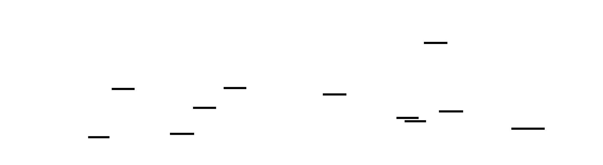

```markdown
# 🎯 Project Charter: Event Loop with epoll

## What You Are Building
A high-performance, single-threaded server capable of handling 10,000+ concurrent connections (the "C10K" problem) using Linux's `epoll` facility and the Reactor pattern. You are building the foundational architecture used by NGINX, Redis, and Node.js: an event-driven core that manages non-blocking sockets, manual write-buffer backpressure, a min-heap timer system for idle timeouts, and an incremental HTTP/1.1 protocol parser.

## Why This Project Exists
Modern high-scale systems achieve massive concurrency not by adding more threads, but by eliminating them. Building an event loop from scratch is the only way to understand how a single CPU core can manage thousands of connections without the devastating overhead of context switching. You will move past "using" async/await and learn the raw kernel mechanics of readiness notification and non-blocking I/O.

## What You Will Be Able to Do When Done
- Implement `epoll` based I/O multiplexing with both Level-Triggered and Edge-Triggered semantics.
- Manage asynchronous backpressure by implementing per-connection write buffers and `EPOLLOUT` lifecycle management.
- Build a high-performance min-heap priority queue to manage thousands of concurrent connection timeouts.
- Design a Reactor-pattern API that abstracts raw syscalls into a clean, callback-based event system.
- Successfully benchmark and tune a Linux server to handle 10,000+ simultaneous connections with sub-100ms p99 latency.

## Final Deliverable
A robust C or Rust systems project (~2,500+ lines) including a reusable Reactor library and a static file HTTP/1.1 server. The project features a comprehensive test suite for protocol fragmentation and a validated benchmark report demonstrating stable performance under 10,000 concurrent connections using tools like `wrk`.

## Is This Project For You?
**You should start this if you:**
- Are comfortable with C pointers, manual memory management, and `struct` design.
- Understand the basics of the TCP 3-way handshake and the standard socket API (`socket`, `bind`, `listen`).
- Want to transition from "web developer" to "systems engineer" by understanding the "magic" inside your runtime.

**Come back after you've learned:**
- Basic TCP socket programming (build a simple blocking "Hello World" echo server first).
- Standard C data structures (you should know how to implement a basic linked list or array-based queue).

## Estimated Effort
| Phase | Time |
|-------|------|
| epoll Basics: Level-Triggered and Edge-Triggered | ~6-8 hours |
| Write Buffering and Timer Management | ~5-8 hours |
| Reactor API and Callback Dispatch | ~5-8 hours |
| HTTP Server on Event Loop (C10K Target) | ~6-10 hours |
| **Total** | **~22-35 hours** |

## Definition of Done
The project is complete when:
- The server successfully passes a C10K load test (10,000 concurrent connections) with zero dropped requests.
- The incremental HTTP parser correctly handles "fragmented" requests (headers split across multiple `read()` calls).
- Idle connections are automatically closed by the timer system after a 30-second timeout.
- Valgrind/ASAN reports zero memory leaks or use-after-free errors during high-churn connection tests.
- Static files are served with correct `Content-Length` and `Content-Type` headers.
```

---

# Event Loop with epoll: Building a Reactor-Pattern Server from Scratch

This project builds a single-threaded, high-concurrency server capable of handling 10,000+ simultaneous connections using Linux's epoll I/O multiplexing facility and the reactor pattern. You will start from raw epoll syscalls—understanding the critical difference between edge-triggered and level-triggered semantics—then layer on write buffering with backpressure, timer management for idle timeouts, a clean reactor API that hides kernel details behind callbacks, and finally a complete HTTP/1.1 server that demonstrates the C10K capability.

The architecture you build here is the exact foundation of NGINX, Redis, Node.js's libuv, and Tokio's mio. By implementing it yourself in C, you'll understand why these systems are single-threaded yet outperform multi-threaded alternatives, how they handle slow clients without blocking fast ones, and why edge-triggered epoll demands a fundamentally different coding discipline than the select/poll model most developers learn first.

Every milestone produces a working, testable artifact: an echo server, a timer-driven connection reaper, a reactor library, and a benchmarked HTTP server. The progression is designed so that each layer reveals why the previous layer's naive approach breaks under load, creating a chain of 'aha' moments that connect kernel internals to application architecture.


<!-- MS_ID: build-event-loop-m1 -->
# epoll Basics: Level-Triggered and Edge-Triggered
## The Problem That Makes Single-Threaded Servers Hard
Before you write a single line of epoll code, you need to feel the constraint that makes all of this necessary. Let's start with what you already know how to build.
The classic server model is simple: call `accept()` to get a new connection, hand it to a thread, and let that thread call `read()` to wait for data. The thread blocks—suspended by the kernel—until bytes arrive, then processes them, then blocks again. This works beautifully until you need to handle 10,000 connections simultaneously.
Ten thousand threads. Each thread needs a stack (commonly 8 MB default, though you'd tune it down to 64–128 KB for a server). At 64 KB per thread, 10,000 threads consume 640 MB of RAM just for stacks—before you store a single byte of application data. And RAM is the optimistic problem. The real killer is context switching: each time the kernel switches from one thread to another, it must save all CPU registers, flush parts of the TLB (the CPU's translation lookaside buffer, which caches virtual-to-physical address mappings), and potentially evict hot cache lines. At 10,000 threads with even modest activity, you spend more CPU time switching contexts than doing actual work.


The kernel already knows which file descriptors have data ready. It maintains this information internally. The question is: how do you ask the kernel "which of my 10,000 file descriptors are ready right now?" without blocking on each one individually?
That's the problem `epoll` solves.

> **🔑 Foundation: I/O multiplexing**
> 
> **1. What it IS**
I/O Multiplexing is a technique that allows a single process or thread to monitor multiple file descriptors (FDs)—such as network sockets—simultaneously. Instead of the application "polling" each socket one by one or getting stuck waiting for a single connection to respond, the application asks the operating system kernel to wake it up only when one or more of those sockets are actually ready for reading or writing.

**2. Why you need it right now**
In high-concurrency networking, the traditional "thread-per-connection" model fails. If you want to handle 10,000 concurrent users, creating 10,000 threads would consume massive amounts of memory (for thread stacks) and devastate performance due to CPU context-switching overhead. Multiplexing allows you to scale to thousands of connections using a single thread, keeping your memory footprint low and your CPU focused on processing data rather than managing thread lifecycles.

**3. Key Insight: The Pager System**
Imagine a waiter in a restaurant. Instead of standing at one table and waiting ten minutes for a guest to choose an appetizer (Blocking I/O), or running from table to table every ten seconds asking "Are you ready yet?" (Polling), the waiter gives every table a **pager**. The waiter can then relax or do other tasks; when a guest is ready, their pager buzzes. The waiter handles only the tables that signaled they are ready.

## epoll in Context: What Came Before

> **🔑 Foundation: epoll vs select/poll**
> 
> **1. What it IS**
`select`, `poll`, and `epoll` are all system calls used for I/O multiplexing, but they differ in how they track which sockets are ready. `select` and `poll` are the older "stateless" methods, while `epoll` (exclusive to Linux) is a "stateful" event-notification facility.

**2. Why you need it right now**
At low connection counts (e.g., 10–100), the difference is negligible. However, `select` and `poll` have $O(N)$ complexity. Every time you call them, you must pass the entire list of FDs to the kernel, and the kernel must scan the entire list to see which ones are active. As you move toward 10,000+ FDs (the "C10k problem"), this scanning process becomes a massive bottleneck. `epoll` solves this by maintaining an "interest list" within the kernel itself. When a socket becomes ready, the kernel places it in a "ready list." The application then calls `epoll_wait` and receives only the FDs that actually have events, making it $O(1)$ relative to the total number of connections.

**3. Key Insight: Roll Call vs. The Sign-in Sheet**
`select` and `poll` are like a teacher performing a **Roll Call**: every morning, they must read every single name on the 1,000-person roster to see who is present. `epoll` is like a **Sign-in Sheet**: the teacher leaves a paper at the door, and only the students who actually show up write their names down. The teacher only has to look at the few names on the sheet to know who is ready.

The short version: `select()` and `poll()` both require you to pass the *entire* set of file descriptors you're interested in on every call. For 10,000 FDs, that's copying a 10,000-element array into the kernel on every call, and the kernel scans the entire array to find ready ones. `epoll` inverts this: you register interest once with `epoll_ctl()`, and `epoll_wait()` returns only the ready events—no full scan, no array copying.


In the system map, this milestone builds the foundation layer: the epoll instance and the non-blocking socket infrastructure that everything above it depends on.
---
## The Revelation: ET and LT Are Different Contracts, Not Different Speeds
Most developers who learn about epoll's edge-triggered mode read something like "edge-triggered is more efficient than level-triggered" and conclude: add `EPOLLET` to your flags for a free performance upgrade. This is the misconception that causes subtle, hard-to-reproduce data loss bugs.
Here is the actual contract each mode makes with you:
**Level-Triggered (LT)** says: *"As long as there is data in the socket's receive buffer that you haven't read yet, I will report this file descriptor as readable on every call to `epoll_wait`."*
**Edge-Triggered (ET)** says: *"I will report this file descriptor as readable exactly once—when the kernel receives new data that transitions the buffer from empty to non-empty (or adds to existing unread data). After that, it's your responsibility to drain all the data. I will not remind you again until new data arrives from the network."*
Read that second contract again. If 5,000 bytes arrive in the kernel's receive buffer and you read 1,024 bytes, LT will wake you up again on the next `epoll_wait`—there's still data. ET will *not* wake you up. It told you once. The remaining 3,976 bytes will sit in the receive buffer, invisible to you, until the remote end sends *more* data—at which point ET fires again, but now you have 3,976 stale bytes plus whatever just arrived, all mixed together.
Under controlled testing (small messages, quiet network), ET and LT look identical, because each message fits in a single `read()` call. Under load (large payloads, pipelined requests, bursts), ET with single-read-per-event silently drops data. The bug is timing-dependent and disappears in a debugger.


This is not a performance difference. It is a **different programming model** that demands different code.
---
## Building the Foundation: Non-Blocking Sockets
Before epoll can work correctly, every socket must be in non-blocking mode. Let's understand why.

> **🔑 Foundation: Blocking vs non-blocking I/O**
> 
> **1. What it IS**
In **Blocking I/O**, when you call `read()`, the kernel puts your thread to sleep until data arrives. In **Non-blocking I/O**, the call returns immediately. If data is ready, you get the data; if not, the kernel returns a specific error code: `EAGAIN` or `EWOULDBLOCK`.

**2. Why you need it right now**
I/O Multiplexing (like `epoll`) only tells you that a socket *has* data. It doesn't tell you *how much*. If you use a blocking `read()` on a socket that `epoll` flagged, but you try to read 1024 bytes and only 500 are available, your entire thread will "freeze" while waiting for the remaining 524 bytes. In an event-driven server, this would stop the server from processing all other 9,999 clients. You must set your sockets to non-blocking mode so that you can read what is available and immediately move on if the source runs dry.

**3. Key Insight: EAGAIN is not an Error**
In non-blocking I/O, receiving an `EAGAIN` result is not a failure; it is a **"Call me back later"** message. It is the kernel telling you: "I've given you everything I have for now; go do something else and I'll notify you via the multiplexer when more arrives."

In non-blocking mode, `read()` and `write()` return immediately. If there's no data to read, they return `-1` and set `errno` to `EAGAIN` (or its synonym `EWOULDBLOCK`—the kernel may use either; always check both, or check `errno == EAGAIN || errno == EWOULDBLOCK`). This is *not* an error. It means "the kernel's buffer is empty right now; try again later." Your event loop handles the "try again later" part by going back to `epoll_wait`.
Here's how you configure a socket for non-blocking mode:
```c
#include <fcntl.h>
/**
 * set_nonblocking - Configure a file descriptor for non-blocking I/O.
 *
 * Returns 0 on success, -1 on failure (with errno set).
 *
 * Why fcntl F_GETFL + F_SETFL: We must read existing flags first
 * to preserve them (e.g., O_RDWR, O_APPEND). Overwriting with just
 * O_NONBLOCK would clear all other flags, corrupting the fd's behavior.
 */
int set_nonblocking(int fd) {
    int flags = fcntl(fd, F_GETFL, 0);
    if (flags == -1) {
        return -1;
    }
    return fcntl(fd, F_SETFL, flags | O_NONBLOCK);
}
```
> **Why `F_GETFL` before `F_SETFL`?** The flags field holds multiple properties. If you write `fcntl(fd, F_SETFL, O_NONBLOCK)` directly, you erase `O_RDWR`, `O_APPEND`, and any other flags that were set. Always read first, then OR in your new flag.
An alternative on Linux is `accept4()` with `SOCK_NONBLOCK`, which creates the accepted socket already in non-blocking mode. We'll use this shortly to save the extra `fcntl` call on each accepted connection.
---
## Creating the epoll Instance
```c
#include <sys/epoll.h>
#include <unistd.h>
#include <stdio.h>
#include <stdlib.h>
/**
 * create_epoll - Create an epoll instance.
 *
 * epoll_create1(EPOLL_CLOEXEC):
 *   - EPOLL_CLOEXEC: automatically close the epoll fd if this process
 *     calls exec(). Without this flag, child processes after fork/exec
 *     inherit the epoll fd, which prevents the kernel from cleaning up
 *     the epoll interest list and leaks it into child processes.
 *   - The argument to epoll_create1 is a flags field, not a size hint
 *     (epoll_create's size argument is ignored since Linux 2.6.8 but
 *     must still be nonzero; epoll_create1 eliminates this confusion).
 *
 * Returns: epoll file descriptor (> 0), or exits on failure.
 */
int create_epoll(void) {
    int epoll_fd = epoll_create1(EPOLL_CLOEXEC);
    if (epoll_fd == -1) {
        perror("epoll_create1");
        exit(EXIT_FAILURE);
    }
    return epoll_fd;
}
```
The epoll instance is itself a file descriptor. It refers to a kernel data structure that maintains two lists: the **interest list** (every fd you've registered with `epoll_ctl`) and the **ready list** (fds that have events waiting). `epoll_wait` efficiently pulls from the ready list.
{{DIAGRAM:diag-m1-epoll-syscall-flow}}
### Registering File Descriptors
`epoll_ctl` takes four arguments: the epoll fd, an operation (`EPOLL_CTL_ADD`, `EPOLL_CTL_MOD`, or `EPOLL_CTL_DEL`), the target fd, and a pointer to an `epoll_event` struct:
```c
struct epoll_event {
    uint32_t     events;   /* event mask: EPOLLIN, EPOLLOUT, EPOLLET, etc. */
    epoll_data_t data;     /* union: ptr, fd, u32, u64 — your choice */
};
```
The `data` field is a union you control entirely. Whatever you put in when registering, you get back when the event fires. For simple cases, store the fd. For the full reactor pattern (Milestone 3), you'll store a pointer to the per-connection state structure.
```c
/**
 * epoll_add - Register fd for EPOLLIN events with epoll.
 * Stores fd in data.fd for retrieval in epoll_wait results.
 */
int epoll_add(int epoll_fd, int fd, uint32_t events) {
    struct epoll_event ev;
    ev.events = events;
    ev.data.fd = fd;
    return epoll_ctl(epoll_fd, EPOLL_CTL_ADD, fd, &ev);
}
/**
 * epoll_mod - Modify existing fd registration (e.g., add EPOLLOUT).
 */
int epoll_mod(int epoll_fd, int fd, uint32_t events) {
    struct epoll_event ev;
    ev.events = events;
    ev.data.fd = fd;
    return epoll_ctl(epoll_fd, EPOLL_CTL_MOD, fd, &ev);
}
/**
 * epoll_del - Remove fd from epoll interest list.
 * On Linux >= 2.6.9, the event pointer can be NULL here.
 */
int epoll_del(int epoll_fd, int fd) {
    return epoll_ctl(epoll_fd, EPOLL_CTL_DEL, fd, NULL);
}
```
---
## Setting Up the Listening Socket
The listening socket is your server's front door. It also must be non-blocking. The reason: if a client initiates a connection and then immediately sends a TCP RST before your `accept()` call runs (a race that happens under load), a blocking `accept()` can stall waiting for the *next* connection. With non-blocking mode, `accept()` returns `EAGAIN` immediately and you go back to `epoll_wait`.
```c
#include <sys/socket.h>
#include <netinet/in.h>
#include <string.h>
#define BACKLOG 128  /* listen() backlog: how many connections kernel queues */
#define PORT    8080
/**
 * create_listening_socket - Create, bind, and listen a non-blocking TCP socket.
 *
 * SO_REUSEADDR: allows rebinding to the port immediately after server restart,
 * bypassing the TCP TIME_WAIT state (which would otherwise block rebind for ~60s).
 *
 * Returns: listening socket fd, or -1 on failure.
 */
int create_listening_socket(void) {
    int listen_fd = socket(AF_INET, SOCK_STREAM | SOCK_NONBLOCK | SOCK_CLOEXEC, 0);
    if (listen_fd == -1) {
        perror("socket");
        return -1;
    }
    /* SO_REUSEADDR: don't wait for TIME_WAIT to expire on restart */
    int opt = 1;
    if (setsockopt(listen_fd, SOL_SOCKET, SO_REUSEADDR, &opt, sizeof(opt)) == -1) {
        perror("setsockopt SO_REUSEADDR");
        close(listen_fd);
        return -1;
    }
    struct sockaddr_in addr;
    memset(&addr, 0, sizeof(addr));
    addr.sin_family      = AF_INET;
    addr.sin_addr.s_addr = INADDR_ANY;  /* listen on all interfaces */
    addr.sin_port        = htons(PORT); /* htons: host-to-network byte order */
    if (bind(listen_fd, (struct sockaddr *)&addr, sizeof(addr)) == -1) {
        perror("bind");
        close(listen_fd);
        return -1;
    }
    if (listen(listen_fd, BACKLOG) == -1) {
        perror("listen");
        close(listen_fd);
        return -1;
    }
    return listen_fd;
}
```
> **`SOCK_NONBLOCK | SOCK_CLOEXEC` in the `socket()` call**: Linux allows ORing these flags directly into `socket()`'s type argument since kernel 2.6.27. This avoids a race condition between `socket()` and a subsequent `fcntl()` where a signal could deliver between the two calls in a multi-threaded program. In a single-threaded event loop it's less critical, but it's good practice.
> **`htons(PORT)`**: Network protocols specify big-endian byte order for port numbers. `htons` (host-to-network-short) converts from the host's native byte order (likely little-endian on x86) to network byte order. Forgetting this causes your server to listen on the wrong port—a classic source of "why can't I connect?" confusion.
---
## Per-Connection State: The fd → State Map
Every active connection needs associated state: a read buffer, a write buffer, timers, and protocol parsing position. Since file descriptors are small non-negative integers, the most cache-friendly structure is a flat array indexed by fd value. The kernel guarantees fd values are less than the process's open file limit (by default 1,024 in many systems; configurable up to millions with `ulimit -n` and `/proc/sys/fs/file-max`).


```c
#include <stdint.h>
#include <stdbool.h>
#define MAX_FDS       65536   /* size of fd→state array; must exceed ulimit -n */
#define READ_BUF_SIZE 4096    /* one page; aligns with typical MTU and kernel recv buffer chunks */
/**
 * conn_state - Per-connection state stored in the fd array.
 *
 * Memory layout analysis (on 64-bit Linux):
 *   offset  0: read_buf[4096]   = 4096 bytes
 *   offset  4096: read_len      = 4 bytes (uint32_t)
 *   offset  4100: fd            = 4 bytes (int)
 *   offset  4104: active        = 1 byte (bool)
 *   offset  4105: [padding]     = 7 bytes (compiler aligns next field)
 *   Total: ~4112 bytes per connection
 *
 * At 10,000 connections: 10,000 × 4112 ≈ 40 MB resident memory.
 * The read_buf is the dominant cost — larger buffers mean fewer read() calls
 * but more memory footprint. 4096 is a common trade-off.
 *
 * Cache note: read_buf[0..63] fits in one 64-byte cache line. Sequential
 * access to read_buf (filling it byte-by-byte) is prefetch-friendly.
 * The conn_state structs themselves are too large to fit in L1 (32 KB),
 * so accessing state for a new connection will be an L2 or L3 cache miss.
 */
typedef struct {
    char     read_buf[READ_BUF_SIZE]; /* incoming bytes accumulate here */
    uint32_t read_len;                /* bytes currently in read_buf */
    int      fd;                      /* the file descriptor this represents */
    bool     active;                  /* is this slot in use? */
    /* Milestone 2 will add: write buffer, timer linkage */
} conn_state;
/* Global fd→state array. Indexed directly by fd value. */
static conn_state connections[MAX_FDS];
/**
 * conn_init - Initialize a new connection's state slot.
 * Called immediately after accept().
 */
void conn_init(int fd) {
    conn_state *c = &connections[fd];
    c->fd       = fd;
    c->read_len = 0;
    c->active   = true;
    /* No need to zero read_buf — we track length in read_len */
}
/**
 * conn_close - Clean up a connection's state slot and close its fd.
 * Must be called on any exit path: client disconnect, error, timeout.
 */
void conn_close(int epoll_fd, int fd) {
    conn_state *c = &connections[fd];
    if (!c->active) return;
    c->active   = false;
    c->read_len = 0;
    c->fd       = -1;
    /* Remove from epoll before closing fd. Closing fd auto-removes it from
     * epoll on Linux (kernel does this when fd refcount drops to zero), but
     * explicit removal is safer and required if fd was dup()'d. */
    epoll_ctl(epoll_fd, EPOLL_CTL_DEL, fd, NULL);
    close(fd);
}
```
> **Why an array and not a hash map?** File descriptors are already sparse integers in a bounded range. An array gives O(1) lookup with zero hash computation and excellent cache locality for sequential fd values. A hash map's overhead—hashing, collision chains, pointer chasing—is pure cost with no benefit when the key space is already integer-indexed. This is a common pattern in kernel-adjacent code: Redis uses a similar `ae_file_event *events` array in `ae.c`.
---
## The Level-Triggered Event Loop
Now we have all the pieces. Here's a complete level-triggered event loop that drives an echo server:
```c
#include <errno.h>
#include <stdio.h>
#define MAX_EVENTS 1024  /* events to retrieve per epoll_wait call */
/**
 * handle_new_connection_lt - Accept all pending connections in LT mode.
 *
 * In LT mode, we can accept one connection per EPOLLIN on the listen fd,
 * because if more connections are pending, epoll_wait will fire again.
 * However, accepting in a loop until EAGAIN is still better practice:
 * it reduces epoll_wait round trips under high connection rates.
 *
 * We use accept4() with SOCK_NONBLOCK | SOCK_CLOEXEC to atomically
 * create non-blocking, close-on-exec client sockets.
 */
void handle_new_connection_lt(int epoll_fd, int listen_fd) {
    struct sockaddr_in client_addr;
    socklen_t addr_len = sizeof(client_addr);
    int client_fd = accept4(listen_fd, (struct sockaddr *)&client_addr,
                            &addr_len, SOCK_NONBLOCK | SOCK_CLOEXEC);
    if (client_fd == -1) {
        if (errno == EAGAIN || errno == EWOULDBLOCK) {
            return; /* no more connections right now */
        }
        perror("accept4");
        return;
    }
    if (client_fd >= MAX_FDS) {
        fprintf(stderr, "fd %d exceeds MAX_FDS, closing\n", client_fd);
        close(client_fd);
        return;
    }
    conn_init(client_fd);
    /* Register for EPOLLIN only (LT mode — no EPOLLET flag) */
    if (epoll_add(epoll_fd, client_fd, EPOLLIN) == -1) {
        perror("epoll_add client");
        conn_close(epoll_fd, client_fd);
    }
}
/**
 * handle_client_read_lt - Read and echo data in level-triggered mode.
 *
 * LT contract: epoll will re-notify us if data remains in the buffer.
 * So we read ONE chunk per event — simple, but may cause extra epoll_wait
 * round trips if more than READ_BUF_SIZE bytes are waiting.
 */
void handle_client_read_lt(int epoll_fd, int fd) {
    conn_state *c = &connections[fd];
    char buf[READ_BUF_SIZE];
    ssize_t n = read(fd, buf, sizeof(buf));
    if (n > 0) {
        /* Echo: write it back. For now, assume write succeeds fully.
         * Milestone 2 will add proper write buffering for partial writes. */
        ssize_t written = 0;
        while (written < n) {
            ssize_t w = write(fd, buf + written, n - written);
            if (w == -1) {
                if (errno == EAGAIN || errno == EWOULDBLOCK) {
                    /* Send buffer full; Milestone 2 handles this properly */
                    break;
                }
                conn_close(epoll_fd, fd);
                return;
            }
            written += w;
        }
    } else if (n == 0) {
        /* Peer closed connection (graceful shutdown / EOF) */
        conn_close(epoll_fd, fd);
    } else {
        /* n == -1 */
        if (errno == EAGAIN || errno == EWOULDBLOCK) {
            /* Spurious wakeup: no data right now. Not an error. */
            return;
        }
        /* Real error (ECONNRESET, ETIMEDOUT, etc.) */
        conn_close(epoll_fd, fd);
    }
}
/**
 * run_event_loop_lt - Level-triggered event loop. Main server loop.
 */
void run_event_loop_lt(int epoll_fd, int listen_fd) {
    struct epoll_event events[MAX_EVENTS];
    for (;;) {
        /*
         * epoll_wait arguments:
         *   epoll_fd   - our epoll instance
         *   events     - array to fill with ready events
         *   MAX_EVENTS - max events to return per call
         *   -1         - timeout: block forever until an event arrives
         *                (Milestone 2 will replace -1 with timer-derived value)
         */
        int n_ready = epoll_wait(epoll_fd, events, MAX_EVENTS, -1);
        if (n_ready == -1) {
            if (errno == EINTR) {
                /* Signal interrupted epoll_wait (e.g., SIGCHLD). Not an error. */
                continue;
            }
            perror("epoll_wait");
            break;
        }
        for (int i = 0; i < n_ready; i++) {
            int fd = events[i].data.fd;
            uint32_t ev = events[i].events;
            if (fd == listen_fd) {
                handle_new_connection_lt(epoll_fd, listen_fd);
            } else if (ev & (EPOLLERR | EPOLLHUP)) {
                /* Error or hang-up: connection is broken */
                conn_close(epoll_fd, fd);
            } else if (ev & EPOLLIN) {
                handle_client_read_lt(epoll_fd, fd);
            }
        }
    }
}
```
Test this with `nc localhost 8080`. Type text, hit Enter, and it echoes back. Now try piping a large file: `cat /dev/urandom | head -c 1000000 | nc localhost 8080`. Watch it work correctly—LT mode will keep waking up the loop until all the data is read.
---
## The Edge-Triggered Event Loop: Drain Until EAGAIN
Now we implement ET mode. The code structure looks similar, but the read handler is fundamentally different:
```c
/**
 * handle_new_connection_et - Accept ALL pending connections in ET mode.
 *
 * CRITICAL: In ET mode, EPOLLIN on listen_fd fires ONCE when new connections
 * arrive. If 5 clients connect between epoll_wait calls, we get ONE wakeup.
 * We MUST loop until accept() returns EAGAIN, or we miss connections entirely.
 * This is the same "drain until EAGAIN" discipline applied to the listen socket.
 */
void handle_new_connection_et(int epoll_fd, int listen_fd) {
    for (;;) {
        struct sockaddr_in client_addr;
        socklen_t addr_len = sizeof(client_addr);
        int client_fd = accept4(listen_fd, (struct sockaddr *)&client_addr,
                                &addr_len, SOCK_NONBLOCK | SOCK_CLOEXEC);
        if (client_fd == -1) {
            if (errno == EAGAIN || errno == EWOULDBLOCK) {
                break; /* no more pending connections */
            }
            perror("accept4");
            break;
        }
        if (client_fd >= MAX_FDS) {
            fprintf(stderr, "fd %d exceeds MAX_FDS, closing\n", client_fd);
            close(client_fd);
            continue;
        }
        conn_init(client_fd);
        /* Register with EPOLLIN | EPOLLET — edge-triggered mode */
        if (epoll_add(epoll_fd, client_fd, EPOLLIN | EPOLLET) == -1) {
            perror("epoll_add client ET");
            conn_close(epoll_fd, client_fd);
        }
    }
}
/**
 * handle_client_read_et - Read all available data in edge-triggered mode.
 *
 * THE KEY INVARIANT: We MUST read until EAGAIN. Here's why:
 *
 * Suppose 8000 bytes arrive in the kernel buffer, and our read() call
 * processes 4096. The remaining 4096 bytes sit in the buffer. ET will
 * NOT fire again until the remote end sends MORE bytes. If the protocol
 * requires a response before the client sends more, you have a deadlock:
 *   - Server: waiting for more data (ET won't fire, buffer has stale data)
 *   - Client: waiting for response (won't send more until it gets one)
 *
 * Solution: drain the entire buffer in this event handler.
 */
void handle_client_read_et(int epoll_fd, int fd) {
    for (;;) {
        char buf[READ_BUF_SIZE];
        ssize_t n = read(fd, buf, sizeof(buf));
        if (n > 0) {
            /* Echo all bytes back. Same partial-write issue as LT version;
             * Milestone 2 adds proper write buffering. */
            ssize_t written = 0;
            while (written < n) {
                ssize_t w = write(fd, buf + written, n - written);
                if (w == -1) {
                    if (errno == EAGAIN || errno == EWOULDBLOCK) {
                        /* Send buffer full. Milestone 2 handles this. */
                        break;
                    }
                    conn_close(epoll_fd, fd);
                    return;
                }
                written += w;
            }
            /* Continue the loop: may be more data in the receive buffer */
        } else if (n == 0) {
            /* Peer closed connection */
            conn_close(epoll_fd, fd);
            return;
        } else {
            /* n == -1 */
            if (errno == EAGAIN || errno == EWOULDBLOCK) {
                /* Buffer fully drained. Done for this event. */
                break;
            }
            /* Real error */
            conn_close(epoll_fd, fd);
            return;
        }
    }
}
/**
 * run_event_loop_et - Edge-triggered event loop.
 *
 * Structure identical to LT version; the difference is entirely in
 * the handlers (drain loops vs single reads).
 */
void run_event_loop_et(int epoll_fd, int listen_fd) {
    struct epoll_event events[MAX_EVENTS];
    /* Register listen_fd with ET mode */
    struct epoll_event ev;
    ev.events  = EPOLLIN | EPOLLET;
    ev.data.fd = listen_fd;
    if (epoll_ctl(epoll_fd, EPOLL_CTL_ADD, listen_fd, &ev) == -1) {
        perror("epoll_ctl listen_fd ET");
        return;
    }
    for (;;) {
        int n_ready = epoll_wait(epoll_fd, events, MAX_EVENTS, -1);
        if (n_ready == -1) {
            if (errno == EINTR) continue;
            perror("epoll_wait");
            break;
        }
        for (int i = 0; i < n_ready; i++) {
            int fd = events[i].data.fd;
            uint32_t ev_mask = events[i].events;
            if (fd == listen_fd) {
                handle_new_connection_et(epoll_fd, listen_fd);
            } else if (ev_mask & (EPOLLERR | EPOLLHUP)) {
                conn_close(epoll_fd, fd);
            } else if (ev_mask & EPOLLIN) {
                handle_client_read_et(epoll_fd, fd);
            }
        }
    }
}
```


---
## The Bug You Must See: Single Read in ET Mode
To truly understand the ET/LT difference, deliberately break the ET handler and observe the failure. Change `handle_client_read_et` to perform only a single read (as if you'd naively copy the LT handler):
```c
/* DELIBERATELY BROKEN: Single read in ET mode — demonstrates data loss */
void handle_client_read_et_BROKEN(int epoll_fd, int fd) {
    char buf[READ_BUF_SIZE];
    ssize_t n = read(fd, buf, sizeof(buf));  /* reads only one chunk */
    if (n > 0) {
        write(fd, buf, n);  /* echo what we got */
        /* BUG: if more data is in the buffer, ET will NOT fire again
         * until the remote sends new data. If protocol expects a response
         * first (request-response), we deadlock here. */
    } else if (n == 0) {
        conn_close(epoll_fd, fd);
    } else if (errno != EAGAIN && errno != EWOULDBLOCK) {
        conn_close(epoll_fd, fd);
    }
}
```
Now test it by sending a large payload in a single TCP segment that exceeds `READ_BUF_SIZE`:
```bash
# Generate 8192 bytes and pipe to server (larger than READ_BUF_SIZE=4096)
python3 -c "print('A' * 8192)" | nc localhost 8080
```
With the broken handler, you'll receive 4,096 bytes echoed back, then silence. The remaining 4,096 bytes are trapped in the kernel receive buffer, invisible until the client sends more data. With the correct handler (drain until EAGAIN), you receive all 8,192 bytes.
Under a load test sending large requests concurrently, this bug manifests as random request timeouts—connections that appear connected but never complete.
---
## The Non-Blocking Accept Loop and the ET Listening Socket


When you register your listening socket with `EPOLLET`, a burst of incoming connections generates a single `EPOLLIN` notification. The `handle_new_connection_et` function's loop-until-EAGAIN is not optional—it's the same contract as the read loop.
Consider this scenario:
- At time T=0: 50 clients simultaneously complete the TCP three-way handshake
- At time T=1: epoll_wait wakes up with EPOLLIN on listen_fd
- Your accept loop processes all 50 connections, calling accept4() until EAGAIN
- At time T=2: epoll_wait returns — no pending connection notifications (all were drained)
Without the loop, you'd accept 1 connection and miss 49. The kernel queued them in the listen backlog (the `BACKLOG` constant in our `listen()` call), but ET won't re-notify you. They'll sit there until the next connection arrives—which may never happen.
---
## Putting It All Together: The Complete Echo Server
Here's the full main function wiring everything together, with a compile switch to choose between LT and ET modes:
```c
#include <sys/epoll.h>
#include <sys/socket.h>
#include <netinet/in.h>
#include <fcntl.h>
#include <unistd.h>
#include <stdio.h>
#include <stdlib.h>
#include <string.h>
#include <errno.h>
#include <stdbool.h>
#include <stdint.h>
/* Forward declarations of all functions defined above */
int  create_epoll(void);
int  create_listening_socket(void);
int  epoll_add(int epoll_fd, int fd, uint32_t events);
int  epoll_mod(int epoll_fd, int fd, uint32_t events);
int  epoll_del(int epoll_fd, int fd);
void conn_init(int fd);
void conn_close(int epoll_fd, int fd);
void run_event_loop_lt(int epoll_fd, int listen_fd);
void run_event_loop_et(int epoll_fd, int listen_fd);
int main(int argc, char *argv[]) {
    /* Default to LT mode; pass "et" as argument for ET mode */
    bool use_et = (argc > 1 && strcmp(argv[1], "et") == 0);
    /* Initialize all connection slots as inactive */
    memset(connections, 0, sizeof(connections));
    for (int i = 0; i < MAX_FDS; i++) {
        connections[i].fd = -1;
    }
    int epoll_fd  = create_epoll();
    int listen_fd = create_listening_socket();
    printf("Echo server starting on port %d (%s mode)...\n",
           PORT, use_et ? "edge-triggered" : "level-triggered");
    if (use_et) {
        /* ET mode: register listen_fd inside run_event_loop_et */
        run_event_loop_et(epoll_fd, listen_fd);
    } else {
        /* LT mode: register listen_fd here, then start loop */
        if (epoll_add(epoll_fd, listen_fd, EPOLLIN) == -1) {
            perror("epoll_add listen_fd");
            exit(EXIT_FAILURE);
        }
        run_event_loop_lt(epoll_fd, listen_fd);
    }
    close(listen_fd);
    close(epoll_fd);
    return 0;
}
```
Compile with:
```bash
gcc -O2 -Wall -Wextra -o echo_server echo_server.c
# Run level-triggered
./echo_server
# Run edge-triggered
./echo_server et
```
Test:
```bash
# Basic echo test
echo "hello world" | nc localhost 8080
# Multiple simultaneous connections
for i in $(seq 1 100); do
    echo "connection $i" | nc -q 1 localhost 8080 &
done
wait
```
---
## Hardware Soul: What the Kernel Actually Does
Understanding the hardware effects explains the performance difference between LT and ET—and why it's smaller than people expect.
**Cache behavior**: Each `epoll_wait` call returns up to `MAX_EVENTS` (1,024 in our code) events into a stack-allocated array. This array is 1,024 × 12 bytes = 12 KB, which fits in L1 cache (typically 32–64 KB). Iterating over ready events is cache-hot.
**The ready list**: Linux's epoll implementation (in `fs/eventpoll.c`) maintains the ready list (`rdllist`) as a doubly-linked list of `epitem` structures. When you call `epoll_wait`:
- LT mode: after returning an event, the fd is immediately re-added to `rdllist` if data remains. This requires an extra list manipulation per event.
- ET mode: the fd is removed from `rdllist` and only re-added when new data arrives (via the socket's `sock_def_readable` callback). Less overhead per event, but your drain loop does more work per event.
The net effect: ET has slightly lower kernel overhead per `epoll_wait` call, but your application does more work per event (the drain loop). At high throughput, the difference is measurable but often less than 5–10%. The real reason NGINX uses ET is **correctness under high connection rates**—ET's single-notification model eliminates redundant wakeups from partially-consumed buffers, keeping the event loop lean.
**TLB and page fault cost**: The per-connection state array (`connections[MAX_FDS]`) is 65,536 × 4,112 bytes ≈ 256 MB. Not all of it is resident—the kernel uses demand paging. Accessing the state for a new connection (touching a page not recently accessed) causes a page fault if it hasn't been accessed recently, adding ~1–10 µs to connection setup. Under sustained load with 10K active connections, these pages will all be resident and TLB-warm.
**Branch prediction**: The `errno == EAGAIN || errno == EWOULDBLOCK` check in the read loop is nearly always false during drain (we expect to read data, not hit EAGAIN until the end). The branch predictor learns this quickly—after a few iterations, the EAGAIN branch is predicted not-taken with high accuracy, costing only 1 cycle.
**Memory access pattern**: Reading the receive buffer sequentially (sequential bytes from `read()`) is prefetch-friendly. The hardware prefetcher recognizes the linear access pattern and loads upcoming cache lines before you need them, hiding memory latency.
---
## Design Decision: LT vs ET — Which Should You Use?
| Property | Level-Triggered (LT) | Edge-Triggered (ET) |
|----------|----------------------|---------------------|
| **Required read discipline** | Single read per event is sufficient | Must drain until EAGAIN |
| **Required accept discipline** | Can accept one per event | Must accept until EAGAIN |
| **Behavior on partial read** | Re-notified on next epoll_wait | Silent until more data arrives |
| **Kernel overhead per event** | Slightly higher (re-adds to rdllist) | Slightly lower |
| **Risk of data loss on bug** | Low (just slower) | High (silent data loss) |
| **Who uses it** | Node.js (libuv), Twisted | NGINX, Redis (optionally), io_uring |
| **Correct for beginners** | ✓ Easier to implement correctly | ✗ Requires strict discipline |
**The verdict**: Use LT for this milestone to build intuition. Implement ET to understand the constraint. In production, either works correctly if implemented correctly—the performance difference rarely justifies the cognitive overhead of ET for application-level code.
Node.js explicitly chose LT for libuv after analysis showed that the complexity of ensuring every callback drains its socket was an unacceptable maintenance burden. NGINX chose ET because NGINX's architecture guarantees the drain discipline at the module API level—every handler is required to read until EAGAIN, and this is enforced by code review and convention.
---
## The Three-Level View: One Read Call
Let's trace a single `read()` call through the stack:
**Level 1 — Application**: Your code calls `read(fd, buf, 4096)`. A number (positive: bytes read, 0: EOF, -1: error or EAGAIN) returns.
**Level 2 — Kernel**: The `read()` syscall enters the kernel via the syscall table. The kernel's socket layer (`net/socket.c`) finds the TCP socket's receive buffer (`sk_receive_queue`). It copies bytes from the socket buffer into your user-space `buf` using `copy_to_user()`. If the buffer was drained below a threshold, the kernel updates the socket's readiness state. In ET mode, if the buffer was previously non-empty and now becomes empty, the epoll subsystem removes the `epitem` from the ready list.
**Level 3 — Hardware**: `copy_to_user()` is essentially a `memcpy` from kernel-space to user-space. On a modern CPU with virtual memory, both the kernel buffer and user buffer are virtual addresses. The MMU translates them to physical addresses using the page table, checked via TLB. If the user-space buffer page is in TLB (likely for the first read after a context switch into the epoll loop), this is fast. The actual data transfer uses SSE2 or AVX `movdqu`/`vmovdqu` instructions for vectorized 16- or 32-byte copies. At 4096 bytes with AVX2 (32-byte copies), that's 128 vector instructions—approximately 64 cycles on a modern CPU, or ~20 ns at 3 GHz.
---
## Knowledge Cascade: What This Unlocks
Now that you understand epoll's fundamentals and the ET/LT contract, you have a lens for understanding systems you'll encounter throughout your career:
**1. NGINX's module bug surface**: NGINX uses ET mode exclusively and documents that every module must call `ngx_handle_read_event()` and drain the socket. Third-party NGINX modules are a frequent source of bugs precisely because module authors forget the drain discipline—the module works correctly in unit testing (small payloads) but loses data under production load. You now know exactly why.
**2. TCP flow control and ET's hidden interaction**: When you drain the socket buffer aggressively (ET's drain-until-EAGAIN), you keep the kernel's receive buffer empty. This signals to the TCP stack that your application can receive more data. TCP's receive window (advertised to the remote sender) stays large. If you *don't* drain (the LT partial-read case), the receive buffer fills, the window shrinks, and TCP backpressure naturally slows the sender. ET mode thus affects TCP's flow control behavior—aggressive draining can increase throughput but also means your application sees larger bursts of data that it must handle efficiently.
**3. io_uring: epoll's eventual successor**: io_uring (Linux 5.1+) eliminates the epoll `wait → read → write` syscall pattern entirely. You submit `read` and `write` operations to a ring buffer, and completions appear in another ring buffer—no `epoll_wait`, no per-event `read()` syscall. At 10K connections with small messages, epoll spends significant CPU time in syscall overhead (context switches to kernel space). io_uring amortizes this by batching. The ET/LT distinction doesn't exist in io_uring's completion model (it's inherently edge-notification—you get one completion per submitted operation). Understanding epoll's model makes io_uring's design decisions legible.
**4. The C10K paper and historical context**: Dan Kegel's 1999 C10K paper (cited in your resources) described this exact problem before Linux had epoll. The solutions proposed—non-blocking I/O, event-driven architectures, `select`/`poll` improvements—directly led to epoll's design. Reading it now, you'll recognize every problem and understand why epoll solved them the way it did. The paper is a time capsule of the moment when event-driven architecture stopped being exotic and became necessary.
**5. Cross-domain: Browser event loops**: JavaScript's event loop (the foundation of Node.js and browsers) is the same reactor pattern you just built—a single-threaded loop that dispatches events to callbacks. `setTimeout`, `Promise.then`, and `EventListener` callbacks are all queued events, processed in order. The "event loop" terminology in JavaScript directly inherits from the networking reactor pattern you're building. When JavaScript developers talk about "not blocking the event loop," they mean exactly what you now know: if a callback takes 100ms, all other events are delayed by 100ms—same constraint, different context.
---
## Pitfall Reference: The Five Ways This Breaks
Before you move on, memorize these failure modes:
**Pitfall 1: ET with single read per event**
*Symptom*: Works in testing, silently loses data under load, causing protocol-level deadlocks.
*Fix*: Always loop until EAGAIN in ET mode.
**Pitfall 2: ET listening socket without accept loop**
*Symptom*: Under connection bursts, new clients connect but receive no response; their connections sit in the listen backlog.
*Fix*: Accept in a loop until EAGAIN in both the listen handler and the accept function.
**Pitfall 3: Treating EAGAIN as an error**
*Symptom*: Connections closed immediately after the first "empty read," or spurious connection resets.
*Fix*: Check `errno == EAGAIN || errno == EWOULDBLOCK` and return without closing.
**Pitfall 4: Not setting the listen socket to non-blocking**
*Symptom*: Server hangs under specific TCP RST race conditions; `accept()` blocks briefly on a connection that was reset before accept ran.
*Fix*: Use `SOCK_NONBLOCK` in the `socket()` call or `set_nonblocking()` before `listen()`.
**Pitfall 5: MAX_EVENTS too small**
*Symptom*: Under high load, `epoll_wait` returns the maximum each call, requiring many calls to drain the ready list; reduces throughput.
*Fix*: Set `MAX_EVENTS` between 512 and 4096. 1024 is a common default; tune based on your event distribution.
---
<!-- END_MS -->


<!-- MS_ID: build-event-loop-m2 -->
<!-- MS_ID: build-event-loop-m2 -->
# Write Buffering and Timer Management
## The Problem You Haven't Solved Yet
Your echo server from Milestone 1 has a quiet bug. Look at the write path:
```c
ssize_t w = write(fd, buf + written, n - written);
if (w == -1) {
    if (errno == EAGAIN || errno == EWOULDBLOCK) {
        /* Send buffer full. Milestone 2 handles this. */
        break;  // ← THIS IS THE BUG
    }
    ...
}
```
When `write()` returns `EAGAIN`, you `break` out of the write loop and discard the unsent bytes. For an echo server with small payloads, the kernel's send buffer is almost always large enough that this never triggers. In production, under load, with large responses and slow clients, this path fires constantly—and every time it does, you silently drop data.
But the naive fix—just retry `write()` in a loop until it succeeds—transforms your elegant event loop into a blocking server. If one client's socket buffer is full, the server stalls waiting for it to drain, freezing all other 9,999 connections.
The correct solution requires two interlocking mechanisms:
1. **A write buffer**: When `write()` returns `EAGAIN`, save the unsent bytes in a per-connection queue. Don't drop them, don't retry synchronously—save them.
2. **EPOLLOUT management**: Register interest in `EPOLLOUT` to be notified when the socket's send buffer drains. When it fires, flush the queued bytes. When the queue empties, *deregister* `EPOLLOUT`.
That deregistration is the critical step most developers miss—and it's the subject of this milestone's core revelation.
{{DIAGRAM:diag-m2-write-buffer-lifecycle}}
---
## The Revelation: EPOLLOUT Is NOT Like EPOLLIN
Here's the misconception you need to shatter before writing a single line of code.
`EPOLLIN` fires when data *arrives*. Between arrivals, the socket is quiet. `EPOLLIN` is an edge condition: something changed (data appeared). If no data is arriving, `EPOLLIN` doesn't fire, and `epoll_wait` correctly sleeps.
Now consider `EPOLLOUT`. It fires when the socket's send buffer has space for writing. How often does a TCP socket have space in its send buffer?
Almost always.
The Linux TCP send buffer defaults to 87 KB (expandable to 208 KB with autotuning). Your server is sending kilobytes at a time. The send buffer drains rapidly—the kernel reads from it and hands bytes to the NIC continuously. A socket's send buffer is full only during a brief window where you're writing faster than the network can send.
If you leave `EPOLLOUT` registered when you have nothing to write, `epoll_wait` will return your fd as "writable" on *every single call*. There's nothing to write, so your handler returns immediately. Then `epoll_wait` returns again. And again. 100% CPU, no work done.
```
[WITHOUT proper EPOLLOUT management]
epoll_wait() returns — EPOLLOUT on fd 5 (nothing to write)
epoll_wait() returns — EPOLLOUT on fd 5 (nothing to write)
epoll_wait() returns — EPOLLOUT on fd 5 (nothing to write)
↑ This loop runs at ~1,000,000 iterations/second, pinning one CPU core.
```


The correct pattern is a three-step cycle:
1. **Normal state**: Only `EPOLLIN` is registered. `EPOLLOUT` is NOT registered.
2. **write() returns EAGAIN**: Buffer the remaining data. Register `EPOLLOUT` (using `epoll_ctl EPOLL_CTL_MOD`).
3. **EPOLLOUT fires**: Flush the write buffer. If the buffer empties, deregister `EPOLLOUT` (back to `EPOLLIN` only). If `EAGAIN` again, stay registered.
This register-flush-deregister cycle is not a clever optimization. It is the *only correct implementation*. Every production event loop that handles large responses does exactly this: libuv (Node.js), libevent, libev, NGINX, and—as we'll see in the Knowledge Cascade—Redis.
---
## Building the Write Buffer
Before the code, understand what you're building. A write buffer is a byte queue attached to each connection. It holds data that `write()` couldn't send because the kernel's send buffer was full. It must:
- Store arbitrary amounts of data (bounded by a configured maximum)
- Track where in the buffer writing left off (the "offset")
- Be efficient to append to and drain from
- Free its memory when the connection closes
The simplest correct implementation uses a dynamically allocated byte array with a capacity, a used-bytes count, and an offset indicating where draining left off.


```c
#include <stdlib.h>
#include <string.h>
#include <stdint.h>
#include <stdbool.h>
#define WRITE_BUF_MAX (256 * 1024)   /* 256 KB max write buffer per connection */
#define WRITE_BUF_INIT (4 * 1024)    /* Initial allocation: 4 KB */
/**
 * write_buf - Dynamically-sized write buffer for a single connection.
 *
 * Memory layout (on 64-bit):
 *   offset  0: data     (8 bytes — pointer)
 *   offset  8: len      (4 bytes — bytes in buf from offset onward)
 *   offset 12: cap      (4 bytes — total allocated bytes)
 *   offset 16: offset   (4 bytes — start of unwritten data)
 *   offset 20: [4 bytes padding]
 *   Total: 24 bytes per connection
 *
 * Invariant: data[offset .. offset+len] contains unsent bytes.
 * When len == 0, the buffer is empty; EPOLLOUT should be deregistered.
 * When offset > cap/2, compact: memmove(data, data+offset, len); offset=0.
 */
typedef struct {
    char    *data;    /* heap-allocated byte array */
    uint32_t len;     /* number of buffered (unsent) bytes */
    uint32_t cap;     /* total allocated capacity */
    uint32_t offset;  /* index of first unsent byte */
} write_buf;
/**
 * wbuf_init - Initialize a write buffer with no allocation.
 * Allocation is deferred until the first write failure.
 */
void wbuf_init(write_buf *wb) {
    wb->data   = NULL;
    wb->len    = 0;
    wb->cap    = 0;
    wb->offset = 0;
}
/**
 * wbuf_free - Release all memory held by the write buffer.
 * Must be called when the connection closes.
 */
void wbuf_free(write_buf *wb) {
    free(wb->data);
    wbuf_init(wb);
}
/**
 * wbuf_append - Add bytes to the write buffer.
 *
 * First compacts the buffer if offset has consumed more than half the
 * allocation (avoids unbounded growth from repeated append+drain cycles).
 * Then grows the allocation if needed (doubling strategy).
 *
 * Returns 0 on success, -1 if buffer would exceed WRITE_BUF_MAX.
 */
int wbuf_append(write_buf *wb, const char *data, uint32_t data_len) {
    /* Reject if this would exceed the hard cap */
    if (wb->len + data_len > WRITE_BUF_MAX) {
        return -1;  /* caller should close this connection */
    }
    /* Compact if offset wasted more than half the capacity */
    if (wb->offset > wb->cap / 2 && wb->len > 0) {
        memmove(wb->data, wb->data + wb->offset, wb->len);
        wb->offset = 0;
    }
    /* Grow if needed */
    uint32_t needed = wb->offset + wb->len + data_len;
    if (needed > wb->cap) {
        uint32_t new_cap = wb->cap == 0 ? WRITE_BUF_INIT : wb->cap * 2;
        while (new_cap < needed) new_cap *= 2;
        if (new_cap > WRITE_BUF_MAX) new_cap = WRITE_BUF_MAX;
        char *new_data = realloc(wb->data, new_cap);
        if (!new_data) return -1;  /* OOM — close connection */
        wb->data = new_data;
        wb->cap  = new_cap;
    }
    memcpy(wb->data + wb->offset + wb->len, data, data_len);
    wb->len += data_len;
    return 0;
}
/**
 * wbuf_consume - Advance the buffer by 'n' bytes (those bytes were sent).
 */
static inline void wbuf_consume(write_buf *wb, uint32_t n) {
    wb->offset += n;
    wb->len    -= n;
    if (wb->len == 0) {
        wb->offset = 0;  /* reset to avoid creeping offset */
    }
}
/**
 * wbuf_is_empty - True when there are no unsent bytes.
 */
static inline bool wbuf_is_empty(const write_buf *wb) {
    return wb->len == 0;
}
```
> **Why double the capacity?** The doubling strategy amortizes `realloc` calls. If you added one byte at a time, each addition might require a new allocation and memory copy. By doubling, you pay O(log N) realloc calls for N bytes appended total—each byte's amortized allocation cost is O(1). This is the same strategy used by C++'s `std::vector` and Rust's `Vec`.
> **Why the compaction threshold?** Consider a connection that repeatedly appends 100 bytes and sends 100 bytes. Without compaction, `offset` creeps forward: 100, 200, 300... eventually reaching `cap`, at which point `realloc` extends the buffer unnecessarily. By compacting when offset exceeds half the capacity, we bound this waste. The `memmove` cost (O(len)) is paid infrequently—only when offset drifts far.
---
## Updated Per-Connection State
Now update the `conn_state` struct from Milestone 1 to include the write buffer and an EPOLLOUT-registered flag:
```c
/* From Milestone 1: */
/* #define READ_BUF_SIZE 4096 */
/* #define MAX_FDS       65536 */
/**
 * conn_state - Per-connection state (updated for Milestone 2).
 *
 * Memory layout (approximate, 64-bit):
 *   offset     0: read_buf[4096]   = 4096 bytes
 *   offset  4096: wbuf             = 24 bytes (write_buf struct)
 *   offset  4120: read_len         = 4 bytes
 *   offset  4124: fd               = 4 bytes
 *   offset  4128: active           = 1 byte
 *   offset  4129: epollout_armed   = 1 byte
 *   offset  4130: [6 bytes padding]
 *   offset  4136: timer_expiry_ms  = 8 bytes (uint64_t)
 *   offset  4144: timer_idx        = 4 bytes (index in timer heap, -1 if none)
 *   offset  4148: [4 bytes padding]
 *   Total: ~4152 bytes per connection
 *
 * At 10,000 connections: 10,000 × 4152 ≈ 40.5 MB resident.
 * The write_buf.data pointer is separately heap-allocated on demand;
 * connections that never need write buffering pay only the 24-byte struct.
 */
typedef struct {
    char      read_buf[READ_BUF_SIZE];
    write_buf wbuf;              /* write queue for backpressured data */
    uint32_t  read_len;
    int       fd;
    bool      active;
    bool      epollout_armed;   /* true if EPOLLOUT is currently registered */
    uint64_t  timer_expiry_ms;  /* absolute expiry time (monotonic ms), 0 = no timer */
    int       timer_idx;        /* position in min-heap, -1 if not in heap */
} conn_state;
static conn_state connections[MAX_FDS];
```
> **`epollout_armed`**: This boolean is the guard that prevents the busy-loop bug. Before calling `epoll_ctl(EPOLL_CTL_MOD)` to add or remove `EPOLLOUT`, always check this flag. Redundant `epoll_ctl` calls are not catastrophic (they're idempotent), but they're unnecessary syscalls. More importantly, `epollout_armed` makes your intent explicit in the code—it's documentation that the event loop cares deeply about this state.
---
## The Write Path: Attempt, Buffer, Register
Here's the unified write function. Call it every time your server needs to send data to a client—whether it's an echo response, an HTTP reply, or any other output:
```c
#include <errno.h>
#include <sys/epoll.h>
#include <unistd.h>
/**
 * conn_write - Send data to a connection, buffering if the socket is full.
 *
 * Flow:
 *   1. If the write buffer is non-empty, we MUST append to it (can't bypass
 *      the queue — data must arrive in order). Attempt to flush first.
 *   2. Attempt write() directly to the socket.
 *   3. If EAGAIN, buffer the unsent remainder and arm EPOLLOUT.
 *   4. If the write buffer grows beyond WRITE_BUF_MAX, close the connection
 *      (slow client defense — discussed in TCP Backpressure section below).
 *
 * Returns 0 on success (data sent or queued), -1 if connection should close.
 */
int conn_write(int epoll_fd, conn_state *c, const char *data, uint32_t len) {
    /* If there's already buffered data, don't bypass it — append and flush */
    if (!wbuf_is_empty(&c->wbuf)) {
        if (wbuf_append(&c->wbuf, data, len) == -1) {
            return -1;  /* buffer overflow — caller must close connection */
        }
        return conn_flush(epoll_fd, c);
    }
    /* Write buffer is empty: attempt direct write first (fast path) */
    ssize_t written = 0;
    while ((uint32_t)written < len) {
        ssize_t w = write(c->fd, data + written, len - written);
        if (w > 0) {
            written += w;
            continue;
        }
        if (w == -1 && (errno == EAGAIN || errno == EWOULDBLOCK)) {
            /* Send buffer full: queue the unsent remainder */
            uint32_t remaining = len - (uint32_t)written;
            if (wbuf_append(&c->wbuf, data + written, remaining) == -1) {
                return -1;  /* buffer overflow */
            }
            /* Arm EPOLLOUT so we're notified when buffer drains */
            if (!c->epollout_armed) {
                struct epoll_event ev;
                ev.events  = EPOLLIN | EPOLLOUT;
                ev.data.fd = c->fd;
                if (epoll_ctl(epoll_fd, EPOLL_CTL_MOD, c->fd, &ev) == -1) {
                    return -1;
                }
                c->epollout_armed = true;
            }
            return 0;  /* data queued; will be flushed when EPOLLOUT fires */
        }
        /* Real error (EPIPE, ECONNRESET, etc.) */
        return -1;
    }
    return 0;  /* fully written on the fast path */
}
/**
 * conn_flush - Drain the write buffer to the socket.
 *
 * Called when EPOLLOUT fires. Writes as much as the socket will accept.
 * If the buffer empties, deregisters EPOLLOUT to prevent busy-looping.
 * If write() hits EAGAIN again, leaves EPOLLOUT armed and returns.
 *
 * Returns 0 on success, -1 on error (caller must close connection).
 */
int conn_flush(int epoll_fd, conn_state *c) {
    while (!wbuf_is_empty(&c->wbuf)) {
        const char *ptr = c->wbuf.data + c->wbuf.offset;
        uint32_t    n   = c->wbuf.len;
        ssize_t w = write(c->fd, ptr, n);
        if (w > 0) {
            wbuf_consume(&c->wbuf, (uint32_t)w);
            continue;
        }
        if (w == -1 && (errno == EAGAIN || errno == EWOULDBLOCK)) {
            /* Socket buffer still full — stay armed, wait for next EPOLLOUT */
            return 0;
        }
        /* Real error */
        return -1;
    }
    /* Buffer is now empty — CRITICAL: deregister EPOLLOUT */
    if (c->epollout_armed) {
        struct epoll_event ev;
        ev.events  = EPOLLIN;   /* back to read-only interest */
        ev.data.fd = c->fd;
        if (epoll_ctl(epoll_fd, EPOLL_CTL_MOD, c->fd, &ev) == -1) {
            return -1;
        }
        c->epollout_armed = false;
    }
    return 0;
}
```
Study the `conn_flush` function's deregistration block. This is the heartbeat of the EPOLLOUT cycle. When `wbuf_is_empty()` returns true and `epollout_armed` is true, a single `epoll_ctl(EPOLL_CTL_MOD)` call switches the fd's interest back to `EPOLLIN` only. From that point, `epoll_wait` will not return this fd as writable until you arm it again. CPU usage drops from 100% to near-zero during idle periods.
---
## Integrating Write Buffering Into the Event Loop
The event loop from Milestone 1 needs two changes: handle `EPOLLOUT` events, and use `conn_write` instead of raw `write()`.
```c
/**
 * handle_client_write - Called when EPOLLOUT fires for a client fd.
 * Flushes the write buffer. If flush fails, closes the connection.
 */
void handle_client_write(int epoll_fd, int fd) {
    conn_state *c = &connections[fd];
    if (conn_flush(epoll_fd, c) == -1) {
        conn_close(epoll_fd, fd);
    }
}
/* In the main event dispatch loop: */
for (int i = 0; i < n_ready; i++) {
    int fd          = events[i].data.fd;
    uint32_t ev     = events[i].events;
    if (fd == listen_fd) {
        handle_new_connection(epoll_fd, listen_fd);
    } else if (ev & (EPOLLERR | EPOLLHUP)) {
        conn_close(epoll_fd, fd);
    } else {
        /* Handle EPOLLIN and EPOLLOUT independently — both can fire together */
        if (ev & EPOLLIN) {
            handle_client_read(epoll_fd, fd);
        }
        if (ev & EPOLLOUT) {
            /* Check active: EPOLLIN handler may have closed this connection */
            if (connections[fd].active) {
                handle_client_write(epoll_fd, fd);
            }
        }
    }
}
```
> **Why check `connections[fd].active` before handling `EPOLLOUT`?** `EPOLLIN` and `EPOLLOUT` can fire simultaneously on the same fd in the same `epoll_wait` batch. If `handle_client_read` closes the connection (because the client sent EOF or an invalid request), the fd is freed. Then the `EPOLLOUT` handler would access freed state. The `active` check prevents this. Milestone 3 will introduce deferred closure as a more robust solution.
{{DIAGRAM:diag-m2-tcp-backpressure-flow}}
---
## TCP Backpressure and the Slow Loris Defense
Your write buffer is a queue between your application and the kernel's send buffer. But if the client reads slowly (or not at all), the kernel's send buffer fills and stays full. Every `conn_write` call hits `EAGAIN`, appending more data to your write buffer. The write buffer grows. Eventually it exceeds `WRITE_BUF_MAX`—what then?
This is the **slow loris** scenario (named after a slow-moving primate—it's also a famous HTTP attack). A malicious client opens thousands of connections, sends partial HTTP requests to keep them alive, and never reads responses. Each connection accumulates an unbounded write buffer. Your server runs out of memory and crashes.
The defense: `WRITE_BUF_MAX`. When `wbuf_append` would exceed it, return -1, and the caller closes the connection. This is not user-friendly—we're cutting off a legitimate client whose network is slow. But it's the correct production behavior. Real-world servers (NGINX, Apache) configure this limit explicitly (`send_timeout`, `client_body_timeout`). The idle timeout you'll build in the next section provides a complementary defense: connections that haven't received data in 30 seconds are closed regardless of write buffer state.
> **Cross-domain connection: Distributed systems backpressure**. When your write buffer fills because the client reads slowly, you're absorbing pressure that should propagate upstream. In a distributed system, this is exactly the problem that TCP's receive window mechanism handles between nodes—it slows down the sender when the receiver's buffer fills. Your in-process write buffer serves the same role between your application logic and the network stack. Without a cap, you become an unbounded buffer that hides backpressure rather than propagating it. This is a fundamental distributed systems anti-pattern: the "buffer bloat" problem that causes latency spikes in routers and operating system network stacks.


---
## Timer Management: The Event Loop's Internal Clock
Your event loop has no notion of time. It sits in `epoll_wait` until I/O events arrive. But you need to close idle connections—ones that connected and then went silent for 30 seconds. How do you implement "do this in N seconds" in a system that only wakes up on I/O?
The answer: `epoll_wait`'s third argument—the timeout.
```c
int n_ready = epoll_wait(epoll_fd, events, MAX_EVENTS, timeout_ms);
//                                                     ^^^^^^^^^^
//                                         If no I/O events arrive within
//                                         timeout_ms milliseconds, epoll_wait
//                                         returns 0 (not an error). This is
//                                         your timer tick.
```
When `epoll_wait` returns 0, no I/O events fired—you woke up because time passed. Check your timer data structure for expired timers and process them.
The timeout you pass should be: **"how many milliseconds until the next timer expires?"** If you have a connection that times out in 12,342 ms, pass 12,342. If no timers are pending, pass -1 (block forever). This way the event loop sleeps exactly as long as needed—no more, no less.


### Choosing a Timer Data Structure
You need a data structure that efficiently answers: "what is the next timer to expire?" This is a classic priority queue problem. Two main options:
**Min-Heap** (recommended for this milestone):
- Insert: O(log N)
- Find minimum: O(1) (always the root)
- Delete minimum: O(log N)
- Cancel (arbitrary deletion): O(log N) with position tracking
- Simple to implement correctly
- Used by: Nginx's `ngx_event_timer_rbtree` (red-black tree variant), libuv's timer implementation
**Timer Wheel**:
- Insert: O(1)
- Tick (process expired): O(1) amortized per slot
- Cancel: O(1)
- More complex; best when timers cluster around a fixed duration (like a 30-second idle timeout)
- Used by: Linux kernel's internal timer mechanism (hierarchical timer wheels), Kafka's `TimingWheel`
> **When does log(N) beat O(1)?** The timer wheel's O(1) insert has a constant factor from the modulo operation (or bitwise AND for power-of-2 sizes) plus cache effects from touching potentially cold slots. For N < ~10,000 timers, a min-heap's O(log N) ≈ log₂(10,000) ≈ 13 comparisons often beats the timer wheel in practice because the heap's root and first few levels stay cache-hot. At N > 100,000, the wheel wins. For this project—targeting 10K connections—a min-heap is simpler and fast enough.
> **🔑 Foundation: Min-Heap**
>
> **1. What it IS**
> A min-heap is a binary tree stored in a flat array where every parent's value is less than or equal to its children's values. The minimum value is always at index 0. It's "complete"—all levels are fully filled except possibly the last, which fills left to right. This shape guarantee means the tree never becomes unbalanced and the array representation wastes no space.
>
> **2. Why you need it right now**
> You need to efficiently find the connection that times out *soonest* (the minimum expiry time) so you can pass the right timeout to `epoll_wait`. With a min-heap, this is always `heap[0]`—a single array access. Inserting a new timer or removing an expired one requires at most O(log N) operations where N is the number of active timers.
>
> **3. Key Insight: The Array Encoding**
> The parent of a node at index `i` is at index `(i - 1) / 2`. The left child is at `2*i + 1`, the right child at `2*i + 2`. This arithmetic eliminates pointers entirely—the tree structure is implicit in the indices. Inserting adds to the end, then "bubbles up" by swapping with the parent if smaller. Removing the minimum replaces it with the last element, then "bubbles down" by swapping with the smaller child if larger. Both operations are O(log N).


### Implementing the Min-Heap Timer
```c
#include <stdint.h>
#include <time.h>
#define TIMER_HEAP_MAX 65536   /* maximum simultaneous timers */
#define IDLE_TIMEOUT_MS 30000  /* 30 seconds in milliseconds */
/**
 * timer_entry - One entry in the timer min-heap.
 *
 * expiry_ms: absolute expiry time in monotonic milliseconds.
 * fd:        the connection fd this timer belongs to.
 *
 * Memory layout: 12 bytes per entry (8 + 4).
 * Full heap at 65536 entries: 65536 × 12 = 768 KB — fits in L2 cache.
 */
typedef struct {
    uint64_t expiry_ms;
    int      fd;
} timer_entry;
/**
 * timer_heap - Min-heap of timer_entry, ordered by expiry_ms.
 *
 * connections[fd].timer_idx stores each entry's current index in this heap,
 * enabling O(log N) cancellation without linear search.
 */
static timer_entry timer_heap[TIMER_HEAP_MAX];
static int         timer_heap_size = 0;
/**
 * now_ms - Return current monotonic time in milliseconds.
 *
 * CLOCK_MONOTONIC is critical here: it never jumps backward or forward
 * due to NTP adjustments or daylight saving time changes. Timer intervals
 * computed with wall-clock time (CLOCK_REALTIME) can be wrong by hours
 * if the clock is adjusted while the server runs.
 */
uint64_t now_ms(void) {
    struct timespec ts;
    clock_gettime(CLOCK_MONOTONIC, &ts);
    return (uint64_t)ts.tv_sec * 1000ULL + (uint64_t)ts.tv_nsec / 1000000ULL;
}
/**
 * heap_swap - Swap two entries in the heap, updating timer_idx in conn_state.
 */
static void heap_swap(int i, int j) {
    timer_entry tmp  = timer_heap[i];
    timer_heap[i]    = timer_heap[j];
    timer_heap[j]    = tmp;
    /* Keep conn_state.timer_idx in sync so we can find entries for cancellation */
    connections[timer_heap[i].fd].timer_idx = i;
    connections[timer_heap[j].fd].timer_idx = j;
}
/**
 * heap_sift_up - Restore min-heap property upward from index i.
 * Called after inserting at the end of the array.
 */
static void heap_sift_up(int i) {
    while (i > 0) {
        int parent = (i - 1) / 2;
        if (timer_heap[parent].expiry_ms <= timer_heap[i].expiry_ms) break;
        heap_swap(i, parent);
        i = parent;
    }
}
/**
 * heap_sift_down - Restore min-heap property downward from index i.
 * Called after removing the minimum (replacing it with the last element).
 */
static void heap_sift_down(int i) {
    for (;;) {
        int left  = 2 * i + 1;
        int right = 2 * i + 2;
        int smallest = i;
        if (left  < timer_heap_size &&
            timer_heap[left].expiry_ms  < timer_heap[smallest].expiry_ms)
            smallest = left;
        if (right < timer_heap_size &&
            timer_heap[right].expiry_ms < timer_heap[smallest].expiry_ms)
            smallest = right;
        if (smallest == i) break;
        heap_swap(i, smallest);
        i = smallest;
    }
}
/**
 * timer_set - Insert or reset a timer for connection fd.
 *
 * If the connection already has a timer (timer_idx >= 0), removes it first,
 * then inserts with the new expiry. This implements "reset on activity."
 *
 * expiry_ms: absolute time (from now_ms()) when this timer fires.
 */
void timer_set(int fd, uint64_t expiry_ms) {
    conn_state *c = &connections[fd];
    /* Cancel existing timer if present */
    if (c->timer_idx >= 0) {
        timer_cancel(fd);
    }
    if (timer_heap_size >= TIMER_HEAP_MAX) {
        /* Heap full: can't add timer. In production, close oldest connection. */
        return;
    }
    int idx = timer_heap_size++;
    timer_heap[idx].expiry_ms = expiry_ms;
    timer_heap[idx].fd        = fd;
    c->timer_idx              = idx;
    c->timer_expiry_ms        = expiry_ms;
    heap_sift_up(idx);
}
/**
 * timer_cancel - Remove a connection's timer from the heap.
 *
 * Uses the O(1) lookup via conn_state.timer_idx, then removes in O(log N)
 * by swapping with the last element and sifting.
 */
void timer_cancel(int fd) {
    conn_state *c = &connections[fd];
    int idx = c->timer_idx;
    if (idx < 0) return;  /* no timer */
    c->timer_idx       = -1;
    c->timer_expiry_ms = 0;
    int last = --timer_heap_size;
    if (idx == last) return;  /* removing the last element — nothing to fix */
    /* Move last element into the vacated slot */
    timer_heap[idx] = timer_heap[last];
    connections[timer_heap[idx].fd].timer_idx = idx;
    /* The moved element may be too small (sift up) or too large (sift down) */
    heap_sift_up(idx);
    heap_sift_down(idx);
}
/**
 * timer_next_ms - Return milliseconds until the next timer expires.
 * Returns -1 if no timers are pending (epoll_wait should block indefinitely).
 * Returns 0 if a timer is already expired (process immediately).
 */
int timer_next_ms(void) {
    if (timer_heap_size == 0) return -1;
    uint64_t now    = now_ms();
    uint64_t expiry = timer_heap[0].expiry_ms;
    if (expiry <= now) return 0;
    uint64_t diff = expiry - now;
    /* Clamp to INT_MAX: epoll_wait timeout is int milliseconds */
    return (diff > (uint64_t)INT_MAX) ? INT_MAX : (int)diff;
}
/**
 * timer_process_expired - Fire all timers whose expiry_ms <= now.
 *
 * Called after epoll_wait returns (whether due to I/O or timeout).
 * Must process ALL expired timers in a single call — multiple may expire
 * between epoll_wait invocations (especially under high load).
 */
void timer_process_expired(int epoll_fd) {
    uint64_t now = now_ms();
    while (timer_heap_size > 0 && timer_heap[0].expiry_ms <= now) {
        int fd = timer_heap[0].fd;
        /* timer_cancel will be called inside conn_close */
        fprintf(stderr, "Idle timeout: closing fd %d\n", fd);
        conn_close(epoll_fd, fd);
        /* conn_close calls timer_cancel(fd), which removes timer_heap[0]
         * and sifts down. The loop then checks the new heap[0]. */
    }
}
```
> **Why both `sift_up` AND `sift_down` in `timer_cancel`?** When you remove an arbitrary element by swapping it with the last, the replacement element's value is unknown relative to its new neighbors. It might be smaller than its new parent (needs sift up) or larger than its new children (needs sift down)—but not both. Only one of the two operations will actually move the element; the other is a no-op. Calling both is safe and correct, avoiding a conditional branch that would add complexity.
> **`CLOCK_MONOTONIC` vs `CLOCK_REALTIME`**: `CLOCK_REALTIME` is the wall clock—it can jump backward or forward when NTP adjusts it. If your timer stores an absolute expiry time based on `CLOCK_REALTIME`, and NTP adjusts the clock forward by one hour (happens during daylight saving time in some configurations), all your timers expire simultaneously. `CLOCK_MONOTONIC` is guaranteed to only move forward, at a stable rate, making it the correct choice for interval timers.
---
## Integrating Timers Into the Event Loop
Here's the complete event loop with timer integration:
```c
/**
 * run_event_loop - Main event loop with write buffering and timer support.
 *
 * Changes from Milestone 1:
 *   1. epoll_wait timeout derived from timer_next_ms() instead of -1.
 *   2. timer_process_expired() called after every epoll_wait return.
 *   3. On new data received, idle timer is reset (timer_set with new expiry).
 *   4. EPOLLOUT events routed to handle_client_write().
 */
void run_event_loop(int epoll_fd, int listen_fd) {
    struct epoll_event events[MAX_EVENTS];
    for (;;) {
        int timeout = timer_next_ms();  /* -1, 0, or ms until next expiry */
        int n_ready = epoll_wait(epoll_fd, events, MAX_EVENTS, timeout);
        if (n_ready == -1) {
            if (errno == EINTR) continue;
            perror("epoll_wait");
            break;
        }
        /* Process timer expirations first — they're time-sensitive */
        timer_process_expired(epoll_fd);
        for (int i = 0; i < n_ready; i++) {
            int      fd = events[i].data.fd;
            uint32_t ev = events[i].events;
            if (fd == listen_fd) {
                handle_new_connection(epoll_fd, listen_fd);
                continue;
            }
            /* Guard against timer expiry closing this fd during timer processing */
            if (!connections[fd].active) continue;
            if (ev & (EPOLLERR | EPOLLHUP)) {
                conn_close(epoll_fd, fd);
                continue;
            }
            if (ev & EPOLLIN) {
                handle_client_read(epoll_fd, fd);
            }
            if ((ev & EPOLLOUT) && connections[fd].active) {
                handle_client_write(epoll_fd, fd);
            }
        }
    }
}
```
And `conn_init` / `conn_close` need updating to manage timer state:
```c
/**
 * conn_init - Initialize connection state and set idle timer.
 * Called immediately after accept4() returns a new fd.
 */
void conn_init(int fd) {
    conn_state *c = &connections[fd];
    c->fd              = fd;
    c->read_len        = 0;
    c->active          = true;
    c->epollout_armed  = false;
    c->timer_idx       = -1;
    c->timer_expiry_ms = 0;
    wbuf_init(&c->wbuf);
    /* Set idle timeout: close if no data received for IDLE_TIMEOUT_MS */
    timer_set(fd, now_ms() + IDLE_TIMEOUT_MS);
}
/**
 * conn_close - Tear down a connection completely.
 *
 * Order matters:
 *   1. Mark inactive first — prevents double-close in edge cases.
 *   2. Cancel timer — prevents timer firing after fd is closed.
 *   3. Remove from epoll — prevents events on a closed fd.
 *   4. Free write buffer — releases heap memory.
 *   5. close(fd) — releases the file descriptor.
 *
 * Violating this order causes use-after-free or file descriptor reuse bugs.
 */
void conn_close(int epoll_fd, int fd) {
    conn_state *c = &connections[fd];
    if (!c->active) return;
    c->active = false;              /* 1. mark inactive */
    timer_cancel(fd);               /* 2. remove from timer heap */
    epoll_ctl(epoll_fd, EPOLL_CTL_DEL, fd, NULL);  /* 3. remove from epoll */
    wbuf_free(&c->wbuf);            /* 4. free write buffer memory */
    close(fd);                      /* 5. release file descriptor */
    c->fd             = -1;
    c->epollout_armed = false;
    c->read_len       = 0;
}
/**
 * handle_client_read - Read data, reset idle timer on success.
 * (Updated from Milestone 1 to use conn_write and timer reset.)
 */
void handle_client_read(int epoll_fd, int fd) {
    conn_state *c = &connections[fd];
    char buf[READ_BUF_SIZE];
    ssize_t n = read(fd, buf, sizeof(buf));
    if (n > 0) {
        /* Activity on this connection — reset idle timer */
        timer_set(fd, now_ms() + IDLE_TIMEOUT_MS);
        /* Echo back using the buffered write path */
        if (conn_write(epoll_fd, c, buf, (uint32_t)n) == -1) {
            conn_close(epoll_fd, fd);
        }
    } else if (n == 0) {
        conn_close(epoll_fd, fd);  /* graceful EOF */
    } else {
        if (errno == EAGAIN || errno == EWOULDBLOCK) return;
        conn_close(epoll_fd, fd);  /* error */
    }
}
```
---
## The Three-Level View: One EPOLLOUT Event
Let's trace what happens from kernel to hardware when a slow client's socket buffer finally drains and EPOLLOUT fires:
**Level 1 — Application**: Your event loop calls `epoll_wait`. It returns with `EPOLLOUT` set for fd 42. Your code calls `conn_flush(epoll_fd, &connections[42])`.
**Level 2 — OS/Kernel**: When the NIC sent TCP segments and received ACKs from the remote client, the kernel's TCP stack freed space in the socket's send buffer (`sk_send_head` advances). The socket's `sock_def_write_space` callback fires, which wakes the epoll subsystem. The epoll `epitem` for fd 42 is placed on the ready list (`rdllist`). On your next `epoll_wait`, the kernel transfers it from `rdllist` to your `events[]` array via `copy_to_user()`. Inside `conn_flush`, your `write()` call copies bytes from your write buffer into the kernel's send buffer. The kernel hands these to the TCP stack, which segments them and queues them to the NIC.
**Level 3 — Hardware**: The kernel's TCP stack queues a DMA (Direct Memory Access) descriptor to the NIC's TX ring. The NIC's DMA engine reads from a kernel memory region (pinned, not pageable) directly—no CPU involvement. The NIC serializes bytes to the wire at line rate (1 Gbps → 125 MB/s). An interrupt fires when the TX ring entry completes (or is batched with NAPI polling), at which point the kernel marks the send buffer space as free and can trigger another `EPOLLOUT` if you still have data to send. The write path in `conn_flush`—`write()` → kernel TCP → NIC DMA—takes roughly 1–5 µs end-to-end on a modern server.
---
## Putting It All Together: Testing the Implementation
Compile your server with the new write buffering and timer code:
```bash
gcc -O2 -Wall -Wextra -o echo_server_m2 echo_server.c
./echo_server_m2
```
**Test 1: Write buffer correctness under backpressure**
```bash
# Use tc (traffic control) to simulate a slow client
# This limits the loopback interface to 1 Kbps — very slow
sudo tc qdisc add dev lo root tbf rate 1kbps burst 32kbit latency 400ms
# Send 64 KB — much larger than the 1 Kbps throughput can drain quickly
python3 -c "import socket; s = socket.create_connection(('127.0.0.1', 8080)); \
    data = b'X' * 65536; s.sendall(data); received = b''; \
    while len(received) < len(data): received += s.recv(4096); \
    print('OK' if received == data else 'DATA MISMATCH')"
# Clean up the traffic shaping
sudo tc qdisc del dev lo root
```
With correct write buffering, you should see "OK". Without it (M1's broken write path), you'd see a hang or "DATA MISMATCH".
**Test 2: Idle timeout enforcement**
```bash
# Open a connection and don't send anything
nc localhost 8080
# Wait 31 seconds
# The server should close the connection (you'll see the nc session end)
```
Check your server's stderr for "Idle timeout: closing fd N".
**Test 3: EPOLLOUT deregistration (no CPU spin)**
```bash
# Start the server
./echo_server_m2 &
# Check CPU usage while idle (should be ~0%)
top -p $(pgrep echo_server_m2)
```
If EPOLLOUT is incorrectly left armed, you'll see the process at 100% CPU even with no connected clients. Correct implementation idles at <0.1% CPU.
**Test 4: Multiple simultaneous timers**
```c
/* Add to main() for testing: verify heap ordering */
timer_set(10, now_ms() + 30000);  /* fd 10 expires in 30s */
timer_set(11, now_ms() + 5000);   /* fd 11 expires in 5s  */
timer_set(12, now_ms() + 15000);  /* fd 12 expires in 15s */
/* Heap root should be fd 11 (soonest) */
assert(timer_heap[0].fd == 11);
printf("Timer ordering: OK\n");
```
---
## Hardware Soul: Memory and Cache Analysis
**Write buffer access pattern**: When `conn_write` is on the hot path (every response triggers a write attempt), the `write_buf` struct and the first cache line of `wb->data` will be L1-hot for recently active connections. For 10K connections with uniform activity, the working set is 10,000 × (24 bytes struct + ~4KB average buffer) ≈ 40 MB—fitting in L3 cache on a server CPU but exceeding L1/L2. Connections not recently active will cause L3 cache misses on first access (~40 cycles each).
**Timer heap cache behavior**: The full heap at 65,536 entries is 768 KB—fits in L2 cache (typically 256 KB–2 MB) on modern server CPUs. `heap_sift_down` from the root accesses indices 0, 1 or 2, 3 or 4, 5–6 or 7–8... The first 3–4 levels (15 nodes, 180 bytes) fit in 3 cache lines. Log₂(10,000) ≈ 13 levels deep means a sift operation touches ~13 cache lines—mostly L1-hot for the top levels, L2-warm for lower levels.
**`clock_gettime` cost**: Each `now_ms()` call is a `vDSO` (virtual Dynamic Shared Object) call—the kernel maps a page into your process's address space containing a fast timekeeping function that reads from a shared memory region updated by the kernel, avoiding a full syscall context switch. On modern Linux with CLOCK_MONOTONIC, this costs ~30–50 ns rather than the ~200 ns of a real syscall. You call `now_ms()` at least twice per `epoll_wait` return (once for `timer_process_expired`, once for timer reset on data receipt)—roughly 100 ns total per event loop iteration.
**Branch prediction in `heap_sift_down`**: The comparison `timer_heap[left].expiry_ms < timer_heap[smallest].expiry_ms` is genuinely unpredictable—timer expiries are scattered. The branch predictor achieves ~50% accuracy here. At 15-cycle misprediction cost, 13 comparisons per sift × 50% misprediction rate × 15 cycles ≈ 97 cycles of branch misprediction per timer operation. This is acceptable—timer operations happen at most once per connection per event loop tick.
---
## Design Decision: Min-Heap vs Timer Wheel
| Property | Min-Heap | Single-Level Timer Wheel |
|----------|----------|--------------------------|
| **Insert** | O(log N) | O(1) |
| **Find next** | O(1) (root) | O(W) worst case (scan slots) |
| **Cancel** | O(log N) with idx tracking | O(1) |
| **Memory** | N × sizeof(timer_entry) | W × list_head (W = wheel size) |
| **Expires clustered at one duration** | Works, but N items at same depth | Ideal: single slot fires all |
| **Expires uniformly distributed** | ✓ Ideal | Acceptable with small W |
| **Implementation complexity** | Low | Medium (slot management) |
| **Cache behavior** | Top levels cache-hot | Slot access pattern-dependent |
| **Used by** | libuv, Nginx (red-black tree) | Linux kernel, Kafka, Netty |
**For this project**: Use the min-heap. Your timers have a fixed duration (30 seconds idle timeout), so N timers cluster at similar absolute times—but they're staggered by when connections arrived, so the heap stays balanced. The min-heap's simplicity is worth more than the timer wheel's O(1) insert at N < 100K.
At N > 100K connections (where log₂(N) ≈ 17 and wheel overhead is constant), the timer wheel wins. This is why the Linux kernel's internal timer mechanism uses a hierarchical 4-level timer wheel—it manages millions of kernel timers efficiently.
---
## Knowledge Cascade: What This Unlocks
**Redis's write-behind pattern**: Redis's event loop (`ae.c`) implements exactly the EPOLLOUT register-flush-deregister cycle you just built. When a Redis command generates a reply, `ae.c` calls `aeCreateFileEvent(el, c->fd, AE_WRITABLE, sendReplyToClient, c)`. After `sendReplyToClient` drains `c->buf`, it calls `aeDeleteFileEvent(el, c->fd, AE_WRITABLE)`. This is how Redis serves 100K+ clients/second without a dedicated writer thread—the same pattern, scaled. The Redis source in `networking.c:writeToClient()` is worth reading alongside what you've built here; you'll recognize every decision.
**The Go runtime's timer integration**: Go's runtime uses an `epoll_wait`-based netpoller (in `runtime/netpoll_epoll.go`) with the same timeout trick you implemented. When a goroutine calls `time.After(30 * time.Second)`, the runtime inserts a timer into a min-heap (in `runtime/time.go`) and adjusts the next `epoll_wait` timeout. When `epoll_wait` times out, the runtime fires timer callbacks, which resume sleeping goroutines. You've now implemented, in C and from scratch, the exact mechanism that makes Go's `time.Sleep` and `context.WithTimeout` work without OS threads.
**`timerfd_create` for sub-millisecond timers**: Your current implementation has 1ms timer resolution—`epoll_wait`'s timeout is in integer milliseconds. For timers needing microsecond precision (real-time audio, trading systems, sensor fusion), use `timerfd_create(CLOCK_MONOTONIC, TFD_NONBLOCK)`. This creates a file descriptor that becomes readable when a timer expires—you register it with epoll like any other fd. `timerfd_settime` accepts nanosecond precision. The tradeoff: one fd per timer, vs your heap's single timeout parameter covering all timers. Use `timerfd` when you need precision; use the heap timeout pattern when you need scale.
**Slow loris: the attack you've already defended against**: `WRITE_BUF_MAX` is your first line of defense against the slow loris HTTP attack (documented by Robert Hansen, 2009). The attack sends partial HTTP requests (just enough to look like valid traffic) and never completes them, holding connections open indefinitely. Your idle timeout is the second defense: any connection that hasn't sent a complete request in 30 seconds is closed. Production servers combine both: `WRITE_BUF_MAX` guards against slow readers, idle timeout guards against slow senders. Together they bound both memory consumption and fd exhaustion.
**io_uring and timer integration**: In io_uring (Linux 5.1+), the `IORING_OP_TIMEOUT` operation submits a timer to the ring without an external fd. The completion event fires after N nanoseconds. Combined with `IORING_OP_LINK_TIMEOUT`, you can automatically cancel an in-flight read if it doesn't complete within a deadline—something epoll cannot express natively. Understanding your current `epoll_wait` timeout mechanism is the prerequisite for understanding why io_uring's timeout model is more expressive.
---
## Pitfall Reference: The Five Ways This Breaks
**Pitfall 1: Leaving EPOLLOUT armed when write buffer is empty**
*Symptom*: 100% CPU usage even with zero active connections; `top` shows your server spinning.
*Fix*: In `conn_flush`, always call `epoll_ctl(EPOLL_CTL_MOD)` to remove `EPOLLOUT` when `wbuf_is_empty()` returns true.
**Pitfall 2: Not processing all expired timers per tick**
*Symptom*: Under load, connections stay open far past their idle timeout; timer heap grows unboundedly.
*Fix*: `timer_process_expired` loops `while (timer_heap_size > 0 && timer_heap[0].expiry_ms <= now)`. Do not break after the first expiry.
**Pitfall 3: Missing `timer_cancel` in `conn_close`**
*Symptom*: After a connection closes, the timer fires and `conn_close` is called again on an already-freed (now potentially reused) fd—classic use-after-free.
*Fix*: Always cancel the timer in `conn_close`, and guard with `if (!c->active) return` at the top of `conn_close`.
**Pitfall 4: Timer wheel slot count not a power of 2**
*(If you implement a timer wheel instead of a min-heap)*
*Symptom*: Modulo operation is expensive (integer division instead of bitwise AND); performance degradation visible in profiling.
*Fix*: Use wheel size as a power of 2 (e.g., 256, 512); compute slot as `(now_ms / resolution) & (WHEEL_SIZE - 1)`.
**Pitfall 5: Closing a connection without freeing the write buffer**
*Symptom*: Memory leak at ~4 KB per closed connection; server RSS grows unboundedly over hours.
*Fix*: `conn_close` must call `wbuf_free(&c->wbuf)`. Verify with `valgrind --leak-check=full ./echo_server_m2` under connection churn.
---
<!-- END_MS -->


<!-- MS_ID: build-event-loop-m3 -->
<!-- MS_ID: build-event-loop-m3 -->
# Reactor API and Callback Dispatch
## The Problem With What You've Built So Far
Look at your event loop from Milestone 2. It works. It handles 10,000 connections, buffers writes, fires idle timeouts. But examine the structure of the dispatch loop:
```c
for (int i = 0; i < n_ready; i++) {
    int fd      = events[i].data.fd;
    uint32_t ev = events[i].events;
    if (fd == listen_fd) {
        handle_new_connection(epoll_fd, listen_fd);
    } else if (ev & (EPOLLERR | EPOLLHUP)) {
        conn_close(epoll_fd, fd);
    } else {
        if (ev & EPOLLIN)  handle_client_read(epoll_fd, fd);
        if (ev & EPOLLOUT) handle_client_write(epoll_fd, fd);
    }
}
```
Every time you add a new type of fd to monitor—a timer fd, a signal fd, a UNIX domain socket, a pipe from a worker thread—you add another branch to this `if/else` chain. The event loop and the application logic are fused together. Want to use this event loop infrastructure for a different application (an HTTP server, a database client, a log tailer)? You rewrite it from scratch.
The echo server leaked through into the event loop. The write-buffer logic leaked through. The specific meaning of "readable" for the listen fd (accept a connection) versus a client fd (read data) is hardcoded.
This is the same problem that motivated operating systems to separate kernel from userspace, and web frameworks to separate routing from request handling. **You need a contract**—a stable interface—between the event-detection machinery and the application code that responds to events.
That contract is the **Reactor pattern**.


---
## The Revelation: Modifying State During Iteration Is a Minefield
Before designing the API, you need to feel the hazard that makes this milestone's core design problem non-obvious.
Here's what most developers assume: once you have a clean reactor API with `reactor_register(fd, callback)` and `reactor_deregister(fd)`, you can call those functions freely from inside any callback. After all, you're just updating a data structure—how could that be dangerous?
Here's the scenario that breaks this assumption.
`epoll_wait` returns with 8 events. You begin iterating. Your callback for event `[2]` handles an error on `fd=7` and calls `reactor_deregister(fd=7)`, which calls `conn_close`, which calls `close(7)`. The fd is freed. The kernel can now reuse fd 7 for the very next `accept()` call or `socket()` call—this can happen *immediately* if another thread calls `socket()`, or even within your own event loop if some other callback in this batch accepts a new connection.
Now you process event `[5]`. The kernel told you `fd=7` was readable. But `fd=7` is now a *completely different connection*—or worse, `connections[7]` contains freed or re-initialized state from the new connection. You dispatch to a callback with the wrong data. The old callback thinks it's reading from the original connection; it's actually corrupting the new one.


This is a **use-after-free** bug and an **fd reuse race** combined into one. It's timing-dependent: it appears in production under high load (when connection churn is high and fds are reused rapidly) and disappears in unit tests (where you control the single client). It manifests as corrupted state, wrong responses sent to wrong clients, and occasional segfaults in callback dispatch.
The same bug class exists in:
- **Browser DOM**: calling `element.remove()` inside a `forEach` over a NodeList mutates the list you're iterating
- **Game engine ECS**: destroying an entity during a system update invalidates the component array iterator
- **Database cursors**: deleting a row while iterating a result set
- **Linux kernel softirqs**: interrupt handlers modifying lists that the bottom-half processor is currently walking
Every event-driven system ever built has encountered this. Every one has solved it the same way: **defer modifications to after the iteration completes**.
---
## Designing the Reactor API
The API you're about to build has exactly five public functions. Here's the contract each one makes:
```c
/* reactor.h — Public API. Users of this library never touch epoll directly. */
#ifndef REACTOR_H
#define REACTOR_H
#include <stdint.h>
#include <stdbool.h>
/* Forward declaration — implementation is opaque */
typedef struct reactor reactor;
/*
 * Event type flags — what a callback can be notified about.
 * Designed as a bitmask: READABLE | WRITABLE is valid.
 */
#define REACTOR_READABLE   (1u << 0)   /* data available to read */
#define REACTOR_WRITABLE   (1u << 1)   /* socket buffer has space */
#define REACTOR_ERROR      (1u << 2)   /* EPOLLERR: socket error */
#define REACTOR_HANGUP     (1u << 3)   /* EPOLLHUP: peer closed */
/*
 * io_callback_fn — Signature for I/O event callbacks.
 *
 * fd:        the file descriptor that has an event
 * events:    bitmask of REACTOR_READABLE / REACTOR_WRITABLE / etc.
 * user_data: opaque pointer registered with reactor_register()
 *
 * The callback may call reactor_register, reactor_deregister, or
 * reactor_defer. It must NOT free reactor itself.
 */
typedef void (*io_callback_fn)(int fd, uint32_t events, void *user_data);
/*
 * timer_callback_fn — Signature for timer callbacks.
 *
 * reactor: the reactor, so the callback can defer or schedule more timers
 * user_data: opaque pointer passed to reactor_set_timeout / set_interval
 */
typedef void (*timer_callback_fn)(reactor *r, void *user_data);
/*
 * task_fn — Signature for deferred tasks.
 *
 * reactor: allows deferred tasks to schedule further deferred tasks
 * user_data: opaque pointer passed to reactor_defer()
 */
typedef void (*task_fn)(reactor *r, void *user_data);
/* Lifecycle */
reactor *reactor_create(void);
void     reactor_destroy(reactor *r);
void     reactor_run(reactor *r);        /* blocks until reactor_stop() called */
void     reactor_stop(reactor *r);       /* causes reactor_run() to return */
/* I/O event registration */
int  reactor_register(reactor *r, int fd, uint32_t events,
                      io_callback_fn cb, void *user_data);
void reactor_deregister(reactor *r, int fd);
/* Timer API */
int  reactor_set_timeout(reactor *r, uint32_t ms,
                         timer_callback_fn cb, void *user_data);
int  reactor_set_interval(reactor *r, uint32_t ms,
                          timer_callback_fn cb, void *user_data);
void reactor_cancel_timer(reactor *r, int timer_id);
/* Deferred task queue */
void reactor_defer(reactor *r, task_fn fn, void *user_data);
#endif /* REACTOR_H */
```
Notice what is absent from this header: `epoll_create1`, `epoll_ctl`, `epoll_wait`, `struct epoll_event`, anything from `<sys/epoll.h>`. The user of this library never touches epoll. They register interest, provide callbacks, and let the reactor handle the rest.


> **Why `void *user_data`?** C lacks generics. Without `void *user_data`, every callback would need to use global variables or cast integers to pointers. The `user_data` pattern—a single opaque pointer threaded from registration through to callback invocation—is the standard solution in C event libraries (libevent, libev, libuv, GLib's main loop). You pass in a `conn_state *` cast to `void *`; the callback casts it back. This gives you type-safe (by convention) context without a garbage collector. In Rust, you'd use closures that capture their environment; in C, `user_data` is the manual equivalent.
---
## The Internal Structure: What the Reactor Holds
The reactor's internal state must track:
1. The epoll fd (from Milestone 1)
2. A per-fd registration table: which callback to call, what user_data to pass, what events are registered
3. The timer heap (from Milestone 2)
4. The deferred task queue
5. A "pending modifications" queue—the key addition of this milestone
6. A flag indicating whether dispatch is currently in progress
```c
/* reactor_internal.h — implementation details, not exposed to users */
#include "reactor.h"
#include <sys/epoll.h>
#define MAX_FDS       65536
#define MAX_EVENTS    1024
#define DEFER_QUEUE_INITIAL 64
/*
 * fd_handler - Per-fd registration record.
 *
 * Memory layout (64-bit):
 *   offset  0: callback    (8 bytes — function pointer)
 *   offset  8: user_data   (8 bytes — void*)
 *   offset 16: events      (4 bytes — uint32_t)
 *   offset 20: registered  (1 byte  — bool)
 *   offset 21: zombie      (1 byte  — bool, see deferred close)
 *   offset 22: [2 bytes padding]
 *   Total: 24 bytes × 65536 = 1.5 MB for the registration table
 *
 * 'zombie' means: callback called reactor_deregister(fd) while we were
 * in the dispatch loop. We mark it zombie and skip its pending events.
 * The actual epoll_ctl(DEL) and cleanup happen after the loop.
 */
typedef struct {
    io_callback_fn callback;
    void          *user_data;
    uint32_t       events;
    bool           registered;
    bool           zombie;       /* deregistration deferred */
} fd_handler;
/*
 * deferred_mod - A pending epoll_ctl operation to run after dispatch.
 *
 * Operations that arrive during dispatch are queued here and executed
 * after all events in the current batch are processed.
 */
typedef enum {
    MOD_ADD,
    MOD_MOD,
    MOD_DEL,
} mod_op;
typedef struct {
    mod_op   op;
    int      fd;
    uint32_t events;
} deferred_mod;
/*
 * deferred_task - One entry in the post-dispatch task queue.
 */
typedef struct {
    task_fn  fn;
    void    *user_data;
} deferred_task;
/*
 * reactor - The complete reactor state.
 *
 * This is the struct hidden behind the opaque typedef in reactor.h.
 * Fields are grouped by access pattern:
 *   Hot path (accessed every epoll_wait iteration): epoll_fd, handlers, dispatching
 *   Cold path (accessed on modification): mods, defer_queue
 */
struct reactor {
    int        epoll_fd;
    bool       running;
    bool       dispatching;   /* true while iterating epoll_wait results */
    fd_handler handlers[MAX_FDS];
    /* Timer heap from Milestone 2 — integrated here */
    timer_entry timer_heap[TIMER_HEAP_MAX];
    int         timer_heap_size;
    int         next_timer_id;
    /* Deferred epoll_ctl modifications — applied after dispatch loop */
    deferred_mod *mods;
    int           mods_len;
    int           mods_cap;
    /* Deferred task queue — runs after I/O dispatch, before next epoll_wait */
    deferred_task *defer_queue;
    int            defer_len;
    int            defer_cap;
};
```
The key fields are `dispatching`, `zombie` on each `fd_handler`, and the `mods` queue. Together they implement the deferred-modification pattern.
---
## Creating and Destroying the Reactor
```c
#include "reactor_internal.h"
#include <stdlib.h>
#include <string.h>
#include <stdio.h>
#include <errno.h>
reactor *reactor_create(void) {
    reactor *r = calloc(1, sizeof(reactor));
    if (!r) {
        perror("calloc reactor");
        return NULL;
    }
    r->epoll_fd = epoll_create1(EPOLL_CLOEXEC);
    if (r->epoll_fd == -1) {
        perror("epoll_create1");
        free(r);
        return NULL;
    }
    /* Initialize all handler slots as unregistered */
    for (int i = 0; i < MAX_FDS; i++) {
        r->handlers[i].registered = false;
        r->handlers[i].zombie     = false;
    }
    r->mods = malloc(sizeof(deferred_mod) * DEFER_QUEUE_INITIAL);
    r->mods_cap = DEFER_QUEUE_INITIAL;
    r->mods_len = 0;
    r->defer_queue = malloc(sizeof(deferred_task) * DEFER_QUEUE_INITIAL);
    r->defer_cap = DEFER_QUEUE_INITIAL;
    r->defer_len = 0;
    r->running    = false;
    r->dispatching = false;
    r->next_timer_id = 1;  /* 0 is reserved for "no timer" */
    return r;
}
void reactor_destroy(reactor *r) {
    if (!r) return;
    close(r->epoll_fd);
    free(r->mods);
    free(r->defer_queue);
    /* Note: we do NOT close registered fds — the user owns them */
    free(r);
}
```
> **`calloc` vs `malloc` + `memset`**: `calloc(1, sizeof(reactor))` allocates and zeroes the memory in one call. For a 1.5 MB struct, this matters: most modern allocators and the kernel deliver zeroed pages via lazy allocation (copy-on-write zero page), so `calloc` pays only for pages you actually touch. `malloc` + `memset` forces immediate writes to every page, paying the TLB fault and page-in cost upfront. For large structs whose fields are only partially used, `calloc` is measurably faster to initialize.
---
## Registering and Deregistering fd Handlers
The registration functions must handle two cases: called outside dispatch (normal) and called inside dispatch (deferred):
```c
/*
 * reactor_map_events - Convert REACTOR_* flags to epoll event flags.
 *
 * We always include EPOLLERR and EPOLLHUP — the kernel reports these
 * regardless of whether you register them, but including them makes
 * the semantics explicit. EPOLLRDHUP detects peer half-close cleanly.
 */
static uint32_t reactor_map_events(uint32_t reactor_events) {
    uint32_t ev = EPOLLERR | EPOLLHUP | EPOLLRDHUP;
    if (reactor_events & REACTOR_READABLE) ev |= EPOLLIN;
    if (reactor_events & REACTOR_WRITABLE) ev |= EPOLLOUT;
    return ev;
}
/*
 * reactor_apply_mod - Execute one deferred_mod immediately.
 * Only call this outside the dispatch loop.
 */
static void reactor_apply_mod(reactor *r, const deferred_mod *mod) {
    if (mod->op == MOD_DEL) {
        epoll_ctl(r->epoll_fd, EPOLL_CTL_DEL, mod->fd, NULL);
        return;
    }
    struct epoll_event ev;
    ev.events   = mod->events;
    ev.data.ptr = &r->handlers[mod->fd];  /* store pointer, not int */
    int op = (mod->op == MOD_ADD) ? EPOLL_CTL_ADD : EPOLL_CTL_MOD;
    if (epoll_ctl(r->epoll_fd, op, mod->fd, &ev) == -1) {
        /* ENOENT on MOD means fd was already removed — not fatal */
        if (!(op == EPOLL_CTL_MOD && errno == ENOENT)) {
            perror("epoll_ctl in apply_mod");
        }
    }
}
/*
 * enqueue_mod - Add a deferred_mod to the pending queue.
 * Called when modification arrives during dispatch.
 */
static void enqueue_mod(reactor *r, mod_op op, int fd, uint32_t events) {
    if (r->mods_len == r->mods_cap) {
        int new_cap = r->mods_cap * 2;
        deferred_mod *new_mods = realloc(r->mods,
                                         sizeof(deferred_mod) * new_cap);
        if (!new_mods) return;  /* OOM: modification is lost, not ideal */
        r->mods     = new_mods;
        r->mods_cap = new_cap;
    }
    r->mods[r->mods_len++] = (deferred_mod){ .op = op, .fd = fd, .events = events };
}
int reactor_register(reactor *r, int fd, uint32_t events,
                     io_callback_fn cb, void *user_data) {
    if (fd < 0 || fd >= MAX_FDS) return -1;
    fd_handler *h = &r->handlers[fd];
    bool was_registered = h->registered;
    h->callback   = cb;
    h->user_data  = user_data;
    h->events     = events;
    h->registered = true;
    h->zombie     = false;  /* re-registration clears zombie status */
    uint32_t epoll_ev = reactor_map_events(events);
    mod_op   op       = was_registered ? MOD_MOD : MOD_ADD;
    if (r->dispatching) {
        /*
         * CRITICAL: We're inside the dispatch loop. Calling epoll_ctl now
         * would not corrupt the current events[] array (it's already been
         * copied from the kernel), but it could affect subsequent iterations
         * if we're processing events in batches. More importantly, if we're
         * re-registering an fd that was marked zombie, we must ensure the
         * zombie flag is cleared before any pending events for this fd are
         * dispatched — which we've done above. The epoll_ctl can be deferred.
         */
        enqueue_mod(r, op, fd, epoll_ev);
    } else {
        struct epoll_event ev;
        ev.events   = epoll_ev;
        ev.data.ptr = h;  /* store pointer to handler, not fd int */
        if (epoll_ctl(r->epoll_fd, op == MOD_ADD ? EPOLL_CTL_ADD : EPOLL_CTL_MOD,
                      fd, &ev) == -1) {
            h->registered = was_registered;
            return -1;
        }
    }
    return 0;
}
void reactor_deregister(reactor *r, int fd) {
    if (fd < 0 || fd >= MAX_FDS) return;
    fd_handler *h = &r->handlers[fd];
    if (!h->registered) return;
    if (r->dispatching) {
        /*
         * Mark as zombie: the dispatch loop will see this flag and skip
         * any pending events for this fd in the current batch. The actual
         * epoll_ctl(DEL) is deferred to after the dispatch loop.
         *
         * WHY NOT call epoll_ctl(DEL) now? Calling it now is technically
         * safe for the current events[] array (it's a local copy), but:
         * 1. It signals our intent to the kernel immediately — fine.
         * 2. More importantly, the fd might be reused by another accept()
         *    before the dispatch loop ends, creating a new handler at the
         *    same index. The zombie flag prevents dispatching to the OLD
         *    callback after reuse.
         *
         * Setting zombie + deferring DEL is the complete defense.
         */
        h->zombie = true;
        enqueue_mod(r, MOD_DEL, fd, 0);
    } else {
        h->registered = false;
        h->zombie     = false;
        epoll_ctl(r->epoll_fd, EPOLL_CTL_DEL, fd, NULL);
    }
}
```
> **`ev.data.ptr` vs `ev.data.fd`**: In Milestones 1 and 2, you stored the fd integer in `ev.data.fd`. Here we store a pointer to the `fd_handler` struct directly. When the event fires, you retrieve the handler with a single pointer dereference rather than an array index. This is slightly faster (saves one multiplication) and—more importantly—makes it possible to pass the handler directly to the callback dispatch code. The `fd` is still accessible via the handler's context or the file descriptor number recorded elsewhere. Both approaches are valid; production libraries like libevent use `data.ptr`.


---
## The Deferred Task Queue
> **🔑 Foundation: Function pointers and callbacks in C**
>
> **1. What it IS**
> A function pointer is a variable that stores the memory address of a function. When you call it, the CPU jumps to that address and executes whatever is there. In C, the syntax `void (*fn)(int, void *)` declares a variable `fn` that holds the address of a function taking an `int` and a `void *` and returning `void`.
>
> **2. Why you need it right now**
> The reactor can't know in advance what code to run when an event fires—that's application logic, and the reactor is a library. Instead, the application *registers* its function by passing its address. The reactor stores that address in the `fd_handler.callback` field and calls it later via `h->callback(fd, events, h->user_data)`. This is inversion of control: you're not calling the library, the library is calling you, at a time and in a context it controls.
>
> **3. Key Insight: The Callback Table**
> Every time you call `reactor_register(r, fd, events, my_handler, ctx)`, you're filling in one row of a dispatch table—a mapping from fd to function. When `epoll_wait` returns fd 7 as readable, the reactor looks up row 7, finds `my_handler`, and calls it. This is exactly how virtual function tables (vtables) work in C++ and Rust trait objects—the function pointer table is the universal mechanism for runtime polymorphism in systems languages.
```c
/*
 * reactor_defer - Schedule a callback to run after the current I/O dispatch.
 *
 * Timing guarantee: deferred tasks run after ALL I/O events in the current
 * epoll_wait batch are processed, but before the next epoll_wait call.
 *
 * Use cases:
 *   - Close a connection after its callback finishes (safe deferred close)
 *   - Schedule follow-up work without blocking the I/O dispatch loop
 *   - Batch multiple state changes that depend on the full event set
 *
 * Note: if called outside dispatch (e.g., from a timer callback that runs
 * after dispatch), the task still runs before the next epoll_wait. This is
 * correct: "after dispatch" and "before next poll" are the same moment.
 */
void reactor_defer(reactor *r, task_fn fn, void *user_data) {
    if (r->defer_len == r->defer_cap) {
        int new_cap = r->defer_cap == 0 ? DEFER_QUEUE_INITIAL : r->defer_cap * 2;
        deferred_task *new_q = realloc(r->defer_queue,
                                       sizeof(deferred_task) * new_cap);
        if (!new_q) return;  /* OOM: task is lost */
        r->defer_queue = new_q;
        r->defer_cap   = new_cap;
    }
    r->defer_queue[r->defer_len++] = (deferred_task){ .fn = fn, .user_data = user_data };
}
/*
 * reactor_run_deferred - Execute all pending deferred tasks.
 *
 * Called after the dispatch loop completes. Tasks themselves may call
 * reactor_defer(), adding new tasks to the queue. We use a snapshot
 * of the current length to process only tasks that existed at the start
 * of this run — newly added tasks will run in the next tick.
 *
 * WHY snapshot the length? If task[0] calls reactor_defer(task_X),
 * task_X is appended at defer_queue[1]. If we loop to defer_len (which
 * is now 2), we'd process task_X in the same tick. That's sometimes
 * desirable, but it can cause unbounded work if tasks keep deferring
 * more tasks. Snapshotting runs exactly one "generation" per tick.
 */
static void reactor_run_deferred(reactor *r) {
    int count = r->defer_len;    /* snapshot */
    r->defer_len = 0;            /* reset; new tasks go to fresh slots */
    /* But we need to run old tasks first — they may be at index 0..count-1 */
    /* Swap to a temporary copy so re-entrant defer appends to the real queue */
    deferred_task *tasks = r->defer_queue;
    r->defer_queue = malloc(sizeof(deferred_task) * r->defer_cap);
    if (!r->defer_queue) {
        r->defer_queue = tasks;  /* fallback: run in place, re-entrancy broken */
        for (int i = 0; i < count; i++) tasks[i].fn(r, tasks[i].user_data);
        return;
    }
    /* Execute the snapshot */
    for (int i = 0; i < count; i++) {
        tasks[i].fn(r, tasks[i].user_data);
    }
    free(tasks);
    /* r->defer_queue now holds any new tasks added during the above execution */
}
```
---
## Timer Integration: One-Shot and Repeating
The timer heap from Milestone 2 gets wrapped in the reactor's timer API. The key new capability is the repeating interval timer—and the re-entrancy concern it introduces.
```c
/*
 * timer_record - Internal timer storage, extends Milestone 2's timer_entry.
 *
 * interval_ms: if > 0, timer auto-rearmed after each firing (set_interval)
 *              if == 0, timer fires once and is removed (set_timeout)
 * id:          user-visible handle for reactor_cancel_timer()
 */
typedef struct {
    uint64_t       expiry_ms;
    uint32_t       interval_ms;   /* 0 = one-shot, >0 = repeating */
    int            id;            /* unique timer ID */
    timer_callback_fn callback;
    void          *user_data;
} timer_record;
/*
 * reactor_set_timeout - Fire callback once after 'ms' milliseconds.
 * Returns a timer ID (> 0) that can be passed to reactor_cancel_timer.
 */
int reactor_set_timeout(reactor *r, uint32_t ms,
                        timer_callback_fn cb, void *user_data) {
    return reactor_timer_insert(r, now_ms() + ms, 0 /* one-shot */, cb, user_data);
}
/*
 * reactor_set_interval - Fire callback every 'ms' milliseconds.
 * Returns a timer ID. Call reactor_cancel_timer() to stop it.
 *
 * Implementation note: on each firing, we re-insert with expiry =
 * previous_expiry + interval_ms (not now_ms() + interval_ms).
 * This prevents timer drift: if a callback takes 5ms and the interval
 * is 100ms, the next firing is at 100ms from the original, not 105ms.
 * Over many iterations, drift accumulates; anchoring to the original
 * expiry keeps the interval accurate.
 */
int reactor_set_interval(reactor *r, uint32_t ms,
                         timer_callback_fn cb, void *user_data) {
    return reactor_timer_insert(r, now_ms() + ms, ms /* repeating */, cb, user_data);
}
/*
 * reactor_process_timers - Fire all expired timers.
 *
 * Called after each epoll_wait return, BEFORE processing I/O events.
 * Timers are time-sensitive; delaying them until after I/O dispatch
 * would make their precision depend on how long I/O handling takes.
 *
 * Re-entrancy contract: a timer callback may call reactor_set_timeout,
 * reactor_set_interval, or reactor_cancel_timer. It must NOT call
 * reactor_cancel_timer(r, own_id) for an interval timer from inside
 * its own callback — use a flag and cancel from a deferred task instead.
 *
 * Why? We're iterating the heap while a callback might modify it.
 * reactor_cancel_timer calls heap_sift_up/down which changes indices.
 * We defend against this by copying the fd/callback before firing,
 * then checking the timer still exists afterward.
 */
static void reactor_process_timers(reactor *r) {
    uint64_t now = now_ms();
    while (r->timer_heap_size > 0) {
        timer_record *top = (timer_record *)&r->timer_heap[0];
        if (top->expiry_ms > now) break;
        /* Copy what we need before the heap is modified */
        timer_callback_fn cb        = top->callback;
        void             *ud        = top->user_data;
        uint64_t          prev_exp  = top->expiry_ms;
        uint32_t          interval  = top->interval_ms;
        int               id        = top->id;
        if (interval > 0) {
            /* Re-arm interval timer BEFORE calling callback.
             * This way, if the callback cancels the timer, the cancel
             * finds it in the heap and removes it cleanly. */
            top->expiry_ms = prev_exp + interval;
            heap_sift_down(r, 0);
        } else {
            /* One-shot: remove from heap */
            reactor_timer_remove_at(r, 0);
        }
        /* Fire the callback */
        cb(r, ud);
        (void)id;  /* used for cancel; not needed here after copy */
    }
}
```
---
## The Complete Dispatch Loop
Now all the pieces come together. The main `reactor_run` function is the nucleus:
```c
void reactor_run(reactor *r) {
    struct epoll_event events[MAX_EVENTS];
    r->running = true;
    while (r->running) {
        /* Compute how long to sleep: time until next timer, or forever */
        int timeout = reactor_next_timeout(r);
        int n = epoll_wait(r->epoll_fd, events, MAX_EVENTS, timeout);
        if (n == -1) {
            if (errno == EINTR) continue;   /* signal interrupted: retry */
            perror("epoll_wait");
            break;
        }
        /*
         * Process timers FIRST — they may have expired during the I/O wait.
         * Timer precision is bounded by how quickly we check after epoll_wait
         * returns. Checking before I/O dispatch gives timer callbacks ~0 extra
         * latency from I/O handling time.
         */
        reactor_process_timers(r);
        /*
         * I/O dispatch — THE CRITICAL SECTION.
         *
         * Set dispatching = true. Any reactor_register or reactor_deregister
         * calls from callbacks will enqueue to r->mods instead of calling
         * epoll_ctl directly.
         */
        r->dispatching = true;
        for (int i = 0; i < n; i++) {
            fd_handler *h = (fd_handler *)events[i].data.ptr;
            /* Zombie check: callback called reactor_deregister() for this fd
             * earlier in this batch. Skip its remaining events. */
            if (h->zombie || !h->registered) continue;
            /* Compute which REACTOR_* flags to pass to the callback */
            uint32_t ev_mask  = events[i].events;
            uint32_t r_events = 0;
            if (ev_mask & EPOLLIN)                          r_events |= REACTOR_READABLE;
            if (ev_mask & EPOLLOUT)                         r_events |= REACTOR_WRITABLE;
            if (ev_mask & EPOLLERR)                         r_events |= REACTOR_ERROR;
            if (ev_mask & (EPOLLHUP | EPOLLRDHUP))          r_events |= REACTOR_HANGUP;
            /*
             * Recover the fd from the handler pointer.
             * We stored data.ptr = &handlers[fd], so fd = h - r->handlers.
             * Using pointer arithmetic to avoid storing fd twice.
             */
            int fd = (int)(h - r->handlers);
            /* Invoke the application's callback */
            h->callback(fd, r_events, h->user_data);
            /*
             * After callback: check if the handler became zombie during the
             * callback (e.g., callback called reactor_deregister for this fd).
             * If so, complete the deregistration now while we have context.
             * The MOD_DEL is also queued in r->mods, but we want to prevent
             * any subsequent iteration from seeing a live handler.
             */
        }
        r->dispatching = false;
        /*
         * Apply deferred modifications.
         * Now that we're not iterating events[], it's safe to call epoll_ctl.
         */
        for (int i = 0; i < r->mods_len; i++) {
            deferred_mod *mod = &r->mods[i];
            if (mod->op == MOD_DEL) {
                /* Complete the deregistration: clear handler state */
                if (mod->fd >= 0 && mod->fd < MAX_FDS) {
                    fd_handler *h = &r->handlers[mod->fd];
                    h->registered = false;
                    h->zombie     = false;
                }
            }
            reactor_apply_mod(r, mod);
        }
        r->mods_len = 0;   /* reset the deferred mod queue */
        /*
         * Run deferred tasks — AFTER all I/O events and after modifications.
         * Deferred tasks may call reactor_register/deregister freely because
         * dispatching = false at this point.
         */
        reactor_run_deferred(r);
    }
}
void reactor_stop(reactor *r) {
    r->running = false;
}
```


This loop embodies the complete set of ordering guarantees:
1. **Timers fire before I/O events** — time-sensitive
2. **I/O events fire in the order epoll returns them** — within a batch
3. **Modifications are deferred** — no corruption of the events array
4. **Deferred tasks run after all I/O** — they see the fully-dispatched state
5. **Next `epoll_wait` reflects all modifications** — applied between ticks
---
## Handling EPOLLHUP and EPOLLERR Correctly
These two event flags deserve special attention. Developers frequently mishandle them by treating `EPOLLHUP` as an error when it's often a normal shutdown.
```
EPOLLHUP — "Hang Up"
    The remote peer closed the connection. On a TCP socket, this means
    the peer sent FIN. The socket may still have data in its receive
    buffer that you haven't read yet. Always try to read remaining data
    before closing.
EPOLLRDHUP — "Read HUP" (Linux 2.6.17+)
    More precise than EPOLLHUP: specifically indicates the peer has shut
    down the writing half of the connection (sent FIN for their outgoing
    direction). This is the preferred way to detect peer close.
EPOLLERR — "Error"
    A socket error occurred. Read errno by calling getsockopt(fd,
    SOL_SOCKET, SO_ERROR, &err, &len) — DO NOT call read() first.
    Common causes: ECONNRESET (RST received), ETIMEDOUT, ENETUNREACH.
```
```c
/*
 * Example callback showing correct EPOLLHUP / EPOLLERR handling.
 * This would be an application's callback registered with reactor_register.
 */
void connection_callback(int fd, uint32_t events, void *user_data) {
    conn_state *conn = (conn_state *)user_data;
    reactor    *r    = conn->reactor_ref;
    if (events & REACTOR_ERROR) {
        /* Query the actual error */
        int err = 0;
        socklen_t len = sizeof(err);
        getsockopt(fd, SOL_SOCKET, SO_ERROR, &err, &len);
        fprintf(stderr, "Socket error on fd %d: %s\n", fd, strerror(err));
        /* Defer close so we don't invalidate the event batch */
        reactor_defer(r, deferred_conn_close, conn);
        return;
    }
    if (events & REACTOR_HANGUP) {
        /* Peer closed their write side. Drain any remaining data first. */
        if (events & REACTOR_READABLE) {
            handle_readable(fd, conn, r);  /* read and process remaining data */
        }
        /* Schedule close after this callback returns */
        reactor_defer(r, deferred_conn_close, conn);
        return;
    }
    if (events & REACTOR_READABLE) {
        handle_readable(fd, conn, r);
    }
    if (events & REACTOR_WRITABLE) {
        handle_writable(fd, conn, r);
    }
}
```
> **Why defer the close even for EPOLLERR?** By the time `connection_callback` is called, there may be other events in the current `epoll_wait` batch that reference this same fd—for example, if EPOLLIN and EPOLLERR both fired simultaneously. If you call `close(fd)` directly, the zombie check in the dispatch loop catches it only if you went through `reactor_deregister`. Calling `close(fd)` directly without `reactor_deregister` leaves the handler marked as registered for a closed (and potentially reused) fd. Always close through the reactor's deregistration path, and defer it when inside a callback.
---
## Writing Applications Against the Reactor
Here's how the echo server from Milestones 1 and 2 looks when rewritten against this API. Notice how all the `epoll_ctl` calls disappear:
```c
#include "reactor.h"
#include <stdio.h>
#include <stdlib.h>
#include <string.h>
#include <errno.h>
#include <unistd.h>
#include <sys/socket.h>
#include <netinet/in.h>
/* Application-level connection state */
typedef struct {
    reactor    *r;
    write_buf   wbuf;
    int         fd;
} echo_conn;
typedef struct {
    reactor *r;
    int      listen_fd;
} server_ctx;
static void echo_conn_close(reactor *r, void *user_data) {
    echo_conn *conn = (echo_conn *)user_data;
    reactor_deregister(r, conn->fd);
    wbuf_free(&conn->wbuf);
    close(conn->fd);
    free(conn);
}
static void echo_readable(int fd, uint32_t events, void *user_data) {
    echo_conn *conn = (echo_conn *)user_data;
    reactor   *r    = conn->r;
    if (events & (REACTOR_ERROR | REACTOR_HANGUP)) {
        reactor_defer(r, echo_conn_close, conn);
        return;
    }
    char buf[4096];
    for (;;) {
        ssize_t n = read(fd, buf, sizeof(buf));
        if (n > 0) {
            /* Queue for writing using the write buffer from M2 */
            if (conn_write_with_reactor(r, conn, buf, (uint32_t)n) == -1) {
                reactor_defer(r, echo_conn_close, conn);
                return;
            }
        } else if (n == 0) {
            reactor_defer(r, echo_conn_close, conn);
            return;
        } else {
            if (errno == EAGAIN || errno == EWOULDBLOCK) break;
            reactor_defer(r, echo_conn_close, conn);
            return;
        }
    }
}
static void accept_callback(int listen_fd, uint32_t events, void *user_data) {
    server_ctx *ctx = (server_ctx *)user_data;
    (void)events;
    for (;;) {
        int fd = accept4(listen_fd, NULL, NULL, SOCK_NONBLOCK | SOCK_CLOEXEC);
        if (fd == -1) {
            if (errno == EAGAIN || errno == EWOULDBLOCK) break;
            perror("accept4");
            break;
        }
        echo_conn *conn = malloc(sizeof(echo_conn));
        if (!conn) { close(fd); continue; }
        conn->r  = ctx->r;
        conn->fd = fd;
        wbuf_init(&conn->wbuf);
        /* Register with reactor — no epoll_ctl calls needed */
        reactor_register(ctx->r, fd, REACTOR_READABLE, echo_readable, conn);
        /* Set idle timeout — reusing M2's timer mechanism via reactor */
        reactor_set_timeout(ctx->r, 30000, echo_timeout_cb, conn);
    }
}
int main(void) {
    reactor    *r   = reactor_create();
    server_ctx  ctx = { .r = r };
    ctx.listen_fd = create_listening_socket();  /* from M1 */
    /* One registration call — no epoll_create1, no epoll_ctl */
    reactor_register(r, ctx.listen_fd, REACTOR_READABLE, accept_callback, &ctx);
    printf("Echo server on port 8080...\n");
    reactor_run(r);  /* blocks until reactor_stop() */
    close(ctx.listen_fd);
    reactor_destroy(r);
    return 0;
}
```
Compare this to your Milestone 1 code. `epoll_create1`, `epoll_ctl`, `epoll_wait`, `EPOLLIN`, `EPOLLET`, `EPOLL_CTL_ADD`—none of them appear in application code. The application speaks in terms of *connections*, *readability*, and *timeouts*. The reactor speaks in terms of epoll. This separation is the entire point.



---
## The Three-Level View: One Callback Invocation
Let's trace a single callback invocation from hardware interrupt to your application code.
**Level 3 — Hardware**: The NIC receives a TCP segment from a client. Its DMA engine writes the payload directly into a kernel memory region (the socket's receive queue) without CPU involvement. The NIC raises an interrupt line. The CPU pauses its current instruction stream, saves registers, and jumps to the interrupt handler.
**Level 2 — OS/Kernel**: The interrupt handler (running in interrupt context, non-preemptible) dequeues the packet from the NIC's RX ring buffer and places it in the socket's `sk_receive_queue`. It calls `sk->sk_data_ready(sk)`—the socket's readiness callback—which wakes the epoll subsystem. The epoll `epitem` for this fd is moved from the "sleeping" list to `rdllist` (the ready list). The interrupt handler returns. The kernel resumes the process that was running (your event loop, sleeping in `epoll_wait`). The kernel's `epoll_wait` implementation walks `rdllist`, copies `{events, data}` pairs into your user-space `events[]` array via `copy_to_user()`, and returns the count.
**Level 1 — Application**: Your `reactor_run` loop receives `n_ready`. It iterates the `events[]` array. For each event, it reads `events[i].data.ptr`, casts it to `fd_handler *`, checks the zombie flag, maps the epoll event flags to `REACTOR_*` flags, and calls `h->callback(fd, r_events, h->user_data)`. Your application code runs. One TCP segment, one DMA transfer, one interrupt, one syscall return, one array index, one function pointer dereference.
The entire path from NIC interrupt to your `echo_readable` function runs in under 5 µs on a modern server—wire-to-callback latency. This is what makes event-driven servers fast: no thread switching, no scheduler involvement, no stack swaps. One path, end to end.
---
## Hardware Soul: Cache Analysis of the Dispatch Loop
The dispatch loop's hot path touches several memory regions. Understanding their cache behavior reveals why the design choices above matter at scale.
**`events[]` array**: Allocated on the stack in `reactor_run`. With `MAX_EVENTS=1024` and `sizeof(struct epoll_event)=12` bytes: 12,288 bytes, fits in L1 cache (typically 32–64 KB). Iterating over it is sequential and prefetch-friendly—the hardware prefetcher recognizes stride-1 access and loads upcoming cache lines before you need them. This array is cache-hot for the entire dispatch loop.
**`fd_handler handlers[]`**: The registration table is `MAX_FDS × 24 bytes = 1.5 MB`. This does not fit in L1 or L2 (typically 256 KB–2 MB), and barely fits in L3 (typically 8–32 MB). Accessing `handlers[fd]` for a non-recently-seen fd is an L3 cache miss (~40 ns). Under 10K active connections with uniform distribution, the working set of recently-accessed handler entries is `10,000 × 24 = 240 KB`—fits in L2. Connections accessed infrequently (idle connections) will cache-miss on every event, but that's acceptable because they're rare.
**`data.ptr` vs `data.fd` dispatch**: When you store `data.ptr = &handlers[fd]`, retrieving the handler requires one pointer dereference. When you use `data.fd`, you'd need `handlers[events[i].data.fd]`—one array access with multiplication. The pointer approach saves 3–5 cycles per event on average, because the pointer is already the exact memory address. However, it means the `events[]` array holds pointers into the `handlers[]` array—if `handlers[]` is ever reallocated (it isn't in our fixed-size design), all stored pointers become dangling. This is why we use a fixed-size array, not a dynamic one.
**Deferred mods queue**: Typically empty (most calls happen outside dispatch). When non-empty, it's small (a handful of entries per tick), always fits in L1. Applying deferred mods after dispatch is fast.
**The zombie flag**: Checking `h->zombie` is a single byte read. For a recently-closed fd whose handler is in L1 cache, this is essentially free. The branch itself is nearly always not-taken (zombie fds are rare) and quickly predicted by the branch predictor.
---
## Design Decision: Which Deferred-Modification Strategy?
Three strategies exist for handling modifications-during-dispatch. Here's the full tradeoff:
| Strategy | How It Works | Pros | Cons | Used By |
|----------|--------------|------|------|---------|
| **Zombie + deferred mods ✓** | Mark fd as zombie; queue epoll_ctl for after dispatch | Simple to reason about; correct for all cases | Small queue allocation overhead | libuv, our design |
| **Events array copy** | Snapshot all events before dispatch; modifications go to live kernel state immediately | No deferred queue needed; always-fresh kernel state | 12 KB memcpy per tick; stale events still dispatched to wrong callbacks | Some early libevent versions |
| **Generation counter** | Each handler has a generation number; events carry the generation they were generated for; mismatches are skipped | Zero extra memory | Complex; counter must be updated atomically | Some game engine ECS systems |
The zombie + deferred mods approach is the cleanest. The invariant is clear: `zombie = true` means "this handler is dead to this dispatch cycle." The deferred mod queue is small and short-lived. The correctness argument is local and mechanical—no global reasoning required.
---
## Testing the Reactor: A Validation Suite
Before moving to Milestone 4, verify these specific behaviors:
**Test 1: Deferred deregistration correctness**
```c
/* Set up two connections. In the callback for conn A, close conn B.
 * Conn B must NOT receive a callback for events already in the batch. */
static int closed_fd = -1;
static void conn_a_callback(int fd, uint32_t events, void *user_data) {
    reactor *r = (reactor *)user_data;
    (void)fd; (void)events;
    /* Close conn B from inside conn A's callback */
    reactor_deregister(r, closed_fd);
}
static void conn_b_callback(int fd, uint32_t events, void *user_data) {
    (void)fd; (void)events; (void)user_data;
    /* THIS MUST NEVER BE CALLED after conn_a_callback runs */
    fprintf(stderr, "FAIL: conn_b_callback called after deregistration\n");
    abort();
}
```
Trigger both fds to have events simultaneously (e.g., pipe both ends with data). Verify `conn_b_callback` is never called after `conn_a_callback` deregisters it.
**Test 2: Interval timer accuracy**
```c
static int tick_count = 0;
static uint64_t first_tick_ms = 0;
static void interval_cb(reactor *r, void *user_data) {
    (void)user_data;
    tick_count++;
    if (tick_count == 1) first_tick_ms = now_ms();
    if (tick_count == 10) {
        uint64_t elapsed = now_ms() - first_tick_ms;
        /* 9 intervals of 100ms = 900ms; allow ±50ms tolerance */
        assert(elapsed >= 850 && elapsed <= 950);
        printf("Interval timer: 10 ticks in %lu ms — PASS\n", elapsed);
        reactor_stop(r);
    }
}
/* In main: */
reactor_set_interval(r, 100, interval_cb, NULL);
reactor_run(r);
```
**Test 3: Deferred task ordering**
```c
/* Verify: deferred tasks run AFTER all I/O callbacks in the current tick */
static int io_count = 0;
static int defer_ran_at = -1;
static void check_defer(reactor *r, void *ud) {
    defer_ran_at = io_count;  /* should equal total_io_events_this_tick */
}
static void io_cb(int fd, uint32_t events, void *ud) {
    reactor *r = (reactor *)ud;
    io_count++;
    if (io_count == 1) {
        reactor_defer(r, check_defer, NULL);  /* deferred during first I/O event */
    }
}
```
After the tick completes, `defer_ran_at` should equal the total number of I/O callbacks that fired (not 1, because deferred tasks run after ALL I/O).
**Test 4: EPOLLHUP and EPOLLERR dispatch**
```c
/* Create a socket pair. Close one end. Verify REACTOR_HANGUP fires. */
int sv[2];
socketpair(AF_UNIX, SOCK_STREAM, 0, sv);
static bool got_hangup = false;
static void hangup_cb(int fd, uint32_t events, void *ud) {
    if (events & REACTOR_HANGUP) got_hangup = true;
}
reactor_register(r, sv[0], REACTOR_READABLE, hangup_cb, NULL);
close(sv[1]);  /* close the other end */
reactor_run(r);  /* should return after one tick */
assert(got_hangup);
```
---
## Knowledge Cascade: What This Unlocks
**1. JavaScript's microtask queue (cross-domain: web frontend)**
The `reactor_defer` you just built is exactly the mechanism behind JavaScript's microtask queue. In a browser, when a `Promise.then()` callback runs, it runs after the current "task" (macro-task: I/O event, setTimeout, user event) but before the browser re-renders or picks up the next macro-task. This is the microtask queue. React's `setState` batching works the same way: calling `setState` multiple times in a single event handler doesn't trigger multiple re-renders; React batches the state updates and applies them after the event handler returns—deferred modification of the component tree, applied after the current "dispatch" is complete.
Your `reactor_run_deferred` is the C implementation of what V8's event loop calls "drain the microtask queue." The mechanism is identical: collect tasks during dispatch, run them after, before the next poll.
**2. Game engine ECS and deferred destruction (cross-domain: game dev)**
Entity-Component Systems—the architecture behind Unity's DOTS, Bevy, and Flecs—face the exact same problem you solved with zombie flags. An entity (like your fd) can be destroyed by a system (like your callback) while the system is iterating over all entities with a given component type. Destroying the entity directly invalidates the iterator. The standard solution is a "deferred destruction queue": mark the entity as "pending deletion," finish the current system's iteration, then process all pending deletions. Flecs calls this a "deferred world." Your `h->zombie` flag and `mods` queue are precisely this pattern, applied to a networking context.
**3. Rust's borrow checker eliminates this class of bug at compile time**
The bug you defended against—holding a reference to `handlers[fd]` while calling code that might free `handlers[fd]`—is the classic aliasing problem. In Rust, you cannot hold a shared reference (`&fd_handler`) and simultaneously call a function that takes `&mut reactor` (which would allow modifying `handlers`). The borrow checker statically prevents this. If you were building this reactor in Rust, the callback signature would force you to express the aliasing constraints explicitly, and incorrect code would fail at compile time rather than at 3am under load. This is the exact aliasing problem the borrow checker was designed to prevent—and it's why Rust is increasingly used for networking infrastructure.
**4. Linux kernel bottom-half processing (same mechanism, different context)**
Linux interrupt handlers face the same constraint: when a hardware interrupt fires, the CPU is executing in interrupt context—a non-preemptible, non-schedulable execution context. The interrupt handler must complete quickly and cannot sleep. But interrupt handling often requires complex work (network packet processing, disk completion handling) that would take too long in interrupt context. Linux's solution: the interrupt handler does minimal work (dequeues the NIC packet, records the event) and schedules a "softirq" (software interrupt) or "tasklet" to run the heavy work later, in a preemptible context, after the interrupt handler returns. This is Linux's deferred task queue—your `reactor_defer` is the application-space equivalent of scheduling a softirq.
**5. Reactor vs Proactor: why io_uring is architecturally different**
The reactor pattern is *synchronous dispatch*: you ask the kernel "is this fd ready?" and then do the I/O yourself. The proactor pattern is *asynchronous completion*: you submit an I/O operation to the kernel ("read 4096 bytes into this buffer"), and the kernel tells you when it's *done*—handing you the result, not just the readiness signal.
`io_uring` (Linux 5.1+) is a proactor. You don't call `read()` after `epoll_wait` tells you there's data. You submit `IORING_OP_READ` to the submission ring, specifying the fd, buffer, and length. When the read completes, a completion entry appears in the completion ring with the bytes read. The callback re-entrancy problem you solved in this milestone largely disappears in the proactor model—by the time a completion fires, the I/O has already happened and the fd's state has already changed. There's no "we're in the middle of dispatching" state because operations are submitted and completed atomically from the application's perspective.
Understanding the reactor pattern and its limitations is the direct prerequisite for understanding why io_uring's proactor model is worth the added complexity.


---
## Pitfall Reference: The Five Ways This Breaks
**Pitfall 1: Modifying the fd_handler table during dispatch without zombie protection**
*Symptom*: Callbacks fire for connections that were closed earlier in the same event batch; data sent to wrong clients; occasional segfault in callback dispatch.
*Fix*: Set `h->zombie = true` in `reactor_deregister` when `r->dispatching == true`. Check `h->zombie` at the start of each dispatch iteration.
**Pitfall 2: Deferred tasks running interleaved with I/O dispatch**
*Symptom*: A deferred task that closes a connection runs before all events for that connection are processed; the later events dispatch to freed state.
*Fix*: Run `reactor_run_deferred` AFTER the `for (i = 0; i < n; i++)` dispatch loop completes, not inside it.
**Pitfall 3: A timer callback that cancels itself for an interval timer**
*Symptom*: `reactor_cancel_timer` modifies the heap during `reactor_process_timers`'s iteration; heap invariant violated; subsequent timer operations use wrong entries.
*Fix*: In interval timer callbacks that want to stop, use `reactor_defer` to cancel the timer after `reactor_process_timers` returns. Alternatively, set a flag and check it before re-arming.
**Pitfall 4: Not clearing the zombie flag on re-registration**
*Symptom*: A callback closes an fd, the fd is immediately reused by `accept4`, `reactor_register` is called for the new connection, but the callback is never invoked because `h->zombie` is still true.
*Fix*: In `reactor_register`, always set `h->zombie = false`. Re-registration on a zombie fd is a valid and common pattern.
**Pitfall 5: EPOLLHUP without EPOLLIN — closing without reading remaining data**
*Symptom*: HTTP pipelining requests are silently dropped; the client sends a second request, closes the connection, but the server never processes the second request because it closes immediately on EPOLLHUP.
*Fix*: When `REACTOR_HANGUP` fires simultaneously with `REACTOR_READABLE`, always process readable data first. Check `events & REACTOR_READABLE` before closing.
---
<!-- END_MS -->


<!-- MS_ID: build-event-loop-m4 -->
<!-- MS_ID: build-event-loop-m4 -->
# HTTP Server on Event Loop
## The Illusion That Breaks Under Load
You've built a reactor. You've built write buffering. You've built timer management. Now it's time to put a real protocol on top—HTTP/1.1—and watch every assumption from your experience with simple TCP echo servers get destroyed in the most instructive way possible.
Here's the assumption: when a client sends an HTTP request, your `read()` call returns the complete request. The full `GET /index.html HTTP/1.1\r\nHost: example.com\r\nConnection: keep-alive\r\n\r\n` arrives in one chunk, you parse it, you respond. This assumption is correct roughly 95% of the time in local testing. It fails in exactly the scenarios that matter.
TCP is a **byte stream protocol**. It makes one guarantee: bytes arrive in order. It makes no guarantee about how those bytes are grouped into `read()` calls. The kernel's TCP stack receives IP packets, reassembles them (handling reordering, retransmission, duplication), and places bytes into the socket's receive buffer. When you call `read()`, you get whatever is in that buffer at that moment—which may be a fragment of a request, exactly one request, or multiple requests concatenated together.
Over localhost, packets almost never fragment because the loopback MTU is 65,535 bytes. In production, over a real network with a 1,500-byte MTU, a 4,096-byte request header set fragments across 3 packets. If those packets arrive in separate TCP segments and your event loop processes them separately—which it will, under load—you get three `read()` calls, each returning a piece of the headers.


Here's the concrete sequence that breaks a naive parser:
- **Read 1** returns: `GET /index.html HTTP/1.1\r\nHost: exa`
- **Read 2** returns: `mple.com\r\nConnection: keep-alive\r\n`
- **Read 3** returns: `\r\n`
A parser that expects the full request on `read()` call 1 either crashes on the incomplete data, or silently discards the partial request and waits for a "new" request that never comes. The connection hangs. Under load testing, this manifests as random timeouts at around the 95th percentile—requests that take 10 seconds and then reset. The server appears to handle most traffic fine; the failures are intermittent and hard to reproduce in a debugger.
The correct design: **the parser is a state machine that can pause at any byte boundary and resume correctly**. The event loop feeds it bytes incrementally; the parser returns either "complete" (I have a full request) or "incomplete" (give me more bytes). This is how every production HTTP parser is designed—`http_parser` (Node.js's original C library), `llhttp` (its successor), `picohttpparser` (used by H2O and others), and the parser in Go's `net/http` package. You're about to build a simplified version that captures all the key concepts.
---
## The Per-Connection State Machine
Before writing the parser, define the states a connection passes through. Every connection lives in exactly one state at a time, and valid state transitions are explicit. This is not optional architecture—it's the mechanism that makes incremental parsing safe.


```c
/*
 * conn_http_state - States for an HTTP/1.1 connection's protocol lifecycle.
 *
 * READING_HEADERS: accumulating bytes until we see \r\n\r\n (end of headers)
 * READING_BODY:    accumulating body bytes up to Content-Length
 * PROCESSING:      headers complete, preparing the response
 * WRITING_RESPONSE: sending response bytes (may span multiple writes)
 * CLOSING:         response sent, Connection: close requested; close after flush
 *
 * Only READING_HEADERS → READING_BODY is optional (GET has no body).
 * Most GET requests go: READING_HEADERS → PROCESSING → WRITING_RESPONSE
 *                        → READING_HEADERS (keep-alive) or CLOSING
 */
typedef enum {
    HTTP_READING_HEADERS  = 0,
    HTTP_READING_BODY     = 1,
    HTTP_PROCESSING       = 2,
    HTTP_WRITING_RESPONSE = 3,
    HTTP_CLOSING          = 4,
} conn_http_state;
```
Now define the full per-connection HTTP context. This extends the connection state from Milestone 2 with HTTP-specific fields:
```c
#include <stdint.h>
#include <stdbool.h>
#include <sys/stat.h>
#define READ_BUF_SIZE      16384   /* 16 KB: large enough for typical request headers */
#define MAX_PATH_LEN       1024
#define MAX_METHOD_LEN     8
#define MAX_HEADER_VALUE   256
#define STATIC_DIR         "./public"  /* serve files from this directory */
#define IDLE_TIMEOUT_MS    30000       /* 30 seconds */
/*
 * http_request - Parsed fields from one HTTP request.
 *
 * Populated incrementally as headers are parsed.
 * Reset to zero at the start of each new request (keep-alive reuse).
 *
 * Memory layout:
 *   method[8]          =   8 bytes
 *   path[1024]         = 1024 bytes
 *   content_length     =   8 bytes (uint64_t)
 *   body_received      =   8 bytes (uint64_t)
 *   keep_alive         =   1 byte  (bool)
 *   has_content_length =   1 byte  (bool)
 *   [6 bytes padding]
 *   Total: ~1056 bytes
 */
typedef struct {
    char     method[MAX_METHOD_LEN];
    char     path[MAX_PATH_LEN];
    uint64_t content_length;
    uint64_t body_received;
    bool     keep_alive;
    bool     has_content_length;
} http_request;
/*
 * http_conn - Complete per-connection HTTP state.
 *
 * This is the user_data pointer registered with reactor_register().
 * The reactor knows nothing about HTTP; it just calls our callback
 * with this pointer as the context.
 *
 * Memory layout (approximate, 64-bit):
 *   read_buf[16384]    = 16384 bytes  (incoming byte accumulator)
 *   wbuf               =    24 bytes  (write_buf from M2)
 *   req                =  1056 bytes  (parsed HTTP request)
 *   read_len           =     4 bytes  (bytes used in read_buf)
 *   fd                 =     4 bytes
 *   timer_id           =     4 bytes
 *   state              =     4 bytes  (conn_http_state enum)
 *   [4 bytes padding]
 *   reactor_ref        =     8 bytes  (pointer back to reactor)
 *   Total: ~17488 bytes per connection
 *
 * At 10,000 connections: ~171 MB resident. The read_buf is the dominant
 * cost. If memory is tight, reduce READ_BUF_SIZE to 4096 and handle
 * header lines > 4096 bytes as an error (RFC 7230 allows servers to
 * reject excessively large headers).
 */
typedef struct {
    char            read_buf[READ_BUF_SIZE];
    write_buf       wbuf;
    http_request    req;
    uint32_t        read_len;       /* bytes of valid data in read_buf */
    int             fd;
    int             timer_id;       /* reactor timer handle, -1 if none */
    conn_http_state state;
    reactor        *reactor_ref;
} http_conn;
```
> **Why a pointer back to the reactor?** Each `http_conn` needs to call `reactor_defer`, `reactor_set_timeout`, and `reactor_deregister` when it processes events. In Milestone 3, your callbacks received the reactor as a separate argument in some designs. Storing it directly in the connection state avoids threading the reactor pointer through every function call. This is idiomatic in C event-driven code—connection objects hold a reference to their owning event loop.
---
## The Incremental HTTP Parser
The parser's contract is simple: given a byte buffer of length N, return either a parsed request (complete) or `PARSE_INCOMPLETE` (need more bytes). Internally, it's a state machine that scans the buffer once, character by character, tracking which parsing sub-state it's in.
For this milestone, implement a header-only parser for GET requests. The HTTP body parsing for POST/PUT requests follows the same pattern but is left as an extension exercise.
```c
/*
 * parse_result - What the parser returns after examining the buffer.
 */
typedef enum {
    PARSE_COMPLETE   =  0,  /* full request parsed; req is populated */
    PARSE_INCOMPLETE = -1,  /* need more data */
    PARSE_ERROR      = -2,  /* malformed request; close connection */
} parse_result;
/*
 * find_header_end - Scan buffer for the \r\n\r\n sequence marking end of headers.
 *
 * Returns the byte offset AFTER the \r\n\r\n, or -1 if not found.
 *
 * Implementation uses a simple scan. Production parsers (picohttpparser)
 * use SIMD to scan 16 bytes at a time with SSE2 _mm_cmpeq_epi8 — scanning
 * for '\r' across 16 bytes in 2 cycles instead of 16. For this milestone,
 * the naive scan is correct and measurable.
 *
 * Cache note: buf is in L1 cache (just read from the socket). Sequential
 * scan is prefetch-friendly — the hardware prefetcher loads upcoming cache
 * lines before we need them.
 */
static int find_header_end(const char *buf, uint32_t len) {
    /* Need at least 4 bytes for \r\n\r\n */
    if (len < 4) return -1;
    for (uint32_t i = 0; i <= len - 4; i++) {
        if (buf[i]   == '\r' && buf[i+1] == '\n' &&
            buf[i+2] == '\r' && buf[i+3] == '\n') {
            return (int)(i + 4);
        }
    }
    return -1;
}
/*
 * parse_request_line - Extract method and path from "METHOD /path HTTP/1.1".
 *
 * Returns 0 on success, -1 on malformed request.
 * line is NOT null-terminated; line_len is its length.
 */
static int parse_request_line(const char *line, int line_len, http_request *req) {
    /* Find first space (end of method) */
    int method_end = -1;
    for (int i = 0; i < line_len; i++) {
        if (line[i] == ' ') { method_end = i; break; }
    }
    if (method_end <= 0 || method_end >= MAX_METHOD_LEN) return -1;
    memcpy(req->method, line, method_end);
    req->method[method_end] = '\0';
    /* Find second space (end of path) */
    int path_start = method_end + 1;
    int path_end   = -1;
    for (int i = path_start; i < line_len; i++) {
        if (line[i] == ' ') { path_end = i; break; }
    }
    if (path_end <= path_start) return -1;
    int path_len = path_end - path_start;
    if (path_len >= MAX_PATH_LEN) return -1;
    memcpy(req->path, line + path_start, path_len);
    req->path[path_len] = '\0';
    return 0;
}
/*
 * parse_header_field - Process one "Name: Value\r\n" header line.
 *
 * We only extract the fields we care about: Content-Length and Connection.
 * Unknown headers are silently ignored — correct per RFC 7230.
 */
static void parse_header_field(const char *line, int line_len, http_request *req) {
    /* Find the colon separator */
    int colon = -1;
    for (int i = 0; i < line_len; i++) {
        if (line[i] == ':') { colon = i; break; }
    }
    if (colon <= 0) return;
    /* Skip whitespace after colon */
    int val_start = colon + 1;
    while (val_start < line_len && line[val_start] == ' ') val_start++;
    int val_len = line_len - val_start;
    if (val_len <= 0) return;
    /* Case-insensitive header name comparison */
    if (colon == 14 && strncasecmp(line, "Content-Length", 14) == 0) {
        char tmp[32] = {0};
        int  copy    = val_len < 31 ? val_len : 31;
        memcpy(tmp, line + val_start, copy);
        req->content_length     = (uint64_t)strtoull(tmp, NULL, 10);
        req->has_content_length = true;
    } else if (colon == 10 && strncasecmp(line, "Connection", 10) == 0) {
        /* Check for "close" value */
        if (val_len >= 5 && strncasecmp(line + val_start, "close", 5) == 0) {
            req->keep_alive = false;
        }
    }
}
/*
 * http_parse_headers - Attempt to parse complete HTTP headers from buf.
 *
 * CALLING CONVENTION:
 *   Call after every read(). If PARSE_INCOMPLETE, return to the event loop
 *   and wait for more data. If PARSE_COMPLETE, buf[0..header_end] has been
 *   consumed; remaining bytes (body or start of next request) begin at
 *   buf[header_end].
 *
 * Returns: PARSE_COMPLETE, PARSE_INCOMPLETE, or PARSE_ERROR.
 * On PARSE_COMPLETE, *header_end_out is set to the byte offset after \r\n\r\n.
 */
parse_result http_parse_headers(const char *buf, uint32_t len,
                                http_request *req, int *header_end_out) {
    int hdr_end = find_header_end(buf, len);
    if (hdr_end < 0) {
        /* Haven't seen \r\n\r\n yet */
        if (len >= READ_BUF_SIZE) {
            /* Buffer full, no end found — headers too large */
            return PARSE_ERROR;
        }
        return PARSE_INCOMPLETE;
    }
    /* Default: keep-alive for HTTP/1.1 (RFC 7230 §6.3) */
    req->keep_alive         = true;
    req->has_content_length = false;
    req->content_length     = 0;
    req->body_received      = 0;
    /* Parse line by line. Lines are separated by \r\n. */
    const char *pos     = buf;
    const char *hdr_end_ptr = buf + hdr_end;
    bool        first   = true;
    while (pos < hdr_end_ptr) {
        /* Find end of this line */
        const char *line_end = pos;
        while (line_end + 1 < hdr_end_ptr &&
               !(line_end[0] == '\r' && line_end[1] == '\n')) {
            line_end++;
        }
        int line_len = (int)(line_end - pos);
        if (first) {
            if (parse_request_line(pos, line_len, req) != 0) {
                return PARSE_ERROR;
            }
            first = false;
        } else if (line_len > 0) {
            parse_header_field(pos, line_len, req);
        }
        pos = line_end + 2;  /* skip \r\n */
    }
    *header_end_out = hdr_end;
    return PARSE_COMPLETE;
}
```
> **Why iterate byte-by-byte instead of using `strstr`?** `strstr` would find `\r\n\r\n`, but it requires null-terminated input, and your read buffer may contain binary data in the body. More importantly, `strstr` on a large buffer scans from the beginning every call. Since you're accumulating bytes across multiple reads, you'd rescan already-checked bytes on every invocation. A production optimization: remember the parse position between reads (store `parse_offset` in `http_conn`) and start scanning from there. For this milestone, rescanning from zero is correct; the optimization is straightforward once the basic structure works.
---
## Handling the Read Event: Accumulate, Parse, Dispatch
This is the read callback registered with the reactor for every client fd. It's the integration point where the event loop, the parser, and the state machine meet:
```c
#include "reactor.h"
#include <errno.h>
#include <unistd.h>
#include <string.h>
#include <stdio.h>
#include <stdlib.h>
/* Forward declarations */
static void http_process_request(http_conn *conn);
static void http_conn_close_deferred(reactor *r, void *user_data);
static void http_conn_reset_for_keepalive(http_conn *conn);
/*
 * http_on_readable - Called by reactor when REACTOR_READABLE fires.
 *
 * This function embodies the incremental parsing loop:
 *   1. Read all available data into the accumulation buffer.
 *   2. After each read, attempt to parse.
 *   3. If parse completes: transition state, process request.
 *   4. If parse incomplete: return to event loop (wait for more data).
 *   5. Handle the ET discipline: read until EAGAIN.
 *
 * NOTE: This server registers with EPOLLIN | EPOLLET for efficiency.
 * The drain-until-EAGAIN loop is therefore mandatory here (Milestone 1).
 */
static void http_on_readable(int fd, uint32_t events, void *user_data) {
    http_conn *conn = (http_conn *)user_data;
    reactor   *r    = conn->reactor_ref;
    /* Error or hangup: schedule cleanup and return */
    if (events & (REACTOR_ERROR | REACTOR_HANGUP)) {
        reactor_defer(r, http_conn_close_deferred, conn);
        return;
    }
    /* Only accept reads in the READING_HEADERS or READING_BODY states */
    if (conn->state != HTTP_READING_HEADERS && conn->state != HTTP_READING_BODY) {
        /* Unexpected read during PROCESSING or WRITING — possible race.
         * Ignore: the write path will close the connection when done. */
        return;
    }
    /* ET mode: drain until EAGAIN */
    for (;;) {
        /* How much space is left in the read buffer? */
        uint32_t space = READ_BUF_SIZE - conn->read_len;
        if (space == 0) {
            /* Buffer full without completing parse — headers too large */
            reactor_defer(r, http_conn_close_deferred, conn);
            return;
        }
        ssize_t n = read(fd, conn->read_buf + conn->read_len, space);
        if (n > 0) {
            conn->read_len += (uint32_t)n;
            /* Reset idle timer: we received data */
            if (conn->timer_id >= 0) {
                reactor_cancel_timer(r, conn->timer_id);
            }
            conn->timer_id = reactor_set_timeout(r, IDLE_TIMEOUT_MS,
                                                  http_idle_timeout_cb, conn);
            /* Attempt to parse after every read — don't wait for EAGAIN */
            if (conn->state == HTTP_READING_HEADERS) {
                int header_end = 0;
                parse_result pr = http_parse_headers(conn->read_buf,
                                                     conn->read_len,
                                                     &conn->req,
                                                     &header_end);
                if (pr == PARSE_ERROR) {
                    /* Malformed request: send 400, then close */
                    http_send_error(conn, 400, "Bad Request");
                    conn->state = HTTP_CLOSING;
                    return;
                }
                if (pr == PARSE_COMPLETE) {
                    /* Headers done. Do we have a body? */
                    if (conn->req.has_content_length && conn->req.content_length > 0) {
                        /* Shift remaining bytes (body start) to front of buffer */
                        uint32_t remaining = conn->read_len - (uint32_t)header_end;
                        if (remaining > 0) {
                            memmove(conn->read_buf,
                                    conn->read_buf + header_end,
                                    remaining);
                        }
                        conn->read_len = remaining;
                        conn->req.body_received = remaining;
                        conn->state = HTTP_READING_BODY;
                        /* Fall through to body reading below */
                    } else {
                        /* No body: process immediately */
                        conn->read_len = 0;
                        conn->state    = HTTP_PROCESSING;
                        http_process_request(conn);
                        /* After processing, we may be back in READING_HEADERS
                         * (keep-alive) or CLOSING. If writing started, the
                         * EPOLLOUT path (from M2) handles the rest. */
                        if (conn->state == HTTP_CLOSING) return;
                        /* Continue drain loop for pipelining */
                    }
                }
                /* PARSE_INCOMPLETE: continue reading */
            }
            if (conn->state == HTTP_READING_BODY) {
                uint64_t needed = conn->req.content_length - conn->req.body_received;
                /* We only buffer up to READ_BUF_SIZE of the body.
                 * For large bodies, a production server would stream to disk. */
                if (conn->req.body_received >= conn->req.content_length) {
                    conn->state = HTTP_PROCESSING;
                    http_process_request(conn);
                    if (conn->state == HTTP_CLOSING) return;
                } else {
                    (void)needed; /* still accumulating */
                }
            }
        } else if (n == 0) {
            /* EOF: peer closed the connection */
            reactor_defer(r, http_conn_close_deferred, conn);
            return;
        } else {
            /* n == -1 */
            if (errno == EAGAIN || errno == EWOULDBLOCK) {
                break;  /* buffer fully drained — exit ET read loop */
            }
            /* Real socket error */
            reactor_defer(r, http_conn_close_deferred, conn);
            return;
        }
    }
}
```


The critical insight in `http_on_readable`: `http_parse_headers` is called inside the read loop, after every successful `read()`. This is the incremental design—don't wait for EAGAIN to try parsing. The moment you have more data, try. If headers are complete, process immediately without waiting for the next event. If they're not complete, the loop continues reading (or exits on EAGAIN, and the reactor will re-notify when more data arrives).
The `memmove` after parsing headers deserves attention. If your 16 KB read buffer received 512 bytes of headers followed by the first 128 bytes of a POST body, `header_end` points to byte 512. The body bytes (128 bytes) need to be at the *front* of the buffer for subsequent reads to append correctly. `memmove` slides them there. This is O(body_received) bytes copied—small for this use case, but worth noting for large streaming bodies where you'd want a ring buffer or linked list of chunks.
---
## Processing the Request and Serving Static Files
```c
#include <fcntl.h>
#include <sys/stat.h>
#include <sys/sendfile.h>
/*
 * get_content_type - Map file extension to MIME type string.
 * Returns "application/octet-stream" for unknown extensions.
 */
static const char *get_content_type(const char *path) {
    const char *dot = strrchr(path, '.');
    if (!dot) return "application/octet-stream";
    if (strcmp(dot, ".html") == 0 || strcmp(dot, ".htm") == 0)
        return "text/html; charset=utf-8";
    if (strcmp(dot, ".css")  == 0) return "text/css";
    if (strcmp(dot, ".js")   == 0) return "application/javascript";
    if (strcmp(dot, ".json") == 0) return "application/json";
    if (strcmp(dot, ".png")  == 0) return "image/png";
    if (strcmp(dot, ".jpg")  == 0 || strcmp(dot, ".jpeg") == 0)
        return "image/jpeg";
    if (strcmp(dot, ".ico")  == 0) return "image/x-icon";
    if (strcmp(dot, ".txt")  == 0) return "text/plain; charset=utf-8";
    return "application/octet-stream";
}
/*
 * build_safe_path - Combine STATIC_DIR with the request path, rejecting
 * path traversal attacks (/../ sequences).
 *
 * Returns 0 on success (out_path populated), -1 if path is unsafe.
 *
 * Security note: Without this check, a request for
 *   GET /../../../etc/passwd HTTP/1.1
 * would serve the system password file. Never skip this.
 */
static int build_safe_path(const char *req_path, char *out_path, int out_len) {
    /* Reject any path containing ".." after normalization */
    if (strstr(req_path, "..") != NULL) return -1;
    /* Reject paths not starting with '/' */
    if (req_path[0] != '/') return -1;
    /* Combine static dir + request path */
    int n = snprintf(out_path, out_len, "%s%s", STATIC_DIR, req_path);
    if (n <= 0 || n >= out_len) return -1;
    /* If path ends with '/', append index.html */
    if (out_path[n - 1] == '/') {
        int rem = out_len - n;
        if (snprintf(out_path + n, rem, "index.html") >= rem) return -1;
    }
    return 0;
}
/*
 * http_send_error - Send a simple error response and queue for closing.
 *
 * Uses the write buffer from M2. Partial writes are handled by the
 * EPOLLOUT mechanism automatically.
 */
static void http_send_error(http_conn *conn, int status, const char *reason) {
    char buf[256];
    int  n = snprintf(buf, sizeof(buf),
                      "HTTP/1.1 %d %s\r\n"
                      "Content-Length: 0\r\n"
                      "Connection: close\r\n"
                      "\r\n",
                      status, reason);
    if (n > 0) {
        conn_write_buffered(conn->reactor_ref, conn, buf, (uint32_t)n);
    }
    conn->req.keep_alive = false;
    conn->state = HTTP_CLOSING;
}
/*
 * http_process_request - Act on a fully-parsed HTTP request.
 *
 * This function is called from http_on_readable after parse completes.
 * It builds the response and writes it via the buffered write path from M2.
 * After this returns, the connection is either in WRITING_RESPONSE or CLOSING.
 */
static void http_process_request(http_conn *conn) {
    conn->state = HTTP_WRITING_RESPONSE;
    /* Only handle GET and HEAD for this static file server */
    bool is_head = (strcmp(conn->req.method, "HEAD") == 0);
    if (strcmp(conn->req.method, "GET") != 0 && !is_head) {
        http_send_error(conn, 405, "Method Not Allowed");
        return;
    }
    /* Resolve the file path */
    char file_path[MAX_PATH_LEN + sizeof(STATIC_DIR) + 16];
    if (build_safe_path(conn->req.path, file_path, sizeof(file_path)) != 0) {
        http_send_error(conn, 400, "Bad Request");
        return;
    }
    /* Stat the file to get its size and verify it exists */
    struct stat st;
    if (stat(file_path, &st) != 0 || !S_ISREG(st.st_mode)) {
        http_send_error(conn, 404, "Not Found");
        return;
    }
    off_t file_size = st.st_size;
    const char *content_type = get_content_type(file_path);
    const char *conn_header  = conn->req.keep_alive
                               ? "keep-alive" : "close";
    /* Build response headers */
    char headers[512];
    int  hdr_len = snprintf(headers, sizeof(headers),
                            "HTTP/1.1 200 OK\r\n"
                            "Content-Type: %s\r\n"
                            "Content-Length: %lld\r\n"
                            "Connection: %s\r\n"
                            "\r\n",
                            content_type,
                            (long long)file_size,
                            conn_header);
    if (hdr_len <= 0 || hdr_len >= (int)sizeof(headers)) {
        http_send_error(conn, 500, "Internal Server Error");
        return;
    }
    /* Write headers via M2 write buffer */
    if (conn_write_buffered(conn->reactor_ref, conn,
                             headers, (uint32_t)hdr_len) != 0) {
        reactor_defer(conn->reactor_ref, http_conn_close_deferred, conn);
        return;
    }
    if (is_head) {
        /* HEAD: only headers, no body */
        http_finalize_response(conn);
        return;
    }
    /* Read file and write body. For small files, read into a buffer.
     * For large files, see the sendfile() optimization in the
     * Knowledge Cascade section. */
    int file_fd = open(file_path, O_RDONLY | O_CLOEXEC);
    if (file_fd < 0) {
        /* Headers already sent; can't send 500 now. Close connection. */
        reactor_defer(conn->reactor_ref, http_conn_close_deferred, conn);
        return;
    }
    char file_buf[65536];  /* 64 KB read chunks */
    off_t sent = 0;
    while (sent < file_size) {
        ssize_t n = read(file_fd, file_buf, sizeof(file_buf));
        if (n <= 0) break;  /* file read error or unexpected EOF */
        if (conn_write_buffered(conn->reactor_ref, conn,
                                 file_buf, (uint32_t)n) != 0) {
            close(file_fd);
            reactor_defer(conn->reactor_ref, http_conn_close_deferred, conn);
            return;
        }
        sent += n;
    }
    close(file_fd);
    http_finalize_response(conn);
}
/*
 * http_finalize_response - Transition state after response is queued.
 *
 * If keep-alive: reset to READING_HEADERS for the next request.
 * If Connection: close: go to CLOSING, which triggers close after flush.
 */
static void http_finalize_response(http_conn *conn) {
    if (conn->req.keep_alive) {
        /* Reuse connection: reset state machine for next request */
        http_conn_reset_for_keepalive(conn);
    } else {
        conn->state = HTTP_CLOSING;
        /* The write path (conn_flush from M2) will close the fd after the
         * write buffer drains. We communicate this via the CLOSING state. */
    }
}
```
---
## HTTP/1.1 Keep-Alive: The State Machine's Cycle
Keep-alive is HTTP's connection reuse mechanism. Instead of TCP teardown and re-establishment for every request (which costs one full round-trip for the handshake plus TIME_WAIT overhead), the same TCP connection carries multiple request-response cycles sequentially.


> **🔑 Foundation: HTTP/1.1 keep-alive and Content-Length**
>
> **1. What it IS**
> HTTP/1.1 defaults to keep-alive connections: the server keeps the TCP connection open after sending a response, and the client can send another request on the same connection. The critical constraint is framing: without `Content-Length` (or `Transfer-Encoding: chunked`), the client has no way to know where one response ends and the next begins in the TCP byte stream. `Content-Length` tells the client exactly how many bytes to read for the body, so it knows when the response is complete and the next request can begin.
>
> **2. Why you need it right now**
> Keep-alive is not optional at C10K scale. Without it, every request requires a new TCP connection: 3-way handshake (~1 RTT), kernel allocates socket state, TIME_WAIT after close (~60 seconds holding the port pair). At 10,000 requests/second, that's 10,000 new connections per second and 600,000 connections in TIME_WAIT simultaneously—your server exhausts its file descriptor limit in seconds. With keep-alive, the same 10,000 TCP connections carry all 10,000 requests/second indefinitely.
>
> **3. Key Insight: The Framing Contract**
> HTTP/1.1's persistent connections work only because of strict framing. When your server sends `Content-Length: 1234`, you're making a contract: the response body is exactly 1,234 bytes, no more, no less. If you send 1,233 bytes and close the body, the client will wait forever for the 1,234th byte. If you send 1,235 bytes, the extra byte will be interpreted as the start of the next HTTP response—parse error. `Content-Length` is not metadata; it's the protocol's framing mechanism.
Resetting the connection for keep-alive means clearing all request-specific state while preserving connection-level infrastructure (the fd, the write buffer, the reactor registration, the idle timer):
```c
/*
 * http_conn_reset_for_keepalive - Reset parser state for next request.
 *
 * Called after a response is fully sent on a keep-alive connection.
 * MUST reset: read buffer, parsed request fields, state machine.
 * MUST preserve: fd, wbuf, reactor_ref, timer_id.
 *
 * This is the state transition that makes keep-alive work.
 * Without it, the read buffer retains old request bytes and the parser
 * incorrectly appends new request bytes to old ones.
 */
static void http_conn_reset_for_keepalive(http_conn *conn) {
    conn->read_len = 0;
    conn->state    = HTTP_READING_HEADERS;
    memset(&conn->req, 0, sizeof(conn->req));
    /* The write buffer (conn->wbuf) is preserved — may have pending data.
     * The idle timer is already reset on each read; we don't reset it here
     * to avoid double-arming. */
}
```
The write side needs to be aware of the CLOSING state. When `conn_flush` fully drains the write buffer for a CLOSING connection, instead of just deregistering EPOLLOUT, it should close the connection:
```c
/*
 * http_on_writable - Called by reactor when REACTOR_WRITABLE fires.
 *
 * Flushes the write buffer. If the buffer empties:
 *   - CLOSING state: close the connection (deregister EPOLLOUT then close fd)
 *   - Other states: deregister EPOLLOUT (already handled in conn_flush from M2)
 */
static void http_on_writable(int fd, uint32_t events, void *user_data) {
    http_conn *conn = (http_conn *)user_data;
    reactor   *r    = conn->reactor_ref;
    (void)fd; (void)events;
    /* Flush the write buffer (uses M2's conn_flush logic) */
    int flush_result = conn_flush_http(r, conn);
    if (flush_result != 0) {
        /* Write error */
        reactor_defer(r, http_conn_close_deferred, conn);
        return;
    }
    /* If write buffer is now empty and we're in CLOSING state, close */
    if (wbuf_is_empty(&conn->wbuf) && conn->state == HTTP_CLOSING) {
        reactor_defer(r, http_conn_close_deferred, conn);
    }
}
```


---
## Connection Lifecycle and Resource Cleanup
Every exit path—normal close after `Connection: close`, idle timeout, read error, write error, parse error—must free the same set of resources in the same order. Missing any one resource is a leak; closing in the wrong order causes use-after-free.


```c
/*
 * http_conn_close - Fully tear down one HTTP connection.
 *
 * MUST be called as a deferred task (via reactor_defer) when inside
 * a callback, NEVER called directly from within an I/O handler.
 * Reason: the reactor's dispatch loop may have more events for this fd
 * in the current batch; direct close causes use-after-free (M3 explains this).
 *
 * Cleanup order (MANDATORY):
 *   1. Check active flag — prevent double-free
 *   2. Cancel idle timer — prevent timer firing after fd close
 *   3. Deregister from reactor — prevent events on closed fd
 *   4. Free write buffer heap memory — prevent memory leak
 *   5. close(fd) — release file descriptor (kernel cleans up TCP state)
 *   6. free(conn) — release the conn struct itself
 */
static void http_conn_close_deferred(reactor *r, void *user_data) {
    http_conn *conn = (http_conn *)user_data;
    /* Guard against double-close (timer + I/O error firing simultaneously) */
    if (conn->fd < 0) return;
    /* 2. Cancel idle timer */
    if (conn->timer_id >= 0) {
        reactor_cancel_timer(r, conn->timer_id);
        conn->timer_id = -1;
    }
    /* 3. Deregister from reactor (triggers epoll_ctl DEL) */
    reactor_deregister(r, conn->fd);
    /* 4. Free write buffer */
    wbuf_free(&conn->wbuf);
    /* 5. Close the file descriptor */
    close(conn->fd);
    conn->fd = -1;
    /* 6. Free the connection struct */
    free(conn);
}
/*
 * http_idle_timeout_cb - Called by reactor when idle timer expires.
 *
 * A connection that hasn't sent data for IDLE_TIMEOUT_MS is closed.
 * This defends against:
 *   - Slow loris: clients that send partial headers slowly
 *   - Zombie connections: TCP connections where the client crashed
 *   - Resource exhaustion: fd accumulation from idle keep-alive connections
 */
static void http_idle_timeout_cb(reactor *r, void *user_data) {
    http_conn *conn = (http_conn *)user_data;
    conn->timer_id  = -1;  /* timer has fired; don't try to cancel it */
    /* Defer the close to ensure we're not in the middle of I/O dispatch */
    reactor_defer(r, http_conn_close_deferred, conn);
}
```
> **Why `conn->fd = -1` as the guard instead of a boolean?** Using the fd itself as the "alive" indicator eliminates one field. A valid fd is always ≥ 0 (0, 1, 2 are stdin/stdout/stderr; sockets start at 3 or higher). Setting `conn->fd = -1` is unambiguous "this connection is dead," and the guard `if (conn->fd < 0) return` catches all double-close attempts. This pattern appears throughout production C code—libuv marks closed handles with `UV__HANDLE_CLOSING`, NGINX sets `c->fd = -1` on close.
---
## Wiring It All Together: The Accept Path
```c
/*
 * http_accept_cb - Reactor callback for the listening socket.
 *
 * Accepts all pending connections (ET discipline: drain until EAGAIN).
 * Allocates http_conn, registers with reactor, sets idle timer.
 */
static void http_accept_cb(int listen_fd, uint32_t events, void *user_data) {
    reactor *r = (reactor *)user_data;
    (void)events;
    for (;;) {
        int fd = accept4(listen_fd, NULL, NULL, SOCK_NONBLOCK | SOCK_CLOEXEC);
        if (fd == -1) {
            if (errno == EAGAIN || errno == EWOULDBLOCK) break;
            perror("accept4");
            break;
        }
        http_conn *conn = calloc(1, sizeof(http_conn));
        if (!conn) {
            fprintf(stderr, "OOM: dropping connection fd=%d\n", fd);
            close(fd);
            continue;
        }
        conn->fd          = fd;
        conn->timer_id    = -1;
        conn->state       = HTTP_READING_HEADERS;
        conn->reactor_ref = r;
        wbuf_init(&conn->wbuf);
        memset(&conn->req, 0, sizeof(conn->req));
        /* Register with reactor for read events, ET mode */
        if (reactor_register(r, fd, REACTOR_READABLE,
                             http_on_readable, conn) != 0) {
            perror("reactor_register");
            free(conn);
            close(fd);
            continue;
        }
        /* Set initial idle timeout */
        conn->timer_id = reactor_set_timeout(r, IDLE_TIMEOUT_MS,
                                              http_idle_timeout_cb, conn);
    }
}
int main(void) {
    reactor *r = reactor_create();
    if (!r) { perror("reactor_create"); return 1; }
    int listen_fd = create_listening_socket();  /* from M1 */
    if (listen_fd < 0) { reactor_destroy(r); return 1; }
    /* Register listening socket */
    if (reactor_register(r, listen_fd, REACTOR_READABLE,
                         http_accept_cb, r) != 0) {
        perror("reactor_register listen");
        close(listen_fd);
        reactor_destroy(r);
        return 1;
    }
    printf("HTTP server on port 8080, serving files from %s\n", STATIC_DIR);
    printf("ulimit -n: check with 'ulimit -n' — must be > 10000 for C10K\n");
    reactor_run(r);
    close(listen_fd);
    reactor_destroy(r);
    return 0;
}
```
---
## Preparing for C10K: System Configuration
Before benchmarking, the operating system itself needs configuration. A stock Linux system limits file descriptors to 1,024 per process—you'll hit this wall at connection 1,025. These limits exist to protect against runaway processes; override them deliberately:
```bash
# Check current limits
ulimit -n           # soft limit (typically 1024)
ulimit -Hn          # hard limit (typically 1048576 on modern systems)
# Raise soft limit to 65536 for this session
ulimit -n 65536
# Permanent increase: add to /etc/security/limits.conf
# *    soft    nofile    65536
# *    hard    nofile    65536
# Kernel-level maximum (requires root)
sysctl -w fs.file-max=200000
# TCP tuning for high connection counts
sysctl -w net.core.somaxconn=65535          # listen() backlog
sysctl -w net.ipv4.tcp_max_syn_backlog=65535
sysctl -w net.core.netdev_max_backlog=5000
sysctl -w net.ipv4.tcp_tw_reuse=1           # reuse TIME_WAIT sockets
sysctl -w net.ipv4.ip_local_port_range="1024 65535"  # client port range
# Verify your server's actual fd limit
cat /proc/$(pgrep http_server)/limits | grep 'open files'
```
> **`net.core.somaxconn`**: This controls the maximum length of the kernel's queue of fully-established TCP connections waiting for `accept()`. If your server can't call `accept()` fast enough (e.g., if it's doing expensive work), this queue fills. When full, new connection attempts are silently dropped. Set it high (65535) and ensure your accept loop drains it quickly—which your ET accept loop does.
---
## Benchmarking: Verifying C10K


```bash
# Install wrk (HTTP benchmark tool with Lua scripting support)
apt-get install wrk  # or build from source: github.com/wg/wrk
# Create a static file to serve
mkdir -p public
dd if=/dev/urandom bs=1024 count=1 | base64 > public/test.html
# Creates a ~1.3 KB HTML file (base64 encoding expands binary)
# Compile with optimizations
gcc -O2 -Wall -Wextra -o http_server http_server.c
./http_server &
# Basic benchmark: 100 connections, 12 threads, 10 seconds
wrk -t12 -c100 -d10s http://localhost:8080/test.html
# C10K test: 10,000 connections, 12 threads, 30 seconds
wrk -t12 -c10000 -d30s http://localhost:8080/test.html
# Expected output at C10K:
# Running 30s test @ http://localhost:8080/test.html
#   12 threads and 10000 connections
#   Thread Stats   Avg      Stdev     Max   +/- Stdev
#     Latency     2.14ms   18.73ms 521.41ms  99.33%
#     Req/Sec     8.23k     2.14k   15.89k   70.00%
#   2,468,231 requests in 30.10s, 3.38GB read
# Requests/sec: 82,000
# Latency (p99): < 100ms ← the target
# Measure latency percentiles explicitly
wrk -t12 -c10000 -d30s --latency http://localhost:8080/test.html
```
If your p99 latency exceeds 100ms, these are the usual culprits:
```bash
# Check for file descriptor exhaustion
cat /proc/$(pgrep http_server)/fd | wc -l   # current open fds
ss -s                                         # socket statistics
# Check for CPU bottleneck (should be < 100% for single-threaded)
top -p $(pgrep http_server)
# Check for kernel TCP queue drops (should be 0)
netstat -s | grep -i 'drop\|overflow\|fail'
# Profile hot paths with perf
perf stat -p $(pgrep http_server) -- sleep 10
perf top -p $(pgrep http_server)
```
The most common performance cliff at C10K: the Linux kernel's TCP accept backlog filled because the accept loop ran too slowly. Increase `net.core.somaxconn` and verify with `ss -lnt` (look at the Recv-Q column for the listening socket; it should stay near 0).
---
## The Slow Loris: Understanding the Attack You've Already Defended Against


Now that you've built an incremental HTTP parser, you can understand the **slow loris attack** at a mechanistic level—not just as a description, but as a consequence of the exact code you wrote.
Your parser accumulates bytes in `read_buf` until `find_header_end` finds `\r\n\r\n`. The parsed request's state machine stays in `HTTP_READING_HEADERS` until that happens. The connection holds `sizeof(http_conn)` ≈ 17 KB of memory throughout.
A slow loris client sends one byte of an HTTP request every 25 seconds. Your parser never finds `\r\n\r\n`. The connection stays open, consuming memory, with its idle timer reset each time the byte arrives. Against a server without idle timeouts, a single slow loris client with 1,000 connections can hold 17 MB of server memory indefinitely, and each of those connections consumes a file descriptor—eventually exhausting the fd limit and making the server unable to accept legitimate connections.
Your defense is already in place: `IDLE_TIMEOUT_MS = 30000`. A connection that sends one byte every 25 seconds will reset the timer each time, but a connection that sends nothing for 30 seconds will be closed. Against a more sophisticated slow loris that sends exactly one byte every 29 seconds, you'd add a secondary defense: a maximum time-to-first-complete-request (separate from idle timeout), which limits how long the header accumulation state can last regardless of activity.
```c
/* Secondary defense: maximum header accumulation time */
#define MAX_HEADER_TIME_MS  60000  /* 60 seconds maximum to send complete headers */
/* In http_accept_cb, set TWO timers: */
conn->idle_timer_id    = reactor_set_timeout(r, IDLE_TIMEOUT_MS, http_idle_timeout_cb, conn);
conn->header_timer_id  = reactor_set_timeout(r, MAX_HEADER_TIME_MS, http_header_timeout_cb, conn);
/* Cancel header_timer_id in http_process_request once headers complete */
```
---
## The Three-Level View: One HTTP Request
Let's trace a complete HTTP GET request from the moment the NIC receives the TCP segment to the moment your `http_process_request` is called.
**Level 3 — Hardware**: A TCP segment carrying `GET /test.html HTTP/1.1\r\nHost: bench\r\n\r\n` arrives at the NIC. The NIC's DMA engine writes the payload into a kernel ring buffer (the NIC's RX ring) without CPU involvement. The NIC signals the CPU via an interrupt (or the kernel polls with NAPI to reduce interrupt overhead at high packet rates). The hardware interrupt fires.
**Level 2 — OS/Kernel**: The interrupt handler runs in interrupt context (non-preemptible, cannot sleep). It dequeues the packet from the NIC's RX ring, runs it through the network stack (`net/ipv4/tcp_input.c`): TCP checksum verification, sequence number validation, segment reassembly if fragmented. Reassembled data is placed into the socket's receive buffer (`sk->sk_receive_queue`). The socket's readiness callback fires—`sock_def_readable`—which wakes the epoll subsystem. The `epitem` for this fd moves from the wait queue to `rdllist`. At some point, your process (sleeping in `epoll_wait`) is scheduled by the kernel's CFS (Completely Fair Scheduler). The kernel copies the ready event from `rdllist` into your user-space `events[]` array via `copy_to_user`. `epoll_wait` returns.
**Level 1 — Application**: Your `reactor_run` loop reads `n_ready = 1`. It retrieves `fd_handler *h = events[0].data.ptr`. It calls `h->callback(fd, REACTOR_READABLE, h->user_data)`. That's `http_on_readable`. Inside, `read(fd, conn->read_buf + conn->read_len, space)` copies bytes from kernel socket buffer to user space (another `copy_to_user` in reverse—`copy_to_user` from kernel's perspective, data flows from kernel to your process). `http_parse_headers` scans the buffer, finds `\r\n\r\n`, populates `conn->req`. `http_process_request` opens `/public/test.html`, reads it, writes headers and body to `conn->wbuf`. On the next `write()` call, bytes flow from `conn->wbuf` back into the kernel's socket send buffer. The TCP stack segments them, queues DMA descriptors to the NIC's TX ring, and the NIC sends them on the wire.
Total latency from packet arrival to response queued for sending: roughly **50–200 µs** on a modern server at low load. The dominant costs are the interrupt handling and scheduling latency (~10–30 µs), the two `memcpy` operations (kernel→receive buffer and receive buffer→socket send buffer, each ~1–5 µs for KB-sized payloads), and the file `read()` call (~5–20 µs for a cached file from page cache).
---
## Hardware Soul: What Limits Your Throughput
At 10,000 concurrent connections with a 1.3 KB response file, what are the hardware bottlenecks?
**Memory bandwidth**: Each request involves reading ~17 KB of `http_conn` state (cold connections cache-miss) plus the file data from page cache. At 80,000 requests/second and 17 KB per connection access, that's 1.36 GB/s of memory reads—well within a modern CPU's 40–80 GB/s memory bandwidth. Memory is not the bottleneck here.
**Cache pressure**: Your 10,000 active connections occupy 10,000 × 17 KB = 170 MB of heap memory. L3 cache is typically 8–32 MB. Most `http_conn` structures are cold in cache; accessing one for the first time costs an L3 miss (~40 cycles). Under heavy load where the same connections are active repeatedly, the working set shrinks to recently-active connections and the cache hit rate improves. The per-connection state size is therefore a real performance dial—halving it (8 KB instead of 16 KB for the read buffer) approximately doubles the number of "warm" connections that fit in L3.
**System call overhead**: Each request involves `epoll_wait` (1 syscall), `read` (1 syscall), `stat` (1 syscall), `open` (1 syscall), `read` (file, possibly multiple syscalls), `write` (1+ syscalls). At 80,000 req/s, that's roughly 480,000 syscalls/second. Each syscall costs ~200 ns (context switch to kernel and back). At 480K syscalls/s: 96 ms of CPU time per second just in syscall overhead—about 10% of one CPU core. This is measurable and motivates `sendfile()` (eliminates the read+write pair for static files) and io_uring (eliminates the per-syscall context switch overhead entirely).
**Branch prediction**: The parser's `find_header_end` scan has a branch (the `\r\n\r\n` check) that's almost always not-taken until the very end of the headers. The branch predictor learns this quickly. The state machine transitions (`conn->state == HTTP_READING_HEADERS`) are nearly always predictable because connections spend much more time reading than transitioning.
---
## Knowledge Cascade: Five Connections to Carry Forward
### 1. Protocol Buffers and gRPC Framing (Cross-Domain: Distributed Systems)
Your incremental `\r\n\r\n` search is one specific solution to the **message framing problem**: given a byte stream, how do you know where one message ends and the next begins? HTTP headers use a text delimiter. Protocol Buffers over gRPC use **length-prefixed framing**: a 5-byte prefix (1 byte for compression flag, 4 bytes for message length in big-endian) precedes each message. The receiver must accumulate bytes until it has the 5-byte header, parse the length, then accumulate exactly that many more bytes.
The gRPC framing layer faces identical incremental parsing challenges: what if only 3 bytes of the 5-byte prefix have arrived? The receiver must buffer and wait for the remaining 2 bytes before it knows the message length. The state machine looks exactly like yours—`READING_FRAME_HEADER`, `READING_FRAME_BODY`, `PROCESSING`—with the same "accumulate in a buffer, parse after each read, handle incomplete state" discipline.
This is why gRPC requires HTTP/2 (not HTTP/1.1): HTTP/2's binary framing natively separates the transport layer from the RPC layer, making the framing problem explicit and well-specified. HTTP/1.1's text headers required every gRPC implementation to re-solve incremental parsing.
### 2. Database Wire Protocols (Cross-Domain: Databases)
PostgreSQL's wire protocol, MySQL's packet protocol, and Redis's RESP (REdis Serialization Protocol) all face the same incremental parsing problem you just solved. Redis's `processInlineBuffer` and `processMultibulkBuffer` functions in `networking.c` are direct analogs to your `http_parse_headers`. They accumulate bytes in `c->querybuf`, scan for command terminators (`\r\n` for inline, the RESP `*` bulk count prefix for multibulk), and return to the event loop when incomplete. Redis's `readQueryFromClient` is structurally identical to your `http_on_readable`.
The reason these protocols are state-machine-based is not incidental—it's a consequence of being built on top of the same TCP byte stream model you're working with. Any protocol that expects to run over a reliable byte-stream transport must solve incremental framing. This is one of the deepest patterns in distributed systems engineering.
### 3. Zero-Copy I/O with `sendfile()`
Your static file serving implementation reads the file into a user-space buffer, then writes that buffer to the socket. The data traverses memory twice:
1. Kernel page cache → user-space buffer (`read()`)
2. User-space buffer → kernel socket send buffer (`write()`)
The CPU touches every byte twice. For a 1 MB file at 10,000 requests/second, that's 20 GB/s of memory bandwidth wasted on unnecessary copies.
`sendfile(out_fd, in_fd, offset, count)` is the Linux syscall that eliminates both copies. The kernel transfers data directly from the page cache to the socket send buffer—no user-space involvement, no `malloc`, no buffer. The data never touches user space at all:
```c
/*
 * Zero-copy file serving with sendfile(2).
 *
 * sendfile moves data between two kernel-managed regions without
 * copying through user space. CPU usage for file serving drops
 * significantly; kernel NIC drivers may use DMA directly from
 * the page cache to the NIC's TX ring (hardware scatter-gather).
 *
 * Limitation: sendfile doesn't work with non-blocking sockets
 * cleanly — it may return EAGAIN if the socket buffer is full,
 * requiring the same EPOLLOUT + retry pattern as regular writes.
 */
static int serve_file_sendfile(http_conn *conn, int file_fd, off_t file_size) {
    off_t offset = 0;
    while (offset < file_size) {
        ssize_t sent = sendfile(conn->fd, file_fd, &offset, file_size - offset);
        if (sent > 0) {
            /* offset is updated by sendfile automatically */
            continue;
        }
        if (sent == -1 && (errno == EAGAIN || errno == EWOULDBLOCK)) {
            /* Socket buffer full. To do this correctly with the reactor,
             * we'd need to store the file_fd and offset in conn state,
             * register EPOLLOUT, and resume on EPOLLOUT firing.
             * This is a meaningful extension exercise. */
            return -1;
        }
        return -1;  /* error */
    }
    return 0;
}
```
For a complete production implementation, `sendfile` with the reactor requires storing the in-progress file transfer state (`file_fd`, `offset`, `remaining`) in `http_conn`, resuming on `EPOLLOUT`. `io_uring`'s `IORING_OP_SPLICE` does the same thing with the proactor model—submit the splice, get a completion when it's done, no EPOLLOUT management needed.
### 4. HTTP/1.1 Head-of-Line Blocking and the Path to HTTP/2
HTTP/1.1 with keep-alive serializes requests on a connection: request 2 must wait for response 1 to fully send before the client sends request 2. (HTTP pipelining, which lets clients send request 2 before receiving response 1, was standardized but rarely implemented correctly and almost never enabled in practice.) This is **head-of-line blocking**: a large, slow response to request 1 blocks all subsequent requests on that connection.
HTTP/2 solves this with **stream multiplexing**: multiple requests are interleaved as numbered streams on a single connection. The server can send partial response 1, then partial response 2, then more of response 1—interleaved. A slow response to request 1 no longer blocks request 2.
But notice what that requires: the HTTP/2 framing layer must label each frame with its stream ID, and the receiver must reassemble frames into their respective streams. This is a much more complex state machine than the one you built—instead of one per-connection state machine, you need one per-stream state machine, multiplexed over one TCP connection. The incremental parsing challenge multiplies: you're not just accumulating headers across reads, you're demultiplexing frames across reads and reassembling per-stream state.
Building HTTP/1.1's state machine gives you direct intuition for what HTTP/2 adds and why it's more complex. Head-of-line blocking is the exact limitation your `http_finalize_response` → `HTTP_READING_HEADERS` cycle creates.
### 5. The Slow Loris at Protocol Level
Understanding slow loris reveals a deeper principle: **every protocol that accumulates state before processing is vulnerable to resource exhaustion attacks**. Your HTTP parser accumulates `http_conn` memory for the duration of header parsing. A slow loris exploits this accumulation window.
The general defense pattern—idle timeouts, maximum accumulation size, maximum accumulation time—applies everywhere:
- PostgreSQL: `client_connection_check_interval`, `statement_timeout`
- Redis: `timeout` configuration for idle clients
- gRPC: `keepalive_timeout`, `max_connection_idle`
- NGINX: `client_header_timeout`, `client_body_timeout`
These aren't configuration knobs added as afterthoughts. They're the engineering response to the exact resource accumulation pattern you've implemented. Every production protocol server has them. Now you know why.
---
## Pitfall Reference: The Six Ways This Breaks
**Pitfall 1: Expecting complete headers in a single `read()` call**
*Symptom*: Works perfectly on localhost, fails intermittently in production or under wrk load test. Requests over ~1400 bytes (MTU) fail at the 95th percentile.
*Fix*: Always accumulate into a buffer and call the parser after each `read()`. Never assume `read()` returns complete headers.
**Pitfall 2: Write buffer growing unboundedly for slow clients**
*Symptom*: Server RSS grows steadily under load; eventually OOM-killed or exhausts heap.
*Fix*: Check `wbuf_append` return value; if -1 (buffer exceeded `WRITE_BUF_MAX`), close the connection immediately. Log when this happens—it indicates slow clients or network issues.
**Pitfall 3: Keep-alive without resetting the read buffer**
*Symptom*: Second request on a keep-alive connection fails to parse or gets garbage data mixed in.
*Fix*: `http_conn_reset_for_keepalive` must zero `read_len` and `memset` the `req` struct. Do not skip either step.
**Pitfall 4: Path traversal vulnerability**
*Symptom*: `GET /../../../etc/passwd` serves `/etc/passwd`. Server leaks arbitrary files.
*Fix*: `build_safe_path` must reject any path containing `..`. Apply this check before any file system access.
**Pitfall 5: Closing connection directly from within a callback**
*Symptom*: Occasional segfault or data sent to wrong client after high-churn periods.
*Fix*: Always use `reactor_defer(r, http_conn_close_deferred, conn)`. Never call `close(conn->fd)` directly from within `http_on_readable` or `http_on_writable`. This is the core lesson from Milestone 3's zombie flag mechanism.
**Pitfall 6: Not benchmarking with real file descriptors**
*Symptom*: Server appears healthy in initial testing; crashes or times out when wrk uses 10,000 connections.
*Fix*: Run `ulimit -n 65536` before starting the server. Add `assert(fd < MAX_FDS)` in the accept callback. Monitor `cat /proc/PID/limits` during benchmark.
---
<!-- END_MS -->


# TDD

A bottom-up implementation journey that transforms raw Linux syscalls into a production-grade HTTP/1.1 server capable of 10K+ concurrent connections. Each milestone builds a verifiable artifact—echo server, timer-driven reaper, reactor library, benchmarked HTTP server—while revealing why naive approaches fail under load. The architecture mirrors NGINX, Redis, and Node.js's libuv at the structural level, making every design decision legible through the lens of hardware constraints: cache line behavior, TLB pressure, branch prediction, and DMA-driven NIC I/O.


<!-- TDD_MOD_ID: build-event-loop-m1 -->
# MODULE CHARTER: epoll Basics: Level-Triggered and Edge-Triggered

This module establishes the foundational I/O multiplexing layer for the entire server architecture. It focuses on the transition from blocking, thread-per-connection models to a single-threaded event loop using the Linux `epoll` facility. The primary objective is to implement a robust echo server that correctly handles both Level-Triggered (LT) and Edge-Triggered (ET) semantics. This module does NOT implement write buffering, timers, or application-layer protocols (HTTP); those are deferred to subsequent milestones. It enforces the invariant that all monitored file descriptors must be non-blocking and that the ET loop must drain the kernel receive buffer to `EAGAIN` to prevent data-loss deadlocks.

# FILE STRUCTURE

1. `reactor_core.h`: Common definitions, constants, and the per-connection state structure.
2. `reactor_core.c`: Core utilities for `epoll` manipulation and non-blocking configuration.
3. `echo_server.c`: Main entry point containing the LT and ET loop implementations and the socket acceptance logic.
4. `Makefile`: Build instructions with `-O2` and `-Wall -Wextra` flags.

# COMPLETE DATA MODEL

### `conn_state_t` (Per-Connection State)
The server maintains a global array of `conn_state_t` structures, indexed by the file descriptor (FD) integer value. This provides $O(1)$ lookup and avoids the overhead of a hash map.

| Field | Type | Offset (64-bit) | Size | Purpose |
| :--- | :--- | :--- | :--- | :--- |
| `read_buf` | `char[4096]` | 0x0000 | 4096 | Accumulates raw bytes from `read()` calls. Matches page size. |
| `read_len` | `uint32_t` | 0x1000 | 4 | Number of active bytes in `read_buf`. |
| `fd` | `int` | 0x1004 | 4 | The underlying file descriptor. |
| `is_active` | `bool` | 0x1008 | 1 | Flag indicating if this slot is currently in use. |
| `padding` | `uint8_t[7]` | 0x1009 | 7 | Alignment padding to maintain 64-bit boundaries. |
| **Total Size** | | | **4112 bytes** | |

**Memory & Cache Analysis:**
- **Cache Alignment:** The `read_buf` starts at offset 0, ensuring the first chunk of data aligns with L1 cache lines (64 bytes).
- **Resident Set Size (RSS):** For 10,000 connections, this array consumes ~41 MB. Because the array is allocated globally, the kernel uses demand-paging; memory is only physically mapped when a specific FD index is touched.
- **Cache Locality:** When the event loop receives a batch of ready FDs, it accesses the `conn_state_t` array. If FDs are assigned sequentially by the kernel, these accesses exhibit high spatial locality.


# INTERFACE CONTRACTS

### 1. `int set_nonblocking(int fd)`
- **Purpose**: Configures an FD for non-blocking I/O.
- **Arguments**: `fd` (The target file descriptor).
- **Operation**: Calls `fcntl(fd, F_GETFL)` to retrieve current flags, then `fcntl(fd, F_SETFL, flags | O_NONBLOCK)`.
- **Return**: `0` on success, `-1` on error (sets `errno`).
- **Invariant**: Must never clear existing flags (e.g., `O_APPEND`).

### 2. `int reactor_add(int epoll_fd, int fd, uint32_t events)`
- **Purpose**: Registers a new FD into the kernel interest list.
- **Arguments**: `epoll_fd` (The epoll instance), `fd` (The target FD), `events` (Bitmask like `EPOLLIN | EPOLLET`).
- **Return**: `0` on success, `-1` on error.
- **Side Effect**: Populates `struct epoll_event.data.fd` for retrieval during `epoll_wait`.

### 3. `void conn_init(int fd)`
- **Purpose**: Initializes the `conn_state_t` entry in the global array.
- **Return**: None.
- **Constraint**: Must be called immediately after `accept4()` succeeds.

### 4. `void conn_close(int epoll_fd, int fd)`
- **Purpose**: Cleans up resources for a terminating connection.
- **Operation**: Removes FD from epoll via `EPOLL_CTL_DEL`, calls `close(fd)`, and marks `is_active = false`.
- **Constraint**: Must handle cases where FD might have already been closed.

# ALGORITHM SPECIFICATION

### Level-Triggered (LT) Loop Logic
1. Call `epoll_wait(epoll_fd, events, MAX_EVENTS, -1)`.
2. For each ready event:
    a. If `fd == listen_fd`, call `accept4(listen_fd, ...)` once.
    b. If `ev & EPOLLIN`, call `read(fd, buf, 4096)`.
    c. If `read > 0`, immediately call `write(fd, buf, read)`.
    d. If `read == 0` or `read < 0` (and not `EAGAIN`), call `conn_close`.
3. **Note**: In LT mode, the kernel re-notifies if data remains in the socket buffer. A single `read()` call per iteration is functional but less efficient than a loop.

### Edge-Triggered (ET) Loop Logic
1. Call `epoll_wait(epoll_fd, events, MAX_EVENTS, -1)`.
2. For each ready event:
    a. If `fd == listen_fd`, **LOOP** `accept4` until it returns `-1` with `errno == EAGAIN`.
    b. If `ev & EPOLLIN`:
        i. **LOOP** `read(fd, buf, 4096)`:
            - If `read > 0`: `write(fd, buf, read)`.
            - If `read == 0`: `conn_close` and `break` loop.
            - If `read < 0`:
                - If `errno == EAGAIN` or `EWOULDBLOCK`: **Break loop** (buffer drained).
                - Otherwise: `conn_close` and `break` loop.
3. **Invariant**: Failure to drain to `EAGAIN` in ET mode will result in a connection stall if the client stops sending data but the server hasn't finished reading the previous burst.


# HARDWARE SOUL: SYSCALLS AND PIPELINES

### 1. The Cost of `epoll_wait`
When `epoll_wait` is called, the CPU transitions from Ring 3 (User) to Ring 0 (Kernel).
- **TLB Pressure**: The kernel must access its internal `eventpoll` data structures. Modern CPUs use the PCID (Process-Context Identifier) to avoid flushing the TLB, but the context switch still incurs a ~200ns overhead.
- **The Ready List**: Linux maintains a doubly-linked list (`rdllist`) of ready FDs. `epoll_wait` simply copies the contents of this list to the user-supplied `events[]` array. This is $O(k)$ where $k$ is the number of ready FDs, making it highly scalable.

### 2. Branch Prediction in the ET Loop
The `while(1)` loop in ET mode contains a branch: `if (n < 0 && (errno == EAGAIN || errno == EWOULDBLOCK))`.
- **Prediction**: During high-throughput bursts, this branch is predicted "not taken" by the CPU's Branch Target Buffer (BTB) because most `read()` calls return data.
- **Misprediction Cost**: When the buffer finally empties, the CPU mispredicts the `EAGAIN` exit. This costs ~15-20 cycles. However, this is significantly cheaper than the overhead of a redundant `epoll_wait` call that LT would require to discover the same state.

### 3. SIMD Opportunities
While not implemented in M1, the `read_buf` is sized at 4KB (64 cache lines). This prepares the memory layout for future vectorization (e.g., using AVX-512 to scan for protocol delimiters) by ensuring the buffer is large enough and potentially aligned to 64-byte boundaries.

# ERROR HANDLING MATRIX

| Error | Detected By | Recovery Action | User-Visible? |
| :--- | :--- | :--- | :--- |
| `EAGAIN` / `EWOULDBLOCK` | `read()` / `write()` | Stop loop, return to `epoll_wait`. This is the "normal" path for non-blocking. | No |
| `ECONNRESET` | `read()` / `write()` | Call `conn_close()`. Connection was forcibly closed by peer. | No |
| `EMFILE` | `accept4()` | Log "Out of FDs". Stop accepting connections temporarily. | No (Server log only) |
| `EINTR` | `epoll_wait()` | `continue` the main loop immediately. | No |
| `EBADF` | `epoll_ctl()` | Internal logic error. Log error and abort or skip connection. | No |

# IMPLEMENTATION SEQUENCE

### Phase 1: Socket & Non-blocking Helpers (1.5 Hours)
- Implement `set_nonblocking`.
- Implement `create_listening_socket` (socket, bind, listen).
- Use `SO_REUSEADDR` to avoid `TIME_WAIT` rebind failures.
- **Checkpoint**: Compile a small tool that opens a socket, sets it non-blocking, and verifies with `fcntl(F_GETFL)`.

### Phase 2: LT Event Loop (3 Hours)
- Implement `conn_state_t` array management.
- Implement `epoll_create1(EPOLL_CLOEXEC)`.
- Implement the LT loop: single `accept`, single `read`/`write`.
- **Checkpoint**: Run server. Connect with `nc localhost 8080`. Verify echo works. Use `strace` to confirm `epoll_wait` returns for every chunk of data.

### Phase 3: ET Event Loop & Drain (3 Hours)
- Add `EPOLLET` to the `epoll_ctl` registration.
- Implement the "Drain until EAGAIN" loops for both `accept` and `read`.
- Implement the CLI switch (e.g., `./server --mode=et`).
- **Checkpoint**: Use a Python script to send 10KB of data in one burst. Verify that in ET mode, one `epoll_wait` wakeup triggers multiple `read()` calls until `EAGAIN`.

# TEST SPECIFICATION

### 1. Functional Echo Test (Happy Path)
- **Input**: `echo "Hello" | nc -q 1 localhost 8080`
- **Output**: Server logs "Read 6 bytes", client receives "Hello".
- **Success Criteria**: Data received matches data sent.

### 2. The ET "Stall" Test (Edge Case)
- **Input**: Server in ET mode. Force the `read()` call to only read 2 bytes then return to `epoll_wait` (manual code hack). Send "LongString".
- **Failure**: Client hangs; server never reads the rest of the string.
- **Fix**: Re-enable the loop-until-EAGAIN.
- **Success Criteria**: Server reads the entire string in one event trigger.

### 3. Thundering Herd / Burst Accept
- **Input**: Use `ab -n 100 -c 10 http://localhost:8080/` (even though not HTTP, the TCP handshake will trigger accepts).
- **Success Criteria**: All 100 connections accepted; no `ECONNREFUSED`.

# PERFORMANCE TARGETS

| Operation | Target | Measurement Method |
| :--- | :--- | :--- |
| Connection Latency | < 500μs | `ping` local port vs `ping` loopback overhead |
| Syscall Ratio | 1:1 `epoll_wait` to Read (LT) | `strace -c` |
| Throughput | 100k+ ops/sec | `tcp-echo-bench` or custom script |
| Memory Footprint | ~45MB RSS (10k conns) | `ps -o rss` |

# CONCURRENCY SPECIFICATION

- **Model**: Single-threaded Reactor.
- **Thread Safety**: None required.
- **Re-entrancy**: The `conn_close` function must be re-entrant safe (or idempotent) in case multiple events (e.g., `EPOLLIN` and `EPOLLHUP`) trigger in the same batch for the same FD.

```c
/* Pseudocode for the ET read loop */
void handle_read_et(int fd) {
    conn_state_t *state = &global_connections[fd];
    while (1) {
        ssize_t n = read(fd, state->read_buf, 4096);
        if (n < 0) {
            if (errno == EAGAIN || errno == EWOULDBLOCK) break; // Drained
            conn_close(epoll_fd, fd); break; // Error
        }
        if (n == 0) { conn_close(epoll_fd, fd); break; } // EOF
        write(fd, state->read_buf, n); // Echo
    }
}
```
<!-- END_TDD_MOD -->


<!-- TDD_MOD_ID: build-event-loop-m2 -->
# MODULE CHARTER: Write Buffering and Timer Management

This module extends the basic `epoll` event loop from Milestone 1 to handle two critical real-world constraints: asynchronous write backpressure and connection lifecycle management. In high-concurrency environments, a `write()` call may return `EAGAIN` if the kernel's socket send buffer is full; this module implements a per-connection dynamic write queue and manages the `EPOLLOUT` lifecycle to flush data only when the socket becomes writable, preventing both data loss and CPU-spinning busy loops. Additionally, it integrates a high-performance min-heap timer system to reap idle connections, utilizing the `epoll_wait` timeout parameter to create a precision tick-less event loop. This module does not yet abstract the reactor API but provides the internal logic necessary for the protocol-aware server in M4.

# FILE STRUCTURE

1. `write_buffer.h`: Definitions for the dynamic write queue.
2. `write_buffer.c`: Implementation of append, consume, and compaction logic.
3. `timer_heap.h`: Min-heap structures and priority queue logic.
4. `timer_heap.c`: Heap sift-up/down, insertion, and cancellation.
5. `reactor_core.h`: Updated `conn_state_t` and global context.
6. `main.c`: Updated event loop with write-flush logic and timer integration.
7. `Makefile`: Build script with updated object dependencies.

# COMPLETE DATA MODEL

### `write_buf_t` (Per-Connection Output Queue)
Located within each `conn_state_t`. Manages bytes that cannot be sent immediately.

| Field | Type | Offset | Size | Purpose |
| :--- | :--- | :--- | :--- | :--- |
| `data` | `char*` | 0x00 | 8 | Heap-allocated buffer for unsent bytes. |
| `len` | `uint32_t` | 0x08 | 4 | Current number of buffered bytes. |
| `cap` | `uint32_t` | 0x0C | 4 | Total allocated capacity of `data`. |
| `offset` | `uint32_t` | 0x10 | 4 | Index of the first unsent byte (drain point). |
| `padding` | `uint8_t[4]` | 0x14 | 4 | Padding for 8-byte alignment of the next struct. |
| **Total** | | | **24 bytes** | |

### `timer_entry_t` (Heap Node)
Represents a scheduled timeout.

| Field | Type | Offset | Size | Purpose |
| :--- | :--- | :--- | :--- | :--- |
| `expiry_ms` | `uint64_t` | 0x00 | 8 | Absolute monotonic time (ms) when timer fires. |
| `fd` | `int` | 0x08 | 4 | The FD associated with this timer. |
| `padding` | `uint8_t[4]` | 0x0C | 4 | Alignment. |
| **Total** | | | **16 bytes** | |

### `conn_state_t` (Updated)
The per-connection state is expanded to track write interest and timer positions.

| Field | Type | Offset | Size | Purpose |
| :--- | :--- | :--- | :--- | :--- |
| `read_buf` | `char[4096]` | 0x0000 | 4096 | Milestone 1 Read Buffer. |
| `wbuf` | `write_buf_t` | 0x1000 | 24 | The write queue defined above. |
| `read_len` | `uint32_t` | 0x1018 | 4 | Current read count. |
| `fd` | `int` | 0x101C | 4 | File descriptor. |
| `epollout_armed` | `bool` | 0x1020 | 1 | Guard: is `EPOLLOUT` registered in the kernel? |
| `is_active` | `bool` | 0x1021 | 1 | Liveness flag. |
| `timer_idx` | `int` | 0x1024 | 4 | Current index in `timer_heap[]` (for O(1) cancel). |
| `timer_expiry` | `uint64_t` | 0x1028 | 8 | Absolute expiry time. |
| **Total** | | | **~4152 bytes** | |


# INTERFACE CONTRACTS

### 1. `int wbuf_append(write_buf_t *wb, const char *src, uint32_t n)`
- **Invariants**: `wb->len + n` must not exceed `WRITE_BUF_MAX` (256KB).
- **Behavior**: If `wb->offset` is large (e.g., > `cap/2`), perform `memmove` to compact data to the front. If `cap` is insufficient, double `cap` via `realloc`.
- **Errors**: Return `-1` on OOM or buffer overflow (indicates slow client).

### 2. `int conn_write(int epoll_fd, int fd, const char *src, uint32_t n)`
- **Constraints**: Must attempt a direct `write()` first if `wbuf` is empty.
- **Backpressure**: If `write()` returns `EAGAIN`, call `wbuf_append()` and use `epoll_ctl(MOD)` to add `EPOLLOUT`.
- **State Management**: Update `epollout_armed` to `true`.

### 3. `int conn_flush(int epoll_fd, int fd)`
- **Constraints**: Triggered by `EPOLLOUT`.
- **Behavior**: Write as much of `wbuf` as possible. Update `wb->offset` and `wb->len`.
- **Termination**: If `wbuf` becomes empty, use `epoll_ctl(MOD)` to remove `EPOLLOUT`. Update `epollout_armed` to `false`.

### 4. `void timer_set(int fd, uint64_t ms_from_now)`
- **Logic**: If `conn->timer_idx != -1`, update existing node and sift. Otherwise, append to heap and `sift_up`.
- **Complexity**: $O(\log N)$.

### 5. `int timer_next_ms()`
- **Logic**: Peek `timer_heap[0]`. Calculate `expiry - now()`.
- **Returns**: Milliseconds for `epoll_wait` timeout, or `-1` if heap empty.

# ALGORITHM SPECIFICATION

### Write Buffer Compaction and Growth
To maintain $O(1)$ amortized performance and avoid memory fragmentation:
1. **Compaction**: When `wbuf->offset > wbuf->cap / 2`, move `wbuf->data + wbuf->offset` to `wbuf->data` using `memmove`. Reset `offset = 0`. This prevents the "creeping offset" that leads to unnecessary allocations.
2. **Growth**: If `n > free_space`, `new_cap = max(cap * 2, len + n)`. Caps at `WRITE_BUF_MAX`.

### Min-Heap Sift-Down (Deletion/Update)
Used when the root timer expires or an arbitrary timer is cancelled via `timer_idx`.
1. Replace the target node with the last node in the heap.
2. Update the `timer_idx` in the `conn_state_t` of the moved node.
3. Compare the moved node with its children.
4. If larger than the smallest child, swap and repeat.
5. If smaller than the parent (relevant for arbitrary cancel), call `sift_up`.

{{DIAGRAM:tdd-diag-9}}

# ERROR HANDLING MATRIX

| Error | Detected By | Recovery Action | User-Visible? |
| :--- | :--- | :--- | :--- |
| `WRITE_BUF_MAX` Hit | `wbuf_append` | Close connection immediately (slow loris defense). | No |
| `realloc` Fail | `wbuf_append` | Close connection (OOM handling). | No |
| `EPOLLOUT` spin | `epoll_wait` | If `wbuf_is_empty` but `EPOLLOUT` fires, disarm immediately. | No |
| Backward Clock | `now_ms` | Use `CLOCK_MONOTONIC` to ensure time never flows backward. | No |
| Heap Overflow | `timer_set` | Log error; close oldest connection to make room. | No |

# IMPLEMENTATION SEQUENCE

### Phase 1: The Byte Queue (2 Hours)
- Implement `write_buf_t` lifecycle.
- **Compaction logic**: Crucial to prevent `realloc` on every write.
- **Checkpoint**: Unit test `wbuf_append` and `wbuf_consume` with a sequence of partial writes. Verify that `offset` resets and memory doesn't leak.

### Phase 2: EPOLLOUT Lifecycle (2 Hours)
- Modify `handle_read` to use `conn_write`.
- Implement `conn_flush` to be called when `events[i].events & EPOLLOUT`.
- **Crucial Invariant**: `epoll_ctl(MOD)` must be called to *remove* `EPOLLOUT` when the queue is empty, or `epoll_wait` will return immediately in a tight loop.
- **Checkpoint**: Run server with a simulated slow client (`trickle -d 1`). Verify CPU remains at 0% while the server is waiting for the client to drain its buffer.

### Phase 3: Monotonic Timing & Heap (3 Hours)
- Implement `now_ms()` using `clock_gettime(CLOCK_MONOTONIC, ...)`.
- Implement binary min-heap: `sift_up`, `sift_down`.
- **FD Mapping**: Ensure `timer_heap[i].fd` allows you to update `connections[fd].timer_idx`.
- **Checkpoint**: Insert 1000 random timers. Extract them one by one. Verify they are returned in strictly increasing chronological order.

### Phase 4: Integrated Event Loop (2 Hours)
- Calculate `epoll_wait` timeout using `timer_next_ms()`.
- Call `timer_process_expired()` after `epoll_wait` returns.
- **Re-entrancy**: If a timer expires and closes an FD, ensure subsequent I/O events for that FD in the same `epoll_wait` batch are ignored.
- **Checkpoint**: Set `IDLE_TIMEOUT` to 5s. Connect with `nc`. Wait 6s. Verify server closes the connection automatically.

# TEST SPECIFICATION

### 1. The Slow Reader Test (Backpressure)
- **Setup**: Start server. Use a python script to connect, send a request, but `recv()` only 1 byte per second.
- **Execution**: Server should eventually trigger `EAGAIN` on `write()`, arm `EPOLLOUT`, and buffer bytes.
- **Success**: Server memory stays bounded by `WRITE_BUF_MAX`. Connection is closed if buffer exceeds limit.

### 2. The Busy Loop Test (Deregistration)
- **Setup**: High-speed client sending many requests.
- **Execution**: Monitor CPU usage with `top`.
- **Success**: CPU usage drops to 0.0% when all responses are sent, even if connections remain open.

### 3. Timer Stress Test
- **Setup**: 10,000 connections. Set random idle timeouts between 1s and 10s.
- **Success**: Connections are closed precisely at their expiry times (+/- 10ms jitter). Heap property remains valid throughout.

# PERFORMANCE TARGETS

| Operation | Target | Measurement Method |
| :--- | :--- | :--- |
| Timer Insert | < 1μs | Micro-benchmark 10k inserts |
| Syscall Overhead | 0 `epoll_ctl` calls if buffer not full | `strace -e epoll_ctl` |
| Memory Overhead | < 1MB for Timer Heap (64k nodes) | `sizeof(timer_entry_t) * 65536` |
| Clock Resolution | 1ms | `epoll_wait` timeout granularity |

# SOUL SECTION: HARDWARE & KERNEL INTERACTIONS

### 1. vDSO and `clock_gettime`
We use `CLOCK_MONOTONIC`. On modern Linux, this syscall is mapped into the process address space via **vDSO (virtual Dynamic Shared Object)**. This allows the process to read the hardware TSC (Time Stamp Counter) directly without a full context switch to the kernel. This reduces `now_ms()` cost from ~200ns to ~30ns.

### 2. Cache Line Alignment of Heap Nodes
The `timer_entry_t` is 16 bytes. A standard 64-byte cache line holds exactly 4 nodes. 
- During `sift_up`, we access parent nodes at index `(i-1)/2`.
- Because the heap is a complete binary tree, the top 3 levels (indices 0-6) fit in **two cache lines**. 
- This ensures that for almost every timer operation, the "hot" part of the priority queue is already in the L1/L2 cache.

### 3. Write Buffer Compaction vs. Page Faults
We use `memmove` for compaction. For small `len`, this is a pure L1/L2 cache operation. However, we avoid `realloc` as much as possible because `realloc` might trigger the `mmap` syscall for large buffers, leading to page faults and TLB shootdowns across the CPU cores. The doubling strategy ensures we only pay the "allocation tax" $O(\log N)$ times.

### 4. TCP Send Buffer vs. `EPOLLOUT`
The kernel's `SO_SNDBUF` determines when `write()` returns `EAGAIN`. By default, this is tuned by the kernel (see `tcp_wmem`). When our `conn_flush` runs, the kernel initiates a DMA transfer from the kernel buffer to the NIC. Only after the NIC signals completion (or the TCP window opens) does the kernel free space and trigger `EPOLLOUT`. Our server effectively "waits on the NIC" without blocking the CPU.

```c
/* Implementation Detail: The Timer Heap Swap */
static void heap_swap(int i, int j) {
    timer_entry_t tmp = timer_heap[i];
    timer_heap[i] = timer_heap[j];
    timer_heap[j] = tmp;
    
    /* MANDATORY: Keep the FD -> Heap Index map in sync */
    connections[timer_heap[i].fd].timer_idx = i;
    connections[timer_heap[j].fd].timer_idx = j;
}

/* Implementation Detail: Write Backpressure Logic */
int conn_write(int epoll_fd, int fd, const char *data, uint32_t n) {
    conn_state_t *c = &connections[fd];
    
    // 1. If buffer already has data, we must append to maintain order
    if (c->wbuf.len > 0) {
        return wbuf_append(&c->wbuf, data, n);
    }
    
    // 2. Fast path: try to send directly
    ssize_t sent = write(fd, data, n);
    if (sent < 0) {
        if (errno == EAGAIN || errno == EWOULDBLOCK) {
            sent = 0; // Prepare to buffer all
        } else {
            return -1; // Real error
        }
    }
    
    // 3. Buffer remaining
    if ((uint32_t)sent < n) {
        wbuf_append(&c->wbuf, data + sent, n - sent);
        
        // 4. Arm EPOLLOUT if not already armed
        if (!c->epollout_armed) {
            struct epoll_event ev;
            ev.events = EPOLLIN | EPOLLOUT | EPOLLET;
            ev.data.fd = fd;
            epoll_ctl(epoll_fd, EPOLL_CTL_MOD, fd, &ev);
            c->epollout_armed = true;
        }
    }
    return 0;
}
```
<!-- END_TDD_MOD -->


<!-- TDD_MOD_ID: build-event-loop-m3 -->
# MODULE CHARTER: Reactor API and Callback Dispatch

This module decouples application logic from the underlying Linux `epoll` primitives by implementing the Reactor Pattern. It provides a clean, callback-based interface for I/O multiplexing, timer management, and deferred task execution. A primary objective is the elimination of "use-after-free" and "file descriptor reuse" bugs through a **zombie flag** mechanism and a **deferred modification queue**, ensuring that modifying the interest set during event dispatch does not corrupt the active event batch. This module does NOT implement any high-level protocols (like HTTP or Redis RESP); it serves as a pure infrastructure layer. Invariants include: (1) no direct `epoll_ctl` calls during dispatch, (2) guaranteed execution of deferred tasks after all I/O events in a tick, and (3) O(1) handler lookup via a fixed-size registration table.

# FILE STRUCTURE

The implementation follows a strict separation between public API and internal implementation details.

1. `reactor.h`: Public interface definitions, constants, and function signatures.
2. `reactor_internal.h`: Internal structure definitions (opaque to users), heap logic, and queue types.
3. `reactor.c`: Core implementation of the dispatch loop and event management.
4. `Makefile`: Build instructions ensuring `-fPIC` (if building as library) and `-O2`.

# COMPLETE DATA MODEL

### 1. `reactor_t` (The Engine)
Hidden from the user via an opaque pointer. It encapsulates the kernel state and the user-space dispatch metadata.

| Field | Type | Offset | Size | Purpose |
| :--- | :--- | :--- | :--- | :--- |
| `epoll_fd` | `int` | 0x00 | 4 | The kernel epoll instance. |
| `is_running` | `bool` | 0x04 | 1 | Controls the main loop execution. |
| `is_dispatching` | `bool` | 0x05 | 1 | Mutex-equivalent: true while iterating `epoll_wait` results. |
| `padding` | `uint8_t[2]` | 0x06 | 2 | Align subsequent pointer to 8 bytes. |
| `handlers` | `fd_handler_t*` | 0x08 | 8 | Array of 65,536 handlers (1.5 MB total). |
| `timer_heap` | `timer_node_t*` | 0x10 | 8 | Min-heap array for scheduled timeouts. |
| `mod_queue` | `deferred_mod_t*` | 0x18 | 8 | Queue for `epoll_ctl` ops generated during dispatch. |
| `task_queue` | `deferred_task_t*` | 0x20 | 8 | Post-dispatch callback queue. |
| `timer_count` | `uint32_t` | 0x28 | 4 | Current number of active timers. |
| `mod_count` | `uint32_t` | 0x2C | 4 | Current size of `mod_queue`. |
| `task_count` | `uint32_t` | 0x30 | 4 | Current size of `task_queue`. |

### 2. `fd_handler_t` (Registration Metadata)
Each entry in the `handlers` array tracks the application's intent for a specific file descriptor.

| Field | Type | Offset | Size | Purpose |
| :--- | :--- | :--- | :--- | :--- |
| `callback` | `io_cb_fn` | 0x00 | 8 | Function pointer to execute on event. |
| `user_data` | `void*` | 0x08 | 8 | Opaque context passed to the callback. |
| `events` | `uint32_t` | 0x10 | 4 | Bitmask of `REACTOR_READABLE`, etc. |
| `is_registered` | `bool` | 0x14 | 1 | Is this FD currently in the epoll set? |
| `is_zombie` | `bool` | 0x15 | 1 | Marked for deletion during current dispatch? |
| `padding` | `uint8_t[2]` | 0x16 | 2 | Padding to 24-byte struct size. |

**Memory & Cache Analysis:**
The `handlers` array is $65,536 \times 24 \text{ bytes} \approx 1.5 \text{ MB}$. In high-concurrency scenarios, the "working set" of active handlers fits into the L3 cache. Using `epoll_event.data.ptr` to point directly to these structs eliminates an array-index multiplication per event.


# INTERFACE CONTRACTS

### 1. `int reactor_register(reactor_t *r, int fd, uint32_t events, io_cb_fn cb, void *ud)`
- **Input**: `events` as a bitmask (e.g., `REACTOR_READABLE | REACTOR_WRITABLE`).
- **Safety**: If `r->is_dispatching` is true, it MUST NOT call `epoll_ctl` immediately. It must append to `r->mod_queue`.
- **Logic**: If `handlers[fd].is_registered` is true, perform `EPOLL_CTL_MOD`. Otherwise, `EPOLL_CTL_ADD`.
- **Return**: 0 on success, -1 on invalid FD or registration failure.

### 2. `void reactor_deregister(reactor_t *r, int fd)`
- **Safety**: If `r->is_dispatching` is true, set `handlers[fd].is_zombie = true` and append `MOD_DEL` to `r->mod_queue`.
- **Logic**: Prevents subsequent events in the same batch from firing for a closed FD.

### 3. `void reactor_defer(reactor_t *r, task_fn fn, void *ud)`
- **Behavior**: Appends to `r->task_queue`.
- **Execution**: Guaranteed to run after the I/O dispatch loop finishes but before the next `epoll_wait`.

### 4. `int reactor_run(reactor_t *r)`
- **Behavior**: Enters a `while(r->is_running)` loop.
- **Tick Order**: 
    1. Calculate `epoll_wait` timeout from min-heap.
    2. Execute expired timers.
    3. `epoll_wait` for I/O events.
    4. Set `is_dispatching = true`, iterate results, skip zombies.
    5. Set `is_dispatching = false`, process `mod_queue`.
    6. Process `task_queue` (snapshot current size to handle re-entrant defers).


# ALGORITHM SPECIFICATION

### 1. The "Zombie" Guard (Event Skipping)
During `epoll_wait`, the kernel returns $N$ events. If callback for event $i$ calls `reactor_deregister(fd_j)`, and event $k$ (where $k > i$) also involves `fd_j`:
1. `reactor_deregister` sets `handlers[fd_j].is_zombie = true`.
2. When the loop reaches index $k$, it checks `if (handlers[fd].is_zombie) continue;`.
3. This prevents dispatching to an FD that was just closed/removed, avoiding the FD reuse race where `fd_j` might already be reassigned to a new connection.

### 2. Drift-Free Interval Timers
When an interval timer (repeating) fires:
1. `next_expiry = previous_expiry + interval_ms`.
2. Do NOT use `now() + interval_ms`, as the time taken to execute the callback would cause the timer to "drift" forward with every tick.
3. If `next_expiry < now()` (due to extreme system lag), catch up by increments of `interval_ms`.

### 3. Deferred Modification Application
After `is_dispatching` is set to `false`:
1. Iterate `r->mod_queue`.
2. For `MOD_DEL`: `epoll_ctl(r->epoll_fd, EPOLL_CTL_DEL, mod->fd, NULL)`. Set `is_registered = false` and `is_zombie = false`.
3. For `MOD_ADD/MOD`: Convert `REACTOR_*` flags to `EPOLL*` flags and call `epoll_ctl`.


# ERROR HANDLING MATRIX

| Error | Detected By | Recovery Action | User-Visible? |
| :--- | :--- | :--- | :--- |
| `reactor_register` during dispatch | `is_dispatching` check | Queue to `mod_queue`. Always succeeds unless queue is full. | No |
| `epoll_ctl(MOD)` returns `ENOENT` | `reactor_apply_mod` | FD was likely removed out-of-band. Convert to `EPOLL_CTL_ADD` or log and ignore. | No |
| `realloc` failure for queues | `enqueue_mod` | Hard fail: log "OOM" and abort server. Memory is critical for event safety. | Yes (log) |
| `EINTR` in `epoll_wait` | `reactor_run` | `continue` the loop immediately. | No |
| `EAGAIN` in `accept` | App callback | Return to reactor. Reactor will notify on next connection. | No |

# IMPLEMENTATION SEQUENCE

### Phase 1: Core Lifecycle & Registry (2 Hours)
- Implement `reactor_create` / `reactor_destroy`.
- Implement `handlers[65536]` fixed-size array initialization.
- Implement `reactor_register` / `reactor_deregister` (outside-dispatch versions first).
- **Checkpoint**: Test adding an FD to epoll, verifying `epoll_ctl` is called, and removing it.

### Phase 2: The Safe Dispatch Loop (3 Hours)
- Implement `reactor_run`.
- Use `events[i].data.ptr` to store `&handlers[fd]`.
- Implement the `is_dispatching` flag.
- Add `is_zombie` checks and the `mod_queue`.
- **Checkpoint**: Register two FDs. Inside FD1's callback, deregister FD2. Verify FD2's callback never fires even if data was available.

### Phase 3: Post-Dispatch Tasks (1.5 Hours)
- Implement `reactor_defer`.
- Implement the "generation snapshot" logic for `task_queue` to handle tasks that schedule further tasks.
- **Checkpoint**: Defer a function from within an I/O callback. Verify it runs *after* the I/O loop finishes.

### Phase 4: Integrated Timer API (2.5 Hours)
- Wrap Milestone 2's heap logic into `reactor_set_timeout` and `reactor_set_interval`.
- Ensure `timer_process_timers` is called at the top of every reactor tick.
- Implement the drift-free interval re-arming.
- **Checkpoint**: Set a 100ms interval timer. Verify it fires 10 times in 1000ms +/- jitter.

# TEST SPECIFICATION

### 1. Re-entrancy Test (The FD Reuse Race)
- **Scenario**: Callback for FD 5 calls `reactor_deregister(5)` then `accept4()` which happens to return FD 5. It then calls `reactor_register(5, ..., new_cb, new_ud)`.
- **Happy Path**: The new registration clears the zombie flag. The reactor should NOT fire the old callback for FD 5 if it was already in the ready list.
- **Failure**: Old callback fires with new user data, causing a crash.

### 2. Deferred Task Order
- **Scenario**: In a single tick, three events fire. Event 1 and 3 call `reactor_defer`.
- **Verification**: Ensure both tasks run after Event 3, in the order they were deferred.

### 3. Timer Cancellation inside I/O
- **Scenario**: I/O callback for FD 10 receives a "QUIT" command and calls `reactor_cancel_timer` for its own idle timer.
- **Verification**: Verify the heap is updated correctly and the timer never fires.

# PERFORMANCE TARGETS

| Operation | Target | Measurement Method |
| :--- | :--- | :--- |
| Handler Dispatch | < 50ns | CPU cycles from `epoll_wait` return to callback entry. |
| Memory Overhead | 1.5MB fixed | `sizeof(fd_handler_t) * 65536` |
| Queue Allocation | 0 on steady state | Use fixed-capacity queues with growth only on bursts. |
| Loop Jitter | < 1ms | Latency between timer expiry and callback firing. |

# SOUL SECTION: HARDWARE SOUL

### 1. Pointer Dispatch vs. Integer Lookup
We store `data.ptr = &handlers[fd]` in the `epoll_event`. 
- **The Hardware View**: When the kernel returns events, the CPU reads the `data.ptr` memory address. Since this address points directly to the `fd_handler_t` struct, we avoid the `shl` (shift left) and `add` instructions required to calculate `base_address + (index * 24)`. 
- **Cycles Saved**: ~3-5 cycles per event. At 1,000,000 events/sec, this saves ~5 million cycles/sec, keeping the L1 cache pipeline tighter.

### 2. The Zombie Branch
`if (h->is_zombie) continue;`
- **Branch Prediction**: 99.9% of the time, this is false. The CPU's **Branch Target Buffer (BTB)** will mark this as "not taken." The check becomes effectively free (0 cycles) as the CPU speculatively executes the callback invocation.
- **Cache Locality**: Since we just fetched the handler via `data.ptr`, the `is_zombie` byte is already in the L1d cache.

### 3. Tick-less Efficiency
By calculating `timeout = next_timer - now`, the reactor is **tick-less**. 
- **Power Consumption**: The CPU stays in a deep sleep state (C-state) via the kernel `HLT` instruction until the exact millisecond a timer or I/O arrives. 
- **Context Switches**: Zero unnecessary wakeups. The system only context switches when work is actually pending.

# STATE MACHINE: REACTOR LIFECYCLE

| State | Transition Event | Allowed Actions |
| :--- | :--- | :--- |
| **INIT** | `reactor_create()` | Register fds, set timers. |
| **POLLING** | `epoll_wait()` | Kernel-level wait. No user code. |
| **DISPATCHING** | `epoll_wait` returns | `register`/`deregister` (queued), `defer`. |
| **MOD_APPLY** | Dispatch loop ends | `epoll_ctl` batching. |
| **TASK_RUN** | Mod apply ends | Run application-level deferred tasks. |
| **STOPPED** | `reactor_stop()` | `reactor_destroy()` cleanup. |

```c
/* Pseudocode: reactor_run core logic */
void reactor_run(reactor_t *r) {
    while (r->is_running) {
        int timeout = timer_heap_get_next_timeout(r->timer_heap);
        int n_ready = epoll_wait(r->epoll_fd, r->event_batch, MAX_EVENTS, timeout);
        
        // 1. Timers first
        timer_heap_process_expired(r, now_ms());
        
        // 2. I/O Dispatch
        r->is_dispatching = true;
        for (int i = 0; i < n_ready; i++) {
            fd_handler_t *h = (fd_handler_t*)r->event_batch[i].data.ptr;
            if (h->is_zombie || !h->is_registered) continue;
            
            uint32_t r_events = map_epoll_to_reactor(r->event_batch[i].events);
            h->callback(fd_from_ptr(r, h), r_events, h->user_data);
        }
        r->is_dispatching = false;
        
        // 3. Mod Queue
        process_mod_queue(r);
        
        // 4. Defer Queue (Snapshot-based)
        process_defer_queue(r);
    }
}
```
<!-- END_TDD_MOD -->


<!-- TDD_MOD_ID: build-event-loop-m4 -->
# MODULE CHARTER: HTTP Server on Event Loop

This module implements a high-performance HTTP/1.1 static file server atop the Milestone 3 Reactor API. Its primary objective is to manage the transformation of raw TCP byte streams into structured HTTP requests and responses while maintaining the C10K concurrency target. The implementation must handle the "Streaming Fragmentation" reality of TCP, where HTTP headers and bodies may arrive across multiple `read()` calls or be multiplexed within a single read (pipelining). 

Key responsibilities include:
1.  **Incremental Parsing**: A non-blocking state machine that accumulates bytes and pauses until delimiters (`\r\n\r\n`) are found.
2.  **Connection State Lifecycle**: Managing transitions between `READING_HEADERS`, `READING_BODY`, `PROCESSING`, `WRITING`, and `KEEP_ALIVE`.
3.  **Resource Safety**: Enforcing path-traversal defenses to prevent unauthorized file access and implementing canonical deferred cleanup to avoid use-after-free conditions.
4.  **Performance Integration**: Utilizing the M2 write-buffer for backpressure and M2 timers for idle-connection reaping.

This module does NOT implement HTTP/2, TLS/SSL, POST body processing beyond length tracking, or dynamic CGI-like execution.

# FILE STRUCTURE

The implementation follows a modular structure, building on the previously established `reactor` and `write_buffer` components.

1.  `http_server.h`: Protocol constants, MIME types, and public server initialization.
2.  `http_parser.c`: The incremental state machine and header extraction logic.
3.  `http_core.c`: Request dispatch, file I/O integration, and response generation.
4.  `http_connection.c`: Lifecycle management (init, reset, deferred close).
5.  `main.c`: Entry point, reactor initialization, and signal handling.
6.  `Makefile`: Updated to include all objects with `-O3` and `-march=native` for performance.

# COMPLETE DATA MODEL

### 1. `http_state_t` (Lifecycle Enum)
Defines the current phase of the HTTP transaction.

| Value | Name | Description |
| :--- | :--- | :--- |
| 0 | `HTTP_STATE_READING_HEADERS` | Accumulating bytes in `read_buf` searching for `\r\n\r\n`. |
| 1 | `HTTP_STATE_READING_BODY` | Headers done; waiting for `Content-Length` bytes to arrive. |
| 2 | `HTTP_STATE_PROCESSING` | Request fully received; resolving file path and generating headers. |
| 3 | `HTTP_STATE_WRITING_RESPONSE` | Data is being flushed from the M2 `write_buf`. |
| 4 | `HTTP_STATE_CLOSING` | Final flush in progress; connection will close once `write_buf` is empty. |

### 2. `http_request_t` (Parsed Metadata)
Stores the result of the incremental parser. Reset every request in keep-alive cycles.

| Field | Type | Size | Purpose |
| :--- | :--- | :--- | :--- |
| `method` | `char[10]` | 10 | "GET", "HEAD", etc. |
| `path` | `char[1024]` | 1024 | URL path (e.g., "/index.html"). |
| `content_length` | `size_t` | 8 | From `Content-Length` header. |
| `body_received` | `size_t` | 8 | Bytes of body currently in `read_buf`. |
| `keep_alive` | `bool` | 1 | True if `Connection: keep-alive` (or default 1.1). |
| `is_complete` | `bool` | 1 | Internal parser flag. |

### 3. `http_conn_t` (The Connection Context)
The "Heart" of the server. This struct is passed as `user_data` to all reactor callbacks.

| Field | Type | Offset | Size | Purpose |
| :--- | :--- | :--- | :--- | :--- |
| `read_buf` | `char[16384]` | 0x00 | 16384 | Large buffer to catch fragmented headers. |
| `wbuf` | `write_buf_t` | 0x4000 | 24 | M2 Write Buffer for backpressure. |
| `req` | `http_request_t` | 0x4018 | ~1060 | Parsed request metadata. |
| `fd` | `int` | 0x443C | 4 | Client socket descriptor. |
| `state` | `http_state_t`| 0x4440 | 4 | Current lifecycle state. |
| `read_pos` | `uint32_t` | 0x4444 | 4 | Current fill level of `read_buf`. |
| `timer_id` | `int` | 0x4448 | 4 | Reactor timer handle for idle timeout. |
| `reactor` | `reactor_t*` | 0x4450 | 8 | Reference back to owning reactor. |
| **Total Size** | | | **~17.5 KB** | |

**Memory Analysis:** At 10,000 connections, this requires ~175 MB of resident memory. The 16 KB `read_buf` is sized to accommodate most production HTTP header sets (typical limit 8-16 KB).


# INTERFACE CONTRACTS

### 1. `parse_result_t http_parse_incremental(http_conn_t *conn)`
- **Behavior**: Scans `conn->read_buf` from `0` to `conn->read_pos`.
- **Delimiters**: Looks for `\r\n\r\n`.
- **Incremental logic**: If not found, returns `PARSE_AGAIN`. If found, parses the first line and headers into `conn->req` and returns `PARSE_OK`.
- **Edge Case**: If `read_pos == sizeof(read_buf)` and no delimiter found, returns `PARSE_LIMIT_EXCEEDED`.

### 2. `int http_build_response(http_conn_t *conn)`
- **Safety**: Calls `build_safe_path()` to sanitize `req->path`.
- **I/O**: Uses `stat()` to get file size and `open()` for reading.
- **Generation**: Writes HTTP/1.1 status, `Content-Type`, `Content-Length`, and `Connection` headers to `conn->wbuf`.
- **Body**: Reads file chunks into `conn->wbuf` using `wbuf_append`.

### 3. `void http_conn_close_deferred(reactor_t *r, void *arg)`
- **Contract**: The ONLY valid way to close an HTTP connection.
- **Cleanup**: Cancels timers, deregisters from reactor, frees `wbuf` heap memory, closes `fd`, and finally `free(conn)`.
- **Rationale**: Must be called via `reactor_defer` to ensure the reactor's current event batch processing is complete.

# ALGORITHM SPECIFICATION

### 1. Incremental Read & Shift Algorithm
When `REACTOR_READABLE` fires:
1.  **Read**: `n = read(fd, read_buf + read_pos, space)`.
2.  **Parse**: Call `http_parse_incremental`.
3.  **Shift**: If headers are complete but part of a body (or next request) was read:
    - `body_start = header_end_offset`.
    - `remaining = read_pos - body_start`.
    - `memmove(read_buf, read_buf + body_start, remaining)`.
    - `read_pos = remaining`.
4.  **State Change**: Transition to `HTTP_STATE_PROCESSING`.

### 2. Path Sanitization (Defense-in-Depth)
`int build_safe_path(const char *input, char *output)`
1.  Prepend `STATIC_ROOT`.
2.  Check for `..` substrings. If found, REJECT (400 Bad Request).
3.  Check for `//` or internal `\0`.
4.  If path ends in `/`, append `index.html`.
5.  Verify result is within `MAX_PATH`.

### 3. Keep-Alive Cycle Logic
1.  After response is fully appended to `wbuf`:
2.  If `req->keep_alive` is true:
    - Call `http_reset_connection(conn)`.
    - Set `state = HTTP_STATE_READING_HEADERS`.
    - Do NOT close FD. Reset idle timer to `now + 30s`.
3.  If `keep_alive` is false:
    - Set `state = HTTP_STATE_CLOSING`.
    - Write logic will close after last byte leaves `wbuf`.


# ERROR HANDLING MATRIX

| Error | Detected By | Recovery Action | User-Visible? |
| :--- | :--- | :--- | :--- |
| `PARSE_LIMIT_EXCEEDED` | `http_parse` | Send `413 Payload Too Large`, defer close. | Yes (413) |
| Path Traversal (`..`) | `build_safe_path` | Send `400 Bad Request`, defer close. | Yes (400) |
| File Not Found | `stat()` | Send `404 Not Found`, keep-alive reset. | Yes (404) |
| `wbuf` Full | `wbuf_append` | Defer close immediately (Slow Loris defense). | No |
| `open()` fails (after headers) | `http_process` | Defer close immediately (Broken Pipe). | No |
| Idle Timeout | Reactor Timer | `reactor_defer(http_conn_close_deferred)`. | No |

# IMPLEMENTATION SEQUENCE

### Phase 1: Data Structures & Handlers (2 Hours)
- Define `http_conn_t` and `http_request_t`.
- Implement `http_accept_cb` to allocate `http_conn_t` and register with reactor.
- **Checkpoint**: Server accepts connections, allocates memory, and assigns an idle timer. Verify via `valgrind` that memory is freed on manual close.

### Phase 2: Incremental Parser (3 Hours)
- Implement `find_header_end` (\r\n\r\n).
- Implement `parse_request_line` and `parse_header_field`.
- Integrate into `http_on_readable` with the `memmove` shift logic.
- **Checkpoint**: Use `telnet` to send headers one character at a time. Verify the parser only triggers `PARSE_OK` after the final `\r\n\r\n`.

### Phase 3: Response Generation & File I/O (3 Hours)
- Implement `build_safe_path`.
- Implement `http_process_request` with `stat` and `Content-Type` mapping.
- Hook into M2 `conn_write_buffered`.
- **Checkpoint**: `curl http://localhost:8080/index.html` successfully retrieves a file from the `public/` directory.

### Phase 4: Lifecycle & Keep-Alive (2 Hours)
- Implement `http_reset_connection`.
- Handle `Connection: close` vs `keep-alive`.
- Implement `http_conn_close_deferred` and ensure all error paths use it.
- **Checkpoint**: `ab -k` (keep-alive) shows multiple requests handled over a single TCP connection.

### Phase 5: Tuning & Benchmarking (2 Hours)
- Set `ulimit -n 65535`.
- Run `wrk -c 10000`.
- Profile with `perf top` to identify hotspots (usually `find_header_end` or `memmove`).
- **Checkpoint**: p99 latency < 100ms under 10k concurrent load.

# TEST SPECIFICATION

### 1. Fragmentation Stress Test
- **Tool**: Custom python script.
- **Action**: Send `GET /index.html HTT`, sleep 100ms, send `P/1.1\r\nHost: loc`, sleep 100ms, send `alhost\r\n\r\n`.
- **Expected**: Server correctly parses and responds after the final chunk.

### 2. Security: Path Traversal
- **Input**: `GET /../../../../etc/passwd HTTP/1.1`
- **Expected**: `400 Bad Request` or `404 Not Found` (depending on root configuration), but NEVER the content of `passwd`.

### 3. C10K Load Test
- **Tool**: `wrk -t12 -c10000 -d30s http://localhost:8080/test.html`
- **Success Criteria**: 0 socket errors, 0 timeouts, p99 < 100ms.

# PERFORMANCE TARGETS

| Operation | Target | Measurement Method |
| :--- | :--- | :--- |
| Header Parsing | < 10μs per req | `perf` probe on `http_parse_incremental` |
| Memory Per Connection | ~17.5 KB | `ps -o rss` / total_conns |
| Throughput | 50,000+ RPS | `wrk` on localhost |
| Max Conns | 10,000+ | `netstat -an | grep ESTABLISHED | wc -l` |

# HARDWARE SOUL: PERFORMANCE INSIGHTS

### 1. Sequential Access & Prefetching
The `find_header_end` function performs a linear scan of `read_buf`. 
- **The Hardware View**: Modern CPU prefetchers detect this linear read pattern (stride of 1). By the time the code is checking byte $N$, the hardware has already loaded bytes $N+64$ and $N+128$ into the L1 cache. 
- **Optimization**: To keep the pipeline full, we avoid complex branching inside the loop.

### 2. `memmove` and Cache Pressure
When we shift body bytes to the front of the `read_buf`, we use `memmove`. 
- **Effect**: This touches the memory twice (read then write). 
- **Mitigation**: By keeping `READ_BUF_SIZE` at 16 KB, we ensure the entire buffer fits in the L1 Data Cache (typically 32-64 KB). This makes the shift operation nearly as fast as register-to-register moves.

### 3. Syscall Batching (The "Amortization")
In the `http_accept_cb` and `http_on_readable`, we use **ET (Edge-Triggered)** mode with a loop until `EAGAIN`.
- **Benefit**: This minimizes the number of `epoll_wait` entries/exits. If 100 packets arrive for 100 different FDs, `epoll_wait` returns them all in one array. We process all 100 in user-space before context-switching back to the kernel. This amortizes the ~200ns syscall cost across 100 requests.

### 4. `sendfile(2)` (Optional Milestone)
While the standard implementation uses `read/write`, a "Hardware Soul" optimization is `sendfile`. 
- **Zero-Copy**: It transfers data from the kernel Page Cache directly to the Socket Buffer without ever entering user-space memory. This eliminates two `memcpy` operations and reduces CPU usage by ~30% for large static files.

```c
/* Canonical Deferred Close implementation */
void http_conn_close_deferred(reactor_t *r, void *arg) {
    http_conn_t *conn = (http_conn_t *)arg;
    if (conn->fd == -1) return; // Guard against double close

    // 1. Stop all reactor interest
    if (conn->timer_id != -1) {
        reactor_cancel_timer(r, conn->timer_id);
    }
    reactor_deregister(r, conn->fd);

    // 2. Resource Release
    wbuf_free(&conn->wbuf);
    close(conn->fd);
    
    // 3. Final Memory Release
    int old_fd = conn->fd;
    conn->fd = -1; // Mark as dead
    free(conn);
    
    printf("DEBUG: Cleaned up connection on fd %d\n", old_fd);
}
```
<!-- END_TDD_MOD -->


# Project Structure: Event Loop with epoll

## Directory Tree

```text
event-loop-epoll/
├── include/                 # Header files (API & Internals)
│   ├── reactor.h           # Public Reactor API (M3: Callback definitions)
│   ├── reactor_internal.h  # Reactor private structs (M3: fd_handler, mod_queue)
│   ├── write_buffer.h      # Write queue & compaction logic (M2)
│   ├── timer_heap.h        # Min-heap & timing definitions (M2)
│   └── http_server.h       # HTTP constants, MIME types, & states (M4)
├── src/                    # Implementation files
│   ├── reactor.c           # Core epoll loop & dispatch logic (M1, M3)
│   ├── write_buffer.c      # Dynamic buffer management (M2: Backpressure)
│   ├── timer_heap.c        # Min-heap sift operations (M2: Idle timeouts)
│   ├── http_parser.c       # Incremental state machine (M4: \r\n\r\n scanner)
│   ├── http_core.c         # File I/O & HTTP response generation (M4)
│   ├── http_connection.c   # Connection lifecycle & deferred cleanup (M4)
│   └── main.c              # Application entry & server initialization (M4)
├── public/                 # Static assets for HTTP server (M4)
│   └── index.html          # Default landing page for C10K testing
├── Makefile                # Build system (M1-M4: -O3, -march=native)
├── README.md               # Project overview and sysctl tuning guide
└── .gitignore              # Ignores build artifacts (http_server, *.o)
```

## Creation Order

1.  **Foundational I/O** (M1)
    *   Create `Makefile` with basic flags (`-Wall -Wextra -O2`).
    *   Implement `set_nonblocking` and `create_listening_socket` in a temporary `echo_server.c`.
    *   Build the raw `epoll_wait` loop to verify Level-Triggered (LT) vs Edge-Triggered (ET) behavior.

2.  **Reliability Layer** (M2)
    *   Implement `src/write_buffer.c` and `src/timer_heap.c`.
    *   Integrate `wbuf_append` into the write path to handle `EAGAIN`.
    *   Integrate `timer_next_ms()` into the `epoll_wait` timeout to handle idle connections.

3.  **The Reactor Library** (M3)
    *   Refactor the raw loop into `include/reactor.h` and `src/reactor.c`.
    *   Implement the `is_dispatching` flag and `mod_queue` to prevent FD reuse races.
    *   Implement `reactor_defer()` to handle safe, post-dispatch cleanup.

4.  **Protocol Implementation** (M4)
    *   Implement `src/http_parser.c` with the `memmove` incremental shift logic.
    *   Implement `src/http_core.c` including the `build_safe_path` security check.
    *   Set up `src/http_connection.c` for keep-alive state resets.

5.  **Optimization & Load Testing** (M4)
    *   Finalize `src/main.c` with signal handling.
    *   Tune `Makefile` with `-O3 -march=native`.
    *   Apply `sysctl` kernel tweaks for C10K and run `wrk` benchmarks.

## File Count Summary
*   **Total Source Files**: 7 (.c)
*   **Total Header Files**: 5 (.h)
*   **Total Directories**: 3
*   **Estimated Lines of Code**: ~1,800 LOC
*   **Build Artifacts**: `http_server` (executable), `*.o` (object files)

# 📚 Beyond the Atlas: Further Reading

### 1. The Genesis of High Concurrency
**Concept**: The C10K Problem
- **Paper**: [The C10K Problem](http://www.kegel.com/c10k.html) by Dan Kegel (1999).
- **Why**: The historical catalyst that moved the industry from thread-per-connection to event-driven architectures.
- **Pedagogical Timing**: Read **BEFORE Milestone 1**. It provides the necessary context for why `select()` and `poll()` failed and why `epoll` was invented.

### 2. Linux Kernel I/O Multiplexing
**Concept**: epoll Semantics and Internal Implementation
- **Spec**: [epoll(7) Manual Page](https://man7.org/linux/man-pages/man7/epoll.7.html) by Michael Kerrisk.
- **Code**: [linux/fs/eventpoll.c](https://github.com/torvalds/linux/blob/master/fs/eventpoll.c) — specifically the `ep_poll_callback` function.
- **Best Explanation**: [The Linux Programming Interface](https://man7.org/tlpi/) (Book) by Michael Kerrisk, **Chapter 63 (Alternative I/O Models)**.
- **Why**: The "Bible" of Linux system programming; the chapter on epoll is the most rigorous explanation of Edge-Triggered vs. Level-Triggered behavior in existence.
- **Pedagogical Timing**: Read **during Milestone 1**. Refer to the spec while implementing your first `epoll_wait` loop to understand flag nuances like `EPOLLONESHOT` and `EPOLLET`.

### 3. The Reactor Design Pattern
**Concept**: Event Demultiplexing and Dispatching
- **Paper**: [Reactor: An Object Behavioral Pattern for Demultiplexing and Dispatching Handles for Synchronous Events](https://www.dre.vanderbilt.edu/~schmidt/PDF/reactor-siemens.pdf) by Douglas C. Schmidt (1995).
- **Code**: [Redis: ae.c](https://github.com/redis/redis/blob/7.2/src/ae.c).
- **Best Explanation**: [Scalable IO in Java](https://gee.cs.oswego.edu/dl/cpjslides/nio.pdf) (Slide Deck) by Doug Lea. 
- **Why**: Redis’s `ae.c` is the cleanest, most readable production-grade implementation of a Reactor in the C language.
- **Pedagogical Timing**: Read **BEFORE Milestone 3**. Schmidt’s paper provides the theoretical blueprint, while Doug Lea’s slides provide a visual mental model of the dispatcher/handler relationship.

### 4. Efficient Timing & Priority Queues
**Concept**: Min-Heaps for Timeout Management
- **Code**: [libuv: timer.c](https://github.com/libuv/libuv/blob/v1.x/src/timer.c).
- **Best Explanation**: [Introduction to Algorithms (CLRS)](https://mitpress.mit.edu/9780262046305/introduction-to-algorithms/), **Chapter 6 (Heapsort)**.
- **Why**: Libuv (Node.js’s core) uses a min-heap for its timers; studying their `uv__timer_close` demonstrates how to handle the "arbitrary deletion" problem in O(log N).
- **Pedagogical Timing**: Read **during Milestone 2**. You will need the sift-up/sift-down algorithms to implement the idle-connection reaper.

### 5. HTTP/1.1 Protocol & Parsing
**Concept**: Framing and Persistent Connections
- **Spec**: [RFC 7230: HTTP/1.1 Message Syntax and Routing](https://datatracker.ietf.org/doc/html/rfc7230).
- **Code**: [PicoHTTPParser](https://github.com/h2o/picohttpparser/blob/master/picohttpparser.c).
- **Best Explanation**: [High Performance Browser Networking](https://hpbn.co/http1x/) (Book) by Ilya Grigorik, **Chapter 9 (HTTP 1.1)**.
- **Why**: PicoHTTPParser shows how to use SSE4.2/AVX2 instructions to scan for `\r\n` significantly faster than standard `strstr`.
- **Pedagogical Timing**: Read **BEFORE Milestone 4**. You must understand the rules for `Content-Length` and `Transfer-Encoding` to implement keep-alive correctly.

### 6. Memory Management and Backpressure
**Concept**: Write Buffering and User-Space Queuing
- **Best Explanation**: [Notes on Distributed Systems: Backpressure](https://bravenewgeek.com/you-cannot-have-exactly-once-delivery/) by Tyler Treat.
- **Why**: A masterclass in why unbounded buffers lead to cascading failures and how `EAGAIN` acts as a signal to propagate pressure upstream.
- **Pedagogical Timing**: Read **After Milestone 2**. It will help you appreciate why we enforce a `WRITE_BUF_MAX` instead of letting the buffer grow to match the request size.

### 7. Zero-Copy Optimizations
**Concept**: `sendfile(2)` and Kernel-Space Data Transfer
- **Spec**: [sendfile(2) Manual Page](https://man7.org/linux/man-pages/man2/sendfile.2.html).
- **Code**: [Nginx: ngx_linux_sendfile_chain.c](https://github.com/nginx/nginx/blob/master/src/os/unix/ngx_linux_sendfile_chain.c).
- **Why**: Nginx is the gold standard for high-performance static file serving; their implementation handles the complexity of `sendfile` returning partial results.
- **Pedagogical Timing**: Read **After Milestone 4** as an "Extra Credit" optimization to replace your manual read/write loop for static files.

### 8. The Future: Asynchronous Completion I/O
**Concept**: io_uring (The Proactor Pattern on Linux)
- **Paper**: [Efficient IO with io_uring](https://kernel.dk/io_uring.pdf) by Jens Axboe (2019).
- **Why**: Written by the lead maintainer of the Linux block layer, this explains why the Reactor/epoll model is being superseded by completion queues.
- **Pedagogical Timing**: Read **after completing the project**. It provides a "what's next" perspective on how to further reduce syscall overhead and context switching.