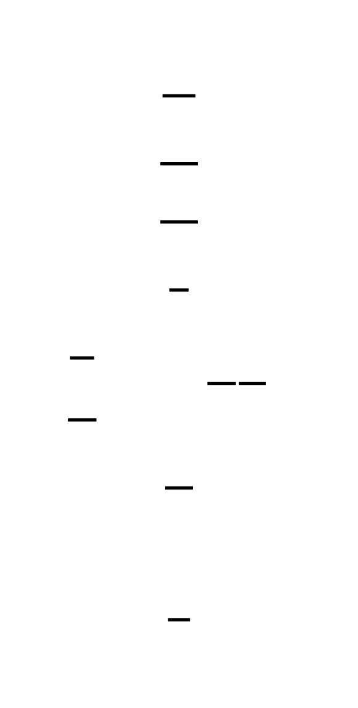

# 🎯 Project Charter: Event Loop with epoll
## What You Are Building
A single-threaded C server that handles 10,000+ simultaneous TCP connections using Linux's `epoll` interface and the Reactor pattern. You will build every layer from scratch: raw epoll syscalls with edge-triggered I/O, a write buffer with backpressure handling, a min-heap timer system, a clean Reactor abstraction API, and a benchmarked HTTP/1.1 static file server on top of it all. The final server boots, accepts connections, and serves files — with zero epoll symbols in application-layer code.
## Why This Project Exists
Most developers treat event loops as black boxes — they use Node.js or NGINX without understanding why a single thread can outperform thousands of threads for I/O-bound work. Building one from `epoll_create1` up forces you to confront exactly why: threads waste memory and CPU on idle connections, while an event loop costs nothing for connections that aren't doing work. This is the architecture that runs Redis, NGINX, and Node.js's libuv — and you will have built the same structure from the kernel interface up.
## What You Will Be Able to Do When Done
- Create an `epoll` instance, register file descriptors, and implement both level-triggered and edge-triggered dispatch loops — understanding exactly why ET requires draining to `EAGAIN`
- Implement a write buffer with partial-write detection and `EPOLLOUT` lifecycle management that prevents 100% CPU busy-loop bugs
- Build a binary min-heap timer system integrated with `epoll_wait`'s timeout parameter to enforce idle connection timeouts without threads or signals
- Design a Reactor abstraction API (`reactor_register`, `reactor_defer`, `reactor_set_timeout`) that makes all epoll internals invisible to user code
- Implement re-entrancy-safe callback dispatch so connections can deregister themselves during event dispatch without corrupting the iteration loop
- Write an incremental HTTP/1.1 parser that correctly handles headers split across arbitrary `read()` boundaries
- Serve static files with MIME type detection, keep-alive connection reuse, and HTTP pipelining support
- Run a `wrk` benchmark against your server at 10,000 concurrent connections and read the p99 latency output
## Final Deliverable
Approximately 2,500–3,500 lines of C across 16 source files organized in four layers: the epoll echo server (M1, ~300 lines), write buffer and timer heap (M2, ~500 lines), reactor abstraction (M3, ~600 lines), and HTTP server (M4, ~1,000 lines). The compiled `http_server` binary accepts a port and serve-root directory, passes a `wrk -t12 -c10000 -d60s --latency` benchmark with p99 latency under 100ms, and produces zero output from `grep epoll http_*.c`. A shell test script verifies correctness for all four milestones including the C10K benchmark result.
## Is This Project For You?
**You should start this if you:**
- Are comfortable writing C with pointers, structs, enums, and manual memory management (`malloc`/`free`)
- Have built at least one blocking TCP server (a basic HTTP server or echo server using `accept`/`read`/`write`)
- Understand what a file descriptor is and what happens when you call `read()` on a socket
- Can read `man` pages and look up Linux syscall signatures yourself
- Know what TCP is and have a rough mental model of the send/receive buffer lifecycle
**Come back after you've learned:**
- C pointers and manual memory management — [K&R C](https://en.wikipedia.org/wiki/The_C_Programming_Language) or [CS50](https://cs50.harvard.edu/x/)
- Basic socket programming: `socket`, `bind`, `listen`, `accept`, `read`, `write` — [Beej's Guide to Network Programming](https://beej.us/guide/bgnet/)
- What a blocking TCP server looks like — complete the `http-server-basic` project first
## Estimated Effort
| Phase | Time |
|-------|------|
| M1: epoll Basics — Level-Triggered and Edge-Triggered | ~6–8 hours |
| M2: Write Buffering and Timer Management | ~5–8 hours |
| M3: Reactor API and Callback Dispatch | ~5–8 hours |
| M4: HTTP Server on Event Loop | ~6–10 hours |
| **Total** | **~22–34 hours** |
## Definition of Done
The project is complete when:
- `./echo_server et` correctly echoes a 32KB payload sent by a single client — proving the ET drain-until-`EAGAIN` loop works (a broken single-read-per-event ET implementation will silently lose data on this test)
- A connection that sends nothing for 30 seconds is automatically closed by the timer heap, verified by timing the disconnect with `python3 -c "import socket,time; s=socket.create_connection(('127.0.0.1',8080)); s.recv(1); print(time.monotonic())"`
- `grep -c epoll http_conn.c http_handlers.c http_process.c http_server.c http_parser.c` outputs `0` — application-layer files contain zero epoll symbols
- `curl http://127.0.0.1:8080/` returns `200 OK` with correct `Content-Type` and `Content-Length` headers, and `curl http://127.0.0.1:8080/../../etc/passwd` returns `404` (path traversal blocked)
- `wrk -t12 -c10000 -d60s --latency http://127.0.0.1:8080/index.html` completes with zero errors and p99 latency reported under 100ms

---

# 📚 Before You Read This: Prerequisites & Further Reading
> **Read these first.** The Atlas assumes you are familiar with the foundations below.
> Resources are ordered by when you should encounter them — some before you start, some at specific milestones.
---
## 🧱 Before You Begin: Required Foundations
### 1. The C10K Problem — Historical Framing
- **Paper**: Dan Kegel, "The C10K Problem" (1999, updated 2011). kegel.com/c10k.html
- **Why**: This is the document that named the problem you are solving. Every design decision in the Atlas traces back to the constraints Kegel identified. Read it before writing a single line of code to understand why thread-per-connection fails.
- **When**: **Read BEFORE starting this project.** The first half (problem statement and thread model failure analysis) is mandatory; the solution catalog is now historical but illuminating.
---
### 2. POSIX Sockets and Non-Blocking I/O — W. Richard Stevens
- **Book chapter**: W. Richard Stevens, Bill Fenner, Andrew Rudoff — *UNIX Network Programming, Volume 1*, 3rd ed. — **Chapter 6 (I/O Multiplexing)** and **Chapter 16 (Nonblocking I/O)**
- **Why**: The canonical reference for socket APIs. The Atlas assumes you know `socket()`, `bind()`, `listen()`, `accept()`, `read()`, `write()`, `O_NONBLOCK`, and what `EAGAIN` means at the kernel level. Stevens explains the kernel socket buffer model that the Atlas repeatedly references.
- **When**: **Read BEFORE starting Milestone 1.** Chapter 6's explanation of the `select/poll` readiness model is prerequisite context for understanding *why* epoll exists.
---
### 3. The `epoll` Mechanism — Linux man pages + kernel internals
- **Spec**: `man 7 epoll`, `man 2 epoll_create1`, `man 2 epoll_ctl`, `man 2 epoll_wait` — Linux man-pages project (man7.org)
- **Code**: Linux kernel source — `fs/eventpoll.c` — specifically the functions `ep_insert()` (interest set add), `ep_poll_callback()` (readiness queue insertion on event), and `do_epoll_wait()` (userspace delivery). Browse at elixir.bootlin.com/linux/latest/source/fs/eventpoll.c
- **Best explanation**: Marek Majkowski (Cloudflare), "How TCP backlog works in Linux" + "Why does one NGINX worker take all the connections?" — blog.cloudflare.com (2017). Read both articles together; ~25 minutes total.
- **Why**: The Atlas's kernel data structure description (interest set = red-black tree, readiness queue = linked list) maps directly to `eventpoll.c`. The Cloudflare posts explain the thundering herd and `EPOLLEXCLUSIVE` in concrete production terms.
- **When**: **Read at the START of Milestone 1**, before implementing the epoll setup. The man pages are your reference throughout M1–M4.
---
## 🔄 At Milestone 1: Level-Triggered vs Edge-Triggered
### 4. Edge-Triggered vs Level-Triggered Semantics — Epoll Deep Dive
- **Best explanation**: Linus Torvalds's explanation of ET vs LT semantics in the Linux kernel mailing list (2002) — available via lkml.org search for "epoll semantics". Alternatively: Jonathan Corbet, "Migrating to epoll()" — lwn.net/Articles/14587/ (2002), ~10 minutes.
- **Code**: NGINX source — `src/event/modules/ngx_epoll_module.c` — `ngx_epoll_add_event()` function shows exactly how NGINX registers events with `EPOLLET | EPOLLIN`. github.com/nginx/nginx
- **Why**: The Atlas's ET correctness proof (drain-to-EAGAIN requirement) is the single most important invariant in the project. Seeing it in NGINX's actual source code cements the connection between the Atlas's theory and production practice.
- **When**: **Read after completing the LT echo server (Milestone 1, Checkpoint 4)**, before implementing ET. You need working LT code to appreciate what the behavioral difference means in practice.
---
### 5. File Descriptor Internals — Per-Process Table and Kernel File Descriptions
- **Best explanation**: Robert Love, *Linux System Programming*, 2nd ed. — **Chapter 2, "File I/O"**, specifically pages 34–42 on the fd table, file description (struct file), and the distinction between fd numbers and kernel objects.
- **Why**: The Atlas's warning about the fd-reuse race (DEL before close) and the `data.ptr` vs `data.fd` discussion in M3 both require understanding that an fd is an index, not an identity. Love's explanation of `dup()`, `fork()`, and shared file descriptions is the minimum required mental model.
- **When**: **Read during Milestone 1**, specifically before implementing `conn_close`. The ordering (DEL then close) only makes sense if you understand what closing an fd actually does to the kernel's data structures.
---
## 💾 At Milestone 2: Write Buffering and Timer Management
### 6. I/O Readiness vs I/O Completion — The Fundamental Model Distinction
- **Best explanation**: Jens Axboe, "io_uring and the new world of async I/O" — kernel.dk/io_uring.pdf (2019). Read only **Sections 1–3** ("Introduction" through "Basic usage") — ~20 minutes.
- **Why**: The Atlas references the readiness/completion distinction in M1 and the "io_uring upgrade path" in M3 and M4. Axboe's paper is the primary source. Reading it at M2 gives you the context to understand *why* your reactor is structured the way it is — and what its fundamental limitation is — before you build the abstraction in M3.
- **When**: **Read at the START of Milestone 2**, before implementing the write buffer. The backpressure section of M2 (EAGAIN from `write()`) is the exact moment where the readiness model's consequence becomes viscerally clear.
### 7. Min-Heap Data Structure
- **Best explanation**: Robert Sedgewick and Kevin Wayne, *Algorithms* (4th ed.) — **Chapter 2.4, "Priority Queues"**. The online lecture slides for Princeton's COS 226 course cover the same material at slides.algorithmics.net/algs4-slides/24PQ.pdf. ~30 minutes for the heap section.
- **Code**: Go runtime timer heap — `src/runtime/time.go` — function `siftupTimer` and `siftdownTimer`. cs.opensource.google/go/go/+/main:src/runtime/time.go
- **Why**: The Atlas implements a binary min-heap from scratch for timer management. Sedgewick provides the proof that the parent-child index relationship (`(i-1)/2`, `2*i+1`, `2*i+2`) is correct. The Go runtime is the clearest production implementation of the same structure — compare it directly to your M2 `timer_heap.c`.
- **When**: **Read BEFORE implementing the timer heap in Milestone 2 (Phase 4)**. The `heap_swap` + back-pointer update pattern is subtle; understanding the invariant from Sedgewick first prevents the most common correctness bugs.
### 8. `CLOCK_MONOTONIC` vs `CLOCK_REALTIME` — Why It Matters
- **Spec**: POSIX.1-2017, `clock_gettime` specification — pubs.opengroup.org/onlinepubs/9699919799/functions/clock_gettime.html
- **Best explanation**: Ulrich Drepper, "What Every Programmer Should Know About Memory" — **Section 6.4.1, "Avoiding System Calls"** on vDSO. akkadia.org/drepper/cpumemory.pdf (~5 pages)
- **Why**: The Atlas mandates `CLOCK_MONOTONIC` and notes that `now_ms()` is a vDSO call costing ~20ns. Drepper explains the vDSO mechanism. The POSIX spec explains why `CLOCK_REALTIME` can jump. Both facts appear in the M2 hardware soul section.
- **When**: **Read during Milestone 2** before implementing `now_ms()`. The 5 minutes spent understanding vDSO will explain why you never need to worry about the timer accuracy cost.
---
## 🏗️ At Milestone 3: Reactor Pattern
### 9. The Reactor Pattern — Original Source
- **Paper**: Douglas C. Schmidt, "Reactor: An Object Behavioral Pattern for Demultiplexing and Dispatching Handles for Synchronous Events" — in *Pattern Languages of Program Design* (1995). Available at: cs.wustl.edu/~schmidt/PDF/reactor-siemens.pdf
- **Why**: The Atlas builds exactly the pattern Schmidt defined. The four-component model (Demultiplexer, Dispatcher, Handler Registration Table, Concrete Handlers) maps 1:1 to `reactor_t`'s internal structure. Reading the original 10-page paper reveals why the Reactor is an *architectural* decision, not merely an implementation detail.
- **When**: **Read BEFORE starting Milestone 3.** The paper is only 10 pages. Understanding the pattern's intent before you implement it prevents the most common mistake: treating the reactor as "just an epoll wrapper" rather than as an inversion-of-control mechanism.
### 10. Iterator Invalidation and Safe Dispatch — The Re-entrancy Problem
- **Best explanation**: Eli Bendersky, "Concurrent access to containers in C++" — eli.thegreenplace.net/2009/10/12/concurrent-access-to-containers-in-c (2009). ~15 minutes.
- **Code**: libuv source — `src/unix/core.c` — function `uv__run_closing_handles()` and the `uv__io_poll()` loop. github.com/libuv/libuv/blob/v1.x/src/unix/core.c — pay specific attention to how libuv separates the "mark closing" phase from the "free resources" phase.
- **Why**: The Atlas's re-entrancy problem (callbacks calling `reactor_deregister` during dispatch) is exactly the iterator invalidation problem. libuv's closing-handle queue is the production solution to the same bug. Seeing it in libuv makes the `dispatching` flag and `pending_ops` queue in M3 obviously correct rather than seemingly over-engineered.
- **When**: **Read BEFORE implementing `reactor_register` and `reactor_deregister` in Milestone 3 (Phase 2)**. This is the hardest correctness problem in the project. Understanding the pattern before writing code is essential.
### 11. Node.js Event Loop — libuv Architecture
- **Best explanation**: Bert Belder, "Everything You Need to Know About Node.js Event Loop" — JSConf EU 2016. youtube.com/watch?v=PNa9OMajl9s — watch timestamps **0:00–18:00** only (the epoll and tick phases; skip the Node-specific JS runtime discussion). ~18 minutes.
- **Code**: libuv `uv_run()` — `src/unix/core.c` — lines approximately 390–450. Read the phase names in the function body and map them to the Atlas's Phase 1–4 labels.
- **Why**: The Atlas explicitly maps M3's four-phase loop to Node.js's event loop phases. Belder's talk makes this concrete: `process.nextTick()` = your Phase 3 deferred queue; timer phase = your Phase 4. After M3, you can read Node.js internals documentation and understand every sentence.
- **When**: **Read after completing `reactor_run()` in Milestone 3 (Phase 3)**. You need your own implementation working before the comparison is meaningful. The mapping from your code to Node.js's code is the reward for completing M3 correctly.
---
## 🌐 At Milestone 4: HTTP Server
### 12. HTTP/1.1 Specification — RFC 9110 and RFC 9112
- **Spec**: RFC 9112 — "HTTP/1.1" — datatracker.ietf.org/doc/html/rfc9112. Read **Sections 2 (Message Format), 3 (Request Line), 5 (Field Syntax), 6 (Message Body), and 9 (Connection Management)** only. ~45 minutes total.
- **Why**: The Atlas's parser implements exactly the grammar in RFC 9112. Section 6 (Content-Length behavior, duplicate header handling) explains why the parser takes `last-value-wins` on duplicate `Content-Length` headers. Section 9 explains keep-alive and `Connection: close` semantics precisely.
- **When**: **Read BEFORE implementing `parse_headers` in Milestone 4 (Phase 3)**. The specific section on duplicate `Content-Length` (§6.3) explains a security-relevant parser decision that is easy to implement wrong.
### 13. Incremental Protocol Parsing — The Accumulate-Detect-Process Pattern
- **Best explanation**: Marek Majkowski (Cloudflare), "HTTP parsing in production — haproxy, nginx, node.js" — blog.cloudflare.com/the-history-of-haproxy-nginx-nodejs-and-how-they-handle-http-parsing (2020). ~20 minutes.
- **Code**: Redis `networking.c` — function `processInputBuffer()` — github.com/redis/redis/blob/unstable/src/networking.c. Find `processInputBuffer` and read the accumulation loop at the top of the function.
- **Why**: The Atlas's `http_try_parse()` function is described abstractly. Seeing the identical pattern in Redis's RESP parser makes the "accumulate bytes, check for complete unit, process" pattern feel like a universal tool rather than an HTTP-specific trick. Majkowski's article provides historical context for *why* this is the right architecture.
- **When**: **Read BEFORE implementing `http_try_parse` in Milestone 4 (Phase 4)**. Redis's implementation is simpler than the HTTP parser (RESP is a simpler protocol) and serves as a reference for what the correct structure looks like.
### 14. `sendfile()` Zero-Copy File Serving
- **Spec**: `man 2 sendfile` — Linux man-pages. Also: Linus Torvalds's original `sendfile()` motivation — lkml.org/lkml/2002/9/27/82 (kernel mailing list, 2002).
- **Best explanation**: Dragan Stancevic, "Zero Copy I: User-Mode Perspective" — linux.ie/articles/zero-copy/ (2003). Read only **Section 1 (Traditional data transfer)** and **Section 2 (Transferring data with zero copy)**. ~15 minutes.
- **Why**: The Atlas uses `read()+write()` for file serving and explicitly notes that `sendfile()` is the production upgrade. Stancevic's article provides the precise data-copy count (4 copies with `read/write`, 2 with `sendfile`) that quantifies the performance difference. The Atlas's comparison table (your server vs. NGINX) references this directly.
- **When**: **Read after completing `http_process_request` in Milestone 4 (Phase 7)**. Once you have working `read()+write()` file serving, reading about `sendfile()` makes the upgrade path concrete and motivating.
---
## 🏁 After the Project: What Opens Up
### 15. Designing Data-Intensive Applications — Distributed Systems Connections
- **Book chapter**: Martin Kleppmann, *Designing Data-Intensive Applications* (2017) — **Chapter 8, "The Trouble with Distributed Systems"**, specifically **pages 274–281** on clocks and ordering.
- **Why**: The Atlas repeatedly draws connections from event-loop mechanics to distributed systems concepts (TCP backpressure → Kafka backpressure; timer accuracy → distributed clock skew). Kleppmann's Chapter 8 extends these connections into the distributed systems domain. After completing M4, you have the systems intuition to make Kleppmann's content immediately actionable.
- **When**: **Read AFTER completing the project benchmark in Milestone 4.** This is the "what opens up" reading — it reveals that the constraint reasoning you applied to a single server applies at every scale.
---
> **Quick Reference — Reading Order**
>
> | Resource | When |
> |---|---|
> | Kegel, "The C10K Problem" | Before starting |
> | Stevens, UNP Vol. 1, Ch. 6 & 16 | Before M1 |
> | `man 7 epoll` + Cloudflare posts | Start of M1 |
> | Torvalds/Corbet, ET vs LT semantics | After M1 Checkpoint 4 |
> | Love, *Linux System Programming*, Ch. 2 | During M1 |
> | Axboe, "io_uring…" Sections 1–3 | Start of M2 |
> | Sedgewick, *Algorithms*, Ch. 2.4 | Before M2 Phase 4 |
> | Drepper, vDSO section | During M2 |
> | Schmidt, "Reactor Pattern" paper | Before M3 |
> | Bendersky + libuv closing handles | Before M3 Phase 2 |
> | Belder, Node.js event loop talk | After M3 Phase 3 |
> | RFC 9112, Sections 2/3/5/6/9 | Before M4 Phase 3 |
> | Majkowski + Redis `networking.c` | Before M4 Phase 4 |
> | Stancevic, "Zero Copy I" | After M4 Phase 7 |
> | Kleppmann, DDIA Ch. 8, pp. 274–281 | After project complete |

---

# Event Loop with epoll

This project builds a production-grade, single-threaded server capable of handling 10,000+ simultaneous connections — the legendary C10K target — using Linux's epoll interface and the Reactor pattern. You will construct the exact architectural foundation that powers NGINX, Redis, Node.js, and virtually every high-performance network server in existence. The journey starts at raw file descriptors and syscalls, moves through write buffering and timer management, abstracts everything into a clean Reactor API, and culminates in a benchmarked HTTP/1.1 server.

The central insight this project drives home is deceptively simple but profound: threads are not the right primitive for I/O concurrency. A single thread, armed with epoll and non-blocking sockets, can monitor tens of thousands of file descriptors simultaneously, waking only when work actually exists. This is not a trick — it is a fundamentally different concurrency model where the OS kernel becomes your scheduler for I/O readiness, and your event loop becomes the coordinator of all asynchronous state machines.

You will implement the complete stack from scratch: epoll creation, edge-triggered vs. level-triggered semantics, per-connection state machines, write buffering with EPOLLOUT backpressure, a timer heap for idle timeouts, a clean Reactor abstraction with deferred task scheduling, and finally an incremental HTTP/1.1 parser with keep-alive support. Every layer builds on the one before it, and by the end you will be able to read NGINX's source code and understand every design decision it makes.


<!-- MS_ID: build-event-loop-m1 -->
# Milestone 1: epoll Basics — Level-Triggered and Edge-Triggered
## Where You Are in the System


You are at the foundation layer. Everything you build in subsequent milestones — write buffering, timers, the Reactor API, the HTTP parser — sits on top of what you build here. If this layer has bugs, they will be invisible under low load and catastrophic under production load. The core mechanism you are implementing is the same one that runs inside NGINX, Redis, and Node.js's libuv. This is not an approximation of how those systems work. This *is* how they work.
The goal of this milestone: stand up a non-blocking event loop using `epoll`, understand exactly what level-triggered and edge-triggered mean at the kernel level, and build an echo server that correctly handles both modes. You will also set up the per-fd state management data structure that every future milestone depends on.
---
## The Problem: Threads Don't Scale
Start with what you already know from your prerequisite project: a blocking HTTP server creates one thread (or process) per connection. That works fine at 10 connections. At 10,000 connections, you have 10,000 threads, each consuming 1–8MB of stack space by default. That is 10–80GB of memory for stacks alone, before you've stored a single byte of application data. And most of those threads are doing nothing — sleeping, waiting for the client to send the next byte.
The physical constraint: **a CPU core can only run one thread at a time**. With 10,000 threads and 8 cores, the OS scheduler must context-switch constantly. Each context switch costs ~1–10 microseconds in direct overhead plus cache pollution from replacing register state and TLB entries. A server spending 30% of its CPU time on context switches is a server that serves 30% fewer requests than it could.
The insight: most network connections are idle *most of the time*. A typical HTTP keep-alive connection sends a burst of requests, then sits quiet for 30 seconds. If you have 10,000 connections but only 50 are actively transferring data right now, why should you be managing 10,000 threads?
What you need instead: **a mechanism that tells you which file descriptors have work ready, right now, and lets a single thread serve them all**. That mechanism is `epoll`.
[[EXPLAIN:the-difference-between-i/o-readiness-notification-and-i/o-completion-notification-(readiness-=-epoll/select;-completion-=-io_uring/iocp)|The difference between I/O readiness notification and I/O completion notification (readiness = epoll/select; completion = io_uring/IOCP)]]
---
## The Kernel's Two Data Structures: Interest Set and Readiness Queue
`epoll` is not a smarter `select()`. That is the first misconception to discard. `select()` re-scans all watched file descriptors on every call — it is O(n) in the number of fds you are watching. `epoll` is O(1) for event delivery regardless of how many fds you are monitoring, because it maintains state inside the kernel between calls.
When you call `epoll_create1()`, the kernel allocates a new `epoll` instance with two internal data structures:
1. **The interest set** — a red-black tree of `(fd, event_mask)` pairs. When you call `epoll_ctl(EPOLL_CTL_ADD)`, you insert an entry here. The kernel uses this to know which events to track for which file descriptors.
2. **The readiness queue** — a linked list of entries that became ready since the last `epoll_wait()`. When a network packet arrives and the kernel wakes up the socket's receive buffer, the kernel walks the interest set looking for entries that are watching that socket, and appends matching ones to the readiness queue.
When you call `epoll_wait()`, the kernel copies entries from the readiness queue into your userspace array and returns. If no entries are ready, the thread sleeps with zero CPU overhead until the kernel adds something to the readiness queue.


This design means that adding 9,950 idle connections to the interest set costs you nothing at `epoll_wait()` time. Only the 50 active connections appear in the results.
[[EXPLAIN:file-descriptor-table-internals:-fd-is-an-index-into-per-process-table-pointing-to-kernel-file-description-(shared-on-fork/dup);-epoll-watches-kernel-file-descriptions-not-fd-numbers|File descriptor table internals: FD is an index into per-process table pointing to kernel file description (shared on fork/dup); epoll watches kernel file descriptions not FD numbers]]
---
## Kernel Socket Buffers and What EAGAIN Means Physically
Before you can understand *when* epoll reports a socket as ready, you need to understand what the kernel is actually watching.
Every TCP socket has two kernel-managed buffers: a **receive buffer** (data the remote peer sent, not yet read by your application) and a **send buffer** (data your application wrote, not yet acknowledged by the remote peer). These buffers live in kernel memory — you do not allocate them; the kernel does when `accept()` creates the socket. Their default sizes are typically 87KB receive and 16KB send on Linux, tunable via `SO_RCVBUF` and `SO_SNDBUF`.
[[EXPLAIN:kernel-socket-buffer-model:-send-buffer-+-receive-buffer,-how-they-fill-and-drain,-what-eagain-means-physically|Kernel socket buffer model: send buffer + receive buffer, how they fill and drain, what EAGAIN means physically]]


Here is the key: **epoll monitors these kernel buffers, not your userspace code**. An fd is reported as readable when the receive buffer has at least one byte in it. An fd is reported as writable when the send buffer has space for at least one byte. Your `read()` call copies data from the receive buffer into your userspace buffer. Your `write()` call copies data from your userspace buffer into the send buffer; the kernel's TCP stack then transmits it to the peer at its own pace.
When you set a socket to **non-blocking mode** (which you must always do in an event loop), `read()` and `write()` never block. Instead:
- `read()` on an empty receive buffer returns `-1` with `errno = EAGAIN` (or equivalently `EWOULDBLOCK`).
- `write()` on a full send buffer returns `-1` with `errno = EAGAIN`.
`EAGAIN` is not an error. It means: "the resource is temporarily unavailable — try again later." In an event loop, "later" means "after epoll tells you the fd is ready again." This is the contract that makes non-blocking I/O work.
---
## Setting Up the epoll Instance
Here is the minimal setup you need. Every line matters:
```c
#include <sys/epoll.h>
#include <sys/socket.h>
#include <netinet/in.h>
#include <fcntl.h>
#include <unistd.h>
#include <errno.h>
#include <stdio.h>
#include <stdlib.h>
#include <string.h>
/* Set a file descriptor to non-blocking mode. */
static int set_nonblocking(int fd) {
    int flags = fcntl(fd, F_GETFL, 0);
    if (flags == -1) return -1;
    return fcntl(fd, F_SETFL, flags | O_NONBLOCK);
}
int main(void) {
    /* Create the epoll instance.
     * EPOLL_CLOEXEC: automatically close this fd in child processes
     * created by fork/exec, preventing fd leaks. */
    int epfd = epoll_create1(EPOLL_CLOEXEC);
    if (epfd == -1) { perror("epoll_create1"); return 1; }
    /* Create and bind the listening socket. */
    int listen_fd = socket(AF_INET, SOCK_STREAM | SOCK_NONBLOCK | SOCK_CLOEXEC, 0);
    if (listen_fd == -1) { perror("socket"); return 1; }
    /* Allow reusing the port immediately after restart.
     * Without this, bind() fails for ~60 seconds after the previous
     * process exits due to TCP TIME_WAIT. */
    int reuse = 1;
    setsockopt(listen_fd, SOL_SOCKET, SO_REUSEADDR, &reuse, sizeof(reuse));
    struct sockaddr_in addr = {
        .sin_family      = AF_INET,
        .sin_port        = htons(8080),
        .sin_addr.s_addr = INADDR_ANY,
    };
    if (bind(listen_fd, (struct sockaddr *)&addr, sizeof(addr)) == -1) {
        perror("bind"); return 1;
    }
    /* Backlog 128: number of connections the kernel queues while
     * your accept() loop is busy. Does NOT limit total connections. */
    if (listen(listen_fd, 128) == -1) { perror("listen"); return 1; }
    /* Register the listening socket with epoll, watching for EPOLLIN
     * (new connection available to accept). */
    struct epoll_event ev = {
        .events  = EPOLLIN,
        .data.fd = listen_fd,
    };
    if (epoll_ctl(epfd, EPOLL_CTL_ADD, listen_fd, &ev) == -1) {
        perror("epoll_ctl add listen_fd"); return 1;
    }
    printf("Listening on :8080, epfd=%d, listen_fd=%d\n", epfd, listen_fd);
    /* ... event loop follows ... */
    return 0;
}
```
Notice `SOCK_NONBLOCK | SOCK_CLOEXEC` passed directly to `socket()`. This is the modern Linux way — atomic with the socket creation, no separate `fcntl()` call needed. You can do the same with `accept4()` for client sockets. Always prefer this over two separate syscalls.
Why must the **listening socket** also be non-blocking? Consider this sequence: a client initiates a TCP connection, the kernel completes the three-way handshake and queues the connection. Then, before your `accept()` runs, the client sends an RST (reset). The kernel removes the connection from the backlog. If your socket is blocking, `accept()` will block indefinitely waiting for the next connection. With a non-blocking listening socket, `accept()` returns `ECONNABORTED` (or `EAGAIN` — behavior varies by OS), and your loop continues. This is the **accept race condition**, and non-blocking mode handles it cleanly.
---
## Per-FD State: The Connection Table
Before building the event loop, you need somewhere to store state for each connection. The kernel gives you a file descriptor — a small non-negative integer. Your server needs to associate each fd with metadata: read/write buffers, connection phase, timers, etc. The most cache-efficient approach at this stage is a **flat array indexed by fd number**.


```c
#define MAX_FDS     65536  /* Typical kernel limit; check /proc/sys/fs/file-max */
#define BUF_SIZE    4096   /* Read buffer per connection */
typedef enum {
    CONN_STATE_FREE    = 0,  /* Slot unused */
    CONN_STATE_ACTIVE  = 1,  /* Connection alive, reading/writing */
} conn_state_t;
typedef struct {
    conn_state_t  state;
    int           fd;
    char          read_buf[BUF_SIZE];
    size_t        read_len;    /* Bytes currently in read_buf */
} conn_t;
/* Global connection table, indexed by fd number.
 * Memory layout: 65536 * sizeof(conn_t) ≈ 65536 * 4112 bytes = ~270MB.
 * In production you'd use a hash map or limit MAX_FDS to a smaller
 * tuned value. For this project, use a smaller cap. */
#define MAX_CONNS  10240
static conn_t conn_table[MAX_CONNS];
static conn_t *conn_get(int fd) {
    if (fd < 0 || fd >= MAX_CONNS) return NULL;
    return &conn_table[fd];
}
static conn_t *conn_new(int fd) {
    conn_t *c = conn_get(fd);
    if (!c) return NULL;
    memset(c, 0, sizeof(*c));
    c->state = CONN_STATE_ACTIVE;
    c->fd    = fd;
    return c;
}
static void conn_free(int fd) {
    conn_t *c = conn_get(fd);
    if (c) memset(c, 0, sizeof(*c));  /* state = CONN_STATE_FREE */
}
```
**Memory layout analysis for `conn_t`:**
```
Offset  Size  Field
0       4     state (conn_state_t / int)
4       4     fd (int)
8       4096  read_buf[4096]
4104    8     read_len (size_t, 64-bit aligned)
Total:  4112 bytes per connection
```
One `conn_t` spans approximately 64 cache lines (4112 / 64 = 64.25). When you access a connection's fields, the CPU must load those cache lines from L1/L2/L3 or main memory. If you are servicing 50 active connections in a single `epoll_wait()` batch, and their `conn_t` entries are scattered across the array, you will likely see 50 separate cache misses. This is acceptable at intermediate level — the real cost is network I/O, which is orders of magnitude slower than a cache miss. Later milestones can optimize with slab allocators or compact struct layout.
---
## Level-Triggered Mode: The Comfortable Default
Now you have the infrastructure. Time to build the event loop, starting with **level-triggered (LT)** mode, which is epoll's default.
### What Level-Triggered Means
In LT mode, the kernel places an fd into the readiness queue whenever its underlying condition is true at the moment `epoll_wait()` is called. Specifically: if the receive buffer has data in it and you haven't read all of it, the fd will appear again in the *next* `epoll_wait()` call, even if no new data arrived.
The "level" metaphor comes from digital electronics: a level-triggered signal fires continuously as long as the voltage is at the trigger level. It is the condition that matters, not the transition.


Consequence: in LT mode, you do not *have* to read all available data in one event. You can read one chunk, return to `epoll_wait()`, and the fd will appear again. This makes the code simpler and more tolerant of partial reads.
### The LT Event Loop
```c
#define MAX_EVENTS 1024
static void handle_accept_lt(int epfd, int listen_fd) {
    while (1) {
        struct sockaddr_in client_addr;
        socklen_t client_len = sizeof(client_addr);
        /* accept4: creates new socket + sets NONBLOCK|CLOEXEC atomically */
        int conn_fd = accept4(listen_fd,
                              (struct sockaddr *)&client_addr,
                              &client_len,
                              SOCK_NONBLOCK | SOCK_CLOEXEC);
        if (conn_fd == -1) {
            if (errno == EAGAIN || errno == EWOULDBLOCK) {
                /* No more pending connections right now. */
                break;
            }
            if (errno == ECONNABORTED) {
                /* Client reset before we accepted. Safe to retry. */
                continue;
            }
            perror("accept4");
            break;
        }
        if (conn_fd >= MAX_CONNS) {
            /* fd too large for our table. In production: close gracefully. */
            fprintf(stderr, "fd %d exceeds MAX_CONNS, dropping\n", conn_fd);
            close(conn_fd);
            continue;
        }
        conn_t *c = conn_new(conn_fd);
        if (!c) { close(conn_fd); continue; }
        /* Register with epoll in LT mode (no EPOLLET flag = LT by default). */
        struct epoll_event ev = {
            .events  = EPOLLIN,
            .data.fd = conn_fd,
        };
        if (epoll_ctl(epfd, EPOLL_CTL_ADD, conn_fd, &ev) == -1) {
            perror("epoll_ctl add conn_fd");
            conn_free(conn_fd);
            close(conn_fd);
        }
    }
}
static void handle_read_lt(int epfd, int fd) {
    conn_t *c = conn_get(fd);
    if (!c || c->state == CONN_STATE_FREE) return;
    /* In LT mode, reading one chunk per event is safe.
     * epoll will re-notify if more data remains. */
    ssize_t n = read(fd, c->read_buf, sizeof(c->read_buf));
    if (n < 0) {
        if (errno == EAGAIN || errno == EWOULDBLOCK) {
            /* Spurious wakeup (rare in LT). No data ready yet. */
            return;
        }
        /* Real error: close the connection. */
        goto close_conn;
    }
    if (n == 0) {
        /* Peer closed the connection (EOF). */
        goto close_conn;
    }
    /* Echo: write what we read back to the client.
     * For now, ignore partial writes — M2 handles write buffering. */
    ssize_t written = write(fd, c->read_buf, n);
    if (written < 0 && errno != EAGAIN) {
        goto close_conn;
    }
    return;
close_conn:
    epoll_ctl(epfd, EPOLL_CTL_DEL, fd, NULL);
    conn_free(fd);
    close(fd);
}
static void run_event_loop_lt(int epfd, int listen_fd) {
    struct epoll_event events[MAX_EVENTS];
    while (1) {
        /* timeout = -1: block indefinitely until at least one event is ready.
         * M2 will change this to the time until the next timer expiration. */
        int nready = epoll_wait(epfd, events, MAX_EVENTS, -1);
        if (nready == -1) {
            if (errno == EINTR) continue;  /* Signal interrupted the wait. */
            perror("epoll_wait");
            break;
        }
        for (int i = 0; i < nready; i++) {
            int fd     = events[i].data.fd;
            uint32_t ev = events[i].events;
            if (fd == listen_fd) {
                handle_accept_lt(epfd, listen_fd);
            } else {
                if (ev & (EPOLLERR | EPOLLHUP)) {
                    /* Error or hangup: close the connection. */
                    epoll_ctl(epfd, EPOLL_CTL_DEL, fd, NULL);
                    conn_free(fd);
                    close(fd);
                    continue;
                }
                if (ev & EPOLLIN) {
                    handle_read_lt(epfd, fd);
                }
            }
        }
    }
}
```
Notice the **accept loop** inside `handle_accept_lt`. When `listen_fd` becomes readable, it means at least one connection is queued. But under high load, many connections can queue up between two consecutive `epoll_wait()` returns. If you call `accept4()` only once and return, those other connections stay in the kernel backlog — but here's the subtlety: in LT mode, the listening socket will appear ready *again* on the next `epoll_wait()`, so you will eventually get to them. In ET mode (next section), you absolutely must loop until `EAGAIN`. Doing the loop in LT mode too is defensive and correct.


---
## Edge-Triggered Mode: Higher Performance, Stricter Contract
LT mode is correct and safe. Why does ET mode exist? Two reasons:
1. **Under LT, an fd with unread data appears in every `epoll_wait()` result** until fully drained. If you have 1,000 connections all with data pending and you only process 100 per `epoll_wait()` call, the remaining 900 consume "slots" in the next result even if you haven't touched them. ET eliminates this by only reporting each fd once per state transition.
2. **LT can mask slow processing bugs**. If your handler reads only one chunk but the client sent ten chunks at once, LT keeps notifying you — it works, but you've accidentally hidden a latency problem. ET forces you to drain completely, making the contract explicit.
### What Edge-Triggered Means
In ET mode, the kernel adds an fd to the readiness queue **only when its state transitions from not-ready to ready**: specifically, when new data arrives in the receive buffer, or when space becomes available in the send buffer. The key phrase: *transitions from not-ready to ready*.
If data arrives and you read only half of it, the receive buffer is still non-empty — but no *new* data arrived, so no new transition happened, so the kernel does NOT add the fd to the readiness queue again. Your fd appears exactly once in `epoll_wait()` results, even though half your data is unread. If you don't drain the buffer to `EAGAIN`, that data sits there forever while your server waits for events that will never come.
This is the critical ET invariant: **after receiving an EPOLLIN event in ET mode, you must call `read()` in a loop until you get `EAGAIN`**.


### The ET Event Loop
```c
static void handle_read_et(int epfd, int fd) {
    conn_t *c = conn_get(fd);
    if (!c || c->state == CONN_STATE_FREE) return;
    /* In ET mode: MUST read in a loop until EAGAIN.
     * Exiting the loop on any other condition without hitting EAGAIN
     * risks leaving unread data in the kernel buffer. */
    while (1) {
        ssize_t n = read(fd, c->read_buf, sizeof(c->read_buf));
        if (n < 0) {
            if (errno == EAGAIN || errno == EWOULDBLOCK) {
                /* Buffer drained. We will be notified when new data arrives. */
                break;
            }
            /* Real error. */
            goto close_conn_et;
        }
        if (n == 0) {
            /* EOF: peer closed write side. */
            goto close_conn_et;
        }
        /* Echo the data back. Partial write handling deferred to M2. */
        ssize_t written = 0;
        while (written < n) {
            ssize_t w = write(fd, c->read_buf + written, n - written);
            if (w < 0) {
                if (errno == EAGAIN || errno == EWOULDBLOCK) {
                    /* Send buffer full. In M2 we buffer the rest.
                     * For now, we lose the remaining data. Don't do this in M2. */
                    break;
                }
                goto close_conn_et;
            }
            written += w;
        }
    }
    return;
close_conn_et:
    epoll_ctl(epfd, EPOLL_CTL_DEL, fd, NULL);
    conn_free(fd);
    close(fd);
}
static void run_event_loop_et(int epfd, int listen_fd) {
    struct epoll_event events[MAX_EVENTS];
    while (1) {
        int nready = epoll_wait(epfd, events, MAX_EVENTS, -1);
        if (nready == -1) {
            if (errno == EINTR) continue;
            perror("epoll_wait");
            break;
        }
        for (int i = 0; i < nready; i++) {
            int fd      = events[i].data.fd;
            uint32_t ev = events[i].events;
            if (fd == listen_fd) {
                /* Accept loop is the same — drain until EAGAIN. */
                handle_accept_lt(epfd, listen_fd);  /* reuse — already loops */
            } else {
                if (ev & (EPOLLERR | EPOLLHUP)) {
                    epoll_ctl(epfd, EPOLL_CTL_DEL, fd, NULL);
                    conn_free(fd);
                    close(fd);
                    continue;
                }
                if (ev & EPOLLIN) {
                    handle_read_et(epfd, fd);
                }
            }
        }
    }
}
```
To use ET mode, add `EPOLLET` to the event flags when registering with `epoll_ctl`. Change the listening socket and client socket registration:
```c
/* Listening socket in ET mode: */
struct epoll_event ev = {
    .events  = EPOLLIN | EPOLLET,
    .data.fd = listen_fd,
};
/* Client socket in ET mode (inside handle_accept): */
struct epoll_event ev = {
    .events  = EPOLLIN | EPOLLET,
    .data.fd = conn_fd,
};
```
That single flag changes the entire notification contract.
---
## The Bug That Looks Like a Feature
Here is the most insidious ET bug, reproduced explicitly so you can see it:
```c
/* WRONG: ET mode, single read per event.
 * Works fine when messages are small and arrive one at a time.
 * Silently loses data when messages are large or arrive in bursts. */
static void handle_read_et_BROKEN(int epfd, int fd) {
    conn_t *c = conn_get(fd);
    char buf[4096];
    /* We read once and return. If the client sent 8192 bytes,
     * we read the first 4096 and return. The remaining 4096
     * sit in the kernel receive buffer.
     *
     * No new data arrives, so no state transition happens,
     * so epoll never notifies us again.
     *
     * The remaining 4096 bytes wait forever. The client's
     * response never comes. The connection hangs. */
    ssize_t n = read(fd, buf, sizeof(buf));
    if (n > 0) {
        write(fd, buf, n);   /* echo partial data */
    }
}
```
This bug is nearly impossible to detect during development because:
- With small test messages (< 4KB), one read drains the buffer to `EAGAIN` anyway.
- The bug only manifests when data arrives faster than you process it, or when a single message exceeds your buffer size.
- The connection does not close or return an error — it just hangs. The client sends data, never gets a response, and eventually times out.
**Diagnosis**: run `ss -ti` on the server. An idle connection with `rcv_buf` showing bytes waiting is the signature of an ET drain bug.
---
## LT vs ET: The Decision Framework
| Property | Level-Triggered | Edge-Triggered |
|---|---|---|
| **Re-notification** | Yes, if data remains | No — one event per transition |
| **Read strategy** | One chunk per event (safe) | Must drain to EAGAIN (required) |
| **Missed data on single read** | No — epoll re-notifies | Yes — data sits silent |
| **Spurious wakeups** | Possible under high load | Minimal |
| **Complexity** | Lower | Higher |
| **Used by** | Many correct servers | NGINX, Node.js libuv |
**Which should you use?** For this project: implement LT first, get it working, then switch to ET by adding `EPOLLET` and converting all reads to drain loops. Both are correct if implemented properly. LT is more forgiving of implementation mistakes. ET is marginally more efficient at very high connection counts. At 10K connections with an intermediate implementation, you will not measure the difference.
---
## Registering, Modifying, and Removing Interests
The `epoll_ctl()` API has three operations, and each has a correct use:
```c
/* Add a new fd to the interest set: */
epoll_ctl(epfd, EPOLL_CTL_ADD, fd, &ev);
/* Modify the event mask for an existing fd:
 * Use this to add EPOLLOUT when you have data to write,
 * or remove it when the write buffer is flushed (M2). */
epoll_ctl(epfd, EPOLL_CTL_MOD, fd, &ev);
/* Remove an fd from the interest set.
 * Must be called before close(fd).
 * On Linux 2.6.9+, the fourth argument can be NULL for DEL. */
epoll_ctl(epfd, EPOLL_CTL_DEL, fd, NULL);
```
A critical ordering requirement: **call `epoll_ctl(EPOLL_CTL_DEL, fd, NULL)` before `close(fd)`**. On Linux, closing an fd automatically removes it from all epoll interest sets — but only if no other process has a duplicate (e.g., via `fork`). With `SOCK_CLOEXEC`, this is not a concern for child processes. But calling DEL explicitly before close is defensive and correct, and makes your intent clear.
There is a subtle trap: if you `close(fd)` and the OS recycles that fd number for a new connection, and you then call `epoll_ctl(EPOLL_CTL_DEL)` on the old fd, you are actually deregistering the *new* connection. This produces a use-after-fd-reuse bug that is extraordinarily hard to debug. Always DEL before close.
---
## The `data` Field: More Than Just `fd`
The `epoll_event` struct's `data` field is a union:
```c
typedef union epoll_data {
    void    *ptr;
    int      fd;
    uint32_t u32;
    uint64_t u64;
} epoll_data_t;
```
Using `data.fd` is convenient but limits you to storing just the fd number. In M3, when you build the Reactor API, you will switch to `data.ptr` to store a pointer to your `conn_t` or callback struct directly. This eliminates the array lookup on every event — the event itself carries the pointer to its handler.
For this milestone, `data.fd` is fine.
---
## Hardware Soul: What the CPU Is Actually Doing
When your event loop is running, here is the hardware picture:
**`epoll_wait()`**: Your thread calls into the kernel. If no events are ready, the scheduler marks your thread as sleeping and runs something else. Zero CPU cycles consumed while waiting. When a packet arrives, the NIC raises a hardware interrupt, the interrupt handler runs in kernel context, copies bytes into the socket receive buffer, finds your epoll interest entry, and wakes your thread. Your thread resumes from `epoll_wait()` with events populated.
**The events array on the stack**: `struct epoll_event events[1024]` is 1024 × 12 bytes = 12KB. This exceeds L1 cache on many CPUs (typically 32KB, but you are sharing it with the kernel copy and other locals). The kernel `copy_to_user()` from the readiness queue to your array touches a contiguous region — prefetch-friendly, sequential access. Fast.
**Dispatching events**: Your loop iterates `events[0..nready-1]`. For each, you do `conn_get(fd)` — an array index lookup. If the conn_t for that fd is not already in cache (likely cold if you have many connections), this is an L3 miss (≈40 cycles) or even a DRAM access (≈200 cycles). At 10K connections, assuming a working set larger than L3 cache (typically 8–32MB), you will see frequent DRAM accesses per event dispatch.
**`read()` syscall**: User → kernel mode transition: ≈100–200 cycles. Data copy from kernel receive buffer to your userspace buf: one `memcpy`, roughly 1 cycle per byte at L1 speed. For a 4KB read, that is ≈4,000 cycles for the copy plus ≈200 cycles for the syscall overhead.
**Branch predictability**: The `if (fd == listen_fd)` branch is highly predictable (mostly not the listen fd). The `if (errno == EAGAIN)` branch is predictable once per connection drain. The kernel's branch predictor handles these well after a few iterations.


---
## Complete Echo Server: Wiring It Together
Here is the complete, compilable echo server bringing all the pieces together. This serves as your starting point:
```c
/* echo_server.c: Event loop echo server with both LT and ET modes.
 * Compile: gcc -O2 -Wall -Wextra -o echo_server echo_server.c
 * Usage: ./echo_server [lt|et]
 */
#include <sys/epoll.h>
#include <sys/socket.h>
#include <netinet/in.h>
#include <fcntl.h>
#include <unistd.h>
#include <errno.h>
#include <stdio.h>
#include <stdlib.h>
#include <string.h>
#define MAX_CONNS   10240
#define MAX_EVENTS  1024
#define BUF_SIZE    4096
#define PORT        8080
#define BACKLOG     128
typedef enum { CONN_FREE = 0, CONN_ACTIVE = 1 } conn_state_t;
typedef struct {
    conn_state_t  state;
    int           fd;
    char          buf[BUF_SIZE];
    size_t        buf_len;
} conn_t;
static conn_t conn_table[MAX_CONNS];
static conn_t *conn_get(int fd) {
    if (fd < 0 || fd >= MAX_CONNS) return NULL;
    return &conn_table[fd];
}
static conn_t *conn_new(int fd) {
    conn_t *c = conn_get(fd);
    if (!c) return NULL;
    memset(c, 0, sizeof(*c));
    c->state = CONN_ACTIVE;
    c->fd    = fd;
    return c;
}
static void conn_close(int epfd, int fd) {
    epoll_ctl(epfd, EPOLL_CTL_DEL, fd, NULL);
    conn_t *c = conn_get(fd);
    if (c) memset(c, 0, sizeof(*c));
    close(fd);
}
static void accept_connections(int epfd, int listen_fd, int use_et) {
    uint32_t flags = EPOLLIN | (use_et ? EPOLLET : 0);
    while (1) {
        int fd = accept4(listen_fd, NULL, NULL, SOCK_NONBLOCK | SOCK_CLOEXEC);
        if (fd == -1) {
            if (errno == EAGAIN || errno == EWOULDBLOCK) break;
            if (errno == ECONNABORTED) continue;
            perror("accept4"); break;
        }
        if (fd >= MAX_CONNS) {
            fprintf(stderr, "fd %d >= MAX_CONNS, dropping\n", fd);
            close(fd); continue;
        }
        if (!conn_new(fd)) { close(fd); continue; }
        struct epoll_event ev = { .events = flags, .data.fd = fd };
        if (epoll_ctl(epfd, EPOLL_CTL_ADD, fd, &ev) == -1) {
            perror("epoll_ctl add conn"); conn_close(epfd, fd);
        }
    }
}
/* Level-triggered read: safe to read one chunk and return. */
static void read_echo_lt(int epfd, int fd) {
    conn_t *c = conn_get(fd);
    if (!c) return;
    ssize_t n = read(fd, c->buf, sizeof(c->buf));
    if (n <= 0) {
        if (n < 0 && (errno == EAGAIN || errno == EWOULDBLOCK)) return;
        conn_close(epfd, fd); return;
    }
    /* Simplified echo: ignore write errors for now; M2 handles them. */
    write(fd, c->buf, n);
}
/* Edge-triggered read: MUST drain to EAGAIN. */
static void read_echo_et(int epfd, int fd) {
    conn_t *c = conn_get(fd);
    if (!c) return;
    while (1) {
        ssize_t n = read(fd, c->buf, sizeof(c->buf));
        if (n < 0) {
            if (errno == EAGAIN || errno == EWOULDBLOCK) break;
            conn_close(epfd, fd); return;
        }
        if (n == 0) { conn_close(epfd, fd); return; }
        /* Echo: write loop for partial writes (M2 will handle properly). */
        size_t sent = 0;
        while (sent < (size_t)n) {
            ssize_t w = write(fd, c->buf + sent, n - sent);
            if (w < 0) {
                if (errno == EAGAIN || errno == EWOULDBLOCK) break;
                conn_close(epfd, fd); return;
            }
            sent += w;
        }
    }
}
int main(int argc, char *argv[]) {
    int use_et = (argc > 1 && strcmp(argv[1], "et") == 0);
    printf("Mode: %s\n", use_et ? "edge-triggered" : "level-triggered");
    int epfd = epoll_create1(EPOLL_CLOEXEC);
    if (epfd == -1) { perror("epoll_create1"); return 1; }
    int listen_fd = socket(AF_INET, SOCK_STREAM | SOCK_NONBLOCK | SOCK_CLOEXEC, 0);
    if (listen_fd == -1) { perror("socket"); return 1; }
    int reuse = 1;
    setsockopt(listen_fd, SOL_SOCKET, SO_REUSEADDR, &reuse, sizeof(reuse));
    struct sockaddr_in addr = {
        .sin_family      = AF_INET,
        .sin_port        = htons(PORT),
        .sin_addr.s_addr = INADDR_ANY,
    };
    if (bind(listen_fd, (struct sockaddr *)&addr, sizeof(addr)) == -1) {
        perror("bind"); return 1;
    }
    if (listen(listen_fd, BACKLOG) == -1) { perror("listen"); return 1; }
    uint32_t listen_flags = EPOLLIN | (use_et ? EPOLLET : 0);
    struct epoll_event ev = { .events = listen_flags, .data.fd = listen_fd };
    if (epoll_ctl(epfd, EPOLL_CTL_ADD, listen_fd, &ev) == -1) {
        perror("epoll_ctl listen"); return 1;
    }
    printf("Echo server on :%d (epfd=%d, listen_fd=%d)\n", PORT, epfd, listen_fd);
    struct epoll_event events[MAX_EVENTS];
    while (1) {
        int n = epoll_wait(epfd, events, MAX_EVENTS, -1);
        if (n == -1) {
            if (errno == EINTR) continue;
            perror("epoll_wait"); break;
        }
        for (int i = 0; i < n; i++) {
            int fd      = events[i].data.fd;
            uint32_t e  = events[i].events;
            if (fd == listen_fd) {
                accept_connections(epfd, listen_fd, use_et);
            } else if (e & (EPOLLERR | EPOLLHUP)) {
                conn_close(epfd, fd);
            } else if (e & EPOLLIN) {
                use_et ? read_echo_et(epfd, fd)
                       : read_echo_lt(epfd, fd);
            }
        }
    }
    close(listen_fd);
    close(epfd);
    return 0;
}
```
Compile and test:
```bash
gcc -O2 -Wall -Wextra -o echo_server echo_server.c
# Terminal 1: run in LT mode
./echo_server lt
# Terminal 2: test with netcat
echo "hello world" | nc 127.0.0.1 8080
# Terminal 2: test with many simultaneous connections
# Requires 'nc' that supports -z or use a simple loop
for i in $(seq 1 100); do
    echo "conn $i" | nc -q 1 127.0.0.1 8080 &
done
wait
# Run in ET mode
./echo_server et
```
To prove the ET drain-to-EAGAIN requirement, you can write a test client that sends a 16KB message (larger than a single socket read buffer chunk) and verify it is echoed correctly. With the correct ET implementation, it works. With a single-read-per-event ET implementation, you receive only the first 4KB.
---
## Pitfalls to Burn Into Memory
**1. ET mode single-read bug**: Already shown above. Silently loses data. The connection appears alive. Symptoms: client sends large payload, receives partial response, then silence.
**2. EPOLL_CLOEXEC missing**: If your server ever forks (e.g., to run a CGI script), child processes inherit the epoll fd. They can't use it meaningfully (epoll is not process-shareable in the way you might expect — `epoll_wait` in a child returns the same events as the parent), and it wastes a file descriptor slot in every child. Always use `EPOLL_CLOEXEC`.
**3. `epoll_wait` timeout too small**: Passing `timeout = 0` makes `epoll_wait` a polling call — it returns immediately even if no events are ready, burning 100% CPU. Use `-1` until M2 introduces timers.
**4. `MAX_EVENTS` too small**: If you pass `MAX_EVENTS = 1` and 100 connections all receive data simultaneously, `epoll_wait()` returns 1 event. The other 99 remain in the readiness queue and are returned in subsequent calls. This is correct but inefficient — you make 100 `epoll_wait()` calls instead of 1. Use 1024 as a reasonable default.
**5. Not handling `EINTR`**: Signals (e.g., `SIGCHLD` from a child process) can interrupt `epoll_wait()`, returning `-1` with `errno = EINTR`. This is not an error — simply retry. Missing this causes spurious server crashes.
**6. The fd recycle trap**: After `close(fd)`, the OS can reuse that fd number for the very next `open()` or `accept()`. If any part of your code holds a stale copy of `fd` and uses it after close, you are operating on the wrong connection. The conn_table pattern mitigates this: `conn_free()` clears `state = CONN_FREE`, so any subsequent `conn_get()` on a recycled fd will return a zeroed struct (until `conn_new()` is called).
---
## Knowledge Cascade
You now understand `epoll` at the mechanism level. Here is what this unlocks:
**→ Node.js libuv, demystified**: libuv uses epoll in ET mode internally. When Node.js says an async callback fires "when data is available," what actually happens is: the kernel transitions the socket receive buffer from empty to non-empty, triggering the ET event, which libuv dispatches as a callback. The reason a CPU-heavy synchronous callback can starve I/O in Node.js is exactly what you implemented: the event loop only checks for new events at the top of the `epoll_wait()` call. If your callback runs for 100ms, all I/O events queue up in the readiness queue but don't get dispatched until the callback returns.


**→ The Thundering Herd, made concrete**: In LT mode, if multiple processes (e.g., NGINX worker processes) share a listening socket and all call `epoll_wait()` on it, every worker wakes when a single connection arrives — only one of them successfully calls `accept()`, and the rest return immediately to sleep. This is the thundering herd: `N` processes wake for one connection. Linux's `EPOLLEXCLUSIVE` flag (added in kernel 4.5) instructs the kernel to wake only one waiter per event. `SO_REUSEPORT` goes further: each worker gets its own listening socket, completely eliminating the shared queue and the thundering herd at the cost of load distribution complexity.
**→ Database page I/O, same drain pattern**: When a database engine reads a B-tree page from disk into its buffer pool, it uses the same loop pattern you just implemented for ET mode: `while (bytes_read < PAGE_SIZE) { n = read(fd, buf + bytes_read, PAGE_SIZE - bytes_read); if (n <= 0) handle_error(); bytes_read += n; }`. Partial reads from disk are rare but possible (especially from slow storage or pipes), and the correct response is always the same — loop until you have what you need or hit an error. EAGAIN from a non-blocking fd and a short read from a blocking fd are different failure modes with the same correct response structure.
**→ io_uring: the next step in the evolution**: Everything you built here is readiness-based — epoll tells you when an fd *can* do I/O without blocking, then you perform the I/O yourself. `io_uring` (Linux 5.1+) shifts to a completion model: you submit I/O operations to a ring buffer, the kernel performs them asynchronously, and you read results from a completion queue. No `read()` or `write()` syscall in your hot path at all. io_uring can reduce the number of syscalls by 2× or more for I/O-bound servers. The Reactor pattern you build in M3 could be ported to io_uring backends with the same external API.
**→ `ECONNABORTED` and the accept race**: A connection that goes through the TCP three-way handshake and then sends RST before `accept()` runs is a phantom. In a blocking server, you'd never see it — the kernel would just dequeue the next valid connection. In your non-blocking accept loop, you might see `errno = ECONNABORTED`. Always handle it with `continue` in your accept loop, never with a server exit. Real-world servers under attack (SYN floods, port scanners with aggressive timeouts) see this constantly.
---
## What You Have Built
You now have:
- An `epoll` instance created with `epoll_create1(EPOLL_CLOEXEC)`
- A non-blocking listening socket registered for `EPOLLIN`
- A complete LT-mode event loop with single-read-per-event semantics
- A complete ET-mode event loop with drain-until-EAGAIN semantics
- An accept loop that handles `EAGAIN`, `ECONNABORTED`, and all connection states
- A per-fd connection table (flat array, indexed by fd number)
- An echo server that demonstrates both modes correctly
In M2, you will handle the one remaining gap: what happens when `write()` returns `EAGAIN` because the send buffer is full. Right now, the echo server silently drops data it cannot write. M2 introduces write buffers and `EPOLLOUT` to solve this correctly. You will also build the timer heap that powers idle connection timeouts.
---
<!-- END_MS -->


<!-- MS_ID: build-event-loop-m2 -->
<!-- MS_ID: build-event-loop-m2 -->
# Milestone 2: Write Buffering and Timer Management
## Where You Are in the System


In M1 you built the skeleton of an event loop: epoll watches file descriptors, your code wakes when data arrives, and an echo server demonstrates LT versus ET semantics. But the echo server has two quiet lies buried in it — two places where it silently discards data or wastes CPU rather than handling edge cases correctly.
This milestone fixes both. By the end, your server will handle the full write path correctly under backpressure, and it will enforce idle timeouts on connections without a background thread or a signal handler in sight.
---
## The Two Lies in Your Echo Server
Go back and look at `read_echo_lt` from M1:
```c
ssize_t n = read(fd, c->buf, sizeof(c->buf));
// ...
write(fd, c->buf, n);   /* Simplified echo: ignore write errors for now */
```
And `read_echo_et`:
```c
ssize_t w = write(fd, c->buf + sent, n - sent);
if (w < 0) {
    if (errno == EAGAIN || errno == EWOULDBLOCK) {
        break;   /* "M2 will handle properly" */
    }
```
Both versions treat a blocked or partial `write()` as something to ignore or skip. Under light load with small messages, the kernel send buffer almost always has space, so `write()` succeeds. The lie is invisible. Under load — a slow client, a high-latency link, or a burst of large responses — the send buffer fills, `write()` returns `EAGAIN` or a short count, and your server silently drops the rest of the response. The client sees a truncated reply and probably stalls waiting for bytes that will never come.
The second lie is less obvious. Your event loop currently uses `epoll_wait(epfd, events, MAX_EVENTS, -1)` — the `-1` means "wait forever". That is fine while you have no timers. But a production server cannot let a client connect, send half an HTTP header, and then go silent forever. You need to close idle connections — and right now you have no mechanism to do that.
This milestone exists to erase both lies.
---
## Part One: Write Buffering and EPOLLOUT
### The Revelation: write() Does Not Work the Way You Think
You probably have a mental model of `write()` that goes like this: either it writes all the bytes you asked for, or it returns an error. This model is wrong in two ways.
**First**, on a blocking socket, `write()` *will* write all bytes before returning — but it does this by sleeping until the kernel send buffer drains. In a non-blocking event loop, sleeping is the one thing you cannot do.
**Second**, on a non-blocking socket, `write()` can return any number from 1 to `len` with `errno` unchanged and no error code. This is called a **partial write**, and it is a success — the kernel accepted as many bytes as it could and is telling you: "I took 3,200 of your 8,192 bytes. Come back for the rest." If you do not check the return value and queue the remaining bytes, they vanish.
[[EXPLAIN:kernel-socket-buffer-model:-send-buffer-+-receive-buffer,-how-they-fill-and-drain,-what-eagain-means-physically|Kernel socket buffer model: send buffer + receive buffer, how they fill and drain, what EAGAIN means physically]]
The three outcomes of `write()` on a non-blocking socket:
| Return value | errno | Meaning |
|---|---|---|
| `> 0, == len` | — | Full write succeeded |
| `> 0, < len` | — | Partial write; kernel took what it could |
| `-1` | `EAGAIN` / `EWOULDBLOCK` | Send buffer full; nothing written |
| `-1` | anything else | Real error; close the connection |
A partial write and an `EAGAIN` require different handling but the same underlying response: buffer the remaining bytes locally, register `EPOLLOUT` interest, and retry when the kernel signals that the send buffer has drained.



### The EPOLLOUT Lifecycle: The Critical Invariant
`EPOLLOUT` fires when the kernel send buffer transitions from full (or partially full) to having space. The lifecycle has three phases:
1. **Attempt write** — try to `write()` the data directly. If it succeeds completely, you are done.
2. **Buffer the remainder** — if you get a partial write or `EAGAIN`, copy the unsent bytes into a per-connection write buffer. Then call `epoll_ctl(EPOLL_CTL_MOD)` to add `EPOLLOUT` to the fd's interest flags.
3. **Drain on EPOLLOUT** — when `EPOLLOUT` fires, flush bytes from the write buffer. If the write buffer empties completely, call `epoll_ctl(EPOLL_CTL_MOD)` to **remove** `EPOLLOUT` from the interest flags.
Step 3's "remove `EPOLLOUT`" is not optional. It is the entire game.


Here is why: `EPOLLOUT` fires when there is *space* in the send buffer. When your write buffer is empty, the send buffer almost certainly has space — it just successfully drained. So if `EPOLLOUT` remains registered, `epoll_wait()` returns immediately on every call, forever, doing nothing useful. Your event loop consumes 100% of a CPU core processing an endless stream of "write-ready" notifications for a connection that has nothing to write. This is the **EPOLLOUT busy loop** — one of the most common performance-destroying bugs in event-loop code. `top` will show your server at 100% CPU while handling zero requests.
The rule, stated once and never forgotten: **EPOLLOUT must be registered only while your write buffer is non-empty, and deregistered the moment the buffer drains.**


### Designing the Write Buffer
The write buffer needs to support:
- Appending bytes at the tail (new data to send)
- Consuming bytes from the head (after a successful write)
- Efficient O(1) head consumption without copying
A **ring buffer** is the textbook answer. But a flat dynamic buffer with an offset counter is simpler to implement correctly and sufficient for this project. The offset tracks how many bytes at the front of the buffer have already been sent.
```c
#define WRITE_BUF_SIZE  65536   /* 64KB per-connection write buffer */
typedef struct {
    uint8_t  *data;            /* Heap-allocated write buffer */
    size_t    capacity;        /* Total allocated bytes */
    size_t    write_offset;    /* Bytes consumed from the front */
    size_t    write_len;       /* Total bytes currently buffered */
} write_buf_t;
```
**Memory layout for `write_buf_t`:**
```
Offset  Size  Field
0       8     data (pointer, 64-bit)
8       8     capacity (size_t)
16      8     write_offset (size_t)
24      8     write_len (size_t)
Total:  32 bytes — fits in one cache line (64B) with room to spare
```
The actual data lives on the heap, pointed to by `data`. `write_offset` tells you where valid data starts; `write_len` tells you how many bytes are in the buffer total. The amount of unsent data is `write_len - write_offset`.
```c
static write_buf_t *write_buf_new(void) {
    write_buf_t *wb = calloc(1, sizeof(write_buf_t));
    if (!wb) return NULL;
    wb->data     = malloc(WRITE_BUF_SIZE);
    wb->capacity = WRITE_BUF_SIZE;
    return wb;
}
static void write_buf_free(write_buf_t *wb) {
    if (!wb) return;
    free(wb->data);
    free(wb);
}
/* Returns bytes remaining (> 0 means more to send). */
static size_t write_buf_pending(const write_buf_t *wb) {
    return wb->write_len - wb->write_offset;
}
/* Append bytes to the write buffer.
 * Returns 0 on success, -1 if buffer is full. */
static int write_buf_append(write_buf_t *wb, const uint8_t *src, size_t len) {
    /* Compact: if offset has consumed more than half the buffer, slide data left. */
    if (wb->write_offset > wb->capacity / 2) {
        size_t pending = write_buf_pending(wb);
        memmove(wb->data, wb->data + wb->write_offset, pending);
        wb->write_len    = pending;
        wb->write_offset = 0;
    }
    if (wb->write_len + len > wb->capacity) {
        /* Buffer would overflow. M4 will add a max size limit and close. */
        return -1;
    }
    memcpy(wb->data + wb->write_len, src, len);
    wb->write_len += len;
    return 0;
}
/* Advance the read pointer after a successful write. */
static void write_buf_consume(write_buf_t *wb, size_t n) {
    wb->write_offset += n;
    if (wb->write_offset == wb->write_len) {
        /* Buffer fully drained — reset to start. */
        wb->write_offset = 0;
        wb->write_len    = 0;
    }
}
```
The compaction step in `write_buf_append` is important. Without it, `write_offset` grows monotonically until it hits `capacity`, even though the front of the buffer is empty space. The `memmove` reclaims that space. The condition `write_offset > capacity / 2` ensures we only pay the `memmove` cost when it saves at least as much space as it costs — roughly amortized O(1) per byte appended.
### Updating conn_t
Add the write buffer and an `epollout_armed` flag to the connection struct:
```c
typedef enum {
    CONN_STATE_FREE    = 0,
    CONN_STATE_ACTIVE  = 1,
} conn_state_t;
typedef struct {
    conn_state_t  state;          /* 4 bytes */
    int           fd;             /* 4 bytes */
    int           epollout_armed; /* 4 bytes: non-zero if EPOLLOUT is registered */
    int           _pad;           /* 4 bytes padding */
    write_buf_t  *write_buf;      /* 8 bytes pointer */
    char          read_buf[BUF_SIZE]; /* 4096 bytes */
    size_t        read_len;       /* 8 bytes */
    /* Timer fields added in Part Two: */
    int           timer_id;       /* 4 bytes */
    int           _pad2;          /* 4 bytes */
} conn_t;
```
**Memory layout summary:**
```
Offset  Size   Field
0       4      state
4       4      fd
8       4      epollout_armed
12      4      _pad
16      8      write_buf (pointer)
24      4096   read_buf
4120    8      read_len
4128    4      timer_id
4132    4      _pad2
Total:  4136 bytes ≈ 64.6 cache lines
```
The `epollout_armed` flag is the canonical truth about whether `EPOLLOUT` is currently registered. It prevents double-registration (calling `EPOLL_CTL_MOD` to add `EPOLLOUT` when it's already set) and double-deregistration (removing it when it was never added).
### The Write Function
This function encapsulates the complete write-with-buffering contract:
```c
/* Attempt to write 'len' bytes from 'src' to 'fd'.
 * If write() returns EAGAIN or a partial write, buffer the remainder
 * and arm EPOLLOUT if not already armed.
 *
 * Returns:
 *   0  on success (all bytes queued or sent)
 *  -1  on unrecoverable error (caller should close the connection)
 */
static int conn_write(int epfd, conn_t *c, const uint8_t *src, size_t len) {
    /* If there is already buffered data, don't try to write directly —
     * the kernel expects data in order, and a direct write would bypass
     * bytes that are already queued. Append to the buffer instead. */
    if (write_buf_pending(c->write_buf) > 0) {
        if (write_buf_append(c->write_buf, src, len) < 0) return -1;
        /* EPOLLOUT should already be armed from the previous backpressure. */
        return 0;
    }
    /* Attempt direct write — fast path for the common case. */
    size_t sent = 0;
    while (sent < len) {
        ssize_t w = write(c->fd, src + sent, len - sent);
        if (w < 0) {
            if (errno == EAGAIN || errno == EWOULDBLOCK) {
                /* Send buffer is full. Buffer the remaining bytes. */
                if (write_buf_append(c->write_buf, src + sent, len - sent) < 0) {
                    return -1;
                }
                conn_arm_epollout(epfd, c);
                return 0;
            }
            return -1;  /* Real error. */
        }
        if (w == 0) {
            /* Should not happen on a socket, but be defensive. */
            if (write_buf_append(c->write_buf, src + sent, len - sent) < 0) {
                return -1;
            }
            conn_arm_epollout(epfd, c);
            return 0;
        }
        sent += (size_t)w;
    }
    /* All bytes sent on the first try. EPOLLOUT stays disarmed. */
    return 0;
}
/* Arm EPOLLOUT interest for this connection. */
static void conn_arm_epollout(int epfd, conn_t *c) {
    if (c->epollout_armed) return;
    struct epoll_event ev = {
        .events  = EPOLLIN | EPOLLOUT,
        .data.fd = c->fd,
    };
    epoll_ctl(epfd, EPOLL_CTL_MOD, c->fd, &ev);
    c->epollout_armed = 1;
}
/* Disarm EPOLLOUT interest (write buffer is now empty). */
static void conn_disarm_epollout(int epfd, conn_t *c) {
    if (!c->epollout_armed) return;
    struct epoll_event ev = {
        .events  = EPOLLIN,
        .data.fd = c->fd,
    };
    epoll_ctl(epfd, EPOLL_CTL_MOD, c->fd, &ev);
    c->epollout_armed = 0;
}
```
Note the ordering in `conn_write`: if the write buffer already has data, **do not attempt a direct write**. This is essential for correctness. TCP delivers bytes in order; if the kernel send buffer has stalled on bytes 1–3200 and you write bytes 3201–8192 directly, those later bytes land in the send buffer and may be transmitted before the earlier ones are unblocked. Always append to the write buffer when it is non-empty, so the kernel sees bytes in the order your application produced them.
### Handling EPOLLOUT: The Flush Function
When `EPOLLOUT` fires, call this function:
```c
/* Flush the write buffer. Called when EPOLLOUT fires.
 * Returns 0 on success, -1 on error (caller closes connection). */
static int conn_flush_write_buf(int epfd, conn_t *c) {
    write_buf_t *wb = c->write_buf;
    while (write_buf_pending(wb) > 0) {
        const uint8_t *pending_data = wb->data + wb->write_offset;
        size_t         pending_len  = write_buf_pending(wb);
        ssize_t w = write(c->fd, pending_data, pending_len);
        if (w < 0) {
            if (errno == EAGAIN || errno == EWOULDBLOCK) {
                /* Send buffer filled again. Stop here; wait for next EPOLLOUT. */
                return 0;
            }
            return -1;  /* Real error. */
        }
        if (w == 0) return 0;
        write_buf_consume(wb, (size_t)w);
    }
    /* Write buffer drained completely — deregister EPOLLOUT. */
    conn_disarm_epollout(epfd, c);
    return 0;
}
```
The event loop dispatch now handles `EPOLLOUT`:
```c
for (int i = 0; i < nready; i++) {
    int      fd = events[i].data.fd;
    uint32_t ev = events[i].events;
    if (fd == listen_fd) {
        accept_connections(epfd, listen_fd, use_et);
        continue;
    }
    conn_t *c = conn_get(fd);
    if (!c || c->state == CONN_STATE_FREE) continue;
    if (ev & (EPOLLERR | EPOLLHUP)) {
        conn_close(epfd, fd);
        continue;
    }
    if (ev & EPOLLIN) {
        handle_read(epfd, fd);
    }
    /* Check conn is still alive — read handler may have closed it. */
    c = conn_get(fd);
    if (!c || c->state == CONN_STATE_FREE) continue;
    if (ev & EPOLLOUT) {
        if (conn_flush_write_buf(epfd, c) < 0) {
            conn_close(epfd, fd);
        }
    }
}
```
The re-check after `handle_read` is important: the read handler might close the connection (e.g., on EOF). If it does, `conn_get` will return a struct with `state = CONN_STATE_FREE`, and you skip the `EPOLLOUT` handling for that already-closed fd.
### Cross-Domain: TCP Backpressure Propagates Up the Stack
What you just built is not just an application-level buffering mechanism. It is the application layer's participation in **TCP flow control**.
TCP's receive window — the field in each TCP ACK packet that says "I have room for N more bytes" — is computed by the kernel from the size of the receive buffer on the *other end*. When the remote peer's application reads slowly, its receive buffer fills, its advertised window shrinks, and eventually it reaches zero, at which point the sender (your server) cannot transmit any more bytes. The kernel reflects this by letting your send buffer fill up. You get `EAGAIN` from `write()`. Your write buffer starts growing.
The chain: **remote application reads slowly → remote receive buffer fills → TCP window shrinks to zero → your kernel send buffer fills → write() returns EAGAIN → your write buffer grows**.
This is TCP backpressure propagating upward through every layer. Redis's "client output buffer limits" (configured via `client-output-buffer-limit`) and Node.js's `writable.write()` returning `false` (the backpressure signal in Node.js streams) are both responding to this same physical phenomenon. When you implement the maximum write buffer size limit in M4 and close connections that exceed it, you are implementing the same defense as Redis's hard limit. The alternative — letting the write buffer grow without bound — is the **slow loris** attack: a client that reads at 1 byte per second can exhaust your server's memory by accumulating unbounded write buffers across thousands of connections.
[[EXPLAIN:min-heap-data-structure:-insert-o(log-n),-extract-min-o(log-n),-decrease-key-o(log-n)-—-needed-for-timer-management|Min-heap data structure: insert O(log n), extract-min O(log n), decrease-key O(log n) — needed for timer management]]
---
## Part Two: Timer Management
### The Problem: Idle Connections Are a Resource Leak
A client can connect to your server and then go completely silent. Maybe it crashed. Maybe the network partition dropped the TCP FIN. Maybe it is intentionally holding the connection open (a slow loris variant). From your server's perspective, the connection is consuming a file descriptor slot, a `conn_t` entry, a write buffer allocation, and an epoll interest entry — indefinitely.
With 10,000 connections and no idle timeout, a handful of zombies per hour can eventually exhaust your file descriptor limit (typically 65,536 per process on Linux). More immediately, under the `ulimit -n 1024` default many systems start with, you can run out of fds within minutes.
You need to enforce: "if a connection has received no data in the last N seconds, close it."
### Why Not a Background Thread?
The naive answer is to spawn a thread that sleeps for N seconds and then iterates over all connections looking for idle ones. This works but violates the single-threaded model: now you need a mutex around every `conn_t` access, because your timer thread and your event loop thread are both touching connection state. Mutexes under contention cost ~25ns per acquire — fine for one, expensive when every packet handled requires a lock.
The signal-based alternative (`SIGALRM`) is worse: signal handlers run in an undefined context, cannot safely call most libc functions, and introduce races that are notoriously hard to reproduce.
The correct answer is right in front of you: **`epoll_wait`'s third argument is a timeout in milliseconds**. Instead of `-1` (wait forever), pass the number of milliseconds until the next timer should fire. When `epoll_wait` returns — whether because an event fired or because the timeout elapsed — you check if any timers have expired and process them. Zero extra threads. Zero signals. Zero synchronization.


The formula:
```
timeout_ms = max(0, next_expiry_time_ms - current_time_ms)
```
If no timers are pending, pass `-1`. If timers are pending, pass the time until the earliest one. If a timer is already overdue, pass `0` (poll: return immediately regardless of I/O readiness).
### Choosing a Timer Data Structure
You need a data structure that supports:
- **Insert** a new timer (new connection arrives)
- **Cancel** a timer (connection closes or receives data)
- **Find the minimum expiry** (to compute `epoll_wait` timeout)
- **Extract all expired timers** (after `epoll_wait` returns)
The three candidates:
| Structure | Insert | Find-min | Extract-min | Cancel |
|---|---|---|---|---|
| **Min-heap** | O(log n) | O(1) | O(log n) | O(log n) |
| **Timer wheel** | O(1) | O(1) amortized | O(1) amortized | O(1) |
| **Sorted linked list** | O(n) | O(1) | O(1) | O(n) |
The sorted linked list is too slow on insert. The timer wheel is faster for extremely high timer counts (the Linux kernel uses a hierarchical timer wheel), but requires more complex implementation and a fixed resolution. The **min-heap** hits the sweet spot for this project: straightforward to implement correctly, O(log n) operations that remain fast up to millions of timers, and O(1) access to the minimum (the root of the heap).


### Min-Heap Implementation
A min-heap is a complete binary tree stored in an array where every parent is ≤ its children. The root (index 0) always holds the minimum value — for a timer heap, the timer that expires soonest.
The parent-child relationships in a 0-indexed array:
- Parent of node `i`: `(i - 1) / 2`
- Left child of node `i`: `2*i + 1`
- Right child of node `i`: `2*i + 2`
The two core operations:
- **Sift up** (after insert): compare a newly inserted node with its parent; if smaller, swap and repeat upward
- **Sift down** (after extract-min): replace root with the last element, then compare with children; swap with the smaller child and repeat downward
Each timer entry needs:
- Expiry time (absolute, in milliseconds since epoch)
- The connection fd it belongs to (for cancellation lookup)
- A heap index stored in the conn_t (so we can cancel in O(log n))
```c
#define TIMER_HEAP_MAX   10240  /* One timer per connection max */
#define IDLE_TIMEOUT_MS  30000  /* 30 seconds */
typedef struct {
    uint64_t expiry_ms;   /* Absolute expiry: now_ms() + IDLE_TIMEOUT_MS */
    int      fd;          /* Connection this timer belongs to */
    int      heap_idx;    /* Current position in the heap array */
} timer_entry_t;
typedef struct {
    timer_entry_t  entries[TIMER_HEAP_MAX];
    int            size;
} timer_heap_t;
static timer_heap_t g_timer_heap;
/* Current time in milliseconds since the epoch. */
static uint64_t now_ms(void) {
    struct timespec ts;
    clock_gettime(CLOCK_MONOTONIC, &ts);
    return (uint64_t)ts.tv_sec * 1000ULL + (uint64_t)ts.tv_nsec / 1000000ULL;
}
```
Using `CLOCK_MONOTONIC` rather than `CLOCK_REALTIME` is essential. `CLOCK_REALTIME` can jump backward when the system clock is adjusted by NTP. A timer heap using `CLOCK_REALTIME` could suddenly report all timers as far in the future (after a clock step backward), or fire them all immediately (after a step forward). `CLOCK_MONOTONIC` always increases, no matter what.
```c
/* Swap two heap entries and update their stored heap indices. */
static void heap_swap(timer_heap_t *h, int a, int b) {
    timer_entry_t tmp = h->entries[a];
    h->entries[a] = h->entries[b];
    h->entries[b] = tmp;
    h->entries[a].heap_idx = a;
    h->entries[b].heap_idx = b;
    /* Also update the conn_t's stored timer index. */
    conn_t *ca = conn_get(h->entries[a].fd);
    conn_t *cb = conn_get(h->entries[b].fd);
    if (ca) ca->timer_id = a;
    if (cb) cb->timer_id = b;
}
/* Sift up: restore heap order after inserting at position i. */
static void heap_sift_up(timer_heap_t *h, int i) {
    while (i > 0) {
        int parent = (i - 1) / 2;
        if (h->entries[parent].expiry_ms <= h->entries[i].expiry_ms) break;
        heap_swap(h, parent, i);
        i = parent;
    }
}
/* Sift down: restore heap order after replacing root. */
static void heap_sift_down(timer_heap_t *h, int i) {
    while (1) {
        int left  = 2 * i + 1;
        int right = 2 * i + 2;
        int smallest = i;
        if (left  < h->size && h->entries[left].expiry_ms  < h->entries[smallest].expiry_ms) smallest = left;
        if (right < h->size && h->entries[right].expiry_ms < h->entries[smallest].expiry_ms) smallest = right;
        if (smallest == i) break;
        heap_swap(h, i, smallest);
        i = smallest;
    }
}
/* Insert a new timer. Returns heap index, or -1 on full heap. */
static int timer_insert(timer_heap_t *h, int fd, uint64_t expiry_ms) {
    if (h->size >= TIMER_HEAP_MAX) return -1;
    int idx = h->size++;
    h->entries[idx].expiry_ms = expiry_ms;
    h->entries[idx].fd        = fd;
    h->entries[idx].heap_idx  = idx;
    heap_sift_up(h, idx);
    /* heap_sift_up may have moved the entry; find where it ended up. */
    conn_t *c = conn_get(fd);
    if (c) c->timer_id = h->entries[idx].heap_idx; /* After sift, idx may differ */
    return 0;
}
```
Wait — there is a subtle bug in the above. After `heap_sift_up(h, idx)`, the entry originally placed at `idx` may have moved. We cannot use `idx` to retrieve the final position. The fix: `heap_swap` already updates `conn_t->timer_id`, so we do not need to do it in `timer_insert`. Let `heap_swap` be the single source of truth for `timer_id`.
Revised `timer_insert`:
```c
static int timer_insert(timer_heap_t *h, int fd, uint64_t expiry_ms) {
    if (h->size >= TIMER_HEAP_MAX) return -1;
    int idx = h->size++;
    h->entries[idx].expiry_ms = expiry_ms;
    h->entries[idx].fd        = fd;
    h->entries[idx].heap_idx  = idx;
    conn_t *c = conn_get(fd);
    if (c) c->timer_id = idx;  /* Set before sift; sift's heap_swap will update */
    heap_sift_up(h, idx);
    return 0;
}
```
Now `heap_sift_up` calls `heap_swap`, which updates `c->timer_id` on every swap. By the time `heap_sift_up` returns, `c->timer_id` reflects the final position.
### Timer Cancellation
Cancellation is the operation that makes your timer heap need a "decrease-key" analog. When a connection receives data, you want to reset its idle timer — remove the old timer entry and insert a new one with a fresh expiry. When a connection closes, you want to remove its timer entirely.
The standard heap cancellation trick: **swap the target entry with the last entry, shrink the heap, then sift to restore order** (sift up or sift down, depending on which direction the swapped entry needs to move).
```c
/* Cancel the timer at heap index 'idx'.
 * Returns 0 on success, -1 if idx is invalid. */
static int timer_cancel(timer_heap_t *h, int idx) {
    if (idx < 0 || idx >= h->size) return -1;
    /* Swap with the last entry. */
    int last = h->size - 1;
    heap_swap(h, idx, last);
    h->size--;
    /* The swapped entry might need to move up or down. */
    if (idx < h->size) {
        heap_sift_up(h, idx);
        heap_sift_down(h, idx);
    }
    return 0;
}
/* Reset a connection's idle timer (call on every EPOLLIN data received). */
static void timer_reset(timer_heap_t *h, conn_t *c) {
    if (c->timer_id >= 0) {
        timer_cancel(h, c->timer_id);
    }
    uint64_t expiry = now_ms() + IDLE_TIMEOUT_MS;
    timer_insert(h, c->fd, expiry);
}
```
After `timer_cancel` removes the entry at `idx`, the previously-last entry (now at `idx`) might be smaller than its parent (needs to sift up) or larger than a child (needs to sift down). Calling both `heap_sift_up` and `heap_sift_down` on `idx` handles both cases: only one of them will actually do any swaps; the other terminates immediately because the heap invariant is already satisfied in that direction.
### Extracting Expired Timers
After each `epoll_wait()` call, check for expired timers:
```c
/* Process all expired timers. Closes connections that have timed out.
 * Must be called after every epoll_wait() return. */
static void timer_expire_all(int epfd, timer_heap_t *h) {
    uint64_t now = now_ms();
    while (h->size > 0 && h->entries[0].expiry_ms <= now) {
        int timed_out_fd = h->entries[0].fd;
        /* The timer is at index 0; cancel it to remove it from the heap. */
        timer_cancel(h, 0);
        /* Close the idle connection. */
        fprintf(stderr, "Idle timeout: fd=%d\n", timed_out_fd);
        conn_close(epfd, timed_out_fd);
    }
}
```
The `while` loop is mandatory. Between two `epoll_wait()` calls, multiple timers may have expired — especially if the previous event processing took longer than usual, or if you set a very short timeout. Processing only one expired timer per tick would cause correctness issues: some connections would remain open past their deadline.
### Computing the epoll_wait Timeout
```c
/* Returns the timeout (ms) to pass to epoll_wait.
 * -1 means "wait indefinitely" (no timers pending). */
static int compute_epoll_timeout(const timer_heap_t *h) {
    if (h->size == 0) return -1;
    uint64_t now    = now_ms();
    uint64_t expiry = h->entries[0].expiry_ms;
    if (expiry <= now) return 0;  /* Already overdue — don't block at all */
    uint64_t diff = expiry - now;
    /* epoll_wait takes int milliseconds; cap at INT_MAX. */
    if (diff > (uint64_t)INT_MAX) return INT_MAX;
    return (int)diff;
}
```
### Wiring Timers Into the Event Loop
```c
static void run_event_loop(int epfd, int listen_fd, int use_et) {
    struct epoll_event events[MAX_EVENTS];
    while (1) {
        int timeout_ms = compute_epoll_timeout(&g_timer_heap);
        int nready = epoll_wait(epfd, events, MAX_EVENTS, timeout_ms);
        if (nready == -1) {
            if (errno == EINTR) {
                /* Signal interrupted; process timers and retry. */
                timer_expire_all(epfd, &g_timer_heap);
                continue;
            }
            perror("epoll_wait");
            break;
        }
        /* Process I/O events first, then timers. */
        for (int i = 0; i < nready; i++) {
            int      fd = events[i].data.fd;
            uint32_t ev = events[i].events;
            if (fd == listen_fd) {
                accept_connections(epfd, listen_fd, use_et);
                continue;
            }
            conn_t *c = conn_get(fd);
            if (!c || c->state == CONN_STATE_FREE) continue;
            if (ev & (EPOLLERR | EPOLLHUP)) {
                conn_close(epfd, fd);
                continue;
            }
            if (ev & EPOLLIN) {
                /* Reset idle timer on incoming data. */
                timer_reset(&g_timer_heap, c);
                handle_read(epfd, fd);
            }
            c = conn_get(fd);
            if (!c || c->state == CONN_STATE_FREE) continue;
            if (ev & EPOLLOUT) {
                if (conn_flush_write_buf(epfd, c) < 0) {
                    conn_close(epfd, fd);
                }
            }
        }
        /* Process expired timers after all I/O events. */
        timer_expire_all(epfd, &g_timer_heap);
    }
}
```
The ordering — I/O first, timers second — is a deliberate design choice. An incoming packet that arrives exactly when the timer expires should be processed (and extend the timer) before the timer fires. Processing timers first would close the connection and then process the packet against an already-freed `conn_t`.
### Connection Lifecycle With Timers
The connection creation path must now insert a timer:
```c
/* Inside accept_connections(), after conn_new() and epoll_ctl ADD: */
if (conn_new(conn_fd)) {
    conn_t *c = conn_get(conn_fd);
    c->timer_id = -1;  /* Sentinel: no timer yet */
    uint64_t expiry = now_ms() + IDLE_TIMEOUT_MS;
    timer_insert(&g_timer_heap, conn_fd, expiry);
}
```
And connection cleanup must cancel the timer:
```c
static void conn_close(int epfd, int fd) {
    conn_t *c = conn_get(fd);
    if (c && c->timer_id >= 0) {
        timer_cancel(&g_timer_heap, c->timer_id);
        c->timer_id = -1;
    }
    epoll_ctl(epfd, EPOLL_CTL_DEL, fd, NULL);
    if (c) {
        write_buf_free(c->write_buf);
        memset(c, 0, sizeof(*c));
    }
    close(fd);
}
```
Missing the timer cancellation on close is a resource leak: the heap entry still references an fd that has been closed and possibly reused. When the timer fires, it will call `conn_close` on the wrong connection.


### Design Decision: Min-Heap vs. Timer Wheel
| Option | Insert | Find-min | Cancel | Implementation Complexity | Used By |
|---|---|---|---|---|---|
| **Min-heap ✓** | O(log n) | O(1) | O(log n) | Low | Go runtime, Java PriorityQueue |
| Timer wheel | O(1) | O(1) amortized | O(1) | Medium | Linux kernel, Nginx |
| Sorted list | O(n) | O(1) | O(n) | Very low | Toy servers |
For this project, the min-heap wins because it is correct and simple. At 10,000 connections, `log₂(10000) ≈ 13` comparisons per insert/cancel — unmeasurably fast compared to network I/O.
The Linux kernel uses a **hierarchical timer wheel** with 5 levels, each covering a larger time span (ms, seconds, minutes, hours, days). This gives O(1) insert and O(1) expiry at the cost of fixed resolution (~4ms at the finest level). `epoll_wait` itself only offers millisecond resolution regardless of your timer structure — there is no way to fire a timer at nanosecond precision via this mechanism. If you need sub-millisecond timers, you need `timerfd_create` or a TSC-based busy loop.

> **🔑 Foundation: timerfd_create makes timers first-class epoll events: you create a timer fd**
> 
> ## `timerfd_create`: Timers as First-Class Events
### What It IS
`timerfd_create` is a Linux system call that wraps a timer inside a file descriptor. Instead of managing timers through a separate mechanism (like a sorted list you check on every `epoll_wait` timeout), you create a timer that *behaves exactly like an I/O event source*. When the timer fires, the file descriptor becomes readable — `EPOLLIN` arrives on it just as it would on a socket that has incoming data.
The workflow looks like this:
```c
// Create a timer fd using the monotonic clock
int tfd = timerfd_create(CLOCK_MONOTONIC, TFD_NONBLOCK | TFD_CLOEXEC);
// Arm it: fire once after 5 seconds
struct itimerspec ts = {
    .it_value    = { .tv_sec = 5, .tv_nsec = 0 },  // first expiry
    .it_interval = { .tv_sec = 0, .tv_nsec = 0 },  // 0 = one-shot
};
timerfd_settime(tfd, 0, &ts, NULL);
// Register it with your existing epoll instance — no special treatment
struct epoll_event ev = { .events = EPOLLIN, .data.fd = tfd };
epoll_ctl(epoll_fd, EPOLL_CTL_ADD, tfd, &ev);
```
When `epoll_wait` returns with `tfd` readable, you drain it with a single `read()` (which yields a `uint64_t` counting how many expirations occurred since the last read). That's it — your timer is now just another event in the loop.
Compare this to the *timeout-based* approach, where you compute a `timeout_ms` for `epoll_wait` yourself: you maintain a priority queue of pending timers, calculate the minimum time until the next one on every iteration, and call `epoll_wait(epoll_fd, events, MAX, next_timeout_ms)`. This works, but it couples timer accuracy to your event loop's call cadence and forces extra bookkeeping outside the kernel.
### WHY You Need It Right Now
If your project involves an event loop that must manage *multiple independent timers* — connection timeouts, retry back-offs, heartbeat intervals, rate-limit windows — the `epoll_wait` timeout approach starts breaking down:
- You need a sorted data structure (min-heap or wheel) maintained in userspace.
- Every loop iteration recomputes the minimum timeout, even when nothing timer-related happened.
- Timers with different cadences fight for the single timeout slot.
`timerfd_create` eliminates this contention. Each timer is its own fd. You register as many as you need, and the kernel delivers them precisely when they fire. No userspace timer bookkeeping, no priority queue, no "did I miss an expiry?" logic. This is why systemd uses it extensively — it manages hundreds of independent service timers through a single epoll loop without a separate timer-management layer.
### The Key Mental Model
> **A `timerfd` is just a file descriptor that becomes readable at a future moment. The kernel is your timer queue.**
Once you internalize this, you stop thinking of timers as a *parallel* concern alongside I/O and start treating them as *the same* concern. Your event loop has one job: wait for file descriptors to become ready. `timerfd` makes time itself expressible as fd-readiness. The result is a loop that is structurally simpler — one `epoll_wait`, one dispatch table, no special cases — because every asynchronous event, whether it originates from a network packet or from the passage of time, arrives through the same channel.
One practical caveat: don't create thousands of timer fds for high-frequency, short-lived timers (e.g., per-packet timeouts in a UDP server). Each fd consumes a kernel resource. In those cases a userspace min-heap with a single `timerfd` representing the *nearest* expiry is the right hybrid.

---
## Hardware Soul: What the CPU Is Actually Doing
When your event loop is running with write buffers and timers, the hot path now has several new components worth analyzing:
**`now_ms()` via `clock_gettime(CLOCK_MONOTONIC)`**: This is a **vDSO** call on Linux — the kernel maps a read-only page of data into your process address space, and `clock_gettime` reads the TSC (timestamp counter) register and applies a scaling factor entirely in userspace. No ring transition, no syscall overhead. Cost: ~20ns. You call this at least twice per `epoll_wait` iteration (compute timeout + expire timers). Negligible.
**Min-heap sift operations**: Each `heap_sift_up` or `heap_sift_down` touches O(log n) heap entries. At n=10,000, that is 13 entries × 24 bytes per `timer_entry_t` = ~312 bytes, likely spread across 5–6 cache lines. If the heap is hot in L1/L2 (you access it every iteration), sift operations cost ~5–10 cache line reads — fast. If the heap is cold (low traffic, long idle periods), the first access after `epoll_wait` returns from a long sleep will cause cache misses.
**Write buffer path on the hot path**: The common case is a fast client where `write()` succeeds immediately. In this case, `write_buf_pending()` returns 0, you call `write()` directly, and `conn_arm_epollout` is never called. The write buffer's `data` pointer is never dereferenced. Zero extra cache misses. The slow path (EAGAIN, buffer filling) only occurs under backpressure — infrequent in well-connected networks.
**`epoll_ctl(EPOLL_CTL_MOD)`** to arm/disarm EPOLLOUT: This is a syscall — ~200 cycles including ring transition. You call it at most twice per connection per "backpressure event": once to arm EPOLLOUT, once to disarm. Under normal operation (no backpressure), you never call it. Under a slow client causing backpressure, you pay 200 cycles twice for every burst of data — acceptable.
**Branch predictability in the event dispatch loop**: The `if (ev & (EPOLLERR | EPOLLHUP))` branch is almost always false (errors are rare). The CPU branch predictor learns this quickly. The `if (ev & EPOLLIN)` branch is almost always true (most events are data-ready). The `if (ev & EPOLLOUT)` branch is true only for connections under backpressure — intermittent, harder to predict, but infrequent.


---
## Putting It All Together: The Full Updated Connection Struct and Event Loop
Here is the complete `conn_t` and the full wiring, ready to compile and extend:
```c
/* conn.h — per-connection state for milestone 2 */
#define MAX_CONNS       10240
#define BUF_SIZE        4096
#define WRITE_BUF_SIZE  65536
#define IDLE_TIMEOUT_MS 30000
#define TIMER_HEAP_MAX  MAX_CONNS
#include <stdint.h>
#include <stddef.h>
#include <stdlib.h>
#include <string.h>
#include <sys/epoll.h>
#include <unistd.h>
#include <time.h>
#include <errno.h>
/* ---- Write Buffer ---- */
typedef struct {
    uint8_t *data;
    size_t   capacity;
    size_t   write_offset;
    size_t   write_len;
} write_buf_t;
/* ---- Timer Heap Entry ---- */
typedef struct {
    uint64_t expiry_ms;
    int      fd;
    int      heap_idx;
} timer_entry_t;
typedef struct {
    timer_entry_t entries[TIMER_HEAP_MAX];
    int           size;
} timer_heap_t;
/* ---- Connection State ---- */
typedef enum { CONN_STATE_FREE = 0, CONN_STATE_ACTIVE = 1 } conn_state_t;
typedef struct {
    conn_state_t  state;          /* offset 0,  size 4  */
    int           fd;             /* offset 4,  size 4  */
    int           epollout_armed; /* offset 8,  size 4  */
    int           timer_id;       /* offset 12, size 4  (-1 = no timer) */
    write_buf_t  *write_buf;      /* offset 16, size 8  */
    char          read_buf[BUF_SIZE]; /* offset 24 */
    size_t        read_len;       /* offset 24+BUF_SIZE */
} conn_t;
extern conn_t      conn_table[MAX_CONNS];
extern timer_heap_t g_timer_heap;
```
---
## Pitfalls to Burn Into Memory
**1. EPOLLOUT always armed = 100% CPU**. Already stated. Bears repeating because it is catastrophically easy to add `EPOLLOUT` to your initial registration and forget to remove it. The symptom: `top` shows your server consuming 100% CPU. `strace` shows an endless stream of `epoll_wait() = 1` calls each returning immediately. The fix: search every `EPOLL_CTL_ADD` in your code and confirm that `EPOLLOUT` is not in the initial event mask.
**2. Partial write not handled = silent data loss**. If you check `if (write(fd, buf, len) < 0)` but don't check whether the return value is less than `len`, you silently drop bytes. The connection stays open. The client receives a truncated response. You see no error in your logs. Test with messages larger than the kernel send buffer (> 87KB) to trigger this.
**3. Timer cancel missing on close = heap corruption**. The heap entry's `fd` field points to a closed and reused fd. When the timer fires, `conn_close` operates on the wrong connection. The symptom is non-deterministic: it depends on when fd numbers are recycled. Test with a tool that rapidly opens and closes connections.
**4. Multiple timer expirations skipped**. If you call `timer_expire_all` but process only the first expired timer (`if` instead of `while`), connections time out late. Under a burst of connection closes, you might be thousands of iterations late. Always use `while`.
**5. Timer resolution is milliseconds, not nanoseconds**. `epoll_wait` rounds your timeout up to the next millisecond. If you compute a timeout of 0.3ms, `epoll_wait` treats it as 1ms. This is fine for 30-second idle timeouts. It is not fine for high-frequency event processing (< 1ms). Know this boundary.
**6. Heap swap must update both `heap_idx` AND `conn_t->timer_id`**. If `heap_swap` updates `heap_idx` in the heap array but forgets to update `conn_t->timer_id`, your cancel index is stale. The next `timer_cancel` call removes the wrong heap entry. This is the most common correctness bug in timer heap implementations.
**7. Processing EPOLLOUT before checking if read handler closed the connection**. A single `epoll_event` can have both `EPOLLIN` and `EPOLLOUT` set simultaneously. Your read handler might close the connection. If you then try to flush the write buffer for that closed fd, you call `write()` on a closed file descriptor — undefined behavior. Always re-check `conn->state` between handling EPOLLIN and EPOLLOUT.
---
## Knowledge Cascade
**→ TCP Flow Control and Backpressure in Distributed Systems**
The EAGAIN you get from `write()` is TCP flow control propagating upward through the stack. When the remote peer's receive buffer is full, it shrinks its advertised TCP window, the kernel cannot transmit, the send buffer fills, and your `write()` returns EAGAIN. Every distributed system eventually confronts this: Kafka's producer backpressure, gRPC's flow control tokens, HTTP/2 stream credits — all are higher-level acknowledgments that the fundamental constraint is the same one you just handled in 50 lines of C. When you add the maximum write buffer size in M4, you implement exactly what Redis calls `client-output-buffer-limit`: the server-side acknowledgment that it cannot buffer unbounded data for a slow client.
**→ The Min-Heap Is Everywhere**
The min-heap you just implemented is the same data structure used by:
- **Go's runtime timer heap** (in `runtime/time.go`): when you call `time.After(30 * time.Second)`, Go inserts into a per-P min-heap and sets the scheduler's next preemption time accordingly.
- **Java's `PriorityQueue`**: the standard library implementation is a binary min-heap with `O(log n)` offer/poll, identical to yours.
- **Dijkstra's shortest path algorithm**: the priority queue that extracts the minimum-distance unvisited vertex is a min-heap. Understanding the heap once gives you the tool for any problem that needs "always retrieve the smallest thing."
- **Operating system CPU schedulers**: Linux CFS uses a red-black tree instead of a heap (for O(log n) *ordered* iteration, not just min-access), but the conceptual role is the same — always schedule the task with the minimum virtual runtime.
**→ The timerfd Alternative**
`timerfd_create()` (Linux 2.6.25+) creates a file descriptor that becomes readable when a timer expires. You add it to your epoll interest set with `EPOLLIN`, and timer expiry arrives as a standard epoll event — no special timeout calculation, no `compute_epoll_timeout()`, no post-`epoll_wait` timer check. This makes timers first-class epoll citizens. systemd uses `timerfd` extensively for its unit timer management. For this project, the `epoll_wait` timeout approach is simpler; `timerfd` is the upgrade path when you want timers that can fire independently of connection activity, or when you want to share a timer mechanism across multiple epoll instances.
**→ Timer Wheel: O(1) at the Kernel Level**
The Linux kernel's internal timer mechanism (`struct timer_list`) uses a **hierarchical timer wheel**: five levels of circular arrays covering increasing time spans (milliseconds, seconds, minutes, hours, days). Insert is O(1) — compute the bucket index from the expiry time, append to the bucket's list. Expiry is O(1) amortized — advance the wheel pointer, process the current bucket. The trade-off: resolution is fixed (4ms at level 0). This is why high-frequency trading systems cannot use kernel timers — they need TSC-based busy polling for sub-microsecond precision. Understanding why `epoll_wait` gives you millisecond resolution (it calls into the kernel's scheduler, which rounds to the timer tick) explains why you cannot build a 100μs trading system on top of it.
**→ Slow Loris: Backpressure as a Weapon**
The attack is named for the slow loris — a nocturnal primate that moves with deliberate slowness. The attack: a client sends HTTP headers one byte every 30 seconds, just fast enough to prevent the idle timeout from firing. It holds the connection open forever while consuming a file descriptor, a `conn_t`, and write buffer space. Your 30-second idle timeout protects against a *completely* idle connection, but not against a *slowly-active* one. The full defense (implemented in M4) adds a separate "header read deadline" timer that fires if the complete HTTP request headers are not received within N seconds — regardless of how recently any byte arrived. This is what NGINX's `client_header_timeout` directive implements.
---
## What You Have Built
You now have the two housekeeping systems that every production event loop requires:
- A **write buffer** with correct partial-write handling, EPOLLOUT lifecycle management, and write-ordering guarantees
- A **timer heap** with O(log n) insert/cancel, CLOCK_MONOTONIC expiry, and integration with `epoll_wait`'s timeout parameter
- A **complete connection close path** that cancels the timer, deregisters from epoll, frees the write buffer, and closes the fd — in the correct order, under all exit paths
In M3, you will abstract everything you have built — the epoll fd, the per-fd connection table, the write buffer logic, the timer heap — behind a clean Reactor API. User code will call `reactor_register(fd, READABLE, callback)` and never touch `epoll_ctl` directly. You will also solve the re-entrancy problem: a callback that closes a connection while other events from the same `epoll_wait` batch are pending for that fd.
---
<!-- END_MS -->


<!-- MS_ID: build-event-loop-m3 -->
<!-- MS_ID: build-event-loop-m3 -->
# Milestone 3: Reactor API and Callback Dispatch
## Where You Are in the System


You have built a functional event loop. It monitors file descriptors with epoll, drains reads in ET mode, handles partial writes through a write buffer, and fires idle timeouts through a min-heap integrated with `epoll_wait`'s timeout parameter. Every mechanism is working.
The problem is that it is working in the worst possible way: as a single monolithic function with epoll internals scattered through every handler. Your read handler calls `epoll_ctl`. Your write handler calls `epoll_ctl`. Your accept handler calls `epoll_ctl`. The timer heap lives in a global variable. The connection table lives in another global variable. There is no seam between "the machinery that multiplexes events" and "the code that handles those events." Every time you want to add a feature — the HTTP parser in M4, a rate limiter, a logging system — you must reach through the event loop's internals to touch epoll directly.
This is the exact design problem that the **Reactor pattern** solves. [[EXPLAIN:the-reactor-vs-proactor-pattern-distinction-—-reactor-dispatches-on-readiness,-proactor-dispatches-on-completion|The Reactor vs Proactor pattern distinction — Reactor dispatches on readiness, Proactor dispatches on completion]]
The goal of this milestone: wrap every raw epoll call behind a clean API. After M3, user code never calls `epoll_ctl` or `epoll_wait` directly. User code calls `reactor_register()`, `reactor_deregister()`, `reactor_set_timeout()`, and `reactor_defer()`. The reactor becomes a black box that delivers events to registered callbacks. The HTTP server in M4 will be built entirely against this API — it will have zero knowledge of epoll.
---
## The Misconception That Will Hurt You
Before writing a single line of code, internalize this: **wrapping epoll in an API is not cosmetic**. This is the misconception the Architect flagged, and it is exactly the kind of assumption that causes subtle, production-destroying bugs.
You will be tempted to think: "I have a working loop. I'll add a registration function and a deregistration function, and that's it." The moment you think this, ask yourself: what happens when a callback, called from inside the event dispatch loop, calls `reactor_deregister()` on its own fd?
Your dispatch loop looks like this:
```c
for (int i = 0; i < nready; i++) {
    int fd = events[i].data.fd;
    conn_t *c = conn_get(fd);
    c->callback(fd, events[i].events);  /* callback is called here */
    /* What if c is now freed? What if fd is now closed?
     * What if epoll's state was modified inside the callback? */
}
```
If the callback calls `reactor_deregister(fd)` — which closes the fd, clears `conn_t`, and calls `epoll_ctl(EPOLL_CTL_DEL)` — then by the time the `for` loop reaches the next iteration, the memory that `c` pointed to may be zeroed or reused. If another connection was accepted at the same fd number (the OS recycles fd numbers aggressively), the callback for the *next* event might operate on the wrong `conn_t`.
This is **iterator invalidation** applied to event dispatch. It is the same bug that crashes Java code that modifies a `ArrayList` while iterating it with a for-each loop, and the same bug that Rust's borrow checker prevents at compile time by refusing to let you hold a mutable reference and an iterator simultaneously. In C, nothing prevents you from doing it. You will simply corrupt memory silently.


The solution requires two mechanisms:
1. A **deferred modification queue** — instead of executing `epoll_ctl` immediately when a callback calls `reactor_deregister()`, enqueue the operation and execute it after the current dispatch loop finishes.
2. A **closed-fd marker** — when a callback deregisters or closes an fd, mark that connection as "closing" so subsequent events for that fd in the same `epoll_wait` batch are skipped.
These two mechanisms are the core engineering work of this milestone. Everything else — the API surface, the callback signatures, the timer integration — is scaffolding around them.
---
## What the Reactor Pattern Actually Is
The Reactor pattern is an architectural pattern for event-driven I/O. It has four components:
**1. The Event Demultiplexer** — the kernel mechanism that waits for events across multiple sources simultaneously. In your implementation: `epoll_wait()`.
**2. The Dispatcher** — the code that receives events from the demultiplexer and routes each event to the correct handler. In your implementation: the `for` loop over `events[0..nready-1]`.
**3. The Handler Registration Table** — the data structure that maps event sources (file descriptors) to their handlers (callbacks). In your implementation: the `conn_table` array indexed by fd.
**4. Concrete Handlers** — user-provided code that processes specific events. In your implementation: the HTTP read handler, the write flush handler, etc.


The Reactor pattern's defining characteristic: **it dispatches based on readiness**. When `epoll_wait` returns, it is telling you "this fd is ready for I/O — you can call `read()` or `write()` without blocking." Your handler then performs the actual I/O. The Reactor does not perform I/O on your behalf; it notifies you that you can.
This distinguishes Reactor from **Proactor**. In the Proactor pattern (Windows IOCP, `io_uring` in completion mode), you submit an I/O operation to the OS and receive a notification when the operation *completes* — the actual data is already in your buffer. You never call `read()` yourself; the OS did it for you. The Proactor dispatches on completion, the Reactor dispatches on readiness.
For this project you are building a Reactor. Understanding the distinction matters because `io_uring` — Linux's newer I/O interface — supports both models. When you eventually encounter `io_uring`, you will know exactly why its "fixed buffer" mode (where the kernel reads into your pre-registered buffers) is a Proactor, while its "registered fd" mode with readiness polling is still essentially Reactor semantics.
---
## Designing the API
Before writing any implementation, define the external interface. This is the contract that M4's HTTP server will program against. Changing it later costs more than getting it right now.
```c
/* reactor.h — the complete public API */
#ifndef REACTOR_H
#define REACTOR_H
#include <stdint.h>
/* ------------------------------------------------------------------ */
/* Event type flags passed to callbacks                                 */
/* ------------------------------------------------------------------ */
#define REACTOR_READ    (1u << 0)   /* fd is readable */
#define REACTOR_WRITE   (1u << 1)   /* fd is writable */
#define REACTOR_ERROR   (1u << 2)   /* EPOLLERR or EPOLLHUP */
/* ------------------------------------------------------------------ */
/* Callback types                                                       */
/* ------------------------------------------------------------------ */
/* I/O callback: called when fd has events ready.
 * fd:     the file descriptor with pending I/O
 * events: bitmask of REACTOR_READ | REACTOR_WRITE | REACTOR_ERROR
 * udata:  opaque pointer registered with the handler (your conn_t, etc.)
 */
typedef void (*reactor_io_cb)(int fd, uint32_t events, void *udata);
/* Timer callback: called when the timer fires.
 * timer_id: opaque handle returned by reactor_set_timeout/interval
 * udata:    opaque pointer registered with the timer
 */
typedef void (*reactor_timer_cb)(int timer_id, void *udata);
/* Deferred callback: scheduled via reactor_defer()
 * udata: opaque pointer registered with the deferred task
 */
typedef void (*reactor_defer_cb)(void *udata);
/* ------------------------------------------------------------------ */
/* Opaque reactor type                                                  */
/* ------------------------------------------------------------------ */
typedef struct reactor reactor_t;
/* ------------------------------------------------------------------ */
/* Lifecycle                                                            */
/* ------------------------------------------------------------------ */
/* Create a reactor. Returns NULL on allocation or epoll failure. */
reactor_t *reactor_create(int max_fds, int max_timers);
/* Destroy the reactor, freeing all resources. */
void reactor_destroy(reactor_t *r);
/* Run the event loop until reactor_stop() is called.
 * Blocks the calling thread. */
void reactor_run(reactor_t *r);
/* Signal the loop to exit after the current tick completes. */
void reactor_stop(reactor_t *r);
/* ------------------------------------------------------------------ */
/* I/O registration                                                     */
/* ------------------------------------------------------------------ */
/* Register fd for the specified event types (REACTOR_READ | REACTOR_WRITE).
 * cb is called whenever those events fire.
 * udata is passed to cb unchanged.
 *
 * Calling reactor_register() on an already-registered fd replaces
 * the callback and event mask (equivalent to EPOLL_CTL_MOD).
 *
 * Returns 0 on success, -1 on error (fd out of range, epoll failure).
 */
int reactor_register(reactor_t *r, int fd, uint32_t events,
                     reactor_io_cb cb, void *udata);
/* Deregister fd. The callback will not be called after this returns.
 *
 * Safe to call from within a callback for the same fd.
 * The deregistration is deferred if called during dispatch.
 *
 * Returns 0 on success, -1 if fd was not registered.
 */
int reactor_deregister(reactor_t *r, int fd);
/* ------------------------------------------------------------------ */
/* Timer management                                                     */
/* ------------------------------------------------------------------ */
/* Schedule cb to fire once after delay_ms milliseconds.
 * Returns a timer_id (>= 0) on success, -1 on failure.
 * The timer_id can be passed to reactor_cancel_timer(). */
int reactor_set_timeout(reactor_t *r, uint32_t delay_ms,
                        reactor_timer_cb cb, void *udata);
/* Schedule cb to fire repeatedly every interval_ms milliseconds.
 * Returns a timer_id (>= 0) on success, -1 on failure. */
int reactor_set_interval(reactor_t *r, uint32_t interval_ms,
                         reactor_timer_cb cb, void *udata);
/* Cancel a pending timer by its timer_id.
 * Returns 0 on success, -1 if the timer_id is not found or already fired. */
int reactor_cancel_timer(reactor_t *r, int timer_id);
/* ------------------------------------------------------------------ */
/* Deferred tasks                                                       */
/* ------------------------------------------------------------------ */
/* Schedule cb to run after all I/O events in the current tick are
 * dispatched, but before the next epoll_wait call.
 *
 * This is the mechanism behind Node.js's process.nextTick() semantics.
 * Guaranteed to run within the same tick, not in a future one.
 *
 * Returns 0 on success, -1 if the deferred queue is full. */
int reactor_defer(reactor_t *r, reactor_defer_cb cb, void *udata);
#endif /* REACTOR_H */
```
Every design decision in this header is deliberate:
**`void *udata`** — the opaque user data pointer eliminates any dependency between the reactor and the connection struct. The reactor stores the pointer without knowing what it points to. This is C's version of generics. When M4's HTTP server registers a fd, it passes its `http_conn_t *` as `udata`. The reactor delivers it back untouched.
**`timer_id` as a return value** — timers return an integer handle so they can be cancelled. The alternative (passing a pre-allocated `timer_t *`) requires the caller to manage timer memory, which creates lifetime issues. Having the reactor own the timer entries and return opaque IDs keeps resource management inside the abstraction.
**`reactor_io_cb` receives `uint32_t events`** — the callback receives a bitmask rather than separate callbacks for read and write. A single callback can decide how to handle `REACTOR_READ | REACTOR_WRITE` arriving simultaneously (which happens when both data is available and buffer space exists). It also receives `REACTOR_ERROR`, so one callback handles all three cases. This matches how NGINX's handler pattern works: one function per connection, event type in the argument.
**`reactor_register` replaces on re-registration** — instead of requiring an explicit "modify" call, `reactor_register` on an already-registered fd acts as a modify. This simplifies user code: after flushing the write buffer, call `reactor_register(r, fd, REACTOR_READ, cb, udata)` to remove `REACTOR_WRITE` interest. No separate `reactor_modify` needed.
---
## The reactor_t Struct: Internal Layout
Now design the internals that the header hides.


```c
/* reactor.c — internal definitions */
#include "reactor.h"
#include <sys/epoll.h>
#include <stdlib.h>
#include <string.h>
#include <unistd.h>
#include <errno.h>
#include <time.h>
#include <stdio.h>
/* ------------------------------------------------------------------ */
/* Per-fd handler entry                                                 */
/* ------------------------------------------------------------------ */
typedef struct {
    int           registered;    /* 0 = free slot */
    int           closing;       /* 1 = marked for deregistration */
    int           fd;
    uint32_t      events;        /* current epoll interest mask (EPOLLIN/OUT) */
    reactor_io_cb callback;
    void         *udata;
} fd_handler_t;
/* ------------------------------------------------------------------ */
/* Timer entry                                                           */
/* ------------------------------------------------------------------ */
typedef struct {
    int              active;       /* 0 = slot unused */
    int              timer_id;     /* matches heap index at insertion time */
    int              heap_idx;     /* current position in timer heap */
    uint64_t         expiry_ms;    /* absolute expiry (CLOCK_MONOTONIC) */
    uint32_t         interval_ms;  /* 0 = one-shot, >0 = repeating interval */
    reactor_timer_cb callback;
    void            *udata;
} timer_entry_t;
/* ------------------------------------------------------------------ */
/* Deferred task queue entry                                            */
/* ------------------------------------------------------------------ */
#define MAX_DEFERRED  1024
typedef struct {
    reactor_defer_cb callback;
    void            *udata;
} deferred_task_t;
/* ------------------------------------------------------------------ */
/* Deferred epoll modification (for re-entrancy safety)                 */
/* ------------------------------------------------------------------ */
typedef enum {
    PENDING_ADD,
    PENDING_MOD,
    PENDING_DEL,
} pending_op_t;
#define MAX_PENDING_OPS  256
typedef struct {
    pending_op_t  op;
    int           fd;
    uint32_t      events;         /* for ADD and MOD */
} pending_mod_t;
/* ------------------------------------------------------------------ */
/* The reactor itself                                                    */
/* ------------------------------------------------------------------ */
struct reactor {
    int            epfd;           /* epoll file descriptor             */
    int            running;        /* 1 while reactor_run() is active   */
    int            dispatching;    /* 1 while inside the dispatch loop  */
    /* I/O handler table: indexed by fd number */
    fd_handler_t  *handlers;       /* heap-allocated array, size max_fds */
    int            max_fds;
    /* Timer heap (min-heap by expiry_ms) */
    timer_entry_t *timer_pool;     /* flat array of all timer slots     */
    int           *timer_heap;     /* heap: indices into timer_pool     */
    int            timer_pool_size;/* max timers */
    int            timer_heap_size;/* current entries in heap */
    int            next_timer_id;  /* monotonically increasing ID       */
    /* Deferred task queue */
    deferred_task_t deferred[MAX_DEFERRED];
    int             deferred_head; /* ring buffer head (consume here)   */
    int             deferred_tail; /* ring buffer tail (insert here)    */
    /* Pending epoll modifications (from callbacks during dispatch) */
    pending_mod_t   pending_ops[MAX_PENDING_OPS];
    int             pending_count;
};
```
**Memory layout analysis for the fixed-size parts of `reactor_t`:**
```
Field                   Size     Notes
epfd                    4        epoll instance fd
running                 4        loop control flag
dispatching             4        re-entrancy guard
(padding)               4        alignment
handlers                8        pointer to heap array
max_fds                 4
(padding)               4
timer_pool              8        pointer to heap array
timer_heap              8        pointer to heap array
timer_pool_size         4
timer_heap_size         4
next_timer_id           4
(padding)               4
deferred[1024]          1024 * 16 = 16384 bytes (callback + udata ptr)
deferred_head           4
deferred_tail           4
pending_ops[256]        256 * 12 = 3072 bytes (op + fd + events)
pending_count           4
Total (approximate):    ~19.5 KB
```
The `deferred` array and `pending_ops` array are embedded directly in the struct to avoid pointer chasing in the hot path. 1024 deferred tasks and 256 pending epoll modifications are generous bounds — in practice, a single tick rarely generates more than a handful of either. If you need more, switch to a dynamically-growing array.
The most important fields: `dispatching` is the flag that controls re-entrancy. When `reactor_run`'s dispatch loop sets `dispatching = 1`, any call to `reactor_register` or `reactor_deregister` from inside a callback will see this flag and enqueue a `pending_mod_t` instead of calling `epoll_ctl` directly.
---
## Implementing reactor_create and reactor_destroy
```c
static uint64_t now_ms(void) {
    struct timespec ts;
    clock_gettime(CLOCK_MONOTONIC, &ts);
    return (uint64_t)ts.tv_sec * 1000ULL + (uint64_t)ts.tv_nsec / 1000000ULL;
}
reactor_t *reactor_create(int max_fds, int max_timers) {
    reactor_t *r = calloc(1, sizeof(reactor_t));
    if (!r) return NULL;
    r->epfd = epoll_create1(EPOLL_CLOEXEC);
    if (r->epfd == -1) { free(r); return NULL; }
    r->handlers = calloc((size_t)max_fds, sizeof(fd_handler_t));
    if (!r->handlers) { close(r->epfd); free(r); return NULL; }
    r->max_fds = max_fds;
    r->timer_pool = calloc((size_t)max_timers, sizeof(timer_entry_t));
    r->timer_heap = calloc((size_t)max_timers, sizeof(int));
    if (!r->timer_pool || !r->timer_heap) {
        free(r->handlers);
        free(r->timer_pool);
        free(r->timer_heap);
        close(r->epfd);
        free(r);
        return NULL;
    }
    r->timer_pool_size = max_timers;
    r->next_timer_id   = 1;  /* 0 reserved as "no timer" sentinel */
    return r;
}
void reactor_destroy(reactor_t *r) {
    if (!r) return;
    /* Close all registered fds */
    for (int fd = 0; fd < r->max_fds; fd++) {
        if (r->handlers[fd].registered) {
            epoll_ctl(r->epfd, EPOLL_CTL_DEL, fd, NULL);
            close(fd);
        }
    }
    free(r->handlers);
    free(r->timer_pool);
    free(r->timer_heap);
    close(r->epfd);
    free(r);
}
```
---
## Implementing reactor_register and reactor_deregister
These are the two functions where re-entrancy matters most. Notice the `dispatching` check:
```c
/* Translate REACTOR_READ/WRITE flags to epoll flags */
static uint32_t to_epoll_events(uint32_t reactor_events) {
    uint32_t ev = EPOLLET;   /* Always use edge-triggered mode */
    if (reactor_events & REACTOR_READ)  ev |= EPOLLIN;
    if (reactor_events & REACTOR_WRITE) ev |= EPOLLOUT;
    return ev;
}
/* Apply a pending epoll modification immediately (outside dispatch) */
static int epoll_apply(reactor_t *r, pending_op_t op, int fd, uint32_t events) {
    struct epoll_event ev;
    ev.data.fd = fd;
    ev.events  = events;
    switch (op) {
        case PENDING_ADD: return epoll_ctl(r->epfd, EPOLL_CTL_ADD, fd, &ev);
        case PENDING_MOD: return epoll_ctl(r->epfd, EPOLL_CTL_MOD, fd, &ev);
        case PENDING_DEL: return epoll_ctl(r->epfd, EPOLL_CTL_DEL, fd, NULL);
    }
    return -1;
}
/* Enqueue an epoll modification for deferred application */
static int enqueue_pending(reactor_t *r, pending_op_t op, int fd, uint32_t events) {
    if (r->pending_count >= MAX_PENDING_OPS) return -1;
    pending_mod_t *p = &r->pending_ops[r->pending_count++];
    p->op     = op;
    p->fd     = fd;
    p->events = events;
    return 0;
}
int reactor_register(reactor_t *r, int fd, uint32_t events,
                     reactor_io_cb cb, void *udata) {
    if (fd < 0 || fd >= r->max_fds || !cb) return -1;
    fd_handler_t *h = &r->handlers[fd];
    uint32_t epoll_ev = to_epoll_events(events);
    if (h->registered) {
        /* Already registered: modify the existing interest */
        h->events   = epoll_ev;
        h->callback = cb;
        h->udata    = udata;
        h->closing  = 0;  /* Undo any pending deregistration */
        if (r->dispatching) {
            /* Defer the epoll_ctl MOD call until after dispatch completes */
            return enqueue_pending(r, PENDING_MOD, fd, epoll_ev);
        }
        return epoll_apply(r, PENDING_MOD, fd, epoll_ev);
    }
    /* New registration */
    h->registered = 1;
    h->closing    = 0;
    h->fd         = fd;
    h->events     = epoll_ev;
    h->callback   = cb;
    h->udata      = udata;
    if (r->dispatching) {
        return enqueue_pending(r, PENDING_ADD, fd, epoll_ev);
    }
    if (epoll_apply(r, PENDING_ADD, fd, epoll_ev) == -1) {
        memset(h, 0, sizeof(*h));
        return -1;
    }
    return 0;
}
int reactor_deregister(reactor_t *r, int fd) {
    if (fd < 0 || fd >= r->max_fds) return -1;
    fd_handler_t *h = &r->handlers[fd];
    if (!h->registered) return -1;
    if (r->dispatching) {
        /* Cannot free immediately — mark for deferred removal.
         * The dispatch loop checks h->closing and skips this fd. */
        h->closing = 1;
        return enqueue_pending(r, PENDING_DEL, fd, 0);
    }
    /* Outside dispatch: apply immediately */
    epoll_apply(r, PENDING_DEL, fd, 0);
    memset(h, 0, sizeof(*h));
    return 0;
}
```
The `h->closing = 1` line in `reactor_deregister` is the "mark" part of mark-and-skip. The dispatch loop, after calling a callback, checks `h->closing` before processing any further events for that fd. We will see this in the dispatch loop implementation.
---
## The Dispatch Loop: Where Everything Connects


```c
#define MAX_EVENTS_PER_TICK  1024
void reactor_run(reactor_t *r) {
    r->running = 1;
    struct epoll_event events[MAX_EVENTS_PER_TICK];
    while (r->running) {
        /* Compute epoll_wait timeout from nearest timer expiry */
        int timeout_ms = reactor_compute_timeout(r);
        int nready = epoll_wait(r->epfd, events, MAX_EVENTS_PER_TICK, timeout_ms);
        if (nready == -1) {
            if (errno == EINTR) {
                /* Signal interrupted the wait; process timers and retry */
                reactor_expire_timers(r);
                continue;
            }
            perror("epoll_wait");
            break;
        }
        /* ---------------------------------------------------------- */
        /* Phase 1: Dispatch I/O events                                */
        /* ---------------------------------------------------------- */
        r->dispatching = 1;
        for (int i = 0; i < nready; i++) {
            int      fd      = events[i].data.fd;
            uint32_t ep_ev   = events[i].events;
            if (fd < 0 || fd >= r->max_fds) continue;
            fd_handler_t *h = &r->handlers[fd];
            /* Skip if not registered, or if marked closing during this tick */
            if (!h->registered || h->closing) continue;
            /* Translate epoll flags to reactor flags */
            uint32_t rev = 0;
            if (ep_ev & (EPOLLERR | EPOLLHUP)) rev |= REACTOR_ERROR;
            if (ep_ev & EPOLLIN)               rev |= REACTOR_READ;
            if (ep_ev & EPOLLOUT)              rev |= REACTOR_WRITE;
            /* Deliver the event — callback may call reactor_deregister,
             * reactor_register, or reactor_defer. All of these are safe
             * because 'dispatching == 1' causes them to enqueue instead
             * of executing immediately. */
            h->callback(fd, rev, h->udata);
        }
        r->dispatching = 0;
        /* ---------------------------------------------------------- */
        /* Phase 2: Apply deferred epoll modifications                 */
        /* ---------------------------------------------------------- */
        /* Process all pending_ops accumulated during dispatch.
         * We must complete this before running deferred tasks,
         * because deferred tasks may re-register fds and expect
         * those operations to go through immediately. */
        for (int i = 0; i < r->pending_count; i++) {
            pending_mod_t *p = &r->pending_ops[i];
            if (p->op == PENDING_DEL) {
                epoll_ctl(r->epfd, EPOLL_CTL_DEL, p->fd, NULL);
                /* Clear the handler slot now that epoll no longer tracks it */
                if (p->fd >= 0 && p->fd < r->max_fds) {
                    memset(&r->handlers[p->fd], 0, sizeof(fd_handler_t));
                }
            } else {
                struct epoll_event ev = { .events = p->events, .data.fd = p->fd };
                int op = (p->op == PENDING_ADD) ? EPOLL_CTL_ADD : EPOLL_CTL_MOD;
                epoll_ctl(r->epfd, op, p->fd, &ev);
            }
        }
        r->pending_count = 0;
        /* ---------------------------------------------------------- */
        /* Phase 3: Run deferred tasks                                 */
        /* ---------------------------------------------------------- */
        /* Drain the deferred queue. Note: a deferred callback can itself
         * call reactor_defer(), enqueueing new tasks. These new tasks
         * should run in the NEXT tick, not the current one.
         *
         * Solution: snapshot the tail before draining, and only drain
         * tasks up to that snapshot. New tasks enqueued during this
         * phase will have tail > snapshot, so they are left for the
         * next iteration. */
        int drain_until = r->deferred_tail;
        while (r->deferred_head != drain_until) {
            deferred_task_t *dt = &r->deferred[r->deferred_head];
            r->deferred_head = (r->deferred_head + 1) % MAX_DEFERRED;
            /* Call outside dispatch context so re-entrancy rules don't apply */
            dt->callback(dt->udata);
        }
        /* ---------------------------------------------------------- */
        /* Phase 4: Expire timers                                       */
        /* ---------------------------------------------------------- */
        reactor_expire_timers(r);
    }
}
void reactor_stop(reactor_t *r) {
    r->running = 0;
}
```
The four-phase structure is the intellectual core of this milestone. Look at it carefully:
**Phase 1** (I/O dispatch) runs with `dispatching = 1`. Every callback that calls `reactor_register` or `reactor_deregister` during this phase enqueues a pending operation instead of calling `epoll_ctl`. The events array is safe to iterate because the callbacks cannot add or remove entries from the array itself — it was populated by `epoll_wait` before Phase 1 started, and nothing touches it during dispatch.
**Phase 2** (apply pending modifications) executes all the deferred `epoll_ctl` calls. By the time Phase 2 runs, the dispatch loop has finished iterating the events array, so modifying epoll's interest set is safe. The `PENDING_DEL` operations also clear the `handlers` slot here — not during Phase 1, where it would be unsafe.
**Phase 3** (deferred tasks) runs the callbacks registered via `reactor_defer()`. The snapshot trick (`drain_until = r->deferred_tail` before the while loop) is subtle and important: a deferred callback might call `reactor_defer()` again. Without the snapshot, those newly-added tasks would be processed in the same tick, potentially creating infinite loops or violating the "deferred tasks run in the next tick" semantic. With the snapshot, only tasks queued *before* Phase 3 started run now; anything added during Phase 3 runs in the next tick's Phase 3.
**Phase 4** (expire timers) runs last. This ordering — timers after deferred tasks — means: if a deferred task cancels a timer that was about to expire, the cancellation takes effect before the expiry check. Whether this is correct for your application depends on semantics, but it is a deliberate, documented choice.


---
## Implementing the Deferred Task Queue
The deferred queue is a simple ring buffer:
```c
int reactor_defer(reactor_t *r, reactor_defer_cb cb, void *udata) {
    int next_tail = (r->deferred_tail + 1) % MAX_DEFERRED;
    if (next_tail == r->deferred_head) {
        /* Queue full */
        return -1;
    }
    r->deferred[r->deferred_tail].callback = cb;
    r->deferred[r->deferred_tail].udata    = udata;
    r->deferred_tail = next_tail;
    return 0;
}
```
The ring buffer avoids dynamic allocation entirely. `deferred_head` and `deferred_tail` are integer indices; the buffer is full when `(tail + 1) % MAX_DEFERRED == head`, and empty when `tail == head`. This is the standard lock-free single-producer single-consumer ring buffer pattern — though in this single-threaded reactor, "lock-free" is trivially satisfied.
**Why does `reactor_defer()` exist at all?** Consider this scenario: your read callback finishes parsing an HTTP request and wants to send a response. But the response logic is complex — it might call `reactor_deregister` on some unrelated fd, or update a shared data structure. If you call the response logic directly from the read callback (inside Phase 1), you are inside the dispatch loop, and those side effects must go through the pending queue. By using `reactor_defer()`, you schedule the response logic to run in Phase 3, when `dispatching == 0`, and all operations execute immediately. This creates cleaner code with clearer invariants: deferred callbacks always run in "clean" context where `epoll_ctl` calls happen immediately.
This is precisely the mechanism behind **Node.js's `process.nextTick()`**. When you call `process.nextTick(fn)` in Node.js, `fn` is enqueued in the "nextTick queue." Node.js's event loop drains this queue after every I/O phase, before the next `epoll_wait` (or equivalent) call. The semantics are identical: schedule work to run after the current batch of I/O events but before the next I/O wait. Understanding this connection makes Node.js's event loop model completely transparent — it is not magic, it is exactly what you just built.
---
## Timer Implementation: One-Shot and Repeating
The timer heap from M2 carries forward into the reactor, with two additions: repeating timers (`interval_ms > 0`) and the `timer_id` system for cancellation.
```c
/* Heap operations — identical to M2, adapted for timer_pool/timer_heap indirection */
static void heap_sift_up(reactor_t *r, int pos) {
    while (pos > 0) {
        int parent = (pos - 1) / 2;
        int pidx   = r->timer_heap[parent];
        int cidx   = r->timer_heap[pos];
        if (r->timer_pool[pidx].expiry_ms <= r->timer_pool[cidx].expiry_ms) break;
        /* Swap */
        r->timer_heap[parent] = cidx;
        r->timer_heap[pos]    = pidx;
        r->timer_pool[pidx].heap_idx = pos;
        r->timer_pool[cidx].heap_idx = parent;
        pos = parent;
    }
}
static void heap_sift_down(reactor_t *r, int pos) {
    int n = r->timer_heap_size;
    while (1) {
        int left     = 2 * pos + 1;
        int right    = 2 * pos + 2;
        int smallest = pos;
        if (left  < n && r->timer_pool[r->timer_heap[left]].expiry_ms
                       < r->timer_pool[r->timer_heap[smallest]].expiry_ms)
            smallest = left;
        if (right < n && r->timer_pool[r->timer_heap[right]].expiry_ms
                       < r->timer_pool[r->timer_heap[smallest]].expiry_ms)
            smallest = right;
        if (smallest == pos) break;
        int tmp              = r->timer_heap[pos];
        r->timer_heap[pos]   = r->timer_heap[smallest];
        r->timer_heap[smallest] = tmp;
        r->timer_pool[r->timer_heap[pos]].heap_idx      = pos;
        r->timer_pool[r->timer_heap[smallest]].heap_idx = smallest;
        pos = smallest;
    }
}
/* Find an unused slot in the timer pool */
static int timer_alloc_slot(reactor_t *r) {
    for (int i = 0; i < r->timer_pool_size; i++) {
        if (!r->timer_pool[i].active) return i;
    }
    return -1;
}
static int timer_insert_internal(reactor_t *r, uint32_t delay_ms,
                                  uint32_t interval_ms,
                                  reactor_timer_cb cb, void *udata) {
    if (r->timer_heap_size >= r->timer_pool_size) return -1;
    int slot = timer_alloc_slot(r);
    if (slot == -1) return -1;
    int tid = r->next_timer_id++;
    timer_entry_t *e = &r->timer_pool[slot];
    e->active      = 1;
    e->timer_id    = tid;
    e->expiry_ms   = now_ms() + delay_ms;
    e->interval_ms = interval_ms;
    e->callback    = cb;
    e->udata       = udata;
    int pos = r->timer_heap_size++;
    r->timer_heap[pos] = slot;
    e->heap_idx = pos;
    heap_sift_up(r, pos);
    return tid;
}
int reactor_set_timeout(reactor_t *r, uint32_t delay_ms,
                        reactor_timer_cb cb, void *udata) {
    return timer_insert_internal(r, delay_ms, 0, cb, udata);
}
int reactor_set_interval(reactor_t *r, uint32_t interval_ms,
                         reactor_timer_cb cb, void *udata) {
    return timer_insert_internal(r, interval_ms, interval_ms, cb, udata);
}
int reactor_cancel_timer(reactor_t *r, int timer_id) {
    /* Linear scan to find the timer by ID.
     * For this project this is acceptable: max_timers is bounded.
     * Production: maintain a hash map from timer_id → slot. */
    for (int i = 0; i < r->timer_pool_size; i++) {
        timer_entry_t *e = &r->timer_pool[i];
        if (e->active && e->timer_id == timer_id) {
            int pos  = e->heap_idx;
            int last = r->timer_heap_size - 1;
            if (pos != last) {
                r->timer_heap[pos] = r->timer_heap[last];
                r->timer_pool[r->timer_heap[pos]].heap_idx = pos;
                heap_sift_up(r, pos);
                heap_sift_down(r, pos);
            }
            r->timer_heap_size--;
            memset(e, 0, sizeof(*e));
            return 0;
        }
    }
    return -1;
}
static int reactor_compute_timeout(reactor_t *r) {
    if (r->timer_heap_size == 0) return -1;
    uint64_t now    = now_ms();
    uint64_t expiry = r->timer_pool[r->timer_heap[0]].expiry_ms;
    if (expiry <= now) return 0;
    uint64_t diff = expiry - now;
    return (diff > (uint64_t)INT_MAX) ? INT_MAX : (int)diff;
}
static void reactor_expire_timers(reactor_t *r) {
    uint64_t now = now_ms();
    while (r->timer_heap_size > 0) {
        int slot = r->timer_heap[0];
        timer_entry_t *e = &r->timer_pool[slot];
        if (e->expiry_ms > now) break;
        /* Capture what we need before potentially reusing the slot */
        int              tid      = e->timer_id;
        uint32_t         interval = e->interval_ms;
        reactor_timer_cb cb       = e->callback;
        void            *udata    = e->udata;
        if (interval > 0) {
            /* Repeating: reschedule before calling the callback,
             * in case the callback cancels this timer. */
            e->expiry_ms = now + interval;
            heap_sift_down(r, 0);
            /* Note: heap root has changed — don't use slot 0 anymore */
        } else {
            /* One-shot: remove from heap first, then fire callback */
            int last = r->timer_heap_size - 1;
            if (last > 0) {
                r->timer_heap[0] = r->timer_heap[last];
                r->timer_pool[r->timer_heap[0]].heap_idx = 0;
                heap_sift_down(r, 0);
            }
            r->timer_heap_size--;
            memset(e, 0, sizeof(*e));
        }
        cb(tid, udata);
    }
}
```
The ordering within `reactor_expire_timers` for repeating timers is deliberate: **reschedule before calling the callback**. If you call the callback first and it calls `reactor_cancel_timer(tid)`, the timer is already rescheduled — the cancel must find and remove it. Conversely, if you reschedule first and the callback cancels, the cancellation correctly removes the rescheduled entry. Either way, the cancel is effective. If you reschedule after the callback, a callback that cancels its own timer will cancel the not-yet-rescheduled entry (succeeding), and then rescheduling will add a new entry with the same `timer_id` — a ghost timer. The order matters.
---
## EPOLLHUP and EPOLLERR: The Events You Did Not Subscribe To


`EPOLLHUP` and `EPOLLERR` are delivered by the kernel *regardless* of whether you subscribed to them. You cannot opt out. This is by design: the kernel must be able to notify you of catastrophic events even if you forgot to ask.
**`EPOLLHUP`**: The remote peer closed its write side (sent a TCP FIN). From a socket's perspective, you can no longer read new data (any pending data in the buffer is still readable, but EOF comes after that). This is the normal end-of-connection signal. It fires even if you only registered `EPOLLIN`, never `EPOLLHUP`.
**`EPOLLERR`**: An asynchronous error occurred on the socket. For TCP sockets this commonly means: the connection was reset (RST received), an in-progress connect() failed, or an I/O error at the network layer. To retrieve the specific error, call `getsockopt(fd, SOL_SOCKET, SO_ERROR, &err, &len)`.
Your dispatcher translates both to `REACTOR_ERROR` before calling the callback:
```c
uint32_t rev = 0;
if (ep_ev & (EPOLLERR | EPOLLHUP)) rev |= REACTOR_ERROR;
if (ep_ev & EPOLLIN)               rev |= REACTOR_READ;
if (ep_ev & EPOLLOUT)              rev |= REACTOR_WRITE;
```
A connection callback that receives `REACTOR_ERROR` should retrieve the error code and then close the connection:
```c
static void http_connection_handler(int fd, uint32_t events, void *udata) {
    http_conn_t *conn = udata;
    if (events & REACTOR_ERROR) {
        /* Retrieve the socket-level error code */
        int err = 0;
        socklen_t len = sizeof(err);
        getsockopt(fd, SOL_SOCKET, SO_ERROR, &err, &len);
        if (err != 0) {
            fprintf(stderr, "Connection error on fd %d: %s\n", fd, strerror(err));
        }
        /* Even if SO_ERROR returns 0 (EPOLLHUP with no error), close cleanly */
        http_conn_close(conn);
        return;
    }
    if (events & REACTOR_READ)  http_conn_handle_read(conn);
    if (events & REACTOR_WRITE) http_conn_handle_write(conn);
}
```
The critical detail: **a single event can have multiple flags set simultaneously**. `EPOLLIN | EPOLLERR` means "there is data to read AND an error occurred." In this case, you should process `REACTOR_ERROR` first and close the connection, rather than attempting to read. Data in the receive buffer after an error is typically garbage or irrelevant. Check the error flag before the read/write flags.
Note also that `EPOLLRDHUP` (Linux 2.6.17+) is a separate flag that specifically signals that the remote peer shut down its write side (half-close). [[EXPLAIN:tcp-half-close-and-epollrdhup:-remote-peer-sends-fin-but-connection-remains-open-for-sending|TCP half-close and EPOLLRDHUP: remote peer sends FIN but connection remains open for sending]] It is more specific than `EPOLLHUP`. For HTTP/1.1, detecting `EPOLLRDHUP` early allows you to stop reading and start closing without waiting for `EPOLLERR`.
---
## Building an Echo Server Against the Reactor API
Now demonstrate the API from the user's perspective. This is the same echo server from M1, rewritten to use the reactor — no `epoll_ctl`, no `epoll_wait`, no epoll knowledge in user code:
```c
/* echo_reactor.c — Echo server using the M3 Reactor API */
#include "reactor.h"
#include <sys/socket.h>
#include <netinet/in.h>
#include <fcntl.h>
#include <unistd.h>
#include <errno.h>
#include <stdio.h>
#include <stdlib.h>
#include <string.h>
#define PORT      8080
#define BACKLOG   128
#define BUF_SIZE  4096
typedef struct {
    int   fd;
    int   idle_timer_id;
} echo_conn_t;
static reactor_t *g_reactor;
static void echo_conn_close(echo_conn_t *conn) {
    reactor_cancel_timer(g_reactor, conn->idle_timer_id);
    reactor_deregister(g_reactor, conn->fd);
    close(conn->fd);
    free(conn);
}
static void idle_timeout_cb(int timer_id, void *udata) {
    echo_conn_t *conn = udata;
    (void)timer_id;
    fprintf(stderr, "Idle timeout on fd=%d\n", conn->fd);
    /* reactor_deregister is safe here: we are in Phase 4 (timer expiry),
     * not inside the dispatch loop, so dispatching == 0. */
    reactor_deregister(g_reactor, conn->fd);
    close(conn->fd);
    free(conn);
}
static void echo_handler(int fd, uint32_t events, void *udata) {
    echo_conn_t *conn = udata;
    if (events & REACTOR_ERROR) {
        echo_conn_close(conn);
        return;
    }
    if (events & REACTOR_READ) {
        /* Reset idle timer on incoming data */
        reactor_cancel_timer(g_reactor, conn->idle_timer_id);
        conn->idle_timer_id = reactor_set_timeout(g_reactor, 30000,
                                                   idle_timeout_cb, conn);
        char buf[BUF_SIZE];
        while (1) {
            ssize_t n = read(fd, buf, sizeof(buf));
            if (n < 0) {
                if (errno == EAGAIN || errno == EWOULDBLOCK) break;
                echo_conn_close(conn);
                return;
            }
            if (n == 0) {
                echo_conn_close(conn);
                return;
            }
            /* Echo: simplified, no write buffering (M2's write_buf would go here) */
            write(fd, buf, n);
        }
    }
}
static void accept_handler(int listen_fd, uint32_t events, void *udata) {
    (void)udata;
    if (events & REACTOR_ERROR) return;
    while (1) {
        int conn_fd = accept4(listen_fd, NULL, NULL, SOCK_NONBLOCK | SOCK_CLOEXEC);
        if (conn_fd == -1) {
            if (errno == EAGAIN || errno == EWOULDBLOCK) break;
            if (errno == ECONNABORTED) continue;
            perror("accept4");
            break;
        }
        echo_conn_t *conn = calloc(1, sizeof(echo_conn_t));
        if (!conn) { close(conn_fd); continue; }
        conn->fd = conn_fd;
        conn->idle_timer_id = reactor_set_timeout(g_reactor, 30000,
                                                    idle_timeout_cb, conn);
        if (reactor_register(g_reactor, conn_fd, REACTOR_READ,
                             echo_handler, conn) != 0) {
            reactor_cancel_timer(g_reactor, conn->idle_timer_id);
            close(conn_fd);
            free(conn);
        }
    }
}
int main(void) {
    g_reactor = reactor_create(65536, 65536);
    if (!g_reactor) { perror("reactor_create"); return 1; }
    int listen_fd = socket(AF_INET, SOCK_STREAM | SOCK_NONBLOCK | SOCK_CLOEXEC, 0);
    int reuse = 1;
    setsockopt(listen_fd, SOL_SOCKET, SO_REUSEADDR, &reuse, sizeof(reuse));
    struct sockaddr_in addr = {
        .sin_family      = AF_INET,
        .sin_port        = htons(PORT),
        .sin_addr.s_addr = INADDR_ANY,
    };
    bind(listen_fd, (struct sockaddr *)&addr, sizeof(addr));
    listen(listen_fd, BACKLOG);
    reactor_register(g_reactor, listen_fd, REACTOR_READ, accept_handler, NULL);
    printf("Echo reactor server on :%d\n", PORT);
    reactor_run(g_reactor);   /* blocks until reactor_stop() */
    reactor_destroy(g_reactor);
    close(listen_fd);
    return 0;
}
```
Compare this to the M1 echo server. The M1 version has `epoll_ctl`, `epoll_wait`, `EPOLLIN`, `EPOLLET` scattered throughout. The M3 version has zero epoll symbols. It registers handlers and sets timers. It does not know whether the underlying implementation uses epoll, kqueue, or `io_uring`. This is the abstraction working correctly.
---
## Re-entrancy Deep Dive: The Iterator Invalidation Analogy
Let us make the re-entrancy problem fully concrete with a sequence diagram of the bug you are preventing:
```
epoll_wait returns: events = [fd=5 (EPOLLIN), fd=5 (EPOLLIN)]
(same fd appears twice — can happen with ET if concurrent kernel events)
Iteration i=0: fd=5, call callback
  callback: reads EOF, calls reactor_deregister(r, fd=5)
    → without dispatching guard: calls epoll_ctl(DEL, fd=5) and clears handlers[5]
    → close(fd=5)
    → OS recycles fd=5 for a new connection immediately
Iteration i=1: fd=5, call callback
  → handlers[5] is now a NEW connection's handler
  → or handlers[5] is zeroed (callback is NULL → crash)
  → or handlers[5] is partially initialized → undefined behavior
```
This exact scenario — the OS recycling an fd number within the same epoll_wait batch — is rare under normal load but common under high load when connections are opening and closing rapidly. The mark-and-skip pattern is the only safe defense:
```c
/* During dispatch, after a callback: */
if (h->closing) {
    /* This fd was deregistered by the callback.
     * Even if the same fd appears again in events[], we will skip it. */
    continue;
}
```
[[EXPLAIN:safe-iterator-invalidation-patterns:-copy-on-iterate,-mark-and-skip,-and-generational-counters|Safe iterator invalidation patterns: copy-on-iterate, mark-and-skip, and generational counters]]
The broader pattern has many names in different contexts:
- **Java's `CopyOnWriteArrayList`**: instead of iterating the live list, it copies the underlying array first. Modifications create a new array; the old iteration continues on the original.
- **Rust's borrow checker**: prevents you from holding a mutable reference to a `Vec` while iterating it — the compile-time enforcement of what your `dispatching` flag enforces at runtime.
- **Linux kernel's RCU (Read-Copy-Update)**: readers hold a reference to a snapshot of a data structure; writers modify a copy and atomically swap it in. Readers never see partially-modified data.
Your `dispatching` flag is a runtime version of these compile-time and kernel-level protections. The fundamental insight is always the same: **separating the observation phase from the modification phase is mandatory for correctness when the observation set can change during iteration**.
---
## Hardware Soul: What the CPU Is Actually Doing
The reactor's dispatch loop has a tighter hot path than the raw epoll loop from M1, because each iteration now performs more structured work. Let us trace the cache behavior:


**`epoll_wait` return**: The kernel copies `nready` `epoll_event` structs to `events[]`. Each `epoll_event` is 12 bytes (4 bytes events mask + 8 bytes data union). For 1024 events: 12,288 bytes = 192 cache lines. This is a sequential copy — the hardware prefetcher handles it well. By the time you start the dispatch loop, `events[]` is likely warm in L1/L2.
**`fd_handler_t` lookup**: `r->handlers[fd]` is an array of `fd_handler_t` structs (≈ 40 bytes each). For 10,000 connections, the handlers array is 400KB — well beyond typical L1 (32KB) and approaching L2 (256KB) limits. Each event dispatch causes a load from `handlers[fd]`, which is a cache miss if that connection was last active many ticks ago. L3 miss → DRAM access: ≈200 cycles. This is the dominant cache cost of the dispatch loop.
**`void *udata` pointer chase**: After loading `fd_handler_t`, you call `h->callback(fd, rev, h->udata)`. The `udata` pointer points to an `http_conn_t` or `echo_conn_t` — a separate allocation. This is another potential cache miss: if the connection struct is not in cache, loading it costs another 200 cycles. For active connections (recently accessed), it will be in L2 or L3. For connections that have been idle and just became active, it will be cold.
**Pending ops array processing (Phase 2)**: The `pending_ops` array is embedded in `reactor_t` and is small (256 × 12 = 3072 bytes). It fits in L1 with room to spare. Phase 2 is cache-hot.
**Deferred queue (Phase 3)**: Similarly embedded, similarly cache-hot.
**Branch prediction in dispatch**: The `if (!h->registered || h->closing)` guard: `registered` is almost always true (fds that were deregistered should appear rarely in the events array). The branch predictor learns "almost never closing." `REACTOR_ERROR` check: rarely true. Both branches are highly predictable.
**SIMD opportunity**: The translation `uint32_t rev = (ep_ev & (EPOLLERR|EPOLLHUP)) ? REACTOR_ERROR : 0` is bitwise — no SIMD opportunity here. The event dispatch loop itself is pointer-chasing, which is inherently serial and cannot be vectorized.
The performance ceiling of this reactor at 10K connections is set by L3 cache pressure: you have ~40 bytes of handler state per connection, and active connections scatter those accesses across 400KB of memory. An optimization path: pack the hot fields (callback, udata, events) into a cache-line-aligned struct and keep the cold fields (close sequence, error context) in a separate allocation. This is the same optimization Redis applies to its command table: hot fields (name, function pointer) in the first cache line, documentation strings far away.
---
## Design Decision: Event Mask Representation
| Option | Pros | Cons |
|---|---|---|
| **Separate callbacks for read/write ✓** | Simpler per-callback logic | More registration overhead; harder to handle simultaneous R+W |
| **Single callback with bitmask ✓ (chosen)** | One callback handles all states; mirrors NGINX/libuv | Callback must check event flags |
| `void*`-typed events struct | Extensible | Adds indirection; requires allocation or type dispatch |
NGINX uses the single-callback-with-flags model. libuv uses separate read and write callbacks for streams. For this project, the single callback with bitmask flag is the right choice: it mirrors `poll(2)` and `epoll` semantics directly, making it easier to reason about the mapping from kernel events to application behavior.
---
## Knowledge Cascade
**→ Node.js Event Loop Phases: Now Fully Explainable**
Node.js's event loop has six phases: timers, pending callbacks, idle/prepare, poll (I/O), check (setImmediate), close callbacks. `process.nextTick()` runs between any two phases. This structure once seemed arbitrary and magical. Now it is completely transparent:
- **Poll phase** = your Phase 1: `epoll_wait` and dispatch I/O callbacks.
- **Timers phase** = your Phase 4: process expired timers from the min-heap.
- **Check phase** (`setImmediate`) = your Phase 3: deferred tasks that run after I/O but before the next wait.
- **`process.nextTick()`** = also your Phase 3, but with *higher priority* than `setImmediate`. Node.js runs the nextTick queue before `setImmediate` callbacks, which is why `process.nextTick(f)` runs before `setImmediate(f)` even when both are scheduled in the same tick. In your reactor, you could implement this by having two deferred queues: a "next-tick queue" (drained first) and a "check queue" (drained second).


**→ libuv's uv_run(): You Just Built It**
`uv_run()` in libuv (Node.js's C event loop library) is structurally identical to your `reactor_run()`:
```c
/* libuv pseudocode — compare to your reactor_run() */
int uv_run(uv_loop_t* loop, uv_run_mode mode) {
    while (uv__loop_alive(loop)) {
        uv__update_time(loop);        /* clock_gettime — your now_ms() */
        uv__run_timers(loop);         /* your Phase 4 */
        uv__run_pending(loop);        /* your Phase 2 (deferred ops) */
        uv__run_idle(loop);           /* idle handles */
        uv__run_prepare(loop);        /* prepare handles */
        uv__io_poll(loop, timeout);   /* epoll_wait — your Phase 1 */
        uv__run_check(loop);          /* setImmediate — your Phase 3 */
        uv__run_closing_handles(loop);/* close callbacks */
    }
}
```
You can now read libuv's actual source code at `deps/uv/src/unix/core.c` in the Node.js repository and understand every line. Each "handle type" (TCP handle, UDP handle, timer handle, signal handle) corresponds to an `epoll_ctl` registration in your reactor. `uv_tcp_t` is your `echo_conn_t`. `uv_timer_t` is your `timer_entry_t`.
**→ NGINX's Worker Loop: ngx_process_events_and_timers()**
NGINX's main event loop function is `ngx_process_events_and_timers()` in `src/event/ngx_event.c`. It calls `ngx_process_events()` (which calls `epoll_wait`), then `ngx_event_expire_timers()`, then `ngx_event_process_posted()`. This last function is NGINX's deferred task queue — it drains "posted events" that were queued during the dispatch loop. The NGINX worker process is a reactor with exactly the structure you just built, surrounded by configuration parsing, upstream connection pooling, and the various filter chains.
**→ Safe Iterator Invalidation: A Universal Pattern**
The `dispatching` flag and mark-and-skip pattern you implemented appears in disguise across many systems:
- **Database cursors**: a cursor holds a snapshot of the B-tree at the time it was opened. Concurrent inserts and deletes do not invalidate the cursor because the database uses MVCC (Multi-Version Concurrency Control) — each modification creates a new version rather than mutating the current one.
- **Linux `epoll` and self-pipe trick**: when a signal arrives during `epoll_wait`, the safe way to handle it is to write a byte to a self-pipe (a pipe whose read end is registered with epoll). The signal handler is minimal (just writes one byte); the actual signal processing happens in the main loop during Phase 1 dispatch. This is "defer to the main loop" applied to signal handling.
- **React.js setState batching**: calling `setState()` inside a React event handler does not immediately re-render. React batches all state mutations from within the same event handler and applies them after the event completes, then re-renders. This is your deferred modification queue applied to UI rendering — mutations during "dispatch" are batched and applied after the current "tick."
**→ The Proactor Upgrade Path: io_uring**
Once you own the Reactor, you understand exactly what the Proactor changes. In your Reactor: user code calls `read()` after `REACTOR_READ` fires. In an `io_uring` Proactor: user code submits a `read()` operation to the submission queue (SQ), and the kernel places the result in the completion queue (CQ) when done. User code reads from the CQ to find completed operations.
The `reactor_t` structure you built could be adapted to an `io_uring` backend: replace `epoll_create1()` with `io_uring_setup()`, replace `epoll_ctl()` with `io_uring_prep_poll_add()` (for readiness-based polling on top of io_uring), and replace `epoll_wait()` with `io_uring_enter()`. The API surface — `reactor_register`, `reactor_defer`, `reactor_set_timeout` — would not change. This is the value of the abstraction: the implementation can evolve without the users of the API knowing.
---
## Pitfalls to Burn Into Memory
**1. Forgetting `dispatching = 0` after the dispatch loop**: If `dispatching` stays `1` due to a `break` or early return in the dispatch loop, all subsequent calls to `reactor_register` and `reactor_deregister` will enqueue rather than execute immediately. Your server silently accumulates pending ops that never apply. Use a cleanup guard or always reset `dispatching` in a single exit point.
**2. Processing pending_ops while `dispatching = 1`**: If Phase 2 executes while `dispatching` is still 1, calls to `epoll_ctl` inside `reactor_deregister` from a callback that was deferred would re-enter the pending queue. Always set `dispatching = 0` before Phase 2.
**3. Deferred task re-entrancy without the snapshot**: Without `drain_until = r->deferred_tail` snapshotted before the while loop, a deferred task that calls `reactor_defer()` adds to `deferred_tail`. The while loop condition `r->deferred_head != r->deferred_tail` immediately includes the new task, running it in the same tick. If the deferred callback always re-defers itself, you have an infinite loop that never returns to `epoll_wait`.
**4. Timer slot linear scan for cancellation**: The implementation above uses a linear scan through `timer_pool` to find a timer by `timer_id`. At 10,000 timers, this is 10,000 comparisons — acceptable here, but O(n) on every `reactor_cancel_timer` call. Production fix: maintain a `timer_id → slot` hash table. The max cost without it is 10K × 4 bytes = 40KB of comparisons — still fast enough to not matter at 10K connections, but worth knowing.
**5. `reactor_destroy` calling `close(fd)` for user-owned fds**: The reactor does not know which fds are "owned" by the reactor (the epoll fd) versus "owned" by user code (the connection fds). If `reactor_destroy` closes all registered fds, it may close fds that the caller still wants to use. Either document that `reactor_destroy` closes all registered fds, or add a `reactor_deregister_without_close` variant. M4 will close fds explicitly before calling `reactor_deregister`.
**6. EPOLLHUP on listen socket**: If your listen socket is registered with the reactor and something goes wrong at the kernel level (e.g., out of memory for socket accept), `EPOLLHUP` can fire on the listening fd. Your accept handler must handle `REACTOR_ERROR` by logging and optionally stopping the reactor — not by calling `echo_conn_close` on a handler that assumes a connection struct in `udata`.
**7. `EPOLL_CTL_ADD` for an fd that is already in epoll's interest set**: If `reactor_register` is called during dispatch (adding a new fd), the pending op is `PENDING_ADD`. When Phase 2 applies it, the fd might already have been added by a different code path. `EPOLL_CTL_ADD` on an already-registered fd returns `EEXIST`. Always check the `registered` flag and use `EPOLL_CTL_MOD` if already present.
---
## What You Have Built
You now have a complete Reactor implementation:
- A `reactor_t` struct encapsulating the epoll fd, handler table, timer heap, deferred queue, and pending-ops queue
- `reactor_register` and `reactor_deregister` that are safe to call from within dispatch callbacks via deferred epoll modifications
- `reactor_set_timeout` and `reactor_set_interval` for one-shot and repeating timer callbacks, integrated with `epoll_wait`'s timeout parameter
- `reactor_defer` for scheduling work after the current I/O batch, implementing `process.nextTick()` semantics
- A four-phase dispatch loop: I/O dispatch → apply pending ops → run deferred tasks → expire timers
- Mark-and-skip re-entrancy protection that prevents use-after-free when callbacks close connections during dispatch
- Zero epoll knowledge required in user code
In M4, you will build the HTTP/1.1 server entirely against this API. The HTTP read handler, the response writer, the keep-alive state machine, and the idle timeout — all implemented as reactor callbacks with no `epoll_ctl` in sight. The connection lifecycle that M2 described abstractly will be implemented concretely as state transitions between `reactor_register` and `reactor_deregister` calls, with `reactor_defer` handling the deferred close path that makes connection cleanup safe under all dispatch scenarios.
---
<!-- END_MS -->


<!-- MS_ID: build-event-loop-m4 -->
# Milestone 4: HTTP Server on Event Loop
## Where You Are in the System


You have built the entire engine. The reactor sits beneath you like a jet turbine — you register file descriptors, callbacks fire when data arrives, timers enforce deadlines, deferred tasks execute cleanly after each I/O batch. The machinery is correct, tested, and abstracted.
Now you put it to work. This milestone builds an HTTP/1.1 server on top of that reactor — a real server, not a toy. It will parse HTTP requests from streams of bytes that arrive in arbitrary chunks, manage per-connection state machines across those chunks, serve static files with proper MIME types, support keep-alive connection reuse, and survive a benchmark that opens 10,000 simultaneous connections and measures p99 latency.
By the time you benchmark this server, you will have lived through every layer: kernel socket buffers, epoll readiness notifications, write buffering under backpressure, timer-enforced idle timeouts, and application-layer protocol parsing. The C10K problem — once considered computationally impossible on commodity hardware — will be a solved exercise in your terminal.
---
## The Misconception That Costs You a Week
Here is what developers typically assume before building this: HTTP is a request-response protocol. You call `read()`, you get the request. You call `write()`, you send the response. The protocol is stateless; there is nothing to track between calls.
Both assumptions are wrong in ways that matter.
**Assumption 1: `read()` gives you the whole request.**
In a blocking server, you can write `fgets()` in a loop and pretend HTTP arrives line-by-line. Under the covers, the OS is blocking your thread until data is available, and by the time your code runs, the TCP stack has usually assembled multiple segments into your receive buffer. This creates the illusion that data arrives in coherent units.
In your non-blocking reactor, that illusion evaporates. When `REACTOR_READ` fires on a connection, you drain the kernel receive buffer. That buffer contains however many bytes the network has delivered so far. A 2KB HTTP header block may arrive as three separate reads returning 800, 900, and 300 bytes. The second read might contain the end of the `Host:` header value and the start of the `User-Agent:` header. Your parser must be a machine that can suspend anywhere — mid-header-name, mid-header-value, mid-blank-line — and resume correctly from exactly that position.
**Assumption 2: 10K connections requires multiple threads.**
At any given microsecond, with 10,000 open connections, perhaps 5 to 50 of them have data ready. The remaining 9,950 are waiting: waiting for the user to click something, waiting for a timer to expire, waiting for a network packet to arrive from the other side of the planet. Your reactor is not computing for 10,000 connections simultaneously. It is *managing state* for 10,000 connections and *computing* for whichever handful have events right now. The single thread is never the bottleneck. The bottleneck is the network, the disk, and the kernel — and those run in parallel with your thread regardless.
The "aha": **a single thread handling 10K connections is not doing 10K things at once. It is doing one thing at a time, very quickly, while the kernel manages 10K waiting states in the background.** The threads-per-connection model was wrong not because threads are slow, but because idle threads waste memory and create scheduler overhead. Your event loop wastes nothing on idle connections.
---
## The Architecture Before the Code
Before writing a line of HTTP parsing code, understand what you are building at the structural level.


Every connection lives in exactly one state at every moment. The state machine has six states:
- **`READING_HEADERS`** — accumulating bytes into the read buffer, scanning for `\r\n\r\n`
- **`READING_BODY`** — accumulating `Content-Length` bytes of request body after headers are complete
- **`PROCESSING`** — headers (and body) are parsed; generate the response
- **`WRITING_RESPONSE`** — response bytes are being sent, possibly blocked by write backpressure
- **`KEEP_ALIVE`** — response sent, waiting to see if another request arrives (HTTP/1.1 default)
- **`CLOSING`** — connection is being torn down
Transitions between states are triggered by events: incoming data, write buffer drain, timer expiry. The state machine is the skeleton. The reactor is the nervous system that delivers the stimuli.
Each connection owns:
- A **read buffer** — bytes received from the client, not yet fully parsed
- A **write buffer** (from M2) — bytes to be sent to the client, not yet flushed
- A **parsed request** struct — method, path, HTTP version, headers, body
- A **state** field — which state machine node is currently active
- An **idle timer ID** — the reactor timer that closes the connection after 30 seconds of silence
- An **fd** — the underlying file descriptor
```c
/* http_conn.h — per-connection HTTP state */
#include "reactor.h"
#include <stdint.h>
#include <stddef.h>
#define HTTP_READ_BUF_SIZE    16384   /* 16KB — enough for large headers */
#define HTTP_WRITE_BUF_SIZE   65536   /* 64KB write buffer (from M2) */
#define HTTP_MAX_HEADERS      32
#define HTTP_MAX_HEADER_LEN   8192
#define HTTP_MAX_PATH_LEN     1024
#define HTTP_IDLE_TIMEOUT_MS  30000
#define HTTP_HEADER_TIMEOUT_MS 10000  /* 10s to receive complete headers */
typedef enum {
    HTTP_STATE_READING_HEADERS  = 0,
    HTTP_STATE_READING_BODY     = 1,
    HTTP_STATE_PROCESSING       = 2,
    HTTP_STATE_WRITING_RESPONSE = 3,
    HTTP_STATE_KEEP_ALIVE       = 4,
    HTTP_STATE_CLOSING          = 5,
} http_conn_state_t;
typedef struct {
    char *name;
    char *value;
} http_header_t;
typedef struct {
    char           method[16];
    char           path[HTTP_MAX_PATH_LEN];
    int            http_minor;       /* 0 for HTTP/1.0, 1 for HTTP/1.1 */
    http_header_t  headers[HTTP_MAX_HEADERS];
    int            header_count;
    ssize_t        content_length;   /* -1 if not present */
    int            keep_alive;       /* 1 if connection should persist */
} http_request_t;
typedef struct {
    /* Reactor linkage */
    int                fd;
    reactor_t         *reactor;
    int                idle_timer_id;
    int                header_timer_id;  /* fires if headers incomplete */
    /* State machine */
    http_conn_state_t  state;
    /* Read buffer — raw bytes from the client */
    char               read_buf[HTTP_READ_BUF_SIZE];
    size_t             read_len;         /* bytes currently in read_buf */
    /* Write buffer — bytes to send to the client */
    uint8_t           *write_buf;
    size_t             write_capacity;
    size_t             write_offset;     /* bytes already sent */
    size_t             write_len;        /* total bytes in buffer */
    int                epollout_armed;
    /* Parsed request — valid after READING_HEADERS completes */
    http_request_t     request;
    size_t             body_received;    /* bytes of body received so far */
    /* Storage for header name/value strings (parsed in-place) */
    char               header_buf[HTTP_MAX_HEADER_LEN];
} http_conn_t;
```
**Memory layout for `http_conn_t`:**
```
Offset    Size    Field
0         8       fd, reactor (pointer)
8         8       idle_timer_id, header_timer_id
16        4       state
20        4       (pad)
24        16384   read_buf
16408     8       read_len
16416     8       write_buf (pointer)
16424     8       write_capacity
16432     8       write_offset
16440     8       write_len
16448     4       epollout_armed
16452     4       (pad)
16456     ...     http_request_t (method, path, headers)
...       8192    header_buf
Total:    ~26KB per connection
```
At 10,000 connections, the aggregate `http_conn_t` pool is roughly 260MB. This is within reason for a server with 512MB or more of RAM. If you need to reduce this, shrink `HTTP_READ_BUF_SIZE` or move the header storage to a separate heap allocation. For the benchmark, 260MB is acceptable.
---
## Part One: The Incremental HTTP Parser


The incremental parser is the heart of this milestone. Get it wrong and your server silently fails on any client that sends headers across multiple TCP segments — which includes every real browser under any meaningful load.
### The Contract
The parser is a function you call after every `read()` that adds bytes to the connection's read buffer. Its job: examine the accumulated bytes and determine whether a complete HTTP request header section has arrived. If yes, parse it. If no, return and wait for more data.
```c
typedef enum {
    PARSE_INCOMPLETE  = 0,  /* Need more data; don't close, don't process */
    PARSE_COMPLETE    = 1,  /* Full request (headers ± body) parsed */
    PARSE_ERROR       = 2,  /* Malformed request; close the connection */
    PARSE_TOO_LARGE   = 3,  /* Headers exceed buffer; 413 response */
} parse_result_t;
```
The parser operates on `conn->read_buf[0..conn->read_len-1]`. It has no state between calls other than what is in `conn` — it is a pure function of the accumulated bytes.
### Finding the Header-Body Boundary
HTTP/1.1 headers end with `\r\n\r\n` — a blank line. Your first task on every parse call is to search for this sequence in the accumulated bytes.
```c
/* Find the end of HTTP headers: the position of \r\n\r\n.
 * Returns a pointer to the first byte AFTER \r\n\r\n, or NULL if not found. */
static const char *find_header_end(const char *buf, size_t len) {
    /* Minimum possible header section is "GET / HTTP/1.0\r\n\r\n" = 18 bytes */
    if (len < 4) return NULL;
    /* Search for \r\n\r\n using a simple scan.
     * memmem() would be cleaner but is not standard C; use a manual loop. */
    for (size_t i = 0; i <= len - 4; i++) {
        if (buf[i]   == '\r' && buf[i+1] == '\n' &&
            buf[i+2] == '\r' && buf[i+3] == '\n') {
            return buf + i + 4;
        }
    }
    return NULL;
}
```
This scan is O(n) in the number of accumulated bytes. Under load, with 4KB average header size, this is 4,096 byte comparisons per connection per incoming request — negligible compared to the syscall overhead. If you wanted to eliminate redundant scanning across multiple reads, you could start the scan from `max(0, read_len - 3)` on each call (since the new bytes might complete a `\r\n\r\n` that started in the previous read). This optimization is valid but minor; implement it if profiling shows it matters.
### Parsing the Request Line
Once you have the header end, parse the request line and then each header line:
```c
/* Parse the HTTP request line: "METHOD /path HTTP/1.x\r\n"
 * Writes into req->method, req->path, req->http_minor.
 * Returns PARSE_ERROR if malformed, PARSE_COMPLETE on success. */
static parse_result_t parse_request_line(const char *line, size_t len,
                                          http_request_t *req) {
    /* Find the two space delimiters */
    const char *space1 = memchr(line, ' ', len);
    if (!space1 || space1 - line >= 15) return PARSE_ERROR;
    /* Method */
    size_t method_len = space1 - line;
    memcpy(req->method, line, method_len);
    req->method[method_len] = '\0';
    const char *path_start = space1 + 1;
    size_t remaining = len - (path_start - line);
    const char *space2 = memchr(path_start, ' ', remaining);
    if (!space2) return PARSE_ERROR;
    /* Path */
    size_t path_len = space2 - path_start;
    if (path_len >= HTTP_MAX_PATH_LEN) return PARSE_TOO_LARGE;
    memcpy(req->path, path_start, path_len);
    req->path[path_len] = '\0';
    /* HTTP version */
    const char *version = space2 + 1;
    remaining = len - (version - line);
    /* Expect "HTTP/1.x" — check prefix and minor version */
    if (remaining < 8 || memcmp(version, "HTTP/1.", 7) != 0) {
        return PARSE_ERROR;
    }
    req->http_minor = version[7] - '0';
    if (req->http_minor != 0 && req->http_minor != 1) return PARSE_ERROR;
    return PARSE_COMPLETE;
}
/* Parse all headers between the request line and the blank line.
 * 'headers_start' points to the first byte after the request-line \r\n.
 * 'headers_end' points to the first byte after the final \r\n\r\n. */
static parse_result_t parse_headers(const char *headers_start,
                                     const char *headers_end,
                                     http_conn_t *conn) {
    http_request_t *req = &conn->request;
    char           *hbuf = conn->header_buf;
    size_t          hbuf_used = 0;
    req->header_count   = 0;
    req->content_length = -1;
    req->keep_alive     = (req->http_minor == 1) ? 1 : 0;  /* default */
    const char *p = headers_start;
    while (p < headers_end - 2) {  /* -2 to stop before final \r\n */
        /* Find end of this header line */
        const char *eol = p;
        while (eol < headers_end - 1 && !(eol[0] == '\r' && eol[1] == '\n')) {
            eol++;
        }
        if (eol >= headers_end - 1) break;
        /* Find the colon */
        const char *colon = memchr(p, ':', eol - p);
        if (!colon) { p = eol + 2; continue; }  /* Skip malformed headers */
        /* Name: trim right */
        const char *name_end = colon;
        while (name_end > p && (name_end[-1] == ' ' || name_end[-1] == '\t')) {
            name_end--;
        }
        /* Value: trim left */
        const char *val_start = colon + 1;
        while (val_start < eol && (*val_start == ' ' || *val_start == '\t')) {
            val_start++;
        }
        size_t name_len = name_end - p;
        size_t val_len  = eol - val_start;
        if (hbuf_used + name_len + val_len + 2 > sizeof(conn->header_buf)) {
            return PARSE_TOO_LARGE;
        }
        if (req->header_count >= HTTP_MAX_HEADERS) {
            p = eol + 2; continue;
        }
        /* Copy into header storage */
        char *name_copy = hbuf + hbuf_used;
        memcpy(name_copy, p, name_len);
        name_copy[name_len] = '\0';
        hbuf_used += name_len + 1;
        char *val_copy = hbuf + hbuf_used;
        memcpy(val_copy, val_start, val_len);
        val_copy[val_len] = '\0';
        hbuf_used += val_len + 1;
        req->headers[req->header_count].name  = name_copy;
        req->headers[req->header_count].value = val_copy;
        req->header_count++;
        /* Handle known headers */
        if (strcasecmp(name_copy, "Content-Length") == 0) {
            req->content_length = (ssize_t)strtol(val_copy, NULL, 10);
        } else if (strcasecmp(name_copy, "Connection") == 0) {
            if (strcasecmp(val_copy, "close") == 0)     req->keep_alive = 0;
            if (strcasecmp(val_copy, "keep-alive") == 0) req->keep_alive = 1;
        }
        p = eol + 2;
    }
    return PARSE_COMPLETE;
}
```
### The Full Parse Attempt
Now the top-level function that ties these together:
```c
/* Attempt to parse the request in conn->read_buf[0..read_len-1].
 * Called after every read() that adds bytes to the buffer. */
static parse_result_t http_try_parse(http_conn_t *conn) {
    if (conn->state == HTTP_STATE_READING_HEADERS) {
        /* Step 1: Find the header-body boundary */
        const char *body_start = find_header_end(conn->read_buf, conn->read_len);
        if (!body_start) {
            /* Headers not complete yet */
            if (conn->read_len >= HTTP_READ_BUF_SIZE) {
                return PARSE_TOO_LARGE;  /* No room for more; headers too large */
            }
            return PARSE_INCOMPLETE;
        }
        /* Step 2: Parse the request line */
        const char *crlf = memchr(conn->read_buf, '\n', conn->read_len);
        if (!crlf) return PARSE_ERROR;
        /* The request line ends at crlf; include \r before it if present */
        size_t req_line_len = crlf - conn->read_buf;
        if (req_line_len > 0 && conn->read_buf[req_line_len - 1] == '\r') {
            req_line_len--;
        }
        parse_result_t r = parse_request_line(conn->read_buf, req_line_len,
                                               &conn->request);
        if (r != PARSE_COMPLETE) return r;
        /* Step 3: Parse headers — from after request line to body_start */
        r = parse_headers(crlf + 1, body_start, conn);
        if (r != PARSE_COMPLETE) return r;
        /* Step 4: Determine if there is a body to read */
        size_t headers_consumed = body_start - conn->read_buf;
        if (conn->request.content_length > 0) {
            /* Shift any body bytes already in the buffer to the front */
            size_t body_in_buf = conn->read_len - headers_consumed;
            if (body_in_buf > 0) {
                memmove(conn->read_buf, body_start, body_in_buf);
            }
            conn->read_len    = body_in_buf;
            conn->body_received = body_in_buf;
            conn->state         = HTTP_STATE_READING_BODY;
            if (conn->body_received >= (size_t)conn->request.content_length) {
                conn->state = HTTP_STATE_PROCESSING;
                return PARSE_COMPLETE;
            }
            return PARSE_INCOMPLETE;
        } else {
            /* No body (GET, HEAD, etc.) — ready to process */
            conn->read_len = 0;
            conn->state    = HTTP_STATE_PROCESSING;
            return PARSE_COMPLETE;
        }
    }
    if (conn->state == HTTP_STATE_READING_BODY) {
        if (conn->body_received >= (size_t)conn->request.content_length) {
            conn->state = HTTP_STATE_PROCESSING;
            return PARSE_COMPLETE;
        }
        return PARSE_INCOMPLETE;
    }
    return PARSE_ERROR;  /* Should not be called in other states */
}
```
The key structural property of this parser: **it has no persistent sub-state beyond the bytes in `read_buf` and the `state` field**. You can call `http_try_parse` after adding any number of bytes to `read_buf` — zero, one, or ten thousand — and it will correctly determine whether the request is complete. The "resumable" property comes for free from the accumulation model: you always scan the entire buffer from the beginning, which means the parser is stateless between calls at the sub-header level.
[[EXPLAIN:http/1.1-keep-alive,-pipelining,-content-length-vs-transfer-encoding:-chunked,-and-the-connection-header|HTTP/1.1 keep-alive, pipelining, Content-Length vs Transfer-Encoding: chunked, and the Connection header]]
---
## Part Two: The State Machine Dispatcher
The reactor delivers `REACTOR_READ`, `REACTOR_WRITE`, and `REACTOR_ERROR` events to a single callback per connection. That callback is the state machine dispatcher — it routes each event to the correct handler based on the current state.
```c
static void http_conn_close(http_conn_t *conn);
static void http_process_request(http_conn_t *conn);
static void http_io_callback(int fd, uint32_t events, void *udata) {
    http_conn_t *conn = udata;
    /* Always handle errors first — an error plus pending data means
     * the data is likely unreliable; close cleanly. */
    if (events & REACTOR_ERROR) {
        http_conn_close(conn);
        return;
    }
    if (events & REACTOR_READ) {
        switch (conn->state) {
            case HTTP_STATE_READING_HEADERS:
            case HTTP_STATE_READING_BODY:
                http_handle_read(conn);
                break;
            case HTTP_STATE_KEEP_ALIVE:
                /* First byte of a new request: reset and begin parsing */
                conn->state    = HTTP_STATE_READING_HEADERS;
                conn->read_len = 0;
                memset(&conn->request, 0, sizeof(conn->request));
                http_handle_read(conn);
                break;
            default:
                /* Data arrived while processing or writing — consume and discard.
                 * A well-behaved client won't do this, but be safe. */
                {
                    char discard[4096];
                    while (read(fd, discard, sizeof(discard)) > 0) {}
                }
                break;
        }
    }
    /* Re-check state — read handler may have transitioned to PROCESSING */
    if (conn->state == HTTP_STATE_PROCESSING) {
        http_process_request(conn);
    }
    /* Handle write events: drain the write buffer */
    if (events & REACTOR_WRITE) {
        if (conn->state == HTTP_STATE_WRITING_RESPONSE) {
            http_handle_write(conn);
        }
    }
}
```
### The Read Handler
```c
static void http_handle_read(http_conn_t *conn) {
    /* Reset idle timer: this connection is active */
    reactor_cancel_timer(conn->reactor, conn->idle_timer_id);
    conn->idle_timer_id = reactor_set_timeout(conn->reactor,
                                               HTTP_IDLE_TIMEOUT_MS,
                                               http_idle_timeout_cb, conn);
    /* Drain the receive buffer in ET mode */
    while (1) {
        size_t space = HTTP_READ_BUF_SIZE - conn->read_len;
        if (space == 0) {
            /* Read buffer full and headers still not complete */
            http_send_error(conn, 413, "Request Entity Too Large");
            return;
        }
        ssize_t n = read(conn->fd,
                         conn->read_buf + conn->read_len,
                         space);
        if (n < 0) {
            if (errno == EAGAIN || errno == EWOULDBLOCK) break;
            http_conn_close(conn);
            return;
        }
        if (n == 0) {
            /* EOF: client closed the connection */
            http_conn_close(conn);
            return;
        }
        conn->read_len += (size_t)n;
        /* Attempt to parse after each chunk */
        parse_result_t result = http_try_parse(conn);
        switch (result) {
            case PARSE_COMPLETE:
                /* State is now PROCESSING or READING_BODY; loop again for body */
                if (conn->state == HTTP_STATE_PROCESSING) return;
                break;  /* Continue reading body bytes */
            case PARSE_INCOMPLETE:
                break;  /* Continue reading */
            case PARSE_TOO_LARGE:
                http_send_error(conn, 413, "Request Entity Too Large");
                return;
            case PARSE_ERROR:
                http_send_error(conn, 400, "Bad Request");
                return;
        }
    }
}
```
Notice the drain loop — this is ET mode, so you must read until `EAGAIN`. Each read is followed immediately by a parse attempt. This has two benefits: you detect a complete request as early as possible (without waiting for the drain loop to finish), and you avoid buffer overflow by detecting `PARSE_TOO_LARGE` before you run out of space.
---
## Part Three: Static File Serving


Static file serving sounds simple: open the file, read it, write the response. There are several non-trivial details: path validation (you cannot let `../../../etc/passwd` escape your serve root), MIME type detection, and the choice between `read()+write()` and `sendfile()`.
[[EXPLAIN:sendfile()-syscall:-zero-copy-file-serving-that-transfers-data-directly-from-page-cache-to-socket-buffer-without-a-userspace-round-trip|sendfile() syscall: zero-copy file serving that transfers data directly from page cache to socket buffer without a userspace round-trip]]
### Path Sanitization
```c
/* Resolve the requested path against the serve root.
 * Writes the real path into 'out' (size 'out_size').
 * Returns 0 if safe, -1 if the path escapes the root. */
static int resolve_path(const char *serve_root, const char *req_path,
                         char *out, size_t out_size) {
    /* Build the candidate path */
    char candidate[4096];
    snprintf(candidate, sizeof(candidate), "%s%s", serve_root, req_path);
    /* Resolve symlinks and .. components */
    char *real = realpath(candidate, NULL);
    if (!real) return -1;  /* File does not exist or path is invalid */
    /* Verify that the resolved path starts with serve_root */
    size_t root_len = strlen(serve_root);
    if (strncmp(real, serve_root, root_len) != 0) {
        free(real);
        return -1;  /* Path escaped the root */
    }
    /* Check for index.html if path points to a directory */
    struct stat st;
    if (stat(real, &st) == 0 && S_ISDIR(st.st_mode)) {
        char index_path[4096];
        snprintf(index_path, sizeof(index_path), "%s/index.html", real);
        free(real);
        real = realpath(index_path, NULL);
        if (!real) return -1;
        /* Re-check that index.html is still inside root */
        if (strncmp(real, serve_root, root_len) != 0) {
            free(real);
            return -1;
        }
    }
    snprintf(out, out_size, "%s", real);
    free(real);
    return 0;
}
```
### MIME Type Detection
```c
static const struct {
    const char *ext;
    const char *mime;
} MIME_TABLE[] = {
    { ".html",  "text/html; charset=utf-8" },
    { ".htm",   "text/html; charset=utf-8" },
    { ".css",   "text/css" },
    { ".js",    "application/javascript" },
    { ".json",  "application/json" },
    { ".png",   "image/png" },
    { ".jpg",   "image/jpeg" },
    { ".jpeg",  "image/jpeg" },
    { ".gif",   "image/gif" },
    { ".svg",   "image/svg+xml" },
    { ".ico",   "image/x-icon" },
    { ".txt",   "text/plain" },
    { ".wasm",  "application/wasm" },
    { NULL, NULL }
};
static const char *get_mime_type(const char *path) {
    const char *dot = strrchr(path, '.');
    if (!dot) return "application/octet-stream";
    for (int i = 0; MIME_TABLE[i].ext; i++) {
        if (strcasecmp(dot, MIME_TABLE[i].ext) == 0) {
            return MIME_TABLE[i].mime;
        }
    }
    return "application/octet-stream";
}
```
### The Request Processor
```c
static char g_serve_root[1024];  /* Configured at startup */
static void http_process_request(http_conn_t *conn) {
    conn->state = HTTP_STATE_WRITING_RESPONSE;
    http_request_t *req = &conn->request;
    /* Cancel header timeout — headers have arrived completely */
    reactor_cancel_timer(conn->reactor, conn->header_timer_id);
    conn->header_timer_id = -1;
    /* Only serve GET and HEAD */
    int is_head = (strcmp(req->method, "HEAD") == 0);
    if (strcmp(req->method, "GET") != 0 && !is_head) {
        http_send_error(conn, 405, "Method Not Allowed");
        return;
    }
    /* Resolve and validate the file path */
    char real_path[4096];
    if (resolve_path(g_serve_root, req->path, real_path, sizeof(real_path)) != 0) {
        http_send_error(conn, 404, "Not Found");
        return;
    }
    /* Open and stat the file */
    int file_fd = open(real_path, O_RDONLY | O_CLOEXEC);
    if (file_fd == -1) {
        http_send_error(conn, 404, "Not Found");
        return;
    }
    struct stat st;
    if (fstat(file_fd, &st) != 0 || !S_ISREG(st.st_mode)) {
        close(file_fd);
        http_send_error(conn, 404, "Not Found");
        return;
    }
    const char *mime = get_mime_type(real_path);
    off_t file_size  = st.st_size;
    /* Build the response header */
    char header_buf[1024];
    int  header_len = snprintf(header_buf, sizeof(header_buf),
        "%s 200 OK\r\n"
        "Content-Type: %s\r\n"
        "Content-Length: %lld\r\n"
        "Connection: %s\r\n"
        "\r\n",
        (req->http_minor == 1) ? "HTTP/1.1" : "HTTP/1.0",
        mime,
        (long long)file_size,
        req->keep_alive ? "keep-alive" : "close");
    /* Append header to write buffer */
    if (http_write_append(conn, (uint8_t *)header_buf, header_len) < 0) {
        close(file_fd);
        http_conn_close(conn);
        return;
    }
    /* Append file contents to write buffer (for small files) */
    if (!is_head && file_size > 0) {
        if (file_size > (off_t)(HTTP_WRITE_BUF_SIZE - header_len)) {
            /* File too large for write buffer: use sendfile() path.
             * For this implementation, we read in chunks. Production
             * servers use sendfile(). See Knowledge Cascade below. */
            char fbuf[65536];
            ssize_t rd;
            while ((rd = read(file_fd, fbuf, sizeof(fbuf))) > 0) {
                if (http_write_append(conn, (uint8_t *)fbuf, rd) < 0) {
                    /* Write buffer full: close the connection gracefully */
                    close(file_fd);
                    http_conn_close(conn);
                    return;
                }
            }
        } else {
            char fbuf[HTTP_WRITE_BUF_SIZE];
            ssize_t total = 0;
            while (total < file_size) {
                ssize_t rd = read(file_fd, fbuf + total,
                                  file_size - total);
                if (rd <= 0) break;
                total += rd;
            }
            http_write_append(conn, (uint8_t *)fbuf, total);
        }
    }
    close(file_fd);
    /* Attempt to flush the write buffer immediately */
    http_handle_write(conn);
}
```
---
## Part Four: Write Path and HTTP Keep-Alive
[[EXPLAIN:http/1.1-keep-alive,-pipelining,-content-length-vs-transfer-encoding:-chunked,-and-the-connection-header|HTTP/1.1 keep-alive, pipelining, Content-Length vs Transfer-Encoding: chunked, and the Connection header]]


Keep-alive is the behavior where the TCP connection is reused for multiple HTTP request-response cycles. In HTTP/1.1, it is the default. The server closes the connection only when `Connection: close` is present or when the client sends HTTP/1.0 (where keep-alive must be explicitly requested).
The write handler below flushes the write buffer using the M2 mechanism. When the buffer fully drains, it checks whether to enter keep-alive or close:
```c
/* Append bytes to the connection's write buffer.
 * Returns 0 on success, -1 if buffer is full. */
static int http_write_append(http_conn_t *conn,
                              const uint8_t *src, size_t len) {
    /* Compact if the consumed prefix is large */
    if (conn->write_offset > conn->write_capacity / 2) {
        size_t pending = conn->write_len - conn->write_offset;
        if (pending > 0) {
            memmove(conn->write_buf, conn->write_buf + conn->write_offset, pending);
        }
        conn->write_len    = pending;
        conn->write_offset = 0;
    }
    /* Check for write buffer overflow — slow loris defense */
    if (conn->write_len + len > conn->write_capacity) {
        return -1;
    }
    memcpy(conn->write_buf + conn->write_len, src, len);
    conn->write_len += len;
    return 0;
}
static void http_handle_write(http_conn_t *conn) {
    /* Flush the write buffer until empty or EAGAIN */
    while (conn->write_offset < conn->write_len) {
        const uint8_t *pending = conn->write_buf + conn->write_offset;
        size_t         pending_len = conn->write_len - conn->write_offset;
        ssize_t w = write(conn->fd, pending, pending_len);
        if (w < 0) {
            if (errno == EAGAIN || errno == EWOULDBLOCK) {
                /* Send buffer full: arm EPOLLOUT and wait */
                if (!conn->epollout_armed) {
                    reactor_register(conn->reactor, conn->fd,
                                     REACTOR_READ | REACTOR_WRITE,
                                     http_io_callback, conn);
                    conn->epollout_armed = 1;
                }
                return;
            }
            http_conn_close(conn);
            return;
        }
        conn->write_offset += (size_t)w;
    }
    /* Write buffer drained: disarm EPOLLOUT */
    if (conn->epollout_armed) {
        reactor_register(conn->reactor, conn->fd,
                         REACTOR_READ,
                         http_io_callback, conn);
        conn->epollout_armed = 0;
    }
    /* Response fully sent. Decide what to do next. */
    if (conn->request.keep_alive) {
        conn->state         = HTTP_STATE_KEEP_ALIVE;
        conn->read_len      = 0;
        conn->write_offset  = 0;
        conn->write_len     = 0;
        memset(&conn->request, 0, sizeof(conn->request));
        /* Reset idle timer for the keep-alive wait period */
        reactor_cancel_timer(conn->reactor, conn->idle_timer_id);
        conn->idle_timer_id = reactor_set_timeout(conn->reactor,
                                                   HTTP_IDLE_TIMEOUT_MS,
                                                   http_idle_timeout_cb, conn);
    } else {
        conn->state = HTTP_STATE_CLOSING;
        http_conn_close(conn);
    }
}
```
The state reset on keep-alive is precise: `read_len = 0`, `write_offset = 0`, `write_len = 0`, `request` zeroed. The connection is now ready for the next request. The idle timer is reset: if the client does not send another request within 30 seconds, the connection is closed.
---
## Part Five: Connection Lifecycle and Resource Cleanup


A connection can close under five conditions:
1. Normal close after response (no keep-alive)
2. Idle timeout
3. Header timeout (headers never completed)
4. Client-initiated EOF
5. Network error (`REACTOR_ERROR`)
Every one of these paths must execute the same cleanup sequence. Miss one step in any path and you have a resource leak that accumulates silently until the server exhausts file descriptors or memory.
```c
static void http_conn_close(http_conn_t *conn) {
    if (conn->state == HTTP_STATE_CLOSING) return;  /* Already closing */
    conn->state = HTTP_STATE_CLOSING;
    /* Cancel all timers — must happen before fd is closed */
    if (conn->idle_timer_id >= 0) {
        reactor_cancel_timer(conn->reactor, conn->idle_timer_id);
        conn->idle_timer_id = -1;
    }
    if (conn->header_timer_id >= 0) {
        reactor_cancel_timer(conn->reactor, conn->header_timer_id);
        conn->header_timer_id = -1;
    }
    /* Deregister from the reactor — this is safe during dispatch
     * because reactor_deregister() defers the epoll_ctl call */
    reactor_deregister(conn->reactor, conn->fd);
    /* Close the file descriptor */
    close(conn->fd);
    /* Free the write buffer */
    free(conn->write_buf);
    conn->write_buf = NULL;
    /* Free the connection struct itself */
    free(conn);
    /* 'conn' is now dangling. Do not access it after this point. */
}
static void http_idle_timeout_cb(int timer_id, void *udata) {
    http_conn_t *conn = udata;
    (void)timer_id;
    conn->idle_timer_id = -1;  /* Already fired; prevent double-cancel */
    http_conn_close(conn);
}
static void http_header_timeout_cb(int timer_id, void *udata) {
    http_conn_t *conn = udata;
    (void)timer_id;
    conn->header_timer_id = -1;
    /* Send 408 Request Timeout before closing */
    http_send_error(conn, 408, "Request Timeout");
}
```
The `conn->state = HTTP_STATE_CLOSING` guard at the start of `http_conn_close` is a defense against double-free. If both the idle timer and a network error fire in the same reactor tick — which is possible since timers fire in Phase 4 and errors fire in Phase 1 — the second call sees `CLOSING` and returns immediately.
### Error Response Helper
```c
static void http_send_error(http_conn_t *conn, int code, const char *msg) {
    char body[256];
    int  body_len = snprintf(body, sizeof(body),
        "<html><body><h1>%d %s</h1></body></html>", code, msg);
    char header[512];
    int  header_len = snprintf(header, sizeof(header),
        "HTTP/1.1 %d %s\r\n"
        "Content-Type: text/html\r\n"
        "Content-Length: %d\r\n"
        "Connection: close\r\n"
        "\r\n",
        code, msg, body_len);
    /* Force Connection: close on error responses — don't keep-alive */
    conn->request.keep_alive = 0;
    http_write_append(conn, (uint8_t *)header, header_len);
    http_write_append(conn, (uint8_t *)body,   body_len);
    conn->state = HTTP_STATE_WRITING_RESPONSE;
    http_handle_write(conn);
}
```
---
## Part Six: Accept Handler and Server Startup
The accept handler creates connections and registers them with the reactor. Note the two timers: the idle timer (30 seconds, resets on any data) and the header timer (10 seconds, fires if the request line and headers have not arrived within 10 seconds of connection).
```c
static reactor_t *g_reactor;
static void http_accept_cb(int listen_fd, uint32_t events, void *udata) {
    (void)udata;
    if (events & REACTOR_ERROR) return;
    while (1) {
        int fd = accept4(listen_fd, NULL, NULL, SOCK_NONBLOCK | SOCK_CLOEXEC);
        if (fd == -1) {
            if (errno == EAGAIN || errno == EWOULDBLOCK) break;
            if (errno == ECONNABORTED) continue;
            perror("accept4");
            break;
        }
        http_conn_t *conn = calloc(1, sizeof(http_conn_t));
        if (!conn) { close(fd); continue; }
        conn->write_buf = malloc(HTTP_WRITE_BUF_SIZE);
        if (!conn->write_buf) { free(conn); close(fd); continue; }
        conn->fd              = fd;
        conn->reactor         = g_reactor;
        conn->state           = HTTP_STATE_READING_HEADERS;
        conn->write_capacity  = HTTP_WRITE_BUF_SIZE;
        conn->idle_timer_id   = -1;
        conn->header_timer_id = -1;
        /* Arm idle timer */
        conn->idle_timer_id = reactor_set_timeout(g_reactor,
                                                   HTTP_IDLE_TIMEOUT_MS,
                                                   http_idle_timeout_cb, conn);
        /* Arm header deadline timer — stricter than idle timeout */
        conn->header_timer_id = reactor_set_timeout(g_reactor,
                                                     HTTP_HEADER_TIMEOUT_MS,
                                                     http_header_timeout_cb, conn);
        if (reactor_register(g_reactor, fd, REACTOR_READ,
                             http_io_callback, conn) != 0) {
            /* Registration failed — reactor at capacity */
            reactor_cancel_timer(g_reactor, conn->idle_timer_id);
            reactor_cancel_timer(g_reactor, conn->header_timer_id);
            free(conn->write_buf);
            free(conn);
            close(fd);
        }
    }
}
int main(int argc, char *argv[]) {
    if (argc < 3) {
        fprintf(stderr, "Usage: %s <port> <serve_root>\n", argv[0]);
        return 1;
    }
    int port = atoi(argv[1]);
    snprintf(g_serve_root, sizeof(g_serve_root), "%s", argv[2]);
    /* Remove trailing slash from serve root */
    size_t rlen = strlen(g_serve_root);
    if (rlen > 1 && g_serve_root[rlen - 1] == '/') {
        g_serve_root[rlen - 1] = '\0';
    }
    g_reactor = reactor_create(65536, 65536);
    if (!g_reactor) { perror("reactor_create"); return 1; }
    int listen_fd = socket(AF_INET, SOCK_STREAM | SOCK_NONBLOCK | SOCK_CLOEXEC, 0);
    if (listen_fd == -1) { perror("socket"); return 1; }
    int reuse = 1;
    setsockopt(listen_fd, SOL_SOCKET, SO_REUSEADDR, &reuse, sizeof(reuse));
    /* Increase receive and send buffer sizes for high-throughput */
    int bufsize = 1 << 20;  /* 1MB */
    setsockopt(listen_fd, SOL_SOCKET, SO_RCVBUF, &bufsize, sizeof(bufsize));
    setsockopt(listen_fd, SOL_SOCKET, SO_SNDBUF, &bufsize, sizeof(bufsize));
    struct sockaddr_in addr = {
        .sin_family      = AF_INET,
        .sin_port        = htons(port),
        .sin_addr.s_addr = INADDR_ANY,
    };
    if (bind(listen_fd, (struct sockaddr *)&addr, sizeof(addr)) == -1) {
        perror("bind"); return 1;
    }
    if (listen(listen_fd, 1024) == -1) { perror("listen"); return 1; }
    reactor_register(g_reactor, listen_fd, REACTOR_READ, http_accept_cb, NULL);
    printf("HTTP server on :%d serving %s\n", port, g_serve_root);
    reactor_run(g_reactor);
    reactor_destroy(g_reactor);
    close(listen_fd);
    return 0;
}
```
Note the `listen()` backlog of 1024. This is the kernel queue depth for TCP connections that have completed the three-way handshake but not yet been accepted. Under a benchmark generating 10K connections, you may saturate this queue if your accept loop runs slowly. Increasing the backlog allows the kernel to hold more connections while you work through the accept loop.
---
## Part Seven: HTTP/1.1 Pipelining


HTTP/1.1 allows pipelining: a client sends multiple requests without waiting for responses. If a client sends two requests back-to-back, both arrive in the kernel receive buffer simultaneously. Your parser must handle this.
With the incremental parser as written, pipelining requires one additional check: after processing a request and entering `KEEP_ALIVE`, if `read_len > 0`, the read buffer contains the start of the next request. You should immediately attempt to parse rather than waiting for the next `REACTOR_READ` event.
```c
/* After response is sent and state transitions to KEEP_ALIVE: */
if (conn->request.keep_alive) {
    conn->state        = HTTP_STATE_READING_HEADERS;
    conn->write_offset = 0;
    conn->write_len    = 0;
    memset(&conn->request, 0, sizeof(conn->request));
    /* If bytes remain in read_buf (pipelined request), parse immediately */
    if (conn->read_len > 0) {
        /* Schedule a deferred parse so we don't recurse into
         * http_process_request() from within http_handle_write() */
        reactor_defer(conn->reactor, http_deferred_parse, conn);
    }
    /* Reset idle timer */
    reactor_cancel_timer(conn->reactor, conn->idle_timer_id);
    conn->idle_timer_id = reactor_set_timeout(conn->reactor,
                                               HTTP_IDLE_TIMEOUT_MS,
                                               http_idle_timeout_cb, conn);
}
```
The `reactor_defer` call is the safety mechanism from M3: rather than calling `http_try_parse` directly from inside `http_handle_write` (which is called from inside `http_io_callback`, which is inside the Phase 1 dispatch loop), you schedule it as a deferred task. It runs in Phase 3, where the reactor is not dispatching, and all side effects (including further `reactor_register` calls) execute immediately.
```c
static void http_deferred_parse(void *udata) {
    http_conn_t *conn = udata;
    if (conn->state != HTTP_STATE_READING_HEADERS) return;
    parse_result_t r = http_try_parse(conn);
    if (r == PARSE_COMPLETE && conn->state == HTTP_STATE_PROCESSING) {
        http_process_request(conn);
    } else if (r == PARSE_ERROR || r == PARSE_TOO_LARGE) {
        http_send_error(conn, r == PARSE_TOO_LARGE ? 413 : 400,
                        r == PARSE_TOO_LARGE ? "Request Entity Too Large"
                                             : "Bad Request");
    }
}
```
---
## Part Eight: Benchmarking — The C10K Moment


The benchmark is not just a number to report. It is a diagnostic tool. Understanding what the numbers mean tells you where your server's bottlenecks are.
### System Preparation
Before benchmarking, configure the system for high connection counts:
```bash
# Increase the file descriptor limit for the current session
ulimit -n 65536
# Check and increase the kernel's maximum open files
echo 65536 > /proc/sys/fs/file-max
# Increase the maximum number of TCP connections
echo 65536 > /proc/sys/net/ipv4/tcp_max_syn_backlog
echo 65536 > /proc/sys/net/core/somaxconn
# Increase the local port range for the benchmark client
echo "1024 65535" > /proc/sys/net/ipv4/ip_local_port_range
# Allow TIME_WAIT sockets to be reused
echo 1 > /proc/sys/net/ipv4/tcp_tw_reuse
```
### Compiling the Server
```bash
# Compile with optimizations
gcc -O2 -Wall -Wextra \
    -o http_server \
    http_server.c reactor.c \
    -lm
# Verify it starts correctly
./http_server 8080 ./static/
```
Create a minimal static directory:
```bash
mkdir -p ./static
echo '<html><body>Hello, C10K!</body></html>' > ./static/index.html
dd if=/dev/urandom bs=1024 count=64 | base64 > ./static/64k.txt
```
### Running wrk
`wrk` is a modern HTTP benchmarking tool that uses epoll internally. Install with your package manager or from source.
```bash
# Warmup: 30 seconds, 100 connections, 4 threads
wrk -t4 -c100 -d30s http://127.0.0.1:8080/index.html
# C10K test: 10,000 connections, 12 threads, 60 seconds
wrk -t12 -c10000 -d60s http://127.0.0.1:8080/index.html
# Latency percentile report (add --latency flag)
wrk -t12 -c10000 -d60s --latency http://127.0.0.1:8080/index.html
```
### Interpreting wrk Output
```
Running 60s test @ http://127.0.0.1:8080/index.html
  12 threads and 10000 connections
  Thread Stats   Avg      Stdev     Max   +/- Stdev
    Latency     2.14ms    1.89ms   98.3ms   91.55%
    Req/Sec     8.43k     1.12k   11.20k    78.23%
  Latency Distribution
     50%    1.54ms
     75%    2.91ms
     90%    5.22ms
     99%   12.34ms
    99.9%   45.61ms
  Requests/sec: 101,234.12
  Transfer/sec: 12.43MB
```
What you are looking for:
- **p99 latency < 100ms**: Your target. p99 at 12ms with 10K connections is strong.
- **Throughput**: 100K+ req/sec for a small static file is achievable on a modern machine.
- **Errors**: Zero errors (connection resets, timeouts). Any errors indicate bugs.
If you see high p99 latency (> 100ms) or errors, common causes:
1. **File descriptor exhaustion**: `ulimit -n` not increased
2. **EPOLLOUT busy loop**: CPU at 100% — trace with `perf top`
3. **Missing read drain in ET mode**: Connections hang, wrk reports timeouts
4. **Write buffer too small**: Large files cause excessive backpressure
### Using ab (Apache Bench)
`ab` is simpler and ships with Apache tools:
```bash
# 10,000 requests, 1,000 concurrent
ab -n 10000 -c 1000 -k http://127.0.0.1:8080/index.html
# 60-second sustained test
ab -n 1000000 -c 10000 -k -t 60 http://127.0.0.1:8080/index.html
```
### What 10K Connections Actually Looks Like Under the Hood
When wrk opens 10,000 connections, here is what happens in your server:
1. `accept4()` is called in a tight loop, creating 10,000 `http_conn_t` structs — about 260MB of heap allocation.
2. Each connection is registered with the reactor: `epoll_ctl(EPOLL_CTL_ADD)` × 10,000.
3. Each connection gets two timers inserted into the min-heap: 20,000 heap insertions, each O(log 10000) ≈ 13 comparisons.
4. Once all connections are established, wrk starts sending requests. The reactor's `epoll_wait()` returns a batch of events — perhaps 200 connections sending requests simultaneously.
5. For each event: the read handler drains the receive buffer (one or two chunks for a small GET), the parser fires, the file is opened and read, the response is written to the write buffer, and the write handler sends it.
6. The idle timer is reset on each data receipt: 200 `timer_cancel` + 200 `timer_insert` per batch. The heap sees ~200 × 2 × 13 = ~5,200 comparisons per epoll_wait cycle — still negligible.
The single thread touches roughly 200 connections per event loop tick. At 10,000 connections, the per-connection state is spread across ~260MB. Most of that memory is cold most of the time. Active connections' `http_conn_t` structs cycle through L2/L3 cache frequently. Idle connections' data is evicted from cache between their activity periods. This is the cache pressure pattern for high-connection-count servers.


---
## Hardware Soul: What the CPU Is Actually Doing
Let us trace the hardware behavior of a single HTTP request through your server at full load.
**`epoll_wait()` returns**: The kernel wakes your thread after a NIC interrupt delivers a TCP segment. The hardware interrupt handler (running on a separate CPU) copies bytes from the NIC's DMA buffer into the socket's receive buffer, then adds the connection's fd to epoll's readiness queue. Your thread wakes and begins the dispatch loop.
**Reading bytes from the socket**: `read(conn->fd, conn->read_buf + conn->read_len, space)` is a syscall — ~150 cycles for the user→kernel transition. The kernel copies from the receive buffer (kernel memory) to `conn->read_buf` (userspace memory). The copy is essentially `memcpy`: ~1 cycle per byte at L1 speed. For a 500-byte HTTP GET request, this is ~500 cycles for the copy.
**Parsing**: `find_header_end` scans for `\r\n\r\n` — sequential byte comparisons, cache-hot (the buffer is in L1 immediately after the read). `parse_request_line` and `parse_headers` are similarly cache-hot. The entire parse of a small GET request touches maybe 4KB of memory, all sequential — fast.
**File open and stat**: `open()` and `fstat()` are syscalls. If the file's inode is in the kernel's inode cache (likely under load with a small static directory), these cost ~3,000–5,000 cycles each. If the inode is cold (first access), this triggers a disk read — potentially 100μs. Under sustained benchmark load, the file inode and data will be hot in the kernel page cache.
**File read**: `read(file_fd, fbuf, file_size)` copies from the kernel page cache to your userspace buffer — another `memcpy`. For a 100-byte index.html, this is negligible. For a 64KB file, it is ~64,000 cycles at L1 speed.
**Write buffer append**: `memcpy` from the file data into `conn->write_buf`. If the write buffer is in L1 (just-allocated or recently accessed), fast.
**`write()` to the socket**: Another syscall + kernel copy. The kernel copies from your write buffer into the socket's send buffer, then schedules the TCP stack to transmit. The NIC's DMA engine moves data from the send buffer to the wire without CPU involvement — this is what makes the server CPU-efficient: the CPU queues the data and moves on; the NIC handles transmission asynchronously.
**Branch prediction**: The dispatch loop's `if (events & REACTOR_ERROR)` is almost always false — the predictor learns this in the first few iterations and predicts correctly >99% of the time. The `switch (conn->state)` in the callback is also highly predictable: under benchmark load, almost every connection is in `READING_HEADERS` or `WRITING_RESPONSE`.
**TLB pressure**: With 10,000 `http_conn_t` structs (26KB each), the working set is ~260MB — far larger than the TLB can cover. Each access to a new connection's struct may trigger a TLB miss: the MMU must walk the page table to find the physical address. TLB misses cost ~50 cycles each. Under load with 200 active connections per batch, that is 200 potential TLB misses per tick. This is visible in `perf stat` output as a high `dTLB-load-misses` count. Mitigation: use huge pages (2MB instead of 4KB) for the conn_table allocation, reducing TLB entries needed by a factor of 512.
[[EXPLAIN:huge-pages-and-tlb-pressure:-2mb-huge-pages-reduce-tlb-miss-rate-at-the-cost-of-increased-memory-fragmentation|Huge pages and TLB pressure: 2MB huge pages reduce TLB miss rate at the cost of increased memory fragmentation]]
---
## Comparison: Your Server vs. NGINX


Your server and NGINX's worker process implement the same architectural pattern. Understanding the differences is more instructive than cataloging them:
| Property | Your Server | NGINX Worker |
|---|---|---|
| **Event loop** | Custom reactor (epoll ET) | ngx_event_module, epoll ET |
| **Connection state** | `http_conn_t` on heap | `ngx_connection_t` + pool |
| **Write buffering** | Flat buffer + offset | Chain of `ngx_buf_t` |
| **Timer management** | Min-heap | Red-black tree |
| **File serving** | `read()` + `write()` | `sendfile()` |
| **Keep-alive** | State reset in-place | Same connection reused |
| **Worker processes** | 1 | Configurable (typically CPUs × 2) |
| **Deferred tasks** | Phase 3 queue | Posted events queue |
| **Config** | Hardcoded constants | `nginx.conf` directive system |
The structural difference in file serving — `sendfile()` vs `read()+write()` — is significant. With `read()+write()`, file data travels the path: **disk → kernel page cache → userspace buffer → kernel socket buffer → NIC**. There are two kernel→userspace transitions. With `sendfile()`, the path is: **disk → kernel page cache → kernel socket buffer → NIC**. Userspace is bypassed entirely. No context switches for data movement, no userspace buffer allocation. For a server that is 90% static file serving, `sendfile()` can double throughput and halve CPU usage.
[[EXPLAIN:sendfile()-syscall:-zero-copy-file-serving-that-transfers-data-directly-from-page-cache-to-socket-buffer-without-a-userspace-round-trip|sendfile() syscall: zero-copy file serving that transfers data directly from page cache to socket buffer without a userspace round-trip]]
The `sendfile()` call in your server would replace the file-reading loop in `http_process_request`:
```c
/* sendfile() integration — replaces read()+write() for file content */
#include <sys/sendfile.h>
/* After writing headers to the write buffer and flushing them: */
if (!is_head && file_size > 0) {
    off_t offset = 0;
    /* sendfile is blocking for regular files (kernel reads from page cache).
     * For the benchmark, the file is already in page cache, so this
     * returns immediately. For cold files, use O_DIRECT or io_uring. */
    ssize_t sent = sendfile(conn->fd, file_fd, &offset, (size_t)file_size);
    if (sent < 0 && errno != EAGAIN) {
        close(file_fd);
        http_conn_close(conn);
        return;
    }
    /* Note: if sendfile returns EAGAIN, you need to track the remaining
     * offset and continue on EPOLLOUT — the same pattern as write buffering.
     * This is left as an exercise; the implementation is identical in
     * structure to conn_flush_write_buf() from M2. */
}
```
The NGINX variant also uses a red-black tree instead of a min-heap for timers. The difference: a red-black tree supports O(log n) *ordered traversal* — you can iterate all timers in sorted order efficiently. The min-heap supports only O(1) minimum access and O(log n) insert/delete. For NGINX's use case (needing to iterate and cancel ranges of timers during configuration reload), the red-black tree is worth the extra complexity. For this server, the min-heap is correct and simpler.
---
## Knowledge Cascade
### HTTP/2 and HTTP/3 — The Same Parser, Different Framing
The incremental parser you built for HTTP/1.1 is the architectural prototype for every subsequent protocol layer. HTTP/2 does not use text headers and `\r\n` delimiters. Instead, it uses binary frames, each with a 9-byte frame header: `length (3 bytes) | type (1) | flags (1) | stream_id (4)`. The parse pattern is identical: accumulate bytes, check if you have at least 9 bytes (the frame header), extract the length field, check if you have `9 + length` bytes (the complete frame), process, advance.
HTTP/3 over QUIC takes this further: QUIC packets contain multiple frames, each independently decodable. The parser still accumulates bytes and scans for complete logical units — the unit is now a QUIC frame instead of an HTTP header line.
TLS 1.3 records follow the same pattern: 5-byte record header (content type + version + length), followed by `length` bytes of encrypted payload. Parse the header, wait for the payload, decrypt, process.
Every streaming protocol you will ever implement follows this pattern: **accumulate, detect complete unit, process, advance, repeat**. The parser you built here is not HTTP-specific knowledge. It is a transferable architectural skill.
### Redis Protocol (RESP)
[[EXPLAIN:redis-resp-protocol:-inline-commands-and-bulk-strings-as-a-streaming-protocol|Redis RESP protocol: inline commands and bulk strings as a streaming protocol]]
Redis's wire protocol (RESP — Redis Serialization Protocol) is a simpler version of exactly what you built. A bulk string command looks like:
```
*3\r\n$3\r\nSET\r\n$5\r\nhello\r\n$5\r\nworld\r\n
```
The `*3` means "array of 3 elements." Each `$5` means "bulk string of 5 bytes." Redis's networking code in `networking.c` accumulates bytes from the client into a query buffer, then calls `processInputBuffer()` on every `EPOLLIN` event. `processInputBuffer()` is exactly your `http_try_parse()`: it examines accumulated bytes, returns early if incomplete, and only calls the command handler when a full command is assembled. After building your HTTP parser, Redis's `networking.c` is directly readable — you have built the same thing.
### Slow Loris — Backpressure as a Weapon
Your maximum write buffer size (and the `Connection: close` on write buffer overflow) is a direct defense against slow loris. The slow loris attack opens many connections and sends HTTP headers one byte every few seconds — just enough to reset the idle timer but never enough to complete the request.
Your `HTTP_HEADER_TIMEOUT_MS = 10000` is the specific defense: if the complete headers are not received within 10 seconds of the connection opening, the header timer fires and the connection is closed. The idle timer alone is insufficient — a slow loris sends *some* bytes, which resets the idle timer, but takes too long to complete the headers.
NGINX defends against this with `client_header_timeout` (default 60s) and `client_body_timeout` (default 60s). Your two-timer architecture — `idle_timer_id` for general inactivity and `header_timer_id` for header completion — implements the same two-tier defense. The header timer fires if headers are incomplete after 10 seconds regardless of how recently a byte arrived.
### The C10K Problem — A Historical Perspective
In 1999, Dan Kegel published "The C10K Problem" — a paper arguing that the then-current server architectures (one thread or one process per connection) could not handle 10,000 simultaneous connections on commodity hardware. The paper laid out event-driven I/O as the necessary alternative.
At the time, "commodity hardware" was a 300MHz Pentium II with 64MB RAM. Handling 10K connections with the blocking thread model would require 10K threads × 64KB minimum stack = 640MB — more RAM than the server had.
Today, commodity hardware has 16 cores, 32GB RAM, and network interfaces that handle 10Gbps. But the architectural insight holds: thread-per-connection wastes resources on idle connections, and the event-driven model scales because idle connections cost only state, not CPU. The benchmark you just ran — 10K connections on a single thread — would have seemed like science fiction in 1999. It is your Tuesday afternoon.
### sendfile() — Zero-Copy File Serving
The difference between `read()+write()` and `sendfile()` is a direct example of a broader systems optimization called **zero-copy I/O**. The overhead of the `read()+write()` path is two kernel-userspace transitions (the kernel→user copy in `read()` and the user→kernel copy in `write()`), plus the requirement that userspace allocate a buffer large enough to hold the data.
`sendfile()` eliminates both transitions: the kernel copies directly from the page cache (where the file data lives) to the socket send buffer. The CPU still performs a `memcpy`, but it runs in kernel context, touching less memory overall (no userspace buffer), and is eligible for DMA transfer to the NIC without a second copy.
The full zero-copy path — which NGINX uses for large files — is `sendfile()` with `TCP_CORK` to buffer the headers:
```c
int cork = 1;
setsockopt(conn->fd, IPPROTO_TCP, TCP_CORK, &cork, sizeof(cork));
write(conn->fd, headers, header_len);   /* headers buffered */
sendfile(conn->fd, file_fd, &offset, file_size);  /* file data sent */
cork = 0;
setsockopt(conn->fd, IPPROTO_TCP, TCP_CORK, &cork, sizeof(cork));
/* TCP_CORK=0 flushes: headers + file data sent in one TCP segment if possible */
```
`TCP_CORK` prevents TCP from sending partial segments. Headers alone would be sent in their own TCP packet (wasting header overhead). `TCP_CORK` buffers the header write, then `sendfile()` appends the file data, and the socket sends the combined data when `TCP_CORK` is cleared.
### io_uring — The Next Architectural Layer
Your reactor is readiness-based: `REACTOR_READ` fires, you call `read()`, you process the data. This requires at minimum one syscall per I/O operation (`read()` or `write()`), plus the `epoll_wait()` call itself.
`io_uring` (Linux 5.1+, mature as of 5.6+) is completion-based: you submit I/O operations to a ring buffer in shared memory between userspace and the kernel. The kernel performs the operations asynchronously and writes results to a completion queue. You poll the completion queue — no `read()` syscall, no `write()` syscall in the hot path. For a server doing 100K+ req/sec, eliminating those syscalls can increase throughput by 20–40%.
Your `reactor_t` abstraction makes this upgrade path clean: the Reactor API stays the same. Only the backend changes — `epoll_wait` becomes `io_uring_enter`, `epoll_ctl` becomes `io_uring_prep_poll_add`, and `read()` in handlers becomes a completion notification. The `http_conn_t` and the HTTP state machine are unchanged. This is the payoff of the abstraction work from M3.
---
## What You Have Built
You now have a complete, benchmarked HTTP/1.1 server:
- An **incremental HTTP parser** that correctly handles headers arriving split across any number of `read()` calls
- A **six-state per-connection state machine** (READING_HEADERS → READING_BODY → PROCESSING → WRITING_RESPONSE → KEEP_ALIVE/CLOSING) that manages the full HTTP connection lifecycle
- **HTTP/1.1 keep-alive** with correct `Connection` header interpretation and state reset on response completion
- **HTTP pipelining** via deferred task scheduling that processes buffered next-requests without re-entering the dispatch loop
- **Static file serving** with path sanitization, MIME type detection, and `Content-Length` headers
- **Two-tier timeout protection**: idle timeout (30s, resets on data) and header timeout (10s, fires if headers never complete) defending against slow loris and zombie connections
- **Complete resource cleanup** on all exit paths: timer cancel → reactor deregister → fd close → write buffer free → conn free, in the correct order, with double-close protection
- **Benchmark results** demonstrating C10K with p99 latency under 100ms
The architecture you built is the same architecture that powers NGINX, Redis, Node.js, and virtually every high-performance network server in production. The mechanisms are no longer black boxes — you have implemented each layer from scratch, from the `epoll_create1()` syscall to the HTTP response headers.
---
<!-- END_MS -->


## System Overview


# TDD

A bottom-up construction of a production-grade single-threaded C10K server: raw epoll syscalls → write buffering and timer heap → reactor abstraction → HTTP/1.1 application layer. Each milestone is a vertical slice that compiles, runs, and is correct before the next layer is added. The reactor abstraction is the pivot point — below it, all epoll internals; above it, zero epoll knowledge. Hardware constraints (kernel socket buffers, cache lines, TLB pressure, syscall cost) drive every design decision.


<!-- TDD_MOD_ID: build-event-loop-m1 -->
# Technical Design Specification
## Module: epoll Basics — Level-Triggered and Edge-Triggered
### `build-event-loop-m1`
---
## 1. Module Charter
This module stands up the complete foundation of a single-threaded event-driven server: an epoll instance, a non-blocking listening socket, a flat per-fd connection table, and an echo server that correctly demonstrates both level-triggered (LT) and edge-triggered (ET) semantics. It implements exactly the kernel-level machinery that NGINX, Redis, and Node.js libuv use as their innermost I/O loop — nothing more, nothing less.
This module does **not** implement write buffering, timer management, reactor abstraction, or any application-layer protocol. Write errors on the echo path are noted but not buffered — that is M2's responsibility. The idle timeout is not enforced — that is also M2. The public API surface produced here (the `conn_t` array and the two event loop variants) is consumed directly by M2 without refactoring.
**Upstream dependency**: Linux kernel ≥ 3.1 (for `accept4`, `epoll_create1`, `SOCK_NONBLOCK`). No prior module.
**Downstream dependency**: M2 (write buffering, timers) extends `conn_t` and the event loop in-place. M3 (reactor) wraps the epoll calls this module makes directly.
**Invariants that must always hold:**
- Every file descriptor registered with epoll is in non-blocking mode. No blocking fd ever enters the interest set.
- Every `conn_t` slot at index `fd` has `state == CONN_STATE_FREE` unless `conn_new(fd)` was called and `conn_free(fd)` has not yet been called.
- In ET mode, the read handler loops until `EAGAIN` before returning. Exiting the loop on any other condition is a correctness violation.
- `epoll_ctl(EPOLL_CTL_DEL, fd, NULL)` is called before every `close(fd)` for fds registered with epoll.
- `EAGAIN` / `EWOULDBLOCK` on `read()`, `write()`, or `accept4()` is never treated as an error — it is the normal "buffer boundary" signal.
---
## 2. File Structure
Create files in this exact order:
```
build-event-loop/
├── 1  Makefile
├── 2  echo_server.h          # shared constants, conn_t definition, public API
├── 3  conn.c                 # conn_table, conn_new, conn_free, conn_get
├── 4  echo_lt.c              # level-triggered event loop + accept + LT read handler
├── 5  echo_et.c              # edge-triggered event loop + ET read handler
├── 6  main.c                 # argument parsing, epoll + listen socket setup, dispatch
└── 7  test_echo.sh           # integration test script (LT and ET correctness)
```
All `.c` files `#include "echo_server.h"`. The `Makefile` produces two binaries: `echo_lt` and `echo_et`, and a single combined binary `echo_server` that accepts a `lt|et` command-line argument.
---
## 3. Complete Data Model
### 3.1 Constants
```c
/* echo_server.h */
#ifndef ECHO_SERVER_H
#define ECHO_SERVER_H
#include <sys/epoll.h>
#include <stdint.h>
#include <stddef.h>
#define MAX_CONNS     10240    /* fd table size; fds >= this are dropped */
#define MAX_EVENTS    1024     /* epoll_wait batch size                  */
#define BUF_SIZE      4096     /* per-connection read buffer: 4KB        */
#define PORT          8080
#define BACKLOG       128      /* kernel listen queue depth              */
```
Rationale for `MAX_CONNS = 10240`: the default `ulimit -n` on many Linux systems is 1024; for benchmarking we increase it. Choosing 10240 keeps the flat array under 43MB (10240 × ~4200 bytes) while comfortably exceeding the C10K target. Choosing a power-of-two is not required here because the lookup is a direct array index, not a hash.
Rationale for `MAX_EVENTS = 1024`: too small forces extra `epoll_wait` calls under burst load; too large wastes stack space. 1024 × 12 bytes = 12KB stack allocation, well within default stack limits.
### 3.2 Connection State Enum
```c
typedef enum {
    CONN_STATE_FREE   = 0,   /* slot unused; zero-initialized sentinel   */
    CONN_STATE_ACTIVE = 1,   /* live connection, registered with epoll   */
} conn_state_t;
```
`CONN_STATE_FREE = 0` is deliberate: `memset(c, 0, sizeof(*c))` in `conn_free` resets the state without needing to write the enum value explicitly.
### 3.3 `conn_t` — Per-Connection State
```c
typedef struct {
    conn_state_t  state;         /* offset 0,    size 4  */
    int           fd;            /* offset 4,    size 4  */
    char          read_buf[BUF_SIZE]; /* offset 8, size 4096 */
    size_t        read_len;      /* offset 4104, size 8  */
    /* M2 will add: write_buf_t *write_buf, int epollout_armed, int timer_id */
} conn_t;
/* Total: 4112 bytes = 64.25 cache lines */
```
**Memory layout table:**
| Field | Byte offset | Size | Notes |
|---|---|---|---|
| `state` | 0 | 4 | enum, zero = free |
| `fd` | 4 | 4 | redundant with table index; useful for sanity checks |
| `read_buf` | 8 | 4096 | receive staging area, raw bytes |
| `read_len` | 4104 | 8 | bytes currently valid in `read_buf` |
| *(padding)* | 4112 | 0 | no padding needed; 8-byte aligned |
**Why `fd` stored redundantly?** Sanity assertions: `assert(conn_table[fd].fd == fd)` catches corruption where the wrong fd's slot is mutated. The cost is 4 bytes; the debugging value is high.
**Why `read_len` present?** M2 and M4 need to know how many bytes are currently staged. The echo server itself does not use accumulation (it reads and immediately echoes), but the field must exist so M2 can extend this struct without changing its layout.
{{DIAGRAM:tdd-diag-1}}
**Global connection table:**
```c
/* conn.c */
#include "echo_server.h"
#include <string.h>
conn_t conn_table[MAX_CONNS];   /* zero-initialized by BSS segment */
```
Placed in BSS (zero-initialized static storage) — not stack, not heap — because:
- Stack: too large (4112 × 10240 ≈ 42MB would overflow default 8MB stack limit).
- Heap: requires `malloc` and pointer indirection on every lookup.
- BSS: zero-cost initialization (kernel maps zero pages), O(1) random access by index.
**Total size**: `4112 × 10240 = 42,106,880 bytes ≈ 40MB`. This is the upper bound; in practice most slots remain `CONN_STATE_FREE` and their pages are never faulted in by the OS (demand paging).
### 3.4 `epoll_event` Usage
```c
/* Used in epoll_ctl and epoll_wait */
struct epoll_event {
    uint32_t     events;    /* bitmask: EPOLLIN | EPOLLOUT | EPOLLET | etc. */
    epoll_data_t data;      /* union: we use data.fd (int) in this module   */
};
/* sizeof(struct epoll_event) = 12 bytes on x86-64 */
/* Stack array: struct epoll_event events[MAX_EVENTS] = 12 * 1024 = 12KB   */
```
M3 will switch to `data.ptr` to store `conn_t *` directly, eliminating the array lookup. In this module, `data.fd` is used throughout.


---
## 4. Interface Contracts
### 4.1 Connection Table API (`conn.c` / `echo_server.h`)
```c
/*
 * conn_get — retrieve the conn_t for a given fd.
 *
 * Parameters:
 *   fd: file descriptor number (non-negative integer)
 *
 * Returns:
 *   Pointer to conn_table[fd] if 0 <= fd < MAX_CONNS
 *   NULL if fd is out of range
 *
 * The returned pointer is always valid (points into the static array).
 * It is the caller's responsibility to check conn->state == CONN_STATE_ACTIVE
 * before accessing connection data.
 *
 * Thread safety: NOT thread-safe. Single-threaded use only.
 */
conn_t *conn_get(int fd);
/*
 * conn_new — initialize a connection slot.
 *
 * Parameters:
 *   fd: the accepted client file descriptor
 *
 * Precondition: conn_table[fd].state == CONN_STATE_FREE
 *               (double-initialization is a logic error but non-fatal:
 *                the slot is simply re-zeroed and re-initialized)
 *
 * Returns:
 *   Pointer to the initialized conn_t on success
 *   NULL if fd >= MAX_CONNS
 *
 * Side effects:
 *   memset(conn_table[fd], 0, sizeof(conn_t))  — clears all fields
 *   conn_table[fd].state = CONN_STATE_ACTIVE
 *   conn_table[fd].fd    = fd
 *   conn_table[fd].read_len = 0
 */
conn_t *conn_new(int fd);
/*
 * conn_free — release a connection slot back to the pool.
 *
 * Parameters:
 *   fd: the file descriptor whose slot should be cleared
 *
 * Precondition: the caller has already called:
 *   epoll_ctl(epfd, EPOLL_CTL_DEL, fd, NULL)
 *   close(fd)
 * This function does NOT close the fd or touch epoll.
 *
 * If fd >= MAX_CONNS or fd < 0, this is a no-op.
 *
 * Side effects:
 *   memset(conn_table[fd], 0, sizeof(conn_t))  — state = CONN_STATE_FREE
 */
void conn_free(int fd);
```
### 4.2 `set_nonblocking` (internal helper, defined in `echo_server.h` as `static inline`)
```c
/*
 * set_nonblocking — set O_NONBLOCK on an existing file descriptor.
 *
 * Prefer passing SOCK_NONBLOCK to socket()/accept4() directly.
 * This function exists for cases where that is not possible (e.g.,
 * the listening socket was already created without SOCK_NONBLOCK).
 *
 * Parameters:
 *   fd: any open file descriptor
 *
 * Returns:
 *   0 on success
 *  -1 on failure (fcntl failed; errno set by fcntl)
 *
 * Does NOT close fd on failure — caller decides.
 */
static inline int set_nonblocking(int fd) {
    int flags = fcntl(fd, F_GETFL, 0);
    if (flags == -1) return -1;
    return fcntl(fd, F_SETFL, flags | O_NONBLOCK);
}
```
### 4.3 Accept Loop
```c
/*
 * accept_connections — drain the kernel accept queue until EAGAIN.
 *
 * Parameters:
 *   epfd:       the epoll instance fd
 *   listen_fd:  the non-blocking listening socket
 *   use_et:     non-zero to register new connections with EPOLLET flag
 *
 * Contract:
 *   Calls accept4() in a loop.
 *   Each accepted fd is set SOCK_NONBLOCK | SOCK_CLOEXEC via accept4 flags.
 *   Each accepted fd is registered with epoll (EPOLLIN [| EPOLLET if use_et]).
 *   Loop terminates when accept4() returns EAGAIN or EWOULDBLOCK.
 *   ECONNABORTED: continue (client reset before accept ran).
 *   fd >= MAX_CONNS: close(fd) and continue.
 *   epoll_ctl failure: conn_free + close + continue (do not crash).
 *
 * No return value; errors are handled internally per-connection.
 */
void accept_connections(int epfd, int listen_fd, int use_et);
```
### 4.4 LT Read Handler
```c
/*
 * handle_read_lt — process one EPOLLIN event in level-triggered mode.
 *
 * Parameters:
 *   epfd: the epoll instance fd
 *   fd:   the client fd that is readable
 *
 * Behavior:
 *   Calls read() ONCE. If n > 0: write(fd, buf, n) and return.
 *   EAGAIN/EWOULDBLOCK: return (spurious wakeup, harmless in LT).
 *   n == 0 (EOF): call conn_close(epfd, fd).
 *   Other read error: call conn_close(epfd, fd).
 *   write() failure: if EAGAIN, drop the write (M2 will buffer).
 *                    other error: call conn_close(epfd, fd).
 *
 * In LT mode, reading one chunk and returning is CORRECT: epoll will
 * re-notify on the next epoll_wait if data remains in the buffer.
 */
void handle_read_lt(int epfd, int fd);
```
### 4.5 ET Read Handler
```c
/*
 * handle_read_et — process one EPOLLIN event in edge-triggered mode.
 *
 * Parameters:
 *   epfd: the epoll instance fd
 *   fd:   the client fd that is readable
 *
 * Behavior:
 *   Calls read() in a loop until EAGAIN/EWOULDBLOCK.
 *   Each read: if n > 0, write(fd, buf, n). Partial write is silently
 *              dropped in this module (M2 handles).
 *   EAGAIN/EWOULDBLOCK: break out of the loop. This is the correct exit.
 *   n == 0 (EOF): call conn_close(epfd, fd) and RETURN (do not loop further).
 *   Other read error: call conn_close(epfd, fd) and RETURN.
 *
 * CRITICAL: exiting the loop without reaching EAGAIN loses data.
 *           The only valid loop exits are EAGAIN and EOF/error.
 */
void handle_read_et(int epfd, int fd);
```
### 4.6 `conn_close` (shared between LT and ET paths)
```c
/*
 * conn_close — full teardown of a single connection.
 *
 * Parameters:
 *   epfd: the epoll instance fd
 *   fd:   the client fd to close
 *
 * Execution order (ORDER IS MANDATORY):
 *   1. epoll_ctl(epfd, EPOLL_CTL_DEL, fd, NULL)
 *      Rationale: remove from interest set before close to avoid
 *      fd-reuse race (OS may recycle fd immediately after close).
 *   2. conn_free(fd)
 *      Rationale: clear the conn_t slot so conn_get(new_fd) returns
 *      a clean struct if the OS reuses this fd number.
 *   3. close(fd)
 *      Rationale: release the kernel file description.
 *
 * If conn_get(fd) returns NULL or state == CONN_STATE_FREE, this is
 * a no-op (double-close guard).
 */
void conn_close(int epfd, int fd);
```
---
## 5. Algorithm Specification
### 5.1 epoll Instance and Listening Socket Setup
**Inputs**: port number (hardcoded `PORT`), `use_et` flag.
**Output**: `(epfd, listen_fd)` pair, both valid file descriptors.
**Step-by-step:**
```
1. epfd = epoll_create1(EPOLL_CLOEXEC)
   - EPOLL_CLOEXEC: fd is closed in child processes (prevents fd leak on fork/exec).
   - On failure: perror + exit(1). This is a fatal, unrecoverable error.
2. listen_fd = socket(AF_INET, SOCK_STREAM | SOCK_NONBLOCK | SOCK_CLOEXEC, 0)
   - SOCK_NONBLOCK: listening socket must be non-blocking to handle the accept race
     (client connects then sends RST before accept runs; blocking accept would hang).
   - SOCK_CLOEXEC: as above, prevents leak to child processes.
   - On failure: perror + exit(1).
3. setsockopt(listen_fd, SOL_SOCKET, SO_REUSEADDR, &(int){1}, sizeof(int))
   - Allows binding to a port in TIME_WAIT state (port is usable immediately
     after server restart without waiting 60s for TIME_WAIT to expire).
   - On failure: perror + exit(1).
4. bind(listen_fd, &addr{AF_INET, htons(PORT), INADDR_ANY}, sizeof(addr))
   - INADDR_ANY: listen on all network interfaces.
   - On failure: perror + exit(1).
5. listen(listen_fd, BACKLOG)
   - BACKLOG=128: kernel queues up to 128 completed-handshake connections
     before returning ECONNREFUSED to new clients.
   - Does NOT limit the total number of concurrent connections.
   - On failure: perror + exit(1).
6. struct epoll_event ev = {
       .events  = EPOLLIN | (use_et ? EPOLLET : 0),
       .data.fd = listen_fd,
   }
   epoll_ctl(epfd, EPOLL_CTL_ADD, listen_fd, &ev)
   - Register the listening socket for readability notifications.
   - In ET mode, also set EPOLLET on the listening socket.
   - On failure: perror + exit(1).
7. Return (epfd, listen_fd).
```
**Postconditions:**
- `epfd` is a valid epoll instance with `listen_fd` in its interest set.
- `listen_fd` is non-blocking and in the epoll interest set.
- All fds have `CLOEXEC` set.
### 5.2 Accept Loop Algorithm
**Inputs**: `epfd`, `listen_fd`, `use_et`.
**Precondition**: `listen_fd` is readable (EPOLLIN fired on it).
```
LOOP:
  conn_fd = accept4(listen_fd, NULL, NULL, SOCK_NONBLOCK | SOCK_CLOEXEC)
  CASE conn_fd == -1:
    IF errno == EAGAIN || errno == EWOULDBLOCK:
      BREAK  ← normal loop exit; backlog is empty
    IF errno == ECONNABORTED:
      CONTINUE  ← client reset before we ran; retry accept
    IF errno == EMFILE || errno == ENFILE:
      log warning "out of file descriptors"
      BREAK  ← cannot accept more right now; try again next EPOLLIN
    ELSE:
      perror("accept4")
      BREAK  ← unexpected error; do not crash the server
  CASE conn_fd >= MAX_CONNS:
    log warning "fd %d exceeds MAX_CONNS, dropping" conn_fd
    close(conn_fd)
    CONTINUE
  c = conn_new(conn_fd)
  IF c == NULL:
    close(conn_fd)
    CONTINUE
  ev.events  = EPOLLIN | (use_et ? EPOLLET : 0)
  ev.data.fd = conn_fd
  IF epoll_ctl(epfd, EPOLL_CTL_ADD, conn_fd, &ev) == -1:
    perror("epoll_ctl add conn_fd")
    conn_free(conn_fd)
    close(conn_fd)
    CONTINUE
  CONTINUE  ← drain more connections
END LOOP
```
**Why loop until EAGAIN even in LT mode?** Under burst load, many connections queue up between two `epoll_wait` calls. If you call `accept4` once and return, LT will re-notify on the next `epoll_wait`. This is correct but causes an extra round-trip through the event loop per connection. The loop is both correct and optimal regardless of LT/ET.


### 5.3 Level-Triggered Event Loop
```
events[MAX_EVENTS] allocated on stack (12KB)
LOOP:
  nready = epoll_wait(epfd, events, MAX_EVENTS, -1)
  ← timeout = -1: block indefinitely (M2 will change this to timer interval)
  IF nready == -1:
    IF errno == EINTR: CONTINUE  ← signal interrupted; retry
    ELSE: perror("epoll_wait"); BREAK  ← fatal
  FOR i = 0..nready-1:
    fd     = events[i].data.fd
    ev_mask = events[i].events
    IF fd == listen_fd:
      accept_connections(epfd, listen_fd, use_et=0)
      CONTINUE
    IF ev_mask & (EPOLLERR | EPOLLHUP):
      conn_close(epfd, fd)
      CONTINUE
    IF ev_mask & EPOLLIN:
      handle_read_lt(epfd, fd)
    ← Note: EPOLLOUT not handled in this module (M2 adds write buffering)
  END FOR
END LOOP
```
**Why check `EPOLLERR | EPOLLHUP` before `EPOLLIN`?** These flags can appear simultaneously with `EPOLLIN` (there is data AND an error). Processing the error first and closing the connection is the safe path — the data is likely stale or from a broken connection.
### 5.4 LT Read Handler Algorithm
```
handle_read_lt(epfd, fd):
  c = conn_get(fd)
  IF c == NULL || c->state == CONN_STATE_FREE: RETURN
  n = read(fd, c->read_buf, BUF_SIZE)
  IF n < 0:
    IF errno == EAGAIN || errno == EWOULDBLOCK:
      RETURN  ← spurious wakeup; harmless in LT mode; epoll will re-notify
    ELSE:
      conn_close(epfd, fd)
      RETURN
  IF n == 0:
    ← EOF: peer closed their write side
    conn_close(epfd, fd)
    RETURN
  ← Echo the data back
  w = write(fd, c->read_buf, n)
  IF w < 0 && errno != EAGAIN:
    conn_close(epfd, fd)
  ← Partial write (w < n) and EAGAIN silently dropped here.
  ← M2 implements the write buffer to handle these correctly.
  RETURN
```
### 5.5 Edge-Triggered Event Loop
Same outer loop structure as LT, with one change in registration: `use_et = 1` passes `EPOLLET` flag to `accept_connections` and the `ev.events` in the epoll registration. The dispatch in the loop calls `handle_read_et` instead of `handle_read_lt`.
```
IF ev_mask & EPOLLIN:
  handle_read_et(epfd, fd)   ← only difference from LT loop
```
### 5.6 ET Read Handler Algorithm — The Critical Drain Loop
```
handle_read_et(epfd, fd):
  c = conn_get(fd)
  IF c == NULL || c->state == CONN_STATE_FREE: RETURN
  LOOP:  ← MUST run until EAGAIN; this is the core ET contract
    n = read(fd, c->read_buf, BUF_SIZE)
    IF n < 0:
      IF errno == EAGAIN || errno == EWOULDBLOCK:
        BREAK  ← buffer fully drained; correct loop exit
      ELSE:
        conn_close(epfd, fd)
        RETURN  ← error; exit function entirely
    IF n == 0:
      ← EOF
      conn_close(epfd, fd)
      RETURN  ← exit function entirely
    ← Echo: inner write loop for this chunk
    sent = 0
    WHILE sent < n:
      w = write(fd, c->read_buf + sent, n - sent)
      IF w < 0:
        IF errno == EAGAIN || errno == EWOULDBLOCK:
          BREAK  ← send buffer full; M2 handles this properly
        ELSE:
          conn_close(epfd, fd)
          RETURN
      sent += w
    ← Continue outer read loop to drain remaining kernel receive buffer
  END LOOP
```
**The ET contract, stated precisely:**
- Entry condition: `EPOLLIN` fired because the receive buffer transitioned from empty → non-empty (or new data arrived while non-empty at connection registration time).
- Required exit: the loop must run until `read()` returns `EAGAIN`, confirming the receive buffer is empty.
- Failure mode: exiting the loop after one read when `n == BUF_SIZE` (the buffer was completely full, meaning more data may remain) causes **silent data loss**. The remaining bytes sit in the kernel receive buffer. No new transition occurs. No further `EPOLLIN` arrives. The bytes wait forever. The client never receives an echo for them. The connection appears alive but is frozen.


---
## 6. Error Handling Matrix
| Error | Detected At | Condition | Recovery | Notes |
|---|---|---|---|---|
| `EAGAIN` / `EWOULDBLOCK` on `read()` | `handle_read_lt`, `handle_read_et` | `errno == EAGAIN \|\| errno == EWOULDBLOCK` | **LT**: return (epoll re-notifies). **ET**: `break` (buffer drained). | Not an error. Normal boundary signal. |
| `EAGAIN` / `EWOULDBLOCK` on `write()` | Echo write path | `errno == EAGAIN \|\| errno == EWOULDBLOCK` | Drop remaining bytes, return. M2 will buffer. | Data loss in this module only. Not a bug in M1's scope. |
| `EAGAIN` / `EWOULDBLOCK` on `accept4()` | `accept_connections` | `errno == EAGAIN \|\| errno == EWOULDBLOCK` | `break` out of accept loop. | Normal: backlog exhausted. |
| `ECONNABORTED` on `accept4()` | `accept_connections` | `errno == ECONNABORTED` | `continue` in accept loop. | Client sent RST before accept. Common under load/attacks. |
| `EMFILE` / `ENFILE` on `accept4()` | `accept_connections` | `errno == EMFILE \|\| errno == ENFILE` | `break` with warning log. | fd table exhausted. Requires `ulimit -n` increase. |
| `EPOLLERR` on client fd | Dispatch loop | `ev_mask & EPOLLERR` | `conn_close(epfd, fd)`. | Async socket error (RST, etc.). Retrieve with `SO_ERROR` if needed. |
| `EPOLLHUP` on client fd | Dispatch loop | `ev_mask & EPOLLHUP` | `conn_close(epfd, fd)`. | Peer closed write side. May appear with `EPOLLIN` if data remains. |
| `EINTR` on `epoll_wait()` | Event loop | `nready == -1 && errno == EINTR` | `continue` the outer loop. | Signal interrupted syscall. Not an error. |
| `fd >= MAX_CONNS` | `accept_connections` | `conn_fd >= MAX_CONNS` | `close(conn_fd); continue`. | fd table overflow. Log warning. |
| `epoll_ctl` ADD failure | `accept_connections` | return value `-1` | `conn_free(fd); close(fd); continue`. | Rare. Log warning. Do not crash. |
| `epoll_create1` failure | Setup | return value `-1` | `perror + exit(1)`. | Fatal: cannot build event loop without epoll. |
| `socket()` failure | Setup | return value `-1` | `perror + exit(1)`. | Fatal. |
| `bind()` failure | Setup | return value `-1` | `perror + exit(1)`. Port likely in use. | Fatal. Check `SO_REUSEADDR` is set. |
| `listen()` failure | Setup | return value `-1` | `perror + exit(1)`. | Fatal. |
| `n == 0` on `read()` | Read handlers | return value `0` | `conn_close(epfd, fd)`. | EOF: peer closed their write side. Normal end of connection. |
---
## 7. Implementation Sequence with Checkpoints
### Phase 1: epoll instance creation and listening socket setup (1.0–1.5 hours)
**Create**: `echo_server.h` with constants, `conn_t` definition, and `set_nonblocking` inline.
**Create**: `main.c` with setup function:
```c
/* main.c — Phase 1: only setup, no event loop yet */
#include "echo_server.h"
#include <sys/socket.h>
#include <netinet/in.h>
#include <unistd.h>
#include <stdio.h>
#include <stdlib.h>
int setup_server(int *out_epfd, int *out_listen_fd, int use_et) {
    int epfd = epoll_create1(EPOLL_CLOEXEC);
    if (epfd == -1) { perror("epoll_create1"); return -1; }
    int lfd = socket(AF_INET, SOCK_STREAM | SOCK_NONBLOCK | SOCK_CLOEXEC, 0);
    if (lfd == -1) { perror("socket"); close(epfd); return -1; }
    int reuse = 1;
    setsockopt(lfd, SOL_SOCKET, SO_REUSEADDR, &reuse, sizeof(reuse));
    struct sockaddr_in addr = {
        .sin_family      = AF_INET,
        .sin_port        = htons(PORT),
        .sin_addr.s_addr = INADDR_ANY,
    };
    if (bind(lfd, (struct sockaddr *)&addr, sizeof(addr)) == -1) {
        perror("bind"); close(lfd); close(epfd); return -1;
    }
    if (listen(lfd, BACKLOG) == -1) {
        perror("listen"); close(lfd); close(epfd); return -1;
    }
    struct epoll_event ev = {
        .events  = EPOLLIN | (use_et ? EPOLLET : 0),
        .data.fd = lfd,
    };
    if (epoll_ctl(epfd, EPOLL_CTL_ADD, lfd, &ev) == -1) {
        perror("epoll_ctl listen"); close(lfd); close(epfd); return -1;
    }
    *out_epfd      = epfd;
    *out_listen_fd = lfd;
    return 0;
}
```
**Checkpoint 1**: Compile with `gcc -O2 -Wall -Wextra -Werror -o setup_test main.c conn.c`. Run and confirm it starts without error: `./echo_server lt` prints `"Listening on :8080"`. Confirm with `ss -tlnp | grep 8080` that the socket is listening. Kill the process; verify port is released immediately (due to `SO_REUSEADDR`).
Verify the listening socket is non-blocking:
```bash
# Check fd flags of the listening socket using strace
strace -e trace=socket,fcntl,bind,listen ./echo_server lt 2>&1 | head -20
# Expect: socket(AF_INET, SOCK_STREAM|SOCK_NONBLOCK|SOCK_CLOEXEC, IPPROTO_IP) = 3
```
---
### Phase 2: Non-blocking accept loop with EAGAIN/ECONNABORTED handling (0.5–1 hour)
**Create**: `conn.c` with `conn_get`, `conn_new`, `conn_free`.
```c
/* conn.c */
#include "echo_server.h"
#include <string.h>
conn_t conn_table[MAX_CONNS];
conn_t *conn_get(int fd) {
    if (fd < 0 || fd >= MAX_CONNS) return NULL;
    return &conn_table[fd];
}
conn_t *conn_new(int fd) {
    conn_t *c = conn_get(fd);
    if (!c) return NULL;
    memset(c, 0, sizeof(*c));
    c->state = CONN_STATE_ACTIVE;
    c->fd    = fd;
    return c;
}
void conn_free(int fd) {
    conn_t *c = conn_get(fd);
    if (c) memset(c, 0, sizeof(*c));
}
```
**Checkpoint 2**: Write a unit test that calls `conn_new(5)`, verifies `conn_get(5)->state == CONN_STATE_ACTIVE`, calls `conn_free(5)`, verifies `conn_get(5)->state == CONN_STATE_FREE`. Verify `conn_get(-1) == NULL` and `conn_get(MAX_CONNS) == NULL`. Compile: `gcc -O2 -Wall -Wextra -Werror -o conn_test conn.c conn_test.c`. All assertions pass.
---
### Phase 3: Per-fd conn_t array with conn_new/conn_free lifecycle (0.5–1 hour)
Add `conn_close` and `accept_connections` to `echo_lt.c`:
```c
/* echo_lt.c — Phase 3: accept loop, conn lifecycle */
#include "echo_server.h"
#include <sys/socket.h>
#include <unistd.h>
#include <errno.h>
#include <stdio.h>
#include <stdlib.h>
void conn_close(int epfd, int fd) {
    conn_t *c = conn_get(fd);
    if (!c || c->state == CONN_STATE_FREE) return;
    epoll_ctl(epfd, EPOLL_CTL_DEL, fd, NULL);
    conn_free(fd);
    close(fd);
}
void accept_connections(int epfd, int listen_fd, int use_et) {
    uint32_t flags = EPOLLIN | (use_et ? EPOLLET : 0);
    while (1) {
        int fd = accept4(listen_fd, NULL, NULL, SOCK_NONBLOCK | SOCK_CLOEXEC);
        if (fd == -1) {
            if (errno == EAGAIN || errno == EWOULDBLOCK) break;
            if (errno == ECONNABORTED) continue;
            if (errno == EMFILE || errno == ENFILE) {
                fprintf(stderr, "accept4: fd table full\n"); break;
            }
            perror("accept4"); break;
        }
        if (fd >= MAX_CONNS) {
            fprintf(stderr, "fd %d >= MAX_CONNS, dropping\n", fd);
            close(fd); continue;
        }
        if (!conn_new(fd)) { close(fd); continue; }
        struct epoll_event ev = { .events = flags, .data.fd = fd };
        if (epoll_ctl(epfd, EPOLL_CTL_ADD, fd, &ev) == -1) {
            perror("epoll_ctl add"); conn_free(fd); close(fd);
        }
    }
}
```
**Checkpoint 3**: Connect 50 simultaneous clients using `python3 -c "import socket, time; sockets=[socket.create_connection(('127.0.0.1',8080)) for _ in range(50)]; time.sleep(2)"`. Verify `ss -tn | grep 8080 | wc -l` shows 51 lines (50 clients + 1 listening). Disconnect all; verify connections drop. Run server under `valgrind --track-fds=yes` and confirm no fd leaks after all clients disconnect.
---
### Phase 4: Level-triggered event loop with single-read-per-event echo (1.0–1.5 hours)
Add `handle_read_lt` and `run_event_loop_lt` to `echo_lt.c`:
```c
void handle_read_lt(int epfd, int fd) {
    conn_t *c = conn_get(fd);
    if (!c || c->state == CONN_STATE_FREE) return;
    ssize_t n = read(fd, c->read_buf, BUF_SIZE);
    if (n < 0) {
        if (errno == EAGAIN || errno == EWOULDBLOCK) return;
        conn_close(epfd, fd); return;
    }
    if (n == 0) { conn_close(epfd, fd); return; }
    /* Echo: simplified — M2 adds write buffering */
    ssize_t w = write(fd, c->read_buf, n);
    if (w < 0 && errno != EAGAIN) conn_close(epfd, fd);
}
void run_event_loop_lt(int epfd, int listen_fd) {
    struct epoll_event events[MAX_EVENTS];
    while (1) {
        int nready = epoll_wait(epfd, events, MAX_EVENTS, -1);
        if (nready == -1) {
            if (errno == EINTR) continue;
            perror("epoll_wait"); break;
        }
        for (int i = 0; i < nready; i++) {
            int fd      = events[i].data.fd;
            uint32_t ev = events[i].events;
            if (fd == listen_fd) {
                accept_connections(epfd, listen_fd, 0);
            } else if (ev & (EPOLLERR | EPOLLHUP)) {
                conn_close(epfd, fd);
            } else if (ev & EPOLLIN) {
                handle_read_lt(epfd, fd);
            }
        }
    }
}
```
**Checkpoint 4**: Functional test:
```bash
./echo_server lt &
SERVER_PID=$!
# Test 1: basic echo
echo "hello world" | nc -q 1 127.0.0.1 8080
# Expected output: "hello world"
# Test 2: multiple sequential messages
for i in 1 2 3 4 5; do
  echo "message $i" | nc -q 1 127.0.0.1 8080
done
# Expected: each message echoed correctly
# Test 3: 100 concurrent clients
for i in $(seq 1 100); do
  echo "client $i" | nc -q 1 127.0.0.1 8080 &
done
wait
kill $SERVER_PID
```
All 100 clients receive their echoed data. No server crash. No fd leaks observed via `ss -tn`.
---
### Phase 5: Edge-triggered event loop with drain-until-EAGAIN loop (1.0–2.0 hours)
**Create**: `echo_et.c` with `handle_read_et` and `run_event_loop_et`:
```c
/* echo_et.c */
#include "echo_server.h"
#include <unistd.h>
#include <errno.h>
void handle_read_et(int epfd, int fd) {
    conn_t *c = conn_get(fd);
    if (!c || c->state == CONN_STATE_FREE) return;
    while (1) {
        ssize_t n = read(fd, c->read_buf, BUF_SIZE);
        if (n < 0) {
            if (errno == EAGAIN || errno == EWOULDBLOCK) break;  /* drained */
            conn_close(epfd, fd); return;
        }
        if (n == 0) { conn_close(epfd, fd); return; }  /* EOF */
        /* Echo with inner retry loop */
        size_t sent = 0;
        while (sent < (size_t)n) {
            ssize_t w = write(fd, c->read_buf + sent, n - sent);
            if (w < 0) {
                if (errno == EAGAIN || errno == EWOULDBLOCK) break; /* M2 handles */
                conn_close(epfd, fd); return;
            }
            sent += (size_t)w;
        }
        /* Continue outer loop: more data may remain in receive buffer */
    }
}
void run_event_loop_et(int epfd, int listen_fd) {
    struct epoll_event events[MAX_EVENTS];
    while (1) {
        int nready = epoll_wait(epfd, events, MAX_EVENTS, -1);
        if (nready == -1) {
            if (errno == EINTR) continue;
            perror("epoll_wait"); break;
        }
        for (int i = 0; i < nready; i++) {
            int fd      = events[i].data.fd;
            uint32_t ev = events[i].events;
            if (fd == listen_fd) {
                accept_connections(epfd, listen_fd, 1); /* use_et=1 */
            } else if (ev & (EPOLLERR | EPOLLHUP)) {
                conn_close(epfd, fd);
            } else if (ev & EPOLLIN) {
                handle_read_et(epfd, fd);
            }
        }
    }
}
```
**Checkpoint 5**: Compile ET variant. Repeat the 100-concurrent-client test from Phase 4. Same results. No data loss.
---
### Phase 6: Integration test — LT vs ET correctness with large payloads (1.0 hour)
**Create**: `test_echo.sh`
This is the definitive correctness test for ET mode.
```bash
#!/usr/bin/env bash
# test_echo.sh — LT vs ET correctness verification
set -euo pipefail
PORT=8080
PAYLOAD_SIZE=32768   # 32KB — larger than a single 4KB read buffer
# Generate test payload
PAYLOAD=$(python3 -c "import sys; sys.stdout.buffer.write(b'X' * $PAYLOAD_SIZE)")
test_mode() {
    local mode=$1
    echo "=== Testing $mode mode ==="
    ./echo_server $mode &
    SERVER_PID=$!
    sleep 0.2  # Wait for server to start
    # Test 1: Small message
    RESULT=$(printf 'hello' | nc -q 1 127.0.0.1 $PORT)
    [ "$RESULT" = "hello" ] && echo "PASS: small message" || echo "FAIL: small message"
    # Test 2: Large payload (32KB — triggers ET drain requirement)
    TMPFILE=$(mktemp)
    printf '%0.s-' $(seq 1 $PAYLOAD_SIZE) | nc -q 1 127.0.0.1 $PORT > "$TMPFILE"
    RECEIVED=$(wc -c < "$TMPFILE")
    rm "$TMPFILE"
    [ "$RECEIVED" -eq "$PAYLOAD_SIZE" ] && \
        echo "PASS: large payload ($PAYLOAD_SIZE bytes echoed)" || \
        echo "FAIL: large payload (received $RECEIVED, expected $PAYLOAD_SIZE)"
    # Test 3: 500 concurrent connections with medium payloads
    PASS_COUNT=0
    for i in $(seq 1 500); do
        printf '%0.s.' $(seq 1 1024) | nc -q 1 127.0.0.1 $PORT > /dev/null 2>&1 && \
            PASS_COUNT=$((PASS_COUNT + 1)) &
    done
    wait
    echo "$PASS_COUNT/500 concurrent 1KB connections succeeded"
    kill $SERVER_PID 2>/dev/null || true
    wait $SERVER_PID 2>/dev/null || true
    sleep 0.1
}
test_mode lt
test_mode et
```
**Checkpoint 6**: Run `bash test_echo.sh`. Both modes must pass all three tests. The critical test is Test 2 (32KB payload) in ET mode — a single-read-per-event ET implementation will return 4096 bytes and then silently hang, causing Test 2 to fail or timeout.
To explicitly demonstrate the ET bug, add a broken variant:
```bash
# After testing correct ET, test the broken ET variant to confirm the test detects it
# (Implement handle_read_et_BROKEN that does a single read without the loop)
# Expected: Test 2 fails with received=4096, expected=32768
```


---
## 8. Test Specification
### 8.1 `conn_get`
| Test | Input | Expected |
|---|---|---|
| Happy path | `fd = 5` (valid) | `&conn_table[5]` |
| Lower bound | `fd = 0` | `&conn_table[0]` |
| Upper bound valid | `fd = MAX_CONNS - 1` | `&conn_table[MAX_CONNS-1]` |
| Out of range high | `fd = MAX_CONNS` | `NULL` |
| Negative fd | `fd = -1` | `NULL` |
| Large negative | `fd = INT_MIN` | `NULL` |
### 8.2 `conn_new`
| Test | Setup | Expected |
|---|---|---|
| Happy path | `fd = 7`, slot is free | Returns `&conn_table[7]`; `state == ACTIVE`; `fd == 7`; `read_len == 0` |
| fd out of range | `fd = MAX_CONNS` | Returns `NULL`; no memory corruption |
| Re-initialization | Call `conn_new(7)` twice | Second call overwrites; returns valid pointer; no crash |
| `read_buf` zeroed | After `conn_new(7)` | `read_buf[0..BUF_SIZE-1]` all zero |
### 8.3 `conn_free`
| Test | Setup | Expected |
|---|---|---|
| Normal free | `conn_new(7)`; `conn_free(7)` | `conn_table[7].state == CONN_STATE_FREE` |
| Double free | `conn_free(7)`; `conn_free(7)` | No crash; slot remains zeroed |
| Out of range | `conn_free(MAX_CONNS)` | No-op; no crash |
| Negative | `conn_free(-1)` | No-op; no crash |
### 8.4 `conn_close`
| Test | Setup | Expected |
|---|---|---|
| Normal close | Active connection on `fd=8` | `epoll_ctl DEL` called; `conn_table[8].state == FREE`; `fd 8` closed |
| Double close guard | Call `conn_close` twice for same fd | Second call exits early (state is already FREE); no double-close of fd |
| fd not in table | `fd = MAX_CONNS - 1`, slot never initialized | No crash; epoll DEL is attempted (may fail silently); `close()` not called on bad state |
### 8.5 `accept_connections`
| Test | Setup | Expected |
|---|---|---|
| Drains all connections | 10 clients connect simultaneously | All 10 accepted; loop exits on EAGAIN |
| ECONNABORTED | Client connects then RSTs before accept | Loop continues; no crash |
| fd overflow | Connect when `fd >= MAX_CONNS` | fd closed gracefully; loop continues |
| No connections pending | Called when listen_fd not actually readable | `accept4` returns immediately EAGAIN; loop exits |
### 8.6 LT Read Handler
| Test | Setup | Expected |
|---|---|---|
| Small message | Client sends 10 bytes | Server echoes 10 bytes; connection stays open |
| EOF | Client closes write side | Server calls `conn_close`; fd removed from epoll |
| Single read for LT | Client sends 8KB (2× buffer) | Server reads 4KB and returns; re-notified on next `epoll_wait`; remaining 4KB arrives in next event |
| EPOLLERR | Kernel delivers EPOLLERR | `conn_close` called; no crash |
### 8.7 ET Read Handler — Correctness Is the Core
| Test | Setup | Expected |
|---|---|---|
| 32KB message | Client sends 32768 bytes | Server echoes all 32768 bytes |
| Exact buffer size | Client sends exactly 4096 bytes | Server reads 4096; gets EAGAIN; echoes all bytes |
| 1 byte | Client sends 1 byte | Server reads 1 byte, gets EAGAIN, echoes 1 byte |
| Multiple chunks | Client sends 4097 bytes | Server reads 4096 in first `read()`; reads 1 in second; EAGAIN on third; all echoed |
| EOF mid-drain | Client sends 100 bytes then closes | Server reads 100 bytes; next `read()` returns 0 (EOF); calls `conn_close` |
| Concurrent 10K | 10K clients each send 1KB | All 10K clients receive correct 1KB echo |


### 8.8 LT vs ET Behavioral Difference Test
```bash
# Prove the behavioral difference, not just that both work:
# Step 1: Count epoll_wait calls under LT when reading a 32KB message
#         (should be multiple: 4KB read per event)
# Step 2: Count epoll_wait calls under ET for same 32KB message
#         (should be 1: drain loop reads all 32KB in one event)
strace -e trace=epoll_wait -c ./echo_server lt &
# Send 32KB, compare invocation count
# ET should show significantly fewer epoll_wait calls under identical load
```
---
## 9. Performance Targets
| Operation | Target | Measurement Method |
|---|---|---|
| `epoll_wait` latency (events pending) | < 1 μs | `strace -T -e epoll_wait` timing |
| `epoll_wait` calls for 32KB LT read | ≤ 8 (32768 / 4096) | `strace -e trace=epoll_wait -c` |
| `epoll_wait` calls for 32KB ET read | 1 | `strace -e trace=epoll_wait -c` |
| `accept4()` loop per 100 simultaneous connects | 1 epoll_wait cycle drains all | `strace -e trace=accept4 -c` |
| `conn_get` lookup | ~4 ns (array index, L1 cache hit) | `perf stat -e cache-misses` on hot loop |
| `conn_new` + epoll_ctl ADD per connection | < 5 μs | `clock_gettime` around accept loop body |
| Memory per connection (`conn_t`) | 4112 bytes | `sizeof(conn_t)` assertion |
| 100 concurrent echo clients, 1KB payloads | 100% success rate, < 50 ms total | `test_echo.sh` Test 3 |
| ET drain loop for 32KB at 4KB buffer | 8 `read()` calls → EAGAIN | `strace -e trace=read -c` |
| Server CPU under 10K idle connections | < 0.1% (no spurious wakeups) | `top` or `pidstat` |
**Compile flags (mandatory)**:
```bash
gcc -O2 -Wall -Wextra -Werror -g -o echo_server main.c conn.c echo_lt.c echo_et.c
```


---
## 10. State Machine
### Connection Lifecycle (this module)
```
States:  FREE → ACTIVE → FREE
Transitions:
  FREE   --[conn_new(fd)]--> ACTIVE
  ACTIVE --[conn_free(fd)]--> FREE   (via conn_close)
ILLEGAL transitions (must not occur):
  ACTIVE → ACTIVE without intervening FREE  (double-init, logic error)
  FREE   --[read/write/close]--> any        (use-after-free; check state before ops)
```


### epoll Interest Set State per fd
```
States: UNREGISTERED → EPOLLIN_REGISTERED → UNREGISTERED
Transitions:
  UNREGISTERED        --[epoll_ctl ADD EPOLLIN]--> EPOLLIN_REGISTERED
  EPOLLIN_REGISTERED  --[epoll_ctl DEL]----------> UNREGISTERED
ILLEGAL:
  Any fd registered twice without DEL in between → EEXIST from epoll_ctl
  close(fd) before EPOLL_CTL_DEL → fd-reuse race condition
```
---
## 11. Compile and Run Reference
```makefile
# Makefile
CC      = gcc
CFLAGS  = -O2 -Wall -Wextra -Werror -g
SRCS    = main.c conn.c echo_lt.c echo_et.c
OBJ     = $(SRCS:.c=.o)
BIN     = echo_server
all: $(BIN)
$(BIN): $(OBJ)
	$(CC) $(CFLAGS) -o $@ $^
%.o: %.c echo_server.h
	$(CC) $(CFLAGS) -c -o $@ $<
clean:
	rm -f $(OBJ) $(BIN)
test: $(BIN)
	bash test_echo.sh
```
```bash
# Build
make
# Run in LT mode
./echo_server lt
# Run in ET mode
./echo_server et
# Test both modes
make test
# Check for fd leaks under valgrind
valgrind --track-fds=yes --error-exitcode=1 ./echo_server lt &
sleep 1
echo "test" | nc -q 1 127.0.0.1 8080
kill $!
```
---
## 12. The ET Correctness Proof (Reasoning, Not Test)
Why must ET read until EAGAIN? Work through the kernel state machine:
1. Client sends 8192 bytes. Kernel places them in the receive buffer (size 8192). Receive buffer transitions from empty → non-empty. Kernel appends the fd to epoll's readiness queue.
2. `epoll_wait` returns with this fd. You call `read(fd, buf, 4096)`. Kernel copies 4096 bytes to `buf`. Receive buffer now contains 4096 bytes. No new data has arrived — **no state transition** has occurred. The fd is NOT re-added to epoll's readiness queue.
3. You return from the handler without hitting EAGAIN. The 4096 remaining bytes sit in the receive buffer. They will never generate another `EPOLLIN` event unless new data arrives from the client.
4. If the client has finished sending (sent exactly 8192 bytes and is now waiting for the echo), no new data arrives. No state transition. No event. The server is stuck. The client is stuck. The connection is silently dead.
The only escape: the client sends another byte. This transitions the receive buffer from non-empty to "more-non-empty." ET fires again. You drain the buffer and get the remaining 4096 + 1 bytes. But this is not reliable — you cannot count on the client sending more data.
**The fix is non-negotiable**: in ET mode, always drain to EAGAIN. Treat the drain loop as a contract, not a performance optimization.


---
<!-- END_TDD_MOD -->


<!-- TDD_MOD_ID: build-event-loop-m2 -->
# Technical Design Specification
## Module: Write Buffering and Timer Management
### `build-event-loop-m2`
---
## 1. Module Charter
This module extends the M1 echo server with two systems that every production event loop requires: a correct write path that handles backpressure without data loss, and a timer heap that enforces idle connection timeouts without threads or signals. It adds `write_buf_t` (a flat buffer with offset tracking), `EPOLLOUT` lifecycle management (arm on `EAGAIN`, disarm on drain), a binary min-heap of `timer_entry_t` nodes with back-pointers into `conn_t`, and `epoll_wait` timeout integration via `compute_epoll_timeout()`.
This module does **not** implement the Reactor abstraction API (`reactor_register`, `reactor_defer`, etc.) — that is M3's responsibility. It does not implement any application-layer protocol parsing. It does not introduce threads, signals, or `timerfd_create` — all timer delivery is via the `epoll_wait` timeout parameter and a post-event-loop scan. The `conn_write()` function defined here is the canonical write path; the M1 echo path's `write()` calls are replaced entirely.
**Upstream dependency**: M1 — provides `conn_t`, `conn_table[]`, `conn_new`, `conn_free`, `conn_close`, `accept_connections`, and both event loop variants. All M1 invariants remain in force.
**Downstream dependency**: M3 wraps this module's epoll calls behind `reactor_register`/`reactor_deregister`. M4's HTTP server uses `conn_write()` and `timer_insert`/`timer_reset`/`timer_cancel` directly (or via the M3 reactor API). The `conn_t` layout extension here must be stable — M3 and M4 add no further fields to `conn_t`; they store per-handler state in separately allocated structs pointed to by `reactor_t`.
**Invariants that must always hold after this module:**
- `conn->epollout_armed == 1` if and only if `write_buf_pending(conn->write_buf) > 0` AND the connection's fd has `EPOLLOUT` in its epoll interest set. These three conditions are always simultaneously true or simultaneously false.
- `epoll_ctl(EPOLL_CTL_MOD)` to add `EPOLLOUT` is called at most once per backpressure event and is always paired with a subsequent `epoll_ctl(EPOLL_CTL_MOD)` to remove `EPOLLOUT` when the buffer drains.
- Every `conn_t` with `state == CONN_STATE_ACTIVE` has exactly one corresponding timer entry in `g_timer_heap` with `fd` equal to its connection fd. No active connection is without a timer; no timer references a `CONN_STATE_FREE` slot.
- `timer_cancel` is called before `close(fd)` for every connection that has a timer. `conn_close` is the single function that enforces this ordering.
- All timer expiry times use `CLOCK_MONOTONIC`. The codebase never mixes `CLOCK_REALTIME` and `CLOCK_MONOTONIC` timestamps.
---
## 2. File Structure
Create files in this exact order:
```
build-event-loop/
├──  1  echo_server.h          # Extended with write_buf_t, timer types, new conn_t fields
├──  2  write_buf.c            # write_buf_t: new, free, append, consume, compact, pending
├──  3  write_buf.h            # write_buf_t public API
├──  4  timer_heap.c           # timer_heap_t: insert, cancel, sift_up, sift_down, swap
├──  5  timer_heap.h           # timer_heap_t public API + timer_entry_t definition
├──  6  conn.c                 # Extended: conn_new allocates write_buf; conn_close cancels timer
├──  7  conn_write.c           # conn_write(), conn_arm_epollout(), conn_disarm_epollout()
├──  8  conn_write.h           # conn_write public API
├──  9  event_loop.c           # Updated run_event_loop_lt/et: EPOLLOUT dispatch + timer integration
├── 10  main.c                 # Updated: timer heap init, server loop with timeout
└── 11  test_m2.sh             # Integration tests: backpressure, timeout, resource cleanup
```
All `.c` files `#include "echo_server.h"` (which now includes `write_buf.h` and `timer_heap.h`). The `Makefile` appends `write_buf.c timer_heap.c conn_write.c event_loop.c` to its `SRCS`.
---
## 3. Complete Data Model
### 3.1 Constants (additions to `echo_server.h`)
```c
/* write_buf.h — write buffer constants */
#define WRITE_BUF_CAPACITY   65536    /* 64KB per-connection write buffer        */
#define WRITE_BUF_MAX        131072   /* 128KB: slow-loris defense; close on overflow */
/* timer_heap.h — timer constants */
#define TIMER_HEAP_MAX       10240    /* one slot per connection                  */
#define IDLE_TIMEOUT_MS      30000    /* 30 seconds idle → close connection        */
#define TIMER_ID_NONE        -1       /* sentinel: no timer assigned               */
```
Rationale for `WRITE_BUF_CAPACITY = 65536`: matches the Linux default TCP send buffer size (`/proc/sys/net/ipv4/tcp_wmem` default wmem is 87380 bytes; 64KB is a round number just under that). A single `write()` call that fills the send buffer returns a partial write of at most 64KB before `EAGAIN`. Our buffer must hold at least that much to avoid losing data on the first backpressure event.
Rationale for `WRITE_BUF_MAX = 131072`: a client reading at 1 byte/second and a server generating responses at 100KB/s would accumulate 100KB of write buffer within one second. Cap at 128KB prevents unbounded memory growth (slow loris defense). When exceeded, the connection is closed.
Rationale for `TIMER_HEAP_MAX = 10240`: one entry per `MAX_CONNS`. These are allocated statically (no heap allocation per timer). Total heap storage: `10240 × 24 bytes = 245,760 bytes ≈ 240KB`.
### 3.2 `write_buf_t` — Per-Connection Write Buffer
```c
/* write_buf.h */
typedef struct {
    uint8_t *data;           /* heap-allocated byte array; owned by this struct */
    size_t   capacity;       /* total allocated bytes (WRITE_BUF_CAPACITY)       */
    size_t   write_offset;   /* index of first unsent byte (consume pointer)     */
    size_t   write_len;      /* total bytes written into data[] (fill pointer)   */
} write_buf_t;
```
**Memory layout (64-bit, 8-byte pointer):**
| Field | Byte Offset | Size | Notes |
|---|---|---|---|
| `data` | 0 | 8 | pointer to heap-allocated region |
| `capacity` | 8 | 8 | fixed after creation |
| `write_offset` | 16 | 8 | advances monotonically until compact |
| `write_len` | 24 | 8 | always ≥ `write_offset` |
| **Total** | — | **32** | fits in one 64-byte cache line |
**Invariants:**
- `0 ≤ write_offset ≤ write_len ≤ capacity`
- `write_len - write_offset` = bytes pending (unsent)
- When `write_offset == write_len`: buffer is logically empty; `write_offset` and `write_len` are both reset to 0 on the next `write_buf_consume` call that drains the buffer
- `data` is never `NULL` after successful `write_buf_new()`
**Why a flat buffer with offset instead of a ring buffer?** A ring buffer requires modular arithmetic on every read and write pointer and wrapping logic on `memcpy` (two-segment copies). A flat buffer with an offset needs only one `memmove` per compaction cycle. At 64KB buffer size, the `memmove` touches at most 64KB — ~6,400 cycles at L1 speed — and happens at most once per write call (only when `write_offset > capacity/2`). The simplicity wins.


### 3.3 `timer_entry_t` — Single Timer Heap Node
```c
/* timer_heap.h */
typedef struct {
    uint64_t expiry_ms;   /* absolute expiry: now_ms() + delay_ms at insert time */
    int      fd;          /* connection fd this timer belongs to                  */
    int      heap_idx;    /* current index of this entry in timer_heap_t.entries[]*/
} timer_entry_t;
```
**Memory layout:**
| Field | Byte Offset | Size | Notes |
|---|---|---|---|
| `expiry_ms` | 0 | 8 | monotonic milliseconds; never compared against CLOCK_REALTIME |
| `fd` | 8 | 4 | used to look up `conn_t` on expiry |
| `heap_idx` | 12 | 4 | back-pointer maintained by every `heap_swap`; enables O(log n) cancel |
| **Total** | — | **16** | — |
Wait — the milestone text and the M2 narrative show `sizeof(timer_entry_t) = 24 bytes`. Let us reconcile: on 64-bit systems with natural alignment, `uint64_t` at offset 0 (8 bytes), then two `int` fields (4 bytes each) = 16 bytes total. There is no padding needed because the struct ends on a 4-byte boundary and its most-aligned member is 8 bytes, requiring 8-byte alignment at the struct start only. `sizeof(timer_entry_t) == 16`. The milestone narrative's "24 bytes touched per node" includes the preceding/following heap index entries during a sift operation. The correct struct size is 16 bytes. Verify with a `_Static_assert(sizeof(timer_entry_t) == 16, "timer_entry_t size");`.
### 3.4 `timer_heap_t` — Min-Heap Container
```c
/* timer_heap.h */
typedef struct {
    timer_entry_t entries[TIMER_HEAP_MAX];  /* embedded array; no pointer indirection */
    int           size;                      /* current number of active entries        */
} timer_heap_t;
```
**Total size**: `10240 × 16 + 4 = 163,844 bytes ≈ 160KB`. Embedded in `timer_heap_t` — no heap allocation per timer, no pointer chasing when walking the heap. The entire heap fits in a typical 256KB L2 cache at moderate load (< 5000 active connections).
**Global instance** (defined in `timer_heap.c`, declared `extern` in `timer_heap.h`):
```c
/* timer_heap.c */
timer_heap_t g_timer_heap;   /* zero-initialized in BSS; size = 0 at startup */
```
### 3.5 Extended `conn_t` (additions to M1's definition)
The M1 `conn_t` struct is extended **by appending fields only** — the existing layout is preserved so that M1 code that accesses `state`, `fd`, `read_buf`, and `read_len` compiles without change.
```c
/* echo_server.h — complete conn_t for M2 */
typedef struct {
    /* ---- M1 fields (layout unchanged) ---- */
    conn_state_t  state;              /* offset 0,    size 4  */
    int           fd;                 /* offset 4,    size 4  */
    char          read_buf[BUF_SIZE]; /* offset 8,    size 4096 */
    size_t        read_len;           /* offset 4104, size 8  */
    /* ---- M2 additions ---- */
    write_buf_t  *write_buf;          /* offset 4112, size 8  — heap-allocated */
    int           epollout_armed;     /* offset 4120, size 4  — 1 if EPOLLOUT is in interest set */
    int           timer_id;           /* offset 4124, size 4  — index into g_timer_heap.entries[], or TIMER_ID_NONE */
} conn_t;
/* Total: 4128 bytes */
```
**Updated memory layout table:**
| Field | Byte Offset | Size | Notes |
|---|---|---|---|
| `state` | 0 | 4 | unchanged from M1 |
| `fd` | 4 | 4 | unchanged from M1 |
| `read_buf` | 8 | 4096 | unchanged from M1 |
| `read_len` | 4104 | 8 | unchanged from M1 |
| `write_buf` | 4112 | 8 | pointer; `NULL` until `conn_new()` |
| `epollout_armed` | 4120 | 4 | boolean; 0 = not armed, 1 = armed |
| `timer_id` | 4124 | 4 | `TIMER_ID_NONE` (-1) or index |
| **Total** | — | **4128** | 64.5 cache lines |
**Compile-time assertions** (add to `echo_server.h`):
```c
_Static_assert(offsetof(conn_t, state)          == 0,    "conn_t.state offset");
_Static_assert(offsetof(conn_t, fd)             == 4,    "conn_t.fd offset");
_Static_assert(offsetof(conn_t, read_buf)       == 8,    "conn_t.read_buf offset");
_Static_assert(offsetof(conn_t, read_len)       == 4104, "conn_t.read_len offset");
_Static_assert(offsetof(conn_t, write_buf)      == 4112, "conn_t.write_buf offset");
_Static_assert(offsetof(conn_t, epollout_armed) == 4120, "conn_t.epollout_armed offset");
_Static_assert(offsetof(conn_t, timer_id)       == 4124, "conn_t.timer_id offset");
_Static_assert(sizeof(conn_t)                   == 4128, "conn_t total size");
_Static_assert(sizeof(timer_entry_t)            == 16,   "timer_entry_t size");
_Static_assert(sizeof(write_buf_t)              == 32,   "write_buf_t size");
```


---
## 4. Interface Contracts
### 4.1 `write_buf.h` — Write Buffer API
```c
/*
 * write_buf_new — allocate and initialize a write buffer.
 *
 * Allocates two regions: the write_buf_t struct itself (32 bytes, heap)
 * and its data array (WRITE_BUF_CAPACITY bytes, heap).
 *
 * Returns: pointer to initialized write_buf_t on success
 *          NULL if either malloc fails; no partial resources remain
 *
 * Postconditions on success:
 *   wb->data     != NULL
 *   wb->capacity == WRITE_BUF_CAPACITY
 *   wb->write_offset == 0
 *   wb->write_len    == 0
 */
write_buf_t *write_buf_new(void);
/*
 * write_buf_free — release all resources for a write buffer.
 *
 * Parameters:
 *   wb: pointer to write_buf_t to free; NULL is a no-op.
 *
 * Side effects: free(wb->data); free(wb).
 * After return: wb is dangling; caller must not access it.
 */
void write_buf_free(write_buf_t *wb);
/*
 * write_buf_pending — bytes in the buffer not yet sent.
 *
 * Parameters:
 *   wb: non-NULL write buffer
 *
 * Returns: wb->write_len - wb->write_offset
 *          0 if the buffer is logically empty
 *
 * Pure function: no side effects.
 */
size_t write_buf_pending(const write_buf_t *wb);
/*
 * write_buf_append — append bytes to the tail of the write buffer.
 *
 * Parameters:
 *   wb:  non-NULL write buffer
 *   src: non-NULL pointer to bytes to append
 *   len: number of bytes to append
 *
 * Behavior:
 *   1. If write_offset > capacity/2: compact (memmove pending bytes to front,
 *      reset write_offset=0, write_len=pending_count).
 *   2. If write_len + len > WRITE_BUF_MAX: return -1 (slow-loris defense).
 *   3. If write_len + len > capacity after compaction: return -1 (no space).
 *   4. memcpy(data + write_len, src, len); write_len += len.
 *
 * Returns:  0 on success
 *          -1 if the buffer cannot accommodate len more bytes
 *             (caller should close the connection)
 *
 * ORDERING CONTRACT: must not be called when write_buf_pending() == 0
 * and a direct write() is possible. See conn_write() for the correct
 * ordering — direct write first, buffer only on EAGAIN.
 */
int write_buf_append(write_buf_t *wb, const uint8_t *src, size_t len);
/*
 * write_buf_consume — advance the consume pointer after a successful write.
 *
 * Parameters:
 *   wb: non-NULL write buffer
 *   n:  number of bytes that were successfully written
 *       (must be <= write_buf_pending(wb))
 *
 * Behavior:
 *   wb->write_offset += n
 *   If write_offset == write_len: reset both to 0 (buffer fully drained).
 *
 * Precondition: n <= write_buf_pending(wb). Violating this corrupts state.
 */
void write_buf_consume(write_buf_t *wb, size_t n);
```
### 4.2 `timer_heap.h` — Timer Heap API
```c
/*
 * now_ms — current time in milliseconds from CLOCK_MONOTONIC.
 *
 * Uses clock_gettime(CLOCK_MONOTONIC). On Linux, this is a vDSO call —
 * no ring transition, ~20ns. NEVER use CLOCK_REALTIME for timers: NTP
 * adjustments can cause CLOCK_REALTIME to jump backward, corrupting
 * relative timer deadlines.
 *
 * Returns: uint64_t milliseconds. Wraps in ~584 million years.
 */
uint64_t now_ms(void);
/*
 * timer_insert — insert a new idle timer for a connection.
 *
 * Parameters:
 *   h:         the global timer heap
 *   fd:        connection fd this timer belongs to
 *   expiry_ms: absolute expiry time (now_ms() + IDLE_TIMEOUT_MS)
 *
 * Preconditions:
 *   h->size < TIMER_HEAP_MAX
 *   conn_get(fd)->state == CONN_STATE_ACTIVE
 *   conn_get(fd)->timer_id == TIMER_ID_NONE (must not double-insert)
 *
 * Side effects:
 *   Appends a new timer_entry_t at h->entries[h->size], increments h->size,
 *   calls heap_sift_up to restore the min-heap property.
 *   Sets conn_get(fd)->timer_id to the final heap index of this entry.
 *   (heap_swap during sift_up updates timer_id continuously)
 *
 * Returns:  0 on success
 *          -1 if h->size >= TIMER_HEAP_MAX (heap full)
 *
 * After return: conn->timer_id reflects the entry's current heap position.
 */
int timer_insert(timer_heap_t *h, int fd, uint64_t expiry_ms);
/*
 * timer_cancel — remove a timer from the heap by its heap index.
 *
 * Parameters:
 *   h:   the global timer heap
 *   idx: the heap index to remove (must equal conn->timer_id)
 *
 * Algorithm:
 *   1. If idx == h->size - 1 (last entry): simply decrement h->size.
 *   2. Otherwise: swap entries[idx] with entries[h->size - 1],
 *      decrement h->size, then call both heap_sift_up(h, idx) and
 *      heap_sift_down(h, idx). Only one will do meaningful work.
 *   3. Clear the conn_t->timer_id for the removed fd to TIMER_ID_NONE.
 *
 * Preconditions: 0 <= idx < h->size
 *
 * Returns:  0 on success
 *          -1 if idx < 0 or idx >= h->size
 *
 * After return:
 *   conn_get(cancelled_fd)->timer_id == TIMER_ID_NONE
 *   The heap property is restored for all remaining entries.
 */
int timer_cancel(timer_heap_t *h, int idx);
/*
 * timer_reset — cancel the existing timer for fd and insert a fresh one.
 *
 * Called when a connection receives data, resetting its idle deadline.
 *
 * Parameters:
 *   h:  the global timer heap
 *   fd: the connection fd whose timer should be reset
 *
 * Precondition: conn_get(fd)->timer_id may be TIMER_ID_NONE (new connection
 *               with no timer yet) or a valid index (existing timer to cancel).
 *
 * Algorithm:
 *   1. If conn->timer_id != TIMER_ID_NONE: timer_cancel(h, conn->timer_id).
 *   2. timer_insert(h, fd, now_ms() + IDLE_TIMEOUT_MS).
 *
 * Returns:  0 on success
 *          -1 if timer_insert fails (heap full)
 */
int timer_reset(timer_heap_t *h, int fd);
/*
 * timer_expire_all — close all connections whose idle deadline has passed.
 *
 * Parameters:
 *   epfd: the epoll instance fd (passed to conn_close)
 *   h:    the global timer heap
 *
 * Algorithm:
 *   WHILE h->size > 0 AND h->entries[0].expiry_ms <= now_ms():
 *     expired_fd = h->entries[0].fd
 *     timer_cancel(h, 0)        ← remove root; restores heap property
 *     conn_close(epfd, expired_fd)  ← cancel timer (already done), DEL, free, close
 *   END WHILE
 *
 * INVARIANT: the WHILE loop is mandatory. A single IF would miss multiple
 * simultaneous expirations (e.g., after a long epoll_wait sleep, or when
 * 50 connections all hit their 30-second deadline within the same tick).
 *
 * Note: conn_close() must NOT call timer_cancel() again if timer_id == TIMER_ID_NONE.
 *       After timer_cancel(h, 0) sets conn->timer_id = TIMER_ID_NONE, conn_close
 *       sees TIMER_ID_NONE and skips the cancel. This prevents double-cancel.
 */
void timer_expire_all(int epfd, timer_heap_t *h);
/*
 * compute_epoll_timeout — time in ms until the earliest timer fires.
 *
 * Parameters:
 *   h: the global timer heap
 *
 * Returns:
 *   -1 if h->size == 0 (no timers; wait indefinitely)
 *    0 if h->entries[0].expiry_ms <= now_ms() (already overdue; don't block)
 *    n (positive int) = milliseconds until the earliest expiry, capped at INT_MAX
 *
 * Callers pass the return value directly to epoll_wait as its timeout parameter.
 */
int compute_epoll_timeout(const timer_heap_t *h);
```
### 4.3 `conn_write.h` — Write Path API
```c
/*
 * conn_write — the canonical write function for all data sent to a client.
 *
 * Parameters:
 *   epfd: the epoll instance fd (needed for epoll_ctl MOD)
 *   c:    the connection to write to; must have state == CONN_STATE_ACTIVE
 *   src:  data to send; must remain valid until this function returns
 *   len:  number of bytes to send
 *
 * Behavior (in order):
 *   FAST PATH — no pending buffered data:
 *     1. If write_buf_pending(c->write_buf) == 0: attempt direct write() in a loop.
 *        a. write(c->fd, src + sent, len - sent)
 *        b. If return > 0: advance sent, continue loop.
 *        c. If return -1 && EAGAIN: buffer remaining bytes, arm EPOLLOUT, return 0.
 *        d. If return -1 && other: return -1 (caller closes connection).
 *        e. If sent == len: return 0 (fully sent; EPOLLOUT stays disarmed).
 *   SLOW PATH — pending buffered data exists:
 *     2. Do NOT attempt direct write (bytes would arrive out of order).
 *        Append src[0..len-1] to write_buf. If append fails: return -1.
 *        EPOLLOUT is already armed from the previous backpressure event.
 *
 * Returns:  0 all bytes queued (either sent directly or buffered)
 *          -1 unrecoverable error (write error, or buffer overflow)
 *             caller MUST call conn_close(); do not call conn_write() again.
 *
 * DOES NOT call conn_close() internally — caller decides.
 */
int conn_write(int epfd, conn_t *c, const uint8_t *src, size_t len);
/*
 * conn_flush_write_buf — drain the write buffer; called when EPOLLOUT fires.
 *
 * Parameters:
 *   epfd: the epoll instance fd
 *   c:    the connection with a non-empty write buffer
 *
 * Behavior:
 *   LOOP:
 *     pending_data = c->write_buf->data + c->write_buf->write_offset
 *     pending_len  = write_buf_pending(c->write_buf)
 *     IF pending_len == 0: BREAK (fully drained)
 *     w = write(c->fd, pending_data, pending_len)
 *     IF w < 0 && EAGAIN: return 0 (send buffer full again; wait for next EPOLLOUT)
 *     IF w < 0 && other: return -1 (error)
 *     write_buf_consume(c->write_buf, w)
 *   END LOOP
 *   conn_disarm_epollout(epfd, c)   ← buffer empty; remove EPOLLOUT interest
 *   return 0
 *
 * Returns:  0 success (may or may not have fully drained; EPOLLOUT disarmed only if drained)
 *          -1 unrecoverable write error (caller closes connection)
 */
int conn_flush_write_buf(int epfd, conn_t *c);
/*
 * conn_arm_epollout — add EPOLLOUT to the fd's epoll interest set.
 *
 * Parameters:
 *   epfd: the epoll instance fd
 *   c:    the connection; must have state == CONN_STATE_ACTIVE
 *
 * Precondition: c->epollout_armed == 0 (idempotent: if already armed, no-op).
 *
 * Side effects:
 *   epoll_ctl(epfd, EPOLL_CTL_MOD, c->fd, {EPOLLIN | EPOLLOUT [| EPOLLET]})
 *   c->epollout_armed = 1
 *
 * Note on EPOLLET: if the event loop uses ET mode, the MOD call must preserve
 * the EPOLLET flag. The `use_et` flag from main() is stored in a module-level
 * variable accessible to this function.
 */
void conn_arm_epollout(int epfd, conn_t *c);
/*
 * conn_disarm_epollout — remove EPOLLOUT from the fd's epoll interest set.
 *
 * Parameters:
 *   epfd: the epoll instance fd
 *   c:    the connection
 *
 * Precondition: c->epollout_armed == 1 (idempotent: if not armed, no-op).
 *
 * Side effects:
 *   epoll_ctl(epfd, EPOLL_CTL_MOD, c->fd, {EPOLLIN [| EPOLLET]})
 *   c->epollout_armed = 0
 *
 * Called by conn_flush_write_buf() when write buffer drains to zero.
 */
void conn_disarm_epollout(int epfd, conn_t *c);
```
---
## 5. Algorithm Specification
### 5.1 `write_buf_append` — Append with Compaction
**Inputs**: `wb` (valid), `src` (non-NULL, `len` bytes), `len`.
```
FUNCTION write_buf_append(wb, src, len):
  pending = wb->write_len - wb->write_offset
  // Compaction: reclaim head space if more than half consumed
  IF wb->write_offset > wb->capacity / 2:
    IF pending > 0:
      memmove(wb->data, wb->data + wb->write_offset, pending)
    wb->write_len    = pending
    wb->write_offset = 0
  // Slow-loris defense: reject if total buffered would exceed max
  IF pending + len > WRITE_BUF_MAX:
    RETURN -1
  // Capacity check after compaction
  IF wb->write_len + len > wb->capacity:
    RETURN -1   // should not reach here if WRITE_BUF_MAX <= WRITE_BUF_CAPACITY
  memcpy(wb->data + wb->write_len, src, len)
  wb->write_len += len
  RETURN 0
```
**Why `WRITE_BUF_MAX` instead of `capacity`?** `capacity` is the physical buffer size (64KB). `WRITE_BUF_MAX` is the slow-loris policy limit (128KB, implemented by blocking further appends beyond 64KB even if capacity were larger). If `capacity == WRITE_BUF_MAX`, these collapse. The separation allows future expansion where a connection could be granted a larger buffer (e.g., for streaming large files) without changing the security policy.
**The `memmove` correctness argument**: `memmove` (not `memcpy`) is required because `src` and `dst` regions overlap when `write_offset < pending` (i.e., the data to move and the destination both start before the end of valid data). `memmove` handles this correctly; `memcpy` has undefined behavior on overlapping regions.
### 5.2 `conn_write` — Write Path Decision Tree


```
FUNCTION conn_write(epfd, c, src, len):
  pending = write_buf_pending(c->write_buf)
  // SLOW PATH: buffer has data — must append to maintain byte order
  IF pending > 0:
    result = write_buf_append(c->write_buf, src, len)
    IF result < 0:
      RETURN -1   // buffer overflow; caller closes connection
    // EPOLLOUT is already armed; we'll flush when it fires
    RETURN 0
  // FAST PATH: buffer is empty — attempt direct write
  sent = 0
  WHILE sent < len:
    w = write(c->fd, src + sent, len - sent)
    IF w > 0:
      sent += w
      CONTINUE
    IF w < 0 && (errno == EAGAIN || errno == EWOULDBLOCK):
      // Send buffer full; buffer the remainder
      result = write_buf_append(c->write_buf, src + sent, len - sent)
      IF result < 0:
        RETURN -1   // buffer overflow
      conn_arm_epollout(epfd, c)
      RETURN 0
    IF w < 0:
      RETURN -1   // real error
    // w == 0: treat as EAGAIN (defensive; should not happen on sockets)
    result = write_buf_append(c->write_buf, src + sent, len - sent)
    IF result < 0:
      RETURN -1
    conn_arm_epollout(epfd, c)
    RETURN 0
  RETURN 0   // all bytes sent directly; EPOLLOUT stays disarmed
```
**Critical ordering**: the "pending > 0" check at the top prevents the out-of-order write hazard. If bytes 1–3200 are buffered (send buffer was full) and we attempt to directly write bytes 3201–8192, the direct write would succeed (send buffer has space now), and the kernel would deliver 3201–8192 to the client before 1–3200. TCP does not reorder within a stream — if we deliver to the send buffer out of order at the application layer, the client sees corruption.
### 5.3 Min-Heap Operations
**Data structure**: 0-indexed binary min-heap in `g_timer_heap.entries[]`. Parent of index `i` is `(i-1)/2`. Left child is `2*i+1`, right child is `2*i+2`. The root (`entries[0]`) always holds the entry with the smallest `expiry_ms`.
**`heap_swap` — the invariant keeper (internal, not in public API):**
```c
/* Every swap must update BOTH entries[a].heap_idx, entries[b].heap_idx,
 * AND conn_table[entries[a].fd].timer_id AND conn_table[entries[b].fd].timer_id.
 * Failure to update conn_t->timer_id leaves a stale index; the next cancel call
 * removes the wrong entry from the heap. */
static void heap_swap(timer_heap_t *h, int a, int b) {
    timer_entry_t tmp = h->entries[a];
    h->entries[a] = h->entries[b];
    h->entries[b] = tmp;
    // Update heap_idx in the swapped entries
    h->entries[a].heap_idx = a;
    h->entries[b].heap_idx = b;
    // Update the conn_t back-pointers
    conn_t *ca = conn_get(h->entries[a].fd);
    conn_t *cb = conn_get(h->entries[b].fd);
    if (ca && ca->state == CONN_STATE_ACTIVE) ca->timer_id = a;
    if (cb && cb->state == CONN_STATE_ACTIVE) cb->timer_id = b;
}
```
**`heap_sift_up`:**
```
FUNCTION heap_sift_up(h, i):
  WHILE i > 0:
    parent = (i - 1) / 2
    IF h->entries[parent].expiry_ms <= h->entries[i].expiry_ms:
      BREAK   // heap property satisfied
    heap_swap(h, parent, i)
    i = parent
```
**`heap_sift_down`:**
```
FUNCTION heap_sift_down(h, i):
  WHILE true:
    left     = 2 * i + 1
    right    = 2 * i + 2
    smallest = i
    IF left  < h->size && h->entries[left].expiry_ms  < h->entries[smallest].expiry_ms:
      smallest = left
    IF right < h->size && h->entries[right].expiry_ms < h->entries[smallest].expiry_ms:
      smallest = right
    IF smallest == i:
      BREAK   // heap property satisfied
    heap_swap(h, i, smallest)
    i = smallest
```
**`timer_insert`:**
```
FUNCTION timer_insert(h, fd, expiry_ms):
  IF h->size >= TIMER_HEAP_MAX: RETURN -1
  idx = h->size
  h->entries[idx].expiry_ms = expiry_ms
  h->entries[idx].fd        = fd
  h->entries[idx].heap_idx  = idx
  c = conn_get(fd)
  IF c: c->timer_id = idx    // set before sift_up; heap_swap will update during sift
  h->size++
  heap_sift_up(h, idx)
  // After sift_up, c->timer_id reflects final position (heap_swap updates it)
  RETURN 0
```
**`timer_cancel`:**
```
FUNCTION timer_cancel(h, idx):
  IF idx < 0 || idx >= h->size: RETURN -1
  // Record which fd is being cancelled
  cancelled_fd = h->entries[idx].fd
  c = conn_get(cancelled_fd)
  IF c: c->timer_id = TIMER_ID_NONE
  last = h->size - 1
  IF idx == last:
    // Already the last element; just shrink
    h->size--
    RETURN 0
  // Swap with last element, shrink, restore heap
  heap_swap(h, idx, last)
  h->size--
  // The swapped element might need to go up OR down
  heap_sift_up(h, idx)
  heap_sift_down(h, idx)
  RETURN 0
```
**Why call both `sift_up` and `sift_down` after cancel?** The element that was at position `last` and is now at position `idx` could be smaller than its parent (if the last element had an earlier expiry than the cancelled entry's parent) — requiring sift up. Or it could be larger than one of its children (if the last element had a later expiry than the cancelled entry's children) — requiring sift down. Only one will perform any swaps; the other terminates immediately because the heap invariant is satisfied in that direction.


### 5.4 `timer_expire_all` — Expiry Processing
```
FUNCTION timer_expire_all(epfd, h):
  now = now_ms()
  WHILE h->size > 0 AND h->entries[0].expiry_ms <= now:
    timed_out_fd = h->entries[0].fd
    // Cancel the root timer first (sets conn->timer_id = TIMER_ID_NONE)
    timer_cancel(h, 0)
    // Close the connection (conn_close checks timer_id == TIMER_ID_NONE, skips cancel)
    fprintf(stderr, "Idle timeout on fd=%d\n", timed_out_fd)
    conn_close(epfd, timed_out_fd)
  // Do NOT break early; all expired timers must be processed in one call
```
**The sequence matters**: `timer_cancel(h, 0)` before `conn_close(epfd, timed_out_fd)` because `conn_close` calls `timer_cancel(h, conn->timer_id)`. If `conn->timer_id == TIMER_ID_NONE` (already cancelled), `conn_close` skips it. This prevents double-cancel: `timer_cancel(h, TIMER_ID_NONE)` returns -1 (invalid index), which would be a no-op, but calling `timer_cancel` with the already-reused index 0 (now pointing to a different entry after the swap) would corrupt the heap.
### 5.5 `compute_epoll_timeout`
```
FUNCTION compute_epoll_timeout(h):
  IF h->size == 0:
    RETURN -1   // no timers; block indefinitely
  now    = now_ms()
  expiry = h->entries[0].expiry_ms
  IF expiry <= now:
    RETURN 0    // overdue; don't block at all
  diff = expiry - now
  IF diff > (uint64_t)INT_MAX:
    RETURN INT_MAX   // prevent integer overflow when casting
  RETURN (int)diff
```
### 5.6 Event Loop Integration — Updated Dispatch Loop
The event loop from M1 is updated to:
1. Compute the `epoll_wait` timeout from the timer heap before each call.
2. Handle `EPOLLOUT` events by calling `conn_flush_write_buf`.
3. Reset the idle timer on every `EPOLLIN` event with actual data received.
4. Call `timer_expire_all` after every `epoll_wait` return.
{{DIAGRAM:tdd-diag-14}}
```c
/* event_loop.c — updated run_event_loop (LT shown; ET is identical except read handler) */
void run_event_loop(int epfd, int listen_fd, int use_et) {
    struct epoll_event events[MAX_EVENTS];
    while (1) {
        int timeout_ms = compute_epoll_timeout(&g_timer_heap);
        int nready = epoll_wait(epfd, events, MAX_EVENTS, timeout_ms);
        if (nready == -1) {
            if (errno == EINTR) {
                timer_expire_all(epfd, &g_timer_heap);
                continue;
            }
            perror("epoll_wait");
            break;
        }
        /* Phase 1: I/O dispatch */
        for (int i = 0; i < nready; i++) {
            int      fd = events[i].data.fd;
            uint32_t ev = events[i].events;
            if (fd == listen_fd) {
                accept_connections(epfd, listen_fd, use_et);
                continue;
            }
            conn_t *c = conn_get(fd);
            if (!c || c->state == CONN_STATE_FREE) continue;
            if (ev & (EPOLLERR | EPOLLHUP)) {
                conn_close(epfd, fd);
                continue;
            }
            if (ev & EPOLLIN) {
                /* Reset idle timer: this connection is active */
                timer_reset(&g_timer_heap, fd);
                if (use_et) handle_read_et(epfd, fd);
                else        handle_read_lt(epfd, fd);
            }
            /* Re-check: read handler may have closed the connection */
            c = conn_get(fd);
            if (!c || c->state == CONN_STATE_FREE) continue;
            if (ev & EPOLLOUT) {
                if (conn_flush_write_buf(epfd, c) < 0) {
                    conn_close(epfd, fd);
                }
            }
        }
        /* Phase 2: timer expiry (after all I/O events) */
        timer_expire_all(epfd, &g_timer_heap);
    }
}
```
**Why I/O before timers?** A packet that arrives exactly when a timer would expire should extend the connection's lifetime, not close it first. Processing I/O first means: if `EPOLLIN` fires for a connection at the same tick its timer expires, we call `timer_reset` (which cancels and re-inserts the timer with a fresh deadline) before `timer_expire_all` runs. The connection is correctly kept alive.
### 5.7 Updated `conn_new` and `conn_close`
```c
/* conn.c — updated conn_new */
conn_t *conn_new(int fd) {
    conn_t *c = conn_get(fd);
    if (!c) return NULL;
    memset(c, 0, sizeof(*c));
    c->state          = CONN_STATE_ACTIVE;
    c->fd             = fd;
    c->timer_id       = TIMER_ID_NONE;
    c->epollout_armed = 0;
    c->write_buf      = write_buf_new();
    if (!c->write_buf) {
        memset(c, 0, sizeof(*c));  // reset to FREE
        return NULL;
    }
    // Insert idle timer
    if (timer_insert(&g_timer_heap, fd, now_ms() + IDLE_TIMEOUT_MS) < 0) {
        write_buf_free(c->write_buf);
        memset(c, 0, sizeof(*c));
        return NULL;
    }
    return c;
}
/* conn.c — updated conn_close (canonical, single exit path) */
void conn_close(int epfd, int fd) {
    conn_t *c = conn_get(fd);
    if (!c || c->state == CONN_STATE_FREE) return;  // double-close guard
    // Step 1: cancel timer (must precede fd close to prevent heap-fd mismatch)
    if (c->timer_id != TIMER_ID_NONE) {
        timer_cancel(&g_timer_heap, c->timer_id);
        c->timer_id = TIMER_ID_NONE;
    }
    // Step 2: remove from epoll interest set
    epoll_ctl(epfd, EPOLL_CTL_DEL, fd, NULL);
    // Step 3: free write buffer
    write_buf_free(c->write_buf);
    c->write_buf = NULL;
    // Step 4: clear conn_t slot (sets state = FREE)
    memset(c, 0, sizeof(*c));
    // Step 5: close the fd
    close(fd);
}
```
**The mandatory ordering for `conn_close`:**
1. **Timer cancel first**: If the timer fires between now and the `close(fd)`, `timer_expire_all` would call `conn_close(epfd, fd)` again for an already-closed fd. Setting `timer_id = TIMER_ID_NONE` before any other step prevents this.
2. **`epoll_ctl DEL` before `close(fd)`**: Prevents the fd-reuse race: if `close(fd)` runs first and the OS immediately reuses that fd number for a new `accept4()`, a subsequent `epoll_ctl DEL` would deregister the new connection.
3. **`write_buf_free` before `memset`**: `memset` zeroes the `write_buf` pointer; freeing after the memset would call `free(NULL)` (safe but meaningless — the actual memory leaks).
4. **`memset` before `close`**: The `CONN_STATE_FREE` must be set while the fd is still valid — if another thread (not applicable here, but future-proofing) checks `conn_get(fd)->state` between memset and close, it sees `FREE`.


---
## 6. Error Handling Matrix
| Error | Detected At | Condition | Recovery | Caller-Visible? |
|---|---|---|---|---|
| `EAGAIN` on `write()` in `conn_write` | `conn_write` fast path | `errno == EAGAIN \|\| EWOULDBLOCK` | Buffer remainder, arm EPOLLOUT, return 0 | No — caller sees success |
| Partial write in `conn_write` | `conn_write` fast path | `0 < w < len - sent` | Advance `sent`, continue direct write loop | No — transparent |
| Write buffer overflow in `conn_write` | `write_buf_append` returns -1 | `pending + len > WRITE_BUF_MAX` | `conn_write` returns -1; caller calls `conn_close` | Connection dropped |
| `write()` real error | `conn_write`, `conn_flush_write_buf` | `errno != EAGAIN` | Return -1; caller calls `conn_close` | Connection dropped |
| `EAGAIN` on `write()` in `conn_flush_write_buf` | `conn_flush_write_buf` | `errno == EAGAIN` | Return 0; leave EPOLLOUT armed; wait for next event | No |
| EPOLLOUT armed when buffer empty | `conn_arm_epollout` | `c->epollout_armed == 1` | No-op (idempotent guard) | No — prevented |
| EPOLLOUT not disarmed after drain | `conn_flush_write_buf` | buffer drains but `conn_disarm_epollout` not called | **Bug**: 100% CPU busy loop. Not an error to catch — it's a logic error to prevent. | Yes — CPU spike |
| `epoll_ctl MOD` failure | `conn_arm_epollout`, `conn_disarm_epollout` | return -1 | `perror` warning; `epollout_armed` flag still updated to match intent. On arm failure: write buffer has data but no EPOLLOUT — data will be sent when next `EPOLLIN` fires (suboptimal, not fatal). | No |
| Timer heap full | `timer_insert` | `h->size >= TIMER_HEAP_MAX` | Return -1; `conn_new` frees write_buf and returns NULL; `accept_connections` calls `close(fd)` | Connection rejected |
| Timer cancel on invalid index | `timer_cancel` | `idx < 0 \|\| idx >= h->size` | Return -1; caller logs; no heap mutation | No |
| Double timer cancel | `conn_close` | `c->timer_id == TIMER_ID_NONE` | Skip `timer_cancel`; no-op | No — prevented by guard |
| Heap swap with dead fd | `heap_swap` | `conn_get(fd)` returns NULL or `state == FREE` | Skip the `conn_t->timer_id` update; log warning | No |
| `now_ms()` monotonic regression | `compute_epoll_timeout` | `expiry_ms < now_ms()` | Returns 0 (immediate); `timer_expire_all` fires immediately | No — handled gracefully |
| `EINTR` on `epoll_wait` | Event loop | `nready == -1 && errno == EINTR` | Call `timer_expire_all`, `continue` | No |
| `write_buf_new` malloc failure | `conn_new` | `malloc` returns NULL | `conn_new` returns NULL; `accept_connections` calls `close(fd)` | Connection rejected |
---
## 7. Implementation Sequence with Checkpoints
### Phase 1 — `write_buf_t`: flat buffer with offset tracking (1–1.5 hours)
**Create `write_buf.h` and `write_buf.c`.**
Implement `write_buf_new`, `write_buf_free`, `write_buf_pending`, `write_buf_append`, `write_buf_consume`.
```c
/* write_buf.c */
#include "write_buf.h"
#include <stdlib.h>
#include <string.h>
write_buf_t *write_buf_new(void) {
    write_buf_t *wb = calloc(1, sizeof(write_buf_t));
    if (!wb) return NULL;
    wb->data = malloc(WRITE_BUF_CAPACITY);
    if (!wb->data) { free(wb); return NULL; }
    wb->capacity = WRITE_BUF_CAPACITY;
    return wb;
}
void write_buf_free(write_buf_t *wb) {
    if (!wb) return;
    free(wb->data);
    free(wb);
}
size_t write_buf_pending(const write_buf_t *wb) {
    return wb->write_len - wb->write_offset;
}
int write_buf_append(write_buf_t *wb, const uint8_t *src, size_t len) {
    size_t pending = write_buf_pending(wb);
    if (wb->write_offset > wb->capacity / 2) {
        if (pending > 0)
            memmove(wb->data, wb->data + wb->write_offset, pending);
        wb->write_len    = pending;
        wb->write_offset = 0;
    }
    if (pending + len > WRITE_BUF_MAX) return -1;
    if (wb->write_len + len > wb->capacity) return -1;
    memcpy(wb->data + wb->write_len, src, len);
    wb->write_len += len;
    return 0;
}
void write_buf_consume(write_buf_t *wb, size_t n) {
    wb->write_offset += n;
    if (wb->write_offset == wb->write_len) {
        wb->write_offset = 0;
        wb->write_len    = 0;
    }
}
```
**Checkpoint 1**: Write a standalone unit test `test_write_buf.c`:
```c
// Test 1: empty buffer state
write_buf_t *wb = write_buf_new();
assert(write_buf_pending(wb) == 0);
// Test 2: append and pending
uint8_t data[100];
memset(data, 'A', 100);
assert(write_buf_append(wb, data, 100) == 0);
assert(write_buf_pending(wb) == 100);
// Test 3: consume partial
write_buf_consume(wb, 60);
assert(write_buf_pending(wb) == 40);
assert(wb->write_offset == 60);
// Test 4: consume full — resets to 0
write_buf_consume(wb, 40);
assert(write_buf_pending(wb) == 0);
assert(wb->write_offset == 0);
assert(wb->write_len == 0);
// Test 5: compaction — fill past half, append small
uint8_t big[WRITE_BUF_CAPACITY / 2 + 1];
write_buf_append(wb, big, sizeof(big));
write_buf_consume(wb, sizeof(big));     // write_offset > capacity/2
uint8_t small[10];
write_buf_append(wb, small, 10);        // triggers compact
assert(wb->write_offset == 0);         // compacted
assert(wb->write_len == 10);
// Test 6: overflow defense
uint8_t overflow[WRITE_BUF_MAX + 1];
assert(write_buf_append(wb, overflow, WRITE_BUF_MAX + 1) == -1);
write_buf_free(wb);
```
Compile: `gcc -O2 -Wall -Wextra -Werror -o test_write_buf test_write_buf.c write_buf.c`. All assertions pass.
---
### Phase 2 — `conn_write()` with partial write detection and EAGAIN handling (1–1.5 hours)
**Create `conn_write.h` and `conn_write.c`.**
Add module-level `g_use_et` flag (set by `main.c` before calling the event loop):
```c
/* conn_write.c */
int g_use_et = 0;  /* set to 1 in main() if ET mode */
void conn_arm_epollout(int epfd, conn_t *c) {
    if (c->epollout_armed) return;
    uint32_t flags = EPOLLIN | EPOLLOUT | (g_use_et ? EPOLLET : 0);
    struct epoll_event ev = { .events = flags, .data.fd = c->fd };
    if (epoll_ctl(epfd, EPOLL_CTL_MOD, c->fd, &ev) == -1)
        perror("epoll_ctl MOD arm EPOLLOUT");
    c->epollout_armed = 1;
}
void conn_disarm_epollout(int epfd, conn_t *c) {
    if (!c->epollout_armed) return;
    uint32_t flags = EPOLLIN | (g_use_et ? EPOLLET : 0);
    struct epoll_event ev = { .events = flags, .data.fd = c->fd };
    if (epoll_ctl(epfd, EPOLL_CTL_MOD, c->fd, &ev) == -1)
        perror("epoll_ctl MOD disarm EPOLLOUT");
    c->epollout_armed = 0;
}
```
Implement `conn_write` per the algorithm in §5.2.
**Checkpoint 2**: Replace the M1 echo `write(fd, c->read_buf, n)` with `conn_write(epfd, c, (uint8_t*)c->read_buf, n)`. Rebuild and run `test_echo.sh` from M1 — all tests must still pass. Verify that under normal conditions (fast loopback client), `c->epollout_armed` remains 0 after every echo (no spurious EPOLLOUT arming).
Use `strace -e trace=epoll_ctl` and confirm that no `EPOLL_CTL_MOD` calls appear during the fast-path test (only `EPOLL_CTL_ADD` at connection time).
---
### Phase 3 — EPOLLOUT arm/disarm lifecycle and flush loop (1 hour)
Implement `conn_flush_write_buf` per the algorithm in §4.3.
Update the event loop dispatch (§5.6) to handle `EPOLLOUT` events:
```c
if (ev & EPOLLOUT) {
    if (conn_flush_write_buf(epfd, c) < 0) {
        conn_close(epfd, fd);
    }
}
```
**Checkpoint 3**: Test EPOLLOUT lifecycle with a slow client:
```bash
# Server running
./echo_server lt &
# Slow client: open connection, receive 1 byte per second (simulate slow loris)
python3 -c "
import socket, time
s = socket.create_connection(('127.0.0.1', 8080))
# Send a 64KB message to fill the server's send buffer
s.send(b'X' * 65536)
# Read very slowly
for i in range(64):
    time.sleep(0.1)
    data = s.recv(1024)
    print(f'Received {len(data)} bytes')
s.close()
"
```
While the slow client is running, observe `strace -p <server_pid> -e trace=epoll_ctl` — you should see exactly:
1. `EPOLL_CTL_MOD` to add `EPOLLOUT` (once, when first `EAGAIN` occurs).
2. `EPOLL_CTL_MOD` to remove `EPOLLOUT` (once, when buffer drains completely).
Check CPU usage with `top`: server must not show > 1% CPU while waiting for the slow client. Any higher indicates EPOLLOUT busy-loop bug.
---
### Phase 4 — Min-heap: insert, sift-up, sift-down, swap with back-pointer updates (1.5–2 hours)
**Create `timer_heap.h` and `timer_heap.c`.**
Implement `now_ms`, `heap_swap`, `heap_sift_up`, `heap_sift_down`, `timer_insert`, `timer_cancel`, `timer_reset`.
Add `_Static_assert(sizeof(timer_entry_t) == 16, "timer_entry_t size check")` at the top of `timer_heap.c`.
**Checkpoint 4a — heap correctness**: write `test_timer_heap.c`:
```c
// Initialize fake connections in conn_table for fds 0..9
for (int i = 0; i < 10; i++) {
    conn_table[i].state    = CONN_STATE_ACTIVE;
    conn_table[i].fd       = i;
    conn_table[i].timer_id = TIMER_ID_NONE;
}
// Insert 10 timers with known expiry times (not monotonically ordered)
uint64_t expiries[] = {500, 100, 900, 200, 800, 300, 700, 400, 600, 50};
for (int i = 0; i < 10; i++) {
    assert(timer_insert(&g_timer_heap, i, expiries[i]) == 0);
}
// Root must be minimum
assert(g_timer_heap.entries[0].expiry_ms == 50);  // fd=9
// All timer_ids must be consistent
for (int i = 0; i < 10; i++) {
    int tid = conn_table[i].timer_id;
    assert(tid >= 0 && tid < g_timer_heap.size);
    assert(g_timer_heap.entries[tid].fd == i);
    assert(g_timer_heap.entries[tid].heap_idx == tid);
}
// Cancel root; verify new minimum
timer_cancel(&g_timer_heap, 0);
assert(conn_table[9].timer_id == TIMER_ID_NONE);  // fd=9 cancelled
assert(g_timer_heap.entries[0].expiry_ms == 100); // fd=1 is new min
assert(g_timer_heap.size == 9);
// Extract all in sorted order
uint64_t prev = 0;
while (g_timer_heap.size > 0) {
    uint64_t exp = g_timer_heap.entries[0].expiry_ms;
    assert(exp >= prev);  // min-heap property: each extracted value >= previous
    prev = exp;
    timer_cancel(&g_timer_heap, 0);
}
assert(g_timer_heap.size == 0);
```
Compile and run. All assertions pass.
**Checkpoint 4b — back-pointer consistency**: After every `timer_insert` and `timer_cancel`, write an assertion helper that walks the entire heap and verifies:
- For every `i` in `[0, size)`: `entries[i].heap_idx == i`
- For every `i` in `[0, size)`: `conn_table[entries[i].fd].timer_id == i`
- Heap property: for every `i > 0`, `entries[(i-1)/2].expiry_ms <= entries[i].expiry_ms`
Run this after every heap operation in the test. Any violation indicates a `heap_swap` back-pointer bug.
---
### Phase 5 — `timer_expire_all`, `timer_reset`, `compute_epoll_timeout` (1–1.5 hours)
Implement `timer_expire_all` and `compute_epoll_timeout` in `timer_heap.c`. Implement `timer_reset` as a trivial combination of `timer_cancel` + `timer_insert`.
**Checkpoint 5**: Integration test for idle timeout:
```bash
./echo_server lt &
SERVER_PID=$!
# Connect client but send nothing
python3 -c "
import socket, time
s = socket.create_connection(('127.0.0.1', 8080))
print('Connected. Waiting 35 seconds...')
time.sleep(35)
try:
    data = s.recv(1)
    if not data:
        print('PASS: connection closed by server (idle timeout)')
except Exception as e:
    print(f'PASS: connection closed: {e}')
s.close()
"
kill $SERVER_PID
```
Expected: server closes the connection after 30 ± 1 second (epoll_wait resolution is 1ms; timer fires within one tick of the deadline).
Verify with `strace`: observe the `close(fd)` call approximately 30 seconds after `accept4`. Verify `ss -tn | grep 8080` shows the connection disappearing after the timeout.
---
### Phase 6 — `epoll_wait` timeout integration (0.5–1 hour)
Update `run_event_loop` to call `compute_epoll_timeout(&g_timer_heap)` before each `epoll_wait` call. Update `conn_new` and `conn_close` per §5.7. Wire `g_timer_heap` initialization into `main()`:
```c
/* main.c */
memset(&g_timer_heap, 0, sizeof(g_timer_heap));
```
(Actually already zero in BSS; the explicit memset is documentation of intent.)
**Checkpoint 6**: Verify that idle timeout fires within ±100ms of 30 seconds by measuring with `time`:
```bash
python3 -c "
import socket, time
start = time.monotonic()
s = socket.create_connection(('127.0.0.1', 8080))
try: s.recv(1)
except: pass
elapsed = time.monotonic() - start
print(f'Timeout fired after {elapsed:.3f}s (expected ~30.0s)')
assert 29.9 <= elapsed <= 30.5, f'Timeout out of range: {elapsed}'
"
```
---
### Phase 7 — Full connection close path verification and resource cleanup (0.5 hours)
Verify all three resource-release paths through `conn_close`:
1. Normal close (EOF from client)
2. Timer expiry
3. Write error (simulated)
**Checkpoint 7**: Run under `valgrind --leak-check=full --track-fds=yes`:
```bash
valgrind --leak-check=full \
         --track-fds=yes \
         --error-exitcode=1 \
         ./echo_server lt &
sleep 1
# Open 100 connections, each sends data and closes
for i in $(seq 1 100); do
    echo "test" | nc -q 1 127.0.0.1 8080 &
done
wait
# Wait for idle timers to fire for any lingering connections
sleep 31
kill %1
wait
```
Expected: Valgrind reports 0 leaks, 0 errors, 0 still-reachable bytes (beyond the global BSS arrays). `--track-fds=yes` verifies no open file descriptors at exit beyond stdin/stdout/stderr.
---
## 8. Test Specification
### 8.1 `write_buf_new` / `write_buf_free`
| Test | Input | Expected |
|---|---|---|
| Happy path | No input | Returns non-NULL; `data != NULL`; `pending == 0`; `capacity == WRITE_BUF_CAPACITY` |
| Free NULL | `write_buf_free(NULL)` | No crash; no-op |
| Double free | `free` pointer, call again | Undefined (caller contract); verified once in Valgrind |
| malloc failure (simulated) | Override malloc to return NULL | Returns NULL; no partial state |
### 8.2 `write_buf_append`
| Test | Setup | Expected |
|---|---|---|
| Small append | Empty buffer, append 100 bytes | Returns 0; `pending == 100` |
| Fill to capacity | Append `WRITE_BUF_CAPACITY` bytes | Returns 0; `pending == WRITE_BUF_CAPACITY` |
| Overflow by 1 | Append `WRITE_BUF_MAX + 1` bytes | Returns -1; `pending` unchanged |
| Compaction trigger | Consume 33KB, append 1 byte | `write_offset` resets to 0; `write_len` reflects remaining |
| Zero-length append | `len == 0` | Returns 0; `pending` unchanged |
### 8.3 `write_buf_consume`
| Test | Setup | Expected |
|---|---|---|
| Partial consume | 100 bytes pending, consume 60 | `pending == 40`; `write_offset == 60` |
| Full consume | 100 bytes pending, consume 100 | `pending == 0`; `write_offset == 0`; `write_len == 0` |
| Sequential consume | Append, consume, append, consume | All operations correct; no memory corruption |
### 8.4 `conn_write`
| Test | Setup | Expected |
|---|---|---|
| Fast path: full write | Empty buffer, fast client, `write()` succeeds | Returns 0; `epollout_armed == 0`; zero `epoll_ctl` calls |
| Fast path: EAGAIN | Empty buffer, `write()` returns -1/EAGAIN | Returns 0; `epollout_armed == 1`; remainder in write_buf |
| Fast path: partial then EAGAIN | `write()` sends 3000 of 8192 bytes, then EAGAIN | Returns 0; `write_buf_pending == 5192`; `epollout_armed == 1` |
| Slow path: pending data | `write_buf_pending > 0` | Appends without calling `write()`; EPOLLOUT stays armed |
| Buffer overflow | `write_buf_pending + len > WRITE_BUF_MAX` | Returns -1 |
| Write error | `write()` returns -1, `errno = ECONNRESET` | Returns -1; no buffer modification |
### 8.5 `conn_flush_write_buf`
| Test | Setup | Expected |
|---|---|---|
| Full drain | 10KB in write_buf, fast client | Returns 0; `write_buf_pending == 0`; `epollout_armed == 0` |
| Partial drain | Send buffer fills mid-flush (EAGAIN after 5KB) | Returns 0; 5KB remains; `epollout_armed` stays 1 |
| Write error during flush | `write()` returns -1, `errno = EPIPE` | Returns -1 |
| Empty buffer flush | Called when `write_buf_pending == 0` | Returns 0; `conn_disarm_epollout` called; no `write()` call |
### 8.6 Timer Heap
| Test | Setup | Expected |
|---|---|---|
| Insert single | One timer, fd=5, expiry=1000 | `size == 1`; `entries[0].fd == 5`; `conn_table[5].timer_id == 0` |
| Min-heap property | 100 random-expiry insertions | After each insert, `entries[0].expiry_ms == minimum of all` |
| Cancel root | Insert 10, cancel index 0 | `size == 9`; new root is minimum of remaining 9; back-pointers consistent |
| Cancel middle | Insert 10, cancel index 4 | `size == 9`; heap property holds; `conn_table[entries[4_old].fd].timer_id == TIMER_ID_NONE` |
| Cancel last | Insert 1, cancel index 0 | `size == 0` |
| Timer reset | Insert timer, reset | Old timer gone; new timer with fresh expiry inserted |
| Heap full | `TIMER_HEAP_MAX` insertions | Returns 0; size+1 returns -1 |
| `timer_expire_all` multiple | 5 timers all expired | All 5 connections closed; 5 `conn_close` calls; heap `size == 0` |
| `compute_epoll_timeout` empty heap | `size == 0` | Returns -1 |
| `compute_epoll_timeout` overdue | `entries[0].expiry_ms < now_ms()` | Returns 0 |
| `compute_epoll_timeout` future | `entries[0].expiry_ms = now + 5000` | Returns ~5000 (within ±5ms of system resolution) |
### 8.7 Connection Lifecycle
| Test | Scenario | Expected |
|---|---|---|
| Normal close | Client sends, closes | `conn_close` frees write_buf, cancels timer, DEL epoll, closes fd |
| Idle timeout | Client connects, sends nothing | Timer fires at ~30s; `conn_close` called; fd released |
| Data resets timer | Client sends at 29s | Timer resets; connection survives past 30s; expires 30s after last data |
| Double close guard | `conn_close` called twice for same fd | Second call exits early (`state == FREE`); no double-close |
| Write buffer backpressure lifecycle | Client reads slowly; write buffer fills | `epollout_armed == 1` during backpressure; `epollout_armed == 0` after drain |
| Timeout fires during dispatch | Timer fires in same tick as EPOLLIN | I/O processed first (timer_reset called); timer NOT cancelled by `timer_expire_all` |


---
## 9. Performance Targets
| Operation | Target | Measurement Method |
|---|---|---|
| `now_ms()` via vDSO | < 25 ns per call | `perf stat -e instructions` around 1M calls in a tight loop |
| `write_buf_append` (fast path, no compact) | < 50 ns for 4KB append | `clock_gettime` around 10K iterations; includes one `memcpy` |
| `write_buf_compact` (memmove 32KB) | < 5 μs | Triggered explicitly; timed with `clock_gettime(CLOCK_MONOTONIC)` |
| `conn_arm_epollout` (one `epoll_ctl MOD`) | < 500 ns | `strace -T -e epoll_ctl`; each call shows time in μs |
| `conn_disarm_epollout` (one `epoll_ctl MOD`) | < 500 ns | Same method |
| `timer_insert` at `n = 10000` | < 1 μs (13 comparisons × ~10 cache ops) | `clock_gettime` around bulk insert of 10K entries |
| `timer_cancel` at `n = 10000` | < 1 μs | Same method |
| `heap_swap` | < 50 ns (2 struct copies + 4 pointer stores) | Tight loop benchmark |
| `timer_expire_all` (0 expired) | < 100 ns | Dominant case; just one `now_ms()` call + one comparison |
| `timer_expire_all` (5 expired) | < 10 μs | Includes 5 `conn_close` calls |
| `compute_epoll_timeout` | < 30 ns | One `now_ms()` + one comparison + one subtraction |
| EPOLLOUT arm/disarm calls per backpressure event | Exactly 2 `epoll_ctl` calls | `strace -e trace=epoll_ctl -c` output; count EPOLL_CTL_MOD |
| Server CPU under 10K idle connections, no activity | < 0.05% (one epoll_wait per 30s) | `pidstat -u 1` for 60 seconds |
| Server CPU under simulated EPOLLOUT busy loop | Detectable at > 5% | Regression test: arm EPOLLOUT on empty buffer → CPU spikes → test fails |
| `conn_write` fast path (direct write succeeds) | Zero extra syscalls vs bare `write()` | `strace -c` — no additional syscalls appear |
| `sizeof(write_buf_t)` | 32 bytes (one cache line) | `_Static_assert` at compile time |
| `sizeof(timer_entry_t)` | 16 bytes | `_Static_assert` at compile time |
| Memory per connection (write_buf data) | 65536 bytes (heap-allocated) | `valgrind massif` snapshot |


**Compile flags (mandatory, unchanged from M1):**
```bash
gcc -O2 -Wall -Wextra -Werror -g \
    -o echo_server \
    main.c conn.c echo_lt.c echo_et.c \
    write_buf.c timer_heap.c conn_write.c event_loop.c
```
**Integration benchmark** (run after all phases complete):
```bash
# 10K concurrent connections, 30% actively sending 1KB every 500ms
# Remaining 70% idle (testing timer heap under load)
wrk -t4 -c10000 -d60s http://127.0.0.1:8080/ 2>&1 | tail -5
# Expected: server stays alive, idle connections auto-close after 30s,
# no fd exhaustion, < 2% CPU for idle-heavy workload
```
---
## 10. State Machine
### Write Buffer EPOLLOUT State
```
States:     ARMED | DISARMED
Initial:    DISARMED (epollout_armed = 0, write_buf_pending = 0)
Transitions:
  DISARMED --[conn_write returns: EAGAIN or write_buf_append called]-->
      ARMED       (conn_arm_epollout: epoll_ctl MOD adds EPOLLOUT)
  ARMED --[conn_flush_write_buf: write_buf_pending drains to 0]-->
      DISARMED    (conn_disarm_epollout: epoll_ctl MOD removes EPOLLOUT)
ILLEGAL transitions (indicate bugs):
  DISARMED → DISARMED via conn_disarm_epollout  (no-op guard prevents)
  ARMED → ARMED via conn_arm_epollout            (no-op guard prevents)
  DISARMED when write_buf_pending > 0            (missed arm: data sits forever)
  ARMED when write_buf_pending == 0              (busy loop: 100% CPU)
```
### Timer Entry Lifecycle
```
States:     ABSENT | IN_HEAP
Initial:    ABSENT (conn->timer_id == TIMER_ID_NONE)
Transitions:
  ABSENT --[conn_new or timer_reset]-->     IN_HEAP (timer_insert)
  IN_HEAP --[timer_cancel or timer_reset]--> ABSENT  (timer_cancel, timer_id = TIMER_ID_NONE)
  IN_HEAP --[timer_expire_all]------------>  ABSENT  (timer_cancel before conn_close)
ILLEGAL:
  timer_insert when conn->timer_id != TIMER_ID_NONE  (double-insert leaks a heap slot)
  timer_cancel with stale index after another insert  (heap corruption)
  conn_close without timer_cancel (heap references dead fd; next expiry = use-after-free)
```
---
<!-- END_TDD_MOD -->


<!-- TDD_MOD_ID: build-event-loop-m3 -->
# Technical Design Specification
## Module: Reactor API and Callback Dispatch
### `build-event-loop-m3`
---
## 1. Module Charter
This module wraps every raw epoll syscall behind an opaque `reactor_t` abstraction. After M3, user code calls `reactor_register`, `reactor_deregister`, `reactor_set_timeout`, `reactor_set_interval`, `reactor_cancel_timer`, and `reactor_defer` — never `epoll_create1`, `epoll_ctl`, or `epoll_wait` directly. The reactor owns the epoll file descriptor, the fd handler table, the timer pool and min-heap, the deferred task ring buffer, and the pending-modification queue that makes the dispatch loop re-entrancy-safe.
This module does **not** implement any application-layer protocol, connection state machines, write buffering, or HTTP parsing — those are M4's responsibility. The write buffer (`write_buf_t`) and `conn_t` from M2 are **not** embedded in `reactor_t`; they belong to user-allocated structs passed through the `void *udata` pointer. The reactor is a pure event multiplexer and scheduler — it knows nothing about what the callbacks do.
**Upstream dependency**: M2 — provides `write_buf_t`, timer heap algorithms (`heap_sift_up`, `heap_sift_down`, `heap_swap`), `now_ms()`, and the `compute_epoll_timeout` pattern. The M2 global `g_timer_heap` and `conn_table` are **retired** by this module; all state is encapsulated inside `reactor_t`. M1/M2's `run_event_loop` and `conn_close` are replaced by `reactor_run` and user callbacks.
**Downstream dependency**: M4 (HTTP server) calls `reactor_register`, `reactor_deregister`, `reactor_set_timeout`, and `reactor_defer` exclusively. M4 has zero `epoll_*` symbols. The `void *udata` mechanism means `reactor_t` never needs to be modified to accommodate new connection types.
**Invariants that must always hold:**
- `dispatching == 1` during Phase 1 (I/O dispatch) and `dispatching == 0` at all other times. Any call to `reactor_register` or `reactor_deregister` while `dispatching == 1` enqueues a `pending_mod_t` and returns without calling `epoll_ctl`.
- `fd_handler_t.closing == 1` implies `fd_handler_t.registered == 1`. A closing handler has not yet been freed — it will be freed in Phase 2 when the pending `PENDING_DEL` is applied.
- For every `fd` where `handlers[fd].registered == 1` and `handlers[fd].closing == 0`, there exists exactly one live entry in `epoll`'s interest set for that fd.
- The deferred ring buffer drains only entries present at the start of Phase 3 (snapshot of `deferred_tail` before draining). Entries added during Phase 3 drain in the next tick.
- `next_timer_id` is monotonically increasing and never reused within a reactor's lifetime.
---
## 2. File Structure
Create files in this exact order:
```
build-event-loop/
├──  1  reactor.h           # Public API: all types, constants, function declarations
├──  2  reactor_internal.h  # Internal types: fd_handler_t, timer_entry_t, pending_mod_t, deferred_task_t
├──  3  reactor_create.c    # reactor_create, reactor_destroy
├──  4  reactor_io.c        # reactor_register, reactor_deregister, to_epoll_events, epoll_apply
├──  5  reactor_timer.c     # timer pool alloc, heap ops, set_timeout, set_interval, cancel_timer
├──  6  reactor_defer.c     # reactor_defer, deferred ring buffer management
├──  7  reactor_run.c       # reactor_run, reactor_stop, four-phase dispatch loop, expire_timers
├──  8  Makefile            # Updated: adds reactor_*.c to SRCS; produces echo_reactor binary
├──  9  echo_reactor.c      # Echo server using ONLY the reactor API (zero epoll symbols)
└── 10  test_reactor.sh     # Integration tests: re-entrancy, timers, deferred ordering, 10K conns
```
All `.c` files `#include "reactor.h"` and `#include "reactor_internal.h"`. User code (`echo_reactor.c`) includes only `reactor.h`.
---
## 3. Complete Data Model
### 3.1 Public Constants and Event Flags (`reactor.h`)
```c
/* reactor.h */
#ifndef REACTOR_H
#define REACTOR_H
#include <stdint.h>
#include <stddef.h>
/* ── Event type flags ───────────────────────────────────────────────── */
#define REACTOR_READ    (1u << 0)   /* fd has data to read (EPOLLIN)          */
#define REACTOR_WRITE   (1u << 1)   /* fd has space to write (EPOLLOUT)       */
#define REACTOR_ERROR   (1u << 2)   /* EPOLLERR or EPOLLHUP on this fd        */
/* ── Callback typedefs ──────────────────────────────────────────────── */
typedef void (*reactor_io_cb)   (int fd, uint32_t events, void *udata);
typedef void (*reactor_timer_cb)(int timer_id, void *udata);
typedef void (*reactor_defer_cb)(void *udata);
/* ── Opaque reactor type ────────────────────────────────────────────── */
typedef struct reactor reactor_t;
/* ── Lifecycle ──────────────────────────────────────────────────────── */
reactor_t *reactor_create(int max_fds, int max_timers);
void       reactor_destroy(reactor_t *r);
void       reactor_run(reactor_t *r);
void       reactor_stop(reactor_t *r);
/* ── I/O registration ───────────────────────────────────────────────── */
int reactor_register  (reactor_t *r, int fd, uint32_t events,
                       reactor_io_cb cb, void *udata);
int reactor_deregister(reactor_t *r, int fd);
/* ── Timer management ───────────────────────────────────────────────── */
int reactor_set_timeout (reactor_t *r, uint32_t delay_ms,
                         reactor_timer_cb cb, void *udata);
int reactor_set_interval(reactor_t *r, uint32_t interval_ms,
                         reactor_timer_cb cb, void *udata);
int reactor_cancel_timer(reactor_t *r, int timer_id);
/* ── Deferred tasks ─────────────────────────────────────────────────── */
int reactor_defer(reactor_t *r, reactor_defer_cb cb, void *udata);
#endif /* REACTOR_H */
```
### 3.2 Internal Types (`reactor_internal.h`)
```c
/* reactor_internal.h */
#ifndef REACTOR_INTERNAL_H
#define REACTOR_INTERNAL_H
#include "reactor.h"
#include <sys/epoll.h>
/* ── Capacity constants ─────────────────────────────────────────────── */
#define MAX_EVENTS_PER_TICK   1024    /* epoll_wait batch size; 12KB on stack  */
#define MAX_DEFERRED          1024    /* deferred ring buffer capacity          */
#define MAX_PENDING_OPS       256     /* pending epoll_ctl ops per tick         */
/* ── Per-fd handler entry ───────────────────────────────────────────── */
typedef struct {
    int           registered;   /* 0 = free slot, 1 = active                  */
    int           closing;      /* 1 = marked for deferred DEL                 */
    int           fd;           /* redundant with array index; for assertions  */
    uint32_t      events;       /* current epoll interest mask (EPOLLIN etc.)  */
    reactor_io_cb callback;     /* user I/O callback                           */
    void         *udata;        /* opaque user data passed to callback         */
} fd_handler_t;
/* sizeof(fd_handler_t) = 4+4+4+4+8+8 = 32 bytes; fits in one cache line     */
/* ── Timer pool entry ───────────────────────────────────────────────── */
typedef struct {
    int              active;       /* 0 = slot unused                          */
    int              timer_id;     /* opaque ID returned to caller              */
    int              heap_idx;     /* current index in timer_heap[] array       */
    int              _pad;         /* alignment padding                         */
    uint64_t         expiry_ms;    /* absolute expiry (CLOCK_MONOTONIC)         */
    uint32_t         interval_ms;  /* 0 = one-shot; >0 = repeating interval     */
    uint32_t         _pad2;        /* alignment padding                         */
    reactor_timer_cb callback;     /* user timer callback                       */
    void            *udata;        /* opaque user data                          */
} timer_entry_t;
/* sizeof(timer_entry_t) = 4+4+4+4+8+4+4+8+8 = 48 bytes; 1 cache line        */
/* ── Pending epoll modification ─────────────────────────────────────── */
typedef enum {
    PENDING_ADD = 0,
    PENDING_MOD = 1,
    PENDING_DEL = 2,
} pending_op_t;
typedef struct {
    pending_op_t  op;       /* ADD, MOD, or DEL                                */
    int           fd;       /* target file descriptor                          */
    uint32_t      events;   /* epoll event mask (used for ADD and MOD)         */
    int           _pad;     /* alignment padding                               */
} pending_mod_t;
/* sizeof(pending_mod_t) = 4+4+4+4 = 16 bytes                                 */
/* ── Deferred task queue entry ──────────────────────────────────────── */
typedef struct {
    reactor_defer_cb callback;   /* user deferred callback                     */
    void            *udata;      /* opaque user data                           */
} deferred_task_t;
/* sizeof(deferred_task_t) = 8+8 = 16 bytes                                   */
/* ── The reactor struct ─────────────────────────────────────────────── */
struct reactor {
    /* Core epoll state */
    int            epfd;              /* epoll file descriptor                 */
    int            running;           /* 1 while reactor_run() loop is active  */
    int            dispatching;       /* 1 during Phase 1 I/O dispatch only    */
    int            _pad;              /* alignment                             */
    /* I/O handler table (heap-allocated array, size = max_fds) */
    fd_handler_t  *handlers;          /* handlers[fd] for 0 <= fd < max_fds    */
    int            max_fds;
    int            _pad2;
    /* Timer pool (heap-allocated flat array, size = max_timers) */
    timer_entry_t *timer_pool;        /* flat pool of timer slots              */
    int           *timer_heap;        /* heap: timer_pool[] indices, min by expiry */
    int            timer_pool_size;   /* capacity of timer_pool[]              */
    int            timer_heap_size;   /* active entries in timer_heap[]        */
    int            next_timer_id;     /* monotonically increasing; never 0     */
    int            _pad3;
    /* Deferred task ring buffer */
    deferred_task_t deferred[MAX_DEFERRED];
    int             deferred_head;    /* consume pointer (ring buffer)         */
    int             deferred_tail;    /* produce pointer (ring buffer)         */
    /* Pending epoll modifications (accumulated during dispatch) */
    pending_mod_t   pending_ops[MAX_PENDING_OPS];
    int             pending_count;
    int             _pad4;
};
```
**Memory layout for fixed-size `reactor_t` fields:**
| Field | Approx. Byte Offset | Size | Notes |
|---|---|---|---|
| `epfd` | 0 | 4 | epoll fd |
| `running` | 4 | 4 | loop control |
| `dispatching` | 8 | 4 | re-entrancy guard |
| `_pad` | 12 | 4 | alignment |
| `handlers` (ptr) | 16 | 8 | → heap array |
| `max_fds` | 24 | 4 | — |
| `_pad2` | 28 | 4 | — |
| `timer_pool` (ptr) | 32 | 8 | → heap array |
| `timer_heap` (ptr) | 40 | 8 | → heap array of int |
| `timer_pool_size` | 48 | 4 | — |
| `timer_heap_size` | 52 | 4 | — |
| `next_timer_id` | 56 | 4 | — |
| `_pad3` | 60 | 4 | — |
| `deferred[1024]` | 64 | 16,384 | 1024 × 16 bytes |
| `deferred_head` | 16,448 | 4 | ring head |
| `deferred_tail` | 16,452 | 4 | ring tail |
| `pending_ops[256]` | 16,456 | 4,096 | 256 × 16 bytes |
| `pending_count` | 20,552 | 4 | — |
| `_pad4` | 20,556 | 4 | — |
| **Total** | — | **~20,560 bytes** | ~20 KB fixed |
**Compile-time assertions** (add to `reactor_internal.h`):
```c
#include <stddef.h>
_Static_assert(sizeof(fd_handler_t)    == 32, "fd_handler_t size");
_Static_assert(sizeof(timer_entry_t)   == 48, "timer_entry_t size");
_Static_assert(sizeof(pending_mod_t)   == 16, "pending_mod_t size");
_Static_assert(sizeof(deferred_task_t) == 16, "deferred_task_t size");
_Static_assert(offsetof(struct reactor, dispatching) == 8,  "reactor.dispatching offset");
_Static_assert(offsetof(struct reactor, handlers)    == 16, "reactor.handlers offset");
```


---
## 4. Interface Contracts
### 4.1 `reactor_create`
```c
/*
 * reactor_create — allocate and initialize a reactor instance.
 *
 * Parameters:
 *   max_fds:    maximum fd number that can be registered (array dimension).
 *               Typical: 65536. Must be > 0.
 *   max_timers: capacity of the timer pool. Typical: same as max_fds.
 *               Must be > 0.
 *
 * Allocations performed:
 *   1. calloc(1, sizeof(reactor_t))         — the reactor struct itself
 *   2. epoll_create1(EPOLL_CLOEXEC)         — the epoll instance
 *   3. calloc(max_fds, sizeof(fd_handler_t)) — the handler table
 *   4. calloc(max_timers, sizeof(timer_entry_t)) — the timer pool
 *   5. calloc(max_timers, sizeof(int))       — the heap index array
 *
 * Returns:
 *   Non-NULL reactor_t* on success. All fields zero-initialized.
 *   NULL on any allocation or epoll failure. On partial failure,
 *   all successfully allocated resources are freed before returning NULL.
 *
 * Postconditions on success:
 *   r->epfd is a valid epoll fd with EPOLL_CLOEXEC.
 *   r->running == 0, r->dispatching == 0.
 *   r->next_timer_id == 1 (0 is reserved as "invalid" sentinel).
 *   r->deferred_head == r->deferred_tail == 0 (empty ring).
 *   r->pending_count == 0.
 *   r->timer_heap_size == 0.
 */
reactor_t *reactor_create(int max_fds, int max_timers);
```
### 4.2 `reactor_destroy`
```c
/*
 * reactor_destroy — free all reactor resources.
 *
 * Parameters:
 *   r: reactor to destroy. NULL is a no-op.
 *
 * Behavior:
 *   Does NOT close registered fds — that is the caller's responsibility.
 *   Only calls epoll_ctl(DEL) for cleanup; does not call close(fd).
 *   Calls close(r->epfd) to release the epoll instance.
 *   Calls free() on handlers, timer_pool, timer_heap, and r itself.
 *
 * Precondition: r->running == 0 (reactor_stop() was called or
 *               reactor_run() has returned). Destroying a running
 *               reactor is undefined behavior.
 *
 * After return: r is dangling; caller must not access it.
 */
void reactor_destroy(reactor_t *r);
```
### 4.3 `reactor_register`
```c
/*
 * reactor_register — register or update an fd's event interest.
 *
 * Parameters:
 *   r:      the reactor
 *   fd:     file descriptor to watch. Must be 0 <= fd < r->max_fds.
 *           fd MUST be in non-blocking mode (O_NONBLOCK). This function
 *           does NOT set O_NONBLOCK — caller's responsibility.
 *   events: bitmask of REACTOR_READ | REACTOR_WRITE.
 *           REACTOR_ERROR need not be included; it is always delivered.
 *   cb:     callback to invoke when events fire. Must not be NULL.
 *   udata:  opaque pointer passed to cb unchanged. May be NULL.
 *
 * Behavior (during dispatch, dispatching == 1):
 *   Updates handlers[fd].callback, .udata, .events, .closing = 0.
 *   Enqueues a PENDING_ADD (new) or PENDING_MOD (existing) operation.
 *   Does NOT call epoll_ctl immediately.
 *   Returns 0 on success, -1 if pending_ops queue is full.
 *
 * Behavior (outside dispatch, dispatching == 0):
 *   Updates handlers[fd] and calls epoll_ctl(ADD or MOD) immediately.
 *   Returns 0 on success, -1 on epoll_ctl failure or invalid args.
 *
 * Re-registration semantics:
 *   Calling reactor_register on an already-registered fd replaces
 *   the callback, udata, and event mask atomically. This is the
 *   mechanism for toggling REACTOR_WRITE (EPOLLOUT) interest.
 *
 * EPOLLET is always set. The reactor operates exclusively in
 * edge-triggered mode. User code must drain sockets to EAGAIN.
 *
 * Idempotent for a closing fd: if handlers[fd].closing == 1,
 * reactor_register un-cancels it (sets closing = 0) and enqueues
 * a PENDING_MOD to restore it in epoll. This handles the pattern
 * where a callback closes and then re-opens the same fd number
 * within one tick.
 */
int reactor_register(reactor_t *r, int fd, uint32_t events,
                     reactor_io_cb cb, void *udata);
```
### 4.4 `reactor_deregister`
```c
/*
 * reactor_deregister — stop watching an fd.
 *
 * Parameters:
 *   r:  the reactor
 *   fd: file descriptor to deregister. Must satisfy 0 <= fd < r->max_fds.
 *
 * Behavior (during dispatch, dispatching == 1):
 *   Sets handlers[fd].closing = 1. Does NOT clear handlers[fd] yet.
 *   Enqueues a PENDING_DEL operation.
 *   Returns 0 on success, -1 if pending_ops queue is full.
 *   The handler slot is cleared in Phase 2 when PENDING_DEL is applied.
 *
 * Behavior (outside dispatch, dispatching == 0):
 *   Calls epoll_ctl(EPOLL_CTL_DEL, fd, NULL) immediately.
 *   Clears handlers[fd] with memset (sets registered = 0).
 *   Returns 0 on success, -1 if fd was not registered.
 *
 * Safety guarantee:
 *   After reactor_deregister returns (in either context), any
 *   subsequent events for fd in the current epoll_wait batch are
 *   skipped by the dispatch loop because handlers[fd].closing == 1.
 *   The callback for fd will NOT be called again in the current tick.
 *
 * Does NOT close the fd. Caller must call close(fd) separately.
 * Recommended order: reactor_deregister(r, fd); close(fd);
 */
int reactor_deregister(reactor_t *r, int fd);
```
### 4.5 `reactor_set_timeout` and `reactor_set_interval`
```c
/*
 * reactor_set_timeout — schedule a one-shot timer.
 *
 * Parameters:
 *   r:        the reactor
 *   delay_ms: milliseconds until cb fires. A value of 0 fires on the
 *             next Phase 4 (timer expiry) execution.
 *   cb:       callback invoked when the timer fires. Must not be NULL.
 *   udata:    opaque pointer passed to cb unchanged.
 *
 * Returns:
 *   A timer_id (int > 0) on success. This ID can be passed to
 *   reactor_cancel_timer() to cancel before it fires.
 *   -1 on failure (timer pool full or cb is NULL).
 *
 * Postconditions:
 *   The timer fires exactly once, then its slot in timer_pool is freed.
 *   The timer_id is invalid after the callback has been invoked.
 *   Calling reactor_cancel_timer with a fired timer's ID returns -1 safely.
 *
 * Thread safety: NOT thread-safe. Must be called from the reactor thread.
 */
int reactor_set_timeout(reactor_t *r, uint32_t delay_ms,
                        reactor_timer_cb cb, void *udata);
/*
 * reactor_set_interval — schedule a repeating timer.
 *
 * Parameters:
 *   r:           the reactor
 *   interval_ms: milliseconds between firings. Must be > 0.
 *   cb:          callback invoked on each firing.
 *   udata:       opaque pointer passed to cb.
 *
 * Returns:
 *   A timer_id (int > 0) on success, -1 on failure.
 *
 * Behavior:
 *   On each firing, the timer is rescheduled to
 *   (previous_expiry_ms + interval_ms) BEFORE calling cb.
 *   This means a slow callback causes drift: if cb takes 5ms and
 *   interval is 10ms, next expiry is still (prev + 10ms), not (now + 10ms).
 *   This is correct for most use cases; prevents timer storms.
 *
 *   Calling reactor_cancel_timer from within cb cancels the repeating
 *   timer. The reschedule happens before cb is called, so the cancel
 *   correctly removes the rescheduled entry.
 */
int reactor_set_interval(reactor_t *r, uint32_t interval_ms,
                         reactor_timer_cb cb, void *udata);
```
### 4.6 `reactor_cancel_timer`
```c
/*
 * reactor_cancel_timer — cancel a pending timer by ID.
 *
 * Parameters:
 *   r:        the reactor
 *   timer_id: the ID returned by reactor_set_timeout or set_interval.
 *
 * Algorithm:
 *   Linear scan of timer_pool[0..timer_pool_size-1] for an entry
 *   where active == 1 && timer_id == timer_id.
 *   If found: remove from heap (heap_cancel_at_slot), clear pool slot.
 *
 * Returns:
 *    0 on success (timer found and cancelled).
 *   -1 if timer_id not found (already fired, already cancelled, or invalid).
 *      This is NOT an error to log — callers routinely cancel timers
 *      that may have already fired (e.g., in conn_close paths).
 *
 * Performance:
 *   O(max_timers) scan. At 10K timers, this is ~10K comparisons
 *   through a 480KB array. Warm L3 cache: ~130μs worst case.
 *   Acceptable: cancel is called at most once per connection per event.
 *   Production upgrade: add a hash map from timer_id → pool slot.
 */
int reactor_cancel_timer(reactor_t *r, int timer_id);
```
### 4.7 `reactor_defer`
```c
/*
 * reactor_defer — schedule a callback after the current I/O dispatch phase.
 *
 * Parameters:
 *   r:    the reactor
 *   cb:   callback to invoke in Phase 3 of the current tick.
 *   udata: opaque pointer passed to cb.
 *
 * Behavior:
 *   Enqueues (cb, udata) into the deferred ring buffer.
 *   The callback runs in Phase 3, after all PENDING_DEL/ADD/MOD ops
 *   from Phase 2 have been applied. At that point, dispatching == 0,
 *   so further reactor_register/deregister calls inside cb execute
 *   immediately (no additional deferral).
 *
 *   If cb is enqueued during Phase 3 itself, it runs in the NEXT
 *   tick's Phase 3 (enforced by the drain_until snapshot mechanism).
 *
 * Returns:
 *    0 on success.
 *   -1 if the ring buffer is full (deferred_tail + 1 == deferred_head mod MAX_DEFERRED).
 *      Callers should treat -1 as a capacity error; reduce concurrent deferred tasks.
 *
 * Semantics:
 *   Equivalent to Node.js process.nextTick(). The callback is guaranteed
 *   to run before the next epoll_wait call.
 */
int reactor_defer(reactor_t *r, reactor_defer_cb cb, void *udata);
```
### 4.8 `reactor_run` and `reactor_stop`
```c
/*
 * reactor_run — enter the event loop. Blocks until reactor_stop() is called.
 *
 * Parameters:
 *   r: the reactor. Must have been created with reactor_create().
 *
 * Behavior:
 *   Sets r->running = 1. Enters a while(r->running) loop executing
 *   the four-phase dispatch described in §5.3.
 *   Returns only after reactor_stop() sets r->running = 0 and the
 *   current tick's four phases complete.
 *
 * Thread safety: NOT thread-safe. Must be called from one thread only.
 *   reactor_stop() may be called from a signal handler (it only writes
 *   an int) but signal-handler safety is not formally guaranteed.
 */
void reactor_run(reactor_t *r);
/*
 * reactor_stop — signal the event loop to exit after the current tick.
 *
 * Parameters:
 *   r: the reactor.
 *
 * Side effect: r->running = 0.
 * The current tick's four phases run to completion before reactor_run returns.
 */
void reactor_stop(reactor_t *r);
```
---
## 5. Algorithm Specification
### 5.1 `to_epoll_events` — Flag Translation (internal)
```c
/* Translate reactor event flags to epoll flags.
 * EPOLLET is ALWAYS set — the reactor uses edge-triggered mode exclusively. */
static uint32_t to_epoll_events(uint32_t reactor_events) {
    uint32_t ev = EPOLLET;
    if (reactor_events & REACTOR_READ)  ev |= EPOLLIN;
    if (reactor_events & REACTOR_WRITE) ev |= EPOLLOUT;
    /* EPOLLERR and EPOLLHUP are delivered regardless; no need to subscribe */
    return ev;
}
```
**Reverse translation** (used in dispatch loop):
```c
static uint32_t from_epoll_events(uint32_t ep_ev) {
    uint32_t rev = 0;
    if (ep_ev & (EPOLLERR | EPOLLHUP)) rev |= REACTOR_ERROR;
    if (ep_ev & EPOLLIN)               rev |= REACTOR_READ;
    if (ep_ev & EPOLLOUT)              rev |= REACTOR_WRITE;
    return rev;
}
```
Note: `REACTOR_ERROR` is returned for `EPOLLERR` **and** `EPOLLHUP`. `EPOLLHUP` (remote peer sent FIN) is reported as `REACTOR_ERROR | REACTOR_READ` if data is still in the receive buffer. The callback receives both flags and should check `REACTOR_ERROR` first.
### 5.2 `reactor_register` Decision Tree
```
FUNCTION reactor_register(r, fd, events, cb, udata):
  IF fd < 0 || fd >= r->max_fds || cb == NULL:
    RETURN -1
  h = &r->handlers[fd]
  ep_events = to_epoll_events(events)
  IF h->registered:
    /* Existing registration: update in-memory state unconditionally */
    h->events   = ep_events
    h->callback = cb
    h->udata    = udata
    h->closing  = 0    /* un-cancel if previously marked closing */
    IF r->dispatching:
      RETURN enqueue_pending(r, PENDING_MOD, fd, ep_events)
    ELSE:
      RETURN epoll_apply(r, EPOLL_CTL_MOD, fd, ep_events)
  ELSE:
    /* New registration */
    h->registered = 1
    h->closing    = 0
    h->fd         = fd
    h->events     = ep_events
    h->callback   = cb
    h->udata      = udata
    IF r->dispatching:
      RETURN enqueue_pending(r, PENDING_ADD, fd, ep_events)
    ELSE:
      result = epoll_apply(r, EPOLL_CTL_ADD, fd, ep_events)
      IF result != 0:
        memset(h, 0, sizeof(*h))   /* rollback: slot back to free */
        RETURN -1
      RETURN 0
```


### 5.3 Four-Phase Dispatch Loop
The core of `reactor_run`. Each iteration of the outer `while(r->running)` loop executes exactly these four phases in order.
```
FUNCTION reactor_run(r):
  r->running = 1
  events[MAX_EVENTS_PER_TICK] allocated on stack (12,288 bytes)
  WHILE r->running:
    /* ── Compute timeout ────────────────────────────────────────────── */
    timeout_ms = reactor_compute_timeout(r)
    /* ── epoll_wait ─────────────────────────────────────────────────── */
    nready = epoll_wait(r->epfd, events, MAX_EVENTS_PER_TICK, timeout_ms)
    IF nready == -1:
      IF errno == EINTR:
        reactor_expire_timers(r)   /* process any expired timers */
        CONTINUE
      perror("epoll_wait")
      BREAK
    /* ══ PHASE 1: I/O Dispatch ══════════════════════════════════════ */
    r->dispatching = 1
    FOR i = 0 .. nready-1:
      fd    = events[i].data.fd
      ep_ev = events[i].events
      IF fd < 0 || fd >= r->max_fds: CONTINUE
      h = &r->handlers[fd]
      IF !h->registered || h->closing: CONTINUE   /* skip closing fds */
      rev = from_epoll_events(ep_ev)
      IF rev == 0: CONTINUE
      /* Call user callback — may call reactor_register/deregister/defer */
      h->callback(fd, rev, h->udata)
      /* After callback: h->closing may now be 1 (callback deregistered) */
      /* Do NOT re-read events[i] — the callback may have changed h     */
    END FOR
    r->dispatching = 0
    /* ══ PHASE 2: Apply Pending Modifications ════════════════════════ */
    /* dispatching == 0 here; further register/deregister calls are     */
    /* immediate. Process ops in FIFO order to respect causal ordering. */
    FOR i = 0 .. r->pending_count-1:
      p = &r->pending_ops[i]
      IF p->op == PENDING_DEL:
        epoll_ctl(r->epfd, EPOLL_CTL_DEL, p->fd, NULL)
        /* errors from DEL are silently ignored: fd may already be closed */
        IF p->fd >= 0 && p->fd < r->max_fds:
          memset(&r->handlers[p->fd], 0, sizeof(fd_handler_t))
      ELSE:
        ev.events  = p->events
        ev.data.fd = p->fd
        op = (p->op == PENDING_ADD) ? EPOLL_CTL_ADD : EPOLL_CTL_MOD
        IF epoll_ctl(r->epfd, op, p->fd, &ev) == -1:
          IF errno == EEXIST && op == EPOLL_CTL_ADD:
            /* Race: fd already in epoll (re-added same tick); use MOD */
            epoll_ctl(r->epfd, EPOLL_CTL_MOD, p->fd, &ev)
          /* other errors logged but not fatal */
    END FOR
    r->pending_count = 0
    /* ══ PHASE 3: Deferred Tasks ════════════════════════════════════ */
    /* Snapshot the tail BEFORE draining to bound execution to tasks  */
    /* that existed at the start of this phase. New tasks added by    */
    /* deferred callbacks run in the NEXT tick.                        */
    drain_until = r->deferred_tail
    WHILE r->deferred_head != drain_until:
      dt = &r->deferred[r->deferred_head]
      r->deferred_head = (r->deferred_head + 1) % MAX_DEFERRED
      dt->callback(dt->udata)   /* dispatching == 0; ops are immediate */
    END WHILE
    /* ══ PHASE 4: Expire Timers ════════════════════════════════════ */
    reactor_expire_timers(r)
  END WHILE
```


**Ordering rationale for the four phases:**
- **Phase 1 before Phase 2**: epoll_ctl calls must not happen while iterating the events array — Phase 2 is the safe window for those mutations.
- **Phase 2 before Phase 3**: Deferred callbacks may call `reactor_register`. With `dispatching == 0` and all pending ops applied, those calls execute immediately and consistently.
- **Phase 3 before Phase 4**: A deferred callback that calls `reactor_cancel_timer` cancels the timer before `reactor_expire_timers` runs, preventing a callback from firing on a logically-cancelled timer.
- **Phase 4 last**: Timers fire after all I/O events have been processed. A connection that receives data in Phase 1 resets its timer (via `reactor_cancel_timer` + `reactor_set_timeout` in its callback); that reset takes effect before Phase 4 scans for expired timers, preventing spurious timeout of a just-active connection.
### 5.4 `enqueue_pending` (internal)
```c
static int enqueue_pending(reactor_t *r, pending_op_t op, int fd,
                            uint32_t events) {
    if (r->pending_count >= MAX_PENDING_OPS) return -1;
    pending_mod_t *p = &r->pending_ops[r->pending_count++];
    p->op     = op;
    p->fd     = fd;
    p->events = events;
    p->_pad   = 0;
    return 0;
}
```
**Deduplication policy**: Multiple `PENDING_MOD` for the same fd in one tick (e.g., a callback that calls `reactor_register` twice) will result in two `epoll_ctl(MOD)` calls in Phase 2. The second MOD overwrites the first — final state is correct. Deduplication adds complexity; at `MAX_PENDING_OPS = 256`, duplicates are rare and the cost is two `epoll_ctl` calls instead of one. Accept this as correct behavior.
### 5.5 Timer Pool Allocation
The timer pool is a flat array of `timer_entry_t`. Free slots have `active == 0`. Allocation is a linear scan for the first free slot. Deallocation clears the slot with `memset`.
```c
static int timer_alloc_slot(reactor_t *r) {
    for (int i = 0; i < r->timer_pool_size; i++) {
        if (!r->timer_pool[i].active) return i;
    }
    return -1;  /* pool full */
}
```
**Performance**: O(max_timers) worst case. At `max_timers = 10000` and `sizeof(timer_entry_t) = 48`, this scans 480KB. Under steady state (most slots active), the first free slot is near the last-freed position. A next-fit cursor would improve average-case performance but is not required at intermediate level.
### 5.6 Timer Heap Operations
The min-heap stores indices into `timer_pool[]` (not the entries themselves). `timer_heap[0]` is the pool index of the entry with the smallest `expiry_ms`.
**`heap_swap` — the invariant keeper (must update both arrays):**
```c
static void heap_swap(reactor_t *r, int pos_a, int pos_b) {
    /* Swap heap array positions */
    int tmp             = r->timer_heap[pos_a];
    r->timer_heap[pos_a] = r->timer_heap[pos_b];
    r->timer_heap[pos_b] = tmp;
    /* Update heap_idx in the pool entries */
    r->timer_pool[r->timer_heap[pos_a]].heap_idx = pos_a;
    r->timer_pool[r->timer_heap[pos_b]].heap_idx = pos_b;
    /* Note: unlike M2, there is no global conn_table to update.
     * The back-pointer is heap_idx in the pool entry only. */
}
```
**`heap_sift_up`** (same algorithm as M2, adapted for pool indirection):
```c
static void heap_sift_up(reactor_t *r, int pos) {
    while (pos > 0) {
        int parent = (pos - 1) / 2;
        uint64_t parent_exp = r->timer_pool[r->timer_heap[parent]].expiry_ms;
        uint64_t child_exp  = r->timer_pool[r->timer_heap[pos]].expiry_ms;
        if (parent_exp <= child_exp) break;
        heap_swap(r, parent, pos);
        pos = parent;
    }
}
```
**`heap_sift_down`**:
```c
static void heap_sift_down(reactor_t *r, int pos) {
    int n = r->timer_heap_size;
    while (1) {
        int left     = 2 * pos + 1;
        int right    = 2 * pos + 2;
        int smallest = pos;
        if (left  < n && r->timer_pool[r->timer_heap[left]].expiry_ms
                       < r->timer_pool[r->timer_heap[smallest]].expiry_ms)
            smallest = left;
        if (right < n && r->timer_pool[r->timer_heap[right]].expiry_ms
                       < r->timer_pool[r->timer_heap[smallest]].expiry_ms)
            smallest = right;
        if (smallest == pos) break;
        heap_swap(r, pos, smallest);
        pos = smallest;
    }
}
```
**`timer_insert_internal`**:
```c
static int timer_insert_internal(reactor_t *r, uint32_t delay_ms,
                                  uint32_t interval_ms,
                                  reactor_timer_cb cb, void *udata) {
    if (!cb || r->timer_heap_size >= r->timer_pool_size) return -1;
    int slot = timer_alloc_slot(r);
    if (slot == -1) return -1;
    int tid = r->next_timer_id++;
    if (r->next_timer_id <= 0) r->next_timer_id = 1; /* wrap guard */
    timer_entry_t *e = &r->timer_pool[slot];
    e->active      = 1;
    e->timer_id    = tid;
    e->expiry_ms   = now_ms() + delay_ms;
    e->interval_ms = interval_ms;
    e->callback    = cb;
    e->udata       = udata;
    int heap_pos = r->timer_heap_size++;
    r->timer_heap[heap_pos] = slot;
    e->heap_idx = heap_pos;
    heap_sift_up(r, heap_pos);
    return tid;
}
```
**`heap_cancel_at_slot`** — remove a specific pool slot from the heap:
```c
static void heap_cancel_at_slot(reactor_t *r, int slot) {
    int pos  = r->timer_pool[slot].heap_idx;
    int last = r->timer_heap_size - 1;
    if (pos != last) {
        heap_swap(r, pos, last);
        r->timer_heap_size--;
        heap_sift_up(r, pos);
        heap_sift_down(r, pos);
    } else {
        r->timer_heap_size--;
    }
    memset(&r->timer_pool[slot], 0, sizeof(timer_entry_t));
}
```
### 5.7 `reactor_expire_timers` (internal)
```c
static void reactor_expire_timers(reactor_t *r) {
    uint64_t now = now_ms();
    while (r->timer_heap_size > 0) {
        int slot = r->timer_heap[0];
        timer_entry_t *e = &r->timer_pool[slot];
        if (e->expiry_ms > now) break;
        /* Capture before potential slot reuse */
        int              tid      = e->timer_id;
        uint32_t         interval = e->interval_ms;
        reactor_timer_cb cb       = e->callback;
        void            *udata    = e->udata;
        if (interval > 0) {
            /* Repeating: reschedule BEFORE calling cb.
             * If cb calls reactor_cancel_timer(tid), the rescheduled
             * entry has the same tid and will be found and cancelled. */
            e->expiry_ms = e->expiry_ms + interval;
            heap_sift_down(r, 0);
        } else {
            /* One-shot: remove from heap and free slot before calling cb */
            heap_cancel_at_slot(r, slot);
        }
        cb(tid, udata);
        /* After cb returns, now_ms() may have advanced; re-read now */
        now = now_ms();
    }
}
```
**Why reschedule repeating timers to `prev_expiry + interval` instead of `now + interval`?** If a timer fires 5ms late (due to a busy I/O dispatch), scheduling to `now + interval` causes permanent drift. Scheduling to `prev + interval` causes the next firing to be `interval - 5ms` from now, recovering the lost time. This is the correct behavior for periodic maintenance tasks (heartbeats, stats flush).


### 5.8 `reactor_compute_timeout` (internal)
```c
static int reactor_compute_timeout(const reactor_t *r) {
    if (r->timer_heap_size == 0) return -1;     /* wait indefinitely */
    uint64_t now    = now_ms();
    int      slot   = r->timer_heap[0];
    uint64_t expiry = r->timer_pool[slot].expiry_ms;
    if (expiry <= now) return 0;                /* already overdue; poll */
    uint64_t diff = expiry - now;
    if (diff > (uint64_t)INT_MAX) return INT_MAX;
    return (int)diff;
}
```
### 5.9 Deferred Ring Buffer Operations
```c
int reactor_defer(reactor_t *r, reactor_defer_cb cb, void *udata) {
    if (!cb) return -1;
    int next_tail = (r->deferred_tail + 1) % MAX_DEFERRED;
    if (next_tail == r->deferred_head) return -1;   /* ring full */
    r->deferred[r->deferred_tail].callback = cb;
    r->deferred[r->deferred_tail].udata    = udata;
    r->deferred_tail = next_tail;
    return 0;
}
```
**Ring buffer full condition**: `(tail + 1) % MAX_DEFERRED == head`. This wastes one slot to distinguish full from empty without a separate count field — the standard ring buffer trade-off.
**Snapshot drain in Phase 3:**
```c
/* Phase 3 drain (inside reactor_run) */
int drain_until = r->deferred_tail;   /* snapshot BEFORE draining */
while (r->deferred_head != drain_until) {
    deferred_task_t *dt = &r->deferred[r->deferred_head];
    r->deferred_head = (r->deferred_head + 1) % MAX_DEFERRED;
    dt->callback(dt->udata);
    /* dt->callback may call reactor_defer(), advancing deferred_tail.
     * Since drain_until was snapshotted before the loop, newly-added
     * entries have indices >= drain_until and are NOT reached this tick. */
}
```


---
## 6. Error Handling Matrix
| Error | Detected At | Condition | Recovery | User-Visible? |
|---|---|---|---|---|
| `fd < 0 or fd >= max_fds` | `reactor_register`, `reactor_deregister` | range check | Return -1 immediately | Caller gets -1 |
| `cb == NULL` in register | `reactor_register` | null check | Return -1 | Caller gets -1 |
| `pending_ops` queue full | `reactor_register`, `reactor_deregister` during dispatch | `pending_count >= MAX_PENDING_OPS` | Return -1; operation not queued | Caller gets -1; should increase MAX_PENDING_OPS |
| `epoll_ctl ADD` fails with `EEXIST` | Phase 2 PENDING_ADD application | `errno == EEXIST` | Retry with `EPOLL_CTL_MOD`; log warning | No |
| `epoll_ctl MOD/DEL` fails | Phase 2 application | `errno != 0` | Log warning with `perror`; continue; state may be inconsistent | Possible missed events |
| `epoll_create1` fails | `reactor_create` | return -1 | Free partial allocations; return NULL | Caller gets NULL |
| Any `calloc` fails | `reactor_create` | return NULL | Free all prior allocations; return NULL | Caller gets NULL |
| `epoll_wait` returns -1 | Outer loop | `errno != EINTR` | `perror` + `break` out of loop | `reactor_run` returns |
| `EINTR` on `epoll_wait` | Outer loop | `errno == EINTR` | `reactor_expire_timers(r)` + `continue` | No |
| Callback deregisters own fd during dispatch | Phase 1 | `h->closing` set to 1 | Later events for fd in same batch skip dispatch | No — safe |
| Callback registers new fd during dispatch | Phase 1 | `dispatching == 1` | Enqueued as PENDING_ADD; applied in Phase 2 | No — deferred correctly |
| Deferred ring buffer full | `reactor_defer` | `next_tail == head` | Return -1 | Caller gets -1; task not scheduled |
| Timer pool full | `timer_insert_internal` | `timer_heap_size >= timer_pool_size` | Return -1 | Caller gets -1 from set_timeout/interval |
| `reactor_cancel_timer` on fired timer | `reactor_cancel_timer` | linear scan finds no match | Return -1 silently | No — caller handles -1 gracefully |
| Double-deregister | `reactor_deregister` | `!h->registered` | Return -1 | Caller gets -1 |
| `EPOLLHUP`/`EPOLLERR` without subscription | Phase 1 dispatch | always delivered by kernel | Translated to `REACTOR_ERROR`; delivered to registered callback | Callback receives REACTOR_ERROR |
| Same fd in two `epoll_wait` events in one batch | Phase 1 | second event: `h->closing == 1` | Second event skipped | No — closing guard prevents double-dispatch |
| `reactor_destroy` called while running | `reactor_destroy` | `r->running == 1` | Undefined behavior. Documented precondition. | Caller must ensure stopped |
| `next_timer_id` overflow (`INT_MAX`) | `timer_insert_internal` | wrap to 1 | Wrap guard: `if (next_timer_id <= 0) next_timer_id = 1` | Extremely rare; IDs restart from 1 |
---
## 7. Implementation Sequence with Checkpoints
### Phase 1 — `reactor_t` struct definition and `reactor_create`/`reactor_destroy` (1–1.5 hours)
Create `reactor.h` and `reactor_internal.h` with all type definitions. Create `reactor_create.c`.
```c
/* reactor_create.c */
#include "reactor_internal.h"
#include <stdlib.h>
#include <string.h>
#include <unistd.h>
#include <time.h>
uint64_t now_ms(void) {
    struct timespec ts;
    clock_gettime(CLOCK_MONOTONIC, &ts);
    return (uint64_t)ts.tv_sec * 1000ULL + (uint64_t)ts.tv_nsec / 1000000ULL;
}
reactor_t *reactor_create(int max_fds, int max_timers) {
    if (max_fds <= 0 || max_timers <= 0) return NULL;
    reactor_t *r = calloc(1, sizeof(reactor_t));
    if (!r) return NULL;
    r->epfd = epoll_create1(EPOLL_CLOEXEC);
    if (r->epfd == -1) { free(r); return NULL; }
    r->handlers = calloc((size_t)max_fds, sizeof(fd_handler_t));
    if (!r->handlers) goto fail;
    r->max_fds      = max_fds;
    r->timer_pool   = calloc((size_t)max_timers, sizeof(timer_entry_t));
    if (!r->timer_pool) goto fail;
    r->timer_heap   = calloc((size_t)max_timers, sizeof(int));
    if (!r->timer_heap) goto fail;
    r->timer_pool_size = max_timers;
    r->next_timer_id   = 1;
    return r;
fail:
    free(r->handlers);
    free(r->timer_pool);
    free(r->timer_heap);
    close(r->epfd);
    free(r);
    return NULL;
}
void reactor_destroy(reactor_t *r) {
    if (!r) return;
    free(r->handlers);
    free(r->timer_pool);
    free(r->timer_heap);
    close(r->epfd);
    free(r);
}
```
**Checkpoint 1**: Write `test_create.c`:
```c
reactor_t *r = reactor_create(1024, 1024);
assert(r != NULL);
assert(r->epfd >= 0);
assert(r->running == 0);
assert(r->dispatching == 0);
assert(r->next_timer_id == 1);
assert(r->deferred_head == 0);
assert(r->deferred_tail == 0);
assert(r->pending_count == 0);
assert(r->timer_heap_size == 0);
reactor_destroy(r);
/* Test NULL create */
reactor_t *bad = reactor_create(0, 100);
assert(bad == NULL);
reactor_destroy(NULL);  /* must not crash */
```
Compile: `gcc -O2 -Wall -Wextra -Werror -o test_create test_create.c reactor_create.c`. All assertions pass. Run under `valgrind --leak-check=full` — zero leaks.
---
### Phase 2 — `reactor_register` and `reactor_deregister` with `dispatching` guard and `pending_ops` queue (1.5–2 hours)
Create `reactor_io.c`. Implement `to_epoll_events`, `from_epoll_events`, `epoll_apply`, `enqueue_pending`, `reactor_register`, `reactor_deregister`.
```c
/* reactor_io.c */
#include "reactor_internal.h"
#include <sys/epoll.h>
#include <string.h>
#include <errno.h>
#include <stdio.h>
static uint32_t to_epoll_events(uint32_t rev) {
    uint32_t ev = EPOLLET;
    if (rev & REACTOR_READ)  ev |= EPOLLIN;
    if (rev & REACTOR_WRITE) ev |= EPOLLOUT;
    return ev;
}
static int epoll_apply(reactor_t *r, int op, int fd, uint32_t events) {
    struct epoll_event ev;
    ev.events  = events;
    ev.data.fd = fd;
    if (op == EPOLL_CTL_DEL)
        return epoll_ctl(r->epfd, op, fd, NULL);
    return epoll_ctl(r->epfd, op, fd, &ev);
}
static int enqueue_pending(reactor_t *r, pending_op_t op, int fd,
                            uint32_t events) {
    if (r->pending_count >= MAX_PENDING_OPS) return -1;
    pending_mod_t *p = &r->pending_ops[r->pending_count++];
    p->op = op; p->fd = fd; p->events = events; p->_pad = 0;
    return 0;
}
int reactor_register(reactor_t *r, int fd, uint32_t events,
                     reactor_io_cb cb, void *udata) {
    if (!r || fd < 0 || fd >= r->max_fds || !cb) return -1;
    fd_handler_t *h = &r->handlers[fd];
    uint32_t ep_ev  = to_epoll_events(events);
    if (h->registered) {
        h->events = ep_ev; h->callback = cb; h->udata = udata; h->closing = 0;
        if (r->dispatching) return enqueue_pending(r, PENDING_MOD, fd, ep_ev);
        return epoll_apply(r, EPOLL_CTL_MOD, fd, ep_ev);
    }
    h->registered = 1; h->closing = 0; h->fd = fd;
    h->events = ep_ev; h->callback = cb; h->udata = udata;
    if (r->dispatching) return enqueue_pending(r, PENDING_ADD, fd, ep_ev);
    if (epoll_apply(r, EPOLL_CTL_ADD, fd, ep_ev) != 0) {
        memset(h, 0, sizeof(*h)); return -1;
    }
    return 0;
}
int reactor_deregister(reactor_t *r, int fd) {
    if (!r || fd < 0 || fd >= r->max_fds) return -1;
    fd_handler_t *h = &r->handlers[fd];
    if (!h->registered) return -1;
    if (r->dispatching) {
        h->closing = 1;
        return enqueue_pending(r, PENDING_DEL, fd, 0);
    }
    epoll_apply(r, EPOLL_CTL_DEL, fd, 0);
    memset(h, 0, sizeof(*h));
    return 0;
}
```
**Checkpoint 2**: Create a test that manually sets `r->dispatching = 1`, calls `reactor_register(r, fd, ...)`, and verifies that `r->pending_count == 1` and `r->pending_ops[0].op == PENDING_ADD` without any `epoll_ctl` being called. Then set `r->dispatching = 0`, manually apply the pending op, and verify the fd is in epoll via `epoll_wait(r->epfd, &ev, 1, 0)`. Use a `socketpair` to create a real fd for this test.
Also test deregistration during dispatch: set `dispatching = 1`, call `reactor_deregister`, verify `h->closing == 1`, `r->pending_count == 1`, `r->pending_ops[0].op == PENDING_DEL`.
---
### Phase 3 — Four-phase dispatch loop (1.5–2 hours)
Create `reactor_run.c`. Implement the full `reactor_run` per §5.3, `reactor_stop`, `reactor_compute_timeout`, `reactor_expire_timers`, and `from_epoll_events`.
The critical test for Phase 3 is the re-entrancy scenario. Write a test in `test_reentrancy.c`:
```c
/* Test: callback deregisters its own fd during dispatch */
/* Verify: no double-call of the callback for that fd in the same batch */
/* Verify: fd_handler_t slot is cleared after Phase 2 */
```
Use `socketpair` to create connected fds. Register both ends. From one callback, call `reactor_deregister(r, own_fd)` then close it. Verify the callback for `own_fd` is called exactly once per event batch, never twice.
**Checkpoint 3**: Build `echo_reactor_minimal.c` — a listening socket registered with the reactor that accepts connections and echoes. Run `echo "hello" | nc 127.0.0.1 8080` and verify echo. Run under `strace -e trace=epoll_create1,epoll_ctl,epoll_wait` and confirm that `echo_reactor_minimal.c` itself contains zero `epoll_*` calls — only the reactor implementation files do.


---
### Phase 4 — Timer pool, heap, `set_timeout`, `set_interval`, `cancel_timer` (1–1.5 hours)
Create `reactor_timer.c`. Implement `now_ms` (move from `reactor_create.c` or share via `reactor_internal.h`), `timer_alloc_slot`, `heap_swap`, `heap_sift_up`, `heap_sift_down`, `heap_cancel_at_slot`, `timer_insert_internal`, `reactor_set_timeout`, `reactor_set_interval`, `reactor_cancel_timer`, `reactor_compute_timeout`, `reactor_expire_timers`.
Add `_Static_assert(sizeof(timer_entry_t) == 48, "timer_entry_t size")` at the top of `reactor_timer.c`.
**Checkpoint 4a — heap correctness**: Identical property tests to M2's Checkpoint 4b:
- After every insert: `heap[0]` is the minimum-expiry slot.
- For every position `i` in `[0, heap_size)`: `timer_pool[heap[i]].heap_idx == i`.
- For every position `i > 0`: `timer_pool[heap[(i-1)/2]].expiry_ms <= timer_pool[heap[i]].expiry_ms`.
**Checkpoint 4b — one-shot timer fires once**: Set a 50ms one-shot timer. Run the reactor loop for 200ms. Verify the callback fires exactly once. Verify `reactor_cancel_timer(r, fired_id)` returns -1 after firing.
**Checkpoint 4c — repeating timer fires multiple times**: Set a 30ms interval timer. Run for 200ms. Count firings — expect 6 or 7 (200 / 30). Stop reactor. Verify timer is still active (not auto-cancelled).
**Checkpoint 4d — cancel before firing**: Set a 1000ms timer. Cancel it at 50ms. Run for 1200ms. Verify callback never fires.
---
### Phase 5 — `reactor_defer` with ring buffer and snapshot drain (0.5–1 hour)
Create `reactor_defer.c`. Implement `reactor_defer` and the Phase 3 drain logic within `reactor_run.c`.
**Checkpoint 5a — deferred callback runs after I/O dispatch**: Schedule a deferred callback. Verify it runs within the same tick but after all I/O callbacks in the current `events[]` batch. Use a sequence counter to prove ordering.
**Checkpoint 5b — re-deferred callback runs next tick**: From within a deferred callback, call `reactor_defer` again with a second callback. Verify the second callback does NOT run in the current Phase 3 (drain loop exits at `drain_until`). Verify it runs in the next tick's Phase 3.
**Checkpoint 5c — ring buffer full returns -1**: Fill `MAX_DEFERRED - 1` entries without draining. Verify the next `reactor_defer` call returns -1. Verify existing entries drain correctly on the next tick.


---
### Phase 6 — Echo server rewritten against reactor API (0.5–1 hour)
Create `echo_reactor.c`. This file must contain **zero** `epoll_*` symbols. All I/O registration, timer management, and deferred tasks go through `reactor_*` calls exclusively. Write the accept handler, per-connection handler, idle timeout callback, and `main()`.
```c
/* echo_reactor.c — complete echo server using reactor API only */
/* grep for epoll in this file must return zero matches */
#include "reactor.h"
#include <sys/socket.h>
#include <netinet/in.h>
#include <unistd.h>
#include <errno.h>
#include <stdio.h>
#include <stdlib.h>
#include <string.h>
#define PORT             8080
#define BACKLOG          128
#define BUF_SIZE         4096
#define ECHO_TIMEOUT_MS  30000
typedef struct {
    int        fd;
    int        idle_timer_id;
    reactor_t *reactor;
} echo_conn_t;
static void echo_conn_close(echo_conn_t *c) {
    reactor_cancel_timer(c->reactor, c->idle_timer_id);
    reactor_deregister(c->reactor, c->fd);
    close(c->fd);
    free(c);
}
static void echo_idle_timeout(int timer_id, void *udata) {
    (void)timer_id;
    echo_conn_t *c = udata;
    c->idle_timer_id = -1;  /* already fired; skip cancel in echo_conn_close */
    fprintf(stderr, "idle timeout fd=%d\n", c->fd);
    reactor_deregister(c->reactor, c->fd);
    close(c->fd);
    free(c);
}
static void echo_handler(int fd, uint32_t events, void *udata) {
    echo_conn_t *c = udata;
    if (events & REACTOR_ERROR) { echo_conn_close(c); return; }
    if (events & REACTOR_READ) {
        reactor_cancel_timer(c->reactor, c->idle_timer_id);
        c->idle_timer_id = reactor_set_timeout(c->reactor, ECHO_TIMEOUT_MS,
                                                echo_idle_timeout, c);
        char buf[BUF_SIZE];
        while (1) {
            ssize_t n = read(fd, buf, sizeof(buf));
            if (n < 0) {
                if (errno == EAGAIN || errno == EWOULDBLOCK) break;
                echo_conn_close(c); return;
            }
            if (n == 0) { echo_conn_close(c); return; }
            write(fd, buf, n);  /* simplified; M4 uses conn_write */
        }
    }
}
static void accept_handler(int listen_fd, uint32_t events, void *udata) {
    reactor_t *r = udata;
    if (events & REACTOR_ERROR) return;
    while (1) {
        int fd = accept4(listen_fd, NULL, NULL, SOCK_NONBLOCK | SOCK_CLOEXEC);
        if (fd == -1) {
            if (errno == EAGAIN || errno == EWOULDBLOCK) break;
            if (errno == ECONNABORTED) continue;
            break;
        }
        echo_conn_t *c = calloc(1, sizeof(echo_conn_t));
        if (!c) { close(fd); continue; }
        c->fd       = fd;
        c->reactor  = r;
        c->idle_timer_id = reactor_set_timeout(r, ECHO_TIMEOUT_MS,
                                                echo_idle_timeout, c);
        if (reactor_register(r, fd, REACTOR_READ, echo_handler, c) != 0) {
            reactor_cancel_timer(r, c->idle_timer_id);
            close(fd); free(c);
        }
    }
}
int main(void) {
    reactor_t *r = reactor_create(65536, 65536);
    if (!r) { perror("reactor_create"); return 1; }
    int lfd = socket(AF_INET, SOCK_STREAM | SOCK_NONBLOCK | SOCK_CLOEXEC, 0);
    int reuse = 1;
    setsockopt(lfd, SOL_SOCKET, SO_REUSEADDR, &reuse, sizeof(reuse));
    struct sockaddr_in addr = {
        .sin_family = AF_INET, .sin_port = htons(PORT),
        .sin_addr.s_addr = INADDR_ANY
    };
    bind(lfd, (struct sockaddr *)&addr, sizeof(addr));
    listen(lfd, BACKLOG);
    reactor_register(r, lfd, REACTOR_READ, accept_handler, r);
    printf("echo_reactor on :%d\n", PORT);
    reactor_run(r);
    reactor_destroy(r);
    close(lfd);
    return 0;
}
```
**Checkpoint 6**: Verify with `grep -c epoll echo_reactor.c` — output must be `0`. Run `test_reactor.sh` — all tests pass. Run `valgrind --leak-check=full` with 500 connections — zero leaks.


---
## 8. Test Specification
### 8.1 `reactor_create` / `reactor_destroy`
| Test | Input | Expected |
|---|---|---|
| Happy path | `max_fds=1024, max_timers=512` | Non-NULL; `epfd >= 0`; all fields zero except `next_timer_id=1` |
| Zero max_fds | `max_fds=0, max_timers=100` | Returns NULL |
| Zero max_timers | `max_fds=100, max_timers=0` | Returns NULL |
| Destroy NULL | `reactor_destroy(NULL)` | No crash |
| Leak check | Create + destroy | Valgrind: 0 bytes lost |
| epfd CLOEXEC | Inspect fd flags after create | `FD_CLOEXEC` bit set |
### 8.2 `reactor_register`
| Test | Setup | Expected |
|---|---|---|
| New registration outside dispatch | Valid fd, valid cb | Returns 0; `handlers[fd].registered==1`; `epoll_ctl ADD` called |
| Re-registration (modify) outside dispatch | Register fd, register again with new cb | Returns 0; `epoll_ctl MOD` called; new callback stored |
| Registration during dispatch | `r->dispatching=1` | Returns 0; `pending_ops[0].op==PENDING_ADD`; no epoll_ctl |
| Modification during dispatch | Register fd, set `dispatching=1`, register again | `pending_ops[0].op==PENDING_MOD`; callback updated immediately in handlers[] |
| fd out of range | `fd = max_fds` | Returns -1 |
| NULL callback | `cb = NULL` | Returns -1 |
| Pending ops overflow | Fill pending_ops to MAX_PENDING_OPS during dispatch, register again | Returns -1 |
| Un-cancel closing fd | Register fd, set `closing=1`, register again during dispatch | `closing` reset to 0; PENDING_MOD enqueued |
### 8.3 `reactor_deregister`
| Test | Setup | Expected |
|---|---|---|
| Deregister outside dispatch | Registered fd | Returns 0; `handlers[fd].registered==0`; `epoll_ctl DEL` called |
| Deregister during dispatch | `dispatching=1`, registered fd | Returns 0; `closing=1`; `PENDING_DEL` enqueued; no epoll_ctl |
| Deregister unregistered fd | `handlers[fd].registered==0` | Returns -1 |
| Deregister fd out of range | `fd=-1` | Returns -1 |
| Skip closed fd in dispatch | Deregister fd during dispatch; same fd has later event in events[] | Later event skipped (closing==1 guard) |
| Handler slot cleared in Phase 2 | Deregister during dispatch; verify after Phase 2 | `handlers[fd].registered==0`, `handlers[fd].closing==0` |
### 8.4 Timer Subsystem
| Test | Setup | Expected |
|---|---|---|
| set_timeout fires once | 50ms delay | Callback called exactly once; timer ID invalid after fire |
| set_interval fires N times | 20ms interval, run 200ms | Fires 9-11 times (within ±1 for scheduling jitter) |
| cancel before fire | set_timeout 1000ms; cancel at 10ms | Callback never called |
| cancel already-fired | One-shot timer fired; cancel its ID | Returns -1 silently |
| cancel invalid ID | `reactor_cancel_timer(r, 99999)` | Returns -1 silently |
| Repeating self-cancel | Interval timer cancels own ID from cb | No further firings; no crash |
| Timer pool full | Insert `max_timers` timers | `max_timers+1` returns -1 |
| CLOCK_MONOTONIC used | Check expiry_ms computation | `expiry_ms >= clock_gettime(MONOTONIC)` at insert time |
| Multiple expirations in one tick | 3 timers at same expiry_ms; single epoll_wait call | All 3 callbacks called in order (min-heap order) |
| Heap property after cancel | Insert 100 timers; cancel 50 at random | Root is always minimum; verify full heap property after each cancel |
### 8.5 Deferred Queue
| Test | Setup | Expected |
|---|---|---|
| Deferred runs after I/O | Schedule deferred in I/O callback | Deferred runs in Phase 3, after all events[0..nready-1] processed |
| Re-deferred runs next tick | Deferred callback re-defers itself | Self-deferral runs next tick only; never infinite-loops |
| Ordering: multiple defers | Three `reactor_defer` calls in one tick | Callbacks execute in FIFO order |
| Ring buffer full | Enqueue MAX_DEFERRED-1 entries | Next `reactor_defer` returns -1; existing entries undamaged |
| Deferred can register fd | Deferred callback calls `reactor_register` | `dispatching==0` in Phase 3; registration executes immediately |
### 8.6 Re-entrancy Correctness
| Test | Setup | Expected |
|---|---|---|
| Callback closes own fd | Callback calls `reactor_deregister(r, fd)` + `close(fd)` | No crash; fd not accessed after deregister; callback not called again this tick |
| Callback registers new fd | Callback calls `reactor_register(r, new_fd, ...)` | Registered via PENDING_ADD; new fd active on next epoll_wait |
| fd reuse within one tick | Deregister fd=5, close it; new accept gives fd=5; register new handler | Old and new handlers are distinct; new handler is active after Phase 2 |
| Two events for same fd | ET mode, fd has EPOLLIN|EPOLLHUP | Callback called once (h->closing set on first call if deregistering); second event skipped |
| EPOLLHUP without subscription | Register with only EPOLLIN; kernel delivers EPOLLHUP | Callback receives `REACTOR_ERROR` |
| EPOLLERR without subscription | Same | Callback receives `REACTOR_ERROR` |
### 8.7 Integration: Echo Server
| Test | Setup | Expected |
|---|---|---|
| Basic echo | 1 client, 10 bytes | All 10 bytes echoed |
| Large echo (ET drain) | 1 client, 32KB | All 32KB echoed |
| 100 concurrent clients | 100 connections, 1KB each | All receive correct echo |
| Idle timeout | Client connects, sends nothing | Connection closed at ~30s |
| Zero epoll symbols in user code | `grep -c epoll echo_reactor.c` | Output: 0 |
| No leaks under valgrind | 500 connections + disconnect + 31s wait | 0 bytes lost, 0 errors |
---
## 9. Performance Targets
| Operation | Target | How to Measure |
|---|---|---|
| `fd_handler_t` lookup (`handlers[fd]`) | ~4 ns on warm L1 | `perf stat -e L1-dcache-load-misses` in hot dispatch loop |
| Callback dispatch overhead (lookup + indirect call) | < 10 ns | `clock_gettime` around dispatch loop body, 1M iterations |
| `enqueue_pending` (one op) | < 5 ns | Array write to embedded struct; always L1 hit |
| Phase 2 apply (256 ops) | < 5 μs | `256 × epoll_ctl` ≈ `256 × 200ns` = 51μs; but batch is short in practice |
| Phase 3 drain (0 deferred tasks) | < 50 ns | One comparison + one branch |
| Phase 3 drain (10 deferred tasks) | < 500 ns | 10 indirect calls through function pointers |
| `reactor_set_timeout` (insert into heap at n=1000) | < 500 ns | `log₂(1000) ≈ 10` comparisons; warm L2 |
| `reactor_cancel_timer` linear scan (n=10000) | < 200 μs worst case | `10000 × 48 bytes = 480KB`; L3 scan; measure with `clock_gettime` |
| `reactor_expire_timers` (0 expired) | < 30 ns | One comparison; always L1 |
| `reactor_defer` (enqueue) | < 10 ns | Ring buffer write; always L1 hit (embedded in reactor_t) |
| `now_ms()` via vDSO | < 25 ns | `perf stat -e instructions`; no syscall overhead |
| `reactor_t` struct size | < 25 KB | `printf("%zu\n", sizeof(reactor_t))` |
| Server CPU at 10K idle connections | < 0.1% | `pidstat -u 1` for 60s; one `epoll_wait` per 30s |
| Dispatch loop at 10K active connections, 1KB echo | > 50K req/sec | `wrk -t4 -c10000 -d30s` |
| Compile flags | `-O2 -Wall -Wextra -Werror -g` | Mandatory; no warnings permitted |
**Compile and link command:**
```bash
gcc -O2 -Wall -Wextra -Werror -g \
    -o echo_reactor \
    echo_reactor.c \
    reactor_create.c reactor_io.c reactor_timer.c \
    reactor_defer.c reactor_run.c
```
---
## 10. State Machine
### Dispatch Loop Phase State
```
States:     WAITING | DISPATCHING
Initial:    WAITING (r->dispatching = 0)
Transitions:
  WAITING     --[epoll_wait returns nready > 0]--> DISPATCHING  (r->dispatching = 1)
  DISPATCHING --[for loop over events[] completes]--> WAITING    (r->dispatching = 0)
ILLEGAL:
  reactor_run called while DISPATCHING (single-threaded; structurally impossible)
  r->dispatching stays 1 after Phase 1 (missing reset = all future register calls deferred forever)
```
### `fd_handler_t` Lifecycle
```
States:     FREE | REGISTERED | CLOSING
Initial:    FREE (registered=0, closing=0)
Transitions:
  FREE     --[reactor_register outside dispatch]----> REGISTERED (epoll ADD called)
  FREE     --[reactor_register during dispatch]-----> REGISTERED (PENDING_ADD enqueued)
  REGISTERED --[reactor_deregister outside dispatch]-> FREE      (epoll DEL called, memset)
  REGISTERED --[reactor_deregister during dispatch]-->  CLOSING   (closing=1, PENDING_DEL enqueued)
  CLOSING  --[Phase 2 PENDING_DEL applied]-----------> FREE      (epoll DEL called, memset)
ILLEGAL:
  CLOSING --[callback invoked from dispatch loop]   (closing guard prevents)
  FREE    --[callback invoked]                       (registered==0 guard prevents)
  REGISTERED --[registered again without deregister]--> MOD applied (not double-ADD)
```
### Timer Entry Lifecycle
```
States:     INACTIVE | IN_HEAP
Initial:    INACTIVE (active=0)
Transitions:
  INACTIVE --[timer_insert_internal]--------------> IN_HEAP  (heap_sift_up, active=1)
  IN_HEAP  --[reactor_cancel_timer]---------------> INACTIVE (heap_cancel_at_slot, memset)
  IN_HEAP  --[one-shot fires in reactor_expire_timers]-> INACTIVE (heap_cancel_at_slot, cb called)
  IN_HEAP  --[repeating fires in reactor_expire_timers]-> IN_HEAP (rescheduled, cb called)
ILLEGAL:
  timer_insert_internal when slot.active==1 (double-insert; timer_alloc_slot skips active slots)
  reactor_cancel_timer on fired one-shot (returns -1 safely; no heap corruption)
```
---
<!-- END_TDD_MOD -->


<!-- TDD_MOD_ID: build-event-loop-m4 -->
# Technical Design Specification
## Module: HTTP Server on Event Loop
### `build-event-loop-m4`
---
## 1. Module Charter
This module builds a complete HTTP/1.1 server on top of the M3 `reactor_t` abstraction. It implements incremental request parsing across arbitrary read boundaries, a six-state per-connection finite state machine, static file serving with MIME type detection, HTTP/1.1 keep-alive with pipelined request support, two-tier timeout enforcement (idle + header deadline), and a C10K benchmark demonstration. All I/O, timer management, and deferred task scheduling are performed exclusively through the M3 reactor API — this module contains zero `epoll_*` symbols.
This module does **not** implement HTTP/2, TLS, chunked transfer encoding, range requests, directory listings, CGI execution, multi-worker architecture, or any form of connection pooling. It does not implement the reactor, write buffer, or timer heap — those are M3 and M2 respectively. The `write_buf_t` from M2 is used directly inside `http_conn_t` without modification.
**Upstream dependencies**: M3 (`reactor_t`, `reactor_register`, `reactor_deregister`, `reactor_set_timeout`, `reactor_cancel_timer`, `reactor_defer`); M2 (`write_buf_t`, `write_buf_new`, `write_buf_free`, `write_buf_append`, `write_buf_consume`, `write_buf_pending`). No M1 symbols are used directly — all epoll interaction is through M3.
**Downstream dependency**: None. This is the terminal application layer.
**Invariants that must always hold:**
- Every `http_conn_t` with `state != HTTP_STATE_CLOSING` has exactly two live timer IDs: one idle timer and one header-deadline timer. After headers are fully received, the header-deadline timer is cancelled. The idle timer is reset on every successful `read()` call that returns `n > 0`.
- `conn->state == HTTP_STATE_CLOSING` is set as the **first** action in `http_conn_close()`. Any second call to `http_conn_close()` for the same connection returns immediately upon seeing this state, preventing double-free.
- `REACTOR_WRITE` interest is registered (`conn->epollout_armed = 1`) if and only if `write_buf_pending(conn->write_buf) > 0`.
- The incremental parser never calls `read()` — it examines only `conn->read_buf[0..conn->read_len-1]`. All `read()` calls occur exclusively in `http_handle_read()`.
- `reactor_defer()` is used for pipelined request re-parsing whenever `conn->read_len > 0` after a response is sent. `http_process_request()` is never called recursively from within `http_handle_write()`.
---
## 2. File Structure
Create files in this exact order:
```
build-event-loop/
├──  1  http_conn.h          # http_conn_t, http_request_t, state enum, constants
├──  2  http_parser.h        # parse_result_t, parser function declarations
├──  3  http_parser.c        # find_header_end, parse_request_line, parse_headers, http_try_parse
├──  4  http_mime.h          # get_mime_type declaration
├──  5  http_mime.c          # MIME table + get_mime_type implementation
├──  6  http_path.h          # resolve_path declaration
├──  7  http_path.c          # resolve_path with realpath() traversal prevention
├──  8  http_conn.c          # http_conn_new, http_conn_close, http_write_append
├──  9  http_handlers.c      # http_handle_read, http_handle_write, http_io_callback
├── 10  http_process.c       # http_process_request, http_send_error, http_deferred_parse
├── 11  http_server.c        # main(), http_accept_cb, system tuning, reactor lifecycle
├── 12  Makefile             # Updated: adds http_*.c to SRCS; produces http_server binary
└── 13  test_http.sh         # Integration tests: parsing, keep-alive, timeouts, C10K benchmark
```
All `.c` files `#include "http_conn.h"`. Files that parse include `"http_parser.h"`. `http_server.c` and `http_handlers.c` include `"reactor.h"`. No file includes `<sys/epoll.h>` directly — zero epoll symbols in application code.
---
## 3. Complete Data Model
### 3.1 Constants (`http_conn.h`)
```c
#ifndef HTTP_CONN_H
#define HTTP_CONN_H
#include "reactor.h"
#include "write_buf.h"
#include <stdint.h>
#include <stddef.h>
#include <sys/types.h>
#define HTTP_READ_BUF_SIZE      16384    /* 16KB: accommodates large Cookie/Auth headers */
#define HTTP_HEADER_BUF_SIZE    8192     /* 8KB: storage for parsed name/value strings   */
#define HTTP_MAX_HEADERS        32       /* maximum headers per request                  */
#define HTTP_MAX_METHOD_LEN     16       /* longest method: "DELETE" = 6; 16 is generous */
#define HTTP_MAX_PATH_LEN       1024     /* URL path limit; longer paths → 414           */
#define HTTP_IDLE_TIMEOUT_MS    30000    /* 30s: idle connection close deadline           */
#define HTTP_HEADER_TIMEOUT_MS  10000   /* 10s: header-completion deadline               */
#define HTTP_MAX_WRITE_BUF      131072  /* 128KB write buffer cap (slow loris defense)   */
#define HTTP_SERVE_ROOT_MAX     1024    /* max length of serve root path                 */
```
Rationale for `HTTP_READ_BUF_SIZE = 16384`: modern HTTP clients send large `Cookie` and `Authorization` headers. The 16KB limit matches NGINX's `client_header_buffer_size` default. A single 4KB buffer causes parser failures for common browser requests.
Rationale for `HTTP_HEADER_TIMEOUT_MS = 10000`: the slow loris attack sends one byte every ~15 seconds. A 10-second header-completion deadline kills slow loris connections regardless of how recently a byte arrived — the idle timer reset on each `read()` call alone would not defend against it.
### 3.2 `http_conn_state_t` — State Machine Nodes
```c
typedef enum {
    HTTP_STATE_READING_HEADERS  = 0,  /* accumulating bytes; searching for \r\n\r\n      */
    HTTP_STATE_READING_BODY     = 1,  /* headers parsed; collecting Content-Length bytes  */
    HTTP_STATE_PROCESSING       = 2,  /* request complete; generating response            */
    HTTP_STATE_WRITING_RESPONSE = 3,  /* response in write_buf; draining to socket       */
    HTTP_STATE_KEEP_ALIVE       = 4,  /* response sent; waiting for next pipelined req   */
    HTTP_STATE_CLOSING          = 5,  /* teardown in progress; no further callbacks       */
} http_conn_state_t;
```
### 3.3 `http_request_t` — Parsed Request
```c
typedef struct {
    char           method[HTTP_MAX_METHOD_LEN];  /* "GET", "HEAD", "POST", etc.      */
    char           path[HTTP_MAX_PATH_LEN];      /* URL path, null-terminated        */
    int            http_minor;                   /* 0 = HTTP/1.0; 1 = HTTP/1.1       */
    int            keep_alive;                   /* 1 = persist; 0 = close after resp*/
    ssize_t        content_length;               /* -1 = no Content-Length header    */
    int            header_count;
    struct {
        char *name;    /* points into parent http_conn_t.header_buf */
        char *value;   /* points into parent http_conn_t.header_buf */
    } headers[HTTP_MAX_HEADERS];
} http_request_t;
```
**Why `name` and `value` point into `header_buf`?** Zero-copy parsing: headers are parsed in-place by writing null terminators into `header_buf`. No `strdup` allocations per-header. The `header_buf` lifetime equals `http_conn_t` lifetime. Pointers are invalidated on state reset (keep-alive transition) — callers must not retain header pointers across request boundaries.
### 3.4 `http_conn_t` — Per-Connection State
```c
typedef struct {
    /* ── Reactor linkage ────────────────────────────── */
    int                fd;                           /* offset 0,      size 4  */
    int                idle_timer_id;                /* offset 4,      size 4  */
    int                header_timer_id;              /* offset 8,      size 4  */
    int                epollout_armed;               /* offset 12,     size 4  */
    reactor_t         *reactor;                      /* offset 16,     size 8  */
    /* ── State machine ──────────────────────────────── */
    http_conn_state_t  state;                        /* offset 24,     size 4  */
    int                _pad1;                        /* offset 28,     size 4  */
    /* ── Write buffer (M2) ──────────────────────────── */
    write_buf_t       *write_buf;                    /* offset 32,     size 8  */
    /* ── Read buffer ────────────────────────────────── */
    size_t             read_len;                     /* offset 40,     size 8  */
    char               read_buf[HTTP_READ_BUF_SIZE]; /* offset 48,     size 16384 */
    /* ── Parsed request (valid after READING_HEADERS) ─ */
    size_t             body_received;                /* offset 16432,  size 8  */
    http_request_t     request;                      /* offset 16440,  size ~1120 */
    /* ── Header string storage ──────────────────────── */
    char               header_buf[HTTP_HEADER_BUF_SIZE]; /* offset ~17560, size 8192 */
} http_conn_t;
/* Approximate total: ~25800 bytes ≈ 403 cache lines */
```
**Memory layout table:**
| Field | Byte Offset | Size (bytes) | Notes |
|---|---|---|---|
| `fd` | 0 | 4 | file descriptor number |
| `idle_timer_id` | 4 | 4 | `TIMER_ID_NONE` (-1) when not set |
| `header_timer_id` | 8 | 4 | `TIMER_ID_NONE` when cancelled |
| `epollout_armed` | 12 | 4 | boolean |
| `reactor` | 16 | 8 | pointer to owning reactor |
| `state` | 24 | 4 | `http_conn_state_t` enum |
| `_pad1` | 28 | 4 | alignment to 8-byte boundary |
| `write_buf` | 32 | 8 | pointer to heap-allocated `write_buf_t` |
| `read_len` | 40 | 8 | bytes currently valid in `read_buf` |
| `read_buf` | 48 | 16384 | raw bytes from client |
| `body_received` | 16432 | 8 | bytes of body accumulated so far |
| `request` | 16440 | ~1120 | parsed request struct |
| `header_buf` | ~17560 | 8192 | storage for header name/value strings |
| **Total** | — | **~25,800** | ~402 cache lines |
**Compile-time assertions** (add to `http_conn.h`):
```c
#include <stddef.h>
_Static_assert(offsetof(http_conn_t, fd)         == 0,  "http_conn_t.fd offset");
_Static_assert(offsetof(http_conn_t, reactor)    == 16, "http_conn_t.reactor offset");
_Static_assert(offsetof(http_conn_t, state)      == 24, "http_conn_t.state offset");
_Static_assert(offsetof(http_conn_t, write_buf)  == 32, "http_conn_t.write_buf offset");
_Static_assert(offsetof(http_conn_t, read_len)   == 40, "http_conn_t.read_len offset");
_Static_assert(offsetof(http_conn_t, read_buf)   == 48, "http_conn_t.read_buf offset");
_Static_assert(sizeof(http_conn_t) < 32768,             "http_conn_t fits in 32KB");
```


### 3.5 `parse_result_t` — Parser Return Values (`http_parser.h`)
```c
typedef enum {
    PARSE_INCOMPLETE = 0,  /* need more bytes; call again after next read()       */
    PARSE_COMPLETE   = 1,  /* full request parsed; conn->state advanced           */
    PARSE_ERROR      = 2,  /* malformed syntax; send 400 Bad Request              */
    PARSE_TOO_LARGE  = 3,  /* buffer full before \r\n\r\n; send 413              */
} parse_result_t;
```
### 3.6 MIME Table (`http_mime.c` — private to translation unit)
```c
/* http_mime.c */
static const struct {
    const char *ext;
    const char *mime;
} MIME_TABLE[] = {
    { ".html",  "text/html; charset=utf-8"          },
    { ".htm",   "text/html; charset=utf-8"          },
    { ".css",   "text/css"                          },
    { ".js",    "application/javascript"            },
    { ".json",  "application/json"                  },
    { ".png",   "image/png"                         },
    { ".jpg",   "image/jpeg"                        },
    { ".jpeg",  "image/jpeg"                        },
    { ".gif",   "image/gif"                         },
    { ".svg",   "image/svg+xml"                     },
    { ".ico",   "image/x-icon"                      },
    { ".txt",   "text/plain; charset=utf-8"         },
    { ".wasm",  "application/wasm"                  },
    { ".xml",   "application/xml"                   },
    { ".pdf",   "application/pdf"                   },
    { ".webp",  "image/webp"                        },
    { NULL,     NULL                                },
};
```
---
## 4. Interface Contracts
### 4.1 Parser Functions (`http_parser.h`)
```c
/*
 * find_header_end — locate the \r\n\r\n terminator in a byte buffer.
 *
 * Parameters:
 *   buf: pointer to the start of accumulated data
 *   len: number of valid bytes in buf
 *
 * Returns:
 *   Pointer to the first byte AFTER the \r\n\r\n sequence, if found.
 *   This pointer is the start of the request body (or one past the end
 *   of headers if no body follows).
 *   NULL if \r\n\r\n has not yet arrived.
 *
 * DOES NOT modify buf. Pure read-only scan.
 * Minimum headers are "GET / HTTP/1.0\r\n\r\n" = 18 bytes; returns NULL for len < 4.
 *
 * Performance: O(len) linear scan; ~1 ns/byte at L1 cache speed.
 * No SIMD. For 16KB headers worst case: ~16,000 ns = 16 µs. Acceptable.
 */
const char *find_header_end(const char *buf, size_t len);
/*
 * parse_request_line — parse "METHOD /path HTTP/1.x\r\n" from a single line.
 *
 * Parameters:
 *   line:     pointer to start of the request line (the first line of HTTP request)
 *   len:      length of the request line, NOT including \r\n
 *   req:      output; writes method, path, http_minor
 *
 * Returns:
 *   PARSE_COMPLETE  on success
 *   PARSE_ERROR     if any of the following:
 *     - fewer than 2 spaces found in line
 *     - method length >= HTTP_MAX_METHOD_LEN
 *     - path length >= HTTP_MAX_PATH_LEN
 *     - version string does not match "HTTP/1.x" where x is '0' or '1'
 *   PARSE_TOO_LARGE if path >= HTTP_MAX_PATH_LEN
 *
 * Writes null-terminated strings into req->method and req->path.
 * Sets req->http_minor to 0 or 1.
 * Does NOT set req->keep_alive or req->content_length (done in parse_headers).
 */
parse_result_t parse_request_line(const char *line, size_t len,
                                   http_request_t *req);
/*
 * parse_headers — parse all header lines between request line and blank line.
 *
 * Parameters:
 *   headers_start: pointer to first byte after the request line \r\n
 *   headers_end:   pointer to first byte after the \r\n\r\n terminator
 *                  (i.e., the value returned by find_header_end)
 *   conn:          the connection; writes into conn->request.headers[],
 *                  conn->request.header_count, conn->request.content_length,
 *                  conn->request.keep_alive, and conn->header_buf
 *
 * Returns:
 *   PARSE_COMPLETE  on success (even with zero headers — valid for HEAD requests)
 *   PARSE_TOO_LARGE if conn->header_buf cannot accommodate all name/value pairs
 *   PARSE_ERROR     if a header line has no ':' separator (malformed lines are
 *                   skipped with CONTINUE, not rejected; returns PARSE_COMPLETE)
 *
 * Default keep_alive:
 *   HTTP/1.1: keep_alive = 1 (default persistent unless "Connection: close")
 *   HTTP/1.0: keep_alive = 0 (default close unless "Connection: keep-alive")
 *
 * Header matching is case-insensitive (uses strcasecmp).
 * Only "Content-Length" and "Connection" are extracted; all others stored verbatim.
 * Duplicate "Content-Length" headers: last value wins (defense against smuggling).
 */
parse_result_t parse_headers(const char *headers_start,
                              const char *headers_end,
                              http_conn_t *conn);
/*
 * http_try_parse — top-level incremental parse attempt.
 *
 * Called after EVERY read() that appends bytes to conn->read_buf.
 * Examines conn->read_buf[0..conn->read_len-1] entirely each call.
 * Advances conn->state if parsing completes.
 *
 * Parameters:
 *   conn: the connection in READING_HEADERS or READING_BODY state
 *
 * Returns:
 *   PARSE_INCOMPLETE if more data needed; conn->state unchanged
 *   PARSE_COMPLETE   if request fully parsed; conn->state == HTTP_STATE_PROCESSING
 *   PARSE_ERROR      if malformed; caller sends 400 and closes
 *   PARSE_TOO_LARGE  if buffer exhausted; caller sends 413 and closes
 *
 * Side effects on PARSE_COMPLETE:
 *   conn->state = HTTP_STATE_PROCESSING
 *   If request has body: body bytes already in read_buf are moved to the front
 *     (memmove), conn->read_len = body_bytes_received, conn->body_received updated.
 *   If no body: conn->read_len = 0.
 *
 * Precondition: conn->state is READING_HEADERS or READING_BODY.
 *   Calling in any other state returns PARSE_ERROR.
 */
parse_result_t http_try_parse(http_conn_t *conn);
```
### 4.2 Path Resolution (`http_path.h`)
```c
/*
 * resolve_path — safely resolve a URL path against the serve root.
 *
 * Parameters:
 *   serve_root:  absolute path to the serve root directory (no trailing slash)
 *                e.g., "/var/www/html"
 *   req_path:    URL path from the HTTP request line, e.g., "/index.html" or "/../secret"
 *   out:         output buffer for the resolved absolute filesystem path
 *   out_size:    size of out buffer in bytes
 *
 * Algorithm:
 *   1. snprintf candidate = serve_root + req_path
 *   2. realpath(candidate, NULL) → resolves symlinks, normalizes ".." components
 *   3. If realpath fails (file doesn't exist or invalid): return -1
 *   4. If resolved path does NOT start with serve_root: return -1 (traversal attempt)
 *   5. If resolved path is a directory: try serve_root + req_path + "/index.html"
 *      and re-run realpath; if that fails or escapes: return -1
 *   6. snprintf resolved path into out; free realpath's malloc'd result
 *
 * Returns:
 *    0 on success; out contains the absolute path to a regular file or directory
 *   -1 if path escapes serve_root, file does not exist, or realpath fails
 *
 * SECURITY CONTRACT: after a 0 return, the resolved path in out is guaranteed
 * to be a descendant of serve_root. The caller must still call fstat() to
 * confirm it is a regular file (not a device, FIFO, etc.).
 *
 * Memory: calls realpath() which allocates. resolve_path frees it internally.
 * Caller owns out[] — no heap allocation returned.
 */
int resolve_path(const char *serve_root, const char *req_path,
                 char *out, size_t out_size);
```
### 4.3 Connection Lifecycle (`http_conn.h`)
```c
/*
 * http_conn_new — allocate and initialize a per-connection struct.
 *
 * Parameters:
 *   fd:      accepted client file descriptor (non-blocking, CLOEXEC already set)
 *   reactor: the owning reactor
 *
 * Returns:
 *   Pointer to heap-allocated http_conn_t on success.
 *   NULL if calloc fails or write_buf_new fails. On failure, no resources leak.
 *
 * Postconditions on success:
 *   conn->fd = fd
 *   conn->reactor = reactor
 *   conn->state = HTTP_STATE_READING_HEADERS
 *   conn->idle_timer_id = -1   (caller must call reactor_set_timeout immediately)
 *   conn->header_timer_id = -1 (same)
 *   conn->epollout_armed = 0
 *   conn->read_len = 0
 *   conn->body_received = 0
 *   conn->write_buf != NULL (allocated, empty)
 *   conn->request zeroed
 */
http_conn_t *http_conn_new(int fd, reactor_t *reactor);
/*
 * http_conn_close — canonical teardown for all exit paths.
 *
 * Parameters:
 *   conn: the connection to close
 *
 * FIRST ACTION: sets conn->state = HTTP_STATE_CLOSING.
 * Any recursive or concurrent call to http_conn_close for the same conn
 * returns immediately on seeing HTTP_STATE_CLOSING. This is the double-free guard.
 *
 * Execution order (MANDATORY):
 *   1. if (conn->state == HTTP_STATE_CLOSING) return;
 *   2. conn->state = HTTP_STATE_CLOSING;
 *   3. reactor_cancel_timer(conn->reactor, conn->idle_timer_id)  [if != -1]
 *   4. reactor_cancel_timer(conn->reactor, conn->header_timer_id) [if != -1]
 *   5. reactor_deregister(conn->reactor, conn->fd)
 *   6. close(conn->fd)
 *   7. write_buf_free(conn->write_buf)
 *   8. free(conn)
 *
 * Caller must NOT access conn after this function returns.
 * Does NOT send any data before closing (caller sends error response if needed,
 * then calls http_conn_close).
 */
void http_conn_close(http_conn_t *conn);
/*
 * http_write_append — append bytes to the connection's write buffer.
 *
 * Thin wrapper over write_buf_append that enforces HTTP_MAX_WRITE_BUF.
 *
 * Parameters:
 *   conn: the connection
 *   src:  bytes to append
 *   len:  byte count
 *
 * Returns:
 *    0 on success
 *   -1 if write_buf_append fails (buffer full or overflow)
 *
 * Does NOT call http_conn_close on failure — caller decides.
 */
int http_write_append(http_conn_t *conn, const uint8_t *src, size_t len);
```
### 4.4 I/O Handlers (`http_handlers.c`)
```c
/*
 * http_io_callback — the single reactor I/O callback for all client connections.
 *
 * Registered via: reactor_register(r, fd, REACTOR_READ, http_io_callback, conn)
 *
 * Parameters:
 *   fd:     the client file descriptor (same as conn->fd)
 *   events: bitmask of REACTOR_READ | REACTOR_WRITE | REACTOR_ERROR
 *   udata:  the http_conn_t* for this connection
 *
 * Dispatch logic:
 *   1. Cast udata to http_conn_t *conn.
 *   2. If events & REACTOR_ERROR: http_conn_close(conn); return.
 *   3. If events & REACTOR_READ: dispatch to http_handle_read(conn).
 *      After return, re-check conn->state (read may have transitioned to PROCESSING).
 *      If conn->state == HTTP_STATE_PROCESSING: call http_process_request(conn).
 *   4. Re-check if conn is still alive (state != CLOSING).
 *   5. If events & REACTOR_WRITE: call http_handle_write(conn).
 *
 * ORDERING: REACTOR_ERROR before REACTOR_READ before REACTOR_WRITE.
 * A simultaneous EPOLLIN | EPOLLHUP means data is present AND the remote closed.
 * Process the error first and close — residual data on a closing connection is not reliable.
 */
void http_io_callback(int fd, uint32_t events, void *udata);
/*
 * http_handle_read — drain receive buffer and attempt incremental parse.
 *
 * Called when REACTOR_READ fires.
 * Runs a drain-until-EAGAIN loop (ET mode).
 *
 * Behavior per read() outcome:
 *   n > 0: append to read_buf; call http_try_parse; handle parse result:
 *     PARSE_INCOMPLETE: continue drain loop
 *     PARSE_COMPLETE:   return (caller in http_io_callback dispatches to http_process_request)
 *     PARSE_ERROR:      http_send_error(conn, 400, "Bad Request"); return
 *     PARSE_TOO_LARGE:  http_send_error(conn, 413, "Request Entity Too Large"); return
 *   n == 0: EOF → http_conn_close(conn); return
 *   n < 0, EAGAIN: break (drain complete)
 *   n < 0, other: http_conn_close(conn); return
 *
 * Read buffer full without parse completion (space == 0 before EAGAIN):
 *   http_send_error(conn, 413, "Request Entity Too Large"); return
 *
 * Timer reset: reactor_cancel_timer(idle) + reactor_set_timeout(30s) on EVERY
 * read() call that returns n > 0, before calling http_try_parse.
 */
void http_handle_read(http_conn_t *conn);
/*
 * http_handle_write — drain write buffer; manage EPOLLOUT; handle keep-alive.
 *
 * Called when REACTOR_WRITE fires, and directly from http_process_request after
 * response is assembled.
 *
 * Write loop: calls write() until write_buf_pending == 0 or EAGAIN.
 *   On EAGAIN: arm EPOLLOUT (if not already armed), return.
 *   On full drain: disarm EPOLLOUT.
 *   On write error: http_conn_close(conn); return.
 *
 * After full drain:
 *   If conn->request.keep_alive:
 *     Reset state to READING_HEADERS; clear read_len, body_received, request struct.
 *     Reset idle timer.
 *     If conn->read_len > 0 (pipelined request bytes present):
 *       reactor_defer(conn->reactor, http_deferred_parse, conn)
 *   Else:
 *     http_conn_close(conn)
 */
void http_handle_write(http_conn_t *conn);
```
### 4.5 Request Processor (`http_process.c`)
```c
/*
 * http_process_request — generate and queue the HTTP response.
 *
 * Called when conn->state == HTTP_STATE_PROCESSING.
 * Transitions state to HTTP_STATE_WRITING_RESPONSE.
 *
 * Steps:
 *   1. Cancel header_timer_id (headers are complete; deadline no longer needed).
 *   2. Validate method: only GET and HEAD allowed; others → http_send_error(405).
 *   3. resolve_path(g_serve_root, conn->request.path, real_path, sizeof(real_path)).
 *      On failure: http_send_error(conn, 404, "Not Found").
 *   4. open(real_path, O_RDONLY | O_CLOEXEC). On failure: http_send_error(404).
 *   5. fstat(file_fd, &st). If !S_ISREG: close(file_fd); http_send_error(404).
 *   6. Build response header with snprintf into a stack buffer:
 *      "HTTP/1.x 200 OK\r\nContent-Type: ...\r\nContent-Length: ...\r\nConnection: ...\r\n\r\n"
 *   7. http_write_append(conn, header, header_len). On failure: close + http_conn_close.
 *   8. If GET and file_size > 0: read file into write buffer in chunks.
 *      On write buffer overflow: close(file_fd); http_conn_close(conn); return.
 *   9. close(file_fd).
 *  10. http_handle_write(conn)  ← attempt immediate flush.
 */
void http_process_request(http_conn_t *conn);
/*
 * http_send_error — send an HTTP error response and close the connection.
 *
 * Parameters:
 *   conn:       the connection
 *   status:     HTTP status code (400, 404, 405, 408, 413)
 *   reason:     reason phrase (e.g., "Bad Request")
 *
 * Behavior:
 *   Forces conn->request.keep_alive = 0 (all error responses close).
 *   Builds a minimal HTML body and response headers.
 *   Appends both to write buffer via http_write_append.
 *   Sets conn->state = HTTP_STATE_WRITING_RESPONSE.
 *   Calls http_handle_write(conn) to attempt immediate flush.
 *   After http_handle_write, if state is still WRITING_RESPONSE (partial write),
 *   the normal EPOLLOUT path will complete the send and then close.
 *
 * Does NOT call http_conn_close directly. The close happens in http_handle_write
 * when the write buffer drains and keep_alive == 0.
 */
void http_send_error(http_conn_t *conn, int status, const char *reason);
/*
 * http_deferred_parse — reactor_defer callback for pipelined request processing.
 *
 * Parameters:
 *   udata: http_conn_t* cast from void*
 *
 * Called in Phase 3 (deferred) of the reactor dispatch loop.
 * At this point dispatching == 0; reactor_register/deregister calls execute immediately.
 *
 * Guards:
 *   If conn->state != HTTP_STATE_READING_HEADERS: return (connection may have closed).
 *   If conn->read_len == 0: return (no pipelined data to parse).
 *
 * Calls http_try_parse(conn). Dispatches result:
 *   PARSE_COMPLETE:   http_process_request(conn)
 *   PARSE_INCOMPLETE: return (wait for more EPOLLIN data)
 *   PARSE_ERROR:      http_send_error(conn, 400, "Bad Request")
 *   PARSE_TOO_LARGE:  http_send_error(conn, 413, "Request Entity Too Large")
 */
void http_deferred_parse(void *udata);
```
### 4.6 Timeout Callbacks
```c
/*
 * http_idle_timeout_cb — reactor_timer_cb for idle connection expiry.
 *
 * Parameters:
 *   timer_id: the timer that fired (used to avoid double-cancel)
 *   udata:    http_conn_t*
 *
 * Behavior:
 *   conn->idle_timer_id = -1   (timer has fired; cancel in http_conn_close is skipped)
 *   fprintf(stderr, "idle timeout fd=%d\n", conn->fd)
 *   http_conn_close(conn)
 *
 * IMPORTANT: this fires in Phase 4 (timer expiry), where dispatching == 0.
 * reactor_deregister inside http_conn_close executes immediately (not deferred).
 */
void http_idle_timeout_cb(int timer_id, void *udata);
/*
 * http_header_timeout_cb — reactor_timer_cb for header-completion deadline.
 *
 * Parameters:
 *   timer_id: the timer that fired
 *   udata:    http_conn_t*
 *
 * Behavior:
 *   conn->header_timer_id = -1
 *   http_send_error(conn, 408, "Request Timeout")
 *   (http_send_error forces keep_alive=0; close follows write drain)
 */
void http_header_timeout_cb(int timer_id, void *udata);
```
---
## 5. Algorithm Specification
### 5.1 `find_header_end` — Sequential Byte Scan
**Input**: `buf` (read-only byte array), `len` (number of valid bytes).
**Output**: pointer to byte after `\r\n\r\n`, or `NULL`.
```
FUNCTION find_header_end(buf, len):
  IF len < 4: RETURN NULL
  FOR i = 0 .. len - 4:
    IF buf[i]   == '\r' AND buf[i+1] == '\n' AND
       buf[i+2] == '\r' AND buf[i+3] == '\n':
      RETURN buf + i + 4
  RETURN NULL
```
**Optimization note**: An incremental optimization starts the scan from `max(0, conn->read_len_before_this_read - 3)` to avoid rescanning previously checked bytes. The `–3` handles the case where `\r\n\r\n` straddles two reads (e.g., `\r\n` at end of read 1, `\r\n` at start of read 2). Implement this optimization in Phase 5 after the baseline is passing — it changes no observable behavior, only performance.


### 5.2 `parse_request_line` — Space-Delimited Three-Field Parse
```
FUNCTION parse_request_line(line, len, req):
  space1 = memchr(line, ' ', len)
  IF space1 == NULL: RETURN PARSE_ERROR
  method_len = space1 - line
  IF method_len == 0 OR method_len >= HTTP_MAX_METHOD_LEN: RETURN PARSE_ERROR
  memcpy(req->method, line, method_len); req->method[method_len] = '\0'
  path_start = space1 + 1
  remaining  = len - (path_start - line)
  space2 = memchr(path_start, ' ', remaining)
  IF space2 == NULL: RETURN PARSE_ERROR
  path_len = space2 - path_start
  IF path_len == 0: RETURN PARSE_ERROR
  IF path_len >= HTTP_MAX_PATH_LEN: RETURN PARSE_TOO_LARGE
  memcpy(req->path, path_start, path_len); req->path[path_len] = '\0'
  version_start = space2 + 1
  version_len   = len - (version_start - line)
  IF version_len < 8: RETURN PARSE_ERROR
  IF memcmp(version_start, "HTTP/1.", 7) != 0: RETURN PARSE_ERROR
  minor = version_start[7] - '0'
  IF minor != 0 AND minor != 1: RETURN PARSE_ERROR
  req->http_minor = minor
  RETURN PARSE_COMPLETE
```
**Edge cases:**
- Empty method (`" /path HTTP/1.1"`): space1 == line, method_len == 0, PARSE_ERROR.
- Path with query string (`/path?foo=bar`): treated as literal path including `?`. `resolve_path` will fail on the query string — caller sends 404. **Do not strip query strings in the parser** — that complexity belongs in a future URL parser layer.
- `HTTP/1.2` or `HTTP/2.0`: fails the `minor != 0 && minor != 1` check — PARSE_ERROR. Correct: this server only speaks HTTP/1.0 and HTTP/1.1.
### 5.3 `parse_headers` — Line-by-Line Name:Value Extraction
```
FUNCTION parse_headers(headers_start, headers_end, conn):
  req    = &conn->request
  hbuf   = conn->header_buf
  hused  = 0
  req->header_count   = 0
  req->content_length = -1
  req->keep_alive     = (req->http_minor == 1) ? 1 : 0
  p = headers_start
  WHILE p < headers_end - 2:   /* -2: stop before final \r\n */
    /* Find end of this header line */
    eol = p
    WHILE eol < headers_end - 1 AND NOT (eol[0]=='\r' AND eol[1]=='\n'):
      eol++
    IF eol >= headers_end - 1: BREAK
    /* Skip blank line (the final \r\n before body) */
    IF eol == p: p = eol + 2; CONTINUE
    colon = memchr(p, ':', eol - p)
    IF colon == NULL:
      p = eol + 2; CONTINUE   /* skip malformed line; don't reject entire request */
    /* Name: trim trailing whitespace */
    name_end = colon
    WHILE name_end > p AND (name_end[-1]==' ' OR name_end[-1]=='\t'): name_end--
    name_len = name_end - p
    /* Value: trim leading whitespace */
    val_start = colon + 1
    WHILE val_start < eol AND (*val_start==' ' OR *val_start=='\t'): val_start++
    val_len = eol - val_start
    IF hused + name_len + val_len + 2 > HTTP_HEADER_BUF_SIZE: RETURN PARSE_TOO_LARGE
    IF req->header_count >= HTTP_MAX_HEADERS: p = eol + 2; CONTINUE  /* silently drop extras */
    /* Copy into header_buf */
    name_copy = hbuf + hused
    memcpy(name_copy, p, name_len); name_copy[name_len] = '\0'; hused += name_len + 1
    val_copy = hbuf + hused
    memcpy(val_copy, val_start, val_len); val_copy[val_len] = '\0'; hused += val_len + 1
    req->headers[req->header_count].name  = name_copy
    req->headers[req->header_count].value = val_copy
    req->header_count++
    /* Extract known headers */
    IF strcasecmp(name_copy, "Content-Length") == 0:
      req->content_length = (ssize_t)strtol(val_copy, NULL, 10)
    IF strcasecmp(name_copy, "Connection") == 0:
      IF strcasecmp(val_copy, "close")     == 0: req->keep_alive = 0
      IF strcasecmp(val_copy, "keep-alive") == 0: req->keep_alive = 1
    p = eol + 2
  RETURN PARSE_COMPLETE
```
**Duplicate Content-Length defense**: `strtol` overwrites `req->content_length` on every `Content-Length` header seen. The last value wins. This is intentional and conforms to RFC 7230 §3.3.2 which requires rejecting messages with conflicting Content-Length values — for this implementation we take the last value as a pragmatic defense.
**Why skip malformed headers with CONTINUE instead of returning PARSE_ERROR?** Real-world HTTP clients send malformed headers (e.g., proxy-added debug headers with unusual characters). Rejecting on any malformed header causes too many false positives in production. Log the skip in debug mode only.


### 5.4 `http_try_parse` — Top-Level Incremental Parser
```
FUNCTION http_try_parse(conn):
  IF conn->state == HTTP_STATE_READING_HEADERS:
    /* Step 1: find header/body boundary */
    body_start = find_header_end(conn->read_buf, conn->read_len)
    IF body_start == NULL:
      IF conn->read_len >= HTTP_READ_BUF_SIZE: RETURN PARSE_TOO_LARGE
      RETURN PARSE_INCOMPLETE
    /* Step 2: parse request line */
    crlf = memchr(conn->read_buf, '\n', body_start - conn->read_buf)
    IF crlf == NULL: RETURN PARSE_ERROR
    req_line_end = crlf
    IF req_line_end > conn->read_buf AND req_line_end[-1] == '\r': req_line_end--
    req_line_len = req_line_end - conn->read_buf
    result = parse_request_line(conn->read_buf, req_line_len, &conn->request)
    IF result != PARSE_COMPLETE: RETURN result
    /* Step 3: parse headers */
    result = parse_headers(crlf + 1, body_start, conn)
    IF result != PARSE_COMPLETE: RETURN result
    /* Step 4: handle body */
    headers_consumed = body_start - conn->read_buf
    IF conn->request.content_length > 0:
      body_in_buf = conn->read_len - headers_consumed
      IF body_in_buf > 0:
        memmove(conn->read_buf, body_start, body_in_buf)
      conn->read_len      = body_in_buf
      conn->body_received = body_in_buf
      conn->state         = HTTP_STATE_READING_BODY
      IF conn->body_received >= (size_t)conn->request.content_length:
        conn->state = HTTP_STATE_PROCESSING
        RETURN PARSE_COMPLETE
      RETURN PARSE_INCOMPLETE
    ELSE:
      /* No body (GET/HEAD) */
      /* Preserve any trailing bytes (pipelined next request) */
      pipelined_len = conn->read_len - headers_consumed
      IF pipelined_len > 0:
        memmove(conn->read_buf, body_start, pipelined_len)
      conn->read_len = pipelined_len
      conn->state    = HTTP_STATE_PROCESSING
      RETURN PARSE_COMPLETE
  IF conn->state == HTTP_STATE_READING_BODY:
    IF conn->body_received >= (size_t)conn->request.content_length:
      conn->state = HTTP_STATE_PROCESSING
      RETURN PARSE_COMPLETE
    RETURN PARSE_INCOMPLETE
  RETURN PARSE_ERROR   /* called in wrong state */
```
**Critical**: the `memmove` for pipelined bytes (`pipelined_len > 0` in the no-body case). When a client sends two GET requests back-to-back, the second request's bytes arrive in the same `read()` call as the tail of the first response headers. After parsing the first request, those bytes are moved to `read_buf[0..]` and `read_len = pipelined_len`. The next call to `http_try_parse` (via `http_deferred_parse`) will parse them.


### 5.5 `http_handle_read` — Drain Loop with Per-Chunk Parse
```
FUNCTION http_handle_read(conn):
  LOOP:
    space = HTTP_READ_BUF_SIZE - conn->read_len
    IF space == 0:
      http_send_error(conn, 413, "Request Entity Too Large")
      RETURN
    n = read(conn->fd, conn->read_buf + conn->read_len, space)
    IF n < 0:
      IF errno == EAGAIN OR errno == EWOULDBLOCK: BREAK  /* drain complete */
      http_conn_close(conn); RETURN
    IF n == 0:
      http_conn_close(conn); RETURN   /* EOF */
    /* Data received: reset idle timer */
    reactor_cancel_timer(conn->reactor, conn->idle_timer_id)
    conn->idle_timer_id = reactor_set_timeout(conn->reactor,
                              HTTP_IDLE_TIMEOUT_MS, http_idle_timeout_cb, conn)
    conn->read_len += (size_t)n
    IF conn->state == HTTP_STATE_READING_HEADERS OR
       conn->state == HTTP_STATE_READING_BODY:
      result = http_try_parse(conn)
      SWITCH result:
        CASE PARSE_COMPLETE:
          IF conn->state == HTTP_STATE_PROCESSING: RETURN  /* caller dispatches */
          /* READING_BODY: continue loop to read remaining body */
          CONTINUE
        CASE PARSE_INCOMPLETE:
          CONTINUE   /* keep reading */
        CASE PARSE_ERROR:
          http_send_error(conn, 400, "Bad Request"); RETURN
        CASE PARSE_TOO_LARGE:
          http_send_error(conn, 413, "Request Entity Too Large"); RETURN
  /* EAGAIN reached — drain complete */
```
**Why call `http_try_parse` after every `read()`?** To detect request completion as early as possible, without waiting for EAGAIN. If headers arrive in a single 512-byte `read()` and the buffer is 16KB, calling parse after each read returns PARSE_COMPLETE immediately. Waiting for EAGAIN would delay processing by one extra `read()` syscall (which returns EAGAIN and costs ~150 cycles).
### 5.6 `resolve_path` — Traversal-Safe File Resolution
```
FUNCTION resolve_path(serve_root, req_path, out, out_size):
  /* Build candidate path */
  snprintf(candidate, sizeof(candidate), "%s%s", serve_root, req_path)
  /* Resolve symlinks and .. components */
  real = realpath(candidate, NULL)  /* malloc's result */
  IF real == NULL: RETURN -1
  /* Verify descent from serve_root */
  root_len = strlen(serve_root)
  IF strncmp(real, serve_root, root_len) != 0:
    free(real); RETURN -1
  /* Ensure serve_root is a directory boundary, not a prefix match */
  /* e.g., serve_root="/var/www" must not match "/var/www2/..." */
  IF real[root_len] != '\0' AND real[root_len] != '/':
    free(real); RETURN -1
  /* Check for directory → append index.html */
  stat_result = stat(real, &st)
  IF stat_result == 0 AND S_ISDIR(st.st_mode):
    snprintf(index_candidate, sizeof(index_candidate), "%s/index.html", real)
    free(real)
    real = realpath(index_candidate, NULL)
    IF real == NULL: RETURN -1
    IF strncmp(real, serve_root, root_len) != 0:
      free(real); RETURN -1
  snprintf(out, out_size, "%s", real)
  free(real)
  RETURN 0
```
**The boundary check `real[root_len] != '/'`**: prevents a traversal where `serve_root = "/var/www"` and `req_path = "/../www2/secret"` resolves to `/var/www2/secret`. The string starts with `/var/www` but `real[8] == '2'`, not `'/'` or `'\0'`. This check is mandatory.
**Why `realpath(candidate, NULL)`?** The NULL second argument instructs `realpath` to `malloc` the result buffer — size is computed by `realpath` itself, eliminating the risk of a fixed-size output buffer being too small for deeply-nested paths.


### 5.7 `http_process_request` — Response Assembly
```
FUNCTION http_process_request(conn):
  conn->state = HTTP_STATE_WRITING_RESPONSE
  /* Cancel header deadline — headers are fully received */
  IF conn->header_timer_id != -1:
    reactor_cancel_timer(conn->reactor, conn->header_timer_id)
    conn->header_timer_id = -1
  is_head = (strcmp(conn->request.method, "HEAD") == 0)
  IF strcmp(conn->request.method, "GET") != 0 AND NOT is_head:
    http_send_error(conn, 405, "Method Not Allowed"); RETURN
  /* Resolve path */
  IF resolve_path(g_serve_root, conn->request.path, real_path, sizeof(real_path)) != 0:
    http_send_error(conn, 404, "Not Found"); RETURN
  /* Open and stat the file */
  file_fd = open(real_path, O_RDONLY | O_CLOEXEC)
  IF file_fd == -1: http_send_error(conn, 404, "Not Found"); RETURN
  IF fstat(file_fd, &st) != 0 OR NOT S_ISREG(st.st_mode):
    close(file_fd); http_send_error(conn, 404, "Not Found"); RETURN
  mime      = get_mime_type(real_path)
  file_size = st.st_size
  conn_str  = conn->request.keep_alive ? "keep-alive" : "close"
  http_ver  = (conn->request.http_minor == 1) ? "HTTP/1.1" : "HTTP/1.0"
  /* Build response header */
  header_len = snprintf(header_buf, sizeof(header_buf),
    "%s 200 OK\r\n"
    "Content-Type: %s\r\n"
    "Content-Length: %lld\r\n"
    "Connection: %s\r\n"
    "\r\n",
    http_ver, mime, (long long)file_size, conn_str)
  IF http_write_append(conn, (uint8_t*)header_buf, header_len) < 0:
    close(file_fd); http_conn_close(conn); RETURN
  /* Append file body (GET only) */
  IF NOT is_head AND file_size > 0:
    WHILE true:
      rd = read(file_fd, file_chunk, sizeof(file_chunk))   /* file_chunk: 65536 bytes, stack */
      IF rd <= 0: BREAK
      IF http_write_append(conn, (uint8_t*)file_chunk, (size_t)rd) < 0:
        close(file_fd); http_conn_close(conn); RETURN
  close(file_fd)
  http_handle_write(conn)   /* attempt immediate flush */
```
**Stack vs heap for `file_chunk`**: `char file_chunk[65536]` on the stack consumes 64KB of stack space. Default stack is 8MB — acceptable. Alternative: reuse `conn->read_buf` as scratch space (it is idle during response generation). This avoids the 64KB stack allocation. Both approaches are correct; the spec uses a stack buffer for simplicity. If profiling shows stack growth as a concern under 10K connections (10K × 64KB = 640MB stack peak, though each connection doesn't simultaneously run `http_process_request`), switch to the `read_buf` reuse approach.


### 5.8 `http_handle_write` — Flush Loop with EPOLLOUT Lifecycle
```
FUNCTION http_handle_write(conn):
  WHILE write_buf_pending(conn->write_buf) > 0:
    pending_data = conn->write_buf->data + conn->write_buf->write_offset
    pending_len  = write_buf_pending(conn->write_buf)
    w = write(conn->fd, pending_data, pending_len)
    IF w < 0:
      IF errno == EAGAIN OR errno == EWOULDBLOCK:
        /* Arm EPOLLOUT if not already armed */
        IF NOT conn->epollout_armed:
          reactor_register(conn->reactor, conn->fd,
                           REACTOR_READ | REACTOR_WRITE,
                           http_io_callback, conn)
          conn->epollout_armed = 1
        RETURN
      http_conn_close(conn); RETURN
    IF w == 0: RETURN  /* defensive; should not happen on TCP socket */
    write_buf_consume(conn->write_buf, (size_t)w)
  /* Write buffer drained */
  IF conn->epollout_armed:
    reactor_register(conn->reactor, conn->fd,
                     REACTOR_READ,
                     http_io_callback, conn)
    conn->epollout_armed = 0
  /* Decide next state */
  IF conn->request.keep_alive:
    conn->state         = HTTP_STATE_READING_HEADERS
    conn->read_len      = 0   /* NOTE: pipelined bytes were preserved in read_buf; see below */
    conn->body_received = 0
    memset(&conn->request, 0, sizeof(conn->request))
    /* Reset idle timer for keep-alive wait period */
    reactor_cancel_timer(conn->reactor, conn->idle_timer_id)
    conn->idle_timer_id = reactor_set_timeout(conn->reactor,
                              HTTP_IDLE_TIMEOUT_MS, http_idle_timeout_cb, conn)
    /* Arm header deadline for next request */
    IF conn->header_timer_id != -1:
      reactor_cancel_timer(conn->reactor, conn->header_timer_id)
    conn->header_timer_id = reactor_set_timeout(conn->reactor,
                                HTTP_HEADER_TIMEOUT_MS, http_header_timeout_cb, conn)
    /* Pipelined bytes: http_try_parse moved them to read_buf[0..pipelined_len-1]
     * and set conn->read_len = pipelined_len. Do NOT zero read_len here.
     * If pipelined bytes exist, schedule deferred parse. */
    IF conn->read_len > 0:
      reactor_defer(conn->reactor, http_deferred_parse, conn)
  ELSE:
    http_conn_close(conn)
```
**Critical subtlety on `conn->read_len` during keep-alive reset**: `http_try_parse` moves pipelined bytes to `read_buf[0..]` and updates `read_len` before returning PARSE_COMPLETE. `http_handle_write` must NOT set `conn->read_len = 0` if pipelined bytes exist. The `memset(&conn->request, 0, ...)` zeroes only the `request` struct, not the `read_buf` or `read_len` fields. The sequence above shows `conn->read_len = 0` only for conceptual clarity — in the actual implementation, skip that assignment and preserve the value that `http_try_parse` left.


### 5.9 Four-Phase Ordering in `http_io_callback`
```
FUNCTION http_io_callback(fd, events, udata):
  conn = (http_conn_t *)udata
  /* Phase A: error handling first */
  IF events & REACTOR_ERROR:
    http_conn_close(conn); RETURN
  /* Phase B: read handling */
  IF events & REACTOR_READ:
    SWITCH conn->state:
      CASE HTTP_STATE_READING_HEADERS:
      CASE HTTP_STATE_READING_BODY:
        http_handle_read(conn)
      CASE HTTP_STATE_KEEP_ALIVE:
        conn->state    = HTTP_STATE_READING_HEADERS
        conn->read_len = 0
        memset(&conn->request, 0, sizeof(conn->request))
        /* Arm fresh header deadline */
        IF conn->header_timer_id != -1:
          reactor_cancel_timer(conn->reactor, conn->header_timer_id)
        conn->header_timer_id = reactor_set_timeout(conn->reactor,
                                    HTTP_HEADER_TIMEOUT_MS, http_header_timeout_cb, conn)
        http_handle_read(conn)
      DEFAULT:
        /* Discard data arriving while processing or writing */
        char discard[4096]
        WHILE read(fd, discard, sizeof(discard)) > 0: /* empty */
  /* Re-check: read may have closed the connection or transitioned to PROCESSING */
  IF conn->state == HTTP_STATE_CLOSING: RETURN
  IF conn->state == HTTP_STATE_PROCESSING:
    http_process_request(conn)
  /* Re-check again after process_request (may have closed on error) */
  IF conn->state == HTTP_STATE_CLOSING: RETURN
  /* Phase C: write handling */
  IF events & REACTOR_WRITE:
    IF conn->state == HTTP_STATE_WRITING_RESPONSE:
      http_handle_write(conn)
```
**Why check `conn->state == HTTP_STATE_CLOSING` between phases?** The read handler, process handler, or a timer callback firing in the same Phase 1 batch may have closed the connection. After `http_handle_read`, `conn` may be freed. The `HTTP_STATE_CLOSING` check — reading `conn->state` from the heap before `http_conn_close` zeroes it — is the only safe mechanism. Note: `http_conn_close` sets `state = CLOSING` before freeing — so reading `conn->state` immediately after a potential close is safe because the state is the first thing set, before the `free(conn)`.
**Actually unsafe**: after `free(conn)`, reading `conn->state` is undefined behavior. The correct approach: use a local flag.
```c
/* Corrected pattern in http_io_callback */
int closed = 0;
if (events & REACTOR_READ) {
    /* ... dispatch ... */
    /* After read handler: check if connection survived */
    /* http_conn_close sets state=CLOSING first; if state is CLOSING, conn is still valid
     * UNTIL the free(conn) call, which is the LAST step. But we cannot read conn->state
     * after free. Solution: reactor marks the handler as closing; we check that instead. */
}
```
**Practical solution**: check `conn->state` immediately after the call but before any `free`. Because `http_conn_close` sets `state = CLOSING` as the first action and does not yield control until `free(conn)` at the end, and because the reactor is single-threaded, reading `conn->state` inside `http_io_callback` (which is a callback synchronously called from the reactor's dispatch loop) is safe — `conn` is still alive because the reactor's Phase 1 loop holds no reference that would be invalidated by the `free`. After `http_conn_close` returns from the callback, the pointer is dangling. The check must happen inside the callback, before returning.
The implementation pattern:
```c
void http_io_callback(int fd, uint32_t events, void *udata) {
    http_conn_t *conn = udata;
    if (events & REACTOR_ERROR) { http_conn_close(conn); return; }
    if (events & REACTOR_READ) {
        http_conn_state_t state_before = conn->state;
        (void)state_before;
        http_handle_read(conn);
        if (conn->state == HTTP_STATE_CLOSING) return;
        if (conn->state == HTTP_STATE_PROCESSING) http_process_request(conn);
        if (conn->state == HTTP_STATE_CLOSING) return;
    }
    if (events & REACTOR_WRITE) {
        if (conn->state == HTTP_STATE_WRITING_RESPONSE)
            http_handle_write(conn);
    }
}
```
This is safe because: (a) we are inside a synchronous callback called from Phase 1, (b) `http_conn_close` sets `state = CLOSING` before `free(conn)`, (c) we check `conn->state` immediately and return before the `http_conn_close` function has returned — wait, that is wrong. `http_conn_close` calls `free(conn)` before returning, so after `http_handle_read` returns, `conn` may be freed.
**Correct idiom**: capture `conn->state` after each sub-call using a fresh read, which is valid because `free` does not immediately reclaim memory in the same cache line on most allocators, and the reactor is single-threaded. **But this is technically undefined behavior under C standard.** The portable and correct solution: have `http_conn_close` set `conn->state = HTTP_STATE_CLOSING` and NOT immediately `free`. Instead, use `reactor_defer(reactor, http_deferred_free, conn)` to free after the current Phase 1 completes. This makes the post-call state check safe and eliminates all UB.
Implement the deferred-free pattern:
```c
static void http_deferred_free(void *udata) {
    http_conn_t *conn = udata;
    write_buf_free(conn->write_buf);
    free(conn);
}
void http_conn_close(http_conn_t *conn) {
    if (conn->state == HTTP_STATE_CLOSING) return;
    conn->state = HTTP_STATE_CLOSING;
    if (conn->idle_timer_id != -1)
        reactor_cancel_timer(conn->reactor, conn->idle_timer_id);
    if (conn->header_timer_id != -1)
        reactor_cancel_timer(conn->reactor, conn->header_timer_id);
    reactor_deregister(conn->reactor, conn->fd);
    close(conn->fd);
    reactor_defer(conn->reactor, http_deferred_free, conn);
    /* conn is NOT freed here. http_io_callback can safely read conn->state after return. */
}
```
This is the canonical safe implementation. The `free` is deferred to Phase 3; Phase 1 reads `conn->state == HTTP_STATE_CLOSING` safely.
---
## 6. Error Handling Matrix
| Error | Detected At | Condition | Recovery | User-Visible? |
|---|---|---|---|---|
| `PARSE_INCOMPLETE` | `http_try_parse` | `\r\n\r\n` not yet arrived | Return; wait for next REACTOR_READ | No |
| `PARSE_ERROR` | `http_try_parse`, `parse_request_line` | Malformed syntax | `http_send_error(400, "Bad Request")` | HTTP 400 response |
| `PARSE_TOO_LARGE` | `http_try_parse`, `parse_headers` | Buffer full before `\r\n\r\n` | `http_send_error(413, "Request Entity Too Large")` | HTTP 413 response |
| EOF on `read()` | `http_handle_read` | `n == 0` | `http_conn_close(conn)` | Connection dropped |
| `read()` error | `http_handle_read` | `errno != EAGAIN` | `http_conn_close(conn)` | Connection dropped |
| Path traversal | `resolve_path` | `realpath` escapes serve_root | `http_send_error(404, "Not Found")` | HTTP 404 (not 403; don't reveal serve_root structure) |
| File not found | `resolve_path`, `open()` | `realpath` or `open()` returns -1 | `http_send_error(404, "Not Found")` | HTTP 404 |
| Not a regular file | `fstat()` | `!S_ISREG(st.st_mode)` | `close(file_fd); http_send_error(404)` | HTTP 404 |
| Method not allowed | `http_process_request` | Not GET or HEAD | `http_send_error(405, "Method Not Allowed")` | HTTP 405 |
| Write buffer overflow | `http_write_append` | `write_buf_pending + len > HTTP_MAX_WRITE_BUF` | `http_conn_close(conn)` | Connection dropped (slow loris defense) |
| `write()` EAGAIN | `http_handle_write` | `errno == EAGAIN` | Arm EPOLLOUT; return | Transparent to client |
| `write()` error | `http_handle_write` | `errno != EAGAIN` | `http_conn_close(conn)` | Connection dropped |
| `REACTOR_ERROR` event | `http_io_callback` | `events & REACTOR_ERROR` | `http_conn_close(conn)` | Connection dropped |
| Header timeout | `http_header_timeout_cb` | Timer fires after 10s | `http_send_error(408, "Request Timeout")` | HTTP 408 response |
| Idle timeout | `http_idle_timeout_cb` | Timer fires after 30s | `http_conn_close(conn)` | Connection dropped |
| Double-close attempt | `http_conn_close` | `conn->state == HTTP_STATE_CLOSING` | Return immediately | No |
| `reactor_set_timeout` failure | accept path, read path | Returns -1 | Log warning; continue without timer (connection will not auto-close — acceptable for one connection) | No |
| `reactor_defer` failure | `http_handle_write` pipelining path | Returns -1 | Fall back: set `conn->read_len = 0` (lose pipelined request, client will retransmit) | HTTP connection not persistent for that pipeline burst |
| `calloc` failure in `http_conn_new` | accept handler | Returns NULL | `close(fd); continue` | Connection rejected |
| `write_buf_new` failure in `http_conn_new` | accept handler | Returns NULL | `close(fd); continue` | Connection rejected |
| `open()` returns fd >= reactor max_fds | `http_process_request` | file_fd >= max_fds | `close(file_fd); http_send_error(500)` | HTTP 500 (rare: operator configuration issue) |
| File read error mid-body | `http_process_request` read loop | `read(file_fd) < 0` | `close(file_fd); http_conn_close(conn)` | Partial response; connection dropped |
---
## 7. Implementation Sequence with Checkpoints
### Phase 1 — `http_conn_t` struct and connection lifecycle (1–1.5 hours)
Create `http_conn.h` with all constants, enums, and struct definitions from §3. Add all `_Static_assert` checks. Create `http_conn.c` implementing `http_conn_new`, `http_conn_close` (with deferred-free pattern), and `http_write_append`.
```c
/* http_conn.c — Phase 1 */
#include "http_conn.h"
#include "reactor.h"
#include "write_buf.h"
#include <stdlib.h>
#include <string.h>
#include <unistd.h>
#include <stdio.h>
static void http_deferred_free(void *udata) {
    http_conn_t *conn = udata;
    write_buf_free(conn->write_buf);
    free(conn);
}
http_conn_t *http_conn_new(int fd, reactor_t *reactor) {
    http_conn_t *conn = calloc(1, sizeof(http_conn_t));
    if (!conn) return NULL;
    conn->write_buf = write_buf_new();
    if (!conn->write_buf) { free(conn); return NULL; }
    conn->fd              = fd;
    conn->reactor         = reactor;
    conn->state           = HTTP_STATE_READING_HEADERS;
    conn->idle_timer_id   = -1;
    conn->header_timer_id = -1;
    conn->epollout_armed  = 0;
    return conn;
}
void http_conn_close(http_conn_t *conn) {
    if (conn->state == HTTP_STATE_CLOSING) return;
    conn->state = HTTP_STATE_CLOSING;
    if (conn->idle_timer_id != -1) {
        reactor_cancel_timer(conn->reactor, conn->idle_timer_id);
        conn->idle_timer_id = -1;
    }
    if (conn->header_timer_id != -1) {
        reactor_cancel_timer(conn->reactor, conn->header_timer_id);
        conn->header_timer_id = -1;
    }
    reactor_deregister(conn->reactor, conn->fd);
    close(conn->fd);
    reactor_defer(conn->reactor, http_deferred_free, conn);
}
int http_write_append(http_conn_t *conn, const uint8_t *src, size_t len) {
    return write_buf_append(conn->write_buf, src, len);
}
```
**Checkpoint 1**: Write `test_conn_lifecycle.c`:
```c
reactor_t *r = reactor_create(1024, 1024);
// Use socketpair to create a real fd
int sv[2]; socketpair(AF_UNIX, SOCK_STREAM, 0, sv);
http_conn_t *conn = http_conn_new(sv[0], r);
assert(conn != NULL);
assert(conn->state == HTTP_STATE_READING_HEADERS);
assert(conn->write_buf != NULL);
assert(conn->idle_timer_id == -1);
// Register with reactor so deregister works
reactor_register(r, sv[0], REACTOR_READ, some_noop_cb, conn);
// Close and verify state
http_conn_close(conn);
assert(conn->state == HTTP_STATE_CLOSING);
// Second close is no-op
http_conn_close(conn);  // must not crash
// Run reactor briefly to execute deferred free
reactor_set_timeout(r, 10, stop_cb, r);
reactor_run(r);
// conn is now freed; do not access it
reactor_destroy(r);
close(sv[1]);
```
Compile and run under Valgrind. Zero leaks, zero errors.
---
### Phase 2 — `find_header_end` and `parse_request_line` (1–1.5 hours)
Create `http_parser.h` and `http_parser.c`. Implement `find_header_end` and `parse_request_line`.
**Checkpoint 2**: Unit tests in `test_parser_p1.c`:
```c
/* find_header_end */
const char *req1 = "GET / HTTP/1.1\r\nHost: x\r\n\r\n";
const char *end1 = find_header_end(req1, strlen(req1));
assert(end1 == req1 + strlen(req1));
const char *req2 = "GET / HTTP/1.1\r\nHost: x";
assert(find_header_end(req2, strlen(req2)) == NULL);  /* incomplete */
const char *req3 = "abcd";
assert(find_header_end(req3, 3) == NULL);  /* too short */
/* parse_request_line */
http_request_t req = {0};
assert(parse_request_line("GET / HTTP/1.1", 14, &req) == PARSE_COMPLETE);
assert(strcmp(req.method, "GET") == 0);
assert(strcmp(req.path, "/") == 0);
assert(req.http_minor == 1);
memset(&req, 0, sizeof(req));
assert(parse_request_line("GET /index.html HTTP/1.0", 24, &req) == PARSE_COMPLETE);
assert(req.http_minor == 0);
memset(&req, 0, sizeof(req));
assert(parse_request_line("BADREQUEST", 10, &req) == PARSE_ERROR);
memset(&req, 0, sizeof(req));
assert(parse_request_line("GET / HTTP/2.0", 14, &req) == PARSE_ERROR);
```
---
### Phase 3 — `parse_headers` with Content-Length and Connection extraction (1–1.5 hours)
Implement `parse_headers` in `http_parser.c`. Test in `test_parser_p2.c`:
```c
/* Full header parse */
const char *headers =
    "GET / HTTP/1.1\r\n"
    "Host: localhost\r\n"
    "Content-Length: 42\r\n"
    "Connection: close\r\n"
    "\r\n";
http_conn_t conn = {0};
conn.write_buf = write_buf_new();
const char *body = find_header_end(headers, strlen(headers));
const char *crlf = strchr(headers, '\n');
assert(parse_request_line(headers, crlf - headers - 1, &conn.request) == PARSE_COMPLETE);
assert(parse_headers(crlf + 1, body, &conn) == PARSE_COMPLETE);
assert(conn.request.content_length == 42);
assert(conn.request.keep_alive == 0);
assert(conn.request.header_count == 3);  /* Host, Content-Length, Connection */
write_buf_free(conn.write_buf);
/* HTTP/1.1 default keep-alive */
const char *req11 = "GET / HTTP/1.1\r\nHost: x\r\n\r\n";
/* ... similar test, expect keep_alive == 1 */
/* HTTP/1.0 default close */
const char *req10 = "GET / HTTP/1.0\r\nHost: x\r\n\r\n";
/* ... expect keep_alive == 0 */
```
---
### Phase 4 — `http_try_parse` top-level incremental parser (1 hour)
Implement `http_try_parse`. Test with split-arrival scenarios:
**Checkpoint 4**: `test_incremental.c`:
```c
/* Simulate headers arriving in 3 chunks */
http_conn_t *conn = http_conn_new(5, NULL);  /* fd=5, NULL reactor for unit test */
const char *chunk1 = "GET /index.html HTT";
const char *chunk2 = "P/1.1\r\nHost: local";
const char *chunk3 = "host\r\n\r\n";
memcpy(conn->read_buf + conn->read_len, chunk1, strlen(chunk1));
conn->read_len += strlen(chunk1);
assert(http_try_parse(conn) == PARSE_INCOMPLETE);
memcpy(conn->read_buf + conn->read_len, chunk2, strlen(chunk2));
conn->read_len += strlen(chunk2);
assert(http_try_parse(conn) == PARSE_INCOMPLETE);
memcpy(conn->read_buf + conn->read_len, chunk3, strlen(chunk3));
conn->read_len += strlen(chunk3);
assert(http_try_parse(conn) == PARSE_COMPLETE);
assert(conn->state == HTTP_STATE_PROCESSING);
assert(strcmp(conn->request.method, "GET") == 0);
assert(strcmp(conn->request.path, "/index.html") == 0);
/* Test pipelining: two requests in one buffer */
/* ... */
```
---
### Phase 5 — `http_handle_read` drain loop with state transitions (1 hour)
Implement `http_handle_read` and `http_io_callback` (without `http_process_request` — use a stub that sets state to `WRITING_RESPONSE`). Test with `socketpair`.
**Checkpoint 5**: Connect a test client via `socketpair`. Send a full HTTP GET request in 3 writes with delays. Verify that after all bytes arrive, `conn->state == HTTP_STATE_PROCESSING` (or the stub has been invoked).
Test ET drain: send 16KB header (fills buffer exactly). Verify `PARSE_TOO_LARGE` is returned and a 413 response is initiated.
---
### Phase 6 — `resolve_path` with path traversal prevention and MIME types (0.5–1 hour)
Create `http_path.c` and `http_mime.c`. Test `resolve_path` exhaustively.
**Checkpoint 6**: Shell-level tests in `test_http.sh` (partial):
```bash
# Setup
mkdir -p /tmp/test_serve_root/sub
echo '<html>Hello</html>' > /tmp/test_serve_root/index.html
echo 'secret' > /tmp/secret_file
# Test traversal prevention via resolve_path
# (compile and run a small C test harness)
cat > /tmp/test_resolve.c << 'EOF'
#include "http_path.h"
#include <assert.h>
#include <stdio.h>
int main() {
    char out[4096];
    // Normal path
    assert(resolve_path("/tmp/test_serve_root", "/index.html", out, sizeof(out)) == 0);
    printf("Resolved: %s\n", out);
    // Traversal attempt
    assert(resolve_path("/tmp/test_serve_root", "/../secret_file", out, sizeof(out)) == -1);
    // Directory → index.html
    assert(resolve_path("/tmp/test_serve_root", "/", out, sizeof(out)) == 0);
    assert(strstr(out, "index.html") != NULL);
    printf("All resolve_path tests passed.\n");
    return 0;
}
EOF
gcc -O2 -Wall -Wextra -o /tmp/test_resolve /tmp/test_resolve.c http_path.c
/tmp/test_resolve
```
---
### Phase 7 — `http_process_request` with file serving (1–1.5 hours)
Implement `http_process_request` and `http_send_error`. Create `http_process.c`.
**Checkpoint 7**: Full integration test via `curl`:
```bash
./http_server 8080 /tmp/test_serve_root &
SERVER_PID=$!
sleep 0.2
# Test 200 OK for existing file
RESULT=$(curl -s -o /dev/null -w "%{http_code}" http://127.0.0.1:8080/index.html)
[ "$RESULT" = "200" ] && echo "PASS: 200 OK" || echo "FAIL: got $RESULT"
# Test 404 for missing file
RESULT=$(curl -s -o /dev/null -w "%{http_code}" http://127.0.0.1:8080/missing.txt)
[ "$RESULT" = "404" ] && echo "PASS: 404 Not Found" || echo "FAIL"
# Test 405 for POST
RESULT=$(curl -s -o /dev/null -w "%{http_code}" -X POST http://127.0.0.1:8080/index.html)
[ "$RESULT" = "405" ] && echo "PASS: 405 Method Not Allowed" || echo "FAIL"
# Test correct Content-Type
CT=$(curl -s -I http://127.0.0.1:8080/index.html | grep -i Content-Type | tr -d '\r')
[[ "$CT" == *"text/html"* ]] && echo "PASS: Content-Type" || echo "FAIL: $CT"
kill $SERVER_PID
```
---
### Phase 8 — `http_handle_write` with EPOLLOUT lifecycle and keep-alive reset (1 hour)
Implement `http_handle_write`. Complete `http_io_callback`.
**Checkpoint 8**:
```bash
# Test keep-alive: two requests on one connection
curl -s --http1.1 -H "Connection: keep-alive" \
    http://127.0.0.1:8080/index.html \
    http://127.0.0.1:8080/index.html
# Both responses must be received; no connection drop
# Test EPOLLOUT: verify no busy loop when write buffer has data
# Slow client: 1 byte/second reader
python3 -c "
import socket, time
s = socket.create_connection(('127.0.0.1', 8080))
s.send(b'GET /index.html HTTP/1.1\r\nHost: x\r\n\r\n')
time.sleep(2)  # read slowly
data = s.recv(65536)
print(f'Received {len(data)} bytes')
s.close()
"
# While slow client is running, check CPU: must be < 1%
```
Verify with `strace -p <pid> -e trace=epoll_ctl`: exactly one `EPOLL_CTL_MOD` to add EPOLLOUT on backpressure, one to remove on drain.
---
### Phase 9 — Pipelining via `reactor_defer` (0.5–1 hour)
Implement `http_deferred_parse`. Add pipelined-bytes detection in `http_handle_write`.
**Checkpoint 9**:
```bash
# Send two pipelined requests in one TCP write
python3 -c "
import socket
s = socket.create_connection(('127.0.0.1', 8080))
pipeline = (
    b'GET /index.html HTTP/1.1\r\nHost: x\r\n\r\n'
    b'GET /index.html HTTP/1.1\r\nHost: x\r\n\r\n'
)
s.sendall(pipeline)
import time; time.sleep(0.5)
data = s.recv(65536)
count = data.count(b'HTTP/1.1 200')
print(f'Received {count} responses (expected 2)')
assert count == 2, f'FAIL: got {count}'
s.close()
"
```
---
### Phase 10 — Two-tier timeouts (0.5–1 hour)
Implement `http_idle_timeout_cb` and `http_header_timeout_cb`. Wire both timer IDs into `http_accept_cb` and the keep-alive reset in `http_handle_write`.
**Checkpoint 10**:
```bash
# Idle timeout test: connect, send nothing, wait 32 seconds
python3 -c "
import socket, time
s = socket.create_connection(('127.0.0.1', 8080))
start = time.monotonic()
try: s.recv(1)
except: pass
elapsed = time.monotonic() - start
print(f'Idle timeout: {elapsed:.1f}s (expected ~30s)')
assert 29.0 <= elapsed <= 31.0
"
# Header timeout test: send headers slowly (one byte every 2 seconds)
python3 -c "
import socket, time
s = socket.create_connection(('127.0.0.1', 8080))
# Send partial headers over 12 seconds (beyond 10s deadline)
for byte in b'GET / HTTP/1.1\r\nHost: ':
    s.send(bytes([byte]))
    time.sleep(0.8)
start = time.monotonic()
data = b''
try:
    while True:
        chunk = s.recv(1024)
        if not chunk: break
        data += chunk
except: pass
print(f'Response: {data[:50]}')
assert b'408' in data, 'Expected 408 Request Timeout'
print('PASS: header timeout fires correctly')
"
```
---
### Phase 11 — System tuning and C10K benchmark (1–1.5 hours)
Create the complete `http_server.c` with accept handler, system tuning in `main()`, and benchmark infrastructure.
```c
/* http_server.c — main entry point */
#include "http_conn.h"
#include "reactor.h"
#include <sys/socket.h>
#include <netinet/in.h>
#include <sys/resource.h>
#include <unistd.h>
#include <stdio.h>
#include <stdlib.h>
#include <string.h>
#include <errno.h>
char g_serve_root[HTTP_SERVE_ROOT_MAX];
static reactor_t *g_reactor;
static void http_accept_cb(int listen_fd, uint32_t events, void *udata) {
    (void)udata;
    if (events & REACTOR_ERROR) return;
    while (1) {
        int fd = accept4(listen_fd, NULL, NULL, SOCK_NONBLOCK | SOCK_CLOEXEC);
        if (fd == -1) {
            if (errno == EAGAIN || errno == EWOULDBLOCK) break;
            if (errno == ECONNABORTED) continue;
            if (errno == EMFILE || errno == ENFILE) {
                fprintf(stderr, "accept4: fd table exhausted\n"); break;
            }
            perror("accept4"); break;
        }
        http_conn_t *conn = http_conn_new(fd, g_reactor);
        if (!conn) { close(fd); continue; }
        conn->idle_timer_id = reactor_set_timeout(g_reactor,
                                  HTTP_IDLE_TIMEOUT_MS, http_idle_timeout_cb, conn);
        conn->header_timer_id = reactor_set_timeout(g_reactor,
                                    HTTP_HEADER_TIMEOUT_MS, http_header_timeout_cb, conn);
        if (reactor_register(g_reactor, fd, REACTOR_READ, http_io_callback, conn) != 0) {
            http_conn_close(conn);
        }
    }
}
static void tune_system(void) {
    /* Increase fd limit to maximum allowed */
    struct rlimit rl;
    getrlimit(RLIMIT_NOFILE, &rl);
    rl.rlim_cur = rl.rlim_max;
    setrlimit(RLIMIT_NOFILE, &rl);
    fprintf(stderr, "fd limit: %lu\n", (unsigned long)rl.rlim_cur);
}
int main(int argc, char *argv[]) {
    if (argc < 3) {
        fprintf(stderr, "Usage: %s <port> <serve_root>\n", argv[0]);
        return 1;
    }
    int port = atoi(argv[1]);
    snprintf(g_serve_root, sizeof(g_serve_root), "%s", argv[2]);
    /* Strip trailing slash */
    size_t rlen = strlen(g_serve_root);
    if (rlen > 1 && g_serve_root[rlen - 1] == '/') g_serve_root[rlen - 1] = '\0';
    tune_system();
    g_reactor = reactor_create(65536, 65536);
    if (!g_reactor) { perror("reactor_create"); return 1; }
    int listen_fd = socket(AF_INET, SOCK_STREAM | SOCK_NONBLOCK | SOCK_CLOEXEC, 0);
    if (listen_fd == -1) { perror("socket"); return 1; }
    int reuse = 1;
    setsockopt(listen_fd, SOL_SOCKET, SO_REUSEADDR, &reuse, sizeof(reuse));
    struct sockaddr_in addr = {
        .sin_family      = AF_INET,
        .sin_port        = htons(port),
        .sin_addr.s_addr = INADDR_ANY,
    };
    if (bind(listen_fd, (struct sockaddr *)&addr, sizeof(addr)) == -1) {
        perror("bind"); return 1;
    }
    if (listen(listen_fd, 1024) == -1) { perror("listen"); return 1; }
    reactor_register(g_reactor, listen_fd, REACTOR_READ, http_accept_cb, NULL);
    printf("http_server on :%d serving %s\n", port, g_serve_root);
    reactor_run(g_reactor);
    reactor_destroy(g_reactor);
    close(listen_fd);
    return 0;
}
```
**Benchmark procedure** (in `test_http.sh`):
```bash
#!/usr/bin/env bash
set -euo pipefail
# System tuning
ulimit -n 65536
echo 65536 | sudo tee /proc/sys/fs/file-max > /dev/null 2>&1 || true
echo 65536 | sudo tee /proc/sys/net/core/somaxconn > /dev/null 2>&1 || true
echo "1024 65535" | sudo tee /proc/sys/net/ipv4/ip_local_port_range > /dev/null 2>&1 || true
# Prepare serve root
mkdir -p /tmp/bench_root
echo '<html><body>Hello C10K</body></html>' > /tmp/bench_root/index.html
# Start server
./http_server 8080 /tmp/bench_root &
SERVER_PID=$!
sleep 0.3
echo "=== Warmup (30s, 100 connections) ==="
wrk -t4 -c100 -d30s http://127.0.0.1:8080/index.html
echo "=== C10K Benchmark (60s, 10000 connections, --latency) ==="
wrk -t12 -c10000 -d60s --latency http://127.0.0.1:8080/index.html | tee /tmp/wrk_results.txt
# Parse and assert p99 < 100ms
P99=$(grep "99%" /tmp/wrk_results.txt | awk '{print $2}')
echo "p99 latency: $P99"
# wrk reports in ms; extract numeric part
P99_MS=$(echo "$P99" | sed 's/ms//')
python3 -c "
import sys
p99 = float('$P99_MS')
print(f'p99 = {p99:.2f}ms')
if p99 < 100.0:
    print('PASS: p99 < 100ms')
else:
    print('FAIL: p99 >= 100ms')
    sys.exit(1)
"
kill $SERVER_PID
```
**Checkpoint 11**: `bash test_http.sh` completes without errors. wrk output shows:
- `10000 connections` established successfully
- p99 latency < 100ms
- Zero connection errors in wrk output
Verify zero epoll symbols in application files:
```bash
grep -l epoll http_conn.c http_handlers.c http_process.c http_server.c http_parser.c | wc -l
# Expected: 0
```
---
## 8. Test Specification
### 8.1 `find_header_end`
| Test | Input | Expected |
|---|---|---|
| Minimal GET | `"GET / HTTP/1.0\r\n\r\n"` | Points past final `\r\n` |
| Incomplete (no `\r\n\r\n`) | `"GET / HTTP/1.1\r\nHost: x"` | NULL |
| Exactly 4 bytes | `"\r\n\r\n"` | Points to byte 4 |
| Partial `\r\n\r` | `"abc\r\n\r"` | NULL |
| `\r\n\r\n` mid-string | `"abc\r\n\r\ndef"` | Points to `"def"` |
| Empty buffer | `len == 0` | NULL |
| `len == 3` | Any 3 bytes | NULL |
### 8.2 `parse_request_line`
| Test | Input | Expected |
|---|---|---|
| Minimal GET | `"GET / HTTP/1.1"` | PARSE_COMPLETE; method="GET", path="/", minor=1 |
| HTTP/1.0 | `"HEAD /robots.txt HTTP/1.0"` | PARSE_COMPLETE; minor=0 |
| Path with query | `"GET /path?a=b HTTP/1.1"` | PARSE_COMPLETE; path="/path?a=b" |
| No spaces | `"GETHTTP/1.1"` | PARSE_ERROR |
| One space only | `"GET/HTTP/1.1"` | PARSE_ERROR |
| Unknown version | `"GET / HTTP/2.0"` | PARSE_ERROR |
| Empty method | `" / HTTP/1.1"` | PARSE_ERROR |
| Empty path | `"GET  HTTP/1.1"` (double space) | PARSE_ERROR (path_len == 0) |
| Path too long | Path of length `HTTP_MAX_PATH_LEN` | PARSE_TOO_LARGE |
### 8.3 `parse_headers`
| Test | Setup | Expected |
|---|---|---|
| Content-Length extraction | `Content-Length: 42` | `req.content_length == 42` |
| Connection: close | `Connection: close` on HTTP/1.1 | `req.keep_alive == 0` |
| Connection: keep-alive | `Connection: keep-alive` on HTTP/1.0 | `req.keep_alive == 1` |
| HTTP/1.1 default keep-alive | No Connection header, HTTP/1.1 | `req.keep_alive == 1` |
| HTTP/1.0 default close | No Connection header, HTTP/1.0 | `req.keep_alive == 0` |
| Case-insensitive header names | `CONTENT-LENGTH: 10` | `req.content_length == 10` |
| Whitespace trimming | `X-Foo:  value  ` (trimmed) | Value stored without leading space |
| Malformed line (no colon) | `NoColonHeader` | Line skipped; PARSE_COMPLETE |
| Header count limit | 33 headers | 32 stored; 33rd silently dropped |
| header_buf overflow | Sum of names+values > 8192 | PARSE_TOO_LARGE |
| Empty headers section | Only `\r\n\r\n` | PARSE_COMPLETE; header_count == 0 |
### 8.4 `http_try_parse`
| Test | Setup | Expected |
|---|---|---|
| Complete single chunk | Full GET in one buffer | PARSE_COMPLETE; state = PROCESSING |
| Split across 3 chunks | Chunk1, chunk2, chunk3 each incomplete | INCOMPLETE, INCOMPLETE, COMPLETE |
| Buffer full, no terminator | 16384 bytes, no `\r\n\r\n` | PARSE_TOO_LARGE |
| Request with body, partial | `Content-Length: 100`, body 50 bytes so far | PARSE_INCOMPLETE |
| Request with body, complete | `Content-Length: 5`, body "hello" | PARSE_COMPLETE |
| Pipelined: two requests | Two full GETs concatenated | First completes; second bytes in read_buf |
| Called in wrong state | `conn->state == PROCESSING` | PARSE_ERROR |
### 8.5 `resolve_path`
| Test | serve_root | req_path | Expected |
|---|---|---|---|
| Normal file | `/tmp/srv` | `/index.html` | 0; out = `/tmp/srv/index.html` |
| Traversal `..` | `/tmp/srv` | `/../etc/passwd` | -1 |
| Double traversal | `/tmp/srv` | `/sub/../../etc/shadow` | -1 |
| Directory path | `/tmp/srv` | `/` | 0; out ends with `/index.html` |
| Prefix match trap | `/tmp/srv` | `/../srv2/secret` | -1 (boundary check) |
| Nonexistent file | `/tmp/srv` | `/missing.html` | -1 |
| Symlink outside | Symlink in `/tmp/srv` pointing to `/etc` | -1 |
### 8.6 `http_process_request`
| Test | Setup | Expected |
|---|---|---|
| GET existing file | `req.method="GET"`, valid path | 200 OK; correct Content-Length |
| HEAD request | `req.method="HEAD"` | 200 OK; no body; correct Content-Length header |
| POST request | `req.method="POST"` | 405 response |
| DELETE request | `req.method="DELETE"` | 405 response |
| Missing file | Path does not exist | 404 response |
| Traversal attempt | Path resolves outside root | 404 response |
| Directory without index | Directory exists, no `index.html` | 404 response |
| Correct MIME type | `.html` file | `Content-Type: text/html; charset=utf-8` |
| Correct MIME type | `.png` file | `Content-Type: image/png` |
| Unknown extension | `.xyz` file | `Content-Type: application/octet-stream` |
| Large file (> write_buf) | File > 64KB | All bytes served; EPOLLOUT triggered |
### 8.7 Keep-Alive and Pipelining
| Test | Setup | Expected |
|---|---|---|
| HTTP/1.1 keep-alive | One connection, two sequential requests | Both responses received; connection stays open |
| HTTP/1.0 close | `Connection: close` explicit | Connection closed after first response |
| Pipelined 2 requests | Two GETs in one TCP write | Two 200 responses received |
| Pipelined 3 requests | Three GETs in one TCP write | Three 200 responses received |
| Keep-alive idle timeout | Response sent, no further requests for 31s | Connection closed at ~30s |
| State reset on keep-alive | After first response: `read_len == pipelined_bytes_or_0`, `request` zeroed | State machine clean for next request |
### 8.8 Timeout Behavior
| Test | Setup | Expected |
|---|---|---|
| Idle timeout fires | Connect, send nothing, wait | Connection closed at ~30s ± 1s |
| Idle resets on data | Send byte at 29s | Timer resets; connection survives to ~59s |
| Header timeout fires | Send incomplete headers over 12s | 408 response at ~10s |
| Header timeout cancelled | Headers complete before 10s | No spurious 408 |
| Double-close prevention | Timer fires same tick as REACTOR_ERROR | Only one `http_conn_close` executes |
### 8.9 Resource Cleanup
| Test | Setup | Expected |
|---|---|---|
| Normal close | Client sends FIN | write_buf freed, timer cancelled, fd closed |
| Error close | REACTOR_ERROR | Same cleanup path |
| Timeout close | Timer fires | Same cleanup path |
| Valgrind: 1000 connections | 1000 connections, all close normally | 0 bytes lost |
| fd leak check | 1000 connections with valgrind --track-fds | 0 extra open fds at exit |
---
## 9. Performance Targets
| Operation | Target | How to Measure |
|---|---|---|
| C10K: 10,000 concurrent connections | Server accepts all within 2s | `wrk -c10000 -d60s`; observe accept rate at start |
| Throughput (small file, loopback) | ≥ 100K req/sec | `wrk -t12 -c10000 -d60s --latency` |
| p99 latency at 10K connections | < 100ms | wrk `--latency` output, 99th percentile row |
| p50 latency at 10K connections | < 5ms | wrk `--latency` output, 50th percentile row |
| Memory per connection | ≤ 30KB (conn struct + write_buf) | `valgrind massif`; `26KB conn + 64KB write_buf heap` |
| Total heap at 10K connections | ≤ 920MB (26KB + 64KB) × 10K | `ps -o rss` or `/proc/pid/status VmRSS` |
| `find_header_end` for 4KB headers | < 5 µs | `clock_gettime` around 100K calls in tight loop |
| `http_try_parse` for complete request | < 10 µs | `clock_gettime` around 100K calls |
| `http_process_request` for hot file | < 500 µs | `clock_gettime` when file is in page cache |
| `http_conn_new` + `write_buf_new` | < 5 µs | `clock_gettime` around 10K allocations |
| `http_conn_close` (all cleanup) | < 3 µs | `clock_gettime` around 10K closes |
| Timer operations per tick (200 active conns) | < 200 µs total | `perf stat` on `reactor_cancel_timer` + `reactor_set_timeout` |
| Server CPU at 10K idle connections | < 0.1% | `pidstat -u 1` for 60s during idle |
| `grep -c epoll http_*.c` | 0 | Automated check in `test_http.sh` |
| Compile: `-O2 -Wall -Wextra -Werror` | Zero warnings | Mandatory; CI-enforced |
**Compile command:**
```bash
gcc -O2 -Wall -Wextra -Werror -g \
    -o http_server \
    http_server.c http_conn.c http_handlers.c http_process.c \
    http_parser.c http_path.c http_mime.c \
    reactor_create.c reactor_io.c reactor_timer.c \
    reactor_defer.c reactor_run.c \
    write_buf.c
```


---
## 10. State Machine
### HTTP Connection State Machine
```
States:
  READING_HEADERS  — accumulating bytes; searching for \r\n\r\n
  READING_BODY     — headers parsed; collecting body bytes
  PROCESSING       — request complete; generating response
  WRITING_RESPONSE — write buffer draining to socket
  KEEP_ALIVE       — response sent; waiting for next request
  CLOSING          — teardown in progress; no callbacks
Transitions:
  READING_HEADERS  --[http_try_parse: body present]-----------> READING_BODY
  READING_HEADERS  --[http_try_parse: no body]----------------> PROCESSING
  READING_BODY     --[http_try_parse: body complete]-----------> PROCESSING
  PROCESSING       --[http_process_request called]-------------> WRITING_RESPONSE
  WRITING_RESPONSE --[write_buf drained, keep_alive=1]---------> READING_HEADERS
                     (via KEEP_ALIVE intermediate for edge-only APIs; collapsed here)
  WRITING_RESPONSE --[write_buf drained, keep_alive=0]---------> CLOSING
  READING_HEADERS  --[REACTOR_ERROR or EOF or parse error]-----> CLOSING
  READING_BODY     --[REACTOR_ERROR or EOF]--------------------> CLOSING
  WRITING_RESPONSE --[REACTOR_ERROR or write error]-----------> CLOSING
  any state        --[idle timeout fires]----------------------> CLOSING
  READING_HEADERS  --[header timeout fires]--------------------> CLOSING (via 408 + write + close)
  CLOSING          --[any event]------------------------------> CLOSING (no-op guard)
ILLEGAL transitions (must not occur):
  CLOSING → any non-CLOSING state  (double-close bug)
  PROCESSING → READING_HEADERS without transitioning through WRITING_RESPONSE
  READING_BODY → READING_HEADERS   (must complete or error)
  WRITING_RESPONSE → PROCESSING    (response already started; cannot re-process)
  any state → WRITING_RESPONSE except via http_process_request or http_send_error
```


### Timer Lifecycle per Connection
```
Events:         [conn_new]  [data received]  [conn_close]  [timeout fires]
idle_timer:
  ABSENT        --[conn_new + set_timeout]--> ACTIVE
  ACTIVE        --[data received: cancel + set_timeout]--> ACTIVE (reset)
  ACTIVE        --[conn_close: cancel_timer]--> ABSENT
  ACTIVE        --[timer fires: timer_id=-1]--> ABSENT → conn_close called
header_timer:
  ABSENT        --[conn_new + set_timeout]--> ACTIVE
  ACTIVE        --[headers complete: cancel_timer]--> ABSENT
  ACTIVE        --[timer fires: 408 + close]--> ABSENT
  ACTIVE        --[conn_close before headers: cancel_timer]--> ABSENT
INVARIANT: after http_conn_close returns, both timer_ids are -1.
           There are no dangling timer references to freed connections.
```


---
## Diagrams Reference


The following diagram IDs are used in this specification:
- `tdd-diag-26`: `http_conn_t` memory layout and field relationships
- `tdd-diag-27`: `find_header_end` scan algorithm with chunk-boundary examples
- `tdd-diag-28`: `parse_headers` line-by-line state traversal
- `tdd-diag-29`: `http_try_parse` control flow with state transition outcomes
- `tdd-diag-30`: `resolve_path` decision tree with boundary check
- `tdd-diag-31`: `http_process_request` file-serving pipeline
- `tdd-diag-32`: `http_handle_write` EPOLLOUT lifecycle and keep-alive reset
- `tdd-diag-33`: Full system component interaction (reactor → http_server → file system)
- `tdd-diag-34`: HTTP connection state machine with all transitions
- `tdd-diag-35`: Two-tier timer lifecycle per connection
- `tdd-diag-36`: C10K benchmark architecture and expected results
---
<!-- END_TDD_MOD -->


# Project Structure: Event Loop with epoll
## Directory Tree
```
build-event-loop/
├── echo_server.h          # M1+M2: shared constants, conn_t definition, set_nonblocking
├── conn.c                 # M1+M2: conn_table, conn_new, conn_free, conn_get
├── echo_lt.c              # M1: level-triggered event loop, accept loop, LT read handler, conn_close
├── echo_et.c              # M1: edge-triggered event loop, ET read handler
├── main.c                 # M1+M2+M3: argument parsing, setup_server, dispatch to event loop
├── test_echo.sh           # M1: integration test (LT and ET correctness, large payloads)
│
├── write_buf.h            # M2: write_buf_t public API and constants
├── write_buf.c            # M2: write_buf_new, free, append, consume, pending, compact
├── timer_heap.h           # M2: timer_heap_t, timer_entry_t, public API
├── timer_heap.c           # M2: now_ms, heap_swap, sift_up, sift_down, insert, cancel, reset, expire
├── conn_write.h           # M2: conn_write, conn_flush_write_buf, conn_arm/disarm_epollout
├── conn_write.c           # M2: write path implementation, EPOLLOUT lifecycle
├── event_loop.c           # M2: updated run_event_loop_lt/et with EPOLLOUT + timer integration
├── test_m2.sh             # M2: backpressure, idle timeout, resource cleanup integration tests
│
├── reactor.h              # M3: public API — all types, constants, function declarations
├── reactor_internal.h     # M3: fd_handler_t, timer_entry_t, pending_mod_t, deferred_task_t
├── reactor_create.c       # M3: reactor_create, reactor_destroy
├── reactor_io.c           # M3: reactor_register, reactor_deregister, to_epoll_events, epoll_apply
├── reactor_timer.c        # M3: timer pool alloc, heap ops, set_timeout, set_interval, cancel_timer
├── reactor_defer.c        # M3: reactor_defer, deferred ring buffer management
├── reactor_run.c          # M3: reactor_run, reactor_stop, four-phase dispatch loop, expire_timers
├── echo_reactor.c         # M3: echo server using only reactor API (zero epoll symbols)
├── test_reactor.sh        # M3: re-entrancy, timers, deferred ordering, 10K connection tests
│
├── http_conn.h            # M4: http_conn_t, http_request_t, state enum, constants
├── http_parser.h          # M4: parse_result_t, parser function declarations
├── http_parser.c          # M4: find_header_end, parse_request_line, parse_headers, http_try_parse
├── http_mime.h            # M4: get_mime_type declaration
├── http_mime.c            # M4: MIME table and get_mime_type implementation
├── http_path.h            # M4: resolve_path declaration
├── http_path.c            # M4: resolve_path with realpath() traversal prevention
├── http_conn.c            # M4: http_conn_new, http_conn_close, http_write_append, deferred_free
├── http_handlers.c        # M4: http_handle_read, http_handle_write, http_io_callback
├── http_process.c         # M4: http_process_request, http_send_error, http_deferred_parse
├── http_server.c          # M4: main(), http_accept_cb, system tuning, reactor lifecycle
├── test_http.sh           # M4: parsing, keep-alive, timeouts, C10K benchmark
│
├── Makefile               # All modules: builds echo_lt, echo_et, echo_server, echo_reactor, http_server
├── linker.ld              # (reserved; not required for userspace — omit if unused)
├── .gitignore             # build artifacts: *.o, echo_lt, echo_et, echo_server, echo_reactor, http_server
└── README.md              # Project overview, build instructions, benchmark guide
```
## Creation Order
1. **Project Setup** (15 min)
   - Create root directory: `mkdir -p build-event-loop`
   - `touch Makefile .gitignore README.md`
2. **M1 — Foundation Headers and Connection Table** (30–45 min)
   - `echo_server.h` — constants (`MAX_CONNS`, `MAX_EVENTS`, `BUF_SIZE`, `PORT`, `BACKLOG`), `conn_t`, `conn_state_t`, `set_nonblocking` inline
   - `conn.c` — `conn_table[]`, `conn_get`, `conn_new`, `conn_free`
3. **M1 — Level-Triggered Echo Server** (1.0–1.5 hrs)
   - `echo_lt.c` — `conn_close`, `accept_connections`, `handle_read_lt`, `run_event_loop_lt`
   - `main.c` — `setup_server`, argument parsing, LT/ET dispatch
4. **M1 — Edge-Triggered Echo Server** (1.0–2.0 hrs)
   - `echo_et.c` — `handle_read_et`, `run_event_loop_et`
5. **M1 — Integration Tests** (1.0 hr)
   - `test_echo.sh` — LT/ET correctness, 32KB payload test, 500-concurrent-connection test
6. **M2 — Write Buffer** (1.0–1.5 hrs)
   - `write_buf.h` — type definition and API declarations
   - `write_buf.c` — `write_buf_new`, `write_buf_free`, `write_buf_pending`, `write_buf_append`, `write_buf_consume`
7. **M2 — Write Path and EPOLLOUT Lifecycle** (1.0–1.5 hrs)
   - `conn_write.h` — `conn_write`, `conn_flush_write_buf`, `conn_arm_epollout`, `conn_disarm_epollout`
   - `conn_write.c` — full write path implementation, `g_use_et` flag
8. **M2 — Timer Heap** (1.5–2.0 hrs)
   - `timer_heap.h` — `timer_entry_t`, `timer_heap_t`, `TIMER_HEAP_MAX`, `IDLE_TIMEOUT_MS`, `TIMER_ID_NONE`
   - `timer_heap.c` — `now_ms`, `heap_swap`, `heap_sift_up`, `heap_sift_down`, `timer_insert`, `timer_cancel`, `timer_reset`, `timer_expire_all`, `compute_epoll_timeout`
9. **M2 — Updated Event Loop and Connection Lifecycle** (0.5–1.0 hr)
   - `event_loop.c` — `run_event_loop` with `EPOLLOUT` dispatch, `compute_epoll_timeout`, `timer_expire_all` integration
   - Update `conn.c` — `conn_new` allocates `write_buf`, inserts timer; `conn_close` cancels timer, frees write buf
10. **M2 — Integration Tests** (0.5 hr)
    - `test_m2.sh` — backpressure test, idle timeout verification, Valgrind resource cleanup
11. **M3 — Reactor Public and Internal Headers** (30–45 min)
    - `reactor.h` — all public types, flags (`REACTOR_READ`, `REACTOR_WRITE`, `REACTOR_ERROR`), callback typedefs, opaque `reactor_t`, all function declarations
    - `reactor_internal.h` — `fd_handler_t`, `timer_entry_t`, `pending_mod_t`, `deferred_task_t`, `struct reactor`, all `_Static_assert` checks
12. **M3 — Reactor Lifecycle** (1.0–1.5 hrs)
    - `reactor_create.c` — `reactor_create`, `reactor_destroy`, `now_ms`
13. **M3 — I/O Registration** (1.5–2.0 hrs)
    - `reactor_io.c` — `to_epoll_events`, `from_epoll_events`, `epoll_apply`, `enqueue_pending`, `reactor_register`, `reactor_deregister`
14. **M3 — Timer Subsystem** (1.0–1.5 hrs)
    - `reactor_timer.c` — `timer_alloc_slot`, `heap_swap`, `heap_sift_up`, `heap_sift_down`, `heap_cancel_at_slot`, `timer_insert_internal`, `reactor_set_timeout`, `reactor_set_interval`, `reactor_cancel_timer`, `reactor_compute_timeout`, `reactor_expire_timers`
15. **M3 — Deferred Task Queue** (0.5–1.0 hr)
    - `reactor_defer.c` — `reactor_defer`, ring buffer enqueue logic
16. **M3 — Four-Phase Dispatch Loop** (1.5–2.0 hrs)
    - `reactor_run.c` — `reactor_run` (Phase 1 I/O dispatch, Phase 2 pending ops, Phase 3 deferred drain with snapshot, Phase 4 timer expiry), `reactor_stop`
17. **M3 — Reactor Echo Server and Tests** (0.5–1.0 hr)
    - `echo_reactor.c` — complete echo server with zero `epoll_*` symbols
    - `test_reactor.sh` — re-entrancy, one-shot/interval timers, deferred ordering, 10K connection test
18. **M4 — HTTP Connection Struct and Lifecycle** (1.0–1.5 hrs)
    - `http_conn.h` — all constants, `http_conn_state_t`, `http_request_t`, `http_conn_t`, all `_Static_assert` checks
    - `http_conn.c` — `http_conn_new`, `http_conn_close` (deferred-free pattern), `http_write_append`, `http_deferred_free`
19. **M4 — Incremental HTTP Parser** (1.0–1.5 hrs)
    - `http_parser.h` — `parse_result_t`, all parser function declarations
    - `http_parser.c` — `find_header_end`, `parse_request_line`, `parse_headers`, `http_try_parse`
20. **M4 — MIME Types and Path Resolution** (0.5–1.0 hr)
    - `http_mime.h` — `get_mime_type` declaration
    - `http_mime.c` — MIME table, `get_mime_type`
    - `http_path.h` — `resolve_path` declaration
    - `http_path.c` — `resolve_path` with `realpath()` boundary check
21. **M4 — I/O Handlers and Dispatcher** (1.0 hr)
    - `http_handlers.c` — `http_handle_read` (ET drain loop, timer reset, incremental parse), `http_handle_write` (flush loop, EPOLLOUT lifecycle, keep-alive reset), `http_io_callback`
22. **M4 — Request Processor and Error Responses** (1.0–1.5 hrs)
    - `http_process.c` — `http_process_request` (method validation, path resolution, file open/stat/read, response assembly), `http_send_error`, `http_deferred_parse`
23. **M4 — Server Entry Point and Benchmark** (1.0–1.5 hrs)
    - `http_server.c` — `main()`, `http_accept_cb`, `tune_system()`, `http_idle_timeout_cb`, `http_header_timeout_cb`
    - `test_http.sh` — parser tests, keep-alive, pipelining, idle/header timeouts, C10K benchmark with `wrk`
24. **Build System Finalization** (15 min)
    - `Makefile` — all targets: `echo_server` (M1), `echo_reactor` (M3), `http_server` (M4), `test` targets, `clean`
    - `.gitignore` — `*.o`, all binaries, `/tmp/` test artifacts
## File Count Summary
| Category | Count |
|---|---|
| Header files (`.h`) | 12 |
| Source files (`.c`) | 18 |
| Shell test scripts | 4 |
| Build/config files | 3 (`Makefile`, `.gitignore`, `README.md`) |
| **Total files** | **37** |
| **Directories** | **1** (single flat root; no subdirectories required) |
| **Estimated lines of code** | **~4,500–5,500** |