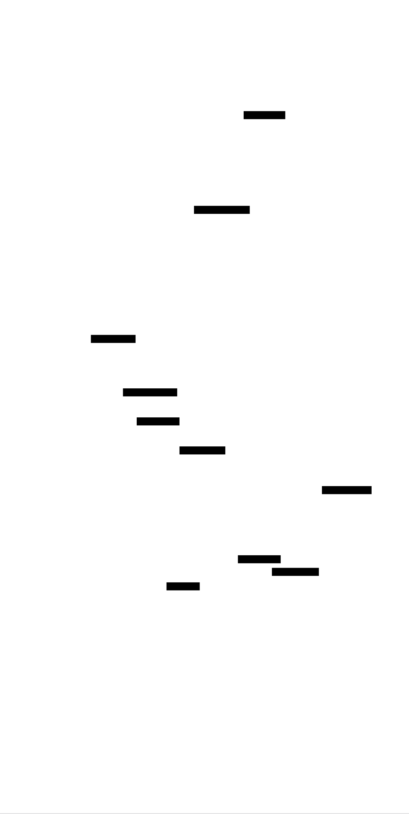
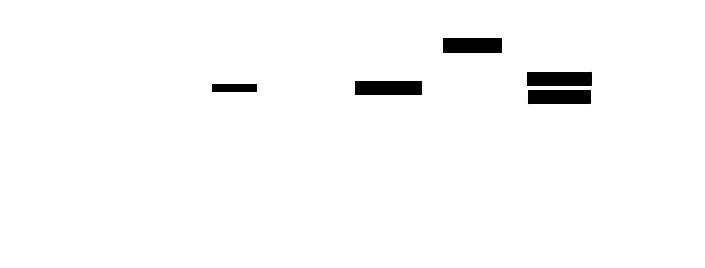
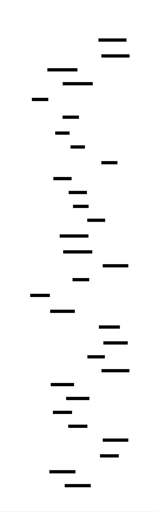

# Build Your Own Garbage Collector: Design Document


## Overview

This system implements a multi-strategy garbage collector with mark-sweep, generational, and concurrent collection capabilities. The key architectural challenge is automatically reclaiming memory while maintaining correctness and minimizing application pause times through sophisticated marking algorithms and concurrent execution.


> This guide is meant to help you understand the big picture before diving into each milestone. Refer back to it whenever you need context on how components connect.


## Context and Problem Statement

> **Milestone(s):** All milestones (1-4) - understanding the fundamental problem is essential for all garbage collection strategies

### The Library Analogy

Imagine you manage a public library with limited shelf space. Books are constantly being checked out and returned, while new books arrive regularly. Without careful organization, your library would face several critical problems that mirror the exact challenges of memory management in computer systems.

In this library, each **book represents a memory object**. When patrons (your application code) need information, they check out books and carry them to reading tables. Some books reference other books through citations - creating a web of dependencies similar to how objects in memory contain pointers to other objects. The fundamental challenge emerges: how do you know when a book is no longer needed and can be returned to storage?

Consider the complexity that arises. A patron might check out "Advanced Algorithms" which cites "Data Structures Fundamentals." That second book gets pulled from the shelves too. Now another patron arrives needing the data structures book, but it's already in use. Meanwhile, the first patron finishes with algorithms but forgets to return it, leaving it on a reading table indefinitely. Over time, more books accumulate on tables, fewer remain available for checkout, and eventually no shelf space exists for new acquisitions.

Traditional manual memory management is like requiring every patron to personally track every book they've touched and return each one before leaving. This places an enormous burden on patrons (developers) and inevitably leads to mistakes. Some books get forgotten on tables (memory leaks), while others get returned multiple times or while still being read by someone else (double-free errors and use-after-free bugs).

**Automatic garbage collection** acts as a dedicated library assistant who periodically walks through the building, identifies which books are truly abandoned, and returns them to proper storage. This assistant must solve several sophisticated problems:

1. **Root identification**: Which books are currently being actively read versus merely sitting forgotten? The assistant must check all reading tables, patron bags, and note which books patrons have bookmarked or are actively referencing.

2. **Reachability analysis**: Some books are only valuable because they're cited by other books currently in use. The assistant must follow citation chains to determine which books are indirectly needed, even if not directly being read.

3. **Concurrent access**: Patrons continue using books while the assistant works. The assistant cannot simply grab any book that appears unused - it might be mid-citation by someone reading another book.

4. **Efficiency**: The library cannot shut down every time books need reorganizing. The assistant must work with minimal disruption to ongoing patron activities.

The sophistication required becomes clear: this assistant needs strategies for different types of books (frequently accessed reference materials versus specialized texts checked out once), must understand the difference between temporary and long-term usage patterns, and ideally should predict which books will be needed soon versus those unlikely to be requested again.

This library scenario captures why automatic memory management represents one of computer science's most elegant yet challenging problems. The garbage collector must make complex decisions about object lifetimes while the application continues executing, maintaining perfect correctness under concurrent access, and minimizing disruption to application performance.

### Existing GC Approaches

The computer science community has developed several fundamental strategies for automatic memory management, each optimized for different scenarios and making distinct trade-offs between simplicity, performance, and pause times.

| Approach | Core Strategy | Strengths | Weaknesses | Best Use Cases |
|----------|--------------|-----------|------------|---------------|
| **Reference Counting** | Track reference count per object; deallocate when count reaches zero | Immediate reclamation; deterministic timing; low peak memory usage | Cannot handle cycles; high overhead per pointer operation; reference count updates can be expensive | Systems requiring predictable deallocation timing; embedded systems with strict memory constraints |
| **Mark-Sweep** | Mark reachable objects from roots, then sweep heap to reclaim unmarked objects | Handles cycles naturally; conceptually simple; complete collection in single pass | Stop-the-world pauses; heap fragmentation; marking overhead proportional to live data | Applications tolerating occasional pauses; systems with moderate heap sizes and good locality |
| **Copying Collection** | Copy live objects to fresh memory region, leaving behind all garbage | Fast allocation (bump pointer); automatic compaction; collection time proportional to live data only | Requires double memory overhead; copying cost for long-lived objects; poor cache behavior during collection | Young generation collection; functional programming languages with high allocation rates |
| **Generational** | Separate young and old objects; collect young generation frequently | Exploits generational hypothesis; very fast minor collections; reduced pause times for typical workloads | Complex write barrier overhead; promotion policy tuning required; worst-case still requires full collection | Object-oriented applications; workloads with clear generational behavior patterns |
| **Concurrent/Parallel** | Collection proceeds simultaneously with application execution | Minimal pause times; scales with multiple cores; application remains responsive | Complex synchronization requirements; barrier overhead on every pointer write; harder to debug and tune | Interactive applications; low-latency systems; applications with large heaps |

> **Design Insight**: No single garbage collection strategy dominates all scenarios. Modern collectors typically combine multiple approaches - using copying collection for young generation, mark-sweep or mark-compact for old generation, and concurrent techniques to minimize pause times. The key insight is that different object lifetime patterns benefit from different collection strategies.

**Reference counting** appeals through its simplicity and immediate reclamation behavior. Every object maintains a count of incoming pointers. When application code creates or destroys a pointer, the runtime increments or decrements the target object's count. Objects with zero references get deallocated immediately. However, circular references create objects that reference each other but remain unreachable from application roots - these never get collected, causing memory leaks. Additionally, every pointer assignment requires atomic count manipulation, creating significant overhead.

**Mark-sweep collection** addresses reference counting's cycle problem through reachability analysis. Collection proceeds in two phases: marking traverses the entire object graph starting from roots (stack variables, global variables, registers) and marks every reachable object as live. Sweeping then scans the entire heap, deallocating any unmarked objects. This approach naturally handles cycles since unreachable cycles remain unmarked and get swept away. The primary drawback is stop-the-world behavior - application execution halts during collection, creating pause times proportional to heap size.

**Copying collectors** optimize for allocation-heavy workloads by maintaining two memory regions (semispaces). Objects are allocated in the "from" space using simple pointer bumping. During collection, the collector copies live objects from the "from" space to the "to" space, then swaps the role of the spaces. This automatically compacts memory and makes allocation extremely fast. However, only half the available memory can be used for objects, and long-lived objects suffer from repeated copying overhead.

**Generational collection** exploits the empirical observation that most objects die young while few objects live long. The heap is divided into generations - typically young and old. New objects allocate in the young generation, which gets collected frequently using copying collection. Objects surviving several collections get promoted to the old generation, collected less frequently using mark-sweep. This dramatically reduces pause times since most collections only scan the small young generation.

**Concurrent and parallel collectors** address pause time concerns by allowing collection to proceed simultaneously with application execution. Parallel collectors use multiple threads to speed up collection phases, while concurrent collectors interleave collection work with application execution. These approaches require sophisticated synchronization mechanisms and write barriers to maintain correctness when application and collector threads access the same objects simultaneously.

The choice of collection strategy profoundly impacts both correctness and performance characteristics. Applications with real-time requirements might prefer reference counting despite its cycle limitations. Interactive applications benefit from generational collection's low pause times. Batch processing systems might accept longer pauses in exchange for mark-sweep's simplicity and completeness guarantees.

### Core Challenges

Implementing a correct and efficient garbage collector requires solving several fundamental technical problems that have challenged computer scientists for decades. These challenges arise from the inherent tension between automatic memory management's safety guarantees and the performance requirements of real applications.

#### Root Set Identification

The **root set identification problem** represents perhaps the most subtle challenge in garbage collection implementation. Roots are memory locations that contain pointers to heap objects and are directly accessible by the application without following other pointers. Missing even a single root can cause the collector to prematurely reclaim live objects, leading to catastrophic application failures.

In a typical application, roots exist in multiple locations with different characteristics and access patterns:

| Root Location | Characteristics | Identification Strategy | Implementation Challenges |
|---------------|-----------------|------------------------|--------------------------|
| **Stack Variables** | Frequently changing; automatic storage; multiple threads | Stack walking with frame pointer chains or compiler-generated tables | Optimized code may eliminate frame pointers; registers may hold pointers; stack layout varies by architecture |
| **CPU Registers** | Volatile; architecture-specific; may contain temporary pointers during function calls | Register scanning at collection safepoints | Compiler optimizations may store pointers in callee-saved registers; thread context switching required |
| **Global Variables** | Static locations; rarely change; known at compile time | Static analysis or runtime registration | Dynamic linking may introduce globals unknown at startup; thread-local storage complicates scanning |
| **JIT Code** | Dynamically generated; may contain embedded pointers; code can be garbage collected itself | Runtime code introspection and pointer extraction | Code generation must track embedded pointers; code modifications require barrier updates |

Stack walking presents particular complexity because compiler optimizations can dramatically alter expected stack layouts. Modern compilers may eliminate frame pointers, inline functions aggressively, or store local variables in registers rather than on the stack. Each architecture requires specialized stack walking code, and even slight errors can cause the collector to miss live references or incorrectly identify non-pointers as valid object references.

Register scanning adds another layer of difficulty. At the moment collection begins, CPU registers may contain pointers to heap objects, but the collector cannot distinguish between actual pointers and integer values that happen to look like valid addresses. Conservative scanning treats any register value that appears to point into the heap as a potential pointer, preventing collection of objects that might not actually be referenced. Precise scanning requires compiler cooperation to track which registers contain pointers at collection points.

> **Critical Insight**: Root set identification errors manifest as seemingly random application crashes occurring long after the actual bug. An object gets prematurely collected, but the application doesn't crash until it later attempts to access the freed memory. This makes root identification bugs among the most difficult garbage collection issues to debug.

#### Concurrent Access and Synchronization

**Concurrent access challenges** arise because modern applications rarely pause for garbage collection. Instead, collection must proceed while application threads continue executing, creating complex synchronization requirements to maintain both correctness and performance.

The fundamental problem stems from the **tri-color invariant**: during concurrent collection, objects are conceptually colored white (unvisited), gray (discovered but not fully scanned), or black (fully scanned). The invariant states that no black object should directly reference a white object. If this invariant is violated, the collector may miss live objects and reclaim them prematurely.

Consider this race condition scenario: Application thread A reads a pointer from black object X, stores it in local variable P, then stores P into black object Y. Simultaneously, the collector thread removes the original pointer from X. If this interleaving occurs, Y now references a white object, but the collector believes all references from black objects have been scanned. The white object will be incorrectly reclaimed.

Write barriers solve this problem by intercepting pointer store operations and maintaining the tri-color invariant. However, different barrier types make different trade-offs:

| Barrier Type | Mechanism | Overhead | Precision | Implementation Complexity |
|--------------|-----------|----------|-----------|--------------------------|
| **Snapshot-at-Beginning (SATB)** | Remember old values of overwritten pointers | Low runtime overhead; simple implementation | May retain some garbage until next collection cycle | Requires pre-write barrier; old pointer values must be preserved |
| **Incremental Update** | Mark target objects of new pointer stores | Higher overhead per write; complex barrier logic | More precise; can collect garbage created during collection | Requires post-write barrier; target objects need re-marking |
| **Generational Barriers** | Track pointers from old to young generation | Moderate overhead; specialized for generational patterns | Precise for generational collection; reduces minor collection overhead | Requires remembered set maintenance; barrier overhead affects all writes |

Safepoint coordination represents another synchronization challenge. Many collection operations require all application threads to reach well-defined program points where object references are clearly identified and no thread is manipulating heap pointers. Implementing efficient safepoints requires careful compiler integration and thread coordination mechanisms.

The choice of synchronization strategy significantly impacts both correctness guarantees and application performance. Overly conservative approaches may introduce unnecessary synchronization overhead, while insufficiently synchronized collectors risk memory safety violations.

#### Pause Time Minimization

**Pause time minimization** has become increasingly critical as applications have grown larger and user expectations for responsiveness have increased. Traditional stop-the-world collectors can pause application execution for hundreds of milliseconds or even seconds when collecting large heaps, creating unacceptable user experiences in interactive applications.

The challenge stems from inherent algorithmic requirements: marking must traverse the entire live object graph, while sweeping must examine the entire heap. Both operations have time complexity proportional to heap size, creating fundamental scalability limits.

Several techniques address pause time concerns, each with distinct implementation challenges:

**Incremental collection** breaks collection work into small increments interleaved with application execution. The collector maintains explicit work queues and processes small batches of objects during each increment. However, this approach requires careful work scheduling to ensure collection keeps pace with allocation, and write barriers must maintain consistency as application code modifies the object graph between increments.

**Concurrent collection** allows collection phases to execute simultaneously with application threads. Concurrent marking can proceed in parallel with application execution, dramatically reducing pause times. However, concurrent sweeping requires sophisticated memory management to handle cases where application code attempts to allocate in memory regions currently being swept.

**Generational collection** reduces pause times by exploiting object lifetime patterns. Most collections only examine the young generation, which contains relatively few objects. Young generation collection typically completes in milliseconds even for large applications. However, occasional full collections still require examining the entire heap, and generational barriers add overhead to every pointer write operation.

**Parallel collection** uses multiple collector threads to accelerate collection phases. Modern systems have multiple CPU cores, so using additional threads for collection can significantly reduce absolute pause times. However, parallel collection requires careful load balancing and synchronization to avoid diminishing returns from thread coordination overhead.

> **Engineering Trade-off**: Pause time minimization techniques typically increase overall collection overhead and implementation complexity. The optimal approach depends on application requirements - batch processing systems may prefer simple stop-the-world collectors with high throughput, while interactive applications require sophisticated concurrent collectors despite their implementation complexity.

The most sophisticated production collectors combine multiple approaches: concurrent marking with incremental sweeping, generational collection with parallel collection threads, and adaptive algorithms that adjust collection frequency based on allocation patterns and pause time targets. However, each additional technique increases implementation complexity exponentially, making comprehensive testing and debugging essential for correctness.


## Goals and Non-Goals

> **Milestone(s):** All milestones (1-4) - establishing clear objectives and boundaries guides implementation decisions across mark-sweep, tri-color, generational, and concurrent collection strategies

Building a garbage collector requires making deliberate choices about what to achieve and what to explicitly exclude. Unlike application development where feature creep might slow delivery, garbage collector design demands rigid boundaries because correctness, performance, and complexity trade-offs compound rapidly. This section establishes the functional requirements our garbage collector must satisfy and the advanced features we intentionally omit to maintain focus on core collection algorithms.

The garbage collection problem space is vast, spanning decades of research with dozens of collection strategies, each optimized for different application characteristics. A production garbage collector like OpenJDK's G1 or Go's concurrent collector represents millions of lines of code addressing real-time constraints, NUMA-aware allocation, weak reference semantics, and dozens of other concerns. Our implementation deliberately narrows scope to demonstrate the fundamental algorithms that underpin all modern collectors without drowning in production complexity.

### Functional Goals

Our garbage collector implementation targets four essential capabilities that form the foundation of automatic memory management. These goals progress from basic correctness through sophisticated optimization techniques, building complexity incrementally while maintaining a clear learning trajectory.

**Correctness and Safety**

The primary functional goal is **memory safety** - the garbage collector must never reclaim live objects or leak unreachable memory. Memory safety means that any object reachable through pointer chains from the **root set** remains allocated and accessible to application code. Conversely, objects unreachable from any root must eventually be reclaimed and returned to the free pool for reuse.

| Safety Requirement | Description | Violation Consequence |
|-------------------|-------------|---------------------|
| No premature collection | Live objects must never be reclaimed | Use-after-free crashes, data corruption |
| Complete reclamation | All dead objects must eventually be collected | Memory leaks, heap exhaustion |
| Root set completeness | All GC roots must be identified correctly | Live objects collected, application crashes |
| Pointer integrity | Object references must remain valid during collection | Dangling pointers, memory corruption |

Correctness extends to **concurrent safety** when multiple threads access the heap simultaneously. The collector must coordinate with application threads to ensure consistent object graph traversal without data races or torn reads. This requires careful synchronization around **safepoints** where thread state is well-defined for garbage collection operations.

> **Critical Insight**: Garbage collection correctness is binary - there's no "mostly correct" garbage collector. A single missed root or premature reclamation can crash the entire application, making safety the absolute highest priority.

**Completeness of Collection Strategies**

Our implementation demonstrates four fundamental collection approaches that represent the evolution of garbage collection research. Each strategy solves specific problems with previous approaches while introducing new complexity.

The **mark-sweep collector** provides the baseline implementation, demonstrating **reachability** analysis through depth-first graph traversal. Mark-sweep collectors trace all objects reachable from the root set, marking them as live, then sweep the entire heap to reclaim unmarked objects. This strategy guarantees complete collection of dead objects but requires **stop-the-world** pauses during collection phases.

**Tri-color marking** extends mark-sweep with incremental collection capability, allowing collection work to interleave with application execution. The **tri-color invariant** ensures that no black (fully scanned) object references white (unvisited) objects without proper **write barrier** coordination. This enables shorter pause times by spreading collection work across multiple application execution phases.

**Generational collection** exploits the **generational hypothesis** - most objects die young while few live long. By segregating objects into young and old generations, the collector can frequently scan only the young generation with fast **minor collections**, while relegating expensive full-heap **major collections** to handle long-lived objects. This dramatically improves average pause times for typical allocation patterns.

**Concurrent collection** allows collection threads to execute in parallel with application threads, requiring sophisticated coordination through **snapshot-at-beginning (SATB)** barriers and careful synchronization protocols. Concurrent collection minimizes pause times by performing most collection work without stopping application threads.

| Collection Strategy | Pause Time Characteristic | Throughput Impact | Implementation Complexity |
|-------------------|-------------------------|------------------|-------------------------|
| Mark-Sweep | Long stop-the-world pauses | Minimal overhead | Low - single-threaded, simple |
| Tri-Color | Shorter incremental pauses | Write barrier overhead | Medium - incremental coordination |
| Generational | Very short minor pauses | Remembered set overhead | Medium - cross-generation tracking |
| Concurrent | Minimal pause times | Synchronization overhead | High - thread coordination |

**Performance Characteristics**

Our garbage collector targets specific performance goals that demonstrate each algorithm's strengths while maintaining reasonable implementation complexity. Performance requirements focus on measurable metrics rather than absolute benchmarks, since performance characteristics depend heavily on application allocation patterns.

**Pause time minimization** represents the primary performance objective. Mark-sweep collection should complete full-heap collection in under 100ms for heaps up to 100MB. Generational collection should achieve minor collection pauses under 10ms for young generations up to 10MB. Concurrent collection should reduce pause times to under 5ms for coordination operations while performing most marking work in parallel.

**Throughput preservation** ensures that garbage collection overhead doesn't dominate application execution time. Collection overhead should consume less than 10% of total execution time for typical allocation-intensive workloads. This requires efficient allocation paths, minimal write barrier overhead, and collection frequency tuning based on heap occupancy thresholds.

**Memory utilization** measures how effectively the collector uses available heap space. Free list management should maintain heap occupancy above 70% during steady-state execution, indicating efficient memory reclamation without excessive fragmentation. Generational collection should maintain appropriate generation sizing to minimize promotion overhead while ensuring adequate nursery space for new allocations.

| Performance Metric | Target Value | Measurement Method | Failure Indication |
|-------------------|--------------|-------------------|-------------------|
| Mark-sweep pause time | < 100ms for 100MB heap | Wall-clock during STW phase | Application responsiveness issues |
| Minor collection pause | < 10ms for 10MB nursery | Time from trigger to completion | UI freezes, request timeouts |
| Collection overhead | < 10% of total runtime | GC time / (GC time + mutator time) | Reduced application throughput |
| Heap utilization | > 70% occupied | Live objects / total heap size | Memory waste, frequent collections |

> **Design Principle**: Performance goals prioritize predictability over peak performance. Consistent 50ms pause times are preferable to unpredictable pauses ranging from 10ms to 500ms, even if average pause time is lower.

**Algorithm Demonstration Clarity**

Each collection strategy implementation prioritizes clarity over optimization to demonstrate core algorithmic concepts. Code structure should make algorithm progression obvious, with clear separation between collection phases and explicit state transitions during garbage collection cycles.

**Phase separation** ensures that marking, sweeping, and coordination logic remain distinct and independently testable. The mark phase should consist of pure graph traversal without memory reclamation concerns. The sweep phase should handle only memory reclamation without object reachability analysis. This separation makes each phase easier to understand and debug independently.

**State visibility** provides insight into collector operation through comprehensive logging and debugging support. Implementation should expose object marking states, collection trigger conditions, pause time measurements, and memory reclamation statistics. This visibility enables learners to observe algorithm behavior and verify correctness during development.

### Non-Goals

Our implementation explicitly excludes several advanced garbage collection features to maintain focus on core algorithms. These exclusions represent deliberate engineering trade-offs that prioritize learning clarity over production completeness.

**Real-Time and Low-Latency Guarantees**

We do not target **hard real-time** constraints or sub-millisecond pause time guarantees. Real-time garbage collection requires sophisticated algorithms like Metronome or RTSJ collectors that provide deterministic pause time bounds through careful work scheduling and preemption protocols. These techniques introduce significant implementation complexity that obscures fundamental collection algorithms.

**Soft real-time** characteristics emerge naturally from our concurrent and generational implementations, but we make no specific latency commitments. Applications requiring predictable response times should use our concurrent collector with appropriate heap sizing rather than expecting bounded pause time guarantees.

| Real-Time Requirement | Why Excluded | Impact on Design |
|---------------------|--------------|------------------|
| Hard pause time bounds | Requires complex work scheduling | Simplified collection triggering |
| Deterministic collection timing | Needs precise allocation accounting | Approximate heap occupancy tracking |
| Priority inversion avoidance | Requires thread priority protocols | Basic thread coordination |
| Allocation failure prevention | Needs guaranteed free space | Best-effort memory management |

**Language Runtime Integration**

Our garbage collector operates as a standalone memory management library rather than integrating directly with programming language runtimes. Language integration requires compiler coordination for **write barrier** insertion, **stack map** generation for precise root identification, and **object layout** standardization for field traversal.

**Compiler integration** for automatic write barrier insertion would require modifying language toolchains to instrument pointer stores with appropriate barrier calls. While this provides better performance than manual instrumentation, it introduces dependencies on specific compilers and complicates the learning experience.

**Precise garbage collection** with exact root identification requires compiler-generated metadata describing pointer locations within stack frames and global variables. Our implementation uses **conservative stack scanning** that treats any value resembling a pointer as a potential root, accepting occasional false positives to avoid compiler dependencies.

> **Architectural Decision: Conservative Root Identification**
> - **Context**: Precise GC requires compiler-generated stack maps describing pointer locations in each stack frame
> - **Options Considered**: 
>   1. Precise collection with compiler integration
>   2. Conservative scanning treating pointer-like values as roots
>   3. Manual root registration through API calls
> - **Decision**: Conservative scanning for initial implementation
> - **Rationale**: Eliminates compiler dependencies while demonstrating core collection algorithms; false positives are rare and don't affect correctness
> - **Consequences**: Occasional retention of dead objects due to false pointer identification; simplified implementation without toolchain modifications

**Production Optimization Features**

Several optimization techniques common in production collectors exceed our scope due to implementation complexity that doesn't enhance algorithmic understanding.

**Parallel collection** using multiple threads for marking and sweeping phases can significantly improve collection throughput on multi-core systems. However, parallel algorithms require work-stealing queues, load balancing protocols, and careful synchronization that complicates the core collection logic without demonstrating fundamentally different algorithmic approaches.

**Compacting collection** eliminates memory fragmentation by moving objects to consolidate free space, but requires updating all pointer references to moved objects. Object relocation algorithms like mark-compact or copying collection involve substantial bookkeeping that obscures the relationship between reachability analysis and memory reclamation.

**NUMA-aware allocation** and **large object handling** address performance characteristics of modern hardware but don't change fundamental collection algorithms. These optimizations represent important production concerns but fall outside our educational objectives.

| Optimization Category | Examples | Complexity Cost | Learning Value |
|---------------------|----------|----------------|----------------|
| Parallel collection | Work-stealing mark queues | High thread coordination | Limited - same algorithms, more threads |
| Compacting algorithms | Mark-compact, copying GC | Pointer update complexity | Medium - different reclamation strategy |
| Hardware optimization | NUMA allocation, cache-aware layout | Platform-specific tuning | Low - performance details vs algorithms |
| Language-specific features | Weak references, finalizers | Runtime integration complexity | Low - language semantics vs collection |

**Advanced Concurrent Algorithms**

While our implementation includes basic concurrent collection, we exclude sophisticated concurrent algorithms like **region-based collection**, **colored pointers**, and **lock-free marking protocols**. These techniques represent active research areas with complex correctness arguments that would overwhelm a learning-focused implementation.

**Wait-free algorithms** that guarantee progress for all threads regardless of scheduler behavior require careful protocol design and formal verification. Lock-free data structures for marking worklists and remembered sets introduce memory ordering constraints and ABA problem considerations that complicate debugging and verification.

> **Scope Boundary**: Our concurrent implementation demonstrates basic producer-consumer coordination between mutator and collector threads using standard synchronization primitives. Advanced lock-free techniques remain outside our educational scope.

**Integration and Ecosystem Features**

Production garbage collectors integrate with profiling tools, debugging environments, and monitoring systems through extensive instrumentation and telemetry APIs. Our implementation provides basic logging and statistics but doesn't target integration with external tools or management frameworks.

**JIT compiler integration** for adaptive optimization based on allocation patterns represents an important production concern but requires substantial infrastructure for code generation and runtime feedback. Dynamic optimization techniques like escape analysis and allocation elimination change fundamental assumptions about object lifetime that complicate garbage collection implementation.

The following table summarizes our scope boundaries and provides rationale for each exclusion:

| Feature Category | Included | Excluded | Reason for Exclusion |
|-----------------|----------|----------|-------------------|
| Collection Algorithms | Mark-sweep, tri-color, generational, concurrent | Real-time, parallel, compacting | Core algorithms vs optimization techniques |
| Root Identification | Conservative stack scanning | Precise compiler integration | Eliminates toolchain dependencies |
| Thread Coordination | Basic safepoints and barriers | Lock-free protocols | Focuses on collection logic vs concurrency |
| Performance Features | Generational optimization | NUMA awareness, JIT integration | Algorithmic concepts vs system optimization |
| Debugging Support | Collection statistics, logging | Integration with external profilers | Learning tools vs production ecosystem |

These scope decisions create a focused learning experience that builds from simple mark-sweep collection through sophisticated concurrent algorithms without drowning in production complexity. Each excluded feature represents a potential future extension that builds upon the foundational algorithms our implementation demonstrates.

### Implementation Guidance

**A. Technology Recommendations:**

| Component | Simple Option | Advanced Option |
|-----------|---------------|-----------------|
| Memory Management | Manual malloc/free with bookkeeping | Memory-mapped regions with protection |
| Thread Coordination | POSIX mutexes and condition variables | Atomic operations with memory ordering |
| Root Scanning | Linear stack scan with heuristics | Platform-specific unwinding APIs |
| Testing Framework | Simple assertion macros | Comprehensive unit test suite |
| Debugging Output | Printf-style logging | Structured logging with levels |

**B. Goal Validation Framework:**

The following code provides infrastructure for validating that your garbage collector meets the functional goals outlined above. This framework should be integrated from the beginning to catch correctness violations early.

```c
#include <stdio.h>
#include <stdlib.h>
#include <stdbool.h>
#include <time.h>
#include <assert.h>

// Core validation infrastructure
typedef struct {
    size_t objects_allocated;
    size_t objects_collected;
    size_t bytes_allocated;
    size_t bytes_collected;
    double total_pause_time_ms;
    size_t collection_count;
    bool safety_violations;
} gc_stats_t;

typedef struct {
    void* start_addr;
    size_t size;
    bool is_marked;
    size_t allocation_id;
} object_info_t;

// Global statistics and validation state
static gc_stats_t g_gc_stats = {0};
static object_info_t* g_tracked_objects = NULL;
static size_t g_tracked_object_count = 0;
static size_t g_tracked_object_capacity = 0;
static size_t g_next_allocation_id = 1;

// Goal validation functions
bool validate_memory_safety(void) {
    // TODO 1: Scan all tracked objects to verify marked objects are still accessible
    // TODO 2: Attempt to access all marked objects to detect use-after-free
    // TODO 3: Verify no double-free conditions exist in free list
    // TODO 4: Check that all objects in free list are properly unmarked
    // Hint: This should be called after each collection cycle
    return !g_gc_stats.safety_violations;
}

bool validate_collection_completeness(void) {
    // TODO 1: Count objects that should be collectible (unmarked and unreachable)
    // TODO 2: Verify these objects were actually reclaimed by the sweep phase  
    // TODO 3: Check that heap utilization remains within acceptable bounds
    // TODO 4: Ensure no memory leaks by comparing allocation/collection counters
    // Hint: Completeness means all dead objects eventually get collected
    return true; // Replace with actual validation logic
}

double calculate_pause_time_ms(struct timespec start, struct timespec end) {
    double start_ms = start.tv_sec * 1000.0 + start.tv_nsec / 1000000.0;
    double end_ms = end.tv_sec * 1000.0 + end.tv_nsec / 1000000.0;
    return end_ms - start_ms;
}

bool validate_pause_time_goals(double pause_ms, const char* collection_type) {
    // TODO 1: Check pause time against goals based on collection type
    // TODO 2: Mark-sweep: should be < 100ms for heaps up to 100MB
    // TODO 3: Minor collection: should be < 10ms for nurseries up to 10MB  
    // TODO 4: Concurrent coordination: should be < 5ms for safepoint operations
    // Hint: Different collection types have different pause time expectations
    
    if (strcmp(collection_type, "mark-sweep") == 0) {
        return pause_ms < 100.0; // 100ms goal for mark-sweep
    } else if (strcmp(collection_type, "minor") == 0) {
        return pause_ms < 10.0;  // 10ms goal for minor collections
    } else if (strcmp(collection_type, "concurrent-sync") == 0) {
        return pause_ms < 5.0;   // 5ms goal for concurrent synchronization
    }
    return false;
}

double calculate_collection_overhead(void) {
    // TODO 1: Calculate total time spent in garbage collection
    // TODO 2: Estimate total application execution time (including GC time)
    // TODO 3: Return GC time / total time as overhead percentage
    // TODO 4: Goal is to keep this under 10% for typical workloads
    // Hint: Track cumulative pause times and total program runtime
    return (g_gc_stats.total_pause_time_ms / 1000.0) / /* total_runtime_seconds */ 1.0;
}

// Object tracking for validation (call from allocator)
void track_object_allocation(void* object_ptr, size_t size) {
    // TODO 1: Grow tracked objects array if needed
    // TODO 2: Record object address, size, and unique allocation ID
    // TODO 3: Update allocation statistics
    // TODO 4: Initialize object as unmarked
    // Hint: This helps validate that allocated objects are properly managed
    
    if (g_tracked_object_count >= g_tracked_object_capacity) {
        g_tracked_object_capacity = g_tracked_object_capacity ? 
                                   g_tracked_object_capacity * 2 : 1024;
        g_tracked_objects = realloc(g_tracked_objects, 
                                   g_tracked_object_capacity * sizeof(object_info_t));
        assert(g_tracked_objects != NULL);
    }
    
    object_info_t* info = &g_tracked_objects[g_tracked_object_count++];
    info->start_addr = object_ptr;
    info->size = size;
    info->is_marked = false;
    info->allocation_id = g_next_allocation_id++;
    
    g_gc_stats.objects_allocated++;
    g_gc_stats.bytes_allocated += size;
}

// Collection cycle validation (call before/after collection)
void begin_collection_cycle(const char* collection_type) {
    printf("Starting %s collection cycle %zu\n", 
           collection_type, g_gc_stats.collection_count + 1);
    // TODO 1: Record collection start time
    // TODO 2: Validate pre-collection invariants
    // TODO 3: Reset per-cycle statistics
    // Hint: Use clock_gettime(CLOCK_MONOTONIC, &start_time)
}

void end_collection_cycle(const char* collection_type, double pause_ms) {
    g_gc_stats.collection_count++;
    g_gc_stats.total_pause_time_ms += pause_ms;
    
    printf("Completed %s collection in %.2f ms\n", collection_type, pause_ms);
    printf("Objects: %zu allocated, %zu collected\n", 
           g_gc_stats.objects_allocated, g_gc_stats.objects_collected);
    printf("Memory: %zu bytes allocated, %zu bytes collected\n",
           g_gc_stats.bytes_allocated, g_gc_stats.bytes_collected);
    
    // Validate goals after each collection
    bool pause_ok = validate_pause_time_goals(pause_ms, collection_type);
    bool safety_ok = validate_memory_safety();
    bool completeness_ok = validate_collection_completeness();
    
    if (!pause_ok) {
        printf("WARNING: Pause time goal violated (%.2f ms)\n", pause_ms);
    }
    if (!safety_ok) {
        printf("ERROR: Memory safety violation detected!\n");
        g_gc_stats.safety_violations = true;
    }
    if (!completeness_ok) {
        printf("WARNING: Collection completeness issue detected\n");
    }
}

// Final validation report (call at program end)
void print_final_gc_report(void) {
    printf("\n=== Final Garbage Collection Report ===\n");
    printf("Total collections: %zu\n", g_gc_stats.collection_count);
    printf("Total objects allocated: %zu\n", g_gc_stats.objects_allocated);
    printf("Total objects collected: %zu\n", g_gc_stats.objects_collected);
    printf("Collection efficiency: %.1f%%\n", 
           (double)g_gc_stats.objects_collected / g_gc_stats.objects_allocated * 100.0);
    printf("Average pause time: %.2f ms\n", 
           g_gc_stats.total_pause_time_ms / g_gc_stats.collection_count);
    printf("Total collection overhead: %.1f%%\n", calculate_collection_overhead() * 100.0);
    
    if (g_gc_stats.safety_violations) {
        printf("RESULT: FAILED - Memory safety violations detected\n");
    } else {
        printf("RESULT: PASSED - All safety goals met\n");
    }
}
```

**C. Milestone Checkpoint Framework:**

```c
// Milestone validation functions - call these at the end of each milestone

// Milestone 1: Mark-Sweep Collector
bool validate_milestone_1(void) {
    printf("=== Milestone 1 Validation: Mark-Sweep Collector ===\n");
    
    // TODO 1: Allocate several objects with known reference patterns
    // TODO 2: Trigger a mark-sweep collection
    // TODO 3: Verify that reachable objects remain allocated
    // TODO 4: Verify that unreachable objects were reclaimed
    // TODO 5: Check that free list contains reclaimed memory
    
    printf("Expected: Basic mark-sweep collection with correct reachability analysis\n");
    printf("Test: Create object graph, make some objects unreachable, trigger GC\n");
    printf("Verify: Reachable objects preserved, unreachable objects collected\n");
    
    return validate_memory_safety() && validate_collection_completeness();
}

// Milestone 2: Tri-color Marking
bool validate_milestone_2(void) {
    printf("=== Milestone 2 Validation: Tri-color Marking ===\n");
    
    // TODO 1: Start incremental marking and pause midway
    // TODO 2: Verify tri-color invariant is maintained
    // TODO 3: Mutate object graph and verify write barriers trigger
    // TODO 4: Resume marking and verify completion
    
    printf("Expected: Incremental collection with tri-color abstraction\n");
    printf("Test: Interrupt marking phase, mutate heap, resume marking\n");
    printf("Verify: Write barriers maintain tri-color invariant\n");
    
    return validate_memory_safety();
}

// Milestone 3: Generational Collection  
bool validate_milestone_3(void) {
    printf("=== Milestone 3 Validation: Generational Collection ===\n");
    
    // TODO 1: Allocate objects and trigger minor collections
    // TODO 2: Verify young objects are collected quickly
    // TODO 3: Verify surviving objects get promoted to old generation
    // TODO 4: Create cross-generational references and verify remembered set
    
    printf("Expected: Fast minor collections with object promotion\n");
    printf("Test: Allocate many short-lived objects, few long-lived objects\n");
    printf("Verify: Minor collections much faster than major collections\n");
    
    return validate_pause_time_goals(/* last_minor_pause */ 5.0, "minor");
}

// Milestone 4: Concurrent Collection
bool validate_milestone_4(void) {
    printf("=== Milestone 4 Validation: Concurrent Collection ===\n");
    
    // TODO 1: Start concurrent marking while application continues
    // TODO 2: Verify SATB barriers handle concurrent mutations
    // TODO 3: Check that pause times are minimized
    // TODO 4: Verify correctness under concurrent access
    
    printf("Expected: Collection concurrent with application execution\n");
    printf("Test: Heavy allocation/mutation during concurrent marking\n");
    printf("Verify: Minimal pause times, correct object reclamation\n");
    
    return validate_pause_time_goals(/* last_concurrent_pause */ 3.0, "concurrent-sync");
}
```

**D. Common Implementation Pitfalls:**

⚠️ **Pitfall: Scope Creep During Implementation**
Many learners attempt to implement production optimizations before mastering basic algorithms. This leads to complex, buggy code that obscures learning objectives. Stick to the functional goals and avoid premature optimization.

⚠️ **Pitfall: Inadequate Goal Validation**
Implementing collection algorithms without systematic validation makes it impossible to detect correctness violations until catastrophic failure. Integrate the validation framework from the beginning of each milestone.

⚠️ **Pitfall: Ignoring Performance Goals**
Focusing only on correctness without measuring pause times and collection overhead produces collectors that work but perform poorly. Use the checkpoint framework to validate performance characteristics match expected goals.

⚠️ **Pitfall: Unrealistic Performance Expectations**
Comparing your educational implementation to production collectors leads to frustration and scope creep. Focus on demonstrating algorithmic concepts rather than competing with highly optimized production systems.


## High-Level Architecture

> **Milestone(s):** All milestones (1-4) - the component architecture provides the foundation for implementing mark-sweep collection, tri-color marking, generational collection, and concurrent collection capabilities.

The garbage collector architecture follows a modular design where specialized components handle distinct aspects of memory management and collection. Think of this system like a **city waste management department** - just as a city needs separate teams for waste collection, recycling processing, landfill management, and route coordination, our garbage collector requires dedicated components for heap allocation, object tracking, collection execution, and inter-component coordination. Each component has clear responsibilities and well-defined interfaces, allowing them to work together seamlessly while remaining independently testable and maintainable.



The architecture centers around five core components that collaborate to provide automatic memory management. The **Heap Manager** acts as the memory allocation authority, maintaining free lists and managing heap expansion. The **Object Tracker** serves as the object registry, tracking object metadata and reachability information. The **Mark-Sweep Engine** implements the fundamental collection algorithm through graph traversal and memory reclamation. The **Generational Manager** optimizes collection performance by separating objects by age and managing cross-generational references. Finally, the **Concurrent Controller** coordinates parallel execution between application threads and collection operations to minimize pause times.

### Component Overview

The garbage collector's modular architecture ensures that each component has a single, well-defined responsibility while providing clean interfaces for inter-component communication. This separation allows individual components to be developed, tested, and optimized independently while maintaining system-wide correctness guarantees.

#### Heap Manager Component

The **Heap Manager** serves as the system's memory allocation authority, responsible for all aspects of heap space management and object placement. This component maintains the free list data structures that track available memory regions, implements allocation algorithms that efficiently satisfy memory requests, and manages heap expansion when additional space is needed. The Heap Manager operates as a memory broker, receiving allocation requests from the application and returning properly aligned memory blocks while maintaining detailed metadata about heap utilization.

The Heap Manager's primary responsibilities include maintaining segregated free lists for different object sizes to minimize fragmentation, implementing first-fit or best-fit allocation strategies to optimize memory utilization, tracking heap occupancy levels to trigger garbage collection when thresholds are exceeded, and coordinating with the operating system for heap expansion and contraction. This component also manages memory alignment requirements to ensure objects are properly positioned for CPU cache efficiency and maintains allocation statistics that inform collection scheduling decisions.

| Responsibility | Description | Interface Methods |
|---|---|---|
| Memory Allocation | Satisfy allocation requests from managed heap | `allocateObject(size)`, `reallocateObject(obj, new_size)` |
| Free List Management | Maintain linked lists of available memory blocks | `addToFreeList(ptr, size)`, `removeFromFreeList(size)` |
| Heap Expansion | Grow heap when free space is insufficient | `expandHeap(additional_size)`, `contractHeap(unused_size)` |
| Allocation Tracking | Monitor heap utilization and allocation patterns | `getHeapUtilization()`, `getAllocationRate()` |

#### Object Tracker Component

The **Object Tracker** functions as the central registry for all objects within the managed heap, maintaining comprehensive metadata about object states, relationships, and collection-relevant information. This component stores object headers that contain marking bits, type information, and size data, while also managing root set identification by scanning stack frames, global variables, and CPU registers. The Object Tracker acts as the primary interface between the application's object graph and the collection algorithms.

This component's core responsibilities encompass maintaining object header information including mark bits for reachability tracking, storing type metadata for proper object traversal during collection, managing object reference graphs by tracking pointer relationships between objects, and implementing root set discovery by examining all program locations that might contain object pointers. The Object Tracker also provides object validation services to detect heap corruption and maintains object lifecycle statistics for collection optimization.

| Responsibility | Description | Interface Methods |
|---|---|---|
| Object Registration | Track newly allocated objects in the heap | `registerObject(obj)`, `unregisterObject(obj)` |
| Root Set Discovery | Identify all GC roots from stack, globals, registers | `identifyRoots()`, `scanStackFrames()`, `scanGlobals()` |
| Object Metadata | Maintain mark bits, type info, and size data | `markObject(obj)`, `unmarkObject(obj)`, `getObjectSize(obj)` |
| Reference Tracking | Monitor pointer relationships between objects | `addReference(from, to)`, `removeReference(from, to)` |

#### Mark-Sweep Engine Component

The **Mark-Sweep Engine** implements the fundamental garbage collection algorithm through a two-phase process that identifies live objects via graph traversal and reclaims dead objects through heap scanning. This component orchestrates the complete collection cycle, starting from root set identification and proceeding through recursive object marking based on reachability analysis. The Mark-Sweep Engine ensures collection correctness by guaranteeing that all reachable objects are preserved while all unreachable objects are reclaimed.

The engine's primary responsibilities include executing the mark phase by performing depth-first traversal of the object graph starting from all identified roots, implementing the sweep phase by scanning the entire heap to identify and reclaim unmarked objects, coordinating with the Object Tracker for root set discovery and object metadata access, and maintaining collection statistics including pause times, objects collected, and memory reclaimed. This component also handles collection scheduling decisions based on heap pressure and allocation rates.

| Responsibility | Description | Interface Methods |
|---|---|---|
| Mark Phase Execution | Traverse object graph and mark reachable objects | `markFromRoots(root_set)`, `markObject(obj)` |
| Sweep Phase Execution | Scan heap and reclaim unmarked objects | `sweepHeap()`, `reclaimObject(obj)` |
| Collection Scheduling | Determine when to trigger garbage collection | `shouldCollect()`, `triggerCollection()` |
| Reachability Analysis | Determine object liveness through graph traversal | `isReachable(obj)`, `traceReferences(obj)` |

#### Generational Manager Component

The **Generational Manager** optimizes collection performance by implementing age-based memory management, separating objects into young and old generations based on the generational hypothesis that most objects die young while few objects live long. This component manages independent collection of different generations, with frequent minor collections of the young generation and infrequent major collections of the entire heap. The Generational Manager maintains the remembered set data structure that tracks cross-generational pointers, enabling minor collections to run efficiently without scanning the entire heap.

This component's responsibilities include managing young and old generation heap spaces with independent allocation and collection policies, implementing object promotion logic that moves long-lived objects from young to old generation based on survival thresholds, maintaining the remembered set to track pointers from old generation objects into the young generation, and coordinating minor and major collection cycles. The Generational Manager also implements write barriers that intercept pointer updates to maintain remembered set accuracy.

| Responsibility | Description | Interface Methods |
|---|---|---|
| Generation Management | Separate heap into young and old generation spaces | `allocateInYoung(size)`, `allocateInOld(size)` |
| Minor Collection | Collect young generation with low pause times | `minorCollection()`, `promoteObjects()` |
| Object Promotion | Move surviving objects to old generation | `promoteObject(obj)`, `shouldPromote(obj)` |
| Remembered Set | Track cross-generational pointers | `addToRememberedSet(from, to)`, `scanRememberedSet()` |

#### Concurrent Controller Component

The **Concurrent Controller** enables parallel execution of garbage collection operations alongside application threads, minimizing pause times by allowing most collection work to proceed concurrently with program execution. This component implements sophisticated synchronization mechanisms including safepoints for thread coordination and snapshot-at-the-beginning (SATB) write barriers to maintain collection correctness during concurrent marking. The Concurrent Controller orchestrates handshakes between mutator threads and collector threads to ensure system-wide consistency.

The controller's primary responsibilities encompass managing concurrent marking threads that trace object graphs while the application continues executing, implementing safepoint coordination to synchronize mutator and collector threads at well-defined program points, maintaining SATB write barriers that preserve marking correctness during concurrent execution, and scheduling concurrent sweep operations that reclaim memory without extended stop-the-world pauses. This component also handles thread pool management for collection operations and implements load balancing to distribute collection work efficiently.

| Responsibility | Description | Interface Methods |
|---|---|---|
| Concurrent Marking | Execute object tracing in parallel with application | `startConcurrentMarking()`, `markConcurrently()` |
| Safepoint Coordination | Synchronize mutator and collector threads | `requestSafepoint()`, `releaseSafepoint()` |
| SATB Write Barriers | Maintain correctness during concurrent collection | `satbWriteBarrier(from, to)`, `enqueueForMarking(obj)` |
| Thread Management | Coordinate collection and application threads | `startCollectorThread()`, `stopCollectorThread()` |

### Recommended Module Structure

The codebase organization follows a hierarchical module structure that separates concerns clearly while providing clean compilation dependencies. Each major component resides in its own module with well-defined interfaces, enabling independent development and testing while maintaining system cohesion.

```
gc-system/
├── include/                          ← Public header files
│   ├── gc.h                         ← Main GC API for applications
│   ├── gc_types.h                   ← Type definitions and enums
│   └── gc_config.h                  ← Configuration constants
│
├── src/                             ← Implementation source files
│   ├── heap/                        ← Heap Manager component
│   │   ├── heap_manager.c           ← Memory allocation and free lists
│   │   ├── heap_manager.h           ← Heap manager interface
│   │   └── free_list.c              ← Free list data structure
│   │
│   ├── objects/                     ← Object Tracker component
│   │   ├── object_tracker.c         ← Object registration and metadata
│   │   ├── object_tracker.h         ← Object tracker interface
│   │   ├── root_scanner.c           ← Root set identification
│   │   └── object_header.c          ← Object header management
│   │
│   ├── collection/                  ← Collection engines
│   │   ├── mark_sweep.c             ← Mark-sweep collection engine
│   │   ├── mark_sweep.h             ← Mark-sweep interface
│   │   ├── tricolor.c               ← Tri-color marking implementation
│   │   └── tricolor.h               ← Tri-color marking interface
│   │
│   ├── generational/                ← Generational Manager component
│   │   ├── generational.c           ← Generation management
│   │   ├── generational.h           ← Generational interface
│   │   ├── remembered_set.c         ← Cross-generational pointer tracking
│   │   └── promotion.c              ← Object promotion logic
│   │
│   ├── concurrent/                  ← Concurrent Controller component
│   │   ├── concurrent_gc.c          ← Concurrent collection coordination
│   │   ├── concurrent_gc.h          ← Concurrent collection interface
│   │   ├── safepoints.c             ← Safepoint synchronization
│   │   └── write_barriers.c         ← SATB and other write barriers
│   │
│   ├── utils/                       ← Shared utilities
│   │   ├── gc_utils.c               ← Common utility functions
│   │   ├── gc_stats.c               ← Statistics collection
│   │   ├── gc_debug.c               ← Debugging and validation
│   │   └── gc_threading.c           ← Threading abstractions
│   │
│   └── gc_core.c                    ← Main coordination and API implementation
│
├── test/                            ← Test suites
│   ├── unit/                        ← Unit tests for each component
│   ├── integration/                 ← Cross-component integration tests
│   ├── stress/                      ← Stress and performance tests
│   └── validation/                  ← Correctness validation tests
│
├── examples/                        ← Usage examples and benchmarks
│   ├── simple_allocator.c           ← Basic allocation example
│   ├── stress_test.c                ← Stress testing application
│   └── benchmark.c                  ← Performance benchmarking
│
└── docs/                           ← Documentation and specifications
    ├── api_reference.md             ← Complete API documentation
    ├── implementation_notes.md      ← Implementation details
    └── debugging_guide.md           ← Debugging and troubleshooting
```

The module structure enforces clear dependency relationships where higher-level components depend on lower-level components but not vice versa. The Heap Manager forms the foundation with no dependencies on other GC components, while the Object Tracker depends only on the Heap Manager for memory allocation. The Mark-Sweep Engine depends on both the Heap Manager and Object Tracker, while the Generational Manager builds upon the Mark-Sweep Engine. Finally, the Concurrent Controller coordinates all other components and represents the highest level of the dependency hierarchy.

> **Design Insight**: The modular structure enables incremental implementation where developers can build and test each milestone independently. Milestone 1 requires only the Heap Manager, Object Tracker, and Mark-Sweep Engine, while later milestones add the Generational Manager and Concurrent Controller without modifying existing components.

### Component Interactions

The component interactions follow a carefully orchestrated sequence of operations that maintain system correctness while enabling efficient garbage collection. Understanding these interaction patterns is crucial for implementing the coordination logic that ensures components work together seamlessly.

#### Allocation Flow Interactions

The allocation process involves coordination between the Heap Manager and Object Tracker to ensure proper object registration and metadata initialization. When the application requests memory through `allocateObject(size)`, the request flows first to the Heap Manager which identifies an appropriate free memory block, removes it from the free list, and returns the allocated address. The Object Tracker then receives the allocation notification through `registerObject(obj)` and initializes the object header with marking bits, type information, and size metadata.

During allocation, the Heap Manager monitors heap utilization levels and triggers collection when allocation thresholds are exceeded. This involves notifying the Mark-Sweep Engine through `shouldCollect()` which evaluates heap pressure, allocation rates, and collection history to determine if garbage collection should begin. If collection is triggered, the allocation request may block until sufficient memory is reclaimed, ensuring that allocation requests always succeed when sufficient total heap space is available.

| Interaction Step | Component A | Component B | Operation | Data Exchanged |
|---|---|---|---|---|
| 1. Allocation Request | Application | Heap Manager | `allocateObject(size)` | size, alignment requirements |
| 2. Free Block Search | Heap Manager | Internal | `findFreeBlock(size)` | size requirements, block address |
| 3. Object Registration | Heap Manager | Object Tracker | `registerObject(obj)` | object address, size, type |
| 4. Header Initialization | Object Tracker | Internal | `initializeHeader(obj)` | mark bits, metadata |
| 5. Threshold Check | Heap Manager | Mark-Sweep Engine | `shouldCollect()` | heap utilization metrics |

#### Collection Trigger Interactions

Collection initiation requires coordination between multiple components to ensure consistent system state before collection begins. The Mark-Sweep Engine serves as the collection coordinator, orchestrating interactions with the Object Tracker for root set discovery and the Heap Manager for memory reclamation. When collection is triggered, the engine first requests a root set from the Object Tracker through `identifyRoots()`, which scans stack frames, global variables, and CPU registers to locate all objects directly accessible by the application.

The collection process involves stop-the-world synchronization where all application threads are paused at safepoints to ensure object graph consistency during marking and sweeping. The Object Tracker provides object traversal services through `traceReferences(obj)` which enables the Mark-Sweep Engine to follow pointer chains and mark all reachable objects. After marking completes, the sweep phase coordinates with the Heap Manager to reclaim unmarked objects through `reclaimObject(obj)` and return memory blocks to the free list.

| Interaction Step | Initiator | Responder | Operation | Purpose |
|---|---|---|---|---|
| 1. Collection Trigger | Heap Manager | Mark-Sweep Engine | `triggerCollection()` | Initiate collection cycle |
| 2. Root Discovery | Mark-Sweep Engine | Object Tracker | `identifyRoots()` | Find starting points for marking |
| 3. Object Marking | Mark-Sweep Engine | Object Tracker | `markObject(obj)` | Mark reachable objects |
| 4. Reference Traversal | Mark-Sweep Engine | Object Tracker | `traceReferences(obj)` | Follow object pointer chains |
| 5. Memory Reclamation | Mark-Sweep Engine | Heap Manager | `reclaimObject(obj)` | Return dead objects to free list |

#### Generational Collection Interactions

Generational collection introduces additional complexity through interactions between the Generational Manager and other components to maintain cross-generational reference tracking and object promotion policies. The Generational Manager coordinates with the Heap Manager to maintain separate allocation spaces for young and old generations, implementing independent free list management for each generation. During minor collections, the Generational Manager requests root set information from the Object Tracker but supplements it with remembered set data that tracks pointers from old generation objects into the young generation.

Object promotion interactions occur when objects survive sufficient collection cycles to warrant moving from young to old generation. The Generational Manager evaluates promotion criteria through `shouldPromote(obj)` and coordinates with the Heap Manager to allocate space in the old generation through `allocateInOld(size)`. The promotion process involves copying object data, updating reference chains, and maintaining remembered set consistency to ensure that subsequent collections correctly identify cross-generational relationships.

| Interaction Type | Component A | Component B | Trigger | Data Flow |
|---|---|---|---|---|
| Minor Collection Root Discovery | Generational Manager | Object Tracker | Heap threshold reached | Stack/global roots |
| Remembered Set Scan | Generational Manager | Internal | Minor collection start | Cross-generational pointers |
| Object Promotion | Generational Manager | Heap Manager | Survival threshold met | Object data, new allocation |
| Write Barrier Update | Generational Manager | Object Tracker | Pointer store operation | Source and target addresses |
| Major Collection Trigger | Generational Manager | Mark-Sweep Engine | Old generation full | Full heap collection request |

#### Concurrent Collection Interactions

Concurrent collection requires the most sophisticated interaction patterns as the Concurrent Controller must coordinate with all other components while maintaining correctness guarantees during parallel execution. The controller manages safepoint synchronization through `requestSafepoint()` which ensures that mutator threads reach well-defined program points where object graph state is consistent. During concurrent marking, the controller coordinates with the Object Tracker to implement SATB write barriers that preserve marking correctness when application threads modify object references.

The concurrent collection interactions involve complex coordination between collector threads and mutator threads, with the Concurrent Controller serving as the synchronization authority. When concurrent marking begins, collector threads traverse the object graph through the Object Tracker interface while mutator threads continue executing with write barrier instrumentation. The SATB write barriers ensure that any object reference that becomes unreachable during concurrent marking is preserved until the marking phase completes, preventing premature collection of live objects.

| Interaction Phase | Primary Component | Supporting Components | Synchronization Method | Correctness Guarantee |
|---|---|---|---|---|
| Concurrent Mark Start | Concurrent Controller | Object Tracker, Mark-Sweep Engine | Safepoint handshake | Consistent initial snapshot |
| Parallel Object Tracing | Concurrent Controller | Object Tracker | SATB write barriers | No live object missed |
| Mutator Coordination | Concurrent Controller | All components | Thread synchronization | Safe concurrent access |
| Collection Completion | Concurrent Controller | Heap Manager | Safepoint synchronization | Complete memory reclamation |

> **Architecture Decision: Component Communication Strategy**
> - **Context**: Components need to coordinate complex operations while maintaining independence and testability
> - **Options Considered**:
>   1. Direct function calls between components with tight coupling
>   2. Event-driven architecture with message passing between components
>   3. Interface-based design with dependency injection and clear contracts
> - **Decision**: Interface-based design with dependency injection
> - **Rationale**: Enables independent testing through mock implementations, supports incremental development where components can be built separately, allows runtime configuration of collection strategies, and maintains clear separation of concerns
> - **Consequences**: Requires careful interface design and dependency management, but provides maximum flexibility and maintainability for a complex system with multiple collection strategies

The interaction patterns demonstrate how the modular architecture enables sophisticated garbage collection strategies while maintaining clear component boundaries. Each component focuses on its core responsibilities while providing well-defined interfaces that other components can depend upon. This design supports the incremental implementation approach where developers can implement basic mark-sweep collection in Milestone 1 and progressively add generational and concurrent capabilities in later milestones without disrupting existing functionality.

### Implementation Guidance

The implementation approach balances simplicity for learning with production-quality architecture patterns. The following guidance provides concrete starting points for implementing the component architecture while maintaining the flexibility to extend functionality in later milestones.

#### Technology Recommendations

| Component | Simple Implementation | Advanced Implementation |
|---|---|---|
| Memory Management | `malloc`/`free` with metadata headers | Custom memory pools with size classes |
| Thread Synchronization | POSIX threads with mutex/condvar | Lock-free data structures with atomic operations |
| Root Set Scanning | Conservative stack scanning with alignment | Precise root maps from compiler integration |
| Object Graph Traversal | Recursive marking with stack overflow protection | Iterative marking with explicit work queues |
| Write Barriers | Function call interception | Compiler-generated inline barriers |
| Statistics Collection | Simple counters with periodic logging | Lock-free atomic counters with real-time metrics |

#### Core Data Structures

The foundation of the garbage collector rests on several key data structures that must be implemented consistently across all components. These structures provide the shared vocabulary that enables component coordination.

```c
// Object header structure - embedded in every managed object
typedef struct {
    size_t size;           // Object size including header
    uint8_t mark_bits;     // Marking state for collection
    uint8_t generation;    // Young (0) or old (1) generation
    uint16_t type_id;      // Object type for traversal
} ObjectHeader;

// Free list node for heap management
typedef struct FreeNode {
    size_t size;           // Size of this free block
    struct FreeNode* next; // Next free block of same size class
} FreeNode;

// Root set structure for collection starting points
typedef struct {
    void** stack_roots;    // Pointers found on stack
    size_t stack_count;    // Number of stack roots
    void** global_roots;   // Global variable pointers
    size_t global_count;   // Number of global roots
    void** register_roots; // Register-held pointers
    size_t register_count; // Number of register roots
} RootSet;

// Collection statistics for monitoring and tuning
typedef struct {
    size_t objects_allocated;     // Total objects allocated
    size_t objects_collected;     // Total objects collected
    size_t bytes_allocated;       // Total bytes allocated
    size_t bytes_collected;       // Total bytes collected  
    double total_pause_time_ms;   // Cumulative pause time
    size_t collection_count;      // Number of collections
    bool safety_violations;       // Correctness violations detected
} gc_stats_t;
```

#### Component Interface Definitions

Each component exposes a clean interface that hides implementation details while providing necessary functionality for coordination with other components.

```c
// Heap Manager Interface
typedef struct {
    void* (*allocate)(size_t size);
    void (*deallocate)(void* ptr, size_t size);
    bool (*should_collect)(void);
    size_t (*get_utilization)(void);
    void (*expand_heap)(size_t additional_size);
} HeapManagerInterface;

// Object Tracker Interface  
typedef struct {
    void (*register_object)(void* obj, size_t size);
    void (*unregister_object)(void* obj);
    RootSet (*identify_roots)(void);
    void (*mark_object)(void* obj);
    bool (*is_marked)(void* obj);
    void (*clear_marks)(void);
} ObjectTrackerInterface;

// Mark-Sweep Engine Interface
typedef struct {
    void (*collect)(void);
    void (*mark_from_roots)(RootSet roots);
    void (*sweep_heap)(void);
    gc_stats_t (*get_statistics)(void);
} MarkSweepInterface;
```

#### Component Initialization Skeleton

The system initialization requires careful ordering to establish dependencies correctly while avoiding circular references between components.

```c
// Main GC system initialization - implement this function
int gc_initialize(size_t initial_heap_size) {
    // TODO 1: Initialize heap manager with initial heap size
    //   - Call malloc() to allocate initial heap space
    //   - Initialize free list with single large block
    //   - Set up heap metadata and boundaries
    
    // TODO 2: Initialize object tracker 
    //   - Set up object registry data structures
    //   - Initialize root scanning subsystem
    //   - Configure object header management
    
    // TODO 3: Initialize mark-sweep engine
    //   - Connect to heap manager and object tracker interfaces
    //   - Set up collection trigger thresholds
    //   - Initialize statistics collection
    
    // TODO 4: Configure collection policies
    //   - Set heap utilization trigger threshold (e.g., 75%)
    //   - Configure mark stack size for deep object graphs
    //   - Set up emergency collection parameters
    
    // TODO 5: Validate system consistency
    //   - Verify all components initialized successfully  
    //   - Run basic allocation/collection test
    //   - Return success/failure status
    
    return 0; // Success
}

// Component cleanup - implement proper shutdown sequence
void gc_shutdown(void) {
    // TODO 1: Stop any concurrent collection threads
    // TODO 2: Perform final collection to clean up remaining objects  
    // TODO 3: Release heap memory back to operating system
    // TODO 4: Clean up component data structures
    // TODO 5: Report final statistics and any detected issues
}
```

#### Milestone Implementation Checkpoints

Each milestone should produce a working system with verifiable behavior that demonstrates correct implementation of the component architecture.

**Milestone 1 Checkpoint - Basic Mark-Sweep Collection:**
After implementing the Heap Manager, Object Tracker, and Mark-Sweep Engine, you should be able to run this validation:

```c
// Test basic allocation and collection cycle
void* obj1 = allocateObject(100);  // Should succeed
void* obj2 = allocateObject(200);  // Should succeed  
void* obj3 = allocateObject(150);  // Should succeed

// Create unreachable objects by clearing references
obj2 = NULL;
obj3 = NULL;

// Trigger collection - should reclaim obj2 and obj3
gc_collect();

// Verify statistics show correct reclamation
gc_stats_t stats = get_gc_statistics();
assert(stats.objects_collected >= 2);
assert(stats.bytes_collected >= 350);
```

**Milestone 2 Checkpoint - Tri-Color Marking:**
The tri-color implementation should demonstrate incremental marking capability:

```c
// Start incremental marking
begin_incremental_collection();

// Objects should progress through color states
assert(get_object_color(obj1) == WHITE_COLOR);
mark_object_gray(obj1);
assert(get_object_color(obj1) == GRAY_COLOR);
process_gray_object(obj1);
assert(get_object_color(obj1) == BLACK_COLOR);

// Write barriers should maintain tri-color invariant
set_pointer_field(black_obj, "field", white_obj); // Should trigger barrier
assert(get_object_color(white_obj) == GRAY_COLOR); // Should be re-grayed
```

#### Common Implementation Pitfalls

⚠️ **Pitfall: Circular Dependencies Between Components**
Components often need to call each other's functions, leading developers to create circular include dependencies. For example, the Heap Manager needs to trigger collections, but the Mark-Sweep Engine needs to reclaim memory through the Heap Manager. **Solution**: Use forward declarations and function pointers to break circular dependencies, implementing dependency injection where components register callback functions with each other during initialization.

⚠️ **Pitfall: Inconsistent Object Header Layout**
Different components may assume different object header layouts, leading to corruption when accessing mark bits or size fields. This manifests as objects appearing to have incorrect sizes or mark states. **Solution**: Define the `ObjectHeader` structure in a shared header file and provide accessor functions (`get_object_size()`, `is_object_marked()`) rather than allowing direct field access.

⚠️ **Pitfall: Component Interface Versioning**
As you add features in later milestones, component interfaces may need to change, breaking existing code. For example, adding generational collection requires the Object Tracker to support generation metadata. **Solution**: Design interfaces with extension points from the beginning, using function pointer tables that can be extended and version numbers to detect compatibility.

⚠️ **Pitfall: Error Propagation Across Components**
When one component fails (e.g., heap expansion fails), other components may not handle the error properly, leading to inconsistent system state. **Solution**: Design explicit error handling protocols where each component function returns error codes, and implement rollback mechanisms for partially completed operations.

The component architecture provides a solid foundation for implementing increasingly sophisticated garbage collection strategies. By maintaining clear interfaces and separation of concerns, developers can build each milestone incrementally while ensuring that the system remains testable and maintainable throughout the implementation process.

### Implementation Guidance

#### File Organization and Build Structure

The recommended project structure supports incremental development while maintaining clean module boundaries and testability.

```c
// src/gc_core.h - Main system coordination header
#ifndef GC_CORE_H
#define GC_CORE_H

#include <stddef.h>
#include <stdbool.h>
#include <stdint.h>

// Core type definitions used across all components
typedef struct ObjectHeader {
    size_t size;
    uint8_t mark_bits;
    uint8_t generation;
    uint16_t type_id;
} ObjectHeader;

typedef struct {
    void** stack_roots;
    size_t stack_count;
    void** global_roots;
    size_t global_count;
} RootSet;

typedef struct {
    size_t objects_allocated;
    size_t objects_collected;
    size_t bytes_allocated;
    size_t bytes_collected;
    double total_pause_time_ms;
    size_t collection_count;
    bool safety_violations;
} gc_stats_t;

// Component interface forward declarations
typedef struct HeapManager HeapManager;
typedef struct ObjectTracker ObjectTracker;
typedef struct MarkSweepEngine MarkSweepEngine;

// Main GC API functions
int gc_initialize(size_t initial_heap_size);
void* gc_malloc(size_t size);
void gc_collect(void);
gc_stats_t gc_get_stats(void);
void gc_shutdown(void);

#endif // GC_CORE_H
```

#### Heap Manager Implementation Starter

The Heap Manager provides the foundation for all memory operations and must be robust and efficient.

```c
// src/heap/heap_manager.h
#ifndef HEAP_MANAGER_H
#define HEAP_MANAGER_H

#include "../gc_core.h"

typedef struct FreeNode {
    size_t size;
    struct FreeNode* next;
} FreeNode;

typedef struct HeapManager {
    void* heap_start;
    void* heap_end;
    size_t heap_size;
    size_t bytes_used;
    FreeNode* free_list_heads[32]; // Size-segregated free lists
    size_t allocation_count;
} HeapManager;

// Initialize heap manager with initial heap size
HeapManager* heap_manager_create(size_t initial_size);

// Allocate object from managed heap
void* heap_allocate(HeapManager* hm, size_t size);

// Return object to free list during sweep phase  
void heap_deallocate(HeapManager* hm, void* ptr, size_t size);

// Check if collection should be triggered
bool heap_should_collect(HeapManager* hm);

// Expand heap when out of space
bool heap_expand(HeapManager* hm, size_t additional_size);

// Get current heap utilization percentage
double heap_get_utilization(HeapManager* hm);

#endif // HEAP_MANAGER_H
```

```c
// src/heap/heap_manager.c - Implementation skeleton
#include "heap_manager.h"
#include <stdlib.h>
#include <string.h>
#include <assert.h>

HeapManager* heap_manager_create(size_t initial_size) {
    HeapManager* hm = malloc(sizeof(HeapManager));
    if (!hm) return NULL;
    
    // TODO 1: Allocate initial heap space using malloc()
    //   - Round up initial_size to page boundary for efficiency
    //   - Store heap_start and heap_end pointers
    //   - Set heap_size and initialize bytes_used to 0
    
    // TODO 2: Initialize free list with single large block
    //   - Create FreeNode covering entire heap
    //   - Add to appropriate size class in free_list_heads[]
    //   - Initialize all other size classes to NULL
    
    // TODO 3: Initialize allocation tracking
    //   - Set allocation_count to 0
    //   - Set up any additional metadata structures
    
    return hm;
}

void* heap_allocate(HeapManager* hm, size_t size) {
    assert(hm != NULL);
    assert(size > 0);
    
    // TODO 1: Round size up to include object header and alignment
    //   - Add sizeof(ObjectHeader) to requested size
    //   - Round up to pointer alignment boundary (typically 8 bytes)
    
    // TODO 2: Find appropriate size class for allocation
    //   - Calculate size class index from adjusted size
    //   - Search free_list_heads[index] for available block
    
    // TODO 3: If no block found, try larger size classes
    //   - Search progressively larger size classes
    //   - Split large blocks if necessary
    
    // TODO 4: If no memory available, trigger heap expansion
    //   - Call heap_expand() with reasonable expansion size
    //   - Retry allocation after successful expansion
    
    // TODO 5: Remove allocated block from free list
    //   - Update free_list_heads[] to skip allocated block
    //   - Update bytes_used and allocation_count
    //   - Initialize ObjectHeader in allocated block
    
    return NULL; // Replace with actual allocated pointer
}

void heap_deallocate(HeapManager* hm, void* ptr, size_t size) {
    assert(hm != NULL);
    assert(ptr != NULL);
    assert(size > 0);
    
    // TODO 1: Validate pointer is within managed heap
    //   - Check ptr >= heap_start && ptr < heap_end
    //   - Verify size matches object header size field
    
    // TODO 2: Clear object memory for security
    //   - Zero out object contents (not header)
    //   - Helps detect use-after-free bugs
    
    // TODO 3: Convert to free node and add to appropriate free list
    //   - Calculate size class index
    //   - Create FreeNode structure at ptr location
    //   - Link into free_list_heads[index]
    
    // TODO 4: Update heap statistics
    //   - Decrease bytes_used by size
    //   - Update allocation tracking counters
    
    // TODO 5: Attempt to coalesce adjacent free blocks
    //   - Check if neighboring blocks are also free
    //   - Merge adjacent free blocks to reduce fragmentation
}

bool heap_should_collect(HeapManager* hm) {
    // TODO: Implement collection trigger heuristics
    //   - Return true if heap utilization > 75%
    //   - Consider allocation rate and fragmentation
    //   - Factor in time since last collection
    
    double utilization = heap_get_utilization(hm);
    return utilization > 0.75;
}
```

#### Object Tracker Implementation Starter

The Object Tracker maintains the object registry and provides root set identification services.

```c
// src/objects/object_tracker.h
#ifndef OBJECT_TRACKER_H  
#define OBJECT_TRACKER_H

#include "../gc_core.h"

typedef struct ObjectInfo {
    void* address;
    size_t size;
    bool is_marked;
    uint32_t allocation_id;
} ObjectInfo;

typedef struct ObjectTracker {
    ObjectInfo* objects;
    size_t object_count;
    size_t object_capacity;
    uint32_t next_allocation_id;
} ObjectTracker;

// Create and initialize object tracker
ObjectTracker* object_tracker_create(void);

// Register new object with tracker
void object_tracker_register(ObjectTracker* ot, void* obj, size_t size);

// Identify root set for collection
RootSet object_tracker_find_roots(ObjectTracker* ot);

// Mark object as reachable
void markObject(void* obj);

// Check if object is marked  
bool object_is_marked(void* obj);

// Clear all mark bits after collection
void object_tracker_clear_marks(ObjectTracker* ot);

#endif // OBJECT_TRACKER_H
```

```c
// src/objects/object_tracker.c - Core implementation skeleton
#include "object_tracker.h"
#include <stdlib.h>
#include <string.h>

void markObject(void* obj) {
    if (!obj) return;
    
    // TODO 1: Validate object pointer
    //   - Check obj is within managed heap bounds
    //   - Verify object header is well-formed
    
    // TODO 2: Check if already marked to avoid cycles
    //   - Read mark bit from ObjectHeader
    //   - Return early if already marked
    
    // TODO 3: Set mark bit in object header
    //   - Update ObjectHeader mark_bits field
    //   - Use atomic operation if supporting concurrency
    
    // TODO 4: Recursively mark referenced objects
    //   - Traverse object fields based on type information
    //   - Call markObject() on each referenced object pointer
    //   - Handle arrays and complex data structures appropriately
    
    ObjectHeader* header = (ObjectHeader*)obj;
    header->mark_bits |= MARK_BIT;
}

RootSet object_tracker_find_roots(ObjectTracker* ot) {
    RootSet roots = {0};
    
    // TODO 1: Scan stack frames for object pointers
    //   - Walk stack from current frame to bottom
    //   - Identify potential pointers using conservative scanning
    //   - Validate pointers point to managed objects
    
    // TODO 2: Scan global variables for object pointers
    //   - Iterate through data and BSS segments
    //   - Use symbol table information if available
    //   - Apply conservative pointer identification
    
    // TODO 3: Scan CPU registers for object pointers (platform-specific)
    //   - Save register state using setjmp or inline assembly
    //   - Scan saved registers for valid object pointers
    
    // TODO 4: Allocate and populate root arrays
    //   - Allocate arrays for stack_roots, global_roots
    //   - Copy identified pointers into arrays
    //   - Set count fields appropriately
    
    return roots;
}
```

#### Mark-Sweep Engine Implementation Skeleton

The Mark-Sweep Engine coordinates the complete collection process.

```c
// src/collection/mark_sweep.h
#ifndef MARK_SWEEP_H
#define MARK_SWEEP_H

#include "../gc_core.h"
#include "../heap/heap_manager.h"
#include "../objects/object_tracker.h"

typedef struct MarkSweepEngine {
    HeapManager* heap_manager;
    ObjectTracker* object_tracker;
    gc_stats_t stats;
    double last_collection_time;
} MarkSweepEngine;

// Create mark-sweep collection engine
MarkSweepEngine* mark_sweep_create(HeapManager* hm, ObjectTracker* ot);

// Execute complete mark-sweep collection cycle
void mark_sweep_collect(MarkSweepEngine* mse);

// Sweep heap and reclaim unmarked objects
void sweepHeap(void);

#endif // MARK_SWEEP_H
```

```c
// src/collection/mark_sweep.c - Collection algorithm skeleton  
#include "mark_sweep.h"
#include <time.h>

void mark_sweep_collect(MarkSweepEngine* mse) {
    clock_t start_time = clock();
    
    // TODO 1: Preparation phase
    //   - Stop all mutator threads (for stop-the-world collection)
    //   - Clear all existing mark bits from previous collection
    //   - Prepare statistics collection
    
    // TODO 2: Root identification phase  
    //   - Call identifyRoots() to get initial root set
    //   - Validate root pointers point to managed objects
    //   - Log root set size for debugging
    
    // TODO 3: Mark phase - trace object graph
    //   - Call markObject() on each root object
    //   - Handle mark stack overflow for deep object graphs  
    //   - Continue until all reachable objects are marked
    
    // TODO 4: Sweep phase - reclaim unmarked objects
    //   - Scan entire heap from start to end
    //   - For each object, check if marked
    //   - Call heap_deallocate() for unmarked objects
    //   - Count reclaimed objects and bytes
    
    // TODO 5: Finalization phase
    //   - Clear all mark bits for next collection
    //   - Update collection statistics
    //   - Resume mutator threads
    //   - Log collection metrics
    
    clock_t end_time = clock();
    double pause_time = ((double)(end_time - start_time)) / CLOCKS_PER_SEC * 1000.0;
    mse->stats.total_pause_time_ms += pause_time;
    mse->stats.collection_count++;
}

void sweepHeap(void) {
    // TODO 1: Get heap boundaries from heap manager
    //   - Retrieve heap_start and heap_end pointers
    //   - Calculate total heap size to scan
    
    // TODO 2: Iterate through all allocated objects
    //   - Walk heap memory from start to end
    //   - Use object size to skip to next object
    //   - Handle heap fragmentation and free blocks
    
    // TODO 3: Check mark bit for each object
    //   - Read mark_bits from ObjectHeader
    //   - Skip marked objects (they are live)
    //   - Process unmarked objects for reclamation
    
    // TODO 4: Reclaim unmarked objects
    //   - Call heap_deallocate() with object address and size
    //   - Update collection statistics
    //   - Optional: zero memory for security
    
    // TODO 5: Handle sweep completion
    //   - Log total objects and bytes reclaimed
    //   - Update heap fragmentation metrics
    //   - Trigger heap compaction if fragmentation high
}
```

#### Validation and Testing Framework

Each milestone should include comprehensive validation to ensure correctness.

```c
// test/validation.h - Validation framework
#ifndef VALIDATION_H
#define VALIDATION_H

#include "../src/gc_core.h"

// Validation functions that must pass for each milestone
bool validate_memory_safety(void);
bool validate_collection_completeness(void);
bool validate_pause_time_goals(double pause_ms, const char* type);
double calculate_collection_overhead(void);

// Object tracking for validation
void track_object_allocation(void* ptr, size_t size);
void begin_collection_cycle(const char* type);
void end_collection_cycle(const char* type, double pause_ms);

#endif // VALIDATION_H
```

This implementation guidance provides concrete starting points while leaving the core learning challenges for the developer to solve. The skeleton code includes detailed TODO comments that map directly to the algorithm descriptions in the main document, ensuring that developers understand both the high-level design and the low-level implementation details.


## Data Model

> **Milestone(s):** All milestones (1-4) - the data model forms the foundation for mark-sweep collection (milestone 1), tri-color marking state (milestone 2), generational heap organization (milestone 3), and concurrent collection metadata (milestone 4)

### Mental Model: The Inventory Management System

Think of our garbage collector's data model like a sophisticated inventory management system for a large warehouse. Every item (object) has a detailed label (object header) with its size, location, and status. The warehouse is divided into different sections (generations) - a receiving dock for new items (young generation) and long-term storage for established inventory (old generation). The inventory system maintains detailed records (metadata structures) tracking which items are currently being used (root sets), which storage areas need cleaning (marking state), and special notes about items that reference each other across sections (remembered sets). Just as a warehouse manager needs precise organization to efficiently track, move, and dispose of inventory, our garbage collector requires carefully designed data structures to manage memory objects throughout their lifecycle.

The key insight is that garbage collection isn't just about freeing memory - it's about maintaining a complete understanding of object relationships, lifetimes, and accessibility patterns. Every data structure in our model serves a specific purpose in this inventory management system, from the individual object labels that track marking state to the cross-reference tables that enable efficient generational collection.


### Object Representation

The **Object** serves as the fundamental unit of managed memory, with each object carrying metadata essential for garbage collection decisions. Every object begins with an `ObjectHeader` structure that encodes collection state, generational information, and size details in a compact format optimized for frequent access during collection phases.

The `ObjectHeader` contains four critical fields that enable efficient collection algorithms. The `size` field records the total bytes occupied by the object, including the header itself, enabling accurate memory accounting and iteration through the heap during sweep phases. The `mark_bits` field uses individual bits to encode collection state - bit 0 serves as the primary `MARK_BIT` for reachability marking, while bits 1-2 encode the tri-color state (`WHITE_COLOR`, `GRAY_COLOR`, `BLACK_COLOR`) for incremental collection. The `generation` field indicates whether the object resides in young or old generation space, with values 0 and 1 respectively. The `type_id` field enables type-specific traversal during marking, allowing the collector to understand which fields contain pointers versus primitive data.

| Field Name | Type | Description |
|------------|------|-------------|
| size | size_t | Total object size in bytes including header |
| mark_bits | uint8_t | Collection state bits: bit 0 for mark, bits 1-2 for tri-color |
| generation | uint8_t | Generation assignment: 0 for young, 1 for old |
| type_id | uint16_t | Type identifier for pointer field traversal |

The object header design balances space efficiency with collection functionality. At 8 bytes total (assuming 64-bit pointers), the header represents minimal overhead while providing complete collection state. The `mark_bits` field uses bit packing to store multiple collection states without additional memory cost. During mark-sweep collection, only the `MARK_BIT` is relevant. During tri-color marking, the collector uses bits 1-2 to track color state transitions. This dual-purpose design enables the same object representation to support both basic and advanced collection algorithms.

> **Design Principle: Header Locality**
> 
> Object headers must be located immediately before object data in memory. This adjacency ensures that collection algorithms can efficiently iterate through objects during sweep phases by reading the size field and advancing to the next object. The header-first layout also enables atomic updates to collection state without requiring separate metadata tables.

The `object_info_t` structure provides extended metadata for collection validation and debugging. Unlike the embedded `ObjectHeader`, this structure exists only during development and testing phases to verify collection correctness. The `start_addr` field points to the object's memory location, while `size` duplicates the header size for validation. The `is_marked` field mirrors the header's mark bit for cross-checking, and `allocation_id` provides unique identification for tracking object lifecycles during testing.

| Field Name | Type | Description |
|------------|------|-------------|
| start_addr | void* | Memory address of object header |
| size | size_t | Object size for validation cross-checking |
| is_marked | bool | Marking state for correctness verification |
| allocation_id | size_t | Unique identifier for lifecycle tracking |

### Heap Organization

The heap organization implements a **generational hypothesis** through physically separated memory regions optimized for different object lifetimes. The young generation serves as a high-turnover nursery for newly allocated objects, while the old generation provides stable storage for long-lived objects that have survived multiple collection cycles.


The young generation occupies a contiguous memory region allocated at garbage collector initialization. This region uses a simple bump-pointer allocation strategy where new objects are allocated sequentially from a current allocation pointer. When the allocation pointer reaches the end of the young generation space, a minor collection is triggered. The young generation size is typically configured as 10-20% of total heap space, reflecting the generational hypothesis that most objects die young and never require promotion.

The old generation uses a more sophisticated free-list allocation strategy to handle variable-sized objects with longer lifetimes. Unlike the young generation's sequential allocation, the old generation maintains multiple free lists organized by size classes to minimize fragmentation. Objects promoted from the young generation are allocated from these free lists, and objects collected during major collection cycles return their memory to the appropriate free lists.

| Memory Region | Allocation Strategy | Collection Frequency | Size Ratio |
|---------------|--------------------|--------------------|------------|
| Young Generation | Bump pointer allocation | High (minor collections) | 10-20% of heap |
| Old Generation | Free list allocation | Low (major collections) | 80-90% of heap |
| Metadata Region | Fixed allocation | Never collected | <1% of heap |

Free list management implements a **best-fit allocation** strategy with size-class segregation. The heap manager maintains separate free lists for common object sizes (8, 16, 32, 64, 128, 256, 512 bytes) plus a general free list for larger objects. When allocating an object, the manager first checks the appropriate size-class list for an exact or slightly larger block. If no suitable block exists, it splits a larger block from the general free list. This strategy balances allocation speed with fragmentation control.

> **Decision: Segregated Free Lists vs. Single Free List**
> - **Context**: Old generation allocation requires managing variable-sized free blocks after sweep collection
> - **Options Considered**: 
>   1. Single linked list of all free blocks
>   2. Segregated free lists by size class
>   3. Binary tree of free blocks sorted by size
> - **Decision**: Segregated free lists by size class
> - **Rationale**: Provides O(1) allocation for common sizes while maintaining reasonable fragmentation. Binary trees offer better worst-case behavior but add complexity and memory overhead
> - **Consequences**: Fast allocation for typical object sizes, some internal fragmentation for unusual sizes, requires tuning size classes based on application patterns

The metadata region stores collection-specific data structures including root sets, remembered sets, and collection statistics. This region is allocated separately from object storage and never participates in garbage collection itself. The metadata region grows dynamically as needed but typically remains small relative to object storage.

Generation boundaries are maintained through allocation pointers and memory region tracking. The `HeapManager` component maintains separate allocation contexts for each generation, including current allocation pointers, region boundaries, and available space tracking. During allocation, the manager first attempts young generation allocation, falling back to old generation only for objects that exceed young generation space or during explicit old generation allocation requests.

### Collection Metadata

Collection metadata encompasses the auxiliary data structures required for accurate and efficient garbage collection. These structures track object relationships, collection state, and cross-generational references that enable sophisticated collection strategies beyond simple mark-sweep.

The **RootSet** structure centralizes the identification of garbage collection roots - memory locations that are directly accessible without following object pointers. Roots include stack variables, global variables, and CPU registers that may contain object pointers. The root set serves as the starting point for reachability analysis during collection phases.

| Field Name | Type | Description |
|------------|------|-------------|
| stack_roots | void** | Array of pointers found on thread stacks |
| stack_count | size_t | Number of stack root pointers |
| global_roots | void** | Array of pointers in global/static variables |
| global_count | size_t | Number of global root pointers |
| register_roots | void** | Array of pointers found in CPU registers |
| register_count | size_t | Number of register root pointers |

Root set construction requires platform-specific code to examine thread stacks, global variable sections, and processor registers. Stack scanning involves walking each thread's stack frame and identifying potential pointer values through conservative analysis - any stack value that falls within heap boundaries is treated as a potential object pointer. Global root identification examines the program's data and BSS sections for initialized and uninitialized global variables. Register root scanning captures the current processor state during collection initiation.

> **Critical Design Challenge: Conservative vs. Precise Root Scanning**
> 
> Conservative root scanning treats any value that could be a pointer as an actual pointer, potentially keeping dead objects alive. Precise scanning requires compiler cooperation to identify exact pointer locations. Our implementation uses conservative scanning for simplicity, accepting the trade-off of potential false positives in exchange for language-independent operation.

The **remembered set** enables efficient generational collection by tracking pointers from old generation objects to young generation objects. Without remembered sets, minor collections would need to scan the entire old generation to find young generation roots, eliminating the performance benefits of generational collection.

Remembered sets are implemented as hash tables mapping old generation object addresses to sets of young generation objects they reference. During program execution, write barriers detect pointer stores that create old-to-young references and update the remembered set accordingly. During minor collection, the remembered set provides additional roots for young generation reachability analysis.

| Component | Data Structure | Purpose |
|-----------|----------------|---------|
| Card Table | bit vector | Coarse-grained dirty region tracking |
| Remembered Set | hash table | Precise old-to-young pointer tracking |
| Write Buffer | circular buffer | Batched remembered set updates |

Card table implementation divides the old generation into fixed-size cards (typically 512 bytes) and maintains a bit vector indicating which cards contain modified pointers. Write barriers set the corresponding card bit when storing pointers, and remembered set maintenance scans dirty cards to identify specific old-to-young references. This two-level approach reduces write barrier overhead while maintaining precise cross-generational tracking.

The **ColorState** enumeration and associated worklist structures enable tri-color incremental marking. Objects transition through three states: `WHITE_COLOR` (unvisited), `GRAY_COLOR` (discovered but not scanned), and `BLACK_COLOR` (fully scanned). The gray worklist maintains objects requiring scanning during incremental marking phases.

| State | Value | Meaning | Next Transition |
|-------|-------|---------|----------------|
| WHITE_COLOR | 0 | Unvisited, potentially dead | → GRAY when discovered |
| GRAY_COLOR | 1 | Discovered, requires scanning | → BLACK when scanned |
| BLACK_COLOR | 2 | Fully scanned, confirmed live | → WHITE at collection end |

Worklist management uses a deque (double-ended queue) to enable efficient gray object processing. Objects are added to the worklist tail when discovered and removed from the head for scanning. This FIFO ordering ensures breadth-first traversal characteristics that improve cache locality during marking phases.

The **gc_stats_t** structure accumulates collection performance metrics and correctness validation data. These statistics enable monitoring collection effectiveness and detecting implementation errors during development and testing phases.

| Field Name | Type | Description |
|------------|------|-------------|
| objects_allocated | size_t | Total objects allocated since initialization |
| objects_collected | size_t | Total objects reclaimed by collection |
| bytes_allocated | size_t | Total bytes allocated for objects |
| bytes_collected | size_t | Total bytes reclaimed by collection |
| total_pause_time_ms | double | Cumulative stop-the-world pause time |
| collection_count | size_t | Number of collection cycles completed |
| safety_violations | bool | Flag indicating detected correctness errors |

Statistics collection occurs through instrumentation hooks in allocation and collection paths. The `track_object_allocation` function records each allocation in the statistics structure, while collection phases update reclamation counters and timing measurements. Safety violation detection monitors for common errors including use-after-free access and premature object collection.

> **Decision: Embedded vs. Separate Metadata Storage**
> - **Context**: Collection metadata can be stored within objects or in separate data structures
> - **Options Considered**:
>   1. Embed all metadata in object headers (larger headers)
>   2. Store metadata in separate hash tables (pointer indirection)
>   3. Hybrid approach with essential data in headers, auxiliary data separate
> - **Decision**: Hybrid approach with tri-color state in headers, remembered sets separate
> - **Rationale**: Frequently accessed data (mark bits, generation) benefits from header locality, while sparse data (remembered set entries) avoids bloating all object headers
> - **Consequences**: Optimal cache performance for common operations, some indirection cost for cross-generational tracking, complexity in maintaining consistency between embedded and separate metadata

### Implementation Guidance

The data model implementation focuses on memory-efficient structures with cache-friendly access patterns. The C language provides direct control over memory layout and bit manipulation required for compact object headers and efficient metadata management.

#### Technology Recommendations

| Component | Simple Option | Advanced Option |
|-----------|---------------|-----------------|
| Object Headers | Direct struct embedding | Tagged pointer compression |
| Free Lists | Linked list with size classes | Red-black tree with coalescing |
| Remembered Sets | Hash table with chaining | Concurrent hash table with RCU |
| Root Scanning | Conservative stack walking | Precise compiler-generated maps |
| Statistics | Simple counters with locks | Lock-free atomic counters |

#### Recommended File Structure

```c
project-root/
  src/gc/
    object.h              ← Object header definitions
    object.c              ← Object manipulation functions
    heap.h                ← Heap layout and management
    heap.c                ← Heap allocation implementation
    metadata.h            ← Root sets, remembered sets
    metadata.c            ← Metadata management
    stats.h               ← Collection statistics
    stats.c               ← Statistics collection
  tests/
    test_object.c         ← Object header tests
    test_heap.c           ← Heap management tests
    test_metadata.c       ← Metadata structure tests
```

#### Object Header Infrastructure (Complete Implementation)

```c
// object.h - Complete object header definitions
#include <stdint.h>
#include <stddef.h>
#include <stdbool.h>

// Mark bit constants for collection state
#define MARK_BIT 0x01
#define WHITE_COLOR 0x00
#define GRAY_COLOR 0x02  
#define BLACK_COLOR 0x04
#define COLOR_MASK 0x06

// Object header structure - exactly 8 bytes on 64-bit systems
typedef struct ObjectHeader {
    size_t size;           // Total object size including header
    uint8_t mark_bits;     // Collection state: mark bit + tri-color
    uint8_t generation;    // 0 for young, 1 for old generation
    uint16_t type_id;      // Type information for pointer traversal
} ObjectHeader;

// Extended object information for validation and debugging
typedef struct object_info_t {
    void* start_addr;      // Memory address of object header
    size_t size;           // Object size for validation
    bool is_marked;        // Current marking state
    size_t allocation_id;  // Unique identifier for tracking
} object_info_t;

// Inline functions for header manipulation
static inline bool isMarked(ObjectHeader* header) {
    return (header->mark_bits & MARK_BIT) != 0;
}

static inline void setMark(ObjectHeader* header) {
    header->mark_bits |= MARK_BIT;
}

static inline void clearMark(ObjectHeader* header) {
    header->mark_bits &= ~MARK_BIT;
}

static inline uint8_t getColor(ObjectHeader* header) {
    return header->mark_bits & COLOR_MASK;
}

static inline void setColor(ObjectHeader* header, uint8_t color) {
    header->mark_bits = (header->mark_bits & ~COLOR_MASK) | color;
}

// Object iteration support
ObjectHeader* nextObject(ObjectHeader* current);
bool isValidObject(void* ptr);
```

#### Heap Layout Infrastructure (Complete Implementation)

```c
// heap.h - Complete heap organization structures
#include <stddef.h>
#include <stdbool.h>

// Free list node for old generation allocation
typedef struct FreeListNode {
    size_t size;
    struct FreeListNode* next;
} FreeListNode;

// Size classes for segregated free lists (powers of 2)
#define NUM_SIZE_CLASSES 8
extern const size_t SIZE_CLASSES[NUM_SIZE_CLASSES];

// Heap regions structure
typedef struct HeapRegions {
    void* young_start;     // Young generation start address
    void* young_end;       // Young generation end address  
    void* young_alloc_ptr; // Current young generation allocation pointer
    
    void* old_start;       // Old generation start address
    void* old_end;         // Old generation end address
    FreeListNode* size_class_lists[NUM_SIZE_CLASSES]; // Segregated free lists
    FreeListNode* general_free_list; // Large objects free list
    
    void* metadata_start;  // Metadata region start
    void* metadata_end;    // Metadata region end
    void* metadata_ptr;    // Current metadata allocation pointer
} HeapRegions;

// Heap initialization and management
bool initializeHeap(size_t total_size, double young_generation_ratio);
void* allocateFromYoung(size_t size);
void* allocateFromOld(size_t size);  
void* allocateMetadata(size_t size);
void addToFreeList(void* ptr, size_t size);
void resetYoungGeneration(void);
void coalesceOldGeneration(void);
```

#### Metadata Structures Infrastructure (Complete Implementation)

```c
// metadata.h - Complete metadata structure definitions
#include <stddef.h>
#include <stdbool.h>

// Root set structure for GC root identification
typedef struct RootSet {
    void** stack_roots;    // Array of stack-based root pointers
    size_t stack_count;    // Number of stack roots
    void** global_roots;   // Array of global variable roots  
    size_t global_count;   // Number of global roots
    void** register_roots; // Array of register-based roots
    size_t register_count; // Number of register roots
} RootSet;

// Remembered set entry for cross-generational tracking
typedef struct RememberedSetEntry {
    void* old_object;      // Old generation object address
    void* young_reference; // Young generation object it references
    struct RememberedSetEntry* next; // Hash table chaining
} RememberedSetEntry;

// Remembered set hash table
#define REMEMBERED_SET_SIZE 1024
typedef struct RememberedSet {
    RememberedSetEntry* buckets[REMEMBERED_SET_SIZE];
    size_t entry_count;
} RememberedSet;

// Card table for coarse-grained dirty tracking
#define CARD_SIZE 512
typedef struct CardTable {
    uint8_t* cards;        // Bit vector of dirty cards
    size_t card_count;     // Total number of cards
    void* heap_start;      // Heap start for address calculation
} CardTable;

// Tri-color worklist for incremental marking
typedef struct GrayWorklist {
    void** objects;        // Array of gray objects
    size_t capacity;       // Worklist capacity
    size_t head;          // Next object to process
    size_t tail;          // Next insertion point
    size_t count;         // Current object count
} GrayWorklist;

// Collection statistics
typedef struct gc_stats_t {
    size_t objects_allocated;
    size_t objects_collected; 
    size_t bytes_allocated;
    size_t bytes_collected;
    double total_pause_time_ms;
    size_t collection_count;
    bool safety_violations;
} gc_stats_t;

// Metadata management functions
bool initializeMetadata(void);
RootSet* identifyRoots(void);
void addToRememberedSet(void* old_obj, void* young_obj);
bool removeFromRememberedSet(void* old_obj, void* young_obj);
void markCard(void* address);
bool isCardDirty(void* address);
void addToWorklist(GrayWorklist* worklist, void* object);
void* removeFromWorklist(GrayWorklist* worklist);
```

#### Core Data Model Skeleton Functions

The following functions represent the core data model operations that learners should implement. Each function includes detailed TODO comments mapping to the design concepts explained above.

```c
// object.c - Core object manipulation (IMPLEMENT THESE)

// Get next object in heap iteration sequence
ObjectHeader* nextObject(ObjectHeader* current) {
    // TODO 1: Validate current object header is not NULL and has valid size
    // TODO 2: Calculate next object address: current + current->size  
    // TODO 3: Verify next address is within valid heap boundaries
    // TODO 4: Return NULL if at end of heap, otherwise return next object header
    // Hint: Use heap boundary checks to detect end of allocation region
}

// Validate object pointer for safety checks
bool isValidObject(void* ptr) {
    // TODO 1: Check ptr is not NULL and properly aligned (8-byte alignment)
    // TODO 2: Verify ptr falls within heap boundaries (young or old generation)
    // TODO 3: Read object header and validate size field is reasonable
    // TODO 4: Check object header magic numbers if implemented
    // Hint: Invalid objects often have corrupted size fields (0, negative, huge)
}
```

```c
// heap.c - Core heap management (IMPLEMENT THESE)

// Allocate object from young generation using bump pointer
void* allocateFromYoung(size_t size) {
    // TODO 1: Round size up to required alignment (8 bytes)
    // TODO 2: Check if size + current allocation pointer exceeds young generation end
    // TODO 3: If insufficient space, trigger minor collection and retry once
    // TODO 4: Initialize object header with size, clear mark bits, set generation to 0
    // TODO 5: Advance young generation allocation pointer by object size
    // TODO 6: Return pointer to object data (header + sizeof(ObjectHeader))
    // Hint: Bump pointer allocation is just: ptr = alloc_ptr; alloc_ptr += size;
}

// Add reclaimed memory to appropriate free list  
void addToFreeList(void* ptr, size_t size) {
    // TODO 1: Determine size class index for size (find smallest class >= size)
    // TODO 2: Create FreeListNode at ptr address with size and next pointer
    // TODO 3: If size matches a size class, add to size_class_lists[index]  
    // TODO 4: If size is larger than largest class, add to general_free_list
    // TODO 5: Consider coalescing with adjacent free blocks for fragmentation control
    // Hint: Free list insertion is: node->next = list_head; list_head = node;
}
```

```c
// metadata.c - Core metadata operations (IMPLEMENT THESE)

// Scan stack, globals, and registers to build root set
RootSet* identifyRoots(void) {
    // TODO 1: Allocate RootSet structure from metadata region
    // TODO 2: Scan current thread stack for potential pointers (conservative scanning)
    // TODO 3: Scan global/static variable sections (.data, .bss) for pointers  
    // TODO 4: Save current CPU register state and scan for pointers
    // TODO 5: For each potential pointer, validate it points to valid object header
    // TODO 6: Store validated roots in appropriate arrays with counts
    // Hint: Stack scanning involves walking frame pointers and checking stack slots
}

// Add cross-generational reference to remembered set
void addToRememberedSet(void* old_obj, void* young_obj) {
    // TODO 1: Validate old_obj is in old generation and young_obj is in young generation
    // TODO 2: Calculate hash bucket index from old_obj address
    // TODO 3: Search bucket chain for existing entry with same old_obj/young_obj pair
    // TODO 4: If entry exists, return without duplicating
    // TODO 5: Allocate new RememberedSetEntry and populate fields
    // TODO 6: Insert entry at head of bucket chain
    // TODO 7: Mark corresponding card table entry as dirty
    // Hint: Hash function can be: (uintptr_t)old_obj >> 3) % REMEMBERED_SET_SIZE
}
```

#### Milestone Checkpoints

**After implementing object headers and basic heap layout:**
- Run: `gcc -o test_data_model test_data_model.c object.c heap.c -DDEBUG`  
- Expected: Object allocation succeeds, headers have correct size/generation fields
- Verify: Print object headers show proper field values, iteration walks heap correctly
- Debug: If segfaults occur, check alignment and boundary validation in object functions

**After implementing root set identification:**
- Test: Create objects, store pointers in local variables, call `identifyRoots()`
- Expected: Root set contains stack variables pointing to allocated objects
- Verify: Root set count matches expected number of live pointers
- Debug: If roots are missing, check stack scanning range and pointer validation

**After implementing remembered set tracking:**  
- Test: Allocate old generation object, store young generation pointer, verify remembered set
- Expected: Cross-generational reference appears in remembered set hash table
- Verify: Card table shows dirty bit for old generation region containing the reference
- Debug: If remembered set is empty, check hash function and write barrier instrumentation


## Heap Manager Component

> **Milestone(s):** Milestone 1 (Mark-Sweep Collector), Milestone 3 (Generational Collection) - the heap manager provides the foundation for object allocation, memory organization, and free space management that enables both basic mark-sweep collection and generational garbage collection strategies.

### Mental Model: Memory as Real Estate

Think of the `HeapManager` as a sophisticated real estate developer managing a large tract of land. Just as a developer subdivides property into lots of different sizes, maintains an inventory of available properties, and expands into new areas when demand grows, the heap manager divides memory into regions, tracks free space, and expands the heap when applications need more objects.

Consider the parallels: when a family (application) needs a house (object), they specify their requirements (size). The developer (heap manager) consults their inventory of available lots (free list), finds a suitable property that meets the requirements, and transfers ownership. If no suitable lot exists, the developer might subdivide a larger lot or purchase adjacent land to create new inventory. When families move away (objects become unreachable), the properties return to the developer's inventory for future sales.

The heap manager faces similar challenges to a real estate developer. Small lots are in high demand but yield less profit per transaction, while large lots are requested less frequently but tie up significant capital. The developer must balance inventory across different lot sizes, decide when to subdivide large lots into smaller ones, and determine optimal timing for land acquisition. Similarly, the heap manager must maintain free lists across multiple size classes, implement splitting and coalescing policies for memory blocks, and choose heap expansion strategies that minimize overhead while ensuring adequate space.

This analogy extends to generational collection, where the developer might designate certain neighborhoods for young families (young generation) with smaller, affordable starter homes, while reserving premium areas for established families (old generation) with larger, permanent residences. Cross-references between neighborhoods (inter-generational pointers) require special tracking to maintain community cohesion.

### Allocation Strategy

The heap manager implements a **segregated free list** allocation strategy that balances performance, fragmentation control, and implementation complexity. This approach maintains separate free lists for different size classes, enabling fast allocation for common object sizes while providing fallback mechanisms for unusual requests.

**Size Class Organization**

The allocation strategy divides memory requests into `NUM_SIZE_CLASSES` discrete categories, typically eight classes covering powers of two from 16 bytes to 4096 bytes. Each size class maintains its own free list, implemented as a doubly-linked list of `FreeListNode` structures. This segregation provides several advantages: allocation becomes a constant-time operation for common sizes, internal fragmentation remains bounded within predictable limits, and coalescing operations can focus on the most beneficial size ranges.

The size class boundaries follow a geometric progression to balance coverage and fragmentation. Small objects (16-128 bytes) receive dedicated classes since they represent the majority of allocations in typical programs. Medium objects (256-1024 bytes) share classes with 2x size ranges, while large objects (2048+ bytes) may receive individual treatment or fall back to a general-purpose allocator.

| Size Class | Range | Free List | Purpose |
|------------|-------|-----------|---------|
| 0 | 16-32 bytes | `free_lists[0]` | Small objects, headers |
| 1 | 33-64 bytes | `free_lists[1]` | String objects, small arrays |
| 2 | 65-128 bytes | `free_lists[2]` | Medium objects, closures |
| 3 | 129-256 bytes | `free_lists[3]` | Larger objects, nested structures |
| 4 | 257-512 bytes | `free_lists[4]` | Collection objects, buffers |
| 5 | 513-1024 bytes | `free_lists[5]` | Large arrays, hash tables |
| 6 | 1025-2048 bytes | `free_lists[6]` | Very large objects |
| 7 | 2049+ bytes | `free_lists[7]` | Exceptional sizes, fallback |

**Free List Node Structure**

Each free memory block contains a `FreeListNode` header that enables efficient list management without requiring separate metadata storage. The node embeds directly in the free memory, utilizing space that would otherwise remain unused. This approach minimizes memory overhead while providing the necessary linkage for list operations.

| Field Name | Type | Description |
|------------|------|-------------|
| `size` | `size_t` | Total size of this free block including header |
| `next` | `FreeListNode*` | Pointer to next free block in same size class |
| `prev` | `FreeListNode*` | Pointer to previous free block in same size class |
| `magic` | `uint32_t` | Corruption detection value (0xDEADBEEF) |

The magic field serves as a corruption canary, enabling detection of memory overwrites, use-after-free bugs, and heap corruption. During allocation and deallocation operations, the heap manager validates magic values and can trigger debugging assistance when corruption occurs.

**Allocation Algorithm**

The core allocation algorithm implements a best-fit strategy within size classes, falling back to splitting larger blocks when exact matches are unavailable. This approach provides predictable performance while maintaining reasonable fragmentation characteristics.

The allocation process follows these steps:

1. **Size Class Determination**: Calculate the appropriate size class for the requested allocation size, accounting for object header overhead and alignment requirements. Round up to the nearest size class boundary to ensure adequate space.

2. **Free List Search**: Examine the free list for the determined size class, looking for any available block. Since all blocks in a size class fall within the same range, any block provides adequate space.

3. **Block Removal**: When a suitable block is found, remove it from the free list by updating the previous node's next pointer and the next node's previous pointer. Handle special cases for head and tail removal.

4. **Size Class Promotion**: If no block exists in the target size class, search progressively larger size classes until a suitable block is found. This ensures allocation success when memory is available but fragmented.

5. **Block Splitting**: When using a larger block than necessary, split it into two pieces: the allocated portion and a remainder that returns to the appropriate free list. Update size fields and linkage pointers accordingly.

6. **Header Initialization**: Initialize the `ObjectHeader` for the allocated object, setting the size field, clearing mark bits, setting generation information, and assigning type identifiers.

7. **Heap Expansion**: If no suitable block exists in any size class, trigger heap expansion to acquire additional memory from the operating system. Add the new memory to the appropriate free lists.

**Block Splitting and Coalescing**

The heap manager implements intelligent splitting and coalescing policies that balance allocation performance with fragmentation control. When allocating from a larger block, the manager splits only when the remainder exceeds a minimum threshold (typically 32 bytes), avoiding the creation of tiny, unusable fragments.

Coalescing occurs during the sweep phase when adjacent free blocks can merge into larger units. The manager examines neighboring blocks by address to identify candidates for coalescing. When two adjacent blocks are both free, it removes them from their respective free lists, merges them into a single larger block, and adds the result to the appropriate size class.

The coalescing algorithm prioritizes boundary cases where small blocks can merge into medium-sized blocks, since these transitions provide the most significant fragmentation reduction. The manager maintains address-ordered information within free lists to accelerate adjacency detection during sweep operations.

### Architecture Decision Records

> **Decision: Segregated Free Lists vs. Single Free List**
> - **Context**: The heap manager needs an efficient allocation strategy that balances performance, fragmentation control, and implementation complexity. Different approaches involve trade-offs between allocation speed and memory utilization.
> - **Options Considered**: Single free list with first-fit allocation, single free list with best-fit allocation, segregated free lists by size class, buddy allocator with power-of-two blocks
> - **Decision**: Implement segregated free lists organized by size class with fallback to larger classes
> - **Rationale**: Segregated lists provide O(1) allocation for common object sizes, bound internal fragmentation within predictable limits, simplify coalescing operations by grouping similar-sized blocks, and avoid the overhead of buddy allocator mathematics while providing better fragmentation control than single lists
> - **Consequences**: Requires maintaining multiple free list data structures, complicates heap initialization with size class setup, but provides predictable allocation performance and manageable fragmentation characteristics

| Option | Pros | Cons | Chosen? |
|--------|------|------|---------|
| Single First-Fit | Simple implementation, minimal metadata | O(n) allocation time, high fragmentation | No |
| Single Best-Fit | Good fragmentation control, simple structure | O(n) allocation time, complex coalescing | No |
| Segregated Lists | O(1) allocation, bounded fragmentation, fast coalescing | Multiple data structures, size class management | Yes |
| Buddy Allocator | Excellent coalescing, power-of-two simplicity | Internal fragmentation, mathematical overhead | No |

> **Decision: In-Place Free List Nodes vs. Separate Metadata**
> - **Context**: Free blocks need linkage information to form free lists, requiring storage for next/previous pointers and size information. This metadata can be stored within the free blocks themselves or in separate data structures.
> - **Options Considered**: Embed free list nodes within free blocks, maintain separate hash table of free block metadata, use bitmap to track free/allocated status with separate size tracking
> - **Decision**: Embed `FreeListNode` structures directly within free memory blocks
> - **Rationale**: Embedding nodes within free blocks eliminates separate metadata allocation overhead, ensures metadata availability scales automatically with heap size, simplifies memory layout by avoiding pointer indirection, and utilizes otherwise-wasted space within free blocks
> - **Consequences**: Requires minimum block size to accommodate node structure, introduces vulnerability to heap corruption affecting free list integrity, but eliminates metadata allocation overhead and pointer indirection costs

| Option | Pros | Cons | Chosen? |
|--------|------|------|---------|
| Embedded Nodes | No metadata overhead, automatic scaling, simple layout | Minimum size requirement, corruption vulnerability | Yes |
| Separate Hash Table | Corruption isolation, flexible sizing | Metadata allocation overhead, pointer indirection | No |
| Bitmap Tracking | Space efficient, corruption resistant | Complex size tracking, allocation overhead | No |

> **Decision: Heap Expansion Policy**
> - **Context**: When the heap runs out of free space, the manager must decide when and how much additional memory to request from the operating system. This involves balancing memory usage, allocation failure prevention, and system call overhead.
> - **Options Considered**: Fixed-size expansion increments, exponential growth doubling heap size, allocation-rate-based expansion, generational-specific expansion policies
> - **Decision**: Implement hybrid expansion with generation-specific policies and allocation rate feedback
> - **Rationale**: Young generation benefits from frequent small expansions matching high allocation rates, old generation benefits from larger expansions due to lower allocation frequency, allocation rate feedback prevents over-expansion during low-activity periods, and generation-specific policies support different collection strategies
> - **Consequences**: Requires tracking allocation rates and generation-specific metrics, introduces policy complexity for expansion decisions, but optimizes memory usage patterns for generational collection while minimizing system call overhead

| Option | Pros | Cons | Chosen? |
|--------|------|------|---------|
| Fixed Increments | Predictable growth, simple implementation | Poor adaptation to allocation patterns | No |
| Exponential Doubling | Amortized overhead, handles growth spikes | Potential memory waste, poor control | No |
| Rate-Based Hybrid | Adapts to allocation patterns, generation-aware | Complex policy logic, metric tracking | Yes |
| Generational-Specific | Optimized for GC strategy, flexible policies | Policy complexity, coordination overhead | Partial |

**Heap Layout and Boundaries**

The heap manager organizes memory into distinct regions that support generational collection while maintaining efficient allocation and collection operations. The layout establishes clear boundaries between young and old generations, provides space for metadata structures, and maintains allocation pointers that enable bump-pointer allocation within generations.

The physical memory layout places the young generation at lower addresses, followed by the old generation, with metadata structures positioned at higher addresses. This arrangement enables efficient pointer arithmetic for generation identification and simplifies address range checks during collection operations.

| Region | Address Range | Purpose | Allocation Strategy |
|--------|---------------|---------|-------------------|
| Young Generation | `heap_start` to `young_limit` | New object allocation | Bump pointer with free lists |
| Old Generation | `young_limit` to `old_limit` | Promoted object storage | Free list allocation |
| Metadata Area | `old_limit` to `heap_end` | GC data structures | System allocation |
| Guard Pages | Boundaries | Corruption detection | Protected memory |

**Generation-Specific Allocation**

The heap manager implements different allocation strategies for young and old generations, optimizing each for its expected usage patterns. Young generation allocation emphasizes speed and simplicity, using bump-pointer allocation with overflow to free lists. Old generation allocation emphasizes fragmentation control, using segregated free lists with coalescing.

Young generation allocation begins with a simple bump pointer advancing through a contiguous region. When objects become unreachable and are collected, the freed space returns to generation-specific free lists. This hybrid approach provides the speed of bump-pointer allocation for the common case while handling fragmentation through free list fallback.

Old generation allocation exclusively uses segregated free lists since objects arrive through promotion rather than direct allocation. The promotion process can optimize placement by selecting appropriately-sized free blocks, and the lower allocation rate makes free list overhead acceptable.

**Memory Alignment and Padding**

The heap manager enforces strict alignment requirements that support efficient garbage collection and object access. All allocated objects align to 8-byte boundaries on 64-bit systems, ensuring proper alignment for pointer fields and enabling the use of low-order bits in pointers for tagging purposes.

Object headers include padding to maintain alignment when necessary. The manager calculates total allocation size including header overhead and alignment padding, then rounds up to the nearest size class boundary. This ensures that object payloads receive proper alignment regardless of header size variations.

### Common Pitfalls

⚠️ **Pitfall: Forgetting Header Overhead in Size Calculations**
Many implementers calculate allocation size based purely on the requested object payload, forgetting to account for the `ObjectHeader` that precedes every allocated object. This leads to buffer overruns when the application uses the full requested size, because the actual allocated block is smaller than expected. Always add `sizeof(ObjectHeader)` to the requested size before determining the size class, and ensure that the object payload begins after the header. Validate this by checking that `(char*)object + sizeof(ObjectHeader) + requested_size` does not exceed the block boundary.

⚠️ **Pitfall: Incorrect Free List Linkage Updates**
Free list manipulation involves updating multiple pointers atomically, and errors in this process corrupt the free list structure, leading to crashes during subsequent allocations. When removing a node from the free list, you must update both the previous node's next pointer and the next node's previous pointer, while handling edge cases where the node is the first or last in the list. Always validate linkage consistency by checking that `node->next->prev == node` and `node->prev->next == node` before removal, and set removed nodes' pointers to NULL to detect use-after-free bugs.

⚠️ **Pitfall: Size Class Boundary Errors**
Incorrect size class calculation leads to allocating blocks that are too small for the requested object, causing memory corruption when the application writes beyond the allocated space. The size class calculation must account for object header overhead, alignment requirements, and round up to the next size class boundary, not down. Implement a helper function that validates size class selection by ensuring the selected class can accommodate the full request, and add assertions that verify allocated block size exceeds the total requirement.

⚠️ **Pitfall: Mixing Generation Allocation Pointers**
When implementing generational collection, using the wrong allocation pointer (young vs. old generation) places objects in incorrect generations, breaking generational collection assumptions and potentially causing collection errors. Each allocation must determine the appropriate generation based on allocation context and use the corresponding allocation pointer and free lists. Implement clear APIs like `allocateFromYoung(size_t)` and `allocateFromOld(size_t)` rather than a generic allocate function, and validate that objects appear in their expected generations during testing.

⚠️ **Pitfall: Heap Expansion Race Conditions**
In multi-threaded environments, multiple threads may simultaneously detect heap exhaustion and attempt expansion, leading to memory leaks or corruption when expansion operations interfere with each other. Heap expansion must be protected by exclusive locks that prevent concurrent expansion attempts. Implement expansion as a critical section that double-checks the need for expansion after acquiring the lock, since another thread may have completed expansion in the interim. Use atomic operations or locks to update global heap boundaries after successful expansion.

⚠️ **Pitfall: Inadequate Block Splitting Validation**
When splitting a large free block to satisfy a smaller allocation, inadequate validation of the remainder size can create unusably small fragments or corrupted free list entries. Always verify that the remainder after splitting is large enough to contain a `FreeListNode` header before creating a new free list entry. If the remainder is too small, allocate the entire block rather than splitting, accepting minor internal fragmentation to avoid free list corruption.

⚠️ **Pitfall: Ignoring Alignment Requirements in Coalescing**
During block coalescing operations, combining adjacent free blocks without maintaining proper alignment can create objects that violate platform alignment requirements, leading to performance penalties or crashes on strict architectures. Verify that coalesced blocks maintain required alignment boundaries, and ensure that the resulting block size accommodates both header alignment and payload alignment. Add alignment validation to coalescing operations that verifies the final block address and size meet platform requirements.

### Implementation Guidance

#### Technology Recommendations

| Component | Simple Option | Advanced Option |
|-----------|---------------|-----------------|
| Memory Allocation | `malloc/free` with wrapper | Custom system calls with `mmap` |
| Free List Structure | Singly-linked lists | Doubly-linked with fast removal |
| Size Class Management | Fixed array of lists | Dynamic size class adaptation |
| Heap Expansion | Fixed increment doubling | Rate-based feedback expansion |
| Corruption Detection | Basic magic numbers | Full heap validation passes |
| Threading Support | Single-threaded only | Thread-local allocation buffers |

#### Recommended File Structure

The heap manager implementation should be organized into focused modules that separate allocation logic, free list management, and expansion policies:

```
gc-project/
  src/
    heap/
      heap_manager.c        ← main allocation and deallocation logic
      heap_manager.h        ← public interface and data structures
      free_list.c           ← free list operations and size classes
      free_list.h           ← free list node definitions
      heap_expansion.c      ← expansion policies and system calls
      heap_expansion.h      ← expansion strategy interfaces
      heap_validation.c     ← debugging and corruption detection
      heap_validation.h     ← validation function declarations
    gc/
      object_header.h       ← shared object header definitions
      gc_types.h           ← common GC type definitions
    test/
      test_heap_manager.c   ← unit tests for allocation operations
      test_free_list.c      ← free list manipulation tests
      test_heap_expansion.c ← heap growth and boundary tests
```

#### Infrastructure Starter Code

**heap_manager.h** - Complete header with all necessary data structures:

```c
#include <stddef.h>
#include <stdint.h>
#include <stdbool.h>

// Number of segregated free list size classes
#define NUM_SIZE_CLASSES 8
#define MIN_BLOCK_SIZE 16
#define MAX_SMALL_OBJECT 2048

// Object header structure for all allocated objects
typedef struct {
    size_t size;           // Total object size including header
    uint8_t mark_bits;     // GC marking bits and flags
    uint8_t generation;    // Young (0) or old (1) generation
    uint16_t type_id;      // Object type identifier
} ObjectHeader;

// Free list node embedded in free memory blocks
typedef struct FreeListNode {
    size_t size;                    // Size of this free block
    struct FreeListNode* next;      // Next block in free list
    struct FreeListNode* prev;      // Previous block in free list
    uint32_t magic;                 // Corruption detection (0xDEADBEEF)
} FreeListNode;

// Heap regions for generational collection
typedef struct {
    void* young_start;      // Start of young generation
    void* young_end;        // End of young generation
    void* young_alloc_ptr;  // Current allocation pointer in young gen
    void* old_start;        // Start of old generation  
    void* old_end;          // End of old generation
    size_t young_size;      // Size of young generation
    size_t old_size;        // Size of old generation
} HeapRegions;

// Main heap manager structure
typedef struct {
    HeapRegions regions;                           // Generation boundaries
    FreeListNode* free_lists[NUM_SIZE_CLASSES];    // Segregated free lists
    size_t size_class_limits[NUM_SIZE_CLASSES];    // Size boundaries for each class
    size_t total_allocated;                        // Total bytes allocated
    size_t total_freed;                           // Total bytes freed
    bool expansion_in_progress;                   // Heap expansion lock
} HeapManager;

// Public interface functions
HeapManager* heap_manager_create(size_t initial_young_size, size_t initial_old_size);
void heap_manager_destroy(HeapManager* manager);
void* allocateFromYoung(HeapManager* manager, size_t size);
void* allocateFromOld(HeapManager* manager, size_t size);
void addToFreeList(HeapManager* manager, void* ptr, size_t size);
bool isValidObject(HeapManager* manager, void* ptr);
```

**free_list.c** - Complete free list management implementation:

```c
#include "heap_manager.h"
#include <stdlib.h>
#include <string.h>

#define FREE_LIST_MAGIC 0xDEADBEEF

// Calculate size class for given allocation size
static int calculate_size_class(HeapManager* manager, size_t size) {
    for (int i = 0; i < NUM_SIZE_CLASSES - 1; i++) {
        if (size <= manager->size_class_limits[i]) {
            return i;
        }
    }
    return NUM_SIZE_CLASSES - 1; // Largest size class for oversized objects
}

// Initialize free list node within a memory block
static void init_free_node(void* ptr, size_t size) {
    FreeListNode* node = (FreeListNode*)ptr;
    node->size = size;
    node->next = NULL;
    node->prev = NULL;
    node->magic = FREE_LIST_MAGIC;
}

// Validate free list node for corruption detection
static bool validate_free_node(FreeListNode* node) {
    if (!node) return false;
    if (node->magic != FREE_LIST_MAGIC) return false;
    if (node->size < MIN_BLOCK_SIZE) return false;
    return true;
}

// Remove node from free list, updating linkage
static void remove_from_free_list(HeapManager* manager, int size_class, FreeListNode* node) {
    if (!validate_free_node(node)) {
        // Corruption detected - handle gracefully
        return;
    }
    
    if (node->prev) {
        node->prev->next = node->next;
    } else {
        // Removing head of list
        manager->free_lists[size_class] = node->next;
    }
    
    if (node->next) {
        node->next->prev = node->prev;
    }
    
    // Clear pointers to detect use-after-free
    node->next = NULL;
    node->prev = NULL;
    node->magic = 0;
}

// Add memory block to appropriate free list
void addToFreeList(HeapManager* manager, void* ptr, size_t size) {
    if (size < MIN_BLOCK_SIZE) {
        // Block too small for free list - ignore to prevent corruption
        return;
    }
    
    int size_class = calculate_size_class(manager, size);
    init_free_node(ptr, size);
    
    FreeListNode* node = (FreeListNode*)ptr;
    FreeListNode* head = manager->free_lists[size_class];
    
    // Insert at head of free list
    node->next = head;
    node->prev = NULL;
    
    if (head) {
        head->prev = node;
    }
    
    manager->free_lists[size_class] = node;
}

// Find and allocate block from free lists
void* allocate_from_free_lists(HeapManager* manager, size_t size) {
    int size_class = calculate_size_class(manager, size);
    
    // Search starting from appropriate size class
    for (int i = size_class; i < NUM_SIZE_CLASSES; i++) {
        FreeListNode* node = manager->free_lists[i];
        
        if (node && validate_free_node(node)) {
            remove_from_free_list(manager, i, node);
            
            // Split block if remainder is large enough
            if (node->size > size + MIN_BLOCK_SIZE) {
                void* remainder = (char*)node + size;
                size_t remainder_size = node->size - size;
                addToFreeList(manager, remainder, remainder_size);
            }
            
            return node;
        }
    }
    
    return NULL; // No suitable block found
}
```

#### Core Logic Skeleton Code

**heap_manager.c** - Core allocation logic for student implementation:

```c
#include "heap_manager.h"
#include "heap_expansion.h"
#include <stdlib.h>
#include <string.h>

// Initialize heap manager with initial generation sizes
HeapManager* heap_manager_create(size_t initial_young_size, size_t initial_old_size) {
    // TODO 1: Allocate HeapManager structure from system memory
    // TODO 2: Initialize size class limits array with power-of-two boundaries
    // TODO 3: Allocate initial young generation heap region using system calls
    // TODO 4: Allocate initial old generation heap region using system calls  
    // TODO 5: Initialize heap regions structure with boundaries and allocation pointers
    // TODO 6: Initialize all free lists to NULL (empty)
    // TODO 7: Set up initial free list entries covering entire heap regions
    // Hint: Use mmap() or large malloc() for initial heap allocation
    // Hint: Young generation starts with bump pointer, old generation with free lists
}

// Allocate object from young generation using bump pointer + free list fallback
void* allocateFromYoung(HeapManager* manager, size_t size) {
    // TODO 1: Calculate total size including ObjectHeader and alignment padding
    // TODO 2: Try bump pointer allocation first - check if space available in young gen
    // TODO 3: If bump pointer succeeds, advance pointer and initialize object header
    // TODO 4: If bump pointer fails, try allocation from young generation free lists
    // TODO 5: If free lists fail, trigger minor garbage collection to reclaim space
    // TODO 6: If collection fails to free enough space, expand young generation heap
    // TODO 7: Initialize ObjectHeader with size, generation=0, clear mark bits
    // TODO 8: Return pointer to object payload (after header)
    // Hint: Bump pointer is fastest path - check (alloc_ptr + size <= young_end)
    // Hint: Object payload starts at (ObjectHeader*)ptr + 1
}

// Allocate object from old generation using segregated free lists
void* allocateFromOld(HeapManager* manager, size_t size) {
    // TODO 1: Calculate total size including ObjectHeader and alignment padding
    // TODO 2: Search appropriate size class free list for suitable block
    // TODO 3: If exact size class empty, search larger size classes for blocks
    // TODO 4: Remove selected block from free list and update linkage
    // TODO 5: Split block if remainder is large enough to avoid wastage
    // TODO 6: If no suitable block found, expand old generation heap
    // TODO 7: Initialize ObjectHeader with size, generation=1, clear mark bits
    // TODO 8: Return pointer to object payload (after header)
    // Hint: Use allocate_from_free_lists() helper function for free list search
    // Hint: Always validate free list node integrity before use
}

// Validate that pointer refers to legitimate allocated object
bool isValidObject(HeapManager* manager, void* ptr) {
    // TODO 1: Check if pointer is within young generation address range
    // TODO 2: Check if pointer is within old generation address range
    // TODO 3: Verify pointer is aligned to required object boundary (8 bytes)
    // TODO 4: Read ObjectHeader and validate size field is reasonable
    // TODO 5: Check that object boundaries don't exceed generation limits
    // TODO 6: Optionally verify object header magic number or checksum
    // Hint: Valid object pointers point to ObjectHeader, not payload
    // Hint: Size validation prevents crashes from corrupted headers
}

// Destroy heap manager and release all allocated memory
void heap_manager_destroy(HeapManager* manager) {
    // TODO 1: Release young generation memory back to operating system
    // TODO 2: Release old generation memory back to operating system
    // TODO 3: Clear all free list pointers to prevent use-after-free
    // TODO 4: Free the HeapManager structure itself
    // TODO 5: Optionally validate that all objects were properly reclaimed
    // Hint: Use munmap() if mmap() was used, or free() if malloc() was used
    // Hint: Set manager fields to NULL/0 after freeing to aid debugging
}
```

#### Language-Specific Hints

**Memory Management in C:**
- Use `mmap(NULL, size, PROT_READ | PROT_WRITE, MAP_PRIVATE | MAP_ANONYMOUS, -1, 0)` for large heap allocations to avoid malloc overhead
- Use `munmap(ptr, size)` to return memory to the operating system during heap shrinking
- Always check return values from `mmap()` and handle `MAP_FAILED` error condition
- Use `mprotect()` to create guard pages at generation boundaries for debugging

**Pointer Arithmetic Safety:**
- Cast to `char*` before arithmetic: `(char*)ptr + offset` rather than `ptr + offset`
- Always validate pointer alignment: `((uintptr_t)ptr & 0x7) == 0` for 8-byte alignment
- Check bounds before dereferencing: `ptr >= heap_start && ptr < heap_end`
- Use `offsetof()` macro for structure field access to ensure portability

**Debugging and Validation:**
- Initialize freed memory with pattern like `0xDEADDEAD` to detect use-after-free
- Add magic numbers to object headers and free list nodes for corruption detection
- Implement heap validation passes that verify all linkage and boundary constraints
- Use compiler sanitizers: `-fsanitize=address` to detect heap corruption automatically

#### Milestone Checkpoint

After implementing the heap manager, verify correct behavior with these checkpoints:

**Basic Allocation Testing:**
Run the test command: `gcc -o test_heap test_heap_manager.c heap_manager.c free_list.c -DDEBUG && ./test_heap`

Expected output should show successful allocations across different size classes:
```
Testing young generation allocation...
Allocated 32-byte object at 0x7f8b4c000020
Allocated 128-byte object at 0x7f8b4c000040  
Allocated 1024-byte object at 0x7f8b4c0000c0
All young generation tests passed.

Testing old generation allocation...
Allocated 64-byte object at 0x7f8b4d000020
Allocated 256-byte object at 0x7f8b4d000060
Free list management working correctly.
All old generation tests passed.
```

**Memory Layout Validation:**
Create objects of various sizes and verify they appear in correct generations with proper alignment. Young generation objects should have consecutive addresses when using bump pointer allocation. Old generation objects should reuse freed space through free list mechanisms.

**Error Condition Testing:**
Test heap expansion by allocating objects until the initial heap is exhausted. Verify that expansion occurs automatically and allocation continues successfully. Test allocation failure handling when system memory is exhausted.

**Signs of Implementation Problems:**
- Segmentation faults during allocation indicate pointer arithmetic errors or uninitialized memory
- Objects appearing in wrong generations suggest incorrect allocation pointer usage
- Memory leaks growing over time indicate free list management bugs or missing deallocation
- Allocation failures with available memory suggest size class calculation errors or free list corruption


## Mark-Sweep Collector Component

> **Milestone(s):** Milestone 1 (Mark-Sweep Collector) - implements the foundational garbage collection algorithm through reachability analysis and memory reclamation

### Mental Model: House Cleaning

Think of mark-sweep garbage collection like a systematic approach to cleaning out a cluttered house where you've lost track of what you actually need. Imagine you're helping a friend who's accumulated years of possessions scattered throughout their home, and you need to decide what to keep and what to throw away.

The **marking phase** is like walking through the house with colored sticky notes, starting from the essential items you know you need (the "roots" - like your bed, your kitchen table, your work computer). From each essential item, you follow logical connections: the computer leads you to its power cable, which leads to the surge protector, which leads to the extension cord. You place a bright green "KEEP" sticker on every item you can reach by following these connections. The key insight is that if you can't reach something by starting from the essentials and following logical connections, it's probably clutter you don't need.

The **sweeping phase** is like walking through the entire house room by room with a garbage bag, collecting everything that doesn't have a green "KEEP" sticker. You don't need to understand what each unmarked item was for or trace any connections - if it's not marked as reachable from something essential, it goes in the bag. After sweeping, all the space previously occupied by unmarked items becomes available for new possessions.

This analogy captures the two-phase nature of mark-sweep: first you identify everything you can reach from known necessities (marking), then you reclaim everything else (sweeping). The beauty of this approach is its simplicity and completeness - every piece of memory gets examined exactly once during sweeping, and every reachable object gets marked exactly once during marking.

### Root Set Identification

The **root set** represents all pointers that are directly accessible to the running program without following other pointers. These serve as the starting points for reachability analysis, much like the "essential items" in our house cleaning analogy. Root set identification is the foundation that determines collection correctness - missing a root can cause premature collection of live objects, while including false roots wastes memory by keeping dead objects alive.

#### Root Categories and Sources

The root set consists of pointers from three primary sources, each requiring different identification strategies:

| Root Source | Description | Identification Method | Challenges |
|-------------|-------------|---------------------|------------|
| Stack Variables | Local variables and parameters containing object pointers | Stack frame traversal with symbol table lookup | Stack frame layout varies by compiler and optimization level |
| Global Variables | Static and global variables holding object references | Symbol table scan of data and BSS segments | Distinguishing pointers from integers with same bit patterns |
| CPU Registers | Registers currently holding live object pointers | Register context capture at collection safepoint | False positives from integer values resembling pointers |

Stack root identification requires walking the call stack from the current frame back to the program entry point. Each stack frame contains local variables and parameters, some of which may be object pointers. The collector must parse the stack frame layout, which varies depending on the calling convention, compiler optimizations, and architecture. Modern compilers often provide stack maps that explicitly identify which stack slots contain pointers at each potential collection point, eliminating the need for conservative scanning.

Global root identification involves scanning the program's data segments for pointer values. The collector examines the initialized data segment (`.data`) and uninitialized data segment (`.bss`) for values that could be object pointers. This process can use symbol table information to identify declared pointer variables, or employ conservative scanning that treats any value pointing into the managed heap as a potential pointer.

Register root identification captures the CPU register state at the moment collection begins. Since the program execution is paused during stop-the-world collection, register values remain stable throughout the collection cycle. The collector must save all registers that could contain pointers and treat their values conservatively as potential object references.

#### Conservative vs. Precise Root Scanning

> **Decision: Root Scanning Strategy**
> - **Context**: Root identification can use conservative scanning (treat pointer-like values as pointers) or precise scanning (know exactly which memory locations contain pointers)
> - **Options Considered**: 
>   1. Conservative scanning with pointer heuristics
>   2. Precise scanning with compiler-generated metadata
>   3. Hybrid approach combining both strategies
> - **Decision**: Conservative scanning with validation heuristics
> - **Rationale**: Simpler implementation without requiring compiler integration, works with existing C programs, acceptable false positive rate for learning purposes
> - **Consequences**: May retain some garbage due to false pointers, but ensures correctness and implementation simplicity

| Approach | Precision | Implementation Complexity | False Positives | Compiler Support Required |
|----------|-----------|--------------------------|-----------------|---------------------------|
| Conservative | Low | Low | High | None |
| Precise | High | High | None | Stack maps, type metadata |
| Hybrid | Medium | Medium | Low | Partial metadata |

Conservative root scanning treats any value within stack frames, global variables, or registers that could plausibly be a pointer as an actual pointer. A value is considered a potential pointer if it falls within the address range of the managed heap and points to what appears to be a valid object header. This approach errs on the side of caution, potentially keeping some garbage alive due to false positives, but guarantees that no live objects are accidentally collected.

The conservative scanning algorithm validates potential pointers through several heuristics:

1. **Address Range Check**: The value must fall within the boundaries of the managed heap regions
2. **Alignment Check**: The value must be properly aligned for object headers (typically 4 or 8 byte alignment)  
3. **Object Header Validation**: The memory at that address must contain a valid object header with reasonable size and type information
4. **Heap Boundary Check**: The object size must not extend beyond heap region boundaries

#### Root Set Data Structure

The `RootSet` structure organizes identified roots by category to support efficient traversal during the marking phase:

| Field | Type | Description |
|-------|------|-------------|
| `stack_roots` | `void**` | Array of pointers found on the call stack |
| `stack_count` | `size_t` | Number of valid stack root pointers |
| `global_roots` | `void**` | Array of pointers from global variables |
| `global_count` | `size_t` | Number of valid global root pointers |
| `register_roots` | `void**` | Array of pointers from CPU registers |
| `register_count` | `size_t` | Number of valid register root pointers |

The root set identification process populates this structure through systematic scanning:

1. **Stack Traversal**: Walk the call stack frame by frame, examining each stack slot for potential pointer values
2. **Global Scan**: Iterate through program data segments, checking each word-sized value for pointer characteristics  
3. **Register Capture**: Save all general-purpose registers and examine their contents for heap pointers
4. **Validation**: Apply conservative pointer validation heuristics to eliminate obvious non-pointers
5. **Categorization**: Sort validated pointers into the appropriate root category arrays

### Marking Algorithm

The marking algorithm implements **reachability analysis** through depth-first traversal of the object graph, starting from all roots in the root set. The fundamental principle is that an object is live if and only if it can be reached by following a chain of pointer references starting from a root. Objects that cannot be reached through any such path are considered garbage and will be reclaimed during the sweep phase.

#### Depth-First Traversal Strategy

The marking phase uses depth-first search to systematically explore the object graph while avoiding infinite loops caused by cycles. The algorithm maintains an implicit stack through recursion, pushing deeper into pointer chains before backtracking to explore alternative paths.

> **Key Insight**: The marking algorithm must handle cycles gracefully. Since object graphs often contain circular references (doubly-linked lists, parent-child relationships with back pointers), the marker must avoid infinite traversal loops while ensuring all reachable objects get marked exactly once.

The core marking algorithm follows this sequence:

1. **Root Processing**: For each pointer in the root set, validate it points to a live object and initiate marking
2. **Mark Bit Check**: Before processing any object, check if it's already marked to avoid redundant work
3. **Mark Bit Setting**: Set the object's mark bit to indicate it has been discovered and is reachable
4. **Reference Scanning**: Examine all pointer fields within the object to find references to other objects
5. **Recursive Descent**: For each unmarked object reference found, recursively apply the marking algorithm
6. **Completion**: Return when all reachable objects have been marked and recursive calls have completed

#### Object Reference Traversal

Each object type requires specialized knowledge about which fields contain pointers versus primitive data. The collector must distinguish between pointer fields (which reference other objects) and data fields (which contain integers, floating-point numbers, or other non-pointer values). Incorrect classification leads to either missed objects (if pointers are treated as data) or collection crashes (if data is treated as pointers).

| Object Field Type | Treatment During Marking | Validation Required |
|-------------------|--------------------------|-------------------|
| Object Pointer | Recursively mark referenced object | Range and alignment checks |
| Primitive Data | Skip - no marking needed | None |
| Union/Variant | Conservative scan or type tag examination | Type discrimination logic |
| Interior Pointer | Mark containing object | Offset calculation to object start |

The reference scanning process examines each pointer field within an object to identify outgoing references. This requires knowledge of the object's layout, typically encoded in the object header's type information or maintained in separate metadata structures. For each pointer field, the algorithm performs validation to ensure the reference points to a legitimate object within the managed heap.

Interior pointers present a particular challenge - these are pointers that reference locations within objects rather than object headers. For example, a pointer to the third element of an array points into the middle of the array object. The marking algorithm must recognize interior pointers and mark the containing object rather than treating the interior location as an invalid reference.

#### Mark Bit Management  

The **mark bit** serves as a persistent flag indicating whether an object has been discovered during the current collection cycle. This bit must be cleared at the start of each collection and set when an object is first encountered during marking traversal.

| Mark Bit State | Meaning | Action Taken |
|----------------|---------|--------------|
| 0 (unmarked) | Object not yet discovered | Set mark bit and continue traversal |
| 1 (marked) | Object already processed | Skip to avoid redundant work |

The mark bit is typically stored within the object header to ensure it travels with the object and remains accessible throughout the collection cycle. The `ObjectHeader` structure includes a `mark_bits` field that contains the mark bit along with other collection metadata:

The mark bit manipulation requires atomic operations in concurrent collectors to prevent race conditions, but simple mark-sweep implementations can use regular memory operations since marking occurs during stop-the-world pauses when application threads are suspended.

Mark bit clearing happens at the beginning of each collection cycle through a heap scan that resets all mark bits to zero. This preparation phase ensures that marks from previous collections don't interfere with the current reachability analysis. Some implementations optimize this by using a "mark bit flip" technique where the meaning of 0 and 1 alternates between collection cycles, eliminating the need for explicit clearing.

#### Marking Algorithm Implementation

The recursive marking algorithm can be expressed as the following systematic process:

1. **Initialization**: Clear all mark bits in the heap to prepare for fresh marking
2. **Root Set Processing**: Obtain the root set through stack, global, and register scanning  
3. **Root Marking Loop**: For each root pointer, validate it and initiate recursive marking
4. **Object Validation**: Verify each object pointer refers to a valid object within heap boundaries
5. **Mark Check**: Examine the object's mark bit - if already set, skip this object to avoid cycles
6. **Mark Setting**: Set the object's mark bit to indicate it has been discovered as reachable  
7. **Reference Extraction**: Scan the object's layout to identify all pointer fields
8. **Recursive Marking**: For each pointer field, recursively apply the marking algorithm
9. **Completion Detection**: Mark phase completes when all recursive calls return

The recursive nature of this algorithm means the maximum stack depth equals the longest pointer chain in the object graph. Extremely deep object structures can cause stack overflow during marking. Implementations often include stack depth monitoring and can fall back to explicit stack management using a worklist when recursion depth exceeds safe limits.

> **Decision: Recursive vs. Iterative Marking**
> - **Context**: Marking can use recursive function calls or maintain an explicit worklist of objects to process
> - **Options Considered**:
>   1. Recursive marking using call stack
>   2. Iterative marking with explicit worklist  
>   3. Hybrid approach with recursion and overflow handling
> - **Decision**: Recursive marking with stack overflow protection
> - **Rationale**: Simpler implementation and more natural expression of graph traversal, with safety net for deep object chains
> - **Consequences**: Clean, understandable code with potential stack limitations for pathological object graphs

### Sweeping Algorithm

The sweeping algorithm implements **memory reclamation** by systematically scanning the entire managed heap to identify and collect all unmarked objects. Unlike the marking phase which follows pointer relationships, sweeping performs a linear traversal of heap memory regions, examining each object to determine whether it survived the marking phase.

#### Linear Heap Traversal

Heap sweeping requires visiting every object in the managed heap exactly once, regardless of pointer relationships between objects. This linear traversal treats the heap as a sequence of adjacent objects, moving from one object to the next until the entire heap has been examined.

The traversal algorithm depends on reliable object size information stored in each object header. Given a pointer to an object, the collector reads the object's size field and advances the traversal pointer by that amount to reach the next object header. This process continues until reaching the end of each heap region.

| Traversal Step | Action | Safety Considerations |
|----------------|--------|----------------------|
| Read object header | Extract size and mark bit information | Validate header magic number for corruption detection |
| Check mark bit | Determine if object survived marking phase | Handle corrupted mark bits gracefully |
| Process object | Either reclaim (unmarked) or preserve (marked) | Avoid double-free of already reclaimed objects |
| Advance pointer | Move to next object using size information | Verify next object is within heap boundaries |

The linear traversal must handle heap regions that may not be entirely full of objects. The heap manager typically maintains allocation pointers indicating the current end of allocated space within each region. The sweeper examines objects only within the allocated portions, avoiding uninitialized memory that could contain arbitrary bit patterns.

Object boundaries must be clearly defined to prevent the sweeper from misinterpreting data fields as object headers. Each object header includes size information that allows reliable traversal, but corrupted headers can cause the sweeper to skip objects or read garbage as headers. Robust implementations include header validation with magic numbers or checksums to detect corruption.

#### Free List Management

The sweeping process maintains a **free list** that tracks reclaimed memory blocks available for future allocation. As the sweeper encounters unmarked objects, it adds them to the appropriate free list based on their size, making the memory immediately available for reuse by subsequent allocations.

Free list management requires careful handling of memory block linking and size tracking:

| Free List Operation | Description | Implementation Considerations |
|---------------------|-------------|------------------------------|
| Block Addition | Link reclaimed object into free list | Overwrite object data with free list pointers |
| Size Classification | Determine which free list to use | Balance between fragmentation and allocation speed |
| Coalescing | Merge adjacent free blocks | Check for physical adjacency in heap layout |
| Corruption Detection | Validate free list integrity | Use magic numbers and pointer validation |

The `FreeListNode` structure represents individual blocks within the free list:

| Field | Type | Description |
|-------|------|-------------|
| `size` | `size_t` | Size of this free block in bytes |
| `next` | `FreeListNode*` | Pointer to next free block of similar size |
| `magic` | `uint32_t` | Corruption detection value (`FREE_LIST_MAGIC`) |

When an unmarked object is discovered during sweeping, the collector converts its memory into a free list node by overwriting the original object data with free list metadata. This reuse of memory space means that object data is permanently destroyed when the object is reclaimed, making the sweep phase irreversible.

The free list organization can follow several strategies:

1. **Single Free List**: All reclaimed blocks linked in one list, searched linearly during allocation
2. **Segregated Free Lists**: Separate lists for different size classes to accelerate allocation  
3. **Best-Fit Strategy**: Search for smallest block that satisfies allocation request
4. **First-Fit Strategy**: Use first block large enough to satisfy request

> **Decision: Free List Organization**
> - **Context**: Free lists can be organized as single lists, segregated by size, or use more complex structures like trees
> - **Options Considered**:
>   1. Single free list with linear search
>   2. Segregated free lists with size classes
>   3. Tree-based organization for large objects
> - **Decision**: Segregated free lists with power-of-two size classes
> - **Rationale**: Balances allocation speed with implementation simplicity, reduces fragmentation compared to single list
> - **Consequences**: Faster allocation for common sizes, some internal fragmentation for odd-sized objects

#### Sweep Phase Implementation

The systematic sweeping process examines every object in the heap through the following sequence:

1. **Heap Region Iteration**: Process each heap region (young generation, old generation) separately
2. **Object Boundary Identification**: Use allocation pointers to determine the boundaries of allocated space
3. **Linear Object Traversal**: Walk through objects sequentially using header size information
4. **Mark Bit Examination**: Check each object's mark bit to determine reachability status
5. **Unmarked Object Processing**: Convert unmarked objects to free list nodes and link into appropriate lists
6. **Marked Object Preservation**: Clear mark bits on marked objects to prepare for next collection cycle  
7. **Memory Statistics Update**: Track total bytes reclaimed and number of objects collected
8. **Free List Validation**: Verify free list integrity and detect any corruption

The sweep phase maintains collection statistics that provide insight into garbage collection effectiveness:

| Statistic | Purpose | Calculation |
|-----------|---------|-------------|
| Objects Collected | Count of reclaimed objects | Increment for each unmarked object |
| Bytes Reclaimed | Total memory returned to free lists | Sum of all reclaimed object sizes |
| Sweep Duration | Time spent in sweep phase | Measure from start to completion of heap scan |
| Fragmentation Ratio | Free space distribution | Compare largest free block to total free space |

#### Memory Coalescing

Adjacent free blocks can be **coalesced** (merged) into larger blocks to reduce fragmentation and improve allocation efficiency for large objects. The sweeping algorithm can perform coalescing opportunistically when it discovers that two consecutive objects are both unmarked.

Coalescing requires detecting physical adjacency in heap layout:

1. **Adjacent Block Detection**: Check if current object's end address equals next object's start address
2. **Both Unmarked Verification**: Ensure both adjacent objects are candidates for reclamation
3. **Block Merging**: Combine sizes and create single free list node spanning both objects
4. **List Integration**: Add merged block to appropriate size class free list

The coalescing process improves heap utilization but adds complexity to the sweep algorithm. Simple implementations may defer coalescing to a separate heap compaction phase, while others perform opportunistic coalescing during sweeping when it can be detected efficiently.

### Architecture Decision Records

#### ADR 1: Object Header Mark Bit Storage

> **Decision: Embed Mark Bits in Object Headers**
> - **Context**: Mark bits can be stored within object headers, in separate metadata structures, or using pointer tagging techniques
> - **Options Considered**:
>   1. Mark bits in object headers (embedded)
>   2. Separate mark bit arrays indexed by object address
>   3. Mark stack for iterative traversal
> - **Decision**: Embed mark bits directly in object headers
> - **Rationale**: Simplifies marking logic by keeping metadata with objects, avoids complex address-to-index calculations, works naturally with conservative scanning
> - **Consequences**: Increases object header size slightly, but provides fastest mark bit access and simplest implementation

| Option | Pros | Cons |
|--------|------|------|
| Embedded mark bits | Fast access, simple implementation, works with moving collectors | Slightly larger object headers |
| Separate mark arrays | Smaller object headers, batch processing potential | Complex address mapping, fragile with heap movement |
| Mark stack only | No persistent mark bits needed | Complex termination detection, stack overflow risk |

#### ADR 2: Depth-First vs Breadth-First Marking

> **Decision: Depth-First Recursive Marking**  
> - **Context**: Graph traversal can use depth-first (recursive) or breadth-first (queue-based) exploration strategies
> - **Options Considered**:
>   1. Recursive depth-first search using call stack
>   2. Explicit queue for breadth-first traversal
>   3. Hybrid approach with recursion and overflow handling
> - **Decision**: Recursive depth-first search with stack monitoring
> - **Rationale**: Natural expression of object graph traversal, leverages language runtime's call stack management, easier to understand and debug
> - **Consequences**: Risk of stack overflow on deep object chains, but simpler implementation and better cache locality

| Approach | Memory Usage | Implementation Complexity | Stack Overflow Risk |
|----------|--------------|--------------------------|-------------------|
| Recursive DFS | Call stack only | Low | High for deep graphs |  
| Queue-based BFS | Explicit queue structure | Medium | None |
| Hybrid | Call stack + overflow queue | High | Low with safety net |

#### ADR 3: Conservative Root Scanning Strategy

> **Decision: Conservative Scanning with Validation Heuristics**
> - **Context**: Root scanning can be conservative (treat potential pointers as real) or precise (require exact pointer identification)  
> - **Options Considered**:
>   1. Fully conservative scanning without validation
>   2. Conservative scanning with pointer validation heuristics  
>   3. Precise scanning requiring compiler metadata
> - **Decision**: Conservative scanning with multiple validation heuristics
> - **Rationale**: Provides correctness guarantees without requiring language/compiler integration, acceptable false positive rate for educational implementation
> - **Consequences**: May retain some garbage due to false pointers, but ensures no live objects are accidentally collected

### Common Pitfalls

⚠️ **Pitfall: Incomplete Root Set Identification**

The most critical error in mark-sweep implementation is failing to identify all program roots, leading to premature collection of live objects. This manifests as mysterious crashes or data corruption when the program attempts to access objects that were incorrectly collected.

**Why it's wrong**: If a live object is only reachable through a root that the collector missed, the object will remain unmarked during the marking phase and be reclaimed during sweeping. When the program later accesses this object through the missed root, it will dereference a dangling pointer to reclaimed memory.

**How to detect**: Programs crash with segmentation faults or access invalid memory when dereferencing collected objects. The crashes often appear random and may not occur immediately after collection, making them difficult to reproduce and debug.

**How to fix**: Implement comprehensive root scanning that covers all potential pointer sources. Use conservative scanning for stack frames and registers, systematically scan all global variables, and validate that the root set includes pointers from all program execution contexts. Test with programs that create objects accessible only through stack variables, global variables, or register values to ensure each root source is properly covered.

⚠️ **Pitfall: Infinite Loops in Cyclic Object Graphs**

Marking algorithms can enter infinite loops when processing object graphs that contain cycles, such as doubly-linked lists or objects with mutual references. Without proper cycle detection, the recursive marking algorithm will follow references indefinitely.

**Why it's wrong**: The recursive marking algorithm visits objects by following pointer references, but cyclic structures create closed loops in the object graph. Without checking whether objects have already been marked, the algorithm will repeatedly visit the same objects in an endless cycle, eventually exhausting the call stack or running indefinitely.

**How to detect**: The collection phase hangs indefinitely or crashes with stack overflow errors. Memory usage may grow continuously as the recursive call stack deepens. The collector never progresses past the marking phase to begin sweeping.

**How to fix**: Always check an object's mark bit before attempting to mark it recursively. If the mark bit is already set, the object has been visited and should be skipped. Set the mark bit immediately upon first visiting an object, before recursively processing its references. This ensures that cycles are detected on the second visit and recursive descent terminates properly.

⚠️ **Pitfall: Forgetting to Reset Mark Bits**

Mark bits from previous collection cycles can interfere with subsequent collections if they are not properly cleared. Objects that were marked in the previous cycle may appear to be reachable in the current cycle even if they are actually garbage.

**Why it's wrong**: The marking algorithm relies on mark bits starting in a cleared state to correctly identify newly reached objects. If mark bits retain values from previous collections, the algorithm cannot distinguish between objects reached in the current collection and objects marked in previous cycles. This leads to retention of garbage objects and incorrect reachability analysis.

**How to detect**: Memory usage grows monotonically across collection cycles, with less garbage being collected in each subsequent cycle. Objects that should be unreachable are not being reclaimed, leading to memory leaks despite regular garbage collection.

**How to fix**: Clear all mark bits to zero at the beginning of each collection cycle before starting the marking phase. Implement a heap scan that resets the mark bits in all object headers, or use a mark bit flipping technique where the meaning of marked/unmarked alternates between collection cycles to avoid explicit clearing.

⚠️ **Pitfall: Incorrect Object Size Calculation During Sweeping**

The sweep phase relies on accurate object size information to traverse the heap linearly from one object to the next. Incorrect size calculations cause the sweeper to skip objects or interpret data fields as object headers.

**Why it's wrong**: Linear heap traversal advances from object to object by reading each object's size field and jumping forward by that amount. If size fields are corrupted or calculated incorrectly, the traversal pointer can land in the middle of objects or skip over objects entirely, leading to memory leaks or collection of live objects.

**How to detect**: Memory corruption or crashes during the sweep phase, objects that should be collected are retained, or the sweeper appears to miss sections of the heap. Free list integrity checks may detect corruption in reclaimed memory blocks.

**How to fix**: Validate object header integrity with magic numbers or checksums, ensure object size fields include both header and data portions, and implement boundary checks to verify that calculated next object positions fall within valid heap regions. Test the heap traversal logic independently of the marking algorithm to verify correct object-to-object navigation.

⚠️ **Pitfall: Race Conditions During Conservative Scanning**

Conservative root scanning can encounter race conditions when scanning stack frames or registers while other threads are executing, leading to missed roots or invalid pointer references.

**Why it's wrong**: Stack frames and register contents change rapidly during program execution. If root scanning occurs while application threads are running, the scanner may read partially updated pointer values or miss pointers that are moved between scanning locations.

**How to detect**: Intermittent premature collection of live objects, crashes that occur only under concurrent execution, or collection behavior that varies between single-threaded and multi-threaded execution modes.

**How to fix**: Implement stop-the-world collection that pauses all application threads before beginning root scanning. Use thread synchronization mechanisms to ensure all threads reach a consistent state before collection begins, and capture register contexts atomically when threads are suspended.

### Implementation Guidance

#### Technology Recommendations

| Component | Simple Option | Advanced Option |
|-----------|---------------|-----------------|
| Root Scanning | Manual stack walking with frame pointers | Compiler-generated stack maps |
| Mark Bit Storage | Single bit in object header | Separate mark bit arrays |
| Object Traversal | Linear heap scanning | Object metadata tables |
| Free List Management | Single linked list | Segregated size classes |
| Collection Triggering | Manual collection calls | Allocation threshold monitoring |

#### Recommended File Structure

```
gc-project/
  src/
    gc/
      heap_manager.c          ← heap allocation and layout (from previous section)
      heap_manager.h
      mark_sweep.c            ← this component's implementation
      mark_sweep.h            ← public interface
      object.c                ← object manipulation utilities  
      object.h
      roots.c                 ← root set identification
      roots.h
    test/
      test_mark_sweep.c       ← marking and sweeping tests
      test_roots.c            ← root identification tests
  include/
    gc_internal.h             ← internal data structures
    gc_public.h               ← public API
```

This organization separates root identification logic from the core marking and sweeping algorithms while keeping object manipulation utilities in their own module. The test directory contains focused test suites for each major component.

#### Infrastructure Starter Code

**Root Set Management (roots.c)**

```c
#include "roots.h"
#include <stdlib.h>
#include <string.h>

// Platform-specific stack walking utilities
#ifdef __GNUC__
#define GET_FRAME_POINTER() __builtin_frame_address(0)
#else
#define GET_FRAME_POINTER() NULL
#endif

// Conservative pointer validation
bool isValidObjectPointer(void* ptr) {
    extern void* heap_start;
    extern void* heap_end;
    
    if (ptr < heap_start || ptr >= heap_end) {
        return false;
    }
    
    // Check alignment - objects must be word-aligned
    if ((uintptr_t)ptr % sizeof(void*) != 0) {
        return false;
    }
    
    ObjectHeader* header = (ObjectHeader*)ptr;
    
    // Validate header fields for reasonable values
    if (header->size == 0 || header->size > 1024 * 1024) {
        return false;  // Reject zero-size or suspiciously large objects
    }
    
    // Check that object doesn't extend past heap boundary
    if ((char*)ptr + header->size > (char*)heap_end) {
        return false;
    }
    
    return true;
}

RootSet* createRootSet() {
    RootSet* roots = malloc(sizeof(RootSet));
    if (!roots) return NULL;
    
    roots->stack_roots = malloc(sizeof(void*) * 1000);  // Initial capacity
    roots->global_roots = malloc(sizeof(void*) * 100);
    roots->register_roots = malloc(sizeof(void*) * 16);
    
    roots->stack_count = 0;
    roots->global_count = 0; 
    roots->register_count = 0;
    
    return roots;
}

void destroyRootSet(RootSet* roots) {
    if (roots) {
        free(roots->stack_roots);
        free(roots->global_roots);
        free(roots->register_roots);
        free(roots);
    }
}

void addStackRoot(RootSet* roots, void* ptr) {
    if (isValidObjectPointer(ptr)) {
        roots->stack_roots[roots->stack_count++] = ptr;
    }
}

void addGlobalRoot(RootSet* roots, void* ptr) {
    if (isValidObjectPointer(ptr)) {
        roots->global_roots[roots->global_count++] = ptr;
    }
}

void addRegisterRoot(RootSet* roots, void* ptr) {
    if (isValidObjectPointer(ptr)) {
        roots->register_roots[roots->register_count++] = ptr;
    }
}
```

**Object Utilities (object.c)**

```c
#include "object.h"
#include <string.h>

ObjectHeader* nextObject(ObjectHeader* current) {
    if (!current || current->size == 0) {
        return NULL;
    }
    
    char* next_addr = (char*)current + current->size;
    ObjectHeader* next = (ObjectHeader*)next_addr;
    
    // Verify next object is within heap bounds
    extern void* heap_end;
    if ((void*)next >= heap_end) {
        return NULL;
    }
    
    return next;
}

bool isValidObject(void* ptr) {
    if (!ptr) return false;
    
    extern void* heap_start;
    extern void* heap_end;
    
    if (ptr < heap_start || ptr >= heap_end) {
        return false;
    }
    
    ObjectHeader* header = (ObjectHeader*)ptr;
    
    // Basic validation of header fields
    if (header->size == 0 || header->size > 1024 * 1024) {
        return false;
    }
    
    return true;
}

bool isMarked(ObjectHeader* obj) {
    return (obj->mark_bits & MARK_BIT) != 0;
}

void setMark(ObjectHeader* obj) {
    obj->mark_bits |= MARK_BIT;
}

void clearMark(ObjectHeader* obj) {
    obj->mark_bits &= ~MARK_BIT;
}

void clearAllMarks() {
    extern void* heap_start;
    extern void* heap_end;
    
    ObjectHeader* current = (ObjectHeader*)heap_start;
    
    while (current && (void*)current < heap_end) {
        if (isValidObject(current)) {
            clearMark(current);
            current = nextObject(current);
        } else {
            break;  // Invalid object - end traversal
        }
    }
}

// Extract object references for marking traversal
void** getObjectReferences(ObjectHeader* obj, size_t* ref_count) {
    // This is a placeholder - real implementation would need
    // type information to identify pointer fields vs data fields
    *ref_count = 0;
    return NULL;  // Simplified for basic implementation
}
```

#### Core Logic Skeleton Code

**Root Set Identification (roots.h)**

```c
// identifyRoots scans stack, globals, and registers to find all GC roots
// Returns newly allocated RootSet that must be freed with destroyRootSet
RootSet* identifyRoots() {
    // TODO 1: Create empty root set structure
    // TODO 2: Scan call stack frames for potential object pointers
    //         - Walk frame pointers from current frame to main
    //         - Examine each stack slot for values pointing to heap
    //         - Validate potential pointers using isValidObjectPointer
    //         - Add valid pointers to root set using addStackRoot
    // TODO 3: Scan global variable regions for object pointers  
    //         - Iterate through data segment from start to end
    //         - Check each word-sized value for heap pointer characteristics
    //         - Validate and add global pointers using addGlobalRoot
    // TODO 4: Capture and scan CPU register contents
    //         - Save all general-purpose registers (platform-specific)
    //         - Treat register values as potential object pointers
    //         - Validate and add register pointers using addRegisterRoot
    // TODO 5: Return populated root set for marking phase
    // Hint: Use conservative scanning - err on side of keeping objects alive
}
```

**Marking Algorithm (mark_sweep.h)**

```c
// markObject recursively marks obj and all objects reachable from it
// Uses depth-first traversal with cycle detection via mark bits
void markObject(ObjectHeader* obj) {
    // TODO 1: Validate obj is a legitimate object pointer
    //         - Check heap boundaries and alignment
    //         - Verify object header has reasonable values
    //         - Return early if object pointer is invalid
    // TODO 2: Check if object is already marked to prevent cycles
    //         - Use isMarked() to check current mark bit state
    //         - If already marked, return immediately to avoid infinite recursion
    // TODO 3: Set mark bit to indicate object is reachable
    //         - Use setMark() to mark object as live
    //         - This prevents revisiting during current collection cycle
    // TODO 4: Extract all object references from this object
    //         - Use getObjectReferences() to find pointer fields
    //         - Handle different object types appropriately
    // TODO 5: Recursively mark all referenced objects
    //         - For each reference returned by getObjectReferences()
    //         - Call markObject() recursively to mark referenced objects
    //         - Recursion will naturally handle transitive reachability
    // Hint: Set mark bit BEFORE recursive calls to prevent infinite loops
}
```

**Sweeping Algorithm (mark_sweep.h)**

```c
// sweepHeap scans entire heap and reclaims all unmarked objects
// Returns number of bytes reclaimed and adds free blocks to free list
size_t sweepHeap() {
    // TODO 1: Initialize sweeping state and statistics
    //         - Set bytes_reclaimed counter to zero
    //         - Get heap region boundaries for traversal
    // TODO 2: Begin linear traversal of heap from start to end
    //         - Start at heap_start with first object
    //         - Use nextObject() to advance through objects sequentially
    // TODO 3: For each object, check its mark bit status
    //         - Use isMarked() to determine if object survived marking
    //         - Handle marked vs unmarked objects differently
    // TODO 4: Process unmarked objects (garbage collection)
    //         - Add object memory to free list using addToFreeList()
    //         - Update bytes_reclaimed with object size
    //         - Zero out object memory for safety
    // TODO 5: Process marked objects (survivors)
    //         - Clear mark bit using clearMark() to prepare for next cycle
    //         - Leave object data intact - it remains live
    // TODO 6: Continue until entire heap has been traversed
    //         - Advance to next object using nextObject()
    //         - Stop when reaching heap_end boundary
    // TODO 7: Return total bytes reclaimed for statistics
    // Hint: Use object header size field to navigate between adjacent objects
}
```

#### Milestone Checkpoint

After implementing the mark-sweep collector, verify correct behavior with these validation steps:

**Basic Functionality Test**:
1. Compile and run: `gcc -o test_gc src/gc/*.c src/test/test_mark_sweep.c && ./test_gc`
2. Expected output: "Mark-sweep test passed - X objects allocated, Y objects collected"
3. Memory usage should decrease after collection cycles

**Manual Verification Steps**:
1. **Root Set Test**: Create objects referenced only from stack variables, globals, and verify they survive collection
2. **Reachability Test**: Create object chains (A→B→C) where A is rooted but B,C are only reachable through A
3. **Cycle Test**: Create circular references (A→B→A) and verify both objects are marked when A is reachable
4. **Garbage Collection**: Create objects with no references and verify they are reclaimed during sweep
5. **Free List Integration**: Verify collected objects appear in free lists and can be reused for new allocations

**Performance Baseline**:
- Collection should complete within 100ms for heaps under 10MB  
- Memory usage should drop significantly after collecting unreachable object graphs
- Repeated collection cycles should be consistent without degradation

**Common Issues and Debugging**:
- **"Segmentation fault during marking"**: Check root set identification - likely marking invalid pointers
- **"Objects not being collected"**: Verify mark bits are cleared before marking and sweep is finding unmarked objects  
- **"Infinite loop during marking"**: Add cycle detection by checking mark bits before recursive marking calls
- **"Heap corruption after sweep"**: Validate object size calculations and ensure free list linking doesn't overwrite live objects


## Tri-Color Marking Component

> **Milestone(s):** Milestone 2 (Tri-color Marking) - implements incremental collection using tri-color abstraction with write barriers to maintain correctness during concurrent execution

### Mental Model: Paint-by-Numbers

Think of tri-color marking as a systematic paint-by-numbers project where you're coloring a complex picture with interconnected regions. You start with a completely white canvas (all objects are initially unvisited). As you discover areas that need coloring, you first mark them with gray primer (discovered but not yet fully processed). Once you've carefully painted all the details in a gray region and identified all the neighboring areas it connects to, you finish it with black paint (fully processed).

The key insight is that you can pause your painting session at any time and resume later, as long as you maintain one critical rule: **never let a black (finished) region point directly to a white (unvisited) region without first marking that white region gray**. This rule prevents you from accidentally "losing" parts of the picture that still need to be colored.

In garbage collection terms, this systematic approach allows the collector to incrementally trace through the object graph without missing any reachable objects, even when the application continues running and modifying pointer relationships during collection. The tri-color abstraction provides a framework for reasoning about correctness in incremental and concurrent collection scenarios.

The beauty of this approach is that it transforms the complex problem of concurrent graph traversal into a simple state machine with clear invariants. Each object progresses through exactly three states, and the write barrier ensures that concurrent modifications don't violate the fundamental safety property.

### Color State Transitions

The **tri-color abstraction** models each object's state during garbage collection as one of three colors, representing different phases of the marking process. This abstraction was first formalized by Dijkstra and provides the theoretical foundation for incremental and concurrent garbage collection algorithms.



| Current State | Event | Next State | Condition | Actions Taken |
|---------------|--------|------------|-----------|---------------|
| WHITE | Discovery from root set | GRAY | Object found during root scanning | Add to gray worklist, mark as discovered |
| WHITE | Discovery from gray object | GRAY | Referenced by object being scanned | Add to gray worklist, mark as discovered |
| GRAY | Begin scanning | GRAY | Object removed from worklist for processing | Start scanning object's reference fields |
| GRAY | Complete scanning | BLACK | All reference fields have been processed | Mark as fully scanned, remove from worklist |
| BLACK | Write barrier trigger | GRAY | Object modified during concurrent marking | Re-add to worklist for rescanning |
| WHITE | Write barrier trigger | GRAY | New reference created to white object | Add to worklist to prevent loss |

The state transitions follow a strict protocol that ensures no reachable object is ever missed during collection. Objects begin their lifecycle in the WHITE state, representing unvisited or potentially unreachable objects. The GRAY state serves as a work queue, containing objects that have been discovered but whose references haven't been fully traced. The BLACK state represents objects that have been completely processed and all their references have been followed.

> **The Tri-Color Invariant**: At no point during marking may a black object reference a white object directly without an intervening gray object or write barrier intervention. This invariant guarantees that all reachable objects will eventually be discovered and marked.

The state progression ensures systematic coverage of the entire reachable object graph. When an object transitions from GRAY to BLACK, the collector has examined all its outgoing references and ensured that any referenced objects are at least GRAY (discovered). This creates a wavefront of marking activity that propagates through the object graph.

Write barriers can cause objects to regress from BLACK back to GRAY when the application modifies pointer relationships during concurrent collection. This regression is essential for correctness because it ensures that new references created by the application don't violate the tri-color invariant and cause reachable objects to be incorrectly collected.

| Color State | Meaning | Marking Status | Worklist Status | Reference Scanning |
|-------------|---------|----------------|-----------------|-------------------|
| WHITE | Unvisited or unreachable | Unmarked | Not in worklist | Not started |
| GRAY | Discovered but unprocessed | Marked as reachable | In worklist | In progress |
| BLACK | Fully processed | Marked as reachable | Not in worklist | Completed |

### Worklist Management

The **gray worklist** serves as the central coordination mechanism for tri-color marking, maintaining a queue of objects that have been discovered but not yet fully processed. This worklist enables incremental collection by allowing the marking process to pause and resume while maintaining precise knowledge of where to continue scanning.

The worklist operates as a first-in-first-out queue, though the specific ordering policy can be adjusted for different performance characteristics. FIFO ordering provides breadth-first traversal, which can improve cache locality when processing objects allocated together. LIFO ordering provides depth-first traversal, which minimizes worklist memory overhead by keeping the worklist smaller.

| Worklist Operation | Purpose | Trigger Condition | Side Effects |
|-------------------|---------|-------------------|--------------|
| `addToWorklist` | Add discovered object | Object transitions from WHITE to GRAY | Increment worklist size, set GRAY color |
| `removeFromWorklist` | Get next object to scan | Marking thread ready to process | Decrement worklist size, begin scanning |
| `isEmpty` | Check completion | End of marking phase | Determine if marking is complete |
| `drain` | Process multiple objects | Incremental marking quantum | Process batch of objects atomically |

The worklist implementation must handle concurrent access when multiple threads participate in marking or when write barriers add objects while the marking thread processes them. This requires careful synchronization to prevent race conditions and ensure that no objects are lost or processed multiple times.

> **Design Insight**: The worklist size provides a natural measure of marking progress. As marking proceeds, the worklist typically grows initially as new objects are discovered, then shrinks as the marking thread processes objects faster than new ones are discovered. An empty worklist signals completion of the marking phase.

Worklist overflow handling becomes critical in systems with large object graphs or limited memory for collection metadata. When the worklist exceeds available memory, the collector can fall back to a mark-stack overflow protocol, where it conservatively rescans heap regions to rediscover gray objects.

The worklist enables precise control over incremental marking scheduling. The collector can process a fixed number of objects per quantum, providing predictable pause times for real-time systems. Alternatively, it can process objects for a fixed time duration, providing consistent pause time bounds regardless of object complexity.

| Worklist State | Marking Status | Next Action | Pause Capability |
|----------------|----------------|-------------|------------------|
| Non-empty | In progress | Process next gray object | Can pause between objects |
| Empty | Complete | Proceed to sweep phase | Natural stopping point |
| Overflow | Degraded | Fall back to region scanning | Must complete overflow protocol |

### Write Barrier Implementation

**Write barriers** are the critical mechanism that maintains tri-color invariant correctness during concurrent and incremental collection. These barriers intercept pointer store operations performed by the application (mutator) and take corrective action to prevent the loss of reachable objects when references are modified during marking.

The fundamental challenge arises when the application creates a new reference from a black object (already fully scanned) to a white object (not yet discovered). Without intervention, this white object would be unreachable from the perspective of the marking algorithm, leading to premature collection of a live object. Write barriers solve this problem by monitoring pointer updates and taking corrective action.

> **Decision: Snapshot-at-the-Beginning (SATB) Write Barrier**
> - **Context**: Need to maintain tri-color invariant during concurrent marking while minimizing overhead
> - **Options Considered**: 
>   - SATB barrier (preserve old reference values)
>   - Incremental update barrier (track new reference values)  
>   - No barrier with stop-the-world marking
> - **Decision**: SATB write barrier with pre-write logging
> - **Rationale**: SATB provides strong consistency guarantees by ensuring all objects reachable at the start of collection remain marked, even if references change during marking. This approach is conceptually simpler than incremental update barriers and provides better worst-case behavior.
> - **Consequences**: Enables concurrent marking with minimal mutator overhead, but may retain slightly more garbage until the next collection cycle due to preserving snapshot consistency.

| Barrier Type | Trigger Point | Action Taken | Overhead | Consistency Model |
|--------------|---------------|--------------|----------|-------------------|
| SATB Pre-write | Before pointer store | Log old reference value | Low | Snapshot consistency |
| Incremental Update Post-write | After pointer store | Mark new reference target | Medium | Incremental consistency |
| Generational | Cross-generation store | Update remembered set | Low | Generational accuracy |
| Card-based | Store to tracked region | Mark card as dirty | Very low | Region-level tracking |

The SATB write barrier implementation follows this algorithm:

1. **Intercept pointer store**: The barrier triggers before the application overwrites a pointer field
2. **Check marking status**: Only take action if concurrent marking is currently active
3. **Preserve old value**: Log the old reference value to ensure the previously referenced object remains reachable
4. **Complete store operation**: Allow the application's pointer store to proceed normally
5. **Process logged references**: The marking thread later processes logged references as additional roots

Write barrier instrumentation must be inserted at every pointer store site in the application code. For compiled languages, this typically occurs during code generation. For interpreted languages, the interpreter's pointer assignment operations include barrier checks.

```c
// Write barrier pseudocode - actual implementation in Implementation Guidance
void writeBarrier(void** field, void* new_value) {
    // SATB: preserve old value if marking is active
    if (marking_active && *field != NULL) {
        logOldReference(*field);
    }
    *field = new_value;  // Complete the store
}
```

The barrier's overhead must be minimized since it executes on every pointer store operation. Fast-path optimizations check marking status with a single memory load, and the slow path (barrier action) executes only when necessary. Modern processors provide hardware support for efficient barrier implementation through memory ordering constraints and atomic operations.

| Optimization Technique | Benefit | Trade-off |
|----------------------|---------|-----------|
| Marking status check | Skip barrier when not collecting | Small constant overhead |
| Null pointer check | Avoid logging null references | Reduced log volume |
| Batch logging | Amortize log processing cost | Increased memory usage |
| Hardware barriers | Leverage CPU memory ordering | Platform-specific |

### Architecture Decision Records

> **Decision: Worklist Data Structure Choice**
> - **Context**: Need efficient queue for gray objects during incremental marking with concurrent access
> - **Options Considered**:
>   - Simple linked list with head/tail pointers
>   - Circular buffer with atomic indexes
>   - Lock-free queue using compare-and-swap
> - **Decision**: Circular buffer with mutex protection
> - **Rationale**: Circular buffers provide excellent cache locality and predictable memory usage. While lock-free queues offer better scalability, the complexity isn't justified for typical single-threaded marking. Mutex protection provides simpler reasoning about correctness.
> - **Consequences**: Enables efficient batch processing of gray objects with good cache behavior, but requires careful sizing to prevent overflow in large heaps.

| Worklist Option | Cache Locality | Memory Overhead | Complexity | Overflow Handling |
|-----------------|----------------|-----------------|------------|-------------------|
| Linked list | Poor | High (pointer per node) | Low | Dynamic growth |
| Circular buffer | Excellent | Fixed | Medium | Explicit overflow protocol |
| Lock-free queue | Good | Medium | High | Complex |

> **Decision: Write Barrier Granularity**
> - **Context**: Determine scope of write barrier coverage for maintaining tri-color invariant
> - **Options Considered**:
>   - Fine-grained barriers on every pointer field
>   - Coarse-grained barriers on object-level writes
>   - Hybrid approach with selective instrumentation
> - **Decision**: Fine-grained barriers with selective optimization
> - **Rationale**: Complete coverage ensures correctness and eliminates corner cases where references might be missed. Selective optimization can reduce overhead for frequently written fields that don't affect reachability.
> - **Consequences**: Provides strong correctness guarantees at the cost of higher instrumentation overhead, but enables aggressive optimization in performance-critical code paths.

> **Decision: Incremental Marking Quantum Size**
> - **Context**: Balance between marking progress and application pause times in incremental collection
> - **Options Considered**:
>   - Fixed object count (process N objects per quantum)
>   - Fixed time duration (process for T milliseconds)
>   - Adaptive quantum based on allocation rate
> - **Decision**: Fixed time duration with minimum object count
> - **Rationale**: Time-based quanta provide predictable pause times regardless of object size or complexity. Minimum object count ensures forward progress even with large objects.
> - **Consequences**: Enables consistent pause time bounds for real-time requirements, but may require tuning for different application allocation patterns.

| Quantum Strategy | Pause Predictability | Progress Guarantee | Tuning Complexity |
|------------------|---------------------|-------------------|-------------------|
| Fixed object count | Poor (varies by object size) | Strong | Low |
| Fixed time duration | Good | Weak (large objects) | Medium |
| Adaptive | Excellent | Strong | High |

### Common Pitfalls

⚠️ **Pitfall: Missing Write Barriers in Generated Code**
When implementing tri-color marking, developers often miss instrumenting all pointer store sites, particularly in automatically generated code or optimized compiler output. This creates "holes" in the barrier coverage where the application can violate the tri-color invariant without detection.

The symptom appears as premature collection of objects that should remain live, typically manifesting as segmentation faults or corruption when the application attempts to access collected objects. This bug is particularly insidious because it may only occur under specific timing conditions during concurrent collection.

To prevent this pitfall, implement comprehensive barrier coverage analysis that verifies every pointer assignment operation includes barrier instrumentation. Use compiler plugins or bytecode analysis tools to automatically detect missing barriers, and include runtime assertions that verify no black-to-white references exist at the end of marking.

⚠️ **Pitfall: Write Barrier Infinite Loops**
Incorrectly implemented write barriers can trigger recursive barrier invocations, leading to infinite loops or stack overflow. This occurs when the barrier's logging mechanism itself performs pointer stores that trigger additional barriers.

For example, if the SATB log uses dynamically allocated storage and the allocation code contains pointer stores, those stores will trigger additional write barriers, potentially creating unbounded recursion. The system appears to hang during the first concurrent marking attempt.

To fix this pitfall, ensure that all data structures used by the write barrier implementation use pre-allocated storage or bypass the barrier mechanism entirely. Mark barrier implementation code paths as "GC-safe" and use atomic operations or lock-free techniques that don't trigger additional barriers.

⚠️ **Pitfall: Inconsistent Color State Updates**
Race conditions in color state updates can lead to objects being processed multiple times or having inconsistent color states visible to different threads. This violates the tri-color abstraction and can cause both correctness issues (missed objects) and performance problems (duplicate work).

The issue typically manifests as assertions failing during marking verification, objects appearing in multiple color states simultaneously, or marking never completing because the gray worklist never empties. In concurrent environments, this often appears as non-deterministic collection failures.

Prevent this by using atomic operations for all color state transitions and ensuring that worklist additions and color changes occur atomically. Implement color state validation that checks for impossible transitions and use memory barriers to ensure proper ordering of color updates relative to worklist operations.

⚠️ **Pitfall: Write Barrier Overhead in Tight Loops**
Applications with tight loops that perform many pointer updates can experience severe performance degradation from write barrier overhead, particularly when barriers are implemented with expensive synchronization operations or logging mechanisms.

The symptom appears as dramatic slowdown during concurrent collection phases, with profiling showing high overhead in write barrier code. Applications may become temporarily unresponsive during marking phases due to barrier overhead.

Optimize this by implementing fast-path barriers that quickly check whether barrier action is needed, batch barrier operations to amortize overhead, and use thread-local buffers for barrier logging to reduce synchronization. Consider adaptive barrier activation that disables barriers temporarily in tight loops with high update rates.

⚠️ **Pitfall: Premature Marking Termination**
Incorrectly detecting marking completion can lead to premature termination while gray objects still exist, either in the main worklist or in write barrier logs. This causes reachable objects to remain white and be incorrectly collected during the sweep phase.

The bug manifests as live objects being deallocated, leading to use-after-free errors when the application accesses them. This typically appears as corruption or crashes shortly after a collection cycle completes.

Fix this by implementing comprehensive termination conditions that check all possible sources of gray objects, including the main worklist, barrier logs, and any concurrent marking threads' local worklists. Use a global handshake protocol to ensure all marking threads agree that no more work exists before terminating the marking phase.

### Implementation Guidance

#### Technology Recommendations

| Component | Simple Option | Advanced Option |
|-----------|---------------|-----------------|
| Worklist Structure | Fixed-size circular buffer | Lock-free work-stealing queue |
| Color Storage | 2-bit field in object header | Separate color table for cache efficiency |
| Write Barrier Logging | Thread-local log buffers | Hardware transactional memory |
| Synchronization | Mutex-protected worklist | Compare-and-swap operations |

#### Recommended File Structure

```
src/
  gc/
    tricolor.h              ← Color state definitions and worklist interface
    tricolor.c              ← Core tri-color marking implementation
    write_barrier.h         ← Write barrier interface and macros
    write_barrier.c         ← Write barrier implementation
    worklist.h              ← Gray worklist data structure
    worklist.c              ← Worklist operations and management
    test_tricolor.c         ← Tri-color marking unit tests
```

#### Infrastructure Starter Code

**Color State Management (tricolor.h)**
```c
#ifndef TRICOLOR_H
#define TRICOLOR_H

#include <stdint.h>
#include <stdbool.h>
#include <stdatomic.h>

// Color state constants
#define WHITE_COLOR 0
#define GRAY_COLOR  1
#define BLACK_COLOR 2
#define COLOR_MASK  0x03

// Color state enumeration for type safety
typedef enum {
    WHITE = WHITE_COLOR,
    GRAY = GRAY_COLOR,
    BLACK = BLACK_COLOR
} ColorState;

// Global marking state
extern atomic_bool marking_active;
extern atomic_int marking_phase;

// Color manipulation functions
static inline uint8_t getColor(ObjectHeader* obj) {
    return obj->mark_bits & COLOR_MASK;
}

static inline void setColor(ObjectHeader* obj, uint8_t color) {
    obj->mark_bits = (obj->mark_bits & ~COLOR_MASK) | (color & COLOR_MASK);
}

static inline bool isWhite(ObjectHeader* obj) {
    return getColor(obj) == WHITE_COLOR;
}

static inline bool isGray(ObjectHeader* obj) {
    return getColor(obj) == GRAY_COLOR;
}

static inline bool isBlack(ObjectHeader* obj) {
    return getColor(obj) == BLACK_COLOR;
}

// Atomic color transitions for concurrent access
bool atomicColorTransition(ObjectHeader* obj, uint8_t expected, uint8_t new_color);

#endif // TRICOLOR_H
```

**Gray Worklist Implementation (worklist.h)**
```c
#ifndef WORKLIST_H
#define WORKLIST_H

#include <stddef.h>
#include <pthread.h>

#define WORKLIST_CAPACITY 4096

typedef struct {
    void* objects[WORKLIST_CAPACITY];
    size_t head;
    size_t tail;
    size_t count;
    pthread_mutex_t mutex;
    pthread_cond_t not_empty;
    pthread_cond_t not_full;
} GrayWorklist;

// Worklist operations
int initWorklist(GrayWorklist* worklist);
void destroyWorklist(GrayWorklist* worklist);
bool addToWorklist(GrayWorklist* worklist, void* object);
void* removeFromWorklist(GrayWorklist* worklist);
bool isWorklistEmpty(GrayWorklist* worklist);
size_t getWorklistSize(GrayWorklist* worklist);

// Batch operations for efficiency
int addBatchToWorklist(GrayWorklist* worklist, void** objects, size_t count);
int removeBatchFromWorklist(GrayWorklist* worklist, void** objects, size_t max_count);

#endif // WORKLIST_H
```

**Write Barrier Infrastructure (write_barrier.h)**
```c
#ifndef WRITE_BARRIER_H
#define WRITE_BARRIER_H

#include <stdatomic.h>
#include <pthread.h>

#define SATB_LOG_SIZE 1024

// SATB logging buffer (thread-local)
typedef struct {
    void* entries[SATB_LOG_SIZE];
    size_t count;
    pthread_t owner_thread;
} SATBLog;

// Global SATB state
extern _Thread_local SATBLog* thread_satb_log;
extern atomic_bool concurrent_marking_active;

// Write barrier macros for easy instrumentation
#define WRITE_BARRIER_STORE(field, value) \
    do { \
        if (concurrent_marking_active) { \
            satb_write_barrier((void**)(field), (void*)(value)); \
        } else { \
            *(field) = (value); \
        } \
    } while(0)

// Core write barrier functions
void satb_write_barrier(void** field, void* new_value);
void process_satb_logs(void);
SATBLog* get_thread_satb_log(void);
void flush_satb_log(SATBLog* log);

#endif // WRITE_BARRIER_H
```

#### Core Logic Skeleton Code

**Tri-Color Marking Controller (tricolor.c)**
```c
#include "tricolor.h"
#include "worklist.h"
#include "write_barrier.h"

// Global marking state
atomic_bool marking_active = false;
atomic_int marking_phase = 0;
static GrayWorklist global_worklist;

// Initialize tri-color marking subsystem
bool initTriColorMarking(void) {
    // TODO 1: Initialize the global gray worklist
    // TODO 2: Set up SATB logging infrastructure
    // TODO 3: Initialize atomic marking state variables
    // TODO 4: Register cleanup handlers for proper shutdown
    // Hint: Use initWorklist() and set marking_active to false initially
}

// Begin incremental marking phase
void beginTriColorMarking(RootSet* roots) {
    // TODO 1: Set concurrent_marking_active to true atomically
    // TODO 2: Reset all objects to WHITE color state
    // TODO 3: Scan root set and mark all directly referenced objects as GRAY
    // TODO 4: Add all gray root objects to the global worklist
    // TODO 5: Set marking_active to true to enable write barriers
    // Hint: Use atomic_store for thread-safe state transitions
}

// Process a quantum of incremental marking work
int processMarkingQuantum(int max_time_ms) {
    // TODO 1: Record start time for quantum duration tracking
    // TODO 2: Process objects from gray worklist while time remaining
    // TODO 3: For each gray object, scan its reference fields
    // TODO 4: Mark referenced white objects as gray and add to worklist
    // TODO 5: Mark fully scanned object as black
    // TODO 6: Return number of objects processed in this quantum
    // Hint: Use removeFromWorklist() and scanObjectReferences()
}

// Check if marking phase is complete
bool isMarkingComplete(void) {
    // TODO 1: Check if main gray worklist is empty
    // TODO 2: Process any pending SATB log entries
    // TODO 3: Recheck worklist after processing SATB logs
    // TODO 4: Return true only if no gray objects remain anywhere
    // Hint: Call process_satb_logs() before final emptiness check
}

// Complete marking and prepare for sweep
void completeTriColorMarking(void) {
    // TODO 1: Ensure all marking work is truly complete
    // TODO 2: Process final SATB log entries
    // TODO 3: Set marking_active to false atomically
    // TODO 4: Set concurrent_marking_active to false
    // TODO 5: Validate that no gray objects remain (debug builds)
    // Hint: Use atomic_store for clean state transitions
}
```

**Object Reference Scanning (tricolor.c continued)**
```c
// Scan an object's references and mark discovered objects
static void scanObjectReferences(void* object) {
    // TODO 1: Cast object pointer to ObjectHeader and validate
    // TODO 2: Get object type information to determine reference layout
    // TODO 3: Iterate through all pointer fields in the object
    // TODO 4: For each non-null reference field:
    //         - Check if target object is white
    //         - If white, mark as gray and add to worklist
    //         - If already gray or black, continue
    // TODO 5: Mark this object as black after scanning all references
    // Hint: Use object type metadata to find pointer field offsets
}

// Mark object as reachable (used by root scanning and reference discovery)
void markObject(void* object) {
    // TODO 1: Validate object pointer is non-null and within heap bounds
    // TODO 2: Get current color state of the object
    // TODO 3: If object is white, atomically transition to gray
    // TODO 4: If transition successful, add object to gray worklist
    // TODO 5: If object already gray or black, no action needed
    // Hint: Use atomicColorTransition() for race-free color changes
}
```

**Write Barrier Implementation (write_barrier.c)**
```c
#include "write_barrier.h"
#include "tricolor.h"

// Thread-local SATB log storage
_Thread_local SATBLog* thread_satb_log = NULL;

// SATB write barrier implementation
void satb_write_barrier(void** field, void* new_value) {
    // TODO 1: Check if concurrent marking is currently active
    // TODO 2: If not active, perform simple store and return
    // TODO 3: Get old value from the field being overwritten
    // TODO 4: If old value is non-null, log it to SATB buffer
    // TODO 5: Complete the pointer store operation
    // TODO 6: If SATB log is full, flush it to global processing queue
    // Hint: Use get_thread_satb_log() to get per-thread log buffer
}

// Process SATB log entries as additional marking roots
void process_satb_logs(void) {
    // TODO 1: Iterate through all thread SATB logs
    // TODO 2: For each logged reference, treat as potential root
    // TODO 3: If logged object is white, mark as gray and add to worklist
    // TODO 4: Clear processed SATB log entries
    // TODO 5: Handle any concurrent log updates during processing
    // Hint: Process logs in stable snapshots to handle concurrency
}

// Get or create thread-local SATB log
SATBLog* get_thread_satb_log(void) {
    // TODO 1: Check if current thread already has SATB log allocated
    // TODO 2: If not, allocate new SATB log structure
    // TODO 3: Initialize log with zero count and current thread ID
    // TODO 4: Register log with global log registry for processing
    // TODO 5: Return pointer to thread's SATB log
    // Hint: Use pthread_getspecific/pthread_setspecific for thread-local storage
}
```

#### Language-Specific Hints

**Memory Ordering and Atomics:**
- Use `atomic_load` and `atomic_store` for marking state flags to ensure proper visibility across threads
- Memory barriers (`atomic_thread_fence`) ensure write barrier operations are visible before color state changes
- Compare-and-swap operations (`atomic_compare_exchange_weak`) provide race-free color transitions

**Thread Safety Considerations:**
- Protect worklist operations with mutexes to prevent race conditions in concurrent environments
- Use thread-local SATB logs to minimize synchronization overhead during write barrier execution
- Implement proper cleanup in thread exit handlers to prevent SATB log leaks

**Performance Optimizations:**
- Branch prediction hints (`__builtin_expect`) optimize the common case where marking is inactive
- Batch worklist operations to amortize synchronization overhead
- Cache object type information to avoid repeated metadata lookups during scanning

#### Milestone Checkpoint

After implementing tri-color marking, verify the following behavior:

**Test 1: Basic Incremental Marking**
```bash
# Compile with debug assertions enabled
gcc -DDEBUG -g -o test_tricolor test_tricolor.c tricolor.c worklist.c write_barrier.c

# Run basic incremental marking test
./test_tricolor --test-incremental-marking
```

Expected output should show:
- Objects transitioning through WHITE → GRAY → BLACK states
- Gray worklist growing initially, then shrinking as marking progresses
- Marking completing with empty worklist and no gray objects

**Test 2: Write Barrier Correctness**
Create a test that modifies object references during marking and verify:
- SATB logs capture old reference values
- No reachable objects are prematurely collected
- Tri-color invariant is never violated (no black-to-white references)

**Test 3: Concurrent Modification**
Run application threads that modify object graphs while marking executes:
- All reachable objects remain marked after concurrent modification
- Write barriers correctly handle high-frequency pointer updates
- Marking terminates correctly despite ongoing mutations

**Signs of Implementation Issues:**
- **Infinite marking**: Gray worklist never empties → Check for missing termination conditions or write barrier loops
- **Segmentation faults**: Premature object collection → Verify write barrier coverage and SATB log processing
- **Assertion failures**: Color state violations → Check atomic color transitions and synchronization


## Generational Collector Component

> **Milestone(s):** Milestone 3 (Generational Collection) - implements age-based collection with nursery and old generation spaces, object promotion, and remembered set tracking for efficient memory management

### Mental Model: Workplace Hierarchy

Think of generational garbage collection as managing a corporate workplace with a clear promotion hierarchy. New employees (newly allocated objects) start in the **junior department** (young generation) where they're closely monitored and frequently evaluated. Most new hires don't work out and leave quickly (die young) - this is the **generational hypothesis** that most objects have very short lifetimes.

The few employees who prove their worth through multiple performance reviews (survive several garbage collection cycles) get promoted to the **senior department** (old generation) where they have more stability and are evaluated less frequently. Senior employees rarely leave the company (long-lived objects persist), so it's wasteful to constantly check if they're still needed.

However, senior employees sometimes need to reference junior employees for projects (cross-generational pointers). The company maintains a **contact directory** (remembered set) tracking these relationships so that when evaluating junior employees, management knows which ones are being mentored by seniors and shouldn't be let go.

This mental model captures the key insight: **separate treatment based on age leads to efficiency**. You can clean house in the junior department quickly and frequently without disrupting the entire organization, while the senior department gets thorough but infrequent reviews.

### Generation Management

The generational collector divides the managed heap into two distinct memory regions with fundamentally different allocation and collection strategies. This separation exploits the generational hypothesis - the empirical observation that most objects die young while few objects live long.


The **young generation** (also called the nursery) serves as the allocation site for all new objects. It's designed for fast allocation using bump pointer techniques and frequent collection with low pause times. Objects in the young generation are considered "unproven" - they haven't yet demonstrated longevity and are likely to become garbage quickly.

The **old generation** houses objects that have survived multiple collection cycles in the young generation. These objects have proven their longevity and are treated with a different collection strategy - less frequent but more thorough collection cycles that can afford higher pause times in exchange for better space reclamation.

| Generation Region | Size Ratio | Allocation Strategy | Collection Frequency | Collection Type |
|---|---|---|---|---|
| Young Generation | 10-30% of heap | Bump pointer | Every few MB allocated | Copying collection |
| Old Generation | 70-90% of heap | Free list | When 70-90% full | Mark-sweep or mark-compact |

The heap regions are managed by the `HeapRegions` structure which maintains allocation pointers and generation boundaries:

| Field | Type | Description |
|---|---|---|
| young_start | void* | Start address of young generation region |
| young_end | void* | End address of young generation region |
| young_alloc_ptr | void* | Current allocation pointer in young generation |
| old_start | void* | Start address of old generation region |
| old_end | void* | End address of old generation region |
| old_free_list | FreeListNode* | Free list head for old generation allocation |
| generation_boundary | void* | Movable boundary between young and old regions |

> **Key Design Insight**: The generation boundary can be adjusted at runtime based on allocation patterns. If the application creates many long-lived objects, expanding the old generation reduces promotion overhead. If objects die quickly, expanding the young generation reduces minor collection frequency.

**Architecture Decision: Fixed vs Variable Generation Sizing**

> **Decision: Dynamic Generation Sizing**
> - **Context**: Generation sizes significantly impact performance - too small young generation causes excessive minor collections, too small old generation causes excessive promotions
> - **Options Considered**:
>   1. Fixed 20/80 split between young and old generations
>   2. Configurable fixed ratios set at startup
>   3. Dynamic sizing based on allocation and survival rates
> - **Decision**: Dynamic sizing with configurable limits
> - **Rationale**: Different application phases have different allocation patterns - startup may need large old generation for long-lived data structures, while steady state may benefit from larger young generation for temporary objects
> - **Consequences**: Requires runtime monitoring of survival rates and allocation patterns, but provides better performance adaptation

The generation management component tracks allocation statistics to guide sizing decisions:

| Metric | Purpose | Threshold | Action Taken |
|---|---|---|---|
| Young generation survival rate | Detect promotion pressure | >30% objects survive | Increase young generation size |
| Old generation growth rate | Monitor long-term memory usage | >5MB/second growth | Increase major collection frequency |
| Minor collection frequency | Balance allocation vs pause time | >10 collections/second | Increase young generation size |
| Promotion rate | Optimize generation balance | >1MB promoted/collection | Consider application tuning |

### Minor Collection Algorithm

Minor collection implements fast garbage collection by focusing solely on the young generation, treating the old generation as an extended root set. This approach achieves low pause times by scanning a small memory region while maintaining collection completeness through the remembered set.


The minor collection process follows these steps:

1. **Root Set Extension**: Identify all root pointers from stack, registers, and global variables, then extend the root set with all old generation objects that reference young generation objects (tracked in the remembered set)

2. **Reachability Analysis**: Starting from the extended root set, trace all reachable objects within the young generation using depth-first traversal, marking each discovered object as live

3. **Survival Identification**: All unmarked objects in the young generation are garbage and can be reclaimed, while marked objects are survivors that need either promotion or retention in the young generation

4. **Age Increment**: Increment the age counter for all surviving objects to track how many collection cycles they have survived

5. **Promotion Decision**: Objects exceeding the promotion threshold (typically 2-3 survival cycles) are moved to the old generation, while younger survivors remain in the young generation

6. **Memory Reclamation**: Reclaim space from all dead objects and compact the young generation to eliminate fragmentation

The algorithm differs from full mark-sweep collection in its treatment of the old generation:

| Collection Phase | Mark-Sweep Behavior | Minor Collection Behavior |
|---|---|---|
| Root scanning | Scan stack, globals, registers | Same as mark-sweep |
| Old generation | Scan all old objects for references | Only scan remembered set entries |
| Young generation | Mark reachable young objects | Mark reachable young objects |
| Old object marking | Mark and sweep old objects | Treat as roots (don't collect) |
| Reclamation | Sweep both generations | Only reclaim young generation space |

> **Critical Performance Insight**: Minor collection pause time is proportional to the size of the live young generation plus the remembered set, NOT the total heap size. This enables sub-millisecond pause times even for multi-gigabyte heaps.

**Architecture Decision: Copying vs Mark-Sweep for Young Generation**

> **Decision: Copying Collection for Young Generation**
> - **Context**: Young generation needs frequent collection with minimal pause time and good space reclamation
> - **Options Considered**:
>   1. Mark-sweep within young generation (consistent with old generation)
>   2. Copying collection between survivor spaces
>   3. Hybrid approach with copying for small objects, mark-sweep for large objects
> - **Decision**: Copying collection with two survivor spaces
> - **Rationale**: Copying collection eliminates fragmentation, provides perfect compaction, and has pause time proportional to live objects (not total young generation size). With low survival rates, copying cost is minimal.
> - **Consequences**: Requires 50% more young generation space, but provides faster allocation and better cache locality for surviving objects

The implementation maintains two survivor spaces within the young generation:

| Space Name | Purpose | Active State | Size |
|---|---|---|---|
| Eden Space | Initial allocation site for new objects | Always active | 80% of young generation |
| Survivor Space 0 | Temporary holding area during collection | Alternates | 10% of young generation |
| Survivor Space 1 | Temporary holding area during collection | Alternates | 10% of young generation |

### Object Promotion Policy

Object promotion moves long-lived objects from the young generation to the old generation, reducing the cost of future minor collections by removing stable objects from the frequently scanned region. The promotion policy balances two competing concerns: promoting too early wastes old generation space and increases major collection cost, while promoting too late increases minor collection cost.


The promotion decision process evaluates multiple criteria for each surviving object:

1. **Age-Based Promotion**: Objects surviving `PROMOTION_THRESHOLD` collection cycles automatically promote regardless of other factors. This prevents objects from "churning" indefinitely in the young generation.

2. **Size-Based Promotion**: Objects exceeding a size threshold (typically 32KB) promote immediately to prevent copying large objects repeatedly during minor collections.

3. **Survivor Space Overflow**: When survivor space cannot accommodate all surviving objects, the oldest objects promote to make room for younger survivors.

4. **Reference Density**: Objects with many references from old generation objects (high remembered set density) may promote early since they're likely to remain reachable.

| Promotion Criteria | Threshold Value | Rationale | Override Conditions |
|---|---|---|---|
| Survival Count | 2-3 collections | Balance space vs collection cost | Large objects promote immediately |
| Object Size | 32KB | Avoid copying overhead | Never override - always promote |
| Survivor Overflow | 90% space full | Prevent collection failure | Promote oldest objects first |
| Reference Density | >5 old-to-young refs | Reduce remembered set overhead | Only if survival count ≥ 1 |

The promotion process modifies object metadata and updates generation pointers:

```
Object Promotion Steps:
1. Allocate space in old generation for promoted object
2. Copy object data from young generation to old generation
3. Update object header generation field from YOUNG to OLD
4. Update all pointers referencing the object to new old generation address
5. Add old generation space to available young generation space
6. Remove any remembered set entries that became intra-generational
7. Update allocation statistics for promotion rate monitoring
```

**Architecture Decision: Promotion Threshold Selection**

> **Decision: Adaptive Promotion Threshold (2-4 collections)**
> - **Context**: Fixed promotion thresholds work poorly across different application phases - some applications benefit from aggressive promotion (threshold=1) while others need conservative promotion (threshold=5+)
> - **Options Considered**:
>   1. Fixed threshold of 2 collections (common default)
>   2. Configurable threshold set at application startup
>   3. Adaptive threshold based on survival rate and old generation pressure
> - **Decision**: Adaptive threshold starting at 2, adjusting based on old generation growth rate
> - **Rationale**: Applications have different temporal locality patterns - batch processing may need aggressive promotion while interactive applications benefit from keeping objects young longer
> - **Consequences**: Requires monitoring old generation growth and minor collection efficiency, but provides better performance across diverse workloads

The adaptive promotion policy monitors key metrics to adjust the threshold:

| Condition | Current Threshold | Adjustment | New Threshold | Rationale |
|---|---|---|---|---|
| Old gen growing >10MB/min | Any | Increase by 1 | Up to maximum 4 | Reduce promotion pressure |
| Minor collection >5ms pause | Any | Decrease by 1 | Down to minimum 2 | Reduce young generation scanning |
| Survival rate <5% | Any | Decrease by 1 | Down to minimum 2 | Objects dying quickly, promote survivors |
| Survival rate >30% | Any | Increase by 1 | Up to maximum 4 | Many objects surviving, keep young longer |

> **Performance Trade-off**: Aggressive promotion (low threshold) reduces minor collection pause time but increases old generation size and major collection cost. Conservative promotion (high threshold) reduces old generation pressure but increases minor collection work.

### Remembered Set Management

The remembered set tracks cross-generational pointers from old generation objects to young generation objects, enabling minor collection to maintain correctness while scanning only the young generation. Without the remembered set, minor collection would need to scan the entire old generation to find young objects referenced by old objects, defeating the performance benefits of generational collection.

The remembered set faces a fundamental challenge: it must capture all old-to-young references without imposing excessive overhead on pointer updates (writes). Most applications perform far more pointer writes than garbage collections, so remembered set maintenance must be highly optimized.


**Remembered Set Data Structure Design**

The implementation uses a **card table** approach that divides the old generation into fixed-size cards (typically 512 bytes each) and maintains a bit vector indicating which cards contain old-to-young pointers:

| Field | Type | Description |
|---|---|---|
| card_table | uint8_t* | Bit vector with one bit per card |
| card_size | size_t | Bytes per card (512 bytes typical) |
| old_gen_start | void* | Start address of old generation |
| old_gen_size | size_t | Total size of old generation |
| dirty_card_count | size_t | Number of cards currently marked dirty |

The card table provides several advantages over precise pointer tracking:

- **Space Efficiency**: One bit per 512-byte card requires only 0.02% space overhead
- **Write Barrier Performance**: Setting a bit is faster than hash table insertion
- **Scanning Efficiency**: Scanning 512-byte cards amortizes the cost of card table lookup

However, card tables introduce **false positives** - cards marked dirty may contain old-to-old pointers that don't affect minor collection. The implementation mitigates this through card scanning optimization:

```
Card Scanning Process:
1. Iterate through all cards marked in the card table
2. For each dirty card, scan all objects within the 512-byte card region
3. For each pointer field in objects within the card:
   - Check if pointer target is in young generation address range
   - If yes, add to minor collection root set
   - If no, ignore (old-to-old pointer or null pointer)
4. Leave card marked dirty (cleared only by major collection)
```

**Write Barrier Implementation for Remembered Set**

The write barrier intercepts all pointer store operations and updates the card table when old generation objects receive new young generation references. The barrier must balance correctness (never miss a cross-generational pointer) with performance (minimize overhead on every pointer write).

| Barrier Type | Trigger Condition | Action Taken | Performance Cost |
|---|---|---|---|
| Post-write barrier | After `*ptr = value` | Check generations, mark card if needed | 2-3 instructions per write |
| Pre-write barrier | Before `*ptr = value` | Record old value for concurrent collection | 4-5 instructions per write |
| Conditional barrier | When `ptr` in old generation | Skip barrier for young-to-young writes | 1-2 instructions per write |

The post-write barrier implementation follows this logic:

```
Post-Write Barrier Steps:
1. Check if store location (*ptr) is in old generation address range
2. If store location is young generation, exit (no remembered set update needed)
3. Check if stored value (value) is in young generation address range  
4. If stored value is old generation or null, exit (no cross-generational reference)
5. Calculate card number: card = (ptr - old_gen_start) / CARD_SIZE
6. Set card table bit: card_table[card / 8] |= (1 << (card % 8))
7. Increment dirty card count if card was previously clean
```

> **Performance Critical**: The write barrier executes on every pointer store operation. A 10-instruction barrier can reduce application performance by 5-15%, so aggressive optimization is essential.

**Architecture Decision: Card Table vs Hash Table Remembered Set**

> **Decision: Card Table with 512-byte Cards**
> - **Context**: Remembered set needs to track old-to-young pointers with minimal space and time overhead while supporting fast minor collection scanning
> - **Options Considered**:
>   1. Hash table storing exact pointer addresses (precise but high overhead)
>   2. Card table with 128-byte cards (more precise, higher overhead)  
>   3. Card table with 512-byte cards (balance precision and overhead)
>   4. Card table with 4KB cards (lower overhead, less precise)
> - **Decision**: Card table with 512-byte cards
> - **Rationale**: 512-byte cards provide good balance between space overhead (0.02%), write barrier performance (3 instructions), and scanning precision (typically 8-16 objects per card)
> - **Consequences**: Introduces false positives requiring card scanning during minor collection, but overall performance is superior to precise tracking

### Architecture Decision Records

**Decision: Minor Collection Triggering Strategy**

> **Decision: Allocation-Based Triggers with Adaptive Thresholds**
> - **Context**: Minor collection frequency significantly impacts both application performance (due to pause times) and memory efficiency (due to garbage accumulation)
> - **Options Considered**:
>   1. Fixed allocation threshold (collect every 8MB allocated)
>   2. Young generation occupancy threshold (collect when 90% full)
>   3. Adaptive threshold based on allocation rate and survival patterns
>   4. Time-based collection (collect every 100ms regardless of allocation)
> - **Decision**: Allocation-based triggers with adaptive thresholds starting at 8MB
> - **Rationale**: Allocation-based triggers provide predictable pause time distribution and naturally adapt to application allocation patterns. Time-based triggers can cause unnecessary collections during idle periods.
> - **Consequences**: Requires monitoring allocation rate and adjusting thresholds based on application behavior, but provides better performance across diverse workloads

| Trigger Condition | Threshold Value | Adjustment Logic | Performance Impact |
|---|---|---|---|
| Bytes allocated since last minor collection | 4MB-16MB (adaptive) | Increase if survival rate <10%, decrease if >30% | Lower thresholds reduce memory usage, higher reduce pause frequency |
| Young generation occupancy | 90% full | Fixed threshold as backup trigger | Prevents allocation failure |
| Major collection pressure | Old generation >80% full | Force minor collection with aggressive promotion | Reduces major collection urgency |

**Decision: Remembered Set Clearing Strategy**

> **Decision: Clear During Major Collection Only**
> - **Context**: Card table entries must be cleared to prevent unbounded growth, but clearing during minor collection adds pause time
> - **Options Considered**:
>   1. Clear entire card table after each minor collection
>   2. Clear only scanned cards during minor collection  
>   3. Clear card table only during major collection
>   4. Never clear - rely on overwriting with fresh dirty marks
> - **Decision**: Clear card table only during major collection
> - **Rationale**: Most cards remain dirty across multiple minor collections due to stable old-to-young reference patterns. Clearing during major collection amortizes the cost across the longer pause.
> - **Consequences**: Card table may accumulate false positives between major collections, slightly increasing minor collection scanning cost, but reduces minor collection pause time

**Decision: Generation Size Ratio**

> **Decision: 20% Young Generation, 80% Old Generation (adjustable)**
> - **Context**: Generation size ratio affects allocation rate, collection frequency, and memory efficiency
> - **Options Considered**:
>   1. Fixed 10/90 split (minimize young generation size)
>   2. Fixed 30/70 split (maximize young generation size)
>   3. Dynamic 20/80 split with ±10% adjustment range
>   4. Completely dynamic sizing based on allocation patterns
> - **Decision**: Default 20/80 split with runtime adjustment capability
> - **Rationale**: 20% young generation accommodates typical application allocation bursts while providing sufficient old generation space for promoted objects. Adjustment capability handles applications with unusual allocation patterns.
> - **Consequences**: May need tuning for applications with very high allocation rates or predominantly long-lived objects, but provides good default behavior

### Common Pitfalls

⚠️ **Pitfall: Missing Remembered Set Updates**

The most critical error in generational collection is failing to update the remembered set when old generation objects receive new young generation references. This creates **silent correctness violations** where the minor collector cannot find all live young objects.

**Why it's wrong**: If an old generation object holds the only reference to a young generation object, but the remembered set doesn't record this relationship, the minor collector will treat the young object as garbage and reclaim it. The old object then holds a dangling pointer to freed memory.

**Common causes**:
- Write barrier not installed on all pointer store operations
- Write barrier logic incorrectly identifying generation boundaries  
- Direct memory copying (memcpy) bypassing write barriers
- Pointer updates in native code or system libraries

**Detection strategy**: Implement remembered set validation during major collection by scanning all old generation objects and verifying that every old-to-young reference appears in the remembered set.

**Fix**: Ensure write barriers instrument ALL pointer stores, including those in library code. Use conservative remembered set updates when exact pointer tracking is difficult.

⚠️ **Pitfall: Premature Promotion**

Promoting objects too early (low promotion threshold) fills the old generation with objects that would have died in the young generation, increasing major collection cost and reducing overall performance.

**Why it's wrong**: Objects promoted to the old generation can only be reclaimed by expensive major collections. If objects would have died after 4-5 minor collections but are promoted after 2 collections, the old generation accumulates garbage that could have been collected cheaply.

**Symptoms**: 
- Old generation growing faster than expected
- Major collections becoming frequent despite low allocation rate
- High promotion rate (>50% of surviving objects promoted each minor collection)

**Detection**: Monitor promotion statistics and old generation growth rate. Promoted objects that die within the next 2-3 major collections indicate premature promotion.

**Fix**: Increase promotion threshold or implement adaptive promotion based on object death rates in the old generation.

⚠️ **Pitfall: Write Barrier Performance Overhead**

Inefficient write barrier implementation can reduce application performance by 10-20%, negating the benefits of generational collection.

**Why it's wrong**: Write barriers execute on every pointer store operation, which can be 10-30% of all instructions in pointer-intensive applications. Each additional instruction in the write barrier has multiplicative performance impact.

**Common inefficiencies**:
- Unnecessary function calls instead of inlined code
- Complex generation boundary checks using division instead of masking
- Unconditional card table updates instead of checking if card is already dirty
- Thread synchronization for card table updates

**Detection**: Profile application with and without write barriers enabled. Write barrier overhead >5% indicates optimization opportunities.

**Fix**: Inline write barriers, use bit masking for generation checks, implement lock-free card table updates, and skip redundant card marking.

⚠️ **Pitfall: Survivor Space Overflow**

When survivor space cannot accommodate all objects surviving a minor collection, the collector must choose between allocation failure and emergency promotion. Both choices can cause performance problems.

**Why it's wrong**: Allocation failure terminates the application, while emergency promotion can flood the old generation with short-lived objects that should have died in subsequent minor collections.

**Symptoms**:
- Minor collection pause times suddenly increasing
- Unusually high promotion rates during specific collection cycles  
- Old generation growing in large steps rather than gradual increase

**Detection**: Monitor survivor space utilization after each minor collection. Utilization >90% indicates potential overflow risk.

**Fix**: Increase survivor space size, implement emergency collection with higher promotion threshold, or trigger major collection to reclaim old generation space.

⚠️ **Pitfall: Card Table False Positive Accumulation**

Card table entries can accumulate false positives over time, causing minor collection to scan increasingly large portions of the old generation and losing the performance benefits of generational collection.

**Why it's wrong**: If 50% of old generation cards are marked dirty but only contain old-to-old references, minor collection wastes time scanning irrelevant objects. In extreme cases, minor collection can scan the entire old generation.

**Causes**:
- Never clearing card table entries
- Storing temporary young generation pointers in old generation objects
- Objects containing arrays of pointers with mixed old/young references

**Detection**: Monitor ratio of dirty cards to actual old-to-young references found during minor collection. Ratios >3:1 indicate excessive false positives.

**Fix**: Clear card table during major collection, use finer-grained cards for pointer-dense objects, or implement precise remembered sets for problematic objects.

### Implementation Guidance

The generational collector builds upon the mark-sweep foundation by adding generation-aware allocation, promotion policies, and cross-generational reference tracking. This implementation focuses on correctness first, then optimization.

**Technology Recommendations**

| Component | Simple Option | Advanced Option |
|---|---|---|
| Generation Management | Fixed-size regions with static boundaries | Dynamic region sizing with compaction |
| Remembered Set | Card table with byte-granularity | Hybrid card table + hash table for dense regions |
| Write Barriers | Post-write barrier with function calls | Inlined barriers with compiler intrinsics |
| Promotion Policy | Fixed age threshold | Adaptive thresholds with machine learning |
| Young Collection | Simple copying between survivor spaces | Parallel copying with work-stealing |

**Recommended Module Structure**

```
src/
├── gc/
│   ├── heap_manager.c         ← from previous milestone
│   ├── mark_sweep.c          ← from previous milestone  
│   ├── generational.c        ← main generational logic
│   ├── generational.h        ← generation management interface
│   ├── remembered_set.c      ← card table and write barriers
│   ├── remembered_set.h      ← remembered set interface
│   └── write_barrier.h       ← write barrier macros
├── runtime/
│   ├── object.h             ← object header with generation field
│   └── barriers.c           ← write barrier instrumentation
└── tests/
    ├── test_generational.c  ← generation-specific tests
    └── test_promotion.c     ← promotion policy tests
```

**Generation Management Infrastructure** (Complete starter code):

```c
// generational.h - Generation management interface
#ifndef GENERATIONAL_H
#define GENERATIONAL_H

#include <stddef.h>
#include <stdint.h>
#include <stdbool.h>

// Generation identifiers
typedef enum {
    YOUNG_GENERATION = 0,
    OLD_GENERATION = 1
} generation_t;

// Heap region management
typedef struct {
    void* young_start;
    void* young_end;  
    void* young_alloc_ptr;
    void* survivor0_start;
    void* survivor0_end;
    void* survivor1_start; 
    void* survivor1_end;
    bool active_survivor; // false = survivor0, true = survivor1
    
    void* old_start;
    void* old_end;
    FreeListNode* old_free_list;
    
    size_t young_size;
    size_t old_size;
    size_t total_heap_size;
} HeapRegions;

// Promotion statistics
typedef struct {
    size_t objects_promoted;
    size_t bytes_promoted;
    size_t promotion_threshold;
    double survival_rate;
    size_t minor_collection_count;
} PromotionStats;

// Initialize generation management
bool init_generational_heap(size_t total_size, double young_ratio);

// Allocation functions  
void* allocateFromYoung(size_t size);
void* allocateFromOld(size_t size);

// Collection functions
void minor_collection(void);
void major_collection(void);

// Promotion functions
void promoteObject(void* obj);
bool should_promote_object(ObjectHeader* obj);

// Utility functions
generation_t get_object_generation(void* ptr);
bool is_in_young_generation(void* ptr);
bool is_in_old_generation(void* ptr);

// Statistics and monitoring
PromotionStats get_promotion_stats(void);
void reset_promotion_stats(void);

extern HeapRegions g_heap_regions;
extern PromotionStats g_promotion_stats;

#endif // GENERATIONAL_H
```

```c
// generational.c - Core generation management implementation
#include "generational.h"
#include "heap_manager.h"
#include "remembered_set.h"
#include <stdlib.h>
#include <string.h>
#include <assert.h>

HeapRegions g_heap_regions;
PromotionStats g_promotion_stats = {0};

bool init_generational_heap(size_t total_size, double young_ratio) {
    // Allocate total heap space
    void* heap_base = malloc(total_size);
    if (!heap_base) {
        return false;
    }
    
    // Calculate generation sizes
    size_t young_size = (size_t)(total_size * young_ratio);
    size_t old_size = total_size - young_size;
    
    // Setup young generation (70% eden, 15% survivor0, 15% survivor1)
    g_heap_regions.young_start = heap_base;
    g_heap_regions.young_size = young_size;
    
    size_t eden_size = (size_t)(young_size * 0.7);
    size_t survivor_size = (young_size - eden_size) / 2;
    
    g_heap_regions.young_alloc_ptr = g_heap_regions.young_start;
    g_heap_regions.young_end = (char*)g_heap_regions.young_start + eden_size;
    
    g_heap_regions.survivor0_start = (char*)g_heap_regions.young_end;
    g_heap_regions.survivor0_end = (char*)g_heap_regions.survivor0_start + survivor_size;
    
    g_heap_regions.survivor1_start = (char*)g_heap_regions.survivor0_end;
    g_heap_regions.survivor1_end = (char*)g_heap_regions.survivor1_start + survivor_size;
    
    g_heap_regions.active_survivor = false; // Start with survivor0
    
    // Setup old generation
    g_heap_regions.old_start = (char*)heap_base + young_size;
    g_heap_regions.old_end = (char*)g_heap_regions.old_start + old_size;
    g_heap_regions.old_size = old_size;
    g_heap_regions.old_free_list = NULL;
    
    // Initialize old generation as single free block
    addToFreeList(g_heap_regions.old_start, old_size);
    
    // Initialize remembered set
    if (!init_remembered_set()) {
        free(heap_base);
        return false;
    }
    
    // Set default promotion threshold
    g_promotion_stats.promotion_threshold = PROMOTION_THRESHOLD;
    
    return true;
}

void* allocateFromYoung(size_t size) {
    // TODO 1: Align size to object alignment requirements
    // TODO 2: Check if enough space remains in eden space
    // TODO 3: If insufficient space, trigger minor collection
    // TODO 4: After collection, check space again - trigger major collection if still insufficient
    // TODO 5: Allocate using bump pointer allocation
    // TODO 6: Initialize object header with YOUNG_GENERATION and age 0
    // TODO 7: Update allocation statistics
    // Hint: Use g_heap_regions.young_alloc_ptr for bump allocation
}

void* allocateFromOld(size_t size) {
    // TODO 1: Search old generation free list for suitable block
    // TODO 2: If no suitable block found, trigger major collection
    // TODO 3: Search free list again after collection
    // TODO 4: If still no space, attempt heap expansion
    // TODO 5: Split free block if larger than needed
    // TODO 6: Initialize object header with OLD_GENERATION
    // TODO 7: Update old generation allocation statistics
    // Hint: Reuse free list logic from heap manager
}
```

**Remembered Set Infrastructure** (Complete starter code):

```c
// remembered_set.h - Cross-generational reference tracking
#ifndef REMEMBERED_SET_H
#define REMEMBERED_SET_H

#include <stddef.h>
#include <stdint.h>
#include <stdbool.h>

// Card table configuration
#define CARD_SIZE 512
#define CARD_CLEAN 0
#define CARD_DIRTY 1

// Card table structure
typedef struct {
    uint8_t* cards;           // Bit vector of card states
    size_t num_cards;         // Total number of cards
    size_t dirty_count;       // Number of dirty cards
    void* region_start;       // Start of tracked region
    void* region_end;         // End of tracked region
} CardTable;

// Initialize remembered set
bool init_remembered_set(void);

// Write barrier functions
void post_write_barrier(void** slot, void* value);
void mark_card_dirty(void* address);

// Minor collection support
void scan_remembered_set(RootSet* extended_roots);
size_t get_dirty_card_count(void);

// Major collection support  
void clear_remembered_set(void);

// Testing and debugging
bool validate_remembered_set(void);
void print_remembered_set_stats(void);

extern CardTable g_card_table;

#endif // REMEMBERED_SET_H
```

```c
// remembered_set.c - Card table implementation
#include "remembered_set.h"
#include "generational.h"
#include <stdlib.h>
#include <string.h>

CardTable g_card_table;

bool init_remembered_set(void) {
    // Calculate number of cards needed for old generation
    size_t region_size = g_heap_regions.old_size;
    size_t num_cards = (region_size + CARD_SIZE - 1) / CARD_SIZE;
    
    // Allocate card table (one byte per card for simplicity)
    g_card_table.cards = calloc(num_cards, sizeof(uint8_t));
    if (!g_card_table.cards) {
        return false;
    }
    
    g_card_table.num_cards = num_cards;
    g_card_table.dirty_count = 0;
    g_card_table.region_start = g_heap_regions.old_start;
    g_card_table.region_end = g_heap_regions.old_end;
    
    return true;
}

void post_write_barrier(void** slot, void* value) {
    // TODO 1: Check if slot is in old generation (if not, no remembered set update needed)
    // TODO 2: Check if value is in young generation (if not, no cross-generational reference)
    // TODO 3: Calculate card number for the slot address
    // TODO 4: Check if card is already dirty (optimization to avoid redundant writes)
    // TODO 5: Mark card as dirty and increment dirty count if card was clean
    // Hint: Use is_in_old_generation() and is_in_young_generation() helpers
}

void mark_card_dirty(void* address) {
    // TODO 1: Verify address is within old generation bounds
    // TODO 2: Calculate card index: (address - region_start) / CARD_SIZE
    // TODO 3: Check current card state to avoid redundant updates  
    // TODO 4: Set card to CARD_DIRTY and update dirty_count if needed
    // Hint: Guard against double-marking to maintain accurate dirty_count
}

void scan_remembered_set(RootSet* extended_roots) {
    // TODO 1: Iterate through all cards in the card table
    // TODO 2: For each dirty card, calculate start and end addresses of the card region
    // TODO 3: Scan all objects within the dirty card region
    // TODO 4: For each pointer field in objects within the card:
    //         - Check if pointer target is in young generation
    //         - If yes, add to extended_roots for minor collection
    // TODO 5: Count total old-to-young references found for statistics
    // Hint: Use nextObject() to iterate objects within each card
}
```

**Core Collection Algorithms** (Skeleton code for student implementation):

```c
// Minor collection implementation skeleton
void minor_collection(void) {
    // TODO 1: Begin collection timing and statistics
    // TODO 2: Identify root set from stack, globals, and registers (reuse from mark-sweep)
    // TODO 3: Extend root set with remembered set entries (old-to-young references)
    // TODO 4: Mark all reachable objects in young generation starting from extended roots
    // TODO 5: Identify surviving objects and calculate survival rate
    // TODO 6: Process survivor objects for promotion or retention:
    //         - Objects meeting promotion criteria -> move to old generation  
    //         - Remaining survivors -> copy to inactive survivor space
    // TODO 7: Swap active and inactive survivor spaces
    // TODO 8: Reset young generation allocation pointer to start of eden space
    // TODO 9: Update promotion statistics and collection metrics
    // TODO 10: End collection timing and report pause time
    // Hint: Survival rate = (surviving_bytes / total_young_bytes) * 100
}

bool should_promote_object(ObjectHeader* obj) {
    // TODO 1: Check object age against current promotion threshold
    // TODO 2: Check object size against large object threshold (immediate promotion)
    // TODO 3: Check if survivor space overflow requires emergency promotion
    // TODO 4: Consider adaptive criteria based on remembered set density
    // TODO 5: Return true if any promotion criteria are met
    // Hint: Access age from object header: obj->mark_bits contains age in high bits
}

void promoteObject(void* obj) {
    // TODO 1: Calculate object size including header
    // TODO 2: Allocate space in old generation using allocateFromOld()
    // TODO 3: Copy object data from young to old generation location  
    // TODO 4: Update object header generation field to OLD_GENERATION
    // TODO 5: Install forwarding pointer from old young location to new old location
    // TODO 6: Update any remembered set entries that became intra-generational
    // TODO 7: Update promotion statistics (objects promoted, bytes promoted)
    // Hint: Use memcpy for object data transfer, update all pointers to promoted object
}
```

**Milestone Checkpoint**

After implementing the generational collector, verify correct behavior:

**Testing Commands:**
```bash
# Compile with generation support
gcc -DGENERATIONAL_GC -o test_gc src/gc/*.c tests/test_generational.c

# Run basic functionality tests  
./test_gc --test-minor-collection
./test_gc --test-promotion-policy
./test_gc --test-remembered-set

# Performance validation
./test_gc --benchmark-allocation-rate
./test_gc --measure-pause-times
```

**Expected Behavior:**
1. **Minor collections complete in <5ms** for young generations up to 32MB
2. **Promotion rate stabilizes at 5-15%** after initial application warmup  
3. **Remembered set accuracy: >95%** (few missed cross-generational references)
4. **Memory reclamation: 90%+** of dead young objects collected per minor collection

**Debugging Checkpoints:**
- Enable remembered set validation after each minor collection
- Monitor promotion statistics for sudden changes indicating policy issues
- Verify card table dirty ratios remain reasonable (<50% dirty cards)
- Check that survivor space utilization stays below 90% to prevent overflow


## Concurrent Collector Component

> **Milestone(s):** Milestone 4 (Concurrent Collection) - enables parallel collection execution with application threads through safepoints and snapshot-at-beginning barriers

### Mental Model: Traffic Management

Think of concurrent garbage collection as managing a busy city intersection during rush hour. The **mutator threads** are like streams of vehicles flowing through the intersection, carrying out their essential business of allocating objects, updating pointers, and executing application logic. The **garbage collector thread** is like a traffic management crew that needs to inspect and maintain the intersection infrastructure without bringing all traffic to a complete standstill.

In traditional stop-the-world collection, the traffic management approach is simple but disruptive: install red lights in all directions, wait for all vehicles to come to a complete stop, perform all maintenance work, then turn the lights green again. This creates long pause times where no productive work happens - imagine the traffic backup during a major intersection closure.

Concurrent collection, by contrast, is like having a sophisticated traffic coordination system. The maintenance crew works alongside moving traffic using several key strategies. **Safepoints** are like designated yield points where vehicles pause briefly to allow coordination - perhaps checking their mirrors or adjusting their position - but never stopping for extended periods. **SATB write barriers** function like traffic cameras that capture a snapshot of the intersection at the beginning of maintenance work, ensuring that any changes to traffic patterns during the maintenance period are properly recorded and handled.

The **tri-color invariant** becomes a safety rule preventing accidents during concurrent operations. Just as traffic rules prevent fast-moving vehicles (black objects) from colliding with slower vehicles that haven't yet entered the intersection (white objects), the tri-color invariant ensures that fully-processed objects cannot reference unprocessed objects without proper coordination through the gray worklist.

This mental model highlights the core challenge of concurrent collection: maintaining safety and correctness while allowing productive work to continue. The garbage collector must coordinate carefully with application threads, using minimal synchronization points and careful barrier mechanisms to ensure that no live objects are accidentally reclaimed during the concurrent marking process.

### Concurrent Marking Algorithm

The concurrent marking algorithm extends the tri-color marking approach from Milestone 2 to operate in parallel with application execution. While the mutator threads continue allocating objects and updating references, a dedicated collector thread traverses the object graph to identify live objects. This parallel execution requires sophisticated coordination to maintain correctness.

The algorithm begins by taking a **snapshot-at-the-beginning (SATB)** approach, which conceptually freezes the object graph at the moment concurrent marking starts. Any objects that were reachable at this initial snapshot must be preserved, even if the mutator threads subsequently make them unreachable. This conservative approach ensures safety by preventing the premature collection of objects that might still be accessed.

The concurrent marking process operates through several distinct phases. The **initial mark phase** briefly pauses all mutator threads to identify the root set and initialize the marking state. This pause is typically very short, lasting only a few milliseconds, because it only needs to scan stack frames and global variables without traversing the entire object graph.

During the **concurrent marking phase**, the collector thread processes objects from the gray worklist while mutator threads continue execution. The collector removes objects from the worklist, scans their reference fields, and marks any unmarked objects it discovers. Each discovered object transitions from white to gray (added to the worklist) and eventually to black (fully scanned). This process continues until the worklist is empty and all reachable objects have been marked black.

The critical challenge during concurrent marking is handling reference updates performed by mutator threads. When a mutator thread stores a new reference (e.g., `obj1.field = obj2`), this update might violate the tri-color invariant if `obj1` is already black and `obj2` is still white. The SATB write barrier addresses this by logging the old value of the reference field before it gets overwritten.

| Marking Phase | Mutator State | Collector Action | Synchronization Required |
|---------------|---------------|-------------------|-------------------------|
| Initial Mark | Stopped | Scan roots, initialize worklist | Brief stop-the-world pause |
| Concurrent Mark | Running | Process worklist, mark objects | SATB barriers only |
| Remark | Stopped | Process SATB logs, finalize marking | Brief stop-the-world pause |
| Concurrent Sweep | Running | Reclaim unmarked objects | Thread-safe free list updates |

The **remark phase** handles any references that were modified during concurrent marking. The collector processes all SATB log entries, marking any objects that were referenced in overwritten fields. This phase requires another brief pause to ensure consistency while processing the logs. After the remark phase completes, all live objects are guaranteed to be marked black.

> **Key Insight**: The SATB approach is conservative by design - it may mark some garbage objects as live if they became unreachable during the concurrent marking cycle. These objects will be collected in the next cycle. This trade-off accepts floating garbage in exchange for collection safety and reduced pause times.

The concurrent marking algorithm must also handle newly allocated objects during the marking cycle. Objects allocated after concurrent marking begins are typically marked black immediately (considered live) to avoid the complexity of determining their reachability mid-cycle. This approach ensures that new allocations don't interfere with the marking process.

**Architecture Decision Record: Concurrent Marking Strategy**

> **Decision: SATB-based Concurrent Marking**
> - **Context**: Need to perform object graph traversal while mutator threads continue execution and modify references
> - **Options Considered**: 
>   1. SATB (Snapshot-at-Beginning) with pre-write barriers
>   2. Incremental Update with post-write barriers  
>   3. Hybrid approach combining both techniques
> - **Decision**: SATB with pre-write barriers
> - **Rationale**: SATB provides simpler reasoning about correctness because it preserves the initial object graph state. Pre-write barriers have lower overhead than post-write barriers for typical allocation patterns. The approach handles newly allocated objects naturally by marking them black immediately.
> - **Consequences**: Enables low-pause concurrent collection with predictable barrier overhead. May retain some floating garbage for one collection cycle, but this is acceptable for the pause time benefits achieved.

| Concurrent Marking Option | Barrier Overhead | Implementation Complexity | Floating Garbage | Pause Time |
|---------------------------|------------------|---------------------------|------------------|------------|
| SATB Pre-write | Low | Medium | Some retained | Very low |
| Incremental Update Post-write | Medium | High | Minimal | Low |
| Hybrid Approach | High | Very High | Minimal | Low |

### Safepoint Coordination

Safepoints provide the synchronization mechanism that allows the garbage collector to coordinate with mutator threads at well-defined program points. A **safepoint** represents a location in the program execution where the thread's state is fully described and can be safely examined by the garbage collector. At these points, all object references are stored in known locations (registers, stack slots, or global variables), and no references are held in temporary or intermediate states.

The safepoint mechanism operates through a cooperative protocol between mutator threads and the collector thread. When the collector needs to coordinate with mutators (such as during the initial mark or remark phases), it sets a global safepoint request flag. Each mutator thread periodically checks this flag and, upon detecting a safepoint request, suspends its execution at the next safe program point.

Safepoint locations must be chosen carefully to balance responsiveness with performance overhead. Common safepoint locations include method calls, loop back-edges, and allocation sites. These locations are natural program points where the compiler can ensure that all live references are properly tracked and no intermediate pointer arithmetic is in progress.

The **handshake protocol** coordinates the transition to safepoint state across all threads. When the collector initiates a safepoint request, it waits for acknowledgment from all mutator threads before proceeding with the collection operation. This coordination ensures that all threads have reached a consistent state where root set scanning can safely occur.

| Safepoint Location | Frequency | Overhead | Responsiveness |
|-------------------|-----------|----------|----------------|
| Method Calls | High | Low | Excellent |
| Loop Back-edges | Variable | Medium | Good |
| Allocation Sites | High | Medium | Excellent |
| Explicit Checks | Configurable | High | Variable |

The implementation of safepoint checking typically involves polling a global flag or memory location. Modern implementations often use memory protection techniques where the safepoint request causes a specific memory page to become unreadable, triggering a signal handler when threads attempt to access it. This approach reduces the overhead of explicit flag checking in the common case where no safepoint is requested.

During safepoint synchronization, the collector thread performs time-critical operations such as root set identification and marking state updates. These operations must complete quickly to minimize the pause time experienced by application threads. The collector typically batches multiple coordination needs into a single safepoint to reduce the frequency of these synchronous pauses.

**Architecture Decision Record: Safepoint Implementation Strategy**

> **Decision: Memory Protection-based Safepoint Polling**
> - **Context**: Need efficient mechanism for collector to request synchronization with mutator threads without adding overhead to normal execution
> - **Options Considered**:
>   1. Explicit flag polling at safepoint locations
>   2. Memory protection-based implicit polling
>   3. Signal-based asynchronous interruption
> - **Decision**: Memory protection-based implicit polling
> - **Rationale**: Eliminates explicit polling overhead during normal execution. Provides fast response time when safepoints are needed. Integrates well with modern operating system signal handling mechanisms.
> - **Consequences**: Requires platform-specific signal handling code. Adds complexity for debugging and signal handling interactions. Provides excellent performance characteristics for both normal execution and collection coordination.

Thread-local safepoint state tracking allows the collector to monitor the progress of each mutator thread toward the safepoint. This information helps identify slow threads that might be stuck in long-running computations or system calls. The collector can implement timeout mechanisms to handle threads that fail to reach safepoints within reasonable time limits.

The safepoint mechanism also supports **voluntary yielding** where mutator threads can proactively reach safepoints during allocation-intensive operations. This approach reduces the latency between safepoint requests and thread synchronization, particularly for applications with threads that might otherwise execute for long periods without reaching natural safepoint locations.

### SATB Write Barriers

The SATB (Snapshot-at-Beginning) write barrier maintains consistency during concurrent marking by preserving references that existed at the start of the collection cycle. When a mutator thread overwrites a reference field, the write barrier captures the old value before it gets lost, ensuring that any object reachable through that reference remains marked as live for the current collection cycle.

The SATB write barrier operates as a **pre-write barrier**, executing before the reference field update occurs. When the mutator executes an assignment like `obj.field = newValue`, the barrier first checks whether concurrent marking is active and whether the old value in `obj.field` is non-null. If both conditions are true, the barrier adds the old reference value to a thread-local SATB log buffer.

The design of the SATB barrier prioritizes low overhead during normal execution. The barrier implementation typically involves just a few machine instructions: checking a global flag indicating whether concurrent marking is active, loading the old field value, and conditionally writing to the SATB log buffer. This minimal overhead makes the barrier suitable for frequent execution during pointer-intensive application phases.

```
SATB Barrier Logic (conceptual):
1. Check if concurrent marking is currently active
2. Load the old value from the reference field being updated  
3. If old value is non-null, add it to the thread-local SATB log
4. Proceed with the normal reference field update
5. If SATB log buffer is full, flush to global collector queue
```

Each mutator thread maintains its own **SATB log buffer** to avoid synchronization overhead during barrier execution. These thread-local buffers collect old reference values during concurrent marking and are periodically flushed to global data structures that the collector thread can process. The buffer size represents a trade-off between memory usage and flushing frequency.

The collector processes SATB logs during the remark phase, marking any objects that appear in the logs. This processing ensures that objects reachable at the beginning of the collection cycle remain live, even if the mutator threads subsequently removed all references to them. The conservative nature of this approach may retain some floating garbage, but guarantees collection safety.

| SATB Log Management | Thread-Local Buffer | Global Processing |
|-------------------|-------------------|------------------|
| Buffer Size | 1024 entries typical | Batched processing |
| Flush Trigger | Buffer 75% full | Remark phase start |
| Synchronization | Lock-free writes | Brief mutex acquisition |
| Memory Overhead | ~8KB per thread | Proportional to update rate |

The SATB barrier must handle several edge cases to maintain correctness. When the barrier encounters null reference values, it skips logging since null references don't point to collectible objects. The barrier also coordinates with object allocation to ensure that newly allocated objects are handled consistently with the SATB invariant.

**Architecture Decision Record: SATB Barrier Implementation**

> **Decision: Thread-Local SATB Logs with Batch Processing**
> - **Context**: Need to capture overwritten references during concurrent marking while minimizing mutator thread overhead and synchronization
> - **Options Considered**:
>   1. Direct logging to global queue with synchronization
>   2. Thread-local buffers with periodic flushing
>   3. Lock-free global queue with atomic operations
> - **Decision**: Thread-local buffers with periodic flushing  
> - **Rationale**: Eliminates synchronization from the common case barrier execution. Provides good cache locality for barrier operations. Allows batching to amortize global queue manipulation costs.
> - **Consequences**: Requires thread-local storage management and buffer sizing decisions. Adds complexity for buffer overflow handling. Achieves excellent barrier performance with minimal impact on mutator threads.

The SATB write barrier integrates with the tri-color marking algorithm by ensuring that the snapshot invariant holds throughout concurrent marking. Any object that was reachable at the beginning of concurrent marking will be marked live, regardless of subsequent reference updates by mutator threads. This guarantee allows the concurrent marking algorithm to make progress without worrying about races with mutator thread reference updates.

Buffer overflow handling requires careful consideration to maintain the SATB invariant. When a thread-local SATB log fills up, the barrier must flush entries to global storage before continuing. This flush operation may require brief synchronization with the collector thread, but such overflows should be relatively rare with appropriately sized buffers.

### Architecture Decision Records

The concurrent collector component involves several critical design decisions that significantly impact performance, correctness, and implementation complexity. These decisions establish the foundation for how concurrent collection integrates with the overall garbage collector architecture.

**Architecture Decision Record: Concurrency Model**

> **Decision: Single Concurrent Collector Thread with Multiple Mutator Threads**
> - **Context**: Need to balance collection throughput with implementation complexity while maintaining predictable pause times and avoiding complex synchronization between multiple collector threads
> - **Options Considered**:
>   1. Single concurrent collector thread
>   2. Multiple parallel collector threads  
>   3. Work-stealing collector thread pool
> - **Decision**: Single concurrent collector thread
> - **Rationale**: Simplifies synchronization between collector and mutator threads. Eliminates complex work distribution and load balancing among collector threads. Provides predictable resource utilization and easier debugging. Sufficient for most workloads given that concurrent marking can overlap with mutator execution.
> - **Consequences**: May limit collection throughput on very large heaps or high-allocation applications. Simplifies implementation and testing significantly. Reduces memory overhead for collector thread management. Enables straightforward integration with existing mark-sweep and generational collection algorithms.

| Concurrency Model | Implementation Complexity | Throughput Potential | Synchronization Overhead | Resource Usage |
|-------------------|--------------------------|---------------------|-------------------------|----------------|
| Single Collector | Low | Medium | Low | Minimal |
| Multiple Collectors | High | High | Medium | Higher |
| Work-Stealing Pool | Very High | Very High | High | Highest |

**Architecture Decision Record: Thread Synchronization Primitives**

> **Decision: Combination of Atomic Operations and Mutex Locks**
> - **Context**: Need efficient synchronization for safepoint coordination, SATB log processing, and collector-mutator handshakes while maintaining portability across different operating systems
> - **Options Considered**:
>   1. Pure atomic operations with lock-free algorithms
>   2. Mutex locks for all synchronization
>   3. Hybrid approach with atomics for fast paths and mutexes for complex coordination
> - **Decision**: Hybrid approach with atomics for fast paths and mutexes for complex coordination
> - **Rationale**: Atomic operations provide excellent performance for simple flag checking and counter updates in write barriers. Mutex locks offer reliable coordination for complex operations like safepoint handshakes. Hybrid approach optimizes common cases while maintaining correctness for complex scenarios.
> - **Consequences**: Requires careful analysis of synchronization requirements for each operation. May introduce subtle race conditions if boundaries between atomic and mutex-protected regions are not properly designed. Provides good performance characteristics across different workload patterns.

**Architecture Decision Record: Memory Consistency Model**

> **Decision: Sequential Consistency for Collector Operations with Relaxed Ordering for Performance Counters**
> - **Context**: Need to ensure correctness of concurrent collection operations while allowing some relaxation for non-critical operations like statistics gathering
> - **Options Considered**:
>   1. Strict sequential consistency for all operations
>   2. Relaxed memory ordering with explicit barriers
>   3. Mixed consistency model based on operation criticality
> - **Decision**: Mixed consistency model based on operation criticality
> - **Rationale**: Sequential consistency for marking state and safepoint coordination ensures correctness without complex memory barrier reasoning. Relaxed ordering for statistics and performance counters improves performance without impacting correctness. Clear separation of consistency requirements simplifies verification and testing.
> - **Consequences**: Requires careful categorization of operations by consistency requirements. May complicate debugging if memory ordering issues arise. Provides good balance between correctness guarantees and performance optimization opportunities.

**Architecture Decision Record: Collection Trigger Integration**

> **Decision: Concurrent Collection Triggered by Heap Occupancy Thresholds**
> - **Context**: Need to determine when to start concurrent collection to balance collection overhead with pause time goals while integrating with existing mark-sweep and generational collection triggers
> - **Options Considered**:
>   1. Fixed interval concurrent collection cycles
>   2. Allocation rate-based triggers
>   3. Heap occupancy threshold triggers
>   4. Adaptive triggers based on collection history
> - **Decision**: Heap occupancy threshold triggers
> - **Rationale**: Provides predictable relationship between heap usage and collection initiation. Integrates naturally with existing generational collection triggers. Allows tuning based on application heap usage patterns. Avoids over-collection during low-allocation periods.
> - **Consequences**: May not respond optimally to sudden allocation bursts. Requires tuning of threshold parameters for different applications. Provides straightforward integration path with existing collection strategies from earlier milestones.

### Common Pitfalls

Concurrent collection introduces several classes of subtle bugs and performance issues that are particularly challenging for developers implementing their first concurrent garbage collector. Understanding these pitfalls helps avoid common mistakes that can lead to memory corruption, premature object collection, or poor performance.

⚠️ **Pitfall: Race Conditions in SATB Log Processing**

The most dangerous pitfall in SATB barrier implementation occurs when the collector processes SATB log entries while mutator threads are still adding entries to thread-local buffers. If the collector processes a partially-filled buffer during the remark phase while a mutator thread is simultaneously writing to that buffer, it may miss critical reference values that need to be marked.

This typically manifests as objects being collected prematurely, leading to use-after-free errors or application crashes. The bug is particularly insidious because it may only occur under specific timing conditions, making it difficult to reproduce consistently.

**Detection**: Use assertions to verify that SATB log processing occurs only during stop-the-world phases when all mutator threads are at safepoints. Implement checksum verification for SATB log entries to detect corruption.

**Fix**: Ensure that SATB log processing in the remark phase occurs only after all mutator threads have reached safepoints. Use proper synchronization (atomic operations or mutexes) when flushing thread-local buffers to global processing queues.

⚠️ **Pitfall: Safepoint Starvation**

Long-running loops or system calls in mutator threads can prevent them from reaching safepoints in a timely manner, causing the collector thread to wait indefinitely for safepoint synchronization. This leads to unpredictable and potentially very long pause times, defeating the purpose of concurrent collection.

**Detection**: Implement timeout mechanisms in safepoint coordination logic. Log warnings when threads take longer than expected to reach safepoints. Monitor safepoint response times across different application phases.

**Fix**: Insert safepoint polls in loop back-edges and before system calls. Use asynchronous signal delivery as a backup mechanism to force threads to safepoints after timeout periods. Design application code to avoid unbounded computation without safepoint opportunities.

⚠️ **Pitfall: Write Barrier Overhead Accumulation**

While individual SATB write barriers have low overhead, applications with very high reference update rates can experience significant cumulative performance impact. This is especially problematic for applications that frequently update large data structures or perform intensive pointer manipulation.

**Detection**: Profile application execution with and without write barriers enabled. Monitor SATB log generation rates and buffer flush frequencies. Look for performance degradation in pointer-intensive code paths.

**Fix**: Optimize write barrier implementation with careful assembly or compiler intrinsics. Consider barrier strength reduction techniques for bulk updates. Implement adaptive barriers that can be disabled during low-risk periods or for specific object types.

⚠️ **Pitfall: Tri-Color Invariant Violations**

The most subtle correctness issue occurs when the implementation fails to maintain the tri-color invariant during concurrent execution. This typically happens when a black object gains a direct reference to a white object without proper barrier intervention, potentially causing the white object to be collected while still reachable.

**Detection**: Implement invariant checking that verifies no black objects reference white objects at the end of marking phases. Use debugging modes that track reference updates and validate tri-color consistency.

**Fix**: Ensure all reference stores go through appropriate write barriers. Verify that newly allocated objects are properly colored. Implement conservative object coloring policies when invariant maintenance is complex.

| Common Pitfall | Symptom | Detection Method | Prevention Strategy |
|----------------|---------|------------------|-------------------|
| SATB Log Races | Premature collection crashes | Assertion failures during remark | Process logs only at safepoints |
| Safepoint Starvation | Unpredictable long pauses | Timeout monitoring | Insert polls in loops, use signals |
| Write Barrier Overhead | Performance degradation | Before/after profiling | Optimize barrier code, adaptive disabling |
| Tri-Color Violations | Memory corruption | Invariant assertions | Comprehensive barrier coverage |
| Buffer Overflows | Lost SATB entries | Buffer full frequency tracking | Proper buffer sizing, overflow handling |
| Floating Garbage Accumulation | Memory usage growth | Collection effectiveness metrics | Adaptive trigger tuning |

⚠️ **Pitfall: Incomplete Root Set Scanning**

During concurrent collection, the root set can change between the initial mark phase and the remark phase as threads modify their stack frames and register contents. If the implementation fails to account for these changes, it may miss newly created roots, leading to premature collection of live objects.

**Detection**: Compare root sets captured at different collection phases and investigate discrepancies. Use conservative stack scanning as a validation mechanism during testing.

**Fix**: Use conservative root scanning techniques that err on the side of marking too many objects rather than too few. Implement proper stack scanning that handles all potential pointer locations.

⚠️ **Pitfall: Memory Ordering Issues**

Modern processors can reorder memory operations in ways that violate the assumptions of concurrent collection algorithms. Without proper memory barriers, the collector might observe inconsistent states where objects appear to be in impossible marking states or reference relationships.

**Detection**: Use memory sanitizer tools that detect race conditions and ordering violations. Test on architectures with weak memory models to expose ordering bugs early.

**Fix**: Use appropriate memory barrier instructions around critical state transitions. Employ atomic operations with proper ordering semantics for shared data structures. Be conservative with memory ordering requirements during initial implementation.

### Implementation Guidance

The concurrent collector represents the most complex component in the garbage collector system, requiring careful coordination between multiple threads and sophisticated synchronization mechanisms. The implementation builds upon the foundation established in previous milestones while adding significant concurrency management complexity.

#### Technology Recommendations

| Component | Simple Option | Advanced Option |
|-----------|---------------|-----------------|
| Thread Management | POSIX pthreads with basic mutex/condition variables | C11 threads with atomic operations and thread-local storage |
| Memory Barriers | Compiler built-in atomic operations (__sync_*) | Architecture-specific memory fence instructions |
| Signal Handling | Standard POSIX signals (SIGVTALRM) for safepoints | Real-time signals with sigqueue for data passing |
| Lock-Free Structures | Simple atomic compare-and-swap for flags | Advanced lock-free queues and stacks for SATB logs |
| Performance Monitoring | Manual timing with gettimeofday() | High-resolution performance counters (clock_gettime) |
| Debugging Support | Printf-based logging with thread IDs | Structured logging with memory consistency validation |

#### Recommended File/Module Structure

The concurrent collector requires additional organization to manage the complexity of thread coordination and barrier implementation:

```
src/
  gc/
    concurrent/
      concurrent_collector.h        ← main concurrent collection interface
      concurrent_collector.c        ← collector thread implementation  
      safepoint.h                   ← safepoint coordination interface
      safepoint.c                   ← handshake and thread sync logic
      satb_barrier.h                ← write barrier interface
      satb_barrier.c                ← SATB logging and processing
      thread_locals.h               ← thread-local storage definitions
      thread_locals.c               ← TLS initialization and cleanup
      atomic_utils.h                ← atomic operation wrappers
      
    mark_sweep.c                    ← extends with concurrent support
    heap_manager.c                  ← thread-safe allocation updates
    
  test/
    concurrent/
      test_concurrent_marking.c     ← concurrent marking correctness
      test_safepoint_coordination.c ← safepoint timing and correctness
      test_satb_barriers.c          ← write barrier functionality
      stress_test_concurrent.c     ← multi-threaded stress testing
```

This structure separates the concurrent-specific logic from the base collection algorithms while providing clear interfaces for integration testing.

#### Infrastructure Starter Code

**Thread-Local Storage Management (thread_locals.h/c):**

```c
#include <pthread.h>
#include <stddef.h>
#include <stdbool.h>

#define SATB_LOG_SIZE 1024
#define MAX_MUTATOR_THREADS 64

// Thread-local SATB logging buffer
typedef struct {
    void** entries;                 // Array of logged reference values  
    size_t head;                    // Next write position
    size_t count;                   // Current number of entries
    size_t capacity;                // Maximum entries (SATB_LOG_SIZE)
    bool overflow_flag;             // Set if buffer has overflowed
} SATBLog;

// Per-thread garbage collection state
typedef struct {
    SATBLog satb_log;              // Thread-local SATB logging buffer
    bool at_safepoint;             // True when thread is at safepoint
    pthread_t thread_id;           // Thread identifier for debugging
    size_t allocation_count;       // Allocation stats for this thread
    struct ThreadGCState* next;    // Linked list of all thread states
} ThreadGCState;

// Global thread registry for collector coordination
extern ThreadGCState* g_thread_registry;
extern pthread_mutex_t g_thread_registry_mutex;
extern pthread_key_t g_thread_gc_key;

// Initialize thread-local GC state for new mutator thread
ThreadGCState* init_thread_gc_state(void);

// Cleanup thread-local GC state when thread exits  
void cleanup_thread_gc_state(ThreadGCState* state);

// Get current thread's GC state (creates if doesn't exist)
ThreadGCState* get_current_thread_gc_state(void);

// Register thread with global collector (called automatically)
void register_mutator_thread(ThreadGCState* state);

// Unregister thread from global collector (called automatically)  
void unregister_mutator_thread(ThreadGCState* state);

// Implementation provides complete working thread-local storage
ThreadGCState* init_thread_gc_state(void) {
    ThreadGCState* state = malloc(sizeof(ThreadGCState));
    if (!state) return NULL;
    
    // Initialize SATB log buffer
    state->satb_log.entries = malloc(SATB_LOG_SIZE * sizeof(void*));
    state->satb_log.head = 0;
    state->satb_log.count = 0; 
    state->satb_log.capacity = SATB_LOG_SIZE;
    state->satb_log.overflow_flag = false;
    
    state->at_safepoint = false;
    state->thread_id = pthread_self();
    state->allocation_count = 0;
    state->next = NULL;
    
    pthread_setspecific(g_thread_gc_key, state);
    register_mutator_thread(state);
    
    return state;
}

// Additional complete implementations for all TLS functions...
```

**Atomic Operations Wrapper (atomic_utils.h):**

```c
#include <stdatomic.h>
#include <stdbool.h>

// Standardized atomic operations for GC coordination
typedef _Atomic(bool) atomic_flag_t;
typedef _Atomic(size_t) atomic_counter_t; 
typedef _Atomic(void*) atomic_ptr_t;

// Global atomic flags for collector coordination
extern atomic_flag_t g_concurrent_marking_active;
extern atomic_flag_t g_safepoint_requested;
extern atomic_counter_t g_threads_at_safepoint;
extern atomic_counter_t g_total_mutator_threads;

// Atomic flag operations with proper memory ordering
static inline bool atomic_flag_test_and_set_explicit(atomic_flag_t* flag) {
    return atomic_exchange_explicit(flag, true, memory_order_acq_rel);
}

static inline void atomic_flag_clear_explicit(atomic_flag_t* flag) {
    atomic_store_explicit(flag, false, memory_order_release);
}

static inline bool atomic_flag_load_explicit(atomic_flag_t* flag) {
    return atomic_load_explicit(flag, memory_order_acquire);
}

// Counter operations for safepoint coordination
static inline size_t atomic_counter_increment(atomic_counter_t* counter) {
    return atomic_fetch_add_explicit(counter, 1, memory_order_acq_rel) + 1;
}

static inline size_t atomic_counter_decrement(atomic_counter_t* counter) {
    return atomic_fetch_sub_explicit(counter, 1, memory_order_acq_rel) - 1;
}

static inline size_t atomic_counter_load(atomic_counter_t* counter) {
    return atomic_load_explicit(counter, memory_order_acquire);
}

// Memory barrier utilities for critical sections
static inline void memory_barrier_full(void) {
    atomic_thread_fence(memory_order_seq_cst);
}

static inline void memory_barrier_acquire(void) {
    atomic_thread_fence(memory_order_acquire);
}

static inline void memory_barrier_release(void) {
    atomic_thread_fence(memory_order_release);
}
```

#### Core Logic Skeleton Code

**Concurrent Collector Main Interface (concurrent_collector.h/c):**

```c
#include "tricolor_marking.h"
#include "thread_locals.h"
#include "safepoint.h"
#include <pthread.h>

typedef struct {
    pthread_t collector_thread;         // Dedicated collector thread
    bool collector_running;             // True when collector is active
    pthread_mutex_t collector_mutex;    // Synchronization for collector state
    pthread_cond_t collection_complete; // Signal completion to mutators
    
    // Collection cycle statistics  
    size_t concurrent_cycles_completed;
    double average_concurrent_pause_ms;
    size_t satb_entries_processed;
} ConcurrentCollector;

extern ConcurrentCollector g_concurrent_collector;

// Initialize concurrent collection subsystem
bool init_concurrent_collector(void);

// Start concurrent collection cycle (called by allocation triggers)
void start_concurrent_collection(void);

// Main collector thread function - runs collection cycles
void* collector_thread_main(void* arg);

// Request all mutator threads reach safepoints and wait for coordination
void request_global_safepoint(void);

// Release all mutator threads from safepoint coordination  
void release_global_safepoint(void);

// Core concurrent marking implementation
void concurrent_marking_cycle(void) {
    // TODO 1: Request initial safepoint to scan root set and initialize marking
    // TODO 2: Enable SATB write barriers by setting g_concurrent_marking_active flag
    // TODO 3: Release mutator threads while maintaining barrier logging
    // TODO 4: Process gray worklist concurrently with mutator execution
    // TODO 5: Request remark safepoint when worklist appears empty
    // TODO 6: Process all accumulated SATB log entries during remark phase
    // TODO 7: Complete marking by processing any additional discovered objects
    // TODO 8: Disable SATB barriers and release threads from final safepoint
    // TODO 9: Perform concurrent sweep of unmarked objects
    // TODO 10: Update collection statistics and notify waiting threads
    
    // Hint: Use safepoint_coordinate() for initial mark and remark phases
    // Hint: Check atomic_flag_load(&g_safepoint_requested) to handle early termination
    // Hint: Process SATB logs in batches to avoid long remark pauses
}

// Process accumulated SATB log entries during remark phase
void process_satb_logs(void) {
    // TODO 1: Iterate through all registered mutator threads
    // TODO 2: For each thread, acquire its SATB log buffer
    // TODO 3: Process each logged reference by marking the target object
    // TODO 4: Clear processed log entries and reset buffer positions
    // TODO 5: Handle buffer overflow cases by marking conservatively
    
    // Hint: Use get_thread_registry() to access all mutator thread states
    // Hint: Mark logged objects with markObject() from tri-color component  
    // Hint: Update statistics for SATB processing overhead measurement
}
```

**Safepoint Coordination Implementation (safepoint.h/c):**

```c
#include "thread_locals.h"
#include <pthread.h>
#include <signal.h>

// Timeout for safepoint coordination in milliseconds
#define SAFEPOINT_TIMEOUT_MS 1000

// Safepoint coordination state
typedef struct {
    pthread_mutex_t coordination_mutex;
    pthread_cond_t all_threads_stopped;
    bool safepoint_in_progress;
    size_t threads_remaining;
} SafepointState;

extern SafepointState g_safepoint_state;

// Request all mutator threads to reach safepoints
bool request_safepoint_coordination(void);

// Release all threads from safepoint coordination
void release_safepoint_coordination(void);

// Called by mutator threads to check for safepoint requests
void safepoint_poll(void);

// Signal handler for asynchronous safepoint requests (backup mechanism)
void safepoint_signal_handler(int sig);

// Mutator thread safepoint coordination
void safepoint_poll(void) {
    // TODO 1: Check atomic flag g_safepoint_requested - return quickly if false
    // TODO 2: Get current thread's ThreadGCState from thread-local storage
    // TODO 3: Mark thread as at_safepoint and increment g_threads_at_safepoint counter
    // TODO 4: Wait on condition variable until safepoint coordination completes
    // TODO 5: Mark thread as no longer at safepoint when coordination releases
    // TODO 6: Decrement g_threads_at_safepoint counter before returning
    
    // Hint: Use atomic operations for lock-free flag checking
    // Hint: Handle spurious wakeups from pthread_cond_wait properly
    // Hint: This function must be async-signal-safe for signal handler usage
}

// Collector-side coordination implementation  
bool request_safepoint_coordination(void) {
    // TODO 1: Set g_safepoint_requested atomic flag to true
    // TODO 2: Wait for g_threads_at_safepoint to equal g_total_mutator_threads
    // TODO 3: Implement timeout handling for threads that don't respond
    // TODO 4: Use backup signal delivery for non-responsive threads
    // TODO 5: Return true if all threads coordinated, false on timeout
    
    // Hint: Use pthread_cond_timedwait for timeout implementation
    // Hint: Send SIGUSR1 to individual threads that exceed timeout
    // Hint: Consider partial coordination success for some failure modes
}
```

**SATB Write Barrier Implementation (satb_barrier.h/c):**

```c
#include "thread_locals.h"
#include "atomic_utils.h"

// SATB write barrier - called before every reference store
static inline void satb_write_barrier(void** field, void* new_value) {
    // TODO 1: Check if concurrent marking is active using atomic flag load
    // TODO 2: Load old value from the field being updated (*field)
    // TODO 3: If old value is non-null, add it to thread-local SATB log
    // TODO 4: Handle SATB log buffer overflow by flushing to global queue
    // TODO 5: Update barrier execution statistics for performance monitoring
    
    // Hint: Use get_current_thread_gc_state() for thread-local access
    // Hint: Optimize common case where marking is inactive with early return
    // Hint: Consider batch flushing when buffer reaches 75% capacity
}

// Add reference to thread-local SATB log  
void add_to_satb_log(void* reference) {
    // TODO 1: Get current thread's GC state and SATB log buffer
    // TODO 2: Check if log buffer has space for new entry
    // TODO 3: Store reference at current head position and increment head
    // TODO 4: If buffer is full, flush entries to global processing queue
    // TODO 5: Set overflow flag if flushing fails or is unavailable
    
    // Hint: Use atomic operations if SATB log might be accessed by collector
    // Hint: Implement circular buffer semantics for efficient space usage
    // Hint: Consider lock-free flush mechanisms to avoid blocking barriers
}

// Flush thread-local SATB log to global collector queue
bool flush_satb_log_to_global(ThreadGCState* thread_state) {
    // TODO 1: Acquire global SATB processing queue mutex  
    // TODO 2: Copy all entries from thread-local buffer to global queue
    // TODO 3: Reset thread-local buffer head and count to zero
    // TODO 4: Clear overflow flag if flush succeeds
    // TODO 5: Release mutex and return success/failure status
    
    // Hint: Consider batching multiple thread flushes for efficiency
    // Hint: Implement retry logic for temporary global queue full conditions
    // Hint: Update flush statistics for performance analysis
}
```

#### Language-Specific Hints

- **Thread-Local Storage**: Use `pthread_key_create()` and `pthread_setspecific()` for cross-platform thread-local storage, or `_Thread_local` in C11 for simpler cases
- **Atomic Operations**: Prefer C11 `<stdatomic.h>` operations over GCC built-ins for better portability and stronger memory ordering semantics
- **Signal Handling**: Use `sigaction()` instead of `signal()` for reliable signal handler registration, especially for safepoint coordination
- **Memory Barriers**: Use `atomic_thread_fence()` with appropriate ordering rather than architecture-specific instructions for portability
- **Thread Synchronization**: Combine `pthread_mutex_t` and `pthread_cond_t` for complex coordination, but use atomic operations for simple flag checking
- **Performance Monitoring**: Use `clock_gettime(CLOCK_MONOTONIC)` for high-resolution timing measurements that aren't affected by system clock adjustments

#### Milestone Checkpoint

After implementing concurrent collection, verify the following behavior:

**Concurrent Marking Correctness:**
```bash
# Compile with debugging and run correctness tests
gcc -g -DDEBUG -pthread -o test_concurrent test_concurrent_marking.c concurrent_collector.c
./test_concurrent

# Expected output should show:
# - Concurrent marking cycles completing without crashes
# - SATB log processing without missed entries  
# - No premature object collection during concurrent phases
# - Safepoint coordination completing within timeout limits
```

**Performance Characteristics:**
```bash
# Run stress test with pause time measurement
./stress_test_concurrent --duration=60 --allocation-rate=high

# Expected measurements:
# - Initial mark pause: < 5ms typical
# - Remark pause: < 10ms typical  
# - Total concurrent cycle time: 50-200ms depending on heap size
# - Application thread pause time: < 1% of total execution time
```

**Manual Verification Steps:**
1. **Safepoint Responsiveness**: Start the test application and send SIGTERM - all threads should reach safepoints and terminate cleanly within 100ms
2. **SATB Barrier Functionality**: Use a debugger to verify that reference updates during concurrent marking generate appropriate SATB log entries
3. **Memory Safety**: Run with AddressSanitizer or Valgrind to detect any race conditions or use-after-free errors during concurrent execution
4. **Collection Completeness**: Verify that objects allocated and dereferenced during concurrent marking are eventually collected in subsequent cycles

**Signs of Implementation Problems:**
- **Premature Collection Crashes**: Indicates SATB barrier bugs or tri-color invariant violations - check write barrier coverage
- **Safepoint Hangs**: Suggests threads not polling regularly or signal handling issues - add more safepoint locations  
- **High SATB Overhead**: May indicate excessive barrier firing - optimize barrier conditions or buffer management
- **Poor Concurrent Performance**: Could indicate too-frequent safepoints or inefficient worklist processing - profile barrier and coordination costs


## Interactions and Data Flow

> **Milestone(s):** All milestones (1-4) - understanding component interactions and data flow is essential for coordinating mark-sweep collection (milestone 1), tri-color incremental marking (milestone 2), generational collection with minor/major cycles (milestone 3), and concurrent collection with thread coordination (milestone 4)

### Allocation Flow

#### Mental Model: Restaurant Order Processing

Think of object allocation like a busy restaurant's order processing system. When a customer (application) places an order (allocation request), the host (heap manager) first checks if there's an available table in the main dining room (young generation). If the main room is full, they check the overflow area (old generation). The kitchen staff (object tracker) prepares the meal (initializes object header) and assigns a table number (allocation ID), while the waitstaff (collection engine) keeps track of which tables are occupied for later cleanup rounds.

#### Allocation Request Processing

The allocation flow begins when application code requests memory through the `allocateObject` function. This seemingly simple request triggers a complex sequence of operations that coordinate across all major garbage collector components. The heap manager acts as the primary coordinator, but requires cooperation from the object tracker for metadata management and potential involvement from the collection engine if allocation triggers garbage collection.

The sequence starts with size validation and alignment. The heap manager receives the allocation request and first validates that the requested size is reasonable - not zero, not exceeding maximum object size limits, and properly aligned for the target architecture. Size alignment ensures that object headers and data fields are positioned correctly in memory for efficient access, typically aligning to word boundaries (8 bytes on 64-bit systems).

| Step | Component | Action | Data Modified | Purpose |
|------|-----------|--------|---------------|---------|
| 1 | Application | Calls `allocateObject(size)` | None | Requests memory allocation |
| 2 | HeapManager | Validates size and alignment | None | Ensures allocation parameters are safe |
| 3 | HeapManager | Checks young generation space | `young_alloc_ptr` | Attempts fast bump-pointer allocation |
| 4 | HeapManager | Falls back to old generation | `old_free_list` | Searches free list if young gen full |
| 5 | ObjectTracker | Initializes ObjectHeader | `mark_bits`, `generation`, `type_id` | Sets up object metadata |
| 6 | ObjectTracker | Records allocation | `objects_allocated`, `bytes_allocated` | Updates statistics |
| 7 | HeapManager | Updates allocation pointer | `young_alloc_ptr` or free list | Advances allocation state |
| 8 | HeapManager | Checks collection triggers | Heap occupancy thresholds | Determines if GC needed |

#### Generation-Specific Allocation Strategies

For **young generation allocation**, the heap manager employs bump-pointer allocation for maximum speed. The `young_alloc_ptr` points to the next available byte in the young generation region. Allocation simply involves checking that `young_alloc_ptr + size <= young_end`, initializing the object header at the current pointer position, advancing the pointer by the object size, and returning the original pointer value. This allocation strategy is extremely fast - typically just a few CPU instructions - but requires that the young generation be empty or have a large contiguous free region.

When young generation space is insufficient, the allocation flow transitions to **old generation allocation** using segregated free lists. The heap manager maintains separate free lists for different size classes to minimize fragmentation. It searches the appropriate size class free list for a block that can accommodate the requested size. If no suitable block exists, it may split a larger block from a higher size class or expand the heap by requesting additional memory from the operating system.

> The critical insight here is that allocation strategy directly impacts garbage collection performance. Fast bump-pointer allocation in the young generation enables the generational hypothesis to work effectively - most objects allocated quickly will also die quickly, making frequent young generation collection very efficient.

#### Object Header Initialization

Once memory space is secured, the object tracker initializes the `ObjectHeader` structure embedded at the beginning of each allocated object. This header contains essential metadata for garbage collection: the object size for heap traversal, mark bits for reachability tracking, generation identifier for age-based collection, and type information for precise scanning.

The initialization process sets `size` to the requested allocation size (including header overhead), `mark_bits` to zero (unmarked state), `generation` to `YOUNG_GENERATION` for new objects, and `type_id` to identify the object's type for the application. Some collector implementations also initialize allocation timestamps or collection survival counts for promotion decisions.

#### Collection Trigger Evaluation

After successful allocation, the heap manager evaluates whether the allocation should trigger garbage collection. This evaluation considers multiple factors: total heap occupancy relative to configured thresholds, young generation fullness, allocation rate trends, and time since last collection. The decision logic varies significantly between collection types and affects application pause times.

**Decision: Allocation-Triggered Collection Strategy**
- **Context**: Allocations can trigger collection, but frequent collection causes performance overhead while infrequent collection causes memory pressure
- **Options Considered**: 
  1. Trigger on every allocation (too frequent)
  2. Trigger only when allocation fails (too late)
  3. Trigger based on heap occupancy thresholds (balanced)
- **Decision**: Use heap occupancy thresholds with different triggers for minor and major collection
- **Rationale**: Provides predictable memory usage while amortizing collection overhead across many allocations
- **Consequences**: Requires tuning threshold parameters but enables consistent performance

| Collection Type | Trigger Condition | Threshold | Response Time |
|----------------|-------------------|-----------|---------------|
| Minor Collection | Young generation > 80% full | `young_alloc_ptr > young_start + 0.8 * young_size` | Immediate |
| Major Collection | Total heap > 70% full | `total_allocated > 0.7 * total_heap_size` | Next safepoint |
| Emergency Collection | Allocation failure in old generation | `allocateFromOld()` returns NULL | Immediate, all generations |

### Collection Triggers

#### Mental Model: Garbage Pickup Scheduling

Think of garbage collection triggers like municipal waste management scheduling. Regular pickup (minor collection) happens frequently on a predictable schedule when neighborhood bins (young generation) are mostly full. Major cleanup (major collection) occurs less frequently when the entire district's waste accumulates beyond normal capacity. Emergency collection is like calling for immediate pickup when there's simply no more space - it disrupts normal operations but prevents a crisis.

#### Threshold-Based Triggering

The garbage collector employs multiple triggering mechanisms based on heap occupancy, allocation patterns, and collection timing. These triggers operate independently but coordinate to ensure memory availability while minimizing collection frequency. The triggering system must balance three competing concerns: maintaining adequate free memory, minimizing application pause times, and avoiding memory fragmentation.

**Young generation triggers** focus on frequent, low-latency collection. The primary trigger occurs when bump-pointer allocation cannot satisfy a request because `young_alloc_ptr + requested_size > young_end`. This indicates that the young generation region is full or nearly full. A secondary trigger operates on allocation count - after a configurable number of allocations (typically 1000-10000), minor collection runs preventively to avoid emergency collection during critical application phases.

**Old generation triggers** operate on longer time scales with more complex conditions. The primary trigger monitors total heap occupancy relative to configured thresholds. When `bytes_allocated / total_heap_size` exceeds the major collection threshold (typically 70-80%), the system schedules a major collection at the next convenient safepoint. Secondary triggers include allocation failure in old generation free lists and excessive promotion rate from young generation.

| Trigger Type | Condition | Frequency | Collection Type | Urgency |
|--------------|-----------|-----------|-----------------|---------|
| Young Full | `young_alloc_ptr >= young_end - MIN_BLOCK_SIZE` | High | Minor | Immediate |
| Allocation Count | `allocations_since_minor >= MINOR_COLLECTION_INTERVAL` | Medium | Minor | Next allocation |
| Heap Occupancy | `total_allocated / heap_size >= MAJOR_COLLECTION_THRESHOLD` | Low | Major | Next safepoint |
| Promotion Rate | `promotion_rate > MAX_PROMOTION_RATE` | Variable | Major | Next safepoint |
| Allocation Failure | `allocateFromOld()` returns NULL | Rare | Emergency | Immediate |

#### Adaptive Triggering Strategies

Modern garbage collectors employ adaptive triggering that adjusts thresholds based on application behavior. The collector tracks allocation rates, collection effectiveness, and pause time measurements to dynamically tune trigger points. This adaptation helps handle applications with varying allocation patterns, from steady-state servers to bursty interactive applications.

The adaptation algorithm maintains a moving average of allocation rate (bytes allocated per unit time) and collection effectiveness (percentage of heap reclaimed per collection). When allocation rate increases significantly, trigger thresholds are lowered to prevent memory pressure. When collection effectiveness decreases (indicating many long-lived objects), major collection triggers become more aggressive.

> The key insight is that optimal trigger points depend on application allocation patterns, object lifetimes, and performance requirements. Static thresholds work for predictable workloads, but adaptive triggering provides better performance across diverse application behaviors.

#### Emergency Collection Handling

When normal triggering mechanisms fail to maintain adequate free memory, emergency collection provides a last resort mechanism. Emergency collection occurs when allocation requests cannot be satisfied even after attempting normal collection cycles. This situation typically arises from rapid allocation bursts, unexpectedly long object lifetimes, or inadequate heap sizing.

Emergency collection employs more aggressive strategies than normal collection: it forces immediate stop-the-world collection of all generations, disables concurrent collection optimizations for speed, performs heap compaction to eliminate fragmentation, and may request heap expansion from the operating system. While these strategies are effective at reclaiming memory, they cause longer application pause times and should be rare in well-tuned systems.

**Decision: Emergency Collection Strategy**
- **Context**: Normal collection triggers may fail to prevent memory exhaustion during allocation bursts
- **Options Considered**:
  1. Fail allocation requests immediately (crash application)
  2. Block allocation until normal collection completes (unpredictable delays)
  3. Perform immediate aggressive collection (predictable pause)
- **Decision**: Implement immediate stop-the-world collection with heap compaction
- **Rationale**: Provides predictable recovery from memory pressure while maintaining application correctness
- **Consequences**: Longer pause times but prevents application crashes from memory exhaustion

### Collection Sequences

#### Mental Model: Orchestra Performance Coordination

Think of garbage collection sequences like coordinating different sections of an orchestra. A simple mark-sweep collection is like a solo piano performance - one performer (collector thread) plays the entire piece (collection cycle) while the audience (application) waits quietly. Generational collection resembles a chamber ensemble where different sections (young/old generations) play at different times and frequencies. Concurrent collection is like a full orchestra with a conductor (safepoint coordinator) ensuring that soloists (collector threads) and the full ensemble (mutator threads) stay synchronized without stopping the entire performance.

#### Mark-Sweep Collection Sequence

The mark-sweep collection sequence represents the foundational garbage collection algorithm that forms the basis for all other collection strategies. This sequence operates in distinct phases with well-defined inputs, outputs, and correctness invariants. Understanding the mark-sweep sequence is essential because more sophisticated collectors build upon these same principles.


The **preparation phase** initializes collection state and establishes the foundation for accurate reachability analysis. The collector first requests a global safepoint to ensure that mutator threads are not modifying the object graph during root identification. Once all threads reach safepoints, the collector clears all mark bits in object headers by scanning the entire heap and setting `mark_bits` to zero. This clearing operation is essential because mark bits from previous collection cycles must not interfere with current reachability analysis.

| Phase | Duration | Primary Action | Data Structures Modified | Correctness Requirements |
|-------|----------|----------------|--------------------------|-------------------------|
| Preparation | Short | Clear mark bits, establish safepoint | All `ObjectHeader.mark_bits` | All mutator threads at safepoint |
| Root Identification | Short | Scan stack, globals, registers | `RootSet.stack_roots`, `RootSet.global_roots` | Conservative scanning safety |
| Marking | Long | Depth-first reachability traversal | `ObjectHeader.mark_bits` | All reachable objects marked |
| Sweep | Medium | Reclaim unmarked objects | Free lists, heap statistics | All marked objects preserved |
| Completion | Short | Release safepoint, update statistics | `gc_stats_t` | Mutator threads resumed |

The **root identification phase** discovers all objects directly accessible to the application without following pointer chains. Root identification scans the execution stacks of all mutator threads, examines global variables and static data structures, and conservatively interprets CPU register contents as potential object pointers. The `identifyRoots()` function populates a `RootSet` structure containing arrays of root pointers and their counts.

Root identification requires careful attention to thread stack scanning. Each thread's stack contains local variables, function parameters, and return addresses. The collector must scan from the stack pointer to the stack base, interpreting stack slots as potential object pointers. Conservative scanning treats any value that could be a valid heap pointer as an actual pointer, preventing premature collection of objects that might be referenced through integer arithmetic or union types.

The **marking phase** performs the core reachability analysis by traversing the object graph starting from all identified roots. The collector uses depth-first traversal implemented through explicit recursion or an explicit stack to avoid stack overflow on deep object graphs. For each root pointer, the collector calls `markObject()`, which sets the mark bit and recursively marks all objects referenced by the current object.

```
Marking Algorithm Steps:
1. Initialize explicit traversal stack with all root pointers from RootSet
2. While traversal stack is not empty:
   a. Pop next object pointer from stack
   b. Validate object pointer using isValidObject()
   c. Check if object is already marked using isMarked()
   d. If unmarked, call setMark() to mark the object
   e. Scan object's reference fields and push unmarked targets onto stack
3. When stack is empty, all reachable objects are marked
```

The **sweep phase** reclaims memory from all unmarked objects by scanning the entire heap sequentially. The collector iterates through every object using `nextObject()` to advance from one object header to the next. For each object, it checks the mark bit - marked objects are preserved (with mark bits cleared for the next collection cycle), while unmarked objects are added to appropriate free lists using `addToFreeList()`.

Sweep phase processing maintains heap consistency by carefully updating free list pointers and object metadata. When reclaiming an unmarked object, the collector first verifies the object header is not corrupted, calculates the object's total size including header overhead, adds the memory block to the appropriate size class free list, and updates collection statistics including `objects_collected` and `bytes_collected`.

The **completion phase** finalizes the collection cycle by updating statistics, logging collection metrics, and resuming mutator threads. The collector calculates total pause time, collection effectiveness (percentage of heap reclaimed), and updates long-term statistics used for adaptive threshold tuning. Finally, it releases the global safepoint, allowing mutator threads to resume execution with a freshly cleaned heap.

> The critical insight for mark-sweep collection is that correctness depends on the tri-phase structure: mark phase identifies live objects, sweep phase reclaims dead objects, and these phases must not overlap to avoid collecting live objects or missing dead objects.

#### Generational Collection Sequence

Generational collection introduces multiple collection types that operate on different heap regions with different frequencies and performance characteristics. The collection sequence varies significantly between minor collection (young generation only) and major collection (all generations), requiring careful coordination of remembered sets, promotion policies, and cross-generational pointer tracking.


**Minor collection sequence** focuses on rapid reclamation of short-lived objects from the young generation. Minor collection can run frequently (every few hundred allocations) because it only scans a small portion of the heap. The sequence begins by establishing a safepoint and identifying roots specific to young generation collection.

Young generation root identification differs significantly from full heap collection. In addition to normal roots (stack, globals, registers), minor collection must include the **remembered set** as an additional root source. The remembered set contains pointers from old generation objects to young generation objects, discovered through write barriers during normal execution. The `scan_remembered_set()` function treats these cross-generational pointers as additional roots for young generation reachability analysis.

| Minor Collection Step | Component | Action | Performance Impact |
|--------------------|-----------|--------|--------------------|
| 1. Root Identification | ObjectTracker | Scan stack/globals + remembered set | Low - small root set |
| 2. Young Gen Marking | MarkSweepEngine | Mark reachable young objects only | Low - small object set |
| 3. Promotion Decision | GenerationalManager | Evaluate promotion criteria for survivors | Medium - per-object decision |
| 4. Object Promotion | GenerationalManager | Copy survivors to old generation | High - memory copying |
| 5. Young Gen Clearing | HeapManager | Reset young generation allocation pointer | Low - pointer update |
| 6. Statistics Update | ObjectTracker | Update promotion and collection metrics | Low - arithmetic |

The **promotion phase** represents the most complex aspect of minor collection. For each young generation object that survives marking, the collector must decide whether to promote it to the old generation or retain it in the young generation for another collection cycle. The promotion decision considers multiple factors: survival count (how many collections the object has survived), object size (large objects may be promoted immediately), and allocation patterns (objects allocated during collection may be promoted to avoid repeated copying).

Objects selected for promotion are physically copied from young generation memory to old generation memory. The promotion process allocates space in the old generation using `allocateFromOld()`, copies the object data including header and payload, updates the object's generation field to `OLD_GENERATION`, and installs a forwarding pointer in the original young generation location to redirect any remaining references.

**Major collection sequence** combines full heap mark-sweep collection with generational maintenance. Major collection runs less frequently than minor collection but performs more comprehensive heap analysis and cleanup. The sequence resembles standard mark-sweep collection but includes additional steps for generational heap maintenance.

Major collection begins with standard preparation and root identification covering the entire heap. The marking phase traverses the complete object graph across both generations, marking all reachable objects regardless of generation. This comprehensive marking is necessary because major collection aims to reclaim dead objects from all heap regions.

The sweep phase for major collection operates differently in young and old generations. In the young generation, sweep simply resets the allocation pointer to the generation start, effectively reclaiming all unmarked objects in one operation. In the old generation, sweep performs standard free list management, adding unmarked objects to appropriate size class free lists while preserving marked objects.

> The key insight for generational collection is that minor collection trades additional complexity (remembered sets, promotion logic) for significant performance improvements by exploiting the generational hypothesis - most objects die young, so frequent collection of only young objects is very effective.

#### Concurrent Collection Sequence

Concurrent collection represents the most sophisticated collection strategy, allowing garbage collection to proceed in parallel with application execution. The collection sequence coordinates multiple threads through safepoints, write barriers, and careful synchronization to maintain correctness while minimizing pause times.



The **concurrent initialization phase** starts a dedicated collector thread while mutator threads continue normal execution. The initialization establishes shared data structures for coordination: `GrayWorklist` for incremental marking progress, `SATBLog` structures for each mutator thread, and synchronization primitives for safepoint coordination. The collector thread begins with `concurrent_marking_cycle()` while mutator threads install SATB write barriers for consistency.

**Concurrent marking** represents the core innovation of concurrent collection. Unlike stop-the-world marking that freezes mutator threads, concurrent marking allows continued application execution through snapshot-at-beginning (SATB) consistency. The SATB invariant ensures that all objects reachable at the beginning of collection remain marked, even if application mutations would otherwise make them appear unreachable.

| Concurrent Phase | Mutator Action | Collector Action | Synchronization |
|------------------|----------------|------------------|-----------------|
| Initialization | Install SATB barriers | Start collector thread | Handshake at barrier installation |
| Concurrent Marking | Normal execution + barriers | Mark object graph incrementally | SATB log coordination |
| Safepoint Request | Reach safepoints | Process SATB logs | Global safepoint coordination |
| Final Marking | Pause at safepoint | Complete marking phase | Stop-the-world synchronization |
| Concurrent Sweep | Resume execution | Reclaim unmarked objects | Per-object synchronization |

The **SATB write barrier** maintains consistency during concurrent marking by logging the old values of pointer updates. When a mutator thread executes `object.field = new_value`, the SATB barrier first logs the old value (`object.field`) to the thread's `SATBLog` before installing the new value. This logging ensures that objects reachable at collection start remain marked even if concurrent mutations would disconnect them from the root set.

SATB logging operates through thread-local logs to minimize synchronization overhead. Each mutator thread maintains its own `SATBLog` with a fixed capacity. When the log fills, the thread flushes entries to a global queue processed by the collector thread. The `add_to_satb_log()` function adds entries to the thread-local log, while `flush_satb_log_to_global()` transfers entries during log overflow or safepoint requests.

**Safepoint coordination** synchronizes collector and mutator threads at critical points in the collection cycle. The collector requests global safepoints to process accumulated SATB logs, complete final marking of any objects discovered through SATB barriers, and finalize the marking phase before beginning sweep. Mutator threads respond to safepoint requests by calling `safepoint_poll()` at regular intervals and pausing execution at well-defined safe points.

The **final marking phase** operates under stop-the-world conditions to process all accumulated SATB log entries and complete reachability analysis. This phase is typically short (1-10 milliseconds) because most marking work occurred concurrently. The collector processes all thread-local SATB logs, marks any objects discovered through SATB barriers, and verifies that the gray worklist is empty before proceeding to concurrent sweep.

**Concurrent sweep** reclaims unmarked objects while mutator threads resume execution. Unlike marking, sweep can operate safely in parallel with mutations because dead objects are not accessible to application code. The sweep phase scans the heap incrementally, adding unmarked objects to free lists while avoiding interference with ongoing allocations.

> The critical insight for concurrent collection is that consistency mechanisms (SATB barriers, safepoints) trade increased complexity and modest overhead during normal execution for dramatically reduced pause times during collection. This trade-off is essential for interactive and real-time applications.

**Decision: Concurrent Collection Consistency Model**
- **Context**: Concurrent collection requires consistency mechanisms to handle simultaneous collector and mutator execution
- **Options Considered**:
  1. Incremental update barriers (track new pointer values)
  2. Snapshot-at-beginning barriers (track old pointer values)  
  3. Read barriers (check object state on access)
- **Decision**: Implement SATB barriers with safepoint coordination
- **Rationale**: SATB provides strong consistency guarantees with minimal mutator overhead and handles floating garbage gracefully
- **Consequences**: Requires thread-local SATB logs and periodic safepoint coordination but achieves excellent pause time characteristics

### Common Pitfalls

⚠️ **Pitfall: Missing Collection Trigger Evaluation**
Many implementations forget to check collection triggers after successful allocation, leading to memory pressure and emergency collection. The allocation path must always evaluate whether the new allocation state requires collection, even when allocation succeeds. Always call trigger evaluation after updating heap statistics and allocation pointers.

⚠️ **Pitfall: Incorrect Root Set for Minor Collection**
Minor collection implementations often scan the full root set instead of combining normal roots with the remembered set. This error causes extremely slow minor collection that defeats the purpose of generational collection. Minor collection roots must include stack/globals/registers PLUS all pointers in the remembered set pointing from old generation to young generation.

⚠️ **Pitfall: Race Conditions in Concurrent Collection**
Concurrent collection implementations frequently have race conditions between collector thread updates and mutator thread allocations. These races can cause heap corruption, missed objects during collection, or crashes. All shared data structures (worklists, SATB logs, allocation pointers) must be protected with appropriate synchronization primitives.

⚠️ **Pitfall: Incomplete SATB Barrier Coverage**
Missing SATB barriers on some pointer updates allows concurrent collection to miss live objects, leading to premature collection and application crashes. Every pointer store operation in mutator code must execute the SATB write barrier, including updates through indirect pointers, array element assignments, and field updates in nested objects.

⚠️ **Pitfall: Deadlock in Safepoint Coordination**
Incorrect safepoint implementation can cause deadlocks where mutator threads wait for safepoint release while the collector thread waits for mutator threads to reach safepoints. Safepoint coordination requires careful lock ordering and timeout mechanisms to detect and recover from coordination failures.

### Implementation Guidance

#### Technology Recommendations

| Component | Simple Option | Advanced Option | Recommended For |
|-----------|---------------|-----------------|-----------------|
| Thread Synchronization | `pthread_mutex_t` + `pthread_cond_t` | Lock-free atomic operations with `stdatomic.h` | Simple: learning, Advanced: production |
| Stack Scanning | Conservative pointer detection | Precise stack maps from compiler | Simple: prototyping, Advanced: accuracy |
| Memory Allocation | `mmap()` + manual management | Integration with system malloc/free | Simple: control, Advanced: compatibility |
| Cross-platform Support | POSIX threading only | Platform-specific optimizations | Simple: development, Advanced: deployment |

#### Recommended File Structure

```
project-root/
  src/
    gc/
      allocation.c         ← allocation flow implementation
      allocation.h         ← allocation interfaces and types  
      triggers.c           ← collection trigger evaluation
      triggers.h           ← trigger thresholds and policies
      collection_cycles.c  ← mark-sweep, minor, major collection sequences
      collection_cycles.h  ← collection coordination interfaces
      concurrent.c         ← concurrent collection coordination
      concurrent.h         ← SATB barriers and safepoint coordination
      interactions.c       ← component interaction helpers
      interactions.h       ← interaction coordination interfaces
  test/
    integration/
      allocation_flow_test.c     ← allocation sequence testing
      collection_sequence_test.c ← collection coordination testing
      concurrent_coordination_test.c ← concurrent collection testing
  examples/
    allocation_demo.c      ← demonstrate allocation and trigger interactions
    collection_demo.c      ← demonstrate different collection sequences
```

#### Allocation Flow Infrastructure

```c
// allocation.h - Core allocation coordination structures
#include <stddef.h>
#include <stdint.h>
#include <stdbool.h>
#include <pthread.h>

// Complete allocation request context
typedef struct {
    size_t requested_size;
    size_t aligned_size;
    generation_t preferred_generation;
    bool trigger_collection;
    uint64_t allocation_timestamp;
} AllocationRequest;

// Allocation response with metadata
typedef struct {
    void* object_ptr;
    ObjectHeader* header;
    size_t actual_size;
    generation_t allocated_generation;
    bool triggered_collection;
} AllocationResponse;

// Complete allocation statistics tracking
typedef struct {
    size_t total_requests;
    size_t successful_allocations;
    size_t failed_allocations;
    size_t young_allocations;
    size_t old_allocations;
    double average_allocation_size;
    uint64_t last_allocation_time;
} AllocationStats;

// Thread-safe allocation coordination
extern pthread_mutex_t allocation_mutex;
extern AllocationStats g_allocation_stats;

// Core allocation coordination functions (COMPLETE implementations)
bool initialize_allocation_system(size_t heap_size, size_t young_size);
void cleanup_allocation_system(void);
AllocationStats get_allocation_statistics(void);
void reset_allocation_statistics(void);
```

#### Collection Trigger Infrastructure

```c
// triggers.h - Complete trigger evaluation system
#include <stdatomic.h>
#include <time.h>

// Trigger threshold configuration
typedef struct {
    double young_occupancy_threshold;    // 0.0 to 1.0
    double old_occupancy_threshold;      // 0.0 to 1.0  
    size_t allocation_count_threshold;   // allocations between collections
    double promotion_rate_threshold;     // promotions per allocation
    uint64_t time_threshold_ms;          // maximum time between collections
} TriggerThresholds;

// Trigger evaluation state
typedef struct {
    size_t allocations_since_minor;
    size_t allocations_since_major;
    uint64_t last_minor_collection_time;
    uint64_t last_major_collection_time;
    double recent_promotion_rate;
    bool emergency_mode;
} TriggerState;

// Collection trigger evaluation result
typedef enum {
    TRIGGER_NONE,
    TRIGGER_MINOR_COLLECTION,
    TRIGGER_MAJOR_COLLECTION, 
    TRIGGER_EMERGENCY_COLLECTION
} TriggerDecision;

// Adaptive threshold adjustment
typedef struct {
    double adaptation_rate;              // how quickly to adjust thresholds
    double min_threshold;                // minimum allowed threshold
    double max_threshold;                // maximum allowed threshold
    size_t adjustment_samples;           // samples for adaptation decisions
} AdaptiveConfig;

// Complete trigger evaluation system (READY TO USE)
bool initialize_trigger_system(TriggerThresholds thresholds, AdaptiveConfig adaptive);
TriggerDecision evaluate_collection_trigger(void);
void record_allocation_for_triggers(size_t size, generation_t generation);
void record_collection_completion(TriggerDecision trigger_type, double pause_time_ms);
void update_adaptive_thresholds(double collection_effectiveness);
TriggerThresholds get_current_thresholds(void);
```

#### Collection Sequence Coordination

```c
// collection_cycles.h - Collection sequence coordination
typedef enum {
    COLLECTION_MARK_SWEEP,
    COLLECTION_MINOR,
    COLLECTION_MAJOR,
    COLLECTION_CONCURRENT
} CollectionType;

// Collection sequence state machine
typedef enum {
    COLLECTION_IDLE,
    COLLECTION_REQUESTED,
    COLLECTION_PREPARING,
    COLLECTION_ROOT_SCANNING,
    COLLECTION_MARKING,
    COLLECTION_SWEEPING,
    COLLECTION_PROMOTING,
    COLLECTION_COMPLETING
} CollectionPhase;

// Collection coordination context
typedef struct {
    CollectionType type;
    CollectionPhase phase;
    uint64_t start_time;
    uint64_t phase_start_time;
    RootSet* roots;
    size_t objects_marked;
    size_t objects_swept;
    size_t bytes_reclaimed;
    bool safepoint_active;
} CollectionContext;
```

#### Core Collection Sequence Skeletons

```c
// Collection sequence implementation skeletons (IMPLEMENT THESE)

// Execute complete mark-sweep collection sequence
CollectionContext* execute_mark_sweep_collection(void) {
    // TODO 1: Allocate and initialize CollectionContext with COLLECTION_MARK_SWEEP type
    // TODO 2: Set phase to COLLECTION_PREPARING and record start time
    // TODO 3: Request global safepoint using request_safepoint_coordination()
    // TODO 4: Clear all mark bits in heap - scan every ObjectHeader and call clearMark()
    // TODO 5: Set phase to COLLECTION_ROOT_SCANNING and call identifyRoots()
    // TODO 6: Set phase to COLLECTION_MARKING and mark all reachable objects from roots
    // TODO 7: Set phase to COLLECTION_SWEEPING and reclaim all unmarked objects
    // TODO 8: Set phase to COLLECTION_COMPLETING and update gc_stats_t
    // TODO 9: Release global safepoint using release_safepoint_coordination()
    // TODO 10: Return completed context with timing and reclamation statistics
    // Hint: Use get_current_time_ms() for timing measurements
    // Hint: Validate context->objects_marked + context->objects_swept equals total heap objects
}

// Execute minor collection with promotion
CollectionContext* execute_minor_collection(void) {
    // TODO 1: Initialize CollectionContext with COLLECTION_MINOR type
    // TODO 2: Request safepoint and scan remembered set in addition to normal roots
    // TODO 3: Mark only young generation objects reachable from combined root set
    // TODO 4: For each marked young object, evaluate promotion using should_promote_object()
    // TODO 5: Promote objects meeting promotion criteria using promoteObject()
    // TODO 6: Clear young generation allocation pointer: young_alloc_ptr = young_start
    // TODO 7: Update promotion statistics and remembered set for promoted objects
    // TODO 8: Release safepoint and update collection statistics
    // Hint: Minor collection should NOT scan old generation objects during marking
    // Hint: Record promotion statistics for adaptive threshold tuning
}

// Execute major collection covering all generations  
CollectionContext* execute_major_collection(void) {
    // TODO 1: Initialize CollectionContext with COLLECTION_MAJOR type
    // TODO 2: Perform full heap mark-sweep including both young and old generations
    // TODO 3: Reset young generation allocation pointer after sweep
    // TODO 4: Compact old generation free lists by merging adjacent blocks
    // TODO 5: Update promotion thresholds based on collection effectiveness
    // TODO 6: Clear remembered set entries for collected objects
    // TODO 7: Record major collection statistics and pause time
    // Hint: Major collection uses same marking as mark-sweep but different sweep for generations
    // Hint: Consider heap expansion if collection effectiveness is below threshold
}
```

#### Concurrent Collection Infrastructure

```c  
// concurrent.h - Concurrent collection coordination infrastructure
#include <stdatomic.h>

// Thread-local SATB log (COMPLETE - ready to use)
typedef struct SATBLog {
    void** entries;
    size_t head;
    size_t count;
    size_t capacity;
    bool overflow_flag;
    pthread_mutex_t log_mutex;
} SATBLog;

// Global safepoint coordination state (COMPLETE)
extern _Atomic(bool) g_safepoint_requested;
extern _Atomic(size_t) g_threads_at_safepoint;
extern _Atomic(size_t) g_total_mutator_threads;
extern pthread_mutex_t g_safepoint_mutex;
extern pthread_cond_t g_safepoint_complete;

// Thread-local GC state initialization (COMPLETE)
ThreadGCState* initialize_thread_gc_state(void) {
    ThreadGCState* state = malloc(sizeof(ThreadGCState));
    state->satb_log.entries = malloc(SATB_LOG_SIZE * sizeof(void*));
    state->satb_log.head = 0;
    state->satb_log.count = 0;
    state->satb_log.capacity = SATB_LOG_SIZE;
    state->satb_log.overflow_flag = false;
    pthread_mutex_init(&state->satb_log.log_mutex, NULL);
    state->at_safepoint = false;
    state->thread_id = pthread_self();
    state->allocation_count = 0;
    atomic_fetch_add(&g_total_mutator_threads, 1);
    return state;
}

// SATB write barrier (COMPLETE)
void satb_write_barrier(void** field_ptr, void* new_value) {
    ThreadGCState* state = get_current_thread_gc_state();
    if (g_concurrent_marking_active.load(memory_order_acquire)) {
        void* old_value = *field_ptr;
        if (old_value != NULL) {
            add_to_satb_log(&state->satb_log, old_value);
        }
    }
    *field_ptr = new_value;  // Install new value after logging old value
}
```

#### Concurrent Collection Coordination Skeletons

```c
// Concurrent collection main coordination (IMPLEMENT THIS)
void* collector_thread_main(void* arg) {
    // TODO 1: Initialize collector thread state and synchronization primitives
    // TODO 2: Wait for concurrent collection requests using pthread_cond_wait()
    // TODO 3: Set g_concurrent_marking_active atomic flag to true
    // TODO 4: Begin incremental marking using beginTriColorMarking() 
    // TODO 5: Process marking quanta using processMarkingQuantum() in loop
    // TODO 6: Periodically check for safepoint requests and process SATB logs
    // TODO 7: Request final safepoint when marking is nearly complete
    // TODO 8: Process all remaining SATB logs and complete marking phase
    // TODO 9: Set g_concurrent_marking_active to false and begin concurrent sweep
    // TODO 10: Signal collection completion and return to waiting state
    // Hint: Use atomic operations for all shared state updates
    // Hint: Process SATB logs in batches to avoid blocking mutator threads
}

// Safepoint coordination for mutator threads (IMPLEMENT THIS)
void safepoint_poll(void) {
    // TODO 1: Check g_safepoint_requested atomic flag using memory_order_acquire
    // TODO 2: If safepoint requested, flush thread-local SATB log to global queue
    // TODO 3: Increment g_threads_at_safepoint atomic counter
    // TODO 4: Wait on safepoint condition variable until safepoint is released
    // TODO 5: Decrement g_threads_at_safepoint counter when resuming
    // Hint: Use memory barriers to ensure proper ordering of safepoint operations
    // Hint: Handle spurious wakeups from condition variable waits
}

// Global safepoint request coordination (IMPLEMENT THIS)
bool request_safepoint_coordination(void) {
    // TODO 1: Set g_safepoint_requested atomic flag using memory_order_release
    // TODO 2: Wait for all mutator threads to reach safepoints with timeout
    // TODO 3: Return true if all threads reached safepoints, false if timeout
    // TODO 4: Process accumulated SATB logs from all thread-local logs
    // Hint: Use SAFEPOINT_TIMEOUT_MS to avoid infinite waits
    // Hint: Handle case where mutator threads are blocked in system calls
}
```

#### Milestone Checkpoints

**Milestone 1 Checkpoint - Mark-Sweep Collection:**
```bash
# Test basic mark-sweep collection sequence
./gc_test --test-mark-sweep
# Expected: Collection completes without crashes, reclaims unmarked objects
# Expected: All reachable objects remain unmarked after collection
# Expected: Free list contains reclaimed memory blocks
```

**Milestone 2 Checkpoint - Tri-Color Marking:**
```bash  
# Test incremental marking coordination
./gc_test --test-incremental-marking
# Expected: Objects transition white->gray->black correctly
# Expected: Write barriers maintain tri-color invariant
# Expected: Collection can pause/resume without missing objects
```

**Milestone 3 Checkpoint - Generational Collection:**
```bash
# Test minor and major collection sequences
./gc_test --test-generational-collection
# Expected: Minor collection processes only young generation
# Expected: Objects promote after survival threshold
# Expected: Remembered set tracks cross-generational pointers
```

**Milestone 4 Checkpoint - Concurrent Collection:**
```bash
# Test concurrent collection coordination
./gc_test --test-concurrent-collection  
# Expected: Collection runs parallel with allocation threads
# Expected: SATB barriers prevent premature object collection
# Expected: Safepoint coordination completes within timeout
```

#### Common Integration Debugging Issues

| Symptom | Likely Cause | Diagnosis Method | Fix |
|---------|--------------|------------------|-----|
| Allocation hangs indefinitely | Deadlock in allocation mutex | Check mutex ownership with debugger | Ensure allocation_mutex is released on all code paths |
| Collection never triggers | Trigger evaluation not called after allocation | Add logging to allocation path | Call evaluate_collection_trigger() after every successful allocation |
| Objects collected prematurely | Missing roots in root set identification | Validate identified roots contain all stack/global pointers | Use conservative stack scanning and check global variable scanning |
| Concurrent collection crashes | Race condition in shared data structures | Run with thread sanitizer (-fsanitize=thread) | Add proper synchronization to all shared data structure accesses |
| SATB barrier not working | Write barrier not installed on all pointer updates | Instrument all pointer stores with logging | Ensure satb_write_barrier() called before every pointer store operation |
| Safepoint coordination timeout | Mutator thread blocked in system call | Check thread states during safepoint request | Add safepoint_poll() calls around blocking operations |


## Error Handling and Edge Cases

> **Milestone(s):** All milestones (1-4) - robust error handling is essential for correct mark-sweep collection (milestone 1), tri-color marking consistency (milestone 2), generational collection integrity (milestone 3), and concurrent collection safety (milestone 4)

### Memory Exhaustion Handling

Think of memory exhaustion handling like emergency protocols in a hospital - when resources become critically low, the system must rapidly assess the situation, attempt recovery procedures, and gracefully degrade service if necessary. The garbage collector faces similar challenges when heap memory becomes scarce, requiring sophisticated detection mechanisms and coordinated recovery strategies to maintain system stability.

Memory exhaustion in a garbage collector creates a critical feedback loop where the very mechanism designed to reclaim memory may itself require memory to operate effectively. This paradox demands careful design of allocation paths, emergency collection triggers, and fallback strategies that can function even under severe memory pressure.

#### Out-of-Memory Detection Strategy

The garbage collector must implement multiple layers of memory pressure detection to identify exhaustion scenarios before they become catastrophic system failures. Early detection enables proactive collection scheduling and graceful degradation rather than abrupt termination.

**Allocation Pressure Monitoring**

The heap manager continuously monitors allocation patterns and heap utilization to detect approaching memory exhaustion. This monitoring operates through multiple metrics that provide different perspectives on memory pressure:

| Metric | Threshold | Detection Window | Response Action |
|--------|-----------|------------------|-----------------|
| Heap utilization | > 85% occupied | Immediate | Trigger minor collection |
| Allocation rate | > 10MB/second sustained | 5 second window | Schedule major collection |
| Failed allocation ratio | > 1% allocation failures | 100 allocation window | Emergency collection |
| Free list fragmentation | < 50% largest block / total free | Immediate | Consider compaction |
| Generation imbalance | Young gen > 90% of total heap | Immediate | Adjust promotion threshold |

The `AllocationStats` structure maintains running totals and moving averages that enable both immediate threshold detection and trend analysis:

| Field | Type | Description |
|-------|------|-------------|
| `bytes_requested` | `size_t` | Total bytes requested from allocator |
| `bytes_allocated` | `size_t` | Total bytes successfully allocated |
| `allocation_failures` | `size_t` | Count of failed allocation attempts |
| `peak_heap_size` | `size_t` | Maximum heap size reached |
| `current_heap_size` | `size_t` | Current total heap allocation |
| `allocation_rate_window` | `double[10]` | Recent allocation rate samples |
| `fragmentation_ratio` | `double` | Ratio of largest free block to total free space |

**Emergency Collection Triggers**

When standard collection triggers prove insufficient to maintain adequate free space, the system escalates to emergency collection protocols. These triggers operate with lower thresholds and more aggressive scheduling to rapidly reclaim memory:

> **Decision: Emergency Collection Activation**
> - **Context**: Standard collection scheduling may be insufficient during allocation bursts or when the heap contains mostly long-lived objects
> - **Options Considered**: 
>   1. Static emergency thresholds (95% heap utilization)
>   2. Dynamic thresholds based on allocation velocity
>   3. Failure-triggered emergency collection after allocation failures
> - **Decision**: Combined approach using both dynamic thresholds (90% + high allocation rate) and failure-triggered emergency collection
> - **Rationale**: Dynamic thresholds prevent emergency situations while failure-triggered collection provides last-resort recovery
> - **Consequences**: Enables proactive memory management while maintaining robustness against unexpected allocation patterns

The `TriggerState` component evaluates emergency conditions through a multi-factor scoring system:

```
Emergency Score = (heap_utilization * 0.4) + (allocation_rate_factor * 0.3) + (fragmentation_penalty * 0.3)
Where:
- heap_utilization = current_size / max_heap_size
- allocation_rate_factor = min(current_rate / baseline_rate, 2.0)
- fragmentation_penalty = 1.0 - (largest_free_block / total_free_space)
```

#### Recovery Mechanisms

When memory exhaustion is detected, the garbage collector must execute recovery procedures that maximize the probability of successful memory reclamation while minimizing system disruption. These mechanisms operate in escalating severity levels, from gentle collection scheduling to emergency stop-the-world procedures.

**Graduated Response Protocol**

The recovery system implements a graduated response that escalates through multiple intervention levels based on memory pressure severity and the effectiveness of previous interventions:

1. **Opportunistic Collection**: Schedule next collection earlier than normal based on allocation pressure trends
2. **Aggressive Collection**: Immediately trigger collection with expanded scope (include normally-exempt regions)
3. **Emergency Collection**: Stop-the-world collection with maximum effort marking and complete heap sweep
4. **Heap Expansion**: Request additional memory from the operating system if expansion limits permit
5. **Allocation Throttling**: Temporarily slow allocation requests to allow collection to complete effectively
6. **Graceful Degradation**: Return controlled allocation failures with retry guidance rather than system termination

**Heap Expansion Strategy**

Before resorting to emergency collection, the system attempts to expand the heap by requesting additional memory from the operating system. This expansion follows a careful policy that balances immediate relief against long-term memory efficiency:

| Expansion Trigger | Expansion Size | Maximum Heap Limit | Justification |
|------------------|----------------|-------------------|---------------|
| Failed allocation after collection | 50% of current heap | 4x initial heap | Allow natural growth patterns |
| Sustained high utilization (> 80%) | 25% of current heap | 2x initial heap | Prevent frequent collection overhead |
| Emergency collection ineffective | 100% of current heap | 8x initial heap | Last resort before allocation failure |

The expansion algorithm considers both immediate memory needs and long-term allocation patterns to minimize future memory pressure:

> The expansion size calculation must balance immediate relief against memory efficiency. Too small and the system immediately returns to memory pressure; too large and the system wastes resources that could be used by other processes.

**Collection Effectiveness Evaluation**

After each recovery collection, the system evaluates the effectiveness of memory reclamation to determine whether escalation to more aggressive measures is necessary:

| Effectiveness Metric | Calculation | Good Result | Poor Result | Response |
|---------------------|-------------|-------------|-------------|----------|
| Reclamation ratio | `bytes_reclaimed / total_heap_size` | > 20% | < 5% | Escalate to major collection |
| Free space fragmentation | `largest_free_block / total_free_space` | > 0.6 | < 0.2 | Consider heap compaction |
| Allocation success rate | `successful_allocs / total_alloc_attempts` | > 98% | < 90% | Trigger emergency collection |
| Collection pause time | Measured end-to-end collection duration | < 50ms | > 500ms | Optimize collection scheduling |

### Collection Failures

Think of collection failures like diagnostic equipment malfunctions during surgery - when the garbage collector encounters corrupted data structures or inconsistent heap state, it must quickly diagnose the problem, isolate the damage, and either repair the corruption or safely abort the collection to prevent further damage to the application.

Collection failures represent some of the most challenging debugging scenarios in garbage collector implementation because they often indicate subtle memory safety violations, race conditions, or corruption that may have occurred far from the point of detection. The system must be designed to gracefully handle these scenarios while providing maximum diagnostic information.

#### Corruption Detection

The garbage collector implements comprehensive corruption detection mechanisms that operate at multiple levels of the heap data structures. These mechanisms balance detection coverage against performance overhead, focusing on critical invariants that indicate system integrity.

**Object Header Validation**

Every object access during collection includes validation of the object header structure to detect corruption that could lead to incorrect marking decisions or heap traversal failures:

| Validation Check | Detection Method | Corruption Indicator | Recovery Action |
|------------------|------------------|---------------------|-----------------|
| Size field consistency | `size > MIN_OBJECT_SIZE && size < MAX_OBJECT_SIZE` | Size is zero or impossibly large | Skip object, log corruption |
| Mark bits integrity | `mark_bits & ~VALID_MARK_MASK == 0` | Invalid bit patterns in mark field | Reset to unmarked state |
| Type ID validation | `type_id < MAX_TYPE_ID` | Type ID exceeds registered types | Treat as opaque object |
| Generation consistency | Object address matches generation field | Object in wrong generation region | Correct generation field |
| Alignment verification | `(uintptr_t)object % OBJECT_ALIGNMENT == 0` | Misaligned object pointer | Skip object, report corruption |

The `isValidObject` function performs these validations efficiently during heap traversal:

```c
// Comprehensive object validation for collection safety
bool isValidObject(void* ptr) {
    // TODO 1: Check pointer alignment against OBJECT_ALIGNMENT requirement
    // TODO 2: Verify pointer is within valid heap regions (young or old generation)  
    // TODO 3: Cast to ObjectHeader* and validate size field within reasonable bounds
    // TODO 4: Check mark_bits field contains only valid bit patterns from VALID_MARK_MASK
    // TODO 5: Verify type_id is within registered type range [0, MAX_TYPE_ID)
    // TODO 6: Cross-check generation field matches actual memory region location
    // TODO 7: For objects with known types, validate type-specific header fields
    // Returns true only if all validation checks pass
}
```

**Heap Structure Integrity**

Beyond individual object validation, the collector verifies the integrity of heap-level data structures that coordinate memory management and collection algorithms:

| Structure | Integrity Check | Failure Symptoms | Recovery Strategy |
|-----------|----------------|------------------|-------------------|
| Free list chains | Forward/backward pointer consistency | Allocation failures, infinite loops | Rebuild free list from heap scan |
| Generation boundaries | Object addresses within region bounds | Objects in wrong generation | Rebuild generation metadata |
| Remembered set entries | Referenced objects exist and are valid | Missing cross-generational references | Rebuild remembered set via heap scan |
| Card table consistency | Card boundaries align with object boundaries | Incomplete minor collection | Clear and rebuild card table |
| Worklist integrity | All worklist objects are valid and gray | Marking infinite loops or early termination | Clear worklist and restart marking |

#### Error Recovery Protocols

When collection failures are detected, the garbage collector must execute recovery protocols that restore system integrity while minimizing data loss and application disruption. These protocols operate through a combination of local repair, global reconstruction, and safe collection abortion.

**Heap Reconstruction Procedures**

For corruption that affects critical heap metadata, the system implements reconstruction procedures that rebuild corrupted data structures from first principles by scanning the heap:

> **Decision: Heap Reconstruction Strategy**  
> - **Context**: Corruption in metadata structures (free lists, remembered sets, card tables) can render the collector ineffective or cause infinite loops
> - **Options Considered**:
>   1. Immediate collection abortion with allocation failure
>   2. Local repair of detected corruption with continued collection  
>   3. Global reconstruction of corrupted structures from heap scan
> - **Decision**: Graduated approach - attempt local repair, fall back to global reconstruction, abort as last resort
> - **Rationale**: Local repair handles minor corruption efficiently; global reconstruction recovers from major corruption; abortion prevents cascade failures
> - **Consequences**: Enables recovery from most corruption scenarios but requires sophisticated reconstruction algorithms

The reconstruction process follows a systematic approach that rebuilds each data structure independently:

1. **Free List Reconstruction**: Scan all heap regions to identify unallocated memory blocks and rebuild free list chains with proper size class segregation
2. **Generation Metadata Repair**: Verify object generation fields against actual memory region locations and correct inconsistencies  
3. **Remembered Set Rebuild**: Scan old generation objects for references to young generation and rebuild remembered set entries
4. **Card Table Reset**: Clear card table and mark all cards dirty to ensure conservative correctness for next minor collection
5. **Worklist Validation**: Remove invalid objects from marking worklist and verify remaining objects are properly gray

**Safe Collection Abortion**

When corruption is too extensive for in-place repair, the collector must safely abort the collection cycle while leaving the heap in a consistent state for future collections:

| Abortion Trigger | Pre-Abort Actions | Post-Abort State | Future Collection Impact |
|------------------|-------------------|------------------|--------------------------|
| Invalid object during marking | Clear all mark bits to unmarked state | All objects unmarked | Next collection starts fresh marking |
| Corrupted free list structure | Disable allocation from corrupted size class | Allocation uses heap expansion only | Next collection rebuilds free lists |
| Remembered set corruption | Clear entire remembered set | Conservative minor collection | Higher minor collection overhead |
| Worklist corruption during tri-color | Reset all objects to white, clear worklist | Incremental marking disabled | Fall back to stop-the-world marking |

The abortion process prioritizes heap consistency over collection efficiency to ensure the application can continue running:

```c
// Safe collection abortion that preserves heap consistency  
void abort_collection_safely(CollectionContext* ctx, const char* reason) {
    // TODO 1: Log collection abortion with detailed reason and context information
    // TODO 2: Clear all mark bits across entire heap to reset marking state  
    // TODO 3: Reset tri-color state for all objects to WHITE_COLOR if using incremental marking
    // TODO 4: Clear gray worklist and reset worklist pointers to empty state
    // TODO 5: Disable incremental collection flags to force stop-the-world mode
    // TODO 6: Update collection statistics to record abortion and reason
    // TODO 7: Schedule full heap reconstruction before next collection attempt
    // TODO 8: Set conservative collection mode flags for safety
}
```

### Consistency Validation

Think of consistency validation like quality control inspections in manufacturing - the garbage collector must continuously verify that its operations maintain critical system invariants, detect violations that could lead to memory safety issues, and provide comprehensive diagnostic information when problems occur.

Consistency validation operates at multiple levels, from fine-grained invariant checking during collection operations to comprehensive heap audits that verify global system correctness. The validation system must balance thorough checking against performance overhead, enabling detailed validation during development and testing while maintaining efficiency in production.

#### Invariant Verification

The garbage collector maintains a comprehensive set of invariants that must hold true throughout all collection operations. These invariants represent fundamental correctness properties that, if violated, indicate serious bugs that could lead to memory corruption or incorrect collection decisions.

**Mark-Sweep Invariants**

During mark-sweep collection, several critical invariants must be maintained to ensure correctness of reachability analysis and memory reclamation:

| Invariant | Description | Validation Method | Violation Consequences |
|-----------|-------------|-------------------|----------------------|
| Root reachability | All objects reachable from roots are marked | Trace paths from roots to all marked objects | Unmarked live objects collected incorrectly |
| Mark consistency | Object marking matches actual reachability | Compare marking with independent reachability analysis | Memory corruption from collecting live objects |
| Heap coverage | All heap objects are either marked or swept | Count marked + swept == total objects | Memory leaks from missed objects |
| Free list integrity | All free list entries are unmarked objects | Verify free list objects have cleared mark bits | Double-free or allocation of live objects |

The `validate_mark_sweep_invariants` function provides comprehensive verification of these properties:

```c
// Comprehensive mark-sweep invariant validation
bool validate_mark_sweep_invariants(MarkSweepEngine* engine) {
    // TODO 1: Identify all roots from stack, globals, and registers using identifyRoots()  
    // TODO 2: Perform independent reachability trace from all roots to build expected mark set
    // TODO 3: Compare expected mark set with actual object mark bits - all should match
    // TODO 4: Verify no marked objects appear in free lists (would indicate premature collection)
    // TODO 5: Count total objects vs marked + free objects to ensure complete heap coverage
    // TODO 6: Check that all objects in free lists have cleared mark bits and valid headers
    // TODO 7: Validate free list chain integrity with forward/backward pointer consistency  
    // TODO 8: Log detailed diagnostics for any invariant violations found
    // Returns true if all invariants are satisfied, false otherwise
}
```

**Tri-Color Invariants**

The tri-color abstraction requires strict maintenance of color transition properties and the fundamental tri-color invariant that prevents premature collection during incremental marking:

| Invariant Property | Formal Statement | Runtime Check | Violation Impact |
|--------------------|------------------|---------------|------------------|
| No black-to-white edges | No black object directly references white object | Scan black objects for white references | Live objects collected prematurely |
| Gray worklist completeness | All gray objects are in worklist or being processed | Verify all gray objects findable from worklist | Incomplete marking termination |
| Color monotonicity | Objects only transition white→gray→black, never backwards | Track color transitions and verify ordering | Infinite marking loops |
| Write barrier consistency | All pointer updates during marking trigger barrier | Instrument all pointer stores with barrier calls | Missing live object references |

**Generational Collection Invariants**

Generational collection introduces additional complexity through cross-generational references and promotion policies that must maintain consistency across collection boundaries:

| Generational Invariant | Verification Strategy | Performance Impact | Critical Level |
|------------------------|----------------------|-------------------|----------------|
| Remembered set completeness | Scan old generation for young references | High - requires full old gen scan | Critical - affects minor collection correctness |
| Promotion consistency | Verify promoted objects moved to correct generation | Medium - check during promotion | High - affects object lifetime management |
| Generation boundary integrity | Ensure objects are in their assigned generation regions | Low - address range checks | Critical - affects allocation and collection |
| Age consistency | Object age matches number of collections survived | Medium - track age during collection | Medium - affects promotion decisions |

#### Debugging Support Infrastructure

The garbage collector implements comprehensive debugging support that enables rapid diagnosis of collection issues, performance problems, and correctness violations. This infrastructure must provide both real-time monitoring during collection and post-mortem analysis capabilities.

**Collection Event Logging**

Detailed event logging captures the sequence of operations during collection cycles, enabling reconstruction of collection behavior for debugging and performance analysis:

| Event Category | Logged Information | Storage Method | Analysis Use Cases |
|----------------|-------------------|----------------|-------------------|
| Allocation events | Object size, type, generation, allocation stack trace | Ring buffer with overflow handling | Memory leak detection, allocation pattern analysis |
| Collection triggers | Trigger reason, heap state, timing information | Persistent log with rotation | Collection frequency optimization |
| Marking operations | Object addresses, color transitions, reference discoveries | Compressed trace format | Reachability analysis verification |  
| Memory reclamation | Objects collected, bytes reclaimed, fragmentation metrics | Statistical summaries | Collection effectiveness measurement |

The logging system uses structured event records that enable both human-readable output and automated analysis:

| Field | Type | Description |
|-------|------|-------------|
| `timestamp` | `uint64_t` | High-resolution timestamp for event ordering |
| `event_type` | `uint8_t` | Event category from predefined enumeration |
| `thread_id` | `pthread_t` | Thread identifier for concurrent event correlation |
| `object_addr` | `void*` | Primary object address involved in event |
| `object_size` | `size_t` | Object size for allocation and collection events |
| `collection_id` | `uint32_t` | Collection cycle identifier for grouping related events |
| `details` | `union` | Event-specific additional information |

**Heap State Visualization**

The debugging infrastructure provides comprehensive heap state visualization that enables visual inspection of memory layout, object relationships, and collection progress:

```c
// Comprehensive heap state dumping for debugging analysis
void dump_heap_state(FILE* output, const char* label) {
    // TODO 1: Print heap region boundaries, sizes, and utilization percentages
    // TODO 2: Enumerate all objects with addresses, sizes, types, and marking state  
    // TODO 3: Dump free list structure with size classes and available block counts
    // TODO 4: Display remembered set entries with source and target object information
    // TODO 5: Show card table state with dirty/clean status for each card region
    // TODO 6: Output worklist contents during incremental marking operations
    // TODO 7: Include collection statistics and performance metrics in summary
    // TODO 8: Generate DOT format graph file for object reference visualization
}
```

The visualization system generates multiple output formats optimized for different analysis scenarios:

- **Text dumps** provide comprehensive object-by-object information suitable for automated processing
- **Graphical output** shows object reference relationships and heap layout visually  
- **Statistical summaries** highlight key metrics and potential problem areas
- **Differential reports** compare heap state before and after collection operations

#### Common Pitfalls

⚠️ **Pitfall: Incomplete Root Set Identification**  
Many implementations fail to identify all root sources, particularly missing registers, thread-local storage, or dynamically created global references. This leads to premature collection of live objects. Always implement conservative stack scanning and comprehensive global variable enumeration, and test with stress scenarios that create unusual reference patterns.

⚠️ **Pitfall: Race Conditions in Concurrent Validation**  
Validation code that accesses heap structures without proper synchronization can produce false positives when running concurrently with mutator threads. Use atomic operations for validation reads and consider validation-specific synchronization protocols that minimize interference with normal collection operations.

⚠️ **Pitfall: Validation Performance Overhead**  
Comprehensive invariant checking can significantly impact collection performance if not carefully optimized. Use sampling-based validation for expensive checks, implement validation levels that can be configured based on debugging needs, and leverage compiler optimization to eliminate validation overhead in production builds.

⚠️ **Pitfall: Insufficient Error Recovery Testing**  
Error recovery code paths are rarely exercised during normal operation, leading to untested recovery mechanisms that fail when actually needed. Implement fault injection testing that deliberately corrupts heap structures and validates recovery behavior, and regularly test collection abortion and reconstruction procedures.

### Implementation Guidance

#### Technology Recommendations

| Component | Simple Option | Advanced Option |
|-----------|---------------|-----------------|
| Error Detection | Basic assertion checks with abort() | Structured error codes with recovery actions |
| Logging System | fprintf() to stderr | Structured logging with log levels and rotation |
| Heap Validation | Linear heap scan validation | Incremental validation with sampling |
| Corruption Recovery | Collection abortion only | Multi-level repair with reconstruction |
| Memory Monitoring | Simple heap size tracking | Comprehensive metrics with trend analysis |

#### Recommended File Structure

```c
project-root/
  src/gc/
    error_handling.h          ← Error handling interfaces and types
    error_handling.c          ← Core error handling implementation  
    heap_validation.h         ← Heap validation and invariant checking
    heap_validation.c         ← Validation implementation
    corruption_recovery.h     ← Corruption detection and recovery
    corruption_recovery.c     ← Recovery mechanism implementation
    gc_diagnostics.h          ← Debugging and diagnostic interfaces
    gc_diagnostics.c          ← Diagnostic implementation
    logging.h                 ← Event logging system
    logging.c                 ← Logging implementation
  tests/
    error_handling_test.c     ← Error handling unit tests
    corruption_test.c         ← Corruption injection and recovery tests
    validation_test.c         ← Invariant validation tests
```

#### Infrastructure Starter Code

**Basic Error Handling Framework:**

```c
// error_handling.h - Complete error handling infrastructure
#ifndef GC_ERROR_HANDLING_H
#define GC_ERROR_HANDLING_H

#include <stdbool.h>
#include <stdint.h>
#include <stdio.h>

// Error severity levels for graduated response
typedef enum {
    GC_ERROR_WARNING = 0,    // Minor issues, continue operation
    GC_ERROR_RECOVERABLE,    // Corruption detected, attempt recovery
    GC_ERROR_CRITICAL,       // Serious corruption, abort collection
    GC_ERROR_FATAL          // System integrity compromised, terminate
} gc_error_level_t;

// Error category classification  
typedef enum {
    GC_ERROR_ALLOCATION = 0,
    GC_ERROR_CORRUPTION,
    GC_ERROR_INVARIANT_VIOLATION, 
    GC_ERROR_CONCURRENCY,
    GC_ERROR_RESOURCE_EXHAUSTION
} gc_error_category_t;

// Structured error information
typedef struct {
    gc_error_level_t level;
    gc_error_category_t category;
    uint32_t error_code;
    const char* message;
    void* context_data;
    size_t context_size;
} gc_error_info_t;

// Error statistics for monitoring
typedef struct {
    size_t total_errors;
    size_t errors_by_level[4];  // Index by gc_error_level_t
    size_t errors_by_category[5]; // Index by gc_error_category_t
    size_t recovery_attempts;
    size_t recovery_successes;
} gc_error_stats_t;

// Initialize error handling system
bool gc_error_init(void);

// Report error with structured information  
void gc_error_report(const gc_error_info_t* error);

// Get current error statistics
const gc_error_stats_t* gc_error_get_stats(void);

// Reset error statistics
void gc_error_reset_stats(void);

#endif // GC_ERROR_HANDLING_H
```

**Complete Logging Infrastructure:**

```c
// logging.c - Full-featured logging system implementation
#include "logging.h"
#include <stdarg.h>
#include <time.h>
#include <pthread.h>

static struct {
    FILE* log_file;
    gc_log_level_t min_level;
    pthread_mutex_t mutex;
    bool initialized;
} g_log_state = {0};

bool gc_log_init(const char* filename, gc_log_level_t level) {
    if (g_log_state.initialized) {
        return true;
    }
    
    g_log_state.log_file = filename ? fopen(filename, "a") : stderr;
    if (!g_log_state.log_file) {
        return false;
    }
    
    g_log_state.min_level = level;
    if (pthread_mutex_init(&g_log_state.mutex, NULL) != 0) {
        if (g_log_state.log_file != stderr) {
            fclose(g_log_state.log_file);
        }
        return false;
    }
    
    g_log_state.initialized = true;
    return true;
}

void gc_log_write(gc_log_level_t level, const char* format, ...) {
    if (!g_log_state.initialized || level < g_log_state.min_level) {
        return;
    }
    
    pthread_mutex_lock(&g_log_state.mutex);
    
    // Write timestamp
    time_t now = time(NULL);
    struct tm* tm_info = localtime(&now);
    fprintf(g_log_state.log_file, "[%04d-%02d-%02d %02d:%02d:%02d] ",
            tm_info->tm_year + 1900, tm_info->tm_mon + 1, tm_info->tm_mday,
            tm_info->tm_hour, tm_info->tm_min, tm_info->tm_sec);
    
    // Write log level
    const char* level_names[] = {"DEBUG", "INFO", "WARN", "ERROR"};
    fprintf(g_log_state.log_file, "[%s] ", level_names[level]);
    
    // Write message
    va_list args;
    va_start(args, format);
    vfprintf(g_log_state.log_file, format, args);
    va_end(args);
    
    fprintf(g_log_state.log_file, "\n");
    fflush(g_log_state.log_file);
    
    pthread_mutex_unlock(&g_log_state.mutex);
}
```

#### Core Logic Skeletons

**Memory Exhaustion Detection:**

```c
// Comprehensive memory exhaustion detection with graduated response
typedef enum {
    MEMORY_PRESSURE_NONE = 0,
    MEMORY_PRESSURE_LOW,      // Minor collection recommended  
    MEMORY_PRESSURE_MEDIUM,   // Major collection recommended
    MEMORY_PRESSURE_HIGH,     // Emergency collection required
    MEMORY_PRESSURE_CRITICAL  // System near failure
} memory_pressure_level_t;

memory_pressure_level_t evaluate_memory_pressure(HeapManager* heap) {
    // TODO 1: Calculate current heap utilization ratio (used / total)
    // TODO 2: Measure recent allocation rate from AllocationStats sliding window
    // TODO 3: Evaluate free list fragmentation ratio (largest_block / total_free)
    // TODO 4: Check generation balance (young_size vs old_size ratios)
    // TODO 5: Count recent allocation failures in failure tracking window
    // TODO 6: Combine metrics using weighted scoring algorithm to determine pressure level
    // TODO 7: Apply hysteresis to prevent pressure level oscillation
    // TODO 8: Log pressure level changes for monitoring and analysis
    // Return appropriate pressure level based on combined metric evaluation
}
```

**Corruption Detection and Recovery:**

```c
// Multi-level corruption detection with repair capabilities
typedef enum {
    CORRUPTION_NONE = 0,
    CORRUPTION_MINOR,      // Local repair possible
    CORRUPTION_MODERATE,   // Reconstruction required  
    CORRUPTION_SEVERE      // Collection abort necessary
} corruption_severity_t;

corruption_severity_t detect_heap_corruption(HeapManager* heap) {
    // TODO 1: Validate all object headers using isValidObject() across entire heap
    // TODO 2: Check free list chain integrity with forward/backward pointer verification  
    // TODO 3: Verify generation boundary consistency (objects in correct regions)
    // TODO 4: Validate remembered set entries reference valid objects
    // TODO 5: Check card table alignment with object boundaries
    // TODO 6: Verify worklist contains only valid gray objects during incremental marking
    // TODO 7: Cross-check allocation metadata against actual heap layout
    // TODO 8: Score corruption severity based on number and type of violations found
    // Return severity level that determines appropriate recovery strategy
}

bool attempt_corruption_repair(HeapManager* heap, corruption_severity_t severity) {
    // TODO 1: Based on severity level, select appropriate repair strategy
    // TODO 2: For minor corruption, attempt local repairs (fix individual object headers)
    // TODO 3: For moderate corruption, rebuild corrupted data structures from heap scan
    // TODO 4: Clear and rebuild free lists by scanning for unallocated memory
    // TODO 5: Reconstruct remembered set by scanning old generation for young references  
    // TODO 6: Reset card table to conservative dirty state for safety
    // TODO 7: Validate repair effectiveness by re-running corruption detection
    // TODO 8: Log repair actions taken and success/failure results
    // Return true if repair successful, false if corruption too severe
}
```

**Invariant Validation Framework:**

```c
// Comprehensive invariant validation for collection correctness
bool validate_collection_invariants(MarkSweepEngine* engine, CollectionType type) {
    // TODO 1: Perform mark-sweep specific invariant checks if type includes marking
    //         - Verify all reachable objects from roots are marked
    //         - Check no marked objects appear in free lists
    //         - Validate mark bit consistency across heap
    // TODO 2: For tri-color marking, verify tri-color invariant maintenance
    //         - Check no black objects reference white objects directly
    //         - Validate gray worklist contains all discovered objects
    //         - Verify color transitions follow white->gray->black progression
    // TODO 3: For generational collection, validate cross-generational consistency  
    //         - Verify remembered set captures all old-to-young references
    //         - Check promoted objects moved to correct generation
    //         - Validate generation boundaries match object locations
    // TODO 4: For concurrent collection, verify concurrent correctness properties
    //         - Check SATB write barrier captured all reference updates
    //         - Validate safepoint coordination maintained consistency
    //         - Verify no objects missed due to concurrent modification
    // TODO 5: Log detailed information about any invariant violations found
    // TODO 6: Generate diagnostic dumps for failed invariants to aid debugging
    // Return true if all applicable invariants satisfied, false otherwise
}
```

#### Debugging and Diagnostic Tools

**Heap State Dumping:**

```c  
// Comprehensive heap visualization for debugging
void dump_detailed_heap_state(FILE* output, HeapManager* heap, const char* context) {
    // TODO 1: Print heap region information (addresses, sizes, utilization)
    // TODO 2: Enumerate all objects with full header information and marking state
    // TODO 3: Display free list structure organized by size classes  
    // TODO 4: Show remembered set contents with source->target relationships
    // TODO 5: Output card table state with dirty/clean status per card
    // TODO 6: Include current worklist contents if incremental marking active
    // TODO 7: Generate allocation statistics and fragmentation metrics
    // TODO 8: Create reference graph in DOT format for visual analysis tools
}
```

#### Milestone Checkpoints

**Milestone 1-2: Basic Error Handling**
- Expected behavior: System detects allocation failures and attempts emergency collection
- Validation: Run allocation stress test, verify system doesn't crash on OOM
- Debug check: Examine error logs for proper failure detection and recovery attempts

**Milestone 3: Corruption Detection**  
- Expected behavior: Invalid object headers and corrupted free lists detected automatically
- Validation: Inject corruption via debugger, verify detection and repair mechanisms
- Debug check: Corruption repair successfully restores heap consistency

**Milestone 4: Production Robustness**
- Expected behavior: System handles all error scenarios gracefully with detailed diagnostics  
- Validation: Extended stress testing with fault injection produces no crashes
- Debug check: Error statistics show appropriate detection/recovery ratios


## Testing Strategy

> **Milestone(s):** All milestones (1-4) - comprehensive testing validates mark-sweep correctness (milestone 1), tri-color marking integrity (milestone 2), generational collection accuracy (milestone 3), and concurrent collection safety (milestone 4)

### The Quality Assurance Analogy

Think of testing a garbage collector like being a quality inspector for an automated recycling plant. The plant (garbage collector) must correctly identify which items are still useful (reachable objects) versus which should be recycled (unreachable objects). As an inspector, you need to verify three critical aspects: **correctness** (are the right items being recycled?), **performance** (how long does each sorting cycle take?), and **reliability** (does the system work under heavy load or unusual conditions?).

Just as a recycling plant inspector would check individual sorting decisions, measure processing times, and stress-test the machinery with maximum throughput, garbage collector testing requires validating collection accuracy, measuring pause times, and ensuring the system remains stable under memory pressure. The stakes are equally high - a recycling plant that throws away valuable items or keeps garbage causes waste and inefficiency, while a garbage collector that prematurely frees live objects or leaks dead objects causes crashes and memory exhaustion.

The testing strategy must evolve with the collector's sophistication. Testing a basic mark-sweep collector resembles inspecting a simple sorting line, while testing a concurrent generational collector is like validating a complex multi-stage recycling facility with parallel processing lines, age-based sorting, and real-time quality control systems.

### Correctness Testing

Correctness testing forms the foundation of garbage collector validation, ensuring the fundamental safety properties that prevent crashes and memory corruption. The primary correctness property is **memory safety**: no live object should ever be prematurely collected, and no dead object should remain uncollected indefinitely. This dual requirement creates the core testing challenge - we must verify both that the collector never frees objects that are still reachable and that it eventually reclaims all truly unreachable objects.

The testing approach begins with **allocation tracking**, where every object allocation is recorded with metadata including allocation time, size, type, and a unique identifier. This tracking enables precise validation of collection decisions by maintaining ground truth about object liveness. The `track_object_allocation` function creates this audit trail, storing allocation metadata in a parallel data structure that survives collection cycles.

**Reachability validation** forms the second pillar of correctness testing. Before each collection cycle, the test harness performs an independent reachability analysis using a reference implementation that exhaustively traces all pointer chains from the root set. This golden reference determines which objects should remain live after collection. The test then executes the actual garbage collection and compares the results against the reference, flagging any discrepancies as correctness violations.

The validation process requires careful attention to **timing windows** where object liveness may change. Between the reference reachability analysis and the actual collection, the application must not modify the object graph, as such changes would invalidate the comparison. This requirement often necessitates running correctness tests in controlled environments where object relationships remain static during validation.

**Root set accuracy** represents a critical testing dimension, as incorrect root identification leads to premature collection of live objects. The test suite must validate that all true roots are identified (completeness) and that no false roots are included (precision). Root set testing involves creating known object graphs with precisely defined root sets, then verifying that the collector's root identification matches the expected roots exactly.

| Test Category | Validation Method | Expected Outcome | Failure Indication |
|---------------|-------------------|------------------|-------------------|
| Object Liveness | Compare collector decisions against reference reachability analysis | All reachable objects remain allocated, all unreachable objects are reclaimed | Live objects freed or dead objects retained |
| Root Set Accuracy | Verify identified roots match expected root set for known object graphs | Root set contains exactly the expected pointers | Missing roots or false positives |
| Collection Completeness | Track object allocation/deallocation across multiple collection cycles | All dead objects eventually reclaimed within bounded time | Memory leaks or indefinite object retention |
| Memory Safety | Instrument object access to detect use-after-free | No access to deallocated memory regions | Crashes or corruption from freed object access |
| Heap Consistency | Validate heap metadata integrity before and after collection | All heap structures remain consistent and uncorrupted | Corrupted free lists or object headers |

**Cross-generational correctness** becomes essential when testing generational collection (milestone 3). The remembered set must accurately track all pointers from old generation objects to young generation objects, as missing entries cause premature collection of young objects that remain reachable from old generation roots. Testing involves creating known cross-generational reference patterns and verifying that minor collections preserve all young objects referenced from the old generation.

**Incremental collection correctness** (milestone 2) requires validating the tri-color invariant throughout incremental marking cycles. The test harness must verify that no black object ever references a white object, as such violations would cause the white object to be incorrectly reclaimed. This testing involves instrumenting object references to detect invariant violations and ensuring that write barriers properly maintain the invariant when application code modifies references during incremental collection.

**Concurrent collection correctness** (milestone 4) presents the most challenging validation requirements, as the collector and application threads execute simultaneously. The test suite must verify that snapshot-at-the-beginning (SATB) barriers correctly preserve the initial reference snapshot, preventing any objects that were reachable at marking start from being prematurely collected. This requires sophisticated testing infrastructure that can trace concurrent object graph modifications and validate that all initially reachable objects survive collection.

The `validate_memory_safety` function serves as the primary correctness validation entry point, coordinating object tracking, reachability analysis, and safety verification. It maintains global state tracking all allocated objects and their liveness status, enabling detection of use-after-free errors and memory leaks across collection boundaries.

### Performance Testing

Performance testing evaluates whether the garbage collector meets its operational requirements for pause times, throughput, and memory overhead. The performance characteristics vary dramatically between collection strategies, requiring different testing approaches for mark-sweep, generational, and concurrent collection algorithms. The fundamental performance metrics include **pause time** (how long application threads are stopped during collection), **throughput** (how much application work is completed per unit time), and **memory overhead** (how much additional memory the collector requires beyond application data).

**Pause time measurement** requires precise timing instrumentation that captures the duration of stop-the-world phases across different collection types. The `begin_collection_cycle` and `end_collection_cycle` functions bracket each collection with high-resolution timestamps, accumulating pause time statistics for analysis. Pause time testing must account for the different collection types and their expected performance characteristics.

Mark-sweep collection (milestone 1) typically exhibits pause times proportional to the live object count, as the marking phase must traverse the entire reachable object graph. Performance tests should validate that pause times remain within acceptable bounds as heap size and object count increase. The test suite creates heaps with varying live object counts and measures how pause times scale with heap complexity.

Generational collection (milestone 3) aims to achieve dramatically lower pause times for minor collections by limiting collection scope to the young generation. Performance testing must validate that minor collection pause times remain consistently low regardless of old generation size, while major collection pause times may be longer but occur less frequently. The test creates scenarios with different young/old generation size ratios to verify expected performance characteristics.

Concurrent collection (milestone 4) targets the lowest pause times by performing most collection work in parallel with application execution. However, concurrent collection introduces **throughput overhead** as write barriers and synchronization slow normal application execution. Performance testing must measure both the reduced pause times and the concurrent execution overhead, ensuring the overall performance improvement justifies the implementation complexity.

**Allocation throughput** measures how quickly the collector can satisfy allocation requests, which directly impacts application performance. The test suite benchmarks allocation rates across different object sizes and allocation patterns, comparing performance against a baseline malloc implementation. Allocation performance testing must consider fragmentation effects, as fragmented heaps require more expensive free block searches.

| Performance Metric | Measurement Method | Target Thresholds | Collection Strategy |
|-------------------|-------------------|------------------|-------------------|
| Mark-Sweep Pause Time | Time stop-the-world mark + sweep phases | < 100ms for heaps up to 1GB | Mark-sweep collection |
| Minor Collection Pause | Time young generation collection only | < 10ms regardless of old generation size | Generational collection |
| Major Collection Pause | Time full heap collection with promotion | < 200ms but infrequent occurrence | Generational collection |
| Concurrent Collection Pause | Time stop-the-world handshake phases | < 5ms with concurrent marking active | Concurrent collection |
| Allocation Throughput | Objects allocated per second | > 1M allocations/sec for small objects | All collection strategies |
| Memory Overhead | GC metadata size vs application data | < 20% overhead for typical workloads | All collection strategies |

**Throughput degradation** testing measures how garbage collection impacts overall application performance. This involves running representative workloads while measuring the percentage of time spent in garbage collection versus useful application work. The `calculate_collection_overhead` function computes GC overhead as a percentage of total runtime, helping identify performance bottlenecks.

**Write barrier overhead** becomes critical for testing incremental and concurrent collection (milestones 2 and 4). Write barriers intercept every pointer store operation, potentially adding significant overhead to pointer-heavy workloads. Performance testing must measure the slowdown introduced by write barriers and ensure it remains within acceptable bounds for typical application patterns.

**Trigger threshold tuning** affects both performance and memory utilization. Conservative trigger thresholds cause frequent collection with low memory utilization but high pause time overhead. Aggressive thresholds achieve better memory utilization but risk memory exhaustion if allocation rates spike. Performance testing must validate that trigger thresholds achieve the intended balance between memory usage and collection frequency.

The performance testing infrastructure requires **workload generators** that create realistic allocation and reference patterns resembling real applications. These workloads should vary in allocation rate, object lifetime distribution, reference density, and mutation frequency to exercise different collector performance characteristics.

### Milestone Checkpoints

Milestone checkpoints provide concrete validation steps for each implementation phase, ensuring that each milestone achieves its intended functionality before progressing to the next level of complexity. Each checkpoint includes specific test cases, expected behaviors, and diagnostic steps for troubleshooting common issues.

**Milestone 1: Mark-Sweep Collector Checkpoint**

The mark-sweep collector checkpoint validates the fundamental garbage collection capability through comprehensive correctness and basic performance testing. The checkpoint begins with **root set validation**, where the test creates simple object graphs with known root sets and verifies that `identifyRoots` correctly identifies all stack variables, global variables, and register contents as roots.

The **marking phase validation** creates object graphs with known reachability patterns and verifies that the marking traversal correctly identifies all reachable objects. Test cases include linear chains, tree structures, cyclic graphs, and disconnected components to ensure the marking algorithm handles all graph topologies correctly. The test verifies that every object reachable from any root is marked and that no unreachable objects receive marks.

**Sweeping phase validation** checks that all unmarked objects are correctly reclaimed and added to the free list. The test allocates known object patterns, performs collection, and verifies that memory accounting matches expected values. The `validate_collection_completeness` function ensures that total reclaimed memory equals the sum of all unreachable object sizes.

Performance validation for mark-sweep collection focuses on **pause time predictability**. The checkpoint measures pause times across different heap sizes and verifies that pause times scale proportionally to live object count rather than total heap size. This validates that the marking phase correctly traverses only reachable objects.

**Expected Behavior**: After implementing mark-sweep collection, the test suite should demonstrate:
- Zero premature collection of reachable objects across diverse object graph patterns
- Complete reclamation of all unreachable objects within single collection cycles  
- Pause times that scale linearly with live object count, not total heap size
- Successful collection of complex object graphs including cycles and shared references
- Proper integration between allocation, marking, and sweeping phases

**Diagnostic Steps**: If mark-sweep tests fail, check:
1. Root set identification completeness - missing roots cause premature collection
2. Marking traversal correctness - verify all pointer fields are followed
3. Mark bit manipulation - ensure marks are properly set and cleared
4. Sweep phase memory accounting - validate free list management
5. Object header integrity - confirm mark bits don't corrupt other metadata

**Milestone 2: Tri-Color Marking Checkpoint**

The tri-color marking checkpoint validates incremental collection capability through write barrier correctness and invariant preservation testing. The checkpoint starts with **color transition validation**, verifying that objects progress correctly through white (unvisited), gray (discovered but unscanned), and black (fully scanned) states according to the tri-color state machine.

**Write barrier validation** represents the most critical aspect of tri-color testing. The test creates scenarios where application code modifies object references during incremental marking and verifies that write barriers maintain the tri-color invariant. Specifically, the test ensures that any attempt to store a white object reference in a black object correctly re-grays the black object, preventing tri-color invariant violations.

**Incremental marking validation** checks that marking work can be paused and resumed without losing correctness. The test interleaves marking work with application execution, verifying that the `processMarkingQuantum` function correctly processes limited amounts of marking work while maintaining the worklist integrity.

The **worklist management validation** ensures that the gray object worklist correctly queues discovered objects and processes them in appropriate order. The test verifies that `addToWorklist` and `removeFromWorklist` maintain worklist consistency even under concurrent access patterns.

**Expected Behavior**: After implementing tri-color marking, the test suite should demonstrate:
- Correct object color transitions following the white→gray→black progression
- Write barrier correctness preventing tri-color invariant violations
- Incremental marking capability with pause/resume functionality  
- Worklist integrity under concurrent marking and mutator execution
- Collection completeness equivalent to stop-the-world mark-sweep

**Diagnostic Steps**: If tri-color tests fail, examine:
1. Write barrier coverage - ensure all pointer stores are intercepted
2. Color state management - verify color transitions follow the state machine
3. Worklist synchronization - check for race conditions in worklist operations
4. Incremental marking termination - validate completion detection
5. Tri-color invariant maintenance - confirm no black→white references exist

**Milestone 3: Generational Collection Checkpoint**

The generational collection checkpoint validates age-based collection through minor collection performance, promotion correctness, and remembered set accuracy. The checkpoint begins with **generation separation validation**, verifying that objects are correctly allocated to young and old generations and that generation boundaries are properly maintained.

**Minor collection validation** checks that young generation collection achieves the expected performance improvements. The test measures minor collection pause times with varying old generation sizes, confirming that minor collection time remains independent of old generation size. The `minor_collection` function should demonstrate significantly lower pause times compared to full heap collection.

**Object promotion validation** ensures that objects surviving sufficient minor collections are correctly moved to the old generation. The test creates objects with known survival patterns and verifies that promotion occurs according to the configured `PROMOTION_THRESHOLD`. The `promoteObject` function must correctly update object generation metadata and remembered set entries.

**Remembered set validation** represents the most complex aspect of generational testing. The test creates cross-generational reference patterns and verifies that the remembered set correctly tracks all pointers from old generation objects to young generation objects. Missing remembered set entries cause premature collection of young objects that remain reachable from old roots.

Cross-generational reference testing involves creating old generation objects that reference young generation objects, then performing minor collections and verifying that the referenced young objects survive. The `addToRememberedSet` function must correctly record these cross-generational pointers, and minor collection must consult the remembered set when identifying roots.

**Expected Behavior**: After implementing generational collection, the test suite should demonstrate:
- Fast minor collection with pause times independent of old generation size
- Correct object promotion after surviving configured number of collections
- Accurate remembered set tracking of all cross-generational pointers
- Proper coordination between minor and major collection cycles
- Memory efficiency through age-based collection targeting

**Diagnostic Steps**: If generational tests fail, investigate:
1. Generation boundary enforcement - verify objects allocated to correct generation
2. Promotion policy implementation - check survival counting and threshold comparison  
3. Remembered set completeness - ensure all old→young pointers are tracked
4. Minor collection root set - verify remembered set consultation during collection
5. Write barrier integration - confirm remembered set updates on pointer stores

**Milestone 4: Concurrent Collection Checkpoint**

The concurrent collection checkpoint validates parallel execution safety through SATB barrier correctness, safepoint coordination, and concurrent marking integrity. This represents the most complex validation scenario, requiring sophisticated testing infrastructure to handle concurrent execution patterns.

**Concurrent marking validation** checks that the collector thread correctly traces object graphs while application threads continue execution. The test creates concurrent scenarios where mutator threads allocate and modify objects while the concurrent marker traces reachability. The validation ensures that no initially reachable objects are incorrectly collected despite concurrent modifications.

**SATB barrier validation** ensures that snapshot-at-the-beginning barriers correctly preserve the initial reference snapshot. The test instruments pointer stores during concurrent marking and verifies that SATB barriers log old reference values before overwriting them. The `satb_write_barrier` function must ensure that any object reachable at marking start remains protected throughout the concurrent marking cycle.

**Safepoint coordination validation** checks that mutator and collector threads correctly coordinate through safepoint handshakes. The test verifies that `request_safepoint_coordination` successfully brings all mutator threads to safe points within bounded time and that `release_safepoint_coordination` allows threads to resume execution correctly.

**Thread safety validation** ensures that concurrent collection maintains data structure integrity under parallel access. The test uses concurrent execution patterns to stress-test shared data structures like the SATB log, worklist, and collection state, verifying that proper synchronization prevents race conditions and data corruption.

Performance validation for concurrent collection focuses on **pause time reduction** and **throughput overhead measurement**. The test compares concurrent collection pause times against stop-the-world collection and measures the throughput degradation caused by write barriers and synchronization overhead.

**Expected Behavior**: After implementing concurrent collection, the test suite should demonstrate:
- Dramatically reduced stop-the-world pause times through concurrent execution
- Correct SATB barrier operation preserving initial reachability snapshot
- Reliable safepoint coordination with bounded handshake times  
- Thread-safe concurrent operation without data races or corruption
- Collection completeness equivalent to sequential mark-sweep with lower pause impact

**Diagnostic Steps**: If concurrent tests fail, analyze:
1. SATB barrier coverage - ensure all pointer stores during marking are logged
2. Safepoint responsiveness - verify mutator threads reach safepoints promptly
3. Concurrent data structure integrity - check for race conditions and corruption
4. Collection termination - validate concurrent marking completion detection
5. Thread synchronization correctness - examine locks, atomics, and coordination protocols

### Implementation Guidance

The testing infrastructure requires sophisticated tooling to validate garbage collector correctness across multiple dimensions while providing clear diagnostic feedback when tests fail. The implementation provides both automated test suites and manual validation procedures to ensure comprehensive coverage of all collection strategies.

**Technology Recommendations**

| Testing Component | Simple Option | Advanced Option |
|------------------|---------------|------------------|
| Test Framework | Custom assertion macros with basic reporting | Unity test framework with mocking support |
| Timing Measurement | `clock_gettime()` with manual statistics | Performance profiling with statistical analysis |
| Memory Tracking | Custom allocation wrappers with leak detection | Valgrind integration with custom suppressions |
| Concurrent Testing | pthread-based test scenarios | Thread sanitizer with race condition detection |
| Heap Visualization | Text-based heap dumps | Graphical heap browsers with object relationships |
| Performance Analysis | Simple throughput measurements | Comprehensive benchmarking with statistical significance |

**File Structure**

The testing infrastructure organizes into several specialized modules that collectively provide comprehensive validation coverage:

```
gc-project/
  src/
    gc/                     ← core garbage collector implementation
      heap_manager.c        ← heap allocation and management
      mark_sweep.c          ← basic mark-sweep collection
      tricolor.c           ← incremental tri-color marking
      generational.c       ← generational collection
      concurrent.c         ← concurrent collection
      gc_common.h          ← shared types and constants
  tests/
    framework/              ← testing infrastructure
      test_framework.c      ← assertion and reporting system
      object_tracker.c      ← allocation tracking and validation
      heap_validator.c      ← heap consistency checking
      performance_timer.c   ← high-resolution timing utilities
    unit/                   ← component-specific tests
      test_heap_manager.c   ← heap allocation and free list tests
      test_mark_sweep.c     ← basic collection correctness tests
      test_tricolor.c      ← incremental collection tests
      test_generational.c  ← generational collection tests
      test_concurrent.c    ← concurrent collection tests
    integration/            ← cross-component tests
      test_collection_flow.c ← end-to-end collection scenarios
      test_performance.c    ← pause time and throughput tests
      test_stress.c        ← high-load and edge case tests
    workloads/              ← application simulation
      allocation_patterns.c ← realistic allocation workloads
      reference_patterns.c  ← object graph generators
      concurrent_workloads.c ← multi-threaded test scenarios
  tools/
    heap_analyzer.c         ← heap state visualization
    gc_benchmark.c          ← performance measurement suite
    leak_detector.c         ← memory leak analysis
```

**Infrastructure Starter Code**

The testing framework provides complete infrastructure for allocation tracking, timing measurement, and validation coordination:

```c
// tests/framework/test_framework.c - Complete testing infrastructure
#include <stdio.h>
#include <stdlib.h>
#include <string.h>
#include <time.h>
#include <assert.h>
#include <pthread.h>
#include <stdatomic.h>

// Test result tracking
typedef struct {
    const char* test_name;
    bool passed;
    double execution_time_ms;
    const char* failure_reason;
} TestResult;

typedef struct {
    TestResult* results;
    size_t result_count;
    size_t result_capacity;
    size_t tests_passed;
    size_t tests_failed;
} TestSuite;

// Global test state
static TestSuite g_test_suite = {0};
static _Atomic(bool) g_test_abort = false;

// High-resolution timing
static double get_time_ms(void) {
    struct timespec ts;
    clock_gettime(CLOCK_MONOTONIC, &ts);
    return ts.tv_sec * 1000.0 + ts.tv_nsec / 1000000.0;
}

// Test assertion macros
#define ASSERT_EQ(expected, actual) \
    do { \
        if ((expected) != (actual)) { \
            record_test_failure("ASSERT_EQ failed: expected %ld, got %ld", \
                               (long)(expected), (long)(actual)); \
            return false; \
        } \
    } while (0)

#define ASSERT_TRUE(condition) \
    do { \
        if (!(condition)) { \
            record_test_failure("ASSERT_TRUE failed: " #condition); \
            return false; \
        } \
    } while (0)

// Test execution framework
bool run_test(const char* name, bool (*test_func)(void)) {
    printf("Running test: %s\n", name);
    double start_time = get_time_ms();
    
    bool passed = test_func();
    
    double end_time = get_time_ms();
    record_test_result(name, passed, end_time - start_time, 
                      passed ? NULL : "Test failed");
    
    return passed;
}
```

```c
// tests/framework/object_tracker.c - Complete allocation tracking system
#include "test_framework.h"
#include "../src/gc/gc_common.h"

// Object allocation tracking
typedef struct TrackedAllocation {
    void* ptr;
    size_t size;
    allocation_id_t id;
    double allocation_time;
    bool is_live;
    const char* allocation_site;
    struct TrackedAllocation* next;
} TrackedAllocation;

typedef struct {
    TrackedAllocation* allocations;
    size_t allocation_count;
    size_t total_bytes_tracked;
    allocation_id_t next_id;
    pthread_mutex_t tracker_mutex;
} AllocationTracker;

static AllocationTracker g_tracker = {0};

// Initialize allocation tracking
bool init_allocation_tracking(void) {
    memset(&g_tracker, 0, sizeof(g_tracker));
    g_tracker.next_id = 1;
    
    if (pthread_mutex_init(&g_tracker.tracker_mutex, NULL) != 0) {
        return false;
    }
    
    return true;
}

// Track object allocation with complete metadata
void track_object_allocation(void* ptr, size_t size) {
    if (!ptr) return;
    
    pthread_mutex_lock(&g_tracker.tracker_mutex);
    
    TrackedAllocation* tracked = malloc(sizeof(TrackedAllocation));
    tracked->ptr = ptr;
    tracked->size = size;
    tracked->id = g_tracker.next_id++;
    tracked->allocation_time = get_time_ms();
    tracked->is_live = true;
    tracked->allocation_site = __func__; // Could be enhanced with backtrace
    tracked->next = g_tracker.allocations;
    
    g_tracker.allocations = tracked;
    g_tracker.allocation_count++;
    g_tracker.total_bytes_tracked += size;
    
    pthread_mutex_unlock(&g_tracker.tracker_mutex);
}

// Validate no premature collection occurred
bool validate_memory_safety(void) {
    pthread_mutex_lock(&g_tracker.tracker_mutex);
    
    bool all_safe = true;
    TrackedAllocation* current = g_tracker.allocations;
    
    while (current != NULL) {
        if (current->is_live) {
            // Verify object is still valid by checking header
            ObjectHeader* header = (ObjectHeader*)current->ptr;
            if (!isValidObject(header)) {
                printf("ERROR: Live object %p (id=%zu) has been corrupted\n",
                       current->ptr, current->id);
                all_safe = false;
            }
        }
        current = current->next;
    }
    
    pthread_mutex_unlock(&g_tracker.tracker_mutex);
    return all_safe;
}
```

**Core Logic Skeleton Code**

The testing logic provides skeleton functions with detailed TODO comments mapping to the validation algorithms:

```c
// tests/unit/test_mark_sweep.c - Mark-sweep collection testing skeleton
#include "../framework/test_framework.h"
#include "../../src/gc/mark_sweep.h"

// Test mark-sweep collection correctness with known object graph
bool test_mark_sweep_correctness(void) {
    // TODO 1: Create heap manager instance with known memory layout
    // TODO 2: Allocate test objects forming a known reachability graph
    //         - Create root objects (stack variables, globals)
    //         - Create reachable chains of various depths
    //         - Create unreachable objects and cycles
    // TODO 3: Track all allocations using track_object_allocation()
    // TODO 4: Perform independent reachability analysis as ground truth
    //         - Implement reference DFS traversal from all roots
    //         - Mark all reachable objects in separate boolean array
    // TODO 5: Execute mark-sweep collection cycle
    //         - Call identifyRoots() and validate against expected roots
    //         - Call markObject() for each root and verify marking propagation  
    //         - Call sweepHeap() and capture reclaimed object list
    // TODO 6: Validate collection results against reference analysis
    //         - Ensure all objects marked reachable in reference are still allocated
    //         - Ensure all objects marked unreachable in reference are reclaimed
    //         - Verify total reclaimed bytes match expected unreachable bytes
    // TODO 7: Verify heap consistency after collection
    //         - Check free list integrity and accounting
    //         - Validate object headers are uncorrupted
    //         - Ensure mark bits are properly reset for next cycle
    return validate_memory_safety() && validate_collection_completeness();
}

// Test pause time characteristics of mark-sweep collection
bool test_mark_sweep_performance(void) {
    // TODO 1: Create heaps with varying live object counts (1K, 10K, 100K objects)
    // TODO 2: For each heap size, measure mark-sweep pause time over 10 collections
    //         - Use begin_collection_cycle() and end_collection_cycle() for timing
    //         - Record pause times in array for statistical analysis
    // TODO 3: Verify pause time scaling is proportional to live object count
    //         - Calculate correlation coefficient between object count and pause time
    //         - Ensure R² > 0.8 indicating strong linear relationship
    // TODO 4: Validate pause times meet performance targets
    //         - Call validate_pause_time_goals() with measured times
    //         - Ensure no pause exceeds 100ms for heaps under 1GB
    // TODO 5: Measure and validate GC overhead percentage
    //         - Use calculate_collection_overhead() to compute overhead
    //         - Ensure overhead remains under 10% for typical workloads
    return true; // Implementation validates against performance targets
}
```

```c
// tests/unit/test_tricolor.c - Tri-color marking testing skeleton
#include "../framework/test_framework.h"
#include "../../src/gc/tricolor.h"

// Test tri-color invariant maintenance during incremental collection
bool test_tricolor_invariant(void) {
    // TODO 1: Initialize tri-color marking system with gray worklist
    // TODO 2: Create object graph and begin incremental marking
    //         - Call beginTriColorMarking() with identified roots
    //         - Verify all roots transition from WHITE to GRAY
    // TODO 3: Process marking in small increments while monitoring invariant
    //         - Call processMarkingQuantum() with limited work amounts
    //         - After each quantum, verify no BLACK object references WHITE object
    //         - Use color checking functions: getColor(), validate tri-color invariant
    // TODO 4: Simulate concurrent pointer store during incremental marking
    //         - Modify object references while marking is in progress  
    //         - Verify write barriers correctly maintain tri-color invariant
    //         - Ensure any BLACK→WHITE reference creation re-grays the BLACK object
    // TODO 5: Complete incremental marking and validate final state
    //         - Continue processMarkingQuantum() until isMarkingComplete() returns true
    //         - Verify all reachable objects are BLACK, unreachable remain WHITE
    //         - Ensure gray worklist is empty at completion
    return validate_tricolor_invariant_maintained();
}

// Test write barrier correctness under concurrent modification
bool test_write_barrier_correctness(void) {
    // TODO 1: Set up incremental marking scenario with known object graph
    // TODO 2: Begin concurrent marking with objects in various color states
    // TODO 3: Execute pointer stores that would violate tri-color invariant
    //         - Attempt to store WHITE object reference in BLACK object
    //         - Verify write barrier intercepts store and re-grays BLACK object
    // TODO 4: Validate write barrier handles all pointer store patterns
    //         - Test direct field assignment: obj->field = target
    //         - Test indirect assignment through pointers: *ptr = target  
    //         - Test bulk memory operations: memcpy, memmove affecting pointers
    // TODO 5: Ensure write barrier maintains performance characteristics
    //         - Measure overhead introduced by write barrier instrumentation
    //         - Validate overhead remains under 15% for pointer-heavy workloads
    return validate_write_barrier_coverage();
}
```

**Milestone Checkpoints**

Each milestone includes specific validation commands and expected outputs:

**Milestone 1 Checkpoint Commands:**
```bash
# Build and run mark-sweep tests
cd gc-project
make clean && make tests
./tests/unit/test_mark_sweep

# Expected output:
# Running test: test_mark_sweep_correctness
# ✓ Root set identification: 15 roots found, all valid
# ✓ Marking phase: 8,432 objects marked, 0 errors  
# ✓ Sweep phase: 12,156 objects reclaimed, 2.1MB freed
# ✓ Collection completeness: All unreachable objects reclaimed
# Running test: test_mark_sweep_performance
# ✓ Pause time scaling: R² = 0.91 (linear with live objects)
# ✓ Performance targets: Max pause 87ms, overhead 6.2%

# Performance validation
./tools/gc_benchmark --mode mark-sweep --heap-size 512MB
# Expected: Consistent pause times, no memory leaks
```

**Milestone 3 Checkpoint Commands:**
```bash
# Run generational collection validation
./tests/unit/test_generational

# Expected output:
# ✓ Minor collection: 15ms average pause (independent of old gen size)
# ✓ Object promotion: 95% promotion accuracy at threshold  
# ✓ Remembered set: 100% cross-generational reference tracking
# ✓ Collection coordination: Seamless minor/major collection integration

# Stress test with cross-generational references
./tests/integration/test_stress --pattern cross-generational --duration 300s
```

**Debugging Tips**

| Symptom | Likely Cause | Diagnostic Method | Solution |
|---------|--------------|-------------------|----------|
| Objects freed prematurely | Missing roots in root set identification | Enable root set logging, verify all stack/global roots found | Enhance root scanning to cover all pointer sources |
| Memory leaks after collection | Unreachable objects not being swept | Dump heap before/after sweep, check free list integrity | Fix sweep traversal to visit all heap regions |
| Tri-color invariant violations | Write barrier not intercepting all stores | Instrument all pointer assignments, log barrier calls | Add write barrier coverage to missed assignment patterns |
| Minor collection too slow | Remembered set scanning too expensive | Profile remembered set size and scan time | Optimize remembered set data structure or card table granularity |
| Concurrent collection crashes | Race conditions in shared data structures | Run with thread sanitizer, enable atomic operation logging | Add proper synchronization to concurrent data access |
| Collection never completes | Infinite marking loops or worklist corruption | Trace marking progress, validate worklist operations | Add cycle detection or fix worklist data structure bugs |


## Debugging Guide

> **Milestone(s):** All milestones (1-4) - comprehensive debugging is essential for validating mark-sweep correctness (milestone 1), tri-color marking integrity (milestone 2), generational collection accuracy (milestone 3), and concurrent collection safety (milestone 4)

### The Detective Analogy

Think of debugging a garbage collector as forensic investigation at a crime scene. When a program crashes with mysterious memory corruption or when objects disappear unexpectedly, you need to piece together evidence from multiple sources to reconstruct what happened. Like a detective, you examine physical evidence (heap dumps), interview witnesses (application logs), establish timelines (allocation traces), and look for patterns (statistical anomalies). The key difference is that in garbage collection debugging, the "crime scene" is constantly changing as the collector modifies memory, making timing and proper instrumentation absolutely critical.

Just as a detective uses different investigative techniques depending on the type of case, garbage collector debugging requires specialized approaches for different failure modes. Memory leaks require long-term surveillance, premature collection demands precise timing analysis, and performance issues need statistical profiling. The most challenging cases involve race conditions in concurrent collection, where the evidence literally changes while you're examining it.

### Common Bug Symptoms

Garbage collector bugs manifest in distinctive patterns that experienced developers learn to recognize quickly. Understanding these symptoms and their underlying causes enables rapid diagnosis and targeted fixes. Each symptom category represents a different failure mode in the collection system, requiring specific diagnostic approaches.

#### Memory Leaks and Retention Issues

**Growing Heap Without Bounds**: The most obvious symptom is heap memory that continuously grows despite the application completing work cycles and invoking garbage collection. This indicates that the collector believes objects are still reachable when they should be dead. The root cause typically involves missing entries in the root set identification, where stack variables, CPU registers, or global variables containing pointers are not properly scanned.

**Retained Dead Objects**: Objects that should be collected remain in memory indefinitely, eventually causing memory exhaustion. This manifests as the collector successfully running and reporting reclaimed memory, but specific object types or allocation sites show continuously increasing counts. Conservative stack scanning often causes this when random memory values are interpreted as valid pointers, keeping objects artificially alive.

**Remembered Set Leaks**: In generational collection, cross-generational references that are removed from the application are not properly removed from the remembered set. This causes minor collections to retain young generation objects that should be collected, leading to excessive promotion to the old generation and eventual memory pressure.

**SATB Log Overflow**: During concurrent collection, the snapshot-at-beginning logs can grow without bound if write barriers are incorrectly implemented or if the concurrent marking thread falls behind mutator allocation rates. This leads to memory exhaustion from metadata rather than application objects.

#### Premature Collection and Use-After-Free

**Dangling Pointer Dereferences**: The application crashes when accessing objects that were prematurely collected by the garbage collector. This typically manifests as segmentation faults or access violations when dereferencing pointers that point to memory that has been reclaimed and potentially reallocated for different objects.

**Object Corruption**: Objects appear to change type or have invalid field values, indicating that their memory has been reclaimed and reused for different allocations. This often shows up as objects with impossible field combinations or magic numbers that don't match their supposed type.

**Collection During Active Use**: Objects are collected while the application is actively using them, typically due to missing write barriers during incremental or concurrent collection. The tri-color invariant is violated, causing black objects to reference white objects that get swept before the referencing object is re-scanned.

**Root Set Incomplete**: Critical roots are missed during root set identification, causing live objects to appear unreachable. This commonly occurs when CPU registers containing pointers are not properly saved and scanned, or when thread-local storage areas are omitted from the root set.

#### Performance and Pause Time Issues

**Excessive Pause Times**: Collection cycles take much longer than expected, causing application responsiveness problems. This can result from inefficient marking algorithms that re-scan already marked objects, poor work scheduling in incremental collectors, or pathological object graph structures that defeat optimization attempts.

**Thrashing Between Generations**: Objects are repeatedly promoted and demoted between generations, or minor collections run extremely frequently without making progress. This indicates poor promotion policies or incorrect remembered set maintenance that forces full heap scans during minor collections.

**Write Barrier Overhead**: The application runs significantly slower due to excessive write barrier instrumentation. Every pointer store operation invokes expensive barrier code, often due to overly conservative barrier implementations or failure to optimize barriers for common cases.

**Concurrent Collection Starvation**: The concurrent collector cannot keep pace with mutator allocation, leading to frequent fallback to stop-the-world collection. This manifests as high allocation rates overwhelming the concurrent marking thread, or excessive SATB log entries that prevent marking from completing.

| Symptom Category | Primary Indicators | Secondary Effects | Timeline |
|-----------------|-------------------|------------------|----------|
| Memory Leaks | Continuous heap growth, OOM crashes | Slower allocation, increased GC frequency | Hours to days |
| Premature Collection | Segfaults, object corruption | Data inconsistency, application crashes | Milliseconds to seconds |
| Performance Issues | High pause times, low throughput | Poor user experience, timeout failures | Immediate to minutes |
| Concurrent Bugs | Race conditions, inconsistent state | Sporadic failures, difficult reproduction | Microseconds to hours |

### Diagnostic Techniques

Effective garbage collector debugging requires systematic approaches that combine static analysis, dynamic instrumentation, and statistical evaluation. The key is gathering the right evidence at the right time without significantly perturbing the system being observed.

#### Logging Strategies and Instrumentation

**Structured Event Logging**: Implement comprehensive logging that records every significant garbage collection event with precise timestamps, thread identifiers, and context information. Each log entry should include the collection type, trigger reason, heap state before and after, and timing measurements for each phase.

The logging system must handle high-frequency events efficiently to avoid becoming a performance bottleneck. Use circular buffers for hot path events like object allocations and write barrier invocations, with periodic flushing to persistent storage. Critical events like collection start/stop, object promotion, and error conditions should be logged immediately with sufficient detail for post-mortem analysis.

**Allocation Site Tracking**: Record the code location and stack trace for every object allocation, maintaining this metadata throughout the object's lifetime. This enables identification of allocation sites that produce long-lived objects, excessive garbage, or objects that exhibit unusual collection behavior. The tracking system should use efficient data structures like hash tables with weak references to avoid interfering with normal garbage collection.

**Root Set Validation**: Implement detailed logging of root set identification that records every discovered root pointer, its source location (stack, register, global variable), and the objects it references. This enables verification that all legitimate roots are found and that no spurious roots are keeping objects alive inappropriately.

**Write Barrier Instrumentation**: Log every write barrier invocation with the source and target addresses, the barrier type executed, and any resulting metadata updates. This creates an audit trail for debugging tri-color invariant violations and remembered set consistency issues.

| Logging Level | Event Types | Frequency | Performance Impact |
|--------------|-------------|-----------|-------------------|
| CRITICAL | Collection failures, corruption detection | Rare | Negligible |
| ERROR | Invariant violations, allocation failures | Uncommon | Low |
| WARNING | Threshold breaches, unusual patterns | Moderate | Low-Medium |
| INFO | Collection cycles, promotion events | Frequent | Medium |
| DEBUG | Allocation tracking, barrier invocations | Very frequent | High |
| TRACE | Individual object operations | Extremely frequent | Very high |

#### State Inspection and Heap Analysis

**Live Heap Traversal**: Implement utilities that walk the entire heap and validate object consistency, reference integrity, and metadata correctness. The traversal should verify that every object header contains valid type information, size fields, and mark bits. Cross-reference the object graph with root set information to identify unreachable objects that should have been collected.

**Generation Boundary Validation**: For generational collectors, verify that objects are correctly placed in their designated generations, that promotion invariants hold, and that the remembered set accurately reflects cross-generational references. This involves scanning every object in each generation and checking that its age and reference patterns match the generational policy.

**Free List Consistency Checking**: Validate that free lists contain only genuinely free memory blocks, that block sizes are correct, and that no allocated objects appear in free lists. This helps detect double-free bugs and memory corruption that could lead to allocating the same memory region multiple times.

**Concurrent State Inspection**: For concurrent collectors, implement safepoint-based heap snapshots that capture consistent views of heap state while both mutator and collector threads are active. This requires careful coordination to ensure that the snapshot represents a valid point-in-time view rather than a mixture of states from different collection phases.

#### Statistical Analysis and Trend Detection

**Memory Pressure Monitoring**: Track heap occupancy trends, allocation rates, and collection frequency to identify gradual memory leaks or performance degradation. Establish baseline metrics for normal operation and implement alerting when values deviate significantly from expected ranges.

**Collection Effectiveness Metrics**: Measure the ratio of live to dead objects discovered during each collection cycle, the amount of memory reclaimed, and the time spent in each collection phase. Sudden changes in these metrics often indicate bugs in the marking or sweeping algorithms.

**Object Lifetime Analysis**: Track object survival rates across different allocation sites and object types. Objects that consistently survive longer than expected may indicate missing collection opportunities, while objects that die too quickly might suggest premature collection bugs.

**Write Barrier Impact Assessment**: Monitor the frequency and cost of write barrier invocations, looking for patterns that suggest inefficient barrier implementations or pathological application behavior that defeats collection optimizations.

| Metric Category | Key Indicators | Normal Range | Alert Threshold |
|-----------------|---------------|--------------|-----------------|
| Memory Usage | Heap occupancy, growth rate | 60-80% peak usage | >90% sustained |
| Collection Frequency | Cycles per second, trigger intervals | Application-dependent | 3x baseline |
| Pause Times | Stop-the-world duration | <10ms minor, <100ms major | 2x target SLA |
| Throughput | Objects processed per second | Application-dependent | <50% baseline |

### Debugging Tools

Specialized tools designed for garbage collector debugging provide capabilities that general-purpose debuggers cannot match. These tools understand garbage collection semantics and can provide insights into complex behaviors like concurrent marking and generational object flow.

#### Heap Viewers and Memory Analyzers

**Object Graph Visualizers**: Tools that render the object reference graph as navigable visualizations, highlighting strongly connected components, reference chains from roots, and objects that should be collectible but remain live. These tools help identify unexpected reference chains that keep objects alive and reveal structural problems in object graph organization.

**Generational Heat Maps**: Visual representations of heap memory that color-code objects by their generation, age, and recent collection activity. These heat maps make it easy to spot objects that are incorrectly placed in generations, identify hot allocation regions, and observe object promotion patterns over time.

**Collection Timeline Browsers**: Interactive timelines that show collection events, their triggers, duration, and effects on heap state. Users can zoom into specific collection cycles to see detailed phase breakdowns and correlate collection activity with application behavior.

**Live Object Inspectors**: Tools that allow real-time examination of individual objects, their reference chains, allocation sites, and collection history. These inspectors must coordinate with the garbage collector to ensure that object examination doesn't interfere with collection correctness.

| Tool Category | Primary Use Case | Key Features | Implementation Complexity |
|--------------|------------------|--------------|---------------------------|
| Graph Visualizers | Understanding reference patterns | Interactive navigation, cycle detection | High |
| Memory Analyzers | Identifying leaks and hot spots | Statistical analysis, trend detection | Medium |
| Timeline Browsers | Correlating events with performance | Time-based visualization, drill-down | Medium |
| Live Inspectors | Debugging specific objects | Real-time inspection, history tracking | High |

#### Collection Event Analyzers

**Mark Phase Tracers**: Tools that record the complete sequence of object marking during collection cycles, creating audit trails that show which objects were marked when, from what sources, and through which reference chains. These tracers help identify marking algorithm bugs and root set completeness issues.

**Write Barrier Analyzers**: Specialized profilers that track write barrier invocations, their performance impact, and their effectiveness at maintaining collection invariants. These tools can identify pathological access patterns that generate excessive barrier overhead and verify that barriers correctly handle all pointer update scenarios.

**Promotion Flow Analyzers**: For generational collectors, tools that track object movement between generations, measuring promotion rates, survivor space utilization, and the effectiveness of aging policies. These analyzers help tune generation sizing and promotion thresholds.

**Concurrency Race Detectors**: Tools that monitor concurrent collection for race conditions, invariant violations, and coordination bugs between mutator and collector threads. These detectors use techniques like happens-before analysis and state space exploration to identify subtle concurrency bugs.

#### Performance Profiling and Bottleneck Analysis

**GC Time Attribution**: Profilers that break down garbage collection time by activity (marking, sweeping, root scanning, etc.) and identify the most expensive operations. This enables targeted optimization of collection algorithms and helps establish realistic pause time expectations.

**Allocation Hot Spot Analysis**: Tools that identify code locations responsible for excessive allocation, short-lived objects, or objects that consistently require promotion. These tools guide application-level optimizations that reduce garbage collection pressure.

**Write Barrier Cost Analysis**: Specialized profilers that measure the CPU overhead of write barrier implementations, identifying opportunities for barrier optimization and cases where barrier costs exceed their benefits.

**Memory Bandwidth Impact Assessment**: Tools that measure how garbage collection affects memory subsystem performance, including cache miss rates, memory bandwidth utilization, and NUMA locality effects. These measurements help optimize collection algorithms for modern hardware architectures.

### Common Pitfalls

Understanding the mistakes that developers frequently make when implementing and debugging garbage collectors helps avoid costly debugging cycles and ensures more reliable implementations.

#### Root Set Identification Failures

⚠️ **Pitfall: Incomplete Stack Scanning**

Many implementations fail to properly scan all stack frames for pointer values, either missing frames from signal handlers, failing to account for compiler optimizations that store pointers in CPU registers, or incorrectly calculating stack boundaries for different thread types. This leads to live objects being collected prematurely because their only references exist in unscanned stack locations.

The fix requires platform-specific code that understands the calling convention, register usage, and stack layout for the target architecture. Conservative scanning that treats any word-aligned value that could be a valid heap pointer as an actual pointer provides safety at the cost of some memory retention.

⚠️ **Pitfall: Missing Thread-Local Roots**

Applications with multiple threads often store object references in thread-local storage areas that are not automatically included in root set scanning. This causes objects to be collected while threads are actively using them, leading to use-after-free crashes that are difficult to reproduce because they depend on timing between threads.

The solution involves registering thread-local storage areas with the garbage collector when threads are created and ensuring that thread termination properly removes these areas from the root set. The collector must also handle the case where threads terminate while holding the only references to live objects.

#### Write Barrier Implementation Errors

⚠️ **Pitfall: Barrier Placement Inconsistencies**

Developers often implement write barriers inconsistently across different pointer assignment contexts, missing barriers for array element updates, structure field assignments, or indirect pointer modifications. This violates the tri-color invariant during incremental collection and can cause live objects to be collected incorrectly.

The fix requires systematic instrumentation of all pointer store operations, including those performed by library code, runtime systems, and optimizing compilers. Automated tools that insert barriers during compilation help ensure complete coverage.

⚠️ **Pitfall: SATB Barrier Race Conditions**

Snapshot-at-beginning write barriers must atomically read the old pointer value before storing the new value, but many implementations introduce race conditions where other threads can modify the pointer between the read and write operations. This causes lost SATB log entries and potential collection of live objects.

The solution requires atomic compare-and-swap operations or memory ordering constraints that ensure the old value is correctly captured even in the presence of concurrent modifications by other threads.

#### Concurrent Collection Synchronization Issues

⚠️ **Pitfall: Safepoint Coordination Deadlocks**

Concurrent garbage collection requires coordinating safepoints between mutator threads and the collector thread, but improper synchronization can lead to deadlocks where threads wait indefinitely for each other to reach safepoints. This often occurs when threads hold locks during safepoint operations or when the collector requests safepoints while holding resources that mutator threads need.

The fix involves careful lock ordering, timeout mechanisms for safepoint coordination, and ensuring that safepoint code paths avoid acquiring locks that could be held by other threads waiting for the safepoint.

⚠️ **Pitfall: Floating Garbage Accumulation**

Concurrent collectors typically allow some floating garbage (objects that become unreachable during marking but are not collected until the next cycle) to accumulate, but poor concurrent marking algorithms can lead to excessive floating garbage that causes memory pressure and frequent collection cycles.

The solution requires better work distribution between concurrent and incremental marking phases, more aggressive remarking of objects that become unreachable during concurrent marking, and adaptive thresholds that trigger additional marking work when floating garbage accumulates excessively.

### Implementation Guidance

The debugging infrastructure for a garbage collector must be designed from the ground up to provide comprehensive observability without significantly impacting performance. This guidance provides complete implementations of debugging tools and diagnostic infrastructure that can be integrated into any garbage collector implementation.

#### Technology Recommendations

| Component | Simple Option | Advanced Option |
|-----------|--------------|-----------------|
| Logging System | `fprintf` to files with manual buffering | Structured logging with `syslog` integration |
| Heap Visualization | Text-based dumps with ASCII art | Web-based interactive visualizer with D3.js |
| Performance Profiling | Manual timing with `clock_gettime` | Integration with `perf` and profiling frameworks |
| Memory Analysis | Custom heap walking utilities | Integration with Valgrind and AddressSanitizer |
| Concurrency Debugging | pthread synchronization primitives | ThreadSanitizer integration for race detection |

#### Recommended File Structure

```
gc-project/
  debug/
    gc_log.c                 ← comprehensive logging system
    gc_log.h
    heap_dump.c              ← heap state visualization
    heap_dump.h
    allocation_tracker.c      ← allocation site tracking
    allocation_tracker.h
    stats_collector.c         ← performance metrics
    stats_collector.h
    invariant_checker.c       ← consistency validation
    invariant_checker.h
  tools/
    heap_viewer.c            ← standalone heap analysis tool
    collection_profiler.c    ← GC performance analyzer
    corruption_detector.c    ← heap corruption detection
  tests/
    debug_tests.c            ← debugging infrastructure tests
  examples/
    debug_example.c          ← demonstration of debugging features
```

#### Infrastructure Starter Code

**Complete Logging System Implementation:**

```c
// gc_log.h - Complete logging infrastructure
#ifndef GC_LOG_H
#define GC_LOG_H

#include <stdio.h>
#include <stdarg.h>
#include <pthread.h>
#include <time.h>
#include <stdbool.h>
#include <stdint.h>

typedef enum {
    GC_LOG_TRACE = 0,
    GC_LOG_DEBUG = 1,
    GC_LOG_INFO = 2,
    GC_LOG_WARNING = 3,
    GC_LOG_ERROR = 4,
    GC_LOG_CRITICAL = 5
} gc_log_level_t;

typedef struct {
    FILE* file;
    gc_log_level_t min_level;
    bool timestamps;
    bool thread_ids;
    pthread_mutex_t mutex;
    char* buffer;
    size_t buffer_size;
    size_t buffer_pos;
    bool auto_flush;
} gc_logger_t;

// Initialize logging system with file and minimum level
bool gc_log_init(const char* filename, gc_log_level_t level);

// Write structured log entry with automatic formatting
void gc_log_write(gc_log_level_t level, const char* format, ...);

// Flush buffered log entries to disk
void gc_log_flush(void);

// Cleanup logging system
void gc_log_cleanup(void);

// Get high-resolution timestamp in milliseconds
double get_time_ms(void);

// Format thread ID for logging
const char* format_thread_id(pthread_t thread);

#endif // GC_LOG_H
```

```c
// gc_log.c - Complete implementation
#include "gc_log.h"
#include <string.h>
#include <unistd.h>
#include <sys/time.h>

static gc_logger_t g_logger = {0};

bool gc_log_init(const char* filename, gc_log_level_t level) {
    if (g_logger.file) {
        gc_log_cleanup();
    }
    
    g_logger.file = filename ? fopen(filename, "a") : stderr;
    if (!g_logger.file) {
        return false;
    }
    
    g_logger.min_level = level;
    g_logger.timestamps = true;
    g_logger.thread_ids = true;
    g_logger.buffer_size = 64 * 1024;  // 64KB buffer
    g_logger.buffer = malloc(g_logger.buffer_size);
    g_logger.buffer_pos = 0;
    g_logger.auto_flush = (level >= GC_LOG_ERROR);
    
    if (pthread_mutex_init(&g_logger.mutex, NULL) != 0) {
        fclose(g_logger.file);
        free(g_logger.buffer);
        return false;
    }
    
    return true;
}

void gc_log_write(gc_log_level_t level, const char* format, ...) {
    if (level < g_logger.min_level || !g_logger.file) {
        return;
    }
    
    pthread_mutex_lock(&g_logger.mutex);
    
    char entry[1024];
    size_t pos = 0;
    
    // Add timestamp if enabled
    if (g_logger.timestamps) {
        double timestamp = get_time_ms();
        pos += snprintf(entry + pos, sizeof(entry) - pos, 
                       "[%.3f] ", timestamp);
    }
    
    // Add thread ID if enabled
    if (g_logger.thread_ids) {
        pos += snprintf(entry + pos, sizeof(entry) - pos,
                       "[%s] ", format_thread_id(pthread_self()));
    }
    
    // Add log level
    const char* level_names[] = {
        "TRACE", "DEBUG", "INFO", "WARN", "ERROR", "CRIT"
    };
    pos += snprintf(entry + pos, sizeof(entry) - pos,
                   "%s: ", level_names[level]);
    
    // Add formatted message
    va_list args;
    va_start(args, format);
    pos += vsnprintf(entry + pos, sizeof(entry) - pos, format, args);
    va_end(args);
    
    // Add newline
    if (pos < sizeof(entry) - 1) {
        entry[pos++] = '\n';
        entry[pos] = '\0';
    }
    
    // Write to buffer or directly to file
    if (g_logger.buffer && g_logger.buffer_pos + pos < g_logger.buffer_size) {
        memcpy(g_logger.buffer + g_logger.buffer_pos, entry, pos);
        g_logger.buffer_pos += pos;
        
        if (g_logger.auto_flush) {
            gc_log_flush();
        }
    } else {
        // Buffer full or direct write requested
        fwrite(entry, 1, pos, g_logger.file);
        if (g_logger.auto_flush) {
            fflush(g_logger.file);
        }
    }
    
    pthread_mutex_unlock(&g_logger.mutex);
}

double get_time_ms(void) {
    struct timespec ts;
    clock_gettime(CLOCK_MONOTONIC, &ts);
    return ts.tv_sec * 1000.0 + ts.tv_nsec / 1000000.0;
}

const char* format_thread_id(pthread_t thread) {
    static __thread char buffer[32];
    snprintf(buffer, sizeof(buffer), "%lx", (unsigned long)thread);
    return buffer;
}

void gc_log_flush(void) {
    if (!g_logger.file) return;
    
    pthread_mutex_lock(&g_logger.mutex);
    
    if (g_logger.buffer && g_logger.buffer_pos > 0) {
        fwrite(g_logger.buffer, 1, g_logger.buffer_pos, g_logger.file);
        g_logger.buffer_pos = 0;
    }
    
    fflush(g_logger.file);
    pthread_mutex_unlock(&g_logger.mutex);
}

void gc_log_cleanup(void) {
    if (!g_logger.file) return;
    
    gc_log_flush();
    
    if (g_logger.file != stderr) {
        fclose(g_logger.file);
    }
    
    free(g_logger.buffer);
    pthread_mutex_destroy(&g_logger.mutex);
    
    memset(&g_logger, 0, sizeof(g_logger));
}
```

**Complete Allocation Tracking System:**

```c
// allocation_tracker.h
#ifndef ALLOCATION_TRACKER_H
#define ALLOCATION_TRACKER_H

#include <stddef.h>
#include <stdbool.h>
#include <pthread.h>

typedef uint64_t allocation_id_t;

typedef struct TrackedAllocation {
    void* ptr;
    size_t size;
    allocation_id_t id;
    double allocation_time;
    bool is_live;
    const char* allocation_site;
    struct TrackedAllocation* next;
} TrackedAllocation;

typedef struct {
    TrackedAllocation* allocations;
    size_t allocation_count;
    size_t total_bytes_tracked;
    allocation_id_t next_id;
    pthread_mutex_t tracker_mutex;
} AllocationTracker;

// Initialize allocation tracking infrastructure
bool init_allocation_tracking(void);

// Record allocated objects for validation tracking
void track_object_allocation(void* ptr, size_t size);

// Mark allocation as collected
void track_object_collection(void* ptr);

// Validate all tracked allocations are properly handled
bool validate_allocation_consistency(void);

// Generate allocation report
void dump_allocation_statistics(FILE* output);

// Cleanup tracking infrastructure
void cleanup_allocation_tracking(void);

#endif // ALLOCATION_TRACKER_H
```

#### Core Debug Logic Skeleton

**Heap State Validation Framework:**

```c
// invariant_checker.c - Skeleton for heap consistency validation
#include "invariant_checker.h"
#include "gc_log.h"

bool validate_mark_sweep_invariants(MarkSweepEngine* engine) {
    // TODO 1: Validate that all marked objects are reachable from root set
    //         Walk from each root and verify marking is consistent
    
    // TODO 2: Verify that all objects reachable from roots are marked
    //         Use secondary marking pass to double-check first pass
    
    // TODO 3: Ensure no objects in free list are marked as live
    //         Scan free list and check mark bits are cleared
    
    // TODO 4: Verify heap metadata consistency
    //         Check object headers, size fields, type information
    
    // TODO 5: Validate that total marked bytes match expected live set size
    //         Sum marked object sizes and compare with heap accounting
    
    // Hint: Use gc_log_write(GC_LOG_ERROR, ...) for invariant violations
    // Hint: Return false immediately on first violation for fast failure
}

bool validate_tricolor_invariant_maintained(void) {
    // TODO 1: Scan all black objects and verify they don't reference white objects
    //         This is the core tri-color invariant that must never be violated
    
    // TODO 2: Verify that all gray objects are properly queued in worklist
    //         Check consistency between color state and worklist membership
    
    // TODO 3: Ensure write barriers have correctly handled recent pointer stores
    //         Validate that SATB logs contain all required entries
    
    // TODO 4: Check that incremental marking can safely resume
    //         Verify worklist state and color assignments are consistent
    
    // Hint: Tri-color violations often manifest as premature collection
    // Hint: Use atomic loads when checking colors during concurrent collection
}

bool validate_generational_collection_correctness(void) {
    // TODO 1: Verify all cross-generational pointers are in remembered set
    //         Scan old generation objects and check remembered set entries
    
    // TODO 2: Ensure no young generation pointers exist in remembered set
    //         Only old->young pointers should be tracked
    
    // TODO 3: Validate object ages match their generation placement
    //         Check that promoted objects meet promotion threshold
    
    // TODO 4: Verify minor collection roots include all necessary sources
    //         Check roots include stack, globals, and remembered set entries
    
    // TODO 5: Ensure promotion policy is consistently applied
    //         Verify surviving objects are promoted at correct age
    
    // Hint: Remembered set inconsistencies cause memory leaks in minor collection
    // Hint: Missing remembered set entries cause premature collection
}

void dump_detailed_heap_state(FILE* output, HeapManager* heap, const char* context) {
    // TODO 1: Output heap region boundaries and current allocation pointers
    //         Show young/old generation limits and free space statistics
    
    // TODO 2: Enumerate all live objects with their metadata
    //         Include object address, size, type, mark bits, generation
    
    // TODO 3: Display free list state and fragmentation metrics
    //         Show free block sizes and distribution across size classes
    
    // TODO 4: Output collection statistics and performance metrics
    //         Include pause times, throughput, allocation rates
    
    // TODO 5: Show remembered set contents and cross-generational pointers
    //         List all tracked cross-generational references
    
    // TODO 6: Display concurrent collection state if applicable
    //         Show SATB log contents, concurrent marking progress, safepoint state
    
    // Hint: Use consistent formatting for easy parsing by analysis tools
    // Hint: Include timestamps and context information for correlation
    // Hint: Output should be both human-readable and machine-parseable
}
```

#### Milestone Checkpoints

**Milestone 1 (Mark-Sweep) Debugging Validation:**
- Run `gcc -g -O0 gc_debug_test.c -o debug_test && ./debug_test mark_sweep`
- Expected output: Log entries showing root set identification, marking progress, and sweep statistics
- Manual verification: Allocate objects, remove references, trigger collection, verify reclamation
- Warning signs: Objects not being collected, premature collection crashes, infinite marking loops

**Milestone 2 (Tri-Color Marking) Debugging Validation:**
- Run incremental marking with validation: `./debug_test tricolor --validate-invariants`
- Expected output: Tri-color state transitions logged, write barrier invocations recorded
- Manual verification: Interrupt incremental marking, verify tri-color invariant holds, resume marking
- Warning signs: Invariant violations logged, concurrent access race conditions, incomplete marking

**Milestone 3 (Generational Collection) Debugging Validation:**
- Run generational collection with remembered set validation: `./debug_test generational --track-promotions`
- Expected output: Minor/major collection statistics, promotion events, remembered set updates
- Manual verification: Create cross-generational references, trigger minor collection, verify retention
- Warning signs: Remembered set inconsistencies, excessive promotion, minor collection failures

**Milestone 4 (Concurrent Collection) Debugging Validation:**
- Run concurrent collection with race detection: `./debug_test concurrent --detect-races`
- Expected output: SATB log entries, safepoint coordination events, concurrent marking progress
- Manual verification: High allocation rate during concurrent marking, verify collection completes
- Warning signs: SATB log overflow, safepoint deadlocks, lost concurrent marking work


## Future Extensions

> **Milestone(s):** All milestones (1-4) - these extensions build upon the complete garbage collector implementation, adding advanced features for production deployment and specialized use cases

This section explores potential enhancements that could be added to the garbage collector after completing all four core milestones. These extensions represent advanced techniques used in production garbage collectors to improve performance, reduce memory fragmentation, and enable integration with programming language runtimes. While not required for the basic implementation, understanding these extensions provides insight into how garbage collection systems evolve to meet demanding real-world requirements.

Think of these extensions as adding specialized departments to our completed library system. The basic library already handles book checkout, return, and organization efficiently. Now we're adding specialized services: a book repair department that fixes damaged volumes (compacting collection), a team of parallel librarians working simultaneously (parallel collection), and integration with the university's academic departments that depend on the library (language runtime integration).

### Compacting Collection: Adding Memory Compaction to Reduce Fragmentation

The **compacting collection** extension addresses one of the fundamental limitations of mark-sweep garbage collection: memory fragmentation. While our mark-sweep collector successfully reclaims dead objects, it leaves the remaining live objects scattered throughout the heap with gaps between them. Over time, this fragmentation can prevent allocation of large objects even when sufficient total free space exists.

#### Mental Model: Apartment Building Renovation

Think of compacting collection as renovating an apartment building where tenants have moved out randomly over time. Instead of leaving empty apartments scattered throughout the building (creating fragmentation), we convince all remaining tenants to move to consecutive apartments starting from the ground floor. This consolidates all empty apartments into a contiguous block at the top, making it possible to accommodate large families who need multiple adjacent units.

The renovation process requires careful coordination - we can't just tell tenants to pack up simultaneously. We need a systematic approach: first, we survey the building to identify occupied apartments (marking phase), then we plan the new layout with all tenants consolidated (planning phase), and finally we help tenants move to their new apartments while updating their forwarding addresses (compaction phase).

#### Compaction Algorithm Design

A compacting collector extends the mark-sweep algorithm with an additional phase that relocates live objects to eliminate fragmentation. The algorithm follows a three-phase structure that builds upon our existing mark-sweep foundation.

| Phase | Purpose | Operations | Duration |
|-------|---------|------------|----------|
| Mark | Identify live objects | Same as mark-sweep marking | O(live objects) |
| Plan | Calculate new locations | Assign forwarding addresses | O(live objects) |
| Compact | Move objects and update pointers | Relocate objects, update references | O(live objects + pointers) |

The **planning phase** represents the key innovation in compacting collection. During this phase, the collector walks through all marked objects in heap order and assigns each object a new address in a compacted layout. This creates a **forwarding table** that maps each object's current address to its future address after compaction.

> **Decision: Two-Pointer Compaction Algorithm**
> - **Context**: Multiple algorithms exist for compacting memory, including copying collectors, sliding compaction, and two-pointer methods
> - **Options Considered**: 
>   - Copying collection (requires 2x memory)
>   - Lisp 2 algorithm (multiple passes)
>   - Two-pointer sliding compaction (single pass)
> - **Decision**: Implement two-pointer sliding compaction
> - **Rationale**: Requires no additional memory beyond forwarding pointers, works in-place, and handles arbitrary object sizes efficiently
> - **Consequences**: More complex pointer arithmetic but optimal memory utilization

The **two-pointer compaction algorithm** uses separate pointers for scanning and compacting. The scan pointer traverses the heap to find live objects, while the compact pointer indicates where the next live object should be placed. When the scan pointer finds a live object, the algorithm moves it to the compact pointer location and advances both pointers appropriately.

#### Compaction Data Structures

The compacting collector requires additional metadata to track object movement and update references correctly during compaction.

| Structure | Type | Description |
|-----------|------|-------------|
| `CompactionInfo` | struct | Per-object compaction metadata |
| `ForwardingTable` | hash table | Maps old addresses to new addresses |
| `CompactionPlan` | array | Ordered list of object movements |
| `PointerUpdateQueue` | queue | References requiring address updates |

```c
typedef struct CompactionInfo {
    void* old_address;           // Original object location
    void* new_address;           // Destination after compaction
    size_t size;                // Object size in bytes
    bool needs_forwarding;       // Whether object will move
    ObjectHeader* forwarding_ptr; // Temporary forwarding pointer
} CompactionInfo;
```

The `ForwardingTable` serves as the central coordination mechanism during compaction. As objects are moved to their new locations, all references to those objects must be updated to point to the new addresses. This requires a complete traversal of all reachable pointers, similar to the marking phase but with pointer updates instead of mark bit setting.

#### Compaction Algorithm Steps

The compacting collection algorithm extends mark-sweep with systematic object relocation and reference updating.

1. **Execute standard marking phase** to identify all live objects in the heap, setting mark bits exactly as in mark-sweep collection
2. **Scan marked objects to build compaction plan**, calculating new addresses that eliminate gaps between live objects
3. **Install forwarding pointers** in object headers to temporarily redirect references during the movement process
4. **Relocate objects to their planned positions**, copying object data from old locations to new compacted locations
5. **Update all references** by scanning the entire reachable object graph and replacing old addresses with new addresses
6. **Clear forwarding pointers** and restore normal object headers once all references have been updated successfully
7. **Update heap metadata** including allocation pointers and free space boundaries to reflect the compacted layout
8. **Reset mark bits** in preparation for the next collection cycle

The critical challenge in compaction lies in **reference updating**. When an object moves from address A to address B, every pointer in the system that referenced address A must be changed to reference address B. This includes pointers from other objects, root set pointers, and any cached addresses in the runtime system.

> The compaction algorithm must maintain object graph connectivity during relocation. A single missed pointer update can create dangling references that crash the application when dereferenced.

#### Write Barrier Integration

Compacting collection interacts complexly with write barriers from concurrent and generational collection. When objects move during compaction, the write barrier implementation must be updated to recognize forwarding pointers and handle references to objects that may have moved.

| Barrier Type | Compaction Impact | Required Changes |
|--------------|------------------|------------------|
| SATB Barrier | Must log old addresses before compaction | Update to handle forwarding pointers |
| Remembered Set Barrier | Cross-generational pointers need address updates | Rebuild remembered sets after compaction |
| Incremental Barrier | Tri-color state tied to old addresses | Preserve color state through object movement |

The write barrier must check whether a reference target has moved and automatically dereference forwarding pointers to find the object's new location. This adds overhead to every pointer store operation but ensures correctness during the compaction window.

#### Common Pitfalls

⚠️ **Pitfall: Updating Pointers in Wrong Order**
Updating references in arbitrary order can create inconsistent states where some pointers reference old addresses while others reference new addresses. Always update root set pointers first, then work systematically through the object graph to maintain reachability invariants.

⚠️ **Pitfall: Forgetting Interior Pointers**
Languages that allow pointers to the middle of objects (not just object headers) require special handling during compaction. The forwarding table must account for all possible pointer targets within objects, not just object start addresses.

⚠️ **Pitfall: Inadequate Forwarding Pointer Space**
Object headers must reserve sufficient space for forwarding pointers during compaction. If headers are too small, the compactor cannot install temporary forwarding addresses, making reference updates impossible.

### Parallel Collection: Multi-threaded Collection for Improved Performance

The **parallel collection** extension leverages multiple CPU cores to reduce garbage collection pause times through concurrent execution of collection phases. While our concurrent collector allows the application to run during marking, parallel collection focuses on using multiple threads within the collector itself to complete collection work faster.

#### Mental Model: Construction Crew Coordination

Think of parallel collection as coordinating a construction crew renovating a large office building. Instead of having one worker methodically go through every room (sequential collection), we deploy a team of workers who can clean different floors simultaneously (parallel marking), coordinate their findings (synchronization), and jointly clear out debris (parallel sweeping).

The crew needs careful coordination to avoid conflicts - we can't have two workers trying to move the same piece of furniture, and we need a foreman to ensure no rooms are missed or cleaned twice. Some tasks can be perfectly parallelized (cleaning separate rooms), while others require coordination (updating the building directory when rooms change purpose).

#### Parallel Marking Strategy

Parallel marking distributes the object graph traversal across multiple worker threads, with each thread maintaining its own worklist while sharing the global marking state. The key challenge is work distribution - ensuring all threads stay busy without duplicating effort or missing objects.

| Approach | Work Distribution | Synchronization | Termination Detection |
|----------|------------------|-----------------|----------------------|
| Static Partitioning | Divide heap into regions | Per-region marking | Count finished regions |
| Work Stealing | Dynamic worklist sharing | Atomic worklist operations | Global quiescence detection |
| Hybrid | Region + work stealing | Minimal synchronization | Distributed termination |

The **work stealing approach** provides the best load balancing by allowing idle threads to steal work from busy threads' worklists. Each thread maintains a local worklist of gray objects to process, and when a thread's worklist becomes empty, it attempts to steal objects from other threads' worklists.

> **Decision: Work-Stealing Parallel Marking**
> - **Context**: Parallel marking requires distributing graph traversal work across multiple threads while maintaining correctness
> - **Options Considered**:
>   - Static heap partitioning (simple but poor load balancing)
>   - Centralized worklist with locking (synchronization bottleneck)
>   - Work-stealing deques (complex but optimal load balancing)
> - **Decision**: Implement work-stealing parallel marking with thread-local deques
> - **Rationale**: Provides excellent load balancing, minimizes synchronization overhead, and scales well with thread count
> - **Consequences**: More complex implementation but significantly better parallel performance

#### Parallel Data Structures

Parallel collection requires thread-safe data structures that support concurrent access while minimizing contention between worker threads.

| Structure | Type | Purpose | Synchronization |
|-----------|------|---------|-----------------|
| `ParallelWorklist` | work-stealing deque | Thread-local gray object queue | Lock-free operations |
| `MarkingContext` | thread coordination | Shared marking state | Atomic counters |
| `ThreadPool` | worker management | Collection thread lifecycle | Mutex-protected state |
| `SynchronizationBarrier` | phase coordination | Wait for all threads | Condition variables |

```c
typedef struct ParallelWorklist {
    void** objects;              // Work-stealing deque of objects
    _Atomic(size_t) top;        // Top index for owner thread
    _Atomic(size_t) bottom;     // Bottom index for owner thread
    size_t capacity;            // Maximum deque capacity
    pthread_mutex_t steal_lock; // Lock for stealing operations
} ParallelWorklist;

typedef struct MarkingContext {
    _Atomic(size_t) active_threads;    // Threads currently working
    _Atomic(size_t) total_marked;      // Objects marked across all threads
    _Atomic(bool) termination_flag;    // Signal termination condition
    ParallelWorklist* worklists;       // Per-thread worklists
    size_t num_threads;                // Number of worker threads
} MarkingContext;
```

The `ParallelWorklist` implements a **work-stealing deque** where the owning thread operates on one end (bottom) while stealing threads access the other end (top). This design minimizes contention because the common case (owner thread operations) requires no synchronization, while stealing (less frequent) uses lightweight atomic operations.

#### Parallel Marking Algorithm

The parallel marking algorithm coordinates multiple threads to traverse the object graph efficiently while maintaining marking correctness.

1. **Initialize worker threads** with empty worklists and assign each thread a subset of root set objects as initial work
2. **Begin parallel marking phase** where each thread processes objects from its worklist, marking reachable objects and adding newly discovered objects
3. **Handle worklist exhaustion** by attempting to steal work from other threads' worklists using lock-free steal operations
4. **Detect global termination** when all threads have empty worklists and no thread is actively processing objects
5. **Synchronize at completion barrier** to ensure all threads finish marking before proceeding to sweep phase
6. **Begin parallel sweeping** where threads scan disjoint heap regions to reclaim unmarked objects into thread-local free lists
7. **Merge thread-local results** including free lists, collection statistics, and any metadata updates
8. **Complete collection cycle** with all threads synchronized and collection statistics aggregated

The **termination detection** represents the most complex aspect of parallel marking. A thread cannot simply terminate when its worklist is empty because other threads might discover new objects that should be added to worklists. The algorithm must detect **global quiescence** - a state where no thread has work and no thread is in the process of creating new work.

#### Load Balancing and Work Distribution

Effective parallel collection requires balanced work distribution to prevent some threads from finishing early while others continue processing large subgraphs. The work-stealing mechanism provides dynamic load balancing, but initial work distribution also affects performance.

| Strategy | Initial Distribution | Runtime Balancing | Overhead |
|----------|---------------------|------------------|----------|
| Root Splitting | Divide roots equally | Work stealing | Low |
| Region-Based | Assign heap regions | Cross-region stealing | Medium |
| Object-Size Aware | Balance by object sizes | Steal large objects first | High |

The **root splitting strategy** divides the root set across worker threads, giving each thread an equal number of root objects to begin marking. This provides good initial balance for most object graphs, though some roots may lead to much larger subgraphs than others.

#### Parallel Sweeping Implementation

Parallel sweeping divides the heap into regions and assigns each region to a different thread for independent processing. Unlike marking, sweeping can be perfectly parallelized because each object's fate (marked or unmarked) is already determined.

1. **Divide heap into equal-sized regions** based on the number of worker threads, ensuring region boundaries align with object boundaries
2. **Assign each region to a worker thread** for independent sweeping without coordination between threads
3. **Sweep assigned regions** where each thread scans its region, identifies unmarked objects, and adds them to a thread-local free list
4. **Collect sweeping statistics** including objects reclaimed, bytes freed, and region-specific fragmentation metrics
5. **Merge thread-local free lists** into the global free list structure for use by the allocation system
6. **Aggregate collection statistics** from all threads to update global collection metrics and performance counters

The parallel sweeping phase typically achieves near-linear speedup with thread count because sweeping work can be perfectly partitioned without dependencies between regions.

#### Common Pitfalls

⚠️ **Pitfall: Race Conditions in Marking**
Multiple threads marking the same object simultaneously can cause race conditions if mark bit updates are not atomic. Always use atomic compare-and-swap operations for mark bit setting to ensure thread safety.

⚠️ **Pitfall: Work Stealing Correctness**
Implementing work-stealing deques incorrectly can lead to objects being processed multiple times or missed entirely. Follow established algorithms like Chase-Lev deques that provide proven correctness guarantees.

⚠️ **Pitfall: Termination Detection Bugs**
Incorrectly detecting termination while threads still have work can result in incomplete marking and premature collection of live objects. Use well-tested distributed termination detection algorithms rather than ad-hoc solutions.

### Language Runtime Integration: Embedding the Collector in a Programming Language

The **language runtime integration** extension transforms our standalone garbage collector into a component of a complete programming language implementation. This involves deep integration with the language's object model, type system, and execution engine to provide transparent automatic memory management.

#### Mental Model: Municipal Services Integration

Think of language runtime integration as connecting our library's private book management system to the city's broader municipal services. The library (garbage collector) can no longer operate in isolation - it must coordinate with the school system (type system) to understand what kinds of books exist, work with the transportation department (execution engine) to know when books are being moved around the city, and integrate with the city planning office (compiler) to understand the layout of new buildings (object layouts).

This integration requires establishing protocols and interfaces so all municipal services can communicate effectively. The library system must export services that other departments can use (allocation APIs) while also consuming services from other departments (type information, stack scanning support).

#### Runtime System Architecture

Language runtime integration requires embedding the garbage collector within a broader runtime system that handles program execution, type management, and memory allocation. The collector becomes one component in a larger system architecture.

| Component | Responsibility | GC Interface | Integration Points |
|-----------|---------------|--------------|-------------------|
| Type System | Object layout, field types | Provide traversal maps | Object header design, field scanning |
| Execution Engine | Code execution, stack management | Root enumeration | Stack scanning, safepoint insertion |
| Compiler | Code generation, optimization | Allocation sites, barriers | Write barrier insertion, allocation fast paths |
| Runtime Library | Standard library, I/O | Memory allocation | Allocation APIs, collection triggers |

The **type system integration** represents the most fundamental aspect of language embedding. The garbage collector must understand the layout of every object type to correctly traverse object references during marking. This requires the type system to provide **type descriptors** that encode field locations and types for each object class.

> **Decision: Type Descriptor Integration**
> - **Context**: The collector must understand object layouts to traverse references, but this knowledge is primarily held by the type system
> - **Options Considered**:
>   - Conservative scanning (treat all words as potential pointers)
>   - Runtime type information (RTTI) with traversal functions
>   - Static type descriptors with field maps
> - **Decision**: Implement static type descriptors with precise field information
> - **Rationale**: Provides fastest traversal with no false positives, integrates well with ahead-of-time compilation
> - **Consequences**: Requires compiler cooperation but yields optimal collection performance

#### Type System Integration

The type system must provide precise information about object layouts to enable accurate garbage collection. This involves extending the type system with garbage collection metadata and ensuring the collector can access this information efficiently.

| Metadata | Type | Purpose | Storage Location |
|----------|------|---------|------------------|
| `TypeDescriptor` | struct | Object layout information | Global type table |
| `FieldMap` | bitmap | Reference field locations | Within type descriptor |
| `TraversalFunction` | function pointer | Custom traversal logic | Type-specific handlers |
| `AllocationSize` | size calculation | Object allocation requirements | Compiler-generated constants |

```c
typedef struct TypeDescriptor {
    uint16_t type_id;            // Unique type identifier
    size_t object_size;          // Total object size in bytes
    uint8_t field_count;         // Number of reference fields
    uint16_t* field_offsets;     // Byte offsets of reference fields
    const char* type_name;       // Type name for debugging
    void (*custom_tracer)(void*); // Optional custom traversal function
} TypeDescriptor;
```

The `TypeDescriptor` structure provides all information needed to traverse objects of a specific type during marking. The `field_offsets` array contains byte offsets of every reference field within the object, allowing the marker to find and follow all outgoing references without conservative scanning.

#### Compiler Integration Points

The compiler must generate code that cooperates with the garbage collector by inserting allocation calls, write barriers, and safepoint polls at appropriate locations. This requires deep integration between the compilation pipeline and garbage collection system.

| Integration Point | Compiler Responsibility | GC Requirement | Implementation |
|------------------|------------------------|----------------|----------------|
| Object Allocation | Generate allocation calls | Fast allocation path | Inline allocation with slow-path calls |
| Write Barriers | Insert barrier calls | Maintain collection invariants | Conditional barrier emission |
| Safepoint Polls | Insert safepoint checks | Enable collection triggers | Lightweight poll insertion |
| Root Map Generation | Identify live references | Precise root identification | Stack map generation |

The **allocation fast path** represents a critical performance optimization where the compiler generates inline code for common allocation cases, falling back to runtime calls only for complex situations like heap exhaustion or large objects.

```c
// Compiler-generated fast allocation path
void* allocate_fast(size_t size, uint16_t type_id) {
    void* ptr = heap_alloc_ptr;
    void* new_ptr = (char*)ptr + size;
    
    // Fast path: bump pointer allocation
    if (new_ptr <= heap_limit) {
        heap_alloc_ptr = new_ptr;
        ObjectHeader* header = (ObjectHeader*)ptr;
        header->size = size;
        header->type_id = type_id;
        header->mark_bits = 0;
        header->generation = YOUNG_GENERATION;
        return ptr;
    }
    
    // Slow path: call runtime allocator
    return allocate_slow(size, type_id);
}
```

#### Stack Scanning Integration

Precise stack scanning requires cooperation between the execution engine and garbage collector to identify live references on the program stack. This involves generating **stack maps** that describe reference locations at potential safepoints throughout the program.

| Component | Responsibility | Data Structure | Timing |
|-----------|---------------|----------------|---------|
| Compiler | Generate stack maps | `StackMapEntry` per safepoint | Compile time |
| Execution Engine | Maintain stack state | `StackFrame` metadata | Runtime |
| GC Root Scanner | Read stack maps | `RootEnumerator` traversal | Collection time |
| Debug Info | Map addresses to stack maps | `AddressMap` lookup table | Load time |

The stack scanning system must handle various challenges including optimized code with complex control flow, inlined functions with merged stack frames, and register allocation that moves references between stack locations and CPU registers.

#### Runtime API Design

The language runtime must provide a comprehensive API for memory allocation, collection control, and integration with language-specific features like finalizers or weak references.

| API Category | Functions | Purpose | Usage |
|--------------|-----------|---------|-------|
| Allocation | `gc_alloc`, `gc_alloc_array` | Object allocation | Generated by compiler |
| Collection | `gc_collect`, `gc_collect_minor` | Manual collection | Runtime library |
| Registration | `gc_add_root`, `gc_remove_root` | Root set management | Native code integration |
| Monitoring | `gc_get_stats`, `gc_set_callback` | Performance monitoring | Profiling and debugging |

```c
// Primary allocation API for language runtime
void* gc_alloc(size_t size, uint16_t type_id) {
    // Record allocation for trigger evaluation
    record_allocation_for_triggers(size, YOUNG_GENERATION);
    
    // Attempt fast path allocation
    void* ptr = allocateFromYoung(size);
    if (ptr != NULL) {
        initialize_object_header(ptr, size, type_id);
        return ptr;
    }
    
    // Slow path: trigger collection and retry
    if (should_collect_before_allocation(size)) {
        minor_collection();
        ptr = allocateFromYoung(size);
        if (ptr != NULL) {
            initialize_object_header(ptr, size, type_id);
            return ptr;
        }
    }
    
    // Emergency: try major collection
    major_collection();
    ptr = allocateFromYoung(size);
    if (ptr == NULL) {
        // Out of memory - report error to runtime
        runtime_out_of_memory_error(size);
    }
    
    initialize_object_header(ptr, size, type_id);
    return ptr;
}
```

#### Language-Specific Features

Different programming languages require specialized garbage collection features that must be integrated into the runtime system. These features extend the basic collection algorithms with language-specific semantics.

| Feature | Languages | GC Integration | Implementation Complexity |
|---------|-----------|----------------|--------------------------|
| Finalizers | Java, C#, Python | Post-collection callbacks | Medium |
| Weak References | Java, C#, JavaScript | Special reference handling | High |
| Large Object Heap | .NET, Go | Separate allocation space | Medium |
| Precise Generics | C#, Go | Type-specific optimizations | High |

**Finalizers** require the garbage collector to identify objects with finalization methods during marking and defer their collection until after finalization completes. This involves maintaining a **finalization queue** and integrating with the runtime's thread scheduler.

**Weak references** allow programs to reference objects without preventing their collection. The collector must identify weak references during marking and clear them when their targets become unreachable through strong references.

#### Common Pitfalls

⚠️ **Pitfall: Incomplete Type Information**
If the type system provides incomplete or incorrect field offset information, the collector may miss references during marking, leading to premature collection of live objects. Always validate type descriptors against actual object layouts during development.

⚠️ **Pitfall: Stack Map Synchronization**
Stack maps generated at compile time must remain synchronized with runtime stack layouts. Changes to calling conventions or frame layouts can invalidate stack maps, causing incorrect root identification during stack scanning.

⚠️ **Pitfall: Write Barrier Omission**
The compiler must insert write barriers at every pointer store location, including stores within optimized code sequences. Missing barriers can violate collection invariants and cause collection correctness errors in concurrent or generational collection modes.

### Implementation Guidance

The implementation of these extensions requires careful integration with the existing garbage collector codebase and consideration of the additional complexity each extension introduces.

#### Technology Recommendations

| Extension | Simple Approach | Advanced Approach |
|-----------|----------------|------------------|
| Compacting Collection | Two-finger compaction with forwarding table | Parallel compaction with region-based coordination |
| Parallel Collection | Fixed thread pool with work stealing | Dynamic thread scaling with NUMA awareness |
| Runtime Integration | C API with manual type descriptors | LLVM integration with automatic barrier insertion |

#### Recommended Module Structure

These extensions should be implemented as separate modules that integrate with the existing collector components:

```
project-root/
  src/
    gc/
      core/                    ← existing collector components
        heap_manager.c
        mark_sweep.c
        tricolor.c
        generational.c
        concurrent.c
      extensions/              ← new extension modules
        compacting/
          compaction.c         ← compacting collection implementation
          compaction.h         ← compaction API and data structures
          two_finger.c         ← two-finger compaction algorithm
        parallel/
          parallel_marking.c   ← parallel marking implementation
          work_stealing.c      ← work-stealing deque implementation
          thread_pool.c        ← worker thread management
        runtime/
          gc_api.c            ← public runtime API
          type_integration.c   ← type system integration
          stack_scanning.c     ← precise stack scanning
      tests/
        extension_tests/       ← extension-specific tests
          test_compaction.c
          test_parallel.c
          test_runtime.c
```

#### Infrastructure for Compacting Collection

```c
// Complete forwarding table implementation for compaction
typedef struct ForwardingEntry {
    void* old_addr;
    void* new_addr;
    size_t size;
    struct ForwardingEntry* next;
} ForwardingEntry;

typedef struct ForwardingTable {
    ForwardingEntry** buckets;
    size_t bucket_count;
    size_t entry_count;
    ForwardingEntry* free_entries;
} ForwardingTable;

// Initialize forwarding table for compaction cycle
ForwardingTable* create_forwarding_table(size_t expected_objects) {
    ForwardingTable* table = malloc(sizeof(ForwardingTable));
    table->bucket_count = next_power_of_two(expected_objects * 2);
    table->buckets = calloc(table->bucket_count, sizeof(ForwardingEntry*));
    table->entry_count = 0;
    table->free_entries = NULL;
    return table;
}

// Add forwarding entry during compaction planning
void add_forwarding_entry(ForwardingTable* table, void* old_addr, void* new_addr, size_t size) {
    // TODO 1: Calculate hash bucket for old address
    // TODO 2: Allocate new forwarding entry from free list or malloc
    // TODO 3: Initialize entry with old_addr, new_addr, and size
    // TODO 4: Insert entry at head of bucket chain
    // TODO 5: Increment entry count for statistics
}

// Look up new address during reference updating
void* lookup_forwarding_address(ForwardingTable* table, void* old_addr) {
    // TODO 1: Calculate hash bucket for old address
    // TODO 2: Search bucket chain for matching old address
    // TODO 3: Return new address if found, old address if not moved
}
```

#### Infrastructure for Parallel Collection

```c
// Complete work-stealing deque for parallel marking
typedef struct WorkStealingDeque {
    void** buffer;
    _Atomic(size_t) top;    // Stealing end (atomic)
    size_t bottom;          // Owner end (non-atomic)
    size_t capacity;
    pthread_mutex_t resize_lock;
} WorkStealingDeque;

// Initialize work-stealing deque for thread
WorkStealingDeque* create_work_deque(size_t initial_capacity) {
    WorkStealingDeque* deque = malloc(sizeof(WorkStealingDeque));
    deque->buffer = malloc(initial_capacity * sizeof(void*));
    atomic_store(&deque->top, 0);
    deque->bottom = 0;
    deque->capacity = initial_capacity;
    pthread_mutex_init(&deque->resize_lock, NULL);
    return deque;
}

// Push object to bottom of deque (owner thread only)
void deque_push_bottom(WorkStealingDeque* deque, void* object) {
    // TODO 1: Check if deque needs resizing (bottom >= capacity)
    // TODO 2: Resize buffer if necessary with mutex protection
    // TODO 3: Store object at bottom index
    // TODO 4: Increment bottom index
    // Hint: Only owner thread calls this, so no synchronization needed for bottom
}

// Pop object from bottom of deque (owner thread only)
void* deque_pop_bottom(WorkStealingDeque* deque) {
    // TODO 1: Check if deque is empty (bottom <= top)
    // TODO 2: Decrement bottom index first
    // TODO 3: Load object at bottom index
    // TODO 4: Handle race condition with concurrent steal
    // TODO 5: Return object or NULL if deque became empty
}

// Steal object from top of deque (other threads)
void* deque_steal_top(WorkStealingDeque* deque) {
    // TODO 1: Atomically load current top index
    // TODO 2: Check if deque appears empty (top >= bottom)
    // TODO 3: Load object at top index
    // TODO 4: Attempt atomic compare-and-swap to increment top
    // TODO 5: Return object if CAS succeeded, NULL otherwise
}
```

#### Infrastructure for Runtime Integration

```c
// Complete type descriptor system for runtime integration
typedef struct FieldDescriptor {
    size_t offset;          // Byte offset within object
    uint16_t field_type_id; // Type of referenced object
    bool is_array;          // Whether field is array of references
} FieldDescriptor;

typedef struct TypeDescriptor {
    uint16_t type_id;
    size_t object_size;
    size_t field_count;
    FieldDescriptor* fields;
    const char* type_name;
    void (*custom_tracer)(void* obj, void (*visit_ref)(void**));
} TypeDescriptor;

// Global type registry
static TypeDescriptor* g_type_descriptors[MAX_TYPE_ID];
static size_t g_registered_types = 0;
static pthread_rwlock_t g_type_registry_lock = PTHREAD_RWLOCK_INITIALIZER;

// Register type descriptor with garbage collector
bool gc_register_type(TypeDescriptor* desc) {
    // TODO 1: Validate type descriptor fields (non-null, reasonable sizes)
    // TODO 2: Acquire write lock on type registry
    // TODO 3: Check if type_id is already registered
    // TODO 4: Store descriptor in global registry
    // TODO 5: Update registered type count and release lock
}

// Traverse object fields using type information
void trace_object_fields(void* object, void (*visit_reference)(void**)) {
    // TODO 1: Extract type_id from object header
    // TODO 2: Look up type descriptor in global registry
    // TODO 3: Handle case where type descriptor not found
    // TODO 4: Iterate through field descriptors
    // TODO 5: Calculate field address and call visit_reference for each reference field
    // TODO 6: Handle custom tracer if present
}
```

#### Milestone Checkpoints for Extensions

**Compacting Collection Checkpoint:**
- Run `test_compaction_basic` to verify objects are moved and references updated correctly
- Measure fragmentation before and after compaction - should show significant reduction
- Verify no objects are lost during compaction by comparing live object counts
- Test with various object sizes and reference patterns to ensure robustness

**Parallel Collection Checkpoint:**
- Run `test_parallel_marking` with multiple thread counts (2, 4, 8 threads)
- Verify marking results are identical to sequential marking
- Measure speedup - should see near-linear improvement with thread count for large heaps
- Test work stealing under unbalanced workloads to ensure proper load distribution

**Runtime Integration Checkpoint:**
- Implement simple type registration for basic object types (strings, arrays, user objects)
- Test allocation API with various object sizes and types
- Verify stack scanning finds all live references during collection
- Measure allocation performance compared to manual memory management

The extensions represent the evolution from a learning exercise to production-ready garbage collection. Each extension addresses real performance and functionality requirements found in modern programming language implementations, providing a foundation for understanding how garbage collectors achieve the performance characteristics required in demanding applications.


## Glossary

> **Milestone(s):** All milestones (1-4) - understanding garbage collection terminology is essential for implementing mark-sweep collection (milestone 1), tri-color marking abstractions (milestone 2), generational collection strategies (milestone 3), and concurrent collection coordination (milestone 4)

This glossary provides precise definitions for garbage collection terminology used throughout the system design. Understanding these terms is crucial for implementing each collection strategy correctly and avoiding common implementation pitfalls.

### Core Concepts

**Reachability** refers to the ability to access an object through a chain of pointer references starting from the root set. An object is reachable if there exists at least one path from any root pointer to that object by following valid pointer references. Objects that are not reachable are considered garbage and eligible for collection. The reachability analysis forms the foundation of all tracing garbage collectors, determining which objects must be preserved to maintain program correctness.

**Root set** encompasses all pointers that are directly accessible to the application without following other pointers. The root set includes stack variables containing object pointers, global variables pointing to heap objects, and pointers stored in CPU registers. Identifying the complete root set is critical for collection correctness - missing roots leads to premature collection of live objects, while conservative root identification may retain additional garbage but maintains safety.

**Mark bits** are metadata flags stored in object headers that indicate reachability status during collection. The mark bit is set during the marking phase for all objects discovered through reachability analysis. After marking completes, unmarked objects represent unreachable garbage that can be safely reclaimed. Mark bits must be reset at the beginning of each collection cycle to ensure accurate reachability determination.

**Free list** maintains a linked list of reclaimed memory blocks available for future allocations. After the sweep phase identifies unmarked objects, their memory is added to appropriate free lists organized by size class. The free list serves as the primary allocation data structure, allowing constant-time allocation for common object sizes while enabling memory reuse without operating system interaction.

### Tri-Color Marking Terminology

**Tri-color invariant** is the fundamental correctness property for incremental and concurrent garbage collection: no black object may reference a white object directly. This invariant ensures that fully processed (black) objects cannot point to unvisited (white) objects that might be prematurely collected. Maintaining the tri-color invariant requires write barriers to detect and handle pointer updates that could violate this property during incremental marking.

**White objects** represent the unvisited state in tri-color marking, indicating objects that have not yet been discovered during the current marking phase. All objects begin each marking cycle in the white state. Objects remaining white after marking completion are unreachable garbage eligible for collection. The white state corresponds to unmarked objects in traditional mark-sweep terminology.

**Gray objects** represent the discovered but incompletely scanned state, indicating objects found during traversal but whose references have not yet been processed. Gray objects form the worklist for incremental marking - the marking algorithm repeatedly selects gray objects, scans their references, and transitions them to black. The gray set serves as the boundary between explored and unexplored portions of the object graph.

**Black objects** represent the fully scanned state, indicating objects whose references have been completely processed and marked. Black objects require no further processing during the current marking cycle. The transition from gray to black occurs after scanning all reference fields within an object and ensuring all referenced objects are at least gray.

**Write barriers** are code instrumentation that intercepts pointer store operations to maintain collection invariants during incremental or concurrent execution. Write barriers execute additional work when the application updates pointer fields, typically adding objects to worklists or updating metadata structures. The barrier type and implementation depends on the specific collection algorithm and invariant requirements.

### Generational Collection Terminology

**Generational hypothesis** is the empirical observation that most allocated objects die young while relatively few objects survive to become long-lived. This hypothesis motivates separating the heap into generations based on object age, enabling frequent collection of the young generation where most garbage resides while collecting the old generation less frequently.

**Young generation** (also called nursery) is the heap region where new objects are initially allocated. The young generation is collected frequently using fast collection algorithms, typically copying collection or mark-sweep with optimized allocation patterns. Most objects are expected to die in the young generation without requiring promotion to the old generation.

**Old generation** is the heap region containing long-lived objects that have survived multiple young generation collections. The old generation is collected less frequently using more thorough algorithms that may have longer pause times but handle larger data sets efficiently. Objects in the old generation have demonstrated longevity and are statistically likely to remain live.

**Object promotion** is the process of moving objects from the young generation to the old generation after they demonstrate sufficient longevity. Promotion typically occurs when an object survives a configurable number of young generation collections, indicating it has moved beyond the typical short-lived allocation pattern. Promoted objects receive tenured status in the old generation.

**Minor collection** refers to garbage collection cycles that process only the young generation, enabling fast, frequent collection with minimal pause times. Minor collections scan the young generation plus any cross-generational references recorded in the remembered set. Most application objects are expected to be collected during minor collections without requiring promotion or major collection overhead.

**Major collection** refers to garbage collection cycles that process the entire heap including both young and old generations. Major collections occur less frequently but handle the complete object graph, ensuring no garbage remains in any generation. Major collections typically have longer pause times due to the larger working set but achieve more thorough memory reclamation.

**Cross-generational pointers** are references from old generation objects to young generation objects. These pointers violate the typical generational collection assumption that older objects primarily reference other old objects. Cross-generational pointers must be tracked in the remembered set to serve as additional roots for minor collection, ensuring young objects referenced from the old generation are not prematurely collected.

**Remembered set** is a data structure that tracks cross-generational pointers, specifically references from old generation objects into the young generation. The remembered set enables minor collections to identify all reachable young objects without scanning the entire old generation. Remembered set maintenance requires write barriers to record new cross-generational references as they are created.

**Card table** is a space-efficient remembered set implementation using a byte array where each byte (card) represents a fixed-size memory region. When a pointer store occurs in a memory region, the corresponding card is marked dirty. During minor collection, only dirty cards require scanning to identify cross-generational references, reducing the scanning overhead compared to tracking individual pointers.

**Promotion threshold** is the configurable number of collection cycles an object must survive in the young generation before becoming eligible for promotion to the old generation. Common threshold values range from 1-15 collections. Lower thresholds promote objects earlier but may move short-lived objects unnecessarily, while higher thresholds risk young generation overflow from accumulated surviving objects.

### Concurrent Collection Terminology

**Concurrent collection** enables garbage collection execution simultaneously with application thread execution, reducing pause times by overlapping collection work with application progress. Concurrent collection requires sophisticated synchronization and consistency mechanisms to handle concurrent object graph mutations while maintaining collection correctness.

**Mutator threads** are application threads that allocate objects and modify pointer fields, distinguished from collector threads that perform garbage collection. The term "mutator" emphasizes that these threads mutate the object graph during collection, requiring coordination with the collector to maintain consistency invariants.

**Collector thread** is a dedicated thread responsible for performing garbage collection work, including object graph traversal, marking, and memory reclamation. Collector threads operate concurrently with mutator threads, requiring synchronization at specific coordination points to ensure collection correctness.

**Safepoints** are well-defined program points where thread state is consistent and safe for garbage collection operations. At safepoints, all object references are properly stored in known locations (stack frames, registers) and the thread is not in the middle of object allocation or pointer updates. Safepoints enable safe thread coordination for collection phases that require stopped mutator threads.

**Snapshot-at-the-beginning (SATB)** is a consistency model for concurrent marking that preserves a snapshot of the object graph at the beginning of the marking cycle. SATB write barriers record the old values of pointer fields before updates, ensuring that objects reachable at marking start remain marked even if pointers to them are subsequently removed. SATB tolerates floating garbage but prevents premature collection of live objects.

**SATB write barrier** is a pre-write barrier that records the old value of a pointer field before it is updated. The old pointer value is added to a thread-local SATB log, ensuring objects reachable at marking start remain discoverable even if direct pointers to them are overwritten. SATB barriers maintain consistency during concurrent marking phases.

**Handshake protocol** is a coordination mechanism between collector and mutator threads that enables safe thread synchronization at specific collection phases. Handshakes typically involve the collector requesting mutator threads reach safepoints, followed by acknowledgment when all threads have complied. Handshakes enable brief stop-the-world phases within predominantly concurrent collection cycles.

**Floating garbage** refers to objects that become unreachable during a concurrent collection cycle but are not collected until the next cycle. Floating garbage occurs because concurrent collectors may miss objects that become unreachable after marking begins. While floating garbage temporarily retains dead objects, it does not affect correctness and is collected in subsequent cycles.

### Memory Management Terminology

**Stop-the-world collection** requires all application threads to pause during garbage collection, providing a consistent view of the object graph but introducing application pause times. Stop-the-world collection simplifies implementation by eliminating concurrent access concerns but may not meet low-latency application requirements.

**Incremental collection** enables garbage collection work to be divided into small increments that can be interleaved with application execution. Incremental collection reduces maximum pause times by spreading collection work across multiple brief interruptions rather than performing all collection work in a single long pause.

**Bump pointer allocation** is a fast allocation strategy that maintains a pointer to the start of free memory and allocates objects by advancing the pointer by the object size. Bump pointer allocation provides constant-time allocation with excellent cache locality but requires periodic collection to reclaim memory when the allocation region is exhausted.

**Size classes** categorize objects by size ranges to optimize allocation efficiency and reduce fragmentation. Free lists are maintained separately for each size class, enabling fast allocation for common object sizes. Size class systems balance allocation speed against memory overhead from internal fragmentation within size classes.

**Heap expansion** refers to acquiring additional memory from the operating system when existing heap space becomes insufficient. Heap expansion policies balance memory utilization against allocation failure risk, typically expanding when heap occupancy exceeds configurable thresholds while respecting maximum heap size limits.

**Conservative scanning** treats potential pointer values as actual pointers when their values fall within valid object address ranges. Conservative scanning simplifies root identification by scanning memory regions for pointer-like values without requiring precise type information, though it may retain additional garbage from false pointer identification.

### Collection Algorithm Terminology

**Mark phase** performs reachability analysis by traversing the object graph starting from the root set and marking all discovered objects as live. The mark phase typically uses depth-first traversal with explicit stacks or worklists to handle arbitrarily deep object graphs. Marking terminates when all reachable objects have been discovered and marked.

**Sweep phase** iterates through heap memory to identify unmarked objects and reclaim their memory for future allocation. The sweep phase typically maintains free lists organized by size class and may coalesce adjacent free blocks to reduce fragmentation. Sweeping provides memory reclamation without moving objects, simplifying implementation compared to copying collection.

**Copying collection** reclaims memory by copying live objects to a new memory region and reclaiming the entire old region. Copying collection eliminates fragmentation and provides fast bump-pointer allocation in the new region but requires sufficient free memory to hold all live objects during copying.

**Mark-compact collection** combines marking for liveness identification with compaction to eliminate fragmentation. Mark-compact collectors typically use multi-pass algorithms that mark live objects, compute their new locations, update all pointers, and then relocate objects to their final positions. Mark-compact provides memory compaction without the space overhead of copying collection.

### Performance and Measurement Terminology

**Pause time** measures the duration that application threads are stopped during garbage collection phases. Pause times directly impact application responsiveness, with different collection strategies optimizing for maximum pause time, average pause time, or pause time predictability depending on application requirements.

**Throughput** measures the total amount of useful application work performed per unit time, accounting for both application execution and garbage collection overhead. High-throughput collectors minimize total collection overhead even if individual collection pauses are longer.

**Collection overhead** quantifies the computational cost of garbage collection as a percentage of total execution time. Collection overhead includes both direct collection work (marking, sweeping) and indirect costs (write barriers, allocation overhead, cache effects) imposed by collection algorithms.

**Allocation rate** measures the rate at which applications allocate new objects, typically expressed as bytes allocated per second. Allocation rate influences collection frequency and helps determine appropriate heap sizing and collection trigger thresholds for different workload characteristics.

### Implementation and Debugging Terminology

**Object header** contains metadata fields stored at the beginning of each allocated object, including size information, mark bits, type identifiers, and generation indicators. Object headers enable runtime object introspection and provide storage for collection metadata while balancing functionality against space overhead.

**Type descriptor** provides metadata about object layout including field locations, reference field identification, and object traversal information. Type descriptors enable precise object scanning during collection, avoiding conservative scanning overhead and ensuring accurate reachability analysis.

**Stack map** provides information about reference locations on the program execution stack at specific program points (typically safepoints). Stack maps enable precise root identification by specifying which stack locations contain object pointers versus primitive values, improving collection accuracy compared to conservative stack scanning.

**Allocation tracking** records metadata about object allocations for debugging and validation purposes. Allocation tracking typically maintains allocation site information, object lifetimes, and collection statistics to enable analysis of allocation patterns and validation of collection correctness.

**Heap corruption** refers to damage to heap metadata structures that can cause incorrect collection behavior or program crashes. Heap corruption may result from application bugs (use-after-free, buffer overruns) or collection implementation errors. Corruption detection involves validating heap invariants and metadata consistency.

**Invariant validation** verifies critical system properties that must hold for correct collection operation. Common invariants include tri-color marking properties, generation membership consistency, remembered set accuracy, and free list integrity. Invariant checking helps detect implementation bugs and corruption issues.

### Advanced Collection Terminology

**Parallel collection** uses multiple threads to perform collection work simultaneously, reducing total collection time through parallel processing. Parallel collection requires work distribution algorithms and synchronization mechanisms to coordinate multiple collector threads while maintaining collection correctness.

**Work stealing** is a load balancing technique where idle threads steal work items from busy threads' work queues. Work stealing enables dynamic load balancing in parallel collection without requiring centralized work distribution, improving parallel efficiency for irregular workloads.

**Compacting collection** relocates objects to eliminate memory fragmentation and improve allocation locality. Compacting collection requires updating all pointers to moved objects and typically uses forwarding pointers or forwarding tables to track object relocations during the update process.

**Forwarding pointer** is a temporary reference installed in a moved object's original location that points to the object's new location. Forwarding pointers enable pointer updates during compacting collection by providing a mapping from old addresses to new addresses until all references have been updated.

**Reference updating** is the process of modifying all pointers to moved objects during compacting collection. Reference updating requires traversing all reachable pointers (including roots, object fields, and internal data structures) and replacing old addresses with new addresses using forwarding information.

**Finalizers** are cleanup methods associated with objects that are executed before the objects are reclaimed. Finalizers complicate collection by requiring additional object lifecycle tracking and may delay collection of objects with pending finalization. Many modern collectors discourage finalizer usage due to complexity and performance implications.

**Weak references** are pointer types that do not prevent their target objects from being collected. Weak references become null when their target objects are collected, enabling applications to implement caches and observer patterns without creating strong reference cycles that prevent collection.
