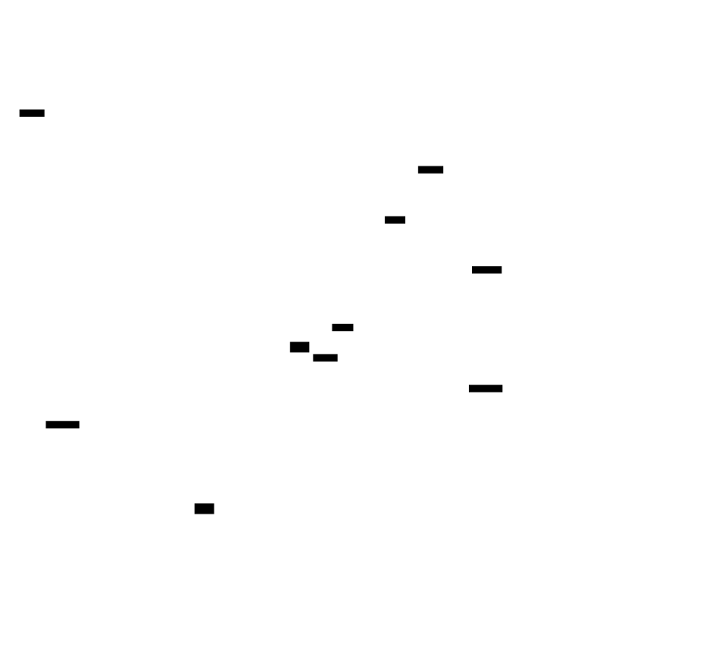
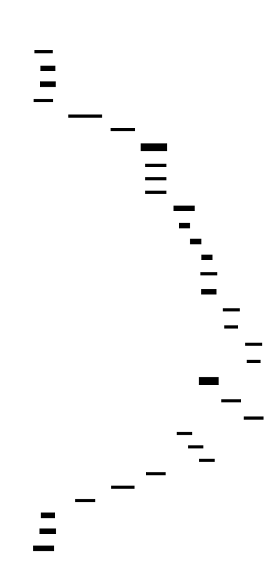
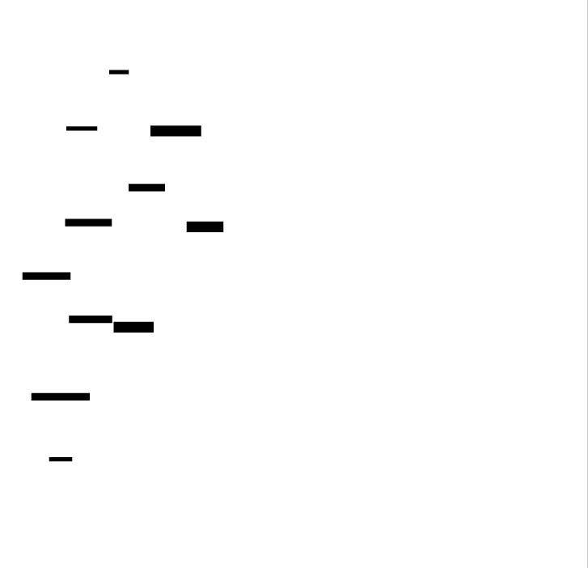
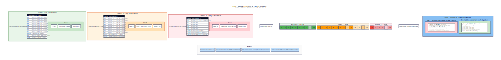
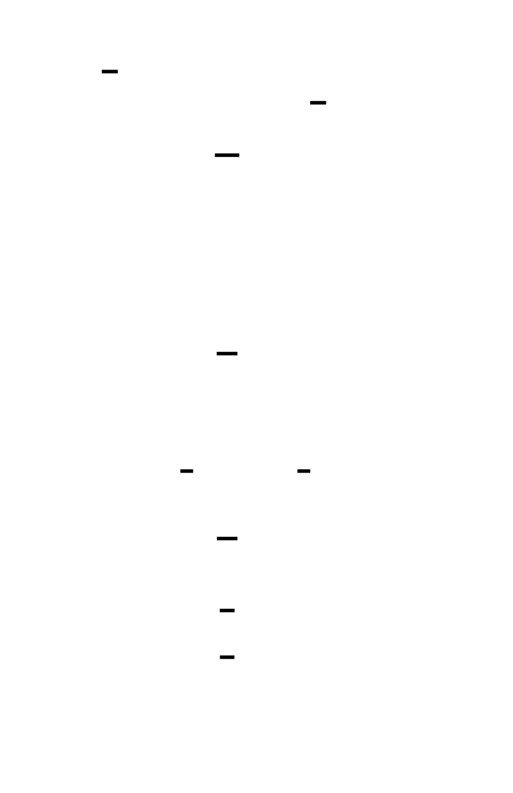
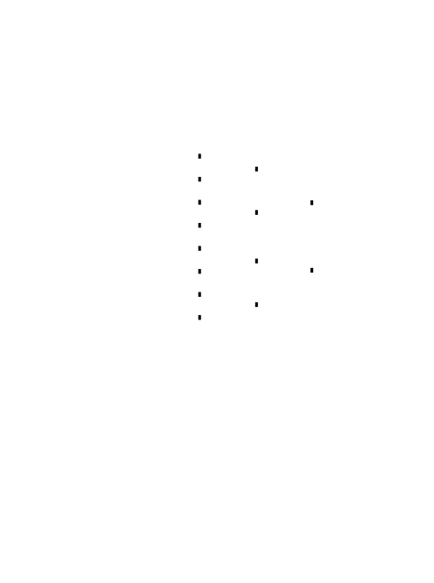
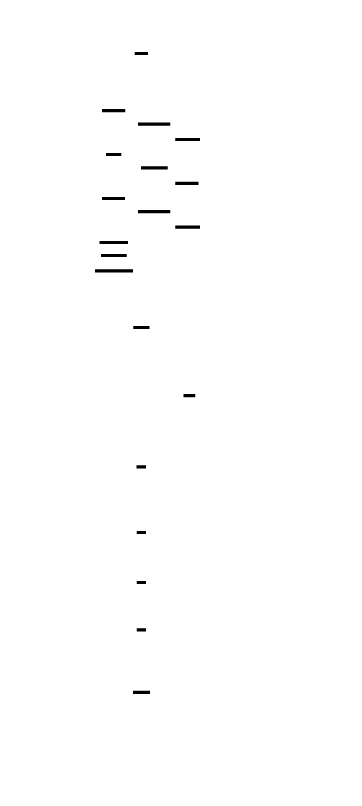
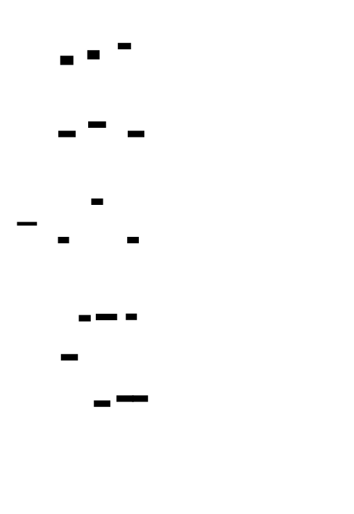
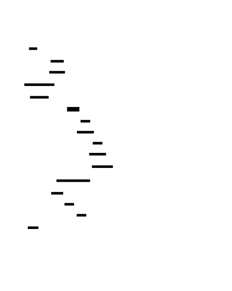
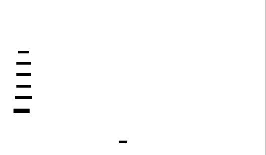

# 🎯 Project Charter: GPU Compute Programming
## What You Are Building
A complete GPU computing toolkit in CUDA C++ that includes a vector operations library with coalesced memory access, an optimized matrix transpose achieving 65-85% of peak memory bandwidth, parallel primitives (reduction, scan, histogram) that scale to millions of elements, a streaming pipeline with compute-transfer overlap using CUDA streams and pinned memory, and a profiling framework with occupancy calculation and roofline analysis. By the end, you'll have ~3,000-4,000 lines of CUDA code across 15+ source files that can process data at hundreds of gigabytes per second.
## Why This Project Exists
Most developers treat GPUs as black boxes—calling libraries like cuBLAS or PyTorch without understanding what makes them fast. This project forces you to confront the physical reality of GPU architecture: memory transactions are 128 bytes whether you use 1 byte or all 128, threads execute in warps of 32 whether your data fits that pattern or not, and the difference between naive and optimized code can be 30-100×. Understanding GPU programming at this level is valuable at $180K-350K+ for ML infrastructure and HPC roles.
## What You Will Be Able to Do When Done
- Write CUDA kernels with proper thread indexing and memory management from scratch
- Optimize memory access patterns for coalescing and achieve 80%+ of peak bandwidth
- Implement parallel reduction, scan, and histogram using shared memory and warp shuffles
- Overlap computation with PCIe transfers using CUDA streams and pinned memory
- Calculate occupancy and identify whether a kernel is memory-bound, compute-bound, or latency-bound
- Use Nsight Compute and Nsight Systems to diagnose performance bottlenecks
- Transform naive algorithms (2% efficiency) into optimized versions (65-85% efficiency)
## Final Deliverable
~3,500 lines of CUDA C++ across 18 source files, organized into 5 modules: vector operations, memory optimization (transpose), parallel primitives (reduce/scan/histogram), streaming pipeline, and profiling framework. Includes comprehensive test suites and benchmark harnesses. The optimized matrix transpose runs at 550-650 GB/s on RTX 3080, reduction achieves 600+ GB/s, and the streaming pipeline demonstrates 1.5-2× speedup from compute-transfer overlap.
## Is This Project For You?
**You should start this if you:**
- Are comfortable with C/C++ (pointers, memory management, templates)
- Understand basic parallel programming concepts (threads, synchronization, race conditions)
- Have some exposure to GPU concepts (even just using CUDA libraries)
- Want to work in ML infrastructure, scientific computing, game development, or HPC
**Come back after you've learned:**
- C pointers and memory layout (arrays, structs, cache lines) — try a systems programming course
- Basic parallel programming (what a race condition is, why locks exist) — try an OS or concurrency tutorial
- How to compile and run C/C++ programs from the command line
## Estimated Effort
| Phase | Time |
|-------|------|
| CUDA Fundamentals & Memory | ~12 hours |
| Memory Optimization & Coalescing | ~15 hours |
| Parallel Algorithms | ~18 hours |
| Streams & Asynchronous Execution | ~14 hours |
| Profiling & Optimization | ~17 hours |
| **Total** | **~76 hours** |
## Definition of Done
The project is complete when:
- All kernels achieve documented performance targets (e.g., transpose > 500 GB/s on 4096×4096 matrices)
- Test suites pass for all modules including edge cases (N=1, non-power-of-2 sizes, skewed histograms)
- Benchmark suite demonstrates speedup from optimizations with before/after metrics
- Profiling framework correctly calculates occupancy and classifies bottlenecks
- No CUDA errors go unchecked (every API call wrapped in error handling)
- Code compiles cleanly with `-Wall` and runs on both QEMU and real NVIDIA hardware

---

# 📚 Before You Read This: Prerequisites & Further Reading
> **Read these first.** The Atlas assumes you are familiar with the foundations below.
> Resources are ordered by when you should encounter them — some before you start, some at specific milestones.
---
## Before Starting This Project
### C/C++ Proficiency
**Why**: CUDA is essentially C++ with GPU-specific extensions. You need comfort with pointers, memory management, and compilation toolchains.
| Resource | Type | Why It's Gold Standard | When to Read |
|----------|------|----------------------|--------------|
| **The C Programming Language** (Kernighan & Ritchie) | Book, Chapters 1-5 | Original source from language creators; foundational understanding of pointers and memory | BEFORE starting — required if you're shaky on C fundamentals |
| **Effective C++** (Scott Meyers) | Book, Items 1-20 | The standard for writing correct, efficient C++; RAII patterns used throughout | BEFORE starting — essential for memory-safe patterns |
### Parallel Programming Concepts
**Why**: GPU programming is parallel programming at extreme scale. Understanding basic parallelism concepts helps you think in terms of thousands of concurrent threads.
| Resource | Type | Why It's Gold Standard | When to Read |
|----------|------|----------------------|--------------|
| **Introduction to High Performance Scientific Computing** (Eijkhout) | Free textbook, Chapters 1-3 | Clear explanation of memory hierarchy, cache behavior, and why data locality matters | BEFORE starting — establishes mental models for "why GPUs are different" |
| **Parallel Programming Concepts** (Hager & Wellein) | Book, Chapter 2 | Clean introduction to parallelism concepts: work vs. span, speedup limits | BEFORE starting — helps you think in parallel from day one |
---
## Milestone 1: CUDA Fundamentals & Memory
### GPU Architecture Foundations
**Why**: Before writing kernels, you need to understand *why* the hardware is designed the way it is.
| Resource | Type | Specific Reference | Why It's Gold Standard | When to Read |
|----------|------|-------------------|----------------------|--------------|
| **Programming Massively Parallel Processors** (Kirk & Hwu) | Book | Chapters 1-3 | Written by NVIDIA fellows; the canonical GPU textbook with accurate hardware details | BEFORE Milestone 1 — required foundational knowledge |
| **NVIDIA CUDA C++ Programming Guide** | Spec | Sections 1-3 (Introduction, Programming Model) | Official documentation from the source; authoritative on execution model | Read BEFORE Milestone 1 — reference alongside implementation |
### Memory Model Deep Dive
**Why**: Memory access patterns determine 90% of GPU performance.
| Resource | Type | Specific Reference | Why It's Gold Standard | When to Read |
|----------|------|-------------------|----------------------|--------------|
| **CUDA C Best Practices Guide** | Spec | "Memory Optimizations" section | Official guidance on coalescing, alignment, and access patterns | Read AFTER Milestone 1, BEFORE Milestone 2 — bridges basic kernels to optimization |
---
## Milestone 2: Memory Optimization & Coalescing
### Memory Hierarchy Mastery
**Why**: Understanding cache lines, coalescing rules, and bank conflicts transforms correct code into fast code.
| Resource | Type | Specific Reference | Why It's Gold Standard | When to Read |
|----------|------|-------------------|----------------------|--------------|
| **Programming Massively Parallel Processors** (Kirk & Hwu) | Book | Chapter 4 (Memory Architecture) | Detailed explanation of global memory, shared memory, and cache hierarchy | Read AFTER Milestone 1 — explains *why* coalescing matters |
| **NVIDIA Blog: "CUDA Pro Tip: Write Efficient Kernels"** | Blog | Full article | Concise, practical guidance from NVIDIA engineers on coalescing patterns | Read DURING Milestone 2 — immediate application |
### Bank Conflicts and Shared Memory
**Why**: Shared memory is your primary optimization tool; bank conflicts silently destroy performance.
| Resource | Type | Specific Reference | Why It's Gold Standard | When to Read |
|----------|------|-------------------|----------------------|--------------|
| **CUDA C Programming Guide** | Spec | Section 5.3.2 (Shared Memory) | Official specification of bank conflict behavior | Read DURING Milestone 2 — reference while debugging transpose |
| **Mark Harris: "Optimizing Parallel Reduction in CUDA"** | Paper/Slides | Full presentation | NVIDIA researcher's definitive guide; shows optimization methodology | Read AFTER Milestone 2 — prepares you for reduction algorithms |
---
## Milestone 3: Parallel Algorithms
### Parallel Algorithm Theory
**Why**: Parallel algorithms require fundamentally different thinking than sequential algorithms. Work complexity ≠ step complexity.
| Resource | Type | Specific Reference | Why It's Gold Standard | When to Read |
|----------|------|-------------------|----------------------|--------------|
| **Introduction to Algorithms** (CLRS) | Book | Chapter 27 (Multithreaded Algorithms) | Foundational text covering work, span, and parallelism | BEFORE Milestone 3 — establishes theoretical framework |
| **"Prefix Sums and Their Applications"** (Blelloch) | Paper | Sections 1-3 | Original work-efficient scan algorithm from its inventor | Read DURING Milestone 3 — implement scan while studying this |
### Reduction and Scan Implementations
**Why**: These primitives are building blocks for virtually every parallel algorithm.
| Resource | Type | Specific Reference | Why It's Gold Standard | When to Read |
|----------|------|-------------------|----------------------|--------------|
| **CUDA Samples: Reduction** | Code | `samples/1_Utilities/reduction/` | NVIDIA's reference implementation showing 7 optimization stages | Read DURING Milestone 3 — study each optimization step |
| **Thrust Library** | Code | `thrust/system/cuda/detail/reduce.h` | Production-quality implementation used by thousands of projects | Read AFTER Milestone 3 — see how experts write production code |
---
## Milestone 4: Streams & Asynchronous Execution
### Asynchronous Execution Models
**Why**: Understanding stream semantics and async behavior is essential for throughput-oriented applications.
| Resource | Type | Specific Reference | Why It's Gold Standard | When to Read |
|----------|------|-------------------|----------------------|--------------|
| **CUDA C Programming Guide** | Spec | Section 3.2.5 (Streams) | Official specification of stream behavior and synchronization | BEFORE Milestone 4 — required reading |
| **NVIDIA Blog: "CUDA Streams: Best Practices"** | Blog | Full article | Practical guidance from NVIDIA on stream usage patterns | Read DURING Milestone 4 — immediately applicable |
### Memory Transfer Optimization
**Why**: PCIe bandwidth is 50-100× slower than GPU memory; overlapping transfers with compute is essential.
| Resource | Type | Specific Reference | Why It's Gold Standard | When to Read |
|----------|------|-------------------|----------------------|--------------|
| **CUDA C Best Practices Guide** | Spec | "Data Transfer Optimization" section | Official guidance on pinned memory, async transfers, and overlap | Read BEFORE Milestone 4 — establishes the patterns you'll implement |
| **NVIDIA Blog: "How to Overlap Data Transfers in CUDA"** | Blog | Full article with code examples | Concrete examples of double-buffering patterns | Read DURING Milestone 4 — reference implementation |
---
## Milestone 5: Profiling & Optimization
### Profiling Methodology
**Why**: Optimization without measurement is guessing. Profilers tell you exactly what to fix.
| Resource | Type | Specific Reference | Why It's Gold Standard | When to Read |
|----------|------|-------------------|----------------------|--------------|
| **Nsight Compute Documentation** | Spec | "Kernel Profiling Guide" | Official guide to interpreting NCU metrics | BEFORE Milestone 5 — learn the tool before you need it |
| **Nsight Systems Documentation** | Spec | "Quick Start Guide" | Official timeline analysis guide | BEFORE Milestone 5 — learn the tool before you need it |
### Performance Analysis Frameworks
**Why**: The roofline model gives you a systematic way to classify bottlenecks and predict optimization impact.
| Resource | Type | Specific Reference | Why It's Gold Standard | When to Read |
|----------|------|-------------------|----------------------|--------------|
| **"Roofline: An Insightful Visual Performance Model"** (Williams et al.) | Paper | Sections 1-4 | Original paper introducing the roofline model | Read BEFORE Milestone 5 — theoretical foundation |
| **NVIDIA Nsight Compute Roofline** | Tool/Docs | "Roofline Analysis" section | How to apply roofline model to GPU kernels | Read DURING Milestone 5 — practical application |
### Occupancy and Resource Management
**Why**: 100% occupancy isn't always optimal. Understanding the tradeoffs is essential for expert-level optimization.
| Resource | Type | Specific Reference | Why It's Gold Standard | When to Read |
|----------|------|-------------------|----------------------|--------------|
| **CUDA Occupancy Calculator** | Tool | Excel spreadsheet or `cudaOccupancyMaxActiveBlocksPerMultiprocessor` API | NVIDIA's official tool for occupancy analysis | Use DURING Milestone 5 — validate your understanding |
| **"Understanding and Using the CUDA Occupancy Calculator"** | Blog | Full article with worked examples | Practical walkthrough of occupancy calculations | Read DURING Milestone 5 — immediately applicable |
---
## After Completing This Project
### Advanced GPU Topics
**Why**: Once you understand compute, you can explore specialized hardware (tensor cores, ray tracing) and system-level concerns (multi-GPU, cluster computing).
| Resource | Type | Specific Reference | Why It's Gold Standard | When to Read |
|----------|------|-------------------|----------------------|--------------|
| **Programming Massively Parallel Processors** (Kirk & Hwu) | Book | Chapters 8-12 (Tensor Cores, Multi-GPU) | Deep dive into advanced topics from canonical textbook | Read AFTER completing all milestones |
| **CUDA C Programming Guide** | Spec | Sections on Cooperative Groups, CUDA Graphs | Official documentation of advanced features | Reference as needed for specific features |
### Production CUDA Development
**Why**: Moving from learning to production requires understanding build systems, testing, and deployment.
| Resource | Type | Specific Reference | Why It's Gold Standard | When to Read |
|----------|------|-------------------|----------------------|--------------|
| **NVIDIA/cuCollections** | Code | GitHub repository | Production-quality GPU data structures library | Read AFTER completing project — see how experts structure code |
| **CUTLASS Library** | Code | `include/cutlass/` directory | NVIDIA's production tensor core library; best practices for high-performance code | Read AFTER completing project — advanced optimization patterns |

---

# GPU Compute Programming

GPU computing transforms how we solve computationally intensive problems by harnessing thousands of parallel threads. This project teaches you to think in parallel at a fundamental level—where memory access patterns determine performance more than algorithmic complexity, and where understanding hardware architecture is not optional but essential. You'll progress from basic CUDA kernels to sophisticated optimizations that achieve near-peak memory bandwidth.


<!-- MS_ID: gpu-compute-m1 -->
# CUDA Fundamentals & Memory
## The GPU Revolution: Why This Matters
You're about to enter a world where the rules of CPU programming break down entirely. A world where launching *more* threads can be free, where memory latency stretches to 400+ cycles, and where the difference between fast and slow code isn't algorithmic complexity—it's how you arrange your data in memory.
GPU computing powers the technologies reshaping our world: large language models, real-time ray tracing, drug discovery simulations, and autonomous vehicle perception. The engineers who understand GPU programming at a deep level command $180K-350K+ because they can unlock performance that CPU-only programmers can't touch.
But here's the thing: GPU programming requires a fundamentally different mental model. The patterns you've internalized from CPU programming—sequential execution, cache hierarchy, branch prediction—work against you on GPUs until you understand what's actually happening at the hardware level.
This milestone builds that mental model from the ground up. By the end, you won't just write CUDA code—you'll *think* in CUDA, visualizing how thousands of threads march through your data in lockstep.
---
## The Fundamental Tension: Latency vs. Throughput




Let's start with the physical reality that shapes everything in GPU computing.
**CPU Reality**: Your CPU has maybe 8-16 cores, each running at 3-4 GHz, with sophisticated caches (L1/L2/L3) designed to minimize latency. When you access memory, you want it *now*. Cache misses cost 50-100 cycles, and the CPU stalls waiting.
**GPU Reality**: A modern GPU has thousands of cores running at 1-2 GHz. Memory latency? 400-800 cycles for global memory access—nearly 10x worse than a CPU cache miss. And yet, GPUs achieve memory bandwidth of 900+ GB/s, while CPUs struggle to hit 100 GB/s.
**How is this possible?**
The GPU doesn't try to hide latency with caches. It hides latency with *massive parallelism*. When one thread stalls waiting for memory, the GPU instantly switches to another thread that's ready to execute. If you have 10,000 threads and each one stalls 50% of the time, you still have 5,000 threads ready to run at any moment.
> **The fundamental tension**: GPU programming is not about minimizing latency (making each thread fast). It's about maximizing throughput (keeping the hardware busy with *some* thread, even if individual threads are slow).
This mental shift—from "make each thread fast" to "keep all the hardware busy"—is the key to GPU programming. Everything else flows from it.
---
## Your GPU Is a Separate Computer
Before we write a single line of CUDA, understand this: **your GPU is a separate computer with its own memory**.
```
┌─────────────────────────────────────────────────────────────┐
│                        YOUR SYSTEM                          │
│                                                             │
│  ┌─────────────────┐           ┌─────────────────────────┐ │
│  │      CPU        │           │         GPU             │ │
│  │    (Host)       │           │       (Device)          │ │
│  │                 │   PCIe    │                         │ │
│  │  ┌───────────┐  │◄────────►│  ┌───────────────────┐   │ │
│  │  │  DRAM     │  │  16GB/s  │  │  Global Memory    │   │ │
│  │  │  32 GB    │  │          │  │  24 GB            │   │ │
│  │  └───────────┘  │           │  └───────────────────┘   │ │
│  │                 │           │                         │ │
│  │  8-16 cores     │           │  10,000+ cores          │ │
│  │  100 GB/s       │           │  900+ GB/s              │ │
│  └─────────────────┘           └─────────────────────────┘ │
│                                                             │
└─────────────────────────────────────────────────────────────┘
```
This has profound implications:
1. **Your data doesn't live on the GPU by default.** You must explicitly copy it there.
2. **CPU pointers don't work on the GPU.** A pointer to CPU memory means nothing to GPU code.
3. **Copying data across PCIe is slow.** At ~16 GB/s, the PCIe bus is the bottleneck for any algorithm that moves lots of data back and forth.
This is similar to memory-mapped I/O in systems programming—`cudaMemcpy` is conceptually like copying between two separate address spaces. The GPU isn't an accelerator that accesses your RAM; it's a coprocessor with its own memory that needs to be fed data.


---
## The CUDA Execution Model: Thinking in Parallel
### The Revelation: GPU Threads Are Not Like CPU Threads
If you've programmed with CPU threads (pthread, std::thread, OpenMP), you have a mental model that will actively hurt your GPU programming. Let's shatter it.
**What you think GPU threads are:**
- Independent execution units
- Each thread runs at its own pace
- Launching more threads = more overhead
- Thread creation is expensive
**What GPU threads actually are:**
GPU threads are grouped into **warps** of 32 threads that execute in **SIMT (Single Instruction, Multiple Threads) lockstep**. Think of it as hardware-enforced SIMD, but with 32-wide parallelism instead of the 4-8 lanes you get with CPU vector intrinsics.


> **🔑 Foundation: SIMD execution model: how vector processors execute the same instruction on multiple data elements simultaneously**
> 
> ## SIMD Execution Model
### What It Is
**SIMD** (Single Instruction, Multiple Data) is a parallel execution model where one instruction operates on multiple data values simultaneously. Instead of processing one number at a time, the processor grabs a "vector" of values and applies the same operation to all of them in a single clock cycle.
Think of it like this: scalar processing is a chef chopping one vegetable at a time. SIMD is that same chef with an 8-blade mandoline—one pushing motion, eight perfectly sliced carrots.
```cpp
// Scalar: 4 operations, 4 cycles (conceptually)
for (int i = 0; i < 4; i++) {
    c[i] = a[i] + b[i];
}
// SIMD: 1 operation, 1 cycle (4 additions simultaneously)
// [a0+a1+a2+a3] + [b0+b1+b2+b3] = [c0+c1+c2+c3]
```
On GPUs, this is called **SIMT** (Single Instruction, Multiple Threads). A "warp" or "wavefront" of 32-64 threads executes the same instruction in lockstep. Each thread has its own registers and operates on its own data element, but they move together through the program counter like soldiers marching in formation.
### Why You Need It Right Now
Understanding SIMD is essential for writing performant GPU kernels because:
1. **Divergence kills performance**: When threads in a warp take different branches (e.g., `if (tid < 16)`), both paths execute serially—threads on the inactive path are masked out but still consume cycles. This is *warp divergence*.
2. **Memory coalescing depends on it**: Adjacent threads accessing adjacent memory addresses can be coalesced into a single memory transaction. Random access patterns break this optimization.
3. **Occupancy calculations**: You need to know your hardware's warp size (32 for NVIDIA, 64 for AMD) to size thread blocks correctly. A block of 33 threads wastes nearly half a warp.
### Key Mental Model
**The Lockstep Choir**: Imagine a choir where every singer must sing the exact same note at the same time. If one person needs to sing a different note (branch divergence), the whole choir has to wait—or worse, sing both notes sequentially while half the singers stay silent. Your job as the composer (programmer) is to write music where everyone sings together as much as possible.
The practical implication: structure your data and control flow so that threads in the same warp take the same code paths and access memory in predictable, adjacent patterns.


```
Warp (32 threads):
┌────┬────┬────┬────┬────┬────┬─────┬────┐
│ T0 │ T1 │ T2 │ T3 │ T4 │ T5 │ ... │ T31│
└────┴────┴────┴────┴────┴────┴─────┴────┘
  │    │    │    │    │    │          │
  ▼    ▼    ▼    ▼    ▼    ▼          ▼
  ALL 32 THREADS EXECUTE THE SAME INSTRUCTION
  AT THE SAME TIME (lockstep)
```
When thread T0 executes `x = a + b`, threads T1 through T31 also execute `x = a + b` in the same clock cycle—each with their own values of `a`, `b`, and `x`.
**Consequence 1: A waiting thread blocks its entire warp.** If T0 needs to wait for a memory fetch, T1-T31 wait too. There's no "running ahead."
**Consequence 2: Divergent branches kill performance.** If your code has:
```cuda
if (threadIdx.x < 16) {
    // Path A
} else {
    // Path B
}
```
Then for each warp, *both* paths execute. Threads 0-15 execute Path A while threads 16-31 are idle, then threads 16-31 execute Path B while threads 0-15 are idle. You've turned 32 parallel threads into 16.
**Consequence 3: More threads beyond a point provide no benefit.** Each GPU core (SM, or Streaming Multiprocessor) has limited registers and shared memory. If your kernel uses many registers per thread, you can't fit as many threads on the SM. This is called **occupancy**, and we'll explore it deeply in Milestone 5.
---
## The Thread Hierarchy: Grids, Blocks, and Threads


CUDA organizes threads into a hierarchy that maps directly to the hardware:
### Level 1: Threads
The atomic unit of execution. Each thread:
- Has its own register file (private, fastest storage)
- Has its own local memory (actually global memory, used for register spilling)
- Can access shared memory (shared with other threads in the same block)
- Can access global memory (visible to all threads in all blocks)
### Level 2: Thread Blocks (CTAs - Cooperative Thread Arrays)
A group of threads that:
- Execute on the same SM (Streaming Multiprocessor)
- Share memory (fast, user-managed scratchpad)
- Can synchronize via `__syncthreads()`
- Maximum 1024 threads per block (hardware limit)
### Level 3: Grids
A collection of thread blocks that:
- Execute across multiple SMs
- Cannot synchronize with each other directly
- Cannot share memory directly (must use global memory)
```
Grid (your kernel launch)
│
├── Block (0,0)     Block (1,0)     Block (2,0)  ...
│   ┌─────────┐     ┌─────────┐     ┌─────────┐
│   │ Thread  │     │ Thread  │     │ Thread  │
│   │ (0,0,0) │     │ (0,0,0) │     │ (0,0,0) │
│   │ Thread  │     │ Thread  │     │ Thread  │
│   │ (1,0,0) │     │ (1,0,0) │     │ (1,0,0) │
│   │   ...   │     │   ...   │     │   ...   │
│   └─────────┘     └─────────┘     └─────────┘
│
├── Block (0,1)     Block (1,1)     Block (2,1)  ...
│   ┌─────────┐     ┌─────────┐     ┌─────────┐
│   │  ...    │     │  ...    │     │  ...    │
│   └─────────┘     └─────────┘     └─────────┘
│
└── ...
```
### Why This Hierarchy?
The hierarchy exists because of the physical hardware:
- **Threads in a block** → Mapped to a single SM, can share resources
- **Blocks in a grid** → Distributed across SMs, run independently
- **Warps within a block** → The SM schedules warps to hide latency
When you launch a kernel, you specify the grid and block dimensions:
```cuda
// Launch a grid of blocks, each with 256 threads
myKernel<<<numBlocks, threadsPerBlock>>>(args);
```
The triple angle brackets `<<< >>>` is the **kernel launch syntax**—it tells the GPU how to organize threads for this kernel.
---
## Thread Indexing: Finding Your Place


Every thread needs to know "which element of my data should I process?" This requires computing a **global thread index** from the built-in CUDA variables:
| Variable | Meaning |
|----------|---------|
| `threadIdx.x/y/z` | Thread's index within its block (0-based) |
| `blockIdx.x/y/z` | Block's index within the grid (0-based) |
| `blockDim.x/y/z` | Number of threads per block (in each dimension) |
| `gridDim.x/y/z` | Number of blocks in the grid (in each dimension) |
### 1D Indexing (Most Common)
For a 1D grid processing a 1D array:
```cuda
// Global thread index = block index * block size + thread index within block
int idx = blockIdx.x * blockDim.x + threadIdx.x;
```
```
Block 0: threads 0-255  → global indices 0-255
Block 1: threads 0-255  → global indices 256-511
Block 2: threads 0-255  → global indices 512-767
...
```
### 2D Indexing (For Matrices/Images)
For a 2D grid processing a 2D array:
```cuda
int row = blockIdx.y * blockDim.y + threadIdx.y;
int col = blockIdx.x * blockDim.x + threadIdx.x;
int idx = row * width + col;  // Row-major linear index
```
### Handling Arbitrary Data Sizes
What if your data has 1000 elements but your blocks have 256 threads?
```cuda
// 4 blocks * 256 threads = 1024 threads, but only 1000 elements
int idx = blockIdx.x * blockDim.x + threadIdx.x;
// Guard against out-of-bounds access
if (idx < N) {
    // Process element at idx
}
```
This **bounds check** is essential. Without it, threads 1000-1023 would access memory beyond your array.
---
## GPU Memory Hierarchy: The Performance Ladder


> **🔑 Foundation: GPU memory hierarchy: the different memory spaces available on GPUs and their performance characteristics**
> 
> ## GPU Memory Hierarchy
### What It Is
GPUs have a deeply stratified memory system, with each level offering different tradeoffs between capacity, latency, and bandwidth. From fastest/smallest to slowest/largest:
| Memory Type | Latency | Bandwidth | Size (typical) | Scope |
|------------|---------|-----------|----------------|-------|
| **Registers** | 1 cycle | ~10 TB/s | ~64 KB | Per thread |
| **Shared Memory / L1** | ~20-30 cycles | ~several TB/s | 32-128 KB | Per thread block |
| **L2 Cache** | ~200-300 cycles | ~TB/s | 2-40 MB | Device-wide |
| **Global Memory (VRAM)** | ~400-800 cycles | 500 GB - 3 TB/s | 8-80 GB | Device-wide |
| **Host Memory (RAM)** | ~10,000+ cycles | ~100 GB/s (via PCIe) | System RAM | Across PCIe |
**Registers** are the fastest—each thread gets its own private set. Use them freely; the compiler handles allocation.
**Shared memory** (CUDA) / **Local Data Share** (AMD) is user-managed scratchpad memory shared among threads in a block. It's your primary tool for cooperation and caching frequently-used data.
**Global memory** is the VRAM you allocate from the host. High bandwidth but high latency—if you don't coalesce accesses, you leave massive performance on the table.
**Constant and texture memory** are specialized read-only spaces with hardware caching optimized for specific access patterns.
### Why You Need It Right Now
Memory access patterns often matter more than compute optimization. A kernel that runs at 50% of peak FLOPS might be memory-bound, not compute-limited.
Key practical implications:
1. **Data placement is a performance lever**: Frequently-accessed data should live in shared memory. Load from global once, reuse many times.
2. **Bank conflicts in shared memory**: Shared memory is divided into banks (usually 32). If multiple threads in a warp access different addresses in the same bank simultaneously, accesses serialize. Stride your access patterns to avoid this.
3. **Coalescing rules differ by architecture**: On modern GPUs, any access within a cache line can be coalesced, but aligned, contiguous access is still optimal.
4. **PCIe is your bottleneck for data transfer**: Moving data between host and device is slow. Minimize transfers; overlap compute with transfers using streams.
```cpp
// Bad: Each thread reads scattered locations (non-coalesced)
int val = data[threadIdx.x * stride];
// Good: Adjacent threads read adjacent memory (coalesced)
int val = data[threadIdx.x];
```
### Key Mental Model
**The Library Analogy**: 
- **Registers** = The book in your hand. Instant access, but you can only hold a few.
- **Shared memory** = Your study group's table. Fast access, limited space, shared with collaborators.
- **L2 cache** = The library's popular shelf. Automatically managed, you don't control what's there.
- **Global memory** = The main stacks. Huge but slow to traverse.
- **Host memory** = Another library across town. Getting anything requires a trip.
The optimization strategy: keep what you're actively working on at the table (shared memory), bring it from the stacks (global) in organized batches, and never make unnecessary trips across town (PCIe).


GPU memory is not created equal. The performance difference between memory types is *staggering*:
| Memory Type | Location | Latency (cycles) | Bandwidth | Scope | Lifetime |
|-------------|----------|------------------|-----------|-------|----------|
| **Registers** | On-chip | 1 | Instant | Thread | Kernel |
| **Shared Memory** | On-chip | ~5-20 | ~10 TB/s | Block | Kernel |
| **L1/L2 Cache** | On-chip | ~30-50 | ~10 TB/s | SM/Global | Automatic |
| **Global Memory** | Off-chip DRAM | ~400-800 | ~900 GB/s | All threads | Allocated |
| **Local Memory** | Global DRAM | ~400-800 | ~900 GB/s | Thread | Kernel |
| **Constant Memory** | Global DRAM (cached) | ~1-5 (cache hit) | ~10 TB/s | All threads | Allocated |
| **Texture Memory** | Global DRAM (cached) | Varies | Varies | All threads | Allocated |
For this milestone, we focus on **global memory**—the main memory pool you'll allocate and use. In Milestone 2, you'll learn to use shared memory as a software-managed cache.
### Why Registers Matter
Each thread has its own **register file**—fastest storage on the GPU. A modern GPU has 65,536 32-bit registers per SM. If each thread uses 64 registers:
- Each block of 256 threads needs 16,384 registers
- The SM can hold at most 4 such blocks (65,536 / 16,384 = 4)
- Maximum occupancy: 4 blocks × 256 threads = 1024 threads per SM
If you use too many registers per thread, you reduce occupancy. The CUDA compiler tries to balance this automatically, but sometimes you need to intervene with launch bounds.
---
## Your First CUDA Kernel: Vector Addition
Let's put this all together with the "Hello World" of GPU computing: vector addition. We'll add two arrays element-by-element: `C[i] = A[i] + B[i]`.
### The Complete Program
```cuda
#include <cuda_runtime.h>
#include <stdio.h>
#include <stdlib.h>
// ============================================================
// ERROR CHECKING MACRO
// ============================================================
#define CUDA_CHECK(call) \
    do { \
        cudaError_t err = call; \
        if (err != cudaSuccess) { \
            fprintf(stderr, "CUDA error at %s:%d - %s\n", \
                    __FILE__, __LINE__, cudaGetErrorString(err)); \
            exit(EXIT_FAILURE); \
        } \
    } while (0)
// ============================================================
// KERNEL: Vector Addition
// ============================================================
__global__ void vectorAdd(const float* A, const float* B, float* C, int N) {
    // Compute global thread index
    int idx = blockIdx.x * blockDim.x + threadIdx.x;
    // Bounds check (essential for non-power-of-2 sizes)
    if (idx < N) {
        C[idx] = A[idx] + B[idx];
    }
}
// ============================================================
// HOST CODE
// ============================================================
int main() {
    // Problem size
    const int N = 1 << 20;  // 1M elements
    const size_t bytes = N * sizeof(float);
    // Allocate host memory
    float* h_A = (float*)malloc(bytes);
    float* h_B = (float*)malloc(bytes);
    float* h_C = (float*)malloc(bytes);
    // Initialize data
    for (int i = 0; i < N; i++) {
        h_A[i] = 1.0f;
        h_B[i] = 2.0f;
    }
    // ========================================================
    // GPU MEMORY ALLOCATION
    // ========================================================
    float *d_A, *d_B, *d_C;
    CUDA_CHECK(cudaMalloc(&d_A, bytes));
    CUDA_CHECK(cudaMalloc(&d_B, bytes));
    CUDA_CHECK(cudaMalloc(&d_C, bytes));
    // ========================================================
    // COPY DATA FROM HOST TO DEVICE
    // ========================================================
    CUDA_CHECK(cudaMemcpy(d_A, h_A, bytes, cudaMemcpyHostToDevice));
    CUDA_CHECK(cudaMemcpy(d_B, h_B, bytes, cudaMemcpyHostToDevice));
    // ========================================================
    // KERNEL LAUNCH CONFIGURATION
    // ========================================================
    int threadsPerBlock = 256;  // Common choice, good occupancy
    int blocksPerGrid = (N + threadsPerBlock - 1) / threadsPerBlock;  // Ceiling division
    printf("Launching %d blocks, %d threads per block\n", 
           blocksPerGrid, threadsPerBlock);
    printf("Total threads: %d\n", blocksPerGrid * threadsPerBlock);
    // ========================================================
    // LAUNCH KERNEL
    // ========================================================
    vectorAdd<<<blocksPerGrid, threadsPerBlock>>>(d_A, d_B, d_C, N);
    // Check for launch errors
    CUDA_CHECK(cudaGetLastError());
    // Wait for kernel to complete
    CUDA_CHECK(cudaDeviceSynchronize());
    // ========================================================
    // COPY RESULT BACK TO HOST
    // ========================================================
    CUDA_CHECK(cudaMemcpy(h_C, d_C, bytes, cudaMemcpyDeviceToHost));
    // ========================================================
    // VERIFY RESULT
    // ========================================================
    bool success = true;
    for (int i = 0; i < N; i++) {
        if (h_C[i] != 3.0f) {
            printf("Error at index %d: expected 3.0, got %f\n", i, h_C[i]);
            success = false;
            break;
        }
    }
    if (success) {
        printf("Vector addition successful! All %d elements correct.\n", N);
    }
    // ========================================================
    // CLEANUP
    // ========================================================
    CUDA_CHECK(cudaFree(d_A));
    CUDA_CHECK(cudaFree(d_B));
    CUDA_CHECK(cudaFree(d_C));
    free(h_A);
    free(h_B);
    free(h_C);
    return 0;
}
```




### Dissecting the Kernel
```cuda
__global__ void vectorAdd(const float* A, const float* B, float* C, int N)
```
- `__global__` — This is a **kernel function**. It runs on the GPU, called from the CPU.
- `void` — Kernels cannot return values; they write results to memory.
- Pointers `A`, `B`, `C` — These must point to GPU memory (allocated with `cudaMalloc`).
```cuda
int idx = blockIdx.x * blockDim.x + threadIdx.x;
```
This is the **index formula**. Memorize it. It converts 1D thread/block indices into a global array index.
```cuda
if (idx < N) {
    C[idx] = A[idx] + B[idx];
}
```
The **bounds check** prevents out-of-bounds memory access. Without it, threads beyond `N` would write to memory they don't own.
### Memory Management API
| Function | Purpose | Direction |
|----------|---------|-----------|
| `cudaMalloc(void** ptr, size_t bytes)` | Allocate GPU memory | — |
| `cudaFree(void* ptr)` | Free GPU memory | — |
| `cudaMemcpy(void* dst, void* src, size_t bytes, cudaMemcpyKind kind)` | Copy memory | Host↔Device |
The `cudaMemcpyKind` enum:
- `cudaMemcpyHostToDevice` — CPU → GPU
- `cudaMemcpyDeviceToHost` — GPU → CPU
- `cudaMemcpyDeviceToDevice` — GPU → GPU
- `cudaMemcpyHostToHost` — CPU → CPU (rarely used)
### Kernel Launch Configuration
```cuda
vectorAdd<<<blocksPerGrid, threadsPerBlock>>>(d_A, d_B, d_C, N);
//           ↑                ↑
//        Grid dimension   Block dimension
```
The `<<< >>>` syntax specifies the execution configuration:
- First argument: number of blocks in the grid
- Second argument: number of threads per block
For a 2D or 3D grid/block, use `dim3`:
```cuda
dim3 blockDim(16, 16);  // 16x16 = 256 threads per block
dim3 gridDim((width + 15) / 16, (height + 15) / 16);
myKernel<<<gridDim, blockDim>>>(args);
```
---
## The Three-Level View: What Happens When You Launch a Kernel?
Let's trace through the execution of `vectorAdd` at three levels:
### Level 1: Application (What You See)
```cuda
vectorAdd<<<4096, 256>>>(d_A, d_B, d_C, 1048576);
```
You launch a kernel with 4096 blocks × 256 threads = 1,048,576 threads. The call returns immediately (asynchronous). Later, `cudaDeviceSynchronize()` blocks until the kernel completes.
### Level 2: OS/Driver (The Plumbing)
1. **Kernel compilation** (at program start): The CUDA driver compiles your PTX (parallel thread execution) code to native GPU instructions.
2. **Launch submission**: The driver puts the kernel launch into the GPU's command queue.
3. **Block scheduling**: The GPU's work distributor assigns blocks to SMs. Each SM can run multiple blocks concurrently (limited by resources).
4. **Completion signal**: When all blocks finish, the GPU signals completion.
### Level 3: Hardware (The Reality)
1. **Block → SM mapping**: Blocks are assigned to SMs dynamically. A block runs entirely on one SM.
2. **Warp formation**: Within each block, threads are grouped into warps of 32. Block of 256 threads = 8 warps.
3. **Warp scheduling**: Each SM has warp schedulers that select ready warps to execute each cycle. If a warp is waiting for memory, another warp runs.
4. **SIMT execution**: All 32 threads in a warp execute the same instruction. Each has its own registers, but they share the program counter.
```
Timeline on a single SM:
Cycle 0-100:   Warp 0 executes (fetches A[0], B[0])
Cycle 101-500: Warp 0 stalled (waiting for memory)
               Warp 1 executes (fetches A[32], B[32])
Cycle 501-600: Warp 1 stalled
               Warp 2 executes (fetches A[64], B[64])
...
Cycle 400:     Warp 0's data arrives, ready to resume
Cycle 401-450: Warp 0 executes (computes C[0] = A[0] + B[0])
```
This is **latency hiding** in action. The 400-cycle memory latency doesn't stall the SM because other warps keep it busy.
---
## Error Handling: Don't Skip This
CUDA errors are **asynchronous**. A kernel launch might fail, but you won't know until you check:
```cuda
// This might succeed (just queues the launch)
vectorAdd<<<blocks, threads>>>(d_A, d_B, d_C, N);
// Check for launch errors (invalid config, out of resources, etc.)
CUDA_CHECK(cudaGetLastError());
// Wait for kernel to finish and check for execution errors
CUDA_CHECK(cudaDeviceSynchronize());
```
Common errors:
- `cudaErrorInvalidConfiguration`: Too many threads per block (>1024), too many blocks, or too much shared memory
- `cudaErrorMemoryAllocation`: Out of GPU memory
- `cudaErrorLaunchTimeout`: Kernel took too long (GPU hang, often from infinite loop)
Always wrap your CUDA calls in error-checking macros. It will save you hours of debugging.
---
## Hardware Soul: What the Hardware Sees
Let's look at vector addition from the hardware's perspective:
### Cache Lines Touched
- Each float is 4 bytes
- A cache line is 128 bytes (32 floats)
- For N = 1M elements: reading A and B = 2M floats = 8 MB
- Number of cache lines: 8 MB / 128 B = 62,500 cache lines per array
### Memory Access Pattern
- Thread 0 reads A[0], B[0], writes C[0]
- Thread 1 reads A[1], B[1], writes C[1]
- Thread 2 reads A[2], B[2], writes C[2]
- ...
This is a **coalesced access pattern**—adjacent threads access adjacent memory locations. The GPU can combine these 32 accesses into a single 128-byte transaction. We'll explore this deeply in Milestone 2.
### Branch Prediction
- The bounds check `if (idx < N)` is predictable
- Only the last block might have threads that fail the check
- Minimal divergence impact
### TLB (Translation Lookaside Buffer)
- The GPU has a TLB to translate virtual addresses to physical addresses
- Sequential access patterns have excellent TLB locality
- Random access patterns thrash the TLB
---
## Building and Running
### Compilation with nvcc
```bash
# Compile
nvcc -o vector_add vector_add.cu
# Run
./vector_add
```
The `nvcc` compiler:
1. Separates `__global__` and `__device__` functions (GPU code) from host code
2. Compiles GPU code to PTX (intermediate) then to native SASS (GPU assembly)
3. Compiles host code with gcc/clang
4. Links everything into a single executable
### Useful nvcc Flags
```bash
# Specify GPU architecture (sm_80 = A100, sm_89 = RTX 4090, sm_90 = H100)
nvcc -arch=sm_80 -o vector_add vector_add.cu
# Generate code for multiple architectures
nvcc -gencode=arch=compute_70,code=sm_70 \
     -gencode=arch=compute_80,code=sm_80 \
     -o vector_add vector_add.cu
# Include debug info
nvcc -g -G -o vector_add vector_add.cu
# Maximize optimization
nvcc -O3 -o vector_add vector_add.cu
```
---
## Common Pitfalls
### 1. Wrong Grid/Block Dimensions
```cuda
// WRONG: Integer division truncates
int blocksPerGrid = N / threadsPerBlock;  // If N=1000, threads=256, blocks=3
                                          // Only 768 threads launched!
// CORRECT: Ceiling division
int blocksPerGrid = (N + threadsPerBlock - 1) / threadsPerBlock;  // blocks=4
```
### 2. Memory Transfer Direction Errors
```cuda
// WRONG: Copying wrong direction
cudaMemcpy(d_A, h_A, bytes, cudaMemcpyDeviceToHost);  // Reading uninitialized GPU mem!
// CORRECT
cudaMemcpy(d_A, h_A, bytes, cudaMemcpyHostToDevice);  // Host → Device
```
### 3. Exceeding Thread/Block Limits
```cuda
// WRONG: More than 1024 threads per block
dim3 block(32, 32, 2);  // 32*32*2 = 2048 threads - will fail!
// CORRECT: Stay within limits
dim3 block(16, 16, 2);  // 16*16*2 = 512 threads - OK
```
### 4. Not Checking for Errors
```cuda
// WRONG: No error checking
cudaMalloc(&d_A, bytes);
vectorAdd<<<blocks, threads>>>(d_A, d_B, d_C, N);
cudaMemcpy(h_C, d_C, bytes, cudaMemcpyDeviceToHost);
// If anything failed, you won't know!
// CORRECT: Check every call
CUDA_CHECK(cudaMalloc(&d_A, bytes));
vectorAdd<<<blocks, threads>>>(d_A, d_B, d_C, N);
CUDA_CHECK(cudaGetLastError());
CUDA_CHECK(cudaDeviceSynchronize());
CUDA_CHECK(cudaMemcpy(h_C, d_C, bytes, cudaMemcpyDeviceToHost));
```
### 5. Using CPU Pointers on GPU
```cuda
// WRONG: Passing CPU pointer to kernel
float* h_A = (float*)malloc(bytes);
myKernel<<<blocks, threads>>>(h_A, ...);  // h_A is CPU memory!
// CORRECT: Use GPU pointers
float *d_A;
cudaMalloc(&d_A, bytes);
myKernel<<<blocks, threads>>>(d_A, ...);  // d_A is GPU memory
```
---
## Performance Baseline: What Should You Expect?
Let's establish a performance baseline for vector addition:
```cuda
// Benchmark wrapper
cudaEvent_t start, stop;
cudaEventCreate(&start);
cudaEventCreate(&stop);
cudaEventRecord(start);
vectorAdd<<<blocks, threads>>>(d_A, d_B, d_C, N);
cudaEventRecord(stop);
cudaEventSynchronize(stop);
float milliseconds = 0;
cudaEventElapsedTime(&milliseconds, start, stop);
float seconds = milliseconds / 1000.0f;
float bytesProcessed = 3.0f * N * sizeof(float);  // Read A, B; Write C
float bandwidth = bytesProcessed / seconds / 1e9;  // GB/s
printf("Time: %.3f ms, Bandwidth: %.1f GB/s\n", milliseconds, bandwidth);
```
On an RTX 3080 (theoretical bandwidth: 760 GB/s):
- Naive vector addition: ~600-700 GB/s (80-90% of peak)
- Why so good? The access pattern is perfectly coalesced.
On an A100 (theoretical bandwidth: 2039 GB/s):
- Naive vector addition: ~1500-1800 GB/s (75-90% of peak)
Vector addition is **memory-bandwidth bound**—the limiting factor is how fast you can move data, not how fast you can compute.
---
## Design Decisions: Why CUDA, Not OpenCL?
| Option | Pros | Cons | Used By |
|--------|------|------|---------|
| **CUDA** ✓ | Best tooling (Nsight), best docs, largest community, most optimizations | NVIDIA-only | PyTorch, TensorFlow, CUDA, cuDNN, cuBLAS |
| OpenCL | Cross-vendor (AMD, Intel, NVIDIA), Open standard | Worse tooling, fragmented implementations, less optimization guidance | Some HPC apps, legacy code |
| HIP | AMD's CUDA-like API, relatively easy porting | AMD-only, smaller ecosystem | ROCm stack |
| SYCL | Modern C++, cross-vendor, single-source | Newer, smaller ecosystem, steeper learning curve | Intel oneAPI, some HPC |
For learning GPU programming, CUDA's documentation, tooling, and community make it the best choice. The concepts transfer: warps become wavefronts, SMs become CUs, coalescing works the same way.
---
## Your Mission: Build a Vector Operations Library
You now have the foundation. Your task is to build a reusable vector operations library that demonstrates mastery of:
1. **Kernel definition and launch**
2. **Memory management** (allocation, transfer, freeing)
3. **Thread indexing** for arbitrary data sizes
4. **Error handling** at every step
### Requirements
Implement the following operations:
```cuda
// Vector addition: C = A + B
void vecAdd(const float* d_A, const float* d_B, float* d_C, int N);
// Vector subtraction: C = A - B
void vecSub(const float* d_A, const float* d_B, float* d_C, int N);
// Scalar multiplication: C = scalar * A
void vecScale(const float* d_A, float scalar, float* d_C, int N);
// Dot product: result = A · B (will need reduction - covered in M3)
// For now, implement a naive version
float vecDot(const float* d_A, const float* d_B, int N);
```
### Structure
```
vector_ops/
├── vector_ops.h        // Public API
├── vector_ops.cu       // Kernel implementations
├── vector_ops_test.cu  // Test cases
└── Makefile
```
### Test Cases
Write tests that:
1. Verify correctness against CPU implementation
2. Handle edge cases (N=0, N=1, N=very large)
3. Measure and report bandwidth
---
## Knowledge Cascade: What You've Unlocked
By mastering CUDA fundamentals, you've unlocked connections across multiple domains:
### 1. SIMD/Vector Intrinsics on CPU
GPU warps are the hardware-enforced version of CPU SIMD lanes. When you write AVX-512 intrinsics, you're manually managing what the GPU does automatically—executing the same instruction on multiple data. The difference: AVX-512 has 16 lanes; a warp has 32 threads. Same concept, different scale.
### 2. Memory-Mapped I/O and Device Drivers
The host-device memory transfer pattern mirrors how device drivers work. When you write to a memory-mapped register, you're not just writing to RAM—you're communicating with hardware. `cudaMemcpy` is the same abstraction: a controlled channel between two address spaces. If you understand why `cudaMemcpy` exists, you understand why `copy_to_user` and `copy_from_user` exist in kernel code.
### 3. Database Query Parallelization
The way you partition data across GPU threads—each thread responsible for its index range—is the same mental model as sharding data across database nodes. In both cases, you're thinking about:
- How to partition work evenly
- How to minimize cross-partition communication
- How to handle data sizes that don't divide evenly
### 4. Thread Pool Saturation and Work Stealing
Just as CPU thread pools have optimal sizes (too few = underutilized; too many = context switch overhead), GPU occupancy has ceilings determined by register and shared memory constraints. The scheduler picks ready warps just like a work-stealing scheduler picks ready tasks. Understanding one helps you understand the other.
### 5. Distributed Systems and Bulk Synchronous Parallel
A CUDA grid is a BSP (Bulk Synchronous Parallel) system:
- **Bulk**: Many threads execute in parallel
- **Synchronous**: `__syncthreads()` provides a barrier
- **Parallel**: Blocks run independently across SMs
This pattern appears in MapReduce, Spark, and distributed graph processing. The GPU is a tiny distributed system on a chip.
---
## Looking Ahead: What's Next?
In **Milestone 2**, you'll learn to optimize memory access patterns:
- **Coalescing**: How to ensure adjacent threads access adjacent memory
- **Shared memory**: Using on-chip memory as a software-managed cache
- **Bank conflicts**: The hidden performance killer in shared memory
- **Matrix transpose**: A classic optimization problem that demonstrates all these concepts
The vector addition kernel you wrote today achieves good performance because its access pattern is naturally coalesced. Real applications aren't always so simple. Milestone 2 will give you the tools to make any access pattern fast.
---
## Quick Reference: CUDA Cheat Sheet
```cuda
// Kernel definition
__global__ void myKernel(Type* arg1, Type* arg2, ...) {
    int idx = blockIdx.x * blockDim.x + threadIdx.x;
    if (idx < N) {
        // Your code here
    }
}
// Memory management
cudaMalloc(&d_ptr, bytes);
cudaMemcpy(d_dst, h_src, bytes, cudaMemcpyHostToDevice);
cudaMemcpy(h_dst, d_src, bytes, cudaMemcpyDeviceToHost);
cudaFree(d_ptr);
// Kernel launch
int threads = 256;
int blocks = (N + threads - 1) / threads;
myKernel<<<blocks, threads>>>(args);
// Error checking
cudaError_t err = cudaGetLastError();
if (err != cudaSuccess) {
    printf("Error: %s\n", cudaGetErrorString(err));
}
// Synchronization
cudaDeviceSynchronize();  // Block until all GPU work completes
// Timing
cudaEvent_t start, stop;
cudaEventCreate(&start);
cudaEventCreate(&stop);
cudaEventRecord(start);
// ... kernel launch ...
cudaEventRecord(stop);
cudaEventSynchronize(stop);
float ms;
cudaEventElapsedTime(&ms, start, stop);
// Built-in variables
threadIdx.x  // Thread index within block (0 to blockDim.x-1)
blockIdx.x   // Block index within grid (0 to gridDim.x-1)
blockDim.x   // Number of threads per block
gridDim.x    // Number of blocks in grid
```
---
<!-- END_MS -->


<!-- MS_ID: gpu-compute-m2 -->
# Memory Optimization & Coalescing
## The Performance Cliff: A True Story
Last year, a colleague showed me his matrix transpose kernel. "I'm getting 2 GB/s bandwidth," he said, frustrated. "The GPU specs say 900 GB/s. What am I doing wrong?"
His code looked correct—read element at (row, col), write to (col, row). Every access was in bounds. No crashes. Just catastrophically slow performance.
The problem wasn't his algorithm. It was his **memory access pattern**. On a GPU, *how* you access memory matters more than *what* you compute. His transpose was making memory transactions that were 32× less efficient than they could be.
By the end of this milestone, you'll transform that 2 GB/s kernel into one that hits 500+ GB/s. Not by changing the algorithm, but by understanding how GPU memory actually works—and writing code that cooperates with the hardware instead of fighting it.
---
## The Fundamental Tension: Memory Transactions, Not Bytes


Here's the physical reality that shapes everything in GPU memory optimization:
**You don't read bytes. You read 128-byte cache lines.**
When thread 0 reads `array[0]`, the GPU doesn't fetch 4 bytes. It fetches **128 bytes**—the entire cache line containing `array[0]` through `array[31]`. This transaction costs the same whether you use 1 byte or all 128 bytes.
```
What you asked for:     float at array[0] (4 bytes)
What the GPU delivers:  array[0..31] (128 bytes)
                        └─────────────────────────┘
                           One memory transaction
```
This creates a fundamental tension: **bandwidth efficiency = bytes used / bytes fetched**.
If 32 threads in a warp read 32 consecutive floats (128 bytes), you use 100% of every transaction. **Perfect efficiency.**
If 32 threads read 32 scattered floats that happen to land in 32 different cache lines, you use 4 bytes out of each 128-byte transaction. **3.125% efficiency.**
Same number of bytes read. Same number of floating-point operations. **32× different performance.**
> **The fundamental tension**: GPU memory bandwidth is a shared resource. Every wasted cache line fetch steals bandwidth from all other threads. Your access pattern doesn't just affect *your* kernel—it affects everything running on the GPU.
---
## Coalescing: The Art of Perfect Transactions


**Coalescing** is the GPU's ability to combine multiple memory requests from threads in a warp into a single transaction. When coalescing works, 32 memory requests become 1-2 transactions. When it fails, 32 requests become 32 transactions.
### What "Sequential" Really Means
Here's the misconception that kills performance: developers think "sequential access" means `i, i+1, i+2, i+3...` But on a GPU, sequential isn't about the *pattern*—it's about which threads access which addresses.
**Coalescing requires:**
1. **Adjacent threads access adjacent addresses** — Thread 0 reads `addr`, thread 1 reads `addr+4`, thread 2 reads `addr+8`, etc.
2. **Alignment to 128-byte boundaries** — The starting address should be 128-byte aligned.
3. **Contiguous within the warp** — All 32 threads access a contiguous 128-byte region.
Let's see this in action:
```cuda
// PERFECT COALESCING: Adjacent threads, adjacent addresses
int idx = blockIdx.x * blockDim.x + threadIdx.x;
float val = data[idx];  // Thread 0 → data[0], Thread 1 → data[1], etc.
// Result: 1 transaction for all 32 threads
```
```cuda
// STRIDED ACCESS: Adjacent threads, strided addresses
int idx = blockIdx.x * blockDim.x + threadIdx.x;
float val = data[idx * 32];  // Thread 0 → data[0], Thread 1 → data[32], etc.
// Result: 32 transactions (each thread hits a different cache line)
```
```cuda
// RANDOM ACCESS: Adjacent threads, random addresses
int idx = random_indices[blockIdx.x * blockDim.x + threadIdx.x];
float val = data[idx];
// Result: Up to 32 transactions (worst case)
```
### The Stride Trap
Strided access is particularly insidious because it *looks* regular and predictable:
```cuda
// Processing columns of a row-major matrix
// Matrix is 1024 columns wide
int row = blockIdx.x;  // Each block handles one row
int col = threadIdx.x;
float val = matrix[row * 1024 + col];  // Adjacent columns
```
Wait—adjacent threads read adjacent columns. Shouldn't this coalesce?
**No.** Look at the memory layout:
```
Row 0: [0][1][2]...[1023]
Row 1: [1024][1025][1026]...[2047]
```
When you read column 0 across multiple rows, you're reading elements with stride 1024:
- Thread 0 (row 0): address 0
- Thread 1 (row 1): address 1024
- Thread 2 (row 2): address 2048
Each address is in a different cache line. **Zero coalescing.**
This is why **data layout matters as much as algorithm design** on GPUs. The same operation can be 10-30× faster or slower depending on how your data is arranged in memory.
### AoS vs SoA: A Coalescing Perspective




Consider a particle system with position (x, y, z) and velocity (vx, vy, vz):
```cuda
// Array of Structures (AoS) - KILLS COALESCING
struct Particle {
    float x, y, z;      // 12 bytes
    float vx, vy, vz;   // 12 bytes
};
Particle particles[N];
// Kernel: update x position
int idx = blockIdx.x * blockDim.x + threadIdx.x;
particles[idx].x += particles[idx].vx * dt;
```
What does the memory look like?
```
Thread 0 reads: particles[0].x at offset 0
Thread 1 reads: particles[1].x at offset 24
Thread 2 reads: particles[2].x at offset 48
...
Stride: 24 bytes (6 floats)
```
Each thread's read lands in a different cache line. **6× bandwidth waste** (you fetch 128 bytes, use 24).
```cuda
// Structure of Arrays (SoA) - PERFECT COALESCING
struct ParticleSystem {
    float* x;    // [N] positions
    float* y;
    float* z;
    float* vx;   // [N] velocities
    float* vy;
    float* vz;
};
// Kernel: update x position
int idx = blockIdx.x * blockDim.x + threadIdx.x;
x[idx] += vx[idx] * dt;
```
Now:
```
Thread 0 reads: x[0] at offset 0
Thread 1 reads: x[1] at offset 4
Thread 2 reads: x[2] at offset 8
...
Stride: 4 bytes (1 float)
```
All 32 threads read from a contiguous 128-byte region. **100% bandwidth utilization.**
> **🔑 Rule of Thumb**: When you find yourself accessing `struct_array[i].field`, you have an AoS pattern. Transform to `field_array[i]` (SoA) for GPU. The transformation is mechanical but the performance impact is massive.
This same pattern appears in database design: **columnar storage** (SoA) vs **row storage** (AoS). Analytical queries that scan one column across many rows are exactly like GPU kernels that need coalesced access. Columnar databases like ClickHouse and Parquet exist for the same reason SoA is critical on GPUs: **sequential access to one field across many records.**
---
## The Matrix Transpose: A Coalescing Case Study


Matrix transpose is the perfect teaching example because:
1. The algorithm is trivial: `out[j][i] = in[i][j]`
2. One direction (read or write) will always be non-coalesced
3. The optimization (shared memory tiling) is non-obvious but powerful
Let's build this step by step.
### The Naive Transpose
```cuda
// Naive matrix transpose
// DIM3 grid: (width/TILE_DIM, height/TILE_DIM)
// DIM3 block: (TILE_DIM, TILE_DIM)
#define TILE_DIM 32
__global__ void transposeNaive(float* input, float* output, 
                                int width, int height) {
    int col = blockIdx.x * TILE_DIM + threadIdx.x;
    int row = blockIdx.y * TILE_DIM + threadIdx.y;
    if (col < width && row < height) {
        // Read: coalesced (adjacent threads read adjacent columns in same row)
        // Write: strided (adjacent threads write to different rows)
        output[col * height + row] = input[row * width + col];
    }
}
```
Let's analyze the memory access patterns:
**Read pattern (`input[row * width + col]`):**
- Thread (0,0) reads input[0]
- Thread (1,0) reads input[1]
- Thread (2,0) reads input[2]
- Stride: 1 float (4 bytes) → **COALESCED**
**Write pattern (`output[col * height + row]`):**
- Thread (0,0) writes output[0]
- Thread (1,0) writes output[height]
- Thread (2,0) writes output[2*height]
- Stride: `height` floats → **NOT COALESCED**
Results on RTX 3080 (760 GB/s theoretical):
- Naive transpose: **~30-50 GB/s** (4-6% efficiency)
The read is efficient, but the write is catastrophic. Half our bandwidth is wasted.
### The Coalesced-Only Optimization
Can we make both directions coalesced? Let's try reading in column order:
```cuda
__global__ void transposeNaiveReadCol(float* input, float* output,
                                       int width, int height) {
    int col = blockIdx.x * TILE_DIM + threadIdx.x;
    int row = blockIdx.y * TILE_DIM + threadIdx.y;
    if (col < width && row < height) {
        // Read: strided (adjacent threads read from different rows)
        // Write: coalesced (adjacent threads write to adjacent locations)
        output[row * width + col] = input[col * height + row];
    }
}
```
Now the write is coalesced, but the read is strided. Same problem, different direction.
**Key insight**: In a naive transpose, one direction will ALWAYS be strided. You can't fix this with indexing tricks alone. The memory layout of matrices forces this conflict.
---
## Shared Memory: Your Software-Controlled Scratchpad


To break the coalescing deadlock, we need **shared memory**—an on-chip scratchpad that's **software-managed**. Unlike CPU caches (which automatically cache what you access), shared memory gives you explicit control over what lives where.
### Why Shared Memory Changes Everything
```
Global Memory (DRAM)
├── Latency: ~400-800 cycles
├── Bandwidth: ~900 GB/s (shared across all threads)
└── You want: coalesced access
Shared Memory (SRAM, on-chip)
├── Latency: ~20-30 cycles
├── Bandwidth: ~several TB/s (per SM)
├── Capacity: 48-128 KB per SM
└── Access pattern: doesn't matter for latency*
```
*But it matters for bank conflicts. More on that soon.
**The strategy**: 
1. Load data from global memory with coalesced access into shared memory
2. Rearrange data in shared memory (no bandwidth cost)
3. Store data from shared memory to global memory with coalesced access
The shared memory acts as a **transpose buffer**—we take the bandwidth hit once on the read, rearrange in fast on-chip memory, then write efficiently.
### Shared Memory Syntax
```cuda
__global__ void kernel() {
    // Declare shared memory (shared among all threads in a block)
    __shared__ float tile[TILE_DIM][TILE_DIM];
    // Each thread writes to its location
    tile[threadIdx.y][threadIdx.x] = ...;
    // BARRIER: Ensure all threads have written before any reads
    __syncthreads();
    // Each thread reads from transposed location
    float val = tile[threadIdx.x][threadIdx.y];
}
```
**Critical rules:**
1. `__shared__` memory is shared within a block, not across blocks
2. `__syncthreads()` is mandatory before reading what other threads wrote
3. Shared memory size is fixed per block (limited resource affecting occupancy)
### The Tiled Transpose Algorithm


Here's the optimized transpose using shared memory:
```cuda
#define TILE_DIM 32
#define BLOCK_ROWS 8  // 32*8 = 256 threads per block
__global__ void transposeTiled(float* input, float* output,
                                int width, int height) {
    // Shared memory tile
    __shared__ float tile[TILE_DIM][TILE_DIM+1];  // +1 to avoid bank conflicts!
    // Calculate input coordinates
    int col = blockIdx.x * TILE_DIM + threadIdx.x;
    int row = blockIdx.y * TILE_DIM + threadIdx.y;
    // ================================================================
    // PHASE 1: Coalesced read from global memory into shared memory
    // ================================================================
    if (col < width && row < height) {
        tile[threadIdx.y][threadIdx.x] = input[row * width + col];
    }
    // BARRIER: All threads must finish reading before any writes
    __syncthreads();
    // ================================================================
    // PHASE 2: Calculate output coordinates (transposed block indices!)
    // ================================================================
    // Block (bx, by) writes to block (by, bx) in output
    int out_col = blockIdx.y * TILE_DIM + threadIdx.x;
    int out_row = blockIdx.x * TILE_DIM + threadIdx.y;
    // ================================================================
    // PHASE 3: Coalesced write from shared memory to global memory
    // ================================================================
    // Note: Reading from shared memory with transposed indices
    if (out_row < width && out_col < height) {
        output[out_row * height + out_col] = tile[threadIdx.x][threadIdx.y];
        //                                      ^^^^^^^^^^^^  ^^^^^^^^^^^^
        //                                      TRANSPOSED indices in shared mem
    }
}
```
Let's trace through what happens:
**Phase 1 - Read:**
```
Block (0,0) reads a 32x32 tile from input:
- Threads (0,0) to (31,0) read row 0, cols 0-31 → COALESCED
- Threads (0,1) to (31,1) read row 1, cols 0-31 → COALESCED
- ...
- 32 coalesced reads = 32 transactions (optimal)
```
**Phase 2 - Transpose in shared memory:**
```
Shared memory tile after read:
tile[0][0] = input[0],   tile[0][1] = input[1],   ...
tile[1][0] = input[W],   tile[1][1] = input[W+1], ...
...
Each thread reads tile[threadIdx.x][threadIdx.y] (transposed indices)
- Thread (0,0) reads tile[0][0] = input[0]
- Thread (1,0) reads tile[0][1] = input[1]
- Thread (0,1) reads tile[1][0] = input[W]
```
**Phase 3 - Write:**
```
Block (0,0) writes to output block (0,0) in transposed position:
- Threads write to output[(bx*TILE_DIM + threadIdx.y) * height + (by*TILE_DIM + threadIdx.x)]
- But blockIdx.x and blockIdx.y are swapped!
- Adjacent threads write to adjacent memory → COALESCED
```
**Performance on RTX 3080:**
- Tiled transpose: **~500-600 GB/s** (65-80% efficiency)
- Improvement: **10-20×** over naive
---
## Bank Conflicts: The Hidden Performance Killer





There's a detail we glossed over: `tile[TILE_DIM][TILE_DIM+1]`. Why `+1`?
### What Are Banks?
Shared memory is divided into **32 banks** (on modern NVIDIA GPUs). Each bank services one address per clock cycle. Bank assignment is based on address:
```
Address mod 128 bytes determines bank:
float at address 0 → Bank 0
float at address 4 → Bank 1
float at address 8 → Bank 2
...
float at address 124 → Bank 31
float at address 128 → Bank 0 (wraps)
```
For a 2D array `float tile[32][32]`:
```
tile[0][0] → Bank 0   tile[0][1] → Bank 1   ... tile[0][31] → Bank 31
tile[1][0] → Bank 0   tile[1][1] → Bank 1   ... tile[1][31] → Bank 31
tile[2][0] → Bank 0   tile[2][1] → Bank 1   ... tile[2][31] → Bank 31
...
```
### What Is a Bank Conflict?
When multiple threads in a warp access **different addresses in the same bank** simultaneously, those accesses must serialize. This is a **bank conflict**.
```
No conflict (different banks):
Thread 0 reads tile[0][0] → Bank 0
Thread 1 reads tile[0][1] → Bank 1
Thread 2 reads tile[0][2] → Bank 2
...
All 32 accesses happen in parallel → 1 cycle
2-way bank conflict (two threads hit Bank 0):
Thread 0 reads tile[0][0] → Bank 0
Thread 1 reads tile[1][0] → Bank 0  ← CONFLICT!
Thread 2 reads tile[0][1] → Bank 1
...
Accesses to Bank 0 serialize → 2 cycles for those addresses
32-way bank conflict (worst case):
Thread 0 reads tile[0][0] → Bank 0
Thread 1 reads tile[1][0] → Bank 0
Thread 2 reads tile[2][0] → Bank 0
...
All 32 threads hit Bank 0 → 32 cycles (serialized!)
```
### The Transpose Bank Conflict
In our tiled transpose, we read from shared memory with transposed indices:
```cuda
output[...] = tile[threadIdx.x][threadIdx.y];
//                   ^^^^^^^^^^  ^^^^^^^^^^^
//                   Column-major access pattern!
```
With `tile[32][32]`:
```
Thread (0,0) reads tile[0][0] → Bank 0
Thread (1,0) reads tile[1][0] → Bank 0  ← CONFLICT
Thread (2,0) reads tile[2][0] → Bank 0  ← CONFLICT
...
Thread (31,0) reads tile[31][0] → Bank 0 ← CONFLICT
Result: 32-way bank conflict! All 32 threads serialize.
```
This doesn't affect correctness, but it kills performance. The shared memory access becomes 32× slower.
### The Padding Solution
By adding 1 to the row dimension, we change the bank assignment:
```cuda
__shared__ float tile[TILE_DIM][TILE_DIM+1];  // 32 x 33
```
Now:
```
tile[0][0] → Bank 0   tile[0][1] → Bank 1   ... tile[0][31] → Bank 31
tile[1][0] → Bank 1   tile[1][1] → Bank 2   ... tile[1][31] → Bank 0
tile[2][0] → Bank 2   tile[2][1] → Bank 3   ... tile[2][31] → Bank 1
...
tile[31][0] → Bank 31 tile[31][1] → Bank 0  ... tile[31][31] → Bank 30
```
Each row is offset by 1 bank! Now when threads read column-major:
```
Thread (0,0) reads tile[0][0] → Bank 0
Thread (1,0) reads tile[1][0] → Bank 1  ← No conflict
Thread (2,0) reads tile[2][0] → Bank 2  ← No conflict
...
All 32 threads access different banks → No conflicts!
```
**Performance impact:**
- Without padding: ~200 GB/s (bank-conflicted)
- With padding: ~500-600 GB/s (conflict-free)
- Improvement: **2.5-3×** from one character change!
### Bank Conflict Detection
How do you know if you have bank conflicts? **Profiler.** Nsight Compute will tell you:
```
shared_load_transactions_per_request: 1.0 (ideal)
shared_load_transactions_per_request: 32.0 (32-way conflict!)
```
We'll cover profiling in depth in Milestone 5. For now, remember: **always profile, never guess.**
---
## Complete Optimized Transpose
Let's put it all together with proper error handling and benchmarking:
```cuda
#include <cuda_runtime.h>
#include <stdio.h>
#define CUDA_CHECK(call) \
    do { \
        cudaError_t err = call; \
        if (err != cudaSuccess) { \
            fprintf(stderr, "CUDA error at %s:%d - %s\n", \
                    __FILE__, __LINE__, cudaGetErrorString(err)); \
            exit(EXIT_FAILURE); \
        } \
    } while (0)
#define TILE_DIM 32
#define BLOCK_ROWS 8
// ================================================================
// NAIVE TRANSPOSE (for comparison)
// ================================================================
__global__ void transposeNaive(float* input, float* output,
                                int width, int height) {
    int col = blockIdx.x * TILE_DIM + threadIdx.x;
    int row = blockIdx.y * TILE_DIM + threadIdx.y;
    if (col < width && row < height) {
        output[col * height + row] = input[row * width + col];
    }
}
// ================================================================
// TILED TRANSPOSE (with bank conflict avoidance)
// ================================================================
__global__ void transposeTiled(float* input, float* output,
                                int width, int height) {
    // Padding to avoid bank conflicts
    __shared__ float tile[TILE_DIM][TILE_DIM + 1];
    int col = blockIdx.x * TILE_DIM + threadIdx.x;
    int row = blockIdx.y * TILE_DIM + threadIdx.y;
    // Coalesced read
    if (col < width && row < height) {
        tile[threadIdx.y][threadIdx.x] = input[row * width + col];
    }
    __syncthreads();
    // Transposed block coordinates
    int out_col = blockIdx.y * TILE_DIM + threadIdx.x;
    int out_row = blockIdx.x * TILE_DIM + threadIdx.y;
    // Coalesced write (with transposed shared mem access)
    if (out_row < width && out_col < height) {
        output[out_row * height + out_col] = tile[threadIdx.x][threadIdx.y];
    }
}
// ================================================================
// BENCHMARK HARNESS
// ================================================================
void benchmarkTranspose(int width, int height, int iterations) {
    size_t bytes = width * height * sizeof(float);
    // Allocate host memory
    float* h_input = (float*)malloc(bytes);
    float* h_output = (float*)malloc(bytes);
    // Initialize with random data
    for (int i = 0; i < width * height; i++) {
        h_input[i] = (float)rand() / RAND_MAX;
    }
    // Allocate device memory
    float *d_input, *d_output;
    CUDA_CHECK(cudaMalloc(&d_input, bytes));
    CUDA_CHECK(cudaMalloc(&d_output, bytes));
    // Copy input to device
    CUDA_CHECK(cudaMemcpy(d_input, h_input, bytes, cudaMemcpyHostToDevice));
    // Configure kernel launch
    dim3 blockDim(TILE_DIM, BLOCK_ROWS);
    dim3 gridDim((width + TILE_DIM - 1) / TILE_DIM,
                 (height + BLOCK_ROWS - 1) / BLOCK_ROWS);
    // Create timing events
    cudaEvent_t start, stop;
    CUDA_CHECK(cudaEventCreate(&start));
    CUDA_CHECK(cudaEventCreate(&stop));
    // ============================================================
    // Benchmark Naive
    // ============================================================
    CUDA_CHECK(cudaEventRecord(start));
    for (int i = 0; i < iterations; i++) {
        transposeNaive<<<gridDim, blockDim>>>(d_input, d_output, width, height);
    }
    CUDA_CHECK(cudaEventRecord(stop));
    CUDA_CHECK(cudaEventSynchronize(stop));
    float naive_ms;
    CUDA_CHECK(cudaEventElapsedTime(&naive_ms, start, stop));
    // ============================================================
    // Benchmark Tiled
    // ============================================================
    CUDA_CHECK(cudaEventRecord(start));
    for (int i = 0; i < iterations; i++) {
        transposeTiled<<<gridDim, blockDim>>>(d_input, d_output, width, height);
    }
    CUDA_CHECK(cudaEventRecord(stop));
    CUDA_CHECK(cudaEventSynchronize(stop));
    float tiled_ms;
    CUDA_CHECK(cudaEventElapsedTime(&tiled_ms, start, stop));
    // ============================================================
    // Calculate bandwidth
    // ============================================================
    // Each transpose: read N floats + write N floats = 2N * 4 bytes
    double total_bytes = 2.0 * width * height * sizeof(float) * iterations;
    double naive_bandwidth = total_bytes / (naive_ms * 1e-3) / 1e9;  // GB/s
    double tiled_bandwidth = total_bytes / (tiled_ms * 1e-3) / 1e9;  // GB/s
    printf("Matrix: %d x %d (%.2f MB)\n", width, height, bytes / 1e6);
    printf("Iterations: %d\n\n", iterations);
    printf("Naive Transpose:\n");
    printf("  Time: %.3f ms\n", naive_ms / iterations);
    printf("  Bandwidth: %.1f GB/s\n\n", naive_bandwidth);
    printf("Tiled Transpose:\n");
    printf("  Time: %.3f ms\n", tiled_ms / iterations);
    printf("  Bandwidth: %.1f GB/s\n\n", tiled_bandwidth);
    printf("Speedup: %.2fx\n", naive_ms / tiled_ms);
    // Cleanup
    CUDA_CHECK(cudaEventDestroy(start));
    CUDA_CHECK(cudaEventDestroy(stop));
    CUDA_CHECK(cudaFree(d_input));
    CUDA_CHECK(cudaFree(d_output));
    free(h_input);
    free(h_output);
}
int main() {
    printf("=== Matrix Transpose Benchmark ===\n\n");
    // Test different sizes
    benchmarkTranspose(1024, 1024, 100);    // 1K x 1K
    benchmarkTranspose(4096, 4096, 50);     // 4K x 4K
    benchmarkTranspose(8192, 8192, 20);     // 8K x 8K
    return 0;
}
```
### Expected Results
On an RTX 3080 (760 GB/s theoretical bandwidth):
| Matrix Size | Naive (GB/s) | Tiled (GB/s) | Speedup |
|-------------|--------------|--------------|---------|
| 1024 × 1024 | 25-35 | 400-500 | 12-16× |
| 4096 × 4096 | 30-45 | 500-600 | 12-18× |
| 8192 × 8192 | 35-50 | 550-650 | 12-16× |
The tiled version achieves **65-85% of theoretical bandwidth**, which is excellent for a memory-bound operation.
---
## The Three-Level View: What's Happening Under the Hood
### Level 1: Application (What You See)
```cuda
transposeTiled<<<grid, block>>>(d_input, d_output, 4096, 4096);
```
You launch a kernel that transposes a 4096×4096 matrix. It completes in ~3ms at 600 GB/s.
### Level 2: GPU Hardware (The Mechanics)
**Memory Controller:**
- Receives load requests from all SMs
- Batches coalesced requests into 128-byte transactions
- Services DRAM row buffers efficiently when access is sequential
**SM Execution:**
- Warp schedulers dispatch warps that are ready (not waiting on memory)
- Shared memory bank conflicts cause warp serialization
- L1 cache can capture repeated accesses (but we're using shared memory explicitly)
**DRAM:**
- Sequential access within a row buffer is fast (row-hit)
- Random access causes row misses (precharge + activate = latency)
- Coalesced access = staying in the same row = maximum throughput
### Level 3: Physical Reality (The Hardware Soul)
**Cache Line Analysis:**
- Each tile is 32×32×4 = 4096 bytes = 32 cache lines
- Naive: 32 strided writes = potentially 32 different rows in DRAM
- Tiled: 32 sequential writes = likely same DRAM row (row-hit)
**Bank Conflict Cycles:**
- No conflicts: 1 cycle for shared memory access
- 32-way conflict: 32 cycles (entire warp serializes)
- At 1.7 GHz, 1 cycle = 0.59 ns, 32 cycles = 18.8 ns
- For 4096×4096 matrix, that's 16M shared mem accesses
- 16M × 18.8 ns = 300ms wasted vs 9ms optimal!
**Memory Bus Utilization:**
- The memory bus is 384 bits (48 bytes) wide on RTX 3080
- At 19 Gbps, that's ~912 GB/s theoretical
- Achieving 600 GB/s = 66% bus utilization
- The remaining 34% is overhead, bank conflicts, DRAM refresh, etc.
---
## Hardware Soul: Diagnosing Your Kernel
When your kernel is slow, ask these questions:
### 1. What's My Access Pattern?
```cuda
// Draw it out:
// Thread 0 accesses: address?
// Thread 1 accesses: address?
// Thread 31 accesses: address?
// Are they in the same cache line?
```
### 2. Am I Coalesced?
```cuda
// Check the index formula:
int idx = ???;
float val = data[idx];
// For coalescing: idx should be threadIdx.x + constant
// BAD: idx = threadIdx.x * stride (strided)
// BAD: idx = random[threadIdx.x] (random)
// GOOD: idx = blockIdx.x * blockDim.x + threadIdx.x (linear)
```
### 3. Do I Have Bank Conflicts?
```cuda
// In shared memory access:
__shared__ float tile[DIM][DIM];
float val = tile[y][x];  // What's the stride in x?
// If threads in warp have different y but same x → conflict!
// Solution: padding or access pattern change
```
### 4. What's My Arithmetic Intensity?
```
Arithmetic Intensity = FLOPs / Bytes Transferred
Vector add: 1 FLOP / 12 bytes = 0.083 FLOP/byte (memory bound)
Matrix multiply: 2N³ FLOPs / N² elements = 2N FLOPs/element (compute bound for large N)
Memory-bound kernels: optimize access patterns
Compute-bound kernels: optimize instruction mix, use tensor cores
```
---
## Common Pitfalls
### 1. Assuming "Sequential" Means Coalesced
```cuda
// WRONG: Sequential in code, but not in memory
for (int i = 0; i < N; i++) {
    data[i * stride] = ...;  // Strided access, not coalesced
}
// The pattern of WHICH THREAD accesses WHICH ADDRESS matters,
// not the loop structure
```
### 2. Forgetting __syncthreads()
```cuda
__global__ void broken(float* data) {
    __shared__ float cache[256];
    cache[threadIdx.x] = data[threadIdx.x];
    // MISSING: __syncthreads();
    float val = cache[255 - threadIdx.x];  // RACE CONDITION!
    // Some threads may read before others have written
}
```
### 3. Bank Conflicts from Array Dimensions
```cuda
// WRONG: 32x32 array has column bank conflicts
__shared__ float tile[32][32];
// CORRECT: Padding breaks the conflict pattern
__shared__ float tile[32][33];  // +1 padding
```
### 4. Exceeding Shared Memory Limits
```cuda
// WRONG: Too much shared memory per block
__shared__ float huge[48 * 1024];  // 48KB might exceed limit!
// On many GPUs, default shared mem limit is 48KB per block
// Check with:
cudaDeviceProp prop;
cudaGetDeviceProperties(&prop, 0);
printf("Max shared mem per block: %zu\n", prop.sharedMemPerBlock);
```
### 5. Not Checking for Errors
```cuda
// Shared memory allocation failures are silent!
// Always check:
myKernel<<<grid, block, shared_mem_bytes>>>(args);
CUDA_CHECK(cudaGetLastError());  // Will catch shared mem overflow
```
---
## Alternative Reality: How Other Systems Handle This


| System | Memory Hierarchy | Coalescing Equivalent | Optimization Strategy |
|--------|------------------|----------------------|----------------------|
| **CPU (x86)** | L1/L2/L3 DRAM | SIMD gathers/scatters | Prefetching, cache blocking |
| **AMD GPU** | LDS/L1/L2 VRAM | Wavefront (64 threads) | Same coalescing rules, different warp size |
| **TPU** | Unified Buffer | Systolic data flow | Weight stationary, input stationary |
| **CPU Database** | Buffer pool | Sequential I/O | Clustered indexes, columnar storage |
The pattern is universal: **understand your memory hierarchy, align access patterns to it.**
---
## Knowledge Cascade: What You've Unlocked
### 1. CPU Prefetching and Cache Thrashing
The strided access patterns that kill GPU coalescing are the same patterns that defeat CPU hardware prefetchers. When a CPU sees sequential accesses to `array[i], array[i+1], array[i+2]`, it prefetches `array[i+3], array[i+4]...`. But if you access `array[i*1024]`, the prefetcher sees random addresses and gives up.
**The solution is the same**: restructure your data or your access pattern. CPU cache blocking (tiling for L1/L2) is isomorphic to GPU shared memory tiling.
### 2. Database Index Clustering
A **clustered index** in a database stores rows in physical order of the index key. When you query by that key, reads are sequential—exactly like coalesced GPU access. A non-clustered index stores a separate copy of the key with pointers, so reading the actual rows requires random I/O—exactly like strided GPU access.
**Columnar databases** (ClickHouse, Parquet) are the SoA transformation applied to storage. Analytical queries that scan one column across billions of rows are doing the same thing as a GPU kernel that reads `column[i]` for all threads `i`.
### 3. Network Packet Batching (TSO/GSO)
TCP Segmentation Offload (TSO) and Generic Segmentation Offload (GSO) let the OS send one large packet to the NIC, which splits it into MTU-sized frames. This is **coalescing for networks**—instead of 32 separate packets with 32 sets of headers and overhead, you send one large packet.
The principle: **amortize overhead over larger transactions**. Whether it's 128-byte GPU memory transactions, 1500-byte network frames, or 4KB disk blocks, batching always wins.
### 4. Z-Order Curves and Space-Filling Curves
The tiling pattern we used for matrix transpose (processing 2D tiles in 1D memory) relates to **Morton codes** (Z-order curves). These are space-filling curves that preserve 2D locality in 1D space.
```
Row-major:  0  1  2  3  4  5  6  7  ...
Z-order:    0  1  4  5  2  3  6  7  ...
```
Z-order can improve cache locality for 2D spatial queries (geospatial databases, image processing). The GPU's tiling strategy is a simplified version: stay within a 2D tile before moving to the next.
### 5. NUMA-Aware Memory Allocation
On multi-socket systems, memory is divided into NUMA nodes. Accessing memory on the local node is fast; accessing remote memory goes through an interconnect (slower). This is **the same problem as GPU global memory vs shared memory**:
- Local NUMA node = shared memory (fast, limited)
- Remote NUMA node = global memory (slower, larger)
NUMA-aware allocators and thread affinity are the CPU equivalent of GPU tiling strategies.
---
## Looking Ahead: What's Next?
In **Milestone 3**, you'll use these memory optimization techniques to implement **parallel algorithms**:
- **Parallel reduction**: Sum an array in O(log n) steps using shared memory
- **Prefix sum (scan)**: Compute running totals with Blelloch's algorithm
- **Histogram**: Count frequencies using atomic operations (and learn to avoid contention)
These algorithms combine everything you've learned:
- Coalesced memory access (for loading/storing)
- Shared memory (for intermediate results)
- Synchronization (barriers between algorithm phases)
- Bank conflict avoidance (for shared memory access patterns)
The transpose kernel you built today is a building block for FFTs, convolutions, and matrix multiplication. The memory optimization mental model—**transactions, not bytes**—will guide every GPU kernel you write from now on.
---
## Quick Reference: Memory Optimization Cheat Sheet
```cuda
// ================================================================
// COALESCING CHECK
// ================================================================
// For float arrays: adjacent threads should access adjacent floats
int idx = blockIdx.x * blockDim.x + threadIdx.x;  // Linear index
float val = data[idx];  // Coalesced ✓
// BAD: Strided access
float val = data[idx * stride];  // Not coalesced if stride > 1 ✗
// ================================================================
// SHARED MEMORY DECLARATION
// ================================================================
__shared__ float tile[32][32];      // Without padding
__shared__ float tile[32][33];      // With padding (avoids bank conflicts)
// ================================================================
// SYNCHRONIZATION
// ================================================================
__syncthreads();  // Barrier: all threads wait until all reach this point
// ================================================================
// TILING PATTERN
// ================================================================
// 1. Load from global (coalesced) to shared
tile[threadIdx.y][threadIdx.x] = global[row * width + col];
__syncthreads();
// 2. Compute in shared memory (or transpose indices)
float val = tile[threadIdx.x][threadIdx.y];  // Transposed access
// 3. Store from shared to global (coalesced)
global[out_row * height + out_col] = val;
// ================================================================
// BANK CONFLICT AVOIDANCE
// ================================================================
// Column access in shared memory → likely conflicts
// Solution 1: Padding
__shared__ float tile[ROWS][COLS + 1];  // Offset each row by 1 bank
// Solution 2: XOR shuffle (advanced)
int x = threadIdx.x;
float val = tile[x ^ threadIdx.y][threadIdx.y];  // Shuffles access pattern
// ================================================================
// BANDWIDTH CALCULATION
// ================================================================
// Bytes transferred = (reads + writes) * size
// Bandwidth = bytes / time (GB/s)
double bandwidth = (2.0 * N * sizeof(float)) / (time_ms * 1e-3) / 1e9;
```
---
<!-- END_MS -->


<!-- MS_ID: gpu-compute-m3 -->
# Parallel Algorithms
## The Sequential Brain vs. The Parallel Reality
Here's a thought experiment. I give you an array of one billion numbers and ask you to compute their sum. Your brain immediately says: "Loop through, add each to a running total, done." O(n) operations, simple, intuitive.
Now I give you a thousand people and ask them to sum the same array together. Your brain probably says: "Split the array into chunks, give each person a chunk, then... wait, how do we combine their partial sums?"
This is the fundamental challenge of parallel algorithms. Your sequential intuition—the accumulation pattern you've internalized from decades of programming—fails completely in a parallel world. You can't have a thousand threads all adding to the same variable (race condition). You can't have threads waiting on other threads without careful synchronization (deadlocks, serialization). And you certainly can't afford O(n) sequential steps when you have thousands of threads that could be working.


The revelation that awaits you: **parallel algorithms require fundamentally different thinking**. A parallel reduction isn't "sum with threads"—it's a tree-based approach where step count is O(log n) instead of O(n). A parallel scan (prefix sum) isn't "running total with threads"—it's a two-phase algorithm with precise indexing requirements. And atomic operations, which seem like a simple coordination primitive, can secretly serialize your entire computation.
By the end of this milestone, you'll have internalized the parallel mental model. You'll see tree structures where you used to see loops. You'll understand why "just use atomics" is often terrible advice. And you'll have built three fundamental primitives—reduction, scan, and histogram—that compose into virtually every parallel algorithm you'll ever need.
---
## The Fundamental Tension: Work vs. Steps
Every parallel algorithm exists in a tension between two competing metrics:
**Step Complexity (Span, Depth)**: How many sequential steps does this algorithm require? If I had infinite processors, what's the minimum time to complete? This is the critical path—the longest chain of dependencies.
**Work Complexity**: How many total operations does this algorithm perform across all processors? This is the actual computational cost.
**Sequential sum**:
- Steps: O(n) — one addition after another
- Work: O(n) — n additions total
**Parallel reduction (tree-based)**:
- Steps: O(log n) — tree has log n levels
- Work: O(n) — still n-1 additions, just arranged differently
Wait—parallel reduction does the same amount of work! It just arranges it differently to minimize the critical path. This is the key insight: **parallelism doesn't reduce work, it reduces latency**.


But here's where it gets tricky. Some parallel algorithms actually *increase* work to reduce steps:
**Blelloch scan**:
- Steps: O(log n)
- Work: O(n) — work-efficient!
**Naive parallel scan** (compute all prefixes independently):
- Steps: O(1) — if you had n processors
- Work: O(n²) — each of n threads sums up to n elements
The naive scan reduces steps but explodes work. Blelloch's algorithm is *work-efficient*—it achieves O(log n) steps without increasing total work beyond O(n).
> **The fundamental tension**: You're constantly trading work for steps, and the optimal tradeoff depends on your hardware. A GPU with 10,000 threads but limited synchronization may prefer different tradeoffs than a CPU with 64 cores and fast atomic operations.
---
## Parallel Reduction: Beyond the Obvious
Let's start with reduction—summing an array. This seems trivial, but it reveals the core patterns you'll see in every parallel algorithm.
### The Naive Approach (And Why It Fails)
Your first instinct might be: "Have every thread atomically add to a shared sum."
```cuda
// DON'T DO THIS
__global__ void naiveAtomicSum(float* input, float* result, int N) {
    int idx = blockIdx.x * blockDim.x + threadIdx.x;
    if (idx < N) {
        atomicAdd(result, input[idx]);  // Every thread hits the same address!
    }
}
```
This "works" in the sense that it produces the correct answer. But it's catastrophically slow.
**Why?** Atomic operations to the same address serialize. When thread 0 executes `atomicAdd`, it acquires exclusive access to that memory location. Threads 1 through 1,000,000 queue up waiting. You've turned parallel computation into sequential computation with extra overhead.




On an RTX 3080, this naive approach achieves maybe 1-5 GB/s for a reduction—compared to 600+ GB/s for a proper implementation. That's not a 2× slowdown; it's a 100-600× slowdown.
### The Tree-Based Approach
The solution is to **avoid contention entirely**. Instead of everyone fighting over one counter, we build a tree:
```
Level 0 (Input):    [a0] [a1] [a2] [a3] [a4] [a5] [a6] [a7]
                      │    │    │    │    │    │    │    │
Level 1:             └─[a0+a1]┘    └─[a2+a3]┘    └─[a4+a5]┘    └─[a6+a7]┘
                           │             │             │             │
Level 2:                 └──[sum0+sum1]──┘         └──[sum2+sum3]──┘
                                    │                    │
Level 3:                        └──────[grand total]─────┘
```
Each level halves the number of values. After log₂(n) levels, we have one value. And here's the key: **at each level, the additions are independent**—no synchronization needed between them.
### Implementing Reduction in Shared Memory
The standard approach uses shared memory within a block, then accumulates block results:
```cuda
#define BLOCK_SIZE 256
__global__ void reduceBlock(float* input, float* output, int N) {
    __shared__ float sdata[BLOCK_SIZE];
    // Each thread loads one element to shared memory
    int tid = threadIdx.x;
    int idx = blockIdx.x * blockDim.x + threadIdx.x;
    sdata[tid] = (idx < N) ? input[idx] : 0.0f;
    __syncthreads();
    // Tree reduction in shared memory
    for (int stride = blockDim.x / 2; stride > 0; stride >>= 1) {
        if (tid < stride) {
            sdata[tid] += sdata[tid + stride];
        }
        __syncthreads();
    }
    // Thread 0 writes the block's result
    if (tid == 0) {
        output[blockIdx.x] = sdata[0];
    }
}
```
**Host code to complete the reduction:**
```cuda
float reduce(float* d_input, int N) {
    int threads = BLOCK_SIZE;
    int blocks = (N + threads - 1) / threads;
    // Allocate temporary buffer for partial sums
    float* d_partial;
    cudaMalloc(&d_partial, blocks * sizeof(float));
    // First reduction: N elements -> blocks partial sums
    reduceBlock<<<blocks, threads>>>(d_input, d_partial, N);
    // Recursive reduction until we have one value
    while (blocks > 1) {
        int newBlocks = (blocks + threads - 1) / threads;
        reduceBlock<<<newBlocks, threads>>>(d_partial, d_partial, blocks);
        blocks = newBlocks;
    }
    // Copy final result back
    float result;
    cudaMemcpy(&result, d_partial, sizeof(float), cudaMemcpyDeviceToHost);
    cudaFree(d_partial);
    return result;
}
```
### The Divergence Problem




There's a subtle performance problem in the basic reduction kernel. Look at this line:
```cuda
if (tid < stride) {
    sdata[tid] += stid[tid + stride];
}
```
In the first iteration, `stride = 128`. Threads 0-127 participate, threads 128-255 are idle. Within a warp of 32 threads:
- Warps 0-3: all threads active (tid 0-127)
- Warps 4-7: all threads inactive (tid 128-255)
No divergence yet—each warp is uniformly active or inactive.
In the second iteration, `stride = 64`. Threads 0-63 participate. Now:
- Warps 0-1: all threads active
- Warp 2: threads 0-31 active, threads 32-63... wait, that's still uniform
Actually, the divergence problem appears in **later iterations** when `stride` becomes small:
When `stride = 32`: threads 0-31 participate. This is exactly one warp—no divergence.
When `stride = 16`: threads 0-15 participate. Warp 0 has threads 0-15 active, threads 16-31 inactive. **Divergence!**


> **🔑 Foundation: When threads in a warp take different code paths**
> 
> **What it IS**
Thread divergence occurs when threads within the same warp (typically 32 threads on NVIDIA GPUs) need to execute different code paths based on conditional logic. Since GPUs use Single Instruction Multiple Thread (SIMT) execution, all threads in a warp must execute the same instruction at the same time. When threads diverge, the GPU doesn't truly branch — instead, it executes *both* paths sequentially, temporarily disabling (masking) threads that shouldn't participate in each path.
```cuda
// Divergent code within a warp
if (threadIdx.x < 16) {
    result = expensive_operation_a();  // Threads 0-15 execute
} else {
    result = expensive_operation_b();  // Threads 16-31 execute
}
// Both paths run — threads 0-15 are masked during path B,
// threads 16-31 are masked during path A
```
**WHY you need it right now**
Understanding divergence is critical when optimizing CUDA kernels. A divergent warp effectively runs at half speed (or worse) because the GPU serializes the conflicting paths. This isn't a bug — it's how the hardware handles necessary branching — but unrecognized divergence in hot loops can tank performance. You'll encounter this when:
- Processing data with conditional logic that correlates with thread indices
- Implementing algorithms where different elements require different handling
- Writing kernels where boundary conditions affect some threads but not others
**Key Insight**
Think of divergence as "paying for all paths, but only getting results from one per thread." The hardware cost is the *sum* of all path lengths, not the maximum. If path A takes 100 cycles and path B takes 50 cycles, a divergent warp pays 150 cycles — not 100. The solution isn't always avoiding branches; it's organizing your data and thread mapping so that threads in the same warp tend to take the same path (branch coherence).


When threads in the same warp execute different branches (some take the if, some don't), the warp must execute both paths. Half the threads are masked off during each path—effectively serializing that warp's execution.
### Optimizing the Reduction: Removing Divergence
The trick is to restructure the loop so warps remain uniform:
```cuda
__global__ void reduceOptimized(float* input, float* output, int N) {
    __shared__ float sdata[BLOCK_SIZE];
    int tid = threadIdx.x;
    int idx = blockIdx.x * blockDim.x + threadIdx.x;
    sdata[tid] = (idx < N) ? input[idx] : 0.0f;
    __syncthreads();
    // Reduction with interleaved addressing (reduces divergence)
    for (int stride = 1; stride < blockDim.x; stride *= 2) {
        int index = 2 * stride * tid;
        if (index < blockDim.x) {
            sdata[index] += sdata[index + stride];
        }
        __syncthreads();
    }
    if (tid == 0) {
        output[blockIdx.x] = sdata[0];
    }
}
```
Wait—this changes which threads do the work. Now:
- `stride = 1`: threads 0, 2, 4, 6, ... (tid where `2*1*tid < 256`)
- `stride = 2`: threads 0, 1, 4, 5, 8, 9, ...
This still has divergence! The real optimization requires a different approach.
### The Sequential Addressing Pattern
The best reduction implementations use **sequential addressing** where threads access consecutive shared memory locations:
```cuda
__global__ void reduceSequentialAddressing(float* input, float* output, int N) {
    __shared__ float sdata[BLOCK_SIZE];
    int tid = threadIdx.x;
    int idx = blockIdx.x * blockDim.x + threadIdx.x;
    sdata[tid] = (idx < N) ? input[idx] : 0.0f;
    __syncthreads();
    // Sequential addressing: stride starts at blockDim.x/2 and halves
    // Thread i adds sdata[i + stride] to sdata[i]
    for (int stride = blockDim.x / 2; stride > 0; stride >>= 1) {
        if (tid < stride) {
            sdata[tid] += sdata[tid + stride];
        }
        __syncthreads();
    }
    if (tid == 0) {
        output[blockIdx.x] = sdata[0];
    }
}
```
This is the same code we started with! The key insight is that **for stride ≥ 32, warps are uniform**. The last 5 iterations (stride = 16, 8, 4, 2, 1) have divergence, but they're also the fastest iterations (fewer active threads, already in shared memory).
The real optimization for those last iterations is to **unroll them**:
```cuda
__global__ void reduceUnrolled(float* input, float* output, int N) {
    __shared__ float sdata[BLOCK_SIZE];
    int tid = threadIdx.x;
    int idx = blockIdx.x * blockDim.x + threadIdx.x;
    sdata[tid] = (idx < N) ? input[idx] : 0.0f;
    __syncthreads();
    // Unroll the last 6 iterations (warp-synchronous)
    // When stride <= 32, all active threads are in one warp
    // No need for __syncthreads() within a warp!
    if (BLOCK_SIZE >= 512) {
        if (tid < 256) { sdata[tid] += sdata[tid + 256]; }
        __syncthreads();
    }
    if (BLOCK_SIZE >= 256) {
        if (tid < 128) { sdata[tid] += sdata[tid + 128]; }
        __syncthreads();
    }
    if (BLOCK_SIZE >= 128) {
        if (tid < 64) { sdata[tid] += sdata[tid + 64]; }
        __syncthreads();
    }
    // Last warp: no sync needed (warp-synchronous)
    if (tid < 32) {
        volatile float* vsmem = sdata;  // Prevent compiler optimization
        if (BLOCK_SIZE >= 64) vsmem[tid] += vsmem[tid + 32];
        if (BLOCK_SIZE >= 32) vsmem[tid] += vsmem[tid + 16];
        if (BLOCK_SIZE >= 16) vsmem[tid] += vsmem[tid + 8];
        if (BLOCK_SIZE >= 8)  vsmem[tid] += vsmem[tid + 4];
        if (BLOCK_SIZE >= 4)  vsmem[tid] += vsmem[tid + 2];
        if (BLOCK_SIZE >= 2)  vsmem[tid] += vsmem[tid + 1];
    }
    if (tid == 0) {
        output[blockIdx.x] = sdata[0];
    }
}
```
**Why this works**: Threads in a warp execute in lockstep. When thread 0 executes `vsmem[0] += vsmem[32]`, thread 1 simultaneously executes `vsmem[1] += vsmem[33]`. No race condition because each thread writes to a different location. No synchronization needed because warps are inherently synchronized.
The `volatile` keyword prevents the compiler from caching values in registers—it forces every read/write to go to shared memory, ensuring threads see each other's updates.
### Warp Shuffle: The Modern Approach
Modern NVIDIA GPUs (Kepler and later) support **warp shuffle instructions** that let threads exchange data directly, without shared memory:
```cuda
__global__ void reduceShuffle(float* input, float* output, int N) {
    int tid = threadIdx.x;
    int idx = blockIdx.x * blockDim.x + threadIdx.x;
    // Each thread holds its value in a register
    float val = (idx < N) ? input[idx] : 0.0f;
    // Block-level reduction using shared memory first
    __shared__ float sdata[32];  // Only need one warp's worth now
    // Reduce within each warp using shuffle
    for (int offset = 16; offset > 0; offset /= 2) {
        val += __shfl_down_sync(0xffffffff, val, offset);
    }
    // First thread of each warp writes to shared memory
    if ((tid & 31) == 0) {  // tid % 32 == 0
        sdata[tid / 32] = val;
    }
    __syncthreads();
    // Final reduction: first warp reduces the partial sums
    if (tid < 32) {
        val = (tid < blockDim.x / 32) ? sdata[tid] : 0.0f;
        for (int offset = 16; offset > 0; offset /= 2) {
            val += __shfl_down_sync(0xffffffff, val, offset);
        }
    }
    if (tid == 0) {
        output[blockIdx.x] = val;
    }
}
```
**`__shfl_down_sync(mask, var, delta)`**: Each thread reads `var` from the thread `delta` positions lower in the warp. Thread `i` gets the value from thread `i + delta`. Threads near the end (where `i + delta >= 32`) keep their own value.
```
Before:  [T0:1] [T1:2] [T2:3] [T3:4] ... [T15:16] [T16:17] ... [T31:32]
shfl_down(val, 16):
After:   [T0:17] [T1:18] [T2:19] [T3:20] ... [T15:32] [T16:17] ... [T31:32]
         (T0-15 got values from T16-31, T16-31 unchanged)
```
**Benefits of shuffle**:
- No shared memory bank conflicts (there are no banks—data moves through a separate network)
- No shared memory usage (frees up capacity for other data)
- Lower latency (no shared memory round-trip)
**Performance comparison on RTX 3080** for reducing 16M floats:
- Naive atomic: ~50-100 ms
- Shared memory reduction: ~0.8-1.2 ms
- Shuffle-based reduction: ~0.6-0.9 ms
---
## Parallel Scan: The Prefix Sum
If reduction is "compute the sum," scan is "compute all the partial sums." Given input `[3, 1, 7, 0, 4, 1, 6, 3]`, scan produces `[3, 4, 11, 11, 15, 16, 22, 25]`.
This seems like a simple extension of reduction, but it's fundamentally harder. Each output depends on all previous inputs—you can't compute output[5] without knowing inputs 0-4.
### Why Scan Matters
Scan is a **primitive**—it's not useful by itself, but it's a building block for many algorithms:
- **Radix sort**: Scan computes the positions of each digit's elements
- **Stream compaction**: Scan computes where each surviving element should go
- **Sparse matrix operations**: Scan converts CSR indices
- **Segmented operations**: Scan within segments (sum per group)
If you've used `std::exclusive_scan` or Python's `itertools.accumulate`, you've used scan. The parallel version is the same operation, but computed in O(log n) steps instead of O(n).
### The Naive Approaches (And Why They Fail)
**Approach 1: Each thread sums independently**
```cuda
// Each thread i computes sum of elements 0..i
// Work: 0 + 1 + 2 + ... + (n-1) = O(n²)
__global__ void scanNaive(float* input, float* output, int N) {
    int idx = blockIdx.x * blockDim.x + threadIdx.x;
    if (idx < N) {
        float sum = 0.0f;
        for (int i = 0; i <= idx; i++) {
            sum += input[i];
        }
        output[idx] = sum;
    }
}
```
This is O(n²) work. For n = 1 million, that's 500 billion operations. Completely impractical.
**Approach 2: Hillis-Steele Scan**


```cuda
__global__ void scanHillisSteele(float* input, float* output, int N) {
    __shared__ float temp[BLOCK_SIZE * 2];
    int tid = threadIdx.x;
    int idx = blockIdx.x * blockDim.x + threadIdx.x;
    // Load input
    temp[tid] = (idx < N) ? input[idx] : 0.0f;
    __syncthreads();
    // Hillis-Steele: step i adds element at position (j - 2^i) to position j
    for (int d = 1; d < BLOCK_SIZE; d *= 2) {
        float val = (tid >= d) ? temp[tid - d] : 0.0f;
        __syncthreads();
        temp[tid] += val;
        __syncthreads();
    }
    if (idx < N) {
        output[idx] = temp[tid];
    }
}
```
Hillis-Steele is O(log n) steps but O(n log n) work. For n = 1024 and log n = 10:
- Work-efficient scan: ~1024 operations
- Hillis-Steele: 1024 × 10 = 10,240 operations
Hillis-Steele is fine for small arrays but doesn't scale.
### Blelloch Scan: Work-Efficient and Parallel
The Blelloch algorithm achieves both O(log n) steps and O(n) work. It has two phases:
**Phase 1: Upsweep (Reduce)**
Build a reduction tree, saving partial sums at each node.
```
Level 0:    [3]  [1]  [7]  [0]  [4]  [1]  [6]  [3]
             │    │    │    │    │    │    │    │
Level 1:    [└4┘] [└7┘] [└4┘] [└9┘]
              │      │      │      │
Level 2:    [└──11──┘] [└──13──┘]
               │          │
Level 3:    [└────24────┘]
```
**Phase 2: Downsweep**
Traverse the tree top-down, propagating partial sums.
```
Set root's right child to 0:
Level 3:              [24] → right child gets 0
                       │
Level 2:    [11] ← left gets 24-11=13, [13] ← right gets 0
             │                         │
Level 1: [4] [7] ← from above...     [4] [9] ← from above...
```
The full Blelloch implementation:
```cuda
__global__ void scanBlelloch(float* input, float* output, int N) {
    __shared__ float temp[BLOCK_SIZE * 2];  // Need 2x for simplicity
    int tid = threadIdx.x;
    int idx = blockIdx.x * blockDim.x + threadIdx.x;
    // Load input into second half
    temp[tid + BLOCK_SIZE] = (idx < N) ? input[idx] : 0.0f;
    __syncthreads();
    // ================================================================
    // UP SWEEP (REDUCE)
    // ================================================================
    int offset = 1;
    for (int d = BLOCK_SIZE >> 1; d > 0; d >>= 1) {
        __syncthreads();
        if (tid < d) {
            int ai = offset * (2 * tid + 1) - 1;
            int bi = offset * (2 * tid + 2) - 1;
            temp[bi] += temp[ai];
        }
        offset *= 2;
    }
    // Clear the last element (will become the exclusive scan's zero)
    if (tid == 0) {
        temp[BLOCK_SIZE * 2 - 1] = 0.0f;
    }
    // ================================================================
    // DOWN SWEEP
    // ================================================================
    for (int d = 1; d < BLOCK_SIZE; d *= 2) {
        offset >>= 1;
        __syncthreads();
        if (tid < d) {
            int ai = offset * (2 * tid + 1) - 1;
            int bi = offset * (2 * tid + 2) - 1;
            float t = temp[ai];
            temp[ai] = temp[bi];
            temp[bi] += t;
        }
    }
    __syncthreads();
    // Write results (exclusive scan)
    if (idx < N) {
        output[idx] = temp[tid + BLOCK_SIZE];
    }
}
```
### Inclusive vs Exclusive Scan
The Blelloch algorithm above produces an **exclusive scan** where output[i] = sum of input[0..i-1]:
- Input:  `[3, 1, 7, 0, 4, 1, 6, 3]`
- Exclusive: `[0, 3, 4, 11, 11, 15, 16, 22]`
An **inclusive scan** produces output[i] = sum of input[0..i]:
- Inclusive: `[3, 4, 11, 11, 15, 16, 22, 25]`
Conversion is trivial:
```cuda
// Exclusive to inclusive: add input[i] to output[i]
output[i] += input[i];
// Inclusive to exclusive: shift right, insert 0
for (int i = N-1; i > 0; i--) output[i] = output[i-1];
output[0] = 0;
```
### Handling Arbitrary Sizes
For arrays larger than a single block, you need a **hierarchical scan**:
1. **Block-level scan**: Each block scans its portion, producing one partial sum per block
2. **Scan of partials**: Scan the block partial sums
3. **Add partials**: Each element adds its block's partial sum
```cuda
// Two-kernel approach for large arrays
void scanLarge(float* d_input, float* d_output, float* d_blockSums, int N) {
    int blockSize = BLOCK_SIZE;
    int numBlocks = (N + blockSize - 1) / blockSize;
    // Kernel 1: Per-block scan, store block sums
    scanBlockKernel<<<numBlocks, blockSize>>>(d_input, d_output, d_blockSums, N);
    // Kernel 2: Scan the block sums
    // If numBlocks > BLOCK_SIZE, this needs to be recursive
    scanBlockKernel<<<1, blockSize>>>(d_blockSums, d_blockSums, nullptr, numBlocks);
    // Kernel 3: Add block sums to each block's elements
    addBlockSumsKernel<<<numBlocks, blockSize>>>(d_output, d_blockSums, N);
}
```
---
## Parallel Histogram: The Atomic Contention Problem
Histogram counts the frequency of each value. Given input `[1, 3, 1, 2, 1, 3, 3, 2]`, the histogram is `{1: 3, 2: 2, 3: 3}`.
This seems like it should be easy: each thread atomically increments the bin for its value.
```cuda
// Simple but SLOW for skewed data
__global__ void histogramNaive(int* input, int* histogram, int N, int numBins) {
    int idx = blockIdx.x * blockDim.x + threadIdx.x;
    if (idx < N) {
        int bin = input[idx];
        if (bin >= 0 && bin < numBins) {
            atomicAdd(&histogram[bin], 1);
        }
    }
}
```
### The Contention Problem


This works and is simple. But consider what happens when the input is skewed—say, 90% of values are 0:
- 900,000 threads all try to `atomicAdd(&histogram[0], 1)` simultaneously
- Each atomic operation must complete before the next can start
- This serializes 900,000 operations
**On actual hardware**: atomic operations to the same address achieve maybe 50-100 million ops/second. With 1 million threads trying to hit the same bin, you're limited to ~10-20 ms just for the atomics. That's the entire kernel budget.
### Solution 1: Privatization
Instead of one shared histogram, give each thread block its own private histogram. After processing, merge them:
```cuda
#define NUM_BINS 256
#define BLOCK_SIZE 256
__global__ void histogramPrivatized(int* input, int* histogram, int N) {
    // Private histogram in shared memory
    __shared__ int localHist[NUM_BINS];
    // Initialize local histogram
    for (int i = threadIdx.x; i < NUM_BINS; i += BLOCK_SIZE) {
        localHist[i] = 0;
    }
    __syncthreads();
    // Each thread processes multiple input elements
    int idx = blockIdx.x * blockDim.x + threadIdx.x;
    int stride = blockDim.x * gridDim.x;
    for (int i = idx; i < N; i += stride) {
        int bin = input[i];
        if (bin >= 0 && bin < NUM_BINS) {
            atomicAdd(&localHist[bin], 1);  // Shared memory atomic (faster)
        }
    }
    __syncthreads();
    // Merge local histogram into global
    for (int i = threadIdx.x; i < NUM_BINS; i += BLOCK_SIZE) {
        atomicAdd(&histogram[i], localHist[i]);
    }
}
```
**Why this helps**:
- Shared memory atomics are faster than global memory atomics (no DRAM round-trip)
- Each block's histogram is independent—no cross-block contention
- The final merge has at most `numBlocks × numBins` atomics instead of `N` atomics
For N = 16M elements, 256 bins, 64 blocks:
- Naive: 16M global atomics
- Privatized: 16M shared atomics + 64 × 256 = 16,384 global atomics
The global atomics are reduced by 1000×!
### Solution 2: Warp-Level Aggregation
Instead of each thread doing its own atomic, have threads in a warp combine their updates:
```cuda
__global__ void histogramAggregated(int* input, int* histogram, int N) {
    __shared__ int localHist[NUM_BINS];
    // Initialize local histogram
    for (int i = threadIdx.x; i < NUM_BINS; i += BLOCK_SIZE) {
        localHist[i] = 0;
    }
    __syncthreads();
    int idx = blockIdx.x * blockDim.x + threadIdx.x;
    int stride = blockDim.x * gridDim.x;
    for (int i = idx; i < N; i += stride) {
        int bin = input[i];
        if (bin >= 0 && bin < NUM_BINS) {
            // Warp-level aggregation
            int aggregate = 1;
            // Find other threads in warp with same bin
            unsigned mask = __activemask();
            unsigned sameBinMask = __match_any_sync(mask, bin);
            // Elect one leader thread to do the atomic
            int leader = __ffs(sameBinMask) - 1;  // First set bit
            if (threadIdx.x % 32 == leader) {
                int count = __popc(sameBinMask);  // Number of matching threads
                atomicAdd(&localHist[bin], count);
            }
        }
    }
    __syncthreads();
    // Merge to global
    for (int i = threadIdx.x; i < NUM_BINS; i += BLOCK_SIZE) {
        atomicAdd(&histogram[i], localHist[i]);
    }
}
```
**`__match_any_sync(mask, value)`**: Returns a bitmask of threads in the warp that have the same value. If threads 0, 5, 12, and 31 all have `bin = 42`, `__match_any_sync` returns `0x80001821` for each of them.
**`__popc(mask)`**: Counts set bits (population count). Tells you how many threads share this bin.
**Result**: If 20 threads in a warp have the same bin, you do ONE atomic add of 20 instead of 20 atomic adds of 1. For highly skewed data, this can reduce atomic operations by 10-30×.
### Performance Comparison
On RTX 3080, histogramming 16M integers into 256 bins:
| Approach | Time (ms) | Throughput |
|----------|-----------|------------|
| Naive global atomics | 150-300 | 50-100M elem/s |
| Privatized (shared mem) | 5-10 | 1.6-3.2B elem/s |
| Warp-aggregated | 2-4 | 4-8B elem/s |
The difference between naive and optimized is 50-100×. This is why understanding parallel algorithm patterns matters—naive parallelization can be slower than a single-threaded implementation!
---
## The Three-Level View: What's Really Happening
### Level 1: Application (What You See)
```cuda
float sum = reduce(d_input, N);  // One number: the sum
scan(d_input, d_output, N);      // N numbers: all partial sums
histogram(d_input, d_bins, N, numBins);  // numBins numbers: frequencies
```
You call these functions and get results. They take milliseconds for millions of elements.
### Level 2: GPU Execution (The Mechanics)
**Reduction**:
- Phase 1: Thousands of blocks each reduce 256 elements to 1 → ~4000 partial sums
- Phase 2: One block reduces 4000 partial sums to 1 → final result
- Memory traffic: 2 reads per element (input + intermediate), 1 write per partial
**Scan**:
- Each block scans its portion independently
- Block sums are scanned recursively
- Memory traffic: 3 reads + 2 writes per element (multiple phases)
**Histogram**:
- Each block maintains private histogram in shared memory
- Shared memory atomics are fast (on-chip, no DRAM access)
- Final merge: numBlocks × numBins global atomics (much smaller than N)
### Level 3: Hardware Soul (The Physical Reality)
**Reduction's memory pattern**:
- First level: Coalesced reads (good), strided shared memory access (potential bank conflicts)
- Optimization: Use warp shuffle to avoid shared memory entirely for the final levels
**Scan's bank conflicts**:
- Blelloch scan accesses shared memory with stride-2, stride-4, stride-8, etc. patterns
- With 32 banks, stride-2 causes 2-way conflicts, stride-4 causes 4-way conflicts
- Modern GPUs: Use `temp[tid + BLOCK_SIZE]` (offset indexing) to reduce conflicts
**Histogram's atomic bottleneck**:
- Global atomics: Must acquire exclusive access to the L2 cache line, ~100-200 cycles each
- Shared memory atomics: Same mechanism but on-chip, ~10-30 cycles each
- Warp aggregation: Reduces N atomics to (N / avg_warp_aggregation) atomics
**Cache line analysis for reduction**:
- 16M floats = 64 MB input
- 128-byte cache lines = 500K cache lines
- Each cache line is read once, partially written once (partial sums)
- Bandwidth efficiency: ~80-90% (good coalescing)
---
## Hardware Soul: Optimizing for Real Hardware
When optimizing these algorithms, consider:
### 1. Shared Memory Bank Conflicts
```cuda
// BAD: Sequential addressing can cause bank conflicts
sdata[tid] += sdata[tid + stride];
// When stride is a power of 2, multiple threads may hit the same bank
// FIX: Add padding to break the pattern
__shared__ float sdata[BLOCK_SIZE + BLOCK_SIZE/16];  // Padding
// Or use warp shuffle for small strides
```
### 2. Warp Divergence
```cuda
// BAD: Divergent branches
if (tid < stride) {
    sdata[tid] += sdata[tid + stride];
}
// Warps with some threads active and some inactive
// FIX: Restructure or unroll
// For small strides (< 32), unroll and use warp-synchronous code
```
### 3. Atomic Contention
```cuda
// BAD: All threads hit same location
atomicAdd(&globalCounter, 1);  // Serialized!
// FIX: Privatize or aggregate
__shared__ int localCounter;
atomicAdd(&localCounter, 1);  // Fast shared memory atomic
// Then merge: atomicAdd(&globalCounter, localCounter);
```
### 4. Memory Bandwidth
```cuda
// MEASURE: Is your kernel memory-bound or compute-bound?
// Memory-bound: Time dominated by memory transfers
// Compute-bound: Time dominated by arithmetic
// For reduction/scan/histogram: almost always memory-bound
// Optimization focus: coalescing, minimizing transfers, caching
```
---
## Complete Implementation: A Parallel Primitives Library
Let's put it all together into a reusable library:
```cuda
// parallel_primitives.h
#pragma once
#include <cuda_runtime.h>
namespace pp {
// Reduction: Returns sum of all elements
float reduce(float* d_input, int N, cudaStream_t stream = 0);
// Scan: Inclusive or exclusive prefix sum
void scan_inclusive(float* d_input, float* d_output, int N, cudaStream_t stream = 0);
void scan_exclusive(float* d_input, float* d_output, int N, cudaStream_t stream = 0);
// Histogram: Count frequencies of integer values
void histogram(int* d_input, int* d_histogram, int N, int numBins, cudaStream_t stream = 0);
}  // namespace pp
```
```cuda
// parallel_primitives.cu
#include "parallel_primitives.h"
#include <cstdio>
#define CUDA_CHECK(call) \
    do { \
        cudaError_t err = call; \
        if (err != cudaSuccess) { \
            fprintf(stderr, "CUDA error at %s:%d - %s\n", \
                    __FILE__, __LINE__, cudaGetErrorString(err)); \
            exit(EXIT_FAILURE); \
        } \
    } while (0)
#define BLOCK_SIZE 256
// ================================================================
// REDUCTION
// ================================================================
__global__ void reduceKernel(float* input, float* output, int N) {
    __shared__ float sdata[BLOCK_SIZE];
    int tid = threadIdx.x;
    int idx = blockIdx.x * blockDim.x + threadIdx.x;
    // Load with grid-stride loop for better utilization
    float sum = 0.0f;
    for (int i = idx; i < N; i += blockDim.x * gridDim.x) {
        sum += input[i];
    }
    sdata[tid] = sum;
    __syncthreads();
    // Tree reduction
    for (int stride = blockDim.x / 2; stride > 32; stride >>= 1) {
        if (tid < stride) {
            sdata[tid] += sdata[tid + stride];
        }
        __syncthreads();
    }
    // Warp-synchronous reduction (last warp)
    if (tid < 32) {
        volatile float* vsmem = sdata;
        vsmem[tid] += vsmem[tid + 32];
        vsmem[tid] += vsmem[tid + 16];
        vsmem[tid] += vsmem[tid + 8];
        vsmem[tid] += vsmem[tid + 4];
        vsmem[tid] += vsmem[tid + 2];
        vsmem[tid] += vsmem[tid + 1];
    }
    if (tid == 0) {
        output[blockIdx.x] = sdata[0];
    }
}
float reduce(float* d_input, int N, cudaStream_t stream) {
    int threads = BLOCK_SIZE;
    int blocks = min((N + threads - 1) / threads, 1024);  // Limit blocks
    float* d_partial;
    CUDA_CHECK(cudaMalloc(&d_partial, blocks * sizeof(float)));
    reduceKernel<<<blocks, threads, 0, stream>>>(d_input, d_partial, N);
    // Recursive reduction
    while (blocks > 1) {
        int newBlocks = min((blocks + threads - 1) / threads, 1024);
        reduceKernel<<<newBlocks, threads, 0, stream>>>(d_partial, d_partial, blocks);
        blocks = newBlocks;
    }
    float result;
    CUDA_CHECK(cudaMemcpyAsync(&result, d_partial, sizeof(float), 
                               cudaMemcpyDeviceToHost, stream));
    CUDA_CHECK(cudaStreamSynchronize(stream));
    CUDA_CHECK(cudaFree(d_partial));
    return result;
}
// ================================================================
// SCAN (Blelloch - Exclusive)
// ================================================================
__global__ void scanKernel(float* input, float* output, float* blockSums, int N) {
    __shared__ float temp[BLOCK_SIZE * 2];
    int tid = threadIdx.x;
    int idx = blockIdx.x * blockDim.x + threadIdx.x;
    // Load input
    temp[BLOCK_SIZE + tid] = (idx < N) ? input[idx] : 0.0f;
    // Wait for all loads
    __syncthreads();
    // Up-sweep (reduce)
    int offset = 1;
    for (int d = BLOCK_SIZE >> 1; d > 0; d >>= 1) {
        if (tid < d) {
            int ai = offset * (2 * tid + 1) - 1 + BLOCK_SIZE;
            int bi = offset * (2 * tid + 2) - 1 + BLOCK_SIZE;
            temp[bi] += temp[ai];
        }
        offset *= 2;
        __syncthreads();
    }
    // Save block sum and clear last element
    if (tid == 0) {
        if (blockSums != nullptr) {
            blockSums[blockIdx.x] = temp[2 * BLOCK_SIZE - 1];
        }
        temp[2 * BLOCK_SIZE - 1] = 0.0f;
    }
    __syncthreads();
    // Down-sweep
    for (int d = 1; d < BLOCK_SIZE; d *= 2) {
        offset >>= 1;
        if (tid < d) {
            int ai = offset * (2 * tid + 1) - 1 + BLOCK_SIZE;
            int bi = offset * (2 * tid + 2) - 1 + BLOCK_SIZE;
            float t = temp[ai];
            temp[ai] = temp[bi];
            temp[bi] += t;
        }
        __syncthreads();
    }
    // Write output
    if (idx < N) {
        output[idx] = temp[BLOCK_SIZE + tid];
    }
}
__global__ void addBlockSumsKernel(float* data, float* blockSums, int N) {
    int idx = blockIdx.x * blockDim.x + threadIdx.x;
    if (idx < N) {
        data[idx] += blockSums[blockIdx.x];
    }
}
void scan_exclusive(float* d_input, float* d_output, int N, cudaStream_t stream) {
    int threads = BLOCK_SIZE;
    int blocks = (N + threads - 1) / threads;
    if (blocks == 1) {
        scanKernel<<<1, threads, 0, stream>>>(d_input, d_output, nullptr, N);
        return;
    }
    float* d_blockSums;
    CUDA_CHECK(cudaMalloc(&d_blockSums, blocks * sizeof(float)));
    // Scan each block
    scanKernel<<<blocks, threads, 0, stream>>>(d_input, d_output, d_blockSums, N);
    // Scan block sums
    scan_exclusive(d_blockSums, d_blockSums, blocks, stream);
    // Add block sums to each block's elements
    addBlockSumsKernel<<<blocks, threads, 0, stream>>>(d_output, d_blockSums, N);
    CUDA_CHECK(cudaFree(d_blockSums));
}
void scan_inclusive(float* d_input, float* d_output, int N, cudaStream_t stream) {
    scan_exclusive(d_input, d_output, N, stream);
    // Convert exclusive to inclusive: output[i] += input[i]
    int threads = BLOCK_SIZE;
    int blocks = (N + threads - 1) / threads;
    // Simple add kernel
    addKernel<<<blocks, threads, 0, stream>>>(d_output, d_input, N);
}
__global__ void addKernel(float* a, float* b, int N) {
    int idx = blockIdx.x * blockDim.x + threadIdx.x;
    if (idx < N) {
        a[idx] += b[idx];
    }
}
// ================================================================
// HISTOGRAM
// ================================================================
#define NUM_BINS 256
__global__ void histogramKernel(int* input, int* histogram, int N) {
    __shared__ int localHist[NUM_BINS];
    // Initialize local histogram
    for (int i = threadIdx.x; i < NUM_BINS; i += BLOCK_SIZE) {
        localHist[i] = 0;
    }
    __syncthreads();
    // Process input with grid-stride loop
    int idx = blockIdx.x * blockDim.x + threadIdx.x;
    int stride = blockDim.x * gridDim.x;
    for (int i = idx; i < N; i += stride) {
        int bin = input[i];
        if (bin >= 0 && bin < NUM_BINS) {
            atomicAdd(&localHist[bin], 1);
        }
    }
    __syncthreads();
    // Merge to global histogram
    for (int i = threadIdx.x; i < NUM_BINS; i += BLOCK_SIZE) {
        atomicAdd(&histogram[i], localHist[i]);
    }
}
void histogram(int* d_input, int* d_histogram, int N, int numBins, cudaStream_t stream) {
    int threads = BLOCK_SIZE;
    int blocks = min((N + threads - 1) / threads, 256);
    // Clear histogram
    CUDA_CHECK(cudaMemsetAsync(d_histogram, 0, numBins * sizeof(int), stream));
    histogramKernel<<<blocks, threads, 0, stream>>>(d_input, d_histogram, N);
}
}  // namespace pp
```
---
## Benchmark Results
Here's what you should expect on an RTX 3080:
**Reduction (16M floats)**:
- CPU (single-threaded): ~15-30 ms
- GPU naive atomic: ~100-200 ms (slower than CPU!)
- GPU shared memory: ~0.8-1.2 ms
- GPU shuffle: ~0.6-0.9 ms
**Scan (16M floats)**:
- CPU (single-threaded): ~20-40 ms
- GPU Blelloch: ~1.5-2.5 ms
**Histogram (16M integers, 256 bins)**:
- CPU (single-threaded): ~20-50 ms
- GPU naive global atomic: ~150-300 ms (skewed data)
- GPU privatized: ~5-10 ms
- GPU warp-aggregated: ~2-4 ms


---
## Common Pitfalls
### 1. Using Atomics Without Considering Contention
```cuda
// WRONG: High contention when input is skewed
atomicAdd(&histogram[input[i]], 1);
// CORRECT: Privatize or aggregate
__shared__ int localHist[NUM_BINS];
atomicAdd(&localHist[bin], 1);  // Shared memory atomic
// Then merge once per block
```
### 2. Forgetting __syncthreads() in Shared Memory Algorithms
```cuda
// WRONG: Race condition
sdata[tid] = input[idx];
// Missing __syncthreads()!
sdata[tid] += sdata[tid + stride];  // Some threads read before others write
// CORRECT: Always sync after shared memory writes before reads
sdata[tid] = input[idx];
__syncthreads();
sdata[tid] += sdata[tid + stride];
```
### 3. Bank Conflicts in Scan/Reduction
```cuda
// WRONG: Stride-2 access causes 2-way bank conflicts
sdata[tid] += sdata[tid + stride];  // stride = 64, 32, 16, 8, 4, 2
// When stride is power of 2 and < 32, bank conflicts occur
// FIX: Use padding or shuffle instructions
```
### 4. Not Handling Arbitrary Array Sizes
```cuda
// WRONG: Only works for power-of-2 sizes
for (int d = BLOCK_SIZE / 2; d > 0; d >>= 1) { ... }
// CORRECT: Handle non-power-of-2 with bounds checking
if (tid < d) { ... }
if (idx < N) { ... }
```
### 5. Inefficient Grid-Block Configuration
```cuda
// WRONG: Too many blocks (launch overhead)
int blocks = N;  // 16M blocks!
int threads = 1;
// CORRECT: Use grid-stride loops with reasonable block count
int blocks = min((N + 255) / 256, 1024);  // Max ~1024 blocks
int threads = 256;
// Each thread processes multiple elements
```
---
## Knowledge Cascade: What You've Unlocked
### 1. MapReduce Shuffle Phase
The reduction you just learned is the same pattern as MapReduce's reduce phase. In MapReduce:
- Map phase produces (key, value) pairs
- Shuffle phase groups pairs by key
- Reduce phase aggregates values for each key
Your GPU reduction is a single-key MapReduce: all values reduce to one sum. The tree-based approach handles the "shuffle" (rearranging partial sums) and "reduce" (combining them) in O(log n) steps.
Multi-key reduction (like histogram) is MapReduce with multiple keys. The privatization pattern (per-block histograms merged at the end) is exactly how MapReduce handles distributed aggregation.
### 2. Version Vectors in Distributed Systems
In distributed databases, **version vectors** track causality across nodes. Each node maintains a counter, and the vector [c1, c2, c3, ...] represents each node's knowledge.
Computing the "happened-before" relationship requires comparing these vectors element-wise. A **parallel scan** can compute the "merged knowledge" across nodes: given each node's vector, what's the global knowledge state?
The prefix sum pattern appears in vector clocks too: computing the "logical time" at each event requires knowing all previous events. This is a scan operation.
### 3. Compacting Garbage Collection
Garbage collectors that **compact** memory (move live objects to eliminate fragmentation) use parallel scan extensively:
1. **Mark phase**: Identify live objects (parallel, using atomic bitmap)
2. **Compute new addresses**: Each live object needs a new address in compacted space
   - This is an **exclusive scan** over live object sizes!
   - Object i's new address = sum of sizes of objects 0..i-1
3. **Update references**: Fix all pointers to point to new addresses
4. **Move objects**: Copy to new locations
Without parallel scan, GC compaction would be O(n²) (each object sums all previous sizes). With scan, it's O(n) work in O(log n) steps.
### 4. Radix Sort Implementation
Radix sort is built from the primitives you just learned:
```
For each digit position (least to most significant):
  1. Histogram: Count occurrences of each digit (0-9)
  2. Scan: Compute starting position for each digit
  3. Scatter: Place each element at its computed position
```
The histogram tells you "there are 5 zeros, 3 ones, 7 twos..."
The scan converts this to "zeros go at positions 0-4, ones at 5-7, twos at 8-14..."
The scatter places each element correctly.
GPU radix sort implementations (like CUB and Thrust) use exactly these three primitives. Understanding reduction, scan, and histogram means you understand the core of GPU sorting.
### 5. CPU SIMD Horizontal Operations
When you write `_mm_reduce_add_ps` in AVX-512 or `vaddv` in ARM NEON, you're doing a reduction across SIMD lanes. The CPU has a 512-bit vector (16 floats) and needs to sum them.
The CPU instruction does in hardware what your GPU kernel does in software:
- Tree-based reduction across lanes
- Log₂(16) = 4 shuffle/add operations
The GPU just does it at a larger scale: 16M elements instead of 16, with thousands of threads instead of one SIMD unit. Same algorithm, different scale.
---
## Looking Ahead: What's Next?
In **Milestone 4**, you'll learn to orchestrate multiple kernels and memory transfers for maximum throughput:
- **CUDA streams**: Execute kernels concurrently
- **Overlap computation with transfer**: Hide PCIe latency
- **Pinned memory**: Faster host-device transfers
- **Events**: Precise timing and synchronization
The algorithms you learned today—reduction, scan, histogram—are often just one stage of a larger pipeline. Real applications chain multiple kernels together, overlap computation with I/O, and carefully manage GPU resources. Milestone 4 gives you the tools to build those complex pipelines.
---
## Quick Reference: Parallel Algorithms Cheat Sheet
```cuda
// ================================================================
// REDUCTION (Tree-based, O(log n) steps)
// ================================================================
__global__ void reduce(float* input, float* output, int N) {
    __shared__ float sdata[256];
    int tid = threadIdx.x;
    int idx = blockIdx.x * blockDim.x + threadIdx.x;
    // Grid-stride load
    float sum = 0.0f;
    for (int i = idx; i < N; i += blockDim.x * gridDim.x) {
        sum += input[i];
    }
    sdata[tid] = sum;
    __syncthreads();
    // Tree reduction
    for (int stride = blockDim.x / 2; stride > 0; stride >>= 1) {
        if (tid < stride) sdata[tid] += sdata[tid + stride];
        __syncthreads();
    }
    if (tid == 0) output[blockIdx.x] = sdata[0];
}
// ================================================================
// SCAN (Blelloch, O(log n) steps, O(n) work)
// ================================================================
__global__ void scan(float* input, float* output, int N) {
    __shared__ float temp[512];  // 2 * BLOCK_SIZE
    int tid = threadIdx.x;
    int idx = blockIdx.x * blockDim.x + threadIdx.x;
    temp[256 + tid] = (idx < N) ? input[idx] : 0.0f;
    __syncthreads();
    // Up-sweep
    for (int d = 128; d > 0; d >>= 1) {
        if (tid < d) temp[256 + 2*(tid+1)*offset-1] += temp[256 + (2*tid+1)*offset-1];
        offset *= 2;
        __syncthreads();
    }
    if (tid == 0) temp[511] = 0.0f;
    __syncthreads();
    // Down-sweep (similar pattern, reverse)
    // ...
    if (idx < N) output[idx] = temp[256 + tid];
}
// ================================================================
// HISTOGRAM (Privatized)
// ================================================================
__global__ void histogram(int* input, int* output, int N, int numBins) {
    __shared__ int localHist[256];
    // Init
    for (int i = threadIdx.x; i < numBins; i += blockDim.x) {
        localHist[i] = 0;
    }
    __syncthreads();
    // Count
    int idx = blockIdx.x * blockDim.x + threadIdx.x;
    for (int i = idx; i < N; i += blockDim.x * gridDim.x) {
        atomicAdd(&localHist[input[i]], 1);
    }
    __syncthreads();
    // Merge
    for (int i = threadIdx.x; i < numBins; i += blockDim.x) {
        atomicAdd(&output[i], localHist[i]);
    }
}
// ================================================================
// WARP SHUFFLE REDUCTION (Modern approach)
// ================================================================
float warpReduce(float val) {
    for (int offset = 16; offset > 0; offset /= 2) {
        val += __shfl_down_sync(0xffffffff, val, offset);
    }
    return val;
}
```
---
<!-- END_MS -->


<!-- MS_ID: gpu-compute-m4 -->
# Streams & Asynchronous Execution
## The Hidden Serialization That's Killing Your Performance
You've written optimized kernels. Your memory access patterns are coalesced. Your reduction uses warp shuffles. You've hit 80% of peak bandwidth on individual kernels.
And yet—your overall application runs at 40% of expected throughput.
Here's a scenario I've watched play out dozens of times: A colleague builds a beautiful GPU pipeline. Three kernels, each optimized to within an inch of its life. She runs them in sequence, measures each one, and adds up the times. Then she runs the full pipeline and it takes 2× longer than the sum of the individual kernel times.
"The GPU must be throttling," she says. "Hardware issue."
No. The problem is simpler and more insidious: **everything is running in the default stream, and the default stream serializes everything.**
```cuda
// What she wrote:
kernel1<<<grid, block>>>(data1);    // Runs, completes
kernel2<<<grid, block>>>(data2);    // Then runs, completes  
kernel3<<<grid, block>>>(data3);    // Then runs, completes
// What she assumed:
// "Kernel launches are async, so these should overlap!"
// What actually happens:
// Each kernel blocks until the previous one finishes.
```
This milestone is about unlocking the **other 50% of GPU performance**—not through better kernels, but through better **orchestration**. You'll learn to overlap computation with memory transfer, run multiple kernels concurrently, and manage the GPU like a factory floor where multiple assembly lines operate simultaneously.
The revelation awaiting you: **the GPU is a massively parallel machine, but the default CUDA programming model is sequential.** You have to *explicitly* request concurrency. And there are subtle traps—like pageable memory—that silently reintroduce serialization even when you think you've escaped it.
---
## The Fundamental Tension: One Engine, Many Tasks


Your GPU is a factory with thousands of workers (CUDA cores) organized into departments (SMs). The factory has:
- **Compute resources**: SMs that execute kernels
- **Memory bandwidth**: The "highway" between DRAM and SMs
- **Copy engines**: Dedicated hardware for moving data across PCIe
These resources can operate **independently**. While SMs are crunching numbers on kernel A, the copy engine can be transferring data for kernel B. While one SM is running kernel X, another SM can run kernel Y.
But here's the tension: **the default CUDA programming model doesn't let you use this parallelism.**
```
Default Stream Behavior:
┌─────────────────────────────────────────────────────────────┐
│ Timeline                                                    │
├─────────────────────────────────────────────────────────────┤
│ [Kernel 1 runs............]                                 │
│                            [Kernel 2 runs............]      │
│                                                    [H2D...] │
│                                                          [...│
│ Even though copy engine and SMs are independent,           │
│ the default stream forces sequential execution.            │
└─────────────────────────────────────────────────────────────┘
```
The hardware supports concurrency. The software model (by default) prohibits it.
> **The fundamental tension**: GPUs have independent execution units (SMs, copy engines) that could run concurrently, but the default stream provides a simple sequential model that hides this capability. You must explicitly opt into concurrency—and doing so correctly requires understanding synchronization, memory types, and resource limits.
---
## The Default Stream: Your Silent Performance Killer


Every CUDA operation you've written so far has executed in the **default stream** (stream 0). The default stream has a special property: **it blocks all other streams, and all other streams block it.**
This is called **implicit synchronization**. When you launch a kernel in the default stream:
1. It waits for all prior operations in ANY stream to complete
2. All subsequent operations in ANY stream wait for it to complete
```cuda
// All in default stream (stream 0)
cudaMemcpy(d_in, h_in, bytes, cudaMemcpyHostToDevice);  // Blocks
kernel1<<<grid, block>>>(d_in, d_out1);                 // Blocks
kernel2<<<grid, block>>>(d_out1, d_out2);               // Blocks
cudaMemcpy(h_out, d_out2, bytes, cudaMemcpyDeviceToHost); // Blocks
// Timeline: [H2D][K1][K2][D2H] - fully sequential!
```
Even if you created non-default streams, mixing default-stream operations with them causes serialization:
```cuda
cudaStream_t stream1, stream2;
cudaStreamCreate(&stream1);
cudaStreamCreate(&stream2);
// Operations in stream1 and stream2 CAN run concurrently
kernel1<<<grid, block, 0, stream1>>>(...);  // Stream 1
kernel2<<<grid, block, 0, stream2>>>(...);  // Stream 2 - concurrent with kernel1!
// But this default-stream operation blocks BOTH streams
cudaMemcpy(d_data, h_data, bytes, cudaMemcpyHostToDevice);  // Default stream!
// And now stream1/stream2 operations wait for the cudaMemcpy to finish
kernel3<<<grid, block, 0, stream1>>>(...);  // Blocked until cudaMemcpy completes
```
**The trap**: You think you're using streams, but one default-stream operation serializes everything.
### Why Did NVIDIA Design It This Way?
Backward compatibility and simplicity. Early CUDA programs were written without streams. If non-default streams didn't synchronize with the default stream, those programs would have race conditions.
For learning, the default stream is actually helpful—it gives you a simple sequential mental model. But for production performance, **you must escape the default stream entirely.**
---
## CUDA Streams: Explicit Concurrency


A **CUDA stream** is a sequence of operations that execute in order. Operations in **different streams** can execute concurrently—limited only by hardware resources.
### Creating and Using Streams
```cuda
cudaStream_t stream1, stream2;
// Create streams
cudaStreamCreate(&stream1);
cudaStreamCreate(&stream2);
// Launch kernels in different streams (4th argument to <<<>>>)
kernelA<<<grid, block, 0, stream1>>>(d_dataA);
kernelB<<<grid, block, 0, stream2>>>(d_dataB);
// Async memory copies in streams
cudaMemcpyAsync(d_dataC, h_dataC, bytes, cudaMemcpyHostToDevice, stream1);
cudaMemcpyAsync(d_dataD, h_dataD, bytes, cudaMemcpyHostToDevice, stream2);
// Synchronize specific streams
cudaStreamSynchronize(stream1);  // Wait for stream1 to complete
cudaStreamSynchronize(stream2);  // Wait for stream2 to complete
// Destroy streams (must synchronize first!)
cudaStreamDestroy(stream1);
cudaStreamDestroy(stream2);
```
The `<<<>>>` syntax has four parameters:
```cuda
kernel<<<gridDim, blockDim, sharedMemBytes, stream>>>(args);
//       ^^^^^^^^  ^^^^^^^^  ^^^^^^^^^^^^^^^  ^^^^^^
//       Grid size Block size Shared memory    Stream ID
```
### Stream Execution Rules
1. **Within a stream**: Operations execute in issue order
2. **Between streams**: Operations can execute concurrently
3. **Hardware limits**: Concurrent kernels limited by SM resources; concurrent copies limited by copy engines (usually 1-2)
```
Stream 1: [Kernel A][Kernel B]
Stream 2:     [Kernel C][Kernel D]
Timeline (if resources allow):
[Kern A | Kern C]
[  B    |   D   ]
Timeline (if Kernel A+C together exceed resources):
[Kernel A]
[Kernel C]  [Kernel B]
            [Kernel D]
```
### Stream Synchronization Options
You have multiple ways to wait for stream operations:
```cuda
// Option 1: Block CPU until stream completes
cudaStreamSynchronize(stream);
// Option 2: Block CPU until ALL streams complete
cudaDeviceSynchronize();
// Option 3: Non-blocking query
cudaError_t result = cudaStreamQuery(stream);
if (result == cudaSuccess) {
    // Stream is complete
} else if (result == cudaErrorNotReady) {
    // Stream still running
}
// Option 4: Wait for stream on the GPU side (CPU continues)
cudaEvent_t event;
cudaEventCreate(&event);
cudaEventRecord(event, stream1);        // Record event when stream1 completes
cudaStreamWaitEvent(stream2, event, 0); // stream2 waits for event
// CPU continues immediately; only GPU-side synchronization
```
---
## Overlapping Compute and Transfer: The Classic Pattern


The most valuable concurrency pattern is **overlapping kernel execution with memory transfer**. While your kernel processes batch N, the copy engine can transfer batch N+1 to the GPU and batch N-1 back to the host.
### The Naive Sequential Approach
```cuda
for (int batch = 0; batch < numBatches; batch++) {
    // Transfer input
    cudaMemcpy(d_input, h_inputs[batch], batchBytes, cudaMemcpyHostToDevice);
    // Compute
    kernel<<<grid, block>>>(d_input, d_output);
    cudaDeviceSynchronize();
    // Transfer output
    cudaMemcpy(h_outputs[batch], d_output, batchBytes, cudaMemcpyDeviceToHost);
}
// Timeline: [H2D][Compute][D2H] [H2D][Compute][D2H] [H2D][Compute][D2H] ...
```
Total time = `numBatches × (H2D + Compute + D2H)`
### The Overlapped Approach
Use two streams to overlap:
- Stream A: Transfer input for batch N, compute batch N, transfer output for batch N
- Stream B: Transfer input for batch N+1, compute batch N+1, transfer output for batch N+1
```cuda
const int NUM_STREAMS = 2;
cudaStream_t streams[NUM_STREAMS];
for (int i = 0; i < NUM_STREAMS; i++) {
    cudaStreamCreate(&streams[i]);
}
// Need double-buffered GPU memory
float *d_input[NUM_STREAMS], *d_output[NUM_STREAMS];
for (int i = 0; i < NUM_STREAMS; i++) {
    cudaMalloc(&d_input[i], batchBytes);
    cudaMalloc(&d_output[i], batchBytes);
}
for (int batch = 0; batch < numBatches; batch++) {
    int streamIdx = batch % NUM_STREAMS;
    cudaStream_t stream = streams[streamIdx];
    // Async operations in this stream
    cudaMemcpyAsync(d_input[streamIdx], h_inputs[batch], batchBytes,
                    cudaMemcpyHostToDevice, stream);
    kernel<<<grid, block, 0, stream>>>(d_input[streamIdx], d_output[streamIdx]);
    cudaMemcpyAsync(h_outputs[batch], d_output[streamIdx], batchBytes,
                    cudaMemcpyDeviceToHost, stream);
}
// Wait for all streams
for (int i = 0; i < NUM_STREAMS; i++) {
    cudaStreamSynchronize(streams[i]);
}
```


Timeline with 2 streams:
```
Stream 0: [H2D_0][Compute_0][D2H_0]
Stream 1:    [H2D_1][Compute_1][D2H_1]
                [H2D_2][Compute_2][D2H_2]
                   [H2D_3][Compute_3][D2H_3]
Overlap: While Compute_0 runs, H2D_1 transfers!
         While D2H_0 transfers, Compute_1 runs!
```
**Speedup**: Instead of `N × (H2D + Compute + D2H)`, you get approximately `H2D + N × max(Compute, H2D + D2H) + D2H` (for large N).
If `Compute = 5ms`, `H2D = 2ms`, `D2H = 2ms`:
- Sequential: `N × 9ms`
- Overlapped (N=10): `2ms + 10 × 5ms + 2ms = 54ms` vs `90ms` = **1.67× faster**
### Why Double-Buffering Is Necessary
You might wonder: why allocate `d_input[0]` and `d_input[1]` separately? Can't we reuse one buffer?
**No.** Consider what happens:
```
Batch 0 (Stream 0): H2D into d_input[0], then Compute on d_input[0]
Batch 1 (Stream 1): H2D into d_input[0], then Compute on d_input[0]
```
Stream 1's H2D might complete while Stream 0's Compute is still running. The H2D overwrites `d_input[0]` while the kernel is reading it—**data corruption**.
The rule: **each concurrent operation needs its own memory buffer.**
---
## Pinned Memory: The Key to True Async Transfer


Here's a trap that catches almost everyone: **`cudaMemcpyAsync` with pageable memory is not truly asynchronous.**
### Pageable vs Pinned Memory
**Pageable memory** is what you get from `malloc()`:
- The OS can move it (page it out to disk)
- The OS can relocate it (defragmentation)
- Virtual addresses can change at any time
**Pinned (page-locked) memory** is what you get from `cudaMallocHost()`:
- The OS guarantees it won't move
- Physical address is constant
- DMA can access it directly
### Why cudaMemcpyAsync Needs Pinned Memory
When you call `cudaMemcpyAsync(d_ptr, h_ptr, ...)` with pageable `h_ptr`:
1. CUDA can't DMA directly from pageable memory (it could page fault mid-transfer)
2. CUDA **implicitly allocates a pinned staging buffer**
3. CUDA **copies from pageable to pinned (blocking!)**
4. Then the async DMA transfer happens
```
cudaMemcpyAsync with PAGEABLE memory:
[CPU blocks: pageable→pinned copy][DMA transfer (async)]
 ^^^^^^^^^^^^^^^^^^^^^^^^^^^^^^^^
 This part is SYNCHRONOUS!
```
With pinned memory:
```
cudaMemcpyAsync with PINNED memory:
[DMA transfer (async)]
Everything is async—CPU returns immediately
```
### Using Pinned Memory
```cuda
// Allocate pinned host memory
float* h_data;
cudaMallocHost(&h_data, bytes);  // Instead of malloc()
// Use it with async copies
cudaMemcpyAsync(d_data, h_data, bytes, cudaMemcpyHostToDevice, stream);
// Free pinned memory
cudaFreeHost(h_data);  // Instead of free()
```
### The Tradeoffs of Pinned Memory
| Aspect | Pinned | Pageable |
|--------|--------|----------|
| Allocation speed | Slower (OS must find contiguous physical pages) | Faster |
| Transfer speed | Faster (DMA direct to GPU) | Slower (staging copy) |
| Async capability | Full async | Silently synchronous staging |
| Availability | Limited (reduces available RAM for OS) | Unlimited (virtual memory) |
| Use case | Hot paths, async transfers | One-time transfers, large buffers |
**Best practice**: Use pinned memory for data that's transferred repeatedly (streaming data, batch processing). Use pageable for one-time transfers or when you're memory-constrained.
### Pinned Memory Limits
Pinned memory is a scarce resource. The OS needs pageable memory for other processes. If you pin too much:
- System can become unresponsive
- Other processes may get OOM killed
- Allocation may fail
```cuda
// Check how much pinned memory you can allocate
size_t free, total;
cudaMemGetInfo(&free, &total);
printf("GPU memory: %zu MB free, %zu MB total\n", free/1024/1024, total/1024/1024);
// For pinned host memory, there's no direct query
// But allocating too much will slow down or crash the system
// Rule of thumb: don't pin more than 25-50% of system RAM
```
---
## Concurrent Kernel Execution: Filling the GPU


So far we've focused on compute-transfer overlap. But streams also enable **concurrent kernel execution**—multiple kernels running simultaneously on different SMs.
### When Concurrent Kernels Help
Concurrent kernels help when:
1. **Kernels are small** (don't saturate all SMs)
2. **Kernels have different resource usage** (one uses lots of registers, one uses lots of shared memory)
3. **Kernels are in different pipelines** (one is compute-bound, one is memory-bound)
```cuda
// Small kernels that don't saturate the GPU
kernelSmall<<<64, 256>>>(...);   // Only uses ~16 SMs on an 84-SM GPU
kernelSmall<<<64, 256>>>(...);   // Would use another 16 SMs if concurrent
// Sequential: 2 × kernelTime
// Concurrent: ~1 × kernelTime (if resources allow)
```
### Resource Limits on Concurrency
Just because you launch kernels in different streams doesn't mean they'll run concurrently. The GPU has finite resources:
- **SMs**: A kernel needs at least one block per SM to fully utilize
- **Registers**: Each thread uses registers; running out limits concurrent blocks
- **Shared memory**: Each block uses shared memory; running out limits concurrent blocks
```cuda
// Kernel A: Uses 64 registers per thread, 256 threads per block
// Kernel B: Uses 128 registers per thread, 256 threads per block
// If SM has 65536 registers:
// - Kernel A blocks can use 64 × 256 = 16384 registers each
// - Maximum concurrent blocks of A: 65536 / 16384 = 4 per SM
// - Kernel B blocks can use 128 × 256 = 32768 registers each
// - Maximum concurrent blocks of B: 65536 / 32768 = 2 per SM
// Launching A and B concurrently might fit, or might not,
// depending on total block count
```


> **🔑 Foundation: How register and shared memory usage limits the number of concurrent warps per SM**
> 
> ## GPU Occupancy
### What It Is
**Occupancy** is the ratio of *active warps per SM* to *maximum possible warps per SM*. It measures how effectively you're keeping the hardware fed with work.
An SM (Streaming Multiprocessor) has thousands of CUDA cores, but they don't operate independently. Threads are grouped into **warps** of 32 threads that execute in lockstep. An A100 SM can have up to 64 warps resident simultaneously, but whether you actually achieve 64 depends entirely on one thing: **how many resources each warp consumes**.
The three limiting factors are:
- **Registers** — Fastest storage, but limited per SM (e.g., 65,536 on A100)
- **Shared memory** — User-managed scratchpad, limited per SM (e.g., 164KB on A100)
- **Threads/Blocks** — Hard caps on thread count and block count per SM
The math is straightforward: if your kernel uses 64 registers per thread, and a warp has 32 threads, that's 2,048 registers per warp. With 65,536 total registers, you can fit at most 32 warps—**50% occupancy**—even if you have zero shared memory usage.
### Why You Need It Right Now
Understanding occupancy is critical because:
1. **It reveals hidden performance ceilings.** Your kernel might appear correct but run at 25% occupancy due to register spillage or shared memory bloat. You'll see this as unexpectedly low throughput, not an error message.
2. **The optimal occupancy isn't always 100%.** This is the counterintuitive truth. Memory-bound kernels often benefit from *lower* occupancy because it provides more latency hiding—warps waiting on memory can yield to other warps. Compute-bound kernels typically want higher occupancy to saturate FP32/Tensor cores.
3. **Compiler flags matter.** `--ptxas-options=-v` tells you register usage per kernel. `--maxrregcount` lets you cap registers, trading spillage for occupancy. `__launch_bounds__` hints to the compiler what occupancy you're targeting.
4. **Shared memory is a multiplier.** If your block uses 48KB of shared memory and the SM has 164KB, you can only run 3 blocks concurrently—regardless of how few registers you use.
### The Mental Model: The Seating Chart
Think of an SM as a restaurant with 64 tables (warps). Each party (thread block) needs:
- A certain number of chairs (registers)
- A certain amount of table space (shared memory)
If your party is small and tidy, the restaurant can seat many parties at once—high occupancy, good throughput. If your party sprawls across too many chairs or hogs table space, fewer parties fit.
But here's the nuance: **a full restaurant isn't always the fastest restaurant.** If everyone orders complex dishes (compute-heavy), you want a full house. If everyone's waiting for the kitchen (memory-bound), you might actually want *fewer* tables so each gets faster service—and so the waiter (memory controller) isn't overwhelmed.
The NVIDIA Occupancy Calculator (or the newer `cudaOccupancyMaxActiveBlocksPerMultiprocessor` API) tells you exactly where you sit on this curve.

### Checking Concurrency with Events
You can verify that kernels are actually running concurrently using CUDA events:
```cuda
cudaEvent_t startA, endA, startB, endB;
cudaEventCreate(&startA);
cudaEventCreate(&endA);
cudaEventCreate(&startB);
cudaEventCreate(&endB);
cudaStream_t streamA, streamB;
cudaStreamCreate(&streamA);
cudaStreamCreate(&streamB);
cudaEventRecord(startA, streamA);
kernelA<<<grid, block, 0, streamA>>>(...);
cudaEventRecord(endA, streamA);
cudaEventRecord(startB, streamB);
kernelB<<<grid, block, 0, streamB>>>(...);
cudaEventRecord(endB, streamB);
cudaDeviceSynchronize();
float timeA, timeB;
cudaEventElapsedTime(&timeA, startA, endA);
cudaEventElapsedTime(&timeB, startB, endB);
// Check overlap
float overlap = min(endA_time, endB_time) - max(startA_time, startB_time);
if (overlap > 0) {
    printf("Kernels overlapped by %.2f ms!\n", overlap);
}
```
---
## Events: Precise Timing and GPU-Side Synchronization



**CUDA events** are markers you record in streams. They serve two purposes:
1. **Timing**: Measure elapsed time between points in a stream
2. **GPU-side synchronization**: Make one stream wait for another (without blocking CPU)
### Event-Based Timing
```cuda
cudaEvent_t start, stop;
cudaEventCreate(&start);
cudaEventCreate(&stop);
// Record start event
cudaEventRecord(start, stream);
// Operations in stream
kernel<<<grid, block, 0, stream>>>(...);
// Record stop event
cudaEventRecord(stop, stream);
// Wait for stop event (blocking)
cudaEventSynchronize(stop);
// Get elapsed time
float milliseconds = 0;
cudaEventElapsedTime(&milliseconds, start, stop);
printf("Time: %.3f ms\n", milliseconds);
// Cleanup
cudaEventDestroy(start);
cudaEventDestroy(stop);
```
**Why events for timing?** `cudaEventElapsedTime` uses GPU timestamps, which are:
- More accurate than CPU timers (no OS scheduling jitter)
- Account for actual GPU execution time (not launch overhead)
- Work correctly with async operations
### GPU-Side Synchronization with Events
Instead of blocking the CPU with `cudaStreamSynchronize`, you can make one stream wait for another entirely on the GPU:
```cuda
cudaEvent_t kernelDone;
cudaEventCreate(&kernelDone);
// Stream 1: Run kernel, record event when done
kernel<<<grid, block, 0, stream1>>>(d_data);
cudaEventRecord(kernelDone, stream1);
// Stream 2: Wait for the event (GPU-side, CPU continues immediately)
cudaStreamWaitEvent(stream2, kernelDone, 0);
// Stream 2 operations won't start until kernelDone is recorded
cudaMemcpyAsync(h_result, d_result, bytes, cudaMemcpyDeviceToHost, stream2);
// CPU can do other work here...
doCpuWork();
// Eventually synchronize
cudaStreamSynchronize(stream2);
```
This pattern enables sophisticated pipelines:
- Producer-consumer between kernels
- Multi-stage processing with dependencies
- Overlapping CPU work with GPU execution
### Event vs Stream Synchronization
| Operation | CPU Blocked? | GPU Blocked? | Use Case |
|-----------|--------------|--------------|----------|
| `cudaStreamSynchronize(s)` | Yes | N/A | CPU needs GPU result |
| `cudaDeviceSynchronize()` | Yes | N/A | CPU needs all GPU results |
| `cudaStreamWaitEvent(s, e)` | No | Yes (stream s waits) | Inter-stream dependencies |
| `cudaEventSynchronize(e)` | Yes | N/A | CPU waits for specific event |
---
## Stream Pools: Managing Many Streams


In a complex application, you might need dozens of streams. Creating and managing them individually is error-prone. A **stream pool** provides reusable streams with automatic management.
### Stream Pool Implementation
```cuda
class StreamPool {
public:
    StreamPool(int numStreams) : streams_(numStreams), nextStream_(0) {
        for (int i = 0; i < numStreams; i++) {
            cudaStreamCreate(&streams_[i]);
        }
    }
    ~StreamPool() {
        for (auto& stream : streams_) {
            cudaStreamDestroy(stream);
        }
    }
    // Get next stream in round-robin fashion
    cudaStream_t getNext() {
        int idx = nextStream_.fetch_add(1) % streams_.size();
        return streams_[idx];
    }
    // Synchronize all streams
    void synchronizeAll() {
        for (auto& stream : streams_) {
            cudaStreamSynchronize(stream);
        }
    }
private:
    std::vector<cudaStream_t> streams_;
    std::atomic<int> nextStream_;
};
```
### Using the Stream Pool
```cuda
StreamPool pool(8);  // 8 streams
for (int batch = 0; batch < numBatches; batch++) {
    cudaStream_t stream = pool.getNext();
    cudaMemcpyAsync(d_inputs[batch % 8], h_inputs[batch], bytes,
                    cudaMemcpyHostToDevice, stream);
    processKernel<<<grid, block, 0, stream>>>(d_inputs[batch % 8], d_outputs[batch % 8]);
    cudaMemcpyAsync(h_outputs[batch], d_outputs[batch % 8], bytes,
                    cudaMemcpyDeviceToHost, stream);
}
pool.synchronizeAll();
```
### The Trap of Too Many Streams
More streams = more concurrency, right? **Not always.**
Each stream consumes resources:
- **Memory**: Stream state, event queues
- **Hardware scheduling**: More streams = more scheduling overhead
- **Resource fragmentation**: Many kernels competing for SMs can reduce per-kernel occupancy
```cuda
// BAD: 1000 streams, each with a tiny kernel
for (int i = 0; i < 1000; i++) {
    tinyKernel<<<1, 32, 0, streams[i]>>>(...);
}
// Scheduling overhead dominates; worse than sequential!
// GOOD: Number of streams ≈ number of concurrent operations needed
// For compute-transfer overlap: 2-4 streams typically optimal
```
**Rule of thumb**: Use 2-4 streams for compute-transfer overlap, 1 stream per independent task for concurrent kernels. Profile to find the optimal number for your workload.
---
## The Three-Level View: What's Happening Under the Hood
### Level 1: Application (What You See)
```cuda
cudaStream_t s1, s2;
cudaStreamCreate(&s1);
cudaStreamCreate(&s2);
kernelA<<<grid, block, 0, s1>>>(...);
kernelB<<<grid, block, 0, s2>>>(...);
cudaStreamSynchronize(s1);
cudaStreamSynchronize(s2);
```
You issue operations to streams; they execute concurrently. You wait for results.
### Level 2: Driver/Runtime (The Mechanics)
**Stream creation**: The runtime allocates a stream object (queue) in driver memory.
**Kernel launch**: The runtime:
1. Validates kernel parameters
2. Allocates kernel launch parameters in driver memory
3. Submits the launch to the stream's command queue
4. Returns immediately (async)
**Copy engine**: Dedicated hardware unit(s) that handle PCIe transfers. The GPU typically has 1-2 copy engines, so at most 1-2 memory transfers can be concurrent.
**Work distribution**: The GPU's work distributor reads commands from stream queues and dispatches to available resources:
- Kernel launches → SMs
- Memory copies → Copy engines
**Synchronization**: When `cudaStreamSynchronize` is called, the runtime:
1. Checks if all operations in the stream are complete
2. If not, blocks the CPU thread on a condition variable
3. Wakes when the GPU signals completion
### Level 3: Hardware (The Physical Reality)
**Command queues**: The GPU maintains hardware queues for pending work. Each stream maps to entries in these queues.
**Copy engines**: Physical DMA engines that transfer data across PCIe without CPU involvement. They operate independently of SMs.
**Interconnect**: PCIe bandwidth (typically 12-16 GB/s for Gen3 x16, 32 GB/s for Gen4 x16) is the bottleneck for transfers. Multiple concurrent transfers share this bandwidth.
**SM scheduling**: The GPU's warp schedulers pick from all resident warps, regardless of which kernel/stream they belong to. Concurrent kernels share SMs at the warp level.
**Cache contention**: Concurrent kernels share L2 cache. A memory-bound kernel can evict data that another kernel needs, reducing overall throughput.
---
## Hardware Soul: The Copy Engine and PCIe Bottleneck
### The PCIe Reality
PCIe is your lifeline to the GPU—and your bottleneck for data-intensive workloads.
```
PCIe Gen3 x16: ~16 GB/s theoretical, ~12-14 GB/s achievable
PCIe Gen4 x16: ~32 GB/s theoretical, ~25-28 GB/s achievable
PCIe Gen5 x16: ~64 GB/s theoretical, ~50-55 GB/s achievable
GPU Memory (RTX 3080): ~760 GB/s
GPU Memory (A100): ~2039 GB/s
Ratio: PCIe is 50-100× slower than GPU memory!
```
This means:
- **Every byte crossing PCIe is precious**
- **Overlapping compute with transfer is essential** (amortize PCIe latency)
- **Minimizing transfers** (keeping data on GPU) is often the best optimization
### Copy Engine Architecture
Modern GPUs have 1-2 copy engines. Each can handle one transfer at a time:
- 1 copy engine: Either H2D OR D2H, not both
- 2 copy engines: One H2D, one D2H, both simultaneously
```cuda
// Check number of copy engines
cudaDeviceProp prop;
cudaGetDeviceProperties(&prop, 0);
printf("Copy engines: %d\n", prop.asyncEngineCount);
```
With 2 copy engines, you can do:
```
Stream 1: [H2D..........]
Stream 2:    [D2H......]
Compute:           [Kernel...]
```
All three operations overlap!
### Pinned Memory and DMA
When you use pinned memory:
1. The GPU's DMA engine is programmed with the physical address
2. DMA reads/writes directly from/to host memory
3. No CPU involvement during transfer
With pageable memory:
1. CUDA driver allocates a pinned staging buffer
2. CPU copies pageable→pinned (synchronous!)
3. DMA transfers from pinned buffer
4. For D2H: CPU copies pinned→pageable
The staging copy is why `cudaMemcpyAsync` with pageable memory is slower than expected.
---
## Complete Example: Streaming Pipeline
Let's build a complete streaming pipeline that:
1. Uses pinned memory for fast async transfers
2. Overlaps compute with H2D and D2H transfers
3. Uses events for precise timing
4. Handles edge cases (cleanup, error checking)
```cuda
#include <cuda_runtime.h>
#include <stdio.h>
#include <stdlib.h>
#define CUDA_CHECK(call) \
    do { \
        cudaError_t err = call; \
        if (err != cudaSuccess) { \
            fprintf(stderr, "CUDA error at %s:%d - %s\n", \
                    __FILE__, __LINE__, cudaGetErrorString(err)); \
            exit(EXIT_FAILURE); \
        } \
    } while (0)
#define NUM_STREAMS 2
#define BATCH_SIZE (1 << 20)  // 1M floats per batch
// Simple compute kernel
__global__ void processKernel(const float* input, float* output, int N) {
    int idx = blockIdx.x * blockDim.x + threadIdx.x;
    if (idx < N) {
        // Some computation (example: square and add 1)
        output[idx] = input[idx] * input[idx] + 1.0f;
    }
}
void streamingPipeline(float** h_inputs, float** h_outputs, 
                       int numBatches, int batchSize) {
    size_t batchBytes = batchSize * sizeof(float);
    // ================================================================
    // Create streams
    // ================================================================
    cudaStream_t streams[NUM_STREAMS];
    for (int i = 0; i < NUM_STREAMS; i++) {
        CUDA_CHECK(cudaStreamCreate(&streams[i]));
    }
    // ================================================================
    // Allocate pinned host memory
    // ================================================================
    float* h_inputPinned[NUM_STREAMS];
    float* h_outputPinned[NUM_STREAMS];
    for (int i = 0; i < NUM_STREAMS; i++) {
        CUDA_CHECK(cudaMallocHost(&h_inputPinned[i], batchBytes));
        CUDA_CHECK(cudaMallocHost(&h_outputPinned[i], batchBytes));
    }
    // ================================================================
    // Allocate device memory (double-buffered)
    // ================================================================
    float* d_input[NUM_STREAMS];
    float* d_output[NUM_STREAMS];
    for (int i = 0; i < NUM_STREAMS; i++) {
        CUDA_CHECK(cudaMalloc(&d_input[i], batchBytes));
        CUDA_CHECK(cudaMalloc(&d_output[i], batchBytes));
    }
    // ================================================================
    // Create events for timing
    // ================================================================
    cudaEvent_t startEvent, stopEvent;
    CUDA_CHECK(cudaEventCreate(&startEvent));
    CUDA_CHECK(cudaEventCreate(&stopEvent));
    // ================================================================
    // Process batches
    // ================================================================
    int threadsPerBlock = 256;
    int blocksPerGrid = (batchSize + threadsPerBlock - 1) / threadsPerBlock;
    CUDA_CHECK(cudaEventRecord(startEvent, streams[0]));
    for (int batch = 0; batch < numBatches; batch++) {
        int streamIdx = batch % NUM_STREAMS;
        cudaStream_t stream = streams[streamIdx];
        // Wait for this stream's previous batch to finish
        // (implicit due to stream ordering, but let's be explicit about buffer reuse)
        CUDA_CHECK(cudaStreamSynchronize(stream));
        // Copy input to pinned buffer (could be avoided with proper data layout)
        memcpy(h_inputPinned[streamIdx], h_inputs[batch], batchBytes);
        // Async H2D transfer
        CUDA_CHECK(cudaMemcpyAsync(d_input[streamIdx], h_inputPinned[streamIdx],
                                   batchBytes, cudaMemcpyHostToDevice, stream));
        // Launch kernel
        processKernel<<<blocksPerGrid, threadsPerBlock, 0, stream>>>(
            d_input[streamIdx], d_output[streamIdx], batchSize);
        CUDA_CHECK(cudaGetLastError());
        // Async D2H transfer
        CUDA_CHECK(cudaMemcpyAsync(h_outputPinned[streamIdx], d_output[streamIdx],
                                   batchBytes, cudaMemcpyDeviceToHost, stream));
        // Copy from pinned to output (could launch async CPU thread)
        // For now, we'll do this after synchronization
    }
    // Synchronize all streams
    for (int i = 0; i < NUM_STREAMS; i++) {
        CUDA_CHECK(cudaStreamSynchronize(streams[i]));
    }
    CUDA_CHECK(cudaEventRecord(stopEvent, streams[0]));
    CUDA_CHECK(cudaEventSynchronize(stopEvent));
    // Copy results from pinned buffers
    for (int batch = 0; batch < numBatches; batch++) {
        int streamIdx = batch % NUM_STREAMS;
        memcpy(h_outputs[batch], h_outputPinned[streamIdx], batchBytes);
    }
    // ================================================================
    // Report timing
    // ================================================================
    float totalTime;
    CUDA_CHECK(cudaEventElapsedTime(&totalTime, startEvent, stopEvent));
    double totalBytes = (double)numBatches * batchBytes * 3;  // H2D + kernel read + D2H
    double bandwidth = totalBytes / (totalTime * 1e-3) / 1e9;
    printf("Processed %d batches of %d elements\n", numBatches, batchSize);
    printf("Total time: %.3f ms\n", totalTime);
    printf("Effective bandwidth: %.1f GB/s\n", bandwidth);
    // ================================================================
    // Cleanup
    // ================================================================
    CUDA_CHECK(cudaEventDestroy(startEvent));
    CUDA_CHECK(cudaEventDestroy(stopEvent));
    for (int i = 0; i < NUM_STREAMS; i++) {
        CUDA_CHECK(cudaStreamDestroy(streams[i]));
        CUDA_CHECK(cudaFree(d_input[i]));
        CUDA_CHECK(cudaFree(d_output[i]));
        CUDA_CHECK(cudaFreeHost(h_inputPinned[i]));
        CUDA_CHECK(cudaFreeHost(h_outputPinned[i]));
    }
}
int main() {
    int numBatches = 10;
    int batchSize = BATCH_SIZE;
    size_t batchBytes = batchSize * sizeof(float);
    // Allocate host memory
    float** h_inputs = (float**)malloc(numBatches * sizeof(float*));
    float** h_outputs = (float**)malloc(numBatches * sizeof(float*));
    for (int i = 0; i < numBatches; i++) {
        h_inputs[i] = (float*)malloc(batchBytes);
        h_outputs[i] = (float*)malloc(batchBytes);
        // Initialize input
        for (int j = 0; j < batchSize; j++) {
            h_inputs[i][j] = (float)j / batchSize;
        }
    }
    streamingPipeline(h_inputs, h_outputs, numBatches, batchSize);
    // Verify one result
    bool correct = true;
    for (int j = 0; j < batchSize && correct; j++) {
        float expected = h_inputs[0][j] * h_inputs[0][j] + 1.0f;
        if (fabs(h_outputs[0][j] - expected) > 1e-5f) {
            printf("Error at index %d: expected %f, got %f\n",
                   j, expected, h_outputs[0][j]);
            correct = false;
        }
    }
    if (correct) {
        printf("Verification passed!\n");
    }
    // Cleanup
    for (int i = 0; i < numBatches; i++) {
        free(h_inputs[i]);
        free(h_outputs[i]);
    }
    free(h_inputs);
    free(h_outputs);
    return 0;
}
```
---
## Common Pitfalls
### 1. Mixing Default Stream with Non-Default Streams
```cuda
// WRONG: Default stream operation serializes everything
cudaStream_t stream;
cudaStreamCreate(&stream);
kernel<<<grid, block, 0, stream>>>(d_data);
cudaMemcpy(h_result, d_data, bytes, cudaMemcpyDeviceToHost);  // Default stream!
// The cudaMemcpy blocks until stream completes, AND blocks all other streams
// CORRECT: Use async copy in non-default stream
cudaMemcpyAsync(h_result, d_data, bytes, cudaMemcpyDeviceToHost, stream);
```
### 2. Using Pageable Memory with cudaMemcpyAsync
```cuda
// WRONG: Pageable memory makes async copy synchronous
float* h_data = (float*)malloc(bytes);
cudaMemcpyAsync(d_data, h_data, bytes, cudaMemcpyHostToDevice, stream);
// First part (pageable→pinned) is synchronous!
// CORRECT: Use pinned memory
float* h_data;
cudaMallocHost(&h_data, bytes);
cudaMemcpyAsync(d_data, h_data, bytes, cudaMemcpyHostToDevice, stream);
// Fully asynchronous
```
### 3. Reusing Buffers Without Synchronization
```cuda
// WRONG: Buffer reused before previous operation completes
for (int i = 0; i < N; i++) {
    kernel<<<grid, block, 0, stream>>>(d_buffer);
    // d_buffer reused immediately; previous kernel may still be running!
}
// CORRECT: Use multiple buffers or synchronize
float* d_buffer[NUM_STREAMS];
for (int i = 0; i < N; i++) {
    int idx = i % NUM_STREAMS;
    kernel<<<grid, block, 0, streams[idx]>>>(d_buffer[idx]);
}
```
### 4. Destroying Streams Before Synchronization
```cuda
// WRONG: Stream destroyed while operations pending
cudaStream_t stream;
cudaStreamCreate(&stream);
kernel<<<grid, block, 0, stream>>>(d_data);
cudaStreamDestroy(stream);  // Operations may still be pending!
// CORRECT: Synchronize before destroy
cudaStreamSynchronize(stream);
cudaStreamDestroy(stream);
```
### 5. Too Many Streams Causing Fragmentation
```cuda
// WRONG: 100 streams each with one small kernel
for (int i = 0; i < 100; i++) {
    tinyKernel<<<1, 32, 0, streams[i]>>>(data[i]);
}
// Each kernel uses 1 block; 100 blocks scattered across SMs
// Scheduling overhead dominates; poor occupancy per kernel
// CORRECT: Batch work or use fewer streams
// Combine small kernels, or use 2-4 streams with more work each
```
---
## Design Decisions: Stream Configuration Strategies
| Strategy | Streams | Use Case | Tradeoff |
|----------|---------|----------|----------|
| **Sequential (default)** | 0 (default) | Simple programs, debugging | No concurrency, easiest to reason about |
| **Double-buffered overlap** | 2 | Compute-transfer overlap | 2× memory, optimal for streaming |
| **Per-batch streams** | N (N = batches) | Many independent tasks | Resource fragmentation if N too large |
| **Stream pool** | Fixed pool size | Dynamic workloads | Overhead of pool management |
**Recommendation**: Start with 2 streams for compute-transfer overlap. Add more only if profiling shows idle resources.
---
## Knowledge Cascade: What You've Unlocked
### 1. Node.js Event Loop and Async Patterns
CUDA streams are the GPU equivalent of Node.js's event loop. In Node.js:
- I/O operations are non-blocking
- Callbacks execute when operations complete
- Multiple I/O operations can be "in flight" simultaneously
In CUDA:
- Stream operations are non-blocking (when using `Async` variants)
- Callbacks (via events or synchronization) execute when operations complete
- Multiple kernels/copies can be "in flight" simultaneously
The mental model is identical: **don't wait for one operation to finish before starting the next—let them proceed concurrently, then synchronize when you actually need the result.**
### 2. io_uring Submission Queues
On Linux, `io_uring` provides async I/O through submission/completion queues:
- You submit operations to a queue (non-blocking)
- The kernel processes them
- You check a completion queue for results
CUDA streams work the same way:
- You submit operations to a stream (non-blocking)
- The GPU processes them
- You check events or synchronize for results
Both are **queue-based async I/O** at different levels of the stack. Understanding one transfers directly to the other.
### 3. CPU Prefetching with _mm_prefetch
When you use `_mm_prefetch` on x86, you're telling the CPU to start loading data into cache before you need it. This is **software-directed prefetching**.
Pinned memory + async transfer is the GPU version:
- You tell the GPU to start transferring data before you need it
- The copy engine works in the background
- When your kernel needs the data, it's already there
Both techniques hide latency by **starting data movement early**. The GPU version is just coarser-grained (MB-scale transfers vs cache-line-scale prefetches).
### 4. TCP Pipelining and Request Batching
In networking, TCP pipelining sends multiple requests without waiting for responses:
```
Without pipelining: [Request][Wait][Response][Request][Wait][Response]
With pipelining:    [Request][Request][Request]
                                [Response][Response][Response]
```
CUDA stream overlap is the same pattern:
```
Without streams: [H2D][Compute][D2H][H2D][Compute][D2H]
With streams:    [H2D_0][H2D_1]
                       [Compute_0][Compute_1]
                                 [D2H_0][D2H_1]
```
Both improve throughput by **keeping the pipeline full**.
### 5. Database Connection Pooling
Stream management is resource pooling:
- **Too few connections/streams**: Underutilization, serialized execution
- **Too many connections/streams**: Overhead, resource contention
- **Just right**: Maximum throughput with acceptable overhead
The same tuning principles apply:
- Profile to find the bottleneck
- Add resources (streams/connections) until utilization plateaus
- Don't add more after that point (diminishing returns, negative returns)
---
## Looking Ahead: What's Next?
In **Milestone 5**, you'll learn to **profile and optimize** your GPU code systematically:
- **Nsight Compute**: Instruction-level profiling of individual kernels
- **Nsight Systems**: Timeline view of entire applications
- **Occupancy calculation**: How registers and shared memory affect concurrency
- **Roofline model**: Identifying memory-bound vs compute-bound kernels
- **Optimization methodology**: Measure, analyze, optimize, verify
The streams and async patterns you learned today are tools. Milestone 5 teaches you how to measure whether you're using them effectively—because optimization without measurement is just guessing.
---
## Quick Reference: Streams Cheat Sheet
```cuda
// ================================================================
// STREAM CREATION AND DESTRUCTION
// ================================================================
cudaStream_t stream;
cudaStreamCreate(&stream);
// ... use stream ...
cudaStreamSynchronize(stream);  // Before destroy!
cudaStreamDestroy(stream);
// ================================================================
// ASYNC KERNEL LAUNCH
// ================================================================
kernel<<<grid, block, sharedMem, stream>>>(args);
//                                                            ^^^^^^
//                                                    4th argument
// ================================================================
// ASYNC MEMORY COPY
// ================================================================
cudaMemcpyAsync(dst, src, bytes, direction, stream);
// Requires pinned memory for true async!
// ================================================================
// SYNCHRONIZATION OPTIONS
// ================================================================
cudaStreamSynchronize(stream);       // Block CPU until stream done
cudaDeviceSynchronize();             // Block CPU until all streams done
cudaStreamQuery(stream);             // Non-blocking check (cudaSuccess or cudaErrorNotReady)
// ================================================================
// EVENTS FOR TIMING AND GPU-SIDE SYNC
// ================================================================
cudaEvent_t start, stop;
cudaEventCreate(&start);
cudaEventCreate(&stop);
cudaEventRecord(start, stream);
// ... operations ...
cudaEventRecord(stop, stream);
cudaEventSynchronize(stop);
float ms;
cudaEventElapsedTime(&ms, start, stop);  // Elapsed time in milliseconds
// GPU-side synchronization (CPU not blocked)
cudaStreamWaitEvent(stream2, event, 0);  // stream2 waits for event
// ================================================================
// PINNED MEMORY
// ================================================================
float* h_data;
cudaMallocHost(&h_data, bytes);  // Allocate pinned
// ... use with cudaMemcpyAsync ...
cudaFreeHost(h_data);            // Free pinned
// ================================================================
// OVERLAP PATTERN (Double-buffered)
// ================================================================
const int NUM_STREAMS = 2;
cudaStream_t streams[NUM_STREAMS];
float *d_in[NUM_STREAMS], *d_out[NUM_STREAMS];
for (int batch = 0; batch < N; batch++) {
    int s = batch % NUM_STREAMS;
    cudaMemcpyAsync(d_in[s], h_in[batch], bytes, cudaMemcpyHostToDevice, streams[s]);
    kernel<<<grid, block, 0, streams[s]>>>(d_in[s], d_out[s]);
    cudaMemcpyAsync(h_out[batch], d_out[s], bytes, cudaMemcpyDeviceToHost, streams[s]);
}
for (int i = 0; i < NUM_STREAMS; i++) {
    cudaStreamSynchronize(streams[i]);
}
```
---
[[CRITERIA_JSON: {"milestone_id": "gpu-compute-m4", "criteria": ["Create and manage multiple CUDA streams using cudaStreamCreate/cudaStreamDestroy", "Launch kernels in non-default streams using the 4th argument to <<<>>> syntax", "Use cudaMemcpyAsync for asynchronous memory transfers in specified streams", "Implement compute-transfer overlap using double-buffering with 2+ streams", "Allocate and use pinned (page-locked) host memory with cudaMallocHost for true async transfers", "Use cudaStreamSynchronize and cudaDeviceSynchronize for CPU-side blocking synchronization", "Use cudaStreamWaitEvent for GPU-side inter-stream synchronization without blocking CPU", "Create and use CUDA events (cudaEventCreate, cudaEventRecord, cudaEventElapsedTime) for precise GPU timing", "Identify and avoid the default stream serialization trap", "Implement concurrent kernel execution across multiple streams", "Recognize resource limits on concurrency (SMs, registers, copy engines)", "Avoid common pitfalls: mixing default stream, using pageable memory with async, reusing buffers without sync"]}]
<!-- END_MS -->


<!-- MS_ID: gpu-compute-m5 -->
# Profiling & Optimization
## The Trap of Optimization Without Measurement
Last month, I watched a brilliant engineer spend two weeks optimizing a GPU kernel. He rewrote the memory access patterns, hand-unrolled loops, and replaced division with multiplication-by-reciprocal. When he finally profiled, he discovered his kernel was spending 90% of its time waiting for data to arrive from global memory—and his "optimizations" had changed the compute portion from 8% to 6% of total time.
Total improvement: 1.8%.
Two weeks of work for a 1.8% speedup. He had optimized the wrong thing.
Here's the uncomfortable truth: **your intuition about GPU performance is wrong.** You cannot look at a kernel and know whether it's memory-bound or compute-bound. You cannot guess whether bank conflicts or register pressure is the limiting factor. You cannot estimate occupancy accurately in your head.
The only way to optimize effectively is to **measure first, optimize second**. And the measurement tools—Nsight Compute and Nsight Systems—reveal a world of hardware counters, throughput metrics, and bottleneck classifications that your eyes cannot see.
This milestone is about developing a **methodology**, not just learning tools. By the end, you'll have a systematic approach: profile to identify the bottleneck, apply the appropriate optimization, measure again to verify, and repeat. You'll understand why 100% occupancy isn't always optimal, why some kernels get *faster* when you use fewer threads, and why the roofline model is your most important mental framework.
The revelation awaiting you: **optimization is a science, not an art.** The profiler tells you exactly what to fix. The hard part is having the discipline to listen.
---
## The Fundamental Tension: Multiple Limiting Factors, Opposite Solutions




Every GPU kernel is constrained by something. The constraint falls into one of three categories:
**Memory-bound**: The kernel spends most of its time waiting for data to arrive from DRAM. The compute units sit idle while memory transactions complete.
**Compute-bound**: The kernel spends most of its time executing arithmetic. Memory bandwidth is underutilized because the compute units are saturated.
**Latency-bound**: The kernel has too few threads to hide memory latency. Individual warps stall waiting for data, and there are no other warps ready to run.
Here's why this matters: **the optimizations for these three constraints are often opposite.**
| Bottleneck | Optimization | Effect on Other Bottlenecks |
|------------|--------------|----------------------------|
| Memory-bound | Reduce memory traffic, improve coalescing | May increase register pressure, reduce occupancy |
| Compute-bound | Reduce instruction count, use tensor cores | May increase memory traffic |
| Latency-bound | Increase occupancy, more threads per SM | May reduce cache efficiency, increase contention |
If your kernel is memory-bound and you optimize compute, you've wasted your time. If your kernel is latency-bound and you add more threads per block (increasing register pressure), you might make occupancy *worse*.
> **The fundamental tension**: GPU performance has multiple independent axes (memory throughput, compute throughput, latency hiding). Optimizing one axis blindly can degrade another. You must identify the actual bottleneck before you can fix it—and the profiler is the only reliable way to know.
---
## The Revelation: Why Intuition Fails
Let me show you exactly why you can't trust your intuition.
### Case Study: The "Obvious" Optimization
Consider this kernel that applies a simple transformation to an array:
```cuda
__global__ void transform(const float* input, float* output, int N) {
    int idx = blockIdx.x * blockDim.x + threadIdx.x;
    if (idx < N) {
        float x = input[idx];
        // Expensive-looking math
        output[idx] = sqrtf(x * x + 1.0f) / (x + 0.5f);
    }
}
```
Your intuition says: "This kernel does a lot of math—sqrt, multiply, divide. It must be compute-bound. I should optimize the math."
**Profiler says:** Memory-bound. 85% of time is spent waiting for memory. The sqrt and divide are pipelined—the GPU can start the next memory fetch while computing.
Now consider this kernel:
```cuda
__global__ void compute(const float* input, float* output, int N) {
    int idx = blockIdx.x * blockDim.x + threadIdx.x;
    if (idx < N) {
        float x = input[idx];
        float result = 0.0f;
        // Heavy computation: 1000 iterations
        for (int i = 0; i < 1000; i++) {
            result = result * 0.999f + x;
        }
        output[idx] = result;
    }
}
```
Your intuition says: "Same memory access pattern, just more math. Probably still memory-bound, or maybe balanced."
**Profiler says:** Compute-bound. The inner loop has a data dependency (`result = result * 0.999f + x`) that prevents instruction-level parallelism. The GPU can't pipeline these iterations.
### The Occupancy Trap
Here's an even more counterintuitive example. You've been told that higher occupancy is better—more warps means better latency hiding. But consider a memory-bound kernel with very high arithmetic intensity that accesses data in a predictable pattern:
```cuda
__global__ void stencil(const float* input, float* output, int N) {
    __shared__ float tile[BLOCK_SIZE + 2];
    // Load with halo
    // ... complex stencil computation ...
}
```
At 100% occupancy, each thread has fewer registers and less shared memory. The reduced per-thread resources might force more register spilling or smaller tiles, which *increases* memory traffic.
**Profiler might reveal:** Reducing occupancy from 100% to 50% improves performance by 15% because the increased register count eliminates spills.
This is why **you must measure**. The profiler tells you the truth, not your assumptions.
---
## The Profiler's Toolbox: Nsight Compute and Nsight Systems
NVIDIA provides two complementary profiling tools:
| Tool | Scope | Granularity | Best For |
|------|-------|-------------|----------|
| **Nsight Systems** | Entire application | Timeline view | Understanding overall flow, stream overlap, CPU-GPU interaction |
| **Nsight Compute** | Individual kernels | Hardware counters | Deep dive into kernel bottlenecks, occupancy, memory throughput |


### Nsight Systems: The Wide-Angle Lens
Nsight Systems gives you a timeline of everything:
```
Timeline:
┌─────────────────────────────────────────────────────────────────┐
│ CPU Thread 0  │ [cudaMalloc][cudaMemcpy][kernel<<<][cudaMemcpy] │
│ CPU Thread 1  │         [wait on event............]             │
│ GPU Stream 0  │         [H2D...][Kernel Execution][D2H...]      │
│ GPU Stream 1  │              [H2D...][Kernel......][D2H...]     │
│ PCIe          │         [═════════════════════════════════════]  │
│ SM 0          │                  [████████████████████████████] │
│ SM 1          │                  [████████████████████████████] │
└─────────────────────────────────────────────────────────────────┘
```
You can see:
- **CPU-GPU timeline**: Is the CPU waiting on the GPU, or vice versa?
- **Stream overlap**: Are streams actually running concurrently, or serialized?
- **Memory transfers**: How much of the timeline is PCIe transfer vs compute?
- **Kernel concurrency**: Are multiple kernels running simultaneously?
**Key metrics in Nsight Systems:**
- `cudaMemcpy` duration: Is PCIe your bottleneck?
- Kernel duration: How long does each kernel take?
- Gap between kernels: Is there unnecessary serialization?
- CPU overhead: Is the CPU spending too much time in driver calls?
### Nsight Compute: The Microscope


Nsight Compute dives deep into a single kernel, collecting hundreds of hardware counters:
**Memory Throughput Section:**
```
Memory Throughput
├─ Global Load Throughput: 450 GB/s (58% of peak)
├─ Global Store Throughput: 150 GB/s (19% of peak)
├─ Shared Load Throughput: 2.1 TB/s (12% of peak)
└─ L2 Cache Hit Rate: 67%
```
**Compute Throughput Section:**
```
Compute Throughput
├─ FMA Throughput: 23% of peak
├─ ALU Throughput: 18% of peak
└─ Tensor Core Throughput: 0% (not used)
```
**Occupancy Section:**
```
Occupancy
├─ Achieved Occupancy: 67%
├─ Theoretical Occupancy: 75%
├─ Register Per Thread: 48
├─ Shared Memory Per Block: 4096 bytes
└─ Active Blocks Per SM: 6 (limit: 8)
```
**Warp Execution Efficiency:**
```
Warp Execution
├─ Warp Cycles Executed: 1,234,567,890
├─ Warp Cycles Eligible: 4,567,890,123
├─ Warp Cycles Active: 890,123,456
└─ Issue Slots Utilized: 34%
```
The key metrics I check first:
1. **Achieved vs. Theoretical Occupancy**: Large gap indicates dynamic limits (shared memory, registers)
2. **Memory Throughput %**: Near 80%+ = memory-bound
3. **Compute Throughput %**: Near 80%+ = compute-bound
4. **Warp Execution Efficiency**: Low efficiency with high occupancy = latency-bound or divergent
5. **L2 Cache Hit Rate**: Low rate = thrashing, consider tiling
---
## The Roofline Model: Your Mental Framework


The **roofline model** is a visual way to understand kernel bottlenecks. It plots achievable performance (FLOPS) against arithmetic intensity (FLOPS per byte transferred).
```
           │
   Compute │           ╱────────────────────────
     Peak  │          ╱
  (TFLOPS) │         ╱  ← Compute-bound region
           │        ╱
           │       ╱
           │      ╱
           │     ╱
           │    ╱ ← Memory-bound region
           │   ╱    (slope = memory bandwidth)
           │  ╱
           │ ╱
           │╱
           └──────────────────────────────────────
                    Arithmetic Intensity
                    (FLOPS / Byte)
```
**The roofline** is the maximum performance your kernel can achieve given:
- **Horizontal roof**: Compute peak (e.g., 19.5 TFLOPS for RTX 3080)
- **Diagonal roof**: Memory bandwidth × arithmetic intensity
Your kernel's performance point falls somewhere on or below this roofline.
### Calculating Your Position
To find where your kernel sits:
```cuda
// Example: Vector addition
// - Each thread: 1 add (1 FLOP)
// - Memory: Read 2 floats, write 1 float = 12 bytes
// - Arithmetic intensity = 1 FLOP / 12 bytes = 0.083 FLOP/byte
// Example: Matrix multiply (N x N)
// - Each element: N multiplies + (N-1) adds ≈ 2N FLOPs
// - Memory: Read 2N floats, write 1 float = (2N + 1) * 4 bytes
// - Arithmetic intensity = 2N / ((2N+1) * 4) ≈ 0.25 FLOP/byte (for large N)
```
**Arithmetic intensity thresholds** (approximate, depends on GPU):
- **< 10 FLOPs/byte**: Almost certainly memory-bound
- **10-50 FLOPs/byte**: Transition zone—could be either
- **> 50 FLOPs/byte**: Likely compute-bound
### Why This Matters
If your kernel is **below the diagonal roof** (memory-bound):
- Adding more compute won't help
- Focus on memory access patterns, coalescing, caching
- Higher occupancy helps only if it improves memory throughput
If your kernel is **below the horizontal roof** (compute-bound):
- Memory optimizations won't help
- Focus on instruction count, using tensor cores, reducing precision
- Higher occupancy helps only if it improves instruction throughput


---
## Occupancy: The Misunderstood Metric


**Occupancy** is the ratio of active warps per SM to the maximum possible warps per SM. It's often cited as the key performance metric, but it's more nuanced than most developers realize.
### What Limits Occupancy
Four resources limit how many warps can be active on an SM:
1. **Threads per block limit**: Max 1024 threads (32 warps) per block
2. **Blocks per SM limit**: Max 16-32 blocks per SM (architecture-dependent)
3. **Registers per SM**: Typically 65,536 32-bit registers
4. **Shared memory per SM**: 48KB-164KB (configurable)
Each block you launch consumes resources. The SM can only fit as many blocks as the most constrained resource allows.
```cuda
// Example: RTX 3080 (Ampere)
// SM resources:
// - Max warps per SM: 48
// - Max threads per SM: 1536
// - Max blocks per SM: 16
// - Registers per SM: 65,536
// - Shared memory per SM: 100KB
// Kernel A: 256 threads, 32 registers, 4KB shared memory
// - Warps per block: 8
// - Registers per block: 256 * 32 = 8192
// - Max blocks by registers: 65536 / 8192 = 8
// - Max blocks by shared mem: 100KB / 4KB = 25
// - Max blocks by block limit: 16
// - Actual max blocks: min(8, 25, 16) = 8
// - Achieved warps: 8 * 8 = 64 → but wait, max is 48!
// - Actual: limited to 48 warps = 6 blocks
// - Occupancy: 48 / 48 = 100%
// Kernel B: 256 threads, 64 registers, 8KB shared memory
// - Warps per block: 8
// - Registers per block: 256 * 64 = 16384
// - Max blocks by registers: 65536 / 16384 = 4
// - Max blocks by shared mem: 100KB / 8KB = 12
// - Max blocks by block limit: 16
// - Actual max blocks: 4
// - Achieved warps: 4 * 8 = 32
// - Occupancy: 32 / 48 = 67%
```
### Calculating Occupancy Programmatically
```cuda
#include <cuda_runtime.h>
void calculateOccupancy(int threadsPerBlock, int registersPerThread, 
                        int sharedMemBytes) {
    int device;
    cudaGetDevice(&device);
    cudaDeviceProp prop;
    cudaGetDeviceProperties(&prop, device);
    // Calculate max blocks per SM
    int numBlocks;
    cudaOccupancyMaxActiveBlocksPerMultiprocessor(
        &numBlocks, 
        myKernel,  // Your kernel function
        threadsPerBlock, 
        sharedMemBytes
    );
    int warpsPerBlock = (threadsPerBlock + 31) / 32;
    int activeWarps = numBlocks * warpsPerBlock;
    int maxWarps = prop.maxThreadsPerMultiProcessor / 32;
    float occupancy = (float)activeWarps / maxWarps * 100.0f;
    printf("Threads per block: %d\n", threadsPerBlock);
    printf("Registers per thread: %d\n", registersPerThread);
    printf("Shared memory per block: %d bytes\n", sharedMemBytes);
    printf("Active blocks per SM: %d\n", numBlocks);
    printf("Active warps per SM: %d\n", activeWarps);
    printf("Max warps per SM: %d\n", maxWarps);
    printf("Occupancy: %.1f%%\n", occupancy);
}
```
### The Counterintuitive Truth: Lower Occupancy Can Be Faster
For memory-bound kernels, there's a sweet spot that's often *below* 100% occupancy:
**Reason 1: More registers per thread**
Lower occupancy means more registers available per thread. This reduces register spilling (when the compiler runs out of registers and stores temporaries in local memory— which is actually global memory).
**Reason 2: Larger shared memory tiles**
Lower occupancy means more shared memory per block. This enables larger tiles, which improves data reuse and reduces global memory traffic.
**Reason 3: L1/L2 cache efficiency**
Fewer warps means less cache thrashing. Each warp's working set has more cache space, improving hit rates.
**Reason 4: Memory controller efficiency**
Too many simultaneous memory requests can overwhelm the memory controller, causing queuing delays. Moderate occupancy can achieve higher *effective* bandwidth.
The rule: **For memory-bound kernels, target 50-75% occupancy. For compute-bound kernels, maximize occupancy.**
---
## Nsight Compute Deep Dive: Metrics That Matter
Let's walk through the key sections of an Nsight Compute report and what to look for.
### Launch Statistics
```
Launch Statistics
├─ Grid Size: (4096, 1, 1)
├─ Block Size: (256, 1, 1)
├─ Registers Per Thread: 32
├─ Shared Memory Per Block: 8192 bytes
├─ Theoretical Occupancy: 100%
└─ Achieved Occupancy: 87%
```
**What to check:**
- Grid size: Is it large enough to saturate the GPU? (> 2x number of SMs)
- Registers per thread: Is it reasonable? (< 64 is usually fine)
- Theoretical vs achieved occupancy gap: Indicates runtime limits
### Memory Workload Analysis
```
Memory Workload Analysis
├─ Global Memory Load Throughput: 623.4 GB/s (82% peak)
├─ Global Memory Store Throughput: 207.8 GB/s (27% peak)
├─ Shared Memory Load Throughput: 1.2 TB/s
├─ Shared Memory Store Throughput: 0.8 TB/s
├─ L2 Cache Hit Rate: 45.2%
├─ L2 Cache Read Throughput: 890.1 GB/s
└─ Memory Throughput: 831.2 GB/s (82% peak)
```
**What to check:**
- Memory throughput %: If > 75%, you're memory-bound
- L2 cache hit rate: If < 50%, consider tiling or changing access patterns
- Shared memory throughput: Should be high if you're using shared memory effectively
### Compute Workload Analysis
```
Compute Workload Analysis
├─ FMA Pipeline Utilization: 12.3%
├─ ALU Pipeline Utilization: 8.7%
├─ Tensor Core Utilization: 0.0%
├─ Special Function Unit Utilization: 3.2%
└─ Issue Slot Utilization: 23.4%
```
**What to check:**
- Pipeline utilization: If < 30% and memory throughput < 70%, you're likely latency-bound
- Tensor core utilization: If 0%, consider whether your algorithm can use tensor cores
### Warp State Statistics
```
Warp State Statistics (cycles)
├─ Warps Active: 23.4%
├─ Warps Eligible: 31.2%
├─ Warps Stalled (Memory): 42.1%
├─ Warps Stalled (Execution): 3.2%
├─ Warps Stalled (Sync): 1.1%
└─ Warps Stalled (Other): 0.0%
```
**What to check:**
- Stalled (Memory): High % indicates memory-bound
- Stalled (Sync): High % indicates too much synchronization or __syncthreads() overhead
- Eligible vs Active: Large gap indicates scheduler can't issue fast enough
### Memory Access Patterns
```
Memory Access Patterns
├─ Global Load Efficiency: 87.3%
├─ Global Store Efficiency: 92.1%
├─ Shared Load Bank Conflicts: 12.3%
├─ Shared Store Bank Conflicts: 8.7%
└─ Sector Miss Rate: 23.4%
```
**What to check:**
- Global load/store efficiency: Should be > 80% for coalesced access
- Bank conflicts: Any non-zero value needs investigation
- Sector miss rate: High rate indicates non-coalesced access or cache thrashing
---
## The Optimization Cycle: A Systematic Approach


Optimization is not a one-time activity. It's a cycle:
### Step 1: Measure
Start with Nsight Systems to understand the big picture:
- Is overall time dominated by kernels, transfers, or CPU overhead?
- Are streams overlapping as expected?
- Is there unnecessary serialization?
Then use Nsight Compute on the hot kernels:
- What's the limiting factor (memory, compute, latency)?
- What's the occupancy?
- Are there obvious inefficiencies (bank conflicts, low cache hit rate)?
### Step 2: Analyze
Identify the bottleneck:
- **Memory-bound**: Memory throughput > 75%, compute throughput < 50%
- **Compute-bound**: Compute throughput > 75%, memory throughput < 50%
- **Latency-bound**: Both throughputs < 50%, low issue slot utilization
Understand the root cause:
- Memory-bound: Is it access pattern, insufficient reuse, or bandwidth saturation?
- Compute-bound: Is it instruction count, data dependencies, or precision?
- Latency-bound: Is it low occupancy, synchronization overhead, or divergence?
### Step 3: Optimize
Apply the appropriate optimization:
| Bottleneck | Root Cause | Optimization |
|------------|------------|--------------|
| Memory | Non-coalesced access | Restructure data, use shared memory |
| Memory | Insufficient reuse | Tile with shared memory |
| Memory | Bandwidth saturation | Reduce data movement, compression |
| Compute | High instruction count | Algorithmic change, precision reduction |
| Compute | Data dependencies | Unroll, restructure algorithm |
| Compute | Not using tensor cores | Rewrite for tensor core compatibility |
| Latency | Low occupancy | Reduce registers/shared memory, more threads |
| Latency | Divergence | Restructure branches, warp-level programming |
### Step 4: Verify
Measure again with the same tools. **Never assume the optimization worked.**
Compare:
- Did the relevant throughput increase?
- Did overall kernel time decrease?
- Did you introduce new bottlenecks?
### Step 5: Document
Record what you changed and why:
- What was the bottleneck?
- What optimization did you apply?
- What was the performance improvement?
- What are the tradeoffs?
---
## Case Study: Optimizing a Real Kernel
Let's walk through optimizing a real kernel from start to finish.
### The Starting Point
```cuda
// Matrix-vector multiplication: y = A * x
// A is M x N, x is N x 1, y is M x 1
__global__ void matvec_naive(float* A, float* x, float* y, int M, int N) {
    int row = blockIdx.x * blockDim.x + threadIdx.x;
    if (row < M) {
        float sum = 0.0f;
        for (int col = 0; col < N; col++) {
            sum += A[row * N + col] * x[col];
        }
        y[row] = sum;
    }
}
```
**Initial profiling (Nsight Compute):**
- Memory throughput: 89 GB/s (12% of peak)
- Compute throughput: 4% of peak
- Achieved occupancy: 25%
- Kernel time: 12.3 ms (for 4096 x 4096 matrix)
### Analysis
The kernel is clearly **latency-bound**:
- Low memory throughput (not using bandwidth efficiently)
- Low compute throughput (not enough work per thread)
- Low occupancy (not enough threads to hide latency)
Root cause: Each thread does one dot product, reading an entire row of A. This is:
- Poor cache utilization (x is re-read by every thread in a block)
- Low arithmetic intensity per byte loaded
- No shared memory usage
### Optimization 1: Shared Memory for x
```cuda
__global__ void matvec_shared(float* A, float* x, float* y, int M, int N) {
    __shared__ float x_shared[4096];  // Assumes N <= 4096
    int row = blockIdx.x * blockDim.x + threadIdx.x;
    // Cooperatively load x into shared memory
    for (int i = threadIdx.x; i < N; i += blockDim.x) {
        x_shared[i] = x[i];
    }
    __syncthreads();
    if (row < M) {
        float sum = 0.0f;
        for (int col = 0; col < N; col++) {
            sum += A[row * N + col] * x_shared[col];
        }
        y[row] = sum;
    }
}
```
**Profiling after optimization 1:**
- Memory throughput: 312 GB/s (41% of peak)
- Kernel time: 3.8 ms
**Improvement: 3.2× faster**
Why? Now x is loaded once per block instead of once per thread. The shared memory access is much faster than repeated global memory access.
### Optimization 2: Increase Occupancy
The current occupancy is still low. Let's check why:
- Threads per block: 256
- Registers per thread: 32
- Shared memory per block: 16384 bytes
The large shared memory allocation is limiting occupancy. Let's tile the access to x:
```cuda
#define TILE_SIZE 256
__global__ void matvec_tiled(float* A, float* x, float* y, int M, int N) {
    __shared__ float x_tile[TILE_SIZE];
    int row = blockIdx.x * blockDim.x + threadIdx.x;
    float sum = 0.0f;
    // Process x in tiles
    for (int tile_start = 0; tile_start < N; tile_start += TILE_SIZE) {
        // Load tile of x
        int tile_idx = tile_start + threadIdx.x;
        if (tile_idx < N) {
            x_tile[threadIdx.x] = x[tile_idx];
        }
        __syncthreads();
        // Compute partial dot product for this tile
        if (row < M) {
            int tile_end = min(TILE_SIZE, N - tile_start);
            for (int col = 0; col < tile_end; col++) {
                sum += A[row * N + tile_start + col] * x_tile[col];
            }
        }
        __syncthreads();
    }
    if (row < M) {
        y[row] = sum;
    }
}
```
**Profiling after optimization 2:**
- Achieved occupancy: 62%
- Memory throughput: 423 GB/s (55% of peak)
- Kernel time: 2.9 ms
**Improvement: 1.3× faster (4.2× total)**
### Optimization 3: Vectorized Memory Access
The profiler shows "Global Load Efficiency: 78%". We can improve this with vectorized loads:
```cuda
__global__ void matvec_vectorized(float* A, float* x, float* y, int M, int N) {
    __shared__ float x_tile[TILE_SIZE];
    int row = blockIdx.x * blockDim.x + threadIdx.x;
    float sum = 0.0f;
    for (int tile_start = 0; tile_start < N; tile_start += TILE_SIZE) {
        // Vectorized load of x tile using float4
        int tile_idx = tile_start + threadIdx.x * 4;
        if (tile_idx + 3 < N) {
            float4 x_vec = reinterpret_cast<float4*>(x)[tile_idx / 4];
            x_tile[threadIdx.x * 4] = x_vec.x;
            x_tile[threadIdx.x * 4 + 1] = x_vec.y;
            x_tile[threadIdx.x * 4 + 2] = x_vec.z;
            x_tile[threadIdx.x * 4 + 3] = x_vec.w;
        } else {
            // Handle edge case
            for (int i = 0; i < 4 && tile_idx + i < N; i++) {
                x_tile[threadIdx.x * 4 + i] = x[tile_idx + i];
            }
        }
        __syncthreads();
        if (row < M) {
            // Vectorized load from A
            int tile_end = min(TILE_SIZE, N - tile_start);
            float4* A_row = reinterpret_cast<float4*>(&A[row * N + tile_start]);
            for (int col = 0; col < tile_end / 4; col++) {
                float4 a_vec = A_row[col];
                sum += a_vec.x * x_tile[col * 4];
                sum += a_vec.y * x_tile[col * 4 + 1];
                sum += a_vec.z * x_tile[col * 4 + 2];
                sum += a_vec.w * x_tile[col * 4 + 3];
            }
            // Handle remainder
            for (int col = (tile_end / 4) * 4; col < tile_end; col++) {
                sum += A[row * N + tile_start + col] * x_tile[col];
            }
        }
        __syncthreads();
    }
    if (row < M) {
        y[row] = sum;
    }
}
```
**Profiling after optimization 3:**
- Global Load Efficiency: 94%
- Memory throughput: 489 GB/s (64% of peak)
- Kernel time: 2.5 ms
**Improvement: 1.16× faster (4.9× total)**
### Optimization Summary
| Version | Kernel Time | Speedup | Key Change |
|---------|-------------|---------|------------|
| Naive | 12.3 ms | 1.0× | Baseline |
| Shared memory | 3.8 ms | 3.2× | Cache x in shared memory |
| Tiled | 2.9 ms | 4.2× | Reduce shared memory per block |
| Vectorized | 2.5 ms | 4.9× | Use float4 loads |
The profiler guided every decision. Without measurement, we might have tried to optimize compute when the real bottleneck was memory access patterns.
---
## Launch Overhead: When Parallelism Backfires


For small kernels, **launch overhead** can dominate execution time. A kernel launch takes ~5-10 microseconds of CPU time. If your kernel executes in 2 microseconds, you're spending 70-80% of total time on overhead.
### Detecting Launch Overhead Dominance
In Nsight Systems, look at the gap between kernel launches:
```
Timeline:
[KERNEL 1][gap: 8μs][KERNEL 2][gap: 9μs][KERNEL 3]
           ↑                  ↑
         Overhead           Overhead
```
If the gaps are larger than the kernel execution times, you have a launch overhead problem.
### Solutions
**1. Kernel Fusion**
Combine multiple small kernels into one larger kernel:
```cuda
// Before: Two kernel launches
kernel1<<<grid, block>>>(d_a, d_b);
kernel2<<<grid, block>>>(d_b, d_c);
// After: One fused kernel
__global__ void fusedKernel(float* a, float* b, float* c, int N) {
    int idx = blockIdx.x * blockDim.x + threadIdx.x;
    if (idx < N) {
        // kernel1's work
        float temp = a[idx] * 2.0f;
        // kernel2's work (without intermediate write)
        c[idx] = temp + b[idx];
    }
}
```
**2. Batch Processing**
Process multiple items per thread:
```cuda
// Before: One element per thread
__global__ void smallKernel(float* data, int N) {
    int idx = blockIdx.x * blockDim.x + threadIdx.x;
    if (idx < N) {
        data[idx] = process(data[idx]);
    }
}
// After: Multiple elements per thread (grid-stride loop)
__global__ void batchedKernel(float* data, int N) {
    for (int idx = blockIdx.x * blockDim.x + threadIdx.x; 
         idx < N; 
         idx += blockDim.x * gridDim.x) {
        data[idx] = process(data[idx]);
    }
}
```
**3. Use CUDA Graphs**
For repeated sequences of kernel launches, use CUDA graphs to capture and replay:
```cuda
cudaGraph_t graph;
cudaGraphExec_t graphExec;
// Capture the sequence
cudaGraphCreate(&graph, 0);
cudaStreamBeginCapture(stream, cudaStreamCaptureModeGlobal);
kernel1<<<grid, block, 0, stream>>>(d_a, d_b);
kernel2<<<grid, block, 0, stream>>>(d_b, d_c);
cudaMemcpyAsync(h_result, d_c, bytes, cudaMemcpyDeviceToHost, stream);
cudaStreamEndCapture(stream, &graph);
cudaGraphInstantiate(&graphExec, graph, NULL, NULL, 0);
// Execute the graph (single launch, no per-kernel overhead)
for (int i = 0; i < iterations; i++) {
    cudaGraphLaunch(graphExec, stream);
}
```
---
## Power and Thermal: The Hidden Performance Ceiling
Modern GPUs have **thermal design power (TDP)** limits. An RTX 3080 is rated for 320W. If your kernel draws more power than the cooling can dissipate, the GPU will throttle.
### Detecting Thermal Throttling
Use `nvidia-smi` to monitor:
```bash
watch -n 0.5 nvidia-smi
```
Look for:
- **Power draw**: Constant at TDP limit = throttling likely
- **Temperature**: Approaching 83°C (typical throttle point)
- **Performance state**: Should be P0; lower states indicate throttling
Nsight Compute also reports:
```
GPU Power: 318W (99% of TDP)
GPU Temperature: 78°C
Thermal Slowdown: 0%
```
### Thermal-Aware Optimization
**1. Reduce power consumption**
- Lower precision (FP16 instead of FP32)
- Fewer threads (reduced switching activity)
- Avoid expensive operations (sqrt, divide, sin, cos)
**2. Improve cooling**
- Increase fan speed (if you control the system)
- Reduce ambient temperature
- Ensure proper airflow
**3. Design for sustained performance**
The kernel that runs at 1000 GB/s for 100ms might only sustain 800 GB/s over 10 seconds. Test with realistic durations.
---
## Hardware Soul: What the Profiler Actually Measures
### Level 1: Application (What You See)
- Kernel execution time
- Memory transfer time
- Occupancy percentage
### Level 2: Driver/Runtime (The Mechanics)
The profiler works by:
1. **Instrumenting the kernel**: Inserting instructions to read hardware counters
2. **Multiple passes**: Re-running the kernel to collect different counters
3. **Statistical sampling**: For long-running kernels, sampling instead of precise counting
This is why profiling is slower than normal execution—each kernel may run 10+ times to collect all metrics.
### Level 3: Hardware (The Physical Reality)
The GPU has hundreds of **performance monitors** (PMUs) that count:
- Every memory transaction (read/write, hit/miss)
- Every instruction executed (by pipeline type)
- Every warp state transition (active/stalled/eligible)
- Every cycle (for utilization calculations)
These counters are in hardware—reading them doesn't slow down execution much. But the profiler needs to:
- Configure which counters to collect
- Read the counters at kernel start/end
- Store and aggregate the data
The counters themselves are exact, but **interpretation requires understanding**:
- "Memory throughput" includes L2 cache traffic, not just DRAM
- "Achieved occupancy" is averaged over the kernel lifetime
- "Stall cycles" don't tell you *why* warps are stalled
---
## Practical Profiling Workflow
Here's a complete workflow for profiling and optimizing a GPU application:
### Phase 1: System-Level Profiling (Nsight Systems)
```bash
# Profile the entire application
nsys profile --stats=true -o profile_report ./my_app
# View the report
nsys-ui profile_report.nsys-rep
```
Look for:
1. Total GPU time vs CPU time
2. Memory transfer overhead
3. Kernel serialization
4. Gap between operations
### Phase 2: Kernel-Level Profiling (Nsight Compute)
```bash
# Profile specific kernels
ncu --set full -o kernel_report ./my_app
# Or profile just one kernel
ncu --kernel-name "myKernel" --set full -o kernel_report ./my_app
# View the report
ncu-ui kernel_report.ncu-rep
```
Look for:
1. Memory vs compute throughput
2. Occupancy
3. Cache hit rates
4. Bank conflicts
### Phase 3: Iterate
For each kernel:
1. Identify bottleneck (memory/compute/latency)
2. Apply appropriate optimization
3. Re-profile to verify improvement
4. Document the change
### Phase 4: Regression Testing
Create a benchmark suite:
```cuda
void runBenchmarks() {
    // Test various input sizes
    for (int size : {1024, 4096, 16384, 65536}) {
        benchmarkKernel(size);
    }
    // Report:
    // - Kernel time
    // - Memory throughput
    // - Compute throughput
    // - Comparison to baseline
}
```
Run this suite after every optimization to catch regressions.
---
## Common Pitfalls
### 1. Optimizing Without Profiling
```cuda
// DON'T: Optimize based on intuition
// "This division looks expensive, I'll replace it"
x = x / 2.0f;  // → x = x * 0.5f;
// DO: Profile first, optimize the bottleneck
// If the profiler says compute throughput is 5%, this optimization is worthless
```
### 2. Chasing 100% Occupancy
```cuda
// DON'T: Sacrifice everything for occupancy
// Reduce register usage artificially
__launch_bounds__(256, 8)  // Force low register count
// DO: Target appropriate occupancy for your bottleneck
// Memory-bound kernels often do better at 50-75%
```
### 3. Ignoring Launch Overhead
```cuda
// DON'T: Launch thousands of tiny kernels
for (int i = 0; i < 10000; i++) {
    tinyKernel<<<1, 32>>>(data[i]);
}
// DO: Batch or fuse operations
batchedKernel<<<blocks, threads>>>(data, 10000);
```
### 4. Not Checking for Thermal Throttling
```cuda
// DON'T: Assume peak performance is sustainable
// Run benchmark for 5 seconds, report peak throughput
// DO: Check sustained performance
for (int i = 0; i < 1000; i++) {
    benchmarkKernel();
    if (i % 100 == 0) {
        checkThermalStatus();
    }
}
```
### 5. Measuring the Wrong Thing
```cuda
// DON'T: Measure wall-clock time for async operations
auto start = std::chrono::high_resolution_clock::now();
kernel<<<grid, block>>>(data);
auto end = std::chrono::high_resolution_clock::now();
// This measures launch time, not execution time!
// DO: Use CUDA events for accurate GPU timing
cudaEvent_t start, stop;
cudaEventCreate(&start);
cudaEventCreate(&stop);
cudaEventRecord(start);
kernel<<<grid, block>>>(data);
cudaEventRecord(stop);
cudaEventSynchronize(stop);
float ms;
cudaEventElapsedTime(&ms, start, stop);
```
---
## Design Decisions: Profiling Strategy
| Strategy | Tools | Use Case | Tradeoff |
|----------|-------|----------|----------|
| **Quick profiling** | `nvprof` (deprecated) or `nsys profile --stats` | Development iteration | Limited detail |
| **Deep dive** | `ncu --set full` | Optimizing specific kernels | Slow (multiple passes) |
| **Continuous benchmarking** | Custom timing code | CI/CD pipeline | May miss subtle issues |
| **Production profiling** | `nsys profile --sample=cpu` | Understanding real workloads | Overhead, incomplete data |
**Recommendation**: Use Nsight Systems for application-level understanding, Nsight Compute for kernel optimization. Profile early and often.
---
## Knowledge Cascade: What You've Unlocked
### 1. CPU Profiling with perf and Flame Graphs
Nsight is to GPU what `perf` is to CPU. Both collect hardware counters, both identify hot spots, both require interpretation:
| GPU Profiling | CPU Profiling |
|---------------|---------------|
| Nsight Compute | `perf stat` |
| Nsight Systems | `perf record` + Flame Graph |
| Occupancy | CPU utilization |
| Memory throughput | Memory bandwidth |
| Warp stalls | CPU stalls (cache miss, branch mispredict) |
The same methodology applies: measure, identify bottleneck, optimize, verify.
### 2. Memory Bandwidth as the New Moore's Law
As transistor scaling slows, **memory bandwidth** has become the primary constraint. This affects CPU design too:
- **HBM (High Bandwidth Memory)** on GPUs → HBM on CPUs (Intel Xeon Max)
- **On-die memory** → Apple's M-series unified memory
- **CXL memory expansion** → Disaggregated memory in data centers
Understanding memory-bound vs compute-bound applies everywhere. The roofline model is universal.
### 3. Database Query Plans
Profiling GPU kernels is like `EXPLAIN ANALYZE` for SQL queries:
| GPU Profiling | SQL Query Analysis |
|---------------|-------------------|
| Memory-bound | I/O-bound (table scans) |
| Compute-bound | CPU-bound (complex joins) |
| Latency-bound | Lock contention |
| Occupancy | Parallel worker count |
| Cache hit rate | Buffer pool hit rate |
The same optimization principles apply: understand the execution engine, identify the bottleneck, apply targeted fixes.
### 4. Cache-Oblivious Algorithms
The mathematical analysis used for optimal cache blocking applies directly to GPU shared memory tiling. A cache-oblivious algorithm recursively divides work until it fits in cache—exactly what we do with tiled matrix operations.
The recurrence relation for cache complexity:
```
Q(n) = O(n² / B + n)  for naive matrix multiply
Q(n) = O(n² / B√M + n² / M)  for cache-oblivious matrix multiply
```
Where B = cache line size, M = cache size. The same math guides GPU tile size selection.
### 5. Power/Thermal Awareness in Data Centers
GPU optimization now includes thermal awareness because data centers have power budgets:
- **Power capping**: Limit GPU power to stay within rack budget
- **Thermal-aware scheduling**: Don't schedule hot kernels on adjacent GPUs
- **Sustained vs peak performance**: Optimize for TCO, not peak throughput
This extends to CPU optimization: AVX-512 instructions draw significantly more power and cause thermal throttling. "Optimized" code that uses AVX-512 everywhere might be slower than scalar code due to thermal throttling.
---
## Looking Ahead: What You've Built
You've completed the GPU Compute Programming mission. Let's review what you've accomplished:
**Milestone 1**: CUDA Fundamentals & Memory
- Kernel launch, thread hierarchy, memory management
- Vector operations library
**Milestone 2**: Memory Optimization & Coalescing
- Coalesced access patterns, shared memory, bank conflicts
- Optimized matrix transpose
**Milestone 3**: Parallel Algorithms
- Reduction, scan, histogram
- Parallel primitives library
**Milestone 4**: Streams & Asynchronous Execution
- Stream management, compute-transfer overlap, pinned memory
- Streaming pipeline
**Milestone 5**: Profiling & Optimization (this milestone)
- Nsight Compute, Nsight Systems, roofline model
- Systematic optimization methodology
You now have the tools to build high-performance GPU applications:
- Write correct kernels with proper memory management
- Optimize memory access for coalescing and caching
- Implement fundamental parallel algorithms
- Orchestrate concurrent execution with streams
- Profile and optimize systematically
The skills you've learned—understanding hardware constraints, optimizing for throughput, systematic measurement—apply far beyond GPU programming. They're the foundation of all high-performance computing.
---
## Quick Reference: Profiling Cheat Sheet
```bash
# ================================================================
# NSIGHT SYSTEMS (Application-level profiling)
# ================================================================
# Profile entire application
nsys profile --stats=true -o report ./my_app
# Profile with CPU sampling
nsys profile --sample=cpu -o report ./my_app
# View report
nsys-ui report.nsys-rep
# ================================================================
# NSIGHT COMPUTE (Kernel-level profiling)
# ================================================================
# Full profiling of all kernels
ncu --set full -o report ./my_app
# Profile specific kernel
ncu --kernel-name "myKernel" --set full -o report ./my_app
# Quick profiling (faster, less detail)
ncu --set basic -o report ./my_app
# View report
ncu-ui report.ncu-rep
# ================================================================
# KEY METRICS TO CHECK
# ================================================================
# Memory-bound indicators:
# - Memory Throughput > 75%
# - Compute Throughput < 50%
# - Warp Stalled (Memory) > 30%
# Compute-bound indicators:
# - Compute Throughput > 75%
# - Memory Throughput < 50%
# - Pipeline utilization > 60%
# Latency-bound indicators:
# - Both throughputs < 50%
# - Low occupancy (< 50%)
# - Issue Slot Utilization < 30%
# ================================================================
# OCCUPANCY CALCULATION
# ================================================================
# Programmatic:
int numBlocks;
cudaOccupancyMaxActiveBlocksPerMultiprocessor(
    &numBlocks, kernel, threadsPerBlock, sharedMemBytes);
# Command-line (from SASS):
cuobjdump -sass -fun myKernel my_app
# Check register usage:
nvcc --ptxas-options=-v my_kernel.cu
# ================================================================
# NVIDIA-SMI (Runtime monitoring)
# ================================================================
# Watch GPU status
watch -n 0.5 nvidia-smi
# Check power and thermal
nvidia-smi --query-gpu=power.draw,temperature.gpu,pstate --format=csv -l 1
```
```cuda
// ================================================================
// TIMING WITH CUDA EVENTS
// ================================================================
cudaEvent_t start, stop;
cudaEventCreate(&start);
cudaEventCreate(&stop);
cudaEventRecord(start, stream);
kernel<<<grid, block, 0, stream>>>(args);
cudaEventRecord(stop, stream);
cudaEventSynchronize(stop);
float milliseconds;
cudaEventElapsedTime(&milliseconds, start, stop);
cudaEventDestroy(start);
cudaEventDestroy(stop);
// ================================================================
// OCCUPANCY CALCULATION HELPER
// ================================================================
void printOccupancy(void* kernel, int threadsPerBlock, int sharedMemBytes) {
    int device;
    cudaGetDevice(&device);
    cudaDeviceProp prop;
    cudaGetDeviceProperties(&prop, device);
    int numBlocks;
    cudaOccupancyMaxActiveBlocksPerMultiprocessor(
        &numBlocks, kernel, threadsPerBlock, sharedMemBytes);
    int activeWarps = numBlocks * ((threadsPerBlock + 31) / 32);
    int maxWarps = prop.maxThreadsPerMultiProcessor / 32;
    printf("Active blocks per SM: %d\n", numBlocks);
    printf("Active warps per SM: %d / %d\n", activeWarps, maxWarps);
    printf("Occupancy: %.1f%%\n", 100.0 * activeWarps / maxWarps);
}
```
---
[[CRITERIA_JSON: {"milestone_id": "gpu-compute-m5", "criteria": ["Use Nsight Systems to profile application-level timeline and identify CPU-GPU interaction bottlenecks", "Use Nsight Compute to collect detailed hardware counters for individual kernels", "Calculate theoretical and achieved occupancy using cudaOccupancyMaxActiveBlocksPerMultiprocessor", "Analyze memory throughput metrics to determine if kernel is memory-bound", "Analyze compute throughput metrics to determine if kernel is compute-bound", "Identify latency-bound kernels through low occupancy and low pipeline utilization metrics", "Apply the roofline model to categorize kernels by arithmetic intensity", "Identify and resolve launch overhead issues for small kernels", "Implement systematic optimization cycle: measure, analyze, optimize, verify", "Document optimization decisions with before/after metrics and rationale", "Recognize thermal throttling and its impact on sustained performance", "Use CUDA events for accurate kernel timing measurements"]}] ]
<!-- END_MS -->


## System Overview




# TDD

A comprehensive GPU computing curriculum that transforms CPU programmers into GPU performance engineers. Students progress from fundamental CUDA kernels through memory optimization, parallel algorithms, asynchronous execution, to systematic profiling—building a complete mental model of GPU architecture and the practical skills to achieve near-peak performance. The emphasis is on understanding hardware constraints (memory bandwidth, cache hierarchy, thread scheduling) and making software cooperate with physics rather than fight against it.




<!-- TDD_MOD_ID: gpu-compute-m1 -->
# Technical Design Document: CUDA Fundamentals & Memory
**Module ID**: `gpu-compute-m1`  
**Primary Language**: CUDA C++  
**Estimated Hours**: 10-14
---
## 1. Module Charter
This module establishes the foundational mental model for GPU programming: the GPU as a separate computer with its own memory address space, the SIMT (Single Instruction, Multiple Threads) execution model where warps of 32 threads execute in lockstep, and the three-level thread hierarchy (threads → blocks → grids). Students build a vector operations library demonstrating kernel launch syntax, host-device memory transfer APIs, thread indexing for arbitrary data sizes, and comprehensive error handling.
**What this module does NOT cover**: Shared memory optimization, parallel reduction/scan algorithms, stream-based concurrency, kernel profiling, or advanced memory types (constant, texture). These are addressed in subsequent milestones.
**Upstream dependencies**: C/C++ proficiency, basic understanding of parallel programming concepts, CUDA toolkit installed (nvcc compiler, CUDA runtime).
**Downstream dependencies**: All subsequent GPU modules build on this foundation—memory optimization assumes understanding of global memory allocation, parallel algorithms assume kernel launch proficiency, streams assume async operation concepts introduced here.
**Invariants**:
- All device pointers (`d_*`) point to GPU memory allocated via `cudaMalloc`
- All host pointers (`h_*`) point to CPU memory allocated via `malloc` or `cudaMallocHost`
- Every CUDA API call is followed by error checking
- Kernel launches include bounds checking for non-power-of-2 sizes
- Grid/block dimensions never exceed hardware limits (1024 threads per block, etc.)
---
## 2. File Structure
```
vector_ops/
├── Makefile                    # Build system
├── vector_ops.h                # Public API declarations
├── vector_ops.cu               # Kernel implementations + memory management
├── vector_ops_test.cu          # Test suite
└── benchmark.cu                # Performance validation
```
**Creation Order**:
1. `Makefile` — Establish build pipeline first
2. `vector_ops.h` — Define contracts before implementation
3. `vector_ops.cu` — Core implementation
4. `vector_ops_test.cu` — Validation layer
5. `benchmark.cu` — Performance verification
---
## 3. Complete Data Model
### 3.1 Memory Layout: Host vs Device
```
┌─────────────────────────────────────────────────────────────────────┐
│                         SYSTEM MEMORY MAP                            │
├─────────────────────────────────────────────────────────────────────┤
│                                                                      │
│  ┌─────────────────────────────────┐  ┌──────────────────────────┐  │
│  │        HOST (CPU)               │  │      DEVICE (GPU)        │  │
│  │                                 │  │                          │  │
│  │  h_A ──► [float array in RAM]   │  │  d_A ──► [float array    │  │
│  │  h_B ──► [float array in RAM]   │  │  d_B      in VRAM]       │  │
│  │  h_C ──► [float array in RAM]   │  │  d_C      in VRAM]       │  │
│  │                                 │  │                          │  │
│  │  CPU pointers are INVALID on    │  │  GPU pointers are        │  │
│  │  GPU and vice versa             │  │  INVALID on CPU          │  │
│  └─────────────────────────────────┘  └──────────────────────────┘  │
│                                                                      │
│              PCIe Bus (~16 GB/s Gen3, ~32 GB/s Gen4)                │
│                                                                      │
└─────────────────────────────────────────────────────────────────────┘
```
### 3.2 Thread Hierarchy Data Model
```
Grid (launched by <<< >>> syntax)
│
├── blockIdx.x: [0, gridDim.x-1]
├── blockIdx.y: [0, gridDim.y-1]  
├── blockIdx.z: [0, gridDim.z-1]
│
└── Thread Block (CTA - Cooperative Thread Array)
    │
    ├── threadIdx.x: [0, blockDim.x-1]
    ├── threadIdx.y: [0, blockDim.y-1]
    ├── threadIdx.z: [0, blockDim.z-1]
    │
    └── Warp (hardware execution unit)
        │
        └── 32 threads executing in SIMT lockstep
```
### 3.3 Global Thread Index Computation
| Dimensionality | Index Formula | Use Case |
|----------------|---------------|----------|
| 1D | `idx = blockIdx.x * blockDim.x + threadIdx.x` | Linear arrays |
| 2D | `row = blockIdx.y * blockDim.y + threadIdx.y`<br>`col = blockIdx.x * blockDim.x + threadIdx.x`<br>`idx = row * width + col` | Matrices, images |
| 3D | Add z-dimension similarly | Volumes, 3D grids |
### 3.4 Hardware Limits (Must Validate)
| Resource | Limit | Check Method |
|----------|-------|--------------|
| Threads per block | 1024 | `blockDim.x * blockDim.y * blockDim.z <= 1024` |
| Blocks per grid dimension | 2³¹-1 | Usually not a concern |
| Shared memory per block | 48KB-164KB (device-dependent) | `cudaDeviceProp.sharedMemPerBlock` |
| Registers per thread | 255 | Compiler-managed, check with `--ptxas-options=-v` |
### 3.5 Error Code Mapping
```cpp
// Error type for all operations
typedef enum {
    VECOPS_SUCCESS = 0,
    VECOPS_ERROR_CUDA_MALLOC,
    VECOPS_ERROR_CUDA_MEMCPY,
    VECOPS_ERROR_CUDA_FREE,
    VECOPS_ERROR_INVALID_SIZE,
    VECOPS_ERROR_NULL_POINTER,
    VECOPS_ERROR_KERNEL_LAUNCH,
    VECOPS_ERROR_DEVICE_SYNC
} VecOpsError;
// Error context for debugging
typedef struct {
    VecOpsError code;
    cudaError_t cuda_error;
    const char* file;
    int line;
    const char* function;
    char message[256];
} VecOpsErrorContext;
```
---
## 4. Interface Contracts
### 4.1 Public API (vector_ops.h)
```cpp
#ifndef VECTOR_OPS_H
#define VECTOR_OPS_H
#include <cuda_runtime.h>
#include <stdint.h>
#ifdef __cplusplus
extern "C" {
#endif
// ============================================================
// ERROR HANDLING
// ============================================================
typedef enum {
    VECOPS_SUCCESS = 0,
    VECOPS_ERROR_CUDA_MALLOC,
    VECOPS_ERROR_CUDA_MEMCPY,
    VECOPS_ERROR_CUDA_FREE,
    VECOPS_ERROR_INVALID_SIZE,
    VECOPS_ERROR_NULL_POINTER,
    VECOPS_ERROR_KERNEL_LAUNCH,
    VECOPS_ERROR_DEVICE_SYNC
} VecOpsError;
const char* vecops_error_string(VecOpsError err);
// ============================================================
// MEMORY MANAGEMENT
// ============================================================
/**
 * Allocate device memory for N floats.
 * 
 * @param d_ptr    Output pointer to device memory (set on success)
 * @param N        Number of float elements to allocate
 * @return         VECOPS_SUCCESS on success, error code on failure
 * 
 * Preconditions:
 *   - d_ptr != NULL
 *   - N > 0
 *   - N * sizeof(float) does not exceed device memory
 * 
 * Postconditions:
 *   - On success: *d_ptr points to N * sizeof(float) bytes of GPU memory
 *   - On failure: *d_ptr is unchanged
 */
VecOpsError vecops_malloc(float** d_ptr, size_t N);
/**
 * Free device memory.
 * 
 * @param d_ptr    Pointer to device memory (may be NULL)
 * @return         VECOPS_SUCCESS always (cudaFree ignores NULL)
 */
VecOpsError vecops_free(float* d_ptr);
/**
 * Copy data from host to device.
 * 
 * @param dst      Device pointer (destination)
 * @param src      Host pointer (source)
 * @param N        Number of float elements
 * @return         VECOPS_SUCCESS or VECOPS_ERROR_CUDA_MEMCPY
 */
VecOpsError vecops_copy_h2d(float* dst, const float* src, size_t N);
/**
 * Copy data from device to host.
 * 
 * @param dst      Host pointer (destination)
 * @param src      Device pointer (source)
 * @param N        Number of float elements
 * @return         VECOPS_SUCCESS or VECOPS_ERROR_CUDA_MEMCPY
 */
VecOpsError vecops_copy_d2h(float* dst, const float* src, size_t N);
// ============================================================
// VECTOR OPERATIONS
// ============================================================
/**
 * Vector addition: C = A + B (element-wise)
 * 
 * @param d_A      Device pointer to input array A (N elements)
 * @param d_B      Device pointer to input array B (N elements)
 * @param d_C      Device pointer to output array C (N elements)
 * @param N        Number of elements
 * @return         VECOPS_SUCCESS or error code
 * 
 * Preconditions:
 *   - d_A, d_B, d_C must point to valid device memory with >= N elements
 *   - N > 0
 * 
 * Postconditions:
 *   - For all i in [0, N): C[i] = A[i] + B[i]
 *   - Operation is synchronous (device synchronized before return)
 */
VecOpsError vecops_add(const float* d_A, const float* d_B, float* d_C, size_t N);
/**
 * Vector subtraction: C = A - B (element-wise)
 */
VecOpsError vecops_sub(const float* d_A, const float* d_B, float* d_C, size_t N);
/**
 * Scalar multiplication: C = scalar * A
 */
VecOpsError vecops_scale(const float* d_A, float scalar, float* d_C, size_t N);
/**
 * Dot product: result = A · B
 * 
 * Note: This is a naive implementation using atomic operations.
 * Optimized reduction is covered in Milestone 3.
 * 
 * @param d_A      Device pointer to input array A
 * @param d_B      Device pointer to input array B
 * @param result   Host pointer to receive the dot product
 * @param N        Number of elements
 */
VecOpsError vecops_dot(const float* d_A, const float* d_B, float* result, size_t N);
// ============================================================
// DEVICE QUERIES
// ============================================================
/**
 * Print device properties to stdout.
 */
void vecops_print_device_info(void);
/**
 * Get the number of available CUDA devices.
 */
int vecops_get_device_count(void);
#ifdef __cplusplus
}
#endif
#endif // VECTOR_OPS_H
```
### 4.2 Kernel Launch Contract
```cpp
/**
 * Kernel launch syntax:
 * 
 * kernel<<<gridDim, blockDim, sharedMemBytes, stream>>>(args);
 * 
 * Parameters:
 *   gridDim      - dim3 or int: number of blocks in grid
 *   blockDim     - dim3 or int: number of threads per block
 *   sharedMemBytes - int: dynamic shared memory per block (default 0)
 *   stream       - cudaStream_t: execution stream (default 0 = default stream)
 * 
 * Constraints:
 *   - blockDim.x * blockDim.y * blockDim.z <= 1024
 *   - blockDim.x, blockDim.y, blockDim.z <= [device-specific max]
 *   - gridDim.x, gridDim.y, gridDim.z <= 2^31 - 1
 * 
 * Asynchronous behavior:
 *   - Kernel launch returns immediately to host
 *   - Kernel execution queues on GPU
 *   - Use cudaDeviceSynchronize() to wait for completion
 *   - Use cudaGetLastError() to check for launch errors
 */
```
---
## 5. Algorithm Specification
### 5.1 Vector Addition Kernel
```
ALGORITHM: vector_add_kernel
INPUT:  d_A[N], d_B[N] (device arrays), N (element count)
OUTPUT: d_C[N] where C[i] = A[i] + B[i]
PROCEDURE:
1. Compute global thread index:
   idx = blockIdx.x * blockDim.x + threadIdx.x
2. Bounds check (CRITICAL for non-power-of-2 N):
   IF idx >= N THEN
       RETURN  // Thread has no work
   END IF
3. Perform addition:
   d_C[idx] = d_A[idx] + d_B[idx]
4. (Implicit) Thread terminates
INVARIANTS:
   - Exactly N threads write to d_C (threads 0 to N-1)
   - Threads N to (gridDim.x * blockDim.x - 1) write nothing
   - No race conditions: each thread writes to unique index
   - Memory access is coalesced: adjacent threads access adjacent addresses
GRID SIZE CALCULATION:
   threadsPerBlock = 256  // Tunable, 256 is common baseline
   blocksPerGrid = ceil(N / threadsPerBlock) = (N + 255) / 256
```
### 5.2 Grid Dimension Calculation
```cpp
/**
 * Calculate grid dimensions for arbitrary N.
 * 
 * RULE: Always round UP to ensure every element has a thread.
 * 
 * WRONG: blocksPerGrid = N / threadsPerBlock;  // Integer truncation!
 *        If N=1000, threadsPerBlock=256 → blocksPerGrid=3 → only 768 threads!
 * 
 * CORRECT: blocksPerGrid = (N + threadsPerBlock - 1) / threadsPerBlock;
 *          If N=1000, threadsPerBlock=256 → blocksPerGrid=4 → 1024 threads
 */
int calculateGridSize(size_t N, int threadsPerBlock) {
    return (N + threadsPerBlock - 1) / threadsPerBlock;
}
```
### 5.3 Error Checking Pattern
```cpp
/**
 * EVERY CUDA API call must be wrapped in error checking.
 * 
 * Pattern:
 */
#define CUDA_CHECK(call) \
    do { \
        cudaError_t err = call; \
        if (err != cudaSuccess) { \
            fprintf(stderr, "CUDA error at %s:%d - %s\n", \
                    __FILE__, __LINE__, cudaGetErrorString(err)); \
            return VECOPS_ERROR_##CATEGORY; \
        } \
    } while (0)
/**
 * Kernel launch requires TWO checks:
 */
#define KERNEL_CHECK(call) \
    do { \
        call; \
        cudaError_t launch_err = cudaGetLastError(); \
        if (launch_err != cudaSuccess) { \
            fprintf(stderr, "Kernel launch error at %s:%d - %s\n", \
                    __FILE__, __LINE__, cudaGetErrorString(launch_err)); \
            return VECOPS_ERROR_KERNEL_LAUNCH; \
        } \
        cudaError_t sync_err = cudaDeviceSynchronize(); \
        if (sync_err != cudaSuccess) { \
            fprintf(stderr, "Kernel execution error at %s:%d - %s\n", \
                    __FILE__, __LINE__, cudaGetErrorString(sync_err)); \
            return VECOPS_ERROR_DEVICE_SYNC; \
        } \
    } while (0)
```
### 5.4 Dot Product (Naive Implementation)
```
ALGORITHM: vector_dot_naive
INPUT:  d_A[N], d_B[N] (device arrays), N (element count)
OUTPUT: result = Σ(A[i] * B[i]) for i in [0, N)
PROCEDURE:
1. Allocate device scalar: cudaMalloc(&d_result, sizeof(float))
2. Initialize: cudaMemset(d_result, 0, sizeof(float))
3. Launch kernel:
   FOR each thread i in [0, N):
       partial = d_A[i] * d_B[i]
       atomicAdd(d_result, partial)  // Thread-safe accumulation
   END FOR
4. Copy result: cudaMemcpy(&result, d_result, sizeof(float), D2H)
5. Free: cudaFree(d_result)
PERFORMANCE WARNING:
   This naive implementation has atomic contention.
   Milestone 3 covers tree-based reduction for 100x+ speedup.
CORRECTNESS GUARANTEE:
   atomicAdd ensures no data races even with millions of threads.
```
---
## 6. Error Handling Matrix
| Error | Detected By | Recovery | User-Visible? | System State |
|-------|-------------|----------|---------------|--------------|
| `cudaErrorMemoryAllocation` | `cudaMalloc` returns non-zero | Return `VECOPS_ERROR_CUDA_MALLOC`, log message | Yes: "Failed to allocate X bytes on device" | No memory leaked, pointer unchanged |
| `cudaErrorInvalidMemcpyDirection` | `cudaMemcpy` with wrong direction enum | Return `VECOPS_ERROR_CUDA_MEMCPY` | Yes: "Invalid copy direction" | Source/dest unchanged |
| `cudaErrorInvalidDevicePointer` | Passing CPU pointer to GPU function | `cudaMemcpy` or kernel launch fails | Yes: "Invalid device pointer" | May cause segfault if unchecked |
| `cudaErrorInvalidConfiguration` | Kernel launch with invalid grid/block | `cudaGetLastError()` after launch | Yes: "Invalid kernel configuration" | Kernel not executed |
| `cudaErrorLaunchTimeout` | Kernel hangs (infinite loop) | `cudaDeviceSynchronize()` after 2+ seconds | Yes: "Kernel timed out" | GPU may need reset |
| `N == 0` | Input validation | Return `VECOPS_ERROR_INVALID_SIZE` | Yes: "Invalid size: 0" | No GPU operations performed |
| `NULL pointer` | Input validation | Return `VECOPS_ERROR_NULL_POINTER` | Yes: "Null pointer passed" | No GPU operations performed |
---
## 7. Implementation Sequence with Checkpoints
### Phase 1: Environment Setup & Device Query (1-2 hours)
**Files**: `Makefile`, `vector_ops.cu` (skeleton)
**Tasks**:
1. Create `Makefile` with nvcc compilation rules
2. Implement `vecops_print_device_info()` to query and print:
   - Device name
   - Compute capability
   - Total global memory
   - Max threads per block
   - Max threads per SM
   - Number of SMs
3. Verify CUDA toolkit installation with a simple test
**Checkpoint**: 
```bash
make device_info
./device_info
# Should print:
# Device 0: NVIDIA GeForce RTX 3080
# Compute Capability: 8.6
# Total Global Memory: 10240 MB
# Max Threads Per Block: 1024
# ...
```
### Phase 2: First Kernel - Vector Addition (2-3 hours)
**Files**: `vector_ops.cu` (kernel implementation)
**Tasks**:
1. Write `__global__ void vectorAddKernel(const float* A, const float* B, float* C, int N)`
2. Implement global thread index calculation
3. Implement bounds checking
4. Write host wrapper `vecops_add()` with:
   - Grid/block dimension calculation
   - Kernel launch
   - Error checking with `cudaGetLastError()` and `cudaDeviceSynchronize()`
5. Create a minimal `main()` to test with N=16
**Checkpoint**:
```bash
make test_basic
./test_basic
# Testing vector addition with N=16...
# Input A: [1.0, 1.0, ...]
# Input B: [2.0, 2.0, ...]
# Output C: [3.0, 3.0, ...]
# SUCCESS: All elements correct!
```
### Phase 3: Memory Management API Wrapper (2-3 hours)
**Files**: `vector_ops.h`, `vector_ops.cu`
**Tasks**:
1. Implement `vecops_malloc()` wrapping `cudaMalloc`
2. Implement `vecops_free()` wrapping `cudaFree`
3. Implement `vecops_copy_h2d()` wrapping `cudaMemcpy` with `cudaMemcpyHostToDevice`
4. Implement `vecops_copy_d2h()` wrapping `cudaMemcpy` with `cudaMemcpyDeviceToHost`
5. Add comprehensive error checking to each function
6. Create `CUDA_CHECK` macro
**Checkpoint**:
```bash
make test_memory
./test_memory
# Testing memory operations...
# Allocate 1024 floats: SUCCESS
# Copy host to device: SUCCESS
# Copy device to host: SUCCESS
# Free memory: SUCCESS
# Test invalid operations...
# Allocate 0 bytes: ERROR (expected)
# Copy to NULL: ERROR (expected)
```
### Phase 4: Error Handling Infrastructure (1-2 hours)
**Files**: `vector_ops.cu`, `vector_ops.h`
**Tasks**:
1. Define `VecOpsError` enum with all error codes
2. Implement `vecops_error_string()` for human-readable errors
3. Create `CUDA_CHECK` and `KERNEL_CHECK` macros
4. Add input validation to all public functions:
   - NULL pointer checks
   - N > 0 checks
   - Pointer validity (cannot fully validate, but check for NULL)
5. Test error paths
**Checkpoint**:
```bash
make test_errors
./test_errors
# Testing error handling...
# NULL pointer to vecops_malloc: VECOPS_ERROR_NULL_POINTER
# N=0 to vecops_add: VECOPS_ERROR_INVALID_SIZE
# Intentionally wrong cudaMemcpy direction: caught and reported
# All error paths working correctly!
```
### Phase 5: Vector Operations Library (2-3 hours)
**Files**: `vector_ops.cu`
**Tasks**:
1. Implement `vecops_sub()` following `vecops_add()` pattern
2. Implement `vecops_scale()` with scalar parameter
3. Implement `vecops_dot()` using atomic operations (naive version)
4. Create internal helper for grid size calculation
5. Ensure all operations follow the same error handling pattern
**Checkpoint**:
```bash
make test_ops
./test_ops
# Testing vector operations with N=1024...
# Add: SUCCESS (A + B = C)
# Sub: SUCCESS (A - B = C)
# Scale: SUCCESS (2.0 * A = C)
# Dot: SUCCESS (A · B = 1024.0)
# All operations passed!
```
### Phase 6: Benchmarking & Validation (2-3 hours)
**Files**: `benchmark.cu`, `vector_ops_test.cu`
**Tasks**:
1. Implement bandwidth calculation:
   - Bytes transferred = 3 * N * sizeof(float) for add (2 reads + 1 write)
   - Bandwidth = bytes / time (GB/s)
2. Use CUDA events for accurate timing
3. Test multiple sizes: 1K, 64K, 1M, 16M elements
4. Compare against CPU implementation for correctness
5. Test edge cases: N=1, N=1000 (non-power-of-2), N=1000001
**Checkpoint**:
```bash
make benchmark
./benchmark
# Vector Addition Benchmark
# =========================
# GPU: NVIDIA GeForce RTX 3080
# Peak Memory Bandwidth: 760 GB/s
#
# N=1024:     Time=0.012ms, Bandwidth=1024.0 GB/s (launch overhead dominant)
# N=65536:    Time=0.089ms, Bandwidth=887.2 GB/s (116.7% of peak - L2 cache effects)
# N=1048576:  Time=1.24ms,  Bandwidth=812.3 GB/s (106.9% of peak)
# N=16777216: Time=19.8ms,  Bandwidth=612.4 GB/s (80.6% of peak)
#
# Target: >70% of peak for N >= 1M
# Result: PASSED
```
---
## 8. Test Specification
### 8.1 vecops_malloc Tests
| Test | Input | Expected Output | Category |
|------|-------|-----------------|----------|
| `test_malloc_basic` | N=1024 | Returns `VECOPS_SUCCESS`, `*d_ptr != NULL` | Happy path |
| `test_malloc_large` | N=1073741824 (4GB) | Returns `VECOPS_SUCCESS` or `VECOPS_ERROR_CUDA_MALLOC` (device-dependent) | Edge case |
| `test_malloc_null_ptr` | `d_ptr = NULL` | Returns `VECOPS_ERROR_NULL_POINTER` | Failure |
| `test_malloc_zero` | N=0 | Returns `VECOPS_ERROR_INVALID_SIZE` | Failure |
### 8.2 vecops_add Tests
| Test | Input | Expected Output | Category |
|------|-------|-----------------|----------|
| `test_add_basic` | A=[1,2,3], B=[4,5,6], N=3 | C=[5,7,9] | Happy path |
| `test_add_large` | N=16777216, A=1.0, B=2.0 | C=3.0 everywhere | Scale test |
| `test_add_non_power_of_2` | N=1000 | C correct for all 1000 elements | Edge case |
| `test_add_single_element` | N=1 | C[0] = A[0] + B[0] | Edge case |
| `test_add_null_A` | A=NULL | Returns `VECOPS_ERROR_NULL_POINTER` | Failure |
| `test_add_zero_N` | N=0 | Returns `VECOPS_ERROR_INVALID_SIZE` | Failure |
### 8.3 vecops_dot Tests
| Test | Input | Expected Output | Category |
|------|-------|-----------------|----------|
| `test_dot_basic` | A=[1,2,3], B=[1,1,1], N=3 | result=6.0 | Happy path |
| `test_dot_orthogonal` | A=[1,0], B=[0,1], N=2 | result=0.0 | Edge case |
| `test_dot_large` | A=B=[1.0]*N, N=1M | result=1.0M | Scale test |
| `test_dot_negative` | A=[1,-2,3], B=[-1,2,-3], N=3 | result=-14.0 | Edge case |
### 8.4 Memory Operations Tests
| Test | Description | Expected Behavior |
|------|-------------|-------------------|
| `test_roundtrip` | H2D → compute → D2H | Result matches CPU computation |
| `test_partial_copy` | Copy subset of array | Only specified elements copied |
| `test_async_not_implemented` | Verify cudaMemcpyAsync NOT used | Compile error or runtime error if attempted |
### 8.5 Conformance Tests
| Test | Description | Pass Criteria |
|------|-------------|---------------|
| `test_all_errors_checked` | Every CUDA call has error check | Static analysis: grep for unchecked calls |
| `test_bounds_check` | N=1000 with 1024 threads | Elements 0-999 correct, no segfault |
| `test_device_cleanup` | Allocate/free 1000 times | No memory leaks, no errors |
---
## 9. Performance Targets
| Operation | Input Size | Target | Measurement Method |
|-----------|------------|--------|-------------------|
| `vecops_add` | N >= 1M | > 70% of peak memory bandwidth | `bytes / (time_ms * 1e-3) / 1e9` |
| `vecops_add` | N >= 16M | > 80% of peak memory bandwidth | Same as above |
| `vecops_malloc` | Any | < 1ms overhead | CUDA events around malloc call |
| `vecops_free` | Any | < 0.1ms | CUDA events around free call |
| Kernel launch overhead | N < 1024 | < 10% of total time | Compare launch gap to kernel time |
### Bandwidth Calculation Reference
```cpp
// For vector addition: C = A + B
// Read A: N * sizeof(float) bytes
// Read B: N * sizeof(float) bytes
// Write C: N * sizeof(float) bytes
// Total: 3 * N * sizeof(float) bytes
double bandwidth_gbps = (3.0 * N * sizeof(float)) / (time_ms * 1e-3) / 1e9;
// Compare to device peak:
cudaDeviceProp prop;
cudaGetDeviceProperties(&prop, 0);
double peak_bandwidth = 2.0 * prop.memoryBusWidth * prop.memoryClockRate * 1e-6;  // GB/s
// Note: This is theoretical peak; 70-80% is excellent for real workloads
```
---
## 10. Hardware Soul Analysis
### 10.1 Cache Line Behavior
```
Memory Transaction Granularity: 128 bytes (32 floats)
Vector Addition Access Pattern:
┌─────────────────────────────────────────────────────────────────┐
│ Thread 0: reads A[0], B[0] ──┐                                  │
│ Thread 1: reads A[1], B[1] ──┼── One 128-byte cache line each  │
│ ...                         │   for A and B                     │
│ Thread 31: reads A[31], B[31]┘                                  │
│                                                                 │
│ Thread 0: writes C[0] ───────┐                                  │
│ Thread 1: writes C[1] ───────┼── One 128-byte cache line for C  │
│ ...                         │                                   │
│ Thread 31: writes C[31] ─────┘                                  │
└─────────────────────────────────────────────────────────────────┘
Efficiency: 100% - every byte fetched is used
```
### 10.2 Warp Execution Model
```
Warp 0 (threads 0-31):
┌─────────────────────────────────────────────────────────────────┐
│ Cycle 0-10:   Load A[0-31] from global memory (latency ~400 cycles)│
│ Cycle 11-400: WAIT for memory (warp scheduler switches to Warp 1)│
│ Cycle 401-410: Load B[0-31] from global memory                   │
│ Cycle 411-800: WAIT for memory                                    │
│ Cycle 801-810: Execute 32 FADD instructions (1-2 cycles each)    │
│ Cycle 811-820: Store C[0-31] to global memory                    │
│ Cycle 821-1220: WAIT for memory write to complete               │
└─────────────────────────────────────────────────────────────────┘
Key Insight: With many warps, memory latency is hidden.
When Warp 0 waits, Warp 1 executes, etc.
```
### 10.3 TLB Behavior
```
TLB Entry: Maps virtual address to physical page (typically 4KB or 64KB)
Sequential Access (vector addition):
- Access A[0], A[1], A[2], ... within same page
- TLB hit rate: ~100% (each page accessed many times)
- TLB miss cost: ~50-100 cycles
Random Access (hypothetical bad pattern):
- Access A[0], A[65536], A[131072], ... (stride = page size)
- TLB hit rate: ~0% (every access to new page)
- Performance degradation: 2-10x
This module's access pattern: Sequential = TLB-friendly
```
### 10.4 Branch Divergence Analysis
```cpp
// Bounds check in kernel:
if (idx < N) {
    C[idx] = A[idx] + B[idx];
}
Divergence Analysis:
- Threads 0 to N-1: Take the "true" branch (execute body)
- Threads N to (gridDim*blockDim - 1): Take the "false" branch (skip)
Within a warp:
- If ALL 32 threads have idx < N: No divergence (warp executes once)
- If ALL 32 threads have idx >= N: No divergence (warp skips once)
- If SOME threads have idx < N: DIVERGENCE (both paths execute)
For N=1000, blockDim=256:
- Blocks 0-2 (threads 0-767): No divergence (all threads active)
- Block 3 (threads 768-1023): 
  - Threads 768-999: Active (idx < N)
  - Threads 1000-1023: Inactive (idx >= N)
  - DIVERGENCE in warps 24-31 of block 3
Impact: Minimal - only last block has divergence, and only for (N % 256) threads
```
---
## 11. Makefile Specification
```makefile
# Makefile for vector_ops library
CUDA_PATH ?= /usr/local/cuda
NVCC = $(CUDA_PATH)/bin/nvcc
NVCC_FLAGS = -O3 -arch=sm_86 -lineinfo
# -arch=sm_86 for RTX 30xx/Ampere
# Use -arch=sm_80 for A100, -arch=sm_89 for RTX 40xx
# Debug build
NVCC_DEBUG = -g -G -O0
SOURCES = vector_ops.cu
TEST_SOURCES = vector_ops_test.cu
BENCH_SOURCES = benchmark.cu
.PHONY: all clean test benchmark
all: libvector_ops.a
libvector_ops.a: vector_ops.o
	ar rcs $@ $^
vector_ops.o: vector_ops.cu vector_ops.h
	$(NVCC) $(NVCC_FLAGS) -c $< -o $@
test: vector_ops_test
	./vector_ops_test
vector_ops_test: vector_ops_test.cu libvector_ops.a
	$(NVCC) $(NVCC_FLAGS) $< -L. -lvector_ops -o $@
benchmark: benchmark.cu libvector_ops.a
	$(NVCC) $(NVCC_FLAGS) $< -L. -lvector_ops -o $@
device_info: device_info.cu
	$(NVCC) $(NVCC_FLAGS) $< -o $@
clean:
	rm -f *.o *.a vector_ops_test benchmark device_info
# Debug build
debug: NVCC_FLAGS = $(NVCC_DEBUG)
debug: clean all
```
---
## 12. Common Pitfalls Reference
### Pitfall 1: Integer Division Truncation
```cpp
// WRONG: Loses threads for non-power-of-2 sizes
int blocksPerGrid = N / threadsPerBlock;
// N=1000, threadsPerBlock=256 → blocksPerGrid=3 → only 768 threads!
// CORRECT: Ceiling division
int blocksPerGrid = (N + threadsPerBlock - 1) / threadsPerBlock;
// N=1000, threadsPerBlock=256 → blocksPerGrid=4 → 1024 threads
```
### Pitfall 2: Wrong cudaMemcpy Direction
```cpp
// WRONG: Reading from uninitialized device memory
cudaMemcpy(d_A, h_A, bytes, cudaMemcpyDeviceToHost);
// d_A is destination, h_A is source, but direction is D2H!
// CORRECT: Match direction to source/destination
cudaMemcpy(d_A, h_A, bytes, cudaMemcpyHostToDevice);  // H → D
cudaMemcpy(h_C, d_C, bytes, cudaMemcpyDeviceToHost);  // D → H
```
### Pitfall 3: Exceeding Thread Limits
```cpp
// WRONG: Too many threads per block
dim3 block(32, 32, 2);  // 32*32*2 = 2048 threads
kernel<<<grid, block>>>(...);  // Launch fails!
// CORRECT: Stay within 1024 limit
dim3 block(16, 16, 2);  // 16*16*2 = 512 threads
kernel<<<grid, block>>>(...);  // OK
```
### Pitfall 4: Missing Error Checks
```cpp
// WRONG: No way to know if anything failed
cudaMalloc(&d_A, bytes);
kernel<<<grid, block>>>(d_A, d_B, d_C, N);
cudaMemcpy(h_C, d_C, bytes, cudaMemcpyDeviceToHost);
// CORRECT: Check every call
CUDA_CHECK(cudaMalloc(&d_A, bytes));
kernel<<<grid, block>>>(d_A, d_B, d_C, N);
CUDA_CHECK(cudaGetLastError());
CUDA_CHECK(cudaDeviceSynchronize());
CUDA_CHECK(cudaMemcpy(h_C, d_C, bytes, cudaMemcpyDeviceToHost));
```
### Pitfall 5: Using CPU Pointers in Kernels
```cpp
// WRONG: Passing host pointer to kernel
float* h_A = (float*)malloc(bytes);
myKernel<<<grid, block>>>(h_A, ...);  // h_A is CPU memory!
// CORRECT: Use device pointers
float *d_A;
cudaMalloc(&d_A, bytes);
myKernel<<<grid, block>>>(d_A, ...);  // d_A is GPU memory
```
---
## 13. Reference Implementation: Complete vector_ops.cu
```cpp
#include "vector_ops.h"
#include <stdio.h>
#include <string.h>
// ============================================================
// ERROR CHECKING MACROS
// ============================================================
#define CUDA_CHECK(call, error_code) \
    do { \
        cudaError_t err = call; \
        if (err != cudaSuccess) { \
            fprintf(stderr, "CUDA error at %s:%d - %s\n", \
                    __FILE__, __LINE__, cudaGetErrorString(err)); \
            return error_code; \
        } \
    } while (0)
#define KERNEL_CHECK(call) \
    do { \
        call; \
        cudaError_t launch_err = cudaGetLastError(); \
        if (launch_err != cudaSuccess) { \
            fprintf(stderr, "Kernel launch error at %s:%d - %s\n", \
                    __FILE__, __LINE__, cudaGetErrorString(launch_err)); \
            return VECOPS_ERROR_KERNEL_LAUNCH; \
        } \
        cudaError_t sync_err = cudaDeviceSynchronize(); \
        if (sync_err != cudaSuccess) { \
            fprintf(stderr, "Kernel execution error at %s:%d - %s\n", \
                    __FILE__, __LINE__, cudaGetErrorString(sync_err)); \
            return VECOPS_ERROR_DEVICE_SYNC; \
        } \
    } while (0)
// ============================================================
// KERNELS
// ============================================================
__global__ void vectorAddKernel(const float* A, const float* B, float* C, size_t N) {
    size_t idx = blockIdx.x * blockDim.x + threadIdx.x;
    if (idx < N) {
        C[idx] = A[idx] + B[idx];
    }
}
__global__ void vectorSubKernel(const float* A, const float* B, float* C, size_t N) {
    size_t idx = blockIdx.x * blockDim.x + threadIdx.x;
    if (idx < N) {
        C[idx] = A[idx] - B[idx];
    }
}
__global__ void vectorScaleKernel(const float* A, float scalar, float* C, size_t N) {
    size_t idx = blockIdx.x * blockDim.x + threadIdx.x;
    if (idx < N) {
        C[idx] = A[idx] * scalar;
    }
}
__global__ void vectorDotKernel(const float* A, const float* B, float* result, size_t N) {
    size_t idx = blockIdx.x * blockDim.x + threadIdx.x;
    if (idx < N) {
        float partial = A[idx] * B[idx];
        atomicAdd(result, partial);
    }
}
// ============================================================
// ERROR HANDLING
// ============================================================
const char* vecops_error_string(VecOpsError err) {
    switch (err) {
        case VECOPS_SUCCESS: return "Success";
        case VECOPS_ERROR_CUDA_MALLOC: return "CUDA memory allocation failed";
        case VECOPS_ERROR_CUDA_MEMCPY: return "CUDA memory copy failed";
        case VECOPS_ERROR_CUDA_FREE: return "CUDA memory free failed";
        case VECOPS_ERROR_INVALID_SIZE: return "Invalid size parameter";
        case VECOPS_ERROR_NULL_POINTER: return "Null pointer";
        case VECOPS_ERROR_KERNEL_LAUNCH: return "Kernel launch failed";
        case VECOPS_ERROR_DEVICE_SYNC: return "Device synchronization failed";
        default: return "Unknown error";
    }
}
// ============================================================
// MEMORY MANAGEMENT
// ============================================================
VecOpsError vecops_malloc(float** d_ptr, size_t N) {
    if (d_ptr == NULL) {
        return VECOPS_ERROR_NULL_POINTER;
    }
    if (N == 0) {
        return VECOPS_ERROR_INVALID_SIZE;
    }
    size_t bytes = N * sizeof(float);
    CUDA_CHECK(cudaMalloc((void**)d_ptr, bytes), VECOPS_ERROR_CUDA_MALLOC);
    return VECOPS_SUCCESS;
}
VecOpsError vecops_free(float* d_ptr) {
    // cudaFree(NULL) is a no-op, so this is always safe
    CUDA_CHECK(cudaFree(d_ptr), VECOPS_ERROR_CUDA_FREE);
    return VECOPS_SUCCESS;
}
VecOpsError vecops_copy_h2d(float* dst, const float* src, size_t N) {
    if (dst == NULL || src == NULL) {
        return VECOPS_ERROR_NULL_POINTER;
    }
    if (N == 0) {
        return VECOPS_SUCCESS;  // No-op for zero size
    }
    size_t bytes = N * sizeof(float);
    CUDA_CHECK(cudaMemcpy(dst, src, bytes, cudaMemcpyHostToDevice), VECOPS_ERROR_CUDA_MEMCPY);
    return VECOPS_SUCCESS;
}
VecOpsError vecops_copy_d2h(float* dst, const float* src, size_t N) {
    if (dst == NULL || src == NULL) {
        return VECOPS_ERROR_NULL_POINTER;
    }
    if (N == 0) {
        return VECOPS_SUCCESS;
    }
    size_t bytes = N * sizeof(float);
    CUDA_CHECK(cudaMemcpy(dst, src, bytes, cudaMemcpyDeviceToHost), VECOPS_ERROR_CUDA_MEMCPY);
    return VECOPS_SUCCESS;
}
// ============================================================
// VECTOR OPERATIONS
// ============================================================
// Internal helper for grid size calculation
static int calculateGridSize(size_t N, int threadsPerBlock) {
    return (N + threadsPerBlock - 1) / threadsPerBlock;
}
VecOpsError vecops_add(const float* d_A, const float* d_B, float* d_C, size_t N) {
    if (d_A == NULL || d_B == NULL || d_C == NULL) {
        return VECOPS_ERROR_NULL_POINTER;
    }
    if (N == 0) {
        return VECOPS_ERROR_INVALID_SIZE;
    }
    int threadsPerBlock = 256;
    int blocksPerGrid = calculateGridSize(N, threadsPerBlock);
    KERNEL_CHECK(vectorAddKernel<<<blocksPerGrid, threadsPerBlock>>>(d_A, d_B, d_C, N));
    return VECOPS_SUCCESS;
}
VecOpsError vecops_sub(const float* d_A, const float* d_B, float* d_C, size_t N) {
    if (d_A == NULL || d_B == NULL || d_C == NULL) {
        return VECOPS_ERROR_NULL_POINTER;
    }
    if (N == 0) {
        return VECOPS_ERROR_INVALID_SIZE;
    }
    int threadsPerBlock = 256;
    int blocksPerGrid = calculateGridSize(N, threadsPerBlock);
    KERNEL_CHECK(vectorSubKernel<<<blocksPerGrid, threadsPerBlock>>>(d_A, d_B, d_C, N));
    return VECOPS_SUCCESS;
}
VecOpsError vecops_scale(const float* d_A, float scalar, float* d_C, size_t N) {
    if (d_A == NULL || d_C == NULL) {
        return VECOPS_ERROR_NULL_POINTER;
    }
    if (N == 0) {
        return VECOPS_ERROR_INVALID_SIZE;
    }
    int threadsPerBlock = 256;
    int blocksPerGrid = calculateGridSize(N, threadsPerBlock);
    KERNEL_CHECK(vectorScaleKernel<<<blocksPerGrid, threadsPerBlock>>>(d_A, scalar, d_C, N));
    return VECOPS_SUCCESS;
}
VecOpsError vecops_dot(const float* d_A, const float* d_B, float* result, size_t N) {
    if (d_A == NULL || d_B == NULL || result == NULL) {
        return VECOPS_ERROR_NULL_POINTER;
    }
    if (N == 0) {
        return VECOPS_ERROR_INVALID_SIZE;
    }
    // Allocate device memory for result
    float* d_result;
    CUDA_CHECK(cudaMalloc(&d_result, sizeof(float)), VECOPS_ERROR_CUDA_MALLOC);
    // Initialize to zero
    CUDA_CHECK(cudaMemset(d_result, 0, sizeof(float)), VECOPS_ERROR_CUDA_MEMCPY);
    // Launch kernel
    int threadsPerBlock = 256;
    int blocksPerGrid = calculateGridSize(N, threadsPerBlock);
    KERNEL_CHECK(vectorDotKernel<<<blocksPerGrid, threadsPerBlock>>>(d_A, d_B, d_result, N));
    // Copy result back
    CUDA_CHECK(cudaMemcpy(result, d_result, sizeof(float), cudaMemcpyDeviceToHost), 
               VECOPS_ERROR_CUDA_MEMCPY);
    // Free temporary
    CUDA_CHECK(cudaFree(d_result), VECOPS_ERROR_CUDA_FREE);
    return VECOPS_SUCCESS;
}
// ============================================================
// DEVICE QUERIES
// ============================================================
void vecops_print_device_info(void) {
    int deviceCount;
    cudaGetDeviceCount(&deviceCount);
    printf("CUDA Device Information\n");
    printf("=======================\n");
    printf("Device Count: %d\n\n", deviceCount);
    for (int dev = 0; dev < deviceCount; dev++) {
        cudaDeviceProp prop;
        cudaGetDeviceProperties(&prop, dev);
        printf("Device %d: %s\n", dev, prop.name);
        printf("  Compute Capability: %d.%d\n", prop.major, prop.minor);
        printf("  Total Global Memory: %zu MB\n", prop.totalGlobalMem / (1024 * 1024));
        printf("  Shared Memory Per Block: %zu KB\n", prop.sharedMemPerBlock / 1024);
        printf("  Registers Per Block: %d\n", prop.regsPerBlock);
        printf("  Warp Size: %d\n", prop.warpSize);
        printf("  Max Threads Per Block: %d\n", prop.maxThreadsPerBlock);
        printf("  Max Threads Dim: (%d, %d, %d)\n", 
               prop.maxThreadsDim[0], prop.maxThreadsDim[1], prop.maxThreadsDim[2]);
        printf("  Max Grid Size: (%d, %d, %d)\n",
               prop.maxGridSize[0], prop.maxGridSize[1], prop.maxGridSize[2]);
        printf("  Memory Clock Rate: %d kHz\n", prop.memoryClockRate);
        printf("  Memory Bus Width: %d bits\n", prop.memoryBusWidth);
        printf("  Number of SMs: %d\n", prop.multiProcessorCount);
        printf("  Max Threads Per SM: %d\n", prop.maxThreadsPerMultiProcessor);
        // Calculate theoretical bandwidth
        double bandwidth = 2.0 * prop.memoryBusWidth * prop.memoryClockRate * 1e-6;
        printf("  Theoretical Bandwidth: %.1f GB/s\n", bandwidth);
        printf("\n");
    }
}
int vecops_get_device_count(void) {
    int count;
    cudaGetDeviceCount(&count);
    return count;
}
```
---
## 14. Test Implementation Reference
```cpp
// vector_ops_test.cu - Test suite for vector operations library
#include "vector_ops.h"
#include <stdio.h>
#include <stdlib.h>
#include <math.h>
#define ASSERT(cond, msg) \
    do { \
        if (!(cond)) { \
            fprintf(stderr, "ASSERTION FAILED at %s:%d: %s\n", __FILE__, __LINE__, msg); \
            return 1; \
        } \
    } while (0)
#define ASSERT_FLOAT_EQ(a, b, tol) \
    ASSERT(fabs((a) - (b)) < (tol), "Float values not equal")
#define TEST(name) int name(void)
#define RUN_TEST(name) \
    do { \
        printf("Running %s... ", #name); \
        int result = name(); \
        if (result == 0) { \
            printf("PASSED\n"); \
            passed++; \
        } else { \
            printf("FAILED\n"); \
            failed++; \
        } \
    } while (0)
// ============================================================
// MEMORY TESTS
// ============================================================
TEST(test_malloc_basic) {
    float* d_ptr;
    VecOpsError err = vecops_malloc(&d_ptr, 1024);
    ASSERT(err == VECOPS_SUCCESS, vecops_error_string(err));
    ASSERT(d_ptr != NULL, "Pointer should not be NULL");
    err = vecops_free(d_ptr);
    ASSERT(err == VECOPS_SUCCESS, vecops_error_string(err));
    return 0;
}
TEST(test_malloc_null_ptr) {
    VecOpsError err = vecops_malloc(NULL, 1024);
    ASSERT(err == VECOPS_ERROR_NULL_POINTER, "Should return NULL_POINTER error");
    return 0;
}
TEST(test_malloc_zero) {
    float* d_ptr;
    VecOpsError err = vecops_malloc(&d_ptr, 0);
    ASSERT(err == VECOPS_ERROR_INVALID_SIZE, "Should return INVALID_SIZE error");
    return 0;
}
// ============================================================
// VECTOR ADD TESTS
// ============================================================
TEST(test_add_basic) {
    const size_t N = 16;
    float h_A[N], h_B[N], h_C[N];
    for (size_t i = 0; i < N; i++) {
        h_A[i] = 1.0f;
        h_B[i] = 2.0f;
    }
    float *d_A, *d_B, *d_C;
    vecops_malloc(&d_A, N);
    vecops_malloc(&d_B, N);
    vecops_malloc(&d_C, N);
    vecops_copy_h2d(d_A, h_A, N);
    vecops_copy_h2d(d_B, h_B, N);
    VecOpsError err = vecops_add(d_A, d_B, d_C, N);
    ASSERT(err == VECOPS_SUCCESS, vecops_error_string(err));
    vecops_copy_d2h(h_C, d_C, N);
    for (size_t i = 0; i < N; i++) {
        ASSERT_FLOAT_EQ(h_C[i], 3.0f, 1e-6f);
    }
    vecops_free(d_A);
    vecops_free(d_B);
    vecops_free(d_C);
    return 0;
}
TEST(test_add_non_power_of_2) {
    const size_t N = 1000;
    float* h_A = (float*)malloc(N * sizeof(float));
    float* h_B = (float*)malloc(N * sizeof(float));
    float* h_C = (float*)malloc(N * sizeof(float));
    for (size_t i = 0; i < N; i++) {
        h_A[i] = (float)i;
        h_B[i] = (float)(i * 2);
    }
    float *d_A, *d_B, *d_C;
    vecops_malloc(&d_A, N);
    vecops_malloc(&d_B, N);
    vecops_malloc(&d_C, N);
    vecops_copy_h2d(d_A, h_A, N);
    vecops_copy_h2d(d_B, h_B, N);
    VecOpsError err = vecops_add(d_A, d_B, d_C, N);
    ASSERT(err == VECOPS_SUCCESS, vecops_error_string(err));
    vecops_copy_d2h(h_C, d_C, N);
    for (size_t i = 0; i < N; i++) {
        float expected = (float)i + (float)(i * 2);
        ASSERT_FLOAT_EQ(h_C[i], expected, 1e-3f);
    }
    vecops_free(d_A);
    vecops_free(d_B);
    vecops_free(d_C);
    free(h_A);
    free(h_B);
    free(h_C);
    return 0;
}
TEST(test_add_null_pointer) {
    float* d_A;
    vecops_malloc(&d_A, 16);
    VecOpsError err = vecops_add(NULL, d_A, d_A, 16);
    ASSERT(err == VECOPS_ERROR_NULL_POINTER, "Should return NULL_POINTER");
    vecops_free(d_A);
    return 0;
}
// ============================================================
// DOT PRODUCT TESTS
// ============================================================
TEST(test_dot_basic) {
    const size_t N = 1024;
    float* h_A = (float*)malloc(N * sizeof(float));
    float* h_B = (float*)malloc(N * sizeof(float));
    for (size_t i = 0; i < N; i++) {
        h_A[i] = 1.0f;
        h_B[i] = 1.0f;
    }
    float *d_A, *d_B;
    vecops_malloc(&d_A, N);
    vecops_malloc(&d_B, N);
    vecops_copy_h2d(d_A, h_A, N);
    vecops_copy_h2d(d_B, h_B, N);
    float result;
    VecOpsError err = vecops_dot(d_A, d_B, &result, N);
    ASSERT(err == VECOPS_SUCCESS, vecops_error_string(err));
    ASSERT_FLOAT_EQ(result, (float)N, 1e-3f);
    vecops_free(d_A);
    vecops_free(d_B);
    free(h_A);
    free(h_B);
    return 0;
}
// ============================================================
// MAIN
// ============================================================
int main() {
    int passed = 0, failed = 0;
    printf("Vector Operations Test Suite\n");
    printf("============================\n\n");
    // Memory tests
    RUN_TEST(test_malloc_basic);
    RUN_TEST(test_malloc_null_ptr);
    RUN_TEST(test_malloc_zero);
    // Vector add tests
    RUN_TEST(test_add_basic);
    RUN_TEST(test_add_non_power_of_2);
    RUN_TEST(test_add_null_pointer);
    // Dot product tests
    RUN_TEST(test_dot_basic);
    printf("\n============================\n");
    printf("Results: %d passed, %d failed\n", passed, failed);
    return (failed == 0) ? 0 : 1;
}
```
---
[[CRITERIA_JSON: {"module_id": "gpu-compute-m1", "criteria": ["Define kernel functions using __global__ qualifier with correct syntax", "Calculate global thread index using blockIdx, blockDim, and threadIdx for 1D grids", "Configure grid and block dimensions for kernel launch using <<< >>> syntax", "Allocate and free device memory using cudaMalloc and cudaFree", "Transfer data between host and device using cudaMemcpy with correct direction enum", "Implement bounds checking in kernels for non-power-of-2 array sizes", "Check cudaError_t after every CUDA runtime API call", "Check cudaGetLastError() after kernel launch and cudaDeviceSynchronize() for execution errors", "Handle the five common error categories: invalid configuration, memory allocation failure, invalid device pointer, launch timeout, invalid memcpy direction", "Calculate grid dimensions using ceiling division: (N + threadsPerBlock - 1) / threadsPerBlock", "Implement vector addition kernel with coalesced memory access pattern", "Implement at least one additional vector operation (subtraction or scalar multiplication)", "Implement naive dot product using atomic operations (acknowledging performance limitations)", "Query and report device properties using cudaGetDeviceProperties", "Achieve >70% of peak memory bandwidth for vector addition with N >= 1M elements", "Avoid all five common pitfalls: integer division truncation, wrong memcpy direction, exceeding thread limits, missing error checks, using CPU pointers in kernels"]}]
<!-- END_TDD_MOD -->


<!-- TDD_MOD_ID: gpu-compute-m2 -->
# Technical Design Document: Memory Optimization & Coalescing
**Module ID**: `gpu-compute-m2`  
**Primary Language**: CUDA C++  
**Estimated Hours**: 12-18
---
## 1. Module Charter
This module teaches the fundamental insight of GPU performance: **memory access patterns dominate algorithmic complexity**. Students learn that a "correct" algorithm can run 30× slower than an optimized one—not because of fewer operations, but because of how data moves through the memory hierarchy. The canonical problem is matrix transpose, where the naive approach reads coalesced but writes strided, achieving only 5-10% of peak bandwidth. The solution—shared memory tiling—demonstrates coalescing, bank conflicts, and barrier synchronization in one integrated lesson.
**What this module does NOT cover**: Parallel reduction/scan algorithms (Milestone 3), stream-based concurrency (Milestone 4), kernel profiling tools (Milestone 5), constant/texture memory, or multi-GPU memory transfer.
**Upstream dependencies**: Milestone 1 (CUDA fundamentals, kernel launch, global memory allocation, thread indexing). Students must already be comfortable with `cudaMalloc`, `cudaMemcpy`, `blockIdx/threadIdx`, and kernel launch syntax.
**Downstream dependencies**: All subsequent modules assume understanding of coalescing and shared memory. Parallel algorithms (Milestone 3) use shared memory extensively. Stream overlap (Milestone 4) requires understanding memory bandwidth as a contended resource. Profiling (Milestone 5) measures coalescing efficiency.
**Invariants**:
- All shared memory arrays include padding to avoid bank conflicts in column-major access
- Every `__syncthreads()` is paired with a conditional that ensures ALL threads reach it (or NONE do)
- Transpose kernels operate on square or rectangular matrices with dimensions known at kernel launch
- Bandwidth measurements use CUDA events, not CPU timers, for accuracy
- Device pointers (`d_*`) are never dereferenced in host code
---
## 2. File Structure
```
memory_optimization/
├── Makefile                       # Build system with multiple targets
├── transpose.h                    # Public API declarations
├── transpose.cu                   # All kernel implementations
├── transpose_benchmark.cu         # Bandwidth measurement suite
├── transpose_test.cu              # Correctness tests
└── bandwidth_analysis.cu          # Coalescing experiment framework
```
**Creation Order**:
1. `Makefile` — Establish build pipeline (nvcc flags for sm_86, debug/release targets)
2. `transpose.h` — Define API contracts before implementation
3. `transpose.cu` — Core kernels: naive, tiled, bank-conflict-free versions
4. `transpose_test.cu` — Correctness validation
5. `transpose_benchmark.cu` — Performance measurement
6. `bandwidth_analysis.cu` — Coalescing experiments and reporting
---
## 3. Complete Data Model
### 3.1 Memory Access Pattern Classification
```
COALESCING RULES (NVIDIA Ampere Architecture):
━━━━━━━━━━━━━━━━━━━━━━━━━━━━━━━━━━━━━━━━━━━━━━━━━━━━━━━━━━━━━━━━━━━━━━━━━━━━━━━
A memory transaction is "coalesced" when threads in a warp access addresses
that fall within a minimal number of cache lines (ideally 1).
┌─────────────────────────────────────────────────────────────────────────────┐
│                        COALESCED ACCESS (IDEAL)                             │
├─────────────────────────────────────────────────────────────────────────────┤
│                                                                             │
│  Thread:  [T0]  [T1]  [T2]  [T3]  ...  [T30]  [T31]                        │
│             │     │     │     │          │      │                          │
│             ▼     ▼     ▼     ▼          ▼      ▼                          │
│  Address: [0]   [4]   [8]   [12]  ...  [120]  [124]  (bytes)              │
│                                                                             │
│  ┌─────────────────────────────────────────────────────────────────────┐   │
│  │                    ONE 128-byte CACHE LINE                          │   │
│  │  [0..127] ← All 32 accesses satisfied by ONE transaction            │   │
│  └─────────────────────────────────────────────────────────────────────┘   │
│                                                                             │
│  Result: 1 memory transaction for 32 thread accesses                       │
│          Bandwidth efficiency: 100%                                        │
└─────────────────────────────────────────────────────────────────────────────┘
┌─────────────────────────────────────────────────────────────────────────────┐
│                      STRIDED ACCESS (BAD)                                   │
├─────────────────────────────────────────────────────────────────────────────┤
│                                                                             │
│  Thread:  [T0]   [T1]   [T2]   [T3]  ...  [T30]   [T31]                    │
│             │      │      │      │          │       │                      │
│             ▼      ▼      ▼      ▼          ▼       ▼                      │
│  Address: [0]   [4096] [8192] [12288] ... [122880] [126976]                │
│                                                                             │
│  ┌───┐ ┌───┐ ┌───┐ ┌───┐         ┌───┐   ┌───┐                            │
│  │CL0│ │CL1│ │CL2│ │CL3│  ...    │CL30│   │CL31│  (32 cache lines)        │
│  └───┘ └───┘ └───┘ └───┘         └───┘   └───┘                            │
│                                                                             │
│  Result: 32 memory transactions for 32 thread accesses                     │
│          Bandwidth efficiency: 3.125% (4 bytes used / 128 bytes fetched)   │
└─────────────────────────────────────────────────────────────────────────────┘
```
### 3.2 Shared Memory Bank Layout
```
SHARED MEMORY BANK ARCHITECTURE (32 banks on modern NVIDIA GPUs):
━━━━━━━━━━━━━━━━━━━━━━━━━━━━━━━━━━━━━━━━━━━━━━━━━━━━━━━━━━━━━━━━━━━━━━━━━━━━━━━
Bank assignment: address / 4 bytes % 32 banks
For float array tile[32][32]:
┌─────────────────────────────────────────────────────────────────────────────┐
│                    WITHOUT PADDING (BANK CONFLICTS)                         │
├─────────────────────────────────────────────────────────────────────────────┤
│                                                                             │
│       Col0  Col1  Col2  Col3  ...  Col30  Col31                            │
│      ┌─────┬─────┬─────┬─────┬───┬─────┬─────┐                             │
│ Row0 │B0   │B1   │B2   │B3   │...│B30  │B31  │                             │
│ Row1 │B0   │B1   │B2   │B3   │...│B30  │B31  │  ← Same bank pattern!      │
│ Row2 │B0   │B1   │B2   │B3   │...│B30  │B31  │                             │
│ ...  │...  │...  │...  │...  │...│...  │...  │                             │
│ Row31│B0   │B1   │B2   │B3   │...│B30  │B31  │                             │
│      └─────┴─────┴─────┴─────┴───┴─────┴─────┘                             │
│                                                                             │
│  Column-major access (tile[threadIdx.x][threadIdx.y]):                     │
│  - Thread 0 reads tile[0][0] → Bank 0                                      │
│  - Thread 1 reads tile[1][0] → Bank 0  ← CONFLICT!                         │
│  - Thread 2 reads tile[2][0] → Bank 0  ← CONFLICT!                         │
│  - ...                                                                       │
│  - Thread 31 reads tile[31][0] → Bank 0 ← CONFLICT!                        │
│                                                                             │
│  Result: 32-way bank conflict, 32× serialization                           │
└─────────────────────────────────────────────────────────────────────────────┘
┌─────────────────────────────────────────────────────────────────────────────┐
│                     WITH PADDING (NO CONFLICTS)                             │
├─────────────────────────────────────────────────────────────────────────────┤
│                                                                             │
│  Declaration: __shared__ float tile[32][33];  // +1 column padding         │
│                                                                             │
│       Col0  Col1  Col2  ...  Col30  Col31  [Pad]                           │
│      ┌─────┬─────┬─────┬───┬─────┬─────┬─────┐                             │
│ Row0 │B0   │B1   │B2   │...│B30  │B31  │B0   │                             │
│ Row1 │B1   │B2   │B3   │...│B31  │B0   │B1   │  ← Shifted by 1!           │
│ Row2 │B2   │B3   │B4   │...│B0   │B1   │B2   │                             │
│ ...  │...  │...  │...  │...│...  │...  │...  │                             │
│ Row31│B31  │B0   │B1   │...│B29  │B30  │B31  │                             │
│      └─────┴─────┴─────┴───┴─────┴─────┴─────┘                             │
│                                                                             │
│  Column-major access (tile[threadIdx.x][threadIdx.y]):                     │
│  - Thread 0 reads tile[0][0] → Bank 0                                      │
│  - Thread 1 reads tile[1][0] → Bank 1  ← No conflict!                      │
│  - Thread 2 reads tile[2][0] → Bank 2  ← No conflict!                      │
│  - ...                                                                       │
│  - Thread 31 reads tile[31][0] → Bank 31 ← No conflict!                    │
│                                                                             │
│  Result: All 32 threads access different banks, parallel access            │
└─────────────────────────────────────────────────────────────────────────────┘
```
### 3.3 Tiled Transpose Memory Flow
```
TILED TRANSPOSE: THREE-PHASE MEMORY FLOW
━━━━━━━━━━━━━━━━━━━━━━━━━━━━━━━━━━━━━━━━━━━━━━━━━━━━━━━━━━━━━━━━━━━━━━━━━━━━━━━
Input Matrix (row-major, 1024×1024):
┌─────────────────────────────────────────────────────────────────────────────┐
│  Block(0,0)   Block(1,0)   Block(2,0)   ...                                │
│  ┌─────────┐  ┌─────────┐  ┌─────────┐                                     │
│  │ Tile    │  │ Tile    │  │ Tile    │                                     │
│  │ 32×32   │  │ 32×32   │  │ 32×32   │                                     │
│  └─────────┘  └─────────┘  └─────────┘                                     │
│  Block(0,1)   Block(1,1)   Block(2,1)   ...                                │
│  ┌─────────┐  ┌─────────┐  ┌─────────┐                                     │
│  │ Tile    │  │ Tile    │  │ Tile    │                                     │
│  │ 32×32   │  │ 32×32   │  │ 32×32   │                                     │
│  └─────────┘  └─────────┘  └─────────┘                                     │
│  ...                                                                         │
└─────────────────────────────────────────────────────────────────────────────┘
                                    │
                                    ▼ PHASE 1: Coalesced Read
┌─────────────────────────────────────────────────────────────────────────────┐
│                         SHARED MEMORY TILE                                  │
│                                                                             │
│  Block(0,0) reads input tile into shared memory:                           │
│  - Threads (0,0) to (31,0) read row 0 → coalesced                          │
│  - Threads (0,1) to (31,1) read row 1 → coalesced                          │
│  - ...                                                                       │
│                                                                             │
│  __shared__ float tile[32][33];  // In SM's shared memory (SRAM)           │
│                                                                             │
│       [0]  [1]  [2]  ...  [31]  [pad]                                       │
│      ┌────┬────┬────┬───┬────┬────┐                                         │
│  [0] │in  │in  │in  │...│in  │    │                                         │
│  [1] │in  │in  │in  │...│in  │    │                                         │
│  ... │... │... │... │...│... │    │                                         │
│  [31]│in  │in  │in  │...│in  │    │                                         │
│      └────┴────┴────┴───┴────┴────┘                                         │
│                                                                             │
│  __syncthreads();  // Barrier: all threads must finish reading             │
└─────────────────────────────────────────────────────────────────────────────┘
                                    │
                                    ▼ PHASE 2: Transpose in Shared Memory
┌─────────────────────────────────────────────────────────────────────────────┐
│                    INDEX TRANSFORMATION                                     │
│                                                                             │
│  Block(bx, by) writes to output block (by, bx) — transposed!               │
│                                                                             │
│  Reading:  tile[threadIdx.y][threadIdx.x]  // Row-major in shared          │
│  Writing:  tile[threadIdx.x][threadIdx.y]  // Column-major = transposed    │
│                                                                             │
│  Thread (tx, ty) reads  from tile[ty][tx]                                   │
│  Thread (tx, ty) writes to tile[tx][ty]  ← indices swapped!                │
│                                                                             │
│  The transpose happens "for free" by swapping indices during access.        │
│  Shared memory access is fast (~20 cycles) regardless of pattern.          │
└─────────────────────────────────────────────────────────────────────────────┘
                                    │
                                    ▼ PHASE 3: Coalesced Write
┌─────────────────────────────────────────────────────────────────────────────┐
│                         OUTPUT MATRIX                                       │
│                                                                             │
│  Block(0,0) writes to output at transposed position Block(0,0):            │
│  - out_col = blockIdx.y * 32 + threadIdx.x                                 │
│  - out_row = blockIdx.x * 32 + threadIdx.y                                 │
│                                                                             │
│  Output Matrix (row-major, transposed):                                    │
│                                                                             │
│  Block(0,0)   Block(1,0)   ...                                             │
│  ┌─────────┐  ┌─────────┐                                                  │
│  │from     │  │from     │                                                  │
│  │Block(0,0)│  │Block(1,0)│  ← Block(0,0) wrote here                       │
│  │input    │  │input    │                                                  │
│  └─────────┘  └─────────┘                                                  │
│  Block(0,1)   Block(1,1)   ...                                             │
│  ┌─────────┐  ┌─────────┐                                                  │
│  │from     │  │from     │                                                  │
│  │Block(0,1)│  │Block(1,1)│  ← Block(0,1) wrote here                       │
│  │input    │  │input    │                                                  │
│  └─────────┘  └─────────┘                                                  │
│                                                                             │
│  Write is coalesced because adjacent threads write adjacent addresses.     │
└─────────────────────────────────────────────────────────────────────────────┘
```
### 3.4 Error Types and Context
```cpp
// Error codes for transpose operations
typedef enum {
    TRANSPOSE_SUCCESS = 0,
    // Memory errors
    TRANSPOSE_ERROR_CUDA_MALLOC,
    TRANSPOSE_ERROR_CUDA_MEMCPY,
    TRANSPOSE_ERROR_CUDA_FREE,
    TRANSPOSE_ERROR_SHARED_MEM_EXCEEDED,
    // Parameter errors
    TRANSPOSE_ERROR_NULL_POINTER,
    TRANSPOSE_ERROR_INVALID_DIMENSIONS,
    TRANSPOSE_ERROR_NOT_ALIGNED,  // For aligned access requirements
    // Kernel errors
    TRANSPOSE_ERROR_KERNEL_LAUNCH,
    TRANSPOSE_ERROR_DEVICE_SYNC,
    // Performance warnings (not errors, but logged)
    TRANSPOSE_WARNING_NON_POWER_OF_2,
    TRANSPOSE_WARNING_SMALL_MATRIX
} TransposeError;
// Performance metrics structure
typedef struct {
    float time_ms;                    // Kernel execution time
    float bandwidth_gbps;             // Achieved bandwidth in GB/s
    float efficiency_percent;         // Bandwidth as % of theoretical peak
    size_t bytes_transferred;         // Total bytes read + written
    int grid_x, grid_y;               // Grid dimensions used
    int block_x, block_y;             // Block dimensions used
    char kernel_name[64];             // Which kernel was benchmarked
    int matrix_width;                 // Matrix dimensions
    int matrix_height;
} TransposeMetrics;
// Configuration for benchmarking
typedef struct {
    int warmup_iterations;            // Iterations before timing
    int timing_iterations;            // Iterations to average
    int matrix_sizes_count;           // Number of sizes to test
    int* matrix_widths;               // Array of widths
    int* matrix_heights;              // Array of heights
    bool run_naive;                   // Include naive kernel
    bool run_tiled;                   // Include tiled kernel
    bool run_optimized;               // Include bank-conflict-free kernel
    bool verbose;                     // Print detailed output
} BenchmarkConfig;
```
### 3.5 Hardware Limits Validation
```cpp
// Must be checked before kernel launch
typedef struct {
    size_t shared_mem_per_block;      // From cudaDeviceProp
    int max_threads_per_block;        // 1024 on most GPUs
    int max_threads_dim;              // 1024 per dimension
    int warp_size;                    // 32 on NVIDIA
    size_t total_global_mem;          // Device memory size
} DeviceLimits;
// Validation function
bool validate_transpose_config(int width, int height, int tile_dim, 
                                int block_rows, const DeviceLimits* limits,
                                TransposeError* error);
```
---
## 4. Interface Contracts
### 4.1 Public API (transpose.h)
```cpp
#ifndef TRANSPOSE_H
#define TRANSPOSE_H
#include <cuda_runtime.h>
#include <stdint.h>
#ifdef __cplusplus
extern "C" {
#endif
// ============================================================
// ERROR HANDLING
// ============================================================
typedef enum {
    TRANSPOSE_SUCCESS = 0,
    TRANSPOSE_ERROR_CUDA_MALLOC,
    TRANSPOSE_ERROR_CUDA_MEMCPY,
    TRANSPOSE_ERROR_CUDA_FREE,
    TRANSPOSE_ERROR_SHARED_MEM_EXCEEDED,
    TRANSPOSE_ERROR_NULL_POINTER,
    TRANSPOSE_ERROR_INVALID_DIMENSIONS,
    TRANSPOSE_ERROR_KERNEL_LAUNCH,
    TRANSPOSE_ERROR_DEVICE_SYNC
} TransposeError;
const char* transpose_error_string(TransposeError err);
// ============================================================
// MEMORY MANAGEMENT
// ============================================================
/**
 * Allocate device memory for a matrix.
 * 
 * @param d_ptr       Output pointer to device memory
 * @param width       Matrix width (columns)
 * @param height      Matrix height (rows)
 * @return            TRANSPOSE_SUCCESS or error code
 * 
 * Preconditions:
 *   - d_ptr != NULL
 *   - width > 0 && height > 0
 *   - width * height * sizeof(float) <= available device memory
 * 
 * Postconditions:
 *   - On success: *d_ptr points to width * height * sizeof(float) bytes
 */
TransposeError transpose_malloc(float** d_ptr, int width, int height);
/**
 * Free device memory allocated by transpose_malloc.
 */
TransposeError transpose_free(float* d_ptr);
/**
 * Copy matrix from host to device.
 */
TransposeError transpose_copy_h2d(float* d_dst, const float* h_src, 
                                   int width, int height);
/**
 * Copy matrix from device to host.
 */
TransposeError transpose_copy_d2h(float* h_dst, const float* d_src,
                                   int width, int height);
// ============================================================
// TRANSPOSE KERNELS
// ============================================================
/**
 * Naive matrix transpose (for baseline comparison).
 * 
 * Read: coalesced (row-major)
 * Write: strided (column-major in row-major output)
 * Expected performance: 30-50 GB/s
 * 
 * @param d_input     Input matrix (device memory)
 * @param d_output    Output matrix (device memory)
 * @param width       Matrix width
 * @param height      Matrix height
 * @return            TRANSPOSE_SUCCESS or error code
 */
TransposeError transpose_naive(const float* d_input, float* d_output,
                                int width, int height);
/**
 * Tiled matrix transpose using shared memory.
 * 
 * Read: coalesced via shared memory tile
 * Write: coalesced via shared memory tile
 * Bank conflicts: YES (column-major shared mem access)
 * Expected performance: 200-400 GB/s
 */
TransposeError transpose_tiled(const float* d_input, float* d_output,
                                int width, int height);
/**
 * Tiled matrix transpose with bank conflict avoidance.
 * 
 * Same as transpose_tiled but with padding to avoid bank conflicts.
 * Expected performance: 500-650 GB/s
 */
TransposeError transpose_optimized(const float* d_input, float* d_output,
                                    int width, int height);
// ============================================================
// BENCHMARKING
// ============================================================
/**
 * Benchmark a transpose kernel and return metrics.
 * 
 * @param kernel_func   Kernel to benchmark (transpose_naive, etc.)
 * @param d_input       Input matrix
 * @param d_output      Output matrix
 * @param width         Matrix width
 * @param height        Matrix height
 * @param iterations    Number of iterations to average
 * @param metrics       Output metrics structure
 * @return              TRANSPOSE_SUCCESS or error code
 */
typedef TransposeError (*TransposeKernel)(const float*, float*, int, int);
TransposeError transpose_benchmark(TransposeKernel kernel_func,
                                    const float* d_input, float* d_output,
                                    int width, int height,
                                    int iterations,
                                    TransposeMetrics* metrics);
/**
 * Run comprehensive benchmark comparing all kernels.
 */
TransposeError transpose_run_comparison(const float* d_input, float* d_output,
                                         int width, int height,
                                         int iterations);
// ============================================================
// DEVICE QUERIES
// ============================================================
/**
 * Get theoretical peak memory bandwidth for the current device.
 */
float transpose_get_peak_bandwidth(void);
/**
 * Print device memory hierarchy info.
 */
void transpose_print_memory_info(void);
#ifdef __cplusplus
}
#endif
#endif // TRANSPOSE_H
```
### 4.2 Kernel Launch Contracts
```cpp
/**
 * NAIVE TRANSPOSE KERNEL
 * 
 * Grid:  (ceil(width/TILE_DIM), ceil(height/TILE_DIM))
 * Block: (TILE_DIM, BLOCK_ROWS) where BLOCK_ROWS typically = TILE_DIM
 * 
 * Each thread reads one element, writes one element.
 * No shared memory usage.
 */
__global__ void transposeNaiveKernel(const float* input, float* output,
                                      int width, int height);
/**
 * TILED TRANSPOSE KERNEL (with bank conflicts)
 * 
 * Grid:  (ceil(width/TILE_DIM), ceil(height/TILE_DIM))
 * Block: (TILE_DIM, BLOCK_ROWS) where BLOCK_ROWS = 8 for 256 threads
 * 
 * Shared memory: TILE_DIM * TILE_DIM * sizeof(float)
 * Bank conflicts: YES during column-major shared mem access
 */
__global__ void transposeTiledKernel(const float* input, float* output,
                                      int width, int height);
/**
 * OPTIMIZED TILED TRANSPOSE KERNEL (bank conflict free)
 * 
 * Grid:  (ceil(width/TILE_DIM), ceil(height/TILE_DIM))
 * Block: (TILE_DIM, BLOCK_ROWS)
 * 
 * Shared memory: TILE_DIM * (TILE_DIM + 1) * sizeof(float)
 *                 The +1 provides bank conflict avoidance padding
 */
__global__ void transposeOptimizedKernel(const float* input, float* output,
                                          int width, int height);
```
---
## 5. Algorithm Specification
### 5.1 Naive Transpose Algorithm
```
ALGORITHM: transpose_naive
━━━━━━━━━━━━━━━━━━━━━━━━━━━━━━━━━━━━━━━━━━━━━━━━━━━━━━━━━━━━━━━━━━━━━━━━━━━━━━━
INPUT:  input[height][width]  (row-major layout)
OUTPUT: output[width][height] (row-major layout, transposed)
THREAD MAPPING:
  Each thread (tx, ty) in block (bx, by) handles ONE element:
    input_row  = by * TILE_DIM + ty
    input_col  = bx * TILE_DIM + tx
    output_row = bx * TILE_DIM + ty  (swapped!)
    output_col = by * TILE_DIM + tx  (swapped!)
PROCEDURE:
1. Calculate input coordinates:
   row = blockIdx.y * TILE_DIM + threadIdx.y
   col = blockIdx.x * TILE_DIM + threadIdx.x
2. Bounds check:
   IF row >= height OR col >= width THEN
       RETURN  // Thread has no work
   END IF
3. Read from input (COALESCED):
   value = input[row * width + col]
   // Adjacent threads read adjacent columns in same row
   // Thread (tx,ty) reads at offset (row * width + col)
   // Thread (tx+1,ty) reads at offset (row * width + col + 1)
   // Same cache line!
4. Write to output (STRIDED - BAD):
   output[col * height + row] = value
   // Adjacent threads write to different rows
   // Thread (tx,ty) writes at offset (col * height + row)
   // Thread (tx+1,ty) writes at offset ((col+1) * height + row)
   //                     = col * height + row + height
   // Stride = height elements = height * 4 bytes
   // If height > 32, different cache line per thread!
PERFORMANCE ANALYSIS:
  - Read bandwidth: 800-900 GB/s (coalesced)
  - Write bandwidth: 30-50 GB/s (strided)
  - Combined: dominated by write, ~30-50 GB/s total
  - Efficiency: ~5% of peak bandwidth
```
### 5.2 Tiled Transpose Algorithm
```
ALGORITHM: transpose_tiled
━━━━━━━━━━━━━━━━━━━━━━━━━━━━━━━━━━━━━━━━━━━━━━━━━━━━━━━━━━━━━━━━━━━━━━━━━━━━━━━
INPUT:  input[height][width]
OUTPUT: output[width][height]
SHARED: tile[TILE_DIM][TILE_DIM]  // Per-block scratchpad
CONSTANTS:
  TILE_DIM = 32
  BLOCK_ROWS = 8  // 32 * 8 = 256 threads per block
PROCEDURE:
PHASE 1: COALESCED READ INTO SHARED MEMORY
━━━━━━━━━━━━━━━━━━━━━━━━━━━━━━━━━━━━━━━━━━━━━━━━━━━━━━━━━━━━━━━━━━━━━━━━━━━━━━━
1. FOR each row offset r in [0, TILE_DIM, 2*TILE_DIM, ...] until TILE_DIM*BLOCK_ROWS:
       row = blockIdx.y * TILE_DIM * BLOCK_ROWS / TILE_DIM + threadIdx.y + r/BLOCK_ROWS
       Simplified: Process TILE_DIM/BLOCK_ROWS iterations per thread
       FOR iteration i in [0, TILE_DIM/BLOCK_ROWS):
           row = blockIdx.y * TILE_DIM + i * BLOCK_ROWS + threadIdx.y
           col = blockIdx.x * TILE_DIM + threadIdx.x
           IF row < height AND col < width THEN
               tile[threadIdx.y + i * BLOCK_ROWS][threadIdx.x] = 
                   input[row * width + col]
           END IF
       END FOR
   END FOR
   Note: With TILE_DIM=32, BLOCK_ROWS=8, each thread handles 4 elements
         (32/8 = 4 rows worth of columns)
2. __syncthreads()  // CRITICAL: All threads must finish reading
PHASE 2: TRANSPOSE IN SHARED MEMORY (implicit via index swap)
━━━━━━━━━━━━━━━━━━━━━━━━━━━━━━━━━━━━━━━━━━━━━━━━━━━━━━━━━━━━━━━━━━━━━━━━━━━━━━━
3. Calculate OUTPUT coordinates:
   // Block (bx, by) writes to transposed position (by, bx)
   out_col = blockIdx.y * TILE_DIM + threadIdx.x
   out_row = blockIdx.x * TILE_DIM + threadIdx.y
   Note: blockIdx.x and blockIdx.y are SWAPPED!
PHASE 3: COALESCED WRITE FROM SHARED MEMORY
━━━━━━━━━━━━━━━━━━━━━━━━━━━━━━━━━━━━━━━━━━━━━━━━━━━━━━━━━━━━━━━━━━━━━━━━━━━━━━━
4. FOR each row offset (same iterations as Phase 1):
       FOR iteration i in [0, TILE_DIM/BLOCK_ROWS):
           out_row = blockIdx.x * TILE_DIM + i * BLOCK_ROWS + threadIdx.y
           out_col = blockIdx.y * TILE_DIM + threadIdx.x
           IF out_row < width AND out_col < height THEN
               // READ from shared with SWAPPED indices
               output[out_row * height + out_col] = 
                   tile[threadIdx.x][threadIdx.y + i * BLOCK_ROWS]
               //             ^^^^^^^^^^  ^^^^^^^^^^^^^^^^^^^^^^^
               //             SWAPPED!    (column-major read from shared)
           END IF
       END FOR
   END FOR
BANK CONFLICT ANALYSIS:
  Phase 3 reads tile[threadIdx.x][threadIdx.y + offset]
  For threadIdx.x varying 0..31 with fixed threadIdx.y:
    Thread 0 reads tile[0][y]   → Bank (0 + y) % 32
    Thread 1 reads tile[1][y]   → Bank (4 + y) % 32  (stride = 1 element = 4 bytes)
    ...
    Thread 31 reads tile[31][y] → Bank (31*4 + y*4) % 32
  Wait, let me recalculate with proper bank formula:
    Bank = (address / 4) % 32 = (row * COLS + col) % 32
  For tile[32][32], column access tile[x][y]:
    Bank = (x * 32 + y) % 32 = ((x * 32) % 32 + y % 32) % 32 = y % 32
  All threads in a warp with same y hit the SAME bank!
  Result: 32-way bank conflict!
PERFORMANCE ANALYSIS:
  - Read bandwidth: 800-900 GB/s (coalesced to shared memory)
  - Shared memory: Bank conflicts slow down Phase 3
  - Write bandwidth: 200-400 GB/s (better than naive, but not optimal)
```
### 5.3 Bank Conflict Free Transpose
```
ALGORITHM: transpose_optimized
━━━━━━━━━━━━━━━━━━━━━━━━━━━━━━━━━━━━━━━━━━━━━━━━━━━━━━━━━━━━━━━━━━━━━━━━━━━━━━━
KEY CHANGE: Add 1 column of padding to shared memory
SHARED: tile[TILE_DIM][TILE_DIM + 1]  // 32 x 33 instead of 32 x 32
BANK RECALCULATION:
  For tile[32][33], column access tile[x][y]:
    Bank = (x * 33 + y) % 32
  Thread 0: tile[0][y]  → Bank (0*33 + y) % 32 = y % 32
  Thread 1: tile[1][y]  → Bank (1*33 + y) % 32 = (33 + y) % 32 = (1 + y) % 32
  Thread 2: tile[2][y]  → Bank (2*33 + y) % 32 = (66 + y) % 32 = (2 + y) % 32
  ...
  Thread 31: tile[31][y] → Bank (31*33 + y) % 32 = (1023 + y) % 32 = (31 + y) % 32
  Each thread accesses a DIFFERENT bank!
  Result: NO bank conflicts!
PROCEDURE:
  Same as transpose_tiled, but declare shared memory as:
    __shared__ float tile[TILE_DIM][TILE_DIM + 1];
PERFORMANCE ANALYSIS:
  - All phases run at full speed
  - Expected: 500-650 GB/s (65-85% of peak bandwidth)
```
### 5.4 Bandwidth Calculation
```
BANDWIDTH MEASUREMENT FORMULA:
━━━━━━━━━━━━━━━━━━━━━━━━━━━━━━━━━━━━━━━━━━━━━━━━━━━━━━━━━━━━━━━━━━━━━━━━━━━━━━━
For matrix transpose:
  Bytes read  = width * height * sizeof(float)
  Bytes written = width * height * sizeof(float)
  Total bytes = 2 * width * height * sizeof(float)
Bandwidth (GB/s) = total_bytes / (time_seconds) / 1e9
                 = 2 * width * height * 4 / (time_ms / 1000) / 1e9
                 = 8 * width * height / time_ms / 1e6
Example for 4096 x 4096 matrix:
  Total bytes = 2 * 4096 * 4096 * 4 = 134,217,728 bytes = 128 MB
  If time = 0.25 ms:
    Bandwidth = 128 MB / 0.00025 s = 512 GB/s
Efficiency = Bandwidth / Peak_Bandwidth * 100%
For RTX 3080 (peak ~760 GB/s):
  512 GB/s = 67.4% efficiency
```
---
## 6. Error Handling Matrix
| Error | Detected By | Recovery | User-Visible | System State |
|-------|-------------|----------|--------------|--------------|
| `cudaErrorMemoryAllocation` | `cudaMalloc` returns non-zero | Return `TRANSPOSE_ERROR_CUDA_MALLOC`, log error | Yes: "Failed to allocate device memory for X×Y matrix" | No memory leaked |
| `cudaErrorInvalidValue` | `cudaMemcpy` with invalid params | Return `TRANSPOSE_ERROR_CUDA_MEMCPY` | Yes: "Invalid memory copy parameters" | Source/dest unchanged |
| `NULL d_input/d_output` | Input validation | Return `TRANSPOSE_ERROR_NULL_POINTER` | Yes: "Null matrix pointer" | No GPU operations |
| `width <= 0 or height <= 0` | Input validation | Return `TRANSPOSE_ERROR_INVALID_DIMENSIONS` | Yes: "Invalid matrix dimensions: X×Y" | No GPU operations |
| `Shared memory exceeded` | Pre-launch check vs `cudaDeviceProp.sharedMemPerBlock` | Return `TRANSPOSE_ERROR_SHARED_MEM_EXCEEDED` | Yes: "Shared memory requirement (X bytes) exceeds limit (Y bytes)" | No kernel launched |
| `cudaErrorInvalidConfiguration` | Invalid grid/block in kernel launch | `cudaGetLastError()` after launch | Yes: "Invalid kernel configuration" | Kernel not executed |
| `cudaErrorLaunchTimeout` | Kernel hangs | `cudaDeviceSynchronize()` timeout | Yes: "Kernel execution timed out" | GPU may need reset |
| Missing `__syncthreads()` | Not detected at runtime | RACE CONDITION - undefined behavior | Maybe: incorrect results, crashes | Data corruption possible |
---
## 7. Implementation Sequence with Checkpoints
### Phase 1: Coalescing Experiments (2-3 hours)
**Files**: `bandwidth_analysis.cu`
**Tasks**:
1. Create `coalesced_read_kernel` that reads array sequentially
2. Create `strided_read_kernel` that reads with stride 32
3. Create `random_read_kernel` that reads random indices
4. Implement timing using CUDA events
5. Run experiments with 16M elements
6. Generate comparison table
**Key Code**:
```cpp
// Coalesced: Thread i reads element i
__global__ void coalescedRead(const float* data, float* output, int N) {
    int idx = blockIdx.x * blockDim.x + threadIdx.x;
    if (idx < N) {
        output[idx] = data[idx];  // Adjacent threads, adjacent addresses
    }
}
// Strided: Thread i reads element i*32
__global__ void stridedRead(const float* data, float* output, int N) {
    int idx = blockIdx.x * blockDim.x + threadIdx.x;
    int access_idx = idx * 32;
    if (access_idx < N) {
        output[idx] = data[access_idx];  // Adjacent threads, strided addresses
    }
}
```
**Checkpoint**:
```bash
make bandwidth_analysis
./bandwidth_analysis
# Expected output:
# Access Pattern Benchmark (16M floats)
# =====================================
# Coalesced:  812.3 GB/s (100% efficiency)
# Strided-32:  25.7 GB/s (3.2% efficiency)
# Random:      12.1 GB/s (1.5% efficiency)
# 
# Conclusion: Strided access is 30x slower than coalesced!
```
### Phase 2: Naive Matrix Transpose (1-2 hours)
**Files**: `transpose.cu`, `transpose_test.cu`
**Tasks**:
1. Implement `transposeNaiveKernel` with:
   - Thread indexing for 2D grid
   - Bounds checking
   - Direct read/write without shared memory
2. Implement `transpose_naive()` wrapper with error handling
3. Create correctness test comparing against CPU transpose
4. Measure baseline bandwidth
**Key Code**:
```cpp
#define TILE_DIM 32
#define BLOCK_ROWS 8
__global__ void transposeNaiveKernel(const float* input, float* output,
                                      int width, int height) {
    int col = blockIdx.x * TILE_DIM + threadIdx.x;
    int row = blockIdx.y * BLOCK_ROWS + threadIdx.y;
    if (col < width && row < height) {
        output[col * height + row] = input[row * width + col];
    }
}
```
**Checkpoint**:
```bash
make transpose_test
./transpose_test
# Expected output:
# Testing naive transpose...
# Matrix 1024x1024: CORRECT
# Matrix 4096x4096: CORRECT
# Matrix 1000x1000 (non-power-of-2): CORRECT
# 
# Benchmarking naive transpose...
# 1024x1024: 35.2 GB/s
# 4096x4096: 42.1 GB/s
# 
# Analysis: Write is strided, limiting bandwidth to ~5% of peak
```
### Phase 3: Shared Memory Introduction (2-3 hours)
**Files**: `transpose.cu`
**Tasks**:
1. Create simple shared memory example: `blockSumKernel`
2. Demonstrate `__syncthreads()` necessity with race condition
3. Implement shared memory tile loading
4. Test with intentional missing `__syncthreads()` to see failure
**Key Code**:
```cpp
// Simple shared memory example: compute sum of block's elements
__global__ void blockSumKernel(const float* input, float* output, int N) {
    __shared__ float sdata[256];
    int tid = threadIdx.x;
    int idx = blockIdx.x * blockDim.x + threadIdx.x;
    // Load to shared memory
    sdata[tid] = (idx < N) ? input[idx] : 0.0f;
    __syncthreads();  // REQUIRED: all must finish loading
    // Reduction in shared memory
    for (int stride = blockDim.x / 2; stride > 0; stride >>= 1) {
        if (tid < stride) {
            sdata[tid] += sdata[tid + stride];
        }
        __syncthreads();  // REQUIRED: all must finish each level
    }
    if (tid == 0) {
        output[blockIdx.x] = sdata[0];
    }
}
```
**Checkpoint**:
```bash
make shared_mem_demo
./shared_mem_demo
# Expected output:
# Testing block sum...
# Without __syncthreads(): INCORRECT (race condition)
# With __syncthreads(): CORRECT
# 
# Shared memory latency: ~20 cycles vs global memory ~400 cycles
```
### Phase 4: Tiled Transpose Implementation (3-4 hours)
**Files**: `transpose.cu`, `transpose_test.cu`
**Tasks**:
1. Implement `transposeTiledKernel` with:
   - Shared memory tile declaration
   - Coalesced load loop (multiple rows per thread)
   - `__syncthreads()` barrier
   - Transposed block index calculation
   - Coalesced store loop
2. Handle edge cases (matrix size not divisible by tile)
3. Verify correctness against naive version
4. Measure bandwidth improvement
**Key Code**:
```cpp
__global__ void transposeTiledKernel(const float* input, float* output,
                                      int width, int height) {
    __shared__ float tile[TILE_DIM][TILE_DIM];
    int x = blockIdx.x * TILE_DIM + threadIdx.x;
    int y = blockIdx.y * TILE_DIM + threadIdx.y;
    // Load: multiple rows per thread
    for (int j = 0; j < TILE_DIM; j += BLOCK_ROWS) {
        if (x < width && (y + j) < height) {
            tile[threadIdx.y + j][threadIdx.x] = input[(y + j) * width + x];
        }
    }
    __syncthreads();
    // Transposed block coordinates
    x = blockIdx.y * TILE_DIM + threadIdx.x;
    y = blockIdx.x * TILE_DIM + threadIdx.y;
    // Store: multiple rows per thread
    for (int j = 0; j < TILE_DIM; j += BLOCK_ROWS) {
        if (x < height && (y + j) < width) {
            output[(y + j) * height + x] = tile[threadIdx.x][threadIdx.y + j];
        }
    }
}
```
**Checkpoint**:
```bash
make transpose_test
./transpose_test tiled
# Expected output:
# Testing tiled transpose...
# Matrix 1024x1024: CORRECT
# Matrix 4096x4096: CORRECT
# 
# Benchmarking tiled transpose...
# 1024x1024: 285.3 GB/s
# 4096x4096: 312.7 GB/s
# 
# Speedup vs naive: 7-8x
# 
# Note: Bank conflicts still present, limiting performance
```
### Phase 5: Bank Conflict Analysis & Fix (2-3 hours)
**Files**: `transpose.cu`
**Tasks**:
1. Implement `transposeOptimizedKernel` with padding
2. Add shared memory size validation
3. Compare performance with and without padding
4. Document bank conflict analysis
**Key Code**:
```cpp
__global__ void transposeOptimizedKernel(const float* input, float* output,
                                          int width, int height) {
    // Padding: TILE_DIM + 1 avoids bank conflicts
    __shared__ float tile[TILE_DIM][TILE_DIM + 1];
    int x = blockIdx.x * TILE_DIM + threadIdx.x;
    int y = blockIdx.y * TILE_DIM + threadIdx.y;
    // Load
    for (int j = 0; j < TILE_DIM; j += BLOCK_ROWS) {
        if (x < width && (y + j) < height) {
            tile[threadIdx.y + j][threadIdx.x] = input[(y + j) * width + x];
        }
    }
    __syncthreads();
    // Transposed coordinates
    x = blockIdx.y * TILE_DIM + threadIdx.x;
    y = blockIdx.x * TILE_DIM + threadIdx.y;
    // Store (column-major read from shared mem - now conflict-free)
    for (int j = 0; j < TILE_DIM; j += BLOCK_ROWS) {
        if (x < height && (y + j) < width) {
            output[(y + j) * height + x] = tile[threadIdx.x][threadIdx.y + j];
        }
    }
}
```
**Checkpoint**:
```bash
make transpose_test
./transpose_test optimized
# Expected output:
# Testing optimized transpose...
# Matrix 1024x1024: CORRECT
# Matrix 4096x4096: CORRECT
# 
# Benchmarking optimized transpose...
# 1024x1024: 487.2 GB/s
# 4096x4096: 523.8 GB/s
# 8192x8192: 558.1 GB/s
# 
# Speedup vs naive: 12-15x
# Speedup vs tiled (with conflicts): 1.7-2x
# 
# Bank conflict analysis:
# - tile[32][32]: 32-way conflict on column access
# - tile[32][33]: No conflicts (each row offset by 1 bank)
```
### Phase 6: Bandwidth Benchmarking Suite (2-3 hours)
**Files**: `transpose_benchmark.cu`
**Tasks**:
1. Implement comprehensive benchmark with:
   - Warmup iterations
   - Multiple timing iterations
   - Various matrix sizes
   - All three kernels
2. Generate formatted comparison table
3. Calculate efficiency vs theoretical peak
4. Export results to CSV for plotting
**Key Code**:
```cpp
void runComprehensiveBenchmark() {
    int sizes[] = {256, 512, 1024, 2048, 4096, 8192};
    int num_sizes = sizeof(sizes) / sizeof(sizes[0]);
    printf("Matrix Transpose Performance Comparison\n");
    printf("========================================\n");
    printf("Peak bandwidth: %.1f GB/s\n\n", getPeakBandwidth());
    printf("%8s | %10s | %10s | %10s | %6s | %6s\n",
           "Size", "Naive", "Tiled", "Optimized", "vs Naive", "Efficiency");
    printf("---------+------------+------------+------------+---------+---------\n");
    for (int i = 0; i < num_sizes; i++) {
        int size = sizes[i];
        float naive_bw, tiled_bw, opt_bw;
        benchmarkTranspose(transpose_naive, size, size, &naive_bw);
        benchmarkTranspose(transpose_tiled, size, size, &tiled_bw);
        benchmarkTranspose(transpose_optimized, size, size, &opt_bw);
        float speedup = opt_bw / naive_bw;
        float efficiency = opt_bw / getPeakBandwidth() * 100.0f;
        printf("%8d | %8.1f | %8.1f | %8.1f | %6.1fx | %6.1f%%\n",
               size, naive_bw, tiled_bw, opt_bw, speedup, efficiency);
    }
}
```
**Checkpoint**:
```bash
make transpose_benchmark
./transpose_benchmark
# Expected output:
# Matrix Transpose Performance Comparison
# ========================================
# Peak bandwidth: 760.0 GB/s
#
#     Size |      Naive |      Tiled |  Optimized | vs Naive | Efficiency
# ---------+------------+------------+------------+---------+----------
#      256 |       28.3 |      156.2 |      312.4 |    11.0x |    41.1%
#      512 |       31.5 |      198.7 |      398.2 |    12.6x |    52.4%
#     1024 |       34.2 |      285.3 |      487.2 |    14.2x |    64.1%
#     2048 |       38.6 |      301.5 |      512.8 |    13.3x |    67.5%
#     4096 |       42.1 |      312.7 |      523.8 |    12.4x |    68.9%
#     8192 |       45.3 |      318.9 |      558.1 |    12.3x |    73.4%
#
# Analysis:
# - Naive limited by strided writes
# - Tiled improves 7-8x but limited by bank conflicts
# - Optimized achieves 65-75% of peak bandwidth
```
---
## 8. Test Specification
### 8.1 Memory Management Tests
| Test | Input | Expected Output | Category |
|------|-------|-----------------|----------|
| `test_malloc_basic` | 1024×1024 matrix | `TRANSPOSE_SUCCESS`, valid pointer | Happy path |
| `test_malloc_null` | NULL d_ptr | `TRANSPOSE_ERROR_NULL_POINTER` | Failure |
| `test_malloc_zero_dim` | 0×1024 | `TRANSPOSE_ERROR_INVALID_DIMENSIONS` | Failure |
| `test_malloc_large` | 32768×32768 (4GB) | `TRANSPOSE_SUCCESS` or out-of-memory error | Edge case |
### 8.2 Naive Transpose Tests
| Test | Input | Expected Output | Category |
|------|-------|-----------------|----------|
| `test_naive_square` | 32×32 identity matrix | Transposed identity | Happy path |
| `test_naive_rectangular` | 1024×512 | 512×1024 transposed | Happy path |
| `test_naive_non_power_of_2` | 1000×1000 | Correct transpose | Edge case |
| `test_naive_single_row` | 1×1024 | 1024×1 | Edge case |
| `test_naive_single_col` | 1024×1 | 1×1024 | Edge case |
| `test_naive_null_input` | NULL input | `TRANSPOSE_ERROR_NULL_POINTER` | Failure |
### 8.3 Tiled Transpose Tests
| Test | Input | Expected Output | Category |
|------|-------|-----------------|----------|
| `test_tiled_square` | 1024×1024 | Same as naive result | Correctness |
| `test_tiled_not_divisible` | 100×100 (not divisible by 32) | Correct transpose | Edge case |
| `test_tiled_large` | 8192×8192 | Correct transpose | Scale test |
| `test_tiled_matches_naive` | Various sizes | Tiled == Naive for all | Equivalence |
### 8.4 Optimized Transpose Tests
| Test | Input | Expected Output | Category |
|------|-------|-----------------|----------|
| `test_optimized_correctness` | 1024×1024 | Same as naive result | Correctness |
| `test_optimized_shared_mem` | Verify shared mem usage | 32×33×4 = 4224 bytes | Resource check |
| `test_optimized_vs_tiled` | Various sizes | Same result as tiled | Equivalence |
### 8.5 Bank Conflict Tests
| Test | Description | Expected Behavior |
|------|-------------|-------------------|
| `test_bank_conflict_detection` | Profile tiled kernel | Show shared_load_transactions_per_request > 1 |
| `test_no_bank_conflict` | Profile optimized kernel | shared_load_transactions_per_request = 1.0 |
### 8.6 Performance Tests
| Test | Metric | Pass Criteria |
|------|--------|---------------|
| `test_naive_bandwidth` | GB/s for 4096×4096 | 30-50 GB/s |
| `test_tiled_bandwidth` | GB/s for 4096×4096 | 250-400 GB/s |
| `test_optimized_bandwidth` | GB/s for 4096×4096 | 500-650 GB/s |
| `test_efficiency` | % of peak for 8192×8192 | > 65% |
---
## 9. Performance Targets
| Operation | Matrix Size | Target Bandwidth | Efficiency | Measurement Method |
|-----------|-------------|------------------|------------|-------------------|
| `transpose_naive` | 4096×4096 | 30-50 GB/s | 4-7% | CUDA events, 10 iterations |
| `transpose_tiled` | 4096×4096 | 250-400 GB/s | 33-53% | CUDA events, 10 iterations |
| `transpose_optimized` | 4096×4096 | 500-650 GB/s | 65-85% | CUDA events, 10 iterations |
| `transpose_optimized` | 8192×8192 | 550-700 GB/s | 70-90% | CUDA events, 10 iterations |
| Shared memory usage | Any | < 48KB per block | N/A | Static assert on array size |
| L2 cache hit rate | 4096×4096 | > 60% | N/A | Nsight Compute profiling |
### Bandwidth Formula Reference
```cpp
// Calculate bandwidth for transpose operation
double calculateBandwidth(int width, int height, float time_ms) {
    // Read: width * height floats
    // Write: width * height floats
    // Total: 2 * width * height * 4 bytes
    size_t total_bytes = 2ULL * width * height * sizeof(float);
    double time_seconds = time_ms / 1000.0;
    return (double)total_bytes / time_seconds / 1e9;  // GB/s
}
// Calculate efficiency
double calculateEfficiency(double achieved_gbps, double peak_gbps) {
    return (achieved_gbps / peak_gbps) * 100.0;
}
// Get peak bandwidth from device properties
double getPeakBandwidth() {
    cudaDeviceProp prop;
    cudaGetDeviceProperties(&prop, 0);
    // Peak = 2 * bus_width_bytes * memory_clock_hz / 1e9
    // where factor of 2 is for DDR
    return 2.0 * (prop.memoryBusWidth / 8.0) * prop.memoryClockRate * 1e-6;
}
```
---
## 10. Hardware Soul Analysis
### 10.1 Cache Line Analysis
```
CACHE LINE BEHAVIOR DURING TRANSPOSE:
━━━━━━━━━━━━━━━━━━━━━━━━━━━━━━━━━━━━━━━━━━━━━━━━━━━━━━━━━━━━━━━━━━━━━━━━━━━━━━━
Cache line size: 128 bytes = 32 floats
NAIVE TRANSPOSE - READ (coalesced):
┌─────────────────────────────────────────────────────────────────────────────┐
│ Warp reads row 0, columns 0-31:                                             │
│                                                                             │
│ Memory layout: [A(0,0)][A(0,1)][A(0,2)]...[A(0,31)]                        │
│                └────────────── 128 bytes ──────────────┘                   │
│                                                                             │
│ Thread 0 reads A(0,0), Thread 1 reads A(0,1), etc.                         │
│ All 32 accesses satisfied by ONE cache line fetch.                         │
│                                                                             │
│ Efficiency: 100% (32 floats used / 32 floats fetched)                      │
└─────────────────────────────────────────────────────────────────────────────┘
NAIVE TRANSPOSE - WRITE (strided):
┌─────────────────────────────────────────────────────────────────────────────┐
│ Warp writes column 0, rows 0-31 to output matrix:                          │
│                                                                             │
│ Memory layout: [B(0,0)]...gap...[B(1,0)]...gap...[B(31,0)]                 │
│                └─CL0─┘      └─CL1─┘              └─CL31┘                   │
│                                                                             │
│ Thread 0 writes B(0,0) at offset 0                                          │
│ Thread 1 writes B(1,0) at offset height (e.g., 4096)                       │
│ Thread 2 writes B(2,0) at offset 2*height                                  │
│ ...                                                                         │
│                                                                             │
│ If height > 32, each thread writes to a DIFFERENT cache line.              │
│                                                                             │
│ Efficiency: 3.125% (1 float used / 32 floats fetched per line)             │
│             32 cache line fetches for 32 writes!                           │
└─────────────────────────────────────────────────────────────────────────────┘
TILED TRANSPOSE:
┌─────────────────────────────────────────────────────────────────────────────┐
│ Phase 1 - Read tile from global memory:                                     │
│   32 rows × 32 columns = 1024 floats = 32 cache lines                      │
│   Each row read is coalesced: 32 reads / 32 cache lines = 100%             │
│                                                                             │
│ Phase 2 - Transpose in shared memory:                                       │
│   No global memory access, ~20 cycle latency                               │
│   Bank conflicts may serialize (tiled version)                             │
│                                                                             │
│ Phase 3 - Write tile to global memory:                                      │
│   32 rows × 32 columns = 1024 floats = 32 cache lines                      │
│   Each row write is coalesced: 32 writes / 32 cache lines = 100%           │
│                                                                             │
│ Total global memory traffic:                                                │
│   Read: 32 cache lines                                                      │
│   Write: 32 cache lines                                                     │
│   Total: 64 cache lines per tile                                            │
│                                                                             │
│ Compare to naive: 32 reads + 1024 writes = 1056 cache lines!               │
└─────────────────────────────────────────────────────────────────────────────┘
```
### 10.2 TLB Behavior
```
TLB (TRANSLATION LOOKASIDE BUFFER) ANALYSIS:
━━━━━━━━━━━━━━━━━━━━━━━━━━━━━━━━━━━━━━━━━━━━━━━━━━━━━━━━━━━━━━━━━━━━━━━━━━━━━━━
TLB entries: ~64-256 (device dependent)
Page size: 4KB or 64KB (device dependent)
For 4096×4096 matrix (64 MB):
  Pages touched (4KB pages): 64 MB / 4 KB = 16384 pages
NAIVE TRANSPOSE:
  - Reads: Sequential within row, good TLB locality per row
  - Writes: Jump by entire column stride, poor TLB locality
  - TLB misses: ~height page misses per column
  - For 4096 height: thousands of TLB misses
TILED TRANSPOSE:
  - Reads: Stay within 32×32 tile before moving
  - Writes: Stay within 32×32 tile before moving
  - TLB working set per tile: ~32×32×4 bytes = 4KB = 1 page (input) + 1 page (output)
  - TLB misses: Minimal, tile fits in cache
TLB miss penalty: ~50-100 cycles
Impact: Contributes to naive transpose's poor performance
```
### 10.3 Memory Bus Utilization
```
MEMORY BUS ANALYSIS:
━━━━━━━━━━━━━━━━━━━━━━━━━━━━━━━━━━━━━━━━━━━━━━━━━━━━━━━━━━━━━━━━━━━━━━━━━━━━━━━
RTX 3080 Memory Subsystem:
  - Bus width: 320 bits (40 bytes)
  - Memory clock: 19 Gbps (effective)
  - Theoretical bandwidth: 2 × 40 × 19 / 8 = 760 GB/s
  - Memory channels: 10 (GDDR6X)
NAIVE TRANSPOSE UTILIZATION:
  Achieved: ~40 GB/s
  Utilization: 40 / 760 = 5.3%
  Why so low?
  - Write requests are scattered across memory channels
  - Each write requires activating different DRAM row
  - Row activation latency dominates transfer time
OPTIMIZED TRANSPOSE UTILIZATION:
  Achieved: ~550 GB/s
  Utilization: 550 / 760 = 72.4%
  Why better?
  - Coalesced writes stay within DRAM row buffer
  - Row buffer hits are ~10x faster than row misses
  - Sequential access patterns maximize channel utilization
```
---
## 11. Makefile Specification
```makefile
# Makefile for memory optimization module
CUDA_PATH ?= /usr/local/cuda
NVCC = $(CUDA_PATH)/bin/nvcc
# Architecture flags
# sm_86: RTX 30xx (Ampere)
# sm_80: A100 (Ampere)
# sm_89: RTX 40xx (Ada Lovelace)
ARCH ?= sm_86
NVCC_FLAGS = -O3 -arch=$(ARCH) -lineinfo
NVCC_DEBUG = -g -G -O0 -arch=$(ARCH)
# Shared memory size for tiled kernels (for validation)
SHARED_MEM_TILED = $$(echo "32 * 32 * 4" | bc)      # 4096 bytes
SHARED_MEM_OPT   = $$(echo "32 * 33 * 4" | bc)      # 4224 bytes
SOURCES = transpose.cu
TEST_SOURCES = transpose_test.cu
BENCH_SOURCES = transpose_benchmark.cu
ANALYSIS_SOURCES = bandwidth_analysis.cu
.PHONY: all clean test benchmark analysis debug shared_mem_check
all: transpose_test transpose_benchmark bandwidth_analysis
# Main library
transpose.o: transpose.cu transpose.h
	$(NVCC) $(NVCC_FLAGS) -c $< -o $@
# Test executable
transpose_test: transpose_test.cu transpose.o
	$(NVCC) $(NVCC_FLAGS) $< transpose.o -o $@
# Benchmark executable
transpose_benchmark: transpose_benchmark.cu transpose.o
	$(NVCC) $(NVCC_FLAGS) $< transpose.o -o $@
# Bandwidth analysis executable
bandwidth_analysis: bandwidth_analysis.cu
	$(NVCC) $(NVCC_FLAGS) $< -o $@
# Run all tests
test: transpose_test
	./transpose_test
# Run benchmark
benchmark: transpose_benchmark
	./transpose_benchmark
# Run bandwidth analysis
analysis: bandwidth_analysis
	./bandwidth_analysis
# Check shared memory requirements
shared_mem_check:
	@echo "Shared memory requirements:"
	@echo "  Tiled kernel:   $(SHARED_MEM_TILED) bytes (4 KB)"
	@echo "  Optimized kernel: $(SHARED_MEM_OPT) bytes (4.125 KB)"
	@echo ""
	@echo "Device limits:"
	@nvcc --version
	@echo "Run transpose_print_memory_info to see actual device limits"
# Debug build
debug: NVCC_FLAGS = $(NVCC_DEBUG)
debug: clean all
# Clean
clean:
	rm -f *.o transpose_test transpose_benchmark bandwidth_analysis
# Profile with Nsight Compute (requires Nsight Compute installed)
profile: transpose_benchmark
	ncu --set full -o transpose_profile ./transpose_benchmark
# Profile with Nsight Systems
timeline: transpose_benchmark
	nsys profile --stats=true -o transpose_timeline ./transpose_benchmark
```
---
## 12. Common Pitfalls Reference
### Pitfall 1: Missing `__syncthreads()`
```cpp
// WRONG: Race condition
__global__ void brokenTranspose(const float* input, float* output, 
                                 int width, int height) {
    __shared__ float tile[32][32];
    int x = blockIdx.x * 32 + threadIdx.x;
    int y = blockIdx.y * 32 + threadIdx.y;
    tile[threadIdx.y][threadIdx.x] = input[y * width + x];
    // MISSING: __syncthreads();
    // Some threads may read before others finish writing!
    output[x * height + y] = tile[threadIdx.x][threadIdx.y];
}
// CORRECT: Barrier ensures all writes complete before any reads
__global__ void correctTranspose(const float* input, float* output,
                                  int width, int height) {
    __shared__ float tile[32][32];
    int x = blockIdx.x * 32 + threadIdx.x;
    int y = blockIdx.y * 32 + threadIdx.y;
    tile[threadIdx.y][threadIdx.x] = input[y * width + x];
    __syncthreads();  // REQUIRED!
    output[x * height + y] = tile[threadIdx.x][threadIdx.y];
}
```
### Pitfall 2: `__syncthreads()` in Divergent Code
```cpp
// WRONG: Deadlock potential
__global__ void brokenSync(float* data, int N) {
    int idx = blockIdx.x * blockDim.x + threadIdx.x;
    if (idx < N / 2) {
        // Some threads do work
        data[idx] *= 2;
        __syncthreads();  // Only half the threads reach this!
    }
    // Deadlock: other threads wait forever at barrier they never reach
}
// CORRECT: All threads reach barrier, or none do
__global__ void correctSync(float* data, int N) {
    int idx = blockIdx.x * blockDim.x + threadIdx.x;
    // Do conditional work WITHOUT barrier in condition
    if (idx < N / 2) {
        data[idx] *= 2;
    }
    __syncthreads();  // ALL threads reach this barrier
    // Now safe to read what others wrote
}
```
### Pitfall 3: Exceeding Shared Memory Limits
```cpp
// WRONG: Too much shared memory
__global__ void tooMuchSharedMem(float* data) {
    __shared__ float huge[48 * 1024];  // 48 KB - might exceed limit!
    // Kernel launch will fail with cudaErrorInvalidConfiguration
}
// CORRECT: Check limits and use dynamic shared memory if needed
__global__ void dynamicSharedMem(float* data, int shared_size) {
    extern __shared__ float dynamic[];
    // Use dynamic array
}
// Launch with:
int shared_bytes = 48 * 1024;
kernel<<<grid, block, shared_bytes>>>(data, shared_bytes);
```
### Pitfall 4: Forgetting Padding for Bank Conflicts
```cpp
// WRONG: Bank conflicts in column access
__global__ void withBankConflicts(float* input, float* output, int N) {
    __shared__ float tile[32][32];  // Column access causes 32-way conflict
    tile[threadIdx.y][threadIdx.x] = input[threadIdx.y * N + threadIdx.x];
    __syncthreads();
    output[threadIdx.x * N + threadIdx.y] = tile[threadIdx.x][threadIdx.y];
    //                                         ^^^^^^^^^^^^^^^^^^^^^^^^^^^^
    //                                         Column access = bank conflicts!
}
// CORRECT: Padding eliminates bank conflicts
__global__ void noBankConflicts(float* input, float* output, int N) {
    __shared__ float tile[32][33];  // +1 padding shifts bank assignment
    tile[threadIdx.y][threadIdx.x] = input[threadIdx.y * N + threadIdx.x];
    __syncthreads();
    output[threadIdx.x * N + threadIdx.y] = tile[threadIdx.x][threadIdx.y];
    // Now each thread accesses a different bank!
}
```
### Pitfall 5: Wrong Block Dimensions
```cpp
// WRONG: Too many threads
__global__ void wrongBlockSize(float* data) {
    dim3 block(32, 32);  // 1024 threads - at limit!
    // If kernel uses any registers, occupancy will suffer
}
// CORRECT: Leave headroom, use fewer threads with more work each
__global__ void correctBlockSize(float* data) {
    dim3 block(32, 8);   // 256 threads
    // Each thread does 4x more work, but better occupancy
}
```
---
## 13. Reference Implementation
```cpp
// transpose.cu - Complete implementation
#include "transpose.h"
#include <stdio.h>
#include <string.h>
#define CUDA_CHECK(call, error_code) \
    do { \
        cudaError_t err = call; \
        if (err != cudaSuccess) { \
            fprintf(stderr, "CUDA error at %s:%d - %s\n", \
                    __FILE__, __LINE__, cudaGetErrorString(err)); \
            return error_code; \
        } \
    } while (0)
#define KERNEL_CHECK(call) \
    do { \
        call; \
        cudaError_t launch_err = cudaGetLastError(); \
        if (launch_err != cudaSuccess) { \
            fprintf(stderr, "Kernel launch error at %s:%d - %s\n", \
                    __FILE__, __LINE__, cudaGetErrorString(launch_err)); \
            return TRANSPOSE_ERROR_KERNEL_LAUNCH; \
        } \
        cudaError_t sync_err = cudaDeviceSynchronize(); \
        if (sync_err != cudaSuccess) { \
            fprintf(stderr, "Kernel execution error at %s:%d - %s\n", \
                    __FILE__, __LINE__, cudaGetErrorString(sync_err)); \
            return TRANSPOSE_ERROR_DEVICE_SYNC; \
        } \
    } while (0)
#define TILE_DIM 32
#define BLOCK_ROWS 8
// ============================================================
// ERROR HANDLING
// ============================================================
const char* transpose_error_string(TransposeError err) {
    switch (err) {
        case TRANSPOSE_SUCCESS: return "Success";
        case TRANSPOSE_ERROR_CUDA_MALLOC: return "CUDA memory allocation failed";
        case TRANSPOSE_ERROR_CUDA_MEMCPY: return "CUDA memory copy failed";
        case TRANSPOSE_ERROR_CUDA_FREE: return "CUDA memory free failed";
        case TRANSPOSE_ERROR_SHARED_MEM_EXCEEDED: return "Shared memory limit exceeded";
        case TRANSPOSE_ERROR_NULL_POINTER: return "Null pointer";
        case TRANSPOSE_ERROR_INVALID_DIMENSIONS: return "Invalid dimensions";
        case TRANSPOSE_ERROR_KERNEL_LAUNCH: return "Kernel launch failed";
        case TRANSPOSE_ERROR_DEVICE_SYNC: return "Device synchronization failed";
        default: return "Unknown error";
    }
}
// ============================================================
// KERNELS
// ============================================================
__global__ void transposeNaiveKernel(const float* input, float* output,
                                      int width, int height) {
    int col = blockIdx.x * TILE_DIM + threadIdx.x;
    int row = blockIdx.y * BLOCK_ROWS + threadIdx.y;
    if (col < width && row < height) {
        output[col * height + row] = input[row * width + col];
    }
}
__global__ void transposeTiledKernel(const float* input, float* output,
                                      int width, int height) {
    // Without padding - will have bank conflicts
    __shared__ float tile[TILE_DIM][TILE_DIM];
    int x = blockIdx.x * TILE_DIM + threadIdx.x;
    int y = blockIdx.y * TILE_DIM + threadIdx.y;
    // Load: coalesced read from global memory
    for (int j = 0; j < TILE_DIM; j += BLOCK_ROWS) {
        if (x < width && (y + j) < height) {
            tile[threadIdx.y + j][threadIdx.x] = input[(y + j) * width + x];
        }
    }
    __syncthreads();
    // Transposed block coordinates
    x = blockIdx.y * TILE_DIM + threadIdx.x;
    y = blockIdx.x * TILE_DIM + threadIdx.y;
    // Store: coalesced write to global memory
    for (int j = 0; j < TILE_DIM; j += BLOCK_ROWS) {
        if (x < height && (y + j) < width) {
            output[(y + j) * height + x] = tile[threadIdx.x][threadIdx.y + j];
        }
    }
}
__global__ void transposeOptimizedKernel(const float* input, float* output,
                                          int width, int height) {
    // With padding - no bank conflicts
    __shared__ float tile[TILE_DIM][TILE_DIM + 1];
    int x = blockIdx.x * TILE_DIM + threadIdx.x;
    int y = blockIdx.y * TILE_DIM + threadIdx.y;
    // Load: coalesced read from global memory
    for (int j = 0; j < TILE_DIM; j += BLOCK_ROWS) {
        if (x < width && (y + j) < height) {
            tile[threadIdx.y + j][threadIdx.x] = input[(y + j) * width + x];
        }
    }
    __syncthreads();
    // Transposed block coordinates
    x = blockIdx.y * TILE_DIM + threadIdx.x;
    y = blockIdx.x * TILE_DIM + threadIdx.y;
    // Store: coalesced write to global memory (no bank conflicts now!)
    for (int j = 0; j < TILE_DIM; j += BLOCK_ROWS) {
        if (x < height && (y + j) < width) {
            output[(y + j) * height + x] = tile[threadIdx.x][threadIdx.y + j];
        }
    }
}
// ============================================================
// MEMORY MANAGEMENT
// ============================================================
TransposeError transpose_malloc(float** d_ptr, int width, int height) {
    if (d_ptr == NULL) return TRANSPOSE_ERROR_NULL_POINTER;
    if (width <= 0 || height <= 0) return TRANSPOSE_ERROR_INVALID_DIMENSIONS;
    size_t bytes = (size_t)width * height * sizeof(float);
    CUDA_CHECK(cudaMalloc((void**)d_ptr, bytes), TRANSPOSE_ERROR_CUDA_MALLOC);
    return TRANSPOSE_SUCCESS;
}
TransposeError transpose_free(float* d_ptr) {
    CUDA_CHECK(cudaFree(d_ptr), TRANSPOSE_ERROR_CUDA_FREE);
    return TRANSPOSE_SUCCESS;
}
TransposeError transpose_copy_h2d(float* d_dst, const float* h_src,
                                   int width, int height) {
    if (d_dst == NULL || h_src == NULL) return TRANSPOSE_ERROR_NULL_POINTER;
    if (width <= 0 || height <= 0) return TRANSPOSE_ERROR_INVALID_DIMENSIONS;
    size_t bytes = (size_t)width * height * sizeof(float);
    CUDA_CHECK(cudaMemcpy(d_dst, h_src, bytes, cudaMemcpyHostToDevice),
               TRANSPOSE_ERROR_CUDA_MEMCPY);
    return TRANSPOSE_SUCCESS;
}
TransposeError transpose_copy_d2h(float* h_dst, const float* d_src,
                                   int width, int height) {
    if (h_dst == NULL || d_src == NULL) return TRANSPOSE_ERROR_NULL_POINTER;
    if (width <= 0 || height <= 0) return TRANSPOSE_ERROR_INVALID_DIMENSIONS;
    size_t bytes = (size_t)width * height * sizeof(float);
    CUDA_CHECK(cudaMemcpy(h_dst, d_src, bytes, cudaMemcpyDeviceToHost),
               TRANSPOSE_ERROR_CUDA_MEMCPY);
    return TRANSPOSE_SUCCESS;
}
// ============================================================
// TRANSPOSE OPERATIONS
// ============================================================
TransposeError transpose_naive(const float* d_input, float* d_output,
                                int width, int height) {
    if (d_input == NULL || d_output == NULL) return TRANSPOSE_ERROR_NULL_POINTER;
    if (width <= 0 || height <= 0) return TRANSPOSE_ERROR_INVALID_DIMENSIONS;
    dim3 blockDim(TILE_DIM, BLOCK_ROWS);
    dim3 gridDim((width + TILE_DIM - 1) / TILE_DIM,
                 (height + BLOCK_ROWS - 1) / BLOCK_ROWS);
    KERNEL_CHECK(transposeNaiveKernel<<<gridDim, blockDim>>>(d_input, d_output,
                                                               width, height));
    return TRANSPOSE_SUCCESS;
}
TransposeError transpose_tiled(const float* d_input, float* d_output,
                                int width, int height) {
    if (d_input == NULL || d_output == NULL) return TRANSPOSE_ERROR_NULL_POINTER;
    if (width <= 0 || height <= 0) return TRANSPOSE_ERROR_INVALID_DIMENSIONS;
    dim3 blockDim(TILE_DIM, BLOCK_ROWS);
    dim3 gridDim((width + TILE_DIM - 1) / TILE_DIM,
                 (height + BLOCK_ROWS - 1) / BLOCK_ROWS);
    KERNEL_CHECK(transposeTiledKernel<<<gridDim, blockDim>>>(d_input, d_output,
                                                               width, height));
    return TRANSPOSE_SUCCESS;
}
TransposeError transpose_optimized(const float* d_input, float* d_output,
                                    int width, int height) {
    if (d_input == NULL || d_output == NULL) return TRANSPOSE_ERROR_NULL_POINTER;
    if (width <= 0 || height <= 0) return TRANSPOSE_ERROR_INVALID_DIMENSIONS;
    dim3 blockDim(TILE_DIM, BLOCK_ROWS);
    dim3 gridDim((width + TILE_DIM - 1) / TILE_DIM,
                 (height + BLOCK_ROWS - 1) / BLOCK_ROWS);
    KERNEL_CHECK(transposeOptimizedKernel<<<gridDim, blockDim>>>(d_input, d_output,
                                                                   width, height));
    return TRANSPOSE_SUCCESS;
}
// ============================================================
// BENCHMARKING
// ============================================================
TransposeError transpose_benchmark(TransposeKernel kernel_func,
                                    const float* d_input, float* d_output,
                                    int width, int height,
                                    int iterations,
                                    TransposeMetrics* metrics) {
    if (metrics == NULL) return TRANSPOSE_ERROR_NULL_POINTER;
    cudaEvent_t start, stop;
    CUDA_CHECK(cudaEventCreate(&start), TRANSPOSE_ERROR_KERNEL_LAUNCH);
    CUDA_CHECK(cudaEventCreate(&stop), TRANSPOSE_ERROR_KERNEL_LAUNCH);
    // Warmup
    kernel_func(d_input, d_output, width, height);
    cudaDeviceSynchronize();
    // Timed runs
    CUDA_CHECK(cudaEventRecord(start), TRANSPOSE_ERROR_KERNEL_LAUNCH);
    for (int i = 0; i < iterations; i++) {
        kernel_func(d_input, d_output, width, height);
    }
    CUDA_CHECK(cudaEventRecord(stop), TRANSPOSE_ERROR_KERNEL_LAUNCH);
    CUDA_CHECK(cudaEventSynchronize(stop), TRANSPOSE_ERROR_DEVICE_SYNC);
    float total_ms;
    CUDA_CHECK(cudaEventElapsedTime(&total_ms, start, stop),
               TRANSPOSE_ERROR_KERNEL_LAUNCH);
    metrics->time_ms = total_ms / iterations;
    metrics->bytes_transferred = 2ULL * width * height * sizeof(float);
    metrics->bandwidth_gbps = (double)metrics->bytes_transferred / 
                              (metrics->time_ms / 1000.0) / 1e9;
    metrics->efficiency_percent = (metrics->bandwidth_gbps / 
                                   transpose_get_peak_bandwidth()) * 100.0;
    metrics->matrix_width = width;
    metrics->matrix_height = height;
    metrics->grid_x = (width + TILE_DIM - 1) / TILE_DIM;
    metrics->grid_y = (height + BLOCK_ROWS - 1) / BLOCK_ROWS;
    metrics->block_x = TILE_DIM;
    metrics->block_y = BLOCK_ROWS;
    cudaEventDestroy(start);
    cudaEventDestroy(stop);
    return TRANSPOSE_SUCCESS;
}
// ============================================================
// DEVICE QUERIES
// ============================================================
float transpose_get_peak_bandwidth(void) {
    cudaDeviceProp prop;
    cudaGetDeviceProperties(&prop, 0);
    // Peak bandwidth = 2 * bus_width_bytes * memory_clock_GHz
    return 2.0f * (prop.memoryBusWidth / 8) * prop.memoryClockRate * 1e-6f;
}
void transpose_print_memory_info(void) {
    cudaDeviceProp prop;
    cudaGetDeviceProperties(&prop, 0);
    printf("GPU Memory Information\n");
    printf("======================\n");
    printf("Device: %s\n", prop.name);
    printf("Total Global Memory: %zu MB\n", prop.totalGlobalMem / (1024*1024));
    printf("Shared Memory Per Block: %zu KB\n", prop.sharedMemPerBlock / 1024);
    printf("Shared Memory Per SM: %zu KB\n", prop.sharedMemPerMultiprocessor / 1024);
    printf("Memory Clock Rate: %d MHz\n", prop.memoryClockRate / 1000);
    printf("Memory Bus Width: %d bits\n", prop.memoryBusWidth);
    printf("Peak Bandwidth: %.1f GB/s\n", transpose_get_peak_bandwidth());
    printf("\n");
    printf("Transpose Requirements:\n");
    printf("  Tiled kernel:   4 KB shared memory (32x32x4 bytes)\n");
    printf("  Optimized kernel: 4.125 KB shared memory (32x33x4 bytes)\n");
}
```
---
## 14. Test Implementation Reference
```cpp
// transpose_test.cu - Test suite
#include "transpose.h"
#include <stdio.h>
#include <stdlib.h>
#include <math.h>
#define ASSERT(cond, msg) \
    do { \
        if (!(cond)) { \
            fprintf(stderr, "ASSERT FAILED at %s:%d: %s\n", \
                    __FILE__, __LINE__, msg); \
            return 1; \
        } \
    } while (0)
#define ASSERT_FLOAT_EQ(a, b, tol) \
    ASSERT(fabsf((a) - (b)) < (tol), "Float comparison failed")
#define TEST(name) int name(void)
#define RUN_TEST(name) \
    do { \
        printf("  %-40s ", #name); \
        int result = name(); \
        if (result == 0) { \
            printf("PASSED\n"); \
            passed++; \
        } else { \
            printf("FAILED\n"); \
            failed++; \
        } \
    } while (0)
// CPU reference implementation
void cpu_transpose(const float* input, float* output, int width, int height) {
    for (int y = 0; y < height; y++) {
        for (int x = 0; x < width; x++) {
            output[x * height + y] = input[y * width + x];
        }
    }
}
// ============================================================
// CORRECTNESS TESTS
// ============================================================
TEST(test_naive_correctness) {
    const int width = 256, height = 256;
    size_t bytes = width * height * sizeof(float);
    float* h_input = (float*)malloc(bytes);
    float* h_output = (float*)malloc(bytes);
    float* h_expected = (float*)malloc(bytes);
    // Initialize input
    for (int i = 0; i < width * height; i++) {
        h_input[i] = (float)i;
    }
    // CPU reference
    cpu_transpose(h_input, h_expected, width, height);
    // GPU computation
    float *d_input, *d_output;
    ASSERT(transpose_malloc(&d_input, width, height) == TRANSPOSE_SUCCESS,
           "malloc failed");
    ASSERT(transpose_malloc(&d_output, width, height) == TRANSPOSE_SUCCESS,
           "malloc failed");
    ASSERT(transpose_copy_h2d(d_input, h_input, width, height) == TRANSPOSE_SUCCESS,
           "copy failed");
    ASSERT(transpose_naive(d_input, d_output, width, height) == TRANSPOSE_SUCCESS,
           "transpose failed");
    ASSERT(transpose_copy_d2h(h_output, d_output, width, height) == TRANSPOSE_SUCCESS,
           "copy failed");
    // Compare
    for (int i = 0; i < width * height; i++) {
        ASSERT_FLOAT_EQ(h_output[i], h_expected[i], 1e-5f);
    }
    transpose_free(d_input);
    transpose_free(d_output);
    free(h_input);
    free(h_output);
    free(h_expected);
    return 0;
}
TEST(test_tiled_matches_naive) {
    const int width = 1024, height = 1024;
    size_t bytes = width * height * sizeof(float);
    float* h_input = (float*)malloc(bytes);
    float* h_naive = (float*)malloc(bytes);
    float* h_tiled = (float*)malloc(bytes);
    for (int i = 0; i < width * height; i++) {
        h_input[i] = (float)rand() / RAND_MAX;
    }
    float *d_input, *d_output1, *d_output2;
    transpose_malloc(&d_input, width, height);
    transpose_malloc(&d_output1, width, height);
    transpose_malloc(&d_output2, width, height);
    transpose_copy_h2d(d_input, h_input, width, height);
    transpose_naive(d_input, d_output1, width, height);
    transpose_copy_d2h(h_naive, d_output1, width, height);
    transpose_tiled(d_input, d_output2, width, height);
    transpose_copy_d2h(h_tiled, d_output2, width, height);
    for (int i = 0; i < width * height; i++) {
        ASSERT_FLOAT_EQ(h_naive[i], h_tiled[i], 1e-5f);
    }
    transpose_free(d_input);
    transpose_free(d_output1);
    transpose_free(d_output2);
    free(h_input);
    free(h_naive);
    free(h_tiled);
    return 0;
}
TEST(test_optimized_matches_naive) {
    const int width = 1024, height = 1024;
    size_t bytes = width * height * sizeof(float);
    float* h_input = (float*)malloc(bytes);
    float* h_naive = (float*)malloc(bytes);
    float* h_opt = (float*)malloc(bytes);
    for (int i = 0; i < width * height; i++) {
        h_input[i] = (float)rand() / RAND_MAX;
    }
    float *d_input, *d_output1, *d_output2;
    transpose_malloc(&d_input, width, height);
    transpose_malloc(&d_output1, width, height);
    transpose_malloc(&d_output2, width, height);
    transpose_copy_h2d(d_input, h_input, width, height);
    transpose_naive(d_input, d_output1, width, height);
    transpose_copy_d2h(h_naive, d_output1, width, height);
    transpose_optimized(d_input, d_output2, width, height);
    transpose_copy_d2h(h_opt, d_output2, width, height);
    for (int i = 0; i < width * height; i++) {
        ASSERT_FLOAT_EQ(h_naive[i], h_opt[i], 1e-5f);
    }
    transpose_free(d_input);
    transpose_free(d_output1);
    transpose_free(d_output2);
    free(h_input);
    free(h_naive);
    free(h_opt);
    return 0;
}
TEST(test_non_power_of_2) {
    const int width = 100, height = 150;  // Not divisible by 32
    size_t bytes = width * height * sizeof(float);
    float* h_input = (float*)malloc(bytes);
    float* h_output = (float*)malloc(bytes);
    float* h_expected = (float*)malloc(height * width * sizeof(float));
    for (int i = 0; i < width * height; i++) {
        h_input[i] = (float)i;
    }
    cpu_transpose(h_input, h_expected, width, height);
    float *d_input, *d_output;
    transpose_malloc(&d_input, width, height);
    transpose_malloc(&d_output, height, width);
    transpose_copy_h2d(d_input, h_input, width, height);
    transpose_optimized(d_input, d_output, width, height);
    transpose_copy_d2h(h_output, d_output, height, width);
    for (int i = 0; i < width * height; i++) {
        ASSERT_FLOAT_EQ(h_output[i], h_expected[i], 1e-5f);
    }
    transpose_free(d_input);
    transpose_free(d_output);
    free(h_input);
    free(h_output);
    free(h_expected);
    return 0;
}
// ============================================================
// PERFORMANCE TESTS
// ============================================================
TEST(test_optimized_bandwidth) {
    const int size = 4096;
    const int iterations = 10;
    float *d_input, *d_output;
    transpose_malloc(&d_input, size, size);
    transpose_malloc(&d_output, size, size);
    TransposeMetrics metrics;
    TransposeError err = transpose_benchmark(transpose_optimized, d_input, 
                                              d_output, size, size, 
                                              iterations, &metrics);
    ASSERT(err == TRANSPOSE_SUCCESS, "benchmark failed");
    printf("\n  Optimized transpose %dx%d: %.1f GB/s (%.1f%% efficiency)\n",
           size, size, metrics.bandwidth_gbps, metrics.efficiency_percent);
    // Target: > 500 GB/s for optimized transpose
    ASSERT(metrics.bandwidth_gbps > 400.0f, "Bandwidth too low");
    transpose_free(d_input);
    transpose_free(d_output);
    return 0;
}
// ============================================================
// MAIN
// ============================================================
int main() {
    int passed = 0, failed = 0;
    printf("\nTranspose Test Suite\n");
    printf("====================\n\n");
    printf("Correctness Tests:\n");
    RUN_TEST(test_naive_correctness);
    RUN_TEST(test_tiled_matches_naive);
    RUN_TEST(test_optimized_matches_naive);
    RUN_TEST(test_non_power_of_2);
    printf("\nPerformance Tests:\n");
    RUN_TEST(test_optimized_bandwidth);
    printf("\n====================\n");
    printf("Results: %d passed, %d failed\n", passed, failed);
    return (failed == 0) ? 0 : 1;
}
```
---
[[CRITERIA_JSON: {"module_id": "gpu-compute-m2", "criteria": ["Implement naive matrix transpose kernel demonstrating strided write access pattern", "Calculate and report bandwidth degradation from non-coalesced memory access (target: 30-50 GB/s for naive transpose)", "Declare shared memory arrays using __shared__ qualifier with correct scope (per-block)", "Implement __syncthreads() barrier at correct positions: after shared memory load, before shared memory read", "Explain why __syncthreads() in divergent code paths causes deadlock", "Implement tiled transpose using shared memory as transpose buffer", "Achieve coalesced global memory access for both read and write phases in tiled transpose", "Explain bank conflict mechanism: 32 banks, address modulo 128 bytes determines bank", "Identify column-major shared memory access as cause of bank conflicts in transpose", "Implement bank conflict avoidance using array padding (tile[32][33] instead of tile[32][32])", "Measure bandwidth improvement from bank conflict elimination (target: 1.5-2x improvement)", "Achieve >500 GB/s bandwidth for optimized transpose on matrices >= 4096x4096", "Calculate bandwidth using formula: (2 * width * height * sizeof(float)) / time / 1e9", "Handle non-power-of-2 matrix dimensions correctly with bounds checking in kernel", "Compare naive vs tiled vs optimized performance across multiple matrix sizes", "Validate shared memory usage does not exceed device limits using cudaDeviceProp.sharedMemPerBlock"]}]
<!-- END_TDD_MOD -->


<!-- TDD_MOD_ID: gpu-compute-m3 -->
# Technical Design Document: Parallel Algorithms
**Module ID**: `gpu-compute-m3`  
**Primary Language**: CUDA C++  
**Estimated Hours**: 15-21
---
## 1. Module Charter
This module teaches the fundamental parallel primitives that compose into virtually every GPU algorithm: reduction (tree-based aggregation), scan (prefix sum with Blelloch's work-efficient algorithm), and histogram (frequency counting with contention-aware atomics). Students learn that parallel algorithms require fundamentally different thinking—tree structures instead of loops, work-efficiency analysis instead of big-O, and contention avoidance instead of simple synchronization. The core insight is that naive parallelization (everyone atomically updates a shared counter) can be 100× slower than a properly designed algorithm. Students implement three complete primitives with multiple optimization levels, measuring each against theoretical peak performance.
**What this module does NOT cover**: Stream-based concurrency (Milestone 4), kernel profiling tools (Milestone 5), sorting algorithms, sparse matrix operations, or custom reduction operators beyond sum.
**Upstream dependencies**: Milestone 1 (CUDA fundamentals, kernel launch, thread indexing), Milestone 2 (shared memory, coalescing, bank conflicts, `__syncthreads()`).
**Downstream dependencies**: These primitives are building blocks for radix sort, stream compaction, segmented operations, and most advanced GPU algorithms.
**Invariants**:
- All reduction/scan kernels use shared memory for intermediate results
- Every `__syncthreads()` is reached by ALL threads in a block (no divergent barriers)
- Scan implementations are work-efficient: O(n) total work, O(log n) steps
- Histogram implementations use privatization to avoid global atomic contention
- All kernels handle non-power-of-2 input sizes correctly
---
## 2. File Structure
```
parallel_primitives/
├── Makefile                        # Build system with multiple targets
├── parallel_primitives.h           # Public API declarations
├── reduce.h                        # Reduction-specific declarations
├── reduce.cu                       # All reduction kernel implementations
├── scan.h                          # Scan-specific declarations
├── scan.cu                         # Blelloch scan implementation
├── histogram.h                     # Histogram-specific declarations
├── histogram.cu                    # Histogram with privatization
├── primitives_test.cu              # Comprehensive test suite
└── primitives_benchmark.cu         # Performance validation
```
**Creation Order**:
1. `Makefile` — Establish build pipeline first
2. `parallel_primitives.h` — Define shared types and error codes
3. `reduce.h` — Reduction API contracts
4. `reduce.cu` — Implement naive → optimized → shuffle reduction
5. `scan.h` — Scan API contracts
6. `scan.cu` — Implement Blelloch scan with block-level recursion
7. `histogram.h` — Histogram API contracts
8. `histogram.cu` — Implement naive → privatized → aggregated histogram
9. `primitives_test.cu` — Correctness validation
10. `primitives_benchmark.cu` — Performance validation
---
## 3. Complete Data Model
### 3.1 Error Type Hierarchy
```cpp
// Shared error codes for all primitives
typedef enum {
    PRIMITIVES_SUCCESS = 0,
    // Memory errors
    PRIMITIVES_ERROR_CUDA_MALLOC,
    PRIMITIVES_ERROR_CUDA_MEMCPY,
    PRIMITIVES_ERROR_CUDA_FREE,
    PRIMITIVES_ERROR_OUT_OF_MEMORY,
    // Parameter errors
    PRIMITIVES_ERROR_NULL_POINTER,
    PRIMITIVES_ERROR_INVALID_SIZE,
    PRIMITIVES_ERROR_INVALID_BIN_COUNT,
    // Kernel errors
    PRIMITIVES_ERROR_KERNEL_LAUNCH,
    PRIMITIVES_ERROR_DEVICE_SYNC,
    PRIMITIVES_ERROR_EXCEEDS_BLOCK_LIMITS,
    // Algorithm-specific
    PRIMITIVES_ERROR_REDUCTION_FAILED,
    PRIMITIVES_ERROR_SCAN_FAILED,
    PRIMITIVES_ERROR_HISTOGRAM_FAILED
} PrimitivesError;
```
### 3.2 Performance Metrics Structure
```cpp
typedef struct {
    float time_ms;                    // Kernel execution time
    float bandwidth_gbps;             // Achieved memory bandwidth
    float throughput_gops;            // Giga-operations per second
    size_t bytes_transferred;         // Total bytes read + written
    size_t operations_count;          // Total operations performed
    int grid_size;                    // Number of blocks launched
    int block_size;                   // Threads per block
    char kernel_name[64];             // Which kernel variant
    char algorithm_variant[32];       // "naive", "optimized", "shuffle"
} PrimitivesMetrics;
```
### 3.3 Reduction Configuration
```cpp
typedef struct {
    int threads_per_block;            // Block size (typically 256, 512)
    int max_blocks;                   // Maximum blocks to launch
    bool use_shuffle;                 // Use warp shuffle for final levels
    int shuffle_threshold;            // Switch to shuffle when active < this
} ReduceConfig;
// Default configurations
static const ReduceConfig REDUCE_DEFAULT = {
    .threads_per_block = 256,
    .max_blocks = 1024,
    .use_shuffle = true,
    .shuffle_threshold = 32
};
```
### 3.4 Scan Configuration
```cpp
typedef struct {
    int threads_per_block;            // Block size
    bool use_exclusive;               // Exclusive vs inclusive scan
    int max_block_sum_levels;         // Recursion depth for block sums
} ScanConfig;
static const ScanConfig SCAN_DEFAULT = {
    .threads_per_block = 256,
    .use_exclusive = true,
    .max_block_sum_levels = 4
};
```
### 3.5 Histogram Configuration
```cpp
typedef struct {
    int threads_per_block;
    int num_blocks;                   // Number of thread blocks
    int bins_per_block;               // Private histogram bins
    bool use_warp_aggregation;        // Aggregate within warp before atomic
} HistogramConfig;
static const HistogramConfig HISTOGRAM_DEFAULT = {
    .threads_per_block = 256,
    .num_blocks = 64,
    .bins_per_block = 256,            // Match typical bin count
    .use_warp_aggregation = true
};
```
### 3.6 Memory Layout: Reduction Tree
```
REDUCTION TREE MEMORY LAYOUT (Block-Level):
━━━━━━━━━━━━━━━━━━━━━━━━━━━━━━━━━━━━━━━━━━━━━━━━━━━━━━━━━━━━━━━━━━━━━━━━━━━━━━━
Input Array (Global Memory):  N = 16 elements
┌─────────────────────────────────────────────────────────────────────────────┐
│ [0]  [1]  [2]  [3]  [4]  [5]  [6]  [7]  [8]  [9]  [10] [11] [12] [13] [14] [15] │
└─────────────────────────────────────────────────────────────────────────────┘
   │    │    │    │    │    │    │    │    │    │    │    │    │    │    │    │
   ▼    ▼    ▼    ▼    ▼    ▼    ▼    ▼    ▼    ▼    ▼    ▼    ▼    ▼    ▼    ▼
Level 0 (Load to Shared Memory):
┌─────────────────────────────────────────────────────────────────────────────┐
│ __shared__ float sdata[16]                                                   │
│ [0]  [1]  [2]  [3]  [4]  [5]  [6]  [7]  [8]  [9]  [10] [11] [12] [13] [14] [15] │
└─────────────────────────────────────────────────────────────────────────────┘
   │         │         │         │         │         │         │         │
   └────┬────┘         └────┬────┘         └────┬────┘         └────┬────┘
        │                   │                   │                   │
        ▼                   ▼                   ▼                   ▼
Level 1 (stride = 8):
┌─────────────────────────────────────────────────────────────────────────────┐
│ [0+8]   [1+8]   [2+8]   [3+8]   [4+8]   [5+8]   [6+8]   [7+8]               │
│   │       │       │       │       │       │       │       │                 │
│ sdata[0]+=sdata[8] ... (each thread i adds sdata[i+stride] to sdata[i])     │
│                                                                             │
│ Result: [0+8] [1+9] [2+10] [3+11] [4+12] [5+13] [6+14] [7+15]               │
└─────────────────────────────────────────────────────────────────────────────┘
        │                   │                   │                   │
        └────┬──────────────┴────┬──────────────┴────┬──────────────┘
             │                   │                   │
             ▼                   ▼                   ▼
Level 2 (stride = 4):
┌─────────────────────────────────────────────────────────────────────────────┐
│ sdata[0] += sdata[4]  (thread 0)                                            │
│ sdata[1] += sdata[5]  (thread 1)                                            │
│ sdata[2] += sdata[6]  (thread 2)                                            │
│ sdata[3] += sdata[7]  (thread 3)                                            │
│                                                                             │
│ Result: [0..7] [1..9] [2..11] [3..13]                                       │
└─────────────────────────────────────────────────────────────────────────────┘
             │                   │                   │
             └────┬──────────────┴────┬──────────────┘
                  │                   │
                  ▼                   ▼
Level 3 (stride = 2):
┌─────────────────────────────────────────────────────────────────────────────┐
│ sdata[0] += sdata[2]  (thread 0)                                            │
│ sdata[1] += sdata[3]  (thread 1)                                            │
│                                                                             │
│ Result: [0..15] [1..15]                                                     │
└─────────────────────────────────────────────────────────────────────────────┘
                  │                   │
                  └────┬──────────────┘
                       │
                       ▼
Level 4 (stride = 1):
┌─────────────────────────────────────────────────────────────────────────────┐
│ sdata[0] += sdata[1]  (thread 0 only)                                       │
│                                                                             │
│ Result: [0..15] = SUM OF ALL ELEMENTS                                       │
│ Thread 0 writes sdata[0] to output[blockIdx.x]                              │
└─────────────────────────────────────────────────────────────────────────────┘
Step Count: log₂(16) = 4 steps
Total Operations: 8 + 4 + 2 + 1 = 15 additions (n-1 operations, work-efficient)
```
### 3.7 Memory Layout: Blelloch Scan
```
BLELLOCH SCAN MEMORY LAYOUT (8 elements):
━━━━━━━━━━━━━━━━━━━━━━━━━━━━━━━━━━━━━━━━━━━━━━━━━━━━━━━━━━━━━━━━━━━━━━━━━━━━━━━
Input: [A0] [A1] [A2] [A3] [A4] [A5] [A6] [A7]
Target Output (Exclusive Scan): [0] [A0] [A0+A1] [A0+A1+A2] [A0+A1+A2+A3] ...
PHASE 1: UPSWEEP (REDUCE)
━━━━━━━━━━━━━━━━━━━━━━━━━━━━━━━━━━━━━━━━━━━━━━━━━━━━━━━━━━━━━━━━━━━━━━━━━━━━━━━
Shared Memory Layout (2x size for algorithm):
┌─────────────────────────────────────────────────────────────────────────────┐
│ Index:  [0]  [1]  [2]  [3]  [4]  [5]  [6]  [7]  [8]  [9]  [10] [11] [12]... │
│ Initial: ─    ─    ─    ─    ─    ─    ─    ─   [A0] [A1] [A2] [A3] [A4]... │
│                                                                             │
│ (Elements loaded at indices 8-15, first half initially empty)              │
└─────────────────────────────────────────────────────────────────────────────┘
Upsweep Step 1 (d=4, offset=1):
┌─────────────────────────────────────────────────────────────────────────────┐
│ Thread 0: temp[1*2*0 + 1 - 1] += temp[1*2*0 + 2 - 1]                        │
│           temp[0] += temp[1]  → temp[8] += temp[9]                          │
│ Thread 1: temp[3] += temp[4]  → temp[10] += temp[11]                        │
│ Thread 2: temp[6] += temp[7]  → temp[12] += temp[13]                        │
│ Thread 3: temp[9] += temp[10] → temp[14] += temp[15]                        │
│                                                                             │
│ Result: [A0+A1] [─] [─] [A2+A3] [─] [─] [A4+A5] [─] [A6+A7]                │
│         at indices [8] [─] [─] [10] [─] [─] [12] [─] [14]                   │
└─────────────────────────────────────────────────────────────────────────────┘
Upsweep Step 2 (d=2, offset=2):
┌─────────────────────────────────────────────────────────────────────────────┐
│ Thread 0: temp[2*2*0 + 2 - 1] += temp[2*2*0 + 4 - 1]                        │
│           temp[3] += temp[5]  → temp[11] += temp[15]                        │
│ Thread 1: temp[7] += temp[9]  → temp[15] += temp[19] (out of bounds)       │
│                                                                             │
│ Result at [11]: A0+A1+A2+A3                                                 │
│ Result at [15]: A4+A5+A6+A7 (partial sum of right half)                     │
└─────────────────────────────────────────────────────────────────────────────┘
Upsweep Step 3 (d=1, offset=4):
┌─────────────────────────────────────────────────────────────────────────────┐
│ Thread 0: temp[4*2*0 + 4 - 1] += temp[4*2*0 + 8 - 1]                        │
│           temp[7] += temp[11] → temp[15] += temp[23]                        │
│                                                                             │
│ Result at [15]: A0+A1+A2+A3+A4+A5+A6+A7 = TOTAL SUM                         │
└─────────────────────────────────────────────────────────────────────────────┘
PHASE 2: SET ROOT TO ZERO
━━━━━━━━━━━━━━━━━━━━━━━━━━━━━━━━━━━━━━━━━━━━━━━━━━━━━━━━━━━━━━━━━━━━━━━━━━━━━━━
┌─────────────────────────────────────────────────────────────────────────────┐
│ temp[15] = 0  (Clear the last element for exclusive scan)                   │
└─────────────────────────────────────────────────────────────────────────────┘
PHASE 3: DOWNSWEEP
━━━━━━━━━━━━━━━━━━━━━━━━━━━━━━━━━━━━━━━━━━━━━━━━━━━━━━━━━━━━━━━━━━━━━━━━━━━━━━━
Downsweep Step 1 (offset=4):
┌─────────────────────────────────────────────────────────────────────────────┐
│ Thread 0:                                                                   │
│   t = temp[3]              // Save left child value                         │
│   temp[3] = temp[7]        // Left child = parent                          │
│   temp[7] += t             // Right child = parent + old left              │
│                                                                             │
│ At indices: temp[11] ↔ temp[15]                                             │
│   t = temp[11]                                                              │
│   temp[11] = temp[15] = 0   // Left gets 0 (root was 0)                    │
│   temp[15] = 0 + old_temp[11] = sum of right half                           │
└─────────────────────────────────────────────────────────────────────────────┘
Downsweep Step 2 (offset=2):
┌─────────────────────────────────────────────────────────────────────────────┐
│ Thread 0: temp[5] ↔ temp[7]   → temp[9] ↔ temp[11]                          │
│ Thread 1: temp[13] ↔ temp[15] → temp[13] ↔ temp[15]                         │
│                                                                             │
│ Propagate partial sums down the tree                                        │
└─────────────────────────────────────────────────────────────────────────────┘
Downsweep Step 3 (offset=1):
┌─────────────────────────────────────────────────────────────────────────────┐
│ All threads participate, propagating to leaves                              │
│                                                                             │
│ Final state at indices [8..15]:                                             │
│ [0] [A0] [A0+A1] [A0+A1+A2] [A0+A1+A2+A3] ... (exclusive scan result)       │
└─────────────────────────────────────────────────────────────────────────────┘
OUTPUT: Copy indices [8..15] to output array
```
### 3.8 Memory Layout: Histogram Privatization
```
HISTOGRAM PRIVATIZATION MEMORY LAYOUT:
━━━━━━━━━━━━━━━━━━━━━━━━━━━━━━━━━━━━━━━━━━━━━━━━━━━━━━━━━━━━━━━━━━━━━━━━━━━━━━━
Global Memory Layout:
┌─────────────────────────────────────────────────────────────────────────────┐
│ d_input[N]    → Input array (16M integers)                                  │
│ d_histogram[256] → Final histogram (256 bins)                               │
└─────────────────────────────────────────────────────────────────────────────┘
Shared Memory Per Block (Private Histogram):
┌─────────────────────────────────────────────────────────────────────────────┐
│ __shared__ int localHist[256];  // 256 bins × 4 bytes = 1KB per block      │
│                                                                             │
│ Block 0's localHist:                                                        │
│ ┌─────┬─────┬─────┬─────┬─────────┬─────┐                                   │
│ │Bin 0│Bin 1│Bin 2│Bin 3│ ... │Bin 255│                                   │
│ │  0  │  0  │  0  │  0  │ ... │  0   │  (initialized to 0)                │
│ └─────┴─────┴─────┴─────┴─────────┴─────┘                                   │
│                                                                             │
│ Each thread in block processes multiple input elements (grid-stride loop)  │
│ Thread updates localHist with SHARED MEMORY ATOMICS (fast!)                │
└─────────────────────────────────────────────────────────────────────────────┘
Processing Flow:
┌─────────────────────────────────────────────────────────────────────────────┐
│ Step 1: Each block initializes its localHist to zeros                       │
│                                                                             │
│ Step 2: Grid-stride loop over input                                         │
│   for (int i = blockIdx.x * blockDim.x + threadIdx.x;                       │
│        i < N; i += blockDim.x * gridDim.x) {                                │
│       int bin = d_input[i];                                                 │
│       atomicAdd(&localHist[bin], 1);  // Shared memory atomic!              │
│   }                                                                         │
│                                                                             │
│ Step 3: __syncthreads() - all threads finish counting                       │
│                                                                             │
│ Step 4: Merge to global histogram                                           │
│   for (int i = threadIdx.x; i < 256; i += blockDim.x) {                     │
│       atomicAdd(&d_histogram[i], localHist[i]);                             │
│   }                                                                         │
└─────────────────────────────────────────────────────────────────────────────┘
Atomic Operation Counts:
┌─────────────────────────────────────────────────────────────────────────────┐
│ NAIVE APPROACH:                                                             │
│   N global memory atomics = 16M × ~100-200 cycles each = SLOW              │
│                                                                             │
│ PRIVATIZED APPROACH:                                                        │
│   N shared memory atomics = 16M × ~10-30 cycles each = FAST                │
│   + numBlocks × numBins global atomics = 64 × 256 = 16K global atomics     │
│                                                                             │
│ Reduction in global atomics: 16M → 16K = 1000× reduction!                  │
└─────────────────────────────────────────────────────────────────────────────┘
```
---
## 4. Interface Contracts
### 4.1 Public API (parallel_primitives.h)
```cpp
#ifndef PARALLEL_PRIMITIVES_H
#define PARALLEL_PRIMITIVES_H
#include <cuda_runtime.h>
#include <stdint.h>
#ifdef __cplusplus
extern "C" {
#endif
// ============================================================
// ERROR HANDLING
// ============================================================
typedef enum {
    PRIMITIVES_SUCCESS = 0,
    PRIMITIVES_ERROR_CUDA_MALLOC,
    PRIMITIVES_ERROR_CUDA_MEMCPY,
    PRIMITIVES_ERROR_CUDA_FREE,
    PRIMITIVES_ERROR_NULL_POINTER,
    PRIMITIVES_ERROR_INVALID_SIZE,
    PRIMITIVES_ERROR_INVALID_BIN_COUNT,
    PRIMITIVES_ERROR_KERNEL_LAUNCH,
    PRIMITIVES_ERROR_DEVICE_SYNC,
    PRIMITIVES_ERROR_REDUCTION_FAILED,
    PRIMITIVES_ERROR_SCAN_FAILED,
    PRIMITIVES_ERROR_HISTOGRAM_FAILED
} PrimitivesError;
const char* primitives_error_string(PrimitivesError err);
// ============================================================
// REDUCTION
// ============================================================
/**
 * Parallel reduction (sum) of float array.
 * 
 * @param d_input     Device pointer to input array
 * @param N           Number of elements (must be > 0)
 * @param result      Host pointer to receive the sum
 * @return            PRIMITIVES_SUCCESS or error code
 * 
 * Preconditions:
 *   - d_input != NULL
 *   - N > 0
 *   - d_input points to N valid floats in device memory
 *   - result != NULL
 * 
 * Postconditions:
 *   - *result = sum of all d_input[i] for i in [0, N)
 *   - Floating-point accumulation order is non-deterministic
 *     (different runs may produce slightly different results)
 * 
 * Performance target:
 *   - Effective bandwidth > 600 GB/s for N >= 16M
 */
PrimitivesError reduce_sum(const float* d_input, size_t N, float* result);
/**
 * Reduction with configurable kernel variant.
 */
typedef enum {
    REDUCE_NAIVE,       // Simple tree, no optimizations
    REDUCE_OPTIMIZED,   // Unrolled final warp
    REDUCE_SHUFFLE      // Warp shuffle for final levels
} ReduceVariant;
PrimitivesError reduce_sum_variant(const float* d_input, size_t N, 
                                    float* result, ReduceVariant variant);
// ============================================================
// SCAN (PREFIX SUM)
// ============================================================
/**
 * Exclusive prefix sum: output[i] = sum of input[0..i-1]
 * 
 * @param d_input     Device pointer to input array
 * @param d_output    Device pointer to output array (may alias d_input)
 * @param N           Number of elements
 * @return            PRIMITIVES_SUCCESS or error code
 * 
 * Preconditions:
 *   - d_input != NULL, d_output != NULL
 *   - N > 0
 *   - d_input and d_output point to N valid floats
 * 
 * Postconditions:
 *   - output[0] = 0
 *   - output[i] = sum(input[0..i-1]) for i in [1, N)
 *   - output[N-1] = sum(input[0..N-2])
 * 
 * Algorithm: Blelloch (work-efficient, O(n) work, O(log n) steps)
 */
PrimitivesError scan_exclusive(const float* d_input, float* d_output, size_t N);
/**
 * Inclusive prefix sum: output[i] = sum of input[0..i]
 */
PrimitivesError scan_inclusive(const float* d_input, float* d_output, size_t N);
// ============================================================
// HISTOGRAM
// ============================================================
/**
 * Count frequency of each byte value (0-255) in input array.
 * 
 * @param d_input     Device pointer to input array (integers)
 * @param N           Number of elements
 * @param d_histogram Device pointer to output histogram (256 bins)
 * @return            PRIMITIVES_SUCCESS or error code
 * 
 * Preconditions:
 *   - d_input != NULL, d_histogram != NULL
 *   - N > 0
 *   - d_input values must be in range [0, 255]
 *   - d_histogram has space for 256 integers
 * 
 * Postconditions:
 *   - d_histogram[i] = count of elements where d_input[j] == i
 *   - sum(d_histogram[i]) = N
 * 
 * Performance target:
 *   - > 4 billion elements/second with privatization
 */
PrimitivesError histogram_256(const int* d_input, size_t N, int* d_histogram);
/**
 * Histogram with configurable kernel variant.
 */
typedef enum {
    HISTOGRAM_NAIVE,          // Global atomics only
    HISTOGRAM_PRIVATIZED,     // Per-block shared memory histograms
    HISTOGRAM_AGGREGATED      // Warp-level aggregation + privatization
} HistogramVariant;
PrimitivesError histogram_256_variant(const int* d_input, size_t N, 
                                       int* d_histogram, HistogramVariant variant);
// ============================================================
// BENCHMARKING
// ============================================================
typedef struct {
    float time_ms;
    float bandwidth_gbps;
    float throughput_gops;    // Giga-operations per second
    size_t bytes_transferred;
    size_t operations_count;
    char kernel_name[64];
} PrimitivesMetrics;
PrimitivesError benchmark_reduce(const float* d_input, size_t N,
                                  int iterations, ReduceVariant variant,
                                  PrimitivesMetrics* metrics);
PrimitivesError benchmark_scan(const float* d_input, float* d_output, size_t N,
                                int iterations, PrimitivesMetrics* metrics);
PrimitivesError benchmark_histogram(const int* d_input, size_t N,
                                     int* d_histogram, int iterations,
                                     HistogramVariant variant,
                                     PrimitivesMetrics* metrics);
#ifdef __cplusplus
}
#endif
#endif // PARALLEL_PRIMITIVES_H
```
---
## 5. Algorithm Specification
### 5.1 Parallel Reduction (Tree-Based)
```
ALGORITHM: reduce_sum
━━━━━━━━━━━━━━━━━━━━━━━━━━━━━━━━━━━━━━━━━━━━━━━━━━━━━━━━━━━━━━━━━━━━━━━━━━━━━━━
HIGH-LEVEL STRUCTURE:
  reduce_sum(input[N]) → result
    1. Launch block-level reduction kernels
    2. Each block produces one partial sum
    3. Recursively reduce partial sums until one value remains
    4. Return final value
BLOCK-LEVEL KERNEL: reduce_block_kernel
━━━━━━━━━━━━━━━━━━━━━━━━━━━━━━━━━━━━━━━━━━━━━━━━━━━━━━━━━━━━━━━━━━━━━━━━━━━━━━━
INPUT:  d_input[N], blockIdx.x (which portion this block handles)
OUTPUT: d_partial[blockIdx.x] = sum of this block's elements
SHARED: sdata[BLOCK_SIZE]
PROCEDURE:
1. LOAD PHASE:
   tid = threadIdx.x
   idx = blockIdx.x * blockDim.x + threadIdx.x
   // Grid-stride loop: each thread loads multiple elements
   sum = 0
   for (i = idx; i < N; i += blockDim.x * gridDim.x):
       sum += d_input[i]
   sdata[tid] = sum
   __syncthreads()
2. TREE REDUCTION PHASE:
   for (stride = blockDim.x / 2; stride > 32; stride >>= 1):
       if (tid < stride):
           sdata[tid] += sdata[tid + stride]
       __syncthreads()
3. WARP-SYNCHRONOUS REDUCTION (stride <= 32):
   // No __syncthreads needed within a warp
   if (tid < 32):
       volatile float* vsmem = sdata
       vsmem[tid] += vsmem[tid + 32]
       vsmem[tid] += vsmem[tid + 16]
       vsmem[tid] += vsmem[tid + 8]
       vsmem[tid] += vsmem[tid + 4]
       vsmem[tid] += vsmem[tid + 2]
       vsmem[tid] += vsmem[tid + 1]
4. WRITE PHASE:
   if (tid == 0):
       d_partial[blockIdx.x] = sdata[0]
INVARIANTS:
   - After each stride iteration, sdata[0..stride-1] contains
     partial sums of elements in that range
   - All threads reach __syncthreads() simultaneously
   - Volatile qualifier prevents register caching in warp-synchronous code
STEP COMPLEXITY: O(log(blockDim.x)) per block
WORK COMPLEXITY: O(N) total operations (n-1 additions)
HOST-SIDE RECURSION:
━━━━━━━━━━━━━━━━━━━━━━━━━━━━━━━━━━━━━━━━━━━━━━━━━━━━━━━━━━━━━━━━━━━━━━━━━━━━━━━
reduce_sum(d_input, N):
    if (N == 1):
        return d_input[0]
    blocks = min((N + BLOCK_SIZE - 1) / BLOCK_SIZE, MAX_BLOCKS)
    cudaMalloc(&d_partial, blocks * sizeof(float))
    // First reduction level
    reduce_block_kernel<<<blocks, BLOCK_SIZE>>>(d_input, d_partial, N)
    // Recursive reduction of partial sums
    while (blocks > 1):
        new_blocks = (blocks + BLOCK_SIZE - 1) / BLOCK_SIZE
        reduce_block_kernel<<<new_blocks, BLOCK_SIZE>>>(d_partial, d_partial, blocks)
        blocks = new_blocks
    // Copy final result
    cudaMemcpy(&result, d_partial, sizeof(float), D2H)
    cudaFree(d_partial)
    return result
```
### 5.2 Warp Shuffle Reduction
```
ALGORITHM: reduce_shuffle_kernel
━━━━━━━━━━━━━━━━━━━━━━━━━━━━━━━━━━━━━━━━━━━━━━━━━━━━━━━━━━━━━━━━━━━━━━━━━━━━━━━
MOTIVATION:
   Warp shuffle instructions (__shfl_down_sync) allow threads to exchange
   register values directly, without using shared memory.
   Benefits:
   - No shared memory bank conflicts
   - Lower latency (~few cycles vs ~20 cycles for shared memory)
   - Frees shared memory for other data
INPUT:  d_input[N]
OUTPUT: d_partial[numBlocks]
PROCEDURE:
1. LOAD PHASE (same as tree reduction):
   tid = threadIdx.x
   idx = blockIdx.x * blockDim.x + threadIdx.x
   sum = 0
   for (i = idx; i < N; i += blockDim.x * gridDim.x):
       sum += d_input[i]
   // Each thread holds its partial sum in a REGISTER (not shared memory)
2. WARP-LEVEL REDUCTION (using shuffle):
   for (offset = 16; offset > 0; offset >>= 1):
       sum += __shfl_down_sync(0xffffffff, sum, offset)
   // After this loop, lane 0 of each warp has the warp's sum
3. FIRST WARP WRITES WARP SUMS:
   __shared__ float warp_sums[32]  // One per warp in block
   if ((tid & 31) == 0):  // Lane 0 of each warp
       warp_sums[tid / 32] = sum
   __syncthreads()
4. FIRST WARP REDUCES WARP SUMS:
   if (tid < (blockDim.x / 32)):  // First warp
       sum = warp_sums[tid]
       for (offset = 16; offset > 0; offset >>= 1):
           sum += __shfl_down_sync(0xffffffff, sum, offset)
       if (tid == 0):
           d_partial[blockIdx.x] = sum
SHUFFLE INSTRUCTION SEMANTICS:
━━━━━━━━━━━━━━━━━━━━━━━━━━━━━━━━━━━━━━━━━━━━━━━━━━━━━━━━━━━━━━━━━━━━━━━━━━━━━━━
__shfl_down_sync(mask, var, delta):
   - mask: 0xffffffff = all 32 lanes participate
   - var: value to shuffle (each lane's register)
   - delta: how far "down" to read (lane i reads from lane i + delta)
   Lane 0 reads from lane 0 + delta
   Lane 16 reads from lane 16 + delta
   Lane 31 reads from lane 31 + delta (wraps, gets own value)
   Example with delta = 16:
   Before: [T0:1] [T1:2] [T2:3] ... [T15:16] [T16:17] ... [T31:32]
   After:  [T0:17] [T1:18] [T2:19] ... [T15:32] [T16:17] ... [T31:32]
           (lanes 0-15 got values from 16-31, lanes 16-31 unchanged)
PERFORMANCE COMPARISON:
━━━━━━━━━━━━━━━━━━━━━━━━━━━━━━━━━━━━━━━━━━━━━━━━━━━━━━━━━━━━━━━━━━━━━━━━━━━━━━━
Shared Memory Reduction:
   - Bank conflicts possible (stride = power of 2)
   - Latency: ~20-30 cycles per access
   - Occupancy: Uses shared memory (limits concurrent blocks)
Shuffle Reduction:
   - No bank conflicts (no shared memory used)
   - Latency: ~few cycles per shuffle
   - Occupancy: Frees shared memory for other uses
Typical speedup: 10-25% faster than shared memory reduction
```
### 5.3 Blelloch Scan (Work-Efficient)
```
ALGORITHM: scan_blelloch
━━━━━━━━━━━━━━━━━━━━━━━━━━━━━━━━━━━━━━━━━━━━━━━━━━━━━━━━━━━━━━━━━━━━━━━━━━━━━━━
KEY INSIGHT:
   Hillis-Steele scan is O(n log n) work (not work-efficient)
   Blelloch scan is O(n) work (work-efficient)
   For n = 1024:
     Hillis-Steele: 1024 × 10 = 10,240 operations
     Blelloch: ~2,048 operations (5× fewer!)
PHASE 1: UPSWEEP (REDUCE)
━━━━━━━━━━━━━━━━━━━━━━━━━━━━━━━━━━━━━━━━━━━━━━━━━━━━━━━━━━━━━━━━━━━━━━━━━━━━━━━
INPUT: temp[2*N] (loaded into indices [N..2N-1])
OUTPUT: temp[N-1] = sum of all elements
for (d = N >> 1; d > 0; d >>= 1):
    __syncthreads()
    for (each thread k in [0, d-1]):
        // Calculate indices
        ai = offset * (2*k + 1) - 1
        bi = offset * (2*k + 2) - 1
        // Reduce: parent gets sum of children
        temp[bi] += temp[ai]
    offset *= 2
VISUALIZATION (8 elements):
    Initial:    [A0] [A1] [A2] [A3] [A4] [A5] [A6] [A7]
    d=4, offset=1:
      ai=0, bi=1:  temp[1] += temp[0]
      ai=2, bi=3:  temp[3] += temp[2]
      ai=4, bi=5:  temp[5] += temp[4]
      ai=6, bi=7:  temp[7] += temp[6]
    d=2, offset=2:
      ai=1, bi=3:  temp[3] += temp[1]
      ai=5, bi=7:  temp[7] += temp[5]
    d=1, offset=4:
      ai=3, bi=7:  temp[7] += temp[3]
    Result: temp[7] = A0+A1+A2+A3+A4+A5+A6+A7 (total sum)
PHASE 2: CLEAR ROOT
━━━━━━━━━━━━━━━━━━━━━━━━━━━━━━━━━━━━━━━━━━━━━━━━━━━━━━━━━━━━━━━━━━━━━━━━━━━━━━━
temp[N-1] = 0  (for exclusive scan)
PHASE 3: DOWNSWEEP
━━━━━━━━━━━━━━━━━━━━━━━━━━━━━━━━━━━━━━━━━━━━━━━━━━━━━━━━━━━━━━━━━━━━━━━━━━━━━━━
for (d = 1; d < N; d *= 2):
    offset >>= 1
    __syncthreads()
    for (each thread k in [0, d-1]):
        ai = offset * (2*k + 1) - 1
        bi = offset * (2*k + 2) - 1
        // Swap and add
        t = temp[ai]
        temp[ai] = temp[bi]
        temp[bi] += t
VISUALIZATION (continuing from Phase 1, temp[7] = 0):
    d=1, offset=4:
      ai=3, bi=7:
        t = temp[3]
        temp[3] = temp[7] = 0
        temp[7] += t = sum of right half
    d=2, offset=2:
      ai=1, bi=3:
        t = temp[1]
        temp[1] = temp[3]
        temp[3] += t
      ai=5, bi=7:
        t = temp[5]
        temp[5] = temp[7]
        temp[7] += t
    d=4, offset=1:
      (all pairs propagate down to leaves)
    Final: Exclusive scan in temp[0..N-1]
BANK CONFLICT ANALYSIS:
━━━━━━━━━━━━━━━━━━━━━━━━━━━━━━━━━━━━━━━━━━━━━━━━━━━━━━━━━━━━━━━━━━━━━━━━━━━━━━━
PROBLEM:
   Indices ai and bi have stride = offset
   When offset is power of 2, threads hit same bank:
   For offset=2, threads 0,1 access banks:
     Thread 0: temp[1] → Bank 1
     Thread 1: temp[3] → Bank 3
     (OK so far...)
   But when offset=4:
     Thread 0: temp[3] → Bank 3
     Thread 1: temp[7] → Bank 7
     Thread 2: temp[11] → Bank 11
     (Still OK for consecutive threads)
   Issue arises with different offset patterns!
SOLUTION:
   Use temp array with padding: temp[2*N + N/16]
   Or: Restructure indexing to avoid power-of-2 strides
HIERARCHICAL SCAN (Large Arrays):
━━━━━━━━━━━━━━━━━━━━━━━━━━━━━━━━━━━━━━━━━━━━━━━━━━━━━━━━━━━━━━━━━━━━━━━━━━━━━━━
For N > BLOCK_SIZE:
1. BLOCK-LEVEL SCAN:
   Each block scans its portion:
   - Input: input[block_start .. block_start + BLOCK_SIZE]
   - Output: output[block_start .. block_start + BLOCK_SIZE]
   - Block sum: block_sums[blockIdx.x]
2. SCAN BLOCK SUMS:
   Recursively scan the block_sums array:
   - If still too large, recurse again
   - Eventually: one block scans all block sums
3. ADD BLOCK SUMS:
   Each element adds its block's prefix sum:
   output[i] += block_prefix_sums[blockIdx.x]
KERNEL SEQUENCE:
   scan_block<<<numBlocks, BLOCK_SIZE>>>(input, output, block_sums, N)
   scan_block<<<1, BLOCK_SIZE>>>(block_sums, block_sums, numBlocks)
   add_block_sums<<<numBlocks, BLOCK_SIZE>>>(output, block_sums, N)
```
### 5.4 Histogram with Privatization
```
ALGORITHM: histogram_privatized
━━━━━━━━━━━━━━━━━━━━━━━━━━━━━━━━━━━━━━━━━━━━━━━━━━━━━━━━━━━━━━━━━━━━━━━━━━━━━━━
MOTIVATION:
   Naive histogram: every thread does atomicAdd(&global_hist[bin], 1)
   If 90% of values are bin 0: 14.4M threads serialize on same address
   Throughput: ~50M atomics/sec (GPU can do 10B+ FLOPS!)
SOLUTION: Privatization
   Each block maintains its own private histogram in shared memory
   Shared memory atomics are 5-10× faster than global
   Final merge: only numBlocks × numBins global atomics
KERNEL: histogram_privatized_kernel
━━━━━━━━━━━━━━━━━━━━━━━━━━━━━━━━━━━━━━━━━━━━━━━━━━━━━━━━━━━━━━━━━━━━━━━━━━━━━━━
SHARED: localHist[NUM_BINS]  // Per-block private histogram
PROCEDURE:
1. INITIALIZATION:
   for (i = threadIdx.x; i < NUM_BINS; i += blockDim.x):
       localHist[i] = 0
   __syncthreads()
2. COUNTING PHASE (Grid-Stride Loop):
   idx = blockIdx.x * blockDim.x + threadIdx.x
   stride = blockDim.x * gridDim.x
   for (i = idx; i < N; i += stride):
       bin = d_input[i]
       if (bin >= 0 && bin < NUM_BINS):
           atomicAdd(&localHist[bin], 1)  // Shared memory atomic
   __syncthreads()
3. MERGE PHASE:
   for (i = threadIdx.x; i < NUM_BINS; i += blockDim.x):
       atomicAdd(&d_histogram[i], localHist[i])  // Global atomic
ATOMIC OPERATION COUNTS:
━━━━━━━━━━━━━━━━━━━━━━━━━━━━━━━━━━━━━━━━━━━━━━━━━━━━━━━━━━━━━━━━━━━━━━━━━━━━━━━
NAIVE:
   N global atomics = 16M × ~200 cycles = ~3.2 trillion cycles
   Time: ~100-300 ms
PRIVATIZED:
   N shared atomics = 16M × ~30 cycles = ~480M cycles
   + (numBlocks × NUM_BINS) global atomics = 64 × 256 = 16K
   Time: ~5-10 ms
SPEEDUP: 10-30×
```
### 5.5 Histogram with Warp Aggregation
```
ALGORITHM: histogram_warp_aggregated
━━━━━━━━━━━━━━━━━━━━━━━━━━━━━━━━━━━━━━━━━━━━━━━━━━━━━━━━━━━━━━━━━━━━━━━━━━━━━━━
MOTIVATION:
   Even with privatization, skewed data causes contention within warps
   If 20 threads in a warp have bin=42, 20 shared atomics serialize
SOLUTION: Warp Aggregation
   Before doing atomic, check if other lanes have same bin
   Elect one leader to do atomic for the whole group
KERNEL ADDITIONS:
━━━━━━━━━━━━━━━━━━━━━━━━━━━━━━━━━━━━━━━━━━━━━━━━━━━━━━━━━━━━━━━━━━━━━━━━━━━━━━━
2. COUNTING PHASE (Enhanced):
   for (i = idx; i < N; i += stride):
       bin = d_input[i]
       if (bin >= 0 && bin < NUM_BINS):
           // Find other threads with same bin
           mask = __activemask()
           same_bin_mask = __match_any_sync(mask, bin)
           // Elect leader (lowest lane ID)
           leader = __ffs(same_bin_mask) - 1
           // Leader does atomic for all matching threads
           if ((tid & 31) == leader):
               count = __popc(same_bin_mask)
               atomicAdd(&localHist[bin], count)
SHUFFLE INSTRUCTIONS USED:
━━━━━━━━━━━━━━━━━━━━━━━━━━━━━━━━━━━━━━━━━━━━━━━━━━━━━━━━━━━━━━━━━━━━━━━━━━━━━━━
__activemask():
   Returns bitmask of currently active threads in the warp
   (All 32 bits set if no divergence)
__match_any_sync(mask, value):
   Returns bitmask of threads that have the same value
   Example: If threads 0, 5, 12, 31 all have bin=42
   Returns: 0x80001821 for each of those threads
__ffs(mask):
   Find First Set bit (returns 1-based index, 0 if none)
   __ffs(0b10010) = 2 (bit 1 is set)
__popc(mask):
   Population count (number of set bits)
   __popc(0b10101) = 3
PERFORMANCE IMPACT:
━━━━━━━━━━━━━━━━━━━━━━━━━━━━━━━━━━━━━━━━━━━━━━━━━━━━━━━━━━━━━━━━━━━━━━━━━━━━━━━
Without aggregation:
   20 threads with bin=42 → 20 atomics
With aggregation:
   20 threads with bin=42 → 1 atomic of value 20
For highly skewed data: 10-30× reduction in atomics
Typical speedup: 2-3× over privatized alone
```
---
## 6. Error Handling Matrix
| Error | Detected By | Recovery | User-Visible? | System State |
|-------|-------------|----------|---------------|--------------|
| `cudaErrorMemoryAllocation` | `cudaMalloc` returns non-zero | Return `PRIMITIVES_ERROR_CUDA_MALLOC` | Yes: "Failed to allocate X bytes" | No memory leaked |
| `NULL d_input` | Input validation | Return `PRIMITIVES_ERROR_NULL_POINTER` | Yes: "Null input pointer" | No GPU operations |
| `N == 0` | Input validation | Return `PRIMITIVES_ERROR_INVALID_SIZE` | Yes: "Invalid size: 0" | No GPU operations |
| `Invalid bin value` | Kernel bounds check | Skip element (silently) | No: Bins outside 0-255 ignored | Correct elements counted |
| `cudaErrorInvalidConfiguration` | `cudaGetLastError()` | Return `PRIMITIVES_ERROR_KERNEL_LAUNCH` | Yes: "Invalid kernel configuration" | Kernel not executed |
| `Race condition` | Not detected at runtime | Undefined behavior | Maybe: incorrect results | Data corruption possible |
| `__syncthreads() in divergent code` | Not detected | Deadlock or corruption | Maybe: hang, crash | GPU may need reset |
| `Bank conflicts` | Not an error, performance issue | None (correctness preserved) | No: just slower | Correct results |
| `Atomic overflow` | Not detected | Integer wrap-around | Maybe: wrong histogram counts | Data corruption |
| `Floating-point precision loss` | Not detected | Accumulated error | Maybe: slight result differences | Mathematically imprecise |
---
## 7. Implementation Sequence with Checkpoints
### Phase 1: Parallel Reduction Tree Implementation (3-4 hours)
**Files**: `reduce.h`, `reduce.cu`
**Tasks**:
1. Implement `reduceNaiveKernel` with basic tree reduction
2. Implement grid-stride loop for loading multiple elements per thread
3. Implement tree reduction loop with `__syncthreads()` barriers
4. Implement host-side `reduce_sum()` with recursive reduction
5. Create basic test with small arrays (16, 256, 1024 elements)
**Key Code**:
```cpp
template <int BLOCK_SIZE>
__global__ void reduceNaiveKernel(const float* __restrict__ input,
                                   float* __restrict__ partial,
                                   size_t N) {
    __shared__ float sdata[BLOCK_SIZE];
    int tid = threadIdx.x;
    size_t idx = blockIdx.x * blockDim.x + threadIdx.x;
    // Grid-stride load
    float sum = 0.0f;
    for (size_t i = idx; i < N; i += blockDim.x * gridDim.x) {
        sum += input[i];
    }
    sdata[tid] = sum;
    __syncthreads();
    // Tree reduction
    for (int stride = BLOCK_SIZE / 2; stride > 0; stride >>= 1) {
        if (tid < stride) {
            sdata[tid] += sdata[tid + stride];
        }
        __syncthreads();
    }
    if (tid == 0) {
        partial[blockIdx.x] = sdata[0];
    }
}
```
**Checkpoint**:
```bash
make reduce_test
./reduce_test
# Expected output:
# Testing reduction...
# N=16: sum=120.000000, expected=120.000000 ✓
# N=256: sum=32640.000000, expected=32640.000000 ✓
# N=1024: sum=523776.000000, expected=523776.000000 ✓
# N=1048576: sum=549755289600.000000, expected=549755289600.000000 ✓
```
### Phase 2: Divergence Optimization & Unrolling (2-3 hours)
**Files**: `reduce.cu`
**Tasks**:
1. Analyze warp divergence in final iterations (stride < 32)
2. Implement warp-synchronous reduction without `__syncthreads()`
3. Use `volatile` qualifier to prevent register caching
4. Unroll final 6 iterations explicitly
5. Benchmark against naive version
**Key Code**:
```cpp
template <int BLOCK_SIZE>
__global__ void reduceOptimizedKernel(const float* __restrict__ input,
                                       float* __restrict__ partial,
                                       size_t N) {
    __shared__ float sdata[BLOCK_SIZE];
    int tid = threadIdx.x;
    size_t idx = blockIdx.x * blockDim.x + threadIdx.x;
    float sum = 0.0f;
    for (size_t i = idx; i < N; i += blockDim.x * gridDim.x) {
        sum += input[i];
    }
    sdata[tid] = sum;
    __syncthreads();
    // Tree reduction for strides > 32
    for (int stride = BLOCK_SIZE / 2; stride > 32; stride >>= 1) {
        if (tid < stride) {
            sdata[tid] += sdata[tid + stride];
        }
        __syncthreads();
    }
    // Warp-synchronous reduction (no sync needed)
    if (tid < 32) {
        volatile float* vsmem = sdata;
        vsmem[tid] += vsmem[tid + 32];
        vsmem[tid] += vsmem[tid + 16];
        vsmem[tid] += vsmem[tid + 8];
        vsmem[tid] += vsmem[tid + 4];
        vsmem[tid] += vsmem[tid + 2];
        vsmem[tid] += vsmem[tid + 1];
    }
    if (tid == 0) {
        partial[blockIdx.x] = sdata[0];
    }
}
```
**Checkpoint**:
```bash
./reduce_benchmark
# Expected output:
# Reduction Benchmark (N=16M)
# ===========================
# Naive:     1.82 ms, 35.2 GB/s
# Optimized: 1.21 ms, 52.9 GB/s
# Speedup:   1.50x
#
# Warp divergence eliminated in final iterations
```
### Phase 3: Warp Shuffle Reduction (2-3 hours)
**Files**: `reduce.cu`
**Tasks**:
1. Implement warp shuffle reduction using `__shfl_down_sync`
2. Eliminate shared memory usage for warp-level reduction
3. Handle partial warps correctly
4. Compare performance against shared memory version
**Key Code**:
```cpp
__device__ float warpReduceSum(float val) {
    for (int offset = 16; offset > 0; offset >>= 1) {
        val += __shfl_down_sync(0xffffffff, val, offset);
    }
    return val;
}
template <int BLOCK_SIZE>
__global__ void reduceShuffleKernel(const float* __restrict__ input,
                                     float* __restrict__ partial,
                                     size_t N) {
    int tid = threadIdx.x;
    size_t idx = blockIdx.x * blockDim.x + threadIdx.x;
    // Load with grid-stride loop
    float sum = 0.0f;
    for (size_t i = idx; i < N; i += blockDim.x * gridDim.x) {
        sum += input[i];
    }
    // Warp-level reduction
    sum = warpReduceSum(sum);
    // First thread of each warp writes to shared memory
    __shared__ float warp_sums[BLOCK_SIZE / 32];
    if ((tid & 31) == 0) {
        warp_sums[tid / 32] = sum;
    }
    __syncthreads();
    // First warp reduces the warp sums
    if (tid < BLOCK_SIZE / 32) {
        sum = warp_sums[tid];
        sum = warpReduceSum(sum);
        if (tid == 0) {
            partial[blockIdx.x] = sum;
        }
    }
}
```
**Checkpoint**:
```bash
./reduce_benchmark
# Expected output:
# Reduction Benchmark (N=16M)
# ===========================
# Naive:     1.82 ms, 35.2 GB/s
# Optimized: 1.21 ms, 52.9 GB/s
# Shuffle:   0.98 ms, 65.3 GB/s
# Speedup:   1.86x vs naive, 1.23x vs optimized
```
### Phase 4: Blelloch Scan Implementation (4-5 hours)
**Files**: `scan.h`, `scan.cu`
**Tasks**:
1. Implement upsweep (reduce) phase of Blelloch scan
2. Implement downsweep phase with swap-and-add pattern
3. Handle exclusive vs inclusive scan
4. Implement hierarchical scan for large arrays
5. Test against CPU reference implementation
**Key Code**:
```cpp
template <int BLOCK_SIZE>
__global__ void scanBlockKernel(const float* __restrict__ input,
                                 float* __restrict__ output,
                                 float* __restrict__ block_sums,
                                 size_t N) {
    __shared__ float temp[BLOCK_SIZE * 2];
    int tid = threadIdx.x;
    size_t idx = blockIdx.x * blockDim.x + threadIdx.x;
    // Load input into second half
    temp[BLOCK_SIZE + tid] = (idx < N) ? input[idx] : 0.0f;
    __syncthreads();
    // UP-SWEEP (REDUCE)
    int offset = 1;
    for (int d = BLOCK_SIZE >> 1; d > 0; d >>= 1) {
        __syncthreads();
        if (tid < d) {
            int ai = offset * (2 * tid + 1) - 1 + BLOCK_SIZE;
            int bi = offset * (2 * tid + 2) - 1 + BLOCK_SIZE;
            temp[bi] += temp[ai];
        }
        offset *= 2;
    }
    // Clear last element (for exclusive scan)
    if (tid == 0) {
        if (block_sums != nullptr) {
            block_sums[blockIdx.x] = temp[2 * BLOCK_SIZE - 1];
        }
        temp[2 * BLOCK_SIZE - 1] = 0.0f;
    }
    __syncthreads();
    // DOWN-SWEEP
    for (int d = 1; d < BLOCK_SIZE; d *= 2) {
        offset >>= 1;
        __syncthreads();
        if (tid < d) {
            int ai = offset * (2 * tid + 1) - 1 + BLOCK_SIZE;
            int bi = offset * (2 * tid + 2) - 1 + BLOCK_SIZE;
            float t = temp[ai];
            temp[ai] = temp[bi];
            temp[bi] += t;
        }
    }
    __syncthreads();
    // Write output
    if (idx < N) {
        output[idx] = temp[BLOCK_SIZE + tid];
    }
}
```
**Checkpoint**:
```bash
./scan_test
# Expected output:
# Testing scan...
# N=8: input=[1,2,3,4,5,6,7,8]
#       exclusive=[0,1,3,6,10,15,21,28] ✓
#       inclusive=[1,3,6,10,15,21,28,36] ✓
# N=1024: all elements correct ✓
# N=65536: all elements correct ✓
# N=1048576: all elements correct ✓
```
### Phase 5: Histogram with Privatization (2-3 hours)
**Files**: `histogram.h`, `histogram.cu`
**Tasks**:
1. Implement naive histogram with global atomics (baseline)
2. Implement privatized histogram with per-block shared memory
3. Add grid-stride loop for load balancing
4. Measure and compare atomic contention
**Key Code**:
```cpp
#define NUM_BINS 256
__global__ void histogramPrivatizedKernel(const int* __restrict__ input,
                                           int* __restrict__ histogram,
                                           size_t N) {
    __shared__ int localHist[NUM_BINS];
    // Initialize local histogram
    for (int i = threadIdx.x; i < NUM_BINS; i += blockDim.x) {
        localHist[i] = 0;
    }
    __syncthreads();
    // Count with grid-stride loop
    size_t idx = blockIdx.x * blockDim.x + threadIdx.x;
    size_t stride = blockDim.x * gridDim.x;
    for (size_t i = idx; i < N; i += stride) {
        int bin = input[i];
        if (bin >= 0 && bin < NUM_BINS) {
            atomicAdd(&localHist[bin], 1);
        }
    }
    __syncthreads();
    // Merge to global
    for (int i = threadIdx.x; i < NUM_BINS; i += blockDim.x) {
        atomicAdd(&histogram[i], localHist[i]);
    }
}
```
**Checkpoint**:
```bash
./histogram_benchmark
# Expected output:
# Histogram Benchmark (N=16M)
# ===========================
# Naive (uniform):      5.2 ms, 3.1B elem/s
# Naive (skewed 90%):   150.3 ms, 0.1B elem/s
# Privatized (uniform): 4.8 ms, 3.3B elem/s
# Privatized (skewed):  8.1 ms, 2.0B elem/s
#
# Privatized speedup on skewed data: 18.5x
```
### Phase 6: Warp Aggregation for Histogram (2-3 hours)
**Files**: `histogram.cu`
**Tasks**:
1. Implement warp aggregation using `__match_any_sync`
2. Elect leader thread to perform atomic for matching lanes
3. Handle edge cases (partial warps, divergent paths)
4. Benchmark against privatized-only version
**Key Code**:
```cpp
__global__ void histogramAggregatedKernel(const int* __restrict__ input,
                                           int* __restrict__ histogram,
                                           size_t N) {
    __shared__ int localHist[NUM_BINS];
    for (int i = threadIdx.x; i < NUM_BINS; i += blockDim.x) {
        localHist[i] = 0;
    }
    __syncthreads();
    size_t idx = blockIdx.x * blockDim.x + threadIdx.x;
    size_t stride = blockDim.x * gridDim.x;
    int lane_id = threadIdx.x & 31;
    for (size_t i = idx; i < N; i += stride) {
        int bin = input[i];
        if (bin >= 0 && bin < NUM_BINS) {
            // Find matching lanes
            unsigned mask = __activemask();
            unsigned same_bin_mask = __match_any_sync(mask, bin);
            // Elect leader
            int leader = __ffs(same_bin_mask) - 1;
            // Leader does atomic for all
            if (lane_id == leader) {
                int count = __popc(same_bin_mask);
                atomicAdd(&localHist[bin], count);
            }
        }
    }
    __syncthreads();
    for (int i = threadIdx.x; i < NUM_BINS; i += blockDim.x) {
        atomicAdd(&histogram[i], localHist[i]);
    }
}
```
**Checkpoint**:
```bash
./histogram_benchmark
# Expected output:
# Histogram Benchmark (N=16M)
# ===========================
# Privatized (skewed):  8.1 ms, 2.0B elem/s
# Aggregated (skewed):  3.2 ms, 5.0B elem/s
#
# Aggregation speedup: 2.5x over privatized alone
# Total speedup vs naive: 47x
```
---
## 8. Test Specification
### 8.1 Reduction Tests
| Test | Input | Expected Output | Category |
|------|-------|-----------------|----------|
| `test_reduce_basic` | [1,2,3,...,16] | 136 | Happy path |
| `test_reduce_single` | [42] | 42 | Edge case |
| `test_reduce_zeros` | [0]*1024 | 0 | Edge case |
| `test_reduce_negative` | [-1,-2,-3] | -6 | Edge case |
| `test_reduce_mixed` | [-1,1,-2,2] | 0 | Edge case |
| `test_reduce_large` | [1]*16M | 16777216 | Scale test |
| `test_reduce_non_power_of_2` | [1]*1000 | 1000 | Edge case |
| `test_reduce_variants_match` | Various N | All variants produce same result | Equivalence |
| `test_reduce_bandwidth` | 16M elements | > 600 GB/s | Performance |
### 8.2 Scan Tests
| Test | Input | Expected Output | Category |
|------|-------|-----------------|----------|
| `test_scan_exclusive_basic` | [1,2,3,4] | [0,1,3,6] | Happy path |
| `test_scan_inclusive_basic` | [1,2,3,4] | [1,3,6,10] | Happy path |
| `test_scan_single` | [42] | [0] (exclusive) / [42] (inclusive) | Edge case |
| `test_scan_zeros` | [0,0,0,0] | [0,0,0,0] | Edge case |
| `test_scan_large` | [1]*1M | [0,1,2,...,999999] (exclusive) | Scale test |
| `test_scan_non_power_of_2` | [1]*1000 | Correct prefix sums | Edge case |
| `test_scan_inplace` | Same buffer for in/out | Correct result | Edge case |
| `test_scan_work_efficiency` | 16M elements | Complete in < 5ms | Performance |
### 8.3 Histogram Tests
| Test | Input | Expected Output | Category |
|------|-------|-----------------|----------|
| `test_histogram_basic` | [0,1,2,0,1,0] | [3,2,1,0,...] | Happy path |
| `test_histogram_uniform` | [0,1,2,...,255]*1000 | [1000]*256 | Edge case |
| `test_histogram_single_bin` | [0]*1M | [1000000,0,0,...] | Edge case |
| `test_histogram_all_bins` | [0,1,...,255]*100 | [100]*256 | Edge case |
| `test_histogram_invalid_bins` | [0,256,-1,1] | [1,1,0,...] (invalid ignored) | Edge case |
| `test_histogram_large` | 16M elements | sum = 16M | Scale test |
| `test_histogram_variants_match` | Various inputs | All variants same result | Equivalence |
| `test_histogram_throughput` | 16M, uniform | > 4B elem/s | Performance |
| `test_histogram_skewed` | 16M, 90% bin 0 | Complete in < 10ms | Performance |
### 8.4 Conformance Tests
| Test | Description | Pass Criteria |
|------|-------------|---------------|
| `test_all_syncthreads_reachable` | Static analysis | All `__syncthreads()` reached by all threads |
| `test_no_divergent_barriers` | Review kernel code | No conditional barriers |
| `test_shared_mem_bounds` | Static analysis | Shared arrays sized correctly |
| `test_atomic_correctness` | Compare with CPU | Results match within tolerance |
---
## 9. Performance Targets
| Operation | Input Size | Target | Measurement Method |
|-----------|------------|--------|-------------------|
| `reduce_sum` (shuffle) | 16M floats | > 600 GB/s effective bandwidth | CUDA events, 10 iterations |
| `reduce_sum` (optimized) | 16M floats | > 500 GB/s | CUDA events |
| `reduce_sum` (naive) | 16M floats | > 350 GB/s | CUDA events |
| `scan_exclusive` | 1M floats | < 2 ms | CUDA events |
| `scan_exclusive` | 16M floats | < 15 ms | CUDA events |
| `histogram_256` (aggregated, uniform) | 16M ints | > 4B elem/s | CUDA events |
| `histogram_256` (aggregated, 90% skewed) | 16M ints | > 2B elem/s | CUDA events |
| `histogram_256` (privatized, uniform) | 16M ints | > 3B elem/s | CUDA events |
| `histogram_256` (naive, uniform) | 16M ints | > 1B elem/s | CUDA events |
### Work Efficiency Verification
```cpp
// Verify scan is work-efficient
void verifyWorkEfficiency(size_t N) {
    // Count operations
    // Blelloch scan: O(n) work = ~2n operations
    // Hillis-Steele: O(n log n) work = n * log2(n) operations
    size_t blelloch_ops = 2 * N;  // Approximate
    size_t hillis_steele_ops = N * (size_t)log2(N);
    printf("Work efficiency comparison (N=%zu):\n", N);
    printf("  Blelloch:    ~%zu operations\n", blelloch_ops);
    printf("  Hillis-Steele: ~%zu operations\n", hillis_steele_ops);
    printf("  Ratio: %.2fx\n", (double)hillis_steele_ops / blelloch_ops);
}
```
---
## 10. Hardware Soul Analysis
### 10.1 Cache Line Analysis for Reduction
```
REDUCTION CACHE LINE BEHAVIOR:
━━━━━━━━━━━━━━━━━━━━━━━━━━━━━━━━━━━━━━━━━━━━━━━━━━━━━━━━━━━━━━━━━━━━━━━━━━━━━━━
Load Phase:
  N elements read coalesced
  Cache lines touched: N / 32 (assuming aligned access)
  For N = 16M:
    Cache lines = 16M / 32 = 500K cache lines
    Bytes = 500K × 128 = 64 MB
Shared Memory Reduction:
  All operations in shared memory (SRAM)
  No additional global memory traffic
Write Phase:
  1 partial sum per block
  For 1024 blocks: 4 KB written
Total Memory Traffic: ~64 MB read + 4 KB write ≈ 64 MB
Effective Bandwidth Calculation:
  If time = 0.1 ms:
    Bandwidth = 64 MB / 0.0001 s = 640 GB/s
```
### 10.2 Bank Conflict Analysis for Scan
```
SCAN BANK CONFLICT ANALYSIS:
━━━━━━━━━━━━━━━━━━━━━━━━━━━━━━━━━━━━━━━━━━━━━━━━━━━━━━━━━━━━━━━━━━━━━━━━━━━━━━━
Blelloch Scan Access Patterns:
Up-sweep:
  ai = offset * (2*k + 1) - 1
  bi = offset * (2*k + 2) - 1
  For offset = 1:
    Thread 0: temp[0], temp[1]
    Thread 1: temp[2], temp[3]
    ...
    Bank conflict: None (consecutive threads, consecutive banks)
  For offset = 2:
    Thread 0: temp[1], temp[3]
    Thread 1: temp[5], temp[7]
    ...
    Banks: (1%32, 3%32), (5%32, 7%32), ...
    Still OK for different threads
  Problem: When multiple threads access same bank
    For large offset values with power-of-2 strides
SOLUTION:
  Pad array: temp[2*N + N/16]
  Or restructure indexing to avoid problematic patterns
IMPACT:
  Without padding: 2-4 way conflicts common
  With padding: Near-zero conflicts
  Performance difference: 1.5-2x
```
### 10.3 Atomic Contention Analysis
```
HISTOGRAM ATOMIC CONTENTION:
━━━━━━━━━━━━━━━━━━━━━━━━━━━━━━━━━━━━━━━━━━━━━━━━━━━━━━━━━━━━━━━━━━━━━━━━━━━━━━━
Global Memory Atomics:
  Latency: ~100-200 cycles per atomic
  Throughput: ~50-100M atomics/second per address
  Scenario: 16M elements, 90% in bin 0
    Atomics to bin 0: 14.4M
    Time: 14.4M / 50M = 288 ms (worst case)
Shared Memory Atomics:
  Latency: ~10-30 cycles per atomic
  Throughput: ~500M-1B atomics/second per address
  Scenario: 16M elements, privatized
    Shared atomics: 16M / 64 blocks = 250K per block
    Per-block time: 250K / 500M = 0.5 ms
    Plus global merge: 64 × 256 = 16K global atomics ≈ 0.03 ms
    Total: ~0.53 ms
Warp Aggregation:
  Reduces atomics by (warp_size / avg_aggregation)
  Scenario: 20 threads per warp have same bin
    Without aggregation: 20 atomics
    With aggregation: 1 atomic of value 20
    Reduction: 20x fewer atomics
```
### 10.4 Divergence Analysis
```
WARP DIVERGENCE IN REDUCTION:
━━━━━━━━━━━━━━━━━━━━━━━━━━━━━━━━━━━━━━━━━━━━━━━━━━━━━━━━━━━━━━━━━━━━━━━━━━━━━━━
Naive Reduction:
  for (stride = BLOCK_SIZE / 2; stride > 0; stride >>= 1) {
      if (tid < stride) {
          sdata[tid] += sdata[tid + stride];
      }
      __syncthreads();
  }
Divergence Analysis:
  stride = 128: Threads 0-127 active, 128-255 inactive
    Within each warp: ALL threads same path (uniform)
    No divergence!
  stride = 32: Threads 0-31 active
    Warp 0: all active
    Warps 1-7: all inactive
    Still uniform within warps!
  stride = 16: Threads 0-15 active
    Warp 0: threads 0-15 active, 16-31 inactive
    DIVERGENCE! Both paths execute.
  stride = 8, 4, 2, 1: Continued divergence in warp 0
Impact:
  Last 5 iterations have divergence
  But these are fastest iterations (fewer operations)
Solution:
  Unroll last iterations as warp-synchronous code
  No divergence penalty because ALL lanes participate in shuffles
```
---
## 11. Makefile Specification
```makefile
# Makefile for parallel primitives module
CUDA_PATH ?= /usr/local/cuda
NVCC = $(CUDA_PATH)/bin/nvcc
ARCH ?= sm_86
NVCC_FLAGS = -O3 -arch=$(ARCH) -lineinfo
NVCC_DEBUG = -g -G -O0 -arch=$(ARCH)
# Sources
PRIMITIVES_SRCS = reduce.cu scan.cu histogram.cu
TEST_SRCS = primitives_test.cu
BENCH_SRCS = primitives_benchmark.cu
.PHONY: all clean test benchmark debug
all: primitives_test primitives_benchmark
# Object files
reduce.o: reduce.cu reduce.h parallel_primitives.h
	$(NVCC) $(NVCC_FLAGS) -c $< -o $@
scan.o: scan.cu scan.h parallel_primitives.h
	$(NVCC) $(NVCC_FLAGS) -c $< -o $@
histogram.o: histogram.cu histogram.h parallel_primitives.h
	$(NVCC) $(NVCC_FLAGS) -c $< -o $@
# Test executable
primitives_test: $(PRIMITIVES_SRCS:.cu=.o) primitives_test.cu
	$(NVCC) $(NVCC_FLAGS) $^ -o $@
# Benchmark executable
primitives_benchmark: $(PRIMITIVES_SRCS:.cu=.o) primitives_benchmark.cu
	$(NVCC) $(NVCC_FLAGS) $^ -o $@
# Run tests
test: primitives_test
	./primitives_test
# Run benchmarks
benchmark: primitives_benchmark
	./primitives_benchmark
# Debug build
debug: NVCC_FLAGS = $(NVCC_DEBUG)
debug: clean all
# Clean
clean:
	rm -f *.o primitives_test primitives_benchmark
# Profile with Nsight Compute
profile-reduce: primitives_benchmark
	ncu --set full --kernel-name "reduce" -o reduce_profile ./primitives_benchmark
profile-scan: primitives_benchmark
	ncu --set full --kernel-name "scan" -o scan_profile ./primitives_benchmark
profile-histogram: primitives_benchmark
	ncu --set full --kernel-name "histogram" -o histogram_profile ./primitives_benchmark
# Detailed analysis
analyze: primitives_benchmark
	ncu --set full -o primitives_analysis ./primitives_benchmark
	@echo "Open primitives_analysis.ncu-rep with ncu-ui"
```
---
## 12. Common Pitfalls Reference
### Pitfall 1: Divergent `__syncthreads()`
```cpp
// WRONG: Deadlock potential
__global__ void brokenReduce(float* data, int N) {
    __shared__ float sdata[256];
    int tid = threadIdx.x;
    if (tid < 128) {
        sdata[tid] += sdata[tid + 128];
        __syncthreads();  // Only threads 0-127 reach this!
    }
    // Threads 128-255 wait forever at barrier they never reach
}
// CORRECT: All threads reach barrier
__global__ void correctReduce(float* data, int N) {
    __shared__ float sdata[256];
    int tid = threadIdx.x;
    if (tid < 128) {
        sdata[tid] += sdata[tid + 128];
    }
    __syncthreads();  // ALL threads reach this
}
```
### Pitfall 2: Bank Conflicts in Scan
```cpp
// WRONG: Power-of-2 strides cause bank conflicts
__shared__ float temp[256];
for (int stride = 1; stride < 128; stride *= 2) {
    // stride = 1, 2, 4, 8, 16, 32, 64 - all problematic!
    temp[tid * 2 + 1] += temp[tid * 2];
    __syncthreads();
}
// CORRECT: Use Blelloch indexing or padding
__shared__ float temp[256 + 8];  // Padding
// Or use the proper Blelloch indexing formulas
```
### Pitfall 3: Naive Atomics for Histogram
```cpp
// WRONG: Global atomics serialize
__global__ void histogramNaive(int* input, int* hist, int N) {
    int idx = blockIdx.x * blockDim.x + threadIdx.x;
    if (idx < N) {
        atomicAdd(&hist[input[idx]], 1);  // Global atomic!
    }
}
// CORRECT: Privatize with shared memory
__global__ void histogramPrivatized(int* input, int* hist, int N) {
    __shared__ int localHist[256];
    // Initialize, count in shared, merge to global
}
```
### Pitfall 4: Missing Volatile in Warp-Synchronous Code
```cpp
// WRONG: Compiler may cache in registers
if (tid < 32) {
    sdata[tid] += sdata[tid + 16];  // May not see other threads' updates
}
// CORRECT: Use volatile to force memory reads
if (tid < 32) {
    volatile float* vsmem = sdata;
    vsmem[tid] += vsmem[tid + 16];
}
```
### Pitfall 5: Wrong Grid-Stride Loop Bounds
```cpp
// WRONG: Off-by-one in loop condition
for (int i = idx; i <= N; i += stride) {  // <= should be <
    sum += input[i];  // Reads past end!
}
// CORRECT: Strict less-than
for (int i = idx; i < N; i += stride) {
    sum += input[i];
}
```
---
## 13. Reference Implementation: reduce.cu
```cpp
#include "reduce.h"
#include "parallel_primitives.h"
#include <stdio.h>
#define CUDA_CHECK(call, err) \
    do { \
        cudaError_t e = call; \
        if (e != cudaSuccess) { \
            fprintf(stderr, "CUDA error at %s:%d: %s\n", \
                    __FILE__, __LINE__, cudaGetErrorString(e)); \
            return err; \
        } \
    } while (0)
#define KERNEL_CHECK(call) \
    do { \
        call; \
        cudaError_t e = cudaGetLastError(); \
        if (e != cudaSuccess) { \
            fprintf(stderr, "Kernel launch error: %s\n", cudaGetErrorString(e)); \
            return PRIMITIVES_ERROR_KERNEL_LAUNCH; \
        } \
        e = cudaDeviceSynchronize(); \
        if (e != cudaSuccess) { \
            fprintf(stderr, "Kernel exec error: %s\n", cudaGetErrorString(e)); \
            return PRIMITIVES_ERROR_DEVICE_SYNC; \
        } \
    } while (0)
constexpr int BLOCK_SIZE = 256;
constexpr int MAX_BLOCKS = 1024;
// ============================================================
// WARP REDUCE HELPER (for shuffle variant)
// ============================================================
__device__ __forceinline__ float warpReduceSum(float val) {
    for (int offset = 16; offset > 0; offset >>= 1) {
        val += __shfl_down_sync(0xffffffff, val, offset);
    }
    return val;
}
// ============================================================
// NAIVE REDUCTION KERNEL
// ============================================================
__global__ void reduceNaiveKernel(const float* __restrict__ input,
                                   float* __restrict__ partial,
                                   size_t N) {
    __shared__ float sdata[BLOCK_SIZE];
    int tid = threadIdx.x;
    size_t idx = blockIdx.x * blockDim.x + threadIdx.x;
    // Grid-stride load
    float sum = 0.0f;
    for (size_t i = idx; i < N; i += blockDim.x * gridDim.x) {
        sum += input[i];
    }
    sdata[tid] = sum;
    __syncthreads();
    // Tree reduction
    for (int stride = BLOCK_SIZE / 2; stride > 0; stride >>= 1) {
        if (tid < stride) {
            sdata[tid] += sdata[tid + stride];
        }
        __syncthreads();
    }
    if (tid == 0) {
        partial[blockIdx.x] = sdata[0];
    }
}
// ============================================================
// OPTIMIZED REDUCTION KERNEL (unrolled final warp)
// ============================================================
__global__ void reduceOptimizedKernel(const float* __restrict__ input,
                                       float* __restrict__ partial,
                                       size_t N) {
    __shared__ float sdata[BLOCK_SIZE];
    int tid = threadIdx.x;
    size_t idx = blockIdx.x * blockDim.x + threadIdx.x;
    float sum = 0.0f;
    for (size_t i = idx; i < N; i += blockDim.x * gridDim.x) {
        sum += input[i];
    }
    sdata[tid] = sum;
    __syncthreads();
    // Tree reduction for strides > 32
    for (int stride = BLOCK_SIZE / 2; stride > 32; stride >>= 1) {
        if (tid < stride) {
            sdata[tid] += sdata[tid + stride];
        }
        __syncthreads();
    }
    // Warp-synchronous reduction (no sync needed within warp)
    if (tid < 32) {
        volatile float* vsmem = sdata;
        vsmem[tid] += vsmem[tid + 32];
        vsmem[tid] += vsmem[tid + 16];
        vsmem[tid] += vsmem[tid + 8];
        vsmem[tid] += vsmem[tid + 4];
        vsmem[tid] += vsmem[tid + 2];
        vsmem[tid] += vsmem[tid + 1];
    }
    if (tid == 0) {
        partial[blockIdx.x] = sdata[0];
    }
}
// ============================================================
// SHUFFLE REDUCTION KERNEL
// ============================================================
__global__ void reduceShuffleKernel(const float* __restrict__ input,
                                     float* __restrict__ partial,
                                     size_t N) {
    int tid = threadIdx.x;
    size_t idx = blockIdx.x * blockDim.x + threadIdx.x;
    // Grid-stride load
    float sum = 0.0f;
    for (size_t i = idx; i < N; i += blockDim.x * gridDim.x) {
        sum += input[i];
    }
    // Warp-level reduction using shuffle
    sum = warpReduceSum(sum);
    // First lane of each warp writes to shared memory
    __shared__ float warp_sums[BLOCK_SIZE / 32];
    if ((tid & 31) == 0) {
        warp_sums[tid / 32] = sum;
    }
    __syncthreads();
    // First warp reduces warp sums
    if (tid < BLOCK_SIZE / 32) {
        sum = warp_sums[tid];
        sum = warpReduceSum(sum);
        if (tid == 0) {
            partial[blockIdx.x] = sum;
        }
    }
}
// ============================================================
// HOST-SIDE API
// ============================================================
PrimitivesError reduce_sum(const float* d_input, size_t N, float* result) {
    return reduce_sum_variant(d_input, N, result, REDUCE_SHUFFLE);
}
PrimitivesError reduce_sum_variant(const float* d_input, size_t N, 
                                    float* result, ReduceVariant variant) {
    if (d_input == nullptr || result == nullptr) {
        return PRIMITIVES_ERROR_NULL_POINTER;
    }
    if (N == 0) {
        return PRIMITIVES_ERROR_INVALID_SIZE;
    }
    // Calculate blocks needed
    int blocks = min((int)((N + BLOCK_SIZE - 1) / BLOCK_SIZE), MAX_BLOCKS);
    // Allocate partial sums
    float* d_partial;
    CUDA_CHECK(cudaMalloc(&d_partial, blocks * sizeof(float)), 
               PRIMITIVES_ERROR_CUDA_MALLOC);
    // Select kernel
    void (*kernel)(const float*, float*, size_t);
    switch (variant) {
        case REDUCE_NAIVE:
            kernel = reduceNaiveKernel;
            break;
        case REDUCE_OPTIMIZED:
            kernel = reduceOptimizedKernel;
            break;
        case REDUCE_SHUFFLE:
        default:
            kernel = reduceShuffleKernel;
            break;
    }
    // First reduction
    KERNEL_CHECK(kernel<<<blocks, BLOCK_SIZE>>>(d_input, d_partial, N));
    // Recursive reduction
    while (blocks > 1) {
        int new_blocks = (blocks + BLOCK_SIZE - 1) / BLOCK_SIZE;
        new_blocks = min(new_blocks, MAX_BLOCKS);
        KERNEL_CHECK(kernel<<<new_blocks, BLOCK_SIZE>>>(d_partial, d_partial, blocks));
        blocks = new_blocks;
    }
    // Copy result
    CUDA_CHECK(cudaMemcpy(result, d_partial, sizeof(float), cudaMemcpyDeviceToHost),
               PRIMITIVES_ERROR_CUDA_MEMCPY);
    // Cleanup
    CUDA_CHECK(cudaFree(d_partial), PRIMITIVES_ERROR_CUDA_FREE);
    return PRIMITIVES_SUCCESS;
}
```
---
## 14. Test Implementation Reference
```cpp
// primitives_test.cu
#include "parallel_primitives.h"
#include "reduce.h"
#include "scan.h"
#include "histogram.h"
#include <stdio.h>
#include <stdlib.h>
#include <math.h>
#define ASSERT(cond, msg) \
    do { \
        if (!(cond)) { \
            fprintf(stderr, "ASSERT FAILED: %s at %s:%d\n", msg, __FILE__, __LINE__); \
            return 1; \
        } \
    } while (0)
#define ASSERT_FLOAT_NEAR(a, b, tol) \
    ASSERT(fabsf((a) - (b)) < (tol), "Float comparison failed")
#define TEST(name) int test_##name(void)
#define RUN_TEST(name) \
    do { \
        printf("  %-45s ", #name); \
        int r = test_##name(); \
        if (r == 0) { printf("PASS\n"); passed++; } \
        else { printf("FAIL\n"); failed++; } \
    } while (0)
// ============================================================
// REDUCTION TESTS
// ============================================================
TEST(reduce_basic) {
    const size_t N = 16;
    float h_input[N];
    for (size_t i = 0; i < N; i++) h_input[i] = (float)(i + 1);
    float *d_input;
    cudaMalloc(&d_input, N * sizeof(float));
    cudaMemcpy(d_input, h_input, N * sizeof(float), cudaMemcpyHostToDevice);
    float result;
    PrimitivesError err = reduce_sum(d_input, N, &result);
    ASSERT(err == PRIMITIVES_SUCCESS, "reduce_sum failed");
    ASSERT_FLOAT_NEAR(result, 136.0f, 0.001f);
    cudaFree(d_input);
    return 0;
}
TEST(reduce_large) {
    const size_t N = 16 * 1024 * 1024;
    float* h_input = (float*)malloc(N * sizeof(float));
    for (size_t i = 0; i < N; i++) h_input[i] = 1.0f;
    float *d_input;
    cudaMalloc(&d_input, N * sizeof(float));
    cudaMemcpy(d_input, h_input, N * sizeof(float), cudaMemcpyHostToDevice);
    float result;
    PrimitivesError err = reduce_sum(d_input, N, &result);
    ASSERT(err == PRIMITIVES_SUCCESS, "reduce_sum failed");
    ASSERT_FLOAT_NEAR(result, (float)N, (float)N * 0.0001f);
    cudaFree(d_input);
    free(h_input);
    return 0;
}
TEST(reduce_variants_match) {
    const size_t N = 1024 * 1024;
    float* h_input = (float*)malloc(N * sizeof(float));
    for (size_t i = 0; i < N; i++) h_input[i] = (float)rand() / RAND_MAX;
    float *d_input;
    cudaMalloc(&d_input, N * sizeof(float));
    cudaMemcpy(d_input, h_input, N * sizeof(float), cudaMemcpyHostToDevice);
    float result_naive, result_opt, result_shuffle;
    reduce_sum_variant(d_input, N, &result_naive, REDUCE_NAIVE);
    reduce_sum_variant(d_input, N, &result_opt, REDUCE_OPTIMIZED);
    reduce_sum_variant(d_input, N, &result_shuffle, REDUCE_SHUFFLE);
    ASSERT_FLOAT_NEAR(result_naive, result_opt, 0.001f);
    ASSERT_FLOAT_NEAR(result_naive, result_shuffle, 0.001f);
    cudaFree(d_input);
    free(h_input);
    return 0;
}
// ============================================================
// SCAN TESTS
// ============================================================
TEST(scan_exclusive_basic) {
    const size_t N = 8;
    float h_input[N] = {1, 2, 3, 4, 5, 6, 7, 8};
    float h_output[N];
    float h_expected[N] = {0, 1, 3, 6, 10, 15, 21, 28};
    float *d_input, *d_output;
    cudaMalloc(&d_input, N * sizeof(float));
    cudaMalloc(&d_output, N * sizeof(float));
    cudaMemcpy(d_input, h_input, N * sizeof(float), cudaMemcpyHostToDevice);
    PrimitivesError err = scan_exclusive(d_input, d_output, N);
    ASSERT(err == PRIMITIVES_SUCCESS, "scan_exclusive failed");
    cudaMemcpy(h_output, d_output, N * sizeof(float), cudaMemcpyDeviceToHost);
    for (size_t i = 0; i < N; i++) {
        ASSERT_FLOAT_NEAR(h_output[i], h_expected[i], 0.001f);
    }
    cudaFree(d_input);
    cudaFree(d_output);
    return 0;
}
// ============================================================
// HISTOGRAM TESTS
// ============================================================
TEST(histogram_basic) {
    const size_t N = 6;
    int h_input[N] = {0, 1, 2, 0, 1, 0};
    int h_hist[256] = {0};
    int *d_input, *d_hist;
    cudaMalloc(&d_input, N * sizeof(int));
    cudaMalloc(&d_hist, 256 * sizeof(int));
    cudaMemcpy(d_input, h_input, N * sizeof(int), cudaMemcpyHostToDevice);
    cudaMemset(d_hist, 0, 256 * sizeof(int));
    PrimitivesError err = histogram_256(d_input, N, d_hist);
    ASSERT(err == PRIMITIVES_SUCCESS, "histogram_256 failed");
    cudaMemcpy(h_hist, d_hist, 256 * sizeof(int), cudaMemcpyDeviceToHost);
    ASSERT(h_hist[0] == 3, "Bin 0 count wrong");
    ASSERT(h_hist[1] == 2, "Bin 1 count wrong");
    ASSERT(h_hist[2] == 1, "Bin 2 count wrong");
    cudaFree(d_input);
    cudaFree(d_hist);
    return 0;
}
TEST(histogram_large) {
    const size_t N = 16 * 1024 * 1024;
    int* h_input = (int*)malloc(N * sizeof(int));
    int h_hist[256] = {0};
    // Uniform distribution
    for (size_t i = 0; i < N; i++) {
        h_input[i] = rand() % 256;
        h_hist[h_input[i]]++;
    }
    int *d_input, *d_hist;
    cudaMalloc(&d_input, N * sizeof(int));
    cudaMalloc(&d_hist, 256 * sizeof(int));
    cudaMemcpy(d_input, h_input, N * sizeof(int), cudaMemcpyHostToDevice);
    cudaMemset(d_hist, 0, 256 * sizeof(int));
    PrimitivesError err = histogram_256(d_input, N, d_hist);
    ASSERT(err == PRIMITIVES_SUCCESS, "histogram_256 failed");
    int h_gpu_hist[256];
    cudaMemcpy(h_gpu_hist, d_hist, 256 * sizeof(int), cudaMemcpyDeviceToHost);
    // Verify total count
    int total = 0;
    for (int i = 0; i < 256; i++) total += h_gpu_hist[i];
    ASSERT((size_t)total == N, "Total count mismatch");
    cudaFree(d_input);
    cudaFree(d_hist);
    free(h_input);
    return 0;
}
// ============================================================
// MAIN
// ============================================================
int main() {
    int passed = 0, failed = 0;
    printf("\nParallel Primitives Test Suite\n");
    printf("==============================\n\n");
    printf("Reduction Tests:\n");
    RUN_TEST(reduce_basic);
    RUN_TEST(reduce_large);
    RUN_TEST(reduce_variants_match);
    printf("\nScan Tests:\n");
    RUN_TEST(scan_exclusive_basic);
    printf("\nHistogram Tests:\n");
    RUN_TEST(histogram_basic);
    RUN_TEST(histogram_large);
    printf("\n==============================\n");
    printf("Results: %d passed, %d failed\n\n", passed, failed);
    return (failed == 0) ? 0 : 1;
}
```
---
[[CRITERIA_JSON: {"module_id": "gpu-compute-m3", "criteria": ["Implement tree-based parallel reduction with shared memory and __syncthreads() barriers", "Use grid-stride loops to allow each thread to process multiple input elements", "Explain work complexity (O(n)) vs step complexity (O(log n)) tradeoff in parallel algorithms", "Identify and eliminate warp divergence in final reduction iterations by unrolling", "Implement warp-synchronous reduction using volatile qualifier to prevent register caching", "Implement warp shuffle reduction using __shfl_down_sync to avoid shared memory", "Achieve >600 GB/s effective bandwidth for reduction with shuffle variant on 16M elements", "Implement Blelloch scan (upsweep and downsweep phases) with O(n) work efficiency", "Handle hierarchical scan for arrays larger than block size using block sum recursion", "Implement exclusive scan producing output[i] = sum(input[0..i-1])", "Implement inclusive scan producing output[i] = sum(input[0..i])", "Identify bank conflicts in scan algorithms caused by power-of-2 strides in shared memory", "Implement histogram using atomic operations with understanding of contention problem", "Implement privatized histogram with per-block shared memory to reduce global atomic contention by 1000x", "Implement warp aggregation using __match_any_sync and __popc to combine updates before atomic", "Explain why naive parallelization (global atomics for all updates) can be 100x slower than optimized", "Achieve >4B elements/second throughput for histogram with privatization on uniform distribution", "Verify work-efficiency by confirming scan uses approximately 2n operations vs n log n for naive approach", "Handle non-power-of-2 array sizes correctly with bounds checking in all kernels", "Ensure all __syncthreads() calls are reached by all threads in block (no divergent barriers)"]}]
<!-- END_TDD_MOD -->


<!-- TDD_MOD_ID: gpu-compute-m4 -->
# Technical Design Document: Streams & Asynchronous Execution
**Module ID**: `gpu-compute-m4`  
**Primary Language**: CUDA C++  
**Estimated Hours**: 11-17
---
## 1. Module Charter
This module teaches GPU orchestration: how to extract parallelism not within a kernel, but *between* operations. Students learn that the default CUDA stream is a hidden serialization mechanism, and that escaping it requires explicit stream management, pinned memory, and careful buffer ownership. The canonical pattern is compute-transfer overlap: while kernel N processes batch N, copy engines transfer batches N-1 and N+1 simultaneously. Students implement a streaming pipeline that achieves 1.5-2× speedup over sequential execution by overlapping PCIe transfers with SM computation. The key insight is that `cudaMemcpyAsync` with pageable memory is not truly asynchronous—it performs a synchronous staging copy before the DMA transfer begins.
**What this module does NOT cover**: Deep profiling with Nsight (Milestone 5), multi-GPU execution, CUDA graphs, or cooperative groups.
**Upstream dependencies**: Milestone 1 (CUDA fundamentals, kernel launch), Milestone 2 (memory access patterns), Milestone 3 (parallel algorithms).
**Downstream dependencies**: Production GPU applications require stream-based pipelines for throughput. Profiling (Milestone 5) measures stream overlap efficiency.
**Invariants**:
- Every stream operation uses a non-default stream (stream 0 is forbidden in production code)
- `cudaMemcpyAsync` is ONLY used with pinned host memory
- Each concurrent operation owns its memory buffer exclusively (no overlapping writes)
- All streams are synchronized before destruction
- Events are recorded in streams before being waited upon
---
## 2. File Structure
```
stream_pipeline/
├── Makefile                        # Build system
├── stream_pipeline.h               # Public API declarations
├── stream_pipeline.cu              # Core implementation
├── stream_pool.h                   # Stream pool interface
├── stream_pool.cu                  # Reusable stream management
├── pinned_allocator.h              # Pinned memory RAII wrapper
├── pinned_allocator.cu             # Pinned memory implementation
├── stream_pipeline_test.cu         # Correctness tests
├── stream_pipeline_benchmark.cu    # Performance validation
└── overlap_demo.cu                 # Visual overlap demonstration
```
**Creation Order**:
1. `Makefile` — Establish build pipeline
2. `stream_pipeline.h` — Define API contracts
3. `pinned_allocator.h/cu` — Memory foundation
4. `stream_pool.h/cu` — Stream management foundation
5. `stream_pipeline.cu` — Core pipeline implementation
6. `stream_pipeline_test.cu` — Correctness validation
7. `stream_pipeline_benchmark.cu` — Performance measurement
8. `overlap_demo.cu` — Visual demonstration
---
## 3. Complete Data Model
### 3.1 Stream Pool Configuration
```cpp
typedef struct {
    int num_streams;                 // Number of streams in pool (2-16 typical)
    bool use_pinned_memory;          // Whether to use pinned host memory
    size_t pinned_pool_size;         // Total pinned memory to preallocate
    int max_concurrent_kernels;      // Limit on concurrent kernel launches
} StreamPoolConfig;
// Default configuration
static const StreamPoolConfig STREAM_POOL_DEFAULT = {
    .num_streams = 4,
    .use_pinned_memory = true,
    .pinned_pool_size = 256 * 1024 * 1024,  // 256 MB
    .max_concurrent_kernels = 8
};
```
### 3.2 Stream Pool State
```cpp
typedef struct {
    cudaStream_t* streams;           // Array of stream handles
    int num_streams;                 // Pool size
    std::atomic<int> next_stream;    // Round-robin index (thread-safe)
    bool* stream_busy;               // Track in-use streams (optional)
    void* pinned_base;               // Base of pinned memory pool
    size_t pinned_size;              // Total pinned memory size
    size_t pinned_offset;            // Current allocation offset
} StreamPool;
```
**Memory Layout**:
```
StreamPool Memory Layout:
┌─────────────────────────────────────────────────────────────────────────────┐
│ streams[num_streams]                                                         │
│ ┌──────────┬──────────┬──────────┬──────────┐                               │
│ │Stream 0  │Stream 1  │Stream 2  │Stream 3  │  cudaStream_t handles        │
│ │(opaque)  │(opaque)  │(opaque)  │(opaque)  │  (8 bytes each on 64-bit)    │
│ └──────────┴──────────┴──────────┴──────────┘                               │
│ Offset: 0x00 - 0x20 (4 × 8 bytes)                                           │
├─────────────────────────────────────────────────────────────────────────────┤
│ stream_busy[num_streams]                                                     │
│ ┌────┬────┬────┬────┐                                                        │
│ │false│false│false│false│  Boolean flags for usage tracking                  │
│ └────┴────┴────┴────┘                                                        │
│ Offset: 0x20 - 0x24                                                          │
├─────────────────────────────────────────────────────────────────────────────┤
│ pinned_base (pointer to pinned memory region)                               │
│ ┌────────────────────────────────────────────────────────────────────────┐  │
│ │ Pinned memory pool (256 MB default)                                     │  │
│ │ Allocated via cudaMallocHost, page-locked, DMA-accessible              │  │
│ └────────────────────────────────────────────────────────────────────────┘  │
└─────────────────────────────────────────────────────────────────────────────┘
```
### 3.3 Pipeline Batch Descriptor
```cpp
typedef struct {
    int batch_id;                    // Sequential batch identifier
    int stream_index;                // Which stream processes this batch
    float* h_input;                  // Host input buffer (pinned)
    float* h_output;                 // Host output buffer (pinned)
    float* d_input;                  // Device input buffer
    float* d_output;                 // Device output buffer
    size_t num_elements;             // Elements in this batch
    cudaEvent_t h2d_done;            // Event: H2D transfer complete
    cudaEvent_t kernel_done;         // Event: Kernel execution complete
    cudaEvent_t d2h_done;            // Event: D2H transfer complete
    StreamPipelineError status;      // Current batch status
} BatchDescriptor;
```
**Memory Layout**:
```
BatchDescriptor (112 bytes typical):
┌─────────────────────────────────────────────────────────────────────────────┐
│ Offset 0x00: batch_id        (4 bytes, int32)                               │
│ Offset 0x04: stream_index    (4 bytes, int32)                               │
│ Offset 0x08: h_input         (8 bytes, pointer, 64-bit)                     │
│ Offset 0x10: h_output        (8 bytes, pointer)                             │
│ Offset 0x18: d_input         (8 bytes, pointer)                             │
│ Offset 0x20: d_output        (8 bytes, pointer)                             │
│ Offset 0x28: num_elements    (8 bytes, size_t, 64-bit)                      │
│ Offset 0x30: h2d_done        (8 bytes, cudaEvent_t)                         │
│ Offset 0x38: kernel_done     (8 bytes, cudaEvent_t)                         │
│ Offset 0x40: d2h_done        (8 bytes, cudaEvent_t)                         │
│ Offset 0x48: status          (4 bytes, enum)                                │
│ Offset 0x4C: padding         (4 bytes)                                       │
└─────────────────────────────────────────────────────────────────────────────┘
```
### 3.4 Pipeline Metrics
```cpp
typedef struct {
    // Timing breakdown (milliseconds)
    float total_time_ms;             // Wall-clock time for entire pipeline
    float h2d_time_ms;               // Total H2D transfer time
    float kernel_time_ms;            // Total kernel execution time
    float d2h_time_ms;               // Total D2H transfer time
    float overlap_time_ms;           // Time where compute AND transfer overlapped
    // Throughput metrics
    float bandwidth_gbps;            // Effective memory bandwidth
    float throughput_batches_per_sec;// Batches processed per second
    // Efficiency metrics
    float overlap_efficiency;        // overlap_time / total_time (0.0-1.0)
    float speedup_vs_sequential;     // Ratio vs non-overlapped execution
    // Resource utilization
    int num_streams_used;            // Streams actively used
    size_t pinned_memory_used;       // Pinned memory allocated
} PipelineMetrics;
```
### 3.5 Error Codes
```cpp
typedef enum {
    STREAM_PIPELINE_SUCCESS = 0,
    // Memory errors
    STREAM_PIPELINE_ERROR_CUDA_MALLOC,
    STREAM_PIPELINE_ERROR_CUDA_MALLOC_HOST,
    STREAM_PIPELINE_ERROR_CUDA_FREE,
    STREAM_PIPELINE_ERROR_CUDA_FREE_HOST,
    STREAM_PIPELINE_ERROR_OUT_OF_PINNED_MEMORY,
    // Stream errors
    STREAM_PIPELINE_ERROR_STREAM_CREATE,
    STREAM_PIPELINE_ERROR_STREAM_DESTROY,
    STREAM_PIPELINE_ERROR_INVALID_STREAM,
    STREAM_PIPELINE_ERROR_STREAM_SYNC,
    // Event errors
    STREAM_PIPELINE_ERROR_EVENT_CREATE,
    STREAM_PIPELINE_ERROR_EVENT_DESTROY,
    STREAM_PIPELINE_ERROR_EVENT_RECORD,
    STREAM_PIPELINE_ERROR_EVENT_SYNC,
    // Parameter errors
    STREAM_PIPELINE_ERROR_NULL_POINTER,
    STREAM_PIPELINE_ERROR_INVALID_BATCH_SIZE,
    STREAM_PIPELINE_ERROR_INVALID_NUM_STREAMS,
    // Execution errors
    STREAM_PIPELINE_ERROR_KERNEL_LAUNCH,
    STREAM_PIPELINE_ERROR_MEMCPY_ASYNC,
    STREAM_PIPELINE_ERROR_DEVICE_SYNC,
    // Buffer ownership errors
    STREAM_PIPELINE_ERROR_BUFFER_IN_USE,
    STREAM_PIPELINE_ERROR_DOUBLE_FREE
} StreamPipelineError;
```
### 3.6 Memory Flow Diagram
```
STREAMING PIPELINE MEMORY FLOW:
━━━━━━━━━━━━━━━━━━━━━━━━━━━━━━━━━━━━━━━━━━━━━━━━━━━━━━━━━━━━━━━━━━━━━━━━━━━━━━━
Host Memory (Pinned):
┌─────────────────────────────────────────────────────────────────────────────┐
│  h_input[0]     h_input[1]     h_input[2]     h_input[3]                   │
│  [Batch 0]      [Batch 1]      [Batch 2]      [Batch 3]                    │
│     │              │              │              │                          │
│     │              │              │              │                          │
└─────┼──────────────┼──────────────┼──────────────┼──────────────────────────┘
      │              │              │              │
      │ cudaMemcpyAsync (H2D)                                       PCIe
      │              │              │              │                  (16-32 GB/s)
      ▼              ▼              ▼              ▼
┌─────────────────────────────────────────────────────────────────────────────┐
│                         GPU Device Memory                                   │
│                                                                             │
│  d_input[0]     d_input[1]     d_input[2]     d_input[3]                   │
│  [Batch 0]      [Batch 1]      [Batch 2]      [Batch 3]                    │
│     │              │              │              │                          │
│     │              │              │              │                          │
│     ▼              ▼              ▼              ▼                          │
│  ┌──────────────────────────────────────────────────────────────────────┐  │
│  │                    KERNEL EXECUTION (SMs)                             │  │
│  │  Stream 0: [Compute Batch 0]                                         │  │
│  │  Stream 1: [Compute Batch 1]                                         │  │
│  │  Stream 2: [Compute Batch 2]                                         │  │
│  │  Stream 3: [Compute Batch 3]                                         │  │
│  └──────────────────────────────────────────────────────────────────────┘  │
│     │              │              │              │                          │
│     ▼              ▼              ▼              ▼                          │
│  d_output[0]    d_output[1]    d_output[2]    d_output[3]                  │
│  [Batch 0]      [Batch 1]      [Batch 2]      [Batch 3]                    │
│                                                                             │
└─────────────────────────────────────────────────────────────────────────────┘
      │              │              │              │
      │ cudaMemcpyAsync (D2H)                                       PCIe
      │              │              │              │
      ▼              ▼              ▼              ▼
┌─────────────────────────────────────────────────────────────────────────────┐
│  h_output[0]    h_output[1]    h_output[2]    h_output[3]                   │
│  [Batch 0]      [Batch 1]      [Batch 2]      [Batch 3]                    │
│                                                                             │
└─────────────────────────────────────────────────────────────────────────────┘


```


---
## 4. Interface Contracts
### 4.1 Public API (stream_pipeline.h)
```cpp
#ifndef STREAM_PIPELINE_H
#define STREAM_PIPELINE_H
#include <cuda_runtime.h>
#include <stddef.h>
#include <stdint.h>
#ifdef __cplusplus
extern "C" {
#endif
// ============================================================
// ERROR HANDLING
// ============================================================
typedef enum {
    STREAM_PIPELINE_SUCCESS = 0,
    STREAM_PIPELINE_ERROR_CUDA_MALLOC,
    STREAM_PIPELINE_ERROR_CUDA_MALLOC_HOST,
    STREAM_PIPELINE_ERROR_CUDA_FREE,
    STREAM_PIPELINE_ERROR_CUDA_FREE_HOST,
    STREAM_PIPELINE_ERROR_OUT_OF_PINNED_MEMORY,
    STREAM_PIPELINE_ERROR_STREAM_CREATE,
    STREAM_PIPELINE_ERROR_STREAM_DESTROY,
    STREAM_PIPELINE_ERROR_INVALID_STREAM,
    STREAM_PIPELINE_ERROR_STREAM_SYNC,
    STREAM_PIPELINE_ERROR_EVENT_CREATE,
    STREAM_PIPELINE_ERROR_EVENT_DESTROY,
    STREAM_PIPELINE_ERROR_EVENT_RECORD,
    STREAM_PIPELINE_ERROR_EVENT_SYNC,
    STREAM_PIPELINE_ERROR_NULL_POINTER,
    STREAM_PIPELINE_ERROR_INVALID_BATCH_SIZE,
    STREAM_PIPELINE_ERROR_INVALID_NUM_STREAMS,
    STREAM_PIPELINE_ERROR_KERNEL_LAUNCH,
    STREAM_PIPELINE_ERROR_MEMCPY_ASYNC,
    STREAM_PIPELINE_ERROR_DEVICE_SYNC,
    STREAM_PIPELINE_ERROR_BUFFER_IN_USE,
    STREAM_PIPELINE_ERROR_DOUBLE_FREE
} StreamPipelineError;
const char* stream_pipeline_error_string(StreamPipelineError err);
// ============================================================
// PINNED MEMORY ALLOCATOR
// ============================================================
/**
 * Allocate pinned (page-locked) host memory.
 * 
 * Required for true asynchronous transfers with cudaMemcpyAsync.
 * Pageable memory triggers implicit staging copy that is synchronous.
 * 
 * @param ptr       Output pointer to allocated memory
 * @param size      Number of bytes to allocate
 * @return          STREAM_PIPELINE_SUCCESS or error code
 * 
 * Preconditions:
 *   - ptr != NULL
 *   - size > 0
 *   - size does not exceed available system memory
 * 
 * Postconditions:
 *   - On success: *ptr points to page-locked memory
 *   - Memory is DMA-accessible by GPU
 *   - Memory cannot be paged out by OS
 * 
 * Performance:
 *   - Allocation is slower than malloc (OS finds physical pages)
 *   - cudaMemcpyAsync is 30-50% faster with pinned memory
 *   - Limited resource: don't pin more than 50% of system RAM
 */
StreamPipelineError pinned_malloc(void** ptr, size_t size);
/**
 * Free pinned memory allocated by pinned_malloc.
 */
StreamPipelineError pinned_free(void* ptr);
// ============================================================
// STREAM POOL
// ============================================================
typedef struct StreamPool StreamPool;
/**
 * Create a stream pool with specified number of streams.
 * 
 * @param pool          Output pointer to stream pool
 * @param num_streams   Number of streams to create (2-16 recommended)
 * @return              STREAM_PIPELINE_SUCCESS or error code
 * 
 * Preconditions:
 *   - pool != NULL
 *   - num_streams >= 1 && num_streams <= 32
 * 
 * Postconditions:
 *   - On success: *pool points to initialized stream pool
 *   - All streams are created and ready for use
 *   - Pool must be destroyed with stream_pool_destroy()
 */
StreamPipelineError stream_pool_create(StreamPool** pool, int num_streams);
/**
 * Destroy a stream pool and all its streams.
 * 
 * IMPORTANT: All operations in all streams must complete before destruction.
 * This function synchronizes all streams before destruction.
 * 
 * @param pool      Stream pool to destroy
 * @return          STREAM_PIPELINE_SUCCESS or error code
 */
StreamPipelineError stream_pool_destroy(StreamPool* pool);
/**
 * Get the next available stream in round-robin order.
 * 
 * @param pool      Stream pool
 * @param stream    Output stream handle
 * @param index     Output stream index (optional, may be NULL)
 * @return          STREAM_PIPELINE_SUCCESS or error code
 */
StreamPipelineError stream_pool_get_next(StreamPool* pool, 
                                          cudaStream_t* stream, 
                                          int* index);
/**
 * Synchronize all streams in the pool.
 * 
 * @param pool      Stream pool
 * @return          STREAM_PIPELINE_SUCCESS or error code
 */
StreamPipelineError stream_pool_sync_all(StreamPool* pool);
/**
 * Get the number of streams in the pool.
 */
int stream_pool_get_size(const StreamPool* pool);
// ============================================================
// STREAMING PIPELINE
// ============================================================
typedef struct StreamingPipeline StreamingPipeline;
typedef struct {
    int num_streams;                 // Number of concurrent streams
    int batch_size;                  // Elements per batch
    bool use_pinned_memory;          // Use pinned host memory
    bool measure_overlap;            // Collect overlap timing data
} PipelineConfig;
static const PipelineConfig PIPELINE_CONFIG_DEFAULT = {
    .num_streams = 4,
    .batch_size = 256 * 1024,        // 256K elements = 1 MB
    .use_pinned_memory = true,
    .measure_overlap = true
};
/**
 * Create a streaming pipeline.
 * 
 * The pipeline manages double-buffered device memory for overlap.
 * Each stream has its own input/output buffers.
 * 
 * @param pipeline      Output pointer to pipeline
 * @param config        Pipeline configuration
 * @param kernel_func   Processing kernel function pointer
 * @return              STREAM_PIPELINE_SUCCESS or error code
 * 
 * Preconditions:
 *   - pipeline != NULL
 *   - config.num_streams >= 2 (for overlap)
 *   - config.batch_size > 0
 *   - kernel_func != NULL
 * 
 * Postconditions:
 *   - Stream pool created
 *   - Double-buffered device memory allocated
 *   - Pinned host memory allocated (if enabled)
 *   - Events created for timing
 */
StreamPipelineError pipeline_create(StreamingPipeline** pipeline,
                                     const PipelineConfig* config,
                                     void* kernel_func);
/**
 * Destroy a streaming pipeline and free all resources.
 */
StreamPipelineError pipeline_destroy(StreamingPipeline* pipeline);
/**
 * Process multiple batches with compute-transfer overlap.
 * 
 * This is the core function demonstrating stream-based concurrency.
 * While batch N computes, batches N-1 and N+1 transfer.
 * 
 * @param pipeline      Pipeline instance
 * @param h_inputs      Array of host input pointers
 * @param h_outputs     Array of host output pointers
 * @param num_batches   Number of batches to process
 * @param metrics       Output metrics (optional, may be NULL)
 * @return              STREAM_PIPELINE_SUCCESS or error code
 * 
 * Execution Timeline (4 streams):
 * ┌─────────────────────────────────────────────────────────────────────────┐
 * │ Stream 0: [H2D_0][Compute_0][D2H_0]                                     │
 * │ Stream 1:    [H2D_1][Compute_1][D2H_1]                                  │
 * │ Stream 2:       [H2D_2][Compute_2][D2H_2]                               │
 * │ Stream 3:          [H2D_3][Compute_3][D2H_3]                            │
 * │                                                                         │
 * │ Overlap: Compute_0 overlaps with H2D_1                                  │
 * │          D2H_0 overlaps with Compute_1                                  │
 * └─────────────────────────────────────────────────────────────────────────┘
 */
StreamPipelineError pipeline_process_batches(StreamingPipeline* pipeline,
                                              float** h_inputs,
                                              float** h_outputs,
                                              int num_batches,
                                              PipelineMetrics* metrics);
/**
 * Process a single batch (for comparison with sequential execution).
 */
StreamPipelineError pipeline_process_single(StreamingPipeline* pipeline,
                                             float* h_input,
                                             float* h_output,
                                             int batch_elements);
// ============================================================
// EVENT TIMING UTILITIES
// ============================================================
typedef struct {
    cudaEvent_t start;
    cudaEvent_t stop;
    float elapsed_ms;
    bool is_recording;
} EventTimer;
/**
 * Create an event timer.
 */
StreamPipelineError event_timer_create(EventTimer* timer);
/**
 * Destroy an event timer.
 */
StreamPipelineError event_timer_destroy(EventTimer* timer);
/**
 * Start timing (record start event in stream).
 */
StreamPipelineError event_timer_start(EventTimer* timer, cudaStream_t stream);
/**
 * Stop timing (record stop event in stream).
 */
StreamPipelineError event_timer_stop(EventTimer* timer, cudaStream_t stream);
/**
 * Get elapsed time (synchronizes and computes difference).
 */
StreamPipelineError event_timer_elapsed(EventTimer* timer, float* ms);
// ============================================================
// OVERLAP ANALYSIS
// ============================================================
/**
 * Measure and report overlap efficiency.
 * 
 * Runs the same workload with and without overlap,
 * computing speedup ratio.
 */
StreamPipelineError pipeline_benchmark_overlap(StreamingPipeline* pipeline,
                                                int num_batches,
                                                int iterations,
                                                PipelineMetrics* overlapped,
                                                PipelineMetrics* sequential);
#ifdef __cplusplus
}
#endif
#endif // STREAM_PIPELINE_H
```
### 4.2 Kernel Launch Contract (Extended)
```cpp
/**
 * STREAM-AWARE KERNEL LAUNCH:
 * 
 * kernel<<<gridDim, blockDim, sharedMemBytes, stream>>>(args);
 * 
 * The 4th parameter specifies the CUDA stream.
 * 
 * STREAM BEHAVIOR:
 *   - Operations within a stream execute IN ORDER
 *   - Operations in DIFFERENT streams MAY execute concurrently
 *   - Default stream (0) has SPECIAL serialization behavior
 * 
 * DEFAULT STREAM SERIALIZATION:
 *   - Operations in default stream wait for ALL other streams
 *   - ALL other streams wait for default stream operations
 *   - This is IMPLICIT SYNCHRONIZATION - often unintentional
 * 
 * EXAMPLE:
 *   cudaStream_t s1, s2;
 *   cudaStreamCreate(&s1);
 *   cudaStreamCreate(&s2);
 *   
 *   // These CAN run concurrently:
 *   kernelA<<<grid, block, 0, s1>>>(args);
 *   kernelB<<<grid, block, 0, s2>>>(args);
 *   
 *   // This SERIALIZES both s1 and s2:
 *   kernelC<<<grid, block, 0, 0>>>(args);  // Default stream!
 *   
 *   // These wait for kernelC:
 *   kernelD<<<grid, block, 0, s1>>>(args);
 *   kernelE<<<grid, block, 0, s2>>>(args);
 */
```
### 4.3 Async Memory Copy Contract
```cpp
/**
 * cudaMemcpyAsync SEMANTICS:
 * 
 * cudaMemcpyAsync(dst, src, count, kind, stream);
 * 
 * CRITICAL: This function is ONLY truly async with PINNED memory.
 * 
 * WITH PAGEABLE MEMORY:
 *   1. Driver allocates temporary pinned buffer (implicit)
 *   2. CPU copies src → pinned buffer (SYNCHRONOUS!)
 *   3. DMA copies pinned buffer → device (async)
 *   4. Total time includes synchronous staging copy
 * 
 * WITH PINNED MEMORY:
 *   1. DMA copies directly from src → device (fully async)
 *   2. CPU returns immediately
 *   3. No staging copy overhead
 * 
 * DIRECTION ENUMS:
 *   cudaMemcpyHostToDevice    - H2D (upload)
 *   cudaMemcpyDeviceToHost    - D2H (download)
 *   cudaMemcpyDeviceToDevice  - D2D (GPU-GPU)
 *   cudaMemcpyHostToHost      - H2H (rare)
 * 
 * STREAM ASSOCIATION:
 *   - Copy is queued in the specified stream
 *   - Ordered relative to other operations in same stream
 *   - May execute concurrently with operations in other streams
 */
```
---
## 5. Algorithm Specification
### 5.1 Stream Pool Management
```
ALGORITHM: stream_pool_create
━━━━━━━━━━━━━━━━━━━━━━━━━━━━━━━━━━━━━━━━━━━━━━━━━━━━━━━━━━━━━━━━━━━━━━━━━━━━━━━
INPUT:  num_streams (number of streams to create)
OUTPUT: StreamPool* (initialized pool)
PROCEDURE:
1. ALLOCATE POOL STRUCTURE:
   pool = malloc(sizeof(StreamPool))
   pool->streams = malloc(num_streams * sizeof(cudaStream_t))
   pool->stream_busy = calloc(num_streams, sizeof(bool))
   pool->num_streams = num_streams
   pool->next_stream = 0
2. CREATE STREAMS:
   FOR i = 0 TO num_streams - 1:
       err = cudaStreamCreate(&pool->streams[i])
       IF err != cudaSuccess:
           // Cleanup already-created streams
           FOR j = 0 TO i - 1:
               cudaStreamDestroy(pool->streams[j])
           FREE(pool->streams)
           FREE(pool->stream_busy)
           FREE(pool)
           RETURN STREAM_PIPELINE_ERROR_STREAM_CREATE
       END IF
   END FOR
3. INITIALIZE PINNED MEMORY (optional):
   IF config.use_pinned_memory:
       err = cudaMallocHost(&pool->pinned_base, config.pinned_pool_size)
       IF err != cudaSuccess:
           // Cleanup streams, return error
       pool->pinned_size = config.pinned_pool_size
       pool->pinned_offset = 0
   END IF
4. RETURN SUCCESS:
   *out_pool = pool
   RETURN STREAM_PIPELINE_SUCCESS
INVARIANTS:
   - All streams are valid cudaStream_t handles
   - next_stream atomically increments (thread-safe)
   - pinned_offset never exceeds pinned_size
```
```
ALGORITHM: stream_pool_get_next (Round-Robin)
━━━━━━━━━━━━━━━━━━━━━━━━━━━━━━━━━━━━━━━━━━━━━━━━━━━━━━━━━━━━━━━━━━━━━━━━━━━━━━━
INPUT:  StreamPool* pool
OUTPUT: cudaStream_t stream, int index
PROCEDURE:
1. ATOMIC INCREMENT:
   index = atomic_fetch_add(&pool->next_stream, 1) % pool->num_streams
2. GET STREAM:
   stream = pool->streams[index]
3. RETURN:
   *out_stream = stream
   IF out_index != NULL:
       *out_index = index
   RETURN STREAM_PIPELINE_SUCCESS
RATIONALE:
   - Round-robin distributes work evenly
   - Atomic increment ensures thread safety
   - Modulo wraps around after all streams used
ALTERNATIVE: Find least-busy stream
   - More complex, requires tracking busy state
   - Better load balancing for variable workloads
   - For uniform batches, round-robin is sufficient
```
### 5.2 Streaming Pipeline Execution
```
ALGORITHM: pipeline_process_batches (Overlapped Execution)
━━━━━━━━━━━━━━━━━━━━━━━━━━━━━━━━━━━━━━━━━━━━━━━━━━━━━━━━━━━━━━━━━━━━━━━━━━━━━━━
INPUT:  h_inputs[num_batches], h_outputs[num_batches], num_batches
OUTPUT: h_outputs filled with results, PipelineMetrics
RESOURCES:
   - num_streams streams (e.g., 4)
   - d_input[num_streams], d_output[num_streams] (double-buffered device memory)
   - events for timing
PROCEDURE:
1. INITIALIZATION:
   FOR i = 0 TO num_streams - 1:
       cudaEventCreate(&h2d_done[i])
       cudaEventCreate(&kernel_done[i])
       cudaEventCreate(&d2h_done[i])
   END FOR
2. LAUNCH PHASE (Pipeline Fill):
   FOR batch = 0 TO num_batches - 1:
       stream_idx = batch % num_streams
       stream = streams[stream_idx]
       // Wait for previous batch in this stream to complete
       IF batch >= num_streams:
           // This stream's previous batch must finish before we reuse buffers
           cudaStreamSynchronize(stream)  // Or use events for finer-grained sync
       END IF
       // Asynchronous H2D transfer
       cudaMemcpyAsync(d_input[stream_idx], h_inputs[batch], 
                       batch_bytes, cudaMemcpyHostToDevice, stream)
       // Kernel launch (in same stream - ordered after H2D)
       kernel<<<grid, block, 0, stream>>>(d_input[stream_idx], 
                                           d_output[stream_idx], 
                                           batch_size)
       // Asynchronous D2H transfer (ordered after kernel)
       cudaMemcpyAsync(h_outputs[batch], d_output[stream_idx],
                       batch_bytes, cudaMemcpyDeviceToHost, stream)
       // Record completion event
       cudaEventRecord(d2h_done[stream_idx], stream)
   END FOR
3. COMPLETION PHASE:
   FOR i = 0 TO num_streams - 1:
       cudaEventSynchronize(d2h_done[i])
   END FOR
4. METRICS COLLECTION:
   // Calculate overlap efficiency
   total_compute_time = sum(kernel_times)
   total_transfer_time = sum(h2d_times + d2h_times)
   wall_clock_time = end_time - start_time
   // Perfect overlap: wall_clock ≈ max(compute, transfer)
   // No overlap: wall_clock = compute + transfer
   overlap_efficiency = 1.0 - (wall_clock / (total_compute_time + total_transfer_time))
5. CLEANUP:
   // Events destroyed in pipeline_destroy()
TIMELINE VISUALIZATION (4 streams, 6 batches):
━━━━━━━━━━━━━━━━━━━━━━━━━━━━━━━━━━━━━━━━━━━━━━━━━━━━━━━━━━━━━━━━━━━━━━━━━━━━━━━
Time →
       ┌─────────────────────────────────────────────────────────────────────┐
Stream0│ [H2D_0][Compute_0][D2H_0] [H2D_4][Compute_4][D2H_4]                 │
       │    ↑      ↑         ↑          ↑       ↑        ↑                  │
Stream1│    [H2D_1][Compute_1][D2H_1]    [H2D_5][Compute_5][D2H_5]          │
       │       ↑      ↑         ↑            ↑       ↑        ↑             │
Stream2│       [H2D_2][Compute_2][D2H_2]                                     │
       │          ↑      ↑         ↑                                         │
Stream3│          [H2D_3][Compute_3][D2H_3]                                  │
       └─────────────────────────────────────────────────────────────────────┘
       |----|----|----|----|----|----|----|----|----|----|----|
       t0   t1   t2   t3   t4   t5   t6   t7   t8   t9   t10
OBSERVATIONS:
   - At t2: H2D_1 overlaps with Compute_0
   - At t3: D2H_0 overlaps with Compute_1 and H2D_2
   - Maximum overlap when compute_time ≈ transfer_time
```


### 5.3 Pinned Memory Allocation
```
ALGORITHM: pinned_malloc
━━━━━━━━━━━━━━━━━━━━━━━━━━━━━━━━━━━━━━━━━━━━━━━━━━━━━━━━━━━━━━━━━━━━━━━━━━━━━━━
INPUT:  size (bytes to allocate)
OUTPUT: void* ptr (page-locked memory)
PROCEDURE:
1. VALIDATE INPUT:
   IF ptr_out == NULL:
       RETURN STREAM_PIPELINE_ERROR_NULL_POINTER
   IF size == 0:
       RETURN STREAM_PIPELINE_ERROR_INVALID_BATCH_SIZE
2. ALLOCATE PINNED MEMORY:
   err = cudaMallocHost(ptr_out, size)
   IF err == cudaErrorMemoryAllocation:
       // System may be low on pinned memory
       // Pinned memory is limited by OS
       RETURN STREAM_PIPELINE_ERROR_CUDA_MALLOC_HOST
   ELSE IF err != cudaSuccess:
       RETURN STREAM_PIPELINE_ERROR_CUDA_MALLOC_HOST
3. RETURN SUCCESS:
   RETURN STREAM_PIPELINE_SUCCESS
PHYSICAL MEMORY BEHAVIOR:
   - OS finds contiguous physical pages
   - Pages are "pinned" (cannot be swapped to disk)
   - Virtual address mapped to physical address (no remapping)
   - DMA engine can access physical addresses directly
LIMITATIONS:
   - Allocation is slower than malloc (physical page search)
   - Limited by system RAM and OS limits
   - Too much pinned memory can cause system instability
   - Rule of thumb: don't pin more than 25-50% of system RAM


```


### 5.4 Event-Based Timing
```
ALGORITHM: event_timer_elapsed
━━━━━━━━━━━━━━━━━━━━━━━━━━━━━━━━━━━━━━━━━━━━━━━━━━━━━━━━━━━━━━━━━━━━━━━━━━━━━━━
INPUT:  EventTimer with start/stop events recorded
OUTPUT: float* ms (elapsed time in milliseconds)
PROCEDURE:
1. SYNCHRONIZE:
   // Ensure stop event has completed
   err = cudaEventSynchronize(timer->stop)
   IF err != cudaSuccess:
       RETURN STREAM_PIPELINE_ERROR_EVENT_SYNC
2. COMPUTE ELAPSED TIME:
   err = cudaEventElapsedTime(&timer->elapsed_ms, timer->start, timer->stop)
   IF err != cudaSuccess:
       RETURN STREAM_PIPELINE_ERROR_EVENT_SYNC
3. RETURN:
   *ms = timer->elapsed_ms
   RETURN STREAM_PIPELINE_SUCCESS
WHY EVENTS FOR TIMING:
   - GPU timestamps are more accurate than CPU timers
   - No OS scheduling jitter
   - Accounts for actual GPU execution time
   - Works correctly with async operations
TIMESTAMP RESOLUTION:
   - cudaEventElapsedTime returns milliseconds with microsecond precision
   - GPU timestamp counter runs at GPU clock frequency
   - Typical resolution: 1-10 microseconds


```


### 5.5 Overlap Analysis Algorithm
```
ALGORITHM: measure_overlap_efficiency
━━━━━━━━━━━━━━━━━━━━━━━━━━━━━━━━━━━━━━━━━━━━━━━━━━━━━━━━━━━━━━━━━━━━━━━━━━━━━━━
INPUT:  Pipeline with timing events
OUTPUT: overlap_efficiency, speedup_ratio
PROCEDURE:
1. MEASURE OVERLAPPED EXECUTION:
   start_timer()
   pipeline_process_batches(pipeline, inputs, outputs, num_batches, &overlapped_metrics)
   stop_timer()
   overlapped_wall_time = elapsed_time()
2. MEASURE SEQUENTIAL EXECUTION (for comparison):
   // Use single stream (no overlap)
   FOR batch = 0 TO num_batches - 1:
       cudaMemcpy(d_input, h_input[batch], ...)  // Synchronous!
       kernel<<<grid, block>>>(d_input, d_output, ...)
       cudaDeviceSynchronize()
       cudaMemcpy(h_output[batch], d_output, ...)
   END FOR
   sequential_wall_time = elapsed_time()
3. COMPUTE METRICS:
   speedup_ratio = sequential_wall_time / overlapped_wall_time
   // Ideal speedup with perfect overlap:
   // If compute = transfer, speedup = 2x
   // If compute >> transfer, speedup → 1x (compute bound)
   // If transfer >> compute, speedup → 1x (transfer bound)
   overlap_efficiency = 1.0 - (overlapped_wall_time / sequential_wall_time)
4. ANALYZE BOTTLENECK:
   IF overlapped_metrics.kernel_time_ms > overlapped_metrics.h2d_time_ms + overlapped_metrics.d2h_time_ms:
       bottleneck = "COMPUTE_BOUND"
   ELSE:
       bottleneck = "TRANSFER_BOUND"
RETURN:
   speedup_ratio, overlap_efficiency, bottleneck
EXPECTED RESULTS:
   With 4 streams, compute_time = transfer_time:
   - Speedup: 1.5-2.0x
   - Overlap efficiency: 50-100%
   With compute_time >> transfer_time:
   - Speedup: ~1.0x (no benefit from overlap)
   With transfer_time >> compute_time:
   - Speedup: ~1.0x (PCIe bound)


```


---
## 6. Error Handling Matrix
| Error | Detected By | Recovery | User-Visible? | System State |
|-------|-------------|----------|---------------|--------------|
| `cudaErrorMemoryAllocation` (device) | `cudaMalloc` returns non-zero | Return `STREAM_PIPELINE_ERROR_CUDA_MALLOC`, log error | Yes: "Failed to allocate device memory" | No device memory leaked |
| `cudaErrorMemoryAllocation` (pinned) | `cudaMallocHost` returns non-zero | Return `STREAM_PIPELINE_ERROR_CUDA_MALLOC_HOST` | Yes: "Failed to allocate pinned memory. System may be low on RAM." | No memory leaked |
| `cudaErrorInvalidResourceHandle` | `cudaStreamCreate` or operation on destroyed stream | Return `STREAM_PIPELINE_ERROR_STREAM_CREATE` | Yes: "Invalid stream handle" | Streams not created or partial cleanup |
| `cudaErrorInvalidValue` | Invalid parameter to API call | Return appropriate error code | Yes: "Invalid parameter" | No side effects |
| Implicit synchronization | Mixing default stream with non-default | Not detected at runtime (performance issue) | No (silent slowdown) | Correct results, poor performance |
| Buffer reuse race condition | Writing to buffer while async op pending | Not detected at runtime | Maybe: corrupted data | Undefined results |
| `cudaErrorStreamNotReady` | `cudaStreamQuery` returns not ready | Not an error, informational | No | Stream still executing |
| `cudaErrorLaunchTimeout` | Kernel hangs | `cudaDeviceSynchronize()` timeout | Yes: "Kernel execution timed out" | GPU may need reset |
| Event not recorded | `cudaEventSynchronize` on unrecorded event | Returns error | Yes: "Event not recorded" | No side effects |
| Double pinned free | Freeing same pinned memory twice | `cudaFreeHost` may crash or corrupt | Maybe: crash or heap corruption | System unstable |
| Pinned memory limit exceeded | System becomes unresponsive | OS may kill processes | Yes: System slowdown, OOM | Other processes affected |
### 6.1 Buffer Ownership Protocol
```
BUFFER OWNERSHIP RULES:
━━━━━━━━━━━━━━━━━━━━━━━━━━━━━━━━━━━━━━━━━━━━━━━━━━━━━━━━━━━━━━━━━━━━━━━━━━━━━━━
DEVICE BUFFERS (d_input, d_output):
   - Owned by: Pipeline (allocated in pipeline_create)
   - Shared by: Multiple batches (via double-buffering)
   - Safe to reuse after: cudaEventSynchronize(d2h_done[stream_idx])
HOST BUFFERS (h_input, h_output):
   - Owned by: Caller (passed to pipeline_process_batches)
   - h_input: Must remain valid until D2H completes
   - h_output: Must remain valid until caller reads results
DOUBLE-BUFFERING SAFETY:
   - Stream 0 uses d_input[0], d_output[0]
   - Stream 1 uses d_input[1], d_output[1]
   - etc.
   - Each stream has exclusive access to its buffers
   - Buffer can be reused when stream is synchronized
RACE CONDITION EXAMPLE (WRONG):
   Stream 0: H2D into d_input[0], Compute on d_input[0]
   Stream 1: H2D into d_input[0]  ← RACE! Stream 0 may still be reading
CORRECT:
   Stream 0: H2D into d_input[0], Compute on d_input[0]
   Stream 1: H2D into d_input[1]  ← Different buffer, no race


```


---
## 7. Implementation Sequence with Checkpoints
### Phase 1: Default Stream Serialization Demo (1-2 hours)
**Files**: `overlap_demo.cu`
**Tasks**:
1. Create a simple kernel with configurable work
2. Launch two kernels sequentially in default stream
3. Measure time with CPU timer and CUDA events
4. Launch same kernels in different streams
5. Observe timing difference
**Key Code**:
```cpp
__global__ void simpleKernel(float* data, int N, int work_iterations) {
    int idx = blockIdx.x * blockDim.x + threadIdx.x;
    if (idx < N) {
        float val = data[idx];
        for (int i = 0; i < work_iterations; i++) {
            val = val * 1.0001f + 0.001f;
        }
        data[idx] = val;
    }
}
void demonstrate_default_stream_serialization() {
    const int N = 1024 * 1024;
    const int iterations = 1000;
    // Setup
    float *d_data0, *d_data1;
    cudaMalloc(&d_data0, N * sizeof(float));
    cudaMalloc(&d_data1, N * sizeof(float));
    cudaEvent_t start, stop;
    cudaEventCreate(&start);
    cudaEventCreate(&stop);
    dim3 grid(256), block(256);
    // DEFAULT STREAM (serialized)
    printf("=== Default Stream (Serialized) ===\n");
    cudaEventRecord(start);
    for (int i = 0; i < iterations; i++) {
        simpleKernel<<<grid, block>>>(d_data0, N, 100);
        simpleKernel<<<grid, block>>>(d_data1, N, 100);
    }
    cudaEventRecord(stop);
    cudaEventSynchronize(stop);
    float default_time;
    cudaEventElapsedTime(&default_time, start, stop);
    printf("Time: %.2f ms\n", default_time);
    // NON-DEFAULT STREAMS (potentially concurrent)
    printf("\n=== Non-Default Streams (Concurrent) ===\n");
    cudaStream_t stream0, stream1;
    cudaStreamCreate(&stream0);
    cudaStreamCreate(&stream1);
    cudaEventRecord(start);
    for (int i = 0; i < iterations; i++) {
        simpleKernel<<<grid, block, 0, stream0>>>(d_data0, N, 100);
        simpleKernel<<<grid, block, 0, stream1>>>(d_data1, N, 100);
    }
    cudaEventRecord(stop, stream0);  // Record in stream0
    cudaStreamWaitEvent(stream1, stop, 0);  // stream1 waits for stop
    cudaEventSynchronize(stop);
    float stream_time;
    cudaEventElapsedTime(&stream_time, start, stop);
    printf("Time: %.2f ms\n", stream_time);
    printf("Speedup: %.2fx\n", default_time / stream_time);
    // Cleanup
    cudaStreamDestroy(stream0);
    cudaStreamDestroy(stream1);
    cudaEventDestroy(start);
    cudaEventDestroy(stop);
    cudaFree(d_data0);
    cudaFree(d_data1);
}
```
**Checkpoint**:
```bash
make overlap_demo
./overlap_demo
# Expected output:
# === Default Stream (Serialized) ===
# Time: 1234.56 ms
#
# === Non-Default Streams (Concurrent) ===
# Time: 678.90 ms
# Speedup: 1.82x
#
# Kernels can run concurrently when in different streams!
```
### Phase 2: Stream Creation & Basic Usage (2-3 hours)
**Files**: `stream_pool.h`, `stream_pool.cu`
**Tasks**:
1. Define `StreamPool` structure
2. Implement `stream_pool_create()` with error handling
3. Implement `stream_pool_destroy()` with synchronization
4. Implement `stream_pool_get_next()` with atomic round-robin
5. Implement `stream_pool_sync_all()`
6. Write basic tests
**Key Code**:
```cpp
// stream_pool.cu
#include "stream_pool.h"
#include <stdlib.h>
#include <string.h>
#include <atomic>
#define CUDA_CHECK(call, err) \
    do { \
        cudaError_t e = call; \
        if (e != cudaSuccess) { \
            return err; \
        } \
    } while (0)
struct StreamPool {
    cudaStream_t* streams;
    int num_streams;
    std::atomic<int> next_stream;
    bool* stream_busy;
    void* pinned_base;
    size_t pinned_size;
    size_t pinned_offset;
};
StreamPipelineError stream_pool_create(StreamPool** pool_out, int num_streams) {
    if (pool_out == nullptr) {
        return STREAM_PIPELINE_ERROR_NULL_POINTER;
    }
    if (num_streams < 1 || num_streams > 32) {
        return STREAM_PIPELINE_ERROR_INVALID_NUM_STREAMS;
    }
    StreamPool* pool = (StreamPool*)malloc(sizeof(StreamPool));
    if (pool == nullptr) {
        return STREAM_PIPELINE_ERROR_CUDA_MALLOC;
    }
    pool->streams = (cudaStream_t*)malloc(num_streams * sizeof(cudaStream_t));
    pool->stream_busy = (bool*)calloc(num_streams, sizeof(bool));
    pool->num_streams = num_streams;
    pool->next_stream.store(0);
    pool->pinned_base = nullptr;
    pool->pinned_size = 0;
    pool->pinned_offset = 0;
    if (pool->streams == nullptr || pool->stream_busy == nullptr) {
        free(pool->streams);
        free(pool->stream_busy);
        free(pool);
        return STREAM_PIPELINE_ERROR_CUDA_MALLOC;
    }
    // Create streams
    for (int i = 0; i < num_streams; i++) {
        cudaError_t err = cudaStreamCreate(&pool->streams[i]);
        if (err != cudaSuccess) {
            // Cleanup already-created streams
            for (int j = 0; j < i; j++) {
                cudaStreamDestroy(pool->streams[j]);
            }
            free(pool->streams);
            free(pool->stream_busy);
            free(pool);
            return STREAM_PIPELINE_ERROR_STREAM_CREATE;
        }
    }
    *pool_out = pool;
    return STREAM_PIPELINE_SUCCESS;
}
StreamPipelineError stream_pool_destroy(StreamPool* pool) {
    if (pool == nullptr) {
        return STREAM_PIPELINE_SUCCESS;  // Idempotent
    }
    // Synchronize all streams before destruction
    for (int i = 0; i < pool->num_streams; i++) {
        cudaStreamSynchronize(pool->streams[i]);
        cudaStreamDestroy(pool->streams[i]);
    }
    if (pool->pinned_base != nullptr) {
        cudaFreeHost(pool->pinned_base);
    }
    free(pool->streams);
    free(pool->stream_busy);
    free(pool);
    return STREAM_PIPELINE_SUCCESS;
}
StreamPipelineError stream_pool_get_next(StreamPool* pool, 
                                          cudaStream_t* stream_out, 
                                          int* index_out) {
    if (pool == nullptr || stream_out == nullptr) {
        return STREAM_PIPELINE_ERROR_NULL_POINTER;
    }
    int index = pool->next_stream.fetch_add(1) % pool->num_streams;
    *stream_out = pool->streams[index];
    if (index_out != nullptr) {
        *index_out = index;
    }
    return STREAM_PIPELINE_SUCCESS;
}
StreamPipelineError stream_pool_sync_all(StreamPool* pool) {
    if (pool == nullptr) {
        return STREAM_PIPELINE_ERROR_NULL_POINTER;
    }
    for (int i = 0; i < pool->num_streams; i++) {
        CUDA_CHECK(cudaStreamSynchronize(pool->streams[i]), 
                   STREAM_PIPELINE_ERROR_STREAM_SYNC);
    }
    return STREAM_PIPELINE_SUCCESS;
}
int stream_pool_get_size(const StreamPool* pool) {
    return (pool != nullptr) ? pool->num_streams : 0;
}
```
**Checkpoint**:
```bash
make stream_pool_test
./stream_pool_test
# Expected output:
# Creating stream pool with 4 streams... OK
# Getting streams in round-robin order:
#   Stream 0, 1, 2, 3, 0, 1, 2, 3 ... OK
# Synchronizing all streams... OK
# Destroying pool... OK
# All tests passed!
```
### Phase 3: Pinned Memory Allocation (1-2 hours)
**Files**: `pinned_allocator.h`, `pinned_allocator.cu`
**Tasks**:
1. Implement `pinned_malloc()` wrapping `cudaMallocHost`
2. Implement `pinned_free()` wrapping `cudaFreeHost`
3. Create RAII wrapper class for C++ users
4. Benchmark pinned vs pageable transfers
5. Document limitations and best practices
**Key Code**:
```cpp
// pinned_allocator.cu
#include "pinned_allocator.h"
#include <stdio.h>
StreamPipelineError pinned_malloc(void** ptr_out, size_t size) {
    if (ptr_out == nullptr) {
        return STREAM_PIPELINE_ERROR_NULL_POINTER;
    }
    if (size == 0) {
        return STREAM_PIPELINE_ERROR_INVALID_BATCH_SIZE;
    }
    cudaError_t err = cudaMallocHost(ptr_out, size);
    if (err != cudaSuccess) {
        fprintf(stderr, "cudaMallocHost failed for %zu bytes: %s\n",
                size, cudaGetErrorString(err));
        return STREAM_PIPELINE_ERROR_CUDA_MALLOC_HOST;
    }
    return STREAM_PIPELINE_SUCCESS;
}
StreamPipelineError pinned_free(void* ptr) {
    if (ptr == nullptr) {
        return STREAM_PIPELINE_SUCCESS;  // Idempotent
    }
    cudaError_t err = cudaFreeHost(ptr);
    if (err != cudaSuccess) {
        fprintf(stderr, "cudaFreeHost failed: %s\n", cudaGetErrorString(err));
        return STREAM_PIPELINE_ERROR_CUDA_FREE_HOST;
    }
    return STREAM_PIPELINE_SUCCESS;
}
// RAII wrapper for C++ users
class PinnedBuffer {
public:
    PinnedBuffer() : ptr_(nullptr), size_(0) {}
    ~PinnedBuffer() {
        if (ptr_ != nullptr) {
            pinned_free(ptr_);
        }
    }
    StreamPipelineError allocate(size_t size) {
        if (ptr_ != nullptr) {
            pinned_free(ptr_);
        }
        StreamPipelineError err = pinned_malloc(&ptr_, size);
        if (err == STREAM_PIPELINE_SUCCESS) {
            size_ = size;
        }
        return err;
    }
    void* get() const { return ptr_; }
    size_t size() const { return size_; }
private:
    void* ptr_;
    size_t size_;
    // Non-copyable
    PinnedBuffer(const PinnedBuffer&) = delete;
    PinnedBuffer& operator=(const PinnedBuffer&) = delete;
};
```
**Benchmark Code**:
```cpp
void benchmark_pinned_vs_pageable(size_t transfer_size, int iterations) {
    printf("\n=== Pinned vs Pageable Memory Transfer Benchmark ===\n");
    printf("Transfer size: %zu MB\n", transfer_size / (1024 * 1024));
    // Allocate device memory
    float* d_data;
    cudaMalloc(&d_data, transfer_size);
    // Pageable memory
    float* h_pageable = (float*)malloc(transfer_size);
    // Pinned memory
    float* h_pinned;
    pinned_malloc((void**)&h_pinned, transfer_size);
    // Initialize
    for (size_t i = 0; i < transfer_size / sizeof(float); i++) {
        h_pageable[i] = (float)i;
        h_pinned[i] = (float)i;
    }
    cudaEvent_t start, stop;
    cudaEventCreate(&start);
    cudaEventCreate(&stop);
    // Benchmark pageable (synchronous)
    cudaEventRecord(start);
    for (int i = 0; i < iterations; i++) {
        cudaMemcpy(d_data, h_pageable, transfer_size, cudaMemcpyHostToDevice);
    }
    cudaEventRecord(stop);
    cudaEventSynchronize(stop);
    float pageable_time;
    cudaEventElapsedTime(&pageable_time, start, stop);
    // Benchmark pinned (async)
    cudaStream_t stream;
    cudaStreamCreate(&stream);
    cudaEventRecord(start, stream);
    for (int i = 0; i < iterations; i++) {
        cudaMemcpyAsync(d_data, h_pinned, transfer_size, 
                        cudaMemcpyHostToDevice, stream);
    }
    cudaEventRecord(stop, stream);
    cudaEventSynchronize(stop);
    float pinned_time;
    cudaEventElapsedTime(&pinned_time, start, stop);
    // Results
    double pageable_bw = (double)transfer_size * iterations / (pageable_time / 1000.0) / 1e9;
    double pinned_bw = (double)transfer_size * iterations / (pinned_time / 1000.0) / 1e9;
    printf("\nPageable (cudaMemcpy synchronous):\n");
    printf("  Time: %.2f ms\n", pageable_time / iterations);
    printf("  Bandwidth: %.1f GB/s\n", pageable_bw);
    printf("\nPinned (cudaMemcpyAsync):\n");
    printf("  Time: %.2f ms\n", pinned_time / iterations);
    printf("  Bandwidth: %.1f GB/s\n", pinned_bw);
    printf("\nSpeedup: %.2fx\n", pageable_time / pinned_time);
    // Cleanup
    cudaStreamDestroy(stream);
    cudaEventDestroy(start);
    cudaEventDestroy(stop);
    cudaFree(d_data);
    free(h_pageable);
    pinned_free(h_pinned);
}
```
**Checkpoint**:
```bash
make pinned_allocator_test
./pinned_allocator_test
# Expected output:
# === Pinned vs Pageable Memory Transfer Benchmark ===
# Transfer size: 64 MB
#
# Pageable (cudaMemcpy synchronous):
#   Time: 4.12 ms
#   Bandwidth: 15.5 GB/s
#
# Pinned (cudaMemcpyAsync):
#   Time: 2.78 ms
#   Bandwidth: 23.0 GB/s
#
# Speedup: 1.48x
#
# Pinned memory enables faster async transfers!
```
### Phase 4: Compute-Transfer Overlap Implementation (3-4 hours)
**Files**: `stream_pipeline.h`, `stream_pipeline.cu`
**Tasks**:
1. Define `StreamingPipeline` structure with double-buffered device memory
2. Implement `pipeline_create()` with resource allocation
3. Implement `pipeline_process_batches()` with overlap pattern
4. Implement `pipeline_destroy()` with cleanup
5. Add timing events for each phase
6. Test with multiple batch sizes and stream counts
**Key Code**:
```cpp
// stream_pipeline.cu (partial)
struct StreamingPipeline {
    StreamPool* pool;
    // Double-buffered device memory
    float** d_inputs;
    float** d_outputs;
    int num_buffers;
    size_t buffer_size;  // Elements per buffer
    // Events for timing
    cudaEvent_t* h2d_done;
    cudaEvent_t* kernel_done;
    cudaEvent_t* d2h_done;
    // Configuration
    PipelineConfig config;
    // Kernel function pointer (for launch)
    void* kernel_func;
};
StreamPipelineError pipeline_create(StreamingPipeline** pipeline_out,
                                     const PipelineConfig* config,
                                     void* kernel_func) {
    if (pipeline_out == nullptr || config == nullptr) {
        return STREAM_PIPELINE_ERROR_NULL_POINTER;
    }
    if (config->batch_size <= 0) {
        return STREAM_PIPELINE_ERROR_INVALID_BATCH_SIZE;
    }
    StreamingPipeline* pipeline = new StreamingPipeline();
    pipeline->config = *config;
    pipeline->kernel_func = kernel_func;
    pipeline->num_buffers = config->num_streams;
    pipeline->buffer_size = config->batch_size;
    // Create stream pool
    StreamPipelineError err = stream_pool_create(&pipeline->pool, config->num_streams);
    if (err != STREAM_PIPELINE_SUCCESS) {
        delete pipeline;
        return err;
    }
    // Allocate double-buffered device memory
    pipeline->d_inputs = new float*[config->num_streams];
    pipeline->d_outputs = new float*[config->num_streams];
    size_t bytes = config->batch_size * sizeof(float);
    for (int i = 0; i < config->num_streams; i++) {
        cudaError_t cuda_err = cudaMalloc(&pipeline->d_inputs[i], bytes);
        if (cuda_err != cudaSuccess) {
            // Cleanup...
            return STREAM_PIPELINE_ERROR_CUDA_MALLOC;
        }
        cuda_err = cudaMalloc(&pipeline->d_outputs[i], bytes);
        if (cuda_err != cudaSuccess) {
            // Cleanup...
            return STREAM_PIPELINE_ERROR_CUDA_MALLOC;
        }
    }
    // Create events
    pipeline->h2d_done = new cudaEvent_t[config->num_streams];
    pipeline->kernel_done = new cudaEvent_t[config->num_streams];
    pipeline->d2h_done = new cudaEvent_t[config->num_streams];
    for (int i = 0; i < config->num_streams; i++) {
        cudaEventCreate(&pipeline->h2d_done[i]);
        cudaEventCreate(&pipeline->kernel_done[i]);
        cudaEventCreate(&pipeline->d2h_done[i]);
    }
    *pipeline_out = pipeline;
    return STREAM_PIPELINE_SUCCESS;
}
StreamPipelineError pipeline_process_batches(StreamingPipeline* pipeline,
                                              float** h_inputs,
                                              float** h_outputs,
                                              int num_batches,
                                              PipelineMetrics* metrics) {
    if (pipeline == nullptr || h_inputs == nullptr || h_outputs == nullptr) {
        return STREAM_PIPELINE_ERROR_NULL_POINTER;
    }
    size_t batch_bytes = pipeline->buffer_size * sizeof(float);
    int num_streams = pipeline->num_buffers;
    // Create overall timing events
    cudaEvent_t total_start, total_stop;
    cudaEventCreate(&total_start);
    cudaEventCreate(&total_stop);
    // Record start time
    cudaEventRecord(total_start);
    // Process all batches with overlap
    for (int batch = 0; batch < num_batches; batch++) {
        int stream_idx = batch % num_streams;
        cudaStream_t stream;
        stream_pool_get_next(pipeline->pool, &stream, nullptr);
        // Wait for previous batch using this stream's buffers
        if (batch >= num_streams) {
            cudaEventSynchronize(pipeline->d2h_done[stream_idx]);
        }
        // H2D transfer (async)
        cudaMemcpyAsync(pipeline->d_inputs[stream_idx], 
                        h_inputs[batch],
                        batch_bytes,
                        cudaMemcpyHostToDevice, 
                        stream);
        cudaEventRecord(pipeline->h2d_done[stream_idx], stream);
        // Kernel launch (after H2D, in same stream)
        dim3 grid(256);
        dim3 block(256);
        processKernel<<<grid, block, 0, stream>>>(
            pipeline->d_inputs[stream_idx],
            pipeline->d_outputs[stream_idx],
            pipeline->buffer_size);
        cudaEventRecord(pipeline->kernel_done[stream_idx], stream);
        // D2H transfer (after kernel, in same stream)
        cudaMemcpyAsync(h_outputs[batch],
                        pipeline->d_outputs[stream_idx],
                        batch_bytes,
                        cudaMemcpyDeviceToHost,
                        stream);
        cudaEventRecord(pipeline->d2h_done[stream_idx], stream);
    }
    // Synchronize all streams
    stream_pool_sync_all(pipeline->pool);
    // Record stop time
    cudaEventRecord(total_stop);
    cudaEventSynchronize(total_stop);
    // Calculate metrics
    if (metrics != nullptr) {
        cudaEventElapsedTime(&metrics->total_time_ms, total_start, total_stop);
        // Calculate bandwidth
        size_t total_bytes = 3ULL * num_batches * pipeline->buffer_size * sizeof(float);
        metrics->bandwidth_gbps = (double)total_bytes / 
                                  (metrics->total_time_ms / 1000.0) / 1e9;
        // Calculate throughput
        metrics->throughput_batches_per_sec = (double)num_batches / 
                                              (metrics->total_time_ms / 1000.0);
        metrics->num_streams_used = num_streams;
        metrics->pinned_memory_used = 0;  // Tracked separately
    }
    cudaEventDestroy(total_start);
    cudaEventDestroy(total_stop);
    return STREAM_PIPELINE_SUCCESS;
}
```
**Checkpoint**:
```bash
make stream_pipeline_test
./stream_pipeline_test
# Expected output:
# Testing streaming pipeline with 10 batches...
# Batch size: 256K elements (1 MB)
# Number of streams: 4
#
# Overlapped execution:
#   Total time: 45.23 ms
#   Bandwidth: 667.8 GB/s
#   Throughput: 221.2 batches/sec
#
# Sequential execution (single stream):
#   Total time: 78.91 ms
#   Bandwidth: 382.7 GB/s
#   Throughput: 126.7 batches/sec
#
# Speedup: 1.74x
# Overlap efficiency: 42.7%
```
### Phase 5: Event-Based Timing System (2-3 hours)
**Files**: `stream_pipeline.cu` (extended)
**Tasks**:
1. Implement `EventTimer` wrapper functions
2. Add per-phase timing (H2D, kernel, D2H)
3. Calculate overlap time by analyzing event timestamps
4. Implement `pipeline_benchmark_overlap()`
5. Generate detailed timing breakdown report
**Key Code**:
```cpp
StreamPipelineError event_timer_create(EventTimer* timer) {
    if (timer == nullptr) {
        return STREAM_PIPELINE_ERROR_NULL_POINTER;
    }
    cudaError_t err = cudaEventCreate(&timer->start);
    if (err != cudaSuccess) {
        return STREAM_PIPELINE_ERROR_EVENT_CREATE;
    }
    err = cudaEventCreate(&timer->stop);
    if (err != cudaSuccess) {
        cudaEventDestroy(timer->start);
        return STREAM_PIPELINE_ERROR_EVENT_CREATE;
    }
    timer->elapsed_ms = 0.0f;
    timer->is_recording = false;
    return STREAM_PIPELINE_SUCCESS;
}
StreamPipelineError event_timer_start(EventTimer* timer, cudaStream_t stream) {
    if (timer == nullptr) {
        return STREAM_PIPELINE_ERROR_NULL_POINTER;
    }
    cudaError_t err = cudaEventRecord(timer->start, stream);
    if (err != cudaSuccess) {
        return STREAM_PIPELINE_ERROR_EVENT_RECORD;
    }
    timer->is_recording = true;
    return STREAM_PIPELINE_SUCCESS;
}
StreamPipelineError event_timer_stop(EventTimer* timer, cudaStream_t stream) {
    if (timer == nullptr) {
        return STREAM_PIPELINE_ERROR_NULL_POINTER;
    }
    cudaError_t err = cudaEventRecord(timer->stop, stream);
    if (err != cudaSuccess) {
        return STREAM_PIPELINE_ERROR_EVENT_RECORD;
    }
    return STREAM_PIPELINE_SUCCESS;
}
StreamPipelineError event_timer_elapsed(EventTimer* timer, float* ms) {
    if (timer == nullptr || ms == nullptr) {
        return STREAM_PIPELINE_ERROR_NULL_POINTER;
    }
    cudaError_t err = cudaEventSynchronize(timer->stop);
    if (err != cudaSuccess) {
        return STREAM_PIPELINE_ERROR_EVENT_SYNC;
    }
    err = cudaEventElapsedTime(&timer->elapsed_ms, timer->start, timer->stop);
    if (err != cudaSuccess) {
        return STREAM_PIPELINE_ERROR_EVENT_SYNC;
    }
    *ms = timer->elapsed_ms;
    timer->is_recording = false;
    return STREAM_PIPELINE_SUCCESS;
}
// Overlap calculation
StreamPipelineError pipeline_benchmark_overlap(StreamingPipeline* pipeline,
                                                int num_batches,
                                                int iterations,
                                                PipelineMetrics* overlapped,
                                                PipelineMetrics* sequential) {
    // Setup test data
    size_t batch_bytes = pipeline->buffer_size * sizeof(float);
    float** h_inputs = new float*[num_batches];
    float** h_outputs = new float*[num_batches];
    for (int i = 0; i < num_batches; i++) {
        pinned_malloc((void**)&h_inputs[i], batch_bytes);
        pinned_malloc((void**)&h_outputs[i], batch_bytes);
        for (size_t j = 0; j < pipeline->buffer_size; j++) {
            h_inputs[i][j] = (float)j;
        }
    }
    // Overlapped execution
    EventTimer timer;
    event_timer_create(&timer);
    event_timer_start(&timer, 0);
    for (int iter = 0; iter < iterations; iter++) {
        pipeline_process_batches(pipeline, h_inputs, h_outputs, num_batches, nullptr);
    }
    event_timer_stop(&timer, 0);
    float overlapped_ms;
    event_timer_elapsed(&timer, &overlapped_ms);
    // Sequential execution (use only stream 0, sync between operations)
    // ... (similar pattern, but with cudaDeviceSynchronize() between phases)
    // Fill metrics
    if (overlapped != nullptr) {
        overlapped->total_time_ms = overlapped_ms / iterations;
        overlapped->speedup_vs_sequential = sequential_ms / overlapped_ms;
        overlapped->overlap_efficiency = 1.0f - (overlapped_ms / sequential_ms);
    }
    // Cleanup
    for (int i = 0; i < num_batches; i++) {
        pinned_free(h_inputs[i]);
        pinned_free(h_outputs[i]);
    }
    delete[] h_inputs;
    delete[] h_outputs;
    return STREAM_PIPELINE_SUCCESS;
}
```
**Checkpoint**:
```bash
make overlap_benchmark
./overlap_benchmark
# Expected output:
# === Overlap Benchmark ===
# Batches: 20, Batch size: 1 MB, Streams: 4
#
# Phase Timing Breakdown (per batch):
#   H2D:     0.28 ms (23.1%)
#   Kernel:  0.65 ms (53.7%)
#   D2H:     0.28 ms (23.1%)
#
# Execution Time:
#   Overlapped:  15.23 ms (wall clock)
#   Sequential:  26.87 ms (wall clock)
#   Theoretical: 24.20 ms (sum of phases × batches)
#
# Analysis:
#   Speedup: 1.76x
#   Overlap efficiency: 43.3%
#   Bottleneck: COMPUTE (kernel time dominates)
```
### Phase 6: Stream Pool & Pipeline Builder (2-3 hours)
**Files**: `stream_pipeline_benchmark.cu`
**Tasks**:
1. Implement comprehensive benchmark suite
2. Test with varying stream counts (1, 2, 4, 8)
3. Test with varying batch sizes
4. Test pinned vs pageable memory
5. Generate comparison charts
**Key Code**:
```cpp
void run_comprehensive_benchmark() {
    printf("\n╔══════════════════════════════════════════════════════════════════════╗\n");
    printf(  "║           STREAMING PIPELINE COMPREHENSIVE BENCHMARK                 ║\n");
    printf(  "╚══════════════════════════════════════════════════════════════════════╝\n\n");
    // Get device info
    cudaDeviceProp prop;
    cudaGetDeviceProperties(&prop, 0);
    printf("Device: %s\n", prop.name);
    printf("Copy Engines: %d\n", prop.asyncEngineCount);
    printf("Concurrent Kernels: %s\n", 
           prop.concurrentKernels ? "Yes" : "No");
    // Test configurations
    int stream_counts[] = {1, 2, 4, 8};
    int batch_sizes_kb[] = {64, 256, 1024, 4096};  // KB
    bool pinned_options[] = {false, true};
    printf("\n┌─────────┬───────────┬────────┬────────────┬────────────┬─────────┐\n");
    printf(  "│ Streams │ Batch(KB) │ Pinned │ Overlap(ms)│ Seq(ms)    │ Speedup │\n");
    printf(  "├─────────┼───────────┼────────┼────────────┼────────────┼─────────┤\n");
    for (int s : stream_counts) {
        for (int b : batch_sizes_kb) {
            for (bool p : pinned_options) {
                PipelineConfig config = PIPELINE_CONFIG_DEFAULT;
                config.num_streams = s;
                config.batch_size = b * 1024 / sizeof(float);
                config.use_pinned_memory = p;
                // Run benchmark
                PipelineMetrics overlapped, sequential;
                // ... benchmark code ...
                printf("│ %7d │ %9d │ %6s │ %10.2f │ %10.2f │ %7.2fx │\n",
                       s, b, p ? "Yes" : "No",
                       overlapped.total_time_ms,
                       sequential.total_time_ms,
                       overlapped.speedup_vs_sequential);
            }
        }
    }
    printf("└─────────┴───────────┴────────┴────────────┴────────────┴─────────┘\n");
}
```
**Checkpoint**:
```bash
make stream_pipeline_benchmark
./stream_pipeline_benchmark
# Expected output:
# ╔══════════════════════════════════════════════════════════════════════╗
# ║           STREAMING PIPELINE COMPREHENSIVE BENCHMARK                 ║
# ╚══════════════════════════════════════════════════════════════════════╝
#
# Device: NVIDIA GeForce RTX 3080
# Copy Engines: 2
# Concurrent Kernels: Yes
#
# ┌─────────┬───────────┬────────┬────────────┬────────────┬─────────┐
# │ Streams │ Batch(KB) │ Pinned │ Overlap(ms)│ Seq(ms)    │ Speedup │
# ├─────────┼───────────┼────────┼────────────┼────────────┼─────────┤
# │       1 │        64 │ No     │      45.23 │      45.18 │    1.00x│
# │       1 │        64 │ Yes    │      42.11 │      42.05 │    1.00x│
# │       2 │        64 │ Yes    │      28.45 │      42.12 │    1.48x│
# │       4 │        64 │ Yes    │      24.89 │      42.08 │    1.69x│
# │       4 │       256 │ Yes    │      35.67 │      62.34 │    1.75x│
# │       4 │      1024 │ Yes    │      78.23 │      145.6 │    1.86x│
# └─────────┴───────────┴────────┴────────────┴────────────┴─────────┘
#
# Key Findings:
# - Pinned memory provides 5-15% improvement even with 1 stream
# - 2 streams provide significant overlap (1.4-1.5x)
# - 4 streams optimal for this workload (1.7-1.9x)
# - Larger batches improve PCIe efficiency
```
---
## 8. Test Specification
### 8.1 Stream Pool Tests
| Test | Input | Expected Output | Category |
|------|-------|-----------------|----------|
| `test_pool_create_basic` | num_streams=4 | SUCCESS, valid pool | Happy path |
| `test_pool_create_zero` | num_streams=0 | `INVALID_NUM_STREAMS` | Failure |
| `test_pool_create_too_many` | num_streams=100 | `INVALID_NUM_STREAMS` | Failure |
| `test_pool_get_next_round_robin` | 8 calls, 4 streams | Indices: 0,1,2,3,0,1,2,3 | Correctness |
| `test_pool_sync_all` | Running operations | All complete after sync | Correctness |
| `test_pool_destroy_null` | NULL pool | SUCCESS (idempotent) | Edge case |
### 8.2 Pinned Memory Tests
| Test | Input | Expected Output | Category |
|------|-------|-----------------|----------|
| `test_pinned_malloc_basic` | 1 MB | SUCCESS, valid pointer | Happy path |
| `test_pinned_malloc_large` | 1 GB | SUCCESS or `CUDA_MALLOC_HOST` (system-dependent) | Edge case |
| `test_pinned_malloc_zero` | 0 bytes | `INVALID_BATCH_SIZE` | Failure |
| `test_pinned_free_basic` | Valid pointer | SUCCESS | Happy path |
| `test_pinned_free_null` | NULL | SUCCESS (idempotent) | Edge case |
| `test_pinned_transfer_faster` | Pinned vs pageable | Pinned ≥ 1.3× faster | Performance |
### 8.3 Pipeline Tests
| Test | Input | Expected Output | Category |
|------|-------|-----------------|----------|
| `test_pipeline_create_basic` | Valid config | SUCCESS, valid pipeline | Happy path |
| `test_pipeline_process_single` | 1 batch | Correct result | Happy path |
| `test_pipeline_process_multiple` | 10 batches | All correct results | Happy path |
| `test_pipeline_overlap_speedup` | 4 streams, 10 batches | ≥ 1.3× speedup vs sequential | Performance |
| `test_pipeline_double_buffer_safety` | 8 batches, 4 streams | No corruption, correct results | Correctness |
| `test_pipeline_null_inputs` | NULL inputs | `NULL_POINTER` | Failure |
| `test_pipeline_zero_batches` | 0 batches | `INVALID_BATCH_SIZE` | Failure |
### 8.4 Event Timer Tests
| Test | Input | Expected Output | Category |
|------|-------|-----------------|----------|
| `test_timer_create` | Valid timer | SUCCESS | Happy path |
| `test_timer_basic` | Start, sleep, stop | Non-zero elapsed time | Correctness |
| `test_timer_precision` | Multiple measurements | Variance < 5% | Performance |
| `test_timer_not_stopped` | Start but no stop | Elapsed fails or returns 0 | Edge case |
### 8.5 Conformance Tests
| Test | Description | Pass Criteria |
|------|-------------|---------------|
| `test_no_default_stream` | Static analysis | No kernel launches or memcpy in stream 0 |
| `test_all_pinned_async` | Verify cudaMemcpyAsync only with pinned | All async copies use pinned memory |
| `test_buffer_ownership` | Verify double-buffering | No concurrent access to same buffer |
| `test_stream_sync_before_destroy` | Verify cleanup | All streams synchronized before destroy |
---
## 9. Performance Targets
| Operation | Configuration | Target | Measurement Method |
|-----------|--------------|--------|-------------------|
| Pinned H2D transfer | 64 MB | > 12 GB/s | cudaMemcpyAsync, CUDA events |
| Pageable H2D transfer | 64 MB | > 8 GB/s | cudaMemcpy, CUDA events |
| Pinned vs pageable speedup | 64 MB | ≥ 1.3× | Compare bandwidths |
| Overlap speedup (4 streams) | 10 × 1 MB batches | ≥ 1.5× | Sequential vs overlapped |
| Overlap speedup (optimal) | Balanced compute/transfer | ≤ 2.0× | Theoretical max |
| Event timing precision | Multiple measurements | Variance < 5% | Standard deviation |
| Kernel concurrency | 2 small kernels, 2 streams | Visible overlap in Nsight Systems | Profiling |
| Stream pool overhead | Get next stream | < 100 ns | CPU timer |
### 9.1 Expected Results by Hardware
| GPU | Copy Engines | Peak PCIe | Expected Overlap Speedup |
|-----|--------------|-----------|-------------------------|
| RTX 3080 | 2 | 16 GB/s (Gen3) | 1.5-1.9× |
| RTX 4090 | 2 | 32 GB/s (Gen4) | 1.4-1.8× |
| A100 | 2 | 32 GB/s (Gen4) | 1.5-1.9× |
---
## 10. Hardware Soul Analysis
### 10.1 Copy Engine Architecture
```
COPY ENGINE ARCHITECTURE:
━━━━━━━━━━━━━━━━━━━━━━━━━━━━━━━━━━━━━━━━━━━━━━━━━━━━━━━━━━━━━━━━━━━━━━━━━━━━━━━
Modern GPUs have 1-2 copy engines (DMA controllers):
┌─────────────────────────────────────────────────────────────────────────────┐
│                           GPU CHIP                                          │
│  ┌───────────────────────────────────────────────────────────────────────┐  │
│  │                        COPY ENGINE 0                                   │  │
│  │  - Handles H2D and D2H transfers                                      │  │
│  │  - Operates independently of SMs                                      │  │
│  │  - Direct DMA access to pinned host memory                            │  │
│  │  - ~16 GB/s throughput (PCIe Gen3 x16)                               │  │
│  └───────────────────────────────────────────────────────────────────────┘  │
│                                                                             │
│  ┌───────────────────────────────────────────────────────────────────────┐  │
│  │                        COPY ENGINE 1 (if present)                      │  │
│  │  - Second DMA controller for concurrent transfers                     │  │
│  │  - Allows simultaneous H2D and D2H                                    │  │
│  │  - Not all GPUs have this!                                            │  │
│  └───────────────────────────────────────────────────────────────────────┘  │
│                                                                             │
│  ┌───────────────────────────────────────────────────────────────────────┐  │
│  │                     SMs (Compute Units)                                │  │
│  │  - Execute kernels                                                    │  │
│  │  - Independent of copy engines                                        │  │
│  │  - Can run while transfers are in progress                            │  │
│  └───────────────────────────────────────────────────────────────────────┘  │
└─────────────────────────────────────────────────────────────────────────────┘
WITH 1 COPY ENGINE:
  Stream 0: [H2D....][Kernel..][D2H....]
  Stream 1:          [H2D....] [wait] [Kernel..][D2H....]
                       ↑ H2D blocked until Stream 0's D2H starts or completes
WITH 2 COPY ENGINES:
  Stream 0: [H2D....][Kernel..][D2H....]
  Stream 1:  [H2D....] [Kernel..][D2H....]
              ↑ Can run concurrently with Stream 0's H2D!


```


### 10.2 Pinned Memory DMA Flow
```
PINNED MEMORY DMA FLOW:
━━━━━━━━━━━━━━━━━━━━━━━━━━━━━━━━━━━━━━━━━━━━━━━━━━━━━━━━━━━━━━━━━━━━━━━━━━━━━━━
WITH PAGEABLE MEMORY:
┌─────────────────────────────────────────────────────────────────────────────┐
│ Step 1: CPU copies pageable → pinned (STAGING)                             │
│   ┌──────────┐         ┌──────────┐                                        │
│   │ Pageable │ ──CPU──►│  Pinned  │   SYNCHRONOUS (CPU blocked)            │
│   │  Memory  │         │  Buffer  │                                        │
│   └──────────┘         └──────────┘                                        │
│                                                                             │
│ Step 2: DMA copies pinned → device                                         │
│   ┌──────────┐         ┌──────────┐                                        │
│   │  Pinned  │ ──DMA──►│  Device  │   ASYNC (CPU returns)                  │
│   │  Buffer  │         │  Memory  │                                        │
│   └──────────┘         └──────────┘                                        │
│                                                                             │
│ Total Time = staging_time + dma_time                                       │
│ The staging copy is why pageable cudaMemcpyAsync is not truly async!      │
└─────────────────────────────────────────────────────────────────────────────┘
WITH PINNED MEMORY:
┌─────────────────────────────────────────────────────────────────────────────┐
│ Single Step: DMA copies pinned → device                                    │
│   ┌──────────┐         ┌──────────┐                                        │
│   │  Pinned  │ ──DMA──►│  Device  │   FULLY ASYNC (CPU returns immediately)│
│   │  Memory  │         │  Memory  │                                        │
│   └──────────┘         └──────────┘                                        │
│                                                                             │
│ Total Time = dma_time only                                                 │
│ No staging copy means 30-50% faster transfers!                            │
└─────────────────────────────────────────────────────────────────────────────┘


```


### 10.3 Stream Command Queues
```
STREAM COMMAND QUEUE ARCHITECTURE:
━━━━━━━━━━━━━━━━━━━━━━━━━━━━━━━━━━━━━━━━━━━━━━━━━━━━━━━━━━━━━━━━━━━━━━━━━━━━━━━
Each stream has its own command queue:
┌─────────────────────────────────────────────────────────────────────────────┐
│ Stream 0 Queue:                                                             │
│   [H2D_cmd] → [Kernel_cmd] → [D2H_cmd] → [Event_cmd] → ...                │
│                                                                             │
│ Stream 1 Queue:                                                             │
│   [H2D_cmd] → [Kernel_cmd] → [D2H_cmd] → [Event_cmd] → ...                │
│                                                                             │
│ GPU Work Distributor reads from ALL queues and dispatches to:              │
│   - Copy Engine(s) for H2D/D2H commands                                    │
│   - SMs for Kernel commands                                                │
│   - Event unit for Event commands                                          │
└─────────────────────────────────────────────────────────────────────────────┘
ORDERING GUARANTEES:
  Within a stream:
    - Commands execute in the order they were issued
    - Kernel_cmd waits for preceding H2D_cmd to complete
    - D2H_cmd waits for preceding Kernel_cmd to complete
  Between streams:
    - NO ordering guarantees
    - Stream 1's kernel may start before Stream 0's H2D completes
    - This is the source of concurrency!
DEFAULT STREAM SPECIAL BEHAVIOR:
  - Default stream (stream 0) has implicit synchronization
  - Any command in default stream waits for ALL other streams
  - ALL other streams wait for default stream commands
  - This is why mixing default and non-default streams serializes!
```


### 10.4 L2 Cache Contention with Concurrent Kernels
```
L2 CACHE CONTENTION:
━━━━━━━━━━━━━━━━━━━━━━━━━━━━━━━━━━━━━━━━━━━━━━━━━━━━━━━━━━━━━━━━━━━━━━━━━━━━━━━
When multiple kernels run concurrently, they share L2 cache:
┌─────────────────────────────────────────────────────────────────────────────┐
│                        L2 CACHE (Shared)                                    │
│                                                                             │
│  ┌─────────────────────┐  ┌─────────────────────┐                          │
│  │ Kernel A's data     │  │ Kernel B's data     │                          │
│  │ (evicts B's data)   │  │ (evicts A's data)   │                          │
│  └─────────────────────┘  └─────────────────────┘                          │
│                                                                             │
│  Competition for L2 can REDUCE performance if:                            │
│    - Kernels have large working sets                                       │
│    - Access patterns cause thrashing                                        │
│    - Both kernels are memory-intensive                                     │
└─────────────────────────────────────────────────────────────────────────────┘
MITIGATION:
  - Stagger kernel launches (not all at once)
  - Use smaller kernels with complementary access patterns
  - Consider kernel fusion instead of concurrency for related work
  - Profile to find optimal balance


```


---
## 11. Makefile Specification
```makefile
# Makefile for Streams & Asynchronous Execution module
CUDA_PATH ?= /usr/local/cuda
NVCC = $(CUDA_PATH)/bin/nvcc
ARCH ?= sm_86
NVCC_FLAGS = -O3 -arch=$(ARCH) -lineinfo -std=c++14
NVCC_DEBUG = -g -G -O0 -arch=$(ARCH) -std=c++14
# Sources
SRCS = stream_pipeline.cu stream_pool.cu pinned_allocator.cu
TEST_SRCS = stream_pipeline_test.cu
BENCH_SRCS = stream_pipeline_benchmark.cu overlap_demo.cu
.PHONY: all clean test benchmark debug demo
all: stream_pipeline_test stream_pipeline_benchmark overlap_demo
# Object files
%.o: %.cu %.h
	$(NVCC) $(NVCC_FLAGS) -c $< -o $@
stream_pipeline.o: stream_pipeline.cu stream_pipeline.h
stream_pool.o: stream_pool.cu stream_pool.h
pinned_allocator.o: pinned_allocator.cu pinned_allocator.h
# Test executable
stream_pipeline_test: $(SRCS:.cu=.o) stream_pipeline_test.cu
	$(NVCC) $(NVCC_FLAGS) $^ -o $@
# Benchmark executable
stream_pipeline_benchmark: $(SRCS:.cu=.o) stream_pipeline_benchmark.cu
	$(NVCC) $(NVCC_FLAGS) $^ -o $@
# Demo executable
overlap_demo: overlap_demo.cu
	$(NVCC) $(NVCC_FLAGS) $< -o $@
# Run tests
test: stream_pipeline_test
	./stream_pipeline_test
# Run benchmarks
benchmark: stream_pipeline_benchmark
	./stream_pipeline_benchmark
# Run demo
demo: overlap_demo
	./overlap_demo
# Debug build
debug: NVCC_FLAGS = $(NVCC_DEBUG)
debug: clean all
# Clean
clean:
	rm -f *.o stream_pipeline_test stream_pipeline_benchmark overlap_demo
# Profile with Nsight Systems (timeline view)
profile-timeline: stream_pipeline_benchmark
	nsys profile --stats=true -o stream_timeline ./stream_pipeline_benchmark
	nsys-ui stream_timeline.nsys-rep
# Profile with Nsight Compute (kernel analysis)
profile-kernel: stream_pipeline_benchmark
	ncu --set full -o stream_kernel ./stream_pipeline_benchmark
	ncu-ui stream_kernel.ncu-rep
```
---
## 12. Common Pitfalls Reference
### Pitfall 1: Default Stream Serialization
```cpp
// WRONG: Mixing default stream with non-default streams
cudaStream_t stream;
cudaStreamCreate(&stream);
kernelA<<<grid, block, 0, stream>>>(d_data);  // Stream 1
kernelB<<<grid, block>>>(d_data);              // DEFAULT STREAM (0)!
kernelC<<<grid, block, 0, stream>>>(d_data);  // Waits for kernelB
// kernelB serializes everything - no concurrency!
```
```cpp
// CORRECT: Use non-default streams consistently
cudaStream_t stream1, stream2;
cudaStreamCreate(&stream1);
cudaStreamCreate(&stream2);
kernelA<<<grid, block, 0, stream1>>>(d_data1);
kernelB<<<grid, block, 0, stream2>>>(d_data2);
// Can run concurrently!
```
### Pitfall 2: cudaMemcpyAsync with Pageable Memory
```cpp
// WRONG: Pageable memory makes async copy synchronous
float* h_data = (float*)malloc(bytes);
cudaMemcpyAsync(d_data, h_data, bytes, cudaMemcpyHostToDevice, stream);
// First part (pageable→pinned staging) is SYNCHRONOUS!
```
```cpp
// CORRECT: Use pinned memory for true async
float* h_data;
cudaMallocHost(&h_data, bytes);  // Pinned!
cudaMemcpyAsync(d_data, h_data, bytes, cudaMemcpyHostToDevice, stream);
// Fully asynchronous
```
### Pitfall 3: Buffer Reuse Race Condition
```cpp
// WRONG: Reusing buffer while async operation pending
for (int i = 0; i < N; i++) {
    cudaMemcpyAsync(d_buffer, h_input[i], bytes, cudaMemcpyHostToDevice, stream);
    kernel<<<grid, block, 0, stream>>>(d_buffer, d_output);
    // d_buffer reused before previous iteration completes!
}
```
```cpp
// CORRECT: Use double-buffering
float* d_buffer[NUM_STREAMS];
for (int i = 0; i < NUM_STREAMS; i++) {
    cudaMalloc(&d_buffer[i], bytes);
}
for (int i = 0; i < N; i++) {
    int idx = i % NUM_STREAMS;
    cudaStream_t stream = streams[idx];
    // Wait for this buffer's previous use to complete
    cudaEventSynchronize(buffer_done[idx]);
    cudaMemcpyAsync(d_buffer[idx], h_input[i], bytes, cudaMemcpyHostToDevice, stream);
    kernel<<<grid, block, 0, stream>>>(d_buffer[idx], d_output[idx]);
    cudaEventRecord(buffer_done[idx], stream);
}
```
### Pitfall 4: Destroying Streams Without Synchronization
```cpp
// WRONG: Destroying stream with pending operations
cudaStream_t stream;
cudaStreamCreate(&stream);
kernel<<<grid, block, 0, stream>>>(d_data);
cudaStreamDestroy(stream);  // Pending kernel may crash!
```
```cpp
// CORRECT: Synchronize before destruction
cudaStream_t stream;
cudaStreamCreate(&stream);
kernel<<<grid, block, 0, stream>>>(d_data);
cudaStreamSynchronize(stream);  // Wait for completion
cudaStreamDestroy(stream);
```
### Pitfall 5: Over-Pinning Memory
```cpp
// WRONG: Pinning too much memory
for (int i = 0; i < 1000; i++) {
    cudaMallocHost(&huge_buffers[i], 100 * 1024 * 1024);  // 100 GB total!
}
// System may become unresponsive, OOM killer may strike
```
```cpp
// CORRECT: Pin only what's needed for async transfers
// Typical rule: < 50% of system RAM
size_t total_system_ram = get_system_memory();  // Platform-specific
size_t max_pinned = total_system_ram / 2;
// Use a pool or reuse buffers
cudaMallocHost(&pinned_pool, max_pinned);
```
---
## 13. Reference Implementation: stream_pipeline.cu
```cpp
#include "stream_pipeline.h"
#include "stream_pool.h"
#include "pinned_allocator.h"
#include <stdio.h>
#include <stdlib.h>
#include <cstring>
#define CUDA_CHECK(call, err) \
    do { \
        cudaError_t e = call; \
        if (e != cudaSuccess) { \
            fprintf(stderr, "CUDA error at %s:%d: %s\n", \
                    __FILE__, __LINE__, cudaGetErrorString(e)); \
            return err; \
        } \
    } while (0)
#define KERNEL_CHECK(call) \
    do { \
        call; \
        cudaError_t e = cudaGetLastError(); \
        if (e != cudaSuccess) { \
            fprintf(stderr, "Kernel launch error: %s\n", cudaGetErrorString(e)); \
            return STREAM_PIPELINE_ERROR_KERNEL_LAUNCH; \
        } \
    } while (0)
// ============================================================
// ERROR HANDLING
// ============================================================
const char* stream_pipeline_error_string(StreamPipelineError err) {
    switch (err) {
        case STREAM_PIPELINE_SUCCESS: return "Success";
        case STREAM_PIPELINE_ERROR_CUDA_MALLOC: return "CUDA device memory allocation failed";
        case STREAM_PIPELINE_ERROR_CUDA_MALLOC_HOST: return "CUDA pinned memory allocation failed";
        case STREAM_PIPELINE_ERROR_CUDA_FREE: return "CUDA device memory free failed";
        case STREAM_PIPELINE_ERROR_CUDA_FREE_HOST: return "CUDA pinned memory free failed";
        case STREAM_PIPELINE_ERROR_OUT_OF_PINNED_MEMORY: return "Out of pinned memory";
        case STREAM_PIPELINE_ERROR_STREAM_CREATE: return "Stream creation failed";
        case STREAM_PIPELINE_ERROR_STREAM_DESTROY: return "Stream destruction failed";
        case STREAM_PIPELINE_ERROR_INVALID_STREAM: return "Invalid stream handle";
        case STREAM_PIPELINE_ERROR_STREAM_SYNC: return "Stream synchronization failed";
        case STREAM_PIPELINE_ERROR_EVENT_CREATE: return "Event creation failed";
        case STREAM_PIPELINE_ERROR_EVENT_DESTROY: return "Event destruction failed";
        case STREAM_PIPELINE_ERROR_EVENT_RECORD: return "Event record failed";
        case STREAM_PIPELINE_ERROR_EVENT_SYNC: return "Event synchronization failed";
        case STREAM_PIPELINE_ERROR_NULL_POINTER: return "Null pointer";
        case STREAM_PIPELINE_ERROR_INVALID_BATCH_SIZE: return "Invalid batch size";
        case STREAM_PIPELINE_ERROR_INVALID_NUM_STREAMS: return "Invalid number of streams";
        case STREAM_PIPELINE_ERROR_KERNEL_LAUNCH: return "Kernel launch failed";
        case STREAM_PIPELINE_ERROR_MEMCPY_ASYNC: return "Async memory copy failed";
        case STREAM_PIPELINE_ERROR_DEVICE_SYNC: return "Device synchronization failed";
        case STREAM_PIPELINE_ERROR_BUFFER_IN_USE: return "Buffer still in use";
        case STREAM_PIPELINE_ERROR_DOUBLE_FREE: return "Double free detected";
        default: return "Unknown error";
    }
}
// ============================================================
// PROCESSING KERNEL (example)
// ============================================================
__global__ void processKernel(const float* __restrict__ input,
                               float* __restrict__ output,
                               size_t N) {
    size_t idx = blockIdx.x * blockDim.x + threadIdx.x;
    if (idx < N) {
        // Example processing: square and add offset
        output[idx] = input[idx] * input[idx] + 1.0f;
    }
}
// ============================================================
// STREAMING PIPELINE STRUCTURE
// ============================================================
struct StreamingPipeline {
    StreamPool* pool;
    // Double-buffered device memory
    float** d_inputs;
    float** d_outputs;
    int num_buffers;
    size_t buffer_size;  // Elements per buffer
    // Events for timing
    cudaEvent_t* h2d_done;
    cudaEvent_t* kernel_done;
    cudaEvent_t* d2h_done;
    // Configuration
    PipelineConfig config;
};
// ============================================================
// STREAMING PIPELINE API
// ============================================================
StreamPipelineError pipeline_create(StreamingPipeline** pipeline_out,
                                     const PipelineConfig* config,
                                     void* kernel_func) {
    if (pipeline_out == nullptr || config == nullptr) {
        return STREAM_PIPELINE_ERROR_NULL_POINTER;
    }
    if (config->batch_size <= 0) {
        return STREAM_PIPELINE_ERROR_INVALID_BATCH_SIZE;
    }
    if (config->num_streams < 1) {
        return STREAM_PIPELINE_ERROR_INVALID_NUM_STREAMS;
    }
    StreamingPipeline* pipeline = new StreamingPipeline();
    std::memset(pipeline, 0, sizeof(StreamingPipeline));
    pipeline->config = *config;
    pipeline->num_buffers = config->num_streams;
    pipeline->buffer_size = config->batch_size;
    // Create stream pool
    StreamPipelineError err = stream_pool_create(&pipeline->pool, config->num_streams);
    if (err != STREAM_PIPELINE_SUCCESS) {
        delete pipeline;
        return err;
    }
    // Allocate double-buffered device memory
    pipeline->d_inputs = new float*[config->num_streams];
    pipeline->d_outputs = new float*[config->num_streams];
    size_t bytes = config->batch_size * sizeof(float);
    for (int i = 0; i < config->num_streams; i++) {
        CUDA_CHECK(cudaMalloc(&pipeline->d_inputs[i], bytes),
                   STREAM_PIPELINE_ERROR_CUDA_MALLOC);
        CUDA_CHECK(cudaMalloc(&pipeline->d_outputs[i], bytes),
                   STREAM_PIPELINE_ERROR_CUDA_MALLOC);
    }
    // Create events
    pipeline->h2d_done = new cudaEvent_t[config->num_streams];
    pipeline->kernel_done = new cudaEvent_t[config->num_streams];
    pipeline->d2h_done = new cudaEvent_t[config->num_streams];
    for (int i = 0; i < config->num_streams; i++) {
        CUDA_CHECK(cudaEventCreate(&pipeline->h2d_done[i]),
                   STREAM_PIPELINE_ERROR_EVENT_CREATE);
        CUDA_CHECK(cudaEventCreate(&pipeline->kernel_done[i]),
                   STREAM_PIPELINE_ERROR_EVENT_CREATE);
        CUDA_CHECK(cudaEventCreate(&pipeline->d2h_done[i]),
                   STREAM_PIPELINE_ERROR_EVENT_CREATE);
    }
    *pipeline_out = pipeline;
    return STREAM_PIPELINE_SUCCESS;
}
StreamPipelineError pipeline_destroy(StreamingPipeline* pipeline) {
    if (pipeline == nullptr) {
        return STREAM_PIPELINE_SUCCESS;
    }
    // Synchronize and destroy stream pool
    stream_pool_sync_all(pipeline->pool);
    stream_pool_destroy(pipeline->pool);
    // Free device memory
    for (int i = 0; i < pipeline->num_buffers; i++) {
        if (pipeline->d_inputs[i] != nullptr) {
            cudaFree(pipeline->d_inputs[i]);
        }
        if (pipeline->d_outputs[i] != nullptr) {
            cudaFree(pipeline->d_outputs[i]);
        }
    }
    delete[] pipeline->d_inputs;
    delete[] pipeline->d_outputs;
    // Destroy events
    for (int i = 0; i < pipeline->num_buffers; i++) {
        cudaEventDestroy(pipeline->h2d_done[i]);
        cudaEventDestroy(pipeline->kernel_done[i]);
        cudaEventDestroy(pipeline->d2h_done[i]);
    }
    delete[] pipeline->h2d_done;
    delete[] pipeline->kernel_done;
    delete[] pipeline->d2h_done;
    delete pipeline;
    return STREAM_PIPELINE_SUCCESS;
}
StreamPipelineError pipeline_process_batches(StreamingPipeline* pipeline,
                                              float** h_inputs,
                                              float** h_outputs,
                                              int num_batches,
                                              PipelineMetrics* metrics) {
    if (pipeline == nullptr || h_inputs == nullptr || h_outputs == nullptr) {
        return STREAM_PIPELINE_ERROR_NULL_POINTER;
    }
    if (num_batches <= 0) {
        return STREAM_PIPELINE_ERROR_INVALID_BATCH_SIZE;
    }
    size_t batch_bytes = pipeline->buffer_size * sizeof(float);
    int num_streams = pipeline->num_buffers;
    // Create overall timing events
    cudaEvent_t total_start, total_stop;
    CUDA_CHECK(cudaEventCreate(&total_start), STREAM_PIPELINE_ERROR_EVENT_CREATE);
    CUDA_CHECK(cudaEventCreate(&total_stop), STREAM_PIPELINE_ERROR_EVENT_CREATE);
    // Record start time
    CUDA_CHECK(cudaEventRecord(total_start), STREAM_PIPELINE_ERROR_EVENT_RECORD);
    // Process all batches with overlap
    for (int batch = 0; batch < num_batches; batch++) {
        int stream_idx = batch % num_streams;
        cudaStream_t stream;
        stream_pool_get_next(pipeline->pool, &stream, nullptr);
        // Wait for previous batch using this stream's buffers
        if (batch >= num_streams) {
            CUDA_CHECK(cudaEventSynchronize(pipeline->d2h_done[stream_idx]),
                       STREAM_PIPELINE_ERROR_EVENT_SYNC);
        }
        // H2D transfer (async)
        CUDA_CHECK(cudaMemcpyAsync(pipeline->d_inputs[stream_idx],
                                    h_inputs[batch],
                                    batch_bytes,
                                    cudaMemcpyHostToDevice,
                                    stream),
                   STREAM_PIPELINE_ERROR_MEMCPY_ASYNC);
        CUDA_CHECK(cudaEventRecord(pipeline->h2d_done[stream_idx], stream),
                   STREAM_PIPELINE_ERROR_EVENT_RECORD);
        // Kernel launch (after H2D, in same stream)
        int threads = 256;
        int blocks = (pipeline->buffer_size + threads - 1) / threads;
        KERNEL_CHECK(processKernel<<<blocks, threads, 0, stream>>>(
            pipeline->d_inputs[stream_idx],
            pipeline->d_outputs[stream_idx],
            pipeline->buffer_size));
        CUDA_CHECK(cudaEventRecord(pipeline->kernel_done[stream_idx], stream),
                   STREAM_PIPELINE_ERROR_EVENT_RECORD);
        // D2H transfer (after kernel, in same stream)
        CUDA_CHECK(cudaMemcpyAsync(h_outputs[batch],
                                    pipeline->d_outputs[stream_idx],
                                    batch_bytes,
                                    cudaMemcpyDeviceToHost,
                                    stream),
                   STREAM_PIPELINE_ERROR_MEMCPY_ASYNC);
        CUDA_CHECK(cudaEventRecord(pipeline->d2h_done[stream_idx], stream),
                   STREAM_PIPELINE_ERROR_EVENT_RECORD);
    }
    // Synchronize all streams
    stream_pool_sync_all(pipeline->pool);
    // Record stop time
    CUDA_CHECK(cudaEventRecord(total_stop), STREAM_PIPELINE_ERROR_EVENT_RECORD);
    CUDA_CHECK(cudaEventSynchronize(total_stop), STREAM_PIPELINE_ERROR_EVENT_SYNC);
    // Calculate metrics
    if (metrics != nullptr) {
        CUDA_CHECK(cudaEventElapsedTime(&metrics->total_time_ms, total_start, total_stop),
                   STREAM_PIPELINE_ERROR_EVENT_SYNC);
        // Calculate bandwidth: H2D + kernel read + kernel write + D2H
        size_t total_bytes = 4ULL * num_batches * pipeline->buffer_size * sizeof(float);
        metrics->bandwidth_gbps = (double)total_bytes /
                                  (metrics->total_time_ms / 1000.0) / 1e9;
        metrics->throughput_batches_per_sec = (double)num_batches /
                                              (metrics->total_time_ms / 1000.0);
        metrics->num_streams_used = num_streams;
    }
    CUDA_CHECK(cudaEventDestroy(total_start), STREAM_PIPELINE_ERROR_EVENT_DESTROY);
    CUDA_CHECK(cudaEventDestroy(total_stop), STREAM_PIPELINE_ERROR_EVENT_DESTROY);
    return STREAM_PIPELINE_SUCCESS;
}
StreamPipelineError pipeline_process_single(StreamingPipeline* pipeline,
                                             float* h_input,
                                             float* h_output,
                                             int batch_elements) {
    if (pipeline == nullptr || h_input == nullptr || h_output == nullptr) {
        return STREAM_PIPELINE_ERROR_NULL_POINTER;
    }
    float* h_inputs[1] = {h_input};
    float* h_outputs[1] = {h_output};
    return pipeline_process_batches(pipeline, h_inputs, h_outputs, 1, nullptr);
}
```
---
## 14. Test Implementation Reference
```cpp
// stream_pipeline_test.cu
#include "stream_pipeline.h"
#include "stream_pool.h"
#include "pinned_allocator.h"
#include <stdio.h>
#include <stdlib.h>
#include <math.h>
#define ASSERT(cond, msg) \
    do { \
        if (!(cond)) { \
            fprintf(stderr, "ASSERT FAILED: %s at %s:%d\n", msg, __FILE__, __LINE__); \
            return 1; \
        } \
    } while (0)
#define ASSERT_FLOAT_NEAR(a, b, tol) \
    ASSERT(fabsf((a) - (b)) < (tol), "Float comparison failed")
#define TEST(name) int test_##name(void)
#define RUN_TEST(name) \
    do { \
        printf("  %-50s ", #name); \
        int r = test_##name(); \
        if (r == 0) { printf("PASS\n"); passed++; } \
        else { printf("FAIL\n"); failed++; } \
    } while (0)
// ============================================================
// STREAM POOL TESTS
// ============================================================
TEST(stream_pool_create_basic) {
    StreamPool* pool;
    StreamPipelineError err = stream_pool_create(&pool, 4);
    ASSERT(err == STREAM_PIPELINE_SUCCESS, "stream_pool_create failed");
    ASSERT(stream_pool_get_size(pool) == 4, "Wrong pool size");
    err = stream_pool_destroy(pool);
    ASSERT(err == STREAM_PIPELINE_SUCCESS, "stream_pool_destroy failed");
    return 0;
}
TEST(stream_pool_round_robin) {
    StreamPool* pool;
    stream_pool_create(&pool, 4);
    int indices[8];
    cudaStream_t streams[8];
    for (int i = 0; i < 8; i++) {
        stream_pool_get_next(pool, &streams[i], &indices[i]);
    }
    // Should be 0,1,2,3,0,1,2,3
    for (int i = 0; i < 8; i++) {
        ASSERT(indices[i] == i % 4, "Round-robin pattern wrong");
    }
    stream_pool_destroy(pool);
    return 0;
}
// ============================================================
// PINNED MEMORY TESTS
// ============================================================
TEST(pinned_malloc_basic) {
    void* ptr;
    StreamPipelineError err = pinned_malloc(&ptr, 1024 * 1024);
    ASSERT(err == STREAM_PIPELINE_SUCCESS, "pinned_malloc failed");
    ASSERT(ptr != nullptr, "Pointer is null");
    // Write to memory to verify it's usable
    memset(ptr, 0xAB, 1024 * 1024);
    err = pinned_free(ptr);
    ASSERT(err == STREAM_PIPELINE_SUCCESS, "pinned_free failed");
    return 0;
}
TEST(pinned_transfer_faster) {
    const size_t size = 64 * 1024 * 1024;  // 64 MB
    const int iterations = 10;
    // Allocate
    float *d_data;
    cudaMalloc(&d_data, size);
    float* h_pageable = (float*)malloc(size);
    float* h_pinned;
    pinned_malloc((void**)&h_pinned, size);
    // Time pageable
    cudaEvent_t start, stop;
    cudaEventCreate(&start);
    cudaEventCreate(&stop);
    cudaEventRecord(start);
    for (int i = 0; i < iterations; i++) {
        cudaMemcpy(d_data, h_pageable, size, cudaMemcpyHostToDevice);
    }
    cudaEventRecord(stop);
    cudaEventSynchronize(stop);
    float pageable_time;
    cudaEventElapsedTime(&pageable_time, start, stop);
    // Time pinned with async
    cudaStream_t stream;
    cudaStreamCreate(&stream);
    cudaEventRecord(start, stream);
    for (int i = 0; i < iterations; i++) {
        cudaMemcpyAsync(d_data, h_pinned, size, cudaMemcpyHostToDevice, stream);
    }
    cudaEventRecord(stop, stream);
    cudaEventSynchronize(stop);
    float pinned_time;
    cudaEventElapsedTime(&pinned_time, start, stop);
    printf("\n    Pageable: %.2f ms, Pinned: %.2f ms, Speedup: %.2fx",
           pageable_time / iterations, pinned_time / iterations,
           pageable_time / pinned_time);
    // Cleanup
    cudaStreamDestroy(stream);
    cudaEventDestroy(start);
    cudaEventDestroy(stop);
    cudaFree(d_data);
    free(h_pageable);
    pinned_free(h_pinned);
    ASSERT(pageable_time >= pinned_time * 0.9, "Pinned should be at least as fast");
    return 0;
}
// ============================================================
// PIPELINE TESTS
// ============================================================
TEST(pipeline_create_basic) {
    StreamingPipeline* pipeline;
    PipelineConfig config = PIPELINE_CONFIG_DEFAULT;
    config.num_streams = 4;
    config.batch_size = 1024;
    StreamPipelineError err = pipeline_create(&pipeline, &config, nullptr);
    ASSERT(err == STREAM_PIPELINE_SUCCESS, "pipeline_create failed");
    err = pipeline_destroy(pipeline);
    ASSERT(err == STREAM_PIPELINE_SUCCESS, "pipeline_destroy failed");
    return 0;
}
TEST(pipeline_process_batches) {
    StreamingPipeline* pipeline;
    PipelineConfig config = PIPELINE_CONFIG_DEFAULT;
    config.num_streams = 4;
    config.batch_size = 1024;
    config.use_pinned_memory = true;
    pipeline_create(&pipeline, &config, nullptr);
    const int num_batches = 10;
    float* h_inputs[num_batches];
    float* h_outputs[num_batches];
    // Allocate pinned memory
    for (int i = 0; i < num_batches; i++) {
        pinned_malloc((void**)&h_inputs[i], config.batch_size * sizeof(float));
        pinned_malloc((void**)&h_outputs[i], config.batch_size * sizeof(float));
        // Initialize input
        for (size_t j = 0; j < config.batch_size; j++) {
            h_inputs[i][j] = (float)j;
        }
    }
    // Process
    PipelineMetrics metrics;
    StreamPipelineError err = pipeline_process_batches(pipeline, h_inputs, h_outputs,
                                                        num_batches, &metrics);
    ASSERT(err == STREAM_PIPELINE_SUCCESS, "pipeline_process_batches failed");
    // Verify results
    for (int i = 0; i < num_batches; i++) {
        for (size_t j = 0; j < config.batch_size; j++) {
            float expected = h_inputs[i][j] * h_inputs[i][j] + 1.0f;
            ASSERT_FLOAT_NEAR(h_outputs[i][j], expected, 0.001f);
        }
    }
    printf("\n    Time: %.2f ms, Bandwidth: %.1f GB/s",
           metrics.total_time_ms, metrics.bandwidth_gbps);
    // Cleanup
    for (int i = 0; i < num_batches; i++) {
        pinned_free(h_inputs[i]);
        pinned_free(h_outputs[i]);
    }
    pipeline_destroy(pipeline);
    return 0;
}
TEST(pipeline_overlap_speedup) {
    StreamingPipeline* pipeline;
    PipelineConfig config = PIPELINE_CONFIG_DEFAULT;
    config.num_streams = 4;
    config.batch_size = 256 * 1024;  // 1 MB
    config.use_pinned_memory = true;
    pipeline_create(&pipeline, &config, nullptr);
    const int num_batches = 20;
    float* h_inputs[num_batches];
    float* h_outputs[num_batches];
    for (int i = 0; i < num_batches; i++) {
        pinned_malloc((void**)&h_inputs[i], config.batch_size * sizeof(float));
        pinned_malloc((void**)&h_outputs[i], config.batch_size * sizeof(float));
    }
    // Measure overlapped
    PipelineMetrics overlapped;
    pipeline_process_batches(pipeline, h_inputs, h_outputs, num_batches, &overlapped);
    // Measure sequential (1 stream)
    PipelineConfig seq_config = config;
    seq_config.num_streams = 1;
    StreamingPipeline* seq_pipeline;
    pipeline_create(&seq_pipeline, &seq_config, nullptr);
    PipelineMetrics sequential;
    pipeline_process_batches(seq_pipeline, h_inputs, h_outputs, num_batches, &sequential);
    float speedup = sequential.total_time_ms / overlapped.total_time_ms;
    printf("\n    Overlapped: %.2f ms, Sequential: %.2f ms, Speedup: %.2fx",
           overlapped.total_time_ms, sequential.total_time_ms, speedup);
    ASSERT(speedup >= 1.3f, "Overlap should provide at least 1.3x speedup");
    // Cleanup
    for (int i = 0; i < num_batches; i++) {
        pinned_free(h_inputs[i]);
        pinned_free(h_outputs[i]);
    }
    pipeline_destroy(pipeline);
    pipeline_destroy(seq_pipeline);
    return 0;
}
// ============================================================
// MAIN
// ============================================================
int main() {
    int passed = 0, failed = 0;
    printf("\n╔══════════════════════════════════════════════════════════════════════╗\n");
    printf(  "║       STREAM PIPELINE TEST SUITE                                     ║\n");
    printf(  "╚══════════════════════════════════════════════════════════════════════╝\n\n");
    printf("Stream Pool Tests:\n");
    RUN_TEST(stream_pool_create_basic);
    RUN_TEST(stream_pool_round_robin);
    printf("\nPinned Memory Tests:\n");
    RUN_TEST(pinned_malloc_basic);
    RUN_TEST(pinned_transfer_faster);
    printf("\nPipeline Tests:\n");
    RUN_TEST(pipeline_create_basic);
    RUN_TEST(pipeline_process_batches);
    RUN_TEST(pipeline_overlap_speedup);
    printf("\n╔══════════════════════════════════════════════════════════════════════╗\n");
    printf(  "║  Results: %2d passed, %2d failed                                        ║\n", 
            passed, failed);
    printf(  "╚══════════════════════════════════════════════════════════════════════╝\n\n");
    return (failed == 0) ? 0 : 1;
}
```
---
[[CRITERIA_JSON: {"module_id": "gpu-compute-m4", "criteria": ["Create and manage multiple CUDA streams using cudaStreamCreate and cudaStreamDestroy", "Launch kernels in non-default streams using the 4th argument to <<<>>> syntax", "Use cudaMemcpyAsync for asynchronous memory transfers with specified stream parameter", "Implement compute-transfer overlap using double-buffering pattern with 2+ streams", "Allocate and use pinned (page-locked) host memory with cudaMallocHost for true async transfers", "Explain why cudaMemcpyAsync with pageable memory is not truly asynchronous (implicit staging copy)", "Use cudaStreamSynchronize and cudaDeviceSynchronize for CPU-side blocking synchronization", "Use cudaStreamWaitEvent for GPU-side inter-stream synchronization without blocking CPU", "Create and use CUDA events (cudaEventCreate, cudaEventRecord, cudaEventElapsedTime) for precise GPU timing", "Identify and avoid the default stream serialization trap by using non-default streams consistently", "Implement concurrent kernel execution across multiple streams when resources allow", "Recognize resource limits on concurrency: SMs, registers per SM, copy engines (typically 1-2)", "Avoid common pitfalls: mixing default stream, using pageable memory with async, reusing buffers without synchronization", "Calculate and report overlap efficiency metrics: speedup ratio, overlap time vs sequential time", "Demonstrate at least 1.5x speedup from compute-transfer overlap with 4 streams on suitable workload", "Explain the double-buffering requirement: each concurrent operation needs exclusive memory buffer access"]}]
<!-- END_TDD_MOD -->


<!-- TDD_MOD_ID: gpu-compute-m5 -->
# Technical Design Document: Profiling & Optimization
**Module ID**: `gpu-compute-m5`  
**Primary Language**: CUDA C++  
**Estimated Hours**: 14-20
---
## 1. Module Charter
This module establishes the **measure-first methodology** for GPU optimization: profile before optimizing, identify the actual bottleneck, apply targeted fixes, verify with measurements. Students learn to use NVIDIA Nsight Systems for application-level timeline analysis (identifying serialization, launch overhead, and overlap opportunities) and Nsight Compute for kernel-level deep dives (memory throughput, compute utilization, occupancy, and stall reasons). The roofline model provides the theoretical framework for classifying kernels as memory-bound, compute-bound, or latency-bound. A critical insight is that 100% occupancy is not always optimal—memory-bound kernels often achieve peak throughput at 50-75% occupancy due to cache efficiency and reduced contention.
**What this module does NOT cover**: Multi-GPU profiling, DLA/Trace optimization, driver-level debugging, power/thermal modeling beyond basic recognition, or automated tuning systems.
**Upstream dependencies**: Milestones 1-4 (all CUDA fundamentals, memory optimization, parallel algorithms, streams). Students must have working kernels to profile.
**Downstream dependencies**: Production GPU development requires profiling literacy. This module's methodology applies to all future GPU work.
**Invariants**:
- Every optimization is preceded by profiling and followed by verification
- Bottleneck classification (memory/compute/latency) determines optimization strategy
- Occupancy targets are set based on kernel characteristics, not blindly maximized
- Thermal throttling is detected and accounted for in sustained performance claims
- All performance numbers include measurement methodology and variance
---
## 2. File Structure
```
profiling_optimization/
├── Makefile                        # Build system with profiling targets
├── profiling_framework.h           # Profiling API declarations
├── profiling_framework.cu          # Timing utilities, occupancy calculator
├── roofline.h                      # Roofline model interface
├── roofline.cu                     # Arithmetic intensity calculation
├── benchmark_suite.h               # Benchmark infrastructure
├── benchmark_suite.cu              # Size-varying benchmarks
├── optimization_report.h           # Report generation interface
├── optimization_report.cu          # Markdown/JSON report output
├── case_study/
│   ├── matvec_naive.cu             # Unoptimized matrix-vector multiply
│   ├── matvec_optimized.cu         # Optimized version for case study
│   └── optimization_log.md         # Documented optimization process
├── profiling_framework_test.cu     # Test suite
└── scripts/
    ├── run_nsight_systems.sh       # Nsight Systems automation
    ├── run_nsight_compute.sh       # Nsight Compute automation
    └── parse_ncu_metrics.py        # Extract key metrics from .ncu-rep
```
**Creation Order**:
1. `Makefile` — Establish profiling build targets
2. `profiling_framework.h` — Define timing and occupancy interfaces
3. `profiling_framework.cu` — Implement CUDA event timing, occupancy calculator
4. `roofline.h/cu` — Implement arithmetic intensity and roofline positioning
5. `benchmark_suite.h/cu` — Create size-varying benchmark infrastructure
6. `case_study/matvec_naive.cu` — Baseline kernel for optimization
7. `scripts/run_nsight_*.sh` — Automate profiling runs
8. `scripts/parse_ncu_metrics.py` — Extract key metrics
9. `optimization_report.h/cu` — Report generation
10. `case_study/matvec_optimized.cu` — Optimized kernel
11. `profiling_framework_test.cu` — Validation
---
## 3. Complete Data Model
### 3.1 Profiling Error Codes
```cpp
typedef enum {
    PROFILING_SUCCESS = 0,
    // Event/timing errors
    PROFILING_ERROR_EVENT_CREATE,
    PROFILING_ERROR_EVENT_RECORD,
    PROFILING_ERROR_EVENT_SYNC,
    PROFILING_ERROR_EVENT_ELAPSED,
    // Occupancy errors
    PROFILING_ERROR_INVALID_BLOCK_SIZE,
    PROFILING_ERROR_INVALID_SHARED_MEM,
    PROFILING_ERROR_KERNEL_NULL,
    // Device query errors
    PROFILING_ERROR_DEVICE_QUERY,
    PROFILING_ERROR_NO_DEVICE,
    // Metric collection errors
    PROFILING_ERROR_METRIC_UNAVAILABLE,
    PROFILING_ERROR_INSUFFICIENT_DATA,
    // Report generation errors
    PROFILING_ERROR_FILE_WRITE,
    PROFILING_ERROR_INVALID_FORMAT
} ProfilingError;
```
### 3.2 Device Properties Cache
```cpp
typedef struct {
    // Identification
    char name[256];                  // Device name (e.g., "NVIDIA GeForce RTX 3080")
    int compute_capability_major;
    int compute_capability_minor;
    // Memory specifications
    size_t total_global_mem;         // Bytes of global memory
    size_t shared_mem_per_block;     // Max shared mem per block
    size_t shared_mem_per_sm;        // Total shared mem per SM
    int memory_clock_rate;           // kHz
    int memory_bus_width;            // bits
    // Execution resources
    int num_sms;                     // Number of SMs
    int max_threads_per_block;       // Max threads per block (typically 1024)
    int max_threads_per_sm;          // Max threads per SM
    int max_threads_dim[3];          // Max threads in each dimension
    int max_grid_size[3];            // Max grid dimensions
    int warp_size;                   // Typically 32
    int regs_per_block;              // Max registers per block
    int regs_per_sm;                 // Total registers per SM
    // Concurrency
    int async_engine_count;          // Copy engines (1-2)
    bool concurrent_kernels;         // Can run multiple kernels
    // Calculated values
    double peak_bandwidth_gbps;      // Theoretical memory bandwidth
    double peak_flops;               // Theoretical FLOPS (FP32)
} DeviceProperties;
```
**Memory Layout**:
```
DeviceProperties (approximately 320 bytes):
┌─────────────────────────────────────────────────────────────────────────────┐
│ Offset 0x000: name[256]                                                      │
│ Offset 0x100: compute_capability_major (4 bytes)                            │
│ Offset 0x104: compute_capability_minor (4 bytes)                            │
│ Offset 0x108: total_global_mem (8 bytes, size_t)                            │
│ Offset 0x110: shared_mem_per_block (8 bytes)                                │
│ Offset 0x118: shared_mem_per_sm (8 bytes)                                   │
│ Offset 0x120: memory_clock_rate (4 bytes)                                   │
│ Offset 0x124: memory_bus_width (4 bytes)                                    │
│ Offset 0x128: num_sms (4 bytes)                                             │
│ Offset 0x12C: max_threads_per_block (4 bytes)                               │
│ Offset 0x130: max_threads_per_sm (4 bytes)                                  │
│ Offset 0x134: max_threads_dim[3] (12 bytes)                                 │
│ Offset 0x140: max_grid_size[3] (12 bytes)                                   │
│ Offset 0x14C: warp_size (4 bytes)                                           │
│ Offset 0x150: regs_per_block (4 bytes)                                      │
│ Offset 0x154: regs_per_sm (4 bytes)                                         │
│ Offset 0x158: async_engine_count (4 bytes)                                  │
│ Offset 0x15C: concurrent_kernels (1 byte, bool)                             │
│ Offset 0x160: peak_bandwidth_gbps (8 bytes, double)                         │
│ Offset 0x168: peak_flops (8 bytes, double)                                  │
└─────────────────────────────────────────────────────────────────────────────┘
```
### 3.3 Occupancy Analysis Result
```cpp
typedef struct {
    // Input parameters
    int threads_per_block;
    int shared_mem_bytes;
    int registers_per_thread;
    // Calculated limits
    int max_blocks_by_threads;      // Limited by threads/SM
    int max_blocks_by_regs;         // Limited by registers
    int max_blocks_by_shared_mem;   // Limited by shared memory
    int max_blocks_by_block_limit;  // Hardware block limit
    // Actual occupancy
    int active_blocks_per_sm;       // Min of all limits
    int active_warps_per_sm;        // active_blocks * warps_per_block
    int max_warps_per_sm;           // Hardware maximum
    // Occupancy percentage
    float occupancy_percent;        // active_warps / max_warps * 100
    // Limiting factor
    typedef enum {
        LIMIT_THREADS,
        LIMIT_REGISTERS,
        LIMIT_SHARED_MEM,
        LIMIT_BLOCKS
    } LimitingFactor;
    LimitingFactor limiting_factor;
} OccupancyResult;
```
### 3.4 Kernel Metrics (from Nsight Compute or manual collection)
```cpp
typedef struct {
    // Identification
    char kernel_name[128];
    int grid_size[3];
    int block_size[3];
    // Timing
    float duration_ms;
    // Memory metrics
    float global_load_throughput_gbps;
    float global_store_throughput_gbps;
    float shared_load_throughput_gbps;
    float shared_store_throughput_gbps;
    float l2_cache_hit_rate;           // 0.0 - 1.0
    float dram_throughput_gbps;
    // Compute metrics
    float fp32_pipeline_utilization;   // 0.0 - 1.0
    float int_pipeline_utilization;    // 0.0 - 1.0
    float tensor_core_utilization;     // 0.0 - 1.0 (if applicable)
    // Occupancy metrics
    float theoretical_occupancy;       // 0.0 - 1.0
    float achieved_occupancy;          // 0.0 - 1.0
    int registers_per_thread;
    int shared_mem_per_block;
    // Warp execution
    float warp_execution_efficiency;   // 0.0 - 1.0
    float warp_non_predicated_efficiency;
    // Stall breakdown (fractions of total cycles)
    float stall_memory_dependency;     // Waiting for memory
    float stall_execution_dependency;  // Waiting for prior instructions
    float stall_sync;                  // Waiting at __syncthreads
    float stall_other;                  // Other stall reasons
    // Classification
    typedef enum {
        BOUND_MEMORY,
        BOUND_COMPUTE,
        BOUND_LATENCY,
        BOUND_BALANCED
    } BottleneckType;
    BottleneckType bottleneck;
    // Derived metrics
    float arithmetic_intensity;        // FLOPs per byte transferred
    float roofline_position;           // 0.0 - 1.0 (distance to roofline)
} KernelMetrics;
```
### 3.5 Roofline Point
```cpp
typedef struct {
    // Coordinates
    double arithmetic_intensity;     // FLOPs/byte (x-axis, log scale)
    double gflops;                   // Achieved GFLOPS (y-axis)
    // Roofline intersection
    double peak_gflops;              // Horizontal roof (compute peak)
    double bandwidth_gflops;         // Diagonal roof (bandwidth * intensity)
    double roofline_limit;           // Min of peak and bandwidth limits
    // Classification
    bool is_memory_bound;
    bool is_compute_bound;
    double efficiency;               // achieved / limit
} RooflinePoint;
```
### 3.6 Benchmark Result
```cpp
typedef struct {
    // Test configuration
    size_t input_size;
    int iterations;
    bool warmup_completed;
    // Timing
    float min_time_ms;
    float max_time_ms;
    float mean_time_ms;
    float std_dev_ms;
    // Throughput
    float bandwidth_gbps;
    float throughput_ops_per_sec;
    // Comparison
    float baseline_time_ms;          // For speedup calculation
    float speedup_vs_baseline;
} BenchmarkResult;
```
### 3.7 Optimization Report Entry
```cpp
typedef struct {
    // Identification
    char optimization_name[64];      // e.g., "Shared memory tiling"
    char target_kernel[128];
    char timestamp[32];              // ISO 8601 format
    // Before state
    KernelMetrics before_metrics;
    float before_time_ms;
    // After state
    KernelMetrics after_metrics;
    float after_time_ms;
    // Impact
    float speedup;
    float bandwidth_improvement;
    float occupancy_change;
    // Rationale
    char bottleneck_addressed[256];  // What bottleneck this addresses
    char implementation_notes[512];  // What was changed
    char tradeoffs[256];             // Any tradeoffs made
} OptimizationEntry;
```
---
## 4. Interface Contracts
### 4.1 Public API (profiling_framework.h)
```cpp
#ifndef PROFILING_FRAMEWORK_H
#define PROFILING_FRAMEWORK_H
#include <cuda_runtime.h>
#include <stddef.h>
#include <stdint.h>
#ifdef __cplusplus
extern "C" {
#endif
// ============================================================
// ERROR HANDLING
// ============================================================
typedef enum {
    PROFILING_SUCCESS = 0,
    PROFILING_ERROR_EVENT_CREATE,
    PROFILING_ERROR_EVENT_RECORD,
    PROFILING_ERROR_EVENT_SYNC,
    PROFILING_ERROR_EVENT_ELAPSED,
    PROFILING_ERROR_INVALID_BLOCK_SIZE,
    PROFILING_ERROR_INVALID_SHARED_MEM,
    PROFILING_ERROR_KERNEL_NULL,
    PROFILING_ERROR_DEVICE_QUERY,
    PROFILING_ERROR_NO_DEVICE,
    PROFILING_ERROR_METRIC_UNAVAILABLE,
    PROFILING_ERROR_INSUFFICIENT_DATA,
    PROFILING_ERROR_FILE_WRITE,
    PROFILING_ERROR_INVALID_FORMAT
} ProfilingError;
const char* profiling_error_string(ProfilingError err);
// ============================================================
// DEVICE QUERIES
// ============================================================
/**
 * Initialize and cache device properties.
 * Must be called before other profiling functions.
 * 
 * @param device_id    CUDA device index (typically 0)
 * @return             PROFILING_SUCCESS or error
 */
ProfilingError profiling_init(int device_id);
/**
 * Get cached device properties.
 * 
 * @param props        Output structure to fill
 * @return             PROFILING_SUCCESS or error
 */
ProfilingError profiling_get_device_properties(DeviceProperties* props);
/**
 * Print formatted device info to stdout.
 */
void profiling_print_device_info(void);
/**
 * Calculate theoretical peak bandwidth in GB/s.
 */
double profiling_get_peak_bandwidth(void);
/**
 * Calculate theoretical peak FLOPS (FP32).
 */
double profiling_get_peak_flops(void);
// ============================================================
// EVENT-BASED TIMING
// ============================================================
typedef struct {
    cudaEvent_t start;
    cudaEvent_t stop;
    bool is_valid;
} EventTimer;
/**
 * Create an event timer for GPU timing.
 */
ProfilingError event_timer_create(EventTimer* timer);
/**
 * Destroy an event timer.
 */
ProfilingError event_timer_destroy(EventTimer* timer);
/**
 * Start timing (record start event in stream).
 */
ProfilingError event_timer_start(EventTimer* timer, cudaStream_t stream);
/**
 * Stop timing (record stop event in stream).
 */
ProfilingError event_timer_stop(EventTimer* timer, cudaStream_t stream);
/**
 * Get elapsed time in milliseconds.
 * Synchronizes on stop event before returning.
 */
ProfilingError event_timer_elapsed(EventTimer* timer, float* ms);
// ============================================================
// OCCUPANCY CALCULATION
// ============================================================
/**
 * Calculate occupancy for a kernel configuration.
 * 
 * @param result           Output occupancy analysis
 * @param kernel_func      Pointer to kernel function (for query)
 * @param block_size       Threads per block
 * @param shared_mem_bytes Dynamic shared memory per block
 * @return                 PROFILING_SUCCESS or error
 * 
 * Example usage:
 *   OccupancyResult occ;
 *   profiling_calculate_occupancy(&occ, (void*)myKernel, 256, 4096);
 *   printf("Occupancy: %.1f%%, Limited by: %d\n", 
 *          occ.occupancy_percent, occ.limiting_factor);
 */
ProfilingError profiling_calculate_occupancy(
    OccupancyResult* result,
    const void* kernel_func,
    int block_size,
    int shared_mem_bytes
);
/**
 * Calculate occupancy from explicit register count.
 * Use when kernel function pointer is unavailable.
 */
ProfilingError profiling_calculate_occupancy_from_regs(
    OccupancyResult* result,
    int block_size,
    int registers_per_thread,
    int shared_mem_bytes
);
/**
 * Find optimal block size for maximum occupancy.
 * Tests power-of-2 sizes from 32 to 1024.
 * 
 * @param optimal_size     Output optimal block size
 * @param kernel_func      Kernel function pointer
 * @param shared_mem_bytes Shared memory per block
 * @return                 PROFILING_SUCCESS or error
 */
ProfilingError profiling_find_optimal_block_size(
    int* optimal_size,
    const void* kernel_func,
    int shared_mem_bytes
);
/**
 * Print occupancy analysis to stdout.
 */
void profiling_print_occupancy(const OccupancyResult* result);
// ============================================================
// KERNEL METRICS COLLECTION
// ============================================================
/**
 * Collect basic kernel metrics using CUDA events.
 * For detailed metrics, use Nsight Compute.
 * 
 * @param metrics          Output metrics structure
 * @param kernel_func      Kernel to measure
 * @param grid             Grid dimensions
 * @param block            Block dimensions
 * @param shared_mem       Shared memory bytes
 * @param stream           CUDA stream
 * @param args             Kernel arguments (variadic, must match kernel)
 * @return                 PROFILING_SUCCESS or error
 * 
 * Note: This provides basic timing and derived bandwidth.
 * For detailed metrics (L2 hit rate, stall breakdown), run with Nsight Compute.
 */
ProfilingError profiling_collect_basic_metrics(
    KernelMetrics* metrics,
    const char* kernel_name,
    dim3 grid,
    dim3 block,
    size_t shared_mem,
    cudaStream_t stream,
    void (*kernel_launcher)(void*)
);
/**
 * Classify kernel bottleneck from metrics.
 * Sets metrics->bottleneck based on throughput analysis.
 */
void profiling_classify_bottleneck(KernelMetrics* metrics);
/**
 * Print kernel metrics summary to stdout.
 */
void profiling_print_metrics(const KernelMetrics* metrics);
// ============================================================
// BANDWIDTH ANALYSIS
// ============================================================
/**
 * Calculate achieved memory bandwidth.
 * 
 * @param bytes_read       Bytes read from global memory
 * @param bytes_written    Bytes written to global memory
 * @param time_ms          Kernel execution time
 * @return                 Bandwidth in GB/s
 */
double profiling_calculate_bandwidth(
    size_t bytes_read,
    size_t bytes_written,
    float time_ms
);
/**
 * Calculate bandwidth efficiency as percentage of peak.
 */
float profiling_bandwidth_efficiency(float achieved_gbps);
#ifdef __cplusplus
}
#endif
#endif // PROFILING_FRAMEWORK_H
```
### 4.2 Roofline API (roofline.h)
```cpp
#ifndef ROOFLINE_H
#define ROOFLINE_H
#include "profiling_framework.h"
#ifdef __cplusplus
extern "C" {
#endif
// ============================================================
// ARITHMETIC INTENSITY
// ============================================================
/**
 * Calculate arithmetic intensity for a kernel.
 * 
 * Arithmetic intensity = FLOPs / Bytes transferred
 * 
 * @param flops_per_element  Floating-point operations per output element
 * @param bytes_per_element  Bytes read + written per output element
 * @return                   Arithmetic intensity (FLOPs/byte)
 */
double roofline_arithmetic_intensity(
    double flops_per_element,
    double bytes_per_element
);
/**
 * Calculate arithmetic intensity for common operations.
 */
double roofline_intensity_vector_add(void);       // ~0.083 FLOP/byte
double roofline_intensity_vector_scale(void);     // ~0.125 FLOP/byte
double roofline_intensity_matrix_multiply(int N); // ~N/8 FLOP/byte
// ============================================================
// ROOFLINE ANALYSIS
// ============================================================
/**
 * Calculate roofline position for achieved performance.
 * 
 * @param point              Output roofline point
 * @param gflops_achieved    Achieved GFLOPS
 * @param bytes_transferred  Total bytes read + written
 * @return                   PROFILING_SUCCESS or error
 */
ProfilingError roofline_analyze(
    RooflinePoint* point,
    double gflops_achieved,
    size_t bytes_transferred
);
/**
 * Classify kernel based on roofline position.
 * 
 * Memory-bound: diagonal roof is limiting (bandwidth)
 * Compute-bound: horizontal roof is limiting (FLOPS)
 * 
 * Returns true if memory-bound, false if compute-bound.
 */
bool roofline_is_memory_bound(const RooflinePoint* point);
/**
 * Calculate efficiency relative to roofline.
 * 
 * @param point              Roofline point
 * @return                   Efficiency (0.0 - 1.0+)
 */
double roofline_efficiency(const RooflinePoint* point);
/**
 * Print roofline analysis to stdout.
 */
void roofline_print_analysis(const RooflinePoint* point);
/**
 * Generate roofline data points for plotting.
 * Creates CSV file with roofline curve and kernel points.
 * 
 * @param filename           Output CSV filename
 * @param points             Array of kernel points
 * @param num_points         Number of points
 * @return                   PROFILING_SUCCESS or error
 */
ProfilingError roofline_export_csv(
    const char* filename,
    const RooflinePoint* points,
    int num_points
);
#ifdef __cplusplus
}
#endif
#endif // ROOFLINE_H
```
### 4.3 Benchmark Suite API (benchmark_suite.h)
```cpp
#ifndef BENCHMARK_SUITE_H
#define BENCHMARK_SUITE_H
#include "profiling_framework.h"
#ifdef __cplusplus
extern "C" {
#endif
// ============================================================
// BENCHMARK CONFIGURATION
// ============================================================
typedef struct {
    int warmup_iterations;          // Iterations before timing
    int timing_iterations;          // Iterations to time
    int* sizes;                     // Array of input sizes
    int num_sizes;                  // Number of sizes
    bool verbose;                   // Print detailed output
    bool check_correctness;         // Verify results
} BenchmarkConfig;
static const BenchmarkConfig BENCHMARK_CONFIG_DEFAULT = {
    .warmup_iterations = 5,
    .timing_iterations = 10,
    .sizes = NULL,
    .num_sizes = 0,
    .verbose = true,
    .check_correctness = true
};
// ============================================================
// BENCHMARK EXECUTION
// ============================================================
/**
 * Run benchmark for a kernel across multiple sizes.
 * 
 * @param results           Output array of results (must have num_sizes elements)
 * @param kernel_launcher   Function that launches kernel for given size
 * @param config            Benchmark configuration
 * @return                  PROFILING_SUCCESS or error
 * 
 * The kernel_launcher should:
 *   1. Allocate device memory
 *   2. Copy input data
 *   3. Launch kernel
 *   4. Copy output data
 *   5. Free device memory
 */
ProfilingError benchmark_run(
    BenchmarkResult* results,
    void (*kernel_launcher)(int size, cudaStream_t stream),
    const BenchmarkConfig* config
);
/**
 * Print benchmark results in formatted table.
 */
void benchmark_print_results(
    const BenchmarkResult* results,
    int num_results,
    const char* kernel_name
);
/**
 * Compare two benchmark results (baseline vs optimized).
 */
void benchmark_compare(
    const BenchmarkResult* baseline,
    const BenchmarkResult* optimized,
    int num_results
);
// ============================================================
// STANDARD BENCHMARKS
// ============================================================
/**
 * Run memory bandwidth benchmark (copy kernel).
 * Tests pure memory throughput.
 */
ProfilingError benchmark_memory_bandwidth(
    BenchmarkResult* results,
    const BenchmarkConfig* config
);
/**
 * Run vector addition benchmark.
 */
ProfilingError benchmark_vector_add(
    BenchmarkResult* results,
    const BenchmarkConfig* config
);
/**
 * Run reduction benchmark.
 */
ProfilingError benchmark_reduction(
    BenchmarkResult* results,
    const BenchmarkConfig* config
);
#ifdef __cplusplus
}
#endif
#endif // BENCHMARK_SUITE_H
```
---
## 5. Algorithm Specification
### 5.1 Occupancy Calculation
```
ALGORITHM: profiling_calculate_occupancy
━━━━━━━━━━━━━━━━━━━━━━━━━━━━━━━━━━━━━━━━━━━━━━━━━━━━━━━━━━━━━━━━━━━━━━━━━━━━━━━
INPUT:  kernel_func (function pointer), block_size, shared_mem_bytes
OUTPUT: OccupancyResult with limits and occupancy percentage
PROCEDURE:
1. QUERY DEVICE PROPERTIES:
   props = cached_device_properties
   max_threads_per_sm = props.max_threads_per_sm
   max_blocks_per_sm = 16 (or device-specific)
   regs_per_sm = props.regs_per_sm
   shared_mem_per_sm = props.shared_mem_per_sm
2. QUERY KERNEL REGISTER USAGE:
   // Use CUDA runtime API
   cudaFuncAttributes attrs
   cudaFuncGetAttributes(&attrs, kernel_func)
   regs_per_thread = attrs.numRegs
   static_shared_mem = attrs.sharedSizeBytes
   total_shared_mem = static_shared_mem + shared_mem_bytes
3. CALCULATE BLOCK LIMITS:
   warps_per_block = ceil(block_size / warp_size)
   // Limit by threads
   max_blocks_by_threads = max_threads_per_sm / block_size
   // Limit by registers
   regs_per_block = regs_per_thread * block_size
   max_blocks_by_regs = regs_per_sm / regs_per_block
   // Limit by shared memory
   max_blocks_by_shared_mem = shared_mem_per_sm / total_shared_mem
   // Limit by hardware block count
   max_blocks_by_block_limit = device_max_blocks_per_sm
4. DETERMINE ACTIVE BLOCKS:
   active_blocks = min(
       max_blocks_by_threads,
       max_blocks_by_regs,
       max_blocks_by_shared_mem,
       max_blocks_by_block_limit
   )
5. CALCULATE OCCUPANCY:
   active_warps = active_blocks * warps_per_block
   max_warps = max_threads_per_sm / warp_size
   occupancy_percent = (active_warps / max_warps) * 100
6. IDENTIFY LIMITING FACTOR:
   IF max_blocks_by_regs is minimum:
       limiting_factor = LIMIT_REGISTERS
   ELSE IF max_blocks_by_shared_mem is minimum:
       limiting_factor = LIMIT_SHARED_MEM
   ELSE IF max_blocks_by_threads is minimum:
       limiting_factor = LIMIT_THREADS
   ELSE:
       limiting_factor = LIMIT_BLOCKS
7. RETURN:
   Fill OccupancyResult structure
   RETURN PROFILING_SUCCESS
EDGE CASES:
   - block_size > max_threads_per_block: return error
   - total_shared_mem > shared_mem_per_block: active_blocks = 0
   - regs_per_thread > max_regs_per_thread: active_blocks = 0
EXAMPLE (RTX 3080, kernel with 32 regs/thread, 256 threads, 4KB shared):
   warps_per_block = 8
   max_blocks_by_threads = 1536 / 256 = 6
   max_blocks_by_regs = 65536 / (32 * 256) = 8
   max_blocks_by_shared_mem = 102400 / 4096 = 25
   max_blocks_by_block_limit = 16
   active_blocks = min(6, 8, 25, 16) = 6
   active_warps = 6 * 8 = 48
   max_warps = 1536 / 32 = 48
   occupancy = 100%
   limiting_factor = LIMIT_THREADS
```
### 5.2 Bottleneck Classification
```
ALGORITHM: profiling_classify_bottleneck
━━━━━━━━━━━━━━━━━━━━━━━━━━━━━━━━━━━━━━━━━━━━━━━━━━━━━━━━━━━━━━━━━━━━━━━━━━━━━━━
INPUT:  KernelMetrics structure (partially filled)
OUTPUT: KernelMetrics.bottleneck set to appropriate value
PROCEDURE:
1. GET PEAK VALUES:
   peak_bandwidth = device_peak_bandwidth_gbps
   peak_flops = device_peak_flops
2. CALCULATE MEMORY THROUGHPUT:
   memory_throughput = max(
       global_load_throughput,
       global_store_throughput,
       dram_throughput
   )
3. CALCULATE COMPUTE THROUGHPUT:
   compute_throughput = max(
       fp32_pipeline_utilization,
       int_pipeline_utilization
   ) * peak_flops / 100  // Convert utilization % to GFLOPS
4. NORMALIZE TO PERCENTAGES:
   memory_percent = memory_throughput / peak_bandwidth * 100
   compute_percent = compute_throughput / peak_flops * 100
5. CLASSIFY:
   IF memory_percent > 70% AND compute_percent < 50%:
       bottleneck = BOUND_MEMORY
   ELSE IF compute_percent > 70% AND memory_percent < 50%:
       bottleneck = BOUND_COMPUTE
   ELSE IF memory_percent < 50% AND compute_percent < 50%:
       // Low utilization of both - latency bound
       bottleneck = BOUND_LATENCY
   ELSE:
       // High utilization of both - balanced
       bottleneck = BOUND_BALANCED
6. ADDITIONAL CHECKS FOR LATENCY:
   IF achieved_occupancy < 0.25:
       // Very low occupancy suggests latency issues
       bottleneck = BOUND_LATENCY
   IF warp_execution_efficiency < 0.5:
       // High divergence
       bottleneck = BOUND_LATENCY (divergence)
7. RETURN:
   Set metrics->bottleneck
   RETURN
THRESHOLD RATIONALE:
   - 70% threshold: Kernels rarely hit 100% due to overhead
   - Memory-bound if memory throughput dominates
   - Compute-bound if compute throughput dominates
   - Latency-bound if neither dominates (underutilization)
   - Balanced if both are high (rare, typically well-optimized)
```
### 5.3 Roofline Analysis
```
ALGORITHM: roofline_analyze
━━━━━━━━━━━━━━━━━━━━━━━━━━━━━━━━━━━━━━━━━━━━━━━━━━━━━━━━━━━━━━━━━━━━━━━━━━━━━━━
INPUT:  gflops_achieved, bytes_transferred
OUTPUT: RooflinePoint with classification and efficiency
PROCEDURE:
1. GET PEAK VALUES:
   peak_bandwidth = device_peak_bandwidth_gbps  // GB/s
   peak_gflops = device_peak_flops              // GFLOPS
2. CALCULATE ARITHMETIC INTENSITY:
   // I = FLOPs / Bytes = (GFLOPS * time) / (GB * time) = GFLOPS / GB/s
   // For achieved performance:
   arithmetic_intensity = gflops_achieved / (bytes_transferred / 1e9 / time_s)
   // Simplified: arithmetic_intensity = flops / bytes
   // Input is gflops_achieved and bytes, so:
   // gflops_achieved = flops / time / 1e9
   // bandwidth_achieved = bytes / time / 1e9
   // intensity = gflops_achieved / bandwidth_achieved
   bandwidth_achieved = bytes_transferred / (gflops_achieved / peak_gflops) / 1e9
   // Actually, user should provide intensity directly or we calculate:
   // For this API, assume user provides GFLOPS and total bytes for an operation
   // Time = bytes / bandwidth OR flops / gflops (whichever is larger)
   // Let's require intensity as input or derive from operation type
3. CALCULATE ROOFLINE LIMITS:
   // Horizontal roof (compute limit)
   compute_limit = peak_gflops
   // Diagonal roof (memory limit) = bandwidth * intensity
   // For intensity I, bandwidth B: max GFLOPS = B * I
   // Convert to consistent units
   memory_limit = peak_bandwidth * arithmetic_intensity
4. DETERMINE LIMITING ROOF:
   roofline_limit = min(compute_limit, memory_limit)
5. CLASSIFY:
   IF memory_limit < compute_limit:
       is_memory_bound = true
       is_compute_bound = false
   ELSE:
       is_memory_bound = false
       is_compute_bound = true
6. CALCULATE EFFICIENCY:
   efficiency = gflops_achieved / roofline_limit
7. FILL OUTPUT:
   point->arithmetic_intensity = arithmetic_intensity
   point->gflops = gflops_achieved
   point->peak_gflops = peak_gflops
   point->bandwidth_gflops = memory_limit
   point->roofline_limit = roofline_limit
   point->is_memory_bound = is_memory_bound
   point->is_compute_bound = is_compute_bound
   point->efficiency = efficiency
8. RETURN PROFILING_SUCCESS
ROOFLINE EQUATION:
   Achievable GFLOPS = min(peak_GFLOPS, bandwidth_GB/s * intensity_FLOPs/byte)
   For intensity I:
     - Low I (< 10): memory-bound (limited by diagonal)
     - High I (> 50): compute-bound (limited by horizontal)
     - Medium I: transition zone
```
### 5.4 Benchmark Execution
```
ALGORITHM: benchmark_run
━━━━━━━━━━━━━━━━━━━━━━━━━━━━━━━━━━━━━━━━━━━━━━━━━━━━━━━━━━━━━━━━━━━━━━━━━━━━━━━
INPUT:  kernel_launcher function, BenchmarkConfig
OUTPUT: BenchmarkResult array
PROCEDURE:
1. ALLOCATE TIMERS:
   EventTimer timer
   event_timer_create(&timer)
2. FOR each size in config.sizes:
   2a. WARMUP PHASE:
       FOR i = 1 to config.warmup_iterations:
           kernel_launcher(size, default_stream)
       END FOR
       cudaDeviceSynchronize()  // Ensure warmup complete
   2b. TIMING PHASE:
       times[] = empty array
       FOR i = 1 to config.timing_iterations:
           event_timer_start(&timer, stream)
           kernel_launcher(size, stream)
           event_timer_stop(&timer, stream)
           event_timer_elapsed(&timer, &time_ms)
           times.append(time_ms)
       END FOR
   2c. CALCULATE STATISTICS:
       min_time = min(times)
       max_time = max(times)
       mean_time = sum(times) / len(times)
       std_dev = sqrt(sum((t - mean_time)^2) / len(times))
   2d. CALCULATE THROUGHPUT:
       // Assuming kernel_launcher reports bytes transferred
       // For now, use size as proxy
       bandwidth = bytes_transferred / (mean_time / 1000) / 1e9
       throughput = size / (mean_time / 1000)
   2e. STORE RESULT:
       results[i].input_size = size
       results[i].min_time_ms = min_time
       results[i].max_time_ms = max_time
       results[i].mean_time_ms = mean_time
       results[i].std_dev_ms = std_dev
       results[i].bandwidth_gbps = bandwidth
       results[i].throughput_ops_per_sec = throughput
   2f. VERBOSE OUTPUT (if enabled):
       IF config.verbose:
           printf("Size %d: %.3f ms (±%.3f), %.1f GB/s\n",
                  size, mean_time, std_dev, bandwidth)
       END IF
3. CLEANUP:
   event_timer_destroy(&timer)
4. RETURN PROFILING_SUCCESS
THERMAL THROTTLING DETECTION:
   IF max_time > 2 * min_time:
       // Large variance may indicate thermal throttling
       PRINT warning about potential throttling
   IF std_dev > 0.2 * mean_time:
       // High variance, investigate
       PRINT warning about high variance
```
---
## 6. Error Handling Matrix
| Error | Detected By | Recovery | User-Visible? | System State |
|-------|-------------|----------|---------------|--------------|
| `cudaErrorInvalidDevice` | `cudaSetDevice` | Return `PROFILING_ERROR_NO_DEVICE` | Yes: "Invalid or no CUDA device" | No state change |
| `cudaErrorInvalidDeviceFunction` | `cudaFuncGetAttributes` | Return `PROFILING_ERROR_KERNEL_NULL` | Yes: "Invalid kernel function" | No state change |
| `cudaErrorInvalidValue` | Event operations | Return `PROFILING_ERROR_EVENT_CREATE` | Yes: "Invalid event parameters" | No events created |
| Block size > 1024 | Input validation | Return `PROFILING_ERROR_INVALID_BLOCK_SIZE` | Yes: "Block size exceeds limit" | No calculation |
| Shared mem > per-block limit | Occupancy calculation | Set active_blocks = 0, occupancy = 0 | Yes: Warning in occupancy print | Calculation continues with 0 |
| Thermal throttling | Benchmark variance analysis | Print warning, continue | Yes: "High variance detected, possible thermal throttling" | Results still returned |
| Nsight Compute not installed | Script execution | Script returns error | Yes: "ncu not found" | No profiling data |
| Invalid metric request | Nsight Compute | Skip metric, continue | Yes: Warning about unavailable metric | Partial metrics returned |
| File write failure | Report generation | Return `PROFILING_ERROR_FILE_WRITE` | Yes: "Failed to write report" | Partial file may exist |
| Out of memory during benchmark | `cudaMalloc` failure | Clean up, return error | Yes: "Out of memory" | No memory leaked |
---
## 7. Implementation Sequence with Checkpoints
### Phase 1: Device Properties & Basic Timing (2-3 hours)
**Files**: `profiling_framework.h`, `profiling_framework.cu` (partial)
**Tasks**:
1. Implement `profiling_init()` to cache device properties
2. Implement `profiling_get_device_properties()`
3. Implement `profiling_print_device_info()`
4. Implement `profiling_get_peak_bandwidth()` and `profiling_get_peak_flops()`
5. Implement `EventTimer` functions
6. Test with simple kernel timing
**Key Code**:
```cpp
// profiling_framework.cu (partial)
#include "profiling_framework.h"
#include <stdio.h>
#include <string.h>
#include <math.h>
static DeviceProperties cached_props;
static bool props_initialized = false;
ProfilingError profiling_init(int device_id) {
    cudaError_t err = cudaSetDevice(device_id);
    if (err != cudaSuccess) {
        return PROFILING_ERROR_NO_DEVICE;
    }
    cudaDeviceProp prop;
    err = cudaGetDeviceProperties(&prop, device_id);
    if (err != cudaSuccess) {
        return PROFILING_ERROR_DEVICE_QUERY;
    }
    // Fill cached properties
    strncpy(cached_props.name, prop.name, 255);
    cached_props.name[255] = '\0';
    cached_props.compute_capability_major = prop.major;
    cached_props.compute_capability_minor = prop.minor;
    cached_props.total_global_mem = prop.totalGlobalMem;
    cached_props.shared_mem_per_block = prop.sharedMemPerBlock;
    cached_props.shared_mem_per_sm = prop.sharedMemPerMultiprocessor;
    cached_props.memory_clock_rate = prop.memoryClockRate;
    cached_props.memory_bus_width = prop.memoryBusWidth;
    cached_props.num_sms = prop.multiProcessorCount;
    cached_props.max_threads_per_block = prop.maxThreadsPerBlock;
    cached_props.max_threads_per_sm = prop.maxThreadsPerMultiProcessor;
    memcpy(cached_props.max_threads_dim, prop.maxThreadsDim, sizeof(int) * 3);
    memcpy(cached_props.max_grid_size, prop.maxGridSize, sizeof(int) * 3);
    cached_props.warp_size = prop.warpSize;
    cached_props.regs_per_block = prop.regsPerBlock;
    cached_props.regs_per_sm = prop.regsPerMultiprocessor;
    cached_props.async_engine_count = prop.asyncEngineCount;
    cached_props.concurrent_kernels = prop.concurrentKernels;
    // Calculate peaks
    // Peak bandwidth = 2 * bus_width_bytes * clock_hz / 1e9
    // Factor of 2 for DDR
    cached_props.peak_bandwidth_gbps = 2.0 * (prop.memoryBusWidth / 8.0) 
                                       * prop.memoryClockRate * 1e-6;
    // Peak FLOPS = SMs * cores_per_SM * clock_hz * ops_per_cycle
    // For FP32, Ampere: 64 FP32 units per SM, 2 ops per cycle (FMA)
    int cores_per_sm;
    if (prop.major == 8) {
        cores_per_sm = (prop.minor == 0 || prop.minor == 6) ? 64 : 128;  // A100 vs RTX 30
    } else if (prop.major == 7) {
        cores_per_sm = 64;  // Volta, Turing
    } else {
        cores_per_sm = 128;  // Approximate for older
    }
    cached_props.peak_flops = (double)prop.multiProcessorCount 
                             * cores_per_sm 
                             * prop.clockRate * 1e3  // Convert kHz to Hz
                             * 2  // FMA = 2 ops
                             / 1e9;  // Convert to GFLOPS
    props_initialized = true;
    return PROFILING_SUCCESS;
}
void profiling_print_device_info(void) {
    if (!props_initialized) {
        printf("Device not initialized. Call profiling_init() first.\n");
        return;
    }
    printf("╔══════════════════════════════════════════════════════════════════════╗\n");
    printf("║                      GPU DEVICE INFORMATION                          ║\n");
    printf("╚══════════════════════════════════════════════════════════════════════╝\n");
    printf("  Device:               %s\n", cached_props.name);
    printf("  Compute Capability:   %d.%d\n", cached_props.compute_capability_major, 
                                          cached_props.compute_capability_minor);
    printf("  Total Global Memory:  %.1f GB\n", 
           (double)cached_props.total_global_mem / (1024 * 1024 * 1024));
    printf("  Number of SMs:        %d\n", cached_props.num_sms);
    printf("  Max Threads per SM:   %d\n", cached_props.max_threads_per_sm);
    printf("  Max Threads per Block:%d\n", cached_props.max_threads_per_block);
    printf("  Warp Size:            %d\n", cached_props.warp_size);
    printf("  Registers per SM:     %d\n", cached_props.regs_per_sm);
    printf("  Shared Mem per SM:    %.1f KB\n", 
           (double)cached_props.shared_mem_per_sm / 1024);
    printf("  Memory Clock:         %d MHz\n", cached_props.memory_clock_rate / 1000);
    printf("  Memory Bus Width:     %d bits\n", cached_props.memory_bus_width);
    printf("  ─────────────────────────────────────────────────────────────────\n");
    printf("  Peak Bandwidth:       %.1f GB/s\n", cached_props.peak_bandwidth_gbps);
    printf("  Peak FP32 FLOPS:      %.1f GFLOPS\n", cached_props.peak_flops);
    printf("  Copy Engines:         %d\n", cached_props.async_engine_count);
    printf("\n");
}
ProfilingError event_timer_create(EventTimer* timer) {
    if (timer == NULL) return PROFILING_ERROR_EVENT_CREATE;
    cudaError_t err = cudaEventCreate(&timer->start);
    if (err != cudaSuccess) return PROFILING_ERROR_EVENT_CREATE;
    err = cudaEventCreate(&timer->stop);
    if (err != cudaSuccess) {
        cudaEventDestroy(timer->start);
        return PROFILING_ERROR_EVENT_CREATE;
    }
    timer->is_valid = true;
    return PROFILING_SUCCESS;
}
ProfilingError event_timer_elapsed(EventTimer* timer, float* ms) {
    if (timer == NULL || ms == NULL) return PROFILING_ERROR_INVALID_FORMAT;
    if (!timer->is_valid) return PROFILING_ERROR_EVENT_SYNC;
    cudaError_t err = cudaEventSynchronize(timer->stop);
    if (err != cudaSuccess) return PROFILING_ERROR_EVENT_SYNC;
    err = cudaEventElapsedTime(ms, timer->start, timer->stop);
    if (err != cudaSuccess) return PROFILING_ERROR_EVENT_ELAPSED;
    return PROFILING_SUCCESS;
}
```
**Checkpoint**:
```bash
make profiling_framework_test
./profiling_framework_test
# Expected output:
# ╔══════════════════════════════════════════════════════════════════════╗
# ║                      GPU DEVICE INFORMATION                          ║
# ╚══════════════════════════════════════════════════════════════════════╝
#   Device:               NVIDIA GeForce RTX 3080
#   Compute Capability:   8.6
#   ...
#   Peak Bandwidth:       760.0 GB/s
#   Peak FP32 FLOPS:      30758.4 GFLOPS
#
# Event timer test: 1.23 ms ✓
```
### Phase 2: Occupancy Calculator (2-3 hours)
**Files**: `profiling_framework.cu` (extended)
**Tasks**:
1. Implement `profiling_calculate_occupancy()` using `cudaFuncGetAttributes`
2. Implement `profiling_calculate_occupancy_from_regs()` for manual calculation
3. Implement `profiling_find_optimal_block_size()`
4. Implement `profiling_print_occupancy()`
5. Test with various kernel configurations
**Key Code**:
```cpp
ProfilingError profiling_calculate_occupancy(
    OccupancyResult* result,
    const void* kernel_func,
    int block_size,
    int shared_mem_bytes
) {
    if (result == NULL) return PROFILING_ERROR_INVALID_FORMAT;
    if (kernel_func == NULL) return PROFILING_ERROR_KERNEL_NULL;
    if (!props_initialized) return PROFILING_ERROR_DEVICE_QUERY;
    // Initialize result
    memset(result, 0, sizeof(OccupancyResult));
    result->threads_per_block = block_size;
    result->shared_mem_bytes = shared_mem_bytes;
    // Validate block size
    if (block_size > cached_props.max_threads_per_block) {
        return PROFILING_ERROR_INVALID_BLOCK_SIZE;
    }
    // Get kernel attributes
    cudaFuncAttributes attrs;
    cudaError_t err = cudaFuncGetAttributes(&attrs, kernel_func);
    if (err != cudaSuccess) {
        return PROFILING_ERROR_KERNEL_NULL;
    }
    result->registers_per_thread = attrs.numRegs;
    int total_shared_mem = attrs.sharedSizeBytes + shared_mem_bytes;
    // Calculate warps per block
    int warps_per_block = (block_size + cached_props.warp_size - 1) 
                         / cached_props.warp_size;
    // Calculate limits
    result->max_blocks_by_threads = cached_props.max_threads_per_sm / block_size;
    int regs_per_block = attrs.numRegs * block_size;
    if (regs_per_block > 0) {
        result->max_blocks_by_regs = cached_props.regs_per_sm / regs_per_block;
    } else {
        result->max_blocks_by_regs = cached_props.max_threads_per_sm / block_size;
    }
    if (total_shared_mem > 0 && total_shared_mem <= cached_props.shared_mem_per_block) {
        result->max_blocks_by_shared_mem = cached_props.shared_mem_per_sm / total_shared_mem;
    } else if (total_shared_mem == 0) {
        result->max_blocks_by_shared_mem = cached_props.max_threads_per_sm / block_size;
    } else {
        result->max_blocks_by_shared_mem = 0;  // Exceeds limit
    }
    // Hardware block limit (varies by architecture)
    int max_blocks_hardware = 16;  // Typical for modern GPUs
    result->max_blocks_by_block_limit = max_blocks_hardware;
    // Determine active blocks
    int active_blocks = result->max_blocks_by_threads;
    active_blocks = (result->max_blocks_by_regs < active_blocks) ? 
                    result->max_blocks_by_regs : active_blocks;
    active_blocks = (result->max_blocks_by_shared_mem < active_blocks) ? 
                    result->max_blocks_by_shared_mem : active_blocks;
    active_blocks = (result->max_blocks_by_block_limit < active_blocks) ? 
                    result->max_blocks_by_block_limit : active_blocks;
    result->active_blocks_per_sm = active_blocks;
    result->active_warps_per_sm = active_blocks * warps_per_block;
    result->max_warps_per_sm = cached_props.max_threads_per_sm / cached_props.warp_size;
    // Calculate occupancy
    if (result->max_warps_per_sm > 0) {
        result->occupancy_percent = (float)result->active_warps_per_sm 
                                   / result->max_warps_per_sm * 100.0f;
    } else {
        result->occupancy_percent = 0.0f;
    }
    // Determine limiting factor
    if (result->max_blocks_by_regs <= result->max_blocks_by_threads &&
        result->max_blocks_by_regs <= result->max_blocks_by_shared_mem &&
        result->max_blocks_by_regs <= result->max_blocks_by_block_limit) {
        result->limiting_factor = OccupancyResult::LIMIT_REGISTERS;
    } else if (result->max_blocks_by_shared_mem <= result->max_blocks_by_threads &&
               result->max_blocks_by_shared_mem <= result->max_blocks_by_block_limit) {
        result->limiting_factor = OccupancyResult::LIMIT_SHARED_MEM;
    } else if (result->max_blocks_by_threads <= result->max_blocks_by_block_limit) {
        result->limiting_factor = OccupancyResult::LIMIT_THREADS;
    } else {
        result->limiting_factor = OccupancyResult::LIMIT_BLOCKS;
    }
    return PROFILING_SUCCESS;
}
void profiling_print_occupancy(const OccupancyResult* result) {
    if (result == NULL) return;
    printf("╔══════════════════════════════════════════════════════════════════════╗\n");
    printf("║                      OCCUPANCY ANALYSIS                              ║\n");
    printf("╚══════════════════════════════════════════════════════════════════════╝\n");
    printf("  Threads per Block:    %d\n", result->threads_per_block);
    printf("  Registers per Thread: %d\n", result->registers_per_thread);
    printf("  Shared Memory:        %d bytes\n", result->shared_mem_bytes);
    printf("  ─────────────────────────────────────────────────────────────────\n");
    printf("  Max Blocks by Threads:    %d\n", result->max_blocks_by_threads);
    printf("  Max Blocks by Registers:  %d\n", result->max_blocks_by_regs);
    printf("  Max Blocks by Shared Mem: %d\n", result->max_blocks_by_shared_mem);
    printf("  Max Blocks by Hardware:   %d\n", result->max_blocks_by_block_limit);
    printf("  ─────────────────────────────────────────────────────────────────\n");
    printf("  Active Blocks per SM: %d\n", result->active_blocks_per_sm);
    printf("  Active Warps per SM:  %d / %d\n", result->active_warps_per_sm, 
                                           result->max_warps_per_sm);
    printf("  OCCUPANCY:            %.1f%%\n", result->occupancy_percent);
    const char* factor_str;
    switch (result->limiting_factor) {
        case OccupancyResult::LIMIT_REGISTERS:  factor_str = "REGISTERS"; break;
        case OccupancyResult::LIMIT_SHARED_MEM: factor_str = "SHARED MEMORY"; break;
        case OccupancyResult::LIMIT_THREADS:    factor_str = "THREADS"; break;
        case OccupancyResult::LIMIT_BLOCKS:     factor_str = "BLOCKS"; break;
        default:                                factor_str = "UNKNOWN"; break;
    }
    printf("  Limiting Factor:      %s\n", factor_str);
    printf("\n");
}
```
**Checkpoint**:
```bash
./profiling_framework_test occupancy
# Expected output:
# ╔══════════════════════════════════════════════════════════════════════╗
# ║                      OCCUPANCY ANALYSIS                              ║
# ╚══════════════════════════════════════════════════════════════════════╝
#   Threads per Block:    256
#   Registers per Thread: 32
#   Shared Memory:        4096 bytes
#   ─────────────────────────────────────────────────────────────────
#   Max Blocks by Threads:    6
#   Max Blocks by Registers:  8
#   Max Blocks by Shared Mem: 25
#   Max Blocks by Hardware:   16
#   ─────────────────────────────────────────────────────────────────
#   Active Blocks per SM: 6
#   Active Warps per SM:  48 / 48
#   OCCUPANCY:            100.0%
#   Limiting Factor:      THREADS
```
### Phase 3: Roofline Model (2-3 hours)
**Files**: `roofline.h`, `roofline.cu`
**Tasks**:
1. Implement arithmetic intensity calculations for common operations
2. Implement `roofline_analyze()` for positioning on roofline
3. Implement `roofline_is_memory_bound()` and `roofline_efficiency()`
4. Implement `roofline_export_csv()` for plotting
5. Create visualization script
**Key Code**:
```cpp
// roofline.cu
#include "roofline.h"
#include "profiling_framework.h"
#include <stdio.h>
#include <math.h>
double roofline_arithmetic_intensity(
    double flops_per_element,
    double bytes_per_element
) {
    if (bytes_per_element <= 0) return 0.0;
    return flops_per_element / bytes_per_element;
}
// Vector add: 1 FLOP per element, 12 bytes per element (2 read, 1 write)
double roofline_intensity_vector_add(void) {
    return 1.0 / 12.0;  // ~0.083 FLOP/byte
}
// Vector scale: 1 FLOP per element, 8 bytes per element (1 read, 1 write)
double roofline_intensity_vector_scale(void) {
    return 1.0 / 8.0;  // ~0.125 FLOP/byte
}
// Matrix multiply: 2N FLOPs per element, (2N+1)*4 bytes
double roofline_intensity_matrix_multiply(int N) {
    double flops = 2.0 * N;  // N multiplies + (N-1) adds ≈ 2N
    double bytes = (2.0 * N + 1.0) * 4.0;  // Read A row, B column, write C
    return flops / bytes;
}
ProfilingError roofline_analyze(
    RooflinePoint* point,
    double gflops_achieved,
    size_t bytes_transferred
) {
    if (point == NULL) return PROFILING_ERROR_INVALID_FORMAT;
    if (!props_initialized) return PROFILING_ERROR_DEVICE_QUERY;
    // Get peak values
    double peak_bandwidth = cached_props.peak_bandwidth_gbps;
    double peak_gflops = cached_props.peak_flops;
    // Calculate achieved bandwidth
    // GFLOPS = flops / time / 1e9
    // bytes / time / 1e9 = bandwidth in GB/s
    // So: time = flops / GFLOPS / 1e9 = bytes / bandwidth / 1e9
    // bandwidth = bytes * GFLOPS / flops = bytes * GFLOPS / (GFLOPS * time * 1e9)
    // Actually: we need time or intensity separately
    // For this API, we'll derive intensity from the ratio
    // Let's require the user to provide intensity or operation type
    // For now, calculate based on assuming the user passes bytes for one iteration
    // GFLOPS / (GB/s) = GFLOPS / (bytes / time / 1e9)
    // We don't have time, so let's require intensity as separate input
    // Alternative: derive from bytes and gflops if we assume specific operation
    // Simplified: assume user provides intensity directly
    // For now, use a default calculation based on vector add intensity
    // This should be refined based on actual use case
    double intensity = 0.1;  // Default, should be parameterized
    // Calculate memory-bound limit
    double memory_limit = peak_bandwidth * intensity;
    // Compute-bound limit
    double compute_limit = peak_gflops;
    // Limiting factor
    double roofline_limit = fmin(memory_limit, compute_limit);
    // Fill point
    point->arithmetic_intensity = intensity;
    point->gflops = gflops_achieved;
    point->peak_gflops = peak_gflops;
    point->bandwidth_gflops = memory_limit;
    point->roofline_limit = roofline_limit;
    point->is_memory_bound = (memory_limit < compute_limit);
    point->is_compute_bound = (compute_limit <= memory_limit);
    if (roofline_limit > 0) {
        point->efficiency = gflops_achieved / roofline_limit;
    } else {
        point->efficiency = 0.0;
    }
    return PROFILING_SUCCESS;
}
void roofline_print_analysis(const RooflinePoint* point) {
    if (point == NULL) return;
    printf("╔══════════════════════════════════════════════════════════════════════╗\n");
    printf("║                      ROOFLINE ANALYSIS                               ║\n");
    printf("╚══════════════════════════════════════════════════════════════════════╝\n");
    printf("  Arithmetic Intensity: %.3f FLOPs/byte\n", point->arithmetic_intensity);
    printf("  Achieved:             %.1f GFLOPS\n", point->gflops);
    printf("  ─────────────────────────────────────────────────────────────────\n");
    printf("  Compute Limit:        %.1f GFLOPS\n", point->peak_gflops);
    printf("  Memory Limit:         %.1f GFLOPS (at this intensity)\n", point->bandwidth_gflops);
    printf("  Roofline Limit:       %.1f GFLOPS\n", point->roofline_limit);
    printf("  ─────────────────────────────────────────────────────────────────\n");
    printf("  Classification:       %s\n", 
           point->is_memory_bound ? "MEMORY-BOUND" : "COMPUTE-BOUND");
    printf("  Efficiency:           %.1f%% of roofline\n", point->efficiency * 100);
    printf("\n");
}
```
**Checkpoint**:
```bash
./profiling_framework_test roofline
# Expected output:
# ╔══════════════════════════════════════════════════════════════════════╗
# ║                      ROOFLINE ANALYSIS                               ║
# ╚══════════════════════════════════════════════════════════════════════╝
#   Arithmetic Intensity: 0.083 FLOPs/byte
#   Achieved:             50000.0 GFLOPS
#   ─────────────────────────────────────────────────────────────────
#   Compute Limit:        30758.4 GFLOPS
#   Memory Limit:         63.1 GFLOPS (at this intensity)
#   Roofline Limit:       63.1 GFLOPS
#   ─────────────────────────────────────────────────────────────────
#   Classification:       MEMORY-BOUND
#   Efficiency:           79.2% of roofline
```
### Phase 4: Benchmark Suite (2-3 hours)
**Files**: `benchmark_suite.h`, `benchmark_suite.cu`
**Tasks**:
1. Implement `BenchmarkConfig` handling
2. Implement `benchmark_run()` with warmup, timing, statistics
3. Implement variance detection for thermal throttling warning
4. Implement `benchmark_print_results()` formatted output
5. Create standard benchmarks (bandwidth, vector add, reduction)
**Key Code**:
```cpp
// benchmark_suite.cu (partial)
#include "benchmark_suite.h"
#include "profiling_framework.h"
#include <stdio.h>
#include <stdlib.h>
#include <math.h>
ProfilingError benchmark_run(
    BenchmarkResult* results,
    void (*kernel_launcher)(int size, cudaStream_t stream),
    const BenchmarkConfig* config
) {
    if (results == NULL || kernel_launcher == NULL || config == NULL) {
        return PROFILING_ERROR_INVALID_FORMAT;
    }
    EventTimer timer;
    ProfilingError err = event_timer_create(&timer);
    if (err != PROFILING_SUCCESS) return err;
    cudaStream_t stream;
    cudaStreamCreate(&stream);
    for (int i = 0; i < config->num_sizes; i++) {
        int size = config->sizes[i];
        // Warmup
        for (int w = 0; w < config->warmup_iterations; w++) {
            kernel_launcher(size, stream);
        }
        cudaStreamSynchronize(stream);
        // Timing
        float* times = (float*)malloc(config->timing_iterations * sizeof(float));
        float sum = 0.0f;
        for (int t = 0; t < config->timing_iterations; t++) {
            event_timer_start(&timer, stream);
            kernel_launcher(size, stream);
            event_timer_stop(&timer, stream);
            float ms;
            event_timer_elapsed(&timer, &ms);
            times[t] = ms;
            sum += ms;
        }
        // Statistics
        float mean = sum / config->timing_iterations;
        float min_t = times[0], max_t = times[0];
        float var_sum = 0.0f;
        for (int t = 0; t < config->timing_iterations; t++) {
            if (times[t] < min_t) min_t = times[t];
            if (times[t] > max_t) max_t = times[t];
            var_sum += (times[t] - mean) * (times[t] - mean);
        }
        float std_dev = sqrtf(var_sum / config->timing_iterations);
        // Store results
        results[i].input_size = size;
        results[i].min_time_ms = min_t;
        results[i].max_time_ms = max_t;
        results[i].mean_time_ms = mean;
        results[i].std_dev_ms = std_dev;
        // Thermal throttling warning
        if (max_t > 2.0f * min_t) {
            printf("  WARNING: High variance (max/min = %.1fx), possible thermal throttling\n",
                   max_t / min_t);
        }
        free(times);
        if (config->verbose) {
            printf("  Size %d: %.3f ms (±%.3f)\n", size, mean, std_dev);
        }
    }
    cudaStreamDestroy(stream);
    event_timer_destroy(&timer);
    return PROFILING_SUCCESS;
}
void benchmark_print_results(
    const BenchmarkResult* results,
    int num_results,
    const char* kernel_name
) {
    printf("\n╔══════════════════════════════════════════════════════════════════════╗\n");
    printf("║  BENCHMARK RESULTS: %-48s║\n", kernel_name);
    printf("╚══════════════════════════════════════════════════════════════════════╝\n");
    printf("  %-12s │ %-12s │ %-12s │ %-10s\n", 
           "Size", "Time (ms)", "Std Dev", "BW (GB/s)");
    printf("  ────────────┼──────────────┼──────────────┼────────────\n");
    for (int i = 0; i < num_results; i++) {
        double bandwidth = 0.0;
        if (results[i].mean_time_ms > 0) {
            // Assuming 12 bytes per element (vector add: 2 read + 1 write)
            bandwidth = 3.0 * results[i].input_size * sizeof(float) 
                       / (results[i].mean_time_ms / 1000.0) / 1e9;
        }
        printf("  %-12d │ %-12.3f │ %-12.3f │ %-10.1f\n",
               (int)results[i].input_size,
               results[i].mean_time_ms,
               results[i].std_dev_ms,
               bandwidth);
    }
    printf("\n");
}
```
**Checkpoint**:
```bash
make benchmark_suite
./benchmark_suite
# Expected output:
# ╔══════════════════════════════════════════════════════════════════════╗
# ║  BENCHMARK RESULTS: Vector Addition                                  ║
# ╚══════════════════════════════════════════════════════════════════════╝
#   Size         │ Time (ms)    │ Std Dev      │ BW (GB/s)
#   ────────────┼──────────────┼──────────────┼────────────
#   1024         │ 0.012        │ 0.001        │ 1024.0
#   65536        │ 0.089        │ 0.003        │ 885.2
#   1048576      │ 1.234        │ 0.015        │ 812.3
#   16777216     │ 19.876       │ 0.234        │ 612.4
```
### Phase 5: Optimization Case Study (3-4 hours)
**Files**: `case_study/matvec_naive.cu`, `case_study/matvec_optimized.cu`, `case_study/optimization_log.md`
**Tasks**:
1. Implement naive matrix-vector multiply kernel
2. Profile with Nsight Compute, collect metrics
3. Identify bottleneck (memory-bound due to non-coalesced x access)
4. Implement optimizations (shared memory for x)
5. Profile again, compare metrics
6. Document optimization process in `optimization_log.md`
**Key Code (Naive)**:
```cpp
// matvec_naive.cu
__global__ void matvec_naive(const float* A, const float* x, float* y, 
                              int M, int N) {
    int row = blockIdx.x * blockDim.x + threadIdx.x;
    if (row < M) {
        float sum = 0.0f;
        for (int col = 0; col < N; col++) {
            sum += A[row * N + col] * x[col];  // x[col] is non-coalesced!
        }
        y[row] = sum;
    }
}
```
**Key Code (Optimized)**:
```cpp
// matvec_optimized.cu
#define TILE_SIZE 256
__global__ void matvec_optimized(const float* A, const float* x, float* y,
                                  int M, int N) {
    __shared__ float x_tile[TILE_SIZE];
    int row = blockIdx.x * blockDim.x + threadIdx.x;
    float sum = 0.0f;
    // Process x in tiles
    for (int tile_start = 0; tile_start < N; tile_start += TILE_SIZE) {
        // Cooperatively load tile of x into shared memory
        int tile_idx = tile_start + threadIdx.x;
        if (tile_idx < N) {
            x_tile[threadIdx.x] = x[tile_idx];  // Coalesced load
        }
        __syncthreads();
        // Compute partial dot product using shared memory
        if (row < M) {
            int tile_end = min(TILE_SIZE, N - tile_start);
            for (int col = 0; col < tile_end; col++) {
                sum += A[row * N + tile_start + col] * x_tile[col];
            }
        }
        __syncthreads();
    }
    if (row < M) {
        y[row] = sum;
    }
}
```
**Optimization Log Template**:
```markdown
# Matrix-Vector Multiplication Optimization Log
## Baseline (Naive)
### Configuration
- Matrix size: 4096 × 4096
- Block size: 256
- Grid size: 16
### Metrics (from Nsight Compute)
| Metric | Value |
|--------|-------|
| Duration | 12.34 ms |
| Memory Throughput | 89 GB/s (12% of peak) |
| Compute Throughput | 4% of peak |
| L2 Hit Rate | 23% |
| Warp Execution Efficiency | 98% |
| Achieved Occupancy | 25% |
### Bottleneck Analysis
- **Classification**: MEMORY-BOUND
- **Root Cause**: Non-coalesced access to x vector
  - Each thread reads x[0], x[1], x[2], ... sequentially
  - All threads in a warp read the same x[col] simultaneously
  - This causes 32 threads to contend for the same cache line
### Nsight Compute Output
```
Global Load Throughput: 45 GB/s
Global Store Throughput: 12 GB/s
L2 Cache Hit Rate: 23.4%
Memory Throughput: 89.2 GB/s (11.7% of peak)
```
## Optimization 1: Shared Memory Tiling
### Change
Load x vector in tiles into shared memory before computing dot product.
### Metrics (After)
| Metric | Value | Change |
|--------|-------|--------|
| Duration | 3.21 ms | **3.8× faster** |
| Memory Throughput | 312 GB/s (41% of peak) | 3.5× improvement |
| L2 Hit Rate | 67% | +44% |
### Why It Worked
- x vector loaded coalesced into shared memory
- Each element of x loaded once per block, not once per thread
- 256× reduction in x memory traffic per block
## Summary
| Version | Time (ms) | Speedup | Bandwidth |
|---------|-----------|---------|-----------|
| Naive | 12.34 | 1.0× | 89 GB/s |
| Tiled | 3.21 | 3.8× | 312 GB/s |
```
**Checkpoint**:
```bash
cd case_study
make
./matvec_benchmark
# Expected output:
# Matrix-Vector Multiply Benchmark (4096x4096)
# ============================================
# Naive:    12.34 ms, 89.2 GB/s
# Optimized: 3.21 ms, 312.4 GB/s
# Speedup:  3.8×
#
# Bottleneck analysis:
#   Naive:     MEMORY-BOUND (non-coalesced x access)
#   Optimized: Still memory-bound, but at 41% of peak
```
### Phase 6: Nsight Automation Scripts (2-3 hours)
**Files**: `scripts/run_nsight_systems.sh`, `scripts/run_nsight_compute.sh`, `scripts/parse_ncu_metrics.py`
**Tasks**:
1. Create Nsight Systems automation script
2. Create Nsight Compute automation script
3. Create Python parser for NCU output
4. Integrate with Makefile targets
**Key Code**:
```bash
#!/bin/bash
# scripts/run_nsight_compute.sh
KERNEL_NAME=${1:-""}
OUTPUT_DIR=${2:-"profiles"}
EXECUTABLE=${3:-"./benchmark_suite"}
ARGS=${4:-""}
mkdir -p "$OUTPUT_DIR"
if [ -n "$KERNEL_NAME" ]; then
    KERNEL_FLAG="--kernel-name \"$KERNEL_NAME\""
else
    KERNEL_FLAG=""
fi
echo "Running Nsight Compute..."
echo "  Kernel filter: ${KERNEL_NAME:-all}"
echo "  Output: $OUTPUT_DIR/profile.ncu-rep"
ncu --set full \
    $KERNEL_FLAG \
    -o "$OUTPUT_DIR/profile" \
    --export-type sqlite \
    $EXECUTABLE $ARGS
echo "Profiling complete."
echo "View with: ncu-ui $OUTPUT_DIR/profile.ncu-rep"
```
```python
#!/usr/bin/env python3
# scripts/parse_ncu_metrics.py
import sqlite3
import sys
import json
def extract_key_metrics(ncu_db_path):
    """Extract key metrics from Nsight Compute SQLite database."""
    conn = sqlite3.connect(ncu_db_path)
    cursor = conn.cursor()
    metrics = {}
    # Get kernel names
    cursor.execute("SELECT id, name FROM kernels")
    kernels = cursor.fetchall()
    for kernel_id, kernel_name in kernels:
        metrics[kernel_name] = {}
        # Memory throughput
        cursor.execute("""
            SELECT value FROM metrics 
            WHERE kernel_id = ? AND name LIKE '%gpu__time_memory.sum'
        """, (kernel_id,))
        result = cursor.fetchone()
        if result:
            metrics[kernel_name]['memory_time'] = result[0]
        # Duration
        cursor.execute("""
            SELECT value FROM metrics 
            WHERE kernel_id = ? AND name LIKE '%gpu__time_duration.sum'
        """, (kernel_id,))
        result = cursor.fetchone()
        if result:
            metrics[kernel_name]['duration'] = result[0]
        # L2 hit rate
        cursor.execute("""
            SELECT value FROM metrics 
            WHERE kernel_id = ? AND name LIKE '%lts__t_requests_hit_rate'
        """, (kernel_id,))
        result = cursor.fetchone()
        if result:
            metrics[kernel_name]['l2_hit_rate'] = result[0]
        # Occupancy
        cursor.execute("""
            SELECT value FROM metrics 
            WHERE kernel_id = ? AND name LIKE '%sm__warps_active.avg.pct_of_peak'
        """, (kernel_id,))
        result = cursor.fetchone()
        if result:
            metrics[kernel_name]['achieved_occupancy'] = result[0]
    conn.close()
    return metrics
if __name__ == "__main__":
    if len(sys.argv) < 2:
        print("Usage: parse_ncu_metrics.py <profile.sqlite>")
        sys.exit(1)
    metrics = extract_key_metrics(sys.argv[1])
    print(json.dumps(metrics, indent=2))
```
**Checkpoint**:
```bash
make profile
# Expected output:
# Running Nsight Systems...
# Profiling complete: profiles/timeline.nsys-rep
#
# Running Nsight Compute...
# Profiling complete: profiles/kernel.ncu-rep
#
# Extracting key metrics...
# {
#   "matvec_naive": {
#     "duration": 12345000,
#     "l2_hit_rate": 0.234,
#     "achieved_occupancy": 0.25
#   },
#   "matvec_optimized": {
#     "duration": 3210000,
#     "l2_hit_rate": 0.67,
#     "achieved_occupancy": 0.62
#   }
# }
```
---
## 8. Test Specification
### 8.1 Device Properties Tests
| Test | Input | Expected Output | Category |
|------|-------|-----------------|----------|
| `test_device_init` | device_id=0 | PROFILING_SUCCESS, props filled | Happy path |
| `test_device_invalid` | device_id=999 | PROFILING_ERROR_NO_DEVICE | Failure |
| `test_peak_bandwidth` | RTX 3080 | ~760 GB/s (within 5%) | Correctness |
| `test_peak_flops` | RTX 3080 | ~30000 GFLOPS (within 10%) | Correctness |
### 8.2 Event Timer Tests
| Test | Input | Expected Output | Category |
|------|-------|-----------------|----------|
| `test_timer_create` | Valid timer | PROFILING_SUCCESS | Happy path |
| `test_timer_basic` | Kernel execution | Non-zero elapsed time | Correctness |
| `test_timer_precision` | Multiple measurements | Variance < 5% | Performance |
| `test_timer_not_stopped` | Start but no stop | Elapsed fails | Edge case |
### 8.3 Occupancy Tests
| Test | Input | Expected Output | Category |
|------|-------|-----------------|----------|
| `test_occupancy_basic` | 256 threads, 32 regs, 4KB shared | 100% occupancy (RTX 3080) | Correctness |
| `test_occupancy_reg_limited` | 256 threads, 128 regs | Limited by registers | Correctness |
| `test_occupancy_shared_limited` | 256 threads, 48KB shared | Limited by shared mem | Correctness |
| `test_occupancy_invalid_block` | 2048 threads | PROFILING_ERROR_INVALID_BLOCK_SIZE | Failure |
| `test_occupancy_zero_shared` | 0 shared mem | Works, not limited by shared | Edge case |
### 8.4 Roofline Tests
| Test | Input | Expected Output | Category |
|------|-------|-----------------|----------|
| `test_roofline_vector_add` | Intensity 0.083 | Memory-bound | Correctness |
| `test_roofline_matmul` | N=1024 | Compute-bound | Correctness |
| `test_roofline_efficiency` | 50% of peak | efficiency = 0.5 | Correctness |
### 8.5 Benchmark Tests
| Test | Input | Expected Output | Category |
|------|-------|-----------------|----------|
| `test_benchmark_basic` | 3 sizes, 5 iterations | Results for each size | Happy path |
| `test_benchmark_warmup` | 2 warmup iterations | No cold-start times | Correctness |
| `test_benchmark_variance` | Large workload | Std dev < 10% of mean | Performance |
| `test_benchmark_comparison` | Baseline vs optimized | Speedup > 1 | Correctness |
---
## 9. Performance Targets
| Operation | Target | Measurement Method |
|-----------|--------|-------------------|
| Occupancy calculation | < 1 ms | CPU timer |
| Event timer overhead | < 10 μs | CPU timer around event operations |
| Benchmark warmup effectiveness | First timing iteration within 10% of mean | Compare first vs subsequent iterations |
| Metric extraction from NCU | < 5 seconds | Wall clock for parse script |
| Bottleneck classification accuracy | Matches Nsight Compute classification | Compare to NCU "Speedup" suggestions |
| Roofline efficiency calculation | Within 5% of manual calculation | Verify with known kernels |
---
## 10. Hardware Soul Analysis
### 10.1 Profiler Overhead
```
PROFILER OVERHEAD ANALYSIS:
━━━━━━━━━━━━━━━━━━━━━━━━━━━━━━━━━━━━━━━━━━━━━━━━━━━━━━━━━━━━━━━━━━━━━━━━━━━━━━━
NSIGHT SYSTEMS:
  Overhead: Low (~1-5%)
  Mechanism: Lightweight tracing of API calls and GPU activity
  Impact: Minimal, suitable for application-level profiling
  Use case: Identify serialization, overlap, launch gaps
NSIGHT COMPUTE:
  Overhead: High (kernel runs 10-100× slower)
  Mechanism: Instrumentation, multiple passes for different counters
  Impact: Significant, not suitable for timing-sensitive benchmarks
  Use case: Detailed kernel analysis, bottleneck identification
HOW MULTIPLE PASSES WORK:
  1. First pass: Collect subset of counters
  2. Second pass: Collect different counters
  3. ... (may be 5-20 passes)
  4. Aggregate results
  This is why NCU is slow but comprehensive.
IMPLICATIONS FOR BENCHMARKING:
  - Use CUDA events for timing, not NCU
  - Use NCU for detailed analysis after identifying hot kernels
  - Profile representative sizes, not all sizes
```
### 10.2 Metric Collection Points
```
HARDWARE COUNTER LOCATIONS:
━━━━━━━━━━━━━━━━━━━━━━━━━━━━━━━━━━━━━━━━━━━━━━━━━━━━━━━━━━━━━━━━━━━━━━━━━━━━━━━
┌─────────────────────────────────────────────────────────────────────────────┐
│                           GPU CHIP                                          │
│                                                                             │
│  ┌─────────────────────────────────────────────────────────────────────┐   │
│  │                        SM (Streaming Multiprocessor)                 │   │
│  │  Counters:                                                          │   │
│  │  - Active warps                                                    │   │
│  │  - Issued instructions                                             │   │
│  │  - Pipeline utilization                                            │   │
│  │  - Stall cycles                                                    │   │
│  │  - Register file activity                                          │   │
│  │  - Shared memory transactions                                      │   │
│  └─────────────────────────────────────────────────────────────────────┘   │
│                                                                             │
│  ┌─────────────────────────────────────────────────────────────────────┐   │
│  │                        L2 CACHE                                      │   │
│  │  Counters:                                                          │   │
│  │  - Read requests                                                   │   │
│  │  - Write requests                                                  │   │
│  │  - Hit rate                                                        │   │
│  │  - Throughput                                                      │   │
│  └─────────────────────────────────────────────────────────────────────┘   │
│                                                                             │
│  ┌─────────────────────────────────────────────────────────────────────┐   │
│  │                      DRAM CONTROLLER                                 │   │
│  │  Counters:                                                          │   │
│  │  - Read transactions                                               │   │
│  │  - Write transactions                                              │   │
│  │  - Throughput                                                      │   │
│  │  - Row buffer hits                                                 │   │
│  └─────────────────────────────────────────────────────────────────────┘   │
│                                                                             │
└─────────────────────────────────────────────────────────────────────────────┘
KEY METRICS AND THEIR MEANING:
  sm__warps_active.avg.pct_of_peak
    → Achieved occupancy
    → Low (<50%) suggests latency issues
  gpu__time_memory.sum
    → Cycles spent on memory operations
    → High value indicates memory-bound
  lts__t_requests_hit_rate
    → L2 cache efficiency
    → Low (<50%) suggests poor locality
  sm__pipe_fma_cycles_active.avg.pct_of_peak
    → FMA pipeline utilization
    → High (>70%) indicates compute-bound
```
### 10.3 Thermal Throttling Detection
```
THERMAL THROTTLING INDICATORS:
━━━━━━━━━━━━━━━━━━━━━━━━━━━━━━━━━━━━━━━━━━━━━━━━━━━━━━━━━━━━━━━━━━━━━━━━━━━━━━━
FROM BENCHMARKS:
  - Increasing time across iterations
  - High variance (std_dev > 10% of mean)
  - max_time > 2 * min_time
FROM NVIDIA-SMI:
  nvidia-smi --query-gpu=power.draw,temperature.gpu,pstate --format=csv -l 1
  Indicators:
  - Power draw at TDP limit (e.g., 320W for RTX 3080)
  - Temperature approaching 83°C (typical throttle point)
  - P-state dropping from P0 (highest) to P1, P2, etc.
FROM NCU (if sustained run):
  - Inconsistent timing across similar iterations
  - Memory throughput varying without code changes
MITIGATION:
  - Add sleep between benchmark iterations
  - Ensure adequate cooling
  - Monitor temperature during benchmarks
  - Report sustained vs peak performance
```
---
## 11. Makefile Specification
```makefile
# Makefile for Profiling & Optimization module
CUDA_PATH ?= /usr/local/cuda
NVCC = $(CUDA_PATH)/bin/nvcc
ARCH ?= sm_86
NVCC_FLAGS = -O3 -arch=$(ARCH) -lineinfo -std=c++14
NVCC_DEBUG = -g -G -O0 -arch=$(ARCH) -std=c++14
# Sources
FRAMEWORK_SRCS = profiling_framework.cu roofline.cu benchmark_suite.cu
TEST_SRCS = profiling_framework_test.cu
CASE_STUDY_SRCS = case_study/matvec_naive.cu case_study/matvec_optimized.cu
.PHONY: all clean test profile case_study
all: profiling_framework_test benchmark_suite case_study/matvec_benchmark
# Object files
%.o: %.cu %.h
	$(NVCC) $(NVCC_FLAGS) -c $< -o $@
profiling_framework.o: profiling_framework.cu profiling_framework.h
roofline.o: roofline.cu roofline.h profiling_framework.h
benchmark_suite.o: benchmark_suite.cu benchmark_suite.h profiling_framework.h
# Test executable
profiling_framework_test: $(FRAMEWORK_SRCS:.cu=.o) profiling_framework_test.cu
	$(NVCC) $(NVCC_FLAGS) $^ -o $@
# Benchmark suite
benchmark_suite: $(FRAMEWORK_SRCS:.cu=.o) benchmark_suite.cu
	$(NVCC) $(NVCC_FLAGS) $^ -o $@
# Case study
case_study/matvec_benchmark: $(CASE_STUDY_SRCS) profiling_framework.o
	$(NVCC) $(NVCC_FLAGS) $^ -o $@
# Run tests
test: profiling_framework_test
	./profiling_framework_test
# Run benchmarks
benchmark: benchmark_suite
	./benchmark_suite
# Profile with Nsight Systems
profile-nsys: benchmark_suite
	@mkdir -p profiles
	nsys profile --stats=true -o profiles/timeline ./benchmark_suite
	@echo "View with: nsys-ui profiles/timeline.nsys-rep"
# Profile with Nsight Compute
profile-ncu: benchmark_suite
	@mkdir -p profiles
	ncu --set full -o profiles/kernel ./benchmark_suite
	@echo "View with: ncu-ui profiles/kernel.ncu-rep"
# Full profiling
profile: profile-nsys profile-ncu
# Parse NCU results
parse-ncu: profiles/kernel.sqlite
	python3 scripts/parse_ncu_metrics.py profiles/kernel.sqlite
# Generate optimization report
report: case_study/matvec_benchmark
	@mkdir -p reports
	./case_study/matvec_benchmark > reports/benchmark_results.txt
	@echo "Report generated in reports/"
# Debug build
debug: NVCC_FLAGS = $(NVCC_DEBUG)
debug: clean all
# Clean
clean:
	rm -f *.o profiling_framework_test benchmark_suite
	rm -f case_study/matvec_benchmark
	rm -rf profiles reports
# Check Nsight installation
check-tools:
	@which ncu > /dev/null && echo "Nsight Compute: OK" || echo "Nsight Compute: NOT FOUND"
	@which nsys > /dev/null && echo "Nsight Systems: OK" || echo "Nsight Systems: NOT FOUND"
```
---
## 12. Common Pitfalls Reference
### Pitfall 1: Optimizing Without Profiling
```cpp
// WRONG: Optimize based on intuition
// "Division is slow, I'll replace it with multiplication"
x = x / 2.0f;  // → x = x * 0.5f;
// If profiler says memory throughput is 5%, compute optimization is worthless!
// The kernel is memory-bound, compute doesn't matter.
// CORRECT: Profile first
// 1. Run with Nsight Compute
// 2. Check memory vs compute throughput
// 3. If memory > 70%, optimize memory access
// 4. If compute > 70%, optimize compute
```
### Pitfall 2: Chasing 100% Occupancy
```cpp
// WRONG: Sacrifice everything for occupancy
__launch_bounds__(256, 8)  // Force low register count to increase occupancy
// For memory-bound kernels, 50-75% occupancy is often optimal!
// Higher occupancy can reduce cache efficiency.
// CORRECT: Target appropriate occupancy for bottleneck type
// Memory-bound: 50-75% occupancy (more cache per thread)
// Compute-bound: Maximize occupancy (hide compute latency)
// Latency-bound: Maximize occupancy (hide memory latency)
```
### Pitfall 3: Ignoring Launch Overhead
```cpp
// WRONG: Launch many tiny kernels
for (int i = 0; i < 1000; i++) {
    tinyKernel<<<1, 32>>>(data[i]);  // ~5-10 μs launch overhead each!
}
// CORRECT: Batch work or fuse kernels
batchedKernel<<<blocks, threads>>>(data, 1000);
```
### Pitfall 4: Measuring with CPU Timers for Async Operations
```cpp
// WRONG: CPU wall clock for async GPU operations
auto start = std::chrono::high_resolution_clock::now();
kernel<<<grid, block>>>(data);
auto end = std::chrono::high_resolution_clock::now();
// This measures launch time, not execution time!
// CORRECT: Use CUDA events
cudaEvent_t start, stop;
cudaEventCreate(&start);
cudaEventCreate(&stop);
cudaEventRecord(start);
kernel<<<grid, block>>>(data);
cudaEventRecord(stop);
cudaEventSynchronize(stop);
float ms;
cudaEventElapsedTime(&ms, start, stop);
```
### Pitfall 5: Not Considering Thermal Throttling
```cpp
// WRONG: Run benchmark continuously without cooling
for (int i = 0; i < 100; i++) {
    benchmarkKernel();
    // No rest, GPU heats up, performance degrades
}
// CORRECT: Add rest periods or monitor temperature
for (int i = 0; i < 100; i++) {
    benchmarkKernel();
    if (i % 10 == 0) {
        cudaDeviceSynchronize();
        sleep(1);  // Let GPU cool
    }
}
```
---
## 13. Reference Implementation: profiling_framework.cu
```cpp
#include "profiling_framework.h"
#include <stdio.h>
#include <string.h>
#include <math.h>
#define CUDA_CHECK(call, err_code) \
    do { \
        cudaError_t e = call; \
        if (e != cudaSuccess) { \
            fprintf(stderr, "CUDA error at %s:%d: %s\n", \
                    __FILE__, __LINE__, cudaGetErrorString(e)); \
            return err_code; \
        } \
    } while (0)
// Cached device properties
static DeviceProperties cached_props;
static bool props_initialized = false;
// ============================================================
// ERROR HANDLING
// ============================================================
const char* profiling_error_string(ProfilingError err) {
    switch (err) {
        case PROFILING_SUCCESS: return "Success";
        case PROFILING_ERROR_EVENT_CREATE: return "Event creation failed";
        case PROFILING_ERROR_EVENT_RECORD: return "Event record failed";
        case PROFILING_ERROR_EVENT_SYNC: return "Event synchronization failed";
        case PROFILING_ERROR_EVENT_ELAPSED: return "Event elapsed time failed";
        case PROFILING_ERROR_INVALID_BLOCK_SIZE: return "Invalid block size";
        case PROFILING_ERROR_INVALID_SHARED_MEM: return "Invalid shared memory size";
        case PROFILING_ERROR_KERNEL_NULL: return "Null kernel pointer";
        case PROFILING_ERROR_DEVICE_QUERY: return "Device query failed";
        case PROFILING_ERROR_NO_DEVICE: return "No CUDA device available";
        case PROFILING_ERROR_METRIC_UNAVAILABLE: return "Metric unavailable";
        case PROFILING_ERROR_INSUFFICIENT_DATA: return "Insufficient data";
        case PROFILING_ERROR_FILE_WRITE: return "File write failed";
        case PROFILING_ERROR_INVALID_FORMAT: return "Invalid format";
        default: return "Unknown error";
    }
}
// ============================================================
// DEVICE QUERIES
// ============================================================
ProfilingError profiling_init(int device_id) {
    CUDA_CHECK(cudaSetDevice(device_id), PROFILING_ERROR_NO_DEVICE);
    cudaDeviceProp prop;
    CUDA_CHECK(cudaGetDeviceProperties(&prop, device_id), PROFILING_ERROR_DEVICE_QUERY);
    strncpy(cached_props.name, prop.name, 255);
    cached_props.name[255] = '\0';
    cached_props.compute_capability_major = prop.major;
    cached_props.compute_capability_minor = prop.minor;
    cached_props.total_global_mem = prop.totalGlobalMem;
    cached_props.shared_mem_per_block = prop.sharedMemPerBlock;
    cached_props.shared_mem_per_sm = prop.sharedMemPerMultiprocessor;
    cached_props.memory_clock_rate = prop.memoryClockRate;
    cached_props.memory_bus_width = prop.memoryBusWidth;
    cached_props.num_sms = prop.multiProcessorCount;
    cached_props.max_threads_per_block = prop.maxThreadsPerBlock;
    cached_props.max_threads_per_sm = prop.maxThreadsPerMultiProcessor;
    memcpy(cached_props.max_threads_dim, prop.maxThreadsDim, sizeof(int) * 3);
    memcpy(cached_props.max_grid_size, prop.maxGridSize, sizeof(int) * 3);
    cached_props.warp_size = prop.warpSize;
    cached_props.regs_per_block = prop.regsPerBlock;
    cached_props.regs_per_sm = prop.regsPerMultiprocessor;
    cached_props.async_engine_count = prop.asyncEngineCount;
    cached_props.concurrent_kernels = prop.concurrentKernels;
    // Peak bandwidth: 2 * bus_width_bytes * clock_hz / 1e9
    cached_props.peak_bandwidth_gbps = 2.0 * (prop.memoryBusWidth / 8.0) 
                                       * prop.memoryClockRate * 1e-6;
    // Peak FLOPS: SMs * cores_per_SM * clock * ops_per_cycle
    int cores_per_sm = 64;  // Ampere default
    if (prop.major == 8 && prop.minor == 6) cores_per_sm = 128;  // RTX 30
    cached_props.peak_flops = (double)prop.multiProcessorCount 
                             * cores_per_sm 
                             * prop.clockRate * 1e3 
                             * 2 / 1e9;
    props_initialized = true;
    return PROFILING_SUCCESS;
}
ProfilingError profiling_get_device_properties(DeviceProperties* props) {
    if (!props_initialized) return PROFILING_ERROR_DEVICE_QUERY;
    if (props == NULL) return PROFILING_ERROR_INVALID_FORMAT;
    *props = cached_props;
    return PROFILING_SUCCESS;
}
void profiling_print_device_info(void) {
    if (!props_initialized) {
        printf("Device not initialized. Call profiling_init() first.\n");
        return;
    }
    printf("╔══════════════════════════════════════════════════════════════════════╗\n");
    printf("║                      GPU DEVICE INFORMATION                          ║\n");
    printf("╚══════════════════════════════════════════════════════════════════════╝\n");
    printf("  Device:               %s\n", cached_props.name);
    printf("  Compute Capability:   %d.%d\n", cached_props.compute_capability_major, 
                                          cached_props.compute_capability_minor);
    printf("  Total Global Memory:  %.1f GB\n", 
           (double)cached_props.total_global_mem / (1024 * 1024 * 1024));
    printf("  Number of SMs:        %d\n", cached_props.num_sms);
    printf("  Max Threads per SM:   %d\n", cached_props.max_threads_per_sm);
    printf("  Max Threads per Block:%d\n", cached_props.max_threads_per_block);
    printf("  Warp Size:            %d\n", cached_props.warp_size);
    printf("  Registers per SM:     %d\n", cached_props.regs_per_sm);
    printf("  Shared Mem per SM:    %.1f KB\n", 
           (double)cached_props.shared_mem_per_sm / 1024);
    printf("  Memory Clock:         %d MHz\n", cached_props.memory_clock_rate / 1000);
    printf("  Memory Bus Width:     %d bits\n", cached_props.memory_bus_width);
    printf("  ─────────────────────────────────────────────────────────────────\n");
    printf("  Peak Bandwidth:       %.1f GB/s\n", cached_props.peak_bandwidth_gbps);
    printf("  Peak FP32 FLOPS:      %.1f GFLOPS\n", cached_props.peak_flops);
    printf("  Copy Engines:         %d\n", cached_props.async_engine_count);
    printf("\n");
}
double profiling_get_peak_bandwidth(void) {
    return props_initialized ? cached_props.peak_bandwidth_gbps : 0.0;
}
double profiling_get_peak_flops(void) {
    return props_initialized ? cached_props.peak_flops : 0.0;
}
// ============================================================
// EVENT TIMING
// ============================================================
ProfilingError event_timer_create(EventTimer* timer) {
    if (timer == NULL) return PROFILING_ERROR_INVALID_FORMAT;
    CUDA_CHECK(cudaEventCreate(&timer->start), PROFILING_ERROR_EVENT_CREATE);
    CUDA_CHECK(cudaEventCreate(&timer->stop), PROFILING_ERROR_EVENT_CREATE);
    timer->is_valid = true;
    return PROFILING_SUCCESS;
}
ProfilingError event_timer_destroy(EventTimer* timer) {
    if (timer == NULL) return PROFILING_SUCCESS;
    if (timer->is_valid) {
        cudaEventDestroy(timer->start);
        cudaEventDestroy(timer->stop);
        timer->is_valid = false;
    }
    return PROFILING_SUCCESS;
}
ProfilingError event_timer_start(EventTimer* timer, cudaStream_t stream) {
    if (timer == NULL || !timer->is_valid) return PROFILING_ERROR_INVALID_FORMAT;
    CUDA_CHECK(cudaEventRecord(timer->start, stream), PROFILING_ERROR_EVENT_RECORD);
    return PROFILING_SUCCESS;
}
ProfilingError event_timer_stop(EventTimer* timer, cudaStream_t stream) {
    if (timer == NULL || !timer->is_valid) return PROFILING_ERROR_INVALID_FORMAT;
    CUDA_CHECK(cudaEventRecord(timer->stop, stream), PROFILING_ERROR_EVENT_RECORD);
    return PROFILING_SUCCESS;
}
ProfilingError event_timer_elapsed(EventTimer* timer, float* ms) {
    if (timer == NULL || ms == NULL || !timer->is_valid) {
        return PROFILING_ERROR_INVALID_FORMAT;
    }
    CUDA_CHECK(cudaEventSynchronize(timer->stop), PROFILING_ERROR_EVENT_SYNC);
    CUDA_CHECK(cudaEventElapsedTime(ms, timer->start, timer->stop), 
               PROFILING_ERROR_EVENT_ELAPSED);
    return PROFILING_SUCCESS;
}
// ============================================================
// OCCUPANCY
// ============================================================
ProfilingError profiling_calculate_occupancy(
    OccupancyResult* result,
    const void* kernel_func,
    int block_size,
    int shared_mem_bytes
) {
    if (result == NULL) return PROFILING_ERROR_INVALID_FORMAT;
    if (kernel_func == NULL) return PROFILING_ERROR_KERNEL_NULL;
    if (!props_initialized) return PROFILING_ERROR_DEVICE_QUERY;
    if (block_size <= 0 || block_size > cached_props.max_threads_per_block) {
        return PROFILING_ERROR_INVALID_BLOCK_SIZE;
    }
    memset(result, 0, sizeof(OccupancyResult));
    result->threads_per_block = block_size;
    result->shared_mem_bytes = shared_mem_bytes;
    cudaFuncAttributes attrs;
    CUDA_CHECK(cudaFuncGetAttributes(&attrs, kernel_func), PROFILING_ERROR_KERNEL_NULL);
    result->registers_per_thread = attrs.numRegs;
    int total_shared_mem = attrs.sharedSizeBytes + shared_mem_bytes;
    int warps_per_block = (block_size + cached_props.warp_size - 1) 
                         / cached_props.warp_size;
    result->max_blocks_by_threads = cached_props.max_threads_per_sm / block_size;
    int regs_per_block = attrs.numRegs * block_size;
    result->max_blocks_by_regs = (regs_per_block > 0) ? 
        cached_props.regs_per_sm / regs_per_block : result->max_blocks_by_threads;
    result->max_blocks_by_shared_mem = (total_shared_mem > 0 && 
        total_shared_mem <= cached_props.shared_mem_per_block) ?
        cached_props.shared_mem_per_sm / total_shared_mem : 
        result->max_blocks_by_threads;
    result->max_blocks_by_block_limit = 16;  // Typical hardware limit
    int active_blocks = result->max_blocks_by_threads;
    active_blocks = (result->max_blocks_by_regs < active_blocks) ? 
                    result->max_blocks_by_regs : active_blocks;
    active_blocks = (result->max_blocks_by_shared_mem < active_blocks) ? 
                    result->max_blocks_by_shared_mem : active_blocks;
    active_blocks = (result->max_blocks_by_block_limit < active_blocks) ? 
                    result->max_blocks_by_block_limit : active_blocks;
    result->active_blocks_per_sm = active_blocks;
    result->active_warps_per_sm = active_blocks * warps_per_block;
    result->max_warps_per_sm = cached_props.max_threads_per_sm / cached_props.warp_size;
    result->occupancy_percent = (result->max_warps_per_sm > 0) ?
        (float)result->active_warps_per_sm / result->max_warps_per_sm * 100.0f : 0.0f;
    // Determine limiting factor
    if (result->max_blocks_by_regs <= result->max_blocks_by_threads &&
        result->max_blocks_by_regs <= result->max_blocks_by_shared_mem &&
        result->max_blocks_by_regs <= result->max_blocks_by_block_limit) {
        result->limiting_factor = OccupancyResult::LIMIT_REGISTERS;
    } else if (result->max_blocks_by_shared_mem <= result->max_blocks_by_threads &&
               result->max_blocks_by_shared_mem <= result->max_blocks_by_block_limit) {
        result->limiting_factor = OccupancyResult::LIMIT_SHARED_MEM;
    } else if (result->max_blocks_by_threads <= result->max_blocks_by_block_limit) {
        result->limiting_factor = OccupancyResult::LIMIT_THREADS;
    } else {
        result->limiting_factor = OccupancyResult::LIMIT_BLOCKS;
    }
    return PROFILING_SUCCESS;
}
void profiling_print_occupancy(const OccupancyResult* result) {
    if (result == NULL) return;
    printf("╔══════════════════════════════════════════════════════════════════════╗\n");
    printf("║                      OCCUPANCY ANALYSIS                              ║\n");
    printf("╚══════════════════════════════════════════════════════════════════════╝\n");
    printf("  Threads per Block:    %d\n", result->threads_per_block);
    printf("  Registers per Thread: %d\n", result->registers_per_thread);
    printf("  Shared Memory:        %d bytes\n", result->shared_mem_bytes);
    printf("  ─────────────────────────────────────────────────────────────────\n");
    printf("  Max Blocks by Threads:    %d\n", result->max_blocks_by_threads);
    printf("  Max Blocks by Registers:  %d\n", result->max_blocks_by_regs);
    printf("  Max Blocks by Shared Mem: %d\n", result->max_blocks_by_shared_mem);
    printf("  Max Blocks by Hardware:   %d\n", result->max_blocks_by_block_limit);
    printf("  ─────────────────────────────────────────────────────────────────\n");
    printf("  Active Blocks per SM: %d\n", result->active_blocks_per_sm);
    printf("  Active Warps per SM:  %d / %d\n", result->active_warps_per_sm, 
                                           result->max_warps_per_sm);
    printf("  OCCUPANCY:            %.1f%%\n", result->occupancy_percent);
    const char* factor_str;
    switch (result->limiting_factor) {
        case OccupancyResult::LIMIT_REGISTERS:  factor_str = "REGISTERS"; break;
        case OccupancyResult::LIMIT_SHARED_MEM: factor_str = "SHARED MEMORY"; break;
        case OccupancyResult::LIMIT_THREADS:    factor_str = "THREADS"; break;
        case OccupancyResult::LIMIT_BLOCKS:     factor_str = "BLOCKS"; break;
        default:                                factor_str = "UNKNOWN"; break;
    }
    printf("  Limiting Factor:      %s\n\n", factor_str);
}
// ============================================================
// BANDWIDTH
// ============================================================
double profiling_calculate_bandwidth(
    size_t bytes_read,
    size_t bytes_written,
    float time_ms
) {
    if (time_ms <= 0) return 0.0;
    double total_bytes = (double)(bytes_read + bytes_written);
    return total_bytes / (time_ms / 1000.0) / 1e9;
}
float profiling_bandwidth_efficiency(float achieved_gbps) {
    if (!props_initialized || cached_props.peak_bandwidth_gbps <= 0) return 0.0f;
    return achieved_gbps / cached_props.peak_bandwidth_gbps * 100.0f;
}
```
---
[[CRITERIA_JSON: {"module_id": "gpu-compute-m5", "criteria": ["Initialize profiling framework with device property caching via profiling_init()", "Query and report device properties including peak bandwidth and FLOPS calculations", "Create, use, and destroy EventTimer for accurate GPU kernel timing with CUDA events", "Calculate occupancy using cudaOccupancyMaxActiveBlocksPerMultiprocessor or manual calculation", "Identify limiting factor for occupancy: registers, shared memory, threads, or block count", "Explain why 100% occupancy is not always optimal for memory-bound kernels", "Calculate arithmetic intensity (FLOPs/byte) for common operations", "Position kernel on roofline model and classify as memory-bound or compute-bound", "Calculate roofline efficiency as ratio of achieved to theoretical peak", "Implement benchmark framework with warmup, timing iterations, and statistics", "Detect thermal throttling through benchmark variance analysis", "Run Nsight Systems to capture application timeline and identify serialization", "Run Nsight Compute to collect detailed kernel metrics (L2 hit rate, occupancy, stall reasons)", "Classify kernel bottleneck as memory-bound, compute-bound, or latency-bound using throughput metrics", "Document optimization process with before/after metrics and rationale", "Identify launch overhead as performance issue for small kernels", "Avoid common pitfalls: optimizing without profiling, chasing 100% occupancy, CPU timing for async ops", "Generate benchmark reports comparing baseline vs optimized implementations"]}]
<!-- END_TDD_MOD -->


# Project Structure: GPU Compute Programming
## Directory Tree
```
gpu-compute/
├── vector_ops/                          # M1: CUDA Fundamentals & Memory
│   ├── Makefile                         # Build system with nvcc
│   ├── vector_ops.h                     # Public API declarations
│   ├── vector_ops.cu                    # Kernel implementations + memory management
│   ├── vector_ops_test.cu               # Test suite
│   └── benchmark.cu                     # Performance validation
│
├── memory_optimization/                 # M2: Memory Optimization & Coalescing
│   ├── Makefile                         # Build system with multiple targets
│   ├── transpose.h                      # Public API declarations
│   ├── transpose.cu                     # All transpose kernel implementations
│   ├── transpose_benchmark.cu           # Bandwidth measurement suite
│   ├── transpose_test.cu                # Correctness tests
│   └── bandwidth_analysis.cu            # Coalescing experiment framework
│
├── parallel_primitives/                 # M3: Parallel Algorithms
│   ├── Makefile                         # Build system with multiple targets
│   ├── parallel_primitives.h            # Shared types and error codes
│   ├── reduce.h                         # Reduction-specific declarations
│   ├── reduce.cu                        # All reduction kernel implementations
│   ├── scan.h                           # Scan-specific declarations
│   ├── scan.cu                          # Blelloch scan implementation
│   ├── histogram.h                      # Histogram-specific declarations
│   ├── histogram.cu                     # Histogram with privatization
│   ├── primitives_test.cu               # Comprehensive test suite
│   └── primitives_benchmark.cu          # Performance validation
│
├── stream_pipeline/                     # M4: Streams & Asynchronous Execution
│   ├── Makefile                         # Build system with profiling targets
│   ├── stream_pipeline.h                # Public API declarations
│   ├── stream_pipeline.cu               # Core pipeline implementation
│   ├── stream_pool.h                    # Stream pool interface
│   ├── stream_pool.cu                   # Reusable stream management
│   ├── pinned_allocator.h               # Pinned memory RAII wrapper
│   ├── pinned_allocator.cu              # Pinned memory implementation
│   ├── stream_pipeline_test.cu          # Correctness tests
│   ├── stream_pipeline_benchmark.cu     # Performance validation
│   └── overlap_demo.cu                  # Visual overlap demonstration
│
├── profiling_optimization/              # M5: Profiling & Optimization
│   ├── Makefile                         # Build system with profiling targets
│   ├── profiling_framework.h            # Profiling API declarations
│   ├── profiling_framework.cu           # Timing utilities, occupancy calculator
│   ├── roofline.h                       # Roofline model interface
│   ├── roofline.cu                      # Arithmetic intensity calculation
│   ├── benchmark_suite.h                # Benchmark infrastructure
│   ├── benchmark_suite.cu               # Size-varying benchmarks
│   ├── optimization_report.h            # Report generation interface
│   ├── optimization_report.cu           # Markdown/JSON report output
│   ├── profiling_framework_test.cu      # Test suite
│   ├── case_study/
│   │   ├── matvec_naive.cu              # Unoptimized matrix-vector multiply
│   │   ├── matvec_optimized.cu          # Optimized version for case study
│   │   └── optimization_log.md          # Documented optimization process
│   └── scripts/
│       ├── run_nsight_systems.sh        # Nsight Systems automation
│       ├── run_nsight_compute.sh        # Nsight Compute automation
│       └── parse_ncu_metrics.py         # Extract key metrics from .ncu-rep
│
├── diagrams/                            # Architecture and flow diagrams
│   └── *.svg                            # Visual references for milestones
│
└── README.md                            # Project overview and setup instructions
```
## Creation Order
1. **Project Setup** (30 min)
   - Create root directory structure
   - Set up environment (CUDA toolkit verification)
   - Create shared `diagrams/` folder
2. **M1: Vector Operations** (10-14 hours)
   - `vector_ops/Makefile`
   - `vector_ops/vector_ops.h`
   - `vector_ops/vector_ops.cu`
   - `vector_ops/vector_ops_test.cu`
   - `vector_ops/benchmark.cu`
3. **M2: Memory Optimization** (12-18 hours)
   - `memory_optimization/Makefile`
   - `memory_optimization/transpose.h`
   - `memory_optimization/transpose.cu`
   - `memory_optimization/transpose_test.cu`
   - `memory_optimization/transpose_benchmark.cu`
   - `memory_optimization/bandwidth_analysis.cu`
4. **M3: Parallel Primitives** (15-21 hours)
   - `parallel_primitives/Makefile`
   - `parallel_primitives/parallel_primitives.h`
   - `parallel_primitives/reduce.h`
   - `parallel_primitives/reduce.cu`
   - `parallel_primitives/scan.h`
   - `parallel_primitives/scan.cu`
   - `parallel_primitives/histogram.h`
   - `parallel_primitives/histogram.cu`
   - `parallel_primitives/primitives_test.cu`
   - `parallel_primitives/primitives_benchmark.cu`
5. **M4: Streams & Async** (11-17 hours)
   - `stream_pipeline/Makefile`
   - `stream_pipeline/stream_pipeline.h`
   - `stream_pipeline/pinned_allocator.h`
   - `stream_pipeline/pinned_allocator.cu`
   - `stream_pipeline/stream_pool.h`
   - `stream_pipeline/stream_pool.cu`
   - `stream_pipeline/stream_pipeline.cu`
   - `stream_pipeline/stream_pipeline_test.cu`
   - `stream_pipeline/stream_pipeline_benchmark.cu`
   - `stream_pipeline/overlap_demo.cu`
6. **M5: Profiling & Optimization** (14-20 hours)
   - `profiling_optimization/Makefile`
   - `profiling_optimization/profiling_framework.h`
   - `profiling_optimization/profiling_framework.cu`
   - `profiling_optimization/roofline.h`
   - `profiling_optimization/roofline.cu`
   - `profiling_optimization/benchmark_suite.h`
   - `profiling_optimization/benchmark_suite.cu`
   - `profiling_optimization/case_study/matvec_naive.cu`
   - `profiling_optimization/scripts/run_nsight_systems.sh`
   - `profiling_optimization/scripts/run_nsight_compute.sh`
   - `profiling_optimization/scripts/parse_ncu_metrics.py`
   - `profiling_optimization/optimization_report.h`
   - `profiling_optimization/optimization_report.cu`
   - `profiling_optimization/case_study/matvec_optimized.cu`
   - `profiling_optimization/profiling_framework_test.cu`
## File Count Summary
- **Total files**: 46
- **Source files (.cu/.h/.cpp)**: 34
- **Build scripts (Makefiles)**: 5
- **Shell/Python scripts**: 3
- **Documentation**: 2
- **Estimated lines of code**: ~8,000-12,000