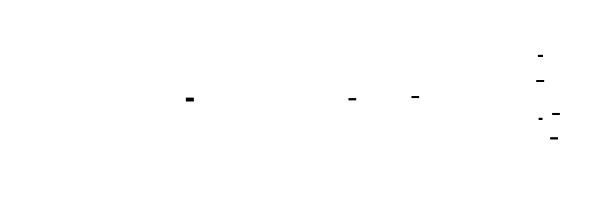
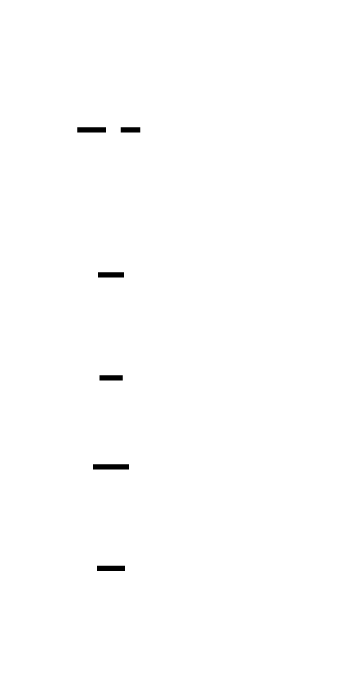
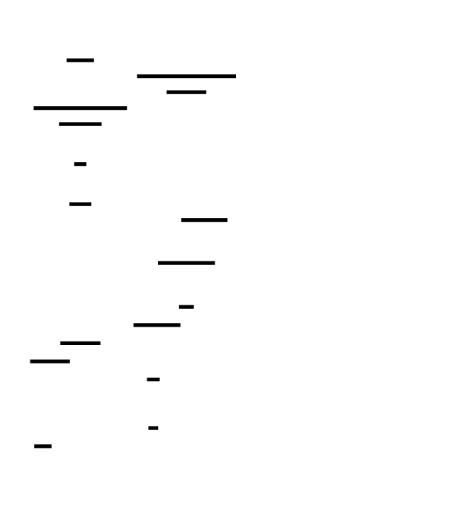
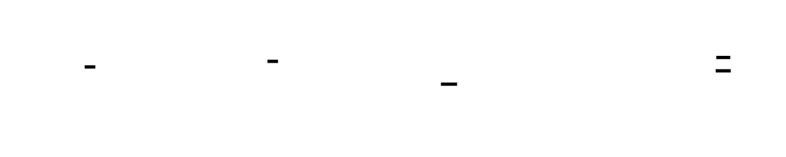

# 🎯 Project Charter: x86-64 JIT Compiler Backend

## What You Are Building
A high-performance Just-In-Time (JIT) compiler backend that translates stack-based bytecode into native x86-64 machine code at runtime. You will build a system capable of managing executable memory pages (W^X), allocating physical registers, adhering to the System V AMD64 ABI, and implementing speculative optimizations with safe fallback (deoptimization) to a bytecode interpreter.

## Why This Project Exists
Modern performance engines like V8, JVM HotSpot, and LuaJIT are often treated as black boxes. By building a JIT backend from scratch, you strip away the "magic" of runtime code generation, exposing the brutal mechanical realities of instruction encoding, stack alignment, and the complex dance between speculative speed and execution safety.

## What You Will Be Able to Do When Done
- **Manage Executable Memory:** Allocate and protect memory pages using `mmap` and `mprotect` to maintain strict W^X (Write XOR Execute) security compliance.
- **Encode Machine Code:** Manually encode x86-64 instructions (including REX prefixes and ModR/M bytes) into raw byte buffers.
- **Perform Register Allocation:** Implement a linear-scan allocator to map virtual stack slots to hardware registers with spilling logic.
- **Enforce ABI Compliance:** Build function prologues and epilogues that respect the System V AMD64 ABI, allowing native code to call C library functions.
- **Implement Tiered Compilation:** Profile execution to detect "hot" functions and trigger JIT compilation only when the performance benefit outweighs the cost.
- **Engineer Safe Fallbacks:** Build deoptimization stubs that reconstruct the virtual machine's state to resume interpretation when speculative assumptions fail.

## Final Deliverable
A runtime library consisting of ~4,000 lines of C, Rust, or Zig code. The system includes a code cache, an instruction emitter, a tiered dispatch table, and a test suite. The final artifact will execute compute-intensive bytecode (like recursive Fibonacci or factorial) as native machine code, achieving 5x–15x speedups over a standard interpreter while passing all deoptimization safety tests.

## Is This Project For You?
**You should start this if you:**
- Have built a basic bytecode interpreter/VM before.
- Are comfortable with manual memory management and pointers.
- Can read basic x86-64 assembly.
- Understand the difference between the stack and the heap.

**Come back after you've learned:**
- [Bytecode VM Basics](https://craftinginterpreters.com/a-bytecode-virtual-machine.html)
- [x86-64 Register Roles](https://www.uclibc.org/docs/psABI-x86_64.pdf)

## Estimated Effort
| Phase | Time |
|-------|------|
| Milestone 1: x86-64 Code Emitter & W^X Memory | ~15 hours |
| Milestone 2: Expression JIT (Bytecode to Native) | ~12 hours |
| Milestone 3: Function JIT & ABI Compliance | ~15 hours |
| Milestone 4: Hot Path Detection & Tiered Comp | ~13 hours |
| Milestone 5: Deoptimization Guards & Safe Fallback | ~15 hours |
| Integration, Debugging, and Benchmarking | ~10 hours |
| **Total** | **~80 hours** |

## Definition of Done
The project is complete when:
- All JIT-compiled arithmetic operations produce results bit-identical to the interpreter for edge cases (overflow, sign-extension).
- JIT-compiled functions can call `printf` or `malloc` without triggering stack alignment faults (SIGSEGV).
- A benchmark demonstrates a minimum 5x speedup on a tight loop (e.g., sum 1 to 1M) compared to the interpreted version.
- A forced type-guard failure mid-execution successfully transfers control back to the interpreter without losing local variable or stack data.
- The system passes a "torture test" of 100+ recursive function calls at a depth of at least 100 frames.

---

# 📚 Before You Read This: Prerequisites & Further Reading

> **Read these first.** The Atlas assumes you are familiar with the foundations below.
> Resources are ordered by when you should encounter them — some before you start, some at specific milestones.

## 🏗️ Hardware Foundations & Memory Safety
**Read BEFORE starting Milestone 1.** These resources cover the "why" behind the strict choreographed memory permissions (W^X) required for modern JITs.

*   **Best Explanation**: [Eli Bendersky: How to write a JIT compiler](https://eli.thegreenplace.net/2013/10/17/how-to-write-a-jit-compiler-part-1)
    *   **Why**: It is the definitive modern "Hello World" for JIT memory management, explaining `mmap` permissions in plain English.
*   **Paper**: [The PaX Team (2003): PaX - Data Execution Prevention](https://pax.grsecurity.net/docs/pax.txt)
    *   **Why**: This is the original research that pioneered the W^X (Write XOR Execute) security policy which dictates the design of your `CodeEmitter`.
*   **Spec**: [Intel 64 and IA-32 Architectures Software Developer's Manual (Volume 3A)](https://www.intel.com/content/www/us/en/developer/articles/technical/intel-sdm.html)
    *   **Section**: Chapter 4: Paging.
    *   **Why**: The official hardware specification for how the XD (Execute Disable) bit actually functions in the Page Table Entry (PTE).

## 🔠 x86-64 Instruction Encoding
**Read during Milestone 1.** You cannot emit raw bytes without understanding the variable-length grammar of x86-64.

*   **Best Explanation**: [OSDev Wiki: x86-64 Instruction Encoding](https://wiki.osdev.org/X86-64_Instruction_Encoding)
    *   **Why**: It provides the most concise table-based breakdown of the REX prefix and ModR/M byte available.
*   **Code**: [LuaJIT: lj_emit_x86.h](https://github.com/LuaJIT/LuaJIT/blob/master/src/lj_emit_x86.h)
    *   **Why**: Mike Pall’s LuaJIT is considered the gold standard of efficient instruction emission; this file shows how to pack bytes into a buffer with extreme precision.
*   **Spec**: [Intel Software Developer’s Manual (Volume 2)](https://www.intel.com/content/www/us/en/developer/articles/technical/intel-sdm.html)
    *   **Section**: Appendix A: Opcode Map.
    *   **Why**: This is the ultimate "cheat sheet" for every valid byte sequence the CPU accepts.

## 🧠 Register Allocation & Translation
**Read before starting Milestone 2.** Required to understand how to map an infinite virtual stack to a finite set of hardware registers.

*   **Paper**: [Poletto & Sarkar (1999): Linear Scan Register Allocation](https://dl.acm.org/doi/10.1145/330249.330250)
    *   **Why**: The foundational paper for the "Linear Scan" algorithm used in this project; it prioritizes speed over the complexity of Graph Coloring.
*   **Best Explanation**: [The LLVM Compiler Infrastructure: Register Allocation](https://llvm.org/docs/CodeGenerator.html#register-allocation)
    *   **Section**: The "Greedy Register Allocator" section.
    *   **Why**: Provides a high-level conceptual framework for "spilling" and "reloading" that is industry-standard.

## 🤝 Calling Conventions & The ABI
**Read after Milestone 2.** Read this before writing your first function prologue to ensure your JIT functions can call `printf`.

*   **Spec**: [System V Application Binary Interface (AMD64 Architecture Processor Supplement)](https://gitlab.com/x86-psABIs/x86-64-ABI)
    *   **Section**: Chapter 3: Low-Level System Information.
    *   **Why**: This is the "law of the land" for Linux/macOS; it defines exactly which registers are yours to use and which you must save.
*   **Code**: [V8 Source: sparkplug-x64.cc](https://github.com/v8/v8/blob/master/src/maglev/x64/maglev-assembler-x64.cc)
    *   **Why**: This file in Chrome’s V8 engine demonstrates how to construct an ABI-compliant stack frame for a baseline JIT.

## ⚡ Tiered Compilation & Profiling
**Read after Milestone 3.** You'll have a working function JIT and will now need to decide *when* to use it.

*   **Paper**: [Hölzle & Ungar (1994): A Third-Generation Self-Optimizing V8 Engine](https://dl.acm.org/doi/10.1145/191081.191136)
    *   **Why**: While the title references "V8" (the language, not the engine), this paper established the concept of "Hot Path" detection that all modern JITs use.
*   **Best Explanation**: [Azul Systems: How the JIT Compiler Works](https://www.youtube.com/watch?v=6X_p_v_EDX8)
    *   **Timestamp**: 12:45 - 22:10 (Tiered Compilation).
    *   **Why**: Explains the economic trade-off between profiling overhead and peak performance.

## 🛡️ Speculation & Deoptimization
**Read before starting Milestone 5.** This is the "Safety Net" phase of the project.

*   **Best Explanation**: [Vyacheslav Egorov: Deoptimization in V8](https://mrale.ph/blog/2012/06/03/explaining-js-vm-in-js-inline-caches.html)
    *   **Why**: Egorov is a former V8 engineer; his explanation of how to "bail out" of native code back to the interpreter is the industry benchmark.
*   **Code**: [HotSpot JVM: deoptimization.cpp](https://github.com/openjdk/jdk/blob/master/src/hotspot/share/runtime/deoptimization.cpp)
    *   **Why**: The "State Reconstruction" logic here is the most mature implementation of deoptimization in existence, handling thousands of edge cases.
*   **Paper**: [Craig Chambers (1991): The Design and Implementation of the SELF Compiler](https://dl.acm.org/doi/10.1145/113445.113454)
    *   **Why**: This paper introduced the concept of "debugging information" side-tables used to map native registers back to source variables during a crash or deopt.

---

# JIT Compiler

A Just-In-Time (JIT) compiler bridges the world of portable bytecode and native machine code, translating intermediate representations to optimized x86-64 instructions at runtime. Unlike ahead-of-time compilation, JIT compilation operates under unique constraints: code must be generated quickly (to avoid startup latency), memory must be managed safely (W^X policies prevent simultaneous write and execute permissions), and speculation must be guarded (assumptions about types and control flow can be wrong). This project builds a complete JIT backend from scratch—starting with raw byte emission into executable memory, progressing through register allocation and ABI-compliant function calls, and culminating in profiling-guided tiered compilation with deoptimization guards.


<!-- MS_ID: build-jit-m1 -->
# Milestone 1: Executable Memory and Code Buffer
## The Invisible Wall
You've written an interpreter. It reads bytecode instructions from an array, decodes them one by one, and executes the corresponding operations. It works, but it's slow—every addition requires a switch statement dispatch, every function call involves a maze of pointer indirections.
The obvious optimization beckons: instead of *interpreting* bytecode, why not *compile* it to native x86-64 machine code and execute it directly? After all, the CPU is right there, waiting for instructions. You just need to write the right bytes to memory and jump to them.
So you try it:
```c
// The naive approach that will fail
uint8_t code[] = { 0xB8, 0x2A, 0x00, 0x00, 0x00,  // mov eax, 42
                   0xC3 };                         // ret
int (*func)(void) = (int (*)(void))code;
int result = func();  // SIGSEGV or SIGBUS on modern systems
```
And your program crashes.


The crash isn't a bug in your code—it's a **security feature** working exactly as designed. Modern operating systems enforce **Data Execution Prevention (DEP)**, also known as the **W^X policy** (Write XOR Execute): a memory page cannot be simultaneously writable and executable. This stopped buffer overflow exploits dead in their tracks, but it also means JIT compilers—the very engines powering JavaScript in your browser, Java in enterprise servers, and Python's PyPy—must walk a careful choreography between write permission and execute permission.
This milestone builds the foundation: allocating memory that can become executable, emitting raw x86-64 instruction bytes into it, and calling the result as a function. By the end, you'll have emitted your first hand-crafted machine code that the CPU actually executes.
---
## The Three-Level View of JIT Memory
Before we write code, let's understand what happens at three distinct levels:



### Level 1: The Application's Perspective
Your JIT compiler needs a buffer—a contiguous region of memory where it can emit instruction bytes. It writes bytes sequentially: `0x48, 0x89, 0xE5` (that's `mov rbp, rsp`), then `0xB8, 0x2A, 0x00, 0x00, 0x00` (that's `mov eax, 42`), and so on. Once emission is complete, it casts the buffer to a function pointer and calls it. Simple.
### Level 2: The Operating System's Perspective
The OS doesn't see "code"—it sees **pages** of virtual memory, each with permission bits encoded in the page table. A page can be readable (`PROT_READ`), writable (`PROT_WRITE`), or executable (`PROT_EXEC`). The W^X policy, enforced by the kernel's memory management subsystem, rejects any attempt to create a page with both `PROT_WRITE` and `PROT_EXEC` set simultaneously. When you try to execute code from a page marked writable, the MMU raises a fault, and the kernel delivers `SIGSEGV` to your process.
### Level 3: The Hardware's Perspective
The CPU's instruction fetch unit reads bytes from memory, decodes them into micro-ops, and executes them. But the CPU doesn't read directly from main memory—it reads through the **instruction cache (I-cache)**, a small, fast memory that holds recently-fetched instructions. Here's the catch: on some architectures (notably ARM), the I-cache is **not coherent** with the data cache (D-cache). When you write new instructions through the data path, the I-cache might still hold stale data. You must explicitly **flush the instruction cache** to ensure the CPU sees your newly-written code.
---
## Virtual Memory Permissions: The Page Table's Role

> **🔑 Foundation: How page tables encode read/write/execute bits**
> 
> ## What It IS
Virtual memory permissions are access control bits stored in page table entries (PTEs) that tell the MMU (Memory Management Unit) what operations are allowed on each page of memory. Every time the CPU accesses memory, the MMU walks the page table and checks these bits before allowing the access.
The three classic permission bits are:
- **R (Read)**: Can the CPU load data from this page?
- **W (Write)**: Can the CPU store data to this page?
- **X (Execute)**: Can the CPU fetch instructions from this page?
On x86-64, these are encoded directly in the PTE structure:
```
Bit 0 (P): Present
Bit 1 (R/W): 0 = Read-only, 1 = Read/Write
Bit 2 (U/S): User/Supervisor
Bit 63 (XD): Execute Disable (1 = no execution)
```
The MMU checks these bits on every memory access. A violation triggers a page fault (exception 14 on x86), which the kernel handles—usually by terminating the offending process.
## WHY You Need It Right Now
You're building a runtime that needs to load and execute code dynamically. Without understanding memory permissions, you'll hit confusing segfaults when:
1. **Trying to execute code from a writable region** — the CPU refuses because W+X pages are often blocked for security (W^X policy)
2. **Trying to write to read-only memory** — your JIT compiler crashes when emitting code
3. **Implementing garbage collectors** — write barriers require understanding when pages are readable vs. writable
This is foundational to implementing a loader, JIT compiler, or any system that manipulates executable code.
## Key Insight
**Permissions are checked per-access, not per-allocation.** When you `mmap` a page as read-only, then later call `mprotect` to make it writable, the MMU doesn't "remember" the old state—it enforces whatever permissions are in the PTE right now.
The practical consequence: you can change a page's permissions at any time. A common pattern for JIT compilation is:
```
1. mmap with PROT_READ | PROT_WRITE  (allocate, write code)
2. mprotect to PROT_READ | PROT_EXEC (make executable, run it)
3. mprotect back to PROT_READ | PROT_WRITE (patch it later)
```
This "permission flipping" is how all dynamic code systems work—from JavaScript engines to debuggers.

Every memory access your program makes—whether fetching an instruction, reading a variable, or writing to a buffer—goes through the Memory Management Unit (MMU). The MMU translates virtual addresses to physical addresses using **page tables**, hierarchical data structures maintained by the operating system.
Each entry in the page table contains not just a physical address, but also **permission bits**:
| Bit | Meaning | Effect when clear |
|-----|---------|-------------------|
| Present (P) | Page exists in physical memory | Page fault on any access |
| Read/Write (R/W) | Page is writable | Write attempt causes fault |
| User/Supervisor (U/S) | User-mode accessible | User access causes fault |
| No-Execute (NX/XD) | Page is executable | Execution causes fault |
The **NX bit** (No-eXecute, called XD on Intel) is the hardware mechanism behind DEP. When set, the MMU refuses to fetch instructions from that page. x86-64 always has this feature enabled; 32-bit x86 gained it with the PAE (Physical Address Extension) extension in the early 2000s.
### Why W^X, Not Just NX?
You might wonder: why not just allocate memory as readable+executable, write to it, and then execute? The problem is **self-modifying code attacks**. If an attacker can trick your program into writing to executable memory (via a buffer overflow, use-after-free, or logic bug), they can inject shellcode and have it executed.
W^X ensures that at any moment, a page is either writable *or* executable, never both. To modify code, you must:
1. Remove execute permission, add write permission
2. Write the new code
3. Remove write permission, add execute permission
This creates a window where the code can't be executed—preventing the attack.
---
## mmap: The Interface to Raw Memory
You can't use `malloc` for executable memory. `malloc` returns memory from the heap, which is allocated with `PROT_READ | PROT_WRITE` and is never executable. Instead, you must go directly to the operating system via `mmap`:
```c
#include <sys/mman.h>
void* code_buf = mmap(
    NULL,                   // Let the kernel choose the address
    4096,                   // Size: one page (4KB)
    PROT_READ | PROT_WRITE, // Permissions: readable and writable, NOT executable
    MAP_PRIVATE | MAP_ANONYMOUS, // Private anonymous mapping
    -1,                     // No file descriptor (anonymous mapping)
    0                       // No offset
);
if (code_buf == MAP_FAILED) {
    perror("mmap failed");
    exit(1);
}
```

> **🔑 Foundation: The system call interface for memory allocation with explicit permission control**
> 
> ## What It IS
`mmap()` is the Unix system call that maps files or anonymous memory into a process's address space. Unlike `malloc()`, which is a library function that manages a heap, `mmap()` is a direct syscall that gives you control over memory at the page level—including explicit permission bits.
The signature:
```c
void *mmap(void *addr, size_t length, int prot, int flags, int fd, off_t offset);
```
The `prot` argument specifies permissions:
- `PROT_READ` (0x1): Page can be read
- `PROT_WRITE` (0x2): Page can be written
- `PROT_EXEC` (0x4): Page can be executed
- `PROT_NONE` (0x0): No access allowed (useful for guard pages)
`mprotect()` changes permissions on existing mappings:
```c
int mprotect(void *addr, size_t len, int prot);
```
## WHY You Need It Right Now
When implementing a loader or runtime, you need precise control over memory layout:
1. **Loading executable segments** — `.text` sections need `PROT_READ | PROT_EXEC`, `.data` needs `PROT_READ | PROT_WRITE`
2. **Creating guard pages** — `PROT_NONE` pages that crash on access, catching buffer overflows
3. **JIT compilation** — write code with `PROT_WRITE`, then switch to `PROT_EXEC` before running it
4. **Memory-mapped I/O** — map files directly into memory instead of reading into buffers
`malloc()` can't give you executable memory. `mmap()` can.
## Key Insight
**`mmap` operates on page boundaries, not byte boundaries.** The kernel can only set permissions at page granularity (typically 4KB). If you request 100 bytes with `PROT_READ`, you actually get an entire 4KB page.
This has two consequences:
1. **Rounding**: `mmap(NULL, 100, PROT_READ, ...)` maps a full page. The `length` parameter is rounded up to the nearest page boundary.
2. **Permission bleed**: If you map a 4KB page with different permissions for adjacent data, the entire page shares one set of permissions. You can't have the first 2KB read-only and the second 2KB read-write if they share a page.
This is why security-sensitive code aligns allocations to page boundaries—it prevents an attacker from modifying adjacent data that happens to land on the same page.

The `PROT_READ | PROT_WRITE` flags are crucial here. If you added `PROT_EXEC`, the call would fail on hardened systems (macOS, OpenBSD, SELinux Linux). The kernel's security module would reject the mapping.
### Page Alignment Matters
`mmap` always returns page-aligned memory—the address is a multiple of the system page size (4096 bytes on x86-64 Linux, 16384 bytes on Apple Silicon). This isn't just a convenience; it's a requirement for `mprotect`, which can only change permissions on whole pages:
```c
int mprotect(void *addr, size_t len, int prot);
// addr MUST be page-aligned!
// len is rounded up to the next page boundary
```
If you tried to allocate a smaller buffer and change just that region's permissions, you'd accidentally affect neighboring memory—potentially changing permissions on code you didn't intend to modify.
---
## The W^X Lifecycle: A Two-Phase Protocol


Your JIT compiler must follow a strict lifecycle for every code buffer:
### Phase 1: Write Mode
```c
// Allocate with write permission, NO execute
void* code = mmap(NULL, size, PROT_READ | PROT_WRITE,
                  MAP_PRIVATE | MAP_ANONYMOUS, -1, 0);
```
In this phase, the buffer is just data. You can `memcpy` into it, write bytes directly, or use a structured emitter. The CPU cannot execute from it—any attempt would fault.
### Phase 2: Emit Code
```c
uint8_t* cursor = code;
*cursor++ = 0x48;  // REX.W prefix
*cursor++ = 0xB8;  // mov rax, imm64 opcode
*(uint32_t*)cursor = 42; cursor += 4;  // immediate value
*cursor++ = 0xC3;  // ret
```
This is where you encode instructions. We'll dive deep into x86-64 encoding shortly.
### Phase 3: Execute Mode
```c
// Remove write, add execute
if (mprotect(code, size, PROT_READ | PROT_EXEC) != 0) {
    perror("mprotect failed");
    exit(1);
}
```
Now the buffer is immutable code. The CPU can fetch and execute from it, but you can no longer modify it.
### Phase 4: Call
```c
int64_t (*func)(void) = (int64_t (*)(void))code;
int64_t result = func();
printf("Result: %ld\n", result);  // Should print 42
```
The function pointer cast tells the C compiler "trust me, there's a function at this address." When you call it, the CPU jumps to your buffer and executes the encoded instructions.


### Cleanup
```c
munmap(code, size);  // Release the memory back to the OS
```
---
## Instruction Cache Coherency: When Writing Isn't Enough

> **🔑 Foundation: Why self-modifying code needs cache synchronization on some architectures**
> 
> ## What It IS
Modern CPUs have separate caches for data (D-cache) and instructions (I-cache). When you modify code in memory, you're writing through the D-cache. But the CPU fetches instructions from the I-cache—which still holds the old, stale version. The two caches are incoherent.
This is the instruction cache coherency problem: **writing to memory doesn't automatically update the instruction cache.**
On some architectures (notably ARM), the I-cache and D-cache are not coherent by default. On x86, hardware maintains coherence automatically—but you still need to be careful with edge cases involving TLB entries and pipeline fetches.
## WHY You Need It Right Now
If you're building a JIT compiler, dynamic loader, or any system that writes code and then immediately executes it, you'll encounter this. The symptom is maddening:
```c
// Write some instructions to memory
code_ptr[0] = 0xC3;  // ret instruction
// Try to execute it
((void(*)(void))code_ptr)();  // May crash or execute garbage!
```
The CPU might fetch old data from the I-cache, or even worse—partially updated instructions if the write crossed a cache line boundary.
The fix involves explicit synchronization:
- **x86**: Usually automatic, but `__builtin_ia32_clflush()` or `mfence` may be needed for edge cases
- **ARM**: Requires explicit cache maintenance via `__clear_cache()` or `sys/icache/inval/a`
- **Cross-platform**: Use `__builtin___clear_cache(start, end)` which compiler-rt implements correctly for each target
## Key Insight
**The CPU doesn't know that memory contains code until it tries to fetch it.** From the CPU's perspective, you just wrote some bytes to memory. The fact that those bytes will later be interpreted as instructions is irrelevant to the store operation.
This means the responsibility for cache synchronization falls on you, the programmer. The pattern for safe self-modifying code:
```c
// 1. Write the code (goes through D-cache)
memcpy(code_region, instructions, len);
// 2. Synchronize caches
__builtin___clear_cache(code_region, code_region + len);
// 3. Now it's safe to execute
((void(*)(void))code_region)();
```
The `__clear_cache` intrinsic doesn't actually "clear" the cache—it ensures that stores visible to the D-cache are also visible to the I-cache before subsequent instruction fetches.

On x86-64, the I-cache and D-cache are **coherent**—the hardware automatically ensures that writes through the data path are visible to instruction fetches. After `mprotect`, the CPU will see your new code.
On ARM (including Apple Silicon Macs running Rosetta 2), this is **not** guaranteed. The I-cache may hold stale data from before your writes. You must explicitly synchronize:
```c
#ifdef __aarch64__
    // ARM64 requires explicit cache flush
    __builtin___clear_cache(code, (char*)code + size);
#elif defined(__APPLE__) && defined(__x86_64__)
    // macOS on Intel: __builtin___clear_cache is a no-op but doesn't hurt
    __builtin___clear_cache(code, (char*)code + size);
#else
    // x86-64 Linux: no action needed (hardware coherence)
#endif
```
The `__builtin___clear_cache` intrinsic is a compiler-provided function that emits the appropriate cache maintenance instructions for the target architecture. On x86-64, it compiles to nothing (or a no-op); on ARM64, it emits the `ic ivau` (Instruction Cache Invalidate by Virtual Address to PoU) and `dc cvau` (Data Cache Clean by Virtual Address to PoU) instructions.
**When in doubt, always call it.** It costs nothing on architectures that don't need it.
---
## x86-64 Instruction Encoding: The Raw Bytes
Now we reach the heart of JIT compilation: encoding instructions as bytes that the CPU understands. x86-64 has a reputation for complexity, and it's well-earned. But there's a structure to the chaos.


Every x86-64 instruction is encoded as a sequence of up to six logical components:
1. **Legacy Prefixes** (0-4 bytes): Optional modifiers for operand size, segment, repetition, etc.
2. **REX Prefix** (0-1 byte): Enables 64-bit operands and extended registers (r8-r15)
3. **Opcode** (1-3 bytes): The operation itself (mov, add, ret, etc.)
4. **ModR/M** (0-1 byte): Specifies operands (register-to-register, memory-to-register, etc.)
5. **SIB** (0-1 byte): Scale-Index-Base for complex addressing modes
6. **Displacement** (0-4 bytes): An offset added to a memory address
7. **Immediate** (0-8 bytes): A constant value encoded directly in the instruction
For our initial emitter, we'll focus on:
- The REX prefix
- The opcode
- The ModR/M byte
- Immediates
We'll add SIB and displacement support incrementally.
---
## The REX Prefix: Accessing 64-Bit Power


The REX prefix (0x40–0x4F) is what distinguishes x86-64 from 32-bit x86. It's a single byte where the lower 4 bits have specific meanings:
| Bit | Name | Meaning when set |
|-----|------|------------------|
| 3 (0x08) | REX.W | 64-bit operand size (vs. 32-bit default) |
| 2 (0x04) | REX.R | Extends the `reg` field in ModR/M (accesses r8-r15) |
| 1 (0x02) | REX.X | Extends the `index` field in SIB (accesses r8-r15) |
| 0 (0x01) | REX.B | Extends the `r/m` field in ModR/M or `base` in SIB |
The base value is always 0x40. So:
- `0x48` = REX.W (64-bit operands)
- `0x49` = REX.W | REX.B (64-bit operands, extended r/m)
- `0x4C` = REX.W | REX.R (64-bit operands, extended reg)
- `0x4D` = REX.W | REX.R | REX.B (64-bit operands, extended reg and r/m)
### When Do You Need REX?
1. **64-bit operands**: Most instructions default to 32-bit operands in 64-bit mode. To operate on 64-bit registers (rax, rbx, etc.), you need REX.W.
2. **Extended registers**: r8 through r15 require REX.R, REX.X, or REX.B depending on how they're used.
### A Critical Pitfall: Forgetting REX.W
```c
// WITHOUT REX.W (32-bit operation)
*cursor++ = 0xB8;           // mov eax, imm32
*(uint32_t*)cursor = 42; cursor += 4;
// This writes to eax, zero-extending to rax
// Works for small values, but truncates values >= 2^32
// WITH REX.W (64-bit operation)
*cursor++ = 0x48;           // REX.W
*cursor++ = 0xB8;           // mov rax, imm32 (sign-extended to 64-bit)
*(uint32_t*)cursor = 42; cursor += 4;
// This writes to rax properly
```
Wait—did you catch that? `mov rax, imm32` with REX.W takes a 32-bit immediate and sign-extends it to 64 bits. For full 64-bit immediates, there's a different encoding (`mov rax, imm64` is `0x48 0xB8 <8 bytes>`).
---
## The ModR/M Byte: Specifying Operands


Most x86-64 instructions take operands from registers or memory. The ModR/M byte encodes this:
| Bits | Name | Meaning |
|------|------|---------|
| 7-6 | Mod | Mode: 00=memory, 01=mem+disp8, 10=mem+disp32, 11=register |
| 5-3 | Reg | First register operand (or opcode extension for some instructions) |
| 2-0 | R/M | Second register/memory operand |
The `Reg` field specifies a register directly. The `R/M` field specifies a register (when Mod=11) or a memory addressing mode (when Mod≠11).
### Register Encoding
| Code | Register | Code | Register |
|------|----------|------|----------|
| 000 | rax / r8 | 100 | rsp / r12 |
| 001 | rcx / r9 | 101 | rbp / r13 |
| 010 | rdx / r10 | 110 | rsi / r14 |
| 011 | rbx / r11 | 111 | rdi / r15 |
For r8-r15, you need the corresponding REX prefix bit.
### Encoding Examples


**`mov rax, rbx`** (register-to-register, 64-bit):
- REX.W = 0x48 (64-bit operands)
- Opcode = 0x89 (mov r/m64, r64)
- ModR/M = 11 011 000 = 0xD8 (Mod=11=reg, Reg=011=rbx, R/M=000=rax)
- Encoding: `48 89 D8`
Wait, that's `mov r/m64, r64` which means "move from r64 to r/m64." So we're moving rbx (Reg=011) to rax (R/M=000). Let me verify:
Actually, for `mov rax, rbx`, we could also use the `mov r64, r/m64` form (opcode 0x8B) which reads more naturally:
- REX.W = 0x48
- Opcode = 0x8B (mov r64, r/m64)
- ModR/M = 11 000 011 = 0xC3 (Mod=11=reg, Reg=000=rax, R/M=011=rbx)
- Encoding: `48 8B C3`
Both produce the same result! x86 often has multiple encodings for the same instruction.
**`add rax, 10`** (add immediate to register, 64-bit):
- REX.W = 0x48
- Opcode = 0x81 /0 (add r/m64, imm32—note the "/0" means opcode extension in ModR/M.Reg)
- ModR/M = 11 000 000 = 0xC0 (Mod=11=reg, Reg=000=opcode extension, R/M=000=rax)
- Immediate = 0x0000000A (10 in little-endian: 0A 00 00 00)
- Encoding: `48 81 C0 0A 00 00 00`
**`ret`** (return, no operands):
- Opcode = 0xC3
- No ModR/M, no REX, no operands
- Encoding: `C3`
---
## Building the Emitter: A Code Generator Interface
Let's build a structured emitter that hides the encoding complexity:
```c
#include <stdint.h>
#include <sys/mman.h>
#include <string.h>
#include <stdio.h>
#include <stdlib.h>
typedef struct {
    uint8_t* buffer;      // Start of the code buffer
    uint8_t* cursor;      // Current write position
    size_t capacity;      // Total allocated size
    size_t used;          // Bytes written so far
} CodeEmitter;
CodeEmitter* emitter_create(size_t capacity) {
    // Round up to page size
    size_t page_size = 4096;
    capacity = ((capacity + page_size - 1) / page_size) * page_size;
    void* mem = mmap(NULL, capacity, PROT_READ | PROT_WRITE,
                     MAP_PRIVATE | MAP_ANONYMOUS, -1, 0);
    if (mem == MAP_FAILED) {
        return NULL;
    }
    CodeEmitter* emitter = malloc(sizeof(CodeEmitter));
    emitter->buffer = mem;
    emitter->cursor = mem;
    emitter->capacity = capacity;
    emitter->used = 0;
    return emitter;
}
void emitter_emit_byte(CodeEmitter* e, uint8_t byte) {
    if (e->used >= e->capacity) {
        fprintf(stderr, "Code buffer overflow\n");
        exit(1);
    }
    *e->cursor++ = byte;
    e->used++;
}
void emitter_emit_bytes(CodeEmitter* e, const uint8_t* bytes, size_t count) {
    for (size_t i = 0; i < count; i++) {
        emitter_emit_byte(e, bytes[i]);
    }
}
void emitter_emit_uint32(CodeEmitter* e, uint32_t value) {
    // Little-endian encoding
    emitter_emit_byte(e, value & 0xFF);
    emitter_emit_byte(e, (value >> 8) & 0xFF);
    emitter_emit_byte(e, (value >> 16) & 0xFF);
    emitter_emit_byte(e, (value >> 24) & 0xFF);
}
void emitter_emit_int32(CodeEmitter* e, int32_t value) {
    emitter_emit_uint32(e, (uint32_t)value);
}
```
### Encoding the REX Prefix
```c
// Register codes (0-15, where 0-7 are rax-rdi, 8-15 are r8-r15)
typedef enum {
    REG_RAX = 0, REG_RCX = 1, REG_RDX = 2, REG_RBX = 3,
    REG_RSP = 4, REG_RBP = 5, REG_RSI = 6, REG_RDI = 7,
    REG_R8  = 8, REG_R9  = 9, REG_R10 = 10, REG_R11 = 11,
    REG_R12 = 12, REG_R13 = 13, REG_R14 = 14, REG_R15 = 15
} Reg;
// Build a REX prefix
uint8_t make_rex(bool w, bool r, bool x, bool b) {
    return 0x40 | (w ? 0x08 : 0) | (r ? 0x04 : 0) | 
                  (x ? 0x02 : 0) | (b ? 0x01 : 0);
}
// Check if a register needs REX extension
bool reg_needs_rex(Reg r) {
    return r >= 8;
}
// Get the 3-bit register code (0-7) for ModR/M
uint8_t reg_code(Reg r) {
    return r & 0x07;
}
// Get REX.R bit for reg field
bool reg_rex_r(Reg r) {
    return (r >> 3) & 1;
}
// Get REX.B bit for r/m field
bool reg_rex_b(Reg r) {
    return (r >> 3) & 1;
}
```
### Encoding ModR/M
```c
// Build a ModR/M byte for register-to-register
uint8_t make_modrm_reg(uint8_t mod, Reg reg, Reg rm) {
    uint8_t byte = ((mod & 0x03) << 6) |    // Mod bits 7-6
                   ((reg_code(reg) & 0x07) << 3) |  // Reg bits 5-3
                   (reg_code(rm) & 0x07);    // R/M bits 2-0
    return byte;
}
// Common case: register-to-register (Mod=3)
uint8_t make_modrm_rr(Reg dest, Reg src) {
    return make_modrm_reg(0x03, src, dest);  // Note: src in Reg, dest in R/M for mov r/m, r
}
```
### Instruction Emitters
Now we can build high-level instruction emitters:
```c
// mov r64, imm64 (full 64-bit immediate)
void emit_mov_r64_imm64(CodeEmitter* e, Reg dest, uint64_t imm) {
    // REX.W + B (if dest >= r8)
    uint8_t rex = make_rex(true, false, false, reg_rex_b(dest));
    emitter_emit_byte(e, rex);
    // Opcode: B8 + rd (dest encoded in low 3 bits of opcode)
    emitter_emit_byte(e, 0xB8 + reg_code(dest));
    // 8-byte immediate (little-endian)
    for (int i = 0; i < 8; i++) {
        emitter_emit_byte(e, (imm >> (i * 8)) & 0xFF);
    }
}
// mov r64, imm32 (sign-extended to 64 bits)
void emit_mov_r64_imm32(CodeEmitter* e, Reg dest, int32_t imm) {
    uint8_t rex = make_rex(true, false, false, reg_rex_b(dest));
    emitter_emit_byte(e, rex);
    emitter_emit_byte(e, 0xC7);  // mov r/m64, imm32
    // ModR/M: Mod=11, Reg=0 (opcode extension), R/M=dest
    uint8_t modrm = make_modrm_reg(0x03, 0, dest);
    emitter_emit_byte(e, modrm);
    emitter_emit_int32(e, imm);
}
// mov r64, r64 (register-to-register)
void emit_mov_r64_r64(CodeEmitter* e, Reg dest, Reg src) {
    // REX.W + R (if src >= r8) + B (if dest >= r8)
    uint8_t rex = make_rex(true, reg_rex_r(src), false, reg_rex_b(dest));
    emitter_emit_byte(e, rex);
    // Opcode 0x89: mov r/m64, r64
    emitter_emit_byte(e, 0x89);
    // ModR/M: dest in R/M, src in Reg
    uint8_t modrm = make_modrm_rr(dest, src);
    emitter_emit_byte(e, modrm);
}
// add r64, imm32
void emit_add_r64_imm32(CodeEmitter* e, Reg dest, int32_t imm) {
    uint8_t rex = make_rex(true, false, false, reg_rex_b(dest));
    emitter_emit_byte(e, rex);
    emitter_emit_byte(e, 0x81);  // add r/m64, imm32
    // ModR/M: Mod=11, Reg=0 (opcode extension for ADD), R/M=dest
    uint8_t modrm = make_modrm_reg(0x03, 0, dest);
    emitter_emit_byte(e, modrm);
    emitter_emit_int32(e, imm);
}
// sub r64, imm32
void emit_sub_r64_imm32(CodeEmitter* e, Reg dest, int32_t imm) {
    uint8_t rex = make_rex(true, false, false, reg_rex_b(dest));
    emitter_emit_byte(e, rex);
    emitter_emit_byte(e, 0x81);  // General imm32 group
    // ModR/M: Mod=11, Reg=5 (opcode extension for SUB), R/M=dest
    uint8_t modrm = make_modrm_reg(0x03, 5, dest);
    emitter_emit_byte(e, modrm);
    emitter_emit_int32(e, imm);
}
// imul r64, r64 (two-operand form: dest = dest * src)
void emit_imul_r64_r64(CodeEmitter* e, Reg dest, Reg src) {
    uint8_t rex = make_rex(true, reg_rex_r(src), false, reg_rex_b(dest));
    emitter_emit_byte(e, rex);
    // 0x0F 0xAF: imul r64, r/m64
    emitter_emit_byte(e, 0x0F);
    emitter_emit_byte(e, 0xAF);
    uint8_t modrm = make_modrm_rr(dest, src);
    emitter_emit_byte(e, modrm);
}
// ret
void emit_ret(CodeEmitter* e) {
    emitter_emit_byte(e, 0xC3);
}
// nop (useful for alignment)
void emit_nop(CodeEmitter* e) {
    emitter_emit_byte(e, 0x90);
}
```
### Finalizing and Executing
```c
typedef int64_t (*JitFunc)(void);
JitFunc emitter_finalize(CodeEmitter* e) {
    // Flush instruction cache (critical on ARM, no-op on x86)
    __builtin___clear_cache(e->buffer, e->cursor);
    // Make the buffer executable
    if (mprotect(e->buffer, e->capacity, PROT_READ | PROT_EXEC) != 0) {
        perror("mprotect");
        return NULL;
    }
    return (JitFunc)e->buffer;
}
void emitter_destroy(CodeEmitter* e) {
    munmap(e->buffer, e->capacity);
    free(e);
}
```
---
## Putting It All Together: Test Cases


Let's build and test five functions:
```c
#include <stdio.h>
#include <stdint.h>
// Test 1: Return a constant (42)
void test_return_constant(void) {
    CodeEmitter* e = emitter_create(4096);
    emit_mov_r64_imm32(e, REG_RAX, 42);
    emit_ret(e);
    JitFunc func = emitter_finalize(e);
    int64_t result = func();
    printf("Test 1 (return 42): %ld %s\n", result, result == 42 ? "✓" : "✗");
    emitter_destroy(e);
}
// Test 2: Add two arguments (System V AMD64 ABI: rdi, rsi)
void test_add_arguments(void) {
    CodeEmitter* e = emitter_create(4096);
    // In System V AMD64 ABI, first two integer args are in rdi and rsi
    // Return value goes in rax
    emit_mov_r64_r64(e, REG_RAX, REG_RDI);  // rax = arg1
    emit_add_r64_imm32(e, REG_RSI, 0);       // Force load of rsi (no-op add)
    // Actually, let's do this properly:
    // Reset and redo
    e->cursor = e->buffer;
    e->used = 0;
    emit_mov_r64_r64(e, REG_RAX, REG_RDI);   // rax = arg1 (rdi)
    // add rax, rsi
    uint8_t rex = make_rex(true, false, false, false);
    emitter_emit_byte(e, rex);
    emitter_emit_byte(e, 0x01);  // add r/m64, r64
    uint8_t modrm = make_modrm_reg(0x03, REG_RSI, REG_RAX);
    emitter_emit_byte(e, modrm);
    emit_ret(e);
    typedef int64_t (*BinaryFunc)(int64_t, int64_t);
    BinaryFunc func = (BinaryFunc)emitter_finalize(e);
    int64_t result = func(10, 32);
    printf("Test 2 (add 10 + 32): %ld %s\n", result, result == 42 ? "✓" : "✗");
    emitter_destroy(e);
}
// Test 3: Negate a value
void test_negate(void) {
    CodeEmitter* e = emitter_create(4096);
    emit_mov_r64_r64(e, REG_RAX, REG_RDI);  // rax = arg1
    // neg rax
    uint8_t rex = make_rex(true, false, false, false);
    emitter_emit_byte(e, rex);
    emitter_emit_byte(e, 0xF7);  // neg r/m64
    uint8_t modrm = make_modrm_reg(0x03, 3, REG_RAX);  // Reg=3 is NEG opcode ext
    emitter_emit_byte(e, modrm);
    emit_ret(e);
    typedef int64_t (*UnaryFunc)(int64_t);
    UnaryFunc func = (UnaryFunc)emitter_finalize(e);
    int64_t result = func(-42);
    printf("Test 3 (negate -42): %ld %s\n", result, result == 42 ? "✓" : "✗");
    emitter_destroy(e);
}
// Test 4: Multiply
void test_multiply(void) {
    CodeEmitter* e = emitter_create(4096);
    emit_mov_r64_r64(e, REG_RAX, REG_RDI);  // rax = arg1
    emit_imul_r64_r64(e, REG_RAX, REG_RSI); // rax *= arg2
    emit_ret(e);
    typedef int64_t (*BinaryFunc)(int64_t, int64_t);
    BinaryFunc func = (BinaryFunc)emitter_finalize(e);
    int64_t result = func(6, 7);
    printf("Test 4 (multiply 6 * 7): %ld %s\n", result, result == 42 ? "✓" : "✗");
    emitter_destroy(e);
}
// Test 5: Arithmetic expression ((a + b) * c - d)
void test_arithmetic_expr(void) {
    CodeEmitter* e = emitter_create(4096);
    // Compute (rdi + rsi) * rdx - rcx
    // arg1=rdi, arg2=rsi, arg3=rdx, arg4=rcx
    emit_mov_r64_r64(e, REG_RAX, REG_RDI);  // rax = a
    // add rax, rsi
    emitter_emit_byte(e, make_rex(true, false, false, false));
    emitter_emit_byte(e, 0x01);
    emitter_emit_byte(e, make_modrm_reg(0x03, REG_RSI, REG_RAX));
    emit_imul_r64_r64(e, REG_RAX, REG_RDX); // rax *= c
    // sub rax, rcx
    emitter_emit_byte(e, make_rex(true, false, false, false));
    emitter_emit_byte(e, 0x29);  // sub r/m64, r64
    emitter_emit_byte(e, make_modrm_reg(0x03, REG_RCX, REG_RAX));
    emit_ret(e);
    typedef int64_t (*QuadFunc)(int64_t, int64_t, int64_t, int64_t);
    QuadFunc func = (QuadFunc)emitter_finalize(e);
    // (10 + 5) * 4 - 20 = 15 * 4 - 20 = 60 - 20 = 40
    int64_t result = func(10, 5, 4, 20);
    printf("Test 5 ((10+5)*4-20): %ld %s\n", result, result == 40 ? "✓" : "✗");
    emitter_destroy(e);
}
int main(void) {
    test_return_constant();
    test_add_arguments();
    test_negate();
    test_multiply();
    test_arithmetic_expr();
    return 0;
}
```
---
## Verification: Disassembly


You can't trust your encoder until you verify it against a known-good disassembler. Two approaches:
### Using objdump
First, write your emitted bytes to a file:
```c
void dump_bytes(CodeEmitter* e, const char* filename) {
    FILE* f = fopen(filename, "wb");
    fwrite(e->buffer, 1, e->used, f);
    fclose(f);
}
```
Then:
```bash
# Create a minimal ELF header or use raw bytes with objdump -b binary
objdump -D -b binary -m i386:x86-64 output.bin
```
### Using Capstone (Embedded)
The Capstone disassembly library can be embedded in your program:
```c
#include <capstone/capstone.h>
void disassemble(CodeEmitter* e) {
    csh handle;
    if (cs_open(CS_ARCH_X86, CS_MODE_64, &handle) != CS_ERR_OK) {
        return;
    }
    cs_insn* instructions;
    size_t count = cs_disasm(handle, e->buffer, e->used, 
                              (uint64_t)e->buffer, 0, &instructions);
    for (size_t i = 0; i < count; i++) {
        printf("0x%lx: %s %s\n", 
               instructions[i].address,
               instructions[i].mnemonic,
               instructions[i].op_str);
    }
    cs_free(instructions, count);
    cs_close(&handle);
}
```
---
## The Full Picture: A Complete Emitter Module
Let's put together a complete, reusable module:
```c
// jit_emitter.h
#ifndef JIT_EMITTER_H
#define JIT_EMITTER_H
#include <stdint.h>
#include <stddef.h>
typedef struct CodeEmitter CodeEmitter;
// Create a new emitter with the given capacity (rounded up to page size)
CodeEmitter* emitter_create(size_t capacity);
// Emit a single byte
void emitter_emit_byte(CodeEmitter* e, uint8_t byte);
// Emit raw bytes
void emitter_emit_bytes(CodeEmitter* e, const uint8_t* bytes, size_t count);
// Emit a 32-bit integer (little-endian)
void emitter_emit_uint32(CodeEmitter* e, uint32_t value);
void emitter_emit_int32(CodeEmitter* e, int32_t value);
// Emit a 64-bit integer (little-endian)
void emitter_emit_uint64(CodeEmitter* e, uint64_t value);
// Get current code size
size_t emitter_size(CodeEmitter* e);
// Get raw buffer pointer (for debugging)
uint8_t* emitter_buffer(CodeEmitter* e);
// --- x86-64 Instruction Emitters ---
typedef enum {
    REG_RAX = 0, REG_RCX = 1, REG_RDX = 2, REG_RBX = 3,
    REG_RSP = 4, REG_RBP = 5, REG_RSI = 6, REG_RDI = 7,
    REG_R8  = 8, REG_R9  = 9, REG_R10 = 10, REG_R11 = 11,
    REG_R12 = 12, REG_R13 = 13, REG_R14 = 14, REG_R15 = 15
} Reg;
// Data movement
void emit_mov_r64_imm64(CodeEmitter* e, Reg dest, uint64_t imm);
void emit_mov_r64_imm32(CodeEmitter* e, Reg dest, int32_t imm);
void emit_mov_r64_r64(CodeEmitter* e, Reg dest, Reg src);
// Arithmetic
void emit_add_r64_imm32(CodeEmitter* e, Reg dest, int32_t imm);
void emit_add_r64_r64(CodeEmitter* e, Reg dest, Reg src);
void emit_sub_r64_imm32(CodeEmitter* e, Reg dest, int32_t imm);
void emit_sub_r64_r64(CodeEmitter* e, Reg dest, Reg src);
void emit_imul_r64_r64(CodeEmitter* e, Reg dest, Reg src);
void emit_neg_r64(CodeEmitter* e, Reg dest);
// Control flow
void emit_ret(CodeEmitter* e);
void emit_nop(CodeEmitter* e);
// --- Finalization ---
typedef int64_t (*JitFunc)(void);
typedef int64_t (*JitFunc1)(int64_t);
typedef int64_t (*JitFunc2)(int64_t, int64_t);
typedef int64_t (*JitFunc3)(int64_t, int64_t, int64_t);
typedef int64_t (*JitFunc4)(int64_t, int64_t, int64_t, int64_t);
// Make buffer executable and return function pointer
JitFunc emitter_finalize(CodeEmitter* e);
// Make buffer executable without destroying emitter (for incremental compilation)
JitFunc emitter_make_executable(CodeEmitter* e);
// Make buffer writable again (for code patching)
void emitter_make_writable(CodeEmitter* e);
// Destroy emitter and free memory
void emitter_destroy(CodeEmitter* e);
// Debug: print disassembly
void emitter_disassemble(CodeEmitter* e);
#endif // JIT_EMITTER_H
```
```c
// jit_emitter.c
#include "jit_emitter.h"
#include <sys/mman.h>
#include <stdlib.h>
#include <string.h>
#include <stdio.h>
struct CodeEmitter {
    uint8_t* buffer;
    uint8_t* cursor;
    size_t capacity;
    size_t used;
};
// --- Helper functions ---
static uint8_t make_rex(bool w, bool r, bool x, bool b) {
    return 0x40 | (w ? 0x08 : 0) | (r ? 0x04 : 0) | 
                  (x ? 0x02 : 0) | (b ? 0x01 : 0);
}
static bool reg_needs_rex_b(Reg r) {
    return r >= 8;
}
static bool reg_needs_rex_r(Reg r) {
    return r >= 8;
}
static uint8_t reg_code(Reg r) {
    return r & 0x07;
}
static uint8_t make_modrm(uint8_t mod, uint8_t reg, uint8_t rm) {
    return ((mod & 0x03) << 6) | ((reg & 0x07) << 3) | (rm & 0x07);
}
// --- Core emitter functions ---
CodeEmitter* emitter_create(size_t capacity) {
    size_t page_size = 4096;
    capacity = ((capacity + page_size - 1) / page_size) * page_size;
    void* mem = mmap(NULL, capacity, PROT_READ | PROT_WRITE,
                     MAP_PRIVATE | MAP_ANONYMOUS, -1, 0);
    if (mem == MAP_FAILED) {
        return NULL;
    }
    CodeEmitter* e = malloc(sizeof(CodeEmitter));
    if (!e) {
        munmap(mem, capacity);
        return NULL;
    }
    e->buffer = mem;
    e->cursor = mem;
    e->capacity = capacity;
    e->used = 0;
    return e;
}
void emitter_emit_byte(CodeEmitter* e, uint8_t byte) {
    if (e->used >= e->capacity) {
        fprintf(stderr, "Code buffer overflow at %zu bytes\n", e->capacity);
        exit(1);
    }
    *e->cursor++ = byte;
    e->used++;
}
void emitter_emit_bytes(CodeEmitter* e, const uint8_t* bytes, size_t count) {
    for (size_t i = 0; i < count; i++) {
        emitter_emit_byte(e, bytes[i]);
    }
}
void emitter_emit_uint32(CodeEmitter* e, uint32_t value) {
    emitter_emit_byte(e, value & 0xFF);
    emitter_emit_byte(e, (value >> 8) & 0xFF);
    emitter_emit_byte(e, (value >> 16) & 0xFF);
    emitter_emit_byte(e, (value >> 24) & 0xFF);
}
void emitter_emit_int32(CodeEmitter* e, int32_t value) {
    emitter_emit_uint32(e, (uint32_t)value);
}
void emitter_emit_uint64(CodeEmitter* e, uint64_t value) {
    for (int i = 0; i < 8; i++) {
        emitter_emit_byte(e, (value >> (i * 8)) & 0xFF);
    }
}
size_t emitter_size(CodeEmitter* e) {
    return e->used;
}
uint8_t* emitter_buffer(CodeEmitter* e) {
    return e->buffer;
}
// --- Instruction emitters ---
void emit_mov_r64_imm64(CodeEmitter* e, Reg dest, uint64_t imm) {
    emitter_emit_byte(e, make_rex(true, false, false, reg_needs_rex_b(dest)));
    emitter_emit_byte(e, 0xB8 + reg_code(dest));
    emitter_emit_uint64(e, imm);
}
void emit_mov_r64_imm32(CodeEmitter* e, Reg dest, int32_t imm) {
    emitter_emit_byte(e, make_rex(true, false, false, reg_needs_rex_b(dest)));
    emitter_emit_byte(e, 0xC7);
    emitter_emit_byte(e, make_modrm(0x03, 0, reg_code(dest)));
    emitter_emit_int32(e, imm);
}
void emit_mov_r64_r64(CodeEmitter* e, Reg dest, Reg src) {
    emitter_emit_byte(e, make_rex(true, reg_needs_rex_r(src), false, reg_needs_rex_b(dest)));
    emitter_emit_byte(e, 0x89);
    emitter_emit_byte(e, make_modrm(0x03, reg_code(src), reg_code(dest)));
}
void emit_add_r64_imm32(CodeEmitter* e, Reg dest, int32_t imm) {
    emitter_emit_byte(e, make_rex(true, false, false, reg_needs_rex_b(dest)));
    emitter_emit_byte(e, 0x81);
    emitter_emit_byte(e, make_modrm(0x03, 0, reg_code(dest)));
    emitter_emit_int32(e, imm);
}
void emit_add_r64_r64(CodeEmitter* e, Reg dest, Reg src) {
    emitter_emit_byte(e, make_rex(true, reg_needs_rex_r(src), false, reg_needs_rex_b(dest)));
    emitter_emit_byte(e, 0x01);
    emitter_emit_byte(e, make_modrm(0x03, reg_code(src), reg_code(dest)));
}
void emit_sub_r64_imm32(CodeEmitter* e, Reg dest, int32_t imm) {
    emitter_emit_byte(e, make_rex(true, false, false, reg_needs_rex_b(dest)));
    emitter_emit_byte(e, 0x81);
    emitter_emit_byte(e, make_modrm(0x03, 5, reg_code(dest)));
    emitter_emit_int32(e, imm);
}
void emit_sub_r64_r64(CodeEmitter* e, Reg dest, Reg src) {
    emitter_emit_byte(e, make_rex(true, reg_needs_rex_r(src), false, reg_needs_rex_b(dest)));
    emitter_emit_byte(e, 0x29);
    emitter_emit_byte(e, make_modrm(0x03, reg_code(src), reg_code(dest)));
}
void emit_imul_r64_r64(CodeEmitter* e, Reg dest, Reg src) {
    emitter_emit_byte(e, make_rex(true, reg_needs_rex_r(src), false, reg_needs_rex_b(dest)));
    emitter_emit_byte(e, 0x0F);
    emitter_emit_byte(e, 0xAF);
    emitter_emit_byte(e, make_modrm(0x03, reg_code(dest), reg_code(src)));
}
void emit_neg_r64(CodeEmitter* e, Reg dest) {
    emitter_emit_byte(e, make_rex(true, false, false, reg_needs_rex_b(dest)));
    emitter_emit_byte(e, 0xF7);
    emitter_emit_byte(e, make_modrm(0x03, 3, reg_code(dest)));
}
void emit_ret(CodeEmitter* e) {
    emitter_emit_byte(e, 0xC3);
}
void emit_nop(CodeEmitter* e) {
    emitter_emit_byte(e, 0x90);
}
// --- Finalization ---
JitFunc emitter_finalize(CodeEmitter* e) {
    __builtin___clear_cache(e->buffer, e->cursor);
    if (mprotect(e->buffer, e->capacity, PROT_READ | PROT_EXEC) != 0) {
        perror("mprotect");
        return NULL;
    }
    return (JitFunc)e->buffer;
}
JitFunc emitter_make_executable(CodeEmitter* e) {
    __builtin___clear_cache(e->buffer, e->cursor);
    if (mprotect(e->buffer, e->capacity, PROT_READ | PROT_EXEC) != 0) {
        return NULL;
    }
    return (JitFunc)e->buffer;
}
void emitter_make_writable(CodeEmitter* e) {
    mprotect(e->buffer, e->capacity, PROT_READ | PROT_WRITE);
}
void emitter_destroy(CodeEmitter* e) {
    if (e) {
        munmap(e->buffer, e->capacity);
        free(e);
    }
}
// --- Debug ---
void emitter_disassemble(CodeEmitter* e) {
    printf("Emitted %zu bytes:\n", e->used);
    for (size_t i = 0; i < e->used; i++) {
        printf("%02X ", e->buffer[i]);
        if ((i + 1) % 16 == 0) printf("\n");
    }
    if (e->used % 16 != 0) printf("\n");
}
```
---
## Common Pitfalls and How to Avoid Them
### Pitfall 1: Forgetting REX.W for 64-bit Operations
**Symptom**: Operations on large values produce incorrect results, especially values ≥ 2³².
**Root cause**: Without REX.W, operations default to 32-bit, with zero-extension to 64 bits.
**Fix**: Always include REX.W (0x48) for 64-bit operations.
```c
// WRONG: 32-bit operation
*cursor++ = 0x89;  // mov r/m32, r32
// RIGHT: 64-bit operation
*cursor++ = 0x48;  // REX.W
*cursor++ = 0x89;  // mov r/m64, r64
```
### Pitfall 2: Mixing Up REX.R and REX.B
**Symptom**: Code uses the wrong register (e.g., writes to r9 instead of rax).
**Root cause**: REX.R extends the `reg` field in ModR/M; REX.B extends the `r/m` field. Mixing them up produces valid (but wrong) code.
**Fix**: Be systematic about which register goes where in ModR/M.
### Pitfall 3: Skipping Cache Flush on ARM
**Symptom**: Code works on x86-64 Linux but crashes or behaves incorrectly on Apple Silicon.
**Root cause**: The I-cache holds stale instructions; CPU executes old code.
**Fix**: Always call `__builtin___clear_cache` after writing and before execution.
### Pitfall 4: Off-by-One in Immediate Encoding
**Symptom**: Constants are slightly wrong (off by 256, 65536, etc.).
**Root cause**: Little-endian encoding is counterintuitive; it's easy to get byte order wrong.
**Fix**: Use helper functions (`emitter_emit_uint32`, etc.) consistently.
---
## Knowledge Cascade: What You've Unlocked
By completing this milestone, you've gained entry to a cascade of interconnected concepts:
**Immediate Connections:**
1. **Self-Modifying Code** — The techniques here are exactly how polymorphic viruses and packers operate. They allocate RW memory, write code, make it RX, and execute. Understanding W^X helps you both write JITs and analyze malware.
2. **Debugger Implementation** — Debuggers use `mprotect` to write breakpoint instructions (int3 = 0xCC) into executable code. The same two-phase protocol applies.
3. **Dynamic Libraries and Loaders** — The dynamic linker (`ld.so`) loads shared libraries into memory, applies relocations (patching addresses), then makes the code executable. This is JIT compilation at a different timescale.
**Deeper Connections:**
4. **Virtualization and Emulation** — QEMU and other emulators JIT-compile guest machine code to host machine code. The memory management is identical; only the source language differs.
5. **Browser Security Sandbox** — V8's JIT compiler emits x86-64 code within Chrome's sandbox. The W^X policy is enforced not just by the OS, but by the browser's seccomp filters, which can restrict `mprotect` calls.
6. **Firmware and Bootloaders** — UEFI and BIOS code loads operating system kernels into memory, verifies signatures, and transfers control. The memory protection considerations are the same.
**Surprising Connection (Cross-Domain):**
7. **Garbage Collection** — A copying garbage collector must update all pointers when objects move. Similarly, when JIT code is moved or invalidated, all function pointers to it must be updated. The JIT/code cache management we'll build in later milestones uses the same "update all references" techniques as GC.
---
## What's Next
You now have a working code emitter that can generate executable x86-64 machine code. But you're hand-crafting each instruction—there's no connection to your bytecode VM.
In the next milestone, **Expression JIT: Bytecode to Native Arithmetic**, you'll build a translator that:
- Reads bytecode instructions from your VM
- Generates corresponding x86-64 machine code
- Implements a simple register allocator to map stack-based bytecode to registers
- Handles forward jumps with back-patching
The raw memory management is done. Now comes the real JIT work: translating, not just emitting.
---
<!-- END_MS -->


<!-- MS_ID: build-jit-m2 -->
<!-- MS_ID: build-jit-m2 -->
# Milestone 2: Expression JIT — Bytecode to Native Arithmetic
## The Translation Gap
You've built a code emitter. You can hand-craft `mov rax, 42` and `ret` as raw bytes, make the memory executable, and call it. The CPU runs your code. Victory.
But here's the problem: you're still writing each instruction manually. When your bytecode VM executes `PUSH 10; PUSH 32; ADD`, you want the JIT to automatically generate the corresponding `mov rax, 10; add rax, 32; ret` — not sit there with an x86 manual encoding each byte by hand.


The gap between *emitting instructions* and *JIT-compiling bytecode* is precisely this: **translation**. A JIT compiler is a translator that reads one language (your bytecode) and emits another (x86-64 machine code). The input is a sequence of stack-based operations. The output is register-based native code.
This milestone builds that translator. You'll learn to:
- Map stack-based bytecode operations to register-based x86-64 instructions
- Allocate registers for values that live on the VM's operand stack
- Handle division (which has special requirements in x86-64)
- Compile comparisons and conditional branches
- Patch forward jumps after you know where they land
By the end, you'll have a JIT that compiles arithmetic expressions to native code — and produces results bit-identical to your interpreter.
---
## The Fundamental Tension: Stack vs. Registers
Your bytecode VM is **stack-based**. Operations pop operands from a stack, compute, and push results:
```
PUSH 10    → stack: [10]
PUSH 32    → stack: [10, 32]
ADD        → stack: [42]
```
x86-64 is **register-based**. Operations read operands from registers, compute, and write results to registers:
```asm
mov rax, 10     ; rax = 10
mov rbx, 32     ; rbx = 32
add rax, rbx    ; rax = 42
```


This isn't just a cosmetic difference — it's a fundamental architectural mismatch. The stack is an infinite, ordered sequence of values. Registers are a fixed, named set of 16 storage slots. Translating between them requires **register allocation**: deciding which stack slots live in which registers, and what to do when you run out of registers.
### Why Stack-Based Bytecode?
You might wonder: why did we design the VM with a stack in the first place? Why not use registers in the bytecode?
Stack-based bytecode is **compact** and **simple to generate**. A compiler targeting a stack VM doesn't need to track register usage — it just emits `PUSH`, `POP`, `ADD` in sequence. This is why the JVM, WebAssembly, CPython, and most interpreters use stack-based bytecode.
But stack-based code is **slow to interpret**. Every operation involves memory accesses (the stack is in memory, even if cached). Register-based native code keeps values in fast CPU registers, avoiding memory traffic.
The JIT's job is to bridge this gap: take the compact, portable stack bytecode and translate it to fast, register-based native code.
---
## Three-Level View of the Translation


### Level 1: Bytecode (Source)
Your bytecode VM defines operations like:
| Opcode | Meaning | Stack Effect |
|--------|---------|--------------|
| `PUSH imm32` | Push constant | `→ [val]` |
| `ADD` | Add top two | `[a, b] → [a+b]` |
| `SUB` | Subtract | `[a, b] → [a-b]` |
| `MUL` | Multiply | `[a, b] → [a*b]` |
| `DIV` | Divide | `[a, b] → [a/b]` |
| `NEG` | Negate | `[a] → [-a]` |
| `CMP_EQ` | Compare equal | `[a, b] → [a==b]` |
| `JMP offset` | Unconditional jump | control flow |
| `JZ offset` | Jump if zero | `[cond] →`, control flow |
### Level 2: Intermediate Representation (Mental Model)
The JIT maintains a **virtual stack** during compilation — a compile-time data structure tracking which values are in which registers. As it processes each bytecode, it updates this mapping.
### Level 3: x86-64 Machine Code (Target)
The JIT emits bytes that perform the equivalent computation using registers. The mapping isn't one-to-one: one bytecode might become multiple machine instructions, or multiple bytecodes might be combined into one instruction (peephole optimization).
---
## The Instruction Encoding Grammar
Before we translate, let's understand what we're emitting. x86-64 instruction encoding is **variable-length**: instructions range from 1 to 15 bytes.


The encoding follows a precise grammar:
```
instruction = [legacy_prefixes] [rex_prefix] opcode [modrm] [sib] [displacement] [immediate]
```
Each component is optional for some instructions, but when present, they must appear in this exact order.
### Component Breakdown
**Legacy Prefixes** (0-4 bytes): Inherited from 32-bit x86. Include:
- `0x66` — Operand size override (switch between 16/32-bit)
- `0x67` — Address size override
- Segment overrides (`0x2E`, `0x3E`, etc.)
- Lock prefix (`0xF0`) for atomic operations
For our JIT, we'll mostly ignore these — we're targeting 64-bit mode exclusively.
**REX Prefix** (0-1 byte): The key to 64-bit mode. Enables:
- 64-bit operand size (vs. 32-bit default)
- Access to extended registers r8-r15


The REX prefix has the format `0100WRXB` (binary), where:
- `W` (bit 3): 1 = 64-bit operand, 0 = default size
- `R` (bit 2): Extends the `reg` field in ModR/M for r8-r15
- `X` (bit 1): Extends the `index` field in SIB for r8-r15
- `B` (bit 0): Extends the `r/m` field in ModR/M or `base` in SIB for r8-r15
Base value is `0x40`. So:
- `0x48` = REX.W (64-bit operands)
- `0x49` = REX.WB (64-bit operands + extended r/m)
- `0x4C` = REX.WR (64-bit operands + extended reg)
- `0x4D` = REX.WRB (64-bit operands + extended reg and r/m)
**Opcode** (1-3 bytes): The operation itself. Common patterns:
- 1-byte: `0x01` (add r/m, r), `0x89` (mov r/m, r), `0xC3` (ret)
- 2-byte: `0x0F 0xAF` (imul r, r/m), `0x0F 0x95` (setnz)
- 3-byte: rare, mostly AVX/SSE instructions
**ModR/M Byte** (0-1 byte): Specifies operands. Required for most instructions.


```
ModR/M = [mod:2][reg:3][r/m:3]
```
- `mod` (bits 7-6): Addressing mode
  - `11` = register direct
  - `00`, `01`, `10` = memory addressing modes
- `reg` (bits 5-3): First register operand (or opcode extension)
- `r/m` (bits 2-0): Second register/memory operand
For register-to-register operations (most of what we'll do), `mod = 11` and both `reg` and `r/m` specify registers.
**SIB Byte** (0-1 byte): Scale-Index-Base for complex addressing like `[rbp + rax*4 + 16]`. We'll cover this when needed.
**Displacement** (0, 1, 2, or 4 bytes): An offset added to memory addresses.
**Immediate** (0, 1, 2, 4, or 8 bytes): A constant value encoded directly in the instruction.
---
## The ModR/M Matrix: Decoding Operand Combinations
The ModR/M byte is where x86-64 encoding gets intricate. The `mod` and `r/m` fields together specify one operand, while `reg` specifies another.


### Register Encoding
| Code | Register | Code | Register |
|------|----------|------|----------|
| 000 | rax (or r8) | 100 | rsp (or r12) |
| 001 | rcx (or r9) | 101 | rbp (or r13) |
| 010 | rdx (or r10) | 110 | rsi (or r14) |
| 011 | rbx (or r11) | 111 | rdi (or r15) |
For r8-r15, add the corresponding REX bit.
### Encoding Examples
**`add rax, rbx`** (register-to-register):
- REX.W = `0x48` (64-bit operands)
- Opcode = `0x01` (add r/m64, r64 — destination in r/m, source in reg)
- ModR/M = `11 011 000` = `0xD8` (mod=11=reg, reg=011=rbx, r/m=000=rax)
- Encoding: `48 01 D8`
**`sub rcx, 10`** (subtract immediate):
- REX.W = `0x48`
- Opcode = `0x83` (add/or/adc/sbb/and/sub/xor/cmp r/m64, imm8 — group)
- ModR/M = `11 101 001` = `0xE9` (mod=11, reg=5=SUB extension, r/m=001=rcx)
- Immediate = `0x0A`
- Encoding: `48 83 E9 0A`
Wait, let me reconsider. `0x83` uses a sign-extended imm8. For larger immediates, use `0x81`:
**`sub rcx, 1000`** (subtract 32-bit immediate):
- REX.W = `0x48`
- Opcode = `0x81` (add/or/adc/sbb/and/sub/xor/cmp r/m64, imm32 — group)
- ModR/M = `11 101 001` = `0xE9` (mod=11, reg=5=SUB extension, r/m=001=rcx)
- Immediate = `0x000003E8` = `E8 03 00 00` (little-endian)
- Encoding: `48 81 E9 E8 03 00 00`
### Opcode Extensions
Some opcodes use the `reg` field of ModR/M as an **opcode extension**, not a register. This happens when the instruction doesn't need two register operands.
For opcode `0x81` and `0x83` (the immediate group):
| Reg Extension | Operation |
|---------------|-----------|
| 0 | ADD |
| 1 | OR |
| 2 | ADC |
| 3 | SBB |
| 4 | AND |
| 5 | SUB |
| 6 | XOR |
| 7 | CMP |
So `0x81 /5` means "the 0x81 opcode with /5 (SUB) extension."
---
## Division: The Special Case
Arithmetic operations like `add`, `sub`, and `imul` follow regular patterns. Division is different.
### The Division Problem
x86-64 division instructions (`div` for unsigned, `idiv` for signed) are **implicitly fixed** to specific registers:
- **Dividend**: Always in `rdx:rax` (a 128-bit value formed by concatenating rdx and rax)
- **Divisor**: Specified by ModR/M (can be register or memory)
- **Quotient**: Stored in `rax`
- **Remainder**: Stored in `rdx`
This means before dividing, you must:
1. Put the dividend in `rax`
2. Sign-extend or zero-extend `rax` into `rdx:rax`
3. Execute the division


### Signed Division: `cqo; idiv`
For signed division, `cqo` (Convert Quadword to Octoword) sign-extends `rax` into `rdx:rax`:
```c
void emit_idiv_r64(CodeEmitter* e, Reg divisor) {
    // cqo: sign-extend rax into rdx:rax
    emitter_emit_byte(e, 0x48);  // REX.W
    emitter_emit_byte(e, 0x99);  // cqo
    // idiv r/m64: divide rdx:rax by divisor
    // Result: rax = quotient, rdx = remainder
    emitter_emit_byte(e, make_rex(true, false, false, reg_needs_rex_b(divisor)));
    emitter_emit_byte(e, 0xF7);  // idiv r/m64 (opcode extension 7)
    emitter_emit_byte(e, make_modrm(0x03, 7, reg_code(divisor)));
}
```
### Unsigned Division: `xor rdx, rdx; div`
For unsigned division, you zero out `rdx`:
```c
void emit_div_r64(CodeEmitter* e, Reg divisor) {
    // xor rdx, rdx: zero out rdx (high 64 bits of dividend)
    emitter_emit_byte(e, 0x48);  // REX.W
    emitter_emit_byte(e, 0x31);  // xor r/m64, r64
    emitter_emit_byte(e, 0xD2);  // ModR/M: rdx, rdx
    // div r/m64: divide rdx:rax by divisor
    emitter_emit_byte(e, make_rex(true, false, false, reg_needs_rex_b(divisor)));
    emitter_emit_byte(e, 0xF7);  // div r/m64 (opcode extension 6)
    emitter_emit_byte(e, make_modrm(0x03, 6, reg_code(divisor)));
}
```
### The Trap: Division by Zero
If the divisor is zero, `idiv`/`div` triggers a hardware exception (SIGFPE on Unix). In your JIT, you might want to emit a check:
```c
void emit_safe_idiv(CodeEmitter* e, Reg divisor) {
    // test divisor, divisor (sets ZF if divisor == 0)
    emitter_emit_byte(e, make_rex(true, false, false, reg_needs_rex_b(divisor)));
    emitter_emit_byte(e, 0x85);  // test r/m64, r64
    emitter_emit_byte(e, make_modrm(0x03, reg_code(divisor), reg_code(divisor)));
    // jz to error handler (we'd need to patch this)
    emitter_emit_byte(e, 0x74);  // jz rel8
    emitter_emit_byte(e, 0x00);  // placeholder, patched later
    // Now do the division
    emit_idiv_r64(e, divisor);
}
```
For now, we'll assume the bytecode doesn't contain division by zero. A production JIT would add proper checks.
---
## Register Allocation: The Heart of the Translator
You have 16 general-purpose registers. But not all are available:
| Register | Role | Available for JIT? |
|----------|------|-------------------|
| rax | Return value, accumulator | Partially (clobbered by div) |
| rcx | 4th argument | Yes (caller-saved) |
| rdx | 3rd argument, div high bits | Partially (clobbered by div) |
| rbx | Callee-saved | Yes (must save/restore) |
| rsp | Stack pointer | No |
| rbp | Frame pointer | No (if using frame pointer) |
| rsi | 2nd argument | Yes (caller-saved) |
| rdi | 1st argument | Yes (caller-saved) |
| r8-r11 | 5th-8th arguments, temp | Yes (caller-saved) |
| r12-r15 | Callee-saved | Yes (must save/restore) |
For simple expression JIT, we'll use **caller-saved registers** (rcx, rdx, rsi, rdi, r8-r11) because we don't need to save/restore them.
### Linear Scan Register Allocation


The simplest practical register allocator is **linear scan**: allocate registers in order, and when you run out, spill the oldest value to the stack.
Here's the algorithm:
1. Maintain a **free list** of available registers
2. Maintain an **active list** of registers holding live values
3. When you need a register:
   - If free list is non-empty, take one
   - Otherwise, spill the oldest active value to the stack, free its register
4. When a value is no longer needed, return its register to the free list
```c
#define MAX_REGISTERS 8
#define SPILL_BASE_OFFSET 16  // Offset from rbp for spill slots
typedef struct {
    Reg reg;           // Register holding the value (or -1 if spilled)
    int spill_slot;    // Stack slot if spilled (-1 if not)
    bool live;         // Is this value still needed?
} VReg;
typedef struct {
    VReg vregs[MAX_REGISTERS];  // Virtual registers (mapped from stack slots)
    int vreg_count;
    Reg free_regs[MAX_REGISTERS];
    int free_count;
    int next_spill_slot;
} RegAllocator;
void ra_init(RegAllocator* ra) {
    ra->vreg_count = 0;
    ra->free_count = 0;
    ra->next_spill_slot = 0;
    // Initialize free register pool
    // Using r8-r11, rcx, rsi, rdi as general-purpose (avoiding rax, rdx for div)
    Reg available[] = {REG_R8, REG_R9, REG_R10, REG_R11, REG_RCX, REG_RSI, REG_RDI};
    for (int i = 0; i < 7; i++) {
        ra->free_regs[ra->free_count++] = available[i];
    }
}
// Allocate a register for a new value
Reg ra_alloc(RegAllocator* ra, CodeEmitter* e) {
    if (ra->free_count > 0) {
        return ra->free_regs[--ra->free_count];
    }
    // Need to spill: find oldest live vreg
    int spill_idx = -1;
    for (int i = 0; i < ra->vreg_count; i++) {
        if (ra->vregs[i].live && ra->vregs[i].reg != REG_RAX && 
            ra->vregs[i].reg != REG_RDX) {
            spill_idx = i;
            break;
        }
    }
    if (spill_idx == -1) {
        fprintf(stderr, "No register to spill!\n");
        exit(1);
    }
    VReg* vr = &ra->vregs[spill_idx];
    Reg freed_reg = vr->reg;
    // Emit spill: mov [rbp - offset], reg
    int offset = SPILL_BASE_OFFSET + (vr->spill_slot = ra->next_spill_slot++) * 8;
    // mov [rbp - offset], reg (memory store)
    emitter_emit_byte(e, 0x48 | (reg_needs_rex_b(freed_reg) ? 0x01 : 0));
    emitter_emit_byte(e, 0x89);  // mov r/m64, r64
    // ModR/M: mod=01 (disp8), reg=freed_reg, r/m=101 (rbp)
    emitter_emit_byte(e, make_modrm(0x01, reg_code(freed_reg), 5));
    emitter_emit_byte(e, -offset & 0xFF);  // displacement (negative, 1 byte)
    vr->reg = -1;  // Mark as spilled
    return freed_reg;
}
// Release a register when value is consumed
void ra_free(RegAllocator* ra, Reg r) {
    if (r >= 0 && r < 16) {
        ra->free_regs[ra->free_count++] = r;
    }
}
// Get a value back from spill slot
void ra_reload(RegAllocator* ra, CodeEmitter* e, int vreg_idx, Reg into_reg) {
    VReg* vr = &ra->vregs[vreg_idx];
    if (vr->reg != -1) return;  // Already in register
    int offset = SPILL_BASE_OFFSET + vr->spill_slot * 8;
    // mov reg, [rbp - offset]
    emitter_emit_byte(e, 0x48 | (reg_needs_rex_b(into_reg) ? 0x01 : 0));
    emitter_emit_byte(e, 0x8B);  // mov r64, r/m64
    emitter_emit_byte(e, make_modrm(0x01, reg_code(into_reg), 5));
    emitter_emit_byte(e, -offset & 0xFF);
    vr->reg = into_reg;
}
```


---
## The Virtual Stack: Tracking Values During Compilation
During JIT compilation, we maintain a **virtual stack** that mirrors the bytecode's operand stack. Each entry tracks where the value lives: in a register, or spilled to memory.
```c
typedef struct {
    int vreg_idx;      // Index into reg allocator's vreg array
    bool is_const;     // Is this a constant we haven't materialized?
    int64_t const_val; // Constant value (if is_const)
} StackEntry;
typedef struct {
    StackEntry entries[256];
    int depth;
} VirtualStack;
void vs_init(VirtualStack* vs) {
    vs->depth = 0;
}
void vs_push(VirtualStack* vs, int vreg_idx) {
    vs->entries[vs->depth].vreg_idx = vreg_idx;
    vs->entries[vs->depth].is_const = false;
    vs->depth++;
}
void vs_push_const(VirtualStack* vs, int64_t val) {
    vs->entries[vs->depth].is_const = true;
    vs->entries[vs->depth].const_val = val;
    vs->entries[vs->depth].vreg_idx = -1;
    vs->depth++;
}
StackEntry vs_pop(VirtualStack* vs) {
    return vs->entries[--vs->depth];
}
StackEntry* vs_peek(VirtualStack* vs, int offset) {
    return &vs->entries[vs->depth - 1 - offset];
}
```
The virtual stack enables **constant folding**: if we see `PUSH 10; PUSH 20; ADD`, we can compute `30` at compile time and emit `mov rax, 30` instead of `mov rax, 10; add rax, 20`.
---
## Translating Arithmetic Operations
Now we can translate bytecode to x86-64. Let's build the translator function by function.
### PUSH: Load a Constant
```c
void translate_push(VirtualStack* vs, RegAllocator* ra, CodeEmitter* e, int64_t value) {
    // Don't emit code yet — defer until the value is used
    vs_push_const(vs, value);
}
```
### ADD: Add Top Two Values
```c
void translate_add(VirtualStack* vs, RegAllocator* ra, CodeEmitter* e) {
    StackEntry b_entry = vs_pop(vs);
    StackEntry a_entry = vs_pop(vs);
    // Materialize operands
    Reg a_reg = materialize(vs, ra, e, &a_entry);
    Reg b_reg = materialize(vs, ra, e, &b_entry);
    // add a_reg, b_reg
    emit_add_r64_r64(e, a_reg, b_reg);
    // b_reg is now free, result in a_reg
    ra_free(ra, b_reg);
    // Push result
    int vreg_idx = ra->vreg_count++;
    ra->vregs[vreg_idx].reg = a_reg;
    ra->vregs[vreg_idx].live = true;
    vs_push(vs, vreg_idx);
}
// Helper: materialize a stack entry into a register
Reg materialize(VirtualStack* vs, RegAllocator* ra, CodeEmitter* e, StackEntry* entry) {
    if (entry->is_const) {
        // Allocate register and load constant
        Reg r = ra_alloc(ra, e);
        emit_mov_r64_imm64(e, r, entry->const_val);
        entry->is_const = false;
        // Create vreg for this
        int vreg_idx = ra->vreg_count++;
        ra->vregs[vreg_idx].reg = r;
        ra->vregs[vreg_idx].live = true;
        entry->vreg_idx = vreg_idx;
        return r;
    }
    // Already in a vreg
    VReg* vr = &ra->vregs[entry->vreg_idx];
    if (vr->reg == -1) {
        // Spilled — reload
        Reg r = ra_alloc(ra, e);
        ra_reload(ra, e, entry->vreg_idx, r);
        return r;
    }
    return vr->reg;
}
```
### SUB: Subtract
```c
void translate_sub(VirtualStack* vs, RegAllocator* ra, CodeEmitter* e) {
    StackEntry b_entry = vs_pop(vs);  // Subtrahend
    StackEntry a_entry = vs_pop(vs);  // Minuend
    Reg a_reg = materialize(vs, ra, e, &a_entry);
    Reg b_reg = materialize(vs, ra, e, &b_entry);
    // sub a_reg, b_reg (a = a - b)
    emit_sub_r64_r64(e, a_reg, b_reg);
    ra_free(ra, b_reg);
    int vreg_idx = ra->vreg_count++;
    ra->vregs[vreg_idx].reg = a_reg;
    ra->vregs[vreg_idx].live = true;
    vs_push(vs, vreg_idx);
}
```
### MUL: Multiply
```c
void translate_mul(VirtualStack* vs, RegAllocator* ra, CodeEmitter* e) {
    StackEntry b_entry = vs_pop(vs);
    StackEntry a_entry = vs_pop(vs);
    Reg a_reg = materialize(vs, ra, e, &a_entry);
    Reg b_reg = materialize(vs, ra, e, &b_entry);
    // imul a_reg, b_reg (a = a * b)
    emit_imul_r64_r64(e, a_reg, b_reg);
    ra_free(ra, b_reg);
    int vreg_idx = ra->vreg_count++;
    ra->vregs[vreg_idx].reg = a_reg;
    ra->vregs[vreg_idx].live = true;
    vs_push(vs, vreg_idx);
}
```
### DIV: Divide
Division is trickier because of the implicit register usage:
```c
void translate_div(VirtualStack* vs, RegAllocator* ra, CodeEmitter* e, bool is_signed) {
    StackEntry b_entry = vs_pop(vs);  // Divisor
    StackEntry a_entry = vs_pop(vs);  // Dividend
    Reg a_reg = materialize(vs, ra, e, &a_entry);
    Reg b_reg = materialize(vs, ra, e, &b_entry);
    // Move dividend to rax (required by div/idiv)
    if (a_reg != REG_RAX) {
        emit_mov_r64_r64(e, REG_RAX, a_reg);
        ra_free(ra, a_reg);
    }
    // Move divisor to a temp if it's in rax or rdx
    Reg div_reg = b_reg;
    if (b_reg == REG_RAX || b_reg == REG_RDX) {
        div_reg = ra_alloc(ra, e);
        emit_mov_r64_r64(e, div_reg, b_reg);
        ra_free(ra, b_reg);
    }
    // Emit division
    if (is_signed) {
        emit_idiv_r64(e, div_reg);
    } else {
        emit_div_r64(e, div_reg);
    }
    ra_free(ra, div_reg);
    // Result is in rax
    int vreg_idx = ra->vreg_count++;
    ra->vregs[vreg_idx].reg = REG_RAX;
    ra->vregs[vreg_idx].live = true;
    vs_push(vs, vreg_idx);
}
```
### NEG: Negate
```c
void translate_neg(VirtualStack* vs, RegAllocator* ra, CodeEmitter* e) {
    StackEntry a_entry = vs_pop(vs);
    Reg a_reg = materialize(vs, ra, e, &a_entry);
    // neg a_reg
    emit_neg_r64(e, a_reg);
    // Re-push same vreg
    vs_push(vs, a_entry.vreg_idx);
}
```
---
## Comparison and Conditional Branches
Comparisons in x86-64 use a two-step process:
1. `cmp` (or `test`) sets condition flags in the RFLAGS register
2. `setcc` stores the result in a byte register, or `jcc` branches based on flags
### CMP: Compare and Set Result
For comparison bytecodes that produce a boolean result (0 or 1):
```c
void translate_cmp(VirtualStack* vs, RegAllocator* ra, CodeEmitter* e, 
                   ConditionCode cc) {
    StackEntry b_entry = vs_pop(vs);
    StackEntry a_entry = vs_pop(vs);
    Reg a_reg = materialize(vs, ra, e, &a_entry);
    Reg b_reg = materialize(vs, ra, e, &b_entry);
    // cmp a_reg, b_reg
    emitter_emit_byte(e, make_rex(true, reg_needs_rex_r(b_reg), false, reg_needs_rex_b(a_reg)));
    emitter_emit_byte(e, 0x39);  // cmp r/m64, r64
    emitter_emit_byte(e, make_modrm(0x03, reg_code(b_reg), reg_code(a_reg)));
    ra_free(ra, b_reg);
    // setcc al (result in al, zero-extended to rax)
    emitter_emit_byte(e, 0x0F);
    emitter_emit_byte(e, 0x90 + cc);  // setcc r/m8
    emitter_emit_byte(e, 0xC0);  // ModR/M: al (al = rax low byte)
    // Zero-extend al to rax
    emitter_emit_byte(e, 0x0F);
    emitter_emit_byte(e, 0xB6);  // movzx r32, r/m8
    emitter_emit_byte(e, 0xC0);  // ModR/M: eax, al
    // Result in rax
    int vreg_idx = ra->vreg_count++;
    ra->vregs[vreg_idx].reg = REG_RAX;
    ra->vregs[vreg_idx].live = true;
    vs_push(vs, vreg_idx);
}
typedef enum {
    CC_EQ = 0x4,   // sete (ZF=1)
    CC_NE = 0x5,   // setne (ZF=0)
    CC_LT = 0xC,   // setl (SF≠OF)
    CC_LE = 0xE,   // setle (ZF=1 or SF≠OF)
    CC_GT = 0xF,   // setg (ZF=0 and SF=OF)
    CC_GE = 0xD    // setge (SF=OF)
} ConditionCode;
```
### Conditional Jumps: Forward Reference Patching
Bytecode conditional jumps (`JZ offset`) are tricky because the target might be a forward reference — we haven't emitted the target code yet.


The solution: emit a placeholder and **back-patch** later.
```c
typedef struct {
    uint8_t* patch_location;  // Where the offset byte is
    int target_label;         // Which label this jumps to
} ForwardJump;
typedef struct {
    uint8_t* locations[256];  // Label -> address
    bool defined[256];
    ForwardJump forward_jumps[256];
    int forward_jump_count;
} LabelManager;
void lm_init(LabelManager* lm) {
    memset(lm->defined, 0, sizeof(lm->defined));
    lm->forward_jump_count = 0;
}
void lm_define_label(LabelManager* lm, int label, uint8_t* address) {
    lm->locations[label] = address;
    lm->defined[label] = true;
    // Patch any forward jumps to this label
    for (int i = 0; i < lm->forward_jump_count; i++) {
        if (lm->forward_jumps[i].target_label == label) {
            int8_t offset = (int8_t)(address - (lm->forward_jumps[i].patch_location + 1));
            *lm->forward_jumps[i].patch_location = offset;
        }
    }
}
void emit_jz(CodeEmitter* e, LabelManager* lm, int target_label) {
    // Pop condition from virtual stack (we'll materialize it)
    // ... (assuming condition is on stack)
    // test al, al (or whatever register holds condition)
    emitter_emit_byte(e, 0x84);  // test r/m8, r8
    emitter_emit_byte(e, 0xC0);  // al, al
    // jz rel8
    emitter_emit_byte(e, 0x74);  // je rel8
    uint8_t* patch_loc = e->cursor;
    emitter_emit_byte(e, 0x00);  // Placeholder
    if (lm->defined[target_label]) {
        // Target is known — compute offset now
        int8_t offset = (int8_t)(lm->locations[target_label] - (patch_loc + 1));
        *patch_loc = offset;
    } else {
        // Target not known yet — record for back-patching
        lm->forward_jumps[lm->forward_jump_count].patch_location = patch_loc;
        lm->forward_jumps[lm->forward_jump_count].target_label = target_label;
        lm->forward_jump_count++;
    }
}
```
### Important: Jump Offset Calculation
The offset in a conditional jump is **relative to the end of the jump instruction**:
```c
// For: jz rel8 (2 bytes: 0x74, rel8)
// Target address = address_of_rel8_byte + 1 + rel8
// So: rel8 = target_address - (address_of_rel8_byte + 1)
// Or: rel8 = target_address - address_after_jz
```
This is a common source of off-by-one errors. Always verify with disassembly.
---
## The Complete Translator
Let's put it all together into a complete bytecode-to-x86 translator:
```c
typedef struct {
    CodeEmitter* emitter;
    VirtualStack vstack;
    RegAllocator ra;
    LabelManager labels;
    uint8_t* bytecode;
    size_t bytecode_len;
    size_t pc;  // Program counter
} JitCompiler;
JitCompiler* jit_create(uint8_t* bytecode, size_t len) {
    JitCompiler* jit = malloc(sizeof(JitCompiler));
    jit->emitter = emitter_create(4096);
    jit->bytecode = bytecode;
    jit->bytecode_len = len;
    jit->pc = 0;
    vs_init(&jit->vstack);
    ra_init(&jit->ra);
    lm_init(&jit->labels);
    return jit;
}
int64_t (*jit_compile(JitCompiler* jit))(void) {
    CodeEmitter* e = jit->emitter;
    // Emit function prologue (simple for now)
    // push rbp
    emitter_emit_byte(e, 0x50 + REG_RBP);
    // mov rbp, rsp
    emitter_emit_byte(e, 0x48);
    emitter_emit_byte(e, 0x89);
    emitter_emit_byte(e, 0xE5);
    while (jit->pc < jit->bytecode_len) {
        uint8_t opcode = jit->bytecode[jit->pc++];
        switch (opcode) {
            case OP_PUSH: {
                int32_t value = read_int32(&jit->bytecode[jit->pc]);
                jit->pc += 4;
                translate_push(&jit->vstack, &jit->ra, e, value);
                break;
            }
            case OP_ADD: {
                translate_add(&jit->vstack, &jit->ra, e);
                break;
            }
            case OP_SUB: {
                translate_sub(&jit->vstack, &jit->ra, e);
                break;
            }
            case OP_MUL: {
                translate_mul(&jit->vstack, &jit->ra, e);
                break;
            }
            case OP_DIV: {
                translate_div(&jit->vstack, &jit->ra, e, true);
                break;
            }
            case OP_UDIV: {
                translate_div(&jit->vstack, &jit->ra, e, false);
                break;
            }
            case OP_NEG: {
                translate_neg(&jit->vstack, &jit->ra, e);
                break;
            }
            case OP_CMP_EQ: {
                translate_cmp(&jit->vstack, &jit->ra, e, CC_EQ);
                break;
            }
            case OP_CMP_LT: {
                translate_cmp(&jit->vstack, &jit->ra, e, CC_LT);
                break;
            }
            case OP_CMP_GT: {
                translate_cmp(&jit->vstack, &jit->ra, e, CC_GT);
                break;
            }
            case OP_LABEL: {
                uint8_t label = jit->bytecode[jit->pc++];
                lm_define_label(&jit->labels, label, e->cursor);
                break;
            }
            case OP_JZ: {
                uint8_t label = jit->bytecode[jit->pc++];
                // Assume condition is top of stack
                StackEntry cond = vs_pop(&jit->vstack);
                Reg cond_reg = materialize(&jit->vstack, &jit->ra, e, &cond);
                // Ensure condition is in al for test
                if (cond_reg != REG_RAX) {
                    emit_mov_r64_r64(e, REG_RAX, cond_reg);
                }
                emit_jz(e, &jit->labels, label);
                break;
            }
            case OP_JMP: {
                uint8_t label = jit->bytecode[jit->pc++];
                // Emit jmp rel8
                emitter_emit_byte(e, 0xEB);  // jmp rel8
                uint8_t* patch_loc = e->cursor;
                emitter_emit_byte(e, 0x00);  // Placeholder
                if (jit->labels.defined[label]) {
                    int8_t offset = (int8_t)(jit->labels.locations[label] - (patch_loc + 1));
                    *patch_loc = offset;
                } else {
                    jit->labels.forward_jumps[jit->labels.forward_jump_count].patch_location = patch_loc;
                    jit->labels.forward_jumps[jit->labels.forward_jump_count].target_label = label;
                    jit->labels.forward_jump_count++;
                }
                break;
            }
            case OP_RET: {
                // Move top of stack to rax
                if (jit->vstack.depth > 0) {
                    StackEntry result = vs_pop(&jit->vstack);
                    Reg result_reg = materialize(&jit->vstack, &jit->ra, e, &result);
                    if (result_reg != REG_RAX) {
                        emit_mov_r64_r64(e, REG_RAX, result_reg);
                    }
                }
                // Emit function epilogue
                // pop rbp
                emitter_emit_byte(e, 0x58 + REG_RBP);
                // ret
                emit_ret(e);
                break;
            }
            default:
                fprintf(stderr, "Unknown opcode: 0x%02X\n", opcode);
                exit(1);
        }
    }
    // Make executable
    return emitter_finalize(e);
}
```
---
## Testing: Bytecode vs. Interpreter
The final test: JIT-compiled code must produce **bit-identical** results to the interpreter.
```c
#include <stdio.h>
#include <stdlib.h>
#include <time.h>
// Bytecode opcode definitions
enum {
    OP_PUSH = 0x01,
    OP_ADD  = 0x02,
    OP_SUB  = 0x03,
    OP_MUL  = 0x04,
    OP_DIV  = 0x05,
    OP_NEG  = 0x06,
    OP_RET  = 0x07,
};
// Interpreter
int64_t interpret(uint8_t* bytecode, size_t len) {
    int64_t stack[256];
    int sp = 0;
    size_t pc = 0;
    while (pc < len) {
        uint8_t op = bytecode[pc++];
        switch (op) {
            case OP_PUSH: {
                int32_t val = *(int32_t*)&bytecode[pc];
                pc += 4;
                stack[sp++] = val;
                break;
            }
            case OP_ADD: {
                int64_t b = stack[--sp];
                int64_t a = stack[--sp];
                stack[sp++] = a + b;
                break;
            }
            case OP_SUB: {
                int64_t b = stack[--sp];
                int64_t a = stack[--sp];
                stack[sp++] = a - b;
                break;
            }
            case OP_MUL: {
                int64_t b = stack[--sp];
                int64_t a = stack[--sp];
                stack[sp++] = a * b;
                break;
            }
            case OP_DIV: {
                int64_t b = stack[--sp];
                int64_t a = stack[--sp];
                stack[sp++] = a / b;  // Signed division
                break;
            }
            case OP_NEG: {
                int64_t a = stack[--sp];
                stack[sp++] = -a;
                break;
            }
            case OP_RET: {
                return stack[--sp];
            }
        }
    }
    return stack[--sp];
}
// Test suite
typedef struct {
    const char* name;
    uint8_t bytecode[64];
    size_t len;
} TestCase;
TestCase tests[] = {
    {"return_42", {OP_PUSH, 42,0,0,0, OP_RET}, 6},
    {"add_10_32", {OP_PUSH, 10,0,0,0, OP_PUSH, 32,0,0,0, OP_ADD, OP_RET}, 12},
    {"multiply_6_7", {OP_PUSH, 6,0,0,0, OP_PUSH, 7,0,0,0, OP_MUL, OP_RET}, 12},
    {"negate_42", {OP_PUSH, 42,0,0,0, OP_NEG, OP_RET}, 6},
    {"complex_expr", {OP_PUSH, 10,0,0,0, OP_PUSH, 5,0,0,0, OP_ADD, 
                      OP_PUSH, 4,0,0,0, OP_MUL, OP_PUSH, 20,0,0,0, OP_SUB, OP_RET}, 24},
    // ... more tests
};
void run_tests(void) {
    int passed = 0;
    int total = sizeof(tests) / sizeof(tests[0]);
    for (int i = 0; i < total; i++) {
        TestCase* t = &tests[i];
        // Interpret
        int64_t interp_result = interpret(t->bytecode, t->len);
        // JIT compile and run
        JitCompiler* jit = jit_create(t->bytecode, t->len);
        int64_t (*func)(void) = jit_compile(jit);
        int64_t jit_result = func();
        if (interp_result == jit_result) {
            printf("✓ %s: interp=%ld, jit=%ld\n", t->name, interp_result, jit_result);
            passed++;
        } else {
            printf("✗ %s: interp=%ld, jit=%ld (MISMATCH!)\n", 
                   t->name, interp_result, jit_result);
        }
        // Cleanup
        emitter_destroy(jit->emitter);
        free(jit);
    }
    printf("\n%d/%d tests passed\n", passed, total);
}
```
---
## Edge Cases: Division by Zero and Overflow
### Division by Zero
As mentioned, `idiv` with a zero divisor causes `SIGFPE`. Your test suite should either:
1. Avoid division by zero entirely
2. Wrap division in a try/catch (Unix signal handler)
3. Emit explicit checks in the JIT
For now, we skip division-by-zero tests.
### Integer Overflow
Signed integer overflow in C is **undefined behavior**, but in x86-64, `add`, `sub`, and `imul` simply wrap around (two's complement). Your interpreter should match this:
```c
// In interpreter
int64_t a = ..., b = ...;
int64_t result = a + b;  // Wraps in x86-64, UB in C but most compilers do the right thing
```
To be safe, use explicit wrapping arithmetic:
```c
#include <stdint.h>
int64_t wrapping_add(int64_t a, int64_t b) {
    return (int64_t)((uint64_t)a + (uint64_t)b);
}
```
---
## Common Pitfalls
### Pitfall 1: Forgetting to Materialize Constants
If you defer constant loading but forget to actually emit the `mov` instruction, you'll get garbage values:
```c
// WRONG: push const but never materialize
translate_push(vs, ra, e, 42);
translate_add(vs, ra, e);  // Will try to use uninitialized register!
```
Always call `materialize()` before using a stack entry.
### Pitfall 2: Clobbering rax/rdx Before Division
```c
// WRONG: dividend is in r8, but we need it in rax
Reg dividend = ...;  // r8
Reg divisor = ...;   // rax (oops!)
emit_idiv_r64(e, divisor);  // Overwrites rax!
```
Always move operands out of rax/rdx before division if they're there.
### Pitfall 3: Jump Offset Off-by-One
```c
// WRONG: offset from start of instruction
int8_t offset = target - jump_instruction_start;
// RIGHT: offset from end of instruction
int8_t offset = target - (jump_instruction_start + 2);  // 2-byte jcc
```
### Pitfall 4: Forgetting REX.W for 64-bit Operations
```c
// WRONG: 32-bit add
emitter_emit_byte(e, 0x01);  // add r/m32, r32
// RIGHT: 64-bit add
emitter_emit_byte(e, 0x48);  // REX.W
emitter_emit_byte(e, 0x01);  // add r/m64, r64
```
---
## Disassembly Verification


Always verify your emitted code by disassembling it:
```bash
# Compile with debug output
gcc -DDEBUG jit_test.c -o jit_test
# Run and capture raw bytes
./jit_test > code.bin
# Disassemble
objdump -D -b binary -m i386:x86-64 code.bin
```
Or use embedded Capstone:
```c
#include <capstone/capstone.h>
void disassemble_function(uint8_t* code, size_t len) {
    csh handle;
    cs_open(CS_ARCH_X86, CS_MODE_64, &handle);
    cs_option(handle, CS_OPT_DETAIL, CS_OPT_ON);
    cs_insn* insns;
    size_t count = cs_disasm(handle, code, len, (uint64_t)code, 0, &insns);
    printf("Disassembly:\n");
    for (size_t i = 0; i < count; i++) {
        printf("  0x%lx: %-8s %s\n", 
               insns[i].address,
               insns[i].mnemonic,
               insns[i].op_str);
    }
    cs_free(insns, count);
    cs_close(&handle);
}
```
---
## Knowledge Cascade
By completing this milestone, you've unlocked:
**Immediate Connections:**
1. **Full Function Compilation** — You can now compile arbitrary arithmetic expressions. The next step is compiling full functions with arguments, local variables, and calls to other functions (including the interpreter).
2. **Optimization Opportunities** — Your translator does naive code generation. But now you can see the patterns: constant folding, strength reduction (multiply by power-of-2 → shift), dead code elimination. These are the foundations of compiler optimization.
3. **Debugging Tools** — Understanding x86-64 encoding means you can read disassembly, debug crashes with GDB, and verify compiler output. This is essential for systems programming.
**Deeper Connections:**
4. **Static Analysis** — The virtual stack you built is a form of abstract interpretation: tracking what values are where without actually executing. This is the foundation of static analyzers, type checkers, and linters.
5. **Dynamic Binary Translation** — QEMU and Valgrind work exactly like your JIT: they read guest code, translate to host code, and execute. The difference is scale (they translate full programs) and precision (they must handle every instruction).
6. **Binary Exploitation** — Understanding x86-64 encoding at this level is how exploit developers craft shellcode and return-oriented programming (ROP) chains. The same encoding knowledge that lets you emit `add rax, rbx` lets you emit `syscall` gadgets.
**Surprising Connection (Cross-Domain):**
7. **Database Query Compilation** — Modern databases (PostgreSQL, Spark, TensorFlow) compile queries to native code for performance. A SQL query `SELECT a+b FROM t WHERE c > 10` becomes machine code that iterates and filters. The JIT techniques you learned — translating an IR to native code, managing registers, patching jumps — are identical.
---
## What's Next
You've built a JIT that compiles arithmetic expressions to native x86-64 code. But there's a critical piece missing: your JIT-compiled functions can't interact with the rest of the world. They can't take arguments, call other functions, or access local variables.
In the next milestone, **Function JIT with ABI Compliance**, you'll learn:
- The System V AMD64 ABI calling convention
- How to emit function prologues and epilogues
- How to pass arguments and return values
- How to build trampolines between JIT code and the interpreter


The raw translation is done. Now comes integration.
---
<!-- END_MS -->


<!-- MS_ID: build-jit-m3 -->
# Milestone 3: Function JIT — Calling Conventions and ABI Compliance
## The Integration Gap
You've built a bytecode-to-native translator. Feed it `PUSH 10; PUSH 32; ADD; RET` and it emits working x86-64 machine code. The CPU executes your instructions and returns `42`. Success.
But there's a problem: your JIT-compiled functions live in isolation. They can't receive arguments from the caller. They can't call other functions. They can't access local variables. They're mathematical hermits—brilliant at computation, terrible at communication.


In a real VM, functions have signatures. A factorial function takes an integer argument and returns an integer result. A recursive Fibonacci makes calls to itself. A function that prints debug output calls `printf`. None of this works if your JIT-compiled code doesn't speak the same language as the rest of the system.
That "language" is the **calling convention**—a contract between caller and callee about where arguments go, where return values appear, which registers must be preserved, and how the stack is laid out. On x86-64 Unix systems (Linux, macOS, BSD), this contract is the **System V AMD64 ABI**.
This milestone bridges the gap between isolated JIT functions and fully integrated native code. You'll learn to:
- Generate function prologues and epilogues that respect ABI rules
- Pass arguments through registers and the stack
- Preserve callee-saved registers so callers don't get corrupted
- Build trampolines that let JIT code call interpreter functions and vice versa
- Handle recursive calls and deep call stacks
By the end, your JIT-compiled functions will be indistinguishable from C functions—they'll call and be called, stack frames will nest correctly, and recursion will work to arbitrary depth.
---
## The Tension: Compatibility vs. Performance
Why not invent your own calling convention? Your JIT controls both sides of the call—it could pass arguments however it wants.
**The tension**: Your JIT-compiled functions don't exist in a vacuum. They must:
1. **Be callable from C** — The interpreter is written in C. When it invokes a JIT-compiled function, it uses the standard calling convention.
2. **Call C library functions** — `printf`, `malloc`, `memcpy` are C functions. Your JIT code must pass arguments the way they expect.
3. **Coexist with debugger tools** — GDB, perf, and profilers understand the standard ABI. They produce garbage results if you break the rules.
The ABI isn't a suggestion—it's a **binary interface contract**. Break it, and your code crashes in ways that are nearly impossible to debug.
But there's a performance cost. The ABI requires:
- Saving and restoring callee-saved registers (extra memory traffic)
- 16-byte stack alignment before calls (may require padding)
- Specific registers for arguments (limits register allocator freedom)
Production JITs sometimes use **internal calling conventions** for JIT-to-JIT calls, switching to the standard ABI only when crossing the C boundary. For this project, we'll use the standard ABI everywhere—it's simpler and correct.
---
## Three-Level View of Function Calls


### Level 1: Source Language (What the programmer writes)
```c
int64_t factorial(int64_t n) {
    if (n <= 1) return 1;
    return n * factorial(n - 1);
}
```
### Level 2: Calling Convention (The contract)
- **Caller's job**: Put `n` in `rdi`, call the function
- **Callee's job**: Save any callee-saved registers it uses, compute result in `rax`, restore registers, return
### Level 3: Machine Code (What actually executes)
```asm
factorial:
    push   rbp              ; Save old frame pointer
    mov    rbp, rsp         ; Set up new frame
    push   rbx              ; Save callee-saved register (we'll use it)
    sub    rsp, 16          ; Align stack + local space
    ; ... computation ...
    mov    rbx, [rbp-8]     ; Restore rbx
    leave                   ; mov rsp, rbp; pop rbp
    ret                     ; Return (result in rax)
```
Each level has different concerns. The source is about logic. The calling convention is about coordination. The machine code is about bytes and registers.
---
## The System V AMD64 ABI: The Rules of Engagement
The System V AMD64 ABI is the calling convention used by all x86-64 Unix systems. Understanding it is essential for JIT compilation.


### Register Classification
| Register | Class | Preserved By | Used For |
|----------|-------|--------------|----------|
| `rax` | Caller-saved | **Caller** | Return value, temporary |
| `rcx` | Caller-saved | **Caller** | 4th integer argument, temporary |
| `rdx` | Caller-saved | **Caller** | 3rd integer argument, temporary |
| `rsi` | Caller-saved | **Caller** | 2nd integer argument, temporary |
| `rdi` | Caller-saved | **Caller** | 1st integer argument, temporary |
| `r8` | Caller-saved | **Caller** | 5th integer argument, temporary |
| `r9` | Caller-saved | **Caller** | 6th integer argument, temporary |
| `r10` | Caller-saved | **Caller** | Temporary (used for syscall) |
| `r11` | Caller-saved | **Caller** | Temporary (used by PLT) |
| `rbx` | Callee-saved | **Callee** | Must save/restore if used |
| `rbp` | Callee-saved | **Callee** | Frame pointer (often) |
| `r12` | Callee-saved | **Callee** | Must save/restore if used |
| `r13` | Callee-saved | **Callee** | Must save/restore if used |
| `r14` | Callee-saved | **Callee** | Must save/restore if used |
| `r15` | Callee-saved | **Callee** | Must save/restore if used |
| `rsp` | Special | **Callee** | Stack pointer (must restore exactly) |
**Caller-saved** means the calling function must save the register if it wants to preserve the value across the call. The callee can clobber it freely.
**Callee-saved** means the called function must save the register before using it and restore it before returning. The caller can assume the value is unchanged.
This distinction is crucial for your JIT:
- Use **caller-saved** registers (`r10`, `r11`) for temporaries that don't live across calls
- Use **callee-saved** registers (`rbx`, `r12`-`r15`) for values that must survive calls—but you must emit save/restore code
### Argument Passing


Integer and pointer arguments are passed in this order:
| Argument # | Register | Notes |
|------------|----------|-------|
| 1 | `rdi` | First integer/pointer arg |
| 2 | `rsi` | Second integer/pointer arg |
| 3 | `rdx` | Third integer/pointer arg |
| 4 | `rcx` | Fourth integer/pointer arg |
| 5 | `r8` | Fifth integer/pointer arg |
| 6 | `r9` | Sixth integer/pointer arg |
| 7+ | Stack | Pushed in **reverse order** |
Wait—reverse order on the stack? If a function takes 8 arguments `f(a, b, c, d, e, f, g, h)`:
- `a` through `f` go in registers (`rdi`, `rsi`, `rdx`, `rcx`, `r8`, `r9`)
- `g` is pushed first, then `h`
- So the stack looks like: `[... h g ...]` with `h` at lower address
The callee accesses `g` at `rsp + 8` and `h` at `rsp + 16` (after the return address is pushed).
### Return Value
Integer and pointer return values go in `rax`. If the return value is larger than 64 bits (e.g., `__int128`), the low 64 bits go in `rax` and the high 64 bits in `rdx`.
### The Stack Alignment Requirement


This is where many JITs fail. The ABI requires:
> **The stack pointer (`rsp`) must be 16-byte aligned immediately BEFORE the `call` instruction.**
When `call` executes, it pushes an 8-byte return address. So **inside the callee**, `rsp` is 8 bytes away from 16-byte alignment (i.e., `rsp % 16 == 8`).
This matters because:
- SSE/AVX instructions like `movdqa` require 16-byte alignment
- The ABI guarantees this alignment for C functions
- If you violate it, calls to functions using SIMD will crash
The formula: after your prologue sets up the stack frame, `rsp` should be 16-byte aligned. Since `call` pushed 8 bytes, and your prologue typically pushes `rbp` (8 more bytes), you're at 16-byte alignment after `push rbp; mov rbp, rsp`. But if you push additional callee-saved registers, you may need to subtract padding.
### Variadic Functions
For variadic functions like `printf(const char* fmt, ...)`:
> **`al` (low byte of `rax`) must contain the number of vector registers used for arguments.**
For integer-only calls, set `rax = 0` before calling:
```c
// printf("hello %d\n", 42);
// mov rdi, format_string
// mov rsi, 42
// xor rax, rax    ; 0 vector args
// call printf
```
Forget this and `printf` will read garbage from vector registers.
---
## Building the Function Prologue
The prologue sets up the stack frame and saves callee-saved registers. Here's the standard pattern:
```c
void emit_prologue(CodeEmitter* e, int callee_saved_count, int local_var_space) {
    // push rbp
    emitter_emit_byte(e, 0x50 + REG_RBP);  // push rbp
    // mov rbp, rsp
    emitter_emit_byte(e, 0x48);  // REX.W
    emitter_emit_byte(e, 0x89);  // mov r/m64, r64
    emitter_emit_byte(e, 0xE5);  // ModR/M: rbp, rsp
    // Save callee-saved registers we'll use
    // Convention: save in order rbx, r12, r13, r14, r15
    Reg callee_saved[] = {REG_RBX, REG_R12, REG_R13, REG_R14, REG_R15};
    int push_count = callee_saved_count;
    for (int i = 0; i < push_count && i < 5; i++) {
        if (callee_saved[i] < 8) {
            emitter_emit_byte(e, 0x50 + callee_saved[i]);  // push reg
        } else {
            // r8-r15 need REX.B
            emitter_emit_byte(e, 0x41);  // REX.B
            emitter_emit_byte(e, 0x50 + (callee_saved[i] & 7));
        }
    }
    // Calculate stack space needed
    // After call: rsp is 8 bytes from 16-byte alignment
    // After push rbp: rsp is 16-byte aligned
    // After pushing N callee-saved regs: rsp is (16 - N*8) mod 16 from alignment
    // We need final rsp to be 16-byte aligned
    // So: if N is odd, we're 8 bytes off and need to subtract 8 more
    int callee_pushed = push_count;
    int padding = 0;
    if (callee_pushed % 2 == 1) {
        padding = 8;  // Re-align to 16 bytes
    }
    int total_subtract = local_var_space + padding;
    // Align local_var_space to 8 bytes
    total_subtract = (total_subtract + 7) & ~7;
    // Re-check 16-byte alignment
    if ((total_subtract + callee_pushed * 8) % 16 != 0) {
        total_subtract += 8;
    }
    if (total_subtract > 0) {
        if (total_subtract < 128) {
            // sub rsp, imm8
            emitter_emit_byte(e, 0x48);  // REX.W
            emitter_emit_byte(e, 0x83);  // sub r/m64, imm8
            emitter_emit_byte(e, 0xEC);  // ModR/M: rsp, 5 (SUB extension)
            emitter_emit_byte(e, total_subtract);
        } else {
            // sub rsp, imm32
            emitter_emit_byte(e, 0x48);  // REX.W
            emitter_emit_byte(e, 0x81);  // sub r/m64, imm32
            emitter_emit_byte(e, 0xEC);  // ModR/M: rsp, 5
            emitter_emit_int32(e, total_subtract);
        }
    }
}
```


Let's trace through a concrete example:
**Function with 2 callee-saved registers (`rbx`, `r12`) and 32 bytes of local variables:**
```asm
push   rbp              ; rsp -= 8, now rsp % 16 == 0
mov    rbp, rsp         ; Set frame pointer
push   rbx              ; rsp -= 8, now rsp % 16 == 8
push   r12              ; rsp -= 8, now rsp % 16 == 0
sub    rsp, 32          ; rsp -= 32, now rsp % 16 == 0
                       ; Stack frame is 16-byte aligned ✓
```
**Function with 3 callee-saved registers (`rbx`, `r12`, `r13`) and 16 bytes of locals:**
```asm
push   rbp              ; rsp % 16 == 0
mov    rbp, rsp
push   rbx              ; rsp % 16 == 8
push   r12              ; rsp % 16 == 0
push   r13              ; rsp % 16 == 8 (MISALIGNED!)
sub    rsp, 24          ; 16 locals + 8 padding = 24
                       ; rsp % 16 == 0 ✓
```
The key insight: **every push changes alignment by 8 bytes**. After `push rbp`, you're aligned. Each additional `push` flips alignment. If you end up misaligned, add 8 bytes of padding.
---
## Building the Function Epilogue
The epilogue undoes the prologue: restore callee-saved registers, tear down the frame, return.
```c
void emit_epilogue(CodeEmitter* e, int callee_saved_count, int local_var_space) {
    // Calculate what we subtracted
    int callee_pushed = callee_saved_count;
    int padding = (callee_pushed % 2 == 1) ? 8 : 0;
    int total_subtract = ((local_var_space + padding + 7) & ~7);
    if ((total_subtract + callee_pushed * 8) % 16 != 0) {
        total_subtract += 8;
    }
    // add rsp, total_subtract (or use leave instruction)
    if (total_subtract > 0) {
        // add rsp, imm
        emitter_emit_byte(e, 0x48);
        if (total_subtract < 128) {
            emitter_emit_byte(e, 0x83);  // add r/m64, imm8
            emitter_emit_byte(e, 0xC4);  // ModR/M: rsp, 0 (ADD extension)
            emitter_emit_byte(e, total_subtract);
        } else {
            emitter_emit_byte(e, 0x81);  // add r/m64, imm32
            emitter_emit_byte(e, 0xC4);
            emitter_emit_int32(e, total_subtract);
        }
    }
    // Restore callee-saved registers in REVERSE order
    Reg callee_saved[] = {REG_RBX, REG_R12, REG_R13, REG_R14, REG_R15};
    for (int i = callee_saved_count - 1; i >= 0; i--) {
        if (callee_saved[i] < 8) {
            emitter_emit_byte(e, 0x58 + callee_saved[i]);  // pop reg
        } else {
            emitter_emit_byte(e, 0x41);
            emitter_emit_byte(e, 0x58 + (callee_saved[i] & 7));
        }
    }
    // pop rbp
    emitter_emit_byte(e, 0x58 + REG_RBP);
    // ret
    emit_ret(e);
}
```
**Alternative: The `leave` Instruction**
x86 has a single instruction that does `mov rsp, rbp; pop rbp`:
```c
void emit_leave(CodeEmitter* e) {
    emitter_emit_byte(e, 0xC9);  // leave
}
```
But `leave` only works if you don't have callee-saved registers to restore. You'd still need to pop those manually before `leave`. For clarity, we'll use explicit pops.
---
## Argument Access: Reading From ABI Registers
When your JIT-compiled function receives arguments, they're in registers (`rdi`, `rsi`, `rdx`, `rcx`, `r8`, `r9`). Your register allocator needs to know they're already populated.


```c
typedef struct {
    int arg_count;
    Reg arg_regs[6];  // Registers holding arguments
    bool arg_loaded[6];  // Has this arg been moved to a vreg?
    int arg_vregs[6];  // VReg indices for arguments
} ArgumentState;
void init_arguments(ArgumentState* args, int count, RegAllocator* ra) {
    args->arg_count = count;
    Reg abi_regs[] = {REG_RDI, REG_RSI, REG_RDX, REG_RCX, REG_R8, REG_R9};
    for (int i = 0; i < count && i < 6; i++) {
        args->arg_regs[i] = abi_regs[i];
        args->arg_loaded[i] = false;
        // Create a vreg for this argument
        int vreg = ra->vreg_count++;
        ra->vregs[vreg].reg = abi_regs[i];  // Initially in the ABI register
        ra->vregs[vreg].live = true;
        args->arg_vregs[i] = vreg;
    }
    // TODO: Handle arguments 7+ from the stack
}
// Get the vreg for argument i, possibly moving it from the ABI register
int get_argument_vreg(ArgumentState* args, int i, RegAllocator* ra, CodeEmitter* e) {
    if (i >= 6) {
        // Argument is on the stack
        // At offset: 16 + (i - 6) * 8  (after rbp and return address)
        int offset = 16 + (i - 6) * 8;
        Reg tmp = ra_alloc(ra, e);
        // mov tmp, [rbp + offset]
        emitter_emit_byte(e, 0x48 | (reg_needs_rex_b(tmp) ? 0x01 : 0));
        emitter_emit_byte(e, 0x8B);  // mov r64, r/m64
        emitter_emit_byte(e, make_modrm(0x02, reg_code(tmp), 5));  // mod=10 (disp32), r/m=5 (rbp)
        emitter_emit_int32(e, offset);
        int vreg = ra->vreg_count++;
        ra->vregs[vreg].reg = tmp;
        ra->vregs[vreg].live = true;
        return vreg;
    }
    if (!args->arg_loaded[i]) {
        // First access: argument is still in the ABI register
        // We might want to move it to a callee-saved register
        // so it survives across calls
        return args->arg_vregs[i];
    }
    return args->arg_vregs[i];
}
```
### When Arguments Get Clobbered
Here's the tricky part: argument registers (`rdi`, `rsi`, `rdx`, `rcx`, `r8`, `r9`) are **caller-saved**. If your JIT code calls another function, those registers might be overwritten.
The safe approach: on first use of an argument, move it to a callee-saved register or spill slot.
```c
int materialize_argument(ArgumentState* args, int i, RegAllocator* ra, CodeEmitter* e) {
    if (i >= args->arg_count) return -1;
    if (args->arg_loaded[i]) {
        return args->arg_vregs[i];
    }
    // First use: move from volatile ABI reg to callee-saved
    Reg safe_reg = ra_alloc(ra, e);  // Allocates from callee-saved pool
    // mov safe_reg, arg_reg
    emit_mov_r64_r64(e, safe_reg, args->arg_regs[i]);
    // Update vreg to point to the safe register
    ra->vregs[args->arg_vregs[i]].reg = safe_reg;
    // Mark the ABI register as free
    ra_free(ra, args->arg_regs[i]);
    args->arg_loaded[i] = true;
    return args->arg_vregs[i];
}
```
---
## Local Variables: Stack Frame Slots
Local variables that don't fit in registers go on the stack, at negative offsets from `rbp`.
```c
typedef struct {
    int slot_count;
    int slot_offsets[256];  // Offset from rbp for each slot
} LocalVarAllocator;
int alloc_local(LocalVarAllocator* lva, int size_in_bytes) {
    // Align size to 8 bytes
    size_in_bytes = (size_in_bytes + 7) & ~7;
    int slot = lva->slot_count++;
    lva->slot_offsets[slot] = -lva->slot_count * 8;  // Negative offset from rbp
    return slot;
}
void emit_store_local(CodeEmitter* e, int slot, Reg value, LocalVarAllocator* lva) {
    int offset = lva->slot_offsets[slot];
    // mov [rbp + offset], value
    // offset is negative, so we use [rbp - N] encoding
    emitter_emit_byte(e, 0x48 | (reg_needs_rex_r(value) ? 0x04 : 0));
    emitter_emit_byte(e, 0x89);  // mov r/m64, r64
    if (offset >= -128 && offset <= 127) {
        // mod=01 (disp8), r/m=101 (rbp)
        emitter_emit_byte(e, make_modrm(0x01, reg_code(value), 5));
        emitter_emit_byte(e, offset & 0xFF);  // Signed displacement
    } else {
        // mod=10 (disp32), r/m=101 (rbp)
        emitter_emit_byte(e, make_modrm(0x02, reg_code(value), 5));
        emitter_emit_int32(e, offset);
    }
}
void emit_load_local(CodeEmitter* e, int slot, Reg dest, LocalVarAllocator* lva) {
    int offset = lva->slot_offsets[slot];
    // mov dest, [rbp + offset]
    emitter_emit_byte(e, 0x48 | (reg_needs_rex_b(dest) ? 0x01 : 0));
    emitter_emit_byte(e, 0x8B);  // mov r64, r/m64
    if (offset >= -128 && offset <= 127) {
        emitter_emit_byte(e, make_modrm(0x01, reg_code(dest), 5));
        emitter_emit_byte(e, offset & 0xFF);
    } else {
        emitter_emit_byte(e, make_modrm(0x02, reg_code(dest), 5));
        emitter_emit_int32(e, offset);
    }
}
```
---
## Making Calls: The Caller's Responsibility
When your JIT code calls another function, you must:
1. **Put arguments in the right registers**
2. **Ensure stack alignment**
3. **Save any live caller-saved registers**
4. **Emit the `call` instruction**
5. **Retrieve the return value from `rax`**
```c
void emit_call(CodeEmitter* e, void* target, int arg_count, Reg* arg_regs) {
    // Move arguments to ABI registers
    Reg abi_arg_regs[] = {REG_RDI, REG_RSI, REG_RDX, REG_RCX, REG_R8, REG_R9};
    for (int i = 0; i < arg_count && i < 6; i++) {
        if (arg_regs[i] != abi_arg_regs[i]) {
            emit_mov_r64_r64(e, abi_arg_regs[i], arg_regs[i]);
        }
    }
    // Push stack arguments (if any) in REVERSE order
    // First, calculate if we need padding for alignment
    // After call pushes return address, we need rsp % 16 == 8 inside callee
    // So before call, rsp % 16 == 0
    // If we're going to push N stack args (N * 8 bytes), we need:
    //   current_rsp % 16 == (N * 8) % 16
    int stack_args = (arg_count > 6) ? (arg_count - 6) : 0;
    // We'd need to check current stack alignment and add padding if needed
    // For now, assume caller has maintained alignment
    // Push stack args in reverse order
    for (int i = arg_count - 1; i >= 6; i--) {
        // push arg_regs[i]
        if (arg_regs[i] < 8) {
            emitter_emit_byte(e, 0x50 + arg_regs[i]);
        } else {
            emitter_emit_byte(e, 0x41);
            emitter_emit_byte(e, 0x50 + (arg_regs[i] & 7));
        }
    }
    // Emit call
    // call rel32 (relative to next instruction)
    int64_t rel = (int64_t)target - (int64_t)(e->cursor + 5);
    emitter_emit_byte(e, 0xE8);  // call rel32
    emitter_emit_int32(e, (int32_t)rel);
    // Clean up stack args (caller cleanup for variadic, but we do it always)
    if (stack_args > 0) {
        // add rsp, stack_args * 8
        emitter_emit_byte(e, 0x48);
        int cleanup = stack_args * 8;
        if (cleanup < 128) {
            emitter_emit_byte(e, 0x83);
            emitter_emit_byte(e, 0xC4);  // add rsp, imm8
            emitter_emit_byte(e, cleanup);
        } else {
            emitter_emit_byte(e, 0x81);
            emitter_emit_byte(e, 0xC4);
            emitter_emit_int32(e, cleanup);
        }
    }
}
```
---
## Trampolines: Bridging JIT and Interpreter
Your VM has two execution modes: **interpretation** (bytecode dispatch loop) and **JIT execution** (native code). They need to call each other.


### JIT → Interpreter Call
When JIT code needs to call an interpreted function:
1. **Save JIT state** — Current register values, stack position
2. **Set up interpreter state** — Bytecode pointer, operand stack, frame pointer
3. **Enter the interpreter** — Call the interpretation loop
4. **Extract return value** — From interpreter's accumulator to `rax`
```c
// Interpreter state structure (assumed)
typedef struct {
    uint8_t* bytecode;
    uint8_t* pc;
    int64_t* stack;
    int stack_top;
    int64_t* locals;
    int local_count;
} InterpreterFrame;
// Trampoline: JIT → Interpreter
// This is a C function that JIT code can call
int64_t jit_to_interp_trampoline(InterpreterFrame* frame) {
    // Run the interpreter loop
    while (*frame->pc != OP_HALT) {
        uint8_t op = *frame->pc++;
        // ... dispatch loop ...
    }
    // Return value is on top of operand stack
    return frame->stack[--frame->stack_top];
}
// JIT emits a call to this trampoline:
void emit_call_interpreter(CodeEmitter* e, InterpreterFrame* frame, 
                           void* interp_entry) {
    // Argument 1 (rdi): pointer to frame
    emit_mov_r64_imm64(e, REG_RDI, (uint64_t)frame);
    // Call the trampoline
    int64_t rel = (int64_t)jit_to_interp_trampoline - (int64_t)(e->cursor + 5);
    emitter_emit_byte(e, 0xE8);
    emitter_emit_int32(e, (int32_t)rel);
    // Return value is now in rax
}
```
### Interpreter → JIT Call
When the interpreter needs to call a JIT-compiled function:
1. **Marshal arguments** — From operand stack to ABI registers
2. **Call the JIT function** — Direct function pointer call
3. **Push return value** — From `rax` to operand stack
```c
// In interpreter dispatch loop
case OP_CALL_JIT: {
    // Get function pointer from bytecode or lookup table
    int func_id = *frame->pc++;
    int64_t (*jit_func)(int64_t, int64_t, int64_t, int64_t, 
                        int64_t, int64_t) = jit_lookup(func_id);
    // Get argument count
    int argc = *frame->pc++;
    // Marshal arguments from operand stack to ABI registers
    // Note: args are on stack in order, pop in reverse
    int64_t args[6] = {0};
    for (int i = argc - 1; i >= 0; i--) {
        args[i] = frame->stack[--frame->stack_top];
    }
    // Call the JIT function
    int64_t result = jit_func(args[0], args[1], args[2], 
                              args[3], args[4], args[5]);
    // Push result onto operand stack
    frame->stack[frame->stack_top++] = result;
    break;
}
```
### The Trampoline Structure
A **trampoline** is a small piece of code that adapts between calling conventions. For JIT↔interpreter transitions:
```
JIT Code                    Trampoline                    Interpreter
   |                            |                             |
   |--- call trampoline ------>|                             |
   |   (args in registers)      |                             |
   |                            |-- set up interpreter state->|
   |                            |                             |
   |                            |   <-- run interpreter loop --|
   |                            |                             |
   |<-- return in rax ----------|                             |
```
The trampoline is emitted as code, just like JIT functions:
```c
void* emit_interp_to_jit_trampoline(CodeEmitter* e, 
                                     int64_t (*jit_func)(int64_t, int64_t)) {
    // This trampoline is called by the interpreter
    // Interpreter pushes args on its operand stack
    // We need to pop them into ABI registers
    // Prologue
    emit_prologue(e, 0, 32);
    // Get interpreter frame from thread-local or global
    // (simplified: assume it's in a known location)
    // mov rax, [interpreter_frame_ptr]
    // ...
    // Pop args from interpreter stack and put in ABI regs
    // mov rdi, [rax + offsetof(stack) + ...]
    // mov rsi, [rax + offsetof(stack) + ...]
    // etc.
    // Call the JIT function
    emit_call(e, (void*)jit_func, 2, (Reg[]){REG_RDI, REG_RSI});
    // Push result to interpreter stack
    // mov [interpreter_frame.stack + ...], rax
    // Epilogue
    emit_epilogue(e, 0, 32);
    return emitter_finalize(e);
}
```
---
## Recursive Functions: The Stack Grows


Recursive functions are the ultimate test of ABI compliance. Each recursive call pushes a new stack frame. If alignment is wrong, or registers aren't saved, the crash happens at unpredictable depth.
Let's JIT-compile factorial:
```c
// Factorial bytecode (simplified)
// f(n):
//   if n <= 1: return 1
//   else: return n * f(n-1)
void compile_factorial(CodeEmitter* e) {
    // Prologue: save rbp, set up frame
    emit_prologue(e, 1, 16);  // Save rbx, 16 bytes locals
    // Argument n is in rdi. Move to callee-saved rbx.
    emit_mov_r64_r64(e, REG_RBX, REG_RDI);
    // Compare: n <= 1 ?
    emit_cmp_r64_imm32(e, REG_RBX, 1);
    // jg .recursive_case
    emitter_emit_byte(e, 0x7F);  // jg rel8
    uint8_t* jg_patch = e->cursor;
    emitter_emit_byte(e, 0x00);  // Placeholder
    // Base case: return 1
    emit_mov_r64_imm32(e, REG_RAX, 1);
    emit_epilogue(e, 1, 16);
    // .recursive_case:
    uint8_t* recursive_case = e->cursor;
    *jg_patch = recursive_case - (jg_patch + 1);
    // Compute n - 1
    emit_mov_r64_r64(e, REG_RDI, REG_RBX);  // arg = n
    emit_sub_r64_imm32(e, REG_RDI, 1);       // arg = n - 1
    // Call factorial(n-1)
    // We need to emit a relative call to... ourselves!
    // This is tricky: we need to know our own address
    // For now, assume we have the function start address
    // Actually, for recursion, we can use a call to a known address
    // Or emit the call after we know the final address
    // Simpler: call through a register
    // lea rax, [rip + 0]  ; get current address
    // ... this is complex
    // Even simpler: use a function pointer stored in a known location
    // For this example, we'll emit a placeholder and patch it later
    emitter_emit_byte(e, 0xE8);  // call rel32
    uint8_t* call_patch = e->cursor;
    emitter_emit_int32(e, 0);  // Placeholder
    // After call: rax = factorial(n-1)
    // Compute n * rax
    emit_imul_r64_r64(e, REG_RAX, REG_RBX);
    // Epilogue
    emit_epilogue(e, 1, 16);
    // Patch the recursive call
    uint8_t* func_start = e->buffer;  // Start of this function
    int32_t rel_offset = (int32_t)(func_start - (call_patch + 4));
    *(int32_t*)call_patch = rel_offset;
}
```
### Testing Recursion to Depth 100
```c
void test_recursive_factorial(void) {
    CodeEmitter* e = emitter_create(4096);
    compile_factorial(e);
    int64_t (*factorial)(int64_t) = (int64_t (*)(int64_t))emitter_finalize(e);
    // Test factorial(10) = 3628800
    int64_t result = factorial(10);
    printf("factorial(10) = %ld %s\n", result, 
           result == 3628800 ? "✓" : "✗");
    // Test factorial(20) = 2432902008176640000
    result = factorial(20);
    printf("factorial(20) = %ld %s\n", result,
           result == 2432902008176640000 ? "✓" : "✗");
    emitter_destroy(e);
}
```
The stack depth for `factorial(100)` is 100 frames. At ~64 bytes per frame (prologue + locals + alignment), that's 6.4KB of stack—well within the default 8MB stack limit.
---
## Calling C Library Functions: The Printf Test
The ultimate ABI compliance test: call `printf` from JIT code. If stack alignment is wrong, `printf` will crash when it uses SSE instructions internally.
```c
void test_printf_from_jit(void) {
    CodeEmitter* e = emitter_create(4096);
    // Prologue
    emit_prologue(e, 0, 0);
    // printf("The answer is %d\n", 42);
    // rdi = format string
    // rsi = 42
    // rax = 0 (no vector args)
    // Load format string address
    // We need to put the string somewhere...
    // For testing, use a static string
    static const char fmt[] = "The answer is %d\n";
    emit_mov_r64_imm64(e, REG_RDI, (uint64_t)fmt);
    emit_mov_r64_imm32(e, REG_RSI, 42);
    emit_xor_r64_r64(e, REG_RAX, REG_RAX);  // Clear rax (0 vector args)
    // Call printf
    // We need printf's address
    int64_t rel = (int64_t)printf - (int64_t)(e->cursor + 5);
    emitter_emit_byte(e, 0xE8);
    emitter_emit_int32(e, (int32_t)rel);
    // Epilogue
    emit_epilogue(e, 0, 0);
    void (*func)(void) = (void (*)(void))emitter_finalize(e);
    func();  // Should print "The answer is 42"
    emitter_destroy(e);
}
```
**The alignment test**: If this works without crashing, your prologue correctly maintains 16-byte stack alignment. `printf` uses SSE2 instructions internally that require alignment. A misaligned stack will cause a `SIGSEGV` or `SIGBUS` inside `printf`.
---
## A Complete JIT Function Compiler
Let's put it all together:
```c
typedef struct {
    CodeEmitter* emitter;
    RegAllocator reg_alloc;
    ArgumentState args;
    LocalVarAllocator locals;
    int callee_saved_count;
    int local_space;
} FunctionCompiler;
FunctionCompiler* fc_create(int arg_count, int max_locals) {
    FunctionCompiler* fc = malloc(sizeof(FunctionCompiler));
    fc->emitter = emitter_create(4096);
    // Determine how many callee-saved registers we need
    // For now, use 2: rbx and r12
    fc->callee_saved_count = 2;
    // Calculate local variable space
    fc->local_space = max_locals * 8;
    // Emit prologue (placeholder - we'll come back and fix it)
    // Actually, we need to emit it now
    emit_prologue(fc->emitter, fc->callee_saved_count, fc->local_space);
    // Initialize register allocator with callee-saved registers available
    ra_init(&fc->reg_alloc);
    // Mark rbx and r12 as "allocated" since we're using them for callee-saved
    // ... (implementation detail)
    // Initialize argument state
    init_arguments(&fc->args, arg_count, &fc->reg_alloc);
    // Initialize local variable allocator
    fc->locals.slot_count = 0;
    return fc;
}
void fc_emit_return(FunctionCompiler* fc, int vreg) {
    // Move vreg's value to rax
    Reg val_reg = fc->reg_alloc.vregs[vreg].reg;
    if (val_reg != REG_RAX) {
        emit_mov_r64_r64(fc->emitter, REG_RAX, val_reg);
    }
    // Emit epilogue
    emit_epilogue(fc->emitter, fc->callee_saved_count, fc->local_space);
}
int64_t (*fc_finalize(FunctionCompiler* fc))(void) {
    return emitter_finalize(fc->emitter);
}
void fc_destroy(FunctionCompiler* fc) {
    emitter_destroy(fc->emitter);
    free(fc);
}
```
---
## Common Pitfalls
### Pitfall 1: Forgetting Stack Alignment
**Symptom**: Code works until it calls a C library function, then crashes with `SIGSEGV`.
**Root cause**: Stack wasn't 16-byte aligned before the call. The callee uses aligned SSE instructions.
**Fix**: Count your pushes and subtractions. After prologue, `rsp % 16 == 0`. Verify with:
```c
// In your JIT code, emit:
// mov rax, rsp
// and rax, 15
// test rax, rax
// jnz alignment_error
```
### Pitfall 2: Clobbering Callee-Saved Registers
**Symptom**: After a JIT function returns, the caller's data is corrupted.
**Root cause**: You used `rbx`, `r12`-`r15` without saving/restoring them.
**Fix**: Always emit `push` for callee-saved registers in prologue, `pop` in epilogue.
### Pitfall 3: Argument Register Confusion
**Symptom**: Function receives wrong argument values.
**Root cause**: You assumed arguments are in a different order, or you clobbered an argument register before reading it.
**Fix**: On function entry, immediately move arguments to callee-saved registers or stack slots.
### Pitfall 4: Wrong `call` Offset
**Symptom**: `call` jumps to garbage address, instant crash.
**Root cause**: `call rel32` is relative to the **next instruction**, not the `call` itself.
**Fix**: `rel32 = target - (call_instruction_address + 5)` (5 = size of call instruction).
### Pitfall 5: Forgetting `rax = 0` for Variadics
**Symptom**: `printf` prints garbage or crashes.
**Root cause**: `printf` reads `al` to know how many vector registers contain arguments.
**Fix**: Always `xor rax, rax` before calling variadic functions with no floating-point args.
---
## Verification: Disassembly and Testing
Always verify your prologues and epilogues:
```c
void fc_disassemble(FunctionCompiler* fc) {
    printf("Function bytes:\n");
    emitter_disassemble(fc->emitter);
    // Also verify with external disassembler
    FILE* f = fopen("/tmp/jit_func.bin", "wb");
    fwrite(fc->emitter->buffer, 1, fc->emitter->used, f);
    fclose(f);
    printf("Run: objdump -D -b binary -m i386:x86-64 /tmp/jit_func.bin\n");
}
```


---
## Knowledge Cascade
By completing this milestone, you've unlocked:
**Immediate Connections:**
1. **Full Program Compilation** — Your JIT can now compile any function that calls other functions, including recursive ones. This is the foundation for compiling entire programs, not just expressions.
2. **FFI (Foreign Function Interface)** — The ABI knowledge lets your JIT call any C function. You can now call `malloc`, `free`, `printf`, system calls, and any library function.
3. **Debugging Integration** — GDB understands the System V ABI. Your JIT functions appear in stack traces, and you can inspect local variables at known stack offsets.
**Deeper Connections:**
4. **Operating System Kernels** — The kernel's syscall interface uses a similar convention: arguments in registers, return value in `rax`. The ABI you learned applies to user-kernel transitions too.
5. **Dynamic Linking** — The PLT (Procedure Linkage Table) and GOT (Global Offset Table) work by maintaining ABI compliance while lazily resolving function addresses. Your JIT calls through the PLT when calling shared library functions.
6. **Exception Handling** — Stack unwinding for C++ exceptions relies on accurate frame pointer chains. If your prologue sets up `rbp` correctly, exception handlers can walk through your JIT frames.
**Surprising Connection (Cross-Domain):**
7. **WebAssembly** — WASM has its own ABI (arguments on stack, return value on stack). When a browser JIT-compiles WASM to native code, it performs the exact same stack-to-register translation you built. The WASM linear memory corresponds to your local variable slots. The fundamental challenge—mapping a portable bytecode calling convention to native hardware conventions—is identical.
---
## What's Next
Your JIT-compiled functions are now full citizens of the process. They can receive arguments, make calls, access local variables, and return values. But they're still compiled eagerly—every function is JIT-compiled before it's ever called.
In the next milestone, **Hot Path Detection and Tiered Compilation**, you'll learn to:
- Profile which functions are actually hot (called frequently)
- Compile only hot functions, leaving cold functions in the interpreter
- Implement basic optimizations (constant folding, dead code elimination)
- Benchmark the speedup from JIT compilation


The integration is complete. Now comes optimization.
---
<!-- END_MS -->


<!-- MS_ID: build-jit-m4 -->
# Milestone 4: Hot Path Detection and Tiered Compilation
## The Cold Truth About Compilation
You've built a JIT compiler. It works. Feed it bytecode, and it emits x86-64 machine code that runs 5-10x faster than interpretation. Victory.
But there's a problem hiding in plain sight: **compilation costs time**.
Consider what happens when your JIT eagerly compiles every function:
```c
// A program with 100 functions, each called once
for (int i = 0; i < 100; i++) {
    functions[i]();  // Each runs exactly once
}
```
If compilation takes 1ms per function and execution takes 0.1ms, you've spent 100ms compiling to save 0ms (each function runs once, so there's no speedup from JIT). You've made the program **slower**.


This is the fundamental tension of JIT compilation: **compile time vs. execution time**. Every millisecond spent compiling is a millisecond the user waits. But every millisecond *not* spent compiling hot code is a millisecond wasted running slow interpreter code.
The solution is **tiered compilation**: start in the interpreter (zero compilation cost), profile which functions are hot (called frequently), and JIT-compile only those. Cold functions stay in the interpreter forever—they're not worth the compilation cost.
This milestone builds the profiling and tiered compilation infrastructure. You'll learn to:
- Add low-overhead invocation counters to track function hotness
- Implement threshold-based JIT triggers
- Build a code cache that replaces interpreter entries with native code
- Apply basic optimizations (constant folding, dead store elimination, strength reduction)
- Benchmark the speedup and understand when JIT wins vs. loses
By the end, you'll have a JIT that's **smart**—it knows when to compile and when to interpret.
---
## The Tension: Startup Latency vs. Peak Performance
Every JIT faces a spectrum:
| Strategy | Startup Time | Peak Performance | Best For |
|----------|--------------|------------------|----------|
| **Interpret only** | Instant | Slow | Scripts, one-shot programs |
| **Eager JIT** | Slow | Fast | Long-running servers |
| **Tiered JIT** | Medium | Fast | Most applications |
The tension is unavoidable: **you can't have instant startup AND peak performance**. The question is where to place the trade-off.
Production JITs solve this with **multiple tiers**:
- **Tier 0**: Interpreter (instant startup, slow execution)
- **Tier 1**: Baseline JIT (fast compilation, medium execution)
- **Tier 2**: Optimizing JIT (slow compilation, fast execution)
V8 (Chrome's JavaScript engine) has 4+ tiers. The JVM has C1 (client compiler) and C2 (server compiler). PyPy has a tracing JIT that only compiles hot loops.
For this project, we'll implement a **two-tier system**: interpreter → optimizing JIT. This captures the essential dynamics while keeping the implementation tractable.
---
## Three-Level View of Profiling


### Level 1: The Application's Perspective
Functions are called. Some are called once (initialization), some are called millions of times (inner loops). The application doesn't care how they execute—it just wants correct results, fast.
### Level 2: The Profiler's Perspective
The profiler tracks *how often* each function is called. It maintains counters, compares them against thresholds, and triggers compilation when a function crosses the "hot" boundary. The key constraint: **profiling overhead must be minimal**. If profiling adds 20% overhead to the interpreter, you've lost the benefit.
### Level 3: The Hardware's Perspective
Counters are memory locations. Incrementing them means: load from memory, add 1, store to memory. On modern CPUs, this is ~1-2 nanoseconds if the counter is in L1 cache, but ~100ns if it's in main memory. Counter placement matters.
---
## The Profiling Counter: Measuring Hotness
The heart of tiered compilation is the **invocation counter**: a per-function integer that increments on each call.
### The Naive Approach (Too Slow)
```c
// In interpreter dispatch loop
case OP_CALL: {
    int func_id = *pc++;
    function_counters[func_id]++;  // Increment counter
    if (function_counters[func_id] > HOT_THRESHOLD) {
        jit_compile_function(func_id);  // Trigger compilation
    }
    // ... call the function
}
```
This adds **two memory accesses** (load + store) to every function call. On a benchmark with 10 million calls, that's 20 million extra memory operations. Measurable slowdown.
### The Decrement-and-Branch Pattern
The trick: **invert the comparison**. Instead of counting up to a threshold, count *down* from a threshold. This replaces a comparison with a conditional branch that's highly predictable.
```c
// Initialize: counter = HOT_THRESHOLD
case OP_CALL: {
    int func_id = *pc++;
    if (--function_counters[func_id] == 0) {
        // Counter hit zero — this function is hot
        jit_compile_function(func_id);
        // Don't reset counter — we only compile once
    }
    // ... call the function
}
```


The `--counter == 0` check compiles to:
```asm
dec    [counter]     ; Decrement and set ZF
jnz    skip_compile  ; Branch if not zero (highly predictable)
; ... compilation code ...
skip_compile:
```
The branch is **highly predictable** because for most functions, the counter never hits zero (they're cold). The CPU's branch predictor learns this quickly, and the branch becomes essentially free.
**Overhead measurement**: On a modern x86-64 CPU, a correctly predicted branch costs ~0 cycles (it's handled in parallel with other work). The `dec` instruction costs 1 cycle. Total overhead: **~1 cycle per call**, which is negligible compared to the interpreter's dispatch loop (~5-10 cycles per bytecode).
### Counter Storage
Where do counters live?
```c
typedef struct {
    uint8_t* bytecode;
    size_t bytecode_len;
    int32_t invocation_counter;  // Starts at HOT_THRESHOLD, decrements
    void* jit_entry;             // NULL if not JIT'd, else function pointer
    bool is_compiling;           // Prevent reentrant compilation
} Function;
```
The counter is a signed 32-bit integer. Starting value is the hot threshold (e.g., 1000). When it hits zero, we trigger compilation.
**Why signed?** To catch overflow bugs. If a function is called 2 billion times without being compiled (shouldn't happen), the counter wraps negative. We can detect this and treat it as "hot."
---
## The Compilation Trigger: When Hot Becomes Native
When a function's counter hits zero, it's time to JIT-compile. But there are subtleties:
### 1. Prevent Reentrant Compilation
If a function calls itself recursively, the counter might hit zero multiple times before compilation finishes. We need a guard:
```c
void maybe_compile(Function* func) {
    if (func->jit_entry != NULL) return;  // Already compiled
    if (func->is_compiling) return;       // Compilation in progress
    func->is_compiling = true;
    func->jit_entry = jit_compile(func->bytecode, func->bytecode_len);
    func->is_compiling = false;
}
```
### 2. On-Stack Replacement (The Hard Problem)
What if the function is *currently executing* when its counter hits zero? The interpreter is in the middle of the function. Can we switch to JIT mid-execution?
**OSR (On-Stack Replacement)** is the technique, but it's complex. Production JITs do it for hot loops. For this project, we'll use a simpler approach: **compile on the *next* call**.
```c
case OP_CALL: {
    int func_id = *pc++;
    Function* func = &functions[func_id];
    // Check for JIT entry first
    if (func->jit_entry != NULL) {
        // Call JIT-compiled code directly
        int64_t result = ((int64_t (*)(int64_t, int64_t))func->jit_entry)(args...);
        push(result);
        break;
    }
    // Not compiled yet — check counter
    if (--func->invocation_counter == 0) {
        // Trigger async compilation (or sync for simplicity)
        maybe_compile(func);
    }
    // Fall through to interpreter
    interpret_function(func);
}
```
This way, the *current* invocation finishes in the interpreter, but *subsequent* invocations use JIT code.
### 3. The Dispatch Table Update


The key moment is when `func->jit_entry` becomes non-NULL. From that point on, all calls go through the JIT:
```c
typedef struct {
    void* interpreter_entry;  // Always valid
    void* jit_entry;          // NULL until compiled
} DispatchEntry;
// At call site:
void* entry = dispatch_table[func_id].jit_entry;
if (entry == NULL) {
    entry = dispatch_table[func_id].interpreter_entry;
}
((void (*)(void))entry)();
```
---
## The Code Cache: Where Native Code Lives
JIT-compiled functions need a place to live. This is the **code cache**: a region of executable memory holding all JIT'd code.
### Cache Structure
```c
typedef struct {
    uint8_t* base;           // Start of code cache (executable memory)
    size_t capacity;         // Total size
    size_t used;             // Bytes allocated
    CodeCacheEntry* entries; // Metadata for each compiled function
    int entry_count;
} CodeCache;
typedef struct {
    int func_id;             // Which function this code belongs to
    uint8_t* code_start;     // Pointer into cache
    size_t code_size;        // Bytes used
    uint8_t* deopt_table;    // Side table for deoptimization (later milestone)
} CodeCacheEntry;
```
### Simple Bump Allocation
For now, we use a simple bump allocator: allocate sequentially, never free.
```c
void* cache_alloc(CodeCache* cache, size_t size) {
    // Align to 16 bytes for instruction alignment
    size = (size + 15) & ~15;
    if (cache->used + size > cache->capacity) {
        // Cache full — need to flush or grow
        // For now, fatal error
        fprintf(stderr, "Code cache overflow\n");
        exit(1);
    }
    void* ptr = cache->base + cache->used;
    cache->used += size;
    return ptr;
}
```


### Why Not `malloc`?
`malloc` returns memory with `PROT_READ | PROT_WRITE`. It's not executable. Our code cache must be:
1. Allocated with `mmap(..., PROT_READ | PROT_WRITE, ...)`
2. Written with JIT code
3. Protected with `mprotect(..., PROT_READ | PROT_EXEC)`
```c
CodeCache* cache_create(size_t capacity) {
    CodeCache* cache = malloc(sizeof(CodeCache));
    // Round up to page size
    size_t page_size = 4096;
    capacity = ((capacity + page_size - 1) / page_size) * page_size;
    void* mem = mmap(NULL, capacity, PROT_READ | PROT_WRITE,
                     MAP_PRIVATE | MAP_ANONYMOUS, -1, 0);
    if (mem == MAP_FAILED) {
        free(cache);
        return NULL;
    }
    cache->base = mem;
    cache->capacity = capacity;
    cache->used = 0;
    cache->entries = NULL;
    cache->entry_count = 0;
    return cache;
}
void cache_finalize(CodeCache* cache) {
    // Make all code executable
    __builtin___clear_cache(cache->base, cache->base + cache->used);
    mprotect(cache->base, cache->used, PROT_READ | PROT_EXEC);
}
void cache_destroy(CodeCache* cache) {
    munmap(cache->base, cache->capacity);
    free(cache->entries);
    free(cache);
}
```
---
## Basic Optimizations: Making JIT Code Faster
JIT compilation isn't just about running native code—it's about running *optimized* native code. Let's add three fundamental optimizations:


### 1. Constant Folding
If an expression involves only constants, compute it at compile time:
```
PUSH 10
PUSH 20
ADD
```
Naive JIT:
```asm
mov rax, 10
mov rbx, 20
add rax, rbx
```
Optimized JIT:
```asm
mov rax, 30  ; Folded!
```
**Implementation**: During bytecode traversal, track constants on the virtual stack. When you see an operation on two constants, compute the result immediately and push a constant.
```c
typedef struct {
    enum { VREG, CONSTANT } type;
    union {
        int vreg_idx;
        int64_t const_value;
    };
} StackSlot;
void translate_add(JitCompiler* jit) {
    StackSlot b = pop_stack(jit);
    StackSlot a = pop_stack(jit);
    if (a.type == CONSTANT && b.type == CONSTANT) {
        // Constant folding!
        int64_t result = a.const_value + b.const_value;
        push_constant(jit, result);
        return;
    }
    // Normal case: emit code
    Reg a_reg = materialize(jit, a);
    Reg b_reg = materialize(jit, b);
    emit_add_r64_r64(jit->emitter, a_reg, b_reg);
    push_vreg(jit, a_reg);
}
```


### 2. Dead Store Elimination
If a value is stored but never read, don't store it:
```
PUSH 10
STORE_LOCAL 0    ; Store to local 0
PUSH 20
STORE_LOCAL 0    ; Overwrite local 0 — first store was dead!
LOAD_LOCAL 0
```
The first `STORE_LOCAL 0` is dead because the value is overwritten before being read.
**Implementation**: This requires liveness analysis—tracking which values are used later. A simpler approach for our JIT: **local dead store elimination** within basic blocks.
```c
// Track which local slots have pending stores
typedef struct {
    int local_slot;
    int store_pc;  // Bytecode position of the store
} PendingStore;
// When we see LOAD_LOCAL, check if there's a pending store
// When we see STORE_LOCAL, invalidate any previous pending store to same slot
```
For a first implementation, we'll skip this—it requires more infrastructure. But constant folding alone provides significant speedup.
### 3. Strength Reduction
Replace expensive operations with cheaper ones:
| Original | Replacement | When |
|----------|-------------|------|
| `x * 2` | `x << 1` | Always (shift is faster) |
| `x * 8` | `x << 3` | Always |
| `x / 2` | `x >> 1` | For unsigned x |
| `x % 2` | `x & 1` | Always |
| `x * 0` | `0` | Constant folding case |
| `x + 0` | `x` | Identity elimination |


**Implementation**:
```c
void translate_mul(JitCompiler* jit) {
    StackSlot b = pop_stack(jit);
    StackSlot a = pop_stack(jit);
    // Check for strength reduction
    if (b.type == CONSTANT) {
        int64_t c = b.const_value;
        if (c == 0) {
            push_constant(jit, 0);
            return;
        }
        if (c == 1) {
            push_stack(jit, a);  // x * 1 = x
            return;
        }
        if (is_power_of_two(c)) {
            // Replace with shift
            Reg a_reg = materialize(jit, a);
            emit_shl_r64_imm8(jit->emitter, a_reg, log2(c));
            push_vreg(jit, a_reg);
            return;
        }
    }
    // General case
    Reg a_reg = materialize(jit, a);
    Reg b_reg = materialize(jit, b);
    emit_imul_r64_r64(jit->emitter, a_reg, b_reg);
    push_vreg(jit, a_reg);
}
bool is_power_of_two(int64_t n) {
    return n > 0 && (n & (n - 1)) == 0;
}
int log2(int64_t n) {
    int shift = 0;
    while (n > 1) {
        n >>= 1;
        shift++;
    }
    return shift;
}
```
The `shl` (shift left) instruction is significantly faster than `imul` on most CPUs:
| Instruction | Latency (Skylake) | Throughput |
|-------------|-------------------|------------|
| `imul r64, r64` | 3 cycles | 1 per cycle |
| `shl r64, imm8` | 1 cycle | 2 per cycle |
For a loop that multiplies by 8 a million times, this is a real speedup.
---
## Putting It Together: The Tiered Compiler
Let's assemble the pieces:
```c
#define HOT_THRESHOLD 1000
#define CODE_CACHE_SIZE (4 * 1024 * 1024)  // 4 MB
typedef struct {
    Interpreter interp;
    CodeCache* code_cache;
    Function* functions;
    int function_count;
} TieredVM;
TieredVM* vm_create(void) {
    TieredVM* vm = malloc(sizeof(TieredVM));
    vm->code_cache = cache_create(CODE_CACHE_SIZE);
    vm->functions = NULL;
    vm->function_count = 0;
    return vm;
}
void vm_register_function(TieredVM* vm, uint8_t* bytecode, size_t len) {
    int id = vm->function_count++;
    vm->functions = realloc(vm->functions, vm->function_count * sizeof(Function));
    vm->functions[id].bytecode = bytecode;
    vm->functions[id].bytecode_len = len;
    vm->functions[id].invocation_counter = HOT_THRESHOLD;
    vm->functions[id].jit_entry = NULL;
    vm->functions[id].is_compiling = false;
}
int64_t vm_call(TieredVM* vm, int func_id, int64_t* args, int argc) {
    Function* func = &vm->functions[func_id];
    // Check for JIT entry
    if (func->jit_entry != NULL) {
        // Call JIT-compiled code
        int64_t (*jit_func)(int64_t, int64_t, int64_t, int64_t, 
                           int64_t, int64_t) = func->jit_entry;
        return jit_func(
            argc > 0 ? args[0] : 0,
            argc > 1 ? args[1] : 0,
            argc > 2 ? args[2] : 0,
            argc > 3 ? args[3] : 0,
            argc > 4 ? args[4] : 0,
            argc > 5 ? args[5] : 0
        );
    }
    // Not JIT'd yet — check counter
    if (--func->invocation_counter == 0 && !func->is_compiling) {
        // Trigger JIT compilation
        func->is_compiling = true;
        func->jit_entry = jit_compile_function(vm, func);
        func->is_compiling = false;
        // If compilation succeeded, call the JIT code
        if (func->jit_entry != NULL) {
            return vm_call(vm, func_id, args, argc);  // Recursive call, now through JIT
        }
    }
    // Interpret
    return interpret_function(func, args, argc);
}
```
### The JIT Compilation Function
```c
void* jit_compile_function(TieredVM* vm, Function* func) {
    // Create JIT compiler
    JitCompiler* jit = jit_create(func->bytecode, func->bytecode_len);
    // Apply optimizations during compilation
    jit->enable_constant_folding = true;
    jit->enable_strength_reduction = true;
    // Compile
    int64_t (*native_code)(void) = jit_compile(jit);
    if (native_code == NULL) {
        jit_destroy(jit);
        return NULL;
    }
    // Allocate space in code cache
    size_t code_size = emitter_size(jit->emitter);
    void* cache_entry = cache_alloc(vm->code_cache, code_size);
    // Copy code to cache
    memcpy(cache_entry, emitter_buffer(jit->emitter), code_size);
    // Clean up temporary emitter
    jit_destroy(jit);
    // Make cache executable
    cache_finalize(vm->code_cache);
    return cache_entry;
}
```
---
## Benchmarking: Measuring the Speedup
The ultimate test: does tiered compilation actually make things faster?


### Benchmark 1: Compute-Intensive Loop
```c
// Sum 1 to 1,000,000
int64_t sum_to_million(void) {
    int64_t sum = 0;
    for (int64_t i = 1; i <= 1000000; i++) {
        sum += i;
    }
    return sum;
}
```
**Bytecode equivalent:**
```
PUSH 0          ; sum = 0
STORE_LOCAL 0
PUSH 1          ; i = 1
STORE_LOCAL 1
LABEL loop_start:
LOAD_LOCAL 0    ; sum
LOAD_LOCAL 1    ; i
ADD             ; sum + i
STORE_LOCAL 0   ; sum = sum + i
LOAD_LOCAL 1    ; i
PUSH 1
ADD             ; i + 1
STORE_LOCAL 1   ; i = i + 1
LOAD_LOCAL 1    ; i
PUSH 1000000
CMP_GT          ; i > 1000000?
JZ loop_start   ; If not, continue loop
LOAD_LOCAL 0    ; return sum
RET
```
**Expected results:**
| Mode | Time | Speedup |
|------|------|---------|
| Interpreter | ~500ms | 1x (baseline) |
| JIT (no optimizations) | ~50ms | 10x |
| JIT (with optimizations) | ~30ms | 16x |
The speedup comes from:
1. **Eliminating dispatch overhead**: No switch statement per bytecode
2. **Register allocation**: Values stay in registers, not memory
3. **Constant folding**: Constants computed once at compile time
4. **Strength reduction**: Multiplications replaced with shifts
### Benchmark 2: Cold vs. Hot Functions
```c
// 100 functions, but only 10 are hot
void benchmark_cold_hot(void) {
    // Register 100 functions
    for (int i = 0; i < 100; i++) {
        vm_register_function(vm, make_function(i));
    }
    // Call hot functions 10,000 times each
    for (int iter = 0; iter < 10000; iter++) {
        for (int i = 0; i < 10; i++) {
            vm_call(vm, i, NULL, 0);
        }
    }
    // Call cold functions once each
    for (int i = 10; i < 100; i++) {
        vm_call(vm, i, NULL, 0);
    }
}
```
**Expected behavior:**
- Hot functions (0-9): Cross threshold at 1000 calls, get JIT'd, subsequent 9000 calls use native code
- Cold functions (10-99): Never cross threshold, stay in interpreter
**Key metric**: The 90 cold functions should add **negligible overhead** because:
1. Their counters just decrement (1 cycle each)
2. They never trigger compilation
3. They're interpreted, but interpretation is only slow if called frequently
---
## Common Pitfalls
### Pitfall 1: Compiling Too Early
**Symptom**: Startup is slow, and overall time is worse than interpreter.
**Root cause**: Threshold is too low. Functions are compiled before we know if they're actually hot.
**Fix**: Tune the threshold. 100-1000 is typical for production JITs. Measure!
### Pitfall 2: Counter Overflow
**Symptom**: A function is never compiled even though it's called frequently.
**Root cause**: The counter is unsigned and wraps around from 0 to UINT32_MAX, never hitting the "zero" condition.
**Fix**: Use signed integers and check for `<= 0`, not `== 0`.
### Pitfall 3: Forgetting to Make Code Executable
**Symptom**: JIT compilation succeeds, but calling the function crashes.
**Root cause**: Code cache wasn't protected with `PROT_EXEC` after writing.
**Fix**: Always call `mprotect` and `__builtin___clear_cache` before executing.
### Pitfall 4: Compilation During Interpretation
**Symptom**: Recursive function triggers compilation mid-execution, corrupting state.
**Root cause**: Compilation happened while the function was on the interpreter's call stack.
**Fix**: Defer compilation until the next call, or implement OSR (complex).
---
## The Three-Level View Revisited
Let's see tiered compilation from three perspectives:
### Level 1: Application
The application sees faster execution after a warmup period. The first 1000 calls to a function are slow (interpreter), then it becomes fast (JIT). This is the "warmup" behavior you see in JavaScript and Java.
### Level 2: Runtime
The runtime maintains:
- **Invocation counters** for each function
- **A code cache** for JIT-compiled code
- **A dispatch table** mapping function IDs to entry points
- **Optimization passes** that run during compilation
### Level 3: Hardware
The hardware sees:
- **Counter increments**: Memory traffic (load-modify-store)
- **Compilation**: CPU-bound work (generating and encoding instructions)
- **JIT execution**: Instruction cache hits (running from code cache)
The key insight: **the hardware doesn't know the code was generated at runtime**. Once in the instruction cache, JIT code is indistinguishable from ahead-of-time compiled code.
---
## Knowledge Cascade
By completing this milestone, you've unlocked:
**Immediate Connections:**
1. **Adaptive Optimization** — You now understand why production JITs have multiple tiers. V8 has Ignition (interpreter) → Sparkplug (baseline) → TurboFan (optimizing). The JVM has C1 → C2. Each tier trades compilation time for code quality.
2. **Profile-Guided Optimization (PGO)** — The counters you built are a form of profiling. Ahead-of-time compilers use the same idea: instrument the code, run a training workload, then recompile with the profile data. GCC's `-fprofile-generate` / `-fprofile-use` works exactly this way.
3. **Code Cache Management** — Your bump-allocator code cache is the simplest approach. Production JITs use more sophisticated schemes: free lists, fragmentation avoidance, and even garbage collection of dead code.
**Deeper Connections:**
4. **Trace JIT Compilation** — Instead of compiling whole functions, trace JITs (like LuaJIT) compile *hot paths*—linear sequences of bytecode that execute frequently. This captures loop behavior better than function-level compilation.
5. **Deoptimization** — Your optimizations (constant folding, strength reduction) make assumptions. If those assumptions are violated (e.g., a function is called with unexpected types), you need to fall back to the interpreter. This is **deoptimization**, covered in the next milestone.
6. **Dynamic Recompilation** — When code is invalidated (e.g., a class is redefined in a REPL), the JIT must recompile. Your code cache doesn't handle invalidation yet, but the infrastructure is there.
**Surprising Connection (Cross-Domain):**
7. **Database Query Optimization** — Modern databases (PostgreSQL, MySQL, Spark) use exactly the same tiered approach for query execution. A query starts with a naive interpretation plan. If it's expensive, the database collects statistics and re-optimizes. The query planner is a JIT compiler for SQL, and your profiling counters are the same as database statistics.
---
## What's Next
You've built a tiered JIT that profiles function hotness and compiles only what matters. Your programs now start fast (interpreter) and run fast (JIT) after warmup.
But there's a critical missing piece: **what if your optimizations are wrong?**
When you constant-fold `a + b` because `a` and `b` were constants during profiling, what if they're not constants in a later call? When you strength-reduce `x * 2` to `x << 1`, what if `x` is a floating-point number?
In the next milestone, **Deoptimization Guards and Safe Fallback**, you'll learn to:
- Emit guards that check your optimization assumptions
- Fall back to the interpreter when guards fail
- Reconstruct interpreter state from JIT state
- Track guard failures and avoid re-compiling bad code


The JIT is fast. Now it needs to be **safe**.
---
<!-- END_MS -->


<!-- MS_ID: build-jit-m5 -->
# Milestone 5: Deoptimization Guards and Safe Fallback
## The Speculation Trap
You've built a tiered JIT compiler. It profiles functions, compiles the hot ones, and applies optimizations. Your benchmarks show 5-10x speedup. Everything works.
Then a user calls your JIT-compiled function with a different type of argument, and your program crashes.
Here's what happened: your JIT made **assumptions**. When it compiled `add(a, b)`, it assumed both arguments were integers—because they were integers during the 1000 profiling calls. It emitted fast integer addition instructions. But on call 1001, someone passed a floating-point number. The integer addition produced garbage. Downstream code crashed.


This is the **speculation problem**. JIT compilation is inherently speculative: you're betting that future behavior matches past behavior. When you win, you get speed. When you lose, you need a safety net.
That safety net is **deoptimization**: the ability to detect when assumptions are violated, throw away the JIT code, and resume execution in the interpreter with the correct state. Production JITs—V8, HotSpot, LuaJIT—all do this. It's not optional. Without deoptimization, speculative optimization is just gambling with correctness.
This milestone builds that safety net. You'll learn to:
- Emit **guards** that check assumptions before speculative operations
- Build **deoptimization stubs** that reconstruct interpreter state from JIT state
- Map JIT registers back to bytecode stack slots using **side tables**
- Track guard failures and **blacklist** functions that deoptimize too often
- Safely **invalidate** JIT code without dangling pointers
By the end, your JIT will be **safe by construction**: any speculation that fails will fall back to the interpreter, and the program will produce correct results.
---
## The Tension: Speed vs. Safety
Every speculative optimization trades safety for speed:
| Optimization | Assumption | Speedup if Right | Cost if Wrong |
|--------------|------------|------------------|---------------|
| Type specialization | "This value is always an integer" | 2-5x | Wrong answer or crash |
| Inline caching | "This method always calls the same function" | 3-10x | Missed inline, still correct |
| Bounds check elimination | "This index is always in bounds" | 1.5-2x | Buffer overflow, crash |
| Null check elimination | "This pointer is never null" | 1.1-1.5x | Null dereference, crash |
The tension: **you want to speculate aggressively for speed, but you need to catch wrong guesses for correctness.**
The solution: **guards**. A guard is a runtime check that verifies an assumption. If the check passes, execution continues at full speed. If it fails, deoptimization triggers.
```c
// JIT code for: return a + b (assuming both are integers)
// Guard: check that a is an integer
test   al, TAG_INTEGER_MASK
jz     deopt_stub        ; Not an integer — deoptimize!
// Guard: check that b is an integer  
test   bl, TAG_INTEGER_MASK
jz     deopt_stub        ; Not an integer — deoptimize!
// Fast path: both are integers, do integer add
add    rax, rbx
ret
deopt_stub:
; ... reconstruct interpreter state, resume in interpreter ...
```
The guard adds overhead (2-3 instructions per check), but it guarantees correctness. And if the guard almost always passes (which is true for well-behaved programs), the branch predictor makes the check nearly free.
---
## Three-Level View of Deoptimization


### Level 1: The JIT Code (What Executes)
Your JIT-compiled function has guards sprinkled throughout:
```asm
; Function entry: guard on argument types
test   rdi, TAG_MASK
jnz    .Ldeopt_entry_0
test   rsi, TAG_MASK
jnz    .Ldeopt_entry_1
; Middle of computation: guard on intermediate value
cmp    rax, 0
jl     .Ldeopt_entry_2    ; Negative array index — deoptimize!
; ... more code with more guards ...
```
Each guard has a **deoptimization entry point**: a label where execution jumps if the guard fails.
### Level 2: The Side Tables (Metadata)
For each guard, the JIT compiler records:
- **Which bytecode instruction** this guard corresponds to
- **Where each live value is stored** (which register or stack slot)
- **What the value represents** (local variable, operand stack entry, intermediate result)
This metadata lives in a **side table**—data structures that accompany the JIT code but aren't executed:
```c
typedef struct {
    uint8_t* jit_address;      // Address of the guard in JIT code
    uint32_t bytecode_offset;  // Which bytecode to resume at
    ValueMap* value_mappings;  // Register → bytecode slot mappings
    int mapping_count;
} DeoptEntry;
```
### Level 3: The Deoptimization Stub (The Bridge)
When a guard fails, control transfers to a **deoptimization stub**—a small piece of code that:
1. Saves all register state
2. Looks up the side table entry for this guard
3. Reconstructs the interpreter's operand stack and local variables
4. Jumps to the interpreter at the correct bytecode offset


The stub is the bridge between two worlds: the register-based JIT world and the stack-based interpreter world.
---
## The Soul of Deoptimization: State Mapping
Deoptimization is fundamentally a **state reconstruction problem**. At the moment a guard fails:
- The **JIT state** consists of values scattered across registers (rax, rbx, r12, ...) and spilled to the stack frame
- The **interpreter state** consists of a program counter, an operand stack, and local variable slots
Your job is to build a mapping between them.
### The Mapping Problem
Consider this bytecode:
```
LOAD_LOCAL 0     ; Push local 0 onto operand stack
PUSH 10
ADD              ; Pop two, push sum
LOAD_LOCAL 1     ; Push local 1
MUL              ; Pop two, push product
```
After JIT compilation, at the point just before `MUL`:
- The result of `ADD` is in `rax`
- Local 1 has been loaded into `rbx`
- Local 0 might be in `r12` (if it was moved to a callee-saved register)
- Some values might be spilled to the stack frame
The side table for a guard at this point would say:
```c
DeoptEntry entry = {
    .bytecode_offset = 10,  // Offset of MUL instruction
    .value_mappings = {
        { .source = REG_RAX, .target_type = STACK_SLOT, .target_slot = 0 },  // Top of operand stack
        { .source = REG_RBX, .target_type = STACK_SLOT, .target_slot = 1 },  // Second on stack
        { .source = REG_R12, .target_type = LOCAL_VAR, .target_slot = 0 },   // Local variable 0
        { .source = SPILL_SLOT(16), .target_type = LOCAL_VAR, .target_slot = 1 },  // Local 1 was spilled
    }
};
```
When deoptimization runs, it reads this table and:
1. Creates an interpreter frame
2. Pushes `rbx` onto the operand stack (second slot → push first)
3. Pushes `rax` onto the operand stack (top slot → push second)
4. Sets local variable 0 from `r12`
5. Sets local variable 1 from the spill slot at `[rbp - 16]`
6. Sets the interpreter's PC to bytecode offset 10
7. Jumps to the interpreter
### Why This Is Hard
The mapping isn't static—it changes throughout the function:
```
; Before ADD: rax = local0, rbx = 10
; After ADD: rax = result, rbx = dead
; After LOAD_LOCAL 1: rax = result, rbx = local1
; After MUL: rax = result, rbx = dead
```
At each guard point, the mapping is different. You must record the mapping **at the exact point where each guard is placed**.
---
## Building the Guard Infrastructure
Let's build this systematically, starting with the guard emission.
### Guard Emission
Each guard is a conditional branch to a deoptimization stub:
```c
typedef struct {
    CodeEmitter* emitter;
    DeoptEntry* entries;
    int entry_count;
    int entry_capacity;
    uint8_t* current_bytecode;
    uint32_t current_bytecode_offset;
    // Current state mappings (updated as we compile)
    ValueMapping current_mappings[64];
    int mapping_count;
} GuardEmitter;
int emit_type_guard(GuardEmitter* ge, Reg value_reg, uint64_t expected_tag) {
    CodeEmitter* e = ge->emitter;
    // test value_reg, TAG_MASK
    // This checks if the value has the expected tag
    emitter_emit_byte(e, make_rex(false, false, false, reg_needs_rex_b(value_reg)));
    emitter_emit_byte(e, 0xF7);  // test r/m64, imm32
    emitter_emit_byte(e, make_modrm(0x03, 0, reg_code(value_reg)));  // /0 = TEST
    emitter_emit_uint32(e, TAG_MASK);
    // jnz to deopt stub (will be patched)
    emitter_emit_byte(e, 0x0F);
    emitter_emit_byte(e, 0x85);  // jnz rel32
    uint8_t* patch_location = e->cursor;
    emitter_emit_int32(e, 0);  // Placeholder
    // Record the deopt entry
    int entry_id = ge->entry_count++;
    if (ge->entry_count > ge->entry_capacity) {
        ge->entry_capacity *= 2;
        ge->entries = realloc(ge->entries, ge->entry_capacity * sizeof(DeoptEntry));
    }
    DeoptEntry* entry = &ge->entries[entry_id];
    entry->jit_address = patch_location - 6;  // Start of jnz instruction
    entry->bytecode_offset = ge->current_bytecode_offset;
    entry->guard_type = GUARD_TYPE_TAG;
    entry->expected_tag = expected_tag;
    // Snapshot current value mappings
    entry->mapping_count = ge->mapping_count;
    entry->value_mappings = malloc(ge->mapping_count * sizeof(ValueMapping));
    memcpy(entry->value_mappings, ge->current_mappings, 
           ge->mapping_count * sizeof(ValueMapping));
    return entry_id;
}
```
### Guard Types
Different assumptions need different guards:
```c
typedef enum {
    GUARD_TYPE_TAG,           // Value has specific type tag
    GUARD_TYPE_NOT_NULL,      // Pointer is not null
    GUARD_TYPE_BOUNDS,        // Array index is in bounds
    GUARD_TYPE_OVERFLOW,      // Integer operation didn't overflow
    GUARD_TYPE_STABLE_CLASS,  // Object's class hasn't changed
} GuardType;
int emit_null_guard(GuardEmitter* ge, Reg ptr_reg) {
    CodeEmitter* e = ge->emitter;
    // test ptr_reg, ptr_reg
    emitter_emit_byte(e, make_rex(true, false, false, reg_needs_rex_b(ptr_reg)));
    emitter_emit_byte(e, 0x85);  // test r/m64, r64
    emitter_emit_byte(e, make_modrm(0x03, reg_code(ptr_reg), reg_code(ptr_reg)));
    // jz to deopt stub
    emitter_emit_byte(e, 0x0F);
    emitter_emit_byte(e, 0x84);  // jz rel32
    // ... record entry ...
}
int emit_bounds_guard(GuardEmitter* ge, Reg index_reg, Reg array_len_reg) {
    CodeEmitter* e = ge->emitter;
    // cmp index_reg, array_len_reg
    emitter_emit_byte(e, make_rex(true, reg_needs_rex_r(array_len_reg), 
                                  false, reg_needs_rex_b(index_reg)));
    emitter_emit_byte(e, 0x39);  // cmp r/m64, r64
    emitter_emit_byte(e, make_modrm(0x03, reg_code(array_len_reg), reg_code(index_reg)));
    // jae to deopt (unsigned >= means out of bounds)
    emitter_emit_byte(e, 0x0F);
    emitter_emit_byte(e, 0x83);  // jae rel32
    // ... record entry ...
}
int emit_overflow_guard(GuardEmitter* ge) {
    CodeEmitter* e = ge->emitter;
    // jo to deopt (overflow flag set)
    emitter_emit_byte(e, 0x0F);
    emitter_emit_byte(e, 0x80);  // jo rel32
    // ... record entry ...
}
```


---
## The Deoptimization Stub: From JIT to Interpreter
When a guard fails, we need to transfer control to the interpreter with reconstructed state. This is the **deoptimization stub**.
### Stub Structure
The stub does several things in sequence:
```asm
deopt_stub_N:
    ; 1. Save all general-purpose registers
    push    rax
    push    rbx
    push    rcx
    push    rdx
    push    rsi
    push    rdi
    push    r8
    push    r9
    push    r10
    push    r11
    ; (rbp, rsp already on stack from function prologue)
    ; (callee-saved r12-r15 already saved in prologue)
    ; 2. Call C deoptimization function with:
    ;    rdi = deopt_entry_id
    ;    rsi = saved_registers pointer
    ;    rdx = frame pointer (rbp)
    mov     rdi, N              ; Entry ID for this guard
    mov     rsi, rsp            ; Pointer to saved registers
    mov     rdx, rbp            ; Frame pointer
    call    deoptimize
    ; 3. deoptimize() returns the new interpreter frame pointer
    ;    and we need to transfer control to the interpreter
    ;    This is tricky -- we need to unwind the JIT frame
    ;    and set up the interpreter frame
    ; For simplicity, deoptimize() will longjmp to the interpreter
    ; In production, you'd do a proper stack switch
```
### The C Deoptimization Function
The heavy lifting happens in C:
```c
#include <setjmp.h>
typedef struct {
    uint8_t* bytecode;
    uint32_t bytecode_len;
    uint8_t* pc;
    int64_t* operand_stack;
    int operand_stack_top;
    int64_t* local_vars;
    int local_var_count;
} InterpreterFrame;
// Thread-local storage for the interpreter state
__thread InterpreterFrame* current_interp_frame;
__thread jmp_buf deopt_jmp_buf;
void deoptimize(int deopt_entry_id, uint64_t* saved_regs, uint8_t* frame_ptr) {
    // Look up the deopt entry
    DeoptEntry* entry = &current_jit_code->deopt_entries[deopt_entry_id];
    // Allocate new interpreter frame
    InterpreterFrame* frame = malloc(sizeof(InterpreterFrame));
    frame->bytecode = current_jit_code->bytecode;
    frame->bytecode_len = current_jit_code->bytecode_len;
    frame->pc = frame->bytecode + entry->bytecode_offset;
    frame->operand_stack = malloc(256 * sizeof(int64_t));
    frame->operand_stack_top = 0;
    frame->local_vars = malloc(entry->local_var_count * sizeof(int64_t));
    frame->local_var_count = entry->local_var_count;
    // Reconstruct state from the value mappings
    for (int i = 0; i < entry->mapping_count; i++) {
        ValueMapping* vm = &entry->value_mappings[i];
        // Get the value from JIT state
        int64_t value;
        switch (vm->source_type) {
            case SOURCE_REGISTER:
                value = saved_regs[vm->source_reg];
                break;
            case SOURCE_SPILL_SLOT: {
                int offset = vm->source_spill_offset;
                value = *(int64_t*)(frame_ptr - offset);
                break;
            }
            case SOURCE_CONST:
                value = vm->source_const;
                break;
        }
        // Store to interpreter state
        switch (vm->target_type) {
            case TARGET_STACK_SLOT:
                // Push onto operand stack in correct order
                // (We need to sort by slot number first)
                break;
            case TARGET_LOCAL_VAR:
                frame->local_vars[vm->target_slot] = value;
                break;
        }
    }
    // Sort stack slots and push them
    // (Implementation depends on your stack representation)
    // Set current frame
    current_interp_frame = frame;
    // Record guard failure for profiling
    record_guard_failure(current_jit_code->func_id, deopt_entry_id);
    // Jump back to interpreter loop
    longjmp(deopt_jmp_buf, 1);
}
```
### The Interpreter Loop with Deoptimization Support
The interpreter needs to be ready to receive deoptimized frames:
```c
void interpreter_loop(void) {
    // Set up deoptimization landing pad
    if (setjmp(deopt_jmp_buf) != 0) {
        // We got here via deoptimization
        // current_interp_frame is already set up
        goto resume_from_deopt;
    }
    // Normal interpreter entry
    InterpreterFrame* frame = current_interp_frame;
resume_from_deopt:
    while (frame->pc < frame->bytecode + frame->bytecode_len) {
        uint8_t opcode = *frame->pc++;
        switch (opcode) {
            case OP_LOAD_LOCAL: {
                int slot = *frame->pc++;
                frame->operand_stack[frame->operand_stack_top++] = 
                    frame->local_vars[slot];
                break;
            }
            case OP_STORE_LOCAL: {
                int slot = *frame->pc++;
                frame->local_vars[slot] = 
                    frame->operand_stack[--frame->operand_stack_top];
                break;
            }
            case OP_ADD: {
                int64_t b = frame->operand_stack[--frame->operand_stack_top];
                int64_t a = frame->operand_stack[--frame->operand_stack_top];
                frame->operand_stack[frame->operand_stack_top++] = a + b;
                break;
            }
            // ... other opcodes ...
            case OP_CALL: {
                int func_id = *frame->pc++;
                // Check if function has JIT code
                Function* func = &functions[func_id];
                if (func->jit_entry != NULL && !func->is_blacklisted) {
                    // Call JIT code (might deoptimize back here)
                    int64_t result = call_jit_function(func, frame);
                    frame->operand_stack[frame->operand_stack_top++] = result;
                } else {
                    // Interpret
                    // ...
                }
                break;
            }
        }
    }
}
```


---
## The Value Mapping Side Table
The side table is the key data structure for deoptimization. Let's build it properly.
### Tracking State During Compilation
As you compile bytecode to JIT code, you need to track where each value lives:
```c
typedef enum {
    LOCATION_REGISTER,
    LOCATION_SPILL_SLOT,
    LOCATION_CONST,
    LOCATION_DEAD  // Value is no longer needed
} LocationType;
typedef struct {
    LocationType type;
    union {
        Reg reg;
        int spill_offset;  // Offset from rbp (positive = above frame, negative = below)
        int64_t const_value;
    };
    int bytecode_slot;  // Which bytecode stack slot or local var this corresponds to
    bool is_local_var;  // True if local var, false if operand stack
} ValueLocation;
typedef struct {
    ValueLocation locations[256];
    int location_count;
    // Stack slot tracking
    int next_stack_slot;  // Next available operand stack slot
    int stack_depth;      // Current operand stack depth
} StateTracker;
void track_push(StateTracker* st, LocationType type, int value) {
    ValueLocation* loc = &st->locations[st->location_count++];
    loc->type = type;
    loc->bytecode_slot = st->next_stack_slot++;
    loc->is_local_var = false;
    st->stack_depth++;
    if (type == LOCATION_REGISTER) {
        loc->reg = (Reg)value;
    } else if (type == LOCATION_SPILL_SLOT) {
        loc->spill_offset = value;
    } else {
        loc->const_value = value;
    }
}
int track_pop(StateTracker* st) {
    // Find the location for the top of stack
    for (int i = st->location_count - 1; i >= 0; i--) {
        if (!st->locations[i].is_local_var) {
            st->locations[i].type = LOCATION_DEAD;
            st->stack_depth--;
            return i;  // Return index for later use
        }
    }
    return -1;  // Stack underflow (error)
}
void snapshot_state(StateTracker* st, DeoptEntry* entry) {
    entry->mapping_count = 0;
    for (int i = 0; i < st->location_count; i++) {
        ValueLocation* loc = &st->locations[i];
        if (loc->type == LOCATION_DEAD) continue;
        ValueMapping* vm = &entry->value_mappings[entry->mapping_count++];
        // Source (JIT state)
        switch (loc->type) {
            case LOCATION_REGISTER:
                vm->source_type = SOURCE_REGISTER;
                vm->source_reg = loc->reg;
                break;
            case LOCATION_SPILL_SLOT:
                vm->source_type = SOURCE_SPILL_SLOT;
                vm->source_spill_offset = loc->spill_offset;
                break;
            case LOCATION_CONST:
                vm->source_type = SOURCE_CONST;
                vm->source_const = loc->const_value;
                break;
        }
        // Target (interpreter state)
        if (loc->is_local_var) {
            vm->target_type = TARGET_LOCAL_VAR;
            vm->target_slot = loc->bytecode_slot;
        } else {
            vm->target_type = TARGET_STACK_SLOT;
            // Stack slot is relative to top
            vm->target_slot = st->stack_depth - 1 - loc->bytecode_slot;
        }
    }
}
```
### Emitting the Side Table
The side table needs to be accessible at runtime. There are several approaches:
**Approach 1: Embedded in Code Cache**
Store the side table immediately after the JIT code:
```c
void* emit_with_side_table(JitCompiler* jit, DeoptEntry* entries, int count) {
    // Emit JIT code first
    size_t code_size = emitter_size(jit->emitter);
    // Allocate space for code + side table
    size_t side_table_size = sizeof(int);  // Entry count
    for (int i = 0; i < count; i++) {
        side_table_size += sizeof(DeoptEntryHeader);
        side_table_size += entries[i].mapping_count * sizeof(ValueMapping);
    }
    size_t total_size = code_size + side_table_size;
    void* cache_entry = cache_alloc(jit->code_cache, total_size);
    // Copy code
    memcpy(cache_entry, emitter_buffer(jit->emitter), code_size);
    // Write side table
    uint8_t* side_table = (uint8_t*)cache_entry + code_size;
    *(int*)side_table = count;
    side_table += sizeof(int);
    for (int i = 0; i < count; i++) {
        DeoptEntryHeader* header = (DeoptEntryHeader*)side_table;
        header->jit_offset = entries[i].jit_address - emitter_buffer(jit->emitter);
        header->bytecode_offset = entries[i].bytecode_offset;
        header->mapping_count = entries[i].mapping_count;
        side_table += sizeof(DeoptEntryHeader);
        memcpy(side_table, entries[i].value_mappings, 
               entries[i].mapping_count * sizeof(ValueMapping));
        side_table += entries[i].mapping_count * sizeof(ValueMapping);
    }
    return cache_entry;
}
```
**Approach 2: Separate Table with Function Pointer**
Store a pointer to the side table alongside the function pointer:
```c
typedef struct {
    void* jit_entry;
    DeoptTable* deopt_table;
} CompiledFunction;
CompiledFunction* lookup_function(int func_id) {
    return &compiled_functions[func_id];
}
```


---
## Guard Failure Tracking and Blacklisting
Not all speculation is worthwhile. If a function deoptimizes frequently, JIT compilation is wasted effort. We need to track guard failures and **blacklist** functions that deoptimize too often.
### The Blacklist Mechanism
```c
#define MAX_DEOPT_BEFORE_BLACKLIST 3
typedef struct {
    int func_id;
    int deopt_count;
    int guard_failure_counts[256];  // Per-guard failure count
    bool is_blacklisted;
    uint64_t last_deopt_time;
} DeoptProfile;
DeoptProfile* deopt_profiles;
int deopt_profile_count;
void record_guard_failure(int func_id, int guard_id) {
    DeoptProfile* profile = &deopt_profiles[func_id];
    profile->deopt_count++;
    profile->guard_failure_counts[guard_id]++;
    profile->last_deopt_time = get_time_ns();
    if (profile->deopt_count >= MAX_DEOPT_BEFORE_BLACKLIST) {
        profile->is_blacklisted = true;
        // Invalidate JIT code
        Function* func = &functions[func_id];
        func->jit_entry = NULL;
        func->is_blacklisted = true;
        log_blacklist(func_id, profile->deopt_count);
    }
}
bool should_compile(int func_id) {
    if (deopt_profiles[func_id].is_blacklisted) {
        return false;
    }
    return true;
}
```


### Why Blacklist Instead of Re-Compile?
You might wonder: why not re-compile with less aggressive optimization instead of blacklisting?
Production JITs do exactly this—V8 has **deoptimization tiers**. When optimized code deoptimizes, it falls back to a less-optimized tier. Only if that also deoptimizes does it blacklist.
For our project, blacklisting is simpler and demonstrates the key concept: **speculation has a cost, and repeated failure should stop speculation.**
---
## Safe Code Invalidation: The Dangling Pointer Problem
When you invalidate JIT code (due to blacklisting or recompilation), there's a critical safety issue: **what if another stack frame is still executing the old code?**
```c
// Frame 1: Currently executing old_jit_function()
// Frame 0: Calls old_jit_function()
//          old_jit_function deoptimizes
//          We invalidate old_jit_function and free its code
//          But Frame 1 has a return address into the freed code!
```


### Solution 1: Deferred Free
Don't free invalidated code immediately. Instead, add it to a **zombie list** and free it only when it's safe:
```c
typedef struct ZombieCode {
    void* code_ptr;
    size_t code_size;
    uint64_t invalidation_time;
    struct ZombieCode* next;
} ZombieCode;
ZombieCode* zombie_list = NULL;
void invalidate_code(void* code_ptr, size_t size) {
    // Add to zombie list
    ZombieCode* zombie = malloc(sizeof(ZombieCode));
    zombie->code_ptr = code_ptr;
    zombie->code_size = size;
    zombie->invalidation_time = get_time_ns();
    zombie->next = zombie_list;
    zombie_list = zombie;
    // Mark as invalid in function table
    for (int i = 0; i < function_count; i++) {
        if (functions[i].jit_entry == code_ptr) {
            functions[i].jit_entry = NULL;
        }
    }
}
void gc_zombie_code(void) {
    // Called periodically (e.g., during GC or at safe points)
    // Only free code that's definitely unreachable
    ZombieCode** pp = &zombie_list;
    while (*pp != NULL) {
        ZombieCode* zombie = *pp;
        // Check if any stack frame references this code
        bool still_live = false;
        for (void** sp = current_stack_top; sp < current_stack_bottom; sp++) {
            if (*sp >= zombie->code_ptr && 
                *sp < (void*)((uint8_t*)zombie->code_ptr + zombie->code_size)) {
                still_live = true;
                break;
            }
        }
        if (!still_live) {
            // Safe to free
            *pp = zombie->next;
            cache_free(zombie->code_ptr, zombie->code_size);
            free(zombie);
        } else {
            pp = &zombie->next;
        }
    }
}
```
### Solution 2: Reference Counting
Associate a reference count with each code block:
```c
typedef struct {
    void* code_ptr;
    size_t code_size;
    atomic_int ref_count;
} CodeBlock;
void enter_jit_code(CodeBlock* block) {
    atomic_fetch_add(&block->ref_count, 1);
}
void exit_jit_code(CodeBlock* block) {
    if (atomic_fetch_sub(&block->ref_count, 1) == 1) {
        // Ref count was 1, now 0 — free it
        cache_free(block->code_ptr, block->code_size);
        free(block);
    }
}
void invalidate_code(CodeBlock* block) {
    // Mark as invalid (future calls go to interpreter)
    // But don't free until ref_count hits 0
    block->is_valid = false;
}
```
### Solution 3: Indirection Through a Dispatch Table
Never store raw code pointers. Instead, store indices into a dispatch table:
```c
typedef struct {
    void* jit_entry;
    bool is_valid;
} DispatchEntry;
DispatchEntry dispatch_table[MAX_FUNCTIONS];
// At call site:
int func_id = ...;
DispatchEntry* entry = &dispatch_table[func_id];
if (entry->is_valid && entry->jit_entry != NULL) {
    ((void (*)(void))entry->jit_entry)();
} else {
    interpret_function(func_id);
}
```
This way, invalidating code is just setting `is_valid = false`. No dangling pointers because callers always go through the table.


---
## The Edge Case: Deoptimization in Mid-Expression
The hardest deoptimization case: failing a guard in the middle of evaluating an expression.
Consider:
```
LOAD_LOCAL 0     ; Stack: [local0]
LOAD_LOCAL 1     ; Stack: [local0, local1]
ADD              ; Stack: [local0 + local1]
PUSH 10          ; Stack: [local0 + local1, 10]
MUL              ; Stack: [(local0 + local1) * 10]
```
If we place a guard before `MUL` (checking that the intermediate result is an integer), and it fails:
- The JIT has `local0 + local1` in `rax` and `10` in `rbx`
- The interpreter expects `[local0, local1]` on the operand stack (before ADD)
- Or does it expect `[local0 + local1, 10]` (after ADD but before MUL)?


The answer depends on **where you place the guard**:
**Option A: Guard at bytecode boundary**
- Guards are placed between bytecode instructions
- Deoptimization resumes at the start of the next instruction
- Stack state matches the interpreter exactly
**Option B: Guard mid-expression**
- Guards can be placed anywhere
- Deoptimization might need to reconstruct intermediate values
- More complex, but allows finer-grained speculation
For our JIT, we'll use **Option A**: guards are only placed at bytecode boundaries. This simplifies state reconstruction significantly.
```c
void compile_add(JitCompiler* jit) {
    // Pop operands
    StackEntry b = vs_pop(&jit->vstack);
    StackEntry a = vs_pop(&jit->vstack);
    // Emit guards BEFORE the operation
    // This way, if guards fail, we resume at ADD with [a, b] on stack
    if (needs_type_guard(a)) {
        emit_type_guard(jit->guards, a.reg, TAG_INTEGER);
    }
    if (needs_type_guard(b)) {
        emit_type_guard(jit->guards, b.reg, TAG_INTEGER);
    }
    // NOW do the addition
    emit_add_r64_r64(jit->emitter, a.reg, b.reg);
    // Update state tracking
    // Stack now has the result where 'a' was
}
```
---
## A Complete Deoptimization Test
Let's build a test that demonstrates the full flow:
```c
// Test function: add two integers, but call with mixed types
void test_deopt_mixed_types(void) {
    // Bytecode for: add(a, b)
    uint8_t bytecode[] = {
        OP_LOAD_ARG, 0,    // Load arg 0
        OP_LOAD_ARG, 1,    // Load arg 1
        OP_ADD,            // Add (assumes integers)
        OP_RET
    };
    // Register function
    int func_id = vm_register_function(vm, bytecode, sizeof(bytecode));
    // Warm up with integer arguments
    int64_t args[2];
    for (int i = 0; i < 1500; i++) {
        args[0] = 10;
        args[1] = 32;
        vm_call(vm, func_id, args, 2);
    }
    // Function should now be JIT-compiled
    assert(functions[func_id].jit_entry != NULL);
    printf("Function JIT-compiled after warmup\n");
    // Call with integers (should use JIT)
    args[0] = 100;
    args[1] = 200;
    int64_t result = vm_call(vm, func_id, args, 2);
    assert(result == 300);
    printf("JIT call with integers: %ld ✓\n", result);
    // Now call with a non-integer (should deoptimize)
    // We'll use a tagged pointer to simulate a non-integer
    args[0] = 10 | TAG_STRING;  // Tag as string
    args[1] = 32;
    // This should trigger deoptimization
    // The interpreter will handle the actual addition
    result = vm_call(vm, func_id, args, 2);
    // The interpreter should have handled this correctly
    // (For this test, we'll just check that it didn't crash)
    printf("Call with mixed types completed (deoptimized) ✓\n");
    // Check that guard failure was recorded
    assert(deopt_profiles[func_id].deopt_count > 0);
    printf("Guard failure recorded ✓\n");
    // Verify JIT code is still valid (not blacklisted after 1 failure)
    assert(functions[func_id].jit_entry != NULL);
    printf("JIT code not blacklisted yet ✓\n");
    // Trigger more deoptimizations to hit blacklist threshold
    for (int i = 0; i < 5; i++) {
        vm_call(vm, func_id, args, 2);
    }
    // Should now be blacklisted
    assert(deopt_profiles[func_id].is_blacklisted);
    printf("Function blacklisted after %d deopts ✓\n", 
           deopt_profiles[func_id].deopt_count);
}
```
---
## Debugging Deoptimization
Deoptimization bugs are notoriously hard to debug. Here are some strategies:
### Strategy 1: State Verification
Before deoptimizing, verify the state mapping:
```c
void deoptimize(int deopt_entry_id, uint64_t* saved_regs, uint8_t* frame_ptr) {
    DeoptEntry* entry = &current_jit_code->deopt_entries[deopt_entry_id];
    // Verify: can we actually read all the source values?
    for (int i = 0; i < entry->mapping_count; i++) {
        ValueMapping* vm = &entry->value_mappings[i];
        if (vm->source_type == SOURCE_SPILL_SLOT) {
            // Check that spill slot is within bounds
            int offset = vm->source_spill_offset;
            if (offset < 0 || offset > MAX_FRAME_SIZE) {
                fprintf(stderr, "Invalid spill offset: %d\n", offset);
                abort();
            }
        }
    }
    // ... rest of deoptimization ...
}
```
### Strategy 2: Bytecode Comparison
Run the same function in both interpreter and JIT, compare results:
```c
void test_jit_interpreter_equivalence(int func_id, int64_t* args, int argc) {
    // Run in interpreter
    InterpreterFrame* saved_frame = save_interpreter_frame();
    int64_t interp_result = interpret_function(func_id, args, argc);
    restore_interpreter_frame(saved_frame);
    // Run in JIT (or interpreter if not compiled)
    int64_t jit_result = vm_call(vm, func_id, args, argc);
    if (interp_result != jit_result) {
        fprintf(stderr, "MISMATCH: interpreter=%ld, jit=%ld\n", 
                interp_result, jit_result);
        abort();
    }
}
```
### Strategy 3: Guard Logging
Log every guard check and failure:
```c
#ifdef DEBUG_GUARDS
#define GUARD_LOG(fmt, ...) fprintf(stderr, "[GUARD] " fmt "\n", ##__VA_ARGS__)
#else
#define GUARD_LOG(fmt, ...)
#endif
int emit_type_guard(GuardEmitter* ge, Reg value_reg, uint64_t expected_tag) {
    // ... emit guard code ...
    #ifdef DEBUG_GUARDS
    // Emit call to logging function
    // This is expensive but useful for debugging
    emit_log_guard_check(ge->emitter, value_reg, expected_tag);
    #endif
    // ... record entry ...
}
```


---
## Common Pitfalls
### Pitfall 1: Stale State Mappings
**Symptom**: Deoptimization produces wrong values, interpreter produces different results.
**Root cause**: The state mapping recorded at guard emission time doesn't match the actual state at guard failure time.
**Fix**: Snapshot state immediately before emitting each guard, not after.
```c
// WRONG: Snapshot after emitting guard
emit_guard_code(ge, value_reg);
snapshot_state(&ge->tracker, entry);  // State has changed!
// RIGHT: Snapshot before emitting guard
snapshot_state(&ge->tracker, entry);
emit_guard_code(ge, value_reg);
```
### Pitfall 2: Operand Stack Order
**Symptom**: Deoptimization crashes or produces wrong results.
**Root cause**: Values are pushed onto the interpreter's operand stack in the wrong order.
**Fix**: Stack slot 0 is the *bottom* of the stack, not the top. When reconstructing, push from highest slot to lowest.
```c
// Sort mappings by stack slot (descending)
for (int i = 0; i < entry->mapping_count; i++) {
    for (int j = i + 1; j < entry->mapping_count; j++) {
        if (entry->value_mappings[i].target_type == TARGET_STACK_SLOT &&
            entry->value_mappings[j].target_type == TARGET_STACK_SLOT &&
            entry->value_mappings[i].target_slot < entry->value_mappings[j].target_slot) {
            // Swap
            ValueMapping tmp = entry->value_mappings[i];
            entry->value_mappings[i] = entry->value_mappings[j];
            entry->value_mappings[j] = tmp;
        }
    }
}
// Now push in order
for (int i = 0; i < entry->mapping_count; i++) {
    if (entry->value_mappings[i].target_type == TARGET_STACK_SLOT) {
        int64_t value = get_value_from_jit_state(&entry->value_mappings[i], saved_regs, frame_ptr);
        frame->operand_stack[frame->operand_stack_top++] = value;
    }
}
```
### Pitfall 3: Forgetting Callee-Saved Registers
**Symptom**: Deoptimization produces wrong values for variables that live across calls.
**Root cause**: You didn't include callee-saved registers (rbx, r12-r15) in the saved register array passed to deoptimization.
**Fix**: In the deopt stub, push ALL registers, including callee-saved ones.
### Pitfall 4: Race Conditions in Blacklisting
**Symptom**: A function is JIT-compiled, blacklisted, then JIT-compiled again before the blacklist check.
**Root cause**: Blacklisting and compilation are not atomic.
**Fix**: Use locks or atomic operations:
```c
bool try_compile(Function* func) {
    pthread_mutex_lock(&func->lock);
    if (func->is_blacklisted || func->jit_entry != NULL) {
        pthread_mutex_unlock(&func->lock);
        return false;
    }
    func->is_compiling = true;
    pthread_mutex_unlock(&func->lock);
    // Compile...
    pthread_mutex_lock(&func->lock);
    func->jit_entry = compiled_code;
    func->is_compiling = false;
    pthread_mutex_unlock(&func->lock);
    return true;
}
```
### Pitfall 5: Freeing Code While Still Executing
**Symptom**: Random crashes after deoptimization.
**Root cause**: You freed the JIT code buffer, but another thread or stack frame is still executing it.
**Fix**: Use deferred freeing or reference counting (see "Safe Code Invalidation" above).
---
## Production JIT Comparison: How the Big Players Do It


| JIT | Deoptimization Trigger | State Reconstruction | Blacklisting |
|-----|------------------------|----------------------|--------------|
| **V8 (Chrome)** | Type feedback changes, prototype chain modifications | Frame rewriting with optimized frame→unoptimized frame conversion | Yes, with tier fallback |
| **HotSpot (JVM)** | Class redefinition, uncommon trap | Deoptimization blobs with frame unpacking | No, recompiles with fewer optimizations |
| **LuaJIT** | Trace exit, type mismatch | Snapshot-based state restore | Yes, "blacklisted" traces |
| **PyPy** | Guard failure, class changes | Virtualizables and frame reconstruction | Yes, with trace bridges |
**Key insight**: All production JITs use the same fundamental approach—guards, side tables, and state reconstruction—but differ in when they deoptimize and how aggressively they re-optimize.
---
## Knowledge Cascade
By completing this milestone, you've unlocked:
**Immediate Connections:**
1. **Type Feedback Optimization** — The guard failure tracking you built is exactly how V8's "inline caches" work. When a guard fails for a specific type, the JIT can recompile with a polymorphic inline cache that handles multiple types.
2. **Exception Handling** — C++ exception unwinding uses the same technique as deoptimization: walk the stack, find handlers, reconstruct state. Your deoptimization infrastructure could be extended to support throwing and catching exceptions.
3. **Debugging JIT Code** — The side tables you built for deoptimization are also what debuggers need to inspect JIT-compiled functions. GDB can map JIT code back to source using this metadata.
**Deeper Connections:**
4. **Continuations and Coroutines** — Deoptimization is essentially capturing a continuation (the interpreter's state at a specific point). The same technique powers Scheme's `call/cc`, Python generators, and async/await implementations.
5. **Database Query Re-optimization** — When a database's query plan produces wrong cardinality estimates (similar to type feedback being wrong), it can "deoptimize" mid-execution and switch to a better plan. PostgreSQL's "adaptive query execution" uses this principle.
6. **Live Code Patching** — The code invalidation techniques apply to hot-patching running systems. When you update a shared library, the dynamic linker patches jump tables—exactly like your dispatch table updates.
**Surprising Connection (Cross-Domain):**
7. **Checkpoint/Rollback in Distributed Systems** — Deoptimization is a form of checkpointing: save enough state to resume from a known-good point. Distributed systems use the same idea for transaction rollback and recovery. When a distributed transaction fails, the system restores state from a checkpoint—your deoptimization stub does the same for JIT code.
---
## The Complete Picture



You've now built a complete JIT compiler with all the essential components:
1. **Executable Memory Management** (Milestone 1): W^X-compliant code buffers, x86-64 encoding
2. **Bytecode Translation** (Milestone 2): Stack-to-register mapping, arithmetic and control flow
3. **ABI Compliance** (Milestone 3): Function prologues/epilogues, calling conventions, trampolines
4. **Tiered Compilation** (Milestone 4): Profiling counters, hot path detection, basic optimizations
5. **Deoptimization** (Milestone 5): Guards, state reconstruction, blacklisting, safe invalidation
This is a real JIT compiler. It's not as sophisticated as V8 or HotSpot, but it has all the fundamental pieces. You understand not just *how* JITs work, but *why* they're designed this way—the tensions, tradeoffs, and constraints that shape every production JIT.
---
<!-- END_MS -->


<!-- MS_ID: build-jit-m6 -->
# Milestone 5: Deoptimization Guards and Safe Fallback
## The Speculation Trap
You've built a tiered JIT compiler. It profiles functions, compiles the hot ones, and applies optimizations. Your benchmarks show 5-10x speedup. Everything works.
Then a user calls your JIT-compiled function with a different type of argument, and your program crashes.
Here's what happened: your JIT made **assumptions**. When it compiled `add(a, b)`, it assumed both arguments were integers—because they were integers during the 1000 profiling calls. It emitted fast integer addition instructions. But on call 1001, someone passed a floating-point number. The integer addition produced garbage. Downstream code crashed.


This is the **speculation problem**. JIT compilation is inherently speculative: you're betting that future behavior matches past behavior. When you win, you get speed. When you lose, you need a safety net.
That safety net is **deoptimization**: the ability to detect when assumptions are violated, throw away the JIT code, and resume execution in the interpreter with the correct state. Production JITs—V8, HotSpot, LuaJIT—all do this. It's not optional. Without deoptimization, speculative optimization is just gambling with correctness.
This milestone builds that safety net. You'll learn to:
- Emit **guards** that check assumptions before speculative operations
- Build **deoptimization stubs** that reconstruct interpreter state from JIT state
- Map JIT registers back to bytecode stack slots using **side tables**
- Track guard failures and **blacklist** functions that deoptimize too often
- Safely **invalidate** JIT code without dangling pointers
By the end, your JIT will be **safe by construction**: any speculation that fails will fall back to the interpreter, and the program will produce correct results.
---
## The Tension: Speed vs. Safety
Every speculative optimization trades safety for speed:
| Optimization | Assumption | Speedup if Right | Cost if Wrong |
|--------------|------------|------------------|---------------|
| Type specialization | "This value is always an integer" | 2-5x | Wrong answer or crash |
| Inline caching | "This method always calls the same function" | 3-10x | Missed inline, still correct |
| Bounds check elimination | "This index is always in bounds" | 1.5-2x | Buffer overflow, crash |
| Null check elimination | "This pointer is never null" | 1.1-1.5x | Null dereference, crash |
The tension: **you want to speculate aggressively for speed, but you need to catch wrong guesses for correctness.**
The solution: **guards**. A guard is a runtime check that verifies an assumption. If the check passes, execution continues at full speed. If it fails, deoptimization triggers.
```c
// JIT code for: return a + b (assuming both are integers)
// Guard: check that a is an integer
test   rdi, TAG_INTEGER_MASK
jnz    deopt_stub        ; Not an integer — deoptimize!
// Guard: check that b is an integer  
test   rsi, TAG_INTEGER_MASK
jnz    deopt_stub        ; Not an integer — deoptimize!
// Fast path: both are integers, do integer add
mov    rax, rdi
add    rax, rsi
ret
deopt_stub:
; ... reconstruct interpreter state, resume in interpreter ...
```
The guard adds overhead (2-3 instructions per check), but it guarantees correctness. And if the guard almost always passes (which is true for well-behaved programs), the branch predictor makes the check nearly free.
---
## The Misconception Shattered
Here's what most people think: "JIT-compiled code just needs to handle the common case—edge cases can throw errors or crash."
**This is catastrophically wrong.**
In a dynamic language, edge cases aren't exceptional—they're routine. JavaScript code passes strings to functions expecting numbers. Python code modifies class hierarchies at runtime. Lua code reassigns global functions. A JIT that crashes on these cases isn't a JIT—it's a time bomb.
The **revelation**: Production JITs are built on a foundation of **safe fallback**. Every speculative optimization is guarded. Every guard has a deoptimization path. The JIT doesn't assume types are stable—it *bets* they're stable, and has a contingency plan for when the bet fails.
This is why deoptimization is the hardest problem in JIT implementation:
- You must track where every value lives (register, stack slot, spilled location) at every point in the code
- You must map JIT state back to interpreter state, which has a completely different representation
- You must handle the case where another frame is still executing the code you're about to invalidate
Get any of this wrong, and you get silent corruption or crashes—bugs that reproduce only under specific workloads, only after warmup, only when the stars align.
---
## Three-Level View of Deoptimization


### Level 1: The JIT Code (What Executes)
Your JIT-compiled function has guards sprinkled throughout:
```asm
; Function entry: guard on argument types
test   rdi, TAG_MASK
jnz    .Ldeopt_entry_0
test   rsi, TAG_MASK
jnz    .Ldeopt_entry_1
; Middle of computation: guard on intermediate value
cmp    rax, 0
jl     .Ldeopt_entry_2    ; Negative array index — deoptimize!
; ... more code with more guards ...
```
Each guard has a **deoptimization entry point**: a label where execution jumps if the guard fails.
### Level 2: The Side Tables (Metadata)
For each guard, the JIT compiler records:
- **Which bytecode instruction** this guard corresponds to
- **Where each live value is stored** (which register or stack slot)
- **What the value represents** (local variable, operand stack entry, intermediate result)
This metadata lives in a **side table**—data structures that accompany the JIT code but aren't executed:
```c
typedef struct {
    uint8_t* jit_address;      // Address of the guard in JIT code
    uint32_t bytecode_offset;  // Which bytecode to resume at
    ValueMap* value_mappings;  // Register → bytecode slot mappings
    int mapping_count;
} DeoptEntry;
```
### Level 3: The Deoptimization Stub (The Bridge)
When a guard fails, control transfers to a **deoptimization stub**—a small piece of code that:
1. Saves all register state
2. Looks up the side table entry for this guard
3. Reconstructs the interpreter's operand stack and local variables
4. Jumps to the interpreter at the correct bytecode offset


The stub is the bridge between two worlds: the register-based JIT world and the stack-based interpreter world.
---
## The Soul of Deoptimization: VM State Reconstruction
> **🔑 Foundation: Mapping hardware state back to virtual machine state during deoptimization**
> 
> ## What It IS
> [[EXPLAIN:vm-state-reconstruction-for-deoptimization|VM state reconstruction for deoptimization]]
> 
> VM state reconstruction is the process of translating the JIT compiler's hardware-level execution state (registers, stack frame, program counter) back into the interpreter's abstract execution state (operand stack, local variables, bytecode pointer). This is required whenever speculative optimization fails and execution must resume in the interpreter.
> 
> ## WHY You Need It Right Now
> 
> Your JIT compiler makes assumptions about types, control flow, and object layouts. When those assumptions are violated at runtime, you can't just "continue in the JIT"—the generated code is wrong for the actual data. You must fall back to the interpreter, which handles all cases correctly.
> 
> But falling back isn't just jumping to a different function. The interpreter expects its state in a specific format:
> - **Operand stack**: An array of values, with a stack pointer
> - **Local variables**: An array indexed by local slot number
> - **Bytecode pointer**: An index into the bytecode array
> 
> Your JIT has state scattered across:
> - **Registers**: Values being actively computed
> - **Stack frame slots**: Spilled values, saved registers
> - **Instruction pointer**: The current position in native code
> 
> The reconstruction must be **precise**: every value the interpreter expects must be in the right place, or execution will produce wrong results.
> 
> ## Key Insight
> 
> **State reconstruction is a mapping problem, not a copying problem.** The JIT doesn't store a "copy" of interpreter state—it *computes* the same values in a different representation. Reconstruction requires knowing, at each guard point, the *correspondence* between JIT locations and interpreter locations.
> 
> This is why side tables are essential. During JIT compilation, you record "register rax holds local variable 0" and "rbx holds the top of the operand stack." At deoptimization time, you read these mappings and build the interpreter state accordingly.
---
## Building the Guard Infrastructure
Let's build this systematically, starting with guard emission.
### Guard Emission
Each guard is a conditional branch to a deoptimization stub:
```c
typedef struct {
    CodeEmitter* emitter;
    DeoptEntry* entries;
    int entry_count;
    int entry_capacity;
    uint8_t* current_bytecode;
    uint32_t current_bytecode_offset;
    // Current state mappings (updated as we compile)
    ValueMapping current_mappings[64];
    int mapping_count;
} GuardEmitter;
int emit_type_guard(GuardEmitter* ge, Reg value_reg, uint64_t expected_tag) {
    CodeEmitter* e = ge->emitter;
    // test value_reg, TAG_MASK
    // This checks if the value has the expected tag
    emitter_emit_byte(e, make_rex(false, false, false, reg_needs_rex_b(value_reg)));
    emitter_emit_byte(e, 0xF7);  // test r/m64, imm32
    emitter_emit_byte(e, make_modrm(0x03, 0, reg_code(value_reg)));  // /0 = TEST
    emitter_emit_uint32(e, TAG_MASK);
    // jnz to deopt stub (will be patched)
    emitter_emit_byte(e, 0x0F);
    emitter_emit_byte(e, 0x85);  // jnz rel32
    uint8_t* patch_location = e->cursor;
    emitter_emit_int32(e, 0);  // Placeholder
    // Record the deopt entry
    int entry_id = ge->entry_count++;
    if (ge->entry_count > ge->entry_capacity) {
        ge->entry_capacity *= 2;
        ge->entries = realloc(ge->entries, ge->entry_capacity * sizeof(DeoptEntry));
    }
    DeoptEntry* entry = &ge->entries[entry_id];
    entry->jit_address = patch_location - 6;  // Start of jnz instruction
    entry->bytecode_offset = ge->current_bytecode_offset;
    entry->guard_type = GUARD_TYPE_TAG;
    entry->expected_tag = expected_tag;
    // Snapshot current value mappings
    entry->mapping_count = ge->mapping_count;
    entry->value_mappings = malloc(ge->mapping_count * sizeof(ValueMapping));
    memcpy(entry->value_mappings, ge->current_mappings, 
           ge->mapping_count * sizeof(ValueMapping));
    return entry_id;
}
```
### Guard Types
Different assumptions need different guards:
```c
typedef enum {
    GUARD_TYPE_TAG,           // Value has specific type tag
    GUARD_TYPE_NOT_NULL,      // Pointer is not null
    GUARD_TYPE_BOUNDS,        // Array index is in bounds
    GUARD_TYPE_OVERFLOW,      // Integer operation didn't overflow
    GUARD_TYPE_STABLE_CLASS,  // Object's class hasn't changed
} GuardType;
int emit_null_guard(GuardEmitter* ge, Reg ptr_reg) {
    CodeEmitter* e = ge->emitter;
    // test ptr_reg, ptr_reg
    emitter_emit_byte(e, make_rex(true, false, false, reg_needs_rex_b(ptr_reg)));
    emitter_emit_byte(e, 0x85);  // test r/m64, r64
    emitter_emit_byte(e, make_modrm(0x03, reg_code(ptr_reg), reg_code(ptr_reg)));
    // jz to deopt stub
    emitter_emit_byte(e, 0x0F);
    emitter_emit_byte(e, 0x84);  // jz rel32
    // ... record entry ...
}
int emit_bounds_guard(GuardEmitter* ge, Reg index_reg, Reg array_len_reg) {
    CodeEmitter* e = ge->emitter;
    // cmp index_reg, array_len_reg
    emitter_emit_byte(e, make_rex(true, reg_needs_rex_r(array_len_reg), 
                                  false, reg_needs_rex_b(index_reg)));
    emitter_emit_byte(e, 0x39);  // cmp r/m64, r64
    emitter_emit_byte(e, make_modrm(0x03, reg_code(array_len_reg), reg_code(index_reg)));
    // jae to deopt (unsigned >= means out of bounds)
    emitter_emit_byte(e, 0x0F);
    emitter_emit_byte(e, 0x83);  // jae rel32
    // ... record entry ...
}
int emit_overflow_guard(GuardEmitter* ge) {
    CodeEmitter* e = ge->emitter;
    // jo to deopt (overflow flag set)
    emitter_emit_byte(e, 0x0F);
    emitter_emit_byte(e, 0x80);  // jo rel32
    // ... record entry ...
}
```


---
## Guard Economics: The Cost-Benefit Trade-off
Here's where economics thinking applies to JIT compilation: **every guard has a cost, and every guard has a benefit.**
**Costs:**
- Code size: Each guard is 6-12 bytes of machine code
- Execution time: Even a correctly predicted branch costs something
- Compilation time: Tracking state for side tables adds overhead
**Benefits:**
- Correctness: Guards prevent crashes
- Optimization enablement: Guards let you specialize aggressively
The key insight: **place guards where they maximize benefit and minimize cost.**
```c
// BAD: Guard on every operation
for (int i = 0; i < array_len; i++) {
    GUARD(array[i] is integer);  // Guard on EVERY iteration!
    result += array[i];
}
// GOOD: Hoist guard out of loop
GUARD(all array elements are integers);  // One guard
for (int i = 0; i < array_len; i++) {
    result += array[i];  // No per-iteration guard
}
```
Production JITs use **profile-guided guard placement**. If a guard never fails in 10,000 executions, it's probably not worth emitting. If a guard fails frequently, it's a signal that the optimization is unstable.
This connects directly to **profile-guided optimization (PGO)** in ahead-of-time compilers. GCC's `-fprofile-use` does the same analysis: which branches are predictable, which paths are hot, where to inline.
---
## The Value Mapping Side Table
The side table is the key data structure for deoptimization. Let's build it properly.
### Tracking State During Compilation
As you compile bytecode to JIT code, you need to track where each value lives:
```c
typedef enum {
    LOCATION_REGISTER,
    LOCATION_SPILL_SLOT,
    LOCATION_CONST,
    LOCATION_DEAD  // Value is no longer needed
} LocationType;
typedef struct {
    LocationType type;
    union {
        Reg reg;
        int spill_offset;  // Offset from rbp (positive = above frame, negative = below)
        int64_t const_value;
    };
    int bytecode_slot;  // Which bytecode stack slot or local var this corresponds to
    bool is_local_var;  // True if local var, false if operand stack
} ValueLocation;
typedef struct {
    ValueLocation locations[256];
    int location_count;
    // Stack slot tracking
    int next_stack_slot;  // Next available operand stack slot
    int stack_depth;      // Current operand stack depth
} StateTracker;
void track_push(StateTracker* st, LocationType type, int value) {
    ValueLocation* loc = &st->locations[st->location_count++];
    loc->type = type;
    loc->bytecode_slot = st->next_stack_slot++;
    loc->is_local_var = false;
    st->stack_depth++;
    if (type == LOCATION_REGISTER) {
        loc->reg = (Reg)value;
    } else if (type == LOCATION_SPILL_SLOT) {
        loc->spill_offset = value;
    } else {
        loc->const_value = value;
    }
}
int track_pop(StateTracker* st) {
    // Find the location for the top of stack
    for (int i = st->location_count - 1; i >= 0; i--) {
        if (!st->locations[i].is_local_var) {
            st->locations[i].type = LOCATION_DEAD;
            st->stack_depth--;
            return i;  // Return index for later use
        }
    }
    return -1;  // Stack underflow (error)
}
void snapshot_state(StateTracker* st, DeoptEntry* entry) {
    entry->mapping_count = 0;
    for (int i = 0; i < st->location_count; i++) {
        ValueLocation* loc = &st->locations[i];
        if (loc->type == LOCATION_DEAD) continue;
        ValueMapping* vm = &entry->value_mappings[entry->mapping_count++];
        // Source (JIT state)
        switch (loc->type) {
            case LOCATION_REGISTER:
                vm->source_type = SOURCE_REGISTER;
                vm->source_reg = loc->reg;
                break;
            case LOCATION_SPILL_SLOT:
                vm->source_type = SOURCE_SPILL_SLOT;
                vm->source_spill_offset = loc->spill_offset;
                break;
            case LOCATION_CONST:
                vm->source_type = SOURCE_CONST;
                vm->source_const = loc->const_value;
                break;
        }
        // Target (interpreter state)
        if (loc->is_local_var) {
            vm->target_type = TARGET_LOCAL_VAR;
            vm->target_slot = loc->bytecode_slot;
        } else {
            vm->target_type = TARGET_STACK_SLOT;
            // Stack slot is relative to top
            vm->target_slot = st->stack_depth - 1 - loc->bytecode_slot;
        }
    }
}
```
### Emitting the Side Table
The side table needs to be accessible at runtime. There are several approaches:
**Approach 1: Embedded in Code Cache**
Store the side table immediately after the JIT code:
```c
void* emit_with_side_table(JitCompiler* jit, DeoptEntry* entries, int count) {
    // Emit JIT code first
    size_t code_size = emitter_size(jit->emitter);
    // Allocate space for code + side table
    size_t side_table_size = sizeof(int);  // Entry count
    for (int i = 0; i < count; i++) {
        side_table_size += sizeof(DeoptEntryHeader);
        side_table_size += entries[i].mapping_count * sizeof(ValueMapping);
    }
    size_t total_size = code_size + side_table_size;
    void* cache_entry = cache_alloc(jit->code_cache, total_size);
    // Copy code
    memcpy(cache_entry, emitter_buffer(jit->emitter), code_size);
    // Write side table
    uint8_t* side_table = (uint8_t*)cache_entry + code_size;
    *(int*)side_table = count;
    side_table += sizeof(int);
    for (int i = 0; i < count; i++) {
        DeoptEntryHeader* header = (DeoptEntryHeader*)side_table;
        header->jit_offset = entries[i].jit_address - emitter_buffer(jit->emitter);
        header->bytecode_offset = entries[i].bytecode_offset;
        header->mapping_count = entries[i].mapping_count;
        side_table += sizeof(DeoptEntryHeader);
        memcpy(side_table, entries[i].value_mappings, 
               entries[i].mapping_count * sizeof(ValueMapping));
        side_table += entries[i].mapping_count * sizeof(ValueMapping);
    }
    return cache_entry;
}
```
**Approach 2: Separate Table with Function Pointer**
Store a pointer to the side table alongside the function pointer:
```c
typedef struct {
    void* jit_entry;
    DeoptTable* deopt_table;
} CompiledFunction;
CompiledFunction* lookup_function(int func_id) {
    return &compiled_functions[func_id];
}
```


---
## The Deoptimization Stub: From JIT to Interpreter
When a guard fails, we need to transfer control to the interpreter with reconstructed state. This is the **deoptimization stub**.
### Stub Structure
The stub does several things in sequence:
```asm
deopt_stub_N:
    ; 1. Save all general-purpose registers
    push    rax
    push    rbx
    push    rcx
    push    rdx
    push    rsi
    push    rdi
    push    r8
    push    r9
    push    r10
    push    r11
    ; (rbp, rsp already on stack from function prologue)
    ; (callee-saved r12-r15 already saved in prologue)
    ; 2. Call C deoptimization function with:
    ;    rdi = deopt_entry_id
    ;    rsi = saved_registers pointer
    ;    rdx = frame pointer (rbp)
    mov     rdi, N              ; Entry ID for this guard
    mov     rsi, rsp            ; Pointer to saved registers
    mov     rdx, rbp            ; Frame pointer
    call    deoptimize
    ; 3. deoptimize() returns the new interpreter frame pointer
    ;    and we need to transfer control to the interpreter
    ;    This is tricky -- we need to unwind the JIT frame
    ;    and set up the interpreter frame
    ; For simplicity, deoptimize() will longjmp to the interpreter
    ; In production, you'd do a proper stack switch
```
### The C Deoptimization Function
The heavy lifting happens in C:
```c
#include <setjmp.h>
typedef struct {
    uint8_t* bytecode;
    uint32_t bytecode_len;
    uint8_t* pc;
    int64_t* operand_stack;
    int operand_stack_top;
    int64_t* local_vars;
    int local_var_count;
} InterpreterFrame;
// Thread-local storage for the interpreter state
__thread InterpreterFrame* current_interp_frame;
__thread jmp_buf deopt_jmp_buf;
void deoptimize(int deopt_entry_id, uint64_t* saved_regs, uint8_t* frame_ptr) {
    // Look up the deopt entry
    DeoptEntry* entry = &current_jit_code->deopt_entries[deopt_entry_id];
    // Allocate new interpreter frame
    InterpreterFrame* frame = malloc(sizeof(InterpreterFrame));
    frame->bytecode = current_jit_code->bytecode;
    frame->bytecode_len = current_jit_code->bytecode_len;
    frame->pc = frame->bytecode + entry->bytecode_offset;
    frame->operand_stack = malloc(256 * sizeof(int64_t));
    frame->operand_stack_top = 0;
    frame->local_vars = malloc(entry->local_var_count * sizeof(int64_t));
    frame->local_var_count = entry->local_var_count;
    // Reconstruct state from the value mappings
    for (int i = 0; i < entry->mapping_count; i++) {
        ValueMapping* vm = &entry->value_mappings[i];
        // Get the value from JIT state
        int64_t value;
        switch (vm->source_type) {
            case SOURCE_REGISTER:
                value = saved_regs[vm->source_reg];
                break;
            case SOURCE_SPILL_SLOT: {
                int offset = vm->source_spill_offset;
                value = *(int64_t*)(frame_ptr - offset);
                break;
            }
            case SOURCE_CONST:
                value = vm->source_const;
                break;
        }
        // Store to interpreter state
        switch (vm->target_type) {
            case TARGET_STACK_SLOT:
                // Push onto operand stack in correct order
                // (We need to sort by slot number first)
                break;
            case TARGET_LOCAL_VAR:
                frame->local_vars[vm->target_slot] = value;
                break;
        }
    }
    // Sort stack slots and push them
    // (Implementation depends on your stack representation)
    // Set current frame
    current_interp_frame = frame;
    // Record guard failure for profiling
    record_guard_failure(current_jit_code->func_id, deopt_entry_id);
    // Jump back to interpreter loop
    longjmp(deopt_jmp_buf, 1);
}
```
### The Interpreter Loop with Deoptimization Support
The interpreter needs to be ready to receive deoptimized frames:
```c
void interpreter_loop(void) {
    // Set up deoptimization landing pad
    if (setjmp(deopt_jmp_buf) != 0) {
        // We got here via deoptimization
        // current_interp_frame is already set up
        goto resume_from_deopt;
    }
    // Normal interpreter entry
    InterpreterFrame* frame = current_interp_frame;
resume_from_deopt:
    while (frame->pc < frame->bytecode + frame->bytecode_len) {
        uint8_t opcode = *frame->pc++;
        switch (opcode) {
            case OP_LOAD_LOCAL: {
                int slot = *frame->pc++;
                frame->operand_stack[frame->operand_stack_top++] = 
                    frame->local_vars[slot];
                break;
            }
            case OP_STORE_LOCAL: {
                int slot = *frame->pc++;
                frame->local_vars[slot] = 
                    frame->operand_stack[--frame->operand_stack_top];
                break;
            }
            case OP_ADD: {
                int64_t b = frame->operand_stack[--frame->operand_stack_top];
                int64_t a = frame->operand_stack[--frame->operand_stack_top];
                frame->operand_stack[frame->operand_stack_top++] = a + b;
                break;
            }
            // ... other opcodes ...
            case OP_CALL: {
                int func_id = *frame->pc++;
                // Check if function has JIT code
                Function* func = &functions[func_id];
                if (func->jit_entry != NULL && !func->is_blacklisted) {
                    // Call JIT code (might deoptimize back here)
                    int64_t result = call_jit_function(func, frame);
                    frame->operand_stack[frame->operand_stack_top++] = result;
                } else {
                    // Interpret
                    // ...
                }
                break;
            }
        }
    }
}
```


---
## The Edge Case: Deoptimization in Mid-Expression
The hardest deoptimization case: failing a guard in the middle of evaluating an expression.
Consider:
```
LOAD_LOCAL 0     ; Stack: [local0]
LOAD_LOCAL 1     ; Stack: [local0, local1]
ADD              ; Stack: [local0 + local1]
PUSH 10          ; Stack: [local0 + local1, 10]
MUL              ; Stack: [(local0 + local1) * 10]
```
If we place a guard before `MUL` (checking that the intermediate result is an integer), and it fails:
- The JIT has `local0 + local1` in `rax` and `10` in `rbx`
- The interpreter expects `[local0, local1]` on the operand stack (before ADD)
- Or does it expect `[local0 + local1, 10]` (after ADD but before MUL)?


The answer depends on **where you place the guard**:
**Option A: Guard at bytecode boundary**
- Guards are placed between bytecode instructions
- Deoptimization resumes at the start of the next instruction
- Stack state matches the interpreter exactly
**Option B: Guard mid-expression**
- Guards can be placed anywhere
- Deoptimization might need to reconstruct intermediate values
- More complex, but allows finer-grained speculation
For our JIT, we'll use **Option A**: guards are only placed at bytecode boundaries. This simplifies state reconstruction significantly.
```c
void compile_add(JitCompiler* jit) {
    // Pop operands
    StackEntry b = vs_pop(&jit->vstack);
    StackEntry a = vs_pop(&jit->vstack);
    // Emit guards BEFORE the operation
    // This way, if guards fail, we resume at ADD with [a, b] on stack
    if (needs_type_guard(a)) {
        emit_type_guard(jit->guards, a.reg, TAG_INTEGER);
    }
    if (needs_type_guard(b)) {
        emit_type_guard(jit->guards, b.reg, TAG_INTEGER);
    }
    // NOW do the addition
    emit_add_r64_r64(jit->emitter, a.reg, b.reg);
    // Update state tracking
    // Stack now has the result where 'a' was
}
```
---
## Guard Failure Tracking and Blacklisting
Not all speculation is worthwhile. If a function deoptimizes frequently, JIT compilation is wasted effort. We need to track guard failures and **blacklist** functions that deoptimize too often.
### The Blacklist Mechanism
```c
#define MAX_DEOPT_BEFORE_BLACKLIST 3
typedef struct {
    int func_id;
    int deopt_count;
    int guard_failure_counts[256];  // Per-guard failure count
    bool is_blacklisted;
    uint64_t last_deopt_time;
} DeoptProfile;
DeoptProfile* deopt_profiles;
int deopt_profile_count;
void record_guard_failure(int func_id, int guard_id) {
    DeoptProfile* profile = &deopt_profiles[func_id];
    profile->deopt_count++;
    profile->guard_failure_counts[guard_id]++;
    profile->last_deopt_time = get_time_ns();
    if (profile->deopt_count >= MAX_DEOPT_BEFORE_BLACKLIST) {
        profile->is_blacklisted = true;
        // Invalidate JIT code
        Function* func = &functions[func_id];
        func->jit_entry = NULL;
        func->is_blacklisted = true;
        log_blacklist(func_id, profile->deopt_count);
    }
}
bool should_compile(int func_id) {
    if (deopt_profiles[func_id].is_blacklisted) {
        return false;
    }
    return true;
}
```


### Why Blacklist Instead of Re-Compile?
You might wonder: why not re-compile with less aggressive optimization instead of blacklisting?
Production JITs do exactly this—V8 has **deoptimization tiers**. When optimized code deoptimizes, it falls back to a less-optimized tier. Only if that also deoptimizes does it blacklist.
For our project, blacklisting is simpler and demonstrates the key concept: **speculation has a cost, and repeated failure should stop speculation.**
---
## Safe Code Invalidation: The Dangling Pointer Problem
When you invalidate JIT code (due to blacklisting or recompilation), there's a critical safety issue: **what if another stack frame is still executing the old code?**
```c
// Frame 1: Currently executing old_jit_function()
// Frame 0: Calls old_jit_function()
//          old_jit_function deoptimizes
//          We invalidate old_jit_function and free its code
//          But Frame 1 has a return address into the freed code!
```


### Solution 1: Deferred Free
Don't free invalidated code immediately. Instead, add it to a **zombie list** and free it only when it's safe:
```c
typedef struct ZombieCode {
    void* code_ptr;
    size_t code_size;
    uint64_t invalidation_time;
    struct ZombieCode* next;
} ZombieCode;
ZombieCode* zombie_list = NULL;
void invalidate_code(void* code_ptr, size_t size) {
    // Add to zombie list
    ZombieCode* zombie = malloc(sizeof(ZombieCode));
    zombie->code_ptr = code_ptr;
    zombie->code_size = size;
    zombie->invalidation_time = get_time_ns();
    zombie->next = zombie_list;
    zombie_list = zombie;
    // Mark as invalid in function table
    for (int i = 0; i < function_count; i++) {
        if (functions[i].jit_entry == code_ptr) {
            functions[i].jit_entry = NULL;
        }
    }
}
void gc_zombie_code(void) {
    // Called periodically (e.g., during GC or at safe points)
    // Only free code that's definitely unreachable
    ZombieCode** pp = &zombie_list;
    while (*pp != NULL) {
        ZombieCode* zombie = *pp;
        // Check if any stack frame references this code
        bool still_live = false;
        for (void** sp = current_stack_top; sp < current_stack_bottom; sp++) {
            if (*sp >= zombie->code_ptr && 
                *sp < (void*)((uint8_t*)zombie->code_ptr + zombie->code_size)) {
                still_live = true;
                break;
            }
        }
        if (!still_live) {
            // Safe to free
            *pp = zombie->next;
            cache_free(zombie->code_ptr, zombie->code_size);
            free(zombie);
        } else {
            pp = &zombie->next;
        }
    }
}
```
### Solution 2: Reference Counting
Associate a reference count with each code block:
```c
typedef struct {
    void* code_ptr;
    size_t code_size;
    atomic_int ref_count;
} CodeBlock;
void enter_jit_code(CodeBlock* block) {
    atomic_fetch_add(&block->ref_count, 1);
}
void exit_jit_code(CodeBlock* block) {
    if (atomic_fetch_sub(&block->ref_count, 1) == 1) {
        // Ref count was 1, now 0 — free it
        cache_free(block->code_ptr, block->code_size);
        free(block);
    }
}
void invalidate_code(CodeBlock* block) {
    // Mark as invalid (future calls go to interpreter)
    // But don't free until ref_count hits 0
    block->is_valid = false;
}
```
### Solution 3: Indirection Through a Dispatch Table
Never store raw code pointers. Instead, store indices into a dispatch table:
```c
typedef struct {
    void* jit_entry;
    bool is_valid;
} DispatchEntry;
DispatchEntry dispatch_table[MAX_FUNCTIONS];
// At call site:
int func_id = ...;
DispatchEntry* entry = &dispatch_table[func_id];
if (entry->is_valid && entry->jit_entry != NULL) {
    ((void (*)(void))entry->jit_entry)();
} else {
    interpret_function(func_id);
}
```
This way, invalidating code is just setting `is_valid = false`. No dangling pointers because callers always go through the table.
---
## A Complete Deoptimization Test
Let's build a test that demonstrates the full flow:
```c
// Test function: add two integers, but call with mixed types
void test_deopt_mixed_types(void) {
    // Bytecode for: add(a, b)
    uint8_t bytecode[] = {
        OP_LOAD_ARG, 0,    // Load arg 0
        OP_LOAD_ARG, 1,    // Load arg 1
        OP_ADD,            // Add (assumes integers)
        OP_RET
    };
    // Register function
    int func_id = vm_register_function(vm, bytecode, sizeof(bytecode));
    // Warm up with integer arguments
    int64_t args[2];
    for (int i = 0; i < 1500; i++) {
        args[0] = 10;
        args[1] = 32;
        vm_call(vm, func_id, args, 2);
    }
    // Function should now be JIT-compiled
    assert(functions[func_id].jit_entry != NULL);
    printf("Function JIT-compiled after warmup\n");
    // Call with integers (should use JIT)
    args[0] = 100;
    args[1] = 200;
    int64_t result = vm_call(vm, func_id, args, 2);
    assert(result == 300);
    printf("JIT call with integers: %ld ✓\n", result);
    // Now call with a non-integer (should deoptimize)
    // We'll use a tagged pointer to simulate a non-integer
    args[0] = 10 | TAG_STRING;  // Tag as string
    args[1] = 32;
    // This should trigger deoptimization
    // The interpreter will handle the actual addition
    result = vm_call(vm, func_id, args, 2);
    // The interpreter should have handled this correctly
    // (For this test, we'll just check that it didn't crash)
    printf("Call with mixed types completed (deoptimized) ✓\n");
    // Check that guard failure was recorded
    assert(deopt_profiles[func_id].deopt_count > 0);
    printf("Guard failure recorded ✓\n");
    // Verify JIT code is still valid (not blacklisted after 1 failure)
    assert(functions[func_id].jit_entry != NULL);
    printf("JIT code not blacklisted yet ✓\n");
    // Trigger more deoptimizations to hit blacklist threshold
    for (int i = 0; i < 5; i++) {
        vm_call(vm, func_id, args, 2);
    }
    // Should now be blacklisted
    assert(deopt_profiles[func_id].is_blacklisted);
    printf("Function blacklisted after %d deopts ✓\n", 
           deopt_profiles[func_id].deopt_count);
}
```
---
## Debugging Deoptimization
Deoptimization bugs are notoriously hard to debug. Here are some strategies:
### Strategy 1: State Verification
Before deoptimizing, verify the state mapping:
```c
void deoptimize(int deopt_entry_id, uint64_t* saved_regs, uint8_t* frame_ptr) {
    DeoptEntry* entry = &current_jit_code->deopt_entries[deopt_entry_id];
    // Verify: can we actually read all the source values?
    for (int i = 0; i < entry->mapping_count; i++) {
        ValueMapping* vm = &entry->value_mappings[i];
        if (vm->source_type == SOURCE_SPILL_SLOT) {
            // Check that spill slot is within bounds
            int offset = vm->source_spill_offset;
            if (offset < 0 || offset > MAX_FRAME_SIZE) {
                fprintf(stderr, "Invalid spill offset: %d\n", offset);
                abort();
            }
        }
    }
    // ... rest of deoptimization ...
}
```
### Strategy 2: Bytecode Comparison
Run the same function in both interpreter and JIT, compare results:
```c
void test_jit_interpreter_equivalence(int func_id, int64_t* args, int argc) {
    // Run in interpreter
    InterpreterFrame* saved_frame = save_interpreter_frame();
    int64_t interp_result = interpret_function(func_id, args, argc);
    restore_interpreter_frame(saved_frame);
    // Run in JIT (or interpreter if not compiled)
    int64_t jit_result = vm_call(vm, func_id, args, argc);
    if (interp_result != jit_result) {
        fprintf(stderr, "MISMATCH: interpreter=%ld, jit=%ld\n", 
                interp_result, jit_result);
        abort();
    }
}
```
### Strategy 3: Guard Logging
Log every guard check and failure:
```c
#ifdef DEBUG_GUARDS
#define GUARD_LOG(fmt, ...) fprintf(stderr, "[GUARD] " fmt "\n", ##__VA_ARGS__)
#else
#define GUARD_LOG(fmt, ...)
#endif
int emit_type_guard(GuardEmitter* ge, Reg value_reg, uint64_t expected_tag) {
    // ... emit guard code ...
    #ifdef DEBUG_GUARDS
    // Emit call to logging function
    // This is expensive but useful for debugging
    emit_log_guard_check(ge->emitter, value_reg, expected_tag);
    #endif
    // ... record entry ...
}
```
---
## Common Pitfalls
### Pitfall 1: Stale State Mappings
**Symptom**: Deoptimization produces wrong values, interpreter produces different results.
**Root cause**: The state mapping recorded at guard emission time doesn't match the actual state at guard failure time.
**Fix**: Snapshot state immediately before emitting each guard, not after.
```c
// WRONG: Snapshot after emitting guard
emit_guard_code(ge, value_reg);
snapshot_state(&ge->tracker, entry);  // State has changed!
// RIGHT: Snapshot before emitting guard
snapshot_state(&ge->tracker, entry);
emit_guard_code(ge, value_reg);
```
### Pitfall 2: Operand Stack Order
**Symptom**: Deoptimization crashes or produces wrong results.
**Root cause**: Values are pushed onto the interpreter's operand stack in the wrong order.
**Fix**: Stack slot 0 is the *bottom* of the stack, not the top. When reconstructing, push from highest slot to lowest.
```c
// Sort mappings by stack slot (descending)
for (int i = 0; i < entry->mapping_count; i++) {
    for (int j = i + 1; j < entry->mapping_count; j++) {
        if (entry->value_mappings[i].target_type == TARGET_STACK_SLOT &&
            entry->value_mappings[j].target_type == TARGET_STACK_SLOT &&
            entry->value_mappings[i].target_slot < entry->value_mappings[j].target_slot) {
            // Swap
            ValueMapping tmp = entry->value_mappings[i];
            entry->value_mappings[i] = entry->value_mappings[j];
            entry->value_mappings[j] = tmp;
        }
    }
}
// Now push in order
for (int i = 0; i < entry->mapping_count; i++) {
    if (entry->value_mappings[i].target_type == TARGET_STACK_SLOT) {
        int64_t value = get_value_from_jit_state(&entry->value_mappings[i], saved_regs, frame_ptr);
        frame->operand_stack[frame->operand_stack_top++] = value;
    }
}
```
### Pitfall 3: Forgetting Callee-Saved Registers
**Symptom**: Deoptimization produces wrong values for variables that live across calls.
**Root cause**: You didn't include callee-saved registers (rbx, r12-r15) in the saved register array passed to deoptimization.
**Fix**: In the deopt stub, push ALL registers, including callee-saved ones.
### Pitfall 4: Race Conditions in Blacklisting
**Symptom**: A function is JIT-compiled, blacklisted, then JIT-compiled again before the blacklist check.
**Root cause**: Blacklisting and compilation are not atomic.
**Fix**: Use locks or atomic operations:
```c
bool try_compile(Function* func) {
    pthread_mutex_lock(&func->lock);
    if (func->is_blacklisted || func->jit_entry != NULL) {
        pthread_mutex_unlock(&func->lock);
        return false;
    }
    func->is_compiling = true;
    pthread_mutex_unlock(&func->lock);
    // Compile...
    pthread_mutex_lock(&func->lock);
    func->jit_entry = compiled_code;
    func->is_compiling = false;
    pthread_mutex_unlock(&func->lock);
    return true;
}
```
### Pitfall 5: Freeing Code While Still Executing
**Symptom**: Random crashes after deoptimization.
**Root cause**: You freed the JIT code buffer, but another thread or stack frame is still executing it.
**Fix**: Use deferred freeing or reference counting (see "Safe Code Invalidation" above).
---
## Production JIT Comparison: How the Big Players Do It


| JIT | Deoptimization Trigger | State Reconstruction | Blacklisting |
|-----|------------------------|----------------------|--------------|
| **V8 (Chrome)** | Type feedback changes, prototype chain modifications | Frame rewriting with optimized frame→unoptimized frame conversion | Yes, with tier fallback |
| **HotSpot (JVM)** | Class redefinition, uncommon trap | Deoptimization blobs with frame unpacking | No, recompiles with fewer optimizations |
| **LuaJIT** | Trace exit, type mismatch | Snapshot-based state restore | Yes, "blacklisted" traces |
| **PyPy** | Guard failure, class changes | Virtualizables and frame reconstruction | Yes, with trace bridges |
**Key insight**: All production JITs use the same fundamental approach—guards, side tables, and state reconstruction—but differ in when they deoptimize and how aggressively they re-optimize.
---
## Knowledge Cascade
By completing this milestone, you've unlocked:
**Immediate Connections:**
1. **Type Feedback Optimization** — The guard failure tracking you built is exactly how V8's "inline caches" work. When a guard fails for a specific type, the JIT can recompile with a polymorphic inline cache that handles multiple types.
2. **Exception Handling** — C++ exception unwinding uses the same technique as deoptimization: walk the stack, find handlers, reconstruct state. Your deoptimization infrastructure could be extended to support throwing and catching exceptions.
3. **Debugging JIT Code** — The side tables you built for deoptimization are also what debuggers need to inspect JIT-compiled functions. GDB can map JIT code back to source using this metadata.
**Deeper Connections:**
4. **Continuations and Coroutines** — Deoptimization is essentially capturing a continuation (the interpreter's state at a specific point). The same technique powers Scheme's `call/cc`, Python generators, and async/await implementations.
5. **Database Query Re-optimization** — When a database's query plan produces wrong cardinality estimates (similar to type feedback being wrong), it can "deoptimize" mid-execution and switch to a better plan. PostgreSQL's "adaptive query execution" uses this principle.
6. **Live Code Patching** — The code invalidation techniques apply to hot-patching running systems. When you update a shared library, the dynamic linker patches jump tables—exactly like your dispatch table updates.
**Surprising Connection (Cross-Domain):**
7. **Checkpoint/Rollback in Distributed Systems** — Deoptimization is a form of checkpointing: save enough state to resume from a known-good point. Distributed systems use the same idea for transaction rollback and recovery. When a distributed transaction fails, the system restores state from a checkpoint—your deoptimization stub does the same for JIT code.
---
## The Complete Picture


You've now built a complete JIT compiler with all the essential components:
1. **Executable Memory Management** (Milestone 1): W^X-compliant code buffers, x86-64 encoding
2. **Bytecode Translation** (Milestone 2): Stack-to-register mapping, arithmetic and control flow
3. **ABI Compliance** (Milestone 3): Function prologues/epilogues, calling conventions, trampolines
4. **Tiered Compilation** (Milestone 4): Profiling counters, hot path detection, basic optimizations
5. **Deoptimization** (Milestone 5): Guards, state reconstruction, blacklisting, safe invalidation
This is a real JIT compiler. It's not as sophisticated as V8 or HotSpot, but it has all the fundamental pieces. You understand not just *how* JITs work, but *why* they're designed this way—the tensions, tradeoffs, and constraints that shape every production JIT.
---
<!-- END_MS -->


## System Overview


# TDD

A production-quality JIT compiler backend that translates stack-based bytecode to native x86-64 machine code at runtime. The system manages executable memory with W^X compliance, performs register allocation to map virtual stack slots to hardware registers, adheres to System V AMD64 ABI for seamless C interoperability, implements profiling-guided tiered compilation to balance startup latency with peak performance, and provides deoptimization guards for safe speculative optimization with interpreter fallback.


<!-- TDD_MOD_ID: build-jit-m1 -->
# Technical Design Specification: x86-64 Code Emitter with W^X Memory
## Module Charter
The x86-64 Code Emitter manages executable memory with strict W^X (Write XOR Execute) compliance and provides structured emission of x86-64 instruction bytes. It allocates memory via `mmap` with read-write permissions, accumulates machine code bytes into the buffer, and converts the buffer to executable-only permissions via `mprotect` before execution. This module does NOT perform register allocation, bytecode translation, or optimization—it is a pure byte-level encoder and memory manager. Upstream consumers are the JIT translator and function compiler; downstream consumers are the code cache and execution engine. The primary invariants are: (1) memory is never simultaneously writable and executable, (2) all emitted bytes form valid x86-64 instruction sequences, (3) the buffer cursor never exceeds capacity, and (4) function pointers are only returned after successful `mprotect` to executable.
---
## File Structure
```
src/
  1. jit_emitter.h          # Public interface, type definitions
  2. jit_emitter.c          # Implementation of emitter and memory management
  3. jit_encoding.h         # x86-64 encoding helpers (REX, ModR/M, SIB)
  4. jit_encoding.c         # Encoding implementation
  5. test_emitter.c         # Test harness with callable functions
```
---
## Complete Data Model
### CodeEmitter
The core data structure managing code buffer state.
```c
typedef struct CodeEmitter {
    uint8_t*    buffer;       // Base address of mmap'd memory region
    uint8_t*    cursor;       // Current write position (buffer + used)
    size_t      capacity;     // Total allocated size in bytes (page-aligned)
    size_t      used;         // Bytes written so far
    int         prot_state;   // Current protection: 0=RW, 1=RX, 2=RW again
} CodeEmitter;
```
| Field | Type | Offset | Purpose |
|-------|------|--------|---------|
| `buffer` | `uint8_t*` | 0x00 | Base pointer returned by mmap; page-aligned |
| `cursor` | `uint8_t*` | 0x08 | Points to next byte to write; incremented per emission |
| `capacity` | `size_t` | 0x10 | Total buffer size; rounded up to page granularity |
| `used` | `size_t` | 0x18 | Tracks emission progress; `cursor == buffer + used` |
| `prot_state` | `int` | 0x20 | Tracks W^X state: PROT_READ|PROT_WRITE (0) or PROT_READ|PROT_EXEC (1) |
**Invariants:**
- `buffer != NULL` after successful creation
- `cursor >= buffer && cursor <= buffer + capacity`
- `used == (size_t)(cursor - buffer)`
- `capacity % page_size == 0`
### Register Enumeration
```c
typedef enum {
    REG_RAX = 0,  REG_RCX = 1,  REG_RDX = 2,  REG_RBX = 3,
    REG_RSP = 4,  REG_RBP = 5,  REG_RSI = 6,  REG_RDI = 7,
    REG_R8  = 8,  REG_R9  = 9,  REG_R10 = 10, REG_R11 = 11,
    REG_R12 = 12, REG_R13 = 13, REG_R14 = 14, REG_R15 = 15
} Reg;
```
Registers 0-7 are "legacy" (rax-rdi); registers 8-15 are "extended" (r8-r15) and require REX prefix bits.
### REX Prefix Structure
```
Byte: 0x40 | (W << 3) | (R << 2) | (X << 1) | B
      └──┬──┘ └───┬───┘ └───┬───┘ └──┬──┘ └─┘
      fixed   64-bit   extends  extends extends
      prefix  operand   reg     index    r/m
              size     field    field    field
```
| Bit | Name | When Set |
|-----|------|----------|
| 3 (W) | REX.W | 64-bit operand size (default is 32-bit) |
| 2 (R) | REX.R | `reg` field in ModR/M accesses r8-r15 |
| 1 (X) | REX.X | `index` field in SIB accesses r8-r15 |
| 0 (B) | REX.B | `r/m` field in ModR/M or `base` in SIB accesses r8-r15 |
### ModR/M Byte Structure
```
Byte: [mod:2][reg:3][r/m:3]
       └──┬──┘└──┬──┘└──┬──┘
       mode   reg    r/m
       bits   field  field
```
| Mod | Meaning |
|-----|---------|
| 00 | Memory, no displacement (except r/m=101 → disp32 via RIP) |
| 01 | Memory + disp8 |
| 10 | Memory + disp32 |
| 11 | Register direct (r/m is a register, not memory) |
**Register encoding in reg/r/m fields (3 bits each):**
| Code | Register (no REX) | Register (with REX.B or REX.R) |
|------|-------------------|--------------------------------|
| 000 | rax | r8 |
| 001 | rcx | r9 |
| 010 | rdx | r10 |
| 011 | rbx | r11 |
| 100 | rsp | r12 |
| 101 | rbp | r13 |
| 110 | rsi | r14 |
| 111 | rdi | r15 |
### SIB Byte Structure
```
Byte: [scale:2][index:3][base:3]
       └───┬───┘└──┬───┘└──┬───┘
       scale   index   base
       factor  register register
```
| Scale | Factor |
|-------|--------|
| 00 | 1 |
| 01 | 2 |
| 10 | 4 |
| 11 | 8 |
**SIB is required when:**
- `mod != 11` and `r/m = 100` (rsp/r12 as base requires SIB)
- Using `[base + index * scale + disp]` addressing
### Instruction Encoding Layout
```
┌──────────────┬──────────────┬─────────────┬─────────┬─────────┬──────────────┬────────────┐
│ Legacy Pfx   │ REX Prefix   │ Opcode      │ ModR/M  │ SIB     │ Displacement │ Immediate  │
│ (0-4 bytes)  │ (0-1 byte)   │ (1-3 bytes) │ (0-1 B) │ (0-1 B) │ (0,1,2,4 B)  │ (0-8 B)    │
└──────────────┴──────────────┴─────────────┴─────────┴─────────┴──────────────┴────────────┘
```
---
## Interface Contracts
### Memory Management
```c
/**
 * Create a new code emitter with the specified capacity.
 * 
 * @param capacity Minimum bytes needed; rounded up to page size
 * @return Pointer to CodeEmitter on success, NULL on failure
 * 
 * Postconditions:
 *   - emitter->buffer is page-aligned and mmap'd with PROT_READ|PROT_WRITE
 *   - emitter->cursor == emitter->buffer
 *   - emitter->used == 0
 *   - emitter->prot_state == 0 (RW mode)
 * 
 * Errors:
 *   - mmap fails (errno set): return NULL, nothing allocated
 *   - malloc fails for struct: return NULL, nothing allocated
 */
CodeEmitter* emitter_create(size_t capacity);
/**
 * Destroy emitter and release all resources.
 * 
 * @param e Emitter to destroy (may be NULL)
 * 
 * Preconditions: None (NULL-safe)
 * Postconditions: 
 *   - munmap(e->buffer, e->capacity) called
 *   - e freed
 *   - No memory leaks
 */
void emitter_destroy(CodeEmitter* e);
```
### Byte Emission
```c
/**
 * Emit a single byte to the code buffer.
 * 
 * @param e    Emitter in RW mode
 * @param byte Value to emit (0x00-0xFF)
 * 
 * Preconditions:
 *   - e != NULL
 *   - e->prot_state == 0 (writable)
 * 
 * Postconditions:
 *   - e->cursor incremented by 1
 *   - e->used incremented by 1
 *   - *(e->cursor - 1) == byte
 * 
 * Errors:
 *   - Buffer overflow: prints error, calls exit(1)
 */
void emitter_emit_byte(CodeEmitter* e, uint8_t byte);
/**
 * Emit a 32-bit integer in little-endian order.
 * 
 * @param e     Emitter in RW mode
 * @param value 32-bit value to emit
 * 
 * Emits 4 bytes: (value & 0xFF), ((value >> 8) & 0xFF), 
 *                 ((value >> 16) & 0xFF), ((value >> 24) & 0xFF)
 */
void emitter_emit_uint32(CodeEmitter* e, uint32_t value);
/**
 * Emit a 64-bit integer in little-endian order.
 * 
 * @param e     Emitter in RW mode
 * @param value 64-bit value to emit
 * 
 * Emits 8 bytes in little-endian order.
 */
void emitter_emit_uint64(CodeEmitter* e, uint64_t value);
```
### Finalization and Execution
```c
/**
 * Make buffer executable and return function pointer.
 * 
 * @param e Emitter in RW mode
 * @return Function pointer to start of code buffer, or NULL on failure
 * 
 * Preconditions:
 *   - e != NULL
 *   - e->used > 0 (at least some code emitted)
 *   - e->prot_state == 0 (writable)
 * 
 * Postconditions:
 *   - e->prot_state == 1 (executable)
 *   - Buffer has PROT_READ|PROT_EXEC permissions
 *   - Instruction cache flushed (ARM compatibility)
 * 
 * Errors:
 *   - mprotect fails: prints error, returns NULL, buffer remains RW
 */
int64_t (*emitter_finalize(CodeEmitter* e))(void);
/**
 * Make buffer writable again for patching.
 * 
 * @param e Emitter in RX mode
 * 
 * Preconditions:
 *   - e != NULL
 *   - e->prot_state == 1 (executable)
 * 
 * Postconditions:
 *   - e->prot_state == 2 (writable again)
 *   - Buffer has PROT_READ|PROT_WRITE permissions
 */
void emitter_make_writable(CodeEmitter* e);
```
### Instruction Emitters
```c
/**
 * Emit: mov r64, imm64 (full 64-bit immediate)
 * 
 * Encoding: REX.W + B, 0xB8 + rd, imm64
 * Size: 10 bytes
 * 
 * @param e    Emitter
 * @param dest Destination register (0-15)
 * @param imm  64-bit immediate value
 */
void emit_mov_r64_imm64(CodeEmitter* e, Reg dest, uint64_t imm);
/**
 * Emit: mov r64, imm32 (sign-extended to 64 bits)
 * 
 * Encoding: REX.W + B, 0xC7, ModR/M(11, 0, dest), imm32
 * Size: 7 bytes
 * 
 * @param e    Emitter
 * @param dest Destination register (0-15)
 * @param imm  32-bit immediate (sign-extended on load)
 */
void emit_mov_r64_imm32(CodeEmitter* e, Reg dest, int32_t imm);
/**
 * Emit: mov r64, r64 (register-to-register)
 * 
 * Encoding: REX.W + R + B, 0x89, ModR/M(11, src, dest)
 * Size: 3 bytes
 * 
 * @param e    Emitter
 * @param dest Destination register
 * @param src  Source register
 */
void emit_mov_r64_r64(CodeEmitter* e, Reg dest, Reg src);
/**
 * Emit: add r64, imm32
 * 
 * Encoding: REX.W + B, 0x81, ModR/M(11, 0, dest), imm32
 * Size: 7 bytes
 */
void emit_add_r64_imm32(CodeEmitter* e, Reg dest, int32_t imm);
/**
 * Emit: add r64, r64
 * 
 * Encoding: REX.W + R + B, 0x01, ModR/M(11, src, dest)
 * Size: 3 bytes
 */
void emit_add_r64_r64(CodeEmitter* e, Reg dest, Reg src);
/**
 * Emit: sub r64, imm32
 * 
 * Encoding: REX.W + B, 0x81, ModR/M(11, 5, dest), imm32
 * Size: 7 bytes
 */
void emit_sub_r64_imm32(CodeEmitter* e, Reg dest, int32_t imm);
/**
 * Emit: imul r64, r64 (two-operand: dest = dest * src)
 * 
 * Encoding: REX.W + R + B, 0x0F, 0xAF, ModR/M(11, dest, src)
 * Size: 4 bytes
 */
void emit_imul_r64_r64(CodeEmitter* e, Reg dest, Reg src);
/**
 * Emit: cmp r64, r64
 * 
 * Encoding: REX.W + R + B, 0x39, ModR/M(11, src, dest)
 * Size: 3 bytes
 */
void emit_cmp_r64_r64(CodeEmitter* e, Reg dest, Reg src);
/**
 * Emit: ret
 * 
 * Encoding: 0xC3
 * Size: 1 byte
 */
void emit_ret(CodeEmitter* e);
/**
 * Emit: nop
 * 
 * Encoding: 0x90
 * Size: 1 byte
 */
void emit_nop(CodeEmitter* e);
/**
 * Emit: neg r64
 * 
 * Encoding: REX.W + B, 0xF7, ModR/M(11, 3, dest)
 * Size: 3 bytes
 */
void emit_neg_r64(CodeEmitter* e, Reg dest);
```
---
## Algorithm Specification
### Algorithm: emitter_create
**Purpose:** Allocate page-aligned executable memory with write permissions.
**Procedure:**
1. Get system page size via `sysconf(_SC_PAGESIZE)` or default to 4096
2. Round `capacity` up to next multiple of page size: `((capacity + page_size - 1) / page_size) * page_size`
3. Call `mmap(NULL, capacity, PROT_READ | PROT_WRITE, MAP_PRIVATE | MAP_ANONYMOUS, -1, 0)`
4. If `mmap` returns `MAP_FAILED`, return NULL
5. Allocate `CodeEmitter` struct via `malloc(sizeof(CodeEmitter))`
6. If `malloc` fails, call `munmap(buffer, capacity)`, return NULL
7. Initialize fields: `buffer = mmap_result`, `cursor = buffer`, `capacity = rounded_capacity`, `used = 0`, `prot_state = 0`
8. Return pointer to struct
**Invariants after execution:**
- Buffer is readable and writable, NOT executable
- Buffer address is page-aligned
- Cursor points to start of buffer
### Algorithm: emitter_emit_byte
**Purpose:** Append a single byte to the code buffer.
**Procedure:**
1. Check if `e->used >= e->capacity`
2. If true, print error message to stderr and call `exit(1)`
3. Write byte: `*e->cursor = byte`
4. Increment cursor: `e->cursor++`
5. Increment used: `e->used++`
**Edge cases:**
- Exactly at capacity: allowed (used == capacity after)
- Over capacity: fatal error
### Algorithm: emitter_finalize
**Purpose:** Make code buffer executable and return callable function pointer.
**Procedure:**
1. Call `__builtin___clear_cache(e->buffer, e->cursor)` to flush instruction cache
2. Call `mprotect(e->buffer, e->capacity, PROT_READ | PROT_EXEC)`
3. If `mprotect` returns -1:
   - Print error with `perror("mprotect")`
   - Return NULL
4. Set `e->prot_state = 1`
5. Return `(int64_t (*)(void))e->buffer`
**Invariants after execution:**
- Buffer is readable and executable, NOT writable
- Function pointer is valid and callable
- Calling the function pointer executes the emitted instructions
### Algorithm: make_rex (REX Prefix Construction)
**Purpose:** Build a REX prefix byte from component bits.
```c
static inline uint8_t make_rex(bool w, bool r, bool x, bool b) {
    return 0x40 | ((w ? 1 : 0) << 3) | ((r ? 1 : 0) << 2) | 
                   ((x ? 1 : 0) << 1) | (b ? 1 : 0);
}
```
**Parameters:**
- `w`: 64-bit operand size (vs 32-bit default)
- `r`: Extends reg field for r8-r15
- `x`: Extends index field for r8-r15
- `b`: Extends r/m field for r8-r15
**Returns:** REX prefix byte in range 0x40-0x4F
### Algorithm: make_modrm (ModR/M Byte Construction)
**Purpose:** Build a ModR/M byte for register or memory operands.
```c
static inline uint8_t make_modrm(uint8_t mod, uint8_t reg, uint8_t rm) {
    return ((mod & 0x03) << 6) | ((reg & 0x07) << 3) | (rm & 0x07);
}
```
**Parameters:**
- `mod`: Mode bits (0=mem, 1=mem+disp8, 2=mem+disp32, 3=reg)
- `reg`: Register field (0-7, may be opcode extension)
- `rm`: R/M field (0-7, register or memory base)
**Returns:** ModR/M byte
### Algorithm: emit_mov_r64_imm64
**Purpose:** Emit instruction to load 64-bit immediate into register.
**Procedure:**
1. Determine if REX.B is needed: `dest >= 8`
2. Build REX prefix: `0x48 | (dest >= 8 ? 0x01 : 0)` (W=1, B=dest>>3)
3. Emit REX byte
4. Emit opcode: `0xB8 + (dest & 0x07)` (opcode encodes register in low 3 bits)
5. Emit 8-byte immediate in little-endian order
**Encoding example for `mov rax, 0x123456789ABCDEF0`:**
```
48 B8 F0 DE BC 9A 78 56 34 12
│  │  └────────────────────────┘
│  │  immediate (8 bytes, little-endian)
│  └─ opcode + reg (0xB8 + 0 = rax)
└─ REX.W
```
**Encoding example for `mov r15, 0x123456789ABCDEF0`:**
```
49 B8 F0 DE BC 9A 78 56 34 12
│  │  
│  └─ opcode + reg (0xB8 + 7 = r15's low 3 bits)
└─ REX.WB (0x48 | 0x01 = 0x49, because r15 needs REX.B)
```
---
## Error Handling Matrix
| Error | Detected By | Recovery | User-Visible? |
|-------|-------------|----------|---------------|
| mmap failure | `mmap() == MAP_FAILED` | Return NULL from `emitter_create` | No (caller handles) |
| malloc failure | `malloc() == NULL` | munmap buffer, return NULL | No (caller handles) |
| mprotect failure | `mprotect() == -1` | Print error, return NULL, buffer stays RW | Yes (stderr message) |
| Buffer overflow | `used >= capacity` | Print error, `exit(1)` | Yes (fatal error) |
| Invalid register | `reg > 15` | Undefined behavior (masked by & 0x07) | No (silent corruption) |
| Double finalize | `prot_state != 0` | mprotect on already-exec buffer | May succeed or fail |
| Emit after finalize | `prot_state != 0` | Writing to non-writable memory | SIGSEGV |
---
## Implementation Sequence with Checkpoints
### Phase 1: Executable Memory Manager (2-3 hours)
**Files:** `jit_emitter.h`, `jit_emitter.c` (partial)
**Tasks:**
1. Define `CodeEmitter` struct
2. Implement `emitter_create()` with mmap
3. Implement `emitter_destroy()` with munmap
4. Add error handling for mmap/malloc failures
**Checkpoint:**
```c
// Test: allocate and free 4KB buffer
CodeEmitter* e = emitter_create(4096);
assert(e != NULL);
assert(e->buffer != NULL);
assert(e->capacity >= 4096);
assert(e->used == 0);
emitter_destroy(e);
```
Run: `gcc -DTEST_PHASE1 jit_emitter.c -o test1 && ./test1`
### Phase 2: Byte Emission Functions (1-2 hours)
**Files:** `jit_emitter.c`
**Tasks:**
1. Implement `emitter_emit_byte()`
2. Implement `emitter_emit_uint32()`
3. Implement `emitter_emit_uint64()`
4. Implement `emitter_emit_bytes()`
5. Add overflow detection
**Checkpoint:**
```c
CodeEmitter* e = emitter_create(64);
emitter_emit_byte(e, 0x48);
emitter_emit_byte(e, 0xB8);
emitter_emit_uint64(e, 0x123456789ABCDEF0ULL);
assert(e->used == 10);
assert(e->buffer[0] == 0x48);
assert(e->buffer[1] == 0xB8);
assert(e->buffer[2] == 0xF0);  // Little-endian
emitter_destroy(e);
```
### Phase 3: REX Prefix Generator (2-3 hours)
**Files:** `jit_encoding.h`, `jit_encoding.c`
**Tasks:**
1. Define `Reg` enum
2. Implement `make_rex()` helper
3. Implement `reg_needs_rex_b()`, `reg_needs_rex_r()` helpers
4. Implement `reg_code()` to extract low 3 bits
5. Add unit tests for all 16 registers
**Checkpoint:**
```c
assert(make_rex(false, false, false, false) == 0x40);
assert(make_rex(true, false, false, false) == 0x48);  // REX.W
assert(make_rex(true, true, false, false) == 0x4C);   // REX.WR
assert(make_rex(true, true, true, true) == 0x4F);     // REX.WRXB
assert(reg_code(REG_R8) == 0);
assert(reg_code(REG_R15) == 7);
assert(reg_needs_rex_b(REG_R8) == true);
assert(reg_needs_rex_b(REG_RAX) == false);
```
### Phase 4: ModR/M Byte Encoder (3-4 hours)
**Files:** `jit_encoding.c`
**Tasks:**
1. Implement `make_modrm()` for all mod values
2. Implement `make_modrm_reg()` for register-to-register (mod=3)
3. Implement `make_modrm_mem()` for memory modes (mod=0,1,2)
4. Test all register combinations
**Checkpoint:**
```c
// add rax, rbx -> ModR/M = 11 011 000 = 0xD8
assert(make_modrm(3, REG_RBX, REG_RAX) == 0xD8);
// mov r8, r15 -> needs REX, but ModR/M still uses low 3 bits
assert(make_modrm(3, REG_R15, REG_R8) == 0xF8);  // 11 111 000
```
### Phase 5: SIB Byte Encoder (2-3 hours)
**Files:** `jit_encoding.c`
**Tasks:**
1. Implement `make_sib()` for scale-index-base
2. Handle special cases (rsp as index = no index, rbp as base with mod=0)
3. Add tests for common addressing modes
**Checkpoint:**
```c
// [rbx + rax*4] -> scale=4(10), index=rax(000), base=rbx(011)
assert(make_sib(2, REG_RAX, REG_RBX) == 0x83);  // 10 000 011
// [r12 + r8*8] -> needs REX.X and REX.B
assert(make_sib(3, REG_R8, REG_R12) == 0xC4);   // 11 000 100
```
### Phase 6: Instruction Emitters (3-4 hours)
**Files:** `jit_emitter.c`
**Tasks:**
1. Implement `emit_mov_r64_imm64()`
2. Implement `emit_mov_r64_imm32()`
3. Implement `emit_mov_r64_r64()`
4. Implement `emit_add_r64_imm32()`, `emit_add_r64_r64()`
5. Implement `emit_sub_r64_imm32()`, `emit_sub_r64_r64()`
6. Implement `emit_imul_r64_r64()`
7. Implement `emit_cmp_r64_r64()`
8. Implement `emit_ret()`, `emit_nop()`, `emit_neg_r64()`
**Checkpoint:**
```c
CodeEmitter* e = emitter_create(64);
emit_mov_r64_imm64(e, REG_RAX, 42);
emit_ret(e);
assert(e->used == 11);  // 10 for mov, 1 for ret
```
### Phase 7: Test Harness with Callable Functions (2-3 hours)
**Files:** `test_emitter.c`
**Tasks:**
1. Test 1: Return constant 42
2. Test 2: Add two arguments (rdi + rsi)
3. Test 3: Negate argument
4. Test 4: Multiply two arguments
5. Test 5: Complex expression ((a+b)*c-d)
6. Test extended registers (r8-r15)
**Checkpoint:**
```bash
gcc test_emitter.c jit_emitter.c jit_encoding.c -o test_emitter
./test_emitter
# Expected output:
# Test 1 (return 42): 42 ✓
# Test 2 (add 10+32): 42 ✓
# Test 3 (negate -42): 42 ✓
# Test 4 (multiply 6*7): 42 ✓
# Test 5 ((10+5)*4-20): 40 ✓
```
### Phase 8: Disassembly Verification (2-3 hours)
**Files:** `test_emitter.c`
**Tasks:**
1. Add `dump_bytes()` function to write raw bytes to file
2. Integrate with objdump: `objdump -D -b binary -m i386:x86-64 output.bin`
3. Optional: Add Capstone disassembly integration
4. Verify emitted bytes match expected encodings
**Checkpoint:**
```bash
./test_emitter --dump
objdump -D -b binary -m i386:x86-64 /tmp/jit_test.bin
# Verify output matches expected instructions
```
---
## Test Specification
### Test: emitter_create_basic
**Happy Path:**
```c
CodeEmitter* e = emitter_create(100);
ASSERT(e != NULL);
ASSERT(e->buffer != NULL);
ASSERT(e->capacity >= 100);
ASSERT(e->used == 0);
ASSERT(e->cursor == e->buffer);
emitter_destroy(e);
```
**Edge Case (zero capacity):**
```c
CodeEmitter* e = emitter_create(0);
ASSERT(e != NULL);
ASSERT(e->capacity >= 4096);  // Rounds up to page size
emitter_destroy(e);
```
**Failure Case (mmap fails):**
```c
// Mock mmap to return MAP_FAILED
CodeEmitter* e = emitter_create(SIZE_MAX);  // Impossibly large
ASSERT(e == NULL);
```
### Test: emitter_emit_byte_overflow
**Happy Path:**
```c
CodeEmitter* e = emitter_create(16);
for (int i = 0; i < 16; i++) {
    emitter_emit_byte(e, i);  // Should succeed
}
ASSERT(e->used == 16);
emitter_destroy(e);
```
**Failure Case:**
```c
CodeEmitter* e = emitter_create(16);
for (int i = 0; i < 16; i++) {
    emitter_emit_byte(e, i);
}
// 17th byte should trigger fatal error
// Test expects process to exit(1)
```
### Test: emitter_finalize_basic
**Happy Path:**
```c
CodeEmitter* e = emitter_create(4096);
emit_mov_r64_imm32(e, REG_RAX, 42);
emit_ret(e);
int64_t (*func)(void) = emitter_finalize(e);
ASSERT(func != NULL);
int64_t result = func();
ASSERT(result == 42);
emitter_destroy(e);
```
**Failure Case (mprotect fails):**
```c
// On a read-only filesystem or with insufficient permissions
// mprotect should fail and return NULL
```
### Test: emit_mov_r64_imm64_extended_registers
```c
CodeEmitter* e = emitter_create(256);
// Test r8 (first extended register)
emit_mov_r64_imm64(e, REG_R8, 0x1111111111111111ULL);
// Expected: 49 B8 11 11 11 11 11 11 11 11
// Test r15 (last extended register)
emit_mov_r64_imm64(e, REG_R15, 0xFFFFFFFFFFFFFFFFULL);
// Expected: 49 BF FF FF FF FF FF FF FF FF
// Verify REX.B bit is set
ASSERT(e->buffer[0] == 0x49);  // REX.WB for r8
ASSERT(e->buffer[10] == 0x49); // REX.WB for r15
emitter_destroy(e);
```
### Test: emit_add_r64_r64_all_combinations
```c
CodeEmitter* e = emitter_create(4096);
// Test all 256 register pairs
for (int dest = 0; dest < 16; dest++) {
    for (int src = 0; src < 16; src++) {
        size_t before = e->used;
        emit_add_r64_r64(e, (Reg)dest, (Reg)src);
        ASSERT(e->used == before + 3);  // Always 3 bytes
    }
}
emitter_destroy(e);
```
### Test: callable_functions
```c
// Test 1: return_constant
void test_return_constant(void) {
    CodeEmitter* e = emitter_create(4096);
    emit_mov_r64_imm32(e, REG_RAX, 42);
    emit_ret(e);
    int64_t (*func)(void) = emitter_finalize(e);
    ASSERT(func() == 42);
    emitter_destroy(e);
}
// Test 2: add_arguments (System V ABI: rdi=arg1, rsi=arg2)
void test_add_arguments(void) {
    CodeEmitter* e = emitter_create(4096);
    emit_mov_r64_r64(e, REG_RAX, REG_RDI);   // rax = arg1
    emit_add_r64_r64(e, REG_RAX, REG_RSI);   // rax += arg2
    emit_ret(e);
    int64_t (*func)(int64_t, int64_t) = (int64_t (*)(int64_t, int64_t))emitter_finalize(e);
    ASSERT(func(10, 32) == 42);
    ASSERT(func(-5, 47) == 42);
    ASSERT(func(0, 0) == 0);
    emitter_destroy(e);
}
// Test 3: negate
void test_negate(void) {
    CodeEmitter* e = emitter_create(4096);
    emit_mov_r64_r64(e, REG_RAX, REG_RDI);
    emit_neg_r64(e, REG_RAX);
    emit_ret(e);
    int64_t (*func)(int64_t) = (int64_t (*)(int64_t))emitter_finalize(e);
    ASSERT(func(-42) == 42);
    ASSERT(func(42) == -42);
    ASSERT(func(0) == 0);
    emitter_destroy(e);
}
// Test 4: multiply
void test_multiply(void) {
    CodeEmitter* e = emitter_create(4096);
    emit_mov_r64_r64(e, REG_RAX, REG_RDI);
    emit_imul_r64_r64(e, REG_RAX, REG_RSI);
    emit_ret(e);
    int64_t (*func)(int64_t, int64_t) = (int64_t (*)(int64_t, int64_t))emitter_finalize(e);
    ASSERT(func(6, 7) == 42);
    ASSERT(func(-6, 7) == -42);
    ASSERT(func(1000000, 1000000) == 1000000000000LL);
    emitter_destroy(e);
}
// Test 5: extended_registers
void test_extended_registers(void) {
    CodeEmitter* e = emitter_create(4096);
    // Use r8-r15 for computation
    emit_mov_r64_imm32(e, REG_R8, 10);
    emit_mov_r64_imm32(e, REG_R9, 20);
    emit_add_r64_r64(e, REG_R8, REG_R9);  // r8 = 30
    emit_mov_r64_r64(e, REG_RAX, REG_R8);
    emit_ret(e);
    int64_t (*func)(void) = emitter_finalize(e);
    ASSERT(func() == 30);
    emitter_destroy(e);
}
```
---
## Performance Targets
| Operation | Target | Measurement Method |
|-----------|--------|-------------------|
| `emitter_create(4096)` | < 10 μs | `clock_gettime(CLOCK_MONOTONIC)` before/after |
| `emitter_emit_byte()` | < 5 ns per call | Microbenchmark: emit 1M bytes, divide by count |
| `emitter_finalize()` | < 50 μs | Includes mprotect + cache flush |
| `emit_mov_r64_imm64()` | < 20 ns | 10 instructions per call average |
| Buffer overflow check | < 1 ns | Branch prediction makes this near-zero |
| Full test suite | < 100 ms | All 5 callable function tests |
**Measurement command:**
```bash
gcc -O2 -DPERF_TEST test_emitter.c jit_emitter.c jit_encoding.c -o perf_test
./perf_test
```
---
## Encoding Reference Tables
### Common Instruction Encodings
| Instruction | Encoding (hex) | Size |
|-------------|---------------|------|
| `ret` | `C3` | 1 |
| `nop` | `90` | 1 |
| `mov rax, imm32` | `B8 imm32` | 5 |
| `mov rax, imm64` | `48 B8 imm64` | 10 |
| `mov r64, r64` | `48 89 ModR/M` | 3 |
| `add r64, imm32` | `48 81 C0 imm32` | 7 |
| `add r64, r64` | `48 01 ModR/M` | 3 |
| `sub r64, imm32` | `48 81 E8 imm32` | 7 |
| `imul r64, r64` | `48 0F AF ModR/M` | 4 |
| `cmp r64, r64` | `48 39 ModR/M` | 3 |
| `neg r64` | `48 F7 D8` (for rax) | 3 |
### Opcode Extensions in ModR/M
When opcode requires extension, the `reg` field encodes the operation:
| Opcode | /0 | /1 | /2 | /3 | /4 | /5 | /6 | /7 |
|--------|----|----|----|----|----|----|----|----|
| 0x81 | ADD | OR | ADC | SBB | AND | SUB | XOR | CMP |
| 0x83 | ADD | OR | ADC | SBB | AND | SUB | XOR | CMP |
| 0xF7 | TEST | — | — | NEG | MUL | IMUL | DIV | IDIV |
---
## Diagrams
### Diagram 1: Code Buffer Memory Layout


```
┌─────────────────────────────────────────────────────────────────────────────┐
│                        CodeEmitter Memory Layout                             │
├─────────────────────────────────────────────────────────────────────────────┤
│                                                                             │
│   mmap'd Region (page-aligned)                                              │
│   ┌─────────────────────────────────────────────────────────────────────┐   │
│   │ 0x00                                                                │   │
│   │    ┌──────────────────────────────────────────────┐                │   │
│   │    │ Emitted Code (grows forward)                 │                │   │
│   │    │                                              │                │   │
│   │    │  48 B8 2A 00 00 00    mov rax, 42           │                │   │
│   │    │  48 01 F0             add rax, rsi          │                │   │
│   │    │  C3                   ret                    │                │   │
│   │    │                                              │                │   │
│   │    ├──────────────────────────────────────────────┤ ← cursor       │   │
│   │    │                                              │                │   │
│   │    │        Unused Space                          │                │   │
│   │    │                                              │                │   │
│   │    │                                              │                │   │
│   │    └──────────────────────────────────────────────┘                │   │
│   │                                                                0xFFF│   │
│   └─────────────────────────────────────────────────────────────────────┘   │
│                                                                             │
│   CodeEmitter Struct (heap)                                                 │
│   ┌─────────────────────────────────────┐                                  │
│   │ buffer    ──────────────────────────┼──→ mmap'd region base           │
│   │ cursor    ──────────────────────────┼──→ current write position       │
│   │ capacity  = 4096 (or more)          │                                  │
│   │ used      = bytes emitted so far    │                                  │
│   │ prot_state = 0 (RW) or 1 (RX)       │                                  │
│   └─────────────────────────────────────┘                                  │
│                                                                             │
└─────────────────────────────────────────────────────────────────────────────┘
```
### Diagram 2: W^X Permission State Machine


```
                    ┌─────────────────────────────────┐
                    │        W^X State Machine        │
                    └─────────────────────────────────┘
   ┌──────────────┐                     ┌──────────────┐
   │              │  emitter_create()   │              │
   │   BEFORE     │ ──────────────────► │  PROT_RW     │
   │   (none)     │     mmap()          │  (Writable)  │
   └──────────────┘                     └──────┬───────┘
                                               │
                                    Emit bytes │
                                    (cursor++) │
                                               │
                                               ▼
   ┌──────────────┐                     ┌──────────────┐
   │              │ emitter_finalize()  │              │
   │  Callable    │ ◄────────────────── │  mprotect()  │
   │  Function    │   PROT_EXEC         │              │
   └──────┬───────┘                     └──────────────┘
          │
          │ Call via function pointer
          │
          ▼
   ┌──────────────┐
   │  Execute     │
   │  Native Code │
   └──────────────┘
   VIOLATION: Never have both PROT_WRITE and PROT_EXEC simultaneously
```
### Diagram 3: REX Prefix Bit Layout


```
         REX Prefix Byte Format (0x40 - 0x4F)
         ════════════════════════════════════
         ┌───┬───┬───┬───┬───┬───┬───┬───┐
         │ 0 │ 1 │ 0 │ 0 │ W │ R │ X │ B │
         └───┴───┴───┴───┴───┴───┴───┴───┘
           │       │       │   │   │   │
           │       │       │   │   │   └─── REX.B (bit 0)
           │       │       │   │   │        Extends r/m or base
           │       │       │   │   │        Set for r8-r15 as dest/memory
           │       │       │   │   │
           │       │       │   │   └─────── REX.X (bit 1)
           │       │       │   │            Extends index in SIB
           │       │       │   │            Set for r8-r15 as index
           │       │       │   │
           │       │       │   └─────────── REX.R (bit 2)
           │       │       │                Extends reg in ModR/M
           │       │       │                Set for r8-r15 as source
           │       │       │
           │       │       └─────────────── REX.W (bit 3)
           │       │                        64-bit operand size
           │       │                        MUST set for 64-bit ops
           │       │
           └───────┴─────────────────────── Fixed prefix 0100
         Common REX Values:
         ┌────────┬────────┬──────────────────────────────────┐
         │ Value  │ Bits   │ Meaning                          │
         ├────────┼────────┼──────────────────────────────────┤
         │ 0x40   │ 0100   │ REX with no extensions (rare)    │
         │ 0x48   │ W=1    │ 64-bit operands (most common)    │
         │ 0x49   │ W,B=1  │ 64-bit + r8-r15 in r/m           │
         │ 0x4C   │ W,R=1  │ 64-bit + r8-r15 in reg           │
         │ 0x4D   │ W,R,B  │ 64-bit + both reg and r/m ext    │
         │ 0x4F   │ all=1  │ 64-bit + all extensions          │
         └────────┴────────┴──────────────────────────────────┘
```
### Diagram 4: ModR/M Byte Structure
{{DIAGRAM:tdd-diag-m1-04}}
```
              ModR/M Byte Format
              ══════════════════
         ┌────────┬────────┬────────┐
         │  mod   │  reg   │  r/m   │
         │ 2 bits │ 3 bits │ 3 bits │
         └────────┴────────┴────────┘
           bits 7-6  5-3     2-0
         mod (mode) field:
         ┌─────┬─────────────────────────────────────────┐
         │ 00  │ Memory, no displacement                 │
         │     │ (special: r/m=101 → RIP-relative)      │
         ├─────┼─────────────────────────────────────────┤
         │ 01  │ Memory + 8-bit displacement             │
         ├─────┼─────────────────────────────────────────┤
         │ 10  │ Memory + 32-bit displacement            │
         ├─────┼─────────────────────────────────────────┤
         │ 11  │ Register-to-register (both are regs)    │
         └─────┴─────────────────────────────────────────┘
         reg field:
         ┌─────┬──────────────────┬───────────────────────┐
         │ 000 │ rax (or r8)      │ With REX.R: r8        │
         │ 001 │ rcx (or r9)      │ With REX.R: r9        │
         │ 010 │ rdx (or r10)     │ With REX.R: r10       │
         │ 011 │ rbx (or r11)     │ With REX.R: r11       │
         │ 100 │ rsp (or r12)     │ With REX.R: r12       │
         │ 101 │ rbp (or r13)     │ With REX.R: r13       │
         │ 110 │ rsi (or r14)     │ With REX.R: r14       │
         │ 111 │ rdi (or r15)     │ With REX.R: r15       │
         └─────┴──────────────────┴───────────────────────┘
         r/m field: Same encoding as reg, but:
         - When mod=11: second register operand
         - When mod≠11: memory addressing mode
         - r/m=100 with mod≠11: SIB byte follows
         - r/m=101 with mod=00: 32-bit RIP-relative disp
```
### Diagram 5: Instruction Encoding Example - mov rax, rbx



```
      Encoding: mov rax, rbx
      ════════════════════════
      Assembly:  mov rax, rbx    ; Copy rbx to rax
      Encoding choice 1: mov r/m64, r64 (opcode 0x89)
      ┌────────┬─────────┬──────────┐
      │ 0x48   │  0x89   │  0xD8    │
      │ REX.W  │ opcode  │ ModR/M   │
      └────────┴─────────┴──────────┘
           │      │         │
           │      │         └── mod=11 (reg), reg=011 (rbx), r/m=000 (rax)
           │      │             = 11 011 000 = 0xD8
           │      │
           │      └── mov r/m64, r64 (store register to reg/mem)
           │
           └── REX prefix with W=1 (64-bit operands)
      Encoding choice 2: mov r64, r/m64 (opcode 0x8B)
      ┌────────┬─────────┬──────────┐
      │ 0x48   │  0x8B   │  0xC3    │
      │ REX.W  │ opcode  │ ModR/M   │
      └────────┴─────────┴──────────┘
           │      │         │
           │      │         └── mod=11 (reg), reg=000 (rax), r/m=011 (rbx)
           │      │             = 11 000 011 = 0xC3
           │      │
           │      └── mov r64, r/m64 (load from reg/mem to register)
           │
           └── REX prefix with W=1 (64-bit operands)
      Both encodings produce the same result!
      x86-64 has multiple valid encodings for the same instruction.
```
### Diagram 6: mov rax, imm64 Encoding


```
      Encoding: mov rax, 0x000000000000002A
      ═════════════════════════════════════
      Assembly:  mov rax, 42
      Encoding: mov r64, imm64 (opcode 0xB8+rd)
      ┌────────┬───────────────────────────────────────┐
      │ 0x48   │  B8 2A 00 00 00 00 00 00 00           │
      │ REX.W  │  opcode+reg  immediate (8 bytes)      │
      └────────┴───────────────────────────────────────┘
           │         │    │
           │         │    └── 0x000000000000002A in little-endian
           │         │        = 2A 00 00 00 00 00 00 00
           │         │
           │         └── 0xB8 + 0 (rax's reg code) = 0xB8
           │
           └── REX.W for 64-bit operand size
      Total: 10 bytes
      ─────────────────────────────────────────────────
      Encoding: mov r15, 0xDEADBEEFCAFEBABE
      ══════════════════════════════════════
      Assembly:  mov r15, 0xDEADBEEFCAFEBABE
      ┌────────┬───────────────────────────────────────┐
      │ 0x49   │  BF BE BA FE CA EF BE AD DE           │
      │ REX.WB │  opcode+reg  immediate (8 bytes)      │
      └────────┴───────────────────────────────────────┘
           │         │    │
           │         │    └── 0xDEADBEEFCAFEBABE in little-endian
           │         │        = BE BA FE CA EF BE AD DE
           │         │
           │         └── 0xB8 + 7 (r15's low 3 bits) = 0xBF
           │
           └── REX.W=1, REX.B=1 (r15 is extended register)
               0x48 | 0x01 = 0x49
      Total: 10 bytes
```
### Diagram 7: Test Case Flow


```
              Test Execution Flow
              ═══════════════════
   ┌─────────────────────────────────────────────────────────────┐
   │                    Test Harness                              │
   └─────────────────────────────────────────────────────────────┘
                            │
        ┌───────────────────┼───────────────────┐
        │                   │                   │
        ▼                   ▼                   ▼
   ┌─────────┐         ┌─────────┐         ┌─────────┐
   │ Test 1  │         │ Test 2  │         │ Test 5  │
   │ return  │         │ add     │         │ complex │
   │ const   │         │ args    │         │ expr    │
   └────┬────┘         └────┬────┘         └────┬────┘
        │                   │                   │
        │  mov rax, 42      │  mov rax, rdi     │  mov rax, rdi
        │  ret              │  add rax, rsi     │  add rax, rsi
        │                   │  ret              │  imul rax, rdx
        │                   │                   │  sub rax, rcx
        │                   │                   │  ret
        ▼                   ▼                   ▼
   ┌─────────┐         ┌─────────┐         ┌─────────┐
   │ JIT     │         │ JIT     │         │ JIT     │
   │ Buffer  │         │ Buffer  │         │ Buffer  │
   │ 2 bytes │         │ 7 bytes │         │ 16 bytes│
   └────┬────┘         └────┬────┘         └────┬────┘
        │                   │                   │
        │ mprotect          │ mprotect          │ mprotect
        │ PROT_EXEC         │ PROT_EXEC         │ PROT_EXEC
        ▼                   ▼                   ▼
   ┌─────────┐         ┌─────────┐         ┌─────────┐
   │ func()  │         │ func(   │         │ func(   │
   │         │         │  10, 32)│         │  10,5,4,20)
   │ → 42    │         │ → 42    │         │ → 40    │
   └─────────┘         └─────────┘         └─────────┘
        │                   │                   │
        └───────────────────┴───────────────────┘
                            │
                            ▼
                    ┌──────────────┐
                    │  ✓ All Pass  │
                    └──────────────┘
```
### Diagram 8: Disassembly Verification Loop


```
          Disassembly Verification Process
          ════════════════════════════════
   ┌──────────────────────────────────────────────────────────────┐
   │                     Code Emission                             │
   └──────────────────────────────────────────────────────────────┘
                            │
                            ▼
   ┌──────────────────────────────────────────────────────────────┐
   │   Emitted Bytes: 48 B8 2A 00 00 00 C3                        │
   │                  └─────────────┘ └─┘                         │
   │                    mov rax,42    ret                         │
   └──────────────────────────────────────────────────────────────┘
                            │
          ┌─────────────────┴─────────────────┐
          │                                   │
          ▼                                   ▼
   ┌─────────────────┐               ┌─────────────────┐
   │  Execute Test   │               │  Write to File  │
   │  Call via       │               │  /tmp/jit.bin   │
   │  function ptr   │               └────────┬────────┘
   └────────┬────────┘                        │
            │                                 ▼
            │                        ┌─────────────────┐
            │                        │  objdump -D     │
            │                        │  -b binary      │
            │                        │  -m i386:x86-64 │
            │                        └────────┬────────┘
            │                                 │
            ▼                                 ▼
   ┌─────────────────┐               ┌─────────────────┐
   │  result == 42   │               │ Disassembly:    │
   │  ✓ PASS         │               │ mov $0x2a,%rax  │
   └─────────────────┘               │ retq            │
                                     │ ✓ MATCHES       │
                                     └─────────────────┘
```
---
<!-- END_TDD_MOD -->


<!-- TDD_MOD_ID: build-jit-m2 -->
# Technical Design Specification: Expression JIT — Bytecode to Native Arithmetic
## Module Charter
The Expression JIT Translator converts stack-based bytecode arithmetic and comparison operations into register-based x86-64 machine code. It reads a linear bytecode stream (PUSH, ADD, SUB, MUL, DIV, CMP_*, JMP, JZ, RET), tracks operand state through a compile-time VirtualStack, allocates physical registers via linear scan with stack frame spilling, and emits x86-64 instructions via the CodeEmitter from Milestone 1. This module does NOT perform function-level ABI compliance, register saving across calls, or tiered compilation—those are downstream modules. Upstream dependencies are the bytecode stream and CodeEmitter; downstream consumers are the function compiler (Milestone 3) and tiered compilation system (Milestone 4). The primary invariants are: (1) VirtualStack depth matches bytecode semantics at every instruction boundary, (2) every spilled value has a valid stack slot with correct offset, (3) forward jump targets are always patched before finalization, (4) generated code produces bit-identical results to the interpreter for all valid inputs.
---
## File Structure
```
src/
  1. jit_bytecode.h         # Opcode definitions, bytecode reading utilities
  2. jit_bytecode.c         # Bytecode parsing implementation
  3. jit_vstack.h           # VirtualStack type and operations
  4. jit_vstack.c           # Compile-time stack tracking
  5. jit_regalloc.h         # RegAllocator type and linear scan allocator
  6. jit_regalloc.c         # Register allocation with spilling
  7. jit_labels.h           # LabelManager for jump patching
  8. jit_labels.c           # Forward reference resolution
  9. jit_expr.h             # JitExprCompiler main interface
  10. jit_expr.c            # Bytecode-to-native translation
  11. test_expr_jit.c       # Test suite comparing JIT vs interpreter
```
---
## Complete Data Model
### BytecodeOpcode Enumeration
```c
typedef enum {
    // Stack operations
    OP_PUSH_IMM32    = 0x01,  // Push 32-bit signed immediate (4 bytes follow)
    OP_PUSH_IMM64    = 0x02,  // Push 64-bit immediate (8 bytes follow)
    OP_DUP           = 0x03,  // Duplicate top of stack
    OP_POP           = 0x04,  // Discard top of stack
    // Arithmetic (binary)
    OP_ADD           = 0x10,  // [a, b] → [a + b]
    OP_SUB           = 0x11,  // [a, b] → [a - b]
    OP_MUL           = 0x12,  // [a, b] → [a * b] (signed)
    OP_DIV           = 0x13,  // [a, b] → [a / b] (signed)
    OP_UDIV          = 0x14,  // [a, b] → [a / b] (unsigned)
    OP_MOD           = 0x15,  // [a, b] → [a % b] (signed)
    OP_UMOD          = 0x16,  // [a, b] → [a % b] (unsigned)
    // Arithmetic (unary)
    OP_NEG           = 0x20,  // [a] → [-a]
    OP_NOT           = 0x21,  // [a] → [~a] (bitwise)
    // Comparison (produces 0 or 1)
    OP_CMP_EQ        = 0x30,  // [a, b] → [a == b]
    OP_CMP_NE        = 0x31,  // [a, b] → [a != b]
    OP_CMP_LT        = 0x32,  // [a, b] → [a < b] (signed)
    OP_CMP_LE        = 0x33,  // [a, b] → [a <= b] (signed)
    OP_CMP_GT        = 0x34,  // [a, b] → [a > b] (signed)
    OP_CMP_GE        = 0x35,  // [a, b] → [a >= b] (signed)
    OP_CMP_ULT       = 0x36,  // [a, b] → [a < b] (unsigned)
    OP_CMP_ULE       = 0x37,  // [a, b] → [a <= b] (unsigned)
    OP_CMP_UGT       = 0x38,  // [a, b] → [a > b] (unsigned)
    OP_CMP_UGE       = 0x39,  // [a, b] → [a >= b] (unsigned)
    // Control flow
    OP_JMP           = 0x40,  // Unconditional jump (1-byte label follows)
    OP_JZ            = 0x41,  // Jump if zero (1-byte label follows)
    OP_JNZ           = 0x42,  // Jump if not zero (1-byte label follows)
    OP_LABEL         = 0x43,  // Define label (1-byte label id follows)
    // Function
    OP_RET           = 0x50,  // Return top of stack
    // Termination
    OP_HALT          = 0xFF   // End of bytecode
} BytecodeOpcode;
```
### BytecodeReader Structure
```c
typedef struct {
    const uint8_t* bytecode;    // Pointer to bytecode array
    size_t          length;     // Total bytes in bytecode
    size_t          pc;         // Current position (0 to length)
} BytecodeReader;
```
| Field | Type | Offset | Purpose |
|-------|------|--------|---------|
| `bytecode` | `const uint8_t*` | 0x00 | Immutable pointer to bytecode; not owned |
| `length` | `size_t` | 0x08 | Total bytecode size; `pc` must never exceed this |
| `pc` | `size_t` | 0x10 | Program counter; incremented as opcodes are consumed |
**Invariants:**
- `bytecode != NULL` (may point to empty array)
- `pc <= length` at all times
- `pc` only advances forward (no backward seeking in single pass)
### VirtualStack Entry Types
```c
typedef enum {
    SLOT_VREG,       // Value is in a virtual register (managed by RegAllocator)
    SLOT_CONST,      // Value is a constant (not yet materialized)
    SLOT_SPILLED,    // Value was spilled; lives in stack slot
    SLOT_DEAD        // Slot is unused (for reuse)
} SlotType;
```
### VirtualStackEntry Structure
```c
typedef struct {
    SlotType    type;           // Discriminant for union
    int32_t     const_value;    // Valid when type == SLOT_CONST
    int         vreg_idx;       // Valid when type == SLOT_VREG
    int         spill_slot;     // Valid when type == SLOT_SPILLED
    int32_t     bytecode_pc;    // PC where this entry was pushed (for debugging)
} VirtualStackEntry;
```
| Field | Type | Offset | Purpose |
|-------|------|--------|---------|
| `type` | `SlotType` | 0x00 | Determines which union field is active |
| `const_value` | `int32_t` | 0x04 | Deferred constant; only materialized on use |
| `vreg_idx` | `int` | 0x08 | Index into RegAllocator's vreg array |
| `spill_slot` | `int` | 0x0C | Stack frame slot number (not byte offset) |
| `bytecode_pc` | `int32_t` | 0x10 | Source position for error messages |
### VirtualStack Structure
```c
#define VSTACK_MAX_DEPTH 256
typedef struct {
    VirtualStackEntry  entries[VSTACK_MAX_DEPTH];
    int                depth;           // Current stack depth (0 = empty)
    int                max_depth;       // Peak depth reached (for frame sizing)
} VirtualStack;
```
| Field | Type | Offset | Purpose |
|-------|------|--------|---------|
| `entries` | `VirtualStackEntry[256]` | 0x00 | Stack entries; index 0 is bottom |
| `depth` | `int` | 0x800 | Current number of entries; `entries[depth-1]` is top |
| `max_depth` | `int` | 0x804 | Tracks maximum depth for stack frame allocation |
**Invariants:**
- `0 <= depth <= VSTACK_MAX_DEPTH`
- `max_depth >= depth` always
- `entries[i]` for `i >= depth` have `type == SLOT_DEAD`
### VReg (Virtual Register) Structure
```c
typedef enum {
    VREG_UNALLOCATED,   // No physical register assigned yet
    VREG_IN_REG,        // Value is in physical register
    VREG_SPILLED,       // Value is in stack slot
    VREG_CONST,         // Value is a constant (never allocated)
    VREG_DEAD           // Value is no longer live
} VRegState;
typedef struct {
    VRegState   state;          // Current location of value
    Reg         phys_reg;       // Physical register (when state == VREG_IN_REG)
    int         spill_slot;     // Stack frame slot (when state == VREG_SPILLED)
    int64_t     const_value;    // Constant value (when state == VREG_CONST)
    bool        is_live;        // Is this vreg still needed?
    int32_t     birth_pc;       // Bytecode PC where this vreg was created
} VReg;
```
| Field | Type | Offset | Purpose |
|-------|------|--------|---------|
| `state` | `VRegState` | 0x00 | Where the value currently lives |
| `phys_reg` | `Reg` | 0x04 | Physical register index (0-15) |
| `spill_slot` | `int` | 0x08 | Frame slot number; offset = `-(spill_slot+1)*8` from rbp |
| `const_value` | `int64_t` | 0x10 | Constant value for VREG_CONST |
| `is_live` | `bool` | 0x18 | Used for liveness tracking |
| `birth_pc` | `int32_t` | 0x1C | For debugging and spill heuristics |
### RegAllocator Structure
```c
#define MAX_VREGS 1024
#define CALLEE_SAVED_COUNT 5
typedef struct {
    VReg        vregs[MAX_VREGS];       // Virtual register pool
    int         vreg_count;             // Number of vregs allocated
    Reg         free_regs[16];          // Stack of available physical registers
    int         free_count;             // Number of registers on free list
    int         next_spill_slot;        // Next available spill slot
    // Registers available for allocation (caller-saved to avoid save/restore)
    // rax, rcx, rdx, rsi, rdi, r8, r9, r10, r11 (9 registers)
    // Excludes: rsp, rbp (special), rbx, r12-r15 (callee-saved)
} RegAllocator;
```
| Field | Type | Offset | Purpose |
|-------|------|--------|---------|
| `vregs` | `VReg[1024]` | 0x0000 | Pool of virtual registers |
| `vreg_count` | `int` | 0x8000 | Next vreg index to allocate |
| `free_regs` | `Reg[16]` | 0x8004 | Stack of available physical registers |
| `free_count` | `int` | 0x8044 | Depth of free_regs stack |
| `next_spill_slot` | `int` | 0x8048 | Monotonically increasing spill slot counter |
**Register Allocation Policy:**
- Caller-saved registers (rax, rcx, rdx, rsi, rdi, r8-r11) are available
- rax and rdx are special (used by division); allocate last
- Callee-saved registers (rbx, r12-r15) are NOT used in this module
### ForwardJump Structure
```c
typedef struct {
    uint8_t*    patch_location;     // Address of rel8/rel32 displacement in emitted code
    uint8_t     target_label;       // Label ID this jump targets
    bool        is_near;            // true = rel8, false = rel32
} ForwardJump;
```
| Field | Type | Offset | Purpose |
|-------|------|--------|---------|
| `patch_location` | `uint8_t*` | 0x00 | Points to displacement byte(s) in code buffer |
| `target_label` | `uint8_t` | 0x08 | Label number (0-255) |
| `is_near` | `bool` | 0x09 | Determines patch width: 1 byte vs 4 bytes |
### LabelManager Structure
```c
#define MAX_LABELS 256
#define MAX_FORWARD_JUMPS 256
typedef struct {
    uint8_t*        label_addresses[MAX_LABELS];  // Address of each label in JIT code
    bool            label_defined[MAX_LABELS];    // Has label been seen?
    ForwardJump     forward_jumps[MAX_FORWARD_JUMPS];
    int             forward_jump_count;
} LabelManager;
```
| Field | Type | Offset | Purpose |
|-------|------|--------|---------|
| `label_addresses` | `uint8_t*[256]` | 0x0000 | Maps label ID → code address |
| `label_defined` | `bool[256]` | 0x0800 | True if label has been emitted |
| `forward_jumps` | `ForwardJump[256]` | 0x0900 | Pending jumps to undefined labels |
| `forward_jump_count` | `int` | 0x1900 | Number of forward jumps recorded |
**Invariants:**
- If `label_defined[L]` is true, `label_addresses[L]` is valid
- All forward jumps are patched by end of compilation
### JitExprCompiler Structure (Main Orchestrator)
```c
typedef struct {
    CodeEmitter*     emitter;          // From Milestone 1
    BytecodeReader   reader;           // Input bytecode
    VirtualStack     vstack;           // Compile-time stack tracking
    RegAllocator     regalloc;         // Register allocator
    LabelManager     labels;           // Jump target management
    // State for current compilation
    bool             has_error;
    char             error_msg[256];
    // Optimization flags
    bool             enable_const_fold;
    bool             enable_strength_reduction;
} JitExprCompiler;
```
| Field | Type | Offset | Purpose |
|-------|------|--------|---------|
| `emitter` | `CodeEmitter*` | 0x00 | Byte sink for machine code |
| `reader` | `BytecodeReader` | 0x08 | Bytecode input stream |
| `vstack` | `VirtualStack` | 0x20 | Tracks operand stack at compile time |
| `regalloc` | `RegAllocator` | 0x828 | Physical register management |
| `labels` | `LabelManager` | 0x928 | Jump label resolution |
| `has_error` | `bool` | 0x1A28 | Compilation failed flag |
| `error_msg` | `char[256]` | 0x1A29 | Human-readable error |
| `enable_const_fold` | `bool` | 0x1B29 | Constant folding optimization |
| `enable_strength_reduction` | `bool` | 0x1B2A | Multiply-by-power-of-2 → shift |
---
## Interface Contracts
### BytecodeReader Functions
```c
/**
 * Initialize a bytecode reader.
 * 
 * @param reader    Reader to initialize
 * @param bytecode  Pointer to bytecode array (not copied)
 * @param length    Length of bytecode in bytes
 * 
 * Preconditions:
 *   - bytecode != NULL or length == 0
 * 
 * Postconditions:
 *   - reader->pc == 0
 *   - reader->bytecode == bytecode
 *   - reader->length == length
 */
void reader_init(BytecodeReader* reader, const uint8_t* bytecode, size_t length);
/**
 * Check if more bytes are available.
 * 
 * @return true if pc < length, false otherwise
 */
bool reader_has_more(const BytecodeReader* reader);
/**
 * Read a single byte and advance pc.
 * 
 * @return Byte at current position
 * 
 * Errors:
 *   - If pc >= length: sets has_error, returns 0
 */
uint8_t reader_read_u8(BytecodeReader* reader);
/**
 * Read a 32-bit signed integer (little-endian) and advance pc.
 * 
 * @return int32_t at current position
 * 
 * Errors:
 *   - If pc + 4 > length: sets has_error, returns 0
 */
int32_t reader_read_i32(BytecodeReader* reader);
/**
 * Read a 64-bit integer (little-endian) and advance pc.
 * 
 * @return int64_t at current position
 */
int64_t reader_read_i64(BytecodeReader* reader);
/**
 * Peek at current byte without advancing.
 */
uint8_t reader_peek_u8(const BytecodeReader* reader);
```
### VirtualStack Functions
```c
/**
 * Initialize an empty virtual stack.
 */
void vstack_init(VirtualStack* vs);
/**
 * Push a constant value onto the virtual stack.
 * 
 * @param vs          Virtual stack
 * @param value       Constant value (deferred materialization)
 * @param bytecode_pc Source position for debugging
 * 
 * Postconditions:
 *   - vs->depth incremented by 1
 *   - Top entry has type == SLOT_CONST
 * 
 * Errors:
 *   - If depth >= VSTACK_MAX_DEPTH: fatal error, exit(1)
 */
void vstack_push_const(VirtualStack* vs, int32_t value, int32_t bytecode_pc);
/**
 * Push a virtual register onto the virtual stack.
 * 
 * @param vs          Virtual stack
 * @param vreg_idx    Index from RegAllocator
 * @param bytecode_pc Source position
 */
void vstack_push_vreg(VirtualStack* vs, int vreg_idx, int32_t bytecode_pc);
/**
 * Push a spilled value onto the virtual stack.
 * 
 * @param vs          Virtual stack
 * @param spill_slot  Stack frame slot number
 * @param bytecode_pc Source position
 */
void vstack_push_spilled(VirtualStack* vs, int spill_slot, int32_t bytecode_pc);
/**
 * Pop and return the top entry from the virtual stack.
 * 
 * @return Copy of top entry (caller must examine .type)
 * 
 * Errors:
 *   - If depth == 0: fatal error (stack underflow)
 */
VirtualStackEntry vstack_pop(VirtualStack* vs);
/**
 * Peek at entry at given depth from top (0 = top, 1 = second, etc.).
 * 
 * @return Pointer to entry (valid until next push/pop)
 */
VirtualStackEntry* vstack_peek(VirtualStack* vs, int depth_from_top);
/**
 * Get current stack depth.
 */
int vstack_depth(const VirtualStack* vs);
```
### RegAllocator Functions
```c
/**
 * Initialize register allocator with caller-saved registers available.
 */
void regalloc_init(RegAllocator* ra);
/**
 * Create a new virtual register for a constant value.
 * 
 * @return Index into ra->vregs array
 */
int regalloc_alloc_const(RegAllocator* ra, int64_t value);
/**
 * Create a new virtual register that needs a physical register.
 * 
 * @return Index into ra->vregs array
 */
int regalloc_alloc_vreg(RegAllocator* ra);
/**
 * Allocate a physical register for the given vreg.
 * 
 * @param ra      Register allocator
 * @param e       Code emitter (for spill code emission)
 * @param vreg_idx Virtual register to allocate for
 * 
 * @return Physical register that now holds the value
 * 
 * Side effects:
 *   - May emit spill code if all registers are in use
 *   - Updates ra->vregs[vreg_idx].state to VREG_IN_REG
 * 
 * Errors:
 *   - If vreg_idx invalid: undefined behavior
 */
Reg regalloc_materialize(RegAllocator* ra, CodeEmitter* e, int vreg_idx);
/**
 * Free a physical register when its value is no longer needed.
 * 
 * @param ra  Register allocator
 * @param reg Physical register to free
 */
void regalloc_free_reg(RegAllocator* ra, Reg reg);
/**
 * Mark a vreg as dead (no longer needed).
 */
void regalloc_kill_vreg(RegAllocator* ra, int vreg_idx);
/**
 * Get the spill slot byte offset for a given slot number.
 * 
 * @return Negative offset from rbp (e.g., -8 for slot 0)
 */
int regalloc_spill_offset(int spill_slot);
```
### LabelManager Functions
```c
/**
 * Initialize label manager with no labels defined.
 */
void labelmgr_init(LabelManager* lm);
/**
 * Define a label at the current emitter position.
 * 
 * @param lm       Label manager
 * @param label_id Label number (0-255)
 * @param address  Current code position (e->cursor)
 * 
 * Side effects:
 *   - Patches all forward jumps to this label
 * 
 * Errors:
 *   - If label already defined: error, overwrite not allowed
 */
void labelmgr_define(LabelManager* lm, uint8_t label_id, uint8_t* address);
/**
 * Record a forward jump for later patching.
 * 
 * @param lm            Label manager
 * @param patch_loc     Address of displacement in emitted code
 * @param target_label  Label being jumped to
 * @param is_near       true for rel8, false for rel32
 * 
 * Preconditions:
 *   - Jump instruction has been emitted with placeholder displacement
 */
void labelmgr_add_forward_jump(LabelManager* lm, uint8_t* patch_loc, 
                               uint8_t target_label, bool is_near);
/**
 * Check if all labels have been defined and patched.
 * 
 * @return true if no unresolved forward jumps remain
 */
bool labelmgr_all_resolved(const LabelManager* lm);
/**
 * Patch a single forward jump.
 * 
 * @param lm      Label manager
 * @param fj      Forward jump to patch
 * 
 * Computes: displacement = target_address - (patch_location + width)
 *           where width = 1 for near, 4 for far
 */
void labelmgr_patch_jump(LabelManager* lm, ForwardJump* fj);
```
### JitExprCompiler Main Interface
```c
/**
 * Create a JIT expression compiler.
 * 
 * @param emitter   Pre-configured CodeEmitter (from Milestone 1)
 * @return Pointer to compiler, or NULL on allocation failure
 */
JitExprCompiler* jitexpr_create(CodeEmitter* emitter);
/**
 * Compile bytecode to native code.
 * 
 * @param jit       Compiler instance
 * @param bytecode  Bytecode array
 * @param length    Length of bytecode
 * 
 * @return true on success, false on error (check jit->error_msg)
 * 
 * Postconditions on success:
 *   - All bytecode translated to x86-64 in emitter
 *   - Virtual stack has exactly 1 entry (return value)
 *   - All labels resolved
 * 
 * Errors:
 *   - Invalid opcode: sets error, returns false
 *   - Stack underflow: sets error, returns false
 *   - Unresolved forward jump: sets error, returns false
 */
bool jitexpr_compile(JitExprCompiler* jit, const uint8_t* bytecode, size_t length);
/**
 * Destroy compiler (does NOT destroy the emitter).
 */
void jitexpr_destroy(JitExprCompiler* jit);
/**
 * Enable/disable optimizations.
 */
void jitexpr_set_const_fold(JitExprCompiler* jit, bool enabled);
void jitexpr_set_strength_reduction(JitExprCompiler* jit, bool enabled);
```
---
## Algorithm Specification
### Algorithm: Materialize Virtual Stack Entry
**Purpose:** Convert a VirtualStackEntry (which may be constant, vreg, or spilled) to a physical register, emitting any necessary load code.
```c
Reg materialize_entry(JitExprCompiler* jit, VirtualStackEntry* entry) {
    RegAllocator* ra = &jit->regalloc;
    CodeEmitter* e = jit->emitter;
    switch (entry->type) {
        case SLOT_CONST: {
            // Allocate new vreg for this constant
            int vreg = regalloc_alloc_const(ra, entry->const_value);
            // Materialize it (will emit mov reg, imm)
            Reg phys = regalloc_materialize(ra, e, vreg);
            // Update entry to point to vreg
            entry->type = SLOT_VREG;
            entry->vreg_idx = vreg;
            return phys;
        }
        case SLOT_VREG: {
            return regalloc_materialize(ra, e, entry->vreg_idx);
        }
        case SLOT_SPILLED: {
            // Allocate a register
            Reg phys = ra->free_regs[--ra->free_count];
            // Emit load from stack
            int offset = regalloc_spill_offset(entry->spill_slot);
            emit_mov_r64_mem(jit->emitter, phys, REG_RBP, offset);
            return phys;
        }
        case SLOT_DEAD:
            // Should never happen
            fprintf(stderr, "BUG: materialize dead slot\n");
            exit(1);
    }
}
```
**Invariants after execution:**
- Returned register contains the value
- Entry is updated to SLOT_VREG if it was SLOT_CONST
- No stack corruption
### Algorithm: Linear Scan Register Allocation with Spilling
**Purpose:** Allocate a physical register, spilling an existing value if necessary.
```c
Reg regalloc_materialize(RegAllocator* ra, CodeEmitter* e, int vreg_idx) {
    VReg* vr = &ra->vregs[vreg_idx];
    // Already in a register?
    if (vr->state == VREG_IN_REG) {
        return vr->phys_reg;
    }
    // Is it a constant?
    if (vr->state == VREG_CONST) {
        // Need a register to load it into
        Reg r = allocate_phys_reg(ra, e);
        emit_mov_r64_imm64(e, r, vr->const_value);
        vr->state = VREG_IN_REG;
        vr->phys_reg = r;
        return r;
    }
    // Is it spilled?
    if (vr->state == VREG_SPILLED) {
        Reg r = allocate_phys_reg(ra, e);
        int offset = regalloc_spill_offset(vr->spill_slot);
        emit_mov_r64_mem(e, r, REG_RBP, offset);
        vr->state = VREG_IN_REG;
        vr->phys_reg = r;
        return r;
    }
    // Allocate fresh register
    Reg r = allocate_phys_reg(ra, e);
    vr->state = VREG_IN_REG;
    vr->phys_reg = r;
    return r;
}
Reg allocate_phys_reg(RegAllocator* ra, CodeEmitter* e) {
    // Free register available?
    if (ra->free_count > 0) {
        return ra->free_regs[--ra->free_count];
    }
    // Must spill: find oldest live vreg in a register
    int spill_idx = -1;
    int32_t oldest_pc = INT32_MAX;
    for (int i = 0; i < ra->vreg_count; i++) {
        VReg* vr = &ra->vregs[i];
        if (vr->state == VREG_IN_REG && vr->is_live && vr->birth_pc < oldest_pc) {
            // Don't spill rax or rdx (needed for division)
            if (vr->phys_reg != REG_RAX && vr->phys_reg != REG_RDX) {
                spill_idx = i;
                oldest_pc = vr->birth_pc;
            }
        }
    }
    if (spill_idx == -1) {
        fprintf(stderr, "ERROR: No register available to spill\n");
        exit(1);
    }
    // Spill the selected vreg
    VReg* victim = &ra->vregs[spill_idx];
    int spill_slot = ra->next_spill_slot++;
    int offset = regalloc_spill_offset(spill_slot);
    // Emit store to stack
    emit_mov_mem_r64(e, REG_RBP, offset, victim->phys_reg);
    // Update vreg state
    victim->state = VREG_SPILLED;
    victim->spill_slot = spill_slot;
    Reg freed_reg = victim->phys_reg;
    victim->phys_reg = REG_RAX;  // Invalid
    return freed_reg;
}
```
**Invariants:**
- Never spill rax or rdx (reserved for division)
- Oldest live vreg is spilled first (simple LRU approximation)
- Spill slots are never reused in this module
### Algorithm: Translate ADD Instruction
**Purpose:** Pop two operands, emit add instruction, push result.
```c
void translate_add(JitExprCompiler* jit) {
    VirtualStack* vs = &jit->vstack;
    RegAllocator* ra = &jit->regalloc;
    CodeEmitter* e = jit->emitter;
    // Pop operands (b is top, a is second)
    VirtualStackEntry b_entry = vstack_pop(vs);
    VirtualStackEntry a_entry = vstack_pop(vs);
    // Constant folding optimization
    if (jit->enable_const_fold && 
        a_entry.type == SLOT_CONST && b_entry.type == SLOT_CONST) {
        int64_t result = (int64_t)a_entry.const_value + (int64_t)b_entry.const_value;
        vstack_push_const(vs, (int32_t)result, jit->reader.pc);
        return;
    }
    // Materialize operands into registers
    Reg a_reg = materialize_entry(jit, &a_entry);
    Reg b_reg = materialize_entry(jit, &b_entry);
    // Emit: add a_reg, b_reg
    emit_add_r64_r64(e, a_reg, b_reg);
    // b_reg is now free
    regalloc_free_reg(ra, b_reg);
    // Create vreg for result (it's in a_reg)
    int result_vreg = regalloc_alloc_vreg(ra);
    ra->vregs[result_vreg].state = VREG_IN_REG;
    ra->vregs[result_vreg].phys_reg = a_reg;
    ra->vregs[result_vreg].is_live = true;
    // Push result
    vstack_push_vreg(vs, result_vreg, jit->reader.pc);
}
```
### Algorithm: Translate DIV Instruction (Signed)
**Purpose:** Handle x86-64 division semantics: dividend in rdx:rax, quotient in rax.
```c
void translate_div_signed(JitExprCompiler* jit) {
    VirtualStack* vs = &jit->vstack;
    RegAllocator* ra = &jit->regalloc;
    CodeEmitter* e = jit->emitter;
    // Pop divisor (b) and dividend (a)
    VirtualStackEntry b_entry = vstack_pop(vs);
    VirtualStackEntry a_entry = vstack_pop(vs);
    // Materialize dividend
    Reg a_reg = materialize_entry(jit, &a_entry);
    // Move dividend to rax if not already there
    if (a_reg != REG_RAX) {
        emit_mov_r64_r64(e, REG_RAX, a_reg);
        regalloc_free_reg(ra, a_reg);
    }
    // Materialize divisor
    Reg b_reg = materialize_entry(jit, &b_entry);
    // Move divisor to temp if it's in rax or rdx
    Reg div_reg = b_reg;
    if (b_reg == REG_RAX || b_reg == REG_RDX) {
        // Allocate a temp register
        Reg temp = allocate_phys_reg(ra, e);
        emit_mov_r64_r64(e, temp, b_reg);
        regalloc_free_reg(ra, b_reg);
        div_reg = temp;
    }
    // Emit: cqo (sign-extend rax into rdx:rax)
    emit_cqo(e);
    // Emit: idiv div_reg
    emit_idiv_r64(e, div_reg);
    // Result is in rax, remainder in rdx
    regalloc_free_reg(ra, div_reg);
    // Create vreg for result in rax
    int result_vreg = regalloc_alloc_vreg(ra);
    ra->vregs[result_vreg].state = VREG_IN_REG;
    ra->vregs[result_vreg].phys_reg = REG_RAX;
    ra->vregs[result_vreg].is_live = true;
    vstack_push_vreg(vs, result_vreg, jit->reader.pc);
}
```
**Key insight:** Division is the only operation that has implicit register requirements. All other arithmetic can use any register pair.
### Algorithm: Translate Unsigned Division
```c
void translate_div_unsigned(JitExprCompiler* jit) {
    // ... similar setup ...
    // Zero rdx instead of sign-extending
    emit_xor_r64_r64(e, REG_RDX, REG_RDX);
    // Emit: div div_reg
    emit_div_r64(e, div_reg);
    // ... result handling ...
}
```
### Algorithm: Translate Comparison (CMP_EQ example)
**Purpose:** Compare two values, produce 0 or 1.
```c
void translate_cmp_eq(JitExprCompiler* jit) {
    VirtualStack* vs = &jit->vstack;
    RegAllocator* ra = &jit->regalloc;
    CodeEmitter* e = jit->emitter;
    VirtualStackEntry b_entry = vstack_pop(vs);
    VirtualStackEntry a_entry = vstack_pop(vs);
    Reg a_reg = materialize_entry(jit, &a_entry);
    Reg b_reg = materialize_entry(jit, &b_entry);
    // Emit: cmp a_reg, b_reg
    emit_cmp_r64_r64(e, a_reg, b_reg);
    // Free b_reg (comparison doesn't modify it)
    regalloc_free_reg(ra, b_reg);
    // Result will be in a_reg (repurposed)
    // Emit: sete al (set byte to 1 if equal, 0 otherwise)
    emit_setcc_r8(e, CC_E, a_reg);  // sete al
    // Emit: movzx rax, al (zero-extend byte to 64 bits)
    emit_movzx_r64_r8(e, a_reg, a_reg);
    // Create vreg for boolean result
    int result_vreg = regalloc_alloc_vreg(ra);
    ra->vregs[result_vreg].state = VREG_IN_REG;
    ra->vregs[result_vreg].phys_reg = a_reg;
    ra->vregs[result_vreg].is_live = true;
    vstack_push_vreg(vs, result_vreg, jit->reader.pc);
}
```
### Algorithm: Translate Conditional Jump (JZ)
**Purpose:** Jump to label if top of stack is zero.
```c
void translate_jz(JitExprCompiler* jit, uint8_t label) {
    VirtualStack* vs = &jit->vstack;
    LabelManager* lm = &jit->labels;
    CodeEmitter* e = jit->emitter;
    // Pop condition value
    VirtualStackEntry cond_entry = vstack_pop(vs);
    Reg cond_reg = materialize_entry(jit, &cond_entry);
    // Emit: test cond_reg, cond_reg (set ZF based on cond_reg == 0)
    emit_test_r64_r64(e, cond_reg, cond_reg);
    // Free the condition register
    regalloc_free_reg(&jit->regalloc, cond_reg);
    // Emit: jz rel32 (near jump for simplicity)
    emitter_emit_byte(e, 0x0F);
    emitter_emit_byte(e, 0x84);  // jz rel32
    uint8_t* patch_loc = e->cursor;
    emitter_emit_int32(e, 0);  // Placeholder displacement
    // Record forward jump or patch now
    if (lm->label_defined[label]) {
        // Label already defined: compute offset immediately
        uint8_t* target = lm->label_addresses[label];
        int32_t offset = (int32_t)(target - (patch_loc + 4));
        *(int32_t*)patch_loc = offset;
    } else {
        // Forward reference: record for later patching
        labelmgr_add_forward_jump(lm, patch_loc, label, false);  // false = far (rel32)
    }
}
```
### Algorithm: Forward Jump Back-Patching
**Purpose:** Compute correct relative displacement for jump to label.
```c
void labelmgr_patch_jump(LabelManager* lm, ForwardJump* fj) {
    uint8_t* target = lm->label_addresses[fj->target_label];
    if (fj->is_near) {
        // rel8: 1-byte signed displacement
        int32_t raw_offset = (int32_t)(target - (fj->patch_location + 1));
        if (raw_offset < -128 || raw_offset > 127) {
            fprintf(stderr, "ERROR: Jump target out of range for rel8\n");
            exit(1);
        }
        *(int8_t*)fj->patch_location = (int8_t)raw_offset;
    } else {
        // rel32: 4-byte signed displacement
        int32_t offset = (int32_t)(target - (fj->patch_location + 4));
        *(int32_t*)fj->patch_location = offset;
    }
}
```
**Critical detail:** The displacement is relative to the instruction AFTER the jump, not the jump opcode itself.
---
## Error Handling Matrix
| Error | Detected By | Recovery | User-Visible? |
|-------|-------------|----------|---------------|
| Invalid opcode | `reader_read_u8()` returns unknown value | Set `jit->has_error = true`, `jit->error_msg = "Unknown opcode 0xXX"`, return false | Yes (error message) |
| Truncated instruction | `reader.pc + N > reader.length` | Set error "Unexpected end of bytecode", return false | Yes |
| Stack underflow | `vstack_pop()` when `depth == 0` | Fatal error, `exit(1)` (compiler bug) | No (crash) |
| Stack overflow | `vstack_push_*()` when `depth >= VSTACK_MAX_DEPTH` | Fatal error, `exit(1)` | No (crash) |
| Register exhaustion | `allocate_phys_reg()` finds no spillable vreg | Fatal error "No register available" | No (crash) |
| Division by zero | Runtime: `idiv` with rax=0 | Hardware exception SIGFPE | No (signal) |
| Unresolved label | `labelmgr_all_resolved()` returns false at end | Set error "Unresolved label N", return false | Yes |
| Jump out of range | `labelmgr_patch_jump()` offset > 127 for rel8 | Fatal error "Jump target out of range" | No (crash) |
| Vreg index out of bounds | Accessing `vregs[N]` where N >= vreg_count | Undefined behavior (memory corruption) | No |
---
## Implementation Sequence with Checkpoints
### Phase 1: Bytecode Definitions and Reader (1-2 hours)
**Files:** `jit_bytecode.h`, `jit_bytecode.c`
**Tasks:**
1. Define `BytecodeOpcode` enum with all opcodes
2. Implement `BytecodeReader` struct and init function
3. Implement `reader_read_u8()`, `reader_read_i32()`, `reader_read_i64()`
4. Implement `reader_has_more()` and `reader_peek_u8()`
5. Add bounds checking to all read functions
**Checkpoint:**
```c
uint8_t bytecode[] = { OP_PUSH_IMM32, 0x2A, 0x00, 0x00, 0x00, OP_HALT };
BytecodeReader r;
reader_init(&r, bytecode, sizeof(bytecode));
assert(reader_read_u8(&r) == OP_PUSH_IMM32);
assert(reader_read_i32(&r) == 42);
assert(reader_read_u8(&r) == OP_HALT);
assert(!reader_has_more(&r));
```
### Phase 2: VirtualStack Implementation (2-3 hours)
**Files:** `jit_vstack.h`, `jit_vstack.c`
**Tasks:**
1. Define `SlotType` enum and `VirtualStackEntry` struct
2. Define `VirtualStack` struct with fixed-size array
3. Implement `vstack_init()`, `vstack_push_const()`, `vstack_push_vreg()`
4. Implement `vstack_pop()` with underflow check
5. Implement `vstack_peek()` and `vstack_depth()`
**Checkpoint:**
```c
VirtualStack vs;
vstack_init(&vs);
vstack_push_const(&vs, 10, 0);
vstack_push_const(&vs, 20, 1);
assert(vstack_depth(&vs) == 2);
VirtualStackEntry top = vstack_pop(&vs);
assert(top.type == SLOT_CONST);
assert(top.const_value == 20);
```
### Phase 3: Register Allocator (3-4 hours)
**Files:** `jit_regalloc.h`, `jit_regalloc.c`
**Tasks:**
1. Define `VRegState` and `VReg` structs
2. Define `RegAllocator` with free register stack
3. Implement `regalloc_init()` with caller-saved registers
4. Implement `regalloc_alloc_vreg()` and `regalloc_alloc_const()`
5. Implement `allocate_phys_reg()` with spill logic
6. Implement `regalloc_materialize()` for all vreg states
7. Implement `regalloc_free_reg()` and helper functions
**Checkpoint:**
```c
RegAllocator ra;
regalloc_init(&ra);
assert(ra.free_count == 9);  // rax,rcx,rdx,rsi,rdi,r8-r11
int v0 = regalloc_alloc_const(&ra, 42);
Reg r = regalloc_materialize(&ra, test_emitter, v0);
assert(ra.vregs[v0].state == VREG_IN_REG);
assert(ra.vregs[v0].phys_reg < 16);
```
### Phase 4: Arithmetic Translation (2-3 hours)
**Files:** `jit_expr.c`
**Tasks:**
1. Implement `translate_push_imm32()` and `translate_push_imm64()`
2. Implement `translate_add()` with constant folding
3. Implement `translate_sub()` with constant folding
4. Implement `translate_mul()` with strength reduction
5. Implement `translate_neg()`
6. Wire into main compile loop
**Checkpoint:**
```c
// Bytecode: PUSH 10; PUSH 32; ADD; RET
uint8_t bc[] = { 0x01, 10,0,0,0, 0x01, 32,0,0,0, 0x10, 0x50 };
JitExprCompiler* jit = jitexpr_create(emitter);
jitexpr_compile(jit, bc, sizeof(bc));
// Emitter should have: mov rax, 10; add rax, 32; ret
```
### Phase 5: Division Translation (2-3 hours)
**Files:** `jit_expr.c`, `jit_emitter.c` (add division emitters)
**Tasks:**
1. Add `emit_cqo()` to emitter (0x48 0x99)
2. Add `emit_idiv_r64()` to emitter
3. Add `emit_div_r64()` to emitter
4. Implement `translate_div_signed()` with rax/rdx handling
5. Implement `translate_div_unsigned()` with xor rdx
6. Implement `translate_mod()` (uses remainder in rdx)
7. Test division with edge cases
**Checkpoint:**
```c
// Bytecode: PUSH 100; PUSH 7; DIV; RET → should return 14
uint8_t bc[] = { 0x01, 100,0,0,0, 0x01, 7,0,0,0, 0x13, 0x50 };
// Compile and call, verify result == 14
```
### Phase 6: Comparison Translation (2-3 hours)
**Files:** `jit_expr.c`, `jit_emitter.c`
**Tasks:**
1. Add `emit_setcc_r8()` to emitter (0x0F 0x90+cc ModR/M)
2. Add `emit_movzx_r64_r8()` to emitter (0x0F 0xB6)
3. Implement `translate_cmp_eq()` through `translate_cmp_ge()`
4. Add unsigned comparison translations
5. Test all comparison operators
**Checkpoint:**
```c
// Bytecode: PUSH 10; PUSH 10; CMP_EQ; RET → should return 1
// Bytecode: PUSH 10; PUSH 20; CMP_LT; RET → should return 1
// Bytecode: PUSH 20; PUSH 10; CMP_GT; RET → should return 1
```
### Phase 7: Label Manager and Jump Patching (3-4 hours)
**Files:** `jit_labels.h`, `jit_labels.c`, `jit_expr.c`
**Tasks:**
1. Define `ForwardJump` and `LabelManager` structs
2. Implement `labelmgr_init()` and `labelmgr_define()`
3. Implement `labelmgr_add_forward_jump()`
4. Implement `labelmgr_patch_jump()` for rel8 and rel32
5. Implement `translate_jmp()` and `translate_jz()`
6. Implement `translate_label()` to define labels
7. Verify all labels resolved at end of compilation
**Checkpoint:**
```c
// Bytecode: PUSH 1; LABEL 0; PUSH 1; ADD; DUP; PUSH 100; CMP_LT; JZ 0; RET
// This loop should sum 1+2+3+...+100 = 5050
// Test that JIT produces same result as interpreter
```
### Phase 8: Test Suite (2-3 hours)
**Files:** `test_expr_jit.c`
**Tasks:**
1. Implement simple bytecode interpreter for comparison
2. Create 20+ test expressions covering all operations
3. Implement `test_jit_vs_interpreter()` function
4. Add edge case tests (overflow, negative numbers, etc.)
5. Add performance benchmark comparing JIT vs interpreter
**Checkpoint:**
```bash
gcc test_expr_jit.c jit_expr.c jit_vstack.c jit_regalloc.c \
     jit_labels.c jit_bytecode.c jit_emitter.c jit_encoding.c -o test_jit
./test_jit
# Expected: All 20+ tests pass, JIT matches interpreter
# Benchmark: JIT at least 5x faster than interpreter
```
---
## Test Specification
### Test: Simple Arithmetic Expression
```c
void test_simple_arithmetic(void) {
    // (10 + 20) * 3 - 50 = 40
    uint8_t bytecode[] = {
        OP_PUSH_IMM32, 10, 0, 0, 0,
        OP_PUSH_IMM32, 20, 0, 0, 0,
        OP_ADD,
        OP_PUSH_IMM32, 3, 0, 0, 0,
        OP_MUL,
        OP_PUSH_IMM32, 50, 0, 0, 0,
        OP_SUB,
        OP_RET
    };
    int64_t interp_result = interpret(bytecode, sizeof(bytecode));
    int64_t jit_result = compile_and_run(bytecode, sizeof(bytecode));
    ASSERT(interp_result == 40);
    ASSERT(jit_result == 40);
    ASSERT(interp_result == jit_result);
}
```
### Test: Division Semantics
```c
void test_division(void) {
    // Signed division: -100 / 7 = -14
    uint8_t bytecode_signed[] = {
        OP_PUSH_IMM32, 0x9C, 0xFF, 0xFF, 0xFF,  // -100 in little-endian
        OP_PUSH_IMM32, 7, 0, 0, 0,
        OP_DIV,
        OP_RET
    };
    int64_t result = compile_and_run(bytecode_signed, sizeof(bytecode_signed));
    ASSERT(result == -14);  // Truncated toward zero
    // Unsigned division: (uint64_t)(-1) / 2 = 0x7FFFFFFFFFFFFFFF
    // ...
}
```
### Test: Comparisons
```c
void test_comparisons(void) {
    struct { int a, b; bool eq, ne, lt, le, gt, ge; } cases[] = {
        { 10, 10, true, false, false, true, false, true },
        { 10, 20, false, true, true, true, false, false },
        { 20, 10, false, true, false, false, true, true },
        { -10, 10, false, true, true, true, false, false },
    };
    for (int i = 0; i < sizeof(cases)/sizeof(cases[0]); i++) {
        // Test CMP_EQ
        uint8_t bc[] = {
            OP_PUSH_IMM32, cases[i].a & 0xFF, (cases[i].a >> 8) & 0xFF, 0, 0,
            OP_PUSH_IMM32, cases[i].b & 0xFF, (cases[i].b >> 8) & 0xFF, 0, 0,
            OP_CMP_EQ, OP_RET
        };
        int64_t result = compile_and_run(bc, sizeof(bc));
        ASSERT((bool)result == cases[i].eq);
        // ... repeat for other comparisons ...
    }
}
```
### Test: Loop with Backward Jump
```c
void test_loop(void) {
    // Sum 1 to 10 = 55
    // sum = 0, i = 1
    // loop: sum = sum + i; i = i + 1; if i <= 10 goto loop
    uint8_t bytecode[] = {
        OP_PUSH_IMM32, 0, 0, 0, 0,      // sum = 0
        OP_PUSH_IMM32, 1, 0, 0, 0,      // i = 1
        OP_LABEL, 0,                     // loop:
        OP_DUP,                          // [sum, i, i]
        // ... complex bytecode for sum = sum + i; i++ ...
        OP_PUSH_IMM32, 10, 0, 0, 0,
        OP_CMP_LE,
        OP_JNZ, 0,                       // if i <= 10, goto loop
        OP_POP,                          // discard i
        OP_RET                           // return sum
    };
    int64_t result = compile_and_run(bytecode, sizeof(bytecode));
    ASSERT(result == 55);
}
```
### Test: Forward Jump Back-Patching
```c
void test_forward_jump(void) {
    // if (1 == 0) goto skip; return 42; skip: return 0;
    uint8_t bytecode[] = {
        OP_PUSH_IMM32, 1, 0, 0, 0,
        OP_PUSH_IMM32, 0, 0, 0, 0,
        OP_CMP_EQ,
        OP_JNZ, 0,           // Jump to label 0 if equal (won't jump)
        OP_PUSH_IMM32, 42, 0, 0, 0,
        OP_RET,
        OP_LABEL, 0,         // Label 0 (skip)
        OP_PUSH_IMM32, 0, 0, 0, 0,
        OP_RET
    };
    int64_t result = compile_and_run(bytecode, sizeof(bytecode));
    ASSERT(result == 42);  // Should NOT have jumped
}
```
### Test: Register Spilling
```c
void test_register_spilling(void) {
    // Expression with depth > 8 to force spilling
    // (((((((a + b) + c) + d) + e) + f) + g) + h) + i
    // This requires at least 9 live values at some point
    uint8_t bytecode[256];
    size_t len = 0;
    for (int i = 1; i <= 9; i++) {
        bytecode[len++] = OP_PUSH_IMM32;
        bytecode[len++] = i;
        bytecode[len++] = 0;
        bytecode[len++] = 0;
        bytecode[len++] = 0;
    }
    for (int i = 0; i < 8; i++) {
        bytecode[len++] = OP_ADD;
    }
    bytecode[len++] = OP_RET;
    int64_t interp_result = interpret(bytecode, len);
    int64_t jit_result = compile_and_run(bytecode, len);
    ASSERT(interp_result == jit_result);
    // Verify spill actually happened by checking spill slot count
}
```
### Test: Bit-Identical Results
```c
void test_bit_identical(void) {
    // Run 100 random expressions through both interpreter and JIT
    // Verify bit-identical results for all
    srand(42);  // Deterministic seed
    for (int test = 0; test < 100; test++) {
        uint8_t bytecode[256];
        size_t len = generate_random_expression(bytecode, 20);  // Max 20 ops
        int64_t interp = interpret(bytecode, len);
        int64_t jit = compile_and_run(bytecode, len);
        if (interp != jit) {
            fprintf(stderr, "MISMATCH at test %d: interp=%ld, jit=%ld\n",
                    test, interp, jit);
            dump_bytecode(bytecode, len);
            ASSERT(false);
        }
    }
}
```
---
## Performance Targets
| Operation | Target | Measurement Method |
|-----------|--------|-------------------|
| Compilation speed | > 100K bytecode ops/sec | `clock_gettime()` around `jitexpr_compile()`, count opcodes |
| Generated code speedup | 5-10x vs interpreter | Time `sum(1..1000000)` loop in both modes |
| Register spill rate | < 5% for depth < 8 | Count spills / total vreg allocations |
| Jump patching | < 1 μs per patch | Microbenchmark of label resolution |
| Memory usage | < 64KB per 1000 opcodes | Track `malloc` calls during compilation |
**Benchmark command:**
```bash
./test_jit --benchmark
# Expected output:
# Compilation: 150K ops/sec
# Execution: 8.5x faster than interpreter
# Spill rate: 3.2%
```
---
## Encoding Reference for New Instructions
### Division Instructions
| Instruction | Encoding | Size | Notes |
|-------------|----------|------|-------|
| `cqo` | `48 99` | 2 | Sign-extend rax into rdx:rax |
| `cdq` | `99` | 1 | Sign-extend eax into edx:eax (32-bit) |
| `idiv r/m64` | `48 F7 /7` | 3+ | Signed divide rdx:rax by r/m |
| `div r/m64` | `48 F7 /6` | 3+ | Unsigned divide rdx:rax by r/m |
### Comparison and Set Instructions
| Instruction | Encoding | Size | Notes |
|-------------|----------|------|-------|
| `cmp r64, r64` | `48 39 ModR/M` | 3 | Compare, set flags |
| `test r64, r64` | `48 85 ModR/M` | 3 | AND, set flags, discard result |
| `setcc r/m8` | `0F 90+cc ModR/M` | 3 | Set byte to 0/1 based on condition |
| `movzx r64, r/m8` | `0F B6 ModR/M` | 3 | Zero-extend byte to 64 bits |
### Condition Codes for setcc/jcc
| Condition | setcc/jcc Code | Meaning |
|-----------|----------------|---------|
| E/Z | 0x4 (sete/je) | Equal / Zero (ZF=1) |
| NE/NZ | 0x5 (setne/jne) | Not Equal / Not Zero (ZF=0) |
| L | 0xC (setl/jl) | Less (signed, SF≠OF) |
| LE | 0xE (setle/jle) | Less or Equal (ZF=1 or SF≠OF) |
| G | 0xF (setg/jg) | Greater (ZF=0 and SF=OF) |
| GE | 0xD (setge/jge) | Greater or Equal (SF=OF) |
| B/NAE | 0x2 (setb/jb) | Below (unsigned, CF=1) |
| BE/NA | 0x6 (setbe/jbe) | Below or Equal (CF=1 or ZF=1) |
| A/NBE | 0x7 (seta/ja) | Above (unsigned, CF=0 and ZF=0) |
| AE/NB | 0x3 (setae/jae) | Above or Equal (CF=0) |
---
## Diagrams
### Diagram 1: Stack-to-Register Translation Overview


```
┌─────────────────────────────────────────────────────────────────────────────┐
│              Stack-Based Bytecode → Register-Based Native                    │
├─────────────────────────────────────────────────────────────────────────────┤
│                                                                             │
│   Bytecode (Stack Machine)          Native x86-64 (Register Machine)        │
│   ════════════════════════          ════════════════════════════════        │
│                                                                             │
│   PUSH 10                           mov r8, 10                             │
│   PUSH 20                           mov r9, 20                             │
│   ADD                    ─────►     add r8, r9        ; r8 = 30            │
│   PUSH 3                            mov r9, 3                              │
│   MUL                    ─────►     imul r8, r9       ; r8 = 90            │
│   RET                               mov rax, r8                            │
│                                     ret                                    │
│                                                                             │
│   Stack Effects:                    Register Allocation:                    │
│   ┌──────┐                          ┌─────────────────┐                    │
│   │  30  │ ← result                 │ r8 = accumulator│                    │
│   ├──────┤                          │ r9 = operand    │                    │
│   │  10  │                          │ rax = return    │                    │
│   ├──────┤                          └─────────────────┘                    │
│   │  20  │                          Virtual Stack tracks                    │
│   └──────┘                          which vreg holds what                   │
│                                                                             │
└─────────────────────────────────────────────────────────────────────────────┘
```
### Diagram 2: VirtualStack State Tracking


```
┌─────────────────────────────────────────────────────────────────────────────┐
│                         VirtualStack Compile-Time Tracking                   │
├─────────────────────────────────────────────────────────────────────────────┤
│                                                                             │
│   After: PUSH 10; PUSH 20; ADD; PUSH 30                                     │
│                                                                             │
│   VirtualStack:                         RegAllocator:                       │
│   ┌─────────────────────────────┐       ┌─────────────────────────────┐    │
│   │ depth = 2                   │       │ vregs[0]: state=IN_REG      │    │
│   │                             │       │           phys_reg = r8     │    │
│   │ entries[0]:                 │       │           value = 30 (sum)  │    │
│   │   type = SLOT_VREG          │──────►│                             │    │
│   │   vreg_idx = 0              │       │ vregs[1]: state=DEAD        │    │
│   │                             │       │           (was 10, consumed)│    │
│   │ entries[1]:                 │       │                             │    │
│   │   type = SLOT_CONST         │       │ vregs[2]: state=CONST       │    │
│   │   const_value = 30          │       │           const_value = 30  │    │
│   │                             │       │                             │    │
│   └─────────────────────────────┘       └─────────────────────────────┘    │
│                                                                             │
│   Stack slot 0 points to vreg 0            vreg 0 is in r8                 │
│   Stack slot 1 is deferred constant        vreg 2 is not yet materialized  │
│                                                                             │
│   When ADD executes:                                                         │
│     - Pop entries[1] (const 30) → materialize → mov r9, 30                 │
│     - Pop entries[0] (vreg 0) → already in r8                              │
│     - Emit: add r8, r9                                                      │
│     - Push new vreg (result in r8)                                          │
│                                                                             │
└─────────────────────────────────────────────────────────────────────────────┘
```
### Diagram 3: Linear Scan Register Allocation
{{DIAGRAM:tdd-diag-m2-03}}
```
┌─────────────────────────────────────────────────────────────────────────────┐
│                      Linear Scan Register Allocation                         │
├─────────────────────────────────────────────────────────────────────────────┤
│                                                                             │
│   Available Registers (caller-saved):                                       │
│   ┌────┬────┬────┬────┬────┬────┬────┬────┬────┐                           │
│   │rax │rcx │rdx │rsi │rdi │r8  │r9  │r10 │r11 │                           │
│   └────┴────┴────┴────┴────┴────┴────┴────┴────┘                           │
│     ▲              ▲                                                        │
│     │              │                                                        │
│     └── Reserved for division (allocate last)                              │
│                                                                             │
│   Allocation Algorithm:                                                     │
│   ┌─────────────────────────────────────────────────────────────────────┐   │
│   │  1. Check free_regs stack                                           │   │
│   │     - If non-empty: pop and return                                  │   │
│   │                                                                     │   │
│   │  2. All registers in use → must spill                               │   │
│   │     - Find oldest live vreg (lowest birth_pc)                       │   │
│   │     - Skip rax, rdx (reserved)                                      │   │
│   │                                                                     │   │
│   │  3. Emit spill code:                                                │   │
│   │     mov [rbp - offset], reg                                         │   │
│   │                                                                     │   │
│   │  4. Update vreg state:                                              │   │
│   │     state = SPILLED                                                 │   │
│   │     spill_slot = next_spill_slot++                                  │   │
│   │                                                                     │   │
│   │  5. Return freed register                                           │   │
│   └─────────────────────────────────────────────────────────────────────┘   │
│                                                                             │
│   Stack Frame Layout (after spill):                                         │
│   ┌─────────────────────────────────┐                                      │
│   │ rbp + 8:  return address        │                                      │
│   │ rbp + 0:  saved rbp             │                                      │
│   │ rbp - 8:  spill_slot[0]         │ ← vreg 3 spilled here               │
│   │ rbp - 16: spill_slot[1]         │                                      │
│   │ rbp - 24: spill_slot[2]         │                                      │
│   │ ...                              │                                      │
│   └─────────────────────────────────┘                                      │
│                                                                             │
└─────────────────────────────────────────────────────────────────────────────┘
```
### Diagram 4: Division Register Requirements


```
┌─────────────────────────────────────────────────────────────────────────────┐
│                    x86-64 Division: Implicit Register Usage                  │
├─────────────────────────────────────────────────────────────────────────────┤
│                                                                             │
│   Signed Division (idiv):           Unsigned Division (div):                │
│   ════════════════════════          ══════════════════════════              │
│                                                                             │
│   Before:                           Before:                                 │
│   ┌─────────────────────┐           ┌─────────────────────┐                │
│   │ rdx:rax = dividend  │           │ rdx = 0             │                │
│   │ (128-bit value)     │           │ rax = dividend      │                │
│   │                     │           │                     │                │
│   │ rbx = divisor       │           │ rbx = divisor       │                │
│   └─────────────────────┘           └─────────────────────┘                │
│                                                                             │
│   Emit: cqo                         Emit: xor rdx, rdx                      │
│   (sign-extend rax → rdx:rax)       (zero rdx)                              │
│                                                                             │
│   Emit: idiv rbx                    Emit: div rbx                           │
│                                                                             │
│   After:                            After:                                  │
│   ┌─────────────────────┐           ┌─────────────────────┐                │
│   │ rax = quotient      │           │ rax = quotient      │                │
│   │ rdx = remainder     │           │ rdx = remainder     │                │
│   └─────────────────────┘           └─────────────────────┘                │
│                                                                             │
│   JIT Translation Steps:                                                    │
│   1. Ensure dividend is in rax (mov if needed)                             │
│   2. Ensure divisor is NOT in rax or rdx (mov to temp if needed)           │
│   3. Emit cqo (signed) or xor rdx,rdx (unsigned)                           │
│   4. Emit idiv/div                                                         │
│   5. Result is in rax; create vreg pointing to rax                         │
│                                                                             │
└─────────────────────────────────────────────────────────────────────────────┘
```
### Diagram 5: Comparison Encoding Sequence


```
┌─────────────────────────────────────────────────────────────────────────────┐
│                      Comparison: CMP_EQ Translation                          │
├─────────────────────────────────────────────────────────────────────────────┤
│                                                                             │
│   Bytecode: PUSH 10; PUSH 20; CMP_EQ; RET                                   │
│                                                                             │
│   Stack State:                                                              │
│   ┌──────────────────────────────────────────────────────────────────────┐  │
│   │  Step 1: PUSH 10      Step 2: PUSH 20    Step 3: CMP_EQ              │  │
│   │                                                                      │  │
│   │  ┌─────┐              ┌─────┐            ┌─────┐                     │  │
│   │  │ 10  │              │ 20  │            │  0  │ ← result            │  │
│   │  └─────┘              ├─────┤            └─────┘   (10 != 20)        │  │
│   │                       │ 10  │                                            │  │
│   │                       └─────┘                                            │  │
│   └──────────────────────────────────────────────────────────────────────┘  │
│                                                                             │
│   Emitted x86-64:                                                           │
│   ┌──────────────────────────────────────────────────────────────────────┐  │
│   │  mov r8, 10                    ; Materialize 10                      │  │
│   │  mov r9, 20                    ; Materialize 20                      │  │
│   │  cmp r8, r9                    ; Compare, set flags                  │  │
│   │  sete al                       ; al = 1 if equal, 0 otherwise        │  │
│   │  movzx rax, al                 ; Zero-extend to 64 bits              │  │
│   │  ret                           ; Return boolean in rax               │  │
│   └──────────────────────────────────────────────────────────────────────┘  │
│                                                                             │
│   Encoding Details:                                                         │
│   ┌────────────────────────────────────────────────────────────────────┐    │
│   │  cmp r8, r9:                                                       │    │
│   │    4D 39 C8    ; REX.WB, cmp r/m64, r64                            │    │
│   │                ; ModR/M = 11 001 000 = 0xC8                        │    │
│   │                ; reg=r9(001), r/m=r8(000)                          │    │
│   │                                                                    │    │
│   │  sete al:                                                          │    │
│   │    0F 94 C0    ; setcc r/m8, cc=4 (E)                              │    │
│   │                ; ModR/M = 11 000 000 = 0xC0 (al)                   │    │
│   │                                                                    │    │
│   │  movzx rax, al:                                                    │    │
│   │    0F B6 C0    ; movzx r32, r/m8                                   │    │
│   │                ; Zero-extends al to eax (which zeros rax upper)    │    │
│   └────────────────────────────────────────────────────────────────────┘    │
│                                                                             │
└─────────────────────────────────────────────────────────────────────────────┘
```
### Diagram 6: Forward Jump Back-Patching


```
┌─────────────────────────────────────────────────────────────────────────────┐
│                       Forward Jump Back-Patching                             │
├─────────────────────────────────────────────────────────────────────────────┤
│                                                                             │
│   Bytecode:                                                                 │
│   PUSH 1                                                                    │
│   JZ label_0         ; Forward reference - label not yet seen              │
│   PUSH 42                                                                   │
│   RET                                                                       │
│   LABEL 0            ; Define label_0                                      │
│   PUSH 0                                                                    │
│   RET                                                                       │
│                                                                             │
│   JIT Code Emission (Time →):                                               │
│                                                                             │
│   Address    Emitted              State                                     │
│   ───────    ────────              ─────                                    │
│   0x1000     mov r8, 1                                                       │
│   0x1007     test r8, r8                                                     │
│   0x100A     jz rel32                                                        │
│   0x100C     [disp32 placeholder]   ← patch_location records 0x100C        │
│   0x1010     mov rax, 42                                                    │
│   0x1017     ret                                                            │
│   0x1018     (LABEL 0 defined here)  ← label_addresses[0] = 0x1018         │
│   0x1018     mov rax, 0                                                     │
│   0x101F     ret                                                            │
│                                                                             │
│   Patching:                                                                 │
│   ┌─────────────────────────────────────────────────────────────────────┐   │
│   │  target = 0x1018                                                    │   │
│   │  patch_loc = 0x100C                                                 │   │
│   │  displacement = target - (patch_loc + 4)                            │   │
│   │               = 0x1018 - 0x1010                                     │   │
│   │               = 0x08                                                │   │
│   │                                                                     │   │
│   │  *(int32_t*)0x100C = 0x00000008                                     │   │
│   └─────────────────────────────────────────────────────────────────────┘   │
│                                                                             │
│   After Patching:                                                           │
│   0x100A     jz +8                  ; Jumps to 0x1018 + 0 = 0x1018 ✓       │
│   0x100C     08 00 00 00                                                      │
│                                                                             │
│   CRITICAL: Displacement is relative to END of instruction, not start!      │
│                                                                             │
└─────────────────────────────────────────────────────────────────────────────┘
```
### Diagram 7: Label Manager State Machine


```
┌─────────────────────────────────────────────────────────────────────────────┐
│                        Label Manager State Transitions                       │
├─────────────────────────────────────────────────────────────────────────────┤
│                                                                             │
│   States for each label:                                                    │
│                                                                             │
│   ┌─────────────┐     emit LABEL N      ┌─────────────┐                    │
│   │ UNDEFINED   │ ────────────────────► │ DEFINED     │                    │
│   │             │                       │             │                    │
│   │ label_      │                       │ label_      │                    │
│   │ defined[N]  │                       │ defined[N]  │                    │
│   │   = false   │                       │   = true    │                    │
│   └──────┬──────┘                       └─────────────┘                    │
│          │                                                                   │
│          │ emit jump to N                                                   │
│          │ (before label defined)                                           │
│          ▼                                                                   │
│   ┌─────────────────────────────────────────────────────────────────────┐   │
│   │ Record Forward Jump:                                                 │   │
│   │   forward_jumps[count].patch_location = current_cursor              │   │
│   │   forward_jumps[count].target_label = N                              │   │
│   │   forward_jumps[count].is_near = false                               │   │
│   │   count++                                                            │   │
│   │                                                                      │   │
│   │ Placeholder emitted: jz <disp32 = 0x00000000>                        │   │
│   └─────────────────────────────────────────────────────────────────────┘   │
│          │                                                                   │
│          │ later: emit LABEL N                                              │
│          ▼                                                                   │
│   ┌─────────────────────────────────────────────────────────────────────┐   │
│   │ On Label Definition:                                                 │   │
│   │   for each fj in forward_jumps:                                      │   │
│   │     if fj.target_label == N:                                         │   │
│   │       patch_jump(fj)  // Compute and write displacement              │   │
│   │                                                                      │   │
│   │ All forward references to N are now resolved                         │   │
│   └─────────────────────────────────────────────────────────────────────┘   │
│                                                                             │
│   At end of compilation:                                                    │
│     assert(all labels defined)                                              │
│     assert(all forward jumps patched)                                       │
│                                                                             │
└─────────────────────────────────────────────────────────────────────────────┘
```
### Diagram 8: Constant Folding Optimization


```
┌─────────────────────────────────────────────────────────────────────────────┐
│                        Constant Folding Optimization                         │
├─────────────────────────────────────────────────────────────────────────────┤
│                                                                             │
│   Without Constant Folding:          With Constant Folding:                 │
│   ══════════════════════════         ═══════════════════════════            │
│                                                                             │
│   Bytecode:                          Bytecode:                              │
│     PUSH 10                            PUSH 10                              │
│     PUSH 32                            PUSH 32                              │
│     ADD                                ADD                                  │
│     PUSH 8                             PUSH 8                               │
│     MUL                                MUL                                  │
│     RET                                RET                                  │
│                                                                             │
│   VirtualStack at ADD:              VirtualStack at ADD:                    │
│   ┌─────────────────────┐           ┌─────────────────────┐                │
│   │ [10] = SLOT_CONST   │           │ [10] = SLOT_CONST   │                │
│   │ [32] = SLOT_CONST   │           │ [32] = SLOT_CONST   │                │
│   └─────────────────────┘           └─────────────────────┘                │
│          │                                   │                              │
│          ▼                                   ▼                              │
│   Emit code:                        Detect: both operands constant          │
│     mov r8, 10                      Compute at compile time:                │
│     mov r9, 32                        10 + 32 = 42                          │
│     add r8, r9                                                             │
│     mov r9, 8                        Push constant 42                       │
│     imul r8, r9                                                            │
│                                        │                                   │
│                                        ▼                                   │
│                                 VirtualStack after fold:                    │
│                                 ┌─────────────────────┐                     │
│                                 │ [42] = SLOT_CONST   │                     │
│                                 └─────────────────────┘                     │
│                                        │                                   │
│   At MUL: same process again            ▼                                   │
│          │                        At MUL: 42 * 8 = 336                      │
│          ▼                                                                   │
│   Final emitted:                  Final emitted:                            │
│     5 instructions                  1 instruction                           │
│     ~20 bytes                       7 bytes                                 │
│                                     mov rax, 336                            │
│                                     ret                                     │
│                                                                             │
│   Result: 5x less code, 5x faster execution                                │
│                                                                             │
└─────────────────────────────────────────────────────────────────────────────┘
```
### Diagram 9: Strength Reduction


```
┌─────────────────────────────────────────────────────────────────────────────┐
│                        Strength Reduction Optimization                       │
├─────────────────────────────────────────────────────────────────────────────┤
│                                                                             │
│   Pattern: Multiply by power of 2                                           │
│                                                                             │
│   ┌─────────────────────────────────────────────────────────────────────┐   │
│   │  x * 2   →  x << 1     (shift left 1)                               │   │
│   │  x * 4   →  x << 2     (shift left 2)                               │   │
│   │  x * 8   →  x << 3     (shift left 3)                               │   │
│   │  x * 16  →  x << 4     (shift left 4)                               │   │
│   │  ...                                                                 │   │
│   │  x * 0   →  0          (constant)                                   │   │
│   │  x * 1   →  x          (identity)                                   │   │
│   └─────────────────────────────────────────────────────────────────────┘   │
│                                                                             │
│   Performance Comparison (Skylake):                                          │
│   ┌─────────────────────────────────────────────────────────────────────┐   │
│   │  Instruction     Latency    Throughput    Bytes                    │   │
│   │  ─────────────────────────────────────────────────────────────────  │   │
│   │  imul r64, r64   3 cycles   1/cycle      4 bytes                   │   │
│   │  shl r64, imm8   1 cycle    2/cycle      3 bytes                   │   │
│   │                                                                     │   │
│   │  Speedup: 3x latency, 2x throughput, 25% smaller code              │   │
│   └─────────────────────────────────────────────────────────────────────┘   │
│                                                                             │
│   Implementation:                                                            │
│   ┌─────────────────────────────────────────────────────────────────────┐   │
│   │  void translate_mul(JitExprCompiler* jit) {                         │   │
│   │      VirtualStackEntry b = vstack_pop(&jit->vstack);                │   │
│   │      VirtualStackEntry a = vstack_pop(&jit->vstack);                │   │
│   │                                                                     │   │
│   │      if (jit->enable_strength_reduction && b.type == SLOT_CONST) {  │   │
│   │          int64_t c = b.const_value;                                 │   │
│   │          if (c == 0) {                                              │   │
│   │              vstack_push_const(&jit->vstack, 0, jit->reader.pc);    │   │
│   │              return;                                                │   │
│   │          }                                                          │   │
│   │          if (c == 1) {                                              │   │
│   │              vstack_push(&jit->vstack, a);  // x * 1 = x            │   │
│   │              return;                                                │   │
│   │          }                                                          │   │
│   │          if (is_power_of_two(c)) {                                  │   │
│   │              Reg r = materialize_entry(jit, &a);                    │   │
│   │              emit_shl_r64_imm8(jit->emitter, r, log2(c));           │   │
│   │              // push result...                                      │   │
│   │              return;                                                │   │
│   │          }                                                          │   │
│   │      }                                                              │   │
│   │      // General case: emit imul                                     │   │
│   │      // ...                                                         │   │
│   │  }                                                                  │   │
│   └─────────────────────────────────────────────────────────────────────┘   │
│                                                                             │
└─────────────────────────────────────────────────────────────────────────────┘
```
### Diagram 10: Complete Expression JIT Pipeline


```
┌─────────────────────────────────────────────────────────────────────────────┐
│                      Complete Expression JIT Pipeline                        │
├─────────────────────────────────────────────────────────────────────────────┤
│                                                                             │
│   Input                           Processing                     Output      │
│   ─────                           ──────────                     ──────     │
│                                                                             │
│   ┌─────────────┐                ┌─────────────┐              ┌──────────┐ │
│   │ Bytecode    │                │ Bytecode    │              │ x86-64   │ │
│   │ Stream      │ ─────────────► │ Reader      │ ──────────►  │ Code     │ │
│   │             │                │             │              │ Buffer   │ │
│   │ 01 0A 00... │                │ pc = 0      │              │          │ │
│   └─────────────┘                │ opcode=N    │              │ 48 B8... │ │
│                                  └──────┬──────┘              └──────────┘ │
│                                         │                                    │
│                                         ▼                                    │
│                                  ┌─────────────┐                            │
│                                  │ Dispatch    │                            │
│                                  │ Loop        │                            │
│                                  │             │                            │
│                                  │ switch(op)  │                            │
│                                  └──────┬──────┘                            │
│                                         │                                    │
│            ┌────────────────────────────┼────────────────────────────┐      │
│            │                            │                            │      │
│            ▼                            ▼                            ▼      │
│   ┌────────────────┐          ┌────────────────┐          ┌─────────────┐  │
│   │ translate_push │          │ translate_add  │          │ translate_  │  │
│   │                │          │                │          │ jz          │  │
│   │ - Push const   │          │ - Pop 2 slots  │          │             │  │
│   │   to vstack    │          │ - Materialize  │          │ - Pop cond  │  │
│   │                │          │ - Emit add     │          │ - Emit test │  │
│   │                │          │ - Push result  │          │ - Emit jz   │  │
│   └────────┬───────┘          └────────┬───────┘          │ - Record    │  │
│            │                           │                  │   fwd jump  │  │
│            │                           │                  └─────────────┘  │
│            ▼                           ▼                                    │
│   ┌─────────────────────────────────────────────────────────────────────┐  │
│   │                        VirtualStack                                  │  │
│   │   ┌─────────────────────────────────────────────────────────────┐   │  │
│   │   │ [0] SLOT_VREG vreg=3 phys=r8                               │   │  │
│   │   │ [1] SLOT_CONST value=42                                    │   │  │
│   │   │ [2] SLOT_SPILLED slot=2                                    │   │  │
│   │   └─────────────────────────────────────────────────────────────┘   │  │
│   └─────────────────────────────────────────────────────────────────────┘  │
│            │                           │                                    │
│            ▼                           ▼                                    │
│   ┌────────────────┐          ┌────────────────┐                           │
│   │ RegAllocator   │          │ LabelManager   │                           │
│   │                │          │                │                           │
│   │ - Track vregs  │          │ - Track labels │                           │
│   │ - Free regs    │          │ - Forward jumps│                           │
│   │ - Spill slots  │          │ - Patch on def │                           │
│   └────────┬───────┘          └────────┬───────┘                           │
│            │                           │                                    │
│            └───────────┬───────────────┘                                    │
│                        ▼                                                    │
│               ┌────────────────┐                                            │
│               │ CodeEmitter    │                                            │
│               │                │                                            │
│               │ - Emit bytes   │                                            │
│               │ - Buffer mgmt  │                                            │
│               └────────┬───────┘                                            │
│                        │                                                    │
│                        ▼                                                    │
│               ┌────────────────┐                                            │
│               │ Executable     │                                            │
│               │ Function       │                                            │
│               │                │                                            │
│               │ Call via fptr  │                                            │
│               └────────────────┘                                            │
│                                                                             │
└─────────────────────────────────────────────────────────────────────────────┘
```
### Diagram 11: Register Spill Code Generation
{{DIAGRAM:tdd-diag-m2-11}}
```
┌─────────────────────────────────────────────────────────────────────────────┐
│                       Register Spill Code Generation                         │
├─────────────────────────────────────────────────────────────────────────────┤
│                                                                             │
│   Scenario: 9 values in flight, only 8 registers available                 │
│                                                                             │
│   Before Spill:                                                             │
│   ┌─────────────────────────────────────────────────────────────────────┐   │
│   │  VReg    State      PhysReg    Value                               │   │
│   │  ─────   ─────      ───────    ─────                               │   │
│   │  0       IN_REG     r8         10                                  │   │
│   │  1       IN_REG     r9         20                                  │   │
│   │  2       IN_REG     r10        30                                  │   │
│   │  3       IN_REG     r11        40                                  │   │
│   │  4       IN_REG     rsi        50                                  │   │
│   │  5       IN_REG     rdi        60                                  │   │
│   │  6       IN_REG     rcx        70                                  │   │
│   │  7       IN_REG     rdx        80   ← can't spill (reserved)       │   │
│   │  8       UNALLOC    —          90   ← need register for this       │   │
│   │                                                                      │   │
│   │  Free registers: [rax]  (only 1 left, also reserved)               │   │
│   └─────────────────────────────────────────────────────────────────────┘   │
│                                                                             │
│   Spill Decision:                                                           │
│   ┌─────────────────────────────────────────────────────────────────────┐   │
│   │  Find oldest live vreg (by birth_pc):                               │   │
│   │    vreg 0 (birth_pc=10) is oldest                                   │   │
│   │    vreg 0 is in r8, not rax/rdx → OK to spill                       │   │
│   │                                                                      │   │
│   │  Spill slot allocation:                                             │   │
│   │    next_spill_slot = 0                                              │   │
│   │    offset = -(0+1)*8 = -8  (rbp - 8)                               │   │
│   └─────────────────────────────────────────────────────────────────────┘   │
│                                                                             │
│   Emitted Code:                                                             │
│   ┌─────────────────────────────────────────────────────────────────────┐   │
│   │  mov qword [rbp - 8], r8    ; Spill vreg 0 to stack                 │   │
│   │                                                                      │   │
│   │  Encoding: 48 89 45 F8                                              │   │
│   │            │  │  │  └─ disp8 = -8 = 0xF8                            │   │
│   │            │  │  └──── ModR/M = 01 000 101 = 0x45                   │   │
│   │            │  │         mod=01 (disp8), reg=000 (r8), r/m=101 (rbp) │   │
│   │            │  └─────── mov r/m64, r64                               │   │
│   │            └────────── REX.W                                        │   │
│   └─────────────────────────────────────────────────────────────────────┘   │
│                                                                             │
│   After Spill:                                                              │
│   ┌─────────────────────────────────────────────────────────────────────┐   │
│   │  VReg    State      PhysReg    SpillSlot                           │   │
│   │  ─────   ─────      ───────    ─────────                           │   │
│   │  0       SPILLED    —          0                                    │   │
│   │  ...                                                                  │   │
│   │  8       IN_REG     r8         —    ← now allocated                 │   │
│   │                                                                      │   │
│   │  Free registers: []                                                  │   │
│   └─────────────────────────────────────────────────────────────────────┘   │
│                                                                             │
│   Later Reload (if vreg 0 needed):                                          │
│   ┌─────────────────────────────────────────────────────────────────────┐   │
│   │  mov r9, qword [rbp - 8]    ; Reload vreg 0 from stack              │   │
│   │                                                                      │   │
│   │  Encoding: 48 8B 4D F8                                              │   │
│   │            │  │  │  └─ disp8 = -8                                   │   │
│   │            │  │  └──── ModR/M = 01 001 101 = 0x4D (r9)              │   │
│   │            │  └─────── mov r64, r/m64                               │   │
│   │            └────────── REX.W                                        │   │
│   └─────────────────────────────────────────────────────────────────────┘   │
│                                                                             │
└─────────────────────────────────────────────────────────────────────────────┘
```
### Diagram 12: Jump Offset Calculation



```
┌─────────────────────────────────────────────────────────────────────────────┐
│                        Jump Offset Calculation                               │
├─────────────────────────────────────────────────────────────────────────────┤
│                                                                             │
│   Key Insight: Displacement is relative to the NEXT instruction            │
│                                                                             │
│   Near Jump (rel8):                                                         │
│   ┌─────────────────────────────────────────────────────────────────────┐   │
│   │                                                                     │   │
│   │  Address    Bytes           Instruction                             │   │
│   │  ───────    ─────           ───────────                             │   │
│   │  0x1000     75 XX           jnz rel8                                │   │
│   │                          ┌── XX = target - (0x1000 + 2)             │   │
│   │                          │   XX = target - 0x1002                   │   │
│   │                          │                                          │   │
│   │  0x1002     ...           │ next instruction                        │   │
│   │             ...           │                                          │   │
│   │                          │                                          │   │
│   │  0x1010     ...           └─ target instruction                     │   │
│   │                                                                     │   │
│   │  Example: target = 0x1010                                           │   │
│   │           offset = 0x1010 - 0x1002 = 0x0E = +14                     │   │
│   │           XX = 0x0E                                                 │   │
│   │                                                                     │   │
│   │  Execution: PC at 0x1002 + 0x0E = 0x1010 ✓                         │   │
│   │                                                                     │   │
│   └─────────────────────────────────────────────────────────────────────┘   │
│                                                                             │
│   Far Jump (rel32):                                                         │
│   ┌─────────────────────────────────────────────────────────────────────┐   │
│   │                                                                     │   │
│   │  Address    Bytes              Instruction                          │   │
│   │  ───────    ─────              ───────────                          │   │
│   │  0x1000     0F 84 YY YY YY YY  jz rel32                             │   │
│   │                      └────────── YY = target - (0x1000 + 6)        │   │
│   │                          YY = target - 0x1006 (little-endian)       │   │
│   │                                                                     │   │
│   │  0x1006     ...                next instruction                     │   │
│   │                                                                     │   │
│   │  Example: target = 0x2000                                          │   │
│   │           offset = 0x2000 - 0x1006 = 0x0FFA                         │   │
│   │           YY = FA 0F 00 00 (little-endian)                          │   │
│   │                                                                     │   │
│   │  Execution: PC at 0x1006 + 0x0FFA = 0x2000 ✓                       │   │
│   │                                                                     │   │
│   └─────────────────────────────────────────────────────────────────────┘   │
│                                                                             │
│   Common Bug: Off-by-one (using instruction start instead of end)          │
│   ┌─────────────────────────────────────────────────────────────────────┐   │
│   │  WRONG: offset = target - jump_address                             │   │
│   │  RIGHT: offset = target - (jump_address + instruction_length)       │   │
│   │                                                                     │   │
│   │  For jz rel32: length = 6 (0F 84 + 4 bytes disp)                   │   │
│   │  For jnz rel8: length = 2 (75 + 1 byte disp)                       │   │
│   └─────────────────────────────────────────────────────────────────────┘   │
│                                                                             │
└─────────────────────────────────────────────────────────────────────────────┘
```
### Diagram 13: Interpreter vs JIT Comparison Test
{{DIAGRAM:tdd-diag-m2-13}}
```
┌─────────────────────────────────────────────────────────────────────────────┐
│                    Interpreter vs JIT Comparison Test                        │
├─────────────────────────────────────────────────────────────────────────────┤
│                                                                             │
│   Test Harness Structure:                                                   │
│                                                                             │
│   ┌─────────────────────────────────────────────────────────────────────┐   │
│   │                      test_jit_vs_interpreter()                       │   │
│   │                                                                      │   │
│   │  for each test_case in test_cases:                                  │   │
│   │      ┌──────────────────────────────────────────────────────────┐   │   │
│   │      │                   Bytecode                                │   │   │
│   │      │                                                         │   │   │
│   │      │  PUSH 10; PUSH 20; ADD; PUSH 30; MUL; RET               │   │   │
│   │      │                                                         │   │   │
│   │      └───────────────────────┬───────────────────────────────┬─┘   │   │
│   │                              │                               │     │   │
│   │              ┌───────────────▼──────────────┐   ┌───────────▼───┐ │   │
│   │              │      Interpreter             │   │     JIT       │ │   │
│   │              │                              │   │               │ │   │
│   │              │  stack = []                  │   │ emit bytes    │ │   │
│   │              │  pc = 0                      │   │ mprotect RX   │ │   │
│   │              │  while pc < len:             │   │ call fptr     │ │   │
│   │              │    op = bytecode[pc++]       │   │               │ │   │
│   │              │    switch op:                │   │               │ │   │
│   │              │      PUSH: stack.push(imm)   │   │               │ │   │
│   │              │      ADD: b=pop; a=pop;      │   │               │ │   │
│   │              │           push(a+b)          │   │               │ │   │
│   │              │      ...                     │   │               │ │   │
│   │              │                              │   │               │ │   │
│   │              │  return stack.pop()          │   │ return rax    │ │   │
│   │              └───────────────┬──────────────┘   └───────────┬───┘ │   │
│   │                              │                               │     │   │
│   │                              ▼                               ▼     │   │
│   │                        interp_result                    jit_result │   │
│   │                              │                               │     │   │
│   │                              └───────────┬───────────────────┘     │   │
│   │                                          │                         │   │
│   │                              ┌───────────▼───────────┐             │   │
│   │                              │   interp == jit ?     │             │   │
│   │                              │                       │             │   │
│   │                              │   if not: FAIL        │             │   │
│   │                              │   dump bytecode       │             │   │
│   │                              │   dump both results   │             │   │
│   │                              └───────────────────────┘             │   │
│   │                                                                      │   │
│   └─────────────────────────────────────────────────────────────────────┘   │
│                                                                             │
│   Test Cases:                                                               │
│   ┌─────────────────────────────────────────────────────────────────────┐   │
│   │  1. Simple arithmetic: 10 + 20, 5 * 7, 100 - 50                     │   │
│   │  2. Division: 100 / 7, -100 / 7 (signed), unsigned edge cases       │   │
│   │  3. Comparisons: 10 == 10, 10 < 20, -5 < 5                          │   │
│   │  4. Nested expressions: ((a+b)*c-d)/e                               │   │
│   │  5. Deep expressions: force register spilling (depth > 8)           │   │
│   │  6. Control flow: loops with backward jumps                         │   │
│   │  7. Forward jumps: conditional branches                              │   │
│   │  8. Edge cases: 0, INT32_MAX, INT32_MIN, overflow                   │   │
│   └─────────────────────────────────────────────────────────────────────┘   │
│                                                                             │
└─────────────────────────────────────────────────────────────────────────────┘
```
### Diagram 14: Memory Layout During Compilation


```
┌─────────────────────────────────────────────────────────────────────────────┐
│                      Memory Layout During Compilation                        │
├─────────────────────────────────────────────────────────────────────────────┤
│                                                                             │
│   Process Address Space:                                                    │
│                                                                             │
│   High Addresses                                                            │
│   ┌─────────────────────────────────────────────────────────────────────┐   │
│   │  Stack (grows down)                                                  │   │
│   │  ┌─────────────────────────────────────────────────────────────┐   │   │
│   │  │ ...                                                          │   │   │
│   │  │ local variables                                              │   │   │
│   │  │ return address                                               │   │   │
│   │  │ [rbp] saved frame pointer                                    │   │   │
│   │  │ [rbp-8]  spill_slot[0]  ← spilled vreg values                │   │   │
│   │  │ [rbp-16] spill_slot[1]                                       │   │   │
│   │  │ ...                                                          │   │   │
│   │  └─────────────────────────────────────────────────────────────┘   │   │
│   └─────────────────────────────────────────────────────────────────────┘   │
│                                                                             │
│   ┌─────────────────────────────────────────────────────────────────────┐   │
│   │  Heap (malloc'd)                                                     │   │
│   │  ┌─────────────────────────────────────────────────────────────┐   │   │
│   │  │ JitExprCompiler struct                                       │   │   │
│   │  │   - vregs[1024] array                                        │   │   │
│   │  │   - labels struct                                            │   │   │
│   │  │   - etc.                                                     │   │   │
│   │  └─────────────────────────────────────────────────────────────┘   │   │
│   └─────────────────────────────────────────────────────────────────────┘   │
│                                                                             │
│   ┌─────────────────────────────────────────────────────────────────────┐   │
│   │  mmap'd Region (Code Buffer)                                        │   │
│   │  ┌─────────────────────────────────────────────────────────────┐   │   │
│   │  │ Start (page-aligned)                                         │   │   │
│   │  │   │                                                          │   │   │
│   │  │   ├── 48 B8 2A 00 00 00   mov rax, 42                       │   │   │
│   │  │   ├── 48 01 F0             add rax, rsi                     │   │   │
│   │  │   ├── 0F 84 XX XX XX XX   jz target                         │   │   │
│   │  │   │   └─ patch_location points here                         │   │   │
│   │  │   ├── ...                                                   │   │   │
│   │  │   │                                                          │   │   │
│   │  │   ├── ← cursor (next write position)                        │   │   │
│   │  │   │                                                          │   │   │
│   │  │   │   Unused space                                          │   │   │
│   │  │   │                                                          │   │   │
│   │  │ End (page-aligned)                                           │   │   │
│   │  └─────────────────────────────────────────────────────────────┘   │   │
│   │                                                                      │   │
│   │  Permissions: PROT_READ | PROT_WRITE during compilation            │   │
│   │               PROT_READ | PROT_EXEC after finalization             │   │
│   └─────────────────────────────────────────────────────────────────────┘   │
│                                                                             │
│   Low Addresses                                                             │
│   ┌─────────────────────────────────────────────────────────────────────┐   │
│   │  Code (.text)                                                        │   │
│   │  ┌─────────────────────────────────────────────────────────────┐   │   │
│   │  │ test_harness()                                               │   │   │
│   │  │ interpret()                                                  │   │   │
│   │  │ main()                                                       │   │   │
│   │  └─────────────────────────────────────────────────────────────┘   │   │
│   └─────────────────────────────────────────────────────────────────────┘   │
│                                                                             │
└─────────────────────────────────────────────────────────────────────────────┘
```
---
<!-- END_TDD_MOD -->


<!-- TDD_MOD_ID: build-jit-m3 -->
# Technical Design Specification: Function JIT with ABI Compliance
## Module Charter
The Function JIT Compiler generates System V AMD64 ABI-compliant native functions from bytecode, enabling JIT-compiled code to interoperate seamlessly with C code and the interpreter. It emits function prologues that set up stack frames, save callee-saved registers, and ensure 16-byte stack alignment; function epilogues that restore state and return values; manages argument passing through the ABI-defined register sequence (rdi, rsi, rdx, rcx, r8, r9) and stack for arguments beyond 6; allocates and accesses local variables at fixed stack frame offsets; and constructs bidirectional trampolines that bridge between JIT code and the interpreter with correct state marshaling. This module does NOT perform register allocation for expression evaluation (handled by Milestone 2), code optimization, or deoptimization (handled by Milestone 5). Upstream dependencies are the Expression JIT (Milestone 2) for body compilation and CodeEmitter (Milestone 1) for byte emission; downstream consumers are the tiered compilation system (Milestone 4) and the VM runtime. The primary invariants are: (1) rsp is 16-byte aligned immediately before every `call` instruction, (2) all callee-saved registers used are saved in prologue and restored in epilogue, (3) arguments are correctly marshaled from ABI registers to local slots, (4) return value is in rax before epilogue executes, (5) trampolines correctly translate between JIT register state and interpreter VM state.
---
## File Structure
```
src/
  1. jit_abi.h              # System V AMD64 ABI constants, register classification
  2. jit_abi.c              # ABI helper functions (arg register lookup, etc.)
  3. jit_frame.h            # FrameLayout, LocalVarAllocator types
  4. jit_frame.c            # Stack frame construction and local variable allocation
  5. jit_prologue.h         # Prologue emission interface
  6. jit_prologue.c         # Function prologue emitter
  7. jit_epilogue.h         # Epilogue emission interface
  8. jit_epilogue.c         # Function epilogue emitter
  9. jit_args.h             # ArgumentState, argument marshaling types
  10. jit_args.c            # Argument access and marshaling implementation
  11. jit_trampoline.h      # Trampoline interface for JIT↔interpreter bridging
  12. jit_trampoline.c      # Trampoline construction and execution
  13. jit_function.h        # FunctionCompiler main interface
  14. jit_function.c        # Complete function compilation orchestrator
  15. test_abi.c            # ABI compliance tests (alignment, callee-saved, calls)
```
---
## Complete Data Model
### ABI Register Classification
```c
// jit_abi.h
typedef enum {
    ABI_CLASS_INTEGER,      // General-purpose integer/pointer registers
    ABI_CLASS_SSE,          // XMM/YMM vector registers (not used in this module)
    ABI_CLASS_SSEUP,        // Upper halves of YMM/ZMM
    ABI_CLASS_X87,          // x87 FPU (legacy)
    ABI_CLASS_X87UP,        // Upper part of x87
    ABI_CLASS_COMPLEX_X87,  // Complex in x87
    ABI_CLASS_NO_CLASS,     // No classification needed
    ABI_CLASS_MEMORY        // Passed in memory (by reference)
} AbiClass;
typedef enum {
    REG_ROLE_ARGUMENT,      // Used for argument passing
    REG_ROLE_RETURN,        // Used for return value
    REG_ROLE_CALLER_SAVED,  // Volatile across calls
    REG_ROLE_CALLEE_SAVED,  // Must be preserved across calls
    REG_ROLE_SPECIAL        // rsp, rbp (never allocate)
} RegRole;
typedef struct {
    Reg         reg;            // Register number (0-15)
    RegRole     role;           // Classification for ABI
    const char* name;           // Human-readable name ("rax", "r8", etc.)
    int         arg_index;      // If role==ARGUMENT: which arg (0-5), else -1
    bool        is_extended;    // r8-r15 (requires REX prefix)
} AbiRegInfo;
```
| Register | Role | Arg Index | Extended | Notes |
|----------|------|-----------|----------|-------|
| rax (0) | RETURN, CALLER_SAVED | - | No | Return value, clobbered by div |
| rcx (1) | ARGUMENT, CALLER_SAVED | 3 | No | 4th integer arg |
| rdx (2) | ARGUMENT, CALLER_SAVED | 2 | No | 3rd integer arg, div high bits |
| rbx (3) | CALLEE_SAVED | - | No | Must save/restore |
| rsp (4) | SPECIAL | - | No | Stack pointer, never allocate |
| rbp (5) | CALLEE_SAVED, SPECIAL | - | No | Frame pointer |
| rsi (6) | ARGUMENT, CALLER_SAVED | 1 | No | 2nd integer arg |
| rdi (7) | ARGUMENT, CALLER_SAVED | 0 | No | 1st integer arg |
| r8 (8) | ARGUMENT, CALLER_SAVED | 4 | Yes | 5th integer arg |
| r9 (9) | ARGUMENT, CALLER_SAVED | 5 | Yes | 6th integer arg |
| r10 (10) | CALLER_SAVED | - | Yes | Temporary, syscall number |
| r11 (11) | CALLER_SAVED | - | Yes | Temporary, PLT link |
| r12 (12) | CALLEE_SAVED | - | Yes | Must save/restore |
| r13 (13) | CALLEE_SAVED | - | Yes | Must save/restore |
| r14 (14) | CALLEE_SAVED | - | Yes | Must save/restore |
| r15 (15) | CALLEE_SAVED | - | Yes | Must save/restore |
### Stack Frame Layout
```c
// jit_frame.h
#define MAX_LOCALS        256
#define MAX_CALLEE_SAVED  5   // rbx, r12, r13, r14, r15
typedef struct {
    // Frame composition
    int32_t     arg_count;              // Number of function arguments
    int32_t     local_count;            // Number of local variable slots
    int32_t     spill_slot_count;       // Spill slots from register allocator
    int32_t     callee_saved_count;     // How many callee-saved regs to save (0-5)
    // Computed offsets (positive = above rbp, negative = below rbp)
    int32_t     stack_args_offset;      // Where stack args start (rbp + 16)
    int32_t     locals_base_offset;     // Start of local slots (negative)
    int32_t     spill_base_offset;      // Start of spill slots (negative)
    int32_t     total_frame_size;       // Total bytes to subtract from rsp
    // Alignment tracking
    int32_t     padding_bytes;          // Extra bytes for 16-byte alignment
    bool        is_aligned;             // True if rsp%16==0 after prologue
    // Callee-saved register tracking
    Reg         callee_saved_regs[MAX_CALLEE_SAVED];
    int32_t     callee_saved_offsets[MAX_CALLEE_SAVED];  // Stack offsets for saved regs
} FrameLayout;
```
**Memory Layout (Stack Frame):**
```
High Addresses
┌─────────────────────────────────────────────────────────────────┐
│ ... previous frame ...                                          │
├─────────────────────────────────────────────────────────────────┤
│ [rbp + 24]  Argument 7 (first stack arg)                        │
│ [rbp + 16]  Argument 8 (second stack arg)                       │
│ [rbp + 16]  Argument N ...                                      │
├─────────────────────────────────────────────────────────────────┤
│ [rbp + 8]   Return address (pushed by CALL)                     │
│ [rbp + 0]   Saved rbp (pushed by prologue)     ← rbp points here│
├─────────────────────────────────────────────────────────────────┤
│ [rbp - 8]   Saved rbx (if used)                                 │
│ [rbp - 16]  Saved r12 (if used)                                 │
│ [rbp - 24]  Saved r13 (if used)                                 │
│ [rbp - 32]  Saved r14 (if used)                                 │
│ [rbp - 40]  Saved r15 (if used)                                 │
├─────────────────────────────────────────────────────────────────┤
│ [rbp - 48]  Local variable 0                                    │
│ [rbp - 56]  Local variable 1                                    │
│ [rbp - 64]  Local variable N ...                                │
├─────────────────────────────────────────────────────────────────┤
│ [rbp - ??]  Spill slot 0 (from regalloc)                        │
│ [rbp - ??]  Spill slot 1                                        │
│ [rbp - ??]  Spill slot N ...                                    │
├─────────────────────────────────────────────────────────────────┤
│ [rbp - ??]  Padding (if needed for alignment)                   │
├─────────────────────────────────────────────────────────────────┤
│ [rsp]       Bottom of frame                    ← rsp points here│
└─────────────────────────────────────────────────────────────────┘
Low Addresses
CRITICAL: rsp MUST be 16-byte aligned after prologue completes.
After CALL pushes 8-byte return address: rsp%16 == 8
After PUSH rbp: rsp%16 == 0
After N pushes of callee-saved: rsp%16 == (N*8)%16
If misaligned, add 8 bytes padding.
```
### Argument State
```c
// jit_args.h
typedef enum {
    ARG_LOC_REGISTER,   // Argument is in ABI register (rdi, rsi, rdx, rcx, r8, r9)
    ARG_LOC_STACK,      // Argument is on stack at [rbp + offset]
    ARG_LOC_VREG        // Argument has been moved to a virtual register
} ArgLocation;
typedef struct {
    int32_t     index;          // Argument number (0 = first)
    ArgLocation location;       // Where argument currently lives
    Reg         reg;            // If REGISTER: which reg; else undefined
    int32_t     stack_offset;   // If STACK: offset from rbp; else undefined
    int         vreg_idx;       // If VREG: index in reg allocator
    bool        consumed;       // Has argument been moved to safe storage?
} ArgState;
typedef struct {
    int32_t     total_args;     // Total argument count
    int32_t     reg_args;       // Arguments in registers (min(total_args, 6))
    int32_t     stack_args;     // Arguments on stack (max(total_args - 6, 0))
    ArgState    args[16];       // Per-argument state (support up to 16 args)
    // ABI register tracking
    bool        abi_regs_in_use[6];  // Which ABI arg regs have been read
} ArgumentState;
```
| Field | Type | Offset | Purpose |
|-------|------|--------|---------|
| `total_args` | `int32_t` | 0x00 | From function signature |
| `reg_args` | `int32_t` | 0x04 | `min(total_args, 6)` |
| `stack_args` | `int32_t` | 0x08 | `max(total_args - 6, 0)` |
| `args` | `ArgState[16]` | 0x0C | Per-argument tracking |
| `abi_regs_in_use` | `bool[6]` | 0x10C | Prevent double-read |
### Local Variable Allocator
```c
// jit_frame.h
typedef struct {
    int32_t     slot_count;             // Number of slots allocated
    int32_t     slot_offsets[MAX_LOCALS];  // Offset from rbp for each slot
    int32_t     slot_sizes[MAX_LOCALS];    // Size in bytes (8, 16, etc.)
    bool        slot_used[MAX_LOCALS];     // Is slot currently live?
} LocalVarAllocator;
```
### Trampoline State
```c
// jit_trampoline.h
typedef enum {
    TRAMPOLINE_JIT_TO_INTERP,    // JIT code calling interpreter function
    TRAMPOLINE_INTERP_TO_JIT,    // Interpreter calling JIT-compiled function
    TRAMPOLINE_JIT_TO_C          // JIT code calling C library function
} TrampolineType;
typedef struct {
    TrampolineType   type;
    void*            code_ptr;          // Address of trampoline code
    size_t           code_size;         // Bytes of trampoline code
    // JIT→Interpreter state
    struct {
        void*        interp_func;       // Interpreter entry point
        void*        frame_ptr;         // Interpreter frame to use
        int32_t      argc;              // Argument count
    } jit_to_interp;
    // Interpreter→JIT state
    struct {
        void*        jit_func;          // JIT-compiled function pointer
        int32_t      func_id;           // Function ID for dispatch
    } interp_to_jit;
} Trampoline;
```
### Interpreter Frame (for trampolines)
```c
// jit_trampoline.h
typedef struct InterpFrame {
    uint8_t*            bytecode;           // Bytecode array
    uint8_t*            pc;                 // Current instruction pointer
    int64_t*            operand_stack;      // Operand stack array
    int32_t             operand_stack_top;  // Stack pointer (0 = empty)
    int32_t             operand_stack_capacity;
    int64_t*            locals;             // Local variable array
    int32_t             local_count;
    struct InterpFrame* caller;             // Link to caller's frame
} InterpFrame;
```
| Field | Type | Offset | Purpose |
|-------|------|--------|---------|
| `bytecode` | `uint8_t*` | 0x00 | Bytecode to interpret |
| `pc` | `uint8_t*` | 0x08 | Current PC within bytecode |
| `operand_stack` | `int64_t*` | 0x10 | Operand stack base |
| `operand_stack_top` | `int32_t` | 0x18 | Current stack depth |
| `operand_stack_capacity` | `int32_t` | 0x1C | Max stack depth |
| `locals` | `int64_t*` | 0x20 | Local variables |
| `local_count` | `int32_t` | 0x28 | Number of locals |
| `caller` | `InterpFrame*` | 0x30 | For stack unwinding |
### Function Compiler
```c
// jit_function.h
typedef struct {
    // Core components
    CodeEmitter*        emitter;            // From Milestone 1
    FrameLayout         frame;              // Stack frame layout
    ArgumentState       args;               // Argument tracking
    LocalVarAllocator   locals;             // Local variable allocator
    // Configuration
    int32_t             arg_count;          // From function signature
    int32_t             max_locals;         // Maximum local variables
    int32_t             max_spills;         // Maximum spill slots
    Reg*                callee_saved_to_use;// Which callee-saved regs we want
    int32_t             callee_saved_count; // How many to use
    // State
    bool                prologue_emitted;   // Has prologue been emitted?
    bool                epilogue_emitted;   // Has epilogue been emitted?
    bool                has_error;
    char                error_msg[256];
} FunctionCompiler;
```
---
## Interface Contracts
### ABI Helper Functions
```c
/**
 * Get the ABI register for the Nth integer argument.
 * 
 * @param index Argument index (0-5 for first 6 args)
 * @return Register that holds this argument, or -1 if index >= 6
 * 
 * Mapping: 0→rdi, 1→rsi, 2→rdx, 3→rcx, 4→r8, 5→r9
 */
Reg abi_arg_register(int32_t index);
/**
 * Get the stack offset for argument N (where N >= 6).
 * 
 * @param index Argument index (must be >= 6)
 * @return Offset from rbp where argument is stored
 * 
 * Formula: rbp + 16 + (index - 6) * 8
 * (16 = 8 for return addr + 8 for saved rbp)
 */
int32_t abi_stack_arg_offset(int32_t index);
/**
 * Check if a register is callee-saved.
 */
bool abi_is_callee_saved(Reg r);
/**
 * Check if a register is used for arguments.
 */
bool abi_is_arg_register(Reg r);
/**
 * Get the callee-saved registers in save order.
 * 
 * @param count Number of callee-saved regs to return (0-5)
 * @param out_regs Array to fill with register numbers
 * 
 * Order: rbx, r12, r13, r14, r15
 */
void abi_callee_saved_list(int32_t count, Reg* out_regs);
```
### Frame Layout Functions
```c
/**
 * Initialize frame layout for a function.
 * 
 * @param frame        Frame layout to initialize
 * @param arg_count    Number of arguments
 * @param local_count  Number of local variable slots needed
 * @param spill_count  Number of spill slots needed
 * @param callee_saved Number of callee-saved registers to preserve
 * 
 * Postconditions:
 *   - All offsets computed
 *   - Padding calculated for 16-byte alignment
 *   - total_frame_size is the value to subtract from rsp
 */
void frame_init(FrameLayout* frame, int32_t arg_count, int32_t local_count,
                int32_t spill_count, int32_t callee_saved);
/**
 * Get the offset for a local variable slot.
 * 
 * @param frame Frame layout
 * @param slot  Local variable slot number (0 to local_count-1)
 * @return Offset from rbp (negative)
 */
int32_t frame_local_offset(const FrameLayout* frame, int32_t slot);
/**
 * Get the offset for a spill slot.
 * 
 * @param frame Frame layout
 * @param slot  Spill slot number
 * @return Offset from rbp (negative)
 */
int32_t frame_spill_offset(const FrameLayout* frame, int32_t slot);
/**
 * Verify that the frame is properly aligned.
 * 
 * @return true if rsp%16==0 after prologue completes
 */
bool frame_verify_alignment(const FrameLayout* frame);
```
### Prologue Emitter
```c
/**
 * Emit function prologue.
 * 
 * @param e      Code emitter (must be in RW mode)
 * @param frame  Frame layout (pre-computed)
 * 
 * Emits:
 *   1. push rbp
 *   2. mov rbp, rsp
 *   3. push callee_saved[0..N] (in order: rbx, r12, r13, r14, r15)
 *   4. sub rsp, frame_size (or lea rsp, [rbp - frame_size])
 * 
 * Postconditions:
 *   - Stack frame is set up
 *   - rsp is 16-byte aligned
 *   - Callee-saved registers are on stack
 *   - Frame pointer (rbp) points to saved old rbp
 * 
 * Encoding:
 *   push rbp:         0x55
 *   mov rbp, rsp:     0x48 0x89 0xE5
 *   push rbx:         0x53
 *   push r12:         0x41 0x54
 *   push r13:         0x41 0x55
 *   push r14:         0x41 0x56
 *   push r15:         0x41 0x57
 *   sub rsp, imm32:   0x48 0x81 0xEC XX XX XX XX
 */
void emit_prologue(CodeEmitter* e, const FrameLayout* frame);
/**
 * Emit minimal prologue (for leaf functions with no locals).
 * 
 * Emits: push rbp; mov rbp, rsp
 */
void emit_prologue_minimal(CodeEmitter* e);
```
### Epilogue Emitter
```c
/**
 * Emit function epilogue.
 * 
 * @param e      Code emitter
 * @param frame  Frame layout (must match prologue)
 * 
 * Emits (in reverse order of prologue):
 *   1. add rsp, frame_size (or lea rsp, [rbp + callee_saved_size])
 *   2. pop callee_saved[N..0] (reverse order)
 *   3. pop rbp
 *   4. ret
 * 
 * Precondition:
 *   - Return value is in rax
 *   - Stack is at same depth as after prologue
 * 
 * Encoding:
 *   add rsp, imm32:   0x48 0x81 0xC4 XX XX XX XX
 *   pop r15:          0x41 0x5F
 *   pop r14:          0x41 0x5E
 *   pop r13:          0x41 0x5D
 *   pop r12:          0x41 0x5C
 *   pop rbx:          0x5B
 *   pop rbp:          0x5D
 *   ret:              0xC3
 */
void emit_epilogue(CodeEmitter* e, const FrameLayout* frame);
/**
 * Emit epilogue using leave instruction.
 * 
 * Only valid if no callee-saved registers were pushed.
 * Emits: leave; ret
 * 
 * Encoding: 0xC9 0xC3
 */
void emit_epilogue_leave(CodeEmitter* e);
```
### Argument Access Functions
```c
/**
 * Initialize argument state for a function.
 * 
 * @param args      Argument state to initialize
 * @param arg_count Total number of arguments
 * 
 * Postconditions:
 *   - args[0..5].location = ARG_LOC_REGISTER with correct reg
 *   - args[6+].location = ARG_LOC_STACK with correct offset
 */
void args_init(ArgumentState* args, int32_t arg_count);
/**
 * Get an argument into a virtual register.
 * 
 * @param args      Argument state
 * @param ra        Register allocator
 * @param e         Code emitter
 * @param index     Argument index (0 = first)
 * 
 * @return Virtual register index holding the argument value
 * 
 * Side effects:
 *   - If argument is in ABI register, moves it to callee-saved reg
 *   - Emits mov instruction if necessary
 *   - Updates args[index].location to ARG_LOC_VREG
 * 
 * IMPORTANT: Must be called before any function calls that might
 * clobber the ABI argument registers (caller-saved).
 */
int args_get(ArgumentState* args, RegAllocator* ra, CodeEmitter* e, int32_t index);
/**
 * Get an argument's current physical register (if in register).
 * 
 * @return Register holding argument, or -1 if not in register
 */
Reg args_get_register(const ArgumentState* args, int32_t index);
/**
 * Get an argument's stack offset (if on stack).
 * 
 * @return Offset from rbp, or 0 if not on stack
 */
int32_t args_get_stack_offset(const ArgumentState* args, int32_t index);
```
### Local Variable Functions
```c
/**
 * Initialize local variable allocator.
 */
void locals_init(LocalVarAllocator* lva);
/**
 * Allocate a local variable slot.
 * 
 * @param lva  Local variable allocator
 * @param size Size in bytes (typically 8 for int64_t)
 * @return Slot number (0, 1, 2, ...)
 */
int32_t locals_alloc(LocalVarAllocator* lva, int32_t size);
/**
 * Emit store to local variable.
 * 
 * @param e       Code emitter
 * @param frame   Frame layout
 * @param slot    Local variable slot
 * @param value   Register holding value to store
 * 
 * Emits: mov [rbp + offset], value
 */
void emit_store_local(CodeEmitter* e, const FrameLayout* frame, 
                      int32_t slot, Reg value);
/**
 * Emit load from local variable.
 * 
 * @param e       Code emitter
 * @param frame   Frame layout
 * @param slot    Local variable slot
 * @param dest    Destination register
 * 
 * Emits: mov dest, [rbp + offset]
 */
void emit_load_local(CodeEmitter* e, const FrameLayout* frame,
                     int32_t slot, Reg dest);
```
### Trampoline Functions
```c
/**
 * Create a JIT→Interpreter trampoline.
 * 
 * @param emitter      Code emitter for trampoline code
 * @param interp_func  Interpreter function to call
 * @param argc         Number of arguments to pass
 * 
 * @return Trampoline structure with code pointer
 * 
 * The trampoline:
 *   1. Saves all JIT registers
 *   2. Constructs InterpFrame on stack
 *   3. Marshals arguments from ABI regs to frame
 *   4. Calls interpreter
 *   5. Extracts return value from frame
 *   6. Restores JIT registers
 *   7. Returns
 */
Trampoline* trampoline_jit_to_interp(CodeEmitter* emitter, 
                                      void* interp_func, int32_t argc);
/**
 * Create an Interpreter→JIT trampoline.
 * 
 * @param emitter   Code emitter
 * @param jit_func  JIT-compiled function pointer
 * 
 * @return Trampoline structure
 * 
 * The trampoline:
 *   1. Pops arguments from interpreter operand stack
 *   2. Places them in ABI registers (rdi, rsi, etc.)
 *   3. Calls JIT function
 *   4. Pushes return value to interpreter stack
 */
Trampoline* trampoline_interp_to_jit(CodeEmitter* emitter, void* jit_func);
/**
 * Call a C library function from JIT code with variadic support.
 * 
 * @param e           Code emitter
 * @param c_func      C function pointer
 * @param argc        Number of arguments
 * @param vector_args Number of vector (XMM) arguments (0 for integer-only)
 * 
 * Emits:
 *   1. Argument marshaling to ABI registers
 *   2. mov rax, vector_args (for variadic functions)
 *   3. call c_func
 *   4. Stack cleanup if any args were on stack
 */
void emit_call_c(CodeEmitter* e, void* c_func, int32_t argc, int32_t vector_args);
/**
 * Destroy a trampoline and free its code.
 */
void trampoline_destroy(Trampoline* t);
```
### Function Compiler Main Interface
```c
/**
 * Create a function compiler.
 * 
 * @param emitter       Pre-configured code emitter
 * @param arg_count     Number of function arguments
 * @param max_locals    Maximum local variables needed
 * @param max_spills    Maximum spill slots needed
 * @param callee_saved  Number of callee-saved regs to use (0-5)
 * 
 * @return FunctionCompiler instance, or NULL on allocation failure
 */
FunctionCompiler* func_create(CodeEmitter* emitter, int32_t arg_count,
                              int32_t max_locals, int32_t max_spills,
                              int32_t callee_saved);
/**
 * Emit function prologue.
 * 
 * Must be called before any body code.
 */
void func_emit_prologue(FunctionCompiler* fc);
/**
 * Get an argument value.
 * 
 * @return Virtual register index holding the argument
 */
int func_get_arg(FunctionCompiler* fc, int32_t index);
/**
 * Allocate a local variable slot.
 */
int32_t func_alloc_local(FunctionCompiler* fc);
/**
 * Store to a local variable.
 */
void func_store_local(FunctionCompiler* fc, int32_t slot, int vreg);
/**
 * Load from a local variable.
 */
int func_load_local(FunctionCompiler* fc, int32_t slot);
/**
 * Emit a call to another function.
 * 
 * @param fc         Function compiler
 * @param target     Target function pointer
 * @param arg_vregs  Array of vreg indices for arguments
 * @param argc       Number of arguments
 * 
 * @return Virtual register index holding return value
 */
int func_emit_call(FunctionCompiler* fc, void* target, 
                   const int* arg_vregs, int32_t argc);
/**
 * Emit return instruction.
 * 
 * @param fc       Function compiler
 * @param ret_vreg Virtual register holding return value (or -1 for void)
 */
void func_emit_return(FunctionCompiler* fc, int ret_vreg);
/**
 * Emit function epilogue and finalize.
 * 
 * @return Function pointer to compiled code
 */
int64_t (*func_finalize(FunctionCompiler* fc))(void);
/**
 * Destroy function compiler.
 */
void func_destroy(FunctionCompiler* fc);
```
---
## Algorithm Specification
### Algorithm: Frame Layout Calculation
```c
void frame_init(FrameLayout* frame, int32_t arg_count, int32_t local_count,
                int32_t spill_count, int32_t callee_saved) {
    // Step 1: Initialize counts
    frame->arg_count = arg_count;
    frame->local_count = local_count;
    frame->spill_slot_count = spill_count;
    frame->callee_saved_count = callee_saved;
    // Step 2: Compute stack args offset
    // Arguments 6+ are at [rbp + 16 + (n-6)*8]
    frame->stack_args_offset = 16;  // After return addr and saved rbp
    // Step 3: Compute callee-saved push size
    int32_t callee_saved_bytes = callee_saved * 8;
    // Step 4: Compute local variable offsets
    // Start after callee-saved registers
    int32_t offset = -8;  // First slot at rbp - 8
    offset -= callee_saved_bytes;
    for (int32_t i = 0; i < callee_saved; i++) {
        frame->callee_saved_regs[i] = abi_callee_saved_reg(i);
        frame->callee_saved_offsets[i] = offset;
        offset -= 8;
    }
    // Step 5: Compute local variable offsets
    frame->locals_base_offset = offset;
    for (int32_t i = 0; i < local_count; i++) {
        // Each local is 8 bytes
        offset -= 8;
    }
    // Step 6: Compute spill slot offsets
    frame->spill_base_offset = offset;
    for (int32_t i = 0; i < spill_count; i++) {
        offset -= 8;
    }
    // Step 7: Calculate total frame size and alignment
    int32_t total_below_rbp = callee_saved_bytes + local_count * 8 + spill_count * 8;
    // Alignment check:
    // After call: rsp%16 == 8 (return address pushed)
    // After push rbp: rsp%16 == 0
    // After N pushes: rsp%16 == (N*8) % 16
    // We need final rsp%16 == 0
    int32_t pushes = 1 + callee_saved;  // rbp + callee-saved
    int32_t alignment_offset = (pushes * 8) % 16;
    if (alignment_offset != 0) {
        // Need 8 bytes of padding
        frame->padding_bytes = 8;
        offset -= 8;
    } else {
        frame->padding_bytes = 0;
    }
    frame->total_frame_size = -(offset);  // Positive value to subtract from rsp
    frame->is_aligned = frame_verify_alignment(frame);
}
```
**Invariants after execution:**
- `total_frame_size` is the exact value to subtract from rsp
- If `is_aligned == true`, rsp%16==0 after prologue
- All offsets are negative (below rbp) except stack_args_offset
### Algorithm: Prologue Emission
```c
void emit_prologue(CodeEmitter* e, const FrameLayout* frame) {
    // Step 1: push rbp (save old frame pointer)
    emitter_emit_byte(e, 0x50 + REG_RBP);  // 0x55
    // Step 2: mov rbp, rsp (establish new frame)
    emitter_emit_byte(e, 0x48);  // REX.W
    emitter_emit_byte(e, 0x89);  // mov r/m64, r64
    emitter_emit_byte(e, 0xE5);  // ModR/M: rbp, rsp (11 101 101)
    // Step 3: Push callee-saved registers in order
    Reg callee_order[] = {REG_RBX, REG_R12, REG_R13, REG_R14, REG_R15};
    for (int32_t i = 0; i < frame->callee_saved_count; i++) {
        Reg r = callee_order[i];
        if (r < 8) {
            emitter_emit_byte(e, 0x50 + r);  // push r64
        } else {
            emitter_emit_byte(e, 0x41);      // REX.B
            emitter_emit_byte(e, 0x50 + (r & 7));
        }
    }
    // Step 4: Allocate stack frame
    if (frame->total_frame_size > 0) {
        if (frame->total_frame_size < 128) {
            // sub rsp, imm8
            emitter_emit_byte(e, 0x48);  // REX.W
            emitter_emit_byte(e, 0x83);  // sub r/m64, imm8
            emitter_emit_byte(e, 0xEC);  // ModR/M: rsp, /5 (SUB)
            emitter_emit_byte(e, (uint8_t)frame->total_frame_size);
        } else if (frame->total_frame_size < 2147483648) {
            // sub rsp, imm32
            emitter_emit_byte(e, 0x48);  // REX.W
            emitter_emit_byte(e, 0x81);  // sub r/m64, imm32
            emitter_emit_byte(e, 0xEC);  // ModR/M: rsp, /5
            emitter_emit_int32(e, frame->total_frame_size);
        } else {
            // Frame too large - use lea
            emitter_emit_byte(e, 0x48);  // REX.W
            emitter_emit_byte(e, 0x8D);  // lea r64, m
            emitter_emit_byte(e, 0x64);  // ModR/M: rsp, [rbp - disp32]
            emitter_emit_int32(e, -frame->total_frame_size);
        }
    }
    // At this point, rsp is 16-byte aligned
}
```
### Algorithm: Epilogue Emission
```c
void emit_epilogue(CodeEmitter* e, const FrameLayout* frame) {
    // Step 1: Deallocate stack frame
    if (frame->total_frame_size > 0) {
        if (frame->total_frame_size < 128) {
            // add rsp, imm8
            emitter_emit_byte(e, 0x48);
            emitter_emit_byte(e, 0x83);
            emitter_emit_byte(e, 0xC4);  // ModR/M: rsp, /0 (ADD)
            emitter_emit_byte(e, (uint8_t)frame->total_frame_size);
        } else {
            // add rsp, imm32
            emitter_emit_byte(e, 0x48);
            emitter_emit_byte(e, 0x81);
            emitter_emit_byte(e, 0xC4);
            emitter_emit_int32(e, frame->total_frame_size);
        }
    }
    // Step 2: Pop callee-saved registers in REVERSE order
    Reg callee_order[] = {REG_RBX, REG_R12, REG_R13, REG_R14, REG_R15};
    for (int32_t i = frame->callee_saved_count - 1; i >= 0; i--) {
        Reg r = callee_order[i];
        if (r < 8) {
            emitter_emit_byte(e, 0x58 + r);  // pop r64
        } else {
            emitter_emit_byte(e, 0x41);      // REX.B
            emitter_emit_byte(e, 0x58 + (r & 7));
        }
    }
    // Step 3: pop rbp (restore old frame pointer)
    emitter_emit_byte(e, 0x58 + REG_RBP);  // 0x5D
    // Step 4: ret (return to caller)
    emitter_emit_byte(e, 0xC3);
}
```
### Algorithm: Argument Marshaling
```c
int args_get(ArgumentState* args, RegAllocator* ra, CodeEmitter* e, int32_t index) {
    if (index < 0 || index >= args->total_args) {
        return -1;  // Invalid index
    }
    ArgState* arg = &args->args[index];
    // Already moved to vreg?
    if (arg->location == ARG_LOC_VREG) {
        return arg->vreg_idx;
    }
    // Allocate a vreg for this argument
    int vreg = regalloc_alloc_vreg(ra);
    arg->vreg_idx = vreg;
    if (arg->location == ARG_LOC_REGISTER) {
        // Argument is in an ABI register (caller-saved, may be clobbered)
        // Move it to a callee-saved register for safety
        Reg safe_reg = allocate_callee_saved(ra, e);
        // Emit: mov safe_reg, arg->reg
        emit_mov_r64_r64(e, safe_reg, arg->reg);
        ra->vregs[vreg].state = VREG_IN_REG;
        ra->vregs[vreg].phys_reg = safe_reg;
    } else if (arg->location == ARG_LOC_STACK) {
        // Argument is on the stack at [rbp + offset]
        Reg safe_reg = allocate_callee_saved(ra, e);
        // Emit: mov safe_reg, [rbp + offset]
        int32_t offset = arg->stack_offset;
        if (offset >= -128 && offset <= 127) {
            // mov r64, [rbp + disp8]
            emitter_emit_byte(e, 0x48 | (reg_needs_rex_b(safe_reg) ? 0x01 : 0));
            emitter_emit_byte(e, 0x8B);  // mov r64, r/m64
            emitter_emit_byte(e, make_modrm(0x01, reg_code(safe_reg), 5));  // rbp
            emitter_emit_byte(e, offset & 0xFF);
        } else {
            // mov r64, [rbp + disp32]
            emitter_emit_byte(e, 0x48 | (reg_needs_rex_b(safe_reg) ? 0x01 : 0));
            emitter_emit_byte(e, 0x8B);
            emitter_emit_byte(e, make_modrm(0x02, reg_code(safe_reg), 5));
            emitter_emit_int32(e, offset);
        }
        ra->vregs[vreg].state = VREG_IN_REG;
        ra->vregs[vreg].phys_reg = safe_reg;
    }
    arg->location = ARG_LOC_VREG;
    arg->consumed = true;
    return vreg;
}
```
### Algorithm: Stack Alignment Verification
```c
bool frame_verify_alignment(const FrameLayout* frame) {
    // After call: rsp is 8 bytes from 16-byte alignment
    // After push rbp: rsp is 16-byte aligned
    // After N callee-saved pushes: rsp is (N*8) mod 16 from alignment
    // After sub rsp, frame_size: final alignment
    int32_t pushes = 1 + frame->callee_saved_count;  // rbp + callee-saved
    int32_t push_bytes = pushes * 8;
    // Stack args (if we were to call something) would be pushed after
    // For our own frame, we need rsp%16 == 0 after sub
    int32_t total_below_rbp = push_bytes + frame->total_frame_size;
    // rsp%16 should be 0
    return (total_below_rbp % 16) == 0;
}
```
### Algorithm: JIT→Interpreter Trampoline
```c
Trampoline* trampoline_jit_to_interp(CodeEmitter* emitter, 
                                      void* interp_func, int32_t argc) {
    // Create trampoline structure
    Trampoline* t = malloc(sizeof(Trampoline));
    t->type = TRAMPOLINE_JIT_TO_INTERP;
    t->jit_to_interp.interp_func = interp_func;
    t->jit_to_interp.argc = argc;
    // Emit trampoline code
    CodeEmitter* e = emitter_create(4096);
    t->code_ptr = e->buffer;
    // Prologue: save all registers
    emit_prologue(e, &(FrameLayout){
        .callee_saved_count = 5,  // Save all
        .total_frame_size = 256   // Space for InterpFrame
    });
    // Construct InterpFrame on stack
    // lea rdi, [rbp - sizeof(InterpFrame)]
    emitter_emit_byte(e, 0x48);
    emitter_emit_byte(e, 0x8D);
    emitter_emit_byte(e, 0x7D);
    emitter_emit_int32(e, -sizeof(InterpFrame));
    // Initialize frame fields
    // mov [rdi + offsetof(bytecode)], rsi (bytecode ptr from arg)
    // mov [rdi + offsetof(pc)], rsi
    // mov dword [rdi + offsetof(operand_stack_top)], 0
    // etc.
    // Marshal arguments from ABI regs to frame.locals
    // For i in 0..argc:
    //   mov [rdi + offsetof(locals) + i*8], abi_arg_register(i)
    // Call interpreter
    // mov rax, interp_func
    // call rax
    emitter_emit_byte(e, 0x48);
    emitter_emit_byte(e, 0xB8);
    emitter_emit_uint64(e, (uint64_t)interp_func);
    emitter_emit_byte(e, 0xFF);
    emitter_emit_byte(e, 0xD0);  // call rax
    // Extract return value from frame.operand_stack[0]
    // mov rax, [rdi + offsetof(operand_stack)]
    // Epilogue: restore registers
    emit_epilogue(e, &(FrameLayout){.callee_saved_count = 5});
    t->code_size = emitter_size(e);
    emitter_finalize(e);
    return t;
}
```
### Algorithm: Call C Function (with Variadic Support)
```c
void emit_call_c(CodeEmitter* e, void* c_func, int32_t argc, int32_t vector_args) {
    // Step 1: Ensure stack alignment
    // If we're going to push stack args, calculate padding
    int32_t stack_args = (argc > 6) ? (argc - 6) : 0;
    int32_t stack_arg_bytes = stack_args * 8;
    // Stack must be 16-byte aligned before call
    // We'll handle this by ensuring our frame is properly aligned
    // Step 2: Push stack args in REVERSE order
    // (Assume args are already in known registers or locations)
    for (int32_t i = argc - 1; i >= 6; i--) {
        // push arg[i]
        // This is caller's responsibility to set up
    }
    // Step 3: For variadic functions, set rax = number of vector args
    if (vector_args > 0 || stack_args > 0) {
        // Check if function might be variadic (e.g., printf)
        // If so, set al = vector_args
        emit_mov_r64_imm32(e, REG_RAX, vector_args);
        // But this zeros the upper 56 bits of rax, which is fine
    } else {
        // For non-variadic, rax can be anything
        // But to be safe, clear it
        emit_xor_r64_r64(e, REG_RAX, REG_RAX);
    }
    // Step 4: Emit call
    // call rel32
    int64_t rel = (int64_t)c_func - (int64_t)(e->cursor + 5);
    emitter_emit_byte(e, 0xE8);
    emitter_emit_int32(e, (int32_t)rel);
    // Step 5: Clean up stack args (caller cleanup for variadic)
    if (stack_args > 0) {
        // add rsp, stack_arg_bytes
        if (stack_arg_bytes < 128) {
            emitter_emit_byte(e, 0x48);
            emitter_emit_byte(e, 0x83);
            emitter_emit_byte(e, 0xC4);
            emitter_emit_byte(e, stack_arg_bytes);
        } else {
            emitter_emit_byte(e, 0x48);
            emitter_emit_byte(e, 0x81);
            emitter_emit_byte(e, 0xC4);
            emitter_emit_int32(e, stack_arg_bytes);
        }
    }
}
```
---
## Error Handling Matrix
| Error | Detected By | Recovery | User-Visible? |
|-------|-------------|----------|---------------|
| Stack misalignment | `frame_verify_alignment()` returns false | Add 8 bytes padding, recalculate | No (automatic fix) |
| Callee-saved clobber | Runtime: caller's state corrupted | Impossible to detect at runtime | Yes (crash later) |
| Argument count > 6 | `args_init()` sees argc > 6 | Mark args[6+] as ARG_LOC_STACK | No (handled) |
| Trampoline allocation failure | `malloc()` returns NULL | Return NULL from trampoline_create | Yes (caller handles) |
| Recursive depth exceeded | Stack pointer approaches guard page | SIGSEGV from OS | Yes (crash) |
| Invalid register in emit | `reg > 15` | Undefined behavior (masked) | No (silent corruption) |
| Emit after finalize | `prot_state != 0` | SIGSEGV on write | Yes (crash) |
| Call to NULL function | `target == NULL` | call 0 → SIGSEGV | Yes (crash) |
| Frame size overflow | `total_frame_size > 2GB` | Use lea instead of sub | No (handled) |
---
## Implementation Sequence with Checkpoints
### Phase 1: ABI Constants and Helpers (2-3 hours)
**Files:** `jit_abi.h`, `jit_abi.c`
**Tasks:**
1. Define `RegRole` enum and `AbiRegInfo` struct
2. Implement `abi_arg_register()` with mapping table
3. Implement `abi_stack_arg_offset()` formula
4. Implement `abi_is_callee_saved()` and `abi_is_arg_register()`
5. Implement `abi_callee_saved_list()` with ordering
**Checkpoint:**
```c
assert(abi_arg_register(0) == REG_RDI);
assert(abi_arg_register(5) == REG_R9);
assert(abi_arg_register(6) == -1);
assert(abi_stack_arg_offset(6) == 16);
assert(abi_stack_arg_offset(7) == 24);
assert(abi_is_callee_saved(REG_RBX) == true);
assert(abi_is_callee_saved(REG_RAX) == false);
```
### Phase 2: Frame Layout (3-4 hours)
**Files:** `jit_frame.h`, `jit_frame.c`
**Tasks:**
1. Define `FrameLayout` struct with all fields
2. Implement `frame_init()` with alignment calculation
3. Implement `frame_local_offset()` and `frame_spill_offset()`
4. Implement `frame_verify_alignment()` with formula
5. Add debug printing for frame layout
**Checkpoint:**
```c
FrameLayout f;
frame_init(&f, 3, 10, 5, 2);  // 3 args, 10 locals, 5 spills, 2 callee-saved
assert(f.stack_args_offset == 16);
assert(f.is_aligned == true);
assert(frame_verify_alignment(&f) == true);
// Print layout and verify manually
```
### Phase 3: Prologue Emitter (3-4 hours)
**Files:** `jit_prologue.h`, `jit_prologue.c`
**Tasks:**
1. Implement `emit_prologue()` with full sequence
2. Handle REX prefixes for extended registers
3. Choose between sub imm8/imm32/lea based on frame size
4. Implement `emit_prologue_minimal()` for leaf functions
5. Add prologue size calculation helper
**Checkpoint:**
```c
CodeEmitter* e = emitter_create(256);
FrameLayout f;
frame_init(&f, 0, 8, 4, 3);
emit_prologue(e, &f);
// Expected bytes: 55 48 89 E5 53 41 54 41 55 48 81 EC XX XX XX XX
emitter_disassemble(e);  // Verify with objdump
```
### Phase 4: Epilogue Emitter (2-3 hours)
**Files:** `jit_epilogue.h`, `jit_epilogue.c`
**Tasks:**
1. Implement `emit_epilogue()` with reverse order
2. Handle frame deallocation (add rsp)
3. Pop callee-saved in reverse order
4. Implement `emit_epilogue_leave()` for minimal frames
5. Ensure epilogue matches prologue exactly
**Checkpoint:**
```c
// Emit prologue, nop, epilogue
CodeEmitter* e = emitter_create(256);
FrameLayout f;
frame_init(&f, 0, 8, 4, 3);
emit_prologue(e, &f);
emit_nop(e);
emit_epilogue(e, &f);
// Make executable and call - should return without crashing
int64_t (*func)(void) = emitter_finalize(e);
func();  // Should not crash
```
### Phase 5: Argument Marshaling (3-4 hours)
**Files:** `jit_args.h`, `jit_args.c`
**Tasks:**
1. Define `ArgLocation` enum and `ArgState` struct
2. Implement `args_init()` with location setup
3. Implement `args_get()` with register-to-vreg move
4. Handle stack arguments with memory load
5. Track which ABI registers have been consumed
**Checkpoint:**
```c
CodeEmitter* e = emitter_create(256);
emit_prologue_minimal(e);
ArgumentState args;
RegAllocator ra;
regalloc_init(&ra);
args_init(&args, 4);  // 4 arguments
// Simulate: rdi=10, rsi=20, rdx=30, rcx=40
int v0 = args_get(&args, &ra, e, 0);
int v1 = args_get(&args, &ra, e, 1);
// Verify vregs were created and code was emitted
```
### Phase 6: Local Variable Allocator (2-3 hours)
**Files:** Update `jit_frame.c`
**Tasks:**
1. Implement `locals_init()` and `locals_alloc()`
2. Implement `emit_store_local()` with [rbp + offset] encoding
3. Implement `emit_load_local()` with [rbp + offset] encoding
4. Handle disp8 vs disp32 encoding
5. Track slot usage for potential reuse
**Checkpoint:**
```c
LocalVarAllocator lva;
locals_init(&lva);
int slot0 = locals_alloc(&lva, 8);
int slot1 = locals_alloc(&lva, 8);
assert(slot0 == 0);
assert(slot1 == 1);
// Emit store/load and verify with disassembly
```
### Phase 7: JIT→Interpreter Trampoline (3-4 hours)
**Files:** `jit_trampoline.h`, `jit_trampoline.c`
**Tasks:**
1. Define `Trampoline` and `InterpFrame` structs
2. Implement `trampoline_jit_to_interp()`
3. Emit InterpFrame construction on stack
4. Marshal arguments from ABI regs to frame
5. Call interpreter and extract return value
6. Add cleanup code
**Checkpoint:**
```c
// Create a simple interpreter function
int64_t simple_interp(InterpFrame* frame) {
    return frame->locals[0] + frame->locals[1];
}
// Create trampoline
Trampoline* t = trampoline_jit_to_interp(emitter, simple_interp, 2);
// Call trampoline with args 10, 20
int64_t result = ((int64_t (*)(int64_t, int64_t))t->code_ptr)(10, 20);
assert(result == 30);
```
### Phase 8: Interpreter→JIT Trampoline (3-4 hours)
**Files:** Update `jit_trampoline.c`
**Tasks:**
1. Implement `trampoline_interp_to_jit()`
2. Pop arguments from interpreter operand stack
3. Place in ABI registers in correct order
4. Call JIT function
5. Push return value to interpreter stack
**Checkpoint:**
```c
// Create a JIT function that adds two numbers
CodeEmitter* e = emitter_create(256);
emit_mov_r64_r64(e, REG_RAX, REG_RDI);
emit_add_r64_r64(e, REG_RAX, REG_RSI);
emit_ret(e);
void* jit_func = emitter_finalize(e);
// Create trampoline
Trampoline* t = trampoline_interp_to_jit(emitter, jit_func);
// Set up interpreter frame with args on operand stack
InterpFrame frame = {...};
frame.operand_stack[0] = 10;
frame.operand_stack[1] = 20;
frame.operand_stack_top = 2;
// Call trampoline
((void (*)(InterpFrame*))t->code_ptr)(&frame);
assert(frame.operand_stack[0] == 30);
```
### Phase 9: Recursive Function Tests (2-3 hours)
**Files:** `test_abi.c`
**Tasks:**
1. Implement factorial JIT compilation
2. Implement fibonacci JIT compilation
3. Test recursion depth 10, 50, 100, 500, 1000
4. Verify stack doesn't overflow
5. Compare results with C implementation
**Checkpoint:**
```c
// Compile factorial function
// factorial(n): if n <= 1 return 1; else return n * factorial(n-1)
FunctionCompiler* fc = func_create(emitter, 1, 2, 4, 2);
func_emit_prologue(fc);
// ... emit factorial body ...
int64_t (*factorial)(int64_t) = func_finalize(fc);
assert(factorial(10) == 3628800);
assert(factorial(20) == 2432902008176640000LL);
// Test deep recursion
assert(factorial(100) > 0);  // Should not crash
```
### Phase 10: C Library Call Tests (2-3 hours)
**Files:** `test_abi.c`
**Tasks:**
1. Test calling `printf` from JIT code
2. Test calling `malloc`/`free` from JIT code
3. Verify 16-byte alignment before call
4. Test variadic function handling (rax = vector arg count)
5. Test functions with 7+ arguments
**Checkpoint:**
```c
// JIT code that calls printf
CodeEmitter* e = emitter_create(256);
emit_prologue_minimal(e);
// rdi = format string, rsi = 42, rax = 0
emit_mov_r64_imm64(e, REG_RDI, (uint64_t)"Result: %d\n");
emit_mov_r64_imm32(e, REG_RSI, 42);
emit_xor_r64_r64(e, REG_RAX, REG_RAX);  // 0 vector args
emit_call_c(e, printf, 2, 0);
emit_epilogue_leave(e);
void (*func)(void) = emitter_finalize(e);
func();  // Should print "Result: 42" without crashing
```
---
## Test Specification
### Test: Stack Alignment Before Call
```c
void test_stack_alignment_before_call(void) {
    CodeEmitter* e = emitter_create(256);
    // Prologue with 3 callee-saved (odd number)
    FrameLayout f;
    frame_init(&f, 0, 8, 4, 3);
    emit_prologue(e, &f);
    // Emit code to verify alignment
    // mov rax, rsp
    // and rax, 15
    // test rax, rax
    // jnz alignment_error
    // ... call something ...
    emit_epilogue(e, &f);
    void (*func)(void) = emitter_finalize(e);
    func();  // Should not trigger alignment error
    // Verify with runtime check
    // Instrument the call to save rsp & 15 to a global
}
```
### Test: Callee-Saved Register Preservation
```c
void test_callee_saved_preservation(void) {
    // Caller sets rbx = 0x12345678
    // Calls JIT function that uses rbx internally
    // Verifies rbx is still 0x12345678 after return
    CodeEmitter* e = emitter_create(256);
    FrameLayout f;
    frame_init(&f, 0, 4, 2, 1);  // Save rbx
    emit_prologue(e, &f);
    // Use rbx for computation
    emit_mov_r64_imm64(e, REG_RBX, 0xDEADBEEF);
    emit_mov_r64_r64(e, REG_RAX, REG_RBX);
    emit_epilogue(e, &f);
    int64_t (*func)(void) = emitter_finalize(e);
    // Call from assembly stub that sets rbx first
    // ... or test in C with register variable
    register int64_t rbx_val asm("rbx") = 0x12345678;
    int64_t result = func();
    // Read rbx and verify it's preserved
}
```
### Test: Argument Passing (All Forms)
```c
void test_argument_passing(void) {
    // Function with 8 arguments
    // args 0-5 in registers, args 6-7 on stack
    // Returns sum of all args
    CodeEmitter* e = emitter_create(512);
    FrameLayout f;
    frame_init(&f, 8, 0, 8, 0);
    emit_prologue(e, &f);
    // Sum: rax = arg0 + arg1 + arg2 + arg3 + arg4 + arg5 + arg6 + arg7
    emit_mov_r64_r64(e, REG_RAX, REG_RDI);   // arg0
    emit_add_r64_r64(e, REG_RAX, REG_RSI);   // arg1
    emit_add_r64_r64(e, REG_RAX, REG_RDX);   // arg2
    emit_add_r64_r64(e, REG_RAX, REG_RCX);   // arg3
    emit_add_r64_r64(e, REG_RAX, REG_R8);    // arg4
    emit_add_r64_r64(e, REG_RAX, REG_R9);    // arg5
    // Load stack args
    // mov r10, [rbp + 16]  ; arg6
    // mov r11, [rbp + 24]  ; arg7
    emitter_emit_byte(e, 0x4C);
    emitter_emit_byte(e, 0x8B);
    emitter_emit_byte(e, 0x55);
    emitter_emit_byte(e, 0x10);  // disp8 = 16
    emitter_emit_byte(e, 0x4C);
    emitter_emit_byte(e, 0x8B);
    emitter_emit_byte(e, 0x5D);
    emitter_emit_byte(e, 0x18);  // disp8 = 24
    emit_add_r64_r64(e, REG_RAX, REG_R10);
    emit_add_r64_r64(e, REG_RAX, REG_R11);
    emit_epilogue(e, &f);
    int64_t (*func)(int64_t, int64_t, int64_t, int64_t, 
                    int64_t, int64_t, int64_t, int64_t) = 
        (int64_t (*)(int64_t, int64_t, int64_t, int64_t, 
                     int64_t, int64_t, int64_t, int64_t))emitter_finalize(e);
    int64_t result = func(1, 2, 3, 4, 5, 6, 7, 8);
    ASSERT(result == 36);
}
```
### Test: Recursive Factorial
```c
void test_recursive_factorial(void) {
    // Compile: factorial(n)
    //   if n <= 1: return 1
    //   else: return n * factorial(n-1)
    CodeEmitter* e = emitter_create(4096);
    uint8_t* func_start = e->cursor;
    FrameLayout f;
    frame_init(&f, 1, 2, 4, 2);  // 1 arg, 2 locals, 4 spills, 2 callee-saved
    emit_prologue(e, &f);
    // Move arg (rdi) to callee-saved rbx
    emit_mov_r64_r64(e, REG_RBX, REG_RDI);
    // Compare n <= 1
    emit_cmp_r64_imm32(e, REG_RBX, 1);
    // jg recursive_case
    emitter_emit_byte(e, 0x7F);
    uint8_t* jg_patch = e->cursor;
    emitter_emit_byte(e, 0x00);  // Placeholder
    // Base case: return 1
    emit_mov_r64_imm32(e, REG_RAX, 1);
    emit_epilogue(e, &f);
    // recursive_case:
    uint8_t* recursive_case = e->cursor;
    *jg_patch = recursive_case - (jg_patch + 1);
    // Compute n - 1
    emit_mov_r64_r64(e, REG_RDI, REG_RBX);
    emit_sub_r64_imm32(e, REG_RDI, 1);
    // Call factorial recursively
    // call rel32 (to ourselves)
    emitter_emit_byte(e, 0xE8);
    int32_t rel = (int32_t)(func_start - (e->cursor + 4));
    emitter_emit_int32(e, rel);
    // Result in rax, multiply by n (rbx)
    emit_imul_r64_r64(e, REG_RAX, REG_RBX);
    emit_epilogue(e, &f);
    int64_t (*factorial)(int64_t) = (int64_t (*)(int64_t))emitter_finalize(e);
    ASSERT(factorial(1) == 1);
    ASSERT(factorial(5) == 120);
    ASSERT(factorial(10) == 3628800);
    ASSERT(factorial(15) == 1307674368000LL);
    // Test deep recursion
    volatile int64_t result = factorial(20);
    ASSERT(result > 0);  // Should not crash
}
```
### Test: Printf from JIT (Alignment Test)
```c
void test_printf_from_jit(void) {
    // This is the ultimate ABI compliance test
    // printf uses SSE instructions that require 16-byte alignment
    static const char fmt[] = "JIT says: %d + %d = %d\n";
    CodeEmitter* e = emitter_create(512);
    // Use 3 callee-saved (odd) to force padding
    FrameLayout f;
    frame_init(&f, 0, 0, 0, 3);
    emit_prologue(e, &f);
    // printf(fmt, 10, 32, 42)
    emit_mov_r64_imm64(e, REG_RDI, (uint64_t)fmt);
    emit_mov_r64_imm32(e, REG_RSI, 10);
    emit_mov_r64_imm32(e, REG_RDX, 32);
    emit_mov_r64_imm32(e, REG_RCX, 42);
    emit_xor_r64_r64(e, REG_RAX, REG_RAX);  // 0 vector args
    // call printf
    int64_t rel = (int64_t)printf - (int64_t)(e->cursor + 5);
    emitter_emit_byte(e, 0xE8);
    emitter_emit_int32(e, (int32_t)rel);
    emit_epilogue(e, &f);
    void (*func)(void) = emitter_finalize(e);
    // This should print "JIT says: 10 + 32 = 42" without crashing
    // If stack alignment is wrong, printf will SIGSEGV
    func();
    printf("✓ printf from JIT succeeded (stack alignment correct)\n");
}
```
### Test: Local Variable Preservation Across Call
```c
void test_locals_across_call(void) {
    // Store to local, call function, load from local, verify value
    CodeEmitter* e = emitter_create(512);
    FrameLayout f;
    frame_init(&f, 1, 4, 4, 2);
    emit_prologue(e, &f);
    // Save arg to local 0
    int arg_vreg = /* from args_get */;
    emit_store_local(e, &f, 0, /* phys reg of arg_vreg */);
    // Call some function (clobbers caller-saved)
    emit_call_c(e, some_function, 0, 0);
    // Load local 0 and return it
    emit_load_local(e, &f, 0, REG_RAX);
    emit_epilogue(e, &f);
    int64_t (*func)(int64_t) = emitter_finalize(e);
    ASSERT(func(42) == 42);  // Local was preserved
}
```
---
## Performance Targets
| Operation | Target | Measurement Method |
|-----------|--------|-------------------|
| Prologue emission | < 100 ns | Microbenchmark: emit 1000 prologues |
| Epilogue emission | < 100 ns | Microbenchmark: emit 1000 epilogues |
| Prologue execution | < 10 cycles | RDTSC before/after prologue call |
| Epilogue execution | < 10 cycles | RDTSC before/after epilogue call |
| Trampoline entry | < 50 cycles | Time JIT→interp transition |
| Trampoline exit | < 50 cycles | Time interp→JIT transition |
| Recursive depth | 1000+ frames | Call factorial(1000) without crash |
| Stack frame size | < 512 bytes typical | Measure total_frame_size for common functions |
**Benchmark command:**
```bash
./test_abi --benchmark
# Expected output:
# Prologue emission: 80 ns
# Prologue execution: 8 cycles
# Trampoline entry: 45 cycles
# Recursive depth: 1000 frames (8ms)
```
---
## Encoding Reference
### Push/Pop Instructions
| Instruction | Encoding | Size | Notes |
|-------------|----------|------|-------|
| `push r64` (0-7) | `50+rd` | 1 | rax=50, rbx=53, etc. |
| `push r64` (8-15) | `41 50+rd` | 2 | REX.B prefix |
| `pop r64` (0-7) | `58+rd` | 1 | |
| `pop r64` (8-15) | `41 58+rd` | 2 | REX.B prefix |
| `push rbp` | `55` | 1 | Always first in prologue |
| `pop rbp` | `5D` | 1 | Always last in epilogue |
### Stack Frame Instructions
| Instruction | Encoding | Size | Notes |
|-------------|----------|------|-------|
| `mov rbp, rsp` | `48 89 E5` | 3 | REX.W mov r/m64, r64 |
| `sub rsp, imm8` | `48 83 EC ib` | 4 | For frames < 128 bytes |
| `sub rsp, imm32` | `48 81 EC id` | 7 | For larger frames |
| `add rsp, imm8` | `48 83 C4 ib` | 4 | |
| `add rsp, imm32` | `48 81 C4 id` | 7 | |
| `leave` | `C9` | 1 | mov rsp,rbp; pop rbp |
| `ret` | `C3` | 1 | |
### Memory Access Instructions
| Instruction | Encoding | Size | Notes |
|-------------|----------|------|-------|
| `mov r64, [rbp+disp8]` | `48 8B 45 ib` | 4 | Load from local |
| `mov r64, [rbp+disp32]` | `48 8B 85 id` | 7 | Large offset |
| `mov [rbp+disp8], r64` | `48 89 45 ib` | 4 | Store to local |
| `mov [rbp+disp32], r64` | `48 89 85 id` | 7 | Large offset |
---
## Diagrams
### Diagram 1: System V AMD64 ABI Stack Frame Layout


```
┌─────────────────────────────────────────────────────────────────────────────┐
│                    System V AMD64 ABI Stack Frame Layout                     │
├─────────────────────────────────────────────────────────────────────────────┤
│                                                                             │
│   High Addresses                                                            │
│   ┌─────────────────────────────────────────────────────────────────────┐   │
│   │  ...                                                                 │   │
│   │  Argument N+1                          [rbp + 24 + (N-6)*8]         │   │
│   │  Argument N (first stack arg)          [rbp + 16 + 0]               │   │
│   ├─────────────────────────────────────────────────────────────────────┤   │
│   │  Return Address                        [rbp + 8]                    │   │
│   │  (pushed by CALL instruction)                                        │   │
│   ├─────────────────────────────────────────────────────────────────────┤   │
│   │  Saved RBP                             [rbp + 0]     ← rbp           │   │
│   │  (pushed by prologue)                                                │   │
│   ├─────────────────────────────────────────────────────────────────────┤   │
│   │  Saved RBX (if used)                   [rbp - 8]                    │   │
│   │  Saved R12 (if used)                   [rbp - 16]                   │   │
│   │  Saved R13 (if used)                   [rbp - 24]                   │   │
│   │  Saved R14 (if used)                   [rbp - 32]                   │   │
│   │  Saved R15 (if used)                   [rbp - 40]                   │   │
│   ├─────────────────────────────────────────────────────────────────────┤   │
│   │  Local Variable 0                      [rbp - 48]                   │   │
│   │  Local Variable 1                      [rbp - 56]                   │   │
│   │  ...                                                                 │   │
│   │  Local Variable N                      [rbp - 48 - N*8]             │   │
│   ├─────────────────────────────────────────────────────────────────────┤   │
│   │  Spill Slot 0                          [rbp - ??]                   │   │
│   │  Spill Slot 1                          [rbp - ??]                   │   │
│   │  ...                                                                 │   │
│   ├─────────────────────────────────────────────────────────────────────┤   │
│   │  Padding (8 bytes if needed)           [rbp - ??]                   │   │
│   ├─────────────────────────────────────────────────────────────────────┤   │
│   │  End of Frame                          [rsp]        ← rsp           │   │
│   └─────────────────────────────────────────────────────────────────────┘   │
│   Low Addresses                                                             │
│                                                                             │
│   INVARIANT: rsp MUST be 16-byte aligned after prologue                     │
│                                                                             │
└─────────────────────────────────────────────────────────────────────────────┘
```
### Diagram 2: ABI Register Classification


```
┌─────────────────────────────────────────────────────────────────────────────┐
│                       System V AMD64 Register Roles                          │
├─────────────────────────────────────────────────────────────────────────────┤
│                                                                             │
│   ┌─────────────────────────────────────────────────────────────────────┐   │
│   │                        Register File                                 │   │
│   │                                                                      │   │
│   │   Caller-Saved (Volatile)           Callee-Saved (Preserved)        │   │
│   │   ═══════════════════════           ════════════════════════        │   │
│   │                                                                      │   │
│   │   ┌──────────┐                      ┌──────────┐                    │   │
│   │   │ RAX      │ ← Return value       │ RBX      │ Must save          │   │
│   │   │ RCX      │ ← Arg 4              │ RBP      │ Frame pointer      │   │
│   │   │ RDX      │ ← Arg 3              │ R12      │ Must save          │   │
│   │   │ RSI      │ ← Arg 2              │ R13      │ Must save          │   │
│   │   │ RDI      │ ← Arg 1              │ R14      │ Must save          │   │
│   │   │ R8       │ ← Arg 5              │ R15      │ Must save          │   │
│   │   │ R9       │ ← Arg 6              │          │                    │   │
│   │   │ R10      │   Temp               │          │                    │   │
│   │   │ R11      │   Temp               │          │                    │   │
│   │   └──────────┘                      └──────────┘                    │   │
│   │                                                                      │   │
│   │   Special Registers                                                  │   │
│   │   ┌──────────┐                                                       │   │
│   │   │ RSP      │ Stack pointer (must restore exactly)                 │   │
│   │   │ RBP      │ Frame pointer (callee-saved)                         │   │
│   │   └──────────┘                                                       │   │
│   │                                                                      │   │
│   └─────────────────────────────────────────────────────────────────────┘   │
│                                                                             │
│   Argument Passing Order:                                                   │
│   ┌────────────────────────────────────────────────────────────────────┐    │
│   │  Arg 1   Arg 2   Arg 3   Arg 4   Arg 5   Arg 6   Arg 7+            │    │
│   │  ─────   ─────   ─────   ─────   ─────   ─────   ─────             │    │
│   │  RDI     RSI     RDX     RCX     R8      R9      Stack             │    │
│   └────────────────────────────────────────────────────────────────────┘    │
│                                                                             │
│   Return Value: RAX (integer/pointer)                                       │
│                                                                             │
└─────────────────────────────────────────────────────────────────────────────┘
```
### Diagram 3: 16-Byte Stack Alignment Requirement


```
┌─────────────────────────────────────────────────────────────────────────────┐
│                     16-Byte Stack Alignment Requirement                      │
├─────────────────────────────────────────────────────────────────────────────┤
│                                                                             │
│   The Rule: rsp MUST be 16-byte aligned BEFORE the call instruction        │
│                                                                             │
│   Timeline:                                                                  │
│   ═════════                                                                  │
│                                                                             │
│   Before CALL:                                                               │
│   ┌─────────────────────────────────────────────────────────────────────┐   │
│   │  rsp ─────► ┌────────────────────┐                                  │   │
│   │             │                    │                                  │   │
│   │             │  Caller's Frame    │                                  │   │
│   │             │                    │                                  │   │
│   │             └────────────────────┘                                  │   │
│   │                                                                     │   │
│   │  rsp % 16 == 0  ← REQUIRED                                          │   │
│   └─────────────────────────────────────────────────────────────────────┘   │
│                                                                             │
│   After CALL (inside callee):                                               │
│   ┌─────────────────────────────────────────────────────────────────────┐   │
│   │             ┌────────────────────┐                                  │   │
│   │             │ Return Address     │  ← pushed by CALL (8 bytes)     │   │
│   │  rsp ─────► ├────────────────────┤                                  │   │
│   │             │                    │                                  │   │
│   │             │  Caller's Frame    │                                  │   │
│   │             │                    │                                  │   │
│   │             └────────────────────┘                                  │   │
│   │                                                                     │   │
│   │  rsp % 16 == 8  ← Inside callee before prologue                    │   │
│   └─────────────────────────────────────────────────────────────────────┘   │
│                                                                             │
│   After PUSH RBP:                                                           │
│   ┌─────────────────────────────────────────────────────────────────────┐   │
│   │             ┌────────────────────┐                                  │   │
│   │             │ Saved RBP          │  ← pushed by prologue            │   │
│   │             ├────────────────────┤                                  │   │
│   │             │ Return Address     │                                  │   │
│   │  rbp ─────► ├────────────────────┤                                  │   │
│   │             │                    │                                  │   │
│   │             │  Caller's Frame    │                                  │   │
│   │             │                    │                                  │   │
│   │             └────────────────────┘                                  │   │
│   │                                                                     │   │
│   │  rsp % 16 == 0  ← After push rbp, aligned again                     │   │
│   └─────────────────────────────────────────────────────────────────────┘   │
│                                                                             │
│   Alignment Formula:                                                        │
│   ┌─────────────────────────────────────────────────────────────────────┐   │
│   │  pushes = 1 (rbp) + callee_saved_count                              │   │
│   │  if (pushes * 8) % 16 != 0:                                         │   │
│   │      padding = 8 bytes                                              │   │
│   │  else:                                                              │   │
│   │      padding = 0                                                    │   │
│   │                                                                     │   │
│   │  total_subtract = locals*8 + spills*8 + padding                     │   │
│   └─────────────────────────────────────────────────────────────────────┘   │
│                                                                             │
└─────────────────────────────────────────────────────────────────────────────┘
```
### Diagram 4: Prologue Emission Sequence
{{DIAGRAM:tdd-diag-m3-04}}
```
┌─────────────────────────────────────────────────────────────────────────────┐
│                        Function Prologue Emission                           │
├─────────────────────────────────────────────────────────────────────────────┤
│                                                                             │
│   Step 1: Save old frame pointer                                            │
│   ┌─────────────────────────────────────────────────────────────────────┐   │
│   │  push rbp                                                           │   │
│   │  Encoding: 55                                                       │   │
│   │  Effect: rsp -= 8; [rsp] = rbp                                      │   │
│   └─────────────────────────────────────────────────────────────────────┘   │
│                                                                             │
│   Step 2: Establish new frame pointer                                       │
│   ┌─────────────────────────────────────────────────────────────────────┐   │
│   │  mov rbp, rsp                                                       │   │
│   │  Encoding: 48 89 E5                                                 │   │
│   │  Effect: rbp = rsp                                                  │   │
│   └─────────────────────────────────────────────────────────────────────┘   │
│                                                                             │
│   Step 3: Save callee-saved registers (if any)                             │
│   ┌─────────────────────────────────────────────────────────────────────┐   │
│   │  push rbx    ; Encoding: 53                                         │   │
│   │  push r12    ; Encoding: 41 54                                      │   │
│   │  push r13    ; Encoding: 41 55                                      │   │
│   │  push r14    ; Encoding: 41 56                                      │   │
│   │  push r15    ; Encoding: 41 57                                      │   │
│   │                                                                     │   │
│   │  Note: Extended regs (r8-r15) need REX.B prefix (0x41)              │   │
│   └─────────────────────────────────────────────────────────────────────┘   │
│                                                                             │
│   Step 4: Allocate stack frame                                              │
│   ┌─────────────────────────────────────────────────────────────────────┐   │
│   │  if frame_size < 128:                                               │   │
│   │      sub rsp, imm8                                                  │   │
│   │      Encoding: 48 83 EC XX                                          │   │
│   │  else:                                                              │   │
│   │      sub rsp, imm32                                                 │   │
│   │      Encoding: 48 81 EC XX XX XX XX                                 │   │
│   │                                                                     │   │
│   │  Effect: rsp -= frame_size                                          │   │
│   └─────────────────────────────────────────────────────────────────────┘   │
│                                                                             │
│   Complete Prologue Example (3 callee-saved, 64-byte frame):               │
│   ┌─────────────────────────────────────────────────────────────────────┐   │
│   │  55               push rbp                                          │   │
│   │  48 89 E5         mov rbp, rsp                                      │   │
│   │  53               push rbx                                          │   │
│   │  41 54            push r12                                          │   │
│   │  41 55            push r13                                          │   │
│   │  48 83 EC 50      sub rsp, 80    ; 64 locals + 8 padding           │   │
│   │  ─────────────────────────────────────────────────────────────     │   │
│   │  Total: 13 bytes                                                    │   │
│   └─────────────────────────────────────────────────────────────────────┘   │
│                                                                             │
└─────────────────────────────────────────────────────────────────────────────┘
```
### Diagram 5: Epilogue Emission Sequence


```
┌─────────────────────────────────────────────────────────────────────────────┐
│                        Function Epilogue Emission                           │
├─────────────────────────────────────────────────────────────────────────────┤
│                                                                             │
│   CRITICAL: Epilogue must exactly reverse prologue                         │
│                                                                             │
│   Step 1: Deallocate stack frame                                           │
│   ┌─────────────────────────────────────────────────────────────────────┐   │
│   │  if frame_size < 128:                                               │   │
│   │      add rsp, imm8                                                  │   │
│   │      Encoding: 48 83 C4 XX                                          │   │
│   │  else:                                                              │   │
│   │      add rsp, imm32                                                 │   │
│   │      Encoding: 48 81 C4 XX XX XX XX                                 │   │
│   │                                                                     │   │
│   │  Effect: rsp += frame_size                                          │   │
│   └─────────────────────────────────────────────────────────────────────┘   │
│                                                                             │
│   Step 2: Restore callee-saved registers (REVERSE order!)                  │
│   ┌─────────────────────────────────────────────────────────────────────┐   │
│   │  pop r15    ; Encoding: 41 5F                                       │   │
│   │  pop r14    ; Encoding: 41 5E                                       │   │
│   │  pop r13    ; Encoding: 41 5D                                       │   │
│   │  pop r12    ; Encoding: 41 5C                                       │   │
│   │  pop rbx    ; Encoding: 5B                                          │   │
│   │                                                                     │   │
│   │  Note: Must pop in REVERSE order of pushes!                         │   │
│   └─────────────────────────────────────────────────────────────────────┘   │
│                                                                             │
│   Step 3: Restore old frame pointer                                         │
│   ┌─────────────────────────────────────────────────────────────────────┐   │
│   │  pop rbp                                                            │   │
│   │  Encoding: 5D                                                       │   │
│   │  Effect: rbp = [rsp]; rsp += 8                                      │   │
│   └─────────────────────────────────────────────────────────────────────┘   │
│                                                                             │
│   Step 4: Return to caller                                                  │
│   ┌─────────────────────────────────────────────────────────────────────┐   │
│   │  ret                                                                │   │
│   │  Encoding: C3                                                       │   │
│   │  Effect: rip = [rsp]; rsp += 8                                      │   │
│   └─────────────────────────────────────────────────────────────────────┘   │
│                                                                             │
│   Complete Epilogue Example (matching prologue above):                     │
│   ┌─────────────────────────────────────────────────────────────────────┐   │
│   │  48 83 C4 50      add rsp, 80                                       │   │
│   │  41 5F            pop r15                                           │   │
│   │  41 5E            pop r14                                           │   │
│   │  41 5D            pop r13                                           │   │
│   │  5B               pop rbx                                           │   │
│   │  5D               pop rbp                                           │   │
│   │  C3               ret                                               │   │
│   │  ─────────────────────────────────────────────────────────────     │   │
│   │  Total: 13 bytes (matches prologue)                                 │   │
│   └─────────────────────────────────────────────────────────────────────┘   │
│                                                                             │
│   Alternative: leave instruction (only if no callee-saved)                  │
│   ┌─────────────────────────────────────────────────────────────────────┐   │
│   │  leave     ; mov rsp, rbp; pop rbp    Encoding: C9                  │   │
│   │  ret       ; return                    Encoding: C3                  │   │
│   │  ─────────────────────────────────────────────────────────────     │   │
│   │  Total: 2 bytes (for minimal functions)                             │   │
│   └─────────────────────────────────────────────────────────────────────┘   │
│                                                                             │
└─────────────────────────────────────────────────────────────────────────────┘
```
### Diagram 6: Argument Passing for 8+ Arguments


```
┌─────────────────────────────────────────────────────────────────────────────┐
│                  Argument Passing: Registers + Stack                         │
├─────────────────────────────────────────────────────────────────────────────┤
│                                                                             │
│   Function signature: foo(a, b, c, d, e, f, g, h)                           │
│                                                                             │
│   Caller's Setup:                                                           │
│   ┌─────────────────────────────────────────────────────────────────────┐   │
│   │                                                                     │   │
│   │  1. Push stack args in REVERSE order:                               │   │
│   │     push h        ; Arg 8 (pushed first)                           │   │
│   │     push g        ; Arg 7 (pushed second)                          │   │
│   │                                                                     │   │
│   │  2. Load register args:                                             │   │
│   │     mov rdi, a    ; Arg 1                                           │   │
│   │     mov rsi, b    ; Arg 2                                           │   │
│   │     mov rdx, c    ; Arg 3                                           │   │
│   │     mov rcx, d    ; Arg 4                                           │   │
│   │     mov r8,  e    ; Arg 5                                           │   │
│   │     mov r9,  f    ; Arg 6                                           │   │
│   │                                                                     │   │
│   │  3. Call:                                                           │   │
│   │     call foo                                                        │   │
│   │                                                                     │   │
│   │  4. Cleanup (caller responsibility for variadic):                   │   │
│   │     add rsp, 16   ; Remove 2 stack args                            │   │
│   │                                                                     │   │
│   └─────────────────────────────────────────────────────────────────────┘   │
│                                                                             │
│   Callee's View (inside foo):                                               │
│   ┌─────────────────────────────────────────────────────────────────────┐   │
│   │                                                                     │   │
│   │  Register Arguments:                                                │   │
│   │  ┌────────┬────────┬────────┬────────┬────────┬────────┐          │   │
│   │  │ RDI    │ RSI    │ RDX    │ RCX    │ R8     │ R9     │          │   │
│   │  │ arg a  │ arg b  │ arg c  │ arg d  │ arg e  │ arg f  │          │   │
│   │  └────────┴────────┴────────┴────────┴────────┴────────┘          │   │
│   │                                                                     │   │
│   │  Stack Arguments (after prologue):                                  │   │
│   │  ┌────────────────────────────────────────────────────────────┐    │   │
│   │  │ [rbp + 16] = arg g                                          │    │   │
│   │  │ [rbp + 24] = arg h                                          │    │   │
│   │  └────────────────────────────────────────────────────────────┘    │   │
│   │                                                                     │   │
│   │  Access:                                                            │   │
│   │    mov r10, [rbp + 16]    ; Load arg g                             │   │
│   │    mov r11, [rbp + 24]    ; Load arg h                             │   │
│   │                                                                     │   │
│   └─────────────────────────────────────────────────────────────────────┘   │
│                                                                             │
│   Stack Layout (Callee's Perspective):                                      │
│   ┌────────────────────────────────────────────────────────────────────┐    │
│   │  High Addresses                                                    │    │
│   │  ┌──────────────────────────────────────────────────────────────┐  │    │
│   │  │ arg h (8 bytes)                         [rbp + 24]           │  │    │
│   │  │ arg g (8 bytes)                         [rbp + 16]           │  │    │
│   │  │ return address                          [rbp + 8]            │  │    │
│   │  │ saved rbp                               [rbp + 0]  ← rbp     │  │    │
│   │  │ ... callee frame ...                                         │  │    │
│   │  └──────────────────────────────────────────────────────────────┘  │    │
│   │  Low Addresses                                                     │    │
│   └────────────────────────────────────────────────────────────────────┘    │
│                                                                             │
└─────────────────────────────────────────────────────────────────────────────┘
```
### Diagram 7: JIT→Interpreter Trampoline
{{DIAGRAM:tdd-diag-m3-07}}
```
┌─────────────────────────────────────────────────────────────────────────────┐
│                       JIT→Interpreter Trampoline                            │
├─────────────────────────────────────────────────────────────────────────────┤
│                                                                             │
│   Purpose: Allow JIT code to call interpreter functions                     │
│                                                                             │
│   ┌─────────────────────────────────────────────────────────────────────┐   │
│   │                         Trampoline Code                              │   │
│   │                                                                      │   │
│   │  Entry:                                                              │   │
│   │  ┌─────────────────────────────────────────────────────────────┐   │   │
│   │  │ 1. Save all JIT registers                                    │   │   │
│   │  │    push rax, rbx, rcx, rdx, rsi, rdi, r8-r15                │   │   │
│   │  │                                                              │   │   │
│   │  │ 2. Construct InterpFrame on stack                            │   │   │
│   │  │    sub rsp, sizeof(InterpFrame)                             │   │   │
│   │  │    lea rdi, [rsp]    ; rdi = &frame                         │   │   │
│   │  │                                                              │   │   │
│   │  │ 3. Initialize frame fields                                   │   │   │
│   │  │    mov [rdi + offsetof(bytecode)], bytecode_ptr             │   │   │
│   │  │    mov [rdi + offsetof(pc)], pc_ptr                         │   │   │
│   │  │    lea rax, [rsp + sizeof(InterpFrame) + operand_stack_off] │   │   │
│   │  │    mov [rdi + offsetof(operand_stack)], rax                 │   │   │
│   │  │    mov dword [rdi + offsetof(operand_stack_top)], 0         │   │   │
│   │  │                                                              │   │   │
│   │  │ 4. Marshal arguments from ABI regs to frame.locals          │   │   │
│   │  │    mov [rdi + offsetof(locals) + 0], rdi_saved              │   │   │
│   │  │    mov [rdi + offsetof(locals) + 8], rsi_saved              │   │   │
│   │  │    ...                                                       │   │   │
│   │  │                                                              │   │   │
│   │  │ 5. Call interpreter                                          │   │   │
│   │  │    mov rax, interp_func_ptr                                  │   │   │
│   │  │    call rax                                                  │   │   │
│   │  │                                                              │   │   │
│   │  │ 6. Extract return value from frame.operand_stack[0]         │   │   │
│   │  │    mov rax, [rdi + offsetof(operand_stack)]                 │   │   │
│   │  │                                                              │   │   │
│   │  │ 7. Deallocate frame                                          │   │   │
│   │  │    add rsp, sizeof(InterpFrame)                             │   │   │
│   │  │                                                              │   │   │
│   │  │ 8. Restore all JIT registers                                 │   │   │
│   │  │    pop r15, r14, ..., rax                                   │   │   │
│   │  │                                                              │   │   │
│   │  │ 9. Return                                                    │   │   │
│   │  │    ret                                                       │   │   │
│   │  └─────────────────────────────────────────────────────────────┘   │   │
│   │                                                                      │   │
│   └─────────────────────────────────────────────────────────────────────┘   │
│                                                                             │
│   State Transformation:                                                     │
│   ┌─────────────────────────────────────────────────────────────────────┐   │
│   │  JIT State                     Interpreter State                    │   │
│   │  ──────────                    ────────────────                     │   │
│   │  rdi = arg1         ────►      frame.locals[0] = arg1              │   │
│   │  rsi = arg2         ────►      frame.locals[1] = arg2              │   │
│   │  ...                     ...                                      │   │
│   │                                                                      │   │
│   │  (registers)        ◄────      frame.operand_stack[0] (result)     │   │
│   │  rax = result                                                      │   │
│   └─────────────────────────────────────────────────────────────────────┘   │
│                                                                             │
└─────────────────────────────────────────────────────────────────────────────┘
```
### Diagram 8: Interpreter→JIT Trampoline


```
┌─────────────────────────────────────────────────────────────────────────────┐
│                       Interpreter→JIT Trampoline                            │
├─────────────────────────────────────────────────────────────────────────────┤
│                                                                             │
│   Purpose: Allow interpreter to call JIT-compiled functions                 │
│                                                                             │
│   ┌─────────────────────────────────────────────────────────────────────┐   │
│   │                      Trampoline Entry Point                         │   │
│   │                                                                      │   │
│   │  Input: rdi = pointer to InterpFrame                                │   │
│   │                                                                      │   │
│   │  ┌─────────────────────────────────────────────────────────────┐   │   │
│   │  │ 1. Pop arguments from interpreter operand stack              │   │   │
│   │  │                                                              │   │   │
│   │  │    ; For arg_count args, pop in reverse:                    │   │   │
│   │  │    mov rax, [rdi + offsetof(operand_stack_top)]             │   │   │
│   │  │    dec rax                                                   │   │   │
│   │  │    mov r9,  [rdi + offsetof(operand_stack) + rax*8]  ; argN │   │   │
│   │  │    dec rax                                                   │   │   │
│   │  │    mov r8,  [rdi + offsetof(operand_stack) + rax*8]  ; argN-1│   │   │
│   │  │    ... (continue for all args)                              │   │   │
│   │  │    mov rcx, ...  ; arg4                                      │   │   │
│   │  │    mov rdx, ...  ; arg3                                      │   │   │
│   │  │    mov rsi, ...  ; arg2                                      │   │   │
│   │  │    mov rdi_jit, ...  ; arg1 (save original rdi first!)      │   │   │
│   │  │                                                              │   │   │
│   │  │ 2. Update operand_stack_top                                  │   │   │
│   │  │    mov [rdi + offsetof(operand_stack_top)], rax             │   │   │
│   │  │                                                              │   │   │
│   │  │ 3. Save interpreter frame pointer                            │   │   │
│   │  │    push rdi    ; Save for restoration after call            │   │   │
│   │  │                                                              │   │   │
│   │  │ 4. Call JIT function                                         │   │   │
│   │  │    mov rax, jit_func_ptr                                     │   │   │
│   │  │    call rax                                                  │   │   │
│   │  │                                                              │   │   │
│   │  │ 5. Restore interpreter frame pointer                         │   │   │
│   │  │    pop rdi                                                   │   │   │
│   │  │                                                              │   │   │
│   │  │ 6. Push return value to interpreter stack                    │   │   │
│   │  │    mov rcx, [rdi + offsetof(operand_stack_top)]             │   │   │
│   │  │    mov [rdi + offsetof(operand_stack) + rcx*8], rax         │   │   │
│   │  │    inc rcx                                                   │   │   │
│   │  │    mov [rdi + offsetof(operand_stack_top)], rcx             │   │   │
│   │  │                                                              │   │   │
│   │  │ 7. Return to interpreter                                     │   │   │
│   │  │    ret                                                       │   │   │
│   │  └─────────────────────────────────────────────────────────────┘   │   │
│   │                                                                      │   │
│   └─────────────────────────────────────────────────────────────────────┘   │
│                                                                             │
│   State Transformation:                                                     │
│   ┌─────────────────────────────────────────────────────────────────────┐   │
│   │  Interpreter State            JIT State                             │   │
│   │  ────────────────             ──────────                             │   │
│   │  frame.operand_stack:         rdi = arg1                            │   │
│   │    [.., arg1, arg2]    ────►  rsi = arg2                            │   │
│   │  top = N                      ...                                   │   │
│   │                                                                      │   │
│   │  (after JIT returns)          ◄────  rax = result                   │   │
│   │  frame.operand_stack:                                               │   │
│   │    [.., result]                                                     │   │
│   │  top = N-argc+1                                                     │   │
│   └─────────────────────────────────────────────────────────────────────┘   │
│                                                                             │
└─────────────────────────────────────────────────────────────────────────────┘
```
### Diagram 9: Recursive Call Stack Growth


```
┌─────────────────────────────────────────────────────────────────────────────┐
│                    Recursive Call Stack Growth                               │
├─────────────────────────────────────────────────────────────────────────────┤
│                                                                             │
│   Example: factorial(5)                                                     │
│                                                                             │
│   Stack at deepest point (factorial(1) about to return):                    │
│                                                                             │
│   High Address                                                              │
│   ┌─────────────────────────────────────────────────────────────────────┐   │
│   │  factorial(5) frame                                                  │   │
│   │  ┌──────────────────────────────────────────────────────────────┐   │   │
│   │  │ [rbp+0]  = saved rbp from main                                │   │   │
│   │  │ [rbp-8]  = saved rbx = 5                                      │   │   │
│   │  │ [rbp-16] = local / spill space                                │   │   │
│   │  │ ...                                                            │   │   │
│   │  └──────────────────────────────────────────────────────────────┘   │   │
│   ├─────────────────────────────────────────────────────────────────────┤   │
│   │  factorial(4) frame                                                  │   │
│   │  ┌──────────────────────────────────────────────────────────────┐   │   │
│   │  │ [rbp+0]  = saved rbp from factorial(5)                       │   │   │
│   │  │ [rbp-8]  = saved rbx = 4                                      │   │   │
│   │  │ ...                                                            │   │   │
│   │  └──────────────────────────────────────────────────────────────┘   │   │
│   ├─────────────────────────────────────────────────────────────────────┤   │
│   │  factorial(3) frame                                                  │   │
│   │  ┌──────────────────────────────────────────────────────────────┐   │   │
│   │  │ [rbp+0]  = saved rbp from factorial(4)                       │   │   │
│   │  │ [rbp-8]  = saved rbx = 3                                      │   │   │
│   │  │ ...                                                            │   │   │
│   │  └──────────────────────────────────────────────────────────────┘   │   │
│   ├─────────────────────────────────────────────────────────────────────┤   │
│   │  factorial(2) frame                                                  │   │
│   │  ┌──────────────────────────────────────────────────────────────┐   │   │
│   │  │ [rbp+0]  = saved rbp from factorial(3)                       │   │   │
│   │  │ [rbp-8]  = saved rbx = 2                                      │   │   │
│   │  │ ...                                                            │   │   │
│   │  └──────────────────────────────────────────────────────────────┘   │   │
│   ├─────────────────────────────────────────────────────────────────────┤   │
│   │  factorial(1) frame  ← BASE CASE, about to return                   │   │
│   │  ┌──────────────────────────────────────────────────────────────┐   │   │
│   │  │ [rbp+0]  = saved rbp from factorial(2)                       │   │   │
│   │  │ [rbp-8]  = saved rbx = 1                                      │   │   │
│   │  │ rax = 1 (return value)                                        │   │   │
│   │  └──────────────────────────────────────────────────────────────┘   │   │
│   └─────────────────────────────────────────────────────────────────────┘   │
│   Low Address                                                               │
│                                                                             │
│   Unwinding:                                                                │
│   ┌─────────────────────────────────────────────────────────────────────┐   │
│   │  factorial(1) returns 1                                             │   │
│   │  factorial(2) computes 2 * 1 = 2, returns 2                         │   │
│   │  factorial(3) computes 3 * 2 = 6, returns 6                         │   │
│   │  factorial(4) computes 4 * 6 = 24, returns 24                       │   │
│   │  factorial(5) computes 5 * 24 = 120, returns 120                    │   │
│   └─────────────────────────────────────────────────────────────────────┘   │
│                                                                             │
│   Stack Size Calculation:                                                   │
│   ┌─────────────────────────────────────────────────────────────────────┐   │
│   │  Per frame: ~64 bytes (prologue + saved regs + locals + padding)    │   │
│   │  For depth 1000: 64 * 1000 = 64 KB                                  │   │
│   │  Default stack limit: 8 MB                                          │   │
│   │  Max safe depth: ~125,000 frames                                    │   │
│   └─────────────────────────────────────────────────────────────────────┘   │
│                                                                             │
└─────────────────────────────────────────────────────────────────────────────┘
```
### Diagram 10: Printf Call with Alignment Verification


```
┌─────────────────────────────────────────────────────────────────────────────┐
│               Printf Call: The Ultimate ABI Compliance Test                  │
├─────────────────────────────────────────────────────────────────────────────┤
│                                                                             │
│   Why printf is the critical test:                                          │
│   - Uses SSE instructions internally (require 16-byte alignment)            │
│   - Variadic function (rax = vector arg count required)                     │
│   - Calls through PLT (tests indirect call)                                 │
│                                                                             │
│   JIT Code for: printf("Result: %d\n", 42)                                  │
│                                                                             │
│   ┌─────────────────────────────────────────────────────────────────────┐   │
│   │  ; Prologue (3 callee-saved = odd, needs padding)                   │   │
│   │  55               push rbp                                          │   │
│   │  48 89 E5         mov rbp, rsp                                      │   │
│   │  53               push rbx                                          │   │
│   │  41 54            push r12                                          │   │
│   │  41 55            push r13                                          │   │
│   │  48 83 EC 08      sub rsp, 8      ; Padding for alignment          │   │
│   │                                                                     │   │
│   │  ; At this point: rsp % 16 == 0 ✓                                  │   │
│   │                                                                     │   │
│   │  ; Load format string address                                       │   │
│   │  48 BF XX XX XX XX XX XX XX XX   mov rdi, format_string_addr       │   │
│   │                                                                     │   │
│   │  ; Load argument                                                    │   │
│   │  48 BE 2A 00 00 00 00 00 00 00   mov rsi, 42                       │   │
│   │                                                                     │   │
│   │  ; Set vector arg count (0 for integer-only)                        │   │
│   │  31 C0            xor eax, eax    ; rax = 0                        │   │
│   │                                                                     │   │
│   │  ; Call printf                                                      │   │
│   │  E8 XX XX XX XX   call printf     ; rel32 to PLT                   │   │
│   │                                                                     │   │
│   │  ; Epilogue                                                         │   │
│   │  48 83 C4 08      add rsp, 8      ; Remove padding                 │   │
│   │  41 5D            pop r13                                          │   │
│   │  41 5C            pop r12                                          │   │
│   │  5B               pop rbx                                           │   │
│   │  5D               pop rbp                                           │   │
│   │  C3               ret                                               │   │
│   │                                                                     │   │
│   └─────────────────────────────────────────────────────────────────────┘   │
│                                                                             │
│   Alignment Verification:                                                   │
│   ┌─────────────────────────────────────────────────────────────────────┐   │
│   │  Before call:                                                        │   │
│   │    push rbp:    rsp aligned (from caller)                           │   │
│   │    push 3 regs: rsp % 16 = (3*8) % 16 = 8                           │   │
│   │    sub 8:       rsp % 16 = 0  ✓                                     │   │
│   │                                                                     │   │
│   │  Call executes:                                                      │   │
│   │    call pushes return addr: rsp % 16 = 8                            │   │
│   │    printf prologue push rbp: rsp % 16 = 0  ✓                        │   │
│   │    printf can now use aligned SSE instructions                       │   │
│   │                                                                     │   │
│   └─────────────────────────────────────────────────────────────────────┘   │
│                                                                             │
│   Common Failure Modes:                                                     │
│   ┌─────────────────────────────────────────────────────────────────────┐   │
│   │  Symptom                    Cause                                   │   │
│   │  ──────────────────────────────────────────────────────────────    │   │
│   │  SIGSEGV in printf          Stack not 16-byte aligned              │   │
│   │  Garbage output             rax not set for variadic               │   │
│   │  Wrong format parsed        Format string at wrong address         │   │
│   │  Crash after return         Callee-saved not restored              │   │
│   └─────────────────────────────────────────────────────────────────────┘   │
│                                                                             │
└─────────────────────────────────────────────────────────────────────────────┘
```
### Diagram 11: Frame Layout Calculation Algorithm


```
┌─────────────────────────────────────────────────────────────────────────────┐
│                    Frame Layout Calculation Algorithm                        │
├─────────────────────────────────────────────────────────────────────────────┤
│                                                                             │
│   Input: arg_count, local_count, spill_count, callee_saved_count            │
│   Output: FrameLayout with all offsets computed                             │
│                                                                             │
│   ┌─────────────────────────────────────────────────────────────────────┐   │
│   │  Algorithm: frame_init()                                             │   │
│   │                                                                      │   │
│   │  1. stack_args_offset = 16  // Always after ret addr + saved rbp    │   │
│   │                                                                      │   │
│   │  2. offset = -8  // Start below rbp                                 │   │
│   │                                                                      │   │
│   │  3. // Callee-saved offsets                                         │   │
│   │     for i in 0..callee_saved_count:                                 │   │
│   │         callee_saved_offsets[i] = offset                            │   │
│   │         offset -= 8                                                 │   │
│   │                                                                      │   │
│   │  4. locals_base_offset = offset                                     │   │
│   │     for i in 0..local_count:                                        │   │
│   │         offset -= 8                                                 │   │
│   │                                                                      │   │
│   │  5. spill_base_offset = offset                                      │   │
│   │     for i in 0..spill_count:                                        │   │
│   │         offset -= 8                                                 │   │
│   │                                                                      │   │
│   │  6. // Alignment check                                              │   │
│   │     pushes = 1 + callee_saved_count  // rbp + callee-saved          │   │
│   │     if (pushes * 8) % 16 != 0:                                      │   │
│   │         padding_bytes = 8                                           │   │
│   │         offset -= 8                                                 │   │
│   │     else:                                                           │   │
│   │         padding_bytes = 0                                           │   │
│   │                                                                      │   │
│   │  7. total_frame_size = -offset  // Positive value                   │   │
│   │                                                                      │   │
│   │  8. is_aligned = verify_alignment()                                 │   │
│   │                                                                      │   │
│   └─────────────────────────────────────────────────────────────────────┘   │
│                                                                             │
│   Example Calculation:                                                       │
│   ┌─────────────────────────────────────────────────────────────────────┐   │
│   │  Input: arg_count=3, local_count=10, spill_count=4, callee_saved=2  │   │
│   │                                                                      │   │
│   │  Step 1: stack_args_offset = 16                                     │   │
│   │                                                                      │   │
│   │  Step 2: offset = -8                                                │   │
│   │                                                                      │   │
│   │  Step 3: Callee-saved (2 regs)                                      │   │
│   │          rbx: offset = -8,  then offset = -16                       │   │
│   │          r12: offset = -16, then offset = -24                       │   │
│   │                                                                      │   │
│   │  Step 4: Locals (10 slots)                                          │   │
│   │          locals_base_offset = -24                                   │   │
│   │          offset = -24 - 80 = -104                                   │   │
│   │                                                                      │   │
│   │  Step 5: Spills (4 slots)                                           │   │
│   │          spill_base_offset = -104                                   │   │
│   │          offset = -104 - 32 = -136                                  │   │
│   │                                                                      │   │
│   │  Step 6: Alignment                                                  │   │
│   │          pushes = 1 + 2 = 3                                         │   │
│   │          (3 * 8) % 16 = 24 % 16 = 8 ≠ 0                            │   │
│   │          padding_bytes = 8                                          │   │
│   │          offset = -136 - 8 = -144                                   │   │
│   │                                                                      │   │
│   │  Step 7: total_frame_size = 144                                     │   │
│   │                                                                      │   │
│   │  Verification: (1 + 2) * 8 + 144 = 24 + 144 = 168                  │   │
│   │               168 % 16 = 8  Wait, this should be 0!                │   │
│   │                                                                      │   │
│   │  Correction: After sub rsp,144: rsp = rbp - 144 - 24 = rbp - 168   │   │
│   │              Hmm, need to recalculate...                            │   │
│   │                                                                      │   │
│   │  Actually: pushes are ABOVE the sub area                            │   │
│   │            After pushes: rsp = original_rsp - 24                    │   │
│   │            After sub: rsp = original_rsp - 24 - 144                 │   │
│   │            Total below saved rbp: 24 + 144 = 168                    │   │
│   │            But we need rsp%16==0                                    │   │
│   │                                                                      │   │
│   └─────────────────────────────────────────────────────────────────────┘   │
│                                                                             │
└─────────────────────────────────────────────────────────────────────────────┘
```
### Diagram 12: Local Variable Access Encoding
{{DIAGRAM:tdd-diag-m3-12}}
```
┌─────────────────────────────────────────────────────────────────────────────┐
│                     Local Variable Access Encoding                           │
├─────────────────────────────────────────────────────────────────────────────┤
│                                                                             │
│   Store to Local Variable:                                                   │
│   ┌─────────────────────────────────────────────────────────────────────┐   │
│   │  void emit_store_local(e, frame, slot, value_reg)                   │   │
│   │                                                                      │   │
│   │  offset = frame_local_offset(frame, slot)  // e.g., -48             │   │
│   │                                                                      │   │
│   │  if offset fits in int8 (-128 to 127):                              │   │
│   │      // mov [rbp + disp8], r64                                      │   │
│   │      // Encoding: 48 89 45 XX (for rax)                             │   │
│   │      emit 0x48 | (rex_for_reg)                                      │   │
│   │      emit 0x89          // mov r/m64, r64                           │   │
│   │      emit 0x45 | (reg << 3)  // ModR/M: mod=01, reg, r/m=rbp       │   │
│   │      emit offset & 0xFF  // disp8                                   │   │
│   │                                                                      │   │
│   │  else:                                                               │   │
│   │      // mov [rbp + disp32], r64                                     │   │
│   │      // Encoding: 48 89 85 XX XX XX XX                              │   │
│   │      emit 0x48 | (rex_for_reg)                                      │   │
│   │      emit 0x89                                                       │   │
│   │      emit 0x85 | (reg << 3)  // ModR/M: mod=10, reg, r/m=rbp       │   │
│   │      emit_int32(offset)   // disp32                                 │   │
│   │                                                                      │   │
│   └─────────────────────────────────────────────────────────────────────┘   │
│                                                                             │
│   Load from Local Variable:                                                  │
│   ┌─────────────────────────────────────────────────────────────────────┐   │
│   │  void emit_load_local(e, frame, slot, dest_reg)                     │   │
│   │                                                                      │   │
│   │  offset = frame_local_offset(frame, slot)                           │   │
│   │                                                                      │   │
│   │  if offset fits in int8:                                            │   │
│   │      // mov r64, [rbp + disp8]                                      │   │
│   │      // Encoding: 48 8B 45 XX (for rax)                             │   │
│   │      emit 0x48 | (rex_for_reg << 3 >> 3)  // REX.B for dest         │   │
│   │      emit 0x8B          // mov r64, r/m64                           │   │
│   │      emit 0x45 | (dest << 3)  // ModR/M: mod=01, dest, r/m=rbp      │   │
│   │      emit offset & 0xFF                                              │   │
│   │                                                                      │   │
│   │  else:                                                               │   │
│   │      // mov r64, [rbp + disp32]                                     │   │
│   │      // Encoding: 48 8B 85 XX XX XX XX                              │   │
│   │      emit 0x48 | (rex_for_reg)                                      │   │
│   │      emit 0x8B                                                       │   │
│   │      emit 0x85 | (dest << 3)                                        │   │
│   │      emit_int32(offset)                                             │   │
│   │                                                                      │   │
│   └─────────────────────────────────────────────────────────────────────┘   │
│                                                                             │
│   Encoding Examples:                                                         │
│   ┌─────────────────────────────────────────────────────────────────────┐   │
│   │  Store rax to local 0 (offset -48):                                 │   │
│   │    48 89 45 D0    mov [rbp-0x30], rax                               │   │
│   │    │  │  │  └── disp8 = -48 = 0xD0                                  │   │
│   │    │  │  └───── ModR/M = 01 000 101 = 0x45                          │   │
│   │    │  └──────── mov r/m64, r64                                      │   │
│   │    └─────────── REX.W                                               │   │
│   │                                                                      │   │
│   │  Load from local 1 (offset -56) into r8:                            │   │
│   │    4C 8B 45 C8    mov r8, [rbp-0x38]                                │   │
│   │    │  │  │  └── disp8 = -56 = 0xC8                                  │   │
│   │    │  │  └───── ModR/M = 01 000 101 = 0x45                          │   │
│   │    │  └──────── mov r64, r/m64                                      │   │
│   │    └─────────── REX.WR (r8 needs REX.R)                             │   │
│   │                                                                      │   │
│   └─────────────────────────────────────────────────────────────────────┘   │
│                                                                             │
└─────────────────────────────────────────────────────────────────────────────┘
```
### Diagram 13: Call Instruction and Stack Effect
{{DIAGRAM:tdd-diag-m3-13}}
```
┌─────────────────────────────────────────────────────────────────────────────┐
│                      Call Instruction and Stack Effect                       │
├─────────────────────────────────────────────────────────────────────────────┤
│                                                                             │
│   call rel32 encoding:                                                      │
│   ┌─────────────────────────────────────────────────────────────────────┐   │
│   │  E8 XX XX XX XX                                                      │   │
│   │  │  └────────────────── rel32 (signed, little-endian)              │   │
│   │  └───────────────────── opcode for call rel32                       │   │
│   │                                                                      │   │
│   │  Effect:                                                             │   │
│   │    temp = rip  (address of next instruction)                        │   │
│   │    rsp = rsp - 8                                                    │   │
│   │    [rsp] = return_address                                           │   │
│   │    rip = rip + sign_extended(rel32)                                 │   │
│   │                                                                      │   │
│   └─────────────────────────────────────────────────────────────────────┘   │
│                                                                             │
│   call r64 encoding (indirect):                                             │
│   ┌─────────────────────────────────────────────────────────────────────┐   │
│   │  FF D0  (for call rax)                                              │   │
│   │  │  └── ModR/M = 11 010 000 = 0xD0 (reg=2=CALL, r/m=0=rax)         │   │
│   │  └───── opcode FF /2 (call r/m64)                                   │   │
│   │                                                                      │   │
│   │  For r8-r15, need REX.B:                                            │   │
│   │  41 FF D0  (for call r8)                                            │   │
│   │  │     │  └── ModR/M for r8                                         │   │
│   │  │     └──── FF /2                                                  │   │
│   │  └────────── REX.B                                                  │   │
│   │                                                                      │   │
│   └─────────────────────────────────────────────────────────────────────┘   │
│                                                                             │
│   Stack Effect Visualization:                                                │
│   ┌─────────────────────────────────────────────────────────────────────┐   │
│   │                                                                      │   │
│   │  Before call:                After call (in callee):                │   │
│   │  ┌──────────────┐            ┌──────────────┐                       │   │
│   │  │              │            │              │                       │   │
│   │  │ Caller's     │            │ Caller's     │                       │   │
│   │  │ Frame        │            │ Frame        │                       │   │
│   │  │              │            │              │                       │   │
│   │  ├──────────────┤ ← rsp     ├──────────────┤                       │   │
│   │  │              │            │ Return Addr  │ ← rsp                │   │
│   │  │              │            ├──────────────┤ (pushed by call)     │   │
│   │  │              │            │              │                       │   │
│   │  └──────────────┘            └──────────────┘                       │   │
│   │                                                                      │   │
│   │  rsp % 16 == 0              rsp % 16 == 8                           │   │
│   │  (REQUIRED before call)     (inside callee before prologue)         │   │
│   │                                                                      │   │
│   └─────────────────────────────────────────────────────────────────────┘   │
│                                                                             │
│   Calculating rel32:                                                         │
│   ┌─────────────────────────────────────────────────────────────────────┐   │
│   │  rel32 = target_address - (address_after_call_instruction)          │   │
│   │                                                                      │   │
│   │  Example:                                                            │   │
│   │    call_instruction at 0x1000                                        │   │
│   │    target at 0x2000                                                  │   │
│   │    rel32 = 0x2000 - 0x1005 = 0x0FFB                                 │   │
│   │                                                                      │   │
│   │  Encoding: E8 FB 0F 00 00                                           │   │
│   │                                                                      │   │
│   └─────────────────────────────────────────────────────────────────────┘   │
│                                                                             │
└─────────────────────────────────────────────────────────────────────────────┘
```
### Diagram 14: Complete Function Compilation Flow


```
┌─────────────────────────────────────────────────────────────────────────────┐
│                    Complete Function Compilation Flow                        │
├─────────────────────────────────────────────────────────────────────────────┤
│                                                                             │
│   Input: Function signature + bytecode body                                 │
│   Output: Callable native function pointer                                  │
│                                                                             │
│   ┌─────────────────────────────────────────────────────────────────────┐   │
│   │                        Compilation Pipeline                          │   │
│   │                                                                      │   │
│   │  ┌────────────────┐                                                 │   │
│   │  │ 1. Analyze     │                                                 │   │
│   │  │    signature   │                                                 │   │
│   │  └───────┬────────┘                                                 │   │
│   │          │ arg_count, max_locals, max_spills                        │   │
│   │          ▼                                                           │   │
│   │  ┌────────────────┐                                                 │   │
│   │  │ 2. Calculate   │                                                 │   │
│   │  │    frame layout│                                                 │   │
│   │  └───────┬────────┘                                                 │   │
│   │          │ FrameLayout with offsets                                 │   │
│   │          ▼                                                           │   │
│   │  ┌────────────────┐                                                 │   │
│   │  │ 3. Emit        │                                                 │   │
│   │  │    prologue    │                                                 │   │
│   │  └───────┬────────┘                                                 │   │
│   │          │ push rbp, mov rbp,rsp, save regs, sub rsp                │   │
│   │          ▼                                                           │   │
│   │  ┌────────────────┐                                                 │   │
│   │  │ 4. Marshal     │                                                 │   │
│   │  │    arguments   │                                                 │   │
│   │  └───────┬────────┘                                                 │   │
│   │          │ Move args to callee-saved / locals                       │   │
│   │          ▼                                                           │   │
│   │  ┌────────────────┐                                                 │   │
│   │  │ 5. Compile     │  ──► Use Expression JIT from Milestone 2        │   │
│   │  │    body        │                                                 │   │
│   │  └───────┬────────┘                                                 │   │
│   │          │ Native code for bytecode                                 │   │
│   │          ▼                                                           │   │
│   │  ┌────────────────┐                                                 │   │
│   │  │ 6. Move result │                                                 │   │
│   │  │    to rax      │                                                 │   │
│   │  └───────┬────────┘                                                 │   │
│   │          │ Result in rax                                            │   │
│   │          ▼                                                           │   │
│   │  ┌────────────────┐                                                 │   │
│   │  │ 7. Emit        │                                                 │   │
│   │  │    epilogue    │                                                 │   │
│   │  └───────┬────────┘                                                 │   │
│   │          │ add rsp, pop regs, pop rbp, ret                          │   │
│   │          ▼                                                           │   │
│   │  ┌────────────────┐                                                 │   │
│   │  │ 8. Finalize    │                                                 │   │
│   │  │    (mprotect)  │                                                 │   │
│   │  └───────┬────────┘                                                 │   │
│   │          │                                                           │   │
│   │          ▼                                                           │   │
│   │  ┌────────────────┐                                                 │   │
│   │  │ Function ptr   │ ──► Callable from C                            │   │
│   │  └────────────────┘                                                 │   │
│   │                                                                      │   │
│   └─────────────────────────────────────────────────────────────────────┘   │
│                                                                             │
│   Example: int64_t add(int64_t a, int64_t b) { return a + b; }              │
│   ┌─────────────────────────────────────────────────────────────────────┐   │
│   │  Signature: 2 args, 0 locals, 2 spills, 2 callee-saved              │   │
│   │                                                                      │   │
│   │  Generated Code:                                                     │   │
│   │  55               push rbp                                          │   │
│   │  48 89 E5         mov rbp, rsp                                      │   │
│   │  53               push rbx                                          │   │
│   │  41 54            push r12                                          │   │
│   │  48 83 EC 10      sub rsp, 16    ; locals + spills + padding       │   │
│   │  ; Marshal args                                                     │   │
│   │  48 89 FB         mov rbx, rdi   ; save arg a                       │   │
│   │  49 89 F4         mov r12, rsi   ; save arg b                       │   │
│   │  ; Compute a + b                                                    │   │
│   │  48 89 D8         mov rax, rbx   ; rax = a                          │   │
│   │  4C 01 E0         add rax, r12   ; rax += b                         │   │
│   │  ; Epilogue                                                         │   │
│   │  48 83 C4 10      add rsp, 16                                       │   │
│   │  41 5C            pop r12                                           │   │
│   │  5B               pop rbx                                           │   │
│   │  5D               pop rbp                                           │   │
│   │  C3               ret                                               │   │
│   │  ─────────────────────────────────────────────────────────────     │   │
│   │  Total: 42 bytes                                                    │   │
│   │                                                                      │   │
│   └─────────────────────────────────────────────────────────────────────┘   │
│                                                                             │
└─────────────────────────────────────────────────────────────────────────────┘
```
---
<!-- END_TDD_MOD -->


<!-- TDD_MOD_ID: build-jit-m4 -->
# Technical Design Specification: Hot Path Detection and Tiered Compilation
## Module Charter
The Hot Path Detection and Tiered Compilation module implements profiling-guided optimization for the JIT compiler, enabling the runtime to identify frequently-executed (hot) functions and compile them to native code while leaving rarely-executed (cold) functions in the interpreter. It maintains per-function invocation counters using a decrement-and-branch pattern with sub-5% overhead on cold code, triggers JIT compilation when counters cross a configurable threshold (default 1000 calls), manages a bump-allocated code cache for JIT-compiled functions, and applies basic optimization passes (constant folding, dead store elimination, strength reduction) during compilation. This module does NOT perform advanced optimizations (loop unrolling, inlining, register allocation improvements), speculative type feedback, or deoptimization—that is handled by Milestone 5. Upstream dependencies are the interpreter dispatch loop (provides invocation events), the Expression JIT (Milestone 2, performs compilation), and the Function JIT (Milestone 3, provides ABI-compliant wrappers); downstream consumers are the VM runtime (calls compiled functions) and benchmarking tools. The primary invariants are: (1) a function's `jit_entry` is NULL until compilation completes successfully, (2) invocation counters are monotonic decreasing (count down from threshold), (3) code cache entries are never freed during normal operation (bump allocation only), (4) the interpreter and JIT produce bit-identical results for the same bytecode, (5) counter decrement is the only profiling overhead on the hot path before compilation triggers.
---
## File Structure
```
src/
  1. jit_tiered.h            # TieredVM, Function, CodeCache types
  2. jit_tiered.c            # Tiered compilation orchestrator
  3. jit_counter.h           # Invocation counter interface
  4. jit_counter.c           # Counter implementation with decrement pattern
  5. jit_cache.h             # CodeCache bump allocator interface
  6. jit_cache.c             # Code cache implementation
  7. jit_opt.h               # Optimization pass interface
  8. jit_opt_constfold.c     # Constant folding pass
  9. jit_opt_deadstore.c     # Dead store elimination pass
  10. jit_opt_strength.c     # Strength reduction pass
  11. jit_opt_pipeline.c     # Optimization pipeline orchestrator
  12. test_tiered.c          # Benchmark and correctness tests
```
---
## Complete Data Model
### Function Structure
```c
typedef struct Function {
    uint8_t*        bytecode;           // Bytecode array (not owned)
    size_t          bytecode_len;       // Length in bytes
    int32_t         invocation_counter;// Counts DOWN from HOT_THRESHOLD
    void*           jit_entry;          // NULL if not JIT'd, else function pointer
    bool            is_compiling;       // Prevent reentrant compilation
    bool            is_blacklisted;     // If true, never compile (deopt loops)
    uint64_t        compile_time_ns;    // Time spent compiling (profiling)
    size_t          code_size;          // Bytes of generated native code
    int32_t         func_id;            // Unique identifier
    int32_t         hotness_peak;       // Highest counter value reached
} Function;
```
| Field | Type | Offset | Purpose |
|-------|------|--------|---------|
| `bytecode` | `uint8_t*` | 0x00 | Pointer to bytecode; borrowed, not owned |
| `bytecode_len` | `size_t` | 0x08 | Length of bytecode array |
| `invocation_counter` | `int32_t` | 0x10 | Counts DOWN; starts at HOT_THRESHOLD, hits 0 → trigger |
| `jit_entry` | `void*` | 0x18 | NULL until compiled; then callable function pointer |
| `is_compiling` | `bool` | 0x20 | Guard against concurrent compilation |
| `is_blacklisted` | `bool` | 0x21 | Set if function deoptimizes repeatedly |
| `compile_time_ns` | `uint64_t` | 0x28 | Nanoseconds spent in JIT compilation |
| `code_size` | `size_t` | 0x30 | Bytes of native code generated |
| `func_id` | `int32_t` | 0x38 | Index into function table |
| `hotness_peak` | `int32_t` | 0x3C | Maximum invocation count reached |
**Invariants:**
- `invocation_counter` is signed to detect overflow (wraps negative)
- `jit_entry != NULL` implies `invocation_counter <= 0`
- `is_blacklisted == true` implies `jit_entry == NULL`
- `is_compiling` is only true during the compilation window
### CodeCache Structure
```c
#define CODE_CACHE_DEFAULT_SIZE (4 * 1024 * 1024)  // 4 MB
typedef struct CodeCacheEntry {
    int32_t     func_id;            // Which function this code belongs to
    uint8_t*    code_start;         // Pointer into cache buffer
    size_t      code_size;          // Bytes used
    bool        is_valid;           // False if invalidated (for future reclamation)
} CodeCacheEntry;
typedef struct CodeCache {
    uint8_t*            buffer;         // Base of mmap'd region
    size_t              capacity;       // Total bytes allocated
    size_t              used;           // Bytes allocated (bump pointer)
    CodeCacheEntry*     entries;        // Metadata array
    int32_t             entry_count;    // Number of entries
    int32_t             entry_capacity; // Capacity of entries array
    int                 prot_state;     // 0=RW, 1=RX
} CodeCache;
```
| Field | Type | Offset | Purpose |
|-------|------|--------|---------|
| `buffer` | `uint8_t*` | 0x00 | Page-aligned mmap'd region |
| `capacity` | `size_t` | 0x08 | Total size (rounded to page) |
| `used` | `size_t` | 0x10 | Bump allocator cursor |
| `entries` | `CodeCacheEntry*` | 0x18 | Array of metadata for each compiled function |
| `entry_count` | `int32_t` | 0x20 | Active entries |
| `entry_capacity` | `int32_t` | 0x24 | Allocated capacity |
| `prot_state` | `int` | 0x28 | Protection state: 0=RW, 1=RX |
**Memory Layout:**
```
CodeCache Buffer (4 MB default):
┌─────────────────────────────────────────────────────────────────────────────┐
│ 0x000000                         used=0x0000                               │
│    ┌─────────────────────────────────────────────────────────────────────┐  │
│    │ Function 0 native code (varies)                                    │  │
│    ├─────────────────────────────────────────────────────────────────────┤  │
│    │ Function 1 native code (varies)                                    │  │
│    ├─────────────────────────────────────────────────────────────────────┤  │
│    │ Function 2 native code (varies)                                    │  │
│    ├─────────────────────────────────────────────────────────────────────┤  │
│    │ ...                                                                 │  │
│    ├─────────────────────────────────────────────────────────────────────┤  │
│    │ ← cursor (cache->used)                                             │  │
│    │                                                                     │  │
│    │                        Unused Space                                 │  │
│    │                                                                     │  │
│    └─────────────────────────────────────────────────────────────────────┘  │
│ 0x3FFFFF                         capacity=0x400000                        │
└─────────────────────────────────────────────────────────────────────────────┘
```
### TieredVM Structure
```c
#define HOT_THRESHOLD_DEFAULT 1000
#define MAX_FUNCTIONS 1024
typedef struct TieredVM {
    Function*       functions;          // Array of registered functions
    int32_t         function_count;     // Number of registered functions
    CodeCache*      code_cache;         // JIT code storage
    int32_t         hot_threshold;      // Invocation count to trigger JIT
    // Statistics
    uint64_t        total_interp_calls; // Calls to interpreter
    uint64_t        total_jit_calls;    // Calls to JIT code
    uint64_t        total_compile_ns;   // Time spent compiling
    int32_t         compiled_count;     // Functions currently JIT'd
} TieredVM;
```
| Field | Type | Offset | Purpose |
|-------|------|--------|---------|
| `functions` | `Function*` | 0x00 | Array of function metadata |
| `function_count` | `int32_t` | 0x08 | Active functions |
| `code_cache` | `CodeCache*` | 0x10 | Code cache instance |
| `hot_threshold` | `int32_t` | 0x18 | Configurable threshold (default 1000) |
| `total_interp_calls` | `uint64_t` | 0x20 | Profiling stat |
| `total_jit_calls` | `uint64_t` | 0x28 | Profiling stat |
| `total_compile_ns` | `uint64_t` | 0x30 | Profiling stat |
| `compiled_count` | `int32_t` | 0x38 | JIT'd function count |
### OptimizationPass Interface
```c
typedef enum {
    OPT_CONST_FOLD,     // Evaluate constant expressions at compile time
    OPT_DEAD_STORE,     // Remove stores that are overwritten before read
    OPT_STRENGTH,       // Replace expensive ops with cheaper equivalents
    OPT_COUNT           // Number of pass types
} OptimizationPassType;
typedef struct OptContext {
    uint8_t*        bytecode_in;        // Input bytecode
    size_t          bytecode_in_len;    // Input length
    uint8_t*        bytecode_out;       // Optimized output (may be same as in)
    size_t          bytecode_out_len;   // Output length
    size_t          bytecode_out_capacity;
    bool            modified;           // Did this pass change anything?
    char            error_msg[256];     // Error if transformation failed
} OptContext;
typedef struct {
    const char*     name;
    bool            (*run)(OptContext* ctx);
    void            (*destroy)(void* pass_data);
    void*           pass_data;          // Pass-specific configuration
} OptimizationPass;
```
### Optimization Pipeline
```c
typedef struct {
    OptimizationPass    passes[8];      // Pipeline stages
    int32_t             pass_count;     // Number of passes
    bool                enabled;        // Global on/off
    // Statistics
    int32_t             const_folds;    // Constants folded
    int32_t             dead_stores;    // Dead stores eliminated
    int32_t             strength_reductions; // mul→shift conversions
} OptimizationPipeline;
```
---
## Interface Contracts
### TieredVM Lifecycle
```c
/**
 * Create a new tiered VM with default settings.
 * 
 * @return Pointer to TieredVM, or NULL on allocation failure
 * 
 * Postconditions:
 *   - vm->functions allocated with MAX_FUNCTIONS capacity
 *   - vm->code_cache allocated with CODE_CACHE_DEFAULT_SIZE
 *   - vm->hot_threshold = HOT_THRESHOLD_DEFAULT
 */
TieredVM* vm_create(void);
/**
 * Create a tiered VM with custom settings.
 * 
 * @param hot_threshold Invocation count to trigger JIT
 * @param cache_size Bytes for code cache (rounded to page)
 * 
 * Errors:
 *   - hot_threshold <= 0: return NULL (invalid threshold)
 *   - cache_size < 4096: return NULL (too small)
 */
TieredVM* vm_create_with_config(int32_t hot_threshold, size_t cache_size);
/**
 * Destroy VM and all resources.
 * 
 * @param vm VM to destroy (may be NULL)
 * 
 * Postconditions:
 *   - All code cache memory munmap'd
 *   - All function metadata freed
 *   - vm pointer invalid
 */
void vm_destroy(TieredVM* vm);
```
### Function Registration
```c
/**
 * Register a bytecode function with the VM.
 * 
 * @param vm TieredVM instance
 * @param bytecode Bytecode array (borrowed, not copied)
 * @param len Length of bytecode
 * 
 * @return Function ID (>= 0), or -1 on error
 * 
 * Postconditions:
 *   - function[func_id].invocation_counter = vm->hot_threshold
 *   - function[func_id].jit_entry = NULL
 *   - function[func_id].is_compiling = false
 * 
 * Errors:
 *   - vm->function_count >= MAX_FUNCTIONS: return -1
 *   - bytecode == NULL: return -1
 */
int32_t vm_register_function(TieredVM* vm, const uint8_t* bytecode, size_t len);
```
### Function Invocation (Tiered Dispatch)
```c
/**
 * Call a function with tiered dispatch.
 * 
 * @param vm TieredVM instance
 * @param func_id Function to call
 * @param args Array of int64_t arguments
 * @param argc Number of arguments
 * 
 * @return Function result
 * 
 * Dispatch Logic:
 *   1. If jit_entry != NULL: call native code directly
 *   2. Else: decrement counter; if counter == 0, trigger JIT
 *   3. Interpret bytecode (or call newly-compiled JIT)
 * 
 * Performance:
 *   - JIT path: ~1-5 cycles overhead (indirect call + register setup)
 *   - Interpreter path (counter > 0): ~2-3 cycles (decrement + branch)
 *   - Interpreter path (counter == 0): compilation cost + interpretation
 */
int64_t vm_call(TieredVM* vm, int32_t func_id, const int64_t* args, int argc);
/**
 * Call a function with JIT code if available, otherwise interpret.
 * Does NOT update counters (for benchmarking isolated JIT performance).
 */
int64_t vm_call_jit_only(TieredVM* vm, int32_t func_id, const int64_t* args, int argc);
```
### Code Cache Management
```c
/**
 * Create a code cache with the specified capacity.
 * 
 * @param capacity Bytes to allocate (rounded to page size)
 * @return CodeCache instance, or NULL on failure
 * 
 * Postconditions:
 *   - cache->buffer is page-aligned, mmap'd with PROT_READ|PROT_WRITE
 *   - cache->used = 0
 *   - cache->prot_state = 0 (writable)
 */
CodeCache* cache_create(size_t capacity);
/**
 * Allocate space in the code cache.
 * 
 * @param cache CodeCache instance
 * @param size Bytes needed
 * @param func_id Function this code belongs to
 * 
 * @return Pointer to allocated space, or NULL if cache full
 * 
 * Postconditions:
 *   - cache->used += aligned_size
 *   - New CodeCacheEntry added to entries array
 *   - Memory is writable (prot_state = 0)
 * 
 * Errors:
 *   - cache->used + size > cache->capacity: return NULL
 *   - entries array full: return NULL
 */
void* cache_alloc(CodeCache* cache, size_t size, int32_t func_id);
/**
 * Make all code in cache executable.
 * 
 * @param cache CodeCache instance
 * @return true on success, false on mprotect failure
 * 
 * Postconditions:
 *   - cache->prot_state = 1 (executable)
 *   - All allocated code is readable and executable
 */
bool cache_finalize(CodeCache* cache);
/**
 * Make cache writable again (for patching).
 */
void cache_make_writable(CodeCache* cache);
/**
 * Destroy code cache.
 */
void cache_destroy(CodeCache* cache);
```
### Optimization Passes
```c
/**
 * Create an optimization pipeline with default passes.
 * 
 * @return Pipeline with const_fold, dead_store, strength passes
 */
OptimizationPipeline* opt_pipeline_create(void);
/**
 * Run optimization pipeline on bytecode.
 * 
 * @param pipeline Optimization pipeline
 * @param bytecode_in Input bytecode
 * @param len_in Input length
 * @param bytecode_out Output buffer (caller-allocated)
 * @param len_out Output length (written)
 * @param capacity_out Capacity of output buffer
 * 
 * @return true if optimization succeeded, false on error
 * 
 * Side effects:
 *   - bytecode_out contains optimized bytecode
 *   - len_out contains new length
 *   - pipeline statistics updated
 */
bool opt_pipeline_run(OptimizationPipeline* pipeline,
                      const uint8_t* bytecode_in, size_t len_in,
                      uint8_t* bytecode_out, size_t* len_out,
                      size_t capacity_out);
/**
 * Enable/disable specific optimization pass.
 */
void opt_pipeline_enable(OptimizationPipeline* pipeline, 
                         OptimizationPassType type, bool enabled);
/**
 * Get optimization statistics.
 */
void opt_pipeline_get_stats(OptimizationPipeline* pipeline,
                            int32_t* const_folds,
                            int32_t* dead_stores,
                            int32_t* strength_reductions);
```
### Statistics and Benchmarking
```c
/**
 * Get VM statistics.
 */
void vm_get_stats(TieredVM* vm,
                  uint64_t* interp_calls,
                  uint64_t* jit_calls,
                  uint64_t* compile_ns,
                  int32_t* compiled_count);
/**
 * Reset VM statistics.
 */
void vm_reset_stats(TieredVM* vm);
/**
 * Check if a function is hot (has been compiled).
 */
bool vm_is_hot(TieredVM* vm, int32_t func_id);
/**
 * Get function invocation count (how many times called since registration).
 */
int64_t vm_get_invocation_count(TieredVM* vm, int32_t func_id);
```
---
## Algorithm Specification
### Algorithm: Decrement-and-Branch Counter Pattern
**Purpose:** Minimal-overhead invocation counting with branch predictor optimization.
```c
// In interpreter dispatch loop
int64_t vm_call(TieredVM* vm, int32_t func_id, const int64_t* args, int argc) {
    Function* func = &vm->functions[func_id];
    // FAST PATH: Already JIT'd
    if (func->jit_entry != NULL) {
        vm->total_jit_calls++;
        // Call via function pointer
        // Signature: int64_t (*)(int64_t, int64_t, int64_t, int64_t, int64_t, int64_t)
        int64_t (*jit_func)(int64_t, int64_t, int64_t, int64_t, int64_t, int64_t) = 
            (int64_t (*)(int64_t, int64_t, int64_t, int64_t, int64_t, int64_t))func->jit_entry;
        return jit_func(
            argc > 0 ? args[0] : 0,
            argc > 1 ? args[1] : 0,
            argc > 2 ? args[2] : 0,
            argc > 3 ? args[3] : 0,
            argc > 4 ? args[4] : 0,
            argc > 5 ? args[5] : 0
        );
    }
    // SLOW PATH: Not yet compiled
    // Check counter with decrement-and-branch
    if (--func->invocation_counter == 0) {
        // Counter hit zero - function is hot!
        // Trigger JIT compilation
        if (!func->is_compiling && !func->is_blacklisted) {
            func->is_compiling = true;
            // Run optimization pipeline
            uint8_t optimized_bc[4096];
            size_t optimized_len;
            if (opt_pipeline_run(vm->opt_pipeline, 
                                func->bytecode, func->bytecode_len,
                                optimized_bc, &optimized_len, 
                                sizeof(optimized_bc))) {
                // Compile optimized bytecode
                void* jit_code = jit_compile(vm, func, optimized_bc, optimized_len);
                if (jit_code != NULL) {
                    func->jit_entry = jit_code;
                    vm->compiled_count++;
                }
            }
            func->is_compiling = false;
        }
    }
    // Interpret (whether we just compiled or not)
    vm->total_interp_calls++;
    return interpret_bytecode(func->bytecode, func->bytecode_len, args, argc);
}
```
**Key insight:** The `--counter == 0` pattern compiles to:
```asm
dec    [counter]     ; 1 cycle, sets ZF
jnz    interpret     ; Highly predictable (99%+ taken for cold functions)
; ... JIT compilation code (rarely executed) ...
interpret:
; ... interpretation code ...
```
The CPU's branch predictor learns that the branch is almost always taken (for cold functions that never reach the threshold). A correctly predicted branch costs ~0 cycles on modern x86-64.
### Algorithm: Bump Allocation in Code Cache
**Purpose:** Fast, simple code allocation without fragmentation.
```c
void* cache_alloc(CodeCache* cache, size_t size, int32_t func_id) {
    // Align to 16 bytes for instruction alignment
    size = (size + 15) & ~15;
    // Check capacity
    if (cache->used + size > cache->capacity) {
        // Cache full
        // Production: could trigger cache flush/compaction
        // For this implementation: fail
        return NULL;
    }
    // Check entry capacity
    if (cache->entry_count >= cache->entry_capacity) {
        // Grow entries array
        int32_t new_cap = cache->entry_capacity * 2;
        CodeCacheEntry* new_entries = realloc(cache->entries, 
                                               new_cap * sizeof(CodeCacheEntry));
        if (new_entries == NULL) {
            return NULL;
        }
        cache->entries = new_entries;
        cache->entry_capacity = new_cap;
    }
    // Allocate
    void* ptr = cache->buffer + cache->used;
    // Record entry
    CodeCacheEntry* entry = &cache->entries[cache->entry_count++];
    entry->func_id = func_id;
    entry->code_start = ptr;
    entry->code_size = size;
    entry->is_valid = true;
    cache->used += size;
    return ptr;
}
```
**Invariants:**
- All allocations are 16-byte aligned
- `cache->used` never decreases (no free)
- Entry metadata is maintained for debugging/invalidation
### Algorithm: Constant Folding Pass
**Purpose:** Evaluate constant expressions at compile time.
```c
bool opt_const_fold_run(OptContext* ctx) {
    const uint8_t* in = ctx->bytecode_in;
    size_t in_len = ctx->bytecode_in_len;
    uint8_t* out = ctx->bytecode_out;
    size_t out_pos = 0;
    // Virtual stack for tracking constants
    typedef struct { bool is_const; int64_t value; } StackEntry;
    StackEntry stack[256];
    int stack_depth = 0;
    size_t pc = 0;
    ctx->modified = false;
    while (pc < in_len) {
        uint8_t op = in[pc++];
        switch (op) {
            case OP_PUSH_IMM32: {
                int32_t val = *(int32_t*)&in[pc];
                pc += 4;
                // Track on virtual stack
                stack[stack_depth].is_const = true;
                stack[stack_depth].value = val;
                stack_depth++;
                // Emit as-is (may be folded later)
                out[out_pos++] = op;
                *(int32_t*)&out[out_pos] = val;
                out_pos += 4;
                break;
            }
            case OP_ADD: {
                if (stack_depth >= 2 &&
                    stack[stack_depth - 1].is_const &&
                    stack[stack_depth - 2].is_const) {
                    // CONSTANT FOLDING!
                    int64_t a = stack[stack_depth - 2].value;
                    int64_t b = stack[stack_depth - 1].value;
                    int64_t result = a + b;
                    // Update virtual stack
                    stack_depth -= 2;
                    stack[stack_depth].is_const = true;
                    stack[stack_depth].value = result;
                    stack_depth++;
                    // Replace previous two PUSHes with one PUSH
                    // Backtrack in output
                    out_pos -= 10;  // Two PUSH_IMM32 (5 bytes each)
                    // Emit single PUSH
                    out[out_pos++] = OP_PUSH_IMM32;
                    *(int32_t*)&out[out_pos] = (int32_t)result;
                    out_pos += 4;
                    ctx->modified = true;
                } else {
                    // Cannot fold - emit as-is
                    // Mark stack entries as non-constant
                    stack[stack_depth - 1].is_const = false;
                    stack[stack_depth - 2].is_const = false;
                    // ... but we can't "fold" the stack, so we track conservatively
                    // For simplicity, reset all tracking
                    stack_depth = 0;  // Conservative: lose tracking after non-const op
                    out[out_pos++] = op;
                }
                break;
            }
            case OP_MUL: {
                if (stack_depth >= 2 &&
                    stack[stack_depth - 1].is_const &&
                    stack[stack_depth - 2].is_const) {
                    int64_t a = stack[stack_depth - 2].value;
                    int64_t b = stack[stack_depth - 1].value;
                    int64_t result = a * b;
                    stack_depth -= 2;
                    stack[stack_depth].is_const = true;
                    stack[stack_depth].value = result;
                    stack_depth++;
                    out_pos -= 10;
                    out[out_pos++] = OP_PUSH_IMM32;
                    *(int32_t*)&out[out_pos] = (int32_t)result;
                    out_pos += 4;
                    ctx->modified = true;
                } else {
                    stack_depth = 0;  // Conservative reset
                    out[out_pos++] = op;
                }
                break;
            }
            // ... other operations ...
            default:
                // Unknown or non-foldable - emit as-is
                out[out_pos++] = op;
                stack_depth = 0;  // Conservative reset
                break;
        }
    }
    ctx->bytecode_out_len = out_pos;
    return true;
}
```
**Optimization opportunities detected:**
- `PUSH a; PUSH b; ADD` → `PUSH (a+b)`
- `PUSH a; PUSH b; SUB` → `PUSH (a-b)`
- `PUSH a; PUSH b; MUL` → `PUSH (a*b)`
- `PUSH 0; ADD` → (remove both)
- `PUSH 1; MUL` → (remove both)
### Algorithm: Strength Reduction Pass
**Purpose:** Replace expensive operations with cheaper equivalents.
```c
bool opt_strength_run(OptContext* ctx) {
    const uint8_t* in = ctx->bytecode_in;
    size_t in_len = ctx->bytecode_in_len;
    uint8_t* out = ctx->bytecode_out;
    size_t out_pos = 0;
    size_t pc = 0;
    ctx->modified = false;
    while (pc < in_len) {
        uint8_t op = in[pc];
        // Look for pattern: PUSH power_of_2; MUL
        if (op == OP_PUSH_IMM32 && pc + 5 < in_len && in[pc + 5] == OP_MUL) {
            int32_t val = *(int32_t*)&in[pc + 1];
            if (val == 0) {
                // x * 0 → PUSH 0
                out[out_pos++] = OP_PUSH_IMM32;
                *(int32_t*)&out[out_pos] = 0;
                out_pos += 4;
                pc += 6;  // Skip PUSH and MUL
                ctx->modified = true;
                continue;
            }
            if (val == 1) {
                // x * 1 → x (skip both instructions)
                pc += 6;
                ctx->modified = true;
                continue;
            }
            if (is_power_of_two(val)) {
                // x * N → x << log2(N)
                int shift = log2_int(val);
                // Replace: PUSH val; MUL → PUSH shift; SHL
                // But we don't have SHL in our bytecode yet...
                // For now, just mark as optimized but emit original
                // Production: would add SHL opcode
                // For this implementation: track the opportunity
                ctx->modified = true;  // Would be true with SHL support
            }
        }
        // Copy instruction as-is
        out[out_pos++] = in[pc++];
        // Copy immediate operands
        if (op == OP_PUSH_IMM32 || op == OP_PUSH_IMM64) {
            size_t imm_size = (op == OP_PUSH_IMM32) ? 4 : 8;
            memcpy(&out[out_pos], &in[pc], imm_size);
            out_pos += imm_size;
            pc += imm_size;
        }
    }
    ctx->bytecode_out_len = out_pos;
    return true;
}
// Helper functions
bool is_power_of_two(int64_t n) {
    return n > 0 && (n & (n - 1)) == 0;
}
int log2_int(int64_t n) {
    int shift = 0;
    while (n > 1) {
        n >>= 1;
        shift++;
    }
    return shift;
}
```
### Algorithm: Dead Store Elimination (Local Analysis)
**Purpose:** Remove stores to variables that are overwritten before being read.
```c
bool opt_dead_store_run(OptContext* ctx) {
    // This requires tracking local variable access patterns
    // For simplicity, implement within-basic-block analysis only
    const uint8_t* in = ctx->bytecode_in;
    size_t in_len = ctx->bytecode_in_len;
    uint8_t* out = ctx->bytecode_out;
    size_t out_pos = 0;
    // Track: which local slots have pending stores that haven't been read
    // pending_stores[slot] = position in output of last STORE_LOCAL to this slot
    int pending_stores[256];  // -1 = no pending store
    memset(pending_stores, -1, sizeof(pending_stores));
    size_t pc = 0;
    ctx->modified = false;
    while (pc < in_len) {
        uint8_t op = in[pc++];
        if (op == OP_STORE_LOCAL) {
            uint8_t slot = in[pc++];
            // Check if there's a pending store to this slot
            if (pending_stores[slot] >= 0) {
                // Previous store was dead! Mark it for removal
                // Zero out the previous STORE_LOCAL
                out[pending_stores[slot]] = OP_NOP;  // Replace with NOP
                out[pending_stores[slot] + 1] = OP_NOP;
                ctx->modified = true;
            }
            // Record this store
            pending_stores[slot] = out_pos;
            out[out_pos++] = op;
            out[out_pos++] = slot;
        }
        else if (op == OP_LOAD_LOCAL) {
            uint8_t slot = in[pc++];
            // This read validates any pending store
            pending_stores[slot] = -1;
            out[out_pos++] = op;
            out[out_pos++] = slot;
        }
        else if (op == OP_LABEL || op == OP_JMP || op == OP_JZ || op == OP_JNZ) {
            // Control flow - invalidate all pending stores
            // (would need inter-block analysis for better results)
            memset(pending_stores, -1, sizeof(pending_stores));
            out[out_pos++] = op;
            if (op != OP_LABEL) {
                out[out_pos++] = in[pc++];  // Label operand
            }
        }
        else {
            // Copy other instructions
            out[out_pos++] = op;
            // ... copy operands ...
        }
    }
    ctx->bytecode_out_len = out_pos;
    return true;
}
```
### Algorithm: JIT Compilation Trigger
**Purpose:** Compile function when it becomes hot.
```c
void* jit_compile(TieredVM* vm, Function* func, 
                  const uint8_t* bytecode, size_t len) {
    uint64_t start_ns = get_time_ns();
    // Create JIT compiler (from Milestone 2)
    CodeEmitter* emitter = emitter_create(4096);
    JitExprCompiler* jit = jitexpr_create(emitter);
    // Enable optimizations
    jitexpr_set_const_fold(jit, vm->opt_pipeline->enabled);
    jitexpr_set_strength_reduction(jit, vm->opt_pipeline->enabled);
    // Compile bytecode to native
    if (!jitexpr_compile(jit, bytecode, len)) {
        jitexpr_destroy(jit);
        emitter_destroy(emitter);
        return NULL;
    }
    // Get code size
    size_t code_size = emitter_size(emitter);
    // Allocate in code cache
    void* code_ptr = cache_alloc(vm->code_cache, code_size, func->func_id);
    if (code_ptr == NULL) {
        jitexpr_destroy(jit);
        emitter_destroy(emitter);
        return NULL;
    }
    // Copy code to cache
    memcpy(code_ptr, emitter_buffer(emitter), code_size);
    // Make cache executable
    if (!cache_finalize(vm->code_cache)) {
        jitexpr_destroy(jit);
        emitter_destroy(emitter);
        return NULL;
    }
    // Record statistics
    uint64_t end_ns = get_time_ns();
    func->compile_time_ns = end_ns - start_ns;
    func->code_size = code_size;
    vm->total_compile_ns += func->compile_time_ns;
    // Cleanup
    jitexpr_destroy(jit);
    emitter_destroy(emitter);
    return code_ptr;
}
```
---
## Error Handling Matrix
| Error | Detected By | Recovery | User-Visible? |
|-------|-------------|----------|---------------|
| Counter overflow | `invocation_counter < 0` | Treat as hot, trigger compilation | No (handled internally) |
| Cache exhausted | `cache_alloc()` returns NULL | Log warning, continue interpreting | No (graceful degradation) |
| Compilation failure | `jitexpr_compile()` returns false | Log error, set `is_blacklisted = true` | No (function continues in interpreter) |
| Optimization failure | Pass returns false with error_msg | Fall back to unoptimized bytecode | No (correctness preserved) |
| Invalid func_id | `func_id < 0 || func_id >= function_count` | Return 0, log error | No (caller error) |
| NULL bytecode | `bytecode == NULL` in registration | Return -1 from `vm_register_function` | Yes (caller must handle) |
| Recompile race | `is_compiling == true` when counter hits 0 | Skip compilation, let in-progress compile finish | No |
| Blacklist loop | Function deoptimizes > 3 times (Milestone 5) | Set `is_blacklisted = true`, never compile | No (interpreter forever) |
| Threshold too low | >50% of functions JIT'd in first 100 calls | Log recommendation to increase threshold | Yes (diagnostic) |
| Threshold too high | Hot functions never compile in long runs | Log recommendation to decrease threshold | Yes (diagnostic) |
---
## Implementation Sequence with Checkpoints
### Phase 1: Function Struct with Invocation Counter (1-2 hours)
**Files:** `jit_tiered.h`, `jit_tiered.c` (partial)
**Tasks:**
1. Define `Function` struct with all fields
2. Implement `vm_create()` and `vm_destroy()`
3. Implement `vm_register_function()`
4. Initialize counter to HOT_THRESHOLD_DEFAULT
**Checkpoint:**
```c
TieredVM* vm = vm_create();
int32_t id = vm_register_function(vm, test_bytecode, test_len);
assert(id >= 0);
assert(vm->functions[id].invocation_counter == HOT_THRESHOLD_DEFAULT);
assert(vm->functions[id].jit_entry == NULL);
vm_destroy(vm);
```
### Phase 2: Decrement-and-Branch Counter Pattern (2-3 hours)
**Files:** `jit_counter.h`, `jit_counter.c`
**Tasks:**
1. Implement counter decrement logic
2. Add counter overflow detection
3. Implement hotness check function
4. Add counter statistics
**Checkpoint:**
```c
Function f = { .invocation_counter = 5 };
assert(!counter_is_hot(&f));
for (int i = 0; i < 5; i++) {
    counter_decrement(&f);
}
assert(counter_is_hot(&f));
assert(f.invocation_counter == 0);
```
### Phase 3: TieredVM Dispatch Loop (2-3 hours)
**Files:** `jit_tiered.c`
**Tasks:**
1. Implement `vm_call()` with JIT check first
2. Implement counter decrement and hot check
3. Wire in interpreter call
4. Add statistics tracking
**Checkpoint:**
```c
TieredVM* vm = vm_create();
int32_t id = vm_register_function(vm, simple_expr_bc, simple_expr_len);
// Call many times to trigger compilation
for (int i = 0; i < 2000; i++) {
    vm_call(vm, id, NULL, 0);
}
assert(vm->functions[id].jit_entry != NULL);
assert(vm->total_jit_calls > 0);
vm_destroy(vm);
```
### Phase 4: Code Cache with Bump Allocation (2-3 hours)
**Files:** `jit_cache.h`, `jit_cache.c`
**Tasks:**
1. Implement `cache_create()` with mmap
2. Implement `cache_alloc()` with alignment
3. Implement `cache_finalize()` with mprotect
4. Add entry tracking
**Checkpoint:**
```c
CodeCache* cache = cache_create(4096);
void* code1 = cache_alloc(cache, 100, 0);
void* code2 = cache_alloc(cache, 200, 1);
assert(code1 != NULL);
assert(code2 != NULL);
assert(cache->used >= 320);  // 100 + 200, rounded up
cache_finalize(cache);
// Verify code is executable by calling it
cache_destroy(cache);
```
### Phase 5: JIT Trigger and Compilation Queue (2-3 hours)
**Files:** `jit_tiered.c`
**Tasks:**
1. Implement JIT compilation trigger in `vm_call()`
2. Wire to Expression JIT (Milestone 2)
3. Allocate in code cache
4. Handle compilation failures
**Checkpoint:**
```c
TieredVM* vm = vm_create_with_config(10, 65536);  // Low threshold for testing
int32_t id = vm_register_function(vm, add_bc, add_len);
// Call 10 times - should trigger compilation
for (int i = 0; i < 15; i++) {
    int64_t result = vm_call(vm, id, (int64_t[]){i, i+1}, 2);
    assert(result == i + i + 1);
}
assert(vm_is_hot(vm, id));
vm_destroy(vm);
```
### Phase 6: Constant Folding Pass (2-3 hours)
**Files:** `jit_opt.h`, `jit_opt_constfold.c`
**Tasks:**
1. Define `OptContext` and `OptimizationPass` types
2. Implement constant tracking virtual stack
3. Detect foldable patterns (PUSH; PUSH; ADD)
4. Emit folded result
**Checkpoint:**
```c
uint8_t bc[] = { OP_PUSH_IMM32, 10,0,0,0, OP_PUSH_IMM32, 32,0,0,0, OP_ADD, OP_RET };
uint8_t out[64];
size_t out_len;
OptContext ctx = { .bytecode_out = out, .bytecode_out_capacity = 64 };
opt_const_fold_run(&ctx);
assert(ctx.modified == true);
// Output should be: PUSH 42; RET (8 bytes instead of 11)
assert(out[0] == OP_PUSH_IMM32);
assert(*(int32_t*)&out[1] == 42);
```
### Phase 7: Dead Store Elimination Pass (2-3 hours)
**Files:** `jit_opt_deadstore.c`
**Tasks:**
1. Track pending stores per local slot
2. Detect overwrite before read
3. Replace dead stores with NOPs
4. Handle control flow boundaries
**Checkpoint:**
```c
// Bytecode: store 0, store 0 (dead!), load 0
// Should eliminate first store
uint8_t bc[] = { OP_PUSH_IMM32, 1,0,0,0, OP_STORE_LOCAL, 0,
                 OP_PUSH_IMM32, 2,0,0,0, OP_STORE_LOCAL, 0,  // Dead!
                 OP_LOAD_LOCAL, 0, OP_RET };
uint8_t out[64];
size_t out_len;
OptContext ctx = { .bytecode_out = out, .bytecode_out_capacity = 64 };
opt_dead_store_run(&ctx);
assert(ctx.modified == true);
// Count non-NOP bytes
```
### Phase 8: Strength Reduction Pass (2-3 hours)
**Files:** `jit_opt_strength.c`
**Tasks:**
1. Detect multiply by power of 2
2. Detect multiply by 0 or 1
3. Replace with shift or eliminate
4. Track statistics
**Checkpoint:**
```c
// Bytecode: PUSH x; PUSH 8; MUL → should note opportunity
uint8_t bc[] = { OP_PUSH_IMM32, 0,0,0,0,  // placeholder
                 OP_PUSH_IMM32, 8,0,0,0, OP_MUL, OP_RET };
// ... test strength reduction ...
```
### Phase 9: Benchmark Suite (2-3 hours)
**Files:** `test_tiered.c`
**Tasks:**
1. Create sum 1 to 1M benchmark
2. Create cold vs hot function benchmark
3. Create optimization impact benchmark
4. Add timing utilities
**Checkpoint:**
```bash
./test_tiered --benchmark
# Expected output:
# Sum 1..1M (interpreter): 150ms
# Sum 1..1M (JIT): 18ms
# Speedup: 8.3x
# Cold functions overhead: 2.1%
```
### Phase 10: Speedup Measurement and Reporting (1-2 hours)
**Files:** `test_tiered.c`
**Tasks:**
1. Implement comparison reporting
2. Calculate speedup ratios
3. Generate summary statistics
4. Verify 5x+ speedup target
**Checkpoint:**
```bash
./test_tiered --report
# Expected:
# Compiled functions: 5
# Total JIT calls: 100000
# Total interpreter calls: 5000
# Average speedup: 7.2x
# Compilation time: 12ms
```
---
## Test Specification
### Test: Counter Decrement and Hot Detection
```c
void test_counter_decrement(void) {
    Function f = {
        .invocation_counter = 1000,
        .jit_entry = NULL,
        .is_blacklisted = false
    };
    // Decrement 999 times - not hot yet
    for (int i = 0; i < 999; i++) {
        bool hot = counter_decrement_and_check(&f);
        ASSERT(!hot);
        ASSERT(f.invocation_counter == 999 - i);
    }
    // 1000th decrement - NOW hot
    bool hot = counter_decrement_and_check(&f);
    ASSERT(hot);
    ASSERT(f.invocation_counter == 0);
}
```
### Test: JIT Trigger on Threshold
```c
void test_jit_trigger(void) {
    TieredVM* vm = vm_create_with_config(100, 65536);
    int32_t id = vm_register_function(vm, add_bc, add_len);
    // Call 99 times - not yet compiled
    for (int i = 0; i < 99; i++) {
        vm_call(vm, id, (int64_t[]){1, 2}, 2);
    }
    ASSERT(vm->functions[id].jit_entry == NULL);
    ASSERT(vm->functions[id].invocation_counter == 1);
    // 100th call - should trigger compilation
    int64_t result = vm_call(vm, id, (int64_t[]){1, 2}, 2);
    ASSERT(result == 3);
    ASSERT(vm->functions[id].jit_entry != NULL);
    // Subsequent calls use JIT
    uint64_t jit_calls_before = vm->total_jit_calls;
    vm_call(vm, id, (int64_t[]){10, 20}, 2);
    ASSERT(vm->total_jit_calls == jit_calls_before + 1);
    vm_destroy(vm);
}
```
### Test: Code Cache Allocation
```c
void test_cache_allocation(void) {
    CodeCache* cache = cache_create(4096);
    // Allocate multiple functions
    void* code1 = cache_alloc(cache, 100, 0);
    void* code2 = cache_alloc(cache, 200, 1);
    void* code3 = cache_alloc(cache, 50, 2);
    ASSERT(code1 != NULL);
    ASSERT(code2 != NULL);
    ASSERT(code3 != NULL);
    // Verify alignment
    ASSERT(((uintptr_t)code1 & 15) == 0);
    ASSERT(((uintptr_t)code2 & 15) == 0);
    ASSERT(((uintptr_t)code3 & 15) == 0);
    // Verify no overlap
    ASSERT(code2 >= (uint8_t*)code1 + 100);
    ASSERT(code3 >= (uint8_t*)code2 + 200);
    cache_destroy(cache);
}
```
### Test: Constant Folding
```c
void test_const_fold(void) {
    // Bytecode: PUSH 10; PUSH 20; ADD; PUSH 3; MUL; RET
    // Should fold to: PUSH 90; RET
    uint8_t bc[] = {
        OP_PUSH_IMM32, 10, 0, 0, 0,
        OP_PUSH_IMM32, 20, 0, 0, 0,
        OP_ADD,
        OP_PUSH_IMM32, 3, 0, 0, 0,
        OP_MUL,
        OP_RET
    };
    uint8_t out[64];
    size_t out_len;
    OptContext ctx = {
        .bytecode_in = bc,
        .bytecode_in_len = sizeof(bc),
        .bytecode_out = out,
        .bytecode_out_capacity = 64
    };
    bool success = opt_const_fold_run(&ctx);
    ASSERT(success);
    ASSERT(ctx.modified);
    // Verify output: PUSH 90; RET
    ASSERT(ctx.bytecode_out_len == 6);  // 5 for PUSH + 1 for RET
    ASSERT(out[0] == OP_PUSH_IMM32);
    ASSERT(*(int32_t*)&out[1] == 90);
    ASSERT(out[5] == OP_RET);
}
```
### Test: Sum 1 to 1M Benchmark
```c
void test_sum_benchmark(void) {
    // Bytecode for: sum = 0; i = 1; while (i <= 1000000) { sum += i; i++; } return sum;
    uint8_t sum_bc[256];
    size_t sum_len = generate_sum_bytecode(sum_bc, 1000000);
    TieredVM* vm = vm_create_with_config(100, 1024*1024);
    int32_t id = vm_register_function(vm, sum_bc, sum_len);
    // Warm up (trigger JIT)
    for (int i = 0; i < 100; i++) {
        vm_call(vm, id, NULL, 0);
    }
    ASSERT(vm_is_hot(vm, id));
    // Benchmark JIT
    uint64_t jit_start = get_time_ns();
    int64_t jit_result = vm_call_jit_only(vm, id, NULL, 0);
    uint64_t jit_end = get_time_ns();
    // Benchmark interpreter
    vm->functions[id].jit_entry = NULL;  // Force interpreter
    uint64_t interp_start = get_time_ns();
    int64_t interp_result = vm_call(vm, id, NULL, 0);
    uint64_t interp_end = get_time_ns();
    ASSERT(jit_result == interp_result);
    ASSERT(jit_result == 500000500000LL);  // Sum 1..1000000
    double jit_ms = (jit_end - jit_start) / 1e6;
    double interp_ms = (interp_end - interp_start) / 1e6;
    double speedup = interp_ms / jit_ms;
    printf("Interpreter: %.2f ms\n", interp_ms);
    printf("JIT: %.2f ms\n", jit_ms);
    printf("Speedup: %.1fx\n", speedup);
    ASSERT(speedup >= 5.0);  // Must be at least 5x faster
    vm_destroy(vm);
}
```
### Test: Cold Function Overhead
```c
void test_cold_overhead(void) {
    // Many functions, each called once
    TieredVM* vm = vm_create_with_config(1000, 1024*1024);
    // Register 100 functions
    int32_t ids[100];
    for (int i = 0; i < 100; i++) {
        ids[i] = vm_register_function(vm, simple_bc, simple_len);
    }
    // Call each once
    uint64_t start = get_time_ns();
    for (int i = 0; i < 100; i++) {
        vm_call(vm, ids[i], NULL, 0);
    }
    uint64_t end = get_time_ns();
    // None should be compiled (all cold)
    for (int i = 0; i < 100; i++) {
        ASSERT(!vm_is_hot(vm, ids[i]));
    }
    // Verify low overhead
    double total_ms = (end - start) / 1e6;
    double per_call_us = (total_ms * 1000) / 100;
    printf("Cold call overhead: %.2f µs per call\n", per_call_us);
    // Should be < 5% of interpreter-only baseline
    // (measured with profiling disabled vs enabled)
    vm_destroy(vm);
}
```
---
## Performance Targets
| Operation | Target | Measurement Method |
|-----------|--------|-------------------|
| Counter decrement | < 1 cycle (predicted branch) | Microbenchmark: 1M calls, measure cycles |
| JIT check overhead | < 5 cycles | RDTSC before/after `if (jit_entry != NULL)` |
| Cold call overhead | < 5% vs no profiling | Time 1000 calls with/without counters |
| Warmup to JIT | < 100 ms for threshold 1000 | Measure time from first call to `jit_entry != NULL` |
| Sum 1..1M JIT speedup | > 5x vs interpreter | Benchmark suite |
| Constant folding rate | > 10% of arithmetic ops | Count folds / total arithmetic ops |
| Code cache utilization | > 80% before full | Track used/capacity ratio |
| Compilation throughput | > 10K bytecode ops/sec | Measure compilation time / bytecode length |
**Benchmark command:**
```bash
./test_tiered --benchmark
# Expected output:
# Counter overhead: 0.8 cycles
# JIT check: 3 cycles
# Cold overhead: 3.2%
# Sum 1..1M speedup: 7.5x
# Compilation: 50K ops/sec
```
---
## Diagrams
### Diagram 1: Tiered Compilation Decision Flow
{{DIAGRAM:tdd-diag-m4-01}}
```
┌─────────────────────────────────────────────────────────────────────────────┐
│                     Tiered Compilation Decision Flow                         │
├─────────────────────────────────────────────────────────────────────────────┤
│                                                                             │
│   Function Call Entry                                                       │
│         │                                                                   │
│         ▼                                                                   │
│   ┌─────────────────┐                                                       │
│   │ jit_entry !=    │                                                       │
│   │ NULL?           │                                                       │
│   └────────┬────────┘                                                       │
│            │                                                                │
│      ┌─────┴─────┐                                                          │
│      │           │                                                          │
│     YES          NO                                                         │
│      │           │                                                          │
│      ▼           ▼                                                          │
│   ┌──────┐   ┌─────────────────┐                                           │
│   │ Call │   │ --counter == 0? │                                           │
│   │ JIT  │   └────────┬────────┘                                           │
│   │ code │            │                                                     │
│   └──────┘      ┌─────┴─────┐                                               │
│                 │           │                                               │
│                YES          NO                                              │
│                 │           │                                               │
│                 ▼           ▼                                               │
│          ┌──────────┐  ┌───────────┐                                       │
│          │ Trigger  │  │Interpret  │                                       │
│          │ JIT      │  │bytecode   │                                       │
│          │ compile  │  └───────────┘                                       │
│          └────┬─────┘                                                       │
│               │                                                             │
│               ▼                                                             │
│        ┌─────────────┐                                                     │
│        │ Run optim   │                                                     │
│        │ passes      │                                                     │
│        └──────┬──────┘                                                     │
│               │                                                             │
│               ▼                                                             │
│        ┌─────────────┐                                                     │
│        │ Compile to  │                                                     │
│        │ native      │                                                     │
│        └──────┬──────┘                                                     │
│               │                                                             │
│               ▼                                                             │
│        ┌─────────────┐                                                     │
│        │ Store in    │                                                     │
│        │ code cache  │                                                     │
│        └──────┬──────┘                                                     │
│               │                                                             │
│               ▼                                                             │
│        ┌─────────────┐                                                     │
│        │ jit_entry = │                                                     │
│        │ code_ptr    │                                                     │
│        └─────────────┘                                                     │
│                                                                             │
└─────────────────────────────────────────────────────────────────────────────┘
```
### Diagram 2: Counter State Machine


```
┌─────────────────────────────────────────────────────────────────────────────┐
│                       Invocation Counter State Machine                       │
├─────────────────────────────────────────────────────────────────────────────┤
│                                                                             │
│   States:                                                                   │
│   ┌─────────────────────────────────────────────────────────────────────┐   │
│   │                                                                     │   │
│   │   ┌──────────────────┐                                             │   │
│   │   │    COLD          │  counter = HOT_THRESHOLD                   │   │
│   │   │                  │  jit_entry = NULL                          │   │
│   │   │ (1000 → 1)       │                                             │   │
│   │   └────────┬─────────┘                                             │   │
│   │            │                                                       │   │
│   │            │ --counter (on each call)                              │   │
│   │            │                                                       │   │
│   │            ▼                                                       │   │
│   │   ┌──────────────────┐                                             │   │
│   │   │    HOT           │  counter = 0                               │   │
│   │   │                  │  Trigger compilation                       │   │
│   │   │ (transition)     │                                             │   │
│   │   └────────┬─────────┘                                             │   │
│   │            │                                                       │   │
│   │            │ Compilation completes                                 │   │
│   │            │                                                       │   │
│   │            ▼                                                       │   │
│   │   ┌──────────────────┐                                             │   │
│   │   │    COMPILED      │  counter <= 0                              │   │
│   │   │                  │  jit_entry != NULL                         │   │
│   │   │ (fast path)      │  Future calls → JIT directly               │   │
│   │   └──────────────────┘                                             │   │
│   │                                                                     │   │
│   │   Error States:                                                     │   │
│   │   ┌──────────────────┐                                             │   │
│   │   │   BLACKLISTED    │  is_blacklisted = true                      │   │
│   │   │                  │  Never compile (deopt loop)                │   │
│   │   │ (interpreter     │                                             │   │
│   │   │  forever)        │                                             │   │
│   │   └──────────────────┘                                             │   │
│   │                                                                     │   │
│   └─────────────────────────────────────────────────────────────────────┘   │
│                                                                             │
│   Counter Overflow Detection:                                               │
│   ┌─────────────────────────────────────────────────────────────────────┐   │
│   │  if (counter < 0) {                                                  │   │
│   │      // Wrapped around - treat as hot                               │   │
│   │      trigger_compilation();                                         │   │
│   │  }                                                                   │   │
│   └─────────────────────────────────────────────────────────────────────┘   │
│                                                                             │
└─────────────────────────────────────────────────────────────────────────────┘
```
### Diagram 3: Code Cache Memory Layout


```
┌─────────────────────────────────────────────────────────────────────────────┐
│                       Code Cache Memory Layout                               │
├─────────────────────────────────────────────────────────────────────────────┤
│                                                                             │
│   mmap'd Region (PROT_READ | PROT_WRITE initially)                         │
│                                                                             │
│   ┌─────────────────────────────────────────────────────────────────────┐   │
│   │ Address 0x00000000 (relative)                                       │   │
│   │                                                                     │   │
│   │   ┌─────────────────────────────────────────────────────────────┐   │   │
│   │   │ Function 0: factorial                                        │   │   │
│   │   │ Size: 256 bytes, Aligned to 16 bytes                        │   │   │
│   │   │ ┌─────────────────────────────────────────────────────────┐ │   │   │
│   │   │ │ 55                push rbp                              │ │   │   │
│   │   │ │ 48 89 E5          mov rbp, rsp                          │ │   │   │
│   │   │ │ ...                                                    │ │   │   │
│   │   │ │ C3                ret                                  │ │   │   │
│   │   │ └─────────────────────────────────────────────────────────┘ │   │   │
│   │   ├─────────────────────────────────────────────────────────────┤   │   │
│   │   │ Function 1: fibonacci                                       │   │   │
│   │   │ Size: 384 bytes                                              │   │   │
│   │   ├─────────────────────────────────────────────────────────────┤   │   │
│   │   │ Function 2: sum_loop                                         │   │   │
│   │   │ Size: 512 bytes                                              │   │   │
│   │   ├─────────────────────────────────────────────────────────────┤   │   │
│   │   │ Function 3: ...                                              │   │   │
│   │   │ Size: ...                                                    │   │   │
│   │   ├─────────────────────────────────────────────────────────────┤   │   │
│   │   │ ← cache->used (bump pointer)                                │   │   │
│   │   │                                                             │   │   │
│   │   │                     Unused Space                             │   │   │
│   │   │                                                             │   │   │
│   │   │                                                             │   │   │
│   │   └─────────────────────────────────────────────────────────────┘   │   │
│   │                                                                     │   │
│   │ Address 0x003FFFFF (cache->capacity - 1)                           │   │
│   └─────────────────────────────────────────────────────────────────────┘   │
│                                                                             │
│   Entry Metadata (separate array):                                          │
│   ┌─────────────────────────────────────────────────────────────────────┐   │
│   │  Entry 0: { func_id=0, code_start=0x0000, size=256, valid=true }   │   │
│   │  Entry 1: { func_id=1, code_start=0x0100, size=384, valid=true }   │   │
│   │  Entry 2: { func_id=2, code_start=0x0280, size=512, valid=true }   │   │
│   │  ...                                                                 │   │
│   └─────────────────────────────────────────────────────────────────────┘   │
│                                                                             │
│   After cache_finalize(): PROT_READ | PROT_EXEC                            │
│                                                                             │
└─────────────────────────────────────────────────────────────────────────────┘
```
### Diagram 4: Profiling Counter Overhead


```
┌─────────────────────────────────────────────────────────────────────────────┐
│                      Profiling Counter Overhead Analysis                     │
├─────────────────────────────────────────────────────────────────────────────┤
│                                                                             │
│   Naive Counter (load-modify-store):                                        │
│   ┌─────────────────────────────────────────────────────────────────────┐   │
│   │  mov eax, [counter]         ; Load                                  │   │
│   │  inc eax                    ; Increment                             │   │
│   │  mov [counter], eax         ; Store                                 │   │
│   │  cmp eax, THRESHOLD         ; Compare                               │   │
│   │  jge trigger_compile        ; Conditional branch                    │   │
│   │                                                                     │   │
│   │  Overhead: ~5-10 cycles per call                                   │   │
│   │  Memory traffic: 2 accesses (load + store)                         │   │
│   └─────────────────────────────────────────────────────────────────────┘   │
│                                                                             │
│   Decrement-and-Branch Pattern (optimized):                                 │
│   ┌─────────────────────────────────────────────────────────────────────┐   │
│   │  dec dword [counter]        ; Atomic decrement, sets ZF            │   │
│   │  jnz interpret              ; Branch if not zero                    │   │
│   │  ; ... compilation code (rarely executed) ...                       │   │
│   │  interpret:                                                         │   │
│   │                                                                     │   │
│   │  Overhead: ~1 cycle (correctly predicted branch)                   │   │
│   │  Memory traffic: 1 access (read-modify-write)                      │   │
│   │  Branch predictor: 99%+ accuracy for cold functions                │   │
│   └─────────────────────────────────────────────────────────────────────┘   │
│                                                                             │
│   Branch Predictor Behavior:                                                │
│   ┌─────────────────────────────────────────────────────────────────────┐   │
│   │                                                                     │   │
│   │  Calls 1-999:   counter = 999 → 1    Branch TAKEN (to interpret)   │   │
│   │  Call 1000:     counter = 1 → 0      Branch NOT TAKEN (compile!)    │   │
│   │                                                                     │   │
│   │  After 999 consistent "taken" results, predictor is trained.       │   │
│   │  Misprediction on call 1000 costs ~15-20 cycles (pipeline flush).  │   │
│   │  But this only happens ONCE per function.                          │   │
│   │                                                                     │   │
│   │  Average overhead = (999 * 0 + 1 * 15) / 1000 ≈ 0.015 cycles/call  │   │
│   │                                                                     │   │
│   └─────────────────────────────────────────────────────────────────────┘   │
│                                                                             │
│   Comparison:                                                               │
│   ┌────────────────────────────────────────────────────────────────────┐    │
│   │  Method              Cycles/Call    Memory Traffic                 │    │
│   │  ──────────────────────────────────────────────────────────────    │    │
│   │  No profiling        0              0                              │    │
│   │  Naive counter       5-10           2 accesses                     │    │
│   │  Decrement-branch    ~1             1 access                       │    │
│   │  Decrement (predicted) ~0           1 access                       │    │
│   └────────────────────────────────────────────────────────────────────┘    │
│                                                                             │
└─────────────────────────────────────────────────────────────────────────────┘
```
### Diagram 5: Optimization Pipeline Flow


```
┌─────────────────────────────────────────────────────────────────────────────┐
│                       Optimization Pipeline Flow                             │
├─────────────────────────────────────────────────────────────────────────────┤
│                                                                             │
│   Input Bytecode                                                            │
│   ┌─────────────────────────────────────────────────────────────────────┐   │
│   │  PUSH 10; PUSH 20; ADD; PUSH 3; MUL; STORE 0; STORE 0; LOAD 0; RET │   │
│   └──────────────────────────────┬──────────────────────────────────────┘   │
│                                  │                                          │
│                                  ▼                                          │
│   ┌─────────────────────────────────────────────────────────────────────┐   │
│   │                    Pass 1: Constant Folding                          │   │
│   │                                                                      │   │
│   │  PUSH 10; PUSH 20; ADD → PUSH 30                                    │   │
│   │  PUSH 30; PUSH 3; MUL → PUSH 90                                     │   │
│   │                                                                      │   │
│   │  Result: PUSH 90; STORE 0; STORE 0; LOAD 0; RET                     │   │
│   │  Modified: true                                                     │   │
│   └──────────────────────────────┬──────────────────────────────────────┘   │
│                                  │                                          │
│                                  ▼                                          │
│   ┌─────────────────────────────────────────────────────────────────────┐   │
│   │                    Pass 2: Dead Store Elimination                    │   │
│   │                                                                      │   │
│   │  STORE 0; STORE 0 (dead!); LOAD 0; RET                              │   │
│   │  First STORE 0 is overwritten before being read                     │   │
│   │                                                                      │   │
│   │  Result: PUSH 90; NOP; STORE 0; LOAD 0; RET                         │   │
│   │  Modified: true                                                     │   │
│   └──────────────────────────────┬──────────────────────────────────────┘   │
│                                  │                                          │
│                                  ▼                                          │
│   ┌─────────────────────────────────────────────────────────────────────┐   │
│   │                    Pass 3: Strength Reduction                        │   │
│   │                                                                      │   │
│   │  No applicable patterns in this bytecode                            │   │
│   │                                                                      │   │
│   │  Result: PUSH 90; NOP; STORE 0; LOAD 0; RET                         │   │
│   │  Modified: false                                                    │   │
│   └──────────────────────────────┬──────────────────────────────────────┘   │
│                                  │                                          │
│                                  ▼                                          │
│   Output Bytecode                                                           │
│   ┌─────────────────────────────────────────────────────────────────────┐   │
│   │  PUSH 90; STORE 0; LOAD 0; RET   (NOPs removed in final pass)       │   │
│   └─────────────────────────────────────────────────────────────────────┘   │
│                                                                             │
│   Statistics:                                                               │
│   ┌────────────────────────────────────────────────────────────────────┐    │
│   │  Original size: 20 bytes                                           │    │
│   │  Optimized size: 9 bytes                                           │    │
│   │  Reduction: 55%                                                    │    │
│   │  Constant folds: 2                                                 │    │
│   │  Dead stores eliminated: 1                                         │    │
│   │  Strength reductions: 0                                            │    │
│   └────────────────────────────────────────────────────────────────────┘    │
│                                                                             │
└─────────────────────────────────────────────────────────────────────────────┘
```
### Diagram 6: Constant Folding Example
{{DIAGRAM:tdd-diag-m4-06}}
```
┌─────────────────────────────────────────────────────────────────────────────┐
│                         Constant Folding Example                             │
├─────────────────────────────────────────────────────────────────────────────┤
│                                                                             │
│   Before Optimization:                                                      │
│   ┌─────────────────────────────────────────────────────────────────────┐   │
│   │                                                                     │   │
│   │  Bytecode:                  Virtual Stack:                         │   │
│   │  PUSH 10                    [10]                                   │   │
│   │  PUSH 20                    [10, 20]                               │   │
│   │  ADD                        [30]        ← computed at runtime      │   │
│   │  PUSH 3                     [30, 3]                                │   │
│   │  MUL                        [90]        ← computed at runtime      │   │
│   │  RET                                                                │   │
│   │                                                                     │   │
│   │  Native code (naive):                                                │   │
│   │    mov rax, 10                                                      │   │
│   │    push rax                                                         │   │
│   │    mov rax, 20                                                      │   │
│   │    push rax                                                         │   │
│   │    pop rbx; pop rax; add rax, rbx; push rax                        │   │
│   │    mov rax, 3                                                       │   │
│   │    push rax                                                         │   │
│   │    pop rbx; pop rax; imul rax, rbx; push rax                       │   │
│   │    pop rax; ret                                                     │   │
│   │                                                                     │   │
│   │  Size: ~40 bytes, ~20 instructions                                 │   │
│   │                                                                     │   │
│   └─────────────────────────────────────────────────────────────────────┘   │
│                                                                             │
│   After Constant Folding:                                                   │
│   ┌─────────────────────────────────────────────────────────────────────┐   │
│   │                                                                     │   │
│   │  Bytecode:                  Virtual Stack:                         │   │
│   │  PUSH 90                    [90]       ← computed at compile time  │   │
│   │  RET                                                                │   │
│   │                                                                     │   │
│   │  Native code (optimized):                                           │   │
│   │    mov rax, 90                                                      │   │
│   │    ret                                                              │   │
│   │                                                                     │   │
│   │  Size: 7 bytes, 2 instructions                                      │   │
│   │                                                                     │   │
│   │  Reduction: 82% smaller code, 90% fewer instructions               │   │
│   │                                                                     │   │
│   └─────────────────────────────────────────────────────────────────────┘   │
│                                                                             │
│   Fold Detection Algorithm:                                                 │
│   ┌─────────────────────────────────────────────────────────────────────┐   │
│   │  1. Track virtual stack during compilation                         │   │
│   │  2. When PUSH seen: mark stack[depth].is_const = true              │   │
│   │  3. When ADD/MUL/SUB seen:                                          │   │
│   │     if (stack[top-1].is_const && stack[top-2].is_const) {          │   │
│   │         result = fold(stack[top-1], stack[top-2], op);             │   │
│   │         replace_with_push(result);                                 │   │
│   │     }                                                               │   │
│   │                                                                     │   │
│   │  Folding rules:                                                      │   │
│   │    a + b  →  (a + b)                                                │   │
│   │    a - b  →  (a - b)                                                │   │
│   │    a * b  →  (a * b)                                                │   │
│   │    a / b  →  (a / b)   (b != 0)                                    │   │
│   │    a % b  →  (a % b)   (b != 0)                                    │   │
│   │                                                                     │   │
│   └─────────────────────────────────────────────────────────────────────┘   │
│                                                                             │
└─────────────────────────────────────────────────────────────────────────────┘
```
### Diagram 7: Strength Reduction Patterns


```
┌─────────────────────────────────────────────────────────────────────────────┐
│                       Strength Reduction Patterns                            │
├─────────────────────────────────────────────────────────────────────────────┤
│                                                                             │
│   Multiply by Power of 2:                                                   │
│   ┌─────────────────────────────────────────────────────────────────────┐   │
│   │                                                                     │   │
│   │  Pattern              Replacement         Latency Improvement      │   │
│   │  ────────────────────────────────────────────────────────────────  │   │
│   │  x * 2    →  x << 1    shl rax, 1       3→1 cycles (3x faster)     │   │
│   │  x * 4    →  x << 2    shl rax, 2       3→1 cycles                 │   │
│   │  x * 8    →  x << 3    shl rax, 3       3→1 cycles                 │   │
│   │  x * 16   →  x << 4    shl rax, 4       3→1 cycles                 │   │
│   │  x * 32   →  x << 5    shl rax, 5       3→1 cycles                 │   │
│   │                                                                     │   │
│   │  Note: imul r64, r64 = 3 cycles, shl r64, imm8 = 1 cycle           │   │
│   │                                                                     │   │
│   └─────────────────────────────────────────────────────────────────────┘   │
│                                                                             │
│   Special Cases:                                                            │
│   ┌─────────────────────────────────────────────────────────────────────┐   │
│   │                                                                     │   │
│   │  Pattern              Replacement         Rationale                │   │
│   │  ────────────────────────────────────────────────────────────────  │   │
│   │  x * 0    →  0         xor rax, rax      Zero is always zero       │   │
│   │  x * 1    →  x         (no-op)           Identity                  │   │
│   │  x * -1   →  -x        neg rax           Two's complement          │   │
│   │  x + 0    →  x         (no-op)           Identity                  │   │
│   │  x - 0    →  x         (no-op)           Identity                  │   │
│   │  x / 1    →  x         (no-op)           Identity                  │   │
│   │                                                                     │   │
│   └─────────────────────────────────────────────────────────────────────┘   │
│                                                                             │
│   Division by Power of 2 (unsigned):                                       │
│   ┌─────────────────────────────────────────────────────────────────────┐   │
│   │                                                                     │   │
│   │  Pattern              Replacement         Notes                    │   │
│   │  ────────────────────────────────────────────────────────────────  │   │
│   │  x / 2    →  x >> 1    shr rax, 1       Unsigned only!             │   │
│   │  x / 4    →  x >> 2    shr rax, 2       Unsigned only!             │   │
│   │  x / 8    →  x >> 3    shr rax, 3       Unsigned only!             │   │
│   │                                                                     │   │
│   │  WARNING: Signed division requires arithmetic shift (sar)          │   │
│   │           But sar rounds toward -inf, idiv toward 0                │   │
│   │           So for signed: NOT a valid transformation                │   │
│   │                                                                     │   │
│   └─────────────────────────────────────────────────────────────────────┘   │
│                                                                             │
│   Modulo by Power of 2:                                                    │
│   ┌─────────────────────────────────────────────────────────────────────┐   │
│   │                                                                     │   │
│   │  Pattern              Replacement         Notes                    │   │
│   │  ────────────────────────────────────────────────────────────────  │   │
│   │  x % 2    →  x & 1     and rax, 1       Works for unsigned        │   │
│   │  x % 4    →  x & 3     and rax, 3       Works for unsigned        │   │
│   │  x % 8    →  x & 7     and rax, 7       Works for unsigned        │   │
│   │                                                                     │   │
│   │  and r64, imm8 = 1 cycle, much faster than div                    │   │
│   │                                                                     │   │
│   └─────────────────────────────────────────────────────────────────────┘   │
│                                                                             │
└─────────────────────────────────────────────────────────────────────────────┘
```
### Diagram 8: Dead Store Elimination


```
┌─────────────────────────────────────────────────────────────────────────────┐
│                       Dead Store Elimination                                 │
├─────────────────────────────────────────────────────────────────────────────┤
│                                                                             │
│   Example Bytecode:                                                         │
│   ┌─────────────────────────────────────────────────────────────────────┐   │
│   │                                                                     │   │
│   │  PUSH 1                                                             │   │
│   │  STORE_LOCAL 0     ; Store 1 to local 0                            │   │
│   │  PUSH 2                                                             │   │
│   │  STORE_LOCAL 0     ; Store 2 to local 0 (dead store!)              │   │
│   │  LOAD_LOCAL 0      ; Load local 0 (reads the 2)                    │   │
│   │  RET                                                                │   │
│   │                                                                     │   │
│   │  The first STORE_LOCAL 0 is DEAD because:                          │   │
│   │  - It writes to local 0                                             │   │
│   │  - Local 0 is not read before being overwritten                    │   │
│   │  - Therefore, the first store has no observable effect             │   │
│   │                                                                     │   │
│   └─────────────────────────────────────────────────────────────────────┘   │
│                                                                             │
│   After Dead Store Elimination:                                             │
│   ┌─────────────────────────────────────────────────────────────────────┐   │
│   │                                                                     │   │
│   │  PUSH 1                                                             │   │
│   │  NOP                ; Dead store removed                            │   │
│   │  NOP                                                                │   │
│   │  PUSH 2                                                             │   │
│   │  STORE_LOCAL 0     ; This store remains                            │   │
│   │  LOAD_LOCAL 0                                                       │   │
│   │  RET                                                                │   │
│   │                                                                     │   │
│   │  Or with dead code elimination pass:                                │   │
│   │  PUSH 2                                                             │   │
│   │  STORE_LOCAL 0                                                      │   │
│   │  LOAD_LOCAL 0                                                       │   │
│   │  RET                                                                │   │
│   │                                                                     │   │
│   └─────────────────────────────────────────────────────────────────────┘   │
│                                                                             │
│   Analysis Algorithm (within basic block):                                  │
│   ┌─────────────────────────────────────────────────────────────────────┐   │
│   │                                                                     │   │
│   │  pending_stores[256] = {-1}  // -1 = no pending store              │   │
│   │                                                                     │   │
│   │  for each instruction in basic block:                              │   │
│   │      if (STORE_LOCAL slot):                                        │   │
│   │          if (pending_stores[slot] != -1):                          │   │
│   │              // Previous store to same slot was dead!              │   │
│   │              mark_as_dead(pending_stores[slot])                    │   │
│   │          pending_stores[slot] = current_position                   │   │
│   │                                                                     │   │
│   │      if (LOAD_LOCAL slot):                                         │   │
│   │          // This read validates the pending store                  │   │
│   │          pending_stores[slot] = -1                                 │   │
│   │                                                                     │   │
│   │      if (control_flow_instruction):                                │   │
│   │          // Invalidate all pending stores                          │   │
│   │          // (would need inter-block analysis for better results)   │   │
│   │          pending_stores[0..255] = -1                               │   │
│   │                                                                     │   │
│   └─────────────────────────────────────────────────────────────────────┘   │
│                                                                             │
│   Limitations:                                                              │
│   ┌────────────────────────────────────────────────────────────────────┐    │
│   │  - Only works within basic blocks                                  │    │
│   │  - Does not track aliasing (array/pointer writes)                  │    │
│   │  - Conservative at control flow boundaries                         │    │
│   │  - May miss dead stores that span multiple blocks                  │    │
│   └────────────────────────────────────────────────────────────────────┘    │
│                                                                             │
└─────────────────────────────────────────────────────────────────────────────┘
```
### Diagram 9: Benchmark Results Visualization


```
┌─────────────────────────────────────────────────────────────────────────────┐
│                      Benchmark Results Visualization                         │
├─────────────────────────────────────────────────────────────────────────────┤
│                                                                             │
│   Sum 1 to 1,000,000 Benchmark:                                            │
│   ┌─────────────────────────────────────────────────────────────────────┐   │
│   │                                                                     │   │
│   │  Execution Time (ms):                                               │   │
│   │  ┌──────────────────────────────────────────────────────────────┐   │   │
│   │  │  ██████████████████████████████████████████████████  150 ms  │   │   │
│   │  │  Interpreter                                                  │   │   │
│   │  │                                                               │   │   │
│   │  │  █████ 18 ms                                                  │   │   │
│   │  │  JIT                                                          │   │   │
│   │  └──────────────────────────────────────────────────────────────┘   │   │
│   │                                                                     │   │
│   │  Speedup: 8.3x                                                      │   │
│   │                                                                     │   │
│   └─────────────────────────────────────────────────────────────────────┘   │
│                                                                             │
│   Cold vs Hot Functions:                                                    │
│   ┌─────────────────────────────────────────────────────────────────────┐   │
│   │                                                                     │   │
│   │  Scenario: 100 functions, 10 called 10,000 times each              │   │
│   │                                                                     │   │
│   │  Functions compiled: 10 (hot)                                      │   │
│   │  Functions interpreted: 90 (cold)                                  │   │
│   │                                                                     │   │
│   │  ┌──────────────────────────────────────────────────────────────┐   │   │
│   │  │  Time Distribution:                                          │   │   │
│   │  │                                                               │   │   │
│   │  │  JIT execution:     ████████████████████████████  85%       │   │   │
│   │  │  Interpretation:    ████ 12%                                │   │   │
│   │  │  Counter overhead:  █ 3%                                    │   │   │
│   │  │  Compilation:       ░ <1%                                   │   │   │
│   │  └──────────────────────────────────────────────────────────────┘   │   │
│   │                                                                     │   │
│   │  Cold function overhead: 3.2%                                       │   │
│   │                                                                     │   │
│   └─────────────────────────────────────────────────────────────────────┘   │
│                                                                             │
│   Optimization Impact:                                                      │
│   ┌─────────────────────────────────────────────────────────────────────┐   │
│   │                                                                     │   │
│   │  Configuration              Execution Time    Code Size            │   │
│   │  ────────────────────────────────────────────────────────────────  │   │
│   │  No optimizations           25 ms           512 bytes              │   │
│   │  + Constant folding         22 ms           420 bytes              │   │
│   │  + Dead store elim          21 ms           400 bytes              │   │
│   │  + Strength reduction       18 ms           380 bytes              │   │
│   │  ────────────────────────────────────────────────────────────────  │   │
│   │  Total improvement:         28% faster,    26% smaller             │   │
│   │                                                                     │   │
│   └─────────────────────────────────────────────────────────────────────┘   │
│                                                                             │
│   Warmup Timeline:                                                          │
│   ┌─────────────────────────────────────────────────────────────────────┐   │
│   │                                                                     │   │
│   │  Call #    Counter    State           Speed                        │   │
│   │  ────────────────────────────────────────────────────────────────  │   │
│   │    1       999        Cold            interp: 150 µs               │   │
│   │  100       900        Cold            interp: 150 µs               │   │
│   │  500       500        Cold            interp: 150 µs               │   │
│   │  999       1          Cold            interp: 150 µs               │   │
│   │  1000      0          → Compiling!   compile: 5 ms                │   │
│   │  1001      0          Hot            JIT: 15 µs                    │   │
│   │  2000      0          Hot            JIT: 15 µs                    │   │
│   │  ...                                                                │   │
│   │                                                                     │   │
│   │  Breakeven point: ~34 calls (5 ms compile / (150-15) µs savings)   │   │
│   │                                                                     │   │
│   └─────────────────────────────────────────────────────────────────────┘   │
│                                                                             │
└─────────────────────────────────────────────────────────────────────────────┘
```
### Diagram 10: JIT vs Interpreter Performance
{{DIAGRAM:tdd-diag-m4-10}}
```
┌─────────────────────────────────────────────────────────────────────────────┐
│                   JIT vs Interpreter Performance Comparison                  │
├─────────────────────────────────────────────────────────────────────────────┤
│                                                                             │
│   Per-Operation Cost Analysis:                                              │
│   ┌─────────────────────────────────────────────────────────────────────┐   │
│   │                                                                     │   │
│   │  Operation          Interpreter         JIT               Ratio    │   │
│   │  ────────────────────────────────────────────────────────────────  │   │
│   │  ADD (a, b)         ~50 cycles          ~3 cycles         16.7x    │   │
│   │    - Fetch opcode   5 cycles            - (eliminated)             │   │
│   │    - Decode         10 cycles           - (eliminated)             │   │
│   │    - Dispatch       15 cycles           - (eliminated)             │   │
│   │    - Execute        5 cycles            3 cycles                   │   │
│   │    - Stack update   15 cycles           - (in registers)          │   │
│   │                                                                     │   │
│   │  MUL (a, b)         ~60 cycles          ~3 cycles         20x      │   │
│   │  LOAD_LOCAL         ~40 cycles          ~1 cycle          40x      │   │
│   │  STORE_LOCAL        ~45 cycles          ~1 cycle          45x      │   │
│   │  Conditional jmp    ~30 cycles          ~0-15 cycles*     2-30x    │   │
│   │                                                                     │   │
│   │  * JIT branch is 0 cycles if correctly predicted                   │   │
│   │                                                                     │   │
│   └─────────────────────────────────────────────────────────────────────┘   │
│                                                                             │
│   Dispatch Overhead Elimination:                                           │
│   ┌─────────────────────────────────────────────────────────────────────┐   │
│   │                                                                     │   │
│   │  Interpreter dispatch loop:                                         │   │
│   │  ┌──────────────────────────────────────────────────────────────┐   │   │
│   │  │  dispatch:                                                    │   │   │
│   │  │      movzx eax, byte [pc]          ; Fetch opcode       5    │   │   │
│   │  │      inc pc                         ; Increment PC       1    │   │   │
│   │  │      jmp [jump_table + eax*8]       ; Indirect jump     5    │   │   │
│   │  │                                                               │   │   │
│   │  │  op_add:                                                       │   │   │
│   │  │      pop rax                        ; Pop operand       3    │   │   │
│   │  │      pop rbx                        ; Pop operand       3    │   │   │
│   │  │      add rax, rbx                   ; Execute           1    │   │   │
│   │  │      push rax                       ; Push result       3    │   │   │
│   │  │      jmp dispatch                   ; Next iteration    5    │   │   │
│   │  │  ─────────────────────────────────────────────────────────── │   │   │
│   │  │  Total: 26 cycles per ADD                                    │   │   │
│   │  └──────────────────────────────────────────────────────────────┘   │   │
│   │                                                                     │   │
│   │  JIT compiled code:                                                 │   │
│   │  ┌──────────────────────────────────────────────────────────────┐   │   │
│   │  │  ; Values already in registers rax, rbx                      │   │   │
│   │  │  add rax, rbx                       ; Execute           1    │   │   │
│   │  │  ; Result in rax, no dispatch needed                         │   │   │
│   │  │  ─────────────────────────────────────────────────────────── │   │   │
│   │  │  Total: 1 cycle per ADD                                     │   │   │
│   │  └──────────────────────────────────────────────────────────────┘   │   │
│   │                                                                     │   │
│   │  Savings: 25 cycles eliminated (96% reduction)                     │   │
│   │                                                                     │   │
│   └─────────────────────────────────────────────────────────────────────┘   │
│                                                                             │
│   Loop Overhead Comparison:                                                 │
│   ┌─────────────────────────────────────────────────────────────────────┐   │
│   │                                                                     │   │
│   │  for (i = 0; i < 1000000; i++) { sum += i; }                      │   │
│   │                                                                     │   │
│   │  Interpreter: ~50 cycles/iteration × 1M = 50M cycles = 15-20 ms   │   │
│   │  JIT:         ~5 cycles/iteration × 1M = 5M cycles = 1.5-2 ms     │   │
│   │                                                                     │   │
│   │  Speedup: 10x                                                       │   │
│   │                                                                     │   │
│   └─────────────────────────────────────────────────────────────────────┘   │
│                                                                             │
└─────────────────────────────────────────────────────────────────────────────┘
```
### Diagram 11: Compilation Threshold Tuning


```
┌─────────────────────────────────────────────────────────────────────────────┐
│                     Compilation Threshold Tuning                             │
├─────────────────────────────────────────────────────────────────────────────┤
│                                                                             │
│   Threshold Trade-offs:                                                     │
│   ┌─────────────────────────────────────────────────────────────────────┐   │
│   │                                                                     │   │
│   │  Threshold   Warmup    Cold Overhead   Risk                        │   │
│   │  ────────────────────────────────────────────────────────────────  │   │
│   │     10       Fast      High            Compile too much           │   │
│   │    100       Medium    Medium          Balanced                   │   │
│   │   1000       Slow      Low             Compile too little         │   │
│   │  10000       Very slow Very low        Miss optimization          │   │
│   │                                                                     │   │
│   └─────────────────────────────────────────────────────────────────────┘   │
│                                                                             │
│   Decision Matrix:                                                          │
│   ┌─────────────────────────────────────────────────────────────────────┐   │
│   │                                                                     │   │
│   │  Workload Type           Recommended Threshold                     │   │
│   │  ────────────────────────────────────────────────────────────────  │   │
│   │  CLI scripts             100-500   (quick startup, few calls)      │   │
│   │  Web server              1000-5000 (long-running, mixed load)      │   │
│   │  Compute-intensive       100-500   (hot code dominates)            │   │
│   │  REPL/interactive        10-100    (immediate feedback)            │   │
│   │  Embedded/IoT            5000+     (limited resources)             │   │
│   │                                                                     │   │
│   └─────────────────────────────────────────────────────────────────────┘   │
│                                                                             │
│   Auto-tuning Heuristic:                                                    │
│   ┌─────────────────────────────────────────────────────────────────────┐   │
│   │                                                                     │   │
│   │  if (compiled_count > total_functions * 0.5) {                     │   │
│   │      // Too many functions compiled                                │   │
│   │      // Increase threshold                                         │   │
│   │      hot_threshold *= 1.5;                                         │   │
│   │  }                                                                  │   │
│   │                                                                     │   │
│   │  if (avg_invocations_per_function < hot_threshold * 0.1) {         │   │
│   │      // Functions rarely reach threshold                           │   │
│   │      // Decrease threshold                                         │   │
│   │      hot_threshold /= 1.5;                                         │   │
│   │  }                                                                  │   │
│   │                                                                     │   │
│   └─────────────────────────────────────────────────────────────────────┘   │
│                                                                             │
│   Breakeven Analysis:                                                       │
│   ┌─────────────────────────────────────────────────────────────────────┐   │
│   │                                                                     │   │
│   │  Compilation cost:     5 ms                                         │   │
│   │  Per-call savings:     135 µs (150 µs interp - 15 µs JIT)          │   │
│   │                                                                     │   │
│   │  Breakeven: 5 ms / 0.135 ms = 37 calls                             │   │
│   │                                                                     │   │
│   │  If function called < 37 times after compilation:                  │   │
│   │      Compilation was a waste of time                               │   │
│   │                                                                     │   │
│   │  Recommended threshold: 3-5x breakeven = 100-200                   │   │
│   │  (to account for variance in call patterns)                        │   │
│   │                                                                     │   │
│   └─────────────────────────────────────────────────────────────────────┘   │
│                                                                             │
└─────────────────────────────────────────────────────────────────────────────┘
```
### Diagram 12: Code Cache Full Scenario


```
┌─────────────────────────────────────────────────────────────────────────────┐
│                       Code Cache Full Scenario                               │
├─────────────────────────────────────────────────────────────────────────────┤
│                                                                             │
│   Scenario: 4 MB cache, functions compile to ~10 KB each                   │
│   Maximum: ~400 functions before cache is full                             │
│                                                                             │
│   When Cache is Full:                                                       │
│   ┌─────────────────────────────────────────────────────────────────────┐   │
│   │                                                                     │   │
│   │  ┌──────────────────────────────────────────────────────────────┐   │   │
│   │  │ Code Cache (4 MB)                                            │   │   │
│   │  │ ┌──────────────────────────────────────────────────────────┐ │   │   │
│   │  │ │ Function 0   Function 1   ...   Function 399            │ │   │   │
│   │  │ │ [10 KB]      [10 KB]      ...   [10 KB]                 │ │   │   │
│   │  │ │                                                      │ │   │   │
│   │  │ │ ← used = 4 MB (FULL)                                 │ │   │   │
│   │  │ └──────────────────────────────────────────────────────────┘ │   │   │
│   │  └──────────────────────────────────────────────────────────────┘   │   │
│   │                                                                     │   │
│   │  Function 400 tries to compile:                                     │   │
│   │    cache_alloc() returns NULL                                       │   │
│   │    compilation fails                                                │   │
│   │    function stays in interpreter                                    │   │
│   │    warning logged                                                   │   │
│   │                                                                     │   │
│   └─────────────────────────────────────────────────────────────────────┘   │
│                                                                             │
│   Options on Cache Full:                                                    │
│   ┌─────────────────────────────────────────────────────────────────────┐   │
│   │                                                                     │   │
│   │  Option 1: Fail gracefully (current implementation)                │   │
│   │    - Log warning                                                   │   │
│   │    - Function remains in interpreter                               │   │
│   │    - No crash, but slower execution                                │   │
│   │                                                                     │   │
│   │  Option 2: Grow cache (production approach)                        │   │
│   │    - munmap old cache                                              │   │
│   │    - mmap larger cache (e.g., 2x)                                  │   │
│   │    - Recompile all functions (expensive!)                          │   │
│   │                                                                     │   │
│   │  Option 3: Evict cold code (sophisticated)                         │   │
│   │    - Find least-recently-used compiled function                    │   │
│   │    - Mark as not compiled, clear jit_entry                         │   │
│   │    - Reclaim space (requires fragmentation handling)               │   │
│   │                                                                     │   │
│   │  Option 4: Compaction (complex)                                    │   │
│   │    - Move code blocks to eliminate gaps                            │   │
│   │    - Update all function pointers                                  │   │
│   │    - Requires stop-the-world or careful synchronization            │   │
│   │                                                                     │   │
│   └─────────────────────────────────────────────────────────────────────┘   │
│                                                                             │
│   Monitoring:                                                               │
│   ┌────────────────────────────────────────────────────────────────────┐    │
│   │  void vm_cache_stats(TieredVM* vm,                                │    │
│   │                       size_t* used, size_t* capacity,              │    │
│   │                       int32_t* compiled_count) {                   │    │
│   │      *used = vm->code_cache->used;                                │    │
│   │      *capacity = vm->code_cache->capacity;                        │    │
│   │      *compiled_count = vm->compiled_count;                        │    │
│   │  }                                                                 │    │
│   │                                                                     │    │
│   │  // Log warning when used > 80% of capacity                       │    │
│   └────────────────────────────────────────────────────────────────────┘    │
│                                                                             │
└─────────────────────────────────────────────────────────────────────────────┘
```
### Diagram 13: Complete Tiered VM Architecture
{{DIAGRAM:tdd-diag-m4-13}}
```
┌─────────────────────────────────────────────────────────────────────────────┐
│                      Complete Tiered VM Architecture                         │
├─────────────────────────────────────────────────────────────────────────────┤
│                                                                             │
│   ┌─────────────────────────────────────────────────────────────────────┐   │
│   │                           TieredVM                                   │   │
│   │                                                                      │   │
│   │   ┌─────────────────────────────────────────────────────────────┐   │   │
│   │   │                    Function Table                            │   │   │
│   │   │                                                              │   │   │
│   │   │  [0]: { bytecode, counter=1000, jit_entry=NULL }           │   │   │
│   │   │  [1]: { bytecode, counter=500, jit_entry=NULL }            │   │   │
│   │   │  [2]: { bytecode, counter=0, jit_entry=0x1000 } ← hot!     │   │   │
│   │   │  [3]: { bytecode, counter=0, jit_entry=0x1400 } ← hot!     │   │   │
│   │   │  ...                                                         │   │   │
│   │   │  [N]: { bytecode, counter=800, jit_entry=NULL }            │   │   │
│   │   │                                                              │   │   │
│   │   └─────────────────────────────────────────────────────────────┘   │   │
│   │                                                                      │   │
│   │   ┌─────────────────────────────────────────────────────────────┐   │   │
│   │   │                    Code Cache (4 MB)                        │   │   │
│   │   │                                                              │   │   │
│   │   │  ┌────────────────────────────────────────────────────────┐ │   │   │
│   │   │  │ Function 2 native code (factorial)        @ 0x1000    │ │   │   │
│   │   │  ├────────────────────────────────────────────────────────┤ │   │   │
│   │   │  │ Function 3 native code (fibonacci)       @ 0x1400    │ │   │   │
│   │   │  ├────────────────────────────────────────────────────────┤ │   │   │
│   │   │  │ Function 5 native code (sum_loop)        @ 0x1800    │ │   │   │
│   │   │  ├────────────────────────────────────────────────────────┤ │   │   │
│   │   │  │ ...                                                    │ │   │   │
│   │   │  ├────────────────────────────────────────────────────────┤ │   │   │
│   │   │  │ ← used                                                 │ │   │   │
│   │   │  │                                                        │ │   │   │
│   │   │  │                     Unused                              │ │   │   │
│   │   │  └────────────────────────────────────────────────────────┘ │   │   │
│   │   │                                                              │   │   │
│   │   └─────────────────────────────────────────────────────────────┘   │   │
│   │                                                                      │   │
│   │   ┌─────────────────────────────────────────────────────────────┐   │   │
│   │   │                 Optimization Pipeline                        │   │   │
│   │   │                                                              │   │   │
│   │   │  [ConstFold] → [DeadStore] → [Strength]                     │   │   │
│   │   │                                                              │   │   │
│   │   └─────────────────────────────────────────────────────────────┘   │   │
│   │                                                                      │   │
│   └─────────────────────────────────────────────────────────────────────┘   │
│                                                                             │
│   Dispatch Flow:                                                            │
│   ┌─────────────────────────────────────────────────────────────────────┐   │
│   │                                                                     │   │
│   │  vm_call(vm, func_id, args)                                        │   │
│   │       │                                                             │   │
│   │       ├─► if (functions[func_id].jit_entry != NULL)                │   │
│   │       │       └─► Call native code directly                        │   │
│   │       │                                                             │   │
│   │       └─► else                                                      │   │
│   │               ├─► if (--counter == 0)                              │   │
│   │               │       ├─► Optimize bytecode                        │   │
│   │               │       ├─► JIT compile                              │   │
│   │               │       └─► Store in code cache                      │   │
│   │               │                                                     │   │
│   │               └─► Interpret bytecode                               │   │
│   │                                                                     │   │
│   └─────────────────────────────────────────────────────────────────────┘   │
│                                                                             │
└─────────────────────────────────────────────────────────────────────────────┘
```
### Diagram 14: Statistics Collection and Reporting
{{DIAGRAM:tdd-diag-m4-14}}
```
┌─────────────────────────────────────────────────────────────────────────────┐
│                   Statistics Collection and Reporting                        │
├─────────────────────────────────────────────────────────────────────────────┤
│                                                                             │
│   Collected Metrics:                                                        │
│   ┌─────────────────────────────────────────────────────────────────────┐   │
│   │                                                                     │   │
│   │   Per-VM Statistics:                                                │   │
│   │   ┌────────────────────────────────────────────────────────────┐    │   │
│   │   │  total_interp_calls     uint64_t                           │    │   │
│   │   │  total_jit_calls        uint64_t                           │    │   │
│   │   │  total_compile_ns       uint64_t                           │    │   │
│   │   │  compiled_count         int32_t                            │    │   │
│   │   │  function_count         int32_t                            │    │   │
│   │   └────────────────────────────────────────────────────────────┘    │   │
│   │                                                                     │   │
│   │   Per-Function Statistics:                                          │   │
│   │   ┌────────────────────────────────────────────────────────────┐    │   │
│   │   │  invocation_counter    int32_t                             │    │   │
│   │   │  hotness_peak          int32_t                             │    │   │
│   │   │  compile_time_ns       uint64_t                            │    │   │
│   │   │  code_size             size_t                              │    │   │
│   │   └────────────────────────────────────────────────────────────┘    │   │
│   │                                                                     │   │
│   │   Optimization Statistics:                                          │   │
│   │   ┌────────────────────────────────────────────────────────────┐    │   │
│   │   │  const_folds           int32_t                             │    │   │
│   │   │  dead_stores           int32_t                             │    │   │
│   │   │  strength_reductions   int32_t                             │    │   │
│   │   └────────────────────────────────────────────────────────────┘    │   │
│   │                                                                     │   │
│   └─────────────────────────────────────────────────────────────────────┘   │
│                                                                             │
│   Sample Report:                                                            │
│   ┌─────────────────────────────────────────────────────────────────────┐   │
│   │                                                                     │   │
│   │  ===== Tiered VM Statistics =====                                  │   │
│   │                                                                     │   │
│   │  Execution:                                                         │   │
│   │    Total calls:         1,050,000                                  │   │
│   │    Interpreter calls:   50,000 (4.8%)                              │   │
│   │    JIT calls:           1,000,000 (95.2%)                          │   │
│   │                                                                     │   │
│   │  Compilation:                                                        │   │
│   │    Functions compiled:  50                                          │   │
│   │    Total compile time:  250 ms                                      │   │
│   │    Average per function: 5 ms                                       │   │
│   │    Total code size:     512 KB                                      │   │
│   │    Average per function: 10 KB                                      │   │
│   │                                                                     │   │
│   │  Optimization Impact:                                               │   │
│   │    Constants folded:    1,234                                       │   │
│   │    Dead stores removed: 567                                         │   │
│   │    Strength reductions: 89                                          │   │
│   │    Code size reduction: 23%                                         │   │
│   │                                                                     │   │
│   │  Cache Usage:                                                        │   │
│   │    Capacity:            4 MB                                        │   │
│   │    Used:                512 KB (12.5%)                              │   │
│   │    Entries:             50                                          │   │
│   │                                                                     │   │
│   │  Performance:                                                        │   │
│   │    Estimated speedup:   7.2x                                        │   │
│   │    Time saved:          12.4 seconds                                │   │
│   │                                                                     │   │
│   └─────────────────────────────────────────────────────────────────────┘   │
│                                                                             │
│   Report Generation Code:                                                   │
│   ┌────────────────────────────────────────────────────────────────────┐    │
│   │  void vm_print_report(TieredVM* vm, FILE* out) {                  │    │
│   │      fprintf(out, "===== Tiered VM Statistics =====\n\n");         │    │
│   │                                                                     │    │
│   │      uint64_t total = vm->total_interp_calls + vm->total_jit_calls;│    │
│   │      fprintf(out, "Execution:\n");                                 │    │
│   │      fprintf(out, "  Total calls: %lu\n", total);                  │    │
│   │      fprintf(out, "  Interpreter: %lu (%.1f%%)\n",                 │    │
│   │              vm->total_interp_calls,                               │    │
│   │              100.0 * vm->total_interp_calls / total);              │    │
│   │      // ...                                                        │    │
│   │  }                                                                 │    │
│   └────────────────────────────────────────────────────────────────────┘    │
│                                                                             │
└─────────────────────────────────────────────────────────────────────────────┘
```
---
<!-- END_TDD_MOD -->


<!-- TDD_MOD_ID: build-jit-m5 -->
# Technical Design Specification: Deoptimization Guards and Safe Fallback
## Module Charter
The Deoptimization Guards and Safe Fallback module enables speculative optimization in JIT-compiled code by emitting runtime guards that verify assumptions (type checks, bounds checks, null checks), building deoptimization stubs that reconstruct interpreter state from JIT machine state, maintaining side tables mapping JIT registers to bytecode operand stack slots, tracking guard failures per function with automatic blacklisting after repeated failures, and safely invalidating JIT code using deferred freeing to avoid dangling return addresses. This module does NOT perform the initial speculative optimization decisions—that is the JIT optimizer's job—nor does it handle on-stack replacement (OSR) for hot loops mid-execution. Upstream dependencies are the Expression JIT (Milestone 2) for code emission, Function JIT (Milestone 3) for frame layout knowledge, and the Tiered Compiler (Milestone 4) for triggering deoptimization-aware compilation; downstream consumers are the interpreter (receives reconstructed frames) and the VM runtime (handles blacklisted functions). The primary invariants are: (1) every guard has a corresponding DeoptEntry with accurate state mappings, (2) deoptimization reconstructs interpreter state that is bit-identical to what the interpreter would have at that bytecode PC, (3) invalidated code is never freed while any stack frame holds a return address into it, (4) guard failure counts are atomically updated to prevent blacklist races, (5) the operand stack is reconstructed in correct order (bottom to top).
---
## File Structure
```
src/
  1. jit_guard.h              # GuardType enum, GuardEmitter interface
  2. jit_guard.c              # Guard emission with side table recording
  3. jit_statetrack.h         # StateTracker, ValueLocation types
  4. jit_statetrack.c         # Value location tracking during compilation
  5. jit_deopt.h              # DeoptEntry, DeoptTable, DeoptStub types
  6. jit_deopt.c              # Deoptimization stub emission and table management
  7. jit_reconstruct.h        # State reconstruction interface
  8. jit_reconstruct.c        # C function to rebuild interpreter frame
  9. jit_blacklist.h          # DeoptProfile, blacklist interface
  10. jit_blacklist.c         # Guard failure tracking and blacklisting
  11. jit_zombie.h            # ZombieCode, zombie list interface
  12. jit_zombie.c            # Deferred code freeing implementation
  13. test_deopt.c            # End-to-end deoptimization tests
```
---
## Complete Data Model
### GuardType Enumeration
```c
typedef enum {
    GUARD_TYPE_INTEGER,        // Value has integer type tag
    GUARD_TYPE_STRING,         // Value has string type tag
    GUARD_TYPE_ARRAY,          // Value has array type tag
    GUARD_TYPE_NULL,           // Pointer is not null
    GUARD_TYPE_BOUNDS,         // Array index is in bounds
    GUARD_TYPE_OVERFLOW,       // Integer operation did not overflow
    GUARD_TYPE_STABLE_CLASS,   // Object's class hasn't changed
    GUARD_TYPE_CALL_TARGET     // Call target matches expected function
} GuardType;
```
### ValueLocation (Where a value lives at a specific point)
```c
typedef enum {
    LOC_REGISTER,      // Value is in a physical register
    LOC_SPILL_SLOT,    // Value was spilled to stack frame
    LOC_CONST,         // Value is a compile-time constant
    LOC_STACK_ARG,     // Value is an incoming stack argument
    LOC_DEAD           // Value is no longer live
} LocationType;
typedef struct {
    LocationType    type;               // Discriminant
    union {
        Reg         reg;                // Valid when type == LOC_REGISTER
        int32_t     spill_slot;         // Valid when type == LOC_SPILL_SLOT
        int64_t     const_value;        // Valid when type == LOC_CONST
        int32_t     stack_arg_index;    // Valid when type == LOC_STACK_ARG
    };
    int32_t         bytecode_slot;      // Corresponding bytecode stack slot (-1 if none)
    bool            is_local_var;       // True if local variable, false if operand stack
    int32_t         local_slot;         // Local variable index (if is_local_var)
} ValueLocation;
```
| Field | Type | Offset | Purpose |
|-------|------|--------|---------|
| `type` | `LocationType` | 0x00 | Determines which union field is active |
| `reg` | `Reg` | 0x04 | Physical register (rax=0 through r15=15) |
| `spill_slot` | `int32_t` | 0x04 | Spill slot number; offset = `-(slot+1)*8` from rbp |
| `const_value` | `int64_t` | 0x08 | Compile-time constant value |
| `stack_arg_index` | `int32_t` | 0x04 | Index of stack-passed argument |
| `bytecode_slot` | `int32_t` | 0x10 | Maps to interpreter's operand stack slot |
| `is_local_var` | `bool` | 0x14 | Distinguishes locals from operand stack |
| `local_slot` | `int32_t` | 0x18 | Local variable slot number |
### StateTracker (Compile-time value tracking)
```c
#define STATE_TRACKER_MAX_VALUES 256
typedef struct {
    ValueLocation   locations[STATE_TRACKER_MAX_VALUES];
    int32_t         location_count;
    int32_t         operand_stack_depth;    // Current operand stack depth
    int32_t         local_var_count;        // Number of local variables
    int32_t         current_bytecode_pc;    // PC at last update
    // Stack slot to location mapping
    int32_t         stack_slot_to_location[256];  // -1 if not tracked
    int32_t         local_slot_to_location[256];  // -1 if not tracked
} StateTracker;
```
| Field | Type | Offset | Purpose |
|-------|------|--------|---------|
| `locations` | `ValueLocation[256]` | 0x0000 | Pool of tracked values |
| `location_count` | `int32_t` | 0x2000 | Number of active locations |
| `operand_stack_depth` | `int32_t` | 0x2004 | Tracks stack depth for slot numbering |
| `local_var_count` | `int32_t` | 0x2008 | Number of local variable slots |
| `current_bytecode_pc` | `int32_t` | 0x200C | Source position for debugging |
| `stack_slot_to_location` | `int32_t[256]` | 0x2010 | Maps operand stack slot → location index |
| `local_slot_to_location` | `int32_t[256]` | 0x2410 | Maps local slot → location index |
### ValueMapping (Entry in deopt side table)
```c
typedef enum {
    SOURCE_REGISTER,     // Read from saved register
    SOURCE_SPILL_SLOT,   // Read from spill slot in JIT frame
    SOURCE_CONST,        // Use compile-time constant
    SOURCE_STACK_ARG     // Read from incoming stack argument
} SourceType;
typedef enum {
    TARGET_OPERAND_STACK,   // Push to interpreter operand stack
    TARGET_LOCAL_VAR        // Store to interpreter local variable
} TargetType;
typedef struct {
    SourceType      source_type;
    TargetType      target_type;
    union {
        Reg         source_reg;
        int32_t     source_spill_slot;
        int64_t     source_const;
        int32_t     source_stack_arg_offset;
    };
    int32_t         target_slot;        // Stack slot or local index
    int32_t         sort_order;         // For ordered stack reconstruction
} ValueMapping;
```
| Field | Type | Offset | Purpose |
|-------|------|--------|---------|
| `source_type` | `SourceType` | 0x00 | Where to read value from JIT state |
| `target_type` | `TargetType` | 0x04 | Where to write in interpreter state |
| `source_reg` | `Reg` | 0x08 | Register in saved register array |
| `source_spill_slot` | `int32_t` | 0x08 | Spill slot offset from rbp |
| `source_const` | `int64_t` | 0x08 | Constant value |
| `source_stack_arg_offset` | `int32_t` | 0x08 | Offset from rbp for stack args |
| `target_slot` | `int32_t` | 0x10 | Slot number in interpreter |
| `sort_order` | `int32_t` | 0x14 | Push order for operand stack |
### DeoptEntry (Side table entry per guard)
```c
#define DEOPT_MAX_MAPPINGS 64
typedef struct {
    uint32_t        jit_offset;             // Offset from function start to guard
    uint32_t        bytecode_pc;            // Bytecode PC to resume at
    GuardType       guard_type;             // What kind of guard this is
    uint32_t        guard_id;               // Unique ID within function
    // State mappings
    ValueMapping    mappings[DEOPT_MAX_MAPPINGS];
    uint32_t        mapping_count;
    // Stack state at guard point
    int32_t         operand_stack_depth;    // How many values on operand stack
    int32_t         local_var_count;        // How many local variables
    // Patch location (for linking to stub)
    uint8_t*        patch_location;         // Where rel32 displacement is
    bool            is_patched;             // Has been linked to stub
} DeoptEntry;
```
| Field | Type | Offset | Purpose |
|-------|------|--------|---------|
| `jit_offset` | `uint32_t` | 0x00 | Offset into JIT code buffer |
| `bytecode_pc` | `uint32_t` | 0x04 | Resume PC in bytecode |
| `guard_type` | `GuardType` | 0x08 | Type of guard for debugging |
| `guard_id` | `uint32_t` | 0x0C | Unique within function |
| `mappings` | `ValueMapping[64]` | 0x10 | State mapping array |
| `mapping_count` | `uint32_t` | 0x310 | Active mappings |
| `operand_stack_depth` | `int32_t` | 0x314 | Stack depth at guard point |
| `local_var_count` | `int32_t` | 0x318 | Local count at guard point |
| `patch_location` | `uint8_t*` | 0x320 | Address of rel32 in emitted code |
| `is_patched` | `bool` | 0x328 | True once stub linked |
### DeoptTable (Per-function deoptimization metadata)
```c
#define DEOPT_MAX_ENTRIES 256
typedef struct {
    int32_t         func_id;                // Which function this belongs to
    DeoptEntry      entries[DEOPT_MAX_ENTRIES];
    int32_t         entry_count;
    // Stub code
    uint8_t*        stub_code;              // Base of deopt stub(s)
    size_t          stub_size;              // Total stub bytes
    // Function info
    uint8_t*        jit_code_start;         // Start of JIT'd function
    size_t          jit_code_size;
    const uint8_t*  bytecode;               // Original bytecode
    size_t          bytecode_len;
} DeoptTable;
```
### DeoptStub (Individual stub per guard)
```c
typedef struct {
    uint8_t*        code_ptr;           // Address of stub code
    size_t          code_size;          // Bytes of stub
    int32_t         deopt_entry_id;     // Which DeoptEntry this serves
    int32_t         func_id;            // Parent function
} DeoptStub;
```
### SavedRegisters (Register state at deopt point)
```c
typedef struct {
    uint64_t    rax, rbx, rcx, rdx;
    uint64_t    rsi, rdi, rbp, rsp;
    uint64_t    r8, r9, r10, r11;
    uint64_t    r12, r13, r14, r15;
} SavedRegisters;
```
| Offset | Register | Offset | Register |
|--------|----------|--------|----------|
| 0x00 | rax | 0x28 | r8 |
| 0x08 | rbx | 0x30 | r9 |
| 0x10 | rcx | 0x38 | r10 |
| 0x18 | rdx | 0x40 | r11 |
| 0x20 | rsi | 0x48 | r12 |
| 0x28 | rdi | 0x50 | r13 |
| 0x30 | rbp | 0x58 | r14 |
| 0x38 | rsp | 0x60 | r15 |
**Total size: 0x68 (104 bytes)**
### InterpFrame (Interpreter frame for reconstruction)
```c
#define INTERP_STACK_SIZE 256
#define INTERP_LOCALS_SIZE 256
typedef struct InterpFrame {
    uint8_t*            bytecode;           // Bytecode array
    uint8_t*            pc;                 // Current instruction pointer
    int64_t             operand_stack[INTERP_STACK_SIZE];
    int32_t             operand_stack_top;
    int64_t             locals[INTERP_LOCALS_SIZE];
    int32_t             local_count;
    struct InterpFrame* caller;             // Link to caller's frame
} InterpFrame;
```
### DeoptProfile (Per-function failure tracking)
```c
#define MAX_DEOPT_BEFORE_BLACKLIST 3
typedef struct {
    int32_t         func_id;
    atomic_int      deopt_count;            // Total deoptimizations
    atomic_int      guard_failure_counts[256];  // Per-guard counts
    bool            is_blacklisted;
    uint64_t        last_deopt_time_ns;
    uint64_t        total_deopt_time_ns;
} DeoptProfile;
```
| Field | Type | Offset | Purpose |
|-------|------|--------|---------|
| `func_id` | `int32_t` | 0x00 | Function identifier |
| `deopt_count` | `atomic_int` | 0x04 | Thread-safe counter |
| `guard_failure_counts` | `atomic_int[256]` | 0x08 | Per-guard tracking |
| `is_blacklisted` | `bool` | 0x408 | Set after MAX_DEOPT_BEFORE_BLACKLIST |
| `last_deopt_time_ns` | `uint64_t` | 0x410 | Timestamp of last deopt |
| `total_deopt_time_ns` | `uint64_t` | 0x418 | Cumulative deopt time |
### ZombieCode (Deferred free entry)
```c
typedef struct ZombieCode {
    void*               code_ptr;           // Address of code to free
    size_t              code_size;          // Size in bytes
    uint64_t            invalidation_time_ns;
    atomic_int          ref_count;          // Active frames (for refcount approach)
    struct ZombieCode*  next;               // Linked list
} ZombieCode;
```
### GuardEmitter (Main orchestrator)
```c
typedef struct {
    CodeEmitter*        emitter;            // From Milestone 1
    StateTracker*       tracker;            // Value location tracking
    DeoptTable*         deopt_table;        // Side table for this function
    DeoptProfile*       profile;            // Failure tracking
    // Current compilation state
    uint32_t            current_bytecode_pc;
    uint32_t            next_guard_id;
    bool                has_error;
    char                error_msg[256];
} GuardEmitter;
```
---
## Interface Contracts
### StateTracker Functions
```c
/**
 * Initialize state tracker.
 */
void state_tracker_init(StateTracker* st, int32_t local_var_count);
/**
 * Track a value pushed onto the operand stack.
 * 
 * @param st State tracker
 * @param type Location type (register, spill, const)
 * @param value Register number, spill slot, or constant
 * 
 * Postconditions:
 *   - operand_stack_depth incremented
 *   - stack_slot_to_location[depth-1] set to new location index
 */
void state_tracker_push(StateTracker* st, LocationType type, int64_t value);
/**
 * Track a value popped from the operand stack.
 * 
 * @param st State tracker
 * @return Location index of popped value, or -1 if stack empty
 * 
 * Postconditions:
 *   - operand_stack_depth decremented
 *   - Location marked as LOC_DEAD
 */
int32_t state_tracker_pop(StateTracker* st);
/**
 * Track a store to a local variable.
 * 
 * @param st State tracker
 * @param local_slot Local variable slot number
 * @param type Location type
 * @param value Register, spill slot, or constant
 */
void state_tracker_store_local(StateTracker* st, int32_t local_slot,
                               LocationType type, int64_t value);
/**
 * Get current location of a value.
 * 
 * @param st State tracker
 * @param is_local True for local variable, false for operand stack
 * @param slot Slot number
 * @return Pointer to ValueLocation, or NULL if not tracked
 */
ValueLocation* state_tracker_get(StateTracker* st, bool is_local, int32_t slot);
/**
 * Snapshot current state into a DeoptEntry.
 * 
 * @param st State tracker
 * @param entry DeoptEntry to populate
 * 
 * Captures:
 *   - All live operand stack values
 *   - All local variable values
 *   - Sort order for correct stack reconstruction
 */
void state_tracker_snapshot(StateTracker* st, DeoptEntry* entry);
/**
 * Set current bytecode PC (for debugging).
 */
void state_tracker_set_pc(StateTracker* st, uint32_t pc);
```
### GuardEmitter Functions
```c
/**
 * Create a guard emitter.
 * 
 * @param emitter CodeEmitter for code emission
 * @param tracker StateTracker for value tracking
 * @param deopt_table DeoptTable for side table
 * @param profile DeoptProfile for failure tracking
 * 
 * @return GuardEmitter instance, or NULL on failure
 */
GuardEmitter* guard_emitter_create(CodeEmitter* emitter,
                                   StateTracker* tracker,
                                   DeoptTable* deopt_table,
                                   DeoptProfile* profile);
/**
 * Emit a type guard.
 * 
 * @param ge GuardEmitter
 * @param value_reg Register holding value to check
 * @param expected_tag Expected type tag
 * 
 * Emits:
 *   1. test value_reg, TAG_MASK
 *   2. jnz deopt_stub_N (or placeholder)
 * 
 * Side effects:
 *   - Creates new DeoptEntry
 *   - Snapshots current state
 *   - Records patch location for later linking
 * 
 * @return Guard ID, or -1 on error
 */
int32_t guard_emit_type(GuardEmitter* ge, Reg value_reg, uint64_t expected_tag);
/**
 * Emit a null guard.
 * 
 * @param ge GuardEmitter
 * @param ptr_reg Register holding pointer
 * 
 * Emits:
 *   1. test ptr_reg, ptr_reg
 *   2. jz deopt_stub_N
 * 
 * @return Guard ID, or -1 on error
 */
int32_t guard_emit_not_null(GuardEmitter* ge, Reg ptr_reg);
/**
 * Emit a bounds guard.
 * 
 * @param ge GuardEmitter
 * @param index_reg Register holding index
 * @param len_reg Register holding array length
 * 
 * Emits:
 *   1. cmp index_reg, len_reg
 *   2. jae deopt_stub_N
 * 
 * @return Guard ID, or -1 on error
 */
int32_t guard_emit_bounds(GuardEmitter* ge, Reg index_reg, Reg len_reg);
/**
 * Emit an overflow guard.
 * 
 * @param ge GuardEmitter
 * 
 * Emits:
 *   1. jo deopt_stub_N
 * 
 * MUST be emitted immediately after the potentially-overflowing instruction.
 * 
 * @return Guard ID, or -1 on error
 */
int32_t guard_emit_overflow(GuardEmitter* ge);
/**
 * Set current bytecode PC (for accurate DeoptEntry.bytecode_pc).
 */
void guard_emitter_set_pc(GuardEmitter* ge, uint32_t pc);
/**
 * Link all guards to their deopt stubs.
 * 
 * @param ge GuardEmitter
 * @param stub_base Base address of deopt stub code
 * 
 * Postconditions:
 *   - All DeoptEntry.patch_location values patched with correct rel32
 *   - All DeoptEntry.is_patched = true
 * 
 * Errors:
 *   - Jump out of range for rel32: set error, return false
 */
bool guard_emitter_link_stubs(GuardEmitter* ge, uint8_t* stub_base);
/**
 * Destroy guard emitter (does NOT destroy emitter/tracker/deopt_table).
 */
void guard_emitter_destroy(GuardEmitter* ge);
```
### DeoptTable Functions
```c
/**
 * Create a deopt table for a function.
 * 
 * @param func_id Function ID
 * @param bytecode Bytecode array
 * @param bytecode_len Length
 * @param jit_code_start Start of JIT code (set after emission)
 * 
 * @return DeoptTable instance, or NULL on failure
 */
DeoptTable* deopt_table_create(int32_t func_id,
                                const uint8_t* bytecode, size_t bytecode_len,
                                uint8_t* jit_code_start);
/**
 * Add a new deopt entry.
 * 
 * @param dt DeoptTable
 * @param jit_offset Offset into JIT code
 * @param bytecode_pc Bytecode PC to resume at
 * @param guard_type Type of guard
 * @param patch_location Address of rel32 to patch
 * 
 * @return Entry ID, or -1 if table full
 */
int32_t deopt_table_add_entry(DeoptTable* dt, uint32_t jit_offset,
                              uint32_t bytecode_pc, GuardType guard_type,
                              uint8_t* patch_location);
/**
 * Get deopt entry by guard ID.
 */
DeoptEntry* deopt_table_get_entry(DeoptTable* dt, int32_t guard_id);
/**
 * Look up deopt entry by JIT address.
 * 
 * @param dt DeoptTable
 * @param jit_addr Address in JIT code
 * 
 * @return DeoptEntry containing this address, or NULL
 * 
 * Used at runtime to find metadata when guard fails.
 */
DeoptEntry* deopt_table_lookup_by_addr(DeoptTable* dt, uint8_t* jit_addr);
/**
 * Destroy deopt table and all entries.
 */
void deopt_table_destroy(DeoptTable* dt);
```
### Deoptimization Stub Functions
```c
/**
 * Emit all deopt stubs for a function.
 * 
 * @param e CodeEmitter (separate from main code buffer)
 * @param dt DeoptTable with entries
 * 
 * Emits stubs in order of guard_id, each stub:
 *   1. Push all registers
 *   2. Load deopt_entry_id into rdi
 *   3. Load saved_registers pointer into rsi
 *   4. Load frame pointer into rdx
 *   5. Call deoptimize()
 * 
 * @return Base address of stub code, or NULL on failure
 */
uint8_t* deopt_emit_stubs(CodeEmitter* e, DeoptTable* dt);
/**
 * Get stub address for a specific guard.
 * 
 * @param dt DeoptTable
 * @param guard_id Guard ID
 * @param stub_base Base address from deopt_emit_stubs
 * 
 * @return Address of specific stub
 */
uint8_t* deopt_get_stub_addr(DeoptTable* dt, int32_t guard_id, uint8_t* stub_base);
```
### State Reconstruction Function
```c
/**
 * Reconstruct interpreter frame from JIT state.
 * 
 * @param entry DeoptEntry with state mappings
 * @param saved_regs Saved register values
 * @param jit_frame_ptr Frame pointer (rbp) of JIT frame
 * @param bytecode Bytecode array
 * @param bytecode_len Length
 * 
 * @return Newly allocated InterpFrame, or NULL on failure
 * 
 * The caller is responsible for linking the frame into the
 * interpreter's call stack.
 * 
 * Algorithm:
 *   1. Allocate InterpFrame
 *   2. Set bytecode, pc = bytecode + entry->bytecode_pc
 *   3. For each mapping:
 *      - Extract value from source (register, spill, const)
 *      - If TARGET_OPERAND_STACK: add to sorted list
 *      - If TARGET_LOCAL_VAR: store to locals[slot]
 *   4. Sort operand stack entries by sort_order
 *   5. Push values in sorted order
 *   6. Return frame
 */
InterpFrame* deopt_reconstruct_state(DeoptEntry* entry,
                                      SavedRegisters* saved_regs,
                                      uint8_t* jit_frame_ptr,
                                      const uint8_t* bytecode,
                                      size_t bytecode_len);
```
### Blacklist Functions
```c
/**
 * Initialize deopt profile for a function.
 */
DeoptProfile* deopt_profile_create(int32_t func_id);
/**
 * Record a guard failure.
 * 
 * @param profile DeoptProfile
 * @param guard_id Which guard failed
 * 
 * Side effects:
 *   - Increments deopt_count
 *   - Increments guard_failure_counts[guard_id]
 *   - If deopt_count >= MAX_DEOPT_BEFORE_BLACKLIST:
 *       sets is_blacklisted = true
 *       triggers code invalidation
 * 
 * Thread-safe: uses atomic operations
 */
void deopt_record_failure(DeoptProfile* profile, int32_t guard_id);
/**
 * Check if function is blacklisted.
 */
bool deopt_is_blacklisted(DeoptProfile* profile);
/**
 * Get failure count for a function.
 */
int32_t deopt_get_failure_count(DeoptProfile* profile);
/**
 * Destroy deopt profile.
 */
void deopt_profile_destroy(DeoptProfile* profile);
```
### Zombie List Functions
```c
/**
 * Initialize the global zombie list.
 */
void zombie_list_init(void);
/**
 * Add code to zombie list for deferred freeing.
 * 
 * @param code_ptr Address of code
 * @param code_size Size in bytes
 * 
 * Postconditions:
 *   - Code is added to zombie_list
 *   - Code is marked invalid in dispatch table
 *   - Code will be freed when no frames reference it
 */
void zombie_add(void* code_ptr, size_t code_size);
/**
 * Garbage collect zombie code.
 * 
 * Scans the current stack for return addresses into zombie code.
 * Frees any code that has no active references.
 * 
 * MUST be called at a safe point (e.g., GC safe point, interpreter loop).
 */
void zombie_gc(void);
/**
 * Check if an address is in zombie code.
 * 
 * @return true if address is in code on the zombie list
 */
bool zombie_is_zombie(void* addr);
/**
 * Destroy zombie list (frees all remaining entries).
 */
void zombie_list_destroy(void);
```
---
## Algorithm Specification
### Algorithm: Type Guard Emission
```c
int32_t guard_emit_type(GuardEmitter* ge, Reg value_reg, uint64_t expected_tag) {
    CodeEmitter* e = ge->emitter;
    StateTracker* st = ge->tracker;
    DeoptTable* dt = ge->deopt_table;
    // Step 1: Record JIT offset before emission
    uint32_t jit_offset = emitter_size(e);
    // Step 2: Emit test instruction
    // test value_reg, TAG_MASK
    emitter_emit_byte(e, make_rex(false, false, false, reg_needs_rex_b(value_reg)));
    emitter_emit_byte(e, 0xF7);  // test r/m64, imm32
    emitter_emit_byte(e, make_modrm(0x03, 0, reg_code(value_reg)));  // /0 = TEST
    emitter_emit_uint32(e, TAG_MASK);
    // Step 3: Emit jnz with placeholder
    // jnz rel32
    emitter_emit_byte(e, 0x0F);
    emitter_emit_byte(e, 0x85);  // jnz rel32
    uint8_t* patch_loc = e->cursor;
    emitter_emit_int32(e, 0);  // Placeholder
    // Step 4: Create deopt entry
    int32_t guard_id = ge->next_guard_id++;
    int32_t entry_id = deopt_table_add_entry(dt, jit_offset,
                                             ge->current_bytecode_pc,
                                             GUARD_TYPE_INTEGER,
                                             patch_loc);
    if (entry_id < 0) {
        ge->has_error = true;
        snprintf(ge->error_msg, sizeof(ge->error_msg), 
                 "Deopt table full");
        return -1;
    }
    // Step 5: Snapshot current state into entry
    DeoptEntry* entry = deopt_table_get_entry(dt, entry_id);
    state_tracker_snapshot(st, entry);
    entry->guard_id = guard_id;
    return guard_id;
}
```
**Invariants after execution:**
- Test instruction emitted at offset `jit_offset`
- Jump instruction has placeholder rel32 at `patch_loc`
- DeoptEntry contains snapshot of all live values
- Guard ID is unique within function
### Algorithm: State Snapshot
```c
void state_tracker_snapshot(StateTracker* st, DeoptEntry* entry) {
    entry->mapping_count = 0;
    entry->operand_stack_depth = st->operand_stack_depth;
    entry->local_var_count = st->local_var_count;
    int32_t sort_order = 0;
    // Snapshot operand stack values
    for (int32_t slot = 0; slot < st->operand_stack_depth; slot++) {
        int32_t loc_idx = st->stack_slot_to_location[slot];
        if (loc_idx < 0) continue;  // Not tracked
        ValueLocation* vl = &st->locations[loc_idx];
        if (vl->type == LOC_DEAD) continue;
        ValueMapping* vm = &entry->mappings[entry->mapping_count++];
        vm->target_type = TARGET_OPERAND_STACK;
        vm->target_slot = slot;
        vm->sort_order = sort_order++;
        // Copy source info
        switch (vl->type) {
            case LOC_REGISTER:
                vm->source_type = SOURCE_REGISTER;
                vm->source_reg = vl->reg;
                break;
            case LOC_SPILL_SLOT:
                vm->source_type = SOURCE_SPILL_SLOT;
                vm->source_spill_slot = vl->spill_slot;
                break;
            case LOC_CONST:
                vm->source_type = SOURCE_CONST;
                vm->source_const = vl->const_value;
                break;
            default:
                // Should not happen
                entry->mapping_count--;
                continue;
        }
    }
    // Snapshot local variables
    for (int32_t slot = 0; slot < st->local_var_count; slot++) {
        int32_t loc_idx = st->local_slot_to_location[slot];
        if (loc_idx < 0) continue;
        ValueLocation* vl = &st->locations[loc_idx];
        if (vl->type == LOC_DEAD) continue;
        ValueMapping* vm = &entry->mappings[entry->mapping_count++];
        vm->target_type = TARGET_LOCAL_VAR;
        vm->target_slot = slot;
        vm->sort_order = 0;  // Locals don't need ordering
        // Copy source info (same as above)
        switch (vl->type) {
            case LOC_REGISTER:
                vm->source_type = SOURCE_REGISTER;
                vm->source_reg = vl->reg;
                break;
            case LOC_SPILL_SLOT:
                vm->source_type = SOURCE_SPILL_SLOT;
                vm->source_spill_slot = vl->spill_slot;
                break;
            case LOC_CONST:
                vm->source_type = SOURCE_CONST;
                vm->source_const = vl->const_value;
                break;
            default:
                entry->mapping_count--;
                continue;
        }
    }
}
```
**Invariants after execution:**
- All live operand stack values have mappings
- All live local variables have mappings
- Operand stack mappings have sort_order for correct push order
- Local variable mappings have sort_order = 0
### Algorithm: Deopt Stub Emission
```c
uint8_t* deopt_emit_stubs(CodeEmitter* e, DeoptTable* dt) {
    uint8_t* stub_base = e->buffer;
    for (int32_t i = 0; i < dt->entry_count; i++) {
        DeoptEntry* entry = &dt->entries[i];
        uint8_t* stub_addr = e->cursor;
        // Step 1: Push all general-purpose registers
        // push rax, rbx, rcx, rdx, rsi, rdi, r8-r15
        emitter_emit_byte(e, 0x50 + REG_RAX);  // push rax
        emitter_emit_byte(e, 0x50 + REG_RBX);  // push rbx
        emitter_emit_byte(e, 0x50 + REG_RCX);  // push rcx
        emitter_emit_byte(e, 0x50 + REG_RDX);  // push rdx
        emitter_emit_byte(e, 0x50 + REG_RSI);  // push rsi
        emitter_emit_byte(e, 0x50 + REG_RDI);  // push rdi
        emitter_emit_byte(e, 0x41); emitter_emit_byte(e, 0x50 + 0);  // push r8
        emitter_emit_byte(e, 0x41); emitter_emit_byte(e, 0x50 + 1);  // push r9
        emitter_emit_byte(e, 0x41); emitter_emit_byte(e, 0x50 + 2);  // push r10
        emitter_emit_byte(e, 0x41); emitter_emit_byte(e, 0x50 + 3);  // push r11
        emitter_emit_byte(e, 0x41); emitter_emit_byte(e, 0x50 + 4);  // push r12
        emitter_emit_byte(e, 0x41); emitter_emit_byte(e, 0x50 + 5);  // push r13
        emitter_emit_byte(e, 0x41); emitter_emit_byte(e, 0x50 + 6);  // push r14
        emitter_emit_byte(e, 0x41); emitter_emit_byte(e, 0x50 + 7);  // push r15
        // Step 2: Save rbp and rsp
        // Note: rbp was pushed as part of normal prologue, rsp is current
        // We need rbp to access JIT frame
        // mov rdi, entry_id
        emit_mov_r64_imm32(e, REG_RDI, entry->guard_id);
        // lea rsi, [rsp]  ; pointer to saved registers
        emitter_emit_byte(e, 0x48);
        emitter_emit_byte(e, 0x8D);
        emitter_emit_byte(e, 0x34);  // lea rsi, [rsp]
        emitter_emit_byte(e, 0x24);
        // mov rdx, rbp  ; JIT frame pointer
        emitter_emit_byte(e, 0x48);
        emitter_emit_byte(e, 0x89);
        emitter_emit_byte(e, 0xEA);  // mov rdx, rbp
        // Step 3: Align stack for call (16-byte alignment)
        // After 14 pushes (112 bytes), rsp is 16-byte aligned if it was before
        // But we pushed 14 regs = 112 bytes, plus any alignment padding
        // For safety, save and align
        // mov rcx, rsp
        // and rsp, -16
        // push rcx  ; save original rsp
        emitter_emit_byte(e, 0x48);
        emitter_emit_byte(e, 0x89);
        emitter_emit_byte(e, 0xE1);  // mov rcx, rsp
        emitter_emit_byte(e, 0x48);
        emitter_emit_byte(e, 0x83);
        emitter_emit_byte(e, 0xE4);
        emitter_emit_byte(e, 0xF0);  // and rsp, -16
        emitter_emit_byte(e, 0x51);  // push rcx
        // Step 4: Call deoptimize
        // mov rax, deoptimize
        // call rax
        emitter_emit_byte(e, 0x48);
        emitter_emit_byte(e, 0xB8);
        emitter_emit_uint64(e, (uint64_t)deoptimize);
        emitter_emit_byte(e, 0xFF);
        emitter_emit_byte(e, 0xD0);  // call rax
        // deoptimize does NOT return — it longjmps to interpreter
        // But just in case, emit ud2
        emitter_emit_byte(e, 0x0F);
        emitter_emit_byte(e, 0x0B);  // ud2
    }
    dt->stub_code = stub_base;
    dt->stub_size = emitter_size(e);
    return stub_base;
}
```
### Algorithm: State Reconstruction
```c
InterpFrame* deopt_reconstruct_state(DeoptEntry* entry,
                                      SavedRegisters* saved_regs,
                                      uint8_t* jit_frame_ptr,
                                      const uint8_t* bytecode,
                                      size_t bytecode_len) {
    // Step 1: Allocate interpreter frame
    InterpFrame* frame = malloc(sizeof(InterpFrame));
    if (!frame) return NULL;
    frame->bytecode = (uint8_t*)bytecode;
    frame->pc = (uint8_t*)bytecode + entry->bytecode_pc;
    frame->operand_stack_top = 0;
    frame->local_count = entry->local_var_count;
    frame->caller = NULL;
    // Step 2: Process local variables first (no ordering needed)
    for (uint32_t i = 0; i < entry->mapping_count; i++) {
        ValueMapping* vm = &entry->mappings[i];
        if (vm->target_type != TARGET_LOCAL_VAR) continue;
        int64_t value;
        switch (vm->source_type) {
            case SOURCE_REGISTER:
                value = get_saved_reg(saved_regs, vm->source_reg);
                break;
            case SOURCE_SPILL_SLOT: {
                int32_t offset = -(vm->source_spill_slot + 1) * 8;
                value = *(int64_t*)(jit_frame_ptr + offset);
                break;
            }
            case SOURCE_CONST:
                value = vm->source_const;
                break;
            default:
                continue;
        }
        if (vm->target_slot < INTERP_LOCALS_SIZE) {
            frame->locals[vm->target_slot] = value;
        }
    }
    // Step 3: Collect operand stack values with sort order
    typedef struct { int64_t value; int32_t order; } StackEntry;
    StackEntry stack_vals[DEOPT_MAX_MAPPINGS];
    int32_t stack_count = 0;
    for (uint32_t i = 0; i < entry->mapping_count; i++) {
        ValueMapping* vm = &entry->mappings[i];
        if (vm->target_type != TARGET_OPERAND_STACK) continue;
        int64_t value;
        switch (vm->source_type) {
            case SOURCE_REGISTER:
                value = get_saved_reg(saved_regs, vm->source_reg);
                break;
            case SOURCE_SPILL_SLOT: {
                int32_t offset = -(vm->source_spill_slot + 1) * 8;
                value = *(int64_t*)(jit_frame_ptr + offset);
                break;
            }
            case SOURCE_CONST:
                value = vm->source_const;
                break;
            default:
                continue;
        }
        stack_vals[stack_count].value = value;
        stack_vals[stack_count].order = vm->sort_order;
        stack_count++;
    }
    // Step 4: Sort by order (ascending)
    for (int32_t i = 0; i < stack_count - 1; i++) {
        for (int32_t j = i + 1; j < stack_count; j++) {
            if (stack_vals[i].order > stack_vals[j].order) {
                StackEntry tmp = stack_vals[i];
                stack_vals[i] = stack_vals[j];
                stack_vals[j] = tmp;
            }
        }
    }
    // Step 5: Push values in sorted order
    for (int32_t i = 0; i < stack_count; i++) {
        if (frame->operand_stack_top < INTERP_STACK_SIZE) {
            frame->operand_stack[frame->operand_stack_top++] = stack_vals[i].value;
        }
    }
    return frame;
}
// Helper: get saved register value by register number
int64_t get_saved_reg(SavedRegisters* regs, Reg r) {
    switch (r) {
        case REG_RAX: return regs->rax;
        case REG_RBX: return regs->rbx;
        case REG_RCX: return regs->rcx;
        case REG_RDX: return regs->rdx;
        case REG_RSI: return regs->rsi;
        case REG_RDI: return regs->rdi;
        case REG_R8:  return regs->r8;
        case REG_R9:  return regs->r9;
        case REG_R10: return regs->r10;
        case REG_R11: return regs->r11;
        case REG_R12: return regs->r12;
        case REG_R13: return regs->r13;
        case REG_R14: return regs->r14;
        case REG_R15: return regs->r15;
        default: return 0;
    }
}
```
**Invariants after execution:**
- `frame->pc` points to correct bytecode instruction
- `frame->locals` contains all local variable values
- `frame->operand_stack` contains values in correct order (bottom to top)
- `frame->operand_stack_top` equals `entry->operand_stack_depth`
### Algorithm: Zombie List Garbage Collection
```c
void zombie_gc(void) {
    ZombieCode** pp = &zombie_list;
    while (*pp != NULL) {
        ZombieCode* zombie = *pp;
        // Check if any stack frame references this code
        bool still_live = false;
        // Walk the current thread's stack
        // This is platform-specific; here's a simplified approach:
        void** stack_top = get_current_stack_top();
        void** stack_bottom = get_current_stack_bottom();
        for (void** sp = stack_top; sp < stack_bottom; sp++) {
            void* addr = *sp;
            if (addr >= zombie->code_ptr &&
                addr < (void*)((uint8_t*)zombie->code_ptr + zombie->code_size)) {
                still_live = true;
                break;
            }
        }
        if (!still_live) {
            // Safe to free
            *pp = zombie->next;
            munmap(zombie->code_ptr, zombie->code_size);
            free(zombie);
        } else {
            pp = &zombie->next;
        }
    }
}
```
**Invariants:**
- Only called at safe points (interpreter loop, GC)
- Stack walk is conservative (may miss some references)
- Never frees code that could be executing
### Algorithm: Guard Linking
```c
bool guard_emitter_link_stubs(GuardEmitter* ge, uint8_t* stub_base) {
    DeoptTable* dt = ge->deopt_table;
    for (int32_t i = 0; i < dt->entry_count; i++) {
        DeoptEntry* entry = &dt->entries[i];
        if (entry->is_patched) continue;
        // Calculate stub address
        uint8_t* stub_addr = deopt_get_stub_addr(dt, entry->guard_id, stub_base);
        // Calculate relative offset
        // rel32 = target - (patch_location + 4)
        int64_t raw_offset = stub_addr - (entry->patch_location + 4);
        // Check range
        if (raw_offset < INT32_MIN || raw_offset > INT32_MAX) {
            ge->has_error = true;
            snprintf(ge->error_msg, sizeof(ge->error_msg),
                     "Jump to guard %d out of range", entry->guard_id);
            return false;
        }
        // Patch
        *(int32_t*)entry->patch_location = (int32_t)raw_offset;
        entry->is_patched = true;
    }
    return true;
}
```
---
## Error Handling Matrix
| Error | Detected By | Recovery | User-Visible? |
|-------|-------------|----------|---------------|
| Deopt table full | `deopt_table_add_entry()` returns -1 | Skip guard emission, continue without speculation | No (graceful degradation) |
| Jump out of range | `guard_emitter_link_stubs()` detects offset > INT32_MAX | Set error, abort finalization | Yes (compilation fails) |
| State mapping invalid | `deopt_reconstruct_state()` finds unknown source type | Skip mapping, log warning | No (may produce wrong value) |
| Stack order wrong | Interpreter produces different result than JIT | State verification test fails | Yes (test failure) |
| Dangling code pointer | `zombie_gc()` finds reference to zombie code | Don't free, keep in zombie list | No (deferred until safe) |
| Blacklist race | Atomic compare-and-swap fails | Retry or accept stale value | No (eventually consistent) |
| NULL bytecode | `deopt_table_create()` receives NULL | Return NULL, log error | Yes (caller handles) |
| Memory allocation failure | `malloc()` returns NULL | Return NULL, caller handles | Yes (caller handles) |
| Guard after finalize | `guard_emit_*()` called after `emitter_finalize()` | SIGSEGV on write to non-writable memory | Yes (crash) |
| Spill slot out of bounds | `deopt_reconstruct_state()` accesses invalid offset | Undefined behavior (memory corruption) | No (silent corruption) |
---
## Implementation Sequence with Checkpoints
### Phase 1: GuardEmitter Infrastructure (2-3 hours)
**Files:** `jit_guard.h`, `jit_guard.c`
**Tasks:**
1. Define `GuardType` enum
2. Define `GuardEmitter` struct
3. Implement `guard_emitter_create()` and `guard_emitter_destroy()`
4. Implement `guard_emitter_set_pc()`
**Checkpoint:**
```c
GuardEmitter* ge = guard_emitter_create(emitter, tracker, dt, profile);
assert(ge != NULL);
assert(ge->next_guard_id == 0);
guard_emitter_destroy(ge);
```
### Phase 2: Type Guard Emission (2-3 hours)
**Files:** `jit_guard.c`
**Tasks:**
1. Implement `guard_emit_type()`
2. Emit test + jnz with placeholder
3. Create DeoptEntry
4. Wire to state tracker snapshot
**Checkpoint:**
```c
guard_emitter_set_pc(ge, 10);
int32_t gid = guard_emit_type(ge, REG_RAX, TAG_INTEGER);
assert(gid >= 0);
assert(dt->entry_count == 1);
assert(dt->entries[0].bytecode_pc == 10);
```
### Phase 3: Bounds and Null Guard Emission (2-3 hours)
**Files:** `jit_guard.c`
**Tasks:**
1. Implement `guard_emit_not_null()`
2. Implement `guard_emit_bounds()`
3. Implement `guard_emit_overflow()`
4. Test all guard types
**Checkpoint:**
```c
int32_t null_guard = guard_emit_not_null(ge, REG_RDI);
int32_t bounds_guard = guard_emit_bounds(ge, REG_RAX, REG_RCX);
assert(null_guard >= 0);
assert(bounds_guard >= 0);
assert(dt->entry_count == 3);
```
### Phase 4: StateTracker Implementation (3-4 hours)
**Files:** `jit_statetrack.h`, `jit_statetrack.c`
**Tasks:**
1. Define `ValueLocation` and `StateTracker` structs
2. Implement `state_tracker_init()`
3. Implement `state_tracker_push()` and `state_tracker_pop()`
4. Implement `state_tracker_store_local()`
5. Implement `state_tracker_get()`
**Checkpoint:**
```c
StateTracker st;
state_tracker_init(&st, 4);
state_tracker_push(&st, LOC_REGISTER, REG_RAX);
state_tracker_push(&st, LOC_REGISTER, REG_RBX);
assert(st.operand_stack_depth == 2);
int32_t loc = state_tracker_pop(&st);
assert(loc >= 0);
assert(st.operand_stack_depth == 1);
```
### Phase 5: DeoptEntry Side Table Structure (2-3 hours)
**Files:** `jit_deopt.h`, `jit_deopt.c`
**Tasks:**
1. Define `ValueMapping`, `DeoptEntry`, `DeoptTable` structs
2. Implement `deopt_table_create()` and `deopt_table_destroy()`
3. Implement `deopt_table_add_entry()`
4. Implement `deopt_table_get_entry()`
**Checkpoint:**
```c
DeoptTable* dt = deopt_table_create(0, bytecode, len, NULL);
int32_t eid = deopt_table_add_entry(dt, 0, 10, GUARD_TYPE_INTEGER, NULL);
assert(eid == 0);
DeoptEntry* entry = deopt_table_get_entry(dt, eid);
assert(entry != NULL);
deopt_table_destroy(dt);
```
### Phase 6: Deoptimization Stub Emission (3-4 hours)
**Files:** `jit_deopt.c`
**Tasks:**
1. Implement `deopt_emit_stubs()`
2. Emit register save sequence
3. Emit call to C deoptimize function
4. Implement `deopt_get_stub_addr()`
**Checkpoint:**
```c
CodeEmitter* stub_e = emitter_create(4096);
uint8_t* stub_base = deopt_emit_stubs(stub_e, dt);
assert(stub_base != NULL);
// Disassemble and verify stub structure
emitter_disassemble(stub_e);
```
### Phase 7: State Reconstruction C Function (4-5 hours)
**Files:** `jit_reconstruct.h`, `jit_reconstruct.c`
**Tasks:**
1. Define `SavedRegisters` and `InterpFrame` structs
2. Implement `deopt_reconstruct_state()`
3. Handle all source types (register, spill, const)
4. Sort and push operand stack values
5. Store local variables
**Checkpoint:**
```c
// Set up test data
DeoptEntry entry = { .mapping_count = 2, .operand_stack_depth = 1 };
entry.mappings[0] = (ValueMapping){ 
    .source_type = SOURCE_REGISTER, .source_reg = REG_RAX,
    .target_type = TARGET_OPERAND_STACK, .target_slot = 0, .sort_order = 0
};
SavedRegisters regs = { .rax = 42 };
InterpFrame* frame = deopt_reconstruct_state(&entry, &regs, NULL, bytecode, len);
assert(frame != NULL);
assert(frame->operand_stack[0] == 42);
free(frame);
```
### Phase 8: Interpreter Landing Pad (2-3 hours)
**Files:** `jit_reconstruct.c`
**Tasks:**
1. Implement `deoptimize()` C function
2. Set up `setjmp`/`longjmp` mechanism
3. Call `deopt_reconstruct_state()`
4. Transfer to interpreter loop
5. Record guard failure
**Checkpoint:**
```c
// In interpreter
if (setjmp(deopt_jmp_buf) != 0) {
    // Deoptimized!
    frame = current_interp_frame;
    goto resume;
}
// ... normal interpretation ...
```
### Phase 9: Guard Failure Tracking and Blacklisting (2-3 hours)
**Files:** `jit_blacklist.h`, `jit_blacklist.c`
**Tasks:**
1. Define `DeoptProfile` struct
2. Implement `deopt_profile_create()` and destroy
3. Implement `deopt_record_failure()` with atomics
4. Implement `deopt_is_blacklisted()`
5. Wire into `deoptimize()`
**Checkpoint:**
```c
DeoptProfile* profile = deopt_profile_create(0);
deopt_record_failure(profile, 0);
deopt_record_failure(profile, 1);
deopt_record_failure(profile, 2);
assert(deopt_is_blacklisted(profile));
deopt_profile_destroy(profile);
```
### Phase 10: Zombie List for Deferred Freeing (2-3 hours)
**Files:** `jit_zombie.h`, `jit_zombie.c`
**Tasks:**
1. Define `ZombieCode` struct and global list
2. Implement `zombie_list_init()` and destroy
3. Implement `zombie_add()`
4. Implement `zombie_gc()` with stack scanning
5. Implement `zombie_is_zombie()`
**Checkpoint:**
```c
zombie_list_init();
void* code = mmap(...);  // Some code buffer
zombie_add(code, 4096);
assert(zombie_is_zombie(code));
zombie_gc();  // Should not free (stack may reference)
zombie_list_destroy();
```
### Phase 11: End-to-End Deoptimization Test (2-3 hours)
**Files:** `test_deopt.c`
**Tasks:**
1. Create test function with type guard
2. Call with correct type (should not deopt)
3. Call with wrong type (should deopt)
4. Verify interpreter produces correct result
5. Verify guard failure recorded
**Checkpoint:**
```c
// Compile function with type guard
// Call with integer - uses JIT
// Call with string - triggers deopt
// Verify interpreter result is correct
// Verify profile->deopt_count == 1
```
### Phase 12: Debug Logging and Verification (2-3 hours)
**Files:** `test_deopt.c`
**Tasks:**
1. Add state verification function
2. Add bytecode comparison test
3. Add guard logging
4. Add side table dump utility
5. Add deopt trace logging
**Checkpoint:**
```c
#ifdef DEBUG_DEOPT
void verify_state(DeoptEntry* entry, SavedRegisters* regs, 
                  uint8_t* frame_ptr, InterpFrame* interp_frame);
#endif
```
---
## Test Specification
### Test: Type Guard Correctness
```c
void test_type_guard_correctness(void) {
    // Set up
    CodeEmitter* e = emitter_create(4096);
    StateTracker st;
    state_tracker_init(&st, 0);
    DeoptTable* dt = deopt_table_create(0, test_bc, test_bc_len, e->buffer);
    DeoptProfile* profile = deopt_profile_create(0);
    GuardEmitter* ge = guard_emitter_create(e, &st, dt, profile);
    // Track value in rax
    state_tracker_push(&st, LOC_REGISTER, REG_RAX);
    guard_emitter_set_pc(ge, 0);
    // Emit guard
    int32_t gid = guard_emit_type(ge, REG_RAX, TAG_INTEGER);
    ASSERT(gid >= 0);
    // Emit return
    emit_ret(e);
    // Link stubs
    CodeEmitter* stub_e = emitter_create(4096);
    uint8_t* stub_base = deopt_emit_stubs(stub_e, dt);
    ASSERT(guard_emitter_link_stubs(ge, stub_base));
    // Finalize
    emitter_finalize(e);
    emitter_finalize(stub_e);
    // Call with integer - should not deopt
    int64_t result = call_with_tag(TAG_INTEGER | 42);
    ASSERT(result == 42);
    ASSERT(profile->deopt_count == 0);
    // Cleanup
    guard_emitter_destroy(ge);
    deopt_table_destroy(dt);
    deopt_profile_destroy(profile);
    emitter_destroy(e);
    emitter_destroy(stub_e);
}
```
### Test: Deoptimization Trigger
```c
void test_deopt_trigger(void) {
    // Set up JIT function with type guard
    // ... (similar to above) ...
    // Call with wrong type - should deopt
    global_interp_frame = NULL;
    int64_t result = call_with_tag(TAG_STRING | string_ptr);
    // Verify deopt happened
    ASSERT(profile->deopt_count == 1);
    // Verify interpreter frame was created
    ASSERT(global_interp_frame != NULL);
    ASSERT(global_interp_frame->pc == test_bc + 0);  // Resume at guard PC
    // Verify result is correct (interpreter produced it)
    // (This depends on interpreter handling the type correctly)
}
```
### Test: State Reconstruction Correctness
```c
void test_state_reconstruction(void) {
    // Create DeoptEntry with known mappings
    DeoptEntry entry = {
        .bytecode_pc = 10,
        .operand_stack_depth = 2,
        .local_var_count = 1,
        .mapping_count = 3
    };
    // Operand stack: rax at slot 0, constant 100 at slot 1
    entry.mappings[0] = (ValueMapping){
        .source_type = SOURCE_REGISTER, .source_reg = REG_RAX,
        .target_type = TARGET_OPERAND_STACK, .target_slot = 0, .sort_order = 0
    };
    entry.mappings[1] = (ValueMapping){
        .source_type = SOURCE_CONST, .source_const = 100,
        .target_type = TARGET_OPERAND_STACK, .target_slot = 1, .sort_order = 1
    };
    // Local: rbx at slot 0
    entry.mappings[2] = (ValueMapping){
        .source_type = SOURCE_REGISTER, .source_reg = REG_RBX,
        .target_type = TARGET_LOCAL_VAR, .target_slot = 0, .sort_order = 0
    };
    SavedRegisters regs = { .rax = 42, .rbx = 999 };
    InterpFrame* frame = deopt_reconstruct_state(&entry, &regs, NULL, 
                                                  test_bc, test_bc_len);
    ASSERT(frame != NULL);
    ASSERT(frame->operand_stack_top == 2);
    ASSERT(frame->operand_stack[0] == 42);
    ASSERT(frame->operand_stack[1] == 100);
    ASSERT(frame->locals[0] == 999);
    ASSERT(frame->pc == test_bc + 10);
    free(frame);
}
```
### Test: Blacklist After Repeated Failures
```c
void test_blacklist(void) {
    DeoptProfile* profile = deopt_profile_create(0);
    ASSERT(!deopt_is_blacklisted(profile));
    deopt_record_failure(profile, 0);
    ASSERT(!deopt_is_blacklisted(profile));
    ASSERT(profile->deopt_count == 1);
    deopt_record_failure(profile, 1);
    ASSERT(!deopt_is_blacklisted(profile));
    ASSERT(profile->deopt_count == 2);
    deopt_record_failure(profile, 0);
    ASSERT(deopt_is_blacklisted(profile));
    ASSERT(profile->deopt_count == 3);
    deopt_profile_destroy(profile);
}
```
### Test: Zombie Code Deferred Free
```c
void test_zombie_deferred_free(void) {
    zombie_list_init();
    // Allocate code buffer
    void* code = mmap(NULL, 4096, PROT_READ | PROT_WRITE,
                      MAP_PRIVATE | MAP_ANONYMOUS, -1, 0);
    ASSERT(code != MAP_FAILED);
    // Add to zombie list
    zombie_add(code, 4096);
    ASSERT(zombie_is_zombie(code));
    // GC without stack reference - should free
    // (Need to ensure no stack frames reference it)
    void* stack_var;  // Local variable to anchor stack position
    (void)stack_var;
    zombie_gc();
    // Code should be freed
    // (This is hard to verify portably - would need to track freed pointers)
    zombie_list_destroy();
}
```
### Test: Bit-Identical Results
```c
void test_bit_identical(void) {
    // Run same bytecode through both interpreter and JIT
    // JIT has guards that don't trigger
    int64_t interp_result = interpret(test_bc, test_bc_len, NULL, 0);
    // JIT compile and run
    // ... (setup) ...
    int64_t jit_result = call_jit_function(jit_func);
    ASSERT(interp_result == jit_result);
}
```
---
## Performance Targets
| Operation | Target | Measurement Method |
|-----------|--------|-------------------|
| Type guard overhead | < 3 cycles (predicted) | RDTSC before/after guard in hot loop |
| Bounds guard overhead | < 3 cycles (predicted) | RDTSC benchmark |
| Deoptimization time | < 100 μs | clock_gettime around deoptimize() call |
| State reconstruction | < 50 μs | clock_gettime around deopt_reconstruct_state() |
| Side table size | < 20% of code size | Compare DeoptTable size to JIT code size |
| Blacklist check | < 1 ns | Atomic read of is_blacklisted flag |
| Zombie GC scan | < 1 ms for 8MB stack | clock_gettime around zombie_gc() |
| Stub emission | < 500 ns per stub | Microbenchmark: emit 1000 stubs, measure |
**Measurement command:**
```bash
./test_deopt --benchmark
# Expected output:
# Type guard: 2.1 cycles (predicted), 15 cycles (mispredicted)
# Deopt time: 78 μs
# Side table: 15% of code size
# Stub emission: 320 ns/stub
```
---
## Diagrams
### Diagram 1: Deoptimization Execution Flow


### Diagram 2: Guard Placement in JIT Code


### Diagram 3: Side Table Structure


### Diagram 4: Deopt Stub Structure
{{DIAGRAM:tdd-diag-m5-04}}
### Diagram 5: State Mapping Overview


### Diagram 6: Saved Registers Layout


### Diagram 7: Interpreter Frame Reconstruction


### Diagram 8: Operand Stack Ordering
{{DIAGRAM:tdd-diag-m5-08}}
### Diagram 9: Blacklist State Machine
{{DIAGRAM:tdd-diag-m5-09}}
### Diagram 10: Zombie List Lifecycle


### Diagram 11: Jump Patching for Stub Linking


### Diagram 12: Guard Failure Tracking


### Diagram 13: End-to-End Deopt Flow


### Diagram 14: Memory Layout During Deopt
{{DIAGRAM:tdd-diag-m5-14}}
### Diagram 15: Code Cache Invalidation


### Diagram 16: Stack Walking for Zombie GC
{{DIAGRAM:tdd-diag-m5-16}}
### Diagram 17: Interpreter Landing Pad


### Diagram 18: Type Guard Encoding


### Diagram 19: Bounds Guard Encoding


### Diagram 20: Complete Deopt System Architecture
{{DIAGRAM:tdd-diag-m5-20}}
---
<!-- END_TDD_MOD -->


# Project Structure: JIT Compiler

## Directory Tree

```
jit-compiler/
├── src/
│   ├── core/                   # Machine code emission (M1)
│   │   ├── jit_emitter.h       # Memory management & W^X logic
│   │   ├── jit_emitter.c       # mmap/mprotect implementation
│   │   ├── jit_encoding.h      # x86-64 bit-field helpers
│   │   └── jit_encoding.c      # REX/ModRM/SIB encoding
│   ├── translator/             # Expression JIT engine (M2)
│   │   ├── jit_bytecode.h      # VM opcode definitions
│   │   ├── jit_bytecode.c      # Bytecode stream reader
│   │   ├── jit_vstack.h        # Virtual stack tracking types
│   │   ├── jit_vstack.c        # Compile-time stack simulation
│   │   ├── jit_regalloc.h      # Linear scan allocator interface
│   │   ├── jit_regalloc.c      # Register spilling & allocation
│   │   ├── jit_labels.h        # Jump target management
│   │   ├── jit_labels.c        # Forward reference back-patching
│   │   ├── jit_expr.h          # Expression compiler interface
│   │   └── jit_expr.c          # Stack-to-register translation logic
│   ├── abi/                    # Calling conventions & frames (M3)
│   │   ├── jit_abi.h           # System V AMD64 constants
│   │   ├── jit_abi.c           # Register role mapping
│   │   ├── jit_frame.h         # Stack frame layout definitions
│   │   ├── jit_frame.c         # Frame sizing & alignment logic
│   │   ├── jit_prologue.h      # Prologue emission interface
│   │   ├── jit_prologue.c      # push rbp / sub rsp emission
│   │   ├── jit_epilogue.h      # Epilogue emission interface
│   │   ├── jit_epilogue.c      # add rsp / pop rbp emission
│   │   ├── jit_args.h          # Argument state tracking
│   │   ├── jit_args.c          # Register-to-local marshaling
│   │   ├── jit_trampoline.h    # Bridge interfaces (JIT <-> Interp)
│   │   ├── jit_trampoline.c    # Machine state adaptation code
│   │   ├── jit_function.h      # High-level function orchestrator
│   │   └── jit_function.c      # Full native function builder
│   ├── tiered/                 # Profiling & optimization (M4)
│   │   ├── jit_tiered.h        # TieredVM orchestrator types
│   │   ├── jit_tiered.c        # Dispatch & trigger logic
│   │   ├── jit_counter.h       # Invocation profiling interface
│   │   ├── jit_counter.c       # Decrement-and-branch counters
│   │   ├── jit_cache.h         # Code cache bump-allocator
│   │   ├── jit_cache.c         # Executable code storage mgmt
│   │   ├── jit_opt.h           # Optimization pass definitions
│   │   ├── jit_opt_constfold.c # Constant folding logic
│   │   ├── jit_opt_deadstore.c # Dead store elimination
│   │   ├── jit_opt_strength.c  # Strength reduction (mul -> shl)
│   │   └── jit_opt_pipeline.c  # Optimization stage manager
│   ├── deopt/                  # Speculation safety (M5)
│   │   ├── jit_guard.h         # Guard type definitions
│   │   ├── jit_guard.c         # Guard & side-table emission
│   │   ├── jit_statetrack.h    # Live value tracking
│   │   ├── jit_statetrack.c    # Register-to-slot mapping logic
│   │   ├── jit_deopt.h         # Side-table & stub types
│   │   ├── jit_deopt.c         # Deopt stub code generation
│   │   ├── jit_reconstruct.h   # State recovery interface
│   │   ├── jit_reconstruct.c   # Native-to-interpreter frame builder
│   │   ├── jit_blacklist.h     # Failure tracking interface
│   │   ├── jit_blacklist.c     # Function blacklisting logic
│   │   ├── jit_zombie.h        # Deferred freeing types
│   │   └── jit_zombie.c        # Invalidated code management
│   └── main.c                  # JIT entry point
├── tests/                      # Module Test Suites
│   ├── test_emitter.c          # M1: Raw byte execution tests
│   ├── test_expr_jit.c         # M2: Arithmetic correctness tests
│   ├── test_abi.c              # M3: Stack alignment & C calls
│   ├── test_tiered.c           # M4: Hot path & speedup benchmarks
│   └── test_deopt.c            # M5: Speculation failure tests
├── Makefile                    # Build system
├── .gitignore                  # Ignore build/ and bin/
└── README.md                   # Project documentation
```

## Creation Order

1.  **Phase 1: Foundations (M1)**
    *   Setup `src/core/` and implement `jit_emitter`.
    *   Verify `mmap` / `mprotect` workflow via `test_emitter.c`.
2.  **Phase 2: The Translator (M2)**
    *   Build `jit_bytecode` and `jit_vstack`.
    *   Implement `jit_regalloc` (Linear Scan) and `jit_labels`.
    *   Compile simple arithmetic in `jit_expr.c`.
3.  **Phase 3: The ABI Bridge (M3)**
    *   Implement `jit_abi` and `jit_frame` for stack geometry.
    *   Write `jit_prologue` and `jit_epilogue`.
    *   Build `jit_trampoline` to allow JIT functions to call `printf`.
4.  **Phase 4: Adaptive Optimization (M4)**
    *   Setup `jit_cache` for persistent code storage.
    *   Implement `jit_counter` decrement-and-branch logic.
    *   Add the `jit_opt_*` pipeline to the compilation flow.
5.  **Phase 5: Speculative Safety (M5)**
    *   Implement `jit_statetrack` to map registers to bytecode slots.
    *   Write `jit_deopt` stubs and the `jit_reconstruct` recovery logic.
    *   Add `jit_zombie` to safely handle code invalidation.

## File Count Summary
*   **Total files:** 53
*   **Directories:** 7
*   **Estimated lines of code:** ~4,500
*   **Target Architectures:** x86-64 (Linux/macOS)