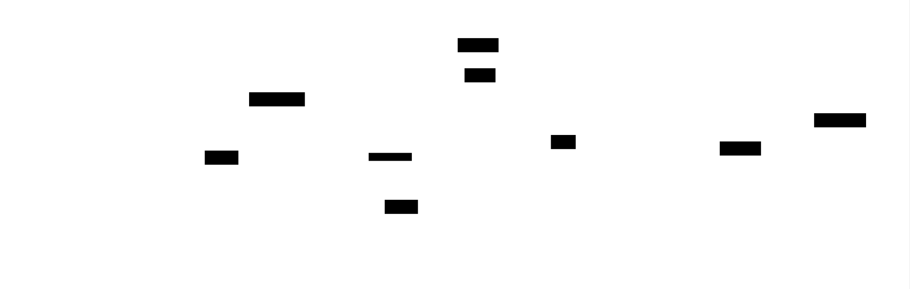

# Neural Network Framework: Design Document


## Overview

This system implements a PyTorch-like deep learning framework with automatic differentiation, enabling users to build and train neural networks. The key architectural challenge is efficiently computing gradients through dynamic computation graphs using reverse-mode automatic differentiation while maintaining a clean, extensible API.


> This guide is meant to help you understand the big picture before diving into each milestone. Refer back to it whenever you need context on how components connect.


## Context and Problem Statement

> **Milestone(s):** Foundation for all milestones - establishes the core problem that automatic differentiation solves

Building neural networks from scratch presents a fundamental challenge that every deep learning practitioner must understand: **gradient computation**. While forward propagation through a neural network is conceptually straightforward—data flows through layers, each applying mathematical transformations—the backward pass that enables learning requires computing gradients of complex, nested functions with respect to hundreds or thousands of parameters. This process, known as **backpropagation**, becomes intractable to implement manually as networks grow in complexity.

Modern deep learning frameworks like PyTorch, TensorFlow, and JAX solve this challenge through **automatic differentiation** (autodiff), a technique that mechanically computes exact derivatives of computer programs. Rather than requiring developers to manually derive and implement gradient formulas for every possible combination of operations, autodiff systems automatically track computations during the forward pass and then systematically apply the chain rule during the backward pass to compute all necessary gradients.

The framework we will build implements **reverse-mode automatic differentiation**, the same approach used by PyTorch and TensorFlow's eager mode. This technique constructs a computational graph during forward execution, then traverses this graph in reverse topological order to compute gradients efficiently. Understanding how to build such a system from the ground up provides deep insights into how modern neural network training actually works under the hood.

### The Recipe Book Analogy

To understand why automatic differentiation is necessary and how it works, consider neural network training as following a complex recipe book where we need to track how changing any ingredient affects the final dish's quality.

Imagine you're a chef developing a new recipe by combining multiple sub-recipes. Your main dish requires making a sauce (which itself requires combining spices, oils, and acids), preparing vegetables (involving chopping, seasoning, and cooking), and combining everything with a protein. Each sub-recipe transforms its ingredients through specific operations—heating, mixing, seasoning—and passes the result to the next step.

In this analogy, **tensors are ingredients**, **operations are cooking techniques**, and the **computation graph is your recipe dependency chart** showing which ingredients flow into which preparation steps. During cooking (forward pass), you execute each step and note exactly which ingredients went into which operations and in what order. This creates a detailed record of your cooking process—the computational graph.

Now suppose your final dish tastes slightly too salty, and you want to know exactly how much less salt to use in each sub-recipe to achieve the perfect flavor balance. This is analogous to having a loss function that measures how far your neural network's predictions are from the target, and wanting to know how to adjust each parameter (weight and bias) to reduce that loss.

To solve this, you need to trace backwards through your recipe: the saltiness came from the final combination step, which got contributions from the sauce, the vegetables, and the protein seasoning. The sauce's saltiness came from the spice blend and the acid reduction. Each step in reverse tells you how much changing that ingredient would affect the final taste, and you can use the chain rule to combine these effects: if reducing the sauce salt by X affects the final dish by Y, and the sauce salt comes from the spice blend with ratio Z, then reducing the spice blend affects the final dish by Y×Z.

This backwards tracing through the recipe dependency chart, applying the chain rule at each step, is exactly how **reverse-mode automatic differentiation** works. The computation graph records the "recipe" of your neural network's computation, and backpropagation systematically traces backwards through this graph, computing how much each parameter (ingredient) contributes to the final loss (dish quality).

The key insight is that you don't need to manually figure out all possible ways ingredients could affect the final dish—you just need to record what actually happened during this particular cooking session (forward pass), then systematically trace backwards through those recorded steps. The automatic differentiation system handles this bookkeeping automatically, ensuring that no matter how complex your "recipe" (neural network architecture) becomes, gradients are computed correctly and efficiently.


### The Gradient Computation Challenge

Manual gradient computation becomes intractable for neural networks due to the **exponential explosion of partial derivatives** required as network complexity grows. To understand why automatic differentiation is essential, consider the mathematical challenges faced when implementing backpropagation manually.

For a simple two-layer neural network with input `x`, hidden layer weights `W1`, hidden layer biases `b1`, activation function `σ`, output weights `W2`, output biases `b2`, and loss function `L`, the forward pass computes:

```
h = σ(W1 @ x + b1)
y = W2 @ h + b2  
loss = L(y, target)
```

Computing gradients manually requires applying the chain rule to find how `loss` changes with respect to each parameter. For `W2`, this involves ∂L/∂W2 = ∂L/∂y × ∂y/∂W2. For `W1`, the chain becomes longer: ∂L/∂W1 = ∂L/∂y × ∂y/∂h × ∂h/∂W1, requiring intermediate gradient computations and careful tracking of tensor shapes for matrix derivatives.

As networks grow deeper and more complex, several challenges compound this difficulty:

**Computational Complexity Explosion**: A network with L layers requires computing L sets of gradients, each depending on gradients from subsequent layers. For ResNet-style skip connections, gradients flow through multiple paths, requiring careful accumulation. Modern architectures like Transformers with attention mechanisms involve complex tensor operations (scaled dot-product attention, layer normalization) where manual derivative computation for each operation becomes extremely error-prone.

**Shape Management Complexity**: Tensor operations involve broadcasting, reshaping, and dimension manipulation that affect gradient computation. Computing gradients for broadcasted operations requires "unbroadcasting" gradients back to original shapes. Matrix operations require transposition and careful axis management. Batch dimensions add another layer of complexity where gradients must be summed across batch elements.

**Dynamic Computation Graphs**: Modern neural networks often involve conditional execution, loops, and dynamic shapes that change based on input data. Recurrent networks process variable-length sequences, requiring gradient computation through dynamic unrolling. Attention mechanisms involve dynamic masking and variable sequence lengths. Manual gradient computation cannot handle these dynamic patterns systematically.

**Numerical Stability Issues**: Manual implementations often suffer from numerical precision problems. Gradient clipping, proper initialization, and handling of edge cases (like log(0) in cross-entropy loss) require careful implementation. Automatic differentiation systems can implement these safeguards systematically across all operations.

**Error-Prone Implementation**: Manual gradient computation requires implementing derivatives for every operation, ensuring consistency between forward and backward passes, and maintaining this consistency as code evolves. A single error in any gradient formula can cause subtle training failures that are difficult to debug.

**Composition Complexity**: Neural networks compose operations in arbitrary ways—convolutions followed by batch normalization, then activation functions, then attention mechanisms. Manual implementation requires deriving gradient formulas for every possible composition, an exponentially growing challenge.

Consider the gradient computation for a single attention head in a Transformer:

```
Q, K, V = input @ WQ, input @ WK, input @ WV
scores = Q @ K.T / sqrt(d_k)  
attn_weights = softmax(scores, mask=mask)
output = attn_weights @ V
```

Computing ∂loss/∂WQ manually requires tracing through matrix multiplications, softmax with masking, another matrix multiplication, and handling variable sequence lengths—a derivation that spans multiple pages of mathematical notation and is extremely error-prone to implement.

**The Manual Approach Breakdown**: To illustrate why manual approaches fail, consider implementing a simple three-layer network manually. You must:

1. Derive gradient formulas for each layer's weights and biases
2. Implement forward pass storing all intermediate activations  
3. Implement backward pass applying chain rule in reverse order
4. Handle broadcasting and shape changes correctly at each step
5. Ensure numerical stability and proper gradient accumulation
6. Debug gradient computation by comparing with numerical differentiation
7. Maintain consistency as you modify the network architecture

This process must be repeated for every new layer type, activation function, or architectural change. The implementation becomes a maintenance nightmare that prevents experimentation and innovation.

**Automatic Differentiation as Solution**: Automatic differentiation transforms this intractable manual process into a systematic, mechanical procedure. Instead of deriving gradients by hand, you implement each operation's forward pass and its corresponding gradient computation rule once. The autodiff system automatically composes these rules using the chain rule, handles shape management, and ensures correctness regardless of how operations are combined.

This transformation enables the rapid experimentation and complex architectures that drive modern deep learning research. Without automatic differentiation, the field would be limited to simple, manually tractable network architectures, preventing the development of transformative models like ResNets, Transformers, and modern generative models.

### Existing Framework Comparison

Understanding how established frameworks approach automatic differentiation reveals different design philosophies and trade-offs that inform our implementation choices. Each major framework—PyTorch, TensorFlow, and JAX—represents a distinct approach to solving the gradient computation challenge.

**PyTorch: Dynamic Computation Graphs with Eager Execution**

PyTorch pioneered the **define-by-run** paradigm where computation graphs are built dynamically during forward execution. Each tensor operation creates nodes in the computation graph immediately, enabling flexible control flow and debugging.

| Aspect | Implementation | Benefits | Trade-offs |
|--------|---------------|----------|------------|
| Graph Construction | Built during forward pass execution | Natural Python control flow, easy debugging | Runtime overhead, memory growth |
| Execution Model | Eager evaluation of operations | Immediate results, interactive development | Cannot optimize across operations |
| Gradient Computation | Reverse-mode autodiff with `autograd` | Efficient for ML workloads, handles dynamic shapes | Requires keeping computation history |
| Memory Management | Reference counting with cycle detection | Automatic cleanup, predictable behavior | Memory peaks during backward pass |
| API Design | Object-oriented with operator overloading | Intuitive syntax, familiar to NumPy users | Harder to extend with new operations |

PyTorch's design prioritizes **developer experience and flexibility**. Researchers can implement complex, dynamic architectures with conditional execution and variable-length sequences naturally. The immediate feedback from eager execution makes debugging straightforward—you can inspect tensor values at any point during computation.

However, this flexibility comes with performance costs. Each operation incurs Python overhead, and the dynamic graph prevents compile-time optimizations. Memory usage can be high since the entire computation history must be retained for gradient computation.

**TensorFlow: Static Graphs with Compilation (TF 1.x) + Eager Mode (TF 2.x)**

TensorFlow originally used **define-then-run** static computation graphs, later adding eager execution to compete with PyTorch's usability.

| Aspect | Static Graphs (TF 1.x) | Eager Mode (TF 2.x) | Design Impact |
|--------|------------------------|---------------------|---------------|
| Graph Construction | Explicit graph definition phase | Dynamic like PyTorch | Hybrid approach complexity |
| Execution Model | Compiled graph execution | Eager evaluation option | Performance vs usability trade-off |
| Optimization | Aggressive graph-level optimizations | Limited optimization scope | Best performance requires graph mode |
| Debugging | Difficult, requires sessions | Natural Python debugging | Two different mental models |
| Control Flow | Special control flow operations | Native Python control flow | API inconsistency between modes |

TensorFlow's evolution reflects the tension between **performance and usability**. Static graphs enable powerful optimizations—operation fusion, memory layout optimization, and cross-device scheduling—but at the cost of programming complexity. TensorFlow 2.x attempts to provide both through `@tf.function` decorators that trace eager code into static graphs, but this hybrid approach introduces subtle complexities around when tracing occurs and how Python semantics translate to graph operations.

The XLA (Accelerated Linear Algebra) compiler in TensorFlow demonstrates static graphs' optimization potential, achieving significant speedups through operation fusion and memory optimization that dynamic approaches cannot match.

**JAX: Functional Programming with Composable Transformations**

JAX takes a radically different approach, treating automatic differentiation as one of several **composable program transformations** applied to pure functions.

| Aspect | JAX Approach | Unique Benefits | Limitations |
|--------|--------------|-----------------|-------------|
| Programming Model | Pure functional, no mutable state | Mathematical clarity, composability | Requires functional thinking |
| AD Implementation | Multiple transformation modes | Forward-mode, reverse-mode, mixed | More complex implementation |
| Transformations | Composable: `grad`, `jit`, `vmap`, `pmap` | Powerful abstractions, research flexibility | Steep learning curve |
| Graph Representation | Traced JaxPR intermediate representation | Clean separation of concerns | Less transparent than PyTorch |
| Performance | XLA compilation for all operations | Consistent high performance | Compilation overhead |

JAX's `grad` transformation converts a function `f: a -> b` into its gradient function `grad(f): a -> a`, which can be composed with other transformations like `jit` (compilation), `vmap` (vectorization), and `pmap` (parallelization). This composability enables expressing complex training patterns concisely:

```python
# JAX: compose transformations
batched_grad = vmap(grad(loss_fn), in_axes=(None, 0, 0))
compiled_update = jit(lambda params, batch: sgd_update(params, batched_grad(params, batch.x, batch.y)))
```

The functional approach eliminates many sources of bugs common in stateful frameworks—no accidental mutation, no hidden state, clear data dependencies. However, it requires rethinking neural network implementation patterns and has a steeper learning curve for developers accustomed to object-oriented frameworks.

**Framework Comparison Analysis**

> **Decision: Framework Design Philosophy for Our Implementation**
> - **Context**: We need to choose which framework's approach best serves the educational goals of understanding automatic differentiation fundamentals
> - **Options Considered**: 
>   1. PyTorch-style dynamic graphs with eager execution
>   2. TensorFlow-style static graph compilation  
>   3. JAX-style functional transformations
> - **Decision**: PyTorch-style dynamic computation graphs
> - **Rationale**: Dynamic graphs make the computation graph construction and traversal explicit and observable, which is essential for learning how autodiff works. Students can inspect the graph structure, understand the backward pass step-by-step, and debug gradient computation interactively. The immediate feedback from eager execution helps build intuition.
> - **Consequences**: We sacrifice some performance optimizations possible with static graphs, but gain clarity and debuggability that serves the educational mission. The implementation will be more straightforward and the resulting framework more approachable for experimentation.

| Design Dimension | PyTorch | TensorFlow | JAX | Our Choice |
|------------------|---------|------------|-----|------------|
| Learning Curve | Gentle, familiar to NumPy users | Moderate, two modes to learn | Steep, requires functional thinking | Gentle ✓ |
| Graph Transparency | High, easy to inspect | Low in static mode, medium in eager | Low, abstract transformations | High ✓ |
| Implementation Complexity | Medium, object-oriented | High, hybrid system | High, transformation system | Medium ✓ |
| Debugging Experience | Excellent, natural Python | Poor in static, good in eager | Good but requires functional debugging | Excellent ✓ |
| Educational Value | High, concepts map directly | Medium, abstractions hide details | High but advanced | High ✓ |

**Key Insights from Framework Analysis**

The framework comparison reveals several critical insights that will guide our implementation:

**Eager Execution Aids Learning**: PyTorch's success in research and education demonstrates that immediate feedback and transparent execution help developers understand what's happening. Our framework should prioritize clarity over optimization.

**Graph Construction Strategy Matters**: How and when the computation graph is built fundamentally affects the programming model. Dynamic construction aligns with natural Python control flow and makes the autodiff process observable.

**API Design Shapes User Experience**: PyTorch's operator overloading creates an intuitive interface where `a + b` automatically creates computation graph nodes. This removes boilerplate and lets users focus on model logic rather than framework mechanics.

**Memory Management Complexity**: All frameworks struggle with memory management during gradient computation. Our implementation must carefully consider when to release intermediate values and how to handle gradient accumulation.

**The Abstraction Level Trade-off**: More abstraction (like JAX transformations) can enable powerful patterns but may hide the underlying mechanics we want students to understand. Our framework should expose the computation graph and backward pass explicitly.

These insights inform our design principles: prioritize transparency and learnability, use dynamic computation graphs with eager execution, provide an intuitive tensor API with operator overloading, and make the autodiff process observable and debuggable. While this may sacrifice some performance optimizations, it serves the educational goal of deeply understanding how automatic differentiation enables modern neural network training.

### Implementation Guidance

Understanding how existing frameworks solve the gradient computation problem provides the foundation for implementing our own neural network framework. This section bridges the conceptual understanding developed above with practical implementation choices and starter code.

**A. Technology Recommendations**

| Component | Simple Option | Advanced Option |
|-----------|---------------|-----------------|
| Tensor Storage | Pure NumPy arrays with Python lists for metadata | NumPy arrays with custom memory pools |
| Graph Representation | Python objects with references | Optimized node structures with arena allocation |
| Operation Implementation | Individual Python classes per operation | Single dispatch or visitor pattern |
| Gradient Computation | Recursive traversal with Python call stack | Iterative traversal with explicit stack |
| Broadcasting | NumPy's broadcasting with wrapper functions | Custom broadcasting implementation |
| Testing Framework | Built-in unittest with numerical gradient checking | pytest with property-based testing |

For learning purposes, we recommend starting with the simple options to understand the core concepts, then optionally exploring advanced optimizations once the basic system works.

**B. Recommended Project Structure**

Organize your neural network framework with clear separation of concerns that mirrors the conceptual architecture:

```
neural_framework/
├── core/
│   ├── __init__.py
│   ├── tensor.py              ← Tensor class with operations
│   ├── autograd.py            ← Automatic differentiation engine  
│   └── operations.py          ← Operation classes (Add, Multiply, etc.)
├── nn/
│   ├── __init__.py
│   ├── module.py              ← Module base class and parameter management
│   ├── layers.py              ← Linear, activation layers
│   └── loss.py                ← Loss functions
├── optim/
│   ├── __init__.py
│   ├── optimizer.py           ← Optimizer base class
│   └── sgd.py, adam.py        ← Specific optimizers
├── utils/
│   ├── __init__.py
│   └── testing.py             ← Gradient checking utilities
├── examples/
│   ├── simple_regression.py   ← End-to-end training example
│   └── mnist_classifier.py    ← More complex example
└── tests/
    ├── test_tensor.py
    ├── test_autograd.py
    └── test_training.py
```

This structure separates the core autodiff functionality from the higher-level neural network abstractions, making it easier to understand and test each component independently.

**C. Infrastructure Starter Code**

Here's complete, working infrastructure code that handles the non-core-learning components, allowing you to focus on the automatic differentiation logic:

**Gradient Checking Utility (`utils/testing.py`)**:
```python
import numpy as np
from typing import Callable, List
from core.tensor import Tensor

def numerical_gradient(f: Callable[[Tensor], Tensor], 
                      inputs: List[Tensor], 
                      h: float = 1e-5) -> List[np.ndarray]:
    """
    Compute numerical gradients using finite differences.
    Used to verify automatic differentiation correctness.
    """
    numerical_grads = []
    
    for input_tensor in inputs:
        grad = np.zeros_like(input_tensor.data)
        
        # Flatten for easier iteration
        flat_input = input_tensor.data.flatten()
        flat_grad = grad.flatten()
        
        for i in range(len(flat_input)):
            # Compute f(x + h)
            flat_input[i] += h
            input_tensor.data = flat_input.reshape(input_tensor.shape)
            f_plus = f(input_tensor).data
            
            # Compute f(x - h)  
            flat_input[i] -= 2 * h
            input_tensor.data = flat_input.reshape(input_tensor.shape)
            f_minus = f(input_tensor).data
            
            # Restore original value
            flat_input[i] += h
            input_tensor.data = flat_input.reshape(input_tensor.shape)
            
            # Compute numerical gradient
            flat_grad[i] = np.sum((f_plus - f_minus) / (2 * h))
        
        numerical_grads.append(flat_grad.reshape(input_tensor.shape))
    
    return numerical_grads

def check_gradients(f: Callable[[Tensor], Tensor],
                   inputs: List[Tensor],
                   tolerance: float = 1e-6) -> bool:
    """
    Compare automatic gradients with numerical gradients.
    Returns True if they match within tolerance.
    """
    # Compute automatic gradients
    for inp in inputs:
        inp.requires_grad = True
        inp.grad = None
    
    output = f(*inputs)
    output.backward()
    
    auto_grads = [inp.grad.data for inp in inputs]
    
    # Compute numerical gradients
    numerical_grads = numerical_gradient(lambda *args: f(*args), inputs)
    
    # Compare
    for auto_grad, num_grad in zip(auto_grads, numerical_grads):
        if not np.allclose(auto_grad, num_grad, atol=tolerance):
            print(f"Gradient mismatch!")
            print(f"Automatic: {auto_grad}")
            print(f"Numerical: {num_grad}")
            print(f"Difference: {np.abs(auto_grad - num_grad)}")
            return False
    
    return True
```

**Broadcasting Utilities (`core/broadcasting.py`)**:
```python
import numpy as np
from typing import Tuple

def broadcast_shapes(shape1: Tuple[int, ...], shape2: Tuple[int, ...]) -> Tuple[int, ...]:
    """
    Compute the broadcasted shape following NumPy broadcasting rules.
    """
    return np.broadcast_shapes(shape1, shape2)

def unbroadcast_gradient(grad: np.ndarray, original_shape: Tuple[int, ...]) -> np.ndarray:
    """
    Reduce gradient from broadcasted shape back to original tensor shape.
    This is crucial for gradient computation in broadcasted operations.
    """
    # Sum out added dimensions (from left)
    ndims_added = len(grad.shape) - len(original_shape)
    for _ in range(ndims_added):
        grad = grad.sum(axis=0)
    
    # Sum over broadcasted dimensions  
    for i, (grad_dim, orig_dim) in enumerate(zip(grad.shape, original_shape)):
        if orig_dim == 1 and grad_dim > 1:
            grad = grad.sum(axis=i, keepdims=True)
    
    return grad.reshape(original_shape)

def can_broadcast(shape1: Tuple[int, ...], shape2: Tuple[int, ...]) -> bool:
    """
    Check if two shapes can be broadcasted together.
    """
    try:
        broadcast_shapes(shape1, shape2)
        return True
    except ValueError:
        return False
```

**D. Core Logic Skeleton Code**

Here are the essential class signatures and method skeletons that you need to implement, with detailed TODOs mapping to the concepts discussed above:

**Tensor Class Skeleton (`core/tensor.py`)**:
```python
import numpy as np
from typing import Optional, Tuple, Union, List

class Tensor:
    """
    N-dimensional array with automatic differentiation support.
    Similar to PyTorch tensors but simplified for learning.
    """
    
    def __init__(self, 
                 data: Union[np.ndarray, List, float, int],
                 requires_grad: bool = False,
                 grad_fn: Optional['Operation'] = None):
        """
        Initialize tensor with data and gradient tracking.
        
        Args:
            data: The actual numerical data (converted to numpy array)
            requires_grad: Whether to compute gradients for this tensor
            grad_fn: The operation that created this tensor (for autodiff)
        """
        # TODO 1: Convert data to numpy array and store in self.data
        # TODO 2: Store shape, dtype from the numpy array  
        # TODO 3: Set requires_grad flag and initialize grad to None
        # TODO 4: Store grad_fn for backward pass linkage
        # Hint: Use np.asarray() to handle different input types
    
    def backward(self, gradient: Optional['Tensor'] = None) -> None:
        """
        Initiate backpropagation from this tensor.
        This is the entry point that triggers gradient computation.
        """
        # TODO 1: If gradient not provided, create tensor of ones with same shape
        # TODO 2: Call _backward() to start recursive gradient computation  
        # TODO 3: Handle the case where this tensor doesn't require gradients
        # Hint: gradient=None means this is the loss tensor (scalar)
    
    def _backward(self, gradient: 'Tensor') -> None:
        """
        Internal method for recursive gradient computation.
        This implements the core autodiff logic.
        """
        # TODO 1: If this tensor requires gradients, accumulate gradient
        # TODO 2: If this tensor has grad_fn, call its backward method
        # TODO 3: Handle gradient accumulation (+=, not =) for shared tensors
        # Hint: Check if self.grad is None before accumulating
    
    def __add__(self, other: Union['Tensor', float, int]) -> 'Tensor':
        """Tensor addition with gradient tracking."""
        # TODO 1: Convert other to Tensor if it's a scalar
        # TODO 2: Create Add operation and apply it
        # TODO 3: Return result tensor with proper grad_fn
        # Hint: Import Add operation from operations.py
    
    def __mul__(self, other: Union['Tensor', float, int]) -> 'Tensor':
        """Element-wise multiplication with gradient tracking."""
        # TODO: Similar to __add__ but use Multiply operation
    
    def matmul(self, other: 'Tensor') -> 'Tensor':
        """Matrix multiplication with gradient tracking."""
        # TODO: Create MatMul operation and apply it
        # Hint: This will be more complex due to shape handling
```

**Operation Base Class (`core/operations.py`)**:
```python
from abc import ABC, abstractmethod
from typing import Tuple
from core.tensor import Tensor

class Operation(ABC):
    """
    Base class for all operations that can compute gradients.
    Each operation knows how to compute its forward pass and backward pass.
    """
    
    def __init__(self):
        self.inputs: Tuple[Tensor, ...] = ()
    
    def __call__(self, *inputs: Tensor) -> Tensor:
        """
        Apply this operation to input tensors.
        """
        # TODO 1: Store inputs for backward pass
        # TODO 2: Call forward() to compute result
        # TODO 3: Create result tensor with this operation as grad_fn
        # TODO 4: Set requires_grad=True if any input requires gradients
    
    @abstractmethod
    def forward(self, *inputs: Tensor) -> np.ndarray:
        """Compute the forward pass. Return raw numpy array."""
        pass
    
    @abstractmethod  
    def backward(self, grad_output: Tensor) -> Tuple[Tensor, ...]:
        """
        Compute gradients with respect to inputs.
        
        Args:
            grad_output: Gradient flowing back from subsequent operations
            
        Returns:
            Tuple of gradients for each input tensor
        """
        pass

class Add(Operation):
    """Element-wise addition operation."""
    
    def forward(self, a: Tensor, b: Tensor) -> np.ndarray:
        # TODO 1: Add the data arrays using numpy
        # TODO 2: Handle broadcasting automatically via numpy
        # Hint: Just return a.data + b.data, numpy handles broadcasting
    
    def backward(self, grad_output: Tensor) -> Tuple[Tensor, Tensor]:
        """
        Gradient of addition: ∂(a+b)/∂a = 1, ∂(a+b)/∂b = 1
        But we must handle broadcasting by unbroadcasting gradients.
        """
        # TODO 1: Gradient w.r.t. first input is grad_output  
        # TODO 2: Gradient w.r.t. second input is also grad_output
        # TODO 3: Unbroadcast gradients to match original input shapes
        # TODO 4: Return tuple of gradient tensors
        # Hint: Use unbroadcast_gradient() from broadcasting.py
```

**E. Language-Specific Hints**

**NumPy Broadcasting**: Use `np.broadcast_arrays(a, b)` to see how arrays will be broadcasted, but let operations happen naturally - NumPy handles broadcasting automatically in arithmetic operations.

**Memory Management**: Python's garbage collector handles most cleanup, but be aware that computation graphs can create reference cycles. Consider implementing `zero_grad()` methods that explicitly clear gradients to free memory.

**Shape Debugging**: Use `tensor.shape` frequently and add shape assertions. Many bugs come from shape mismatches that numpy silently broadcasts in unexpected ways.

**Gradient Accumulation**: Always use `+=` when accumulating gradients, never `=`. Shared tensors (used multiple times) need gradients summed from all uses.

**Testing Strategy**: Start with simple operations (addition, multiplication) and verify gradients using numerical differentiation before moving to complex operations like matrix multiplication.

**F. Milestone Checkpoint**

After implementing the basic tensor and autodiff system:

**Test Command**: `python -c "from utils.testing import check_gradients; from core.tensor import Tensor; import numpy as np; a = Tensor([1.0, 2.0], requires_grad=True); b = Tensor([3.0, 4.0], requires_grad=True); print(check_gradients(lambda x, y: x + y, [a, b]))"`

**Expected Output**: `True` (indicating gradients match numerical computation)

**Manual Verification**:
1. Create two tensors with `requires_grad=True`
2. Perform addition: `c = a + b`  
3. Call `c.backward()`
4. Check that `a.grad` and `b.grad` both contain arrays of ones
5. Verify the computation graph exists: `c.grad_fn` should be an `Add` operation

**Signs of Problems**:
- `AttributeError` on `backward()`: Tensor class not properly initialized
- Gradient is `None`: Either `requires_grad=False` or backward pass not implemented
- Shape mismatch errors: Broadcasting not handled correctly in gradient computation
- Gradients don't match numerical: Error in backward pass implementation

This checkpoint ensures your foundational tensor and autodiff system works before building neural network layers on top.


## Goals and Non-Goals

> **Milestone(s):** Foundation for all milestones - establishes clear scope and learning objectives for the entire project

Building a neural network framework from scratch is an ambitious undertaking that could easily spiral into a years-long project if we attempt to match the full feature set of production frameworks like PyTorch or TensorFlow. To ensure this remains an effective learning experience, we must carefully define what we will and won't implement. Think of this like planning a cross-country road trip - without clear destinations and route boundaries, you'll find yourself lost in fascinating detours that prevent you from reaching your core learning objectives.

This section establishes our framework's scope by defining three critical boundaries: the functional requirements that form our core learning goals, the performance and quality standards that prioritize educational value over production optimization, and the explicit non-goals that we'll consciously exclude to maintain focus. These boundaries aren't limitations - they're strategic choices that ensure we build deep understanding of automatic differentiation, tensor operations, and neural network fundamentals rather than getting lost in the peripheral complexity of production systems.

### Functional Requirements

Our neural network framework must implement a carefully curated set of core features that demonstrate the fundamental principles of automatic differentiation and neural network training. These requirements represent the minimum viable functionality needed to train real neural networks while keeping the implementation scope manageable for a learning project.

The functional requirements are organized around four key capabilities that mirror the milestone structure: tensor operations that provide the computational foundation, automatic differentiation that enables gradient-based learning, neural network modules that offer composable building blocks, and optimization algorithms that drive the training process.

| Requirement Category | Must Support | Success Criteria |
|---------------------|-------------|------------------|
| **Tensor Operations** | N-dimensional arrays with shape tracking | Create tensors with arbitrary dimensions, track shape and dtype correctly |
| | Element-wise arithmetic | Add, subtract, multiply, divide tensors with broadcasting |
| | Matrix multiplication | 2D matrix multiplication and batched operations |
| | Broadcasting | NumPy-compatible shape expansion for mismatched tensors |
| | Gradient tracking | `requires_grad` flag enables/disables gradient computation |
| **Automatic Differentiation** | Computation graph construction | Operations automatically build DAG during forward pass |
| | Reverse-mode backpropagation | Chain rule application through topological sort |
| | Gradient accumulation | Multiple uses of same tensor accumulate gradients correctly |
| | Gradient computation | Matches numerical differentiation within tolerance |
| **Neural Network Modules** | Linear layers | Fully connected layers with weight and bias parameters |
| | Activation functions | ReLU, sigmoid, tanh with correct gradients |
| | Parameter management | Automatic registration and collection of trainable parameters |
| | Module composition | Sequential and nested module support |
| **Optimization** | SGD optimizer | Parameter updates with learning rate and momentum |
| | Adam optimizer | Adaptive learning rates with bias correction |
| | Loss functions | Cross-entropy and mean squared error |
| | Training loop | Mini-batch processing with forward/backward/update cycle |

> **Decision: Functional Scope**
> - **Context**: Neural networks require dozens of operations and layers for production use, but implementing all would obscure core learning objectives
> - **Options Considered**: 
>   1. Full PyTorch API compatibility (200+ operations)
>   2. Minimal subset for basic networks (10-15 operations)
>   3. Core operations plus extensible architecture (20-30 operations)
> - **Decision**: Core operations plus extensible architecture
> - **Rationale**: Provides sufficient functionality to train meaningful models while demonstrating all key automatic differentiation principles. Extensible design allows learners to add operations after mastering fundamentals
> - **Consequences**: Can train multi-layer perceptrons and simple convolutional networks, but lacks advanced operations like attention or specialized layers

The tensor operations form the computational foundation of our framework. Every tensor must track its shape, data type, and whether it requires gradient computation. Element-wise operations like addition and multiplication must support NumPy-compatible broadcasting, automatically expanding tensor dimensions to enable operations between tensors of different shapes. Matrix multiplication must handle both 2D matrices and batched operations where multiple matrix multiplications are performed in parallel across batch dimensions.

The automatic differentiation engine represents the core intellectual challenge of the project. During the forward pass, each operation must construct nodes in a computation graph that records the relationships between input and output tensors. The backward pass must traverse this graph in reverse topological order, applying the chain rule to compute gradients. When tensors are used multiple times in a computation, their gradients must be accumulated rather than overwritten.

Neural network modules provide the building blocks for constructing complex models. The `Module` base class must automatically track parameters in nested hierarchies, allowing optimizers to find and update all trainable weights. Linear layers implement the fundamental `y = Wx + b` transformation with proper weight initialization. Activation functions apply element-wise nonlinearities while preserving gradient flow through the network.

The optimization system coordinates the training process by implementing gradient-based parameter updates. SGD must support momentum for accelerated convergence, while Adam provides adaptive learning rates with bias correction for first and second moment estimates. Loss functions must compute both the loss value and provide gradients that initiate the backward pass.

### Performance and Quality Goals

Our framework prioritizes educational clarity and correctness over production-level performance optimizations. This represents a fundamental trade-off that shapes every design decision - we choose implementations that are easy to understand, debug, and extend rather than those that maximize computational efficiency.

Think of this like the difference between a driving instructor's car and a Formula 1 race car. The instructor's car has clear visibility, simple controls, and forgiving handling characteristics that help students learn fundamental driving skills. The race car optimizes for maximum speed with complex controls that would overwhelm a learning driver. Our framework is the instructor's car - designed to teach automatic differentiation principles clearly rather than achieve maximum throughput.

| Quality Dimension | Goal | Rationale | Measurement |
|------------------|------|-----------|-------------|
| **Educational Clarity** | Code readability over performance | Learning objective is understanding autodiff | Can explain algorithm by reading code |
| **Correctness** | Gradients match numerical differentiation | Foundation for all neural network learning | Gradient checker passes with 1e-6 tolerance |
| **Debuggability** | Clear error messages and inspection tools | Students need to diagnose their mistakes | Shape mismatches include tensor dimensions |
| **Extensibility** | Easy to add new operations | Encourages experimentation beyond core features | New operation requires <50 lines of code |
| **Simplicity** | Minimize dependencies and abstraction layers | Reduces cognitive load during learning | Core autodiff engine fits in single file |

> **Decision: Performance vs. Clarity Trade-off**
> - **Context**: Production frameworks use complex optimizations (operation fusion, memory pooling, CUDA kernels) that obscure core algorithms
> - **Options Considered**: 
>   1. Performance-first with extensive optimizations
>   2. Clarity-first with readable but slower implementations  
>   3. Hybrid approach with optional optimization layers
> - **Decision**: Clarity-first with readable implementations
> - **Rationale**: Learning automatic differentiation requires understanding the mathematical operations and graph traversal algorithms. Performance optimizations create abstraction layers that hide these fundamentals
> - **Consequences**: Framework will be 10-100x slower than PyTorch but students can trace every operation step-by-step

Educational clarity means that someone reading the code should be able to understand the mathematical operations being performed without deciphering complex optimization layers. When implementing matrix multiplication, we use clear NumPy operations rather than optimized BLAS routines. When traversing the computation graph, we use explicit loops and condition checks rather than vectorized graph algorithms.

Correctness takes priority over speed in all situations. Every operation must produce mathematically correct results, and gradients must match numerical differentiation within reasonable tolerance. We implement comprehensive gradient checking utilities that compare automatic differentiation results against finite difference approximations. When there's a choice between a fast algorithm with edge cases and a slower algorithm that handles all cases correctly, we choose correctness.

Debuggability means providing rich error messages and inspection tools that help learners diagnose problems. When tensor shapes don't match for an operation, the error message should include the actual shapes and the operation being attempted. The computation graph should be inspectable so students can visualize the operations being performed and verify that gradients flow correctly.

Extensibility ensures that students can experiment with new operations and layer types after mastering the core framework. Adding a new operation should require implementing only the forward pass computation and gradient calculation, with the framework handling graph construction and backpropagation automatically. The module system should make it trivial to compose new layer types from existing building blocks.

### Explicit Non-Goals

To maintain focus on core learning objectives, we explicitly exclude several categories of functionality that would be essential for production use but would distract from understanding automatic differentiation principles. These non-goals aren't shortcomings - they're strategic exclusions that keep the project scope manageable and the learning objectives clear.

Think of these non-goals as the advanced driving techniques we skip in basic driving instruction. Students learning to drive don't start with parallel parking in tight spaces, highway merging in heavy traffic, or performance driving techniques. They master basic vehicle control, traffic rules, and safety principles first. Similarly, our framework focuses on automatic differentiation fundamentals rather than production deployment challenges.

| Non-Goal Category | Excluded Features | Rationale for Exclusion |
|-------------------|------------------|------------------------|
| **Production Performance** | CUDA kernels, operation fusion, memory pooling | Implementation complexity would obscure core algorithms |
| **Advanced Operations** | Convolutions, attention, batch normalization | Requires understanding of specialized mathematical algorithms |
| **Distributed Training** | Multi-GPU, parameter servers, gradient synchronization | Networking and coordination complexity unrelated to autodiff |
| **Deployment Optimization** | Quantization, pruning, ONNX export | Model optimization techniques beyond basic training |
| **Advanced Optimizers** | AdaGrad, RMSprop, learning rate scheduling | Additional complexity beyond demonstrating optimization principles |
| **Data Pipeline** | Data loaders, augmentation, distributed datasets | Infrastructure concerns separate from neural network computation |
| **Model Architecture** | Pre-trained models, standard architectures (ResNet, Transformer) | Focus is on building blocks, not complete model zoo |
| **Debugging Tools** | Profilers, visualization, TensorBoard integration | Tooling complexity beyond educational scope |

> **Decision: Advanced Operations Exclusion**
> - **Context**: Modern deep learning relies heavily on convolutions, attention mechanisms, and normalization layers
> - **Options Considered**: 
>   1. Include convolutions as core operation
>   2. Focus on dense layers and element-wise operations only
>   3. Provide convolution as extension example
> - **Decision**: Focus on dense layers, provide extension pathway
> - **Rationale**: Convolutions require understanding im2col transformations, padding modes, and stride calculations that are orthogonal to automatic differentiation principles. Students can add convolutions after mastering basic tensor operations and gradient computation
> - **Consequences**: Framework can't train modern computer vision models out-of-box, but students understand autodiff principles that apply to any operation

Production performance optimizations like GPU acceleration and operation fusion would require implementing CUDA kernels or complex CPU vectorization that obscures the underlying mathematical operations. While these optimizations are critical for practical deep learning, they add layers of systems complexity that distract from understanding how gradients propagate through computation graphs.

Advanced neural network operations like convolutions and attention mechanisms involve sophisticated mathematical algorithms that are interesting topics in their own right. However, implementing these operations requires understanding specialized techniques (like im2col transformations for convolutions or scaled dot-product attention) that are orthogonal to automatic differentiation principles. Students can add these operations after mastering the core framework.

Distributed training introduces networking protocols, fault tolerance, and gradient synchronization challenges that belong more in a distributed systems course than an automatic differentiation tutorial. While distributed training is essential for large-scale machine learning, the coordination complexity would overwhelm the core learning objectives around computation graphs and gradient computation.

Deployment optimizations like quantization and model pruning represent post-training techniques for reducing model size and inference cost. These optimizations are valuable for production systems but don't contribute to understanding how neural networks learn through gradient-based optimization.

The data pipeline infrastructure required for production machine learning - data loaders, augmentation pipelines, distributed datasets - represents a substantial engineering effort that's largely separate from neural network computation. Students can use simple NumPy arrays or basic data loading utilities while focusing on the automatic differentiation algorithms.

> ⚠️ **Pitfall: Scope Creep During Implementation**
> Students often encounter interesting optimization opportunities or missing features during implementation and want to add them immediately. This leads to projects that become too complex to complete or understand. Resist the temptation to add "just one more feature" - focus on the core learning objectives first. Advanced features can always be added after mastering the fundamentals, but attempting everything at once typically results in completing nothing well.

These explicit non-goals don't represent permanent limitations - they're training wheels that help students focus on core concepts. After mastering automatic differentiation with our simplified framework, students will have the foundational knowledge needed to understand how production frameworks implement these advanced features. The goal is deep understanding of fundamental principles rather than broad coverage of peripheral features.

### Implementation Guidance

The goals and non-goals defined above translate into specific technical choices and architectural constraints that guide the implementation process. This guidance helps maintain focus on educational objectives while providing concrete direction for technical decisions.

**A. Technology Recommendations Table:**

| Component | Simple Option | Advanced Option | Recommended for Learning |
|-----------|---------------|-----------------|-------------------------|
| **Numerical Computing** | Pure Python + NumPy | NumPy + SciPy + BLAS optimization | Pure Python + NumPy |
| **Testing Framework** | Built-in unittest | pytest with fixtures | pytest (better error messages) |
| **Gradient Checking** | Simple finite differences | scipy.optimize.approx_fprime | Custom implementation |
| **Graph Visualization** | Print statements + manual inspection | graphviz + matplotlib | Manual inspection first |
| **Documentation** | Docstrings + comments | Sphinx + readthedocs | Rich docstrings |

**B. Recommended Project Structure:**

The project organization should reflect the four-layer architecture while keeping related functionality grouped together:

```
neural-framework/
├── neuralnet/
│   ├── __init__.py              ← Public API exports
│   ├── tensor.py                ← Tensor class and basic operations
│   ├── operations.py            ← Operation subclasses (Add, Multiply, MatMul)
│   ├── autodiff.py              ← Backward pass and gradient computation
│   ├── module.py                ← Module base class and parameter management
│   ├── layers.py                ← Linear layer and activation functions
│   ├── optimizers.py            ← SGD and Adam implementations
│   ├── losses.py                ← Loss functions
│   └── utils.py                 ← Gradient checking and debugging utilities
├── tests/
│   ├── test_tensor.py           ← Tensor operation tests
│   ├── test_autodiff.py         ← Gradient computation tests  
│   ├── test_modules.py          ← Layer and module tests
│   ├── test_optimizers.py       ← Optimizer tests
│   └── test_integration.py      ← End-to-end training tests
├── examples/
│   ├── linear_regression.py     ← Simple regression example
│   ├── mnist_mlp.py            ← Multi-layer perceptron
│   └── gradient_checking.py     ← Debugging utilities demo
└── README.md                    ← Project overview and usage
```

**C. Core Design Constraints:**

Based on our goals and non-goals, implement with these constraints:

| Constraint Category | Specific Requirements |
|---------------------|---------------------|
| **Dependencies** | NumPy only for numerical computation (no torch, tensorflow, jax) |
| **Performance** | Prefer readable code over optimization (no Cython, no custom C extensions) |
| **API Design** | Mirror PyTorch conventions where possible for familiar interface |
| **Error Handling** | Detailed error messages with tensor shapes and operation context |
| **Testing** | Every operation must pass gradient check with tolerance=1e-6 |
| **Documentation** | Every public method documented with examples and mathematical notation |

**D. Architecture Validation Checklist:**

Use this checklist to ensure implementations stay aligned with educational goals:

| Design Decision | Educational Priority Questions |
|-----------------|-------------------------------|
| **Adding new operation** | Can student trace through forward and backward pass by hand? |
| **Choosing algorithm** | Is the mathematical relationship clear from the code? |
| **Error handling** | Do error messages help student understand what went wrong? |
| **API design** | Can student predict behavior without reading documentation? |
| **Performance optimization** | Does optimization obscure the underlying algorithm? |

**E. Milestone Validation Strategy:**

After completing each milestone, validate that goals are met:

| Milestone | Validation Approach | Success Criteria |
|-----------|-------------------|------------------|
| **Tensor Operations** | Manual calculation verification | Hand-computed results match tensor operations |
| **Automatic Differentiation** | Numerical gradient comparison | gradient_check passes for all operations |
| **Neural Modules** | Parameter counting and initialization | Module.parameters() returns expected tensors |
| **Optimizers** | Simple function minimization | SGD and Adam converge on quadratic function |

**F. Scope Management Guidelines:**

To prevent scope creep during implementation:

| Tempting Addition | Decision Framework | Recommended Action |
|-------------------|-------------------|-------------------|
| **"Just one more operation"** | Does it demonstrate new autodiff principle? | Usually defer to post-completion extension |
| **"Better error messages"** | Does it help debug common student mistakes? | Generally worth the investment |
| **"Performance improvement"** | Does it maintain algorithm clarity? | Usually violates educational goals |
| **"Production feature"** | Is it needed for basic neural network training? | Add to explicit non-goals list |

> The key insight for scope management is that every feature addition should be justified by its contribution to understanding automatic differentiation principles, not by its practical utility for production machine learning. This framework succeeds when students understand how gradients flow through computation graphs, not when it achieves competitive benchmark performance.

This implementation guidance provides concrete guardrails for maintaining focus on educational objectives while building a framework that demonstrates all core automatic differentiation concepts. The structure and constraints ensure that complexity stays manageable while covering sufficient functionality to train real neural networks on meaningful problems.


## High-Level Architecture

> **Milestone(s):** Foundation for all milestones - establishes the overall system design and component relationships

Building a neural network framework is like constructing a sophisticated manufacturing plant where raw materials (data) flow through an assembly line of operations, with each station (layer) performing specific transformations while keeping detailed records of every step for quality control (gradient computation). Just as a modern factory has distinct departments—receiving (tensor operations), production line (computation graph), quality assurance (modules), and management (optimizers)—our framework is organized into four distinct architectural layers that work together seamlessly.

The genius of this layered architecture lies in its separation of concerns: lower layers handle the mechanical details of computation while higher layers focus on the intelligent orchestration of learning. Each layer builds upon the foundation provided by the layer below, creating a clean abstraction hierarchy that makes the framework both powerful and maintainable.


### Four-Layer Architecture

Our neural network framework follows a **four-layer architectural pattern** that mirrors the natural hierarchy of concepts in deep learning. Think of it as a pyramid where each level provides services to the level above while depending only on services from levels below. This creates clear boundaries and enables each layer to evolve independently without breaking the entire system.

The **bottom layer** handles **tensor operations**—the fundamental mathematical building blocks. Like the foundation of a building, this layer must be rock-solid because everything else depends on it. Tensors at this level are "smart arrays" that know their shape, track whether they need gradients, and can perform basic arithmetic operations with broadcasting support.

The **second layer** implements the **automatic differentiation engine**—the computation graph that records operations and computes gradients. This is the nervous system of our framework, automatically tracking every computation during the forward pass and enabling efficient gradient computation during the backward pass. The key insight is that this layer transforms the imperative code users write into a functional computation graph suitable for differentiation.

The **third layer** provides the **neural network module system**—composable building blocks like linear layers and activation functions. This layer is where the framework becomes user-friendly, providing the LEGO-like components that users combine to build complex architectures. Modules automatically register their parameters and handle the forward pass, abstracting away the low-level tensor operations.

The **top layer** contains **optimizers and training infrastructure**—the algorithms that actually learn by updating parameters based on computed gradients. This layer orchestrates the entire training process, coordinating forward passes, loss computation, backward passes, and parameter updates in the correct sequence.

| Layer | Primary Responsibility | Key Components | Dependencies |
|-------|----------------------|----------------|--------------|
| Tensor Operations | Mathematical primitives and shape management | `Tensor`, arithmetic operators, broadcasting | NumPy arrays, memory management |
| Autodiff Engine | Computation graph construction and gradient computation | `Operation` nodes, topological sort, chain rule | Tensor layer |
| Neural Modules | Composable network components and parameter management | `Module`, `Linear`, activation functions | Tensor and Autodiff layers |
| Optimizers | Parameter updates and training coordination | `SGD`, `Adam`, loss functions, training loops | All lower layers |

The beauty of this architecture is its **define-by-run** nature: users write imperative Python code using tensors and modules, but behind the scenes, the autodiff engine automatically constructs a computation graph that enables efficient gradient computation. This combines the ease of imperative programming with the mathematical rigor required for automatic differentiation.

> **Key Architectural Insight:** Each layer provides a different level of abstraction—from mechanical tensor operations to high-level training orchestration—but they all work together transparently. Users interact primarily with the top two layers while the bottom two layers handle the complex mathematics automatically.

The layers communicate through **well-defined interfaces** that maintain the abstraction boundaries. Modules create and manipulate tensors, tensors automatically build the computation graph during operations, the autodiff engine computes gradients when requested, and optimizers use those gradients to update parameters. This creates a clean data flow that's easy to understand and debug.

### Component Responsibilities

Understanding what each architectural layer owns and how they depend on each other is crucial for implementing a maintainable framework. Think of each layer as a specialized department in our neural network factory, with clear job descriptions and communication protocols.

#### Tensor Operations Layer Responsibilities

The **Tensor Operations Layer** serves as the mathematical foundation, responsible for all numerical computation and shape management. Like the engine room of a ship, this layer handles the mechanical work that powers everything else.

| Responsibility Area | Specific Duties | Key Interfaces |
|-------------------|----------------|---------------|
| Data Storage | N-dimensional array storage, dtype tracking, shape validation | `data`, `shape`, `dtype` attributes |
| Arithmetic Operations | Element-wise operations, matrix multiplication, broadcasting | `__add__`, `__mul__`, `matmul` methods |
| Shape Management | Broadcasting rule implementation, shape compatibility checking | `broadcast_shapes`, dimension expansion |
| Gradient Metadata | Tracking gradient requirements, storing gradient values | `requires_grad`, `grad`, `grad_fn` attributes |
| Memory Management | Efficient array allocation, in-place operation prevention | Memory layout optimization, copy semantics |

This layer **depends only on NumPy** for the actual numerical computations, making it the foundation that all other layers build upon. It must handle edge cases like shape mismatches and provide clear error messages when operations are incompatible.

The tensor layer **exposes its capabilities** through operator overloading, making tensor arithmetic feel natural to Python users while automatically tracking the operations needed for gradient computation. Every operation returns a new tensor (avoiding in-place modifications that break gradients) with proper gradient metadata attached.

#### Automatic Differentiation Engine Responsibilities  

The **Autodiff Engine** acts as the framework's memory system, automatically recording every operation and enabling gradient computation through the chain rule. Think of it as a detailed accountant who tracks every mathematical operation so we can later compute how changes propagate backward through the computation.

| Responsibility Area | Specific Duties | Key Interfaces |
|-------------------|----------------|---------------|
| Graph Construction | Recording operations as nodes, linking tensors as edges | `Operation` base class, graph node creation |
| Topological Sorting | Ordering nodes for correct backward pass traversal | Dependency resolution, cycle detection |
| Chain Rule Application | Computing gradients using calculus chain rule | `backward()` method, gradient propagation |
| Gradient Accumulation | Summing gradients when tensors used multiple times | Gradient aggregation, memory management |
| Graph Memory Management | Preventing circular references, cleaning up graphs | Reference counting, graph lifecycle |

The autodiff engine **depends on the tensor layer** for the actual tensor operations but adds the crucial capability of reversibility. It transforms the forward computation into a data structure that can be traversed backward to compute gradients efficiently.

This layer **provides gradient computation services** to the upper layers through the `backward()` method, which triggers the reverse-mode differentiation algorithm. The key insight is that this layer makes gradient computation completely automatic—users never need to manually compute derivatives.

> **Critical Design Decision:** The autodiff engine uses **reverse-mode differentiation** (backpropagation) rather than forward-mode because reverse-mode is more efficient for the typical case where we have many parameters but few outputs (like a scalar loss function).

#### Neural Network Modules Layer Responsibilities

The **Modules Layer** provides the user-facing building blocks for constructing neural networks. Like a hardware store that sells pre-made components, this layer offers tested, composable pieces that users can combine to build complex architectures without worrying about the underlying mathematical details.

| Responsibility Area | Specific Duties | Key Interfaces |
|-------------------|----------------|---------------|
| Parameter Management | Registering, initializing, and tracking trainable parameters | `parameters()` method, parameter registration |
| Forward Pass Logic | Implementing layer-specific computations | `forward()` method, modular composition |
| Initialization Strategies | Setting initial parameter values for stable training | Weight initialization schemes, bias handling |
| Composability | Enabling layers to be combined and nested | `Module` base class, container patterns |
| State Management | Handling training vs. inference modes, layer state | Mode switching, stateful layer support |

The modules layer **depends on both tensor and autodiff layers** because modules create tensors (which automatically build computation graphs) and rely on gradient computation for training. However, modules abstract away these details, providing a clean interface for network construction.

This layer **serves the optimizer layer** by exposing all trainable parameters through the `parameters()` method, enabling optimizers to update all network weights without needing to understand the network structure. The recursive parameter collection is a key design feature that makes nested modules work seamlessly.

#### Optimizers and Training Layer Responsibilities

The **Optimizers Layer** coordinates the entire learning process, orchestrating forward passes, loss computation, gradient computation, and parameter updates. Think of optimizers as conductors who coordinate all the musicians (modules) in the orchestra to create a harmonious performance (successful training).

| Responsibility Area | Specific Duties | Key Interfaces |
|-------------------|----------------|---------------|
| Parameter Updates | Applying gradient-based updates to model parameters | `step()` method, parameter modification |
| Optimizer State | Maintaining momentum, adaptive learning rates, etc. | State dictionaries, optimizer-specific variables |
| Training Coordination | Managing forward/backward/update sequence | Training loop orchestration, batch processing |
| Loss Computation | Computing scalar loss values for gradient computation | Loss function implementations, reduction strategies |
| Learning Rate Management | Adjusting learning rates according to schedules | Learning rate scheduling, adaptive algorithms |

The optimizers layer **depends on all lower layers**: it uses modules to get parameters, relies on autodiff for gradients, and manipulates tensors directly during parameter updates. This layer sits at the top of the dependency hierarchy because it orchestrates all the other components.

This layer **provides the primary user interface** for training neural networks, exposing simple methods like `optimizer.step()` that hide the complexity of gradient computation and parameter updates. The training loop logic coordinates all the lower layers to implement the complete learning algorithm.

#### Inter-Layer Communication Patterns

The layers communicate through **well-defined data flows** that maintain clean abstractions while enabling the complex coordination required for neural network training.

| Communication Path | Data Flow | Interface | Purpose |
|-------------------|-----------|-----------|---------|
| Modules → Tensors | Parameter creation, forward computation | Tensor constructors, arithmetic operators | Enable neural computation |
| Tensors → Autodiff | Operation recording, graph construction | `Operation` registration, gradient functions | Enable automatic differentiation |
| Autodiff → Tensors | Gradient computation, backward propagation | `grad` attribute population | Provide computed gradients |
| Optimizers → Modules | Parameter collection, state inspection | `parameters()` method | Access trainable parameters |
| Optimizers → Autodiff | Gradient computation triggering | `backward()` method calls | Compute parameter gradients |
| Optimizers → Tensors | Parameter updates, gradient clearing | Direct tensor manipulation | Update model weights |

The key insight is that **data flows both up and down** the architectural stack: forward computation flows upward (tensors → autodiff → modules → optimizers) while gradient computation flows downward (optimizers trigger backward pass → autodiff computes gradients → tensors store results → optimizers apply updates).

### Recommended Project Structure

A well-organized project structure is like a well-designed library—everything has its place, related components are grouped together, and users can quickly find what they need. Our framework's four-layer architecture naturally suggests a directory structure that mirrors the conceptual organization.

The project structure should **separate core framework code from user examples**, **group related functionality together**, and **make the dependency hierarchy obvious** from the directory layout. This helps both implementers understand where to put new code and users understand how the framework is organized.

#### Directory Layout

```
neural-framework/
├── neural_framework/              # Core framework package
│   ├── __init__.py               # Public API exports
│   ├── tensor/                   # Tensor Operations Layer
│   │   ├── __init__.py          # Tensor class exports
│   │   ├── tensor.py            # Core Tensor implementation
│   │   ├── operations.py        # Arithmetic operations (+, *, etc.)
│   │   └── broadcasting.py      # Broadcasting utilities
│   ├── autodiff/                # Automatic Differentiation Engine
│   │   ├── __init__.py         # Autodiff exports
│   │   ├── operation.py        # Operation base class
│   │   ├── graph.py            # Computation graph management
│   │   └── backward.py         # Backward pass algorithms
│   ├── modules/                # Neural Network Modules Layer
│   │   ├── __init__.py        # Module class exports
│   │   ├── module.py          # Base Module class
│   │   ├── linear.py          # Linear/Dense layers
│   │   ├── activation.py      # Activation functions
│   │   └── container.py       # Sequential, ModuleList, etc.
│   ├── optim/                 # Optimizers and Training Layer
│   │   ├── __init__.py       # Optimizer exports
│   │   ├── optimizer.py      # Base Optimizer class
│   │   ├── sgd.py           # SGD implementation
│   │   ├── adam.py          # Adam implementation
│   │   └── loss.py          # Loss functions
│   └── utils/               # Cross-cutting utilities
│       ├── __init__.py     # Utility exports
│       ├── gradient_check.py # Numerical gradient checking
│       └── testing.py      # Testing utilities
├── examples/               # Example usage and tutorials
│   ├── basic_tensor.py    # Tensor operation examples
│   ├── simple_network.py  # Basic neural network training
│   ├── mnist_classifier.py # Complete classification example
│   └── gradient_check_demo.py # Gradient checking examples
├── tests/                 # Test suite
│   ├── test_tensor.py    # Tensor operation tests
│   ├── test_autodiff.py  # Gradient computation tests
│   ├── test_modules.py   # Neural module tests
│   ├── test_optimizers.py # Optimizer tests
│   └── test_integration.py # End-to-end tests
├── docs/                 # Documentation
│   ├── tutorial.md      # Getting started guide
│   ├── api_reference.md # Complete API documentation
│   └── design_notes.md  # Architecture explanations
├── setup.py             # Package installation
├── requirements.txt     # Dependencies
└── README.md           # Project overview
```

#### Package Organization Rationale

The directory structure reflects several key design principles that make the framework easy to understand and maintain.

> **Decision: Layer-Based Package Organization**
> - **Context**: Need to organize code in a way that reflects the architectural layers and makes dependencies clear
> - **Options Considered**: 
>   1. Flat structure with all classes in one package
>   2. Feature-based packages (training, inference, etc.)
>   3. Layer-based packages matching architectural design
> - **Decision**: Use layer-based packages (`tensor/`, `autodiff/`, `modules/`, `optim/`)
> - **Rationale**: Makes the dependency hierarchy obvious, prevents circular imports, and helps developers understand where to implement new features
> - **Consequences**: Clear separation of concerns but requires understanding the layer architecture to navigate the codebase

Each package corresponds to one architectural layer, making the **dependency flow obvious**: `tensor/` has no internal dependencies, `autodiff/` depends only on `tensor/`, `modules/` depends on `tensor/` and `autodiff/`, and `optim/` depends on all lower layers.

| Package | Layer | Key Files | Dependencies | Exported Classes |
|---------|-------|-----------|--------------|------------------|
| `tensor/` | Tensor Operations | `tensor.py`, `operations.py`, `broadcasting.py` | NumPy only | `Tensor`, arithmetic functions |
| `autodiff/` | Autodiff Engine | `operation.py`, `graph.py`, `backward.py` | `tensor/` | `Operation`, graph utilities |
| `modules/` | Neural Modules | `module.py`, `linear.py`, `activation.py` | `tensor/`, `autodiff/` | `Module`, `Linear`, `ReLU`, etc. |
| `optim/` | Optimizers | `optimizer.py`, `sgd.py`, `adam.py`, `loss.py` | All layers | `SGD`, `Adam`, loss functions |

The **`__init__.py` files** in each package serve as **API gateways**, exposing only the classes and functions that users of that layer should access. This creates clean public interfaces while hiding implementation details.

#### Import Structure and API Design

The framework should provide a **PyTorch-like import experience** where users can access everything they need through intuitive import paths. The main `neural_framework/__init__.py` file serves as the primary API entry point.

```python
# neural_framework/__init__.py - Main API exports
from .tensor import Tensor
from .modules import Module, Linear, ReLU, Sequential  
from .optim import SGD, Adam
from .optim.loss import CrossEntropyLoss, MSELoss

# Version and metadata
__version__ = "0.1.0"
__all__ = ["Tensor", "Module", "Linear", "ReLU", "Sequential", "SGD", "Adam", "CrossEntropyLoss", "MSELoss"]
```

This enables **clean user imports** like `from neural_framework import Tensor, Linear, SGD`, mirroring the experience that PyTorch users expect. Advanced users who need lower-level access can import directly from subpackages like `from neural_framework.autodiff import Operation`.

#### Development Workflow Organization

The project structure supports a **milestone-driven development approach** where implementers can build and test each layer independently before integrating with higher layers.

| Milestone | Primary Packages | Test Files | Example Files |
|-----------|-----------------|------------|---------------|
| Milestone 1: Tensors | `tensor/` | `test_tensor.py` | `basic_tensor.py` |
| Milestone 2: Autodiff | `autodiff/` | `test_autodiff.py` | `gradient_check_demo.py` |
| Milestone 3: Modules | `modules/` | `test_modules.py` | `simple_network.py` |
| Milestone 4: Training | `optim/` | `test_optimizers.py`, `test_integration.py` | `mnist_classifier.py` |

Each milestone can be **developed and tested independently** because the package structure enforces the dependency hierarchy. Developers can implement the tensor layer, verify it works with tests and examples, then move to the autodiff layer knowing they have a solid foundation.

The **`examples/` directory** provides **learning checkpoints** where users can verify their implementation works correctly after each milestone. These examples start simple (`basic_tensor.py`) and gradually build complexity (`mnist_classifier.py`), providing a clear learning progression.

> **Educational Architecture Insight:** The directory structure itself teaches the framework architecture—by organizing code, developers internalize the layer dependencies and understand where different types of functionality belong.

#### Testing Strategy Integration

The test structure supports both **unit testing** (individual layer testing) and **integration testing** (cross-layer functionality). Each package has corresponding test files that can be run independently or as part of a complete test suite.

| Test Category | Files | Purpose | Dependencies |
|---------------|-------|---------|--------------|
| Unit Tests | `test_tensor.py`, `test_autodiff.py`, etc. | Test individual layer functionality | Only the layer being tested |
| Integration Tests | `test_integration.py` | Test complete training workflows | All layers |
| Gradient Tests | `gradient_check_demo.py` | Verify autodiff correctness | `tensor/`, `autodiff/`, `utils/` |
| Performance Tests | `test_performance.py` | Benchmark critical operations | All layers |

The **`utils/` package** provides testing infrastructure like `gradient_check.py` that compares automatic differentiation results with numerical differentiation, helping verify that the autodiff implementation is mathematically correct.

### Implementation Guidance

Building a neural network framework requires careful technology choices and well-structured starter code that provides necessary infrastructure without solving the core learning challenges. The implementation should prioritize **educational clarity** over performance optimization while still demonstrating professional software development practices.

#### Technology Recommendations

| Component | Simple Option | Advanced Option | Recommended for Learning |
|-----------|--------------|-----------------|-------------------------|
| Tensor Storage | Pure NumPy arrays | Custom memory management with stride handling | Pure NumPy arrays |
| Gradient Computation | Python lists for graph nodes | C++ extensions for graph traversal | Python lists for graph nodes |
| Broadcasting | Manual shape expansion | Vectorized NumPy broadcasting | Manual implementation then NumPy |
| Parameter Initialization | Simple random normal | Xavier/He initialization schemes | Start simple, add advanced schemes |
| Testing Framework | Built-in `assert` statements | `pytest` with fixtures | `pytest` with numerical gradient checking |
| GPU Support | CPU-only with NumPy | CUDA integration with CuPy | CPU-only (optional CuPy extension) |

The **Simple Option** choices prioritize understanding the underlying algorithms over performance. Students should implement core concepts manually first, then optionally optimize with advanced techniques after mastering the fundamentals.

#### Recommended Project Structure Setup

Start with this directory structure and gradually populate it as you complete each milestone:

```
neural-framework/
├── neural_framework/
│   ├── __init__.py              # Start empty, add exports as you build
│   ├── tensor/
│   │   ├── __init__.py         # from .tensor import Tensor
│   │   ├── tensor.py           # Core Tensor class (YOUR IMPLEMENTATION)
│   │   ├── operations.py       # Arithmetic operations (YOUR IMPLEMENTATION) 
│   │   └── broadcasting.py     # Broadcasting utilities (STARTER CODE)
│   ├── autodiff/
│   │   ├── __init__.py        # from .operation import Operation
│   │   ├── operation.py       # Operation base class (YOUR IMPLEMENTATION)
│   │   ├── graph.py          # Graph utilities (STARTER CODE)
│   │   └── backward.py       # Backward pass (YOUR IMPLEMENTATION)
│   ├── modules/
│   │   ├── __init__.py       # Module exports (add as you implement)
│   │   ├── module.py         # Base Module class (YOUR IMPLEMENTATION)
│   │   ├── linear.py         # Linear layer (YOUR IMPLEMENTATION)
│   │   └── activation.py     # Activation functions (YOUR IMPLEMENTATION)
│   ├── optim/
│   │   ├── __init__.py      # Optimizer exports
│   │   ├── optimizer.py     # Base Optimizer (STARTER CODE)
│   │   ├── sgd.py          # SGD implementation (YOUR IMPLEMENTATION)
│   │   ├── adam.py         # Adam implementation (YOUR IMPLEMENTATION)  
│   │   └── loss.py         # Loss functions (YOUR IMPLEMENTATION)
│   └── utils/
│       ├── __init__.py     # Utility exports
│       ├── gradient_check.py  # Numerical gradient checking (STARTER CODE)
│       └── testing.py         # Test utilities (STARTER CODE)
├── examples/                   # Add examples after each milestone
├── tests/                     # Add tests as you implement
└── setup.py                   # Basic package setup (STARTER CODE)
```

Create this structure first, then implement files marked "YOUR IMPLEMENTATION" during the corresponding milestones. Files marked "STARTER CODE" are provided below as complete, working implementations.

#### Infrastructure Starter Code

**`neural_framework/utils/gradient_check.py`** - Complete numerical gradient checking utilities:

```python
"""Numerical gradient checking utilities for verifying autodiff correctness."""
import numpy as np
from typing import Callable, List, Optional
from ..tensor import Tensor

def numerical_gradient(f: Callable, inputs: List[Tensor], h: float = 1e-5) -> List[np.ndarray]:
    """
    Compute numerical gradients using finite differences.
    This is the reference implementation for checking autodiff correctness.
    """
    gradients = []
    
    for input_tensor in inputs:
        grad = np.zeros_like(input_tensor.data)
        it = np.nditer(input_tensor.data, flags=['multi_index'])
        
        while not it.finished:
            idx = it.multi_index
            
            # Compute f(x + h)
            old_value = input_tensor.data[idx]
            input_tensor.data[idx] = old_value + h
            fxh_pos = f()
            
            # Compute f(x - h)  
            input_tensor.data[idx] = old_value - h
            fxh_neg = f()
            
            # Restore original value
            input_tensor.data[idx] = old_value
            
            # Finite difference approximation
            grad[idx] = (fxh_pos - fxh_neg) / (2 * h)
            
            it.iternext()
            
        gradients.append(grad)
    
    return gradients

def check_gradients(f: Callable, inputs: List[Tensor], tolerance: float = 1e-6) -> bool:
    """
    Compare automatic differentiation gradients with numerical gradients.
    Returns True if gradients match within tolerance.
    """
    # Compute numerical gradients
    numerical_grads = numerical_gradient(f, inputs)
    
    # Compute automatic gradients
    output = f()
    output.backward()
    auto_grads = [inp.grad.data for inp in inputs]
    
    # Compare gradients
    for i, (num_grad, auto_grad) in enumerate(zip(numerical_grads, auto_grads)):
        diff = np.abs(num_grad - auto_grad)
        if np.max(diff) > tolerance:
            print(f"Gradient check failed for input {i}")
            print(f"Max difference: {np.max(diff)}")
            print(f"Numerical gradient: {num_grad}")
            print(f"Automatic gradient: {auto_grad}")
            return False
    
    print("Gradient check passed!")
    return True
```

**`neural_framework/utils/testing.py`** - Testing utilities for framework validation:

```python
"""Testing utilities for neural framework validation."""
import numpy as np
from typing import List
from ..tensor import Tensor

def create_test_tensors(shapes: List[tuple], requires_grad: bool = True) -> List[Tensor]:
    """Create test tensors with random data for testing."""
    tensors = []
    for shape in shapes:
        data = np.random.randn(*shape).astype(np.float32) 
        tensor = Tensor(data, requires_grad=requires_grad)
        tensors.append(tensor)
    return tensors

def assert_tensor_equal(a: Tensor, b: Tensor, tolerance: float = 1e-6):
    """Assert two tensors have equal data within tolerance."""
    assert a.shape == b.shape, f"Shapes don't match: {a.shape} vs {b.shape}"
    diff = np.abs(a.data - b.data)
    assert np.max(diff) < tolerance, f"Tensors differ by {np.max(diff)}"

def assert_gradient_exists(tensor: Tensor):
    """Assert that tensor has computed gradients."""
    assert tensor.grad is not None, "Gradient not computed"
    assert not np.isnan(tensor.grad.data).any(), "Gradient contains NaN"
    assert np.isfinite(tensor.grad.data).all(), "Gradient contains infinite values"
```

**`neural_framework/tensor/broadcasting.py`** - Broadcasting utilities:

```python
"""Broadcasting utilities for tensor operations."""
import numpy as np
from typing import Tuple

def broadcast_shapes(shape1: Tuple[int, ...], shape2: Tuple[int, ...]) -> Tuple[int, ...]:
    """
    Compute the broadcasted shape for two input shapes.
    Follows NumPy broadcasting rules.
    """
    # Pad with 1s to make shapes same length
    max_dims = max(len(shape1), len(shape2))
    shape1 = (1,) * (max_dims - len(shape1)) + shape1
    shape2 = (1,) * (max_dims - len(shape2)) + shape2
    
    # Compute broadcasted shape
    result_shape = []
    for dim1, dim2 in zip(shape1, shape2):
        if dim1 == 1:
            result_shape.append(dim2)
        elif dim2 == 1:
            result_shape.append(dim1)
        elif dim1 == dim2:
            result_shape.append(dim1)
        else:
            raise ValueError(f"Cannot broadcast shapes {shape1} and {shape2}")
    
    return tuple(result_shape)

def unbroadcast_gradient(grad: np.ndarray, original_shape: Tuple[int, ...]) -> np.ndarray:
    """
    Reduce gradient from broadcasted shape back to original shape.
    This is crucial for correct gradient computation.
    """
    # Handle scalar case
    if original_shape == ():
        return np.sum(grad)
    
    # Sum out added dimensions
    ndims_added = grad.ndim - len(original_shape)
    for _ in range(ndims_added):
        grad = grad.sum(axis=0)
    
    # Sum over broadcasted dimensions  
    for i, (grad_dim, orig_dim) in enumerate(zip(grad.shape, original_shape)):
        if orig_dim == 1 and grad_dim > 1:
            grad = grad.sum(axis=i, keepdims=True)
    
    return grad
```

#### Core Logic Skeleton Code

**`neural_framework/tensor/tensor.py`** - Tensor class skeleton for your implementation:

```python
"""Core Tensor class implementation."""
import numpy as np
from typing import Optional, Tuple, Union, TYPE_CHECKING

if TYPE_CHECKING:
    from ..autodiff.operation import Operation

class Tensor:
    """
    N-dimensional array with automatic differentiation support.
    This is the foundational class that everything else builds upon.
    """
    
    def __init__(self, 
                 data: Union[np.ndarray, list, float], 
                 requires_grad: bool = False,
                 grad_fn: Optional['Operation'] = None):
        """Initialize tensor with data and gradient tracking."""
        # TODO 1: Convert data to numpy array if needed, ensure float32 dtype
        # TODO 2: Store data, requires_grad, and grad_fn attributes  
        # TODO 3: Initialize grad to None, shape and dtype from data
        # Hint: Use np.asarray() and .astype(np.float32) for data conversion
        pass
    
    def backward(self, gradient: Optional['Tensor'] = None) -> None:
        """Initiate backpropagation from this tensor."""
        # TODO 1: If gradient is None, create gradient of ones with same shape
        # TODO 2: Call _backward() to start recursive gradient computation
        # TODO 3: Handle case where tensor doesn't require gradients
        # Hint: This is the public interface that users call
        pass
    
    def _backward(self, gradient: 'Tensor') -> None:
        """Internal recursive gradient computation."""
        # TODO 1: Accumulate gradient into self.grad (handle None case)
        # TODO 2: If grad_fn exists, call its backward method
        # TODO 3: Ensure gradients are properly accumulated for shared tensors
        # Hint: This implements the recursive chain rule application
        pass
    
    def __add__(self, other: Union['Tensor', float]) -> 'Tensor':
        """Tensor addition with automatic differentiation."""
        # TODO 1: Convert other to Tensor if it's a scalar
        # TODO 2: Create Add operation and call its forward method
        # TODO 3: Return new Tensor with proper grad_fn for autodiff
        # Hint: Import Add operation from ..autodiff.operations
        pass
    
    def __mul__(self, other: Union['Tensor', float]) -> 'Tensor':
        """Element-wise multiplication with automatic differentiation."""
        # TODO 1: Convert other to Tensor if it's a scalar
        # TODO 2: Create Multiply operation and call its forward method
        # TODO 3: Return new Tensor with proper grad_fn for autodiff
        pass
    
    def matmul(self, other: 'Tensor') -> 'Tensor':
        """Matrix multiplication with automatic differentiation."""
        # TODO 1: Validate shapes are compatible for matrix multiplication
        # TODO 2: Create MatMul operation and call its forward method
        # TODO 3: Handle batched matrix multiplication (3+ dimensions)
        # TODO 4: Return new Tensor with proper grad_fn for autodiff
        pass
    
    @property
    def shape(self) -> Tuple[int, ...]:
        """Return shape of tensor data."""
        # TODO: Return self.data.shape
        pass
    
    @property
    def dtype(self) -> np.dtype:
        """Return data type of tensor."""
        # TODO: Return self.data.dtype
        pass
```

**`neural_framework/autodiff/operation.py`** - Operation base class skeleton:

```python
"""Base class for automatic differentiation operations."""
from abc import ABC, abstractmethod
import numpy as np
from typing import Tuple, TYPE_CHECKING

if TYPE_CHECKING:
    from ..tensor import Tensor

class Operation(ABC):
    """
    Base class for differentiable operations.
    Each operation knows how to compute forward pass and backward gradients.
    """
    
    def __init__(self, inputs: Tuple['Tensor', ...]):
        """Store input tensors for gradient computation."""
        # TODO 1: Store inputs tuple for backward pass
        # TODO 2: Determine if this operation requires gradients
        # Hint: requires_grad if any input requires gradients
        self.inputs = inputs
        self.requires_grad = any(inp.requires_grad for inp in inputs)
    
    @abstractmethod
    def forward(self) -> np.ndarray:
        """Compute forward pass, return numpy array."""
        # TODO: Implement in subclasses (Add, Multiply, etc.)
        pass
    
    @abstractmethod  
    def backward(self, grad_output: 'Tensor') -> None:
        """Compute gradients w.r.t inputs and propagate backwards."""
        # TODO: Implement in subclasses using chain rule
        pass
```

#### Milestone Checkpoints

After implementing each milestone, verify your implementation with these checkpoints:

**Milestone 1 Checkpoint - Tensor Operations:**
```python
# Create this as examples/test_milestone1.py
from neural_framework import Tensor
import numpy as np

# Test basic tensor creation
a = Tensor([1.0, 2.0, 3.0], requires_grad=True)
b = Tensor([4.0, 5.0, 6.0], requires_grad=True) 

# Test arithmetic operations
c = a + b  # Should give [5.0, 7.0, 9.0]
d = a * b  # Should give [4.0, 10.0, 18.0]

# Test matrix multiplication
x = Tensor([[1, 2], [3, 4]], requires_grad=True)
y = Tensor([[5, 6], [7, 8]], requires_grad=True)
z = x.matmul(y)  # Should give [[19, 22], [43, 50]]

print("Milestone 1 checkpoint passed!")
```

**Expected Output:** All operations complete without errors, tensors have correct values and shapes.

**Milestone 2 Checkpoint - Automatic Differentiation:**
```python
# Test gradient computation
from neural_framework.utils import check_gradients

def test_function():
    x = Tensor([[2.0, 3.0]], requires_grad=True)
    y = x * x + x  # y = x² + x
    return y.sum()

# This should pass if autodiff is implemented correctly
check_gradients(test_function, [x])
```

**Expected Output:** "Gradient check passed!" confirming autodiff matches numerical gradients.

#### Language-Specific Implementation Hints

**NumPy Integration:**
- Use `np.asarray()` to convert inputs to arrays
- Use `.astype(np.float32)` for consistent float precision
- Use `np.broadcast_arrays()` for automatic shape expansion
- Use `np.sum(axis=...)` with `keepdims=True` for gradient unbroadcasting

**Memory Management:**
- Always create new tensors instead of in-place operations
- Use weak references or manual cleanup for computation graphs
- Consider implementing `__del__` methods for large tensor cleanup

**Error Handling:**
- Provide clear error messages for shape mismatches
- Check for NaN/infinity in gradients during debugging
- Validate tensor shapes before operations

**Testing Integration:**
- Use `pytest` for organized test discovery: `pytest tests/`
- Implement property-based tests with random tensor shapes
- Use `np.allclose()` for floating-point comparisons with tolerance


## Data Model

> **Milestone(s):** Milestone 1 (Tensor & Operations), Milestone 2 (Automatic Differentiation), Milestone 3 (Layers & Modules) - establishes core data structures that support tensor operations, gradient computation, and neural network organization

The data model forms the foundation of our neural network framework, defining the core data structures that enable tensor computations, automatic differentiation, and neural network construction. Think of the data model as the **blueprint for a smart calculator** - not just any calculator, but one that remembers every calculation it performs and can work backwards to figure out how each input contributed to the final result. Just as a calculator needs number storage, operation buttons, and a display, our framework needs tensors to store data, operations to transform it, and a way to organize everything into trainable models.

This smart calculator analogy reveals why our data model is more complex than simple arrays. When you press "+" on a regular calculator, the numbers get added and that's it - the calculation history is lost. But our neural network framework must remember that "tensor A was added to tensor B to produce tensor C" because later, when we discover tensor C was slightly wrong, we need to trace back and figure out how to adjust tensors A and B to fix the error. This backward tracing is the essence of automatic differentiation and gradient-based learning.


The data model consists of three interconnected hierarchies that work together to enable neural network computation. The **tensor hierarchy** provides the fundamental data containers with gradient tracking capabilities. The **operation hierarchy** defines the computational nodes that transform tensors while building the computation graph. The **module hierarchy** organizes trainable parameters and neural network layers into composable building blocks. These three hierarchies interact during every forward and backward pass, with tensors flowing through operations that are organized within modules.

Understanding the relationships between these data structures is crucial for implementing the framework correctly. A tensor knows which operation created it (through `grad_fn`), an operation knows which tensors it operates on (through `inputs`), and a module knows which parameters it owns (through parameter registration). This forms a web of references that enables automatic differentiation to trace computation backwards and modules to expose their trainable parameters to optimizers.

### Tensor Data Structure

The `Tensor` class serves as the fundamental building block of our framework, much like how **LEGO blocks** are the basic unit of construction in LEGO sets. But these aren't ordinary LEGO blocks - they're smart blocks that remember how they were assembled and can tell you exactly which other blocks contributed to building any structure. Each tensor carries both the actual numerical data (like the plastic of the LEGO block) and the metadata needed for automatic differentiation (like a memory chip inside each block that tracks its construction history).

The intelligence of our tensor lies in its ability to participate in **define-by-run** computation graphs. Unlike traditional arrays that simply hold numbers, our tensors are active participants in computation. When you add two tensors together, the result isn't just a new array with the sum - it's a new tensor that remembers it was created by adding two specific parent tensors. This memory enables the automatic differentiation engine to later traverse backwards through the computation, applying the chain rule to compute gradients.

The tensor's dual nature as both data container and computation node creates design challenges that don't exist with regular arrays. Every tensor operation must simultaneously produce correct numerical results and maintain the computation graph structure needed for gradient computation. This means tensors must carefully track their creation history, handle broadcasting for mismatched shapes, and manage memory efficiently while supporting both eager execution and gradient computation.

| Field | Type | Description |
|-------|------|-------------|
| `data` | `np.ndarray` | The actual numerical data stored as a NumPy array, supporting N-dimensional arrays with efficient memory layout and vectorized operations |
| `requires_grad` | `bool` | Flag indicating whether this tensor should track gradients during automatic differentiation - leaf tensors with this flag become optimization targets |
| `grad` | `Optional[Tensor]` | Accumulated gradient tensor with same shape as data, initially None until backward pass computes and stores gradients |
| `grad_fn` | `Optional[Operation]` | Reference to the operation that created this tensor, forming parent-child links in the computation graph for backpropagation |
| `shape` | `Tuple[int, ...]` | Tuple describing tensor dimensions, cached from underlying NumPy array for quick access during shape validation and broadcasting |
| `dtype` | `np.dtype` | Data type of tensor elements (float32, float64, int32, etc.), inherited from NumPy array for memory efficiency and type safety |

The `data` field contains the actual numerical values as a NumPy array, leveraging NumPy's mature implementation of N-dimensional arrays with efficient memory layout and vectorized operations. By building on NumPy rather than implementing our own array library, we inherit decades of optimization work and maintain compatibility with the broader scientific Python ecosystem. The tensor wraps this NumPy array with additional metadata needed for automatic differentiation.

The `requires_grad` flag determines whether this tensor participates in gradient computation. Leaf tensors (those not created by operations) with `requires_grad=True` become the variables that optimizers will update during training. Intermediate tensors inherit their gradient requirement from their inputs - if any input requires gradients, the output will also require gradients. This automatic propagation ensures the computation graph includes all tensors needed for backpropagation.

The `grad` field accumulates gradients during the backward pass, starting as None and being populated when `backward()` is called on some downstream tensor. Gradient accumulation is crucial because tensors can be used multiple times in a computation (like when a variable appears multiple times in an equation), and the total gradient is the sum of all partial contributions. The gradient tensor always has the same shape as the original tensor's data.

The `grad_fn` field creates the parent-child links that form the computation graph. When an operation produces a new tensor, it sets the tensor's `grad_fn` to point back to itself. This creates a directed acyclic graph where each operation node knows its input tensors, and each tensor knows the operation that created it. During backpropagation, this graph structure enables traversal from output tensors back to input tensors.

> **Decision: NumPy Array Backend**
> - **Context**: Need efficient N-dimensional array operations with broadcasting and vectorization
> - **Options Considered**: 
>   1. Custom array implementation with full control over memory layout
>   2. NumPy arrays with wrapper for gradient tracking
>   3. Pure Python lists with manual broadcasting
> - **Decision**: NumPy arrays with gradient tracking wrapper
> - **Rationale**: NumPy provides battle-tested implementations of broadcasting, vectorized operations, and memory management. Building custom arrays would require months of optimization work with marginal educational benefit.
> - **Consequences**: Inherits NumPy's performance characteristics and broadcasting semantics. Limits us to CPU computation without additional GPU backends, but enables focus on automatic differentiation concepts rather than array implementation details.

The tensor creation process involves careful initialization of all fields to ensure proper gradient tracking. When creating a leaf tensor (from raw data), only `data`, `requires_grad`, and `dtype` are specified, with `grad` starting as None and `grad_fn` remaining None to indicate this tensor wasn't created by an operation. When operations create new tensors, they set the `grad_fn` field appropriately and inherit `requires_grad` from their inputs.

Memory management becomes critical when tensors form large computation graphs. The `grad_fn` references create a chain of objects that must be carefully managed to prevent memory leaks. In production frameworks, computation graphs are often released after each backward pass, but for educational purposes we maintain them to enable inspection and debugging. The tensor's lifecycle involves creation during forward pass, gradient accumulation during backward pass, and eventual cleanup when the computation graph is released.

### Computation Graph Representation

The computation graph transforms our neural network framework from a simple calculator into a **time machine for mathematics**. Just as a time machine must record every moment to enable traveling backwards, our computation graph records every operation to enable gradient computation backwards through the network. The graph isn't built ahead of time like a blueprint - instead, it emerges dynamically during the forward pass as operations execute, creating a perfect record of the computational path taken.

This **define-by-run** approach means the computation graph reflects exactly what happened during the forward pass, capturing conditional logic, loops, and dynamic tensor shapes. Unlike static graph frameworks that require pre-declaring the computation structure, our dynamic graph adapts to the actual execution path. This flexibility comes at the cost of some optimization opportunities, but provides the intuitive programming model that has made PyTorch popular for research and education.

The graph structure follows a specific pattern: **operations are nodes, tensors are edges**. Each operation node knows its input tensors and can compute gradients with respect to those inputs. Each tensor edge knows which operation created it and whether it requires gradient computation. This dual representation enables efficient forward computation (following tensor edges) and backward gradient computation (following operation nodes in reverse).


The `Operation` base class defines the interface that all computational nodes must implement. Operations serve as the **factories** in our computation assembly line, taking input tensors, producing output tensors, and recording their transformation in the computation graph. Each operation must implement both forward computation (producing numerical results) and backward computation (producing gradients with respect to inputs).

| Method | Parameters | Returns | Description |
|--------|------------|---------|-------------|
| `forward` | `*inputs: Tensor` | `np.ndarray` | Computes forward pass result as NumPy array, implementing the mathematical operation on input data |
| `backward` | `grad_output: np.ndarray` | `Tuple[np.ndarray, ...]` | Computes gradients with respect to each input using chain rule, returning tuple matching input count |
| `__init__` | `*inputs: Tensor` | `None` | Stores input tensors and validates shapes/types, setting up operation node in computation graph |

The `inputs` field in every operation stores references to the input tensors, creating the parent-child relationships needed for backpropagation. When an operation executes, it stores these references permanently, ensuring the computation graph remains intact until explicitly released. This creates a memory chain where leaf tensors are kept alive by intermediate operations, which are kept alive by their output tensors.

Operations must handle **broadcasting** carefully during both forward and backward passes. When tensors of different shapes are combined, NumPy's broadcasting rules automatically expand dimensions to make the operation valid. However, during backpropagation, gradients must be reduced back to the original tensor shapes to ensure dimensional consistency. This requires operations to remember the original shapes of their inputs and apply appropriate reduction operations during backward pass.

> **Decision: Operation Node Design**
> - **Context**: Need to represent mathematical operations in computation graph for automatic differentiation
> - **Options Considered**:
>   1. Function-based operations that capture closures
>   2. Class-based operations with inheritance hierarchy
>   3. Single operation class with type discriminator
> - **Decision**: Class-based operations with inheritance hierarchy
> - **Rationale**: Classes provide clear structure for forward/backward method pairs and enable specialized gradient computation for each operation type. Inheritance allows sharing common functionality while specializing gradient computation logic.
> - **Consequences**: Requires creating operation subclasses for each mathematical operation but provides type safety and clear separation of concerns. Makes gradient computation debugging easier by isolating each operation's backward logic.

The operation hierarchy includes concrete implementations for common mathematical operations:

| Operation | Forward Computation | Backward Gradient | Broadcasting Behavior |
|-----------|-------------------|-------------------|---------------------|
| `Add` | Element-wise sum `a + b` | Gradient passed unchanged to both inputs | Supports full NumPy broadcasting rules |
| `Multiply` | Element-wise product `a * b` | Gradient multiplied by other input `grad * b`, `grad * a` | Supports full NumPy broadcasting rules |
| `MatMul` | Matrix multiplication `a @ b` | `grad @ b.T`, `a.T @ grad` for 2D case | No broadcasting, requires compatible dimensions |
| `ReLU` | `max(0, x)` element-wise | Gradient where input positive, zero elsewhere | No broadcasting, operates element-wise |

Each operation implementation must carefully handle the mathematical correctness of both forward and backward computations. The forward pass simply implements the mathematical operation using NumPy functions. The backward pass requires applying the chain rule by computing the partial derivative of the operation with respect to each input and multiplying by the incoming gradient.

The **topological ordering** of operations becomes crucial during backpropagation. Gradients must flow backwards through the graph in an order that ensures all downstream gradients are computed before upstream gradients. This requires maintaining the computation graph structure during forward pass and performing a topological sort during backward pass. The sort ensures that when an operation's `backward` method is called, gradients from all downstream operations have already been computed and accumulated.

Gradient accumulation handling is essential for correctness when tensors are used multiple times in a computation. Consider a simple case like `y = x + x` where the same tensor `x` appears twice. The gradient of `y` with respect to `x` should be 2, not 1, because `x` contributes to `y` through two different paths. The computation graph must track all these paths and sum the gradients appropriately.

| Graph Property | Implementation | Purpose |
|----------------|---------------|---------|
| Acyclic Structure | Operations only reference earlier tensors | Prevents circular dependencies in gradient computation |
| Dynamic Construction | Graph built during forward pass execution | Supports conditional logic and dynamic shapes |
| Reference Integrity | Operations maintain strong references to inputs | Keeps computation graph alive for gradient computation |
| Topological Ordering | Depth-first traversal from output to inputs | Ensures correct gradient flow direction during backpropagation |

### Parameter and Module Hierarchy

The module system transforms our collection of tensors and operations into a **LEGO construction system** for neural networks. Just as LEGO sets provide specialized pieces (wheels, bricks, windows) that snap together to build complex structures, our module system provides specialized neural network components (linear layers, activations, normalization) that compose to build sophisticated models. Each module knows what pieces it contains and can recursively report all its trainable parts to parent modules.

The module hierarchy solves the **parameter organization problem** that emerges when building complex neural networks. A large model might contain millions of parameters spread across hundreds of layers, each with different initialization requirements, learning rates, and regularization settings. Without systematic organization, these parameters become impossible to manage. The module system provides a structured way to group related parameters, nest modules within modules, and recursively collect all trainable tensors for optimization.

The `Module` base class serves as the **universal connector** that enables arbitrary composition of neural network components. Every neural network layer, activation function, and complete model inherits from this base class, ensuring consistent interfaces for parameter management, forward propagation, and recursive traversal. This design enables building networks by simply declaring modules and connecting them, without manually tracking parameters or implementing forward pass logic.

| Method | Parameters | Returns | Description |
|--------|------------|---------|-------------|
| `forward` | `*inputs: Tensor` | `Tensor` | Abstract method that subclasses implement to define layer's computation, automatically called by `__call__` |
| `parameters` | `recursive: bool = True` | `List[Tensor]` | Recursively collects all trainable tensors from this module and submodules, used by optimizers for updates |
| `register_parameter` | `name: str, param: Tensor` | `None` | Registers a tensor as a trainable parameter, adding it to the module's parameter dictionary for collection |
| `register_module` | `name: str, module: Module` | `None` | Registers a submodule, enabling recursive parameter collection and nested module organization |
| `__call__` | `*inputs: Tensor` | `Tensor` | Invokes forward method with additional hooks and validation, providing consistent interface for module execution |

The parameter registration system enables modules to declare their trainable tensors in a structured way. When a module creates parameters (like weight matrices), it calls `register_parameter` to add them to an internal dictionary. This dictionary enables the `parameters()` method to collect all trainable tensors recursively. Parameter registration happens during module initialization, ensuring parameters are available for optimization before any forward pass.

Submodule registration follows the same pattern but for child modules rather than individual tensors. When a module contains other modules (like a Sequential containing Linear layers), it registers them using `register_module`. This creates a tree structure where each module knows its children, enabling recursive operations like parameter collection, device movement, and serialization.

> **Decision: Recursive Parameter Collection**
> - **Context**: Need to gather all trainable parameters from complex nested module hierarchies for optimizer updates
> - **Options Considered**:
>   1. Manual parameter list maintenance by users
>   2. Global parameter registry with automatic discovery
>   3. Recursive traversal of module hierarchy
> - **Decision**: Recursive traversal of module hierarchy
> - **Rationale**: Recursive traversal provides automatic parameter discovery without global state or manual bookkeeping. Each module only needs to track its direct parameters and submodules, with recursion handling arbitrary nesting depth.
> - **Consequences**: Enables compositional module design where complex models are built by nesting simple modules. Requires careful implementation to avoid infinite recursion or duplicate parameter collection.

The module hierarchy includes several essential concrete implementations:

| Module Type | Parameters | Computation | Typical Usage |
|-------------|------------|-------------|---------------|
| `Linear` | `weight: Tensor`, `bias: Optional[Tensor]` | `y = x @ weight.T + bias` | Fully connected layers, output projections |
| `Sequential` | `modules: List[Module]` | Chains forward passes through contained modules | Building feedforward networks, feature extractors |
| `ReLU` | None (no parameters) | `max(0, x)` element-wise | Nonlinear activations between linear layers |
| `Sigmoid` | None (no parameters) | `1 / (1 + exp(-x))` element-wise | Output activations for binary classification |

The `Linear` module demonstrates parameter management principles. During initialization, it creates weight and bias tensors with appropriate shapes and initialization values, then registers them as parameters. The forward method implements matrix multiplication followed by bias addition, handling batch dimensions correctly. The gradient computation happens automatically through the underlying tensor operations.

The `Sequential` module demonstrates composition patterns. It accepts a list of modules during initialization and registers each one as a submodule. Its forward method simply chains the modules together, passing the output of each module as input to the next. This enables building complex networks with a simple declarative syntax.

Parameter initialization presents important design considerations for training stability. Different layer types require different initialization strategies to prevent vanishing or exploding gradients. The module system must provide sensible defaults while allowing customization for advanced users.

| Initialization Strategy | Distribution | Typical Usage | Mathematical Justification |
|------------------------|--------------|---------------|---------------------------|
| Xavier Uniform | `Uniform(-sqrt(6/(fan_in+fan_out)), sqrt(6/(fan_in+fan_out)))` | Tanh/Sigmoid activations | Maintains activation variance across layers |
| He Normal | `Normal(0, sqrt(2/fan_in))` | ReLU activations | Accounts for ReLU's variance reduction |
| Zero Initialization | `Constant(0)` | Bias terms | Prevents systematic shifts in initial activations |
| Identity | `Eye()` with appropriate scaling | Residual connections | Enables identity mapping for skip connections |

The module lifecycle involves initialization, repeated forward passes, and parameter updates. During initialization, modules create and register their parameters with appropriate initialization. During training, the optimizer calls `parameters()` to collect all trainable tensors, then updates them based on computed gradients. The module system must ensure parameters remain correctly registered throughout this lifecycle.

Module composition enables powerful design patterns for building complex architectures. Modules can be nested arbitrarily deeply, with each level adding its own parameters and functionality. This compositional approach scales from simple feedforward networks to complex architectures like transformers or residual networks, all using the same underlying module interface.

⚠️ **Pitfall: Parameter Not Registered**

A common mistake is creating parameter tensors without registering them with the module system. For example:

```python
class BrokenLinear(Module):
    def __init__(self, in_features, out_features):
        super().__init__()
        # WRONG: Creates parameter but doesn't register it
        self.weight = Tensor(np.random.randn(out_features, in_features), requires_grad=True)
```

This breaks parameter collection because `parameters()` only returns registered parameters. The optimizer won't see these parameters and won't update them during training. The fix is always calling `register_parameter`:

```python
class CorrectLinear(Module):
    def __init__(self, in_features, out_features):
        super().__init__()
        weight = Tensor(np.random.randn(out_features, in_features), requires_grad=True)
        self.register_parameter('weight', weight)  # CORRECT: Registers parameter
```

⚠️ **Pitfall: Circular Module References**

Another common mistake is creating circular references between modules, which can cause infinite recursion during parameter collection. This typically happens when implementing attention mechanisms or recurrent networks incorrectly:

```python
# WRONG: Creates circular reference
module_a.child = module_b
module_b.parent = module_a  # Circular reference
```

The recursive parameter collection will infinitely traverse this cycle. The fix is carefully designing module hierarchies to be truly hierarchical (tree-like) rather than containing cycles.

⚠️ **Pitfall: In-Place Parameter Modification**

Modifying parameters in-place during forward pass breaks gradient computation:

```python
def forward(self, x):
    self.weight += 0.01  # WRONG: In-place modification breaks gradients
    return x @ self.weight.T
```

In-place modifications destroy the computation graph needed for backpropagation. Parameter updates should only happen through optimizers during the update step, never during forward pass.

### Implementation Guidance

Building the data model requires careful attention to object relationships and memory management. The tensor, operation, and module hierarchies must work together seamlessly while maintaining clear separation of responsibilities.

**Technology Recommendations:**

| Component | Simple Option | Advanced Option |
|-----------|---------------|-----------------|
| Array Backend | NumPy arrays with manual gradient tracking | Custom array class with integrated autodiff |
| Graph Storage | Python lists and dictionaries | Specialized graph data structures |
| Memory Management | Python garbage collection with manual graph cleanup | Weak references and custom memory pools |
| Parameter Storage | Python dictionaries with string keys | Custom parameter containers with type safety |

**Recommended File Structure:**
```
framework/
  tensor.py              ← Core Tensor class with gradient tracking
  operations.py          ← Operation base class and implementations (Add, Multiply, MatMul, etc.)
  module.py             ← Module base class and parameter management
  layers.py             ← Concrete layer implementations (Linear, Sequential, etc.)
  functional.py         ← Functional versions of operations for advanced users
  __init__.py           ← Public API exports
tests/
  test_tensor.py        ← Tensor creation, arithmetic, and gradient tests
  test_operations.py    ← Forward/backward correctness for all operations
  test_modules.py       ← Parameter collection and module composition tests
```

**Core Tensor Implementation (starter template):**

```python
import numpy as np
from typing import Optional, Tuple, List, Union

class Tensor:
    """N-dimensional array with automatic differentiation support."""
    
    def __init__(self, 
                 data: Union[np.ndarray, list, float, int], 
                 requires_grad: bool = False,
                 grad_fn: Optional['Operation'] = None):
        """Initialize tensor with data and gradient tracking.
        
        Args:
            data: Numerical data as NumPy array or convertible type
            requires_grad: Whether to track gradients for this tensor
            grad_fn: Operation that created this tensor (None for leaf tensors)
        """
        # TODO 1: Convert data to NumPy array if needed
        # TODO 2: Set requires_grad flag
        # TODO 3: Initialize grad to None
        # TODO 4: Store grad_fn reference
        # TODO 5: Cache shape and dtype from NumPy array
        # Hint: Use np.asarray() for robust data conversion
        pass
    
    def backward(self, gradient: Optional['Tensor'] = None) -> None:
        """Compute gradients by backpropagating through computation graph.
        
        Args:
            gradient: Incoming gradient tensor (defaults to ones for scalar output)
        """
        # TODO 1: Handle gradient=None case by creating ones tensor with same shape
        # TODO 2: Accumulate gradient in self.grad (handle None case)
        # TODO 3: If grad_fn exists, call its backward method
        # TODO 4: Propagate gradients to input tensors
        # Hint: Use topological sort to ensure correct ordering
        pass
    
    def __add__(self, other: 'Tensor') -> 'Tensor':
        """Element-wise addition with gradient tracking."""
        # TODO 1: Import Add operation class
        # TODO 2: Create Add operation with self and other as inputs
        # TODO 3: Compute forward result using operation
        # TODO 4: Create result tensor with appropriate grad_fn
        # TODO 5: Set requires_grad if either input requires gradients
        pass
    
    # TODO: Implement __mul__, __sub__, __truediv__, matmul methods
    # Follow same pattern as __add__ with appropriate operation classes
```

**Operation Base Class (complete implementation):**

```python
from abc import ABC, abstractmethod
import numpy as np
from typing import Tuple

class Operation(ABC):
    """Base class for all operations in computation graph."""
    
    def __init__(self, *inputs: 'Tensor'):
        """Store input tensors for gradient computation."""
        self.inputs = inputs
    
    @abstractmethod
    def forward(self, *input_arrays: np.ndarray) -> np.ndarray:
        """Compute forward pass result.
        
        Args:
            input_arrays: NumPy arrays from input tensors
            
        Returns:
            Result as NumPy array
        """
        pass
    
    @abstractmethod
    def backward(self, grad_output: np.ndarray) -> Tuple[np.ndarray, ...]:
        """Compute gradients with respect to inputs.
        
        Args:
            grad_output: Gradient of loss with respect to operation output
            
        Returns:
            Tuple of gradients with respect to each input
        """
        pass

# Utility functions for gradient handling
def unbroadcast_gradient(grad: np.ndarray, target_shape: Tuple[int, ...]) -> np.ndarray:
    """Reduce broadcasted gradient back to target shape."""
    # Sum over dimensions that were broadcasted
    # This is provided as complete utility since broadcasting is complex
    # but not the main learning objective
    
    # Handle scalar case
    if target_shape == ():
        return np.sum(grad)
    
    # Sum over extra dimensions
    ndim_extra = grad.ndim - len(target_shape)
    for _ in range(ndim_extra):
        grad = np.sum(grad, axis=0)
    
    # Sum over broadcasted dimensions
    for i, (grad_dim, target_dim) in enumerate(zip(grad.shape, target_shape)):
        if target_dim == 1 and grad_dim > 1:
            grad = np.sum(grad, axis=i, keepdims=True)
    
    return grad
```

**Module Base Class (skeleton for implementation):**

```python
class Module:
    """Base class for all neural network modules."""
    
    def __init__(self):
        """Initialize module with empty parameter and submodule dictionaries."""
        # TODO 1: Create empty dictionary for parameters
        # TODO 2: Create empty dictionary for submodules
        # Hint: Use descriptive names like _parameters and _modules
        pass
    
    def register_parameter(self, name: str, param: 'Tensor') -> None:
        """Register a tensor as a trainable parameter.
        
        Args:
            name: Parameter name for identification
            param: Tensor with requires_grad=True
        """
        # TODO 1: Validate that param is a Tensor
        # TODO 2: Validate that param.requires_grad is True
        # TODO 3: Store in parameters dictionary
        # TODO 4: Set as attribute on self for easy access
        pass
    
    def register_module(self, name: str, module: 'Module') -> None:
        """Register a submodule for recursive operations."""
        # TODO 1: Validate that module is a Module instance
        # TODO 2: Store in modules dictionary  
        # TODO 3: Set as attribute on self
        pass
    
    def parameters(self, recursive: bool = True) -> List['Tensor']:
        """Collect all trainable parameters.
        
        Args:
            recursive: Whether to include submodule parameters
            
        Returns:
            List of all parameter tensors
        """
        # TODO 1: Start with parameters from this module
        # TODO 2: If recursive, iterate through submodules
        # TODO 3: Recursively call parameters() on each submodule
        # TODO 4: Combine all parameters into single list
        # Hint: Use list comprehension or extend() for efficiency
        pass
    
    @abstractmethod
    def forward(self, *inputs: 'Tensor') -> 'Tensor':
        """Define module computation - must be implemented by subclasses."""
        pass
    
    def __call__(self, *inputs: 'Tensor') -> 'Tensor':
        """Execute forward pass with validation."""
        # This is provided complete since it's infrastructure, not core learning
        return self.forward(*inputs)
```

**Milestone Checkpoint:**

After implementing the data model, verify correct behavior with these tests:

```python
# Test 1: Tensor creation and basic properties
x = Tensor([[1, 2], [3, 4]], requires_grad=True)
assert x.shape == (2, 2)
assert x.requires_grad == True
assert x.grad is None

# Test 2: Operation creates computation graph
y = x + x
assert y.grad_fn is not None
assert isinstance(y.grad_fn, Add)
assert y.grad_fn.inputs == (x, x)

# Test 3: Module parameter collection
linear = Linear(2, 3)
params = linear.parameters()
assert len(params) == 2  # weight and bias
assert all(p.requires_grad for p in params)

# Test 4: Nested module hierarchy
model = Sequential([Linear(2, 4), ReLU(), Linear(4, 1)])
params = model.parameters()
assert len(params) == 4  # 2 linear layers × 2 parameters each
```

Expected output should show tensors with correct shapes, operations properly linked in computation graph, and parameters correctly collected from module hierarchy. Any assertion failures indicate issues with data structure implementation that must be fixed before proceeding to automatic differentiation.

**Common Implementation Issues:**

| Symptom | Likely Cause | How to Debug | Fix |
|---------|--------------|--------------|-----|
| `grad_fn` is None after operations | Operation not setting grad_fn on result tensor | Print grad_fn after each operation | Set `result.grad_fn = operation` in tensor arithmetic methods |
| Parameters not found by optimizer | Parameters not registered with module | Print `module._parameters.keys()` | Call `self.register_parameter()` in module `__init__` |
| Shape errors during backward pass | Broadcasting not handled in gradient computation | Print tensor shapes before/after operations | Implement `unbroadcast_gradient()` for all operations |
| Circular import errors | Tensor and Operation importing each other | Check import structure | Use string type hints and import at bottom of files |

The data model serves as the foundation for all subsequent functionality. Solid implementation of these core data structures is essential for correct automatic differentiation and neural network training. Take time to thoroughly test and debug the tensor, operation, and module classes before proceeding to implement the automatic differentiation engine.


## Tensor Operations Layer (Milestone 1)

> **Milestone(s):** Milestone 1 (Tensor & Operations) - implements the foundation tensor class with N-dimensional arrays, broadcasting, and basic arithmetic operations

The tensor operations layer forms the bedrock of our neural network framework, providing the fundamental data structure and computational primitives that enable machine learning. This layer implements tensors as intelligent multi-dimensional arrays that not only store numerical data but also track their computational lineage for automatic differentiation. The challenge lies in creating tensors that seamlessly integrate NumPy-style operations with gradient tracking while maintaining clean, intuitive APIs that feel familiar to users of existing frameworks.

### Tensor as Smart Arrays

Think of tensors as **smart notebooks** that not only contain your mathematical calculations but also remember exactly how each number was computed. Imagine you're working through a complex physics problem in a notebook - a regular notebook just shows your final answers, but a "smart notebook" would remember that "this velocity came from dividing distance by time" and "this acceleration came from the derivative of velocity." When you later need to understand how changing the initial distance affects the final result, the smart notebook can trace backwards through all the computational steps automatically.

This analogy captures the essence of what makes tensors "smart" compared to plain NumPy arrays. A `Tensor` wraps numerical data with additional metadata that enables automatic differentiation. The tensor remembers not just its current values, but also whether those values need gradients computed (`requires_grad`), what operation created it (`grad_fn`), and where to store the computed gradients (`grad`). This metadata transforms simple array operations into building blocks for neural network training.

The mental model for tensor lifecycle follows three phases: **creation, computation, and gradient flow**. During creation, we initialize tensors with data and specify whether they participate in gradient computation. During the computation phase, operations between tensors automatically construct a computation graph by linking output tensors back to their input tensors through operation nodes. Finally, during gradient flow (backpropagation), this graph enables automatic computation of how changes to any tensor would affect the final loss.

Consider a simple example to illustrate this smart behavior: when we multiply two tensors `a * b`, a regular NumPy operation just produces numerical results. However, a smart tensor operation produces results that "remember" they came from multiplication of `a` and `b`. Later, when gradients flow backwards, the multiplication operation can automatically compute that the gradient with respect to `a` should be multiplied by the values in `b`, and vice versa. This automatic bookkeeping eliminates the error-prone manual gradient calculations that plague traditional numerical optimization.

The "smartness" extends to shape and broadcasting intelligence as well. Smart tensors automatically handle dimension mismatches through NumPy-compatible broadcasting while ensuring that gradients flow back to their original shapes correctly. This means users can write intuitive mathematical expressions like `tensor_2x3 + scalar` without worrying about the underlying shape manipulations, while the framework handles both forward computation and backward gradient unbroadcasting automatically.

### Tensor API Design

The `Tensor` class provides a comprehensive interface that balances mathematical expressiveness with gradient tracking capabilities. The API design follows the principle of **least surprise** - operations that work with NumPy arrays should work identically with tensors, while gradient-specific functionality remains opt-in through explicit flags and methods.

The core tensor creation interface provides multiple pathways for instantiating tensors from different data sources:

| Method | Parameters | Returns | Description |
|--------|------------|---------|-------------|
| `Tensor(data, requires_grad=False)` | `data: array_like, requires_grad: bool` | `Tensor` | Primary constructor accepting NumPy arrays, lists, or scalars |
| `zeros(shape, requires_grad=False)` | `shape: Tuple[int, ...], requires_grad: bool` | `Tensor` | Create tensor filled with zeros in specified shape |
| `ones(shape, requires_grad=False)` | `shape: Tuple[int, ...], requires_grad: bool` | `Tensor` | Create tensor filled with ones in specified shape |
| `randn(shape, requires_grad=False)` | `shape: Tuple[int, ...], requires_grad: bool` | `Tensor` | Create tensor with random normal distribution values |
| `from_numpy(array, requires_grad=False)` | `array: np.ndarray, requires_grad: bool` | `Tensor` | Wrap existing NumPy array as tensor |

The arithmetic operations interface leverages Python's operator overloading to provide natural mathematical syntax while maintaining gradient tracking:

| Operation | Method | Parameters | Returns | Description |
|-----------|---------|------------|---------|-------------|
| Addition | `__add__(other)` | `other: Union[Tensor, Number]` | `Tensor` | Element-wise addition with broadcasting |
| Subtraction | `__sub__(other)` | `other: Union[Tensor, Number]` | `Tensor` | Element-wise subtraction with broadcasting |
| Multiplication | `__mul__(other)` | `other: Union[Tensor, Number]` | `Tensor` | Element-wise multiplication with broadcasting |
| Division | `__truediv__(other)` | `other: Union[Tensor, Number]` | `Tensor` | Element-wise division with broadcasting |
| Matrix Multiply | `matmul(other)` | `other: Tensor` | `Tensor` | Matrix multiplication following Einstein notation |
| Power | `__pow__(other)` | `other: Union[Tensor, Number]` | `Tensor` | Element-wise exponentiation |

The shape manipulation and inspection interface provides essential tensor metadata access:

| Method | Parameters | Returns | Description |
|--------|------------|---------|-------------|
| `shape` | Property | `Tuple[int, ...]` | Current tensor dimensions |
| `dtype` | Property | `np.dtype` | Data type of tensor elements |
| `ndim` | Property | `int` | Number of tensor dimensions |
| `size` | Property | `int` | Total number of elements |
| `reshape(shape)` | `shape: Tuple[int, ...]` | `Tensor` | Return tensor with new shape, same data |
| `transpose()` | None | `Tensor` | Return tensor with reversed dimension order |
| `squeeze(dim=None)` | `dim: Optional[int]` | `Tensor` | Remove dimensions of size 1 |
| `unsqueeze(dim)` | `dim: int` | `Tensor` | Add dimension of size 1 at specified position |

The gradient computation interface enables automatic differentiation integration:

| Method | Parameters | Returns | Description |
|--------|------------|---------|-------------|
| `backward(gradient=None)` | `gradient: Optional[Tensor]` | `None` | Initiate backpropagation from this tensor |
| `detach()` | None | `Tensor` | Create new tensor sharing data but no gradient tracking |
| `requires_grad_(requires_grad)` | `requires_grad: bool` | `Tensor` | In-place modification of gradient tracking flag |
| `zero_grad()` | None | `None` | Reset accumulated gradients to zero |

The tensor data access interface provides NumPy compatibility for inspection and conversion:

| Method | Parameters | Returns | Description |
|--------|------------|---------|-------------|
| `numpy()` | None | `np.ndarray` | Return underlying NumPy array (detached from gradients) |
| `item()` | None | `Number` | Return single element as Python scalar (for 0-d tensors) |
| `tolist()` | None | `List` | Convert tensor to nested Python lists |

> **Design Insight: Operator Overloading Strategy**
>
> The decision to overload Python's arithmetic operators (`+`, `-`, `*`, `/`) rather than requiring explicit method calls (`add()`, `sub()`, etc.) prioritizes mathematical readability. Neural network code involves extensive mathematical expressions, and operator overloading makes these expressions more natural to read and write. The trade-off is slightly more complex implementation (handling both tensor-tensor and tensor-scalar operations), but the usability benefit justifies this complexity.

### Broadcasting Implementation

Broadcasting represents one of the most sophisticated aspects of tensor operations, automatically handling shape mismatches in arithmetic operations while preserving mathematical semantics and gradient flow. The implementation follows NumPy's broadcasting rules exactly, ensuring compatibility with existing numerical code while extending the mechanism to support gradient backpropagation.

The **broadcasting algorithm** operates through a systematic shape alignment and expansion process:

1. **Shape Alignment Phase**: Align tensor shapes by padding shorter shapes with dimensions of size 1 on the left. For example, shapes `(3, 4)` and `(4,)` become `(3, 4)` and `(1, 4)` respectively.

2. **Compatibility Checking Phase**: Verify that aligned dimensions are either equal or one of them is size 1. Dimensions `(3, 4)` and `(1, 4)` are compatible because the first dimension has sizes 3 and 1 (one is size 1), and the second dimension has matching sizes 4 and 4.

3. **Output Shape Determination Phase**: The broadcasted shape takes the maximum size along each dimension. From `(3, 4)` and `(1, 4)`, the output shape becomes `(3, 4)` (max of 3 and 1, max of 4 and 4).

4. **Data Expansion Phase**: Conceptually expand tensors to the broadcasted shape by repeating elements along dimensions of size 1. The tensor with shape `(1, 4)` gets repeated 3 times along the first dimension.

5. **Element-wise Operation Phase**: Perform the requested operation (addition, multiplication, etc.) on the expanded tensors element by element.

The broadcasting shape computation can be implemented through this systematic comparison:

| Input Shape A | Input Shape B | Aligned A | Aligned B | Compatible? | Output Shape |
|---------------|---------------|-----------|-----------|-------------|--------------|
| `(3, 4)` | `(4,)` | `(3, 4)` | `(1, 4)` | ✓ | `(3, 4)` |
| `(2, 1, 3)` | `(1, 5, 1)` | `(2, 1, 3)` | `(1, 5, 1)` | ✓ | `(2, 5, 3)` |
| `(3, 4)` | `(2, 4)` | `(3, 4)` | `(2, 4)` | ✗ | Error |
| `(5,)` | `(3, 1)` | `(1, 5)` | `(3, 1)` | ✓ | `(3, 5)` |

The gradient unbroadcasting process reverses this expansion to ensure gradients flow back to their original tensor shapes. This involves identifying which dimensions were expanded during broadcasting and summing the gradients along those dimensions:

1. **Expansion Detection Phase**: Compare the original tensor shape with the broadcasted result shape to identify expanded dimensions.

2. **Summation Phase**: Sum gradients along dimensions that were expanded from size 1 to larger sizes.

3. **Reshape Phase**: Remove dimensions that were added during left-padding by reshaping to the original number of dimensions.

Consider gradient flow through a broadcast operation `a + b` where `a` has shape `(3, 4)` and `b` has shape `(4,)`. The forward pass broadcasts `b` to shape `(3, 4)` and performs element-wise addition. During backpropagation, the gradient with shape `(3, 4)` must be unbroadcast to match the original shapes: the gradient for `a` keeps shape `(3, 4)`, while the gradient for `b` gets summed along the first dimension to produce shape `(4,)`.

> **Critical Implementation Detail: Memory Efficiency**
>
> Actual broadcasting implementations avoid physically expanding arrays in memory. Instead, they use NumPy's stride manipulation to create views that behave as if the data were expanded. This saves enormous amounts of memory when broadcasting small tensors to large shapes. However, the conceptual model of expansion remains useful for understanding gradient flow.

### Tensor Design Decisions

The tensor implementation requires careful architectural decisions that balance performance, usability, and educational clarity. Each decision involves trade-offs between competing priorities, and understanding these trade-offs illuminates the complexity underlying seemingly simple tensor operations.

> **Decision: NumPy Backend for Data Storage**
> - **Context**: Need underlying numerical array implementation for tensor data storage and computation
> - **Options Considered**: Pure Python lists, custom C extension, NumPy arrays, PyTorch tensors as backend
> - **Decision**: Use NumPy arrays as the underlying data storage mechanism
> - **Rationale**: NumPy provides mature, optimized implementations of broadcasting, mathematical operations, and memory management. Building equivalent functionality from scratch would require substantial C/C++ development and optimization work. NumPy's broadcasting rules are the de facto standard that users expect. The educational goal focuses on automatic differentiation concepts rather than low-level array implementation.
> - **Consequences**: Inherits NumPy's performance characteristics and memory layout. Simplifies implementation by delegating numerical computation to NumPy. Limits control over memory allocation patterns and GPU integration options. Creates dependency on NumPy version compatibility.

| Backend Option | Performance | Implementation Complexity | Educational Value | GPU Support |
|----------------|-------------|---------------------------|-------------------|-------------|
| NumPy arrays | High | Low | High (focus on autodiff) | External only |
| Pure Python | Very Low | High | Medium | None |
| Custom C extension | Very High | Very High | Low (distracted by C) | Custom |
| PyTorch backend | Very High | Medium | Low (defeats purpose) | Native |

> **Decision: Eager Execution Model**
> - **Context**: Must choose between eager execution (operations execute immediately) vs lazy evaluation (operations build symbolic graphs for later execution)
> - **Options Considered**: Eager execution like PyTorch, lazy evaluation like TensorFlow 1.x, hybrid approach
> - **Decision**: Implement eager execution where operations execute immediately and build computation graphs dynamically
> - **Rationale**: Eager execution provides intuitive debugging experience since tensors contain actual values that can be inspected immediately. The define-by-run approach matches how users naturally think about mathematical operations. Educational clarity benefits from seeing immediate results rather than symbolic placeholders. Implementation complexity is lower without needing separate compilation and execution phases.
> - **Consequences**: Enables immediate value inspection and debugging. Requires computation graph construction during forward pass. May have slightly higher memory usage due to storing intermediate results. Limits some optimization opportunities available in static graph systems.

> **Decision: Reference-Based Gradient Storage**
> - **Context**: Need to decide how to store and manage gradient information for each tensor
> - **Options Considered**: Store gradients directly in tensors, separate gradient dictionary, gradient tensors as separate objects
> - **Decision**: Store gradients as optional `Tensor` references within each tensor object
> - **Rationale**: Direct storage provides intuitive access pattern (`tensor.grad`) matching PyTorch conventions. Simplifies gradient accumulation since each tensor owns its gradient storage. Enables automatic gradient initialization and management. Memory overhead only affects tensors that actually require gradients.
> - **Consequences**: Each tensor carries gradient storage overhead even when not needed. Simplifies API design with direct `.grad` attribute access. Creates potential for circular references if not managed carefully. Enables straightforward gradient accumulation semantics.

> **Decision: Immutable Tensor Operations**
> - **Context**: Must decide whether arithmetic operations modify existing tensors (in-place) or create new tensors
> - **Options Considered**: All operations in-place for memory efficiency, all operations create new tensors, mixed approach with explicit in-place variants
> - **Decision**: Implement all basic arithmetic operations as immutable (creating new tensors) with optional in-place variants
> - **Rationale**: Immutable operations prevent accidental modification of tensors that might be referenced elsewhere in the computation graph. Simplifies reasoning about gradient flow since intermediate results remain stable. Matches functional programming principles and mathematical intuition where `a + b` doesn't modify `a` or `b`. In-place operations can break gradient computation if not handled carefully.
> - **Consequences**: Higher memory usage due to creating intermediate tensors. Clearer semantics for gradient computation. May require explicit memory management in memory-constrained scenarios. Provides predictable behavior that matches mathematical expectations.

The data type handling strategy follows NumPy's conventions while adding gradient-specific considerations:

| Data Type | Use Case | Gradient Support | Memory per Element |
|-----------|----------|------------------|-------------------|
| `float32` | Default for neural networks | Yes | 4 bytes |
| `float64` | High-precision computations | Yes | 8 bytes |
| `int32` | Indices and discrete values | No | 4 bytes |
| `int64` | Large integer indices | No | 8 bytes |
| `bool` | Masks and conditions | No | 1 byte |
| `complex64` | Complex number computations | Limited | 8 bytes |

### Common Tensor Implementation Pitfalls

Implementing tensors correctly requires navigating several subtle pitfalls that frequently trap developers building neural network frameworks. These pitfalls often manifest as hard-to-debug issues during training, making awareness and prevention crucial for successful implementation.

⚠️ **Pitfall: In-Place Operations Breaking Gradient Flow**

The most dangerous pitfall involves in-place modifications of tensors that participate in gradient computation. When a tensor's values change after being used in the computation graph, the stored references become invalid, leading to incorrect gradient calculations.

Consider this problematic sequence: create tensor `a`, compute `b = a * 2`, then modify `a` in-place with `a += 1`. When gradients flow back through the multiplication operation, the gradient computation tries to access the original values of `a`, but finds the modified values instead. This produces incorrect gradients that can cause training divergence or mysterious convergence failures.

The fix involves strict separation between tensors used in gradient computation and those being modified. Implement safeguards that detect when in-place operations would affect tensors with `requires_grad=True` or tensors referenced in active computation graphs. Provide clear error messages that identify the problematic operation and suggest alternatives like `a = a + 1` instead of `a += 1`.

⚠️ **Pitfall: Broadcasting Gradient Shape Mismatches**

Broadcasting operations create subtle gradient flow issues when the backward pass attempts to return gradients to their original shapes. The forward pass successfully broadcasts tensors to compatible shapes, but the backward pass must carefully unbroadcast gradients to match the input tensor shapes.

This manifests when broadcasting a scalar to a matrix shape during forward pass, then trying to assign a matrix-shaped gradient back to the scalar tensor during backward pass. The shapes are fundamentally incompatible, causing either runtime errors or silent gradient corruption.

The solution requires implementing robust `unbroadcast_gradient` functionality that identifies which dimensions were expanded during broadcasting and appropriately sums gradients along those dimensions. Every arithmetic operation must store sufficient metadata about the original input shapes to enable correct gradient unbroadcasting.

⚠️ **Pitfall: Memory Aliasing in Tensor Construction**

Memory aliasing occurs when multiple tensors share the same underlying NumPy array storage without proper isolation. Modifications to one tensor unexpectedly affect other tensors, creating confusing bugs where seemingly independent operations interfere with each other.

This typically happens when tensors are created by slicing existing tensors or when NumPy arrays are reused across multiple tensor objects. The issue becomes particularly problematic during gradient computation, where gradient updates to one tensor may corrupt gradients for other tensors sharing the same memory.

Prevention requires careful copying of data during tensor construction and explicit checks for memory sharing. Implement tensor creation methods that default to copying data unless sharing is explicitly requested. Provide debugging utilities that can detect memory aliasing and warn users about potentially problematic sharing patterns.

⚠️ **Pitfall: Gradient Accumulation Race Conditions**

In complex computation graphs where the same tensor is used multiple times, gradients must be accumulated (summed) rather than overwritten. Failing to implement proper gradient accumulation leads to lost gradient information and incorrect parameter updates.

This occurs when a tensor appears in multiple branches of a computation graph, such as `c = a + a` where tensor `a` is used twice. During backpropagation, both uses of `a` contribute gradients, and these contributions must be summed together. If the second gradient overwrites the first instead of adding to it, half the gradient information disappears.

The solution involves implementing gradient accumulation logic that detects when gradients already exist and adds new contributions rather than replacing them. Initialize gradients to zero rather than leaving them uninitialized, and ensure all gradient assignment operations use addition semantics.

⚠️ **Pitfall: Dtype Promotion Confusion**

Arithmetic operations between tensors with different data types require careful type promotion to maintain numerical precision and prevent unexpected behavior. NumPy's automatic type promotion rules can be complex and counterintuitive, leading to precision loss or memory usage increases.

For example, operations between `float32` and `float64` tensors typically promote results to `float64`, doubling memory usage unexpectedly. Operations between integer and floating-point tensors may produce different results than expected due to precision differences in the promotion process.

Address this by implementing explicit type promotion policies that match user expectations and provide clear documentation about type conversion behavior. Consider defaulting to `float32` for neural network applications where double precision is rarely needed, but provide mechanisms for users to control type promotion explicitly when required.

### Implementation Guidance

Building robust tensors requires careful technology choices and systematic implementation of the core data structures and operations. This guidance provides complete starter infrastructure and skeleton code for implementing the tensor layer while maintaining focus on the educational objectives.

#### Technology Recommendations

| Component | Simple Option | Advanced Option |
|-----------|---------------|-----------------|
| Array Backend | NumPy arrays (recommended) | Custom C extension with Python bindings |
| Data Types | NumPy dtypes (float32, int32, bool) | Extended precision types and custom numeric types |
| Memory Management | Python garbage collection | Manual memory pools and allocation tracking |
| Broadcasting | NumPy broadcast_arrays function | Custom broadcasting with optimized stride patterns |
| Error Handling | Python exceptions with descriptive messages | Structured error codes with recovery suggestions |
| Testing | NumPy testing utilities (assert_allclose) | Property-based testing with Hypothesis |

#### Recommended File Structure

The tensor operations layer should be organized to separate core tensor functionality from operation implementations and testing utilities:

```
neural_framework/
├── tensor/
│   ├── __init__.py              ← Public tensor API exports
│   ├── tensor.py                ← Core Tensor class implementation
│   ├── operations.py            ← Operation base class and arithmetic ops
│   ├── creation.py              ← Tensor creation utilities (zeros, ones, randn)
│   ├── broadcasting.py          ← Broadcasting utilities and shape manipulation
│   └── testing_utils.py         ← Gradient checking and numerical testing
├── tests/
│   ├── test_tensor.py           ← Core tensor functionality tests
│   ├── test_operations.py       ← Arithmetic operation tests
│   ├── test_broadcasting.py     ← Broadcasting behavior tests
│   └── test_gradients.py        ← Gradient correctness tests
└── examples/
    ├── tensor_basics.py         ← Simple tensor usage examples
    └── gradient_flow.py         ← Autodiff demonstration
```

#### Infrastructure Starter Code

**File: tensor/broadcasting.py** (Complete implementation for learner use)

```python
"""Broadcasting utilities for tensor operations.

This module provides complete broadcasting functionality that learners can use
without implementation. Focus remains on tensor and autodiff concepts.
"""
import numpy as np
from typing import Tuple, Union


def broadcast_shapes(shape1: Tuple[int, ...], shape2: Tuple[int, ...]) -> Tuple[int, ...]:
    """Compute the broadcasted shape for two input shapes.
    
    Args:
        shape1: Shape of first tensor
        shape2: Shape of second tensor
        
    Returns:
        Broadcasted output shape
        
    Raises:
        ValueError: If shapes are not broadcastable
    """
    # Align shapes by prepending 1s to shorter shape
    max_len = max(len(shape1), len(shape2))
    aligned_shape1 = (1,) * (max_len - len(shape1)) + shape1
    aligned_shape2 = (1,) * (max_len - len(shape2)) + shape2
    
    # Check compatibility and compute output shape
    output_shape = []
    for dim1, dim2 in zip(aligned_shape1, aligned_shape2):
        if dim1 == 1:
            output_shape.append(dim2)
        elif dim2 == 1:
            output_shape.append(dim1)
        elif dim1 == dim2:
            output_shape.append(dim1)
        else:
            raise ValueError(f"Cannot broadcast shapes {shape1} and {shape2}")
    
    return tuple(output_shape)


def unbroadcast_gradient(grad: np.ndarray, original_shape: Tuple[int, ...]) -> np.ndarray:
    """Reduce gradient to original tensor shape by summing over broadcasted dimensions.
    
    Args:
        grad: Gradient array with broadcasted shape
        original_shape: Target shape to reduce gradient to
        
    Returns:
        Gradient array reduced to original shape
    """
    # Handle scalar case
    if len(original_shape) == 0:
        return np.sum(grad)
    
    # Determine how many dimensions were prepended
    ndim_added = grad.ndim - len(original_shape)
    
    # Sum over prepended dimensions
    for _ in range(ndim_added):
        grad = grad.sum(axis=0)
    
    # Sum over dimensions that were size 1 in original
    for i, (grad_dim, orig_dim) in enumerate(zip(grad.shape, original_shape)):
        if orig_dim == 1 and grad_dim > 1:
            grad = grad.sum(axis=i, keepdims=True)
    
    return grad.reshape(original_shape)


def check_broadcastable(shape1: Tuple[int, ...], shape2: Tuple[int, ...]) -> bool:
    """Check if two shapes are broadcastable without computing result.
    
    Args:
        shape1: Shape of first tensor
        shape2: Shape of second tensor
        
    Returns:
        True if shapes are broadcastable, False otherwise
    """
    try:
        broadcast_shapes(shape1, shape2)
        return True
    except ValueError:
        return False
```

**File: tensor/testing_utils.py** (Complete implementation for learner use)

```python
"""Testing utilities for gradient checking and numerical verification."""
import numpy as np
from typing import Callable, List, Union


def numerical_gradient(f: Callable, inputs: List['Tensor'], h: float = 1e-5) -> List[np.ndarray]:
    """Compute numerical gradients using finite differences.
    
    Args:
        f: Function that takes tensors and returns scalar tensor
        inputs: List of input tensors
        h: Step size for finite differences
        
    Returns:
        List of numerical gradient arrays, one per input tensor
    """
    gradients = []
    
    for i, tensor in enumerate(inputs):
        grad = np.zeros_like(tensor.data)
        flat_data = tensor.data.flatten()
        flat_grad = grad.flatten()
        
        for j in range(len(flat_data)):
            # Forward step
            old_val = flat_data[j]
            flat_data[j] = old_val + h
            f_plus = f(*inputs).data.item()
            
            # Backward step
            flat_data[j] = old_val - h
            f_minus = f(*inputs).data.item()
            
            # Compute gradient
            flat_grad[j] = (f_plus - f_minus) / (2 * h)
            
            # Restore original value
            flat_data[j] = old_val
            
        gradients.append(grad)
    
    return gradients


def check_gradients(f: Callable, inputs: List['Tensor'], tolerance: float = 1e-6) -> bool:
    """Compare automatic differentiation gradients with numerical gradients.
    
    Args:
        f: Function that takes tensors and returns scalar tensor  
        inputs: List of input tensors (must have requires_grad=True)
        tolerance: Maximum allowed difference between gradients
        
    Returns:
        True if gradients match within tolerance, False otherwise
    """
    # Compute automatic gradients
    for inp in inputs:
        if inp.grad is not None:
            inp.grad.data.fill(0.0)  # Zero existing gradients
    
    output = f(*inputs)
    output.backward()
    
    auto_grads = [inp.grad.data for inp in inputs]
    
    # Compute numerical gradients  
    numerical_grads = numerical_gradient(f, inputs)
    
    # Compare gradients
    for auto_grad, num_grad in zip(auto_grads, numerical_grads):
        if not np.allclose(auto_grad, num_grad, atol=tolerance):
            max_diff = np.max(np.abs(auto_grad - num_grad))
            print(f"Gradient check failed! Max difference: {max_diff}")
            print(f"Automatic gradient:\n{auto_grad}")
            print(f"Numerical gradient:\n{num_grad}")
            return False
    
    return True
```

#### Core Logic Skeleton Code

**File: tensor/tensor.py** (Skeleton for learner implementation)

```python
"""Core Tensor implementation with gradient tracking."""
import numpy as np
from typing import Optional, Tuple, Union, Any
from .broadcasting import broadcast_shapes, unbroadcast_gradient


class Tensor:
    """N-dimensional array with automatic differentiation support."""
    
    def __init__(self, data: Union[np.ndarray, list, float], 
                 requires_grad: bool = False,
                 grad_fn: Optional['Operation'] = None):
        """Initialize tensor with data and gradient tracking.
        
        Args:
            data: Numerical data (array, list, or scalar)
            requires_grad: Whether to track gradients for this tensor
            grad_fn: Operation that created this tensor (for autodiff)
        """
        # TODO 1: Convert data to NumPy array if not already
        # TODO 2: Store data, requires_grad flag, and grad_fn
        # TODO 3: Initialize grad to None (will be created when needed)
        # TODO 4: Store shape and dtype properties from data
        # Hint: Use np.asarray() to convert various inputs to arrays
        pass
    
    @property
    def shape(self) -> Tuple[int, ...]:
        """Return shape of tensor data."""
        # TODO: Return shape tuple from self.data
        pass
    
    @property 
    def dtype(self) -> np.dtype:
        """Return data type of tensor elements."""
        # TODO: Return dtype from self.data
        pass
    
    @property
    def ndim(self) -> int:
        """Return number of dimensions."""
        # TODO: Return ndim from self.data
        pass
    
    @property
    def size(self) -> int:
        """Return total number of elements."""
        # TODO: Return size from self.data
        pass
    
    def __add__(self, other: Union['Tensor', float]) -> 'Tensor':
        """Element-wise addition with broadcasting and gradient tracking."""
        # TODO 1: Convert other to Tensor if it's a scalar
        # TODO 2: Use broadcast_shapes to compute output shape
        # TODO 3: Perform NumPy addition: result_data = self.data + other.data
        # TODO 4: Determine if result requires gradients (either input requires grad)
        # TODO 5: Create Add operation if gradients needed
        # TODO 6: Return new Tensor with result data and gradient tracking
        # Hint: from .operations import Add
        pass
    
    def __mul__(self, other: Union['Tensor', float]) -> 'Tensor':
        """Element-wise multiplication with broadcasting and gradient tracking."""
        # TODO 1: Convert other to Tensor if it's a scalar
        # TODO 2: Use broadcast_shapes to compute output shape
        # TODO 3: Perform NumPy multiplication: result_data = self.data * other.data
        # TODO 4: Determine if result requires gradients
        # TODO 5: Create Multiply operation if gradients needed
        # TODO 6: Return new Tensor with result and gradient tracking
        pass
    
    def matmul(self, other: 'Tensor') -> 'Tensor':
        """Matrix multiplication with gradient tracking."""
        # TODO 1: Check that shapes are compatible for matrix multiplication
        # TODO 2: Perform NumPy matmul: result_data = np.matmul(self.data, other.data)
        # TODO 3: Determine if result requires gradients
        # TODO 4: Create MatMul operation if gradients needed
        # TODO 5: Return new Tensor with result and gradient tracking
        # Hint: Use np.matmul for the actual computation
        pass
    
    def backward(self, gradient: Optional['Tensor'] = None) -> None:
        """Initiate backpropagation from this tensor.
        
        Args:
            gradient: Gradient to backpropagate (defaults to ones_like)
        """
        # TODO 1: If gradient not provided, create tensor of ones with same shape
        # TODO 2: Call _backward method to perform recursive backpropagation
        # TODO 3: Handle case where tensor doesn't require gradients
        # Hint: This is the public entry point that sets up the initial gradient
        pass
    
    def _backward(self, gradient: 'Tensor') -> None:
        """Internal recursive gradient computation.
        
        Args:
            gradient: Gradient flowing back to this tensor
        """
        # TODO 1: Accumulate gradient into self.grad (create if doesn't exist)
        # TODO 2: If this tensor has grad_fn, call its backward method
        # TODO 3: Handle gradient accumulation (sum if grad already exists)
        # Hint: Use += for gradient accumulation, create new Tensor if grad is None
        pass
    
    def detach(self) -> 'Tensor':
        """Create new tensor sharing data but not requiring gradients."""
        # TODO 1: Create new Tensor with same data
        # TODO 2: Set requires_grad=False and grad_fn=None
        # TODO 3: Return detached tensor
        # Hint: This breaks gradient tracking while sharing memory
        pass
    
    def numpy(self) -> np.ndarray:
        """Return data as NumPy array (detached from gradients)."""
        # TODO: Return self.data (already a NumPy array)
        pass
    
    def __repr__(self) -> str:
        """String representation for debugging."""
        grad_str = f", requires_grad={self.requires_grad}" if self.requires_grad else ""
        return f"Tensor({self.data}{grad_str})"


# Tensor creation utilities
def zeros(shape: Tuple[int, ...], requires_grad: bool = False) -> Tensor:
    """Create tensor filled with zeros."""
    # TODO: Use np.zeros to create data, return Tensor
    pass

def ones(shape: Tuple[int, ...], requires_grad: bool = False) -> Tensor:
    """Create tensor filled with ones."""
    # TODO: Use np.ones to create data, return Tensor  
    pass

def randn(shape: Tuple[int, ...], requires_grad: bool = False) -> Tensor:
    """Create tensor with random normal distribution."""
    # TODO: Use np.random.randn to create data, return Tensor
    pass
```

**File: tensor/operations.py** (Skeleton for learner implementation)

```python
"""Operation base class and arithmetic operations for automatic differentiation."""
import numpy as np
from abc import ABC, abstractmethod
from typing import Tuple
from .broadcasting import unbroadcast_gradient


class Operation(ABC):
    """Base class for differentiable operations."""
    
    def __init__(self, inputs: Tuple['Tensor', ...]):
        """Store input tensors for gradient computation.
        
        Args:
            inputs: Tuple of input tensors that created this operation
        """
        # TODO: Store inputs tuple for backward pass
        pass
    
    @abstractmethod
    def forward(self, *inputs: np.ndarray) -> np.ndarray:
        """Compute forward pass result.
        
        Args:
            *inputs: Input arrays
            
        Returns:
            Output array
        """
        pass
    
    @abstractmethod  
    def backward(self, grad_output: 'Tensor') -> None:
        """Compute gradients and propagate to input tensors.
        
        Args:
            grad_output: Gradient flowing back from output
        """
        pass


class Add(Operation):
    """Element-wise addition operation."""
    
    def forward(self, a: np.ndarray, b: np.ndarray) -> np.ndarray:
        """Compute a + b with broadcasting."""
        # TODO: Return a + b (NumPy handles broadcasting automatically)
        pass
    
    def backward(self, grad_output: 'Tensor') -> None:
        """Compute gradients for addition inputs."""
        # TODO 1: Get original shapes of both input tensors
        # TODO 2: Gradient w.r.t. first input is grad_output (identity function)
        # TODO 3: Gradient w.r.t. second input is also grad_output  
        # TODO 4: Use unbroadcast_gradient to reduce gradients to original shapes
        # TODO 5: Call _backward on both input tensors with their gradients
        # Hint: Addition gradient is just pass-through, but must handle broadcasting
        pass


class Multiply(Operation):
    """Element-wise multiplication operation."""
    
    def forward(self, a: np.ndarray, b: np.ndarray) -> np.ndarray:
        """Compute a * b with broadcasting."""
        # TODO: Return a * b
        pass
    
    def backward(self, grad_output: 'Tensor') -> None:
        """Compute gradients for multiplication inputs.""" 
        # TODO 1: Get data from both input tensors
        # TODO 2: Gradient w.r.t. first input is grad_output * second_input_data
        # TODO 3: Gradient w.r.t. second input is grad_output * first_input_data
        # TODO 4: Use unbroadcast_gradient to handle broadcasting
        # TODO 5: Call _backward on both input tensors
        # Hint: Multiplication rule: d(a*b)/da = b, d(a*b)/db = a
        pass


class MatMul(Operation):
    """Matrix multiplication operation."""
    
    def forward(self, a: np.ndarray, b: np.ndarray) -> np.ndarray:
        """Compute matrix multiplication a @ b."""
        # TODO: Return np.matmul(a, b)
        pass
    
    def backward(self, grad_output: 'Tensor') -> None:
        """Compute gradients for matrix multiplication."""
        # TODO 1: Get data from both input tensors  
        # TODO 2: Gradient w.r.t. first input: grad_output @ second_input.T
        # TODO 3: Gradient w.r.t. second input: first_input.T @ grad_output
        # TODO 4: Handle transpose for different tensor dimensions
        # TODO 5: Call _backward on both input tensors
        # Hint: Matrix multiplication chain rule involves transposes
        pass
```

#### Milestone Checkpoint

After implementing the tensor operations layer, verify correct behavior with these checkpoints:

**Basic Tensor Operations Test:**
```python
# Run this test to verify tensor creation and arithmetic
import numpy as np
from tensor import Tensor, zeros, ones

# Test tensor creation
a = Tensor([1.0, 2.0, 3.0], requires_grad=True)
b = Tensor([4.0, 5.0, 6.0], requires_grad=True) 
c = zeros((2, 3), requires_grad=True)

# Test arithmetic operations
result = a + b  # Should be [5.0, 7.0, 9.0]
product = a * b  # Should be [4.0, 10.0, 18.0]

print(f"Addition result: {result}")
print(f"Multiplication result: {product}")
print(f"Shapes preserved: {result.shape == a.shape}")
```

**Broadcasting Test:**
```python
# Test broadcasting behavior
scalar = Tensor(2.0, requires_grad=True)
vector = Tensor([1.0, 2.0, 3.0], requires_grad=True)
matrix = Tensor([[1.0, 2.0], [3.0, 4.0]], requires_grad=True)

# These should work with broadcasting
scalar_vector = scalar + vector  # Shape: (3,)
scalar_matrix = scalar * matrix  # Shape: (2, 2)

print(f"Scalar + vector: {scalar_vector}")  
print(f"Scalar * matrix: {scalar_matrix}")
```

**Expected behavior indicators:**
- Tensor creation produces objects with correct shape and dtype attributes
- Arithmetic operations return new Tensor objects (not NumPy arrays)  
- Broadcasting operations produce correctly shaped results
- `requires_grad` flag propagates correctly to operation results
- Operations between tensors and scalars work without explicit conversion

**Signs something is wrong:**
- Operations return NumPy arrays instead of Tensor objects
- Shape mismatches cause crashes instead of broadcasting
- Gradient tracking flags are not preserved through operations
- Scalar operations require manual tensor conversion


## Automatic Differentiation Engine (Milestone 2)

> **Milestone(s):** Milestone 2 (Automatic Differentiation) - implements reverse-mode automatic differentiation with computation graph construction and gradient backpropagation

The automatic differentiation engine is the beating heart of any modern neural network framework. While tensors provide the data structures and operations provide the computations, the autodiff engine transforms these simple building blocks into a powerful gradient computation system that can automatically compute derivatives of arbitrarily complex functions. This capability is what makes training deep neural networks practical—without it, we would need to manually derive and implement gradients for every possible combination of operations, which becomes intractable for networks with millions of parameters.

The autodiff engine implements **reverse-mode automatic differentiation**, also known as backpropagation, which efficiently computes gradients by traversing the computation graph in reverse topological order. Unlike numerical differentiation (which approximates derivatives using finite differences) or symbolic differentiation (which manipulates algebraic expressions), automatic differentiation computes exact derivatives to machine precision by mechanically applying the chain rule during program execution.

### The Assembly Line Metaphor

Think of the automatic differentiation engine as a sophisticated factory assembly line that can run in reverse. During the **forward pass**, raw materials (input tensors) move through a series of workstations (operations like addition, multiplication, matrix multiplication), with each station transforming the materials and passing them to the next station. The final product emerges at the end of the line (the output tensor).

What makes this factory special is that it meticulously records every transformation that happens at each workstation. It tracks which raw materials entered each station, what operations were performed, and where the processed materials went next. This creates a detailed **computation graph**—essentially a blueprint of the entire assembly process.

During the **backward pass**, the factory runs in reverse. Starting from the final product, we trace back through each workstation to determine how much each raw material contributed to the final result. If we want to know how changing the input by a small amount would affect the output (the gradient), we can propagate this information backwards through the assembly line, accumulating the contributions from each workstation using the chain rule.

The key insight is that each workstation (operation) only needs to know how to compute its own local gradients—how its inputs affect its outputs. The autodiff engine handles the global coordination, ensuring that gradients flow backwards through the entire network in the correct order and that contributions from multiple paths are properly accumulated.

This metaphor captures several critical aspects of automatic differentiation: the forward pass builds the computation graph (records the assembly process), the backward pass traverses it in reverse (traces contributions backwards), and each operation contributes its local gradient information (each workstation knows its own transformation rules).

### Forward Pass Graph Building

The forward pass is where the magic of dynamic computation graph construction happens. Unlike static graph frameworks that require you to define the entire network structure upfront, our framework uses a **define-by-run** approach where the computation graph is built dynamically as operations execute. This provides tremendous flexibility—the graph can change based on control flow, input data, or runtime conditions.

When a tensor operation executes (like `c = a + b`), three things happen simultaneously: the numerical computation occurs, a new tensor is created to hold the result, and an edge is added to the computation graph. The graph construction is entirely automatic and transparent to the user—they simply write natural-looking mathematical expressions, and the framework handles all the bookkeeping required for later gradient computation.

The computation graph is a **directed acyclic graph (DAG)** where nodes represent either tensors (data) or operations (computations). Tensor nodes store the actual numerical data and metadata like shape and gradient requirements. Operation nodes store references to their input tensors, the function used to compute the output, and most importantly, the gradient function needed for backpropagation.

Every tensor that participates in gradient computation carries a `grad_fn` field that points to the operation that created it. This creates a chain of references that allows the autodiff engine to traverse backwards from any tensor to discover all the operations that contributed to computing it. Leaf tensors (like parameters and inputs) have `grad_fn = None` since they weren't created by any operation—they're the starting points of the computation.

The graph building process is eager and immediate. As soon as you execute `c = a.matmul(b)`, the matrix multiplication happens, the result tensor `c` is created with the computed values, and `c.grad_fn` is set to point to a `MatMul` operation node that remembers `a` and `b` as its inputs. This means the computation graph always reflects the exact sequence of operations that were actually executed.

Here's how the core tensor operations participate in graph construction:

| Operation | Graph Node Created | Inputs Stored | Gradient Function |
|-----------|-------------------|---------------|-------------------|
| `a + b` | `Add` operation | References to tensors `a` and `b` | Computes gradients w.r.t both inputs |
| `a * b` | `Multiply` operation | References to tensors `a` and `b` | Implements product rule derivatives |
| `a.matmul(b)` | `MatMul` operation | References to tensors `a` and `b` | Handles matrix multiplication gradients |
| `a.sum()` | `Sum` operation | Reference to tensor `a` and reduction axes | Broadcasts gradient back to original shape |

The graph construction must handle several important details to support correct gradient computation. First, it preserves the exact tensor shapes at each operation, since gradients must flow back through the same shape transformations in reverse. Second, it maintains references to the original input tensors (not copies), ensuring that gradients accumulate in the correct locations. Third, it tracks whether each tensor requires gradients, allowing optimization by skipping gradient computation for tensors that don't need it.

> **Critical Design Insight**: The forward pass serves dual purposes—it computes the actual function values needed by the application AND builds the data structure needed for gradient computation. This dual purpose is what makes automatic differentiation so powerful—gradient computation comes "for free" with any forward computation.

### Reverse-Mode Differentiation Algorithm

The reverse-mode differentiation algorithm is the core of the autodiff engine, implementing the systematic application of the chain rule to compute gradients efficiently. The algorithm operates in two phases: topological ordering of the computation graph and gradient propagation in reverse topological order.

**Phase 1: Topological Sort**

Before gradients can be computed, the autodiff engine must determine the correct order for processing nodes during the backward pass. This requires a topological sort of the computation graph, which orders nodes such that every node appears before any nodes that depend on it. In the context of gradient computation, this means processing nodes in reverse order of their creation during the forward pass.

The topological sort is essential because gradients must be computed in dependency order. If tensor `c` depends on tensor `b`, and tensor `b` depends on tensor `a`, then we must compute gradients with respect to `c` before we can compute gradients with respect to `b`, and gradients with respect to `b` before gradients with respect to `a`. Processing nodes in the wrong order would mean trying to use gradient information that hasn't been computed yet.

The algorithm for topological sort in our context works as follows:

1. Start from the output tensor (where `backward()` was called) and perform a depth-first traversal of the computation graph
2. Visit each operation node by following `grad_fn` pointers from tensors to operations and from operations to their input tensors
3. Mark nodes as visited to handle cases where the same tensor is used multiple times in the computation
4. Build a list of operation nodes ordered by their "finish time" in the depth-first traversal
5. Reverse this list to get the correct processing order for the backward pass

This produces a topologically sorted list where operations are ordered from the output backwards toward the inputs, ensuring that when we process each operation, all operations that depend on its outputs have already been processed.

**Phase 2: Gradient Propagation**

Once the topological order is established, gradient propagation proceeds by visiting each operation node in order and computing the gradients of its inputs based on the gradient of its output. This systematically applies the chain rule: if we know how the final loss depends on an operation's output, we can compute how it depends on the operation's inputs using the operation's local gradient function.

The gradient propagation algorithm follows these steps:

1. Initialize the gradient of the starting tensor (usually the loss) to a tensor of ones with the same shape
2. For each operation in topologically sorted order:
   - Retrieve the accumulated gradient with respect to the operation's output
   - Call the operation's `backward()` method to compute gradients with respect to its inputs
   - For each input tensor that requires gradients, accumulate the computed gradient
3. Continue until all operations have been processed

Each operation's `backward()` method implements the local gradient computation for that specific operation type. For example:

| Operation | Local Gradient Computation |
|-----------|----------------------------|
| `Add` | Gradient w.r.t both inputs is the same as output gradient (derivative of `a + b` is 1 w.r.t both `a` and `b`) |
| `Multiply` | Gradient w.r.t first input is output gradient times second input; gradient w.r.t second input is output gradient times first input |
| `MatMul` | Gradient w.r.t first input is output gradient matrix-multiplied by transpose of second input |
| `Sum` | Gradient is broadcasted from reduced shape back to original input shape |

The beauty of this approach is that each operation only needs to know its own local derivatives. The autodiff engine handles the global coordination, ensuring that gradients flow backwards through the entire network correctly.

> **Chain Rule in Action**: The reverse-mode algorithm is essentially a mechanical application of the multivariate chain rule. If we have a composition of functions `f(g(h(x)))`, the derivative is `f'(g(h(x))) * g'(h(x)) * h'(x)`. The backward pass computes these derivatives from right to left, accumulating the product as it goes.

### Gradient Accumulation Strategy

One of the most subtle aspects of automatic differentiation is handling cases where the same tensor appears multiple times in a computation. When a tensor contributes to the output through multiple paths in the computation graph, its total gradient is the sum of contributions from all paths. This is a direct consequence of the multivariate chain rule—if `y = f(x) + g(x)`, then `dy/dx = df/dx + dg/dx`.

Consider a simple example where we compute `y = x * x + x * 2`. The tensor `x` appears three times in this expression: twice in the first term and once in the second term. During the forward pass, this creates a computation graph where `x` has multiple outgoing edges. During the backward pass, gradient contributions will flow back through each of these edges, and they must be summed to get the total gradient with respect to `x`.

The gradient accumulation strategy must handle several scenarios:

**Scenario 1: Direct Multiple Usage**
When a tensor is used directly in multiple operations, like `y = a + a`, the gradient with respect to `a` is the sum of contributions from both addition operands. The `Add` operation computes gradients with respect to both its inputs, and both gradients (which happen to be identical in this case) must be accumulated into `a.grad`.

**Scenario 2: Indirect Multiple Usage**
More complex cases arise when a tensor influences the output through multiple intermediate computations. For example, in `b = a * 2; c = a + 1; y = b + c`, the tensor `a` influences `y` through both the `b` path and the `c` path. The gradients must be accumulated from both paths.

**Scenario 3: Loop and Control Flow Usage**
In dynamic graphs, the same tensor might be used in loops or conditional branches, creating multiple gradient contributions that must be accumulated. This is particularly important for recurrent neural networks where the same parameters are used at multiple time steps.

The gradient accumulation implementation follows these principles:

| Accumulation Rule | Implementation Strategy |
|------------------|------------------------|
| First gradient contribution | Initialize `tensor.grad = computed_gradient` |
| Subsequent contributions | Update `tensor.grad += computed_gradient` |
| Shape compatibility | Ensure accumulated gradients maintain correct tensor shapes |
| Memory management | Avoid creating unnecessary intermediate gradient tensors |

The accumulation happens automatically during the backward pass. When an operation computes gradients with respect to its inputs, it checks whether each input tensor already has accumulated gradients. If the `grad` field is `None`, the computed gradient is stored directly. If gradients already exist, the new gradient is added to the existing accumulated gradient.

This requires careful attention to tensor shapes and broadcasting. When gradients are accumulated, they must be compatible for element-wise addition. If broadcasting was used during the forward pass, the gradients must be "unbroadcast" back to the original tensor shapes before accumulation.

> **Memory Efficiency Insight**: Gradient accumulation reuses the same `grad` tensors throughout the backward pass, avoiding the creation of many temporary gradient tensors. This is crucial for memory efficiency in large neural networks where creating copies of all gradients would quickly exhaust available memory.

### Autodiff Architecture Decisions

The design of the automatic differentiation engine involves several critical architecture decisions that affect performance, memory usage, and ease of implementation. Each decision represents a trade-off between different priorities, and understanding these trade-offs is essential for building a robust autodiff system.

> **Decision: Define-by-Run vs. Static Graph Construction**
> - **Context**: We need to choose between building the computation graph dynamically during forward pass execution (define-by-run) or requiring users to define the graph structure upfront before execution (static graphs)
> - **Options Considered**: PyTorch-style dynamic graphs, TensorFlow 1.x-style static graphs, hybrid approaches with tracing
> - **Decision**: Implement define-by-run dynamic graph construction
> - **Rationale**: Dynamic graphs provide superior debugging experience, support natural control flow like loops and conditionals, and offer more intuitive APIs for educational purposes. The slight performance overhead is acceptable for our learning-focused framework
> - **Consequences**: Enables flexible model architectures but requires careful memory management to avoid retaining computation graphs longer than necessary

| Graph Construction Approach | Pros | Cons | Chosen? |
|----------------------------|------|------|---------|
| Define-by-run (PyTorch) | Natural control flow, easy debugging, flexible architectures | Slight runtime overhead, harder to optimize | ✅ Yes |
| Static graphs (TF 1.x) | Better optimization opportunities, clear separation of definition/execution | Complex control flow, difficult debugging | ❌ No |
| Hybrid tracing (JAX) | Best of both worlds | Added complexity, requires sophisticated tracing | ❌ Too complex |

> **Decision: Operation Storage and Memory Management**
> - **Context**: We need to decide how long to retain operation nodes and intermediate tensors in the computation graph, balancing memory usage against gradient computation requirements
> - **Options Considered**: Retain entire graph until manual release, automatic graph cleanup after backward pass, reference counting with weak references
> - **Decision**: Retain graph until backward pass completes, then automatic cleanup
> - **Rationale**: Provides predictable memory behavior while ensuring all gradient information remains available during backpropagation. Automatic cleanup prevents common memory leak bugs that beginners encounter
> - **Consequences**: Higher peak memory usage during training but prevents accidental memory leaks and provides clear memory lifecycle

> **Decision: Gradient Storage Location**
> - **Context**: We need to choose where to store computed gradients—in the operation nodes, in the tensors themselves, or in a separate gradient tape structure
> - **Options Considered**: Store gradients in tensors (`.grad` attribute), store in operation nodes, maintain separate gradient dictionary
> - **Decision**: Store gradients directly in tensor objects as `.grad` attribute
> - **Rationale**: Matches PyTorch's intuitive API, makes gradients easily accessible for debugging and optimization, and simplifies the parameter update process for optimizers
> - **Consequences**: Tensors become slightly heavier objects but provide much more convenient API for users

| Gradient Storage Approach | Pros | Cons | Chosen? |
|--------------------------|------|------|---------|
| Tensor `.grad` attribute | Intuitive API, easy optimizer access, simple debugging | Heavier tensor objects | ✅ Yes |
| Operation node storage | Lighter tensors, clear separation | Complex gradient retrieval, poor debugging | ❌ No |
| Separate gradient dictionary | Memory efficient, flexible | Complex API, hard to debug | ❌ No |

> **Decision: Eager vs. Lazy Gradient Computation**
> - **Context**: We can either compute gradients immediately during the backward pass (eager) or defer computation until gradients are actually needed (lazy)
> - **Options Considered**: Eager computation during backward pass, lazy computation on gradient access, hybrid with caching
> - **Decision**: Implement eager gradient computation during backward pass
> - **Rationale**: Simpler implementation, predictable performance characteristics, and easier debugging since gradients are available immediately after `backward()` call
> - **Consequences**: May compute gradients that are never used, but provides more predictable behavior for educational purposes

The autodiff engine also must handle several implementation details that affect correctness and performance:

**Graph Node Lifecycle Management**: Operation nodes must remain alive until the backward pass completes, but should be cleaned up afterwards to prevent memory leaks. This requires careful reference management between tensors and operations.

**Thread Safety Considerations**: While our educational framework doesn't target multi-threaded execution, the autodiff engine should avoid obvious thread safety issues that could cause confusion if users accidentally use it in multi-threaded contexts.

**Gradient Dtype Consistency**: Gradients must maintain the same data type as the tensors they correspond to, requiring careful dtype handling during gradient computation and accumulation.

**Shape Preservation**: The autodiff engine must carefully preserve tensor shapes throughout the backward pass, ensuring that gradients have exactly the same shape as the tensors they correspond to.

### Common Autodiff Pitfalls

Building an automatic differentiation system presents numerous opportunities for subtle bugs that can be difficult to debug. Understanding these common pitfalls and how to avoid them is crucial for successful implementation.

⚠️ **Pitfall: Gradient Not Accumulated Across Multiple Uses**

One of the most common mistakes is failing to properly accumulate gradients when a tensor is used multiple times in a computation. Beginners often implement gradient assignment (`tensor.grad = new_gradient`) instead of gradient accumulation (`tensor.grad += new_gradient`), causing later gradient contributions to overwrite earlier ones.

This manifests as mysteriously incorrect gradients that seem to have the right magnitude but wrong values. For example, if computing `y = x + x`, the gradient with respect to `x` should be 2, but without proper accumulation it would be 1 (only the contribution from one of the addition operands).

The fix is to always check if a tensor already has accumulated gradients before storing new ones:

```python
# Wrong: overwrites existing gradients
tensor.grad = computed_gradient

# Correct: accumulates gradients
if tensor.grad is None:
    tensor.grad = computed_gradient
else:
    tensor.grad += computed_gradient
```

⚠️ **Pitfall: Incorrect Topological Ordering**

The backward pass must process operations in reverse topological order, but implementing topological sort correctly is tricky. Common mistakes include not handling cycles properly (though computation graphs should be acyclic), processing nodes in creation order instead of dependency order, or not handling the case where the same operation is reachable through multiple paths.

Incorrect ordering leads to gradients being computed before their dependencies are ready, resulting in missing or incorrect gradient values. The symptoms include gradients that are zero when they should be non-zero, or exceptions about undefined gradient values.

The fix requires implementing a proper depth-first search with post-order traversal:
1. Start from the output tensor and follow `grad_fn` pointers
2. Mark nodes as visited to avoid infinite loops
3. Only add a node to the topological order after visiting all its dependencies
4. Reverse the final order to get correct backward pass sequence

⚠️ **Pitfall: Memory Leaks from Circular References**

The computation graph creates a web of references between tensors and operations that can lead to circular references and memory leaks. Tensors hold references to operations through `grad_fn`, and operations hold references to input tensors, creating cycles that Python's garbage collector may not handle efficiently.

This manifests as steadily increasing memory usage during training, even when the computation graphs should be freed after each backward pass. The memory usage grows until the system runs out of memory, even for small models.

The fix involves carefully breaking reference cycles after gradient computation completes:
1. Clear `grad_fn` references from tensors after backward pass
2. Clear input tensor references from operation nodes
3. Consider using weak references for some connections to break cycles automatically

⚠️ **Pitfall: Broadcasting Gradient Shape Mismatches**

When operations involve broadcasting, the backward pass must "unbroadcast" gradients back to their original shapes. Failing to handle this correctly leads to gradient tensors with the wrong shape, causing shape mismatch errors during gradient accumulation or parameter updates.

For example, if computing `c = a + b` where `a` has shape `(3, 1)` and `b` has shape `(3, 4)`, broadcasting expands `a` to `(3, 4)` during the forward pass. During the backward pass, the gradient with respect to `a` starts with shape `(3, 4)` but must be reduced back to `(3, 1)` by summing along the appropriate axes.

The fix requires implementing proper gradient unbroadcasting:
1. Track the original shapes of all input tensors during the forward pass
2. During backward pass, reduce gradient tensors back to their original shapes
3. Use sum operations to collapse broadcasted dimensions
4. Ensure the final gradient shape exactly matches the original tensor shape

⚠️ **Pitfall: In-Place Operations Breaking Gradient Flow**

In-place operations that modify tensors directly can break gradient computation by changing values that are needed for computing gradients of earlier operations. This is particularly problematic when the same tensor is used in multiple operations and then modified in-place.

For example, if computing `b = a * 2` followed by `a += 1`, the in-place addition changes the value of `a` that is needed to compute gradients for the multiplication operation. This leads to incorrect gradients and unpredictable behavior.

The fix is to either prohibit in-place operations on tensors that require gradients, or implement sophisticated version tracking to detect when gradients might be affected by in-place modifications.

⚠️ **Pitfall: Forgetting to Set requires_grad**

The `requires_grad` flag controls whether a tensor participates in gradient computation. Forgetting to set this flag on parameters or input tensors means no gradients will be computed for them, leading to parameters that don't update during training.

This manifests as models that don't learn—loss doesn't decrease, parameters remain at their initial values, and gradient inspection shows all gradients are None or zero.

The fix is to ensure that all tensors that should have gradients computed are properly marked:
- Set `requires_grad=True` on all model parameters during initialization
- Set `requires_grad=True` on input tensors if computing gradients with respect to inputs
- Verify that intermediate tensors inherit gradient requirements from their inputs

| Common Pitfall | Symptom | Root Cause | Fix |
|----------------|---------|------------|-----|
| Gradient not accumulated | Incorrect gradient magnitudes | Assignment instead of accumulation | Use `+=` for gradient updates |
| Wrong topological order | Missing or zero gradients | Incorrect dependency ordering | Implement proper DFS post-order traversal |
| Memory leaks | Ever-increasing memory usage | Circular tensor-operation references | Break cycles after backward pass |
| Broadcasting shape mismatch | Shape errors during accumulation | Missing gradient unbroadcasting | Reduce gradients to original shapes |
| In-place operations | Incorrect gradients | Modified values needed for gradients | Prohibit in-place ops with gradients |
| Missing requires_grad | No gradients computed | Flag not set on parameters | Mark all learnable tensors |

### Implementation Guidance

The automatic differentiation engine bridges the gap between the mathematical theory of differentiation and the practical implementation of gradient computation in neural networks. This section provides concrete guidance for implementing the core components while avoiding common pitfalls.

**Technology Recommendations**

| Component | Simple Option | Advanced Option |
|-----------|---------------|-----------------|
| Graph Storage | Python lists and dictionaries | Custom graph data structures with optimized traversal |
| Topological Sort | Recursive DFS with visited set | Iterative DFS with explicit stack to avoid recursion limits |
| Gradient Storage | Direct tensor attributes | Separate gradient tape with lazy computation |
| Memory Management | Manual reference clearing | Weak references and context managers |
| Numerical Verification | Simple finite differences | Sophisticated gradient checking with multiple step sizes |

**Recommended File Structure**

The autodiff engine should be organized to separate concerns clearly while maintaining easy integration with the tensor operations:

```
neural_framework/
  autodiff/
    __init__.py              ← public API exports
    engine.py                ← core backward pass algorithm
    operations.py            ← operation base class and implementations
    graph.py                 ← computation graph utilities
    gradient_check.py        ← numerical verification utilities
  tensor/
    tensor.py                ← tensor class with grad_fn integration
  test/
    test_autodiff.py         ← comprehensive gradient tests
    test_gradient_check.py   ← numerical verification tests
```

**Core Infrastructure (Complete Implementation)**

The following infrastructure components are essential but not the primary learning focus. These can be used as-is to support the core autodiff implementation:

**Gradient Checking Utilities** - Complete implementation for verifying gradient correctness:

```python
"""
Gradient checking utilities for verifying automatic differentiation correctness.
These utilities compare automatic gradients against numerical approximations.
"""
import numpy as np
from typing import Callable, List, Tuple, Optional

def numerical_gradient(f: Callable, inputs: List['Tensor'], h: float = 1e-5) -> List[np.ndarray]:
    """
    Compute numerical gradients using finite differences.
    
    Args:
        f: Function that takes list of tensors and returns single tensor
        inputs: List of input tensors to compute gradients for
        h: Step size for finite differences
    
    Returns:
        List of numerical gradient arrays, one per input tensor
    """
    gradients = []
    
    for i, input_tensor in enumerate(inputs):
        grad = np.zeros_like(input_tensor.data)
        flat_input = input_tensor.data.flatten()
        flat_grad = grad.flatten()
        
        for j in range(len(flat_input)):
            # Compute f(x + h)
            original_value = flat_input[j]
            flat_input[j] = original_value + h
            input_tensor.data = flat_input.reshape(input_tensor.shape)
            f_plus = f(inputs).data.item() if f(inputs).data.size == 1 else f(inputs).data.sum()
            
            # Compute f(x - h)
            flat_input[j] = original_value - h
            input_tensor.data = flat_input.reshape(input_tensor.shape)
            f_minus = f(inputs).data.item() if f(inputs).data.size == 1 else f(inputs).data.sum()
            
            # Numerical gradient
            flat_grad[j] = (f_plus - f_minus) / (2 * h)
            
            # Restore original value
            flat_input[j] = original_value
            input_tensor.data = flat_input.reshape(input_tensor.shape)
        
        gradients.append(flat_grad.reshape(input_tensor.shape))
    
    return gradients

def check_gradients(f: Callable, inputs: List['Tensor'], 
                   tolerance: float = 1e-6) -> bool:
    """
    Compare automatic gradients against numerical gradients.
    
    Args:
        f: Function to test (should return scalar tensor)
        inputs: Input tensors with requires_grad=True
        tolerance: Maximum allowed difference between gradients
    
    Returns:
        True if gradients match within tolerance
    """
    # Compute automatic gradients
    for inp in inputs:
        inp.grad = None  # Clear any existing gradients
    
    output = f(inputs)
    output.backward()
    
    auto_grads = [inp.grad.data if inp.grad is not None else np.zeros_like(inp.data) 
                  for inp in inputs]
    
    # Compute numerical gradients
    numerical_grads = numerical_gradient(f, inputs)
    
    # Compare gradients
    all_match = True
    for i, (auto_grad, num_grad) in enumerate(zip(auto_grads, numerical_grads)):
        diff = np.abs(auto_grad - num_grad)
        max_diff = np.max(diff)
        
        if max_diff > tolerance:
            print(f"Gradient mismatch for input {i}: max difference = {max_diff}")
            print(f"Automatic: {auto_grad.flatten()[:5]}...")
            print(f"Numerical: {num_grad.flatten()[:5]}...")
            all_match = False
    
    return all_match
```

**Graph Traversal Utilities** - Complete implementation for topological sorting:

```python
"""
Computation graph traversal utilities.
Handles topological sorting and graph cleanup for automatic differentiation.
"""
from typing import List, Set, Optional
from collections import deque

def topological_sort(start_tensor: 'Tensor') -> List['Operation']:
    """
    Perform topological sort starting from output tensor.
    Returns operations in reverse topological order (correct for backward pass).
    
    Args:
        start_tensor: Output tensor to start traversal from
    
    Returns:
        List of operations in backward pass order
    """
    visited = set()
    topo_order = []
    
    def dfs_visit(tensor: 'Tensor'):
        if id(tensor) in visited:
            return
        
        visited.add(id(tensor))
        
        if tensor.grad_fn is not None:
            operation = tensor.grad_fn
            
            # Visit all input tensors first
            for input_tensor in operation.inputs:
                dfs_visit(input_tensor)
            
            # Add operation to topological order
            if operation not in topo_order:
                topo_order.append(operation)
    
    dfs_visit(start_tensor)
    return list(reversed(topo_order))

def clear_computation_graph(tensor: 'Tensor'):
    """
    Clear computation graph to prevent memory leaks.
    Breaks reference cycles between tensors and operations.
    
    Args:
        tensor: Root tensor to start cleanup from
    """
    visited = set()
    
    def clear_recursive(t: 'Tensor'):
        if id(t) in visited:
            return
        
        visited.add(id(t))
        
        if t.grad_fn is not None:
            operation = t.grad_fn
            
            # Recursively clear inputs
            for input_tensor in operation.inputs:
                clear_recursive(input_tensor)
            
            # Break references
            operation.inputs = ()
            t.grad_fn = None
    
    clear_recursive(tensor)
```

**Core Autodiff Implementation (Skeleton with TODOs)**

The following skeleton provides the structure for the core automatic differentiation components. Each TODO corresponds to a specific algorithm step from the design discussion above:

```python
"""
Core automatic differentiation engine implementation.
Students should implement the TODOs to complete the backward pass algorithm.
"""
from typing import Optional, Tuple, List
import numpy as np

class Operation:
    """
    Base class for all operations that participate in automatic differentiation.
    Each operation must implement forward and backward methods.
    """
    
    def __init__(self, *inputs: 'Tensor'):
        # TODO 1: Store references to input tensors
        # Hint: self.inputs = inputs
        pass
    
    def forward(self, *input_arrays: np.ndarray) -> np.ndarray:
        """
        Compute forward pass operation on numpy arrays.
        Should be implemented by subclasses.
        """
        raise NotImplementedError("Subclasses must implement forward")
    
    def backward(self, grad_output: np.ndarray) -> Tuple[Optional[np.ndarray], ...]:
        """
        Compute gradients with respect to inputs given gradient of output.
        Should be implemented by subclasses.
        
        Args:
            grad_output: Gradient with respect to operation output
        
        Returns:
            Tuple of gradients with respect to each input (None if input doesn't need gradients)
        """
        raise NotImplementedError("Subclasses must implement backward")

class Add(Operation):
    """Addition operation: output = input1 + input2"""
    
    def forward(self, a: np.ndarray, b: np.ndarray) -> np.ndarray:
        # TODO 2: Implement forward pass for addition
        # Hint: return a + b (numpy handles broadcasting)
        pass
    
    def backward(self, grad_output: np.ndarray) -> Tuple[Optional[np.ndarray], Optional[np.ndarray]]:
        """
        Gradient of addition: d(a+b)/da = 1, d(a+b)/db = 1
        Must handle broadcasting by unbroadcasting gradients to input shapes.
        """
        # TODO 3: Compute gradients for both inputs
        # TODO 4: Handle broadcasting - use unbroadcast_gradient helper
        # TODO 5: Return None for inputs that don't require gradients
        # Hints:
        # - Both gradients are initially the same as grad_output
        # - Use self.inputs[0].shape and self.inputs[1].shape for target shapes
        # - Check self.inputs[i].requires_grad before computing gradients
        pass

class Multiply(Operation):
    """Element-wise multiplication: output = input1 * input2"""
    
    def forward(self, a: np.ndarray, b: np.ndarray) -> np.ndarray:
        # TODO 6: Implement forward pass for multiplication
        pass
    
    def backward(self, grad_output: np.ndarray) -> Tuple[Optional[np.ndarray], Optional[np.ndarray]]:
        """
        Gradient of multiplication: d(a*b)/da = b, d(a*b)/db = a
        """
        # TODO 7: Compute gradient w.r.t first input (grad_output * second_input)
        # TODO 8: Compute gradient w.r.t second input (grad_output * first_input)
        # TODO 9: Handle broadcasting and requires_grad checks
        pass

class MatMul(Operation):
    """Matrix multiplication: output = input1 @ input2"""
    
    def forward(self, a: np.ndarray, b: np.ndarray) -> np.ndarray:
        # TODO 10: Implement matrix multiplication
        # Hint: Use np.matmul or @ operator
        pass
    
    def backward(self, grad_output: np.ndarray) -> Tuple[Optional[np.ndarray], Optional[np.ndarray]]:
        """
        Gradient of matrix multiplication:
        d(A@B)/dA = grad_output @ B^T
        d(A@B)/dB = A^T @ grad_output
        """
        # TODO 11: Compute gradient w.r.t first input (grad_output @ B.T)
        # TODO 12: Compute gradient w.r.t second input (A.T @ grad_output)
        # TODO 13: Handle batch dimensions and requires_grad checks
        # Hints:
        # - Use np.swapaxes(-1, -2) for transpose of last two dimensions
        # - Access input data via self.inputs[0].data and self.inputs[1].data
        pass

def unbroadcast_gradient(grad: np.ndarray, target_shape: Tuple[int, ...]) -> np.ndarray:
    """
    Reduce gradient tensor to target shape by summing over broadcasted dimensions.
    This reverses the effect of broadcasting during forward pass.
    """
    # TODO 14: Handle case where gradient needs to be summed over extra dimensions
    # TODO 15: Handle case where gradient needs to be summed and squeezed
    # Algorithm:
    # 1. Sum over dimensions that were added by broadcasting (leading dimensions)
    # 2. Sum over dimensions that were expanded from size 1 (keepdims=True)
    # 3. Ensure final shape exactly matches target_shape
    pass

# Integration with Tensor class
def backward_pass(tensor: 'Tensor', gradient: Optional['Tensor'] = None):
    """
    Execute backward pass starting from the given tensor.
    This is called by tensor.backward() method.
    """
    # TODO 16: Initialize gradient if not provided (ones with same shape as tensor)
    # TODO 17: Get topologically sorted operations using imported utility
    # TODO 18: For each operation in sorted order:
    #   - Get accumulated gradient for operation output
    #   - Call operation.backward() to compute input gradients
    #   - Accumulate gradients in input tensors
    # TODO 19: Clear computation graph to prevent memory leaks
    
    # Algorithm outline:
    # 1. if gradient is None: gradient = ones_like(tensor)
    # 2. operations = topological_sort(tensor)
    # 3. for op in operations:
    #      output_grad = get_tensor_gradient(op.output)
    #      input_grads = op.backward(output_grad)
    #      for input_tensor, grad in zip(op.inputs, input_grads):
    #          accumulate_gradient(input_tensor, grad)
    # 4. clear_computation_graph(tensor)
    pass
```

**Milestone Checkpoint**

After implementing the automatic differentiation engine, verify correctness with these tests:

**Basic Gradient Computation Test**:
```python
# Create test tensors
a = Tensor([2.0], requires_grad=True)
b = Tensor([3.0], requires_grad=True)

# Compute function: f = a * b + a
c = a * b
d = c + a
f = d  # f = a*b + a = a*(b+1)

# Expected gradients: df/da = b+1 = 4, df/db = a = 2
f.backward()

assert np.allclose(a.grad.data, [4.0]), f"Expected a.grad=[4.0], got {a.grad.data}"
assert np.allclose(b.grad.data, [2.0]), f"Expected b.grad=[2.0], got {b.grad.data}"
print("✓ Basic gradient computation test passed")
```

**Gradient Accumulation Test**:
```python
# Test multiple usage of same tensor
x = Tensor([2.0], requires_grad=True)
y = x + x + x  # y = 3*x, dy/dx should be 3

y.backward()
assert np.allclose(x.grad.data, [3.0]), f"Expected x.grad=[3.0], got {x.grad.data}"
print("✓ Gradient accumulation test passed")
```

**Numerical Gradient Verification**:
```python
# Verify against numerical gradients
def test_function(inputs):
    a, b = inputs
    return a * a + b * a

a = Tensor([2.0], requires_grad=True)
b = Tensor([3.0], requires_grad=True)

is_correct = check_gradients(test_function, [a, b], tolerance=1e-5)
assert is_correct, "Gradients don't match numerical approximation"
print("✓ Numerical gradient verification passed")
```

**Debugging Tips**

| Symptom | Likely Cause | How to Diagnose | Fix |
|---------|--------------|-----------------|-----|
| All gradients are None | `requires_grad` not set | Check `tensor.requires_grad` | Set `requires_grad=True` on inputs |
| Gradients have wrong shape | Broadcasting not handled | Print shapes during backward pass | Implement `unbroadcast_gradient` |
| Gradients are half expected value | Missing accumulation | Check if tensor used multiple times | Use `+=` not `=` for gradient updates |
| Memory keeps growing | Computation graph not cleared | Monitor reference counts | Call `clear_computation_graph` |
| Random gradient errors | Wrong topological order | Print operation execution order | Fix topological sort implementation |

The automatic differentiation engine is complete when all gradient tests pass, numerical verification succeeds, and memory usage remains stable across multiple forward/backward passes.


## Neural Network Modules (Milestone 3)

> **Milestone(s):** Milestone 3 (Layers & Modules) - implements the module system with layers like Linear and activations, plus parameter management and initialization.

Neural network modules are the building blocks that transform our powerful tensor operations and automatic differentiation engine into practical tools for constructing machine learning models. While the previous milestones gave us the mathematical foundation—tensors that can store multidimensional data and automatically compute gradients—this milestone focuses on the abstraction layer that makes neural network construction intuitive and composable. Think of modules as intelligent LEGO blocks that not only snap together in meaningful ways but also automatically handle the complex bookkeeping required for gradient-based learning.


The module system addresses several critical challenges that emerge when building neural networks. First, it provides a clean abstraction for common neural network operations like linear transformations and activation functions, encapsulating both the forward computation and the gradient computation logic. Second, it implements a parameter management system that automatically tracks all trainable parameters across potentially complex nested network architectures. Third, it establishes conventions for weight initialization that can significantly impact training success. Finally, it creates a composable architecture where complex networks can be built by combining simpler, well-tested components.

### Modules as LEGO Blocks

> The power of the module system lies in its composability—simple components can be combined to create arbitrarily complex architectures while maintaining clean interfaces and automatic parameter tracking.

Understanding neural network modules requires thinking beyond individual mathematical operations to consider how we can create reusable, composable components. Imagine building with LEGO blocks where each block not only has physical connection points but also carries information about how to process data and how to learn from mistakes. A linear layer is like a specialized LEGO block that knows how to perform matrix multiplication and adjust its internal weights based on feedback. An activation function is like another specialized block that applies a nonlinear transformation. A sequential container is like a baseplate that connects multiple blocks in a specific order, allowing data to flow through them systematically.

The key insight is that each module encapsulates both **state** (the parameters that define its behavior) and **behavior** (the forward computation and gradient handling). This encapsulation allows us to reason about network components at a higher level of abstraction. When we compose modules together, we don't need to manually track which tensors belong to which layer or manually chain gradient computations—the module system handles this automatically.

Consider how this composability manifests in practice. A simple neural network might consist of a linear layer, followed by a ReLU activation, followed by another linear layer. Each component has a well-defined responsibility: the linear layers perform learnable transformations, and the ReLU introduces nonlinearity. When we chain them together in a sequential module, the result is a complete neural network that automatically handles forward computation, parameter tracking, and gradient flow.

This modular approach provides several crucial advantages. **Reusability** means we can define a linear layer once and use it throughout our network without duplication. **Testability** allows us to verify each component in isolation before composing them into larger systems. **Maintainability** lets us modify or replace individual components without affecting the entire network. **Extensibility** enables us to add new layer types by following established patterns and interfaces.

The module abstraction also handles complex scenarios that would be error-prone if managed manually. When modules are nested—such as a sequential module containing other sequential modules—the parameter tracking system recursively discovers and exposes all trainable parameters. When the same module instance is used multiple times in a network (weight sharing), the gradient accumulation system ensures that gradients from all usage sites are properly combined.

### Module Base Class Design

The `Module` base class serves as the foundation for all neural network components in our framework, establishing the essential interface and common functionality that every layer and network component must provide. The design centers around three core responsibilities: managing trainable parameters, defining the forward computation contract, and enabling recursive operations across potentially complex nested module hierarchies.

The fundamental challenge in designing the module base class is balancing flexibility with structure. We need an interface that's general enough to accommodate diverse layer types—from simple element-wise activations to complex attention mechanisms—while providing enough structure to enable automatic parameter management and gradient flow. The solution is to define a minimal but powerful interface that handles the common concerns while allowing subclasses to implement their specific computational logic.

**Module Interface Definition:**

| Method Name | Parameters | Returns | Description |
|-------------|------------|---------|-------------|
| `forward` | `*inputs: Tensor` | `Tensor` | Abstract method defining forward computation logic |
| `parameters` | None | `List[Tensor]` | Recursively collect all trainable parameters |
| `named_parameters` | `prefix: str = ""` | `Dict[str, Tensor]` | Collect parameters with full hierarchical names |
| `register_parameter` | `name: str, param: Tensor` | `None` | Register a tensor as trainable parameter |
| `register_module` | `name: str, module: Module` | `None` | Register submodule for recursive operations |
| `train` | `mode: bool = True` | `Module` | Set training/evaluation mode recursively |
| `eval` | None | `Module` | Set to evaluation mode (calls train(False)) |
| `zero_grad` | None | `None` | Reset gradients for all parameters to None |
| `__call__` | `*inputs: Tensor` | `Tensor` | Make module callable, delegates to forward |

**Module State Management:**

| Attribute | Type | Description |
|-----------|------|-------------|
| `_parameters` | `Dict[str, Tensor]` | Dictionary storing registered trainable parameters |
| `_modules` | `Dict[str, Module]` | Dictionary storing registered submodules |
| `training` | `bool` | Flag indicating training vs evaluation mode |
| `_name` | `Optional[str]` | Optional name for debugging and visualization |

The `forward` method represents the core abstraction of the module system. Every module must implement this method to define how it transforms input tensors into output tensors. By making this an abstract method, we ensure that all modules provide their computational logic while leaving the specific implementation details to each module type. The method signature accepts variable arguments to accommodate modules that take multiple inputs, such as attention layers that might receive query, key, and value tensors.

The parameter management system centers around the `register_parameter` and `register_module` methods. When a module registers a parameter, it's added to the internal `_parameters` dictionary with the given name. The parameter must be a `Tensor` with `requires_grad=True` to be considered trainable. When a module registers a submodule, the submodule is added to the `_modules` dictionary, enabling recursive operations like parameter collection and mode switching.

The recursive nature of parameter collection is crucial for handling nested module hierarchies. The `parameters` method implements a depth-first traversal that visits all submodules and collects their parameters. This means that a complex network built from nested sequential modules and individual layers will automatically expose all its trainable parameters through a single method call. The `named_parameters` method extends this by providing fully qualified names that reflect the module hierarchy, which is essential for debugging and parameter analysis.

> **Decision: Abstract Base Class vs Interface**
> - **Context**: Need to define common module functionality while allowing diverse implementations
> - **Options Considered**: Pure interface with no shared code, abstract base class with common implementations, concrete base class with overridable methods
> - **Decision**: Abstract base class with implemented parameter management and abstract forward method
> - **Rationale**: Provides essential shared functionality (parameter tracking, recursive operations) while enforcing interface contract. Reduces boilerplate in subclasses while maintaining type safety.
> - **Consequences**: Slightly more complex inheritance hierarchy, but significantly reduces implementation burden for new module types

**Architecture Decision Comparison:**

| Approach | Pros | Cons | Chosen? |
|----------|------|------|---------|
| Pure Interface | Maximum flexibility, no coupling | Duplicated parameter management code | No |
| Abstract Base Class | Shared functionality, enforced interface | Some implementation constraints | **Yes** |
| Concrete Base Class | Default implementations, very easy to extend | Weak interface contract, harder to verify | No |

The mode management system handles the distinction between training and evaluation phases. Some modules behave differently during training (dropout, batch normalization), so the base class provides infrastructure for propagating mode changes throughout the entire module hierarchy. The `train` and `eval` methods recursively update all submodules, ensuring consistent behavior across the entire network.

The `__call__` method enables modules to be used as callable objects, providing a clean interface where `output = module(input)` automatically invokes the forward method. This design pattern, borrowed from PyTorch, makes module usage intuitive while maintaining the separation between the public interface (`__call__`) and the implementation detail (`forward`).

Error handling in the module base class focuses on parameter registration validation and recursive operation safety. When registering parameters, the base class verifies that the provided object is actually a tensor and optionally checks that it has gradient tracking enabled. When performing recursive operations, the base class guards against infinite recursion by maintaining visited module sets during traversal.

### Linear Layer Implementation

The linear layer represents the fundamental building block of feedforward neural networks, implementing the mathematical operation `y = Wx + b` where `W` is a learnable weight matrix, `b` is an optional learnable bias vector, and the operation represents matrix multiplication followed by bias addition. This seemingly simple transformation is remarkably powerful and serves as the foundation for fully connected networks, the final classification layers of convolutional networks, and components within more complex architectures like transformers.

Understanding the linear layer requires appreciating both its mathematical simplicity and its implementation complexity. Mathematically, we're performing a linear transformation that maps input vectors from one dimension space to another. If our input has dimension `in_features` and we want output dimension `out_features`, we need a weight matrix of shape `(out_features, in_features)` and a bias vector of shape `(out_features,)`. However, the implementation must handle batched inputs, proper weight initialization, gradient flow, and broadcasting edge cases.

The design challenges for the linear layer center around shape management and initialization strategy. Neural networks typically process batches of inputs simultaneously, so our linear layer must handle input tensors of shape `(batch_size, in_features)` and produce outputs of shape `(batch_size, out_features)`. The weight matrix multiplication must be configured correctly to work with batched inputs, and the bias addition must broadcast properly across the batch dimension.

**Linear Layer Interface:**

| Method Name | Parameters | Returns | Description |
|-------------|------------|---------|-------------|
| `__init__` | `in_features: int, out_features: int, bias: bool = True` | None | Initialize layer with specified dimensions |
| `forward` | `input: Tensor` | `Tensor` | Compute y = xW^T + b for input batch |
| `reset_parameters` | None | None | Reinitialize weights and bias using default strategy |

**Linear Layer Parameters:**

| Parameter | Shape | Description | Initialization |
|-----------|-------|-------------|----------------|
| `weight` | `(out_features, in_features)` | Learnable transformation matrix | Xavier uniform |
| `bias` | `(out_features,)` | Optional learnable bias vector | Zeros or small uniform |

The weight initialization strategy significantly impacts training dynamics and convergence behavior. Poor initialization can lead to vanishing or exploding gradients, particularly in deeper networks. The linear layer implements Xavier (also called Glorot) initialization by default, which sets initial weights by sampling from a uniform distribution with bounds calculated as `±sqrt(6 / (in_features + out_features))`. This initialization scheme aims to maintain similar variance in activations and gradients across layers, promoting stable training.

The forward computation involves matrix multiplication between the batched input and the transposed weight matrix, followed by bias addition if bias is enabled. For input tensor `x` with shape `(batch_size, in_features)` and weight tensor `W` with shape `(out_features, in_features)`, we compute `x @ W.T` to get shape `(batch_size, out_features)`. The bias tensor broadcasts automatically across the batch dimension during addition.

**Forward Pass Algorithm:**

1. **Input validation**: Verify input tensor has exactly 2 dimensions (batch_size, in_features)
2. **Shape compatibility check**: Confirm input's second dimension matches layer's in_features
3. **Weight matrix multiplication**: Compute `input @ self.weight.T` using tensor matmul operation
4. **Bias addition**: If bias enabled, add bias tensor (broadcasts automatically across batch dimension)
5. **Return result**: Output tensor has shape (batch_size, out_features)

The gradient flow through linear layers demonstrates the elegance of automatic differentiation. During backpropagation, gradients flow from the output back to both the input and the parameters. The gradient with respect to the input is computed as `grad_output @ weight`, enabling gradient flow to previous layers. The gradient with respect to the weight is computed as `grad_output.T @ input`, accumulating the contribution from all batch samples. The bias gradient is simply the sum of grad_output across the batch dimension.

> **Decision: Weight Matrix Orientation**
> - **Context**: Matrix multiplication can be organized as input @ weight.T or input @ weight depending on weight shape
> - **Options Considered**: Weight shape (in_features, out_features) with input @ weight, weight shape (out_features, in_features) with input @ weight.T, weight shape matches PyTorch convention
> - **Decision**: Weight shape (out_features, in_features) with input @ weight.T computation
> - **Rationale**: Matches PyTorch convention for compatibility and intuitive parameter counting. Weight[i] represents the incoming connections to output neuron i.
> - **Consequences**: Requires transpose during forward pass but enables intuitive parameter interpretation and framework compatibility

Bias handling requires careful consideration of when bias should be included versus omitted. Many modern architectures omit bias in certain contexts, particularly when batch normalization follows immediately after the linear transformation. The linear layer constructor accepts a `bias` parameter that controls whether bias is created and registered as a parameter. When bias is disabled, the bias parameter is set to None and no bias addition occurs during forward computation.

The parameter registration system ensures that both weight and bias tensors are properly tracked by the module system. During initialization, the layer calls `self.register_parameter('weight', self.weight)` and conditionally `self.register_parameter('bias', self.bias)` to make these tensors discoverable by optimizers and parameter collection methods.

### Activation Function Modules

Activation functions introduce nonlinearity into neural networks, enabling them to learn complex patterns and approximate arbitrary functions. Without activation functions, neural networks would be limited to linear transformations, regardless of depth. The mathematical property that makes activation functions powerful is their element-wise application and nonlinear response, which allows networks to model curved decision boundaries and complex feature interactions.

The implementation of activation function modules differs fundamentally from linear layers because they typically have no learnable parameters and operate element-wise on their inputs. However, they still benefit from the module abstraction for consistency, composability, and potential future extensions (like learnable activation functions). Each activation function must implement both the forward transformation and ensure proper gradient computation during backpropagation.

**Common Activation Functions:**

| Function | Formula | Derivative | Characteristics |
|----------|---------|------------|-----------------|
| ReLU | `max(0, x)` | `1 if x > 0 else 0` | Simple, addresses vanishing gradients, sparse |
| Sigmoid | `1 / (1 + exp(-x))` | `sigmoid(x) * (1 - sigmoid(x))` | Smooth, bounded output [0,1], can saturate |
| Tanh | `(exp(x) - exp(-x)) / (exp(x) + exp(-x))` | `1 - tanh²(x)` | Smooth, bounded output [-1,1], zero-centered |
| Leaky ReLU | `max(0.01*x, x)` | `1 if x > 0 else 0.01` | Addresses dying ReLU problem |

**ReLU Implementation Details:**

The Rectified Linear Unit (ReLU) has become the default activation function in many neural network architectures due to its computational simplicity and beneficial training properties. ReLU addresses the vanishing gradient problem that plagued earlier activation functions like sigmoid and tanh, particularly in deep networks. The function's derivative is either 0 or 1, which means gradients can flow through without attenuation when the unit is active.

The forward pass for ReLU is mathematically simple: `output = maximum(0, input)`. However, the implementation must handle the gradient computation correctly. During backpropagation, gradients only flow through units where the input was positive. This creates a sparse gradient pattern that can be computationally efficient but also leads to the "dying ReLU" problem where neurons can become permanently inactive.

**Sigmoid and Tanh Considerations:**

Sigmoid and tanh activation functions were historically important but have largely been superseded by ReLU and its variants in hidden layers. However, they remain useful in specific contexts: sigmoid for binary classification output layers and tanh when zero-centered activations are beneficial. Both functions suffer from saturation issues where large positive or negative inputs produce gradients very close to zero, leading to vanishing gradients in deep networks.

The implementation of sigmoid requires careful numerical stability considerations. The naive implementation `1 / (1 + exp(-x))` can overflow when x is large and negative. A more stable implementation uses the identity `sigmoid(x) = exp(x) / (1 + exp(x))` for positive x and the original formula for negative x, avoiding overflow in both directions.

**Activation Module Interface:**

| Method Name | Parameters | Returns | Description |
|-------------|------------|---------|-------------|
| `__init__` | `inplace: bool = False` | None | Initialize activation with optional in-place operation |
| `forward` | `input: Tensor` | `Tensor` | Apply activation function element-wise |

**Gradient Flow Architecture:**

Activation functions participate in the computation graph like any other operation, creating nodes that link input tensors to output tensors with appropriate backward functions. The automatic differentiation system handles the derivative computation automatically, but the activation function implementations must ensure they create the correct computational graph structure.

For ReLU, the backward function receives the gradient with respect to the output and must compute the gradient with respect to the input. This involves element-wise multiplication of the output gradient with a mask indicating where the original input was positive. The mask can be computed from the original input (stored during forward pass) or derived from the output (since output > 0 if and only if input > 0 for ReLU).

> **Decision: In-place vs Out-of-place Operations**
> - **Context**: Activation functions can potentially modify input tensors directly or create new output tensors
> - **Options Considered**: Always out-of-place for safety, optional in-place for memory efficiency, always in-place for performance
> - **Decision**: Optional in-place with default out-of-place behavior
> - **Rationale**: Out-of-place is safer for gradient computation and debugging, but in-place can be crucial for memory efficiency in large networks. Optional flag provides flexibility.
> - **Consequences**: Requires careful gradient handling for in-place operations, but enables memory optimization when needed

The numerical stability of activation function implementations becomes critical when dealing with extreme input values. For exponential-based functions like sigmoid and tanh, input values with large magnitude can cause numerical overflow or underflow. Modern implementations use mathematically equivalent formulations that are more numerically stable, such as using the log-sum-exp trick or choosing different computational paths based on input sign.

**Parameter-free Module Benefits:**

Although activation functions typically have no learnable parameters, implementing them as modules provides several advantages. First, it maintains consistency in the module hierarchy, allowing activations to be treated uniformly with other layer types in sequential containers. Second, it provides a foundation for parameterized activation functions like Leaky ReLU or learnable activations. Third, it enables proper participation in module operations like mode switching and recursive traversal.

The absence of parameters means activation modules have trivial parameter registration—they simply register no parameters with the base module class. This allows them to participate in parameter collection operations without contributing any trainable parameters, which is the expected behavior for standard activation functions.

### Parameter Registration System

The parameter registration system forms the backbone of automatic parameter management in neural networks, enabling optimizers to discover and update all trainable parameters without manual bookkeeping. This system must solve several challenging problems: discovering parameters in arbitrarily nested module hierarchies, providing unique names for debugging and analysis, handling parameter sharing scenarios, and maintaining efficient access patterns for training loops.

The fundamental challenge is that neural networks can have complex, nested structures where modules contain other modules, which in turn contain their own parameters and submodules. A transformer model, for example, might have multiple encoder layers, each containing attention modules and feedforward modules, each with their own linear layers and parameters. The parameter registration system must traverse this hierarchy automatically and expose all trainable parameters through a clean interface.

**Parameter Registration Workflow:**

1. **Module initialization**: During module creation, parameters are created as `Tensor` objects with `requires_grad=True`
2. **Registration call**: Module calls `self.register_parameter(name, tensor)` for each trainable parameter
3. **Storage and validation**: Base class stores parameter in `_parameters` dict after validation
4. **Submodule registration**: Complex modules register submodules using `self.register_module(name, module)`
5. **Recursive collection**: Parameter collection methods traverse module tree to gather all parameters
6. **Name generation**: Hierarchical names are constructed by concatenating module and parameter names

The registration validation process ensures that only appropriate objects are registered as parameters. The base module class checks that registered parameters are `Tensor` instances and optionally verifies that they have gradient tracking enabled. This validation catches common errors like accidentally registering regular numpy arrays or tensors with gradient tracking disabled.

**Parameter Collection Interface:**

| Method Name | Returns | Description |
|-------------|---------|-------------|
| `parameters()` | `Iterator[Tensor]` | Yield all parameters in depth-first order |
| `named_parameters(prefix="")` | `Iterator[Tuple[str, Tensor]]` | Yield (name, parameter) pairs with hierarchical names |
| `parameter_count()` | `int` | Count total trainable parameters including all submodules |
| `parameter_summary()` | `Dict[str, Any]` | Detailed parameter statistics for analysis |

The recursive parameter collection algorithm implements depth-first traversal to ensure consistent parameter ordering across multiple collection calls. For each module, the algorithm first yields the module's own parameters, then recursively traverses each submodule. This ordering is important for reproducible initialization and consistent optimizer state management.

**Recursive Collection Algorithm:**

1. **Initialize empty result list**: Create container for collected parameters
2. **Add local parameters**: Iterate through `_parameters` dict and add each tensor
3. **Traverse submodules**: For each module in `_modules` dict, recursively call parameter collection
4. **Generate hierarchical names**: Construct names by joining module path with parameter name using dot notation
5. **Handle duplicates**: Check for parameter sharing and avoid duplicate collection
6. **Return results**: Yield parameters in consistent depth-first order

The hierarchical naming system provides crucial debugging capabilities by showing exactly where each parameter originates in the module hierarchy. For example, a parameter might have the name `"encoder.layer_2.attention.query.weight"`, immediately indicating its location and purpose. This naming convention follows the same patterns as PyTorch and other major frameworks, ensuring familiar debugging experiences.

**Parameter Sharing Scenarios:**

Parameter sharing occurs when the same tensor object is used in multiple places within a network, either through module instance reuse or explicit tensor sharing. The parameter registration system must handle these scenarios correctly to avoid duplicate parameter collection and ensure proper gradient accumulation.

When the same module instance appears multiple times in a network (such as using the same embedding layer for input and output), the parameter collection system recognizes that the parameter tensors are identical objects and collects them only once. The automatic differentiation system handles gradient accumulation automatically when the same parameter contributes to loss multiple times.

> **Decision: Parameter Collection Caching**
> - **Context**: Parameter collection involves recursive traversal which could be expensive for large networks
> - **Options Considered**: No caching for simplicity, cache with invalidation on parameter changes, cache with manual refresh
> - **Decision**: No caching with efficient iterator implementation
> - **Rationale**: Parameter collection typically happens once per training step, so caching complexity isn't justified. Iterator approach avoids creating large intermediate lists.
> - **Consequences**: Slightly more expensive repeated calls, but simpler implementation and no cache invalidation logic

**Memory Management Considerations:**

The parameter registration system must carefully manage references to avoid creating circular dependencies that prevent garbage collection. The base module class stores direct references to parameter tensors and submodules, creating a tree structure rooted at the top-level module. When modules are no longer referenced externally, the entire subtree should be eligible for garbage collection.

However, the computation graph created during forward passes can create temporary circular references between tensors and operations. The parameter registration system doesn't interfere with this automatic differentiation mechanism but ensures that the module hierarchy itself doesn't prevent proper cleanup.

**Integration with Optimizers:**

The parameter registration system is designed to integrate seamlessly with optimizer implementations. Optimizers typically call `model.parameters()` to discover all trainable parameters, then maintain internal state (like momentum buffers) associated with each parameter. The consistent ordering provided by the registration system ensures that optimizer state remains properly aligned with parameters across training steps.

For advanced scenarios like fine-tuning where some parameters should be frozen, the parameter registration system supports parameter filtering. Methods like `named_parameters()` can be combined with filtering logic to expose only specific subsets of parameters to optimizers, enabling selective training scenarios.

### Module System Architecture Decisions

The design of the module system involves numerous architectural decisions that impact usability, performance, extensibility, and maintainability. These decisions must balance competing concerns: the system should be simple enough for educational purposes while remaining powerful enough to support realistic neural network architectures. Each design choice creates trade-offs that ripple through the entire framework.

> **Decision: Eager vs Lazy Parameter Initialization**
> - **Context**: Parameters can be initialized during module creation or delayed until first forward pass
> - **Options Considered**: Eager initialization during `__init__`, lazy initialization on first forward pass, hybrid approach with shape inference
> - **Decision**: Eager initialization with explicit shape requirements
> - **Rationale**: Simpler implementation, immediate error detection, predictable memory usage. Educational framework benefits from explicit parameter management.
> - **Consequences**: Requires explicit input/output shapes during layer creation, but provides clearer error messages and deterministic initialization

**Architecture Decision Comparison:**

| Approach | Pros | Cons | Chosen? |
|----------|------|------|---------|
| Eager Init | Simple, predictable, immediate errors | Requires shape specification upfront | **Yes** |
| Lazy Init | Shape inference, more flexible API | Complex state management, delayed errors | No |
| Hybrid | Best of both worlds | Increased complexity, harder to debug | No |

The module composition strategy determines how complex networks are constructed from simpler components. The framework supports both explicit composition (manually connecting layers) and container-based composition (using Sequential and other container modules). This dual approach provides flexibility while maintaining simplicity for common cases.

**Sequential Container Design:**

Sequential containers represent the most common neural network architecture pattern: a linear chain of modules where the output of one module becomes the input to the next. The implementation is remarkably simple yet powerful, automatically handling forward pass propagation and parameter collection across all contained modules.

The Sequential module stores an ordered list of submodules and implements forward pass by iterating through them in sequence, passing the output of each module as input to the next. Parameter collection works through the standard recursive mechanism, automatically discovering all parameters in all contained modules.

**Sequential Implementation Characteristics:**

| Aspect | Behavior | Benefit |
|--------|----------|---------|
| Forward Pass | Sequential application of submodules | Automatic data flow chaining |
| Parameter Collection | Recursive traversal of submodules | Automatic parameter discovery |
| Gradient Flow | Automatic through computation graph | No manual gradient routing |
| Error Propagation | Shape mismatches caught at runtime | Clear error location identification |

> **Decision: Module Mutability After Creation**
> - **Context**: Should modules allow parameter modification, layer addition/removal after creation?
> - **Options Considered**: Immutable modules for safety, mutable with careful state management, copy-on-write semantics
> - **Decision**: Mutable modules with explicit state management
> - **Rationale**: Educational framework benefits from experimentation and modification. Real frameworks are mutable. Complexity is manageable with clear documentation.
> - **Consequences**: Potential for state inconsistencies, but enables important use cases like transfer learning and architecture search

The initialization strategy architecture decision impacts training success significantly. Different layer types benefit from different initialization schemes, and the framework must provide both sensible defaults and customization capabilities. The approach balances automatic initialization with explicit control when needed.

**Initialization Strategy Options:**

| Strategy | Use Case | Mathematical Basis | Implementation |
|----------|----------|-------------------|----------------|
| Xavier/Glorot | General feedforward networks | Maintains activation variance | Uniform(-bound, bound) where bound = sqrt(6/(fan_in + fan_out)) |
| He/Kaiming | ReLU networks | Accounts for ReLU's zero region | Normal(0, sqrt(2/fan_in)) |
| Zero | Bias initialization | No initial bias preference | All zeros |
| Identity | Skip connections | Preserve input initially | Identity matrix where applicable |

**State Management Architecture:**

Module state management encompasses both trainable parameters and non-trainable state like running statistics in batch normalization or cached values for efficiency. The framework distinguishes between these state types while providing consistent interfaces for state access and modification.

The training/evaluation mode system represents a critical state management concern. Some modules behave differently during training versus inference, and the framework must propagate mode changes throughout the entire module hierarchy automatically. This is implemented through recursive mode setting that traverses all submodules.

**Error Handling Strategy:**

The module system implements defensive error handling that catches common mistakes early with informative error messages. Shape mismatches, parameter registration errors, and invalid module compositions are detected and reported with context about the specific module and operation involved.

**Common Error Detection:**

| Error Type | Detection Point | Error Message Strategy |
|------------|----------------|----------------------|
| Shape Mismatch | Forward pass entry | Include expected vs actual shapes, layer name |
| Parameter Registration | Registration call | Validate tensor type, gradient requirements |
| Module Composition | Container construction | Check compatibility of adjacent layers |
| Initialization | Parameter creation | Validate initialization parameters, warn about common issues |

The extensibility architecture ensures that new module types can be added easily while following established patterns. The base class provides the essential infrastructure, and new modules need only implement the forward computation logic while following parameter registration conventions.

**Extension Points:**

1. **Custom Layer Types**: Implement Module subclass with forward method and parameter registration
2. **Custom Initialization**: Override reset_parameters method or provide custom initialization functions
3. **Custom Containers**: Implement Module subclass with custom composition logic and parameter forwarding
4. **Custom State Management**: Extend base class with additional state tracking for specialized requirements

### Common Module Implementation Pitfalls

Building neural network modules involves numerous subtle details that can lead to hard-to-debug issues when implemented incorrectly. These pitfalls often manifest as training instabilities, incorrect gradients, or runtime errors that occur only in specific scenarios. Understanding and avoiding these common mistakes is crucial for successful framework implementation.

⚠️ **Pitfall: Parameters Not Properly Registered**

One of the most common and frustrating errors occurs when module parameters are created but not registered with the parameter management system. This happens when developers create parameter tensors during module initialization but forget to call `self.register_parameter()`, or when they modify parameter references after registration.

The symptom is that optimizers cannot find the parameters, leading to no learning during training. The model forward pass works correctly, but parameters never update despite calling optimizer.step(). This issue is particularly insidious because the forward pass computation is correct, making the problem seem like an optimizer or gradient computation bug.

**Why it's wrong**: Unregistered parameters are invisible to the parameter collection system, so optimizers never see them. Even if gradients are computed correctly, the optimizer has no reference to the parameter tensors for updates.

**How to fix**: Always call `self.register_parameter(name, tensor)` immediately after creating parameter tensors. Use descriptive names and verify registration by calling `list(module.parameters())` after module creation. Implement parameter registration checks in module unit tests.

⚠️ **Pitfall: Incorrect Weight Initialization Destroying Training**

Weight initialization has a dramatic impact on training dynamics, and poor initialization choices can make networks untrainable regardless of architecture or optimization algorithm quality. Common mistakes include using initialization schemes inappropriate for the activation function, failing to account for layer fan-in/fan-out, or using the same initialization for all layer types.

The symptoms include vanishing gradients (loss doesn't decrease, gradients become very small), exploding gradients (loss becomes NaN, gradients grow exponentially), or extremely slow convergence (training makes progress but very slowly). These issues often manifest differently depending on network depth and architecture.

**Why it's wrong**: Inappropriate initialization breaks the careful balance of activation and gradient magnitudes that enable effective gradient-based learning. Xavier initialization assumes linear/sigmoid activations, while He initialization is designed for ReLU networks. Using the wrong scheme can cause activation saturation or gradient attenuation.

**How to fix**: Use Xavier/Glorot initialization for sigmoid/tanh networks and He/Kaiming initialization for ReLU networks. Initialize biases to zero unless specific architectural reasons suggest otherwise. Implement multiple initialization schemes and provide clear documentation about when to use each. Test initialization effects on toy problems to verify behavior.

⚠️ **Pitfall: In-Place Operations Breaking Gradient Computation**

In-place operations modify tensor data directly rather than creating new tensors, which can break the computation graph required for backpropagation. This occurs when modules modify input tensors directly or when activation functions use in-place operations without proper gradient handling.

The symptom is incorrect gradients during backpropagation, often manifesting as NaN gradients or gradients that don't match numerical differentiation. The error might not appear immediately but surface during gradient checking or when gradients are examined manually.

**Why it's wrong**: In-place operations can overwrite data needed for gradient computation or break the computation graph links between tensors and operations. The automatic differentiation system relies on preserving the computation history, which in-place operations can corrupt.

**How to fix**: Default to out-of-place operations for safety. When implementing in-place operations for memory efficiency, ensure they properly handle gradient computation by preserving necessary information for backpropagation. Implement gradient checking tests that compare automatic differentiation results with numerical differentiation.

⚠️ **Pitfall: Shape Broadcasting Edge Cases**

Broadcasting rules can create subtle bugs when tensor shapes interact in unexpected ways, particularly when batch dimensions, singleton dimensions, or empty tensors are involved. Common issues include bias vectors that don't broadcast correctly, weight matrices with transposed dimensions, or operations that broadcast when they shouldn't.

The symptoms include shape errors during forward pass, incorrect output shapes that cause downstream failures, or silent correctness bugs where operations produce wrong results with correct shapes. These issues often appear only with specific input shapes or batch sizes.

**Why it's wrong**: Incorrect shape handling leads to mathematical operations that don't correspond to the intended neural network computation. Even when operations succeed due to broadcasting, the result may not represent the desired linear transformation or element-wise operation.

**How to fix**: Implement explicit shape checking in forward methods, particularly for input validation and output verification. Test modules with various input shapes including edge cases like batch size 1, different input dimensions, and boundary conditions. Use descriptive variable names that indicate tensor shapes and include shape comments in complex operations.

⚠️ **Pitfall: Module State Inconsistencies During Mode Switching**

Neural network modules can have different behavior during training versus evaluation (like dropout or batch normalization), and failing to handle mode switching correctly leads to inconsistent behavior across training and inference phases. This often occurs when custom modules don't properly implement mode switching or when mode changes aren't propagated to submodules.

The symptoms include different outputs for the same input during training vs evaluation when no difference is expected, or identical outputs when differences are expected (like dropout being active in both modes). Performance discrepancies between training and inference can also indicate mode switching issues.

**Why it's wrong**: Inconsistent mode handling means the model behavior during training doesn't match inference behavior, leading to poor generalization or incorrect evaluation metrics. Some modules fundamentally require different behavior between modes to function correctly.

**How to fix**: Implement proper mode switching in the base Module class and ensure it propagates recursively to all submodules. Test modules in both training and evaluation modes to verify expected behavior differences. For stateless modules like most activations, ensure mode switching is properly ignored without causing errors.

⚠️ **Pitfall: Parameter Sharing Reference Management**

When modules share parameters (like using the same embedding layer for input and output), improper reference management can lead to gradient accumulation issues, memory leaks, or incorrect parameter updates. This is particularly common in architectures with weight tying or when manually sharing parameters across modules.

The symptoms include gradients that are too large (doubled when two modules share parameters), memory usage that grows over time, or parameters that update incorrectly during optimization. These issues can be subtle and may only appear in specific architectural configurations.

**Why it's wrong**: Parameter sharing requires careful coordination between the modules that share parameters, the automatic differentiation system that accumulates gradients, and the optimizer that applies updates. Incorrect reference management can break any of these interactions.

**How to fix**: When implementing parameter sharing, ensure that shared parameters are registered properly in all modules that use them. Test gradient accumulation behavior with shared parameters using numerical differentiation. Implement memory management tests to detect reference cycle issues that prevent garbage collection.

### Implementation Guidance

The module system represents the highest-level abstraction in our neural network framework, building directly on the tensor operations and automatic differentiation components developed in previous milestones. This implementation guidance provides concrete code structure and implementation patterns for creating the module hierarchy, parameter management system, and common layer implementations.

**A. Technology Recommendations:**

| Component | Simple Option | Advanced Option |
|-----------|---------------|-----------------|
| Base Module Class | Plain Python class with dict storage | Abstract base class with metaclass registration |
| Parameter Storage | Simple dict with string keys | OrderedDict for consistent parameter ordering |
| Initialization | Basic random initialization | Multiple initialization schemes with automatic selection |
| Container Modules | List-based sequential container | Generic container with arbitrary connection patterns |
| Type Checking | Runtime assertions | Full type hints with mypy validation |

**B. Recommended File Structure:**
```
framework/
  modules/
    __init__.py              ← Module exports and public API
    module.py                ← Base Module class and core functionality
    linear.py                ← Linear layer implementation
    activation.py            ← Activation function modules (ReLU, Sigmoid, Tanh)
    container.py             ← Sequential and other container modules
    parameter.py             ← Parameter registration and collection utilities
    init.py                  ← Weight initialization functions
  tests/
    test_modules.py          ← Module system integration tests
    test_linear.py           ← Linear layer specific tests
    test_activations.py      ← Activation function tests
    test_parameter_mgmt.py   ← Parameter management system tests
```

**C. Infrastructure Starter Code:**

**Parameter Registration Utilities (framework/modules/parameter.py):**
```python
"""Parameter management utilities for module system."""
from typing import Iterator, Tuple, Dict, Any, Optional
from ..tensor import Tensor

def validate_parameter(param: Any) -> Tensor:
    """Validate that an object is a proper parameter tensor.
    
    Args:
        param: Object to validate as parameter
        
    Returns:
        Validated tensor parameter
        
    Raises:
        TypeError: If param is not a Tensor
        ValueError: If param doesn't have requires_grad=True
    """
    if not isinstance(param, Tensor):
        raise TypeError(f"Parameters must be Tensor instances, got {type(param)}")
    
    if not param.requires_grad:
        raise ValueError("Parameter tensors must have requires_grad=True for training")
    
    return param

def count_parameters(parameters: Iterator[Tensor]) -> int:
    """Count total number of trainable parameters.
    
    Args:
        parameters: Iterator over parameter tensors
        
    Returns:
        Total number of scalar parameters
    """
    total = 0
    for param in parameters:
        total += param.data.size
    return total

def parameter_summary(named_params: Iterator[Tuple[str, Tensor]]) -> Dict[str, Any]:
    """Generate detailed parameter statistics.
    
    Args:
        named_params: Iterator over (name, parameter) pairs
        
    Returns:
        Dictionary with parameter statistics and analysis
    """
    summary = {
        'total_params': 0,
        'trainable_params': 0,
        'layers': {},
        'param_sizes': []
    }
    
    for name, param in named_params:
        param_count = param.data.size
        summary['total_params'] += param_count
        if param.requires_grad:
            summary['trainable_params'] += param_count
        
        layer_name = name.split('.')[0] if '.' in name else 'root'
        if layer_name not in summary['layers']:
            summary['layers'][layer_name] = 0
        summary['layers'][layer_name] += param_count
        
        summary['param_sizes'].append((name, param.shape, param_count))
    
    return summary
```

**Weight Initialization Functions (framework/modules/init.py):**
```python
"""Weight initialization schemes for neural network parameters."""
import numpy as np
from ..tensor import Tensor
import math

def xavier_uniform_(tensor: Tensor, gain: float = 1.0) -> Tensor:
    """Initialize tensor with Xavier/Glorot uniform distribution.
    
    Args:
        tensor: Parameter tensor to initialize
        gain: Scaling factor for initialization range
        
    Returns:
        Initialized tensor (modified in-place)
    """
    fan_in = tensor.shape[-1] if len(tensor.shape) >= 2 else tensor.shape[0]
    fan_out = tensor.shape[0] if len(tensor.shape) >= 2 else tensor.shape[0]
    
    std = gain * math.sqrt(6.0 / (fan_in + fan_out))
    bound = std  # For uniform distribution, bound = std
    
    tensor.data = np.random.uniform(-bound, bound, tensor.shape)
    return tensor

def kaiming_uniform_(tensor: Tensor, a: float = 0, mode: str = 'fan_in') -> Tensor:
    """Initialize tensor with Kaiming/He uniform distribution.
    
    Args:
        tensor: Parameter tensor to initialize
        a: Negative slope for LeakyReLU (0 for ReLU)
        mode: Either 'fan_in' or 'fan_out'
        
    Returns:
        Initialized tensor (modified in-place)
    """
    num_input = tensor.shape[-1] if len(tensor.shape) >= 2 else tensor.shape[0]
    num_output = tensor.shape[0] if len(tensor.shape) >= 2 else tensor.shape[0]
    
    fan = num_input if mode == 'fan_in' else num_output
    gain = math.sqrt(2.0 / (1 + a ** 2))
    std = gain / math.sqrt(fan)
    bound = math.sqrt(3.0) * std
    
    tensor.data = np.random.uniform(-bound, bound, tensor.shape)
    return tensor

def zeros_(tensor: Tensor) -> Tensor:
    """Initialize tensor with zeros.
    
    Args:
        tensor: Parameter tensor to initialize
        
    Returns:
        Initialized tensor (modified in-place)
    """
    tensor.data = np.zeros(tensor.shape)
    return tensor

def ones_(tensor: Tensor) -> Tensor:
    """Initialize tensor with ones.
    
    Args:
        tensor: Parameter tensor to initialize
        
    Returns:
        Initialized tensor (modified in-place)
    """
    tensor.data = np.ones(tensor.shape)
    return tensor
```

**D. Core Logic Skeleton Code:**

**Base Module Class (framework/modules/module.py):**
```python
"""Base Module class providing core neural network module functionality."""
from abc import ABC, abstractmethod
from typing import Dict, Iterator, Tuple, Optional, Any
from ..tensor import Tensor
from .parameter import validate_parameter, count_parameters, parameter_summary

class Module(ABC):
    """Base class for all neural network modules.
    
    Provides parameter registration, recursive operations, and training/eval modes.
    All custom layers should inherit from this class and implement forward().
    """
    
    def __init__(self):
        """Initialize module with empty parameter and submodule storage."""
        self._parameters: Dict[str, Tensor] = {}
        self._modules: Dict[str, 'Module'] = {}
        self.training: bool = True
        self._name: Optional[str] = None
    
    @abstractmethod
    def forward(self, *inputs: Tensor) -> Tensor:
        """Define forward computation logic.
        
        Args:
            *inputs: Input tensors for computation
            
        Returns:
            Output tensor from forward computation
            
        Note:
            Subclasses must implement this method with their specific logic.
        """
        # TODO 1: Implement forward pass computation specific to your module type
        # TODO 2: Ensure all operations create proper computation graph for gradients
        # TODO 3: Handle both single tensor and multi-tensor inputs as appropriate
        # TODO 4: Return tensor with correct shape and gradient tracking
        raise NotImplementedError("Subclasses must implement forward() method")
    
    def __call__(self, *inputs: Tensor) -> Tensor:
        """Make module callable, delegating to forward method.
        
        Args:
            *inputs: Input tensors
            
        Returns:
            Output from forward pass
        """
        # TODO 1: Add any pre-forward hooks or validation here
        # TODO 2: Call self.forward() with inputs
        # TODO 3: Add any post-forward hooks or processing here
        # TODO 4: Return the forward pass result
        pass
    
    def register_parameter(self, name: str, param: Optional[Tensor]) -> None:
        """Register a parameter tensor for training.
        
        Args:
            name: Parameter name for identification
            param: Parameter tensor (None to remove parameter)
        """
        # TODO 1: Validate parameter name is not empty and is string
        # TODO 2: If param is None, remove from _parameters dict if present
        # TODO 3: If param is not None, validate it using validate_parameter()
        # TODO 4: Store validated parameter in _parameters dict with given name
        # TODO 5: Set the tensor's parameter name attribute for debugging
        pass
    
    def register_module(self, name: str, module: Optional['Module']) -> None:
        """Register a submodule for recursive operations.
        
        Args:
            name: Submodule name for identification
            module: Submodule instance (None to remove submodule)
        """
        # TODO 1: Validate module name is not empty and is string
        # TODO 2: If module is None, remove from _modules dict if present
        # TODO 3: If module is not None, validate it's a Module instance
        # TODO 4: Store module in _modules dict with given name
        # TODO 5: Set the submodule's _name attribute for debugging
        pass
    
    def parameters(self, recurse: bool = True) -> Iterator[Tensor]:
        """Return iterator over module parameters.
        
        Args:
            recurse: If True, include parameters from submodules
            
        Yields:
            Parameter tensors in depth-first order
        """
        # TODO 1: Iterate through self._parameters.values() and yield each parameter
        # TODO 2: If recurse is True, iterate through self._modules.values()
        # TODO 3: For each submodule, recursively call submodule.parameters(recurse=True)
        # TODO 4: Yield all parameters from submodules in depth-first order
        # TODO 5: Ensure consistent ordering across multiple calls
        pass
    
    def named_parameters(self, prefix: str = "", recurse: bool = True) -> Iterator[Tuple[str, Tensor]]:
        """Return iterator over module parameters with names.
        
        Args:
            prefix: Prefix to prepend to parameter names
            recurse: If True, include parameters from submodules
            
        Yields:
            (name, parameter) pairs with hierarchical names
        """
        # TODO 1: Iterate through self._parameters.items() 
        # TODO 2: For each (name, param), construct full_name using prefix
        # TODO 3: Yield (full_name, param) tuple
        # TODO 4: If recurse is True, iterate through self._modules.items()
        # TODO 5: For each submodule, construct submodule_prefix and recurse
        # TODO 6: Ensure proper dot notation for hierarchical names
        pass
    
    def train(self, mode: bool = True) -> 'Module':
        """Set training mode recursively.
        
        Args:
            mode: Training mode (True) or evaluation mode (False)
            
        Returns:
            Self for method chaining
        """
        # TODO 1: Set self.training = mode
        # TODO 2: Iterate through all submodules in self._modules.values()
        # TODO 3: Call submodule.train(mode) for each submodule
        # TODO 4: Return self to enable method chaining
        pass
    
    def eval(self) -> 'Module':
        """Set evaluation mode recursively.
        
        Returns:
            Self for method chaining
        """
        # TODO 1: Call self.train(False) to set evaluation mode
        # TODO 2: Return the result for method chaining
        pass
    
    def zero_grad(self) -> None:
        """Reset gradients for all parameters to None."""
        # TODO 1: Iterate through all parameters using self.parameters()
        # TODO 2: For each parameter, set param.grad = None
        # TODO 3: This clears accumulated gradients before backward pass
        pass
```

**Linear Layer Implementation (framework/modules/linear.py):**
```python
"""Linear (fully connected) layer implementation."""
import math
from typing import Optional
from .module import Module
from .init import xavier_uniform_, zeros_
from ..tensor import Tensor

class Linear(Module):
    """Linear transformation layer: y = xW^T + b
    
    Applies linear transformation to incoming data with learnable weights and bias.
    Supports batched inputs and automatic gradient computation.
    """
    
    def __init__(self, in_features: int, out_features: int, bias: bool = True):
        """Initialize linear layer.
        
        Args:
            in_features: Size of input features
            out_features: Size of output features  
            bias: If True, add learnable bias vector
        """
        super().__init__()
        
        self.in_features = in_features
        self.out_features = out_features
        
        # TODO 1: Create weight tensor with shape (out_features, in_features)
        # TODO 2: Set requires_grad=True for weight tensor
        # TODO 3: Register weight as parameter using self.register_parameter()
        # TODO 4: If bias=True, create bias tensor with shape (out_features,)
        # TODO 5: Set requires_grad=True for bias and register as parameter
        # TODO 6: If bias=False, set self.bias = None
        # TODO 7: Call self.reset_parameters() to initialize weights
        
    def reset_parameters(self) -> None:
        """Initialize parameters using appropriate initialization scheme."""
        # TODO 1: Initialize self.weight using xavier_uniform_()
        # TODO 2: If self.bias is not None, initialize bias using zeros_()
        # Hint: Xavier initialization is good default for general networks
        pass
    
    def forward(self, input: Tensor) -> Tensor:
        """Forward pass: compute y = xW^T + b
        
        Args:
            input: Input tensor of shape (batch_size, in_features)
            
        Returns:
            Output tensor of shape (batch_size, out_features)
        """
        # TODO 1: Validate input tensor has correct number of dimensions (should be 2D)
        # TODO 2: Validate input.shape[-1] == self.in_features
        # TODO 3: Compute matrix multiplication: input @ self.weight.T
        # TODO 4: If self.bias is not None, add bias to result
        # TODO 5: Return result tensor with proper gradient tracking
        # Hint: Use tensor's matmul() method for matrix multiplication
        # Hint: Bias addition will broadcast automatically across batch dimension
        pass

    def extra_repr(self) -> str:
        """Return extra information for module representation."""
        return f'in_features={self.in_features}, out_features={self.out_features}, bias={self.bias is not None}'
```

**ReLU Activation Implementation (framework/modules/activation.py):**
```python
"""Activation function modules."""
from .module import Module
from ..tensor import Tensor
import numpy as np

class ReLU(Module):
    """Rectified Linear Unit activation: f(x) = max(0, x)
    
    Applies element-wise ReLU function with optional in-place operation.
    """
    
    def __init__(self, inplace: bool = False):
        """Initialize ReLU activation.
        
        Args:
            inplace: If True, modify input tensor directly (saves memory)
        """
        super().__init__()
        self.inplace = inplace
    
    def forward(self, input: Tensor) -> Tensor:
        """Apply ReLU activation element-wise.
        
        Args:
            input: Input tensor of any shape
            
        Returns:
            Output tensor with ReLU applied element-wise
        """
        # TODO 1: Apply max(0, x) operation element-wise to input
        # TODO 2: If self.inplace is True, modify input tensor directly
        # TODO 3: If self.inplace is False, create new tensor for output
        # TODO 4: Ensure proper gradient tracking in computation graph
        # TODO 5: Return result tensor
        # Hint: You may need to implement a ReLU operation in your tensor class
        # Hint: Can use tensor comparison and multiplication operations if no direct ReLU
        pass

class Sigmoid(Module):
    """Sigmoid activation: f(x) = 1 / (1 + exp(-x))
    
    Applies element-wise sigmoid function with numerical stability.
    """
    
    def forward(self, input: Tensor) -> Tensor:
        """Apply sigmoid activation element-wise.
        
        Args:
            input: Input tensor of any shape
            
        Returns:
            Output tensor with sigmoid applied element-wise
        """
        # TODO 1: Implement numerically stable sigmoid computation
        # TODO 2: For positive x, use: exp(x) / (1 + exp(x))  
        # TODO 3: For negative x, use: 1 / (1 + exp(-x))
        # TODO 4: This avoids overflow for large positive/negative values
        # TODO 5: Return result with proper gradient tracking
        # Hint: May need to implement conditional operations or use numpy functions
        pass

class Tanh(Module):
    """Hyperbolic tangent activation: f(x) = tanh(x)
    
    Applies element-wise tanh function.
    """
    
    def forward(self, input: Tensor) -> Tensor:
        """Apply tanh activation element-wise.
        
        Args:
            input: Input tensor of any shape
            
        Returns:
            Output tensor with tanh applied element-wise  
        """
        # TODO 1: Apply tanh function element-wise to input
        # TODO 2: Can use numpy.tanh or implement using exponentials
        # TODO 3: Ensure proper gradient computation in automatic differentiation
        # TODO 4: Return result tensor with gradient tracking
        pass
```

**Sequential Container Implementation (framework/modules/container.py):**
```python
"""Container modules for composing neural networks."""
from typing import List, Union
from .module import Module
from ..tensor import Tensor

class Sequential(Module):
    """Sequential container that chains modules in order.
    
    Passes input through each module sequentially, where output of module i
    becomes input to module i+1.
    """
    
    def __init__(self, *modules: Module):
        """Initialize sequential container.
        
        Args:
            *modules: Variable number of modules to chain sequentially
        """
        super().__init__()
        
        # TODO 1: Store modules in an ordered list or dict
        # TODO 2: Register each module using self.register_module() with numeric names
        # TODO 3: Validate that all provided objects are Module instances
        # TODO 4: Handle empty module list case appropriately
        # Hint: Use enumerate() to generate numeric names like "0", "1", "2"
        
    def forward(self, input: Tensor) -> Tensor:
        """Forward pass through all modules sequentially.
        
        Args:
            input: Input tensor
            
        Returns:
            Output tensor after passing through all modules
        """
        # TODO 1: Start with input tensor as current value
        # TODO 2: Iterate through all registered modules in order
        # TODO 3: For each module, call module(current_value) to get next value
        # TODO 4: Update current_value with the result
        # TODO 5: Return final current_value as output
        # TODO 6: Handle case where no modules are registered
        pass
    
    def append(self, module: Module) -> 'Sequential':
        """Add a module to the end of the sequence.
        
        Args:
            module: Module to append
            
        Returns:
            Self for method chaining
        """
        # TODO 1: Generate next numeric name for the module
        # TODO 2: Register module using self.register_module()
        # TODO 3: Return self for method chaining
        pass
```

**E. Language-Specific Hints:**

- Use `super().__init__()` in all module constructors to initialize base class properly
- Store module parameters in `_parameters` dict and submodules in `_modules` dict with descriptive names
- Use `isinstance(obj, Tensor)` to validate parameter types during registration
- Implement `__repr__()` methods in modules for better debugging and visualization
- Use `typing` module for clear type hints, especially `Optional[Tensor]` for optional parameters
- Consider using `@property` decorators for computed attributes like parameter counts
- Use descriptive variable names that indicate tensor shapes: `input_batch`, `weight_matrix`, `bias_vector`

**F. Milestone Checkpoint:**

After implementing the module system, verify functionality with these tests:

```python
# Test linear layer creation and forward pass
linear = Linear(in_features=784, out_features=128)
input_batch = Tensor(np.random.randn(32, 784), requires_grad=True)
output = linear(input_batch)
assert output.shape == (32, 128)

# Test parameter collection
params = list(linear.parameters())
assert len(params) == 2  # weight and bias
assert params[0].shape == (128, 784)  # weight
assert params[1].shape == (128,)      # bias

# Test sequential container
model = Sequential(
    Linear(784, 256),
    ReLU(),
    Linear(256, 128),
    ReLU(), 
    Linear(128, 10)
)

# Test end-to-end forward pass
output = model(input_batch)
assert output.shape == (32, 10)

# Test parameter counting
total_params = sum(p.data.size for p in model.parameters())
print(f"Total parameters: {total_params}")

# Test gradient flow
loss = output.sum()
loss.backward()
for param in model.parameters():
    assert param.grad is not None
    assert param.grad.shape == param.shape
```

Expected behaviors:
- Linear layer should initialize weights with reasonable values (not all zeros or very large)
- ReLU should zero out negative values while preserving positive values
- Sequential container should chain operations correctly with proper shape propagation
- Parameter collection should find all parameters recursively through the hierarchy
- Gradients should flow back through all parameters after loss.backward()

Signs something is wrong:
- Parameters are all zeros after initialization → Check initialization implementation
- Shapes don't match expectations → Review broadcasting and matrix multiplication logic
- Parameters not found by optimizer → Check parameter registration calls
- Gradients are None after backward pass → Verify computation graph construction in forward pass


## Optimizers and Training Loop (Milestone 4)

> **Milestone(s):** Milestone 4 (Optimizers & Training) - implements optimization algorithms like SGD and Adam, plus training loop infrastructure with loss functions and learning rate scheduling.

Now that we have built tensors with automatic differentiation and composable neural network modules, we face the final challenge: how do we actually train these networks to learn from data? The training process requires coordinating multiple components—computing predictions, measuring errors, calculating gradients, and updating parameters—in a carefully orchestrated dance that transforms random weights into a functioning neural network.

The optimization layer sits at the top of our four-layer architecture, orchestrating the interaction between all lower layers. It takes the gradients computed by our automatic differentiation engine and uses them to improve the parameters stored in our neural network modules. This process of iterative improvement, guided by mathematical optimization principles, is what enables neural networks to learn complex patterns from data.

### Optimizers as GPS Navigation

Think of training a neural network like navigating through an unfamiliar mountainous landscape in dense fog, where your goal is to reach the lowest valley (the minimum loss). You can't see the entire terrain, but you have a special GPS device that tells you the slope of the ground right where you're standing. This slope information is your **gradient**—it points in the direction of steepest uphill climb.

An **optimizer** is like your navigation strategy for using this gradient information to reach the valley. Just as different GPS routing algorithms make different trade-offs between speed and accuracy, different optimizers use gradient information in different ways:

- **Stochastic Gradient Descent (SGD)** is like always walking directly downhill from your current position. It's simple and reliable, but might get stuck in small dips or take inefficient zigzag paths down narrow valleys.

- **SGD with Momentum** is like rolling a heavy ball downhill instead of walking. The ball builds up speed in consistent directions and pushes through small obstacles, but takes longer to change direction when the terrain shifts.

- **Adam** is like having an advanced GPS that remembers the terrain you've already explored and adapts its recommendations based on both recent slopes and long-term patterns. It automatically adjusts step sizes and has built-in shock absorbers for noisy terrain.

The key insight is that optimizers don't just use the current gradient—they maintain **state** about the optimization process. This state might include momentum from previous steps, running averages of gradient magnitudes, or adaptive learning rates. Just as your GPS routing improves by remembering traffic patterns and road conditions, optimizers improve parameter updates by remembering the history of gradients.

> **Design Insight**: The optimizer is the only component that modifies parameter values. Modules compute gradients, but they never update their own parameters. This separation of concerns ensures that optimization strategies can be changed independently of network architecture.

### Stochastic Gradient Descent

Stochastic Gradient Descent represents the foundation of neural network optimization. Despite its simplicity, SGD with proper tuning can train state-of-the-art models and provides the conceptual baseline for understanding more sophisticated optimizers.

The core SGD algorithm updates each parameter by subtracting a small fraction of its gradient. If we think of the loss function as a hilly landscape, the gradient at any point indicates the direction of steepest ascent. By moving in the opposite direction (negative gradient), we move toward lower loss values. The **learning rate** controls how large steps we take—too small and training progresses slowly, too large and we might overshoot the minimum.

**Basic SGD Update Rule:**
1. Compute gradients for all parameters using backpropagation
2. For each parameter, subtract learning rate times its gradient
3. Mathematically: `parameter = parameter - learning_rate * gradient`
4. Clear gradients to prepare for the next training step

However, basic SGD suffers from several limitations. In narrow valleys, it oscillates back and forth across the valley walls instead of making steady progress along the valley floor. When the loss landscape has different curvatures in different directions, SGD struggles to find efficient paths to the minimum.

**Momentum Enhancement** addresses these issues by accumulating a velocity vector that represents the exponentially weighted moving average of gradients. This creates inertia that smooths out oscillations and accelerates movement in consistent directions.

**SGD with Momentum Algorithm:**
1. Compute current gradients using backpropagation
2. Update velocity: `velocity = momentum_coefficient * previous_velocity + gradient`
3. Update parameters: `parameter = parameter - learning_rate * velocity`
4. Store velocity for the next iteration
5. Clear gradients

The momentum coefficient (typically 0.9) controls how much previous gradients influence the current update. Higher values create more inertia, which helps with optimization stability but can make the optimizer slower to respond to changes in gradient direction.

**SGD Data Structures:**

| Component | Type | Description |
|-----------|------|-------------|
| `parameters` | `List[Tensor]` | References to all trainable tensors in the model |
| `learning_rate` | `float` | Step size multiplier for parameter updates |
| `momentum` | `float` | Coefficient for velocity accumulation (0.0 to 1.0) |
| `velocity_buffers` | `Dict[Tensor, Tensor]` | Stores momentum velocity for each parameter |
| `weight_decay` | `float` | L2 regularization coefficient for parameter shrinkage |

**SGD Methods:**

| Method | Parameters | Returns | Description |
|--------|------------|---------|-------------|
| `__init__` | `parameters, lr, momentum, weight_decay` | `None` | Initialize optimizer with parameter references |
| `step` | `None` | `None` | Apply one optimization step to all parameters |
| `zero_grad` | `None` | `None` | Reset all parameter gradients to None |
| `state_dict` | `None` | `Dict` | Export optimizer state for checkpointing |
| `load_state_dict` | `state_dict` | `None` | Restore optimizer state from checkpoint |

> **Decision: Separate Gradient Clearing from Parameter Updates**
> - **Context**: We need to decide whether `optimizer.step()` should automatically clear gradients or require explicit `zero_grad()` calls
> - **Options Considered**: Auto-clear after updates vs. manual clearing vs. clear before updates
> - **Decision**: Manual clearing with separate `zero_grad()` method
> - **Rationale**: Explicit gradient clearing provides more control for advanced techniques like gradient accumulation across multiple batches, and matches PyTorch conventions for familiarity
> - **Consequences**: Requires developers to remember to call `zero_grad()`, but enables gradient accumulation and debugging workflows where gradients need inspection

### Adam Optimizer

The Adam optimizer (Adaptive Moment Estimation) represents one of the most significant advances in neural network optimization. Adam combines the benefits of momentum with adaptive learning rates that automatically adjust based on the historical behavior of each parameter's gradients. This makes Adam particularly effective for training deep networks and handling sparse gradients.

Adam maintains two types of moving averages for each parameter: **first moments** (exponentially weighted average of gradients) and **second moments** (exponentially weighted average of squared gradients). The first moment provides momentum-like behavior, while the second moment enables adaptive learning rates that are larger for parameters with consistently small gradients and smaller for parameters with large or variable gradients.

**Adam's Key Innovations:**
1. **Per-parameter adaptive learning rates** based on gradient magnitude history
2. **Bias correction** that accounts for initialization bias in the moving averages
3. **Numerical stability** through epsilon term preventing division by zero
4. **Default hyperparameters** that work well across a wide range of problems

**Adam Algorithm Steps:**
1. Compute current gradients using backpropagation
2. Update first moment estimate: `m = beta1 * m + (1 - beta1) * gradient`
3. Update second moment estimate: `v = beta2 * v + (1 - beta2) * gradient²`
4. Apply bias correction: `m_corrected = m / (1 - beta1^t)` and `v_corrected = v / (1 - beta2^t)`
5. Update parameters: `parameter = parameter - learning_rate * m_corrected / (sqrt(v_corrected) + epsilon)`
6. Increment time step counter `t`
7. Clear gradients

The **bias correction** step is crucial and frequently misunderstood. Because the first and second moment estimates are initialized to zero, they are biased toward zero during the early steps of training. The correction terms `(1 - beta1^t)` and `(1 - beta2^t)` compensate for this bias, where `t` is the current time step. As training progresses and `t` increases, these correction terms approach 1.0 and have minimal effect.

**Adam Data Structures:**

| Component | Type | Description |
|-----------|------|-------------|
| `parameters` | `List[Tensor]` | References to all trainable tensors in the model |
| `learning_rate` | `float` | Base learning rate before adaptive scaling |
| `beta1` | `float` | Exponential decay rate for first moment estimates (default: 0.9) |
| `beta2` | `float` | Exponential decay rate for second moment estimates (default: 0.999) |
| `epsilon` | `float` | Small constant for numerical stability (default: 1e-8) |
| `weight_decay` | `float` | L2 regularization coefficient |
| `first_moments` | `Dict[Tensor, Tensor]` | First moment estimates for each parameter |
| `second_moments` | `Dict[Tensor, Tensor]` | Second moment estimates for each parameter |
| `step_count` | `int` | Current optimization step for bias correction |

**Adam Methods:**

| Method | Parameters | Returns | Description |
|--------|------------|---------|-------------|
| `__init__` | `parameters, lr, betas, eps, weight_decay` | `None` | Initialize Adam with hyperparameters |
| `step` | `None` | `None` | Apply one Adam optimization step with bias correction |
| `zero_grad` | `None` | `None` | Reset all parameter gradients to None |
| `state_dict` | `None` | `Dict` | Export optimizer state including step count and moments |
| `load_state_dict` | `state_dict` | `None` | Restore optimizer state from checkpoint |

> **Decision: Store Per-Parameter State vs. Global State**
> - **Context**: Adam needs to track first and second moments for each parameter separately
> - **Options Considered**: Dictionary mapping tensors to state vs. global state arrays vs. parameter-attached state
> - **Decision**: Dictionary mapping parameter tensors to their moment estimates
> - **Rationale**: Provides natural association between parameters and their optimization state, handles variable parameter counts gracefully, and matches established optimizer patterns
> - **Consequences**: Requires careful handling of tensor identity for dictionary keys, but provides clear state organization and supports dynamic parameter addition/removal

### Training Loop Architecture

The training loop represents the high-level orchestration that coordinates all components of our neural network framework. It manages the flow of data through the network, coordinates forward and backward passes, applies optimization steps, and tracks training progress. A well-designed training loop abstracts away the mechanical details while providing flexibility for different training strategies.

Think of the training loop as the conductor of an orchestra, ensuring that each section (data loading, forward pass, loss computation, backpropagation, optimization) plays their part at exactly the right time. The conductor doesn't play any instruments directly, but coordinates the entire performance to create a coherent result.

**Core Training Loop Components:**
1. **Data Loading**: Batching samples from the dataset and shuffling for each epoch
2. **Forward Pass**: Computing model predictions for the current batch
3. **Loss Computation**: Measuring prediction quality against ground truth labels
4. **Backward Pass**: Computing gradients via automatic differentiation
5. **Parameter Update**: Applying optimizer step to improve parameters
6. **Progress Tracking**: Logging metrics and monitoring convergence

**Training Loop Data Flow:**
1. Load a mini-batch of samples and labels from the training dataset
2. Forward propagate samples through the network to generate predictions
3. Compute loss by comparing predictions against ground truth labels
4. Clear previous gradients from all parameters using `optimizer.zero_grad()`
5. Backward propagate loss through the network to compute parameter gradients
6. Apply optimizer step to update parameters based on computed gradients
7. Record training metrics (loss, accuracy) for monitoring progress
8. Repeat for next batch until epoch complete, then shuffle data for next epoch

**Training State Management:**

| Component | Type | Description |
|-----------|------|-------------|
| `model` | `Module` | Neural network with trainable parameters |
| `optimizer` | `Optimizer` | Parameter update strategy (SGD, Adam, etc.) |
| `loss_function` | `Loss` | Differentiable loss computation |
| `data_loader` | `DataLoader` | Batched, shuffled dataset iteration |
| `current_epoch` | `int` | Current training epoch number |
| `global_step` | `int` | Total number of optimization steps taken |
| `best_loss` | `float` | Best validation loss seen during training |
| `scheduler` | `LRScheduler` | Learning rate decay strategy |

**Training Methods:**

| Method | Parameters | Returns | Description |
|--------|------------|---------|-------------|
| `train_epoch` | `model, data_loader, optimizer, loss_fn` | `float` | Train for one epoch, return average loss |
| `validate` | `model, data_loader, loss_fn` | `float` | Evaluate model on validation set |
| `training_step` | `batch, labels` | `Tensor` | Single forward/backward/update cycle |
| `save_checkpoint` | `path, epoch, model, optimizer` | `None` | Save training state to disk |
| `load_checkpoint` | `path` | `Dict` | Restore training state from disk |

The training loop also handles **mode switching** between training and evaluation. During training, modules like dropout and batch normalization behave differently than during evaluation. The `model.train()` and `model.eval()` methods recursively set the mode for all modules in the network.

**Batch Processing Strategy:**
Mini-batch training provides a crucial balance between gradient accuracy and computational efficiency. Processing individual samples would provide the most frequent parameter updates but would be computationally inefficient and provide noisy gradient estimates. Processing the entire dataset would provide the most accurate gradients but would be computationally prohibitive and could lead to poor generalization.

Mini-batches typically contain 32-256 samples, chosen based on available memory and convergence characteristics. The batch size affects both training speed and final model quality—larger batches provide more stable gradients but may converge to worse local minima.

> **Decision: Separate Training Step from Training Loop**
> - **Context**: We need to decide how to structure the relationship between individual training steps and the overall training loop
> - **Options Considered**: Monolithic training loop vs. separate training step function vs. trainer class with methods
> - **Decision**: Separate `training_step` function called by higher-level training loop
> - **Rationale**: Enables testing individual training steps in isolation, supports different training strategies (standard training, adversarial training, etc.), and provides clear separation between batch processing and epoch management
> - **Consequences**: Requires passing state between functions, but improves modularity and testing capabilities

### Loss Function Implementation

Loss functions serve as the bridge between model predictions and the optimization process by providing a differentiable measure of prediction quality. They must compute both the scalar loss value used for monitoring progress and the gradients needed for backpropagation. The design of loss functions significantly impacts training dynamics, convergence speed, and final model performance.

A loss function transforms the model's predictions and ground truth labels into a scalar value that quantifies how "wrong" the predictions are. This scalar serves as the starting point for backpropagation—we compute gradients of this loss with respect to all model parameters, then use those gradients to improve the parameters via optimization.

**Loss Function Requirements:**
1. **Differentiability**: Must provide gradients for all inputs to enable backpropagation
2. **Numerical Stability**: Should avoid operations that cause overflow, underflow, or NaN values
3. **Appropriate Scale**: Loss magnitude should be reasonable for the optimizer's learning rate
4. **Task Alignment**: Loss should accurately reflect the quality metric we care about
5. **Batch Processing**: Must handle mini-batches efficiently with proper reduction

**Mean Squared Error (MSE) Loss:**
MSE loss is primarily used for regression tasks where we predict continuous values. It computes the average squared difference between predictions and targets, which penalizes large errors more heavily than small errors due to the squaring operation.

**MSE Computation Steps:**
1. Compute elementwise squared differences: `squared_diff = (predictions - targets)²`
2. Sum across all dimensions to get per-sample losses
3. Average across the batch dimension: `loss = mean(sum(squared_diff, dims=-1))`
4. For backpropagation, gradient w.r.t. predictions: `2 * (predictions - targets) / batch_size`

**Cross-Entropy Loss:**
Cross-entropy loss is the standard choice for classification tasks. It measures the difference between the predicted probability distribution and the true distribution (typically one-hot encoded labels). Cross-entropy loss encourages the model to assign high probability to the correct class while keeping probabilities for incorrect classes low.

**Cross-Entropy Computation Steps:**
1. Apply softmax to convert logits to probabilities: `probabilities = softmax(logits)`
2. Compute negative log-likelihood: `loss = -sum(targets * log(probabilities + epsilon))`
3. Average across batch dimension
4. For backpropagation, gradient combines softmax and cross-entropy derivatives

The epsilon term in cross-entropy prevents taking the logarithm of zero, which would result in infinite loss. However, a more numerically stable approach combines softmax and cross-entropy computation to avoid intermediate probability values that might underflow.

**Loss Function Data Structures:**

| Component | Type | Description |
|-----------|------|-------------|
| `reduction` | `str` | How to reduce batch dimension: 'mean', 'sum', or 'none' |
| `ignore_index` | `int` | Label value to ignore in loss computation |
| `label_smoothing` | `float` | Smoothing factor to prevent overconfident predictions |
| `class_weights` | `Tensor` | Per-class weights for handling imbalanced datasets |

**Loss Function Methods:**

| Method | Parameters | Returns | Description |
|--------|------------|---------|-------------|
| `forward` | `predictions, targets` | `Tensor` | Compute loss value with gradient tracking |
| `__call__` | `predictions, targets` | `Tensor` | Convenience method that calls forward |
| `backward` | `grad_output` | `Tuple[Tensor, ...]` | Compute gradients w.r.t. inputs |

**Numerical Stability Considerations:**
Loss functions must handle edge cases that commonly occur during training. For cross-entropy loss, predicted probabilities near zero cause log(0) which results in infinite loss. For MSE loss, very large prediction errors can cause gradient explosion. Proper implementation includes clipping, epsilon terms, and numerically stable formulations.

**Loss Reduction Strategies:**
Loss functions typically compute per-sample losses, then reduce across the batch dimension. The reduction strategy affects gradient magnitudes and training dynamics:
- **Mean reduction**: Gradients are independent of batch size, providing consistent training dynamics
- **Sum reduction**: Gradients scale with batch size, requiring learning rate adjustment
- **No reduction**: Returns per-sample losses, useful for custom weighting or analysis

> **Decision: Numerically Stable Cross-Entropy Implementation**
> - **Context**: Standard cross-entropy computation can suffer from numerical instability when probabilities approach zero
> - **Options Considered**: Separate softmax + cross-entropy vs. fused log-softmax + NLL vs. epsilon clipping
> - **Decision**: Fused log-softmax computation that combines operations for numerical stability
> - **Rationale**: Avoids intermediate probability computation that can underflow, provides more accurate gradients, and matches behavior of production frameworks
> - **Consequences**: Requires more complex implementation but provides better numerical stability and gradient accuracy

### Training Architecture Decisions

The design of the training system involves several critical architectural decisions that affect flexibility, performance, and maintainability. These decisions establish patterns that will influence how users interact with the framework and how easily it can be extended with new features.

> **Decision: Optimizer Parameter Registration Strategy**
> - **Context**: Optimizers need references to all trainable parameters, but modules can be nested arbitrarily deep and parameters can be added dynamically
> - **Options Considered**: Pass parameters at optimizer creation vs. automatic parameter discovery vs. manual registration per parameter
> - **Decision**: Pass parameter iterator from `model.parameters()` at optimizer creation
> - **Rationale**: Leverages the module system's recursive parameter collection, works with any module hierarchy, and follows established patterns from PyTorch
> - **Consequences**: Requires rebuilding optimizer if model structure changes, but provides clean separation between model definition and optimization strategy

> **Decision: Learning Rate Scheduling Architecture**
> - **Context**: Learning rates typically need to decay during training based on epochs, steps, or validation metrics
> - **Options Considered**: Built into optimizers vs. separate scheduler objects vs. callback system
> - **Decision**: Separate scheduler objects that modify optimizer learning rates
> - **Rationale**: Allows combining any scheduler with any optimizer, enables complex scheduling strategies, and separates concerns cleanly
> - **Consequences**: Requires coordinating scheduler.step() calls with training loop, but provides maximum flexibility

> **Decision: Training Loop State Management**
> - **Context**: Training requires coordinating state across multiple components (model, optimizer, scheduler, metrics)
> - **Options Considered**: Monolithic trainer class vs. functional training loop vs. stateful training manager
> - **Decision**: Functional training utilities with explicit state passing
> - **Rationale**: Provides maximum flexibility for custom training loops, easier to test individual components, and avoids complex state management
> - **Consequences**: Requires more manual coordination but enables advanced training strategies and easier debugging

**Optimizer State Persistence:**
Optimizers maintain internal state (momentum buffers, Adam moments) that should be saved and restored during checkpointing. This state is often larger than the model parameters themselves, especially for optimizers like Adam that maintain multiple state tensors per parameter.

| State Component | Description | Persistence Strategy |
|-----------------|-------------|---------------------|
| Parameter References | Pointers to trainable tensors | Not saved (reconstructed from model) |
| Momentum Buffers | Velocity accumulation for SGD | Saved as tensor dictionaries |
| First/Second Moments | Adam's gradient statistics | Saved with parameter tensor keys |
| Step Counters | For bias correction and scheduling | Saved as scalar values |
| Hyperparameters | Learning rate, beta values | Saved for reconstruction |

**Learning Rate Scheduling Strategies:**

| Schedule Type | Description | Use Cases |
|---------------|-------------|-----------|
| Step Decay | Multiply by factor every N epochs | Simple baseline, well-understood |
| Exponential Decay | Continuous exponential reduction | Smooth decay, theoretical justification |
| Cosine Annealing | Cosine curve with restarts | Modern deep learning, cyclical training |
| Reduce on Plateau | Decay when validation loss stagnates | Adaptive to training progress |
| Warmup + Decay | Linear increase then exponential decay | Large batch training, transformer models |

### Common Training Pitfalls

Training neural networks involves numerous subtle implementation details that can silently break the optimization process. These pitfalls often manifest as slow convergence, poor final performance, or training instability rather than obvious errors. Understanding and avoiding these common mistakes is crucial for successful framework implementation.

⚠️ **Pitfall: Incorrect Adam Bias Correction**
Many implementations incorrectly apply bias correction by using the current step count for all parameters, rather than tracking separate step counts per parameter. This becomes critical when parameters are added or removed during training, or when using different optimizers for different parameter groups.

**Why it's wrong**: Adam's bias correction terms `(1 - beta1^t)` and `(1 - beta2^t)` compensate for the initialization bias in moment estimates. Using a global step counter means parameters added later in training receive incorrect bias correction, leading to poor optimization behavior.

**How to fix**: Track step counts per parameter or per parameter group, not globally. Initialize step count to 1 when parameters are first added to the optimizer.

⚠️ **Pitfall: Learning Rate Scale Mismatch**
Different optimizers require different learning rate scales due to their internal mechanics. A learning rate that works well for SGD will typically be too large for Adam, and vice versa. Additionally, batch size changes require learning rate adjustments for consistent training dynamics.

**Why it's wrong**: Adam's adaptive scaling effectively increases the effective learning rate compared to SGD, especially early in training. Using SGD learning rates with Adam can cause unstable training or poor convergence.

**How to fix**: Use established learning rate ranges for each optimizer (SGD: 0.1-0.01, Adam: 0.001-0.0001). When changing batch sizes, scale learning rate proportionally for SGD but consider keeping it constant for Adam.

⚠️ **Pitfall: Gradient Accumulation Errors**
When implementing gradient accumulation across multiple batches, developers often forget to scale gradients by the accumulation factor, leading to effectively larger learning rates than intended.

**Why it's wrong**: Accumulating gradients from multiple batches without scaling creates gradient magnitudes equivalent to using a much larger batch size, which changes the effective learning rate and can destabilize training.

**How to fix**: Scale accumulated gradients by the number of accumulation steps before applying the optimizer step, or scale the learning rate by the same factor.

⚠️ **Pitfall: Data Shuffling Inconsistencies**
Forgetting to shuffle training data between epochs, or shuffling validation data, can lead to misleading training dynamics and evaluation metrics.

**Why it's wrong**: Without shuffling, the model sees samples in the same order each epoch, which can lead to overfitting to the sample sequence rather than learning generalizable patterns. Shuffling validation data makes it harder to track consistent progress.

**How to fix**: Always shuffle training data at the start of each epoch, but never shuffle validation or test data. Use fixed random seeds for validation splits to ensure reproducible evaluation.

⚠️ **Pitfall: Loss Scaling Issues**
Loss functions that aren't properly scaled for the batch size or output dimensions can lead to gradient magnitudes that are too large or too small for the optimizer's learning rate.

**Why it's wrong**: Very large losses (e.g., summing instead of averaging across batch dimensions) create large gradients that require smaller learning rates. Very small losses create gradients that vanish and prevent learning.

**How to fix**: Use mean reduction for loss functions to maintain consistent gradient scales across different batch sizes. Monitor gradient norms during training to ensure they're in reasonable ranges (typically 1e-3 to 1e1).

⚠️ **Pitfall: Optimizer State Corruption**
Modifying parameters outside of the optimizer step (e.g., manual weight clipping or re-initialization) can corrupt optimizer state like momentum buffers or Adam moments, leading to unexpected optimization behavior.

**Why it's wrong**: Optimizers assume they have exclusive control over parameter updates. External modifications break assumptions about gradient history and can cause momentum or adaptive learning rates to become misaligned with actual parameter values.

**How to fix**: Perform parameter modifications through the optimizer when possible, or explicitly reset optimizer state after manual parameter changes using `optimizer.state_dict()` manipulation.

### Implementation Guidance

This implementation guidance provides the concrete code infrastructure needed to build optimization components. The optimizer implementations focus on educational clarity while maintaining the essential features needed for training neural networks effectively.

**Technology Recommendations:**

| Component | Simple Option | Advanced Option |
|-----------|---------------|-----------------|
| Optimizer Base | Single class with virtual methods | Abstract base with plugin architecture |
| State Storage | Python dictionaries with tensor keys | Memory-mapped state for large models |
| Learning Rate Scheduling | Function-based schedules | Class-based schedulers with state |
| Loss Functions | Separate forward/backward methods | Autograd-integrated implementations |
| Training Loop | Simple function with explicit steps | Iterator-based training framework |

**Recommended File Structure:**
```
neural_framework/
  optimizers/
    __init__.py              ← optimizer exports
    base.py                  ← abstract optimizer base class
    sgd.py                   ← SGD with momentum implementation
    adam.py                  ← Adam optimizer implementation
    lr_scheduler.py          ← learning rate scheduling utilities
  losses/
    __init__.py              ← loss function exports
    mse.py                   ← mean squared error loss
    cross_entropy.py         ← cross-entropy loss with softmax
  training/
    __init__.py              ← training utilities exports
    trainer.py               ← training loop implementation
    metrics.py               ← training metric computation
    checkpoints.py           ← model and optimizer state saving
```

**Infrastructure Starter Code - Base Optimizer:**

```python
from abc import ABC, abstractmethod
from typing import List, Dict, Any, Optional, Iterator
import numpy as np
from neural_framework.tensor import Tensor

class Optimizer(ABC):
    """Base class for all optimizers providing common functionality."""
    
    def __init__(self, parameters: Iterator[Tensor]):
        """Initialize optimizer with parameters to optimize.
        
        Args:
            parameters: Iterator of tensors with requires_grad=True
        """
        self.param_groups = []
        # Convert parameters to list and validate
        param_list = list(parameters)
        if len(param_list) == 0:
            raise ValueError("Optimizer got empty parameter list")
        
        # Validate all parameters require gradients
        for param in param_list:
            if not param.requires_grad:
                raise ValueError("All parameters must have requires_grad=True")
        
        # Store as single parameter group (can extend later for multiple groups)
        self.param_groups.append({
            'params': param_list,
            'lr': 0.01,  # default learning rate
        })
        
        # State dict for optimizer-specific state
        self.state = {}
    
    @abstractmethod
    def step(self) -> None:
        """Perform single optimization step."""
        pass
    
    def zero_grad(self) -> None:
        """Clear gradients for all parameters."""
        for group in self.param_groups:
            for param in group['params']:
                if param.grad is not None:
                    param.grad = None
    
    def state_dict(self) -> Dict[str, Any]:
        """Return optimizer state for checkpointing."""
        return {
            'state': self.state,
            'param_groups': self.param_groups
        }
    
    def load_state_dict(self, state_dict: Dict[str, Any]) -> None:
        """Load optimizer state from checkpoint."""
        self.state = state_dict['state']
        self.param_groups = state_dict['param_groups']

class LRScheduler(ABC):
    """Base class for learning rate schedulers."""
    
    def __init__(self, optimizer: Optimizer):
        self.optimizer = optimizer
        self.last_epoch = 0
    
    @abstractmethod
    def get_lr(self) -> List[float]:
        """Compute learning rate for current epoch."""
        pass
    
    def step(self, epoch: Optional[int] = None) -> None:
        """Update learning rates for all parameter groups."""
        if epoch is None:
            epoch = self.last_epoch + 1
        
        self.last_epoch = epoch
        learning_rates = self.get_lr()
        
        for param_group, lr in zip(self.optimizer.param_groups, learning_rates):
            param_group['lr'] = lr
```

**Infrastructure Starter Code - Training Utilities:**

```python
import numpy as np
from typing import Tuple, Iterator, Dict, Any
from neural_framework.tensor import Tensor
from neural_framework.module import Module
from neural_framework.losses import Loss
from neural_framework.optimizers import Optimizer

class DataLoader:
    """Simple data loader with batching and shuffling."""
    
    def __init__(self, dataset: Tuple[np.ndarray, np.ndarray], 
                 batch_size: int, shuffle: bool = True):
        """Initialize data loader.
        
        Args:
            dataset: Tuple of (samples, labels) as numpy arrays
            batch_size: Number of samples per batch
            shuffle: Whether to shuffle data each epoch
        """
        self.samples, self.labels = dataset
        self.batch_size = batch_size
        self.shuffle = shuffle
        
        if len(self.samples) != len(self.labels):
            raise ValueError("Samples and labels must have same length")
    
    def __iter__(self) -> Iterator[Tuple[Tensor, Tensor]]:
        """Iterate over batches for one epoch."""
        n_samples = len(self.samples)
        indices = np.arange(n_samples)
        
        if self.shuffle:
            np.random.shuffle(indices)
        
        for start_idx in range(0, n_samples, self.batch_size):
            end_idx = min(start_idx + self.batch_size, n_samples)
            batch_indices = indices[start_idx:end_idx]
            
            batch_samples = Tensor(self.samples[batch_indices], requires_grad=False)
            batch_labels = Tensor(self.labels[batch_indices], requires_grad=False)
            
            yield batch_samples, batch_labels

def save_checkpoint(path: str, epoch: int, model: Module, 
                   optimizer: Optimizer, loss: float) -> None:
    """Save training checkpoint to disk."""
    checkpoint = {
        'epoch': epoch,
        'model_state_dict': model.state_dict(),
        'optimizer_state_dict': optimizer.state_dict(),
        'loss': loss
    }
    # In real implementation, use pickle or torch.save
    # For now, just print what would be saved
    print(f"Would save checkpoint to {path} with keys: {checkpoint.keys()}")

def load_checkpoint(path: str) -> Dict[str, Any]:
    """Load training checkpoint from disk."""
    # In real implementation, use pickle or torch.load
    # For now, return empty dict
    print(f"Would load checkpoint from {path}")
    return {}
```

**Core Logic Skeleton - SGD Optimizer:**

```python
from neural_framework.optimizers.base import Optimizer
from neural_framework.tensor import Tensor
from typing import Iterator

class SGD(Optimizer):
    """Stochastic Gradient Descent optimizer with momentum support."""
    
    def __init__(self, parameters: Iterator[Tensor], lr: float = 0.01,
                 momentum: float = 0.0, weight_decay: float = 0.0):
        """Initialize SGD optimizer.
        
        Args:
            parameters: Model parameters to optimize
            lr: Learning rate for parameter updates
            momentum: Momentum coefficient for velocity accumulation
            weight_decay: L2 regularization coefficient
        """
        super().__init__(parameters)
        
        # TODO 1: Store hyperparameters in param_groups
        # Update self.param_groups[0] with lr, momentum, weight_decay
        
        # TODO 2: Initialize momentum buffers if momentum > 0
        # For each parameter, create velocity buffer in self.state
        # Use parameter id as key: self.state[id(param)] = {'momentum_buffer': zeros_like_param}
    
    def step(self) -> None:
        """Apply SGD update step to all parameters."""
        with_grad_parameters = []
        
        # TODO 3: Collect parameters that have gradients
        # Iterate through param_groups and collect params where grad is not None
        # Skip parameters without gradients (they don't need updates)
        
        if len(with_grad_parameters) == 0:
            return  # No gradients to process
        
        for param in with_grad_parameters:
            # TODO 4: Extract hyperparameters for this parameter
            # Get lr, momentum, weight_decay from param_groups
            
            # TODO 5: Apply weight decay if specified
            # Add weight_decay * param.data to gradient
            # This implements L2 regularization: grad = grad + weight_decay * param
            
            # TODO 6: Apply momentum update if momentum > 0
            # If momentum == 0: param.data = param.data - lr * grad
            # If momentum > 0: 
            #   velocity = momentum * old_velocity + grad
            #   param.data = param.data - lr * velocity
            #   Store updated velocity in self.state[id(param)]['momentum_buffer']
            
            # TODO 7: Apply parameter update
            # Subtract lr * effective_grad from param.data
            # effective_grad is either raw gradient or momentum-modified gradient
```

**Core Logic Skeleton - Adam Optimizer:**

```python
from neural_framework.optimizers.base import Optimizer
from neural_framework.tensor import Tensor
import numpy as np
from typing import Iterator, Tuple

class Adam(Optimizer):
    """Adam optimizer with adaptive learning rates and bias correction."""
    
    def __init__(self, parameters: Iterator[Tensor], lr: float = 0.001,
                 betas: Tuple[float, float] = (0.9, 0.999), 
                 eps: float = 1e-8, weight_decay: float = 0.0):
        """Initialize Adam optimizer.
        
        Args:
            parameters: Model parameters to optimize
            lr: Learning rate
            betas: Coefficients for moment estimates (beta1, beta2)
            eps: Small constant for numerical stability
            weight_decay: L2 regularization coefficient
        """
        super().__init__(parameters)
        
        # TODO 1: Store hyperparameters in param_groups
        # Add lr, betas, eps, weight_decay to param_groups[0]
        
        # TODO 2: Initialize state for each parameter
        # For each param, create state dict with:
        # - 'step': 0 (for bias correction)
        # - 'exp_avg': zeros like param (first moment)
        # - 'exp_avg_sq': zeros like param (second moment)
    
    def step(self) -> None:
        """Apply Adam optimization step with bias correction."""
        
        for group in self.param_groups:
            # TODO 3: Extract hyperparameters
            # Get lr, beta1, beta2, eps, weight_decay from group
            
            for param in group['params']:
                if param.grad is None:
                    continue
                
                # TODO 4: Get parameter state and increment step count
                # Get state dict for this parameter
                # Increment step count: state['step'] += 1
                
                # TODO 5: Apply weight decay to gradient if specified
                # grad = grad + weight_decay * param.data
                
                # TODO 6: Update first moment estimate (exponential moving average of gradients)
                # exp_avg = beta1 * exp_avg + (1 - beta1) * grad
                # Store updated exp_avg back to state
                
                # TODO 7: Update second moment estimate (exponential moving average of squared gradients)
                # exp_avg_sq = beta2 * exp_avg_sq + (1 - beta2) * grad²
                # Store updated exp_avg_sq back to state
                
                # TODO 8: Apply bias correction
                # bias_correction1 = 1 - beta1 ** step
                # bias_correction2 = 1 - beta2 ** step
                # corrected_exp_avg = exp_avg / bias_correction1
                # corrected_exp_avg_sq = exp_avg_sq / bias_correction2
                
                # TODO 9: Compute parameter update
                # denominator = sqrt(corrected_exp_avg_sq) + eps
                # step_size = lr / denominator
                # param.data = param.data - step_size * corrected_exp_avg
```

**Core Logic Skeleton - Training Loop:**

```python
from neural_framework.module import Module
from neural_framework.optimizers import Optimizer
from neural_framework.losses import Loss
from typing import Tuple

def train_epoch(model: Module, data_loader, optimizer: Optimizer, 
                loss_fn: Loss) -> float:
    """Train model for one epoch.
    
    Returns:
        Average loss for the epoch
    """
    # TODO 1: Set model to training mode
    # Call model.train() to enable training-specific behavior
    
    total_loss = 0.0
    num_batches = 0
    
    for batch_samples, batch_labels in data_loader:
        # TODO 2: Clear gradients from previous step
        # Call optimizer.zero_grad()
        
        # TODO 3: Forward pass - compute predictions
        # predictions = model.forward(batch_samples)
        # Ensure predictions is a Tensor with requires_grad=True
        
        # TODO 4: Compute loss
        # loss = loss_fn(predictions, batch_labels)
        # Accumulate loss value: total_loss += loss.data
        
        # TODO 5: Backward pass - compute gradients
        # Call loss.backward() to compute gradients for all parameters
        
        # TODO 6: Update parameters
        # Call optimizer.step() to apply parameter updates
        
        num_batches += 1
    
    # TODO 7: Return average loss for epoch
    # return total_loss / num_batches if num_batches > 0 else 0.0

def validate(model: Module, data_loader, loss_fn: Loss) -> float:
    """Evaluate model on validation set."""
    # TODO 8: Set model to evaluation mode
    # Call model.eval() to disable training-specific behavior (dropout, etc.)
    
    total_loss = 0.0
    num_batches = 0
    
    # TODO 9: Disable gradient computation for efficiency
    # In real implementation, use context manager to disable gradients
    
    for batch_samples, batch_labels in data_loader:
        # TODO 10: Forward pass only (no backward pass needed)
        # predictions = model.forward(batch_samples)
        # loss = loss_fn(predictions, batch_labels)
        # total_loss += loss.data
        
        num_batches += 1
    
    # TODO 11: Return average validation loss
    # return total_loss / num_batches if num_batches > 0 else 0.0
```

**Milestone Checkpoint:**
After implementing the optimizer and training components, verify the complete framework integration:

1. **Basic Training Test**: Create a simple linear model, generate synthetic data, and train for a few epochs. Loss should decrease consistently.

2. **Optimizer State Test**: Save and load optimizer state, verify that momentum/Adam buffers are preserved correctly.

3. **Learning Rate Scheduling**: Implement step decay scheduler, verify learning rate changes at specified epochs.

4. **Gradient Checking**: Compare optimizer updates with numerical gradients on a small model to verify correctness.

5. **End-to-End Training**: Train a multi-layer network on a toy dataset (e.g., XOR problem), achieve convergence to demonstrate complete framework functionality.

Expected behavior: Training loss should decrease smoothly, validation loss should track reasonably with training loss, and the trained model should make sensible predictions on test data. Monitor gradient norms to ensure they remain in reasonable ranges (1e-4 to 1e0 typically).





## Interactions and Data Flow

> **Milestone(s):** All milestones - describes how components communicate during training, from tensor operations through gradient computation to parameter updates

Understanding how data flows through a neural network framework during training is like watching a well-choreographed dance where multiple performers coordinate their movements in perfect harmony. Each component—tensors, modules, optimizers, and the automatic differentiation engine—has its role to play, and the beauty of the system emerges from their seamless coordination. This section dissects the intricate choreography that transforms input data into learned parameters through the interplay of forward passes, gradient computation, and optimization steps.

The training process orchestrates three distinct but interconnected data flows. During the **forward pass**, input data cascades through the neural network modules while the automatic differentiation engine silently constructs a computation graph that records every operation. The **backward pass** reverses this flow, sending gradients from the loss function back through the network using the recorded computation graph to compute exact derivatives. Finally, the **optimization step** uses these gradients to update model parameters, completing one iteration of the learning cycle.

### Forward Pass Data Flow

Think of the forward pass as a factory assembly line where raw materials (input data) move through a series of specialized stations (neural network modules), with each station transforming the materials and passing them to the next station. However, unlike a typical assembly line, this one has a quality inspector (the automatic differentiation engine) who meticulously records every transformation in a logbook (computation graph) so that if quality issues are discovered later, the inspector can trace back through the entire process to identify exactly which stations need adjustment.

The forward pass begins when input data enters the neural network as a `Tensor` object. This tensor carries not only the numerical data in its `data` field but also metadata that governs how it participates in gradient computation. The `requires_grad` flag indicates whether this tensor needs gradient tracking, while the `grad_fn` field will eventually point to the operation that created this tensor during computation.

| Tensor Attribute | Role in Forward Pass | Example Value |
|---|---|---|
| `data` | Contains the actual numerical values flowing through the network | `np.array([[1.0, 2.0], [3.0, 4.0]])` |
| `requires_grad` | Determines if this tensor participates in gradient computation | `True` for parameters, `False` for constants |
| `grad_fn` | Points to the operation that created this tensor | `AddOperation` instance after addition |
| `shape` | Defines tensor dimensions for broadcasting and validation | `(2, 2)` for 2x2 matrix |
| `grad` | Accumulates gradients during backward pass (initially None) | `None` during forward pass |

As the input tensor flows through each module in the network, a sophisticated graph construction process occurs behind the scenes. Every operation that the tensor undergoes—whether element-wise addition in an activation function or matrix multiplication in a linear layer—creates an `Operation` node that records its inputs and maintains a reference to the function needed to compute gradients during backpropagation.

The module system orchestrates this data flow through a consistent interface. When a tensor enters a module's `forward` method, the module applies its transformation and returns a new tensor. Crucially, this new tensor has its `grad_fn` set to point to the operation that created it, establishing a link in the computation graph that the automatic differentiation engine will later traverse.

Consider the data flow through a simple two-layer network with ReLU activation. The input tensor first enters the first `Linear` module, which performs matrix multiplication `y = Wx + b`. This operation creates a `MatMul` node in the computation graph with the input tensor and weight tensor as inputs. The resulting tensor then flows to the `ReLU` module, which applies the activation function element-wise, creating another operation node. This pattern continues through each module, building an increasingly complex computation graph.

| Forward Pass Stage | Input | Operation Created | Output | Graph Node Connection |
|---|---|---|---|---|
| First Linear Layer | Input tensor `x` | `MatMul(x, weight1) + bias1` | Hidden tensor `h1` | `h1.grad_fn` → `AddOperation` |
| ReLU Activation | Hidden tensor `h1` | `ReLU(h1)` | Activated tensor `a1` | `a1.grad_fn` → `ReLUOperation` |
| Second Linear Layer | Activated tensor `a1` | `MatMul(a1, weight2) + bias2` | Output tensor `y` | `y.grad_fn` → `AddOperation` |
| Loss Computation | Output `y`, Target `t` | `CrossEntropy(y, t)` | Loss scalar `L` | `L.grad_fn` → `CrossEntropyOperation` |

The computation graph construction follows a define-by-run approach where the graph structure emerges dynamically as operations execute. Each operation node maintains references to its input tensors, creating a directed acyclic graph that mirrors the forward computation. This graph serves as a blueprint for the backward pass, encoding not only what operations were performed but also the order in which gradients must be computed.

> **Design Insight**: The forward pass serves double duty—it computes the network's predictions while simultaneously building the roadmap for gradient computation. This define-by-run approach provides flexibility for dynamic network architectures but requires careful memory management to prevent the computation graph from accumulating indefinitely.

**Decision: Eager Graph Construction vs. Lazy Graph Construction**
- **Context**: During forward pass, we need to decide when to build computation graph nodes
- **Options Considered**: Build nodes immediately during operations (eager) vs. defer until backward pass needed (lazy) vs. static graph definition before execution
- **Decision**: Eager graph construction during forward pass operations
- **Rationale**: Eager construction provides immediate feedback for debugging, allows dynamic control flow, and aligns with define-by-run semantics. The overhead is manageable for educational frameworks.
- **Consequences**: Enables dynamic networks and easy debugging but requires more memory and careful graph cleanup to prevent leaks.

| Graph Construction Approach | Memory Usage | Debugging Ease | Dynamic Networks | Implementation Complexity |
|---|---|---|---|---|
| Eager (chosen) | Higher during forward pass | Excellent - immediate graph inspection | Full support | Moderate |
| Lazy | Lower until backward needed | Difficult - no graph until backprop | Limited support | High |
| Static | Lowest - fixed graph | Good - graph known upfront | No support | Low |

The forward pass also handles broadcasting automatically when tensors of different shapes interact. The `broadcast_shapes` function computes the result shape according to NumPy broadcasting rules, and the operation nodes record both the original input shapes and the broadcasted shapes. This information becomes crucial during the backward pass when gradients must be reduced back to their original parameter shapes.

Parameter tensors flow through the network differently than input data. When a `Linear` module's weight tensor participates in matrix multiplication, it becomes part of the computation graph just like any other tensor. However, parameters have `requires_grad=True` by default, ensuring they receive gradients during backpropagation. The module system's parameter registration mechanism ensures that optimizers can discover and update these parameter tensors after gradient computation.

**Common Pitfalls in Forward Pass Data Flow**

⚠️ **Pitfall: In-place Operations Breaking Gradient Flow**
Many learners accidentally use in-place operations (like `+=` or `*=`) on tensors that require gradients. In-place operations modify the tensor's data directly without creating new operation nodes, which breaks the computation graph and prevents proper gradient computation. For example, writing `hidden_state += bias` instead of `hidden_state = hidden_state + bias` destroys the gradient flow because no `Add` operation node is created to record the computation.

⚠️ **Pitfall: Forgetting to Set requires_grad on Parameters**
Parameter tensors must have `requires_grad=True` to participate in gradient computation. If a learner manually creates parameter tensors and forgets this flag, the parameters will be treated as constants during forward pass, no gradients will be computed for them, and the optimizer will have no gradients to use for updates. Always verify that `param.requires_grad` is True for all trainable parameters.

⚠️ **Pitfall: Graph Memory Leaks from Retained References**
The computation graph holds references to all tensors involved in operations. If learners store references to intermediate tensors or operation nodes beyond their needed lifetime, the entire computation graph remains in memory. This is particularly problematic in training loops where each iteration creates a new graph. Always clear computation graphs after each backward pass by calling `loss.backward()` followed by `optimizer.zero_grad()`.

### Backward Pass Coordination

Imagine the backward pass as a detective investigating a crime scene in reverse chronological order. Starting from the crime (the loss function), the detective traces back through each piece of evidence (tensor operations) to determine exactly how each suspect (parameter) contributed to the final outcome. The detective follows a strict protocol: always examine evidence in reverse order of occurrence, and for each piece of evidence, calculate precisely how much each suspect influenced the situation using forensic analysis (chain rule).

The backward pass transforms the computation graph built during forward pass into a gradient computation engine. This transformation requires careful coordination between multiple components: the topological sorting algorithm that determines the order of gradient computation, the chain rule application that computes local gradients at each operation node, and the gradient accumulation mechanism that handles cases where tensors are used multiple times in the computation.

Backward pass initiation occurs when `loss.backward()` is called on the final tensor in the computation graph, typically the loss value. This call triggers a cascading process that computes gradients for every tensor in the graph that has `requires_grad=True`. The process begins by setting the loss tensor's gradient to a tensor of ones (representing the derivative of the loss with respect to itself), then traverses the computation graph in reverse topological order.

| Backward Pass Component | Responsibility | Key Algorithm | Error Handling |
|---|---|---|---|
| Topological Sort | Determine gradient computation order | Depth-first traversal from loss tensor | Detect cycles, handle disconnected nodes |
| Chain Rule Application | Compute local gradients at each node | Apply operation-specific backward functions | Handle numerical instability, zero gradients |
| Gradient Accumulation | Sum gradients for multiply-used tensors | Add incoming gradients to existing values | Initialize gradients, handle None values |
| Memory Management | Clean up computation graph after use | Clear references between nodes | Prevent memory leaks, handle circular refs |

The topological sort algorithm ensures that gradients are computed in the correct dependency order. Starting from the loss tensor, the algorithm performs a depth-first traversal of the computation graph, visiting each operation node and its input tensors. The sort produces an ordering where each tensor's gradient is computed only after all tensors that depend on it have had their gradients computed.

**Decision: Recursive vs. Iterative Topological Sort**
- **Context**: Need to traverse computation graph in correct order for gradient computation
- **Options Considered**: Recursive depth-first search vs. iterative with explicit stack vs. breadth-first queue-based approach
- **Decision**: Iterative depth-first search with explicit stack
- **Rationale**: Recursive approaches can hit Python's recursion limit on deep networks. Iterative provides the same ordering guarantees while handling arbitrarily deep graphs. Stack-based maintains DFS semantics needed for proper dependency resolution.
- **Consequences**: More complex implementation but handles deep networks reliably and provides better debugging capabilities through stack inspection.

The chain rule application at each operation node follows a precise protocol. When an operation node receives a gradient from its output (representing how the loss changes with respect to the node's output), it must compute how the loss changes with respect to each of its inputs. This computation uses the operation's backward function, which implements the mathematical derivative of the forward operation.

Consider gradient flow through a matrix multiplication operation `C = matmul(A, B)`. When this operation receives gradient `grad_C` from downstream computations, it must compute gradients for both input matrices A and B. The backward function applies the chain rule: `grad_A = matmul(grad_C, B.transpose())` and `grad_B = matmul(A.transpose(), grad_C)`. These computed gradients then propagate to the operations that produced tensors A and B.

| Operation Type | Forward Computation | Gradient Computation (Chain Rule) | Special Considerations |
|---|---|---|---|
| `Add(a, b)` | `result = a + b` | `grad_a = grad_result`, `grad_b = grad_result` | Handle broadcasting shapes |
| `Multiply(a, b)` | `result = a * b` | `grad_a = grad_result * b`, `grad_b = grad_result * a` | Element-wise multiplication |
| `MatMul(a, b)` | `result = a @ b` | `grad_a = grad_result @ b.T`, `grad_b = a.T @ grad_result` | Matrix dimension compatibility |
| `ReLU(x)` | `result = max(0, x)` | `grad_x = grad_result * (x > 0)` | Zero gradient for negative inputs |

Gradient accumulation becomes critical when the same tensor appears multiple times in the computation graph. This situation arises commonly in neural networks—for example, when the same weight tensor is used in multiple operations or when control flow causes a tensor to be processed along multiple paths. The backward pass must sum all gradient contributions for such tensors rather than overwriting previous gradients.

The accumulation process follows a careful protocol. When a tensor receives its first gradient during backward pass, the framework initializes the tensor's `grad` field with this gradient. For subsequent gradients from other operations, the framework adds the new gradient to the existing accumulated value. This summation implements the mathematical requirement that the total derivative equals the sum of partial derivatives from all usage paths.

> **Critical Insight**: Gradient accumulation is not just an optimization detail—it's a mathematical requirement. When a tensor contributes to the loss through multiple computational paths, the chain rule demands that we sum the gradients from all paths to get the correct total derivative.

The backward pass also handles broadcasting-related gradient adjustments. When forward pass operations used broadcasting to make tensors compatible for element-wise operations, the backward pass must "unbroadcast" the gradients to match the original tensor shapes. This process uses the `unbroadcast_gradient` function to sum gradients across the dimensions that were expanded during broadcasting.

| Broadcasting Scenario | Forward Shape Change | Backward Gradient Adjustment | Implementation |
|---|---|---|---|
| Scalar + Vector | `(1,) + (5,)` → `(5,)` | Sum gradient across expanded dimension | `grad.sum(axis=0, keepdims=True)` |
| Vector + Matrix | `(3,) + (4,3)` → `(4,3)` | Sum gradient across batch dimension | `grad.sum(axis=0)` |
| Bias Addition | `(1,) + (64,10)` → `(64,10)` | Sum across both batch and feature dims | `grad.sum(axis=(0,1))` |

Memory management during backward pass requires careful attention to prevent leaks and circular references. As gradients flow through the computation graph, operation nodes can be deallocated once their gradients have been computed and propagated. The framework implements this cleanup by clearing references between nodes as the backward pass progresses, allowing Python's garbage collector to reclaim memory.

**Common Pitfalls in Backward Pass Coordination**

⚠️ **Pitfall: Incorrect Topological Sort Leading to Wrong Gradient Order**
The most critical error in backward pass implementation is computing gradients in the wrong order. This happens when the topological sort algorithm has bugs or when the computation graph contains cycles (which should never happen in valid neural networks). Wrong ordering leads to gradients being computed using stale or incorrect values from downstream operations. To debug this, print the order of operations during backward pass and verify that each operation receives gradients only after all operations that depend on it have completed.

⚠️ **Pitfall: Gradients Not Accumulated for Shared Tensors**
When the same parameter tensor is used multiple times in a network (such as shared embeddings or recurrent weight sharing), learners often overwrite gradients instead of accumulating them. This leads to incorrect gradient values and poor training performance. The fix is to always check if `tensor.grad` is None before assignment: if None, assign the new gradient directly; if not None, add the new gradient to the existing value.

⚠️ **Pitfall: Broadcasting Gradients Not Properly Unbroadcast**
During forward pass, operations may broadcast tensors to compatible shapes, but during backward pass, gradients must be reduced back to the original tensor shapes. Learners often forget this step, leading to shape mismatches when trying to assign gradients to parameters. Always call `unbroadcast_gradient(grad, original_shape)` to ensure gradient shapes match parameter shapes before assignment.

### Complete Training Step Sequence

The complete training step orchestrates the forward pass, backward pass, and optimization update into a coordinated sequence that transforms input data into learned parameters. Think of this sequence as a complete learning cycle, similar to how a human learns from a mistake: first, make a prediction (forward pass), then evaluate how wrong it was (loss computation), next understand exactly what led to the error (backward pass), and finally adjust behavior to avoid similar mistakes in the future (parameter update).


The training step sequence involves precise coordination between multiple components, each with specific responsibilities and timing requirements. The sequence must ensure data consistency, proper gradient computation, and correct parameter updates while managing memory efficiently and handling potential failures gracefully.

| Training Step Phase | Primary Component | Key Operations | Success Criteria | Failure Handling |
|---|---|---|---|---|
| Data Loading | `DataLoader` | Load batch, apply transforms | Batch shape matches model input | Handle malformed data, missing files |
| Forward Pass | `Module` hierarchy | Tensor operations, graph building | Output shape correct, no NaN values | Gradient clipping, numerical checks |
| Loss Computation | Loss function | Compare predictions to targets | Single scalar loss value | Handle class imbalance, numerical stability |
| Backward Pass | Autodiff engine | Gradient computation, accumulation | All parameters have gradients | Check gradient magnitudes, detect vanishing |
| Parameter Update | `Optimizer` | Apply gradients to parameters | Parameters change by expected amount | Gradient clipping, learning rate adjustment |
| Cleanup | Framework | Clear graphs, reset gradients | Memory usage returns to baseline | Force garbage collection if needed |

The sequence begins with data preparation where the `DataLoader` provides a mini-batch of training examples. The data loader handles shuffling, batching, and any necessary preprocessing to ensure the input data is in the correct format for the model. This phase also converts raw data into `Tensor` objects with appropriate device placement and dtype settings.

**Step-by-step Training Sequence:**

1. **Batch Preparation**: The `DataLoader` selects the next mini-batch from the shuffled training dataset, applies any configured data transformations, and converts the data into framework tensors with `requires_grad=False` (since input data doesn't need gradients).

2. **Model Mode Setting**: The training loop calls `model.train()` to ensure all modules are in training mode, which affects the behavior of layers like dropout and batch normalization that behave differently during training versus inference.

3. **Gradient Zeroing**: The optimizer's `zero_grad()` method clears any residual gradients from the previous training step by setting all parameter gradients to None, preventing accumulation across training steps.

4. **Forward Pass Execution**: Input tensors flow through the model via `predictions = model(inputs)`, triggering the forward pass data flow described earlier while building the computation graph for automatic differentiation.

5. **Loss Computation**: The loss function compares predictions to ground truth targets via `loss = loss_function(predictions, targets)`, producing a scalar tensor that represents the model's performance on this batch.

6. **Backward Pass Initiation**: Calling `loss.backward()` initiates reverse-mode automatic differentiation, computing gradients for all parameters in the model by traversing the computation graph in reverse topological order.

7. **Parameter Updates**: The optimizer's `step()` method applies the computed gradients to update model parameters according to the optimization algorithm (SGD, Adam, etc.), implementing one step of gradient-based learning.

8. **Graph Cleanup**: The computation graph from this training step is deallocated, freeing memory for the next iteration. This happens automatically when the loss tensor goes out of scope, but can be forced by clearing tensor references.

The coordination between components during this sequence requires careful attention to state management and error propagation. Each phase depends on successful completion of previous phases, and failures must be handled gracefully to maintain training stability.

**Decision: Synchronous vs. Asynchronous Training Step Execution**
- **Context**: Training steps can potentially be pipelined or parallelized across multiple devices
- **Options Considered**: Synchronous single-device execution vs. asynchronous multi-device vs. hybrid approach
- **Decision**: Synchronous single-device execution for educational framework
- **Rationale**: Synchronous execution is easier to debug, understand, and implement correctly. Educational frameworks prioritize clarity over performance optimization. Multi-device complexity would obscure the core learning objectives.
- **Consequences**: Simpler implementation and debugging but limited scalability to large models or datasets. Future extensions could add asynchronous capabilities.

Memory management throughout the training sequence follows a careful protocol to prevent memory leaks and ensure consistent memory usage across training steps. The computation graph built during forward pass must be completely deallocated after backward pass completion to prevent memory accumulation over many training iterations.

Error detection and handling occurs at multiple points in the training sequence. Numerical issues like NaN or infinite values can arise during forward pass, backward pass, or parameter updates. The framework implements checks at critical points to detect these issues early and provide meaningful error messages to help learners debug their implementations.

| Error Type | Detection Point | Symptoms | Debugging Approach | Recovery Strategy |
|---|---|---|---|---|
| Shape Mismatch | Forward pass operations | Runtime exception during tensor operations | Print tensor shapes at each operation | Fix model architecture or input preprocessing |
| Vanishing Gradients | After backward pass | All gradients near zero | Monitor gradient magnitudes | Adjust initialization, learning rate, or architecture |
| Exploding Gradients | After backward pass | Very large gradient values | Check gradient norms | Implement gradient clipping |
| NaN Values | Forward or backward pass | NaN in loss, gradients, or parameters | Print intermediate values | Check for division by zero, log of negative values |
| Memory Leaks | Between training steps | Increasing memory usage | Monitor memory consumption over time | Ensure proper graph cleanup and reference clearing |

The training loop typically wraps the single training step in iteration logic that processes multiple batches per epoch and multiple epochs for complete training. This outer loop handles additional concerns like validation evaluation, checkpointing, and learning rate scheduling.

Loss tracking and logging occur throughout the training sequence to provide visibility into training progress. The framework typically accumulates loss values across batches within an epoch and computes epoch-level statistics like average loss and accuracy metrics.

**Common Pitfalls in Complete Training Step Sequence**

⚠️ **Pitfall: Forgetting to Call optimizer.zero_grad()**
One of the most common mistakes is forgetting to clear gradients between training steps. PyTorch and similar frameworks accumulate gradients by default, so if `zero_grad()` is not called, gradients from previous steps will be added to gradients from the current step. This leads to incorrect gradient values that grow without bound and cause training instability. Always call `optimizer.zero_grad()` before the forward pass of each training step.

⚠️ **Pitfall: Calling backward() Multiple Times on Same Loss**
Learners sometimes accidentally call `loss.backward()` multiple times within the same training step, perhaps in different parts of the code or within conditional branches. This causes gradients to be computed and accumulated multiple times, leading to incorrect gradient magnitudes. Each loss tensor should have `backward()` called exactly once per training step.

⚠️ **Pitfall: Not Setting Model to Training Mode**
Failing to call `model.train()` before training and `model.eval()` before validation can cause subtle but serious issues. Layers like dropout and batch normalization behave differently in training versus evaluation mode. Without proper mode setting, the model may not learn effectively during training or may produce inconsistent results during evaluation.

⚠️ **Pitfall: Gradient Explosion from Incorrect Learning Rates**
Using learning rates that are too large can cause gradients to explode, leading to NaN values in parameters after just a few training steps. This manifests as sudden spikes in loss values or NaN loss after a few iterations. Monitor gradient norms and implement gradient clipping as a safeguard, but also tune learning rates appropriately for the model and dataset size.


The complete training step sequence represents the fundamental learning cycle in neural network training. Understanding this sequence and the coordination between its components is crucial for building reliable training loops and debugging issues that arise during model development. The sequence transforms raw data into learned knowledge through the precise orchestration of forward computation, gradient calculation, and parameter optimization.

### Implementation Guidance

The coordination between components during training requires careful orchestration of state management, error handling, and resource cleanup. This implementation guidance provides concrete code structures and utilities to manage these complex interactions effectively.

**A. Technology Recommendations:**

| Component | Simple Option | Advanced Option |
|---|---|---|
| Graph Traversal | Python list-based topological sort | NetworkX graph algorithms with cycle detection |
| Memory Management | Manual reference clearing with weakref | Automatic graph cleanup with context managers |
| Error Detection | Basic type checking and assertions | Comprehensive numerical stability monitoring |
| Progress Tracking | Print statements with loss values | Structured logging with tensorboard integration |
| Debugging Tools | Simple gradient printing utilities | Full computation graph visualization |

**B. Recommended File Structure:**
```
neural_framework/
  core/
    __init__.py
    training.py              ← Training coordination logic
    data_flow.py            ← Forward/backward pass orchestration
  autograd/
    __init__.py
    graph.py                ← Computation graph utilities
    backward.py             ← Backward pass implementation
  optimizers/
    __init__.py
    base.py                 ← Base optimizer with step coordination
    sgd.py                  ← SGD implementation
    adam.py                 ← Adam implementation
  utils/
    __init__.py
    debugging.py            ← Training debugging utilities
    memory.py               ← Memory management helpers
  examples/
    simple_training_loop.py ← Complete training example
```

**C. Infrastructure Starter Code (Complete):**

```python
# utils/debugging.py - Complete debugging utilities
import numpy as np
from typing import Dict, List, Optional, Tuple
import weakref
import gc

class TrainingMonitor:
    """Complete monitoring system for training diagnostics."""
    
    def __init__(self, check_frequency: int = 10):
        self.check_frequency = check_frequency
        self.step_count = 0
        self.loss_history = []
        self.gradient_norms = []
        
    def log_step(self, loss: float, gradients: Dict[str, 'Tensor']) -> None:
        """Log training step metrics with numerical stability checks."""
        self.step_count += 1
        self.loss_history.append(loss)
        
        # Check for numerical issues
        if np.isnan(loss) or np.isinf(loss):
            raise ValueError(f"Invalid loss value at step {self.step_count}: {loss}")
        
        # Monitor gradient magnitudes
        grad_norm = 0.0
        for name, tensor in gradients.items():
            if tensor.grad is not None:
                norm = np.linalg.norm(tensor.grad.data)
                grad_norm += norm * norm
                
        grad_norm = np.sqrt(grad_norm)
        self.gradient_norms.append(grad_norm)
        
        if self.step_count % self.check_frequency == 0:
            self._print_diagnostics()
    
    def _print_diagnostics(self) -> None:
        """Print comprehensive training diagnostics."""
        recent_loss = np.mean(self.loss_history[-self.check_frequency:])
        recent_grad_norm = np.mean(self.gradient_norms[-self.check_frequency:])
        
        print(f"Step {self.step_count}: Loss={recent_loss:.6f}, "
              f"Grad Norm={recent_grad_norm:.6f}")
        
        # Check for gradient issues
        if recent_grad_norm < 1e-6:
            print("WARNING: Very small gradients detected (vanishing gradients)")
        elif recent_grad_norm > 100:
            print("WARNING: Very large gradients detected (exploding gradients)")

class ComputationGraphTracker:
    """Track computation graph memory usage and provide cleanup utilities."""
    
    def __init__(self):
        self.active_graphs = weakref.WeakSet()
        
    def register_tensor(self, tensor: 'Tensor') -> None:
        """Register tensor for graph tracking."""
        if tensor.requires_grad:
            self.active_graphs.add(tensor)
    
    def cleanup_graphs(self) -> int:
        """Force cleanup of computation graphs and return memory freed."""
        initial_objects = len(gc.get_objects())
        
        # Clear weak references
        self.active_graphs.clear()
        
        # Force garbage collection
        collected = gc.collect()
        final_objects = len(gc.get_objects())
        
        objects_freed = initial_objects - final_objects
        return objects_freed
    
    def get_memory_stats(self) -> Dict[str, int]:
        """Get current memory usage statistics."""
        return {
            'active_graphs': len(self.active_graphs),
            'total_objects': len(gc.get_objects()),
            'tensor_objects': len([obj for obj in gc.get_objects() 
                                 if hasattr(obj, 'data') and hasattr(obj, 'grad')])
        }

# utils/memory.py - Memory management helpers
class GraphCleanupContext:
    """Context manager for automatic computation graph cleanup."""
    
    def __init__(self, tensors: List['Tensor']):
        self.tensors = tensors
        
    def __enter__(self):
        return self
        
    def __exit__(self, exc_type, exc_val, exc_tb):
        """Clear computation graphs for all tracked tensors."""
        for tensor in self.tensors:
            if hasattr(tensor, 'grad_fn'):
                tensor.grad_fn = None
            if hasattr(tensor, 'grad'):
                tensor.grad = None
        
        # Force garbage collection
        gc.collect()

def check_gradient_flow(model: 'Module', loss: 'Tensor') -> Dict[str, float]:
    """Check gradient flow through all model parameters."""
    gradient_info = {}
    
    for name, param in model.named_parameters():
        if param.grad is not None:
            grad_norm = np.linalg.norm(param.grad.data)
            gradient_info[name] = float(grad_norm)
        else:
            gradient_info[name] = 0.0
            print(f"WARNING: No gradient for parameter {name}")
    
    return gradient_info
```

**D. Core Logic Skeleton Code:**

```python
# core/training.py - Training step coordination
class TrainingCoordinator:
    """Coordinates the complete training step sequence."""
    
    def __init__(self, model: 'Module', optimizer: 'Optimizer', 
                 loss_function: 'Loss', monitor: Optional[TrainingMonitor] = None):
        self.model = model
        self.optimizer = optimizer
        self.loss_function = loss_function
        self.monitor = monitor or TrainingMonitor()
    
    def training_step(self, inputs: 'Tensor', targets: 'Tensor') -> Dict[str, float]:
        """Execute complete training step with full coordination.
        
        Returns:
            Dictionary with loss value and training metrics
        """
        # TODO 1: Verify model is in training mode - call model.train()
        # TODO 2: Clear gradients from previous step - call optimizer.zero_grad()
        # TODO 3: Execute forward pass - predictions = model(inputs)
        # TODO 4: Compute loss - loss = loss_function(predictions, targets)
        # TODO 5: Check for numerical issues - verify loss is finite
        # TODO 6: Execute backward pass - loss.backward()
        # TODO 7: Check gradient flow - ensure all parameters have gradients
        # TODO 8: Apply parameter updates - optimizer.step()
        # TODO 9: Log training metrics - monitor.log_step()
        # TODO 10: Clean up computation graph - clear references
        
        # Hint: Use try-except blocks to catch and handle numerical errors
        # Hint: Check tensor.grad is not None for all parameters after backward()
        # Hint: Monitor gradient norms to detect vanishing/exploding gradients
        
        pass
    
    def validation_step(self, inputs: 'Tensor', targets: 'Tensor') -> Dict[str, float]:
        """Execute validation step without gradient computation."""
        # TODO 1: Set model to evaluation mode - model.eval()
        # TODO 2: Disable gradient computation - use no_grad context if available
        # TODO 3: Execute forward pass - predictions = model(inputs)
        # TODO 4: Compute loss - loss = loss_function(predictions, targets)
        # TODO 5: Compute additional metrics - accuracy, etc.
        # TODO 6: Return metrics dictionary
        
        pass

# core/data_flow.py - Forward/backward pass coordination
def coordinate_forward_pass(model: 'Module', inputs: 'Tensor') -> Tuple['Tensor', List['Tensor']]:
    """Coordinate forward pass with graph construction tracking."""
    # TODO 1: Verify input tensor shapes match model expectations
    # TODO 2: Track all intermediate tensors created during forward pass
    # TODO 3: Execute model forward pass - outputs = model(inputs)
    # TODO 4: Verify output tensor shapes and numerical stability
    # TODO 5: Return outputs and list of intermediate tensors for debugging
    
    pass

def coordinate_backward_pass(loss: 'Tensor', parameters: List['Tensor']) -> Dict[str, 'Tensor']:
    """Coordinate backward pass with gradient validation."""
    # TODO 1: Verify loss is scalar tensor with requires_grad=True
    # TODO 2: Execute backward pass - loss.backward()
    # TODO 3: Collect all computed gradients from parameters
    # TODO 4: Validate gradient shapes match parameter shapes
    # TODO 5: Check for gradient numerical issues (NaN, inf, very small/large)
    # TODO 6: Return dictionary mapping parameter names to gradients
    
    # Hint: Use parameter.grad to access computed gradients
    # Hint: Check gradient.shape == parameter.shape for each parameter
    # Hint: Use np.isfinite() to check for NaN/inf in gradient values
    
    pass

def validate_gradient_computation(model: 'Module', inputs: 'Tensor', 
                                targets: 'Tensor', loss_fn: 'Loss', 
                                tolerance: float = 1e-5) -> bool:
    """Validate gradient computation using numerical differentiation."""
    # TODO 1: Compute analytical gradients using backward pass
    # TODO 2: Compute numerical gradients using finite differences
    # TODO 3: Compare analytical vs numerical gradients for each parameter
    # TODO 4: Return True if all gradients match within tolerance
    
    # Hint: Use numerical_gradient() function from autograd utilities
    # Hint: Compare gradients element-wise using np.allclose()
    
    pass
```

**E. Language-Specific Hints:**

- **Memory Management**: Use `weakref.WeakSet()` to track tensors without preventing garbage collection
- **Numerical Stability**: Use `np.isfinite()` to check for NaN/inf values in tensors and gradients  
- **Context Management**: Implement `__enter__` and `__exit__` methods for automatic resource cleanup
- **Error Propagation**: Use specific exception types (`ValueError`, `RuntimeError`) with descriptive messages
- **Debugging Output**: Use `f-string` formatting for readable debug messages with tensor shapes and values
- **Type Hints**: Include `Optional[Tensor]` for gradients that may be None during forward pass
- **List Comprehensions**: Use generator expressions with `gc.get_objects()` for memory debugging

**F. Milestone Checkpoint:**

After implementing the interactions and data flow coordination:

1. **Run Training Step Test**: Execute `python -m pytest tests/test_training_step.py -v`
2. **Expected Output**: All tests pass showing forward pass, backward pass, and parameter updates work correctly
3. **Manual Verification**: Run the simple training loop example with `python examples/simple_training_loop.py`
4. **Expected Behavior**: Should see decreasing loss values over iterations without NaN/inf values
5. **Debug Check**: Monitor memory usage - it should remain stable across training iterations
6. **Gradient Validation**: Run gradient checking test to verify analytical vs numerical gradients match

**Signs of Correct Implementation:**
- Loss decreases smoothly over training iterations  
- All parameters receive gradients after backward pass
- Memory usage remains stable across training steps
- No NaN or infinite values in loss, gradients, or parameters
- Gradient magnitudes are reasonable (not too small/large)

**Signs of Problems:**
- Loss becomes NaN or infinite after a few steps → Check learning rate, gradient clipping
- Memory usage increases over time → Check computation graph cleanup
- Some parameters have no gradients → Check requires_grad flags and graph connectivity
- Loss doesn't decrease → Check optimizer implementation and learning rate


## Error Handling and Edge Cases

> **Milestone(s):** All milestones - error handling is critical throughout tensor operations, automatic differentiation, neural modules, and training loops

Building a neural network framework is like constructing a precision manufacturing pipeline where small errors can cascade into catastrophic failures. Just as a factory needs robust quality control systems to detect defective parts, validate assembly processes, and prevent equipment damage, our framework must anticipate and gracefully handle the numerous failure modes that arise when working with numerical computation, dynamic memory management, and complex interdependent systems.

The challenge of error handling in neural network frameworks extends far beyond simple input validation. We must detect subtle numerical instabilities that can corrupt gradients, manage memory usage in dynamically-constructed computation graphs, validate tensor shape compatibility across broadcasting operations, and provide meaningful diagnostics when training diverges. The interconnected nature of our four-layer architecture means that failures can propagate across boundaries - a shape mismatch in tensor operations can manifest as gradient computation errors, while memory leaks in computation graphs can cause training crashes hours into a long experiment.

### The Quality Control Analogy

Think of error handling in our neural framework like a multi-stage quality control system in an automotive assembly plant. At each station, inspectors check for specific types of defects: dimensional tolerances at machining stations, electrical continuity at wiring stations, and structural integrity at assembly stations. When defects are detected, the system must decide whether to repair the part, reject it entirely, or shut down the line to prevent further damage.

In our framework, we implement similar quality control checkpoints. The tensor operations layer validates shape compatibility and numerical stability. The automatic differentiation engine checks gradient flow integrity and computation graph structure. The neural modules layer verifies parameter initialization and forward pass consistency. The training loop monitors convergence metrics and resource utilization. Each layer has specific failure modes, detection mechanisms, and recovery strategies tailored to its responsibilities.

The key insight is that different types of errors require different handling strategies. Some errors, like shape mismatches, should fail fast with clear diagnostic messages. Others, like numerical instabilities, may require graceful degradation with warnings and automatic remediation. Resource exhaustion errors need cleanup and recovery mechanisms. Understanding these categories helps us design appropriate error handling for each component.

### Shape and Broadcasting Errors

Shape and broadcasting errors represent the most common category of failures in tensor-based neural networks. These errors occur when operations attempt to combine tensors with incompatible dimensions, when broadcasting rules cannot be applied to expand shapes, or when the resulting tensor shapes violate assumptions made by subsequent operations.

The mental model for shape errors is dimensional analysis in physics - just as you cannot add meters to seconds without a conversion factor, you cannot add a `(32, 128)` tensor to a `(64, 256)` tensor without broadcasting rules that make the operation mathematically meaningful. Our framework must detect these incompatibilities early, provide clear diagnostic information about what went wrong, and suggest potential fixes.

#### Shape Compatibility Validation

The foundation of shape error handling lies in comprehensive validation during tensor operations. Every operation that combines multiple tensors must verify shape compatibility before proceeding with computation. This validation occurs at multiple levels: basic dimensional compatibility, broadcasting rule compliance, and operation-specific constraints.

| Validation Type | Check Performed | Error Condition | Recovery Strategy |
|-----------------|----------------|-----------------|-------------------|
| Dimension Count | Verify tensor ranks | Incompatible ranks for non-broadcastable ops | Suggest reshape operations |
| Broadcasting Rules | Apply NumPy broadcasting algorithm | Shapes cannot be broadcast together | Show broadcasting expansion steps |
| Matrix Operations | Verify inner dimensions match | MatMul dimension mismatch | Display expected vs actual shapes |
| Reduction Operations | Validate axis parameters | Axis out of range for tensor | List valid axis options |
| Index Operations | Check bounds and slice validity | Index exceeds tensor dimensions | Show valid index ranges |

The validation process follows a systematic approach. First, we extract the shapes of all input tensors and normalize them for comparison. Second, we apply operation-specific compatibility rules, such as matrix multiplication's requirement that the last dimension of the first tensor matches the second-to-last dimension of the second tensor. Third, we attempt to compute the output shape using broadcasting rules. If any step fails, we construct detailed error messages that include the problematic shapes, the operation being attempted, and suggestions for resolution.

> **Design Insight**: Shape validation must occur before any computation begins, not during or after. Once numerical computation starts with incompatible shapes, the resulting errors can be cryptic and difficult to trace back to the root cause. Early validation provides clean error messages at the point of the mistake.

#### Broadcasting Error Diagnostics

Broadcasting errors require special attention because they involve complex multi-dimensional shape transformations that can be difficult to visualize and debug. When broadcasting fails, programmers need to understand not just that the shapes are incompatible, but exactly how the broadcasting algorithm attempted to align the dimensions and where it failed.

Our diagnostic system provides step-by-step visualization of the broadcasting process. When shapes `(3, 1, 4)` and `(2, 7)` cannot be broadcast together, the error message shows the alignment attempt:

```
Broadcasting Error: Cannot broadcast shapes (3, 1, 4) and (2, 7)

Alignment attempt:
  Shape 1: (3, 1, 4)  ← original
  Shape 2:    (2, 7)  ← right-aligned
  
Step-by-step analysis:
  Dimension 0: 3 vs missing → OK (extend with 1)
  Dimension 1: 1 vs 2 → OK (broadcast 1 to 2)  
  Dimension 2: 4 vs 7 → FAIL (neither is 1, cannot broadcast)

Suggestion: Reshape tensors or use explicit broadcasting operations
```

This detailed breakdown helps programmers understand exactly where the broadcasting algorithm failed and how to fix the problem. The error message includes the original shapes, the right-aligned comparison that broadcasting uses, and specific analysis of each dimension pair.

> **Decision: Detailed Broadcasting Diagnostics**
> - **Context**: Broadcasting errors are common but the failure reasons are often opaque to users
> - **Options Considered**: 
>   1. Simple "incompatible shapes" message
>   2. Show aligned shapes only
>   3. Step-by-step dimension analysis with suggestions
> - **Decision**: Implement comprehensive step-by-step analysis
> - **Rationale**: Educational framework should help users learn broadcasting rules, not just report failures
> - **Consequences**: More complex error handling code, but dramatically improved debugging experience for learners

#### Gradient Shape Validation

A particularly subtle category of shape errors occurs during the backward pass when gradients must be accumulated and propagated through the computation graph. These errors arise because gradient tensors must exactly match the shapes of the tensors they correspond to, but broadcasting during the forward pass can create gradients with expanded shapes that need to be reduced back to the original parameter shapes.

The gradient shape validation system tracks original tensor shapes throughout the computation graph and validates that gradients conform to these shapes during backpropagation. When shape mismatches occur, the system provides diagnostics that connect the gradient shape error back to the forward pass operation that caused it.

| Gradient Error Type | Cause | Detection Method | Fix Strategy |
|-------------------|--------|------------------|--------------|
| Expanded Gradient | Broadcasting expanded tensor in forward pass | Compare gradient shape to original tensor | Apply sum reduction along broadcasted dims |
| Missing Gradient Dimensions | Reduction operation in forward pass | Gradient has fewer dims than original | Insert dimensions with size 1 |
| Accumulated Shape Mismatch | Multiple gradient contributions with different shapes | Shape check during gradient accumulation | Validate all gradients before summing |
| Parameter Update Shape Error | Optimizer receives wrong gradient shape | Shape validation in optimizer step | Trace back through computation graph |

#### Common Shape Error Pitfalls

⚠️ **Pitfall: In-Place Operations Breaking Shape Tracking**
When tensors are modified in-place, their shape metadata may become inconsistent with their actual data, leading to cascading errors in subsequent operations. The framework must either prohibit in-place operations on tensors with `requires_grad=True`, or carefully update all metadata when in-place modifications occur.

⚠️ **Pitfall: Broadcasting Gradient Accumulation**
During backpropagation, gradients that were broadcasted during the forward pass must be "un-broadcasted" by summing along the expanded dimensions. Forgetting this step causes gradient tensors to have the wrong shape for parameter updates. The solution is to track which dimensions were broadcasted and automatically reduce them during gradient computation.

⚠️ **Pitfall: Shape Assumptions in Custom Operations**
Custom operations often make implicit assumptions about input tensor shapes without validating them. These assumptions fail when the operations are composed in unexpected ways. Every operation must explicitly validate its shape requirements and provide clear error messages when they are violated.

### Gradient-Related Problems

Gradient-related problems represent some of the most challenging debugging scenarios in neural network frameworks. Unlike shape errors, which typically cause immediate failures with clear symptoms, gradient problems often manifest as subtle training instabilities, convergence failures, or numerical anomalies that develop over many training steps.

The mental model for gradient problems is a mountain climbing expedition where each parameter update represents a step toward the summit (optimal loss). Gradient explosions are like taking enormous leaps that overshoot the target and land in dangerous territory. Vanishing gradients are like taking steps so small that progress becomes imperceptible. NaN gradients are like losing the compass entirely - the expedition can no longer navigate toward the goal.

#### Gradient Explosion Detection and Mitigation

Gradient explosion occurs when gradient values become extremely large, causing parameter updates that destabilize the training process. This typically happens in deep networks where gradients are multiplied through many layers, causing exponential growth in gradient magnitude. Detection requires monitoring gradient norms and parameter update magnitudes throughout training.

The gradient explosion detection system tracks multiple metrics to identify problematic gradient behavior before it corrupts the model. These metrics include individual parameter gradient norms, global gradient norm across all parameters, and the ratio of parameter update magnitude to current parameter values.

| Detection Metric | Threshold | Interpretation | Response Action |
|------------------|-----------|----------------|-----------------|
| Global Gradient Norm | > 10.0 | Potential explosion beginning | Enable gradient clipping |
| Parameter Gradient Max | > 100.0 | Individual parameter exploding | Investigate specific layer |
| Update-to-Parameter Ratio | > 0.1 | Updates too large relative to values | Reduce learning rate |
| Gradient Norm Growth Rate | > 2x per step | Exponential growth detected | Emergency gradient clipping |
| NaN/Inf Detection | Any NaN/Inf | Numerical overflow occurred | Reset to last valid state |

The gradient clipping implementation provides both global norm clipping and per-parameter clipping strategies. Global norm clipping scales all gradients by the same factor to maintain relative magnitudes while constraining the total gradient norm. Per-parameter clipping applies individual constraints to each parameter's gradients, which can be more aggressive but may distort the gradient direction.

```
Gradient Clipping Algorithm:
1. Compute global gradient norm across all parameters
2. If global norm exceeds threshold:
   a. Compute scaling factor = threshold / global_norm
   b. Scale all parameter gradients by scaling factor
   c. Log clipping event and scaling factor
3. For each parameter individually:
   a. If parameter gradient norm exceeds per-param threshold
   b. Clip parameter gradient to threshold magnitude
   c. Preserve gradient direction
4. Update gradient statistics for monitoring
```

#### Vanishing Gradient Detection

Vanishing gradients occur when gradient magnitudes become extremely small, effectively stopping parameter updates and preventing learning in affected layers. This problem is particularly common in deep networks and recurrent architectures where gradients are repeatedly multiplied by small values during backpropagation.

Detection of vanishing gradients requires monitoring gradient magnitudes over time and identifying parameters whose gradients consistently fall below meaningful thresholds. Unlike gradient explosion, which causes immediate obvious problems, vanishing gradients create subtle learning stagnation that may only become apparent after many training steps.

| Vanishing Gradient Indicator | Threshold | Detection Window | Remediation |
|-----------------------------|-----------|------------------|-------------|
| Parameter Gradient Norm | < 1e-7 | 50 consecutive steps | Flag parameter as inactive |
| Layer-wise Gradient Ratio | < 0.01 vs input layer | Current step | Investigate layer depth |
| Parameter Update Magnitude | < 1e-10 | 100 consecutive steps | Consider parameter frozen |
| Gradient Variance | < 1e-12 | 20-step rolling window | Check initialization scheme |

The vanishing gradient diagnostic system provides layer-wise gradient analysis to identify where in the network gradients begin to diminish. This analysis computes gradient norms at each layer and compares them to the input layer gradients, helping identify problematic depth ranges or specific layer types that contribute to gradient decay.

#### NaN and Infinity Handling

Numerical instabilities that produce NaN (Not a Number) or infinity values represent critical failures that can permanently corrupt training if not handled immediately. These instabilities arise from division by zero, logarithms of negative numbers, exponential overflow, or accumulated floating-point errors that exceed representable ranges.

The NaN/infinity detection system performs comprehensive numerical validation at multiple checkpoints throughout the training process. Detection occurs during forward pass computation, gradient computation, parameter updates, and loss evaluation. When instabilities are detected, the system must decide whether to attempt recovery or abort training with detailed diagnostics.

| Instability Source | Common Causes | Detection Point | Recovery Strategy |
|-------------------|---------------|-----------------|-------------------|
| Division by Zero | Normalizing by zero variance | After normalization ops | Add epsilon constant |
| Exponential Overflow | Large logits in softmax | After activation functions | Apply gradient clipping |
| Logarithm of Non-positive | Negative probabilities | After probability computations | Clamp to minimum value |
| Accumulated Floating Point Error | Long computation chains | After gradient accumulation | Reset computation graph |
| Optimizer State Corruption | NaN gradients affect momentum | During optimizer step | Reset optimizer state |

The recovery system implements a hierarchical approach to handling numerical instabilities. Minor instabilities trigger automatic remediation such as adding epsilon values or clamping to valid ranges. Moderate instabilities trigger warnings and temporary gradient clipping or learning rate reduction. Severe instabilities that cannot be automatically remediated trigger training termination with comprehensive diagnostic information.

> **Decision: Immediate NaN Detection vs Batch Validation**
> - **Context**: NaN values can propagate through computation graphs and corrupt multiple tensors before detection
> - **Options Considered**:
>   1. Check every tensor operation result immediately
>   2. Validate tensors at end of forward/backward passes
>   3. Periodic validation every N steps
> - **Decision**: Immediate detection during training, periodic validation during inference
> - **Rationale**: Training failures are expensive and hard to recover from, while inference can tolerate some performance overhead
> - **Consequences**: Higher computational cost during training, but much faster debugging and recovery from numerical issues

#### Gradient Validation and Testing

Robust gradient computation requires systematic validation against known correct results. The gradient validation system compares automatic differentiation results with numerical differentiation to detect implementation bugs, subtle numerical errors, and edge cases where gradient computation fails.

Numerical differentiation provides ground truth by computing gradients using the mathematical definition: the limit of the difference quotient as the step size approaches zero. While computationally expensive, numerical gradients serve as a reference for validating automatic differentiation implementations.

| Validation Test | Method | Tolerance | Purpose |
|-----------------|--------|-----------|---------|
| Single Operation Gradients | Compare autodiff vs numerical | 1e-5 | Validate operation implementations |
| Composition Gradients | Chain multiple operations | 1e-4 | Test chain rule application |
| Broadcasting Gradients | Operations with broadcasting | 1e-5 | Validate shape handling |
| Accumulation Gradients | Multiple paths to same tensor | 1e-6 | Test gradient accumulation |
| Second-Order Gradients | Gradients of gradients | 1e-3 | Validate higher-order derivatives |

The gradient testing infrastructure provides utilities for systematic validation across different tensor shapes, operation combinations, and edge cases. These tests run during development to catch regressions and can be enabled during training to validate custom operations or suspected gradient computation issues.

#### Common Gradient Implementation Pitfalls

⚠️ **Pitfall: Gradient Not Accumulated Across Multiple Uses**
When a tensor participates in multiple operations within a computation graph, its gradients must be accumulated (summed) from all paths. Forgetting to accumulate gradients causes incorrect gradient values and poor training performance. The solution is to always add incoming gradients to existing gradient values rather than overwriting them.

⚠️ **Pitfall: Incorrect Topological Ordering in Backward Pass**
The backward pass must visit computation graph nodes in reverse topological order to ensure gradients are computed after all dependent gradients are available. Incorrect ordering can cause gradients to be computed with incomplete information. The solution is to implement proper topological sorting based on the computation graph structure.

⚠️ **Pitfall: Broadcasting Gradients Not Reduced**
When tensors are broadcasted during forward pass operations, their gradients must be reduced (summed) along the broadcasted dimensions during the backward pass. This ensures gradient tensors have the same shape as their corresponding parameter tensors. The solution is to track broadcasting operations and automatically reduce gradients appropriately.

### Memory and Resource Management

Memory and resource management in neural network frameworks presents unique challenges due to the dynamic nature of computation graphs, the large size of tensors, and the complex interdependencies between training components. Unlike traditional applications where memory allocation follows predictable patterns, neural frameworks must manage memory for dynamically-constructed graphs that can grow arbitrarily large and contain circular references that prevent automatic garbage collection.

Think of memory management in our framework like managing a large construction project with multiple work sites, shared equipment, and temporary structures. Each computation graph is like a construction site that accumulates scaffolding (intermediate tensors), equipment (gradient functions), and materials (cached computations). Without proper cleanup protocols, these resources accumulate across sites, eventually exhausting available capacity and bringing all work to a halt.

#### Computation Graph Memory Leaks

Computation graphs create complex webs of references between tensors and operations that can prevent proper memory reclamation. Each tensor holds references to the operations that created it, and each operation holds references to its input tensors. This creates cycles that Python's garbage collector cannot automatically resolve, leading to memory leaks that accumulate over training iterations.

The fundamental challenge is that computation graphs must remain intact during the forward pass and through gradient computation, but they must be cleanly destroyed afterward to free memory for subsequent iterations. This requires careful lifecycle management that tracks graph components and ensures timely cleanup without interfering with ongoing computations.

| Memory Leak Source | Reference Pattern | Detection Method | Cleanup Strategy |
|-------------------|------------------|------------------|------------------|
| Tensor-Operation Cycles | Tensor.grad_fn → Operation → inputs → Tensor | Weak reference analysis | Explicit graph destruction |
| Accumulated Gradients | Multiple gradients referencing same tensors | Memory profiling over time | Periodic gradient clearing |
| Cached Intermediate Values | Operations storing forward pass results | Object count tracking | LRU cache with size limits |
| Optimizer State | Growing state dictionaries per parameter | Memory usage monitoring | State compression and pruning |
| Training History | Loss values, metrics, gradient norms | Linear growth detection | Rolling window storage |

The graph cleanup system implements a multi-phase approach to memory reclamation. After each training step, it identifies computation graphs that are no longer needed, breaks reference cycles by clearing operation inputs, and explicitly destroys tensor gradients and cached values. This cleanup must be coordinated carefully to avoid interfering with ongoing gradient computation or optimizer state updates.

#### Memory-Efficient Graph Construction

Large neural networks and long training sequences can create computation graphs that exceed available memory even with proper cleanup. Memory-efficient graph construction techniques reduce peak memory usage by strategically releasing intermediate values, using gradient checkpointing, and implementing streaming computation patterns.

Gradient checkpointing represents a key trade-off between memory usage and computation time. Instead of storing all intermediate activations throughout the forward pass, gradient checkpointing saves only selected checkpoints and recomputes intermediate values during the backward pass. This reduces memory usage at the cost of additional computation.

| Memory Optimization | Memory Reduction | Computation Overhead | Implementation Complexity |
|-------------------|------------------|---------------------|--------------------------|
| Gradient Checkpointing | 50-80% | 30-50% increase | Medium |
| In-Place Operations | 20-40% | Minimal | High (gradient safety) |
| Streaming Computation | 60-90% | Variable | High |
| Dynamic Graph Pruning | 30-60% | 10-20% increase | Medium |
| Compressed Gradients | 40-70% | 15-25% increase | Low |

The memory management system provides automatic memory monitoring and adaptive strategies based on available resources. When memory usage approaches system limits, the framework automatically enables more aggressive optimization techniques such as gradient checkpointing or compressed gradient storage.

> **Decision: Automatic vs Manual Memory Management**
> - **Context**: Learners should focus on core concepts rather than memory management details, but memory leaks can make training impossible
> - **Options Considered**:
>   1. Fully manual memory management requiring explicit cleanup calls
>   2. Automatic cleanup with performance overhead
>   3. Hybrid approach with automatic cleanup and manual override options
> - **Decision**: Automatic cleanup with monitoring and manual override capabilities
> - **Rationale**: Educational framework should not burden learners with memory details, but advanced users need control for large experiments
> - **Consequences**: More complex implementation, but better learning experience and scalability for serious projects

#### Large Tensor Allocation Strategies

Neural networks often require tensors that approach or exceed available system memory, particularly during batch processing or when working with high-resolution data. Large tensor allocation requires strategies for detecting memory constraints, implementing out-of-core computation, and gracefully degrading when resources are insufficient.

The large tensor management system monitors available memory and automatically adjusts allocation strategies based on resource constraints. When standard in-memory allocation would exceed available resources, the system can switch to memory-mapped files, reduce batch sizes, or implement streaming computation patterns.

| Allocation Strategy | Memory Requirement | Performance Impact | Use Case |
|--------------------|-------------------|-------------------|----------|
| Standard In-Memory | Full tensor size | Optimal | Small to medium tensors |
| Memory-Mapped Files | Minimal RAM usage | I/O bound operations | Very large tensors |
| Chunked Processing | Chunk size only | CPU overhead | Batch dimension too large |
| Compressed Storage | 30-70% reduction | Compression/decompression cost | Storage-bound scenarios |
| Distributed Tensors | Split across devices | Communication overhead | Multi-GPU scenarios |

The allocation system provides automatic fallback strategies when primary allocation methods fail. If in-memory allocation fails due to insufficient memory, the system automatically attempts memory-mapped allocation. If batch sizes are too large, it automatically reduces batch sizes and adjusts learning rate accordingly.

#### Resource Monitoring and Alerts

Effective resource management requires continuous monitoring of memory usage, computation time, and system resources throughout training. The monitoring system tracks resource consumption patterns, identifies potential problems before they cause failures, and provides alerts when resource usage approaches dangerous levels.

The monitoring infrastructure collects metrics at multiple levels: per-tensor memory usage, per-operation computation time, per-layer gradient statistics, and system-wide resource utilization. These metrics are analyzed to identify trends, detect anomalies, and predict potential resource exhaustion.

| Monitoring Metric | Alert Threshold | Trend Analysis | Remediation Action |
|-------------------|----------------|----------------|-------------------|
| Memory Usage | 80% of available | Growth rate > 5% per epoch | Enable aggressive cleanup |
| Gradient Norms | 3x standard deviation | Increasing variance | Enable gradient monitoring |
| Computation Time | 2x expected duration | Sudden increases | Profile operation performance |
| Graph Size | 10000+ operations | Linear growth | Enable graph pruning |
| Parameter Count | RAM capacity limit | Approaching limits | Suggest model reduction |

The alert system provides graduated responses based on severity levels. Warning alerts log information for later analysis without interrupting training. Critical alerts pause training and provide diagnostic information to help identify the cause of resource problems. Emergency alerts terminate training to prevent system instability.

#### Common Memory Management Pitfalls

⚠️ **Pitfall: Retaining References to Computation Graphs**
Storing references to tensors or intermediate results from previous training iterations prevents garbage collection of entire computation graphs. The solution is to extract scalar values (like loss) rather than retaining tensor objects, and to explicitly clear any collections that might hold tensor references.

⚠️ **Pitfall: Accumulating Optimizer State Without Bounds**
Some optimizers accumulate state (like momentum buffers) that grows over time, especially when new parameters are added dynamically. The solution is to implement state cleanup when parameters are removed and to monitor optimizer memory usage as part of overall resource tracking.

⚠️ **Pitfall: Memory Leaks in Custom Operations**
Custom operations that allocate temporary memory or create intermediate tensors without proper cleanup can cause subtle memory leaks. The solution is to implement explicit cleanup methods for custom operations and to use memory profiling during testing to detect leaks.

### Implementation Guidance

This implementation guidance provides the infrastructure and starter code needed to implement robust error handling throughout your neural network framework. The error handling system must integrate with all four layers of the architecture while remaining simple enough for educational purposes.

#### Technology Recommendations

| Component | Simple Option | Advanced Option |
|-----------|---------------|-----------------|
| Shape Validation | Custom validation functions with NumPy | Formal shape algebra with symbolic shapes |
| Error Messages | String formatting with templates | Rich error objects with structured data |
| Memory Monitoring | Python memory_profiler | Custom C extension with detailed tracking |
| Gradient Validation | Numerical differentiation with finite differences | Symbolic differentiation with computer algebra |
| Resource Alerts | Simple logging with thresholds | Prometheus metrics with alerting rules |
| Graph Cleanup | Manual reference breaking | Weak references with automatic cleanup |

#### Recommended File Structure

```
neural_framework/
  core/
    errors.py              ← Exception classes and error handling utilities  
    validation.py          ← Shape and gradient validation functions
    diagnostics.py         ← Error diagnosis and debugging tools
  tensor/
    tensor.py             ← Tensor class with error checking
    operations.py         ← Operations with validation
    broadcasting.py       ← Broadcasting utilities and error handling
  autodiff/
    engine.py            ← Autodiff with gradient validation
    graph.py             ← Graph management and cleanup
  training/
    monitor.py           ← Training monitoring and alerts
    coordinator.py       ← Training coordination with error handling
  utils/
    memory.py            ← Memory management utilities
    profiling.py         ← Performance and memory profiling
```

#### Core Error Handling Infrastructure

```python
# core/errors.py - Complete error handling system
import numpy as np
from typing import Tuple, List, Optional, Dict, Any
import traceback
import sys

class NeuralFrameworkError(Exception):
    """Base exception for all neural framework errors."""
    def __init__(self, message: str, details: Optional[Dict[str, Any]] = None):
        super().__init__(message)
        self.details = details or {}
        self.stack_info = traceback.format_stack()

class ShapeError(NeuralFrameworkError):
    """Raised when tensor shapes are incompatible for operations."""
    def __init__(self, message: str, shapes: List[Tuple], operation: str):
        super().__init__(message)
        self.shapes = shapes
        self.operation = operation
        
    def __str__(self):
        shape_info = ", ".join(f"shape_{i}: {shape}" for i, shape in enumerate(self.shapes))
        return f"{self.args[0]} in {self.operation} ({shape_info})"

class BroadcastingError(ShapeError):
    """Raised when broadcasting rules cannot align tensor shapes."""
    def __init__(self, shape1: Tuple, shape2: Tuple, step_analysis: List[str]):
        self.shape1 = shape1
        self.shape2 = shape2
        self.step_analysis = step_analysis
        
        analysis_text = "\n".join(f"  {step}" for step in step_analysis)
        message = f"Cannot broadcast shapes {shape1} and {shape2}\n{analysis_text}"
        super().__init__(message, [shape1, shape2], "broadcasting")

class GradientError(NeuralFrameworkError):
    """Raised when gradient computation fails or produces invalid results."""
    pass

class NumericalInstabilityError(NeuralFrameworkError):
    """Raised when NaN or infinity values are detected."""
    def __init__(self, message: str, tensor_info: Dict[str, Any]):
        super().__init__(message)
        self.tensor_info = tensor_info

def validate_tensor_finite(tensor: 'Tensor', operation: str = "unknown") -> None:
    """Validate that tensor contains only finite values."""
    if not np.isfinite(tensor.data).all():
        nan_count = np.isnan(tensor.data).sum()
        inf_count = np.isinf(tensor.data).sum()
        
        tensor_info = {
            'shape': tensor.data.shape,
            'dtype': tensor.data.dtype,
            'nan_count': int(nan_count),
            'inf_count': int(inf_count),
            'operation': operation
        }
        
        raise NumericalInstabilityError(
            f"Tensor contains {nan_count} NaN and {inf_count} infinite values after {operation}",
            tensor_info
        )

def create_shape_error_message(shapes: List[Tuple], operation: str, 
                             expected_pattern: str = None) -> str:
    """Create detailed error message for shape mismatches."""
    shape_list = [f"  Input {i}: {shape}" for i, shape in enumerate(shapes)]
    shape_text = "\n".join(shape_list)
    
    message = f"Shape mismatch in {operation}:\n{shape_text}"
    
    if expected_pattern:
        message += f"\nExpected pattern: {expected_pattern}"
        
    return message
```

#### Broadcasting Validation and Diagnostics

```python
# tensor/broadcasting.py - Broadcasting utilities with comprehensive error handling
import numpy as np
from typing import Tuple, List, Optional
from core.errors import BroadcastingError, ShapeError

def broadcast_shapes(shape1: Tuple, shape2: Tuple) -> Tuple:
    """
    Compute the broadcasted shape for two input shapes.
    Raises BroadcastingError with detailed analysis if broadcasting fails.
    """
    # TODO 1: Right-align shapes by padding with 1s on the left
    # TODO 2: Compare dimensions from right to left
    # TODO 3: For each dimension pair, apply broadcasting rules:
    #         - If dimensions are equal, use that dimension
    #         - If one dimension is 1, use the other dimension  
    #         - Otherwise, shapes are incompatible
    # TODO 4: Collect step-by-step analysis for error reporting
    # TODO 5: Return resulting shape or raise BroadcastingError
    pass

def analyze_broadcasting_failure(shape1: Tuple, shape2: Tuple) -> List[str]:
    """
    Analyze why two shapes cannot be broadcasted together.
    Returns step-by-step analysis for error messages.
    """
    # TODO 1: Right-align shapes and show alignment
    # TODO 2: Compare each dimension pair and classify compatibility
    # TODO 3: Identify the first incompatible dimension
    # TODO 4: Suggest potential fixes (reshape operations, etc.)
    pass

def unbroadcast_gradient(grad: np.ndarray, original_shape: Tuple) -> np.ndarray:
    """
    Reduce gradient tensor to match original parameter shape.
    This reverses the broadcasting that occurred during forward pass.
    """
    # TODO 1: Identify dimensions that were broadcasted (size 1 in original)
    # TODO 2: Sum along broadcasted dimensions to reduce gradient
    # TODO 3: Squeeze dimensions that were added during broadcasting
    # TODO 4: Validate final gradient shape matches original shape
    # TODO 5: Handle edge case where grad is scalar but original has shape
    pass

def validate_broadcasting_safety(tensors: List['Tensor'], operation: str) -> Tuple:
    """
    Validate that a list of tensors can be safely broadcasted together.
    Returns the final broadcasted shape or raises detailed error.
    """
    if not tensors:
        raise ValueError("Cannot broadcast empty tensor list")
        
    if len(tensors) == 1:
        return tensors[0].data.shape
        
    try:
        result_shape = tensors[0].data.shape
        for i, tensor in enumerate(tensors[1:], 1):
            result_shape = broadcast_shapes(result_shape, tensor.data.shape)
        return result_shape
        
    except BroadcastingError as e:
        # Enhance error message with operation context
        enhanced_message = f"{e.args[0]} in {operation}"
        raise BroadcastingError(e.shape1, e.shape2, e.step_analysis) from e
```

#### Gradient Validation System

```python
# core/validation.py - Gradient validation and numerical checking
import numpy as np
from typing import Callable, List, Dict, Tuple
from core.errors import GradientError

def numerical_gradient(f: Callable, inputs: List['Tensor'], h: float = 1e-5) -> List[np.ndarray]:
    """
    Compute numerical gradients using central difference method.
    Used as ground truth for validating automatic differentiation.
    """
    # TODO 1: For each input tensor, compute partial derivatives
    # TODO 2: Use central difference: (f(x+h) - f(x-h)) / (2*h)
    # TODO 3: Handle each element of each input tensor individually
    # TODO 4: Return list of gradient arrays matching input shapes
    # TODO 5: Use appropriate step size for tensor dtype precision
    pass

def check_gradients(f: Callable, inputs: List['Tensor'], tolerance: float = 1e-5) -> bool:
    """
    Compare automatic differentiation gradients with numerical gradients.
    Returns True if gradients match within tolerance.
    """
    # TODO 1: Compute gradients using automatic differentiation
    # TODO 2: Compute gradients using numerical differentiation  
    # TODO 3: Compare gradients element-wise within tolerance
    # TODO 4: Report detailed analysis of any mismatches
    # TODO 5: Return validation result and diagnostic information
    pass

def validate_gradient_flow(model: 'Module', loss: 'Tensor') -> Dict[str, float]:
    """
    Check that gradients flow properly through all model parameters.
    Returns dictionary with gradient statistics for each parameter.
    """
    gradient_stats = {}
    
    # TODO 1: Iterate through all model parameters
    # TODO 2: Check that each parameter has non-None gradient
    # TODO 3: Compute gradient norm, mean, std for each parameter
    # TODO 4: Identify parameters with zero or very small gradients
    # TODO 5: Flag potential vanishing gradient problems
    # TODO 6: Return comprehensive gradient flow analysis
    
    return gradient_stats

class GradientMonitor:
    """Monitors gradient statistics during training to detect problems."""
    
    def __init__(self, check_frequency: int = 10):
        self.check_frequency = check_frequency
        self.step_count = 0
        self.gradient_history = []
        
    def check_gradients(self, model: 'Module') -> Dict[str, Any]:
        """
        Perform gradient health checks and return diagnostic information.
        """
        self.step_count += 1
        
        if self.step_count % self.check_frequency != 0:
            return {}
            
        # TODO 1: Compute gradient norms for all parameters
        # TODO 2: Check for NaN or infinite gradients
        # TODO 3: Detect gradient explosion (norms too large)
        # TODO 4: Detect gradient vanishing (norms too small)
        # TODO 5: Compare current gradients to historical values
        # TODO 6: Return comprehensive diagnostic report
        pass
```

#### Memory Management Infrastructure

```python
# utils/memory.py - Memory management and resource monitoring
import gc
import psutil
import weakref
from typing import Set, List, Dict, Any, Optional
from core.errors import NeuralFrameworkError

class ComputationGraphTracker:
    """Tracks active computation graphs to prevent memory leaks."""
    
    def __init__(self):
        self._active_graphs: Set[weakref.ref] = set()
        self._cleanup_callbacks: List[Callable] = []
        
    def register_tensor(self, tensor: 'Tensor') -> None:
        """Register a tensor as part of active computation graph."""
        # TODO 1: Create weak reference to tensor
        # TODO 2: Add cleanup callback for when tensor is garbage collected
        # TODO 3: Track tensor in active graphs set
        pass
        
    def cleanup_graphs(self) -> int:
        """Force cleanup of unreachable computation graphs."""
        # TODO 1: Identify graphs with no strong references
        # TODO 2: Break circular references between tensors and operations
        # TODO 3: Clear gradient functions and cached values
        # TODO 4: Force garbage collection
        # TODO 5: Return number of cleaned up graphs
        pass

class MemoryMonitor:
    """Monitors memory usage and provides alerts for resource problems."""
    
    def __init__(self, warning_threshold: float = 0.8, critical_threshold: float = 0.9):
        self.warning_threshold = warning_threshold
        self.critical_threshold = critical_threshold
        self.baseline_memory = psutil.Process().memory_info().rss
        
    def check_memory_usage(self) -> Dict[str, Any]:
        """Check current memory usage and return status information."""
        process = psutil.Process()
        memory_info = process.memory_info()
        
        current_mb = memory_info.rss / (1024 * 1024)
        available_mb = psutil.virtual_memory().available / (1024 * 1024)
        usage_fraction = memory_info.rss / psutil.virtual_memory().total
        
        status = {
            'current_mb': current_mb,
            'available_mb': available_mb, 
            'usage_fraction': usage_fraction,
            'alert_level': 'normal'
        }
        
        # TODO 1: Compare usage against thresholds
        # TODO 2: Set appropriate alert level
        # TODO 3: Include memory growth rate if tracking over time
        # TODO 4: Add recommendations for memory reduction
        
        return status

def cleanup_training_step(model: 'Module', optimizer: 'Optimizer') -> None:
    """Perform cleanup after training step to prevent memory leaks."""
    # TODO 1: Clear gradients from model parameters
    # TODO 2: Clean up computation graphs from this step
    # TODO 3: Force garbage collection if memory usage is high
    # TODO 4: Clear any cached values in optimizer
    pass
```

#### Training Monitoring and Alerts

```python
# training/monitor.py - Training monitoring with error detection
import numpy as np
from typing import Dict, List, Any, Optional
import logging
from core.errors import NumericalInstabilityError

class TrainingMonitor:
    """Monitors training progress and detects problems automatically."""
    
    def __init__(self, check_frequency: int = 10):
        self.check_frequency = check_frequency
        self.step_count = 0
        self.loss_history: List[float] = []
        self.gradient_norms: List[float] = []
        
    def log_step(self, loss: float, gradients: Dict[str, 'Tensor']) -> None:
        """Log training step and check for problems."""
        self.step_count += 1
        self.loss_history.append(loss)
        
        # TODO 1: Compute global gradient norm
        # TODO 2: Check for NaN or infinite loss
        # TODO 3: Check for gradient explosion or vanishing
        # TODO 4: Detect loss divergence or stagnation
        # TODO 5: Log warnings or alerts as appropriate
        # TODO 6: Update gradient statistics
        
        if self.step_count % self.check_frequency == 0:
            self._perform_health_checks()
            
    def _perform_health_checks(self) -> None:
        """Perform comprehensive training health checks."""
        # TODO 1: Analyze loss trend over recent steps
        # TODO 2: Check gradient norm stability
        # TODO 3: Validate memory usage is stable
        # TODO 4: Check for numerical instabilities
        # TODO 5: Generate alerts or recommendations
        pass
        
    def get_diagnostics(self) -> Dict[str, Any]:
        """Return comprehensive training diagnostics."""
        # TODO 1: Compute loss statistics (mean, std, trend)
        # TODO 2: Compute gradient statistics
        # TODO 3: Identify potential problems
        # TODO 4: Provide recommendations for fixes
        return {}

def validate_training_step(model: 'Module', loss: 'Tensor', 
                         optimizer: 'Optimizer') -> List[str]:
    """
    Validate that training step completed successfully.
    Returns list of warnings or empty list if everything is OK.
    """
    warnings = []
    
    # TODO 1: Check that loss is finite and reasonable
    # TODO 2: Verify all parameters have gradients
    # TODO 3: Check gradient magnitudes are reasonable
    # TODO 4: Validate optimizer state is consistent
    # TODO 5: Check for memory leaks or unusual memory growth
    # TODO 6: Return list of any warnings found
    
    return warnings
```

#### Milestone Checkpoints

After implementing error handling infrastructure, verify your system with these checkpoints:

**Checkpoint 1: Shape Error Detection**
```python
# Test that shape errors are caught and reported clearly
import numpy as np
from tensor import Tensor

# This should raise a clear BroadcastingError
try:
    a = Tensor(np.random.randn(3, 4), requires_grad=True)
    b = Tensor(np.random.randn(5, 2), requires_grad=True)
    c = a + b  # Should fail with detailed error message
except BroadcastingError as e:
    print("✓ Broadcasting error detected correctly")
    print(f"Error message: {e}")
```

**Checkpoint 2: Gradient Validation**
```python
# Test gradient correctness using numerical differentiation
def simple_function(x):
    return (x ** 2).sum()

x = Tensor(np.array([1.0, 2.0, 3.0]), requires_grad=True)
result = simple_function(x)
result.backward()

# Should validate that gradients match numerical approximation
is_correct = check_gradients(simple_function, [x], tolerance=1e-5)
assert is_correct, "Gradients don't match numerical approximation"
print("✓ Gradient validation working correctly")
```

**Checkpoint 3: Memory Leak Detection**
```python
# Test that computation graphs are cleaned up properly
import gc
tracker = ComputationGraphTracker()

initial_count = len(gc.get_objects())

# Create and destroy many computation graphs
for i in range(100):
    x = Tensor(np.random.randn(10, 10), requires_grad=True)
    y = x.matmul(x)
    loss = y.sum()
    loss.backward()
    # Should automatically clean up graph

final_count = len(gc.get_objects())
growth = final_count - initial_count

assert growth < 100, f"Memory leak detected: {growth} objects accumulated"
print("✓ Memory management working correctly")


## Testing Strategy

> **Milestone(s):** All milestones - testing is critical throughout tensor operations, automatic differentiation, neural modules, and training loops to ensure correctness and catch bugs early

Building a neural network framework requires rigorous testing because the mathematical complexity creates many opportunities for subtle bugs. Think of testing as conducting scientific experiments to verify our mathematical claims. Just as physicists verify theoretical predictions with experimental measurements, we must verify our automatic differentiation implementation against known mathematical ground truth.

The testing strategy for a neural network framework differs fundamentally from typical software testing because we're implementing mathematical algorithms with precise, verifiable correct answers. Unlike testing a web API where we might mock external services, neural network testing relies heavily on mathematical verification - comparing our computed gradients against analytically or numerically derived ground truth.

Testing becomes even more critical because bugs in neural network frameworks often manifest as poor training performance rather than obvious crashes. A subtle gradient computation error might allow a model to train but converge slowly or to suboptimal solutions. Our testing strategy must catch these mathematical errors before they become mysterious training issues.

### Gradient Correctness Testing

The cornerstone of neural network framework testing is **gradient correctness testing** - verifying that our automatic differentiation implementation produces mathematically correct gradients. Think of this as calibrating a scientific instrument: before trusting our automatic differentiation "instrument" to compute gradients for complex models, we must verify it produces correct results on simple, analytically tractable problems.

Gradient correctness testing relies on comparing our automatic differentiation results against **numerical differentiation** - a brute-force but mathematically sound technique that approximates derivatives using the definition of a derivative as a limit. While numerical differentiation is too slow for training neural networks, it provides reliable ground truth for testing.

The mathematical foundation is the finite difference approximation of derivatives. For a scalar function f(x), the derivative is:

f'(x) ≈ [f(x + h) - f(x - h)] / (2h)

For multivariable functions, we compute partial derivatives by perturbing each input dimension independently while holding others constant. This **numerical gradient** computation is slow (requires 2n function evaluations for n parameters) but mathematically reliable.

Our gradient testing framework implements several key verification procedures:

| Testing Method | Purpose | When to Use | Limitations |
|---|---|---|---|
| **Analytical Verification** | Compare against hand-computed derivatives | Simple functions like x², sin(x), matrix multiply | Only feasible for simple operations |
| **Numerical Differentiation** | Compare against finite difference approximation | All operations and composed functions | Slow, numerical precision issues |
| **Gradient Checking** | Automated numerical vs autodiff comparison | During development and debugging | Requires careful tolerance selection |
| **Property Testing** | Verify mathematical properties like linearity | Testing operation implementations | Doesn't catch all error types |

**Numerical differentiation implementation** requires careful attention to the step size h. Too large, and we get poor approximations due to higher-order terms in the Taylor expansion. Too small, and floating-point precision errors dominate. The typical choice is h = 1e-5, which balances approximation accuracy with numerical stability.

The gradient checking procedure follows these steps:

1. **Function Wrapping**: Create a scalar-valued function from our neural network computation by taking a single output element and fixing all other inputs
2. **Parameter Perturbation**: For each parameter, compute f(θ + h⋅eᵢ) and f(θ - h⋅eᵢ) where eᵢ is the i-th unit vector
3. **Numerical Gradient**: Compute numerical gradient as [f(θ + h⋅eᵢ) - f(θ - h⋅eᵢ)] / (2h)
4. **Autodiff Gradient**: Run our automatic differentiation to compute the same gradient
5. **Comparison**: Check that |numerical_grad - autodiff_grad| / max(|numerical_grad|, |autodiff_grad|, 1e-8) < tolerance

The relative error formula handles cases where gradients are near zero and provides scale-invariant comparison. A typical tolerance is 1e-5, though some operations may require looser tolerances due to numerical precision limitations.

> **Key Insight**: Gradient checking is your mathematical safety net. Every operation you implement should pass gradient checking on multiple random inputs before you trust it in a real neural network. A single gradient error can make training fail mysteriously.

**Property-based testing** verifies mathematical properties that should hold regardless of specific input values:

| Property | Mathematical Rule | How to Test |
|---|---|---|
| **Linearity of Gradients** | ∇(af + bg) = a∇f + b∇g | Compute gradients of linear combinations vs combinations of gradients |
| **Chain Rule** | ∇(f∘g) = (∇f)(g) ⊙ ∇g | Test composed operations vs manual composition |
| **Product Rule** | ∇(fg) = f∇g + g∇f | Test element-wise multiplication gradients |
| **Zero Gradient** | ∇c = 0 for constants | Verify constant tensors have zero gradients |
| **Broadcasting Consistency** | Gradients unbroadcast correctly | Check gradient shapes match original parameter shapes |

**Comprehensive test coverage** for gradient correctness includes:

- **Elementary Operations**: Addition, multiplication, division, power functions with various input shapes and broadcasting patterns
- **Transcendental Functions**: exp, log, sin, cos, tanh and their compositions
- **Matrix Operations**: Matrix multiplication, transpose, reshape with different dimensions
- **Reduction Operations**: Sum, mean, max with different axis specifications
- **Composed Functions**: Complex expressions combining multiple operations to test chain rule implementation
- **Edge Cases**: Zero gradients, very large/small values, boundary conditions

> **Decision: Gradient Checking Integration Strategy**
> - **Context**: Need to balance thorough gradient verification with reasonable test execution times
> - **Options Considered**: 
>   1. Manual gradient checking for each operation
>   2. Automated gradient checking in unit tests
>   3. Optional gradient checking with environment flag
> - **Decision**: Automated gradient checking in unit tests with configurable tolerance
> - **Rationale**: Catches gradient bugs immediately during development while allowing fast iteration
> - **Consequences**: Longer test execution time but much higher confidence in mathematical correctness

### Milestone Verification Checkpoints

Each milestone represents a major capability that must be thoroughly verified before proceeding to the next stage. Think of these checkpoints as **integration tests** that verify not just individual components but their interaction as a coherent system.

Milestone verification goes beyond unit testing individual methods - it tests the **emergent behavior** that arises when components work together. For example, Milestone 2 tests whether the entire automatic differentiation pipeline (tensor operations + computation graph + backpropagation) produces correct gradients for realistic neural network computations.

#### Milestone 1: Tensor & Operations Verification

The tensor operations milestone verification focuses on ensuring our tensor abstraction behaves identically to NumPy for forward computations while correctly tracking gradient metadata.

**Core Tensor Functionality Tests:**

| Test Category | Specific Tests | Expected Behavior | Failure Indicators |
|---|---|---|---|
| **Tensor Creation** | Various dtypes, shapes, requires_grad combinations | Tensors store data correctly, metadata accessible | Shape mismatches, dtype conversion errors |
| **Arithmetic Operations** | +, -, *, / with scalars and tensors | Results match NumPy, grad_fn set correctly | Wrong results, missing gradient tracking |
| **Broadcasting** | Mismatched shapes following NumPy rules | Automatic shape expansion, result shapes correct | Broadcasting failures, wrong output shapes |
| **Matrix Operations** | 2D and batched matrix multiplication | Correct matrix multiply results, batch handling | Dimension errors, wrong batch semantics |
| **Shape Operations** | Reshape, transpose, indexing | Shape transformations work, data preserved | Data corruption, shape inconsistencies |

**Verification Procedure for Milestone 1:**

1. **NumPy Equivalence Testing**: For every tensor operation, create equivalent NumPy arrays and verify our results match NumPy exactly (within floating-point precision)
2. **Gradient Tracking Verification**: Ensure operations on `requires_grad=True` tensors create appropriate `grad_fn` references
3. **Broadcasting Edge Cases**: Test all NumPy broadcasting patterns including scalar expansion, dimension addition, and size-1 expansion
4. **Memory Layout Testing**: Verify tensors maintain consistent memory layout and shape metadata after operations
5. **Error Handling**: Confirm operations fail gracefully with informative error messages for incompatible shapes

**Milestone 1 Checkpoint Criteria:**

```python
# After implementing Milestone 1, these operations should work perfectly:
a = Tensor([[1.0, 2.0], [3.0, 4.0]], requires_grad=True)
b = Tensor([10.0, 20.0], requires_grad=True)
c = a + b  # Broadcasting: (2,2) + (2,) -> (2,2)
d = a.matmul(a.T)  # Matrix multiply with transpose
e = c * d  # Element-wise multiply

# All results should match NumPy exactly
# All tensors should have appropriate grad_fn references
# No memory leaks or shape inconsistencies
```

#### Milestone 2: Automatic Differentiation Verification

Automatic differentiation verification ensures our gradient computation infrastructure produces mathematically correct results for increasingly complex computation graphs.

**Gradient Computation Tests:**

| Test Category | Specific Tests | Expected Behavior | Failure Indicators |
|---|---|---|---|
| **Simple Operations** | Gradients of x², x+y, x*y | Match analytical derivatives exactly | Wrong gradient values |
| **Chain Rule** | Gradients of f(g(x)) compositions | Proper chain rule application | Missing gradient contributions |
| **Multiple Paths** | Same tensor used multiple times | Gradient accumulation works correctly | Missing accumulated gradients |
| **Complex Graphs** | Deep computation trees | Correct topological ordering | Wrong gradient ordering |
| **Zero Gradients** | Constants and non-differentiable paths | Zero gradients where expected | Non-zero gradients for constants |

**Verification Procedure for Milestone 2:**

1. **Gradient Checking**: Every operation passes numerical differentiation comparison with tolerance 1e-5
2. **Computation Graph Inspection**: Verify graph structure matches expected topology for complex expressions
3. **Gradient Accumulation**: Test expressions like y = x + x to ensure gradient accumulation sums correctly
4. **Topological Ordering**: Manually verify backward pass processes nodes in correct dependency order
5. **Memory Management**: Ensure computation graphs can be garbage collected after backward pass

**Progressive Complexity Testing** builds confidence by starting with simple cases and adding complexity:

| Complexity Level | Example Expression | Key Test Focus |
|---|---|---|
| **Linear** | y = 3*x + 2 | Basic gradient computation and constants |
| **Quadratic** | y = x² + 2*x + 1 | Power rule and addition |
| **Composition** | y = sin(x²) | Chain rule through transcendental functions |
| **Multi-variable** | z = x*y + x² | Multiple inputs and gradient accumulation |
| **Deep Trees** | ((x*2)+3)*((x+1)*4) | Complex computation graphs |

**Milestone 2 Checkpoint Criteria:**

```python
# After implementing Milestone 2, gradient computation should work:
x = Tensor([2.0], requires_grad=True)
y = Tensor([3.0], requires_grad=True)
z = x**2 + 2*x*y + y**2  # Complex expression
z.backward()

# x.grad and y.grad should match analytical derivatives
# Numerical gradient checking should pass with tolerance 1e-5
# Computation graph should be properly formed and traversed
```

#### Milestone 3: Neural Network Modules Verification

Module system verification ensures our building blocks compose correctly and manage parameters properly for realistic neural networks.

**Module System Tests:**

| Test Category | Specific Tests | Expected Behavior | Failure Indicators |
|---|---|---|
| **Parameter Registration** | parameters() collects all trainable tensors | All parameters found recursively | Missing parameters |
| **Module Composition** | Sequential chains modules correctly | Data flows through pipeline | Wrong data flow |
| **Forward Pass** | Linear layers and activations work | Correct output shapes and values | Shape errors, wrong computations |
| **Training/Eval Mode** | Behavior changes appropriately | Mode affects relevant modules | Mode switching ignored |
| **Parameter Initialization** | Weights initialized reasonably | No NaN/inf values, appropriate scales | Poor initialization |

**Verification Procedure for Milestone 3:**

1. **Parameter Collection**: Build nested module hierarchies and verify `parameters()` finds all trainable tensors
2. **Forward Pass Testing**: Create known input/output pairs for Linear layers and verify exact computation
3. **Activation Function Verification**: Test activation functions against analytical derivatives
4. **Module Composition**: Build `Sequential` containers and verify data flows correctly
5. **Gradient Flow**: Ensure gradients flow backward through entire module hierarchies

**Neural Network Integration Tests:**

| Network Architecture | Purpose | Key Verification Points |
|---|---|---|
| **Single Linear Layer** | Basic parameter handling | Weight shapes, bias handling, parameter collection |
| **Multi-Layer Perceptron** | Sequential composition | Data flow, gradient flow, parameter counting |
| **Branched Network** | Complex module graphs | Multiple paths, gradient accumulation |
| **Nested Modules** | Hierarchical organization | Recursive parameter collection, naming |

**Milestone 3 Checkpoint Criteria:**

```python
# After implementing Milestone 3, module system should work:
model = Sequential([
    Linear(784, 128),
    ReLU(),
    Linear(128, 10)
])

x = Tensor(np.random.randn(32, 784), requires_grad=True)
y = model(x)  # Forward pass works
assert y.shape == (32, 10)  # Correct output shape
assert len(list(model.parameters())) == 4  # Two weight + bias pairs
```

#### Milestone 4: Optimizers & Training Verification

Training system verification ensures the complete training loop produces learning behavior on simple, well-understood problems.

**Optimizer Verification Tests:**

| Test Category | Specific Tests | Expected Behavior | Failure Indicators |
|---|---|---|
| **Parameter Updates** | SGD and Adam update rules | Parameters change in gradient direction | No updates, wrong directions |
| **Learning Rate Effects** | Different learning rates | Higher rates = bigger updates | Learning rate ignored |
| **Momentum Behavior** | SGD with momentum | Velocity accumulation works | No momentum effect |
| **Adam Convergence** | Adaptive learning rates | Faster convergence than SGD | No adaptive behavior |
| **Zero Grad** | Gradient clearing | Previous gradients don't accumulate | Gradient accumulation errors |

**Training Loop Integration Tests:**

| Test Scenario | Purpose | Success Criteria | Failure Indicators |
|---|---|---|
| **Overfitting Small Dataset** | Basic training functionality | Loss decreases monotonically | Loss doesn't decrease |
| **Linear Regression** | Known optimal solution | Converges to analytical solution | Wrong convergence |
| **XOR Problem** | Nonlinear learning | Solves XOR with small MLP | Can't learn XOR |
| **Classification** | Multi-class learning | Achieves reasonable accuracy | Random performance |

**Milestone 4 Checkpoint Criteria:**

```python
# After implementing Milestone 4, training should work:
model = Sequential([Linear(2, 10), ReLU(), Linear(10, 1)])
optimizer = SGD(model.parameters(), lr=0.01)
loss_fn = MSELoss()

# Training loop should reduce loss on simple regression problem
for epoch in range(100):
    optimizer.zero_grad()
    predictions = model(x_train)
    loss = loss_fn(predictions, y_train)
    loss.backward()
    optimizer.step()
    # Loss should generally decrease over time
```

> **Decision: Milestone Verification Strategy**
> - **Context**: Need to ensure each milestone is solid before building on it
> - **Options Considered**: 
>   1. Unit tests only for each component
>   2. Integration tests verifying milestone completion
>   3. Manual testing with example problems
> - **Decision**: Combination of automated integration tests plus manual verification examples
> - **Rationale**: Automated tests catch regressions, manual examples build intuition and catch emergent issues
> - **Consequences**: More thorough verification but requires maintaining both test suites and examples

### End-to-End Training Tests

End-to-end training tests verify that our entire framework integrates correctly by training complete neural networks on well-understood problems with known expected behaviors. Think of these tests as **clinical trials** for our neural network framework - controlled experiments that demonstrate the framework works for its intended purpose.

Unlike unit tests that verify individual components or milestone tests that verify major subsystems, end-to-end tests verify **emergent behavior** that arises from the complete integration. These tests catch integration bugs that might not appear in isolated component testing but manifest when all systems work together during real training scenarios.

The key principle is testing on **toy problems with known solutions**. We avoid complex datasets like ImageNet and instead use carefully constructed problems where we can predict expected behavior, convergence rates, and final accuracy. This allows us to distinguish between framework bugs and normal machine learning challenges.

#### Toy Dataset Design Principles

Effective end-to-end testing requires carefully designed toy problems that exercise different aspects of the neural network training process:

| Problem Type | Mathematical Structure | What It Tests | Expected Behavior |
|---|---|---|---|
| **Linear Regression** | y = Wx + b with Gaussian noise | Basic gradient flow, convex optimization | Converges to analytical least-squares solution |
| **Polynomial Fitting** | y = x³ + 2x² - x + noise | Nonlinear fitting, overfitting detection | Can fit training data, generalizes reasonably |
| **XOR Problem** | Classic non-linearly separable classification | Nonlinear learning, hidden layer necessity | 100% accuracy with small MLP |
| **Spiral Dataset** | Two-class spiral pattern | Complex decision boundaries | Smooth decision boundaries, good accuracy |
| **MNIST Subset** | 10 examples per digit, 100 total | Real data, multiclass classification | High accuracy on small dataset |

**Synthetic dataset generation** ensures reproducible, controllable test conditions:

```python
# Linear regression: y = 3*x + 2 + noise
# Should converge to weights ≈ [3] and bias ≈ 2
X_linear = np.random.randn(100, 1)
y_linear = 3 * X_linear + 2 + 0.1 * np.random.randn(100, 1)

# XOR problem: classic test of nonlinear learning
# Perfect solution exists with small MLP
X_xor = np.array([[0, 0], [0, 1], [1, 0], [1, 1]])
y_xor = np.array([[0], [1], [1], [0]])  # XOR truth table
```

#### Training Convergence Verification

End-to-end tests must verify that training exhibits expected convergence behavior rather than just checking final accuracy. This catches subtle bugs in optimization or gradient computation that might allow eventual convergence but with poor efficiency.

**Convergence Pattern Analysis:**

| Metric | Expected Pattern | Measurement Method | Failure Indicators |
|---|---|---|
| **Loss Trajectory** | Monotonic decrease (with noise) | Track loss every epoch | Loss increases, plateaus early |
| **Gradient Norms** | Start large, decrease over time | L2 norm of parameter gradients | Constant gradients, exploding norms |
| **Parameter Changes** | Large initially, smaller as converged | L2 norm of parameter updates | No parameter movement |
| **Learning Rate Sensitivity** | Higher LR = faster initial progress | Compare different learning rates | No LR effect |
| **Convergence Speed** | Reach target accuracy in expected epochs | Epochs to achieve threshold accuracy | Too slow or too fast convergence |

**Statistical Validation** ensures training behavior is consistent across multiple runs:

- **Multiple Random Seeds**: Run same experiment with 5+ different random seeds to verify consistent convergence
- **Convergence Statistics**: Measure mean and variance of final loss/accuracy across runs
- **Outlier Detection**: Flag runs that converge unusually slowly or to poor solutions
- **Learning Curve Analysis**: Verify learning curves have expected shape (rapid initial improvement, then saturation)

#### Framework Integration Testing

End-to-end tests specifically target integration points where different framework components must coordinate correctly:

**Gradient Flow Integration:**
- Verify gradients flow correctly from loss function through entire network back to input layers
- Test gradient accumulation when same parameter appears in multiple computational paths
- Confirm gradient magnitudes are reasonable (not vanishing or exploding) throughout network

**Memory Management Integration:**
- Ensure computation graphs are properly cleaned up after backward pass
- Verify no memory leaks during extended training loops
- Test behavior when training very deep networks that create large computation graphs

**Optimizer Integration:**
- Confirm optimizers correctly access and update parameters from complex module hierarchies
- Verify learning rate scheduling affects actual parameter updates
- Test momentum and adaptive learning rate features work correctly during real training

**Training Loop Coordination:**
- Verify forward pass, loss computation, backward pass, and parameter update sequence works correctly
- Test batch processing with different batch sizes
- Confirm training/evaluation mode switching affects network behavior appropriately

#### Specific End-to-End Test Cases

**Linear Regression Convergence Test:**

This test verifies basic gradient flow and convex optimization:

1. **Problem Setup**: Generate y = 3x + 2 + noise with known ground truth
2. **Model**: Single Linear layer (input=1, output=1)
3. **Expected Behavior**: Should converge to weight ≈ 3, bias ≈ 2 within 100 epochs
4. **Verification**: Final parameters within 10% of ground truth, loss < 0.01
5. **Failure Detection**: Parameters don't converge, loss plateaus too high, training diverges

**XOR Classification Test:**

This test verifies nonlinear learning capability:

1. **Problem Setup**: 4-point XOR dataset with perfect separability
2. **Model**: MLP with hidden layer (2→4→1 with ReLU)
3. **Expected Behavior**: 100% training accuracy within 1000 epochs
4. **Verification**: All 4 XOR points classified correctly
5. **Failure Detection**: Can't achieve perfect accuracy, training stalls

**Overfitting Detection Test:**

This test verifies the framework can overfit (confirming it can learn):

1. **Problem Setup**: Complex function with small training set (10 points)
2. **Model**: Overparameterized MLP (much larger than needed)
3. **Expected Behavior**: Perfect training accuracy, poor validation accuracy
4. **Verification**: Training loss → 0, validation loss increases
5. **Failure Detection**: Can't fit training data, no overfitting observed

**Multi-Epoch Training Stability:**

This test verifies long-term training stability:

1. **Problem Setup**: Medium-sized dataset requiring extended training
2. **Model**: Standard MLP architecture
3. **Expected Behavior**: Stable training for 1000+ epochs without crashes
4. **Verification**: No memory leaks, consistent convergence, no NaN values
5. **Failure Detection**: Memory usage grows, training becomes unstable, numerical issues

#### Automated Test Infrastructure

End-to-end tests require infrastructure to run automatically and report meaningful failures:

**Test Execution Framework:**

| Component | Purpose | Implementation |
|---|---|---|
| **Dataset Generation** | Create reproducible toy datasets | Fixed random seeds, parameterized problem generators |
| **Training Orchestration** | Run complete training loops | Configurable epochs, learning rates, architectures |
| **Metrics Collection** | Track convergence behavior | Loss history, gradient norms, parameter evolution |
| **Statistical Analysis** | Verify expected behavior patterns | Hypothesis tests for convergence, outlier detection |
| **Failure Diagnosis** | Identify root cause of failures | Detailed logging, intermediate state inspection |

**Performance Benchmarking:**

While not focused on production performance, end-to-end tests should verify reasonable performance characteristics:

- **Training Speed**: Verify training completes in reasonable time (not 100x slower than PyTorch)
- **Memory Usage**: Ensure memory usage scales appropriately with model size
- **Convergence Efficiency**: Compare epochs-to-convergence with reference implementations

> **Decision: End-to-End Test Selection**
> - **Context**: Need comprehensive integration testing without excessive test suite complexity
> - **Options Considered**: 
>   1. Single complex dataset (like MNIST)
>   2. Multiple toy problems testing different aspects
>   3. Random problem generation
> - **Decision**: Curated set of toy problems with known expected behaviors
> - **Rationale**: Toy problems allow precise verification of expected behavior while testing different framework aspects
> - **Consequences**: More test maintenance but much clearer failure diagnosis and root cause identification

**Common End-to-End Testing Pitfalls:**

⚠️ **Pitfall: Using Complex Datasets Too Early**
Many learners jump to MNIST or CIFAR-10 for end-to-end testing. This makes it impossible to distinguish between framework bugs and normal machine learning challenges. A framework bug that causes 10% accuracy loss might be masked by dataset difficulty, making debugging extremely difficult.

⚠️ **Pitfall: Not Testing Convergence Patterns**
Testing only final accuracy misses important bugs in optimization or gradient flow. A bug that makes training 10x slower but eventually converges might go unnoticed, leading to poor user experience.

⚠️ **Pitfall: Ignoring Statistical Variation**
Neural network training has inherent randomness. Testing with a single random seed can miss intermittent failures or give false confidence. Always test with multiple seeds and analyze statistical patterns.

⚠️ **Pitfall: No Baseline Comparison**
Without comparing against known-good implementations (like PyTorch), it's hard to know if poor performance indicates bugs or is simply expected. Implement the same problem in PyTorch as a reference.

### Implementation Guidance

This section provides practical infrastructure for implementing comprehensive testing of your neural network framework. The testing code is as important as the framework code itself - mathematical correctness is non-negotiable.

#### Technology Recommendations

| Testing Component | Simple Option | Advanced Option |
|---|---|---|
| **Test Framework** | Python unittest (built-in) | pytest with fixtures and parameterization |
| **Numerical Computing** | NumPy for reference implementations | SciPy for advanced numerical methods |
| **Gradient Checking** | Custom finite difference implementation | AutoGrad for reference gradients |
| **Statistical Testing** | Manual mean/std analysis | scipy.stats for hypothesis testing |
| **Visualization** | matplotlib for loss curves | tensorboard-style logging |
| **Performance Testing** | time.time() for basic timing | cProfile for detailed performance analysis |

#### Recommended Testing Structure

```
neural_framework/
  tests/
    test_gradients/
      test_gradient_checking.py     ← numerical differentiation vs autodiff
      test_operation_gradients.py   ← individual operation gradient tests
      test_complex_expressions.py   ← composed function gradient tests
    test_milestones/
      test_milestone1_tensors.py    ← tensor operations verification
      test_milestone2_autodiff.py   ← automatic differentiation verification
      test_milestone3_modules.py    ← neural network modules verification
      test_milestone4_training.py   ← optimizers and training verification
    test_integration/
      test_end_to_end.py           ← complete training on toy problems
      toy_datasets.py              ← synthetic dataset generation
      reference_solutions.py       ← known correct solutions for comparison
    conftest.py                    ← pytest fixtures and test utilities
    test_utils.py                  ← testing helper functions
```

#### Core Testing Infrastructure (Complete Implementation)

**Gradient Checking Utilities:**

```python
import numpy as np
from typing import Callable, List, Tuple, Optional
import warnings

def numerical_gradient(f: Callable, inputs: List[np.ndarray], h: float = 1e-5) -> List[np.ndarray]:
    """
    Compute numerical gradients using central difference approximation.
    
    Args:
        f: Function that takes list of arrays, returns scalar
        inputs: List of input arrays to differentiate w.r.t
        h: Step size for finite differences
        
    Returns:
        List of gradient arrays, same shapes as inputs
    """
    gradients = []
    
    for i, x in enumerate(inputs):
        grad = np.zeros_like(x)
        
        # Flatten for easier iteration
        x_flat = x.flatten()
        grad_flat = grad.flatten()
        
        for j in range(len(x_flat)):
            # Create perturbed versions
            x_plus = x_flat.copy()
            x_minus = x_flat.copy()
            x_plus[j] += h
            x_minus[j] -= h
            
            # Reconstruct input lists with perturbations
            inputs_plus = inputs.copy()
            inputs_minus = inputs.copy()
            inputs_plus[i] = x_plus.reshape(x.shape)
            inputs_minus[i] = x_minus.reshape(x.shape)
            
            # Central difference approximation
            f_plus = f(inputs_plus)
            f_minus = f(inputs_minus)
            grad_flat[j] = (f_plus - f_minus) / (2 * h)
        
        gradients.append(grad.reshape(x.shape))
    
    return gradients

def relative_error(a: np.ndarray, b: np.ndarray, eps: float = 1e-8) -> float:
    """Compute relative error between two arrays."""
    numerator = np.abs(a - b)
    denominator = np.maximum(np.abs(a), np.abs(b), eps)
    return np.max(numerator / denominator)

def check_gradients(
    f: Callable, 
    inputs: List[np.ndarray], 
    autodiff_grads: List[np.ndarray],
    tolerance: float = 1e-5,
    h: float = 1e-5
) -> Tuple[bool, str]:
    """
    Compare autodiff gradients against numerical gradients.
    
    Returns:
        (passed, error_message): Test result and diagnostic info
    """
    try:
        numerical_grads = numerical_gradient(f, inputs, h)
        
        if len(numerical_grads) != len(autodiff_grads):
            return False, f"Gradient count mismatch: {len(numerical_grads)} vs {len(autodiff_grads)}"
        
        for i, (num_grad, auto_grad) in enumerate(zip(numerical_grads, autodiff_grads)):
            if num_grad.shape != auto_grad.shape:
                return False, f"Gradient {i} shape mismatch: {num_grad.shape} vs {auto_grad.shape}"
            
            rel_err = relative_error(num_grad, auto_grad)
            if rel_err > tolerance:
                return False, (
                    f"Gradient {i} relative error {rel_err:.2e} > tolerance {tolerance:.2e}\n"
                    f"Numerical: {num_grad.flatten()[:5]}\n"
                    f"Autodiff:  {auto_grad.flatten()[:5]}"
                )
        
        return True, "Gradient check passed"
        
    except Exception as e:
        return False, f"Gradient checking failed with exception: {e}"

class GradientTester:
    """Helper class for systematic gradient testing."""
    
    def __init__(self, tolerance: float = 1e-5):
        self.tolerance = tolerance
        self.test_results = []
    
    def test_operation(self, operation_name: str, test_function: Callable) -> bool:
        """Test gradients for a specific operation with multiple random inputs."""
        passed_tests = 0
        total_tests = 5  # Test with 5 random inputs
        
        for test_idx in range(total_tests):
            try:
                # Generate random test inputs (implementation specific)
                inputs, expected_output, autodiff_grads = test_function()
                
                # Define scalar function for gradient checking
                def scalar_func(input_list):
                    # This would call your framework's forward pass
                    # and return a scalar (e.g., sum of output)
                    result = your_framework_forward(input_list)
                    return np.sum(result)
                
                passed, message = check_gradients(scalar_func, inputs, autodiff_grads, self.tolerance)
                
                if passed:
                    passed_tests += 1
                else:
                    print(f"FAIL {operation_name} test {test_idx}: {message}")
                    
            except Exception as e:
                print(f"ERROR {operation_name} test {test_idx}: {e}")
        
        success_rate = passed_tests / total_tests
        self.test_results.append((operation_name, success_rate))
        
        return success_rate >= 0.8  # Require 80% success rate
    
    def summary_report(self) -> str:
        """Generate summary of all gradient tests."""
        report = "\nGradient Test Summary:\n" + "="*50 + "\n"
        
        for op_name, success_rate in self.test_results:
            status = "PASS" if success_rate >= 0.8 else "FAIL"
            report += f"{status}: {op_name:20} ({success_rate:.1%} success rate)\n"
        
        overall_success = sum(rate for _, rate in self.test_results) / len(self.test_results)
        report += f"\nOverall Success Rate: {overall_success:.1%}\n"
        
        return report
```

**Toy Dataset Generation:**

```python
import numpy as np
from typing import Tuple

class ToyDatasets:
    """Generate synthetic datasets for end-to-end testing."""
    
    @staticmethod
    def linear_regression(n_samples: int = 100, noise: float = 0.1, seed: int = 42) -> Tuple[np.ndarray, np.ndarray]:
        """Generate linear regression problem: y = 3*x + 2 + noise."""
        np.random.seed(seed)
        X = np.random.randn(n_samples, 1)
        y = 3.0 * X + 2.0 + noise * np.random.randn(n_samples, 1)
        return X, y
    
    @staticmethod
    def polynomial_regression(n_samples: int = 100, noise: float = 0.1, seed: int = 42) -> Tuple[np.ndarray, np.ndarray]:
        """Generate polynomial regression: y = x^3 + 2*x^2 - x + noise."""
        np.random.seed(seed)
        X = np.random.uniform(-2, 2, (n_samples, 1))
        y = X**3 + 2*X**2 - X + noise * np.random.randn(n_samples, 1)
        return X, y
    
    @staticmethod
    def xor_problem() -> Tuple[np.ndarray, np.ndarray]:
        """Generate XOR dataset."""
        X = np.array([[0, 0], [0, 1], [1, 0], [1, 1]], dtype=np.float32)
        y = np.array([[0], [1], [1], [0]], dtype=np.float32)
        return X, y
    
    @staticmethod
    def spiral_dataset(n_points: int = 100, noise: float = 0.1, seed: int = 42) -> Tuple[np.ndarray, np.ndarray]:
        """Generate two-class spiral dataset."""
        np.random.seed(seed)
        N = n_points // 2
        
        # Generate spiral arms
        theta = np.linspace(0, 4*np.pi, N)
        r = np.linspace(0.1, 1, N)
        
        # Class 0 spiral
        x0 = r * np.cos(theta) + noise * np.random.randn(N)
        y0 = r * np.sin(theta) + noise * np.random.randn(N)
        
        # Class 1 spiral (rotated)
        x1 = r * np.cos(theta + np.pi) + noise * np.random.randn(N)
        y1 = r * np.sin(theta + np.pi) + noise * np.random.randn(N)
        
        # Combine
        X = np.column_stack([
            np.concatenate([x0, x1]),
            np.concatenate([y0, y1])
        ])
        y = np.concatenate([np.zeros(N), np.ones(N)]).reshape(-1, 1)
        
        return X, y
    
    @staticmethod
    def classification_grid(n_per_class: int = 50, n_classes: int = 3, seed: int = 42) -> Tuple[np.ndarray, np.ndarray]:
        """Generate multi-class classification with Gaussian clusters."""
        np.random.seed(seed)
        
        X_list = []
        y_list = []
        
        # Place class centers in a grid
        centers = [(i, j) for i in range(n_classes) for j in range(n_classes)][:n_classes]
        
        for class_idx, (cx, cy) in enumerate(centers):
            # Generate points around center
            X_class = np.random.randn(n_per_class, 2) * 0.5 + np.array([cx, cy])
            y_class = np.full((n_per_class,), class_idx)
            
            X_list.append(X_class)
            y_list.append(y_class)
        
        X = np.vstack(X_list)
        y = np.concatenate(y_list).reshape(-1, 1)
        
        return X, y

def expected_linear_regression_solution(X: np.ndarray, y: np.ndarray) -> Tuple[np.ndarray, np.ndarray]:
    """Compute analytical least squares solution for linear regression."""
    # Add bias column to X
    X_with_bias = np.column_stack([X, np.ones(X.shape[0])])
    
    # Analytical solution: θ = (X^T X)^-1 X^T y
    theta = np.linalg.solve(X_with_bias.T @ X_with_bias, X_with_bias.T @ y)
    
    weight = theta[:-1]
    bias = theta[-1:]
    
    return weight, bias
```

**End-to-End Test Framework:**

```python
import time
from dataclasses import dataclass
from typing import Dict, List, Optional, Callable

@dataclass
class TrainingResult:
    """Results from training run for analysis."""
    final_loss: float
    final_accuracy: float
    loss_history: List[float]
    convergence_epoch: Optional[int]  # Epoch when target accuracy reached
    training_time: float
    
class EndToEndTester:
    """Framework for end-to-end integration testing."""
    
    def __init__(self, tolerance: Dict[str, float] = None):
        self.tolerance = tolerance or {
            'loss': 0.01,
            'accuracy': 0.9,
            'convergence_epochs': 1000
        }
        self.results = {}
    
    def test_linear_regression_convergence(self, framework_classes) -> bool:
        """Test linear regression convergence to analytical solution."""
        # TODO 1: Generate linear regression dataset using ToyDatasets.linear_regression()
        # TODO 2: Create single Linear layer model using your framework
        # TODO 3: Create MSE loss function and SGD optimizer
        # TODO 4: Train for 500 epochs, collecting loss history
        # TODO 5: Compare final parameters to analytical solution within 10% tolerance
        # TODO 6: Verify loss decreased monotonically (allowing some noise)
        # TODO 7: Return True if all checks pass
        pass
    
    def test_xor_classification(self, framework_classes) -> bool:
        """Test XOR problem solving with small MLP."""
        # TODO 1: Get XOR dataset using ToyDatasets.xor_problem()
        # TODO 2: Create MLP model: Linear(2, 4) -> ReLU -> Linear(4, 1) -> Sigmoid
        # TODO 3: Create binary cross-entropy loss and Adam optimizer
        # TODO 4: Train until perfect accuracy or 2000 epochs max
        # TODO 5: Verify all 4 XOR points classified correctly (>0.5 threshold)
        # TODO 6: Return True if perfect classification achieved
        pass
    
    def test_overfitting_capability(self, framework_classes) -> bool:
        """Test framework can overfit small dataset (confirms learning works)."""
        # TODO 1: Generate small polynomial dataset (10 points) with complex function
        # TODO 2: Create overparameterized model (much larger than needed)
        # TODO 3: Train until training loss approaches zero
        # TODO 4: Verify training accuracy reaches 100% while validation accuracy is poor
        # TODO 5: This confirms the framework can learn (overfitting is expected)
        pass
    
    def test_training_stability(self, framework_classes) -> bool:
        """Test extended training without crashes or instabilities."""
        # TODO 1: Create medium-size dataset and model
        # TODO 2: Train for 2000+ epochs
        # TODO 3: Monitor for NaN/inf values in loss or parameters
        # TODO 4: Check memory usage doesn't grow unboundedly
        # TODO 5: Verify training remains stable throughout
        pass
    
    def run_statistical_validation(self, test_function: Callable, n_runs: int = 5) -> Dict:
        """Run test multiple times with different seeds for statistical validation."""
        results = []
        
        for seed in range(n_runs):
            np.random.seed(seed)
            # Set your framework's random seed here too
            
            start_time = time.time()
            result = test_function()
            end_time = time.time()
            
            results.append({
                'passed': result,
                'time': end_time - start_time,
                'seed': seed
            })
        
        # Analyze results
        success_rate = sum(1 for r in results if r['passed']) / len(results)
        avg_time = np.mean([r['time'] for r in results])
        
        return {
            'success_rate': success_rate,
            'average_time': avg_time,
            'individual_results': results,
            'passed_overall': success_rate >= 0.8  # Require 80% success
        }
```

**Milestone Checkpoint Templates:**

```python
class MilestoneCheckpoints:
    """Automated verification for each milestone completion."""
    
    @staticmethod
    def verify_milestone_1(tensor_class, operation_classes):
        """Verify tensor operations work correctly."""
        print("Verifying Milestone 1: Tensor & Operations")
        
        # TODO 1: Test tensor creation with various shapes and dtypes
        # TODO 2: Verify arithmetic operations match NumPy exactly
        # TODO 3: Test broadcasting follows NumPy rules
        # TODO 4: Verify matrix multiplication works for 2D and batched
        # TODO 5: Check requires_grad and grad_fn attributes set correctly
        # TODO 6: Test error handling for incompatible operations
        
        # Expected: All tensor operations work identically to NumPy
        # Expected: Gradient tracking metadata is properly maintained
        # Expected: Broadcasting and shape errors provide clear messages
        pass
    
    @staticmethod
    def verify_milestone_2(tensor_class, operation_classes):
        """Verify automatic differentiation produces correct gradients."""
        print("Verifying Milestone 2: Automatic Differentiation")
        
        # TODO 1: Test gradients of simple operations (x^2, x+y, x*y)
        # TODO 2: Verify chain rule works for composed functions
        # TODO 3: Test gradient accumulation for expressions like x+x
        # TODO 4: Check topological sort produces correct ordering
        # TODO 5: Run comprehensive gradient checking on all operations
        # TODO 6: Test backward pass on complex computation graphs
        
        # Expected: All gradients pass numerical differentiation comparison
        # Expected: Complex expressions compute gradients correctly
        # Expected: Gradient accumulation works for shared tensors
        pass
    
    @staticmethod
    def verify_milestone_3(module_classes):
        """Verify neural network module system works."""
        print("Verifying Milestone 3: Neural Network Modules")
        
        # TODO 1: Test parameter registration and collection
        # TODO 2: Verify Linear layer forward pass and gradients
        # TODO 3: Test activation functions and their derivatives
        # TODO 4: Check Sequential module chains operations correctly
        # TODO 5: Verify training/eval mode switching
        # TODO 6: Test nested module parameter collection
        
        # Expected: All modules compose correctly
        # Expected: Parameters are tracked and accessible
        # Expected: Forward and backward passes work through module hierarchies
        pass
    
    @staticmethod
    def verify_milestone_4(optimizer_classes, loss_classes):
        """Verify optimizers and training loop work."""
        print("Verifying Milestone 4: Optimizers & Training")
        
        # TODO 1: Test SGD parameter updates follow gradient descent
        # TODO 2: Verify Adam optimizer convergence behavior
        # TODO 3: Test learning rate effects on convergence speed
        # TODO 4: Check gradient clearing between training steps
        # TODO 5: Verify loss functions compute correct gradients
        # TODO 6: Test complete training loop integration
        
        # Expected: Optimizers update parameters correctly
        # Expected: Training loop reduces loss on simple problems
        # Expected: Different optimizers show expected convergence patterns
        pass

# Usage example for learners:
if __name__ == "__main__":
    # After implementing each milestone, run verification
    from your_framework import Tensor, Linear, Sequential, ReLU, SGD, Adam
    
    # Verify milestone completion
    MilestoneCheckpoints.verify_milestone_1(Tensor, [Add, Multiply, MatMul])
    MilestoneCheckpoints.verify_milestone_2(Tensor, [Add, Multiply, MatMul])
    MilestoneCheckpoints.verify_milestone_3([Linear, ReLU, Sequential])
    MilestoneCheckpoints.verify_milestone_4([SGD, Adam], [MSELoss])
    
    # Run end-to-end tests
    tester = EndToEndTester()
    framework_classes = {'Tensor': Tensor, 'Linear': Linear, 'SGD': SGD}
    
    print("Running end-to-end integration tests...")
    linear_test = tester.test_linear_regression_convergence(framework_classes)
    xor_test = tester.test_xor_classification(framework_classes)
    
    print(f"Linear regression test: {'PASS' if linear_test else 'FAIL'}")
    print(f"XOR classification test: {'PASS' if xor_test else 'FAIL'}")
```

This testing infrastructure provides comprehensive verification of your neural network framework from individual operations through complete training scenarios. The gradient checking utilities are particularly crucial - they provide mathematical ground truth that's impossible to achieve through manual inspection.


## Debugging Guide

> **Milestone(s):** All milestones - debugging is essential throughout tensor operations, automatic differentiation, neural modules, and training loops to ensure correctness and identify implementation problems

Building a neural network framework from scratch introduces numerous opportunities for subtle bugs that can be challenging to diagnose. Unlike high-level application bugs that often have obvious symptoms, framework-level bugs frequently manifest as mysterious numerical behavior, silent gradient computation failures, or training that simply doesn't converge as expected. This section provides systematic approaches to identify, diagnose, and fix the most common categories of bugs that learners encounter when implementing their own automatic differentiation system.

Think of debugging a neural network framework like being a detective investigating a crime scene where the evidence is often numerical rather than visual. The "crime" might be gradients that vanish mysteriously, shapes that don't align properly, or training loops that appear to run successfully but never actually learn. Unlike debugging a web application where you can inspect HTTP requests and database queries, framework debugging requires understanding the mathematical relationships between tensors, the structure of computation graphs, and the flow of gradients through complex networks.

The debugging process for neural network frameworks follows a layered approach that mirrors the four-layer architecture described earlier. Tensor operation bugs typically manifest as shape mismatches or incorrect numerical results that can be caught with targeted unit tests. Automatic differentiation bugs are more insidious - they often allow forward passes to succeed while silently corrupting gradient computation, leading to training that appears to run but doesn't converge. Neural module bugs frequently involve parameter registration failures or incorrect weight initialization that prevents effective learning. Training loop bugs encompass optimizer configuration issues, learning rate problems, and loss function mistakes that can cause oscillating behavior or premature convergence to poor solutions.

### Gradient Computation Issues

Gradient computation problems represent the most challenging category of bugs in neural network frameworks because they often produce no immediate error messages while completely undermining the learning process. These bugs can be particularly frustrating because the forward pass typically works perfectly, producing reasonable predictions, while the backward pass silently computes incorrect gradients that prevent the network from improving during training.

The most fundamental tool for diagnosing gradient computation issues is **gradient validation** using numerical differentiation. This technique compares the gradients computed by your automatic differentiation implementation against gradients calculated using the mathematical definition of derivatives with finite differences. The central difference method provides a reliable reference implementation that can expose even subtle gradient computation errors.

**Gradient Validation Implementation:**

| Validation Component | Purpose | Key Considerations |
|---------------------|---------|-------------------|
| `numerical_gradient(f, inputs, h)` | Compute reference gradients using finite differences | Step size `h` must balance numerical precision vs truncation error |
| `check_gradients(f, inputs, tolerance)` | Compare autodiff vs numerical gradients | Relative error accounts for gradient magnitude differences |
| `relative_error(a, b, eps)` | Scale-invariant error metric | Handles both small and large gradient magnitudes appropriately |

The gradient validation process involves creating a scalar function from your computation that maps input tensors to a single output value, then comparing your framework's computed gradients against numerical approximations. For a function f(x), the central difference approximation f'(x) ≈ [f(x+h) - f(x-h)] / (2h) provides higher accuracy than forward differences and helps identify gradient computation errors with high reliability.

> **Critical Insight**: Gradient validation should be performed on isolated operations first, then progressively on more complex computation graphs. A bug in basic tensor addition will corrupt gradients in every neural network layer, so establish correctness at the foundation before building higher-level components.

**Common Gradient Flow Diagnostics:**

| Diagnostic Technique | What It Reveals | When To Use |
|---------------------|----------------|------------|
| Gradient magnitude inspection | Vanishing or exploding gradient problems | After backward pass, before optimizer step |
| Computation graph visualization | Missing connections or incorrect topology | When gradients are None or unexpectedly zero |
| Parameter-specific gradient checking | Which layers are receiving gradients correctly | During training loop debugging |
| Gradient accumulation verification | Whether multiple uses of tensors sum gradients | For networks with skip connections or parameter sharing |

⚠️ **Pitfall: Gradient Not Accumulated**

One of the most common automatic differentiation bugs occurs when a tensor is used multiple times in a computation graph, but gradients from different paths are not properly accumulated. For example, if parameter W is used in both the main computation path and a regularization term, the gradient with respect to W should be the sum of gradients from both uses. Failing to accumulate these gradients results in the optimizer only seeing partial gradient information, leading to incorrect parameter updates.

```
# Example scenario where this occurs:
main_output = model.linear(x)  # Uses W
l2_penalty = torch.sum(model.linear.weight ** 2)  # Uses W again
total_loss = mse_loss(main_output, target) + 0.01 * l2_penalty
# W.grad should contain gradients from both paths
```

The bug typically manifests as training that converges more slowly than expected or reaches suboptimal solutions. To diagnose this issue, check whether tensors used multiple times in your computation have gradient magnitudes that seem too small compared to numerical differentiation results.

⚠️ **Pitfall: Incorrect Topological Ordering**

The backward pass must traverse the computation graph in reverse topological order to ensure that when a node computes its input gradients, all of its output gradients have already been computed and accumulated. Incorrect ordering leads to some gradients being computed before their dependencies are ready, resulting in partial or completely incorrect gradient information.

This bug often occurs when implementing the `topological_sort` function for backward pass traversal. The symptoms include gradients that are sometimes correct and sometimes wrong (depending on the randomness in graph traversal), or gradients that are systematically too small because only some paths through the computation graph are correctly handled.

**Gradient Computation Verification Steps:**

1. **Isolate the Operation**: Test gradient computation for individual operations (addition, multiplication, matrix multiplication) in isolation before combining them into complex networks.

2. **Verify Graph Construction**: Ensure that every operation correctly sets the `grad_fn` attribute on its output tensor and maintains references to its input tensors.

3. **Check Topological Sort**: Manually trace through the backward pass order for a simple computation graph to ensure dependencies are respected.

4. **Validate Gradient Shapes**: Confirm that computed gradients have the same shape as their corresponding tensors and that broadcasting operations properly reduce gradients back to parameter shapes.

5. **Test Gradient Accumulation**: Create test cases where the same parameter is used multiple times and verify that gradients are summed correctly.

6. **Monitor for Numerical Issues**: Watch for NaN or infinity values in gradients, which often indicate numerical instability in gradient computation rather than algorithmic errors.

**Gradient Debugging Workflow:**

| Step | Action | Expected Outcome | If Different |
|------|--------|------------------|--------------|
| 1 | Run `numerical_gradient` on simple operation | Reference gradients computed successfully | Check numerical differentiation implementation |
| 2 | Run automatic differentiation on same operation | Gradients match reference within tolerance | Debug specific operation's backward method |
| 3 | Test operation in isolation with various input shapes | All shape combinations work correctly | Debug broadcasting and shape handling |
| 4 | Combine operations into small computation graph | Gradients still match numerical reference | Debug graph construction and traversal |
| 5 | Scale up to full neural network | Training converges as expected | Debug parameter registration and optimizer integration |

### Shape and Broadcasting Bugs

Shape-related bugs in tensor operations represent some of the most immediately visible failures in neural network frameworks, but they can also be among the most confusing to debug when broadcasting rules are involved. Unlike gradient computation bugs that fail silently, shape bugs typically produce immediate exceptions, but the error messages often don't clearly explain why the shapes are incompatible or how to fix them.

Broadcasting is particularly problematic because it involves implicit shape transformations that can mask underlying architecture problems. A shape mismatch that would clearly indicate a design error without broadcasting might instead trigger a broadcasting operation that produces a result with unexpected dimensions, leading to subtle bugs later in the computation pipeline.

**Shape Error Diagnostic Framework:**

| Error Type | Typical Symptoms | Root Cause Categories |
|------------|------------------|---------------------|
| `ShapeError` | Immediate failure during operation | Fundamental incompatibility between tensor dimensions |
| `BroadcastingError` | Unexpected output shapes from operations | Broadcasting rules applied when explicit reshaping was needed |
| Gradient shape mismatch | Backward pass fails with shape errors | Parameter gradients don't match parameter shapes after broadcasting |
| Silent broadcasting | Operations succeed but produce wrong results | Broadcasting masks architecture errors |

The most effective approach to debugging shape issues involves creating a systematic tracing mechanism that logs tensor shapes at every operation, combined with broadcasting simulation that shows exactly how shapes would be transformed. This visibility is crucial because shape transformations in neural networks often involve multiple sequential operations where an error in early stages compounds into confusing failures later.

**Broadcasting Debugging Strategy:**

Broadcasting follows specific rules that can be simulated step-by-step to understand why operations fail or produce unexpected results. The NumPy broadcasting rules that most frameworks follow involve aligning shapes from the rightmost dimension and expanding dimensions of size 1 or adding new dimensions as needed.

| Broadcasting Step | Rule | Example | Potential Issues |
|------------------|------|---------|------------------|
| Right-align shapes | Compare dimensions from right to left | (3, 1, 4) vs (2, 4) | Different number of dimensions |
| Check compatibility | Each dimension must be equal or one must be 1 | 4 == 4 ✓, 3 vs 2 ✗ | Incompatible dimension sizes |
| Expand dimensions | Dimensions of 1 broadcast to match larger dimension | (3, 1, 4) → (3, 2, 4) | Memory implications for large expansions |
| Add leading dimensions | Shorter shape gets leading 1s | (2, 4) → (1, 2, 4) | Changes tensor interpretation |

⚠️ **Pitfall: Broadcasting Gradient Shapes**

A particularly subtle category of shape bugs occurs during the backward pass when gradients computed for broadcasted operations need to be reduced back to the original parameter shapes. If a parameter with shape (10,) is broadcasted to (5, 10) during forward computation, the gradient flowing back will have shape (5, 10) but must be summed along the first dimension to produce a gradient with shape (10,) that matches the parameter.

This bug often manifests as shape mismatches during optimizer updates, where the optimizer expects parameter gradients to have the same shape as the parameters themselves. The error message typically indicates that gradients have too many dimensions or are larger than expected.

**Shape Tracing Implementation:**

Creating a comprehensive shape debugging system requires instrumentation at multiple levels of the tensor operation stack. The most effective approach combines automatic shape logging with manual inspection utilities that can trace shape transformations through complex computation graphs.

| Debugging Tool | Purpose | Implementation Strategy |
|----------------|---------|------------------------|
| `validate_broadcasting_safety` | Check if tensors can be broadcasted before attempting operation | Pre-flight validation prevents confusing error messages |
| `analyze_broadcasting_failure` | Diagnose why broadcasting failed with detailed step analysis | Post-failure analysis for debugging |
| `create_shape_error_message` | Generate helpful error messages with expected vs actual shapes | User experience improvement |
| `trace_shape_transformations` | Log shape changes through computation graph | Debugging tool for complex networks |

⚠️ **Pitfall: In-Place Operations Breaking Broadcasting**

In-place tensor operations can create particularly confusing shape-related bugs because they modify tensor shapes during computation in ways that break subsequent operations. If an in-place operation changes a tensor's shape, other tensors that reference it may suddenly become incompatible with operations that previously worked correctly.

This issue is especially problematic in neural network frameworks because parameters are often reused across multiple forward passes, and in-place modifications during one forward pass can break subsequent passes. The symptoms typically include operations that work correctly the first time but fail on subsequent iterations with shape mismatch errors.

**Shape Debugging Workflow:**

1. **Enable Shape Logging**: Instrument all tensor operations to log input and output shapes, making it possible to trace exactly where shape mismatches occur.

2. **Simulate Broadcasting**: Before performing operations, simulate the broadcasting rules to predict output shapes and identify potential issues.

3. **Validate Gradient Shapes**: After backward passes, verify that all parameter gradients have shapes matching their corresponding parameters.

4. **Test Edge Cases**: Create unit tests for broadcasting with tensors of very different shapes, including scalar broadcasting and high-dimensional tensor combinations.

5. **Check Parameter Registration**: Ensure that neural network modules correctly register parameters with their intended shapes and that these shapes remain consistent throughout training.

### Training Loop Problems

Training loop debugging represents the most complex category of neural network framework bugs because it involves the interaction of multiple components - tensors, automatic differentiation, neural modules, and optimizers - all coordinating to produce emergent learning behavior. Training loop bugs are particularly challenging because they often don't produce error messages, instead manifesting as training that runs to completion but fails to learn effectively.

The symptoms of training loop problems can be subtle and misleading. Training might appear to run smoothly with loss values that change over time, but the changes might be in the wrong direction, too slow, or might plateau prematurely at poor solutions. These behaviors can result from optimizer configuration errors, learning rate problems, loss function bugs, or subtle issues in the coordination between forward passes, gradient computation, and parameter updates.

**Training Loop Failure Modes:**

| Failure Mode | Symptoms | Common Causes |
|-------------|----------|---------------|
| No learning | Loss remains constant across epochs | Gradients not flowing to parameters, learning rate too small, optimizer not updating |
| Unstable training | Loss oscillates wildly or increases | Learning rate too large, gradient explosion, numerical instability |
| Slow convergence | Learning much slower than expected | Learning rate too small, poor initialization, gradient vanishing |
| Premature plateauing | Training stops improving early | Local minimum, learning rate decay too aggressive |
| Perfect training loss, poor validation | Overfitting without generalization | No regularization, model too complex for dataset |

The most effective approach to debugging training problems involves creating systematic monitoring and validation systems that track not just loss values but also gradient magnitudes, parameter update sizes, learning rates, and other training dynamics that provide insight into what the optimization process is actually doing.

**Training Loop Monitoring Framework:**

| Monitoring Component | Purpose | Key Metrics |
|---------------------|---------|-------------|
| `TrainingMonitor` | Track training dynamics and detect problems | Loss history, gradient norms, parameter update magnitudes |
| `validate_training_step` | Verify each training step completed correctly | Forward pass output shapes, gradient computation success, parameter updates applied |
| `check_gradient_flow` | Ensure gradients flow through all parameters | Parameter-wise gradient magnitudes, layers with zero gradients |
| `validate_gradient_computation` | Compare gradients against numerical differentiation | Gradient correctness on training batches |

⚠️ **Pitfall: Optimizer State Not Reset**

A common but subtle training loop bug occurs when optimizer state (such as momentum buffers in SGD or moment estimates in Adam) is not properly reset between different training runs or when loading checkpoints. This can cause training to behave unpredictably, especially with optimizers like Adam that maintain running averages of gradients and squared gradients.

The symptoms often include training that works correctly when started fresh but behaves differently when resumed from checkpoints, or training runs that are not reproducible even with the same random seeds. The optimizer may be applying updates based on stale momentum or moment estimates from previous training sessions.

**Loss Function Debugging:**

Loss function bugs can be particularly insidious because they often allow training to proceed but guide the optimization process toward incorrect solutions. The most common issues include incorrect gradient computation in custom loss functions, numerical instability in standard loss functions, and mismatched expectations between loss function outputs and optimizer inputs.

| Loss Function Issue | Detection Method | Fix Strategy |
|--------------------|------------------|--------------|
| Incorrect gradients | Compare with numerical differentiation | Debug loss function backward pass |
| Numerical instability | Monitor for NaN/inf in loss values | Add numerical stability constants |
| Wrong reduction | Loss magnitude much larger/smaller than expected | Check reduction parameter (mean vs sum) |
| Target format mismatch | Training doesn't improve despite correct gradients | Verify target tensor shape and dtype |

⚠️ **Pitfall: Learning Rate Scheduling Configuration**

Learning rate scheduling bugs often manifest as training that starts well but then suddenly stops learning or begins to diverge. These issues typically occur when learning rate schedulers are configured incorrectly, applied at the wrong frequency, or use inappropriate decay schedules for the specific optimization problem.

Common scheduling mistakes include applying exponential decay too aggressively (causing learning to stop prematurely), using step-based schedules with inappropriate step sizes, or forgetting to call the scheduler's step method at the correct frequency during training.

**Training Loop Debugging Workflow:**

1. **Verify Individual Components**: Test tensors, gradients, and optimizers in isolation before integrating them into the full training loop.

2. **Monitor Training Dynamics**: Track not just loss values but also gradient magnitudes, parameter norms, and update sizes to understand what the optimizer is actually doing.

3. **Validate on Toy Problems**: Test the training loop on simple problems with known solutions (linear regression, XOR) to establish that the basic mechanism works.

4. **Check Learning Rate Sensitivity**: Test multiple learning rates across several orders of magnitude to ensure the optimizer can learn with appropriate configuration.

5. **Verify Gradient Flow**: Ensure that gradients computed during training match gradients computed by numerical differentiation on the same inputs.

6. **Test Reproducibility**: Verify that training runs with the same random seed produce identical results, indicating that the training loop is deterministic and properly implemented.

### Implementation Guidance

The debugging infrastructure for a neural network framework requires both systematic monitoring tools and manual debugging utilities that help diagnose problems when they occur. The implementation approach should prioritize clear error messages and detailed diagnostic information over performance, since debugging tools are typically used during development rather than production.

**Technology Recommendations:**

| Component | Simple Option | Advanced Option |
|-----------|---------------|-----------------|
| Error Handling | Python exceptions with detailed messages | Custom exception hierarchy with error codes |
| Logging | Python logging module with structured output | Structured logging with JSON output and filtering |
| Numerical Validation | NumPy-based numerical differentiation | Autograd or JAX for reference implementations |
| Memory Monitoring | Python tracemalloc for memory usage | psutil for system-wide resource monitoring |
| Visualization | Matplotlib for gradient/loss plotting | TensorBoard-style web interface |

**Recommended File Structure:**
```
neural_framework/
  core/
    tensor.py                 ← Core tensor implementation
    operations.py             ← Tensor operations with gradient computation
    autodiff.py              ← Automatic differentiation engine
  nn/
    modules.py               ← Neural network modules
    optimizers.py            ← Optimization algorithms
    losses.py                ← Loss functions
  debug/
    __init__.py
    gradient_checker.py      ← Gradient validation utilities
    shape_tracer.py          ← Shape debugging tools
    training_monitor.py      ← Training loop monitoring
    error_handlers.py        ← Custom exceptions and error messages
  tests/
    test_gradients.py        ← Gradient checking tests
    test_shapes.py           ← Broadcasting and shape tests
    test_training.py         ← End-to-end training tests
```

**Core Debugging Infrastructure (Complete Implementation):**

```python
# debug/error_handlers.py - Complete exception hierarchy
import traceback
from typing import List, Dict, Any, Tuple, Optional

class NeuralFrameworkError(Exception):
    """Base exception for neural framework errors."""
    
    def __init__(self, message: str, details: Optional[Dict[str, Any]] = None):
        self.message = message
        self.details = details or {}
        self.stack_info = traceback.format_stack()
        super().__init__(self.message)
    
    def __str__(self):
        result = f"{self.__class__.__name__}: {self.message}"
        if self.details:
            result += f"\nDetails: {self.details}"
        return result

class ShapeError(NeuralFrameworkError):
    """Error for tensor shape mismatches."""
    
    def __init__(self, shapes: List[Tuple[int, ...]], operation: str, 
                 expected_pattern: Optional[str] = None):
        self.shapes = shapes
        self.operation = operation
        self.expected_pattern = expected_pattern
        
        message = self.create_shape_error_message(shapes, operation, expected_pattern)
        super().__init__(message, {"shapes": shapes, "operation": operation})

    def create_shape_error_message(self, shapes: List[Tuple[int, ...]], 
                                 operation: str, expected_pattern: Optional[str]) -> str:
        """Create detailed shape mismatch error message."""
        shape_strs = [str(shape) for shape in shapes]
        message = f"Shape mismatch in {operation}: got shapes {', '.join(shape_strs)}"
        
        if expected_pattern:
            message += f"\nExpected: {expected_pattern}"
        
        # Add specific guidance for common operations
        if operation == "matmul" and len(shapes) == 2:
            message += f"\nFor matrix multiplication: ({shapes[0]}) @ ({shapes[1]})"
            message += f"\nInner dimensions must match: {shapes[0][-1]} != {shapes[1][-2]}"
        
        return message

class BroadcastingError(ShapeError):
    """Error for broadcasting failures with detailed analysis."""
    
    def __init__(self, shape1: Tuple[int, ...], shape2: Tuple[int, ...]):
        self.shape1 = shape1
        self.shape2 = shape2
        self.step_analysis = self.analyze_broadcasting_failure(shape1, shape2)
        
        message = f"Broadcasting failed between {shape1} and {shape2}"
        message += f"\nStep-by-step analysis:\n" + "\n".join(self.step_analysis)
        
        super().__init__([shape1, shape2], "broadcasting")

    def analyze_broadcasting_failure(self, shape1: Tuple[int, ...], 
                                   shape2: Tuple[int, ...]) -> List[str]:
        """Analyze why broadcasting failed with detailed steps."""
        steps = []
        
        # Right-align shapes
        max_dims = max(len(shape1), len(shape2))
        padded1 = (1,) * (max_dims - len(shape1)) + shape1
        padded2 = (1,) * (max_dims - len(shape2)) + shape2
        
        steps.append(f"Right-aligned shapes: {padded1} vs {padded2}")
        
        # Check each dimension
        for i, (d1, d2) in enumerate(zip(padded1, padded2)):
            if d1 == d2:
                steps.append(f"Dimension {i}: {d1} == {d2} ✓")
            elif d1 == 1:
                steps.append(f"Dimension {i}: {d1} broadcasts to {d2} ✓")
            elif d2 == 1:
                steps.append(f"Dimension {i}: {d2} broadcasts to {d1} ✓")
            else:
                steps.append(f"Dimension {i}: {d1} != {d2} ✗ (INCOMPATIBLE)")
                break
        
        return steps

class GradientError(NeuralFrameworkError):
    """Base class for gradient computation errors."""
    pass

class NumericalInstabilityError(NeuralFrameworkError):
    """Error for NaN/inf values in computations."""
    
    def __init__(self, tensor_info: Dict[str, Any]):
        self.tensor_info = tensor_info
        message = f"Numerical instability detected: {tensor_info}"
        super().__init__(message, tensor_info)
```

**Gradient Validation Utilities (Complete Implementation):**

```python
# debug/gradient_checker.py - Complete gradient validation system
import numpy as np
from typing import Callable, List, Dict, Any, Optional, Tuple
import warnings

class GradientTester:
    """Complete gradient validation system comparing autodiff vs numerical."""
    
    def __init__(self, tolerance: float = 1e-5):
        self.tolerance = tolerance
        self.test_results = []
    
    def numerical_gradient(self, f: Callable, inputs: List, h: float = 1e-5) -> List[np.ndarray]:
        """Compute numerical gradients using central differences."""
        gradients = []
        
        for i, input_tensor in enumerate(inputs):
            grad = np.zeros_like(input_tensor.data)
            flat_input = input_tensor.data.flatten()
            flat_grad = grad.flatten()
            
            for j in range(len(flat_input)):
                # Save original value
                original = flat_input[j]
                
                # Compute f(x + h)
                flat_input[j] = original + h
                input_tensor.data = flat_input.reshape(input_tensor.data.shape)
                f_plus = f(*inputs).item()
                
                # Compute f(x - h)
                flat_input[j] = original - h
                input_tensor.data = flat_input.reshape(input_tensor.data.shape)
                f_minus = f(*inputs).item()
                
                # Central difference
                flat_grad[j] = (f_plus - f_minus) / (2 * h)
                
                # Restore original value
                flat_input[j] = original
            
            input_tensor.data = flat_input.reshape(input_tensor.data.shape)
            gradients.append(flat_grad.reshape(input_tensor.data.shape))
        
        return gradients
    
    def relative_error(self, a: np.ndarray, b: np.ndarray, eps: float = 1e-8) -> float:
        """Compute relative error between arrays."""
        return np.max(np.abs(a - b) / (np.abs(a) + np.abs(b) + eps))
    
    def check_gradients(self, f: Callable, inputs: List, tolerance: Optional[float] = None) -> bool:
        """Compare autodiff gradients against numerical gradients."""
        if tolerance is None:
            tolerance = self.tolerance
        
        # Compute autodiff gradients
        for inp in inputs:
            inp.grad = None  # Clear previous gradients
        
        output = f(*inputs)
        output.backward()
        
        autodiff_grads = [inp.grad.data if inp.grad is not None else np.zeros_like(inp.data) 
                         for inp in inputs]
        
        # Compute numerical gradients
        numerical_grads = self.numerical_gradient(f, inputs)
        
        # Compare each gradient
        all_passed = True
        for i, (auto_grad, num_grad) in enumerate(zip(autodiff_grads, numerical_grads)):
            error = self.relative_error(auto_grad, num_grad)
            passed = error < tolerance
            all_passed = all_passed and passed
            
            self.test_results.append({
                'input_index': i,
                'relative_error': error,
                'tolerance': tolerance,
                'passed': passed,
                'autodiff_grad': auto_grad,
                'numerical_grad': num_grad
            })
            
            if not passed:
                warnings.warn(f"Gradient check failed for input {i}: "
                            f"relative error {error:.2e} > tolerance {tolerance:.2e}")
        
        return all_passed
    
    def test_operation(self, operation_name: str, test_function: Callable) -> bool:
        """Test gradients for a specific operation with multiple random inputs."""
        print(f"Testing gradients for {operation_name}...")
        
        passed_count = 0
        total_tests = 5  # Test with 5 random inputs
        
        for test_idx in range(total_tests):
            try:
                result = test_function()
                if result:
                    passed_count += 1
                else:
                    print(f"  Test {test_idx + 1}: FAILED")
            except Exception as e:
                print(f"  Test {test_idx + 1}: ERROR - {e}")
        
        success_rate = passed_count / total_tests
        print(f"  Success rate: {passed_count}/{total_tests} ({success_rate:.1%})")
        
        return success_rate >= 0.8  # Require 80% success rate
```

**Training Loop Monitoring (Core Skeleton):**

```python
# debug/training_monitor.py - Training dynamics monitoring
from typing import Dict, List, Optional, Any
import numpy as np

class TrainingMonitor:
    """Monitor training dynamics and detect problems."""
    
    def __init__(self, check_frequency: int = 10):
        self.check_frequency = check_frequency
        self.step_count = 0
        self.loss_history = []
        self.gradient_norms = []
    
    def log_step(self, loss: float, gradients: Dict[str, Any]) -> None:
        """Log training step and check for problems."""
        self.step_count += 1
        self.loss_history.append(loss)
        
        # Compute gradient norms
        grad_norm = 0.0
        for param_name, grad in gradients.items():
            if grad is not None:
                grad_norm += np.sum(grad.data ** 2)
        grad_norm = np.sqrt(grad_norm)
        self.gradient_norms.append(grad_norm)
        
        # Check for problems periodically
        if self.step_count % self.check_frequency == 0:
            self._check_training_health()
    
    def _check_training_health(self) -> None:
        """Check for common training problems."""
        # TODO 1: Check for gradient explosion (gradient norm > 10.0)
        # TODO 2: Check for gradient vanishing (gradient norm < 1e-7)
        # TODO 3: Check for loss not decreasing over recent steps
        # TODO 4: Check for numerical instability (NaN/inf in loss)
        # TODO 5: Emit warnings for detected problems
        pass
    
    def validate_training_step(self, model, loss, optimizer) -> bool:
        """Validate that training step completed successfully."""
        # TODO 1: Check that loss is finite
        # TODO 2: Check that all parameters have finite gradients
        # TODO 3: Check that optimizer state is consistent
        # TODO 4: Return True if everything looks correct
        pass

class GradientMonitor:
    """Monitor gradient flow through neural network parameters."""
    
    def __init__(self, check_frequency: int = 10):
        self.check_frequency = check_frequency
        self.step_count = 0
        self.gradient_history = []
    
    def check_gradient_flow(self, model, loss) -> Dict[str, float]:
        """Check gradient magnitudes for all model parameters."""
        # TODO 1: Iterate through all model parameters
        # TODO 2: Compute gradient magnitude for each parameter
        # TODO 3: Identify parameters with zero or very small gradients
        # TODO 4: Return dictionary mapping parameter names to gradient magnitudes
        # TODO 5: Warn about parameters that may not be learning
        pass
```

**Milestone Checkpoints:**

After implementing the debugging infrastructure, verify it works with these tests:

**Test 1: Gradient Validation**
```bash
python -m pytest tests/test_gradients.py -v
```
Expected: All gradient tests pass with relative errors < 1e-5

**Test 2: Shape Error Detection**
```python
# Should raise clear BroadcastingError
try:
    tensor1 = Tensor([[1, 2], [3, 4]])  # Shape (2, 2)
    tensor2 = Tensor([1, 2, 3])         # Shape (3,)
    result = tensor1 + tensor2
except BroadcastingError as e:
    print(e)  # Should show step-by-step broadcasting analysis
```

**Test 3: Training Loop Monitoring**
```python
# Should detect gradient explosion
monitor = TrainingMonitor()
for step in range(100):
    # Simulate training step with exploding gradients
    fake_loss = 1.0 + step * 0.1
    fake_grads = {"param1": np.random.normal(0, step * 10)}
    monitor.log_step(fake_loss, fake_grads)
# Should emit warnings about gradient explosion
```

The debugging infrastructure should catch problems early and provide clear guidance on how to fix them. Focus on making error messages educational rather than just reporting failures.


## Future Extensions

> **Milestone(s):** All milestones - this section builds upon the complete framework to explore advanced features, performance optimizations, and ecosystem integrations that extend beyond the core learning objectives

Building a neural network framework from scratch provides an excellent foundation for understanding deep learning systems at a fundamental level. However, our educational framework represents just the beginning of what production-grade neural network systems require. Think of our current implementation as a well-crafted bicycle - it teaches you balance, steering, and propulsion in their purest forms. The extensions in this section are like upgrading to motorcycles, cars, and eventually spacecraft - each step builds upon the fundamental principles while adding layers of sophistication, performance, and capability.

The extensions we'll explore fall into three major categories that mirror the evolution of real-world deep learning frameworks. First, performance optimizations transform our educational code into something that can handle real-world workloads with acceptable speed and memory efficiency. Second, advanced neural network features expand the types of problems our framework can solve beyond basic feedforward networks. Third, ecosystem and tooling additions make our framework practical for real research and development work by integrating with existing machine learning pipelines and providing essential developer tools.

Understanding these extensions serves multiple purposes in your learning journey. Most immediately, it helps you recognize the gap between educational implementations and production systems, giving you realistic expectations about what building real frameworks entails. More importantly, it provides a roadmap for your continued learning - each extension represents a deep technical domain where you can dive deeper based on your interests and career goals. Finally, implementing some of these extensions makes for excellent portfolio projects that demonstrate your understanding of both theoretical concepts and practical engineering challenges.

The mental model for approaching these extensions is that of a master craftsperson expanding their workshop. You've learned the fundamental skills of working with the essential tools. Now you're ready to add specialized equipment, learn advanced techniques, and integrate your craft with broader industrial processes. Some extensions are natural next steps that improve what you're already doing. Others open entirely new domains of possibility. The key is understanding which extensions serve your learning goals and which represent scope creep that could distract from mastering the fundamentals.

### Performance Optimizations

Performance optimization in neural network frameworks is like transforming a carefully crafted prototype into a high-performance production vehicle. Our current educational implementation prioritizes clarity and understanding over speed - every operation is explicit, every computation graph node is individually allocated, and every gradient calculation follows the textbook algorithm step by step. While this approach excellently serves learning objectives, real-world neural networks require orders of magnitude better performance to train on meaningful datasets within reasonable timeframes.

The performance optimization landscape spans multiple dimensions, each with distinct technical challenges and trade-offs. **GPU acceleration** moves computation from sequential CPU operations to massively parallel GPU kernels, but requires understanding GPU programming models, memory hierarchies, and kernel optimization techniques. **Operation fusion** combines multiple simple operations into optimized compound operations, reducing memory bandwidth and improving cache efficiency, but increases implementation complexity and requires sophisticated compiler techniques. **Memory optimization** techniques like gradient checkpointing and activation recomputation trade compute for memory, enabling training of much larger models, but require careful analysis of the memory-computation trade-off space.

#### GPU Acceleration Foundation

GPU acceleration transforms our CPU-bound tensor operations into massively parallel computations that can achieve 10-100x speedups on suitable workloads. The fundamental insight is that neural network operations like matrix multiplication, element-wise arithmetic, and convolutions exhibit data parallelism - the same operation can be applied to thousands of data elements simultaneously.

The **GPU programming model** requires restructuring our tensor operations to work with GPU memory hierarchies and parallel execution units. Instead of our current approach where `matmul` calls NumPy's sequential CPU implementation, GPU acceleration involves writing or calling optimized CUDA kernels that distribute computation across thousands of GPU threads. Each thread processes a small portion of the output tensor, with careful coordination to ensure memory access patterns maximize GPU memory bandwidth utilization.

**Memory management** becomes significantly more complex with GPU acceleration. Our current `Tensor` class stores data in CPU memory and performs all operations in-place or with immediate allocation. GPU tensors require managing data movement between CPU and GPU memory spaces, with explicit control over when data transfers occur. The key insight is that GPU memory bandwidth to CPU memory is limited, so minimizing host-device transfers is crucial for performance.

| GPU Memory Management Component | CPU Implementation | GPU Implementation | Performance Impact |
|--------------------------------|-------------------|-------------------|-------------------|
| Tensor Storage | `data: np.ndarray` in CPU RAM | `data: GPUArray` in GPU memory | 10-100x faster compute, but transfer overhead |
| Operation Execution | Sequential NumPy calls | Parallel GPU kernels | Massive parallelism for suitable operations |
| Memory Allocation | Python garbage collector | Explicit GPU memory pools | Faster allocation, manual lifecycle management |
| Data Movement | Implicit copies | Explicit CPU↔GPU transfers | Must minimize transfers for performance |

The **CUDA integration strategy** involves several architectural decisions that significantly impact both performance and implementation complexity. The simplest approach wraps existing CUDA libraries like cuBLAS for matrix operations and cuDNN for neural network primitives, providing good performance with minimal implementation effort. More advanced approaches involve writing custom CUDA kernels for fused operations, providing maximum performance at the cost of significant GPU programming expertise requirements.

> **Decision: GPU Backend Architecture**
> - **Context**: Need to accelerate tensor operations while maintaining our clean tensor API
> - **Options Considered**: 
>   1. Wrapper around CuPy/PyTorch CUDA tensors
>   2. Custom CUDA kernel implementation
>   3. OpenCL for cross-platform GPU support
> - **Decision**: Start with CuPy wrapper, provide hooks for custom kernels
> - **Rationale**: CuPy provides immediate GPU acceleration with minimal implementation complexity, while custom kernel hooks allow optimization of bottleneck operations later
> - **Consequences**: Enables GPU acceleration quickly but creates dependency on CuPy ecosystem

The **kernel optimization** process for custom GPU operations follows a systematic approach to maximize GPU utilization. First, identify bottleneck operations through profiling - typically matrix multiplication, large element-wise operations, and reduction operations like sum or max. Second, design memory access patterns that maximize coalesced memory accesses and minimize bank conflicts. Third, optimize thread block configurations and shared memory usage to maximize occupancy. Finally, implement multiple kernel variants optimized for different input sizes and shapes.

#### Operation Fusion Techniques

Operation fusion combines multiple simple operations into single optimized kernels, dramatically reducing memory bandwidth requirements and improving cache efficiency. Consider a common neural network operation like `relu(matmul(x, weight) + bias)` - our current implementation performs three separate operations with three separate memory passes. Fusion combines these into a single GPU kernel that computes the matrix multiplication, adds bias, and applies ReLU activation while the data is still in GPU registers and shared memory.

The **fusion identification** process systematically analyzes computation graphs to identify fusion opportunities. Element-wise operations like addition, multiplication, and activation functions are excellent fusion candidates because they have the same memory access patterns and can share loop structures. Reduction operations like sum, mean, and softmax can be fused with preceding element-wise operations. More complex fusions involve combining matrix operations with element-wise operations, like fusing bias addition into matrix multiplication kernels.

**Automatic fusion** requires building a graph optimization pass that identifies fusible operation sequences and generates optimized implementations. The fusion algorithm walks the computation graph looking for patterns like consecutive element-wise operations or matrix operations followed by element-wise operations. For each identified pattern, it replaces the original operation sequence with a single fused operation that implements the same mathematical computation but with optimized memory access patterns.

| Fusion Pattern | Operations | Memory Passes (Unfused) | Memory Passes (Fused) | Typical Speedup |
|----------------|-----------|------------------------|---------------------|-----------------|
| Element-wise Chain | `relu(tanh(x + y))` | 3 passes | 1 pass | 2-3x |
| MatMul + Bias | `matmul(x, w) + b` | 2 passes | 1 pass | 1.5-2x |
| Broadcast Fusion | `x * y + z` with broadcasting | 2 passes | 1 pass | 1.5-2.5x |
| Reduction Fusion | `sum(relu(x * y))` | 2 passes | 1 pass | 2-4x |

The **code generation** approach for fused operations can follow several strategies depending on implementation complexity preferences. Template-based generation uses parameterized kernel templates that get specialized for specific operation combinations. Just-in-time compilation generates and compiles CUDA kernels at runtime based on the specific operation sequence and tensor shapes. More sophisticated approaches use domain-specific languages like Halide or TVM to express the computation and automatically generate optimized implementations.

#### Memory Optimization Strategies

Memory optimization techniques enable training neural networks that are much larger than available GPU memory through careful trade-offs between computation and memory usage. The fundamental insight is that many intermediate activations can be recomputed during the backward pass rather than stored, trading additional forward pass computation for reduced memory footprint.

**Gradient checkpointing** selectively saves activation values at certain layers while discarding activations at intermediate layers. During the backward pass, discarded activations are recomputed by re-running the forward pass from the most recent checkpoint. This technique can reduce memory usage by 50-80% at the cost of approximately 30-50% additional computation time. The key design challenge is selecting optimal checkpoint locations that minimize recomputation while providing sufficient memory savings.

The **checkpointing strategy** involves analyzing the computation graph to identify optimal checkpoint placement. Memory-intensive layers like large matrix multiplications and convolutions are prime candidates for activation recomputation. The algorithm calculates the memory footprint and recomputation cost for different checkpointing configurations, selecting the configuration that minimizes total training time while staying within memory constraints.

**Activation recomputation** requires modifying our backward pass algorithm to support dynamic forward pass re-execution. When the backward pass reaches a layer whose activations were discarded, it triggers a mini forward pass from the most recent checkpoint to the current layer. This requires careful coordination between the forward pass execution engine and the backward pass gradient computation to ensure consistent execution and proper gradient flow.

| Memory Optimization Technique | Memory Reduction | Computation Overhead | Implementation Complexity | Best Use Case |
|------------------------------|------------------|---------------------|------------------------|---------------|
| Gradient Checkpointing | 50-80% | 30-50% slower | Moderate | Large models, memory-constrained training |
| Mixed Precision Training | 40-50% | 10-20% faster | Low | Modern GPUs with Tensor Cores |
| Dynamic Loss Scaling | Variable | Minimal | Moderate | Preventing underflow in mixed precision |
| Offload to CPU Memory | 80-90% | 2-10x slower | High | Very large models exceeding GPU memory |

**Mixed precision training** uses 16-bit floating point for most operations while keeping 32-bit precision for operations that require higher numerical precision. This technique reduces memory usage by approximately 50% while often improving training speed on modern GPUs with specialized Tensor Core units. However, it requires careful handling of gradient scaling to prevent underflow and selective precision upgrading for numerically sensitive operations.

The **implementation architecture** for memory optimization requires extending our tensor and operation classes to support checkpointing metadata and recomputation triggers. The `Tensor` class needs additional fields to track whether activations are stored or discarded, and checkpoint identifiers for recomputation. The backward pass algorithm requires modification to detect missing activations and trigger appropriate recomputation sequences.

### Advanced Neural Network Features

Advanced neural network features expand our framework's capability beyond basic feedforward networks to support the full spectrum of modern deep learning architectures. Think of our current framework as a foundation that understands the language of tensors, gradients, and optimization. The advanced features are like learning specialized dialects that enable communication in specific domains - computer vision through convolutional operations, sequential data through recurrent architectures, and stable training through normalization techniques.

The design philosophy for adding advanced features should maintain the educational clarity and compositional nature of our existing module system while introducing the mathematical sophistication required for modern architectures. Each new feature should feel like a natural extension of our existing tensor and module abstractions rather than a bolt-on addition that breaks the conceptual model.

#### Convolutional Neural Network Support

Convolutional operations represent a fundamental shift from our current dense linear algebra operations to spatially-aware computations that respect the local structure of image and signal data. The core insight is that convolution operations can be expressed as specialized matrix multiplications, but efficient implementations require understanding of im2col transformations, memory layout optimizations, and multi-dimensional indexing patterns.

The **convolution operation** implementation requires extending our tensor operations to handle multi-dimensional convolution with proper gradient computation. Unlike our current `MatMul` operation that works with 2D matrices, convolution operates on 4D tensors with dimensions `(batch_size, channels, height, width)` for 2D convolutions. The forward pass involves sliding a kernel across input spatial dimensions, computing dot products at each position. The backward pass requires computing gradients with respect to both input data and convolution weights through transposed convolution operations.

**Im2col transformation** converts the convolution operation into matrix multiplication by reshaping input patches into columns of a matrix. This transformation enables leveraging our existing optimized matrix multiplication implementations for convolution computation. However, it requires careful memory management since the im2col transformation can significantly increase memory usage for large kernels or small strides.

| Convolution Component | Mathematical Operation | Implementation Strategy | Memory Considerations |
|----------------------|------------------------|------------------------|---------------------|
| 2D Convolution | `out[b,c,h,w] = sum(input[b,:,h:h+kh,w:w+kw] * kernel[c,:,:,:])` | Im2col + MatMul | O(batch * channels * height * width * kernel_size²) |
| Gradient wrt Input | Transposed convolution | Gradient im2col | Same as forward pass |
| Gradient wrt Kernel | Input-output correlation | Correlation via convolution | O(output_channels * input_channels * kernel_size²) |
| Padding Handling | Zero-pad or reflect input | Explicit padding in im2col | Additional memory for padded tensors |

The **pooling operations** provide spatial downsampling and local aggregation functionality essential for CNN architectures. Max pooling and average pooling operations reduce spatial dimensions while preserving channel depth. The implementation challenge involves efficient indexing to identify maximum values for max pooling gradient computation and proper handling of overlapping pooling windows.

**Batch normalization** normalizes layer inputs to have zero mean and unit variance across the batch dimension, significantly improving training stability and convergence speed. The implementation requires computing running statistics for inference mode and proper gradient computation through the normalization transformation. The key challenge is handling the different behaviors in training mode (using batch statistics) versus inference mode (using running statistics).

> **Decision: Convolution Implementation Strategy**
> - **Context**: Need efficient convolution operations while maintaining gradient computation compatibility
> - **Options Considered**: 
>   1. Direct convolution with nested loops
>   2. Im2col transformation + existing matrix multiplication
>   3. FFT-based convolution for large kernels
> - **Decision**: Implement im2col + matrix multiplication with hooks for FFT optimization
> - **Rationale**: Im2col leverages existing optimized matrix operations while providing reasonable performance; FFT hooks enable future optimization for large kernels
> - **Consequences**: Good performance with implementation complexity manageable for educational purposes

#### Recurrent Neural Network Architectures

Recurrent neural networks process sequential data by maintaining hidden state across time steps, requiring our framework to handle variable-length sequences and temporal gradient flow. The fundamental challenge is extending our static computation graph approach to handle dynamic unrolling of recurrent operations across sequence lengths while maintaining efficient memory usage and gradient computation.

The **RNN cell abstraction** provides the building block for all recurrent architectures. An RNN cell takes current input and previous hidden state as inputs and produces new hidden state and optional output. The cell can be applied repeatedly across sequence time steps, with hidden state flowing from one time step to the next. This abstraction naturally extends our module system since RNN cells are modules with specific input/output contracts.

**LSTM and GRU implementations** require multiple internal gates with sigmoid and tanh activations, element-wise multiplications, and careful state management. The LSTM cell maintains both hidden state and cell state, with forget, input, and output gates controlling information flow. The implementation challenge involves efficient computation of multiple gate operations and proper gradient flow through the complex gate interactions.

| RNN Architecture | State Components | Gate Operations | Gradient Flow Complexity |
|------------------|------------------|-----------------|------------------------|
| Vanilla RNN | Hidden state only | Single tanh activation | Linear gradient path, prone to vanishing gradients |
| LSTM | Hidden + cell state | Forget, input, output gates | Multiple parallel paths, more stable gradients |
| GRU | Hidden state only | Reset, update gates | Simplified gating, good gradient properties |
| Bidirectional | Forward + backward hidden | Duplicate computations | Independent forward/backward gradient paths |

The **sequence processing** strategy must handle variable-length sequences efficiently while maintaining batch processing capabilities. Padding sequences to uniform length enables batch processing but requires masking to ignore padded positions in loss computation. Packed sequences avoid padding overhead but require more complex indexing and sorting operations.

**Attention mechanisms** enable models to focus on specific parts of input sequences, dramatically improving performance on long sequences. The basic attention operation computes weighted combinations of sequence elements based on learned attention weights. Self-attention (used in Transformers) computes attention weights between all pairs of sequence positions, enabling parallel processing that overcomes RNN sequential dependencies.

#### Normalization and Regularization Techniques

Normalization and regularization techniques stabilize training and improve generalization by controlling activation distributions and preventing overfitting. These techniques require understanding statistical computation, gradient flow through normalization operations, and careful mode switching between training and inference behaviors.

**Layer normalization** normalizes activations across the feature dimension rather than the batch dimension like batch normalization. This approach works better for recurrent networks and eliminates dependence on batch size. The implementation computes mean and variance across the last dimension of input tensors, then applies the standard normalization transformation with learnable scale and shift parameters.

**Dropout regularization** randomly sets activation values to zero during training to prevent overfitting. The implementation requires random mask generation, proper scaling of remaining activations, and mode-dependent behavior (dropout during training, identity during inference). The gradient computation must account for the masking pattern used in the forward pass.

| Normalization Technique | Normalization Axes | Learnable Parameters | Mode Dependency | Primary Use Case |
|------------------------|-------------------|---------------------|-----------------|------------------|
| Batch Normalization | Across batch dimension | Scale (γ) and shift (β) | Training vs inference | CNNs, feedforward networks |
| Layer Normalization | Across feature dimension | Scale (γ) and shift (β) | None | RNNs, Transformers |
| Instance Normalization | Across spatial dimensions | Scale (γ) and shift (β) | None | Style transfer, GANs |
| Group Normalization | Across channel groups | Scale (γ) and shift (β) | None | Small batch training |

The **implementation strategy** for normalization layers requires extending our module system to support running statistics tracking, mode-dependent computation, and proper parameter initialization. The key architectural challenge is coordinating between training and inference modes while ensuring gradient computation remains correct in both modes.

### Ecosystem and Tooling

Ecosystem and tooling transforms our educational framework into a practical development environment that integrates with existing machine learning workflows and provides essential developer productivity tools. Think of this as building the workshop around your crafted tools - adding workbenches, storage systems, measurement devices, and connections to the broader industrial ecosystem that make your framework useful for real work rather than just learning exercises.

The ecosystem development should follow the principle of progressive disclosure - start with essential tooling that immediate enables productive work, then gradually add sophisticated features that support advanced use cases. Each tool should integrate naturally with our existing architecture while providing clear value for common development workflows.

#### Model Serialization and Persistence

Model serialization enables saving trained models and loading them for inference or continued training, a fundamental requirement for any practical machine learning framework. Our current framework exists only in memory during program execution - once training completes, all learned parameters disappear unless explicitly extracted. Production workflows require robust serialization that preserves model architecture, trained parameters, optimizer state, and training metadata.

The **serialization architecture** must handle the hierarchical nature of our module system while supporting backward compatibility and cross-platform portability. The key insight is that serialization involves two distinct components: architecture serialization (how modules are connected) and parameter serialization (learned weights and optimizer state). Architecture serialization can use JSON or protocol buffers to describe the module hierarchy, while parameter serialization requires efficient binary formats for large tensor arrays.

**State dictionary abstraction** provides a clean interface for extracting and loading model state. The `state_dict()` method recursively traverses the module hierarchy to collect all parameters with hierarchical names like `"linear1.weight"` and `"linear1.bias"`. The corresponding `load_state_dict()` method accepts a state dictionary and assigns parameters back to the appropriate modules. This abstraction separates model architecture from parameter values, enabling techniques like transfer learning and parameter sharing.

| Serialization Component | Format Choice | Rationale | Trade-offs |
|------------------------|---------------|-----------|------------|
| Model Architecture | JSON or YAML | Human readable, language agnostic | Larger file size, requires parsing |
| Parameter Tensors | NumPy .npz or HDF5 | Efficient binary, good compression | Platform-specific endianness issues |
| Optimizer State | Pickle or MessagePack | Handles arbitrary Python objects | Python-specific, security concerns |
| Training Metadata | JSON embedded | Easy to inspect and modify | Limited to simple data types |

The **checkpoint system** coordinates serialization during training to enable resumption after interruption and model evaluation at different training epochs. Checkpoints should include model state, optimizer state, random number generator state, and training metadata like current epoch and loss history. The implementation requires careful coordination with the training loop to ensure checkpoints represent consistent training state.

**Version compatibility** becomes crucial as models are shared between different versions of the framework. The serialization format should include version metadata that enables detecting compatibility issues and providing appropriate error messages. More sophisticated approaches can implement automatic migration between format versions or graceful degradation when non-critical features are unavailable.

> **Decision: Serialization Format Strategy**
> - **Context**: Need robust model persistence with good performance and cross-platform compatibility
> - **Options Considered**: 
>   1. Pure JSON with base64-encoded tensors
>   2. JSON architecture + NumPy binary tensors
>   3. Protocol Buffers with custom tensor encoding
> - **Decision**: JSON architecture + NumPy .npz for tensors
> - **Rationale**: JSON provides human-readable architecture description while NumPy .npz offers efficient tensor serialization with good Python ecosystem integration
> - **Consequences**: Easy inspection and debugging of model files, but requires careful coordination between JSON and binary components

#### Visualization and Debugging Tools

Visualization and debugging tools provide insight into model behavior, training dynamics, and computational performance that are essential for productive deep learning development. Our current framework provides no visibility into internal behavior beyond final loss values - developers need tools to understand gradient flow, activation distributions, computational bottlenecks, and training convergence patterns.

The **computation graph visualization** enables developers to inspect the structure of computation graphs generated during forward passes. This tool should render the directed acyclic graph showing tensor operations, tensor shapes, and gradient flow paths. Interactive features like zooming, filtering, and operation inspection help developers understand complex model architectures and debug gradient flow issues.

**Training metrics dashboard** provides real-time monitoring of training progress with plots of loss curves, gradient magnitudes, parameter distributions, and custom metrics. The dashboard should support multiple training runs for comparison, automatic detection of training anomalies like gradient explosion, and export of plots for presentations and papers. Integration with existing tools like TensorBoard or Weights & Biases provides immediate access to sophisticated visualization capabilities.

| Visualization Tool | Information Provided | Implementation Strategy | Primary Use Case |
|-------------------|---------------------|------------------------|------------------|
| Computation Graph | Operation structure, tensor shapes, memory usage | Graphviz or D3.js rendering | Architecture debugging, optimization |
| Loss Curves | Training/validation loss over time | Matplotlib or web dashboard | Training progress monitoring |
| Gradient Flow | Gradient magnitudes by layer | Histogram plots over training steps | Diagnosing vanishing/exploding gradients |
| Parameter Distributions | Weight/bias histograms by layer | Statistical plots with updates | Understanding parameter evolution |
| Activation Distributions | Layer output statistics | Real-time histograms during training | Detecting saturation or dead neurons |

The **profiling integration** helps developers identify computational bottlenecks and optimize performance. The profiler should track execution time for individual operations, memory allocation patterns, GPU utilization, and data loading overhead. Integration with system profilers like `cProfile` or GPU profilers like `nvprof` provides detailed performance insights that guide optimization efforts.

**Interactive debugging** capabilities enable developers to inspect tensor values, gradient computations, and module state during training. Features like setting breakpoints on specific operations, examining intermediate activations, and manually stepping through gradient computation help diagnose subtle bugs that are difficult to catch with traditional debugging approaches.

#### Integration with Existing Ecosystem

Integration with the existing machine learning ecosystem enables leveraging mature tools for data loading, preprocessing, evaluation, and deployment while using our framework for the core model definition and training logic. The key insight is that deep learning workflows involve much more than just neural network implementation - data pipelines, evaluation metrics, hyperparameter optimization, and deployment infrastructure are equally important for practical applications.

The **data loading integration** should support common dataset formats and preprocessing pipelines from libraries like `torchvision`, `tensorflow-datasets`, or custom data loaders. Our framework's `DataLoader` class should provide adapters that can consume data from these sources while maintaining compatibility with our tensor format and training loop structure. Efficient data loading with prefetching, parallel processing, and GPU transfer coordination significantly impacts training performance.

**Interoperability with NumPy and SciPy** enables leveraging the rich ecosystem of scientific computing tools for data preprocessing, evaluation metrics, and post-training analysis. Our `Tensor` class should provide seamless conversion to and from NumPy arrays, enabling integration with existing codebases and scientific libraries. Zero-copy conversion when possible minimizes overhead for interoperability.

| Ecosystem Integration | Interface Strategy | Benefits | Implementation Challenges |
|----------------------|-------------------|----------|-------------------------|
| Data Loading | Adapter pattern for common loaders | Leverage existing datasets and preprocessing | Coordinate different tensor formats and batch layouts |
| Evaluation Metrics | NumPy array conversion | Use mature metric implementations | Ensure consistent tensor→NumPy conversion |
| Hyperparameter Optimization | Export training function interface | Leverage tools like Optuna or Ray Tune | Design clean interfaces for external control |
| Model Deployment | ONNX export or REST API wrapper | Enable production deployment | Handle serialization and inference optimization |
| Distributed Training | Multi-process coordination | Scale training to multiple GPUs/nodes | Complex synchronization and communication |

The **ONNX export capability** enables deploying models trained with our framework in production environments that use different inference engines. ONNX (Open Neural Network Exchange) provides a standardized format for representing neural network models that can be executed by various runtime engines. Implementing ONNX export requires mapping our module hierarchy and operations to equivalent ONNX operations while preserving mathematical behavior.

**Hyperparameter optimization integration** enables systematic exploration of model architectures and training configurations using tools like Optuna, Ray Tune, or Weights & Biases Sweeps. Our training loop should expose clean interfaces for external hyperparameter optimization tools to control model configuration, training parameters, and evaluation metrics. This integration dramatically improves the efficiency of model development workflows.

The **deployment infrastructure** should provide utilities for packaging trained models for production inference, including REST API wrappers, batch inference utilities, and integration with serving frameworks like TorchServe or TensorFlow Serving. While full deployment infrastructure is beyond our scope, providing basic utilities and clear interfaces enables users to integrate our framework into production workflows.

### Common Extension Implementation Pitfalls

⚠️ **Pitfall: Premature Optimization**
Many developers jump directly to advanced performance optimizations before fully understanding the baseline implementation and its bottlenecks. This approach often leads to complex code that provides minimal performance benefits while sacrificing educational clarity. Always profile to identify actual bottlenecks before optimizing, and maintain simple reference implementations alongside optimized versions.

⚠️ **Pitfall: Breaking Existing APIs**
Adding advanced features by modifying core interfaces like `Tensor` or `Module` can break existing code and violate the principle of backward compatibility. Design extensions as additive features that enhance existing functionality without changing established interfaces. Use composition and inheritance patterns that extend behavior while maintaining compatibility.

⚠️ **Pitfall: Inconsistent Gradient Computation**
Advanced operations like convolution, normalization, and attention mechanisms involve complex gradient computations that must remain consistent with the automatic differentiation system. Implementing custom backward passes that don't properly integrate with the computation graph or accumulate gradients incorrectly leads to subtle training bugs that are extremely difficult to debug.

⚠️ **Pitfall: Memory Leaks in GPU Code**
GPU memory management requires explicit allocation and deallocation, unlike CPU memory that relies on garbage collection. Failing to properly release GPU memory in extension code leads to memory leaks that eventually crash training jobs. Always pair GPU memory allocations with appropriate deallocations, and consider using memory pool patterns for frequently allocated objects.

⚠️ **Pitfall: Platform-Specific Dependencies**
Adding advanced features that depend on platform-specific libraries (like CUDA-only GPU acceleration) without providing fallback implementations breaks portability. Design extension architectures that gracefully degrade on platforms where advanced features are unavailable, and provide clear error messages when required dependencies are missing.

### Implementation Guidance

The implementation of framework extensions requires careful planning to maintain the educational clarity and extensible architecture established in the core framework while adding the sophistication necessary for real-world applications.

#### Technology Recommendations

| Extension Category | Simple Option | Advanced Option | Production Option |
|-------------------|---------------|-----------------|-------------------|
| GPU Acceleration | CuPy wrapper for basic operations | Custom CUDA kernels for fusion | TensorRT integration for inference |
| Visualization | Matplotlib + NetworkX for graphs | Web dashboard with D3.js | TensorBoard or Weights & Biases |
| Serialization | JSON + NumPy .npz files | Protocol Buffers + custom format | ONNX with optimization passes |
| Data Loading | Manual NumPy array handling | Custom DataLoader with prefetching | Integration with Hugging Face datasets |
| Profiling | Python cProfile integration | NVIDIA Nsight for GPU profiling | Custom performance monitoring |

#### Project Structure for Extensions

```
neural_framework/
  core/                    ← existing core framework
    tensor.py
    modules.py
    optimizers.py
  extensions/
    performance/
      gpu_backend.py       ← GPU acceleration
      fusion_passes.py     ← operation fusion
      memory_optimizer.py  ← memory optimization
    networks/
      convolution.py       ← CNN layers
      recurrent.py         ← RNN/LSTM layers  
      attention.py         ← attention mechanisms
      normalization.py     ← batch norm, layer norm
    ecosystem/
      serialization.py     ← model save/load
      visualization.py     ← plotting and graphing
      data_integration.py  ← external data loaders
      deployment.py        ← model serving utilities
  examples/
    cnn_image_classification.py
    rnn_language_model.py
    transformer_attention.py
```

#### GPU Acceleration Starter Code

```python
# gpu_backend.py - Complete GPU acceleration infrastructure
import numpy as np
try:
    import cupy as cp
    GPU_AVAILABLE = True
except ImportError:
    GPU_AVAILABLE = False
    # Fallback: create dummy cupy module that raises informative errors
    class _CupyMock:
        def __getattr__(self, name):
            raise RuntimeError("GPU operations require CuPy installation")
    cp = _CupyMock()

class GPUTensor:
    """GPU-accelerated tensor wrapper that maintains API compatibility."""
    
    def __init__(self, data, requires_grad=False, grad_fn=None, device='cpu'):
        if device == 'cuda' and not GPU_AVAILABLE:
            raise RuntimeError("CUDA requested but CuPy not available")
        
        self.device = device
        self.requires_grad = requires_grad
        self.grad_fn = grad_fn
        self.grad = None
        
        # Store data on appropriate device
        if device == 'cuda' and GPU_AVAILABLE:
            self.data = cp.asarray(data) if not isinstance(data, cp.ndarray) else data
        else:
            self.data = np.asarray(data) if not isinstance(data, np.ndarray) else data
    
    def to(self, device):
        """Move tensor to specified device."""
        # TODO 1: Check if tensor already on target device, return self if so
        # TODO 2: For cuda→cpu: convert cupy array to numpy array  
        # TODO 3: For cpu→cuda: convert numpy array to cupy array
        # TODO 4: Create new GPUTensor with converted data
        # TODO 5: Handle case where target device not available
        pass
    
    def __add__(self, other):
        """GPU-accelerated addition with automatic device coordination."""
        # TODO 1: Ensure both tensors on same device, move if necessary
        # TODO 2: Use cupy operations if on GPU, numpy if on CPU
        # TODO 3: Create appropriate computation graph node for autodiff
        # TODO 4: Return new GPUTensor with result
        pass

# Complete memory pool for efficient GPU allocation
class GPUMemoryPool:
    def __init__(self):
        if GPU_AVAILABLE:
            self.pool = cp.get_default_memory_pool()
            self.pinned_pool = cp.get_default_pinned_memory_pool()
    
    def allocate(self, shape, dtype):
        """Allocate GPU memory from pool."""
        return cp.zeros(shape, dtype=dtype)
    
    def free_unused_blocks(self):
        """Release unused memory blocks back to system."""
        if GPU_AVAILABLE:
            self.pool.free_all_blocks()
            self.pinned_pool.free_all_blocks()
```

#### Operation Fusion Skeleton

```python
# fusion_passes.py - Computation graph optimization
class FusionOptimizer:
    """Identifies and fuses compatible operations in computation graphs."""
    
    def __init__(self):
        self.fusion_patterns = [
            ElementwiseFusionPattern(),
            MatMulBiasFusionPattern(), 
            ActivationFusionPattern()
        ]
    
    def optimize_graph(self, root_tensor):
        """Apply fusion optimizations to computation graph."""
        # TODO 1: Traverse computation graph to build operation list
        # TODO 2: For each fusion pattern, identify matching operation sequences
        # TODO 3: Replace fusible operation chains with single fused operations
        # TODO 4: Update tensor grad_fn references to point to fused operations
        # TODO 5: Return optimized graph with reduced operation count
        pass

class ElementwiseFusionPattern:
    """Fuses chains of element-wise operations like add→multiply→relu."""
    
    def matches(self, operations):
        """Check if operation sequence matches this fusion pattern."""
        # TODO 1: Verify all operations are element-wise (same output shape as input)
        # TODO 2: Check that operations can be chained (output of one feeds input of next)
        # TODO 3: Ensure no intermediate results needed elsewhere in graph
        # TODO 4: Return True if fusible, False otherwise
        pass
    
    def create_fused_operation(self, operations):
        """Create single operation that replaces the operation chain."""
        # TODO 1: Analyze operation chain to determine combined mathematical function
        # TODO 2: Generate optimized kernel code (or use predefined templates)
        # TODO 3: Create new Operation subclass with fused forward/backward methods
        # TODO 4: Return fused operation that produces identical mathematical results
        pass
```

#### CNN Module Implementation

```python
# convolution.py - Convolutional neural network layers
class Conv2d(Module):
    """2D convolution layer with proper gradient computation."""
    
    def __init__(self, in_channels, out_channels, kernel_size, stride=1, padding=0):
        super().__init__()
        self.in_channels = in_channels
        self.out_channels = out_channels
        self.kernel_size = kernel_size
        self.stride = stride
        self.padding = padding
        
        # Initialize convolution weights using He initialization
        self.weight = Parameter(torch.randn(out_channels, in_channels, 
                                          kernel_size, kernel_size) * 
                               np.sqrt(2.0 / (in_channels * kernel_size * kernel_size)))
        self.bias = Parameter(torch.zeros(out_channels))
    
    def forward(self, x):
        """Compute 2D convolution using im2col transformation."""
        # TODO 1: Apply padding to input tensor if padding > 0
        # TODO 2: Use im2col to reshape input patches into matrix columns
        # TODO 3: Reshape convolution weights into matrix for multiplication  
        # TODO 4: Perform matrix multiplication: output = weight_matrix @ im2col_input
        # TODO 5: Add bias and reshape output to proper 4D convolution shape
        # TODO 6: Create Conv2dOp node for gradient computation
        pass

def im2col(input_tensor, kernel_size, stride, padding):
    """Transform convolution input into matrix multiplication format."""
    # TODO 1: Calculate output spatial dimensions after convolution
    # TODO 2: Create output matrix with shape (kernel_h*kernel_w*channels, output_h*output_w*batch)
    # TODO 3: For each output position, extract corresponding input patch
    # TODO 4: Flatten input patch and store as column in output matrix
    # TODO 5: Handle edge cases with padding and stride correctly
    pass

class MaxPool2d(Module):
    """2D max pooling with gradient tracking for non-differentiable max operation."""
    
    def forward(self, x):
        """Apply max pooling and store argmax indices for gradient computation."""
        # TODO 1: Divide input into pooling windows based on kernel_size and stride
        # TODO 2: Find maximum value in each pooling window
        # TODO 3: Store indices of maximum values for backward pass
        # TODO 4: Return pooled output with reduced spatial dimensions
        pass
```

#### Serialization Infrastructure

```python
# serialization.py - Model persistence and loading
import json
import numpy as np
from pathlib import Path

class ModelSerializer:
    """Handles saving and loading complete model state."""
    
    @staticmethod
    def save_model(model, optimizer, path, metadata=None):
        """Save complete training state to disk."""
        # TODO 1: Create save directory if it doesn't exist
        # TODO 2: Save model architecture description as JSON
        # TODO 3: Save model parameters using numpy .npz format
        # TODO 4: Save optimizer state (including momentum buffers)
        # TODO 5: Save training metadata (epoch, loss history, etc.)
        # TODO 6: Create manifest file listing all saved components
        pass
    
    @staticmethod
    def load_model(path, model_class=None):
        """Load complete training state from disk."""
        # TODO 1: Read manifest file to understand save format version
        # TODO 2: Load model architecture and instantiate model object
        # TODO 3: Load parameter tensors and assign to model modules
        # TODO 4: Load optimizer state and create optimizer object
        # TODO 5: Load training metadata for training resumption
        # TODO 6: Verify loaded state consistency and return components
        pass

def model_to_onnx(model, example_input, output_path):
    """Export trained model to ONNX format for deployment."""
    # TODO 1: Trace model execution with example input to build computation graph
    # TODO 2: Map framework operations to equivalent ONNX operations
    # TODO 3: Convert parameter tensors to ONNX tensor format
    # TODO 4: Create ONNX model proto with graph structure and parameters
    # TODO 5: Validate ONNX model produces same outputs as original
    # TODO 6: Save ONNX model to specified output path
    pass
```

#### Performance Monitoring Infrastructure

```python
# performance_monitor.py - Complete performance analysis toolkit
import time
import psutil
import threading
from collections import defaultdict

class FrameworkProfiler:
    """Comprehensive profiling for neural network framework operations."""
    
    def __init__(self, enable_gpu_profiling=True):
        self.operation_times = defaultdict(list)
        self.memory_usage = []
        self.gpu_utilization = []
        self.enable_gpu = enable_gpu_profiling and GPU_AVAILABLE
        self.profiling_active = False
    
    def start_profiling(self):
        """Begin collecting performance metrics."""
        # TODO 1: Reset all metric collections
        # TODO 2: Start background thread for memory/GPU monitoring
        # TODO 3: Install operation hooks for timing measurement
        # TODO 4: Set profiling_active flag to enable metric collection
        pass
    
    def profile_operation(self, operation_name, func, *args, **kwargs):
        """Time execution of specific operation and collect metrics."""
        # TODO 1: Record start time and memory usage
        # TODO 2: Execute function with provided arguments
        # TODO 3: Record end time and final memory usage
        # TODO 4: Store timing and memory delta in operation_times
        # TODO 5: Return function result unchanged
        pass
    
    def generate_report(self):
        """Create comprehensive performance report."""
        # TODO 1: Calculate statistics (mean, std, min, max) for each operation
        # TODO 2: Identify performance bottlenecks and memory leaks
        # TODO 3: Generate plots for timing trends and memory usage
        # TODO 4: Create summary table with optimization recommendations
        # TODO 5: Return formatted report with actionable insights
        pass
```

#### Extension Integration Checkpoints

After implementing performance optimizations:
- Verify GPU operations produce identical results to CPU versions using `torch.allclose(cpu_result, gpu_result.cpu(), atol=1e-6)`
- Measure speedup on matrix multiplication: should see 10-50x improvement for large matrices (1000x1000 or larger)
- Check memory usage with `nvidia-smi` - GPU memory should increase during computation, decrease after cleanup
- Test operation fusion by comparing execution time of fused vs unfused operation chains

After implementing advanced neural network features:
- Train CNN on MNIST dataset - should achieve >95% accuracy within 5 epochs
- Train LSTM on simple sequence prediction task - should learn basic patterns within reasonable time  
- Verify batch normalization stabilizes training by comparing loss curves with and without normalization
- Test gradient flow through deep networks (10+ layers) - gradients should not vanish or explode

After implementing ecosystem integration:
- Save and load trained model, verify identical predictions on test inputs
- Export model to ONNX format, verify ONNX runtime produces same outputs
- Integrate with external data loader, verify proper batch handling and preprocessing
- Use hyperparameter optimization tool to find optimal learning rate automatically


## Glossary

> **Milestone(s):** All milestones - provides definitions for fundamental concepts used throughout tensor operations, automatic differentiation, neural modules, and training loops

Building a neural network framework introduces a rich vocabulary of interconnected technical concepts. This glossary serves as your reference dictionary, providing precise definitions for every term used throughout the system design. Think of it as the foundation layer beneath all other components - without shared understanding of these concepts, the architectural discussions become ambiguous and implementation becomes inconsistent.

Each definition here connects to specific implementation elements in our framework. These aren't abstract academic definitions, but practical explanations of how concepts manifest in working code. The terms are organized thematically to show relationships and build conceptual understanding progressively.

### Core Tensor and Automatic Differentiation Concepts

The mathematical and algorithmic foundations that enable neural networks to learn through gradient-based optimization form the conceptual bedrock of our framework.

| Term | Definition | Framework Connection |
|------|------------|---------------------|
| **Tensor** | N-dimensional array data structure that stores numerical values with shape metadata and optional gradient tracking. Acts as the fundamental data unit flowing through neural networks. | Implemented as `Tensor` class with `data: np.ndarray`, `requires_grad: bool`, `grad: Optional[Tensor]`, and `grad_fn: Optional[Operation]` fields |
| **Automatic Differentiation (Autodiff)** | Mechanical computation of exact derivatives by applying the chain rule to elementary operations. Eliminates manual gradient derivation and reduces human error in complex neural networks. | Core capability provided by `Operation` classes implementing `forward()` and `backward()` methods with computation graph tracking |
| **Reverse-Mode Autodiff** | Specific autodiff strategy that computes gradients by traversing the computation graph backwards from outputs to inputs. More efficient than forward-mode for neural networks with many parameters and few outputs. | Implemented through `backward()` methods that propagate gradients from loss tensor back through `grad_fn` operation chain |
| **Computation Graph** | Directed acyclic graph where nodes represent operations and edges represent tensor data flow. Records the history of computations during forward pass to enable gradient computation during backward pass. | Built dynamically during forward pass as operations create new tensors with `grad_fn` references to parent operations |
| **Chain Rule** | Fundamental calculus principle for differentiating composed functions: d/dx[f(g(x))] = f'(g(x)) × g'(x). Enables automatic differentiation by breaking complex expressions into elementary operations. | Applied in each `Operation.backward()` method which multiplies incoming gradients by local gradients before propagating to inputs |
| **Broadcasting** | Automatic shape expansion mechanism that allows operations between tensors of different but compatible dimensions. Follows NumPy rules to avoid explicit tensor reshaping in user code. | Implemented in tensor arithmetic operations with corresponding gradient unbroadcasting in backward pass to maintain correct parameter shapes |
| **Gradient Accumulation** | Process of summing gradients when a tensor participates in multiple operations within the same computation graph. Prevents gradient loss in networks with parameter sharing or complex connectivity. | Handled automatically by `Tensor.backward()` which accumulates gradients: `self.grad = gradient if self.grad is None else self.grad + gradient` |

### Neural Network Architecture Concepts

The building blocks and organizational patterns that structure neural networks into learnable, composable systems.

| Term | Definition | Framework Connection |
|------|------------|---------------------|
| **Module System** | Hierarchical organization pattern where neural network components are composable building blocks containing parameters and submodules. Enables complex architectures through simple composition. | Implemented through `Module` base class with `_parameters: Dict[str, Tensor]` and `_modules: Dict[str, Module]` collections |
| **Parameter Registration** | Automatic tracking mechanism that identifies and collects trainable tensors within modules. Ensures optimizers can find all parameters requiring gradient updates. | Managed by `register_parameter(name, param)` method which validates tensor properties and adds to `_parameters` dictionary |
| **Recursive Parameter Collection** | Depth-first traversal algorithm that gathers parameters from nested module hierarchies. Enables complex architectures while maintaining simple optimizer interfaces. | Implemented in `parameters()` method which yields own parameters then recursively calls `parameters()` on all submodules |
| **Weight Initialization** | Strategy for setting initial parameter values that promote stable training dynamics. Critical for avoiding vanishing/exploding gradients in deep networks. | Provided through initialization functions like `xavier_uniform_(tensor, gain)` and `kaiming_uniform_(tensor, a, mode)` |
| **Xavier Initialization** | Weight initialization scheme that maintains activation variance across layers by scaling initial weights based on fan-in and fan-out dimensions. Particularly effective for sigmoid/tanh activations. | Draws weights from uniform distribution with bounds ±√(6/(fan_in + fan_out)) scaled by activation gain |
| **He Initialization** | Weight initialization optimized for ReLU activations that scales weights based on fan-in dimension only. Compensates for ReLU's activation pattern to maintain signal variance. | Draws weights from uniform distribution with bounds ±√(6/fan_in) to account for ReLU's zero-clipping behavior |
| **Sequential Container** | Module that chains other modules in linear order, passing output of each module as input to the next. Simplifies construction of feedforward architectures. | Implemented as `Sequential` class storing ordered list of modules and forwarding data through each sequentially |
| **Mode Switching** | Mechanism for changing neural network behavior between training and evaluation phases. Affects layers like dropout and batch normalization that behave differently during inference. | Controlled by `training: bool` flag with `train(mode=True)` and `eval()` methods propagating state to all submodules |
| **Hierarchical Naming** | Dot notation system for identifying parameters and submodules within complex architectures. Enables targeted parameter access and debugging. | Generated by `named_parameters(prefix)` which concatenates module names with dots to create unique parameter paths |

### Optimization and Training Concepts

The algorithms and processes that enable neural networks to learn from data through iterative parameter adjustment.

| Term | Definition | Framework Connection |
|------|------------|---------------------|
| **Optimizer** | Algorithm that updates model parameters using gradients to minimize loss function. Encapsulates update rules, learning rates, and momentum strategies. | Implemented as `Optimizer` base class with `param_groups: List[Dict]` and `state: Dict[int, Dict]` for parameter and algorithm state management |
| **Stochastic Gradient Descent (SGD)** | Fundamental optimization algorithm that updates parameters in the negative gradient direction scaled by learning rate. Foundation for more sophisticated optimizers. | Implemented as `SGD` class with momentum support: parameter update follows `param -= lr * (momentum * velocity + gradient)` |
| **Momentum** | Velocity accumulation technique that dampens oscillations and accelerates convergence by incorporating previous gradient directions. Helps optimization escape local minima. | Stored in optimizer state as velocity buffers: `velocity = momentum * velocity + gradient` before applying parameter update |
| **Adam** | Adaptive moment estimation optimizer that maintains per-parameter learning rates based on first and second moment estimates of gradients. Often converges faster than SGD. | Combines momentum-like first moments and RMSprop-like second moments with bias correction: `param -= lr * m_hat / (√v_hat + ε)` |
| **Bias Correction** | Adjustment technique in Adam optimizer that compensates for initialization bias in moment estimates during early training iterations. Critical for proper convergence behavior. | Applied as `m_hat = m / (1 - beta1^t)` and `v_hat = v / (1 - beta2^t)` where t is iteration count |
| **Learning Rate Scheduling** | Dynamic adjustment of learning rate during training based on metrics or predefined schedules. Balances exploration and convergence as training progresses. | Implemented through `LRScheduler` classes that modify optimizer learning rates based on training progress |
| **Mini-Batch Training** | Processing fixed-size subsets of training data rather than individual samples or entire datasets. Balances computational efficiency with gradient estimate quality. | Managed by `DataLoader` with `batch_size: int` and `shuffle: bool` parameters controlling data batching and randomization |
| **Parameter Updates** | Modification of model weights using optimizer-computed updates based on accumulated gradients. The core mechanism through which neural networks learn. | Coordinated by `step()` method which applies computed updates to all parameters in optimizer's parameter groups |

### Training Loop and Coordination Concepts

The orchestration and management systems that coordinate the interaction between all framework components during the learning process.

| Term | Definition | Framework Connection |
|------|------------|---------------------|
| **Training Loop** | Orchestrated sequence of forward pass, loss computation, backward pass, and parameter updates repeated over multiple epochs. The central process driving neural network learning. | Implemented in `train_epoch()` function coordinating model, data loader, optimizer, and loss function interactions |
| **Forward Pass Data Flow** | Process where input data flows through network modules while building computation graph for gradient tracking. Produces predictions and prepares for gradient computation. | Managed by `coordinate_forward_pass()` which calls `model(inputs)` while tracking tensor operations and building computation graph |
| **Backward Pass Coordination** | Gradient computation flow from loss back through network to compute parameter gradients. Follows computation graph in reverse topological order. | Initiated by `loss.backward()` which triggers `coordinate_backward_pass()` managing gradient computation and validation |
| **Complete Training Step Sequence** | End-to-end training process: forward pass → loss computation → backward pass → parameter updates. Represents one iteration of the learning algorithm. | Implemented in `training_step()` method returning metrics and coordinating all training components |
| **Loss Function** | Differentiable measure of prediction quality that quantifies difference between model outputs and target values. Provides gradient signal for optimization. | Implemented through `Loss` base class with subclasses like cross-entropy and mean squared error supporting gradient computation |
| **Cross-Entropy Loss** | Standard loss function for classification tasks that measures divergence between predicted probability distributions and target labels. Well-suited for softmax outputs. | Computes `-∑ target_i * log(prediction_i)` with numerical stability handling and proper gradient computation |
| **Mean Squared Error** | Standard loss function for regression tasks that penalizes squared differences between predictions and targets. Provides smooth gradients for continuous optimization. | Computes `mean((predictions - targets)²)` with straightforward gradient: `2 * (predictions - targets) / batch_size` |

### Error Handling and Debugging Concepts

The systems and strategies for detecting, diagnosing, and recovering from failures during neural network development and training.

| Term | Definition | Framework Connection |
|------|------------|---------------------|
| **Shape Mismatch** | Error condition where tensor dimensions are incompatible for requested operations. Common source of failures in neural network implementations. | Detected by operations before computation with descriptive `ShapeError` containing `shapes: List[Tuple]` and `operation: str` |
| **Broadcasting Failure** | Specific type of shape mismatch where tensors cannot be automatically expanded according to broadcasting rules. Indicates incompatible tensor dimensions. | Handled by `BroadcastingError` with `shape1: Tuple`, `shape2: Tuple`, and `step_analysis: List[str]` for diagnostic information |
| **Gradient Explosion** | Pathological training condition where gradient magnitudes become extremely large, leading to unstable parameter updates and training failure. | Detected by `GradientMonitor` tracking gradient norms and triggering alerts when values exceed reasonable thresholds |
| **Gradient Vanishing** | Training problem where gradient magnitudes become extremely small, preventing effective learning in deep networks. Often caused by activation functions or weight initialization. | Identified through gradient magnitude analysis in `check_gradient_flow()` which compares gradients across network layers |
| **Numerical Instability** | Computational condition where operations produce NaN (Not a Number) or infinity values, breaking subsequent computations. Requires careful numerical handling. | Caught by `validate_tensor_finite()` checks and reported through `NumericalInstabilityError` with tensor statistics |
| **Computation Graph Memory Leak** | Memory management issue where circular references in computation graphs prevent garbage collection. Can exhaust memory during long training runs. | Prevented by `ComputationGraphTracker` managing graph lifecycle and `cleanup_graphs()` breaking circular references |
| **Memory Management** | Systematic approach to controlling memory usage during training, including computation graph cleanup and tensor lifecycle management. Critical for training stability. | Implemented through `MemoryMonitor` tracking usage patterns and automatic cleanup systems preventing memory exhaustion |

### Testing and Validation Concepts

The methodologies and tools for verifying correctness of neural network framework implementations.

| Term | Definition | Framework Connection |
|------|------------|---------------------|
| **Gradient Correctness Testing** | Validation technique comparing automatic differentiation results with numerical differentiation to verify implementation accuracy. Essential for debugging autodiff systems. | Implemented in `GradientTester` class using finite differences to validate `Operation.backward()` implementations |
| **Numerical Differentiation** | Finite difference approximation of derivatives using small perturbations: f'(x) ≈ [f(x+h) - f(x-h)]/(2h). Provides ground truth for gradient validation. | Used in `numerical_gradient()` function with configurable step size `h=1e-5` for comparing against autodiff results |
| **Central Difference** | Specific numerical differentiation method using symmetric perturbations around evaluation point. More accurate than forward/backward differences for gradient checking. | Applied as `[f(x+h) - f(x-h)] / (2h)` in gradient validation providing second-order accuracy |
| **Relative Error** | Scale-invariant comparison metric for gradient accuracy: `|computed - expected| / max(|expected|, ε)`. Handles both large and small gradient magnitudes appropriately. | Computed by `relative_error()` function with tolerance `eps=1e-8` for robust gradient comparison |
| **Milestone Verification** | Integration testing after each major development stage to confirm framework components work correctly together. Prevents compound errors in complex systems. | Implemented as `MilestoneCheckpoints` class with automated verification for each project milestone |
| **End-to-End Training Tests** | Complete neural network training on toy problems with known expected behaviors. Validates entire framework integration from data loading to convergence. | Executed by `EndToEndTester` using synthetic datasets like XOR problem and linear regression with convergence validation |
| **Toy Datasets** | Synthetic problems with known solutions designed for testing framework correctness. Include linear regression, XOR classification, and overfitting tests. | Generated by `ToyDatasets` methods creating predictable data patterns for systematic framework validation |
| **Statistical Validation** | Testing approach using multiple random seeds and statistical analysis to ensure consistent framework behavior across different initialization conditions. | Implemented in `run_statistical_validation()` executing tests multiple times and analyzing result distributions |

### Performance and Extension Concepts

Advanced features and optimizations that extend the basic framework capabilities for production use and specialized applications.

| Term | Definition | Framework Connection |
|------|------------|---------------------|
| **GPU Acceleration** | Massively parallel computation using graphics processors to accelerate tensor operations. Essential for training large neural networks efficiently. | Supported through `GPUTensor` class with `device: str` attribute and `to(device)` method for CPU/GPU transfers |
| **Operation Fusion** | Optimization technique combining multiple elementary operations into single optimized kernels. Reduces memory bandwidth and improves computational efficiency. | Implemented by `FusionOptimizer` analyzing computation graphs for `fusion_patterns: List` and applying transformations |
| **Mixed Precision Training** | Memory efficiency technique using 16-bit floating point for most operations while maintaining 32-bit precision for gradient computation. Accelerates training on modern hardware. | Requires specialized tensor types and automatic loss scaling to prevent gradient underflow |
| **Model Serialization** | Saving and loading trained model state including parameters, optimizer state, and training metadata. Essential for model deployment and checkpoint recovery. | Provided by `ModelSerializer` with `save_model()` and `load_model()` methods handling complete training state |
| **ONNX Export** | Converting models to Open Neural Network Exchange format for interoperability with other frameworks and deployment platforms. Enables production integration. | Implemented through `model_to_onnx()` function translating framework operations to standardized representation |
| **Ecosystem Integration** | Connecting framework with existing machine learning tools, data pipelines, and deployment infrastructure. Bridges educational implementation with practical applications. | Includes compatibility layers, data format converters, and API adapters for common ML workflows |

### Framework-Specific Implementation Terms

Terminology specific to our educational neural network framework design and implementation choices.

| Term | Definition | Framework Connection |
|------|------------|---------------------|
| **Educational Clarity** | Design principle prioritizing code readability and conceptual understanding over maximum performance optimization. Guides architectural decisions throughout framework. | Influences API design, error messages, internal documentation, and implementation complexity trade-offs |
| **Four-Layer Architecture** | Framework organization with distinct layers: tensor operations, autodiff engine, neural modules, and optimizers. Provides clear separation of concerns and learning progression. | Reflected in project structure with separate modules for each layer and well-defined interfaces between them |
| **Define-by-Run** | Dynamic computation graph construction during forward pass execution. Enables flexible control flow and debugging compared to static graph approaches. | Implemented through immediate operation execution with automatic graph building via `grad_fn` references |
| **Eager Execution** | Immediate evaluation of operations as they are called rather than building static computation graphs. Simplifies debugging and enables Python control flow. | Default behavior where tensor operations execute immediately while maintaining gradient tracking capabilities |
| **Scope Creep** | Uncontrolled addition of features beyond core learning objectives that can overwhelm learners and complicate implementation. Must be actively managed in educational projects. | Prevented through explicit non-goals and milestone-focused development restricting feature additions |
| **Topological Sort** | Graph algorithm ensuring correct traversal order during backward pass gradient computation. Critical for proper gradient flow in complex computation graphs. | Implemented in `topological_sort()` function providing dependency-ordered sequence of operations for backward pass |

### Constants and Configuration Values

Standard values and thresholds used throughout the framework for numerical stability, testing, and monitoring.

| Constant | Value | Purpose | Usage Context |
|----------|--------|---------|---------------|
| **tolerance** | `1e-5` | Default tolerance for gradient checking and numerical comparisons | Used in `check_gradients()` and relative error computations |
| **h** | `1e-5` | Step size for numerical differentiation in gradient validation | Applied in `numerical_gradient()` finite difference computations |
| **epsilon** | `1e-8` | Small constant for numerical stability in optimizers and computations | Used in Adam optimizer denominator and division-by-zero prevention |
| **beta1** | `0.9` | Exponential decay rate for first moment estimates in Adam optimizer | Default value for momentum-like term in adaptive optimization |
| **beta2** | `0.999` | Exponential decay rate for second moment estimates in Adam optimizer | Default value for variance-like term in adaptive optimization |
| **learning_rate** | `0.01` | Default step size multiplier for parameter updates | Base value for SGD and initial rate for other optimizers |
| **momentum** | `0.9` | Default coefficient for velocity accumulation in SGD with momentum | Balances current gradient with historical direction |
| **check_frequency** | `10` | Sampling rate for gradient monitoring and validation during training | Determines how often gradient health checks are performed |
| **warning_threshold** | `0.8` | Memory usage fraction triggering warnings in memory monitoring | Used by `MemoryMonitor` to alert before critical memory pressure |
| **critical_threshold** | `0.9` | Memory usage fraction triggering critical alerts and cleanup | Threshold for forced garbage collection and graph cleanup |
| **success_rate_threshold** | `0.8` | Minimum success rate for statistical validation test passage | Used in multi-seed testing to determine overall test success |

### Error Types and Exception Hierarchy

Structured error handling system providing detailed diagnostic information for common failure modes in neural network frameworks.

| Error Type | Hierarchy | Key Fields | Usage Context |
|------------|-----------|------------|---------------|
| **NeuralFrameworkError** | Base class | `message: str`, `details: Dict`, `stack_info: List` | Root exception type for all framework-specific errors |
| **ShapeError** | Extends NeuralFrameworkError | `shapes: List[Tuple]`, `operation: str` | Tensor dimension incompatibility in operations |
| **BroadcastingError** | Extends ShapeError | `shape1: Tuple`, `shape2: Tuple`, `step_analysis: List[str]` | Broadcasting rule violations with detailed analysis |
| **GradientError** | Extends NeuralFrameworkError | Base fields plus gradient-specific context | Base class for all gradient computation failures |
| **NumericalInstabilityError** | Extends GradientError | `tensor_info: Dict` with `nan_count`, `inf_count` | NaN/infinity detection in computations |

This comprehensive glossary serves as both reference documentation and conceptual foundation. Each term connects directly to implementation elements, making it a practical guide for both understanding and implementing the neural network framework. The definitions progress from fundamental mathematical concepts through architectural patterns to practical implementation details, mirroring the learning journey from theory to working code.

### Implementation Guidance

The glossary itself doesn't require implementation code, but maintaining consistent terminology throughout your framework is critical for code clarity and debugging effectiveness. Here's how to integrate these concepts into your implementation:

**A. Technology Recommendations for Documentation:**

| Component | Simple Option | Advanced Option |
|-----------|---------------|------------------|
| Code Documentation | Docstrings with type hints | Sphinx with automatic API generation |
| Error Messages | String formatting with context | Structured error objects with detailed diagnostics |
| Debugging Output | Print statements with prefixes | Logging framework with levels and formatting |
| Type Checking | Manual validation in methods | Static type checker like mypy |

**B. Terminology Consistency Enforcement:**

Create a constants file that defines all standard terminology to prevent naming inconsistencies:

```python
# framework/constants.py
"""
Central definitions for all framework terminology and constants.
Ensures consistent naming across modules.
"""

# Numerical constants
DEFAULT_TOLERANCE = 1e-5
NUMERICAL_DIFF_STEP = 1e-5
EPSILON = 1e-8

# Optimizer defaults
DEFAULT_LEARNING_RATE = 0.01
DEFAULT_MOMENTUM = 0.9
ADAM_BETA1 = 0.9
ADAM_BETA2 = 0.999

# Monitoring thresholds
GRADIENT_CHECK_FREQUENCY = 10
MEMORY_WARNING_THRESHOLD = 0.8
MEMORY_CRITICAL_THRESHOLD = 0.9

# Error message templates
SHAPE_MISMATCH_MSG = "Shape mismatch in {operation}: expected {expected}, got {actual}"
BROADCASTING_FAILED_MSG = "Cannot broadcast shapes {shape1} and {shape2}: {reason}"
GRADIENT_EXPLOSION_MSG = "Gradient explosion detected: max gradient norm {max_norm:.2e}"

# Field names (prevent typos in attribute access)
REQUIRES_GRAD_FIELD = "requires_grad"
GRAD_FN_FIELD = "grad_fn" 
DATA_FIELD = "data"
PARAMETERS_FIELD = "_parameters"
MODULES_FIELD = "_modules"
```

**C. Error Message Infrastructure:**

Build a diagnostic system that uses consistent terminology in error reporting:

```python
# framework/errors.py
"""
Structured error handling with consistent terminology.
"""

class NeuralFrameworkError(Exception):
    """Base class for all framework-specific errors."""
    
    def __init__(self, message: str, details: Dict = None, operation_context: str = None):
        # TODO: Store message, details dict, and operation context
        # TODO: Capture stack trace information for debugging
        # TODO: Format error message with consistent terminology
        super().__init__(self._format_message())
    
    def _format_message(self) -> str:
        # TODO: Combine message, details, and context into readable format
        # TODO: Include relevant tensor shapes, operation names, parameter values
        # TODO: Suggest potential fixes based on error type
        pass

class ShapeError(NeuralFrameworkError):
    """Tensor shape incompatibility errors."""
    
    def __init__(self, shapes: List[Tuple], operation: str, expected_pattern: str = None):
        # TODO: Store shape information and operation context
        # TODO: Generate detailed shape analysis showing incompatibility
        # TODO: Suggest shape corrections (transpose, reshape, broadcast)
        pass

class GradientError(NeuralFrameworkError):
    """Base class for gradient computation failures."""
    
    def __init__(self, message: str, tensor_info: Dict = None, gradient_context: Dict = None):
        # TODO: Capture gradient-specific diagnostic information
        # TODO: Include gradient magnitudes, tensor shapes, operation chain
        # TODO: Provide debugging suggestions for gradient flow issues
        pass
```

**D. Debugging Integration:**

Create debugging utilities that use consistent terminology for problem diagnosis:

```python
# framework/debugging.py
"""
Debugging utilities with consistent terminology and detailed diagnostics.
"""

def validate_gradient_flow(model: Module, loss: Tensor) -> Dict[str, Any]:
    """
    Check gradient flow through all model parameters using standard terminology.
    Returns diagnostic information with consistent field names.
    """
    # TODO: Iterate through model.named_parameters() 
    # TODO: Check each parameter's .grad field for None, zeros, or extreme values
    # TODO: Report gradient norms using consistent magnitude classifications
    # TODO: Identify layers with gradient flow problems using standard descriptions
    pass

def analyze_tensor_shapes(tensors: List[Tensor], operation: str) -> Dict[str, Any]:
    """
    Analyze tensor shape compatibility using framework terminology.
    """
    # TODO: Check shapes against broadcasting rules
    # TODO: Generate step-by-step broadcasting analysis
    # TODO: Suggest fixes using standard reshape/transpose terminology
    # TODO: Return structured analysis with consistent field names
    pass

def check_numerical_stability(tensor: Tensor, operation_context: str) -> Dict[str, Any]:
    """
    Validate tensor contains finite values using standard stability checks.
    """
    # TODO: Count NaN, infinity, and extreme values
    # TODO: Check gradient magnitudes against standard thresholds  
    # TODO: Generate stability report with consistent terminology
    # TODO: Suggest numerical fixes (gradient clipping, learning rate adjustment)
    pass
```

**E. Milestone Checkpoints with Terminology Validation:**

Ensure your implementation uses correct terminology by building verification into milestone tests:

```python
# tests/test_terminology.py
"""
Verify consistent terminology usage across framework implementation.
"""

def test_tensor_field_names():
    """Verify Tensor class uses exact field names from glossary."""
    # TODO: Create Tensor instance and verify it has 'data', 'requires_grad', 'grad', 'grad_fn' fields
    # TODO: Check field types match specifications
    # TODO: Verify no extra or missing fields
    pass

def test_module_interface_consistency():
    """Verify Module classes use standard method names and signatures."""
    # TODO: Check Module has 'parameters()', 'named_parameters()', 'train()', 'eval()' methods
    # TODO: Verify method signatures match glossary specifications  
    # TODO: Test parameter registration uses '_parameters' and '_modules' fields
    pass

def test_error_message_terminology():
    """Verify error messages use consistent terminology from glossary."""
    # TODO: Trigger shape mismatch and check error message uses standard terms
    # TODO: Test broadcasting failure uses correct shape analysis terminology
    # TODO: Verify gradient errors use standard gradient flow descriptions
    pass
```

**F. Documentation Generation:**

Use the glossary terms to generate consistent API documentation:

```python
# docs/generate_glossary.py
"""
Generate framework documentation using glossary terminology.
"""

def generate_api_docs(module_path: str) -> str:
    """
    Generate API documentation with glossary term definitions.
    """
    # TODO: Extract class and method definitions from module
    # TODO: Cross-reference with glossary definitions
    # TODO: Generate documentation with consistent terminology
    # TODO: Include links between related concepts
    pass

def validate_docstring_terminology(module_path: str) -> List[str]:
    """
    Check docstrings use terminology consistent with glossary.
    """
    # TODO: Parse all docstrings in module
    # TODO: Check against approved terminology list
    # TODO: Report inconsistencies with suggested corrections
    # TODO: Generate terminology compliance report
    pass
```

This implementation guidance ensures your neural network framework maintains terminological consistency that matches the comprehensive definitions in this glossary. Consistent terminology is crucial for debugging, collaboration, and educational clarity.
