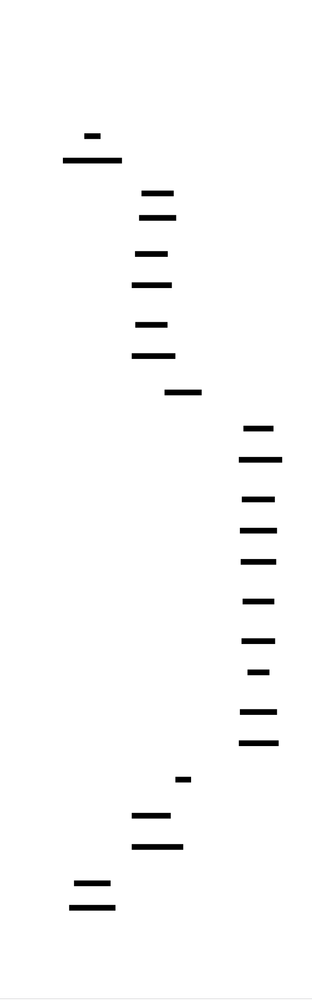

# Build Your Own OS

This project guides you through building a complete x86 operating system kernel from scratch, starting with the boot process and culminating in preemptive multitasking with user-mode processes. You will implement the fundamental abstractions that every modern OS provides: bootstrapping from firmware, hardware interrupt handling, virtual memory isolation, and fair process scheduling. Each layer reveals how software negotiates with hardware physics—CPU pipelines, cache hierarchies, TLBs, and the memory bus.

The journey begins with a 512-byte bootloader that wrests control from BIOS, configures the Global Descriptor Table (GDT), and transitions the CPU from 16-bit real mode to 32-bit protected mode. From there, you'll build an interrupt subsystem that handles CPU exceptions and hardware IRQs, implement physical and virtual memory management with page tables, and finally create a preemptive scheduler that safely transitions between ring 0 (kernel) and ring 3 (user) privilege levels.

By the end, you will have demystified the abstraction layer that underlies every computing platform—from interrupt latency to memory isolation to context switch overhead. You will understand not just what an OS does, but why it must do it, and how hardware constraints shape every design decision.


<!-- MS_ID: build-os-m1 -->
# Milestone 1: Bootloader, GDT, and Kernel Entry

## The First Breath of Your Operating System

{{DIAGRAM:diag-boot-sequence}}

When you press the power button, nothing about your computer knows what an "operating system" is. The CPU wakes up in a primitive state—16-bit real mode—and begins executing firmware code at a fixed address. Your kernel, your C code, your beautiful abstractions? They don't exist yet. They're just bits on a disk, waiting to be loaded.

This milestone is about the **bootstrap problem**: how do you go from a 512-byte constraint (the Master Boot Record) to a fully running C kernel with memory protection? Every step is your responsibility. The hardware provides mechanisms; you must orchestrate them.

### The Fundamental Tension

**Constraint 1: The 512-Byte Prison**

BIOS loads exactly one sector—512 bytes—from the boot disk into memory at address `0x7C00`. That's it. Your entire bootloader must fit in 512 bytes, or you must be clever enough to load more code from disk.

**Constraint 2: The A20 Gate**

For historical compatibility with the original IBM PC, the 21st address line (A20) is often disabled at boot. Without it, addresses wrap around at 1MB—the CPU cannot access memory above this boundary. Your kernel needs to live above 1MB (at `0x100000`), so you must enable A20.

**Constraint 3: Real Mode Addressing**

The CPU starts in **real mode** (16-bit), where addresses are calculated as `segment * 16 + offset`. This gives you access to only the first 1MB of memory. To access 4GB of memory and enable protection features, you must transition to **protected mode** (32-bit).

> **Real Mode vs. Protected Mode (Memory Models)**
>
> In **real mode**, memory addressing uses `segment:offset` pairs. The segment value is multiplied by 16 and added to the offset: `segment * 16 + offset = physical_address`. With 16-bit segments and offsets, you can only address up to `0xFFFF0 + 0xFFFF = 0x10FFEF` (about 1MB + 64KB). There's no memory protection—any code can access any memory.
>
> In **protected mode**, segmentation works differently. Instead of multiplying by 16, the segment register is a **selector**—an index into the Global Descriptor Table (GDT). Each GDT entry (segment descriptor) contains a 32-bit base address and a 20-bit limit. The CPU translates every memory access through this table. Protected mode also enables paging (Milestone 3) and privilege rings (Ring 0-3).

**Constraint 4: The Pipeline Inconsistency**

Setting the CR0.PE bit (Protection Enable) switches the CPU to protected mode, but the instruction prefetch queue still contains real-mode instructions. A far jump flushes this queue and loads the correct protected-mode code segment.

---

## Stage 1: The Bootloader

The bootloader has one job: load the kernel from disk and transfer control to it. Let's trace through the sequence.

### The BIOS Handoff

BIOS performs POST (Power-On Self-Test), initializes hardware, then searches for a bootable disk. A disk is bootable if byte 511-512 contain the signature `0x55 0xAA`. BIOS loads the first 512 bytes to `0x7C00` and jumps there.

```asm
; boot.asm - Stage 1 Bootloader
[BITS 16]
[ORG 0x7C00]

start:
    ; Disable interrupts during setup
    cli
    
    ; Set up segment registers for real mode
    xor ax, ax
    mov ds, ax
    mov es, ax
    mov ss, ax
    mov sp, 0x7C00      ; Stack grows down from bootloader
```

The stack pointer starts at `0x7C00` and grows downward. We disable interrupts (`cli`) because we don't have an interrupt table set up yet—any interrupt would crash the system.

### Enabling the A20 Line

The A20 line is a historical artifact from the 8086/8088 era. The 8086 could only address 1MB, but address calculation could wrap around. Some software relied on this behavior, so when the 286 introduced 24-bit addressing, the A20 line was gated.

```asm
enable_a20:
    ; Method 1: Fast A20 (port 0x92)
    in al, 0x92
    or al, 2            ; Set A20 bit
    out 0x92, al
    
    ; Alternative: Keyboard controller method (slower but more compatible)
    ; call kbc_enable_a20
```

The fast A20 method uses I/O port `0x92`. Setting bit 1 enables the A20 line. This works on most modern hardware and emulators like QEMU.

### Loading the Kernel from Disk

The kernel binary lives on disk, starting at some known sector. We use BIOS INT 13h to read sectors into memory.

```asm
load_kernel:
    ; Load kernel at 0x100000 (1MB mark)
    ; We need to use extended BIOS reads for addresses above 1MB
    
    mov si, dap          ; Disk Address Packet
    mov ah, 0x42         ; Extended read function
    mov dl, 0x80         ; First hard drive
    int 0x13
    jc disk_error

; Disk Address Packet (DAP)
dap:
    db 0x10              ; Size of packet (16 bytes)
    db 0x00              ; Reserved
    dw 50                ; Number of sectors to read (adjust for kernel size)
    dw 0x0000, 0x1000    ; Buffer address: 0x10000 (segment:offset for real mode)
                          ; We'll copy to 0x100000 after enabling protected mode
    dq 1                 ; Starting LBA (sector 1, after MBR)
```

Wait—there's a problem. In real mode, we can only address up to 1MB directly. The kernel needs to be at `0x100000` (1MB). How do we load it there?

**Solution**: We load the kernel to a temporary buffer below 1MB, enable protected mode, then copy it to its final destination.

### The GDT: Your Translation Table

Before entering protected mode, we must configure the Global Descriptor Table. The GDT defines memory segments—their base addresses, limits, and access permissions.

{{DIAGRAM:diag-gdt-layout}}

```asm
; GDT Layout
gdt_start:
    ; Null descriptor (required)
    dq 0x0000000000000000

gdt_kernel_code:
    ; Kernel code segment: base=0, limit=0xFFFFF, 4KB granularity
    ; Access: present, ring 0, executable, readable
    dq 0x00CF9A000000FFFF

gdt_kernel_data:
    ; Kernel data segment: base=0, limit=0xFFFFF, 4KB granularity
    ; Access: present, ring 0, writable
    dq 0x00CF92000000FFFF

gdt_user_code:
    ; User code segment: ring 3, executable, readable
    dq 0x00CFFA000000FFFF

gdt_user_data:
    ; User data segment: ring 3, writable
    dq 0x00CFF2000000FFFF

gdt_end:

gdt_descriptor:
    dw gdt_end - gdt_start - 1   ; GDT size (limit)
    dd gdt_start                  ; GDT linear address
```

Let's decode the kernel code descriptor byte-by-byte:

```
0x00CF9A000000FFFF

Low 16 bits of limit:     0xFFFF  (65535)
Base address (bits 16-31): 0x0000
Base address (bits 32-39): 0x00
Access byte:              0x9A    = 10011010
  - Present (P):          1       (segment is valid)
  - DPL (privilege):      00      (ring 0)
  - System (S):           1       (code/data segment, not system)
  - Executable (E):       1       (code segment)
  - Direction (DC):       0       (grows up)
  - Readable (R):         1       (can read)
  - Accessed (A):         0       (CPU sets this)
Flags + limit (bits 48-51): 0xC   = 1100
  - Granularity (G):      1       (4KB blocks, limit * 4096)
  - Size (D/B):           1       (32-bit)
  - Long (L):             0       (not 64-bit)
High 4 bits of limit:     0xF
Base address (bits 56-63): 0x00
```

With granularity=4KB and limit=0xFFFFF, the segment spans `0xFFFFF * 4096 = 4GB`. Base=0 means linear addresses equal virtual addresses—**flat addressing**. This makes segmentation a no-op and lets paging (Milestone 3) handle all address translation.

> **Segmentation vs. Paging**
>
> Both are address translation mechanisms, but they serve different purposes:
>
> **Segmentation** divides memory into variable-sized logical units (code, data, stack). Each segment has a base address and limit. The CPU checks every access against segment bounds. Segmentation is mandatory in x86—you can't disable it.
>
> **Paging** divides memory into fixed-size 4KB pages. It provides finer-grained protection (per-page) and enables virtual memory (swapping to disk). Paging is optional in 32-bit mode.
>
> The trick: by setting all segment bases to 0 and limits to 4GB, segmentation becomes a no-op. Every linear address passes through unchanged. This is called **flat addressing**, and it lets paging be the sole translation mechanism. Modern OSes use this approach.

### Entering Protected Mode

```asm
enter_protected_mode:
    ; Load the GDT
    lgdt [gdt_descriptor]
    
    ; Set CR0.PE bit (Protection Enable)
    mov eax, cr0
    or eax, 1
    mov cr0, eax
    
    ; FAR JUMP - This is NOT optional!
    ; Flushes the prefetch queue and loads CS with kernel code selector
    jmp 0x08:protected_mode_entry

[BITS 32]
protected_mode_entry:
    ; Now in 32-bit protected mode!
    ; Load all data segment registers with kernel data selector (0x10)
    mov ax, 0x10         ; Kernel data selector (index 2 * 8 = 0x10)
    mov ds, ax
    mov es, ax
    mov fs, ax
    mov gs, ax
    mov ss, ax
    mov esp, 0x90000     ; Set up kernel stack
    
    ; Copy kernel from temporary buffer to 0x100000
    ; (implementation depends on where you loaded it)
    
    ; Jump to kernel entry point
    jmp 0x08:0x100000
```

The far jump `jmp 0x08:protected_mode_entry` is critical:
- `0x08` is the segment selector for the kernel code segment (GDT index 1, RPL=0, TI=0)
- This loads CS with the protected-mode selector and flushes the pipeline
- Without it, the CPU continues executing real-mode code with a corrupted state

---

## Stage 2: The Kernel Entry Point

The kernel is now loaded at `0x100000` and the CPU is in protected mode. Time to enter C.

### The Linker Script: Section Placement


```ld
/* linker.ld */
ENTRY(kernel_entry)

SECTIONS
{
    . = 0x100000;        /* Kernel starts at 1MB */
    
    .text : {
        *(.multiboot)    /* Multiboot header if using GRUB */
        *(.text)
    }
    
    .rodata : {
        *(.rodata)
    }
    
    .data : {
        *(.data)
    }
    
    .bss : {
        __bss_start = .;
        *(.COMMON)
        *(.bss)
        __bss_end = .;
    }
    
    /DISCARD/ : {
        *(.comment)
        *(.eh_frame)
    }
}
```

The linker script defines where each section goes in memory. `.text` contains code, `.rodata` contains read-only data, `.data` contains initialized global variables, and `.bss` contains uninitialized globals.

### Zeroing BSS: Your Responsibility

In a hosted C environment (userspace), the C runtime (CRT0) zeros the BSS section before calling `main()`. In freestanding mode (kernel), there's no CRT0—BSS contains garbage until you zero it.

```c
/* kernel_entry.asm */
[BITS 32]
[GLOBAL kernel_entry]
[EXTERN kernel_main]
[EXTERN __bss_start]
[EXTERN __bss_end]

kernel_entry:
    ; Zero the BSS section
    mov edi, __bss_start
    mov ecx, __bss_end
    sub ecx, edi
    xor eax, eax
    rep stosb
    
    ; Call kernel main
    call kernel_main
    
    ; Halt if kernel_main returns (it shouldn't)
    cli
.halt:
    hlt
    jmp .halt
```

```c
/* main.c */
#include "vga.h"
#include "serial.h"

void kernel_main(void) {
    vga_init();
    serial_init(COM1_PORT);
    
    kprintf("Welcome to MyOS!\n");
    kprintf("Kernel loaded at 0x100000\n");
    
    // Kernel continues...
}
```

---

## Stage 3: Output Drivers

You need to see what's happening. Two output mechanisms: VGA text mode (screen) and serial port (debugging).

### VGA Text Mode

VGA text mode is memory-mapped at `0xB8000`. Each character cell is 2 bytes: character + attribute (color).

{{DIAGRAM:diag-vga-serial-dual}}

```c
/* vga.h */
#define VGA_BUFFER ((volatile uint16_t*)0xB8000)
#define VGA_WIDTH 80
#define VGA_HEIGHT 25

typedef enum {
    VGA_COLOR_BLACK = 0,
    VGA_COLOR_BLUE = 1,
    VGA_COLOR_GREEN = 2,
    VGA_COLOR_CYAN = 3,
    VGA_COLOR_RED = 4,
    VGA_COLOR_MAGENTA = 5,
    VGA_COLOR_BROWN = 6,
    VGA_COLOR_LIGHT_GREY = 7,
    VGA_COLOR_WHITE = 15,
} vga_color_t;

static inline uint16_t vga_entry(char c, vga_color_t fg, vga_color_t bg) {
    return (uint16_t)c | ((uint16_t)(fg | (bg << 4)) << 8);
}

void vga_init(void);
void vga_putchar(char c);
void vga_puts(const char* str);
```

```c
/* vga.c */
#include "vga.h"

static size_t vga_row = 0;
static size_t vga_col = 0;
static vga_color_t current_fg = VGA_COLOR_WHITE;
static vga_color_t current_bg = VGA_COLOR_BLACK;

void vga_init(void) {
    // Clear screen
    for (size_t i = 0; i < VGA_WIDTH * VGA_HEIGHT; i++) {
        VGA_BUFFER[i] = vga_entry(' ', current_fg, current_bg);
    }
    vga_row = 0;
    vga_col = 0;
}

void vga_putchar(char c) {
    if (c == '\n') {
        vga_col = 0;
        vga_row++;
        if (vga_row >= VGA_HEIGHT) {
            // Scroll up (implement if needed)
            vga_row = VGA_HEIGHT - 1;
        }
        return;
    }
    
    size_t index = vga_row * VGA_WIDTH + vga_col;
    VGA_BUFFER[index] = vga_entry(c, current_fg, current_bg);
    
    vga_col++;
    if (vga_col >= VGA_WIDTH) {
        vga_col = 0;
        vga_row++;
    }
}
```

### Serial Port (COM1)

Serial output goes to `0x3F8`. In QEMU, this appears in the console with `-serial stdio`.

```c
/* serial.h */
#define COM1_PORT 0x3F8

void serial_init(uint16_t port);
void serial_putchar(uint16_t port, char c);
void serial_puts(uint16_t port, const char* str);
```

```c
/* serial.c */
#include "serial.h"
#include "port_io.h"

void serial_init(uint16_t port) {
    outb(port + 1, 0x00);    // Disable interrupts
    outb(port + 3, 0x80);    // Enable DLAB
    outb(port + 0, 0x03);    // Divisor low byte (38400 baud)
    outb(port + 1, 0x00);    // Divisor high byte
    outb(port + 3, 0x03);    // 8 bits, no parity, one stop bit
    outb(port + 2, 0xC7);    // Enable FIFO
    outb(port + 4, 0x0B);    // IRQs enabled, RTS/DSR set
}

static int serial_is_transmit_empty(uint16_t port) {
    return inb(port + 5) & 0x20;
}

void serial_putchar(uint16_t port, char c) {
    while (serial_is_transmit_empty(port) == 0);
    outb(port, c);
}
```

```c
/* port_io.h */
static inline void outb(uint16_t port, uint8_t val) {
    __asm__ volatile ("outb %0, %1" : : "a"(val), "Nd"(port));
}

static inline uint8_t inb(uint16_t port) {
    uint8_t ret;
    __asm__ volatile ("inb %1, %0" : "=a"(ret) : "Nd"(port));
    return ret;
}
```

### Combined Output: kprintf

A minimal printf that outputs to both VGA and serial:

```c
/* kprintf.c */
#include <stdarg.h>
#include "vga.h"
#include "serial.h"

static void print_string(const char* str) {
    while (*str) {
        vga_putchar(*str);
        serial_putchar(COM1_PORT, *str);
        str++;
    }
}

void kprintf(const char* fmt, ...) {
    va_list args;
    va_start(args, fmt);
    
    // Minimal implementation - handle %s, %d, %x, %c
    while (*fmt) {
        if (*fmt == '%') {
            fmt++;
            switch (*fmt) {
                case 's':
                    print_string(va_arg(args, const char*));
                    break;
                case 'd': {
                    int val = va_arg(args, int);
                    // Convert to string (implement itoa)
                    break;
                }
                case 'x': {
                    unsigned int val = va_arg(args, unsigned int);
                    // Convert to hex string
                    break;
                }
                case 'c':
                    vga_putchar((char)va_arg(args, int));
                    serial_putchar(COM1_PORT, (char)va_arg(args, int));
                    break;
            }
        } else {
            vga_putchar(*fmt);
            serial_putchar(COM1_PORT, *fmt);
        }
        fmt++;
    }
    
    va_end(args);
}
```

---

## Testing in QEMU

Build and run:

```bash
# Assemble bootloader
nasm -f bin boot.asm -o boot.bin

# Compile kernel
gcc -m32 -ffreestanding -nostdlib -c main.c -o main.o
gcc -m32 -ffreestanding -nostdlib -c vga.c -o vga.o
gcc -m32 -ffreestanding -nostdlib -c serial.c -o serial.o

# Link kernel
ld -T linker.ld -o kernel.elf main.o vga.o serial.o

# Extract raw binary
objcopy -O binary kernel.elf kernel.bin

# Create disk image (bootloader + kernel)
cat boot.bin kernel.bin > os.img

# Run in QEMU
qemu-system-i386 -drive format=raw,file=os.img -serial stdio
```

You should see "Welcome to MyOS!" on both the VGA display and the serial console.

---

## The Three-Level View: What Happens When You Call vga_putchar

**Level 1 — Application (Your Code)**:
```c
vga_putchar('A');
```
A simple function call. You're writing a character to the screen.

**Level 2 — Memory Bus (Hardware Interface)**:
The CPU writes a 16-bit value to physical address `0xB8000 + offset`. This address is in the VGA controller's memory-mapped I/O region. The write travels over the memory bus to the VGA hardware, not to RAM.

**Level 3 — Hardware (VGA Controller)**:
The VGA controller continuously scans its text buffer, converting character/attribute pairs to analog RGB signals. Each scan (60+ times per second) reads the buffer and generates the video signal. Your write is visible on the next scan.

---

## Common Pitfalls and Debugging

| Symptom | Likely Cause | Fix |
|---------|--------------|-----|
| Triple fault immediately after `mov cr0, eax` | No far jump to flush pipeline | Add `jmp 0x08:protected_mode_entry` |
| Triple fault when accessing memory above 1MB | A20 not enabled | Enable A20 via port 0x92 or keyboard controller |
| Garbage on screen | Wrong VGA address or attribute bytes | Verify `0xB8000` and check color encoding |
| Kernel hangs, no output | Serial not initialized or BSS not zeroed | Check serial_init() call order |
| Linker error: undefined references | Missing freestanding flags | Use `-ffreestanding -nostdlib` |

**Debugging with GDB**:
```bash
qemu-system-i386 -drive format=raw,file=os.img -serial stdio -s -S
# In another terminal:
gdb
(gdb) target remote localhost:1234
(gdb) break *0x7C00      # Break at bootloader entry
(gdb) break *0x100000    # Break at kernel entry
(gdb) continue
```

---

## Knowledge Cascade

You've built the bootstrap layer of an operating system. Here's where this knowledge connects:

**→ Page Tables (Milestone 3)**: The GDT you configured uses flat addressing (base=0, limit=4GB). This means segmentation does nothing—every linear address passes through unchanged. When you enable paging, page tables become the sole translation mechanism. The GDT stays the same; CR3 points to a page directory instead.

**→ ELF Loaders (Cross-Domain: Compilers and Linkers)**: Your linker script places `.text`, `.data`, and `.bss` at specific addresses. This is exactly what an ELF loader does when loading a userspace program—it reads section headers and maps them to virtual addresses. You're implementing the same logic that `/lib/ld-linux.so` performs for every executable.

**→ UEFI vs. BIOS (Cross-Domain: Firmware Security)**: Modern systems use UEFI instead of BIOS. UEFI starts the CPU in protected mode (or long mode) with paging enabled—no real mode transition needed. But UEFI still requires GDT and page table configuration. Secure Boot adds cryptographic verification: the firmware checks signatures on the bootloader before executing it. The same boot chain you built, but with cryptographic attestation.

**→ Virtualization (Cross-Domain: Cloud Infrastructure)**: Hypervisors like KVM and Xen virtualize the same hardware you're programming. When a VM writes to its GDT, the hypervisor intercepts the `lgdt` instruction and maintains a "shadow GDT" or uses hardware-assisted virtualization (VMX/SVM). The VM's CR3 points to guest-physical pages; the hypervisor maintains nested page tables (EPT/NPT) that translate guest-physical to host-physical addresses. You're building the same translation layers that hypervisors virtualize.

**→ JIT Compilation (Cross-Domain: Language Runtimes)**: When a JIT compiler generates machine code at runtime, it must write code bytes to memory and then execute them. This requires understanding memory protection: the page must be writable to store the code, then executable to run it. The same segment descriptor flags (readable, writable, executable) you configured in the GDT apply to page table entries. Modern systems use W^X (write XOR execute) protection, requiring mprotect() calls to change page permissions—directly manipulating the same hardware flags you're setting up.

---

[[CRITERIA_JSON: {"milestone_id": "build-os-m1", "criteria": ["Bootloader fits in 512 bytes (MBR) or uses a two-stage approach with stage1 in MBR loading stage2 from disk", "Bootloader reads kernel binary from disk using BIOS INT 13h and loads it to physical address 0x100000 (1MB mark)", "GDT configured with 5 entries: null descriptor, kernel code (ring 0, base=0, limit=4GB, executable+readable), kernel data (ring 0, base=0, limit=4GB, writable), user code (ring 3), user data (ring 3)", "Protected mode entered by setting CR0.PE bit after loading GDTR, followed by a far jump to kernel code segment to flush the pipeline", "Segment registers DS, ES, FS, GS, SS loaded with kernel data segment selector (0x10) after the far jump to protected mode", "Kernel entry point (assembly) zeroes BSS section from __bss_start to __bss_end and calls kernel_main()", "VGA text mode driver writes characters with foreground/background color attributes to memory-mapped buffer at 0xB8000", "Serial port COM1 (0x3F8) initialized for debug output with kprintf-like function outputting to both VGA and serial", "Kernel boots successfully in QEMU displaying welcome message on screen and serial console"]}]
<!-- END_MS -->


<!-- MS_ID: build-os-m2 -->
# Milestone 2: Interrupts, Exceptions, and Keyboard

## The Heartbeat of a Reactive System

Your kernel boots. It displays a welcome message. And then... it sits there. Frozen. Not because it crashed—it's just waiting. Waiting for you to type something. Waiting for time to pass. Waiting for the hardware to signal that something happened.

This milestone transforms your kernel from a passive program into a reactive system. The mechanism is **interrupts**: hardware signals that pause whatever code is running, jump to a handler you define, and then resume. The CPU does this automatically—you just need to tell it *where* to jump.

### The Fundamental Tension

**Constraint 1: Asynchronous Events Demand Immediate Response**

The keyboard doesn't wait for your code to poll it. When you press a key, the keyboard controller generates an electrical signal that must be handled *now*—the scancode buffer is tiny, and missed keystrokes are lost forever. The timer doesn't ask permission before ticking. Hardware is asynchronous, and your code must be ready.

**Constraint 2: The CPU Pushes Minimal State**

When an interrupt fires, the CPU pushes exactly three things: `EIP` (instruction pointer), `CS` (code segment), and `EFLAGS` (processor flags). That's it. Your handler receives control with *all general-purpose registers containing garbage from the interrupted code*. If you modify `EAX` without saving it first, you've corrupted whatever the interrupted code was doing.

**Constraint 3: The PIC's Default Mapping Is Broken**

The 8259 Programmable Interrupt Controller maps IRQ0-7 to CPU vectors 8-15 by default. But vectors 8-15 are reserved for CPU exceptions—vector 8 is the Double Fault! Without remapping, a timer tick looks exactly like a catastrophic system failure.

**Constraint 4: EOI Is Not Optional**

The PIC tracks which interrupts are "in service." After your handler finishes, you *must* send End of Interrupt (EOI). Without it, the PIC blocks all lower-priority interrupts forever. The system doesn't crash—it just stops responding to input.

---

## The Revelation: Interrupts Are Not Function Pointers

{{DIAGRAM:diag-idt-entry-layout}}

If you've written event-driven code in userspace, you might think interrupts work like this:

```c
// WRONG MENTAL MODEL
void on_timer() { tick_count++; }
void on_keyboard() { read_key(); }

register_callback(TIMER_IRQ, on_timer);
register_callback(KEYBOARD_IRQ, on_keyboard);
```

This is a comforting abstraction, but it hides critical details that will crash your kernel:

1. **The IDT contains gate descriptors, not function pointers.** Each 8-byte entry specifies a handler address, a code segment selector, privilege level, and gate type (interrupt vs. trap). The CPU validates all of this before jumping.

2. **The CPU pushes an error code for some exceptions.** Exceptions 8, 10, 11, 12, 13, 14, 17, 21, 29, and 30 push an additional error code onto the stack. Your handler must account for this, or `iret` will return to garbage.

3. **Interrupts run on the current stack.** If a userspace process has a 4KB stack and your handler uses 5KB of local variables, you've corrupted adjacent memory. This is why kernel code must be stack-disciplined.

4. **Interrupt gates disable interrupts automatically; trap gates don't.** This affects whether your handler can be interrupted by a higher-priority IRQ.

Let's build the real thing.

---

## Stage 1: The Interrupt Descriptor Table

The IDT is an array of 256 gate descriptors. Each descriptor tells the CPU: "when interrupt N happens, jump to this address in this code segment."

```c
/* idt.h */
#define IDT_ENTRIES 256

typedef struct {
    uint16_t offset_low;    // Lower 16 bits of handler address
    uint16_t selector;      // Kernel code segment selector
    uint8_t  zero;          // Reserved, must be 0
    uint8_t  type_attr;     // Gate type, DPL, present bit
    uint16_t offset_high;   // Upper 16 bits of handler address
} __attribute__((packed)) idt_entry_t;

typedef struct {
    uint16_t limit;
    uint32_t base;
} __attribute__((packed)) idt_ptr_t;

void idt_init(void);
void idt_set_gate(uint8_t num, uint32_t handler, uint16_t selector, uint8_t flags);
```

The `type_attr` byte encodes the gate type and privilege level:

```
Bit 7:    Present (1 = valid gate)
Bits 5-6: DPL (Descriptor Privilege Level) - 00 for kernel
Bit 4:    Storage segment (0 for interrupt/trap gates)
Bits 0-3: Gate type:
          0xE = 32-bit interrupt gate (disables interrupts on entry)
          0xF = 32-bit trap gate (keeps interrupts enabled)
```

```c
/* idt.c */
#include "idt.h"

static idt_entry_t idt[IDT_ENTRIES];
idt_ptr_t idt_ptr;

void idt_set_gate(uint8_t num, uint32_t handler, uint16_t selector, uint8_t flags) {
    idt[num].offset_low  = handler & 0xFFFF;
    idt[num].offset_high = (handler >> 16) & 0xFFFF;
    idt[num].selector    = selector;
    idt[num].zero        = 0;
    idt[num].type_attr   = flags;
}

void idt_init(void) {
    idt_ptr.limit = sizeof(idt) - 1;
    idt_ptr.base  = (uint32_t)&idt;
    
    // Load IDT
    __asm__ volatile ("lidt %0" : : "m"(idt_ptr));
}
```

---

## Stage 2: Interrupt Handlers and the Stack Frame


When an interrupt fires, the CPU performs this sequence:

1. **Pushes EFLAGS, CS, EIP** (and error code for some exceptions)
2. **Loads CS:EIP from the IDT entry**
3. **For interrupt gates: clears the IF flag** (disables interrupts)

Your handler must save *all* registers it will modify, do its work, restore registers, then execute `iret` (not `ret`!).

### The Assembly Wrapper

The cleanest pattern is an assembly wrapper that saves/restores registers and calls a C function:

```asm
; interrupt.asm
[BITS 32]

; Common interrupt stub - saves context, calls C handler, restores context
extern c_interrupt_handler

global isr_common_stub
isr_common_stub:
    pusha                    ; Pushes EAX, ECX, EDX, EBX, ESP, EBP, ESI, EDI
    push ds
    push es
    push fs
    push gs
    
    mov ax, 0x10             ; Load kernel data segment
    mov ds, ax
    mov es, ax
    mov fs, ax
    mov gs, ax
    
    push esp                 ; Pass stack pointer to C handler
    call c_interrupt_handler
    add esp, 4               ; Clean up argument
    
    pop gs
    pop fs
    pop es
    pop ds
    popa
    add esp, 8               ; Clean up error code and interrupt number
    iret                     ; Restores EIP, CS, EFLAGS
```

### CPU Exception Handlers (Vectors 0-31)

CPU exceptions are synchronous—they occur in response to instruction execution. Some push an error code; some don't.

```asm
; Exception handlers - no error code pushed by CPU
global isr0   ; Divide by zero
global isr1   ; Debug
global isr2   ; NMI
global isr3   ; Breakpoint
; ... (handlers 0-31)

; Macros for cleaner definition
%macro ISR_NO_ERROR 1
global isr%1
isr%1:
    cli
    push byte 0            ; Dummy error code to unify stack frame
    push byte %1           ; Interrupt number
    jmp isr_common_stub
%endmacro

%macro ISR_ERROR 1
global isr%1
isr%1:
    cli
    push byte %1           ; Interrupt number (error code already pushed by CPU)
    jmp isr_common_stub
%endmacro

; CPU exceptions without error codes
ISR_NO_ERROR 0    ; Divide by zero
ISR_NO_ERROR 1    ; Debug
ISR_NO_ERROR 2    ; Non-maskable interrupt
ISR_NO_ERROR 3    ; Breakpoint
ISR_NO_ERROR 4    ; Overflow
ISR_NO_ERROR 5    ; Bound range exceeded
ISR_NO_ERROR 6    ; Invalid opcode
ISR_NO_ERROR 7    ; Device not available
ISR_NO_ERROR 9    ; Coprocessor segment overrun

; CPU exceptions with error codes (CPU pushes the error code)
ISR_ERROR 8       ; Double fault
ISR_ERROR 10      ; Invalid TSS
ISR_ERROR 11      ; Segment not present
ISR_ERROR 12      ; Stack-segment fault
ISR_ERROR 13      ; General protection fault
ISR_ERROR 14      ; Page fault
```


The dummy error code for exceptions 0-7, 9, etc. ensures a uniform stack frame. Every handler can use the same restoration code.

### The C Handler

```c
/* interrupt.c */
#include "interrupt.h"
#include "vga.h"

typedef struct {
    uint32_t gs, fs, es, ds;
    uint32_t edi, esi, ebp, esp, ebx, edx, ecx, eax;
    uint32_t int_no, err_code;
    uint32_t eip, cs, eflags;
    uint32_t useresp, ss;
} __attribute__((packed)) registers_t;

void c_interrupt_handler(registers_t *regs) {
    if (regs->int_no < 32) {
        // CPU exception
        exception_handler(regs);
    } else if (regs->int_no >= 32 && regs->int_no < 48) {
        // Hardware IRQ (IRQ0-15 mapped to vectors 32-47)
        irq_handler(regs);
    }
    // Ignore spurious interrupts (int_no >= 48)
}

static const char *exception_messages[] = {
    "Division by zero",
    "Debug",
    "Non-maskable interrupt",
    "Breakpoint",
    "Overflow",
    "Bound range exceeded",
    "Invalid opcode",
    "Device not available",
    "Double fault",
    "Coprocessor segment overrun",
    "Invalid TSS",
    "Segment not present",
    "Stack-segment fault",
    "General protection fault",
    "Page fault",
    "Reserved",
    // ... 16-31 are reserved
};

void exception_handler(registers_t *regs) {
    kprintf("\nEXCEPTION: %s (vector %d)\n", 
            exception_messages[regs->int_no], regs->int_no);
    kprintf("Error code: 0x%x\n", regs->err_code);
    kprintf("EIP: 0x%x, CS: 0x%x, EFLAGS: 0x%x\n", 
            regs->eip, regs->cs, regs->eflags);
    
    if (regs->int_no == 14) {
        // Page fault - read CR2 for faulting address
        uint32_t fault_addr;
        __asm__ volatile ("mov %%cr2, %0" : "=r"(fault_addr));
        kprintf("Faulting address: 0x%x\n", fault_addr);
        
        // Decode error code bits
        kprintf("Present: %d, Write: %d, User: %d\n",
                regs->err_code & 1,
                (regs->err_code >> 1) & 1,
                (regs->err_code >> 2) & 1);
    }
    
    // Halt on exception (for now)
    kprintf("System halted.\n");
    __asm__ volatile ("cli; hlt");
}
```

### Double Fault: The Last Line of Defense

A double fault occurs when an exception happens while the CPU is trying to invoke another exception handler. The most common causes:
- Stack corruption (handler can't push to stack)
- Page fault while reading the IDT
- Invalid gate descriptor

Without a double fault handler, the CPU triple-faults and resets.

```c
void double_fault_handler(registers_t *regs) {
    kprintf("\n!!! DOUBLE FAULT !!!\n");
    kprintf("This indicates a cascading failure.\n");
    kprintf("Error code: 0x%x\n", regs->err_code);
    kprintf("Kernel stack may be corrupted.\n");
    kprintf("System halted.\n");
    
    // Don't try to recover - state is undefined
    while(1) {
        __asm__ volatile ("cli; hlt");
    }
}
```

---

## Stage 3: Remapping the PIC


The 8259 PIC has two chips: master (IRQ0-7) and slave (IRQ8-15). By default:
- Master maps IRQ0-7 → vectors 0x08-0x0F
- Slave maps IRQ8-15 → vectors 0x70-0x77

This is catastrophic. Vector 8 is the Double Fault exception! A timer tick (IRQ0) would trigger the double fault handler.

**Remap to vectors 32-47** (above the 32 CPU exceptions):

```c
/* pic.h */
#define PIC1_COMMAND 0x20    // Master PIC command port
#define PIC1_DATA    0x21    // Master PIC data port
#define PIC2_COMMAND 0xA0    // Slave PIC command port
#define PIC2_DATA    0xA1    // Slave PIC data port

#define PIC_EOI      0x20    // End of Interrupt command

void pic_remap(int offset1, int offset2);
void pic_send_eoi(uint8_t irq);
```

The PIC is programmed via Initialization Command Words (ICW1-ICW4):

```c
/* pic.c */
#include "pic.h"
#include "port_io.h"

void pic_remap(int offset1, int offset2) {
    // ICW1: Start initialization, cascade mode, need ICW4
    outb(PIC1_COMMAND, 0x11);
    outb(PIC2_COMMAND, 0x11);
    
    // ICW2: Vector offset (where IRQs map to)
    outb(PIC1_DATA, offset1);    // Master: IRQ0-7 → vectors 32-39
    outb(PIC2_DATA, offset2);    // Slave: IRQ8-15 → vectors 40-47
    
    // ICW3: Tell master there's a slave at IRQ2 (bitmask 0x04)
    //       Tell slave its cascade identity is 2
    outb(PIC1_DATA, 0x04);
    outb(PIC2_DATA, 0x02);
    
    // ICW4: 8086 mode, normal EOI
    outb(PIC1_DATA, 0x01);
    outb(PIC2_DATA, 0x01);
    
    // Clear data registers (no IRQs masked)
    outb(PIC1_DATA, 0x00);
    outb(PIC2_DATA, 0x00);
}

void pic_send_eoi(uint8_t irq) {
    if (irq >= 8) {
        // IRQ came from slave - send EOI to both
        outb(PIC2_COMMAND, PIC_EOI);
    }
    // Always send EOI to master
    outb(PIC1_COMMAND, PIC_EOI);
}
```

### EOI Timing: Why Forgetting It Freezes the System


The PIC maintains an In-Service Register (ISR) that tracks which IRQs are being handled. When an IRQ fires:
1. PIC sets the corresponding bit in ISR
2. PIC raises INTR to CPU
3. CPU acknowledges, PIC sends vector number
4. **PIC now blocks all lower-priority IRQs** until EOI is received

If your timer handler forgets EOI:
- IRQ0 is still marked "in service"
- Keyboard (IRQ1, lower priority) is blocked
- System appears frozen—it's not crashed, just deaf

```c
void irq_handler(registers_t *regs) {
    uint8_t irq = regs->int_no - 32;  // Convert vector to IRQ number
    
    switch (irq) {
        case 0:
            timer_handler();
            break;
        case 1:
            keyboard_handler();
            break;
        // ... other IRQs
    }
    
    pic_send_eoi(irq);  // CRITICAL: Never forget this!
}
```

---

## Stage 4: Timer Interrupt (IRQ0)

The Programmable Interval Timer (PIT) channel 0 is connected to IRQ0. It can fire at frequencies from ~18 Hz to several MHz.

```c
/* timer.h */
#define PIT_CHANNEL0 0x40
#define PIT_COMMAND  0x43
#define PIT_FREQUENCY 1193182  // Base frequency in Hz

extern volatile uint64_t timer_ticks;

void timer_init(uint32_t frequency);
void timer_handler(void);
```

```c
/* timer.c */
#include "timer.h"
#include "port_io.h"

volatile uint64_t timer_ticks = 0;

void timer_init(uint32_t frequency) {
    // Calculate divisor
    uint32_t divisor = PIT_FREQUENCY / frequency;
    
    // Command byte: channel 0, lobyte/hibyte, square wave mode
    outb(PIT_COMMAND, 0x36);
    
    // Send divisor
    outb(PIT_CHANNEL0, divisor & 0xFF);        // Low byte
    outb(PIT_CHANNEL0, (divisor >> 8) & 0xFF); // High byte
}

void timer_handler(void) {
    timer_ticks++;
    
    // Every 100 ticks (1 second at 100Hz), print something
    if (timer_ticks % 100 == 0) {
        kprintf("Timer: %d seconds\n", timer_ticks / 100);
    }
}
```

At 100 Hz, the timer fires every 10 milliseconds. This will become the heartbeat of your preemptive scheduler in Milestone 4.

---

## Stage 5: PS/2 Keyboard Driver (IRQ1)

{{DIAGRAM:diag-keyboard-scancode}}

The keyboard controller sends **scancodes**, not ASCII. When you press 'A', you receive scancode 0x1E. When you release 'A', you receive 0x9E (0x1E | 0x80). The relationship between scancodes and ASCII is arbitrary and layout-dependent.

### Scancode to ASCII Translation

```c
/* keyboard.h */
#define KEYBOARD_PORT 0x60
#define KBUFFER_SIZE 256

void keyboard_init(void);
void keyboard_handler(void);
char keyboard_getchar(void);

extern volatile char keyboard_buffer[];
extern volatile uint32_t kb_read_pos;
extern volatile uint32_t kb_write_pos;
```

```c
/* keyboard.c */
#include "keyboard.h"
#include "port_io.h"

// US QWERTY scancode table (scancode set 1)
static const char scancode_to_ascii[] = {
    0,  0, '1', '2', '3', '4', '5', '6', '7', '8', '9', '0', '-', '=', 0,  0,
    'q', 'w', 'e', 'r', 't', 'y', 'u', 'i', 'o', 'p', '[', ']', 0,  0,
    'a', 's', 'd', 'f', 'g', 'h', 'j', 'k', 'l', ';', '\'', '`', 0, '\\',
    'z', 'x', 'c', 'v', 'b', 'n', 'm', ',', '.', '/', 0,  '*', 0, ' '
};

// Shifted versions
static const char scancode_to_ascii_shift[] = {
    0,  0, '!', '@', '#', '$', '%', '^', '&', '*', '(', ')', '_', '+', 0,  0,
    'Q', 'W', 'E', 'R', 'T', 'Y', 'U', 'I', 'O', 'P', '{', '}', 0,  0,
    'A', 'S', 'D', 'F', 'G', 'H', 'J', 'K', 'L', ':', '"', '~', 0, '|',
    'Z', 'X', 'C', 'V', 'B', 'N', 'M', '<', '>', '?', 0,  '*', 0, ' '
};

volatile char keyboard_buffer[KBUFFER_SIZE];
volatile uint32_t kb_read_pos = 0;
volatile uint32_t kb_write_pos = 0;

static int shift_pressed = 0;

void keyboard_handler(void) {
    uint8_t scancode = inb(KEYBOARD_PORT);
    
    // Check for key release (bit 7 set)
    if (scancode & 0x80) {
        // Key released
        scancode &= 0x7F;
        if (scancode == 0x2A || scancode == 0x36) {  // Left or right shift
            shift_pressed = 0;
        }
        return;
    }
    
    // Key pressed
    if (scancode == 0x2A || scancode == 0x36) {
        shift_pressed = 1;
        return;
    }
    
    // Translate to ASCII
    char ascii = shift_pressed ? scancode_to_ascii_shift[scancode] 
                               : scancode_to_ascii[scancode];
    
    if (ascii != 0) {
        // Add to circular buffer
        keyboard_buffer[kb_write_pos] = ascii;
        kb_write_pos = (kb_write_pos + 1) % KBUFFER_SIZE;
    }
}

char keyboard_getchar(void) {
    // Block until a character is available
    while (kb_read_pos == kb_write_pos) {
        __asm__ volatile ("hlt");  // Wait for interrupt
    }
    
    char c = keyboard_buffer[kb_read_pos];
    kb_read_pos = (kb_read_pos + 1) % KBUFFER_SIZE;
    return c;
}
```

The circular buffer handles the asynchronous nature of keyboard input. The interrupt handler produces characters; `keyboard_getchar()` consumes them.

---

## Stage 6: Putting It All Together

```c
/* main.c */
#include "idt.h"
#include "pic.h"
#include "timer.h"
#include "keyboard.h"
#include "vga.h"

void kernel_main(void) {
    vga_init();
    kprintf("Initializing IDT...\n");
    
    idt_init();
    
    // Set up exception handlers
    idt_set_gate(0,  (uint32_t)isr0,  0x08, 0x8E);
    idt_set_gate(1,  (uint32_t)isr1,  0x08, 0x8E);
    // ... (set all 32 exception handlers)
    idt_set_gate(14, (uint32_t)isr14, 0x08, 0x8E);  // Page fault
    idt_set_gate(8,  (uint32_t)isr8,  0x08, 0x8E);  // Double fault
    
    // Set up IRQ handlers
    idt_set_gate(32, (uint32_t)irq0, 0x08, 0x8E);  // Timer
    idt_set_gate(33, (uint32_t)irq1, 0x08, 0x8E);  // Keyboard
    // ... (set remaining IRQ handlers)
    
    kprintf("Remapping PIC...\n");
    pic_remap(32, 40);
    
    kprintf("Initializing timer at 100Hz...\n");
    timer_init(100);
    
    kprintf("Initializing keyboard...\n");
    keyboard_init();
    
    kprintf("Enabling interrupts...\n");
    __asm__ volatile ("sti");
    
    kprintf("System ready. Type something!\n");
    
    // Echo keyboard input
    while (1) {
        char c = keyboard_getchar();
        if (c == '\n') {
            kprintf("\n");
        } else if (c >= ' ') {
            kprintf("%c", c);
        }
    }
}
```

---

## The Three-Level View: What Happens When You Press a Key

**Level 1 — Application (Your Handler)**:
```c
void keyboard_handler(void) {
    uint8_t scancode = inb(KEYBOARD_PORT);
    // Translate, buffer, process...
}
```
A simple function that reads a byte and processes it.

**Level 2 — Interrupt Controller (PIC)**:
The keyboard controller asserts IRQ1. The master PIC:
1. Checks if IRQ1 is masked (it's not)
2. Checks if any higher-priority IRQ is in service (none)
3. Sets bit 1 in the In-Service Register
4. Raises INTR to the CPU
5. Waits for CPU acknowledgment
6. Sends vector 33 to the CPU

**Level 3 — Hardware (CPU and Keyboard Controller)**:
The keyboard controller has been buffering your keystroke in a small internal buffer. When you press 'A', it generates scancode 0x1E and stores it in an output buffer at I/O port 0x60. The `inb` instruction reads this port through the I/O bus. The keyboard controller then clears its buffer—if you don't read fast enough, the next keystroke overwrites it.

---

## Hardware Soul: Interrupt Latency

When the keyboard generates an interrupt, a chain of events must occur before your handler runs:

| Stage | Latency | Why It Matters |
|-------|---------|----------------|
| Keyboard controller → PIC | ~1 µs | Electrical signal propagation |
| PIC priority arbitration | ~100 ns | PIC checks higher-priority IRQs |
| CPU interrupt acknowledge | ~50 ns | CPU finishes current instruction |
| CPU pushes EFLAGS, CS, EIP | ~10 ns | Memory writes |
| CPU loads IDT entry | ~20 ns | Memory read (may cache miss) |
| Your handler prologue (pusha) | ~20 ns | Register saves |

**Total latency**: roughly 1-2 microseconds. But if interrupts are disabled (`cli`), the keyboard event sits waiting. If you hold interrupts disabled for 10 ms, you might miss keystrokes—the keyboard buffer is only a few bytes.

This is why kernel code must minimize time with interrupts disabled. Critical sections should be short, measured in microseconds, not milliseconds.

---

## Common Pitfalls

| Symptom | Likely Cause | Fix |
|---------|--------------|-----|
| System hangs after first interrupt | Forgot EOI | Add `pic_send_eoi(irq)` to end of handler |
| Keyboard doesn't work | PIC not remapped (IRQ1 → vector 9 = Coprocessor error) | Call `pic_remap(32, 40)` before `sti` |
| Random crashes after interrupts | Not saving/restoring all registers | Use `pusha`/`popa` in assembly stub |
| Triple fault on exception | Stack frame mismatch (error code handling) | Check ISR_ERROR vs ISR_NO_ERROR macros |
| Characters repeat infinitely | Not handling break codes (scancode & 0x80) | Check bit 7 to distinguish press/release |
| Timer fires once, then stops | IRQ0 handler doesn't send EOI | Every IRQ handler must call `pic_send_eoi` |

---

## Knowledge Cascade

You've made your kernel reactive to hardware. Here's where this connects:

**→ Preemptive Scheduling (Milestone 4)**: The timer interrupt you just built becomes the heartbeat of multitasking. Every timer tick, the scheduler checks if the current process has run long enough, then performs a context switch. The same interrupt mechanism that increments `timer_ticks` will soon save and restore complete process state.

**→ Signal Handling (Cross-Domain: Unix APIs)**: POSIX signals are userspace's interrupt mechanism. When a process receives `SIGINT` (Ctrl+C), the kernel interrupts whatever code is running and jumps to a signal handler the process registered via `sigaction()`. The same "save state, jump to handler, restore state" pattern you implemented in `isr_common_stub` is what the kernel does for signal delivery. The `siginfo_t` structure is analogous to your `registers_t`—it captures the interrupted context.

**→ Exception Handling (Cross-Domain: Language Runtimes)**: When C++ throws an exception, the runtime searches for a matching `catch` block by unwinding the stack. This uses CPU exception mechanisms under the hood—specifically, the unwind tables stored in the `.eh_frame` section. A null pointer dereference triggers a page fault; the runtime's page fault handler catches it, throws `std::bad_null_access`, and unwinds. Java's `NullPointerException` works similarly. Your exception handler is the kernel's equivalent of these runtime mechanisms.

**→ Real-Time Systems (Cross-Domain: Embedded)**: In an RTOS, interrupt latency must be bounded and predictable. A hard real-time system might guarantee "interrupt handler starts within 10 µs." This requires careful PIC priority configuration—high-priority interrupts (motor control, sensors) must preempt lower-priority ones (logging, UI). The same PIC priority hierarchy you're using (IRQ0 highest, IRQ7 lowest) is what RTOS engineers tune for their specific hardware.

**→ Game Development (Cross-Domain: Input Latency)**: Frame-perfect input in competitive games requires understanding interrupt latency. When you press a button, the scancode travels through the keyboard controller, USB bus (for modern keyboards), OS input stack, and finally the game's input polling. The game reads input at a specific point in its frame loop—if the interrupt arrives just after polling, the input is delayed by a full frame (16.67 ms at 60 fps). Fighting game developers measure and minimize this latency; some read input in a high-priority thread that wakes on interrupt.

---

[[CRITERIA_JSON: {"milestone_id": "build-os-m2", "criteria": ["IDT contains 256 entries with entries 0-31 configured for CPU exceptions including divide error, page fault, and general protection fault with descriptive error messages", "All interrupt handlers save general-purpose registers (pusha) and segment registers on entry and restore them before iret; handlers for exceptions 8, 10-14 account for the error code pushed by the CPU", "PIC 8259 is remapped so IRQ0-7 map to vectors 32-39 and IRQ8-15 map to vectors 40-47, avoiding conflicts with CPU exception vectors 0-31", "EOI is sent to the correct PIC (master for IRQ0-7, both master and slave for IRQ8-15) at the end of each IRQ handler before iret", "Timer interrupt (IRQ0 via PIT channel 0) fires at a configurable frequency (e.g., 100Hz) and increments a global tick counter on each interrupt", "Keyboard interrupt (IRQ1) reads PS/2 scancode from port 0x60, converts to ASCII using a scancode-to-ASCII table, and places characters in a circular keyboard buffer", "Double fault handler (exception 8) catches cascading faults, prints diagnostic information including error code, and halts the system instead of allowing a triple fault", "Interrupts are enabled (sti) only after IDT is loaded and PIC is remapped and configured"]}]
<!-- END_MS -->


<!-- MS_ID: build-os-m3 -->
# Milestone 3: Physical and Virtual Memory Management

## The Memory Illusion

Your kernel boots. It runs code, handles interrupts, responds to keyboard input. But it has a secret vulnerability: everything runs in the same memory space. One wild pointer write could corrupt the kernel's own data structures. There's no isolation, no protection, no virtual memory.

More fundamentally, you have no dynamic memory allocation. Every buffer, every structure, every piece of data must be statically allocated at compile time. Want to load a file? You need to know its maximum size beforehand. Want to support multiple processes? You need to pre-allocate space for all of them.

This milestone solves both problems. You'll build a **physical frame allocator** that tracks which 4KB blocks of RAM are available, implement **two-level page tables** that translate virtual addresses to physical frames, and create a **kernel heap allocator** that provides `kmalloc()` and `kfree()`. By the end, your kernel will have virtual memory—the foundation for process isolation, demand paging, and every advanced memory feature.

### The Fundamental Tension

**Constraint 1: The 4KB Page Boundary**

The hardware page table enforces 4KB granularity. You cannot allocate 100 bytes of physical memory directly—you allocate a 4096-byte frame and manage the waste. Small allocations fragment memory; large allocations waste it. Your allocator must balance both.

**Constraint 2: The Bootstrap Problem**

Enabling paging is not a simple flag flip. When you set CR0.PG, the CPU immediately starts translating *every* memory access through page tables—including the very next instruction. If that instruction's address isn't properly mapped, you page fault immediately. The CPU doesn't pause, doesn't transition gracefully. You must identity-map the code you're currently executing *before* enabling paging.

**Constraint 3: The TLB Cache**

The Translation Lookaside Buffer (TLB) caches page table entries. It's essential for performance—without it, every memory access would require two additional memory reads (page directory + page table). But the TLB doesn't automatically invalidate when you modify page tables. Change a mapping without flushing, and the CPU serves stale translations. Debugging this is painful: the code looks correct, the page tables are correct, but the CPU sees the old mapping.

**Constraint 4: Physical Memory Is a Finite Resource**

Your physical frame allocator must track every 4KB block: which are used by the kernel binary, which hold page tables, which contain multiboot data, and which are truly available. Allocating a frame that's already in use corrupts whatever was there. Double-freeing a frame causes subtle corruption later. The allocator must be bulletproof.

---

## The Revelation: Paging Is Not Just a Lookup Table

{{DIAGRAM:diag-page-table-hierarchy}}

If you've used `malloc()` in userspace, you might think memory allocation is simple: ask for bytes, get a pointer, free it when done. The kernel's memory subsystem is far more complex:

1. **Virtual addresses are not physical addresses.** After paging is enabled, address `0xC0100000` might map to physical frame `0x100000`, or it might not be mapped at all. The page tables define this translation, and they can change at runtime.

2. **The TLB caches translations, not permissions.** When you modify a page table entry—even just to change the writable bit—the TLB still contains the old entry. The CPU will allow writes to a now-read-only page until you flush that TLB entry.

3. **Higher-half mapping requires linker script cooperation.** Your kernel code must be compiled to run at virtual address `0xC0000000+`, but it's loaded at physical address `0x100000`. The linker script uses virtual addresses; the bootloader loads to physical addresses. Until paging is enabled, you're executing code at addresses that don't match what the compiler expected.

4. **Page faults are features, not just errors.** A page fault tells you *which* address failed and *why* (not present, write violation, user access). This is the mechanism behind demand paging (load from disk on fault), copy-on-write (fault on write, then copy), and memory-mapped files.

Let's build this layer by layer.

---

## Stage 1: Physical Memory Map

Before you can allocate memory, you must know what exists. The BIOS provides a memory map via INT 15h/E820 (real mode) or multiboot info (if using GRUB). This tells you which address ranges are usable RAM, which are reserved (BIOS, ACPI), and which are memory-mapped I/O.


```c
/* memory_map.h */

typedef enum {
    MEMORY_TYPE_USABLE = 1,
    MEMORY_TYPE_RESERVED = 2,
    MEMORY_TYPE_ACPI_RECLAIMABLE = 3,
    MEMORY_TYPE_ACPI_NVS = 4,
    MEMORY_TYPE_BAD = 5
} memory_type_t;

typedef struct {
    uint64_t base;
    uint64_t length;
    memory_type_t type;
} memory_region_t;

#define MAX_MEMORY_REGIONS 64

extern memory_region_t memory_map[MAX_MEMORY_REGIONS];
extern int memory_map_count;

void memory_map_init(multiboot_info_t *mbi);
void memory_map_print(void);
```

If you're using multiboot (GRUB loads your kernel), the bootloader passes a pointer to multiboot info in EBX:

```c
/* memory_map.c */
#include "memory_map.h"
#include "multiboot.h"
#include "kprintf.h"

memory_region_t memory_map[MAX_MEMORY_REGIONS];
int memory_map_count = 0;

void memory_map_init(multiboot_info_t *mbi) {
    if (!(mbi->flags & (1 << 6))) {
        kprintf("ERROR: No memory map from bootloader!\n");
        return;
    }
    
    multiboot_memory_map_t *entry = (multiboot_memory_map_t *)mbi->mmap_addr;
    uint32_t end = mbi->mmap_addr + mbi->mmap_length;
    
    while ((uint32_t)entry < end && memory_map_count < MAX_MEMORY_REGIONS) {
        memory_map[memory_map_count].base = entry->addr;
        memory_map[memory_map_count].length = entry->len;
        memory_map[memory_map_count].type = (memory_type_t)entry->type;
        
        kprintf("Region %d: 0x%x%08x - 0x%x%08x (%s)\n",
                memory_map_count,
                (uint32_t)(entry->addr >> 32), (uint32_t)entry->addr,
                (uint32_t)((entry->addr + entry->len) >> 32), 
                (uint32_t)(entry->addr + entry->len),
                entry->type == 1 ? "Usable" : "Reserved");
        
        memory_map_count++;
        entry = (multiboot_memory_map_t *)((uint32_t)entry + entry->size + 4);
    }
}
```

> **The E820 Memory Map**
>
> The BIOS INT 15h/E820 function returns a list of memory regions. Each entry contains:
> - Base address (64-bit)
> - Length (64-bit)
> - Type (usable, reserved, ACPI, etc.)
>
> The kernel must parse this map to know which physical addresses contain actual RAM. The first megabyte is typically reserved (BIOS data, VGA memory). Usable RAM starts around 1MB but may have holes (ACPI tables, memory-mapped I/O). A typical 1GB system might have 3-5 distinct usable regions.

The memory map tells you *what exists*. Now you need to track *what's available*.

---

## Stage 2: Physical Frame Allocator

The physical frame allocator manages 4KB blocks of physical memory. Two common approaches:

**Bitmap**: One bit per frame. Bit = 0 means free, bit = 1 means allocated. Simple, constant-time allocation, but requires O(memory_size / 32768) bytes of metadata.

**Free list**: Each free frame contains a pointer to the next free frame. Zero overhead for allocated frames, but allocation is O(1) only if you don't need contiguous blocks.

We'll use a bitmap for simplicity and predictable performance.

```c
/* pmm.h */
#define PAGE_SIZE 4096
#define FRAME_SIZE 4096

// Bitmap: 1 bit per frame
// For 4GB of memory: 4GB / 4KB = 1M frames = 128KB bitmap
#define MAX_FRAMES (1024 * 1024)  // 1M frames for 4GB
#define BITMAP_SIZE (MAX_FRAMES / 8)

extern uint32_t physical_frame_bitmap[BITMAP_SIZE / 4];

#define FRAME_INDEX(addr) ((addr) / FRAME_SIZE)
#define BIT_OFFSET(index) ((index) % 32)
#define WORD_OFFSET(index) ((index) / 32)

void pmm_init(memory_region_t *regions, int count);
uint32_t pmm_alloc_frame(void);
void pmm_free_frame(uint32_t frame_addr);
void pmm_mark_used(uint32_t frame_addr);
void pmm_mark_free(uint32_t frame_addr);
```

```c
/* pmm.c */
#include "pmm.h"
#include "memory_map.h"
#include "kprintf.h"

uint32_t physical_frame_bitmap[BITMAP_SIZE / 4];
static uint32_t total_frames = 0;
static uint32_t used_frames = 0;

static inline void set_bit(uint32_t index) {
    physical_frame_bitmap[WORD_OFFSET(index)] |= (1 << BIT_OFFSET(index));
}

static inline void clear_bit(uint32_t index) {
    physical_frame_bitmap[WORD_OFFSET(index)] &= ~(1 << BIT_OFFSET(index));
}

static inline int test_bit(uint32_t index) {
    return physical_frame_bitmap[WORD_OFFSET(index)] & (1 << BIT_OFFSET(index));
}

void pmm_init(memory_region_t *regions, int count) {
    // Initialize all frames as reserved (1 = used)
    for (uint32_t i = 0; i < BITMAP_SIZE / 4; i++) {
        physical_frame_bitmap[i] = 0xFFFFFFFF;
    }
    
    // Find the highest addressable frame
    uint64_t max_addr = 0;
    for (int i = 0; i < count; i++) {
        uint64_t end = regions[i].base + regions[i].length;
        if (end > max_addr) max_addr = end;
    }
    total_frames = (uint32_t)(max_addr / FRAME_SIZE);
    if (total_frames > MAX_FRAMES) total_frames = MAX_FRAMES;
    
    // Mark usable regions as free
    for (int i = 0; i < count; i++) {
        if (regions[i].type != MEMORY_TYPE_USABLE) continue;
        
        uint64_t addr = regions[i].base;
        uint64_t end = addr + regions[i].length;
        
        // Align to frame boundaries
        addr = (addr + FRAME_SIZE - 1) & ~(FRAME_SIZE - 1);
        end = end & ~(FRAME_SIZE - 1);
        
        for (; addr < end; addr += FRAME_SIZE) {
            uint32_t index = FRAME_INDEX((uint32_t)addr);
            if (index < total_frames) {
                clear_bit(index);
            }
        }
    }
    
    // Mark frames 0-1MB as used (BIOS, VGA, kernel load area)
    // The kernel binary and page tables will also be marked used
    for (uint32_t addr = 0; addr < 0x100000; addr += FRAME_SIZE) {
        pmm_mark_used(addr);
    }
    
    kprintf("PMM: %d total frames, %d available\n", 
            total_frames, total_frames - used_frames);
}

uint32_t pmm_alloc_frame(void) {
    // Linear search for first free frame
    for (uint32_t i = 0; i < total_frames; i++) {
        if (!test_bit(i)) {
            set_bit(i);
            used_frames++;
            return i * FRAME_SIZE;
        }
    }
    kprintf("PMM: Out of memory!\n");
    return 0;  // Out of memory
}

void pmm_free_frame(uint32_t frame_addr) {
    uint32_t index = FRAME_INDEX(frame_addr);
    if (index >= total_frames) {
        kprintf("PMM: Invalid frame free: 0x%x\n", frame_addr);
        return;
    }
    if (!test_bit(index)) {
        kprintf("PMM: Double free detected: 0x%x\n", frame_addr);
        return;
    }
    clear_bit(index);
    used_frames--;
}

void pmm_mark_used(uint32_t frame_addr) {
    uint32_t index = FRAME_INDEX(frame_addr);
    if (index < total_frames && !test_bit(index)) {
        set_bit(index);
        used_frames++;
    }
}
```

> **Frame vs. Page: Terminology**
>
> A **frame** is a physical 4KB block of RAM. A **page** is a virtual 4KB block of address space. Page tables map pages to frames. The physical frame allocator gives you frames; the page table maps them to pages; the heap allocator carves pages into smaller blocks.

---

## Stage 3: Two-Level Page Tables

x86 uses a two-level hierarchical page table structure:

1. **Page Directory (PD)**: 1024 entries, each pointing to a page table
2. **Page Table (PT)**: 1024 entries, each pointing to a 4KB frame

A virtual address is split into three parts:
- Bits 31-22: Page Directory Index (which PD entry)
- Bits 21-12: Page Table Index (which PT entry)
- Bits 11-0: Page Offset (offset within the 4KB frame)

{{DIAGRAM:diag-pde-pte-layout}}

```c
/* vmm.h */

// Page Directory Entry (PDE) and Page Table Entry (PTE) flags
#define PAGE_PRESENT    (1 << 0)
#define PAGE_WRITABLE   (1 << 1)
#define PAGE_USER       (1 << 2)
#define PAGE_WRITETHROUGH (1 << 3)
#define PAGE_CACHE_DISABLE (1 << 4)
#define PAGE_ACCESSED   (1 << 5)
#define PAGE_DIRTY      (1 << 6)   // PTE only
#define PAGE_SIZE_4MB   (1 << 7)   // PDE only (for 4MB pages)
#define PAGE_GLOBAL     (1 << 8)

typedef uint32_t page_table_entry_t;
typedef uint32_t page_directory_entry_t;

typedef struct {
    page_table_entry_t entries[1024];
} __attribute__((aligned(4096))) page_table_t;

typedef struct {
    page_directory_entry_t entries[1024];
} __attribute__((aligned(4096))) page_directory_t;

extern page_directory_t *kernel_page_directory;

void vmm_init(void);
void vmm_map_page(page_directory_t *pd, uint32_t virtual_addr, 
                  uint32_t physical_addr, uint32_t flags);
void vmm_unmap_page(page_directory_t *pd, uint32_t virtual_addr);
uint32_t vmm_get_physical(page_directory_t *pd, uint32_t virtual_addr);
void vmm_enable_paging(void);
```

```c
/* vmm.c */
#include "vmm.h"
#include "pmm.h"
#include "kprintf.h"

page_directory_t *kernel_page_directory;
static page_table_t *page_tables[1024];  // Track allocated page tables

static inline uint32_t pd_index(uint32_t addr) {
    return (addr >> 22) & 0x3FF;
}

static inline uint32_t pt_index(uint32_t addr) {
    return (addr >> 12) & 0x3FF;
}

static inline uint32_t page_offset(uint32_t addr) {
    return addr & 0xFFF;
}

// Extract physical address from PDE/PTE (bits 12-31)
static inline uint32_t frame_addr(uint32_t entry) {
    return entry & 0xFFFFF000;
}

void vmm_init(void) {
    // Allocate page directory
    uint32_t pd_frame = pmm_alloc_frame();
    kernel_page_directory = (page_directory_t *)pd_frame;
    
    // Zero the page directory
    for (int i = 0; i < 1024; i++) {
        kernel_page_directory->entries[i] = 0;
    }
    
    // Initialize page table tracking
    for (int i = 0; i < 1024; i++) {
        page_tables[i] = NULL;
    }
    
    kprintf("VMM: Page directory at 0x%x\n", (uint32_t)kernel_page_directory);
}

void vmm_map_page(page_directory_t *pd, uint32_t virtual_addr, 
                  uint32_t physical_addr, uint32_t flags) {
    // Align addresses to page boundaries
    virtual_addr &= 0xFFFFF000;
    physical_addr &= 0xFFFFF000;
    
    uint32_t pd_idx = pd_index(virtual_addr);
    uint32_t pt_idx = pt_index(virtual_addr);
    
    // Check if page table exists
    page_table_t *pt;
    if (!(pd->entries[pd_idx] & PAGE_PRESENT)) {
        // Allocate new page table
        uint32_t pt_frame = pmm_alloc_frame();
        pt = (page_table_t *)pt_frame;
        
        // Zero the page table
        for (int i = 0; i < 1024; i++) {
            pt->entries[i] = 0;
        }
        
        // Link page table in page directory
        pd->entries[pd_idx] = pt_frame | PAGE_PRESENT | PAGE_WRITABLE | (flags & PAGE_USER);
        page_tables[pd_idx] = pt;
    } else {
        pt = (page_table_t *)frame_addr(pd->entries[pd_idx]);
    }
    
    // Map the page
    pt->entries[pt_idx] = physical_addr | flags | PAGE_PRESENT;
    
    // Invalidate TLB entry for this page
    __asm__ volatile ("invlpg %0" : : "m"(virtual_addr));
}

void vmm_unmap_page(page_directory_t *pd, uint32_t virtual_addr) {
    virtual_addr &= 0xFFFFF000;
    
    uint32_t pd_idx = pd_index(virtual_addr);
    uint32_t pt_idx = pt_index(virtual_addr);
    
    if (!(pd->entries[pd_idx] & PAGE_PRESENT)) {
        return;  // Page table doesn't exist
    }
    
    page_table_t *pt = (page_table_t *)frame_addr(pd->entries[pd_idx]);
    pt->entries[pt_idx] = 0;  // Remove mapping
    
    // Invalidate TLB entry
    __asm__ volatile ("invlpg %0" : : "m"(virtual_addr));
}
```

> **Why Two Levels?**
>
> A single-level page table for 4GB of address space would require 1M entries (4MB of memory). By splitting into two levels, you only allocate page tables for regions you actually use. A process using 8MB of memory needs only 1 page directory (4KB) + 2 page tables (8KB) = 12KB of page table structures, not 4MB.

---

## Stage 4: Identity Mapping and Higher-Half Kernel

{{DIAGRAM:diag-identity-higher-half}}

The critical insight: **before enabling paging, you must identity-map the code that enables paging**. Otherwise, the moment you set CR0.PG, the CPU tries to fetch the next instruction using page tables, fails, and triple-faults.

### The Mapping Strategy

We need two mappings:

1. **Identity map (0x00000000 → 0x00000000)**: Covers the first 4MB (kernel, VGA, boot data). Required during the paging enable transition.

2. **Higher-half map (0xC0000000 → 0x00000000)**: The kernel's permanent home. After setup, we remove the identity map and run purely from higher-half addresses.

```c
/* higher_half.c */
#include "vmm.h"
#include "pmm.h"
#include "kprintf.h"

#define KERNEL_PHYSICAL_START 0x100000
#define KERNEL_VIRTUAL_START  0xC0000000
#define IDENTITY_MAP_END      0x400000   // 4MB

void setup_page_tables(void) {
    vmm_init();
    
    // Identity map first 4MB (kernel + VGA + boot data)
    kprintf("Mapping identity region: 0x0 - 0x%x\n", IDENTITY_MAP_END);
    for (uint32_t addr = 0; addr < IDENTITY_MAP_END; addr += PAGE_SIZE) {
        // VGA region at 0xB8000 - accessible from kernel
        // Kernel at 0x100000 - accessible from kernel
        vmm_map_page(kernel_page_directory, addr, addr, 
                     PAGE_WRITABLE);
    }
    
    // Higher-half mapping: 0xC0000000+ maps to 0x0+
    kprintf("Mapping higher-half: 0xC0000000 - 0xC0400000\n");
    for (uint32_t offset = 0; offset < IDENTITY_MAP_END; offset += PAGE_SIZE) {
        uint32_t virtual_addr = KERNEL_VIRTUAL_START + offset;
        uint32_t physical_addr = offset;
        vmm_map_page(kernel_page_directory, virtual_addr, physical_addr, 
                     PAGE_WRITABLE);
    }
    
    kprintf("Page tables configured.\n");
}
```

### The Linker Script Dance

The linker script must place sections at their *virtual* addresses (0xC0000000+), but the kernel binary is loaded at *physical* addresses (0x100000). This is controlled via the `AT()` directive:

```ld
/* linker.ld */
ENTRY(kernel_entry)

SECTIONS
{
    /* Kernel starts at 0xC0100000 (virtual), loaded at 0x100000 (physical) */
    . = 0xC0100000;
    
    /* Store the physical load address */
    kernel_physical_start = . - 0xC000000;
    
    .text ALIGN(4K) : AT(ADDR(.text) - 0xC000000)
    {
        *(.multiboot)
        *(.text)
    }
    
    .rodata ALIGN(4K) : AT(ADDR(.rodata) - 0xC000000)
    {
        *(.rodata)
    }
    
    .data ALIGN(4K) : AT(ADDR(.data) - 0xC000000)
    {
        *(.data)
    }
    
    .bss ALIGN(4K) : AT(ADDR(.bss) - 0xC000000)
    {
        __bss_start = .;
        *(.COMMON)
        *(.bss)
        __bss_end = .;
    }
    
    kernel_physical_end = . - 0xC000000;
}
```

The `AT()` directive tells the linker: "this section runs at the virtual address, but load it at the physical address." The bootloader loads the binary to physical addresses; after paging is enabled, the CPU accesses it via virtual addresses.

---

## Stage 5: Enabling Paging


```c
/* paging_enable.c */
#include "vmm.h"
#include "kprintf.h"

extern uint32_t kernel_physical_start;
extern uint32_t kernel_physical_end;

void enable_paging(void) {
    uint32_t pd_physical = (uint32_t)kernel_page_directory;
    
    kprintf("Loading CR3 with page directory at 0x%x\n", pd_physical);
    
    // Load page directory base into CR3
    __asm__ volatile ("mov %0, %%cr3" : : "r"(pd_physical));
    
    // Enable paging by setting CR0.PG (bit 31)
    uint32_t cr0;
    __asm__ volatile ("mov %%cr0, %0" : "=r"(cr0));
    cr0 |= (1 << 31);  // Set PG bit
    __asm__ volatile ("mov %0, %%cr0" : : "r"(cr0));
    
    kprintf("Paging enabled!\n");
    
    // Now running with virtual addresses
    // Can safely jump to higher-half code
}
```

### The Assembly Transition

The trickiest part: the code that enables paging must handle the address transition. Before paging, you're at physical address. After paging, you're at virtual address. A normal function call would use the wrong return address.

```asm
; paging_transition.asm
[BITS 32]

extern enable_paging
extern kernel_main_higher_half

global paging_transition
paging_transition:
    ; We're still running at physical addresses (e.g., 0x100000)
    
    ; Set up page tables (still using physical addresses)
    call setup_page_tables
    
    ; Enable paging (this function uses physical addresses internally)
    call enable_paging
    
    ; CRITICAL: Now paging is enabled. The return address pushed by
    ; the 'call enable_paging' is a PHYSICAL address, but we're now
    ; executing at VIRTUAL addresses. We need to jump to the higher half.
    
    ; Jump to higher-half kernel main
    ; This must be an absolute jump to the virtual address
    mov eax, kernel_main_higher_half
    jmp eax
    
    ; Should never reach here
.halt:
    hlt
    jmp .halt
```

```c
/* main.c - after paging is enabled */
void kernel_main_higher_half(void) {
    // Now we're running at 0xC0100000+
    // All addresses are virtual
    
    kprintf("Kernel running in higher half!\n");
    kprintf("Kernel virtual start: 0xC0100000\n");
    kprintf("VGA still accessible at 0xB8000 (identity mapped)\n");
    
    // Initialize heap, start scheduler, etc.
    kernel_main_continued();
}
```

---

## Stage 6: TLB Management


The TLB caches page table translations. It's a small, fast cache (typically 32-64 entries) that avoids the two-level page table walk on every memory access.

**Problem**: The TLB doesn't automatically invalidate when you modify page tables.

```c
// WRONG: Modify page table without flushing
pt->entries[pt_idx] = 0;  // Unmap the page

// The TLB still contains the old translation!
// Accessing the virtual address will succeed (stale entry)
// until something causes a TLB miss or flush
```

**Solutions**:

1. **`invlpg`**: Invalidate a single TLB entry
   ```c
   __asm__ volatile ("invlpg %0" : : "m"(virtual_addr));
   ```

2. **CR3 reload**: Invalidate all TLB entries (except global pages)
   ```c
   __asm__ volatile ("mov %0, %%cr3" : : "r"(pd_physical));
   ```

3. **`invlpg` is preferred** when modifying a single page—it's faster than a full CR3 reload.

> **Global Pages**
>
> Pages marked with the `PAGE_GLOBAL` flag aren't flushed on CR3 reload. This is useful for kernel code that's mapped in every process's address space—the kernel's TLB entries persist across context switches, improving performance.

---

## Stage 7: Page Fault Handler

{{DIAGRAM:diag-page-fault-handling}}

Page faults (exception 14) are your window into the memory subsystem. When a page fault occurs:

1. **CR2** contains the faulting virtual address (not the instruction address!)
2. **Error code** (pushed by CPU) tells you why:
   - Bit 0 (P): 0 = page not present, 1 = protection violation
   - Bit 1 (W): 0 = read access, 1 = write access
   - Bit 2 (U): 0 = kernel mode, 1 = user mode
   - Bit 3 (R): 1 = reserved bit set in page table
   - Bit 4 (I): 1 = instruction fetch (NX bit violation)

```c
/* page_fault.c */
#include "interrupt.h"
#include "kprintf.h"

void page_fault_handler(registers_t *regs) {
    uint32_t faulting_addr;
    __asm__ volatile ("mov %%cr2, %0" : "=r"(faulting_addr));
    
    uint32_t err = regs->err_code;
    
    kprintf("\n===== PAGE FAULT =====\n");
    kprintf("Faulting address: 0x%x\n", faulting_addr);
    kprintf("Error code: 0x%x\n", err);
    
    kprintf("Reason: ");
    if (!(err & 0x1)) {
        kprintf("Page not present\n");
    } else if (err & 0x2) {
        kprintf("Write to read-only page\n");
    } else if (err & 0x4) {
        kprintf("User access to kernel page\n");
    } else if (err & 0x10) {
        kprintf("Instruction fetch from NX page\n");
    } else {
        kprintf("Unknown\n");
    }
    
    kprintf("Access type: %s\n", (err & 0x2) ? "Write" : "Read");
    kprintf("Privilege: %s\n", (err & 0x4) ? "User" : "Kernel");
    kprintf("EIP at fault: 0x%x\n", regs->eip);
    
    // For now, halt. Later: implement demand paging, COW, etc.
    kprintf("System halted.\n");
    __asm__ volatile ("cli; hlt");
}
```

> **CR2 vs. EIP**
>
> CR2 contains the *data address* that caused the fault—the address you tried to read or write. EIP (in regs->eip) contains the *instruction address* that caused the fault. They're different! A `mov [0xDEADBEEF], eax` instruction at address 0x1000 would have CR2=0xDEADBEEF and EIP=0x1000.

---

## Stage 8: Kernel Heap Allocator

With paging and a physical frame allocator, you can build `kmalloc()`. The simplest approach: a linked list of free blocks, each with a header containing size and status.


```c
/* kmalloc.h */
#define KHEAP_START   0xD0000000
#define KHEAP_SIZE    0x10000000   // 256MB virtual space for heap

void kmalloc_init(void);
void *kmalloc(size_t size);
void kfree(void *ptr);
```

```c
/* kmalloc.c */
#include "kmalloc.h"
#include "vmm.h"
#include "pmm.h"
#include "kprintf.h"

typedef struct block_header {
    uint32_t size;
    uint32_t free;
    struct block_header *next;
} block_header_t;

#define HEADER_SIZE sizeof(block_header_t)
#define ALIGN(x) (((x) + 15) & ~15)  // 16-byte alignment

static block_header_t *heap_head = NULL;
static uint32_t heap_current_end = KHEAP_START;

static void *heap_grow(uint32_t size) {
    // Allocate physical frames and map them
    uint32_t frames_needed = (size + PAGE_SIZE - 1) / PAGE_SIZE;
    uint32_t start_addr = heap_current_end;
    
    for (uint32_t i = 0; i < frames_needed; i++) {
        uint32_t frame = pmm_alloc_frame();
        if (frame == 0) {
            kprintf("kmalloc: Out of physical memory!\n");
            return NULL;
        }
        vmm_map_page(kernel_page_directory, heap_current_end, frame, 
                     PAGE_WRITABLE);
        heap_current_end += PAGE_SIZE;
    }
    
    return (void *)start_addr;
}

void kmalloc_init(void) {
    // Allocate initial heap page
    heap_head = (block_header_t *)heap_grow(PAGE_SIZE);
    if (!heap_head) {
        kprintf("kmalloc: Failed to initialize heap!\n");
        return;
    }
    
    heap_head->size = PAGE_SIZE - HEADER_SIZE;
    heap_head->free = 1;
    heap_head->next = NULL;
    
    kprintf("kmalloc: Heap initialized at 0x%x\n", KHEAP_START);
}

void *kmalloc(size_t size) {
    if (size == 0) return NULL;
    
    size = ALIGN(size);
    
    // Find a free block (first-fit)
    block_header_t *current = heap_head;
    block_header_t *prev = NULL;
    
    while (current != NULL) {
        if (current->free && current->size >= size) {
            // Found a suitable block
            
            // Split if block is much larger
            if (current->size > size + HEADER_SIZE + 32) {
                block_header_t *new_block = (block_header_t *)
                    ((uint32_t)current + HEADER_SIZE + size);
                new_block->size = current->size - size - HEADER_SIZE;
                new_block->free = 1;
                new_block->next = current->next;
                
                current->size = size;
                current->next = new_block;
            }
            
            current->free = 0;
            return (void *)((uint32_t)current + HEADER_SIZE);
        }
        
        prev = current;
        current = current->next;
    }
    
    // No suitable block found, grow heap
    uint32_t alloc_size = size + HEADER_SIZE;
    if (alloc_size < PAGE_SIZE) alloc_size = PAGE_SIZE;
    
    block_header_t *new_block = (block_header_t *)heap_grow(alloc_size);
    if (!new_block) return NULL;
    
    new_block->size = alloc_size - HEADER_SIZE;
    new_block->free = 0;
    new_block->next = NULL;
    
    if (prev) prev->next = new_block;
    
    return (void *)((uint32_t)new_block + HEADER_SIZE);
}

void kfree(void *ptr) {
    if (ptr == NULL) return;
    
    block_header_t *header = (block_header_t *)((uint32_t)ptr - HEADER_SIZE);
    header->free = 1;
    
    // Coalesce with next block if free
    if (header->next && header->next->free) {
        header->size += header->next->size + HEADER_SIZE;
        header->next = header->next->next;
    }
    
    // Could also coalesce with previous block (requires doubly-linked list)
}
```

This is a simple first-fit allocator. It's not optimal (fragmentation, no coalescing with previous blocks), but it demonstrates the key concept: **kmalloc requests page frames from the physical allocator, maps them to virtual addresses, and carves them into smaller blocks**.

---

## The Three-Level View: What Happens When You Access Memory

**Level 1 — Application (Your Code)**:
```c
int *ptr = (int *)0xD0001000;
*ptr = 42;
```
A simple memory write. You're storing a value at a virtual address.

**Level 2 — Memory Management Unit (MMU)**:
The CPU's MMU translates the virtual address:
1. Extract PD index: `(0xD0001000 >> 22) = 832`
2. Read PDE from page directory at index 832
3. PDE points to page table at physical address X
4. Extract PT index: `(0xD0001000 >> 12) & 0x3FF = 1`
5. Read PTE from page table at index 1
6. PTE points to frame at physical address Y
7. Combine frame address + offset: `Y + 0x000 = final physical address`

Each step requires a memory access—unless cached in the TLB.

**Level 3 — Hardware (Cache and Memory Bus)**:
The page table walk reads from memory (or cache). The final data write goes through the cache hierarchy (L1 → L2 → L3 → RAM). A TLB hit saves two memory accesses; a TLB miss costs two additional memory reads.

---

## Hardware Soul: TLB Miss Penalty

| Scenario | Memory Accesses | Approximate Latency |
|----------|-----------------|---------------------|
| TLB hit, cache hit | 1 (data only) | ~4 cycles |
| TLB hit, cache miss | 1 + RAM access | ~100 cycles |
| TLB miss (page table in cache) | 2 (PD + PT) + 1 (data) | ~12 cycles |
| TLB miss (page table in RAM) | 2 × RAM + 1 × RAM | ~300 cycles |

A TLB miss is 75× slower than a TLB hit with cached data. This is why:
- The kernel uses identity-mapped or higher-half addresses (TLB entries stay valid)
- Global pages (kernel code) aren't flushed on context switch
- Memory-intensive code benefits from huge pages (4MB instead of 4KB = 1/1024th the TLB entries)

---

## Common Pitfalls

| Symptom | Likely Cause | Fix |
|---------|--------------|-----|
| Triple fault immediately after setting CR0.PG | Code not identity-mapped | Map pages 0x0-0x400000 before enabling paging |
| Page fault on valid address | TLB contains stale entry | Call `invlpg` after modifying page tables |
| Random corruption after kmalloc | Double-free or heap overflow | Audit all kfree() calls, add heap guards |
| VGA output stops working after paging | VGA not mapped | Identity-map 0xB8000 or map at fixed virtual address |
| Page fault handler crashes | Handler code not mapped | Ensure handler is in identity-mapped region |
| Cannot access memory above 4MB | Page table not allocated | Check PDE present bit before accessing PTE |

---

## Knowledge Cascade

You've built the memory management layer. Here's where this connects:

**→ Process Isolation (Milestone 4)**: Each process gets its own page directory. Switching CR3 on context switch provides complete memory isolation—process A cannot see process B's memory, even though they run on the same CPU. The page tables you just built become the foundation of process separation.

**→ Demand Paging (Cross-Domain: Databases)**: A page fault on a not-present page doesn't have to crash the system. It can trigger a disk read to load the page from swap or a memory-mapped file. Databases use this extensively: `mmap()` a 100GB file, and the OS loads only the pages you actually access. The page fault handler you wrote is the entry point for this mechanism.

**→ Copy-on-Write (Cross-Domain: Unix fork)**: When a process calls `fork()`, the kernel creates a copy of the page table (not the actual pages) and marks all pages read-only. When either process writes, a page fault occurs, the kernel copies just that one page, and updates permissions. This is why `fork()` is fast—it doesn't copy memory, it copies page tables.

**→ Containerization (Cross-Domain: DevOps)**: Docker containers use cgroups and namespaces, but memory limits are enforced through page frame tracking. When a container exceeds its memory limit, the kernel's OOM killer selects a process to terminate. The same frame allocator you built tracks which cgroup owns which frames.

**→ Garbage Collection (Cross-Domain: Language Runtimes)**: Generational garbage collectors use page protection bits to implement write barriers. A generational GC marks "old" pages as read-only; any write triggers a page fault, which the runtime intercepts to track references from old to young objects. The same hardware mechanism you're using for protection becomes a GC synchronization primitive.

---

[[CRITERIA_JSON: {"milestone_id": "build-os-m3", "criteria": ["Physical memory map obtained from multiboot info or E820 with regions classified as usable, reserved, or ACPI", "Physical frame allocator (bitmap or free-list) allocates and frees 4KB frames with double-free prevention", "Page directory and page tables configured for identity-mapping (kernel + VGA + MMIO) and higher-half kernel mapping (0xC0000000+)", "Paging enabled by loading CR3 with page directory physical address and setting CR0.PG bit", "TLB flushed with invlpg or CR3 reload after modifying page table entries", "Page fault handler reads CR2 for faulting address and prints diagnostic (address, error code bits for present/write/user)", "Kernel heap allocator (kmalloc/kfree) provides dynamic allocation from dedicated virtual range using page allocator for backing frames", "Identity map maintained for low memory so VGA (0xB8000) and MMIO regions remain accessible at physical addresses"]}]
<!-- END_MS -->


<!-- MS_ID: build-os-m4 -->
# Milestone 4: Processes and Preemptive Scheduling

## The Illusion of Simultaneity

Your kernel boots. It handles interrupts, manages memory, responds to keyboard input. But it's fundamentally single-tasking—one thread of execution, one instruction pointer marching forward. If your keyboard handler enters an infinite loop, the entire system freezes. If one function corrupts memory, everything crashes.

Real operating systems create an illusion: dozens of processes appear to run simultaneously. You can compile code while listening to music while browsing the web. The CPU executes one instruction at a time, but it switches between processes so fast that each one seems to have the entire machine to itself.

This milestone builds that illusion. You'll create **process control blocks** to capture complete execution state, implement **context switching** to atomically save one process and restore another, configure the **Task State Segment** for safe privilege transitions, and build a **round-robin scheduler** triggered by timer interrupts. By the end, three processes will run concurrently, each printing to its own screen region—and you'll understand exactly how the CPU juggles them.

### The Fundamental Tension

**Constraint 1: The CPU Has One Set of Registers**

The CPU has exactly one EAX, one EBX, one EIP, one ESP. When Process A is running, its values occupy these registers. To switch to Process B, you must somehow preserve A's state, load B's state, and do it atomically—if an interrupt fires mid-switch, you'll have corrupted state from both processes.

**Constraint 2: The Stack Is the Execution Record**

The stack contains return addresses, local variables, saved registers. A process's stack defines where it is in its execution. But the CPU has only one ESP. To have multiple processes, each needs its own stack, and context switching must swap ESP values correctly.

**Constraint 3: User Mode Cannot Access Kernel Memory**

When a userspace process makes a system call, it transitions from ring 3 to ring 0. The CPU must switch to a kernel stack—the userspace stack might be corrupted or malicious. But which stack? The CPU needs to be told, via the TSS, where the kernel stack for this process lives.

**Constraint 4: Preemption Requires Interrupt Safety**

The timer interrupt will trigger context switches. But the context switch code itself must not be interrupted—if an IRQ fires while you're halfway through saving registers, you'll save garbage. The switch must be atomic.

---

## The Revelation: Context Switching Is Not Just Saving Registers


If you've swapped variables in a program, you might think context switching works like this:

```c
// WRONG MENTAL MODEL
void context_switch(process_t *old, process_t *new) {
    old->eax = eax;  // Save current registers
    old->ebx = ebx;
    // ... save all registers
    eax = new->eax;  // Load new registers
    ebx = new->ebx;
    // ... load all registers
    // Done!
}
```

This mental model misses critical details that will crash your kernel:

1. **EFLAGS contains the interrupt flag.** If you save EFLAGS from a process that had interrupts disabled, then restore it during context switch, you've just disabled interrupts in the middle of your scheduler. The system freezes.

2. **The stack pointer swap is the actual switch.** When you change ESP, you're not just saving a value—you're literally changing which stack the CPU uses. The next `push` or `call` will use the new process's stack.

3. **The return address is on the stack.** After saving registers, you need to somehow "return" into the new process. This isn't a normal function return—you're resuming execution at whatever EIP the new process was at when it was switched out.

4. **EIP is not directly accessible.** You can't `mov eax, eip` in x86. The instruction pointer is implicit—you manipulate it through control flow instructions (call, ret, jmp). To save/restore EIP, you must use the stack.

5. **The TSS ESP0 field must be updated.** When a userspace process makes a syscall, the CPU loads SS:ESP from the TSS. If ESP0 points to the wrong process's kernel stack, the syscall will corrupt state.

Let's build the real thing, step by step.

---

## Stage 1: The Process Control Block

The PCB captures everything needed to resume a process. If you save all this state, swap to a different PCB, and restore its state, the process will resume exactly where it left off—as if nothing happened.

```c
/* process.h */

#define MAX_PROCESSES 16
#define KERNEL_STACK_SIZE 4096

typedef enum {
    PROCESS_STATE_READY,
    PROCESS_STATE_RUNNING,
    PROCESS_STATE_BLOCKED,
    PROCESS_STATE_ZOMBIE
} process_state_t;

typedef struct {
    uint32_t eax, ebx, ecx, edx;
    uint32_t esi, edi, ebp;
    uint32_t esp, eip;
    uint32_t eflags;
    uint32_t cs, ds, es, fs, gs, ss;
    uint32_t cr3;           // Page directory physical address
} cpu_state_t;

typedef struct process {
    uint32_t pid;
    process_state_t state;
    cpu_state_t cpu;
    
    // Kernel stack for this process (used during syscalls/interrupts)
    uint32_t kernel_stack;
    uint32_t kernel_stack_top;
    
    // Scheduling
    struct process *next;
    
    // For user-mode processes
    uint32_t user_stack;
    int is_user;
} process_t;
```


The key insight: `cpu_state_t` contains *exactly* what the CPU needs to resume execution. The general-purpose registers (EAX-EDI), the stack pointer (ESP), the instruction pointer (EIP), the flags (EFLAGS), the segment registers (CS-SS), and the page directory (CR3). If you can restore all of these atomically, you've switched processes.

### Process Creation

```c
/* process.c */
#include "process.h"
#include "pmm.h"
#include "vmm.h"
#include "kprintf.h"

static process_t process_table[MAX_PROCESSES];
static uint32_t next_pid = 1;

process_t *current_process = NULL;
process_t *ready_queue = NULL;

process_t *process_create(void (*entry_point)(void), int is_user) {
    // Find a free slot
    process_t *proc = NULL;
    for (int i = 0; i < MAX_PROCESSES; i++) {
        if (process_table[i].state == PROCESS_STATE_ZOMBIE || 
            process_table[i].pid == 0) {
            proc = &process_table[i];
            break;
        }
    }
    
    if (!proc) {
        kprintf("process_create: No free process slots!\n");
        return NULL;
    }
    
    // Initialize PCB
    proc->pid = next_pid++;
    proc->state = PROCESS_STATE_READY;
    proc->is_user = is_user;
    
    // Allocate kernel stack
    uint32_t kstack_frame = pmm_alloc_frame();
    proc->kernel_stack = kstack_frame;
    proc->kernel_stack_top = kstack_frame + KERNEL_STACK_SIZE;
    
    // Set up initial CPU state
    proc->cpu.eip = (uint32_t)entry_point;
    proc->cpu.eflags = 0x202;  // IF=1 (interrupts enabled), bit 1 always set
    
    if (is_user) {
        // User-mode process: allocate user stack and set up segments
        uint32_t ustack_frame = pmm_alloc_frame();
        proc->user_stack = ustack_frame;
        proc->cpu.esp = ustack_frame + KERNEL_STACK_SIZE;
        proc->cpu.cs = 0x1B;   // User code segment (GDT index 4, RPL=3)
        proc->cpu.ds = 0x23;   // User data segment (GDT index 5, RPL=3)
        proc->cpu.es = 0x23;
        proc->cpu.fs = 0x23;
        proc->cpu.gs = 0x23;
        proc->cpu.ss = 0x23;
        
        // Create user page directory (copy kernel mappings)
        proc->cpu.cr3 = create_user_page_directory();
    } else {
        // Kernel-mode process: use kernel segments
        proc->cpu.esp = proc->kernel_stack_top;
        proc->cpu.cs = 0x08;   // Kernel code segment
        proc->cpu.ds = 0x10;   // Kernel data segment
        proc->cpu.es = 0x10;
        proc->cpu.fs = 0x10;
        proc->cpu.gs = 0x10;
        proc->cpu.ss = 0x10;
        proc->cpu.cr3 = (uint32_t)kernel_page_directory;
    }
    
    // Add to ready queue
    proc->next = ready_queue;
    ready_queue = proc;
    
    kprintf("Created process PID=%d, entry=0x%x, %s mode\n",
            proc->pid, entry_point, is_user ? "user" : "kernel");
    
    return proc;
}
```

> **The EFLAGS Value 0x202**
>
> EFLAGS bit 1 is always 1 (reserved). Bit 9 (IF, Interrupt Flag) must be set for the process to receive interrupts. 0x202 = binary `0010 0000 0010` = IF set + reserved bit set. If you forget IF, the process will never respond to timer ticks and will run forever.

---

## Stage 2: The Context Switch


Context switching is the most critical code in your kernel. It must be written in assembly—C cannot directly control register saving/restoration with the precision needed.

### The Assembly Context Switch

```asm
; context_switch.asm
[BITS 32]

extern current_process
extern next_process

global context_switch
context_switch:
    ; Save current process state
    ; We're called from the scheduler, which was called from the timer interrupt
    ; The timer handler already pushed general registers via pusha
    
    ; Get pointer to current_process->cpu
    mov eax, [current_process]
    test eax, eax
    jz .load_new           ; No current process, just load new
    
    ; Save registers into PCB
    ; The caller (scheduler) passes us a pointer to old CPU state on stack
    mov ebx, [esp + 4]     ; Pointer to old cpu_state_t
    
    ; Save general-purpose registers (already saved by interrupt handler)
    ; But we need to save the stack pointer as it will be after iret
    mov [ebx + 28], esp    ; Save ESP offset in cpu_state_t
    
    ; Save segment registers
    mov ax, ds
    mov [ebx + 44], ax     ; ds
    mov ax, es
    mov [ebx + 46], ax     ; es
    mov ax, fs
    mov [ebx + 48], ax     ; fs
    mov ax, gs
    mov [ebx + 50], ax     ; gs
    
    ; Save CR3 (page directory)
    mov eax, cr3
    mov [ebx + 56], eax    ; cr3
    
    ; Save EIP - this is the return address that will be used after context switch
    ; We need to set up for "returning" to the new process
    mov eax, [esp + 0]     ; Return address to scheduler
    mov [ebx + 24], eax    ; eip - but this needs adjustment

.load_new:
    ; Load new process state
    mov eax, [next_process]
    mov [current_process], eax
    
    ; Get pointer to new process's cpu state
    lea ebx, [eax + 8]     ; Offset of cpu field in process_t
    
    ; Load CR3 (page directory)
    mov eax, [ebx + 56]    ; cr3
    mov cr3, eax
    
    ; Load segment registers
    mov ax, [ebx + 44]     ; ds
    mov ds, ax
    mov ax, [ebx + 46]     ; es
    mov es, ax
    mov ax, [ebx + 48]     ; fs
    mov fs, ax
    mov ax, [ebx + 50]     ; gs
    mov gs, ax
    
    ; Load stack pointer
    mov esp, [ebx + 28]    ; esp
    
    ; The stack now contains the saved state of the new process
    ; Return to restore registers and iret
    ret
```

Actually, let me show you a cleaner approach that integrates with your interrupt handler:

```asm
; context_switch.asm - cleaner version
[BITS 32]

extern current_process
extern schedule_next

global context_switch_entry
context_switch_entry:
    ; This is called from the timer interrupt handler
    ; The stack contains: pushed registers, error code, int number, EIP, CS, EFLAGS
    ; For user mode: also ESP, SS
    
    cli                     ; Disable interrupts during context switch!
    
    ; Save current process state
    mov eax, [current_process]
    test eax, eax
    jz .no_current
    
    ; Get pointer to cpu state (offset in process_t)
    lea ebx, [eax + 8]      ; process_t.cpu starts at offset 8
    
    ; Save general-purpose registers from stack
    ; The interrupt handler pushed: eax, ecx, edx, ebx, esp, ebp, esi, edi (pusha order)
    ; But we need to be careful about esp
    
    pop dword [ebx + 0]     ; edi
    pop dword [ebx + 4]     ; esi
    pop dword [ebx + 8]     ; ebp
    pop dword [ebx + 12]    ; esp (will be ignored, we save real esp below)
    pop dword [ebx + 16]    ; ebx
    pop dword [ebx + 20]    ; edx
    pop dword [ebx + 24]    ; ecx
    pop dword [ebx + 28]    ; eax
    
    ; Save actual ESP (after all the pops)
    mov [ebx + 32], esp
    
    ; Save EIP, CS, EFLAGS from stack
    pop dword [ebx + 36]    ; eip
    pop dword [ebx + 40]    ; cs
    pop dword [ebx + 44]    ; eflags
    
    ; Check if we need to save user ESP/SS
    test byte [ebx + 40], 3  ; Check CS RPL (bits 0-1)
    jz .kernel_mode_save
    pop dword [ebx + 48]    ; useresp
    pop dword [ebx + 52]    ; ss
    jmp .save_segments

.kernel_mode_save:
    ; For kernel mode, ESP/SS are already saved
    
.save_segments:
    ; Save segment registers
    mov ax, ds
    mov [ebx + 56], ax
    mov ax, es
    mov [ebx + 58], ax
    
    ; Save CR3
    mov eax, cr3
    mov [ebx + 60], eax

.no_current:
    ; Call scheduler to pick next process
    call schedule_next
    
    ; Load new process
    mov eax, [current_process]
    lea ebx, [eax + 8]      ; cpu state pointer
    
    ; Load CR3
    mov eax, [ebx + 60]
    mov cr3, eax
    
    ; Load segments
    mov ax, [ebx + 56]
    mov ds, ax
    mov ax, [ebx + 58]
    mov es, ax
    
    ; Check if returning to user mode
    test byte [ebx + 40], 3  ; CS RPL
    jz .kernel_mode_restore
    
    ; User mode: push SS, ESP for iret
    push dword [ebx + 52]   ; ss
    push dword [ebx + 48]   ; useresp

.kernel_mode_restore:
    ; Push EFLAGS, CS, EIP for iret
    push dword [ebx + 44]   ; eflags
    push dword [ebx + 40]   ; cs
    push dword [ebx + 36]   ; eip
    
    ; Push general-purpose registers
    push dword [ebx + 28]   ; eax
    push dword [ebx + 24]   ; ecx
    push dword [ebx + 20]   ; edx
    push dword [ebx + 16]   ; ebx
    push dword [ebx + 12]   ; esp (placeholder, will be overwritten)
    push dword [ebx + 8]    ; ebp
    push dword [ebx + 4]    ; esi
    push dword [ebx + 0]    ; edi
    
    ; Restore registers and iret
    popa
    iret
```

> **Why Interrupts Must Be Disabled During Context Switch**
>
> Imagine this scenario:
> 1. Timer fires, you start saving Process A's registers
> 2. Halfway through, keyboard interrupt fires
> 3. Keyboard handler uses the stack, overwriting data
> 4. You return, load Process B's state
> 5. Process B's stack is corrupted → crash
>
> The `cli` at the start of context switch prevents this. Interrupts are re-enabled by `iret` (which restores EFLAGS, including IF).

---

## Stage 3: The Round-Robin Scheduler


The scheduler is simple: maintain a queue of ready processes, pick the next one on each timer tick.

```c
/* scheduler.c */
#include "scheduler.h"
#include "process.h"
#include "kprintf.h"

extern void context_switch_entry(void);

void schedule_next(void) {
    if (current_process == NULL) {
        // First process ever
        if (ready_queue != NULL) {
            current_process = ready_queue;
            current_process->state = PROCESS_STATE_RUNNING;
        }
        return;
    }
    
    // Find next ready process after current
    process_t *next = current_process->next;
    if (next == NULL) {
        next = ready_queue;  // Wrap around to front
    }
    
    // Search for a ready process
    process_t *start = next;
    while (next->state != PROCESS_STATE_READY) {
        next = next->next;
        if (next == NULL) next = ready_queue;
        if (next == start) {
            // No ready processes, keep running current
            return;
        }
    }
    
    // Mark old process as ready
    current_process->state = PROCESS_STATE_READY;
    
    // Mark new process as running
    current_process = next;
    current_process->state = PROCESS_STATE_RUNNING;
    
    // Update TSS ESP0 for this process
    tss_update_esp0(current_process->kernel_stack_top);
}
```

### The Timer Interrupt Hook

```c
/* timer.c - updated for scheduling */
#include "timer.h"
#include "scheduler.h"

extern uint32_t timer_ticks;

void timer_handler(void) {
    timer_ticks++;
    
    // Trigger scheduler every 10 ms (at 100Hz, every tick)
    // You could add a counter here for different quantum sizes
    schedule();
}

void schedule(void) {
    // Only switch if there are multiple processes
    if (ready_queue != NULL && ready_queue->next != NULL) {
        context_switch_entry();
    }
}
```

---

## Stage 4: The Task State Segment


The TSS is mandatory for ring 3 → ring 0 transitions. When a userspace process triggers an interrupt or syscall, the CPU:

1. Looks up the TSS (via TR register)
2. Loads SS0 and ESP0 from the TSS
3. Switches to the kernel stack
4. Pushes the userspace SS, ESP, EFLAGS, CS, EIP
5. Jumps to the interrupt handler

Without a valid TSS, the CPU has nowhere to push the userspace state—it triple faults.

### TSS Structure

```c
/* tss.h */

typedef struct {
    uint16_t link, _pad0;
    uint32_t esp0;          // Stack pointer for ring 0
    uint16_t ss0, _pad1;    // Stack segment for ring 0
    uint32_t esp1;
    uint16_t ss1, _pad2;
    uint32_t esp2;
    uint16_t ss2, _pad3;
    uint32_t cr3;
    uint32_t eip;
    uint32_t eflags;
    uint32_t eax, ecx, edx, ebx, esp, ebp, esi, edi;
    uint16_t es, _pad4;
    uint16_t cs, _pad5;
    uint16_t ss, _pad6;
    uint16_t ds, _pad7;
    uint16_t fs, _pad8;
    uint16_t gs, _pad9;
    uint16_t ldtr, _pad10;
    uint16_t _pad11;
    uint16_t iomap_base;
} __attribute__((packed)) tss_t;

extern tss_t kernel_tss;

void tss_init(void);
void tss_update_esp0(uint32_t esp0);
```

```c
/* tss.c */
#include "tss.h"
#include "gdt.h"
#include "kprintf.h"

tss_t kernel_tss;

void tss_init(void) {
    // Zero the TSS
    for (uint32_t i = 0; i < sizeof(tss_t); i++) {
        ((uint8_t *)&kernel_tss)[i] = 0;
    }
    
    // Set up kernel stack for ring 0
    kernel_tss.ss0 = 0x10;      // Kernel data segment
    kernel_tss.esp0 = 0x90000;  // Initial kernel stack (will be updated)
    
    // Set IO bitmap offset (beyond TSS = no IO permissions)
    kernel_tss.iomap_base = sizeof(tss_t);
    
    // Add TSS to GDT (you need a TSS descriptor in the GDT)
    // TSS descriptor at index 6 (adjust based on your GDT)
    gdt_set_gate(6, (uint32_t)&kernel_tss, sizeof(tss_t) - 1,
                 0x89,  // Present, ring 0, type=64 (TSS available)
                 0x00);
    
    // Load TR (Task Register) with TSS selector
    uint16_t tr = 6 * 8;  // GDT index 6, RPL=0, TI=0
    __asm__ volatile ("ltr %0" : : "r"(tr));
    
    kprintf("TSS initialized at 0x%x, TR=%d\n", &kernel_tss, tr);
}

void tss_update_esp0(uint32_t esp0) {
    kernel_tss.esp0 = esp0;
}
```

> **The TSS Is Not Optional for User Mode**
>
> You might wonder: "Can't I just switch stacks manually in my interrupt handler?" No. The CPU *automatically* loads SS0:ESP0 from the TSS before pushing anything. If ESP0 is garbage, the push writes to garbage addresses. Triple fault is immediate and unrecoverable.

---

## Stage 5: User-Mode Processes and Isolation


A user-mode process runs at ring 3 with its own page directory. The kernel pages must be mapped but marked supervisor-only—the user bit (bit 2) must be 0 for kernel pages.

### Creating User Page Directories

```c
/* user_memory.c */
#include "user_memory.h"
#include "vmm.h"
#include "pmm.h"
#include "kprintf.h"

uint32_t create_user_page_directory(void) {
    // Allocate a page for the new page directory
    uint32_t pd_frame = pmm_alloc_frame();
    page_directory_t *user_pd = (page_directory_t *)pd_frame;
    
    // Zero the page directory
    for (int i = 0; i < 1024; i++) {
        user_pd->entries[i] = 0;
    }
    
    // Copy kernel mappings (higher half: entries 768-1023)
    // These are supervisor-only (no PAGE_USER flag)
    for (int i = 768; i < 1024; i++) {
        user_pd->entries[i] = kernel_page_directory->entries[i];
        // Ensure kernel pages are NOT user-accessible
        user_pd->entries[i] &= ~PAGE_USER;
    }
    
    // Allocate and map user code/data pages
    // For simplicity, we'll create a simple user address space:
    // 0x00000000 - 0x00400000: user code/data (4MB)
    // 0xBFFFF000 - 0xC0000000: user stack (4KB)
    
    // Map user code at 0x00001000
    uint32_t user_code_frame = pmm_alloc_frame();
    vmm_map_page_user(user_pd, 0x00001000, user_code_frame, 
                      PAGE_PRESENT | PAGE_WRITABLE | PAGE_USER);
    
    // Map user stack at 0xBFFFF000
    uint32_t user_stack_frame = pmm_alloc_frame();
    vmm_map_page_user(user_pd, 0xBFFFF000, user_stack_frame,
                      PAGE_PRESENT | PAGE_WRITABLE | PAGE_USER);
    
    return pd_frame;
}

// Helper function to map a page in a user page directory
void vmm_map_page_user(page_directory_t *pd, uint32_t virtual_addr,
                       uint32_t physical_addr, uint32_t flags) {
    // Similar to vmm_map_page, but operates on the specified PD
    // and respects the user flags
    
    virtual_addr &= 0xFFFFF000;
    physical_addr &= 0xFFFFF000;
    
    uint32_t pd_idx = (virtual_addr >> 22) & 0x3FF;
    uint32_t pt_idx = (virtual_addr >> 12) & 0x3FF;
    
    // Get or create page table
    page_table_t *pt;
    if (!(pd->entries[pd_idx] & PAGE_PRESENT)) {
        uint32_t pt_frame = pmm_alloc_frame();
        pt = (page_table_t *)pt_frame;
        for (int i = 0; i < 1024; i++) {
            pt->entries[i] = 0;
        }
        pd->entries[pd_idx] = pt_frame | PAGE_PRESENT | PAGE_WRITABLE | PAGE_USER;
    } else {
        pt = (page_table_t *)(pd->entries[pd_idx] & 0xFFFFF000);
    }
    
    // Map the page with user-accessible flag
    pt->entries[pt_idx] = physical_addr | flags;
}
```

### Jumping to User Mode

The first entry into user mode is special—you can't just call a function. You must use `iret` with the user CS, SS, ESP, EIP, and EFLAGS properly set up on the stack.

```asm
; jump_to_user.asm
[BITS 32]

global jump_to_user_mode
extern kernel_tss

jump_to_user_mode:
    ; Args: EAX = user EIP, EBX = user ESP, ECX = user stack top (for TSS)
    
    ; Update TSS ESP0 before entering user mode
    mov [kernel_tss + 4], ecx   ; tss_t.esp0 offset is 4
    
    ; Set up stack for iret to user mode
    ; Stack must contain: SS, ESP, EFLAGS, CS, EIP
    
    ; Set up data segments
    mov ax, 0x23        ; User data segment (index 5 * 8 = 0x28, OR 3 = 0x2B... wait, let me recalculate)
                        ; Actually: index 4 = user code (0x20 | 3 = 0x23 for data? No...)
                        ; GDT: 0=null, 1=kcode(0x08), 2=kdata(0x10), 3=ucode(0x18|3=0x1B), 4=udata(0x20|3=0x23)
    mov ds, ax
    mov es, ax
    mov fs, ax
    mov gs, ax
    
    ; Push user stack segment and pointer
    push 0x23           ; User data segment (SS)
    push ebx            ; User ESP
    
    ; Push EFLAGS with IF set
    pushf
    or dword [esp], 0x200   ; Set IF
    popf
    pushf              ; Push EFLAGS
    
    ; Push user code segment and EIP
    push 0x1B           ; User code segment (CS)
    push eax            ; User EIP
    
    ; iret jumps to user mode!
    iret
```

```c
/* user_mode.c */
#include "user_mode.h"

extern void jump_to_user_mode(uint32_t eip, uint32_t esp, uint32_t kernel_esp);

void enter_user_mode(uint32_t entry_point, uint32_t stack_top) {
    // We need to provide the kernel stack top for TSS ESP0
    uint32_t kstack = current_process->kernel_stack_top;
    
    // Jump to user mode - never returns
    jump_to_user_mode(entry_point, stack_top, kstack);
}
```

---

## Stage 6: System Calls via INT 0x80


System calls are the controlled entry point from user mode to kernel mode. The user process triggers INT 0x80, the CPU switches to ring 0 (using TSS ESP0), and the kernel handler executes with full privileges.

### System Call Handler

```c
/* syscall.h */

#define SYS_EXIT  0
#define SYS_WRITE 1
#define SYS_READ  2

void syscall_init(void);
void syscall_handler(registers_t *regs);
```

```c
/* syscall.c */
#include "syscall.h"
#include "process.h"
#include "vga.h"
#include "kprintf.h"

void syscall_init(void) {
    // Register INT 0x80 handler
    idt_set_gate(0x80, (uint32_t)isr128, 0x08, 0x8E);  // DPL=3 allows user mode to call
}

void syscall_handler(registers_t *regs) {
    // Syscall number in EAX
    // Arguments in EBX, ECX, EDX
    
    switch (regs->eax) {
        case SYS_WRITE: {
            // sys_write(int fd, const char *buf, int len)
            int fd = regs->ebx;
            const char *buf = (const char *)regs->ecx;
            int len = regs->edx;
            
            // Simple implementation: write to VGA
            for (int i = 0; i < len; i++) {
                vga_putchar(buf[i]);
            }
            
            regs->eax = len;  // Return bytes written
            break;
        }
        
        case SYS_EXIT: {
            // sys_exit(int status)
            int status = regs->ebx;
            kprintf("Process %d exited with status %d\n", 
                    current_process->pid, status);
            
            // Mark process as zombie
            current_process->state = PROCESS_STATE_ZOMBIE;
            
            // Force immediate reschedule
            schedule();
            break;
        }
        
        case SYS_READ: {
            // sys_read(int fd, char *buf, int len)
            // For now, read from keyboard buffer
            int fd = regs->ebx;
            char *buf = (char *)regs->ecx;
            int len = regs->edx;
            
            int count = 0;
            while (count < len) {
                char c = keyboard_getchar_nonblocking();
                if (c == 0) break;
                buf[count++] = c;
            }
            
            regs->eax = count;
            break;
        }
        
        default:
            kprintf("Unknown syscall: %d\n", regs->eax);
            regs->eax = -1;  // Return error
    }
}
```

### Assembly Wrapper for INT 0x80

```asm
; syscall.asm
[BITS 32]

global sys_exit
global sys_write

sys_exit:
    ; void sys_exit(int status)
    mov eax, 0       ; SYS_EXIT
    mov ebx, [esp + 4]  ; status
    int 0x80
    ret

sys_write:
    ; int sys_write(int fd, const char *buf, int len)
    mov eax, 1       ; SYS_WRITE
    mov ebx, [esp + 4]  ; fd
    mov ecx, [esp + 8]  ; buf
    mov edx, [esp + 12] ; len
    int 0x80
    ret
```

### User-Mode System Call Example

```c
/* user_program.c - linked into user process */

// These are declared in the syscall assembly wrapper
extern void sys_exit(int status);
extern int sys_write(int fd, const char *buf, int len);

void user_main(void) {
    const char *msg = "Hello from user mode!\n";
    sys_write(0, msg, 23);
    sys_exit(0);
}
```

---

## Stage 7: Multi-Process Demo

{{DIAGRAM:diag-multi-process-demo}}

Let's create three kernel-mode processes that print to different screen regions, demonstrating preemptive multitasking.

```c
/* process_demo.c */
#include "process.h"
#include "vga.h"

// Process A: prints 'A' to top-left region
void process_a(void) {
    int col = 0;
    while (1) {
        vga_putc_at(0, col, 'A', VGA_COLOR_GREEN);
        col = (col + 1) % 26;
        for (volatile int i = 0; i < 1000000; i++);  // Busy wait
    }
}

// Process B: prints 'B' to middle region
void process_b(void) {
    int col = 0;
    while (1) {
        vga_putc_at(10, col, 'B', VGA_COLOR_BLUE);
        col = (col + 1) % 26;
        for (volatile int i = 0; i < 1000000; i++);
    }
}

// Process C: prints 'C' to bottom region
void process_c(void) {
    int col = 0;
    while (1) {
        vga_putc_at(20, col, 'C', VGA_COLOR_RED);
        col = (col + 1) % 26;
        for (volatile int i = 0; i < 1000000; i++);
    }
}

void demo_create_processes(void) {
    process_create(process_a, 0);  // Kernel mode
    process_create(process_b, 0);
    process_create(process_c, 0);
    
    kprintf("Created 3 demo processes\n");
}
```

### Updated Kernel Main

```c
/* main.c */
#include "vga.h"
#include "idt.h"
#include "pic.h"
#include "timer.h"
#include "keyboard.h"
#include "pmm.h"
#include "vmm.h"
#include "kmalloc.h"
#include "tss.h"
#include "process.h"
#include "syscall.h"
#include "process_demo.h"

void kernel_main(void) {
    vga_init();
    serial_init(COM1_PORT);
    kprintf("=== MyOS Kernel ===\n");
    
    // Initialize IDT and interrupts
    idt_init();
    pic_remap(32, 40);
    
    // Initialize memory management
    memory_map_init(multiboot_info);
    pmm_init(memory_map, memory_map_count);
    vmm_init();
    setup_page_tables();
    enable_paging();
    kmalloc_init();
    
    // Initialize TSS (required for user mode)
    tss_init();
    
    // Initialize devices
    timer_init(100);  // 100 Hz = 10ms quantum
    keyboard_init();
    
    // Set up interrupt handlers
    idt_set_gate(0, (uint32_t)isr0, 0x08, 0x8E);
    // ... set all exception handlers
    idt_set_gate(14, (uint32_t)isr14, 0x08, 0x8E);  // Page fault
    idt_set_gate(32, (uint32_t)irq0, 0x08, 0x8E);   // Timer
    idt_set_gate(33, (uint32_t)irq1, 0x08, 0x8E);   // Keyboard
    
    // Set up system calls
    syscall_init();
    idt_set_gate(0x80, (uint32_t)isr128, 0x08, 0xEE);  // DPL=3 for user mode
    
    // Enable interrupts
    __asm__ volatile ("sti");
    
    kprintf("Creating demo processes...\n");
    demo_create_processes();
    
    kprintf("Starting scheduler...\n");
    
    // Become the idle process
    while (1) {
        __asm__ volatile ("hlt");
    }
}
```

---

## The Three-Level View: What Happens During a Context Switch

**Level 1 — Application (Process Code)**:
```c
void process_a(void) {
    while (1) {
        do_work();
        // Timer fires here!
    }
}
```
Process A is running, blissfully unaware. It calls `do_work()`, the timer fires mid-function, and... nothing. From A's perspective, time simply skipped forward.

**Level 2 — Kernel (Scheduler)**:
1. Timer interrupt fires (IRQ0)
2. CPU pushes EIP, CS, EFLAGS to A's stack
3. CPU jumps to timer handler
4. Handler saves A's general registers
5. Handler calls `schedule()`
6. Scheduler picks Process B
7. `context_switch()` saves A's complete state to PCB
8. `context_switch()` loads B's state from PCB
9. `context_switch()` executes `iret`
10. CPU pops B's EIP, CS, EFLAGS and resumes B

**Level 3 — Hardware (CPU and Memory)**:
- The CR3 register changes from A's page directory to B's page directory. The TLB is flushed (unless global pages are used).
- The TSS ESP0 field is updated to point to B's kernel stack.
- The stack pointer (ESP) now points somewhere completely different in physical memory.
- The CPU's pipeline is flushed and refilled with instructions from B's code.

The entire switch takes ~1-5 microseconds on modern hardware. Process A was interrupted mid-instruction-stream; Process B resumes mid-instruction-stream. Neither knows anything happened.

---

## Hardware Soul: Context Switch Overhead

| Component | Cost | Why |
|-----------|------|-----|
| General register save/restore | ~20 cycles | 8 registers × 2 (push/pop) |
| CR3 reload (TLB flush) | ~100-500 cycles | All non-global TLB entries invalidated |
| Pipeline flush | ~10-20 cycles | CPU fetches from new EIP |
| Cache effects | Variable | B's working set may not be cached |
| Total | ~150-1000 cycles | ~0.15-1 microsecond |

The TLB flush is the most expensive part. If both processes are small (working set fits in TLB), the overhead is minimal. If processes are large (TLB misses on every access), the cost skyrockets. This is why:
- Servers use process pools (reuse processes, avoid CR3 reload)
- Games use thread pools (threads share address space, no CR3 reload)
- Kernels map themselves into every process (global pages, avoid TLB flush for kernel entries)

---

## Common Pitfalls

| Symptom | Likely Cause | Fix |
|---------|--------------|-----|
| System hangs after first context switch | Forgot to re-enable interrupts | Ensure EFLAGS has IF=1 (0x202) |
| Page fault on user-mode entry | TSS ESP0 not set or invalid | Update TSS before `iret` to user mode |
| Kernel memory accessible from user mode | User bit set on kernel pages | Clear PAGE_USER for kernel mappings |
| Triple fault on syscall | IDT gate 0x80 not configured or DPL=0 | Set DPL=3 (0xEE) for INT 0x80 |
| Process state corrupted | Context switch not atomic | Disable interrupts during switch |
| Wrong process resumes | Ready queue not circular | Check queue links and wraparound |
| Stack overflow in interrupt | Nested interrupts without guard | Use `cli` during critical sections |

---

## Knowledge Cascade

You've built the foundation of multitasking. Here's where this connects:

**→ Kernel Preemption (Advanced OS)**: Your scheduler is voluntary—it only runs on timer ticks. A preemptive kernel allows context switches *anywhere* in kernel code, not just on timer interrupts. Linux tracks `preempt_count` to know when preemption is safe (not holding locks, not in interrupt context). The same context switch mechanism you built enables this finer-grained concurrency.

**→ Thread Pools (Cross-Domain: Web Servers)**: A web server creates N worker threads at startup. Each thread waits for work, processes a request, then waits again. This is exactly your process model—PCBs waiting on a queue, being scheduled, then returning to the queue. The difference: threads share an address space (same CR3), so switching is faster (no TLB flush).

**→ Coroutine Runtimes (Cross-Domain: Async/Await)**: Go's goroutines, Rust's async tasks, and JavaScript's promises all use the same fundamental technique: save registers to a structure, swap stack pointers, resume. The difference is they do it in userspace, without kernel involvement. A goroutine's "PCB" is just a Go runtime structure; the "context switch" is just a function call that swaps ESP.

**→ Virtualization (Cross-Domain: Cloud)**: When a VM executes a privileged instruction, the CPU triggers a "VM exit"—the hypervisor takes over. This is exactly a context switch: guest registers are saved to a VMCS (Virtual Machine Control Structure), host registers are restored, the hypervisor runs. The hypervisor's scheduler then decides which VM to run next. Your PCB is their VMCS; your context switch is their VM entry/exit.

**→ Signal Delivery (Cross-Domain: Unix APIs)**: When a process receives a signal, the kernel injects a "function call" into the process's execution. It modifies the saved user stack pointer to include the signal handler's arguments, then sets EIP to the handler's address. When the process resumes via `iret`, it "returns" into the signal handler. This is a controlled form of context switching—the same saved register manipulation you do in context_switch, but targeted at signal handling.

---

[[CRITERIA_JSON: {"milestone_id": "build-os-m4", "criteria": ["Process control block (PCB) stores PID, register state (EIP, ESP, EBP, general-purpose registers, EFLAGS), page directory pointer (CR3), process state (ready/running/blocked), and kernel stack pointer", "Context switch saves current process registers to its PCB and loads the next process's registers using assembly implementation for correctness", "TSS (Task State Segment) configured with kernel stack pointer (SS0:ESP0) so CPU knows which stack to use for ring 3 to ring 0 transitions", "Timer interrupt (IRQ0) triggers scheduler which selects next ready process in round-robin order and performs context switch", "At least 3 kernel-mode processes run concurrently each printing to different screen region demonstrating preemptive multitasking", "User-mode processes run in ring 3 with own page directory; accessing kernel memory triggers page fault due to supervisor-only bit", "System call interface via INT 0x80: kernel reads syscall number from EAX and arguments from EBX/ECX/EDX, implementing sys_write and sys_exit at minimum", "TSS ESP0 updated on every context switch to point to current process kernel stack top"]}]
<!-- END_MS -->


# TDD

A complete x86 operating system kernel built from scratch, demonstrating mastery of the hardware-software boundary. From the 512-byte bootloader constraint to preemptive multitasking with user-mode isolation, this project reveals how every software abstraction—processes, virtual memory, interrupts—negotiates with hardware physics: CPU pipelines, cache hierarchies, TLBs, and the memory bus. Each milestone is a layer in the stack that transforms raw hardware into a usable computing platform.


<!-- TDD_MOD_ID: build-os-m1 -->
# Module: Bootloader, GDT, and Kernel Entry

## Module Charter

This module transforms a powered-on x86 CPU from 16-bit real mode into 32-bit protected mode running a C kernel. It handles the bootstrap problem: BIOS loads only 512 bytes, the CPU starts in a primitive state, and your kernel must be loaded from disk and given control. This module configures the GDT for flat addressing (base=0, limit=4GB), enables the A20 line for memory access above 1MB, loads the kernel binary to physical address 0x100000, and establishes VGA and serial output for debugging. It does NOT handle interrupts (Milestone 2), memory management (Milestone 3), or process scheduling (Milestone 4). The invariant is: after this module completes, the CPU is in protected mode with paging disabled, executing C code at a known address, with working output drivers.

---

## File Structure

```
kernel/
├── boot/
│   ├── boot.asm              # 1. Stage 1 bootloader (MBR)
│   ├── gdt.asm               # 3. GDT definitions
│   └── kernel_entry.asm      # 5. Assembly entry point, BSS zeroing
├── drivers/
│   ├── vga.h                 # 6. VGA text mode header
│   ├── vga.c                 # 6. VGA implementation
│   ├── serial.h              # 7. Serial port header
│   ├── serial.c              # 7. Serial implementation
│   └── port_io.h             # 7. Inline I/O functions
├── kernel/
│   ├── main.c                # 5. Kernel C entry point
│   ├── kprintf.h             # 7. Printf header
│   └── kprintf.c             # 7. Printf implementation
├── linker.ld                 # 4. Linker script
└── Makefile                  # Build system
```

Files are numbered by creation order. Read existing files before editing.

---

## Complete Data Model

### GDT Entry (Segment Descriptor)

Every GDT entry is 8 bytes. The layout is legacy x86 with split fields.

```
Offset  Size  Field
------  ----  -----
0       16    Limit bits 0-15
2       24    Base bits 0-23
4       1     Byte 6: flags + limit bits 16-19
5       1     Byte 7: base bits 24-31

Byte 4 (Access Byte):
  Bit 7: Present (P) - 1 for valid segments
  Bits 5-6: DPL (Descriptor Privilege Level) - 00=ring 0, 11=ring 3
  Bit 4: System (S) - 1 for code/data, 0 for system (TSS, gates)
  Bit 3: Executable (E) - 1 for code, 0 for data
  Bit 2: Direction/Conforming (DC) - for data: 0=grows up, for code: 0=non-conforming
  Bit 1: Readable/Writable (RW) - for code: readable, for data: writable
  Bit 0: Accessed (A) - CPU sets this when accessed

Byte 5 (Flags + Limit High):
  Bit 7: Granularity (G) - 1 = 4KB blocks, 0 = 1 byte blocks
  Bit 6: Size (D/B) - 1 = 32-bit, 0 = 16-bit
  Bit 5: Long (L) - 1 = 64-bit (for long mode)
  Bit 4: Available (AVL) - free for OS use
  Bits 0-3: Limit bits 16-19
```

**Memory Layout (8 bytes, little-endian):**

```
Byte:    [0]   [1]   [2]   [3]   [4]   [5]   [6]   [7]
Field:   |----limit----| |-----base----| |acc| |flg| |base|
         lo    hi      lo    mid       byte  lim+flg hi
         0-7   8-15    0-15  16-23           16-19  24-31

Kernel Code Descriptor (0x00CF9A000000FFFF):
  [0-1]: 0xFFFF  - limit low = 0xFFFF
  [2-3]: 0x0000  - base low = 0
  [4]:   0x00    - base mid = 0
  [5]:   0x9A    - access: P=1, DPL=0, S=1, E=1, DC=0, RW=1, A=0
  [6]:   0xCF    - flags: G=1, D=1, L=0, AVL=0; limit high = 0xF
  [7]:   0x00    - base high = 0

Result: base=0, limit=0xFFFFF with G=1 (4KB granularity) = 4GB
```

### GDT Descriptor (GDTR Load Value)

```c
struct {
    uint16_t limit;   // Size of GDT - 1 (in bytes)
    uint32_t base;    // Linear address of GDT
} __attribute__((packed));
```

Size: 6 bytes. Loaded via `lgdt`.

### VGA Character Cell

```c
struct {
    char     character;  // ASCII code (0-255)
    uint8_t  attribute;  // Color: high nibble = background, low nibble = foreground
} __attribute__((packed));
```

Size: 2 bytes per cell. Buffer starts at 0xB8000. 80×25 = 2000 cells = 4000 bytes total.

**Attribute Byte Encoding:**
```
Bits 7-6-5-4: Background color (0-15, but 8-15 may blink)
Bits 3-2-1-0: Foreground color (0-15)

Colors:
  0=Black, 1=Blue, 2=Green, 3=Cyan, 4=Red, 5=Magenta, 6=Brown, 7=Light Grey
  8=Dark Grey, 9=Light Blue, 10=Light Green, 11=Light Cyan, 12=Light Red,
  13=Light Magenta, 14=Yellow, 15=White
```

### Serial Port Registers (COM1 at 0x3F8)

```
Offset  Register (DLAB=0)      Register (DLAB=1)
------  -----------------      -----------------
+0      Transmit/Receive       Divisor Latch Low
+1      Interrupt Enable       Divisor Latch High
+2      FIFO Control           (same)
+3      Line Control           (same)
+4      Modem Control          (same)
+5      Line Status            (read-only)
+6      Modem Status           (read-only)

DLAB (Divisor Latch Access Bit) is bit 7 of Line Control Register (+3).
```

**Line Status Register (offset +5):**
```
Bit 5: Transmitter Holding Register Empty (THRE)
       1 = Ready to transmit next byte
```

---

## Interface Contracts

### boot.asm: Stage 1 Bootloader

**Entry:** CPU state after BIOS handoff
- CS:IP = 0x0000:0x7C00
- DL = boot drive number (0x80 for first HDD)
- Interrupts enabled, real mode (16-bit)

**Exit:** Protected mode, kernel loaded
- CPU in 32-bit protected mode
- CS = 0x08 (kernel code selector)
- DS/ES/FS/GS/SS = 0x10 (kernel data selector)
- ESP = 0x90000 (kernel stack)
- Kernel binary at 0x100000
- Control transferred to kernel_entry

**Error Conditions:**
| Error | Detection | Recovery |
|-------|-----------|----------|
| Disk read failure | INT 13h CF set | Print error, halt |
| No boot signature | BIOS check | BIOS displays error |
| A20 enable failure | Test memory wrap | Try alternate method, continue anyway |

### kernel_entry.asm: Assembly Entry Point

```c
// Called from bootloader at physical address 0x100000
// No parameters, no return value
void kernel_entry(void);
```

**Preconditions:**
- Protected mode enabled
- GDT loaded with flat selectors
- Stack valid at 0x90000

**Postconditions:**
- BSS section zeroed
- kernel_main() called
- System halted if kernel_main returns (shouldn't happen)

**Memory Layout Assumptions:**
- `__bss_start` and `__bss_end` defined by linker script
- BSS may be 0 bytes (check before zeroing)

### vga_init / vga_putchar / vga_puts

```c
// Initialize VGA to known state (clear screen, cursor at 0,0)
void vga_init(void);

// Output single character with current colors
// Handles '\n' (newline), '\r' (carriage return), '\t' (tab to next 8-column boundary)
// Scrolls screen when row 24 overflows (move lines 1-24 up, clear line 24)
void vga_putchar(char c);

// Output null-terminated string
void vga_puts(const char *str);

// Set foreground/background colors for subsequent output
void vga_set_color(vga_color_t fg, vga_color_t bg);
```

**Preconditions:** VGA buffer accessible at 0xB8000

**Edge Cases:**
| Input | Behavior |
|-------|----------|
| '\n' | Move to column 0, increment row, scroll if needed |
| '\r' | Move to column 0 only |
| '\t' | Move to next column where (col % 8 == 0) |
| '\b' | Move back one column, clear cell |
| Row 25 | Scroll: copy rows 1-24 to 0-23, clear row 24 |

### serial_init / serial_putchar / serial_puts

```c
#define COM1_PORT 0x3F8
#define COM2_PORT 0x2F8

// Initialize serial port at 38400 baud, 8N1
// Returns 0 on success, -1 if port not present
int serial_init(uint16_t port);

// Output single byte, blocks until transmitter ready
void serial_putchar(uint16_t port, char c);

// Output null-terminated string
void serial_puts(uint16_t port, const char *str);
```

**Preconditions:** Port I/O instructions available (in protected mode)

**Error Handling:**
| Error | Detection | Behavior |
|-------|-----------|----------|
| Port not present | No response to initialization | Return -1 from init |
| Transmitter timeout | Loop without THRE bit | Infinite loop (hardware failure) |

### kprintf

```c
// Formatted output to VGA and serial
// Supports: %s (string), %c (char), %d (int), %x (hex), %p (pointer)
// Returns number of characters printed
int kprintf(const char *fmt, ...);
```

**Format Specifiers:**
| Specifier | Type | Output |
|-----------|------|--------|
| %s | const char* | Null-terminated string |
| %c | int | Single character |
| %d | int | Signed decimal |
| %u | unsigned int | Unsigned decimal |
| %x | unsigned int | Hexadecimal (lowercase) |
| %X | unsigned int | Hexadecimal (uppercase) |
| %p | void* | Pointer as hex with 0x prefix |

---

## Algorithm Specification

### Algorithm: A20 Line Enablement

**Purpose:** Enable address line 20 to access memory above 1MB.

**Inputs:** None
**Outputs:** A20 enabled (memory at 0x100000 accessible)

**Procedure:**
1. Try fast A20 method (port 0x92):
   - Read port 0x92
   - Set bit 1 (A20), clear bit 0 (reset)
   - Write back to port 0x92
   - Wait 1µs (I/O delay)
   - Test if A20 is enabled

2. If fast A20 failed, try keyboard controller method:
   - Disable keyboard (command 0xAD)
   - Read controller output port (command 0xD0)
   - Write output port with bit 1 set (command 0xD1, data with A20 bit)
   - Enable keyboard (command 0xAE)
   - Wait for controller ready between each step

3. Test A20:
   - Write 0x00 to 0x0000:0x0500
   - Write 0xFF to 0xFFFF:0x0510 (wraps to 0x0000:0x0500 if A20 disabled)
   - Compare values at 0x0000:0x0500
   - If different, A20 is enabled

**Invariants:**
- Memory below 1MB remains accessible throughout
- Keyboard controller not left in undefined state

### Algorithm: Protected Mode Transition

**Purpose:** Switch CPU from 16-bit real mode to 32-bit protected mode.

**Inputs:** GDT at known address
**Outputs:** CPU in protected mode, CS=0x08, data segments=0x10

**Procedure:**
1. Disable interrupts (cli)
2. Load GDTR with GDT address and limit
3. Set CR0.PE bit (bit 0)
4. Far jump to flush pipeline: `jmp 0x08:protected_mode_entry`
5. In 32-bit code:
   - Load data segment registers with 0x10
   - Set up stack pointer
   - Continue execution

**Critical:** Step 4 must immediately follow step 3. The far jump is not optional—the prefetch queue contains 16-bit instructions.

### Algorithm: VGA Scrolling

**Purpose:** Scroll screen up one line when cursor reaches bottom.

**Inputs:** None (operates on VGA buffer)
**Outputs:** Screen scrolled, cursor at start of last row

**Procedure:**
1. Copy rows 1-24 to rows 0-23:
   - Source: 0xB8000 + 160 (row 1)
   - Dest: 0xB8000 (row 0)
   - Count: 160 × 24 = 3840 bytes
2. Clear row 24:
   - Write space character (0x20) with current attribute
   - Count: 80 cells = 160 bytes
3. Set cursor to row 24, column 0

**Invariants:**
- VGA buffer memory unchanged outside rows 0-24
- Cursor position valid after scroll

---

## Error Handling Matrix

| Error | Detected By | Recovery | User-Visible? |
|-------|-------------|----------|---------------|
| Disk read failure (INT 13h error) | Carry flag set after INT 13h | Print "Disk error" via BIOS teletype, halt | Yes, on screen |
| No boot signature | BIOS before loading MBR | BIOS displays "No bootable device" | Yes, BIOS message |
| A20 line stuck disabled | Memory wrap test fails | Print warning, continue (may crash later) | Yes, serial debug |
| GDT too large | Compile-time (must be < 64KB) | N/A (compile error) | No |
| Triple fault after CR0.PE | CPU resets | System reboots | Yes, visible reboot |
| BSS overlap with code | Linker script error | Link fails | No |
| VGA buffer not accessible | Page fault (if paging enabled) | Crash | Yes, blank screen |
| Serial port not present | No THRE bit timeout | Skip serial output | No, VGA still works |

---

## Implementation Sequence with Checkpoints

### Phase 1: Stage 1 Bootloader (4-6 hours)

**Files:** boot/boot.asm

**Steps:**
1. Set up real mode segment registers and stack
2. Print boot message via BIOS INT 10h
3. Enable A20 line
4. Load kernel from disk to temporary buffer (below 1MB)
5. Configure GDT
6. Enter protected mode with far jump
7. Copy kernel to 0x100000
8. Jump to kernel entry

**Checkpoint:** Bootloader prints "Loading..." and reaches protected mode without triple fault.

**Test:** `qemu-system-i386 -drive format=raw,file=boot.bin -d int,cpu_reset 2>&1 | grep "SMM: enter"`

---

### Phase 2: GDT Configuration (2-3 hours)

**Files:** boot/gdt.asm (or inline in boot.asm)

**Steps:**
1. Define GDT with 5 entries: null, kcode, kdata, ucode, udata
2. Create GDT descriptor (limit, base)
3. Verify GDT entries byte-by-byte

**Checkpoint:** GDT loads without fault. Use `info gdt` in QEMU monitor.

**Test:** 
```bash
qemu-system-i386 -drive format=raw,file=os.img -monitor stdio
# In monitor: info gdt
```

---

### Phase 3: Kernel Entry and Linker Script (2-3 hours)

**Files:** boot/kernel_entry.asm, linker.ld, kernel/main.c

**Steps:**
1. Create linker script placing kernel at 0x100000
2. Write assembly entry that zeros BSS and calls main
3. Write minimal main() that halts

**Checkpoint:** Kernel entry reached, main() called.

**Test:** Add infinite loop in main(), verify QEMU doesn't crash.

---

### Phase 4: VGA Driver (2-3 hours)

**Files:** drivers/vga.h, drivers/vga.c

**Steps:**
1. Define VGA buffer pointer at 0xB8000
2. Implement vga_init() to clear screen
3. Implement vga_putchar() with newline and scrolling
4. Implement vga_puts()
5. Test from main()

**Checkpoint:** "Hello from kernel!" appears on screen.

**Test:** 
```c
vga_init();
vga_puts("VGA test passed!\n");
```

---

### Phase 5: Serial Driver (1-2 hours)

**Files:** drivers/serial.h, drivers/serial.c, drivers/port_io.h

**Steps:**
1. Implement outb/inb inline functions
2. Implement serial_init() with 38400 baud, 8N1
3. Implement serial_putchar() with THRE wait
4. Test output to serial

**Checkpoint:** Serial output visible in QEMU console with `-serial stdio`.

**Test:**
```bash
qemu-system-i386 -drive format=raw,file=os.img -serial stdio
# Should see output in terminal
```

---

### Phase 6: kprintf (2-3 hours)

**Files:** kernel/kprintf.h, kernel/kprintf.c

**Steps:**
1. Implement string output (call vga_putchar and serial_putchar)
2. Implement %s, %c, %d, %x
3. Handle width padding (optional)
4. Test all format specifiers

**Checkpoint:** kprintf("Kernel loaded at 0x%x\n", 0x100000) outputs correctly.

**Test:**
```c
kprintf("Testing: %s %d %x %c\n", "string", 42, 0xDEAD, 'X');
// Expected: "Testing: string 42 dead X"
```

---

### Phase 7: Integration and Full Test (2-3 hours)

**Files:** Makefile

**Steps:**
1. Write Makefile to assemble, compile, link, create disk image
2. Build complete disk image
3. Test in QEMU with VGA and serial output
4. Verify boot sequence with GDB

**Checkpoint:** Kernel boots, displays welcome message on both VGA and serial.

**Test Command:**
```bash
make run
# Should see: "Welcome to MyOS!" on screen and serial
```

**GDB Debug:**
```bash
qemu-system-i386 -drive format=raw,file=os.img -s -S &
gdb -ex "target remote localhost:1234" -ex "break *0x7C00" -ex "continue"
```

---

## Test Specification

### Test: Bootloader Loads and Enters Protected Mode

**Setup:** Create boot.bin with boot signature
**Steps:**
1. Run QEMU with disk image
2. Check QEMU doesn't reset (triple fault)

**Expected:** QEMU continues running, no reset

```bash
timeout 5 qemu-system-i386 -drive format=raw,file=boot.bin -d cpu_reset 2>&1 | grep -c "CPU reset"
# Expected: 0
```

---

### Test: GDT Configuration Valid

**Setup:** Bootloader with GDT, halted in protected mode

**Steps:**
1. Boot in QEMU with monitor
2. Inspect GDT

**Expected:** 5 entries, base=0, limit=0xFFFFF, correct access bytes

```bash
# In QEMU monitor:
info gdt
# Check: entry 1 = code, entry 2 = data, both ring 0
```

---

### Test: VGA Output

**Setup:** Kernel with VGA driver

**Steps:**
1. Call vga_init()
2. Call vga_puts("Test")
3. Read VGA buffer at 0xB8000

**Expected:** 'T', 'e', 's', 't' at positions 0-3

```c
// In kernel:
vga_init();
vga_puts("Test");

// Verification (could be separate test):
extern volatile uint16_t *VGA_BUFFER;
assert(VGA_BUFFER[0] == ('T' | (0x0F << 8)));
```

---

### Test: Serial Output

**Setup:** Kernel with serial driver

**Steps:**
1. Initialize COM1
2. Output test string
3. Capture serial output in QEMU

**Expected:** String appears on serial console

```bash
qemu-system-i386 -drive format=raw,file=os.img -serial file:serial.out
# After boot, serial.out contains expected string
```

---

### Test: kprintf Format Specifiers

**Setup:** Kernel with kprintf

**Test Cases:**
| Input | Expected Output |
|-------|-----------------|
| `kprintf("Hello")` | "Hello" |
| `kprintf("%s", "world")` | "world" |
| `kprintf("%d", 42)` | "42" |
| `kprintf("%d", -17)` | "-17" |
| `kprintf("%x", 0xDEAD)` | "dead" |
| `kprintf("%c", 'X')` | "X" |

---

## Performance Targets

| Operation | Target | How to Measure |
|-----------|--------|----------------|
| Boot to kernel entry | < 100ms | QEMU `-d` flag with timestamps |
| VGA putchar | < 1µs | Not critical (human reading speed) |
| Serial putchar | < 10µs | Baud rate limited (38400 = ~260µs/char) |
| BSS zeroing (1KB) | < 10µs | `rep stosb` at ~100 MB/s |

---

## Hardware Soul

### Cache Behavior

- **GDT (48 bytes):** Fits in single L1 cache line (64 bytes). `lgdt` loads entire GDT to internal CPU registers; subsequent memory access doesn't re-read GDT.
- **VGA buffer (4KB):** Memory-mapped I/O, marked uncacheable (UC). Writes go directly to bus, not cache. This is why VGA output is slow—every character incurs bus latency (~100ns).

### Branch Prediction

Boot code is linear:
- No loops except A20 test (runs once)
- No function calls except far jump
- Pipeline flush on far jump is intentional (required for mode switch)

### TLB Behavior

N/A before paging enabled. After paging (Milestone 3), VGA buffer must have a TLB entry.

### Memory Access Patterns

- **Disk read:** Sequential (LBA 0, 1, 2, ...) — prefetch-friendly
- **VGA write:** Random access (cursor position varies) — cache-hostile, but doesn't matter (MMIO)
- **BSS zeroing:** Sequential write — maximum bandwidth

---

## Visual Diagrams


Boot sequence: BIOS → MBR → Protected Mode → Kernel Entry

{{DIAGRAM:tdd-diag-002}}
GDT entry layout with byte-by-byte breakdown


Memory map: bootloader at 0x7C00, kernel at 0x100000, stack at 0x90000


VGA buffer layout: 80×25 cells, 2 bytes per cell


Serial port register map and initialization sequence


Protected mode transition: CR0.PE → far jump → segment reload


Linker script section placement: .text, .rodata, .data, .bss

{{DIAGRAM:tdd-diag-008}}
Dual output: kprintf → VGA + Serial

---

[[CRITERIA_JSON: {"module_id": "build-os-m1", "criteria": ["Bootloader fits in 512 bytes (MBR) or uses a two-stage approach with stage1 in MBR loading stage2 from disk", "Bootloader reads kernel binary from disk using BIOS INT 13h and loads it to physical address 0x100000 (1MB mark)", "GDT configured with 5 entries: null descriptor, kernel code (ring 0, base=0, limit=4GB, executable+readable), kernel data (ring 0, base=0, limit=4GB, writable), user code (ring 3), user data (ring 3)", "Protected mode entered by setting CR0.PE bit after loading GDTR, followed by a far jump to kernel code segment to flush the pipeline", "Segment registers DS, ES, FS, GS, SS loaded with kernel data segment selector (0x10) after the far jump to protected mode", "Kernel entry point (assembly) zeroes BSS section from __bss_start to __bss_end and calls kernel_main()", "VGA text mode driver writes characters with foreground/background color attributes to memory-mapped buffer at 0xB8000", "Serial port COM1 (0x3F8) initialized for debug output with kprintf-like function outputting to both VGA and serial", "Kernel boots successfully in QEMU displaying welcome message on screen and serial console"]}]
<!-- END_TDD_MOD -->


<!-- TDD_MOD_ID: build-os-m2 -->
# Module: Interrupts, Exceptions, and Keyboard

## Module Charter

This module transforms your kernel from a passive program into a reactive system by implementing the interrupt subsystem. It configures the Interrupt Descriptor Table (IDT) with 256 gate descriptors, establishes CPU exception handlers (vectors 0-31) that capture and report processor faults, remaps the 8259 Programmable Interrupt Controller to route hardware IRQs to vectors 32-47, implements a timer interrupt (IRQ0) that provides the scheduling heartbeat, and builds a PS/2 keyboard driver that translates scancodes to ASCII characters. The module does NOT implement preemptive scheduling (Milestone 4), system calls (Milestone 4), or advanced interrupt controllers like APIC. The invariant is: after this module completes, every hardware event (timer tick, keystroke) and CPU exception (page fault, divide error) is captured, processed with full register preservation, and the system remains in a consistent state.

---

## File Structure

```
kernel/
├── interrupt/
│   ├── idt.h                 # 1. IDT structures and declarations
│   ├── idt.c                 # 1. IDT initialization and gate setting
│   ├── interrupt.h           # 3. Common interrupt handler interface
│   ├── interrupt.c           # 3. C handler dispatch
│   ├── isr.asm               # 2. Exception handler assembly stubs
│   ├── irq.asm               # 5. IRQ handler assembly stubs
│   ├── exception.h           # 2. Exception handler declarations
│   └── exception.c           # 2. Exception-specific handling
├── pic/
│   ├── pic.h                 # 4. PIC interface
│   └── pic.c                 # 4. PIC remapping and EOI
├── timer/
│   ├── timer.h               # 6. Timer interface
│   └── timer.c               # 6. PIT channel 0 programming
├── keyboard/
│   ├── keyboard.h            # 7. Keyboard interface
│   ├── keyboard.c            # 7. Scancode translation
│   └── scancode.h            # 7. Scancode-to-ASCII tables
└── Makefile                  # Updated build system
```

---

## Complete Data Model

### IDT Entry (Gate Descriptor)

Every IDT entry is 8 bytes, defining where to jump when an interrupt occurs.

```
Offset  Size  Field
------  ----  -----
0       16    Offset bits 0-15 (handler address low)
2       16    Segment selector (code segment to use)
4       8     Reserved (must be 0)
5       8     Type and attributes
6       16    Offset bits 16-31 (handler address high)

Byte 5 (Type/Attributes):
  Bit 7: Present (P) - 1 = valid gate
  Bits 5-6: DPL (Descriptor Privilege Level) - 00=ring 0 only, 11=ring 3 can invoke
  Bit 4: Storage Segment (S) - 0 for interrupt/trap gates
  Bits 0-3: Gate Type:
    0x5 = 32-bit task gate (rarely used)
    0x6 = 16-bit interrupt gate
    0x7 = 16-bit trap gate
    0xE = 32-bit interrupt gate (interrupts disabled on entry)
    0xF = 32-bit trap gate (interrupts stay enabled)
```

**Memory Layout (8 bytes, little-endian):**

```
Byte:    [0]   [1]   [2]   [3]   [4]   [5]   [6]   [7]
Field:   |--offset_low--| |--selector--| |res| |typ| |--offset_high-|
         handler_addr    code_seg       0    attrs  handler_addr+16

Interrupt Gate Example (handler at 0x00101234, CS=0x08, DPL=0):
  [0-1]: 0x1234  - offset low
  [2-3]: 0x0008  - selector (kernel code)
  [4]:   0x00    - reserved
  [5]:   0x8E    - P=1, DPL=0, S=0, Type=0xE (32-bit interrupt gate)
  [6-7]: 0x0010  - offset high
```

### IDT Pointer (IDTR Load Value)

```c
typedef struct {
    uint16_t limit;    // Size of IDT - 1 (in bytes): 256 * 8 - 1 = 0x7FF
    uint32_t base;     // Linear address of IDT array
} __attribute__((packed)) idt_ptr_t;
```

Size: 6 bytes. Loaded via `lidt`.

### Interrupt Stack Frame

When an interrupt fires, the CPU pushes a specific frame to the stack. The layout depends on privilege level transition.

```
Kernel-to-Kernel (same privilege):
Offset  Field
------  -----
+0      EFLAGS
+4      CS
+8      EIP
+12     [Error code if exception 8, 10-14, 17, 21, 29, 30]

User-to-Kernel (privilege transition):
Offset  Field
------  -----
+0      SS (old)
+4      ESP (old)
+8      EFLAGS
+12     CS
+16     EIP
+20     [Error code if applicable]
```

**Handler-Pushed State (after CPU pushes):**

```c
typedef struct {
    // Segment registers (pushed by handler)
    uint32_t gs, fs, es, ds;
    
    // General-purpose registers (pushed by pusha)
    // pusha order: EDI, ESI, EBP, ESP (original), EBX, EDX, ECX, EAX
    uint32_t edi, esi, ebp, esp_ignored, ebx, edx, ecx, eax;
    
    // Handler-pushed interrupt number and error code
    uint32_t int_no;
    uint32_t err_code;
    
    // CPU-pushed state
    uint32_t eip;
    uint32_t cs;
    uint32_t eflags;
    
    // Only present if privilege transition occurred
    uint32_t useresp;
    uint32_t ss;
} __attribute__((packed)) registers_t;
```

**Memory Layout (stack grows down):**

```
High addresses
│
│  [useresp]     <- only if CS.RPL != 0
│  [ss]          <- only if CS.RPL != 0
│  eflags
│  cs
│  eip
│  err_code      <- only for exceptions 8,10-14,17,21,29,30
│  int_no        <- pushed by our stub
│  eax           <- pusha: last pushed = lowest address
│  ecx
│  edx
│  ebx
│  esp_ignored   <- value before pusha
│  ebp
│  esi
│  edi           <- pusha: first pushed
│  ds
│  es
│  fs
│  gs            <- stack pointer points here after all pushes
│
Low addresses (ESP points here)
```

### PIC Registers

The 8259 PIC has two chips, each with command and data ports.

```
Master PIC (IRQ0-7):
  0x20 - Command port (ICW1, OCW2, OCW3)
  0x21 - Data port (ICW2, ICW3, ICW4, OCW1 - mask)

Slave PIC (IRQ8-15):
  0xA0 - Command port
  0xA1 - Data port

Initialization Command Words (ICW):
  ICW1 (command port): 
    Bit 0: IC4 - need ICW4
    Bit 1: SNGL - single (0) vs cascade (1)
    Bit 4: Init - must be 1
    Others: 0
  
  ICW2 (data port): Vector offset base (IRQ0 → vector N)
  
  ICW3 (data port):
    Master: bit mask of which IRQ has slave (bit 2 = IRQ2)
    Slave: slave ID (2)
  
  ICW4 (data port):
    Bit 0: 8086 mode (1)
    Bit 1: Auto-EOI (0 for manual)
    Bits 4-5: Buffer mode (0)

Operation Control Words:
  OCW1 (data port): IRQ mask (1 = masked)
  OCW2 (command port): EOI and priority
    0x20 = Non-specific EOI
    0x60 = Specific EOI for IRQ0 (not used)
```

### PIT (Timer) Registers

```
0x40 - Channel 0 data port (IRQ0)
0x41 - Channel 1 data port (DRAM refresh, unused)
0x42 - Channel 2 data port (speaker)
0x43 - Mode/Command register

Command byte (write to 0x43):
  Bits 6-7: Channel select (00=0, 01=1, 10=2, 11=read-back)
  Bits 4-5: Access mode (00=latch, 01=low, 10=high, 11=low then high)
  Bits 1-3: Operating mode (000=int on TC, 011=square wave, etc.)
  Bit 0: BCD (0=binary)

Square wave command: 0x36 = 00 11 011 0 = channel 0, lobyte/hibyte, square wave, binary
```

### Keyboard Buffer

Circular buffer for decoupling interrupt-driven scancode arrival from synchronous character consumption.

```c
#define KBUFFER_SIZE 256  // Must be power of 2 for efficient modulo

typedef struct {
    char buffer[KBUFFER_SIZE];
    volatile uint32_t read_pos;   // Consumer index
    volatile uint32_t write_pos;  // Producer index (IRQ handler)
} keyboard_buffer_t;

// Buffer full: (write_pos + 1) % KBUFFER_SIZE == read_pos
// Buffer empty: read_pos == write_pos
// Available: (write_pos - read_pos) % KBUFFER_SIZE
```

**Cache Line Analysis:**
- `keyboard_buffer_t` is ~260 bytes = 5 cache lines
- `read_pos` and `write_pos` are on separate cache lines from `buffer` (good for false sharing)
- Producer (IRQ) and consumer (main) access different cache lines primarily

---

## Interface Contracts

### idt_init / idt_set_gate

```c
// Initialize IDT with 256 entries, all set to present but pointing to dummy handler
void idt_init(void);

// Set a specific IDT gate
// num: vector number (0-255)
// handler: 32-bit address of handler function
// selector: code segment selector (typically 0x08 for kernel)
// flags: type/attributes byte (0x8E for interrupt gate, 0x8F for trap gate)
void idt_set_gate(uint8_t num, uint32_t handler, uint16_t selector, uint8_t flags);

// Load IDT (called internally by idt_init)
void idt_load(void);
```

**Preconditions:** GDT loaded with valid code segment at selector

**Postconditions:** IDT loaded, CPU will jump to handlers on interrupt

### Exception Handlers (ISR 0-31)

```c
// Each exception has a dedicated assembly entry point
// These are declared global in isr.asm, referenced in idt.c

// Assembly stubs (in isr.asm):
void isr0(void);   // Divide by zero
void isr1(void);   // Debug
void isr2(void);   // Non-maskable interrupt
void isr3(void);   // Breakpoint
void isr4(void);   // Overflow
void isr5(void);   // Bound range exceeded
void isr6(void);   // Invalid opcode
void isr7(void);   // Device not available
void isr8(void);   // Double fault (has error code)
void isr9(void);   // Coprocessor segment overrun
void isr10(void);  // Invalid TSS (has error code)
void isr11(void);  // Segment not present (has error code)
void isr12(void);  // Stack-segment fault (has error code)
void isr13(void);  // General protection fault (has error code)
void isr14(void);  // Page fault (has error code)
// ... 15-31 reserved

// C handler called by assembly stub
void exception_handler(registers_t *regs);
```

**Error Code Presence (CPU-pushed):**
| Vector | Exception | Error Code? | Error Code Meaning |
|--------|-----------|-------------|-------------------|
| 0 | Divide error | No | N/A |
| 1 | Debug | No | N/A |
| 2 | NMI | No | N/A |
| 3 | Breakpoint | No | N/A |
| 6 | Invalid opcode | No | N/A |
| 7 | Device not available | No | N/A |
| 8 | Double fault | Yes | 0 (always) |
| 10 | Invalid TSS | Yes | Selector index |
| 11 | Segment not present | Yes | Selector index |
| 12 | Stack fault | Yes | Selector index |
| 13 | General protection | Yes | Selector index or 0 |
| 14 | Page fault | Yes | P, W, U bits (see below) |

**Page Fault Error Code (Exception 14):**
```
Bit 0 (P): 0 = page not present, 1 = protection violation
Bit 1 (W): 0 = read access, 1 = write access
Bit 2 (U): 0 = kernel mode, 1 = user mode
Bit 3 (R): 1 = reserved bit set in page table
Bit 4 (I): 1 = instruction fetch (NX violation)
```

### IRQ Handlers (IRQ 0-15)

```c
// Assembly stubs (in irq.asm):
void irq0(void);   // Timer (PIT channel 0)
void irq1(void);   // Keyboard (PS/2)
void irq2(void);   // Cascade (slave PIC)
void irq3(void);   // COM2
void irq4(void);   // COM1
void irq5(void);   // LPT2
void irq6(void);   // Floppy
void irq7(void);   // LPT1
void irq8(void);   // RTC
void irq9(void);   // Free
void irq10(void);  // Free
void irq11(void);  // Free
void irq12(void);  // PS/2 mouse
void irq13(void);  // FPU
void irq14(void);  // Primary ATA
void irq15(void);  // Secondary ATA

// C handler called by assembly stub
void irq_handler(registers_t *regs);
```

**Vector Mapping (after PIC remap):**
| IRQ | Vector | Source |
|-----|--------|--------|
| 0 | 32 | Timer (PIT) |
| 1 | 33 | Keyboard |
| 2 | 34 | Cascade |
| 3-7 | 35-39 | Various |
| 8 | 40 | RTC |
| 9-15 | 41-47 | Various |

### pic_remap / pic_send_eoi

```c
// Remap PIC to route IRQs to vectors starting at offset1 (master) and offset2 (slave)
// Must be called before enabling interrupts
// Standard: offset1=32, offset2=40
void pic_remap(int offset1, int offset2);

// Send End of Interrupt to PIC(s)
// Must be called at end of every IRQ handler
// irq: IRQ number (0-15), not vector number
void pic_send_eoi(uint8_t irq);

// Mask/unmask specific IRQ
void pic_mask_irq(uint8_t irq);
void pic_unmask_irq(uint8_t irq);
```

**Preconditions:** PIC exists and is responsive

**Postconditions:** IRQs routed to correct vectors, EOI mechanism working

**CRITICAL:** `pic_send_eoi` must be called for every IRQ. Forgetting this freezes the system.

### timer_init / timer_handler

```c
#define PIT_BASE_FREQUENCY 1193182  // Hz

// Initialize PIT channel 0 to fire at specified frequency
// frequency: desired interrupt rate in Hz (typically 100-1000)
void timer_init(uint32_t frequency);

// Called by IRQ handler on timer interrupt
void timer_handler(void);

// Global tick counter (incremented every timer interrupt)
extern volatile uint64_t timer_ticks;
```

**Preconditions:** PIC remapped, IRQ0 unmasked, IDT gate 32 set

**Edge Cases:**
| Frequency | Behavior |
|-----------|----------|
| < 19 | Clamped to 19 (PIT minimum) |
| > 1.19 MHz | Clamped to max (divisor=1) |
| 0 | Division error, halt |

### keyboard_init / keyboard_handler / keyboard_getchar

```c
#define KEYBOARD_PORT 0x60

// Initialize keyboard driver (clear buffer, reset state)
void keyboard_init(void);

// Called by IRQ handler on keyboard interrupt
// Reads scancode from port 0x60, translates to ASCII, stores in buffer
void keyboard_handler(void);

// Blocking read: returns next ASCII character from buffer
// Waits (via hlt) until character available
char keyboard_getchar(void);

// Non-blocking read: returns character or 0 if buffer empty
char keyboard_getchar_nonblocking(void);

// Check if characters available
int keyboard_has_char(void);
```

**Preconditions:** PIC remapped, IRQ1 unmasked, IDT gate 33 set

**Edge Cases:**
| Scancode | Behavior |
|----------|----------|
| 0x2A, 0x36 | Shift pressed, set flag |
| 0xAA, 0xB6 | Shift released, clear flag |
| 0x3A | Caps lock toggle |
| 0xE0 | Extended scancode prefix (arrow keys, etc.) |
| 0x80+ | Break code (key released), ignore |

---

## Algorithm Specification

### Algorithm: IDT Gate Installation

**Purpose:** Configure a single IDT entry to jump to a handler.

**Inputs:** 
- Vector number (0-255)
- Handler address (32-bit)
- Selector (16-bit code segment)
- Flags (8-bit type/attributes)

**Outputs:** IDT entry populated, handler reachable

**Procedure:**
1. Calculate array index (same as vector number)
2. Store offset_low = handler & 0xFFFF
3. Store selector as-is
4. Store reserved byte = 0
5. Store flags byte (type, DPL, present)
6. Store offset_high = (handler >> 16) & 0xFFFF

**Invariants:**
- All 256 entries exist after initialization
- Present bit set only for installed handlers
- Handler address is within code segment

### Algorithm: Interrupt Entry (Assembly Stub)

**Purpose:** Save CPU state, call C handler, restore state, return.

**Inputs:** None (triggered by CPU on interrupt)
**Outputs:** C handler called, EOI sent (for IRQs), system state preserved

**Procedure:**
1. **Save segment registers:**
   ```
   push ds, es, fs, gs
   ```

2. **Load kernel data segment:**
   ```
   mov ax, 0x10
   mov ds, ax
   mov es, ax
   mov fs, ax
   mov gs, ax
   ```

3. **Save general-purpose registers:**
   ```
   pusha  ; pushes EDI, ESI, EBP, ESP, EBX, EDX, ECX, EAX
   ```

4. **Push interrupt number:**
   ```
   push byte <int_no>
   ```

5. **Call C handler:**
   ```
   push esp        ; pass pointer to saved state
   call c_interrupt_handler
   add esp, 4      ; clean up argument
   ```

6. **Restore general-purpose registers:**
   ```
   popa
   ```

7. **Restore segment registers:**
   ```
   pop gs, fs, es, ds
   ```

8. **Clean up interrupt number and error code:**
   ```
   add esp, 8      ; int_no + (error_code or dummy)
   ```

9. **Return from interrupt:**
   ```
   iret
   ```

**Critical:** For exceptions that don't push error code, the stub must push a dummy 0 before pushing int_no. This ensures uniform stack frame.

### Algorithm: Exception with Error Code Handling

**Purpose:** Handle the fact that some exceptions push error codes and some don't.

**Inputs:** Exception vector number
**Outputs:** Uniform stack frame for C handler

**Procedure:**

For exceptions WITHOUT error code (use macro):
```
isrN:
    cli
    push byte 0        ; Dummy error code
    push byte N        ; Interrupt number
    jmp isr_common_stub
```

For exceptions WITH error code (use macro):
```
isrM:
    cli
    push byte M        ; Interrupt number (error already pushed by CPU)
    jmp isr_common_stub
```

**Vectors requiring error code handling:**
- WITH error code: 8, 10, 11, 12, 13, 14, 17, 21, 29, 30
- WITHOUT error code: 0-7, 9, 15, 16, 18-20, 22-28, 31

### Algorithm: PIC Remapping

**Purpose:** Change IRQ-to-vector mapping from broken defaults to usable range.

**Inputs:** Offset1 (master base vector), offset2 (slave base vector)
**Outputs:** IRQ0-7 → vectors 32-39, IRQ8-15 → vectors 40-47

**Procedure:**
1. **Save current masks:**
   ```
   in al, 0x21   ; Master mask
   mov [master_mask], al
   in al, 0xA1   ; Slave mask
   mov [slave_mask], al
   ```

2. **Start initialization (ICW1):**
   ```
   out 0x20, 0x11   ; Master: init + need ICW4
   out 0xA0, 0x11   ; Slave: init + need ICW4
   ```

3. **Set vector offsets (ICW2):**
   ```
   out 0x21, offset1   ; Master: IRQ0 → vector 32
   out 0xA1, offset2   ; Slave: IRQ8 → vector 40
   ```

4. **Configure cascade (ICW3):**
   ```
   out 0x21, 0x04   ; Master: slave at IRQ2 (bit 2 set)
   out 0xA1, 0x02   ; Slave: I am slave ID 2
   ```

5. **Set mode (ICW4):**
   ```
   out 0x21, 0x01   ; Master: 8086 mode, manual EOI
   out 0xA1, 0x01   ; Slave: 8086 mode, manual EOI
   ```

6. **Restore masks:**
   ```
   mov al, [master_mask]
   out 0x21, al
   mov al, [slave_mask]
   out 0xA1, al
   ```

**Invariants:**
- Master and slave both in 8086 mode
- Slave connected to master IRQ2
- No IRQs lost during remap (interrupts disabled)

### Algorithm: EOI Handling

**Purpose:** Tell PIC that interrupt handling is complete, allow next IRQ.

**Inputs:** IRQ number (0-15)
**Outputs:** PIC in-service register updated

**Procedure:**
1. If IRQ >= 8 (from slave):
   ```
   out 0xA0, 0x20   ; EOI to slave
   ```
2. Always send EOI to master:
   ```
   out 0x20, 0x20   ; EOI to master
   ```

**CRITICAL:** Order matters. Slave EOI first, then master.

**Why this matters:** Without EOI, the PIC's In-Service Register keeps the IRQ marked active. The PIC will not deliver any lower-priority IRQs. System appears frozen.

### Algorithm: Timer Frequency Programming

**Purpose:** Configure PIT channel 0 to fire at desired frequency.

**Inputs:** Desired frequency in Hz
**Outputs:** IRQ0 firing at specified rate

**Procedure:**
1. Calculate divisor:
   ```
   divisor = PIT_BASE_FREQUENCY / frequency
   if divisor < 1: divisor = 1
   if divisor > 65535: divisor = 65535
   ```

2. Send command byte:
   ```
   out 0x43, 0x36   ; Channel 0, lobyte/hibyte, square wave, binary
   ```

3. Send divisor (low byte first):
   ```
   out 0x40, divisor & 0xFF
   out 0x40, (divisor >> 8) & 0xFF
   ```

**Example:** 100 Hz frequency
- divisor = 1193182 / 100 = 11931
- Low byte: 0x1B
- High byte: 0x2E

### Algorithm: Scancode Translation

**Purpose:** Convert hardware scancode to ASCII character.

**Inputs:** Scancode byte from port 0x60
**Outputs:** ASCII character (or 0 for non-printable)

**Procedure:**
1. Read scancode from port 0x60

2. Check if break code (bit 7 set):
   ```
   if scancode & 0x80:
       scancode &= 0x7F
       if scancode == LEFT_SHIFT or RIGHT_SHIFT:
           shift_pressed = 0
       return  ; Ignore other break codes
   ```

3. Handle modifier keys:
   ```
   if scancode == LEFT_SHIFT or scancode == RIGHT_SHIFT:
       shift_pressed = 1
       return
   if scancode == CAPS_LOCK:
       caps_lock = !caps_lock
       return
   ```

4. Translate using table:
   ```
   if shift_pressed xor caps_lock:
       ascii = scancode_shift_table[scancode]
   else:
       ascii = scancode_table[scancode]
   ```

5. Store in buffer if printable:
   ```
   if ascii != 0:
       buffer[write_pos] = ascii
       write_pos = (write_pos + 1) % KBUFFER_SIZE
   ```

**Scancode Set 1 (US QWERTY) Partial Table:**
```
Scancode  Key      Normal  Shift
--------  ---      ------  -----
0x02      1        1       !
0x03      2        2       @
0x04      3        3       #
...
0x10      Q        q       Q
0x11      W        w       W
0x12      E        e       E
...
0x1E      A        a       A
0x1F      S        s       S
...
0x39      Space    ' '     ' '
```

---

## Error Handling Matrix

| Error | Detected By | Recovery | User-Visible? |
|-------|-------------|----------|---------------|
| Triple fault | CPU reset | System reboots | Yes, reboot loop |
| Missing EOI | System hangs (no more IRQs) | N/A (prevent by code review) | Yes, frozen system |
| Stack overflow in handler | Page fault or random crash | Increase stack size | Yes, crash |
| Exception during exception | Double fault (vector 8) | Print diagnostic, halt | Yes, error message |
| Invalid IDT entry | General protection fault | GPF handler prints info | Yes, error message |
| PIC not responding | Timeout on I/O | Continue, warn on serial | Debug only |
| Keyboard buffer overflow | write_pos catches read_pos | Drop oldest character | No (or key lost) |
| Unknown scancode | No table entry | Ignore, no buffer write | No |
| Page fault in handler | Infinite page fault loop | Use task gate or reserved stack | Yes, crash |

---

## State Machine: Keyboard Modifier State

```
           +-----------------+
           |    NORMAL       |
           +-------+---------+
                   |
        +----------+----------+
        |                     |
  Shift press            Caps lock press
        |                     |
        v                     v
+---------------+      +-------------+
| SHIFT_ACTIVE  |      | CAPS_ACTIVE |
+-------+-------+      +------+------+
        |                     |
  Shift release          Caps lock press
        |                     |
        v                     v
+-------+-------+      +-------------+
|    NORMAL     |      |   NORMAL    |
+---------------+      +-------------+

Translation logic:
  uppercase = shift_pressed XOR caps_lock
```

---

## Implementation Sequence with Checkpoints

### Phase 1: IDT Structure and Loading (2-3 hours)

**Files:** interrupt/idt.h, interrupt/idt.c

**Steps:**
1. Define `idt_entry_t` and `idt_ptr_t` structures
2. Declare IDT array (256 entries)
3. Implement `idt_set_gate()`
4. Implement `idt_load()` with inline assembly
5. Implement `idt_init()` to clear all entries

**Checkpoint:** IDT loads without fault. `info idt` in QEMU shows 256 entries.

**Test:**
```bash
qemu-system-i386 -drive format=raw,file=os.img -monitor stdio
# In monitor: info idt
# Should show IDT at loaded address
```

---

### Phase 2: Exception Handlers (4-5 hours)

**Files:** interrupt/isr.asm, interrupt/exception.h, interrupt/exception.c

**Steps:**
1. Define macros `ISR_NO_ERROR` and `ISR_ERROR`
2. Implement all 32 exception stubs
3. Implement `isr_common_stub` that saves/restores all registers
4. Implement `exception_handler()` in C with descriptive messages
5. Register exception handlers in IDT

**Checkpoint:** Trigger divide by zero, see exception message.

**Test:**
```c
// In kernel_main, after IDT init:
int a = 1;
int b = 0;
int c = a / b;  // Should trigger exception 0
```

---

### Phase 3: Interrupt Stack Frame (3-4 hours)

**Files:** interrupt/interrupt.h, interrupt/interrupt.c

**Steps:**
1. Define `registers_t` structure matching stack layout
2. Implement `c_interrupt_handler()` that dispatches based on int_no
3. Update assembly stub to pass stack pointer to C handler
4. Add debug output to dump registers on exception

**Checkpoint:** Exception handler prints all register values correctly.

**Test:** Trigger page fault by accessing invalid address:
```c
int *ptr = (int *)0xDEADBEEF;
*ptr = 42;  // Page fault
```

---

### Phase 4: PIC Remapping (2-3 hours)

**Files:** pic/pic.h, pic/pic.c

**Steps:**
1. Implement `pic_remap()` with ICW1-ICW4 sequence
2. Implement `pic_send_eoi()`
3. Implement `pic_mask_irq()` and `pic_unmask_irq()`
4. Call `pic_remap(32, 40)` before enabling interrupts

**Checkpoint:** IRQ0 (timer) doesn't trigger double fault.

**Test:**
```c
pic_remap(32, 40);
pic_unmask_irq(0);  // Enable timer
__asm__ volatile ("sti");
// If no double fault, remap succeeded
```

---

### Phase 5: EOI Handling and IRQ Routing (2-3 hours)

**Files:** interrupt/irq.asm, pic/pic.c (update)

**Steps:**
1. Define IRQ stubs (irq0-irq15) in assembly
2. Implement `irq_common_stub` similar to ISR stub
3. Implement `irq_handler()` in C that calls `pic_send_eoi()`
4. Register IRQ handlers in IDT at vectors 32-47

**Checkpoint:** Timer interrupt fires repeatedly without hanging.

**Test:**
```c
timer_init(100);
pic_unmask_irq(0);
__asm__ volatile ("sti");
// Wait 1 second, check timer_ticks ≈ 100
```

---

### Phase 6: Timer Interrupt (2-3 hours)

**Files:** timer/timer.h, timer/timer.c

**Steps:**
1. Implement `timer_init()` to program PIT channel 0
2. Implement `timer_handler()` to increment tick counter
3. Register timer handler in IRQ dispatch
4. Add `timer_get_seconds()` helper

**Checkpoint:** Timer ticks increment at expected rate.

**Test:**
```c
timer_init(100);  // 100 Hz
uint64_t start = timer_ticks;
// Wait ~1 second (busy loop or hlt loop)
uint64_t elapsed = timer_ticks - start;
kprintf("Ticks: %d (expected ~100)\n", elapsed);
```

---

### Phase 7: PS/2 Keyboard Driver (3-4 hours)

**Files:** keyboard/keyboard.h, keyboard/keyboard.c, keyboard/scancode.h

**Steps:**
1. Implement `keyboard_init()` to clear buffer
2. Define scancode-to-ASCII tables (normal and shifted)
3. Implement `keyboard_handler()` to read scancode, translate, store
4. Handle shift press/release
5. Register keyboard handler in IRQ dispatch

**Checkpoint:** Keystrokes appear in buffer.

**Test:**
```c
keyboard_init();
pic_unmask_irq(1);  // Enable keyboard IRQ
__asm__ volatile ("sti");
// Press keys, check buffer contents
```

---

### Phase 8: Circular Keyboard Buffer (1-2 hours)

**Files:** keyboard/keyboard.c (update)

**Steps:**
1. Implement circular buffer with read_pos/write_pos
2. Implement `keyboard_getchar()` with blocking (hlt)
3. Implement `keyboard_getchar_nonblocking()`
4. Handle buffer overflow (drop oldest or ignore new)

**Checkpoint:** `keyboard_getchar()` returns typed characters.

**Test:**
```c
kprintf("Type something: ");
while (1) {
    char c = keyboard_getchar();
    kprintf("%c", c);
    if (c == 'q') break;
}
```

---

## Test Specification

### Test: IDT Loads Without Fault

**Setup:** IDT initialized with 256 entries

**Steps:**
1. Call `idt_init()`
2. Verify `lidt` executed (check with QEMU monitor)

**Expected:** No triple fault, IDT visible in QEMU

```bash
qemu-system-i386 -drive format=raw,file=os.img -monitor stdio
# In monitor:
info idt
# Should show: IDT base=0x... limit=0x7ff
```

---

### Test: Exception Handler Catches Divide Error

**Setup:** Exception 0 handler registered

**Steps:**
1. Execute division by zero
2. Verify exception handler called

**Expected:** "Division by zero" message printed

```c
volatile int x = 1;
volatile int y = 0;
volatile int z = x / y;  // Exception 0
// Should not reach here
```

---

### Test: Exception Handler Catches Page Fault

**Setup:** Exception 14 handler registered, paging enabled

**Steps:**
1. Access invalid memory address
2. Verify CR2 read and error code decoded

**Expected:** Page fault message with faulting address

```c
uint32_t *ptr = (uint32_t *)0xDEADBEEF;
*ptr = 42;  // Page fault
// Should not reach here
```

**Verify CR2:** Handler should print CR2 = 0xDEADBEEF

---

### Test: PIC Remapped Correctly

**Setup:** PIC remapped to vectors 32-47

**Steps:**
1. Enable timer interrupt
2. Verify no double fault

**Expected:** Timer fires without triggering exception 8

```c
pic_remap(32, 40);
idt_set_gate(32, (uint32_t)irq0, 0x08, 0x8E);
pic_unmask_irq(0);
timer_init(100);
__asm__ volatile ("sti");
// If we get here, remap succeeded
```

---

### Test: EOI Sent on Every IRQ

**Setup:** Timer interrupt enabled

**Steps:**
1. Let timer fire multiple times
2. Verify ticks increment

**Expected:** Multiple timer interrupts without system freeze

```c
timer_init(100);
__asm__ volatile ("sti");
for (volatile int i = 0; i < 10000000; i++);  // Busy wait
// timer_ticks should be > 0
assert(timer_ticks > 0);
```

---

### Test: Timer Frequency Accuracy

**Setup:** Timer at 100 Hz

**Steps:**
1. Record start ticks
2. Wait approximately 1 second
3. Record end ticks

**Expected:** ~100 ticks (±10%)

```c
timer_init(100);
uint64_t start = timer_ticks;
// Wait ~1 second (could use PIT channel 2 for precise timing)
for (volatile int i = 0; i < 50000000; i++);
uint64_t elapsed = timer_ticks - start;
kprintf("Elapsed ticks: %d (expected ~100)\n", (int)elapsed);
```

---

### Test: Keyboard Scancode Translation

**Setup:** Keyboard interrupt enabled

**Steps:**
1. Press 'A' key
2. Check buffer contains 'a'

**Expected:** 'a' (lowercase) in buffer

```c
keyboard_init();
__asm__ volatile ("sti");
// User presses 'A'
char c = keyboard_getchar();
assert(c == 'a');
```

---

### Test: Shift Key Modifies Output

**Setup:** Keyboard interrupt enabled

**Steps:**
1. Hold shift, press 'A'
2. Check buffer contains 'A'

**Expected:** 'A' (uppercase) in buffer

```c
// User holds shift and presses 'A'
char c = keyboard_getchar();
assert(c == 'A');
```

---

### Test: Circular Buffer Overflow

**Setup:** Keyboard buffer size 16 (for testing)

**Steps:**
1. Type 20 characters without reading
2. Verify oldest characters dropped or newest rejected

**Expected:** Buffer contains last 15 characters (or first 15)

```c
// Modify KBUFFER_SIZE to 16 for testing
// Type 20 characters
// Check that buffer state is consistent
```

---

## Performance Targets

| Operation | Target | How to Measure |
|-----------|--------|----------------|
| IRQ to handler entry | < 2 µs | QEMU `-d int` with timestamps |
| Exception handler complete | < 10 µs | Cycle counter before/after |
| Timer handler (tick++) | < 5 µs | Same as above |
| Keyboard scancode to buffer | < 50 µs | Port read + table lookup + buffer write |
| EOI to next IRQ allowed | < 1 µs | I/O port write timing |
| Full context save/restore | < 1 µs | pusha/popa timing (~20 cycles) |

**Measurement Method:**
```bash
qemu-system-i386 -drive format=raw,file=os.img -d int 2>&1 | head -100
# Shows interrupt entry/exit with timestamps
```

---

## Hardware Soul

### Cache Behavior

- **IDT (2KB):** Spans 32 cache lines. Frequently accessed entries (timer, keyboard, page fault) will be cached. First access on each entry causes cache miss (~50 cycles).
- **Keyboard buffer (256B):** Fits in 4 cache lines. Producer (IRQ handler) and consumer (main loop) may cause cache coherency traffic if on different cores (not applicable for single-core).
- **Interrupt stack:** Assumes 4KB kernel stack. If handler uses >4KB local variables, stack overflow corrupts adjacent memory.

### Branch Prediction

- **Exception handlers:** Unpredictable (rare events). Branch misprediction on error handling paths is acceptable.
- **Timer handler:** Highly predictable (straight-line, increment counter). Good IPC.
- **Keyboard handler:** Moderately predictable (check shift state, table lookup). Shift state branch is predictable (usually not pressed).

### TLB Behavior

- **Handler code:** Must be in identity-mapped region or always-present pages. Page fault during exception handling = double fault.
- **Keyboard buffer:** Should be in kernel memory (always mapped). If in user memory, page fault on IRQ = crash.

### Memory Access Patterns

- **Stack (pusha/popa):** Sequential, cache-line aligned after first push. Maximum bandwidth.
- **Keyboard buffer:** Circular with random access pattern from consumer. Producer is append-only (sequential).
- **Scancode table:** Random access (scancode as index). 128-entry table fits in single cache line if using uint8_t.

### SIMD Opportunity

None. Interrupt handlers save/restore all state; SIMD (SSE/AVX) would require saving 512+ bytes of register state. Not worth the overhead for simple handlers.

---

## Concurrency Specification

### Interrupt Safety

| Data Structure | Access Pattern | Protection |
|----------------|----------------|------------|
| IDT entries | Write once at boot, read by CPU | No protection needed |
| timer_ticks | Write by IRQ, read by main | `volatile`, atomic on x86 |
| keyboard buffer | Write by IRQ, read by main | Circular buffer with volatile indices |
| shift_pressed | Write by IRQ, read by IRQ | Single-threaded (IRQ context) |
| VGA buffer | Write by IRQ or main | Not protected (race OK for debug output) |

### Reentrancy

- **Exception handlers:** NOT reentrant. If exception occurs during exception handling, double fault.
- **IRQ handlers:** CAN be interrupted by higher-priority IRQs (if IF=1). Timer and keyboard handlers must be reentrant-safe.
- **Solution:** Use per-CPU data (not needed for single-core). Disable interrupts during critical sections.

### Critical Sections

```c
// Example: safely reading timer_ticks
uint64_t get_timer_ticks(void) {
    // On 32-bit, reading 64-bit value is not atomic
    // But IRQ won't corrupt it—only increment
    // Safe for single-reader, single-writer
    return timer_ticks;
}

// Example: safely reading keyboard buffer
char keyboard_getchar(void) {
    while (read_pos == write_pos) {
        __asm__ volatile ("hlt");  // Wait for IRQ
    }
    // IRQ won't corrupt this read (single consumer)
    char c = buffer[read_pos];
    read_pos = (read_pos + 1) % KBUFFER_SIZE;
    return c;
}
```

---

## Visual Diagrams

{{DIAGRAM:tdd-diag-009}}
IDT entry layout with byte-by-byte breakdown


Interrupt stack frame: CPU-pushed vs handler-pushed


PIC cascade: master (IRQ0-7) and slave (IRQ8-15)


EOI timing: In-Service Register state transitions


PIT channel 0 programming: divisor calculation

{{DIAGRAM:tdd-diag-014}}
Keyboard scancode flow: port 0x60 → translation → buffer


Circular buffer indices: read_pos and write_pos

{{DIAGRAM:tdd-diag-016}}
Exception handling flow: CPU → stub → C handler → EOI (for IRQs) → iret

---

[[CRITERIA_JSON: {"module_id": "build-os-m2", "criteria": ["IDT contains 256 entries with entries 0-31 configured for CPU exceptions including divide error, page fault, and general protection fault with descriptive error messages", "All interrupt handlers save general-purpose registers (pusha) and segment registers on entry and restore them before iret; handlers for exceptions 8, 10-14 account for the error code pushed by the CPU", "PIC 8259 is remapped so IRQ0-7 map to vectors 32-39 and IRQ8-15 map to vectors 40-47, avoiding conflicts with CPU exception vectors 0-31", "EOI is sent to the correct PIC (master for IRQ0-7, both master and slave for IRQ8-15) at the end of each IRQ handler before iret", "Timer interrupt (IRQ0 via PIT channel 0) fires at a configurable frequency (e.g., 100Hz) and increments a global tick counter on each interrupt", "Keyboard interrupt (IRQ1) reads PS/2 scancode from port 0x60, converts to ASCII using a scancode-to-ASCII table, and places characters in a circular keyboard buffer", "Double fault handler (exception 8) catches cascading faults, prints diagnostic information including error code, and halts the system instead of allowing a triple fault", "Interrupts are enabled (sti) only after IDT is loaded and PIC is remapped and configured"]}]
<!-- END_TDD_MOD -->


<!-- TDD_MOD_ID: build-os-m3 -->
# Module: Physical and Virtual Memory Management

## Module Charter

This module implements the memory management layer that transforms raw physical RAM into a virtualized address space. It parses the BIOS memory map (E820 or multiboot) to identify usable regions, manages physical frames through a bitmap allocator (1 bit per 4KB frame), constructs two-level page tables (page directory + page tables) for virtual-to-physical translation, establishes both identity mapping (for bootstrap) and higher-half kernel mapping (for isolation), provides TLB management through `invlpg` and CR3 reload, handles page faults by reading CR2 and decoding error codes, and implements a kernel heap allocator (`kmalloc`/`kfree`) for dynamic memory. This module does NOT implement demand paging from disk, copy-on-write semantics, swap, or per-process address spaces (Milestone 4). The invariant is: after this module completes, every virtual address translates correctly to a physical frame (or faults with diagnostic information), physical frames are never double-allocated, and dynamic memory is available through the heap.

---

## File Structure

```
kernel/
├── mm/
│   ├── memory_map.h          # 1. Memory region structures
│   ├── memory_map.c          # 1. E820/multiboot parsing
│   ├── pmm.h                 # 2. Physical frame allocator interface
│   ├── pmm.c                 # 2. Bitmap implementation
│   ├── vmm.h                 # 3-4. Virtual memory structures and API
│   ├── vmm.c                 # 3-4. Page table management
│   ├── paging.h              # 5-7. Identity/higher-half setup
│   ├── paging.c              # 5-7. Paging enable and transition
│   ├── tlb.h                 # 8. TLB management interface
│   ├── tlb.c                 # 8. invlpg and CR3 helpers
│   ├── page_fault.h          # 9. Page fault handler interface
│   ├── page_fault.c          # 9. CR2 reading and diagnostics
│   ├── kmalloc.h             # 10. Kernel heap interface
│   └── kmalloc.c             # 10. Linked-list allocator
├── linker.ld                 # Updated for higher-half addresses
└── Makefile                  # Updated build system
```

---

## Complete Data Model

### Memory Region (E820/Multiboot Entry)

Each region describes a contiguous range of physical memory with a type classification.

```c
/* memory_map.h */

typedef enum {
    MEMORY_TYPE_USABLE = 1,           // Available RAM
    MEMORY_TYPE_RESERVED = 2,         // Reserved (BIOS, etc.)
    MEMORY_TYPE_ACPI_RECLAIMABLE = 3, // ACPI tables (can reclaim after use)
    MEMORY_TYPE_NVS = 4,              // ACPI Non-Volatile Storage
    MEMORY_TYPE_BAD = 5               // Bad memory
} memory_type_t;

typedef struct {
    uint64_t base;       // Physical start address
    uint64_t length;     // Region length in bytes
    memory_type_t type;  // Region classification
    uint32_t acpi_attrs; // ACPI extended attributes (if available)
} memory_region_t;

#define MAX_MEMORY_REGIONS 64

extern memory_region_t memory_regions[MAX_MEMORY_REGIONS];
extern int memory_region_count;
```

**Memory Layout:**

```
Offset  Size  Field
------  ----  -----
0       8     base (64-bit, little-endian)
8       8     length (64-bit, little-endian)
16      4     type (enum as uint32_t)
20      4     acpi_attrs (optional, may be padding)
Total: 24 bytes per entry
```

**Multiboot1 mmap Entry (from bootloader):**

```
Offset  Size  Field
------  ----  -----
0       4     entry_size (size of this entry minus this field)
4       8     base_addr (64-bit)
12      8     length (64-bit)
20      4     type (uint32_t)
```

### Physical Frame Bitmap

The frame allocator uses a bitmap where each bit represents one 4KB frame.

```c
/* pmm.h */

#define FRAME_SIZE       4096                // 4KB per frame
#define FRAME_SHIFT      12                  // log2(4096)
#define MAX_PHYSICAL_MB  4096                // Support up to 4GB
#define MAX_FRAMES       (MAX_PHYSICAL_MB * 1024 / 4)  // 1M frames for 4GB
#define BITMAP_SIZE      (MAX_FRAMES / 8)    // 128KB bitmap for 4GB
#define BITMAP_WORDS     (BITMAP_SIZE / 4)   // 32768 uint32_t words

extern uint32_t frame_bitmap[BITMAP_WORDS];

// Frame state encoding:
//   bit = 0: frame is FREE
//   bit = 1: frame is USED

// Bit manipulation helpers
#define FRAME_INDEX(addr)    ((addr) >> FRAME_SHIFT)
#define WORD_INDEX(frame)    ((frame) >> 5)       // frame / 32
#define BIT_INDEX(frame)     ((frame) & 0x1F)     // frame % 32

#define SET_BIT(frame)       (frame_bitmap[WORD_INDEX(frame)] |= (1U << BIT_INDEX(frame)))
#define CLEAR_BIT(frame)     (frame_bitmap[WORD_INDEX(frame)] &= ~(1U << BIT_INDEX(frame)))
#define TEST_BIT(frame)      (frame_bitmap[WORD_INDEX(frame)] & (1U << BIT_INDEX(frame)))
```

**Memory Layout (128KB for 4GB):**

```
Address         Content
----------      -------
bitmap[0]       Frames 0-31    (physical 0x00000000 - 0x0001FFFF)
bitmap[1]       Frames 32-63   (physical 0x00020000 - 0x0003FFFF)
...
bitmap[32767]   Frames 1048544-1048575 (physical 0xFFF80000 - 0xFFFFFFFF)

Frame address calculation:
  frame_index = physical_address / 4096
  physical_address = frame_index * 4096
```

### Page Directory Entry (PDE)

Each PDE points to a page table or represents a 4MB page. For 4KB pages:

```c
/* vmm.h */

typedef uint32_t page_directory_entry_t;
typedef uint32_t page_table_entry_t;

// PDE/PTE flag bits (same layout for both on x86)
#define PDE_PRESENT     (1U << 0)   // Page/table is present in memory
#define PDE_WRITABLE    (1U << 1)   // Read/write (0=read-only, 1=read-write)
#define PDE_USER        (1U << 2)   // User/supervisor (0=ring0 only, 1=ring3 OK)
#define PDE_PWT         (1U << 3)   // Page-level write-through
#define PDE_PCD         (1U << 4)   // Page-level cache disable
#define PDE_ACCESSED    (1U << 5)   // Has been read (CPU sets)
#define PDE_DIRTY       (1U << 6)   // Has been written (CPU sets, PTE only)
#define PDE_PS          (1U << 7)   // Page size (0=4KB, 1=4MB for PDE)
#define PDE_GLOBAL      (1U << 8)   // Global page (not flushed on CR3 load)
#define PDE_AVAILABLE   (0x7U << 9) // Available for OS use (bits 9-11)
#define PDE_FRAME       (0xFFFFF000U) // Frame address mask (bits 12-31)

// Extract frame address from entry
#define PDE_GET_FRAME(pde)  ((pde) & PDE_FRAME)

// Create PDE from frame address and flags
#define PDE_CREATE(frame, flags) (((frame) & PDE_FRAME) | ((flags) & 0xFFF) | PDE_PRESENT)
```

**PDE Memory Layout (4 bytes):**

```
Bits    Field           Description
----    -----           -----------
0       Present         1 = valid entry
1       Read/Write      1 = writable
2       User/Supervisor 1 = user-accessible
3       PWT             Write-through caching
4       PCD             Cache disabled
5       Accessed        CPU sets on read
6       Reserved        0 for PDE (4KB pages)
7       PS              0 for 4KB pages
8       G               Global page
9-11    Available       OS-defined
12-31   Frame Address   Physical address of page table (4KB aligned)
```

### Page Table Entry (PTE)

Each PTE maps one 4KB virtual page to a 4KB physical frame.

```c
// PTE uses same flag definitions as PDE, plus:
// PDE_DIRTY (bit 6) indicates the page has been written

// PTE structure is identical to PDE for 4KB pages
// Both are uint32_t with bits 12-31 containing frame address
```

**Virtual Address Decomposition:**

```
32-bit virtual address:
┌─────────────┬─────────────┬─────────────┐
│ PD Index    │ PT Index    │ Page Offset │
│ (10 bits)   │ (10 bits)   │ (12 bits)   │
└─────────────┴─────────────┴─────────────┘
  31        22 21         12 11          0

PD Index:   bits 31-22 (1024 entries)
PT Index:   bits 21-12 (1024 entries)
Page Offset: bits 11-0  (4096 bytes per page)

Translation:
  PDE = page_directory[pd_index]
  PT  = (page_table_t*)PDE_GET_FRAME(PDE)
  PTE = PT->entries[pt_index]
  physical_addr = PDE_GET_FRAME(PTE) | page_offset
```

### Page Directory and Page Table Structures

```c
/* vmm.h */

typedef struct {
    page_table_entry_t entries[1024];
} __attribute__((aligned(4096))) page_table_t;

typedef struct {
    page_directory_entry_t entries[1024];
} __attribute__((aligned(4096))) page_directory_t;

// Each structure is exactly 4096 bytes (1024 × 4 bytes)
// Alignment ensures they fit in single pages
```

**Memory Layout (both 4KB):**

```
Offset    Entry Index
------    -----------
0x000     entry[0]
0x004     entry[1]
0x008     entry[2]
...
0xFFC     entry[1023]

Total: 0x1000 (4096) bytes
```

### Kernel Heap Block Header

The heap allocator maintains free blocks with headers containing metadata.

```c
/* kmalloc.h */

#define KHEAP_VIRTUAL_START   0xD0000000   // Heap starts at 3.5GB virtual
#define KHEAP_VIRTUAL_END     0xE0000000   // Heap ends at 3.5GB + 256MB
#define KHEAP_INITIAL_SIZE    (64 * 1024)  // Start with 64KB

typedef struct block_header {
    uint32_t magic;               // Magic number for corruption detection
    uint32_t size;                // Size of usable space (not including header)
    uint8_t  free;                // 1 = free, 0 = allocated
    uint8_t  padding[3];          // Align to 4 bytes
    struct block_header *next;    // Next block in list
    struct block_header *prev;    // Previous block in list (for coalescing)
} __attribute__((packed)) block_header_t;

#define HEAP_MAGIC       0x4B484250  // "KHPB" - Kernel Heap Block
#define HEADER_SIZE      sizeof(block_header_t)
#define MIN_BLOCK_SIZE   16          // Minimum allocation size
#define ALIGN_SIZE       16          // 16-byte alignment for all allocations

// Block layout in memory:
//   [header][usable space]
//    ^      ^
//    |      |
//    |      +-- Pointer returned to caller
//    +---------- Start of allocated frame(s)
```

**Memory Layout (24 bytes header):**

```
Offset  Size  Field
------  ----  -----
0       4     magic (0x4B484250)
4       4     size (usable bytes)
8       1     free flag
9       3     padding
12      4     next pointer
16      4     prev pointer
20      4     (padding to 24 bytes for alignment)
Total: 24 bytes

Alignment:
  Block start address % ALIGN_SIZE == 0
  User pointer = block_start + HEADER_SIZE
  User pointer % ALIGN_SIZE == 0
```

---

## Interface Contracts

### memory_map_init

```c
/* memory_map.h */

// Parse memory map from multiboot info
// Must be called before any memory allocation
// mbi: pointer to multiboot_info_t from bootloader (passed in EBX)
void memory_map_init(void *mbi);

// Get total usable memory in bytes
uint64_t memory_map_get_total_usable(void);

// Print memory map for debugging
void memory_map_print(void);
```

**Preconditions:**
- Called before `pmm_init()`
- `mbi` points to valid multiboot info structure
- Interrupts disabled (safety)

**Postconditions:**
- `memory_regions[]` populated with all detected regions
- `memory_region_count` set correctly
- First 1MB marked as reserved (BIOS/VGA)

**Error Handling:**
| Condition | Detection | Recovery |
|-----------|-----------|----------|
| No mmap in multiboot | flags bit 6 clear | Panic with message |
| Too many regions | count >= MAX | Truncate, log warning |
| Invalid region | length == 0 | Skip entry |

### pmm_init / pmm_alloc_frame / pmm_free_frame

```c
/* pmm.h */

// Initialize physical frame allocator from memory map
// Must be called after memory_map_init()
void pmm_init(void);

// Allocate a single 4KB frame
// Returns physical address of frame, or 0 if out of memory
uint32_t pmm_alloc_frame(void);

// Free a previously allocated frame
// addr: physical address returned by pmm_alloc_frame (must be 4KB aligned)
void pmm_free_frame(uint32_t addr);

// Mark a specific frame as used (for kernel, page tables, etc.)
// addr: physical address (must be 4KB aligned)
void pmm_mark_used(uint32_t addr);

// Get statistics
uint32_t pmm_get_total_frames(void);
uint32_t pmm_get_used_frames(void);
uint32_t pmm_get_free_frames(void);
```

**Preconditions:**
- `memory_map_init()` called successfully
- Bitmap fits in available memory

**Postconditions:**
- All usable frames available for allocation
- Kernel binary, page tables, bitmap itself marked used

**Edge Cases:**
| Input | Behavior |
|-------|----------|
| `pmm_alloc_frame()` when full | Returns 0, logs warning |
| `pmm_free_frame(0)` | Logs error, ignored |
| `pmm_free_frame(unaligned)` | Logs error, ignored |
| `pmm_free_frame(already free)` | Logs double-free warning, ignored |

### vmm_init / vmm_map_page / vmm_unmap_page

```c
/* vmm.h */

// Current page directory (set after vmm_init)
extern page_directory_t *current_page_directory;

// Initialize virtual memory manager
// Allocates and clears initial page directory
void vmm_init(void);

// Map a virtual page to a physical frame
// vaddr: virtual address (will be page-aligned)
// paddr: physical address (will be page-aligned)
// flags: PDE_WRITABLE, PDE_USER, etc.
// Returns 0 on success, -1 on failure (out of memory for page table)
int vmm_map_page(uint32_t vaddr, uint32_t paddr, uint32_t flags);

// Unmap a virtual page
// vaddr: virtual address to unmap
void vmm_unmap_page(uint32_t vaddr);

// Get physical address for a virtual address
// Returns physical address, or 0 if not mapped
uint32_t vmm_get_physical(uint32_t vaddr);

// Check if virtual address is mapped
int vmm_is_mapped(uint32_t vaddr);

// Create a new page directory (for user processes)
// Returns pointer to new directory, or NULL on failure
page_directory_t *vmm_create_directory(void);

// Switch to a different page directory
void vmm_switch_directory(page_directory_t *pd);
```

**Preconditions:**
- `pmm_init()` called successfully
- Interrupts disabled during mapping (to prevent race with page faults)

**Postconditions:**
- Page tables created/updated as needed
- TLB entry for page invalidated

**Error Handling:**
| Error | Detection | Recovery |
|-------|-----------|----------|
| No frame for page table | `pmm_alloc_frame()` returns 0 | Return -1 |
| Invalid flags | Reserved bits set | Ignore reserved bits |
| Already mapped | PTE present | Remap (update PTE) |

### paging_setup_identity / paging_setup_higher_half / paging_enable

```c
/* paging.h */

// Identity map the first 4MB (kernel + VGA + boot data)
// Required for safe paging enable
void paging_setup_identity(void);

// Set up higher-half kernel mapping
// Maps 0xC0000000-0xC0400000 to 0x00000000-0x00400000
void paging_setup_higher_half(void);

// Enable paging (set CR0.PG)
// CRITICAL: Must have identity map active when called
// After this, all addresses are virtual
void paging_enable(void);

// Complete paging initialization sequence
// Calls identity, higher-half, then enables paging
void paging_init(void);
```

**Preconditions:**
- `vmm_init()` called
- GDT configured with flat segments

**Postconditions:**
- Paging enabled
- Identity map for first 4MB active
- Higher-half map for kernel active
- Kernel executing at virtual addresses

**CRITICAL:** The transition must be handled carefully. The code that enables paging must be identity-mapped, or the CPU will fault on the next instruction fetch.

### tlb_invalidate_page / tlb_flush_all

```c
/* tlb.h */

// Invalidate TLB entry for a single page
// addr: virtual address of page to invalidate
static inline void tlb_invalidate_page(uint32_t addr) {
    __asm__ volatile ("invlpg (%0)" : : "r"(addr) : "memory");
}

// Flush entire TLB (except global pages)
// Reloads CR3 with current page directory
static inline void tlb_flush_all(void) {
    uint32_t cr3;
    __asm__ volatile ("mov %%cr3, %0" : "=r"(cr3));
    __asm__ volatile ("mov %0, %%cr3" : : "r"(cr3) : "memory");
}

// Flush entire TLB including global pages
// Requires CR4.PGE toggle
void tlb_flush_all_global(void);
```

**Preconditions:**
- Paging enabled

**Postconditions:**
- Specified TLB entries invalidated
- Subsequent accesses will re-walk page tables

### page_fault_handler

```c
/* page_fault.h */

// Register page fault handler (called from interrupt init)
void page_fault_register_handler(void);

// Page fault handler (called from interrupt.asm)
// regs: saved register state from interrupt
void page_fault_handler(registers_t *regs);

// Read CR2 (faulting address)
static inline uint32_t read_cr2(void) {
    uint32_t addr;
    __asm__ volatile ("mov %%cr2, %0" : "=r"(addr));
    return addr;
}
```

**Preconditions:**
- IDT entry 14 configured
- Handler registered

**Postconditions:**
- Diagnostic information printed
- System halted (for now; demand paging in future)

**Page Fault Error Code Decoding:**

```c
// Error code bits from page fault
#define PF_ERROR_PRESENT  (1 << 0)  // 0 = not present, 1 = protection violation
#define PF_ERROR_WRITE    (1 << 1)  // 0 = read, 1 = write
#define PF_ERROR_USER     (1 << 2)  // 0 = kernel, 1 = user
#define PF_ERROR_RESERVED (1 << 3)  // Reserved bit set in page table
#define PF_ERROR_FETCH    (1 << 4)  // Instruction fetch (NX bit)
```

### kmalloc / kfree

```c
/* kmalloc.h */

// Initialize kernel heap
// Must be called after paging is enabled
void kmalloc_init(void);

// Allocate memory from kernel heap
// size: bytes to allocate (will be aligned to ALIGN_SIZE)
// Returns pointer to allocated memory, or NULL on failure
void *kmalloc(size_t size);

// Free previously allocated memory
// ptr: pointer returned by kmalloc (or NULL, which is a no-op)
void kfree(void *ptr);

// Allocate and zero-initialize memory
void *kcalloc(size_t num, size_t size);

// Reallocate memory (change size of allocation)
void *krealloc(void *ptr, size_t size);

// Get heap statistics
size_t kmalloc_get_total_size(void);
size_t kmalloc_get_used_size(void);
size_t kmalloc_get_free_size(void);
```

**Preconditions:**
- Paging enabled
- Heap virtual range mapped

**Postconditions:**
- Memory allocated with 16-byte alignment
- Adjacent free blocks coalesced

**Edge Cases:**
| Input | Behavior |
|-------|----------|
| `kmalloc(0)` | Returns NULL |
| `kmalloc(very_large)` | Returns NULL if can't grow heap |
| `kfree(NULL)` | No-op |
| `kfree(bad_pointer)` | Magic check fails, log error, ignore |

---

## Algorithm Specification

### Algorithm: Memory Map Parsing (Multiboot)

**Purpose:** Extract memory regions from multiboot info structure.

**Inputs:** 
- Multiboot info pointer (from bootloader)
- Multiboot magic (from bootloader, in EAX)

**Outputs:** 
- `memory_regions[]` populated
- `memory_region_count` set

**Procedure:**
1. Verify multiboot magic (0x2BADB002)
2. Check if mmap field is valid (flags bit 6)
3. Iterate through mmap entries:
   - Read base, length, type from entry
   - Store in `memory_regions[count]`
   - Advance to next entry (entry_size varies)
4. Sort regions by base address (optional, for debugging)
5. Merge adjacent regions of same type (optional)

**Invariants:**
- No overlapping regions
- All regions aligned to at least page boundaries (for our use)

```c
void memory_map_init(void *mbi_ptr) {
    multiboot_info_t *mbi = (multiboot_info_t *)mbi_ptr;
    
    if (!(mbi->flags & (1 << 6))) {
        panic("No memory map from bootloader!");
    }
    
    uint32_t mmap_addr = mbi->mmap_addr;
    uint32_t mmap_end = mmap_addr + mbi->mmap_length;
    
    memory_region_count = 0;
    
    while (mmap_addr < mmap_end && memory_region_count < MAX_MEMORY_REGIONS) {
        multiboot_mmap_entry_t *entry = (multiboot_mmap_entry_t *)mmap_addr;
        
        memory_regions[memory_region_count].base = entry->base_addr;
        memory_regions[memory_region_count].length = entry->length;
        memory_regions[memory_region_count].type = (memory_type_t)entry->type;
        
        memory_region_count++;
        mmap_addr += entry->size + 4;  // size field doesn't include itself
    }
    
    // Mark first 1MB as reserved (even if reported as usable)
    // (BIOS data structures, VGA memory, etc.)
}
```

### Algorithm: Physical Frame Allocation (Bitmap Scan)

**Purpose:** Find and allocate a free physical frame.

**Inputs:** None
**Outputs:** Physical address of allocated frame, or 0 if none available

**Procedure:**
1. For each word in bitmap:
   - If word != 0xFFFFFFFF (not all used):
     - Find first zero bit using `bsf` (Bit Scan Forward)
     - Set the bit
     - Calculate frame address
     - Return address
2. If no free bits found, return 0

**Optimization with BSF:**

```c
uint32_t pmm_alloc_frame(void) {
    for (uint32_t word_idx = 0; word_idx < BITMAP_WORDS; word_idx++) {
        if (frame_bitmap[word_idx] != 0xFFFFFFFF) {
            // Find first zero bit
            uint32_t word = frame_bitmap[word_idx];
            uint32_t bit_idx;
            
            // bsf finds index of least significant 1 bit
            // We want first 0 bit, so invert
            __asm__ volatile ("bsf %1, %0" : "=r"(bit_idx) : "r"(~word));
            
            uint32_t frame = (word_idx << 5) | bit_idx;
            
            // Verify frame is within valid range
            if (frame >= total_frames) {
                continue;
            }
            
            SET_BIT(frame);
            used_frames++;
            
            return frame << FRAME_SHIFT;  // Convert to physical address
        }
    }
    
    kprintf("PMM: Out of memory!\n");
    return 0;
}
```

**Invariants:**
- Each frame allocated exactly once
- No frame returned twice before being freed

### Algorithm: Physical Frame Free

**Purpose:** Mark a frame as available for reuse.

**Inputs:** Physical address of frame to free
**Outputs:** None (bitmap updated)

**Procedure:**
1. Check address is 4KB aligned
2. Calculate frame index
3. Verify frame is currently allocated (TEST_BIT)
4. Clear the bit
5. Decrement used count

**Error Detection:**

```c
void pmm_free_frame(uint32_t addr) {
    if (addr == 0) {
        kprintf("PMM: Attempt to free NULL frame\n");
        return;
    }
    
    if (addr & 0xFFF) {
        kprintf("PMM: Unaligned free: 0x%x\n", addr);
        return;
    }
    
    uint32_t frame = FRAME_INDEX(addr);
    
    if (frame >= total_frames) {
        kprintf("PMM: Frame out of range: 0x%x\n", addr);
        return;
    }
    
    if (!TEST_BIT(frame)) {
        kprintf("PMM: Double free detected: 0x%x\n", addr);
        return;
    }
    
    CLEAR_BIT(frame);
    used_frames--;
}
```

### Algorithm: Virtual Address Translation

**Purpose:** Map a virtual page to a physical frame.

**Inputs:**
- Virtual address (will be page-aligned)
- Physical address (will be page-aligned)
- Flags (writable, user, etc.)

**Outputs:** Page table entry created/updated

**Procedure:**
1. Extract PD index and PT index from virtual address
2. Check if page table exists for this PD entry:
   - If not present, allocate frame for new page table
   - Clear the page table (all zeros = not present)
   - Set PD entry with page table physical address
3. Set PT entry with frame address and flags
4. Invalidate TLB entry for this page

```c
int vmm_map_page(uint32_t vaddr, uint32_t paddr, uint32_t flags) {
    // Align addresses
    vaddr &= ~0xFFF;
    paddr &= ~0xFFF;
    
    uint32_t pd_idx = (vaddr >> 22) & 0x3FF;
    uint32_t pt_idx = (vaddr >> 12) & 0x3FF;
    
    page_directory_entry_t *pde = &current_page_directory->entries[pd_idx];
    
    // Check if page table exists
    if (!(*pde & PDE_PRESENT)) {
        // Allocate new page table
        uint32_t pt_frame = pmm_alloc_frame();
        if (pt_frame == 0) {
            return -1;  // Out of memory
        }
        
        // Clear page table
        page_table_t *pt = (page_table_t *)pt_frame;
        for (int i = 0; i < 1024; i++) {
            pt->entries[i] = 0;
        }
        
        // Set PDE to point to page table
        *pde = PDE_CREATE(pt_frame, flags & (PDE_WRITABLE | PDE_USER));
    }
    
    // Get page table
    page_table_t *pt = (page_table_t *)PDE_GET_FRAME(*pde);
    
    // Set PTE
    pt->entries[pt_idx] = PDE_CREATE(paddr, flags);
    
    // Invalidate TLB
    tlb_invalidate_page(vaddr);
    
    return 0;
}
```

### Algorithm: Identity Mapping Setup

**Purpose:** Map virtual addresses 0x0-0x400000 to physical addresses 0x0-0x400000.

**Inputs:** None
**Outputs:** First 4MB identity-mapped

**Procedure:**
1. For each 4KB page from 0 to 4MB:
   - Call `vmm_map_page(vaddr, paddr, PDE_WRITABLE)`
   - Where vaddr = paddr = loop variable

```c
void paging_setup_identity(void) {
    for (uint32_t addr = 0; addr < 0x400000; addr += PAGE_SIZE) {
        // Map with writable, kernel-only access
        vmm_map_page(addr, addr, PDE_WRITABLE);
    }
    
    // Special handling for VGA (0xB8000) - already covered by above
    // But could add different flags if needed:
    // vmm_map_page(0xB8000, 0xB8000, PDE_WRITABLE | PDE_PCD);
}
```

### Algorithm: Higher-Half Kernel Mapping

**Purpose:** Map 0xC0000000+ to physical 0x0+.

**Inputs:** None
**Outputs:** Kernel accessible at higher-half virtual addresses

**Procedure:**
1. For each 4KB page from 0 to 4MB:
   - vaddr = 0xC0000000 + addr
   - paddr = addr
   - Call `vmm_map_page(vaddr, paddr, PDE_WRITABLE)`

```c
void paging_setup_higher_half(void) {
    for (uint32_t offset = 0; offset < 0x400000; offset += PAGE_SIZE) {
        uint32_t vaddr = KERNEL_VIRTUAL_START + offset;
        uint32_t paddr = offset;
        
        vmm_map_page(vaddr, paddr, PDE_WRITABLE);
    }
}
```

### Algorithm: Paging Enable Transition

**Purpose:** Enable paging while maintaining execution continuity.

**Inputs:** None (uses global page directory)
**Outputs:** Paging enabled, executing at virtual addresses

**CRITICAL:** This is the most delicate operation. The code that sets CR0.PG must be identity-mapped, or the CPU faults immediately.

**Procedure:**
1. Ensure identity mapping is active
2. Load CR3 with page directory physical address
3. Set CR0.PG bit
4. Far jump to higher-half code (optional, for higher-half kernel)

```c
void paging_enable(void) {
    uint32_t pd_phys = (uint32_t)current_page_directory;
    
    // CRITICAL: We must be executing from identity-mapped code here
    
    // Load page directory base
    __asm__ volatile ("mov %0, %%cr3" : : "r"(pd_phys));
    
    // Enable paging
    uint32_t cr0;
    __asm__ volatile ("mov %%cr0, %0" : "=r"(cr0));
    cr0 |= (1 << 31);  // Set PG bit
    __asm__ volatile ("mov %0, %%cr0" : : "r"(cr0));
    
    // Now paging is enabled!
    // All addresses are virtual
}
```

**Assembly Transition (for higher-half):**

```asm
; paging_transition.asm
global paging_enable_and_jump
extern kernel_main_higher_half

paging_enable_and_jump:
    ; Load CR3
    mov eax, [page_directory_phys]
    mov cr3, eax
    
    ; Enable paging
    mov eax, cr0
    or eax, (1 << 31)
    mov cr0, eax
    
    ; Now paging is enabled
    ; We're still at identity-mapped address
    ; Jump to higher-half
    
    mov eax, kernel_main_higher_half
    jmp eax
    
    ; Never returns
```

### Algorithm: Page Fault Handling

**Purpose:** Capture and diagnose page faults.

**Inputs:** 
- CR2 (faulting address)
- Error code (from stack)

**Outputs:** Diagnostic information printed

**Procedure:**
1. Read CR2 to get faulting address
2. Decode error code bits
3. Print diagnostic information
4. Halt system (for now)

```c
void page_fault_handler(registers_t *regs) {
    uint32_t fault_addr = read_cr2();
    uint32_t err = regs->err_code;
    
    kprintf("\n========== PAGE FAULT ==========\n");
    kprintf("Faulting address: 0x%08x\n", fault_addr);
    kprintf("Error code: 0x%x\n", err);
    
    kprintf("Cause: ");
    if (!(err & PF_ERROR_PRESENT)) {
        kprintf("Page not present\n");
    } else if (err & PF_ERROR_WRITE) {
        kprintf("Write to read-only page\n");
    } else if (err & PF_ERROR_USER) {
        kprintf("User access to kernel page\n");
    } else {
        kprintf("Unknown\n");
    }
    
    kprintf("Access type: %s\n", (err & PF_ERROR_WRITE) ? "Write" : "Read");
    kprintf("Mode: %s\n", (err & PF_ERROR_USER) ? "User" : "Kernel");
    kprintf("EIP at fault: 0x%08x\n", regs->eip);
    
    // Dump current page table state for debugging
    if (vmm_is_mapped(fault_addr)) {
        kprintf("Mapped to: 0x%08x\n", vmm_get_physical(fault_addr));
    }
    
    panic("Page fault");
}
```

### Algorithm: Kernel Heap Allocation (First-Fit)

**Purpose:** Allocate memory from kernel heap.

**Inputs:** Size in bytes
**Outputs:** Pointer to allocated memory, or NULL

**Procedure:**
1. Align size to ALIGN_SIZE (16 bytes)
2. Calculate total size needed (size + HEADER_SIZE)
3. Walk free list looking for first block >= total size
4. If found:
   - If block is much larger, split into two blocks
   - Mark block as allocated
   - Return pointer to usable space
5. If not found:
   - Grow heap by mapping new pages
   - Create new block
   - Return pointer

```c
void *kmalloc(size_t size) {
    if (size == 0) return NULL;
    
    // Align size
    size = (size + ALIGN_SIZE - 1) & ~(ALIGN_SIZE - 1);
    if (size < MIN_BLOCK_SIZE) size = MIN_BLOCK_SIZE;
    
    uint32_t total_needed = size + HEADER_SIZE;
    
    // Search free list (first-fit)
    block_header_t *block = heap_head;
    while (block != NULL) {
        if (block->free && block->size >= size) {
            // Found a suitable block
            
            // Split if large enough
            if (block->size >= size + HEADER_SIZE + MIN_BLOCK_SIZE) {
                block_header_t *new_block = (block_header_t *)
                    ((uint32_t)block + HEADER_SIZE + size);
                
                new_block->magic = HEAP_MAGIC;
                new_block->size = block->size - size - HEADER_SIZE;
                new_block->free = 1;
                new_block->next = block->next;
                new_block->prev = block;
                
                if (block->next) {
                    block->next->prev = new_block;
                }
                
                block->size = size;
                block->next = new_block;
            }
            
            block->free = 0;
            return (void *)((uint32_t)block + HEADER_SIZE);
        }
        
        block = block->next;
    }
    
    // No suitable block, grow heap
    return heap_grow(total_needed);
}
```

### Algorithm: Kernel Heap Free with Coalescing

**Purpose:** Free memory and merge adjacent free blocks.

**Inputs:** Pointer to allocated memory
**Outputs:** None (block marked free, coalesced)

**Procedure:**
1. Get header from pointer
2. Verify magic number
3. Mark block as free
4. Coalesce with next block if free
5. Coalesce with previous block if free

```c
void kfree(void *ptr) {
    if (ptr == NULL) return;
    
    block_header_t *block = (block_header_t *)((uint32_t)ptr - HEADER_SIZE);
    
    // Verify magic
    if (block->magic != HEAP_MAGIC) {
        kprintf("kmalloc: Bad magic in kfree: 0x%x\n", block->magic);
        return;
    }
    
    // Already free?
    if (block->free) {
        kprintf("kmalloc: Double free detected\n");
        return;
    }
    
    block->free = 1;
    
    // Coalesce with next block
    if (block->next && block->next->free && block->next->magic == HEAP_MAGIC) {
        block->size += block->next->size + HEADER_SIZE;
        block->next = block->next->next;
        if (block->next) {
            block->next->prev = block;
        }
    }
    
    // Coalesce with previous block
    if (block->prev && block->prev->free && block->prev->magic == HEAP_MAGIC) {
        block->prev->size += block->size + HEADER_SIZE;
        block->prev->next = block->next;
        if (block->next) {
            block->next->prev = block->prev;
        }
    }
}
```

---

## Error Handling Matrix

| Error | Detected By | Recovery | User-Visible? |
|-------|-------------|----------|---------------|
| No memory map from bootloader | Multiboot flags check | Panic with message | Yes, halt |
| Frame allocation failure | `pmm_alloc_frame()` returns 0 | Return NULL to caller | Caller handles |
| Double frame free | `TEST_BIT()` check | Log warning, ignore | Debug log |
| Unaligned frame free | Address check | Log warning, ignore | Debug log |
| Page table allocation failure | `pmm_alloc_frame()` returns 0 | Return -1 from `vmm_map_page()` | Caller handles |
| Page fault on paging enable | Immediate triple fault | None (system resets) | Yes, reboot |
| TLB staleness | Stale data access | Fix by `invlpg` after map | Debug symptoms |
| Heap corruption | Magic number check | Log error, ignore free | Debug log |
| Heap exhausted | No suitable block found | Return NULL from `kmalloc()` | Caller handles |
| Invalid kfree pointer | Magic check | Log error, ignore | Debug log |

---

## Concurrency Specification

### Interrupt Safety

| Data Structure | Access Pattern | Protection |
|----------------|----------------|------------|
| Frame bitmap | Read/write from kernel | Disable IRQs during alloc/free |
| Page tables | Read/write from kernel | Disable IRQs during map/unmap |
| Heap free list | Read/write from kernel | Disable IRQs during malloc/free |
| Memory regions | Read-only after init | No protection needed |

**Critical Sections:**

```c
// Frame allocation with interrupt safety
uint32_t pmm_alloc_frame_safe(void) {
    uint32_t flags;
    __asm__ volatile ("pushf; pop %0; cli" : "=r"(flags));
    
    uint32_t frame = pmm_alloc_frame();
    
    if (!(flags & 0x200)) {
        __asm__ volatile ("sti");
    }
    
    return frame;
}
```

### Future Preemptive Kernel Considerations

When the kernel becomes preemptive (Milestone 4), all memory operations must use spinlocks:

```c
// Future: spinlock for frame allocator
static spinlock_t pmm_lock = SPINLOCK_INIT;

uint32_t pmm_alloc_frame(void) {
    spinlock_acquire(&pmm_lock);
    // ... allocation code ...
    spinlock_release(&pmm_lock);
    return frame;
}
```

---

## State Machine: Heap Block Lifecycle

```
                 +-----------------+
                 |    ALLOCATED    |
                 +--------+--------+
                          |
                     kfree(ptr)
                          |
                          v
                 +-----------------+
                 |      FREE       |
                 +--------+--------+
                          |
         +----------------+----------------+
         |                                 |
   Coalesce with next              Coalesce with prev
         |                                 |
         v                                 v
+----------------+                 +----------------+
| MERGED (larger)|                 | MERGED (larger)|
|    FREE block  |                 |    FREE block  |
+--------+-------+                 +--------+-------+
         |                                  |
         +------------------+---------------+
                            |
                      kmalloc(size)
                            |
                            v
                 +-----------------+
                 |   ALLOCATED     |
                 |  (possibly      |
                 |   split)        |
                 +-----------------+

Block states:
  - ALLOCATED: magic valid, free=0
  - FREE: magic valid, free=1
  - CORRUPT: magic invalid (error state)
```

---

## Implementation Sequence with Checkpoints

### Phase 1: Memory Map Parsing (2-3 hours)

**Files:** mm/memory_map.h, mm/memory_map.c

**Steps:**
1. Define `memory_region_t` structure
2. Implement `memory_map_init()` to parse multiboot mmap
3. Implement `memory_map_print()` for debugging
4. Test with QEMU memory configuration

**Checkpoint:** Memory regions printed correctly.

**Test:**
```c
memory_map_init(mbi);
memory_map_print();
// Should show usable regions, reserved regions
```

---

### Phase 2: Physical Frame Allocator (4-5 hours)

**Files:** mm/pmm.h, mm/pmm.c

**Steps:**
1. Define bitmap array and constants
2. Implement `pmm_init()` to mark usable/used frames
3. Implement `pmm_alloc_frame()` with BSF optimization
4. Implement `pmm_free_frame()` with double-free detection
5. Implement statistics functions

**Checkpoint:** Allocate and free frames successfully.

**Test:**
```c
pmm_init();
uint32_t f1 = pmm_alloc_frame();
uint32_t f2 = pmm_alloc_frame();
kprintf("Allocated frames: 0x%x, 0x%x\n", f1, f2);
pmm_free_frame(f1);
uint32_t f3 = pmm_alloc_frame();
kprintf("After free, allocated: 0x%x\n", f3);  // Should be f1
```

---

### Phase 3: Page Directory and Page Table Structures (3-4 hours)

**Files:** mm/vmm.h, mm/vmm.c (partial)

**Steps:**
1. Define PDE/PTE flag constants
2. Define `page_table_t` and `page_directory_t` structures
3. Implement `vmm_init()` to allocate initial page directory
4. Implement helper macros for address extraction

**Checkpoint:** Page directory allocated and cleared.

**Test:**
```c
vmm_init();
kprintf("Page directory at: 0x%x\n", current_page_directory);
// Check that all entries are 0
```

---

### Phase 4: Virtual Memory Mapping Functions (3-4 hours)

**Files:** mm/vmm.c (continued)

**Steps:**
1. Implement `vmm_map_page()` with page table allocation
2. Implement `vmm_unmap_page()`
3. Implement `vmm_get_physical()`
4. Implement `vmm_is_mapped()`

**Checkpoint:** Map and unmap pages, verify translation.

**Test:**
```c
uint32_t frame = pmm_alloc_frame();
vmm_map_page(0xC0000000, frame, PDE_WRITABLE);
uint32_t phys = vmm_get_physical(0xC0000000);
kprintf("Mapped 0xC0000000 -> 0x%x\n", phys);
assert(phys == frame);
```

---

### Phase 5: Identity Mapping Setup (2-3 hours)

**Files:** mm/paging.h, mm/paging.c

**Steps:**
1. Implement `paging_setup_identity()`
2. Mark VGA region appropriately
3. Verify all entries present

**Checkpoint:** First 4MB identity-mapped.

**Test:**
```c
paging_setup_identity();
for (uint32_t addr = 0; addr < 0x400000; addr += PAGE_SIZE) {
    assert(vmm_is_mapped(addr));
    assert(vmm_get_physical(addr) == addr);
}
```

---

### Phase 6: Higher-Half Kernel Mapping (3-4 hours)

**Files:** mm/paging.c (continued), linker.ld (update)

**Steps:**
1. Update linker script for higher-half addresses
2. Implement `paging_setup_higher_half()`
3. Verify mapping without enabling paging yet

**Checkpoint:** Higher-half entries present in page directory.

**Test:**
```c
paging_setup_higher_half();
for (uint32_t offset = 0; offset < 0x400000; offset += PAGE_SIZE) {
    uint32_t vaddr = 0xC0000000 + offset;
    assert(vmm_is_mapped(vaddr));
    assert(vmm_get_physical(vaddr) == offset);
}
```

---

### Phase 7: Paging Enable and Transition (3-4 hours)

**Files:** mm/paging.c (continued), boot/paging_transition.asm (new)

**Steps:**
1. Implement `paging_enable()` with CR0.PG set
2. Write assembly transition code
3. Handle the identity-to-higher-half jump
4. Test carefully in QEMU with GDB

**Checkpoint:** Paging enabled, kernel runs at higher-half address.

**Test:**
```c
paging_init();  // identity + higher-half + enable
kprintf("Paging enabled! Running at 0x%x\n", &&here);
here:
// If we get here, paging works
```

---

### Phase 8: TLB Management (2-3 hours)

**Files:** mm/tlb.h, mm/tlb.c

**Steps:**
1. Implement `tlb_invalidate_page()` with `invlpg`
2. Implement `tlb_flush_all()` with CR3 reload
3. Implement `tlb_flush_all_global()` with CR4.PGE toggle
4. Integrate with `vmm_map_page()`

**Checkpoint:** TLB invalidation working.

**Test:**
```c
// Map a page
vmm_map_page(0xD0000000, pmm_alloc_frame(), PDE_WRITABLE);
// Write to it
*(volatile uint32_t *)0xD0000000 = 0xDEADBEEF;
// Unmap
vmm_unmap_page(0xD0000000);
// TLB should be invalidated, access should fault
// *(volatile uint32_t *)0xD0000000 = 0;  // Should page fault
```

---

### Phase 9: Page Fault Handler (2-3 hours)

**Files:** mm/page_fault.h, mm/page_fault.c

**Steps:**
1. Implement `read_cr2()` helper
2. Implement `page_fault_handler()` with diagnostics
3. Register handler in IDT (update interrupt.c)
4. Test with intentional faults

**Checkpoint:** Page faults produce diagnostic output.

**Test:**
```c
// Trigger page fault
*(volatile uint32_t *)0xDEADBEEF = 42;
// Should see page fault handler output
```

---

### Phase 10: Kernel Heap Allocator (4-6 hours)

**Files:** mm/kmalloc.h, mm/kmalloc.c

**Steps:**
1. Define heap constants and block header
2. Implement `kmalloc_init()` with initial heap mapping
3. Implement `kmalloc()` with first-fit and splitting
4. Implement `kfree()` with coalescing
5. Implement `kcalloc()` and `krealloc()`
6. Test thoroughly

**Checkpoint:** Dynamic memory allocation working.

**Test:**
```c
kmalloc_init();

void *p1 = kmalloc(100);
void *p2 = kmalloc(200);
void *p3 = kmalloc(50);

kprintf("Allocated: 0x%x, 0x%x, 0x%x\n", p1, p2, p3);

kfree(p2);
void *p4 = kmalloc(150);  // Should reuse p2's space

kprintf("After free, allocated: 0x%x\n", p4);
```

---

## Test Specification

### Test: Memory Map Parsing

**Setup:** Boot with multiboot, pass mbi to kernel

**Steps:**
1. Call `memory_map_init(mbi)`
2. Verify region count > 0
3. Verify at least one usable region exists

**Expected:** Regions printed, usable memory detected

```c
assert(memory_region_count > 0);
int has_usable = 0;
for (int i = 0; i < memory_region_count; i++) {
    if (memory_regions[i].type == MEMORY_TYPE_USABLE) {
        has_usable = 1;
        break;
    }
}
assert(has_usable);
```

---

### Test: Frame Allocation

**Setup:** PMM initialized

**Steps:**
1. Allocate 10 frames
2. Verify all addresses are 4KB aligned
3. Verify no duplicates
4. Free all frames
5. Verify frames can be re-allocated

**Expected:** Clean allocation/deallocation

```c
uint32_t frames[10];
for (int i = 0; i < 10; i++) {
    frames[i] = pmm_alloc_frame();
    assert(frames[i] != 0);
    assert((frames[i] & 0xFFF) == 0);  // 4KB aligned
}
// Check no duplicates
for (int i = 0; i < 10; i++) {
    for (int j = i + 1; j < 10; j++) {
        assert(frames[i] != frames[j]);
    }
}
```

---

### Test: Double-Free Detection

**Setup:** PMM initialized

**Steps:**
1. Allocate a frame
2. Free it
3. Try to free it again

**Expected:** Warning logged, no crash

```c
uint32_t frame = pmm_alloc_frame();
pmm_free_frame(frame);
// Should log warning but not crash
pmm_free_frame(frame);
```

---

### Test: Page Mapping

**Setup:** VMM initialized

**Steps:**
1. Allocate a physical frame
2. Map it to a virtual address
3. Verify translation
4. Write to virtual address
5. Read back

**Expected:** Correct translation, data written/read

```c
uint32_t frame = pmm_alloc_frame();
uint32_t vaddr = 0xC0100000;

vmm_map_page(vaddr, frame, PDE_WRITABLE);

assert(vmm_is_mapped(vaddr));
assert(vmm_get_physical(vaddr) == frame);

*(volatile uint32_t *)vaddr = 0x12345678;
assert(*(volatile uint32_t *)vaddr == 0x12345678);
```

---

### Test: Paging Enable

**Setup:** Identity and higher-half mapping set up

**Steps:**
1. Enable paging
2. Verify kernel still executing
3. Access higher-half address

**Expected:** No triple fault, kernel continues

```c
paging_init();
// If we get here, paging is enabled
kprintf("Paging enabled successfully!\n");
```

---

### Test: TLB Invalidation

**Setup:** Paging enabled

**Steps:**
1. Map a page
2. Write to it
3. Unmap it
4. Verify TLB invalidated (access should fault)

**Expected:** Page fault on access after unmap

```c
uint32_t vaddr = 0xD0001000;
vmm_map_page(vaddr, pmm_alloc_frame(), PDE_WRITABLE);
*(volatile uint32_t *)vaddr = 42;
vmm_unmap_page(vaddr);
// Should page fault:
// *(volatile uint32_t *)vaddr = 0;
```

---

### Test: Page Fault Handler

**Setup:** Page fault handler registered

**Steps:**
1. Access unmapped address
2. Verify handler called
3. Verify CR2 and error code printed

**Expected:** Diagnostic output with faulting address

```c
// This should trigger page fault handler
*(volatile uint32_t *)0xDEADBEEF = 42;
// Handler should print:
// "PAGE FAULT at 0xDEADBEEF, cause: not present"
```

---

### Test: kmalloc Basic

**Setup:** Heap initialized

**Steps:**
1. Allocate various sizes
2. Verify alignment
3. Write to allocated memory
4. Free and reallocate

**Expected:** All allocations succeed, data intact

```c
void *p1 = kmalloc(16);
void *p2 = kmalloc(100);
void *p3 = kmalloc(1024);

assert(p1 != NULL);
assert(p2 != NULL);
assert(p3 != NULL);
assert(((uint32_t)p1 & 0xF) == 0);  // 16-byte aligned

memset(p1, 'A', 16);
memset(p2, 'B', 100);
memset(p3, 'C', 1024);

kfree(p2);
void *p4 = kmalloc(50);  // Should reuse p2's space
assert(p4 != NULL);
```

---

### Test: Heap Coalescing

**Setup:** Heap initialized

**Steps:**
1. Allocate three blocks
2. Free middle block
3. Free first block
4. Verify coalescing (allocate larger block)

**Expected:** Blocks merged, larger allocation succeeds

```c
void *p1 = kmalloc(100);
void *p2 = kmalloc(100);
void *p3 = kmalloc(100);

kfree(p1);
kfree(p2);  // Should coalesce with p1

void *p4 = kmalloc(180);  // Should fit in coalesced space
assert(p4 != NULL);
```

---

## Performance Targets

| Operation | Target | How to Measure |
|-----------|--------|----------------|
| Frame allocation | < 1 µs | Cycle counter around `pmm_alloc_frame()` |
| Frame free | < 0.5 µs | Cycle counter around `pmm_free_frame()` |
| Page mapping | < 2 µs | Cycle counter around `vmm_map_page()` |
| Page unmapping | < 1 µs | Cycle counter around `vmm_unmap_page()` |
| TLB invalidate (single) | < 50 cycles | `invlpg` instruction timing |
| TLB flush (full) | < 500 cycles | CR3 reload timing |
| kmalloc (small, < 64B) | < 5 µs | Cycle counter around `kmalloc()` |
| kmalloc (large, > 1KB) | < 20 µs | Cycle counter around `kmalloc()` |
| kfree | < 3 µs | Cycle counter around `kfree()` |
| Page fault handler | < 50 µs | Time from fault to diagnostic output |

**Measurement Code:**

```c
static inline uint64_t rdtsc(void) {
    uint32_t lo, hi;
    __asm__ volatile ("rdtsc" : "=a"(lo), "=d"(hi));
    return ((uint64_t)hi << 32) | lo;
}

void benchmark_pmm(void) {
    uint64_t start = rdtsc();
    uint32_t frame = pmm_alloc_frame();
    uint64_t end = rdtsc();
    kprintf("Frame alloc: %d cycles\n", (int)(end - start));
}
```

---

## Hardware Soul

### Cache Behavior

| Structure | Size | Cache Lines | Access Pattern |
|-----------|------|-------------|----------------|
| Page directory | 4KB | 64 | Sequential on walk, random on lookup |
| Page table | 4KB | 64 | Sequential on walk, random on lookup |
| Frame bitmap | 128KB | 2048 | Linear scan (predictable) |
| Heap headers | ~24B each | 1 per 2 blocks | Random (allocation dependent) |

**Cache Optimization Notes:**
- Frame bitmap scan is prefetch-friendly (sequential reads)
- Page table walks benefit from having PD/PT in cache
- Heap fragmentation leads to cache misses on header traversal

### Branch Prediction

| Code Path | Predictability | Why |
|-----------|----------------|-----|
| Bitmap scan | High | Linear scan, bit check usually fails |
| Page table lookup | Medium | Depends on access pattern |
| Heap first-fit | Low | Depends on allocation history |
| Coalescing | Low | Depends on free pattern |

### TLB Behavior

**CRITICAL:** Every TLB miss costs 2 memory accesses (PD read + PT read).

| Working Set Size | TLB Entries Needed | Performance Impact |
|------------------|-------------------|-------------------|
| < 128 KB | < 32 | Minimal (fits in L1 TLB) |
| 128 KB - 4 MB | 32 - 1024 | Moderate (L2 TLB helps) |
| > 4 MB | > 1024 | Significant (frequent TLB misses) |

**Optimization Strategies:**
- Use 4MB pages for kernel code (single PDE, no PT walk)
- Map frequently accessed structures with global pages
- Keep page tables in physically contiguous memory

### SIMD Opportunity

| Operation | SIMD Potential | Notes |
|-----------|----------------|-------|
| Page table zeroing | High | Use SSE `movdqa` or `rep stosd` |
| Bitmap operations | Medium | Could use SSE for bulk set/clear |
| Memory copy | High | SSE for `memcpy` implementation |
| Heap operations | Low | Pointer manipulation, not data |

**Example: SSE Page Zeroing**

```c
void zero_page_sse(void *page) {
    __asm__ volatile (
        "pxor %%xmm0, %%xmm0\n"
        "movdqa %%xmm0, (%0)\n"
        "movdqa %%xmm0, 16(%0)\n"
        "movdqa %%xmm0, 32(%0)\n"
        "movdqa %%xmm0, 48(%0)\n"
        // ... repeat for 4096 bytes
        : : "r"(page) : "xmm0", "memory"
    );
}
```

### Memory Access Patterns

| Operation | Pattern | Cache Friendliness |
|-----------|---------|-------------------|
| Bitmap scan | Sequential | Excellent (prefetch) |
| Page table walk | 2-level tree | Moderate (depends on locality) |
| Heap allocation | Linked list | Poor (pointer chasing) |
| Page fault | Random | N/A (exception) |

---

## Visual Diagrams


Memory map regions: usable vs. reserved address ranges

{{DIAGRAM:tdd-diag-018}}
Frame bitmap: address to bit mapping

{{DIAGRAM:tdd-diag-019}}
Two-level page table: virtual address decomposition


PDE and PTE structure: flag bits and frame address


Identity mapping vs. higher-half mapping


Paging enable transition: identity to virtual


TLB invalidation: invlpg vs. CR3 reload


Page fault handling: CR2 and error code


Heap block structure: header and usable space


Heap coalescing: merging adjacent free blocks

---

[[CRITERIA_JSON: {"module_id": "build-os-m3", "criteria": ["Physical memory map obtained from multiboot info or E820 with regions classified as usable, reserved, or ACPI", "Physical frame allocator (bitmap or free-list) allocates and frees 4KB frames with double-free prevention", "Page directory and page tables configured for identity-mapping (kernel + VGA + MMIO) and higher-half kernel mapping (0xC0000000+)", "Paging enabled by loading CR3 with page directory physical address and setting CR0.PG bit", "TLB flushed with invlpg or CR3 reload after modifying page table entries", "Page fault handler reads CR2 for faulting address and prints diagnostic (address, error code bits for present/write/user)", "Kernel heap allocator (kmalloc/kfree) provides dynamic allocation from dedicated virtual range using page allocator for backing frames", "Identity map maintained for low memory so VGA (0xB8000) and MMIO regions remain accessible at physical addresses"]}]
<!-- END_TDD_MOD -->


<!-- TDD_MOD_ID: build-os-m4 -->
# Module: Processes and Preemptive Scheduling

## Module Charter

This module implements preemptive multitasking, transforming the kernel from a single-threaded program into a multi-process system. It defines the Process Control Block (PCB) as the complete capture of CPU state (general registers, segment registers, EIP, ESP, EFLAGS, CR3), implements context switching in assembly to atomically save one process and restore another, configures the Task State Segment (TSS) for safe ring 3 → ring 0 transitions by providing the kernel stack pointer (ESP0), builds a round-robin scheduler triggered by timer interrupts that fairly distributes CPU time, creates isolated user-mode processes with their own page directories where kernel pages are supervisor-only, and establishes a system call interface via INT 0x80 with DPL=3 allowing user mode to request kernel services. This module does NOT implement priority scheduling, blocking I/O, signals, or multi-core support. The invariant is: after this module completes, multiple processes run concurrently with complete isolation, context switches preserve all state atomically, user processes cannot access kernel memory, and syscalls provide controlled kernel entry.

---

## File Structure

```
kernel/
├── process/
│   ├── process.h             # 1. PCB structure and process API
│   ├── process.c             # 1-2. Process creation and management
│   ├── context_switch.h      # 3. Context switch interface
│   └── context_switch.asm    # 3. Assembly context switch implementation
├── tss/
│   ├── tss.h                 # 4. TSS structure and interface
│   └── tss.c                 # 4-5. TSS initialization and ESP0 update
├── scheduler/
│   ├── scheduler.h           # 6. Scheduler interface
│   └── scheduler.c           # 6-7. Round-robin implementation
├── user/
│   ├── user_memory.h         # 8. User address space management
│   ├── user_memory.c         # 8. User page directory creation
│   ├── user_mode.h           # 9. User mode entry interface
│   └── user_mode.asm         # 9. Assembly iret to user mode
├── syscall/
│   ├── syscall.h             # 10. System call interface
│   ├── syscall.c             # 10-11. Syscall dispatch and implementations
│   └── syscall.asm           # 10. Syscall assembly entry
└── Makefile                  # Updated build system
```

---

## Complete Data Model

### Process Control Block (PCB)

The PCB captures all state needed to suspend and resume a process. Every field exists because the CPU requires it to resume execution correctly.

```c
/* process.h */

#define MAX_PROCESSES       16
#define KERNEL_STACK_SIZE   4096
#define USER_STACK_SIZE     4096
#define MAX_NAME_LEN        16

typedef enum {
    PROCESS_STATE_UNUSED = 0,
    PROCESS_STATE_READY,
    PROCESS_STATE_RUNNING,
    PROCESS_STATE_BLOCKED,
    PROCESS_STATE_ZOMBIE
} process_state_t;

// CPU state saved on context switch
// This matches the stack layout created by interrupt entry + our pushes
typedef struct {
    // General-purpose registers (pushed by pusha in reverse order)
    uint32_t edi;
    uint32_t esi;
    uint32_t ebp;
    uint32_t esp;        // Kernel ESP at time of switch (not user ESP!)
    uint32_t ebx;
    uint32_t edx;
    uint32_t ecx;
    uint32_t eax;
    
    // Segment registers (pushed manually)
    uint16_t ds;
    uint16_t es;
    uint16_t fs;
    uint16_t gs;
    uint16_t ss;         // Stack segment at interrupt time
    uint16_t padding;    // Align to 4 bytes
    
    // Control registers and pointers
    uint32_t eip;        // Instruction pointer (from stack)
    uint32_t eflags;     // CPU flags (from stack)
    uint32_t cs;         // Code segment (from stack)
    uint32_t cr3;        // Page directory physical address
} __attribute__((packed)) cpu_state_t;

// Complete process descriptor
typedef struct process {
    // Identification
    uint32_t pid;
    char name[MAX_NAME_LEN];
    process_state_t state;
    
    // CPU state (must be aligned for efficient save/restore)
    cpu_state_t cpu;
    
    // Memory management
    uint32_t kernel_stack;      // Physical address of kernel stack
    uint32_t kernel_stack_top;  // Top of kernel stack (ESP value)
    uint32_t user_stack;        // Physical address of user stack (if user mode)
    uint32_t user_stack_top;    // Top of user stack
    uint32_t page_directory;    // Physical address of page directory (CR3)
    
    // Scheduling
    struct process *next;       // Next process in ready queue
    struct process *prev;       // Previous process (for removal)
    uint32_t time_slice;        // Remaining time slice (for future priority)
    uint32_t total_ticks;       // Total CPU time consumed
    
    // Process type
    int is_user;                // 1 = user mode, 0 = kernel mode
    
    // Exit status (for zombie state)
    int exit_status;
} process_t;
```

**Memory Layout of cpu_state_t:**

```
Offset  Size  Field         Notes
------  ----  -----         -----
0       4     edi           pusha pushes this first
4       4     esi
8       4     ebp
12      4     esp           Value before pusha (ignored on restore)
16      4     ebx
20      4     edx
24      4     ecx
28      4     eax           pusha pushes this last
30      2     ds
32      2     es
34      2     fs
36      2     gs
38      2     ss
40      2     padding
44      4     eip           From interrupt stack frame
48      4     eflags        From interrupt stack frame
52      4     cs            From interrupt stack frame
56      4     cr3           Page directory
Total: 60 bytes
```

**Cache Line Analysis:**
- `cpu_state_t` is 60 bytes = 1 cache line (64 bytes)
- `process_t` is ~100 bytes = 2 cache lines
- During context switch, we access ~2 cache lines per process
- Critical for performance: keep PCB small, aligned

### Task State Segment (TSS)

The TSS is used solely for ring 3 → ring 0 stack switching. The CPU loads SS0:ESP0 automatically on privilege level transitions.

```c
/* tss.h */

typedef struct {
    uint16_t link;     uint16_t _pad0;   // Previous task link (for task switches)
    uint32_t esp0;                       // Stack pointer for ring 0
    uint16_t ss0;      uint16_t _pad1;   // Stack segment for ring 0
    uint32_t esp1;                       // Stack pointer for ring 1 (unused)
    uint16_t ss1;      uint16_t _pad2;   // Stack segment for ring 1 (unused)
    uint32_t esp2;                       // Stack pointer for ring 2 (unused)
    uint16_t ss2;      uint16_t _pad3;   // Stack segment for ring 2 (unused)
    uint32_t cr3;                        // Page directory (not used by us)
    uint32_t eip;                        // Instruction pointer (not used)
    uint32_t eflags;                     // CPU flags (not used)
    uint32_t eax, ecx, edx, ebx;         // General registers (not used)
    uint32_t esp, ebp, esi, edi;         // General registers (not used)
    uint16_t es;       uint16_t _pad4;
    uint16_t cs;       uint16_t _pad5;
    uint16_t ss;       uint16_t _pad6;
    uint16_t ds;       uint16_t _pad7;
    uint16_t fs;       uint16_t _pad8;
    uint16_t gs;       uint16_t _pad9;
    uint16_t ldtr;     uint16_t _pad10;  // LDT selector (unused)
    uint16_t _pad11;
    uint16_t iomap_base;                 // I/O permission bitmap offset
} __attribute__((packed)) tss_t;

// TSS is 104 bytes minimum (without I/O bitmap)
// We place iomap_base = sizeof(tss_t) to indicate no I/O bitmap

extern tss_t kernel_tss;
```

**Memory Layout (104 bytes):**

```
Offset  Field
------  -----
0x00    link (2) + padding (2)
0x04    esp0 (4)           <-- CRITICAL: updated on every context switch
0x08    ss0 (2) + padding (2)
0x0C    esp1, ss1 (unused)
0x14    esp2, ss2 (unused)
0x1C    cr3 (unused)
0x20    eip, eflags (unused)
0x28    eax-edi (unused)
0x48    es, cs, ss, ds, fs, gs (unused)
0x58    ldtr (unused)
0x60    iomap_base (2)
0x64    End (104 bytes total)
```

**CRITICAL FIELDS:**
- `esp0`: Must point to top of current process's kernel stack
- `ss0`: Must be kernel data segment selector (0x10)
- `iomap_base`: Set to `sizeof(tss_t)` = 104 to indicate no I/O bitmap

### GDT TSS Descriptor

The TSS must be referenced by a descriptor in the GDT.

```c
// TSS descriptor in GDT (8 bytes)
// Placed at GDT index 6 (selector 0x30)

// Structure of TSS descriptor:
// Bits 0-15:  Limit low (sizeof(tss_t) - 1)
// Bits 16-39: Base low (address bits 0-23)
// Bit 40:     Present (1)
// Bits 41-42: DPL (00 for ring 0 only, 11 for ring 3 can use)
// Bit 43:     S (0 for system segment)
// Bits 44-47: Type (1001 = 32-bit TSS available)
// Bits 48-51: Limit high
// Bit 52:     AVL (0)
// Bit 53:     L (0)
// Bit 54:     D/B (0)
// Bit 55:     G (0 = byte granularity)
// Bits 56-63: Base high (address bits 24-31)

#define TSS_DESCRIPTOR(base, limit, dpl) \
    (((uint64_t)(base) & 0xFF000000) << 56 | \
     ((uint64_t)(limit) & 0x000F0000) << 32 | \
     (1ULL << 47) | \
     ((uint64_t)(dpl) << 45) | \
     (0x9ULL << 40) | \
     (((uint64_t)(base) & 0x00FF0000) << 16) | \
     (((uint64_t)(limit) & 0x0000FFFF) << 0) | \
     (((uint64_t)(base) & 0x0000FFFF) << 16))
```

### System Call Registers Convention

System calls use registers for arguments, following a simple convention.

```c
/* syscall.h */

// System call numbers (in EAX)
#define SYS_EXIT    0
#define SYS_WRITE   1
#define SYS_READ    2
#define SYS_GETPID  3

// Register convention for INT 0x80:
// EAX = syscall number
// EBX = first argument
// ECX = second argument
// EDX = third argument
// ESI = fourth argument (if needed)
// EDI = fifth argument (if needed)
//
// Return value in EAX
// Error: EAX = -errno (negative error code)

typedef struct {
    uint32_t syscall_num;  // EAX
    uint32_t arg0;         // EBX
    uint32_t arg1;         // ECX
    uint32_t arg2;         // EDX
    uint32_t arg3;         // ESI
    uint32_t arg4;         // EDI
} syscall_args_t;

// Syscall handler type
typedef int32_t (*syscall_handler_t)(uint32_t arg0, uint32_t arg1, 
                                      uint32_t arg2, uint32_t arg3, 
                                      uint32_t arg4);
```

### Ready Queue Structure

The scheduler maintains a circular doubly-linked list of ready processes.

```c
/* scheduler.h */

// Ready queue: circular doubly-linked list
extern process_t *ready_queue_head;
extern process_t *current_process;

// Scheduler functions
void scheduler_init(void);
void scheduler_add_process(process_t *proc);
void scheduler_remove_process(process_t *proc);
process_t *scheduler_pick_next(void);
void scheduler_yield(void);
void scheduler_block(void);
void scheduler_unblock(process_t *proc);

// Timer hook
void scheduler_timer_tick(void);
```

**Queue State Diagram:**

```
Empty queue:
    ready_queue_head = NULL
    current_process = NULL

Single process:
    ready_queue_head --> [P1] <--+
                         ^  |    |
                         +--+    |
                         current_process

Multiple processes (circular):
    ready_queue_head --> [P1] <--> [P2] <--> [P3] <--+
                         ^                           |
                         |---------------------------+
                         current_process
```

---

## Interface Contracts

### process_create / process_destroy

```c
/* process.h */

// Create a new kernel-mode process
// entry_point: function to execute
// name: process name for debugging
// Returns pointer to PCB, or NULL on failure
process_t *process_create(void (*entry_point)(void), const char *name);

// Create a new user-mode process
// entry_point: virtual address of entry function (in user address space)
// name: process name for debugging
// Returns pointer to PCB, or NULL on failure
process_t *process_create_user(void (*entry_point)(void), const char *name);

// Get current process
process_t *process_get_current(void);

// Terminate current process
// status: exit status code
void process_exit(int status) __attribute__((noreturn));

// Find process by PID
process_t *process_find_by_pid(uint32_t pid);
```

**Preconditions:**
- Memory management initialized (kmalloc available)
- GDT configured with kernel and user segments

**Postconditions:**
- PCB allocated and initialized
- Kernel stack allocated
- Process added to ready queue
- For user processes: page directory created with isolated address space

**Error Handling:**
| Error | Detection | Recovery |
|-------|-----------|----------|
| No free PCB slots | Loop finds no unused entry | Return NULL |
| Stack allocation failed | `kmalloc` returns NULL | Return NULL |
| Page directory failed | `pmm_alloc_frame` returns 0 | Return NULL |

### context_switch

```c
/* context_switch.h */

// Switch from current process to next process
// This is called from scheduler after picking next process
// Does NOT return normally - it "returns" into the new process
void context_switch(process_t *old, process_t *new);

// Assembly entry point for context switch from interrupt
// Called with interrupts disabled, after saving interrupt state to stack
void context_switch_from_interrupt(void);
```

**Preconditions:**
- Interrupts disabled
- `old` process state already saved to PCB (by interrupt handler)
- `new` process has valid state in PCB

**Postconditions:**
- All registers restored from `new->cpu`
- CR3 loaded with `new->page_directory`
- ESP0 in TSS updated to `new->kernel_stack_top`
- Execution resumes at `new->cpu.eip`

**CRITICAL:** This function does not return in the normal sense. It "returns" into the new process at whatever EIP the new process was at when switched out.

### tss_init / tss_update_esp0

```c
/* tss.h */

// Initialize TSS and load TR
// Must be called after GDT is configured
void tss_init(void);

// Update ESP0 field for current process
// Must be called after every context switch
void tss_update_esp0(uint32_t esp0);

// Get current ESP0 value
uint32_t tss_get_esp0(void);
```

**Preconditions:**
- GDT configured with TSS descriptor at index 6

**Postconditions:**
- TSS zeroed and initialized
- SS0 set to kernel data segment (0x10)
- TR loaded with TSS selector (0x30)
- ESP0 valid

### scheduler_add / scheduler_remove / scheduler_pick_next

```c
/* scheduler.h */

// Add process to end of ready queue
void scheduler_add_process(process_t *proc);

// Remove process from ready queue
void scheduler_remove_process(process_t *proc);

// Pick next process to run (round-robin)
// Returns process to run, or NULL if no processes ready
process_t *scheduler_pick_next(void);

// Voluntarily yield CPU
void scheduler_yield(void);

// Called from timer interrupt
void scheduler_timer_tick(void);
```

**Preconditions:**
- Process state is PROCESS_STATE_READY (for add)

**Postconditions:**
- Process linked into ready queue
- On pick_next: selected process state = PROCESS_STATE_RUNNING

### user_create_page_directory / user_map_code

```c
/* user_memory.h */

// Create a new page directory for user process
// Copies kernel mappings (higher half) but marks them supervisor-only
// Returns physical address of page directory, or 0 on failure
uint32_t user_create_page_directory(void);

// Map user code at virtual address 0x00001000
// pd_phys: physical address of user page directory
// code: pointer to code data (will be copied)
// size: size of code
// Returns 0 on success, -1 on failure
int user_map_code(uint32_t pd_phys, const void *code, size_t size);

// Map user stack at virtual address 0xBFFFF000
// pd_phys: physical address of user page directory
// Returns 0 on success, -1 on failure
int user_map_stack(uint32_t pd_phys);
```

**Preconditions:**
- PMM and VMM initialized
- Paging enabled

**Postconditions:**
- User page directory created
- Kernel pages mapped but supervisor-only
- User code and stack mapped with user-accessible flag

### jump_to_user_mode

```c
/* user_mode.h */

// Jump to user mode using iret
// This function never returns
// entry: virtual address of user entry point
// stack_top: virtual address of user stack top
void jump_to_user_mode(uint32_t entry, uint32_t stack_top) __attribute__((noreturn));
```

**Preconditions:**
- User page directory loaded (CR3)
- User code and stack mapped
- TSS ESP0 set to valid kernel stack

**Postconditions:**
- CPU in ring 3 (CPL = 3)
- CS = user code selector (0x1B)
- SS = user data selector (0x23)
- ESP = stack_top
- EIP = entry

### syscall_handler

```c
/* syscall.h */

// Main syscall dispatcher
// regs: pointer to saved register state
void syscall_handler(registers_t *regs);

// Register a syscall handler
void syscall_register(uint32_t num, syscall_handler_t handler);

// Individual syscall implementations
int32_t sys_exit(int status);
int32_t sys_write(int fd, const char *buf, int len);
int32_t sys_read(int fd, char *buf, int len);
int32_t sys_getpid(void);
```

**Preconditions:**
- IDT gate 0x80 configured with DPL=3 (0xEE)
- Syscall table initialized

**Postconditions:**
- Syscall executed
- Return value in EAX
- If error: EAX = negative error code

---

## Algorithm Specification

### Algorithm: Process Creation (Kernel Mode)

**Purpose:** Create a new kernel-mode process ready to execute.

**Inputs:**
- Entry point function pointer
- Process name

**Outputs:** Pointer to initialized PCB

**Procedure:**
1. Find unused slot in process table
2. Allocate PID
3. Zero PCB structure
4. Set initial CPU state:
   - EIP = entry_point
   - CS = kernel code selector (0x08)
   - DS/ES/FS/GS/SS = kernel data selector (0x10)
   - EFLAGS = 0x202 (IF set, reserved bit set)
   - CR3 = kernel page directory
5. Allocate kernel stack
6. Set ESP = kernel_stack_top
7. Set state = PROCESS_STATE_READY
8. Add to scheduler ready queue

```c
process_t *process_create(void (*entry_point)(void), const char *name) {
    // Find free slot
    process_t *proc = NULL;
    for (int i = 0; i < MAX_PROCESSES; i++) {
        if (process_table[i].state == PROCESS_STATE_UNUSED) {
            proc = &process_table[i];
            break;
        }
    }
    if (!proc) return NULL;
    
    // Initialize PCB
    proc->pid = next_pid++;
    proc->state = PROCESS_STATE_READY;
    proc->is_user = 0;
    strncpy(proc->name, name, MAX_NAME_LEN - 1);
    
    // Allocate kernel stack
    proc->kernel_stack = (uint32_t)kmalloc(KERNEL_STACK_SIZE);
    if (!proc->kernel_stack) {
        proc->state = PROCESS_STATE_UNUSED;
        return NULL;
    }
    proc->kernel_stack_top = proc->kernel_stack + KERNEL_STACK_SIZE;
    
    // Set initial CPU state
    proc->cpu.eip = (uint32_t)entry_point;
    proc->cpu.cs = 0x08;
    proc->cpu.ds = 0x10;
    proc->cpu.es = 0x10;
    proc->cpu.fs = 0x10;
    proc->cpu.gs = 0x10;
    proc->cpu.ss = 0x10;
    proc->cpu.esp = proc->kernel_stack_top;
    proc->cpu.eflags = 0x202;  // IF set
    proc->cpu.cr3 = (uint32_t)kernel_page_directory;
    
    // Add to ready queue
    scheduler_add_process(proc);
    
    return proc;
}
```

**Invariants:**
- Process is in ready queue
- Kernel stack is valid and 4KB aligned
- EFLAGS.IF = 1 (process can receive interrupts)

### Algorithm: Context Switch (Assembly)

**Purpose:** Atomically switch from one process to another.

**Inputs:**
- `old`: PCB of current process (to save state)
- `new`: PCB of next process (to restore state)

**Outputs:** None (execution resumes in new process)

**Procedure:**
1. Disable interrupts (cli)
2. Save current segment registers to old PCB
3. Save current general registers to old PCB
4. Save old ESP to old PCB
5. Load new CR3 (page directory)
6. Update TSS ESP0 to new kernel stack top
7. Load new segment registers from new PCB
8. Load new general registers from new PCB
9. Load new ESP from new PCB
10. Enable interrupts (restore from new EFLAGS)
11. Return (actually "returns" to new EIP)

```asm
; context_switch.asm
[BITS 32]

global context_switch
extern kernel_tss
extern tss_update_esp0

; void context_switch(process_t *old, process_t *new)
; Stack: [ret_addr] [old] [new]
context_switch:
    push ebp
    mov ebp, esp
    push ebx
    push esi
    push edi
    
    mov ebx, [ebp + 8]     ; old process
    mov ecx, [ebp + 12]    ; new process
    
    ; ===== SAVE OLD PROCESS STATE =====
    test ebx, ebx
    jz .load_new           ; Skip save if old is NULL
    
    ; Save general-purpose registers
    mov [ebx + process_t.cpu + cpu_state_t.eax], eax
    mov [ebx + process_t.cpu + cpu_state_t.ebx], ebx
    mov [ebx + process_t.cpu + cpu_state_t.ecx], ecx
    mov [ebx + process_t.cpu + cpu_state_t.edx], edx
    mov [ebx + process_t.cpu + cpu_state_t.esi], esi
    mov [ebx + process_t.cpu + cpu_state_t.edi], edi
    mov [ebx + process_t.cpu + cpu_state_t.ebp], ebp
    
    ; Save ESP (current stack pointer after our pushes)
    lea eax, [ebp + 16]    ; ESP before function call
    mov [ebx + process_t.cpu + cpu_state_t.esp], eax
    
    ; Save return address as EIP
    mov eax, [ebp + 4]     ; Return address
    mov [ebx + process_t.cpu + cpu_state_t.eip], eax
    
    ; Save EFLAGS
    pushf
    pop eax
    mov [ebx + process_t.cpu + cpu_state_t.eflags], eax
    
    ; Save segment registers
    mov ax, ds
    mov [ebx + process_t.cpu + cpu_state_t.ds], ax
    mov ax, es
    mov [ebx + process_t.cpu + cpu_state_t.es], ax
    mov ax, fs
    mov [ebx + process_t.cpu + cpu_state_t.fs], ax
    mov ax, gs
    mov [ebx + process_t.cpu + cpu_state_t.gs], ax
    mov ax, ss
    mov [ebx + process_t.cpu + cpu_state_t.ss], ax
    
    ; Save CR3
    mov eax, cr3
    mov [ebx + process_t.cpu + cpu_state_t.cr3], eax

.load_new:
    ; ===== LOAD NEW PROCESS STATE =====
    mov ecx, [ebp + 12]    ; new process
    
    ; Update TSS ESP0
    mov eax, [ecx + process_t.kernel_stack_top]
    mov [kernel_tss + tss_t.esp0], eax
    
    ; Load CR3 (page directory)
    mov eax, [ecx + process_t.cpu + cpu_state_t.cr3]
    mov cr3, eax
    
    ; Load segment registers
    mov ax, [ecx + process_t.cpu + cpu_state_t.ds]
    mov ds, ax
    mov ax, [ecx + process_t.cpu + cpu_state_t.es]
    mov es, ax
    mov ax, [ecx + process_t.cpu + cpu_state_t.fs]
    mov fs, ax
    mov ax, [ecx + process_t.cpu + cpu_state_t.gs]
    mov gs, ax
    
    ; Load EFLAGS
    push dword [ecx + process_t.cpu + cpu_state_t.eflags]
    popf
    
    ; Load general registers
    mov eax, [ecx + process_t.cpu + cpu_state_t.eax]
    mov ebx, [ecx + process_t.cpu + cpu_state_t.ebx]
    mov ecx, [ecx + process_t.cpu + cpu_state_t.ecx]
    mov edx, [ecx + process_t.cpu + cpu_state_t.edx]
    mov esi, [ecx + process_t.cpu + cpu_state_t.esi]
    mov edi, [ecx + process_t.cpu + cpu_state_t.edi]
    mov ebp, [ecx + process_t.cpu + cpu_state_t.ebp]
    
    ; Load ESP and EIP simultaneously via stack
    mov esp, [ecx + process_t.cpu + cpu_state_t.esp]
    
    ; Return to new EIP (this is the magic!)
    jmp [ecx + process_t.cpu + cpu_state_t.eip]
    
    ; Never reaches here
```

**CRITICAL INSIGHTS:**
1. The return address is saved as EIP - when we later "return" to this address, we resume the old process
2. ESP is loaded last, after all other registers - this is the actual switch point
3. CR3 reload flushes TLB (unless global pages used) - expensive but necessary
4. EFLAGS.IF is restored from new process, re-enabling interrupts

### Algorithm: Round-Robin Scheduling

**Purpose:** Fairly distribute CPU time among ready processes.

**Inputs:** None (uses ready queue)
**Outputs:** Next process to run

**Procedure:**
1. If no current process, return head of ready queue
2. Find next process in circular queue after current
3. Skip processes that are not READY
4. Return found process

```c
process_t *scheduler_pick_next(void) {
    if (ready_queue_head == NULL) {
        return NULL;
    }
    
    if (current_process == NULL) {
        current_process = ready_queue_head;
        current_process->state = PROCESS_STATE_RUNNING;
        return current_process;
    }
    
    // Start from current, find next ready process
    process_t *next = current_process->next;
    
    while (next != current_process) {
        if (next->state == PROCESS_STATE_READY) {
            current_process->state = PROCESS_STATE_READY;
            next->state = PROCESS_STATE_RUNNING;
            current_process = next;
            return next;
        }
        next = next->next;
    }
    
    // Only current process is ready, continue running it
    return current_process;
}
```

**Invariants:**
- Ready queue is circular
- At least one process is RUNNING if any exist
- No process appears twice in queue

### Algorithm: Timer Interrupt Scheduler Hook

**Purpose:** Trigger context switch on timer tick.

**Inputs:** Timer interrupt
**Outputs:** Possible context switch

**Procedure:**
1. Increment tick counter
2. Increment current process's total_ticks
3. Decrement time slice
4. If time slice expired:
   - Reset time slice
   - Pick next process
   - If different from current, do context switch

```c
void scheduler_timer_tick(void) {
    if (current_process == NULL) return;
    
    current_process->total_ticks++;
    current_process->time_slice--;
    
    if (current_process->time_slice == 0) {
        // Time slice expired, switch process
        current_process->time_slice = DEFAULT_TIME_SLICE;
        
        process_t *next = scheduler_pick_next();
        if (next != NULL && next != current_process) {
            process_t *old = current_process;
            current_process = next;
            context_switch(old, next);
        }
    }
}
```

### Algorithm: User Page Directory Creation

**Purpose:** Create isolated address space for user process.

**Inputs:** None
**Outputs:** Physical address of new page directory

**Procedure:**
1. Allocate frame for page directory
2. Zero the page directory
3. Copy kernel mappings (entries 768-1023 for higher half)
4. Clear user-accessible bit on kernel pages
5. Allocate and map user code page at 0x00001000
6. Allocate and map user stack page at 0xBFFFF000

```c
uint32_t user_create_page_directory(void) {
    // Allocate page directory
    uint32_t pd_phys = pmm_alloc_frame();
    if (pd_phys == 0) return 0;
    
    page_directory_t *pd = (page_directory_t *)pd_phys;
    
    // Zero page directory
    for (int i = 0; i < 1024; i++) {
        pd->entries[i] = 0;
    }
    
    // Copy kernel mappings (higher half: 0xC0000000+)
    // These are supervisor-only (no PAGE_USER flag)
    for (int i = 768; i < 1024; i++) {
        pd->entries[i] = kernel_page_directory->entries[i];
        // Ensure kernel pages are NOT user-accessible
        pd->entries[i] &= ~PAGE_USER;
    }
    
    return pd_phys;
}

int user_map_code(uint32_t pd_phys, const void *code, size_t size) {
    page_directory_t *pd = (page_directory_t *)pd_phys;
    
    // Allocate frame for code
    uint32_t code_frame = pmm_alloc_frame();
    if (code_frame == 0) return -1;
    
    // Map at 0x00001000 (user virtual address)
    uint32_t vaddr = 0x00001000;
    uint32_t pd_idx = (vaddr >> 22) & 0x3FF;
    uint32_t pt_idx = (vaddr >> 12) & 0x3FF;
    
    // Create page table if needed
    if (!(pd->entries[pd_idx] & PAGE_PRESENT)) {
        uint32_t pt_frame = pmm_alloc_frame();
        if (pt_frame == 0) return -1;
        
        page_table_t *pt = (page_table_t *)pt_frame;
        for (int i = 0; i < 1024; i++) {
            pt->entries[i] = 0;
        }
        
        pd->entries[pd_idx] = pt_frame | PAGE_PRESENT | PAGE_WRITABLE | PAGE_USER;
    }
    
    // Map the page
    page_table_t *pt = (page_table_t *)(pd->entries[pd_idx] & 0xFFFFF000);
    pt->entries[pt_idx] = code_frame | PAGE_PRESENT | PAGE_WRITABLE | PAGE_USER;
    
    // Copy code to frame (need temporary mapping)
    // ... implementation depends on your VMM
    
    return 0;
}
```

**CRITICAL:** Kernel pages MUST NOT have PAGE_USER flag set, or user processes can read kernel memory.

### Algorithm: Jump to User Mode

**Purpose:** Transition from kernel mode to user mode.

**Inputs:**
- User entry point address
- User stack top address

**Outputs:** Never returns (executes in user mode)

**Procedure:**
1. Load user data segment selectors
2. Push user SS (0x23)
3. Push user ESP
4. Push user EFLAGS (with IF set)
5. Push user CS (0x1B)
6. Push user EIP
7. Execute `iret`

```asm
; user_mode.asm
[BITS 32]

global jump_to_user_mode

; void jump_to_user_mode(uint32_t entry, uint32_t stack_top)
; [ret] [entry] [stack_top]
jump_to_user_mode:
    mov eax, [esp + 4]     ; entry
    mov ebx, [esp + 8]     ; stack_top
    
    ; Load user data segments
    mov ax, 0x23           ; User data selector (index 4, RPL=3)
    mov ds, ax
    mov es, ax
    mov fs, ax
    mov gs, ax
    
    ; Set up stack for iret
    ; Stack must contain: SS, ESP, EFLAGS, CS, EIP
    
    push 0x23              ; SS = user data segment
    push ebx               ; ESP = user stack top
    
    ; Set up EFLAGS with IF=1
    pushf
    or dword [esp], 0x200  ; Set IF
    and dword [esp], ~0x4000  ; Clear NT (nested task)
    
    push 0x1B              ; CS = user code segment (index 3, RPL=3)
    push eax               ; EIP = entry point
    
    ; iret pops: EIP, CS, EFLAGS, [ESP, SS if CPL change]
    iret
    
    ; Never returns
```

**CRITICAL:** The selector values must have RPL=3 (bits 0-1 = 11) for the CPU to enter ring 3.

### Algorithm: System Call Handler

**Purpose:** Dispatch system calls from user mode.

**Inputs:**
- EAX = syscall number
- EBX-EDI = arguments

**Outputs:** EAX = return value

**Procedure:**
1. Save all registers (already done by interrupt entry)
2. Validate syscall number
3. Look up handler in syscall table
4. Call handler with arguments
5. Store return value in regs->eax
6. Return (iret restores registers)

```c
// Syscall table
static syscall_handler_t syscall_table[32] = {0};

void syscall_handler(registers_t *regs) {
    uint32_t num = regs->eax;
    
    if (num >= 32 || syscall_table[num] == NULL) {
        regs->eax = -1;  // ENOSYS
        return;
    }
    
    // Call handler
    int32_t result = syscall_table[num](
        regs->ebx,  // arg0
        regs->ecx,  // arg1
        regs->edx,  // arg2
        regs->esi,  // arg3
        regs->edi   // arg4
    );
    
    regs->eax = (uint32_t)result;
}

// sys_exit: terminate current process
int32_t sys_exit(int status) {
    current_process->state = PROCESS_STATE_ZOMBIE;
    current_process->exit_status = status;
    
    // Force immediate reschedule
    scheduler_yield();
    
    // Never returns
    return 0;
}

// sys_write: write to file descriptor
int32_t sys_write(int fd, const char *buf, int len) {
    // For now, fd 0 = console output
    if (fd != 0) return -9;  // EBADF
    
    // Validate buffer is in user space
    if ((uint32_t)buf >= 0xC0000000) return -14;  // EFAULT
    
    for (int i = 0; i < len; i++) {
        vga_putchar(buf[i]);
        serial_putchar(COM1_PORT, buf[i]);
    }
    
    return len;
}

// sys_getpid: get current process ID
int32_t sys_getpid(void) {
    return (int32_t)current_process->pid;
}
```

**IDT Gate Configuration:**
```c
// Gate 0x80 must have DPL=3 (bits 5-6 = 11) for user mode to call
// 0xEE = P=1, DPL=3, S=0, Type=0xE (32-bit interrupt gate)
idt_set_gate(0x80, (uint32_t)isr128, 0x08, 0xEE);
```

---

## Error Handling Matrix

| Error | Detected By | Recovery | User-Visible? |
|-------|-------------|----------|---------------|
| Context switch corrupts registers | Assembly bug, manifests as random crashes | Debug with register dump | Yes, crash |
| TSS ESP0 invalid | Triple fault on ring 3→ring0 transition | Validate before context switch | Yes, reboot |
| User can access kernel memory | Page fault on kernel access (if PAGE_USER set wrong) | Audit page table flags | No (security hole) |
| Syscall with wrong DPL | General protection fault on INT 0x80 | Fix IDT gate flags | Yes, crash |
| Process table full | Loop finds no unused slot | Return NULL from create | Caller handles |
| Stack overflow | Page fault or corruption | Increase stack size | Yes, crash |
| Circular queue broken | Infinite loop in scheduler | Validate queue integrity | Yes, hang |
| Double context switch | Reentrant interrupt | Disable IRQs during switch | Yes, corruption |
| Invalid syscall number | Bounds check | Return -ENOSYS | No, returns error |
| Bad user pointer | Page fault in syscall | Return -EFAULT | No, returns error |

---

## Concurrency Specification

### Interrupt Safety

| Data Structure | Access Pattern | Protection |
|----------------|----------------|------------|
| Process table | Read/write from IRQ context | Disable IRQs during modification |
| Ready queue | Read/write from IRQ context | Disable IRQs during modification |
| Current process pointer | Read/write from IRQ context | Disable IRQs during modification |
| TSS ESP0 | Write from context switch | IRQs already disabled |

### Critical Sections

```c
// Context switch MUST be atomic
void do_context_switch(void) {
    uint32_t flags;
    __asm__ volatile ("pushf; pop %0; cli" : "=r"(flags));
    
    process_t *old = current_process;
    process_t *new = scheduler_pick_next();
    
    if (new != old) {
        context_switch(old, new);
    }
    
    // Restore interrupts if they were enabled
    if (flags & 0x200) {
        __asm__ volatile ("sti");
    }
}
```

### Reentrancy Rules

- **Timer interrupt:** CAN interrupt kernel code, MUST NOT interrupt context switch
- **Context switch:** MUST NOT be interrupted (IRQs disabled)
- **Scheduler:** CAN be called from interrupt context only
- **Syscall handler:** CAN be interrupted, MUST NOT cause context switch directly

---

## State Machine: Process Lifecycle

```
                    +------------------+
                    |     UNUSED       |
                    +--------+---------+
                             |
                      process_create()
                             |
                             v
                    +------------------+
            +------>|      READY       |<------+
            |       +--------+---------+       |
            |                |                 |
            |         scheduler_pick()         |
            |                |                 |
            |                v                 |
            |       +------------------+       |
            |       |     RUNNING      |-------+
            |       +--------+---------+  time_slice=0
            |                |
            |         block() or
            |         wait for I/O
            |                |
            |                v
            |       +------------------+
            |       |     BLOCKED      |
            |       +--------+---------+
            |                |
            |         I/O complete
            |         or event
            |                |
            +----------------+
            
            sys_exit() or
            fatal exception
                    |
                    v
           +------------------+
           |      ZOMBIE      |
           +--------+---------+
                    |
             parent reaps
                    |
                    v
           +------------------+
           |     UNUSED       |
           +------------------+

States:
  - UNUSED: PCB slot available
  - READY: Process can run, waiting for CPU
  - RUNNING: Currently executing
  - BLOCKED: Waiting for I/O or event (not implemented yet)
  - ZOMBIE: Terminated, waiting for parent to reap
```

---

## Implementation Sequence with Checkpoints

### Phase 1: Process Control Block Structure (2-3 hours)

**Files:** process/process.h

**Steps:**
1. Define `process_state_t` enum
2. Define `cpu_state_t` structure with all registers
3. Define `process_t` structure
4. Define constants (MAX_PROCESSES, stack sizes)
5. Calculate offsets for assembly access

**Checkpoint:** Structures compile, sizes verified.

**Test:**
```c
#include "process.h"
assert(sizeof(cpu_state_t) == 60);
assert(offsetof(process_t, cpu) == 20);  // After pid, name, state
```

---

### Phase 2: Process Creation (Kernel Mode) (3-4 hours)

**Files:** process/process.c

**Steps:**
1. Declare process table and current_process
2. Implement `process_create()`
3. Implement `process_get_current()`
4. Test process creation without scheduling

**Checkpoint:** Process created, added to table.

**Test:**
```c
process_t *p1 = process_create(test_function, "test");
assert(p1 != NULL);
assert(p1->pid == 1);
assert(p1->state == PROCESS_STATE_READY);
assert(p1->cpu.eip == (uint32_t)test_function);
```

---

### Phase 3: Context Switch Assembly (5-7 hours)

**Files:** process/context_switch.h, process/context_switch.asm

**Steps:**
1. Write assembly context switch function
2. Define offsets as constants (match C struct)
3. Implement save of old process
4. Implement load of new process
5. Handle NULL old process (first switch)

**Checkpoint:** Context switch works between two processes.

**Test:**
```c
// Create two processes, manually switch
process_t *p1 = process_create(proc1_func, "proc1");
process_t *p2 = process_create(proc2_func, "proc2");

current_process = p1;
p1->state = PROCESS_STATE_RUNNING;

// This should switch to p2
context_switch(p1, p2);
// If we get here, switch worked
```

---

### Phase 4: TSS Structure and Initialization (2-3 hours)

**Files:** tss/tss.h, tss/tss.c

**Steps:**
1. Define `tss_t` structure
2. Declare `kernel_tss` global
3. Implement `tss_init()` to zero and configure TSS
4. Add TSS descriptor to GDT
5. Load TR with TSS selector

**Checkpoint:** TSS loaded, TR valid.

**Test:**
```c
tss_init();
// In QEMU monitor: info registers
// Should show TR = 0x30
assert(kernel_tss.ss0 == 0x10);
```

---

### Phase 5: TSS ESP0 Update (1-2 hours)

**Files:** tss/tss.c (update)

**Steps:**
1. Implement `tss_update_esp0()`
2. Integrate into context switch
3. Verify ESP0 changes on switch

**Checkpoint:** ESP0 updated on every context switch.

**Test:**
```c
uint32_t old_esp0 = tss_get_esp0();
context_switch(p1, p2);
uint32_t new_esp0 = tss_get_esp0();
assert(new_esp0 == p2->kernel_stack_top);
assert(new_esp0 != old_esp0);
```

---

### Phase 6: Round-Robin Scheduler (3-4 hours)

**Files:** scheduler/scheduler.h, scheduler/scheduler.c

**Steps:**
1. Implement `scheduler_init()`
2. Implement `scheduler_add_process()`
3. Implement `scheduler_remove_process()`
4. Implement `scheduler_pick_next()`
5. Test with manually created processes

**Checkpoint:** Scheduler picks next process correctly.

**Test:**
```c
scheduler_init();
process_t *p1 = process_create(func1, "p1");
process_t *p2 = process_create(func2, "p2");

process_t *next = scheduler_pick_next();
assert(next == p1);
current_process = p1;
next = scheduler_pick_next();
assert(next == p2);
```

---

### Phase 7: Timer Interrupt Scheduler Hook (2-3 hours)

**Files:** scheduler/scheduler.c (update), timer/timer.c (update)

**Steps:**
1. Add time slice field to process_t
2. Implement `scheduler_timer_tick()`
3. Hook into timer interrupt handler
4. Test preemption

**Checkpoint:** Timer triggers context switch.

**Test:**
```c
// Create processes, enable interrupts
process_t *p1 = process_create(func1, "p1");
process_t *p2 = process_create(func2, "p2");
__asm__ volatile ("sti");

// Wait for timer interrupt
for (volatile int i = 0; i < 10000000; i++);
// Should have switched processes
```

---

### Phase 8: User Page Directory Creation (3-4 hours)

**Files:** user/user_memory.h, user/user_memory.c

**Steps:**
1. Implement `user_create_page_directory()`
2. Implement `user_map_code()`
3. Implement `user_map_stack()`
4. Verify kernel pages are supervisor-only

**Checkpoint:** User page directory created with isolation.

**Test:**
```c
uint32_t pd = user_create_page_directory();
assert(pd != 0);

// Check that kernel entries don't have PAGE_USER
page_directory_t *p = (page_directory_t *)pd;
for (int i = 768; i < 1024; i++) {
    if (p->entries[i] & PAGE_PRESENT) {
        assert(!(p->entries[i] & PAGE_USER));
    }
}
```

---

### Phase 9: Jump to User Mode (3-4 hours)

**Files:** user/user_mode.h, user/user_mode.asm

**Steps:**
1. Write assembly `jump_to_user_mode()`
2. Set up iret stack frame
3. Test with simple user function
4. Verify CPL=3 after jump

**Checkpoint:** CPU enters ring 3.

**Test:**
```c
// Create user process with entry at 0x1000
process_t *user = process_create_user((void*)0x1000, "user_test");
current_process = user;
jump_to_user_mode(0x1000, user->user_stack_top);
// Should be executing in ring 3 now
```

---

### Phase 10: System Call Handler (3-4 hours)

**Files:** syscall/syscall.h, syscall/syscall.c, syscall/syscall.asm

**Steps:**
1. Implement syscall entry assembly (isr128)
2. Implement syscall table
3. Implement `syscall_handler()`
4. Register INT 0x80 with DPL=3

**Checkpoint:** Syscall from user mode works.

**Test:**
```c
// In user mode:
int result;
__asm__ volatile (
    "int $0x80"
    : "=a"(result)
    : "a"(SYS_GETPID)
);
// result should be current PID
```

---

### Phase 11: sys_write and sys_exit Implementation (2-3 hours)

**Files:** syscall/syscall.c (update)

**Steps:**
1. Implement `sys_write()` to VGA
2. Implement `sys_exit()` with zombie state
3. Test from user mode

**Checkpoint:** User programs can output and exit.

**Test:**
```c
// In user mode:
const char *msg = "Hello from user!\n";
sys_write(0, msg, 17);
sys_exit(0);
// Should print message and terminate
```

---

### Phase 12: Multi-Process Demo (2-3 hours)

**Files:** main.c (update)

**Steps:**
1. Create three kernel processes
2. Each prints to different screen region
3. Verify preemptive multitasking
4. Verify processes don't corrupt each other

**Checkpoint:** Three processes run concurrently.

**Test:**
```c
void proc_a(void) {
    int col = 0;
    while (1) {
        vga_putc_at(0, col++, 'A', VGA_COLOR_GREEN);
        if (col >= 80) col = 0;
        for (volatile int i = 0; i < 100000; i++);
    }
}

void proc_b(void) { /* similar */ }
void proc_c(void) { /* similar */ }

process_create(proc_a, "proc_a");
process_create(proc_b, "proc_b");
process_create(proc_c, "proc_c");
__asm__ volatile ("sti");

// Should see A, B, C appearing in different rows
```

---

## Test Specification

### Test: Process Creation

**Setup:** Process table empty

**Steps:**
1. Create process
2. Verify PID assigned
3. Verify state is READY
4. Verify stack allocated
5. Verify CPU state initialized

**Expected:** Process valid and ready

```c
process_t *p = process_create(test_func, "test");
assert(p != NULL);
assert(p->pid > 0);
assert(p->state == PROCESS_STATE_READY);
assert(p->kernel_stack != 0);
assert(p->kernel_stack_top == p->kernel_stack + KERNEL_STACK_SIZE);
assert(p->cpu.eip == (uint32_t)test_func);
assert(p->cpu.cs == 0x08);
assert(p->cpu.eflags & 0x200);  // IF set
```

---

### Test: Context Switch Preserves State

**Setup:** Two processes created

**Steps:**
1. Set register values in process A
2. Switch to process B
3. Switch back to process A
4. Verify registers preserved

**Expected:** All registers match

```c
process_t *pa = process_create(func_a, "a");
process_t *pb = process_create(func_b, "b");

// Set some state in pa
pa->cpu.eax = 0x12345678;
pa->cpu.ebx = 0xDEADBEEF;

current_process = pa;
context_switch(pa, pb);

// ... in pb ...

context_switch(pb, pa);

// Back in pa, verify state
assert(pa->cpu.eax == 0x12345678);
assert(pa->cpu.ebx == 0xDEADBEEF);
```

---

### Test: TSS ESP0 Updated

**Setup:** TSS initialized

**Steps:**
1. Get current ESP0
2. Switch to process with different kernel stack
3. Verify ESP0 changed

**Expected:** ESP0 matches new process

```c
uint32_t old_esp0 = kernel_tss.esp0;

process_t *p1 = process_create(func1, "p1");
process_t *p2 = process_create(func2, "p2");

current_process = p1;
context_switch(NULL, p1);
assert(kernel_tss.esp0 == p1->kernel_stack_top);

context_switch(p1, p2);
assert(kernel_tss.esp0 == p2->kernel_stack_top);
assert(kernel_tss.esp0 != old_esp0);
```

---

### Test: Round-Robin Scheduling

**Setup:** Three processes in ready queue

**Steps:**
1. Pick next process
2. Verify it's different from current
3. Repeat, verify round-robin order

**Expected:** Processes scheduled in order

```c
process_t *p1 = process_create(f1, "p1");
process_t *p2 = process_create(f2, "p2");
process_t *p3 = process_create(f3, "p3");

current_process = p1;
p1->state = PROCESS_STATE_RUNNING;

process_t *next = scheduler_pick_next();
assert(next == p2);

current_process = p2;
next = scheduler_pick_next();
assert(next == p3);

current_process = p3;
next = scheduler_pick_next();
assert(next == p1);  // Wraps around
```

---

### Test: Timer Triggers Context Switch

**Setup:** Two processes, timer enabled

**Steps:**
1. Start in process A
2. Enable timer interrupt
3. Wait for multiple ticks
4. Verify process B runs

**Expected:** Both processes execute

```c
volatile int a_ran = 0, b_ran = 0;

void proc_a(void) {
    a_ran = 1;
    while (1) { }
}

void proc_b(void) {
    b_ran = 1;
    while (1) { }
}

process_create(proc_a, "a");
process_create(proc_b, "b");
__asm__ volatile ("sti");

for (volatile int i = 0; i < 10000000; i++);

assert(a_ran && b_ran);
```

---

### Test: User Mode Isolation

**Setup:** User process with own page directory

**Steps:**
1. Create user process
2. Switch to its page directory
3. Try to access kernel memory
4. Verify page fault

**Expected:** Page fault on kernel access

```c
// In user process:
uint32_t *kernel_ptr = (uint32_t *)0xC0100000;
*kernel_ptr = 42;  // Should page fault
// User bit not set on kernel pages
```

---

### Test: System Call from User Mode

**Setup:** User process, syscalls registered

**Steps:**
1. Execute INT 0x80 from user mode
2. Verify handler called
3. Verify return value correct

**Expected:** Syscall executes and returns

```c
// In user process:
int pid;
__asm__ volatile (
    "int $0x80"
    : "=a"(pid)
    : "a"(SYS_GETPID)
);
assert(pid > 0);
```

---

### Test: Multi-Process Concurrent Execution

**Setup:** Three kernel processes

**Steps:**
1. Create three processes
2. Each increments a counter
3. Let them run for some time
4. Verify all counters increased

**Expected:** All processes executed

```c
volatile int counters[3] = {0, 0, 0};

void proc0(void) { while (1) counters[0]++; }
void proc1(void) { while (1) counters[1]++; }
void proc2(void) { while (1) counters[2]++; }

process_create(proc0, "p0");
process_create(proc1, "p1");
process_create(proc2, "p2");
__asm__ volatile ("sti");

for (volatile int i = 0; i < 10000000; i++);

assert(counters[0] > 0);
assert(counters[1] > 0);
assert(counters[2] > 0);
```

---

## Performance Targets

| Operation | Target | How to Measure |
|-----------|--------|----------------|
| Context switch | < 5 µs | RDTSC before/after context_switch() |
| Scheduler decision | < 1 µs | RDTSC before/after scheduler_pick_next() |
| Syscall entry | < 2 µs | RDTSC before INT 0x80 to handler entry |
| User mode entry | < 3 µs | RDTSC before jump_to_user_mode to user code |
| Timer handler (with scheduling) | < 10 µs | RDTSC at timer entry/exit |
| CR3 reload + TLB flush | ~100-500 cycles | Part of context switch |

**Measurement Code:**

```c
static inline uint64_t rdtsc(void) {
    uint32_t lo, hi;
    __asm__ volatile ("rdtsc" : "=a"(lo), "=d"(hi));
    return ((uint64_t)hi << 32) | lo;
}

void benchmark_context_switch(void) {
    process_t *p1 = process_create(idle_func, "p1");
    process_t *p2 = process_create(idle_func, "p2");
    
    uint64_t start = rdtsc();
    context_switch(p1, p2);
    uint64_t end = rdtsc();
    
    kprintf("Context switch: %d cycles\n", (int)(end - start));
}
```

---

## Hardware Soul

### Cache Behavior

| Structure | Size | Cache Lines | Access Pattern |
|-----------|------|-------------|----------------|
| PCB (cpu_state_t) | 60 bytes | 1 | Sequential save/restore |
| Process table | ~1.6KB | 25 | Linear scan for free slot |
| TSS | 104 bytes | 2 | Read-only after init (except ESP0) |
| Ready queue | 4 bytes per link | 1 | Linear traversal |

**Optimization Notes:**
- PCB fits in single cache line - optimal for context switch
- Process table scan is prefetch-friendly
- TSS ESP0 update touches only 4 bytes

### Branch Prediction

| Code Path | Predictability | Impact |
|-----------|----------------|--------|
| Context switch register save | High (sequential stores) | Minimal |
| Scheduler queue traversal | Medium (depends on queue length) | Low overhead |
| Syscall dispatch (switch) | Low (depends on syscall number) | Table lookup is fast |
| Process state check | Medium (usually READY) | Minimal |

### TLB Behavior

**CRITICAL:** CR3 reload on context switch flushes all non-global TLB entries.

| Scenario | TLB Entries Lost | Performance Impact |
|----------|------------------|-------------------|
| Same process (no CR3 reload) | 0 | Minimal |
| Different process, shared kernel | User entries only | Moderate |
| Different process, different kernel | All entries | High (~300 cycles) |

**Optimization Strategy:**
- Mark kernel pages as global (PAGE_GLOBAL flag)
- Use `invlpg` for single-page invalidation when possible
- Consider 4MB pages for kernel to reduce TLB pressure

### SIMD Considerations

Context switch does NOT save FPU/SSE/AVX state. If kernel or processes use SIMD:

```c
// Lazy FPU save/restore (future optimization)
#define CR0_MP (1 << 1)
#define CR0_TS (1 << 3)

void enable_fpu_lazy_save(void) {
    uint32_t cr0;
    __asm__ volatile ("mov %%cr0, %0" : "=r"(cr0));
    cr0 |= CR0_MP | CR0_TS;
    __asm__ volatile ("mov %0, %%cr0" : : "r"(cr0));
}

// Device-not-available handler (exception 7)
void fpu_switch_handler(registers_t *regs) {
    // Save old FPU state
    if (last_fpu_process) {
        __asm__ volatile ("fnsave %0" : "=m"(last_fpu_process->fpu_state));
    }
    // Restore new FPU state
    __asm__ volatile ("frstor %0" : : "m"(current_process->fpu_state));
    
    // Clear TS bit
    uint32_t cr0;
    __asm__ volatile ("mov %%cr0, %0 ; clts" : "=r"(cr0));
}
```

### Memory Access Patterns

| Operation | Pattern | Cache Friendliness |
|-----------|---------|-------------------|
| PCB save | Sequential write | Excellent |
| PCB restore | Sequential read | Excellent |
| Ready queue walk | Pointer chase | Poor (but short) |
| Syscall dispatch | Random (table index) | Good (small table) |
| User stack access | Process-specific | Depends on working set |

---

## Visual Diagrams


PCB structure with cpu_state_t fields and offsets


Context switch flow: save old → load new → resume


TSS structure and ESP0 role in ring transitions


Round-robin scheduler: circular queue traversal


Timer interrupt → scheduler → context switch sequence


User vs kernel page directories: isolation boundaries


iret stack frame for user mode entry




INT 0x80 syscall flow: user → kernel → user


Process lifecycle state machine


Multi-process demo: three processes printing concurrently

---

[[CRITERIA_JSON: {"module_id": "build-os-m4", "criteria": ["Process control block (PCB) stores PID, register state (EIP, ESP, EBP, general-purpose registers, EFLAGS), page directory pointer (CR3), process state (ready/running/blocked), and kernel stack pointer", "Context switch saves current process registers to its PCB and loads the next process's registers using assembly implementation for correctness", "TSS (Task State Segment) configured with kernel stack pointer (SS0:ESP0) so CPU knows which stack to use for ring 3 to ring 0 transitions", "Timer interrupt (IRQ0) triggers scheduler which selects next ready process in round-robin order and performs context switch", "At least 3 kernel-mode processes run concurrently each printing to different screen region demonstrating preemptive multitasking", "User-mode processes run in ring 3 with own page directory; accessing kernel memory triggers page fault due to supervisor-only bit", "System call interface via INT 0x80: kernel reads syscall number from EAX and arguments from EBX/ECX/EDX, implementing sys_write and sys_exit at minimum", "TSS ESP0 updated on every context switch to point to current process kernel stack top"]}]
<!-- END_TDD_MOD -->


# 📚 Beyond the Atlas: Further Reading

## Bootloader and Protected Mode

### Paper
**"The Undocumented PC"** (Frank van Gilluwe, 1994) — Original research on BIOS internals, A20 gate mechanics, and x86 real-to-protected mode transitions.

### Code
**Linux 0.01 Bootloader** — `boot/setup.S` and `boot/bootsect.S` in the original Linux 0.01 release. Linus Torvalds' first bootloader implementation, showing the exact A20 enable and GDT setup sequence. Available at https://github.com/mirrors/linux-0.01

### Best Explanation
**OSDev Wiki: "A20 Line"** — https://wiki.osdev.org/A20_Line — The definitive practical guide with working code for all three A20 enable methods (fast A20, keyboard controller, BIOS).

### Why
OSDev combines historical context (why the A20 gate exists) with working code snippets tested across emulators and real hardware.

---

## x86 Segmentation and GDT

### Spec
**Intel 64 and IA-32 Architectures Software Developer's Manual, Volume 3A** — Chapter 3 "Protected-Mode Memory Management" — Official specification of segment descriptors, GDT layout, and the flat memory model.

### Code
**xv6 GDT Setup** — `xv6-public/bootmain.c` and `mp.c` — MIT's teaching OS shows minimal GDT configuration with exactly 5 entries. https://github.com/mit-pdos/xv6-public

### Best Explanation
**"GDT Tutorial" by BrokenThorn** — https://wiki.osdev.org/Global_Descriptor_Table — Byte-by-byte breakdown of each GDT entry field with worked examples.

### Why
Breaks down the legacy x86 descriptor format into digestible pieces with visual diagrams showing bit positions.

---

## Interrupts and IDT

### Spec
**Intel 64 and IA-32 Architectures Software Developer's Manual, Volume 3A** — Chapter 6 "Interrupt and Exception Handling" — Official specification of IDT gate descriptors, interrupt stack frames, and exception error codes.

### Code
**xv6 Interrupt Handling** — `xv6-public/trapasm.S` and `trap.c` — Clean implementation of the assembly stub → C handler pattern with proper register save/restore. https://github.com/mit-pdos/xv6-public

### Best Explanation
**"Interrupts" chapter in "Operating Systems: Three Easy Pieces"** (Remzi Arpaci-Dusseau and Andrea Arpaci-Dusseau) — Free at https://pages.cs.wisc.edu/~remzi/OSTEP/ — Chapter 6 explains the conceptual model before diving into x86 specifics.

### Why
Builds intuition about *why* interrupts exist (hardware asynchrony) before the *how* (IDT gates, stack frames).

---

## 8259 PIC Programming

### Spec
**8259A Programmable Interrupt Controller Datasheet** — Original Intel datasheet specifying ICW1-4 initialization sequence and EOI commands.

### Code
**Linux 0.01 PIC Remapping** — `kernel/irq.c` in Linux 0.01 — Shows the exact ICW sequence used in a real OS. https://github.com/mirrors/linux-0.01

### Best Explanation
**OSDev Wiki: "8259 PIC"** — https://wiki.osdev.org/8259_PIC — Complete initialization sequence with code for remapping IRQs to vectors 32-47.

### Why
The PIC datasheet is dense; OSDev extracts just the initialization sequence needed for modern OS development.

---

## Physical Memory Management

### Code
**Linux 2.4 Buddy Allocator** — `mm/page_alloc.c` — The classic buddy system implementation for physical page allocation. See `__alloc_pages()` function. https://elixir.bootlin.com/linux/v2.4.0/source/mm/page_alloc.c

### Best Explanation
**"The Slab Allocator" by Bonwick (USENIX 1994)** — While focused on the slab allocator, Section 2 explains the buddy system it builds upon. https://www.usenix.org/legacy/publications/library/proceedings/bos94/full_papers/bonwick.a

### Why
Jeff Bonwick's paper is the clearest explanation of why simple bitmap allocators don't scale and how kernel memory allocators evolved.

---

## Virtual Memory and Page Tables

### Paper
**"Organization of Intel Memory Management Units"** (Intel, 1990) — Original documentation of the two-level page table hierarchy introduced with the 80386.

### Spec
**Intel 64 and IA-32 Architectures Software Developer's Manual, Volume 3A** — Chapter 4 "Paging" — Official specification of PDE/PTE formats, CR3, and TLB behavior.

### Code
**xv6 Page Table Management** — `xv6-public/vm.c` — Clean implementation of page directory creation, page mapping, and address translation. https://github.com/mit-pdos/xv6-public

### Best Explanation
**Chapter 3 "Address Translation" in "Computer Systems: A Programmer's Perspective" (Bryant & O'Hallaron)** — Section 3.6 builds page tables from first principles with visual diagrams of the translation process.

### Why
CSAPP builds intuition with simplified examples before showing the full x86 complexity.

---

## TLB Management

### Spec
**Intel 64 and IA-32 Architectures Software Developer's Manual, Volume 3A** — Section 4.10 "Translation Lookaside Buffers (TLBs)" — Official specification of `invlpg`, CR3 reload behavior, and global pages.

### Best Explanation
**"What Every Programmer Should Know About Memory" by Ulrich Drepper** — Section 4.3 covers TLB structure, miss penalties, and the impact of TLB flushes on context switches. https://people.freebsd.org/~lstewart/articles/cpumemory.pdf

### Why
Drepper's paper connects hardware TLB behavior to real performance consequences with benchmarks.

---

## Page Faults and Demand Paging

### Paper
**"The Design and Implementation of a Paging System with Normalized Physical Addressing"** (Dennis, 1965) — Original research on virtual memory and demand paging.

### Code
**Linux 4.x Page Fault Handler** — `arch/x86/mm/fault.c` — `do_page_fault()` function shows production-grade handling including demand paging, COW, and stack expansion. https://elixir.bootlin.com/linux/v4.0/source/arch/x86/mm/fault.c

### Best Explanation
**"Page Replacement Algorithms" chapter in "Operating Systems: Three Easy Pieces"** — https://pages.cs.wisc.edu/~remzi/OSTEP/vm-beyondphys.pdf — Builds intuition for why page faults enable virtual memory abstraction.

### Why
OSTEP explains the *concept* of demand paging before Linux source shows the *implementation*.

---

## Kernel Heap Allocation

### Paper
**"Design and Implementation of a Kernel Memory Allocator"** (Mckusick & Karels, 1988) — Original research on the Berkeley Software Distribution kernel memory allocator.

### Code
**Linux 2.x kmalloc** — `mm/slab.c` — The slab allocator implementation backing `kmalloc()`. https://elixir.bootlin.com/linux/v2.4.0/source/mm/slab.c

### Best Explanation
**"The Slab Allocator: An Object-Caching Kernel Memory Allocator" by Bonwick (USENIX 1994)** — https://www.usenix.org/legacy/publications/library/proceedings/bos94/full_papers/bonwick.a

### Why
Bonwick explains the transition from simple first-fit allocators to object-caching allocators with clear performance analysis.

---

## Process Control and Context Switching

### Paper
**"Process Structuring in the THE Multiprogramming System"** (Dijkstra, 1968) — Original research establishing the process concept and semaphores for synchronization.

### Code
**xv6 Context Switch** — `xv6-public/swtch.S` — Minimal assembly context switch (30 lines) showing register save/restore pattern. https://github.com/mit-pdos/xv6-public

### Best Explanation
**"Processes" chapter in "Operating Systems: Three Easy Pieces"** — https://pages.cs.wisc.edu/~remzi/OSTEP/cpu-intro.pdf — Chapter 4 builds the mental model of process as "a abstraction for a running program."

### Why
OSTEP separates the *concept* (process abstraction) from the *mechanics* (register save/restore), which xv6 code demonstrates.

---

## Task State Segment

### Spec
**Intel 64 and IA-32 Architectures Software Developer's Manual, Volume 3A** — Chapter 7 "Task Management" — Official specification of TSS structure, TR register, and privilege level transitions.

### Code
**Linux 0.01 TSS Setup** — `kernel/sched.c` — Shows TSS initialization and ESP0 update on context switch. https://github.com/mirrors/linux-0.01

### Best Explanation
**OSDev Wiki: "Task State Segment"** — https://wiki.osdev.org/Task_State_Segment — Explains why modern OSes use TSS only for ESP0 despite its name suggesting full task switching.

### Why
Clarifies the confusing historical baggage: TSS was designed for hardware task switching, but modern OSes only use ESP0 for ring transitions.

---

## Round-Robin Scheduling

### Paper
**"Scheduling Algorithms for Multiprogramming in a Hard-Real-Time Environment"** (Liu & Layland, 1973) — Original research on scheduling theory, including round-robin analysis.

### Code
**Linux 2.4 O(1) Scheduler** — `kernel/sched.c` — Production scheduler showing priority arrays, time slices, and context switch integration. https://elixir.bootlin.com/linux/v2.4.0/source/kernel/sched.c

### Best Explanation
**"Scheduling: Introduction" chapter in "Operating Systems: Three Easy Pieces"** — https://pages.cs.wisc.edu/~remzi/OSTEP/cpu-sched.pdf — Chapter 7 builds scheduling metrics (turnaround, response) then evaluates round-robin.

### Why
OSTEP explains *why* round-robin optimizes for response time, not just *how* to implement a circular queue.

---

## User-Kernel Mode Transitions

### Spec
**Intel 64 and IA-32 Architectures Software Developer's Manual, Volume 3A** — Section 5.8 "Privilege Levels" and Section 5.12 "Procedure Calls and Privilege Checking" — Official specification of CPL, DPL, gate descriptors, and `iret` semantics.

### Code
**xv6 User Mode Entry** — `xv6-public/userinit()` in `proc.c` and the `trapret` label in `trapasm.S` — Shows stack setup for `iret` to user mode. https://github.com/mit-pdos/xv6-public

### Best Explanation
**"Privilege Rings" on OSDev Wiki** — https://wiki.osdev.org/Security#Rings — Explains ring 0/3 transitions with focus on the stack switch performed by CPU.

### Why
Connects hardware privilege levels to software security model (kernel vs user space).

---

## System Calls

### Paper
**"On the Design of Specialized Processors"** (Dijkstra, 1968) — Early work establishing the concept of controlled entry points between privilege domains.

### Code
**Linux 0.01 Syscall Handler** — `kernel/sys.c` and `sys_call` in `sys.h` — Shows INT 0x80 dispatch and register convention. https://github.com/mirrors/linux-0.01

### Best Explanation
**"Systems Calls" chapter in "Operating Systems: Three Easy Pieces"** — https://pages.cs.wisc.edu/~remzi/OSTEP/cpu-mechanisms.pdf — Chapter 6 explains user/kernel transitions before x86 specifics.

### Why
OSTEP establishes the abstraction (protected control transfer) before the implementation (INT instruction, IDT gate).

---

## Process Isolation via Page Tables

### Paper
**"Multics Virtual Memory"** (Organick, 1972) — Original research on per-process address spaces and memory isolation.

### Code
**Linux 4.x `mm/mmap.c`** — `mmap_region()` function shows how the kernel isolates process address spaces during memory mapping. https://elixir.bootlin.com/linux/v4.0/source/mm/mmap.c

### Best Explanation
**"Address Spaces" chapter in "Operating Systems: Three Easy Pieces"** — https://pages.cs.wisc.edu/~remzi/OSTEP/vm-addressspaces.pdf — Chapter 13 explains the goal (isolation) before the mechanism (per-process page tables).

### Why
Makes clear why each process needs its own page directory (CR3), which is the key insight for understanding context switch cost.

---

## Additional Resources

### Comprehensive OS Development
- **OSDev Wiki** (https://wiki.osdev.org) — Community-maintained encyclopedia of OS development with code examples
- **"Operating Systems: From 0 to 1" by Doxys** (https://tuhdo.github.io/os01/) — Free online book building a minimal OS

### x86 Architecture Reference
- **Intel SDM** (https://www.intel.com/content/www/us/en/developer/articles/technical/intel-sdm.html) — Official x86 architecture documentation
- **AMD APM** (https://developer.amd.com/resources/developer-guides-manuals/) — AMD's equivalent documentation with alternative explanations

### Teaching Operating Systems
- **xv6** (https://github.com/mit-pdos/xv6-public) — MIT's teaching Unix clone for x86, ~6,000 lines
- **Pintos** (https://web.stanford.edu/class/cs140/projects/pintos/pintos.html) — Stanford's teaching OS with structured projects